第四章 小题新题型与多选的综合题方法篇

第一节 切线与切点弦

########## **一． 切线与切点弦的极点极线方程**

1．二次曲线的替换法则

对于一般式的二次曲线，用代，用代，用代，用代，用代，常数项不变，

可得方程：．

2．切线切点弦的极点极线代数定义

高中阶段，常见的二次曲线的极点极线方程如下：

（1）圆：

①极点关于圆的极线方程是；

②极点关于圆的极线方程是；

③极点关于圆的极线方程是：．

（2）椭圆：

极点关于椭圆的极线方程是：．

（3） 双曲线：

极点关于双曲线的极线方程是：．

（4）抛物线

########## 极点关于抛物线的极线方程是：

3．切线切点弦的几何意义

（1）若极点在二次曲线上，则极线是过点的切线方程．

（2）若极点在二次曲线内部，则极线是过点P的弦两端端点的切线交点的轨迹．如图所示，过点P的弦、的两端端点作切线，得到的直线MN即为点对应的极线轨迹．【极线和二次曲线必定相离】

（3）若极点P在二次曲线外部，分成两种情况：

①极线在二次曲线内的部分是点对二次曲线的切点弦；【极线和二次曲线必定相交】

②极线在二次曲线外的部分是过点P的弦两端端点的切线交点的轨迹（也在切点弦上）．

########## 【例1】（2013•山东）过点作圆的两条切线，切点分别为、则直线的方程为（    ）

########## A．    	B．	C．	D．

【例2】（2024•武汉期末）设是直线上的任一点，过点作圆的两条切线、

，切点分别为、，则直线恒过定点<u>　   　__</u>．

【例3】（2025·辽宁鞍山·二模）如图，圆与轴交于、两点，、是分别过、的圆的切线，过圆上任意一点作圆的切线，分别交、于点、两点，记直线与交于点，则点的轨迹方程为（   ）

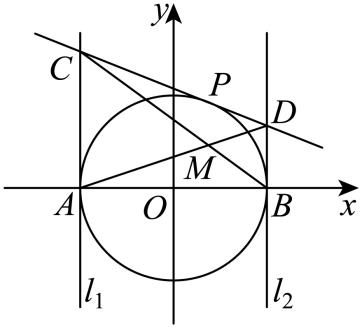

A．B．	C．	D．

【例4】（黑龙江省大庆实验中学实验2024-2025学年高三下学期得分训练（二）T14）已知，从椭圆外一点向椭圆引两条切线，切点分别为，则直线方程为称为点关于椭圆的极线．如图，两个椭圆、的方程分别为和，离心率分别为、，在内，椭圆上的任意一点关于椭圆的极线为．若到的距离为定值1，则取最大值时的值为________．

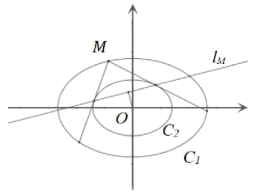

########## 二． 切线方程和切点弦方程求法的书写过程

########## 我们尝试来求椭圆上一点处的切线方程，

########## **法一(参数换元+判别式)：** 令，过点的切线方程为，代入椭圆方程联立得：

########## ，所以，所以，

########## 所以，所以，即．

########## 注意：如果是证明切线方程为，那么可以将，联立方程消除*y*，计算判别式为0．

########## **法二（分类求导）** 当点位于第一或第二象限时，，求导得，当时，，故，代入切线方程得：；

########## 当点位于第三或第四象限时，，求导得

########## ，当时，，故，代入切线方程得：．

########## 注意：如果按照隐函数求导，那么可以一次性解决切线方程问题，但是现行高考开放政策下，这个切线方程已经属于被默认的正确，很多时候我们仅需要一个判别式假装证明过程，即可使用此方程．

########## 我们再来看看切点弦方程，过点作椭圆的两条切线*PA*和*PB*，则切点弦*AB*的方程为：．

########## **【证明】 法一（点差法）** 令，，根据其切线方程可知由于点均在两直线上，故满足，①－②得：，即，再代入的方程得：，同除以得：，故切点弦的方程为：．

########## <strong>法二（同构方程）</strong> 点满足方程，点也满足方程，故<em>A、B</em>均在同构方程上，根据两点确定一直线方程原理，则<em>AB</em>方程为：．

########## 显然，选择同构方程的证法更能体现圆锥曲线的本质，两点确定一直线，两根确定一二次方程，就是二次方程的核心思想。

########## 【例5】过椭圆内一点，做直线与椭圆交于点，作直线与椭圆交于点，过分别作椭圆的切线交于点，过分别作椭圆的切线交于点，求所在的直线方程．

【例6】已知圆有以下性质：①过圆上一点，的圆的切线方程是．②若，为圆外一点，过作圆的两条切线，切点分别为，，则直线的方程为；③若不在坐标轴上的点，为圆外一点，国作圆的两条切线，切点分别为，，则垂直，即，且平分线段．

（1）类比上述有关结论，猜想过椭圆上一点，的切线方程（不要证明），

（2）过椭圆外一点，作两直线，与椭圆相切于，两点，求过，两点的直线方程，

（3）若过椭圆外一点，不在坐标轴上）作两直线，与椭圆相切与，两点，求证为定值，且平分线段．

【例7】（2025·多选·浙江一模）已知椭圆：，直线*l*：.，是椭圆的左、右顶点，，是椭圆的左、右焦点，过直线*l*上任意一点*P*作椭圆的切线*PM*，*PN*，切点分别为*M*，*N*，椭圆上任意一点*Q*（异于，）处的切线分别交，处的切线于点，，则（   ）

A．直线*MN*过定点                            B．，，，四点共圆

C．当时，是线段*MN*的三等分点  D．的最大值为9

########## 三 抛物线切线方程与阿基米德三角形

########## 1.抛物线的切线方程

########## 设在抛物线上任意一点的切线方程为：

########## 证明：点在抛物线上；又求导得；

########## 在点的切线方程为：即

########## 同理，在抛物线上任意一点的切线方程为：

########## 证明：点在抛物线上；又对*y*求导得；

########## 在点的切线方程为：即

【例8】（山西省部分学校2024-2025学年高三下学期4月巩固提升卷T14）已知抛物线的焦点为，过的直线交于两点，抛物线在处的切线为，过作与平行的直线，记与的另一交点为，则的面积的最小值为______．

【例9】（2025·云南曲靖·二模T11）已知，抛物线的焦点为，准线与轴相交于点，过抛物线上异于顶点的一点作的垂线，垂足为点，则（   ）

A．若，则点的坐标为      B．以为直径的圆与轴相切

C．直线与相交与点，若，则的面积为

D．设抛物线在点处的切线为，过原点作的垂线交直线于点．则的取值范围为

【例10】（2025届浙江省杭州第二中学高三模拟预测T11）已知动点，其到直线的距离与其到点的距离相等，设其轨迹为.上有两个关于轴对称的点（在的上方）.记直线的斜率为，坐标原点记为，的外接圆记为．则下列结论正确的是（      ）

A．当时，的面积为     B．

C．的周长大于       D．过点分别作的切线，且与轴交于点，则最小值为24

【例11】（2025·多选·湖南二模）为抛物线上一点，按照如下方式构造与：过点作的切线交轴于，取中点为，过点作的切线，切点为，与轴交于点，与为两个不同的点，为抛物线的焦点，若，则（    ）

A．数列为等比数列      B．数列为等比数列

C．         D．

2.抛物线切线与阿基米德三角形性质与结论

########## **阿基米德三角形：** 圆锥曲线的弦与过弦的端点的两条切线所围成的三角形叫做阿基米德三角形．

########## 抛物线的切线方程完全符合二次曲线的切线方程形式，下面我们来分析一下抛物线的切点弦．

########## 如图，过点作抛物线的两条切线和，则切点弦*AB*的方程为：．

若 $AB$  中点为 $Q,AB$  交 $y$  轴于点 $N\left(m\right),PQ$  交抛物线于点 $M$ , 令 $A\left(y_{1}\right),B\left(y_{2}\right)$ , 则有以下推论: (1) $x_{0}=$  $x_{Q}=x_{M}=\frac{x_{1}+x_{2}}{2};\left(2\right)y_{0}+m=0;\left(3\right)M$  处的切线与 $AB$  平行; $\left(4\right)y_{0}=\frac{x_{1}x_{2}}{2p}$ ;
证明: 因为点 $A\left(y_{1}\right),B\left(y_{2}\right)$  在抛物线上, 所以 $x_{1}^{2}=2py_{1},x_{2}^{2}=2py_{2}$ , 求导得 $y^{'}=\frac{2x}{2p}=\frac{x}{p}$ ;     (求导)
所以点 $A\left(y_{1}\right),B\left(y_{2}\right)$  处的切线方程为: $\left\{\begin{array}{c}y-y_{1}=\frac{x_{1}}{p}\left(x-x_{1}\right)\\y-y_{2}=\frac{x_{2}}{p}\left(x-x_{2}\right)\end{array}\right.$  即 $\left\{\begin{array}{c}xx_{1}=p\left(y+y_{1}\right)\\xx_{2}=p\left(y+y_{2}\right)\end{array}\right.$  上,

########## 由于、交于点，故，所以点均在同构方程上，故切点弦 $AB$  的方程为: $xx_{0}=p\left(y+y_{0}\right)$  ③;                            ( 同构 )

########## 方案一（两点联立式）：切点弦④，对比③④得： $x_{0}=\frac{x_{2}+x_{1}}{2}$  ， $y_{0}=\frac{x_{1}x_{2}}{2p}$  ；

########## 方案二： ②-①得: $x_{0}\left(x_{2}-x_{1}\right)=p\left(y_{2}-y_{1}\right)$ , 即 $x_{0}\left(x_{2}-x_{1}\right)=p\left(\frac{x_{2}^{2}}{2p}-\frac{x_{1}^{2}}{2p}\right)\Rightarrow x_{0}=\frac{x_{2}+x_{1}}{2}$  
即 $x_{Q}=\frac{x_{2}+x_{1}}{2}=x_{0}$ , 所以 $x_{0}=x_{Q}=x_{M}=\frac{x_{1}+x_{2}}{2}$ ，当 $x=0$  时, 代入③得, $y=-y_{0}=m$ ;根据 $AB$  方程可知: $k_{AB}=\frac{x_{0}}{p}$ , 求导可得当 $x=x_{M}=x_{0}$  时, $k=\frac{x_{0}}{p}$ .将点 $P\left(y_{0}\right)$  代入切线方程得: $\frac{x_{2}+x_{1}}{2}x_{1}=p\left(y_{0}+y_{1}\right)\Rightarrow x_{1}x_{2}=2py_{0}\Rightarrow y_{0}=\frac{x_{1}x_{2}}{2p}$  
的阿基米德三角形性质类似，具体书写过程参考例题．

**3.特殊的阿基米德三角形**：过抛物线焦点作抛物线的弦，与抛物线交于、两点，分别过、两点做[抛物线](https://baike.baidu.com/item/%E6%8A%9B%E7%89%A9%E7%BA%BF/3555564)的切线，相交于点．那么阿基米德三角形满足以下特性：

①点必在抛物线的准线上

②为直角三角形，且角为直角

③（即符合射影定理）

另外，对于任意[圆锥曲线](https://baike.baidu.com/item/%E5%9C%86%E9%94%A5%E6%9B%B2%E7%BA%BF/6691222)（[椭圆](https://baike.baidu.com/item/%E6%A4%AD%E5%9C%86/684466)、[双曲线](https://baike.baidu.com/item/%E5%8F%8C%E6%9B%B2%E7%BA%BF/5200393)、[抛物线](https://baike.baidu.com/item/%E6%8A%9B%E7%89%A9%E7%BA%BF/3555564)）均有如下特性：

①过某一焦点做弦与曲线交于、两点，分别过、两点做圆锥曲线的切线，相交于点．那么，必在该焦点所对应的准线上．

②过某准线与轴的交点做弦与曲线交于、两点，分别过、两点做圆锥曲线的切线，相交于点．那么，必在一条垂直于轴的直线上，且该直线过对应的焦点．

【例12】（2025·山西·三模）已知过点的直线交抛物线于，两点，过点，分别作抛物线的切线，两条切线交于点，则的最小值为（   ）

1. B．	C．	D．

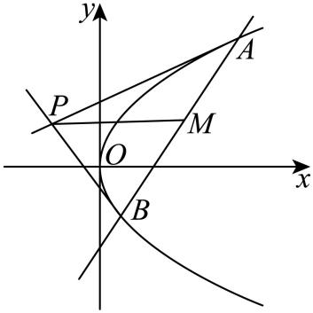

【例13】（2025·多选·四川南充二模）已知抛物线的焦点为*F*，过*x*轴下方一点作抛物线*C*的两条切线，切点为*A*，*B*，直线*PA*，*PB*分别交*x*轴于*M*，*N*两点，则下列结论中正确的是（   ）

A．当点*P*的坐标为时，则直线*AB*方程为

B．若直线*AB*过点*F*，则四边形*PMFN*为矩形

C．当时，

D．时，面积的最大值为4

【例14】（2025·湖南师大附中二模T11）已知*P*为抛物线*C*：上一点，*F*为*C*的焦点，直线*l*的方程为，则下列说法正确的有（    ）

A．若，则

B．点*P*到直线*l*与到直线的距离之和的最小值为2

C．若存在点*P*，使得过点*P*可作两条垂直的直线与圆相切，则*r*的取值范围为

D．过直线*l*上一点*E*（点*E*不在*x*轴上）作抛物线的两条切线，切线分别交*x*轴于点*A*，*B*，外接圆面积的最小值为

########## 四．阿基米德三角形的面积问题

在阿基米德三角形中，根据之前所证可知：点，根据，；底边所在的直线方程为，或者；那么一定有的面积，或者；

【证明】利用面积模型的水平宽乘以铅锤高的一半可知：，当

时，，，故

；或者当时，，故

【例15】（2021•全国乙卷）已知抛物线

的焦点为，且与圆上点的距离的最小值为4．

（1）求；

（2）若点在上，，为的两条切线，，是切点，求面积的最大值．

【例16】（2024•广州二模）已知点是抛物线的焦点，的两条切线交于点，，，是切点．

（1）若，，求直线的方程；

（2）若点在直线上，记的面积为，的面积为，求的最小值；

（3）证明：．

【例17】（2025·多选·黑龙江模拟预测）已知抛物线的焦点为，上不同两点，，以，为切点的切线，相交于点，、、三点共线.下列说法正确的有（   ）

A．最小值为4	B．的最小值为

C．使得的直线有两条	D．

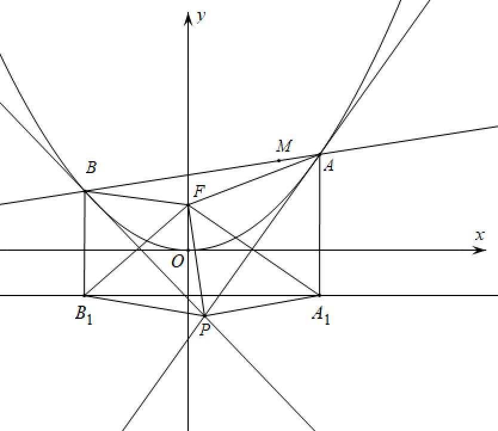

########## 五．新定义下的阿基米德三角形的面积与等比数列      

推论1：如左图，阿基米德三角形中，，分别交轴于点，，则有以下性质：

①，；②，；

③

证明：根据阿基米德三角形的求导、同构可知：，，，

①根据切线方程和，当时，可得：，；

②，

；

③参考阿基米德三角形面积公式：；

推论2：如右图，若为抛物线弧上的动点，点处的切线与分别交于点，则有．

证明：由阿基米德三角形性质可知点的横坐标分别为，

所以，，

所以，同理，故得．

推论3： 若为抛物线弧上的动点，抛物线在点处的切线与阿基米德的边分别交于点，令，，则有、、、成等比数列．

证明：设，则，即，同理，故、、、成公比为的等比数列．

推论4： ．

########## 证明：法一 因为，所以，

所以，即，所以．

法二：如图，根据，分别作*y*轴平行线*PQ*和*EF*分别交*CD*和*AB*于*Q*和*F*，根据面积模型之水平宽和铅锤高乘积一半可知：，，故只需证明，

根据，当得：，；

由于，当得：，，命题得证．

注意：推论2，推论3和推论4的证法一更加适合做小题，解答大题时需要的是推论1和推论4的证法二，无需记忆结论，只要按照模型走下去，结合之前的阿基米德三角形结论即可．

【例18】（2024•苏州模拟）过抛物线外一点作抛物线的两条切线，切点分别为，，我们称为抛物线的阿基米德三角形，弦与抛物线所围成的封闭图形称为相应的“囧边形”，且已知“囧边形”的面积恰为相应阿基米德三角形面积的三分之二．如图，点是圆上的动点，是抛物线的阿基米德三角形，是抛物线的焦点，且．

（1）求抛物线的方程；

（2）利用题给的结论，求图中“囧边形”面积的取值范围；

（3）设是“囧边形”的抛物线弧上的任意一动点（异于，两点），过作抛物线的切线交阿基米德三角形的两切线边，于，，证明：．

########## 【例19】（2024•深圳市期末）给出如下的定义和定理：

定义：若直线与抛物线有且仅有一个公共点，且与的对称轴不平行，则称直线与抛物线相切，公共点称为切点．

定理：过抛物线上一点，处的切线方程为．

完成下述问题：

如图所示，设、是抛物线上两点．过点、分别作抛物线的两条切线、，直线、交于点，点、分别在线段、的延长线上，且满足，其中．

（1）若点、的纵坐标分别为、，用、和表示点的坐标；

（2）证明：直线与抛物线相切；

（3）设直线与抛物线相切于点，求．

【例20】（2024•江西模拟）已知抛物线，点，在抛物线上．

（1）证明：以为切点的的切线的斜率为；

（2）过外一点（不在轴上）作的切线、，点、为切点，作平行于的切线（切点为，点、分别是与、的交点（如图）．

若直线与的交点为，证明：是的中点；

设面积为，若将由过外一点的两条切线及第三条切线（平行于两切线切点的连线）围成的三角形叫做“切线三角形”，如△．再由点、确定的切线△，△，并依这样的方法不断作1，2，4，，个切线三角形，证明：这些“切线三角形”的面积之和小于．

第二节 左边旋转与曲线转换

一．向量旋转公式与图像转化：已知对任意平面向量，把绕其起点沿逆时针方向旋转角得到向量，叫做把点绕点逆时针方向旋转角得到点.

逆时针旋转45°：，通常将等轴双曲线转化为反比例函数，

【例1】（2025上海卷第15题）已知，*C*在上，则的面积（   ）

A．有最大值，但没有最小值	B．没有最大值，但有最小值

C．既有最大值，也有最小值	D．既没有最大值，也没有最小值

【例2】（2025·多选·高三专题练习）椭圆与正方形是常见的几何图形，具有对称美感，受到设计师的青睐．现有一工艺品，其图案如图所示：基本图形由正方形和内嵌其中的“斜椭圆”组成（“斜椭圆”和正方形的四边各恰有一个公共点）．在平面直角坐标系中，将标准椭圆绕着对称中心旋转一定角度，即得“斜椭圆”：，点是斜椭圆上的点，为过斜椭圆中心的弦，且满足，其中为坐标原点，则（    ）

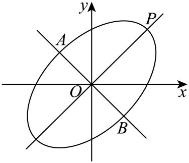

A．该斜椭圆的长轴长为             B．该斜椭圆的离心率为

C．当点在上时，    D．

【例3】（24-25北京高三上·阶段练习）已知是平面直角坐标系中的点集.设是中两点间的距离的最大值，*S*是表示的图形的面积，则（   ）

A．，	B．，

C．，	D．，

【例4】（2025·多选·山东淄博三模）旋转变换是原图上所有的点都绕一个固定的点朝同一方向，转动同一个角度.例如， 对任意平面向量，把 绕起点 沿逆时针方向旋转角得到向量  ，这一过程叫做把点绕点逆时针方向旋转  角得到点 .已知椭圆 ，绕坐标原点逆时针旋转得到斜椭圆  ，则下列结论正确的是:（    ）

A．已知点  ，点  ，把点绕点逆时针旋转  得到点

B．斜椭圆  的离心率是

C．斜椭圆  方程是

D．过斜椭圆  在第一象限内的焦点作斜率为  的直线，与斜椭圆交于点  ，则

【例5】（2025·江西南昌·二模）将双曲线绕其中心旋转一个合适的角度，可以得到一些熟悉的函数图象，比如反比例函数，“对勾”函数，“飘带”函数等等，它们的图象都能由某条双曲线绕原点旋转而得.现将双曲线绕原点旋转一个合适的角度，得到“飘带”函数的图象，则双曲线的离心率为（    ）

A．	B．	C．	D．

二．等轴双曲线与反比例函数转化

如图，和分别是反比例函数（等轴双曲线）上的两点，则AB的两点对合式方程为：.

证明：由于，故，即.

【例6】（25·多选·河南高三下开学考试）已知双曲线，点在上，*k*为常数且. 按照如下方式依次构造点：过作斜率为*k*的直线与的左支交于点，令为关于*y*轴的对称点. 记的坐标为. 下列结论正确的是（   ）

A．当时，                B．当时，

C．数列是公比为的等比数列D．设为的面积，则对任意正整数*n*，

【例7】（2025·多选·山东青岛一模）在平面直角坐标系中，为坐标原点，直线、的方程分别为、，过点作、的垂线，垂足分别为、，四边形的面积为，点的轨迹为曲线.则（    ）

A．圆与没有公共点

B．曲线与没有公共点

C．上存在三点、、，使得为等边三角形

D．在点处的切线与、分别交于、两点，则的面积为定值

三．非等轴双曲线的仿射换元

由于，令，则，由于逆时针旋转后得到点，逆时针旋转后得到点，所以变换是将原来横坐标和纵坐标缩小倍后逆时针旋转得来。

综上，双曲线都可以转化为反比例或者对勾函数，当时，按照旋转都能得出反比例，当时，旋转后会得到对勾或者飘带函数。按照换元法，就需要先对坐标进行伸缩变换，如下：

，令，则此变换是将原来横坐标和纵坐标分别缩小倍和后逆时针旋转得来，新坐标方程为。

【例8】（2025·江苏苏州·模拟预测）在平面直角坐标系中，已知双曲线的左顶点为，异于的点在渐近线上，直线与的右支交于点，定义.若是渐近线上异于的三个点，为中点，且直线均与的右支相交，则与的大小关系为（    ）

A．   B．

C．   D．无法确定

########## 四． 退化二次曲线中点点差法

########## **1.中点弦存在定理**

########## **①在椭圆中，只需要AB中点在椭圆内，即；**

########## **②在双曲线中，一定有①或；②**

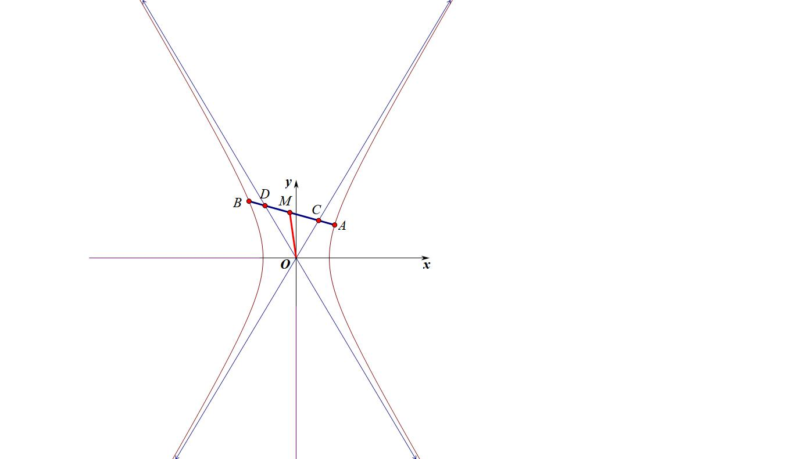

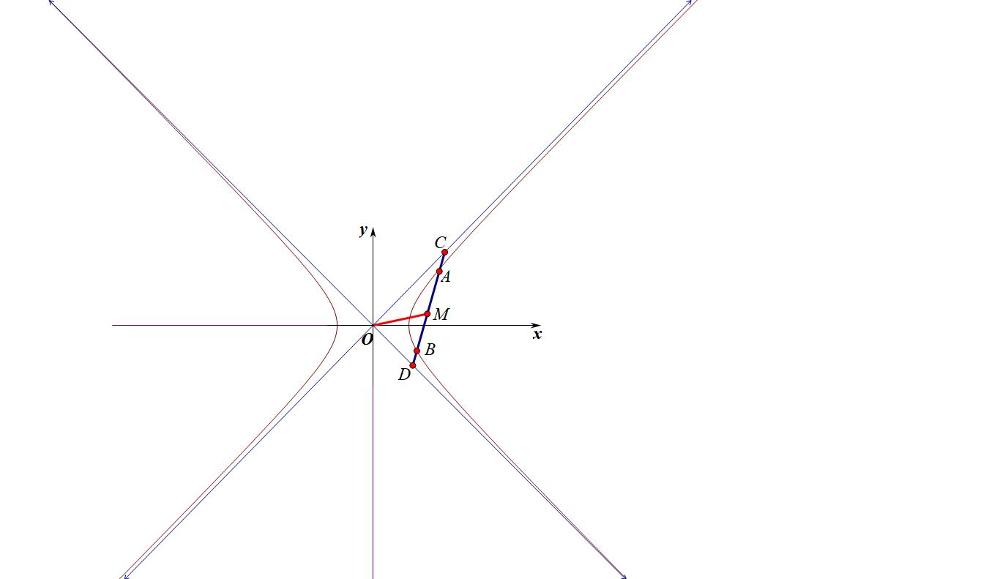

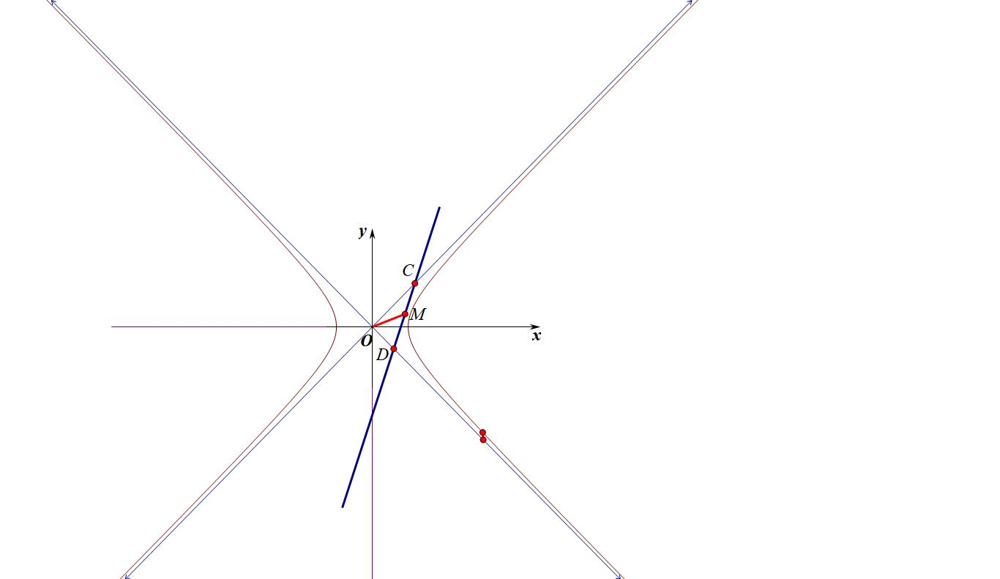

########## 椭圆的中点弦存在定理很好理解，关于双曲线，这里存在一个共中点定理，就是弦AB与双曲线渐近线交于CD两点，既是AB中点，又是CD中点，证明过程可以用直曲联立，也可以用点差法，我们本讲只介绍点差法，如下：

##########  令，由于渐近线方程为，根据曲线与方程的思想，我们可以把两条渐近线上点的集合统一为方程，即，此时*CD*一定满足，两式相减可得，，由于A、B、C、D四点共线，故既是AB中点，又是CD中点.

##########  所以双曲线的中点弦本质来自于渐近线，即OM斜率绝对值大于渐近线斜率绝对值时，AB斜率一定小于渐近线斜率的绝对值，其实按照数字逻辑也很好理解，其实中点弦问题就可以转化为弦AB与渐近线和双曲线均有两个交点，如果**（左图）**，或者时**，** 此时弦AB与渐近线有两个交点，也与双曲线有两个交点，此时一定成立；当**（中图），或者仅需**时，由于在双曲线内部，此时弦AB与渐近线有两个交点，也与双曲线有两个交点，此时一定成立；当或者仅需**（右图）** 时，此时弦与渐近线有CD两个交点，但与双曲线并没有两个交点，此时不存在这样的中点弦。

########## 综上，双曲线的中点弦本质就是中点的位置，当*M*位于双曲线和渐近线中间的区域时，一定不存在以*M*为中点的弦。

【例9】（2023•乙卷）设，为双曲线上两点，下列四个点中，可为线段中点的是

A．	B．	C．	D．

【例10】（2024•广州越秀区期末）已知双曲线，若双曲线不存在以点为中点的弦，则双曲线离心率的取值范围是

A．，	B．，	C．，	D．，

**2．双曲线弦与渐近线弦共中点类型**

**定理：** 如左图，作双曲线割线CD并交渐近线于，两点，则.我们也给出以下推论：若M是CD中点，则一定也是AB中点，反之亦然;

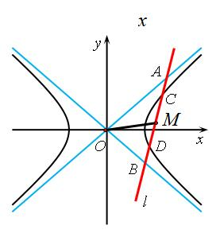

证明：法一：设直线为，代入双曲线方程得：

代入双曲线渐近线的退化二次曲线方程得：，所以AB中点坐标和CD中点坐标重合，所以,.

法二：设, *AB*与双曲线交于和，，，先进行双曲线中点等差法，，两式相减可得：，，

再进行渐近线退化二次曲线点差，，两式相减可得：，所以，，所以,.

【例11】（2025届重庆市南开中学高三第八次质量检测T8）已知双曲线，倾斜角为的直线与的渐近线交于两点在第一象限，在第四象限)，线段的中点为为坐标原点，直线与的一个交点为．则双曲线的离心率为（    ）

A．	B．	C．	D．3

【例12】（2025·多选·吉林长春模拟预测）已知双曲线，直线*m*与双曲线的右支交于点*A*，*B*（*A*在*x*轴上方），与双曲线的两条渐近线交于点*M*，*N*（*M*在*x*轴上方），*O*为坐标原点．当直线*m*的斜率存在时，下列结论中正确的是（ ）

A．恒成立                      B．的面积的最小值为1

C．若，则  D．若，则的面积为定值

【例13】（2022新高考II卷）设双曲线,右焦点为,渐近线方程为，

1. 求的方程

（2）过的直线与的两条渐近线分别交于，两点，点，在上，且，，过且斜率为的直线与过且斜率为的直线交于点.请从下面①②③中选取两个作为条件，证明另一个条件成立：

①在上；②；③.

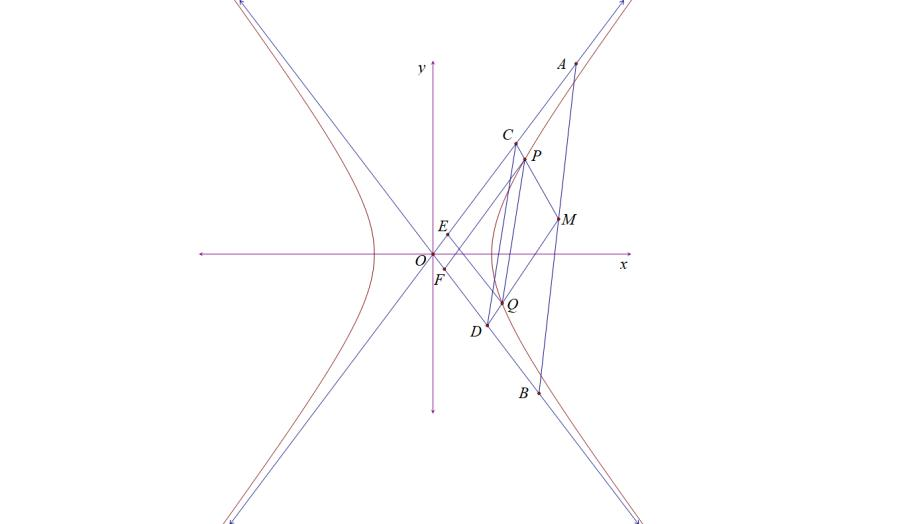

五．渐近切线三角形面积与向量积问题

**定理：过双曲线上一点，作双曲线的切线交两渐近线于、两点，则称△AOB为双曲线的切线渐近三角形，双曲线的切线渐近三角形有如下性质：**

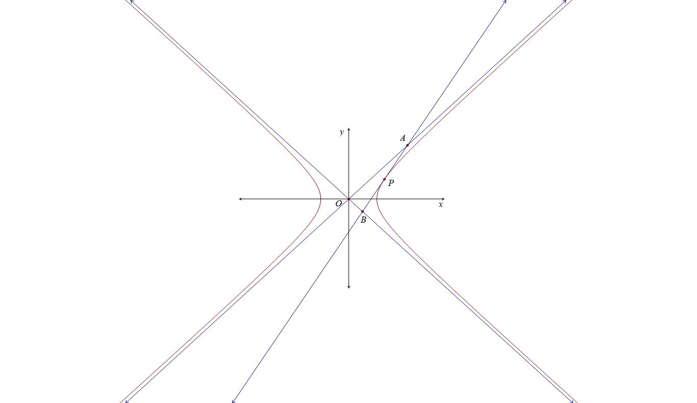

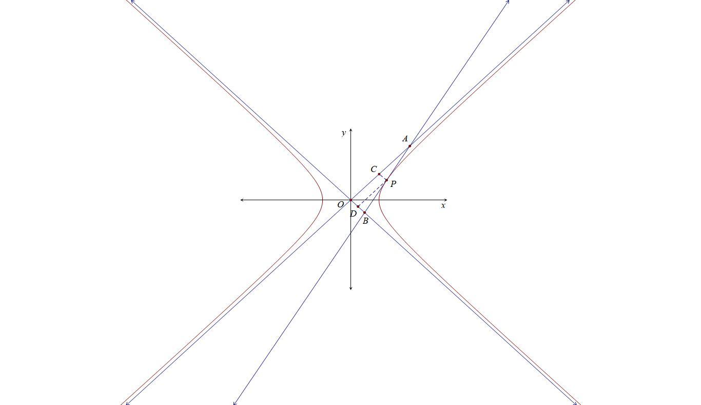

(1) 点*P*处的切线方程为，即 ．

(2) 点*P*是线段*AB*的中点，即．

(3) ①渐近三角形的面积为定值，即；②，；

证明：（1）和（2）都可以按照中点弦的极限原理理解，比较好记忆，关于（3）我们仅仅需要过P作两渐近线的平行线交于C、D两点，易知，同理，；

【例14】（2025·多选·江西模拟预测）已知双曲线，点为双曲线右支上的一个动点，过点且与双曲线相切的直线分别与两条渐近线交于，两点，过点且与直线垂直的垂线分别与两坐标轴交于，两点．下列说法正确的是（    ）

A．中点的轨迹是抛物线  B．的面积是定值

C．              D．四边形为正方形

【例15】（2024•多选•杭州期末）如图，过曲线右支上一点作双曲线的切线分别交两渐近线于、两点，交轴于点，，分别为双曲线的左、右焦点，为坐标原点，则下列结论正确的是

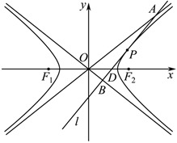

A．      	B．	      C．

D．若存在点，使，且，则双曲线的离心率

【例16】（2024•多选•河北模拟）已知双曲线，其上、下焦点分别为，，为坐标原点．过双曲线上一点，作直线，分别与双曲线的渐近线交于，两点，且点为中点，则下列说法正确的是

A．若轴，则	        B．若点的坐标为，则直线的斜率为

C．直线的方程为	D．若双曲线的离心率为，则三角形的面积为2

- 圆锥曲线之间的交点

2025年圆锥曲线小题难度大一点的就是一卷第10题的抛物线焦点弦模型和天津卷第9题，而这个题涉及到了双曲线和抛物线混合（参考本书第一章第二节例1），我们最优解法是焦半径公式，利用第二定义解决，本讲将一些圆锥曲线之间综合的问题进行呈现，也是大家需要摸清楚的方向。

- 由定义和交点坐标构造的混合型

【例1】（2025高三·全国·专题练习）将抛物线向右平移至顶点与双曲线的右顶点重合，若平移后的抛物线在双曲线右支的内部（包含公共交点），则双曲线的离心率的取值范围是（    ）

A．	B．	C．	D．

【例2】（2023·天津和平·三模）双曲线与抛物线交于，两点，若抛物线与双曲线的两条渐近线分别交于两点，（点，均异于原点），且与分别过，的焦点，则（    ）

A．	B．	C．	D．

【例3】（2025·四川凉山·三模T8）已知，，曲线与曲线无公共点，则曲线的离心率的取值范围为（   ）

A．	B．	C．	D．

【例4】（2025·江西宜春二模）已知椭圆的左右焦点分别为，，且该椭圆与抛物线相交于不同的两点，，且四边形的外接圆直径为，若，则该椭圆的离心率的取值范围是________.

【例5】（2025高三专题练习）若抛物线的焦点与椭圆的右焦点重合，设为抛物线与椭圆的两个交点，且抛物线在点的切线过椭圆的左焦点，则椭圆的离心率为______．

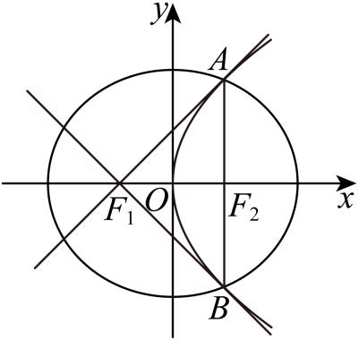

【例6】（24-25重庆高三下阶段练习）抛物线与椭圆有相同的焦点，分别是椭圆的上、下焦点，是椭圆上的任一点，是的内心，交轴于，且，点是抛物线上在第一象限的点，且在该点处的切线与轴的交点为，若，则__________．

【例7】（2025·天津河东二模）已知双曲线的右焦点与抛物线的焦点重合，过的直线与双曲线的一条渐近线垂直且交于点，的延长线与抛物线的准线交于点*B*，，的面积为，*O*为原点，双曲线的方程为（    ）

A．	B．

C．	D．

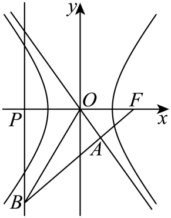

【例8】（2025·多选·山东滨州二模）已知是双曲线的左、右焦点、抛物线的焦点与双曲线的右焦点重合．且是双曲线与抛物线的一个公共点．若是等腰三角形，则双曲线的离心率为（   ）

1. B．	C．	D．

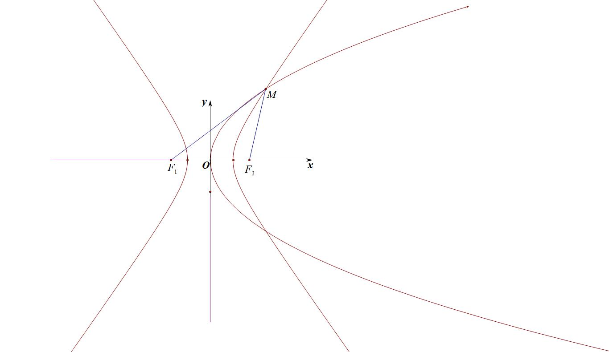

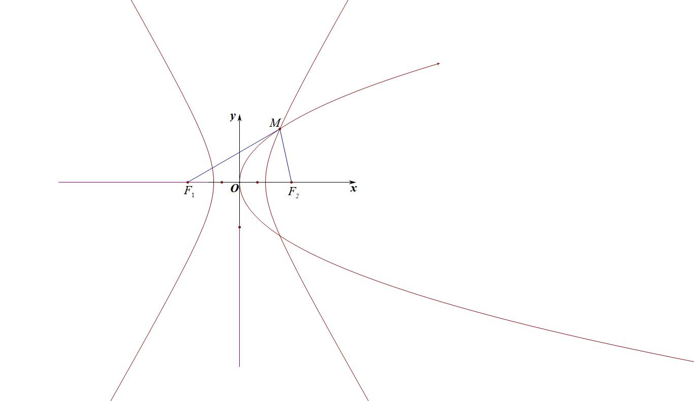

- 由斜率关系和共焦点构造的混合型

【例9】（24-25江苏常州高三下阶段练习）已知椭圆的短轴长为4，上顶点为 <em>B</em> ，<em>O</em>为坐标原点，点<em>D</em>为<em>OB</em>的中点，曲线的左、右焦点分别与椭圆 <em>C</em> 的左、右顶点重合，点<em>P</em>是双曲线<em>E</em>与椭圆<em>C</em>在第一象限的交点，且三点共线，直线的斜率，则双曲线<em>E</em>的实轴长为__________.

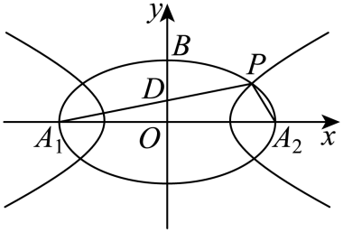

【例10】（24-25·高三上安徽蚌埠期末）已知椭圆与双曲线有相同的焦点，，点是与的交点．记椭圆在点<em>P</em>处的切线为直线<em>m</em>，双曲线在点<em>P</em>处的切线为直线<em>n</em>，的平分线与<em>m</em>，<em>n</em>分别相交于点<em>M</em>，<em>N</em>，则______．

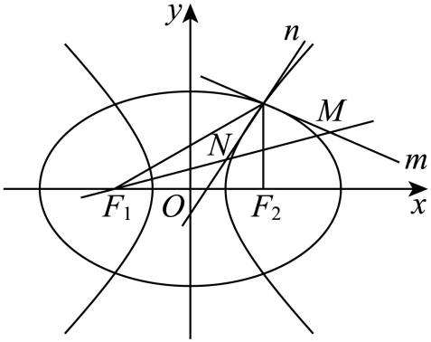

【例11】（24-25·多选·河北沧州高三上期末）椭圆与双曲线有共同的左焦点和右焦点，与离心率分别为，，它们在第一象限的交点为*P*（*O*为坐标原点），圆是的内切圆，过点*P*且与直线垂直的直线与交于，则（    ）

A.当时，     B．当时，

C．

D．过右焦点分别作直线，的垂线，垂足分别为*M*，*N*，则

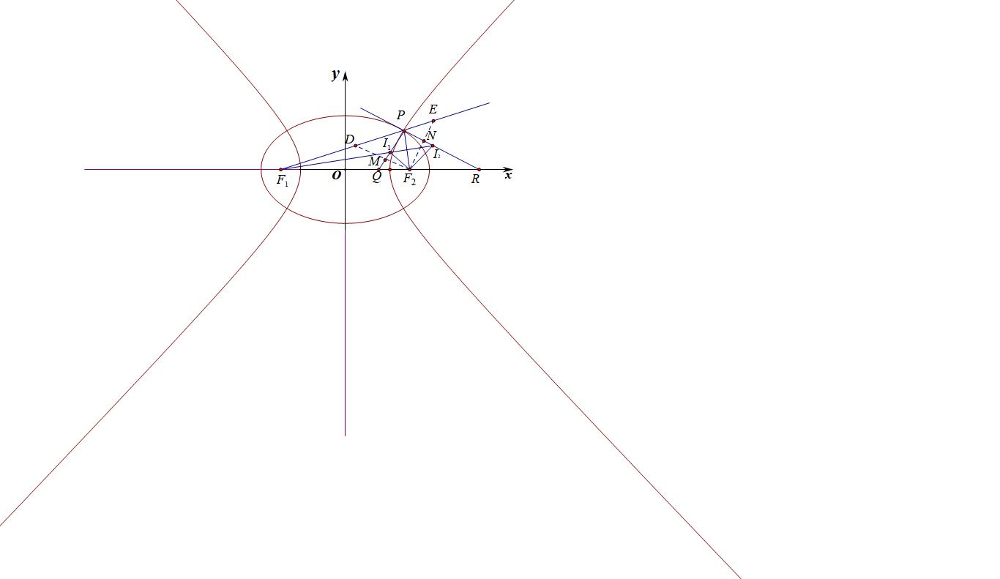

【例12】（2025•江西南昌模拟）如图，已知椭圆和双曲线具有相同的焦点，，、、、是它们的公共点，且都在圆上，直线与轴交于点，直线与双曲线交于点，记直线、的斜率分别为、，若椭圆的离心率为，则的值为

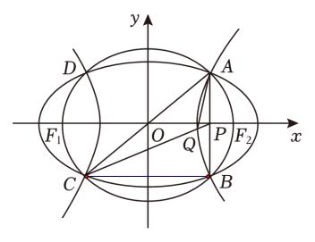

A．2	B．	C．	D．4

- 由斜率关系和中点弦构造的混合型

【例13】（2009高二全国·竞赛）设点为椭圆和双曲线的公共顶点，点分别是双曲线和椭圆上不同于的两动点，且满足（且）．设的斜率分别为，则的值为（    ）．

A．0	B．	C．	D．

【例14】（2025•浙江期中）已知双曲线，斜率为的直线与曲线的两条渐近线分别交于，两点，点的坐标为，直线，分别与渐近线交于，，若直线的斜率也为，则双曲线的离心率为 <u>　  　</u>．

【例15】（2025广东省中学生数学奥林匹克竞赛一试第9题）已知双曲线 ,斜率为的直线与的左右两支分别交于两点,点不在上,直线分别交于另一点  ,若,则的离心率为\_\_\_\_\_ .

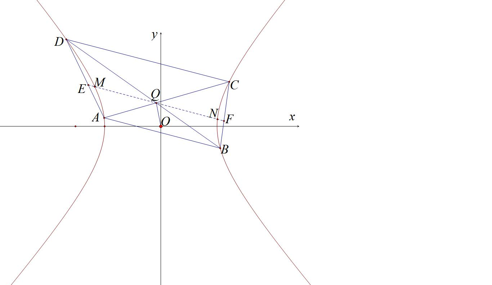

- 由圆锥曲线和三角代入计算的混合型

【例16】（2025·黑龙江哈尔滨三模T11）已知为坐标原点，椭圆的长轴长为4，离心率为，过抛物线的焦点作直线交抛物线于两点，连接并分别延长交椭圆于两点，则下列结论正确的是（    ）

A．若，则

B．若直线的斜率分别为，则

C．若抛物线的准线与轴交于点，直线的倾斜角为，则

D．的最小值为

【例17】（重庆市西南大学附属中学校2024-2025学年高三下学期全真模拟T14）已知函数，若存在实数使得函数图象上的最低点或最高点恰有2个在椭圆的内部（包含边界），则的取值范围是_______.

【例18】（浙江省部分学校2024-2025学年高三下学期5月联考数学试题）抛物线的准线为，焦点为，两点均在上，均为第一象限角，为线段上一点，则（   ）

A．,斜率之积为

B．若*P*为中点，则*P*到的距离为

C．存在实数*m*，使得在抛物线上

D．存在，使得为等腰三角形

