第八章 联立计算高阶篇

我们在前面篇幅重点解读了斜率语言坐标化的点差法，坐标语言坐标化的定比点差法，斜率语言斜率化的齐次化方程，坐标语言斜率化的斜率同构，每一种方法，都在一个相对特定的范畴内发挥着巨大的优势，比如切线看同构，斜率和积看齐次化，轴点弦看定比点差。本章我们介绍特殊联立，以长度联立的参数方程，以单动点构造椭圆双曲线特征的三角参数换元，以坐标旋转为特征的复数变换，以两曲线交点联立的曲线系.

- 长度参数引入与直线参数方程

########## 一．直线的参数方程形式与性质

########## 直线：经过点，倾斜角为的直线的参数方程是（为参数）．

########## 注意：1．在直线的参数方程(*t*为参数)中的几何意义是表示在直线上过定点

########## 与直线上的任一点构成的有向线段的模，且在直线上任意两点、的距离为．

########## 2．若直线与已知二次曲线相交于、两点时*，* 则将此直线代入二次曲线，得到两根和*，* 则*．*

########## 3．定点<em>P</em>0是线段的中点可得；设线段中点为，则点对应的参数值(由此可求及中点坐标)．

########## 注意：这里的参数不一定是正数，关于，如左图所示，当位于线段外时，和同号（可以都为负），当位于线段内时，和异号（一正一负）.这也是为什么，老教材区分了参数方程和极坐标，新教材虽然没有参数方程的篇章，但是三角换元这种思想一直存在于任何高考体系里，并且考场中直接用参数方程换元，是不会被扣分的.

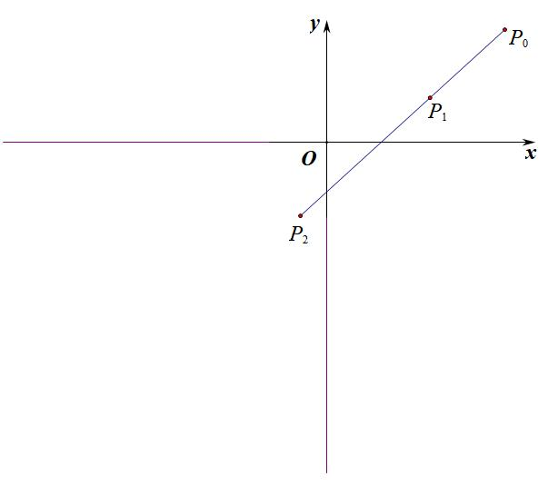

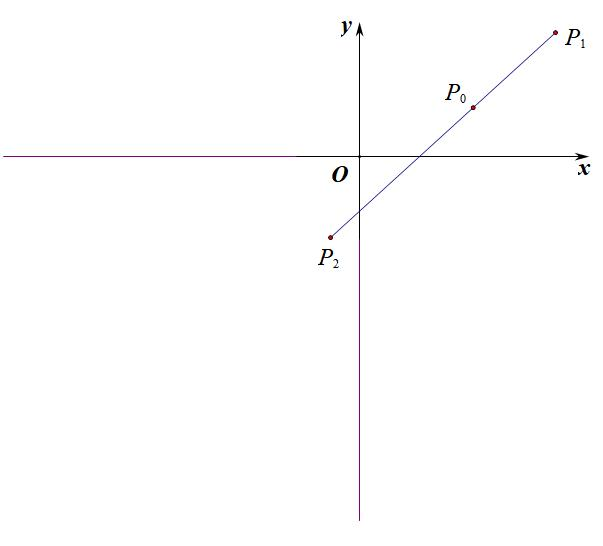

【例1】（2021•新课标2卷）已知椭圆C的方程为，右焦点为，且离心率为．

（1）求椭圆C的方程；

（2）设*M*、*N*是椭圆*C*上的两点，直线*MN*与曲线相切．证明：*M、N、F*三点共线的充要条件是*．*

【例2】(2022•新高考Ⅰ卷)已知在双曲线上,直线交于、两点,直线,斜率之和为0.
(1)求的斜率;
(2)若.求面积.

二 直线参数方程与四点共圆

【例3】（2021•新高考Ⅰ卷）在平面直角坐标系中，已知点，，点满足．记的轨迹为．

（1）求的方程；

（2）设点在直线上，过的两条直线分别交于，两点和，两点，且

，求直线的斜率与直线的斜率之和．

注意：四点共圆一定满足相交弦定理或者切割线定理，一定能得出

**补充：圆幂定理**

①**相交弦定理**：圆内的两条相交弦与交于，则（左图）．

②<strong>切割线定理</strong>：从圆外一点<em>P</em>引圆的切线<em>PA</em>和割线交圆于<em>B、C</em>两点，则（中图）．

③<strong>割线定理</strong>：从圆外一点<em>P</em>引两条割线与圆分别交于<em>A</em>、<em>B</em>和<em>C</em>、<em>D</em>，则（右图）．

三 参数方程破解类圆幂定理

在圆的切线长定理当中，存在，当这个问题出现在椭圆当中，则满足类圆幂定理，确定的数值.

【例4】（2016•四川）已知椭圆的两个焦点与短轴的一个端点是直角三角形的3个顶点，直线与椭圆有且只有一个公共点．

（1）求椭圆的方程及点的坐标；

（2）设是坐标原点，直线平行于，与椭圆交于不同的两点、，且与直线交于点．证明：存在常数，使得，并求的值．

【例5】（2024•山西期末）已知抛物线，直线与抛物线有且只有一个公共点．

（1）求抛物线的方程以及点坐标；

（2）设为坐标原点，直线平行于与交于不同的两点，，且与直线交于点，是否存在常数，使得？若存在，求出的值，若不存在，请说明理由．

########## 四  参数方程解决与共线分弦定点定值

性质1　已知圆锥曲线的椭圆（双曲线）半通径为，（代表焦准距）抛物线半通径为，在焦点所在的对称轴上，必定存在定点*M*，过定点*M*的弦为*PQ*，则，此时*M*必为焦点．

<strong>证明</strong>　（1）设定点<em>M</em>为，直线<em>PQ</em>的参数方程为（<em>t</em>是参数），将直线<em>PQ</em>方程代入椭圆联立：，设此方程的两个根分别为，

########## 则，．

########## ，当且仅当，即时，．（双曲线大家可以自己去尝试）

########## （2）将直线*PQ*方程代入抛物线联立：，设此方程的两个根分别为，则，．因此，，欲使得为定值，则必有，进而可得定值为．

########## 性质2 若圆锥曲线的离心率为*e*，焦准距为*p*，在长轴（实轴）所在的对称轴上，必定存在定点*M*，过*M*的弦为*PQ*，满足．

########## （1）对于椭圆，过定点的弦为*PQ*，则．

########## （2）对于双曲线，过定点的弦为*PQ*，则．

########## （3）对于抛物线，过定点的弦为*PQ*，则．

########## 证明　由于前面模型用了椭圆来证明，故本模型我们证明一下双曲线和抛物线．

########## （2）设定点*M*为，直线*PQ*的参数方程为（*t*是参数），代入双曲线方程联立得：

########## 则，．

########## ，

########## 当，即（这里一定要满足，否则此方程无解），此时．

########## （3）将直线*PQ*参数方程与抛物线的方程进行联立：，设此方程的两个根分别为，则，．

########## ，当且仅当时，（为定值）．

【例6】（2024•山西期末）已知椭圆的一个顶点为，离心率为，过点的直线与椭圆交于不同的两点、．

（1）求椭圆的方程；

（2）当的面积为时，求直线的方程；

（3）若存在实数，使得成立，求实数的取值范围．

########## 【例7】（2024•河北月考）已知抛物线，点在*x*轴的正半轴上，过*M*的直线与*C*相交于*A*、*B*两点，*O*为坐标原点．

########## （1）若，且直线的斜率为1，求以*AB*为直径的圆的方程;

########## （2）问是否存在定点*M*，不论直线绕点*M*如何转动，使得恒为定值．

########## 五 对称轴上任意点分弦平方和成定值问题

已知在椭圆的焦点所在的对称轴上任取一点*M*，过点*M*的弦为*PQ，* 必定存在斜率，使得为定值．

<strong>证明</strong> 设点<em>M</em>为，直线<em>PQ</em>的参数方程为(<em>t</em>是参数)，将直线<em>PQ</em>方程代入椭圆联立：，设此方程的两个根分别为，

则，．

要使为定值，则代数式与无关，只需，此时，结合等比定理可得：（定值）．

注意：双曲线和抛物线没有此性质．

【例8】（2024•昆明期中）已知椭圆的离心率为，，分别是椭圆的左，右焦点，是椭圆上一点，且△的周长是6．

（1）求椭圆的方程；

（2）设斜率为的直线交轴于点，交曲线于，两点，是否存在使得为定值，若存在，求出的值；若不存在，请说明理由．

- 圆锥曲线参数方程

########## 我们来看一下圆锥曲线的参数方程，就是把圆锥曲线上的点进行参数换元，达到简化计算的效果.

########## 一．圆锥曲线参数换元形式

########## 1、圆：以为圆心，为半径的圆的参数方程是，其中是参数．当圆心在时，方程为．注意：圆的参数方程换元，代表倾斜角．

########## 2、椭圆：中心在原点，坐标轴为对称轴的椭圆的参数方程有以下两种情况：

########## （1）椭圆的参数方程是，其中是参数．

########## （2）椭圆的参数方程是，其中是参数．

########## 注意：椭圆的参数方程换元，不代表倾斜角．

########## 3、双曲线：中心在原点，坐标轴为对称轴的椭圆的参数方程有以下两种情况：

########## （1）椭圆的参数方程是，其中是参数．

########## （2）椭圆的参数方程是，其中是参数．

########## 二  单动点三角换元解决二次曲线上的距离问题

通过三角换元后，我们能得到一个三角的二次函数，在求最值的时候，要注意一点，就是二次函数的轴和区间问题，即对称轴在区间内，最值在顶点，当轴在区间外，则最值出现在端点.

【例1】（2021•乙卷）设是椭圆的上顶点，点在上，则的最大值为（    ）

A．	B．            C．	D．2

【例2】（2021•乙卷）设是椭圆的上顶点，若上的任意一点都满足，则的离心率的取值范围是（    ）

A．，	B．，	C．，	D．，

【例3】（2025•广西月考）已知动点在椭圆上，动点在直线上，则的最小值为（    ）

1. B．	C．	D．

【例4】（2025•河南模拟）设，分别为圆和椭圆上的点，则，两点间的最短距离是（    ）

A．	B．              C．	D．

三．隐藏的轨迹方程与单动点三角换元

【例5】【2025新课标1卷18题】设椭圆 ,记为椭圆下端点,为右端点,

,且椭圆的离心率为

(1)求椭圆的方程；

(2)设点

(i) 设是射线上一点,,求的坐标(用表示);

(ii)设直线的斜率为 ,直线的斜率为,若为椭圆上一点,求的最大值

【例6】（2017•山东）在平面直角坐标系中，已知椭圆的离心率为，椭圆截直线所得线段的长度为．

（1）求椭圆的方程；

（2）动直线交椭圆于，两点，交轴于点．点是关于的对称点，的半径为．设为的中点，，与分别相切于点，，求的最小值．

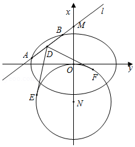

注意：中点弦的轨迹方程，在上一章已经介绍，就是椭圆的中点弦+定点的轨迹方程也是一个小椭圆，这一点是解决此题的关键，参数方程就是构造了三角函数进行简化的处理结果.

四． 三角换元破解切线单动点

########## 我们先来了解一下切线方程.

########## **定理一** 在圆锥曲线方程中，点是曲线上的任意一点，以替换，以替换，以替换 ，以替换，即可得到点的切线方程．已知圆锥曲线，则点处的切线方程为：．

########## 我们尝试来求椭圆上一点处的切线方程，令，过点的切线方程为，代入椭圆方程联立得：

########## ，所以，所以，

########## 所以，所以，即．

1. 椭圆的切线参数方程：；
2. 双曲线的切线参数方程：

【例7】【2025北京卷】已知椭圆的离心率为,椭圆上的点到两焦点距离之和为4

(1)求椭圆的方程；

(2)设为坐标原点,为椭圆上一点,直线与直线交于点与的面积为;比较与的大小.

【例8】（2025天津卷18题）已知椭圆的左焦点为*F*，右顶点为*A*，*P*为上一点，且直线的斜率为，的面积为，离心率为.

(1)求椭圆的方程；

(2)过点*P*的直线与椭圆有唯一交点*B*（异于点*A*），求证：*PF*平分.

【例9】（2021•天津）已知椭圆中，，其上顶点为，右焦点为，且．

（1）求椭圆的方程；

（2）若直线与椭圆有唯一交点，与轴正半轴交于点，过作的垂线，交轴于点，已知，求直线的方程．

【例10】(2022 天津卷)椭圆离心率为，直线与椭圆有唯一公共点，与轴交于点异于，记为原点，若，且△面积为，求椭圆方程 .

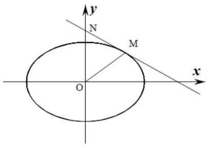

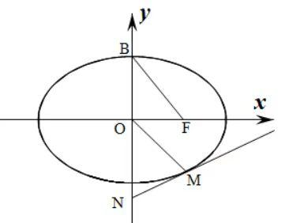

五．万能三角代换与顶点弦速解

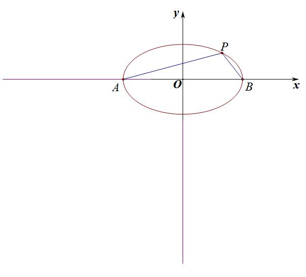

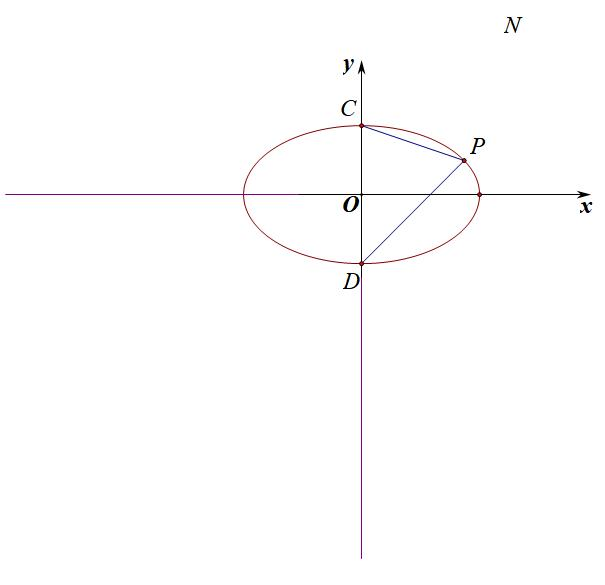

########## 椭圆：，双曲线：，不妨令，

##########      通常单个动点在圆锥曲线上，用参数换元连接四个顶点是能大大简化计算的.以椭圆为例，

########## ，，计算量瞬间被简化.同理，关于上下顶点，，，

########## 记忆方法：将作为第一象限角，则，显然，所以左乘右除，左正右负，，；上负下正，上小下大，，；

##########       同理，双曲线，；

########## 【例11】(2013江西文)椭圆：（）的离心率为，.

（1）求椭圆的方程；

（2）如图，，，是椭圆的顶点，是椭圆上除顶点外的任意点，直线交轴于*N*直线交于点，设的斜率为，的斜率为，证明为为定值.

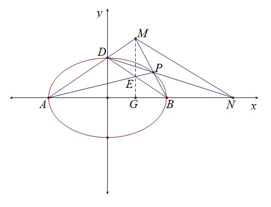

【例12】（2023•北京）已知椭圆的离心率为，、分别为的上、下顶点，、分别为的左、右顶点，．

（1）求的方程；

（2）点为第一象限内上的一个动点，直线与直线交于点，直线与直线交于点．求证：．

########## 第三节  复数旋转变换

########## 一 复数的模与辐角表示圆锥曲线方程

设是平面内任意一点，它的直角坐标是，转化为复平面，，可以得出它们之间的关系：，．又可得到关系式：，．这就是复平面坐标与直角坐标的互化公式．

由于新教材删除了原来的极坐标和参数方程内容，故我们在上一讲介绍了三角代换，由于2019版本的人教*A*版教材介绍了复数的三角形式，虽然加了\*号，但是也在另一个层面提示我们一些涉及坐标变换的，尤其是旋转类型的题，完全可以利用复数的三角形式来解决.

二 .复数变换处理平行问题

平行问题，则相等，抓住这一点，能简化很多问题．根据复平面坐标与直角坐标的转换关系：，椭圆：；

双曲线：；

【例1】（2021•佛山模拟）已知椭圆*C*：的某三个顶点形成边长为2的正三角形，

*O*为*C*的中心．

（1）求椭圆*C*的方程；

（2）*P*在*C*上，过*C*的左焦点*F*且平行于*OP*的直线与*C*交于*A*，*B*两点，是否存在常数，使得？若存在，求出的值；若不存在，说明理由．

【例2】（2023•安徽模拟）已知椭圆的离心率为，左右顶点分别为，，为椭圆上一点，面积的最大值为．

（1）求椭圆的方程；

（2）当点不为椭圆的顶点时，设直线与轴交于点，过原点作直线的平行线且与椭圆交于点，问是否存在常数使得成立？若存在，求出常数；若不存在，说明理由．

三  复数代换下圆锥曲线中的垂直问题

复平面处理垂直问题，当时，令,所以，，所以，即，然后代入其相应方程，进行运算．

【例3】（2024•四川模拟）已知双曲线，为坐标原点，，为双曲线上两动点，且，则面积的最小值为（    ）

A．20	B．15	C．30	D．25

【例4】（2024•山东期末）已知椭圆经过点，，且离心率为，的任意一条切线与椭圆交于，两点．

（1）求椭圆的方程；

（2）是否存在，使得，若存在，求的面积的范围；不存在，请说明理由．

知道垂足的情况，通常把垂足平移到原点，构造极坐标来解题，前提是垂足要已知．

【例5】（2016•新课标Ⅱ）已知椭圆的焦点在轴上，是的左顶点，斜率为的直线交于，两点，点在上，．

（1）当，时，求的面积；

（2）当时，求的取值范围．

【

四 复数代换下的切线几何性质挖掘

【例6】(2022 天津卷)椭圆离心率为，直线与椭圆有唯一公共点，与轴交于点异于，记为原点，若，且△面积为，求椭圆方程 .

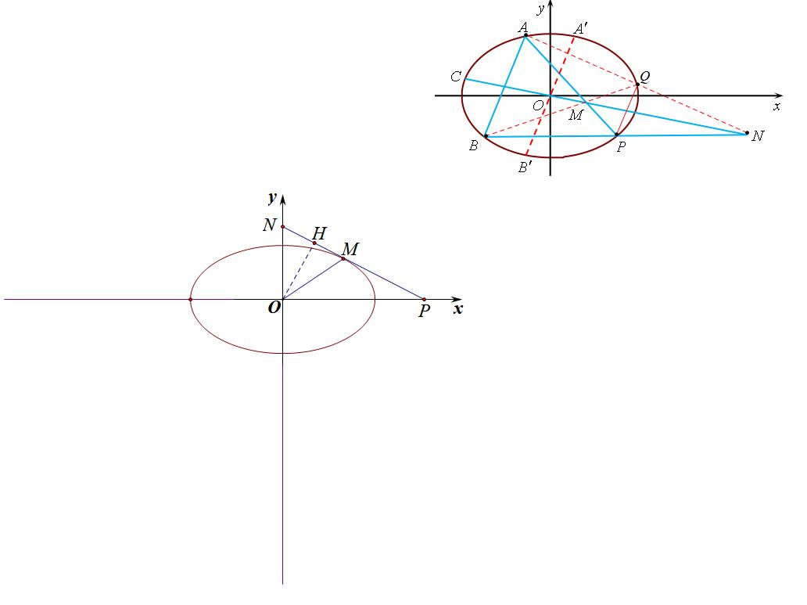

【例7】（2021•天津）已知椭圆中，，其上顶点为，右焦点为，且．

（1）求椭圆的方程；

（2）若直线与椭圆有唯一交点，与轴正半轴交于点，过作的垂线，交轴于点，已知，求直线的方程．

【例8】（2023•新高考Ⅰ卷）在直角坐标系中，点到轴的距离等于点到的距离，记动点的轨迹为

1. 求的方程
2. 已知矩形有三个顶点在上，证明：矩形的周长大于

五.复数旋转下的等腰直角三角形

【例9】（2025•成都零诊）已知抛物线的焦点为,过的直线与抛物线相交于两点.

（1）当直线的倾斜角为时,直线被圆所截得的弦长为,求的值;

（2）若点在轴上,且是以为直角顶点的等腰直角三角形,求直线的斜率.

【例10】（2022•德州三模）已知为抛物线的焦点，点在抛物线上，为坐标原点，的外接圆与抛物线的准线相切，且该圆周长为．

（1）求抛物线的方程；

（2）如图，设点，，都在抛物线上，若是以为斜边的等腰直角三角形，求的最小值．

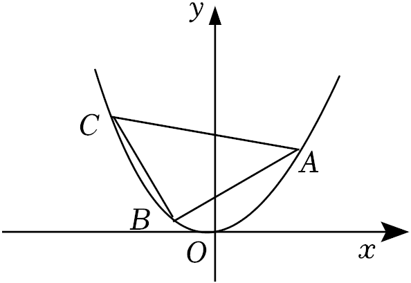

########## 【例11】（2024•北京怀柔区模拟）已知椭圆．

########## （1）求椭圆的离心率和长轴长．

########## （2）已知直线与椭圆有两个不同的交点，，为轴上一点．是否存在实数，使得是以点为直角顶点的等腰直角三角形？若存在，求出的值及点的坐标；若不存在，说明理由．

**第四节 直线系和圆系方程**

########## 一 直线系方程

########## 过直线与

########## 的交点的直线系方程：

########## （为参数）．

########## 这里和都属于一次曲线方程，所以表示过两直线交点的一系列方程，也叫做直线系方程；

########## 【例1】已知直线与，求经过的交点且与已知直线平行的直线的方程．

########## 我们发现，设成直线系方程以后，不需要联立求交点，得到的是满足过交点的一系列直线方程，在这一系列直线方程中，只有一条满足与已知直线平行，这样确定系数，从而快速得到结果．

########## 【例2】求证：为任意实数时，直线恒过一定点，并求点坐标．

########## 二 过直线与圆交点的圆系方程

########## 过直线与圆交点的圆系方程：．

########## 这里属于二次曲线方程，属于一次曲线方程，所以表示过直线与圆交点的一系列圆方程，也叫做圆系方程；若已知直线与已知圆有两个交点，则

########## ，表示一系列过这两个交点的圆，若已知直线与已知圆相切，则，这表示一系列过这个切点且与已知直线和已知圆相切的圆．原因很清楚，就是次方高的二次方程决定形状，次方低的一次方程只能决定圆心位置和半径，所有曲线系方程都满足此原理．

########## 【例3】求过直线和圆的交点，且过原点的圆方程．

########## 【例4】求与圆切于，且过的圆的方程．

########## 【例5】已知圆与直线相交于两点，为坐标原点，若，求实数的值．

**三 相交两圆的公共弦**

若圆与圆相交，则两圆方程相减，即可得到两圆的公共弦*AB*所在的直线方程为：	．

**证明**　设两圆、的任一交点坐标为，则有：

…①，…②

由①－②得：，因此，*A*、*B*的坐标都满足方程：

．又过*A*、*B*两点的直线是唯一的，故上述方程即为公共弦*AB*所在直线的方程．

注意 (1) 当两圆相切时，它为内公切线方程；

（2）当两圆相离或包含时，它为到两圆的与连心线垂直的切线段相等的点的集合；显然，当两圆相离且半径相等时，它为两圆的对称轴．

########## 【例6】求经过两条曲线和交点的直线方程．

########## 【例7】平面上有两个圆，它们的方程分别是和，求这两个圆的内公切线方程．

########## 四  过圆与圆交点的圆系方程

########## 过两已知圆和交点的圆系方程为：,若时，变为

########## ，则表示过两圆的交点的直线．

【例8】（2022•尖草坪区期中）过点，且经过圆与圆的交点的圆的方程为

A．	B．

C．	D．

########## 【例9】求过圆：与圆：的交点，圆心在直线：圆的方程．

五 **过圆和切点的圆系方程**

与圆相切于点的圆系方程可设为：

．

我们按照极限思想，把切点当作一个半径无穷小的圆，符合**圆vs圆**的圆系模型.

【例10】求与圆切于点，且过点的圆的方程．

**第五节 曲线系解四点共圆**

########## 一 四点共圆曲线系原理

########## 圆锥曲线上的四点共圆问题：圆锥曲线上存在四点*P、Q、M、N,* 且*PQ*与*MN*相交于点*T，* 若满足，则*P、Q、M、N*四点共圆（如图）．根据初中的相交弦定理（左图）或切割线定理（右图）即可证明，当然也有同学觉得需要更严谨的证明，不妨利用相似来证明．

##########      我们来理解四点共圆的曲线系方程形式，其实本质就是四点整体联立的思想，曲线系就是不同曲线交点构造新的曲线的方程，四点共圆，由于是上四点形成的圆，不妨设，，而表示满足直线*MN*和直线*PQ*上的任意点方程，属于两条直线并集，表示过圆锥曲线和两直线构成的退化二次曲线交点的一系列曲线方程，有一个满足圆的方程，即

########## ．

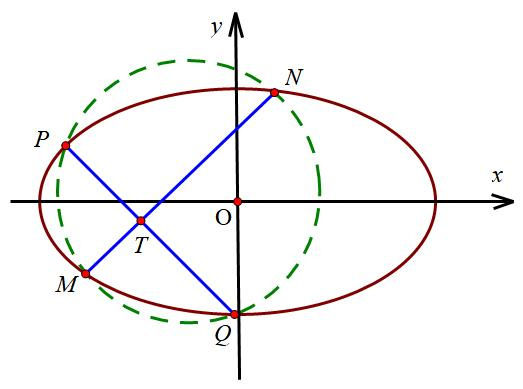

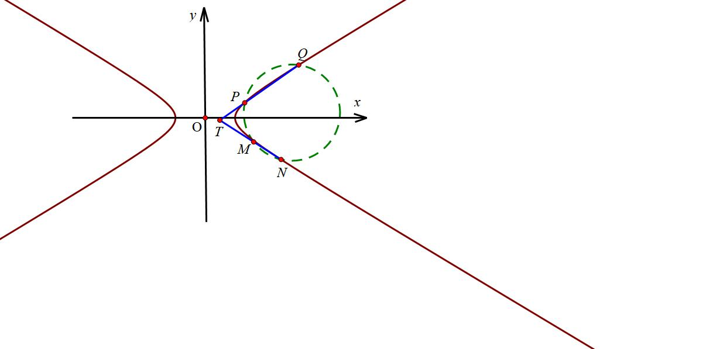

########## 由于没有的项，必有．即*PQ*与*MN*斜率互为相反数．

########## **证明四点共圆的步骤：**

########## 1．设出曲线系方程，解出；

########## 2．根据证明四点一定共圆．

【例1】（2023•辽宁一模）已知双曲线的右焦点为，左、右顶点分别为，，且为上不与，重合的一点，直线、的斜率之积为3．

（1）求双曲线的方程；

（2）平面一点，且不在上，过的两条直线分别交的右支于，两点和，两点，若，，，四点在同一圆上，求直线的斜率与直线的斜率之和．

########## 二  圆幂定理反推四点共圆

【例2】（2021•新课标1卷）在平面直角坐标系中，已知点，，点满足．记的轨迹为．

（1）求的方程；

（2）设点在直线上，过的两条直线分别交于，两点和，两点，且，求直线的斜率与直线的斜率之和．

########## 三.四点共圆的充要条件与数据

########## **四点共圆总定理：一个二次曲线上四点，其中包含四点的任意两条退化的二次曲线斜率和为零，则这四点共圆.**

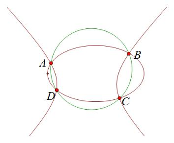

若曲线与有四个交点*A*、*B*、*C*、*D*，则点共圆的充要条件是.

注意：可以表示为*AB*与*CD*，也可以表示为*AC*与*BD*，也可以表示为*AD*与*BC*，因为曲线系就是以这四点形成的退化二次曲线方程，那么包含这四点的退化二次曲线方程就包含这三种情况，由于交叉项不存在，所以.

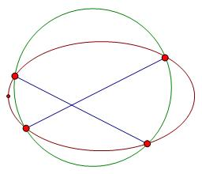

证明：由四点共圆总定理可知，两直线形成退化二次曲线的，此时交叉项为0，故它们的交点共圆.本定理也可以理解为两直线形成的退化二次曲线的对称轴也是x轴与y轴的平行线，所以满足拥有两平行的对称轴的曲线系共圆.

########## <strong>推论:</strong> 若圆锥曲线上存在四点<em>、、、，</em>斜率互为相反数<em>，</em>且是中垂线，则；

########## 【例3】（2016•四川文）已知椭圆的一个焦点与短轴的两个端点是正三角

########## 形的三个顶点，点在椭圆上．

########## （1）求椭圆的方程；

########## （2）设不过原点且斜率为的直线与椭圆交于不同的两点、，线段的中点为，直线

########## 与椭圆交于、，证明：．

【例4】（2024•新高考Ⅱ卷19题）已知双曲线，点在上，为常数，，按照如下方式依次构造点，3，，过斜率为的直线与的左支交于点，令为关于轴的对称点，记的坐标为，．

（1）若，求，；

（2）证明：数列是公比为的等比数列；

（3）设为△的面积，证明：对任意的正整数，．

- **外接圆与隐藏第四点的四点共圆**

【例5】（2025届T8联考T18）已知过两点的动抛物线的准线始终与圆相切,该抛物线焦点的轨迹是某圆锥曲线的一部分.

(1)求曲线的标准方程；

(2)已知点,过点的动直线与曲线交于两点,设的外心为为坐标原点,问:直线与直线的斜率之积是否为定值,如果是定值,求出该定值;如果不是定值,说明理由.

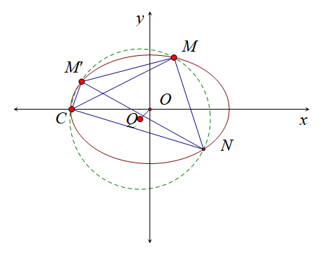

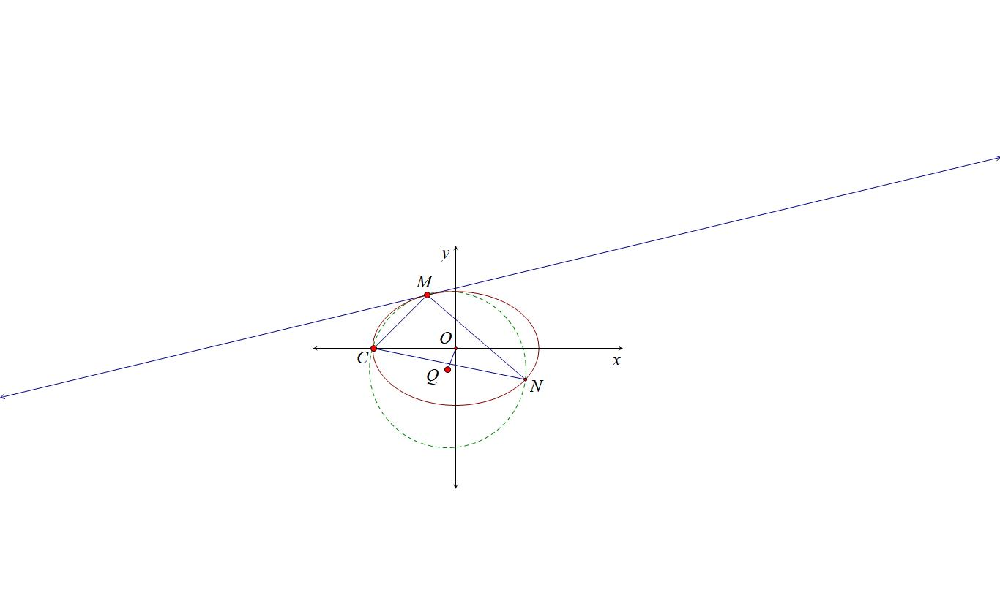

【例6】（福建名校联盟全国优质校2025届高三大联考18题）已知椭圆  的左顶点为  ,过点  的直线  交  于  两点,记  的外接圆为圆  .(1) 当  与  轴垂直时,求圆的方程;(2)求圆面积的最大值.

【例7】（2025年黑龙江省哈尔滨三中高考数学一模18题（25陪跑课学员胡升辉提问））点为直线上的动点，为坐标原点，过点作直线垂直于轴，过点作直线的垂线交直线于点．

（1）求点的轨迹方程；

（2）记点轨迹为曲线，上一定点，过作两不同直线分别交于，两点，

①直线、的斜率满足，且直线过点，求定点坐标；

②若点，且直线、的斜率满足，设△的外接圆为圆，过点作曲线的切线，判断直线与圆位置关系，并说明理由．

【例8】（2025数海二模18题（陪跑课学员潘思宇提问））已知抛物线 $C:y^{2}=4x$ 的焦点为 $F$ ，过 $y$ 轴上一点 $P$ 作 $C$ 的切线 $PA(A$ 在 $C$ 上，且异于原点 $O)$  ， $PF$ 与 $C$ 交于 $B,D$ 两点． 
（1）证明： $PA⟂PF$  ； 
（2）若 $\Delta ABD$ 的外接圆圆心在 $x$ 轴上，求直线 $BD$ 的方程．

**第六节 退化二次曲线四点联立曲线系**

########## **一   退化二次曲线对称轴不与坐标轴平行的曲线系**

模型构造：

根据上一节的内容，如果两条直线斜率互为相反数，则它们构造的退化二次曲线也是以坐标轴平行线为对称轴，这样与圆锥曲线构造的曲线系是指向圆.但当构成退化二次曲线的两相交直线斜率不为相反数时，那么它们可以形成圆以外的其它圆锥曲线，本讲介绍四点确定椭圆、双曲线和抛物线的曲线系方程.

如图，、分别为椭圆的左右顶点，、为椭圆上任意两点，与轴交于点，与交于点*，* 我们可以理解为，，，四点确定椭圆（双曲线和抛物线也一致），那么四点之间连线有6条，我们选取一组过四点的直线乘积式构造退化二次曲线，再选取另外两条过四点的直线乘积式构造另一条弱化的二次曲线，可以理解为两条退化的二次曲线形成了这个椭圆，即

注意：这里最终结果会指向一个极点极线性质，故在设计，，，，

，从而得出：；

记住：曲线系只需要对比系数，确定参数，无需展开求出和，，，均是斜率倒数，不是斜率．

二  用曲线系方程破解高考极点极线题型

【例1】（2023•新高考Ⅱ）已知双曲线中心为坐标原点，左焦点为，，离心率为．

（1）求的方程；

（2）记的左、右顶点分别为，，过点的直线与的左支交于，两点，在第二象限，直线与交于，证明在定直线上．

【例2】（2020•新课标Ⅰ卷）已知，分别为椭圆的左、右顶点，为的上顶点，．为直线上的动点，与的另一交点为，与的另一交点为．

1. 求的方程；
2. 证明：直线过定点．

########## 【例3】（2011•四川）如图，椭圆有两顶点、，过其焦点的直线与椭圆交于两点，并与轴交于点．直线与直线交于点． 当点异于两点时，求证：为定值．

【例4】（2024•北京）已知椭圆方程，以椭圆的焦点和短轴端点为顶点的四边形是边长为2的正方形．过点，且斜率存在的直线与椭圆交于不同的两点，，过点和的直线与椭圆的另一个交点为．

（1）求椭圆的方程及离心率；

（2）若直线的斜率为0，求的值．

三 用曲线系速解坎迪定理

【例5】（2023•江苏月考）在平面直角坐标系中，椭圆的离心率是，焦点到

相应准线的距离是3．

（1）求，的值；

（2）已知、是椭圆上关于原点对称的两点，在轴的上方，，连接、并分别延长交椭圆于、两点，证明：直线过定点．

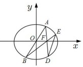

【例6】(2022全国甲卷)已知抛物线焦点为，点过焦点做直线交抛物线于两点，当轴时，.

(1)求抛物线方程

(2)若直线与抛物线的另一个交点分别为.若直线的倾斜角为，当最大时，求的方程

########## 【例7】已知椭圆过点，离心率为．

########## （1）求椭圆的方程;

########## （2）过点做椭圆的两条弦，（，分别位于第一、二象限），若，与直线分别交于，，求证：．

【例8】已知椭圆的离心率为，半焦距为，且，经过椭圆的左焦点斜率为的直线与椭圆交于、两点，为坐标原点．

（1）求椭圆的标准方程；

（2）设，延长，分别与椭圆交于、两点，直线的斜率为，求的值及直线所经过的定点坐标．

四．曲线上三点构造切线的适配曲线系方程速解斜率和积

关于曲线系方程，一定是两对边直线相乘构成退化的二次曲线，不能是邻边的，其实在实际教学过程中，总有学生会问及为什么不能是邻边，我们仅以例6为例，通过平移构造的曲线系方程，如果以

，

，

故曲线系方程为：，显然一边有常数项，而另一边没有常数项，这就是一个明显的错误，在学习曲线系的初期，很多同学都容易犯这个错误.

那么相邻两边就不能相乘作为退化的二次曲线方程吗？显然是可以的，那我们就需要有极限思想，其中的一条弦变成了无穷小，那就是某点处的切线，如图，这样对边自然等同了邻边.

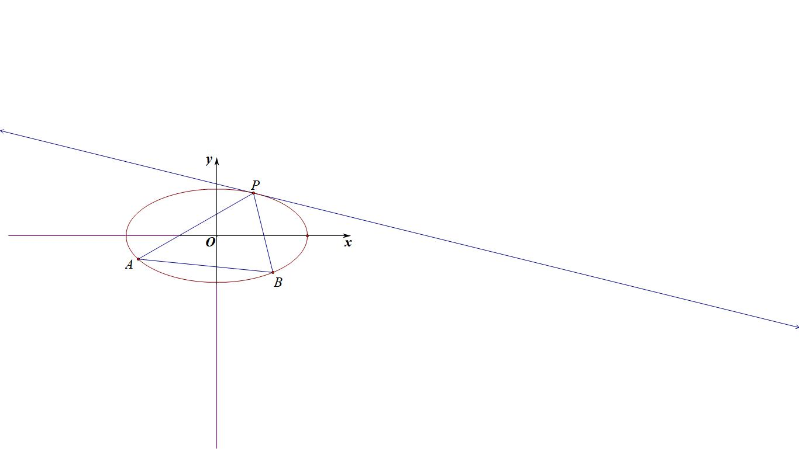

如图所示，*P*、*A*、*B*三点在二次曲线上， 曲线*C*在*P*处的切线方程为，故一定有曲线系方程，这种方法类比于齐次化求定点定值问题，属于另一种角度解读.

【例9】(2022全国乙卷)已知椭圆的中心为坐标原点,对称轴为轴、轴,且过，两点.

(1)求的方程;

(2)设过点的直线交于两点,过且平行于轴的直线与线段交于点,点满足.证明:直线过定点.

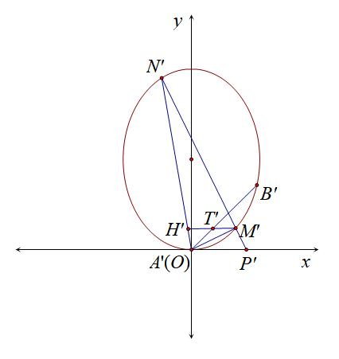

五．曲线系挖掘四点形斜率关系与隐藏轨迹

【例10】（2024江苏南京师大附中（25陪跑课学员林浩然提问））已知点，在双曲线：上，过点作直线交双曲线于点，（不与点，重合）.证明：

(1)记点，当直线平行于轴，且与双曲线的右支交点为时，，，三点共线；

(2)直线与直线的交点在定圆上，并求出该圆的方程.

六  用曲线系破解彭塞列闭合定理

【例11】（2009·江西）如图，已知圆*G*：是椭圆的内接Δ*ABC*的内切圆，其中*A*为椭圆的左顶点.

（1）求圆*G*的半径*r*；

（2）过点作圆*G*的两条切线交椭圆于*E*，*F*两点，证明：直线*EF*与圆*G*相切.

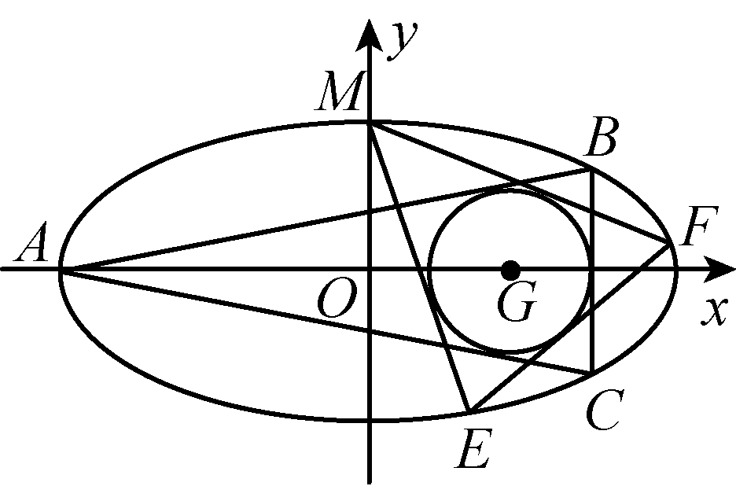

七  双曲线退化二次曲线系方程

我们曾在本书大题篇第一章介绍联立的时候提到了22年新高考II卷的退化二次曲线与联立法，本讲我们再次介绍其曲线系原理.

双曲线方程为，双曲线两条渐近线构成的退化二次曲线为，我们发现直线可以跟双曲线联立，也可以跟退化的渐近线曲线系联立，能通过韦达的两根之和证出它们共中点，也能通过两根之差求出它们的长度比，这些我们都在之前联立篇介绍了.

我们也发现双曲线与渐近线构成的退化二次曲线是没有交点的，但是双曲线①和与渐近线平行的退化二次曲线会有两个交点*PQ*，即过不在渐近线上的点且与渐近线平行的两条直线构成的退化二次曲线为②，①②两式相减得：，这是一条直线得方程，就是*PQ*的直线方程.通常只要斜率互为相反数的两条直线构成的退化二次曲线跟原曲线相加减即可得到这条直线的方程.

【例12】（2022新高考II卷）设双曲线,右焦点为,渐近线方程为，

1. 求的方程

（2）过的直线与的两条渐近线分别交于，两点，点，在上，且，，过且斜率为的直线与过且斜率为的直线交于点.请从下面①②③中选取两个作为条件，证明另一个条件成立：

①在上；②；③.

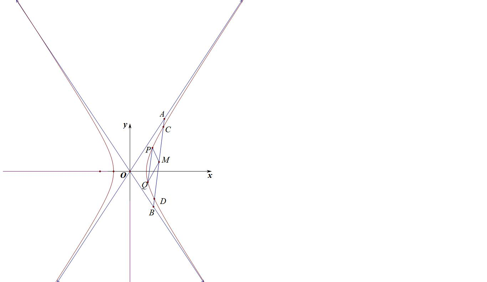

【例&lt;te&lt;te<em>x</em>t st<em>yl</em>e="italic"&gt;x&lt;/text&gt;t st<em>y</em>le="subscript"&gt;1&lt;/text&gt;3】（2024•广州模拟第19题）已知双曲线 $C：\frac{x^{2}}{a^{2}}-\frac{y^{2}}{b^{2}}=1(a＞0，b＞0)$ 的两条渐近线分别为&lt;te&lt;te<em>x</em>t st<em>yl</em>e="italic"&gt;x&lt;/text&gt;t st<em>y</em>le="italic"&gt;l&lt;/text&gt;1：y＝2x和l2：y＝﹣2x，右焦点坐标为 $(\sqrt{5}，0)，O$ 为坐标原点．

（1）求双曲线的标准方程；

（&lt;text sty&lt;text sty&lt;text sty<em>l</em>e="italic"&gt;l&lt;/text&gt;e="italic"&gt;l&lt;/text&gt;e="subscript"&gt;&lt;text style="subscript"&gt;&lt;text style="subscript"&gt;&lt;text style="subscript"&gt;&lt;text style="subscript"&gt;&lt;text style="subscript"&gt;&lt;text style="subscript"&gt;&lt;text style="subscript"&gt;2&lt;/text&gt;&lt;/text&gt;&lt;/text&gt;&lt;/text&gt;&lt;/text&gt;&lt;/text&gt;&lt;/text&gt;&lt;/text&gt;）直线&lt;te&lt;text sty<em>l</em>e="italic"&gt;x&lt;/text&gt;t style="italic"&gt;y&lt;/text&gt;＝4x﹣6与双曲线的右支交于点<em>&lt;text style="italic"&gt;&lt;text style="italic"&gt;&lt;text style="italic"&gt;&lt;text style="italic"&gt;&lt;text style="italic"&gt;A</em>&lt;/text&gt;&lt;/text&gt;&lt;/text&gt;&lt;/text&gt;&lt;/text&gt;&lt;text style="subscript"&gt;&lt;text style="subscript"&gt;&lt;text style="subscript"&gt;&lt;text style="subscript"&gt;&lt;text style="subscript"&gt;&lt;text style="subscript"&gt;&lt;text style="subscript"&gt;&lt;text style="subscript"&gt;&lt;text style="subscript"&gt;1&lt;/text&gt;&lt;/text&gt;&lt;/text&gt;&lt;/text&gt;&lt;/text&gt;&lt;/text&gt;&lt;/text&gt;&lt;/text&gt;&lt;/text&gt;，<em>&lt;text style="italic"&gt;&lt;text style="italic"&gt;&lt;text style="italic"&gt;&lt;text style="italic"&gt;&lt;text style="italic"&gt;B</em>&lt;/text&gt;&lt;/text&gt;&lt;/text&gt;&lt;/text&gt;&lt;/text&gt;1（A1在B1的上方），过点A1，B1分别作l2，l1的平行线，交于点<em>&lt;text style="italic"&gt;&lt;text style="italic"&gt;P</em>&lt;/text&gt;&lt;/text&gt;1，过点P1且斜率为4的直线与双曲线交于点A2，B2（A2在B2的上方），再过点A2，B2分别作l2，l1的平行线，交于点P2，⋯，这样一直操作下去，可以得到一列点 $P_{1}，P_{2}，\cdots ，P_{n}，n\geq 3，n\in N^{*}$ ．

证明：①&lt;text style="&lt;text style="<em>i</em>talic"&gt;i&lt;/text&gt;talic"&gt;<em>&lt;text style="italic"&gt;P</em>&lt;/text&gt;&lt;/text&gt;1，P2，⋯，P<em>&lt;text style="italic"&gt;n</em>&lt;/text&gt;共线；② $|OP_{i}|^{2}-|P_{i}P_{i+1}|^{2}$ 为定值，&lt;text style="subscr&lt;text style="<em>i</em>talic"&gt;i&lt;/text&gt;pt"&gt;1&lt;/text&gt;≤i≤<em>&lt;text style="italic"&gt;n</em>&lt;/text&gt;﹣1，i∈<strong>N</strong>\*．

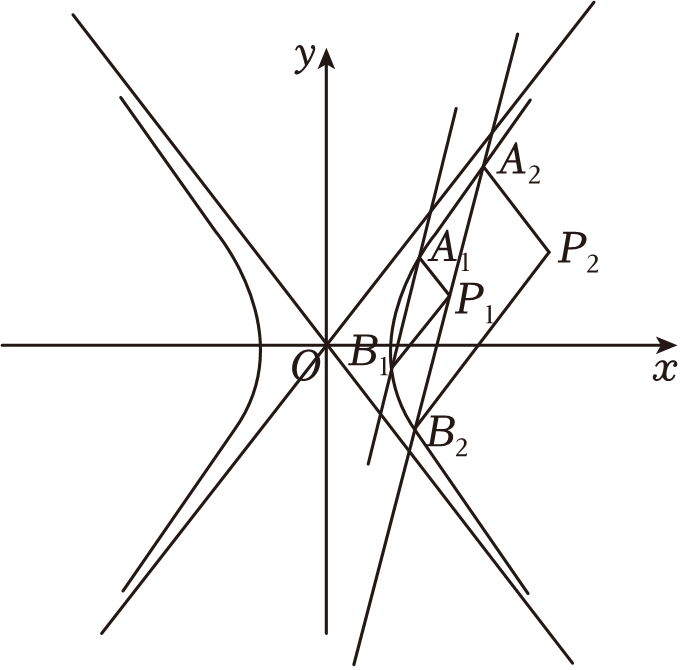

【例14】（2025•福建教学联盟开学考第19题）在平面直角坐标系中，点到点的距离与到直线的距离之比为，记的轨迹为曲线．

（1）求的标准方程；

（2）若直线过点交右支于，两点，直线过点且交的右支于、两点，且记，的中点分别为，，过点作两条渐近线的垂线，垂足分别为，；

证明：、、三点共线；

求四边形面积的取值范围．

八  用退化二次曲线系方程速解斜率互为相反数直线联立

【例15】（2021•浙江）如图，已知是抛物线的焦点，是抛物线的准线与轴的交点，且．

（Ⅰ）求抛物线的方程：

（Ⅱ）设过点的直线交抛物线于，两点，若斜率为2的直线与直线，，，轴依次交于点，，，，且满足，求直线在轴上截距的取值范围．

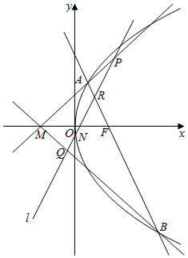

