第一章达标训练

1.（2024•济南模拟）在平面直角坐标系<em>xOy</em>中，已知双曲线 $C：\frac{x^{2}}{a^{2}}-\frac{y^{2}}{b^{2}}=1(a＞0，b＞0)$ 的左、右焦点分别为<em>&lt;text style="italic"&gt;F</em>&lt;/text&gt;1，F2，点<em>P</em>在<em>&lt;text style="italic"&gt;C</em>&lt;/text&gt;上，且 $\overset{\to }{PF_{1}}\cdot \overset{\to }{PF_{2}}=2a^{2}$ ， $|\overset{\to }{PO}|=\sqrt{2}b$ ，则<em>&lt;text style="italic"&gt;C</em>&lt;/text&gt;的离心率为（　　）

A． $\sqrt{3}$ 	
B． $\sqrt{2}$ 	
C．3	
D．2

&lt;text sty<em>l</em>e="su<em>b</em>script"&gt;&lt;text style="subscript"&gt;2&lt;/text&gt;&lt;/text&gt;.（2024•雁峰区模拟）已知椭圆： $\frac{x^{2}}{9}+\frac{y^{2}}{b^{2}}=$ &lt;text sty<em>l</em>e="su<em>b</em>script"&gt;1&lt;/text&gt;（0＜<em>b</em>＜3），左右焦点分别为<em>&lt;text style="italic"&gt;&lt;text style="italic"&gt;F</em>&lt;/text&gt;&lt;/text&gt;1，F&lt;text style="subscript"&gt;&lt;text style="subscript"&gt;2&lt;/text&gt;&lt;/text&gt;，过F1的直线l交椭圆于<em>A</em>、<em>B</em>两点，若|<em>BF</em>2|+|<em>AF</em>2|的最大值为10，则b的值是（　　）

A．1	
B． $\sqrt{2}$ 	
C． $\sqrt{3}$ 	
D． $\sqrt{6}$

3.（&lt;text style="subscript"&gt;&lt;text style="subscript"&gt;2&lt;/text&gt;&lt;/text&gt;024•浏阳市期中）已知<em>&lt;text style="italic"&gt;F</em>&lt;/text&gt;&lt;text style="subscript"&gt;1&lt;/text&gt;、F2为椭圆<em>&lt;text style="italic"&gt;C</em>&lt;/text&gt;： $\frac{x^{2}}{a^{2}}+\frac{y^{2}}{b^{2}}=1(a＞b＞0)$ 的左、右焦点，点<em>Q</em>在椭圆<em>&lt;text style="italic"&gt;C</em>&lt;/text&gt;上，且Q<em>&lt;text style="italic"&gt;F</em>&lt;/text&gt;&lt;text style="subscript"&gt;1&lt;/text&gt;⊥<em>&lt;text style="italic"&gt;&lt;text style="italic"&gt;QF</em>&lt;/text&gt;&lt;/text&gt;&lt;text style="subscript"&gt;&lt;text style="subscript"&gt;2&lt;/text&gt;&lt;/text&gt;，QF2的延长线与椭圆交于点<em>P</em>，若 $sin\angle F_{1}PQ=\frac{3}{5}$ ，则该椭圆离心率为（　　）

A． $\frac{\sqrt{2}}{2}$ 	
B． $\frac{\sqrt{5}}{5}$ 	
C． $\frac{\sqrt{3}}{3}$ 	
D． $\frac{\sqrt{5}}{3}$

4.（&lt;text style="subscript"&gt;&lt;text style="subscript"&gt;2&lt;/text&gt;&lt;/text&gt;024•运城期中）已知<em>&lt;text style="italic"&gt;&lt;text style="italic"&gt;F</em>&lt;/text&gt;&lt;/text&gt;&lt;text style="subscript"&gt;1&lt;/text&gt;，F2分别是椭圆 $C：\frac{x^{2}}{a^{2}}+\frac{y^{2}}{6}=1(a＞0)$ 的左、右焦点，过点<em>&lt;text style="italic"&gt;&lt;text style="italic"&gt;F</em>&lt;/text&gt;&lt;/text&gt;&lt;text style="subscript"&gt;1&lt;/text&gt;的直线交<em>&lt;text style="italic"&gt;C</em>&lt;/text&gt;于<em>A</em>，<em>B</em>两点，若|<em>AF</em>&lt;text style="subscript"&gt;&lt;text style="subscript"&gt;2&lt;/text&gt;&lt;/text&gt;|+|<em>BF</em>2|的最大值为8，则C的离心率为（　　）

A． $\frac{\sqrt{3}}{3}$ 	
B． $\frac{\sqrt{3}}{2}$ 	
C． $\frac{\sqrt{6}}{3}$ 	
D． $\frac{1}{2}$

5.（2024•成都模拟）设<em>O</em>为坐标原点，<em>&lt;text style="italic"&gt;F</em>&lt;/text&gt;1，F2为椭圆 $C：\frac{x^{2}}{4}+\frac{y^{2}}{3}=1$ 的两个焦点，点<em>P</em>在<em>C</em>上， $cos\angle F_{1}PF_{2}=\frac{3}{5}$ ，则 $\overset{\to }{PF_{1}}\cdot \overset{\to }{PF_{2}}=$ （　　）

A． $\frac{9}{4}$ 	
B． $\frac{7}{4}$ 	
C．2	
D． $\frac{7}{2}$

6.（2024•成都开学）已知椭圆的左，右焦点分别为，，点是椭圆上的任意一点，则

A．	
B．的最大值为

C．的最小值为4	
D．的最大值为4

7.（2024•双鸭山三模）已知双曲线的左、右焦点分别为、，过作直线与双曲线的左、右两支分别交于，两点．若，且，则双曲线的离心率为

A．	
B．2	
C．	
D．3

8.（2024•思明区期中）已知双曲线的左、右焦点分别为，，过点的直线与双曲线的右支交于，两点，若，且双曲线的离心率为，则<u>　　</u>．

9.（2024•浦东新区期中）已知双曲线的左、右焦点分别为，，过的直线交该双曲线于点、，且，，则△的面积为 <u>　　</u>．

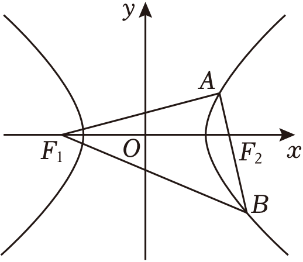

10.（2024•天河区校级二模）已知双曲线<te<te*x*t st*y*le="italic">x</text>t st*y*le="it*a*lic">*C*</text>： $\frac{x^{2}}{a^{2}}-\frac{y^{2}}{b^{2}}=$ 1（<te<te*x*t st*y*le="italic">x</text>t st*y*le="italic">a</text>＞0，*b*＞0）的右焦点为*F*，一条渐近线的方程为y＝2x，若直线y＝*<text style="italic">k*x</text>与*<text style="italic">C*</text>在第一象限内的交点为*P*，且*PF*⊥x轴，则k的值为（　　）

A． $\frac{\sqrt{5}}{2}$ 	
B． $\frac{\sqrt{3}}{2}$ 	
C． $\frac{4\sqrt{5}}{5}$ 	
D． $\frac{4\sqrt{3}}{5}$

10.（2024•多选•南通模拟）已知椭圆的左、右焦点分别为、，上、下两个顶点分别为、，的延长线交于，且，则

A．椭圆的离心率为	
B．直线的斜率为

C．△为等腰三角形	
D．

11.（2024•多选•海珠区期中）已知双曲线的左、右焦点分别为，，直线与双曲线的右支相交于，两点（点在第一象限），若，则

A．双曲线的离心率为	
B．

C．	
D．

12.（2024•德阳模拟）已知，为椭圆的两个焦点，为原点，为椭圆上一点，，则<u>　　</u>．

13.（2024•皇姑区模拟）设为坐标原点，，为双曲线的两个焦点，点在上，，则<u>　　</u>．

14.（2024•浦东新区二模）已知双曲线的焦点分别为，，为双曲线上一点，若，，则双曲线的离心率为 <u>　　</u>．

13.（2024•李沧区模拟）如图，已知斜率为—3的直线与双曲线的右支交于，两点，点关于坐标原点对称的点为且，则该双曲线的离心率为 <u>　　</u>．

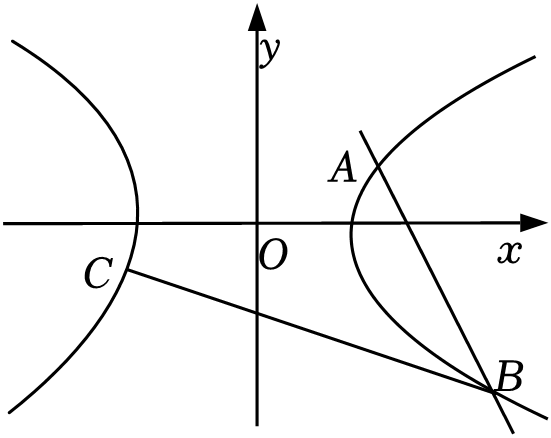

14.（2024•陕西模拟）已知抛物线的焦点为，若，，在抛物线上，且满足，则的最小值为 <u>　9　</u>．

15.（2023•涪城区模拟）已知椭圆，经过原点的直线交于，两点．是上一点（异于点，，直线交轴于点．若直线，的斜率之积为，且，则椭圆的离心率为 <u>　   　</u>．

16.（2024•多选•信都区期中）满足下列条件的点*P*的轨迹一定在双曲线上的有（　　）

A．*A*（2，0），*B*（﹣2，3），|*PA*﹣*PB*|＝5

B．<em>A</em>（2，0），<em>B</em>（﹣2，0），<em>kPAkPB</em>＝2

C．<em>A</em>（2，0），<em>B</em>（﹣2，0），<em>kPAkPB</em>＝1

D．*A*（2，0），*B*（﹣2，3），*PA*﹣*PB*＝2

17.（2024•江西模拟）直线<em>l</em>过抛物线<em>C</em>：<em>y</em>2＝2<em>px</em>（<em>p</em>＞0）的焦点，且与<em>C</em>交于<em>A</em>，<em>B</em>两点，若使|<em>AB</em>|＝2的直线<em>l</em>恰有2条，则<em>p</em>的取值范围为（　　）

A．0＜*p*＜1	
B．0＜*p*＜2	
C．*p*＞1	
D．*p*＞2

18．（2024•武汉模拟）设抛物线<em>C</em>：<em>y</em>＝4<em>x</em>2的焦点为<em>F</em>，过焦点<em>F</em>的直线与抛物线<em>C</em>相交于<em>A</em>，<em>B</em>两点，则|<em>AB</em>|的最小值为（　　）

A．1	
B． $\frac{1}{2}$ 	
C． $\frac{1}{4}$ 	
D． $\frac{1}{8}$

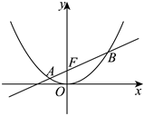

19.（2023•安康二模）设抛物线的焦点是，直线与抛物线相交于，两点，且，过弦的中点作的垂线，垂足为，则的最小值为

A．	
B．3	
C．	
D．

20.（2024•哈尔滨香坊区二模）已知点，是等轴双曲线的左右顶点，且点是双曲线上异于，一点，，则<u>　   　</u>．

21.（2024•金凤区校级一模）已知抛物线的准线与轴交于点，过焦点的直线与交于，两点，且，，，，的中点为，过作的垂线交轴于点，点在的准线上的射影为点，现有下列四个结论：

①，；②若时，；③；④过的直线与抛物线交于，，则．
其中正确结论的序号为 <u>　   　</u>．

22.（2024•江苏模拟）设抛物线的焦点为，的准线与轴交于点，过的直线与在第一象限的交点为，，且，则直线的斜率为

A．	
B．	
C．	
D．

<te<text sty*l*e="italic">x</text>t style="superscript">2</text>3.（2024•包头模拟）已知抛物线<text st*y*le="italic">*C*</text>：y2＝6x的焦点为*<text style="italic">F*</text>，*O*为坐标原点，倾斜角为θ的直线l过点F且与C交于*M*，*N*两点，若△*OMN*的面积为 $3\sqrt{3}$ ，则（　　）

A． $sin\theta =\frac{1}{2}$ 	                            
B．|*MN*|＝24

C．以<text st*y*le="italic">MF</text>为直径的圆与y轴仅有1个交点  	
D． $\frac{|MF|}{|NF|}=\frac{\sqrt{3}}{3}$ 或 $\frac{|MF|}{|NF|}=\sqrt{3}$

24.（2023•多选•湘潭期末）已知抛物线，点是抛物线的焦点，点是抛物线上的一点，点，则下列说法正确的是

A．抛物线的准线方程为	    
B．若，则的面积为

C．的最大值为	    
D．的周长的最小值为

25.（2024•周口开学）已知椭圆为的左焦点，为上一点，则

A．的最小值为	
B．的最大值为

C．面积的最小值为	
D．面积的最大值为

26.（2024•淄博模拟）“若点为椭圆上的一点，、为椭圆的两个焦点，则椭圆在点处的切线平分的外角”，这是椭圆的光学性质之一．已知椭圆，点是椭圆上的点，在点处的切线为直线，过左焦点作的垂线，垂足为，设点的轨迹为曲线．若是曲线上一点，已知点，，则的最小值为 <u>　    　</u>．

&lt;te&lt;te<em>x</em>t style="italic"&gt;x&lt;/text&gt;t style="superscript"&gt;2&lt;/text&gt;7.（2024•博爱县期中）希腊著名数学家阿波罗尼斯与欧几里得、阿基米德齐名．他发现：“平面内到两个定点&lt;text st<em>y</em>le="italic"&gt;<em>A</em>&lt;/text&gt;，<em>&lt;text style="italic"&gt;B</em>&lt;/text&gt;的距离之比为定值λ（λ≠1）的点的轨迹是圆”．后来，人们将这个圆以他的名字命名，称为阿波罗尼斯圆，简称阿氏圆．在平面直角坐标系<em>xOy</em>中，已知A（﹣3，1），B（﹣3，9），点<em>P</em>是满足 $\lambda =\frac{1}{3}$ 的阿氏圆上的任一点，若点&lt;te&lt;te<em>x</em>t style="italic"&gt;x&lt;/text&gt;t st<em>y</em>le="italic"&gt;<em>Q</em>&lt;/text&gt;为抛物线<em>&lt;text style="italic"&gt;E</em>&lt;/text&gt;：y2＝4x上的动点，Q在直线x＝﹣1上的射影为<em>H</em>，<em>F</em>为抛物线E的焦点，则下列选项正确的有（　　）

A．|*AQ*|﹣|*QF*|的最小值为2           	
B．△*APF*的面积最大值为 $3+\frac{3\sqrt{17}}{2}$

C．当∠*PFA*最大时，△*APF*的面积为 $\frac{7}{8}+\frac{3\sqrt{7}}{2}$ 	
D．|*PB*|+3|*PQ*|+3|*QH*|的最小值为 $3\sqrt{17}$

第一章达标训练

1.（2024•济南模拟）在平面直角坐标系<em>xOy</em>中，已知双曲线 $C：\frac{x^{2}}{a^{2}}-\frac{y^{2}}{b^{2}}=1(a＞0，b＞0)$ 的左、右焦点分别为<em>&lt;text style="italic"&gt;F</em>&lt;/text&gt;1，F2，点<em>P</em>在<em>&lt;text style="italic"&gt;C</em>&lt;/text&gt;上，且 $\overset{\to }{PF_{1}}\cdot \overset{\to }{PF_{2}}=2a^{2}$ ， $|\overset{\to }{PO}|=\sqrt{2}b$ ，则<em>&lt;text style="italic"&gt;C</em>&lt;/text&gt;的离心率为（　　）

A． $\sqrt{3}$ 	
B． $\sqrt{2}$ 	
C．3	
D．2

【解答】解：由已知可得：&lt;te&lt;text st<em>y</em>le="italic"&gt;x&lt;/text&gt;t style="itali&lt;text style="itali<em>c</em>"&gt;c&lt;/text&gt;"&gt;<em>F</em>&lt;/text&gt;1（﹣c，0），F2（c，0），设<em>P</em>（x，y），又 $\overset{\to }{PF_{1}}\cdot \overset{\to }{PF_{2}}=2a^{2}$ ，
则（﹣<em>c</em>﹣<em>x</em>，﹣<em>y</em>）•（<em>c</em>﹣<em>x</em>，﹣<em>y</em>）＝2<em>a</em>2，即<em>x</em>2+<em>y</em>2＝2<em>a</em>2+<em>c</em>2，①
又 $|\overset{\to }{PO}|=\sqrt{2}b$ ，则&lt;text st&lt;text style="it&lt;text style="itali<em>c</em>"&gt;a&lt;/text&gt;lic"&gt;y&lt;/text&gt;le="italic"&gt;x&lt;/text&gt;&lt;text style="superscript"&gt;&lt;text style="superscript"&gt;&lt;text style="superscript"&gt;&lt;text style="superscript"&gt;&lt;text style="superscript"&gt;2&lt;/text&gt;&lt;/text&gt;&lt;/text&gt;&lt;/text&gt;&lt;/text&gt;+y2＝2<em>&lt;text style="italic"&gt;b</em>&lt;/text&gt;2，②，联立①②可得2a2+c2＝2b2，
又&lt;text style="it&lt;text style="it<em>a</em>li<em>c</em>"&gt;a&lt;/text&gt;li<em>c</em>"&gt;b&lt;/text&gt;&lt;text style="superscript"&gt;&lt;text style="superscript"&gt;&lt;text style="superscript"&gt;&lt;text style="superscript"&gt;2&lt;/text&gt;&lt;/text&gt;&lt;/text&gt;&lt;/text&gt;＝c2﹣a2，即c2＝4a2，即 $e=\frac{c}{a}=2$ ．
故选：*D*．

&lt;text sty<em>l</em>e="su<em>b</em>script"&gt;&lt;text style="subscript"&gt;2&lt;/text&gt;&lt;/text&gt;.（2024•雁峰区模拟）已知椭圆： $\frac{x^{2}}{9}+\frac{y^{2}}{b^{2}}=$ &lt;text sty<em>l</em>e="su<em>b</em>script"&gt;1&lt;/text&gt;（0＜<em>b</em>＜3），左右焦点分别为<em>&lt;text style="italic"&gt;&lt;text style="italic"&gt;F</em>&lt;/text&gt;&lt;/text&gt;1，F&lt;text style="subscript"&gt;&lt;text style="subscript"&gt;2&lt;/text&gt;&lt;/text&gt;，过F1的直线l交椭圆于<em>A</em>、<em>B</em>两点，若|<em>BF</em>2|+|<em>AF</em>2|的最大值为10，则b的值是（　　）

A．1	
B． $\sqrt{2}$ 	
C． $\sqrt{3}$ 	
D． $\sqrt{6}$

【解答】解：椭圆的焦点在<em>x</em>轴上，由椭圆的定义可知：|<em>AF</em>1|+|<em>AF</em>2|＝2<em>a</em>＝6，|<em>BF</em>1|+|<em>BF</em>2|＝2<em>a</em>＝6，
则|<em>AF</em>2|＝6﹣|<em>AF</em>1|，|<em>BF</em>2|＝6﹣|<em>BF</em>1|，∴|<em>BF</em>2|+|<em>AF</em>2|＝12﹣（|<em>AF</em>1|+|<em>BF</em>1|）＝12﹣|<em>AB</em>|，
当|<em>&lt;text style="italic"&gt;AF</em>&lt;/text&gt;&lt;text style="su<em>b</em>script"&gt;1&lt;/text&gt;|+|<em>&lt;text style="italic"&gt;BF</em>&lt;/text&gt;1|＝|<em>AB</em>|取最小值 $\frac{2b^{2}}{a}$ 时，|<em>&lt;text style="italic"&gt;BF</em>&lt;/text&gt;&lt;text style="su<em>b</em>script"&gt;2&lt;/text&gt;|+|<em>&lt;text style="italic"&gt;AF</em>&lt;/text&gt;2|取最大值，即 $\frac{2b^{2}}{a}=$ &lt;text style="su<em>b</em>script"&gt;2&lt;/text&gt;，解得：b $=\sqrt{3}$ ，
故选：*C*．

3.（&lt;text style="subscript"&gt;&lt;text style="subscript"&gt;2&lt;/text&gt;&lt;/text&gt;024•浏阳市期中）已知<em>&lt;text style="italic"&gt;F</em>&lt;/text&gt;&lt;text style="subscript"&gt;1&lt;/text&gt;、F2为椭圆<em>&lt;text style="italic"&gt;C</em>&lt;/text&gt;： $\frac{x^{2}}{a^{2}}+\frac{y^{2}}{b^{2}}=1(a＞b＞0)$ 的左、右焦点，点<em>Q</em>在椭圆<em>&lt;text style="italic"&gt;C</em>&lt;/text&gt;上，且Q<em>&lt;text style="italic"&gt;F</em>&lt;/text&gt;&lt;text style="subscript"&gt;1&lt;/text&gt;⊥<em>&lt;text style="italic"&gt;&lt;text style="italic"&gt;QF</em>&lt;/text&gt;&lt;/text&gt;&lt;text style="subscript"&gt;&lt;text style="subscript"&gt;2&lt;/text&gt;&lt;/text&gt;，QF2的延长线与椭圆交于点<em>P</em>，若 $sin\angle F_{1}PQ=\frac{3}{5}$ ，则该椭圆离心率为（　　）

A． $\frac{\sqrt{2}}{2}$ 	
B． $\frac{\sqrt{5}}{5}$ 	
C． $\frac{\sqrt{3}}{3}$ 	
D． $\frac{\sqrt{5}}{3}$

【解答】解：设|<em>&lt;text style="italic"&gt;&lt;text style="italic"&gt;QF</em>&lt;/text&gt;&lt;/text&gt;&lt;text style="subscript"&gt;&lt;text style="subscript"&gt;1&lt;/text&gt;&lt;/text&gt;|＝3<em>&lt;text style="italic"&gt;m</em>&lt;/text&gt;，由题意 $sin\angle F_{1}PQ=\frac{|QF_{1}|}{|PF_{1}|}=\frac{3}{5}$ ，则|<em>PF</em>&lt;text style="subscript"&gt;&lt;text style="subscript"&gt;1&lt;/text&gt;&lt;/text&gt;|＝5<em>&lt;text style="italic"&gt;m</em>&lt;/text&gt;，又<em>&lt;text style="italic"&gt;&lt;text style="italic"&gt;QF</em>&lt;/text&gt;&lt;/text&gt;1⊥QF2，
∴|<em>PQ</em>|＝4<em>m</em>，|<em>QF</em>2|＝2<em>a</em>﹣|<em>QF</em>1|＝2<em>a</em>﹣3<em>m</em>，|<em>PF</em>2|＝2<em>a</em>﹣|<em>PF</em>1|＝2<em>a</em>﹣5<em>m</em>，

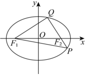

|&lt;text style="it&lt;text style="it&lt;text style="it&lt;text style="it<em>a</em>lic"&gt;a&lt;/text&gt;lic"&gt;a&lt;/text&gt;lic"&gt;a&lt;/text&gt;lic"&gt;PF&lt;/text&gt;&lt;text style="subscript"&gt;&lt;text style="subscript"&gt;&lt;text style="subscript"&gt;2&lt;/text&gt;&lt;/text&gt;&lt;/text&gt;|+|<em>&lt;text style="italic"&gt;&lt;text style="italic"&gt;&lt;text style="italic"&gt;&lt;text style="italic"&gt;QF</em>&lt;/text&gt;&lt;/text&gt;&lt;/text&gt;&lt;/text&gt;2|＝4a﹣8<em>&lt;text style="italic"&gt;&lt;text style="italic"&gt;&lt;text style="italic"&gt;m</em>&lt;/text&gt;&lt;/text&gt;&lt;/text&gt;＝|<em>PQ</em>|＝4m， $m=\frac{1}{3}a$ ，所以|&lt;text style="it&lt;text style="it&lt;text style="it&lt;text style="it<em>a</em>lic"&gt;a&lt;/text&gt;lic"&gt;a&lt;/text&gt;lic"&gt;a&lt;/text&gt;lic"&gt;<em>&lt;text style="italic"&gt;&lt;text style="italic"&gt;&lt;text style="italic"&gt;QF</em>&lt;/text&gt;&lt;/text&gt;&lt;/text&gt;&lt;/text&gt;&lt;text style="subscript"&gt;1&lt;/text&gt;|＝3<em>&lt;text style="italic"&gt;&lt;text style="italic"&gt;&lt;text style="italic"&gt;m</em>&lt;/text&gt;&lt;/text&gt;&lt;/text&gt;＝a，|QF&lt;text style="subscript"&gt;&lt;text style="subscript"&gt;&lt;text style="subscript"&gt;2&lt;/text&gt;&lt;/text&gt;&lt;/text&gt;|＝2a﹣3m＝a，又QF1⊥QF2，
所以&lt;text style="it&lt;text style="itali<em>c</em>"&gt;a&lt;/text&gt;lic"&gt;a&lt;/text&gt;&lt;text style="superscript"&gt;&lt;text style="superscript"&gt;2&lt;/text&gt;&lt;/text&gt;+a2＝（2c）2， $\frac{c^{2}}{a^{2}}=\frac{1}{2}$ ，即 $e=\frac{c}{a}=\frac{\sqrt{2}}{2}$ ．
故选：*A*．

4.（&lt;text style="subscript"&gt;&lt;text style="subscript"&gt;2&lt;/text&gt;&lt;/text&gt;024•运城期中）已知<em>&lt;text style="italic"&gt;&lt;text style="italic"&gt;F</em>&lt;/text&gt;&lt;/text&gt;&lt;text style="subscript"&gt;1&lt;/text&gt;，F2分别是椭圆 $C：\frac{x^{2}}{a^{2}}+\frac{y^{2}}{6}=1(a＞0)$ 的左、右焦点，过点<em>&lt;text style="italic"&gt;&lt;text style="italic"&gt;F</em>&lt;/text&gt;&lt;/text&gt;&lt;text style="subscript"&gt;1&lt;/text&gt;的直线交<em>&lt;text style="italic"&gt;C</em>&lt;/text&gt;于<em>A</em>，<em>B</em>两点，若|<em>AF</em>&lt;text style="subscript"&gt;&lt;text style="subscript"&gt;2&lt;/text&gt;&lt;/text&gt;|+|<em>BF</em>2|的最大值为8，则C的离心率为（　　）

A． $\frac{\sqrt{3}}{3}$ 	
B． $\frac{\sqrt{3}}{2}$ 	
C． $\frac{\sqrt{6}}{3}$ 	
D． $\frac{1}{2}$

【解答】解：由椭圆的定义，可知|<em>AB</em>|+|<em>AF</em>2|+|<em>BF</em>2|＝|<em>AF</em>1|+|<em>AF</em>2|+|<em>BF</em>1|+|<em>BF</em>2|＝4<em>a</em>，

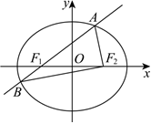
所以当|<em>AB</em>|最小时，|<em>AF</em>2|+|<em>BF</em>2|最大，由椭圆的性质得，过椭圆焦点的弦中垂直于长轴的弦最短，
当直线<te*x*t style="italic">*AB*</text>垂直于x轴时，|AB|取得最小值 $\frac{2b^{2}}{a}=\frac{12}{a}$ ，此时 $|AF_{2}|+|BF_{2}|=4a-\frac{12}{a}=8$ ，
由<text style="it*a*lic">a</text>＞0解得a＝3，此时*C*的离心率 $e=\frac{c}{a}=\frac{\sqrt{a^{2}-b^{2}}}{a}=\frac{\sqrt{3^{2}-6}}{3}=\frac{\sqrt{3}}{3}$ ．
故选：*A*．

5.（2024•成都模拟）设<em>O</em>为坐标原点，<em>&lt;text style="italic"&gt;F</em>&lt;/text&gt;1，F2为椭圆 $C：\frac{x^{2}}{4}+\frac{y^{2}}{3}=1$ 的两个焦点，点<em>P</em>在<em>C</em>上， $cos\angle F_{1}PF_{2}=\frac{3}{5}$ ，则 $\overset{\to }{PF_{1}}\cdot \overset{\to }{PF_{2}}=$ （　　）

A． $\frac{9}{4}$ 	
B． $\frac{7}{4}$ 	
C．2	
D． $\frac{7}{2}$

【解答】解：由椭圆定义可得|<em>&lt;text style="italic"&gt;&lt;text style="italic"&gt;&lt;text style="italic"&gt;PF</em>&lt;/text&gt;&lt;/text&gt;&lt;/text&gt;&lt;text style="subscript"&gt;1&lt;/text&gt;|+|PF&lt;text style="subscript"&gt;2&lt;/text&gt;|＝4，利用余弦定理可得 $|PF_{1}|^{2}+|PF_{2}|^{2}-2|PF_{1}|\cdot |PF_{2}|\cdot cos\angle F_{1}PF_{2}=|F_{1}F_{2}|^{2}$ ，所以 $(|PF_{1}|+|PF_{2}|)^{2}-\frac{16}{5}|PF_{1}|\cdot |PF_{2}|=|F_{1}F_{2}|^{2}=4$ ，解得|<em>&lt;text style="italic"&gt;&lt;text style="italic"&gt;&lt;text style="italic"&gt;PF</em>&lt;/text&gt;&lt;/text&gt;&lt;/text&gt;&lt;text style="subscript"&gt;1&lt;/text&gt;|•|PF&lt;text style="subscript"&gt;2&lt;/text&gt;| $=\frac{15}{4}$ ，
则 $\overset{\to }{PF_{1}}\cdot \overset{\to }{PF_{2}}=$ | $\overset{\to }{PF_{1}}$ || $\overset{\to }{PF_{2}}$ |cos∠<em>F</em>1<em>PF</em>2 $=\frac{15}{4}\times \frac{3}{5}=\frac{9}{4}$ ．
故选：*A*．

6.（2024•成都开学）已知椭圆的左，右焦点分别为，，点是椭圆上的任意一点，则

A．	
B．的最大值为

C．的最小值为4	
D．的最大值为4

【解答】解：根据题意可得，，，

对选项，，选项正确；

对选项，，当且仅当时取等号，选项错误；

对选项，设，，

则，，

，选项正确；

对选项，由选项分析可知，选项正确．

故选：．

7.（2024•双鸭山三模）已知双曲线的左、右焦点分别为、，过作直线与双曲线的左、右两支分别交于，两点．若，且，则双曲线的离心率为

A．	
B．2	
C．	
D．3

【解答】解：已知双曲线的左、右焦点分别为、，过作直线与双曲线的左、右两支分别交于，两点．连接，，由双曲线的定义可得：，，

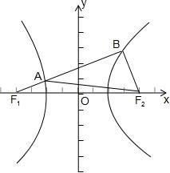

又，不妨设，则，则，，，

又，则，解得：，

即，，又，则，

即，即．

故选：．

8.（2024•思明区期中）已知双曲线的左、右焦点分别为，，过点的直线与双曲线的右支交于，两点，若，且双曲线的离心率为，则<u>　　</u>．

【解答】解：因为双曲线的离心率为，所以，因为，所以，由双曲线的定义可得，

所以，在△中，

由余弦定理得，

在△中，，设，则，

由，得，

解得，所以，所以．

故答案为：．

9.（2024•浦东新区期中）已知双曲线的左、右焦点分别为，，过的直线交该双曲线于点、，且，，则△的面积为 <u>　　</u>．

【解答】解：设，则根据题意可知，，，，又易知，在△中，由勾股定理可得：，

解得，又，，，△的面积为．
故答案为：24．

10.（2024•天河区校级二模）已知双曲线<te<te*x*t st*y*le="italic">x</text>t st*y*le="it*a*lic">*C*</text>： $\frac{x^{2}}{a^{2}}-\frac{y^{2}}{b^{2}}=$ 1（<te<te*x*t st*y*le="italic">x</text>t st*y*le="italic">a</text>＞0，*b*＞0）的右焦点为*F*，一条渐近线的方程为y＝2x，若直线y＝*<text style="italic">k*x</text>与*<text style="italic">C*</text>在第一象限内的交点为*P*，且*PF*⊥x轴，则k的值为（　　）

A． $\frac{\sqrt{5}}{2}$ 	
B． $\frac{\sqrt{3}}{2}$ 	
C． $\frac{4\sqrt{5}}{5}$ 	
D． $\frac{4\sqrt{3}}{5}$

【解答】解：由双曲线的一条渐近线方程为&lt;te&lt;te&lt;text st&lt;text st&lt;text st<em>y</em>le="italic"&gt;y&lt;/text&gt;le="italic"&gt;y&lt;/text&gt;le="italic"&gt;x&lt;/text&gt;t style="it&lt;text style="it&lt;text style="itali<em>c</em>"&gt;a&lt;/text&gt;li<em>c</em>"&gt;a&lt;/text&gt;lic"&gt;x&lt;/text&gt;t style="italic"&gt;y&lt;/text&gt;＝&lt;text style="superscript"&gt;&lt;text style="superscript"&gt;2&lt;/text&gt;&lt;/text&gt;x可知，<em>&lt;text style="italic"&gt;b</em>&lt;/text&gt;＝2a，在双曲线中c2＝a2+b2，∴c $=\sqrt{5}a$ ，∵&lt;te&lt;text st&lt;text st&lt;text st<em>y</em>le="italic"&gt;y&lt;/text&gt;le="italic"&gt;y&lt;/text&gt;le="italic"&gt;x&lt;/text&gt;t style="italic"&gt;<em>&lt;text style="italic"&gt;&lt;text style="italic,subscript"&gt;P</em>&lt;/text&gt;&lt;/text&gt;F&lt;/text&gt;⊥&lt;text style="it&lt;text style="it&lt;text style="itali<em>c</em>"&gt;a&lt;/text&gt;li<em>c</em>"&gt;a&lt;/text&gt;lic"&gt;x&lt;/text&gt;轴，∴ $\frac{c^{2}}{a^{2}}-\frac{y^{2}}{b^{2}}=$ 1，解得&lt;te&lt;te&lt;text st&lt;text st&lt;text st<em>y</em>le="italic"&gt;y&lt;/text&gt;le="italic"&gt;y&lt;/text&gt;le="italic"&gt;x&lt;/text&gt;t style="it&lt;text style="it&lt;text style="itali<em>c</em>"&gt;a&lt;/text&gt;li<em>c</em>"&gt;a&lt;/text&gt;lic"&gt;x&lt;/text&gt;t style="italic"&gt;y&lt;/text&gt;<em>&lt;text style="italic"&gt;&lt;text style="italic,subscript"&gt;P</em>&lt;/text&gt;&lt;/text&gt; $=\frac{b^{2}}{a}$ ，又点&lt;text st&lt;text st<em>y</em>le="italic"&gt;y&lt;/text&gt;le="italic,subscript"&gt;<em>&lt;text style="italic,subscript"&gt;P</em>&lt;/text&gt;&lt;/text&gt;在&lt;te&lt;te&lt;text st<em>y</em>le="italic"&gt;x&lt;/text&gt;t style="it&lt;text style="it&lt;text style="itali<em>c</em>"&gt;a&lt;/text&gt;li<em>c</em>"&gt;a&lt;/text&gt;lic"&gt;x&lt;/text&gt;t style="italic"&gt;y&lt;/text&gt;＝<em>&lt;text style="italic"&gt;k</em>x&lt;/text&gt;上，∴yP＝<em>&lt;text style="italic"&gt;kc</em>&lt;/text&gt;，即kc $=\frac{b^{2}}{a}$ ，<em>k</em> $=\frac{b^{2}}{ac}=\frac{4a^{2}}{a\cdot \sqrt{5}a}=\frac{4\sqrt{5}}{5}$ ．
故选：*C*．

10.（2024•多选•南通模拟）已知椭圆的左、右焦点分别为、，上、下两个顶点分别为、，的延长线交于，且，则

A．椭圆的离心率为	
B．直线的斜率为

C．△为等腰三角形	
D．

【解答】解：设，椭圆的焦距为，由椭圆的对称性知，，

由椭圆的定义知，，即，所以，，

由椭圆的定义知，，所以，即△为等腰三角形，故选项正确；
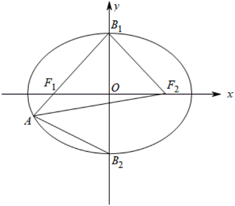

，，所以离心率，即选项正确；

因为，所以直线的斜率为，即选项错误；

在△中，，在△中，由余弦定理知，，即，

所以，即选项正确．

故选：．

11.（2024•多选•海珠区期中）已知双曲线的左、右焦点分别为，，直线与双曲线的右支相交于，两点（点在第一象限），若，则

A．双曲线的离心率为	
B．

C．	
D．

【解答】解：易知，直线得方程为，

可得直线经过双曲线的右焦点，斜率，不妨设直线的倾斜角为，

此时，解得，不妨设，，因为，所以，，，故选项正确；
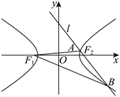

，解得或（舍去），则双曲线的离心率，故选项错误，

令，根据,所以，则，故选项错误．

故选：．

12.（2024•德阳模拟）已知，为椭圆的两个焦点，为原点，为椭圆上一点，，则<u>　　</u>．

【解答】解：．解得．

故答案为：．

13.（2024•皇姑区模拟）设为坐标原点，，为双曲线的两个焦点，点在上，，则<u>　　</u>．

【解答】，．

故答案为：．

14.（2024•浦东新区二模）已知双曲线的焦点分别为，，为双曲线上一点，若，，则双曲线的离心率为 <u>　　</u>．

【解答】，化为，则．

故答案为：．

13.（2024•李沧区模拟）如图，已知斜率为—3的直线与双曲线的右支交于，两点，点关于坐标原点对称的点为且，则该双曲线的离心率为 <u>　　</u>．

【解答】解：如图，设直线与轴交于点，取的中点，连接，，

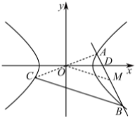

由双曲线的对称性可知为线段的中点，则，因为，所以，

由直线的斜率，得，则直线的斜率，设，，，，则，两式相减得，化简得，

所以该双曲线的离心率．

故答案为：．

14.（2024•陕西模拟）已知抛物线的焦点为，若，，在抛物线上，且满足，则的最小值为 <u>　9　</u>．

【解答】解：抛物线的焦点为，依题意不妨设直线的倾斜角为，

由抛物线定义得：，即，

同理，

则，

因此，

令，则，

令，则，由得或，由得，

因此函数在上单调递减，在上单调递增，当时，，此时，

于是得，所以当时，取得最小值9．
故答案为：9．

15.（2023•涪城区模拟）已知椭圆，经过原点的直线交于，两点．是上一点（异于点，，直线交轴于点．若直线，的斜率之积为，且，则椭圆的离心率为 <u>　   　</u>．

【解析】设，，，，则直线的斜率为，的斜率为，

由题知，两式相减得，即，即，即，又，则，即，即，则，所以，即，则椭圆的离心率为．

故答案为：．

16.（2024•多选•信都区期中）满足下列条件的点*P*的轨迹一定在双曲线上的有（　　）

A．*A*（2，0），*B*（﹣2，3），|*PA*﹣*PB*|＝5

B．<em>A</em>（2，0），<em>B</em>（﹣2，0），<em>kPAkPB</em>＝2

C．<em>A</em>（2，0），<em>B</em>（﹣2，0），<em>kPAkPB</em>＝1

D．*A*（2，0），*B*（﹣2，3），*PA*﹣*PB*＝2

【解答】解：因为|*PA*﹣*PB*|＝5＝|*AB*|，所以点*P*的轨迹是两条射线，故*A*不正确；
设&lt;te&lt;te&lt;te<em>x</em>t st<em>y</em>le="italic"&gt;x&lt;/text&gt;t st<em>y</em>le="italic"&gt;x&lt;/text&gt;t style="italic"&gt;P&lt;/text&gt;（x，y）（x≠±&lt;text style="superscript"&gt;2&lt;/text&gt;），因为<em>&lt;text style="italic"&gt;k</em>&lt;/text&gt;<em>PA</em>•k<em>PB</em> $=\frac{y}{x-2}$ • $\frac{y}{x+2}=$ &lt;te<em>x</em>t style="superscript"&gt;2&lt;/text&gt;，化简得&lt;te&lt;text st<em>y</em>le="italic"&gt;x&lt;/text&gt;t style="italic"&gt;y&lt;/text&gt;2＝2（<em>x</em>2﹣4），即 $\frac{x^{2}}{4}-\frac{y^{2}}{8}=$ 1，
此时*P*的轨迹在双曲线上，故*B*正确；
设&lt;te&lt;te&lt;te&lt;te&lt;text st<em>y</em>le="italic"&gt;x&lt;/text&gt;t style="italic"&gt;x&lt;/text&gt;t st<em>y</em>le="italic"&gt;x&lt;/text&gt;t st<em>y</em>le="italic"&gt;x&lt;/text&gt;t style="italic"&gt;P&lt;/text&gt;（x，y）（x≠±&lt;text style="superscript"&gt;&lt;text style="superscript"&gt;&lt;text style="superscript"&gt;2&lt;/text&gt;&lt;/text&gt;&lt;/text&gt;），因为<em>&lt;text style="italic"&gt;k</em>&lt;/text&gt;<em>PA</em>•k<em>PB</em> $=\frac{y}{x-2}$ • $\frac{y}{x+2}=$ 1，化简得&lt;te&lt;te&lt;te&lt;text st<em>y</em>le="italic"&gt;x&lt;/text&gt;t style="italic"&gt;x&lt;/text&gt;t st<em>y</em>le="italic"&gt;x&lt;/text&gt;t style="italic"&gt;y&lt;/text&gt;&lt;text style="superscript"&gt;&lt;text style="superscript"&gt;&lt;text style="superscript"&gt;2&lt;/text&gt;&lt;/text&gt;&lt;/text&gt;＝<em>x</em>2﹣4，即x2﹣y2＝4，
此时*P*的轨迹在双曲线上，故*C*正确；
因为|*PA*|﹣|*PB*|＝2＜5＝|*AB*|，此时*P*的轨迹在双曲线上，故*D*正确．
故选：*BCD*．

17.（2024•江西模拟）直线<em>l</em>过抛物线<em>C</em>：<em>y</em>2＝2<em>px</em>（<em>p</em>＞0）的焦点，且与<em>C</em>交于<em>A</em>，<em>B</em>两点，若使|<em>AB</em>|＝2的直线<em>l</em>恰有2条，则<em>p</em>的取值范围为（　　）

A．0＜*p*＜1	
B．0＜*p*＜2	
C．*p*＞1	
D．*p*＞2

【解答】解：由抛物线方程得：抛物线的焦点为 $(\frac{p}{2}，0)$ ，通径长为2*p*，
当<te<text sty*l*e="italic">x</text>t style="italic">*AB*</text>垂直于x轴时，A，B两点坐标为 $(\frac{p}{2}，\pm p)$ ，因为使|<te<text sty*l*e="italic">x</text>t style="italic">*AB*</text>|＝2的直线l恰有2条，
所以|<em>AB</em>|<em>min</em>＝2<em>p</em>＜2，且<em>p</em>＞0，即抛物线的焦点弦中，通径最短，所以0＜<em>p</em>＜1．
故选：*A*．

18．（2024•武汉模拟）设抛物线<em>C</em>：<em>y</em>＝4<em>x</em>2的焦点为<em>F</em>，过焦点<em>F</em>的直线与抛物线<em>C</em>相交于<em>A</em>，<em>B</em>两点，则|<em>AB</em>|的最小值为（　　）

A．1	
B． $\frac{1}{2}$ 	
C． $\frac{1}{4}$ 	
D． $\frac{1}{8}$

【解答】解：由&lt;te&lt;te&lt;te&lt;text st<em>y</em>le="italic"&gt;x&lt;/text&gt;t st<em>y</em>le="italic"&gt;x&lt;/text&gt;t style="italic"&gt;x&lt;/text&gt;t st<em>y</em>le="italic"&gt;C&lt;/text&gt;：y＝4x&lt;text style="subscript"&gt;&lt;text style="subscript"&gt;2&lt;/text&gt;&lt;/text&gt;得 $x^{2}=\frac{1}{4}y$ ， $F(0，\frac{1}{16})$ ，由题意可知直线&lt;te&lt;te&lt;text st<em>y</em>le="italic"&gt;x&lt;/text&gt;t st<em>y</em>le="italic"&gt;x&lt;/text&gt;t style="italic"&gt;<em>AB</em>&lt;/text&gt;的斜率存在，故设其方程为 $y=kx+\frac{1}{16}$ ，联立 $y=kx+\frac{1}{16}$ 与 $x^{2}=\frac{1}{4}y$ 可得 $x^{2}-\frac{1}{4}kx-\frac{1}{64}=0$ ，设&lt;te&lt;te&lt;text st<em>y</em>le="italic"&gt;x&lt;/text&gt;t st<em>y</em>le="italic"&gt;x&lt;/text&gt;t style="italic"&gt;A&lt;/text&gt;（<em>x</em>&lt;text style="subscript"&gt;1&lt;/text&gt;，<em>y</em>1），<em>B</em>（x&lt;text style="subscript"&gt;&lt;text style="subscript"&gt;2&lt;/text&gt;&lt;/text&gt;，y2），则 $x_{1}+x_{2}=\frac{1}{4}k$ ，故 $y_{1}+y_{2}=k(x_{1}+x_{2})+\frac{1}{8}=\frac{1}{4}k^{2}+\frac{1}{8}$ ，因此 $|AB|=y_{1}+y_{2}+\frac{1}{8}=\frac{1}{4}k^{2}+\frac{1}{4}\geq \frac{1}{4}$ ，当且仅当<em>k</em>＝0时取等号．
故选：*C*．

19.（2023•安康二模）设抛物线的焦点是，直线与抛物线相交于，两点，且，过弦的中点作的垂线，垂足为，则的最小值为

A．	
B．3	
C．	
D．

【解析】设，，过点，分别作抛物线的准线的垂线，垂足分别为，，则，．点为弦的中点，根据梯形中位线定理可得，到抛物线的准线的距离为，，在中，由余弦定理得，

，当且仅当时取等号．的最小值为．

故选：．

20.（2024•哈尔滨香坊区二模）已知点，是等轴双曲线的左右顶点，且点是双曲线上异于，一点，，则<u>　   　</u>．

【解答】解：设，则，，所以，即，设，，则，因为双曲线为等轴双曲线，所以，即，

因为，，所以，所以，即，所以，即，所以，

因为，所以，即，所以．

故答案为：．

21.（2024•金凤区校级一模）已知抛物线的准线与轴交于点，过焦点的直线与交于，两点，且，，，，的中点为，过作的垂线交轴于点，点在的准线上的射影为点，现有下列四个结论：

①，；②若时，；③；④过的直线与抛物线交于，，则．
其中正确结论的序号为 <u>　   　</u>．

【解答】解：对①：由题意可知，直线的斜率存在且不为零，设直线方程为，

联立，可得，△，所以，

，故①错误；

对②：由抛物线的定义可知，，，因为，即，

由韦达定理可知，解得或（舍，则，所以，故②错误；

对③：过点作轴，垂足为，因为，

所以，所以，故③正确；
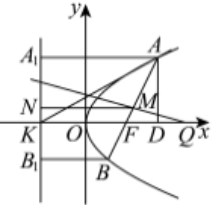

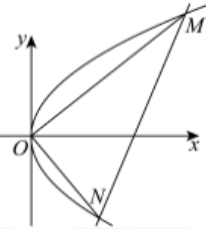

对④：当轴时，所以，，所以，，当斜率存在且不为零时，设斜率为，

，，，，则直线方程为，联立，

消去可得，，，

，代入韦达定理并化简可得，所以，故④正确．
故答案为：③④．

22.（2024•江苏模拟）设抛物线的焦点为，的准线与轴交于点，过的直线与在第一象限的交点为，，且，则直线的斜率为

A．	
B．	
C．	
D．

【解答】解：根据题意可得物线的焦点，准线方程为，

为，设直线方程为，，联立，可得，

设，，，，，则，，又，

，又，，，，又，

解得，，，又，解得．

故选：．

<te<text sty*l*e="italic">x</text>t style="superscript">2</text>3.（2024•包头模拟）已知抛物线<text st*y*le="italic">*C*</text>：y2＝6x的焦点为*<text style="italic">F*</text>，*O*为坐标原点，倾斜角为θ的直线l过点F且与C交于*M*，*N*两点，若△*OMN*的面积为 $3\sqrt{3}$ ，则（　　）

A． $sin\theta =\frac{1}{2}$ 	                            
B．|*MN*|＝24

C．以<text st*y*le="italic">MF</text>为直径的圆与y轴仅有1个交点  	
D． $\frac{|MF|}{|NF|}=\frac{\sqrt{3}}{3}$ 或 $\frac{|MF|}{|NF|}=\sqrt{3}$

【解答】解：依题意 $F(\frac{3}{2}，0)$ ，设直线 $l：x=my+\frac{3}{2}，M(x_{1}，y_{1})，N(x_{2}，y_{2})$ ，

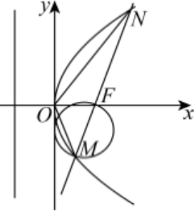
由 $\left\{\begin{matrix}x=my+\frac{3}{2}\\y^{2}=6x\end{matrix}\right.$ ，整理得<em>y</em>&lt;text style="superscript"&gt;2&lt;/text&gt;﹣6<em>&lt;text style="italic"&gt;m</em>y&lt;/text&gt;﹣9＝0，则Δ＝36（m2+1）＞0，
所以&lt;text st&lt;text st&lt;text st<em>y</em>le="italic"&gt;y&lt;/text&gt;le="italic"&gt;y&lt;/text&gt;le="italic"&gt;y&lt;/text&gt;&lt;text style="subscript"&gt;1&lt;/text&gt;+y&lt;text style="subscript"&gt;2&lt;/text&gt;＝6<em>m</em>，y1y2＝﹣9，所以 $S_{\bigtriangleup OMN}=\frac{1}{2}\times |y_{1}-y_{2}|\times \frac{3}{2}=\frac{3}{4}\sqrt{(y_{1}+y_{2})^{2}-4y_{1}y_{2}}=\frac{3}{4}\times 6\sqrt{m^{2}+1}=3\sqrt{3}$ ，
解得3<em>m</em>2＝1，所以 $m^{2}=\frac{cos^{2}\theta }{sin^{2}\theta }=\frac{1}{3}，又sin^{2}\theta +cos^{2}\theta =1$ ，解得 $sin^{2}\theta =\frac{3}{4}$ ，
所以 $sin\theta =\pm \frac{\sqrt{3}}{2}$ ，又θ∈[0，π），所以 $sin\theta =\frac{\sqrt{3}}{2}$ ，故*A*错误；
因为 $|MN|=\sqrt{1+m^{2}}\sqrt{(y_{1}+y_{2})^{2}-4y_{1}y_{2}}=6\times \frac{4}{3}=8$ ，故*B*错误；
因为 $|MF|=x_{1}+\frac{3}{2}$ ，又线段<text st*y*le="italic">MF</text>的中点到y轴的距离为 $\frac{x_{1}+\frac{3}{2}}{2}$ ，
所以以*MF*为直径的圆与*y*轴相切，即仅有1个交点，故*C*正确；
因为 $\frac{|MF|}{|NF|}=\frac{|y_{1}|}{|y_{2}|}$ ，若 $m=\frac{\sqrt{3}}{3}$ ，则 $y^{2}-2\sqrt{3}y-9=0$ ，解得 $y=-\sqrt{3}$ 或 $y=3\sqrt{3}$ ，
若 $m=-\frac{\sqrt{3}}{3}$ ，则 $y^{2}+2\sqrt{3}y-9=0$ ，解得 $y=\sqrt{3}$ 或 $y=-3\sqrt{3}$ ，
即 $|y_{1}|=\sqrt{3}、|y_{2}|=3\sqrt{3}$ 或 $|y_{2}|=\sqrt{3}、|y_{1}|=3\sqrt{3}$ ，
所以 $\frac{|MF|}{|NF|}=\frac{1}{3}$ 或 $\frac{|MF|}{|NF|}=3$ ，故*D*错误．
故选：*C*．

24.（2023•多选•湘潭期末）已知抛物线，点是抛物线的焦点，点是抛物线上的一点，点，则下列说法正确的是

A．抛物线的准线方程为	    
B．若，则的面积为

C．的最大值为	    
D．的周长的最小值为

【解析】对选项，，，，准线方程为，故正确；

对选项，根据抛物线定义得，，

，轴，当时，，若点在第一象限时，此时，故，的高为1，故，若点在第四象限，此时，

故，的高为1，故，故错误；

对选项，，，故正确；

对选项，连接，并延长交于抛物线于点，此时即为最大值的情况，

  
图对应如下：过点作准线，垂足为点，

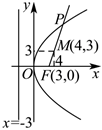

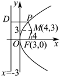

的周长，若周长最小，则长度和最小，显然当点，，位于同一条直线上时，的和最小，此时，

故周长最小值为，故正确．

故选：．

25.（2024•周口开学）已知椭圆为的左焦点，为上一点，则

A．的最小值为	
B．的最大值为

C．面积的最小值为	
D．面积的最大值为

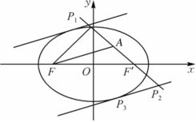

【解答】设的右焦点为，则，，所以，所以，当，，三点共线，且在线段的延长线上时，的值最小，，所以的最小值为；当，，三点共线，且在延长线上时，最大，且，故，故，均正确；易知的面积无最小值，故错误；直线的方程为，设与直线平行且与相切的直线为，由，得，由△，得，显然直线与距离较远，所以直线与直线间的距离，

当为直线与的交点时，的面积最大，此时其面积为，故正确．故选：．

26.（2024•淄博模拟）“若点为椭圆上的一点，、为椭圆的两个焦点，则椭圆在点处的切线平分的外角”，这是椭圆的光学性质之一．已知椭圆，点是椭圆上的点，在点处的切线为直线，过左焦点作的垂线，垂足为，设点的轨迹为曲线．若是曲线上一点，已知点，，则的最小值为 <u>　    　</u>．

【解答】解：延长与，相交于点，则平分，且，所以，且点是的中点，由椭圆的定义知，，所以，即，

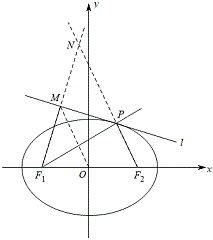

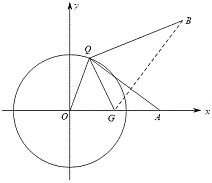

连接，因为是的中点，所以，设点，则，

取的中点，连接，则，所以，，

即，又，所以，所以，即，

所以，当且仅当，，三点共线时，等号成立，所以的最小值为5．
故答案为：5．

&lt;te&lt;te<em>x</em>t style="italic"&gt;x&lt;/text&gt;t style="superscript"&gt;2&lt;/text&gt;7.（2024•博爱县期中）希腊著名数学家阿波罗尼斯与欧几里得、阿基米德齐名．他发现：“平面内到两个定点&lt;text st<em>y</em>le="italic"&gt;<em>A</em>&lt;/text&gt;，<em>&lt;text style="italic"&gt;B</em>&lt;/text&gt;的距离之比为定值λ（λ≠1）的点的轨迹是圆”．后来，人们将这个圆以他的名字命名，称为阿波罗尼斯圆，简称阿氏圆．在平面直角坐标系<em>xOy</em>中，已知A（﹣3，1），B（﹣3，9），点<em>P</em>是满足 $\lambda =\frac{1}{3}$ 的阿氏圆上的任一点，若点&lt;te&lt;te<em>x</em>t style="italic"&gt;x&lt;/text&gt;t st<em>y</em>le="italic"&gt;<em>Q</em>&lt;/text&gt;为抛物线<em>&lt;text style="italic"&gt;E</em>&lt;/text&gt;：y2＝4x上的动点，Q在直线x＝﹣1上的射影为<em>H</em>，<em>F</em>为抛物线E的焦点，则下列选项正确的有（　　）

A．|*AQ*|﹣|*QF*|的最小值为2           	
B．△*APF*的面积最大值为 $3+\frac{3\sqrt{17}}{2}$

C．当∠*PFA*最大时，△*APF*的面积为 $\frac{7}{8}+\frac{3\sqrt{7}}{2}$ 	
D．|*PB*|+3|*PQ*|+3|*QH*|的最小值为 $3\sqrt{17}$

【解答】解：*A*选项，抛物线的准线方程为*x*＝﹣1，*F*（1，0），由抛物线定义可得|*QF*|＝|*QH*|，
则|*AQ*|﹣|*QF*|＝|*AQ*|﹣|*QH*|，由三角形三边关系可得|*AQ*|﹣|*QF*|＝|*AQ*|﹣|*QH*|≤|*AH*|，
当且仅当*A*，*H*，*Q*三点共线时，等号成立，故|*AQ*|﹣|*QF*|的最小值为﹣1﹣（﹣3）＝2，*A*正确；
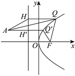

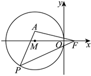

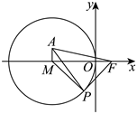

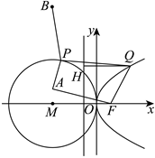

&lt;te&lt;te&lt;te&lt;te&lt;te&lt;te&lt;text st<em>y</em>le="italic"&gt;x&lt;/text&gt;t st<em>y</em>le="italic"&gt;x&lt;/text&gt;t st<em>y</em>le="italic"&gt;x&lt;/text&gt;t st<em>y</em>le="italic"&gt;x&lt;/text&gt;t style="italic"&gt;x&lt;/text&gt;t st<em>y</em>le="italic"&gt;x&lt;/text&gt;t style="italic"&gt;B&lt;/text&gt;选项，由题意得，点<em>&lt;text style="italic"&gt;P</em>&lt;/text&gt;（x，y）的轨迹方程为 $\frac{\sqrt{(x+3)^{2}+(y-1)^{2}}}{\sqrt{(x+3)^{2}+(y-9)^{2}}}=\frac{1}{3}$ ，化简得&lt;te&lt;te&lt;te&lt;te&lt;te&lt;text st<em>y</em>le="italic"&gt;x&lt;/text&gt;t st<em>y</em>le="italic"&gt;x&lt;/text&gt;t st<em>y</em>le="italic"&gt;x&lt;/text&gt;t st<em>y</em>le="italic"&gt;x&lt;/text&gt;t style="italic"&gt;x&lt;/text&gt;t st<em>y</em>le="italic"&gt;x&lt;/text&gt;&lt;text style="superscript"&gt;2&lt;/text&gt;+6x+y2＝0，即以<em>&lt;text style="italic"&gt;M</em>&lt;/text&gt;（﹣3，0）为圆心，3为半径的圆，直线 $AF：\frac{y-0}{1-0}=\frac{x-1}{-3-1}$ ，即&lt;te&lt;te&lt;te&lt;te&lt;te&lt;text st<em>y</em>le="italic"&gt;x&lt;/text&gt;t st<em>y</em>le="italic"&gt;x&lt;/text&gt;t st<em>y</em>le="italic"&gt;x&lt;/text&gt;t st<em>y</em>le="italic"&gt;x&lt;/text&gt;t style="italic"&gt;x&lt;/text&gt;t st<em>y</em>le="italic"&gt;x&lt;/text&gt;+4y﹣1＝0，圆心<em>&lt;text style="italic"&gt;M</em>&lt;/text&gt;（﹣3，0）到直线x+4y﹣1＝0的距离为 $d=\frac{|-3+0-1|}{\sqrt{1+16}}=\frac{4\sqrt{17}}{17}$ ，则&lt;te&lt;te&lt;te&lt;te&lt;te&lt;te&lt;text st<em>y</em>le="italic"&gt;x&lt;/text&gt;t st<em>y</em>le="italic"&gt;x&lt;/text&gt;t st<em>y</em>le="italic"&gt;x&lt;/text&gt;t st<em>y</em>le="italic"&gt;x&lt;/text&gt;t style="italic"&gt;x&lt;/text&gt;t st<em>y</em>le="italic"&gt;x&lt;/text&gt;t style="italic"&gt;<em>P</em>&lt;/text&gt;到直线x+4y﹣1＝0的距离最大值为 $3+d=3+\frac{4\sqrt{17}}{17}$ ，
又 $|AF|=\sqrt{(-3-1)^{2}+1^{2}}=\sqrt{17}$ ，故△*APF*的面积最大值为 $\frac{1}{2}|AF|\cdot (3+\frac{4\sqrt{17}}{17})=2+\frac{3\sqrt{17}}{2}$ ，*B*错误；
*C*选项，∠*AFM*为定值，由勾股定理得 $|AF|=\sqrt{AM^{2}+MF^{2}}=\sqrt{17}$ ，且 $sin\angle AFM=\frac{|AM|}{|AF|}=\frac{1}{\sqrt{17}}$ ， $cos\angle AFM=\frac{4}{\sqrt{17}}$ ，要想∠*<text style="italic">P*FA</text>取得最大值，则需∠*M<text style="italic">FP*</text>最大，如图所示，当FP与*<text style="italic">MP*</text>垂直且P在图中位置时，∠*<text style="italic">MF*P</text>取得最大值，其中|MF|＝4，|MP|＝3，故 $|PF|=\sqrt{16-9}=\sqrt{7}$ ，
$sin\angle MFP=\frac{3}{4}$ ， $cos\angle MFP=\frac{\sqrt{7}}{4}$ ，故当∠*PFA*最大时，sin∠*AFP*＝sin（∠*AFM*+∠*PFM*）

＝sin∠*<text style="italic">AFM* </text>cos∠*<text style="italic">PFM* </text>+cos∠AFM sin∠PFM $=\frac{1}{\sqrt{17}}\times \frac{\sqrt{7}}{4}+\frac{4}{\sqrt{17}}\times \frac{3}{4}=\frac{12+\sqrt{7}}{4\sqrt{17}}$ ，
则△*APF*的面积为 $\frac{1}{2}|AF|\cdot |PF|sin\angle AFP=\frac{1}{2}\times \sqrt{17}\times \sqrt{7}\times \frac{12+\sqrt{7}}{4\sqrt{17}}=\frac{7}{8}+\frac{3\sqrt{7}}{2}$ ，*C*正确；
*D*选项，由题意得 $|PA|=\frac{1}{3}|PB|$ ，|*<text style="italic">QH*</text>|＝|*<text style="italic">QF*</text>|，|*PB*|+3|*<text style="italic">PQ*</text>|+3|QH|＝3（|*PA*|+|PQ|+|QF|），

连接*<text style="italic"><text style="italic">AF*</text></text>，线段AF与圆*M*和抛物线的交点分别为*<text style="italic">P*</text>，*<text style="italic">Q*</text>，即A，P，Q，F四点共线时，|*PA*|+|*<text style="italic">PQ*</text>|+|*QF*|取得最小值，最小值为 $|AF|=\sqrt{17}$ ，故|*<text style="italic">P*</text>B|+3|P*<text style="italic">Q*</text>|+3|*QH*|最小值为 $3\sqrt{17}$ ，*D*正确．
故选：*ACD*．

