第七章达标训练（一）

1.已知，分别为椭圆的左、右焦点，点为椭圆的一个顶点，△是顶角为的等腰三角形．

（1）求椭圆的方程；

（2）过点分别作直线，交椭圆于，两点，设两直线的斜率分别为，，且，求证：直线过定点．

2.已知椭圆，点在椭圆上，椭圆的四个顶点的连线构成的四边形的面积为．

(1)求椭圆的方程；

(2)设点为椭圆长轴的左端点，、为椭圆上异于椭圆长轴端点的两点，记直线、斜率分别为、，若，请判断直线是否过定点？若过定点，求该定点坐标，若不过定点，请说明理由．

3.(2023•南宁期末)如图，椭圆经过点，且离心率为．

(Ⅰ)求椭圆的方程；

(Ⅱ)经过点，且斜率为的直线与椭圆交于不同的两点，（均异于点，证明：直线与的斜率之和为2．

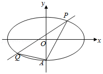

4.（2023•宝山区月考）已知椭圆，依次连接椭圆的四个顶点构成的四边形面积为．

（1）若，求椭圆的标准方程；

（2）以椭圆的右顶点为焦点的抛物线，若上动点到点的最短距离为，求的值；

（3）当时，设点为椭圆的右焦点，，直线交于、（均不与点重合）两点，直线、、的斜率分别为、，，若，求的周长．

5.已知左焦点为的椭圆过点．过点分别作斜率为，的椭圆的动弦，，设，分别为线段，的中点．

(1)求椭圆的标准方程；

(2)若为线段的中点，求；

(3)若，求证直线恒过定点，并求出定点坐标．

6.已知圆,点，是圆上一动点,若线段的垂直平分线和相交于点,点的轨迹为曲线.动直线交曲线于两点,且始终满足，为坐标原点,作交于点.
(1)求曲线的方程;
(2)证明:为定值.

7.（2023•福建模拟）已知椭圆的左、右顶点分别为，，上、下顶点分别为，，左焦点为，且过点．为坐标原点，与的面积的比值为．

（1）求椭圆的标准方程；

（2）直线与椭圆交于，两点，记直线，的斜率分别为，，若为，的等比中项，求面积的取值范围．

8.已知点是椭圆上一点,且的离心率为.

(1)求椭圆的方程;

(2)点，在椭圆上,，为垂足,若直线和直线斜率之积为.求证:存在定点,使得为定值.

9.已知为椭圆上的右顶点,，为椭圆上关于原点对称的两点且，斜率存在,直线，分别与直线交于，两点.

(1)求的最小值;

(2)证明:以为直径的圆过定点.

10.已知椭圆的左、右顶点分别为，,右焦点,，过的直线与椭圆交于，两点,且面积是面积的3倍.

(1)求椭圆的标准方程;

(2)若直线，与直线分别交于，两点,试问:以为直径的圆是否过定点?若是,求出定点坐标;若不是,说明理由.

11.（2023•山西模拟）已知点在椭圆上，直线交椭圆于，两点，直线、的斜率之和为0．

（1）求直线的斜率；

（2）求面积的最大值．

12.已知椭圆上的点到焦点的最小距离为1,且以椭圆的短轴为直径的圆过点且，为椭圆的左右顶点.

(1)求椭圆的方程;

(2)过的直线交椭圆于，两点(在第一象限),直线、的斜率为，,是否存在实数,使得,若存在,求出实数的值;若不存在,说明理由.

13.(2023•醴陵市期中)已知椭圆的左右顶点是双曲线的顶点,且椭圆的上顶点到双曲线的渐近线距离为

(1)求椭圆的方程;

(2)点为椭圆的左焦点,不垂直于轴且不过点的直线与曲线相交于、两点,若直线FA、FB的斜率之和为0,则动直线是否一定经过一定点?若存在这样的定点,则求出该定点的坐标;若不存在这样的定点,请说明理由.

14.（2023・德州期末)椭圆的离心率是,过点(0,1)的动直线与椭圆相交于两点,当直线与轴平行时,直线被椭圆截得的线段长为.

(1)求椭圆的方程;

(2)在轴上是否存在异于点的定点,使得直线变化时,总有?若存在,求出点的坐标;若不存在,请说明理由.

15.已知椭圆*E*：（），过点且与*x*轴平行的直线与椭圆*E*恰有一个公共点，过点*P*且与*y*轴平行的直线被椭圆*E*截得的线段长为．

（1）求椭圆*E*的标准方程；

（2）设过点*P*的动直线与椭圆*E*交于*M*，*N*两点，*T*为*y*轴上的一点，设直线*MT*和*NT*的斜率分别为和，若为定值，求点*T*的坐标.

16.已知粗圆:，上顶点为.过点作斜率为,的两条直线分别交于异与点的两点，.证明:当时，直线恒过定点，并求出该定点.

第七章达标训练（二）

1.（2024•杭州月考）已知椭圆的右焦点为，过点的直线交椭圆于，两点，若线段的中点坐标为，则椭圆的方程为

A．	B．

C．	D．

2.（2024•长沙月考）已知双曲线，过点的直线与该双曲线相交于，两点，若是线段的中点，则直线的方程为

A．	B．	C．	D．该直线不存在

3.（2024•河南期末）已知双曲线的实轴长为4，离心率为，直线与交于，两点，是线段的中点，为坐标原点．若点的横坐标为1，则的取值范围为 <u>　   　</u>．

4.（2023•多选•龙岩模拟）已知双曲线的左，右焦点分别为，，左、右顶点分别为，，为坐标原点．直线交双曲线的右支于，两点（不同于右顶点），且与双曲线的两条渐近线分别交于，两点，则

A．为定值	                            B．

C．点到两条渐近线的距离之和的最小值为	D．存在直线使

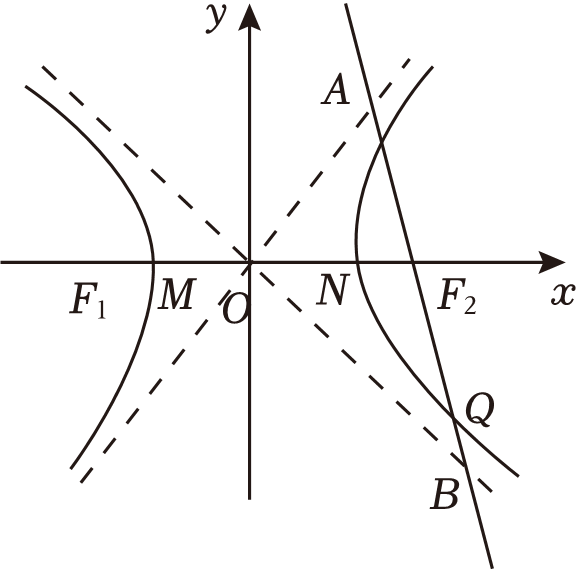

5.（2024•顺庆区月考）已知双曲线，斜率为的直线与的左右两支分别交于，两点，点的坐标为，直线交于另一点，直线交于另一点．若直线的斜率为，则的离心率为

A．	B．	C．	D．

6.（2024•成都模拟）已知圆在椭圆的内部，点为上一动点．过作圆的一条切线，交于另一点，切点为，当为的中点时，直线的斜率为，则的离心率为

A．	B．	C．	D．

7.（2024•多选•贵阳模拟）已知双曲线的左、右焦点分别为，，为双曲线右支上的动点，过作两渐近线的垂线，垂足分别为，．若圆与双曲线的渐近线相切，则下列命题正确的是

A．双曲线的离心率	 B．为定值	 C．的最小值为3

D．若直线与双曲线的渐近线交于、两点，点为的中点，为坐标原点）的斜率为，则

########## 8.椭圆*E*：，直线：，存在*A*、*BE*，且*A*、*B*关于直线对称，求的取值范围．

########## 9.（2015•浙江）已知椭圆上两个不同的点，关于直线对称．

########## （1）求实数的取值范围；

########## （2）求面积的最大值（为坐标原点）．

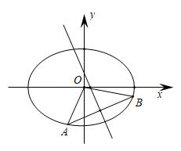

########## 10.（2023•江西模拟）设离心率为的椭圆的左、右焦点分别为、，点在上，且满足，的面积为．

########## （1）求，的值；

########## （2）设直线与交于，两点，点在轴上，且满足，求点横坐标的取值范围．

11.（2024•洪山区期末）已知抛物线，其焦点为．

（1），两点为抛物线上的动点且满足，直线不垂直于轴，求证：线段的垂直平分线过定点，并求出点的坐标；

（2）已知椭圆，圆，过（1）中点作斜率分别为，的直线，，且满足，直线交椭圆于，两点，直线交圆于，两点，点为中点，求面积的取值范围．

12.（2023•苏州模拟）己知椭圆的左、右焦点分别为，，离心率为，是椭圆上的一个动点，且面积的最大值为．

（1）求椭圆的方程；

（2）设斜率不为零的直线与椭圆的另一个交点为，且的垂直平分线交轴于点，求直线的斜率．

13.（2023•成都期中）已知椭圆，过右焦点作一条与轴不垂直的直线交椭圆于、两点，线段的中垂线分别交直线和于、，则的取值范围是

A．，	B．，	C．，	D．，

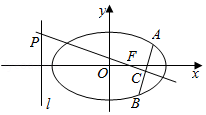

14.（2024•潍坊市月考）已知左焦点为的椭圆过点，过右焦点分别作斜率为，的椭圆的动弦，．设点，分别为线段，的中点．

（1）求椭圆的标准方程；

（2）求三角形面积的最大值；

（3）若，求证：直线经过定点，并求出定点的坐标．

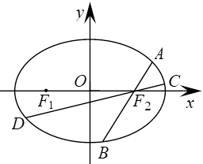

15.（2024•湖北部分重点中学联考）已知在平面直角坐标系中，动点满足.

(1)求动点的轨迹的方程;

(2)过点且垂直于轴的直线与轨迹交于点在第一象限)，以为圆心的圆与轴交于，两点，直线，与轨迹分别交于另一点，，求证:直线的斜率为定值，并求出这个定值.

16.已知过抛物线的焦点的两条直线，的斜率为，.其中与抛物线相交于，两点，中点为.与抛物线相交于,两点，中点为.若时，求直线所过的定点坐标.

17.（2023•浙江月考）已知抛物线的焦点为，为坐标原点．过点的直线与抛物线交于，两点．

（1）若直线与圆相切，求直线的方程；

（2）若直线与轴的交点为，且，，试探究：是否为定值？若为定值，求出该定值；若不为定值，试说明理由．

18.（2024•吉林模拟）已知抛物线的焦点到其准线的距离为4，椭圆经过抛物线的焦点．

（Ⅰ）求抛物线的方程及；

（Ⅱ）已知为坐标原点，过点的直线与椭圆相交于，两点，若，点满足，且最小值为，求椭圆的离心率．

########## 19.若椭圆与椭圆满足，则称这两个椭圆相似，叫相似比．若椭圆与椭圆相似且过点．

########## （1）求椭圆的标准方程；

########## （2）过点作斜率不为零的直线与椭圆交于不同两点、，为椭圆的右焦点，直线、分别交椭圆于点、，设，，求的取值范围．

20.已知椭圆，其短轴长为，离心率为，双曲线的渐近线为，离心率为，且.

(1)求椭圆的方程;

(2)设椭圆的右焦点为，动直线不垂直于坐标轴)交椭圆于不同两点，设直线和的斜率为，若，试探究该动直线是否过轴上的定点，若是，求出该定点:若不是，请说明理由.

21.已知椭圆的离心率是、是椭圆的左、右焦点，点为椭圆的右顶点，点为椭圆的上顶点，且.

(1)求椭圆的方程;

(2)若直线过右焦点且交椭圆于、两点，点是直线上的任意一点，直线、、的斜率分别为、、，问是否存在常数，使得成立?若存在，求出的值;若不存在，请说明理由.

22.已知椭圆方程，直线与轴相交于点，过右焦点的直线与椭圆交于，两点．

（1）若过点的直线与垂直，且与直线交于点，线段中点为，求证．

（2）设点的坐标为，，直线与直线交于点，试问是否垂直，若是，写出证明过程，若不是，请说明理由．

########## 23.（2023•赣州教师竞赛）已知椭圆的离心率为,椭圆上的点，与的最大距离为.

########## 1.1.1.1.1.1.1.1.1.1 求椭圆的方程；

########## 1.1.1.1.1.1.1.1.1.2 设椭圆的下、上顶点分别为A、B,过点P的直线与椭圆Q交于C、D两点，与y轴交于点M，直线AC与直线BD交于点N，试探究是否为定值.

24.(2020•新课标I)已知分别为椭圆的左、右顶点，为的上顶点，..为直线上的动点，与的另一交点为与的另一交点为.

(1)求的方程;

(2)证明:直线过定点.

25.（2023•贵阳月考）如图，在平面直角坐标系中，，分别为双曲线的左、右焦点，双曲线离心率为，若点为双曲线右支上一点，且，直线交双曲线于点，点为线段的中点，延长，，分别与双曲线交于，两点．

（1）若，，，，求证：；

（2）若直线，的斜率都存在，且依次设为，试判断是否为定值，如果是，请求出的值；如果不是，请说明理由．

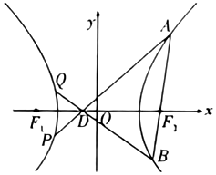

26.已知椭圆：的左右焦点分别为，，点在上，且．

（1）求的标准方程；

（2）设的左右顶点分别为，，为坐标原点，直线过右焦点且不与坐标轴垂直，与交于，两点，直线与直线相交于点，证明点在定直线上．

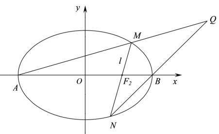

27.已知椭圆，斜率为1的直线与椭圆交于、两点，点，直线与椭圆交于点，直线与椭圆交于，求证:直线过定点.

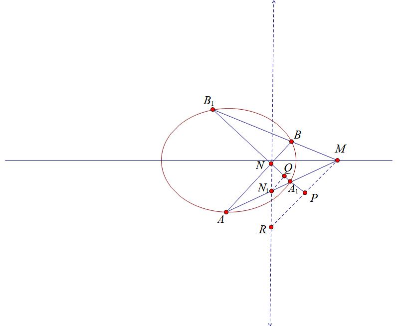

28.（2024•禅城区校级一模）已知椭圆，其中是与，无关的实数．

（1）求实数的取值范围；

（2）当时，如图所示，过点的直线与椭圆分别相交于点，，过点且斜率为的直线与椭圆相交于点，试探究直线是否恒过定点？若是，求出这个定点坐标；若不是，请说明理由．

29.（2024•安徽模拟）已知，是椭圆的左、右焦点，是的上顶点．到直线的距离为．

（1）求的方程；

（2）设直线与轴的交点为，过的两条直线，都不垂直于轴，与交于点，，与交于点，，直线，与分别交于，两点，求证：．

30.如图所示，已知椭圆，过点的直线与椭圆*C*交于*A*、*C*、*B*、*D*四点，且*AB*的斜率为，求证：*AB*∥*CD*．

第七章达标训练（一）

1.已知，分别为椭圆的左、右焦点，点为椭圆的一个顶点，△是顶角为的等腰三角形．

（1）求椭圆的方程；

（2）过点分别作直线，交椭圆于，两点，设两直线的斜率分别为，，且，求证：直线过定点．

【解析】（1）根据题意可知，，，椭圆；

（2）设，，，，将椭圆向上平移1个单位得到，

则，，，，设直线为，，，

，，，，直线为，即，恒过点，

将向下平移1个单位得到，即直线过定点．综上：直线过定点．

2.已知椭圆，点在椭圆上，椭圆的四个顶点的连线构成的四边形的面积为．

(1)求椭圆的方程；

(2)设点为椭圆长轴的左端点，、为椭圆上异于椭圆长轴端点的两点，记直线、斜率分别为、，若，请判断直线是否过定点？若过定点，求该定点坐标，若不过定点，请说明理由．

(1)过: ， ，

， 所以，

所以    ， ;

(2)，，

按照向量平移，得椭圆：

，设平移后:，所以  ，

，，，

，当时，两边同除以:，

，，所以  ，， ，

所以, 恒过,平移回去,恒过点：.

3.(2023•南宁期末)如图，椭圆经过点，且离心率为．

(Ⅰ)求椭圆的方程；

(Ⅱ)经过点，且斜率为的直线与椭圆交于不同的两点，（均异于点，证明：直线与的斜率之和为2．

【解析】（Ⅰ）因为椭圆过点 , 所以, , 所以  , 所以椭圆；

（Ⅱ）按向量方向平移 ， 椭圆变为，设平移后  方程为，过 ，   所以  ，，，

，，当时，两边同除以，

，所以，得证.

4.（2023•宝山区月考）已知椭圆，依次连接椭圆的四个顶点构成的四边形面积为．

（1）若，求椭圆的标准方程；

（2）以椭圆的右顶点为焦点的抛物线，若上动点到点的最短距离为，求的值；

（3）当时，设点为椭圆的右焦点，，直线交于、（均不与点重合）两点，直线、、的斜率分别为、，，若，求的周长．

【解析】（1）依题意，且，解得，故椭圆方程为：．

（2）由椭圆，知右顶点为，，，

，设，，

当，即时，时取最小值，由题意可得，解得，

当时，即时，时取最小值，最小值为10，不符合题意，故的值为4；

（3）将椭圆按照向量平移,则得到方程,平移后，,,设方程为,即(构造齐次式),同除以得,,因为点的坐标满足这个方程,所以，是这个关于的方程的两个根.所以,由于，所以，所以，故过定点,平移回去可得过定点.而为椭圆的左焦点，设为，故的周长为．

5.已知左焦点为的椭圆过点．过点分别作斜率为，的椭圆的动弦，，设，分别为线段，的中点．

(1)求椭圆的标准方程；

(2)若为线段的中点，求；

(3)若，求证直线恒过定点，并求出定点坐标．

【解析】(1)，  代入，

，

设右焦点，

，

所以   ， ;

(2) 设,

，，

所以    ,，

设 , ,，

,所以的轨迹方程为，

同理可得的轨迹方程为,所以在上,

因为，  按方向平移得：，

设平移后为： ，   所以，

，

，

，

，

，

所以，

所以  ， ， 恒过,平移回去, 恒过.

6.已知圆,点，是圆上一动点,若线段的垂直平分线和相交于点,点的轨迹为曲线.动直线交曲线于两点,且始终满足，为坐标原点,作交于点.
(1)求曲线的方程;
(2)证明:为定值.
【解析】(1)由圆,可得圆心,半径,因为,所以点在圆内,又由点在线段的垂直平分线上,所以,所以,由椭圆的定义知,点的轨迹是以，为焦点的椭圆,其中，，,所以曲线的方程为.
(2)设,则,即,当时,两边除以得:,所以，是这个关于的方程的两个根.由于,所以,即,所以,当时,,所以一样成立.从而,综上,为定值.

7.（2023•福建模拟）已知椭圆的左、右顶点分别为，，上、下顶点分别为，，左焦点为，且过点．为坐标原点，与的面积的比值为．

（1）求椭圆的标准方程；

（2）直线与椭圆交于，两点，记直线，的斜率分别为，，若为，的等比中项，求面积的取值范围．

【解析】（1）根据题意可得，解得，，所以椭圆的方程为．

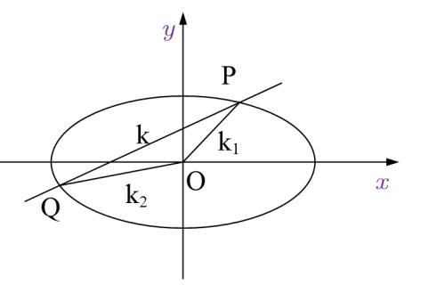

（2）设*PQ*方程为，所以

，当时，左右同除以得：

，令，

，是其两根，，故，

，因为，所以，联立

，则，整理得：，

故，由于，存在，则，故，且，设，，

到的距离，

当且仅当 取最大值，因为，所以．

8.已知点是椭圆上一点,且的离心率为.

(1)求椭圆的方程;

(2)点，在椭圆上,，为垂足,若直线和直线斜率之积为.求证:存在定点,使得为定值.

【解析】

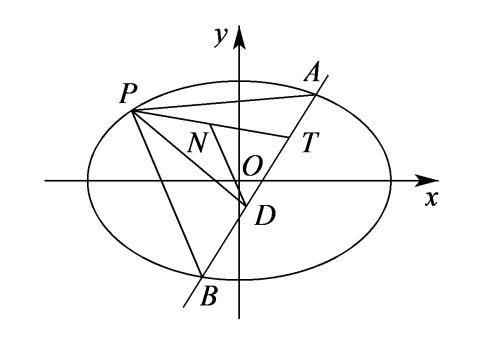

(1)由题意可得,解得,所以椭圆的方程为;

(2)将椭圆按向量平移至,则,①,当时,,当时,，方程为;

设平移后的直线方程为:,代入①得:,,当,同除以得:,令，②,令,则，是②式的两根,所以,，所以.

所以恒过,当时,也过此点,所以直线恒过定点,又因为为的中点,则,所以,故存在定点,使得为定值.

9.已知为椭圆上的右顶点,，为椭圆上关于原点对称的两点且，斜率存在,直线，分别与直线交于，两点.

(1)求的最小值;

(2)证明:以为直径的圆过定点.

【解析】(1)椭圆,设，,又，,即有,即为,可设直线的斜率为，的斜率为,由直线、分别交直线于、点,可得,，故有,即有,当且仅当时,取得等号.故线段的最小值是;

(2)法一由(1)可得,,即有以为直径的圆的方程为,即有,由,可得,解得,所以存在以为直径的圆过定点.

法二由(1)得:,设与轴交于,则,由对称性可得:若以为直径的圆过定点,则定点在轴上,设定点为,由射影定理:,所以,所以,所以存在以为直径的圆过定点.

10.已知椭圆的左、右顶点分别为，,右焦点,，过的直线与椭圆交于，两点,且面积是面积的3倍.

(1)求椭圆的标准方程;

(2)若直线，与直线分别交于，两点,试问:以为直径的圆是否过定点?若是,求出定点坐标;若不是,说明理由.

【解析】

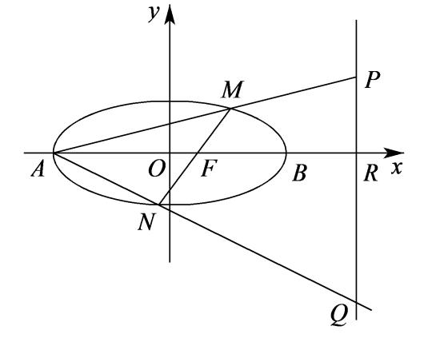

(1)因为,所以,又面积是面积的3倍,所以,所以,，，故椭圆的方程为;

(2)将椭圆按向量平移至,即①平移后的直线方程设为,由于直线恒过,所以,，故代入①:,当同时除以,令,则,令，,则,设,，，与轴相交于,所以,故,又,所以,由射影定理得,所以,以为直径的圆恒过,再根据对称性可知圆也过,所以,以为直径的圆恒过或.

11.（2023•山西模拟）已知点在椭圆上，直线交椭圆于，两点，直线、的斜率之和为0．

（1）求直线的斜率；

（2）求面积的最大值．

【解析】（1）将点的坐标代入椭圆方程得，化简得，解得（舍或，

椭圆的方程为．

将，平移到原点,即,即;设平移后直线为,令方程为:,即，,当时,同除以,得:;，所以，.

（2）由（1）知，直线的方程为，，，

点到直线的距离，

，

，

当且仅当，即时等号成立．经验证，此时满足直线与椭圆相交，故的面积最大值为．

12.已知椭圆上的点到焦点的最小距离为1,且以椭圆的短轴为直径的圆过点且，为椭圆的左右顶点.

(1)求椭圆的方程;

(2)过的直线交椭圆于，两点(在第一象限),直线、的斜率为，,是否存在实数,使得,若存在,求出实数的值;若不存在,说明理由.

【解析】

(1)由题意得，解得,所以椭圆方程为;

(2)连,根据点差法得①(请读者自己证明),下面简单证明,将平移到原点,平移后的椭圆为,,,

设平移后的直线过,,,所以方程为:,代入:,,左右两边同除以,令,整理得:,又因为,是其两根,且，,所以②,,所以,，.

13.(2023•醴陵市期中)已知椭圆的左右顶点是双曲线的顶点,且椭圆的上顶点到双曲线的渐近线距离为

(1)求椭圆的方程;

(2)点为椭圆的左焦点,不垂直于轴且不过点的直线与曲线相交于、两点,若直线FA、FB的斜率之和为0,则动直线是否一定经过一定点?若存在这样的定点,则求出该定点的坐标;若不存在这样的定点,请说明理由.

【解析】(1)，又椭圆上顶点为,

双曲线渐近线为,

点到直线：,

所以  ,所以;

(2)按照方向平移,

即，,,

椭圆  ,,

设为,

,

,

,

,

,

,

当时，两边同除以,

,

,

,

所以  ,

或  ,

当时，轴，与题意不符  ,舍去;

当时,  ：,

当时，  ,所以过定点,

所以平移回 , 恒过定点.

14.（2023・德州期末)椭圆的离心率是,过点(0,1)的动直线与椭圆相交于两点,当直线与轴平行时,直线被椭圆截得的线段长为.

(1)求椭圆的方程;

(2)在轴上是否存在异于点的定点,使得直线变化时,总有?若存在,求出点的坐标;若不存在,请说明理由.

【解析】(1)因为  ,  ,  ,

所以 , 所以 , ,

所以  ,因为过,

所以;

(2)设存在,  ,  即,

按照方向平移 , 即向下平移,

,

平移为 : ,,,

,

,

整理得 ,

当时，两边同除以,

,

,因为过点 , 过,所以 , 有,

,因为  ,,,所以  ,所以,  .

15.已知椭圆*E*：（），过点且与*x*轴平行的直线与椭圆*E*恰有一个公共点，过点*P*且与*y*轴平行的直线被椭圆*E*截得的线段长为．

（1）求椭圆*E*的标准方程；

（2）设过点*P*的动直线与椭圆*E*交于*M*，*N*两点，*T*为*y*轴上的一点，设直线*MT*和*NT*的斜率分别为和，若为定值，求点*T*的坐标.

【解析】（1）椭圆*E*：.

（2）设，，.则.  由*P*，*M*，*N*三点共线得：，考虑到，故：.

所以.故时恒有为定值.所以.

16.已知粗圆:，上顶点为.过点作斜率为,的两条直线分别交于异与点的两点，.证明:当时，直线恒过定点，并求出该定点.

【解析】依题，可化为.将椭圆向上下平移个单位，得：，设，.，

此时，

所以直线恒过定点，平移回去可知直线恒过定点.

第七章达标训练（二）

1.（2024•杭州月考）已知椭圆的右焦点为，过点的直线交椭圆于，两点，若线段的中点坐标为，则椭圆的方程为

A．	B．

C．	D．

【解析】设点，、，，线段的中点坐标为，，，

、两点都在椭圆上，，两式相减得，

，与的中点在直线上，，故，，又，且，，椭圆的标准方程为．

故选：．

2.（2024•长沙月考）已知双曲线，过点的直线与该双曲线相交于，两点，若是线段的中点，则直线的方程为

A．	B．	C．	D．该直线不存在

【解析】法一：设，，，，且，代入双曲线方程，得，，

两式相减得：，可得，若是线段的中点，则，，，得直线的斜率为2，直线方程为：，即．但联立，得，则△，方程无解，直线不存在．

法二：由于，故P位于双曲线和渐近线之间的区域，不存在以P为中点的弦.

故选：．

3.（2024•河南期末）已知双曲线的实轴长为4，离心率为，直线与交于，两点，是线段的中点，为坐标原点．若点的横坐标为1，则的取值范围为 <u>　   　</u>．

【解析】由题双曲线的实轴长为4，离心率为，所以双曲线．

法一：直线与交于，两点，是线段的中点，为坐标原点．若点的横坐标为1，

设直线的方程为，联立消去并整理得，

所以△，所以，设，，，，，，所以，，所以，，又，所以，所以，

可知直线与双曲线左、右两支各交于一点，所以，所以，所以，所以．

法二：或，解得：，所以．

故答案为：．

4.（2023•多选•龙岩模拟）已知双曲线的左，右焦点分别为，，左、右顶点分别为，，为坐标原点．直线交双曲线的右支于，两点（不同于右顶点），且与双曲线的两条渐近线分别交于，两点，则

A．为定值	                            B．

C．点到两条渐近线的距离之和的最小值为	D．存在直线使

【解析】双曲线的渐近线为，对于，其中为定值，，随着的变化而变化，所以不是定值，故错误；

对于：设直线的方程为，联立，得，

所以，联立，得，联立，得，

所以，所以与中点相同，

所以，故正确（结论题，也可以直接判断）；

对于：设，，则，又双曲线的渐近线方程为，所以到两渐近线距离，所以点到两条渐近线的距离之和的最小值为，故正确；

对于：由图知，所以恒成立，

所以不存在使得，故错误，

故选：．

5.（2024•顺庆区月考）已知双曲线，斜率为的直线与的左右两支分别交于，两点，点的坐标为，直线交于另一点，直线交于另一点．若直线的斜率为，则的离心率为

A．	B．	C．	D．

【解析】双曲线，斜率为的直线与的左右两支分别交于，两点，

点的坐标为，直线交于另一点，直线交于另一点．若直线的斜率为，

设，，，，，，，，

则，，，，所以，，

所以，，

所以，，

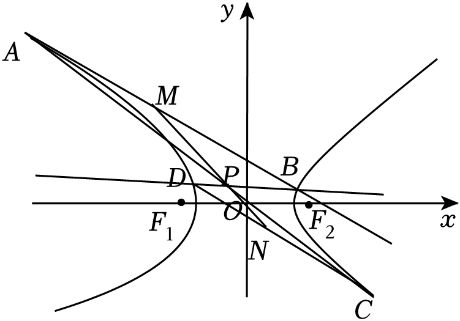

因为，所以，设的中点为，的中点为，则，，所以，所以，，三点共线，因为直线与直线交于点，且点的坐标为，根据及相似比，易得，，，四点共线，所以，

所以，所以，所以，得，所以，

故选：．

6.（2024•成都模拟）已知圆在椭圆的内部，点为上一动点．过作圆的一条切线，交于另一点，切点为，当为的中点时，直线的斜率为，则的离心率为

A．	B．	C．	D．

【解析】如图，设，，，，，，则，，两式作差，可得，，则，

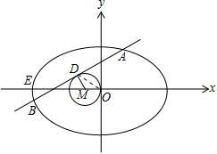

当为的中点时，直线的斜率为，，即，则，

设为椭圆的左顶点，连接，则，得，解得或（舍去）．可得，则，，椭圆的离心率．

故选：．

7.（2024•多选•贵阳模拟）已知双曲线的左、右焦点分别为，，为双曲线右支上的动点，过作两渐近线的垂线，垂足分别为，．若圆与双曲线的渐近线相切，则下列命题正确的是

A．双曲线的离心率	 B．为定值	 C．的最小值为3

D．若直线与双曲线的渐近线交于、两点，点为的中点，为坐标原点）的斜率为，则

【解析】双曲线的渐近线方程为，圆与渐近线相切，则，即，，，故正确；

设，为双曲线上任一点，则它到两渐近线的距离，，

则，为定值，故正确；

过，与渐近线垂直的方程分别与渐近线组成方程组求出交点坐标，

，解得交点，同理得，

为双曲线右支上的动点，，则．故错误；

对选项，设，，，，又，在双曲线上，，两式相减可得：，，，又，，，选项正确．

故选：．

########## 8.椭圆*E*：，直线：，存在*A*、*BE*，且*A*、*B*关于直线对称，求的取值范围．

########## 【解析】设*AB*中点为，直线：，易知直线是线段*AB*的垂直平分线，则会有方程，若要存在*A、BE，* 则直线*AB*与椭圆一定要有两个交点，即代入数据得：．

########## 9.（2015•浙江）已知椭圆上两个不同的点，关于直线对称．

########## （1）求实数的取值范围；

########## （2）求面积的最大值（为坐标原点）．

########## 【解析】（1）由题意，可设直线的方程为，，，中点可得，由①②可得：，同除以

########## 得，根据题意，，代入点即，点在椭圆内，，故，．

########## （2）由题意得：，又，所以，联立，整理得：，则，，所以

########## ，，，令，所以，当且仅当，取得最大值为．

########## 10.（2023•江西模拟）设离心率为的椭圆的左、右焦点分别为、，点在上，且满足，的面积为．

########## （1）求，的值；

########## （2）设直线与交于，两点，点在轴上，且满足，求点横坐标的取值范围．

########## 【解析】（1）设椭圆短轴的端点为，则，所以，，

########## 所以点即为点，所以，又，，所以，．

########## （2）设，，，的中点，，由①-②可得：，同除以

########## 得：，根据题意，

########## ，所以，故，即，易知在直线上，

########## ，即，所以，，由于，易知，则，所以，故点的横坐标的取值范围是．

11.（2024•洪山区期末）已知抛物线，其焦点为．

（1），两点为抛物线上的动点且满足，直线不垂直于轴，求证：线段的垂直平分线过定点，并求出点的坐标；

（2）已知椭圆，圆，过（1）中点作斜率分别为，的直线，，且满足，直线交椭圆于，两点，直线交圆于，两点，点为中点，求面积的取值范围．

【解析】（1）证明：不妨设直线的方程为，，，，，

因为，所以，联立，消去并整理得，

由韦达定理得，所以线段中点的坐标为，可得线段中垂线方程为，

即，则线段中垂线必过定点；

（2）不妨设直线的方程为，，，，，联立，消去并整理得，此时△恒成立，由韦达定理得，

则，因为，

则点到的距离，所以，因为，，所以，

此时点到直线即的距离即为点到直线的距离，

所以，不妨令，，

此时，因为，所以．

故面积的取值范围为，．

12.（2023•苏州模拟）己知椭圆的左、右焦点分别为，，离心率为，是椭圆上的一个动点，且面积的最大值为．

（1）求椭圆的方程；

（2）设斜率不为零的直线与椭圆的另一个交点为，且的垂直平分线交轴于点，求直线的斜率．

【解析】（1）因为椭圆离心率为，当为的短轴顶点时，△的面积有最大值，

所以，所以，故椭圆的方程为：

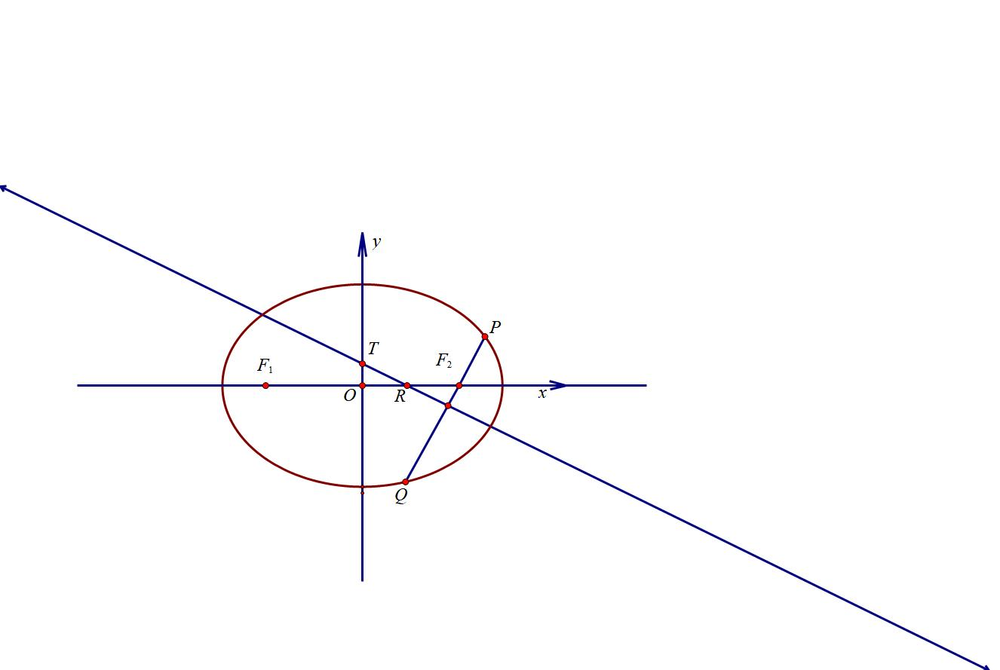

2. 如图，（请自证），，易知：，即；解得：或，即或．

13.（2023•成都期中）已知椭圆，过右焦点作一条与轴不垂直的直线交椭圆于、两点，线段的中垂线分别交直线和于、，则的取值范围是

A．，	B．，	C．，	D．，

########## 【解析】设直线倾斜角为，，同理得①，所以②，令交轴于，则，，故③；，将②和③代入得：，所以，当且仅当时等号成立.

故选：．

14.（2024•潍坊市月考）已知左焦点为的椭圆过点，过右焦点分别作斜率为，的椭圆的动弦，．设点，分别为线段，的中点．

（1）求椭圆的标准方程；

（2）求三角形面积的最大值；

（3）若，求证：直线经过定点，并求出定点的坐标．

【解析】（1）由题意，且右焦点有

所以．即所求椭圆方程为：；

（2）法一 设，，设方程为．由，得．

，．

，当且仅当时，取等号；

(3)证明：设，，，（根据椭圆的弦斜率，为弦中点的坐标．）根据，有，所两式相减，对比直线方程，知直线过

15.（2024•湖北部分重点中学联考）已知在平面直角坐标系中，动点满足.

(1)求动点的轨迹的方程;

(2)过点且垂直于轴的直线与轨迹交于点在第一象限)，以为圆心的圆与轴交于，两点，直线，与轨迹分别交于另一点，，求证:直线的斜率为定值，并求出这个定值.

【解析】(1).依题点的轨迹是椭圆且，.所以对应的轨迹方程为.

(2).对于椭圆上的两个点，易得.变形得:（此为斜率积定义），设，.易知.则有依题.即利用斜率积代换得:化简得:相减得.再由斜率积得.所以直线斜率为定值.

16.已知过抛物线的焦点的两条直线，的斜率为，.其中与抛物线相交于，两点，中点为.与抛物线相交于,两点，中点为.若时，求直线所过的定点坐标.

【解析】易知直线斜率存在，.设，.直线的方程为.

由做差运算得:，又、、、四点共线.

所以，同理.所以，

移项变形有，作差得:得：.

所以直线的方程为.即直线过定点.

17.（2023•浙江月考）已知抛物线的焦点为，为坐标原点．过点的直线与抛物线交于，两点．

（1）若直线与圆相切，求直线的方程；

（2）若直线与轴的交点为，且，，试探究：是否为定值？若为定值，求出该定值；若不为定值，试说明理由．

【解析】（1）由抛物线的方程可得焦点，显然直线的斜率不为0，设直线的方程为，联立，整理得，则△，整理得，解得，所以直线的方程为；

（2）因为，，令，，，，

，，由于，均在抛物线上，则，所以，，，所以．

18.（2024•吉林模拟）已知抛物线的焦点到其准线的距离为4，椭圆经过抛物线的焦点．

（Ⅰ）求抛物线的方程及；

（Ⅱ）已知为坐标原点，过点的直线与椭圆相交于，两点，若，点满足，且最小值为，求椭圆的离心率．

【解析】（Ⅰ）抛物线的焦点到其准线的距离为4，可得，抛物线的方程：，

椭圆经过抛物线的焦点，椭圆的右顶点为，所以；

（Ⅱ）设，，，，，，，，

，即，，，，

，即，，两点在椭圆上，

①，②，①②可得：，

即，

，，点轨迹方程为，最小值即点到直线的距离，，即，椭圆的离心率为．

########## 19.若椭圆与椭圆满足，则称这两个椭圆相似，叫相似比．若椭圆与椭圆相似且过点．

########## （1）求椭圆的标准方程；

########## （2）过点作斜率不为零的直线与椭圆交于不同两点、，为椭圆的右焦点，直线、分别交椭圆于点、，设，，求的取值范围．

########## 【解析】（1）；

2. 因为，所以的调和分点，所以，同理，所以，所以，令，，所以的调和分点，所以，，所以

，所以．

20.已知椭圆，其短轴长为，离心率为，双曲线的渐近线为，离心率为，且.

(1)求椭圆的方程;

(2)设椭圆的右焦点为，动直线不垂直于坐标轴)交椭圆于不同两点，设直线和的斜率为，若，试探究该动直线是否过轴上的定点，若是，求出该定点:若不是，请说明理由.

【解析】(1)由题意知㤢圆，其短轴长为，可得，椭圆的离心率为，双曲线的渐近线为，离心率为，且.所以，解得，所以椭圆方程：

(2)本题直接上通法“”，1个三炮齐鸣对接1个三点共线，如下:

延长交椭圆于，即.令，故在直线上存在点Q，使，通过定比点差法(过程省略)得:，

所以，由三点共线，故，即，

所以，所以.

21.已知椭圆的离心率是、是椭圆的左、右焦点，点为椭圆的右顶点，点为椭圆的上顶点，且.

(1)求椭圆的方程;

(2)若直线过右焦点且交椭圆于、两点，点是直线上的任意一点，直线、、的斜率分别为、、，问是否存在常数，使得成立?若存在，求出的值;若不存在，请说明理由.

【解析】(1)由，则，则，即，由，则，解得，则，所以椭圆的标准方程：

2. 令，故上存在点，使，根据定比点差法可得:，(步骤省略)(三炮齐鸣)，设，所以.所以.

22.已知椭圆方程，直线与轴相交于点，过右焦点的直线与椭圆交于，两点．

（1）若过点的直线与垂直，且与直线交于点，线段中点为，求证．

（2）设点的坐标为，，直线与直线交于点，试问是否垂直，若是，写出证明过程，若不是，请说明理由．

【解析】（1）证明：由椭圆方程为知右焦点坐标为，直线的方程为，点坐标为，由直线知，直线的斜率不为0，设，由点差法得

①－②得：，则即，且，再根据，即可证明，

########## （2）令，利用定比设点法，则点的调和分点为，则，（步骤省略，请自己完善）；，，三点共线，故；由于，代入数据得：，所以，命题得证．

########## 23.（2023•赣州教师竞赛）已知椭圆的离心率为,椭圆上的点，与的最大距离为.

########## 1.1.1.1.1.1.1.1.1.3 求椭圆的方程；

########## 1.1.1.1.1.1.1.1.1.4 设椭圆的下、上顶点分别为A、B,过点P的直线与椭圆Q交于C、D两点，与y轴交于点M，直线AC与直线BD交于点N，试探究是否为定值.

########## 【解析】（1）

**（2）分析**　此题的背景是极点极线，所求直线是极点所对应的极线，那么点在本题中属于多余条件，但往往能够迷惑大家，不过也能简化一些计算.

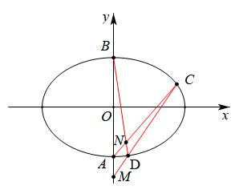

令，且，根据轴点弦的定比点差（三炮齐鸣，参考秒一）

所以，因为*C*、*P*、*D*三点共线，所以

所以，，

三点共线，故，三点共线，故，消掉得：

，所以，所以

24.(2020•新课标I)已知分别为椭圆的左、右顶点，为的上顶点，..为直线上的动点，与的另一交点为与的另一交点为.

(1)求的方程;

(2)证明:直线过定点.

【解析】(1)

(2)，所以①，根据对称性可知，定点就在*x*轴上，设与轴交于点，令，根据定比点差法推出的三炮齐鸣（请自助证）:②

②代入①：，所以，所以，当且仅当同时成立，即，故直线过定点.

25.（2023•贵阳月考）如图，在平面直角坐标系中，，分别为双曲线的左、右焦点，双曲线离心率为，若点为双曲线右支上一点，且，直线交双曲线于点，点为线段的中点，延长，，分别与双曲线交于，两点．

（1）若，，，，求证：；

（2）若直线，的斜率都存在，且依次设为，试判断是否为定值，如果是，请求出的值；如果不是，请说明理由．

【解析】（1）证明：由双曲线离心率，及，可得，，，所以双曲线方程为，直线的斜率不存在时，，

，

直线的斜率存在时，，，整理得，

综上所述，成立；

（2）设，，，，，，，，根据定比点差（过程省略）， ，由于三点共线，故，

所以是定值．

26.已知椭圆：的左右焦点分别为，，点在上，且．

（1）求的标准方程；

（2）设的左右顶点分别为，，为坐标原点，直线过右焦点且不与坐标轴垂直，与交于，两点，直线与直线相交于点，证明点在定直线上．

【解析】（1）

2. 本题显然定比点差法最简单，轴点弦+双三点共线

令，设，，，所以调和分点

，，（过程请补齐）

所以： ，：，联立消去，所以．

27.已知椭圆，斜率为1的直线与椭圆交于、两点，点，直线与椭圆交于点，直线与椭圆交于，求证:直线过定点.

【解析】令，根据定比点差法(步骤省略)

因为，所以;

设过定点，即，

所以，所以，根据合比定理，，所以，当且仅当时一定成立，所以直线过定点.

28.（2024•禅城区校级一模）已知椭圆，其中是与，无关的实数．

（1）求实数的取值范围；

（2）当时，如图所示，过点的直线与椭圆分别相交于点，，过点且斜率为的直线与椭圆相交于点，试探究直线是否恒过定点？若是，求出这个定点坐标；若不是，请说明理由．

【解析】（1）由题意可得，解得，且，所以实数的取值范围为，且；

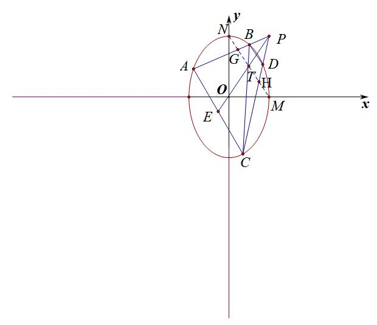

法一（定比点差）：当，则椭圆的方程为：，令，,,，

，，存在点满足，定比点差得：,即，

，，存在点满足，定比点差得：,即，

显然在定直线上，故，所以，由梯形性质可知

与交点在上，，即直线恒过点．

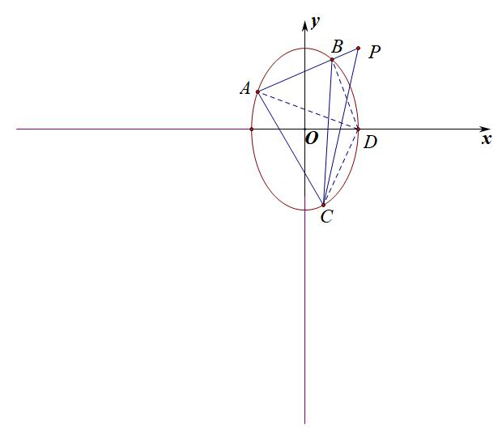

法二（齐次化）：法一（齐次化）：根据之前齐次化对隐藏斜率和积关系的处理，我们发现点AB过点，如果将右顶点D平移到原点，那么通过齐次化会发现定值，由于，我们定能找出与的关系，这样就能得出与的关系，从而确定过定点.操作过程如下：

将椭圆按照平移得，，即，此时，,,,,令,，此时，（齐次化同除以），即，①;

由于,故令,，即，

，，代入①得：，

化简得：②；

令，，即，

，代入②得：，即，

所以过点，平移回去得：过点

29.（2024•安徽模拟）已知，是椭圆的左、右焦点，是的上顶点．到直线的距离为．

（1）求的方程；

（2）设直线与轴的交点为，过的两条直线，都不垂直于轴，与交于点，，与交于点，，直线，与分别交于，两点，求证：．

【解析】（1）是的上顶点，点的坐标为．

点的坐标为，直线的方程为，即．

到直线的距离为，．，．所以的方程为．

（2）直线与轴的交点为，设，，，，，，，，，．

令根据定比点差得:，

*A、C*、*E*三点共线得：①

*B*、*D*、*G*三点共线得：②

由①得：，

由②得：，

两式相减，．

30.如图所示，已知椭圆，过点的直线与椭圆*C*交于*A*、*C*、*B*、*D*四点，且*AB*的斜率为，求证：*AB*∥*CD*．

**证明**　设，，，则，即…①

对利用定比点差法：，即，代入①消去，整理可得：…②

同理，设，，，可得：…③

由②－③可得：，又，故，因此，*AB*∥*CD*．

