第三章  达标训练

1.（2024•和平区二模）设双曲线的左、右焦点分别为，，过坐标原点的直线与双曲线交于，两点，，，则的离心率为

A．	
B．	
C．	
D．2

2.（2024•沙坪坝区校级模拟）已知椭圆的左焦点为，直线与分别交于，两点在轴上方），与轴交于点，为坐标原点．若，则的离心率为

A．	
B．	
C．	
D．

3.（2024•镇海区模拟）已知椭圆的左、右焦点分别为，，点，在上，直线倾斜角为，且，则的离心率为

A．	
B．	
C．	
D．

4.（2024•宁夏四模）已知双曲线的上、下焦点分别为，，直线与的上、下支分别交于点，，若以线段为直径的圆恰好过点，且，则的离心率为

A．	
B．2	
C．	
D．

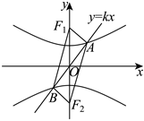

5.（2024•兴庆区校级三模）双曲线与抛物线有共同的焦点，双曲线左焦点为，点是双曲线右支一点，过向的角平分线作垂线，垂足为，，则双曲线的离心率是

A．2	
B．	
C．	
D．

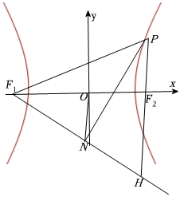

6.（2024•南京二模）已知椭圆的左、右焦点分别为，．下顶点为，直线交于另一点，的内切圆与相切于点．若，则的离心率为

A．	
B．	
C．	
D．

7.（2024•陕西模拟）双曲线的左、右焦点分别为、．过作其中一条渐近线的垂线，垂足为．已知，直线的斜率为，则双曲线的方程为

A．	
B．	
C．	
D．

8.（2024•郫都区模拟）椭圆的左、右焦点分别为，，过且斜率为的直线与椭圆交于，两点在左侧），若，则的离心率为

A．	
B．	
C．	
D．

9.（2024•浙江期中）已知椭圆的右焦点为，过坐标原点的直线与椭圆交于，两点，点位于第一象限，直线与椭圆交于另外一点，且，若，，则椭圆的离心率为 <u>　　</u>．

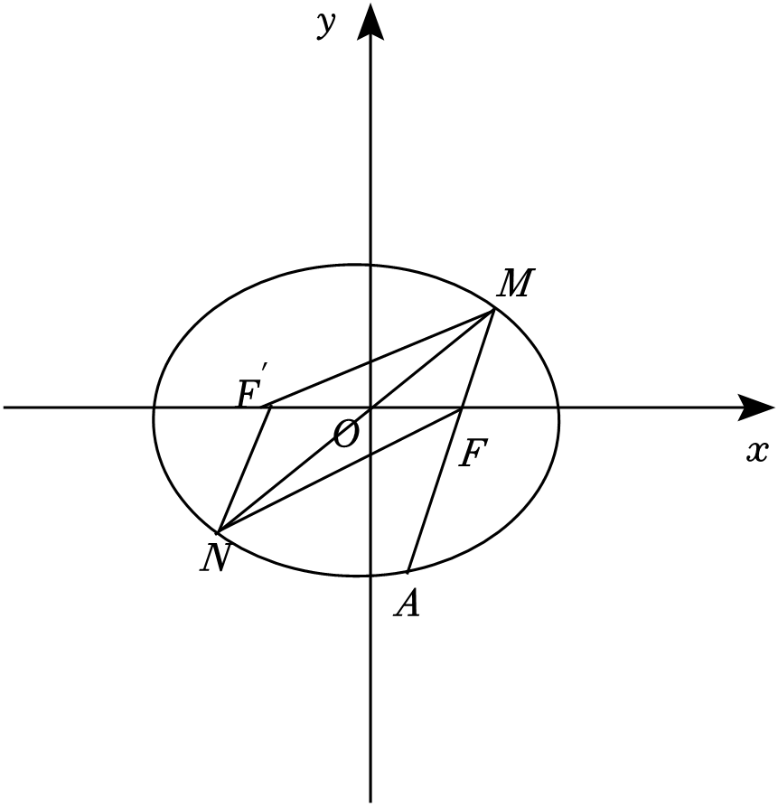

10.（2022•多选•高邮市模拟）已知过椭圆左焦点的直线交椭圆于，两点，为右焦点，若，且为的四等分点，则椭圆的离心率可以为

A．	
B．	
C．	
D．

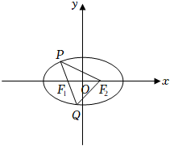

11.（2024•遵义模拟）已知，是双曲线的左，右焦点，过点且倾斜角为的直线与双曲线的左，右两支分别交于点，．若，则双曲线的离心率为

A．	
B．	
C．2	
D．

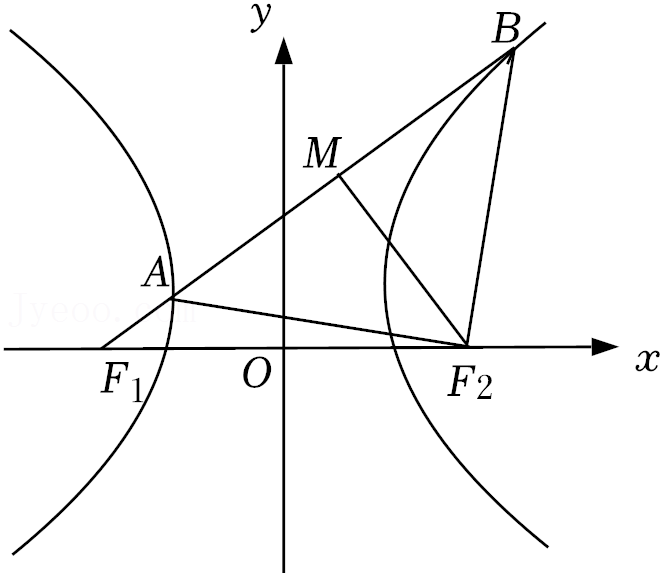

12.（2024•福田区模拟）已知，为双曲线上关于原点对称的两点，点与关于轴对称，，的延长线交于点，若，则的离心率为

A．	
B．	
C．	
D．

13.（2024•多选•历城区开学）已知，分别为双曲线的左、右焦点，过的直线交于，（点在点的上方）两点，且，，则的离心率可能为

A．	
B．	
C．	
D．

14.（2024•东湖区三模）已知双曲线的左、右焦点分别为，，点在轴上，且△的内心坐标为，若线段上靠近点的三等分点恰好在上，则的离心率为

A．	
B．	
C．	
D．

15.（2024•河北一模）已知椭圆的左、右焦点分别为，，为上一点，满足，以的短轴为直径作圆，截直线的弦长为，则的离心率为

A．	
B．	
C．	
D．

16.（2023•成都模拟）已知<em>F</em>1，<em>F</em>2是双曲线<em>C</em>：的左，右焦点，过点作斜率为的直线与双曲线的左，右两支分别交于，两点，以为圆心的圆过，，则双曲线的离心率为（　　）

A．    	
B．              
C．2	
D．

17.（2023•建邺区期中）已知，分别为双曲线的左，右焦点，过点且斜率为1的直线与双曲线的右支交于，两点，若△是等腰三角形，则双曲线的离心率为 <u>　  　</u>．

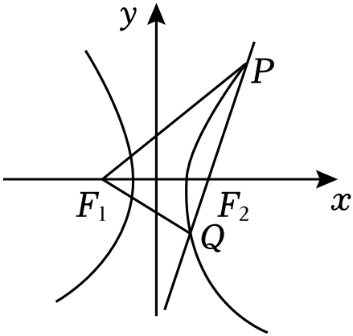

18.（2024•东莞市三模）已知双曲线的左、右焦点分别为，，双曲线的右支上有一点，与双曲线的左支交于，线段的中点为，且满足，若，则双曲线的离心率为

A．	
B．	
C．	
D．

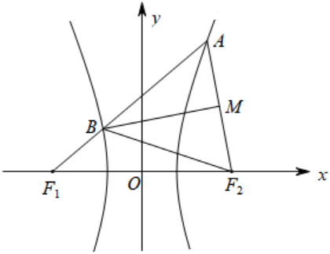

19.（2024•黑龙江模拟）如图，已知椭圆的左、右焦点分别为，，点，在上，，则的离心率为 <u>　   　</u>．

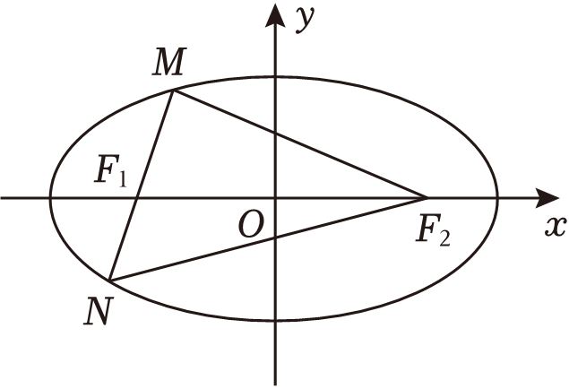

20.（2022•广州期末）双曲线的左、右焦点分别为，，直线过与双曲线的左支和右支分别交于，两点，．若轴上存在点满足，则双曲线的离心率为 <u>　    　</u>．

21.（2023•多选•湖南月考）如图，是坐标原点，是双曲线右支上的一点，是的右焦点，延长，分别交于，两点，已知，且，则

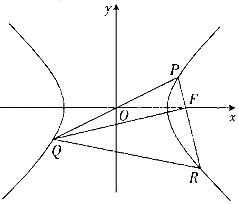

A．的离心率为    
B．的离心率为	    
C．   	
D．

22.（2024•河北模拟）双曲线的两焦点分别为，，过的直线与其一支交于，两点，点在第四象限．以为圆心，的实轴长为半径的圆与线段，分别交于，两点，且，，则的渐近线方程是

A．	
B．	
C．	
D．

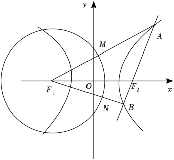

23.（2024•庐阳区校级模拟）已知双曲线，、分别为左、右焦点，若双曲线右支上有一点使得线段与轴交于点，，线段的中点满足，则双曲线的离心率为

A．	
B．	
C．	
D．

24.（2024•上饶二模）设为双曲线的右焦点，直线（其中为双曲线的半焦距）与双曲线的左右两支分别交于，两点若，则双曲线的离心率是

A．	
B．	
C．	
D．

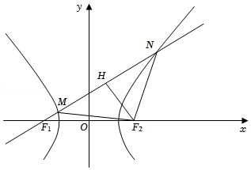

25.（2022•河北模拟）已知双曲线的左、右焦点分别为，，以为直径的圆与双曲线的一条渐近线交于点（异于坐标原点），若线段交双曲线于点，且，则该双曲线的离心率为（　　）

A．    	
B．	
C．	
D．

26.（2024•番禺区期中）已知双曲线的左、右焦点分别为，，过作直线与一条渐近线垂直，垂足为，交双曲线右支于点，，则离心率

A．	
B．	
C．	
D．2

27.（2024•山东模拟）设双曲线的左、右焦点分别为，，为的左顶点，，为双曲线一条渐近线上的两点，四边形为矩形，且，则双曲线的离心率为 <u>　　</u>．

28.（2024•青秀区期中）过双曲线的左焦点作圆的切线，切点为，直线交直线于点．若，则双曲线的离心率为

A．	
B．	
C．	
D．

29.（2024•河南模拟）双曲线的左、右焦点分别为，，过作圆：的切线，切点为，该切线交双曲线的一条渐近线于点，若，则双曲线的离心率为

A．	
B．	
C．	
D．

30.（2022•多选•山东模拟）已知双曲线的左，右焦点分别为，，过作垂直于渐近线交两渐近线于，两点，若，则双曲线的离心率可能为

A．	
B．	
C．	
D．

31.（2024•沙坪坝区模拟）如图，，分别是双曲线的左、右焦点，点是双曲线与圆在第二象限的一个交点，点在双曲线上，且，则双曲线的离心率为<u>　　</u>．

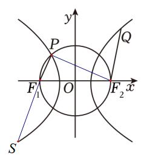

32,（2022•宛城区月考）已知双曲线的右焦点为，过点作双曲线的一条渐近线的垂线，垂足为．若直线与双曲线的另一条渐近线交于点，且满足为坐标原点），则双曲线的离心率为

A．	
B．	
C．	
D．

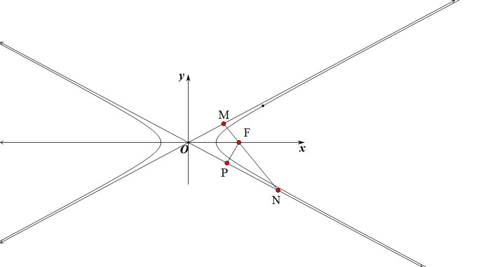

33.（2024•虹口区二模）从某个角度观察篮球（如图，可以得到一个对称的平面图形，如图2所示，篮球的外轮廓为圆，将篮球表面的粘合线看成坐标轴和双曲线，若坐标轴和双曲线与圆的交点将圆的周长八等分，且，则该双曲线的离心率为 <u>　    　</u>．

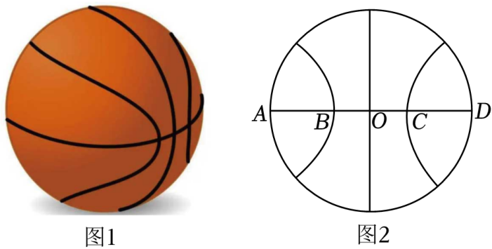

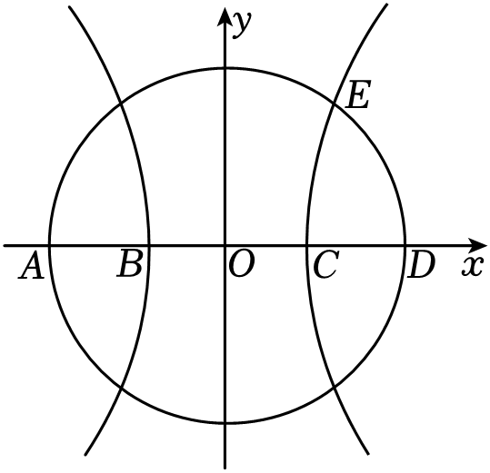

34.（2023•贵州模拟）已知双曲线的焦点为，，过的直线与的左支相交于，两点，过的直线与的右支相交于，两点，若四边形为平行四边形，以为直径的圆过，，则的方程为

A．	
B．

C．	
D．

35.（2023•浙江模拟）过双曲线上的任意一点，作双曲线渐近线的平行线，分别交渐近线于点，，若，则双曲线离心率的取值范围是（    ）

A．    	
B．         
C．	
D．

36.（2024•多选•广西开学）已知，分别是椭圆的左、右焦点，点在椭圆上，且，则的离心率可能为

A．	
B．	
C．	
D．

37.（2022•镇海区模拟）设椭圆的右焦点为，椭圆上的两点、关于原点对称，且满足，，则椭圆的离心率的取值范围是

A．，	
B．，	
C．，	
D．，

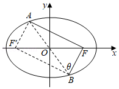

38.（2023•广安期中）已知点是双曲线上一动点，为圆的直径，若最小值为，则双曲线的离心率为

A．	
B．	
C．2	
D．

39.（2024•浙江二模）已知椭圆为左、右焦点，为椭圆上一点，，直线经过点．若点关于的对称点在线段的延长线上，则的离心率是

A．	
B．	
C．	
D．

40.（2022•朝阳区期中）如图，椭圆的中心在坐标原点，，，，分别为椭圆的左、右、下、上顶点，为其右焦点，直线与交于点，若为钝角，则该椭圆的离心率的取值范围为 <u>　    　</u>．

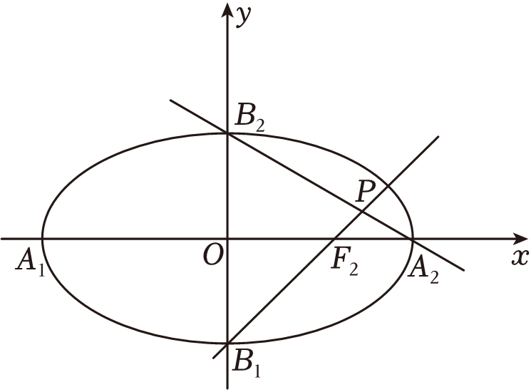

第三章  达标训练

1.（2024•和平区二模）设双曲线的左、右焦点分别为，，过坐标原点的直线与双曲线交于，两点，，，则的离心率为

A．	
B．	
C．	
D．2

【解答】解：可设，由，可得，设在第三象限，在第一象限，

由为的中点，又为的中点，可得四边形为平行四边形，可得，

由双曲线的定义，可得，即，可得，，，

，

即为，即有．

故选：．

2.（2024•沙坪坝区校级模拟）已知椭圆的左焦点为，直线与分别交于，两点在轴上方），与轴交于点，为坐标原点．若，则的离心率为

A．	
B．	
C．	
D．

【解答】解：由题意可知，，而，所以，

由，解得，设的右焦点为，在中，由余弦定理可得，即，

解得，由椭圆的定义知，则的离心率．

故选：．

3.（2024•镇海区模拟）已知椭圆的左、右焦点分别为，，点，在上，直线倾斜角为，且，则的离心率为

A．	
B．	
C．	
D．

【解答】解：，，

又，，化为，．

故选：．

4.（2024•宁夏四模）已知双曲线的上、下焦点分别为，，直线与的上、下支分别交于点，，若以线段为直径的圆恰好过点，且，则的离心率为

A．	
B．2	
C．	
D．

【解答】解：如图，已知四边形是平行四边形，又因为以线段为直径的圆恰好过点，所以，又因为，设，，所以，

则的离心率为．

故选：．

5.（2024•兴庆区校级三模）双曲线与抛物线有共同的焦点，双曲线左焦点为，点是双曲线右支一点，过向的角平分线作垂线，垂足为，，则双曲线的离心率是

A．2	
B．	
C．	
D．

【解答】解：抛物线的焦点为，由题意可得，设双曲线的半焦距为，可得，

设直线与直线交于，由为△的角平分线，且为边上的高，可得，

由双曲线的定义，可得，，

由为△的中位线，可得，即，则．

故选：．

6.（2024•南京二模）已知椭圆的左、右焦点分别为，．下顶点为，直线交于另一点，的内切圆与相切于点．若，则的离心率为

A．	
B．	
C．	
D．

【解答】解：因为点为椭圆的下顶点，由椭圆的对称性得，该内切圆圆心必在轴上，

不妨记其分别切直线、于、两点，令，，此时，

又，所以，由椭圆的定义得，

则的离心率．

故选：．

7.（2024•陕西模拟）双曲线的左、右焦点分别为、．过作其中一条渐近线的垂线，垂足为．已知，直线的斜率为，则双曲线的方程为

A．	
B．	
C．	
D．

【解答】解：根据对称性，不妨设双曲线的其中一条渐近线方程为，

则过且垂直渐近线的直线方程为，联立，可得，，

，又，，，

，，又，双曲线的方程为．

故选：．

8.（2024•郫都区模拟）椭圆的左、右焦点分别为，，过且斜率为的直线与椭圆交于，两点在左侧），若，则的离心率为

A．	
B．	
C．	
D．

【解答】解：先证明椭圆的倾斜角的焦半径公式：，，

设到椭圆的左准线的距离为，过左焦点的直线的倾斜角为，

则根据椭圆的第二定义可得：，，，

解得，同理可得．由，可得的垂直平分线过，

，又，，，

，，，，又，解得．

故选：．

9.（2024•浙江期中）已知椭圆的右焦点为，过坐标原点的直线与椭圆交于，两点，点位于第一象限，直线与椭圆交于另外一点，且，若，，则椭圆的离心率为 <u>　　</u>．

【解答】解：设椭圆的左焦点为，连接，，则四边形为为平行四边形，

设，由，，得，，

又，，，，，

在中，，，

即，解得，．

故答案为：．

10.（2022•多选•高邮市模拟）已知过椭圆左焦点的直线交椭圆于，两点，为右焦点，若，且为的四等分点，则椭圆的离心率可以为

A．	
B．	
C．	
D．

【解析】因为，且为的四等分点，所以或，

①当时，，，，

，所以离心率，

②当时，，，，

，所以离心率

故选：．

11.（2024•遵义模拟）已知，是双曲线的左，右焦点，过点且倾斜角为的直线与双曲线的左，右两支分别交于点，．若，则双曲线的离心率为

A．	
B．	
C．2	
D．

【解答】解：如图，取中点，连结，，，设，，，又，，，，离心率．

故选：．

12.（2024•福田区模拟）已知，为双曲线上关于原点对称的两点，点与关于轴对称，，的延长线交于点，若，则的离心率为

A．	
B．	
C．	
D．

【解答】解：设，则，，可得，，，

则，设，，由，，三点共线，可得，由，可得，

上面两式相乘可得，由在双曲线上，可得，由在双曲线上，可得，

上面两式相减可得，则，．

故选：．

13.（2024•多选•历城区开学）已知，分别为双曲线的左、右焦点，过的直线交于，（点在点的上方）两点，且，，则的离心率可能为

A．	
B．	
C．	
D．

【解答】解：设，则，，当，均在双曲线的右支上时，

由双曲线的定义可知，，所以，

所以，解得，所以，，

在△中，由勾股定义可得，，解得，

当点在双曲线的左支时，由双曲线的定义可知，，所以

，所以，解得，

所以，，在△中，由勾股定理可得，，所以，

当，分别在双曲线的右支，左支上时，由，解得，

则，，所以．

故选：．

14.（2024•东湖区三模）已知双曲线的左、右焦点分别为，，点在轴上，且△的内心坐标为，若线段上靠近点的三等分点恰好在上，则的离心率为

A．	
B．	
C．	
D．

【解答】解：设，则，为坐标原点），设△的内心为，所以△的内切圆的半径为，

在△中，，

又，由等面积法得，解得，

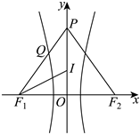

所以△为等边三角形，其边长为，高为，则，所以，代入的方程得，整理得，由，可得，两边同时除以，可得，解得，因为，所以，即．

故选：．

15.（2024•河北一模）已知椭圆的左、右焦点分别为，，为上一点，满足，以的短轴为直径作圆，截直线的弦长为，则的离心率为

A．	
B．	
C．	
D．

【解答】解：以的短轴为直径作圆，截直线的弦长为，圆心到的距离，又，且为的中点，，，又，

在△中，由勾股定理可得：，，

解得，椭圆的离心率．

故选：．

16.（2023•成都模拟）已知<em>F</em>1，<em>F</em>2是双曲线<em>C</em>：的左，右焦点，过点作斜率为的直线与双曲线的左，右两支分别交于，两点，以为圆心的圆过，，则双曲线的离心率为（　　）

A．    	
B．              
C．2	
D．

【解析】取的中点，因为以为圆心的圆过，，则，连结，则，设，因为，则，又因为，则，所以，
故选B．

17.（2023•建邺区期中）已知，分别为双曲线的左，右焦点，过点且斜率为1的直线与双曲线的右支交于，两点，若△是等腰三角形，则双曲线的离心率为 <u>　  　</u>．

【解析】因为，分别是双曲线的左，右焦点，过点且斜率为1的直线与双曲线的右支交于，两点，且△是等腰三角形，如图所示：所以，则，整理得，即，

解得或（不合题意，舍去），故答案为：．

18.（2024•东莞市三模）已知双曲线的左、右焦点分别为，，双曲线的右支上有一点，与双曲线的左支交于，线段的中点为，且满足，若，则双曲线的离心率为

A．	
B．	
C．	
D．

【解答】解：因为是线段的中点，且，所以，又，所以是等边三角形，设的边长为，由双曲线的定义知，，，

所以，，又，所以，即，

所以，，在△中，由余弦定理知，，

所以，，

所以离心率．

故选：．

19.（2024•黑龙江模拟）如图，已知椭圆的左、右焦点分别为，，点，在上，，则的离心率为 <u>　   　</u>．

【解答】解：设，由，得，又，所以，

由椭圆的定义知，所以，于是得，所以，所以，可得，

故，所以．

故答案为：．

20.（2022•广州期末）双曲线的左、右焦点分别为，，直线过与双曲线的左支和右支分别交于，两点，．若轴上存在点满足，则双曲线的离心率为 <u>　    　</u>．

【解析】如图，因为，所以，由于交于两支，故，令

根据，整理得，所以离心率．

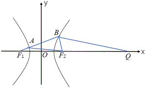

故答案为：．

21.（2023•多选•湖南月考）如图，是坐标原点，是双曲线右支上的一点，是的右焦点，延长，分别交于，两点，已知，且，则

A．的离心率为    
B．的离心率为	    
C．   	
D．

【解析】如图，取的左焦点，连接，，，由对称性可知，，，设，

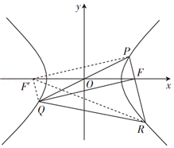

则，，，．

在△中，，解得或（舍去），所以．

在△中，，整理得，故的离心率为正确，不正确．

因为是的中点，所以，，正确，不正确．

故选：．

22.（2024•河北模拟）双曲线的两焦点分别为，，过的直线与其一支交于，两点，点在第四象限．以为圆心，的实轴长为半径的圆与线段，分别交于，两点，且，，则的渐近线方程是

A．	
B．	
C．	
D．

【解答】设，，可得，则

故双曲线的渐近线方程为．

故选：．

23.（2024•庐阳区校级模拟）已知双曲线，、分别为左、右焦点，若双曲线右支上有一点使得线段与轴交于点，，线段的中点满足，则双曲线的离心率为

A．	
B．	
C．	
D．

【解答】解：由，可得点横坐标为，设，则直线的方程为，取，得，则，则线段的中点．，，

由，得，则．即．代入双曲线方程，可得，即，整理得：，解得．

故选：．

24.（2024•上饶二模）设为双曲线的右焦点，直线（其中为双曲线的半焦距）与双曲线的左右两支分别交于，两点若，则双曲线的离心率是

A．	
B．	
C．	
D．

【解答】解：若，即，可得，即有，则，，，可得．

故选：．

25.（2022•河北模拟）已知双曲线的左、右焦点分别为，，以为直径的圆与双曲线的一条渐近线交于点（异于坐标原点），若线段交双曲线于点，且，则该双曲线的离心率为（　　）

A．    	
B．	
C．	
D．

【解析】 由，其中，，故，，故选A．

26.（2024•番禺区期中）已知双曲线的左、右焦点分别为，，过作直线与一条渐近线垂直，垂足为，交双曲线右支于点，，则离心率

A．	
B．	
C．	
D．2

【解析】易知，，且，故，，

双曲线的离心率．

故选：．

27.（2024•山东模拟）设双曲线的左、右焦点分别为，，为的左顶点，，为双曲线一条渐近线上的两点，四边形为矩形，且，则双曲线的离心率为 <u>　　</u>．

【解答】解：根据题意可知，由双曲线的对称性，不妨令点，在双曲线的渐近线上，且点在第一象限，由四边形为矩形，得，令，则，，，

于是，则，，，即直线的斜率，因此，即，所以双曲线的离心率为．

故答案为：．

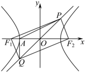

28.（2024•青秀区期中）过双曲线的左焦点作圆的切线，切点为，直线交直线于点．若，则双曲线的离心率为

A．	
B．	
C．	
D．

【解答】解：过双曲线的左焦点作圆的切线，切点为，

直线交直线于点，，取右焦点，连接、，作于点，

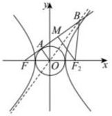

由为圆的切线，故，又，为中点，故为中点，又，故为中点，，则，，则，，由直线为双曲线的渐近线，

故有，则，在中，由余弦定理可得，

则，即，即，化简得，即，故．

故选：．

29.（2024•河南模拟）双曲线的左、右焦点分别为，，过作圆：的切线，切点为，该切线交双曲线的一条渐近线于点，若，则双曲线的离心率为

A．	
B．	
C．	
D．

【解答】解：如图，连接，则，，

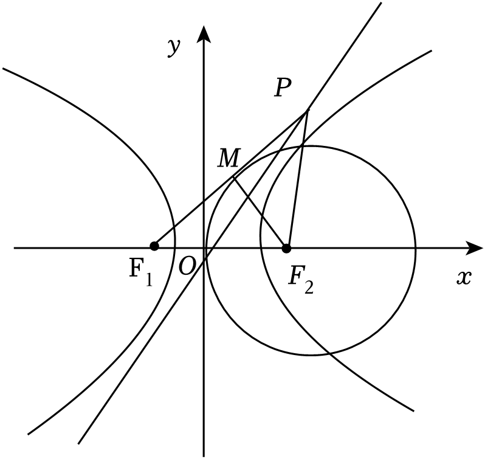

，为的中点，，，，

设，，，，，

点在渐近线上，，离心率．

故选：．

30.（2022•多选•山东模拟）已知双曲线的左，右焦点分别为，，过作垂直于渐近线交两渐近线于，两点，若，则双曲线的离心率可能为

A．	
B．	
C．	
D．

【解析】本题我们也尝试一下用坐标语言，因为和上题类似，大家可以对比一下两种方案来选择.

设点，由双曲线对称性，不妨令直线垂直于渐近线：，即，

则，直线的方程为：，由，解得点的横坐标，

由，解得点的横坐标，当时，点在线段的延长线上，

由得，因此有，

整理得，则离心率，当时，点在线段的延长线上，

由得，因此有，

整理得，则离心率，所以双曲线的离心率为或．

故选：．

31.（2024•沙坪坝区模拟）如图，，分别是双曲线的左、右焦点，点是双曲线与圆在第二象限的一个交点，点在双曲线上，且，则双曲线的离心率为<u>　　</u>．

【解答】解：延长交双曲线于S，，所以，

故答案为：．

32,（2022•宛城区月考）已知双曲线的右焦点为，过点作双曲线的一条渐近线的垂线，垂足为．若直线与双曲线的另一条渐近线交于点，且满足为坐标原点），则双曲线的离心率为

A．	
B．	
C．	
D．

【解析】如图，双曲线右焦点到渐近线的距离为，在中，，，所以，

因为，所以，所以，所以，，所以，所以，，即，即，所以．

故选：．

33.（2024•虹口区二模）从某个角度观察篮球（如图，可以得到一个对称的平面图形，如图2所示，篮球的外轮廓为圆，将篮球表面的粘合线看成坐标轴和双曲线，若坐标轴和双曲线与圆的交点将圆的周长八等分，且，则该双曲线的离心率为 <u>　    　</u>．

【解答】解：设圆半径为，双曲线方程为．已知，得，设双曲线与圆在第一象限的交点为，则，代入双曲线方程，得，解得．．

故答案为：．

34.（2023•贵州模拟）已知双曲线的焦点为，，过的直线与的左支相交于，两点，过的直线与的右支相交于，两点，若四边形为平行四边形，以为直径的圆过，，则的方程为

A．	
B．

C．	
D．

【解析】

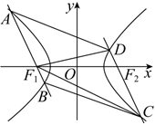

设,根据对称性可知，而高，所以，且，所以，所以，代入上式得：，，

故选：．

35.（2023•浙江模拟）过双曲线上的任意一点，作双曲线渐近线的平行线，分别交渐近线于点，，若，则双曲线离心率的取值范围是（    ）

A．    	
B．         
C．	
D．

【解析】作于，于，到两条渐近线的距离乘积，

，其中，则，

所以，由题意，所以，故选B．

36.（2024•多选•广西开学）已知，分别是椭圆的左、右焦点，点在椭圆上，且，则的离心率可能为

A．	
B．	
C．	
D．

【解答】解：由题意得，，．由，，解得，，，，又，

椭圆的离心率的取值范围为．

故选：．

37.（2022•镇海区模拟）设椭圆的右焦点为，椭圆上的两点、关于原点对称，且满足，，则椭圆的离心率的取值范围是

A．，	
B．，	
C．，	
D．，

【解析】作出椭圆的左焦点，由椭圆的对称性可知，四边形为平行四边形，又，

即，故平行四边形为矩形，应用焦点三角形结论，根据

得，则椭圆的离心率的取值范围是，，故选：．

38.（2023•广安期中）已知点是双曲线上一动点，为圆的直径，若最小值为，则双曲线的离心率为

A．	
B．	
C．2	
D．

【解析】，所以，所以，故选：．

39.（2024•浙江二模）已知椭圆为左、右焦点，为椭圆上一点，，直线经过点．若点关于的对称点在线段的延长线上，则的离心率是

A．	
B．	
C．	
D．

【解答】解：由直线，且点关于的对称点在线段的延长线上，

如图所示，可得点与点关于对称，且，

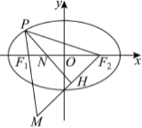

可得△为等边三角形，则，又的倾斜角为，则，所以，

在△中，有，，，又由，可得，即，

又因为，

，

所以．

故选：．

40.（2022•朝阳区期中）如图，椭圆的中心在坐标原点，，，，分别为椭圆的左、右、下、上顶点，为其右焦点，直线与交于点，若为钝角，则该椭圆的离心率的取值范围为 <u>　    　</u>．

【解析】设椭圆的标准方程为，．则，．

因为为向量与的夹角，且为钝角，所以，所以．

又，所以，即，解得或，

因为，所以，故答案为：．

