第二章达标训练

1.（2024•长沙天心区模拟）设，为椭圆的两个焦点，点在椭圆上，若，则<u>　   　</u>．

2.（2023•多选•无锡期末）已知，为曲线的焦点，则下列说法正确的是

A．若曲线的离心率，则	
B．若，则曲线的两条渐近线夹角为

C．若，曲线上存在四个不同点，使得

D．若，曲线上存在四个不同点，使得

3.（2024•多选•五华区月考）已知椭圆上有一点，、分别为左、右焦点，，△的面积为，则下列选项正确的是

A．若，则	     
B．若，则

C．△面积的最大值为 	
D．若△ 为钝角三角形，则

4.（2024•运城二模）已知椭圆的左、右焦点分别为，，过的直线与交于，两点，且，若的面积为，其中为坐标原点，则的值为 <u>　　</u>．

5（2024•许昌模拟）已知点，分别是椭圆的左、右焦点，过的直线与圆相切，切点为，直线与椭圆交于点，且点在与之间，若△的面积为，则椭圆的离心率为

A．	
B．	
C．	
D．

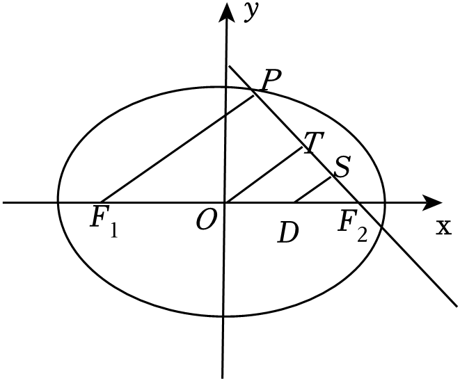

6.（2023•南平期末）已知椭圆的左、右焦点分别为、，是椭圆上一点，△的面积为，，则椭圆的长轴长为 <u>　   　</u>．

7.（2024•太原三模）已知点，分别是椭圆的左、右焦点，是上一点，△的内切圆的圆心为，则椭圆的标准方程是

A．	
B．

C．	
D．

8.（2024•西安模拟）已知、为双曲线的两个焦点，为双曲线右支上的动点（非顶点），则△的内切圆恒过定点

A．	
B．	
C．	
D．

9.（2022•多选•青岛一模）已知椭圆的左、右焦点分别是，，，为椭圆上一点，则下列结论正确的是

A．△的周长为6	            
B．△的面积为

C．△的内切圆的半径为	
D．△的外接圆的直径为

10.（2022•多选•湖北期末）如图，是椭圆与双曲线

在第一象限的交点，且，共焦点，，，，的离心率分别为，，则下列结论正确的是

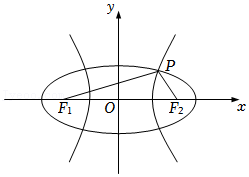

A．，	           
B．若，则

C．若，则的最小值为2       
D．

11.（2024•新县模拟）已知椭圆与双曲线有共同的焦点，，且在第一象限的交点为，满足（其中为原点）设，的离心率分别为，当取得最小值时，的值为

A．	
B．	
C．	
D．

12.（2024•多选•东湖区二模）“双曲线电瓶新闻灯”是记者常用的一种电瓶新闻灯，具有体积小，光线柔和等特点．这种灯利用了双曲线的光学性质：从双曲线的一个焦点发出的光线，经双曲线反射后，反射光线的反向延长线经过双曲线的另一个焦点．并且过双曲线上任意一点的切线平分该点与两焦点连线的夹角，如图所示：

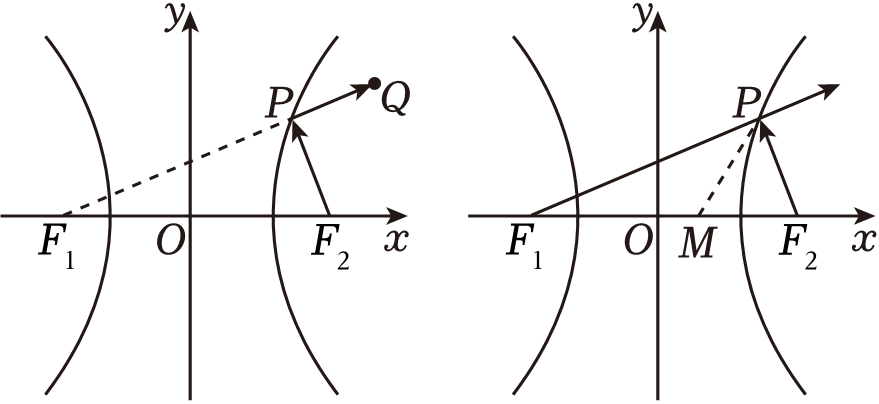

已知左、右焦点为，的双曲线的离心率为，并且过点，坐标原点为双曲线的对称中心，点的坐标为，则下列结论正确的是

A．双曲线的方程为

B．若从射出一道光线，经双曲线反射，其反射光线所在直线的斜率的取值范围为

C．

D．过点作垂直的延长线于，则

13.（2023•多选•天河区期末）抛物线有如下光学性质：由其焦点射出的光线经抛物线反射后，沿平行于抛物线对称轴的方向射出．反之，平行于抛物线对称轴的入射光线经抛物线反射后必过抛物线的焦点．已知抛物线，为坐标原点．一束平行于轴的光线从点，射入，经过上的点，反射后，再经上另一点，反射后，沿直线射出，经过点，则

A．	   
B．延长交直线于点，则，，三点共线

C．	   
D．若平分，则

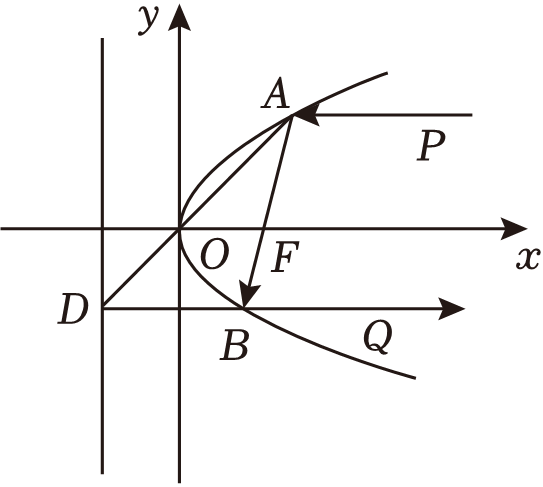

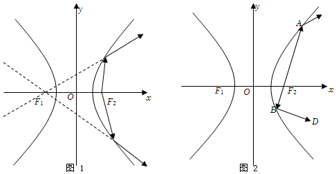

14.（2024•仪征市模拟）如图1所示，双曲线具有光学性质：从双曲线右焦点发出的光线经过双曲线镜面反射，其反射光线的反向延长线经过双曲线的左焦点．若双曲线的左、右焦点分别为，，从发出的光线经过图2中的，两点反射后，分别经过点和，且，，则的离心率为

A．	
B．	
C．	
D．

15.（2024•张掖模拟）若点既在直线上，又在椭圆上，的左、右焦点分别为，，，且的平分线与垂直，则的长轴长为

A．	
B．	
C．或	
D．或

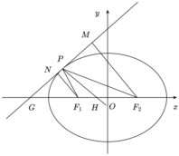

16.（2023•阳信期末）已知椭圆上一点位于第一象限，左、右焦点分别为，，左、右顶点分别为，，的角平分线与轴交于点，与轴交于点，则

A．四边形的周长为	 
B．直线，的斜率之积为

C．	             
D．四边形的面积为2

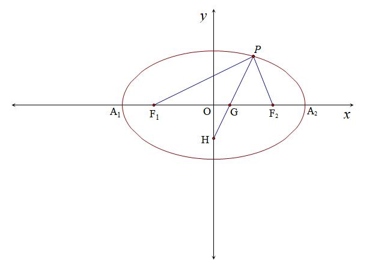

12.已知椭圆的左、右焦点分别为，，是椭圆上第一象限的一点，△的重心和内心分别为，，若轴，则椭圆的方程为

A．	
B．	
C．	
D．

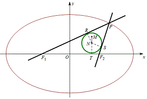

13.（2023•东莞市期末）如图，从椭圆的一个焦点发出的光线射到椭圆上的点，反射后光线经过椭圆的另一个焦点，事实上，点，处的切线垂直于的角平分线．已知椭圆的两个焦点是，，点是椭圆上除长轴端点外的任意一点，的角平分线交椭圆的长轴于点，则的取值范围是 <u>　   　</u>．

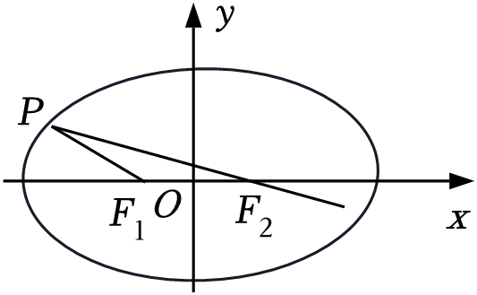

14.（2024•福州模拟）已知，分别是椭圆的左、右焦点，过点作轴的垂线与椭圆在第一象限的交点为，若的平分线经过椭圆的下顶点，则椭圆的离心率的平方为

A．	
B．	
C．	
D．

15.（2024•辽宁二模）设，为椭圆的两个焦点，，为上一点且在第一象限，，为△的内心，且△内切圆半径为1，则

A．	
B．

C．	
D．

16.已知双曲线，、分别是双曲线的左右焦点，*P*是双曲线右支上一点，圆*I*与的延长线、线段、的延长线均相切．连结*PI*并延长交轴于点*D*，若，那么该双曲线的离心率为( 　 )．

A．	
B．	
C．2	
D．

17.（2024•开福区模拟）已知椭圆的左、右焦点分别为，，为椭圆上不与顶点重合的任意一点，为△的内心，记直线，的斜率分别为，，若，则椭圆的离心率为 <u>　　</u>．

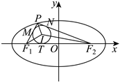

18.（2024•新县模拟）双曲线的左，右焦点分别为，，过作垂直于轴的直线交双曲线于，两点，△，△，△的内切圆圆心分别为，，，则△的面积是

A．	
B．	
C．	
D．

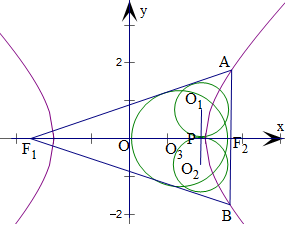

19（2024•芦淞区三模）已知，分别为双曲线的左、右焦点，过的直线与双曲线的右支交于，两点（其中点在第一象限）．设点，分别为△，△的内心，则的取值范围是 <u>　　____</u>．

20.（2024•多选•西安期末）已知双曲线的左、右焦点分别为，，右顶点为，过的直线交双曲线的右支于，两点，与两条渐近线交于点，（其中点，点在第一象限内），设，分别为△与△的内心，则

A．点的横坐标为2	
B．当时，

C．	
D．为定值

21．（2024•梅河口市期末）已知椭圆，双曲线，，椭圆与双曲线有共同的焦点，离心率分别为，，椭圆与双曲线在第一象限的交点为且，则

A．若，则	        
B．的最小值为

C．△的内心为，到轴的距离为

D．△的内心为，过右焦点作直线的垂线，垂足为，点的轨迹为圆

22．（2024•多选•中山市模拟）设，分别是双曲线的左右焦点，过的直线与双曲线的右支交于，两点，△的内心为，则下列结论正确的是

A．若为正三角形，则双曲线的离心率为	
B．若直线交双曲线的左支于点，则

C．若，为垂足，则	        
D．△的内心一定在直线上

23（2023•多选•芜湖模拟）双曲线的光学性质：从双曲线一个焦点出发的光线，经双曲线反射后，反射光线的反向延长线经过双曲线的另一个焦点．已知为坐标原点，，分别是双曲线的左右焦点，过的直线交双曲线的右支于，两点，且，在第一象限，△，△的内心分别为，，其内切圆半径分别为，，△的内心为．双曲线在处的切线方程为，则下列说法正确的有

A．点、均在直线上	
B．直线的方程为

C．	                 
D．

24.（2023•多选•下城区期末）已知抛物线的焦点为，，是上位于第一象限内的一点，若在点处的切线与轴交于点，且，则下列说法正确的是

A．	  
B．以为直径的圆与轴相切

C．	      
D．直线的斜率为为原点）

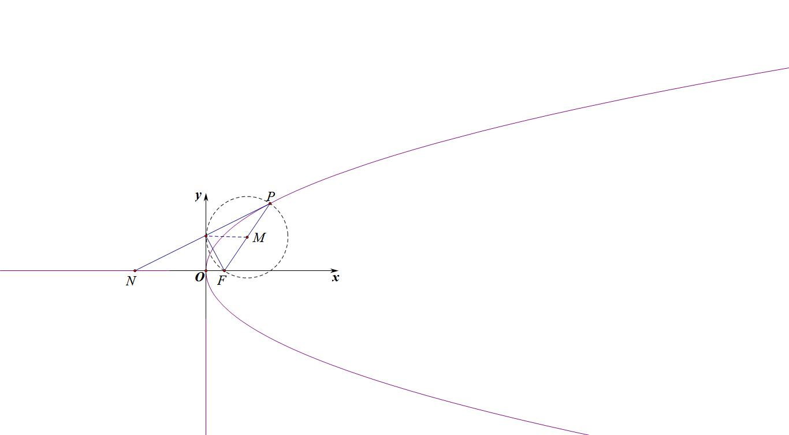

25.（多选）为双曲线上一点，为一个焦点，以为直径的圆与圆的位置关系是

A．内切	
B．相交	
C．外切	
D．相离

26.（2023•南京月考）（1）设是椭圆上任意一点，是焦点．证明：以为直径的圆与以椭圆长轴为直径的圆相切；

  
（2）设是双曲线上任意一点，是焦点，请你类比（1），写出一个类似的结论，并证明．

27.（2023•南充模拟）设点，分别是椭圆的左、右焦点，为椭圆上任意一点，且的最小值为0．

  
（1）求椭圆的方程；

  
（2）如图，动直线与椭圆有且仅有一个公共点，点，是直线上的两点，且，，求四边形面积的最大值．

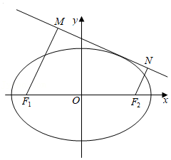

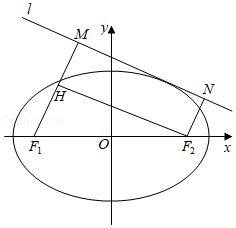

第二章达标训练

1.（2024•长沙天心区模拟）设，为椭圆的两个焦点，点在椭圆上，若，则<u>　   　</u>．

【解答】解：已知点在椭圆上，且，可得，

又由椭圆，得，，

，而，可得．
故答案为：2．

2.（2023•多选•无锡期末）已知，为曲线的焦点，则下列说法正确的是

A．若曲线的离心率，则	
B．若，则曲线的两条渐近线夹角为

C．若，曲线上存在四个不同点，使得

D．若，曲线上存在四个不同点，使得

【解析】对于，为曲线的焦点，当焦点在轴上，，解得；

当焦点在轴上，，，解得，故错误；

对于：当时，则，双曲线的两条渐近线方程为，则两条渐近线的倾斜角为，，曲线的两条渐近线夹角为，故正确；

对于：当时，，则，，，当点位于上下顶点时，最大，此时，则，曲线上不存在点使得，故错误；

对于：当时，则曲线是焦点在轴上的双曲线，则，以线段为直径的圆与双曲线有4个交点，且，此时4个交点即为点，故正确，

故选：．

3.（2024•多选•五华区月考）已知椭圆上有一点，、分别为左、右焦点，，△的面积为，则下列选项正确的是

A．若，则	     
B．若，则

C．△面积的最大值为 	
D．若△ 为钝角三角形，则

【解答】解：设，，，则，由此①，

所以△的面积，

对于选项：若，则，故正确；

对于选项：由①知，当且仅当即点是短轴端点时取等号，

所以，因此不可能是，故错误；

对于选项：当为短轴的端点时，△面积的最大值为，故正确．

对于选项：由以上分析可知，不可能是钝角，由对称性不妨设是钝角．先考虑临界情况，当时，易得，此时，结合图形可知：

当是钝角时，，故正确．

故选：．

4.（2024•运城二模）已知椭圆的左、右焦点分别为，，过的直线与交于，两点，且，若的面积为，其中为坐标原点，则的值为 <u>　　</u>．

【解析】设，，的面积为，，

，又，△是等边三角形，即，

由椭圆的定义可得，故，则，，，

则．

5（2024•许昌模拟）已知点，分别是椭圆的左、右焦点，过的直线与圆相切，切点为，直线与椭圆交于点，且点在与之间，若△的面积为，则椭圆的离心率为

A．	
B．	
C．	
D．

【解答】解：如图，过作直线的垂线，垂足为，设，，由椭圆定义知：，且有直线与圆相切，直线，且，又因为△的面积为，

所以，所以，即，即，又因为，直线，且，所以，在△中，点为中点，所以，同理在△中，，所以，所以，

所以，解得，符合题意，即，所以．

故选：．

6.（2023•南平期末）已知椭圆的左、右焦点分别为、，是椭圆上一点，△的面积为，，则椭圆的长轴长为 <u>　   　</u>．

【解析】是椭圆上的一点，，△的面积为，，，，，，

，，，又，

，，．故答案为：7．

7.（2024•太原三模）已知点，分别是椭圆的左、右焦点，是上一点，△的内切圆的圆心为，则椭圆的标准方程是

A．	
B．

C．	
D．

【解答】解：设椭圆的标准方程为，，

又点，分别是椭圆的左、右焦点，是上一点，△的内切圆的圆心为，

则△的内切圆的半径为1，由三角形的面积公式可得：，

即，即，又点是上一点，则，即，

即，即椭圆的标准方程是．

故选：．

8.（2024•西安模拟）已知、为双曲线的两个焦点，为双曲线右支上的动点（非顶点），则△的内切圆恒过定点

A．	
B．	
C．	
D．

【解答】解：设△的内切圆与，，分别切于，，，则根据双曲线的定义及圆的性质可知：，又，，，为双曲线的右顶点，为，，△的内切圆恒过定点，．

故选：．

9.（2022•多选•青岛一模）已知椭圆的左、右焦点分别是，，，为椭圆上一点，则下列结论正确的是

A．△的周长为6	            
B．△的面积为

C．△的内切圆的半径为	
D．△的外接圆的直径为

【解析】 由题意知，，，，由椭圆的定义知，，，

所以△的周长为，即选项正确；

将，代入椭圆方程得，，解得，所以△的面积为，即选项正确；

设△的内切圆的半径为，则，即，所以，即选项正确；

不妨取，，则，，所以，所以，由正弦定理，△外接圆的直径，即选项错误．

故选：．

10.（2022•多选•湖北期末）如图，是椭圆与双曲线

在第一象限的交点，且，共焦点，，，，的离心率分别为，，则下列结论正确的是

A．，	           
B．若，则

C．若，则的最小值为2       
D．

【解析】如图18，由椭圆和双曲线的定义，，

，，故正确；

在△中，由余弦定理可得，

，，，

当，则，故正确；

当，，由，即（当且仅当时等号成立）等号不成立，故错误；

由，则，即，故正确．

故选：．

11.（2024•新县模拟）已知椭圆与双曲线有共同的焦点，，且在第一象限的交点为，满足（其中为原点）设，的离心率分别为，当取得最小值时，的值为

A．	
B．	
C．	
D．

【解答】解：，故，即

由焦半径公式可得：

取，当且仅当时取等号，即

故选：．

12.（2024•多选•东湖区二模）“双曲线电瓶新闻灯”是记者常用的一种电瓶新闻灯，具有体积小，光线柔和等特点．这种灯利用了双曲线的光学性质：从双曲线的一个焦点发出的光线，经双曲线反射后，反射光线的反向延长线经过双曲线的另一个焦点．并且过双曲线上任意一点的切线平分该点与两焦点连线的夹角，如图所示：

已知左、右焦点为，的双曲线的离心率为，并且过点，坐标原点为双曲线的对称中心，点的坐标为，则下列结论正确的是

A．双曲线的方程为

B．若从射出一道光线，经双曲线反射，其反射光线所在直线的斜率的取值范围为

C．

D．过点作垂直的延长线于，则

【解答】解：选项：设焦点在轴上的双曲线方程为．由离心率，可得，代入点，解得，．双曲线方程为．故正确；

选项：根据题中条件分析可知，反射光线所在直线的斜率介于两条渐近线斜率之间．焦点在轴上的双曲线渐近线斜率，答案应为．故错误．

选项：利用点斜式求得，与双曲线方程联立，得到，可知该直线与双曲线只有一个交点，即直线为双曲线在点处的切线．根据题中条件“过双曲线上任意一点的切线平分该点与两焦点连线的夹角”可知，．故正确．

选项：由选项的计算结果．因为直线垂直于直线，所以．

因为，可求得．两方程进行联立，解出，因此．故正确．

故选：．

13.（2023•多选•天河区期末）抛物线有如下光学性质：由其焦点射出的光线经抛物线反射后，沿平行于抛物线对称轴的方向射出．反之，平行于抛物线对称轴的入射光线经抛物线反射后必过抛物线的焦点．已知抛物线，为坐标原点．一束平行于轴的光线从点，射入，经过上的点，反射后，再经上另一点，反射后，沿直线射出，经过点，则

A．	   
B．延长交直线于点，则，，三点共线

C．	   
D．若平分，则

【解析】设直线的方程为，代入抛物线方程，化为，，因此不正确；

把代入抛物线方程解得，，，，即，，

，因此正确．

直线的方程为，与联立，解得，．由，，，三点共线，因此正确．

设，，若平分，则，，解得．，解得，因此正确．

故选：．

14.（2024•仪征市模拟）如图1所示，双曲线具有光学性质：从双曲线右焦点发出的光线经过双曲线镜面反射，其反射光线的反向延长线经过双曲线的左焦点．若双曲线的左、右焦点分别为，，从发出的光线经过图2中的，两点反射后，分别经过点和，且，，则的离心率为

A．	
B．	
C．	
D．

【解答】解：设，，由双曲线的定义可得，，

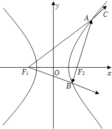

由可得，在直角三角形中，，①

，②

在△中，可得③

由①②可得，，代入③可得，即为，

则，

故选：．

15.（2024•张掖模拟）若点既在直线上，又在椭圆上，的左、右焦点分别为，，，且的平分线与垂直，则的长轴长为

A．	
B．	
C．或	
D．或

【解答】解：过点、分别作、垂直直线于点、，作的平分线与轴交于，

由，故、，则，，

由且为的平分线，故，故，

又、，故△与△相似，故，

由，令，则，故直线与轴交于点，故，

，故，由，

故，，故，，由椭圆定义可知，，故，

即的长轴长为．

故选：．

16.（2023•阳信期末）已知椭圆上一点位于第一象限，左、右焦点分别为，，左、右顶点分别为，，的角平分线与轴交于点，与轴交于点，则

A．四边形的周长为	 
B．直线，的斜率之积为

C．	             
D．四边形的面积为2

【解析】由椭圆的方程可得，，可得，即有，，

则四边形的周长为，故正确；

设，有，又直线，故正确；

由的角平分线与轴交于点，与轴交于点，根据光学性质，*PH*的方程为：，当时，，所以，所以，，，故错误；

四边形的面积为，故正确．

故选：．

12.已知椭圆的左、右焦点分别为，，是椭圆上第一象限的一点，△的重心和内心分别为，，若轴，则椭圆的方程为

A．	
B．	
C．	
D．

【解析】设点，，则焦半径，因为，，所以重心的横坐标为，

法一：因为轴，所以点的横坐标为，设△的内切圆与三角形的三边分别相切于点，，，则，，如图，，

因为，所以，即，

而，因为，

所以，所以，所以，所以椭圆的方程为．

法二：令交轴于点，则，由焦半径公式得：，解得：，所以，解得：，则，所以椭圆的方程为．

故选：．

13.（2023•东莞市期末）如图，从椭圆的一个焦点发出的光线射到椭圆上的点，反射后光线经过椭圆的另一个焦点，事实上，点，处的切线垂直于的角平分线．已知椭圆的两个焦点是，，点是椭圆上除长轴端点外的任意一点，的角平分线交椭圆的长轴于点，则的取值范围是 <u>　   　</u>．

【解析】由题意知，椭圆在点，处的切线方程为，且，

切线的斜率为，而的角平分线的斜率为，又切线垂直于的角平分线，

，即，．故答案为：，．

14.（2024•福州模拟）已知，分别是椭圆的左、右焦点，过点作轴的垂线与椭圆在第一象限的交点为，若的平分线经过椭圆的下顶点，则椭圆的离心率的平方为

A．	
B．	
C．	
D．

【解答】解：设，将代入椭圆方程，易得，则，

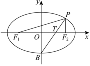

记椭圆的下顶点为，则的斜率，直线的方程为，

令得直线与轴的交点为，则，

又，，即，

，得（舍去负值），．

故选：．

15.（2024•辽宁二模）设，为椭圆的两个焦点，，为上一点且在第一象限，，为△的内心，且△内切圆半径为1，则

A．	
B．

C．	
D．

【解答】解：如图所示，设切点为，，，对于，由椭圆方程知：，，，

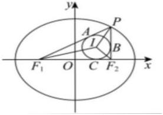

由椭圆的定义可得：，易知，所以，

所以，故正确；

由题意：，

又因为，解得：，又因为，为上一点且在第一象限，

所以，解得：，故正确；

从而，所以，所以，而，所以，故错误；

从而．，故正确．故选：．

16.已知双曲线，、分别是双曲线的左右焦点，*P*是双曲线右支上一点，圆*I*与的延长线、线段、的延长线均相切．连结*PI*并延长交轴于点*D*，若，那么该双曲线的离心率为( 　 )．

A．	
B．	
C．2	
D．

【解析】，即．
故选C．

17.（2024•开福区模拟）已知椭圆的左、右焦点分别为，，为椭圆上不与顶点重合的任意一点，为△的内心，记直线，的斜率分别为，，若，则椭圆的离心率为 <u>　　</u>．

【解答】解：设，，，，设圆与，，轴相切于点，，，

所以，，，所以，

即，所以．由椭圆的第二定义可知，

所以，所以，由等面积法得到，

所以．因为，所以，所以，即．

故答案为：．

18.（2024•新县模拟）双曲线的左，右焦点分别为，，过作垂直于轴的直线交双曲线于，两点，△，△，△的内切圆圆心分别为，，，则△的面积是

A．	
B．	
C．	
D．

【解析】由题意如图所示：由双曲线，知，所以，

所以，所以过作垂直于轴的直线为，代入中，解出，由题知△，△的内切圆的半径相等，且，△，△的内切圆圆心，的连线垂直于轴于点，设为，在△中，由等面积法得：，由双曲线的定义可知：，

由，所以，所以，解得：，

因为为△的的角平分线，所以一定在上，即轴上，令圆半径为，

在△中，由等面积法得：，

又，所以，所以，

所以，，

所以，

故选：．

19（2024•芦淞区三模）已知，分别为双曲线的左、右焦点，过的直线与双曲线的右支交于，两点（其中点在第一象限）．设点，分别为△，△的内心，则的取值范围是 <u>　　____</u>．

【解答】解：设，，上的切点分别为，，，如图所示，则点，的横坐标相等，根据切线长定理得，，，因为，即，所以，即，

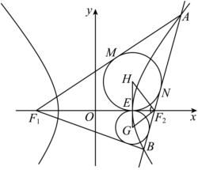

设点的横坐标为，则点，，则，即，设直线的倾斜角为，则，，在△中，

，

由双曲线方程得，，则，

因为点为双曲线右支上一点，且双曲线的渐近线的斜率为或，倾斜角为或，

所以，所以，则，所以．

故答案为：．

20.（2024•多选•西安期末）已知双曲线的左、右焦点分别为，，右顶点为，过的直线交双曲线的右支于，两点，与两条渐近线交于点，（其中点，点在第一象限内），设，分别为△与△的内心，则

A．点的横坐标为2	
B．当时，

C．	
D．为定值

【解答】解：由双曲线方程知，令圆在轴上的切点横坐标为，结合双曲线定义及圆切线性质有，即，所以圆在轴上的切点与右顶点为重合，又轴，则的横坐标为1，错；

由，则，故，而，所以，故，解得，所以，对；

设直线，点，，，，，则点，，

联立，整理可得，△，可得，

则，，所以，

所以，，所以，故正确；

由，分别是，的角平分线，又，所以，结合分析易知，在△ 中，，对．

故选：．

21．（2024•梅河口市期末）已知椭圆，双曲线，，椭圆与双曲线有共同的焦点，离心率分别为，，椭圆与双曲线在第一象限的交点为且，则

A．若，则	        
B．的最小值为

C．△的内心为，到轴的距离为

D．△的内心为，过右焦点作直线的垂线，垂足为，点的轨迹为圆

【解答】解：若椭圆，双曲线半焦距为，则，且，分别为左右焦点，

△ 中，令，，则，，，

所以，则，上式消去，得，

而，，若，即，则，对；
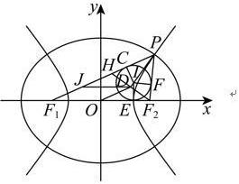

由上知，故，

当且仅当，即，时取等号，错；

若，，为内切圆与△各边切点，如下图，则，

又，所以，即切点为双曲线右顶点，有轴，所以到轴的距离为，对；

延长交于，若为 中点，连接，，由题意且平分，故为等腰三角形且，所以，在△中为中位线，则，且，故为平行四边形，令，则，

所以，又在第一象限且不定，故点的轨迹不为圆，错．

故选：．

22．（2024•多选•中山市模拟）设，分别是双曲线的左右焦点，过的直线与双曲线的右支交于，两点，△的内心为，则下列结论正确的是

A．若为正三角形，则双曲线的离心率为	
B．若直线交双曲线的左支于点，则

C．若，为垂足，则	        
D．△的内心一定在直线上

【解答】解：对于：若为正三角形，则轴，所以，由等边三角形性质可知：，所以，

所以，所以，所以，故正确；
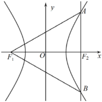

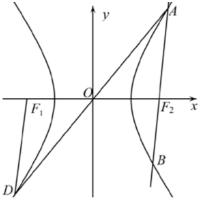

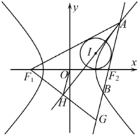

对于：由双曲线的对称性可知，如下图，又因为，，所以与全等，所以，所以，故正确；

对于：延长交延长线于，如下图所示，由角平分线的性质可知，且，，所以与全等，所以，所以为中点，

又因为为中点，所以，故正确；

对于：设三个切点为，，，连接，，，如下图，由切线性质可知：，，，设，因为，

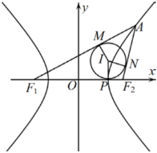

所以，所以，所以△的内心一定在直线上，故错误．

故选：．

23（2023•多选•芜湖模拟）双曲线的光学性质：从双曲线一个焦点出发的光线，经双曲线反射后，反射光线的反向延长线经过双曲线的另一个焦点．已知为坐标原点，，分别是双曲线的左右焦点，过的直线交双曲线的右支于，两点，且，在第一象限，△，△的内心分别为，，其内切圆半径分别为，，△的内心为．双曲线在处的切线方程为，则下列说法正确的有

A．点、均在直线上	
B．直线的方程为

C．	                 
D．

【解答】解：由双曲线得，，，设△的内切圆与，，分别切于点，，，则，，，

所以，又，所以，即圆与轴的切点是双曲线的右顶点，即在直线上，同理可得圆与轴的切点也是双曲线的右顶点，即也在直线上，故选项正确；
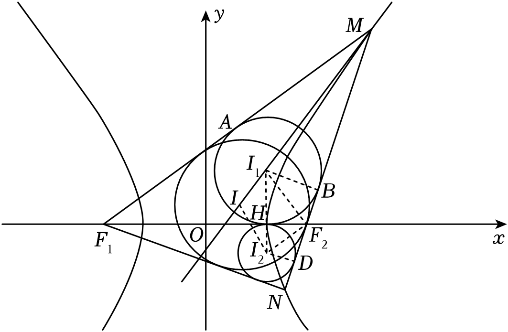

因为△的内心为，所以平分，根据双曲线的光学性质，双曲线在处的切线就平分，故直线的方程为，故正确；

设△的内切圆与切于点，连接，，，，设，，

因为，，所以，所以，即，所以，

又，所以，，即，所以，故不正确；

由可得的方程为，①设，，同理可得的方程为，②

联立①②可得，可设的方程为，可得，，

则，所以在直线上，所以到的距离为，到的距离为，所以．故正确．

故选：．

24.（2023•多选•下城区期末）已知抛物线的焦点为，，是上位于第一象限内的一点，若在点处的切线与轴交于点，且，则下列说法正确的是

A．	  
B．以为直径的圆与轴相切

C．	      
D．直线的斜率为为原点）

【解析】由抛物线可得，其准线方程为，所以根据抛物线的定义可得，故正确，

以为直径的圆的圆心为，半径为，所以圆心到的距离等于半径，即以为直径的圆与轴相切，故正确，

在点处的切线方程为，令可得，所以，，所以，

因为，所以，所以，所以，即直线的斜率为，故正确，，C错误.

故选：．

25.（多选）为双曲线上一点，为一个焦点，以为直径的圆与圆的位置关系是

A．内切	
B．相交	
C．外切	
D．相离

【解析】若为双曲线右支上一点，为右焦点，令为左焦点，连接，，设以线段为直径的圆的圆心为，为中点，为中点，，由双曲线定义可知，

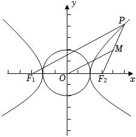

，，两圆的圆心距等于两半径之和，两圆外切．若为左焦点，为右焦点，同理可得两圆内切．故选：．

26.（2023•南京月考）（1）设是椭圆上任意一点，是焦点．证明：以为直径的圆与以椭圆长轴为直径的圆相切；

  
（2）设是双曲线上任意一点，是焦点，请你类比（1），写出一个类似的结论，并证明．

【解析】（1）证明：如图，是椭圆上任意一点，为其右焦点，则以为直径的圆的半径是，以长轴为直径的圆的半径为，设椭圆左焦点为，，．圆心距，，两个圆相内切；
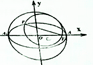

  
（2）结论：设是双曲线上任意一点，是焦点，则以线段为直径的圆与以实轴为直径的圆相切．

证明：设以实轴为直径的圆的圆心为，其半径，线段为直径的圆的圆心为，其半径为，当在双曲线左支上时，，，两圆内切；

当在双曲线右支上时，，，，

两圆外切．

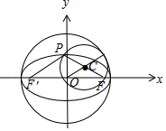

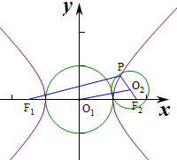

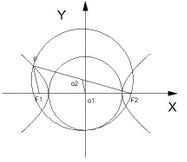

27.（2023•南充模拟）设点，分别是椭圆的左、右焦点，为椭圆上任意一点，且的最小值为0．

  
（1）求椭圆的方程；

  
（2）如图，动直线与椭圆有且仅有一个公共点，点，是直线上的两点，且，，求四边形面积的最大值．

【解析】（1）设，则，，，，，由题意得，，椭圆的方程为；

  
（2）将直线的方程代入椭圆的方程中，得．

由直线与椭圆仅有一个公共点知，△，化简得：．

设，，当时，设直线的倾斜角为，则，，，，当时，，，．当时，四边形是矩形，．所以四边形面积的最大值为2．

