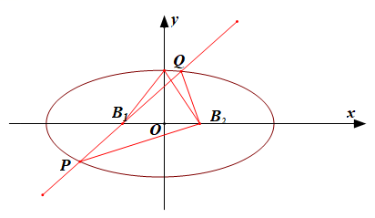
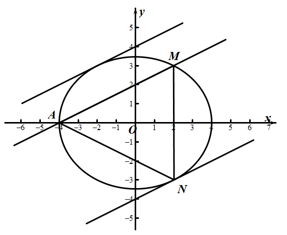
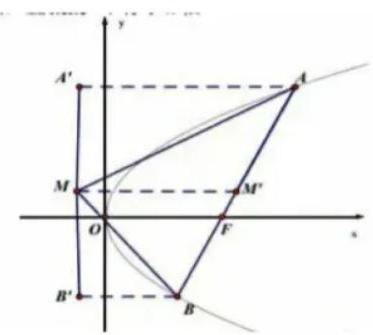

- 达标训练

1.（2024•哈尔滨月考）对任意的实数，直线与椭圆恒有公共点，则的取值范围是（    ）

A．    	
B．	
C．	
D．

2. （2024•上海期末）直线与双曲线有且仅有一个公共点，则_________．

3.（2020·新课标II卷）已知椭圆*C*：过点*M*（2，3）,点*A*为其左顶点，且*AM*的斜率为 ，  
（1）求*C*的方程；  
（2）点*N*为椭圆上任意一点，求△*AMN*的面积的最大值.

########## 4.动点*P*到*A*(-1,0)及*B*(1,0)连线的斜率之积为*m*(*m*>0)且*P*的轨迹*E*的离心率为*m*．

### 1.1.1.1.1.1.1.1.1.1 求*E*的方程；

### 1.1.1.1.1.1.1.1.1.2 设直线*l*:交曲线*E*于，求的面积．

5.（2023•云阳县期末）已知双曲线的一条渐近线方程为，焦点到渐近线的距离为1．

  
（1）求双曲线的标准方程与离心率；

  
（2）已知斜率为的直线与双曲线交于轴上方的，两点，为坐标原点，直线，的斜率之积为，求的面积．

6.(2018年全国课标卷3理科16题)已知点和抛物线,过的焦点且斜率为的直线与交于两点.若,则\_\_\_.

7.(2012年重庆理科第20题)设椭圆中心在原点，长轴在轴上，上顶点为，左右顶点分别为，线段中点分别为，且是面积为的直角三角形.  
（1）求其椭圆的方程

  
（2）过作直线交椭圆于两点，使，求直线的方程.

8. 直线与双曲线 相交于，两点，若以为直径的圆过原点，且双曲线的离心率为，求双曲线的方程．

9.在直角坐标系中，点到两点，的距离之和等于，设点的轨迹为，直线与交于，两点．

（Ⅰ）写出的方程；

（Ⅱ）若，求的值；

（Ⅲ）若点在第一象限，证明：当时，恒有．

第五章 达标训练

1.（2024•哈尔滨月考）对任意的实数，直线与椭圆恒有公共点，则的取值范围是（    ）

A．    	
B．	
C．	
D．

【解析】由，得，因为直线与椭圆恒有公共点，所以△，即对任意恒成立，所以，解得，

故选．

3. （2024•上海期末）直线与双曲线有且仅有一个公共点，则_________．

【解析】联立，化为．①当时，可得，此时直线的方程为，分别与等轴双曲线的渐近线平行，此时直线与双曲线有且只有一个交点，满足题意；②当时，由直线与双曲线有且只有一个公共点，可得△，

解得．此时满足条件．综上可得：，．故答案为，．

3.（2020·新课标II卷）已知椭圆*C*：过点*M*（2，3）,点*A*为其左顶点，且*AM*的斜率为 ，  
（1）求*C*的方程；  
（2）点*N*为椭圆上任意一点，求△*AMN*的面积的最大值.

【解析】（1）由题意可知直线*AM*的方程为：，即.

当*y*=0时，解得，所以*a*=4，椭圆过点*M*(2，3)，可得，

解得<em>b</em>2=12.以<em>C</em>的方程：.
  
（2）设与直线*AM*平行的直线方程为：，如图所示，当直线与椭圆相切时，与*AM*距离比较远的直线与椭圆的切点为*N*，此时△*AMN*的面积取得最大值.

联立直线方程与椭圆方程，可得：，

化简可得：，所以，即<em>m</em>2=64，解得<em>m</em>=±8，

与*AM*距离比较远的直线方程：，直线*AM*方程为：，点*N*到直线*AM*的距离即两平行线之间的距离，利用平行线之间的距离公式可得：，由两点之间距离公式可得.所以△*AMN*的面积的最大值：.

########## 4.动点*P*到*A*(-1,0)及*B*(1,0)连线的斜率之积为*m*(*m*>0)且*P*的轨迹*E*的离心率为*m*．

### 1.1.1.1.1.1.1.1.1.3 求*E*的方程；

### 1.1.1.1.1.1.1.1.1.4 设直线*l*:交曲线*E*于，求的面积．

########## 【解析】（1）设点；故动点轨迹为双曲线，且离心率为*m，* 即，*E*的方程为；

### 1.1.1.1.1.1.1.1.1.5 ，设则，

########## 将代入得：，，

########## ，．

5.（2023•云阳县期末）已知双曲线的一条渐近线方程为，焦点到渐近线的距离为1．

  
（1）求双曲线的标准方程与离心率；

  
（2）已知斜率为的直线与双曲线交于轴上方的，两点，为坐标原点，直线，的斜率之积为，求的面积．

【解析】（1）设双曲线的焦点，则到直线的距离为1，则，则，

双曲线渐近线的斜率，又，所以，，所以双曲线的方程：；

双曲线的离心率；

  
（2）设直线，，，，，联立，消去，整理得，则△，所以，，

所以，

解得或（舍去），所以，，由直线的方程：，令，，

所以，

所以，所以的面积．

6.(2018年全国课标卷3理科16题)已知点和抛物线,过的焦点且斜率为的直线与交于两点.若,则\_\_\_.

【解析】法一:(点乘双根法)设,直线(其中),

因为,所以,即

联立消去可得:	又因为是方程的两根,所以,令,得,所以

令,得,所以

，解得,,所以.

法二:(常规方法)抛物线的焦点过两点的直线方程为,

联立,可得

设,则

,

整理可得,	,即.
故答案为2.

法三:(中点弦法)设,则,所以,

则,如图,取的中点,分别过作准线的垂线,垂足为,,在中,,所以点为线段的中点,且平行于轴,则,从而有,代入,故填2.

7.(2012年重庆理科第20题)设椭圆中心在原点，长轴在轴上，上顶点为，左右顶点分别为，线段中点分别为，且是面积为的直角三角形.  
（1）求其椭圆的方程

  
（2）过作直线交椭圆于两点，使，求直线的方程.

【解析】（1）

  
（2）易知：直线不与轴垂直，则设直线方程为：，

因为，则，

所以

现联立

则方程可以等价转化

即

令，

令，

结合化简可得：

所以直线方程为：.

8. 直线与双曲线 相交于，两点，若以为直径的圆过原点，且双曲线的离心率为，求双曲线的方程．

解析：法一：（常规解法） 由双曲线的离心率为，即，得，

所以双曲线方程可设为．联立，②代入①消去得，

设，，则，，又以为直径的圆过原点，所以，

所以，即，

将韦达定理代入得：，解之得，所以，故双曲线的方程为．

方法二：（齐次化解法） 由双曲线的离心率为，即，得，

所以双曲线方程可设为．联立，

由 ①得代入②消去“”构建关于，的齐次式得：，又，两边同除以得③，

所以和为方程③的两个根，由韦达定理得，解之得，所以，故双曲线的方程为．

法三：（点乘双根法） 由双曲线的离心率为，即，得，

所以双曲线方程可设为．又以为直径的圆过原点，所以，

所以，即．

联立，②代入①消去得，

又因为和是方程的两个根，所以③．

将代入③得，

将代入③得，

代入式得，解之得，所以，

故双曲线的方程为

9.在直角坐标系中，点到两点，的距离之和等于，设点的轨迹为，直线与交于，两点．

（Ⅰ）写出的方程；

（Ⅱ）若，求的值；

（Ⅲ）若点在第一象限，证明：当时，恒有．

解析：（Ⅰ）设，由椭圆定义可知，点的轨迹是以，为焦点，长半轴为的椭圆．它的短半轴，故曲线*C*的方程为．

（Ⅱ）法一：（常规方法） 设,，其坐标满足，消去并整理得，故，． 若，即 ，而，于是 ，化简得，所以．

法二：（点乘双根法） 设,，直线：．若，则：，即，，

故,．因为，所以①，

将代入①得②．

联立得，令得③；

令，则，即④．

将③④代入②，即，，所以．

法三：（点乘双根法） 设,，直线：．若，则：，即，，故,，故，与矛盾，所以，直线：可变为（其中），故有

因为，所以①．

联立得，

即令得，即②；

令，则，③．

将②③代入①，即，，所以．

（Ⅲ）．

因为在第一象限，故．由知，从而．又，故，即在题设条件下，恒有．

- 达标训练

1.（2024•哈尔滨月考）对任意的实数，直线与椭圆恒有公共点，则的取值范围是（    ）

A．    	
B．	
C．	
D．

【解析】由，得，因为直线与椭圆恒有公共点，所以△，即对任意恒成立，所以，解得，

故选．

4. （2024•上海期末）直线与双曲线有且仅有一个公共点，则_________．

【解析】联立，化为．①当时，可得，此时直线的方程为，分别与等轴双曲线的渐近线平行，此时直线与双曲线有且只有一个交点，满足题意；②当时，由直线与双曲线有且只有一个公共点，可得△，

解得．此时满足条件．综上可得：，．故答案为，．

3.（2020·新课标II卷）已知椭圆*C*：过点*M*（2，3）,点*A*为其左顶点，且*AM*的斜率为 ，  
（1）求*C*的方程；  
（2）点*N*为椭圆上任意一点，求△*AMN*的面积的最大值.

【解析】（1）由题意可知直线*AM*的方程为：，即.

当*y*=0时，解得，所以*a*=4，椭圆过点*M*(2，3)，可得，

解得<em>b</em>2=12.以<em>C</em>的方程：.
  
（2）设与直线*AM*平行的直线方程为：，如图所示，当直线与椭圆相切时，与*AM*距离比较远的直线与椭圆的切点为*N*，此时△*AMN*的面积取得最大值.

联立直线方程与椭圆方程，可得：，

化简可得：，所以，即<em>m</em>2=64，解得<em>m</em>=±8，

与*AM*距离比较远的直线方程：，直线*AM*方程为：，点*N*到直线*AM*的距离即两平行线之间的距离，利用平行线之间的距离公式可得：，由两点之间距离公式可得.所以△*AMN*的面积的最大值：.

########## 4.动点*P*到*A*(-1,0)及*B*(1,0)连线的斜率之积为*m*(*m*>0)且*P*的轨迹*E*的离心率为*m*．

### 1.1.1.1.1.1.1.1.1.6 求*E*的方程；

### 1.1.1.1.1.1.1.1.1.7 设直线*l*:交曲线*E*于，求的面积．

########## 【解析】（1）设点；故动点轨迹为双曲线，且离心率为*m，* 即，*E*的方程为；

### 1.1.1.1.1.1.1.1.1.8 ，设则，

########## 将代入得：，，

########## ，．

5.（2023•云阳县期末）已知双曲线的一条渐近线方程为，焦点到渐近线的距离为1．

  
（1）求双曲线的标准方程与离心率；

  
（2）已知斜率为的直线与双曲线交于轴上方的，两点，为坐标原点，直线，的斜率之积为，求的面积．

【解析】（1）设双曲线的焦点，则到直线的距离为1，则，则，

双曲线渐近线的斜率，又，所以，，所以双曲线的方程：；

双曲线的离心率；

  
（2）设直线，，，，，联立，消去，整理得，则△，所以，，

所以，

解得或（舍去），所以，，由直线的方程：，令，，

所以，

所以，所以的面积．

6.(2018年全国课标卷3理科16题)已知点和抛物线,过的焦点且斜率为的直线与交于两点.若,则\_\_\_.

【解析】法一:(点乘双根法)设,直线(其中),

因为,所以,即

联立消去可得:	又因为是方程的两根,所以,令,得,所以

令,得,所以

，解得,,所以.

法二:(常规方法)抛物线的焦点过两点的直线方程为,

联立,可得

设,则

,

整理可得,	,即.
故答案为2.

法三:(中点弦法)设,则,所以,

则,如图,取的中点,分别过作准线的垂线,垂足为,,在中,,所以点为线段的中点,且平行于轴,则,从而有,代入,故填2.

7.(2012年重庆理科第20题)设椭圆中心在原点，长轴在轴上，上顶点为，左右顶点分别为，线段中点分别为，且是面积为的直角三角形.  
（1）求其椭圆的方程

  
（2）过作直线交椭圆于两点，使，求直线的方程.

【解析】（1）

  
（2）易知：直线不与轴垂直，则设直线方程为：，

因为，则，

所以

现联立

则方程可以等价转化

即

令，

令，

结合化简可得：

所以直线方程为：.

8. 直线与双曲线 相交于，两点，若以为直径的圆过原点，且双曲线的离心率为，求双曲线的方程．

解析：法一：（常规解法） 由双曲线的离心率为，即，得，

所以双曲线方程可设为．联立，②代入①消去得，

设，，则，，又以为直径的圆过原点，所以，

所以，即，

将韦达定理代入得：，解之得，所以，故双曲线的方程为．

方法二：（齐次化解法） 由双曲线的离心率为，即，得，

所以双曲线方程可设为．联立，

由 ①得代入②消去“”构建关于，的齐次式得：，又，两边同除以得③，

所以和为方程③的两个根，由韦达定理得，解之得，所以，故双曲线的方程为．

法三：（点乘双根法） 由双曲线的离心率为，即，得，

所以双曲线方程可设为．又以为直径的圆过原点，所以，

所以，即．

联立，②代入①消去得，

又因为和是方程的两个根，所以③．

将代入③得，

将代入③得，

代入式得，解之得，所以，

故双曲线的方程为

9.在直角坐标系中，点到两点，的距离之和等于，设点的轨迹为，直线与交于，两点．

（Ⅰ）写出的方程；

（Ⅱ）若，求的值；

（Ⅲ）若点在第一象限，证明：当时，恒有．

解析：（Ⅰ）设，由椭圆定义可知，点的轨迹是以，为焦点，长半轴为的椭圆．它的短半轴，故曲线*C*的方程为．

（Ⅱ）法一：（常规方法） 设,，其坐标满足，消去并整理得，故，． 若，即 ，而，于是 ，化简得，所以．

法二：（点乘双根法） 设,，直线：．若，则：，即，，

故,．因为，所以①，

将代入①得②．

联立得，令得③；

令，则，即④．

将③④代入②，即，，所以．

法三：（点乘双根法） 设,，直线：．若，则：，即，，故,，故，与矛盾，所以，直线：可变为（其中），故有

因为，所以①．

联立得，

即令得，即②；

令，则，③．

将②③代入①，即，，所以．

（Ⅲ）．

因为在第一象限，故．由知，从而．又，故，即在题设条件下，恒有．

第五章 达标训练

1.（2024•哈尔滨月考）对任意的实数，直线与椭圆恒有公共点，则的取值范围是（    ）

A．    	
B．	
C．	
D．

【解析】由，得，因为直线与椭圆恒有公共点，所以△，即对任意恒成立，所以，解得，

故选．

5. （2024•上海期末）直线与双曲线有且仅有一个公共点，则_________．

【解析】联立，化为．①当时，可得，此时直线的方程为，分别与等轴双曲线的渐近线平行，此时直线与双曲线有且只有一个交点，满足题意；②当时，由直线与双曲线有且只有一个公共点，可得△，

解得．此时满足条件．综上可得：，．故答案为，．

3.（2020·新课标II卷）已知椭圆*C*：过点*M*（2，3）,点*A*为其左顶点，且*AM*的斜率为 ，  
（1）求*C*的方程；  
（2）点*N*为椭圆上任意一点，求△*AMN*的面积的最大值.

【解析】（1）由题意可知直线*AM*的方程为：，即.

当*y*=0时，解得，所以*a*=4，椭圆过点*M*(2，3)，可得，

解得<em>b</em>2=12.以<em>C</em>的方程：.
  
（2）设与直线*AM*平行的直线方程为：，如图所示，当直线与椭圆相切时，与*AM*距离比较远的直线与椭圆的切点为*N*，此时△*AMN*的面积取得最大值.

联立直线方程与椭圆方程，可得：，

化简可得：，所以，即<em>m</em>2=64，解得<em>m</em>=±8，

与*AM*距离比较远的直线方程：，直线*AM*方程为：，点*N*到直线*AM*的距离即两平行线之间的距离，利用平行线之间的距离公式可得：，由两点之间距离公式可得.所以△*AMN*的面积的最大值：.

########## 4.动点*P*到*A*(-1,0)及*B*(1,0)连线的斜率之积为*m*(*m*>0)且*P*的轨迹*E*的离心率为*m*．

### 1.1.1.1.1.1.1.1.1.9 求*E*的方程；

### 1.1.1.1.1.1.1.1.1.10 设直线*l*:交曲线*E*于，求的面积．

########## 【解析】（1）设点；故动点轨迹为双曲线，且离心率为*m，* 即，*E*的方程为；

### 1.1.1.1.1.1.1.1.1.11 ，设则，

########## 将代入得：，，

########## ，．

5.（2023•云阳县期末）已知双曲线的一条渐近线方程为，焦点到渐近线的距离为1．

  
（1）求双曲线的标准方程与离心率；

  
（2）已知斜率为的直线与双曲线交于轴上方的，两点，为坐标原点，直线，的斜率之积为，求的面积．

【解析】（1）设双曲线的焦点，则到直线的距离为1，则，则，

双曲线渐近线的斜率，又，所以，，所以双曲线的方程：；

双曲线的离心率；

  
（2）设直线，，，，，联立，消去，整理得，则△，所以，，

所以，

解得或（舍去），所以，，由直线的方程：，令，，

所以，

所以，所以的面积．

6.(2018年全国课标卷3理科16题)已知点和抛物线,过的焦点且斜率为的直线与交于两点.若,则\_\_\_.

【解析】法一:(点乘双根法)设,直线(其中),

因为,所以,即

联立消去可得:	又因为是方程的两根,所以,令,得,所以

令,得,所以

，解得,,所以.

法二:(常规方法)抛物线的焦点过两点的直线方程为,

联立,可得

设,则

,

整理可得,	,即.
故答案为2.

法三:(中点弦法)设,则,所以,

则,如图,取的中点,分别过作准线的垂线,垂足为,,在中,,所以点为线段的中点,且平行于轴,则,从而有,代入,故填2.

7.(2012年重庆理科第20题)设椭圆中心在原点，长轴在轴上，上顶点为，左右顶点分别为，线段中点分别为，且是面积为的直角三角形.  
（1）求其椭圆的方程

  
（2）过作直线交椭圆于两点，使，求直线的方程.

【解析】（1）

  
（2）易知：直线不与轴垂直，则设直线方程为：，

因为，则，

所以

现联立

则方程可以等价转化

即

令，

令，

结合化简可得：

所以直线方程为：.

8. 直线与双曲线 相交于，两点，若以为直径的圆过原点，且双曲线的离心率为，求双曲线的方程．

解析：法一：（常规解法） 由双曲线的离心率为，即，得，

所以双曲线方程可设为．联立，②代入①消去得，

设，，则，，又以为直径的圆过原点，所以，

所以，即，

将韦达定理代入得：，解之得，所以，故双曲线的方程为．

方法二：（齐次化解法） 由双曲线的离心率为，即，得，

所以双曲线方程可设为．联立，

由 ①得代入②消去“”构建关于，的齐次式得：，又，两边同除以得③，

所以和为方程③的两个根，由韦达定理得，解之得，所以，故双曲线的方程为．

法三：（点乘双根法） 由双曲线的离心率为，即，得，

所以双曲线方程可设为．又以为直径的圆过原点，所以，

所以，即．

联立，②代入①消去得，

又因为和是方程的两个根，所以③．

将代入③得，

将代入③得，

代入式得，解之得，所以，

故双曲线的方程为

9.在直角坐标系中，点到两点，的距离之和等于，设点的轨迹为，直线与交于，两点．

（Ⅰ）写出的方程；

（Ⅱ）若，求的值；

（Ⅲ）若点在第一象限，证明：当时，恒有．

解析：（Ⅰ）设，由椭圆定义可知，点的轨迹是以，为焦点，长半轴为的椭圆．它的短半轴，故曲线*C*的方程为．

（Ⅱ）法一：（常规方法） 设,，其坐标满足，消去并整理得，故，． 若，即 ，而，于是 ，化简得，所以．

法二：（点乘双根法） 设,，直线：．若，则：，即，，

故,．因为，所以①，

将代入①得②．

联立得，令得③；

令，则，即④．

将③④代入②，即，，所以．

法三：（点乘双根法） 设,，直线：．若，则：，即，，故,，故，与矛盾，所以，直线：可变为（其中），故有

因为，所以①．

联立得，

即令得，即②；

令，则，③．

将②③代入①，即，，所以．

（Ⅲ）．

因为在第一象限，故．由知，从而．又，故，即在题设条件下，恒有．

