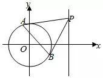
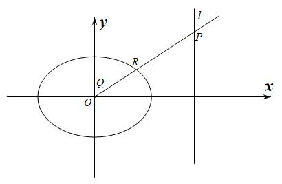
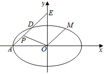
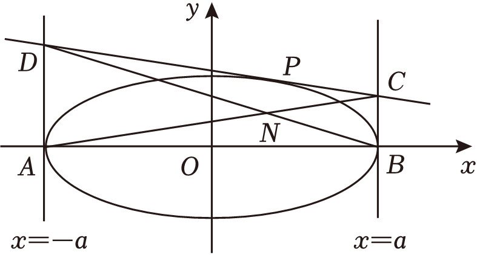
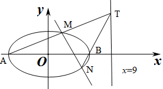
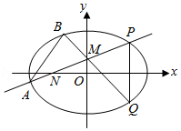
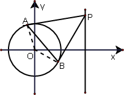
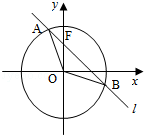

- 达标训练

1.（2023•沈阳期中）对于任意实数，曲线恒过定点<u>　 　</u>．

2.（2022•河南月考）过圆外一点，引圆的两条切线，切点为，，则直线，的方程为<u>　     　</u>．

3.（2023•娄底月考）已知圆和．

  
（1）求两圆和的公共弦方程；

  
（2）若圆的圆心在直线上，并且通过圆和的交点，求圆的方程．

########## 4.已知圆*O*：和圆外一点，过点作圆的切线，切点分别为、，求过切点、的直线方程．

5.（2023•山东月考）已知一个圆经过过两圆，的交点，且有最小面积，求此圆的方程．

6.已知两圆和．  
（1）求证：此两圆相切，并求出切点的坐标；
  
（2）求过点且与两圆相切于上述切点的圆的方程．

########## 7.已知圆，直线，点为坐标原点．

########## （1）求过圆的圆心且与直线垂直的直线的方程；

########## （2）若直线与圆相交于、两点，且，求实数的值．

########## 8．已知圆的圆心为原点，且与直线相切．

########## （1）求圆的方程；

########## （2）点在直线上，过点引圆的两条切线、，切点为、，试问，直线是否过定点，若过定点，请求出；若不过定点，请说明理由．

9.（2024•淮南月考）已知抛物线的焦点为，半径为1的圆的圆心位于轴的正半轴上，过圆心的动直线与抛物线交于、两点，如图所示．

  
（1）若圆经过抛物线的焦点，且圆心位于焦点的右侧，求圆的方程；

  
（2）是否存在定点，使得为定值，若存在，试求出该定点的坐标，若不存在，则说明理由．

10.（2023•金水期中）已知椭圆的离心率为，，分别是椭圆的左，右焦点，是椭圆上一点，且△的周长是6．

  
（1）求椭圆的方程；

  
（2）设斜率为的直线交轴于点，交曲线于，两点，是否存在使得为定值，若存在，求出的值；若不存在，请说明理由．

11.（2024•河北期末）焦点在轴上的椭圆经过点，椭圆的离心率为．，是椭圆的左、右焦点，为椭圆上任意点．  
（1）求椭圆的标准方程；

  
（2）若点为的中点为坐标原点），过且平行于的直线交椭圆于，两点，是否存在实数，使得；若存在，请求出的值，若不存在，请说明理由．

12.（2021•江苏二模）已知直线交抛物线于，两点．

  
（1）设直线与轴的交点为．若，求实数的值；

  
（2）若点，在抛物线上，且关于直线对称，求证：，，，四点共圆．

13.（2023•广州月考）已知椭圆的左焦点为，为椭圆上一点，交

轴于点，且为的中点．

  
（1）求椭圆的方程；

  
（2）直线与椭圆有且只有一个公共点，平行于的直线交于，交椭圆于不同的两点，

，问是否存在常数，使得，若存在，求出的值，若不存在，请说明理由．

14.（2022•江苏三模）已知，分别是轴，轴上的动点，且，动点满足，设点的轨迹为曲线．

  
（1）求曲线的轨迹方程；

  
（2）直线与曲线交于，两点，为线段上任意一点（不与端点重合），倾斜角为的直线经过点，与曲线交于，两点．若的值与点的位置无关，求的值．

15.（2022•鼓楼期末）已知椭圆的方程为，过点作直线与椭圆交于，两点，是椭圆的右顶点．
> 

> 
> |  |  |
> | --- | --- |
> | （1）求证：； | （2）求的最大值． |
> 

16.如图所示，已知椭圆，直线，是上一点，射线交椭圆于点，又点在上且满足，当点在上移动时，求点的轨迹方程，并说明轨迹是什么曲线.

17.（2021•天津三模）如图，在平面直角坐标系中，已知椭圆的离心率，左顶点为，过点作斜率为的直线交椭圆于点，交轴于点．

  
（1）求椭圆的方程；

  
（2）已知为的中点，是否存在定点，对于任意的都有，若存在，求出点的坐标；若不存在说明理由；

  
（3）若过点作直线的平行线交椭圆于点，求的最小值．

18.（2022•南宁月考）已知抛物线的焦点为，直线分别与轴交于点，与抛物线交于点，且．

  
（1）求抛物线的方程；

  
（2）设横坐标依次为，，的三个点，，都在抛物线上，且，若是以为斜边的等腰直角三角形，求的最小值．

19.（2023•重庆模拟）如图，已知，分别为椭圆的左，右顶点，，为椭圆上异于点，的动点，若，且直线与直线的斜率之积等于．

  
（1）求椭圆的标准方程；

  
（2）过动点，作椭圆的切线，分别与直线和相交于，两点，记四边形的对角线，相交于点，问：是否存在两个定点，，使得，为定值？若存在，求，的坐标；若不存在，说明理由．

20.（2024•北京校级模拟）椭圆的离心率为，，是椭圆的左、右焦点，以为圆心、为半径的圆与以为圆心、为半径的圆的交点在椭圆上．

（Ⅰ）求椭圆的方程和长轴长；

（Ⅱ）已知直线与椭圆有两个不同的交点，，为轴上一点．是否存在实数，使得是以点为直角顶点的等腰直角三角形？若存在，求出的值及点的坐标；若不存在，说明理由．

########## 21.（2005•湖北）设、是椭圆上的两点，点是线段的中点，线段的

########## 垂直平分线与椭圆相交于、两点．

########## （1）确定的取值范围，并求直线的方程；

########## （2）试判断是否存在这样的，使得、、、四点在同一个圆上？并说明理由．

########## 22.（2011•全国卷）已知为坐标原点，为椭圆在轴正半轴上的焦点，过且

########## 斜率为的直线与交于，两点，点满足．

########## （1）证明：点在上；

########## （2）设点关于点的对称点为，证明：、、、四点在同一圆上．

########## 23.（2014•全国大纲卷）已知抛物线的焦点为，直线与轴的交点为，与的交点为，且．

########## （1）求的方程；

########## （2）过的直线与相交于，两点，若的垂直平分线与相交于，两点，且，，，四点在同一圆上，求的方程．

########## 24.（2010•江苏）椭圆的左右顶点为，，右焦点为．设过点的直线，分别与椭圆交于，，其中，，．求证：直线必过轴上一个定点．

########## 25.（2016•山东）已知椭圆的长轴长为4，焦距为．

########## （1）求椭圆的方程；
########## （2）过动点，的直线交轴与点，交于点，在第一象限），且是线段的中点．过点作轴的垂线交于另一点，延长交于点．

########## ①设直线*PM*，*QM*的斜率分别为，，证明为定值；

########## ②求直线的斜率的最小值．

########## 26.如图，是椭圆长轴的两个端点，是椭圆上与均不重合的相异两点，设直线的斜率分别是．                                              

########## （1）求的值；

########## （2）若直线过点，求证：；

########## （3）设直线与轴的交点为(为常数且)，试探究直线与直线的交点是否落在某条定直线上？若是，请求出该定直线的方程；若不是，请说明理由．

- 达标训练

1.（2023•沈阳期中）对于任意实数，曲线恒过定点<u>　 　</u>．

【解析】曲线可化为，

且，可得恒过定点．

故答案为：．

2.（2022•河南月考）过圆外一点，引圆的两条切线，切点为，，则直线，的方程为<u>　     　</u>．

【解析】根据题意，圆的圆心为，半径，设该圆的圆心为，

又由，，则，

则、在以为圆心，为半径为圆上，该圆的方程为，

则直线的是圆与圆的公共弦，则有，两式相减可得：；

即直线的方程为；

故答案为：．

3.（2023•娄底月考）已知圆和．

  
（1）求两圆和的公共弦方程；

  
（2）若圆的圆心在直线上，并且通过圆和的交点，求圆的方程．

【解析】（1）将圆和的方程相减得：，此即为公共弦的方程．

  
（2）因为所求的圆过两已知圆的交点，故设此圆的方程为：，即  ，即  ，圆心为，，

由于圆心在直线上，，解得

所求圆的方程为：．

########## 4.已知圆*O*：和圆外一点，过点作圆的切线，切点分别为、，求过切点、的直线方程．

########## 【解析】由切线性质知，切点、在以线段为直径的圆上，由题知，，

########## ，线段的中点为，∴以线段为直径的圆的方程为，即，圆的方程与以为直径的圆的方程相减整理得：，直线*CD*的方程为．

5.（2023•山东月考）已知一个圆经过过两圆，的交点，且有最小面积，求此圆的方程．

【解析】设所求圆，

即，其圆心为，，

圆的面积最小，圆以已知两相交圆的公共弦为直径，相交弦的方程为，将圆心，代入，得，所以所求圆，

即为．

6.已知两圆和．  
（1）求证：此两圆相切，并求出切点的坐标；
  
（2）求过点且与两圆相切于上述切点的圆的方程．

【解析】（1）证明：圆，即，表示以为圆心、半径等于的圆． 即，表示以为圆心、半径等于的圆．由于圆心距，正好等于半径之和，故这2个圆相外切．

把两个圆的方程相减，可得两圆的公共切线方程为，根据两圆的圆心坐标求得直线的方程为，即，再由求得切点的坐标为．

  
（2）解：设所求圆为，由于圆过点，

，，

所求圆为，

即．

########## 7.已知圆，直线，点为坐标原点．

########## （1）求过圆的圆心且与直线垂直的直线的方程；

########## （2）若直线与圆相交于、两点，且，求实数的值．

########## 【解析】（1）由题意得，，，由⊥得，，∴．∵直线过圆心，∴直线的方程为．

########## （2）过直线与圆的交点的圆系方程为：

########## ，即①

########## 依题意，在以为直径的圆上，则圆心显然在直线上，则，解之可得，又满足方程①，则，故．

########## 8．已知圆的圆心为原点，且与直线相切．

########## （1）求圆的方程；

########## （2）点在直线上，过点引圆的两条切线、，切点为、，试问，直线是否过定点，若过定点，请求出；若不过定点，请说明理由．

########## 【解析】（1）依题意得：圆心到直线的距离，∴，∴圆的方程为①；

########## （2）连接，∵是圆*C*的两条切线，∴*OA*⊥*AP*，*OB*⊥*BP*，∴在以为直径的圆上，设点的坐标为，则线段的中点坐标为，∴以为直径的圆方程为，②∵*AB*为两圆的公共弦，∴①﹣②得：直线*AB*的方程为，即，则直线*AB*恒过定点．

9.（2024•淮南月考）已知抛物线的焦点为，半径为1的圆的圆心位于轴的正半轴上，过圆心的动直线与抛物线交于、两点，如图所示．

  
（1）若圆经过抛物线的焦点，且圆心位于焦点的右侧，求圆的方程；

  
（2）是否存在定点，使得为定值，若存在，试求出该定点的坐标，若不存在，则说明理由．

【解析】（1）抛物线的焦点为，则圆心，故圆的方程为；

  
（2）假设存在定点，满足题意，直线*AB*的参数方程为(*t*是参数)，将直线*AB*参数方程与抛物线的方程进行联立：，设此方程的两个根分别为，则，，因此，欲使得为定值，则必有，进而可得定值为，．

10.（2023•金水期中）已知椭圆的离心率为，，分别是椭圆的左，右焦点，是椭圆上一点，且△的周长是6．

  
（1）求椭圆的方程；

  
（2）设斜率为的直线交轴于点，交曲线于，两点，是否存在使得为定值，若存在，求出的值；若不存在，请说明理由．

【解析】（1）由，，解得，，又，，故椭圆的方程为．

  
（2）设点*T*为，直线*AB*的参数方程为(*t*是参数)，将直线*AB*方程代入椭圆联立：，设此方程的两个根分别为，

则，，

，要使为定值，则代数式与无关，只需，此时，即，（定值）．

11.（2024•河北期末）焦点在轴上的椭圆经过点，椭圆的离心率为．，是椭圆的左、右焦点，为椭圆上任意点．  
（1）求椭圆的标准方程；

  
（2）若点为的中点为坐标原点），过且平行于的直线交椭圆于，两点，是否存在实数，使得；若存在，请求出的值，若不存在，请说明理由．

########## 【解析】（1）由已知可得，，，解得，，

########## 所以椭圆的标准方程为；

########## （2）此题复数法也可以做，将点*P：*，代入椭圆得：，设直线*AB*的参数方程为（*t*是参数），将直线*AB*方程代入椭圆联立：，设此方程的两个根分别为，则，，故，存在满足条件．

12.（2021•江苏二模）已知直线交抛物线于，两点．

  
（1）设直线与轴的交点为．若，求实数的值；

  
（2）若点，在抛物线上，且关于直线对称，求证：，，，四点共圆．

########## 【解析】（1）由，得．设，，则，，

########## 因为直线与相交，所以△，得，由，得，所以，

########## 解得，从而，因为，所以，解得；

########## （2）证明：因为，两点关于直线对称，故设，联立得：，

########## ，则*AB*与*MN*交点为，

########## （*t*为参数），（*t*为参数），

########## 分别代入抛物方程得：，；，，因为，所以、、、四点共圆．

13.（2023•广州月考）已知椭圆的左焦点为，为椭圆上一点，交

轴于点，且为的中点．

  
（1）求椭圆的方程；

  
（2）直线与椭圆有且只有一个公共点，平行于的直线交于，交椭圆于不同的两点，

，问是否存在常数，使得，若存在，求出的值，若不存在，请说明理由．

【解析】（1）设椭圆的右焦点是，在中，，所以，为椭圆上

一点，故，，所以，，所以椭圆的方程为；

  
（2）由于点*A*在第一象限，故，求导得：，时，，

则 ，，设  ，，所以，

所以 ，设*DE*的倾角为，，，

则*DE*的参数方程为： （*t*为参数）代入

整理得：，即:，

，

，．

14.（2022•江苏三模）已知，分别是轴，轴上的动点，且，动点满足，设点的轨迹为曲线．

  
（1）求曲线的轨迹方程；

  
（2）直线与曲线交于，两点，为线段上任意一点（不与端点重合），倾斜角为的直线经过点，与曲线交于，两点．若的值与点的位置无关，求的值．

【解析】（1）设，，，则，设，

则，又，，则，

，化简得，曲线的轨迹方程为；

  
（2）联立方程组，解得或，不妨设点在第一象限，则，，

设点，其中，则，，

设，代入椭圆方程得：，

为定值时，则

解得：，此时（或者由，根据点差法反推），为的中点，故．

15.（2022•鼓楼期末）已知椭圆的方程为，过点作直线与椭圆交于，两点，是椭圆的右顶点．
> 

> 
> |  |  |
> | --- | --- |
> | （1）求证：； | （2）求的最大值． |
> 

【解析】（1）证明：将整个图像向左平移2个单位得：，即，令平移后直线为，则过定点，不妨设方程为，此时满足方程，由于，同除以得：，是这个方程的两个根，故，所以；

  
（2）令，，代入平移后方程得：，，，当且仅当时等号成立．所以的最大值为．

16.如图所示，已知椭圆，直线，是上一点，射线交椭圆于点，又点在上且满足，当点在上移动时，求点的轨迹方程，并说明轨迹是什么曲线.

【解析】 考虑复平面，又，，三点共线，可设它们分别对应的复数为

①

②

③

其中. 在椭圆上，由②设，

得，又,所以

由①得点的轨迹参数方程是

不难消去参数得到点的轨迹方程为，因此，点的轨迹是以为中心，长、短半轴长分别为1和，且长轴在轴上的椭圆，并去掉坐标原点.

17.（2021•天津三模）如图，在平面直角坐标系中，已知椭圆的离心率，左顶点为，过点作斜率为的直线交椭圆于点，交轴于点．

  
（1）求椭圆的方程；

  
（2）已知为的中点，是否存在定点，对于任意的都有，若存在，求出点的坐标；若不存在说明理由；

  
（3）若过点作直线的平行线交椭圆于点，求的最小值．

【解析】（1）椭圆的离心率，左顶点为，，又，故．又，椭圆的标准方程为．

  
（2）根据点差法（略）算出，又由于,故，显然当时，时满足题意，故定点的坐标为．

  
（3）设，所以，

代入椭圆方程得：

将椭圆向右平移4个单位，得，设，代入椭圆方程，

得：，又，故，故，

，由于故，当且仅当*AD*=*AE*

时取等号，当，即时，的最小值为．

18.（2022•南宁月考）已知抛物线的焦点为，直线分别与轴交于点，与抛物线交于点，且．

  
（1）求抛物线的方程；

  
（2）设横坐标依次为，，的三个点，，都在抛物线上，且，若是以为斜边的等腰直角三角形，求的最小值．

【解析】（1）设点，由点在抛物线上，且．得：，解得：，

故抛物线的方程为：．

  
（2）设，，根据题意可知：（复数三角变换），故，，我们将、两点代入抛物线得：，根据题意，我们需要，所以利用基本不等式将以及代入替换得：

，即，当且仅当时等号成立.

19.（2023•重庆模拟）如图，已知，分别为椭圆的左，右顶点，，为椭圆上异于点，的动点，若，且直线与直线的斜率之积等于．

  
（1）求椭圆的标准方程；

  
（2）过动点，作椭圆的切线，分别与直线和相交于，两点，记四边形的对角线，相交于点，问：是否存在两个定点，，使得，为定值？若存在，求，的坐标；若不存在，说明理由．

【解析】（1）由题知，，，在椭圆上，即，即，

，，椭圆的标准方程为．

  
（2）点，在椭圆上，过点的椭圆的切线方程为（请自证），

则，，假设存在两个定点，，使得为定值．

，，，则根据椭圆第三定义，因此存

点的轨迹方程为，即存在定点，，使得为定值6．

20.（2024•北京校级模拟）椭圆的离心率为，，是椭圆的左、右焦点，以为圆心、为半径的圆与以为圆心、为半径的圆的交点在椭圆上．

（Ⅰ）求椭圆的方程和长轴长；

（Ⅱ）已知直线与椭圆有两个不同的交点，，为轴上一点．是否存在实数，使得是以点为直角顶点的等腰直角三角形？若存在，求出的值及点的坐标；若不存在，说明理由．

【解析】（Ⅰ）由题意，，，解得，，所以，

所以椭圆的方程为，长轴长为．

（Ⅱ）

########## 法一（中点弦轨迹方程）：取的中点，易知为的中垂线，且，

########## ，又，所以，故（中垂线截距问题），

########## 由于，故，故点轨迹，

令，，令，，

故，，，，代入椭圆方程，，

########## ，所以，故，故．

法二：（原始复数旋转）设，，根据题意可知：，

故，，

，，①，②，

③

综合①②③，所以，

故，，此时，故.

########## 21.（2005•湖北）设、是椭圆上的两点，点是线段的中点，线段的

########## 垂直平分线与椭圆相交于、两点．

########## （1）确定的取值范围，并求直线的方程；

########## （2）试判断是否存在这样的，使得、、、四点在同一个圆上？并说明理由．

########## 【解析】（1）设，，则有．

########## 依题意，，所以．因为是的中点，所以，，从而．又由在椭圆内，所以，所以的取值范围是．直线的方程为，即．

########## （2）直线的方程为，即．、、、四点的曲线系方程为．即，令，所以，当时，方程转化为

########## 故当，故当时符合题意，、、、四点共圆．

########## 22.（2011•全国卷）已知为坐标原点，为椭圆在轴正半轴上的焦点，过且

########## 斜率为的直线与交于，两点，点满足．

########## （1）证明：点在上；

########## （2）设点关于点的对称点为，证明：、、、四点在同一圆上．

########## 【证明】（1）：设，，中点，则

########## ，代入，又，所以 所以，代入椭圆方程成立，所以点在上 ．                   

########## （2）设线段的中点坐标为，即，因为关于点的对称点为，的直线方程为：过、、、的曲线系方程为，                             所以，令，得，故圆方程为，，所以、、、四点在同一圆上．

########## 23.（2014•全国大纲卷）已知抛物线的焦点为，直线与轴的交点为，与的交点为，且．

########## （1）求的方程；

########## （2）过的直线与相交于，两点，若的垂直平分线与相交于，两点，且，，，四点在同一圆上，求的方程．

########## 【解析】（1）；

########## （2）设方程为，联立，所以，设，，中点为，则，，所以的方程为：，即，过，，，四点的曲线可设为，(为参数)(\*)，因为，，，四点在同一圆上，则方程（\*）中不含的项，所以，．综上知，直线的方程为或．

########## 注意：更进一步的可求得，，，四点所在的圆方程．①当时，，即，所以，即，故圆的方程为；②同理当时，圆的方程为．

########## 24.（2010•江苏）椭圆的左右顶点为，，右焦点为．设过点的直线，分别与椭圆交于，，其中，，．求证：直线必过轴上一个定点．

########## 【解析】设:，故我们只需要求出．

########## 令 ，因为椭圆过二次曲线与二次曲线的四个交点，，，，

有，对比两边项系数，得，对比两边项系数，得，联立以上两式，解得，故直线恒过．

########## 25.（2016•山东）已知椭圆的长轴长为4，焦距为．

########## （1）求椭圆的方程；
########## （2）过动点，的直线交轴与点，交于点，在第一象限），且是线段的中点．过点作轴的垂线交于另一点，延长交于点．

########## ①设直线*PM*，*QM*的斜率分别为，，证明为定值；

########## ②求直线的斜率的最小值．

########## 【解析】（1）设椭圆的半焦距为．由题意知，

########## 所以．所以椭圆的方程为．

########## （2）证明：①设，，，由，可得,，,．所以直线的斜率，直线的斜率，

########## 此时．所以为定值．

########## ②设:，故我们只需要求出的关系式；

########## 已知 因为椭圆过二次曲线与二次曲线的四个交点，，，，有，对比两边项系数，得①，对比两边项系数，得②，对比两边项系数，得③，

########## 综合①②③得，当仅当时等号成立．

########## 26.如图，是椭圆长轴的两个端点，是椭圆上与均不重合的相异两点，设直线的斜率分别是．                                              

########## （1）求的值；

########## （2）若直线过点，求证：；

########## （3）设直线与轴的交点为(为常数且)，试探究直线与直线的交点是否落在某条定直线上？若是，请求出该定直线的方程；若不是，请说明理由．

########## 【解析】（1）设，由于，所以，因为在椭圆上，于是，即，所以．

########## （1） 整体向右平移个单位， ，设平移后的动直线为*mx+ny=* 1（直线过（），代入解得*m*=）  展开，得到，

##########   ，∵*x*≠0，同除，得到

########## ，由韦达定理可知，==

########## （3）设，，，

########## 以*AMBN*四点曲线系方程为

########## *xy*的系数为0，      *y*的系数为0， 

########## ，

########## 相加可以得到，2*x*=  ，相减可以得到 

########## 联立可得，即点在定直线上．

