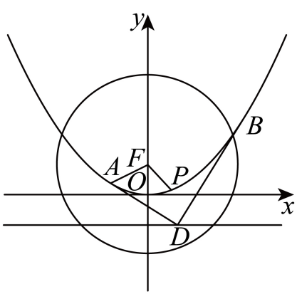
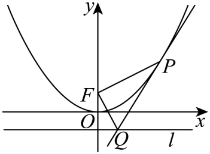
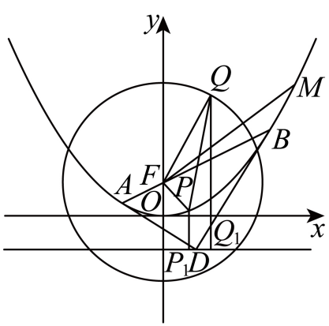
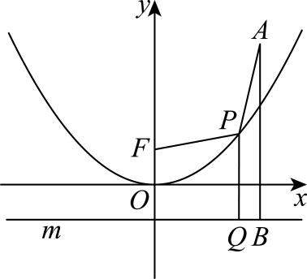
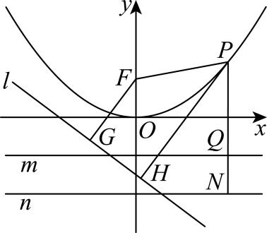
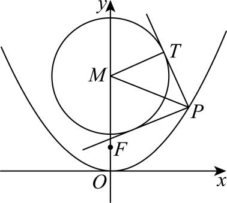
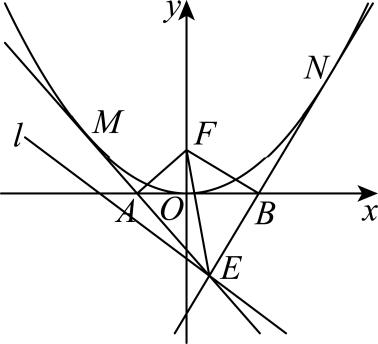

第四章达标训练

1.（2025·甘肃金昌·模拟预测）过直线上的动点作的两条切线，切点分别为，则的重心的轨迹方程为（   ）

A．	
B．	
C．	
D．

2．（2025·山西·二模）已知抛物线的焦点为，准线为.点在上，过作抛物线的切线交准线于点.当外接圆面积最小时，点的坐标可以是（    ）

A．	
B．	
C．	
D．

3．（2025·湖南·三模）过点作一直线与抛物线交于，两点，若抛物线在，两点处的切线交于点，且点满足，则的值是（    ）

A．4	
B．3	
C．2	
D．1

4.（24-25·多选·高三下吉林长春·开学考试）如图，已知点在抛物线：上，为的焦点，且，圆：，直线：交于点，，过，分别作的切线，，与相交于点，为上一点，（）为圆上一点，则（   ）

A．的准线方程为	
B．为直角三角形

C．点在定直线上	
D．周长的最小值为

5.（2025·多选·山东淄博一模）过点向曲线引斜率为的切线，切点为，则下列结论正确的是（   ）

A．	
B．

C．数列的前项和为	
D．

6.（2025高三·全国·专题练习）阿基米德三角形由古希腊数学家阿基米德提出，有着很多重要的应用．在圆锥曲线中，圆锥曲线的弦与过弦的端点的两条切线所围成的三角形被叫作阿基米德三角形．已知抛物线的焦点为，顶点为，斜率为的直线过点且与交于两点，若为阿基米德三角形，则_____．

7.（2025·多选·湖南长沙二模）已知*P*为抛物线*C*：上一点，*F*为*C*的焦点，直线*l*的方程为，则下列说法正确的有（    ）

A．若，则

B．点*P*到直线*l*与到直线的距离之和的最小值为2

C．若存在点*P*，使得过点*P*可作两条垂直的直线与圆相切，则*r*的取值范围为

D．过直线*l*上一点*E*（点*E*不在*x*轴上）作抛物线的两条切线，切线分别交*x*轴于点*A*，*B*，外接圆面积的最小值为

第四章达标训练

1.（2025·甘肃金昌·模拟预测）过直线上的动点作的两条切线，切点分别为，则的重心的轨迹方程为（   ）

A．	
B．	
C．	
D．

【解析】设，，，的重心为，的方程为，对求导可得.故，的方程为，

将，代入的方程化简得.同理的方程为，

两方程联立解得，.

，则，

，

故的重心的轨迹方程为.
故选：C.

2．（2025·山西·二模）已知抛物线的焦点为，准线为.点在上，过作抛物线的切线交准线于点.当外接圆面积最小时，点的坐标可以是（    ）

A．	
B．	
C．	
D．

【解析】设点，，故，

将代入可得，故则过作抛物线的切线为：，

又准线为：，故中，令得，

可得点.又，所以，

所以为直角，为外接圆的直径，

.

令，则可得，由，当得，令得，故在上单调递减，在上单调递增，

故当时，取得极小值，也是最小值，即所求外接圆的面积最小，此时点.
故选：B

3．（2025·湖南·三模）过点作一直线与抛物线交于，两点，若抛物线在，两点处的切线交于点，且点满足，则的值是（    ）

A．4	
B．3	
C．2	
D．1

【详解】由题意得，设直线*l*方程为，，，将直线*l*方程代入抛物线得，则.由得，，则，

所以在两点处的切线的斜率分别为，，所以.

又因为，两边平方并整理得， ，所以，

，所以，即，所以.
故选：A.

4.（24-25·多选·高三下吉林长春·开学考试）如图，已知点在抛物线：上，为的焦点，且，圆：，直线：交于点，，过，分别作的切线，，与相交于点，为上一点，（）为圆上一点，则（   ）

A．的准线方程为	
B．为直角三角形

C．点在定直线上	
D．周长的最小值为

【解析】因为在抛物线上，抛物线的准线方程为，

焦点的坐标为，又，所以，所以，

所以抛物线的方程为，准线方程为，A错误；

联立，所以，方程的判别式，

设，，则，，，由已知为方程的两根，所以，，又的导函数为，

所以抛物线在点处的切线方程为，即，

抛物线在点处的切线方程为，即，

联立，解方程可得，，所以点的坐标为，

所以，，所以

所以，所以，所以为直角三角形，B正确，

点在直线上，C正确；

设点，在准线上的投影分别为，，因为，，所以的周长，因为，（），所以，

所以的周长的最小值为，此时，或，，D正确；
故选：BCD.

5.（2025·多选·山东淄博一模）过点向曲线引斜率为的切线，切点为，则下列结论正确的是（   ）

A．	
B．

C．数列的前项和为	
D．

【解析】设直线，联立，得，

则由，即，解得（负值舍去），故A正确；

可得，，

所以，故B正确；

因为，则，故C错误；

因为，，所以，

设，则，可得在上单调递增，则时，，又，则，故D正确.
故选：ABD

6.（2025高三·全国·专题练习）阿基米德三角形由古希腊数学家阿基米德提出，有着很多重要的应用．在圆锥曲线中，圆锥曲线的弦与过弦的端点的两条切线所围成的三角形被叫作阿基米德三角形．已知抛物线的焦点为，顶点为，斜率为的直线过点且与交于两点，若为阿基米德三角形，则_____．

【解析】依题意，，直线，由得，得或，

不妨设．因为直线与抛物线相切，所以直线的斜率存在，

设直线的方程为，与联立得关于的方程，

即，，得，

故直线的斜率，即直线，同理可得直线的斜率，直线．

由得即，则．

二级结论法：

直线，由得出或，不妨设，
由抛物线焦点弦的性质可得，过抛物线焦点弦的两端点作抛物线的切线，切线交点在准线上，

且交点的纵坐标为两端点纵坐标之和的一半，所以，所以．

故答案为：.

7.（2025·多选·湖南长沙二模）已知*P*为抛物线*C*：上一点，*F*为*C*的焦点，直线*l*的方程为，则下列说法正确的有（    ）

A．若，则

B．点*P*到直线*l*与到直线的距离之和的最小值为2

C．若存在点*P*，使得过点*P*可作两条垂直的直线与圆相切，则*r*的取值范围为

D．过直线*l*上一点*E*（点*E*不在*x*轴上）作抛物线的两条切线，切线分别交*x*轴于点*A*，*B*，外接圆面积的最小值为

【解析】对于A，抛物线*C*：，焦点，准线*m*：，，

过点*P*作准线*m*：的垂线，垂足为*Q*，再过点*A*作准线*m*：的垂线，垂足为*B*，

由抛物线定义可知：，故A正确；

对于B，过点*P*作准线*m*：的垂线，垂足为*Q*，交直线*n*：于点*N*，过点*P*作直线*l*：的垂线，垂足为*H*，过点*F*作直线*l*：的垂线，垂足为*G*，    由点*F*到直线*l*：的距离公式可得：，则点*P*到直线*l*与到直线的距离之和为：

，故B错误；
对于C．

根据过点*P*可作两条垂直的直线与圆相切，如图，设切点为*T*，可知．

由于两条切线垂直，可知，即，所以有，从而把问题转化为抛物线上存在点*P*到圆心*M*的距离为，先求抛物线上点到圆心的距离：

，当时，取到最小值，

即，解得，故C正确．

对于D，切线，与抛物线分别切于*M*，*N*，设，，因为，故，故，，故直线*EA*：，同理，直线*EB*：，

由，可得，故，又，故，，

故，同理，故，，所以*E*，*A*，*F*，*B*四点共圆，且的外接圆的直径为，所以即为*F*到直线的距离，此距离为2．故，即的外接圆的半径的最小值为1，故的外接圆面积的最小值为．
故选：ACD.

