- 万能的两点对合式

过抛物线上两点、的直线方程是:.

证明:利用，得到，故直线方程为:，化简可得:.

记忆方法:把抛物线化成标准方程，然后将最左端的二次自动降为一次，再在最左端和最右端加上“、”皆可.

同理，如果抛物线的形式是，直线的方程是:.

注意:考试时，最好给出的推导过程。

关于对合，如果我们设立某种法则，我们发现中，

，同时，故令，，，这样用表示和用表示是一样的，这就是一种对合方程，并且，其实我们在做任何联立的时候，只要两个完全能轮换对称的变量构成的方程，比如二次韦达，都是一种对合方程的形式，有句话叫做百姓日用而不知，正是我们天天在用对合方程，却对其看不见，本章不妨我们重新来了解一下对合方程。

- 反比例对合方程解决圆锥曲线与数列综合

2024年新高考Ⅱ卷19题，就是考查了神奇的反比例对合方程！

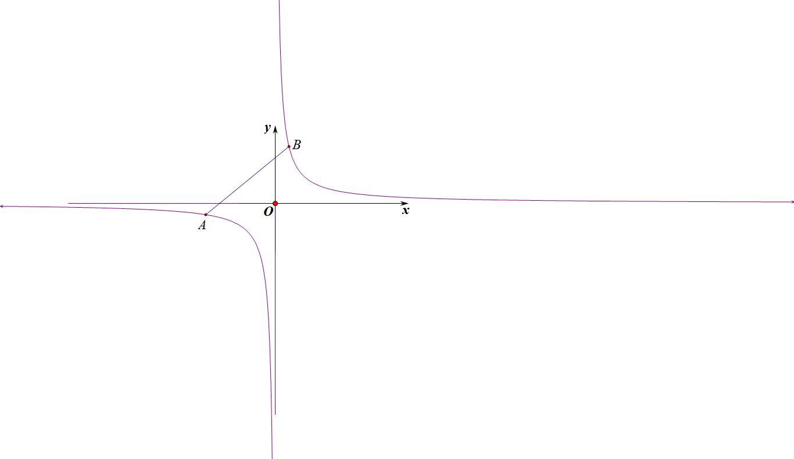

如图，和分别是反比例函数（等轴双曲线）上的两点，则AB的两点对合式方程为：.

证明：由于，故，即.

和抛物线的两点对合式一样，在这个两步就能证明的式子背后，隐藏了很多我们平时没抓住的信息，比如斜率的简化，比如构造相切的点到直线距离的快速同构，由于斜率只需要两点的坐标即可表示，命题者就抓住了这个特点，进行了圆锥与数列综合的命题。

########## 一．两点对合式构造双曲线中的等比数列

如图，将等轴双曲线逆时针旋转，即变成了初中的反比例函数，

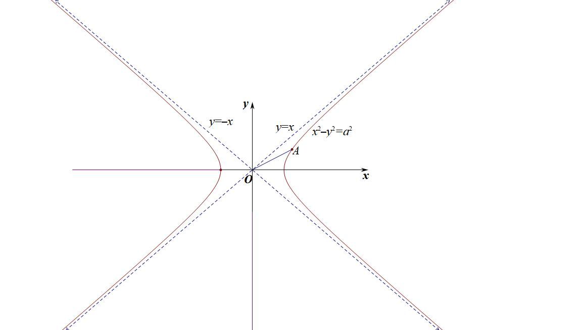

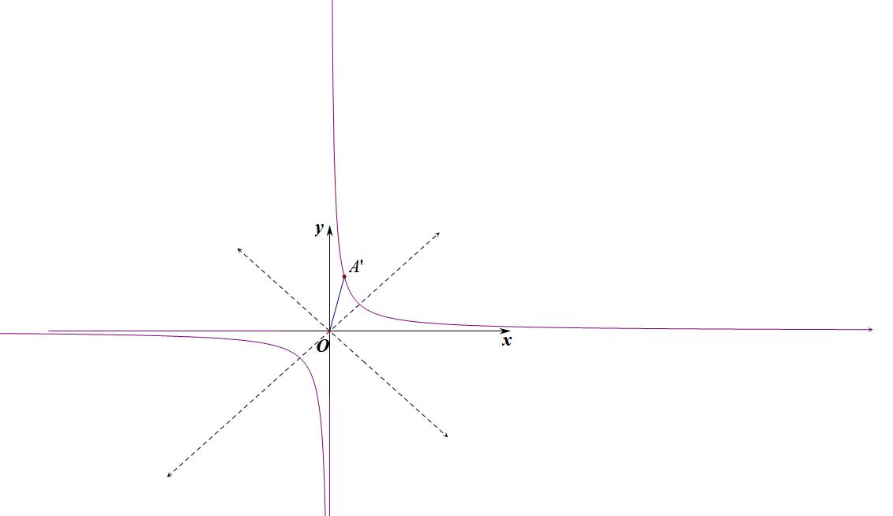

证明：记原双曲线上任意一点A满足：，作复数逆时针旋转得，则：，故，由于，

故；

【例1】（2024•新高考Ⅱ卷19题）已知双曲线，点在上，为常数，，按照如下方式依次构造点，3，，过斜率为的直线与的左支交于点，令为关于轴的对称点，记的坐标为，．

  
（1）若，求，；

  
（2）证明：数列是公比为的等比数列；

  
（3）设为△的面积，证明：对任意的正整数，．

【例2】（2025·山东潍坊·二模T19）双曲线的左、右顶点分别为、，点到的渐近线的距离为．

  
（1）求的方程；

  
（2）按照如下方式依次构造点（且）：过点作斜率为的直线交于另一点，设是点关于实轴的对称点，记点的坐标为．

（i）证明：数列、是等比数列，并求数列和的通项公式；

（ii）记的面积为，的面积为，求的最大值．

二．非等轴双曲线的仿射换元

由于，令，则，由于逆时针旋转后得到点，逆时针旋转后得到点，所以变换是将原来横坐标和纵坐标缩小倍后逆时针旋转得来。

综上，双曲线都可以转化为反比例或者对勾函数，当时，按照旋转都能得出反比例，当时，旋转后会得到对勾或者飘带函数。按照换元法，就需要先对坐标进行伸缩变换，如下：

，令，则此变换是将原来横坐标和纵坐标分别缩小倍和后逆时针旋转得来，新坐标方程为。

【例3】（2024•天一大联考）已知双曲线的中心是坐标原点，对称轴为坐标轴，且过，两点．

  
（1）求的方程；

  
（2）设，，三点在的右支上，，，证明：

> 

> 
> |  |  |
> | --- | --- |
> | （ⅰ）存在常数，满足； | （ⅱ）△的面积为定值． |
> 

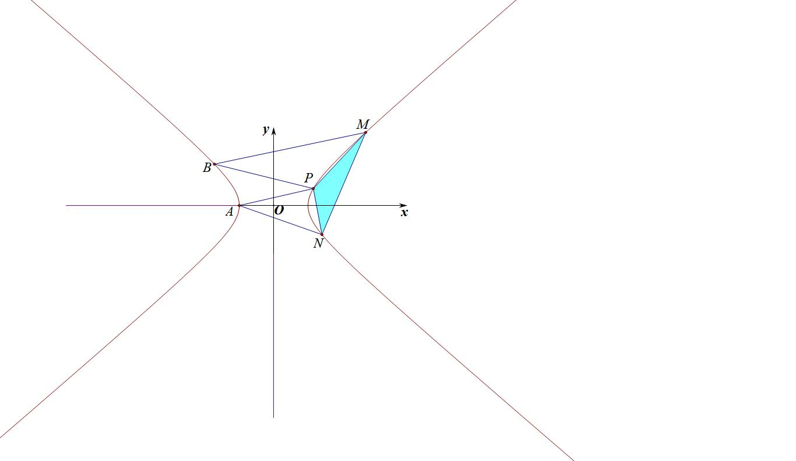

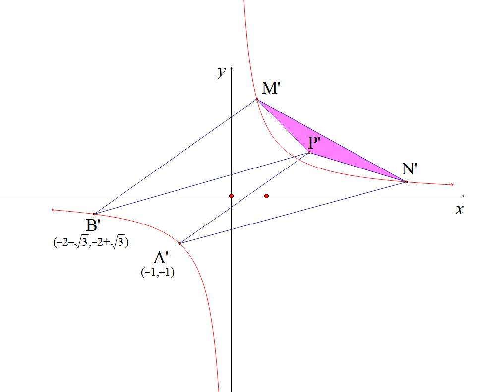

【例4】（2025温州1.5模第18题）已知双曲线 $C:\frac{x^{2}}{a^{2}}-\frac{y^{2}}{b^{2}}=1\left(a>0,b>0\right)$ 过点 $P_{1}\left(2,2\right)$ ，其渐近线的方程为 $y=\pm 2x$ ．按照如下方式依次构造点 $P_{n}\left(n=2,3,\cdots \right)$ ：过右支上点 $P_{n-1}$ 作斜率为1的直线与 $C$ 的左支交于点 $Q_{n-1}$ ，过 $Q_{n-1}$ 再作斜率为-1的直线与 $C$ 的右支交于点 $P_{n}\left(x_{n},y_{n}\right)$ ．  
（1）求双曲线 $C$ 的方程；  
（2）用 $x_{n},y_{n}$ 表示点 $Q_{n-1}$ 的坐标；  
（3）求证：数列 $\left\{2x_{n}-y_{n}\right\}$ 是等比数列．

【例5】（2025·青岛开学考试19题）已知双曲线，点在上．按如下方式构造点（）；过点作斜率为的直线与的左支交于点，点关于轴的对称点为，记点的坐标为．

  
（1）求点的坐标；

  
（2）记，证明：数列为等比数列；

  
（3）为坐标原点，分别为线段，的中点，记，的面积分别为，求的值．

三．抛物线两点对合式构造等差等比数列

【例6】（2025•文山市期末）已知点在抛物线上，按照如下方法依次构造点，3，4，，过点作斜率为的直线与抛物线交于另一点，作点关于轴的对称点，记的坐标为，．

  
（1）求抛物线的方程；

> 

> 
> |  |  |
> | --- | --- |
> | （2）求数列的通项公式，并求数列的前项和； | （3）求△的面积． |
> 

【例7】（2025•深圳罗湖区期末第19题）设为抛物线上一点，按如下方式构造，，3，：设，线段与交于点，为关于轴的对称点．

  
（1）求，；

  
（2）记，且．

判断无穷数列是否为等比数列，并说明理由；

当时，证明：．

【例8】（2025届浙江省桐乡市高三5月模拟测试T19）在平面直角坐标系中，将每个点绕原点沿逆时针方向旋转角的变换称为旋转角为的旋转变换，设点经过旋转角的旋转变换后变成点，则

  
（1）在的旋转变换下，若点变成点，直线变成直线，求：的坐标和直线的斜率；

  
（2）已知曲线是由平面直角坐标系下焦点在轴上的抛物线绕原点逆时针旋转所得的斜抛物线的方程．

①求斜抛物线的焦准距；

②已知在斜抛物线上，按如下规则依次构造点列：过点作斜率为的直线交于点，再过点作斜率为的直线交于点，记的面积为．求证：．

- 抛物线切线对合与两点对合数列构造综合

一．抛物线蝴蝶定理

蝴蝶定理我们会在后面介绍极点极线后给到背景解读，在抛物线的体系里，两点对合式就是无敌的存在.

已知抛物线,过点的动直线交拋物线于两点,直线分别交抛物线于点,则:

  
（1）直线恒过轴的定点,其中;

  
（2）假设直线和的斜率都存在,则.

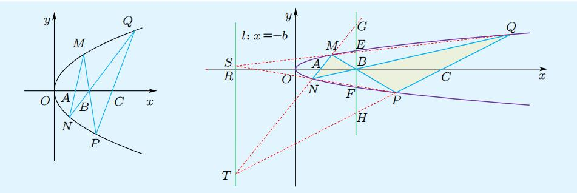

证明：法一（两点对合式同构同构）：易得①×④=②×③有;

法二：如图所示,作出辅助线,补全自极三角形（参考下一章内容），由于，易得,根据蝴蝶定理,显然有,故

【例1】（2025•广州高三开学第19题）蝴蝶定理是数学中的一道名题，已经有两百年的历史，迄今依然是一颗生机勃勃的常青树，因其图形像一只蝴蝶而得名．蝴蝶模型在圆锥曲线中经常出现，其中点、线有很多优美的性质．已知抛物线的焦点为，过的直线交抛物线于，，当与轴垂直时，△的面积为2，其中为坐标原点．

  
（1）求抛物线的方程；

  
（2）若直线的斜率存在为，过作直线，分别交抛物线于，，连，设直线的斜率为，证明：为定值；

  
（3）记直线，的倾斜角分别为，，当最大时，求直线的方程．

【例2】（2025•河北张家口期末第18题）直线经过抛物线的焦点，且与交于，两点（点在轴上方），点在轴上，直线，分别与交于点，，记直线与轴交点的横坐标为．

若直线垂直于轴，求直线的方程．

证明：．

【例3】（2025·东北三省三校·二模T19）已知抛物线，焦点为．抛物线上有一点，直线与抛物线的另一个交点为．按照如下方式依次构造点，过作*x*轴的垂线，垂足为，垂线与抛物线*C*的另一个交点为．作直线，与抛物线*C*的另一个交点为，直线与*x*轴的交点为．记．

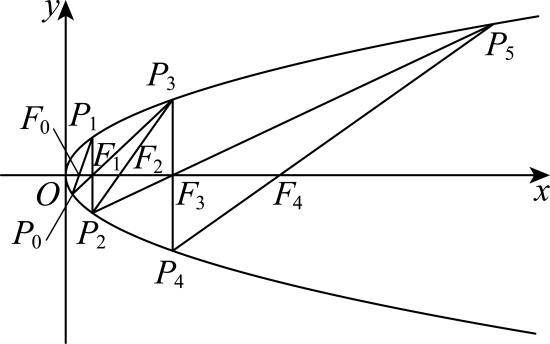

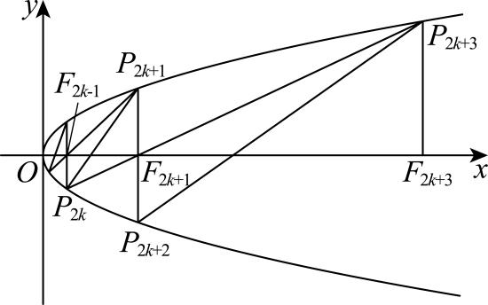

> 

> 
> |  |  |
> | --- | --- |
> | （1）若，求； | （2）求证：数列是等比数列，并用*m*表示数列的通项公式； |
> 

  
（3）对任意的正整数与的面积之比是否为定值？若是，请用*m*表示这个定值；若不是，请说明理由．

二．切线与对合不动点

我们以抛物线的两点对合方程为例，如果，此时一定有，所以方程为，这就是过抛物线上点的切线方程，那么A点就是抛物线的切点，类比于不动点概念是，故切点也叫对合不动点，如图，过点P作抛物线两条切线和，

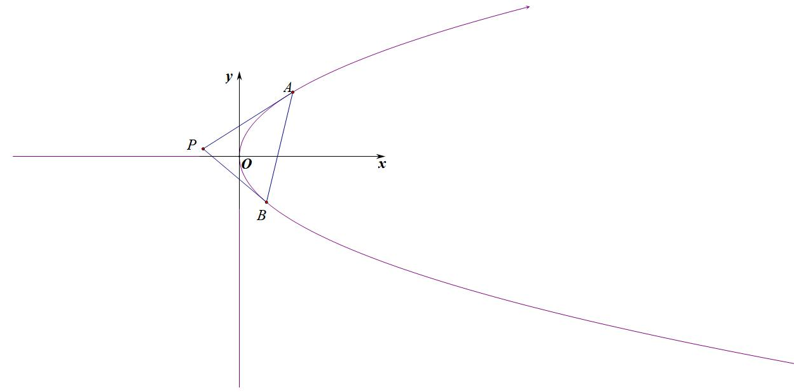

则AB是两个对合不动点，他们的连线叫做对合轴，那么点P就是对合中心，也是著名的切线和切点弦，这个在后来的被我们叫做极点极线，我们也称之为阿基米德三角形。

我们易知，设对合中心坐标，则一定有，故和均在同构方程上，根据两点确定一条直线，则对合轴方程，结合对合方程，则易得，这样就把阿基米德三角形的一切数据揽括其中。

【例4】（2025•福建金科百校联考第19题）已知抛物线的焦点为，，为抛物线上的一个动点（不与坐标幸原点重合），．

  
（1）求抛物线的方程；

  
（2）已知点，按照如下方式构造点，3，4，，设直线为抛物线在点处的切线，过点作的垂线交抛物线于另一点，记的坐标为，．

证明：当时，；

设△的面积为，证明：．

三．平移顶点的抛物线两点对合方程

常见的抛物线若向上移*m*个单位，则方程变为，我们来推导一下其两点对合式，，即，同理，关于切线方程，利用对合不动点，，即；

【例5】（2025•甘肃白银市高三月考第19题）在直角坐标系中，点到轴的距离等于点到点的距离，记动点的轨迹为．

  
（1）求的方程．

  
（2）设，，，，是上不同的两点，且，记为曲线上分别以，为切点的两条切线的交点．

①证明：存在定点，使得．

②取，记，，求．

第三节 椭圆双曲线的两点对合式

由于

一．椭圆与双曲线的两点对合式

1.椭圆两点对合式

设、,故弦的方程是,

证明：由于

故、均在同构方程上，

即弦的对合方程是,

令，，同除以（），则；

接下来我们来解读斜率关系，以椭圆为例，

设、、,其中是定值,是变化数,令，，，

又易知直线、的方程分别是

直线,或者

直线,或者

所以,直线的斜率分别是

特别的情况，

  
（1）当为左顶点，则，；

  
（2）当*P*为右顶点，则，；

  
（3）当*P*为上顶点，则，；

  
（4）当*P*为下顶点，则，；
2. 双曲线右支的两点对合式

设、,故弦的方程是,

（为一四象限角，即在双曲线右支上的两点对合式）

证明：由于

故、均在同构方程上，

即，即弦的方程是,

令，，同除以，则；

所以,直线的斜率分别是

特别的情况，

> 

> 
> |  |  |
> | --- | --- |
> | （1）当为左顶点，； | （2）当*P*为右顶点，； |
> 

3. 双曲线左支的两点对合式

关于双曲线左支上两点，涉及到符号的变化，比如第二三象限、,

不妨换元为、,故弦的方程是,令，，

即；

> 

> 
> |  |  |
> | --- | --- |
> | （1）当为左顶点，； | （2）当*P*为右顶点，； |
> 

4. 双曲线左右两支的两点对合式

关于双曲线两支上两点，涉及到符号的变化，比如第一二象限、和位于第三四象限的,故弦的方程是,令，，即；
- 对合方程简化单动点模型

1.椭圆

1. 若关于*y*轴对称，则；
2. 若关于x轴对称，则；
3. 若关于原点对称，则；

证明：（1），所以；（2），所以；

2. ，所以；
2. 双曲线

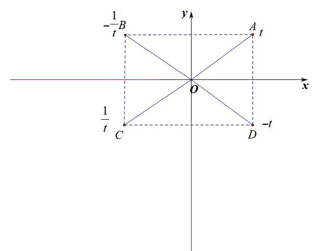

1. 若关于*y*轴对称，则；
2. 若关于x轴对称，则；
3. 若关于原点对称，则；

【例1】（2025•北京清华附中高三开学）已知椭圆,其离心率,长轴长为6.

  
（1）求椭圆的标准方程;

  
（2）椭圆的上、下顶点分别为，右顶点为,过点的直线与椭圆的另一个交点为，点与点关于轴对称，直线交于，直线交于点，点，

求证:.

三．对合方程简化斜率关系模型

【例2】（2020•新课标Ⅰ）已知，分别为椭圆的左、右顶点，为的上顶点，．为直线上的动点，与的另一交点为，与的另一交点为．
> 

> 
> |  |  |
> | --- | --- |
> | （1）求的方程； | （2）证明：直线过定点． |
> 

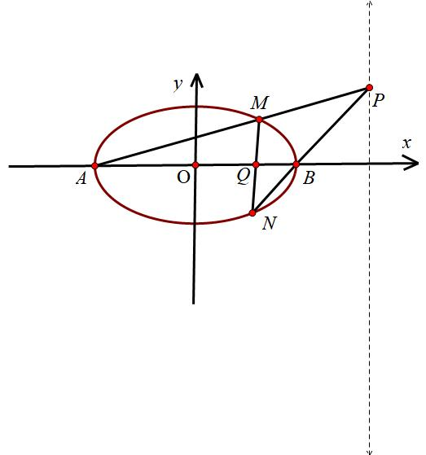

【例3】(2017•新课标I理)已知椭圆,四点，，，，中恰有三点在椭圆上.  
（1）求的方程;  
（2）设直线不经过点且与相交于，两点.若直线与直线的斜率的和为，证明:过定点.

【例4】(2022新高考Ⅰ卷)已知在双曲线上,直线交于、两点,直线,斜率之和为0.  
（1）求的斜率;

四．两点对合方程简化相切圆问题

类比于抛物线的双切圆或者彭塞列闭合圆，这类型题就是同构创造的体系，必然想到两点对合式来简化.从例5开始，不再详细写两点对合式的同构证明过程，大家自己注意考试要写证明过程。

【例5】（2025•重庆南坪中学期中第19题）如图，已知椭圆的上顶点为，离心率为，若过点作圆的两条切线分别与椭圆相交于点，（不同于点．

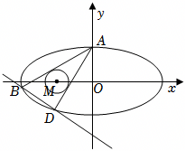

  
（1）求椭圆的方程；

> 

> 
> |  |  |
> | --- | --- |
> | （2）设直线和的斜率分别为，，求证：为定值； | （3）求证：直线过定点． |
> 

【例6】（2025•合肥一模第18题）已知动圆与动圆，满足，记与公共点的轨迹为曲线，曲线与轴的交点记为，（点在点的左侧）．

  
（1）求曲线的方程；

  
（2）若直线与圆相切，且与曲线交于，两点（点在轴左侧，点在轴右侧）．

若直线与直线和分别交于，两点，证明：；

记直线，的斜率分别为，，证明：是定值．

五．两点对合方程简化轮换对称问题

【例7】（2025•MST陪跑课群答读者问题）如图所示，已知椭圆，过点的直线交椭圆于，两点，过点作斜率为的直线交椭圆于另一点，求证:直线过定点.

【例8】（2024•新高考Ⅱ卷19题）已知双曲线，点在上，为常数，，按照如下方式依次构造点，3，，过斜率为的直线与的左支交于点，令为关于轴的对称点，记的坐标为，．

  
（1）若，求，；

  
（2）证明：数列是公比为的等比数列；

  
（3）设为△的面积，证明：对任意的正整数，．

【例9】（2025•北京海淀区清华附中高三统测第19题）已知椭圆的左顶点为，下顶点为，离心率为，点在上．

（Ⅰ）求椭圆的标准方程；

（Ⅱ）设，，是椭圆上三个不同的点，它们都不与，，重合，且，，求证：．

【例10】（南京二模18题（25陪跑课学员鲤鱼提问））在平面直角坐标系中,点,,,动点满足 ,记点的轨迹为.

  
（1）求的方程；

  
（2）过点且斜率不为0的直线与相交于两点(在的左侧).设直线的斜率分别为 .

①求证:为定值；

②设直线相交于点,求证:为定值.

