- 调和点列与调和线束定理与对合关系

第一节 调和点列与点的对合

根据完全四边形中的调和点列可知，完全四边形的任意一条对角线的两端,都被它和另外两条对角线的交点所调和分割.如果我们以S点为射影中心，为调和点列，利用交比不变性，如下图，，

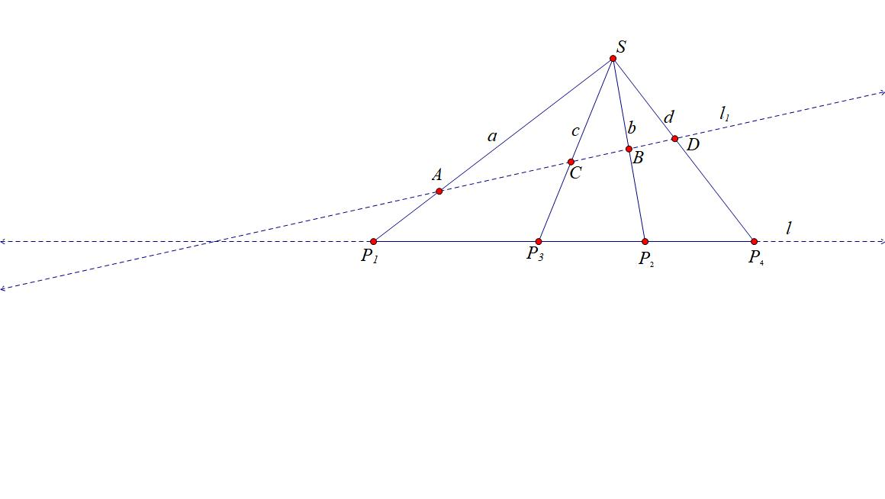

则，，，均为S点的调和线束.

调和点列的数量关系

如下图所示：对于线段的内分点和外分点满足、调和分割线段，即，设为线段的中点，则有以下结论成立：

①点、也调和分割、，即；

②（是与的调和平均数）．

证明：令，，，所以.

注意：调和点列的数量关系在推导调和线束斜率公式起到很关键作用.

一．调和共轭定理

若*PQ*两点符合调和共轭，比如椭圆中，那么点P为极点，点Q一定在其对应极线上，同理，点Q为极点，则点P一定在其对应极线上。

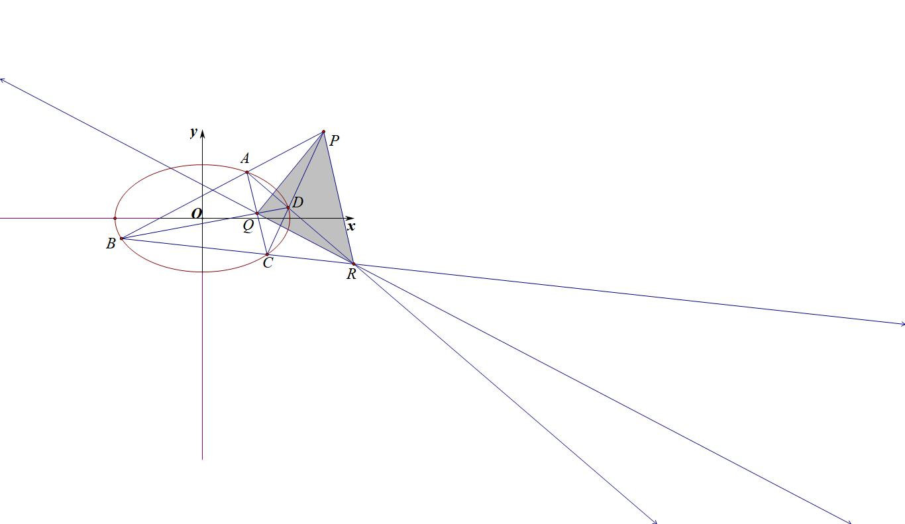

我们用自极三角形来理解这个问题，在完全四边形*ABCDPR*中，*PQR*为自极三角形，*P*为极点，则*QR*为极线，*Q*一定位于极线上，同理*，Q*为极点，*PR*为极线，*P*一定位于极线上。

我们还能发现*RQ*作为对合轴，P作为对合中心，此时A与B对合，C与D对合。

以PQ作为对合轴，R作为对合中心，此时A与D对合，B与C对合。

以PR作为对合轴，Q作为对合中心，此时A与C对合，B与D对合。

按照相同逻辑，若点*P*在某条定直线上运动，则P为极点对应的极线一定过定点*Q，* 反之亦然，此为极点极线的对偶性质*。*

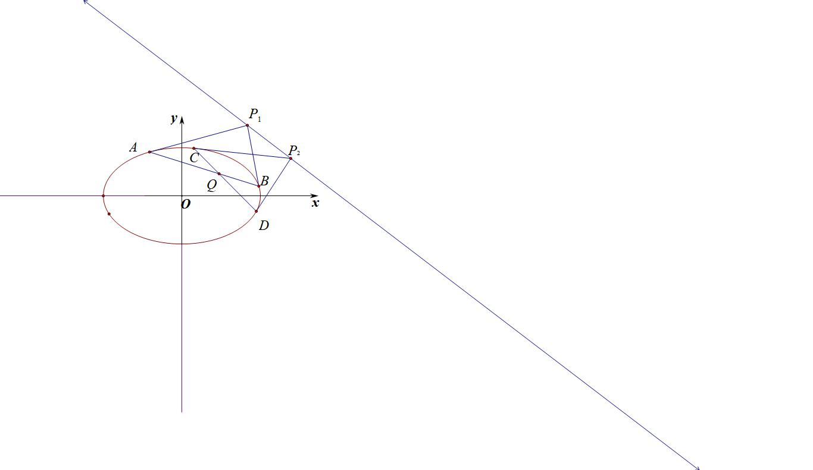

如图，若P在一条定直线上运动，则的极线（切点弦）*AB*，与的极线（切点弦）*CD*相交于定点*Q*，则*Q*是直线为极线对应的极点，这也意味着上任意一点作为极点的极线都过*Q，AB*是一种对合（两点轮换，用B表示A和用A表示B是一样的），*AB*过定点*Q*，那么*Q*是对合中心，直线是对合轴，*CD*也是一种对合，*Q*是对合中心，直线是对合轴，这也充分解释了，极点极线理论的前身就是笛沙格射影几何学的对合体系。

【例1】(2018•北京理)已知抛物线经过点，过点的直线与抛物线有两个不同的交点，，且直线交轴于，直线交轴于.

(I)求直线的斜率的取值范围;

(II)设为原点，，求证:为定值.

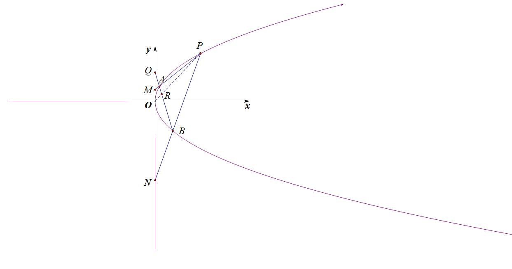

【例2】（24武汉二调18题）已知双曲线*E*：的左右焦点为，，其右准线为，点到直线的距离为，过点的动直线交双曲线*E*于*A*，*B*两点，当直线*AB*与*x*轴垂直时，.

(1)求双曲线*E*的标准方程；

(2)设直线与直线的交点为*P*，证明：直线*PB*过定点.

【例3】（25武汉二调19题）双曲线的一个顶点在直线上,且其离心率为 .

(1)求双曲线的标准方程；

(2)若一条直线与双曲线恰有一个公共点,且该直线与双曲线的渐近线不平行,则定义该直线为双曲线的切线,定义该公共点为切线的切点.已知点在直线上,且过点恰好可作双曲线的两条切线,设这两条切线的切点分别为和.

(i)设点的横坐标为,求的取值范围;

(ii)设直线和直线分别与直线交于点和点,证明:直线和直线的交点在定直线上.

(附:双曲线以点为切点的切线方程为)

第二节 调和线束两大定理的应用

一．调和线束平行中点定理

如图所示，，，，，均为S点的调和线束，过延长线上任意一点A作分别交和于点B和C，则.

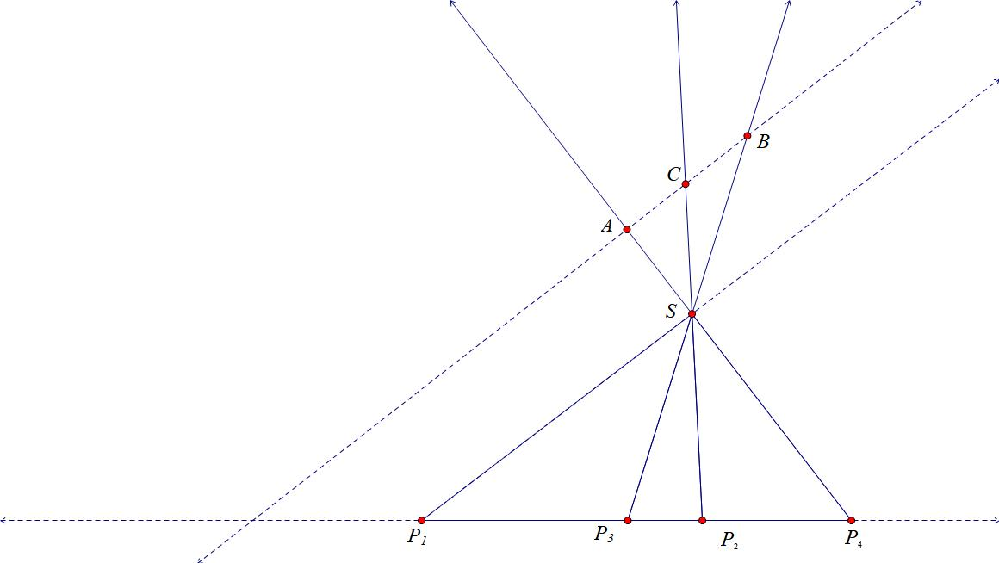

1.利用调和梯形角度解读

证明：根据交比不变性，，则,故.

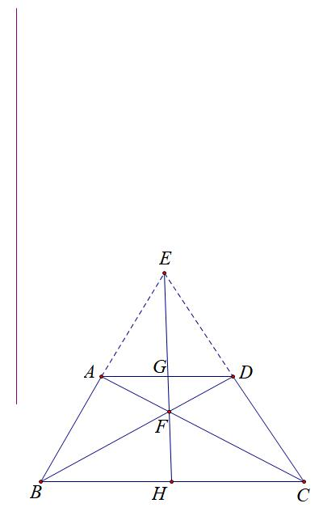

完全四边形中,,边与交于，BA与CD延长线交于E，EF与AD和BC交于G和H两点，则：①E、G、F、H是调和点列；②G、H分别为AD、BC中点；

<strong>证明：</strong>因为<em>AD</em>//<em>BC，</em>所以,所以，同理，而，所以<em>E</em>、<em>G</em>、<em>F</em>、<em>H</em>是调和点列.

【例1】（2024秋•清远高二期中考试第19题）已知圆，直线与圆交于，两点，过，分别作直线的垂线，垂足分别为，，分别异于，．

（1）求实数的取值范围；

（2）若，用含的式子表示四边形的面积；

（3）当时，若直线和直线交于点，证明点在某条定直线上运动，并求出该定直线的方程．

2．射影到与坐标轴平行线的中点

如图所示，在椭圆中，、为椭圆上的两点，设轴上一点，存在直线和轴上一点，连接并延长交直线于，，当直线轴，

则:.

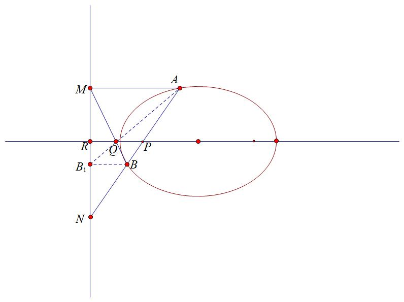

极点极线背景分析：延长AB交于N，作交MN于，由以P为极点对应的极线为MN，则A、P、B、N为调和点列，梯形为调和梯形，则*Q*为*PR*中点。

或者利用交比不变性，以M作为射影中心，，所以.

【例2】已知椭圆的左、右焦点分别为，，长轴长为，、为椭圆上的两个动点，当，关于原点对称时，的最大值为．

（1）求椭圆的方程；

（2）若存在实数使得，过点作直线的垂线，垂足为，直线是否恒过某点？若恒过某点，求出该点坐标；若不过定点，请说明理由．

【例3】（2023•宁德模拟）已知椭圆的离心率为，过点．

（1）求椭圆的标准方程；

（2）设椭圆的右焦点为，定直线，过点且斜率不为零的直线与椭圆交于，两点，过，两点分别作于，于，直线、交于点，证明：点为定点，并求出点的坐标．

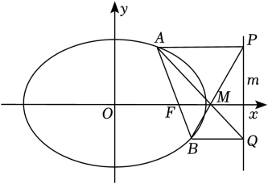

【例4】（2024•甲卷）已知椭圆的右焦点为，点在椭圆上，且轴．

（1）求椭圆的方程；

（2）过点的直线与椭圆交于，两点，为线段的中点，直线与交于，证明：轴．

【例5】（2024•福建模拟）已知抛物线经过点．

（1）求抛物线的方程及其准线方程．

（2）设为原点，直线与抛物线交于，（异于两点，过点垂直于轴的直线交直线于点，点满足．证明：直线过定点．

3. 调和等腰梯形对称构造

已知交椭圆)长轴(短轴)于点是椭圆上关于长轴(短轴)对称的两点，直线交长轴(短轴)于，即满足，则或.(双曲线也有相同调和共轭性质)

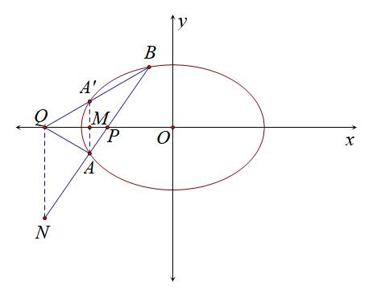

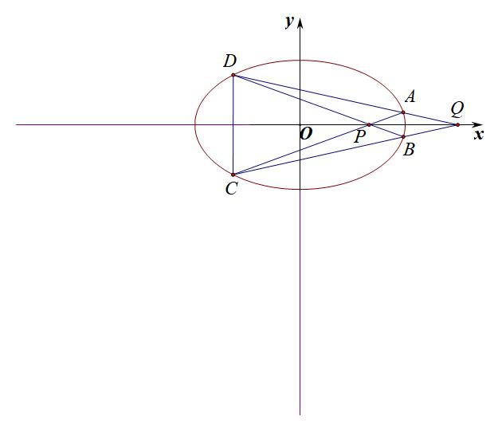

我们同样也可以根据调和梯形来解释角平分线定理，如下图所示，已知椭圆方程为：（），若以为对角线交点的梯形的一组对边垂直于轴，则必在轴上，且点所对极线也必垂直于轴，此时有极线方程为，根据调和梯形性质，此时是等腰梯形，一定有.

极点极线背景分析：

方案一：如左图，由于（轴）为的内角平分线，则(轴）为的外角平分线，此时，所以

(1)补充三角形的内角平分线定理：在中，若是的平分线，则有．

**证明：如左图所示，** 作交于，交于，设边上的高为，易知， ．

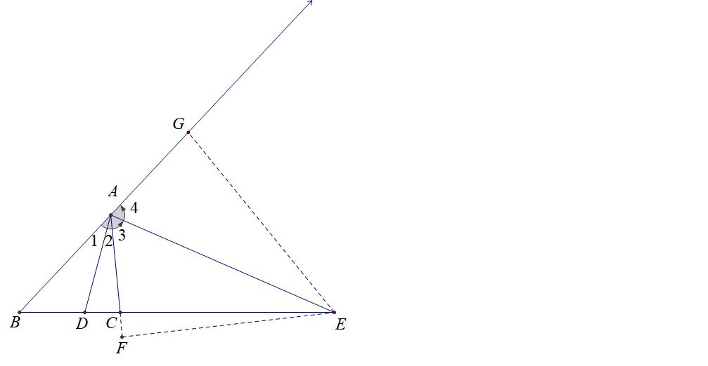

（2）补充外角平分线定理：在中，若是的外角平分线，则有．

**证明如右图，** 作延长线交于，延长线于，设边上的高为，易知， ．

我们还能发现，所以A在以DE为直径的圆上，这就是著名的阿氏圆。

方案二：由于,且,故，所以，因为，所以P与Q调和共轭。

代数解读：

如图，过定点的直线与椭圆相交于、两点，作点*A*关于*x*轴的对称点，则直线恒过定点．

**证明**　由A、B、M三点共线可得：①，且，②，

又③，①，②代入③得：，此时，结合直线的两点式，即，显然，直线恒过定点．

第一类：x轴的轴点弦

过定点 $M\left(0\right)$  的直线与椭圆 $\frac{x^{2}}{a^{2}}+\frac{y^{2}}{b^{2}}=1\left(a>b>0\right)$  相交于 $A、B$  两点, 设 $A\left(y_{1}\right)$ , $B\left(y_{2}\right),则有：$  ；由①＋②可得：，解得，

由②－①可得：，

即，点*B*的坐标都可以用点*A*的坐标进行表示：，．

第二类：*y*轴的轴点弦

过定点的直线*AB*和椭圆相交，设，，则有：

；由②－①可得：，由①＋②可得：，

所以：，

显然，所有的轴点弦，用一个点表示另一个点的方法，定比点差显然来得更加直接和简单，只是在处理坐标轴为角平分线题型时，将二次曲线转化为两个一次式相乘形式方便操作，这些操作用两点对合式也是超级简单，所以此类方法我们基本上不采用，数学方法不是越多越好，而是越高效越用。

【例6】（2024•北京）已知椭圆方程，以椭圆的焦点和短轴端点为顶点的四边形是边长为2的正方形．过点，且斜率存在的直线与椭圆交于不同的两点，，过点和的直线与椭圆的另一个交点为．

（1）求椭圆的方程及离心率；

（2）若直线的斜率为0，求的值．

【例7】(2018全国卷I)设椭圆的右焦点为，过的直线与交于两点，点的坐标为.

(1)当与轴垂直时，求直线的方程;

(2)设为坐标原点，证明:.

4.射影到斜线找中点与平行

【例8】(2018北京文)已知椭圆的离心率为，焦距为.斜率为的直线与椭圆有两个不同的交点、.

(1)求椭圆的方程;

(2)若，求的最大值;

(3)设，直线与椭圆的另一个交点为，直线与椭圆的另一个交点为.若和点共线，求.

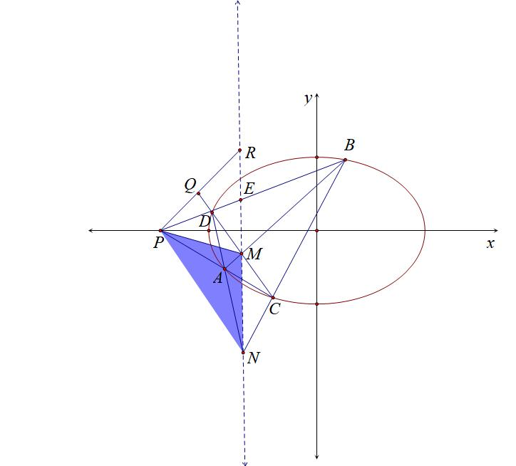

【例9】已知椭圆，斜率为1的直线与椭圆交于、两点，点，直线与椭圆交于点，直线与椭圆交于，求证:直线过定点.

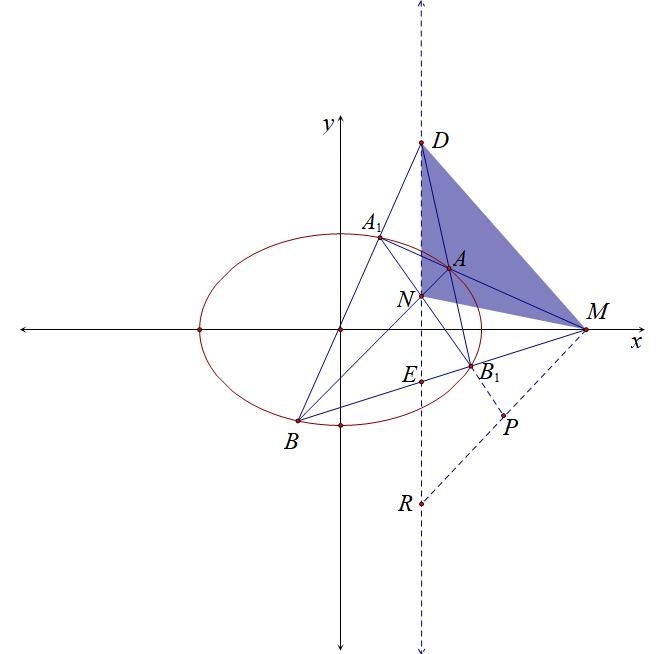

# **【例10】（2025•北京清华附中高三开学）已知椭圆,其离心率,长轴长为6.**

（1）求椭圆的标准方程;

（2）椭圆的上、下顶点分别为，右顶点为,过点的直线与椭圆的另一个交点为，点与点关于轴对称，直线交于，直线交于点，点，

求证:.

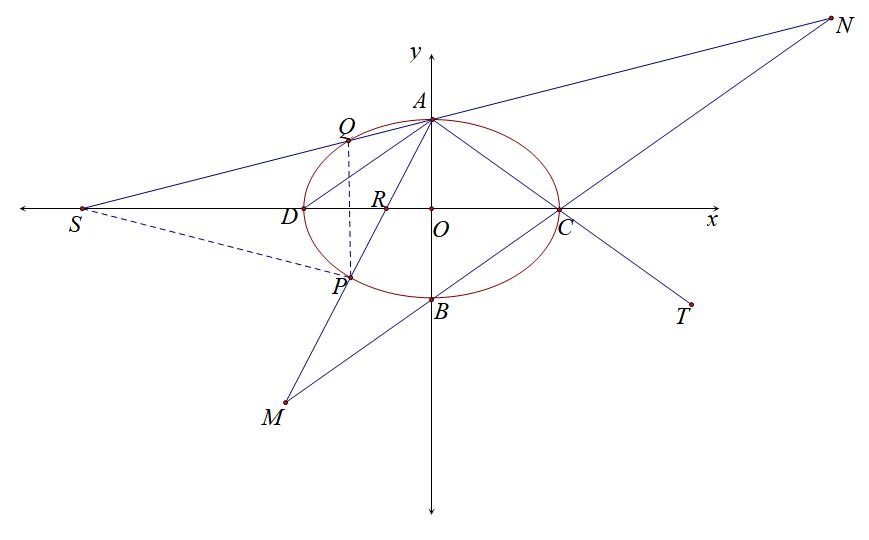

- 调和线束斜率公式

调和线束的斜率关系:若是调和线束,则它们的斜率满足	,或者

若直线为调和线束，,且斜率均存在,则.

证明:（交比不变性）如图,过作轴的垂线与轴交于,另外交于点.由交比不变性可知,:，分母同除以:

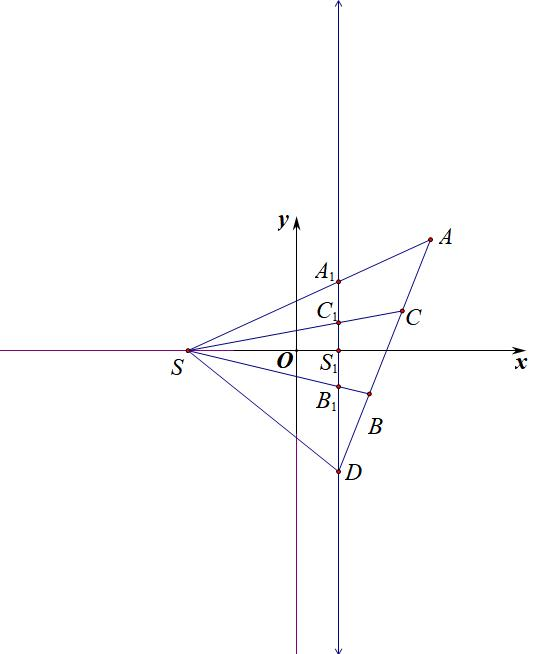

去分母得：

特殊的，当时,即;

同理，当时,则有.这就是的斜率等差或者斜率倒数等差模型.

本章内容结合这两个定理展开，打开极点极线背景的新世界。

1.平行于坐标系的中点斜率翻译

如图,为的中线,设直线的斜率分别为,

①若与轴平行,则:；②若与轴平行,则:

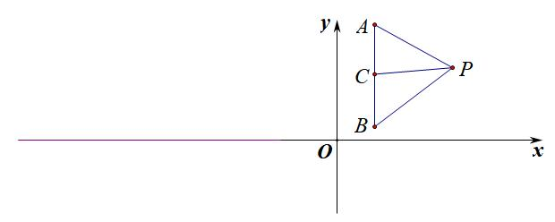

########## 证明：①设，，，所以；

########## ②设，，，所以；

########## 注意：这两个斜率公式考试中可以直接用,无需额外证明.

【例11】(2020北京)已知椭圆过点，且.

(1)求椭圆的方程;

(2)过点的直线交椭圆于点，直线分别交直线于点.求的值.

# *y*

# *Q*

# *M*

# *N*

# *B*

# *O*

# *x*

# *A*

# *P*

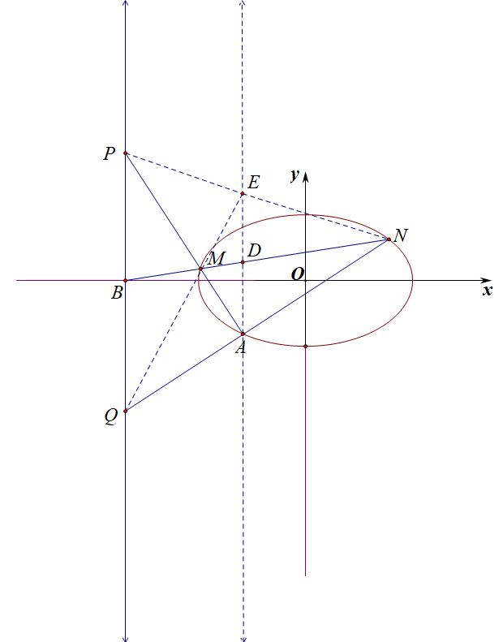

【例12】（2023•乙卷）已知椭圆的离心率为，点在上．

（1）求的方程；

（2）过点的直线交于点，两点，直线，与轴的交点分别为，，证明：线段的中点为定点．

【例13】(2022北京卷)已知椭圆的一个顶点为,焦距为.

(1)求椭圆的方程

(2)过点作斜率为的直线与椭圆交于不同的两点,,直线，分别与轴交于点,.当时,求的值.

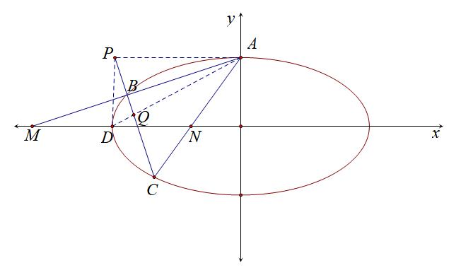

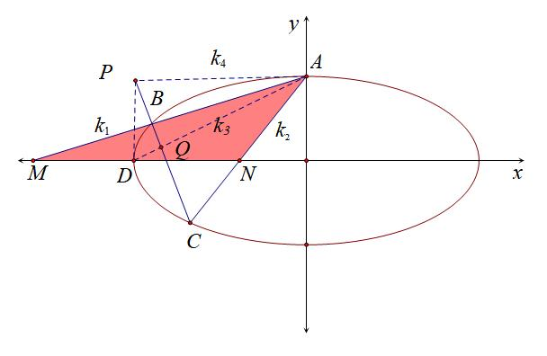

【例14】(2022全国乙卷)已知椭圆的中心为坐标原点，对称轴为轴、轴，且过两

点.

(1)求的方程;

(2)设过点的直线交于两点，过且平行于轴的直线与线段交于点，点满足.证明:直线过定点.

【例15】(广州24届12月调研)在平面直角坐标系  中, 点 , 点  是平面内的动点. 若  为直径的圆与圆 内切, 记点的轨迹为曲线

(1) 求的方程;

(2) 设点,直线,分别与曲线交于点异于) , 垂足为,求  的最小值.

【例16】【福建24届高三名校联盟 T19】已知椭圆*<text style="italic"><text style="italic"><text style="italic">E*</text></text></text>的方程为 $\frac{x^{2}}{a^{2}}+\frac{y^{2}}{b^{2}}=1(a＞b＞0)，A$ 为*<text style="italic"><text style="italic"><text style="italic">E*</text></text></text>的左顶点，*B*为E的上顶点，E的离心率为 $\frac{1}{2}，\bigtriangleup ABO$ 的面积为 $\sqrt{3}$ ．

（1）求*E*的方程；

（2）过点*P*（﹣2，1）的直线交*E*于*M*、*N*两点，过点*M*且垂直于*x*轴的直线交直线*AN*于点*H*，证明：线段*MH*的中点在定直线上．

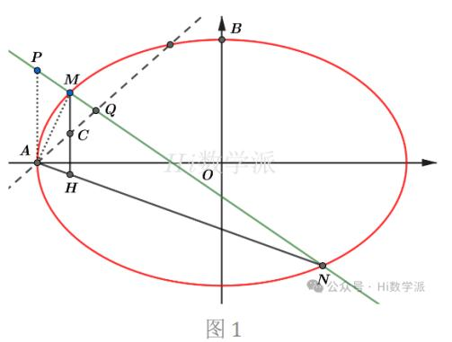

【例17】（2024•陕西模拟）已知椭圆的右焦点为，离心率为，为椭圆上一点，为坐标原点，直线与椭圆交于另一点，直线与椭圆交于另一点（与点不重合），面积的最大值为．

（1）求椭圆的标准方程；

（2）点为直线上一点，记，，的斜率分别为，，，若，求点的坐标．

【例18】已知椭圆的离心率为，长轴长与焦距的和为6，直线过点与椭圆交于，两点（不是椭圆的顶点），点是直线上的任意一点．

（1）求椭圆的方程；

（2）记直线，，的斜率分别为，，，求证：成等差数列．

【例19】（2013江西理）如图，椭圆*C*：（）经过点，离心率，直线的方程为.

（1）求椭圆的方程；

（2）是经过右焦点的任一弦（不经过点），设直线与直线相交于点，记，，的斜率分别为，，.问：是否存在常数，使得？若存在，求的值；若不存在，说明理由.

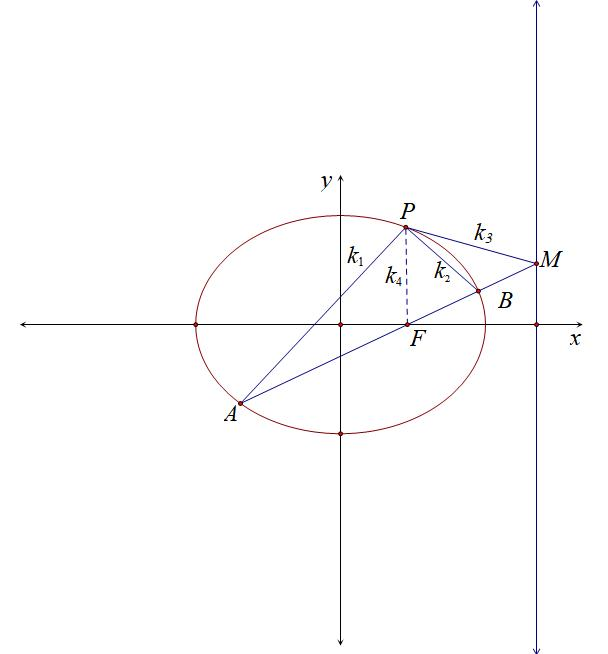

3. 由自极三角形构造的射影中心和调和线束斜率坐标翻译

【例20】(2013江西文)椭圆：（）的离心率为，.

（1）求椭圆的方程；

（2）如图，，，是椭圆的顶点，是椭圆上除顶点外的任意点，直线交轴于*N*直线交于点，设的斜率为，的斜率为，证明为为定值.

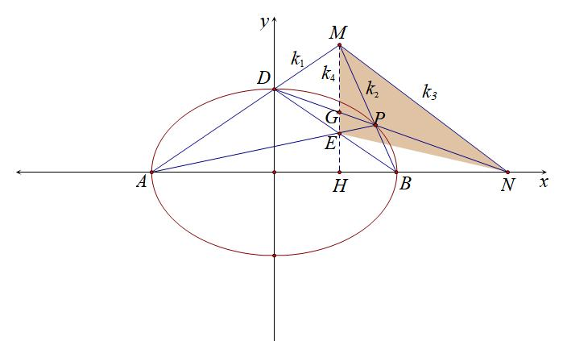

【例21】（2023•石家庄二模）已知双曲线，为双曲线的右焦点，过作直线交双曲线于，两点，过点且与直线垂直的直线交直线于点，直线交双曲线于，两点．

（1）若直线的斜率为，求的值；

（2）设直线，，，的斜率分别为，，，，且，，记，，，试探究与，满足的方程关系，并将用，表示出来．

第三节 角平分线与调和点列

根据三角形的内角平分线定理：在中，若是的内角平分线，则有,是的外角平分线，则有,所以*B*、*C*、*D*、*E*是调和点列.

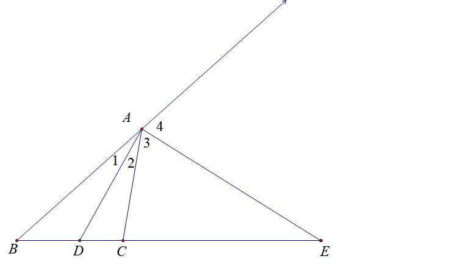

一．斜率和为0与内外角平分线解读

已知点是椭圆上的动点,,直线的斜率和为0,则直线的斜率为.

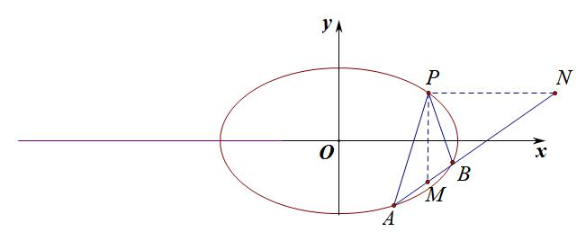

如图所示,过点作轴的平行线,分别交于点,则分别是的内角,外角平分线,所以所以是椭圆的一组调和共轭点,即

【例1】(2022新高考Ⅰ卷)已知在双曲线上,直线交于、两点,直线,斜率之和为0.求的斜率;

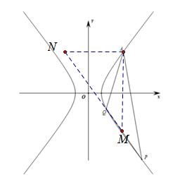

【例2】（2023•广州模拟）已知椭圆的离心率为，以的短轴为直径的圆与直线相切．

（1）求的方程；

（2）直线与相交于，两点，过上的点作轴的平行线交线段于点，直线的斜率为为坐标原点），的面积为的面积为，若，判断是否为定值？并说明理由．

二．内外角平分线与焦准模型

1.椭圆外角平分线与焦准模型

外角平分线模型设和是圆雉曲线一组对应的焦点和准线,圆雉曲线的弦交准线于点,则到的距离是相等的,亦即是的内角平分线或者外角平分线.

显然,当且仅当弦交双曲线于两支时,是的内角平分线.

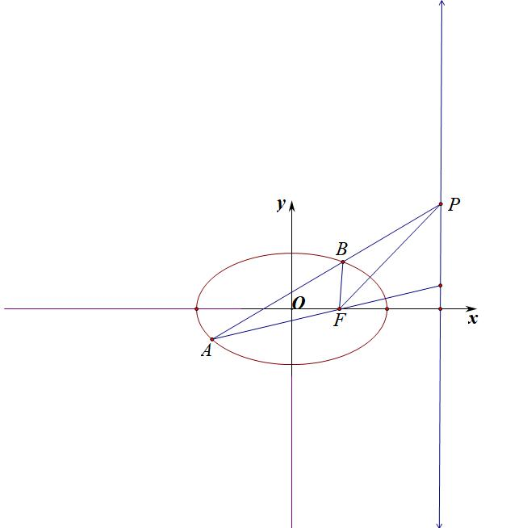

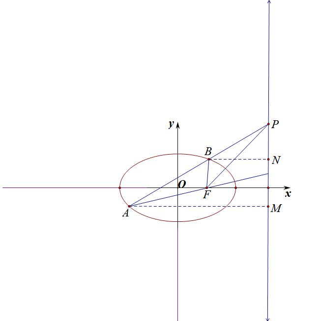

证明:如图,过点作准线的垂线,垂足分别为,则根据外角平分线的逆定理,所以平分的外角.

2. 双曲线内角平分线与焦准模型

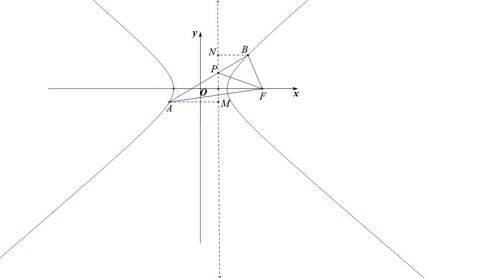

证明:如图,过点作准线的垂线,垂足分别为,则根据	内角平分线的逆定理,所以平分的外角.

【例3】设为椭圆的右焦点，不垂直于轴且不过点的直线与交于，两点，在中，若的外角平分线与直线交于点，则的横坐标为<u>　 　</u>．

3. 双外角平分线垂直模型

设，*MN*是过椭圆焦点的两条弦,分别交对应的准线于则有;

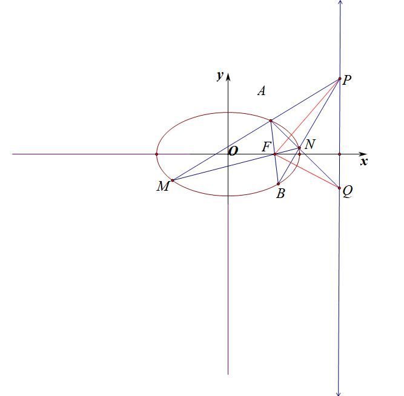

注意：一般考试中，MN通常为椭圆的左右顶点，所以会经常利用调和线束+平行弦构造中点来考查.

【例4】（2024•茂名一模）已知双曲线的左焦点为，，分别为双曲线的左、右顶点，顶点到双曲线的渐近线的距离为．

（1）求的标准方程；

（2）过点的直线与双曲线左支交于点（异于点，直线与直线交于点，的角平分线交直线于点，证明：是的中点．

########## 三.内外角平分线隐藏阿氏圆

一般地，平面内到两个定点距离之比为常数的点的轨迹是圆，此圆被叫做“阿波罗尼斯圆”．<strong>特殊地</strong>，当时，点<em>P</em>的轨迹是线段<em>AB</em>的中垂线．

<strong>求证：</strong>已知动点<em>P</em>与两定点<em>A</em>、<em>B</em>的距离之比为，那么点<em>P</em>的轨迹是什么？

**证明：** 不妨设、，，由得：，即

，

①当时，即为，整理得：，即点*P*的轨迹是以为圆心，为半径的圆；

②当时，化简得，即点*P*的轨迹为*y*轴．

如图，易知①*PC*为的内角平分线，*PD*为的外角平分线，②③*PC*⊥*PD*；以上三个条件中，知道任意两个都可以推得第三个！

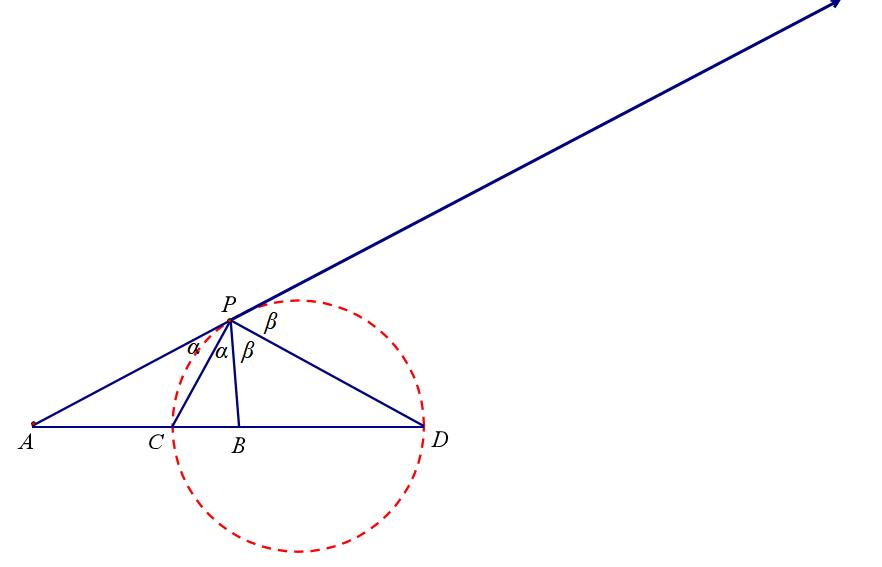

设阿波罗尼斯圆的圆心为*O*，半径，则有，	即，即，即，即（反演）．

同时，，即．

1.阿氏圆半径公式与反演公式

<strong>半径公式</strong>　已知动点<em>P</em>与两定点<em>A</em>、<em>B</em>的距离之比为，则已知两个定点<em>A</em>、<em>B</em>，及定比，则．

注意：阿氏圆的常用公式，，阿氏圆的半径为：

【例5】阿波罗尼斯是古希腊著名数学家，与欧几里得、阿基米德并称为亚历山大时期数学三巨匠，他对圆锥曲线有深刻而系统的研究，主要研究成果集中在他的代表作《圆锥曲线》一书，阿波罗尼斯圆是他的研究成果之一，指的是：已知动点与两定点、的距离之比，那么点的轨迹就是阿波罗尼斯圆．已知动点的轨迹是阿波罗尼斯圆，其方程为，定点为轴上一点，且，若点，则的最小值为

A．	B．	C．	D．

【例6】已知两定点，，动点与、的距离之比且，那么点的轨迹是阿波罗尼斯圆，若其方程为，则的值为

A．	B．	C．0	D．4

2.隐藏的角平分线与阿氏圆构造

【例7】（2025•山东省实验中学四诊第18题）已知椭圆的半长轴的长度与焦距相等，且过焦点且与轴垂直的直线被椭圆截得的弦长为3．

（1）求椭圆的方程；

（2）已知直线与椭圆交于，两点，过点的直线交椭圆于，两点在靠近的一侧）

（ⅰ）求的取值范围；

（ⅱ）在直线上是否存在一定点，使恒成立？若存在，求出点坐标；若不存在，请说明理由．

【例8】（2025•永州二模第19题）在直角坐标系中，椭圆经过点，，短半轴长为．过点作直线交于，两点，直线交轴于点，直线交轴于点，记直线，的斜率分别为和．

（1）求的标准方程；

（2）证明是定值，并求出该定值；

（3）设点，证明上存在异于其上下顶点的点，使得恒成立，并求出所有满足条件的点坐标．

- 斜率对合与斜率翻译

- 斜率对合的原理

关于点的对合，设为平面任意一个定点（通常都在二阶点列曲线上），是这个二阶点列曲线（圆锥曲线就是二阶点列曲线）上的一点，，一个关于斜率的方程，无论和怎么变化，直线AB上找一个定点，这个定点就是对合中心，我们也通常称之为极点，其对应的极线就是对合轴，我们可以通过代数和几何角度来寻找对合轴和对合中心的过程，就是我们理解斜率对合和斜率翻译的本质。

1. 对合轴与对合中心的选取

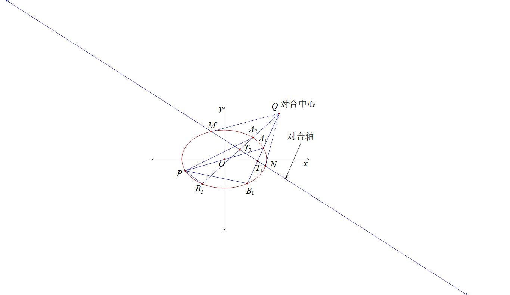

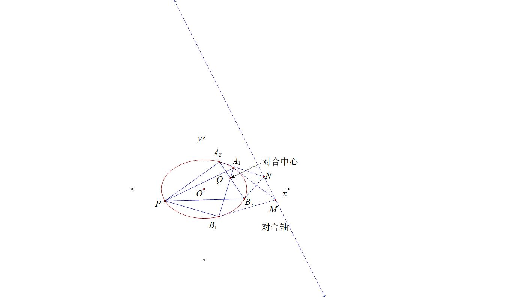

双曲型对合                       椭圆型对合

如上两图，在曲线上，，且无论如何均满足时，直线与（也可以有，）交于一定点，这个直线过的定点就是这组对合变换的对合中心，以为极点，其对应的极线就是对合轴。

斜率对合的本质就是点的对合，如果是极点，寻找其极线的方法非常简单，如左图，当极点在二阶曲线外，过作二阶曲线的两条切线，切于和，易知两切点为对合不动点，两对合不动点的连线形成对合轴，这也是最简单由对合中心确定对合轴的方式，这类型对合中心在曲线外，有两个对合不动点的对合类型，我们称之为双曲型对合。如右图，当极点在二阶曲线内，过无法作二阶曲线的两条切线，那就需要借助二阶曲线的共轭属性，即极点共线与极线共点的共轭属性，过分别作椭圆的切线，两切线交于，同理过分别作椭圆的切线，两切线交于，对合轴即为，这类型对合中心在曲线内，对合轴与曲线没有交点，无对合不动点的对合类型，我们称之为椭圆型对合。

根据之前我们对极点极线的理解，连接极点极线，与二阶点列截于两点，以上两图为例，，就被对合轴和对合中心连线的截点，四点形成调和点列，即，是一组对合，也是一组对合，通俗一点理解就是轮换的位置，用，或者用都是一样的，由于是定点，与就是一种对合（两者可轮换），用表示与表示也是一样的，所以，在为对合中心，作为对合轴，与满足，就是一种对合。

2. 斜率对合的基本作图原理

在我们高中阶段，出现最多的考题就是，，以及三种情况，我们本节就是重点介绍这三类对合的寻找对合中心和对合轴的过程。

1. 型

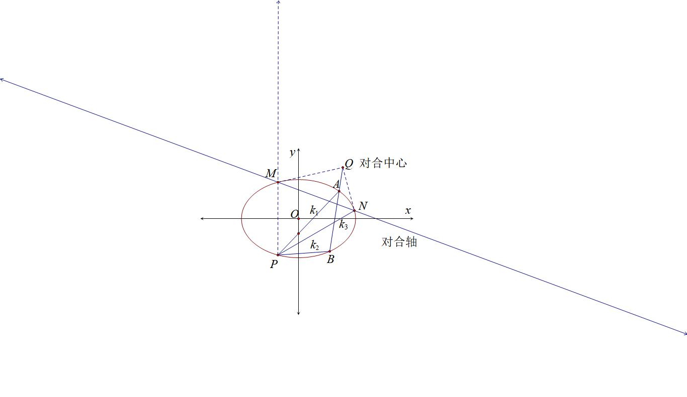

本质：构造

以二阶点列上定点为射影中心，如果，则*A*和*B*为关于对合轴的一组对应，那么一定有一个对合不动点与连线与*y*轴平行，*P*与另一个对合不动点*N*的连线斜率为，则在这一组对合变换中，始终满足，*MN*为对合轴过，*M*和*N*的切线交点*Q*即为对合中心。

（2）型

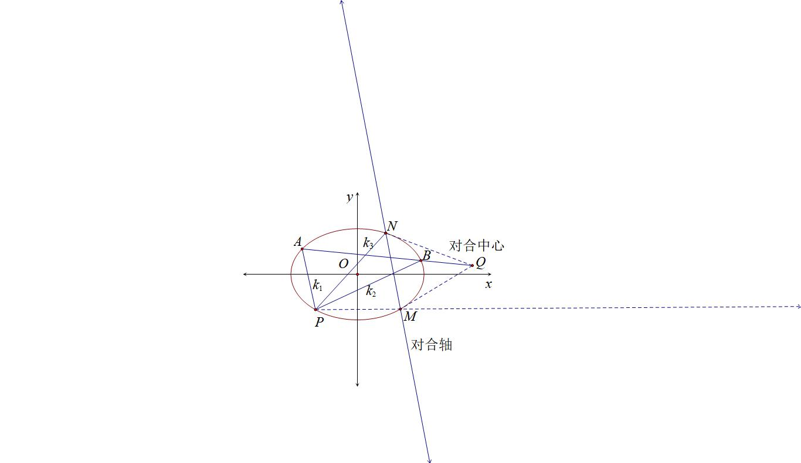

本质：构造

以二阶点列上定点为射影中心，如果，则*A*和*B*为关于对合轴的一组对应，那么一定有一个对合不动点与连线与*x*轴平行，*P*与另一个对合不动点*N*的连线斜率为，则在这一组对合变换中，始终满足，*MN*为对合轴，过*M*和*N*的切线交点*Q*即为对合中心。

注意：和通常都是双曲型对合。

（3）型

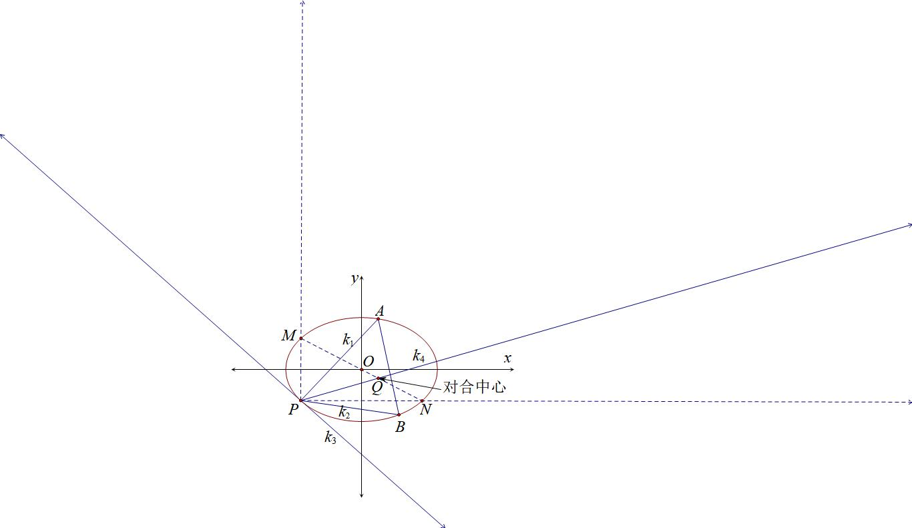

本质：构造

以二阶点列上定点为射影中心，如果，则*A*和*B*为关于对合轴的一组对应，和型对合是一次型，可以“合二为一”，通过对合不动点把两个斜率转化为一个斜率，但是乘积型对合是属于二次对合（还有三次对合），那么一定要构造，先过*P*作与*x*轴*PN*和*y*轴平行线*PM*，连接*MN*，则对合中心一定在直线*MN*（过原点）上，作点*P*的切线，斜率为（椭圆），此时认为*P*与*A*重合（二重点），则利用对合变换得出，此时*MN*与*PQ*交点*Q*即为对合中心。

由于乘积型对合的对合中心在射影中心构造过原点的斜边直线上，故不需要作出对合轴，并且乘积型对合可以是椭圆型对合，也可以是双曲型对合。

【例1】(2017•新课标I理)已知椭圆,四点，，，，中恰有三点在椭圆上.
(1)求的方程;
(2)设直线不经过点且与相交于，两点.若直线与直线的斜率的和为，证明:过定点.

【例2】（2024•城厢区模拟）已知椭圆的左、右顶点分别为，，为椭圆上任意一点（与，不重合），直线和的斜率之积为，点在椭圆上．

（1）求椭圆的标准方程；

（2）过点作斜率之和为1的两条直线分别与椭圆交于，两点，直线是否过定点？若过定点，求出此定点；若不过定点，请说明理由．

【例3】(2020•山东)已知椭圆的离心率为,且过点.
(1)求的方程;
(2)点,在上,且，，为垂足.证明:存在定点,使得为定值.

【例4】（2023•石家庄一模）已知点在双曲线上，过作轴的平行线，分别交双曲线的两条渐近线于，两点，．

（Ⅰ）求双曲线的方程；

（Ⅱ）若直线与双曲线交于不同的两点，，设直线，的斜率分别为，，从下面两个条件中选一个（多选只按先做给分），证明：直线过定点．

①；②．

- 对合中心在无穷远点的特殊值

1. 当时，第三条边斜率为定值

此类型我们在上一讲提到了内外角平分线构造调和点列，并利用调和共轭来解释，如果利用对合轴和对合中心如何解释呢？

我们不妨看看例题再来解释。

【例5】（2023•广州模拟）已知椭圆的离心率为，以的短轴为直径的圆与直线相切．

（1）求的方程；

（2）直线与相交于，两点，过上的点作轴的平行线交线段于点，直线的斜率为为坐标原点），的面积为的面积为，若，判断是否为定值？并说明理由．

【例6】(2022新高考Ⅰ卷)已知在双曲线上,直线交于、两点,直线,斜率之和为0.求的斜率;

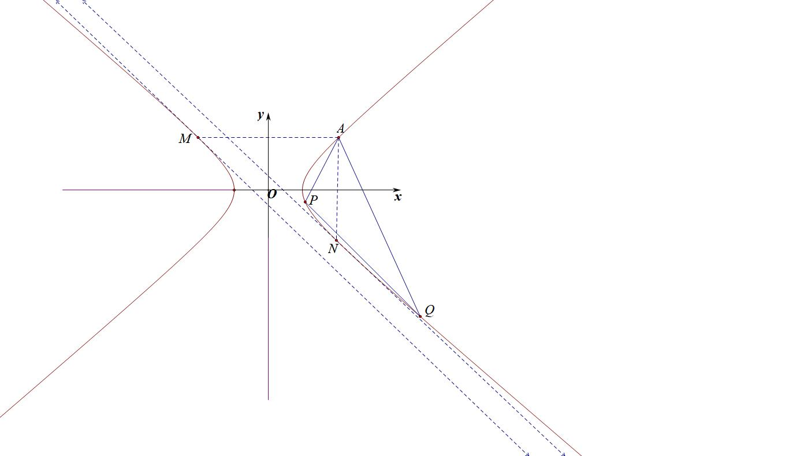

对合中心分析：由于，故作轴交双曲线于一个不动点，再作轴交椭圆于另一个不动点，过*M*和*N*处作的两条切线平行，即，.

2. 当时，第三条边斜率为定值

以椭圆为例，若时，如左图，则（切线斜率），，此时对合中心为原点，这也是椭圆的第三定义逆定理。

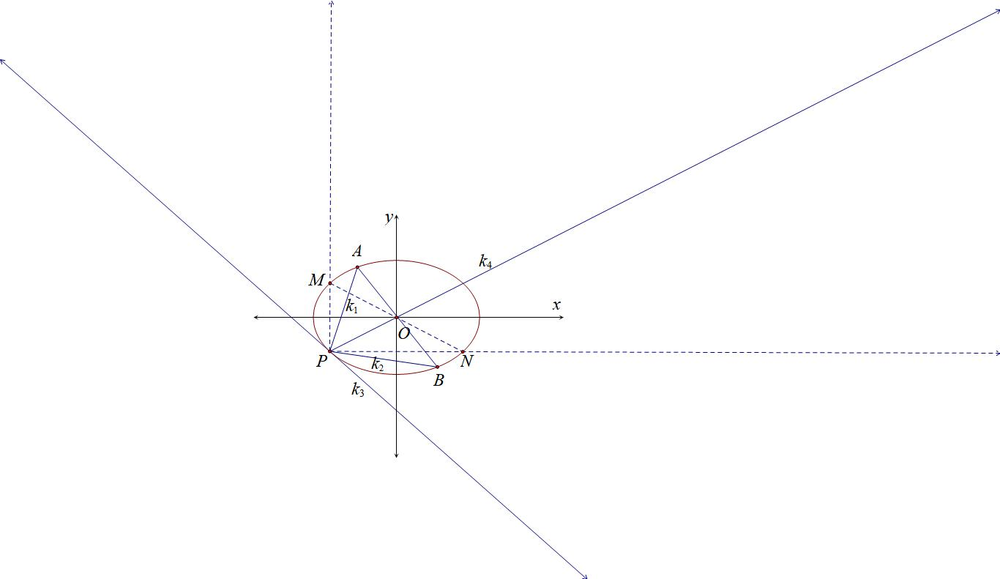

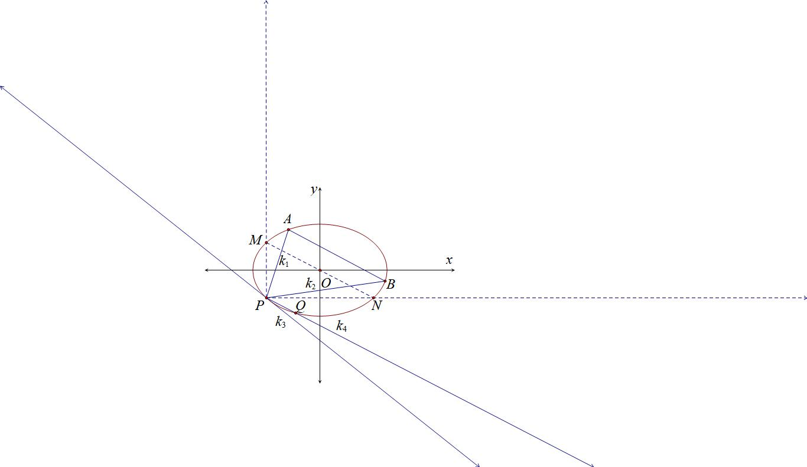

若时，如右图，则（切线斜率），，此时，对合中心为无穷远点。

注意：在考试中用其齐次化证明是最简单的。

证明:将椭圆按向量平移得椭圆,

又点在椭圆上,所以,代入上式得①.椭圆上的定点和动点，分别对应椭圆上的定点和动点，,设直线的方程为,代入①得:,当时,两边除以得:，因为点，的坐标满足这个方程,所以，是这个关于的方程的两个根.即，所以，所以。

三．和型对合的三种模型

1. 射影中心与一对合不动点横坐标相同

参考例1，例2和例4，都是射影中心P与一对合不动点连线平行于*y*轴类型。

2. 两对合不动点横坐标相同

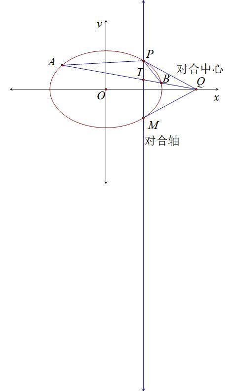

如图，以*x*轴上一点*Q*作为对合中心，作两条切线和，则其对合轴*PM*一定平行于*y*轴，过*Q*作直线与椭圆交于*AB*两点，以*P*作为射影中心，设，，，由于*P*与一对合不动点*M*的连线平行于*y*轴，故始终有.

如果按照调和线束斜率公式理解，*P*位于点*Q*对应极线（对合轴）上任意一点，都能满足.

【例7】(2020北京)已知椭圆过点，且.

(1)求椭圆的方程;

(2)过点的直线交椭圆于点，直线分别交直线于点.求的值.

3. 射影中心与对合中心横坐标相同

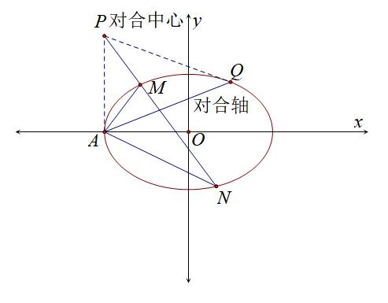

如图，以椭圆左顶点（右顶点也如法炮制）上方一点*P*作为对合中心，作两条切线和，则其对合轴*AQ*，过*P*作直线与椭圆交于*MN*两点，以*A*作为射影中心，设，，，由于*P*与一对合不动点*A*的连线平行于*y*轴，故始终有.

【例8】（2023•乙卷）已知椭圆的离心率为，点在上．

（1）求的方程；

（2）过点的直线交于点，两点，直线，与轴的交点分别为，，证明：线段的中点为定点．

四．倒数和型对合的三种模型

1.射影中心与一对合不动点纵坐标相同

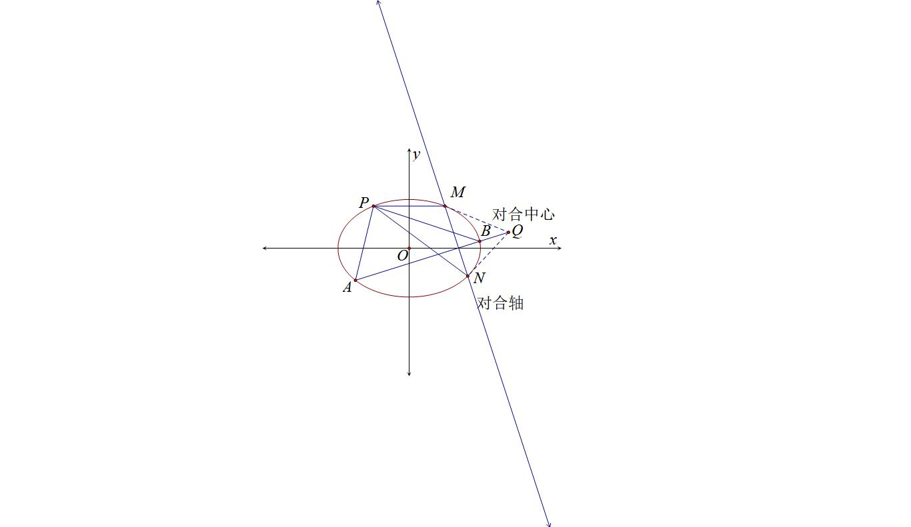

过（射影中心）作*PM*//*x*轴交椭圆于*M*，设*P*与另一个对合不动点*N*的连线斜率为，则在这一组对合变换中，始终满足，联立椭圆与*PN*直线求出点*N*，故*MN*为对合轴，过*M*和*N*的切线交点*Q*即为对合中心，也是直线*AB*所过的定点。

【例9】（2025•海安市开学考第18题）在平面直角坐标系中，已知双曲线的离心率为2，左、右顶点分别为，，且．

（1）求的方程；

（2）直线与的左、右两支分别交于点，，记直线，的斜率分别为，，且．

求证：直线过定点；

，，直线与交于点，判断并证明直线与的位置关系．

2.两对合不动点纵坐标相同

参考例题10.

【例10】（2025•永州二模第19题）在直角坐标系中，椭圆经过点，，短半轴长为．过点作直线交于，两点，直线交轴于点，直线交轴于点，记直线，的斜率分别为和．

（1）求的标准方程；

（2）证明是定值，并求出该定值；

【例11】(2022全国乙卷)已知椭圆的中心为坐标原点，对称轴为轴、轴，且过两

点.

(1)求的方程;

(2)设过点的直线交于两点，过且平行于轴的直线与线段交于点，点满足.证明:直线过定点.

【例12】（2024•南通模拟）在平面直角坐标系中，点，分别是椭圆的右顶点，上顶点，若的离心率为，且到直线的距离为．

（1）求椭圆的标准方程；

（2）过点的直线与椭圆交于，两点，其中点在第一象限，点在轴下方且不在轴上，设直线，的斜率分别为，．

①求证：为定值，并求出该定值；

②设直线与轴交于点，求的面积的最大值．

五．顶点角+同轴轴点弦的对合方程

1.两类对合中心在坐标轴上的对合模型

第一类：左右顶点+*x*轴轴点弦型

如图，椭圆中，*A*、*B*分别为其左右顶点，过的直线MN交椭圆于*M*、*N*两点，*P*其对应极线*RQ*：，AM延长线交*RQ*于*R*，*MN*与*RQ*交于点*Q*，设，，，，.

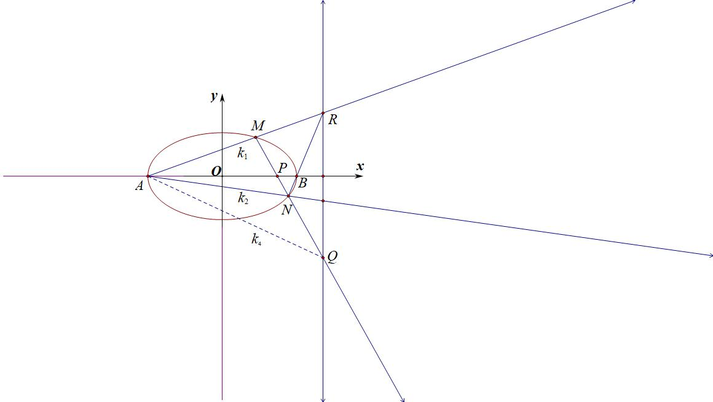

则：①定值；

②；

③；

证明：①，，所以=定值；

由于对合中心*P*在*x*轴上，*A*为射影中心，所以过*A*作垂直于两坐标轴直线，显然一条长轴恒过对合中心，一条左顶点切线（显然只有点*A*这个二重点），所以无论*P*在*x*轴任何位置，一定有定值，如果P在椭圆内，无对合不动点，就是椭圆型对合，如果P在椭圆外，就是双曲型对合。如下图，当这种对合是椭圆型对合时，利用二阶曲线的共轭与对偶性质，找到P点在x轴上的调和共轭点T，过T作两条切线TD与TE，则一定有

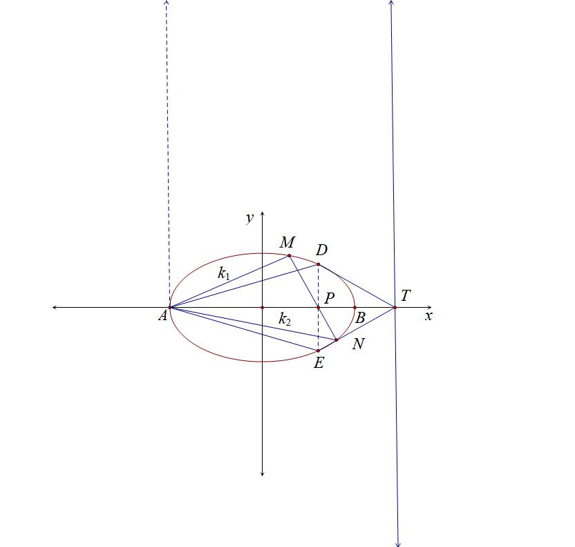

②由于，，所以，

即；

③由于，；

【例13】（2023•浙江月考）已知椭圆的离心率为是的左、右焦点，是的上顶点，且．

（1）求椭圆的方程；

（2）是椭圆的右顶点，斜率为的直线与交于，两点，与不重合）．设直线的斜率为，直线的斜率为，若，求的值．

【例14】（2025•贵州开学第18题）已知椭圆的离心率为，点为的上顶点，点为的右顶点，．

（1）求椭圆的方程；

（2）过点的直线斜率为，交椭圆于不同的两点，，直线，分别交直线于点，两点，

①证明：当时，为定值；

②当时，求的值．

【例15】（2024•青羊区模拟）已知椭圆的离心率为，短轴长为，过点斜率存在且不为0的直线与椭圆有两个不同的交点，．

（1）求椭圆的标准方程；

（2）椭圆左右顶点为，，设中点为，直线交直线于点，是否为定值？若是请求出定值，若不是请说明理由．

第二类：上下顶点+*y*轴轴点弦型

如图，椭圆中，*A*、*B*分别为其上下顶点，过的直线MN交椭圆于*M*、*N*两点，*P*其对应极线*RQ*：，AM延长线交RQ于R，MN与RQ交于点Q，设，，，，.

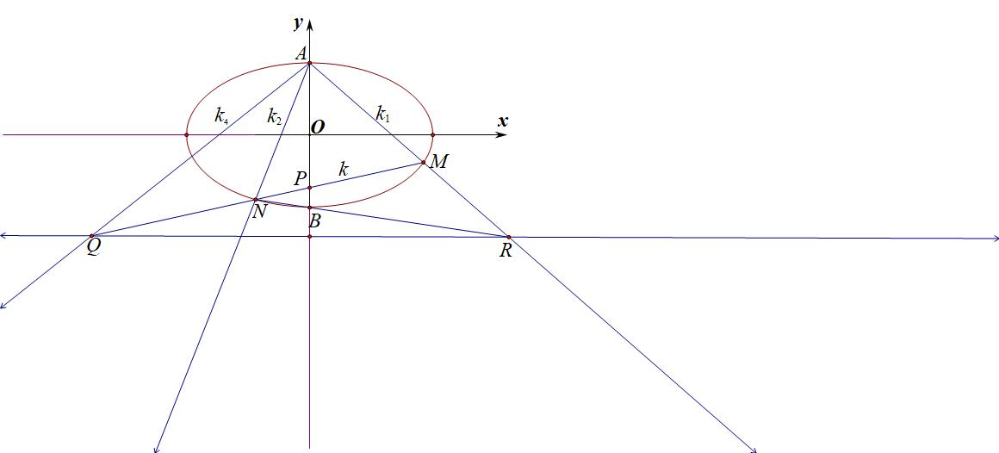

则：①定值；

②；

③；

证明：①，，所以=定值；

②由于，，所以，

即；

③由于，；

注意：本模型是椭圆型对合，以P作为对合中心，没有不动点，所以可以采用特殊值，即过P作x轴平行线交椭圆于MN两特殊点，算出，此模型的双曲型对合，可以参考前面x轴的轴点弦模型，不再赘述.

【例16】（2021·北京）已知椭圆：（）的一个顶点，以椭圆的四个顶点围成的四边形面积为.

（I）求椭圆的方程；

（II）过点作斜率为的直线与椭圆交于不同的两点，，直线、分别与直线交于点、，当时，求的取值范围.

【例17】(2022浙江卷)如图,已知椭圆.设，是椭圆上异于的两点,且点在线段上,直线分别交直线于，两点.

(1)求点到椭圆上点的距离的最大值；

(2)求的最小值.

2.对合中心在坐标轴上的面积转化

【例18】（2025•宁波高三期末第18题）双曲线左顶点为，实轴长是虚轴长的2倍，其左焦点坐标为，过点的两条直线分别交双曲线的右支于点，，且．

（1）求双曲线的方程；

（2）（ⅰ）证明：直线过定点；

（ⅱ）直线，，分别交直线于点，，，若，求的直线方程．

【例19】（2025•广州高二期末第19题）已知椭圆的长轴长是短轴长的倍，左焦点为，左、右顶点分别为，，上顶点为，且△外接圆的半径为．

（1）求椭圆的方程；

（2）设斜率存在的直线交椭圆于，两点，位于轴的两侧），记直线，，，的斜率分别为，，，，且．

试问直线是否恒过定点？若是，求出该定点坐标；若不是，请说明理由；

求△的面积的取值范围．

3.对合中心在坐标轴上的斜率与共圆转化

【例20】（2024•西安模拟）椭圆的离心率为，右顶点为，设点为坐标原点，点为椭圆上异于左、右顶点的动点，面积的最大值为．

（1）求椭圆的标准方程；

（2）设直线交轴于点，其中，直线交椭圆于另一点，直线和分别交直线于点和，若，，，四点共圆，求的值．

【例21】（2024•重庆模拟）已知双曲线的左、右焦点分别为，，左顶点为，点为双曲线上一动点，且的最小值为18，为坐标原点．

（1）求双曲线的标准方程；

（2）如图，已知直线与轴的正半轴交于点，过点的直线交双曲线右支于点，，直线，分别交直线于点，，若，，，四点共圆，求实数的值．

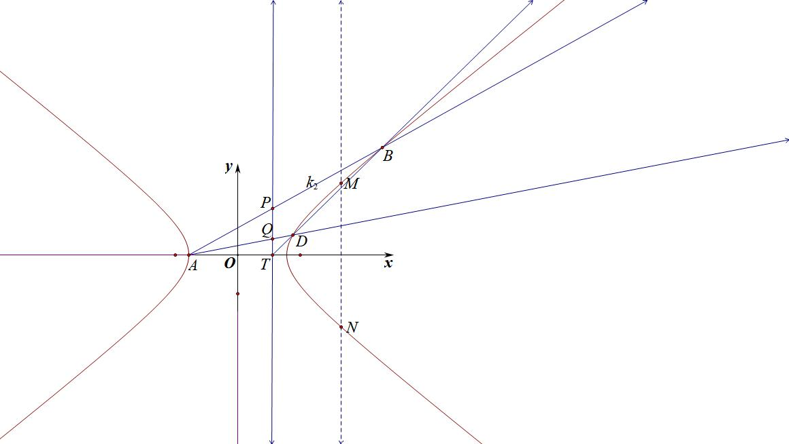

- 积型对合的多解问题

1.射影中心在曲线上的直角构造

【例22】（2023・平罗县期末）已知抛物线：（），为上位于第一象限的一点，点到的准线的距离为5.

（1）求的标准方程；

（2）设为坐标原点，为的焦点，，为上异于的两点，且直线与斜率乘积为-4，求证：直线过定点.

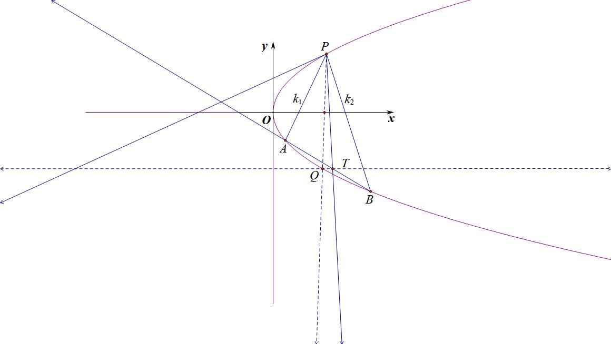

2.射影中心未知的调和线束由构造定值

根据，欲使得为定值,必须有且为定值;

########## 【例23】（2023•湖北四月调考）过点（4，2）的动直线*l*与双曲线交于*M*，*N*两点，当*l*与*x*轴平行时，，当与*y*轴平行时，

(1)求双曲线的标准方程;

(2)点是直线上一定点,设直线的斜率分别为,若为定值,求点的坐标.

【例24】（2025•福州高二期末第19题）已知椭圆的焦点在轴上，经过点，．

（1）求的标准方程；

（2）定义：若椭圆上的两个点，，，满足，则称，为该椭圆的一个“共轭点对”，记作，．

证明：存在两个点使得，是的“共轭点对”，并求的坐标；

设中的两个点分别为，，已知过点的直线与椭圆交于，两点，则直线上是否存在定点，使得直线与的斜率之积为定值．若存在，求出的坐标；若不存在，请说明理由．

3.射影中心未知的斜率乘积为定值的多解问题

如果射影中心在曲线外，那根据调和线束斜率公式，利用构造，当射影中心在曲线上时，则会产生两解，这两个点关于原点中心对称。

斜率积的对合原理，关键在于构造射影中心作与两坐标轴垂直的直线，那么对合中心一定在这两条垂直直线的斜边上，根据这一点，再利用第三定义，我们不妨来看看多解情况，以例题来建模。

# **关于Fregier（费雷格）定理**

(1)设  为椭圆  上一点,  ,  为椭圆上的两点,且直线  ,  的斜率之积  (  为定值,  )的充要条件是直线  过定点  ,其中

(2)设  为椭圆  上一点,  ,  为椭圆上的两点,且直线  ,  的斜率之积  的充要条件是直线 过定点  .

注意:当射影中心已知时，齐次化最好拿捏，射影中心未知时，用两点对合方程解决。

【例25】（2024•厦门模拟）平面直角坐标系中，动点在圆上，动点（异于原点）在轴上，且，记的中点的轨迹为．

（1）求的方程；

（2）过点的动直线与交于，两点．问：是否存在定点，使得为定值，其中，分别为直线，的斜率．若存在，求出的坐标，若不存在，说明理由．

七．对合方程

一般很少完全体用到这个对合方程，通常需要几次转化，有时候要理解射影中心定在哪，如果在曲线上，优先考虑对合，否则，考虑调和点列和调和线束斜率公式。

1.由调和线束斜率公式转化

【例26】（2024•江苏模拟）已知为抛物线的焦点，点在上，．点，，是抛物线上不同两点，直线和直线的斜率分别为，．

（1）求的方程；

（2）存在点，当直线经过点时，恒成立，请求出满足条件的所有点的坐标；

（3）对于（2）中的一个点，当直线经过点时，存在最小值，试求出这个最小值．

**2.中点平行弦模型：**

已知*A*、*B*、*C*为椭圆上三个不同的定点，且线段*AB*的中点在直线*OC*上，点*P*为椭圆上的动点，直线*PA*、*PB*分别交直线*OC*于点*M*、*N*，则有：

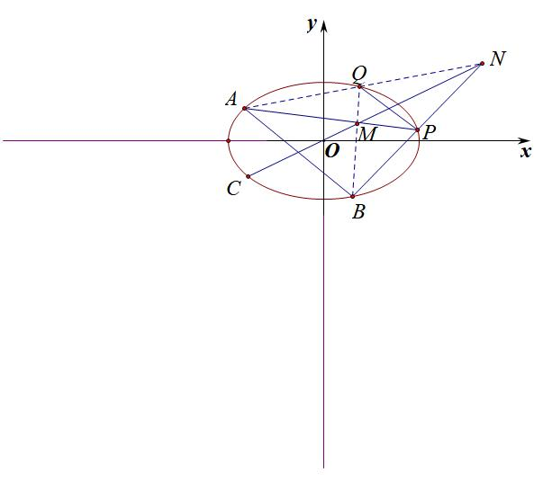

①；②．

③连接*AN*，交椭圆于点*Q*，则*PQ*∥*AB，* ④设，则直线*AP*与*BQ*都过定点．

注意：如果已知点*N*的坐标和*AB*的斜率，也可得到：*PQ*∥*AB*；直线*AP*与*BQ*都过定点*M*．

对于④的背景是：．

【例27】已知椭圆，过点的直线交椭圆于两点.为椭圆上异于的一点，满足弦的中点在直线上.试判断直线是否过定点？若是，求出定点坐标；若不是，请说明理由

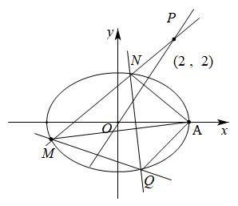

- 斜率积的三次对合

- 椭圆内接三角形的外心斜率定理

【例1】（2025届T8联考T18）已知过，两点的动抛物线的准线始终与圆相切，该抛物线焦点的轨迹是某圆锥曲线的一部分．

（1）求曲线的标准方程；

（2）已知点，，过点的动直线与曲线交于，两点，设△的外心为，为坐标原点，问：直线与直线的斜率之积是否为定值，如果是定值，求出该定值；如果不是定值，说明理由．

二．等轴双曲线轮换对合与隐藏的垂心

定理：等轴双曲线内接三角形垂心在双曲线上

如图,的三个顶点均在函数的图象上,试判断的垂心是否也在的图象上,并说明理由.

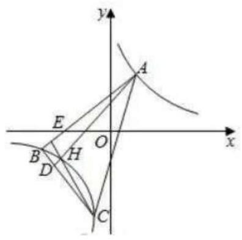

证明：令，，在等轴双曲线上，在双曲线找到点，且满足，则根据反比例的两点对合方程：，由于，所以，所以，所以是的垂心，与*H*重合。

【例2】（2023•南京二模）已知双曲线的离心率为，直线与双曲线仅有一个公共点．

（1）求双曲线的方程

（2）设双曲线的左顶点为，直线平行于，且交双曲线于，两点，求证：的垂心在双曲线上．

三．等轴双曲线反演与二阶曲线外心

为椭圆  的任意内接三角形,点为原点,点为的外心.记直线  的斜率分别为  ,且斜率均存在.求证:  .

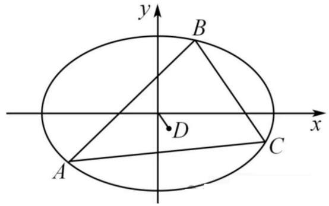

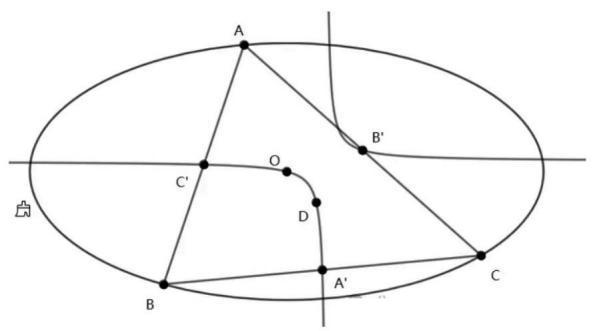

分别取的中点为，易知为的垂心.

注意：由中位线定理,  ,又因为  ,所以 ,其他两组同理，再取轴和轴方向的无穷远点和.则 为一个等轴双曲线.

由中位线定理 ，所以 ，其他两组同理.由于直线与直线，直线与直线，直线与直线，都满足斜率的对合方程  .

则由笛沙格对合定理可知,  点也在该等轴双曲线上！！！ (注意: 笛沙格对合定理讲述的是一个圆锥曲线上的四点, 例如. 它们可以生成三组直线,直线与直线；直线与直线；直线与直线；每组直线被同一条直线所截得到的两个交点,都会满足同一个对合方程的,包括该圆锥曲线被直线所截得到的两个交点,也会满足该对合方程,由于原题是一个关于斜率的命题，那自然而然,要对无穷远直线应用笛沙格对合定理了)现只需对  与无穷远直线应用笛沙格对合定理即：

不妨设对合方程为，由于无穷远点和的斜率分别是0和.则 .

(注: 前面说过了0 ，这种未定式是可以等于任意常数的,所以是有意义的,但是就没意义了,

所以)即对合方程为.

则 ，即 ，则  .

注意：本内容参考公众号：希尔伯特女王空间

#   **同理，双曲线也有相似结论**

点在双曲线: (,) 上,设的外接圆的圆心为点  ,若  三边斜率存在,则

四．三次方程韦达定理与三次齐次化方程

设实系数一元三次方程①在复数集内的根为 ,可变形为展开得	②

比较①②可以得到 这就是三次方程的韦达定理.

回到例题1，要证明，我们给予齐次化解法：利用四点共圆，故只需证，我们构造三次的齐次化方程，这就需要二次与一次的对合相乘，由于，

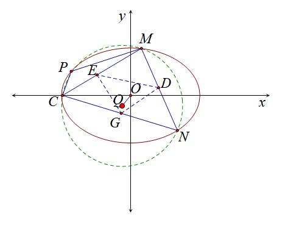

先对椭圆方程变形：，

再对圆方程：，

所以（交叉相乘），

同除以，，即，

所以，即.

本题也可以平移后构造“非齐次化”的叉乘对合方程，操作差不多：

将椭圆和圆按照向量平移，即，故构造非齐次方程：，

设平移后过原点的圆圆心为，则，

交叉相乘构造齐次化：，同除以得：，，又，所以.

【例3】(河北名校联盟25届高三一轮收官考T19)已知双曲线   (  ,  )的焦点到渐近线的距离为1,右顶点到点的距离是. 动圆(点为圆心)与交于四个不同的点 ,  ,  ,  ,且直线 , 的斜率分别为  ,  .

(1) 求  的方程.

(2)设直线  .

(i) 判断点(2k, m)是否在双曲线  上,并说明理由.

(ii) 若  ,求直线的一般式方程.

(iii) 试问  是否为定值？若是,求出该定值；若不是,请说明理由.

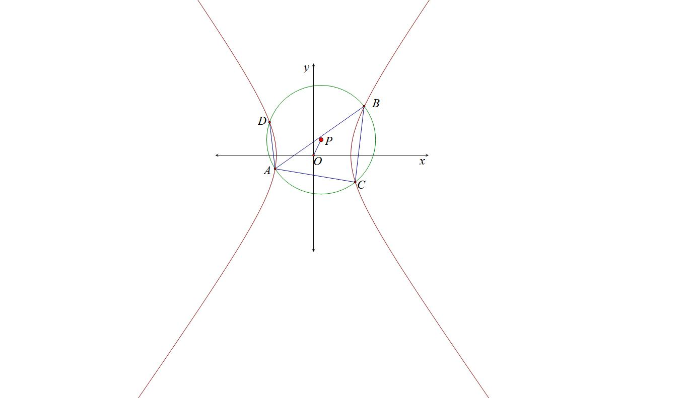

第六节：从笛沙格定理到帕斯卡定理

综合射影几何的理论，创立至今不到200年的历史。当然，在此以前很早就已发现了其中的许多定理和原理，但是，一大堆砖瓦不能称为一座大厦，孤立的许多定理也不等于一门理论。建筑综合射影大厦的砖瓦是由欧几里得（Euclid）以来的无数学者们所贡献的。四调和点的概念古代人已经熟悉了，他们从度量观点出发，把它看作使线段内分与外分比值相等的一个比值。由一截线对一完全四边形各边截取的对合六点问题曾由帕普斯（Pappus）详细研究过。但这些孤立的概念未被用作一般理论的基础。它们独立起来看，不过是一些小结论。正是与其他大量定理的联系才显示出了它们的重要性。

十七世纪是人类历史上一个非常美妙的世纪. 在它早期, 诞生了诸如伽利略(Galileo)、开普勒(Kepler)、布拉赫(Brahe)、笛卡尔(Descartes)、笛沙格(Desargues)、帕斯卡(Pascal)、卡瓦列利(Cavalieri)、沃利斯(Wallis)、费马(Fermat)、惠更斯(Huygens)、巴康(Bacon)、纳皮哀尔(Napier)等一大批数学明星，还有不少发光较少的小星，更不用说伦布兰特(Rembrandt)或莎士比亚(Shakespeare)了。他们开始对从古人堆里挖掘出来的大量材料提出各种所谓的统一性原理(Unifying principles)。如 1604 年伟大天文学家 Kepler 提出把平行直线看成无穷远处相交的概念，并由此使抛物线成为椭圆和双曲线的极限情形。他还提出抛物线也有焦点，即所谓“盲焦”(caecus focus)，一个位于轴的无穷远处的焦点。

1639 年，法国数学家笛沙格（Desargues）发布了一篇有关二阶曲线的小论文，其中出现了我们在它基础上建立了四调和点理论的定理。但笛沙格 没有用他的定理为这一目的服务。他把四调和点看作对合六点中有两个为重点的特例。他的对合理论的论证过程也与我们采用

的纯几何方法不同。他在证明点的对合投影性质时，同样利用了“当六线通过对合六点时，所有与它们相截的直线也一定截出互为对合的六个点”这一性质。
     笛沙格是射影几何的创立者，但他是利昂的一位建筑师。因对几何的兴趣以及职业的需要而创立了这门学科。在工作中他也有创造发明，包括如何切割石块用于建筑，如何设计和制作螺旋形楼梯等。
     在笛沙格的这篇短文中也包含极点和极线的理论，但极线被称作 traversal (穿越线)。他也指出了极点极线的调和性质，但当平面引入无穷远元素后，笛沙格似乎没有得到对应的度量属性。因而他说，“当 traversal 在无穷远时，就全部难以想象了”。至于极点(pole) 这一术语，则由法国数学家塞瓦（Servois）于 1810 年首先使用，而对应术语极线 (polar) 则由当时担任塞瓦论文的刊物编辑热尔岗（Gergonne）创立。
      在这本小书中，我们发现了有关二阶曲线内接四边形的漂亮定理他所陈述的定理的原始表达形式为：已知一个四边形内接于圆锥截线，则每一条与圆锥曲线以及四边形四边相截的 traversal 截出的六个点为对合六点。

说来也是很怪，笛沙格的不朽著作竟招来最猛烈的辱骂和嘲笑 ! “难以置信的错误 ! ”，“完全是虚构和造假 ! ”，“任何真正熟悉科学的人都不能实际接受他的思想！真可笑 ! ”，这就是许多读者和评论家的评论，而且他们中间也并非全都是一无所知和没有教化的人。无论笛沙格 的学生如何热心支持，也不管受到诸如笛卡尔 ，费马 ，梅森（Mersenne）等著名人物的倾慕和声援，他的小册子在出版二个世纪之后终于完全消失。当法国几何学家夏莱（Chasles） 在写他的几何学历史时，也未曾发现有对笛沙格所作工作的任何评价。直到六年后的 1845年，夏莱才找到了由笛沙格 的一名学生， De la Hire 所写的

题为“响当当的工程”（“ Bruillon-project ”）的一个手稿复制件。

笛沙格著作的消失的一个非常充足的理由看来和他的写作风格有关。他没留意热烈钦佩着他的同辈笛卡尔写给他的一封信中提出的良好建议：“您可以采用非常好、也非常值得赞赏的两种不同的写作方法：一种是为学者写的，这时你只要向他们讲清他们还不知道的二阶曲线的那些新特性就行了；另一种是为好奇但无专业知识的读者写的，这时您就应该把至今尚只有很少人知道、但对透视学，对绘画、建筑学等恰是非常有用的素材统统写进你的书中，而且要写成使所有想学有关知识的读者都感到浅显易懂。如果您有第一个想法，我认为需要避免使用新术语，因为行内学者已经习惯Apollonius的用语，即使你创立了更好的术语，也不会让他们欣然地改变习惯，你的自创术语只会导致你的证明更加难于看懂，从而逼使他们放弃阅读您的书转去阅读其他的书。如果您有第二种打算，那么您用的语言肯定是您的母语—法语，这时您就可以利用它的优雅和灵活性来进行构思，使那些从未接受古人用语的读者能更好地接受….但是，如果您有这样的意图，您就必须将它成为一部巨著。如果您不能完整并充分清晰地交代一切，就不可能让那些绅士们学习时不打呵欠；那些不肯使用想象力去苦心思索几何命题、又不愿翻弄书页寻找插图注释的读者，看您的书就会比看妖魔故事中的迷宫描述更难于理解”。

我们发现笛沙格的小册子中使用了大约七十个新术语，且只有一个involution（对合）能保留到现在，笛卡尔的看法就会觉得不无道理了。笛沙格的方法完全不同于笛卡尔和费马创立的解析方法，很少被人理解。“在您和我之间”，笛卡尔写信给其朋友梅森时说，“我几乎无法说清楚他（指笛沙格）所写的有关圆锥曲线的任何想法”。但值得笛沙格自豪的是，他没有亏欠任何人，他的所有成果全都来自他自己的脑袋。尽管连他自己喜爱的学生deLaHire也没能体会他的工作的非凡朴素性和普遍性价值，但最终还是有一位同事、

一个当年还只是十六岁的小伙子帕斯卡能够理解并能评价他的方法!这是一桩难以想象的事实。

一．笛沙格对合

【例1】(2024.江苏省四校联合)交比是射影几何中最基本的不变量，在欧氏几何中亦有应用．若，，，为平面上过定点且互异的四条直线，，为不过点且互异的两条直线，证明：若与△的对应边不平行，对应顶点的连线交于同一点，则与△对应边的交点在一条直线上．

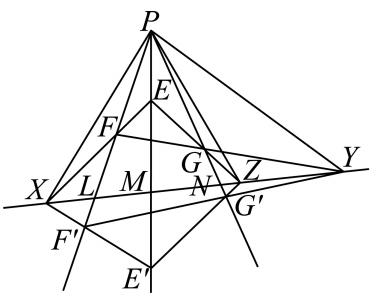

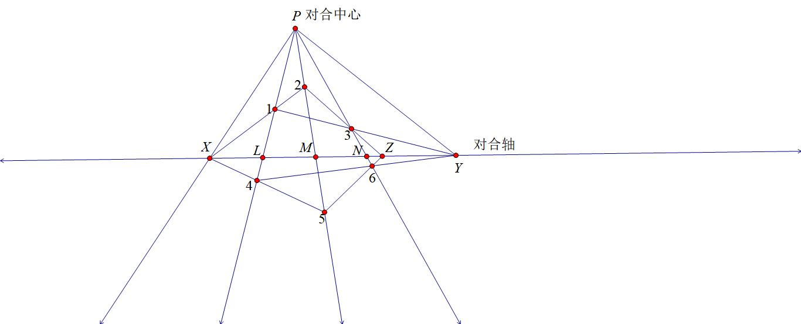

二．帕斯卡（Pascal）定理及其逆定理

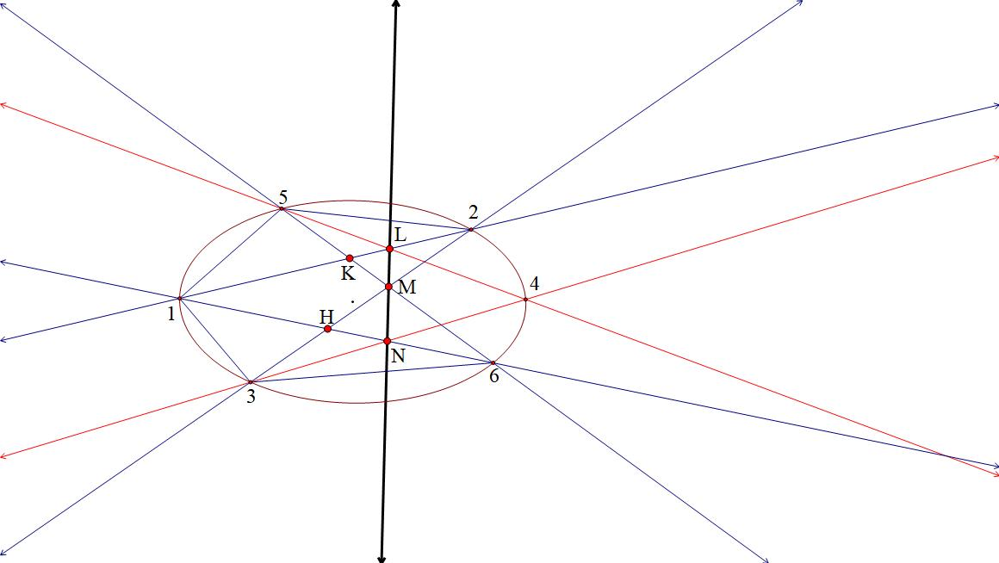  
图1  L，M，N三点共线

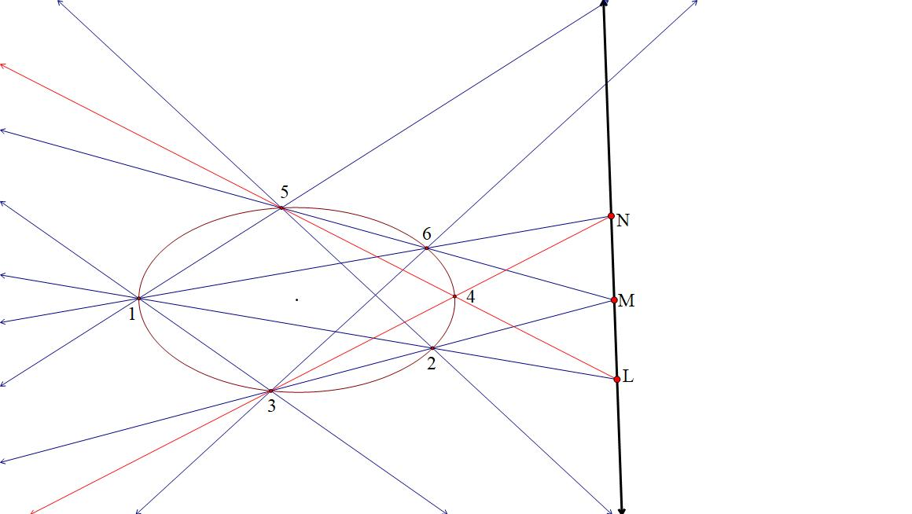  
图2  L，M，N三点共线

已知是二阶点列上任意六个点,我们记:

12与45的交点为,

23与56的交点为,

34与61的交点为,

那么*L*、*M*和三点共线(此直线叫*Pascal*线)。

证明：考察图1。我们把二阶点列看成以点3和5作为顶点的两个线束的对应射线交点的轨迹。因此,以3为中心连接到四点的线束与以5为中心连接到四点的线束为射影对应。但线束

在连线1-6上截出四点,故1,2,4,6与为透视对应;同样,线束在连线上截出四点,故与也透视对应。由此,根据射影对应的传递性,可知点列与点列为射影对应。但这两个射影对应点列的交点1是一个自对应点,故它们的射影对应为透视对应,必有一个共同的透视中心。这个透视中心可由任意2组对应点的连线求交得到。现取两个连线分别为和,故可求出交点。这样,两个点列的对应点和的连线也通过中心。这样证明了三点共线。对图2可类似证明,但辅助点的作法与图1不同。

*L*，*M*，*N*三个点中,也允许有无穷远点。例如,图3中若有一对边平行,如23与56平行,则它们的交点是与23和56有共同方向的无穷远点。

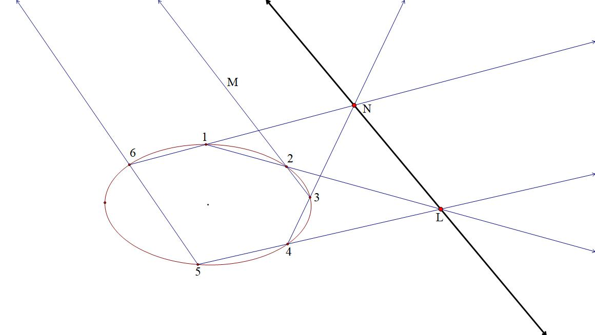  
图3帕斯卡定理中允许有无穷远交点

究竟有多少种不同的情况呢?对于6点位置,共有种排列,但轮换相同的6种排列(如,612345)构成的回路相同,顺时针和逆时针排,如123456和564321,也代表相同回路,不同排列的回路（即Hamilton回路）情况为(6-1)!/2=60种。帕斯卡定理说明对于这60种不同的回路都会使它们的6顶点的三组对边的交点L、M、N共线。

最后还要说明两点:六个顶点中,如相邻两个顶点有1到3个重合,这样六个点就变成5个、4个或3个,这时帕斯卡定理仍然成立。

1.寻找帕斯卡第六点

帕斯卡定理为通过五点作圆锥曲线提供了一种优美的解决方案。设已给1,2,3,4,5五点,其中任意三点不在同一直线上,但五点的平面位置为任意。我们将这五点依次相连,并设线段12与45的交点为L,如图4-1所示。

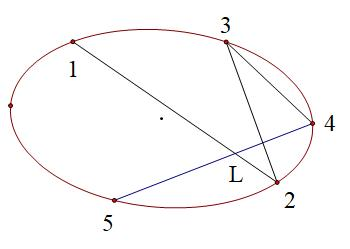

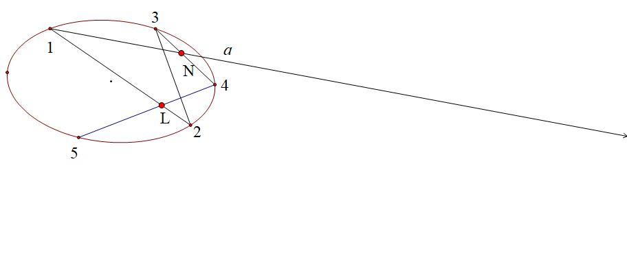  
图4-1                               图4-2

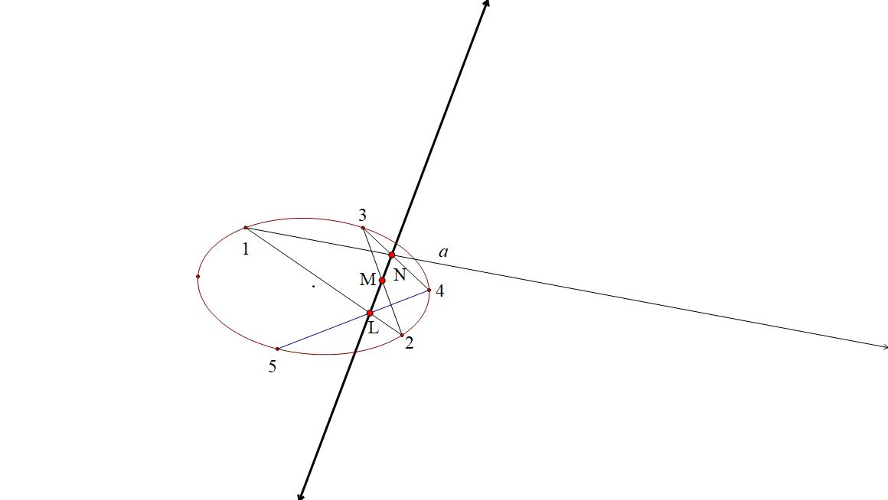

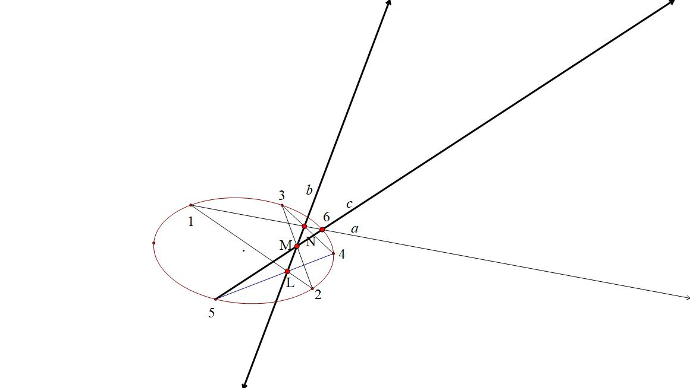  
图4-3                              图4-4

为了作圆锥曲线上的任意一点,如点6,我们通过点1任意作一直线,设与线段34交于点,见图4-2;再通过和作直线,设与交于,图4-3;再通过5和作直线,则与的交点就是期望的点6,见图4-4。利用这种办法,让绕1旋转一圈,就可以得到二阶曲线所有点。这种作图方法的核心就是三点在一直线上。

2.圆锥线的切线

如果帕斯卡定理的六点123456中有两点不巧重合,则它们两点变一点,而两点之间的连线变成它们共同点的切线。据此,可用帕斯卡定理为已知五点寻找其中一点的切线。

设已知平面上五点12345,我们来作通过五点的圆锥曲线且在1有切线。

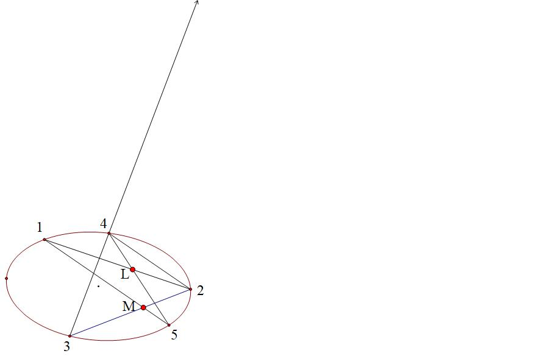

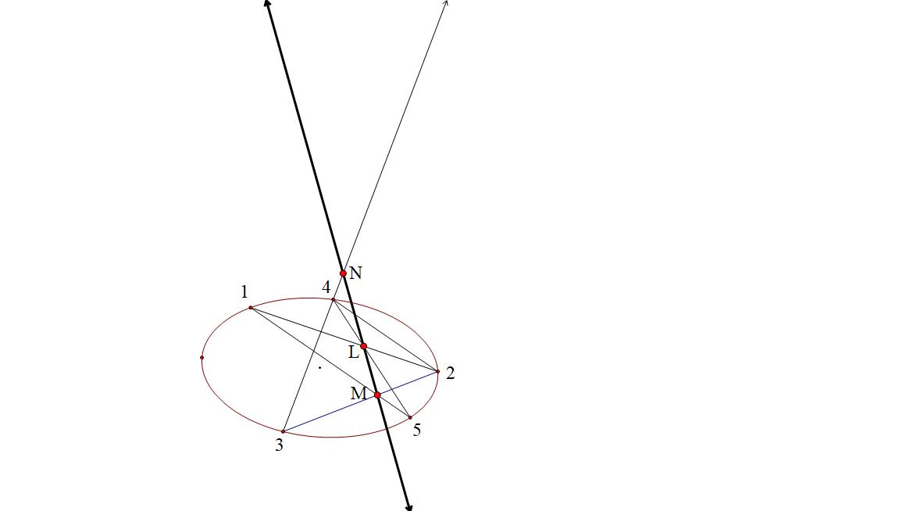

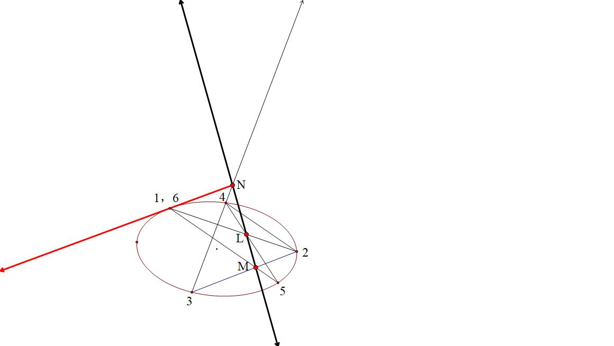  
图5-1                        图5-2                          图5-3

首先,把12345五点中五个对边依次连接起来,使它们成一个五边形(这里是一五角星),并设12和45交点为和23交点为M,如图5-1所示.再把LM连起来,设与34交点为,如图5-2所示，

最后,把1点看成1与6两点的重合点,则16作为34的一个对边,根据帕斯卡定理应和其余两组对边12-45,15-23的交点L和共线,所以,我们连接和1,它就是16的连线,亦即轨迹在1处的切线,如图5-3所示。

3.帕斯卡圆锥曲线的内接四点形

两对顶点可组成一四边形。帕斯卡定理为这种特殊情况给出了一个非常重要的定理:圆锥曲线的内接四边形的两双对边的交点与两组对点的切线的交点在同一直线上。

如图6，是圆锥曲线的任意一个内接四边形。对边与交于与交于,对顶点与的切线交于与的切线交于,我们要证明四点在同一条直线上。

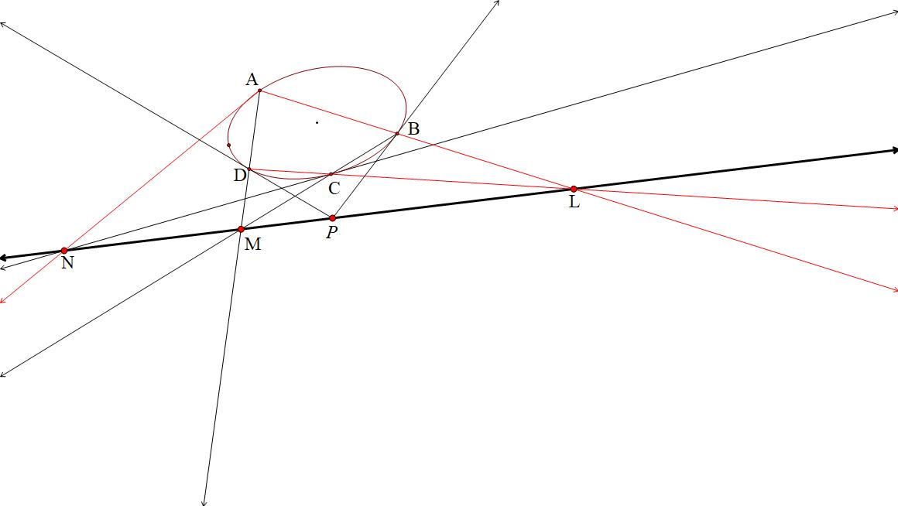

  
图6 两组对边交点与两对顶点切线交点共线

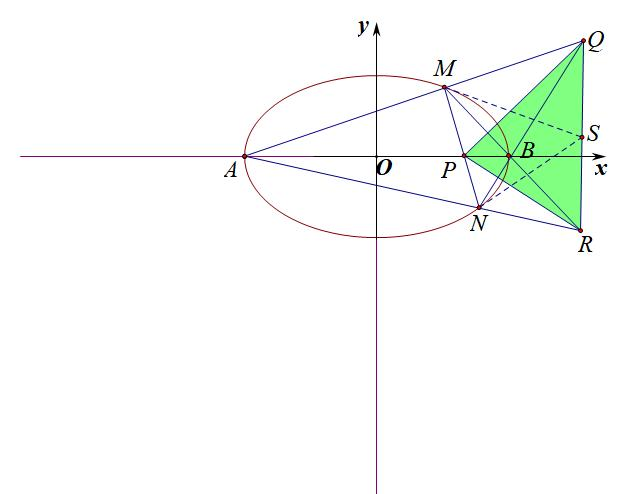

  
图7  自极三角形，极线是帕斯卡线，且

在使用帕斯卡定理解读高考题时，一定要做好汉密尔顿回路的字母排序，如果出现切线，那就将两点重复表示，具体操作我们可以参考例题.

【例1】（2023•北京）已知椭圆的离心率为，、分别为的上、下顶点，、分别为的左、右顶点，．

（1）求的方程；

（2）点为第一象限内上的一个动点，直线与直线交于点，直线与直线交于点．求证：．

【例2】（2023•西城区模拟）已知点，是椭圆的左，右顶点，椭圆的短轴长为2，离心率为．

（1）求椭圆的方程；

（2）点是坐标原点，直线经过点，并且与椭圆交于点，，直线与直线交于点，设直线，的斜率分别为，，求证：为定值．

【例3】（2024•成都模拟）已知和是椭圆的左、右顶点，直线与椭圆相交于，两点，直线不经过坐标原点，且不与坐标轴平行，直线与直线的斜率之积为．

（1）求椭圆的标准方程；

（2）若直线与椭圆的另外一个交点为，直线与直线相交于点，直线与直线相交于点，证明：点在一条定直线上，并求出该定直线的方程．

【例4】(2024•北京信息卷)已知椭圆的离心率，且过点.

(1)求椭圆的方程;

(2)设，为椭圆的左.右顶点，不过原点的直线与椭圆交于，两点，点关于原点的对称点为，直线与直线交于点，求证:直线与直线的交点在定直线上.

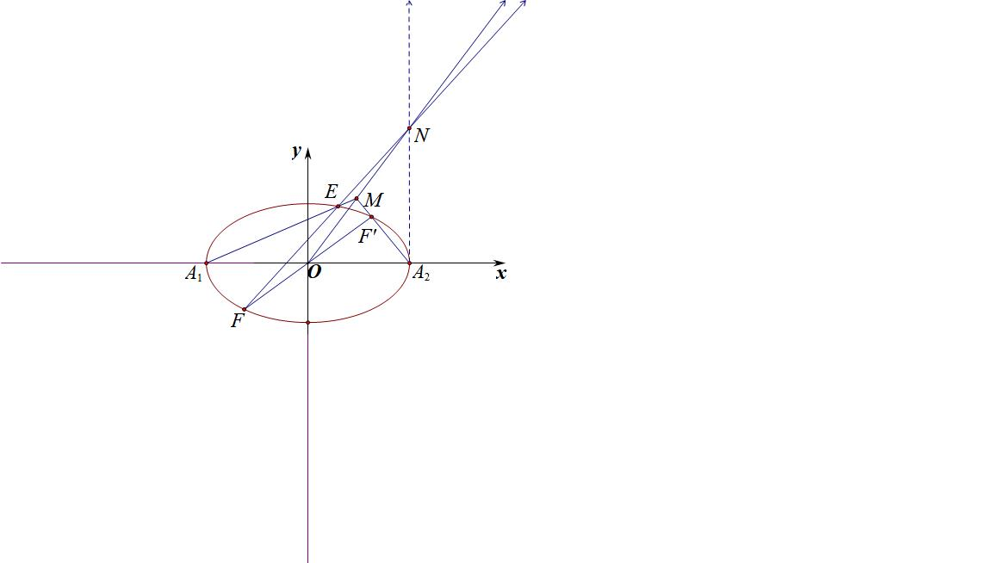

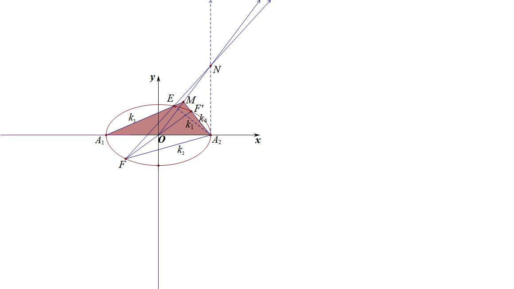

【例5】（2024•新高考Ⅱ）已知双曲线，点在上，为常数，，按照如下方式依次构造点，3，，过斜率为的直线与的左支交于点，令为关于轴的对称点，记的坐标为，．

（1）若，求，；

（2）证明：数列是公比为的等比数列；

（3）设为△的面积，证明：对任意的正整数，．

【例6】（2024•沈阳模拟）已知如图，点，为椭圆的短轴的两个端点，且的坐标为，椭圆的离心率为．

（Ⅰ）求椭圆的标准方程；

（Ⅱ）若直线不经过椭圆的中心，且分别交椭圆与直线于不同的三点，，（点在线段上），直线分别交直线，于点，．求证：四边形为平行四边形．

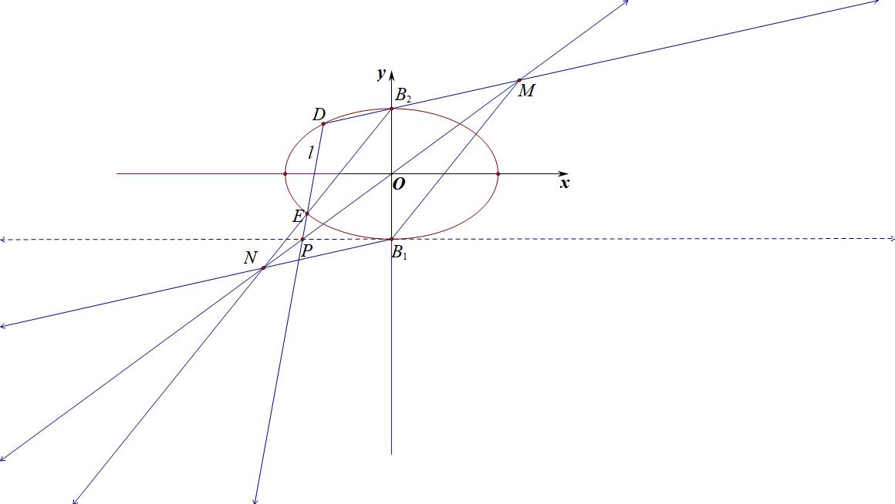

第七节：帕斯卡定理的对偶定理——布利安桑定理

**一．布利安桑**（Brianchon ）**定理与退化二次曲线联立**

如果直线 1,2,3,4,5,6 是二阶线束的任何六条射线，则直线 *l* =(12,45)，*m*=(23,56)，

*n* =(34,61)交于一个共同点。此点叫Brianchon点，六条射线构成的六边形叫 Brianchon六线形（六边形）。以上定理的陈述中，12代表直线1与直线2的交点，45 代表直线4与直线5的交点，而 *l* = (12, 45)代表12与45两个交点的连线,*m*= (23, 56)，*n* = (34, 61)的意义类似。

Brianchon定理是Pascal 定理的对偶命题，一般书中通常不再给出独立证明。如果要证，其形式也和Pascal定理的证明完全相似。所以这里也不再进行。

1.对偶的两个定理——布利安桑定理与帕斯卡定理比较

<table><tr><td>
Brianchon 定理：
</td><td>
Pascal 定理：
</td></tr><tr><td>
设 a,b,c,d,e,f 是二阶线束中 

的任何六条线，设 

l 是 a,b 交点与 d,e 交点的连线， 

m 是 b,c 交点与 e,f 交点的连线， 

n 是 c,d 交点与 f,a 交点的连线， 

则 l，m，n 三线共点。 

此点称 Brianchon 点，六线构成的图形叫 

Brianchon 六线形。

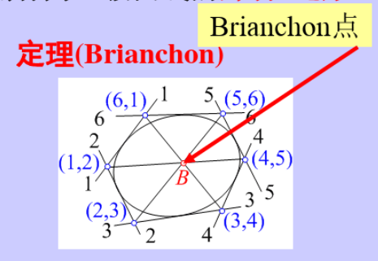
</td><td>
设 A,B,C,D,E,F 是二阶点列中 

的任何六个点，设 

L 是 A,B 连线与 D,E 连线的交点， 

M 是 B,C 连线与 E,F 连线的交点， 

N 是 C,D 连线与 F,A 连线的交点， 

则 L，M，N 三点共线。 

此线称 Pascal 线，六点构成的图形叫 

Pascal 六点形。

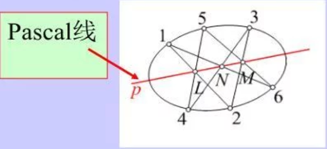
</td></tr></table>

可以看出，只要把‘点'和‘线'两字互换，“交点”和“连线”两单字互换。则Pascal定理就与Brianchon定理的形式惊人地一致了。

Brianchon定理也可陈述如下：圆锥曲线外切六边形的三组对顶点的连线交于同一点。

2..外切五边形的布利安桑点

如果直线2趋近直线1,并达到直线1的极限位置，则直线1与直线2的交点（1,2）以曲线在1的切点作为极限位置。如图，已知直线1，2，3，4，5，求1（=6）的切点的步骤如下：作直线，则连线（34，Im）与直线1交点必为所求的切点T。

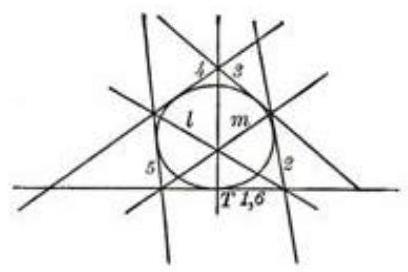

外切于圆锥曲线的五边形

3.外切四边形的布利安桑点

如果Brianchon定理中的六边形有两对邻边相重合，则六边形退化成为四边形。有关这种外切于圆锥曲线的四边形，我们有下面的定理：

外切于圆锥曲线的四边形ABCD的两组对顶点连线BD,AC，以及两组对切点连线PR与QS，四线交于一个共同的点。

证明：令过切点的切线为1和6的重合,过切点的切线为3和4的重合,再令点切线为点切线为2,则

直线三线共点。

下面再证SQ也与上面三线共点：

令的切线为1,6重合,的切线为3,4重合,点切线为5,点切线为2,则

直线三线也共点，

由此BD,AC,PR,SQ四线共点,即定理所要证的。

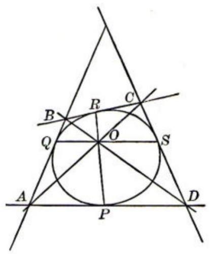

外切于圆锥曲线的四边形

4.外切三边形的布利安桑点

六边形也可能进一步退化成为一个三边形，这时Brianchon定理给出以下形式（证明留给大家）：

外切于圆锥曲线的三角形的三个顶点与对边上的切点的连线交于同一点。

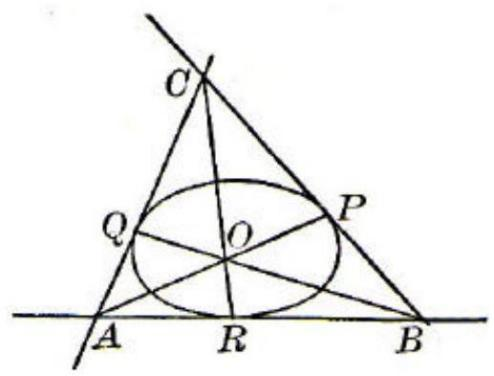

外切于圆锥曲线的三角形

二．热尔岗点

热尔岗点,也称Gergonne的内点或内心,是法国数学家Gergonne 在1816年提出的一个特殊的点。热尔岗点在平面几何中是一个重要的概念,被广泛应用于许多领域,包括计算机图形学、机器人学、凸包算法等。

热尔岗点是三角形三条边与其内切圆或旁切圆的切点所连成的三条直线的交点。具体来说,如果X、Y、Z分别是ABC的三边BC、CA、AB与其内切圆或旁切圆的切点,则三线AX、BY、CZ共点,这样的点共有四个,称为的热尔岗点。

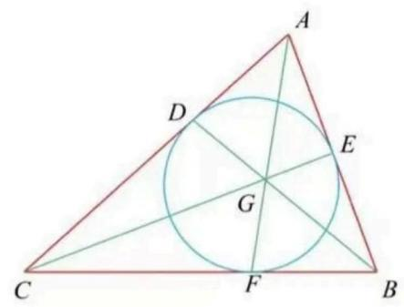

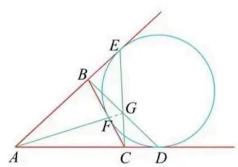

该点被法国数学家热尔岗发现, 因为一个三角形有一个内切圆和三个旁切圆, 所以一个三角形有四个热尔岗点.

以三角形内部热尔岗点为例,证明:  共点.

证明:如图所示, 根据切线长定理有，则

由塞瓦定理知:  共点.

如下图，MNV可以是曲线上任意一点的切线，如图我们始终有BN与AB的交点Q落在PV直线上

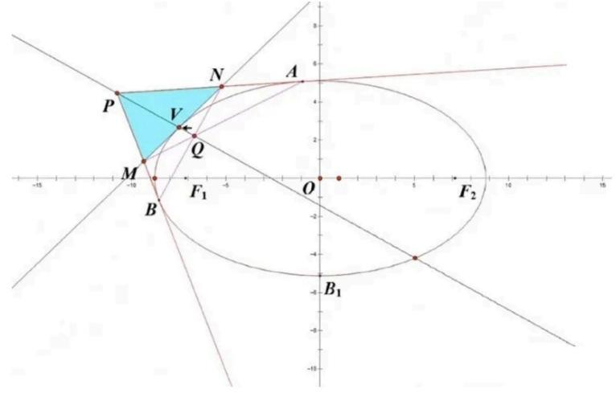

【例1】（25武汉二调19题）双曲线的一个顶点在直线上,且其离心率为 .

(1)求双曲线的标准方程；

(2)若一条直线与双曲线恰有一个公共点,且该直线与双曲线的渐近线不平行,则定义该直线为双曲线的切线,定义该公共点为切线的切点.已知点在直线上,且过点恰好可作双曲线的两条切线,设这两条切线的切点分别为和.

(i)设点的横坐标为,求的取值范围;

(ii)设直线和直线分别与直线交于点和点,证明:直线和直线的交点在定直线上.

(附:双曲线以点为切点的切线方程为)

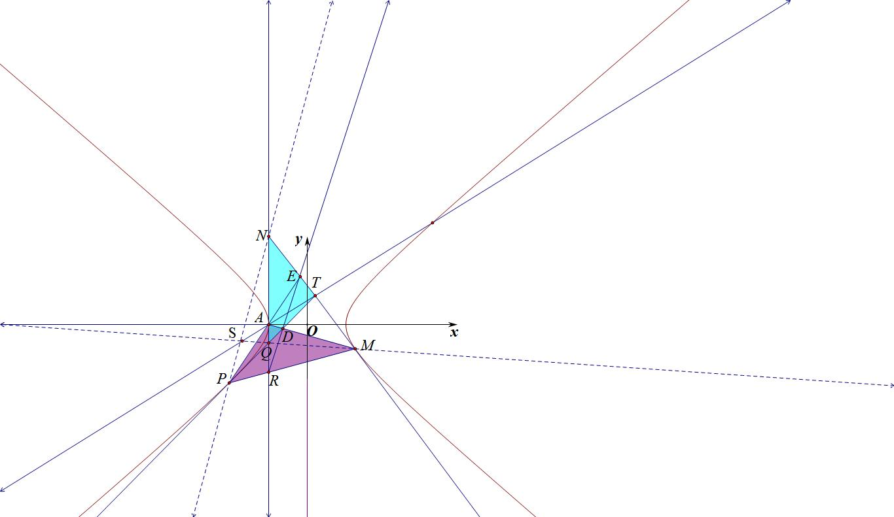

三．退化二次曲线的布利安桑点

Brianchon定理也可应用于由两点 S，S‘以及通过它们的所有直线组成的退化圆锥曲线：

如果a，b，c是通过点S的三条直线，a'，b'，c'是通过另一点 S'的三条直线，则*l* = (ab', a'b)，*m* = (bc', b'c) 和*n* = (ca', c'a) 三条直线交于一点。

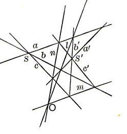

圆锥曲线的退化情况*l*,*m*,*n* 交于一个共同的*O*点

6. 双曲线渐近线和共轭直径

无穷远点的极线称为圆锥曲线的直径，而无穷远直线的极点称为圆锥曲线的中心。

根据极点和极线的调和性质，不难证明：直径都通过中心；通过中心的直线也都是直径。

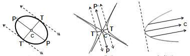

１椭圆             ２双曲线          ３抛物线

直径 PP’或 TT’都是无穷远点的极线，中心 C是无穷远直线的极点。直径都通过 C,且通过 C 的直线都是直径.椭圆和双曲线是有心曲线。其中，椭圆中心位于曲线内，它的每一条直径与曲线交于 2 点，因而直径都是弦。双曲线的中心位于曲线外，它的直径（通过中心的直线）可以与曲 线交于 2 点，如上图中的 TT’；也可能没有任何交点，如图中的 PP’；

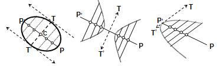

通过直径 TT’方向无穷远点的所有弦被直径 PP’平分 中心平分通过它的所有的弦；通过同一个无穷远点的所有弦(即一组平行弦中的每一条)被以该无穷远点为极线的直径所平分，把两条直线称为关于圆锥曲线的相互共轭的直线，如果其中任意一条线通过另一条的极点。关于圆锥曲线的共轭直线，我们有下列定理：

任意直径平分所有与其共轭的直径平行的的弦；任一直径两个端点的切线为平行线，且平行于其共轭直径；平行于外切平行四边形边的两个直径为共轭直径。

这就是中点弦定理，也是第三定义的中位线本质，我们通常用点差法来证明。

回到Brianchon定理关于退化的三角形，外切于圆锥曲线的三角形的三个顶点与对边上的切点的连线交于同一点。我们来解读双曲线,双曲线是有心曲线。通过中心O的直线都称直径。双曲线与无穷远直线有两个交点，双曲线的两条渐近线就是它的两个无穷远点的切线。如果我们再作任意第三条切线，则它将与原来的两条切线（渐近线）生成两个交点，设它们分别为A和B。则中心与A,B三点形成一个外切于双曲线三角OAB，这也是我们前面章节提到的渐切三角形。

按照Brianchon定理可知：通过A平行于OB的直线、通过B平行于OA的直线、以及通过切线 AB 切点P的直线OP，三线交于一个共同点 C。但因OACB 是一平行四边形，故其对角线相互平分，由此知 PA = PB。这样我们得到下面的定理：

由双曲线的两条渐近线切割任意第三条切线而成的线段AB被该切线的切点 P 所平分。

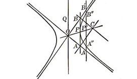

AB为过双曲线任一点P的切线，则PA = PB

在双曲线中，中心位于曲线的外部，参看图中O点，从曲线中心向曲线所作的两条切线与曲线在两个不同的无穷远点相切，而两条切线本身在中心相交。这两条切线称曲线的渐近线。而椭圆和抛物线都没有渐近线。如果在上图中，我们通过中心O作一直线 OQ 平行与 AB，则OQ与OP一样，都是直径。因 OQ 与P点的切线平行，而P点是OP和曲线的交点，故 OP和OQ 是一对共轭直径。又因 A，P，B以及AB的无穷远点是四调和点，我们得到下述有关双曲线的定理：

双曲线的共轭直径关于其渐近线调和共轭。

平行于直径OQ的弦A"B"被共轭的直径OP的平分于P’点。设弦与渐近线交于点 A"和 B"，则点 A’、P’、B’和无穷远点是四调和点，由此 P’是 A’B’ 中点。而 A’A" = B’B"，我们有下列定理：

双曲线的所有弦被双曲线和它的渐近线切割出来的线段的长度相等。

