- 从定比点差到极点极线

第一节  单比与交比

一．单比的概念及性质

1.单比的定义

如果共线三点满足,则称为共线三点的单比，也可以表示为P分为。其中称为基点,称为分点。

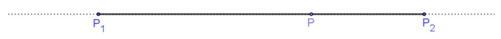

对单比的概念我们需要理解以下几点:

⑴单比的定义是有顺序的,共线三点的顺序不可随意调整，;

⑵当位于线段之间时,，否则,当位于线段之外时，，为线段中点时；

⑶如果为定点,也给定,则点的位置唯一确定;

⑷在平面直角坐标系中,,由向量坐标运算,得出定比分点公式：

⑸所谓共线三点的单比,即为定比分点中的定比。

最早出现定比分点高考题是在2006年山东高考卷，由于年代久远，所以我们就用同类型题来解读。

**2.为定值的参数同构与点差法**

当圆锥曲线上两点作为定比分点，线段两个端点分别位于焦点和另一条坐标轴上时，这里会涉及一个为定值的问题，我们介绍参数同构法，点差思想来处理．

【例1】已知焦点在轴上，离心率为的椭圆的一个顶点是拋物线的焦点，过椭圆右焦点的直线交椭圆于，两点，交轴于点，且，

(1)求椭圆的方程;

(2)证明:为定值.

【例2】（2023•大庆模拟）已知椭圆的离心率，短轴长为．

（1）求椭圆的方程；

（2）已知经过定点的直线与椭圆相交于，两点，且与直线相交于点，如果，，那么是否为定值？若是，请求出具体数值；若不是，请说明理由．

二．单比与交比

1.单比角元形式

两条直线的有向角满足下面几个性质:

(1).如果直线逆时针旋转到直线,则为正角;如果直线顺时针旋转到直线,则为负角;

(2)..

如下图,分别连接共线三点与其所在直线外一点,记所形成的直线分别为,若,则.

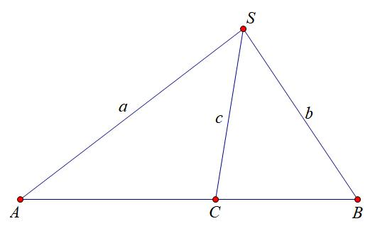

证明：

2、交比的概念及性质

**点列的交比:** 如果共线四点满足,则称为共线四点的交比,记为。其中称为基点偶(对),称为分点偶(对)。

不妨共线四点所在直线不与坐标轴垂直,并设,,则：

由上述计算公式，不难得到点列交比的简单性质：

性质1:基点偶与分点偶交换,交比的值不变,即.

性质2：基点偶的两个字母交换，或者分点偶的两个字母交换，交比值变为原来交比值的倒数，即

性质3：交换中间两个字母，或交换两端的两个字母，交比的值变为1减去原来的交比值，即

性质4:如果四个不同的共线点中三点及其交比值已知,则第四点必唯一确定.

**点列交比的角元形式：** 如下图,分别连接共线四点与其所在直线外一点,记所形成的直线分别为,则

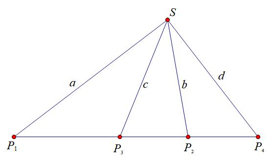

从交比的角元形式可以看出,交比的值只与直线的有向角有关系,与线段长度没有关系。于是我们很容易据此得到交比的射影不变性。

3.交比的射影不变性

交比的射影不变性：如图所示,过点引四条相交直线,分别与另外两条直线交于和,则

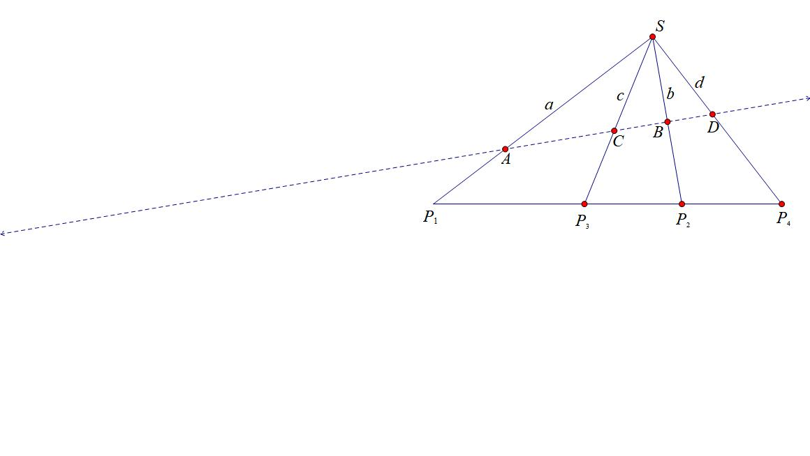

交比的射影不变性,是交比的角元形式的直接推论，交比的射影不变性表明，交比经中心射影后不变。

关于交比射影不变性的斜率公式，我们会在后面章节进行解读，交比射影不变性的推论，结合调和点列，基本上可以打通高考.

【例3】（2024•济南期末）射影几何学中，中心投影是指光从一点向四周散射而形成的投影，如图，为透视中心，平面内四个点，，，经过中心投影之后的投影点分别为，，，．对于四个有序点，，，，定义比值叫做这四个有序点的交比，记作．

（1）证明：；

（2）已知，点为线段的中点，，求．

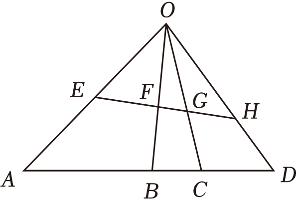

【例4】(2024.江苏省四校联合)交比是射影几何中最基本的不变量，在欧氏几何中亦有应用．设，，，是直线上互异且非无穷远的四点，则称（分式中各项均为有向线段长度，例如为，，，四点的交比，记为，；，．

（1）证明：；

（2）若，，，为平面上过定点且互异的四条直线，，为不过点且互异的两条直线，与，，，的交点分别为，，，，与，，，的交点分别为，，，，证明：，；，，；，；

（3）已知第（2）问的逆命题成立，证明：若与△的对应边不平行，对应顶点的连线交于同一点，则与△对应边的交点在一条直线上．

【例5】（2024.开封三模）点是直线外一点,点在直线上(点与点任一点不重合).若点在线段上,记,若点在线段外,记.记.

记的内角的对边分别为,已知,点是射线上一点,且.

(1)若,求，

(2)射线上的点满足,

(i)当时,求的最小值，

(ii)当时,过点作于,记,求证，数列的前项和.

三．调和点列与定比点差

1．调和点列的概念

如下图①，点在线段上，则满足的点是唯一存在的．但是，如果将线段改为直线，此时，满足的点有两个，如下图②，不妨记另一个点为，则，在此种情况下，我们称点、、、为**调和点列**，或者称点、**调和分割**点、．按照交比的调和比解释，就是

  
图①

  
图②

特别的，当时，即点为的中点，则为无穷远点．

2．调和点列的性质

如下图所示：对于线段的内分点和外分点满足、调和分割线段，即，设为线段的中点，则有以下结论成立：

①点、也调和分割、，即；

②（是与的调和平均数）．

3.定比分点和调和分点支配下的圆锥曲线

########## 在椭圆或双曲线中，设，为椭圆或双曲线上的两点，若存在，两点，满足，，则一定有：

########## **证明** 若，且，则；若，则

########## ，有，

########## （1）-（2）可得：

########## 即得：，

########## 故．

########## 在抛物线中，设，为抛物线上的两点．若存在，两点，满足，，一定有．

########## **证明** 若，，则，，则

########## ，有 

########## ①—②得：

########## 即，

########## 所以，故．

定比点差的原理谜题解开，就是两个互为调和的定比分点坐标满足圆锥曲线的特征方程．

四．定点（极点）在坐标轴上的定比点差

若出现或者，则，此时;若出现或者，则，此时.对于公式中，成对出现的“”或者“”，由于公式的背景和极点极线有关，不妨可以称它们为“调和共轭数”.

【例6】（2022•山东模拟）已知椭圆的离心率，且经过点，点为椭圆的左、右焦点.

(1)求椭圆的方程;

(2)过点分别作两条互相垂直的直线，且与椭圆交于不同两点与直线交于点.若，且点满足，求面积的最小值.

**类型一 定点（极点）在轴**

过定点的直线与椭圆相交于、两点，设，，则在直线上一定存在点满足，根据定比点差法可知.

一定有

证明:

**类型二 定点（极点）在轴**

过定点的直线与椭圆相交于、两点，设，，则在直线上一定存在点满足，根据定比点差法可知.同理:

由于在考试当中我们经常要拿出这三个等式，故我们称之为:“三炮齐鸣，天下太平”

【例7】（2025•广州零模第17题）已知椭圆的左、右焦点分别为，，离心率为，长轴长与短轴长之和为6．

（1）求椭圆的方程；

（2）已知，，点为椭圆上一点，设直线与椭圆的另一个交点为点，直线与椭圆的另一个交点为点．设，，求证：当点在椭圆上运动时，为定值．

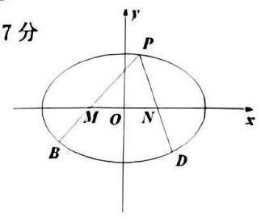

【例8】（2025•武汉开学）如图，已知圆锥的高与母线所成的角为，过的平面与圆锥的高所成的角为，该平面截这个圆锥所得的截面为椭圆，椭圆的长轴为，短轴为，长轴长为，的中心为，再以为弦且垂直于的圆截面，记该圆与直线交于，与直线交于，

（1）用，，分别表示，；

（2）若；

（ⅰ）求椭圆的焦距；

（ⅱ）椭圆左右焦点分别为，，上不同两点，在长轴同侧，且，设直线，交于点，记，设，请写出的解析式（不要求求出定义域）．

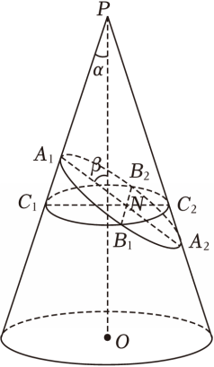

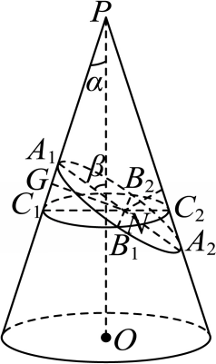

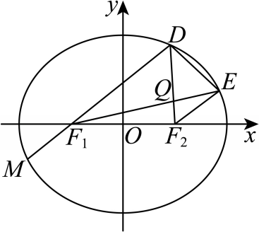

五．定点（极点）不在坐标轴上的定比点差

椭圆，点、是椭圆上的点，且，则:

(非轴点弦三炮齐鸣起手式，方便理解，不是最终方程

即点、的坐标都可以用只含有(或的式子表示出来.

证明:由得:，即①，利用定比点差法得:

，

即，代入(1)，消去、，整理可得:

如果消去、，整理可得:.

在上面椭圆的基础上，我们也可以大胆推测，对于抛物线，设点、为抛物线上的点，且，则亦有公式:

【例9】如图, 已知椭圆 $E:\frac{x^{2}}{a^{2}}+\frac{y^{2}}{b^{2}}=1(a>b>0)$  的离心率为 $\frac{\sqrt{2}}{2}$ , 点 $A\left(\frac{2}{3}\right)$  在椭圆 $E$  上, 射线 $AO$  与 椭圆 $E$  的另一交点为 $B$ , 点 $P\left(t\right)$  在椭圆 $E$  内部, 射线 $AP、BP$  与椭圆 $E$  的另一交点分别为 $C、D$ .
(1) 求椭圆 $E$  的方程;
(2) 求证: 直线 $CD$  的斜率为定值.

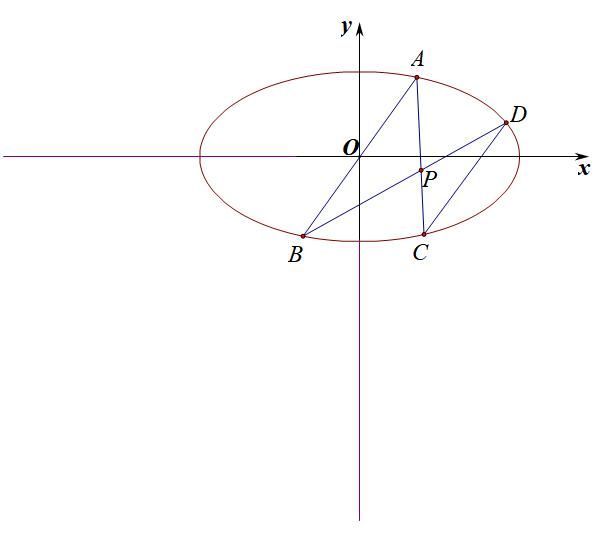

【例10】（2023年3月南师附中月考）在平面直角坐标系中，双曲线（，）的离心率为，斜率为的直线经过点，点是直线与双曲线的交点，且.

（1）求双曲线的方程；

（2）若经过定点的直线与双曲线相交于，两点，经过点斜率为-2的直线与直线的交点为，求证：直线经过轴上的定点.

- 极点极线定义与自极三角形

一．极点极线的定义

1．二次曲线的替换法则

对于一般式的二次曲线，用代，用代，用代，用代，用代，常数项不变，

可得方程：．

2．极点极线的代数定义

高中阶段，常见的二次曲线的极点极线的方程如下：

（1）圆：

①极点关于圆的极线方程是；

②极点关于圆的极线方程是；

③极点关于圆的极线方程是：．

（2）椭圆：

极点关于椭圆的极线方程是：．

（3） 双曲线：

极点关于双曲线的极线方程是：．

（4）抛物线

极点关于抛物线的极线方程是：．

注：①极点极线是成对出现的；

②焦点和焦点对应的准线就是最常见的极点极线；

③已知定比分点，则其调和分点一定位于其对应极线上！

3．极点极线的几何意义

（1）若极点在二次曲线上，则极线是过点的切线方程．

（2）若极点在二次曲线内部，则极线是过点P的弦两端端点的切线交点的轨迹．如图所示，过点P的弦、的两端端点作切线，得到的直线MN即为点对应的极线轨迹．【极线和二次曲线必定相离】

（3）若极点P在二次曲线外部，分成两种情况：

①极线在二次曲线内的部分是点对二次曲线的切点弦；【极线和二次曲线必定相交】

②极线在二次曲线外的部分是过点P的弦两端端点的切线交点的轨迹．

########## 二． 极点极线定理证明

如下图所示，设非中心点不在椭圆上，过作椭圆的两割线和，连接和交于，则.

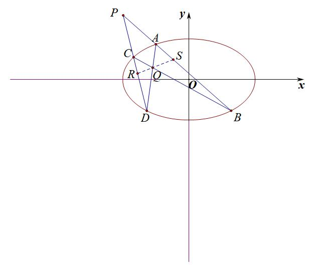

证明：如图所示，在线段上取一点，使，，，为调和点列，根据定比点差法(过程省略)可知：，同理在上取一点，使，，，为调和点列，则有，由于*R*、*S*均在同构方程上，所以直线的方程为，

连接，我们仅仅需要证，，三线共点即可，此时我们需要借助一下梅涅劳斯定理和塞瓦定理，由于借助平面几何知识，延长*AC*和*BD*交于*T*，连接*TQ*交*AB*和*CD*分别于*E*和*F*点*，* 我们需证*R*，*Q*，*S*三点共线，则只需证*S*与E重合，*R*与*F*重合

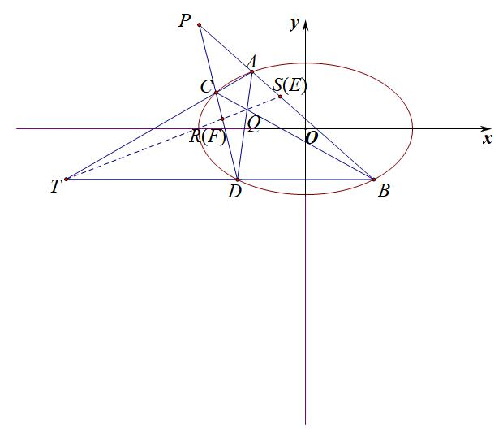

在中，*Q*是其塞瓦点，根据塞瓦定理可知：，

在中，*PAB*为其截线，根据梅涅劳斯定理得：

所以，由于，故*R*与*F*重合，同理可证*S*与*E*重合，

故点*Q*在直线*RS*上，所以，命题得证！

注意：关于梅涅劳斯定理和塞瓦定理及其逆定理，均属于高中数学联赛的知识，高中课本上是没有做要求的，考试不能直接拿来证明，但是其对应的比值性质与极点极线的调和共轭属性完美契合，属于证明极点极线的最佳方法.

补充定理：

**1．梅涅劳斯定理**

**定理**：一条直线与ABC的三边AB、BC、CA所在直线分别交于点D、E、F，且D、E、F均不是ABC的顶点，则有

G

<strong>证明</strong>：如图，过点<em>C</em>作AB的平行线，交EF于点G．

因为CG // AB，所以 ①，因为CG // AB，所以②

由①÷②可得，即得．

**2．梅涅劳斯定理的逆定理**

<strong>定理</strong>：在<em>ABC</em>的边<em>AB</em>、<em>BC</em>上各有一点<em>D</em>、<em>E</em>，在边<em>AC</em>的延长线上有一点<em>F</em>，若，那么<em>D</em>、<em>E</em>、<em>F</em>三点共线．

<strong>证明</strong>：设直线EF交AB于点D/，则据梅涅劳斯定理有．

因为 ，所以有．由于点<em>D</em>、<em>D</em>/都在线段<em>AB</em>上，所以点<em>D</em>与<em>D</em>/重合．即得<em>D</em>、<em>E</em>、<em>F</em>三点共线．

**3．塞瓦定理**

<strong>定理</strong>：在<em>ABC</em>内一点<em>P</em>，该点与<em>ABC</em>的三个顶点相连所在的三条直线分别交<em>ABC</em>三边<em>AB</em>、<em>BC</em>、<em>CA</em>于点<em>D</em>、<em>E</em>、<em>F</em>，且<em>D</em>、<em>E</em>、<em>F</em>三点均不是<em>ABC</em>的顶点，则有 ．

**证明**：运用面积比可得．根据等比定理有：，所以．同理可得，，三式相乘得．

**4．塞瓦定理的逆定理**

<strong>定理</strong>：在<em>ABC</em>三边<em>AB</em>、<em>BC</em>、<em>CA</em>上各有一点<em>D</em>、<em>E</em>、<em>F</em>，且<em>D</em>、<em>E</em>、<em>F</em>均不是<em>ABC</em>的顶点，若，那么直线<em>CD</em>、<em>AE</em>、<em>BF</em>三线共点．

<strong>证明</strong>：设直线<em>AE</em>与直线<em>BF</em>交于点<em>P</em>，直线<em>CP</em>交<em>AB</em>于点<em>D</em>/，则据塞瓦定理有．因为 ，所以有．由于点<em>D</em>、<em>D</em>/都在线段<em>AB</em>上，所以点<em>D</em>与<em>D</em>/重合．即得<em>D</em>、<em>E</em>、<em>F</em>三点共线．

三．极点极线的配极性质

①点关于二次曲线的极线经过点点关于二次曲线的极线经过点．

②直线关于二次曲线的极点在直线上直线关于二次曲线的极点在直线上．

①②表达点和点是二次曲线的一组调和共轭点，也是定比点差常说到的定比分点和调和分点．

########## 四． 完全四边形与自极三角形

1.完全四边形定义

完全四边形两两相交，如下图的四边形ABCD，没有三线共点的四条直线AB、BC、CD、DA，及它们的六个交点，两两相交于六点，六个点可分成三对相对的顶点,它们的连线是三条对角线.则即为完全四边形

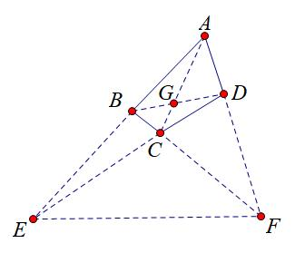

2.极点极线的综合模型——自极三角形

极点极线的几何意义:

（1）若点是圆锥曲线上的点，则过点的切线即为极点对应的极线．

（2）如图所示（以椭圆图形为例），若点是不在圆锥曲线上的点，且不为原点，过点作割线、依次交圆锥曲线于、、、四点，连结直线、交于点，连结直线、交于点，则直线为极点对应的极线．类似的，也可得到极点N对应的极线为直线，极点对应的极线为直线，因此，我们把称为自极三角形．【即的任一顶点作为极点，则顶点对应的边即为对应的极线，“补全自极三角形”这个技巧很常用，后面结合例题了解！】

如图所示，如果我们连结直线交圆锥曲线于点、，则直线、恰好为圆锥曲线的两条切线，此时，直线不仅是极点的极线，我们也称直线为渐切线．

下面的共轭点模型，实际都是极点在坐标轴上的特例模型的应用，也是高考题常见．

【例1】（2020•新课标Ⅰ）已知，分别为椭圆的左、右顶点，为的上顶点，．为直线上的动点，与的另一交点为，与的另一交点为．

（1）求的方程；

（2）证明：直线过定点．

【例2】已知椭圆：的左右焦点分别为，，点在上，且．

（1）求的标准方程；

（2）设的左右顶点分别为，，为坐标原点，直线过右焦点且不与坐标轴垂直，与交于，两点，直线与直线相交于点，证明点在定直线上．

【例3】（2023•福州模拟）已知抛物线，过点的两条直线，分别交于两点和，两点．当的斜率为时，．

（1）求的标准方程；

（2）设为直线与的交点，证明：点必在定直线上．

########## 【例4】（2011•四川）如图，椭圆有两顶点、，过其焦点的直线与椭圆交于两点，并与轴交于点．直线与直线交于点． 当点异于两点时，求证：为定值．

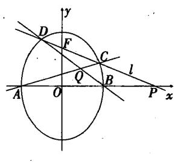

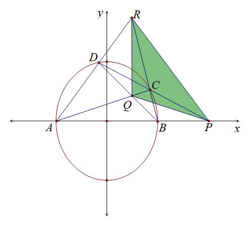

【例5】（2023•新高考Ⅱ）已知双曲线中心为坐标原点，左焦点为，，离心率为．

（1）求的方程；

（2）记的左、右顶点分别为，，过点的直线与的左支交于，两点，在第二象限，直线与交于，证明在定直线上．

- 蝴蝶定理与坎迪定理

########## 一.蝴蝶定理

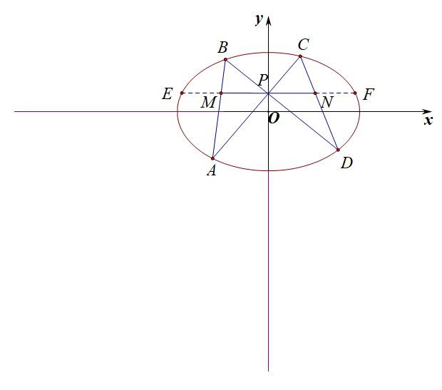

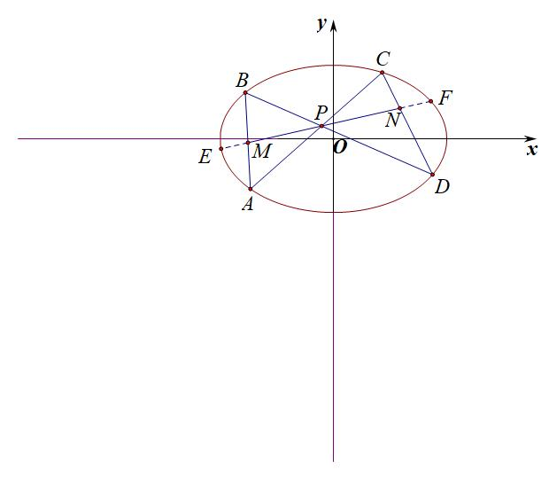

如左图所示，*P*为*y*轴上一点，若*AC*与*BD*交于*P*，过*P*作与*x*轴平行的直线交*AB*和*CD*于*MN*，交椭圆于*EF*，则.

如右图，若*P*为弦*EF*中点，则*P*一定为*MN*中点，即，我们把这种蝴蝶型的共中点定理叫做蝴蝶定理.

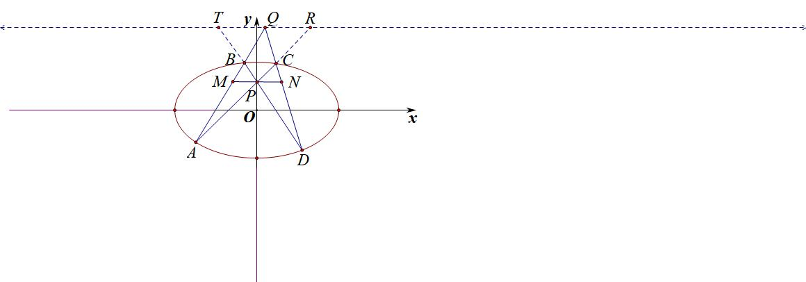

证明：如图，延长AB与DC交于Q，过Q作MN的平行线交DB延长线于T，交AC延长线于R，易知TR为以P为极点的极线，以P为射影中心，利用交比不变性，，以Q为射影中心，利用交比不变性，，故

【例1】已知椭圆过点，离心率为.

(1)求椭圆的方程;

(2)过点做椭圆的两条弦分别位于第一、二象限)，若与直线分别交于，求证:.

########## 二.坎迪定理

如图，、、、都是椭圆上的动点，已知与交于点，则一定有:①，②.

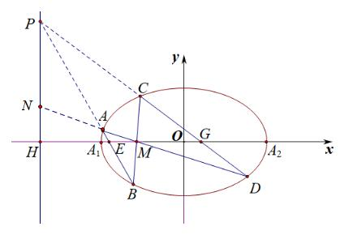

证明①：根据极点极线知识，*M*与*H*调和共轭，*AB*与*CD*交点*P*一定在直线上，以M为射影中心，利用交比不变性，，以P为射影中心，利用交比不变性，，故，

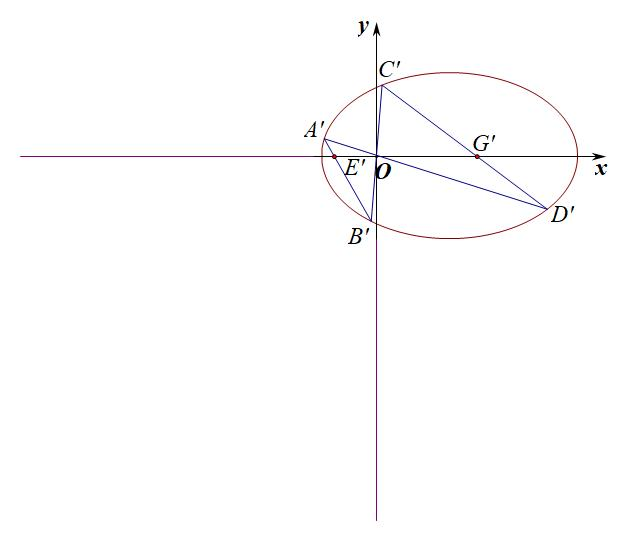

补充定理：圆周角交比不变性

设为圆锥曲线上六个不同的点,为定点,为动点,则

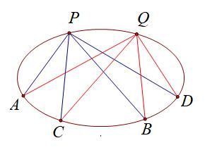

证明：如图,以圆锥的顶点为射影中心，以椭圆为截面，*SP*，*SA*，*SB*，*SC*，*SD*分别交椭圆截面于根据交比射影不变性以及,显然有根据圆的圆周角定理，如右图，根据交比的不变性，所以

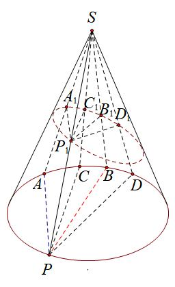

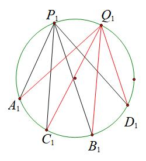

########## 三.坎迪定理中点推论

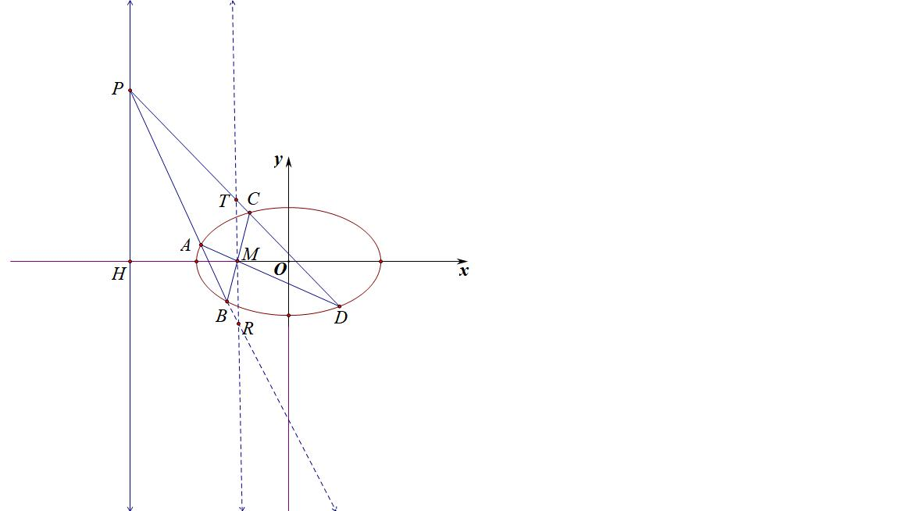

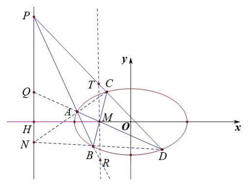

##########      如图，A、B、C、D是圆锥曲线上的点，BA与DC延长线交于P，AD与BC交于M，易知PH是以M为极点的极线，过M作交PD与PB于T和R，则.

证明：如右图所示,直线为点对应的极线,则	又,

所以.

########## 【例2】（2010•江苏）椭圆的左右顶点为,右焦点为．设过点的直线，分别与椭圆交于，，其中，，．求证：直线必过轴上一个定点．

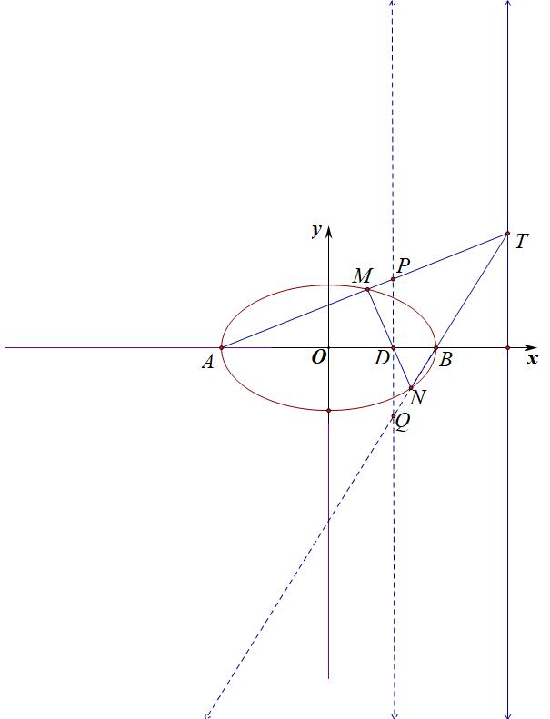

【例3】（2016•山东）已知椭圆的长轴长为4，焦距为．

########## （1）求椭圆的方程；

########## （2）过动点，的直线交轴与点，交于点，在第一象限），且是线段的中点．过点作轴的垂线交于另一点，延长交于点．

########## ①设直线*PM*，*QM*的斜率分别为，，证明为定值；

########## ②求直线的斜率的最小值．

########## 【例4】（2023•江苏模拟）在平面直角坐标系中，椭圆的离心率是，焦点到相应准线的距离是3．

########## （1）求，的值；

########## （2）已知、是椭圆上关于原点对称的两点，在轴的上方，，连接、并分别延长交椭圆于、两点，证明：直线过定点．

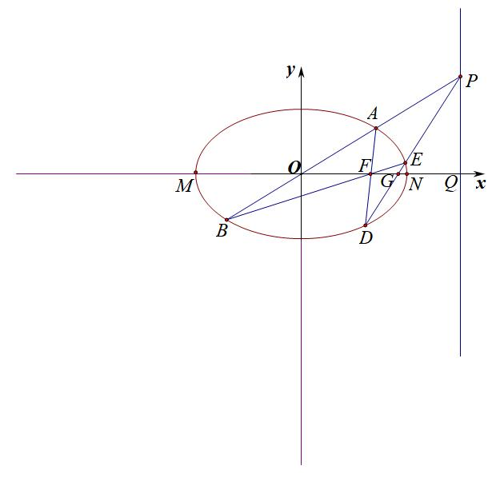

########## 利用对称和焦弦常数构造斜率关系

焦弦常数:设点为椭圆或双曲线上任一点，过焦点、分别作弦、，设，则.证明过程参考例题.

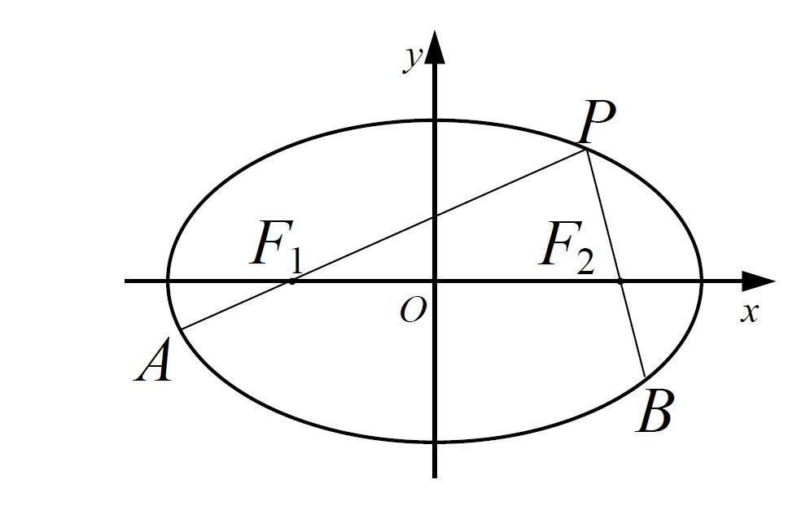

推广:如果将焦点、换成、，则.

证明:对，利用定比点差法易得:

得:.

【例5】（2025•杭州高二期中第19题）已知椭圆的左、右焦点分别为，，离心率为，设，是第一象限内椭圆上的一点，、的延长线分别交椭圆于点，，连接，，，若△的周长为．

（1）求椭圆的方程；

（2）当轴，求△的面积；

（3）若分别记，的斜率分别为，，求的最大值．

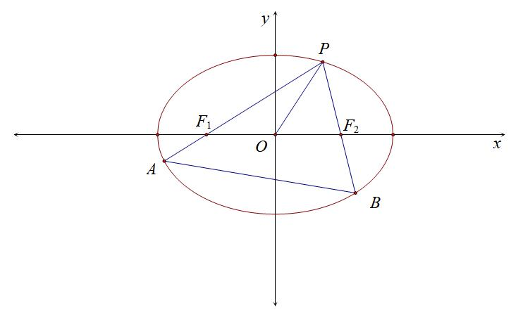

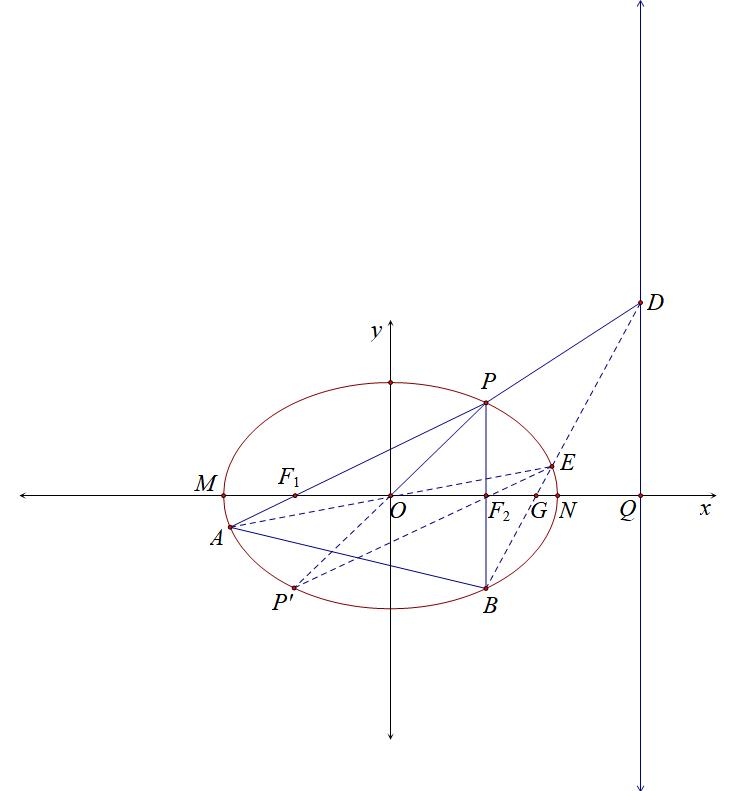

【例6】已知椭圆的离心率为，半焦距为，且，经过椭圆的左焦点斜率为的直线与椭圆交于、两点，为坐标原点．

（1）求椭圆的标准方程；

（2）设，延长，分别与椭圆交于、两点，直线的斜率为，求的值．

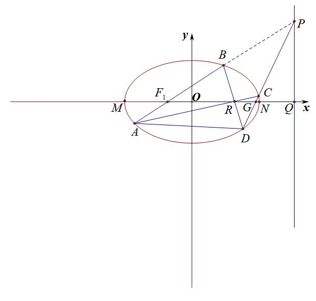

- 斜率积的三次对合

- 椭圆内接三角形的外心斜率定理

【例1】（2025届T8联考T18）已知过，两点的动抛物线的准线始终与圆相切，该抛物线焦点的轨迹是某圆锥曲线的一部分．

（1）求曲线的标准方程；

（2）已知点，，过点的动直线与曲线交于，两点，设△的外心为，为坐标原点，问：直线与直线的斜率之积是否为定值，如果是定值，求出该定值；如果不是定值，说明理由．

二．等轴双曲线轮换对合与隐藏的垂心

定理：等轴双曲线内接三角形垂心在双曲线上

如图,的三个顶点均在函数的图象上,试判断的垂心是否也在的图象上,并说明理由.

证明：令，，在等轴双曲线上，在双曲线找到点，且满足，则根据反比例的两点对合方程：，由于，所以，所以，所以是的垂心，与*H*重合。

【例2】（2023•南京二模）已知双曲线的离心率为，直线与双曲线仅有一个公共点．

（1）求双曲线的方程

（2）设双曲线的左顶点为，直线平行于，且交双曲线于，两点，求证：的垂心在双曲线上．

三．等轴双曲线反演与二阶曲线外心

为椭圆  的任意内接三角形,点为原点,点为的外心.记直线  的斜率分别为  ,且斜率均存在.求证:  .

分别取的中点为，易知为的垂心.

注意：由中位线定理,  ,又因为  ,所以 ,其他两组同理，再取轴和轴方向的无穷远点和.则 为一个等轴双曲线.

由中位线定理 ，所以 ，其他两组同理.由于直线与直线，直线与直线，直线与直线，都满足斜率的对合方程  .

则由笛沙格对合定理可知,  点也在该等轴双曲线上！！！ (注意: 笛沙格对合定理讲述的是一个圆锥曲线上的四点, 例如. 它们可以生成三组直线,直线与直线；直线与直线；直线与直线；每组直线被同一条直线所截得到的两个交点,都会满足同一个对合方程的,包括该圆锥曲线被直线所截得到的两个交点,也会满足该对合方程,由于原题是一个关于斜率的命题，那自然而然,要对无穷远直线应用笛沙格对合定理了)现只需对  与无穷远直线应用笛沙格对合定理即：

不妨设对合方程为，由于无穷远点和的斜率分别是0和.则 .

(注: 前面说过了0 ，这种未定式是可以等于任意常数的,所以是有意义的,但是就没意义了,

所以)即对合方程为.

则 ，即 ，则  .

注意：本内容参考公众号：希尔伯特女王空间

#   **同理，双曲线也有相似结论**

点在双曲线: (,) 上,设的外接圆的圆心为点  ,若  三边斜率存在,则

四．三次方程韦达定理与三次齐次化方程

设实系数一元三次方程①在复数集内的根为 ,可变形为展开得	②

比较①②可以得到 这就是三次方程的韦达定理.

回到例题1，要证明，我们给予齐次化解法：利用四点共圆，故只需证，我们构造三次的齐次化方程，这就需要二次与一次的对合相乘，由于，

先对椭圆方程变形：，

再对圆方程：，

所以（交叉相乘），

同除以，，即，

所以，即.

本题也可以平移后构造“非齐次化”的叉乘对合方程，操作差不多：

将椭圆和圆按照向量平移，即，故构造非齐次方程：，

设平移后过原点的圆圆心为，则，

交叉相乘构造齐次化：，同除以得：，，又，所以.

【例3】(河北名校联盟25届高三一轮收官考T19)已知双曲线   (  ,  )的焦点到渐近线的距离为1,右顶点到点的距离是. 动圆(点为圆心)与交于四个不同的点 ,  ,  ,  ,且直线 , 的斜率分别为  ,  .

(1) 求  的方程.

(2)设直线  .

(i) 判断点(2k, m)是否在双曲线  上,并说明理由.

(ii) 若  ,求直线的一般式方程.

(iii) 试问  是否为定值？若是,求出该定值；若不是,请说明理由.

