第五章 新定义下的面积转化

本章我们系统介绍一下面积转化原理，面积问题要看点，要看坐标，也要看弦长，所以选择合理的语言去解读并翻译成面积显得特别重要，面积分为面积和，面积差，面积比，我们逐一分析.

- 过焦点弦的面积问题

########## 一  焦长转化为面积和差

########## 1.焦长公式<strong>：</strong><em>A</em>是椭圆上一点，、是左、右焦点，为，过，<em>c</em>是椭圆半焦距，则（1）；（2）；（3）．

########## 证明过程利用余弦定理或者复数变换，考试遇到大题一定要证明.

########## 2.面积之和：①，

########## ②，

最值问题：分母属于一个对勾函数模型，取得最值得条件在于与的大小比较，或者说离心率范围．

①当，即时，，当仅当时等号成立，此时．

②当，即时，，当时等号成立，此时．

### 3.面积之差：，当且仅当时等号成立.  

########## 【例1】设椭圆中心在坐标原点，焦点在轴上，一个顶点，离心率为．

########## （1）求椭圆的方程；

########## （2）若椭圆左焦点为，右焦点，过且斜率为1的直线交椭圆于，求的面积．

########## 【例2】已知椭圆的左、右焦点分别为、，过的直线交椭圆于*、* 两点，过的直线交椭圆于*A、C*两点，且，垂足为*P*．求四边形的面积的最小值．

########## 【例3】已知椭圆的左右焦点分别为、，经过的直线与椭圆交于、两点，且△的周长为8．

########## （1）求椭圆的方程；

########## （2）记△的面积为，求的最大值．

# 【例4】（2024•浙江杭州师大附中高考适应卷T18）动圆与圆和圆都内切，记动圆圆心的轨迹为．

  
（1）求的方程；

  
（2）已知圆锥曲线具有如下性质：若圆锥曲线的方程为，则曲线上一点，处的切线方程为：．试运用该性质解决以下问题：点为直线上一点不在轴上），过点作的两条切线，，切点分别为，．

证明：；

点关于轴的对称点为，直线交轴于点，直线交曲线于，两点．记△，△的面积分别为，，求的取值范围．

【例5】（湖北省“高中名校联盟·圆创教育”联盟2025届高三下学期5月模拟T18）已知*F*为抛物线：（）的焦点，为在第一象限上的动点，当时，.设的准线与*x*轴交于点*F*，与交于点*N*，，，*MO*与*FP*交于点，*NO*与*FQ*交于点.

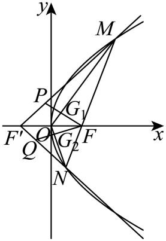
> 

> 
> |  |  |
> | --- | --- |
> | （1）求的方程； | （2）求的轨迹方程； |
> 

  
（3）若，求的取值范围.

【例6】（2024•华大新高考联盟模拟）已知椭圆短轴长为2，左、右焦点分别为，，过点的直线与椭圆交于，两点，其中，分别在轴上方和下方，，直线与直线交于点，直线与直线交于点．

  
（1）若坐标为，求椭圆的方程；

  
（2）若，求实数的取值范围．

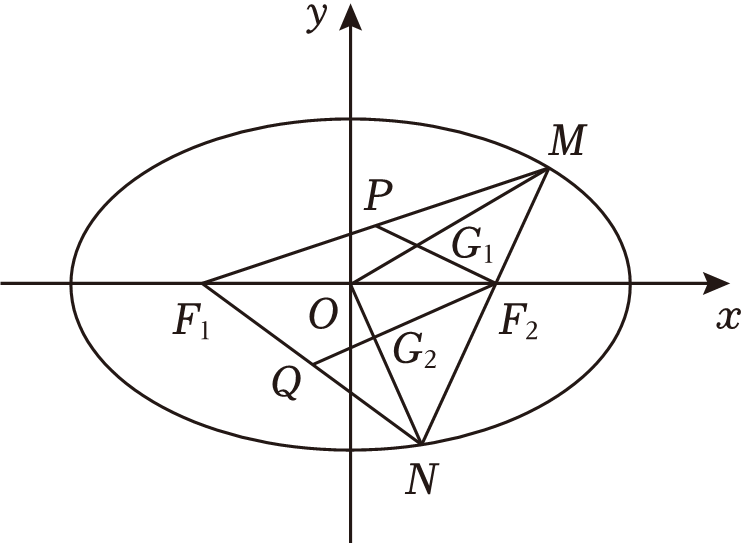

########## 二．焦点弦中点连线隐藏定点与面积转化

【例7】（2024•九省联考T18）已知椭圆，过右焦点的直线交于，两点，过点与垂直的直线交于，两点，其中，在轴上方，，分别为，的中点．当轴时，，椭圆的离心率为．
> 

> 
> |  |  |
> | --- | --- |
> | （1）求椭圆的标准方程； | （2）证明：直线过定点，并求定点坐标； |
> 

  
（3）设为直线与直线的交点，求面积的最小值．

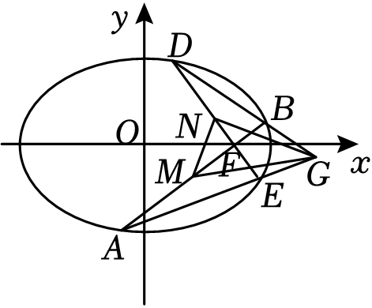

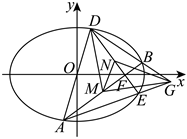

########## 三．焦点弦用角度转化斜率与面积

【例8】（山西省普中市2025年5月高考适应训练考试T19）已知椭圆的离心率为，为*C*上一点．  
（1）求*C*的方程．

  
（2）过*C*的右焦点*F*的直线*l*与*C*交于*D*，*E*两点，记（*O*为坐标原点）的面积为*S*，过线段*AB*的中点*G*作直线的垂线，垂足为*N*，设直线*DN*，*EN*的斜率分别为，．

（ⅰ）求*S*的取值范围；

（ⅱ）求证：为定值．

########## 四．焦弦中垂线与隐藏面积问题

########## （1）设椭圆焦点弦的中垂线与长轴的交点为，则与之比是离心率的一半（如图）

########## （2）设双曲线焦点弦的中垂线与焦点所在轴的交点为*D*，则与之比是离心率的一半（如图）

  
（3）设抛物线焦点弦的中垂线与对称轴的交点为*D*，则与之比是离心率的一半（如图）

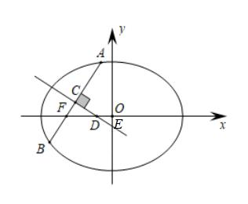

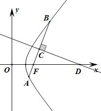

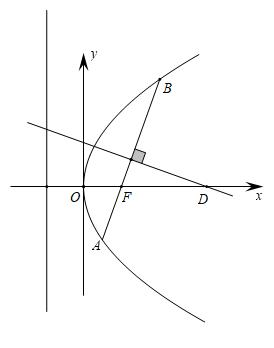

########## （1）证明：根据椭圆焦长公式：，,,

########## ，故．

########## （2）证明：当直线*AB*与双曲线交于一支时，证明过程同椭圆一致；当直线*AB*与双曲线交于两支时，

########## ，,,，其余过程与椭圆一致．

  
（3）证明：抛物线焦点弦公式：；；．

########## ，，故．

我们以椭圆为例来表达线段长度，注意到，，

故

；

【例9】（2024•重庆期末）已知椭圆*C*：（）的左右焦点为、，且，直线*l*过且与椭圆*C*相交于*A*、*B*两点，当是线段*AB*的中点时，.  
（1）求椭圆*C*的标准方程；

  
（2）当线段*AB*的中点*M*不在*x*轴上时，设线段*AB*的中垂线与*x*轴交于点*N*，与*y*轴交于点*P*，*O*为椭圆的中心，记的面积为，的面积为，当取得最大值时，求直线*l*的方程.

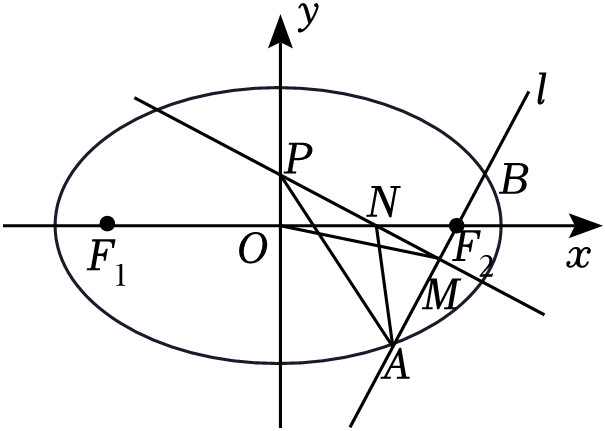

【例10】（福建省厦门市2025届高三第四次质量检测T18）已知椭圆：的右焦点为，离心率为．

  
（1）求的方程；

> 

> 
> |  |  |
> | --- | --- |
> | （2）过点且不垂直于*y*轴的直线与*E*交于*A*，*B*两点，直线与*E*交于点*C*（异于*A*）． | （i）证明：为等腰三角形； |
> 

（ii）若点*M*是的外心，求面积的最大值．

########## 五 隐藏的焦弦常数与三角形面积比值转化

########## 关于焦弦常数　设点为椭圆或双曲线上任一点，过焦点分别作弦、，设，，则．

########## 推广 如果将焦点换成、，则．

########## 证明 对，利用定比点差法易得：．两式相减即证.
所以说，焦弦常数是轴点弦的特殊性质，具体说来是双对称轴点弦一定具备的属性，一旦遇到两轴点关于原点对称时，我们不妨想到坐标齐次化和定比点差.

【例11】（2024•湖北四校）设点，是椭圆上一动点，、分别是椭圆的左、右焦点，射线、分别交椭圆于，两点，已知的周长为，且点在椭圆上．
> 

> 
> |  |  |
> | --- | --- |
> | （1）求椭圆的方程； | （2）证明：为定值． |
> 

【例12】（2025•成都外国语）已知椭圆的左、右焦点分别为、，设是第一象限内椭圆上一点，、的延长线分别交椭圆于点、，直线与交于点．

  
（1）当垂直于轴时，求直线的方程；

  
（2）记△与△的面积分别为、，求的最大值．

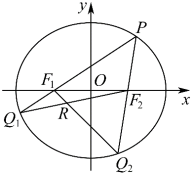

【例13】（2025·湖南长沙市一中·一模T18）已知等轴双曲线，过作斜率为的直线，与双曲线分别交于两点，当时，.

  
（1）求双曲线的方程；

  
（2）若与双曲线的上、下两支相交，点，直线分别与双曲线的上支交于两点.

（i）求直线的斜率的取值范围；

（ii）设和的面积分别为，且，求直线的方程.

【例14】（2024•日照三模）已知双曲线的中心为坐标原点，右顶点为，离心率为．

  
（1）求双曲线的标准方程；

  
（2）过点的直线交双曲线右支于，两点，交轴于点，且，．

求证：为定值；

记，，的面积分别为，，，若，当时，求实数的范围．

六．焦弦的截距与面积转化问题

【例15】（2019•上海）已知椭圆，，为左、右焦点，直线过交椭圆于，两点．

  
（1）若直线垂直于轴，求；

  
（2）当时，在轴上方时，求、的坐标；

  
（3）若直线交轴于，直线交轴于，是否存在直线，使得，若存在，求出直线的方程；若不存在，请说明理由．

七．焦点准线关联与面积比值转化

【例16】7（2023•湖北模拟）已知椭圆的右顶点为，左焦点为，过点作斜率不为零的直线交椭圆于，两点，连接，分别交直线于，两点，过点且垂直于的直线交直线于点．

  
（1）求证：点为线段的中点；

  
（2）记，，的面积分别为，，，试探究：是否存在实数使得？若存在，请求出实数的值；若不存在，请说明理由．

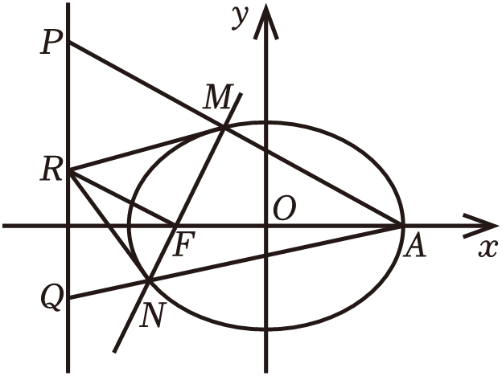

- 焦半径与定比点差转化面积比值

焦点弦焦长公式更多用角度表达，但是一旦涉及一个动点连接两个焦点，那么焦半径公式和定比点差这类坐标翻译的方法就体现出它们的优势.

【例17】7（江西省重点高中协作体2025届高三第二次联考T18）已知点是双曲线的图象上第一象限的任意一点，、分别为的左右焦点.直线，直线交轴于点.

  
（1）已知轴，求直线方程；

  
（2）求证：直线为的角平分线；

  
（3）若直线交于另一点，且，求直线和直线斜率之积.

【例18】7（2023•温州模拟）已知点，分别是双曲线的左右焦点，过的直线交双曲线右支于，两点，点在第一象限．

  
（1）求点横坐标的取值范围；

  
（2）线段交圆于点，记△，△，的面积分别为，，，求的最小值．

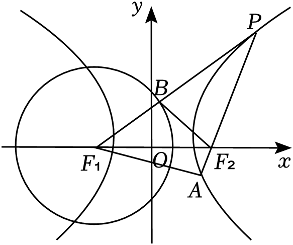

- 坐标面积公式与面积最值

### 一  坐标面积公式推导

在△*ABC*中，已知，，则△*ABC*的坐标面积公式为

．

面积公式的推导不难，处理后续数据成为了关键，我们先看一道高考题.

【例1】（2015•上海）已知椭圆，过原点的两条直线和分别与椭圆交于点、和、，记的面积为．

  
（1）设，，，，用、的坐标表示点到直线的距离，并证明；

  
（2）设，，，求的值；

  
（3）设与的斜率之积为，求的值，使得无论和如何变动，面积保持不变．

【例2】（2025年普通高等学校招生全国统一考试数学预测卷（黑龙江、吉林，辽宁、内蒙古专版）T18）已知点在圆上运动，过点作轴的垂线段，垂足为，点满足，当点经过圆与轴的交点时，规定点与点重合.

  
（1）求动点的轨迹方程.

  
（2）设分别是方程表示的曲线的上、下顶点，、是直线与曲线的两个交点.

①若直线*AC*的斜率与直线*BD*的斜率满足，求证：直线*CD*过定点.

②当变化时、试探究（为坐标原点）的面积是否存在最大值？若存在，请求出最大值；若不存在，请说明理由.

二 坐标面积公式与柯西不等式求最值

【例3】已知，为椭圆*C*：（）的左、右焦点.点*M*为椭圆上一点，当取最大值时，.  
（1）求椭圆*C*的方程；

  
（2）点*P*为直线上一点（且*P*不在*x*轴上），过点*P*作椭圆*C*的两条切线*PA*，*PB*，切点分别为*A*，*B*，点*B*关于*x*轴的对称点为，连接交*x*轴于点*G*.设，的面积分别为，，求的最大值.

【例4】已知*O*为坐标原点，*M*是椭圆：上的一个动点，点*N*满足，设点*N*的轨迹为曲线.

  
（1）求曲线的方程.

  
（2）若点*A*，*B*，*C*，*D*在椭圆上，且，*AC*与*BD*交于点*P*，点*P*在上.证明：的面积为定值.

【例5】已知椭圆*C*：（*a*＞*b*＞0）的离心率是，点在椭圆*C*上.  
（1）求椭圆*C*的标准方程．

  
（2）已知，直线*l*：（）与椭圆*C*交于*A*，*B*两点，若直线*AP*，*BP*的斜率之和为0，试问的面积是否存在最大值？若存在，求出该最大值；若不存在，请说明理由.

  
（1），，即即,所以

  
（2），，,, 即

【例6】（2024·福建师大附中模拟）已知双曲线*C*：（*a*＞0，*b*＞0）的虚轴长为4，直线为双曲线*C*的一条渐近线.  
（1）求双曲线*C*的标准方程；

  
（12）记双曲线*C*的左、右顶点分别为*A*，*B*，过点的直线*l*与双曲线交于*M*，*N*两点，直线*MA*交*y*轴于点*P*，直线*NB*交*y*轴于点*Q*，记的面积为，的面积为，求证：为定值.

- 面积比值转化问题

本节介绍关于面积比值问题，面积比值，通常需要一个定点定值的方向指引，要通过定点定值进行转化，主要转化方向是坐标和斜率，所以之前涉及的极点极线背景成为了解题的突破口，圆锥曲线不能脱离极点极线而独立存在,在技法的上一层，一定是背景和本质.

- 利用极点极线关系将坐标转化面积比

【例1】（2024•渭南模拟）已知椭圆的上、下顶点分别为，，点，在椭圆内，且直线，分别与椭圆交于，两点，直线与轴交于点．已知．

  
（1）求椭圆的标准方程；

  
（2）设的面积为，的面积为，求的取值范围．

【例2】7（2024•重庆期末）已知点与，动点满足直线，的斜率之积为，则点的轨迹为曲线．

  
（1）求曲线的方程；

  
（2）若点在直线上，直线，分别与曲线交于点，，求与面积之比的最大值．

- 隐藏定点的斜率关系构造面积最值问题

【例3】（2025•江苏扬州高邮市月考T19（25陪跑课学员潘思宇提问））已知椭圆的一个焦点坐标是，短轴长是长轴长的．

  
（1）求椭圆的方程；

  
（2）过点的直线交椭圆于，两点，与轴交于点，点关于轴的对称点为，直线交轴于点，求证：为定值；

  
（3）设椭圆的左、右顶点分别为，，直线交椭圆于，两点，与，均不重合），记直线的斜率为，直线的斜率为，且，设△，△的面积分别为，，求的最大值．

【例4】（2024•合肥模拟）已知双曲线过点，（其中，且双曲线上的点到其两条渐近线的距离之积为．

  
（1）求双曲线的标准方程；

  
（2）记为坐标原点，双曲线的左、右顶点分别为，，为双曲线上一动点（异于顶点），为线段的中点，为直线上一点，且，过点作于点，求面积的最大值．

【例5】7（2024•南宁二模）已知双曲线的左、右焦点分别为，，双曲线的虚轴长为2，有一条渐近线方程为，如图，点是双曲线上位于第一象限内的点，过点作直线与双曲线的右支交于另外一点，连接并延长交双曲线左支于点，连接与，其中垂直于的平分线，垂足为．

（Ⅰ）求双曲线的标准方程；

> 

> 
> |  |  |
> | --- | --- |
> | （Ⅱ）求证：直线与直线的斜率之积为定值； | （Ⅲ）求的最小值． |
> 

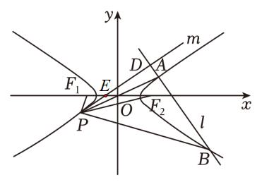

三．隐藏调和线束斜率关系与面积转化

【例6】（2025·黑龙江哈三中·二模T19）椭圆与圆和圆都外切．  
（1）求椭圆*E*的方程；

  
（2）设*A*，*B*分别为椭圆*E*的左右顶点，*F*为椭圆的右焦点，*K*为椭圆*E*上动点（异于*A*，*B*），直线与椭圆*E*交于另一点*H*．若直线与交于点*P*，求证：点*P*在定直线*l*上；

  
（3）在（2）的条件下，设直线与直线*l*交于*Q*点，椭圆*E*在点*K*处的切线与*l*交于*R*，

①求证：．

②求面积取最小值时*K*点的横坐标．

【例7】（2025·江西鹰潭·二模T18）在平面直角坐标系中，已知是椭圆的左右焦点，以为直径的圆和椭圆在第一象限的交点为，若三角形的面积为1，其内切圆的半径为．

  
（1）求椭圆的标准方程；

  
（2）若点是椭圆的上顶点，过点的直线与椭圆交于两点，其中点在第一象限，点在轴下方且不在轴上，设直线，的斜率分别为

（ⅰ）若，求出的值；

（ⅱ）设直线与轴交于点，求的面积*S*的最大值．

四． 由中点隐藏轨迹方程构造面积最值问题

【例8】（2025·福建南平·三模T18）在平面直角坐标系中，已知椭圆的右顶点为，过的焦点且垂直于轴的弦长为2.

  
（1）求的方程；

  
（2）过点作斜率之积为1的两条不同的直线，若交于两点，交于两点，为的中点，直线与交于点.

①证明：为的中点；

②求面积的最大值.

【例9】（山东省济南市2025高三上学期期末T18(25届陪跑课学员潘思宇提问)） 已知椭圆的离心率为左、右焦点分别是过的直线与*C*交于*M*，*N*两点的周长为  
（1）求*C*的标准方程；

  
（2）若记线段*MN*的中点为

（ⅰ）求*R*的坐标；

（ⅱ）过*R*的动直线*l*与*C*交于*P*，*Q*两点，*PQ*，*PN*的中点分别是*S*和*T*，求面积的最大值.

五． 由单动点三角换元构造面积比

【例10】（湘豫名校联考2024-2025学年高三下学期第三次模拟考试T18）已知椭圆的左、右顶点分别为，，双曲线以椭圆的长轴为实轴，的渐近线方程为.

  
（1）求双曲线的标准方程；

  
（2）在第二象限内取椭圆上的一点，连接并延长，与双曲线交于另一点，连接并延长，交椭圆于另一点，若，求四边形的面积；

  
（3）在（2）的条件下，从直线上取两个不同的点，，使得的面积为45，问：的正切值是否存在最大值？若存在，请求出最大值；若不存在，请说明理由.

【例11】（2024•湖北模拟）在平面直角坐标系中，已知圆和圆的方程分别为和，以坐标原点为端点作射线，与圆和圆分别交于，两点．过作轴的垂线，过作轴的垂线，两垂线交于点，设点的轨迹为．

  
（1）求点的轨迹的方程；

  
（2）若曲线与轴交于两点，（点位于点上方）．已知点，，直线，分别和曲线交于点，，直线交轴于点，求的取值范围．

【例12】（2023•鹿城区模拟）已知椭圆的上、下顶点分别为，，抛物线在点处的切线交椭圆于点，，交椭圆的短轴于点．直线交轴于点．

（Ⅰ）若点是的中点，求的值；

（Ⅱ）设与的面积分别为，，求的最大值．

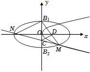

【例13】（安徽省合肥市2025届高三下学期5月教学质量检测T18）已知抛物线：，过抛物线焦点且斜率为的直线与交于，两点（点在第一象限），已知线段中点纵坐标为.

  
（1）求抛物线方程；

  
（2）点在抛物线上移动，位于，两点之间且与，两点不重合.若直线交准线于点，直线交准线于点，其中点在点的上方.

> 

> 
> |  |  |
> | --- | --- |
> | （i）是否存在点，使？若存在，求出点坐标，若不存在，请说明理由； | （ii）求线段长度最小值. |
> 

六.共轭点面积等比中项模型

椭圆,过点的直线交椭圆于两点,点在M对应极线上,且与AB交于点P，,则

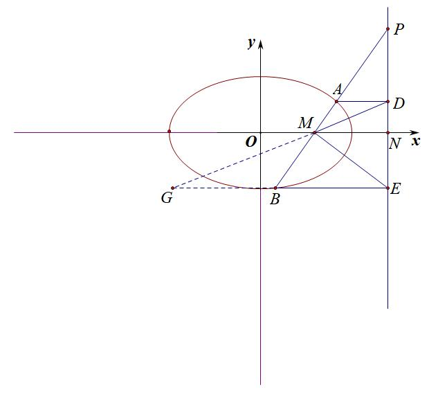

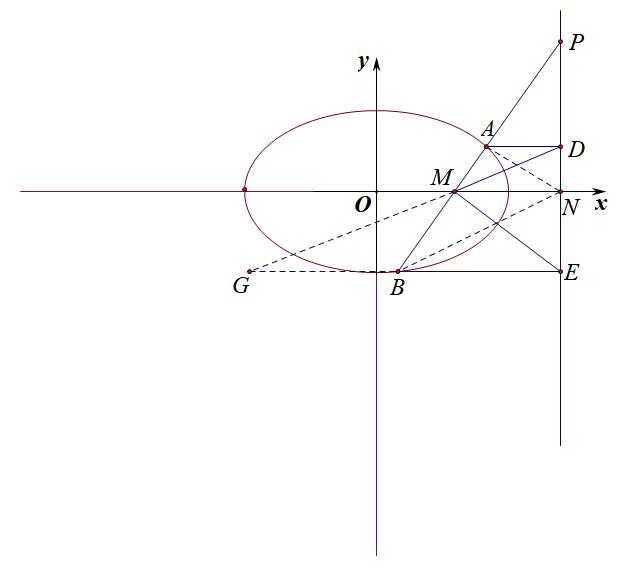

证明：延长交于,以M为射影中心，，由于，故，由于,所以	,

所以;同理可证.

【例14】（2024•大连期末）已知双曲线，点，经过点的直线交双曲线于不同的两点、，过点、分别作双曲线的切线，两切线交于点．（二次曲线在曲线上某点，处的切线方程为

（Ⅰ）求证：点恒在一条定直线上；

（Ⅱ）若两直线与交于点，，，求的值；

（Ⅲ）若点、都在双曲线的右支上，过点、分别作直线的垂线，垂足分别为、，记，，的面积分别为，，，问：是否存在常数，使得？若存在，求出的值；若不存在，请说明理由．

- 双圆锥曲线的双动点构造面积比

此类型题通常两个不相似的三角形，有五个点需要借助斜率关系进行转化，所以齐次化的隐藏斜率关系是关键，当然利用对合方程也很无敌，尤其我们本书第三章介绍的中点弦第三条边的斜率关系也非常关键.

【例15】（广东省深圳市2023高二下学期期末）已知双曲线的离心率为，且的一个焦点到其一条渐近线的距离为1.

  
（1）求的方程；

  
（2）设点为的左顶点，若过点的直线与的右支交于两点，且直线与圆分别交于两点，记四边形的面积为，的面积为，求的取值范围.

【例16】（2024·黑龙江佳木斯·三模）已知椭圆：，的左右顶点分别为*A*，*B*，长轴长为4，点*D*为椭圆上与*A*，*B*不重合的点，且．  
（1）求椭圆方程；

  
（2）（i）一条垂直于*x*轴的动直线*l*交椭圆于*P*，*Q*两点，当直线*l*与曲线相切于点*A*或点*B*时，看作*P*，*Q*两点重合于点*A*或点*B*，求直线与直线交点*E*的轨迹的方程；

（ii）过的直线*l*与曲线交于*M*，*N*两点，且两交点均在*y*轴右侧，直线与曲线交于*G*点，直线与曲线交于*H*点，记的面积为，记的面积为，求的取值范围．

【例17】（25高二下·浙江阶段练习）已知离心率为的双曲线：过椭圆：的左，右顶点*A*，*B*.

  
（1）求双曲线的方程；

  
（2）是双曲线上一点，直线*AP*，*BP*与椭圆分别交于*D*，*E*，设直线*DE*与*x*轴交于，且，记与的外接圆的面积分别为，，求的取值范围.

