- 新定义下的斜率调整与仿射

- 斜率调整法

一．曲线上双定点单动点斜率调整原理

如图，，为椭圆上三点，令，，

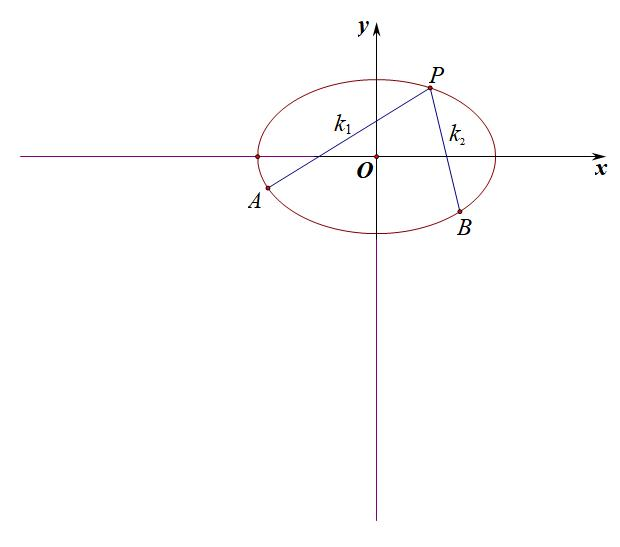

利用点差法可知：，再利用等比定理，，分子分母中利用B点替换，即可得到。

例如：为椭圆上动点，均为椭圆上的点，，，求与的关系。

易知：，

分子：，分母：，代入，即，所以，所以，即

与之前的斜率对合情况不同的是，对合强调射影变换，需要对合轴与对合中心的对应，而斜率调整更为广泛。

【例1】（2016•北京）已知椭圆过点，两点．

  
（1）求椭圆的方程及离心率；

  
（2）设为第三象限内一点且在椭圆上，直线与轴交于点，直线与轴交于点，求证：四边形的面积为定值．

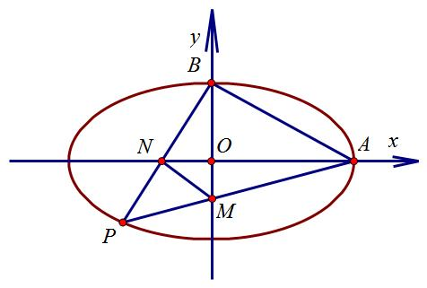

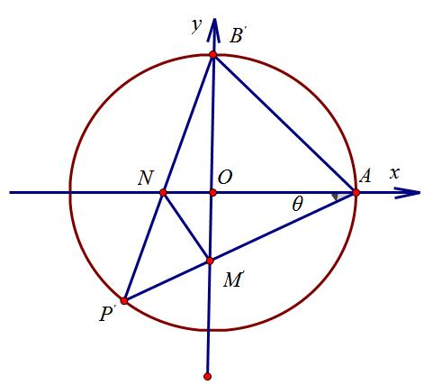

【例2】（2&lt;text st<em>y</em>le="subscript"&gt;0&lt;/text&gt;25•兴庆区校级一模（25届陪跑课学员武陵春提问））已知椭圆 $\frac{x^{2}}{a^{2}}+\frac{y^{2}}{b^{2}}=1，(a＞b＞0)$ 的短轴长为2，且过点 $(1，\frac{\sqrt{3}}{2})$ ，设点&lt;te&lt;text st<em>y</em>le="italic"&gt;x&lt;/text&gt;t style="italic"&gt;P&lt;/text&gt;（x&lt;text style="subscript"&gt;0&lt;/text&gt;，y0）为椭圆在第一象限内一点．  
（1）求椭圆方程；  
（2）设椭圆的左顶点为*A*，下顶点为*B*，线段*AP*交*y*轴于点*C*，线段*BP*交*x*轴于点*D*，若△*PAB*的面积是△*PCD*的6倍，求*P*点的坐标；  
（3）点<em>P</em>关于原点的对称点为<em>Q</em>，点<em>R</em>（<em>x</em>0，0），点<em>T</em>为<em>PR</em>中点，<em>QT</em>的延长线交椭圆于点<em>S</em>，当∠<em>QPS</em>最大时，求直线<em>PQ</em>方程．

二．斜率调整与斜率表示

【例3】（2023•北京）已知椭圆的离心率为，、分别为的上、下顶点，、分别为的左、右顶点，．

  
（1）求的方程；

  
（2）点为第一象限内上的一个动点，直线与直线交于点，直线与直线交于点．求证：．

三．斜率调整与对合的综合

【例4】（2024江苏南京师大附中（25陪跑课学员林浩然提问））已知点，在双曲线：上，过点作直线交双曲线于点，（不与点，重合）.证明：

  
（1）记点，当直线平行于轴，且与双曲线的右支交点为时，，，三点共线；

  
（2）直线与直线的交点在定圆上，并求出该圆的方程.

【例5】（江西省九江市2025届高三第三次模拟T18）已知双曲线的左、右顶点分别为，在上，．

  
（1）求的方程；

  
（2）过的直线交于另一点（异于），与轴交于点，直线与交于点，证明：直线过定点．

四．斜率调整背景——斯坦纳定理

【例6】（2025武汉四调T19）如图，椭圆，，已知右顶点为，且它们的交点分别为，，，

  
（1）求与的标准方程；

  
（2）过点作直线，交于点，交于点，设直线的斜率为，直线的斜率为，求；（上述各点均不重合）

  
（3）点是上的动点，直线交于点，直线交于点，直线交于点，直线与直线交于点，求点坐标，使直线与直线的斜率之积为定值．（上述各点均不重合）

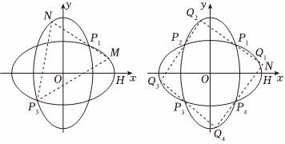

背景：

斯坦纳定理：

1.点的斯坦纳定理

二次曲线任取两个点*X*、*Y*作为定点，则有*A*是曲线上任意一点，线*AX*与线*AY*是射影对应的；此射影对应具有传递性，且逆定理成立

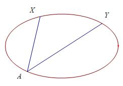

2.线的斯坦纳定理

二次曲线任取两切线*x*,*y*.对于任意动切线*a*，*a*与*x*的交点为*A*，*a*与*y*的交点为*B*，则*A*、*B*互为射影对应，此射影对应也具有传递性，且逆定理成立

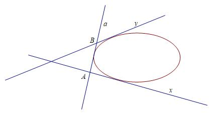
由斯坦纳定理可知：

与射影对应，与射影对应，与射影对应，所以可得，与射影对应，即与射影对应。所以由斯坦纳定理可知，的轨迹是二次曲线，且和在此轨迹上。当为上顶点的时候，与H重合，即H点也在轨迹上，且由对称性可知H为顶点。所以G的轨迹即为另一个顶点，这样满足曲线的第三定义.

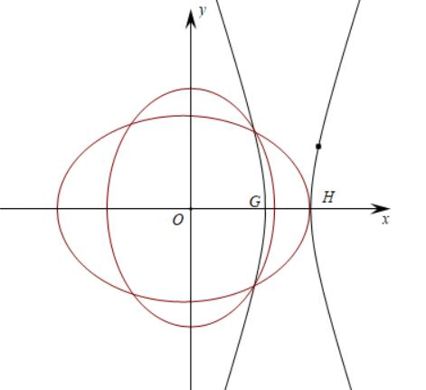

第二节 仿射法与面积转化

关于化椭为圆的仿射法，在处理面积问题时候能够达到出奇制胜，我们可以通过仿射法来理解问题，同时也可以按照一些三角换元来解读，现在课本上以及出现仿射法，高考直接用也不担心被扣分。

我们用不同倾斜度的平面与此圆锥面相截，就可得到各种类型的圆锥截线（conic sections），我们介绍了比利时数学家 G. P. Dandelin 用纯几何方法证明了圆锥截线就是二次曲线，圆锥面的各种截线，凡是不退化的，都能与作为底圆的二阶点列相互射影（射影中心为圆锥的顶点），因而它们都是二阶点列，我们统称圆锥曲线（conic，或二次曲线）.

如图所示，以圆锥的顶点*S*作为射影中心，作为二阶线束，在不同的截面进行下形成的各种二阶点列，所以，我们通过二阶点列的交比不变性，来进行化椭为圆的仿射变换，主要针对高考一些问题的化繁为简。

########## 一：仿射法与面积变化

仿射法定理一（直径三角形）：若经过椭圆的对称中心的直线构成的直径三角形，则两条弦的斜率乘积

仿射法定理二（面积伸缩定理）：（拉伸短轴）；（压缩长轴）

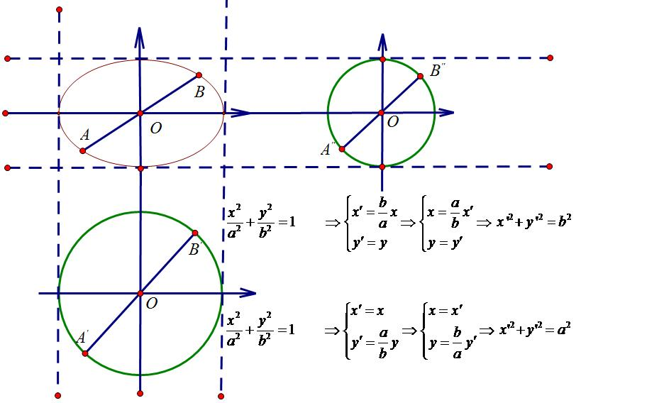

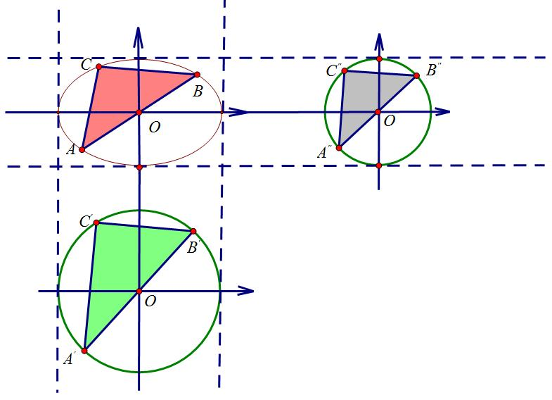

########## 拉长短轴后点的坐标变化：,横坐标不变，纵坐标拉伸倍．

########## 斜率的变化：如图纵坐标拉 伸了倍，故，由于．

########## (水平宽不变，铅锤高缩小)

########## 压缩长轴后点的坐标变化：,纵坐标不变，横坐标缩小倍．

########## 斜率的变化：如图横坐标缩小了倍，故，由于．

########## （水平宽扩大，铅垂高不变）

【例1】（2025•长沙岳麓区期中考试T18）对于椭圆，令，，那么在坐标系中，椭圆经伸缩变换得到了单位圆，在这样的伸缩变换中，有些几何关系保持不变，例如点、直线、曲线的位置关系以及点分线段的比等等；而有些几何量则等比例变化，例如任何封闭图形在变换后的面积变为原先的，由此我们可以借助圆的几何性质处理一些椭圆的问题．

  
（1）在原坐标系中斜率为的直线，经过，的伸缩变换后斜率变为，求与满足的关系；

  
（2）设动点在椭圆上，过点作椭圆的切线，与椭圆交于点，，再过点，分别作椭圆的切线交于点，求点的轨迹方程；

  
（3）点在椭圆上，求椭圆上点，的坐标，使得的面积取最大值，并求出该最大值．

【例2】（江苏省淮阴中学、丹阳中学等G4联盟2025届高三下学期4月阶段检测T18）椭圆：过点，离心率为.过原点的直线交椭圆于*A*，*B*两点，点*C*，*D*在椭圆*E*上，且满足，设直线与交于点*F*.  
（1）求椭圆*E*的方程；  
（2）求*F*点的轨迹方程；

  
（3）设直线与*F*点的轨迹交于*M*，*N*两点，求证：的面积为定值.

【例3】（2025·四川自贡·三模T18）平面直角坐标系中，点，动点满足以为直径的圆与圆内切，记点的轨迹为曲线.

  
（1）求曲线的方程；

> 

> 
> |  |  |  |
> | --- | --- | --- |
> | （2）是曲线上的任意一点，过斜率存在的直线交曲线于两不同点*A*、*B*，射线交曲线于点. | （ⅰ）证明：为定值； | （ⅱ）求面积的取值范围. |
> 

【例4】（安徽省合肥市第八中学2024-2025学年高三下学期第三次模拟考试T19）在平面直角坐标系中，*O*为坐标原点，线段*AB*的两个端点分别在*x*轴，*y*轴上滑动，，点*M*是线段*AB*上一点，且，点*M*随线段*AB*的滑动而运动．

  
（1）求动点*M*的轨迹的方程；

  
（2）直线与交于*C*，*D*两点，若直线*OC*，*OD*的斜率之积为，求*k*的值；

  
（3）若点*P*，*Q*，*R*，*S*在上，动点*N*在内，点*O*，*N*，*P*，*R*四点共线，且，求四边形*PQRS*面积的最大值．

【例5】（江西省重点中学盟校2024-2025学年高三下学期第二次联考T19）仿射变换是处理圆锥曲线综合问题的一类特殊而又巧妙的方法，它充分利用了椭圆与圆的关系，具体的解题方法为：对于椭圆，可由仿射变换，则椭圆的方程变为，直线的斜率与原斜率的关系为，图形的面积与原面积的关系为.现已知椭圆方程为，离心率为，为坐标原点，为椭圆的左、右焦点，为椭圆上一点，的面积的最大值为.

  
（1）求椭圆的标准方程；

  
（2）设直线的斜率分别为，两直线的夹角为，试写出与之间的关系式（不必证明）；

  
（3）过点作交椭圆于点，试利用仿射变换的方法求的面积的最大值.

########## 二：切点圆面积最值

########## 若椭圆内含有圆与直线相切，如图直线与圆相切于，交椭圆于点*A*,*B*求的最大值，

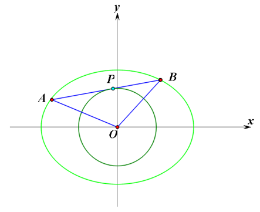

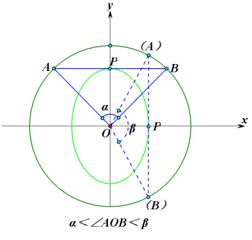

首先进行仿射变换： ，令 ，拉伸后可知，，故当最大时，，关键在于看的取值范围；

根据几何性质，平行于*x*轴时，最小，平行于轴*y*时，最大．

【例6】（湖南省名校联合体2025届高三考前仿真模拟数T19）已知椭圆的长轴长为，左、右焦点分别为，直线与交于*P*，*Q*两点，且满足（为坐标原点），当变化时，面积的最大值为．
> 

> 
> |  |  |
> | --- | --- |
> | （1）求的方程； | （2）证明：； |
> 

  
（3）过点和线段*PQ*的中点作一条直线与交于*R*，*S*两点，求四边形*PRQS*面积的取值范围．

（黑龙江省哈尔滨市第六中学校2024-2025学年高三下学期第四次模拟T19）椭圆的左，右焦点分别为，，过的直线交于，两点（点位于轴上方），为坐标原点.

  
（1）若，求的值；

  
（2）已知二次曲线在点处的切线方程为，现过，两点作的两条切线相交于点，求面积的最小值.

【例7】（2024•江苏模拟）在平面直角坐标系中，已知椭圆的离心率为，直线与相切，与圆相交于，两点．当垂直于轴时，．

  
（1）求的方程；

  
（2）对于给定的点集，，若中的每个点在中都存在距离最小的点，且所有最小距离的最大值存在，则记此最大值为．

（ⅰ）若，分别为线段与圆，为圆上一点，当的面积最大时，求；

（ⅱ）若，均存在，记两者中的较大者为．已知，，均存在，证明：，，，．

【例8】（2018•江苏卷）如图，在平面直角坐标系中，椭圆过点，焦点，圆的直径为．

  
（1）求椭圆及圆的方程；

  
（2）设直线与圆相切于第一象限内的点．

①若直线与椭圆有且只有一个公共点，求点的坐标；

②直线与椭圆交于、两点．若的面积为，求直线的方程．

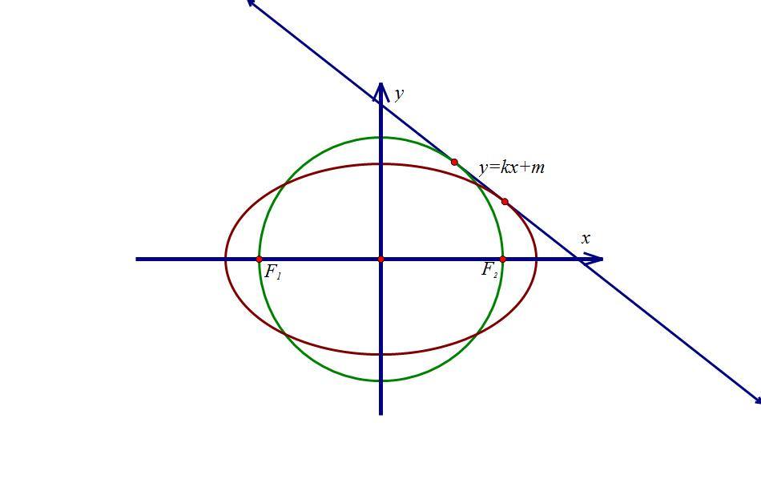

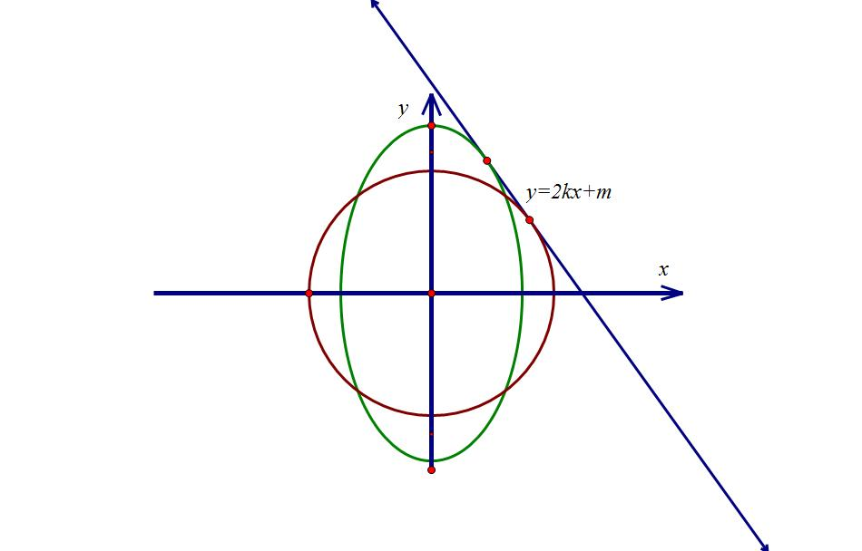

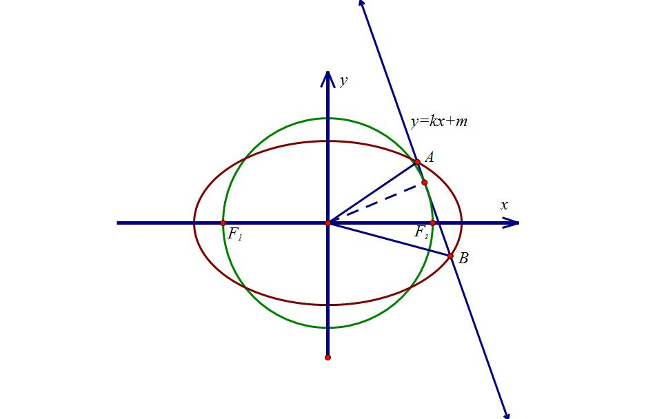

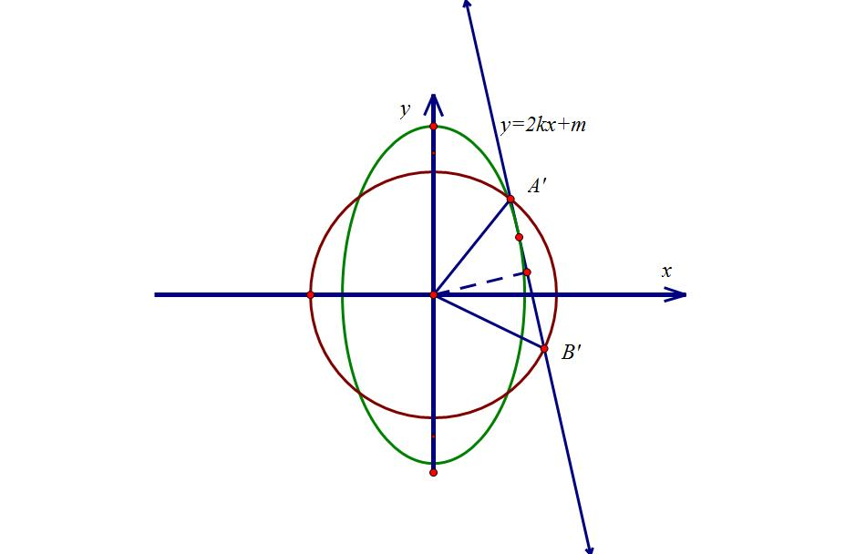

########## 三：斜率乘积能仿射成直角的面积定值问题

########## 仿射法定理四：若以椭圆的对称中心引出两条直线交椭圆于*A、B*两点，且,则经过仿射变换后，所以为定值。我们给一下证明：

法一：联立设直线代入坐标面积公式

设，则，设，，

由，同理可得，

由坐标面积公式可得．

法二：三角换元

设，，则，即，故，因此，由坐标面积公式可得．

此法完美还原了仿射法的数形本质,强烈推荐此法.

法三：点乘法代入面积公式变形

先证点乘法面积公式变形：．

证明： 由，

配方：，即．

再证本题：由于，所以，所以根据，可得：，所以.

仿射法定理五：若，如果直线*OM*、*ON*的斜率都存在，则有，

法一  三角换元

设，，，故

，即，即，进而．

因此，，即．

法二  利用坐标平方和公式变形

先证明：，；

证明：，即；同理：．

，

所以，所以，即．

【例9】（2025·山东滨州·二模T19）在平面直角坐标系中，设，规定：点叫做点的仿射对应点．已知点的轨迹的方程为，点的仿射对应点的轨迹为．

  
（1）求的轨迹方程；

  
（2）设是曲线上的两点，的仿射对应点分别为．和的面积分别记为．求；

  
（3）设是曲线上两点，若的面积为，求证：为定值．

仿射法定理六：若椭圆方程上三点*A*，*B*，*M*，满足①；②；

③；三者等价.

证明：我们仅仅根据③证明①，设<em>A</em>(<em>x</em>1，<em>y</em>1)，<em>B</em>(<em>x</em>2，<em>y</em>2)，则，．

又设*M*(*x*，*y*)，满足，故因为*M*在椭圆上，所以．整理得．

所以．所以．

【例10】（2024•昆明模拟）如图，矩形中，，，、、、分别是矩形四条边的中点，设，，设直线与的交点在曲线上．

  
（1）求曲线的方程；

  
（2）直线与曲线交于，两点，点在第一象限，点在第四象限，且满足直线与直线的斜率之积为，若点为曲线的左顶点，且满足，直线与交于，直线与交于．

①证明：为定值；

②是否存在常数，使得四边形的面积是面积的倍？若存在求出，若不存在说明理由．

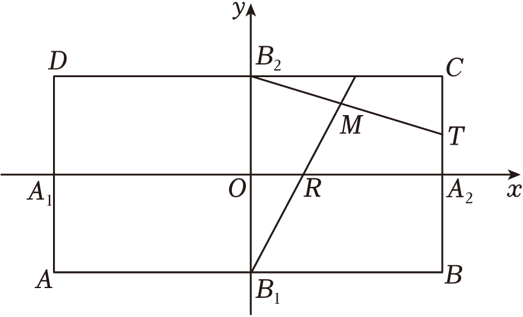

【例11】（2024•阜阳模拟）如图，各边与坐标轴平行或垂直的矩形内接于椭圆，其中点，分别在第三、四象限，边，与轴的交点为，．

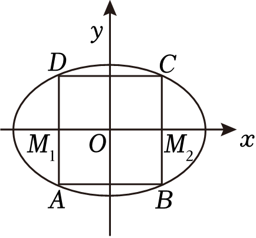

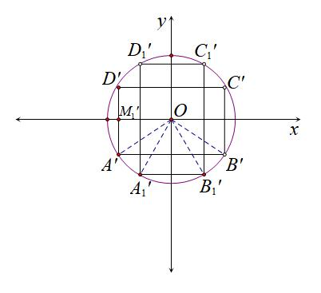

  
（1）若，且，为椭圆的焦点，求椭圆的离心率；

  
（2）若是椭圆的另一内接矩形，且点也在第三象限，若矩形和矩形的面积相等，证明：是定值，并求出该定值；

  
（3）若是边长为1的正方形，边，与*y*轴的交点为，，设，2，，是正方形内部的100个点，记，其中，2，3，4．证明：，，，中至少有两个小于81．

########## 四  重心三角形面积定值问题

仿射定理七：已知椭圆：，则以*O*为重心的内接三角形的面积是一定值.

证明：先将先按着进行仿射变换，则仿射后圆方程为.如图所示，圆心*O*既是变换后三角形的重心又是外心，则内接三角形变成了等边三角形，此时其面积为

由此知.

【例12】已知点，直线*l*：，为平面内的动点，过点*P*作直线*l*的垂线，垂足为*H*，且.

  
（1）求动点的轨迹的方程；

  
（2），，为曲线上不同的三点，*O*为坐标原点，若，试问：△*ABC*的面积是否为定值？若是，请求出定值：若不是，请说明理由.

########## 五  直径三角形面积最值问题

【例13】7（2019•新课标Ⅱ）已知点，，动点满足直线与的斜率之积为．记的轨迹为曲线．

  
（1）求的方程，并说明是什么曲线；

  
（2）过坐标原点的直线交于，两点，点在第一象限，轴，垂足为，连结并延长交于点．

证明：是直角三角形；

求面积的最大值．

关于双曲线仿射，其原理相对难理解，但是三角换元却是一种能贯穿的存在，我们不妨用三角换元来解读双曲线的直径三角形问题.

【例14】7（2024•大连期末）已知双曲线的离心率为，经过坐标原点的直线与双曲线交于，两点，点，位于第一象限，，是双曲线右支上一点，，设

  
（1）求双曲线的标准方程；

  
（2）求证：，，三点共线；

  
（3）若面积为，求直线的方程．

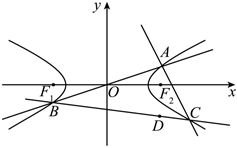

