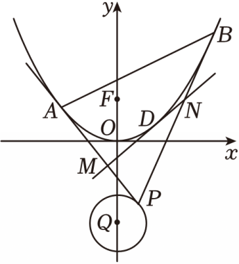
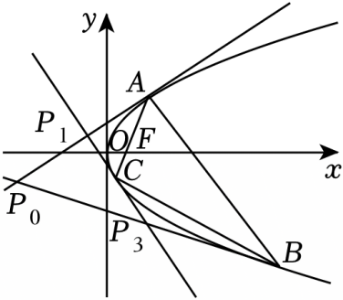
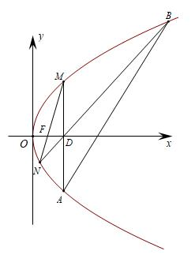
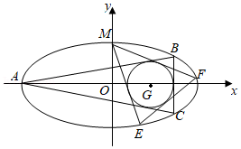
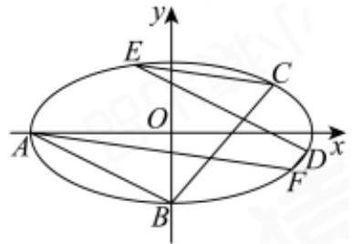
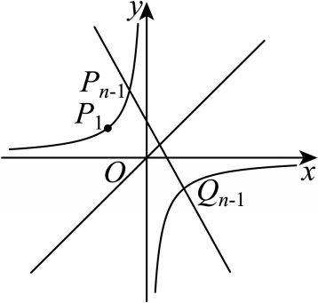
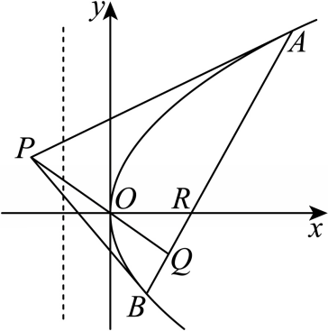
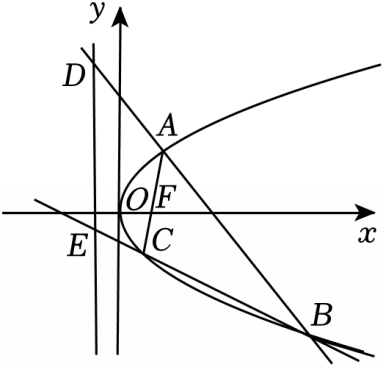
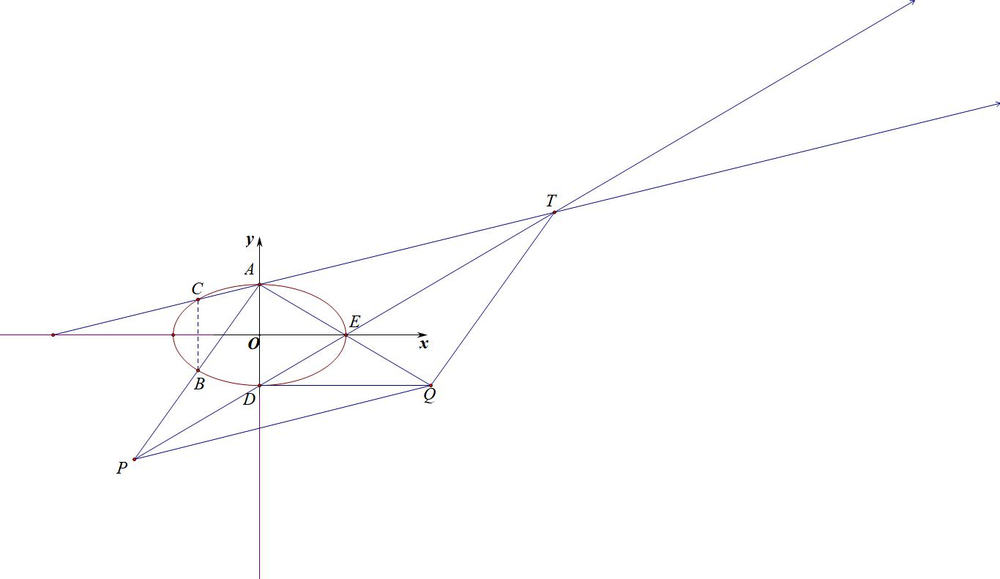

达标训练

1.（2025•北碚区期末）已知对任意平面向量，把绕其起点沿逆时针方向旋转角得到向量，叫做把点绕点沿逆时针方向旋转角得到点．将双曲线上的每一点绕坐标原点沿逆时针方向旋转后得到曲线．点在上，其横坐标为．再按照如下方式依次构造点，3，：过作斜率为的直线与曲线交于另一点，令为关于直线的对称点，记的坐标为，．

  
（1）求曲线的方程；

> 

> 
> |  |  |
> | --- | --- |
> | （2）求数列，的通项公式； | （3）求证：． |
> 

2.（2025•榆林模拟）已知双曲线的实轴长为2，顶点到渐近线的距离为．

  
（1）求双曲线的方程；

  
（2）若直线与的右支及渐近线的交点自上而下依次为，，，，证明：；

  
（3）在数学中，可利用“循环构造法”求方程的整数解．例如：求二元二次方程的正整数解，由可先找到该方程的初始解记此解对应的点为，进一步可得点，，，，，．设由“循环构造法”得到方程的正整数解对应的点列为：，，，，，，，，，，记，试判断是否为定值？若是定值，求出该定值；若不是定值，请说明理由．

3.（2025•新乡期末）已知动圆经过定点，且与直线相切，设动圆圆心的轨迹为曲线．已知点与点关于轴对称，过点作斜率为1的直线交于点，点与点关于轴对称，过点作斜率为1的直线交于点，按照如此方法构造点，，．

  
（1）求曲线的方程；

  
（2）证明为等差数列，并求出的通项公式；

  
（3）记求数列的前项和．

4.（2025•山东名校联盟2月份开学考18题）在直角坐标系中，点到点的距离比到轴的距离大，记动点的轨迹为．

  
（1）求的方程；

  
（2）过上一点作抛物线的两条切线，切点分别为，．

（ⅰ）设，，若，，求点坐标；

（ⅱ）设两直线、与在轴上方（包括轴）的交点分别为，，或，，，，记三角形和四边形面积分别为，，若，恒成立，求的最大值．

5.（2025•吉林期末）已知动点（不与坐标原点重合）在曲线上运动，为线段中点，记的轨迹为曲线．

  
（1）求的轨迹方程；

> 

> 
> |  |  |  |
> | --- | --- | --- |
> | （2）为不在轴上的动点，过点作（1）中曲线的两条切线，切点为，；直线与垂直为坐标原点），与轴的交点为，与的交点为， | （ⅰ）求证：是一个定点； | （ⅱ）求的最小值． |
> 

6.（2024•深圳龙岗区模拟）过抛物线外一点作抛物线的两条切线，切点分别为，，我们称为抛物线的阿基米德三角形，弦与抛物线所围成的封闭图形称为相应的“囧边形”，且已知“囧边形”的面积恰为相应阿基米德三角形面积的三分之二．如图，点是圆上的动点，是抛物线的阿基米德三角形，是抛物线的焦点，且．

  
（1）求抛物线的方程；  
（2）利用题给的结论，求图中“囧边形”面积的取值范围；

  
（3）设是“囧边形”的抛物线弧上的任意一动点（异于，两点），过作抛物线的切线交阿基米德三角形的两切线边，于，，证明：．

7.（2024•铁东区模拟）一般地，抛物线的三条切线围成的三角形称为抛物线的切线三角形，对应的三个切点形成的三角形称为抛物线的切点三角形．如图，△，△分别为抛物线的切线三角形和切点三角形，为该抛物线的焦点．当直线的斜率为时，中点的纵坐标为．

  
（1）求．

  
（2）若直线过点，直线，分别与该抛物线的准线交于点，，记点，的纵坐标分别为，，证明：为定值．

  
（3）若，，均不与坐标原点重合，证明：．

8.(2022全国甲卷)已知抛物线焦点为，点过焦点做直线交抛物线于两点，当轴时，.  
（1）求抛物线方程

  
（2）若直线与抛物线的另一个交点分别为.若直线，的倾斜角为，当最大时，求的方程

9.(2021浙江)如图，已知点是轴左侧(不含轴)一点，抛物线上存在不同的两点，满足，的中点均在上.

(I)设中点为，证明:垂直于轴;

(II)若是半椭圆上的动点，求面积的取值范围.

10.（2025•湖北模拟）已知椭圆的离心率为，左、右焦点分别为，．椭圆的上、下顶点分别记为、，右顶点为．

  
（1）求的方程；

  
（2）过上顶点作直线与的延长线交于，与椭圆交于，点关于轴的对称点为．延长交的延长线于，过作轴的平行线交的延长线于点，连接、．

记直线与直线的斜率分别为，，求的值；

证明：．

11.(2024•北京专家信息卷)已知椭圆的离心率，且过点.

  
（1）求椭圆的方程;

  
（2）设，为椭圆的左.右顶点，直线与椭圆交于，两点，点关于原点的对称点为，直线与直线交于点，求证:直线与直线的交点在定直线上.

12.（2024•河南月考）如图，已知圆的方程为是椭圆

的内接的内切圆，其中为椭圆的左顶点，且．

  
（1）求椭圆的标准方程；

  
（2）过点作圆的两条切线交椭圆于，两点，试判断直线与圆的位置关系并说明理由．

13.（2025•MST陪跑课成员提问）已知椭圆  的左顶点为  ,下顶点为  . 且过点  .

  
（1）求点  的坐标；

  
（2）若直线  上存在一点  ,  上存在一点  ,使  是以  为直角顶点的等腰直角三角形,求实数  的取值范围；

  
（3）若椭圆  上的三个动点  ,  ,  满足  ,证明:  .

达标训练

1.（2025•北碚区期末）已知对任意平面向量，把绕其起点沿逆时针方向旋转角得到向量，叫做把点绕点沿逆时针方向旋转角得到点．将双曲线上的每一点绕坐标原点沿逆时针方向旋转后得到曲线．点在上，其横坐标为．再按照如下方式依次构造点，3，：过作斜率为的直线与曲线交于另一点，令为关于直线的对称点，记的坐标为，．

  
（1）求曲线的方程；

> 

> 
> |  |  |
> | --- | --- |
> | （2）求数列，的通项公式； | （3）求证：． |
> 

【解析】（1）设上任意一点，将点其绕坐标原点沿逆时针方向旋转后得到点．

那么所以所以又由于．因此，所以，因此．

  
（2）如图，将点，，，代入曲线，可得

作差可得．因此．又由于．

因此．又由于，所以数列为公比为2，首项为的等比数列．

因此，又因为，所以．

  
（3）证明：由于，．

因为数列为等比数列，在数列中，．因此．

2.（2025•榆林模拟）已知双曲线的实轴长为2，顶点到渐近线的距离为．

  
（1）求双曲线的方程；

  
（2）若直线与的右支及渐近线的交点自上而下依次为，，，，证明：；

  
（3）在数学中，可利用“循环构造法”求方程的整数解．例如：求二元二次方程的正整数解，由可先找到该方程的初始解记此解对应的点为，进一步可得点，，，，，．设由“循环构造法”得到方程的正整数解对应的点列为：，，，，，，，，，，记，试判断是否为定值？若是定值，求出该定值；若不是定值，请说明理由．

【解析】（1）因为，所以，因为双曲线的一个顶点为，一条渐近线的方程为：，

所以，解得：，故双曲线的方程为：．

  
（2）证明：设，，，，，，，，因为直线的斜率不为0，设的方程为：，联立可得：，则，

联立可得：，则，

故线段，的中点重合，；

  
（3）因为，所以，，因为二项式与的展开式中不含的项相等，含的项互为相反数，所以解得：

令，，则，直线的方程为：，，，

故为定值1．

3.（2025•新乡期末）已知动圆经过定点，且与直线相切，设动圆圆心的轨迹为曲线．已知点与点关于轴对称，过点作斜率为1的直线交于点，点与点关于轴对称，过点作斜率为1的直线交于点，按照如此方法构造点，，．

  
（1）求曲线的方程；

  
（2）证明为等差数列，并求出的通项公式；

  
（3）记求数列的前项和．

【解析】（1）因为动圆经过定点，且与直线相切，所以动圆圆心到点的距离与到直线的距离相等，因为点不在直线上，由抛物线的定义可知动圆圆心是以为焦点，直线为准线的抛物线，则动圆圆心的轨迹为，故的方程为；

  
（2）易知，，，，，，设直线的方程为，

联立，消去并整理得，所以，即，

则数列是首项为1，公差为1的等差数列，故；

  
（3）易知，所以，则，

当为偶数时，令，此时，

当为奇数时，．故．

4.（2025•山东名校联盟2月份开学考18题）在直角坐标系中，点到点的距离比到轴的距离大，记动点的轨迹为．

  
（1）求的方程；

  
（2）过上一点作抛物线的两条切线，切点分别为，．

（ⅰ）设，，若，，求点坐标；

（ⅱ）设两直线、与在轴上方（包括轴）的交点分别为，，或，，，，记三角形和四边形面积分别为，，若，恒成立，求的最大值．

【解析】（1）设，因为点到点的距离比到轴的距离大，所以，

当时，，对等式两边同时平方并整理得；

当时，，对等式两边同时平方并整理得，

则轨迹的方程为：当时，；当时，；

2. （ⅰ）法一：由题意可知，设，，因为，所以，此时，则直线的方程为．令，解得，即，又，所以，，则，解得（负值已舍去），故点坐标为；

（ⅱ）当点在上时，设，，，，．设，

此时直线的方程为，因为点在直线上，所以，解得，因为，所以，，联立，消去并整理得，解得，设，，，，且，此时，同理得，

所以，则直线的方程为，因为点到直线的距离为，又，所以，当点在上时，设，，，，，，，此时直线的方程为，

因为点在直线上，所以，解得，因为，

所以，，联立，消去并整理得，

解得，设，，，，，，，，

设，．因为四边形为等腰梯形，

所以，

因为，恒成立，所以．

故的最大值为8．

5.（2025•吉林期末）已知动点（不与坐标原点重合）在曲线上运动，为线段中点，记的轨迹为曲线．

  
（1）求的轨迹方程；

> 

> 
> |  |  |  |
> | --- | --- | --- |
> | （2）为不在轴上的动点，过点作（1）中曲线的两条切线，切点为，；直线与垂直为坐标原点），与轴的交点为，与的交点为， | （ⅰ）求证：是一个定点； | （ⅱ）求的最小值． |
> 

【解析】（1）设，，，由于线段中点为点，所以，所以，，又因为，所以代入得．因此点的轨迹方程是．

  
（2）（ⅰ）设点，，，，，，设以，为切点的切线方程为，

联立切线方程和抛物线方程，可得，

根据根的判别式，得，因此切线，同理切线，

点在两条切线上，所以，因为，，，满足方程，所以此为直线的方程，因为垂直，即，那么，因此的方程，恒过；

（ⅱ）根据（ⅰ）知，那么，，方程为，

联立直线方程与直线的方程可得，解得，又因为，

所以，当且仅当时取等号．所以的最小值是．

6.（2024•深圳龙岗区模拟）过抛物线外一点作抛物线的两条切线，切点分别为，，我们称为抛物线的阿基米德三角形，弦与抛物线所围成的封闭图形称为相应的“囧边形”，且已知“囧边形”的面积恰为相应阿基米德三角形面积的三分之二．如图，点是圆上的动点，是抛物线的阿基米德三角形，是抛物线的焦点，且．

  
（1）求抛物线的方程；  
（2）利用题给的结论，求图中“囧边形”面积的取值范围；

  
（3）设是“囧边形”的抛物线弧上的任意一动点（异于，两点），过作抛物线的切线交阿基米德三角形的两切线边，于，，证明：．

【解析】（1）由题意得，，由，所以．

  
（2）利用两点对合式:（请自证），结合（参考本章第二节例3，过程省略），，故的面积．

因此，由题干知“囧边形”面积，所以“囧边形”面积的取值范围为．

  
（3）证明：由（2）知，，设，，过的切线，即，

过点切线交得，同理，因为，．

所以，即．

7.（2024•铁东区模拟）一般地，抛物线的三条切线围成的三角形称为抛物线的切线三角形，对应的三个切点形成的三角形称为抛物线的切点三角形．如图，△，△分别为抛物线的切线三角形和切点三角形，为该抛物线的焦点．当直线的斜率为时，中点的纵坐标为．

  
（1）求．

  
（2）若直线过点，直线，分别与该抛物线的准线交于点，，记点，的纵坐标分别为，，证明：为定值．

  
（3）若，，均不与坐标原点重合，证明：．

【解析】（1）由题可知点，均在该抛物线上，设，，由题意得当时，中点的纵坐标为，即，故，所以．

  
（2）证明：由（1）得该抛物线的方程为，所以，准线为．

因为直线过点，且斜率不为0，则设直线的方程为，

联立，消去得，△，所以，．

由题意知直线，的斜率均存在且均不为0，知直线的方程为，

即，令，得，同理可得，

所以，因为，

所以，所以为定值．

  
（3）证明：由题意知抛物线在，，三点处的切线的斜率都存在且不为0．

设抛物线在点处的切线方程为，

联立，消去并整理得，由，解得．

所以抛物线在点处的切线方程为，同理可得抛物线在点处的切线方程为，在点处的切线方程为，联立，解得，所以，同理可得，，

又，，，

所以，

由两点间的距离公式得，

同理可得，，

所以

，所以．

8.(2022全国甲卷)已知抛物线焦点为，点过焦点做直线交抛物线于两点，当轴时，.  
（1）求抛物线方程

  
（2）若直线与抛物线的另一个交点分别为.若直线，的倾斜角为，当最大时，求的方程

【解析】（1）

  
（2）设，则的方程：（证明省略），

由共线得： ① ,

由共线得： ②，①×②得

由共线得： ；

设斜率分别为,

1°当斜率存在，

显然当，有最大值，当时，即取等, 此时方程;

2°当斜率不存在时，，不合题意.

9.(2021浙江)如图，已知点是轴左侧(不含轴)一点，抛物线上存在不同的两点，满足，的中点均在上.

(I)设中点为，证明:垂直于轴;

(II)若是半椭圆上的动点，求面积的取值范围.

【解析】(I)证明:设，，，中点为的坐标为，

中点坐标为，中点坐标为，由于，得到，故直线方程为:，化简可得:①，同理*CD*的方程为：，由于*AB*//*CD*，故，即.

即垂直于轴;

(II)因为是半椭圆上的动点，所以，，，

根据①式得：*AC*的方程为，代入点得：，

即，同理，我们可以通过*BD*的方程得到，所以均在同构方程上，即，，故面积

，令，可得时，取得最大值;时，取得最小值，即，则在递增，可得，

所以面积的取值范围为.

10.（2025•湖北模拟）已知椭圆的离心率为，左、右焦点分别为，．椭圆的上、下顶点分别记为、，右顶点为．

  
（1）求的方程；

  
（2）过上顶点作直线与的延长线交于，与椭圆交于，点关于轴的对称点为．延长交的延长线于，过作轴的平行线交的延长线于点，连接、．

记直线与直线的斜率分别为，，求的值；

证明：．

【解析】（1）由题可得，，又，解得，，所以椭圆的方程为．

2. 在△中，有，所以是△的中位线，即是的中点，

因为，，所以，直线的方程为，设，，则，，，，

直线，同理，又直线即，与联立可得，，与联立可得，显然.由于，的中点为,所以四边形为平行四边形,显然，.

11.(2024•北京专家信息卷)已知椭圆的离心率，且过点.

  
（1）求椭圆的方程;

  
（2）设，为椭圆的左.右顶点，直线与椭圆交于，两点，点关于原点的对称点为，直线与直线交于点，求证:直线与直线的交点在定直线上.

【解析】（1）

  
（2）设，，，所以

，所以

所以①

，化简得②

①代入②得:，所以.

12.（2024•河南月考）如图，已知圆的方程为是椭圆

的内接的内切圆，其中为椭圆的左顶点，且．

  
（1）求椭圆的标准方程；

  
（2）过点作圆的两条切线交椭圆于，两点，试判断直线与圆的位置关系并说明理由．

【解析】（1）设，，与圆切于点，交轴于点，连接，由，得，解得，又点在椭圆上，故，解得，故所求椭圆的标准方程为．*EF*方程：①（请自证），

同理*ME*方程：，*MF*方程：，

由于圆心到直线距离为，这里能得到两个同构式：

，故满足方程，则②，将②代入①得：，，故直线与圆相切.

13.（2025•MST陪跑课成员提问）已知椭圆  的左顶点为  ,下顶点为  . 且过点  .

  
（1）求点  的坐标；

  
（2）若直线  上存在一点  ,  上存在一点  ,使  是以  为直角顶点的等腰直角三角形,求实数  的取值范围；

  
（3）若椭圆  上的三个动点  ,  ,  满足  ,证明:  .

  
（1）由题意可得 解得即  ,则  ；

( 2 )设  ,则  ,	若  是以  为直角顶点的等腰直角三角形,则 ,则  ,

则  或  ,即有  或 ，

即  或  ,即点  为直线  或直线

与椭圆  的交点,设直线  ,联立椭圆方程  ,

得  ,若直线  与椭圆  有交点,则有  ,即 ,则有  或  ,即

  
（3）分别设，,,

,,,,

易证：,同除以，

(令)

①，②，

要证，只需证，故需要在①和②中消掉，由于③，③代入②得：，即满足

