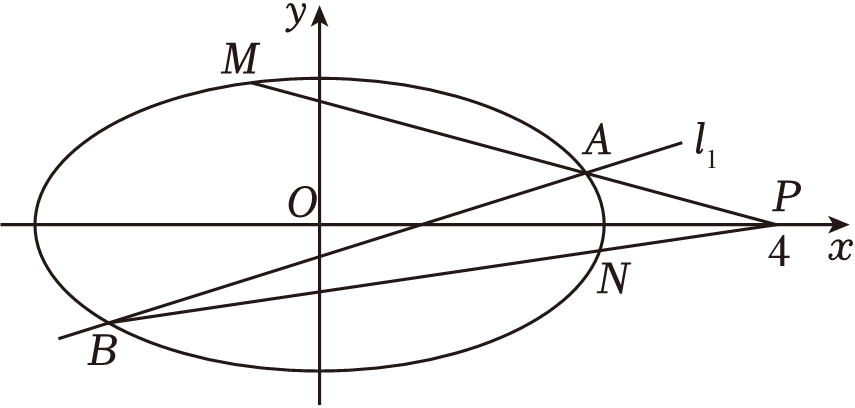
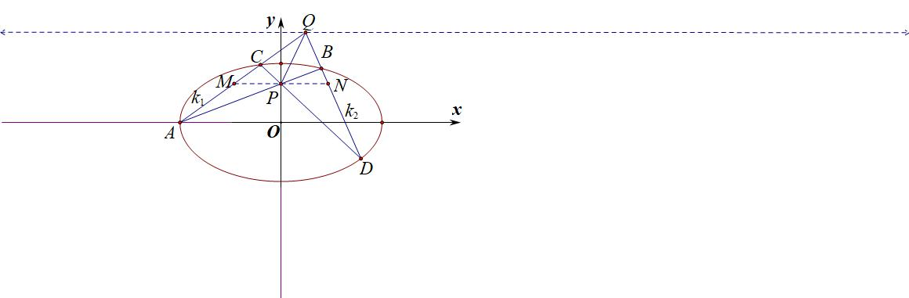
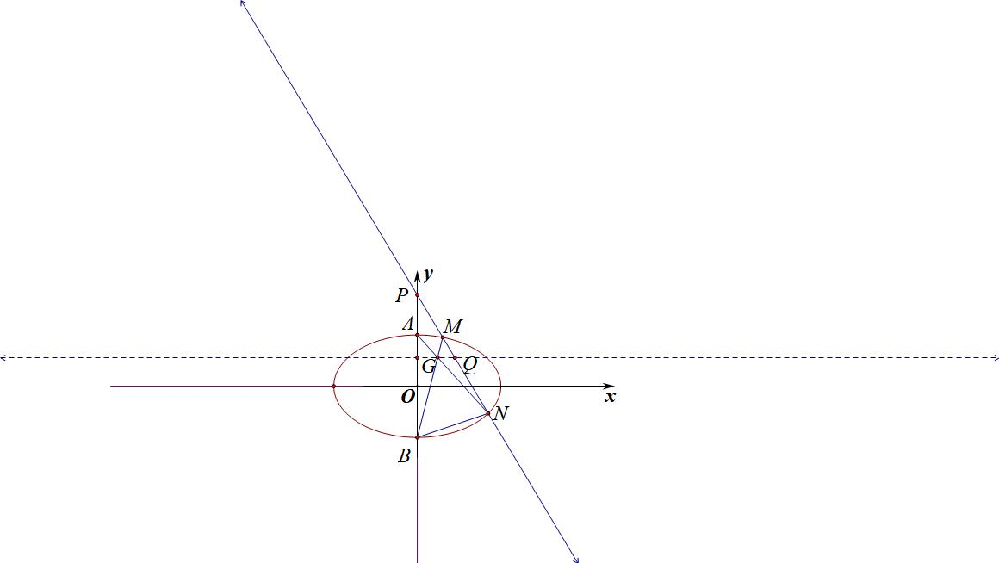
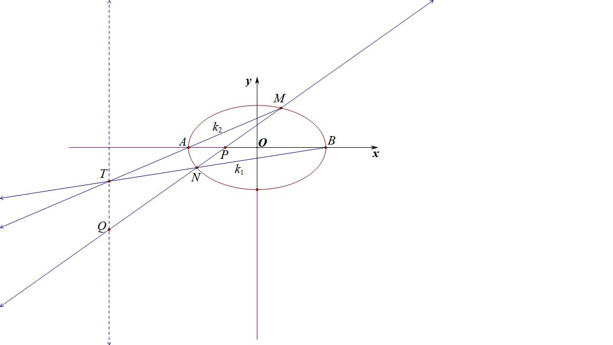
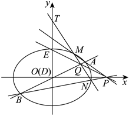
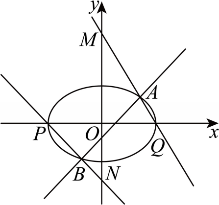
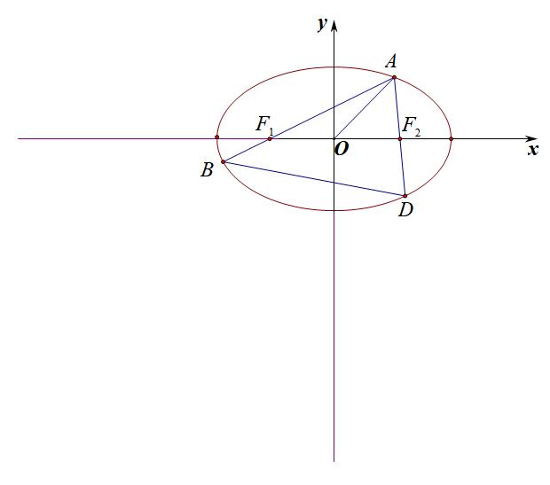
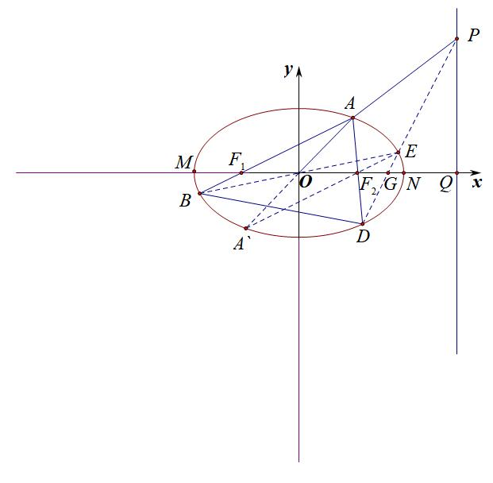
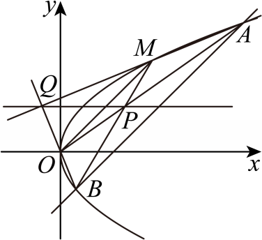

达标训练

1.（2012•北京）已知曲线<em>C</em>：（5﹣<em>m</em>）<em>x</em>2+（<em>m</em>﹣2）<em>y</em>2＝8（<em>m</em>∈<strong>R</strong>）

（1）若曲线*C*是焦点在*x*轴点上的椭圆，求*m*的取值范围；

（2）设*m*＝4，曲线*C*与*y*轴的交点为*A*，*B*（点*A*位于点*B*的上方），直线*y*＝*kx*+4与曲线*C*交于不同的两点*M*、*N*，直线*y*＝1与直线*BM*交于点*G*．求证：*A*，*G*，*N*三点共线．

2.（2024·雨花区校级一模）已知椭圆：（）的离心率为，且点在椭圆上.

（1）求椭圆的标准方程；

（2）如图，若一条斜率不为0的直线过点与椭圆交于，两点，椭圆的左、右顶点分别为，，直线的斜率为，直线的斜率为，求证：为定值.

3.（2024•宝安区期末）如图，已知椭圆Γ的短轴长为4，焦点与双曲线 $\frac{x^{2}}{4-t}-\frac{y^{2}}{t}=1$ 的焦点重合．点&lt;text sty<em>l</em>e="italic"&gt;P&lt;/text&gt;（4，0），斜率为 $\frac{1}{2}$ 的直线<em>l</em>1与椭圆Γ交于<em>A</em>，<em>B</em>两点．

（1）求常数*t*的取值范围，并求椭圆Γ的方程．

（2）（本题可以使用解析几何的方法，也可以利用下面材料所给的结论进行解答）

极点与极线是法国数学家吉拉德•迪沙格于&lt;text st<em>y</em>&lt;text sty<em>l</em>e="italic"&gt;l&lt;/text&gt;e="subscript"&gt;&lt;text style="subscript"&gt;1&lt;/text&gt;&lt;/text&gt;639年在射影几何学的奠基之作《圆锥曲线论稿》中正式阐述的．对于椭圆 $\Gamma ：\frac{x^{2}}{a^{2}}+\frac{y^{2}}{b^{2}}=1$ ，极点&lt;te&lt;te&lt;text st<em>y</em>&lt;text sty<em>l</em>e="italic"&gt;l&lt;/text&gt;e="italic"&gt;x&lt;/text&gt;t st<em>y</em>le="italic"&gt;x&lt;/text&gt;t style="italic"&gt;<em>&lt;text style="italic"&gt;&lt;text style="italic,subscript"&gt;P</em>&lt;/text&gt;&lt;/text&gt;&lt;/text&gt;（x&lt;text style="subscript"&gt;0&lt;/text&gt;，y0）（不是原点）对应的极线为 $l_{P}：\frac{x_{0}x}{a^{2}}+\frac{y_{0}y}{b^{2}}=1$ ，且若极点&lt;te&lt;te&lt;text st<em>y</em>&lt;text sty<em>l</em>e="italic"&gt;l&lt;/text&gt;e="italic"&gt;x&lt;/text&gt;t st<em>y</em>le="italic"&gt;x&lt;/text&gt;t style="italic"&gt;<em>&lt;text style="italic"&gt;&lt;text style="italic,subscript"&gt;P</em>&lt;/text&gt;&lt;/text&gt;&lt;/text&gt;在x轴上，则过点P作椭圆的割线交Γ于点<em>A</em>&lt;text style="subscript"&gt;&lt;text style="subscript"&gt;1&lt;/text&gt;&lt;/text&gt;，<em>B</em>1，则对于lP上任意一点<em>&lt;text style="italic"&gt;&lt;text style="italic"&gt;Q</em>&lt;/text&gt;&lt;/text&gt;，均有 $k_{QA_{1}}+k_{QB_{1}}=2k_{PQ}$ （当斜率均存在时）．已知点&lt;text st<em>yl</em>e="italic"&gt;<em>&lt;text style="italic"&gt;Q</em>&lt;/text&gt;&lt;/text&gt;是直线<em>l</em>&lt;text style="subscript"&gt;&lt;text style="subscript"&gt;1&lt;/text&gt;&lt;/text&gt;上的一点，且点Q的横坐标为2．连接&lt;te&lt;te<em>x</em>t st<em>y</em>le="italic"&gt;x&lt;/text&gt;t style="italic"&gt;<em>&lt;text style="italic"&gt;&lt;text style="italic,subscript"&gt;P</em>&lt;/text&gt;&lt;/text&gt;&lt;/text&gt;Q交y轴于点<em>E</em>．连接P<em>A</em>，P<em>B</em>分别交椭圆Γ于<em>M</em>，<em>N</em>两点．

①设直线*AB*、*MN*分别交*y*轴于点*D*、点*T*，证明：点*E*为*D*、*T*的中点；

②证明直线：*MN*恒过定点，并求出定点的坐标．

4.（2025•福州模拟）阅读材料：极点与极线，是法国数学家吉拉德笛沙格于1639年在射影几何学的奠基之作《圆锥曲线论稿》中正式阐述，它是圆锥曲线的一种基本特征．已知圆锥曲线，则称点，和直线是圆锥曲线的一对极点和极线．事实上，在圆锥曲线方程中，以替换，以替换（另一变量也是如此），即可得到点，对应的极线方程．特别地，对于椭圆，与点，对应的极线方程为；对于双曲线，与点，对应的极线方程为；即对于确定的圆锥曲线，每一对极点与极线是一一对应的关系．

其中，极点与极线有以下基本性质和定理：

①当在圆锥曲线上时，其极线是曲线在点处的切线；

②当在外时，其极线是曲线从点所引两条切线的切点所确定的直线（即切点弦所在直线）；

③当在内时，其极线是曲线过点的割线两端点处的切线交点的轨迹．

根据上述材料回答下面问题：已知椭圆过点，离心率为，其左右顶点分别为、．已知点是直线上的一个动点，点对应的极线与椭圆交于点，，

（1）若，，，证明：极线恒过定点；

（2）在（1）的条件下，若该定点为极线的中点，求出此时的极线方程；

（3）若，，，极线交的椭圆于，两点，点在轴上方，直线，直线分别交轴于，两点，点为坐标原点，求的值．

5.（2025•深圳期末）已知椭圆的离心率为，，，过定点，的直线与交于，两点，直线的斜率不为0．

（1）求的长轴长．

（2）若，，证明：直线，的斜率之和为定值．

（3）若，，设直线，分别交于，（都异于，两点，且的斜率存在，证明直线过定点，并求出定点坐标．

6.（2025•广州开学）蝴蝶定理是数学中的一道名题，已经有两百年的历史，迄今依然是一颗生机勃勃的常青树，因其图形像一只蝴蝶而得名．蝴蝶模型在圆锥曲线中经常出现，其中点、线有很多优美的性质．已知抛物线的焦点为，过的直线交抛物线于，，当与轴垂直时，△的面积为2，其中为坐标原点．

（1）求抛物线的方程；

（2）若直线的斜率存在为，过作直线，分别交抛物线于，，连，设直线的斜率为，证明：为定值；

（3）记直线，的倾斜角分别为，，当最大时，求直线的方程．

7.已知椭圆的左、右焦点分别为、，且离心率为为椭圆上任意一点，当时，面积为1.

求椭圆的方程;

已知点是椭圆上异于椭圆顶点的一点，延长分别与椭圆交于、，求证:为定值.

5.（2025•重庆期末）已知双曲线，按照如下方式依次构造点，，，2，3，：直线与双曲线的右支交于，两点在的上方），过且斜率为的直线与过且斜率为1的直线交于点，过点作平行于的直线．

（1）求的取值范围；

（2）判断，，，，是否共线，并说明理由；

（3）证明：为定值．

8.（2024•苏州期末）在平面直角坐标系中，已知椭圆经过点，，直线与轴交于点，过的直线与交于，两点（异于，，记直线和直线的斜率分别为，．

（1）求的标准方程；

（2）求的值；

（3）设直线和直线的交点为，求证：在一条定直线上．

9.（2025•广东期末）已知为坐标原点，点，，是抛物线上不同的三点，其中，点在第一象限，直线与平行，直线与交于点，直线与直线交于点．

（1）求抛物线的准线方程；

（2）求直线的方程；

（3）求的最小值．

达标训练

1.（2012•北京）已知曲线<em>C</em>：（5﹣<em>m</em>）<em>x</em>2+（<em>m</em>﹣2）<em>y</em>2＝8（<em>m</em>∈<strong>R</strong>）

（1）若曲线*C*是焦点在*x*轴点上的椭圆，求*m*的取值范围；

（2）设*m*＝4，曲线*C*与*y*轴的交点为*A*，*B*（点*A*位于点*B*的上方），直线*y*＝*kx*+4与曲线*C*交于不同的两点*M*、*N*，直线*y*＝1与直线*BM*交于点*G*．求证：*A*，*G*，*N*三点共线．

【解析】（1） $\frac{7}{2}＜m＜5$

2. 极点极线背景分析：由于椭圆方程：，直线过，其对应极线为直线*y*＝1，故AN与BM交点G，AM与BN交点H均在极线上.解决这类三点共线最佳方法是定比点差.

解答书写过程：

令，，，，则在直线MN上存在点Q，满足，所以，，，在椭圆上，

故，两式相减得：，即，

所以，即，由于B、G、M三点共线，故，

要证*A、Q、N*共线，只需证，只需证

显然恒成立，故命题得证.

2.（2024·雨花区校级一模）已知椭圆：（）的离心率为，且点在椭圆上.

（1）求椭圆的标准方程；

（2）如图，若一条斜率不为0的直线过点与椭圆交于，两点，椭圆的左、右顶点分别为，，直线的斜率为，直线的斜率为，求证：为定值.

【解析】（1）；

(2)极点极线背景分析：延长MN交于*Q*，易知以为极点的极线方程就是，所以AM和BN延长线交点T也在极线上，故，，所以.本题解答方法很多，齐次化和截距点差法均很好解答，本题我们还是给到定比点差法，因为定比点差法是离极点极线背景最近的解法.

解答书写过程：

令，，，，则在直线MN上存在点Q，满足，所以，，，在椭圆上，

故，两式相减得：，即，

所以，即，，，

所以.

3.（2024•宝安区期末）如图，已知椭圆Γ的短轴长为4，焦点与双曲线 $\frac{x^{2}}{4-t}-\frac{y^{2}}{t}=1$ 的焦点重合．点&lt;text sty<em>l</em>e="italic"&gt;P&lt;/text&gt;（4，0），斜率为 $\frac{1}{2}$ 的直线<em>l</em>1与椭圆Γ交于<em>A</em>，<em>B</em>两点．

（1）求常数*t*的取值范围，并求椭圆Γ的方程．

（2）（本题可以使用解析几何的方法，也可以利用下面材料所给的结论进行解答）

极点与极线是法国数学家吉拉德•迪沙格于&lt;text st<em>y</em>&lt;text sty<em>l</em>e="italic"&gt;l&lt;/text&gt;e="subscript"&gt;&lt;text style="subscript"&gt;1&lt;/text&gt;&lt;/text&gt;639年在射影几何学的奠基之作《圆锥曲线论稿》中正式阐述的．对于椭圆 $\Gamma ：\frac{x^{2}}{a^{2}}+\frac{y^{2}}{b^{2}}=1$ ，极点&lt;te&lt;te&lt;text st<em>y</em>&lt;text sty<em>l</em>e="italic"&gt;l&lt;/text&gt;e="italic"&gt;x&lt;/text&gt;t st<em>y</em>le="italic"&gt;x&lt;/text&gt;t style="italic"&gt;<em>&lt;text style="italic"&gt;&lt;text style="italic,subscript"&gt;P</em>&lt;/text&gt;&lt;/text&gt;&lt;/text&gt;（x&lt;text style="subscript"&gt;0&lt;/text&gt;，y0）（不是原点）对应的极线为 $l_{P}：\frac{x_{0}x}{a^{2}}+\frac{y_{0}y}{b^{2}}=1$ ，且若极点&lt;te&lt;te&lt;text st<em>y</em>&lt;text sty<em>l</em>e="italic"&gt;l&lt;/text&gt;e="italic"&gt;x&lt;/text&gt;t st<em>y</em>le="italic"&gt;x&lt;/text&gt;t style="italic"&gt;<em>&lt;text style="italic"&gt;&lt;text style="italic,subscript"&gt;P</em>&lt;/text&gt;&lt;/text&gt;&lt;/text&gt;在x轴上，则过点P作椭圆的割线交Γ于点<em>A</em>&lt;text style="subscript"&gt;&lt;text style="subscript"&gt;1&lt;/text&gt;&lt;/text&gt;，<em>B</em>1，则对于lP上任意一点<em>&lt;text style="italic"&gt;&lt;text style="italic"&gt;Q</em>&lt;/text&gt;&lt;/text&gt;，均有 $k_{QA_{1}}+k_{QB_{1}}=2k_{PQ}$ （当斜率均存在时）．已知点&lt;text st<em>yl</em>e="italic"&gt;<em>&lt;text style="italic"&gt;Q</em>&lt;/text&gt;&lt;/text&gt;是直线<em>l</em>&lt;text style="subscript"&gt;&lt;text style="subscript"&gt;1&lt;/text&gt;&lt;/text&gt;上的一点，且点Q的横坐标为2．连接&lt;te&lt;te<em>x</em>t st<em>y</em>le="italic"&gt;x&lt;/text&gt;t style="italic"&gt;<em>&lt;text style="italic"&gt;&lt;text style="italic,subscript"&gt;P</em>&lt;/text&gt;&lt;/text&gt;&lt;/text&gt;Q交y轴于点<em>E</em>．连接P<em>A</em>，P<em>B</em>分别交椭圆Γ于<em>M</em>，<em>N</em>两点．

①设直线*AB*、*MN*分别交*y*轴于点*D*、点*T*，证明：点*E*为*D*、*T*的中点；

②证明直线：*MN*恒过定点，并求出定点的坐标．

【解析】（1）椭圆方程为 $\frac{x^{2}}{8}+\frac{y^{2}}{4}=1$ ．

（2）如图，

①首先由于<em>Q</em>在<em>P</em>的极线<em>x</em>＝2上，故由引理有<em>kQN</em>+<em>kQB</em>＝2<em>kPQ</em>，<em>kQA</em>+<em>kQM</em>＝2<em>kPQ</em>，

而 $k_{QA}=k_{QB}=\frac{1}{2}$ ，所以<em>&lt;text style="italic"&gt;k</em>&lt;/text&gt;<em>&lt;text style="italic"&gt;Q</em>N&lt;/text&gt;＝k<em>QM</em>，这表明Q是<em>MN</em>和<em>AB</em>的交点，

又由于<em>kQA</em>+<em>kQM</em>＝2<em>kPQ</em>，故<em>kBA</em>+<em>kNM</em>＝2<em>kPQ</em>，

设<*t*ext style="italic">Q</text>（2，t），而 $k_{AB}=k_{QD}=\frac{t-y_{D}}{2}$ ， $k_{MN}=k_{QT}=\frac{t-y_{T}}{2}$ ， $k_{PQ}=k_{QE}=\frac{t-y_{E}}{2}$ ，

所以<em>yD</em>+<em>yT</em>＝2<em>yE</em>，也就是<em>E</em>是<em>DT</em>的中点；

②设<*t*ext style="italic">Q</text>（2，t），那么 $k_{PQ}=-\frac{t}{2}，k_{AB}=\frac{1}{2}$ ，所以 $k_{MN}=-t-\frac{1}{2}$ ，

这表明*MN*的方程是 $y=(-t-\frac{1}{2})(x-2)+t$ ，即 $t(3-x)+1-\frac{1}{2}x-y=0$ ，

所以*MN*恒过点 $(3，-\frac{1}{2})$ ．

4.（2025•福州模拟）阅读材料：极点与极线，是法国数学家吉拉德笛沙格于1639年在射影几何学的奠基之作《圆锥曲线论稿》中正式阐述，它是圆锥曲线的一种基本特征．已知圆锥曲线，则称点，和直线是圆锥曲线的一对极点和极线．事实上，在圆锥曲线方程中，以替换，以替换（另一变量也是如此），即可得到点，对应的极线方程．特别地，对于椭圆，与点，对应的极线方程为；对于双曲线，与点，对应的极线方程为；即对于确定的圆锥曲线，每一对极点与极线是一一对应的关系．

其中，极点与极线有以下基本性质和定理：

①当在圆锥曲线上时，其极线是曲线在点处的切线；

②当在外时，其极线是曲线从点所引两条切线的切点所确定的直线（即切点弦所在直线）；

③当在内时，其极线是曲线过点的割线两端点处的切线交点的轨迹．

根据上述材料回答下面问题：已知椭圆过点，离心率为，其左右顶点分别为、．已知点是直线上的一个动点，点对应的极线与椭圆交于点，，

（1）若，，，证明：极线恒过定点；

（2）在（1）的条件下，若该定点为极线的中点，求出此时的极线方程；

（3）若，，，极线交的椭圆于，两点，点在轴上方，直线，直线分别交轴于，两点，点为坐标原点，求的值．

【解析】（1）证明：椭圆过点，离心率为，由题意得，解得，椭圆的方程为．点在直线上，设，，则极线为，即．则，，极线恒过定点；

（2）定点为的中点，设，，，，，两点均在椭圆上，，

两式相减得，，，得方程，经检验，△，极线方程；

（3）设，此时极线的方程为，联立，得，

设，，，，由韦达定理得，，，

直线，解得，

直线，解得．

，，

的值为．

5.（2025•深圳期末）已知椭圆的离心率为，，，过定点，的直线与交于，两点，直线的斜率不为0．

（1）求的长轴长．

（2）若，，证明：直线，的斜率之和为定值．

（3）若，，设直线，分别交于，（都异于，两点，且的斜率存在，证明直线过定点，并求出定点坐标．

【解答】解：（1）因为椭圆的离心率为，所以，

解得，所以椭圆的长轴长为．

（2）证明：设直线的方程为，，，，，联立，得，则△，解得，，，

设直线，的斜率分别为，，则，

所以直线，的斜率之和为定值0．

（3）证明：设，，，，，，，，，，且，且，则，且，

得，

将，代入得，与联立，

解得，同理可得，又直线过点，，则，

代入，，化简得，

设直线过定点，，则，

代入数据化简可得，

对比系数可得，解得，，则直线过定点，．

6.（2025•广州开学）蝴蝶定理是数学中的一道名题，已经有两百年的历史，迄今依然是一颗生机勃勃的常青树，因其图形像一只蝴蝶而得名．蝴蝶模型在圆锥曲线中经常出现，其中点、线有很多优美的性质．已知抛物线的焦点为，过的直线交抛物线于，，当与轴垂直时，△的面积为2，其中为坐标原点．

（1）求抛物线的方程；

（2）若直线的斜率存在为，过作直线，分别交抛物线于，，连，设直线的斜率为，证明：为定值；

（3）记直线，的倾斜角分别为，，当最大时，求直线的方程．

【解析】（1）依题意有，抛物线焦点，当与轴垂直时，，从而，所以，所以抛物线的方程为．

（2）证明：设，，，，，，，，则，

从而直线的方程为，即，将代入有，

同理，直线的方程为，直线的方程为，

将代入有，因为，所以，从而得证．

（3）由（2）知，，且，或，

当，时，，，，当，时，，，，由，

当，，取得最大值，此时最大，

所以当最大时，，此时直线的方程为．

7.已知椭圆的左、右焦点分别为、，且离心率为为椭圆上任意一点，当时，面积为1.

求椭圆的方程;

已知点是椭圆上异于椭圆顶点的一点，延长分别与椭圆交于、，求证:为定值.

【解析】(1);

(2)极点极线背景分析：延长BO交椭圆于E，延长OA与DE交于P，易知PQ为以为极点的极线，由于B、E关于原点对称，故，由于A关于原点对称的点，故根据坎迪定理，,故；，所以

法一：根据定比点差(略):，

，

.

########## 法二（曲线系）：作A关于原点对称点,B关于原点对称点E，利用对称性可知,,

########## 令 ，过二次曲线，与二次曲线，的四个交点，，，的曲线系可表示为：，对比两边项系数，得，对比两边项系数，得，对比常数项，得，联立以上三式，解得，，

########## 对比的系数，，对比*xy*系数，，

所以，即，，根据第三定义可知，所以.

5.（2025•重庆期末）已知双曲线，按照如下方式依次构造点，，，2，3，：直线与双曲线的右支交于，两点在的上方），过且斜率为的直线与过且斜率为1的直线交于点，过点作平行于的直线．

（1）求的取值范围；

（2）判断，，，，是否共线，并说明理由；

（3）证明：为定值．

【解析】（1）联立，消去并整理得，因为该方程有两个正根，所以，解得，即的取值范围是．

（2），，，，共线，理由如下：因为直线的方程为，

因为，即．直线的方程为，因为，即．联立，两式相加得，则，

因为，易知，则，，，，都在直线上，所以，，，，共线．

（3）证明：由题意，设，则．直线方程为，此时，易知，．

．

故，即为定值．

8.（2024•苏州期末）在平面直角坐标系中，已知椭圆经过点，，直线与轴交于点，过的直线与交于，两点（异于，，记直线和直线的斜率分别为，．

（1）求的标准方程；

（2）求的值；

（3）设直线和直线的交点为，求证：在一条定直线上．

【解析】（1）椭圆的标准方程为；

极点极线背景分析：对应极线方程为，故Q在上，根据蝴蝶定理，由于P在对称轴y轴上，过P作x轴平行线交AC于M，交BD于N，易知，，由于时，，，.

解答书写过程：

（2）易知直线的方程为，，当直线的斜率为0时，直线的方程为，

易得，，此时；

当直线的斜率不为0时，令，，，，则在直线CD上存在点R，满足，所以，，故，两式相减得：，即，所以，即，

（3）证明：不妨设，易知，，所以，

整理得，显然不在直线上，此时，则，解得，

故在定直线上．

9.（2025•广东期末）已知为坐标原点，点，，是抛物线上不同的三点，其中，点在第一象限，直线与平行，直线与交于点，直线与直线交于点．

（1）求抛物线的准线方程；

（2）求直线的方程；

（3）求的最小值．

【解析】（1）由在抛物线上，得，解得，

所以抛物线的标准方程为，准线方程为．

（2）由题意可知，因为直线与平行，所以设直线，

联立，消去，得，则△，设，

则，，

直线的方程为，直线的方程为，即，

联立，得点的纵坐标，即点，

同理得直线方程为，直线方程为，点，

所以直线方程为．

（3）由（2）知，，

令，而，要最小，则，

，

当且仅当，即时取等号，此时，

所以的最小值是．

