$$
\vert A B \vert = \frac {2 P}{\sin^ {2} \theta}
$$

# 高中数学新思路

# 圆锥专题 技能强化篇

$$
\frac {\sin^ {2} \frac {\theta}{2}}{e _ {1} ^ {2}} + \frac {\cos^ {2} \frac {\theta}{2}}{e _ {2} ^ {2}} = 1
$$

$$
- | \Delta B | = \frac {2 a b ^ {2}}{a ^ {2} - c ^ {2} \cos^ {2} \alpha}
$$

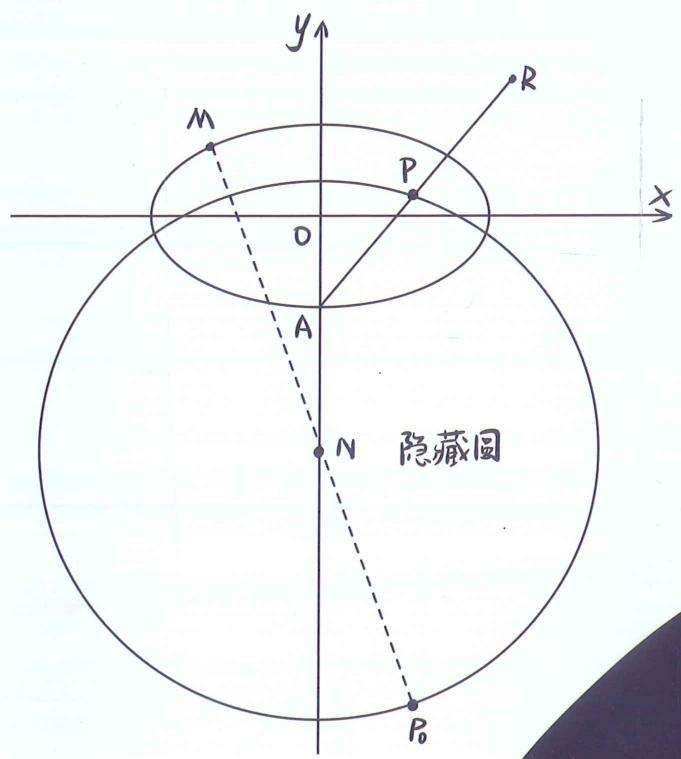

text_image

y
M
P
R
x
O
A
N
隐藏圆
P₀

# 老唐说题团队教研产品

《高考数学满分突破—秒系列123》

《高中数学新思路—复习专题第一轮》

《高中数学新思路 — 复习专题第二轮》

《高中数学新思路—同步系列123》

《高中数学新思路—导数专题》

《高中数学新思路—圆锥曲线专题》

《MST新思路高中数学新定义 组合与概率统计专题》

《高中物理新思路 力学篇》

《高中物理新思路 电学篇》

《高中物理新思路 综合实验篇》

$$
e \cos \theta = \frac {\lambda - 1}{\lambda + 1}
$$

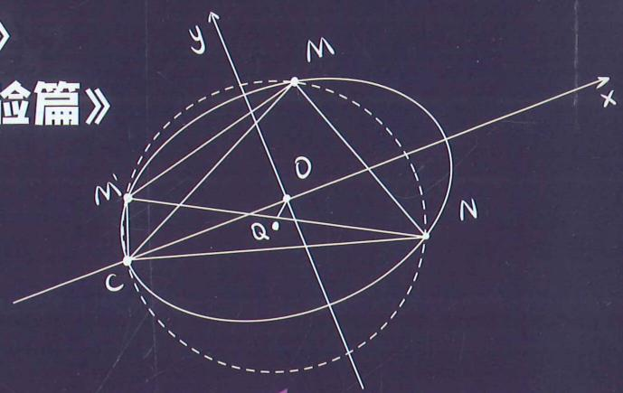

text_image

验篇》
y
M
x
O
a
c
N

  
扫码报名陪跑课

natural_image

Abstract geometric design with purple and black angular shapes on a dark background (no text or symbols)

  
官方微信

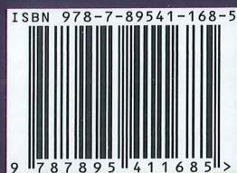

text_image

ISBN 978-7-89541-168-5
9 787895 411685 >

定价: 128元

$$
\vert A B \vert = \frac {2 P}{\sin^ {2} \theta}
$$

# 高中数学新思路

# 圆锥专题

技能强化篇

$$
\frac {\sin^ {2} \frac {\theta}{2}}{e _ {1} ^ {2}} + \frac {\cos^ {2} \frac {\theta}{2}}{e _ {2} ^ {2}} = 1
$$

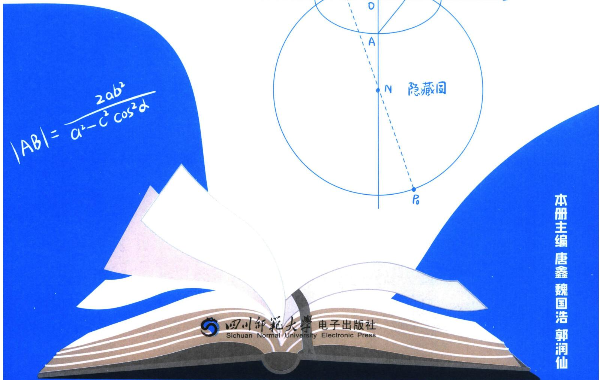

text_image

|AB| = (2ab²/a² - c²cos²α) |N 隐藏目 |
本册主编 唐鑫 魏国浩 郭润仙
四川师范大学 电子出版社
Sichuan Normal University Electronic Press

# 高中数学新思路 圆锥专题

# 主编 唐鑫 魏国浩 郭润仙

责任编辑 胡丽娜

封面设计 老唐说题工作室

出版发行 四川师范大学电子出版社

社 址 四川省成都市锦江区静安路5号

邮政编码 610068

电话 028-84767799(总编室) 028-84769668(发行部)

网址 www.scnup.com

光盘生产 大连华录影音实业有限公司

手册印制 长沙湘之印彩色印刷有限公司

文本尺寸 210 mm×285 mm

印 张 8

字 数 140 千字

版 次 2024年4月第1版

印 次 2025 年 7 月第 3 次印刷

I S B N 978-7-89541-168-5唐鑫 昵称老唐，MST《老唐说题》创始人，《高考数学满分突破》系列丛书主编，《高中数学新思路》系列丛书主编。善于归纳总结并提炼精髓，将复杂问题简单化，抽象问题形象化和具体化。

受邀于衡水二中，正定中学，青岛二中，烟台一中，安阳一中，昆明一中，遵义四中，柳铁一高，钦州二中，惠东高级中学等国内重点高中讲座，广受好评！

natural_image

Portrait of a man in formal attire with glasses, seated at a desk (no visible text or symbols)

natural_image

Portrait of a man in formal suit and tie, standing against plain background (no text or symbols visible)

# 魏国浩

南开大学硕士研究生毕业，中学数学教师；山东理工大学特聘讲师，数学奥林匹克竞赛教练员，中国数学会会员；曾任多家教育研究所兼职研究员，多家教辅主编及编委。MST《老唐说题》创始人之一。

针对高中各年级数学教学有丰富的经验，教学成绩显著，善于发现学生的闪光点，对学生进行有的放矢的教育。

善于钻研更快、更巧的高中数学解题方法并推广应用，以自己独有的方法推导并整理《平面法向量的求法》《一步搞定错位相减》《导数双变量问题综合探究》等五十余种高考题中独有的解法，并归纳整理《高考解题黄金模板》系列共54篇解题方法以及相关应用。

# 郭润仙

高中数学高级教师。所教班级数学高考成绩一直名列大理州第一；曾带出2011届李仕强、杨施薇大理州高考文理状元，2014届杨佯等多名大理州高考状元；培养了杨施薇、余建希、丰峰等多名清华、北大学子；辅导的蔡金明、马遥等多名学生获省级数学竞赛奖。

参与了省内外重要数学刊物的编辑，主编《高中数学同步周练（AB卷）》，《高中数学兵法500条》和《数学教学通讯》增刊的编委。发表数十篇论文。

natural_image

Portrait of a woman in a pink cardigan sitting at a desk in an office setting (no visible text or symbols)

# 部分讲座学校展示

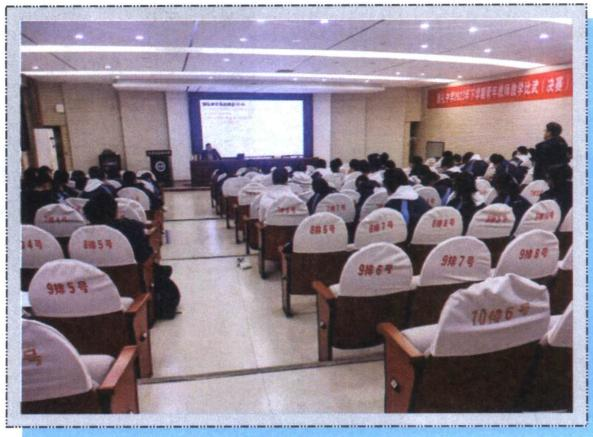

text_image

中国2012年 Korean Academic Division
第十一届2012年 Korean Academic Division
34号
8985号
9985号
9986号
9987号
9988号
70486号

雅礼中学

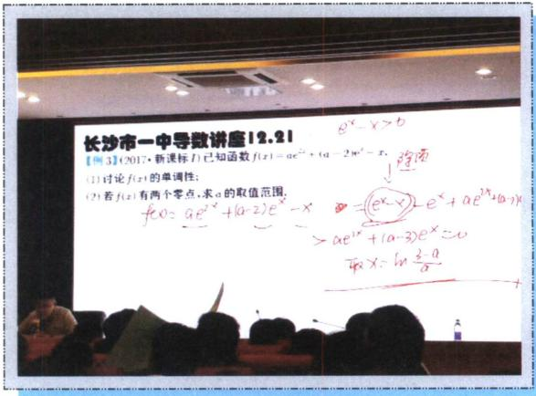

text_image

长沙市一中导数讲座12.21
【例3】(2017·新课标7)已知函数f(x)=ae²x+(a-2)e²-x.
(1)讨论f(x)的单调性;
(2)若f(x)有两个零点,求a的取值范围.
f(x)=ae²x+(a-2)e²-x
= (e²-x)e^x+ae²x+(a-2)e^x
>ae²x+(a-2)e^x=0
取x=-ln\frac{3-a}{a}

长沙市一中

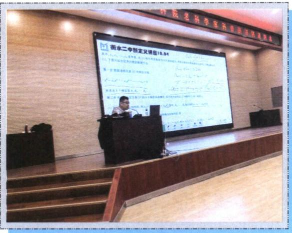

text_image

雨水二中智定理讲10.04
第十一届全国代表大会常务委员会
第十二届全国代表大会常务委员会
第十三届全国代表大会常务委员会
第十四届全国代表大会常务委员会
第十五届全国代表大会常务委员会
第十六届全国代表大会常务委员会
第十七届全国代表大会常务委员会
第十八届全国代表大会常务委员会
第十九届全国代表大会常务委员会
第二十届全国代表大会常务委员会
第二十一届全国代表大会常务委员会
第二十二届全国代表大会常务委员会
第二十三届全国代表大会常务委员会
第二十四届全国代表大会常务委员会
第二十五届全国代表大会常务委员会
第二十六届全国代表大会常务委员会
第二十七届全国代表大会常务委员会
第二十八届全国代表大会常务委员会
第二十九届全国代表大会常务委员会
第三十届全国代表大会常务委员会
第三十一届全国代表大会常务委员会
第三十二届全国代表大会常务委员会
第三十三届全国代表大会常务委员会
第三十四届全国代表大会常务委员会
第三十五届全国代表大会常务委员会
第三十六届全国代表大会常务委员会
第三十七届全国代表大会常务委员会
第三十八届全国代表大会常务委员会
第三十九届全国代表大会常务委员会
第四十届全国代表大会常务委员会
第四十一届全国代表大会常务委员会
第四十二届全国代表大会常务委员会
第四十三届全国代表大会常务委员会
第四十四届全国代表大会常务委员会
第四十五届全国代表大会常务委员会
第四十六届全国代表大会常务委员会
第四十七届全国代表大会常务委员会
第四十八届全国代表大会常务委员会
第四十九届全国代表大会常务委员会
第五十届全国代表大会常务委员会
第五十一届全国代表大会常务委员会
第五十二届全国代表大会常务委员会
第五十三届全国代表大会常务委员会
第五十四届全国代表大会常务委员会
第五十五届全国代表大会常务委员会
第五十六届全国代表大会常务委员会
第五十七届全国代表大会常务委员会
第五十八届全国代表大会常务委员会
第五十九届全国代表大会常务委员会
第六十届全国代表大会常务委员会
第六十一届全国代表大会常务委员会
第六十二届全国代表大会常务委员会
第六十三届全国代表大会常务委员会
第六十四届全国代表大会常务委员会
第六十五届全国代表大会常务委员会
第六十六届全国代表大会常务委员会
第六十七届全国代表大会常务委员会
第六十八届全国代表大会常务委员会
第六十九届全国代表大会常务委员会
第七十届全国代表大会常务委员会
第七十一届全国代表大会常务委员会
第七十二届全国代表大会常务委员会
第七十三届全国代表大会常务委员会
第七十四届全国代表大会常务委员会
第七十五届全国代表大会常务委员会
第七十六届全国代表大会常务委员会
第七十七届全国代表大会常务委员会
第七十八届全国代表大会常务委员会
第七十九届全国代表大会常务委员会
第八十届全国代表大会常务委员会
第八十一届全国代表大会常务委员会
第八十二届全国代表大会常务委员会
第八十三届全国代表大会常务委员会
第八十四届全国代表大会常务委员会
第八十五届全国代表大会常务委员会
第八十六届全国代表大会常务委员会
第八十七届全国代表大会常务委员会
第八十八届全国代表大会常务委员会
第八十九届全国代表大会常务委员会
第九十届全国代表大会常务委员会
第九十一届全国代表大会常务委员会
第九十二届全国代表大会常务委员会
第九十三届全国代表大会常务委员会
第九十四届全国代表大会常务委员会
第九十五届全国代表大会常务委员会
第九十六届全国代表大会常务委员会
第九十七届全国代表大会常务委员会
第九十八届全国代表大会常务委员会
第九十九届全国代表大会常务委员会

衡水二中

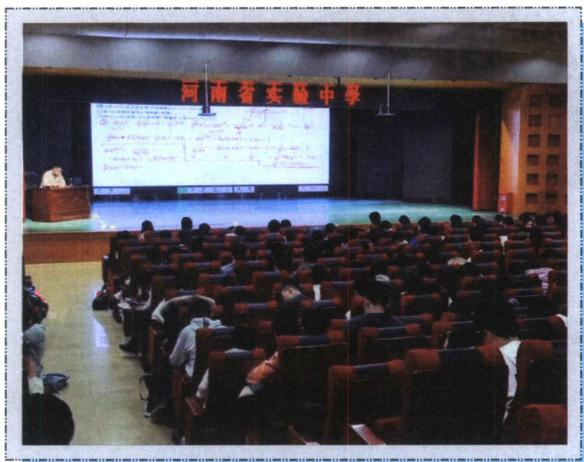

text_image

河南省实验中学

河南省实验

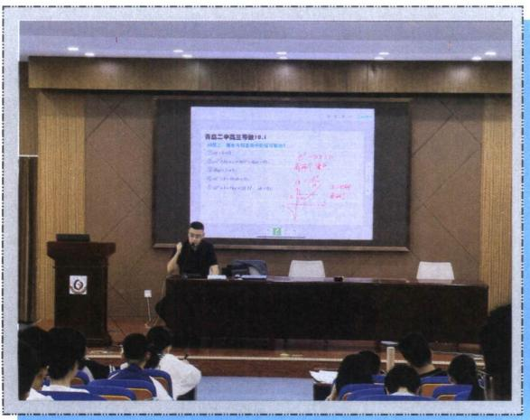

text_image

自白二中高压导管16.1
主讲：第一课 2023年第二季度
第1课 2023年第二季度
第2课 2023年第二季度
第3课 2023年第二季度
第4课 2023年第二季度
第5课 2023年第二季度
第6课 2023年第二季度
第7课 2023年第二季度
第8课 2023年第二季度
第9课 2023年第二季度
第10课 2023年第二季度
第11课 2023年第二季度
第12课 2023年第二季度
第13课 2023年第二季度
第14课 2023年第二季度
第15课 2023年第二季度
第16课 2023年第二季度
第17课 2023年第二季度
第18课 2023年第二季度
第19课 2023年第二季度
第20课 2023年第二季度
第21课 2023年第二季度
第22课 2023年第二季度
第23课 2023年第二季度
第24课 2023年第二季度
第25课 2023年第二季度
第26课 2023年第二季度
第27课 2023年第二季度
第28课 2023年第二季度
第29课 2023年第二季度
第30课 2023年第二季度
第31课 2023年第二季度
第32课 2023年第二季度
第33课 2023年第二季度
第34课 2023年第二季度
第35课 2023年第二季度
第36课 2023年第二季度
第37课 2023年第二季度
第38课 2023年第二季度
第39课 2023年第二季度
第40课 2023年第二季度
第41课 2023年第二季度
第42课 2023年第二季度
第43课 2023年第二季度
第44课 2023年第二季度
第45课 2023年第二季度
第46课 2023年第二季度
第47课 2023年第二季度
第48课 2023年第二季度
第49课 2023年第二季度
第50课 2023年第二季度
第51课 2023年第二季度
第52课 2023年第二季度
第53课 2023年第二季度
第54课 2023年第二季度
第55课 2023年第二季度
第56课 2023年第二季度
第57课 2023年第二季度
第58课 2023年第二季度
第59课 2023年第二季度
第60课 2023年第二季度
第61课 2023年第二季度
第62课 2023年第二季度
第63课 2023年第二季度
第64课 2023年第二季度
第65课 2023年第二季度
第66课 2023年第二季度
第67课 2023年第二季度
第68课 2023年第二季度
第69课 2023年第二季度
第70课 2023年第二季度
第71课 2023年第二季度
第72课 2023年第二季度
第73课 2023年第二季度
第74课 2023年第二季度
第75课 2023年第二季度
第76课 2023年第二季度
第77课 2023年第二季度
第78课 2023年第二季度
第79课 2023年第二季度
第80课 2023年第二季度
第81课 2023年第二季度
第82课 2023年第二季度
第83课 2023年第二季度
第84课 2023年第二季度
第85课 2023年第二季度
第86课 2023年第二季度
第87课 2023年第二季度
第88课 2023年第二季度
第89课 2023年第二季度
第90课 2023年第二季度
第91课 2023年第二季度
第92课 2023年第二季度
第93课 2023年第二季度
第94课 2023年第二季度
第95课 2023年第二季度
第96课 2023年第二季度
第97课 2023年第二季度
第98课 2023年第二季度
第99课 2023年第二季度

青岛二中

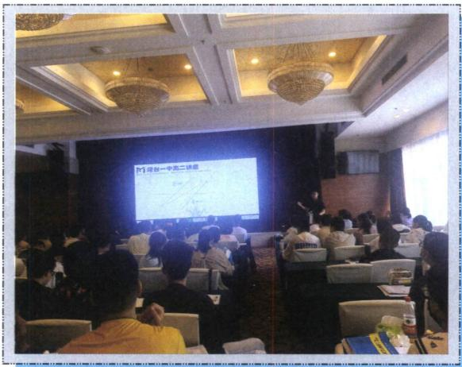

text_image

M讲台一中先二讲题

烟台一中

natural_image

Group photo of people posing indoors in a classroom setting (no visible text or symbols)

北京高途总部

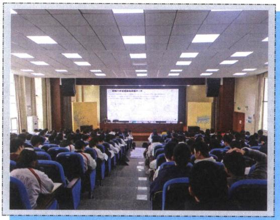

text_image

Conference hall with audience facing a presentation screen displaying Chinese text and diagrams

衡阳八中

text_image

博雅 真精
入室
厚好

祁阳一中

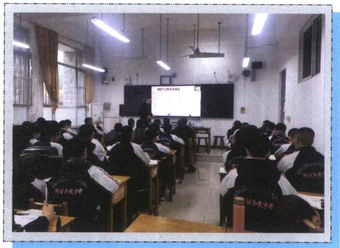

text_image

Classroom photo with students seated at desks facing a projector screen displaying Chinese text 'MITTAWA' and '中国青年学校'

正定中学

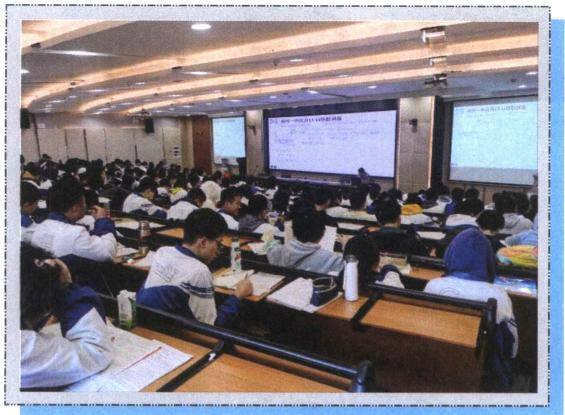

text_image

Classroom scene with students seated at desks facing a presentation screen; visible Chinese text on screens and posters in the background.

郴州一中

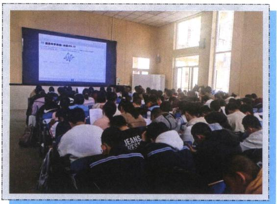

text_image

Classroom scene with students seated facing a projection screen displaying Chinese text and a small diagram, likely for an educational or academic presentation.

康杰中学

text_image

高考数学满分突破
导教专题讲座
2021年10月16日
高考数学满分突破 研究团队
暨“张丰利老师归属题的讲坛”
2021年10月16日
高考数学满分突破 研究团队
暨“张丰利老师归属题的讲坛”
2021年10月16日

钦州二中

text_image

Conference hall photo with visible presentation screen showing Chinese text and date '2017-04-23'

柳铁一中

text_image

河南省公社一高等级课组1.15
河南省公社一高等级课组1.15

河南郸城一高

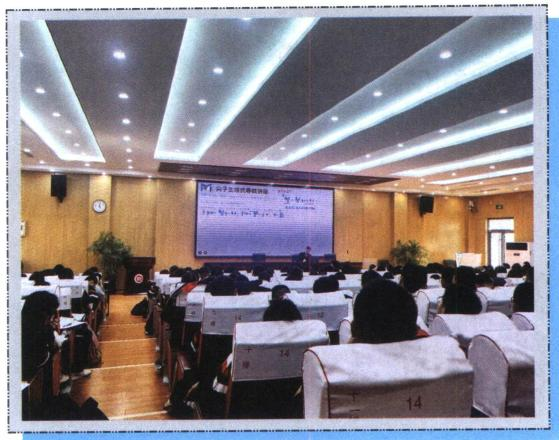

text_image

M.电子主题课程讲座
2014-05-22
2014-05-23
14
14

菏泽一中

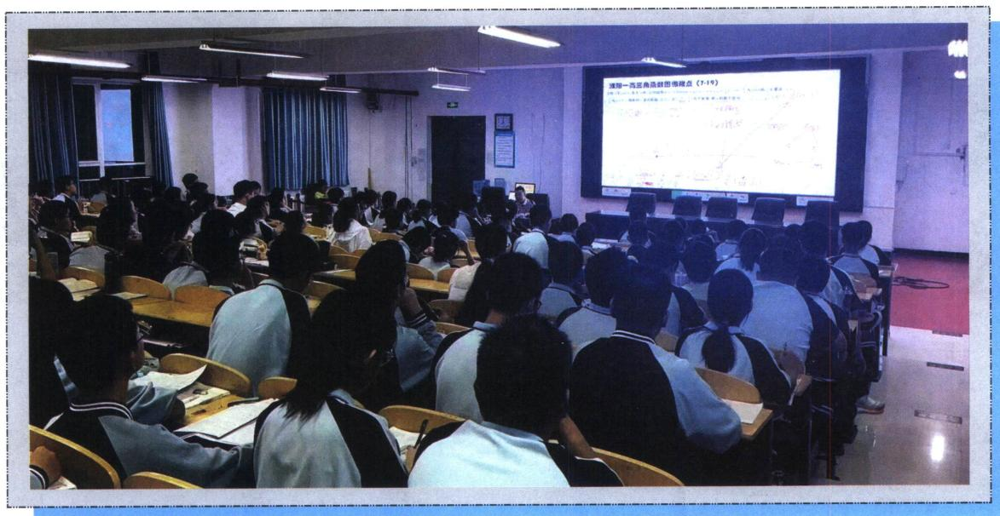

text_image

请知一元三角函数的思维点 (7-19)

濮阳一高

text_image

Classroom scene with teacher presenting in front of a large screen displaying Chinese text and diagrams, students seated in rows

石光中学

# 技能强化篇

# 第 10 章 万能的两点对合式

# 第一节 反比例对合方程解决圆锥曲线与数列综合 …… 342

一、两点对合式构造双曲线中的等比数列 … 343  
二、非等轴双曲线的仿射换元 …… 344  
三、抛物线两点对合式构造等差等比数列 … 349

# 第二节 抛物线切线对合与两点对合数列构造综合 …… 353

一、抛物线蝴蝶定理 …… 353  
二、切线与对合不动点 356  
三、平移顶点的抛物线两点对合方程 …… 358

# 第三节 椭圆双曲线的两点对合式 …… 359

一、椭圆与双曲线的两点对合式 …… 359

1. 椭圆两点对合式 359  
2. 双曲线右支的两点对合式 …… 360  
3. 双曲线左支的两点对合式 …… 360  
4. 双曲线左右两支的两点对合式 …… 361

二、对合方程简化单动点模型 …… 361

1. 椭圆 361   
2. 双曲线 361

三、对合方程简化斜率关系模型 …… 362  
四、两点对合方程简化相切圆问题 …… 365  
五、两点对合方程简化轮换对称问题 …… 366

# 第11章 从定比点差到极点极线

# 第一节 单比与交比 …… 370

一、单比的概念及性质 …… 370

1. 单比的定义 …… 370  
2. $\lambda + \mu$ 为定值的参数同构与点差法 … 370

# 二、单比与交比 …… 372

1. 单比角元形式 372  
2. 交比的概念及性质 …… 372  
3. 交比的射影不变性 …… 373

# 三、调和点列与定比点差 …… 377

1. 调和点列的概念 …… 377   
2. 调和点列的性质 377   
3. 定比分点和调和分点支配下的圆锥曲线
…… 378

# 四、定点（极点）在坐标轴上的定比点差 … 379

类型一：定点(极点)在 x 轴 …… 379  
类型二：定点(极点)在 y 轴 …… 380

# 五、定点（极点）不在坐标轴上的定比点差 … 382

# 第二节 极点极线定义与自极三角形 …… 384

一、极点极线的定义 …… 384

1. 二次曲线的替换法则 …… 384  
2. 极点极线的代数定义 …… 385  
3. 极点极线的几何意义 …… 385

# 二、极点极线定理证明 …… 386

1. 梅涅劳斯定理 386  
2. 梅涅劳斯定理的逆定理 …… 387  
3. 塞瓦定理 387  
4. 塞瓦定理的逆定理 387

# 三、极点极线的配极性质 …… 388

四、完全四边形与自极三角形 …… 388

1. 完全四边形定义 …… 388  
2. 极点极线的综合模型——自极三角形
…… 388

# 第三节 蝴蝶定理与坎迪定理 …… 394

# 一、蝴蝶定理 394

二、坎迪定理 395  
三、坎迪定理中点推论 …… 397  
四、利用对称和焦弦常数构造斜率关系 …… 400

# 第12章 调和点列与调和线束定理与对合关系

# 第一节 调和点列与点的对合 403

调和共轭定理 403

# 第二节 调和线束两大定理的应用 …… 407

# 一、调和线束平行中点定理 …… 407

1. 利用调和梯形角度解读 …… 408  
2. 射影到与坐标轴平行线的中点 …… 409  
3. 调和等腰梯形对称构造 …… 412   
4. 射影到斜线找中点与平行 …… 417

# 二、调和线束斜率公式 …… 419

1. 平行于坐标系的中点斜率翻译 …… 420  
2. 斜率等差与斜率倒数等差模型 …… 427  
3. 由自极三角形构造的射影中心和调和线束斜率坐标翻译 …… 430

# 第三节 角平分线与调和点列 433

一、斜率和为 0 与内外角平分线解读 …… 433  
二、内外角平分线与焦准模型 435

1. 椭圆外角平分线与焦准模型 …… 435  
2. 双曲线内角平分线与焦准模型 …… 435  
3. 双外角平分线垂直模型 435

# 三、内外角平分线隐藏阿氏圆 437

隐藏的角平分线与阿氏圆构造 …… 438

# 第四节 斜率对合与斜率翻译 440

# 一、斜率对合的原理 440

1. 对合轴与对合中心的选取 …… 441  
2. 斜率对合的基本作图原理 …… 441

# 二、对合中心在无穷远点的特殊值 …… 447

1. 当 $k_{1}+k_{2}=0$ 时，第三条边斜率为定值
447

2. 当 $k_{1}k_{2}=\pm\frac{b^{2}}{a^{2}}$ 时，第三条边斜率为定值
…… 448

# 三、和型对合 $k_{1} + k_{2}$ 的三种模型 449

1. 射影中心与一对合不动点横坐标相同
…… 449  
2. 两对合不动点横坐标相同 …… 449   
3. 射影中心与对合中心横坐标相同 … 450

# 四、倒数和型 $\frac{1}{k_1} +\frac{1}{k_2}$ 对合的三种模型 450

1. 射影中心与一对合不动点纵坐标相同
…… 450  
2. 两对合不动点纵坐标相同 …… 452   
3. 射影中心与对合中心纵坐标相同 … 452

# 五、顶点角+同轴轴点弦的对合方程 …… 454

1. 两类对合中心在坐标轴上的对合模型
454  
2. 对合中心在坐标轴上的面积转化 … 461  
3. 对合中心在坐标轴上的斜率与共圆转化
463

# 六、积型 $k_{1}k_{2}$ 对合的多解问题 …… 466

1. 射影中心在曲线上的直角构造 …… 466  
2. 射影中心未知的调和线束由 $k_{3} + k_{4} = 0$ 构造定值 …… 466  
3. 射影中心未知的斜率乘积为定值的多解问题 469  
4. 费雷格(Fregier)定理 469

# 七、对合方程 $ak_{1}k_{2}+b(k_{1}+k_{2})+c=0$ …… 471

1. 由调和线束斜率公式转化 …… 471  
2. 中点平行弦模型 473

# 第五节 斜率积的三次对合 474

一、椭圆内接三角形的外心斜率定理 …… 474  
二、等轴双曲线轮换对合与隐藏的垂心 …… 476  
三、等轴双曲线反演与二阶曲线外心 …… 478  
四、三次方程韦达定理与三次齐次化方程 … 478

# 第六节 从笛沙格定理到帕斯卡定理 …… 481

一、笛沙格对合 482  
二、帕斯卡（Pascal）定理及其逆定理…… 484

1. 寻找帕斯卡第六点 485  
2. 圆锥线的切线 485  
3. 帕斯卡圆锥曲线的内接四点形 …… 486

# 第七节 帕斯卡定理与对偶定理布利安桑定理… …… 492

一、布利安桑（Brianchon）定理与退化二次曲线联立 492

1. 对偶的两个定理——布利安桑定理与帕斯卡定理比较 …… 492  
2. 外切五边形的布利安桑点 …… 493  
3. 外切四边形的布利安桑点 …… 493  
4. 外切三边形的布利安桑点 493

二、热尔岗点 494  
三、退化二次曲线的布利安桑点 …… 495  
四、双曲线渐近线和共轭直径 495

# 第13章 新定义下的斜率调整与仿射

# 第一节 斜率调整法 497

一、曲线上双定点单动点斜率调整原理 …… 497  
二、斜率调整与斜率表示 …… 499  
三、斜率调整与对合的综合 …… 500  
四、斜率调整背景——斯坦纳定理 …… 502

1. 点的斯坦纳定理 …… 504  
2. 线的斯坦纳定理 …… 504

# 第二节 仿射法与面积转化 …… 505

一、仿射法与面积变化 …… 505  
二、切点圆面积最值 …… 511  
三、斜率乘积 $-\frac{b^2}{a^2}$ 能仿射成直角的面积定值问题 516

四、重心三角形面积定值问题 …… 520  
五、直径三角形面积最值问题 …… 521

# 第 14 章 新定义下的面积转化

# 第一节 过焦点弦的面积问题 …… 524

一、焦长转化为面积和差 …… 524

1. 焦长公式 524  
2. 面积之和 524  
3. 面积之差 524

二、焦点弦中点连线隐藏定点与面积转化 … 528  
三、焦点弦用角度转化斜率与面积 …… 529  
四、焦弦中垂线与隐藏面积问题 …… 530  
五、隐藏的焦弦常数与三角形面积比值转化 533

六、焦弦的截距与面积转化问题 …… 537  
七、焦点准线关联与面积比值转化 …… 538  
八、焦半径与定比点差转化面积比值 …… 539

# 第二节 坐标面积公式与面积最值 …… 541

一、坐标面积公式推导 …… 541  
二、坐标面积公式与柯西不等式求最值 …… 543

# 第三节 面积比值转化问题 …… 545

一、利用极点极线关系将坐标转化面积比 … 545  
二、隐藏定点的斜率关系构造面积最值问题…… 547

三、隐藏调和线束斜率关系与面积转化 …… 550

四、由中点隐藏轨迹方程构造面积最值问题 552  
五、由单动点三角换元构造面积比 …… 555  
六、共轭点面积等比中项模型 …… 559  
七、双圆锥曲线的双动点构造面积比 …… 560

text_image

第

# 第 10 章 万能的两点对合式

# WANNENGDEL IANGDIANDUIHESHI

过抛物线 $y^{2}=2px$ 上两点 $A(x_{1},y_{1})$ 、 $B(x_{2},y_{2})$ 的直线 AB 方程是： $(y_{1}+y_{2})y=2px+y_{1}y_{2}$

证明：利用 $k_{AB} = \frac{y_2 - y_1}{x_2 - x_1} = \frac{y_2 - y_1}{\frac{y_2^2}{2p} - \frac{y_1^2}{2p}}$ ，得到 $k_{AB} = \frac{2p}{y_1 + y_2}$ ，故直线 $AB$ 方程为： $y - y_{1} = \frac{2p}{y_{1} + y_{2}}\left(x - \frac{y_{1}^{2}}{2p}\right)$ 化简可得： $(y_{1} + y_{2})y = 2px + y_{1}y_{2}$

记忆方法：把抛物线化成标准方程，然后将最左端的二次自动降为一次，再在最左端和最右端加上“ $y_{1}+y_{2}$ 、 $y_{1}y_{2}$ ”皆可.

同理，如果抛物线的形式是 $x^{2}=2py(p>0)$ ，直线 AB 的方程是： $(x_{1}+x_{2})x=2py+x_{1}x_{2}$ .

注意 考试时，最好给出 $(y_{1}+y_{2})y=2px+y_{1}y_{2}$ 的推导过程。

关于对合，如果我们设立某种法则 f，我们发现 $(y_{1}+y_{2})y=2px+y_{1}y_{2}$ 中，

$y_{1}=\frac{2px-yy_{2}}{y-y_{2}}$ ，同时 $y_{2}=\frac{2px-yy_{1}}{y-y_{1}}$ ，故令 $f=\frac{2px-yy_{i}}{y-y_{i}}$ ， $f(y_{1})=y_{2}$ ， $f(y_{2})=y_{1}$ ，这样用 $y_{2}$ 表示 $y_{1}$ 和用 $y_{1}$ 表示 $y_{2}$ 是一样的，这就是一种对合方程，并且 $y_{1}=f(f(y_{1}))$ ，其实我们在做任何联立的时候，只要两个完全能轮换对称的变量构成的方程，比如二次韦达，都是一种对合方程的形式，有句话叫做百姓日用而不知，正是我们天天在用对合方程，却对其看不见，本章不妨我们重新来了解一下对合方程.

# 第一节 反比例对合方程解决圆锥曲线与数列综合

2024 年新高考Ⅱ卷 19 题，就是考查了神奇的反比例对合方程！

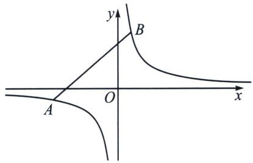

text_image

y
B
O
x
A

如图， $A(x_{1}, y_{1})$ 和 $B(x_{2}, y_{2})$ 分别是反比例函数（等轴双曲线） $y=\frac{m}{x}$ 上的两点，则 AB 的两点对合式方程为： $\frac{x_{1}x_{2}}{m}y+x=x_{1}+x_{2}$ .

证明：由于 $k_{AB} = \frac{\frac{m}{x_1} - \frac{m}{x_2}}{x_1 - x_2} = -\frac{m}{x_1x_2}$ ，故 $AB: y - \frac{m}{x_1} = -\frac{m}{x_1x_2}(x - x_1)$ ，即 $\frac{x_1x_2}{m} y + x = x_1 + x_2$

和抛物线的两点对合式一样，在这个两步就能证明的式子背后，隐藏了很多我们平时没抓住的信息，比如斜率的简化，比如构造相切的点到直线距离的快速同构，由于斜率只需要两点的坐标即可表示，命题者就抓住了这个特点，进行了圆锥与数列综合的命题。

# 一、两点对合式构造双曲线中的等比数列

如图，将等轴双曲线 $x^{2} - y^{2} = a^{2}$ 绕原点逆时针旋转 $45^{\circ}$ ，即变成了初中的反比例函数 $y = \frac{k}{x}\left(k = \frac{a^2}{2}\right)$ ，

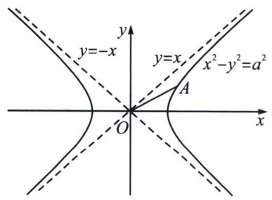

text_image

y
y=-x
y=x
x²-y²=a²
A
O
x

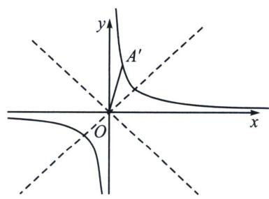

text_image

y
A'
O
x

证明：记原双曲线上任意一点 A 满足： $z_{A}=x+yi$ ，作复数逆时针旋转 $\frac{\pi}{4}$ 得 $OA'=x'+y'i$ ，则： $z_{A}'=(x+yi)(\cos\frac{\pi}{4}+i\sin\frac{\pi}{4})=\frac{\sqrt{2}}{2}(x-y)+\frac{\sqrt{2}}{2}(x+y)i$ ，故 $\left\{\begin{aligned}x' &= \frac{\sqrt{2}}{2}(x-y) \\ y' &= \frac{\sqrt{2}}{2}(x+y)\end{aligned}\right.$ ，由于 $x^{2}-y^{2}=a^{2}$ ，

故 $x^{\prime}y^{\prime} = \frac{1}{2} (x^{2} - y^{2}) = \frac{a^{2}}{2};$

例1 (2024·新高考Ⅱ卷19题)已知双曲线 $C: x^{2} - y^{2} = m (m > 0)$ , 点 $P_{1}(5, 4)$ 在 $C$ 上, $k$ 为常数, $0 < k < 1$ , 按照如下方式依次构造点 $P_{n}(n = 2, 3, \cdots)$ , 过 $P_{n-1}$ 斜率为 $k$ 的直线与 $C$ 的左支交于点 $Q_{n-1}$ , 令 $P_{n}$ 为 $Q_{n-1}$ 关于 $y$ 轴的对称点, 记 $P_{n}$ 的坐标为 $(x_{n}, y_{n})$ .

(1) 若 $k=\frac{1}{2}$ ，求 $x_{2}$ ， $y_{2}$ ;

(2)证明：数列 $\{x_{n}-y_{n}\}$ 是公比为 $\frac{1+k}{1-k}$ 的等比数列；

(3)设 $S_{n}$ 为 $\triangle P_{n}P_{n+1}P_{n+2}$ 的面积，证明：对任意的正整数 n， $S_{n}=S_{n+1}$ .

解析 (1)因为 $P_{1}(5,4)$ 在 $C$ 上，所以 $25 - 16 = m$ ，解得 $m = 9$ ，过 $P(5,4)$ 且斜率为 $k = \frac{1}{2}$ 的直线方程为 $y - 4 = \frac{1}{2} (x - 5)$ ，即 $x - 2y + 3 = 0$ ，联立 $\left\{ \begin{array}{l} x^{2} - y^{2} = 9 \\ x - 2y + 3 = 0 \end{array} \right.$ ，解得 $\left\{ \begin{array}{l} x = 5 \\ y = 4 \end{array} \right.$ 或 $\left\{ \begin{array}{l} x = -3 \\ y = 0 \end{array} \right.$ ，

故 $Q_{1}(-3,0)$ ， $P_{2}(3,0)$ ，过 $P_{n-1}$ 斜率为 k 的直线与 C 的左支交于点 $Q_{n-1}$ ，令 $P_{n}$ 为 $Q_{n-1}$ 关于 y 轴的对称点，所以 $x_{2}=3$ ， $y_{2}=0$ ；

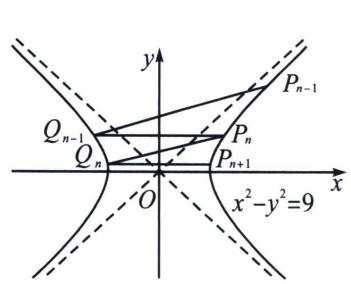

text_image

y
P_{n-1}
Q_{n-1}
P_n
Q_n
P_{n+1}
O
x^2-y^2=9
x

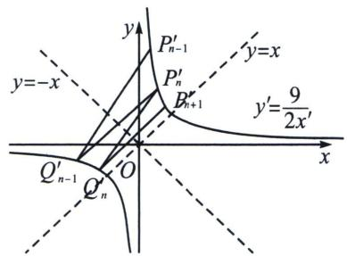

text_image

y
P'_{n-1}
y=-x
P'_n
B'_{n+1}
y=x
y'=9/2x'
Q'_{n-1}
Q'_n
O
x

(2)将等轴双曲线 $x^{2} - y^{2} = 9$ 逆时针旋转 $\frac{\pi}{4}$ , 记原双曲线上任意一点 $P_{n}: (x_{n}, y_{n})$ 满足: $z_{P_{n}} = x_{n} + y_{n}i$ , 作复数逆时针旋转 $\frac{\pi}{4}$ 得到 $Z_{P_{n}^{\prime}} = x_{n}^{\prime} + y_{n}^{\prime}i$ , 则: $Z_{P_{n}^{\prime}} = (x_{n} + y_{n}i)\left(\cos \frac{\pi}{4} + i \sin \frac{\pi}{4}\right) = \frac{\sqrt{2}}{2}(x_{n} - y_{n}) + \frac{\sqrt{2}}{2}(x_{n} + y_{n})i$ , 故 $\left\{ \begin{array}{l} x_{n}^{\prime} = \frac{\sqrt{2}}{2}(x_{n} - y_{n}) \\ y_{n}^{\prime} = \frac{\sqrt{2}}{2}(x_{n} + y_{n}) \end{array} \right.$ , 由于 $x_{n}^{2} - y_{n}^{2} = 9$ , 故 $x_{n}^{\prime}y_{n}^{\prime} = \frac{1}{2}(x_{n}^{2} - y_{n}^{2}) = \frac{9}{2}$ , 本题仅需证 $\frac{x_{n}^{\prime}}{x_{n-1}^{\prime}}$ 为定值, 由于 $Q_{n-1}$ 与 $P_{n}$ 关于 $y$ 轴对称, 故 $Q_{n-1}^{\prime}$ 与 $P_{n}^{\prime}$ 关于 $y = -x$ 对称, 且新坐标系 $k^{\prime} = \frac{1 + k}{1 - k}(0 < k < 1)$ , 记 $P_{n-1}^{\prime}(x_{n-1}^{\prime}, y_{n-1}^{\prime}), P_{n}^{\prime}(x_{n}^{\prime}, y_{n}^{\prime})$ , 则 $Q_{n-1}^{\prime}(-y_{n}^{\prime}, -x_{n}^{\prime}), k^{\prime} = k_{P_{n-1}^{\prime}Q_{n-1}^{\prime}} = \frac{\frac{9}{2x_{n-1}^{\prime}} + \frac{9}{2y_{n}^{\prime}}}{x_{n-1}^{\prime} + y_{n}^{\prime}} = \frac{9}{2x_{n-1}^{\prime}y_{n}^{\prime}} = \frac{x_{n}^{\prime}}{x_{n-1}^{\prime}}$ , 故 $\frac{x_n - y_n}{x_{n-1} - y_{n-1}} = \frac{1 + k}{1 - k}$

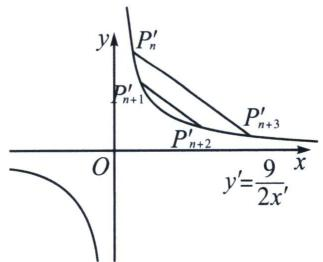

text_image

y
P'_n
P'_{n+1}
P'_{n+2}
P'_{n+3}
O
x
y'=\frac{9}{2x'}

(3)根据旋转后平行性质不变，故需要证明 $P_{n}^{\prime}P_{n + 3}^{\prime}\parallel P_{n + 1}^{\prime}P_{n + 2}^{\prime}$ ，由(2)得， $P_{\mathrm{i}}^{\prime}\left(x_{\mathrm{i}},\frac{9}{2x_{\mathrm{i}}}\right),P_{j}^{\prime}\left(x_{j},$ $\frac{9}{2x_j}\Big),k' = k_{P_i'P_j'} = -\frac{9}{2x_i'x_j'}$ ，反比例函数任意两点的对合式方程为： $\frac{2x_{\mathrm{i}}x_{j}}{9} y + x = x_{\mathrm{i}} + x_{j}$

所以 $k_{P_n'P_n' + 3} = -\frac{9}{2x_{n + 3}'x_n'}$ ， $k_{P_{n + 1}P_{n + 2}'} = -\frac{9}{2x_{n + 2}'x_{n + 1}}$ ，由于 $\{x_n'\}$ 是等比数列，故 $x_{n}^{\prime}x_{n + 3}^{\prime} = x_{n + 1}^{\prime}x_{n + 2}^{\prime}$ 故 $k_{P_n'P_{n + 3}'} = k_{P_{n + 1}^{\prime}P_{n + 2}^{\prime}}.$

由于反比例的两点对合式简单，故本题采用旋转成反比例的原因就很明显，但凡涉及双曲线多线平行，或者构造数列，不妨想想这个简化后的对合方程，所以说，一个方法的选取，在于简单，在于简化。本题的背景源于四点共圆，源于帕斯卡定理，我们会在后面章节介绍。

# 二、非等轴双曲线的仿射换元

由于 $\frac{x^{2}}{a^{2}}-\frac{y^{2}}{a^{2}}=1$ ，令 $\left\{\begin{aligned}x^{\prime}&=\frac{x}{a}-\frac{y}{a}\\ y^{\prime}&=\frac{x}{a}+\frac{y}{a}\end{aligned}\right.$ ，则 $x^{\prime}y^{\prime}=1$ ，由于(1,0)逆时针旋转 $45^{\circ}$ 后得到点 $\left(\frac{\sqrt{2}}{2},\frac{\sqrt{2}}{2}\right)$ ，(0,1)

逆时针旋转 $45^{\circ}$ 后得到点 $\left(-\frac{\sqrt{2}}{2}, \frac{\sqrt{2}}{2}\right)$ ，所以 $\left\{ \begin{array}{l} x' = \frac{x}{a} - \frac{y}{a} = \frac{\sqrt{2}}{2} \left( \frac{\sqrt{2}}{a} x - \frac{\sqrt{2}}{a} y \right) \\ y' = \frac{x}{a} + \frac{y}{a} = \frac{\sqrt{2}}{2} \left( \frac{\sqrt{2}}{a} x + \frac{\sqrt{2}}{a} y \right) \end{array} \right.$ 变换是将原来 $P(x, y)$ 横坐标和纵

坐标缩小 $\frac{a}{\sqrt{2}}$ 倍后逆时针旋转 $45^{\circ}$ 得来.

综上，双曲线都可以转化为反比例或者对勾函数，当 $e=\sqrt{2}$ 时，按照旋转都能得出反比例，当 $e\neq\sqrt{2}$ 时，旋转后会得到对勾或者飘带函数。按照换元法，就需要先对坐标进行伸缩变换，如下：

$\frac{x^2}{a^2} -\frac{y^2}{b^2} = 1$ ，令 $\left\{ \begin{array}{l}x^{\prime} = \frac{x}{a} -\frac{y}{b} = \frac{\sqrt{2}}{2}\left(\frac{\sqrt{2}x}{a} -\frac{\sqrt{2}y}{b}\right)\\ y^{\prime} = \frac{x}{a} +\frac{y}{b} = \frac{\sqrt{2}}{2}\left(\frac{\sqrt{2}x}{a} +\frac{\sqrt{2}y}{b}\right) \end{array} \right.$ ，则此变换是将原来 $P(x,y)$ 横坐标和纵坐标分别缩小 $\frac{a}{\sqrt{2}}$

倍和 $\frac{b}{\sqrt{2}}$ 后逆时针旋转45°得来，新坐标方程为 $x^{\prime}y^{\prime}=1$ .

例2 (2025·山东潍坊·二模 T19) 双曲线 C: $x^{2}-y^{2}=a^{2}(a>0)$ 的左、右顶点分别为 A、 $A_{1}$ ，点 $A_{1}$ 到 C 的渐近线的距离为 $\frac{\sqrt{2}}{2}$ .

(1) 求 C 的方程;

(2) 按照如下方式依次构造点 $A_{n} (n \geqslant 2$ 且 $n \in \mathbb{N}$ ：过点 $A_{n-1}$ 作斜率为 $-2$ 的直线交 $C$ 于另一点 $B_{n-1}$ ，设 $A_{n}$ 是点 $B_{n-1}$ 关于实轴的对称点，记点 $A_{n}$ 的坐标为 $(x_{n}, y_{n})$ 。

(i) 证明：数列 $\{x_{n} - y_{n}\}$ 、 $\{x_{n} + y_{n}\}$ 是等比数列，并求数列 $\{x_{n}\}$ 和 $\{y_{n}\}$ 的通项公式；

(ii) 记 $\triangle A_{n}AA_{n+1}$ 的面积为 $S$ , $\triangle A_{n}A_{1}A_{n+1}$ 的面积为 $T$ , 求 $\frac{S}{T}$ 的最大值.

解析 [答案](1) $x^{2}-y^{2}=1$

(2)(i)证明见解析， $x_{n}=\frac{3^{n-1}+\left(\frac{1}{3}\right)^{n-1}}{2}$ ， $y_{n}=\frac{3^{n-1}-\left(\frac{1}{3}\right)^{n-1}}{2}$ (ii) $\frac{5}{2}$ .

[详解](1)双曲线 C 的渐近线方程为 $x \pm y = 0$ ， $A_{1}(a, 0)$ ，则点 $A_{1}$ 到渐近线的距离为 $\frac{|a|}{\sqrt{2}} = \frac{\sqrt{2}}{2}$ ，所以 a = 1，所以 C 的方程为 $x^{2} - y^{2} = 1$ .

(2)(i)解法一: 因为 $A_{n}(x_{n}, y_{n})$ , 所以 $A_{n-1}(x_{n-1}, y_{n-1})$ 、 $B_{n-1}(x_{n}, -y_{n})$ , 直线 $A_{n-1}B_{n-1}$ 的方程为 $y + y_{n} = -2(x - x_{n})$ , 即 $y = -2x + 2x_{n} - y_{n}$ , 代入 $x^{2} - y^{2} = 1$ , 得 $3x^{2} - 4(2x_{n} - y_{n})x + (2x_{n} - y_{n})^{2} + 1 = 0$ , 根据韦达定理得 $x_{n-1} + x_{n} = \frac{4}{3}(2x_{n} - y_{n})$ . 所以 $y_{n} = \frac{5}{4}x_{n} - \frac{3}{4}x_{n-1}$ , $y_{n-1} = -2x_{n-1} + 2x_{n} - y_{n} = \frac{3}{4}x_{n} - \frac{5}{4}x_{n-1}$ ,

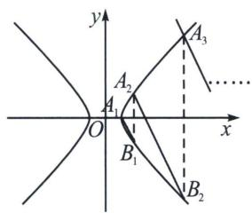

text_image

y
A₂
A₁
O
x
B₁
A₃
B₂

由题设有 $x_{1} + y_{1} = x_{1} - y_{1} = 1$ ，因为 $\frac{x_n - y_n}{x_{n-1} - y_{n-1}} = \frac{x_n - \left(\frac{5}{4}x_n - \frac{3}{4}x_{n-1}\right)}{x_{n-1} - \left(\frac{3}{4}x_n - \frac{5}{4}x_{n-1}\right)} = \frac{-\frac{1}{4}x_n + \frac{3}{4}x_{n-1}}{-\frac{3}{4}x_n + \frac{9}{4}x_{n-1}} = \frac{1}{3}$ ，所以

$\{x_{n} - y_{n}\}$ 是公比为 $\frac{1}{3}$ 的等比数列. 因为 $\frac{x_{n} + y_{n}}{x_{n-1} + y_{n-1}} = \frac{x_{n} + \frac{5}{4}x_{n} - \frac{3}{4}x_{n-1}}{x_{n-1} + \frac{3}{4}x_{n} - \frac{5}{4}x_{n-1}} = \frac{\frac{9}{4}x_{n} - \frac{3}{4}x_{n-1}}{\frac{3}{4}x_{n} - \frac{1}{4}x_{n-1}} = 3$ ，所以 $\{x_{n} + y_{n}\}$ 是公比为 3 的等比数列，

解法二：将等轴双曲线 $x^{2} - y^{2} = 1$ 逆时针旋转 $\frac{\pi}{4}$ ，记原双曲线上任意一点 $A_{n}: (x_{n}, y_{n})$ 满足： $z_{A_{n}} = x_{n} + y_{n}i$ ，作复数逆时针旋转 $\frac{\pi}{4}$ 得到 $Z_{A_{n}^{\prime}} = x_{n}^{\prime} + y_{n}^{\prime}i$ ，则： $Z_{A_{n}^{\prime}} = (x_{n} + y_{n}i)\left(\cos \frac{\pi}{4} + i\sin \frac{\pi}{4}\right) = \frac{\sqrt{2}}{2}(x_{n} - y_{n}) + \frac{\sqrt{2}}{2}(x_{n} + y_{n})i$ ，故 $\left\{ \begin{array}{l} x_{n}^{\prime} = \frac{\sqrt{2}}{2}(x_{n} - y_{n}) \\ y_{n}^{\prime} = \frac{\sqrt{2}}{2}(x_{n} + y_{n}) \end{array} \right.$ ，由于 $x_{n}^{2} - y_{n}^{2} = 1$ ，故 $x_{n}^{\prime}y_{n}^{\prime} = \frac{1}{2}(x_{n}^{2} - y_{n}^{2}) = \frac{1}{2}$ ，本题仅需证 $\frac{x_{n}^{\prime}}{x_{n-1}^{\prime}}$ 为定值，

由于 $B_{n-1}$ 与 $A_{n}$ 关于 $x$ 轴对称，故 $Q_{n-1}^{\prime}$ 与 $P_{n}^{\prime}$ 关于 $y = x$ 对称，且新坐标系 $k' = \frac{1 + k}{1 - k} = -\frac{1}{3}$ ，记 $A_{n-1}^{\prime}(x_{n-1}^{\prime}, y_{n-1}^{\prime})$ ， $A_{n}^{\prime}(x_{n}^{\prime}, y_{n}^{\prime})$ ，则 $B_{n-1}^{\prime}(y_{n}^{\prime}, x_{n}^{\prime})$ ， $k^{\prime} = k_{A_{n-1}^{\prime}B_{n-1}^{\prime}} = \frac{x_{n}^{\prime} - y_{n-1}^{\prime}}{y_{n}^{\prime} - x_{n-1}^{\prime}} = \frac{x_{n}^{\prime} - \frac{1}{2x_{n-1}^{\prime}}}{\frac{1}{2x_{n}^{\prime}} - x_{n-1}^{\prime}} = -\frac{x_{n}^{\prime}}{x_{n-1}^{\prime}} = \frac{1}{3}$ ，故 $\frac{x_n - y_n}{x_{n-1} - y_{n-1}} = \frac{1}{3}$ ，所以 $\{x_n - y_n\}$ 是公比为 $\frac{1}{3}$ 的等比数列，所以 $x_n - y_n = \left(\frac{1}{3}\right)^{n-1}$ ，同理 $\frac{x_n + y_n}{x_{n-1} + y_{n-1}} = \frac{y_n^{\prime}}{y_{n-1}^{\prime}} = \frac{\frac{1}{2x_n^{\prime}}}{\frac{1}{2x_{n-1}^{\prime}}} = \frac{x_{n-1}^{\prime}}{x_n^{\prime}} = 3$ ， $x_n + y_n = 3^{n-1}$ ，所以 $x_n = \frac{3^{n-1} + \left(\frac{1}{3}\right)^{n-1}}{2}$ ， $y_n = \frac{3^{n-1} - \left(\frac{1}{3}\right)^{n-1}}{2}$ .

( ii )先证明面积叉乘结论：若 $\overrightarrow{MN}=(a_{1},b_{1})$ ， $\overrightarrow{MP}=(a_{2},b_{2})$ 为两个不共线的非零向量，

$$
\begin{array}{r l} {\text {则} S _ {\triangle P M N}} & {= \frac {1}{2} | \overrightarrow {M N} | \cdot | \overrightarrow {M P} | \sin \angle P M N = \frac {1}{2} | \overrightarrow {M N} | \cdot | \overrightarrow {M P} | \sqrt {1 - \cos^ {2} \angle P M N} = \frac {1}{2}} \\ {\sqrt {| \overrightarrow {M N} | ^ {2} \cdot | \overrightarrow {M P} | ^ {2} - (| \overrightarrow {M N} | \cdot | \overrightarrow {M P} | \cos \angle P M N) ^ {2}}} & {= \frac {1}{2} \sqrt {| \overrightarrow {M N} | ^ {2} \cdot | \overrightarrow {M P} | ^ {2} - (\overrightarrow {M N} \cdot \overrightarrow {M P}) ^ {2}} = \frac {1}{2}} \\ {\sqrt {(a _ {1} ^ {2} + b _ {1} ^ {2}) (a _ {2} ^ {2} + b _ {2} ^ {2}) - (a _ {1} a _ {2} + b _ {1} b _ {2}) ^ {2}} = \frac {1}{2} \sqrt {a _ {1} ^ {2} b _ {2} ^ {2} - 2 a _ {1} a _ {2} b _ {1} b _ {2} + a _ {2} ^ {2} b _ {1} ^ {2}} = \frac {1}{2} | a _ {1} b _ {2} - a _ {2} b _ {1} |.} \end{array}
$$

本题中，因为 $\overrightarrow{AA_n} = (x_n + 1, y_n)$ . $\overrightarrow{AA_{n+1}} = (x_{n+1} + 1, y_{n+1})$

所以 $S = \frac{1}{2}|(x_n + 1)y_{n + 1} - (x_{n + 1} + 1)y_n| = \frac{1}{2}|x_ny_{n + 1} - x_{n + 1}y_n + y_{n + 1} - y_n|$ .

因为 $\overrightarrow{A_1A_n} = (x_n - 1, y_n), \overrightarrow{A_1A_{n+1}} = (x_{n+1} - 1, y_{n+1})$

$$
T = \frac {1}{2} \left| (x _ {n} - 1) y _ {n + 1} - (x _ {n + 1} - 1) y _ {n} \right| = \frac {1}{2} \left| x _ {n} y _ {n + 1} - x _ {n + 1} y _ {n} + y _ {n} - y _ {n + 1} \right|,
$$

又因为 $x_{n}y_{n + 1} - x_{n + 1}y_{n} = \frac{3^{2n - 1} + 3 - \frac{1}{3} - \left(\frac{1}{3}\right)^{2n - 1}}{4} -\frac{3^{2n - 1} + \frac{1}{3} - 3 - \left(\frac{1}{3}\right)^{2n - 1}}{4} = \frac{4}{3},$

$y_{n + 1} - y_n = 3^{n - 1} + \left(\frac{1}{3}\right)^n$ ，所以 $S = \frac{1}{2}\left(\frac{4}{3} +3^{n - 1} + \left(\frac{1}{3}\right)^n\right),T = \frac{1}{2}\left(3^{n - 1} + \left(\frac{1}{3}\right)^n -\frac{4}{3}\right),$

所以 $\frac{S}{T} = \frac{3^{n - 1} + \left(\frac{1}{3}\right)^n + \frac{4}{3}}{3^{n - 1} + \left(\frac{1}{3}\right)^n - \frac{4}{3}} = 1 + \frac{\frac{8}{3}}{3^{n - 1} + \left(\frac{1}{3}\right)^n - \frac{4}{3}}$ ，设 $d_{n} = 3^{n - 1} + \left(\frac{1}{3}\right)^{n} - \frac{4}{3}$ ，则 $d_{n + 1} = 3^n +\left(\frac{1}{3}\right)^{n + 1} - \frac{4}{3},$

所以 $d_{n + 1} - d_n > 0$ ，所以 $d_{n + 1} > d_n$ ，所以 $d_{n}\geqslant 3 + \frac{1}{9} -\frac{4}{3} = \frac{16}{9}$ ，所以 $\frac{S}{T}\leqslant 1 + \frac{\frac{8}{3}}{\frac{16}{9}} = 1 + \frac{8}{3}\times \frac{9}{16} = 1 + \frac{3}{2} = \frac{5}{2},$

当且仅当 n=2 时等号成立，所以 $\frac{S}{T}$ 的最大值为 $\frac{5}{2}$ .

例3 (2024·天一大联考)已知双曲线 C 的中心是坐标原点，对称轴为坐标轴，且过 A(-2, 0)，B(-4, 3)两点.

(1)求 C 的方程;

(2)设 P, M, N 三点在 C 的右支上， $BM \parallel AP$ ， $AN \parallel BP$ ，证明：

(i) 存在常数 $\lambda$ ，满足 $\overrightarrow{OM} + \overrightarrow{ON} = \lambda \overrightarrow{OP}$ ;

(ii) $\triangle MNP$ 的面积为定值.

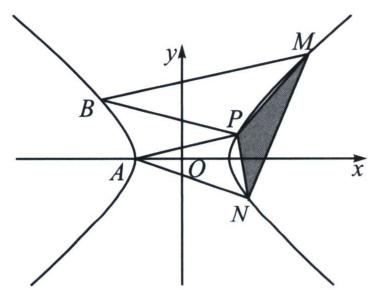

text_image

y
B
M
P
A
O
x
N

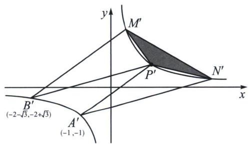

text_image

y
M'
P'
N'
x
B'
(-2-√3,-2+√3)
A'
(-1,-1)

解析 (1) $\frac{x^2}{4} - \frac{y^2}{3} = 1$ ;

(2)(i) $\frac{x^{2}}{4}-\frac{y^{2}}{3}=1$ →转化为 $x^{\prime}y^{\prime}=1$ ，A(-2,0)，B(-4,3)，

作 $\left\{\begin{aligned}x^{\prime}&=\left(\frac{\sqrt{2}}{2}x-\frac{\sqrt{6}}{3}y\right)\cdot\frac{\sqrt{2}}{2}\\ y^{\prime}&=\left(\frac{\sqrt{2}}{2}x+\frac{\sqrt{6}}{3}y\right)\cdot\frac{\sqrt{2}}{2}\end{aligned}\Rightarrow A^{\prime}(-1,-1)=\left(x_{1},\frac{1}{x_{1}}\right),B^{\prime}(-2-\sqrt{3},-2+\sqrt{3})=\left(x_{2},\frac{1}{x_{2}}\right),\right.$

$M'\left(x_3, \frac{1}{x_3}\right), N'\left(x_4, \frac{1}{x_4}\right), P'\left(x_0, \frac{1}{x_0}\right)$ ，所以 $k_{B'M'} = \frac{\frac{1}{x_3} - \frac{1}{x_2}}{x_3 - x_2} = -\frac{1}{x_2 x_3} = k_1 \Rightarrow M'\left(-\frac{1}{k_1 x_2}, -k_1 x_2\right)$ ，同理， $k_{B'P'} = k_{2} \Rightarrow P'\left(-\frac{1}{k_{2} x_{2}}, -k_{2} x_{2}\right)$ ， $k_{A'P'} = k_{1} \Rightarrow P'\left(-\frac{1}{k_{1} x_{1}}, -k_{1} x_{1}\right)$ ， $k_{A'N'} = k_{2} \Rightarrow N'\left(-\frac{1}{k_{2} x_{1}}, -k_{2} x_{1}\right)$ ，所以 $k_{1}x_{1}=-k_{2}x_{2}\Rightarrow\frac{k_{1}}{k_{2}}=\frac{x_{2}}{x_{1}}=m=2+\sqrt{3}$ ，所以 $y_{M}'+y_{N}'=-k_{1}x_{2}-k_{2}x_{1}=-mk_{2}x_{2}-k_{2}\frac{x_{2}}{m}=-k_{2}x_{2}\left(m+\frac{1}{m}\right)=y_{P}'$ • $(m+\frac{1}{m})$ ，所以 $y_{M}' + y_{N}' = \lambda y_{P}' \Rightarrow \lambda = m + \frac{1}{m} = 2 + \sqrt{3} + \frac{1}{2 + \sqrt{3}} = 4.$

(ii) $S_{\triangle PMN}^{\prime} = \frac{1}{2} S_{\triangle OMN}^{\prime} = \frac{1}{4}\left|x_{M}{}^{\prime}y_{N}{}^{\prime} - x_{N}{}^{\prime}y_{M}{}^{\prime}\right| = \frac{1}{4}\left|\frac{k_2x_1}{k_1x_2} -\frac{k_1x_2}{k_2x_1}\right| = \frac{1}{4}\left|m^2 -\frac{1}{m^2}\right| = \frac{1}{4}\left(m + \frac{1}{m}\right)$

$\left(m - \frac{1}{m}\right)| = 2\sqrt{3}$ （面积公式推导省略）， $\left\{ \begin{array}{l}x^{\prime} = \left(\frac{\sqrt{2}}{2} x - \frac{\sqrt{6}}{3} y\right)\cdot \frac{\sqrt{2}}{2}\\ y^{\prime} = \left(\frac{\sqrt{2}}{2} x + \frac{\sqrt{6}}{3} y\right)\cdot \frac{\sqrt{2}}{2} \end{array} \right.\Rightarrow$ 将原来横坐标和纵坐标分别缩小了 $\sqrt{2}$ 和 $\frac{3}{\sqrt{6}}$ 倍，再逆时针旋转 $45^{\circ}$ ，所以 $S_{\triangle PMN} = 2\sqrt{3}\times \sqrt{2}\times \frac{3}{\sqrt{6}} = 6.$

注意 平行弦问题，建议转化为反比例函数 $y=\frac{1}{x}$ 后，得益于两点对合式： $x_{1}x_{2}y+x=x_{1}+x_{2}$ ，其斜率与坐标转化 $k=-\frac{1}{x_{1}x_{2}}$ 可谓一步到位。接下来两题是不是可以直接秒了呢？

例4 (2025·温州1.5模第18题)已知双曲线 $C: \frac{x^2}{a^2} - \frac{y^2}{b^2} = 1 (a > 0, b > 0)$ 过点 $P_1(2, 2)$ , 其渐近线的方程为 $y = \pm 2x$ . 按照如下方式依次构造点 $P_n (n = 2, 3, \cdots)$ : 过右支上点 $P_{n-1}$ 作斜率为 1 的直线与 C 的左支交于点 $Q_{n-1}$ , 过 $Q_{n-1}$ 再作斜率为 -1 的直线与 C 的右支交于点 $P_n (x_n, y_n)$ .

(1)求双曲线 C 的方程;  
(2)用 $x_{n}$ ， $y_{n}$ 表示点 $Q_{n-1}$ 的坐标；  
(3)求证：数列 $\{2x_{n}-y_{n}\}$ 是等比数列.

解析 (1)由 $\left\{ \begin{array}{l} b = 2a \\ \frac{4}{a^2} - \frac{4}{b^2} = 1 \end{array} \right.$ ，解得 $\left\{ \begin{array}{l} a^2 = 3 \\ b^2 = 12 \end{array} \right.$ ，所以双曲线 $C$ 的方程为 $\frac{x^2}{3} - \frac{y^2}{12} = 1$ .

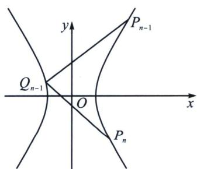

text_image

y
P_{n-1}
Q_{n-1}
O
x
P_n

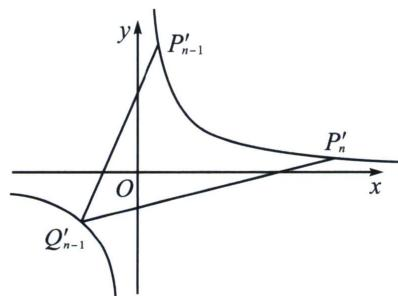

text_image

y
P'_{n-1}
O
x
P'_n
Q'_{n-1}

(2)(3)令 $\left\{\begin{aligned}x^{\prime}_{n}&=\frac{x_{n}}{\sqrt{3}}-\frac{y_{n}}{2\sqrt{3}}=\frac{1}{\sqrt{2}}\left(\frac{\sqrt{2}x_{n}}{\sqrt{3}}-\frac{y_{n}}{\sqrt{6}}\right)\end{aligned}\right.$ ，所以 $y^{\prime}_{n}=\frac{1}{x^{\prime}_{n}}$ ，设 $P^{\prime}_{n-1}(x^{\prime}_{n-1},y^{\prime}_{n-1})$ ， $P^{\prime}_{n}(x^{\prime}_{n},y^{\prime}_{n})$

$Q'_{n-1}(x'_{Q}, y'_{Q})$ 将 $P_{n}$ 横坐标缩小 $\frac{\sqrt{6}}{2}$ 倍，纵坐标缩小 $\sqrt{6}$ 倍，再以原点为中心逆时针旋转 $\frac{\pi}{4}$ 后得到 $P'_{n}$ ，故 $k'=\frac{1+\frac{k}{2}}{1-\frac{k}{2}}=\frac{2+k}{2-k}$ ，所以 $k'_{P'_{n-1}Q'_{n-1}}=3, k'_{P'_{n}Q'_{n-1}}=\frac{1}{3}$ ，由反比例函数任意两点的对合式方程为： $x_{i}x_{j}y+x=x_{i}+x_{j}$ （请自证），故 $k'_{P'_{n-1}Q'_{n-1}}=-\frac{1}{x'_{n-1}x'_{Q}}=3, k'_{P'_{n}Q'_{n-1}}=-\frac{1}{x'_{n}x'_{Q}}=\frac{1}{3}$ ，两式相除得 $\frac{x'_{n}}{x'_{n-1}}=\frac{2x_{n}-y_{n}}{2x_{n-1}-y_{n-1}}=9$ ，即 $\{2x_{n}-y_{n}\}$ 为等比数列.

$$
x _ {Q} ^ {\prime} = \frac {x _ {Q}}{\sqrt {3}} - \frac {y _ {Q}}{2 \sqrt {3}} = - \frac {3}{x _ {n} ^ {\prime}} = - 3 y _ {n} ^ {\prime} = - \sqrt {3} x _ {n} - \frac {\sqrt {3}}{2} y _ {n}, y _ {Q} ^ {\prime} = \frac {x _ {Q}}{\sqrt {3}} + \frac {y _ {Q}}{2 \sqrt {3}} = \frac {1}{x _ {Q} ^ {\prime}} = - \frac {x _ {n} ^ {\prime}}{3} = - \frac {x _ {n}}{3 \sqrt {3}} + \frac {y _ {n}}{6 \sqrt {3}},
$$

所以 $x_{Q} = -\frac{5}{3} x_{n} - \frac{2}{3} y_{n}$ ， $y_{Q} = \frac{8}{3} x_{n} + \frac{5}{3} y_{n}$ ，即点 $Q_{n - 1}$ 的坐标为 $\left(-\frac{5}{3} x_n - \frac{2}{3} y_n, \frac{8}{3} x_n + \frac{5}{3} y_n\right)$ .

例5 (2025·青岛开学考试19题)已知双曲线 $C: 4x^{2} - y^{2} = m$ ，点 $P_{1}(1, 1)$ 在 $C$ 上。按如下方式构造点 $P_{n} (n \geqslant 2)$ ；过点 $P_{n-1}$ 作斜率为 1 的直线与 $C$ 的左支交于点 $Q_{n-1}$ ，点 $Q_{n-1}$ 关于 $y$ 轴的对称点为 $P_{n}$ ，记点 $P_{n}$ 的坐标为 $(x_{n}, y_{n})$ 。

(1)求点 $P_{2}$ ， $P_{3}$ 的坐标；

(2) 记 $a_{n}=2x_{n}-y_{n}$ ，证明：数列 $\{a_{n}\}$ 为等比数列；

(3) O 为坐标原点，G，H 分别为线段 $P_{n}P_{n+2}$ ， $P_{n+1}P_{n+3}$ 的中点，记 $\triangle OP_{n+1}P_{n+2}$ ， $\triangle OGH$ 的面积分别为 $S_{1}$ ， $S_{2}$ ，求 $\frac{S_{1}}{S_{2}}$ 的值.

解析 (1)由题知 $m = 4 - 1 = 3$ ，所以双曲线 $C: 4x^{2} - y^{2} = 3$ ，又过点 $P_{1}(1, 1)$ ，斜率为1的直线方程为 $y = x$

由双曲线与直线的对称性可知 $Q_{1}(-1,-1)$ ，所以 $P_{2}(1,-1)$ ，又过 $P_{2}(1,-1)$ ，且斜率为 1 的直线方程为 $y+1=x-1$ ，即 y=x-2，由 $\left\{\begin{aligned}y&=x-2\\ 4x^{2}-y^{2}&=3\end{aligned}\right.$ ，解得 x=1 或 $x=-\frac{7}{3}$ ，当 $x=-\frac{7}{3}$ 时， $y=-\frac{7}{3}-2=-\frac{13}{3}$ ，所以 $Q_{2}\left(-\frac{7}{3},-\frac{13}{3}\right)$ ，所以 $P_{3}\left(\frac{7}{3},-\frac{13}{3}\right)$ ;

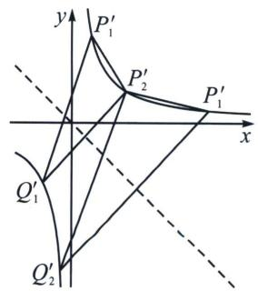

text_image

y
P₁'
P₂'
P₁'
x
Q₁'
Q₂'

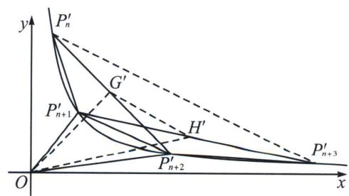

text_image

y
P'_n
G'
P'_{n+1}
H'
P'_{n+2}
P'_{n+3}
O
x

(2) $4x^{2}-y^{2}=3$ ，作 $\left\{\begin{aligned}x^{\prime}=(2x-y)\cdot\frac{\sqrt{2}}{2}\\ y^{\prime}=(2x+y)\cdot\frac{\sqrt{2}}{2}\end{aligned}\right.\Rightarrow x^{\prime}y^{\prime}=\frac{3}{2}$ ，其几何意义为原来横坐标扩大2倍，再逆时针旋转 $45^{\circ}$ ，则 $P_{1}^{\prime}\left(\frac{\sqrt{2}}{2},\frac{3\sqrt{2}}{2}\right)$ ，由于坐标变化，原来斜率为1的直线变成 $k^{\prime}=\frac{1}{2}$ ，由于旋转，故 $k_{P_{n}^{\prime}Q_{n}^{\prime}}=\frac{1+k^{\prime}}{1-k^{\prime}}=3$ （如左图），本题转化为过斜率为3的一系列直线 $P_{n-1}^{\prime}Q_{n-1}^{\prime}\parallel P_{n}^{\prime}Q_{n}^{\prime}\parallel P_{n+1}^{\prime}Q_{n+1}^{\prime}$ 与反比例函数 $y=\frac{3}{2x}$ 的交点情况，且 $Q_{n-1}^{\prime}$ 与 $P_{n}^{\prime}$ 关于直线y=-x对称，令 $P_{n-1}^{\prime}(x_{n-1}^{\prime},y_{n-1}^{\prime})$ ， $P_{n}^{\prime}(x_{n}^{\prime},y_{n}^{\prime})$ 则有 $\left\{\begin{aligned}x_{n}^{\prime}=-y_{Qn-1}^{\prime}\\ y_{n}^{\prime}=-x_{Qn-1}^{\prime}\end{aligned}\right.$ ， $k_{P_{n-1}^{\prime}Q_{n-1}^{\prime}}=\frac{\frac{3}{2x_{n-1}^{\prime}}+\frac{3}{2y_{n}^{\prime}}}{x_{n-1}^{\prime}+y_{n}^{\prime}}=\frac{3}{2x_{n-1}^{\prime}y_{n}^{\prime}}=\frac{x_{n}^{\prime}}{x_{n-1}^{\prime}}=3$ ，所以 $\frac{2x_{n}-y_{n}}{2x_{n-1}-y_{n-1}}=3$ ，所以数列 $\{a_{n}\}$ 是以1为首项，3的公比的等比数列；

(3)由(2)易得： $P^{\prime}_{n}\left(\frac{3^{n - 1}}{\sqrt{2}},\frac{3}{\sqrt{2}\cdot 3^{n - 1}}\right)$ ，则 $S_1^\prime = \frac{1}{2}\mid x_{n + 1}^{\prime}y_{n + 2} - x_{n + 2}^{\prime}y_{n + 1}^{\prime}| = \frac{1}{2}\left|\frac{3^n}{\sqrt{2}}\cdot \frac{3}{\sqrt{2}\cdot 3^{n + 1}} -\frac{3^{n + 1}}{\sqrt{2}}\cdot$ $\frac{3}{\sqrt{2}\cdot 3^n}\Big| = 2,\quad S_2^\prime = \frac{1}{2}\mid x_G^\prime y_H^\prime -x_H^\prime y_G^\prime | = \frac{1}{2}\left|\frac{x_n^\prime + x_{n + 2}^\prime}{2}\cdot \frac{y_{n + 1}^\prime + y_{n + 3}^\prime}{2} -\frac{x_{n + 1}^\prime + x_{n + 3}^\prime}{2}\cdot \frac{y_n^\prime + y_{n + 2}^\prime}{2}\right| =$ $\frac{1}{2}\left|\frac{25}{18} -\frac{25}{2}\right| = \frac{50}{9}$ ，故 $\frac{S_1^\prime}{S_2^\prime} = \frac{S_1}{S_2} = \frac{9}{25}.$

# 三、抛物线两点对合式构造等差等比数列

例6 (2025·文山市期末)已知点 $P_{1}(2, 1)$ 在抛物线 $C: x^{2} = 2py (p > 0)$ 上，按照如下方法依次构造点 $P_{n}(n = 2, 3, 4, \cdots)$ ，过点 $P_{n-1}$ 作斜率为 $-\frac{1}{2}$ 的直线与抛物线 $C$ 交于另一点 $Q_{n-1}$ ，作点 $Q_{n-1}$ 关于 $y$ 轴的对称点 $P_{n}$ ，记 $P_{n}$ 的坐标为 $(x_{n}, y_{n})$ .

(1)求抛物线 C 的方程;  
(2)求数列 $\{x_{n}\}$ 的通项公式，并求数列 $\left\{\frac{1}{x_{n}+y_{n}}\right\}$ 的前n项和 $T_{n}$ ;

(3)求 $\triangle P_{n}P_{n+1}P_{n+2}(n\in\mathbf{N}^{*})$ 的面积.

解析 (1)因为点 $P_{1}(2, 1)$ 在抛物线 $C: x^{2} = 2py$ 上, 则 $4 = 2p$ , 解得: $p = 2$ , 所以抛物线 $C$ 的方程 $x^{2} = 4y$ ; (2)由 $P_{1}(2, 1)$ 可知 $x_{1} = 2, y_{1} = 1$ , 因为点 $P_{n}(x_{n}, y_{n})$ 在抛物线 $C: x^{2} = 4y$ 上, 则 $y_{n} = \frac{x_{n}^{2}}{4}$ , 且 $Q_{n-1}(-x_{n}, y_{n})$ , 则过 $P_{n-1}(n = 2, 3, 4, \cdots)$ , 且斜率为 $-\frac{1}{2}$ 的直线对合式 $P_{n-1}Q_{n-1}: (x_{n-1} - x_{n})x = 4y - x_{n}x_{n-1}$ (请自证), 故 $-\frac{1}{2} = \frac{x_{n-1} - x_{n}}{4}$ , 即 $-x_{n} = -x_{n-1} - 2$ , 所以 $x_{n} = x_{n-1} + 2$ , 所以数列 $x_{n}$ 是以首项为 2 , 公差为 2 的等差数列, 所以 $x_{n} = 2 + 2(n - 1) = 2n$ , 即 $x_{n} = 2n (n \in \mathbf{N}^{*})$ , $y_{n} = \frac{x_{n}^{2}}{4} = \frac{4n^{2}}{4} = n^{2}$ , 所以 $\frac{1}{x_{n} + y_{n}} = \frac{1}{n^{2} + 2n} = \frac{1}{2}\left(\frac{1}{n} - \frac{1}{n+2}\right)$ , 则 $T_{n} = \frac{1}{2}\left(1 - \frac{1}{3} + \frac{1}{2} - \frac{1}{4} + \frac{1}{3} - \frac{1}{5} + \cdots + \frac{1}{n} - \frac{1}{n+2}\right) = \frac{1}{2}\left(1 + \frac{1}{2} - \frac{1}{n+1} - \frac{1}{n+2}\right) = \frac{3}{4} - \frac{2n+3}{2(n+1)(n+2)} (n \in \mathbf{N}^{*})$ ;

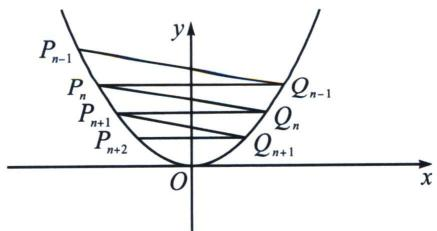

text_image

P_{n-1}
P_n
P_{n+1}
P_{n+2}
Q_{n-1}
Q_n
Q_{n+1}
O
x
y

(3)由(2)可知： $P_{n}(2n, n^{2})$ ， $P_{n+1}(2n+2, (n+1)^{2})$ ， $P_{n+2}(2n+4, (n+2)^{2})$ ，

所以直线 $P_{n}P_{n+2}$ 的对合方程为： $(2n+2n+4)x=4y+2n(2n+4)$ ，即 $(n+1)x-y-n^{2}-2n=0$ ，

则点 $P_{n + 1}$ 到直线 $P_{n}P_{n + 2}$ 的距离为 $d = \frac{|2(n + 1)^{2} - (n + 1)^{2} - n^{2} - 2n|}{\sqrt{(n + 1)^{2} + 1}} = \frac{1}{\sqrt{(n + 1)^{2} + 1}},$

又 $\left|P_{n}P_{n+2}\right|=\sqrt{(2n+4-2n)^{2}+\left[(n+2)^{2}-n^{2}\right]^{2}}=4\sqrt{(n+1)^{2}+1}$

所以 $\triangle P_{n}P_{n + 1}P_{n + 2}(n\in \mathbf{N}^{*})$ 的面积为 $S = \frac{1}{2}\mid P_nP_{n + 2}\mid d = 2.$

例7 (2025·深圳罗湖区期末第19题)设 $P_{1}(4, 4)$ 为抛物线 $C: y^{2} = 2px (p > 0)$ 上一点，按如下方式构造 $P_{n}(x_{n}, y_{n})(n = 2, 3, \cdots)$ ：设 $Q(1, -4)$ ，线段 $P_{n-1}Q$ 与 $C$ 交于点 $Q_{n-1}$ ， $P_{n}$ 为 $Q_{n-1}$ 关于 $x$ 轴的对称点.

(1) 求 $P_{2}(x_{2}, y_{2})$ ;

(2) 记 $y_{1}=4$ ，且 $a_{n}=\frac{y_{n}+2}{y_{n}-2}$ .

(i) 判断无穷数列 $\{a_{n}\}$ 是否为等比数列，并说明理由；

(ii) 当 $n \in N^{*}$ 时，证明： $\sum_{i=1}^{n} y_{i} < 2n + 3$ .

解析 (1) $P_{1}(4, 4)$ 为抛物线 $C: y^{2} = 2px (p > 0)$ 上一点，则 $16 = 8p$ ，解得 $p = 2$

所以抛物线 C 的方程为 $y^{2}=4x$ ， $k_{P_{1}Q}=\frac{4+4}{4-1}=\frac{8}{3}$ ，则直线 $P_{1}Q$ 的方程为 $y-4=\frac{8}{3}(x-4)$ ，整理的 $y=\frac{8}{3}x-\frac{20}{3}$ ，联立 $\left\{\begin{aligned}y^{2}&=4x\\ y&=\frac{8}{3}x-\frac{20}{3}\end{aligned}\right.$ ，消去 y 整理得 $16x^{2}-89x+100=0$ ，解得 x=4 或 $\frac{25}{16}$ ，将 $x=\frac{25}{16}$ 代入 $y=\frac{8}{3}x-\frac{20}{3}$ ，得 $y=-\frac{5}{2}$ ，所以 $Q_{1}\left(\frac{25}{16},-\frac{5}{2}\right)$ ，则 $P_{2}\left(\frac{25}{16},\frac{5}{2}\right)$ .

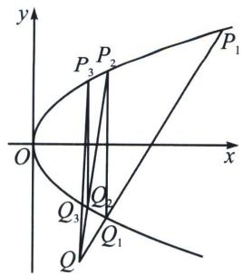

text_image

y
P₁
P₂
P₃
O
x
Q₂
Q₃
Q₁
Q

(i)无穷数列 $\{a_{n}\}$ 是等比数列，理由如下：

直线 $P_{n-1}Q$ 对合方程： $(y_{n-1}-y_{n})y=4x-y_{n-1}y_{n}$ ，由于过 $Q(1,-4)$ ，故 $4(y_{n-1}-y_{n})+4-y_{n-1}y_{n}=0$ ，

则 $\frac{a_n}{a_{n-1}} = \frac{y_n + 2}{y_n - 2} \cdot \frac{y_{n-1} - 2}{y_{n-1} + 2} = \frac{y_n y_{n-1} - 2 y_n + 2 y_{n-1} - 4}{y_n y_{n-1} + 2 y_n - 2 y_{n-1} - 4} = \frac{-6(y_n - y_{n-1})}{-2(y_n - y_{n-1})} = 3, a_1 = \frac{4 + 2}{4 - 2} = 3$ ，所以数列 $\{a_n\}$ 是首项为 3，公比为 3 的等比数列.

(ii) 证明：由(i)得 $\frac{y_n + 2}{y_n - 2} = 3^n$ ，整理得 $y_n = \frac{2 \cdot 3^n + 2}{3^n - 1} = 2 + \frac{4}{3^n - 1}$ ，

$$
\sum_ {i = 1} ^ {n} y _ {i} = 2 n + \frac {4}{3 ^ {1} - 1} + \frac {4}{3 ^ {2} - 1} + \dots + \frac {4}{3 ^ {n} - 1} <   2 n + 2 + \frac {2}{3 ^ {1}} + \dots + \frac {2}{3 ^ {n - 1}} = 2 n + 2 + \frac {\frac {2}{3} \left(1 - \frac {1}{3 ^ {n - 1}}\right)}{1 - \frac {1}{3}} = 2 n + 3 - \frac {1}{2 \cdot 3 ^ {n - 2}},
$$

因为 $2 \cdot 3^{n-2} > 0$ ，所以 $2n + 3 - \frac{1}{2 \cdot 3^{n-2}} < 2n + 3$ ，综上， $\sum_{i=1}^{n} y_i < 2n + 3$ .

例8 (2025届浙江省桐乡市高三5月模拟测试 T19)在平面直角坐标系中, 将每个点绕原点 $O$ 沿逆时针方向旋转 $\alpha$ 角的变换称为旋转角为 $\alpha$ 的旋转变换, 设点 $P(x, y)$ 经过旋转角 $\alpha$ 的旋转变换后变成点 $P'(x', y')$ , 则 $\left\{ \begin{array}{l} x' = x\cos \alpha - y\sin \alpha \\ y' = x\sin \alpha + y\cos \alpha \end{array} \right.$

(1)在 $\frac{\pi}{4}$ 的旋转变换下，若点 $P(1,1)$ 变成 $P'$ 点，直线l：y=2x-1变成直线 $l'$ ，求： $P'$ 的坐标和直线 $l'$ 的斜率；

(2)已知曲线 $C'$ : $x'^{2} + y'^{2} + 2x'y' + \sqrt{2}x' - \sqrt{2}y' = 0$ 是由平面直角坐标系下焦点在 y 轴上的抛物线 C 绕原点 O 逆时针旋转 $\frac{\pi}{4}$ 所得的斜抛物线的方程.

①求斜抛物线 $C'$ 的焦准距；

②已知 $A_{1}^{\prime}(0, \sqrt{2})$ 在斜抛物线 $C^{\prime}$ 上，按如下规则依次构造点列 $\{A_{n}^{\prime}\}(n \geqslant 2)$ ：过点 $A_{n-1}^{\prime}$ 作斜率为 $\frac{1 + \frac{1}{2^{n}}}{1 - \frac{1}{2^{n}}}$ 的直线交 $C^{\prime}$ 于点 $B_{n-1}^{\prime}$ ，再过点 $B_{n-1}^{\prime}$ 作斜率为 $\frac{1 + \frac{1}{2^{n-1}}}{1 - \frac{1}{2^{n-1}}}$ 的直线交 $C^{\prime}$ 于点 $A_{n}^{\prime}$ ，记 $\triangle A_{n}^{\prime}A_{n+1}^{\prime}A_{n+2}^{\prime}$ 的面积为 $S_{n}^{\prime}$ . 求证： $\sum_{i=1}^{n} S_{n}^{\prime} < \frac{3}{448}$ .

解析 (1)由题设中的变换方法有 $\left\{ \begin{array}{l} x' = 1 \times \cos \frac{\pi}{4} - 1 \times \sin \frac{\pi}{4} \\ y' = 1 \times \sin \frac{\pi}{4} + 1 \times \cos \frac{\pi}{4} \end{array} \right.$ ，故 $\left\{ \begin{array}{l} x' = 0 \\ y' = \sqrt{2} \end{array} \right.$ ，故 $P(0, \sqrt{2})$ 。

设 $l'$ 上的任意一点为 $P(x', y')$ ，旋转前对应的点为 $P(x, y)$ ，则 $\left\{\begin{aligned}x &= x'\cos\left(-\frac{\pi}{4}\right) - y'\sin\left(-\frac{\pi}{4}\right) \\ y &= x'\sin\left(-\frac{\pi}{4}\right) + y'\cos\left(-\frac{\pi}{4}\right)\end{aligned}\right.$ 即

$\left\{ \begin{array}{l} x = \frac{\sqrt{2}}{2} x' + \frac{\sqrt{2}}{2} y' \\ y = -\frac{\sqrt{2}}{2} x' + \frac{\sqrt{2}}{2} y' \end{array} \right.$ 故 $-\frac{\sqrt{2}}{2} x' + \frac{\sqrt{2}}{2} y' = 2\left(\frac{\sqrt{2}}{2} x' + \frac{\sqrt{2}}{2} y'\right) - 1$ 即 $-\frac{\sqrt{2}}{2} x' + \frac{\sqrt{2}}{2} y' = \sqrt{2} x' + \sqrt{2} y' - 1,$

整理得 $3x' + y' - \sqrt{2} = 0$ ，故 $l'$ ： $3x + y - \sqrt{2} = 0$ ，故 $l'$ 的斜率为 -3.

(2)①设抛物线 C 上的点为 $P(x, y)$ ，旋转后对应的点为 $P'(x', y')$ ，

则 $\left\{\begin{aligned}x^{\prime}&=x\cos\frac{\pi}{4}-y\sin\frac{\pi}{4}\\ y^{\prime}&=x\sin\frac{\pi}{4}+y\cos\frac{\pi}{4}\end{aligned}\right.$ 即 $\left\{\begin{aligned}x^{\prime}&=\frac{\sqrt{2}}{2}x-\frac{\sqrt{2}}{2}y\\ y^{\prime}&=\frac{\sqrt{2}}{2}x+\frac{\sqrt{2}}{2}y\end{aligned}\right.$ ，故 $\left(\frac{\sqrt{2}}{2}x-\frac{\sqrt{2}}{2}y\right)^{2}+\left(\frac{\sqrt{2}}{2}x+\frac{\sqrt{2}}{2}y\right)^{2}+2\left(\frac{\sqrt{2}}{2}x-\frac{\sqrt{2}}{2}y\right)\left(\frac{\sqrt{2}}{2}x+\frac{\sqrt{2}}{2}y\right)$

$\left.\frac{\sqrt{2}}{2}y\right)+\sqrt{2}\left(\frac{\sqrt{2}}{2}x-\frac{\sqrt{2}}{2}y\right)-\sqrt{2}\left(\frac{\sqrt{2}}{2}x+\frac{\sqrt{2}}{2}y\right)=0$ ，整理得： $x^{2}=y$ ，该抛物线的焦准距为 $\frac{1}{2}$ ，但旋转变换不改变焦准距，故斜抛物线的焦准距为 $\frac{1}{2}$ .

②由(1)可得 $A_{1}^{\prime}(0, \sqrt{2})$ 对应的 $A_{1}(1, 1)$ ，设曲线上有两个 $C^{\prime}$ 上有两个 $P_{1}(a^{\prime}, b^{\prime})$ ， $P_{2}(s^{\prime}, t^{\prime})$ ，其对应的点为 $S(a, b)$ ， $T(s, t)$ ，则 $\left\{\begin{aligned}a^{\prime}&=a\cos\frac{\pi}{4}-b\sin\frac{\pi}{4}\\ b^{\prime}&=a\sin\frac{\pi}{4}+b\cos\frac{\pi}{4}\end{aligned}\right.$ 且 $\left\{\begin{aligned}s^{\prime}&=s\cos\frac{\pi}{4}-t\sin\frac{\pi}{4}\\ t^{\prime}&=s\sin\frac{\pi}{4}+t\cos\frac{\pi}{4}\end{aligned}\right.$

则 $\frac{t^{\prime}-b^{\prime}}{s^{\prime}-a^{\prime}}=\frac{s\sin\frac{\pi}{4}+t\cos\frac{\pi}{4}-a\sin\frac{\pi}{4}-b\cos\frac{\pi}{4}}{s\cos\frac{\pi}{4}-t\sin\frac{\pi}{4}-a\cos\frac{\pi}{4}+b\sin\frac{\pi}{4}}=\frac{s-a+t-b}{s-a-(t-b)}=\frac{1+\frac{t-b}{s-a}}{1-\frac{t-b}{s-a}}$

故 $k_{P_1P_2} = \frac{s\sin\frac{\pi}{4} + t\cos\frac{\pi}{4} - a\sin\frac{\pi}{4} - b\cos\frac{\pi}{4}}{s\cos\frac{\pi}{4} - t\sin\frac{\pi}{4} - a\cos\frac{\pi}{4} + b\sin\frac{\pi}{4}} = \frac{s - a + t - b}{s - a - (t - b)} = \frac{1 + k_{ST}}{1 - k_{ST}}$

设 $A'_{n}$ 对应的点为 $A_{n}$ ， $B'_{n}$ 对应的点为 $B_{n}$ ，则 $A_{n}$ ， $B_{n}$ 在抛物线 $x^{2}=y$ 上且 $k_{A_{n-1}B_{n-1}}=\frac{1}{2^{n}}$

$k_{A_{n}B_{n-1}}=\frac{1}{2^{n-1}}$ ，设 $A_{n}(a_{n},a_{n}^{2})$ ， $B_{n}(b_{n},b_{n}^{2})$ ，则 $a_{1}=1$ ，

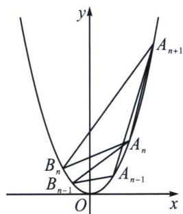

text_image

y
A_{n+1}
B_n
A_n
B_{n-1}
A_{n-1}
O
x

又 $\frac{b_{n - 1}^2 - a_{n - 1}^2}{b_{n - 1} - a_{n - 1}} = \frac{1}{2^n}$ ，且 $\frac{b_{n - 1}^2 - a_n^2}{b_{n - 1} - a_n} = \frac{1}{2^{n - 1}}$ ，整理得到 $b_{n - 1} + a_{n - 1} = \frac{1}{2^n}$ ， $b_{n - 1} + a_n = \frac{1}{2^{n - 1}}$

所以 $a_{n} - a_{n - 1} = \frac{1}{2^{n}}$ ，而 $a_1 = 1$ ，故 $a_{n} - a_{1} = \frac{1}{2^{2}} +\frac{1}{2^{3}} +\dots +\frac{1}{2^{n}}$ ，故 $a_{n} = \frac{3}{2} -\frac{1}{2^{n}}$ ，而 $a_1 = 1$ 也符合该式，故 $a_{n}$ $= \frac{3}{2} -\frac{1}{2^n}$ 又 $A_{n}A_{n + 1}$ 的方程为 $y = \frac{a_{n + 1}^2 - a_n^2}{a_{n + 1} - a_n}(x - a_n) + a_n^2$ 即 $y = (a_{n + 1} + a_n)x - a_na_{n + 1}$

而 $\left|A_{n}A_{n+1}\right|=\sqrt{(a_{n+1}-a_{n})^{2}+(a_{n+1}^{2}-a_{n}^{2})^{2}}=\left|a_{n+1}-a_{n}\right|\sqrt{(a_{n+1}+a_{n})^{2}+1}$

而 $A_{n + 2}$ 到直线 $A_{n}A_{n + 1}$ 的距离为 $d = \frac{\left|(a_{n + 1} + a_n)a_{n + 2} - a_{n + 2}^2 - a_na_{n + 1}\right|}{\sqrt{(a_{n + 1} + a_n)^2 + 1}}$

故 $\triangle A_{n}A_{n + 1}A_{n + 2}$ 的面积为 $S_{n} = \frac{1}{2} dA_{n}A_{n + 1} = \frac{1}{2}|a_{n + 1} - a_n||(a_{n + 1} + a_n)a_{n + 2} - a_{n + 2}^2 -a_na_{n + 1}| =$ $\frac{1}{2}|a_{n + 1} - a_n||a_{n + 2}(a_{n + 1} - a_{n + 2}) + a_n(a_{n + 2} - a_{n + 1})| = \frac{1}{2} |(a_{n + 2} - a_n)(a_{n + 1} - a_{n + 2})||a_{n + 1} - a_n| = \frac{1}{2}\times \frac{1}{2^{n + 2}}\times$ $\frac{3}{2^{n + 2}}\times \frac{1}{2^{n + 1}} = \frac{3}{2^{3n + 6}}$ ，由于旋转变换不改变图形面积，故 $S_{n}^{\prime} = \frac{3}{2^{3n + 6}}$ ，故 $\sum_{i = 1}^{n}S_{n}^{\prime} = \frac{3}{512}\times \frac{1 - \left(\frac{1}{8}\right)^{n}}{1 - \frac{1}{8}} < \frac{3}{512}\times \frac{8}{7} < \frac{3}{64}$ $\times \frac{1}{7} = \frac{3}{448}.$

# 第二节 抛物线切线对合与两点对合数列构造综合

# 一、抛物线蝴蝶定理

蝴蝶定理我们会在后面介绍极点极线后给到背景解读，在抛物线的体系里，两点对合式就是无敌的存在.

已知抛物线 $y^{2}=2px(p>0)$ ， $A(m,0)$ ， $B(n,0)$ ，过点 A 的动直线交抛物线于 M，N 两点，直线 MB，NB 分别交抛物线于点 P，Q，则：

(1) 直线 PQ 恒过 x 轴的定点 $C(t, 0)$ ，其中 $n^{2} = m \cdot t$ ;  
(2) 假设直线 MN 和 PQ 的斜率都存在，则 $\frac{k_{MN}}{k_{PQ}} = \frac{n}{m} = \frac{|CB|}{|BA|}$ .

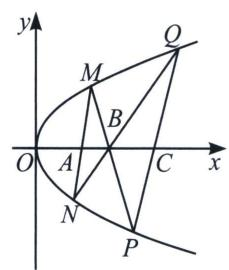

text_image

y
M
Q
B
O
A
C
x
N
P

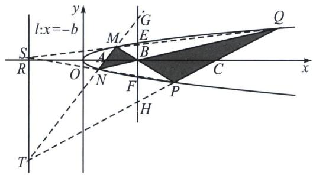

text_image

l:x=-b
S
R
O
A
M
G
E
B
Q
x
F
P
H
T

证明：解法一（两点对合式同构同构）：易得 $\left\{ \begin{array}{l} y_{M}y_{N} = -2pm① \\ y_{M}y_{P} = -2pn② \\ y_{N}y_{Q} = -2pn③ \\ y_{P}y_{Q} = -2pt④ \end{array} \right.$ ①×④=②×③有 $n^2 = mt$ ；

$$
\frac {k _ {M N}}{k _ {P Q}} = \frac {\frac {2 p}{y _ {M} + y _ {N}}}{\frac {2 p}{y _ {p} + y _ {Q}}} = \frac {y _ {P} + y _ {Q}}{y _ {M} + y _ {N}} = \frac {- \frac {2 p n}{y _ {M}} - \frac {2 p n}{y _ {N}}}{y _ {M} + y _ {N}} = \frac {- 2 p n}{y _ {M} y _ {N}} = \frac {- 2 p n}{- 2 p m} = \frac {n}{m}.
$$

解法二：如图所示，作出辅助线，补全自极三角形 TSB(参考下一章内容)，由于 $EF \parallel ST$ ，易得 BE=

$BF$ ，根据蝴蝶定理，显然有 $BG = BH$ ，故 $\frac{k_{MN}}{k_{PQ}} = \frac{|RC|}{|RA|} = \frac{t + n}{m + n} = \frac{|CB|}{|BA|} = \frac{t - n}{n - m} = \frac{2t}{2n} = \frac{2n}{2m}.$

例1 (2025·广州高三开学第19题) 蝴蝶定理是数学中的一道名题, 已经有两百年的历史, 迄今依然是一棵生机勃勃的常青树, 因其图形像一只蝴蝶而得名. 蝴蝶模型在圆锥曲线中经常出现, 其中点、线有很多优美的性质. 已知抛物线 $E: y^{2} = 2px (p > 0)$ 的焦点为 $F$ , 过 $F$ 的直线 $l$ 交抛物线 $E$ 于 $A, B$ , 当 $l$ 与 $x$ 轴垂直时, $\triangle AOB$ 的面积为 2 , 其中 $O$ 为坐标原点.

(1)求抛物线 E 的方程;

(2)若直线 l 的斜率存在为 $k_{1}$ ，过 $P(2,0)$ 作直线 AP，BP 分别交抛物线 E 于 C，D，连 CD，设直线 CD 的斜率为 $k_{2}$ ，证明： $\frac{k_{2}}{k_{1}}$ 为定值；

(3)记直线 AB, CD 的倾斜角分别为 $\alpha$ , $\beta$ , 当 $\alpha - \beta$ 最大时, 求直线 AB 的方程.

解析 (1)依题意有, 抛物线焦点 $F\left(\frac{p}{2}, 0\right)$ , 当 $l$ 与 $x$ 轴垂直时, $|AB| = 2p$ , 从而 $S_{\triangle AOB} = \frac{1}{2} |OF|$ $|AB| = \frac{p^2}{2} = 2$ , 所以 $p = 2$ , 所以抛物线 $E$ 的方程为 $y^2 = 4x$ .

(2)证明：设 $A(x_{1},y_{1})$ ， $B(x_{2},y_{2})$ ， $C(x_{3},y_{3})$ ， $D(x_4,y_4)$ ，则 $k_{1} = \frac{y_{2} - y_{1}}{x_{2} - x_{1}} = \frac{4(y_{2} - y_{1})}{y_{2}^{2} - y_{1}^{2}} = \frac{4}{y_{2} + y_{1}}$

从而直线 $AB$ 的方程为 $y - y_{1} = \frac{4}{y_{2} + y_{1}}\left(x - \frac{y_{1}^{2}}{4}\right)$ ，即 $(y_{2} + y_{1})y - 4x - y_{1}y_{2} = 0$ ，将 $F(1,0)$ 代入有 $y_{1}y_{2} = -4$ ，同理，直线 $AP$ 的方程为 $(y_{3} + y_{1})y - 4x - y_{1}y_{3} = 0$ ，直线 $BP$ 的方程为 $(y_{4} + y_{2})y - 4x - y_{2}y_{4} = 0$ ，

将 $P(2,0)$ 代入有 $y_{1}y_{3} = y_{2}y_{4} = -8$ ，因为 $k_{2} = \frac{4}{y_{3} + y_{4}}$ ，所以 $\frac{k_{2}}{k_{1}} = \frac{y_{1} + y_{2}}{y_{3} + y_{4}} = \frac{y_{1} + y_{2}}{-8\left(\frac{1}{y_1} + \frac{1}{y_2}\right)} = -\frac{y_1y_2}{8} = \frac{1}{2}$ ，从而得证.

(3)由(2)知 $\frac{\tan\beta}{\tan\alpha} = \frac{1}{2}$ , $\tan\alpha = 2\tan\beta$ , 且 $\alpha, \beta \in \left(0, \frac{\pi}{2}\right)$ 或 $\left(\frac{\pi}{2}, \pi\right)$ , 当 $\alpha, \beta \in \left(\frac{\pi}{2}, \pi\right)$ 时, $\tan\alpha < \tan\beta < 0$ , $\alpha < \beta$ , $\alpha - \beta < 0$ , 当 $\alpha, \beta \in \left(0, \frac{\pi}{2}\right)$ 时, $\tan\alpha > \tan\beta > 0$ , $\alpha > \beta$ , $\alpha - \beta > 0$ ,

由 $\tan (\alpha -\beta) = \frac{\tan\alpha - \tan\beta}{1 + \tan\alpha\tan\beta} = \frac{\tan\beta}{1 + 2\tan^2\beta} = \frac{1}{\frac{1}{\tan B} + 2\tan\beta}\leqslant \frac{1}{2\sqrt{2}} = \frac{\sqrt{2}}{4}$ , 当 $\tan \beta = \frac{\sqrt{2}}{2}, \tan \alpha = \sqrt{2}, \tan (\alpha -\beta)$ 取得最大值 $\frac{\sqrt{2}}{4}$ , 此时 $\alpha -\beta$ 最大, 所以当 $\alpha -\beta$ 最大时, $\tan \alpha = \sqrt{2}$ , 此时直线 $AB$ 的方程为 $y = \sqrt{2}(x - 1)$ .

例2 (2025·河北张家口期末第18题)直线 $l$ 经过抛物线 $E: y^{2} = 4x$ 的焦点 $F$ , 且与 $E$ 交于 $A, B$ 两点 (点 $A$ 在 $x$ 轴上方), 点 $M_{n}(n, 0) (n \in \mathbf{N}^{*}$ , 且 $n \geqslant 2$ ) 在 $x$ 轴上, 直线 $AM_{n}, BM_{n}$ 分别与 $E$ 交于点 $C_{n}, D_{n}$ , 记直线 $C_{n}D_{n}$ 与 $x$ 轴交点的横坐标为 $x_{n}$ .

(1)若直线 l 垂直于 x 轴，求直线 $C_{2}D_{2}$ 的方程.

(2)证明： $\sum_{i=2}^{n}\frac{1}{x_{i}}<\frac{3}{4}.$

解析 (1)易知抛物线 $E$ 得焦点为 $F(1,0)$ , 若直线 $l$ 垂直于 $x$ 轴, 此时直线 $l$ 的方程为 $x = 1$ , 将 $x = 1$ 代入抛物线的方程中, 解得 $y = \pm 2$ , 因为点 $A$ 在 $x$ 轴上方, 所以 $y_A = 2$ , $y_B = -2$ , 因为 $M_2(2,0)$ ,

所以 $l_{AM_{2}}: y=\frac{2-0}{1-2}(x-2)$ ， $l_{BM_{2}}: y=\frac{-2-0}{1-2}(x-2)$ ，即 $l_{AM_{2}}: y=-2(x-2)$ ， $l_{BM_{2}}: y=2(x-2)$ ，

联立 $\left\{\begin{aligned}y&=-2(x-2)\\ y^{2}&=4x\end{aligned}\right.$ ，解得 $\left\{\begin{aligned}x&=1\\ y&=2\end{aligned}\right.$ 或 $\left\{\begin{aligned}x&=4\\ y&=-4\end{aligned}\right.$ ，即 $C_{2}(4,-4)$ ，同理得 $D_{2}(4,4)$ ，则直线 $C_{2}D_{2}$ 的方程为x=4；

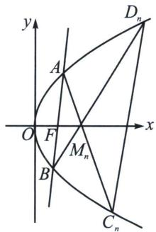

text_image

y
A
Dₙ
O F x
Mₙ
B
Cₙ

(2)证明：设直线 $AB$ 对合式方程为 $(y_{1} + y_{2})y = 4x + y_{1}y_{2}$ （请自证），由于过 $F(1,0)$ ，所以 $y_{1}y_{2} = -4$

同理 $AC_{n}:(y_{1}+y_{C})y=4x+y_{1}y_{C},\quad BD_{n}:(y_{2}+y_{D})y=4x+y_{2}y_{D}$ ，由于都过 $M_{n}(n,0)$ $(n\in\mathbb{N}^{*},\text{且}n\geqslant2)$ ，故 $\left\{\begin{aligned}y_{1}y_{C}&=-4n\\ y_{2}y_{D}&=-4n\end{aligned}\right.$ ，所以 $y_{C}y_{D}=-4n^{2}$ ，结合 $C_{n}D_{n}:(y_{C}+y_{D})y=4x+y_{C}y_{D}$ ，所以 $x_{n}=n^{2}$ ，此时 $\frac{1}{x_{n}}=\frac{1}{n^{2}}$ ，则 $\sum_{i=2}^{n}\frac{1}{x_{i}}=\frac{1}{2^{2}}+\frac{1}{3^{2}}+\cdots+\frac{1}{n^{2}}$ ，因为 $\frac{1}{n^{2}}<\frac{1}{n(n-1)}=\frac{1}{n-1}-\frac{1}{n}$ 。所以 $\sum_{i=2}^{n}\frac{1}{x_{i}}\leqslant\frac{1}{4}+\frac{1}{2}-\frac{1}{3}+\cdots+\frac{1}{n-1}-\frac{1}{n}=\frac{3}{4}-\frac{1}{n}<\frac{3}{4}$ 。

例3 (2025·东北三省三校·二模 T19) 已知抛物线 C: $y^{2}=4x$ ，焦点为 $F_{0}$ 。抛物线上有一点 $P_{1}(x_{1}, y_{1})(x_{1}>1, y_{1}>0)$ ，直线 $F_{0}P_{1}$ 与抛物线的另一个交点为 $P_{0}$ 。按照如下方式依次构造点 $F_{2k-1}$ ， $P_{2k}$ ， $P_{2k+1}$ ， $F_{2k}(k=1, 2, 3, \cdots)$ ，过 $P_{2k-1}$ 作 x 轴的垂线，垂足为 $F_{2k-1}$ ，垂线与抛物线 C 的另一个交点为 $P_{2k}$ 。作直线 $P_{2k-2}F_{2k-1}$ ，与抛物线 C 的另一个交点为 $P_{2k+1}$ ，直线 $P_{2k}P_{2k+1}$ 与 x 轴的交点为 $F_{2k}$ 。记 $P_{n}(x_{n}, y_{n})$ ， $F_{n}(m_{n}, 0)$ ， $m_{1}=m$ ， $(n=0, 1, 2, \cdots)$ 。

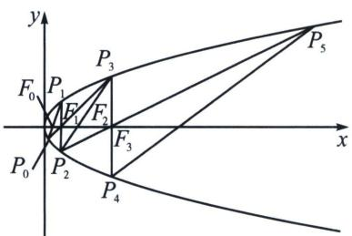

text_image

y
P₃
F₀ P₁
F₁ F₂
F₃
x
P₀ P₂
P₄
P₅

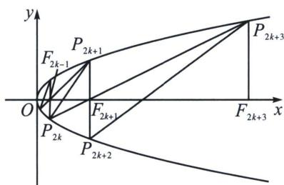

text_image

y
P_{2k+1}
F_{2k-1}
O
P_{2k}
F_{2k+1}
x
P_{2k+3}
P_{2k+2}

(1) 若 $P_{1}(2, 2\sqrt{2})$ ，求 $m_{0}, m_{1}, m_{2}, m_{3}$ ;

(2)求证: 数列 $\{m_{n}\}$ 是等比数列, 并用 $m$ 表示数列 $\{m_{n}\}$ 的通项公式;

(3)对任意的正整数 k， $\triangle P_{2k-2}P_{2k-1}F_{2k-1}$ 与 $\triangle F_{2k-1}P_{2k}P_{2k+1}$ 的面积之比是否为定值？若是，请用 m 表示这个定值；若不是，请说明理由.

解析 (1) $m_{0} = 1, F_{1}(2,0), m_{1} = 2$ ，直线 $P_{1}F_{0}: x = \frac{\sqrt{2}}{4} y + 1$ ，联立可得 $P_{0}\left(\frac{1}{2}, -\sqrt{2}\right)$ ，直线 $P_{0}F_{1}: x = \frac{3\sqrt{2}}{4} y + 2$ ，联立可得 $P_{3}(8,4\sqrt{2})$ ，则 $F_{3}(8,0)$ ，由 $P_{3}(8,4\sqrt{2}), P_{2}(2,-2\sqrt{2})$ ，可得 $F_{2}(4,0)$ ，综上可得： $m_{0} = 1, m_{1} = 2, m_{2} = 4, m_{3} = 8$ ；

(2)一方面，对任意的自然数 $k$ ，都有直线 $P_{2k}P_{2k + 1}$ 过点 $F_{2k}(m_{2k},0)$ ， $P_{2k}P_{2k + 1}$ ： $(y_{2k} + y_{2k + 1})y = 4x + y_{2k}$ $y_{2k + 1}$ ，代入点 $F_{2k}(m_{2k},0)$ ，所以 $y_{2k}y_{2k + 1} = -4m_{2k}$ ①，另一方面，对任意的自然数 $k$ ，都有直线 $P_{2k}P_{2k + 3}$ 过点 $F_{2k + 1}(m_{2k + 1},0)$ ，所以 $P_{2k}P_{2k + 3}$ ： $(y_{2k} + y_{2k + 3})y = 4x + y_{2k}y_{2k + 3}$ ，代入点 $F_{2k + 1}(m_{2k + 1},0)$ ，所以 $y_{2k}y_{2k + 3} = -4m_{2k + 1}$ ②，

同理， $y_{2k+1}y_{2k+2}=-4m_{2k+1}$ ③， $y_{2k+2}y_{2k+3}=-4m_{2k+2}$ ④，所以由②×③=①×④得： $m_{2k+1}^{2}=m_{2k}\cdot m_{2k+2}$

即： $\frac{m_{2k+2}}{m_{2k+1}}=\frac{m_{2k+1}}{m_{2k}}$ ，综上可得：递推知数列 $\{m_{n}\}$ 是等比数列，且公比为 $\frac{m_{1}}{m_{0}}=m$ 。又 $m_{0}=1$ ，故 $m_{n}=m^{n}(n=0,1,2,3,\cdots)$ 。

(3)解法一：对任意的自然数 $k$ ， $\frac{S_{\triangle P_{2k}P_{2k + 1}F_{2k + 1}}}{S_{\triangle P_{2k + 2}P_{2k + 3}F_{2k + 1}}} = \frac{\frac{1}{2}|F_{2k + 1}P_{2k + 1}|\cdot|F_{2k + 1}P_{2k}|\sin\angle P_{2k + 1}F_{2k + 1}P_{2k}}{\frac{1}{2}|F_{2k + 1}P_{2k + 3}|\cdot|F_{2k + 1}P_{2k + 2}|\sin\angle P_{2k + 2}F_{2k + 1}P_{2k + 3}} =$ $\frac{|F_{2k + 1}F_{2k - 1}|}{|F_{2k + 3}F_{2k + 1}|} = \frac{m^{2k + 1} - m^{2k - 1}}{m^{2k + 3} - m^{2k + 1}} = \frac{m^{2k + 1} - m^{2k - 1}}{m^2(m^{2k + 1} - m^{2k - 1})} = \frac{1}{m^2},$

解法二： $S_{\triangle P_{2k - 2}P_{2k - 1}F_{2k - 1}} = \frac{1}{2} (m_{2k - 1} - m_{2k - 2})|y_{2k - 1} - y_{2k - 2}| = \frac{1}{2} m^{2k - 2}(m - 1)(y_{2k - 1} - y_{2k - 2}) = \frac{1}{2} m^{2k - 2}(m$ $-1)(2\sqrt{x_{2k - 1}} - 2\sqrt{x_{2k - 2}}) = m^{2k - 2}(m - 1)(\sqrt{x_{2k - 1}} - \sqrt{x_{2k - 2}}) = m^{2k - 2}(m - 1)(\sqrt{m^{2k - 1}} - \sqrt{m^{2k - 3}}),$

$$
S _ {\triangle P _ {2 k} P _ {2 k + 1} F _ {2 k - 1}} = \frac {1}{2} (m _ {2 k} - m _ {2 k - 1}) | y _ {2 k + 1} - y _ {2 k} | = \frac {1}{2} m ^ {2 k - 1} (m - 1) (y _ {2 k + 1} - y _ {2 k}) = \frac {1}{2} m ^ {2 k - 1} (m - 1)
$$

$$
(2 \sqrt {x _ {2 k + 1}} - 2 \sqrt {x _ {2 k}}) = m ^ {2 k - 1} (m - 1) (\sqrt {x _ {2 k + 1}} - \sqrt {x _ {2 k}}) = m ^ {2 k - 1} (m - 1) (\sqrt {m ^ {2 k + 1}} - \sqrt {m ^ {2 k - 1}}),
$$

因此， $\frac{S_{\triangle P_{2k-2}P_{2k-1}F_{2k-1}}}{S_{\triangle P_{2k}P_{2k+1}F_{2k-1}}}=\frac{m^{2k-2}(m-1)(\sqrt{m^{2k-1}}-\sqrt{m^{2k-3}})}{m^{2k-1}(m-1)(\sqrt{m^{2k+1}}-\sqrt{m^{2k-1}})}=\frac{1}{m^{2}}$ ，所以面积之比为定值 $\frac{1}{m^{2}}$ .

# 二、切线与对合不动点

我们以抛物线 $y^{2}=2px$ 的两点对合方程 $(y_{1}+y_{2})y=2px+y_{1}y_{2}$ 为例，如果 $y_{1}=y_{2}$ ，此时一定有 $y_{1}=f(y_{1})$ ，所以方程为 $yy_{1}=p(x+x_{1})$ ，这就是过抛物线上点 $A(x_{1},y_{1})$ 的切线方程，那么 A 点就是抛物线的切点，类比于不动点概念是 $f(x)=x$ ，故切点也叫对合不动点，如图，过点 P 作抛物线两条切线 PA 和 PB，

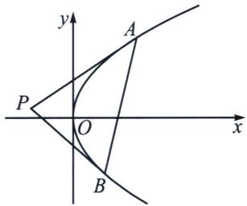

text_image

y
A
P
O
x
B

则 $AB$ 是两个对合不动点, 他们的连线叫做对合轴, 那么点 $P$ 就是对合中心, 也是著名的切线和切点弦,这个在后来被我们叫做极点极线, $\triangle PAB$ 我们也称之为阿基米德三角形.

我们易知 $\left\{ \begin{array}{l} PA: yy_{1} = p(x + x_{1}) \\ PB: yy_{2} = p(x + x_{2}) \end{array} \right.$ ，设对合中心坐标 $P(x_{0}, y_{0})$ ，则一定有 $\left\{ \begin{array}{l} y_{0}y_{1} = p(x_{0} + x_{1}) \\ y_{0}y_{2} = p(x_{0} + x_{2}) \end{array} \right.$ ，故 $A(x_{1}, y_{1})$ 和 $B(x_{2}, y_{2})$ 均在同构方程 $yy_{0} = p(x + x_{0})$ 上，根据两点确定一条直线，则对合轴方程 $AB: yy_{0} = p(x + x_{0})$ ，结合对合方程 $AB: (y_{1} + y_{2})y = 2px + y_{1}y_{2}$ ，则易得 $\left\{ \begin{array}{l} y_{1} + y_{2} = 2y_{0} \\ y_{1}y_{2} = 2px_{0} \end{array} \right.$ ，这样就把阿基米德三角形的一切数据揽括其中.

例4 (2025·福建金科百校联考第19题)已知抛物线 $C: x^{2} = 2py (p > 0)$ 的焦点为 $F, M(x_{0}, y_{0})$ 为抛物线 $C$ 上的一个动点(不与坐标原点重合), $|MF| - y_{0} = 1$ .

(1)求抛物线 C 的方程;

(2)已知点 $M_{1}(2,1)$ ，按照如下方式构造点 $M_{n}(n=2,3,4,\cdots)$ ，设直线 $l_{n-1}$ 为抛物线 C 在点 $M_{n-1}$ 处的切线，过点 $M_{n-1}$ 作 $l_{n-1}$ 的垂线交抛物线 C 于另一点 $M_{n}$ ，记 $M_{n}$ 的坐标为 $(x_{n}, y_{n})$ .

(i) 证明：当 $n \geqslant 1$ 时， $|M_n F| \geqslant 4n - 2$ ；

(ii) 设 $\triangle M_{n}FM_{n+1}$ 的面积为 $S_{n}$ ，证明： $\sum_{k=1}^{n}\frac{1}{S_{k}^{2}}<\frac{17}{128}$ .

解析 (1)抛物线 $C$ 的准线方程为 $y = -\frac{p}{2}$ , 所以 $|MF| = y_0 + \frac{p}{2}$ , 所以 $y_0 + \frac{p}{2} = 1 + y_0$ ,

解得 p=2，所以 C 的方程为 $x^{2}=4y$ .

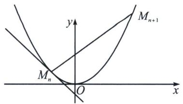

text_image

y
M_{n+1}
M_n
O
x

(2)(i)证明: 设 $M_{n}\left(x_{n}, \frac{x_{n}^{2}}{4}\right)$ , 因为 $y' = \frac{x}{2}$ , 所以点 $M_{n}$ 处的切线斜率为 $\frac{x_{n}}{2}$ , 所以直线 $M_{n}M_{n+1}$ 斜率为 $-\frac{2}{x_{n}}$ , 所以直线 $M_{n}M_{n+1}: (x_{n+1} + x_{n})x = 4y + x_{n+1}x_{n}$ (请自证), 由于 $k = -\frac{2}{x_{n}} = \frac{x_{n+1} + x_{n}}{4}$ , 可得 $x_{n+1} = -\frac{8}{x_{n}} - x_{n}$ , 即 $M_{n+1}$ 的横坐标为 $-\frac{8}{x_{n}} - x_{n}$ , 所以 $y_{n+1} = \frac{x_{n+1}^{2}}{4} = \frac{1}{4}\left(\frac{64}{x_{n}^{2}} + x_{n}^{2} + 16\right) = \frac{x_{n}^{2}}{4} + \frac{16}{x_{n}^{2}} + 4 = y_{n} + \frac{16}{x_{n}^{2}} + 4 > y_{n} + 4$ , 当 $n \geqslant 2$ 时, 有 $y_{n} = (y_{n} - y_{n-1}) + (y_{n-1} - y_{n-2}) + \cdots + (y_{2} - y_{1}) + y_{1} > 4(n-1) + 1 = 4n-3$ , 又由 $y_{1} = 1$ , 故 $y_{n} \geqslant 4n - 3 (n \in \mathbf{N}^{*})$ , 所以 $|M_{n}F| \geqslant 4n - 2$ ,

（ii）证明：易知直线 $M_{n}M_{n + 1}$ ： $y = -\frac{2x}{x_n} +\frac{x_n^2}{4} +2$ ， $F$ 到直线 $M_{n}M_{n + 1}$ 的距离为 $\frac{1 + \frac{x_n^2}{4}}{\sqrt{1 + \left(\frac{2}{x_n}\right)^2}}$ ， $|M_nM_{n + 1}| =$ $\sqrt{1 + \left(\frac{2}{x_n}\right)^2}|x_{n + 1} - x_n| = \sqrt{1 + \left(\frac{2}{x_n}\right)^2}\left|\frac{8}{x_n} +2x_n\right|$ ，所以 $S_{n} = \left(1 + \frac{x_{n}^{2}}{4}\right)\left|\frac{4}{x_{n}} +x_{n}\right| = \frac{(x_{n}^{2} + 4)^{2}}{4|x_{n}|}\geqslant \frac{4|x_n|(x_n^2 +4)}{4|x_n|} =$ $x_{n}^{2} + 4$ ，因为 $x_{n + 1}^{2} = \left(-\frac{8}{x_n} -x_n\right)^2 = x_n^2 +\frac{64}{x_n^2} +16 > x_n^2 +16,$

由(1)知 $y_{n} \geqslant 4n - 3 (n \in \mathbb{N}^{*})$ ，即 $\frac{x_{n}^{2}}{4} \geqslant 4n - 3$ ，所以当 $n \geqslant 2$ 时， $x_{n}^{2} > 16n - 12$ ，所以当 $n \geqslant 2$ 时， $S_{n} > x_{n}^{2} + 4 > 16n - 8 = 8(2n - 1)$ ，所以 $\frac{1}{S_{n}^{2}} < \frac{1}{64} \times \frac{1}{(2n - 1)^{2}} < \frac{1}{64} \left[ \frac{1}{(2n - 1)(2n - 3)} \right] = \frac{1}{128} \left( \frac{1}{2n - 3} - \frac{1}{2n - 1} \right)$ ，

当 n=1 时， $\frac{1}{S_{1}^{2}}=\frac{1}{64}<\frac{17}{128}$ ,

当 $n \geqslant 2$ 时， $\sum_{k=1}^{n} \frac{1}{S_k^2} < \frac{1}{64} + \frac{1}{128} \left( \frac{1}{1} - \frac{1}{3} + \frac{1}{3} - \frac{1}{5} + \cdots + \frac{1}{2n-3} - \frac{1}{2n-1} \right) = \frac{1}{64} + \frac{1}{128} \left( 1 - \frac{1}{2n-1} \right) < \frac{1}{64} + \frac{1}{128} = \frac{3}{128} < \frac{17}{128}$ ，所以 $\sum_{k=1}^{n} \frac{1}{S_k^2} < \frac{17}{128}$ .

# 三、平移顶点的抛物线两点对合方程

常见的抛物线 $x^{2} = 2py$ 若向上移 $m$ 个单位，则方程变为 $x^{2} = 2p(y - m)$ ，我们来推导一下其两点对合式， $y - y_{1} = \frac{y_{2} - y_{1}}{x_{2} - x_{1}} (x - x_{1}) \Rightarrow y - \frac{x_{1}^{2}}{2p} - m = \frac{x_{2} + x_{1}}{2p} (x - x_{1})$ ，即 $(x_{1} + x_{2})x = 2p(y - m) + x_{1}x_{2}$ ，同理，关于切线方程，利用对合不动点， $2x_{1}x = 2p(y - m) + x_{1}^{2} = 2p(y - m) + 2p(y_{1} - m)$ ，即 $x_{1}x = p(y + y_{1} - 2m)$ ；

例5 (2025·甘肃白银市高三月考第19题)在直角坐标系 $xOy$ 中, 点 $P$ 到 $x$ 轴的距离等于点 $P$ 到点 $(0, 1)$ 的距离, 记动点 $P$ 的轨迹为 $E$ .

(1) 求 E 的方程.

(2) 设 $n \in \mathbb{N}^*$ , $A_n(x_n, y_n)$ , $B_n(u_n, v_n)$ 是 $E$ 上不同的两点, 且 $x_n \cdot u_n = -1$ , 记 $C_n$ 为曲线 $E$ 上分别以 $A_n$ , $B_n$ 为切点的两条切线的交点.

①证明：存在定点 F，使得 $A_{n}B_{n} \perp FC_{n}$ .

②取 $x_{n} = 2^{n}$ ，记 $\alpha_{n} = \angle C_{n}A_{n}B_{n}$ ， $\beta_{n} = \angle C_{n}B_{n}A_{n}$ ，求 $\sum_{i=1}^{n}\left(\frac{1}{\tan\alpha_n} +\frac{1}{\tan\beta_n}\right)$

解析 (1)设 $P(x, y)$ , 由题意得 $|y| = \sqrt{x^2 + (y - 1)^2}$ , 化简整理得 $x^2 = 2(y - \frac{1}{2})$ ;

(2)证明：（i）易知直线 $A_{n}B_{n}$ 的斜率存在，则 $k_{n} = \frac{y_{n} - v_{n}}{x_{n} - u_{n}} = \frac{x_{n}^{2} - u_{n}^{2}}{2(x_{n} - u_{n})} = \frac{x_{n} + u_{n}}{2}$ ，直线 $A_{n}B_{n}$ 的方程为 $y - y_{n} = \frac{x_{n} + u_{n}}{2}(x - x_{n})$ ，即 $(x_{n} + u_{n})x = 2\left(y - \frac{1}{2}\right) + x_{n}u_{n} = 2y - 2$ 故直线 $A_{n}B_{n}$ 过定点(0，1).（本质就是推导两点对合式 $(x_{n} + u_{n})x = 2\left(y - \frac{1}{2}\right) + x_{n}u_{n})$ ，又 $y' = x$ ，

则过点 $A_{n}(x_{n}, y_{n})$ 且与抛物线 $E$ 相切的切线方程为 $y - y_{n} = x_{n}(x - x_{n})$ ，即 $y + y_{n} - 1 = x_{n}x$ ，同理，过点 $B_{n}(u_{n}, v_{n})$ 且与抛物线 $E$ 相切的切线方程为 $y + v_{n} - 1 = u_{n}x$ ，故 $C_{n}(x_{0}, y_{0})$ 同时满足两条直线 $\left\{ \begin{array}{l} x_{0}x_{n} = y_{0} + y_{n} - 1 \\ x_{0}u_{n} = y_{0} + v_{n} - 1 \end{array} \right.$ ，所以 $A_{n}B_{n}$ 均在同构方程 $x_{0}x = y_{0} + y - 1$ 上，所以 $A_{n}B_{n}: x_{0}x = y_{0} + y - 1$ ，对比两点对合式： $(x_{n} + v_{n})x = 2y - 2$ ，得： $x_{0} = \frac{x_{n} + u_{n}}{2}$ ， $y_{0} = 0$ ，则 $C_{n}\left(\frac{x_{n} + u_{n}}{2}, 0\right)$ ，令 $F(0, 1)$ ，

则 $\overrightarrow{A_nB_n}\cdot \overrightarrow{FC_n} = (u_n - x_n,v_n - y_n)\cdot \left(\frac{x_n + u_n}{2}, - 1\right) = \frac{u_n^2 - x_n^2}{2} +y_n - v_n = y_n - \frac{x_n^2}{2} -\left(v_n - \frac{u_n^2}{2}\right) = \frac{1}{2} -\frac{1}{2} = 0,$ 即存在定点 $F(0,1)$ ，使得 $A_{n}B_{n}\bot FC_{n}$

（ii）解：由（i）知 $A_{n}B_{n}\perp FC_{n}$ ，则 $\frac{1}{\tan\alpha_n} = \frac{|FA_n|}{|FC_n|},\frac{1}{\tan\beta_n} = \frac{|FB_n|}{|FC_n|},\frac{1}{\tan\alpha_n} +\frac{1}{\tan\beta_n} = \frac{|FA_n| + |FB_n|}{|FC_n|} =$ $\frac{|A_nB_n|}{|FC_n|},|A_nB_n| = \sqrt{1 + k_n^2}|x_n - u_n|$ ，又 $x_{n}\cdot u_{n} = -1$ ，得 $|A_{n}B_{n}| = \sqrt{1 + \frac{\left(x_{n} - \frac{1}{x_{n}}\right)^{2}}{4}}\left|x_{n} + \frac{1}{x_{n}}\right| = \frac{1}{2}$ （ $x_{n} + \frac{1}{x_{n}})^{2},|FC_{n}| = \sqrt{\left(\frac{x_{n} + u_{n}}{2}\right)^{2} + 1} = \frac{1}{2}\sqrt{4 + \left(x_{n} - \frac{1}{x_{n}}\right)^{2}} = \frac{1}{2}\left|x_{n} + \frac{1}{x_{n}}\right|$ ，则 $\frac{|A_nB_n|}{|FC_n|} = |x_n + \frac{1}{x_n} |,$

当 $x_{n}=2^{n}$ 时， $\sum_{i=1}^{n}\frac{\left|A_{n}B_{n}\right|}{\left|FC_{n}\right|}=\sum_{i=1}^{n}\left(2^{n}+\frac{1}{2^{n}}\right)=(2+2^{2}+\cdots+2^{n})+\left(\frac{1}{2}+\frac{1}{2^{2}}+\cdots+\frac{1}{2^{n}}\right)=2^{n+1}-2^{-n}-1.$

注意 新高考的体系下，三问的考题，设计的好的都是循序渐进，一般前两问都是常规模型，第三问总会涉及一些放缩，求值，裂项等数列知识，可以这么说，第二问的熟练程度决定整个17分的最终归属。

# 第三节 椭圆双曲线的两点对合式

由于 $\cos\alpha\cos\frac{\alpha+\beta}{2}+\sin\alpha\sin\frac{\alpha+\beta}{2}=\cos\frac{\alpha-\beta}{2}$ ,

$$
\cos \beta \cos \frac {\alpha + \beta}{2} + \sin \beta \sin \frac {\alpha + \beta}{2} = \cos \frac {\alpha - \beta}{2},
$$

# 一、椭圆与双曲线的两点对合式

# 1. 椭圆两点对合式

设 $A(a\cos\alpha, b\sin\alpha)$ 、 $B(a\cos\beta, b\sin\beta)$ ，故弦 AB 的方程是 $\frac{x}{a}\cos\frac{\alpha+\beta}{2}+\frac{y}{b}\sin\frac{\alpha+\beta}{2}=\cos\frac{\alpha-\beta}{2}$ ，

证明：由于 $\cos\alpha\cos\frac{\alpha+\beta}{2}+\sin\alpha\sin\frac{\alpha+\beta}{2}=\cos\frac{\alpha-\beta}{2}$ ,

$$
\cos \beta \cos \frac {\alpha + \beta}{2} + \sin \beta \sin \frac {\alpha + \beta}{2} = \cos \frac {\alpha - \beta}{2},
$$

故 $A(a\cos \alpha ,b\sin \alpha)$ 、 $B(a\cos \beta ,b\sin \beta)$ 均在同构方程 $\frac{x}{a}\cos \frac{\alpha + \beta}{2} +\frac{y}{b}\sin \frac{\alpha + \beta}{2} = \cos \frac{\alpha - \beta}{2}$ 上，

即弦 AB 的对合方程是 $\frac{x}{a}\cos\frac{\alpha+\beta}{2}+\frac{y}{b}\sin\frac{\alpha+\beta}{2}=\cos\frac{\alpha-\beta}{2}$ ,

令 $t_1 = \tan \frac{\alpha}{2}$ , $t_2 = \tan \frac{\beta}{2}$ , 同除以 $\cos \frac{\alpha}{2} \cos \frac{\beta}{2} (\alpha \neq \pi, \beta \neq \pi)$ , 则 $\frac{x}{a} (1 - t_1 t_2) + \frac{y}{b} (t_1 + t_2) = 1 + t_1 t_2$ ;

接下来我们来解读斜率关系，以椭圆 $\frac{x^{2}}{a^{2}}+\frac{y^{2}}{b^{2}}=1(a>b>0)$ 为例，

设 $A(a\cos \alpha ,b\sin \alpha)$ 、 $B(a\cos \beta ,b\sin \beta)$ 、 $P(a\cos \theta ,b\sin \theta)$ ，其中 $\theta$ 是定值， $\alpha$ ， $\beta$ 是变化数，令 $t_0 = \tan \frac{\theta}{2}$ $t_1 = \tan \frac{\alpha}{2}, t_2 = \tan \frac{\beta}{2},\theta \neq \pi ,\alpha \neq \pi ,\beta \neq \pi ,$

又易知直线 $PA$ 、 $PB$ 的方程分别是

直线 PA: $\frac{x}{a}\cos\frac{\theta+\alpha}{2}+\frac{y}{b}\sin\frac{\theta+\alpha}{2}=\cos\frac{\theta-\alpha}{2}$ ，或者 $\frac{x}{a}(1-t_{0}t_{1})+\frac{y}{b}(t_{0}+t_{1})=1+t_{0}t_{1}$

直线 $PB: \frac{x}{a} \cos \frac{\theta + \beta}{2} + \frac{y}{b} \sin \frac{\theta + \beta}{2} = \cos \frac{\theta - \beta}{2}$ ，或者 $\frac{x}{a} (1 - t_0 t_2) + \frac{y}{b} (t_0 + t_2) = 1 + t_0 t_2$

所以，直线 $PA$ ， $PB$ 的斜率分别是 $k_{PA} = -\frac{b}{a\tan\frac{\theta + \alpha}{2}} = -\frac{b}{a}\frac{1 - t_0t_1}{t_0 + t_1}; k_{PB} = -\frac{b}{a\tan\frac{\theta + \beta}{2}} = -\frac{b}{a}\frac{1 - t_0t_2}{t_0 + t_2}$

特别的情况，

(1)当 $P$ 为左顶点，则 $\theta = \pi, k_{PA} = -\frac{b}{a\tan\frac{\alpha + \pi}{2}} = \frac{b}{a} t_1;$

(2)当 P 为右顶点，则 $\theta=0,\quad k_{PA}=-\frac{b}{a\tan\frac{\alpha}{2}}=-\frac{b}{at_{1}};$   
(3)当 P 为上顶点，则 $\theta=\frac{\pi}{2}$ ， $k_{PA}=-\frac{b}{a\tan\left(\frac{\alpha}{2}+\frac{\pi}{4}\right)}=-\frac{b}{a}\frac{1-t_{1}}{1+t_{1}}$ ;  
(4)当 P 为下顶点，则 $\theta=\frac{3\pi}{2}$ ， $k_{PA}=-\frac{b}{a\tan\left(\frac{\alpha}{2}+\frac{3\pi}{4}\right)}=\frac{b}{a}\frac{1+t_{1}}{1-t_{1}}$ .

# 2. 双曲线右支的两点对合式

设 $A\left(\frac{a}{\cos\alpha}, \frac{b\sin\alpha}{\cos\alpha}\right)$ 、 $B\left(\frac{a}{\cos\beta}, \frac{b\sin\beta}{\cos\beta}\right)$ ，故弦 AB 的方程是 $\frac{x}{a}\cos\frac{\alpha-\beta}{2}-\frac{y}{b}\sin\frac{\alpha+\beta}{2}=\cos\frac{\alpha+\beta}{2}$ ，( $\alpha$ ， $\beta$ 为一四象限角，即在双曲线右支上的两点对合式)

证明：由于 $\cos\alpha\cos\frac{\alpha+\beta}{2}+\sin\alpha\sin\frac{\alpha+\beta}{2}=\cos\frac{\alpha-\beta}{2}$ ,

$$
\cos \beta \cos \frac {\alpha + \beta}{2} + \sin \beta \sin \frac {\alpha + \beta}{2} = \cos \frac {\alpha - \beta}{2},
$$

故 $A\left(\frac{a}{\cos\alpha}, \frac{b\sin\alpha}{\cos\alpha}\right)$ 、 $B\left(\frac{a}{\cos\beta}, \frac{b\sin\beta}{\cos\beta}\right)$ 均在同构方程 $\frac{a}{x} \cos \frac{\alpha + \beta}{2} + \frac{ay}{bx} \sin \frac{\alpha + \beta}{2} = \cos \frac{\alpha - \beta}{2}$ 上，

即 $\frac{x}{a}\cos\frac{\alpha-\beta}{2}-\frac{y}{b}\sin\frac{\alpha+\beta}{2}=\cos\frac{\alpha+\beta}{2}$ ，即弦AB的方程是 $\frac{x}{a}\cos\frac{\alpha-\beta}{2}-\frac{y}{b}\sin\frac{\alpha+\beta}{2}=\cos\frac{\alpha+\beta}{2}$

令 $t_{1}=\tan\frac{\alpha}{2}$ ， $t_{2}=\tan\frac{\beta}{2}$ ，同除以 $\cos\frac{\alpha}{2}\cos\frac{\beta}{2}$ ，则 $\frac{x}{a}(1+t_{1}t_{2})-\frac{y}{b}(t_{1}+t_{2})=1-t_{1}t_{2}$ ;

所以，直线 $PA$ ， $PB$ 的斜率分别是 $k_{PA} = \frac{b\cos\frac{\theta - \alpha}{2}}{a\sin\frac{\theta + \alpha}{2}} = \frac{b}{a}\frac{1 + t_0t_1}{t_0 + t_1}; k_{PB} = \frac{b\cos\frac{\theta - \beta}{2}}{a\sin\frac{\theta + \beta}{2}} = \frac{b}{a}\frac{1 + t_0t_2}{t_0 + t_2}$

特别的情况，

(1) 当 P 为左顶点， $k_{PA}=\frac{b\frac{\sin\alpha}{\cos\alpha}}{a\left(\frac{1}{\cos\alpha}+1\right)}=\frac{b}{a}t_{1}$ ;  
(2)当 $P$ 为右顶点， $k_{PA} = \frac{b\frac{\sin\alpha}{\cos\alpha}}{a\left(\frac{1}{\cos\alpha} - 1\right)} = \frac{b}{at_1}$ .

# 3. 双曲线左支的两点对合式

关于双曲线左支上两点，涉及到符号的变化，比如第二三象限 $A\left(\frac{a}{\cos\alpha}, - \frac{b\sin\alpha}{\cos\alpha}\right)$ 、 $B\left(\frac{a}{\cos\beta}, - \frac{b\sin\beta}{\cos\beta}\right)$

不妨换元为 $A\left(\frac{a}{\cos(-\alpha)}, \frac{b\sin(-\alpha)}{\cos(-\alpha)}\right)$ 、 $B\left(\frac{a}{\cos(-\beta)}, \frac{b\sin(-\beta)}{\cos(-\beta)}\right)$ ，故弦 AB 的方程是 $\frac{x}{a}\cos\frac{-\alpha+\beta}{2}+\frac{y}{b}$ $\sin\frac{-\alpha-\beta}{2}=\cos\frac{-\alpha-\beta}{2}$ ，令 $\tan\left(-\frac{\alpha}{2}\right)=t_{1}$ ， $\tan\left(-\frac{\beta}{2}\right)=t_{2}$ ，即 $\frac{x}{a}(1+t_{1}t_{2})-\frac{y}{b}(t_{1}+t_{2})=1-t_{1}t_{2}$ ;

特别的情况：

(1)当 $P$ 为左顶点， $k_{PA} = \frac{b\frac{\sin(-\alpha)}{\cos(-\alpha)}}{a\left(\frac{1}{\cos(-\alpha)} + 1\right)} = \frac{b}{a} t_1;$

(2)当 $P$ 为右顶点， $k_{PA} = \frac{b\frac{\sin(-\alpha)}{\cos(-\alpha)}}{a\left(\frac{1}{\cos(-\alpha)} - 1\right)} = \frac{b}{at_1}$ .

# 4. 双曲线左右两支的两点对合式

关于双曲线两支上两点，涉及到符号的变化，比如第一四象限 $A\left(\frac{a}{\cos\alpha}, \frac{b\sin\alpha}{\cos\alpha}\right)$ 、和位于第二三象限的 $B\left(\frac{a}{\cos(-\beta)}, \frac{b\sin(-\beta)}{\cos(-\beta)}\right)$ ，故弦 $AB$ 的方程是 $\frac{x}{a} \cos \frac{\alpha + \beta}{2} + \frac{y}{b} \sin \frac{\alpha - \beta}{2} = \cos \frac{\alpha - \beta}{2}$ ，令 $\tan \frac{\alpha}{2} = t_1, \tan \left(-\frac{\beta}{2}\right) = t_2$ ，即 $\frac{x}{a} (1 + t_1 t_2) - \frac{y}{b} (t_1 + t_2) = 1 - t_1 t_2.$

# 二、对合方程简化单动点模型

# 1. 椭圆

(1) 若 AB 关于 y 轴对称，则 $t_{A}t_{B}=1$ ;  
(2) 若 AD 关于 x 轴对称，则 $t_{A} + t_{D} = 0$ ;  
(3) 若 AC 关于原点对称，则 $t_{A}t_{C} = -1$ ;

证明：(1) $\tan\frac{B}{2}=\tan\frac{\pi-A}{2}=\frac{1}{\tan\frac{A}{2}}$ ，所以 $t_{A}t_{B}=1$ ；(2) $\tan\frac{D}{2}=\tan$

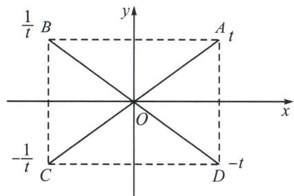

text_image

1/t B
y
A t
x
O
-1/t C
D -t

$\frac{2\pi-A}{2}=-\tan\frac{A}{2}$ ，所以 $t_{A}+t_{D}=0$ ;

$\tan\frac{C}{2}=\tan\frac{\pi+A}{2}=-\frac{1}{\tan\frac{A}{2}}$ ，所以 $t_{A}t_{C}=-1$ .

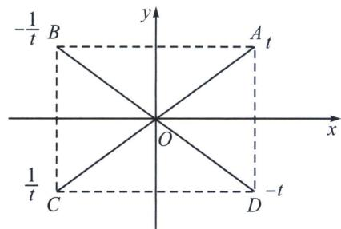

text_image

-\frac{1}{t} B
y
A t
O
x
\frac{1}{t} C
D -t

# 2. 双曲线

(1) 若 AB 关于 y 轴对称，则 $t_{A}t_{B} = -1$ ;  
(2) 若 AD 关于 x 轴对称，则 $t_{A} + t_{D} = 0$ ;  
(3) 若 AC 关于原点对称，则 $t_{A}t_{C}=1$ ;

例1 (2025·北京清华附中高三开学)已知椭圆 $E: \frac{x^{2}}{a^{2}} + \frac{y^{2}}{b^{2}} = 1 (a > b > 0)$ , 其离心率 $e = \frac{\sqrt{5}}{3}$ , 长轴长为 6.

(1)求椭圆 E 的标准方程;  
(2)椭圆 E 的上、下顶点分别为 A、B，右顶点为 C，过点 A 的直线 l 与椭圆 E 的另一个交点为 P，点 Q 与点 P 关于 x 轴对称，直线 AP 交 BC 于 M，直线 AQ 交 BC 于点 N，点 $T(6, -2)$ ，

求证： $|AM|=|TN|$ .

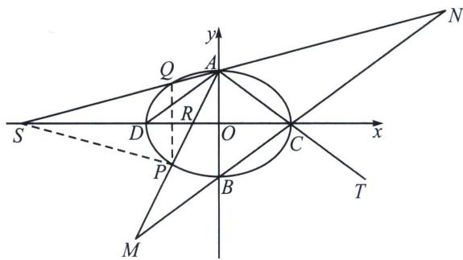

text_image

y
Q
A
R
S
D
O
C
x
P
B
T
M
N

解析 (1) $\frac{x^2}{9} + \frac{y^2}{4} = 1$ ;

(2)极点极线背景分析: $P 、 Q$ 关于 $x$ 轴对称, 符合角平分线构造调和点列模型, 设 $A P 、 A Q$ 分别交 $x$ 轴于点 $R 、 S , D$ 为椭圆左顶点, 则 $(C , D ; R , S) = -1$ , 参考下一章详细叙述

利用交比不变性 $A(C, D; R, S) = A(C, \infty; M, N) = -1$ ，所以 $|CM| = |CN|$ ，又 $|AC| = |CT|$ ，所以通过平行四边形 AMTN 得： $|AM| = |TN|$ .

解答：设 $P(3\cos \theta, 2\sin \theta)$ ， $\tan \frac{\theta}{2} = t$ ，则 $k_{AP} = -\frac{2(1 - t)}{3(1 + t)}$ ，直线 $AP: y = -\frac{2(1 - t)}{3(1 + t)}x + 2$ ，同理 $Q(3\cos \theta, -2\sin \theta)$ ，

$$
k _ {A Q} = \frac {- 2 \sin \theta - 2}{3 \cos \theta} - \frac {2 \left(\sin \frac {\theta}{2} + \cos \frac {\theta}{2}\right) ^ {2}}{3 \left(\cos \frac {\theta}{2} - \sin \frac {\theta}{2}\right) \left(\sin \frac {\theta}{2} + \cos \frac {\theta}{2}\right)} = - \frac {2 (1 + t)}{3 (1 - t)}, A Q: y = - \frac {2 (1 + t)}{3 (1 - t)} x + 2,
$$

又直线 BC: $\frac{x}{3}-\frac{y}{2}=1$ 即 $x=3+\frac{3}{2}y$ ，与 AP 联立可得 $\left(1+\frac{1-t}{1+t}\right)y_{M}=-2\left(\frac{1-t}{1+t}-1\right)$ ， $y_{M}=2t$ ， $x_{M}=3+3t$ ，与 AQ 联立可得 $\left(1+\frac{1+t}{1-t}\right)y_{N}=-2\left(\frac{1+t}{1-t}-1\right)$ ， $y_{N}=-2t$ ， $x_{N}=3-3t$ 显然 $y_{M}+y_{N}=0$ ， $x_{M}+x_{N}=6$ ，C 为 MN 的中点。由于 T(6, -2)，AT 的中点为 C，所以四边形 AMTN 为平行四边形，显然 $|AM|=|TN|$ 。

注意 此类型题太多，我们会在本书第二章介绍背景后更多此法。

# 三、对合方程简化斜率关系模型

例2 (2020·新课标Ⅰ)已知 A, B 分别为椭圆 E: $\frac{x^{2}}{a^{2}} + y^{2} = 1 (a > 1)$ 的左、右顶点，G 为 E 的上顶点， $\overrightarrow{AG} \cdot \overrightarrow{GB} = 8$ . P 为直线 x = 6 上的动点，PA 与 E 的另一交点为 M，PB 与 E 的另一交点为 N.

(1)求 E 的方程;

(2)证明：直线 MN 过定点.

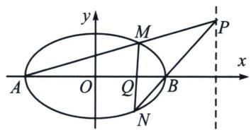

text_image

y
M
P
x
A
O
Q
B
N

解析 (1) $\frac{x^2}{9} + y^2 = 1$

(2)令 $M(3\cos \theta_{1},\sin \theta_{1})$ ， $N(3\cos \theta_2,\sin \theta_2)$ ，令 $t_1 = \tan \frac{\theta_1}{2}$ ， $t_2 = \tan \frac{\theta_2}{2}$

由于 $\cos\theta_{1}\cos\frac{\theta_{1}+\theta_{2}}{2}+\sin\theta_{1}\sin\frac{\theta_{1}+\theta_{2}}{2}=\cos\frac{\theta_{1}-\theta_{2}}{2}$ ,

$$
\cos \theta_ {2} \cos \frac {\theta_ {1} + \theta_ {2}}{2} + \sin \theta_ {2} \sin \frac {\theta_ {1} + \theta_ {2}}{2} = \cos \frac {\theta_ {1} - \theta_ {2}}{2},
$$

故 $M(3\cos \theta_{1},\sin \theta_{1})$ ， $N(3\cos \theta_2,\sin \theta_2)$ ，均在同构方程 $\frac{x}{3}\cos \frac{\theta_1 + \theta_2}{2} +y\sin \frac{\theta_1 + \theta_2}{2} = \cos \frac{\theta_1 - \theta_2}{2}$ 上，

即 $MN$ 的对合方程是 $\frac{x}{3}\cos \frac{\theta_1 + \theta_2}{2} + y\sin \frac{\theta_1 + \theta_2}{2} = \cos \frac{\theta_1 - \theta_2}{2}$ ，同除以 $\cos \frac{\theta_1}{2}\cos \frac{\theta_2}{2} (\theta_1 \neq \pi, \theta_2 \neq \pi)$ ，即 $MN: \frac{x}{3}(1 - t_1t_2) + y(t_1 + t_2) = 1 + t_1t_2$ ；

根据题意： $k_{AM}=\frac{y_{P}}{x_{P}-x_{A}}=\frac{y_{P}}{9}=\frac{\sin\theta_{1}}{3(1+\cos\theta_{1})}=\frac{t_{1}}{3}$ ， $k_{BN}=\frac{y_{P}}{x_{P}-x_{B}}=\frac{y_{P}}{3}=\frac{\sin\theta_{2}}{3(\cos\theta_{2}-1)}=-\frac{1}{3t_{2}}$

所以 $3 \cdot \frac{t_1}{3} = -\frac{1}{3t_2}$ ，即 $t_1 t_2 = -\frac{1}{3}$ ，代回 $MN: \frac{x}{3}(1 - t_1 t_2) + y(t_1 + t_2) = 1 + t_1 t_2$ ，即 $\frac{4}{9} x + y(t_1 + t_2) =$

$\frac{2}{3}$ ，所以 $\left\{\begin{aligned}x&=\frac{3}{2}\\ y&=0\end{aligned}\right.$ 时符合题意，即直线MN过定点 $\left(\frac{3}{2},0\right)$ .

例3（2017·新课标I理）已知椭圆 $C: \frac{x^2}{a^2} + \frac{y^2}{b^2} = 1 (a > b > 0)$ ，四点 $P_1(1, 1), P_2(0, 1), P_3(-1, \frac{\sqrt{3}}{2}), P_4(1, \frac{\sqrt{3}}{2})$ ，中恰有三点在椭圆 $C$ 上.

(1)求 C 的方程;

(2)设直线 l 不经过 $P_{2}$ 点且与 C 相交于 A, B 两点. 若直线 $P_{2}A$ 与直线 $P_{2}B$ 的斜率的和为 -1，证明：l 过定点.

解析 (1)根据椭圆的对称性, $P_{3} \left(-1, \frac{\sqrt{3}}{2}\right), P_{4} \left(1, \frac{\sqrt{3}}{2}\right)$ , 两点必在椭圆 $C$ 上, 又 $P_{4}$ 的横坐标为 1 , 所以椭圆必不过 $P_{1}(1, 1)$ , 所以 $P_{2}(0, 1), P_{3} \left(-1, \frac{\sqrt{3}}{2}\right), P_{4} \left(1, \frac{\sqrt{3}}{2}\right)$ , 三点在椭圆 $C$ 上. 把 $P_{2}(0, 1)$ , $P_{3} \left(-1, \frac{\sqrt{3}}{2}\right)$ , 代入椭圆 $C$ , 得: $\left\{ \begin{array}{l} \frac{1}{b^{2}} = 1 \\ \frac{1}{a^{2}} + \frac{3}{4b^{2}} = 1 \end{array} \right.$ , 解得 $a^{2} = 4, b^{2} = 1$ , 所以椭圆 $C$ 的方程为 $\frac{x^{2}}{4} + y^{2} = 1$ .

(2)解法一: 证明: 将椭圆 $C$ 按照向量 $(0, -1)$ 平移, 则得到方程 $\frac{x^2}{4} + (y + 1)^2 = 1 \Rightarrow \frac{x^2}{4} + y^2 + 2y = 0$ , 平移后 $A \to A'$ , $B \to B'$ , 设 $A'B'$ 方程为 $mx + ny = 1$ , 即 $\frac{x^2}{4} + y^2 + 2y = \frac{x^2}{4} + y^2 + 2y (mx + ny) = 0$ (构造齐次式), 同除以 $x^2$ 得, $(1 + 2n)\frac{y^2}{x^2} + 2m\frac{y}{x} + \frac{1}{4} = 0$ , 因为点 $A'$ , $B'$ 的坐标满足这个方程, 所以 $k_{OA'}$ , $k_{OB'}$ 是这个关于 $\frac{y}{x}$ 的方程的两个根. 所以 $k_{OA'} + k_{OB'} = k_{PA} + k_{PB} = -\frac{2m}{1 + 2n} = -1 \Rightarrow 2m - 2n = 1$ , 故 $A'B'$ 过定点 $(2, -2)$ , 平移回去可得 $AB$ 过定点 $(2, -1)$ , 所以 $l$ 过定点 $(2, -1)$ .

解法二：令 $A(2\cos \theta_{1},\sin \theta_{1})$ ， $B(2\cos \theta_{2},\sin \theta_{2})$ ，令 $t_1 = \tan \frac{\theta_1}{2}$ ， $t_2 = \tan \frac{\theta_2}{2}$

由于 $\cos \theta_{1}\cos \frac{\theta_{1} + \theta_{2}}{2} +\sin \theta_{1}\sin \frac{\theta_{1} + \theta_{2}}{2} = \cos \frac{\theta_1 - \theta_2}{2},$

$$
\cos \theta_ {2} \cos \frac {\theta_ {1} + \theta_ {2}}{2} + \sin \theta_ {2} \sin \frac {\theta_ {1} + \theta_ {2}}{2} = \cos \frac {\theta_ {1} - \theta_ {2}}{2},
$$

故 $A(2\cos \theta_{1},\sin \theta_{1})$ ， $B(2\cos \theta_{2},\sin \theta_{2})$ ，均在同构方程 $\frac{x}{2}\cos \frac{\theta_1 + \theta_2}{2} +y\sin \frac{\theta_1 + \theta_2}{2} = \cos \frac{\theta_1 - \theta_2}{2}$ 上，

即 $AB$ 的对合方程是 $\frac{x}{2}\cos \frac{\theta_1 + \theta_2}{2} + y\sin \frac{\theta_1 + \theta_2}{2} = \cos \frac{\theta_1 - \theta_2}{2}$ ，同除以 $\cos \frac{\theta_1}{2}\cos \frac{\theta_2}{2} (\theta_1 \neq \pi, \theta_2 \neq \pi)$ ，即 $AB: \frac{x}{2}(1 - t_1t_2) + y(t_1 + t_2) = 1 + t_1t_2$ ；

根据题意： $k_{AP_{2}}=\frac{\sin\theta_{1}-1}{2\cos\theta_{1}}=-\frac{1-t_{1}}{2(1+t_{1})}$ ， $k_{BP_{2}}=\frac{\sin\theta_{2}-1}{2\cos\theta_{2}}=-\frac{1-t_{2}}{2(1+t_{2})}$

所以 $k_{AP_{2}} + k_{BP_{2}} = -\frac{1 - t_{2}}{2(1 + t_{2})} - \frac{1 - t_{1}}{2(1 + t_{1})} = -1$ ，所以 $t_{1} + t_{2} + 2t_{1}t_{2} = 0$ ，对比 AB: $\frac{x}{2}(1 - t_{1}t_{2}) + y(t_{1} + t_{2}) = 1 + t_{1}t_{2}$ ，所以 $1 - \frac{x}{2} = 0$ （对比常数项），所以 x = 2， $\left\{\begin{aligned}&1 + \frac{x}{2} = 2\\&y = -1\end{aligned}\right.$ ，故 l 过定点 (2, -1).

例4（2022·新高考Ⅰ卷）已知 A(2,1) 在双曲线 C: $\frac{x^{2}}{a^{2}} - \frac{y^{2}}{a^{2} - 1} = 1 (a > 1)$ 上，直线 l 交 C 于 P、Q 两点，直线 AP，AQ 斜率之和为 0.

求 l 的斜率;

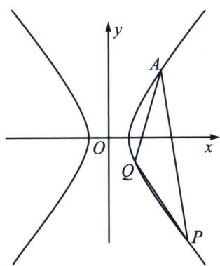

text_image

y
A
O
x
Q
P

解析 解法一：将点 $A(2,1)$ 代入双曲线方程得： $C: \frac{x^2}{2} - y^2 = 1$ ，将 $A(2,1), A \to O$ 平移到原点，即 $\frac{(x+2)^2}{2} - (y+1)^2 = 1$ ，即 $\frac{x^2}{2} - y^2 + 2x - 2y = 0$ ；设 $PQ$ 平移后直线为 $P'Q'$ ，令 $P'Q'$ 方程为： $mx + ny = 1$ ，即 $\frac{x^2}{2} - y^2 + (2x - 2y)(mx + ny) = 0$ ， $(1 + 2n)y^2 - (2n - 2m)xy - \left(\frac{1}{2} + 2m\right)x^2 = 0$ ，当 $x \neq 0$ 时，同除以 $x^2$ ，得： $(1 + 2n)\left(\frac{y}{x}\right)^2 + 2(m - n)\frac{y}{x} - \frac{1}{2} - 2m = 0; k_{AP} + k_{AQ} = \frac{2n - 2m}{1 + 2n} = 0$ ，所以 $n = m, k_l = -\frac{m}{n} = -1$ .

解法二：令 $A\left(\frac{\sqrt{2}}{\cos \theta_0}, \frac{\sin \theta_0}{\cos \theta_0}\right)$ ，显然 $\cos \theta_0 = \frac{\sqrt{2}}{2} \Rightarrow \theta_0 = \frac{\pi}{4}$ （由于三点都在第一象限），令 $P\left(\frac{\sqrt{2}}{\cos \theta_1}, \frac{\sin \theta_1}{\cos \theta_1}\right)$ ， $Q\left(\frac{\sqrt{2}}{\cos \theta_2}, \frac{\sin \theta_2}{\cos \theta_2}\right)$ ，由于 $\cos \theta_1 \cos \frac{\theta_1 + \theta_2}{2} + \sin \theta_1 \sin \frac{\theta_1 + \theta_2}{2} = \cos \frac{\theta_1 - \theta_2}{2}$ ，

$$
\cos \theta_ {2} \cos \frac {\theta_ {1} + \theta_ {2}}{2} + \sin \theta_ {2} \sin \frac {\theta_ {1} + \theta_ {2}}{2} = \cos \frac {\theta_ {1} - \theta_ {2}}{2},
$$

故 $P\left(\frac{\sqrt{2}}{\cos\theta_1}, \frac{\sin\theta_1}{\cos\theta_1}\right), Q\left(\frac{\sqrt{2}}{\cos\theta_2}, \frac{\sin\theta_2}{\cos\theta_2}\right)$ ，均在同构方程 $\frac{x}{\sqrt{2}}\cos \frac{\theta_1 - \theta_2}{2} - y\sin \frac{\theta_1 + \theta_2}{2} = \cos \frac{\theta_1 + \theta_2}{2}$ 上，

即弦 $PQ$ 的对合方程是： $\frac{x}{\sqrt{2}}\cos \frac{\theta_1 - \theta_2}{2} - y\sin \frac{\theta_1 + \theta_2}{2} = \cos \frac{\theta_1 + \theta_2}{2}, k_{PQ} = \frac{\cos \frac{\theta_1 - \theta_2}{2}}{\sqrt{2}\sin \frac{\theta_1 + \theta_2}{2}}$ ，同理，

$k_{AP} + k_{AQ} = \frac{\cos\frac{\theta_1 - \theta_0}{2}}{\sqrt{2}\sin\frac{\theta_1 + \theta_0}{2}} + \frac{\cos\frac{\theta_0 - \theta_2}{2}}{\sqrt{2}\sin\frac{\theta_0 + \theta_2}{2}} = 0,$ 即 $\sin\frac{\theta_0 + \theta_2}{2}\cos\frac{\theta_1 - \theta_0}{2} + \sin\frac{\theta_1 + \theta_0}{2}\cos\frac{\theta_0 - \theta_2}{2} = \frac{1}{2}\left(\sin\frac{\theta_1 + \theta_2}{2} + \sin\frac{\theta_2 - \theta_1}{2}\right) + \frac{1}{2}\left(\sin\frac{\theta_1 - \theta_2 + \pi}{2} + \sin\frac{\theta_2 + \theta_1}{2}\right) = \sin\frac{\theta_1 + \theta_2}{2} + \frac{\sqrt{2}}{2}\cos\frac{\theta_2 - \theta_1}{2} = 0,$ 故 $k_{PQ} = \frac{\cos\frac{\theta_1 - \theta_2}{2}}{\sqrt{2}\sin\frac{\theta_1 + \theta_2}{2}} = -1,$

解法三：令 $t_1 = \tan \frac{\theta_1}{2}, t_2 = \tan \frac{\theta_2}{2}$ ，在解法二得出 $PQ$ 的对合方程是： $\frac{x}{\sqrt{2}} \cos \frac{\theta_1 - \theta_2}{2} - y \sin \frac{\theta_1 + \theta_2}{2} = \cos \frac{\theta_1 + \theta_2}{2}$ ，同除以 $\cos \frac{\theta_1}{2} \cos \frac{\theta_2}{2} (\theta_1 \neq \pi, \theta_2 \neq \pi)$ ，则 $\frac{x}{\sqrt{2}} (1 + t_1 t_2) - y (t_1 + t_2) = 1 - t_1 t_2, k_{PQ} = \frac{1 + t_1 t_2}{\sqrt{2} (t_1 + t_2)}$ ，

$\cos \theta_0 = \frac{\sqrt{2}}{2} = \frac{1 - \tan^2\frac{\theta_0}{2}}{1 + \tan^2\frac{\theta_0}{2}}\Rightarrow t_0 = \tan \frac{\theta_0}{2} = \sqrt{2} -1(\theta_0$ 在第一象限）， $k_{AP} = \frac{1 + t_0t_1}{\sqrt{2}(t_1 + t_0)}$ ， $k_{AQ} = \frac{1 + t_0t_2}{\sqrt{2}(t_2 + t_0)}$

$k_{AP}+k_{AQ}=0$ ，即 $\frac{1+t_{0}t_{1}}{\sqrt{2}(t_{1}+t_{0})}+\frac{1+t_{0}t_{2}}{\sqrt{2}(t_{2}+t_{0})}=0$ ， $(t_{1}+t_{2})(1+t_{0}^{2})+2t_{0}(1+t_{1}t_{2})=0$ ，

所以 $k_{PQ} = \frac{1 + t_1t_2}{\sqrt{2}(t_1 + t_2)} = -\frac{1}{\sqrt{2}}\frac{1 + t_0^2}{2t_0} = -1.$

注意 在纯粹的斜率计算中，两点对合方程不如齐次化来的更快速直接，因为齐次化时专业的斜率对合方程，齐次化最大的缺陷在于角的顶点必须已知，否则计算量也很感人。

# 四、两点对合方程简化相切圆问题

类比于抛物线的双切圆或者彭塞列闭合圆，这类型题就是同构创造的体系，必然想到两点对合式来简化。从例 5 开始，不再详细写两点对合式的同构证明过程，大家自己注意考试要写证明过程。

例5 (2025·重庆南坪中学期中第19题)如图, 已知椭圆 $C: \frac{x^{2}}{a^{2}} + \frac{y^{2}}{b^{2}} = 1 (a > b > 0)$ 的上顶点为 $A(0, 3)$ , 离心率为 $\frac{\sqrt{3}}{2}$ , 若过点 $A$ 作圆 $M: (x + 3)^{2} + y^{2} = r^{2} (0 < r < 3)$ 的两条切线分别与椭圆 $C$ 相交于点 $B$ , $D$ (不同于点 $A$ ).

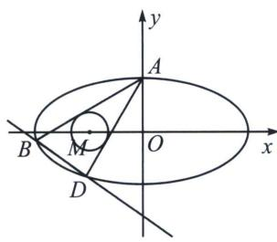

text_image

y
A
B
M
O
x
D

(1)求椭圆 C 的方程;  
(2)设直线 AB 和 AD 的斜率分别为 $k_{1}$ ， $k_{2}$ ，求证： $k_{1} \cdot k_{2}$ 为定值；  
(3)求证：直线 BD 过定点.

解析 (1)因为椭圆 $C$ 的上顶点为 $A(0,3)$ , 离心率为 $\frac{\sqrt{3}}{2}$ , 所以 $\left\{ \begin{array}{l} b=3 \\ \frac{c}{a}=\frac{\sqrt{3}}{2} \\ a^2=b^2+c^2 \end{array} \right.$ , 解得 $a=6, b=3, c=3\sqrt{3}$ , 则椭圆 $C$ 的方程为 $\frac{x^2}{36}+\frac{y^2}{9}=1$ ;

(2)证明：易知圆 M 的圆心为 $M(-3,0)$ ，半径为 r，设切线方程为 $y=kx+3$ ，此时 $\frac{|3-3k|}{\sqrt{1+k^{2}}}=r$ ，

即 $(9-r^{2})k^{2}-18k+9-r^{2}=0$ ，因为两切线AB，AD的斜率分别为 $k_{1}$ ， $k_{2}(k_{1}\neq k_{2})$ ，

所以 $k_{1}$ ， $k_{2}$ 是方程 $(9-r^{2})k^{2}-18k+9-r^{2}=0$ 的两根，由韦达定理得 $k_{1}\cdot k_{2}=1$ ，则 $k_{1}\cdot k_{2}$ 为定值；

(3)设 $B(6\cos\theta_{1},3\sin\theta_{1})$ ， $D(6\cos\theta_{2},3\sin\theta_{2})$ ， $t_{1}=\tan\frac{\theta_{1}}{2}$ ， $t_{2}=\tan\frac{\theta_{2}}{2}$

$k_{AB}=\frac{3\sin\theta_{1}-3}{6\cos\theta_{1}}=-\frac{1}{2}\frac{1-t_{1}}{1+t_{1}}$ ，同理 $k_{AD}=-\frac{1}{2}\frac{1-t_{2}}{1+t_{2}}$ ， $k_{1}\cdot k_{2}=\frac{1}{4}\cdot\frac{1-t_{1}}{1+t_{1}}\cdot\frac{1-t_{2}}{1+t_{2}}=1$ ，所以 $3+5(t_{1}+t_{2})+3t_{1}t_{2}=0$ ，

BD: $\frac{x}{6}(1 - t_1t_2) + \frac{y}{3}(t_1 + t_2) = 1 + t_1t_2$ ，对比系数得： $\frac{x}{6} - 1 + \frac{y}{3}(t_1 + t_2) + \left(-\frac{x}{6} - 1\right)t_1t_2 = 0$ ，所以一定有 $\frac{\frac{x}{6} - 1}{3} = \frac{\frac{y}{3}}{5} = \frac{-\frac{x}{6} - 1}{3}$ ，所以 $x = 0, y = -5$ 。故直线 BD 过定点 $(0, -5)$ .

例6 (2025·合肥一模第18题)已知动圆 $C_{1}: (x + 2)^{2} + y^{2} = r_{1}^{2}(r_{1} > 0)$ 与动圆 $C_{2}: (x - 2)^{2} + y^{2} = r_{2}^{2}(r_{2} > 0)$ , 满足 $|r_{1} - r_{2}| = 2\sqrt{3}$ , 记 $C_{1}$ 与 $C_{2}$ 公共点的轨迹为曲线 $T$ , 曲线 $T$ 与 $x$ 轴的交点记为 $A$ , $B$ (点 $A$ 在

点 $B$ 的左侧).

(1)求曲线 T 的方程;  
(2) 若直线 l 与圆 $x^{2} + y^{2} = 3$ 相切，且与曲线 T 交于 $P_{1}$ ， $P_{2}$ 两点（点 $P_{1}$ 在 y 轴左侧，点 $P_{2}$ 在 y 轴右侧）.  
(i) 若直线 $l$ 与直线 $y = -\frac{\sqrt{3}}{3} x$ 和 $y = \frac{\sqrt{3}}{3} x$ 分别交于 $Q_{1}$ , $Q_{2}$ 两点, 证明: $|P_{1}Q_{1}| = |P_{2}Q_{2}|$ ;  
(ii) 记直线 $AP_{1}$ ， $BP_{2}$ 的斜率分别为 $k_{1}$ ， $k_{2}$ ，证明： $k_{1}k_{2}$ 是定值.

解析 (1) $2a=2\sqrt{3}$ ， $a=\sqrt{3}$ ，c=2，所以 $\frac{x^{2}}{3}-y^{2}=1$

(2)(i)要证 $|P_1Q_1| = |P_2Q_2|$ ，只要证线段 $P_1P_2$ 的中点与线段 $Q_1Q_2$ 的中点重合。设 $P_1(x_1, y_1)$ ， $P_2(x_2, y_2)$ ，其中 $x_1 < 0 < x_2$ ，由条件，直线 $l$ 的斜率存在，设 $l$ 的方程为 $y = kx + m$ 。因为直线 $l$ 与圆 $x^2 + y^2 = 3$ 相切，所以 $\frac{|m|}{\sqrt{1 + k^2}} = \sqrt{3}$ ，即 $m^2 = 3(1 + k^2)$ 。联立 $\left\{ \begin{array}{l} y = kx + m \\ \frac{x^2}{3} - y^2 = 1 \end{array} \right.$ ， $(3k^2 - 1)x^2 + 6kmx + (3m^2 + 3) = 0$ ，

从而线段 $P_{1}P_{2}$ 的中点横坐标为 $\frac{x_{1}+x_{2}}{2}=\frac{3km}{1-3k^{2}}$ .

又直线 $y = kx + m$ 与退化二次曲线系 $\frac{x^2}{3} - y^2 = 0$ 联立，整理得 $(3k^2 - 1)x^2 + 6kmx + 3m^2 = 0$

则线段 $Q_{1}Q_{2}$ 中点的横坐标为 $\frac{x_3 + x_4}{2} = \frac{3km}{1 - 3k^2}$ ，所以 $|P_1Q_1| = |P_2Q_2|$ .

(ii) $P_{1}$ : $\left(\frac{\sqrt{3}}{\cos(-\theta_{1})}, \tan(-\theta_{1})\right)$ , 所以 $k_{AP_1} = \frac{\tan(-\theta_1)}{\frac{\sqrt{3}}{\cos(-\theta_1)} + \sqrt{3}} = \frac{\tan\left(-\frac{\theta_1}{2}\right)}{\sqrt{3}} = \frac{\sqrt{3}}{3} t_1$ ,

$P_{2} = \left(\frac{\sqrt{3}}{\cos\theta_{2}},\tan \theta_{2}\right)$ ，所以 $k_{AP_2} = \frac{\tan\theta_2}{\frac{3}{3\cos\theta_2} - \sqrt{3}} = \frac{\sqrt{3}}{3\tan\frac{\theta_2}{2}} = \frac{\sqrt{3}}{3t_2},$

$P_{1}P_{2}$ ： $\frac{x}{\sqrt{3}} (t_1t_2 + 1) - y(t_1 + t_2) = 1 - t_1t_2$ ，所以 $\sqrt{3} y(t_1 + t_2) - x(t_1t_2 + 1) = \sqrt{3}(t_1t_2 - 1)$

$d_{O - P_1P_2} = \frac{\left|\sqrt{3}\left(t_1t_2 - 1\right)\right|}{\sqrt{3\left(t_1 + t_2\right)^2 + \left(t_1t_2 + 1\right)^2}} = \sqrt{3}$ ，所以 $3t_1^2 +10t_1t_2 + 3t_2^2 = 0$ ，所以 $t_1 = -3t_2$ 或者 $t_2 = -\frac{1}{3} t_2$

所以 $k_{1}k_{1}=-1$ 或者 $-\frac{1}{9}$ （舍），点 $P_{1}$ 在 y 轴左侧，点 $P_{2}$ 在 y 轴右侧，故大于渐近线乘积 $-\frac{b^{2}}{a^{2}}$ 才符合。

# 五、两点对合方程简化轮换对称问题

例7 (2025·MST 陪跑课群答读者问题)如图所示, 已知椭圆 $E: \frac{x^{2}}{4} + \frac{y^{2}}{3} = 1$ , 过点 $P(2, 1)$ 的直线交椭圆于 $M, N$ 两点, 过点 $N$ 作斜率为 $- \frac{3}{2}$ 的直线交椭圆于另一点 $Q$ , 求证: 直线 $MQ$ 过定点.

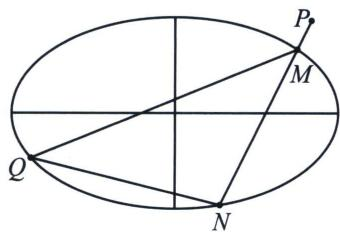

text_image

P
M
Q
N

解析 设 M、N、Q 所对应的三角代换参数为 $t_{1}$ 、 $t_{2}$ 、 $t_{3}$ （过程省略），根据椭圆两点对合式方程

$$
\left\{ \begin{array}{l l} {l _ {M N}:   \frac {x}{2} (1 - t _ {1} t _ {2}) + \frac {y}{\sqrt {3}} (t _ {1} + t _ {2}) = 1 + t _ {1} t _ {2}} \\ {l _ {Q N}:   \frac {x}{2} (1 - t _ {2} t _ {3}) + \frac {y}{\sqrt {3}} (t _ {2} + t _ {3}) = 1 + t _ {2} t _ {3} , M N \text {经过} P (2, 1) \Rightarrow t _ {1} + t _ {2} = 2 \sqrt {3}   t _ {1} t _ {2} \Rightarrow t _ {2} = \frac {t _ {1}}{2 \sqrt {3}   t _ {1} - 1}   ①} \\ {l _ {Q M}:   \frac {x}{2} (1 - t _ {1} t _ {3}) + \frac {y}{\sqrt {3}} (t _ {1} + t _ {3}) = 1 + t _ {1} t _ {3}} \end{array} \right.
$$

$$
\begin{array}{r l} & k _ {\mathrm{QN}} = - \frac {3}{2} \Rightarrow - \frac {\sqrt {3} (1 - t _ {2} t _ {3})}{2 (t _ {2} + t _ {3})} = - \frac {3}{2} \Rightarrow t _ {2} = \frac {1 - \sqrt {3} t _ {3}}{\sqrt {3} + t _ {3}}, \text {代入①得:} \frac {t _ {1}}{2 \sqrt {3} t _ {1} - 1} = \frac {1 - \sqrt {3} t _ {3}}{\sqrt {3} + t _ {3}} \Rightarrow 7 t _ {1} t _ {3} - \sqrt {3} (t _ {1} + t _ {3}) + 1 \\ & = 0 ②; 2 y (t _ {1} + t _ {3}) + \sqrt {3} x (1 - t _ {1} t _ {3}) = 2 \sqrt {3} (t _ {1} t _ {3} + 1) \Leftrightarrow (\sqrt {3} x + 2 \sqrt {3}) t _ {1} t _ {3} - 2 y (t _ {1} + t _ {3}) + 2 \sqrt {3} - \sqrt {3} x = 0 ③ \end{array}
$$

对比②③两个同解方程： $\frac{7}{\sqrt{3}x+2\sqrt{3}}=\frac{-\sqrt{3}}{-2y}=\frac{1}{2\sqrt{3}-\sqrt{3}x}\Rightarrow\left\{\begin{aligned}&x=\frac{3}{2}\\ &y=\frac{3}{4}\end{aligned}\right.$ ，所以MQ过定点 $\left(\frac{3}{2},\frac{3}{4}\right)$ .

注意 无需背景，直接干就得了，两点对合式最不怕轮换对称。

例8 (2024·新高考Ⅱ卷19题)已知双曲线 $C: x^{2} - y^{2} = m (m > 0)$ , 点 $P_{1}(5, 4)$ 在 $C$ 上, $k$ 为常数, $0 < k < 1$ , 按照如下方式依次构造点 $P_{n}(n=2, 3, \cdots)$ , 过 $P_{n-1}$ 斜率为 $k$ 的直线与 $C$ 的左支交于点 $Q_{n-1}$ , 令 $P_{n}$ 为 $Q_{n-1}$ 关于 $y$ 轴的对称点, 记 $P_{n}$ 的坐标为 $(x_{n}, y_{n})$ .

(1) 若 $k=\frac{1}{2}$ ，求 $x_{2}$ ， $y_{2}$ ;

(2)证明：数列 $\{x_{n}-y_{n}\}$ 是公比为 $\frac{1+k}{1-k}$ 的等比数列；

(3)设 $S_{n}$ 为 $\triangle P_{n}P_{n + 1}P_{n + 2}$ 的面积，证明：对任意的正整数 $n$ ， $S_{n} = S_{n + 1}$

解析 (1)因为 $P_{1}(5, 4)$ 在 $C$ 上，所以 $25 - 16 = m$ ，解得 $m = 9$ ，过 $P(5, 4)$ 且斜率为 $k = \frac{1}{2}$ 的直线方程为 $y - 4 = \frac{1}{2}(x - 5)$ ，即 $x - 2y + 3 = 0$ ，联立 $\left\{ \begin{array}{l} x^{2} - y^{2} = 9 \\ x - 2y + 3 = 0 \end{array} \right.$ ，解得 $\left\{ \begin{array}{l} x = 5 \\ y = 4 \end{array} \right.$ 或 $\left\{ \begin{array}{l} x = -3 \\ y = 0 \end{array} \right.$ ，

故 $Q_{1}(-3,0), P_{2}(3,0)$ ，过 $P_{n-1}$ 斜率为 $k$ 的直线与 $C$ 的左支交于点 $Q_{n-1}$ ，令 $P_{n}$ 为 $Q_{n-1}$ 关于 $y$ 轴的对称点，所以 $x_{2}=3, y_{2}=0$ ；

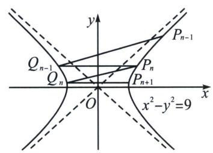

text_image

y
P_{n-1}
Q_{n-1}
Q_n
P_n
P_{n+1}
O
x
x^2 - y^2 = 9

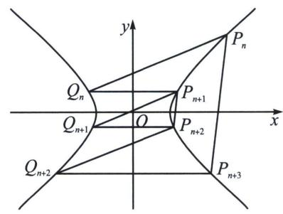

text_image

y
P_n
Q_n
P_{n+1}
Q_{n+1}
O
P_{n+2}
x
Q_{n+2}
P_{n+3}

(2)设 $P_{n}\left(\frac{3}{\cos\theta_{n}}, 3\tan\theta_{n}\right)$ , 令 $t_{n}=\tan\frac{\theta_{n}}{2}$ (右支), $Q_{n-1}(-x_{n}, y_{n})$ (左支), 所以 $t_{Q_{n-1}}=-\frac{1}{t_{n}}$ , 故使用两点对合式得: $P_{n-1}Q_{n-1}: \frac{x}{3}\left(1-\frac{t_{n-1}}{t_{n}}\right)-\frac{y}{3}\left(t_{n-1}-\frac{1}{t_{n}}\right)=1+\frac{t_{n-1}}{t_{n}}$ , 即 $P_{n-1}Q_{n-1}: \frac{x}{3}(t_{n}-t_{n-1})-\frac{y}{3}(t_{n-1}t_{n}-1)=t_{n}+t_{n-1}$ , 所以 $k=\frac{t_{n-1}-t_{n}}{1-t_{n-1}t_{n}}$ , 由于 $P_{n}$ 均在双曲线右支, 所以 $\frac{1+k}{1-k}=\frac{(1-t_{n})(1+t_{n-1})}{(1+t_{n})(1-t_{n-1})}$ ,

所以 $\frac{x_n - y_n}{x_{n-1} - y_{n-1}} = \frac{\frac{3(1 - \sin\theta_n)}{\cos\theta_n}}{\frac{3(1 - \sin\theta_{n-1})}{\cos\theta_{n-1}}} = \frac{\frac{\cos\frac{\theta_n}{2} - \sin\frac{\theta_n}{2}}{\cos\frac{\theta_n}{2} + \sin\frac{\theta_n}{2}}}{\frac{\cos\frac{\theta_{n-1}}{2} - \sin\frac{\theta_{n-1}}{2}}{\cos\frac{\theta_{n-1}}{2} + \sin\frac{\theta_{n-1}}{2}}} = \frac{\frac{1 - t_n}{1 + t_n}}{\frac{1 - t_{n-1}}{1 + t_{n-1}}} = \frac{1 + k}{1 - k}$ , 命题得证;

(3)由右支两点对合式： $P_{n}P_{n+3}:\frac{x}{3}(1+t_{n}t_{n+3})-\frac{y}{3}(t_{n}+t_{n+3})=1-t_{n}t_{n+3},\quad k_{P_{n}P_{n+3}}=\frac{1+t_{n}t_{n+3}}{t_{n}+t_{n+3}},$

$$
P _ {n + 1} P _ {n + 2}: \frac {x}{3} (1 + t _ {n + 1} t _ {n + 2}) - \frac {y}{3} (t _ {n + 1} + t _ {n + 2}) = 1 - t _ {n + 1} t _ {n + 2}, k _ {P _ {n + 1} P _ {n + 2}} = \frac {1 + t _ {n + 1} t _ {n + 2}}{t _ {n + 1} + t _ {n + 2}},
$$

由 $k = \frac{t_{n - 1} - t_n}{1 - t_{n - 1}t_n}$ 得： $t_n = \frac{k - t_{n - 1}}{kt_{n - 1} - 1}, t_{n - 1} = \frac{k + t_n}{kt_n + 1}$ ，所以 $k_{P_nP_{n + 3}} = \frac{1 + t_nt_{n + 3}}{t_nt_{n + 3}} = \frac{1 + \frac{k + t_{n + 1}}{kt_{n + 1} + 1}\cdot\frac{k - t_{n + 2}}{kt_{n + 2} - 1}}{\frac{k + t_{n + 1}}{kt_{n + 1} + 1} +\frac{k - t_{n + 2}}{kt_{n + 2} - 1}} =$ $\frac{(k^2 -1)(1 + t_{n + 1}t_{n + 2})}{(k^2 -1)(t_{n + 1} + t_{n + 2})} = k_{P_{n + 1}P_{n + 2}}$ ，所以 $P_{n + 1}P_{n + 2} / / P_nP_{n + 3}$ ，所以 $S_{n} = S_{n + 1}$

注意 涉及双曲线多线平行，两点对合式相比反比例得两点对合式，就是小巫见大巫，所以双曲线还是利用坐标系旋转仿射，方法永远是选择考场中计算量最小的。

例9 (2025·北京海淀区清华附中高三统测第19题)已知椭圆 $W: \frac{x^{2}}{a^{2}} + \frac{y^{2}}{b^{2}} = 1 (a > b > 0)$ 的左顶点为 $A$ , 下顶点为 $B$ , 离心率为 $\frac{\sqrt{3}}{2}$ , 点 $C\left(\frac{8}{5}, \frac{3}{5}\right)$ 在 $W$ 上.

(1)求椭圆 W 的标准方程;

(2)设 D, E, F 是椭圆 W 上三个不同的点，它们都不与 A, B, C 重合，且 $AB \parallel DE$ , $BC \parallel EF$ ，求证： $AF \parallel CD$ .

解析 (1)由题意可得 $\left\{ \begin{array}{l} e = \frac{c}{a} = \frac{\sqrt{3}}{2} \\ \frac{64}{25a^2} + \frac{9}{25b^2} = 1 \\ a^2 = b^2 + c^2 \end{array} \right.$ ，解得 $\left\{ \begin{array}{l} a = 2 \\ b = 1 \\ c = \sqrt{3} \end{array} \right.$ ，所以椭圆 $W$ 的标准方程 $\frac{x^2}{4} + y^2 = 1$ ；

(2)由椭圆 $\frac{x^2}{4} + y^2 = 1$ 得 $A(-2,0), B(0,-1)$ ，分别设 $C(2\cos \theta_1, \sin \theta_1), t_1 = \tan \frac{\theta_1}{2} = \frac{1}{3}, D(2\cos \theta_2, \sin \theta_2), t_2 = \tan \frac{\theta_2}{2}, E(2\cos \theta_3, \sin \theta_3), t_3 = \tan \frac{\theta_3}{2}, F(2\cos \theta_4, \sin \theta_4), t_4 = \tan \frac{\theta_4}{2}$ ，

易证椭圆两点对合式： $\frac{x}{a}\cos \frac{\theta_{\mathrm{i}} + \theta_{j}}{2} +\frac{y}{b}\sin \frac{\theta_{\mathrm{i}} + \theta_{j}}{2} = \cos \frac{\theta_{\mathrm{i}} - \theta_{j}}{2}$ ，同除以 $\cos \frac{\theta_i}{2}\cos \frac{\theta_j}{2}$

$$
\frac {x}{2} (1 - t _ {m} t _ {n}) + y (t _ {m} + t _ {n}) = 1 - t _ {m} t _ {n} \Big (\text {令} t _ {m} = \cos \frac {\theta_ {\mathrm{i}}}{2}, t _ {n} = \cos \frac {\theta_ {j}}{2} \Big)
$$

解法一（用 $t_1 = \tan \frac{\theta_1}{2} = \frac{1}{3}$ ）： $k_{BC} = 1 = k_{EF} = -\frac{1}{2} \cdot \frac{1 - t_3 t_4}{t_3 + t_4}$ ，所以 $t_3 = \frac{2t_4 + 1}{t_4 - 2}$ ， $k_{AB} = -\frac{1}{2} = k_{ED} = -\frac{1}{2} \cdot \frac{1 - t_2 t_3}{t_2 + t_3}$ ，所以 $t_3 = \frac{1 - t_2}{1 + t_2}$ ，所以 $\frac{2t_4 + 1}{t_4 - 2} = \frac{1 - t_2}{1 + t_2}$ ，所以 $t_4 = \frac{t_2 - 3}{3t_2 + 1}$ ；要证 $AF // CD$ ，

只需证 $k_{AF} = \frac{1}{2} t_4 = k_{CD} = -\frac{1}{2}\cdot \frac{1 - t_1t_2}{t_1 + t_2} = -\frac{1}{2}\cdot \frac{3 - t_2}{3t_2 + 1}$ ，显然成立！

解法二(不用 $t_1 = \tan \frac{\theta_1}{2} = \frac{1}{3}$ 具体值): $k_{AB} = -\frac{1}{2} = k_{ED} = -\frac{1}{2} \cdot \frac{1 - t_2 t_3}{t_2 + t_3}$ ①, $k_{BC} = \frac{1}{2} \frac{1 + t_1}{1 - t_1} = k_{EF} = -\frac{1}{2} \cdot \frac{1 - t_3 t_4}{t_3 + t_4}$ ②, 要证 $AF // CD$ , 只需证 $k_{AF} = \frac{1}{2} t_4 = k_{CD} = -\frac{1}{2} \cdot \frac{1 - t_1 t_2}{t_1 + t_2}$ , 故需要在 ① 和 ② 中消掉 $t_3$ , 由于 $-\frac{1}{2} = -\frac{1}{2} \cdot \frac{1 - t_2 t_3}{t_2 + t_3} \Rightarrow t_3 = \frac{1 - t_2}{1 + t_2}$ ③, ③代入 ②得: $t_4 = \frac{t_1 t_2 - 1}{t_1 + t_2}$ , 即满足 $k_{AF} = \frac{1}{2} t_4 = k_{CD} = -\frac{1}{2} \cdot \frac{1 - t_1 t_2}{t_1 + t_2}$ .

例10（南京二模18题(25陪跑课学员鲤鱼提问))在平面直角坐标系 $xOy$ 中，点 $A(-1, 0)$ ， $B(1, 0)$ ， $Q(-4, 0)$ ，动点 $P$ 满足 $PA + PB = 4$ ，记点 $P$ 的轨迹为 $C$ .

(1)求 C 的方程;

(2) 过点 $Q$ 且斜率不为 0 的直线 $l$ 与 $C$ 相交于两点 $E, F(E$ 在 $F$ 的左侧). 设直线 $AE, AF$ 的斜率分别为 $k_{1}, k_{2}$ .

①求证： $\frac{k_{1}}{k_{2}}$ 为定值；

②设直线 AF，BE 相交于点 M，求证：MA-MB 为定值.

(1) $c = 1, a = 2 \Rightarrow b = \sqrt{3}, \Rightarrow \frac{x^2}{4} + \frac{y^2}{3} = 1.$

(2)①如图：

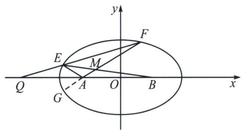

text_image

y
F
E
M
Q
A
O
B
x
G

解析 设 $EF: \frac{x}{2}(1 - t_1t_2) + \frac{y}{\sqrt{3}}(t_1 + t_2) = 1 + t_1t_2$ 、由于过定点 $Q(-4,0)$ ，故 $t_1t_2 = 3$ ，延长 $FA$ 交椭圆于 $G$ ，则 $FG: \frac{x}{2}(1 - t_2t_3) + \frac{y}{\sqrt{3}}(t_2 + t_3) = 1 + t_2t_3$ ，由于过定点 $A(-1,0)$ ，故 $t_2t_3 = -3$ ，所以 $t_1 = -t_3$ ，所以 $E$ 与 $G$ 关于 $x$ 轴对称，即 $\frac{k_1}{k_2} = -1$ 为定值；

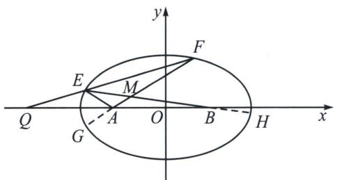

text_image

y
F
E
M
Q
A
O
B
H
x
G

②不妨设 $E$ 、 $F$ 在 $x$ 轴上方，由 $BH: \frac{x}{2}(1 - t_1 t_4) + \frac{y}{\sqrt{3}}(t_1 + t_4) = 1 + t_1 t_4$ ，由于过定点 $B(1, 0)$ ，故 $t_1 t_4 = -\frac{1}{3}$ ，

联立： $\left\{ \begin{array}{l}FG:\frac{x}{2} (1 - t_2t_3) + \frac{y}{\sqrt{3}} (t_2 + t_3) = 1 + t_2t_3\\ BH:\frac{x}{2} (1 - t_1t_4) + \frac{y}{\sqrt{3}} (t_1 + t_4) = 1 + t_1t_4 \end{array} \right.\Leftrightarrow \left\{ \begin{array}{l}FG:2x + \frac{y}{\sqrt{3}} (t_2 + t_3) = -2\\ BH:\frac{2x}{3} +\frac{y}{\sqrt{3}} (t_1 + t_4) = \frac{2}{3} \end{array} ,\left\{ \begin{array}{l}2x + \frac{y}{\sqrt{3}}\left(\frac{3}{t_1} -t_1\right) = -2\\ \frac{2x}{3} +\frac{y}{\sqrt{3}}\left(t_1 - \frac{1}{3t_1}\right) = \frac{2}{3} \end{array} ,\right. \right.$

$\left\{ \begin{array}{l} t_{1} = \frac{\sqrt{3}(2x - 1)}{-2y} \\ \frac{1}{t_{1}} = \frac{\sqrt{3}(2x + 1)}{-2y} \end{array} \right.$ ，两式相乘得 $12x^{2} - 4y^{2} = 3$ ，这恰好是以 $A$ 、 $B$ 为焦点的双曲线，因此 $MA - MB$ 为定值.

text_image

第

# 第 11 章 从定比点差到极点极线

# CONGD INGB IDIANCHADAOJIDIANJIXIAN

# 第一节 单比与交比

# 一、单比的概念及性质

# 1. 单比的定义

如果共线三点 $P_{1}, P_{2}, P$ 满足 $\overrightarrow{P_{1}P} = \lambda \overrightarrow{PP_{2}}$ ，则 $\lambda$ 称为共线三点 $P_{1}, P_{2}, P$ 的单比，也可以表示为 $P$ 分 $\overrightarrow{P_{1}P_{2}}$ 为 $\lambda$ 。其中 $P_{1}, P_{2}$ 称为基点， $P$ 称为分点。

对单比的概念我们需要理解以下几点：

(1)单比的定义是有顺序的，共线三点 $P_{1}$ ， $P_{2}$ ， $P$ 的顺序不可随意调整，起点 $\rightarrow$ 分点 $= \lambda$ （分点 $\rightarrow$ 终点）；  
(2) 当 P 位于线段 $P_{1}$ ， $P_{2}$ 之间时， $\lambda > 0$ ，否则，当 P 位于线段 $P_{1}$ ， $P_{2}$ 之外时， $\lambda < 0$ ，P 为线段 $P_{1}P_{2}$ 中点时 $\lambda = 1$ ;  
(3)如果 $P_{1}$ ， $P_{2}$ 为定点， $\lambda$ 也给定，则点 P 的位置唯一确定；  
(4)在平面直角坐标系中， $P_{1}(x_{1},y_{1})$ ， $P_{2}(x_{2},y_{2})$ ，由向量坐标运算，得出定比分点公式：

$$
x _ {P} = \frac {x _ {1} + \lambda x _ {2}}{1 + \lambda}, y _ {P} = \frac {y _ {1} + \lambda y _ {2}}{1 + \lambda}
$$

(5)所谓共线三点的单比，即为定比分点中的定比.

最早出现定比分点高考题是在 2006 年山东高考卷，由于年代久远，所以我们就用同类型题来解读.

# 2. $\lambda + \mu$ 为定值的参数同构与点差法

当圆锥曲线上两点作为定比分点，线段两个端点分别位于焦点和另一条坐标轴上时，这里会涉及一个 $\lambda + \mu$ 为定值的问题，我们介绍参数同构法，点差思想来处理.

例1 已知焦点在 $x$ 轴上, 离心率为 $\frac{2\sqrt{5}}{5}$ 的椭圆的一个顶点是抛物线 $x^{2} = 4y$ 的焦点, 过椭圆右焦点 $F$ 的直线 $l$ 交椭圆于 $A$ , $B$ 两点, 交 $y$ 轴于点 $M$ , 且 $\overrightarrow{MA} = \lambda_{1}\overrightarrow{AF}$ , $\overrightarrow{MB} = \lambda_{2}\overrightarrow{BF}$

(1)求椭圆的方程;  
(2)证明： $\lambda_{1}+\lambda_{2}$ 为定值.

解析 (1) $\frac{x}{5}+y^{2}=1.$

(2)设 $A(x_{1}, y_{1})$ ， $B(x_{2}, y_{2})$ ， $M(0, m)$ ，由题意，点 $F(2, 0)$ ，因为 $\overrightarrow{MA} = \lambda_{1}\overrightarrow{AF}$ ， $\overrightarrow{MB} = \lambda_{2}\overrightarrow{BF}$ ，根据定比.

分点公式， $\left\{\begin{aligned}x_{1}&=\frac{2\lambda_{1}}{\lambda_{1}+1}\\ y_{1}&=\frac{m}{\lambda_{1}+1}\end{aligned}\right.$ ，因为点A在椭圆 $\frac{x^{2}}{5}+y^{2}=1$ 上，所以 $\frac{1}{5}\left(\frac{2\lambda_{1}}{\lambda_{1}+1}\right)^{2}+\left(\frac{m}{\lambda_{1}+1}\right)^{2}=1$ ，整理得：

$\lambda_1^2 + 10\lambda_1 + 5 - 5m^2 = 0$ ，同理可得： $\lambda_2^2 + 10\lambda_2 + 5 - 5m^2 = 0$ 。即 $\lambda_1$ ， $\lambda_2$ 为同构方程 $\lambda^2 + 10\lambda + 5 - 5m^2 = 0$ 的两根，

从而有 $\lambda_{1}+\lambda_{2}=-10$ 为定值.

注意 本题我们也可以按照点差法来解决， $\left\{\begin{aligned}\frac{1}{5}\left(\frac{2\lambda_{1}}{\lambda_{1}+1}\right)^{2}+\left(\frac{m}{\lambda_{1}+1}\right)^{2}&=1\\ \frac{1}{5}\left(\frac{2\lambda_{2}}{\lambda_{2}+1}\right)^{2}+\left(\frac{m}{\lambda_{2}+1}\right)^{2}&=1\end{aligned}\right.\Rightarrow\left\{\begin{aligned}\frac{1}{5}(2\lambda_{1})^{2}+(m)^{2}=(\lambda_{1}+1)^{2}&①\\ \frac{1}{5}(2\lambda_{2})^{2}+(m)^{2}=(\lambda_{2}+1)^{2}&②\end{aligned}\right.$

①-②得： $\frac{4}{5}(\lambda_{1}+\lambda_{2})(\lambda_{1}-\lambda_{2})=(\lambda_{1}+\lambda_{2}+2)(\lambda_{1}-\lambda_{2})$ ， $\lambda_{1}+\lambda_{2}=-10$ ，为定值.

所以我们可以再次确认，同构构造二次方程和点差法都是表达同一联立的思想.

例2 (2023·大庆模拟)已知椭圆 $C: \frac{x^{2}}{a^{2}} + \frac{y^{2}}{b^{2}} = 1 (a > b > 0)$ 的离心率 $e = \frac{1}{2}$ , 短轴长为 $2\sqrt{3}$ .

(1)求椭圆 C 的方程;

(2)已知经过定点 $P(1, 1)$ 的直线 $l$ 与椭圆相交于 $A, B$ 两点，且与直线 $y = -\frac{3}{4} x$ 相交于点 $Q$ ，如果 $\overrightarrow{AQ} = \lambda \overrightarrow{AP}, \overrightarrow{QB} = \mu \overrightarrow{PB}$ ，那么 $\lambda + \mu$ 是否为定值？若是，请求出具体数值；若不是，请说明理由。

解析 (1)由题意得 $\left\{ \begin{array}{l} b = \sqrt{3} \\ \frac{c}{a} = \frac{1}{2} \\ a^2 = b^2 + c^2 \end{array} \right.$ ，解得 $a^2 = 4$ ， $b^2 = 3$ ，故椭圆 $C$ 的方程为 $\frac{x^2}{4} + \frac{y^2}{3} = 1$ ；

(2) $\overrightarrow{AQ} = \lambda \overrightarrow{AP}$ , $\overrightarrow{QB} = \mu \overrightarrow{PB}$ , 则 $\overrightarrow{QA} = -\lambda \overrightarrow{AP}$ , $\overrightarrow{QB} = -\mu \overrightarrow{BP}$ , 且 $\frac{x_Q}{4} + \frac{y_Q}{3} = 0$ , 根据定比分点公式

$$
x _ {A} = \frac {x _ {Q} - \lambda x _ {P}}{1 - \lambda} = \frac {x _ {Q} - \lambda}{1 - \lambda}, y _ {A} = \frac {y _ {Q} - \lambda y _ {P}}{1 - \lambda} = \frac {y _ {Q} - \lambda}{1 - \lambda}, x _ {B} = \frac {x _ {Q} - \mu}{1 - \mu}, y _ {B} = \frac {y _ {Q} - \mu}{1 - \mu},
$$

解法一：由于由于 $A$ ， $B$ 均在椭圆上，故 $\left\{ \begin{array}{l} \frac{\left(\frac{x_Q - \lambda}{1 - \lambda}\right)^2}{4} + \frac{\left(\frac{y_Q - \lambda}{1 - \lambda}\right)^2}{3} = 1 \\ \frac{\left(\frac{x_Q - \mu}{1 - \mu}\right)^2}{4} + \frac{\left(\frac{y_Q - \mu}{1 - \mu}\right)^2}{3} = 1 \end{array} \right.\Rightarrow \left\{ \begin{array}{l} \frac{(x_Q - \lambda)^2}{4} + \frac{(y_Q - \lambda)^2}{3} = (1 - \lambda)^2 \\ \frac{(x_Q - \mu)^2}{4} + \frac{(y_Q - \mu)^2}{3} = (1 - \mu)^2 \end{array} \right.,$

作差得 $\frac{2x_Q - \lambda - \mu}{4} + \frac{2y_Q - \lambda - \mu}{3} = 2 - \lambda - \mu$ ，即 $(\lambda + \mu)\left(1 - \frac{1}{4} - \frac{1}{3}\right) = 2 - 2\left(\frac{x_Q}{4} + \frac{y_Q}{3}\right) = 2$ ，所以 $\lambda + \mu = \frac{24}{5}$ .

解法二: 将 $x_{A} = \frac{x_{Q} - \lambda}{1 - \lambda}, y_{A} = \frac{y_{Q} - \lambda}{1 - \lambda}$ 代入椭圆得: $\frac{5}{12} \lambda^{2} + \lambda \left( \frac{x_{Q}}{2} + \frac{2y_{Q}}{3} - 2 \right) + 1 - \frac{x_{Q}^{2}}{4} - \frac{y_{Q}^{2}}{3} = 0$ , 同理 $\frac{5}{12} \mu^{2} + \mu \left( \frac{x_{Q}}{2} + \frac{2y_{Q}}{3} - 2 \right) + 1 - \frac{x_{Q}^{2}}{4} - \frac{y_{Q}^{2}}{3} = 0$ , 所以 $\lambda$ , $\mu$ 为同构方程 $\frac{5}{12} x^{2} + \left( \frac{x_{Q}}{2} + \frac{2y_{Q}}{3} - 2 \right)x + 1 - \frac{x_{Q}^{2}}{4} - \frac{y_{Q}^{2}}{3} = 0$ 的两根, 所

以 $\lambda + \mu = -\frac{12}{5}\left(\frac{x_{Q}}{2} + \frac{2y_{Q}}{3} - 2\right) = \frac{24}{5}.$

# 二、单比与交比

# 1. 单比角元形式

两条直线的有向角满足下面几个性质：

(1)如果直线 a 逆时针旋转到直线 b，则 $(a, b)$ 为正角；如果直线 a 顺时针旋转到直线 b，则 $(a, b)$ 为负角；

(2) $\sin(a, b) = -\sin(b, a).$

如下图，分别连接共线三点 A, C, B 与其所在直线外一点 S，记所形成的直线分别为 a, c, b，若 $\overrightarrow{AC} = \lambda \overrightarrow{CB}$ ，则 $\lambda = \frac{SA \sin(a, c)}{SB \sin(c, b)}$ .

text_image

S
a
c
b
A
C
B

证明： $\lambda = \frac{S_{\triangle SAC}}{S_{\triangle SBC}} = \frac{\frac{1}{2}SA\cdot SC\cdot\sin(a,c)}{\frac{1}{2}SB\cdot SC\cdot\sin(c,b)} = \frac{SA\sin(a,c)}{SB\sin(c,b)}$

# 2. 交比的概念及性质

点列的交比：如果共线四点 $P_{1}, P_{2}, P_{3}, P_{4}$ 满足 $\overrightarrow{P_1P_3} = \lambda \overrightarrow{P_3P_2}, \overrightarrow{P_1P_4} = \mu \overrightarrow{P_4P_2}$ ，则 $\frac{\lambda}{\mu}$ 称为共线四点 $P_{1}, P_{2}, P_{3}, P_{4}$ 的交比，记为 $(P_{1}, P_{2}; P_{3}, P_{4})$ 。其中 $P_{1}, P_{2}$ 称为基点偶（对）， $P_{3}, P_{4}$ 称为分点偶（对）。

text_image

P₁ P₃ P₂ P₄

不妨共线四点 $P_{1}, P_{2}, P_{3}, P_{4}$ 所在直线不与坐标轴垂直，并设 $P_{1}(x_{1}, y_{1}), P_{2}(x_{2}, y_{2})$ ， $P_{3}(x_{3}, y_{3}), P_{4}(x_{4}, y_{4})$ ，则： $(P_{1}, P_{2}; P_{3}, P_{4}) = \frac{(x_{3} - x_{1})(x_{2} - x_{4})}{(x_{2} - x_{3})(x_{4} - x_{1})} = \frac{(y_{3} - y_{1})(y_{2} - y_{4})}{(y_{2} - y_{3})(y_{4} - y_{1})}$ .

由上述计算公式，不难得到点列交比的简单性质：

性质1：基点偶与分点偶交换，交比的值不变，即 $(P_{1}, P_{2}; P_{3}, P_{4}) = (P_{3}, P_{4}; P_{1}, P_{2})$

性质 2: 基点偶的两个字母交换, 或者分点偶的两个字母交换, 交比值变为原来交比值的倒数, 即

$$
(P _ {2}, P _ {1}; P _ {3}, P _ {4}) = (P _ {1}, P _ {2}; P _ {4}, P _ {3}) = \frac {1}{(P _ {1} , P _ {2} ; P _ {3} , P _ {4})}
$$

性质 3: 交换中间两个字母, 或交换两端的两个字母, 交比的值变为 1 减去原来的交比值, 即

$$
(P _ {1}, P _ {3}; P _ {2}, P _ {4}) = (P _ {4}, P _ {2}; P _ {3}, P _ {1}) = 1 - (P _ {1}, P _ {2}; P _ {3}, P _ {4}).
$$

性质 4：如果四个不同的共线点中三点及其交比值已知，则第四点必唯一确定.

点列交比的角元形式：如下图，分别连接共线四点 $P_{1}$ ， $P_{2}$ ， $P_{3}$ ， $P_{4}$ 与其所在直线外一点 S，记所形成的直线分别为 $a, b, c, d$ ，则 $(P_1, P_2; P_3, P_4) = \frac{\sin(a, c)\sin(d, b)}{\sin(c, b)\sin(a, d)}$ .

text_image

S
a
c
b
d
P₁
P₃
P₂
P₄

从交比的角元形式可以看出，交比 $(P_{1}, P_{2}; P_{3}, P_{4})$ 的值只与直线的有向角有关系，与线段长度没有关系。于是我们很容易据此得到交比的射影不变性.

# 3. 交比的射影不变性

交比的射影不变性：如图所示，过点 S 引四条相交直线，分别与另外两条直线交于 A, B, C, D 和 $P_{1}$ ， $P_{2}$ ， $P_{3}$ ， $P_{4}$ ，则 $(P_{1}, P_{2}; P_{3}, P_{4}) = (A, B; C, D)$

text_image

S
a
c
b
d
A
C
B
D
P₁
P₃
P₂
P₄

交比的射影不变性，是交比的角元形式的直接推论，交比的射影不变性表明，交比经中心射影后不变.

关于交比射影不变性的斜率公式，我们会在后面章节进行解读，交比射影不变性的推论，结合调和点列，基本上可以打通高考.

例3 (2024·济南期末)射影几何学中, 中心投影是指光从一点向四周散射而形成的投影, 如图, $O$ 为透视中心, 平面内四个点 $E$ , $F$ , $G$ , $H$ 经过中心投影之后的投影点分别为 $A$ , $B$ , $C$ , $D$ . 对于四个有序点 $A$ , $B$ , $C$ , $D$ , 定义比值 $x = \frac{\frac{CA}{CB}}{\frac{DA}{DB}}$ 叫做这四个有序点的交比, 记作(ABCD).

(1)证明： $(EFGH)=(ABCD)$ ;  
(2)已知 $(EFGH)=\frac{3}{2}$ ，点B为线段AD的中点， $AC=\sqrt{3}OB=3,\quad\frac{\sin\angle ACO}{\sin\angle AOB}=\frac{3}{2}$ ，求 $\cos A.$

text_image

O
E F G H
A B C D

解析 (1)证明：在△AOC、△AOD、△BOC、△BOD中， $\frac{CA}{CB}=\frac{S_{\triangle AOC}}{S_{\triangle BOC}}=\frac{\frac{1}{2}OA\cdot OC\sin\angle AOC}{\frac{1}{2}OB\cdot OC\sin\angle BOC}=\frac{OAsin\angle AOC}{OB\sin\angle BOC}$

$$
\frac {D A}{D B} = \frac {S _ {\triangle A O D}}{S _ {\triangle B O D}} = \frac {\frac {1}{2} O A \cdot O D \sin \angle A O D}{\frac {1}{2} O B \cdot O D \sin \angle B O D} = \frac {O A \sin \angle A O D}{O B \sin \angle B O D},
$$

所以（ABCD）= $\frac{\frac{CA}{CB}}{\frac{DA}{DB}}=\frac{\frac{OA\sin\angle AOC}{OB\sin\angle BOC}}{\frac{OA\sin\angle AOD}{OB\sin\angle BOD}}=\frac{\sin\angle AOC\cdot\sin\angle BOD}{\sin\angle BOC\cdot\sin\angle AOD}$ ，又在 $\triangle EOG$ 、 $\triangle EOH$ 、 $\triangle FOG$ 、 $\triangle FOH$ 中，

$$
\frac {G E}{G F} = \frac {S _ {\triangle E O G}}{S _ {\triangle F O G}} = \frac {\frac {1}{2} O E \cdot O G \sin \angle E O G}{\frac {1}{2} O F \cdot O G \sin \angle F O G} = \frac {O E \sin \angle E O G}{O F \sin \angle F O G}, \frac {H E}{H F} = \frac {S _ {\triangle E O H}}{S _ {\triangle F O H}} = \frac {\frac {1}{2} O E \cdot O H \sin \angle E O H}{\frac {1}{2} O F \cdot O H \sin \angle F O H}
$$

$$
= \frac {O E \sin \angle E O H}{O F \sin \angle F O H},
$$

所以(EFGH)= $\frac{\frac{GE}{GF}}{\frac{HE}{HF}}=\frac{\frac{OE\sin\angle EOG}{OF\sin\angle FOG}}{\frac{OE\sin\angle EOH}{OF\sin\angle FOH}}=\frac{\sin\angle EOG\cdot\sin\angle FOH}{\sin\angle FOG\cdot\sin\angle EOH}$ ，又 $\angle EOG=\angle AOC,\quad\angle FOH=\angle BOD,$

$\angle FOG = \angle BOC, \angle EOH = \angle AOD$ ，所以 $\frac{\sin\angle AOC \cdot \sin\angle BOD}{\sin\angle BOC \cdot \sin\angle AOD} = \frac{\sin\angle EOG \cdot \sin\angle FOH}{\sin\angle FOG \cdot \sin\angle EOH}$ ，

所以 $(EFGH)=(ABCD)$ .

(2)由题意可得(EFGH)= $\frac{3}{2}$ ，所以(ABCD)= $\frac{3}{2}$ ，即 $\frac{\frac{CA}{CB}}{\frac{DA}{DB}}=\frac{3}{2}$ ，所以 $\frac{CA}{CB}\cdot\frac{DB}{DA}=\frac{3}{2}$ ，

又点 B 为线段 AD 的中点，即 $\frac{DB}{DA} = \frac{1}{2}$ ，所以 $\frac{CA}{CB} = 3$ ，又 AC = 3，则 AB = 2，BC = 1，

设 OA = x，OC = y 且 OB = $\sqrt{3}$ ，由 $\angle ABO = \pi - \angle CBO$ ，所以 $\cos \angle ABO + \cos \angle CBO = 0$ ，

即 $\frac{2^{2}+(\sqrt{3})^{2}-x^{2}}{2\times2\times\sqrt{3}}+\frac{1^{2}+(\sqrt{3})^{2}-y^{2}}{2\times1\times\sqrt{3}}=0$ ，解得 $x^{2}+2y^{2}=15$ ，①

在 $\triangle AOB$ 中，由正弦定理可得 $\frac{AB}{\sin\angle AOB}=\frac{x}{\sin\angle ABO}$ ，②

在 $\triangle COB$ 中，由正弦定理可得 $\frac{OB}{\sin\angle BCO}=\frac{y}{\sin\angle CBO}$ ，③

且 $\sin\angle ABO=\sin\angle CBO,\quad②$ 得， $\frac{x}{y}=\frac{AB}{\sin\angle AOB}\cdot\frac{\sin\angle BCO}{OB}=\frac{3}{2}\times\frac{2}{\sqrt{3}}=\sqrt{3}$ ，即 $x=\sqrt{3}y,$ ④

由①④解得 $x = 3$ ， $y = \sqrt{3}$ （负值舍去），即 $AO = 3$ ， $OC = \sqrt{3}$ 所以 $\cos A = \frac{AO^2 + AB^2 - OB^2}{2AO\cdot AB} =$ $\frac{3^2 + 2^2 - (\sqrt{3})^2}{2\times 3\times 2} = \frac{5}{6}.$

例4 (2024·江苏省四校联合)交比是射影几何中最基本的不变量, 在欧氏几何中亦有应用. 设 $A, B, C, D$ 是直线 $l$ 上互异且非无穷远的四点, 则称 $\frac{AC}{BC} \cdot \frac{BD}{AD}$ (分式中各项均为有向线段长度, 例如 $AB = -BA$ ) 为 $A, B, C, D$ 四点的交比, 记为 $(A, B; C, D)$ .

(1)证明： $1-(D, B; C, A)=\frac{1}{(B, A; C, D)}$ ;

(2)若 $l_{1}, l_{2}, l_{3}, l_{4}$ 为平面上过定点 $P$ 且互异的四条直线, $L_{1}, L_{2}$ 为不过点 $P$ 且互异的两条直线, $L_{1}$ 与 $l_{1}$ ， $l_{2}$ ， $l_{3}$ ， $l_{4}$ 的交点分别为 $A_{1}$ ， $B_{1}$ ， $C_{1}$ ， $D_{1}$ ， $L_{2}$ 与 $l_{1}$ ， $l_{2}$ ， $l_{3}$ ， $l_{4}$ 的交点分别为 $A_{2}$ ， $B_{2}$ ， $C_{2}$ ， $D_{2}$ ，证明： $(A_{1}, B_{1}; C_{1}, D_{1}) = (A_{2}, B_{2}; C_{2}, D_{2})$ ;

(3)已知第(2)问的逆命题成立, 证明: 若 $\triangle EFG$ 与 $\triangle E^{\prime}F^{\prime}G^{\prime}$ 的对应边不平行, 对应顶点的连线交于同一点, 则 $\triangle EFG$ 与 $\triangle E^{\prime}F^{\prime}G^{\prime}$ 对应边的交点在一条直线上.

解析 证明：(1) $1-(D,B;C,A)=1-\frac{DC\cdot BA}{BC\cdot DA}=\frac{BC\cdot AD+DC\cdot BA}{BC\cdot AD}=\frac{BC\cdot(AC+CD)+CD\cdot AB}{BC\cdot AD}$

$$
= \frac {B C \cdot A C + B C \cdot C D + C D \cdot A B}{B C \cdot A D} = \frac {B C \cdot A C + A C \cdot C D}{B C \cdot A D} = \frac {A C \cdot B D}{B C \cdot A D} = \frac {1}{(B , A ; C , D)};
$$

(2) $(A_{1}, B_{1}; C_{1}, D_{1}) = \frac{A_{1}C_{1} \cdot B_{1}D_{1}}{B_{1}C_{1} \cdot A_{1}D_{1}} = \frac{S_{\triangle PA_{1}C_{1}} \cdot S_{\triangle PB_{1}D_{1}}}{S_{\triangle PB_{1}C_{1}} \cdot S_{\triangle PA_{1}D_{1}}} = \frac{\frac{1}{2} \cdot PA_{1} \cdot PC_{1} \cdot \sin \angle A_{1}PC_{1} \cdot \frac{1}{2} \cdot PB_{1} \cdot PD_{1} \cdot \sin \angle B_{1}PD_{1}}{\frac{1}{2} \cdot PB_{1} \cdot PC_{1} \cdot \sin \angle B_{1}PC_{1} \cdot \frac{1}{2} \cdot PA_{1} \cdot PD_{1} \cdot \sin \angle A_{1}PD_{1}}$

$$
= \frac {\sin \angle A _ {1} P C _ {1} \cdot \sin \angle B _ {1} P D _ {1}}{\sin \angle B _ {1} P C _ {1} \cdot \sin \angle A _ {1} P D _ {1}} = \frac {\sin \angle A _ {2} P C _ {2} \cdot \sin \angle B _ {2} P D _ {2}}{\sin \angle B _ {2} P C _ {2} \cdot \sin \angle A _ {2} P D _ {2}} = \frac {S _ {\triangle P A _ {2} C _ {2}} \cdot S _ {\triangle P B _ {2} D _ {2}}}{S _ {\triangle P B _ {2} C _ {2}} \cdot S _ {\triangle P A _ {2} D _ {2}}} = \frac {A _ {2} C _ {2} \cdot B _ {2} D _ {2}}{B _ {2} C _ {2} \cdot A _ {2} D _ {2}} = (A _ {2}, B _ {2}; C _ {2}, D _ {2});
$$

text_image

P
l₁ l₂ l₃ l₄ L₂
A₂ B₂ C₂ D₂
A₁ B₁ C₁ D₁ L₁

(3)设 EF 与 $E^{\prime}F^{\prime}$ 交于 X，FG 与 $F^{\prime}G^{\prime}$ 交于 Y，EG 与 $E^{\prime}G^{\prime}$ 交于 Z，连接 XY， $FF^{\prime}$ 与 XY 交于 L， $EE^{\prime}$ 与 XY 交于 M， $GG^{\prime}$ 与 XY 交于 N，欲证 X，Y，Z 三点共线，只需证 Z 在直线 XY 上，

text_image

Geometric diagram with labeled points and lines, likely from a math problem or proof

考虑线束 XP, XE, XM, $XE'$ ，由第(2)问知(P, F; L, $F'$ ) = (P, E; M, $E'$ ),

再考虑线束 YP，YF，YL， $YF'$ ，由第(2)问知 $(P, F; L, F')=(P, G; N, G')$ ，

从而得到 $(P, E; M, E')=(P, G; N, G')$ ,

于是由第(2)问的逆命题知，EG，MN， $E^{\prime}G^{\prime}$ 交于一点，即为点Z，

从而 MN 过点 Z，故 Z 在直线 XY 上，X，Y，Z 三点共线.

例5 (2024·开封三模)点 S 是直线 PQ 外一点，点 M, N 在直线 PQ 上(点 M, N 与点 P, Q 任一点不重合). 若点 M 在线段 PQ 上，记(P, Q; M) = $\frac{|SP| \sin\angle PSM}{|SP| \sin\angle MSQ}$ ，若点 M 在线段 PQ 外，记(P, Q; M) = - $\frac{|SP| \sin\angle PSM}{|SP| \sin\angle MSQ}$ . 记(P, Q; M, N) = $\frac{(P, Q; M)}{(P, Q; N)}$ .

记 $\triangle ABC$ 的内角 $A, B, C$ 的对边分别为 $a, b, c$ , 已知 $b=2, A=60^{\circ}$ , 点 $D$ 是射线 $BC$ 上一点, 且 $(B, C; D)=\frac{c}{2}$ .

(1) 若 $AD=\sqrt{3}+1$ ，求 $\angle ADC$ ，

(2) 射线 BC 上的点 $M_{0}$ ， $M_{1}$ ， $M_{2}$ ，…满足 $(B, C_{3}M_{n}, D) = -\frac{1 + \sqrt{3}n}{2}$ ， $n \in N$ ，

(i) 当 n=0 时，求 $AM_{0}+8AD$ 的最小值，

(ii) 当 $n \neq 0$ 时，过点 $C$ 作 $CP_{n} \perp AM_{n}$ 于 $P_{n}$ ，记 $a_{n} = \frac{CP_{n}}{n}$ ，求证，数列 $\{a_{n}\}$ 的前 $n$ 项和 $S_{n} < 2 + \sqrt{2}$ .

解析 (1) 因为 $(B, C; D) = \frac{c}{2} > 0$ ，点 $D$ 在线段 $BC$ 上， $b = 2$ ，

所以由(B, C; D)= $\frac{c\sin\angle BAD}{b\sin\angle CAD}=\frac{c\sin\angle BAD}{2\sin\angle CAD}=\frac{c}{2}$ ，得 $\sin\angle BAD=\sin\angle CAD$ ，

所以 AD 为 $\angle BAC$ 的角平分线，又 $A=60^{\circ}$ ，所以 $\angle BAD=\angle CAD=30^{\circ}$ ，若 $AD=\sqrt{3}+1$ ，在 $\triangle ACD$ 中，由余弦定理得： $CD^{2}=AC^{2}+AD^{2}-2AC\cdot AD\cos\angle CAD=4+(\sqrt{3}+1)^{2}-4(\sqrt{3}+1)\cos30=2$ ，解得 $CD=\sqrt{2}$ ，由正弦定理得： $\frac{CD}{\sin/\angle CAD}=\frac{AC}{\sin/\angle CDA}$ 即 $\frac{\sqrt{2}}{\sin30^{\circ}}=\frac{2}{\sin\angle CDA}$ ，解得 $\sin\angle CDA=\frac{\sqrt{2}}{2}$ ，

由于 AD 是最大边，所以 $\angle CDA = 45^{\circ}$ ，

(2) 记 $\angle CAM_{n} = \alpha$ ,

(i) 当 n=0 时，因为 $(B, C; M_{0}, D) = -\frac{1}{2} < 0$ ，所以点 $M_{0}$ 在线段 BC 的延长线上，

所以 $\frac{c\sin(60^{\circ}+\alpha)}{2\sin\alpha}=\frac{1}{2}\cdot\frac{c}{2}$ ，化简得 $2\sin(60^{\circ}+\alpha)=\sin\alpha$ ，解得 $\cos\alpha=0$ ， $\alpha=90^{\circ}$ ，

因为 $S_{\triangle DM_0} = S_{\triangle DC} + S_{\triangle CM_0}$ ，所以 $AD\cdot AM_0\sin 120^\circ = AD\cdot AC\sin 30^\circ +AC\cdot AM_0$ ，即 $\frac{1}{AM_0} +\frac{2}{AD} = \frac{\sqrt{3}}{2},$

所以 $8AD + AM_{0} = \frac{2}{\sqrt{3}} (8AD + AM_{0}) \left( \frac{1}{AM_{0}} + \frac{2}{AD} \right) = \frac{2}{\sqrt{3}} \left( 17 + \frac{8AD}{AM_{0}} + \frac{2AM_{0}}{AD} \right) \geqslant \frac{2}{\sqrt{3}} (17 + 8) = \frac{50\sqrt{3}}{3}$ ,

当且仅当 $AM_{0}=2AD$ 时取等号，此时 $AD=\frac{5\sqrt{3}}{3}$ ， $AM_{0}=\frac{10\sqrt{3}}{3}$ ，

由于 $\tan\angle ACM_{0}=\frac{5\sqrt{3}}{3}>\sqrt{3}$ ， $\angle ACM_{0}>60^{\circ}$ ，等号可以取到.

(ii) 当 $n \neq 0$ 时，因为 $(B, C; M_{n}, D) = -\frac{1 + \sqrt{3}n}{2} < 0$ ，所以点 $M_{n}$ 在线段 BC 的延长线上，

所以 $\frac{c\sin(60^{\circ}+\alpha)}{2\sin\alpha}=\frac{1+\sqrt{3}n}{2}\cdot\frac{c}{2}$ ，化简得 $2\sin(60^{\circ}+\alpha)=(1+\sqrt{3}n)\sin\alpha$ ，解得 $\tan\alpha=\frac{1}{n}$

所以 $CP_{n}=AC\sin\alpha=\frac{2}{\sqrt{1+n^{2}}}$ ， $a_{n}=\frac{2}{n\sqrt{1+n^{2}}}$

当 n=1 时， $S_{1}=a_{1}=\sqrt{2}<2+\sqrt{2}$ ，

当 $n \geqslant 2$ 时， $a_{n} = \frac{2}{n\sqrt{1 + n^{2}}} < \frac{2}{n^{2}} < 2\left(\frac{1}{n - 1} - \frac{1}{n}\right)$ ，

所以 $S_{n}=a_{1}+a_{2}+\cdots a_{n}<\sqrt{2}+2\left(1-\frac{1}{2}+\frac{1}{2}-\frac{1}{3}+\cdots+\frac{1}{n-1}-\frac{1}{n}\right)=\sqrt{2}+2\left(1-\frac{1}{n}\right)<2+\sqrt{2}$

综上所述 $S_{n}<2+\sqrt{2}$ .

# 三、调和点列与定比点差

# 1. 调和点列的概念

如下图①，点 $P$ 在线段 $AB$ 上，则满足 $\frac{|\overrightarrow{AP}|}{|\overrightarrow{PB}|} = \lambda (\lambda > 0)$ 的点 $P$ 是唯一存在的。但是，如果将线段 $AB$ 改为直线 $AB$ ，此时，满足 $\frac{|\overrightarrow{AP}|}{|\overrightarrow{PB}|} = \lambda$ 的点有两个，如下图②，不妨记另一个点为 $Q$ ，则 $\frac{AP}{PB} = \frac{AQ}{QB} = \lambda (\lambda \neq 1)$ ，在此种情况下，我们称点 $A$ 、 $P$ 、 $B$ 、 $Q$ 为调和点列，或者称点 $P$ 、 $Q$ 调和分割点 $A$ 、 $B$ 。按照交比的调和比解释，就是 $(AB, PQ) = -1$

text_image

图①
A P B
A P B Q

图②

特别的，当 $\lambda = 1$ 时，即点 $P$ 为 $AB$ 的中点，则 $Q$ 为无穷远点.

# 2. 调和点列的性质

如下图所示：对于线段 AB 的内分点 C 和外分点 D 满足 C、D 调和分割线段 AB，即 $\frac{AC}{CB} = \frac{AD}{DB}$ ，设 O 为线段 AB 的中点，则有以下结论成立：

①点 A、B 也调和分割 C、D，即 $\frac{CA}{AD} = \frac{CB}{BD}$ ;

② $\frac{2}{AB}=\frac{1}{AC}+\frac{1}{AD}$ (AB 是 AC 与 AD 的调和平均数).

例6 (2011·山东卷改编)设 $A_{1} 、 A_{2} 、 A_{3} 、 A_{4}$ 是平面直角坐标系中相异的四点, 若 $\overrightarrow{A_{1} A_{3}} = \lambda \overrightarrow{A_{1} A_{2}} (\lambda \in \mathbf{R})$ , $\overrightarrow{A_{1} A_{4}} = \mu \overrightarrow{A_{1} A_{2}} (\mu \in \mathbf{R})$ , 且 $\frac{1}{\lambda} + \frac{1}{\mu} = 2$ , 则称 $A_{3}, A_{4}$ 调和分割 $A_{1} A_{2}$ . 已知平面上的点 $C, D$ 调和分割点 $A, B$ , 则下面说法正确的是 ( )

A. A、B、C、D 四点共线

B. $D$ 可能是线段 $A B$ 的中点

C. C、D 可能同时在线段 AB 上

D. C、D 不可能同时在线段 AB 的延长线上

解析 选项 $A$ ：因为 $\overrightarrow{A_1A_3} = \lambda \overrightarrow{A_1A_2} (\lambda \in \mathbf{R})$ ， $\overrightarrow{A_1A_4} = \mu \overrightarrow{A_1A_2} (\mu \in \mathbf{R})$

所以 $A_{1}A_{3} \parallel A_{1}A_{2}$ ， $A_{1}A_{4} \parallel A_{1}A_{2}$ ，所以 $A_{1}$ ， $A_{2}$ ， $A_{3}$ ， $A_{4}$ 四点共线，

又 $A_{3}, A_{4}$ 调和分割 $A_{1}A_{2}$ , 而 $C, D$ 调和分割 $AB$ , 故 $A, B, C, D$ 四点共线, 故 $A$ 正确,

选项 B：若 D 为 AB 的中点，则 $\mu=\frac{1}{2}$ ， $\frac{1}{\lambda}=0$ ，矛盾，故 B 错误，

选项 C: 若 $C, D$ 同时在线段 $AB$ 上, $0 < \lambda < 1$ 且 $0 < \mu < 1$ , 故 $\frac{1}{\lambda} + \frac{1}{\mu} > 2$ 与已知矛盾, 故 $C$ 错误,

选项 D: 若 C, D 同时在 AB 的延长线上，则 $\lambda > 1$ 且 $\mu > 1$ ，所以 $\frac{1}{\lambda} + \frac{1}{\mu} < 2$ 矛盾，

故 C, D 不可能同时在 $AB$ 的延长线上, 故 D 正确, 故选 AD.

# 3. 定比分点和调和分点支配下的圆锥曲线

在椭圆或双曲线中，设 A, B 为椭圆或双曲线上的两点，若存在 P, Q 两点，满足 $\overrightarrow{AP} = \lambda \overrightarrow{PB}, \overrightarrow{AQ} = -\lambda \overrightarrow{QB}$ ，则一定有： $\frac{x_{P} x_{Q}}{a^{2}} \pm \frac{y_{P} y_{Q}}{b^{2}} = 1$

证明：若 $A(x_{1}, y_{1})$ ， $B(x_{2}, y_{2})$ ，且 $\overrightarrow{AP} = \lambda \overrightarrow{PB}$ ，则 $P\left(\frac{x_{1} + \lambda x_{2}}{1 + \lambda}, \frac{y_{1} + \lambda y_{2}}{1 + \lambda}\right)$ ；若 $\overrightarrow{AQ} = -\lambda \overrightarrow{QB}$ ，则

$Q\left(\frac{x_1 - \lambda x_2}{1 - \lambda}, \frac{y_1 - \lambda y_2}{1 - \lambda}\right)$ , 有 $\left\{ \begin{array}{l} \frac{x_1^2}{a^2} \pm \frac{y_1^2}{b^2} = 1(1) \\ \frac{\lambda^2 x_2^2}{a^2} \pm \frac{\lambda^2 y_2^2}{b^2} = \lambda^2 (2) \end{array} \right.$ ,

(1)-(2)可得:

$\frac{(x_1 + \lambda x_2)(x_1 - \lambda x_2)}{a^2} \pm \frac{(y_1 + \lambda y_2)(y_1 - \lambda y_2)}{b^2} = 1 - \lambda^2$ 即得： $\frac{1}{a^2} \cdot \frac{x_1 + \lambda x_2}{1 + \lambda} \cdot \frac{x_1 - \lambda x_2}{1 - \lambda} \pm \frac{1}{b^2} \cdot \frac{y_1 + \lambda y_2}{1 + \lambda} \cdot \frac{y_1 - \lambda y_2}{1 - \lambda} = 1$ ，故 $\frac{x_P x_Q}{a^2} \pm \frac{y_P y_Q}{b^2} = 1.$

在抛物线 $y^{2}=2px$ 中，设 A, B 为抛物线上的两点．若存在 P, Q 两点，满足 $\overrightarrow{AP}=\lambda\overrightarrow{PB}, \overrightarrow{AQ}=-\lambda\overrightarrow{QB}$ ，一定有 $y_{P}y_{Q}=p(x_{P}+x_{Q})$ .

证明：若 $A(x_{1}, y_{1})$ ， $B(x_{2}, y_{2})$ ， $\overrightarrow{AP} = \lambda \overrightarrow{PB}$ ，则 $P\left(\frac{x_{1} + \lambda x_{2}}{1 + \lambda}, \frac{y_{1} + \lambda y_{2}}{1 + \lambda}\right)$ ， $\overrightarrow{AQ} = -\lambda \overrightarrow{QB}$ ，则

$Q\left(\frac{x_{1}-\lambda x_{2}}{1-\lambda},\frac{y_{1}-\lambda y_{2}}{1-\lambda}\right)$ ，有 $\left\{\begin{aligned}y_{1}^{2}&=2px_{1}\\ \lambda^{2}y_{2}^{2}&=2\lambda^{2}px_{2}\end{aligned}\right.$ ①②

①—②得： $y_{1}^{2}-\lambda^{2}y_{2}^{2}=p(x_{1}+x_{1}-\lambda^{2}x_{2}-\lambda^{2}x_{2})$

即 $(y_{1} + \lambda y_{2})(y_{1} - \lambda y_{2}) = p(x_{1} + \lambda x_{2} + x_{1} - \lambda x_{2} + \lambda x_{1} - \lambda^{2}x_{2} - \lambda x_{1} - \lambda^{2}x_{2})$

所以 $\frac{(y_1 + \lambda y_2)(y_1 - \lambda y_2)}{(1 + \lambda)(1 - \lambda)} = \frac{p(x_1 + \lambda x_2)(1 - \lambda)}{(1 - \lambda)(1 + \lambda)} +\frac{p(x_1 - \lambda x_2)(1 + \lambda)}{(1 - \lambda)(1 + \lambda)}$ ，故 $y_{P}y_{Q} = p(x_{P} + x_{Q})$

定比点差的原理谜题解开，就是两个互为调和的定比分点坐标满足圆锥曲线的特征方程.

例7 过 $P(4, 1)$ 的直线交椭圆 $\frac{x^2}{4} + \frac{y^2}{2} = 1$ 于不同两点 $A, B$ , 在线段 $AB$ 上取点 $Q$ , 满足 $\frac{|\overrightarrow{AP}|}{|\overrightarrow{PB}|} = \frac{|\overrightarrow{AQ}|}{|\overrightarrow{QB}|}$ . 求证: 点 $Q$ 在某定直线上.

解析 解法一（定比点差）：由题设可得： $\frac{|\overrightarrow{AP}|}{|\overrightarrow{PB}|}=\frac{|\overrightarrow{AQ}|}{|\overrightarrow{QB}|}$ ，故令 $\overrightarrow{AP}=\lambda\overrightarrow{PB},\overrightarrow{AQ}=-\lambda\overrightarrow{QB}$ ；故 $\left\{\begin{aligned}\frac{x_{1}+\lambda x_{2}}{1+\lambda}&=4,\\ \frac{y_{1}+\lambda y_{2}}{1+\lambda}&=1\end{aligned}\right.$ ，由于A，B在椭圆C上，故 $\left\{\begin{aligned}\frac{x_{1}^{2}}{4}+\frac{y_{1}^{2}}{2}&=1(1)\\ \frac{\lambda^{2}x_{2}^{2}}{4}+\frac{\lambda^{2}y_{2}^{2}}{2}&=\lambda^{2}(2)\end{aligned}\right.$ ，(1)-(2)得： $\frac{(x_{1}-\lambda x_{2})(x_{1}+\lambda x_{2})}{4(1-\lambda)(1+\lambda)}+\frac{(y_{1}-\lambda y_{2})(y_{1}+\lambda y_{2})}{2(1-\lambda)(1+\lambda)}=1$ ，即 $\frac{4x_{Q}}{4}+\frac{y_{Q}}{2}=1$ ，即 $2x+y-2=0$ 。

解法二(参数同构)由 $\frac{|\overrightarrow{AP}|}{|\overrightarrow{PB}|}=\frac{|\overrightarrow{AQ}|}{|\overrightarrow{QB}|}$ ，得：令 $\overrightarrow{PA}=\lambda_{1}\overrightarrow{AQ},\quad\overrightarrow{PB}=\lambda_{2}\overrightarrow{BQ},\quad Q(x_{0},y_{0})$ 由定比分点坐标公式

得： $\left\{ \begin{array}{l}x_{A} = \frac{4 + \lambda_{1}x_{0}}{1 + \lambda_{1}}\\ y_{A} = \frac{1 + \lambda_{1}y_{0}}{1 + \lambda_{1}} \end{array} \right.$ 代入椭圆： $\left(\frac{4 + \lambda_1x_0}{1 + \lambda_1}\right)^2 +2\cdot \left(\frac{1 + \lambda_1y_0}{1 + \lambda_1}\right)^2 = 4,$

得： $(x_0^2 + 2y_0^2 - 4)\lambda_1^2 + \lambda_1(8x_0 + 4y_0 - 8) + 14 = 0$ ，同理： $(x_0^2 + 2y_0^2 - 4)\lambda_2^2 + \lambda_2(8x_0 + 4y_0 - 8) + 14 = 0,$

所以 $\lambda_{1}$ ， $\lambda_{2}$ 为同构方程 $(x_{0}^{2}+2y_{0}^{2}-4)\lambda^{2}+(8x_{0}+4y_{0}-8)\lambda+14=0$ 的两个根，

所以 $\lambda_1 + \lambda_2 = -\frac{8x_0 + 4y_0 - 8}{x_0^2 + 2y_0^2 - 4} = 0 \Rightarrow 2x_0 + y_0 - 2 = 0$ ，故 $Q$ 在 $2x + y - 2 = 0$ 上.

# 四、定点(极点)在坐标轴上的定比点差

若出现 $y_{P}=0$ (或者 $y_{Q}=0$ )，则 $x_{P}x_{Q}=a^{2}$ ，此时 $x_{P}=m,\quad x_{Q}=\frac{a^{2}}{m}$ ；若出现 $x_{P}=0$ (或者 $x_{Q}=0$ )，则 $y_{P}y_{Q}=b^{2}$ ，此时 $y_{P}=n,\quad y_{Q}=\frac{b^{2}}{n}$ 。对于公式中，成对出现的“m， $\frac{a^{2}}{m}$ ”或者“n， $\frac{b^{2}}{n}$ ”，由于公式的背景和极点极线有关，不妨可以称它们为“调和共轭数”。

例8 (2022·山东模拟)已知椭圆 $C: \frac{x^2}{a^2} + \frac{y^2}{b^2} = 1 (a > b > 0)$ 的离心率 $e = \frac{1}{2}$ , 且经过点 $\left(1, \frac{3}{2}\right)$ , 点 $F_1$ , $F_2$ 为椭圆 $C$ 的左、右焦点.

(1)求椭圆 C 的方程;

(2)过点 $F_{1}$ 分别作两条互相垂直的直线 $l_{1}$ ， $l_{2}$ ，且 $l_{1}$ 与椭圆交于不同两点 A，B， $l_{2}$ 与直线 x=1 交于点 P。若 $\overrightarrow{AF_{1}}=\lambda\overrightarrow{F_{1}B}$ ，且点 Q 满足 $\overrightarrow{QA}=\lambda\overrightarrow{QB}$ ，求 $\triangle PQF_{1}$ 面积的最小值。

text_image

l₂
y
A
l₁
B
F₁
O
F₂
x
P
Q

解析 (1) $\frac{x^2}{4} + \frac{y^2}{3} = 1$

(2) 设 $A(x_{1}, y_{1}), B(x_{2}, y_{2})$ ，因为 $\overrightarrow{AF_1} = \lambda \overrightarrow{F_1B}, \overrightarrow{AQ} = -\lambda \overrightarrow{QB}$ ，所以 $F_{1}\left(\frac{x_{1} + \lambda x_{2}}{1 + \lambda}, \frac{y_{1} + \lambda y_{2}}{1 + \lambda}\right)$ ， $Q\left(\frac{x_{1} - \lambda x_{2}}{1 - \lambda}, \frac{y_{1} - \lambda y_{2}}{1 - \lambda}\right)$ . 因为 $A, B$ 在椭圆上，所以 $\frac{x_1^2}{4} + \frac{y_1^2}{3} = 1$ ①， $\frac{\lambda^2 x_2^2}{4} + \frac{\lambda^2 y_2^2}{3} = \lambda^2$ ②，

①- ②: $\frac{(x_1 - \lambda x_2)(x_1 + \lambda x_2)}{4(1 - \lambda)(1 + \lambda)} + \frac{(y_1 - \lambda y_2)(y_1 + \lambda y_2)}{3(1 - \lambda)(1 + \lambda)} = 1$ , 即 $\frac{x_{F_1}x_Q}{4} + \frac{y_{F_1}y_Q}{3} = 1$ , 所以 $x_Q = -4$ . 设 $\angle AF_1F_2 = \theta$ , 所以 $|F_1P| = \frac{2}{\sin\theta}$ , $|F_1Q| = \frac{3}{\cos\theta}$ , 所以 $S_{\triangle PQP_1} = \frac{1}{2} \cdot \frac{2}{\sin\theta} \cdot \frac{3}{\cos\theta} = \frac{6}{\sin 2\theta} \geqslant 6$ , 所以 $\triangle PQF_1$ 面积最小值为 6.

# 类型一：定点(极点)在 $x$ 轴

过定点 $P(x_{P}, 0)$ 的直线与椭圆 $\frac{x^{2}}{a^{2}} + \frac{y^{2}}{b^{2}} = 1 (a > b > 0)$ 相交于 A、B 两点，设 $\overrightarrow{AP} = \lambda \overrightarrow{PB} (\lambda \neq \pm 1)$ ， $A(x_{1},$

$y_{1}$ ， $B(x_{2},y_{2})$ ，则在直线AB上一定存在点Q满足 $\overrightarrow{AQ}=-\lambda\overrightarrow{QB}$ ，根据定比点差法可知 $x_{Q}=\frac{a^{2}}{x_{P}}$ .

一定有 $\left\{\begin{aligned}x_{1}&=\frac{x_{P}+x_{Q}}{2}+\frac{x_{P}-x_{Q}}{2}\cdot\lambda\\ x_{2}&=\frac{x_{P}+x_{Q}}{2}+\frac{x_{P}-x_{Q}}{2\lambda}\\ y_{1}&+\lambda y_{2}=0\end{aligned}\right.$

证明： $\left\{ \begin{array}{l} \frac{x_1 + \lambda x_2}{1 + \lambda} = x_p \\ \frac{x_1 - \lambda x_2}{1 - \lambda} = x_Q \Rightarrow \left\{ \begin{array}{l} x_1 + \lambda x_2 = x_p(1 + \lambda) \\ x_1 - \lambda x_2 = x_p(1 - \lambda) \Rightarrow \\ y_1 + \lambda y_2 = 0 \end{array} \right. \\ \frac{y_1 + \lambda y_2}{1 + \lambda} = 0 \end{array} \right.$

# 类型二：定点(极点)在 y 轴

过定点 $P(0, y_p)$ 的直线与椭圆 $\frac{x^2}{a^2} + \frac{y^2}{b^2} = 1 (a > b > 0)$ 相交于 $A$ 、 $B$ 两点，设 $\overrightarrow{AP} = \lambda \overrightarrow{PB} (\lambda \neq \pm 1)$ ， $A(x_1, y_1)$ ， $B(x_2, y_2)$ ，则在直线 $AB$ 上一定存在点 $Q$ 满足 $\overrightarrow{AQ} = -\lambda \overrightarrow{QB}$ ，根据定比点差法可知 $y_Q = \frac{b^2}{y_P}$ 。同

理： $\begin{cases} y_{1} = \frac{y_{P} + y_{Q}}{2} +\frac{y_{P} - y_{Q}}{2}\cdot \lambda \\ y_{2} = \frac{y_{P} + y_{Q}}{2} +\frac{y_{P} - y_{Q}}{2\lambda}\\ x_{1} + \lambda x_{2} = 0 \end{cases}$

由于在考试当中我们经常要拿出这三个等式，故我们称之为：“三炮齐鸣，天下太平”

例9 (2025·广州零模第17题)已知椭圆 $C: \frac{x^2}{a^2} + \frac{y^2}{b^2} = 1 (a > b > 0)$ 的左、右焦点分别为 $F_1, F_2$ ，离心率为 $\frac{\sqrt{3}}{2}$ ，长轴长与短轴长之和为6.

(1)求椭圆 C 的方程;

(2)已知 $M(-1,0)$ ， $N(1,0)$ ，点 P 为椭圆 C 上一点，设直线 PM 与椭圆 C 的另一个交点为点 B，直线 PN 与椭圆 C 的另一个交点为点 D。设 $\overrightarrow{PM} = \lambda_{1}\overrightarrow{MB}$ ， $\overrightarrow{PN} = \lambda_{2}\overrightarrow{ND}$ ，求证：当点 P 在椭圆 C 上运动时， $\lambda_{1} + \lambda_{2}$ 为定值。

text_image

y
P
M O N x
B D

解析 (1)设椭圆半焦距为 $c$ ，则依题意有 $\left\{ \begin{array}{l} \frac{c}{a} = \frac{\sqrt{3}}{2} \\ 2a + 2b = 6 \\ a^2 = b^2 + c^2 \end{array} \right.$ ，解得 $\left\{ \begin{array}{l} a = 2 \\ b = 1 \\ c = \sqrt{3} \end{array} \right.$ ，所以椭圆 $C$ 的方程为 $\frac{x^2}{4} + y^2 = 1$ .

(2)令 $P(x_{1},y_{1})$ ， $B(x_{2},y_{2})$ ， $D(x_{3},y_{3})$ ，则在直线 $PB$ 上存在点 $R$ ，满足 $\overrightarrow{PR} = -\lambda_1\overrightarrow{RB}$ ，所以 $\left\{ \begin{array}{l}\frac{x_1 + \lambda_1x_2}{1 + \lambda_1} = x_M = -1\\ \frac{y_1 + \lambda_1y_2}{1 + \lambda_1} = y_M = 0 \end{array} \right.$ ，故 $\left\{ \begin{array}{l}\frac{x_1 - \lambda_1x_2}{1 - \lambda_1} = x_R\\ \frac{y_1 - \lambda_1y_2}{1 - \lambda_1} = y_R \end{array} \right.$ ，两式相减得： $\frac{(x_1 + \lambda_1x_2)(x_1 - \lambda_1x_2)}{4(1 + \lambda_1)(1 - \lambda_1)} +$

$\frac{(y_1 + \lambda_1y_2)(y_1 - \lambda_1y_2)}{(1 + \lambda_1)(1 - \lambda_1)} = 1$ ，即 $x_{R} = -4$ ，所以 $\left\{ \begin{array}{l}x_{1} + \lambda_{1}x_{2} = -(1 + \lambda_{1})\\ x_{1} - \lambda_{1}x_{2} = -4(1 - \lambda_{1}),\\ y_{1} + \lambda_{1}y_{2} = 0 \end{array} \right.$ 即 $\left\{ \begin{array}{l}x_{1} = -\frac{5}{2} +\frac{3}{2}\lambda_{1}\\ x_{2} = -\frac{5}{2} +\frac{3}{2\lambda_{1}}\\ y_{1} + \lambda_{1}y_{2} = 0 \end{array} \right.$ ，同理，

$\left\{ \begin{array}{l} x_{1} + \lambda_{2}x_{3} = (1 + \lambda_{2}) \\ x_{1} - \lambda_{2}x_{3} = 4(1 - \lambda_{2}),\\ y_{1} + \lambda_{2}y_{3} = 0 \end{array} \right.$ 即 $\left\{ \begin{array}{l} x_1 = \frac{5}{2} -\frac{3}{2}\lambda_2\\ x_3 = \frac{5}{2} -\frac{3}{2\lambda_2}\\ y_1 + \lambda_2y_3 = 0 \end{array} \right.$ ，所以 $-\frac{5}{2} +\frac{3}{2}\lambda_{1} = \frac{5}{2} -\frac{3}{2}\lambda_{2}$ ，所以 $\lambda_1 + \lambda_2 = \frac{10}{3}$

例10 (2025·武汉开学)如图, 已知圆锥 $PO$ 的高 $PO$ 与母线所成的角为 $\alpha$ , 过 $A_{1}$ 的平面与圆锥的高所成的角为 $\beta$ , 该平面截这个圆锥所得的截面为椭圆 $C$ , 椭圆 $C$ 的长轴为 $A_{1}A_{2}$ , 短轴为 $B_{1}B_{2}$ , 长轴长为 $2a$ , $C$ 的中心为 $N$ , 再以 $B_{1}B_{2}$ 为弦且垂直于 $PO$ 的圆截面, 记该圆与直线 $PA_{1}$ 交于 $C_{1}$ , 与直线 $PA_{2}$ 交于 $C_{2}$ ,

(1)用 $a, \alpha, \beta$ 分别表示 $\left|NC_{1}\right|$ , $\left|NC_{2}\right|$ ;  
(2) 若 $\cos\alpha=\frac{1}{3}$ ， $\cos\beta=\frac{1}{9}$ ，a=3；

(i) 求椭圆 C 的焦距;

（ii）椭圆 C 左右焦点分别为 $F_{1}$ ， $F_{2}$ ，C 上不同两点 D，E 在长轴同侧，且 $DF_{1} \parallel EF_{2}$ ，设直线 $F_{1}E$ ， $F_{2}D$ 交于点 Q，记 $S_{\triangle QDE} = s$ ，设 $S_{四边形EDF_{1}F_{2}} = f(s)$ ，请写出 $f(s)$ 的解析式（不要求求出定义域）.

text_image

P
A₁
B₁
C₁
B₂
C₂
A₂
O

text_image

P
A₁ B₂
G C₁ B₁ C₂
A₂
O

text_image

y
D
Q
E
F₁ O F₂ x
M

解析 (1) 过 $N$ 作 $NG \perp PC_{1}$ 于 $G$ , 因为 $\angle C_{1}A_{1}N = \alpha + \beta, |NA_{1}| = a$ , 所以 $|NG| = a\sin (\alpha + \beta)$ ,

因为 $\angle C_{1}NG = \alpha$ ，所以 $|NC_{1}| = \frac{|NG|}{\cos\angle C_{1}NG} = \frac{a\sin(\alpha + \beta)}{\cos\alpha}$ 。同理过 $N$ 向 $PC_{2}$ 作垂线，可得 $|NC_{2}| = \frac{a\sin(\beta - \alpha)}{\cos\alpha}$

(2)(i)由(1)知 $\left|NC_{1}\right|=\frac{a\sin(\alpha+\beta)}{\cos\alpha},\quad\left|NC_{2}\right|=\frac{a\sin(\beta-\alpha)}{\cos\alpha},$

所以 $b^{2} = |NB_{1}|^{2} = |NC_{1}|\cdot |NC_{2}| = \frac{a^{2}\sin(\beta + \alpha)\sin(\beta - \alpha)}{\cos^{2}\alpha} = \frac{a^{2}(\sin\beta\cos\alpha + \cos\beta\sin\alpha)(\sin\beta\cos\alpha - \cos\beta\sin\alpha)}{\cos^{2}\alpha}$

$= \frac{a^2(\sin^2\beta\cos^2\alpha - \cos^2\beta\sin^2\alpha)}{\cos^2\alpha}$ ，所以 $\frac{b^2}{a^2} = \frac{\sin^2\beta\cos^2\alpha - \cos^2\beta\sin^2\alpha}{\cos^2\alpha} = \sin^2\beta - \frac{\cos^2\beta\sin^2\alpha}{\cos^2\alpha}$ ，

则 $e^2 = 1 - \frac{b^2}{a^2} = 1 - \sin^2\beta +\frac{\cos^2\beta\sin^2\alpha}{\cos^2\alpha} = \cos^2\beta +\frac{\cos^2\beta\sin^2\alpha}{\cos^2\alpha} = \left(\frac{\cos\beta}{\cos\alpha}\right)^2$ ，所以 $e = \frac{\cos\beta}{\cos\alpha} = \frac{\frac{1}{9}}{\frac{1}{3}} = \frac{1}{3},$

因为 a=3，所以 c=1，则椭圆 C 的焦距 2c=2；

（ii）因为 $DF_{1} / / EF_{2}$ ，所以 $S_{\triangle DF_1F_2} = S_{\triangle DF_1E}$ ，此时 $S_{\triangle DF_1F_2} - S_{\triangle DF_1Q} = S_{\triangle DF_1E} - S_{\triangle DF_1Q}$ ，所以 $S_{\triangle F_1QF_2} = S_{\triangle QDE} = s$ ，设 $\left|DF_1\right| = \lambda \left|EF_2\right|$ ，所以 $\frac{S_{\triangle EQF_2}}{S_{\triangle QDE}} = \frac{\left|QF_2\right|}{\left|DQ\right|} = \frac{\left|EF_2\right|}{\left|DF_1\right|} = \frac{1}{\lambda}$ ，所以 $S_{\triangle EQF_2} = \frac{1}{\lambda} S_{\triangle QDE} = \frac{s}{\lambda}$ 。同理得 $S_{\triangle DQF_1} = s\lambda$ 。所以 $S_{\text{四边形}EDF_1F_2} = \frac{s}{\lambda} +s\lambda +2s$ ，延长 $DF_{1}$ 交 $C$ 于点 $M$ ，此时 $\overrightarrow{DF_1} = \lambda \overrightarrow{F_1M}$ ，设 $D(x_{1},y_{1})$ $M(x_{2},y_{2})$

可得 $(-1 - x_{1}, - y_{1}) = \lambda (x_{2} + 1, y_{2})$ ，所以 $\left\{ \begin{array}{l}x_{1} + \lambda x_{2} = -(1 + \lambda)\\ y_{1} + \lambda y_{2} = 0 \end{array} \right.$

由(i)知椭圆的标准方程为 $\frac{x^{2}}{9}+\frac{y^{2}}{8}=1$ ，因为点D，M均在椭圆上，所以 $\left\{\begin{aligned}\frac{x_{1}^{2}}{9}+\frac{y_{1}^{2}}{8}&=1\\ \frac{x_{2}^{2}}{9}+\frac{y_{2}^{2}}{8}&=1\end{aligned}\right.$

即 $\left\{\begin{aligned}\frac{x_{1}^{2}}{9}+\frac{y_{1}^{2}}{8}&=1\\\frac{\lambda^{2}x_{2}^{2}}{9}+\frac{\lambda^{2}y_{2}^{2}}{8}&=\lambda^{2}\end{aligned}\right.$ ，所以 $\frac{(x_{1}+\lambda x_{2})(x_{1}-\lambda x_{2})}{9}+\frac{(y_{1}+\lambda y_{2})(y_{1}-\lambda y_{2})}{8}=1-\lambda^{2}$

所以 $\frac{-(1 + \lambda)(x_1 - \lambda x_2)}{9} = 1 - \lambda^2$ ，可得 $x_{1} - \lambda x_{2} = -9 + 9\lambda$ ，因为 $x_{1} + \lambda x_{2} = -(1 + \lambda)$

解得 $\left\{\begin{aligned}x_{1}&=4\lambda-5\\ x_{2}&=\frac{4}{\lambda}-5\end{aligned}\right.$ ，因为 $S_{\triangle DF_{1}F_{2}}=S_{\triangle DQF_{1}}+S_{\triangle F_{1}QF_{2}}=s\lambda+s=c|y_{1}|=|y_{1}|$ ，

可得 $(9s^{2} - 128)\lambda^{2} + (18s^{2} - 320)\lambda + 9s^{2} - 128 = 0$ ，所以 $\lambda + \frac{1}{\lambda} = -\frac{18s^{2} - 320}{9s^{2} - 128}$ ，

则 $S_{\text{四边形}EDF_1F_2} = \frac{s}{\lambda} + s\lambda + 2s = -\frac{18s^3 - 320s}{9s^2 - 128} + 2s.$ 故 $f(s) = -\frac{18s^3 - 320s}{9s^2 - 128} + 2s.$

# 五、定点(极点)不在坐标轴上的定比点差

椭圆 $\frac{x^{2}}{a^{2}}+\frac{y^{2}}{b^{2}}=1(a>b>0)$ ，点 $A(x_{1},y_{1})$ 、 $B(x_{2},y_{2})$ 是椭圆上的点，且 $\overrightarrow{AP}=\lambda\overrightarrow{PB}$ ， $P(x_{0},y_{0})$ ，则：

$\left\{ \begin{array}{l} \lambda x_{2} = x_{0}(1 + \lambda) - x_{1} \\ \lambda y_{2} = y_{0}(1 + \lambda) - y_{1} \\ \left( \frac{x_{0}x_{1}}{a^{2}} + \frac{y_{0}y_{1}}{b^{2}} - 1 \right) = \frac{1 + \lambda}{2} \cdot \left( \frac{x_{0}^{2}}{a^{2}} + \frac{y_{0}^{2}}{b^{2}} - 1 \right) \end{array} \right.$ （非轴点弦三炮齐鸣起手式，方便理解，不是最终方程）

即点 $A(x_{1}, y_{1})$ 、 $B(x_{2}, y_{2})$ 的坐标都可以用只含有 $x_{1}$ （或 $y_{1}$ ）的式子表示出来.

证明：由 $\overrightarrow{AP} = \lambda \overrightarrow{PB}$ 得： $\left\{ \begin{array}{l} x_0 = \frac{x_1 + \lambda x_2}{1 + \lambda} \\ y_0 = \frac{y_1 + \lambda y_2}{1 + \lambda} \end{array} \right.$ ，即 $\left\{ \begin{array}{l} \lambda x_2 = x_0(1 + \lambda) - x_1 \\ \lambda y_2 = y_0(1 + \lambda) - y_1 \end{array} \right.$ ①，利用定比点差法得：

$$
\left\{ \begin{array}{l} \frac {x _ {1} ^ {2}}{a ^ {2}} + \frac {y _ {1} ^ {2}}{b ^ {2}} = 1 \\ \frac {\lambda^ {2} x _ {2} ^ {2}}{a ^ {2}} + \frac {\lambda^ {2} y _ {2} ^ {2}}{b ^ {2}} = \lambda^ {2} \end{array} \Rightarrow \frac {(x _ {1} + \lambda x _ {2}) (x _ {1} - \lambda x _ {2})}{a ^ {2}} + \frac {(y _ {1} + \lambda y _ {2}) (y _ {1} - \lambda y _ {2})}{b ^ {2}} = 1 - \lambda^ {2},, \right.
$$

即 $\frac{x_0(x_1 - \lambda x_2)}{a^2} +\frac{y_0(y_1 - \lambda y_2)}{b^2} = 1 - \lambda$ ，代入(1)，消去 $\lambda x_{2}$ 、 $\lambda y_{2}$ ，整理可得：

$$
\frac {x _ {0} x _ {1}}{a ^ {2}} + \frac {y _ {0} y _ {1}}{b ^ {2}} - 1 = \frac {(1 + \lambda)}{2} \left(\frac {x _ {0} ^ {2}}{a ^ {2}} + \frac {y _ {0} ^ {2}}{b ^ {2}} - 1\right) \dots \dots ②,
$$

如果消去 $x_{1}$ 、 $x_{2}$ ，整理可得： $\frac{x_0x_2}{a^2} +\frac{y_0y_2}{b^2} -1 = \left(\frac{x_0^2}{a^2} +\frac{y_0^2}{b^2} -1\right)\cdot \frac{\left(1 + \frac{1}{\lambda}\right)}{2}.$

在上面椭圆的基础上，我们也可以大胆推测，对于抛物线 $y^{2} = 2px$ ，设点 $A(x_{1}, y_{1})$ 、 $B(x_{2}, y_{2})$ 为抛物线上的点，且 $\overrightarrow{AP} = \lambda \overrightarrow{PB}$ ， $P(x_{0}, y_{0})$ ，则亦有公式：

$$
\left\{ \begin{array}{l} y _ {0} y _ {1} - p (x _ {0} + x _ {1}) = \frac {(1 + \lambda)}{2} \cdot (y _ {0} ^ {2} - 2 p x _ {0}) \\ y _ {0} y _ {2} - p (x _ {0} + x _ {2}) = \frac {\left(1 + \frac {1}{\lambda}\right)}{2} \cdot (y _ {0} ^ {2} - 2 p x _ {0}), \end{array} \right.
$$

例如图, 已知椭圆 $E: \frac{x^{2}}{a^{2}} + \frac{y^{2}}{b^{2}} = 1 (a > b > 0)$ 的离心率为 $\frac{\sqrt{2}}{2}$ , 点 $A\left(\frac{1}{3}, \frac{2}{3}\right)$ 在椭圆 $E$ 上, 射线 $AO$ 与椭圆 $E$ 的另一交点为 $B$ , 点 $P(-4t, t)$ 在椭圆 $E$ 内部, 射线 $AP$ 、 $BP$ 与椭圆 $E$ 的另一交点分别为 $C$ 、 $D$ .

(1)求椭圆 E 的方程;  
(2)求证: 直线 $CD$ 的斜率为定值.

text_image

y
A
O
D
x
P
B
C

解析 (1) $x^{2} + 2y^{2} = 1$

(2)设 $A(x_{1}y_{1})$ ， $B(x_{2}y_{2})$ ， $C(x_{3}y_{3})$ ， $D(x_{4}y_{4})$ ，设 $\overrightarrow{AP} = \lambda \overrightarrow{PC}$ ， $\overrightarrow{BP} = \mu \overrightarrow{PD}$

$\overrightarrow{AP} = \lambda \overrightarrow{PC}$ 得： $\left\{ \begin{array}{l} -4t = \frac{x_1 + \lambda x_3}{1 + \lambda}\\ t = \frac{y_1 + \lambda y_3}{1 + \lambda} \end{array} \right.$ 即 $\left\{ \begin{array}{l}\lambda x_{3} = -4t(1 + \lambda) - x_{1}\\ \lambda y_{3} = t(1 + \lambda) - y_{1} \end{array} \right.$ ①

利用非轴点弦三炮齐鸣起手式得： $\frac{x_1 + \lambda x_2}{1 + \lambda}\cdot \frac{x_1 - \lambda x_3}{1 - \lambda} +2\frac{y_1 + \lambda y_3}{1 + \lambda}\cdot \frac{y_1 - \lambda y_3}{1 - \lambda} = 1, - 4t(x_1 - \lambda x_3) +$ $2t(y_{1} - \lambda y_{3}) = 1 - \lambda ,$ ①代入得： $\lambda = \frac{1 + 18t^2 + 4t(2x_1 - y_1)}{1 - 18t^2}$ ②，同理 $\mu = \frac{1 + 18t^2 + 4t(2x_2 - y_2)}{1 - 18t^2}$ ③

由于直线 AB 的方程为：y=2x，所以 $2x_{1}-y_{1}=2x_{2}-y_{2}=0$ ，结合②③，易得 $\lambda=\mu$ ，

故 $AB \parallel CD$ ，即 $k_{CD} = k_{AB} = 2$ .

例12 (2023年3月南师附中月考)在平面直角坐标系 $xOy$ 中, 双曲线 $\frac{x^2}{a^2} - \frac{y^2}{b^2} = 1 (0 < a < 3, b > 0)$ 的离心率为 $\sqrt{2}$ , 斜率为 $\frac{b}{a}$ 的直线 $m$ 经过点 $M(3, 0)$ , 点 $N$ 是直线 $m$ 与双曲线的交点, 且 $|MN| = \sqrt{2}$ .

(1)求双曲线的方程;

(2)若经过定点 $P(1, 1)$ 的直线 $l$ 与双曲线相交于 $A, B$ 两点, 经过点 $A$ 斜率为 $-2$ 的直线与直线 $m$ 的交点为 $T$ , 求证: 直线 $BT$ 经过 $x$ 轴上的定点.

解析 (1) 双曲线方程为 $x^{2} - y^{2} = 3$ .

text_image

y
P
B
R
A
O
Q
M
x
k₁
k₂
k₃
k₄
N
T

设 $A(x_{1}, y_{1}), B(x_{2}, y_{2}), \overrightarrow{AP} = \lambda \overrightarrow{PB}$ , 则在直线 $AB$ 上存在一点 $R$ , 使得 $\overrightarrow{AR} = -\lambda \overrightarrow{RB}$ , 根据定比分点公式, $x_{P} = 1 = \frac{x_{1} + \lambda x_{2}}{1 + \lambda} \Rightarrow \lambda x_{2} = 1 + \lambda - x_{1}$ , $y_{P} = 1 = \frac{y_{1} + \lambda y_{2}}{1 + \lambda} \Rightarrow \lambda y_{2} = 1 + \lambda - y_{1}$ , $x_{R} = \frac{x_{1} - \lambda x_{2}}{1 - \lambda}$ , $y_{R} = \frac{y_{1} - \lambda y_{2}}{1 - \lambda}$ ,

$\left\{ \begin{array}{l} \frac{x_1^2}{3} - \frac{y_1^2}{3} = 1① \\ \frac{\lambda^2x_2^2}{3} - \frac{\lambda^2y_2^2}{3} = \lambda^2② \end{array} \right.$ ①-②得 $\frac{(x_1 + \lambda x_2)(x_1 - \lambda x_2)}{3} - \frac{(y_1 + \lambda y_2)(y_1 - \lambda y_2)}{3} = 1 - \lambda^2$ ，则 $\frac{x_1 - \lambda x_2}{3(1 - \lambda)} - \frac{y_1 - \lambda y_2}{3(1 - \lambda)} =$

1，即 $\frac{2x_1 - \lambda - 1}{3(1 - \lambda)} - \frac{2y_1 - \lambda - 1}{3(1 - \lambda)} = 1$ ，所以 $\lambda = \frac{3 - 2x_1 + 2y_1}{3}$ ③，代入 $\lambda x_2 = 1 + \lambda - x_1$ 得： $x_2 = \frac{6 - 5x_1 + 2y_1}{3 - 2x_1 + 2y_1}$ ，同理，代入 $\lambda y_2 = 1 + \lambda - y_1$ 得： $y_2 = \frac{6 - 2x_1 - y_1}{3 - 2x_1 + 2y_1}$ ，联立 $\left\{ \begin{array}{l} l_{AT}: y - y_1 = -2(x - x_1) \\ m: y = x - 3 \end{array} \right. \Rightarrow T\left(\frac{2x_1 + y_1 + 3}{3}, \frac{2x_1 + y_1 - 6}{3}\right)$ ，设 $BT$ 过定点 $Q(t,0)$ ，则一定满足 $x_2y_T - x_Ty_2 = t(y_T - y_2)$ ，我们代入数据，探索定值 $t$ ，

$$
\frac {6 - 5 x _ {1} + 2 y _ {1}}{3 - 2 x _ {1} + 2 y _ {1}} \frac {2 x _ {1} + y _ {1} - 6}{3} - \frac {2 x _ {1} + y _ {1} + 3}{3} \frac {6 - 2 x _ {1} - y _ {1}}{3 - 2 x _ {1} + 2 y _ {1}} = t \left(\frac {2 x _ {1} + y _ {1} - 6}{3} - \frac {6 - 2 x _ {1} - y _ {1}}{3 - 2 x _ {1} + 2 y _ {1}}\right),
$$

即 $(6 - 5x_{1} + 2y_{1})(2x_{1} + y_{1} - 6) + (2x_{1} + y_{1} + 3)(2x_{1} + y_{1} - 6) = t[(2x_{1} + y_{1} - 6)(3 - 2x_{1} + 2y_{1}) + 3(2x_{1} + y_{1} - 6)]$ ，探索常数项相等即可得 $-54 = -36t$ ， $t = \frac{3}{2}$ ，即 $l_{BT}$ 过定点 $\left(\frac{3}{2},0\right)$

# 第二节 极点极线定义与自极三角形

# 一、极点极线的定义

# 1. 二次曲线的替换法则

对于一般式的二次曲线 $\varphi: Ax^2 + Bxy + Cy^2 + Dx + Ey + F = 0$ ，用 $xx_0$ 代 $x^2$ ，用 $yy_0$ 代 $y^2$ ，用 $\frac{x_0y + xy_0}{2}$

代 $xy$ ，用 $\frac{x + x_0}{2}$ 代 $x$ ，用 $\frac{y + y_0}{2}$ 代 $y$ ，常数项不变，

可得方程： $Axx_{0}+B\cdot\frac{x_{0}y+xy_{0}}{2}+Cyy_{0}+D\cdot\frac{x+x_{0}}{2}+E\cdot\frac{y+y_{0}}{2}+F=0.$

# 2. 极点极线的代数定义

高中阶段，常见的二次曲线的极点极线的方程如下：

(1)圆：

①极点 $P(x_{0}, y_{0})$ 关于圆 $x^{2} + y^{2} = r^{2}$ 的极线方程是 $xx_{0} + yy_{0} = r^{2}$ ;  
②极点 $P(x_0, y_0)$ 关于圆 $(x - a)^2 + (y - b)^2 = r^2$ 的极线方程是 $(x - a)(x_0 - a) + (y - b)(y_0 - b) = r^2$ ;  
③极点 $P(x_{0}, y_{0})$ 关于圆 $x^{2} + y^{2} + Dx + Ey + F = 0$ 的极线方程是： $xx_{0} + yy_{0} + D \cdot \frac{x + x_{0}}{2} + E \cdot \frac{y + y_{0}}{2} + F = 0.$

(2)椭圆：

极点 $P(x_0, y_0)$ 关于椭圆 $\frac{x^2}{a^2} + \frac{y^2}{b^2} = 1$ 的极线方程是： $\frac{xx_0}{a^2} + \frac{yy_0}{b^2} = 1$ .

(3) 双曲线：

极点 $P(x_0, y_0)$ 关于双曲线 $\frac{x^2}{a^2} - \frac{y^2}{b^2} = 1$ 的极线方程是： $\frac{xx_0}{a^2} - \frac{yy_0}{b^2} = 1.$

(4)抛物线

极点 $P(x_{0}, y_{0})$ 关于抛物线 $y^{2}=2px$ 的极线方程是： $y_{0}y=p(x+x_{0})$ .

注：①极点极线是成对出现的；

②焦点和焦点对应的准线就是最常见的极点极线；  
③已知定比分点为极点，则其调和分点一定位于其对应极线上！

# 3. 极点极线的几何意义

(1)若极点 P 在二次曲线上，则极线是过点 P 的切线方程.

(2)若极点 $P$ 在二次曲线内部, 则极线是过点 $P$ 的弦两端端点的切线交点的轨迹. 如图所示, 过点 $P$ 的弦 $A B 、 C D$ 的两端端点作切线, 得到的直线 $M N$ 即为点 $P$ 对应的极线轨迹. 【极线和二次曲线必定相离】

(3)若极点 P 在二次曲线外部，分成两种情况：

①极线在二次曲线内的部分是点 P 对二次曲线的切点弦；【极线和二次曲线必定相交】  
②极线在二次曲线外的部分是过点 P 的弦两端端点的切线交点的轨迹.

text_image

y
P
O
x

text_image

y
A
C
P
O
B
D
x
M
N

text_image

y
P
A
B
x

text_image

M
y
P
A
C
E
B
N
O
x
D
F

# 二、极点极线定理证明

如下图所示, 设非中心点 $P$ 不在椭圆 $\frac{x^{2}}{a^{2}} + \frac{y^{2}}{b^{2}} = 1$ 上, 过 $P$ 作椭圆的两割线 $PAB$ 和 $PCD$ , 连接 $AD$ 和 $BC$ 交于 $Q$ , 则 $\frac{x_{p}x_{Q}}{a^{2}} + \frac{y_{P}y_{Q}}{b^{2}} = 1$ .

text_image

P
A
y
C
S
R
Q
O
x
D
B

证明：如图所示，在线段 $AB$ 上取一点 $S$ ，使 $B, S, A, P$ 为调和点列 $\left\{ \begin{array}{l} \overrightarrow{AP} = \lambda \overrightarrow{PB} \\ \overrightarrow{AS} = -\lambda \overrightarrow{SB} \end{array} \right.$ ，根据定比点差法（过程省略）可知： $\frac{x_S x_P}{a^2} + \frac{y_S y_P}{b^2} = 1$ ，同理在 $CD$ 上取一点 $R$ ，使 $D, R, C, P$ 为调和点列 $\left\{ \begin{array}{l} \overrightarrow{CP} = \mu \overrightarrow{PD} \\ \overrightarrow{CR} = -\mu \overrightarrow{RD} \end{array} \right.$ ，则有 $\frac{x_R x_P}{a^2} + \frac{y_R y_P}{b^2} = 1$ ，由于 $R, S$ 均在同构方程 $\frac{x_P \cdot x}{a^2} + \frac{y_P \cdot y}{b^2} = 1$ 上，所以直线 $RS$ 的方程为 $\frac{x_P \cdot x}{a^2} + \frac{y_P \cdot y}{b^2} = 1$ ，

连接 RS，我们仅仅需要证 AD，BC，RS 三线共点 Q 即可，此时我们需要借助一下梅涅劳斯定理和塞瓦定理，由于借助平面几何知识，延长 AC 和 BD 交于 T，连接 TQ 交 AB 和 CD 分别于 E 和 F 点，我们需证 R，Q，S 三点共线，则只需证 S 与 E 重合，R 与 F 重合

text_image

P
A
C
S(E)
Q
R(F)
T
D
B
x
y

在 $\triangle TCD$ 中， $Q$ 是其塞瓦点，根据塞瓦定理可知： $\frac{TA}{AC} \cdot \frac{CF}{FD} \cdot \frac{DB}{BT} = 1$ ，

在 $\triangle TCD$ 中， $PAB$ 为其截线，根据梅涅劳斯定理得： $\frac{TA}{AC} \cdot \frac{CP}{PD} \cdot \frac{DB}{BT} = 1$

所以 $\frac{CF}{FD}=\frac{CP}{PD}$ ，由于 $\frac{CR}{RD}=\frac{CP}{PD}$ ，故R与F重合，同理可证S与E重合，

故点 Q 在直线 RS 上，所以 $\frac{x_{Q}x_{P}}{a^{2}} + \frac{y_{Q}y_{P}}{b^{2}} = 1$ ，命题得证！

注意 关于梅涅劳斯定理和塞瓦定理及其逆定理，均属于高中数学联赛的知识，高中课本上是没有做要求的，考试不能直接拿来证明，但是其对应的比值性质与极点极线的调和共轭属性完美契合，属于证明极点极线的最佳方法.

补充定理：

# 1. 梅涅劳斯定理

定理: 一条直线与 $\triangle ABC$ 的三边 $AB$ 、 $BC$ 、 $CA$ 所在直线分别交于点 $D$ 、 $E$ 、 $F$ , 且 $D$ 、 $E$ 、 $F$ 均不是

$\triangle ABC$ 的顶点，则有 $\frac{AD}{DB} \cdot \frac{BE}{EC} \cdot \frac{CF}{FA} = 1$

text_image

Geometric diagram with labeled points A, B, C, D, E, F, G and intersecting lines forming triangles and a quadrilateral

证明：如图，过点 C 作 AB 的平行线，交 EF 于点 G.

因为 $CG \parallel AB$ ，所以 $\frac{CG}{AD} = \frac{CF}{FA}$ ①，因为 $CG \parallel AB$ ，所以 $\frac{CG}{DB} = \frac{EC}{BE}$ ②

由①÷②可得 $\frac{DB}{AD}=\frac{BE}{EC}\cdot\frac{CF}{FA}$ ，即得 $\frac{AD}{DB}\cdot\frac{BE}{EC}\cdot\frac{CF}{FA}=1.$

# 2. 梅涅劳斯定理的逆定理

定理: 在 $\triangle ABC$ 的边 $AB$ 、 $BC$ 上各有一点 $D$ 、 $E$ , 在边 $AC$ 的延长线上有一点 $F$ , 若 $\frac{AD}{DB} \cdot \frac{BE}{EC} \cdot \frac{CF}{FA} = 1$ , 那么 $D$ 、 $E$ 、 $F$ 三点共线.

text_image

Geometric diagram with labeled points A, B, C, D, D', E, F and intersecting lines forming triangles and a quadrilateral

证明：设直线 EF 交 AB 于点 $D'$ ，则据梅涅劳斯定理有 $\frac{AD'}{D'B} \cdot \frac{BE}{EC} \cdot \frac{CF}{FA} = 1$ .

因为 $\frac{AD}{DB}\cdot\frac{BE}{EC}\cdot\frac{CF}{FA}=1$ ，所以有 $\frac{AD}{DB}=\frac{AD'}{D'B}$ 。由于点D、 $D'$ 都在线段AB上，所以点D与 $D'$ 重合。即得D、E、F三点共线。

# 3. 塞瓦定理

定理: 在 $\triangle ABC$ 内一点 $P$ , 该点与 $\triangle ABC$ 的三个顶点相连所在的三条直线分别交 $\triangle ABC$ 三边 $AB$ 、 $BC$ 、 $CA$ 于点 $D$ 、 $E$ 、 $F$ , 且 $D$ 、 $E$ 、 $F$ 三点均不是 $\triangle ABC$ 的顶点, 则有 $\frac{AD}{DB} \cdot \frac{BE}{EC} \cdot \frac{CF}{FA} = 1$ .

text_image

Geometric diagram of triangle ABC with internal points D, E, F and intersection point P, labeled for mathematical analysis.

证明：运用面积比可得 $\frac{AD}{DB}=\frac{S_{\triangle ADP}}{S_{\triangle BDP}}=\frac{S_{\triangle ADC}}{S_{\triangle BDC}}$ ．根据等比定理有： $\frac{S_{\triangle ADP}}{S_{\triangle BDP}}=\frac{S_{\triangle ADC}}{S_{\triangle BDC}}=\frac{S_{\triangle ADC}-S_{\triangle ADP}}{S_{\triangle BDC}-S_{\triangle BDP}}=\frac{S_{\triangle APC}}{S_{\triangle BPC}}$ ，所以 $\frac{AD}{DB}=\frac{S_{\triangle APC}}{S_{\triangle BPC}}$ ．同理可得 $\frac{BE}{EC}=\frac{S_{\triangle APB}}{S_{\triangle APC}}$ ， $\frac{CF}{FA}=\frac{S_{\triangle BPC}}{S_{\triangle APB}}$ ，三式相乘得 $\frac{AD}{DB}\cdot\frac{BE}{EC}\cdot\frac{CF}{FA}=1$ ．

# 4. 塞瓦定理的逆定理

定理: 在 $\triangle ABC$ 三边 $AB$ 、 $BC$ 、 $CA$ 上各有一点 $D$ 、 $E$ 、 $F$ , 且 $D$ 、 $E$ 、 $F$ 均不是 $\triangle ABC$ 的顶点, 若 $\frac{AD}{DB} \cdot \frac{BE}{EC} \cdot \frac{CF}{FA} = 1$ , 那么直线 $CD$ 、 $AE$ 、 $BF$ 三线共点.

text_image

Geometric diagram of triangle ABC with internal points D, D', E, F, P and intersecting lines

证明: 设直线 $AE$ 与直线 $BF$ 交于点 $P$ , 直线 $CP$ 交 $AB$ 于点 $D'$ , 则据塞瓦定理有 $\frac{AD'}{D'B} \cdot \frac{BE}{EC} \cdot \frac{CF}{FA} = 1$ . 因为 $\frac{AD}{DB} \cdot \frac{BE}{EC} \cdot \frac{CF}{FA} = 1$ , 所以有 $\frac{AD}{DB} = \frac{AD'}{D'B}$ . 由于点 $D$ 、 $D'$ 都在线段 $AB$ 上, 所以点 $D$ 与 $D'$ 重合. 即得 $D$ 、 $E$ 、 $F$ 三点共线.

# 三、极点极线的配极性质

①点 P 关于二次曲线 C 的极线 p 经过点 $Q \Leftrightarrow$ 点 Q 关于二次曲线 C 的极线 q 经过点 P.  
②直线 p 关于二次曲线 C 的极点 P 在直线 q 上 $\Leftrightarrow$ 直线 q 关于二次曲线 C 的极点 Q 在直线 p 上.  
①②表达点 P 和点 Q 是二次曲线的一组调和共轭点，也是定比点差常说到的定比分点和调和分点.

# 四、完全四边形与自极三角形

# 1. 完全四边形定义

完全四边形两两相交, 如下图的四边形 $ABCD$ , 没有三线共点的四条直线 $AB$ 、 $BC$ 、 $CD$ 、 $DA$ , 及它们的六个交点, $ABE$ , $ADF$ , $BCF$ , $DCE$ 两两相交于 $A$ , $B$ , $C$ , $D$ , $E$ , $F$ 六点, 六个点可分成三对相对的顶点, 它们的连线 $AC$ , $BD$ , $EF$ 是三条对角线. 则 $ABCDEF$ 即为完全四边形

text_image

Geometric diagram of triangle ABC with internal points D, E, F, G and connecting lines forming smaller triangles and intersections.

# 2. 极点极线的综合模型——自极三角形

text_image

y
P
E
A
M
C
O
F
B
D
x
N

极点极线的几何意义：

(1)若点 $P$ 是圆锥曲线上的点, 则过点 $P$ 的切线即为极点 $p$ 对应的极线. (2)如图所示(以椭圆图形为例), 若点 $P$ 是不在圆锥曲线上的点, 且不为原点 $O$ , 过点 $P$ 作割线 $PAB$ 、 $PCD$ 依次交圆锥曲线于 $A$ 、 $B$ 、 $C$ 、 $D$ 四点, 连结直线 $AD$ 、 $BC$ 交于点 $M$ , 连结直线 $AC$ 、 $BD$ 交于点 $N$ , 则直线 $l_{MN}$ 为极点 $P$ 对应的极线. 类似的, 也可得到极点 $N$ 对应的极线为直线 $l_{PM}$ , 极点 $M$ 对应的极线为直线 $l_{PN}$ , 因此, 我们把 $\triangle PMN$ 称为自极三角形. 【即 $\triangle PMN$ 的任一顶点作为极点, 则顶点对应的边即为对应的极线, “补全自极三角形”这个技巧很常用, 后面结合例题了解!】

如图所示, 如果我们连结直线 $NM$ 交圆锥曲线于点 $E 、 F$ , 则直线 $PE 、 PF$ 恰好为圆锥曲线的两条切线, 此时, 直线 $l_{EF}$ 不仅是极点 $P$ 的极线, 我们也称直线 $l_{EF}$ 为渐切线.

下面的共轭点模型，实际都是极点在坐标轴上的特例模型的应用，也是高考题常见.

例1 (2020·新课标Ⅰ)已知 A, B 分别为椭圆 E: $\frac{x^{2}}{a^{2}} + y^{2} = 1 (a > 1)$ 的左、右顶点, G 为 E 的上顶点, $\overrightarrow{AG} \cdot \overrightarrow{GB} = 8$ . P 为直线 x = 6 上的动点, PA 与 E 的另一交点为 M, PB 与 E 的另一交点为 N.

(1)求 E 的方程;  
(2)证明：直线 MN 过定点.

text_image

y
M
P
x
A
O
Q
B
N

解析 (1) $\frac{x^2}{9} + y^2 = 1$

极点极线背景分析：MN 与 AB 交点 Q，AM 与 BN 交点 P，AN 与 BM 交点 R 构成自极三角形，根据对称性可知，PR 在直线 x=6 上，Q 为其极点，所以 $\frac{x_{P}x_{Q}}{9} + y_{P}y_{Q} = 1$ ，即 $Q\left(\frac{3}{2}, 0\right)$ .

text_image

y
M
P
A
O
Q
B
x
N
R

(2)解法一(齐次化)由(1)知 $A(-3,0)$ , $B(3,0)$ , $M(x_1,y_1)$ , $N(x_2,y_2)$ , $P(6,t)$ , 设 $k_{AM} = k_1$ , $k_{BN} = k_2$ , $k_{AN} = k_3$ , 由 $A,M,P$ 三点共线得: $k_1 = k_{PA} = \frac{t}{9}$ ; 由 $k_2 = k_{PB} = \frac{t}{3}$ ; 由 $k_{NA} \cdot k_{NB} = -\frac{1}{9}$ (第三定义, 自证), 故 $k_3 = -\frac{1}{9k_2} = -\frac{1}{3t}$ , 所以 $k_1 \cdot k_3 = k_{AM} \cdot k_{AN} = -\frac{1}{27}$ , 将坐标原点平移到 $A$ 点, 则椭圆 $E'$ : $\frac{(x-3)^2}{9} + y^2 = 1$ , 即 $x^2 - 6x + 9y^2 = 0$ , 设直线 $M'N'$ 方程为 $mx + ny = 1$ , 代入椭圆 $E'$ 得 $x^2 - 6x (mx + ny) + 9y^2 = 0$ , 同除 $x^2$ 得 $9\left(\frac{y}{x}\right)^2 - 6n\frac{y}{x} + 1 - 6m = 0$ , 由 $k_{AM} \cdot k_{AN} = \frac{1 - 6m}{9} = -\frac{1}{27}$ , 解得 $m = \frac{2}{9}$ , 所以直线 $M'N'$ 过定点 $\left(\frac{9}{2},0\right)$ , 所以直线 $MN$ 过定点 $\left(\frac{3}{2},0\right)$ .

解法二(曲线系): 设 $P(6, y_0)$ , 因为 $A(-3, 0)$ , $B(3, 0)$ ,

则直线 PA 的方程可以表示为 $x=k_{1}y-3=\frac{9}{y_{0}}y-3$ ，直线 PB 的方程可以表示为 $x=k_{2}y+3=\frac{3}{y_{0}}y+3$ ，

易知 $k_{1}=3k_{2}$ ，设直线 MN 的方程为 x-ky-m=0，故经过 A、B、M、N 四点的曲线系可表示为 $y(x-ky-m)+\lambda(x-3k_{2}y+3)(x-k_{2}y-3)=\mu\left(\frac{x^{2}}{9}+y^{2}-1\right)$ ，

①比较“xy”项的系数 $1-4\lambda k_{2}=0$ ，②比较“y”项的系数 $-m+6\lambda k_{2}=0$ ，

两式比较得 $m=\frac{3}{2}$ ，故直线 MN 过 $\left(\frac{3}{2},0\right)$ .

注意

参考上一章节的两点对合式，顶点弦的翻译角度很多，这也是一个常见题型。

例2 已知椭圆 $C: \frac{x^2}{a^2} + \frac{y^2}{b^2} = 1 (a > b > 0)$ 的左右焦点分别为 $F_1, F_2$ ，点 $P\left(1, \frac{3}{2}\right)$ 在 $C$ 上，且 $PF_2 \perp F_2F_1$ .

(1)求 C 的标准方程;

(2)设 C 的左右顶点分别为 A, B, O 为坐标原点，直线 l 过右焦点 $F_{2}$ 且不与坐标轴垂直，l 与 C 交于 M, N 两点，直线 AM 与直线 BN 相交于点 Q，证明点 Q 在定直线上.

text_image

y
M
l
A
O
F₂
B x
Q
N

解析 (1) $\frac{x^2}{4} + \frac{y^2}{3} = 1$

(2)本题显然定比点差法最简单，轴点弦+双三点共线

令 $\overrightarrow{MF_{2}}=\lambda\overrightarrow{F_{2}N}$ ，设 $M(x_{1},y_{1})$ ， $N(x_{2},y_{2})$ ， $Q(x,y)F_{2}(1,0)$ ，所以调和分点 $x_{R}=4$

$x_{1}=\frac{1+4}{2}+\frac{1-4}{2}\cdot\lambda,\quad x_{2}=\frac{1+4}{2}+\frac{1-4}{2\lambda},\quad y_{1}+\lambda y_{2}=0$ （过程省略）

所以 AM: $\frac{x+2}{x_{1}+2}=\frac{y-0}{y_{1}}$ ，BN: $\frac{x-2}{x_{2}-2}=\frac{y-0}{y_{2}}$ ，联立消去 y，所以 x=4.

注意 本题极点极线原理与例 1 一样.

例3 (2023·福州模拟)已知抛物线 $E: y^{2} = 2px (p > 0)$ , 过点 $(-2, 0)$ 的两条直线 $l_{1}, l_{2}$ 分别交 $E$ 于 $AB$ 两点和 $C, D$ 两点. 当 $l_{1}$ 的斜率为 $\frac{2}{3}$ 时, $|AB| = \sqrt{13}$ .

(1) 求 E 的标准方程;

(2)设 G 为直线 AD 与 BC 的交点，证明：点 G 必在定直线上.

解析 (1)当 $l_{1}$ 的斜率为 $\frac{2}{3}$ 时，得 $l_{1}$ 的方程为 $y=\frac{2}{3}(x+2)$ ，由 $\left\{\begin{aligned}y^{2}&=2px\\ y&=\frac{2}{3}(x+2)\end{aligned}\right.$ ，消去x得 $y^{2}-3py+4p=0$ ，由弦长公式得 $|AB|=\sqrt{1+\left(\frac{3}{2}\right)^{2}}\cdot\sqrt{(3p)^{2}-16p}=\sqrt{13}$ ，即 $\sqrt{(3p)^{2}-16p}=2$ ，解得p=2或 $p=-\frac{2}{9}$ （舍去），从而E的标准方程为 $y^{2}=4x$ ；

text_image

y
A
B
O
G
C
D
x

text_image

y
A
B
M
G
x
C
D
N

(2)极点极线背景分析: 两条直线 $l_{1}, l_{2}$ 交于点 $M: (-2, 0)$ , 此为极点, 则 $A D$ 与 $B C$ 的交点 $G$ 在其极线上, $A C$ 与 $B D$ 的交点 $N$ 也在极线上, $M 、 N 、 G$ 形成自极三角形, 故 $y _ { E } y _ { G } = 2 ( x _ { E } + x _ { G } )$ , 所以 $x _ { G } = 2$ .

设 $A\left(\frac{y_1^2}{4}, y_1\right), B\left(\frac{y_2^2}{4}, y_2\right)$ ，得 $k_{AB} = \frac{y_2 - y_1}{\frac{y_2^2}{4} - \frac{y_1^2}{4}} = \frac{4}{y_1 + y_2}$ ，直线 $AB$ 的方程为 $y = \frac{4}{y_1 + y_2}\left(x - \frac{y_1^2}{4}\right) + y_1$ ，即 $4x - (y_1 + y_2) + y_1y_2 = 0$ ，又直线 $AB$ 过点 $(-2, 0)$ ，将该点坐标代入直线方程，得 $y_1y_2 = 8$ ，

设 $C\left(\frac{y_3^2}{4}, y_3\right), D\left(\frac{y_4^2}{4}, y_4\right)$ ，同理可得 $y_3y_4 = 8$

直线 AD 的方程为 $4x - (y_{1} + y_{4})y + y_{1}y_{4} = 0$ ①，直线 BC 的方程为 $4x - (y_{2} + y_{3})y + y_{2}y_{3} = 0$ ②，

(同一转化): 直线 $AD$ 的方程为 $4x - (y_{1} + y_{4})y + y_{1}y_{4} = 0$ , 转化为 $4x - \left(\frac{8}{y_{2}} + \frac{8}{y_{3}}\right)y + \frac{64}{y_{2}y_{3}} = 0$ ,

即 $(y_{2} + y_{3})y = \frac{y_{2}y_{3}}{2} x + 8$ ，和直线 $BC$ 的方程 $(y_{2} + y_{3})y = 4x + y_{2}y_{3}$ ，联立得： $x = 2$

所以点 G 的横坐标为 2，即直线 AD 与 BC 的交点在定直线 x=2 上.

例4 (2011·四川)如图, 椭圆有两顶点 $A(-1, 0)$ 、 $B(1, 0)$ , 过其焦点 $F(0, 1)$ 的直线 $l$ 与椭圆交于 $C$ , $D$ 两点, 并与 $x$ 轴交于点 $P$ . 直线 $AC$ 与直线 $BD$ 交于点 $Q$ . 当点 $P$ 异于 $A$ , $B$ 两点时, 求证: $\overrightarrow{OP} \cdot \overrightarrow{OQ}$ 为定值.

text_image

Two mathematical diagrams showing coordinate geometry with circles, lines, and shaded triangle in Cartesian coordinates.

解析 [背景分析]易求得椭圆的方程为 $x^{2} + \frac{y^{2}}{2} = 1$ ，由于 $Q$ 是 $AC$ 和 $BD$ 的交点， $P$ 是 $AB$ 和 $CD$ 的交点， $R$ 是 $AD$ 和 $BC$ 的交点， $P$ 、 $R$ 、 $Q$ 形成自极三角形， $P$ 为极点， $QR$ 为其对应极线，即 $x_{P}x_{Q} + \frac{0 \times y_{Q}}{2} = 1$ ，所以 $\overrightarrow{OP} \cdot \overrightarrow{OQ} = x_{P}x_{Q} = 1$ .

解法一(曲线系)

椭圆标准方程为 $x^{2} + \frac{y^{2}}{2} = 1$ 设 $P$ 的坐标为 $(x_{P},0)$ , $Q$ 的坐标为 $(x_{Q},y_{Q})$ , $l_{AC}: x = k_{1}y - 1$ , $l_{BD}: x = k_{2}y + 1$ , $l_{CD}: \frac{x}{x_{P}} + y = 1$ , 因为椭圆过二次曲线 $AC$ , $BD$ 与二次曲线 $AB$ , $CD$ 的四个交点 $A$ , $C$ , $B$ , $D$ 有: 四点的曲线系方程为 $(x - k_{1}y + 1)(x - k_{2}y - 1) + \mu y\left(\frac{x}{x_{P}} + y - 1\right) = \lambda (x^{2} + \frac{y^{2}}{2} - 1)$ ,

xy 的系数： $-k_{1}-k_{2}+\frac{\mu}{x_{P}}=0$ ，y 的系数： $k_{1}-k_{2}-\mu=0$ ，联立 $\left\{\begin{aligned}l_{AC}:&x=k_{1}y-1\\ l_{BD}:&x=k_{2}y+1\end{aligned}\right.$ ，解得 $(k_{1}-k_{2})x_{Q}=k_{1}+k_{2}$ ， $x_{Q}=\frac{1}{x_{p}}$ ，则 $\overrightarrow{OP}\cdot\overrightarrow{OQ}=x_{P}\cdot x_{Q}=1$ 。

text_image

y
D
F
C
l
O
B
A
O
P
x

解法二：齐次化

因为 $k_{BD} \cdot k_{AD} = -2$ (第三定义)，令 $x_{Q} = n, P(m, 0)$ ，且 $\left\{\begin{aligned}k_{AQ}&=k_{AC}\\ k_{BQ}&=k_{BD}\end{aligned}\right.$ ， $\frac{k_{AQ}}{k_{BQ}}=\frac{x_{Q}-1}{x_{Q}+1}=\frac{n-1}{n+1}$

所以 $\frac{k_{AC} \cdot k_{AD}}{k_{BD} \cdot k_{AD}} = \frac{n - 1}{n + 1} \Rightarrow k_{AC} \cdot k_{AD} = -\frac{2(n - 1)}{n + 1}$ ，将椭圆向右平移1个单位，得 $(x - 1)^2 + \frac{y^2}{2} = 1$

$C^{\prime}D^{\prime}:\frac{1}{m+1}x+qy=1$ ，联立即 $x^{2}+\frac{y^{2}}{2}-2x\left(\frac{1}{m+1}x+qy\right)=0$ ，同除以 $x^{2}$ ，即 $\frac{1}{2}\left(\frac{y}{x}\right)^{2}-2q\frac{y}{x}+1-\frac{2}{m+1}=0$ ，由于 $k_{1}k_{2}=k_{AD}k_{AC}=\frac{1-\frac{2}{m+1}}{\frac{1}{2}}=-\frac{2(n-1)}{n+1}$ ，所以 $\overrightarrow{OP}\cdot\overrightarrow{OQ}=m\cdot n=1$ 。

解法三：定比点差

令 $P(m,0)$ ，且 $\overrightarrow{CP} = \lambda \overrightarrow{PD}$ ， $\left\{ \begin{array}{l}x_{C} = \frac{m + \frac{1}{m}}{2} +\frac{m - \frac{1}{m}}{2}\lambda \\ y_{C} + \lambda y_{D} = 0\\ x_{D} = \frac{m + \frac{1}{m}}{2} +\frac{m - \frac{1}{m}}{2\lambda} \end{array} \right.$ ，A、C、Q三点共线，故 $\frac{y_C}{x_C + 1} = \frac{y_Q}{x_Q + 1}$ ，B、D、Q

三点共线，故 $\frac{y_D}{x_D - 1} = \frac{y_Q}{x_Q - 1}$ ，两式相除消掉 $y_Q$ 得： $\frac{y_C(x_Q + 1)}{x_C + 1} = \frac{y_D(x_Q - 1)}{x_D - 1}$ ，所以 $x_Q = \frac{1}{m}$ ，所以 $\overrightarrow{OP} \cdot \overrightarrow{OQ} = 1$ .

解法四：两点对合式方程

令 $C: (\cos \theta_1, \sqrt{2} \sin \theta_1), t_1 = \tan \frac{\theta_1}{2}, D: (\cos \theta_2, \sqrt{2} \sin \theta_2), t_2 = \tan \frac{\theta_2}{2}, k_{AC} = \sqrt{2} t_1, k_{BD} = -\frac{\sqrt{2}}{t_2},$ $\left\{ \begin{array}{l} AC: y = \sqrt{2} t_1(x + 1) \\ BD: y = -\frac{\sqrt{2}}{t_2}(x - 1) \end{array} \Rightarrow Q: \left(\frac{1 - t_1 t_2}{1 + t_1 t_2}, \frac{2\sqrt{2}}{1 + t_1 t_2}\right), CD: x(1 - t_1 t_2) + \frac{y}{\sqrt{2}} (t_1 + t_2) = 1 + t_1 t_2$ （自证）， $x_P = \frac{1 + t_1 t_2}{1 - t_1 t_2}$ ，所以 $\overrightarrow{OP} \cdot \overrightarrow{OQ} = 1.$

例5（2023·新高考Ⅱ）已知双曲线 C 中心为坐标原点，左焦点为 $(-2\sqrt{5}, 0)$ ，离心率为 $\sqrt{5}$ .

(1) 求 C 的方程;

(2)记 C 的左、右顶点分别为 $A_{1}$ ， $A_{2}$ ，过点 $(-4,0)$ 的直线与 C 的左支交于 M，N 两点，M 在第二象限，直线 $MA_{1}$ 与 $NA_{2}$ 交于 P，证明 P 在定直线上.

解析 (1)双曲线 $C$ 中心为原点，左焦点为 $(-2\sqrt{5}, 0)$ ，离心率为 $\sqrt{5}$ ，则 $\left\{ \begin{array}{l} c^{2} = a^{2} + b^{2} \\ c = 2\sqrt{5} \\ e = \frac{c}{a} = \sqrt{5} \end{array} \right.$ ，解得 $\left\{ \begin{array}{l} a = 2 \\ b = 4 \end{array} \right.$ ，

故双曲线 C 的方程为 $\frac{x^{2}}{4}-\frac{y^{2}}{16}=1$ ;

(2)由于 Q 是 $A_{1}A_{2}$ 和 MN 的交点，P 是 $MA_{1}$ 和 $NA_{2}$ 的交点，R 是 $MA_{2}$ 和 $NA_{1}$ 的交点，P、R、Q 形成自极三角形，Q 为极点，PR 为其对应极线，根据极点极线知识可得 PQ 两点符合调和共轭，即 $\frac{x_{P}x_{Q}}{4}-$

$\frac{0\times y_{P}}{16}=1$ ，所以 $x_{P}x_{Q}=4\Rightarrow x_{P}=-1$ .

text_image

M
y
Q
R
O
A₁
A₂
x
P
N

解法一(齐次化): 我们发现 $MN$ 是 $x$ 轴的轴点弦, $\angle MA_{2}N$ 是 $x$ 轴的顶点角, 易判断隐藏了斜率关系 $k_{A_{2}M} \cdot k_{A_{2}N}$ =定值, 将双曲线按照向量 $\overrightarrow{A_{2}O} = (-2, 0)$ 平移得: $\frac{(x+2)^{2}}{4}-\frac{y^{2}}{16}=1$ , 此时 $M \to M'$ , $N \to N'$ ,

同时设直线 $M^{\prime}N^{\prime}$ 的方程为： $mx + ny = 1$ ，由于过定点 $(-6, 0)$ ，所以 $m = -\frac{1}{6}$ ;

与双曲线联立可得： $4x^{2}+16x(mx+ny)-y^{2}=0$ ，化简得： $-y^{2}+16nxy+4x^{2}+16mx^{2}=0$ ，

同除以 $x^{2}$ 有： $\frac{y^2}{x^2} -16n\frac{y}{x} -(4 + 16m) = 0$ ，所以 $k_{MA_2}\cdot k_{NA_2} = -(4 + 16m) = -\frac{4}{3}$

根据第三定义(考试需自证): $k_{MA_1} \cdot k_{MA_2} = \frac{b^2}{a^2} = 4$ , 所以 $k_{MA_1} = -3k_{NA_2} = -3k$ ; 又直线 $MP$ 、 $NP$ 的方程分别为: ① $l_{MP}: y = -3k(x + 2)$ , ② $l_{NP}: y = k(x - 2)$ ; 联立①②: $-3(x + 2) = x - 2$ , 整理得 $x_P = -1$

故点 P 在定直线 x = -1 上.

解法二(定比点差): 过点 $(-4, 0)$ 的直线与 $C$ 的左支交于 $M$ , $N$ 两点, 设 $M(x_{1}, y_{1})$ , $N(x_{2}, y_{2})$ ,

满足 $\overrightarrow{MF} = \lambda \overrightarrow{FN}$ ；即有 $-4 = \frac{x_1 + \lambda x_2}{1 + \lambda}, 0 = \frac{y_1 + \lambda y_2}{1 + \lambda}$ ；又 $M(x_1, y_1)$ ， $N(x_2, y_2)$ 在双曲线上，则满足 $\left\{ \begin{array}{l} \frac{x_1^2}{4} - \frac{y_1^2}{16} = 1 \\ \frac{(\lambda x_2)^2}{4} - \frac{(\lambda y_2)^2}{16} = \lambda^2 \end{array} \right.$ ，两式相减得： $\frac{(x_1 - \lambda x_2)(x_1 + \lambda x_2)}{4(1 - \lambda)(1 + \lambda)} - \frac{(y_1 - \lambda y_2)(y_1 + \lambda y_2)}{16(1 - \lambda)(1 + \lambda)} = 1$ ，

即 $\left\{ \begin{array}{l}x_{1} - \lambda x_{2} = -1(1 - \lambda)\\ x_{1} + \lambda x_{2} = -4(1 + \lambda) \end{array} \right.\Rightarrow \left\{ \begin{array}{l}x_{1} = \frac{-5 - 3\lambda}{2}\\ x_{2} = \frac{-5\lambda - 3}{2\lambda},M,P,A_{1}\text{三点共线：}\frac{y_{P}}{x_{P} + 2} = \frac{y_{1}}{x_{1} + 2}\text{①，}N,P,A_{2}\text{三点共}\\ y_{1} + \lambda y_{2} = 0 \end{array} \right.$

线： $\frac{y_{P}}{x_{P}-2}=\frac{y_{2}}{x_{2}-2}$ ②；故 $\frac{x_{P}+2}{x_{P}-2}=\frac{y_{2}(x_{1}-2)}{y_{1}(x_{2}+2)}=\frac{-\lambda y_{2}\left(\frac{-3-5\lambda}{2\lambda}-2\right)}{y_{2}\left(\frac{-3\lambda-5}{2}+2\right)}=-3$ ，所以 $x_{P}=-1$ ，点P在定直线x=-1上.

解法三(曲线系): $A_{1} M: x = t_{1} y - 2, A_{2} N: x = t_{2} y + 2$ , 联立可得: $x_{P} = \frac{2(t_{1} + t_{2})}{t_{1} - t_{2}}$ ;

$A_{1}A_{2}: y=0, MN: x=ty-4;$ 故曲线系方程为： $(x-t_{1}y+2)(x-t_{2}y-2)+\lambda y(x-ty+4)=\mu\left(\frac{x^{2}}{4}-\frac{y^{2}}{16}-1\right)$

对比 $xy$ 系数： $-t_1 - t_2 + \lambda = 0$ ，对比 $y$ 系数： $2t_{1} - 2t_{2} + 4\lambda = 0$ ， $x_{P} = \frac{2(t_{1} + t_{2})}{t_{1} - t_{2}} = \frac{2\lambda}{-2\lambda} = -1.$

解法四(两点对合式方程):

$M: \left(\frac{2}{\cos(-\theta_1)}, 4\tan(-\theta_1)\right)$ , 所以 $k_{A_1M} = \frac{4\tan(-\theta_1)}{\frac{2}{\cos(-\theta_1)} + 2} = 2\tan\left(-\frac{\theta_1}{2}\right) = 2t_1$ ,

$N=\left(\frac{2}{\cos(-\theta_{2})},4\tan(-\theta_{2})\right)$ ，所以 $k_{A_{2}N}=\frac{4\tan(-\theta_{2})}{\frac{2}{\cos(-\theta_{2})}-2}=\frac{2}{\tan\left(-\frac{\theta_{2}}{2}\right)}=\frac{2}{t_{2}}$

MN: $\frac{x}{2} (t_1 t_2 + 1) - y(t_1 + t_2) = 1 - t_1 t_2$ (自证)，由于过点 $(-4, 0)$ ，所以 $t_1 t_2 = -3$

$\left\{ \begin{array}{l} A_{1}M: y = 2t_{1}(x + 2) \\ A_{2}N: y = \frac{2}{t_{2}} (x - 2) \end{array} \right. \Rightarrow x_{P} = -1$ ，故点 $P$ 在定直线 $x = -1$ 上.

# 第三节 蝴蝶定理与坎迪定理

# 一、蝴蝶定理

text_image

B
C
E
M
P
O
N
F
x
A
D

text_image

y
B
C
P
F
E
M
O
N
x
A
D

如左图所示， $P$ 为 $y$ 轴上一点，若 $AC$ 与 $BD$ 交于 $P$ ，过 $P$ 作与 $x$ 轴平行的直线交 $AB$ 和 $CD$ 于 $MN$ ，交椭圆 $\Gamma$ 于 $EF$ ，则 $|PM| = |PN|$ .

如右图，若 $P$ 为弦 $EF$ 中点，则 $P$ 一定为 $MN$ 中点，即 $|PM| = |PN|$ ，我们把这种蝴蝶型的共中点定理叫做蝴蝶定理.

text_image

T y Q R
B C
M N
P
O
A D
x

证明：如图，延长 AB 与 DC 交于 Q，过 Q 作 MN 的平行线交 DB 延长线于 T，交 AC 延长线于 R，易知 TR 为以 P 为极点的极线，以 P 为射影中心，利用交比不变性， $(AB, MQ) = (DC, NQ) = -1$ ，以 Q 为射影中心，利用交比不变性， $(TP, BD) = (RP, CA) = -1$ ，故 $\frac{PM}{TQ} = \frac{PM}{QR} = \frac{PN}{TQ} = \frac{PN}{QR} \Rightarrow \begin{cases} PM = PN \\ TQ = QR \end{cases}$

例1 已知椭圆 $\frac{x^{2}}{a^{2}}+\frac{y^{2}}{b^{2}}=1(a>b>0)$ 过点 $(2,\sqrt{2})$ ，离心率为 $\frac{\sqrt{2}}{2}$ .

(1)求椭圆的方程;

(2)过点 $P(0,1)$ 做椭圆的两条弦 AB， $CD(A,C$ 分别位于第一、二象限)，若 BC，AD 与直线 y=1 分别交于 M，N，求证： $|PM|=|PN|$ .

解析 (1) $\frac{x^2}{8} + \frac{y^2}{4} = 1$ ;

(2)解法一(定比点差): 令 $\overrightarrow{AP} = \lambda \overrightarrow{PB}$ , $\overrightarrow{CP} = \mu \overrightarrow{PD}$ , $M(m, 1)$ , $N(n, 1)$ ,

根据定比点差得： $\left\{ \begin{array}{l}y_{A} = \frac{5}{2} +\frac{-3}{2}\lambda \\ y_{B} = \frac{5}{2} +\frac{-3}{2\lambda}\\ x_{A} + \lambda x_{B} = 0 \end{array} \right.$ ， $\left\{ \begin{array}{l}y_{C} = \frac{5}{2} +\frac{-3}{2}\mu \\ y_{D} = \frac{5}{2} +\frac{-3}{2\mu}\\ x_{C} + \mu x_{D} = 0 \end{array} \right.$ ， $\frac{y_C - y_M}{x_C - x_M} = \frac{y_B - y_M}{x_B - x_M},\frac{\frac{3}{2} - \frac{3}{2}\mu}{-\mu x_D - m} = \frac{\frac{3}{2} - \frac{3}{2\lambda}}{-\frac{1}{\lambda}x_A - m} =$

$\frac{\frac{3}{2}\lambda - \frac{3}{2}}{-x_A - \lambda m}$ ，所以 $\frac{1 - \mu}{\lambda - 1} = \frac{-\mu x_D - m}{-x_A - \lambda m}$ ①， $\frac{y_A - y_N}{x_A - x_N} = \frac{y_D - y_N}{x_D - x_N}$ ， $\frac{\frac{3}{2} - \frac{3}{2}\lambda}{x_A - n} = \frac{\frac{3}{2} - \frac{3}{2}\mu}{x_D - n} = \frac{\frac{3}{2}\mu - \frac{3}{2}}{\mu x_D - \mu n}$ ，

所以 $\frac{\mu - 1}{1 - \lambda} = \frac{\mu x_D - \mu n}{x_A - n}$ ②，由 ① ② 得： $\frac{\mu x_D + m}{x_A + \lambda m} = \frac{\mu x_D - \mu m}{x_A - n} = \frac{\mu x_D + m - \mu x_D + \mu m}{\lambda m + n} = \frac{m + \mu m}{\lambda m + n}, \frac{m + \mu m}{\lambda m + n} = \frac{\mu - 1}{1 - \lambda}$ ，所以 $\frac{\frac{m}{n} + \mu}{\lambda \frac{m}{n} + 1} = \frac{\mu - 1}{1 - \lambda}$ ，所以 $\frac{m}{n} = -1$ ，所以 $|PM| = |PN|$ .

text_image

y
C'
A'
O
x
B'
D'

解法二(平移曲线系): 将椭圆按(0, -1)平移得: $\frac{x^{2}}{8} + \frac{y^{2}}{4} + \frac{y}{2} - \frac{3}{4} = 0$

$$
A ^ {\prime} B ^ {\prime}: y = k _ {1} x, C ^ {\prime} D ^ {\prime}: y = k _ {2} x, A ^ {\prime} D ^ {\prime}: x = k _ {3} y + m _ {1}, B ^ {\prime} C ^ {\prime}: x = k _ {4} y + m _ {2},
$$

所以 $(k_{1}x - y)(k_{2}x - y) + \lambda (x - k_{3}y - m_{1})(x - k_{4}y - m_{2}) = \mu \left(\frac{x^{2}}{8} +\frac{y^{2}}{4} +\frac{y}{2} -\frac{3}{4}\right)$

所以 $x$ 系数： $\lambda (-m_1 - m_2) = 0$ ，所以 $m_{1} + m_{2} = 0$

# 二、坎迪定理

如图，A、B、C、D都是椭圆上的动点，已知 $M(m,0)$ ， $H\left(\frac{a^{2}}{m},0\right)$ ，AC与BD交于点M，则一定有：
① $\frac{k_{AB}}{k_{CD}}=\frac{MG}{ME}=\frac{HG}{HE}$ ，② $\frac{1}{MG}-\frac{1}{ME}=\frac{1}{MA_{2}}-\frac{1}{MA_{1}}$ .

text_image

P
N
H
A
O
G
A₁
E
M
B
D
x
y
C
A₂

证明①：根据极点极线知识，M 与 H 调和共轭，AB 与 CD 交点 P 一定在直线 $x=\frac{a^{2}}{m}$ 上，以 M 为射影中心，利用交比不变性， $(PE, AB)=(PG, CD)=-1$ ，以 P 为射影中心，利用交比不变性， $(NM, AD)=(HM, EG)=-1$ ，故 $\frac{k_{AB}}{k_{CD}}=\frac{k_{PE}}{k_{PG}}=\frac{HG}{HE}=\frac{MG}{ME}$ ，

text_image

y
C'
A'
E'
O
G'
x
B'
D'

证明②：解法一（平移构造曲线系）：将椭圆按照 $\overrightarrow{MO} = (m,0)$ 平移得： $\frac{(x - m)^2}{a^2} +\frac{y^2}{b^2} = 1$ ，当 $y = 0$ 时， $(x - m)^2 = a^2$ ， $\frac{1}{|OA_2'|} -\frac{1}{|OA_1'|} = \frac{1}{x_1} +\frac{1}{x_2} = \frac{x_1 + x_2}{x_1x_2} = \frac{2m}{m^2 - a^2}$ ，此时设 $A^{\prime}D^{\prime}$ ： $x = t_{1}y$ ， $B^{\prime}C^{\prime}$ ： $x = t_{2}y$ ， $A^{\prime}$ $B^{\prime}$ ： $x = t_{3}y + m_{1}$ ， $C^{\prime}D^{\prime}$ ： $x = t_{4}y + m_{2}$

此时曲线系方程为： $(x - t_{3}y - m_{1})(x - t_{4}y - m_{2}) + \lambda (x - t_{1}y)(x - t_{2}y) = \mu \left(\frac{x^{2}}{a^{2}} +\frac{y^{2}}{b^{2}} -\frac{2mx}{a^{2}} +\frac{m^{2}}{a^{2}} -1\right)$

常数项系数： $m_{1}m_{2} = \mu \left(\frac{m^{2}}{a^{2}} -1\right)$ ； $x$ 系数： $-m_{1} - m_{2} = -\frac{2\mu m}{a^{2}}$ ； $y$ 系数为0： $m_2t_3 + m_1t_4 = 0$

$\frac{1}{|OG'|}-\frac{1}{|OE'|}=\frac{1}{m_{1}}+\frac{1}{m_{2}}=\frac{m_{1}+m_{2}}{m_{1}m_{2}}=\frac{2m}{m^{2}-a^{2}}$ ，所以 $\frac{1}{|OA_{2}'|}-\frac{1}{|OA_{1}'|}=\frac{1}{|OG'|}-\frac{1}{|OE'|}=\frac{2m}{m^{2}-a^{2}}$

text_image

y
A
C
E
M
G
A₁
B
D
A₂
x

解法二(交比角元不变性): 由于 $B(A_{1} C, A A_{2}) = D(A_{1} C, A A_{2})$ ,

又 $B(A_{1}C, AA_{2}) = B(A_{1}M, EA_{2}) = (A_{1}M, EA_{2})$ ，所以 $\frac{A_{1}E}{ME} \cdot \frac{MA_{2}}{A_{1}A_{2}} = \frac{A_{1}M - ME}{ME} \cdot \frac{MA_{2}}{A_{1}A_{2}}$

$D(A_{1}C, AA_{2}) = D(A_{1}G, MA_{2}) = (A_{1}G, MA_{2})$ ，所以 $\frac{A_1M}{MG}\cdot \frac{GA_2}{A_1A_2} = \frac{A_1M}{MG}\cdot \frac{MA_2 - MG}{A_1A_2}$

$\frac{A_1M - ME}{ME} \cdot \frac{MA_2}{A_1A_2} = \frac{A_1M}{MG} \cdot \frac{MA_2 - MG}{A_1A_2}$ ，即 $\frac{MA_1 - ME}{MA_1 \cdot ME} = \frac{MA_2 - MG}{MA_2 \cdot MG}$ ，所以 $\frac{1}{MG} - \frac{1}{ME} = \frac{1}{MA_2} - \frac{1}{MA_1}$

显然，曲线系是最好证明的方法.

# 注意

蝴蝶定理其实是坎迪定理的特殊形式，即 M 为 $A_{1}A_{2}$ 中点时的特例.

补充定理：圆周角交比不变性

设 P, Q, A, B, C, D 为圆锥曲线上六个不同的点，A, B, C, D 为定点，P, Q 为动点，则 $P(AB, CD) = Q(AB, CD)$ .

text_image

P
Q
A
C
B
D

证明: 如图, 以圆锥的顶点为射影中心, 以椭圆为截面, $SP$ , $SA$ , $SB$ , $SC$ , $SD$ 分别交椭圆截面于 $P_{1}$ , $A_{1}$ , $B_{1}$ , $C_{1}$ , $D_{1}$ , 根据交比射影不变性以及, 显然有 $P(AB, CD) = P_{1}(A_{1}B_{1}, C_{1}D_{1})$ . 根据圆的圆周角定理，如右图，根据交比的不变性 $P_{1}(A_{1}B_{1}, C_{1}D_{1}) = Q_{1}(A_{1}B_{1}, C_{1}D_{1})$ ，所以 $P(AB, CD) = Q(AB, CD)$ .

text_image

S
C₁ B₁ D
P₁
A₁ C B D
P

text_image

P₁
Q₁
A₁
C₁
B₁
D₁

# 三、坎迪定理中点推论

text_image

P
T C
y
A M O x
H B R D

text_image

P
Q
T
C
y
A
M
H
N
B
R
D
x

如图，A、B、C、D 是圆锥曲线上的点，BA 与 DC 延长线交于 P，AD 与 BC 交于 M，易知 PH 是以 M 为极点的极线，过 M 作 TR // PH 交 PD 与 PB 于 T 和 R，则 MT = MR.

证明：如右图所示，直线 $PN$ 为点 $M$ 对应的极线，则 $(QM, AD) = -1$ ，又 $PQ // RT$ ， $\frac{TM}{PQ} = \frac{DM}{DQ} = \frac{AM}{AQ} = \frac{MR}{PQ}$ ，所以 $MT = MR$ .

例2 (2010·江苏)椭圆 $\frac{x^2}{9} + \frac{y^2}{5} = 1$ 的左右顶点为 $A, B$ 右焦点为 $F$ . 设过点 $T(9, m)$ 的直线 $TA, TB$ 分别与椭圆交于 $M(x_1, y_1), N(x_2, y_2)$ , 其中 $m > 0, y_1 > 0, y_2 < 0$ . 求证: 直线 $MN$ 必过 $x$ 轴上一个定点.

text_image

y
M
P
T
A
O
D
B
x
N
Q

解析 本题属于经典的极点极线知识，我们用蝴蝶定理来解读一下，显然 D 为对称轴上点，则必有 PD = QD，由于 $k_{TB} = 2k_{TA}$ ，故 $\frac{k_{TB}}{k_{TA}} = \frac{AD}{BD} = \frac{m + 3}{3 - m} = 2$ ，所以 m = 1，故直线 MN 恒过 (1, 0).

注意

2020年全国卷高考题也可以按照此方法解读。本题书写过程与例1一致，故不再详述。

例3 (2016·山东)已知椭圆 $C: \frac{x^2}{a^2} + \frac{y^2}{b^2} = 1 (a > b > 0)$ 的长轴长为 4，焦距为 $2\sqrt{2}$ .

(1)求椭圆 C 的方程;

(2) 过动点 $M(0, m)$ (m > 0) 的直线交 x 轴与点 N，交 C 于点 A， $P(P$ 在第一象限)，且 M 是线段 PN 的

中点. 过点 $P$ 作 $x$ 轴的垂线交 $C$ 于另一点 $Q$ , 延长 $QM$ 交 $C$ 于点 $B$ .

①设直线 PM，QM 的斜率分别为 $k_{1}$ ， $k_{2}$ ，证明 $\frac{k_{2}}{k_{1}}$ 为定值；  
②求直线 $AB$ 的斜率的最小值.

解析 (1)设椭圆的半焦距为 $c$ . 由题意知 $2a = 4, 2c = 2\sqrt{2}$ ,

所以 a=2， $b=\sqrt{a^{2}-c^{2}}=\sqrt{2}$ 。所以椭圆 C 的方程为 $\frac{x^{2}}{4}+\frac{y^{2}}{2}=1$ 。

(2)证明: ①设 $P(x_0, y_0)(x_0 > 0, y_0 > 0)$ , 由 $M(0, m)$ , 可得 $P(x_0, 2m), Q(x_0, -2m)$ . 所以直线 $PM$ 的斜率 $k_1 = \frac{2m - m}{x_0} = \frac{m}{x_0}$ , 直线 $QM$ 的斜率 $k_2 = \frac{-2m - m}{x_0} = -\frac{3m}{x_0}$ ,

此时 $\frac{k_{2}}{k_{1}}=-3$ 。所以 $\frac{k_{2}}{k_{1}}$ 为定值-3。

text_image

y
H
B
P
D
E
M
A
N
O
x
Q

②极点极线背景: 延长 $AB$ 和 $PQ$ 交于 $H$ , 易知 $M$ 与 $H$ 调和共轭, 即 $y_{M} y_{H} = 2$ , 故 $y_{H} = \frac{2}{m}$ , 过 $M$ 作 $x$ 轴平行线交 $AB$ 于 $D$ , 交 $PQ$ 于 $E$ , 根据蝴蝶定理知 $MD = ME$ , 故 $k_{AB} = \frac{y_{N} - y_{M}}{2 x_{0}} = \frac{\frac{2}{m} - m}{2 x_{0}}$ , 由于 $P(x_{0}, 2m)$ 在椭圆上, 故令 $\left\{ \begin{array}{l} x_{0} = 2 \cos \theta \\ 2m = \sqrt{2} \sin \theta \end{array} \right.$ , 故 $k = \frac{2 \sqrt{2} - \frac{\sqrt{2}}{2} \sin^{2} \theta}{4 \sin \theta \cos \theta} = \frac{\sqrt{2} (3 \sin^{2} \theta + 4 \cos^{2} \theta)}{8 \sin \theta \cos \theta} = \frac{\sqrt{2}}{8} (3 \tan \theta + \frac{4}{\tan \theta}) \geqslant \frac{\sqrt{6}}{2}$ , 当且仅当 $\tan \theta = \frac{2 \sqrt{3}}{3}$ 时等号成立.

（ii）解法一（定比点差）：设 $A(x_{1},y_{1})$ ， $B(x_{2},y_{2})$ ， $\overrightarrow{AM} = \lambda \overrightarrow{MB}$ ， $\overrightarrow{BM} = \mu \overrightarrow{MQ}$ ，根据定比点差法 $\left\{ \begin{array}{l}x_{1} + \lambda x_{0} = 0\\ x_{2} + \mu x_{0} = 0 \end{array} \right.$

$$
\left\{ \begin{array}{l l} {y _ {1} =  \frac {m +  \frac {2}{m}}{2} +  \frac {m -  \frac {2}{m}}{2} \lambda} \\ {y _ {2} =  \frac {m +  \frac {2}{m}}{2} +  \frac {m -  \frac {2}{m}}{2} \mu} \end{array} \right., k =  \frac {y _ {2} - y _ {1}}{x _ {2} - x _ {1}} = -  \frac {m -  \frac {2}{m}}{2 x _ {0}}, \text {令} \left\{ \begin{array}{l l} {x _ {0} = 2 \mathrm{cos} \theta} \\ {2 m = \sqrt {2}   \mathrm{sin} \theta} \end{array} \right., \text {故} k = -  \frac {\frac {\sqrt {2}}{2} \mathrm{sin} ^ {2} \theta - 2 \sqrt {2}}{4 \mathrm{sin} \theta \mathrm{cos} \theta}
$$

$k=\frac{\sqrt{2}(3\sin^{2}\theta+4\cos^{2}\theta)}{8\sin\theta\cos\theta}=\frac{\sqrt{2}}{8}\left(3\tan\theta+\frac{4}{\tan\theta}\right)\geqslant\frac{\sqrt{6}}{2}$ ，当且仅当 $\tan\theta=\frac{2\sqrt{3}}{3}$ 时等号成立.

解法二(曲线系): 设 $AB: y = kx + n$ , 故我们只需要求出 $k$ 的关系式;

$$
P A: y = k _ {1} x + m
$$

已知QB: $y = -3k_{1}x + m$ 因为椭圆过二次曲线 $PA \cdot QB$ 与二次曲线 $AB \cdot PQ$ 的四个交点 $A, B, P, Q$ ,

$$
P Q: x - x _ {0} = 0
$$

有 $(x-x_{0})(kx-y+n)+\mu(y-k_{1}x-m)(y+3k_{1}x-m)=\lambda\left(\frac{x^{2}}{4}+\frac{y^{2}}{2}-1\right)$ ，对比两边xy项系数，得 $-1+2k_{1}\mu=0①$ ，对比两边 $x^{2}$ 项系数，得 $k-3k_{1}^{2}\mu=\frac{\lambda}{4}②$ ，对比两边 $y^{2}$ 项系数，得 $\mu=\frac{\lambda}{2}③$ ，

综合①②③得 $k=\frac{3k_{1}}{2}+\frac{1}{4k_{1}}\geqslant\frac{\sqrt{6}}{2}$ ，当仅当 $k_{1}=\frac{\sqrt{6}}{6}$ 时等号成立.

例4 (2023·江苏模拟)在平面直角坐标系 $xOy$ 中, 椭圆 $C: \frac{x^2}{a^2} + \frac{y^2}{b^2} = 1 (a > b > 0)$ 的离心率是 $\frac{1}{2}$ , 焦点到相应准线的距离是 3.

(1) 求 a, b 的值;

(2)已知 A、B 是椭圆 C 上关于原点对称的两点，A 在 x 轴的上方， $F(1,0)$ ，连接 AF、BF 并分别延长交椭圆 C 于 D、E 两点，证明：直线 DE 过定点.

text_image

y
A
O
F
E
x
B
D

text_image

y
A
P
O
F
E
M
G
N
Q
x
B
D

解析 (1)由题意可得 $\frac{c}{a} = \frac{1}{2}$ , $\frac{a^2}{c} - c = 3$ , 解得 $a = 2, c = 1$ , 所以 $b^2 = a^2 - c^2 = 4 - 1 = 3$ , 故 $b = \sqrt{3}$ ;

(2)极点极线背景分析: 设椭圆左右顶点为 $M, N, DE$ 交 $x$ 轴于 $G$ , 根据坎迪定理, 可知 $\frac{1}{|FG|} - \frac{1}{|OF|}$ $= \frac{1}{|FN|} - \frac{1}{|FM|} \Rightarrow |FG| = \frac{3}{5}$ , 故 $G\left(\frac{8}{5}, 0\right)$ ; $\frac{k_{AB}}{k_{DE}} = \frac{k_{OP}}{k_{GP}} = \frac{|GQ|}{|OQ|} = \frac{3}{5}$

解法一(定比点差): $A(x_{1}, y_{1}), B(-x_{1}, -y_{1}), D(x_{2}, y_{2}), E(x_{3}, y_{3})$ , 令 $\overrightarrow{AF} = \lambda \overrightarrow{FD}$ , $\overrightarrow{BF} = \mu \overrightarrow{FE}$ , 所以 $x_{1} = \frac{1 + 4}{2} + \frac{1 - 4}{2} \lambda$ ①, $-x_{1} = \frac{1 + 4}{2} + \frac{1 - 4}{2} \mu$ ②, 所以①+②得: $\lambda + \mu = \frac{10}{3}$ .

$$
x _ {2} = \frac {1 + 4}{2} + \frac {1 - 4}{2 \lambda}, y _ {1} + \lambda y _ {2} = 0, x _ {3} = \frac {1 + 4}{2} + \frac {1 - 4}{2 \mu}, - y _ {1} + \mu y _ {3} = 0.
$$

令 $DE$ 交 $x$ 轴于 $M(m,0)$ ， $\frac{y_3}{x_3 - m} = \frac{y_2}{x_2 - m} \Rightarrow \frac{\frac{y_1}{\mu}}{\frac{5}{2} - \frac{3}{2\mu} - m} = \frac{\frac{y_1}{-\lambda}}{\frac{5}{2} - \frac{3}{2\lambda} - m} \Rightarrow \frac{1}{\left(\frac{5}{2} - m\right)\mu - \frac{3}{2}} = \frac{1}{-\left(\frac{5}{2} - m\right)\lambda + \frac{3}{2}};$

$\left(\frac{5}{2}-m\right)(\lambda+\mu)=3$ ，故 $m=\frac{8}{5}$ .

$$
A B: x - k _ {1} y = 0
$$

解法二(曲线系): 证明: 令 $\begin{array}{l} A D: x - k_{2} y - 1 = 0 \\ B E: x - k_{3} y - 1 = 0 \end{array}$ , 过二次曲线 $A B$ , $D E$ 与二次曲线 $A D$ , $B E$ 的四个交点

$$
D E: x - k _ {4} y - m = 0
$$

A, B, D, E 的曲线系可表示为: $(x-k_{1}y)(x-k_{4}y-m)+\lambda(x-k_{2}y-1)(x-k_{3}y-1)=\mu\left(\frac{x^{2}}{4}+\frac{y^{2}}{3}-1\right)$ ，对比两边 x 项系数，得 $-m+\lambda(-2)=0$ ，对比两边 $x^{2}$ 项系数，得 $1+\lambda=\frac{\mu}{4}$ ，对比常数项，得 $\lambda=-\mu$ ，联立以上三式，解得 $\lambda=-\frac{4}{5}$ ， $m=\frac{8}{5}$ 故直线 DE 恒过 $\left(\frac{8}{5},0\right)$ .

这里涉及到坎迪定理中的定点问题，还有一个斜率为定值的，我们可以继续深挖：

$k_{DE}=\frac{y_{3}-y_{2}}{x_{3}-x_{2}}=\frac{\frac{y_{1}}{\mu}+\frac{y_{1}}{\lambda}}{-\frac{3}{2\mu}+\frac{3}{2\lambda}}=\frac{y_{1}(\lambda+\mu)}{-\frac{3}{2}(\lambda-\mu)}=\frac{10y_{1}}{-9\lambda+15},\quad k_{AB}=\frac{y_{1}}{x_{1}}=\frac{y_{1}}{\frac{5}{2}-\frac{3}{2}\lambda}=\frac{2y_{1}}{-3\lambda+5},\quad \text{所以}\frac{k_{DE}}{k_{AB}}=\frac{5}{3}.$

# 四、利用对称和焦弦常数构造斜率关系

焦弦常数: 设点 $P$ 为椭圆或双曲线上任一点, 过焦点 $F_{1} 、 F_{2}$ 分别作弦 $P A 、 P B$ , 设 $\overrightarrow{P F_{1}} = \lambda \overrightarrow{F_{1} A}, \overrightarrow{P F_{2}} = \mu \overrightarrow{F_{2} B}$ , 则 $\lambda + \mu = \frac{2 (a ^{2} + c ^{2})}{a ^{2} - c ^{2}} = \frac{2 (1 + e ^{2})}{1 - e ^{2}}$ . 证明过程参考例题.

text_image

y
P
F₁
O
x
A
F₂
B

推广：如果将焦点 $F_{1}$ 、 $F_{2}$ 换成 $M_{1}(-m,0)$ 、 $M_{2}(m,0)$ ，则 $\lambda +\mu = \frac{2(a^2 + m^2)}{a^2 - m^2}.$

证明：对 $\left\{\begin{aligned}\overrightarrow{PM_{1}}&=\overrightarrow{\lambda M_{1}A}\\ \overrightarrow{PM_{2}}&=\overrightarrow{\mu M_{2}A}\end{aligned}\right.$ ，利用定比点差法易得： $\left\{\begin{aligned}2x_{p}&=-m-\frac{a^{2}}{m}+\left(-m+\frac{a^{2}}{m}\right)\lambda①\\ 2x_{p}&=m+\frac{a^{2}}{m}+\left(m-\frac{a^{2}}{m}\right)\mu②\end{aligned}\right.$

①-②得： $\lambda+\mu=\frac{2(a^{2}+m^{2})}{a^{2}-m^{2}}.$

例5 (2025·杭州高二期中第19题)已知椭圆 $C: \frac{x^2}{a^2} + \frac{y^2}{b^2} = 1 (a > b > 0)$ 的左、右焦点分别为 $F_1, F_2$ 离心率为 $\frac{\sqrt{2}}{2}$ , 设 $P(x_0, y_0)$ 是第一象限内椭圆 $C$ 上的一点, $PF_1$ 、 $PF_2$ 的延长线分别交椭圆 $C$ 于点 $A, B$ , 连接 $OP, AB, AF_2$ , 若 $\triangle APF_2$ 的周长为 $4\sqrt{2}$ .

(1)求椭圆 C 的方程;  
(2) 当 $PF_{2} \perp x$ 轴，求 $\triangle PAF_{2}$ 的面积；  
(3)若分别记 OP，AB 的斜率分别为 $k_{1}$ ， $k_{2}$ ，求 $\frac{1}{k_{2}} - \frac{1}{k_{1}}$ 的最大值.

text_image

y
P
F₁
O
x
A
B
F₂

text_image

M
F₁
A
E
B
Q
F₂
G
N
Q
x
y
P
D
A′

解析 (1)因为椭圆 $C$ 的离心率为 $\frac{\sqrt{2}}{2}$ , $\triangle APF_{2}$ 的周长为 $4\sqrt{2}$ , 所以 $\frac{\sqrt{a^{2} - b^{2}}}{a} = \frac{\sqrt{2}}{2}$ , $4a = 4\sqrt{2}$ , 解得 $a = \sqrt{2}$ , $b = 1$ , 则椭圆 $C$ 的方程为 $\frac{x^{2}}{2} + y^{2} = 1$ ;

(2)设 $A(x_{1},y_{1})$ ， $B(x_{2},y_{2})$ ，当 $PF_{2}\bot x$ 时，因为 $F_{1}(-1,0)$ ， $F_{2}(1,0)$ ， $P$ 在第一象限，

所以 $x_0 = 1, y_0 = \frac{\sqrt{2}}{2}$ ，即 $P\left(1, \frac{\sqrt{2}}{2}\right)$ ，则直线 $PA$ 方程为 $2\sqrt{2}y = x + 1$ ，联立 $\left\{ \begin{array}{l} 2\sqrt{2}y = x + 1 \\ x^2 + 2y^2 = 2 \end{array} \right.$ ，消去 $x$ 并整理得 $10y^2 - 4\sqrt{2}y - 1 = 0, y_1 + y_2 = \frac{4\sqrt{2}}{10}, y_1y_2 = -\frac{1}{10}$ ，所以 $|y_1 - y_2| = \sqrt{(y_1 + y_2)^2 - 4y_1y_2} = \frac{\sqrt{72}}{10} = \frac{3\sqrt{2}}{5}$ ，

则 $S_{\triangle PAF_2} = \frac{1}{2}|F_1F_2||y_1 - y_2| = \frac{1}{2}\times 2\times \frac{3\sqrt{2}}{5} = \frac{3\sqrt{2}}{5};$

(3)极点极线背景分析：延长 $AO$ 交椭圆于 $E$ ，延长 $AP$ 与 $BE$ 交于 $D$ ，易知 $DQ$ 为以 $F_{2}$ 为极点的极线，由于 $A$ 、 $E$ 关于原点对称，故 $k_{AB} \cdot k_{BE} = -\frac{1}{2}$ ，由于 $P$ 关于原点对称的点 $P'$ ，根据坎迪定理， $\frac{1}{|F_2G|} - \frac{1}{|OF_2|} = \frac{1}{|F_2N|} - \frac{1}{|F_2M|} \Rightarrow |F_2G| = \frac{1}{3}$ ，故 $G\left(\frac{4}{3}, 0\right)$ ； $\frac{k_{OP}}{k_{BE}} = \frac{|GQ|}{|OQ|} = \frac{1}{3}$ ，

所以 $k_{BE} = 3k_{OP}\Rightarrow k_{OP}\cdot k_{AB} = k_1k_2 = -\frac{1}{6}$ ，所以 $\frac{1}{k_2} -\frac{1}{k_1} = -6k_1 - \frac{1}{k_1}\leqslant -2\sqrt{6}.$

书写过程：根据定比点差(略)： $x_{P}=\frac{(-1)+(-2)}{2}+\frac{(-1)-(-2)}{2}\lambda=\frac{1+2}{2}+\frac{1-2}{2}\mu\Rightarrow\lambda+\mu=6$

$$
x _ {A} = - \frac {3}{2} + \frac {1}{2 \lambda}, y _ {P} + \lambda y _ {A} = 0, x _ {B} = \frac {3}{2} - \frac {1}{2 \mu}, y _ {P} + \mu y _ {B} = 0,
$$

$$
k _ {2} = \frac {y _ {B} - y _ {A}}{x _ {B} - x _ {A}} = \frac {\frac {y _ {P}}{- \lambda} - \frac {y _ {P}}{- \mu}}{- 3 + \frac {1}{2 \lambda} + \frac {1}{2 \mu}} = \frac {y _ {P} (\lambda - \mu)}{3 - 3 \lambda \mu} = \frac {y _ {P} (6 - 2 \mu)}{3 - 1 8 \mu + 3 \mu^ {2}}, k _ {O P} = \frac {y _ {P}}{x _ {P}} = \frac {y _ {P}}{\frac {3}{2} - \frac {1}{2} \mu},
$$

$$
k _ {\mathrm{OP}} \cdot k _ {A B} = \frac {y _ {P} ^ {2} (6 - 2 \mu)}{(3 - 1 8 \mu + 3 \mu^ {2}) (\frac {3}{2} - \frac {1}{2} \mu)} = \frac {4 y _ {P} ^ {2}}{3 - 1 8 \mu + 3 \mu^ {2}} = \frac {4 (1 - \frac {x _ {P} ^ {2}}{2})}{3 - 1 8 \mu + 3 \mu^ {2}} = - \frac {1}{6},
$$

以 $P(x_0, y_0)$ 在第一象限内，所以 $k_1 > 0$ ， $\frac{1}{k_2} - \frac{1}{k_1} = -6k_1 - \frac{1}{k_1} \leqslant -2\sqrt{6}$ ，

则 $\left(\frac{1}{k_2} -\frac{1}{k_1}\right)$ 的最大值为 $-2\sqrt{6}$ ，当且仅当在 $P\left(\frac{\sqrt{6}}{2},\frac{1}{2}\right)$ 时，等号成立.

例6 已知椭圆 $C: \frac{x^2}{a^2} + \frac{y^2}{b^2} = 1 (a > b > 0)$ 的离心率为 $\frac{2}{3}$ , 半焦距为 $c (c > 0)$ , 且 $a - c = 1$ , 经过椭圆的左焦点 $F_1$ 斜率为 $k_1 (k_1 \neq 0)$ 的直线与椭圆交于 $A$ 、 $B$ 两点, $O$ 为坐标原点.

(1)求椭圆 C 的标准方程;

(2)设 $R(1,0)$ ，延长 AR，BR 分别与椭圆交于 C、D 两点，直线 CD 的斜率为 $k_{2}$ ，求 $\frac{k_{1}}{k_{2}}$ 的值.

text_image

y
B
F₁ O R C
x
A D

text_image

y
P
B
C
M
F₁
R
G
N
Q
x
A
D

解析 (1) $\left\{ \begin{array}{l} \frac{c}{a} = \frac{2}{3} \\ a - c = 1 \end{array} \right.$ ，解得 $\left\{ \begin{array}{l} a = 3 \\ c = 2 \end{array} \right.$ ，在椭圆中， $b^{2} = a^{2} - c^{2} = 3^{2} - 2^{2} = 5$ 。所以椭圆 $C$ 的标准方程为 $\frac{x^2}{9} + \frac{y^2}{5} = 1$

(2)极点极线背景分析: 设椭圆左右顶点为 $M, N, C D$ 交 $x$ 轴于 $G, P Q: x = 9$ , 根据坎迪定理, 可知 $\frac {1}{| F _ { 1 } R |} - \frac { 1 } { | R G | } = \frac { 1 } { | R M | } - \frac { 1 } { | R N | } \Rightarrow | R G | = \frac { 1 2 } { 7 }$ , 故 $G \left( \frac { 1 9 } { 7 }, 0 \right)$ ; $\frac { k _ { A B } } { k _ { C D } } = \frac { k _ { P F _ { 1 } } } { k _ { P G } } = \frac { | G Q | } { | F _ { 1 } Q | } = \frac { 9 - \frac { 1 9 } { 7 } } { 9 + 2 } = \frac { 4 } { 7 }$

text_image

F₁'
O
A'
B'
C'
D'
x
y

解法一(曲线系): 将椭圆向左平移一个单位得: $\frac{(x+1)^{2}}{9}+\frac{y^{2}}{5}=1$ , 即: $\frac{x^{2}}{9}+\frac{y^{2}}{5}+\frac{2}{9}x-\frac{8}{9}=0$

$$
A ^ {\prime} C ^ {\prime}: x = \frac {y}{k _ {3}}, B ^ {\prime} D ^ {\prime}: x = \frac {y}{k _ {4}}, A ^ {\prime} B ^ {\prime}: x = \frac {y}{k _ {1}} - 3, C ^ {\prime} D ^ {\prime}: x = \frac {y}{k _ {2}} + m
$$

故曲线系方程为： $\left(x-\frac{y}{k_{2}}-m\right)\left(x-\frac{y}{k_{1}}+3\right)+\lambda\left(x-\frac{y}{k_{3}}\right)\left(x-\frac{y}{k_{4}}\right)=\mu\left(\frac{x^{2}}{9}+\frac{y^{2}}{5}+\frac{2}{9}x-\frac{8}{9}\right)$

$$
x ^ {2}: 1 + \lambda = \frac {\mu}{9},
$$

常： $-3m=-\frac{8}{9}\mu$ $\Rightarrow$ $m=\frac{12}{7}$ $x: 3-m=\frac{2}{9}\mu$ $\mu=\frac{81}{14}$ ， $y:\frac{m}{k_{1}}-\frac{3}{k_{2}}=0$ 所以 $k_{1}=\frac{4}{7}k_{2}$ .

解法二(定比点差): 设 $AB: y = k_{1}(x + 2), A(x_{1}, y_{1}), B(x_{2}, y_{2}), C(x_{3}, y_{3}), D(x_{4}, y_{4}), \overrightarrow{AR} = \lambda \overrightarrow{RC}, \overrightarrow{BR} = \mu \overrightarrow{RD}$ ,

根据定比点差(过程省略)， $\left\{\begin{aligned}x_{1}&=5-4\lambda\\ x_{3}&=5-\frac{4}{\lambda}\\ y_{1}&+\lambda y_{3}=0\end{aligned}\right.\left\{\begin{aligned}x_{2}&=5-4\mu\\ x_{4}&=5-\frac{4}{\mu}\\ y_{2}&+\mu y_{4}=0\end{aligned}\right.$ $\frac{-y_{1}}{\lambda}-\frac{-y_{2}}{\mu}=\frac{-\frac{k_{1}x_{1}+2k}{\lambda}+\frac{k_{1}x_{2}+2k}{\mu}}{-\frac{4}{\lambda}+\frac{4}{\mu}}$ $=\frac{-\frac{k_{1}(5-4\lambda)+2k_{1}}{\lambda}+\frac{k_{1}(5-4\mu)+2k_{1}}{\mu}}{-\frac{4}{\lambda}+\frac{4}{\mu}}=\frac{-7\left(\frac{1}{\lambda}-\frac{1}{\mu}\right)k_{1}}{-4\left(\frac{1}{\lambda}-\frac{1}{\mu}\right)}=\frac{7}{4}k_{1}.$

text_image

第

# 12 章 调和点列与调和线束定理与对合关系

# D I AOHED I ANL I EYUD I AOHEX I ANSHUD I NGL I YUDU I HEGUANX I

# 第一节 调和点列与点的对合

根据完全四边形中的调和点列可知，完全四边形的任意一条对角线的两端，都被它和另外两条对角线的交点所调和分割。如果我们以 S 点为射影中心， $P_{1}$ ， $P_{2}$ ， $P_{3}$ ， $P_{4}$ 为调和点列，利用交比不变性，如下图， $(P_{1}P_{2}, P_{3}P_{4}) = (AB, CD) = -1$ ，

text_image

S
a
c
b
d
l₁
A
C
B
D
P₁
P₃
P₂
P₄
l

则 $SP_{1}$ ， $SP_{2}$ ， $SP_{3}$ ， $SP_{4}$ 均为 S 点的调和线束.

调和点列的数量关系

如下图所示: 对于线段 $AB$ 的内分点 $C$ 和外分点 $D$ 满足 $C 、 D$ 调和分割线段 $AB$ , 即 $\frac{AC}{CB} = \frac{AD}{DB}$ , 设 $O$ 为线段 $AB$ 的中点, 则有以下结论成立:

①点 A、B 也调和分割 C、D，即 $\frac{CA}{AD} = \frac{CB}{BD}$ ;  
② $\frac{2}{AB}=\frac{1}{AC}+\frac{1}{AD}$ (AB 是 AC 与 AD 的调和平均数).

证明：令 $|AB|=t,\quad|AC|=\frac{\lambda t}{1+\lambda},\quad|AD|=\frac{-\lambda t}{1-\lambda}$ ，所以 $\frac{2}{AB}=\frac{1}{AC}+\frac{1}{AD}$ .

注意

调和点列的数量关系在推导调和线束斜率公式起到很关键作用.

# 调和共轭定理

若 $PQ$ 两点符合调和共轭，比如椭圆中 $\frac{x_P x_Q}{a^2} + \frac{y_P y_Q}{b^2} = 1$ ，那么点 $P$ 为极点，点 $Q$ 一定在其对应极线上，同理，点 $Q$ 为极点，则点 $P$ 一定在其对应极线上.

text_image

y
A
P
O
D
x
B
Q
C
R

我们用自极三角形来理解这个问题，在完全四边形 ABCDPR 中，PQR 为自极三角形，P 为极点，则 QR 为极线，Q 一定位于极线上，同理，Q 为极点，PR 为极线，P 一定位于极线上.

我们还能发现 $RQ$ 作为对合轴， $P$ 作为对合中心，此时 $A$ 与 $B$ 对合， $C$ 与 $D$ 对合.

以 PQ 作为对合轴，R 作为对合中心，此时 A 与 D 对合，B 与 C 对合.

以 PR 作为对合轴，Q 作为对合中心，此时 A 与 C 对合，B 与 D 对合.

按照相同逻辑，若点 $P$ 在某条定直线上运动，则 $P$ 为极点对应的极线一定过定点 $Q$ ，反之亦然，此为极点极线的对偶性质.

text_image

y
P₁
A
C
Q
B
O
D
x
P₂

如图, 若 $P$ 在一条定直线上运动, 则 $P_{1}$ 的极线 (切点弦) $A B$ , 与 $P_{2}$ 的极线 (切点弦) $C D$ 相交于定点 $Q$ , 则 $Q$ 是直线 $P_{1} P_{2}$ 为极线对应的极点, 这也意味着 $P_{1} P_{2}$ 上任意一点作为极点的极线都过 $Q$ , $A B$ 是一种对合 (两点轮换, 用 $B$ 表示 $A$ 和用 $A$ 表示 $B$ 是一样的), $A B$ 过定点 $Q$ , 那么 $Q$ 是对合中心, 直线 $P_{1} P_{2}$ 是对合轴, $C D$ 也是一种对合, $Q$ 是对合中心, 直线 $P_{1} P_{2}$ 是对合轴, 这也充分解释了, 极点极线理论的前身就是笛沙格射影几何学的对合体系.

例1 (2018·北京理)已知抛物线 $C: y^{2} = 2px$ 经过点 $P(1, 2)$ , 过点 $Q(0, 1)$ 的直线 $l$ 与抛物线 $C$ 有两个不同的交点 $A, B$ , 且直线 $PA$ 交 $y$ 轴于 $M$ , 直线 $PB$ 交 $y$ 轴于 $N$ .

(1)求直线 l 的斜率的取值范围;

(2)设 O 为原点， $\overrightarrow{QM}=\lambda\overrightarrow{QO}$ ， $\overrightarrow{QN}=\mu\overrightarrow{QO}$ 求证： $\frac{1}{\lambda}+\frac{1}{\mu}$ 为定值.

text_image

Q
A
M
R
O
x
P
B
N

解析 (1)因为抛物线 $C: y^{2} = 2px$ 经过点 $P(1, 2)$ , 所以 $4 = 2p$ , 解得 $p = 2$ , 设直线 $l$ 方程为 $y = kx + 1$ , $A(x_{1}, y_{1})$ , $B(x_{2}, y_{2})$ , 联立方程组可得 $\left\{ \begin{array}{l} y^{2} = 4x \\ y = kx + 1 \end{array} \right.$ , $k^{2}x^{2} + (2k - 4)x + 1 = 0$ , $\Delta = (2k - 4)^{2} - 4k^{2} > 0$ , 且 $k \neq 0$ 解得 $k < 1$ , 且 $k \neq 0$ , 又因为 $PA$ 、 $PB$ 要与 $y$ 轴相交, 故直线 $l$ 不能经过点 $(1, -2)$ , 所以 $k \neq -3$ , 所以直线 $l$ 的斜率的取值范围 $(- \infty, -3) \cup (-3, 0) \cup (0, 1)$ :

(2)极点极线背景: $P(1, 2)$ 与 $Q(0, 1)$ 符合 $y_{P} y_{Q} = 2(x_{P} + x_{Q})$ , $P$ 与 $Q$ 调和共轭, 所以 $Q$ 为极点时, $P$ 在其对应极线上, 此时极线方程为 $y = 2x$ , 即直线 $O P$ , $O P$ 交 $A B$ 于 $R$ , 所以 $(Q, A; R, B) = -1$ , 以 $P$ 为射影中心, $P(Q, A; R, B) = P(Q, M; O, N) = -1$ , 所以 $\frac{2}{|Q O|} = \frac{1}{|Q M|} + \frac{1}{|Q N|}$ , 即 $\frac{\overrightarrow{Q O}}{\overrightarrow{Q M}} + \frac{\overrightarrow{Q O}}{\overrightarrow{Q N}} = \frac{1}{\lambda} + \frac{1}{\mu}$

=2.

书写过程(两点对合式): $k_{AB} = \frac{y_1 - y_2}{x_1 - x_2} = \frac{4(y_1 - y_2)}{y_1^2 - y_2^2} = \frac{4}{y_1 + y_2}$ , 故直线 $AB$ 方程为: $y - y_1 = \frac{4}{y_1 + y_2}$ $\left(x - \frac{y_1^2}{4}\right)$ , 化简可得: $(y_1 + y_2)y = 4x + y_1y_2$ . 由于直线 $AB$ 过 $Q(0, 1)$ , 所以 $y_1 + y_2 = y_1y_2$

同理：AP 方程： $(y_{1}+2)y=4x+2y_{1}$ ；BP 方程： $(2+y_{2})y=4x+2y_{2}$ ，令 x=0，得 $y_{M}=\frac{2y_{1}}{2+y_{1}}$ ，同理可得 $y_{N}=\frac{2y_{2}}{2+y_{2}}$ ， $\frac{1}{\lambda}+\frac{1}{\mu}=\frac{1}{1-y_{M}}+\frac{1}{1-y_{N}}=\frac{2+y_{1}}{2-y_{1}}+\frac{2+y_{2}}{2-y_{2}}=\frac{8-2y_{1}y_{2}}{(2-y_{1})(2-y_{2})}=\frac{8-2y_{1}y_{2}}{4-2(y_{1}+y_{2})+y_{1}y_{2}}=\frac{8-2y_{1}y_{2}}{4-y_{1}y_{2}}=2$ ，所以 $\frac{1}{\lambda}+\frac{1}{\mu}=2$ ，所以 $\frac{1}{\lambda}+\frac{1}{\mu}$ 为定值.

例2 (24 武汉二调 18 题) 已知双曲线 $E: \frac{x^{2}}{a^{2}} - \frac{y^{2}}{b^{2}} = 1$ 的左右焦点为 $F_{1}, F_{2}$ , 其右准线为 $l$ , 点 $F_{2}$ 到直线 $l$ 的距离为 $\frac{3}{2}$ , 过点 $F_{2}$ 的动直线交双曲线 $E$ 于 $A, B$ 两点, 当直线 $AB$ 与 $x$ 轴垂直时, $|AB| = 6$ .

(1)求双曲线 E 的标准方程;  
(2)设直线 $AF_{1}$ 与直线 l 的交点为 P，证明：直线 PB 过定点.

解析 (1) $x^{2} - \frac{y^{2}}{3} = 1$

(2)极点极线背景: 由对称性可知, 定点在 $x$ 轴上, 设定点为 $Q(x_0, 0)$ , 点 $F_2$ 的极线即为右准线为 $l$ , 其与 $x$ 轴交点 $C$ , $PC$ 与 $AB$ 交于点 $D$ ,

方案一(交比不变性): $P(A, B; F_2, D) = P(F_1, Q; F_2, C) = -1$ , 所以 $\frac{F_1F_2}{F_2Q} = \frac{F_1C}{CQ}$ , 所以 $\frac{2 - (-2)}{2 - x_Q}$ $= \frac{\frac{1}{2} - (-2)}{x_Q - \frac{1}{2}}$ 解得 $x_Q = \frac{14}{13}$ , 也可以利用 $\frac{2}{F_1Q} = \frac{1}{F_1F_2} + \frac{1}{F_1C}$ , 算出 $x_Q = \frac{14}{13}$ ;

方案二(调和线束斜率公式): (A, B; $F_{2}$ , D) = -1，则 PA、PB、 $PF_{2}$ 、PD 为调和线束，分别记它们斜率为 $k_{1}$ 、 $k_{2}$ 、 $k_{3}$ 、 $k_{4}$ ，由于 $k_{4} = \infty$ ，所以 $k_{1} + k_{2} = 2k_{3}$ ; $-2 \cdot \frac{PC}{CF_{2}} = \frac{PC}{F_{1}C} + \frac{-PC}{CQ}$ ，所以 $x_{Q} = \frac{14}{13}$ ;

text_image

y
k₁
P
A
k₃
k₂
F₁ O C Q F₂ x
B
D

书写过程： $A(x_{1},y_{1})$ ， $B(x_{2},y_{2})$ ， $F_{2}(2,0)$ ，设 $\overrightarrow{AF_{2}}=\lambda\overrightarrow{F_{2}B}$ ， $\exists$ 点D，使得 $\overrightarrow{AD}=-\lambda\overrightarrow{DB}$ ，所以 $\left\{\begin{aligned}\frac{x_{1}+\lambda x_{2}}{1+\lambda}&=x_{F_{2}}=2\\ \frac{y_{1}+\lambda y_{2}}{1+\lambda}&=y_{F_{2}}=0\end{aligned}\right.$ ， $\left\{\begin{aligned}\frac{x_{1}-\lambda x_{2}}{1-\lambda}&=x_{D}\\ \frac{y_{1}-\lambda y_{2}}{1-\lambda}&=y_{D}\end{aligned}\right.$ ，故 $\left\{\begin{aligned}x_{1}^{2}-\frac{y_{1}^{2}}{3}&=1\\ \lambda^{2}x_{2}^{2}-\frac{\lambda^{2}y_{2}^{2}}{3}&=\lambda^{2}\end{aligned}\right.$ ，两式相减得： $\frac{(x_{1}+\lambda x_{2})(x_{1}-\lambda x_{2})}{(1+\lambda)(1-\lambda)}-\frac{(y_{1}+\lambda y_{2})(y_{1}-\lambda y_{2})}{3(1+\lambda)(1-\lambda)}=$

1，即 $x_{D} = \frac{1}{2}$

所以 $\left\{ \begin{array}{l} x_{1} + \lambda x_{2} = 2(1 + \lambda) \\ x_{1} - \lambda x_{2} = \frac{1}{2}(1 - \lambda), \\ y_{1} + \lambda y_{2} = 0 \end{array} \right.$ 即 $\left\{ \begin{array}{l} x_{1} = \frac{5}{4} + \frac{3}{4}\lambda \\ x_{2} = \frac{5}{4} + \frac{3}{4\lambda}, A(x_{1}, y_{1}), P\left(\frac{1}{2}, y_{P}\right), F_{1}(-2, 0) \text{三点共线，则} \frac{y_{P}}{\frac{1}{2} + 2} \\ y_{1} + \lambda y_{2} = 0 \end{array} \right.$ $= \frac{y_1}{x_1 + 2}$ ，所以 $y_{P} = \frac{10y_{1}}{13 + 3\lambda}$ ①，根据 $AB$ 上下对称性（ $AB$ 可轮换上下对称）可知， $PB$ 过的定点在 $x$ 轴上，设为点 $Q(t, 0)$ ， $B(x_{2}, y_{2})$ 、 $P\left(\frac{1}{2}, y_{P}\right)$ 、 $Q(t, 0)$ 三点共线，则 $\frac{y_P}{\frac{1}{2} - t} = \frac{y_2}{x_2 - t} \Rightarrow \frac{10y_1}{(13 + 3\lambda)\left(\frac{1}{2} - t\right)} = \frac{y_1}{-\lambda\left(\frac{5}{4} + \frac{3}{4\lambda} - t\right)}, t = \frac{14}{13}$ ，故直线 $PB$ 过定点过 $Q: \left(\frac{14}{13}, 0\right)$ .

例3 (25 武汉二调 19 题) 双曲线 $E: \frac{x^2}{a^2} - \frac{y^2}{b^2} = 1 (a > 0, b > 0)$ 的一个顶点在直线 $l: y = x + 1$ 上，且其离心率为 $\sqrt{5}$ .

(1)求双曲线 E 的标准方程;

(2)若一条直线与双曲线恰有一个公共点, 且该直线与双曲线的渐近线不平行, 则定义该直线为双曲线的切线, 定义该公共点为切线的切点. 已知点 $T$ 在直线 $l$ 上, 且过点 $T$ 恰好可作双曲线 $E$ 的两条切线, 设这两条切线的切点分别为 $P$ 和 $M$ .

(i) 设点 T 的横坐标为 t，求 t 的取值范围；

（ii）设直线 TP 和直线 TM 分别与直线 x = -1 交于点 Q 和点 N，证明：直线 PN 和直线 MQ 的交点在定直线上.

（附：双曲线 $\frac{x^2}{a^2} -\frac{y^2}{b^2} = 1$ 以点 $(m,n)$ 为切点的切线方程为 $\frac{m}{a^2} x - \frac{n}{b^2} y = 1$

解析 (1) $x^{2} - \frac{y^{2}}{4} = 1$

(2)(i)(t, t+1)在切点弦 $xx_{T}-\frac{yy_{T}}{4}=1$ 上，所以 $tx-\frac{(t+1)y}{4}=1$ ，过定点 $R(-1,-4)$ （调和共轭属性），联立 $\left\{\begin{aligned} &tx-\frac{(t+1)y}{4}=1 \\ &x^{2}-\frac{y^{2}}{4}=1\end{aligned}\right.$ $\Delta=16\left[4-\left(\frac{4t}{t+1}\right)^{2}+\left(\frac{4}{t+1}\right)^{2}\right]>0\Rightarrow-1<t<\frac{5}{3}$ 且 $t\neq1$ ， $t\neq-\frac{1}{3}$ （渐近线）

text_image

N
y
T
A
O
x
S
Q
M
P
R

(ii)(两点对合方程): 令 $P\left(\frac{1}{\cos(-\theta_1)}, \frac{2\sin(-\theta_1)}{\cos(-\theta_1)}\right)$ (位于左支), $M\left(\frac{1}{\cos\theta_2}, \frac{2\sin\theta_2}{\cos\theta_2}\right)$ (位于右支),

由于 $\cos\theta_{1}\cos\frac{\theta_{1}+\theta_{2}}{2}+\sin\theta_{1}\sin\frac{\theta_{1}+\theta_{2}}{2}=\cos\frac{\theta_{1}-\theta_{2}}{2}$ ,

$$
\cos \theta_ {2} \cos \frac {\theta_ {1} + \theta_ {2}}{2} + \sin \theta_ {2} \sin \frac {\theta_ {1} + \theta_ {2}}{2} = \cos \frac {\theta_ {1} - \theta_ {2}}{2},
$$

故 $P\left(\frac{1}{\cos(-\theta_1)}, \frac{2\sin(-\theta_1)}{\cos(-\theta_1)}\right), M\left(\frac{1}{\cos\theta_2}, \frac{2\sin\theta_2}{\cos\theta_2}\right)$ ，均在对合方程 $x\cos \frac{\theta_1 + \theta_2}{2} - \frac{y}{2}\sin \frac{-\theta_1 + \theta_2}{2} = \cos \frac{\theta_1 - \theta_2}{2}$ 上，即弦 $PM$ 的对合方程是： $x\cos \frac{\theta_1 + \theta_2}{2} - \frac{y}{2}\sin \frac{-\theta_1 + \theta_2}{2} = \cos \frac{\theta_1 - \theta_2}{2}$ ，令 $t_1 = \tan \left(-\frac{\theta_1}{2}\right), t_2 = \tan \frac{\theta_2}{2}$ ，

所以 PM: $x(1+t_{1}t_{2})-\frac{y}{2}(t_{1}+t_{2})=1-t_{1}t_{2}$ ，由于过点 $(-1,-4)$ ，所以 $t_{1}+t_{2}=1$ ，

TP: $\frac{x}{\cos(-\theta_{1})}-\frac{y\sin(-\theta_{1})}{2\cos(-\theta_{1})}=1$ ，所以 Q: $\left(-1, \frac{2\cos(-\theta_{1})+2}{-\sin(-\theta_{1})}\right)$ ，即 $\left(-1, \frac{-2}{t_{1}}\right)$ ,

TM: $\frac{x}{\cos\theta_2} - \frac{y\sin\theta_2}{2\cos\theta_2} = 1$ ，所以 $N: (-1, \frac{2\cos\theta_2 + 2}{-\sin\theta_2})$ ，即 $(-1, \frac{-2}{t_2})$

$\left\{ \begin{array}{l} S、Q、M 三点共线： \frac {y _ {0} + \frac {2}{t _ {1}}}{x _ {0} + 1} = \frac {\frac {2}{t _ {1}} + \frac {2 \sin \theta _ {2}}{\cos \theta _ {2}}}{1 + \frac {1}{\cos \theta _ {2}}} = \frac {1 + 2 t _ {1} t _ {2} - t _ {2} ^ {2}}{t _ {1}} \\ S、P、N 三点共线： \frac {y _ {0} + \frac {2}{t _ {2}}}{x _ {0} + 1} = \frac {\frac {2}{t _ {2}} + \frac {2 \sin (- \theta_ {1})}{\cos (- \theta_ {1})}}{1 + \frac {1}{\cos (- \theta_ {1})}} = \frac {1 + 2 t _ {1} t _ {2} - t _ {1} ^ {2}}{t _ {2}} \end{array} , \right.$ 所以 $\left\{ \begin{array}{l} t _{1} y _{0} + 2 = (x _{0} + 1)(1 + 2 t _{1} t _{2} - t _{2} ^{2}) \\ t _{2} y _{0} + 2 = (x _{0} + 1)(1 + 2 t _{1} t _{2} - t _{1} ^{2}) \end{array} \right.$

两式相减，得： $(t_{1}-t_{2})y_{0}=(x_{0}+1)(t_{1}^{2}-t_{2}^{2})$ ，所以 $y_{0}=x_{0}+1$

极点极线背景: (对合)以 $R(-1, -4)$ 为对合中心, 则 $AT: y = x + 1$ ( $R$ 的极线)为对合轴, $P$ 、 $M$ 是关于 $AT$ 的一组对合, 同理 $QN$ 也是关于对合轴的一组对合, 所以 $PN$ 和 $MQ$ 也关于对合轴的一组对合, 它们交点一定在对合轴 $AT: y = x + 1$ 上.

注意 本题利用同构解对合方程或者非轴点弦来解效果是一样的，两点对合式，从头对称到尾，看上去有书写过程，其实计算量很小。

# 第二节 调和线束两大定理的应用

# 一、调和线束平行中点定理

如图所示，若 $(P_{1}P_{2}, P_{3}P_{4})=-1$ ， $SP_{1}$ ， $SP_{2}$ ， $SP_{3}$ ， $SP_{4}$ 均为S点的调和线束，过 $P_{4}S$ 延长线上任意一点A作 $AB\parallel SP_{1}$ 分别交 $SP_{3}$ 和 $SP_{2}$ 于点B和C，则AC=BC.

text_image

A
C
B
S
P₁
P₃
P₂
P₄

# 1. 利用调和梯形角度解读

证明：根据交比不变性，若 $(P_{1}P_{2}, P_{3}P_{4}) = -1$ ，则 $(A, B; C, \infty) = -1$ ，故 $AC = CB$ .

text_image

Geometric diagram of triangle EBC with internal points D, G, F and intersecting lines forming smaller triangles and intersections

完全四边形ABCD中， $AD \parallel BC$ ，边AC与BD交于F，BA与CD延长线交于E，EF与AD和BC交于G和H两点，则：①E、G、F、H是调和点列；②G、H分别为AD、BC中点；

证明：因为 $AD \parallel BC$ ，所以 $\frac{AD}{BC} = \frac{EA}{EB} = \frac{AG}{BH} = \frac{AF}{FC} = \frac{AG}{HC}$ ，所以 $BH = HC$ ，同理 $AG = GD$ ，而 $\frac{EG}{EH} = \frac{AG}{BH} = \frac{GF}{FH}$ ，所以 $E, G, F, H$ 是调和点列.

例1 (2024 秋·清远高二期中考试第 19 题)已知圆 $O: x^{2} + y^{2} = 4$ , 直线 $l_{1}: y = x + b$ 与圆 $O$ 交于 $A$ , $B$ 两点, 过 $A, B$ 分别作直线 $l_{2}: x = m (m \in \mathbb{R})$ 的垂线, 垂足分别为 $C, D (C, D$ 分别异于 $A, B)$ .

(1)求实数 b 的取值范围;

(2) 若 m = -4，用含 b 的式子表示四边形 ABDC 的面积；

(3)当 $b = m - 1$ 时, 若直线 $AD$ 和直线 $BC$ 交于点 $E$ , 证明点 $E$ 在某条定直线上运动, 并求出该定直线的方程.

解析 (1)因为圆 O 的方程为: $x^{2}+y^{2}=4$ ，所以其圆心为 $O(0,0)$ ，半径为 2，又直线 $l_{1}: y=x+b$ 与圆 O 交于 A，B 两点，所以圆心 O 到直线 $l_{1}$ 的距离 d<r，所以 $d=\frac{|b|}{\sqrt{1^{2}+(-1)^{2}}}<2$ ，解得 $-2\sqrt{2}<b<2\sqrt{2}$ ，

所以实数 b 的取值范围为 $(-2\sqrt{2}, 2\sqrt{2})$ ;

(2)当 $m = -4$ 时，设 $A(x_{1},y_{1})$ ， $B(x_{2},y_{2})$ ，则 $C(-4,y_1)$ ， $D(-4,y_2)$ ，联立 $\left\{ \begin{array}{l}x^{2} + y^{2} = 4\\ y = x + b \end{array} \right.$ ，可得 $2x^{2} + 2bx + b^{2} - 4 = 0$ ，所以 $x_{1} + x_{2} = -b$ ， $x_{1}x_{2} = \frac{b^{2} - 4}{2}$ ，所以 $y_{1} - y_{2} = x_{1} - x_{2}$

所以 $|y_1 - y_2| = \sqrt{(x_1 - x_2)^2} = \sqrt{(x_1 + x_2)^2 - 4x_1x_2} = \sqrt{8 - b^2}$ ，因为四边形ABDC为直角梯形，

所以四边形 $ABDC$ 的面积为 $S_{ABDC} = \frac{1}{2} (|AC| + |BD|) |y_1 - y_2| = \frac{1}{2}(x_1 + 4 + x_2 + 4) |y_1 - y_2|$ $= \frac{(8 - b)\sqrt{8 - b^2}}{2}$ ;

(3)解法一: 由(2)可知 $A(x_{1}, y_{1})$ , $B(x_{2}, y_{2})$ , 所以 $C(m, y_{1})$ , $D(m, y_{2})$ , 且直线 $AD$ 、 $BC$ 的斜率存在, 当 $b = m - 1$ 时, 由(2)知: $x_{1} + x_{2} = -b = 1 - m$ , $x_{1}x_{2} = \frac{b^{2} - 4}{2} = \frac{m^{2} - 2m - 3}{2}$ , $y_{1} = x_{1} + m - 1$ , $y_{2} = x_{2} + m - 1$ , 所以直线 $AD$ 的方程为 $\frac{y - y_{2}}{y_{1} - y_{2}} = \frac{x - m}{x_{1} - m}$ , 直线 $BC$ 的方程为 $\frac{y - y_{1}}{y_{2} - y_{1}} = \frac{x - m}{x_{2} - m}$ ,

因为 $AD$ 、 $BC$ 相交，所以 $k_{AD} \neq k_{BC}$ ，即 $\frac{y_1 - y_2}{x_1 - m} \neq \frac{y_2 - y_1}{x_2 - m}, x_1 + x_2 \neq 2m,$

所以 $1-m \neq 2m$ ，所以 $m \neq \frac{1}{3}$ ，联立 $\left\{\begin{aligned}\frac{y-y_{2}}{y_{1}-y_{2}} &= \frac{x-m}{x_{1}-m}\\ \frac{y-y_{1}}{y_{2}-y_{1}} &= \frac{x-m}{x_{2}-m}\end{aligned}\right.$

可得 $y = \frac{y_2x_1 + x_2y_1 - my_1 - my_2}{x_1 + x_2 - 2m} = \frac{(x_2 + m - 1)(x_1 - m) + (x_2 - m)(x_1 + m - 1)}{x_1 + x_2 - 2m}$

$$
= \frac {2 x _ {1} x _ {2} - (x _ {1} + x _ {2}) - 2 m (m - 1)}{x _ {1} + x _ {2} - 2 m} = \frac {m ^ {2} - 2 m - 3 - 1 + m - 2 m (m - 1)}{1 - m - 2 m} = \frac {m ^ {2} - m + 4}{3 m - 1},
$$

$$
x = \frac {x _ {1} x _ {2} - m (x _ {1} + x _ {2}) + m ^ {2}}{x _ {1} + x _ {2} - 2 m} + m = \frac {x _ {1} x _ {2} - m ^ {2}}{x _ {1} + x _ {2} - 2 m} = \frac {\frac {m ^ {2} - 2 m - 3}{2} - m ^ {2}}{1 - m - 2 m} = \frac {m ^ {2} + 2 m + 3}{2 (3 m - 1)},
$$

所以 $2x-y=\frac{3m-1}{3m-1}=1$ ，所以点 E 在定直线 2x-y-1=0 上运动.

text_image

C
y
A
M
E
N
O
x
D
B
P

解法二(梯形中点证明): 如图, 过 $E$ 作 $MN \parallel x$ 轴, 由于 $MN \parallel AC \parallel BD$ , 所以 $\frac{ME}{AC} = \frac{DE}{DA}$ , $\frac{NE}{AC} = \frac{BE}{BC}$ , 又因为梯形 $ABCD$ , 故 $\frac{DE}{DA} = \frac{BE}{BC}$ , 所以 $\frac{ME}{AC} = \frac{NE}{AC}$ , 所以 $x_E = \frac{x_M + x_N}{2} = \frac{m + x_N}{2}$ , $y_E = y_N$ , 由于 $y_N = x_N + b = x_N + m - 1$ , 故 $y_E = 2x_E - m + m - 1 = 2x_E - 1$ , 所以点 $E$ 在定直线 $2x - y - 1 = 0$ 上运动.

注意 这个题充分体现了解析几何在于多想少算的思想，对于极点极线和对合的背景解读，成为拿下解析几何高端局的必备。

# 2. 射影到与坐标轴平行线的中点

如图所示，在椭圆 $\frac{x^2}{a^2} +\frac{y^2}{b^2} = 1(a > b > 0)$ 中， $A$ 、 $B$ 为椭圆上的两点，设 $x$ 轴上一点 $P(m,0)$ ，存在直线 $x = n$ 和 $x$ 轴上一点 $Q$ ，连接 $BQ$ 并延长交直线 $x = n$ 于 $M$ ， $n = \frac{a^2}{m}$ ，当直线 $AM / / x$ 轴，则： $x_{Q} = \frac{m + \frac{a^{2}}{m}}{2}$

text_image

M
A
Q
P
O
B
x=n
y
x

text_image

M
A
R
Q
P
B₁
B
N

极点极线背景分析：延长 $AB$ 交 $x = n$ 于 $N$ ，作 $BB_{1} \parallel AM$ 交 $MN$ 于 $B_{1}$ ，由以 $P$ 为极点对应的极线为 $MN$ ，则 $A, P, B, N$ 为调和点列，梯形 $AMB_{1}B$ 为调和梯形，则 $Q$ 为 $PR$ 中点.

或者利用交比不变性，以 $M$ 作为射影中心， $M(A, B; P, N) = M(\infty, Q; P, R) = -1$ ，所以 $PQ = QR$ .

例2 已知椭圆 $C: \frac{x^2}{a^2} + \frac{y^2}{b^2} = 1 (a > b > 0)$ 的左、右焦点分别为 $F_1, F_2$ ，长轴长为 $4\sqrt{2}, A, B$ 为椭圆上的两个动点，当 $A, B$ 关于原点对称时， $(|AF_2| + |BF_2|) \cdot S_{\triangle ABF_2}$ 的最大值为 $16\sqrt{2}$ .

(1)求椭圆 C 的方程;

(2)若存在实数 $\lambda$ 使得 $\overrightarrow{AF_{1}} = \lambda \overrightarrow{AB}$ ，过点 A 作直线 x = -4 的垂线，垂足为 N，直线 NB 是否恒过某点？若恒过某点，求出该点坐标；若不过定点，请说明理由.

text_image

N
A
M
F₁ O
x=-4
B
y
x

解析 (1)椭圆 $C$ 的方程为 $\frac{x^2}{8} +\frac{y^2}{4} = 1$

(2)与调和点列相关的题型, 只要极点在坐标轴上, 一般选择定比点差作为最佳方法.

因为 $\overrightarrow{AF_{1}}=\lambda\overrightarrow{AB}$ ，所以A、F、B三点共线，令 $\overrightarrow{BF_{1}}=\mu\overrightarrow{F_{1}A}$ ， $B(x_{1},y_{1})$ ， $A(x_{2},y_{2})$ ，由定比分点公式得 $\frac{x_{1}+\mu x_{2}}{1+\mu}=-2$ ， $\frac{y_{1}+\mu y_{2}}{1+\mu}=0$ ，则在直线AB上必存在一点P，满足 $\overrightarrow{BP}=-\mu\overrightarrow{PA}$ ，所以 $x_{P}=\frac{x_{1}-\mu x_{2}}{1-\mu}$ ，

因为 A、B 均在椭圆上，则 $\left\{\begin{aligned}\frac{x_{1}^{2}}{8}+\frac{y_{1}^{2}}{4}=1①\\ \frac{\mu^{2}x_{2}^{2}}{8}+\frac{\mu^{2}y_{2}^{2}}{4}=\mu^{2}②\end{aligned}\right.$ ， $\frac{①-②}{1-\mu^{2}}$ 得 $\frac{(x_{1}+\mu x_{2})(x_{1}-\mu x_{2})}{8(1+\mu)(1-\mu)}+\frac{(y_{1}+\mu y_{2})(y_{1}-\mu y_{2})}{4(1+\mu)(1-\mu)}=1$ ，
所以有： $\frac{-2x_{P}}{8}=1,\quad x_{P}=-4=\frac{x_{1}-\mu x_{2}}{1-\mu}$ ，所以可得：

$\left\{ \begin{array}{l} x_{1} + \mu x_{2} = -2(1 + \mu) \\ x_{1} - \mu x_{2} = -4(1 - \mu) \end{array} \right.$ ，故 $x_{1} = -3 + \mu$ 。令 $BN$ 交 $x$ 轴于 $M$ ，由于 $AN // MF_{1}$ ，所以 $\overrightarrow{BM} = \mu \overrightarrow{MN}$ ，所以 $x_{M} = \frac{x_{1} + \mu(-4)}{1 + \mu} = \frac{-3 + \mu - 4\mu}{1 + \mu} = -3$ ，故存在点 $M(-3,0)$ ，满足题意。

例3 (2023·宁德模拟)已知椭圆 $C: \frac{x^2}{a^2} + \frac{y^2}{b^2} = 1 (a > b > 0)$ 的离心率为 $\frac{\sqrt{2}}{2}$ , 过点 $(-1, \frac{\sqrt{2}}{2})$ .

(1)求椭圆 C 的标准方程;

(2)设椭圆的右焦点为 F，定直线 m: x=2，过点 F 且斜率不为零的直线 l 与椭圆交于 A，B 两点，过 A，B 两点分别作 $AP \perp m$ 于 P， $BQ \perp m$ 于 Q，直线 AQ、BP 交于点 M，证明：M 点为定点，并求出 M 点的坐标.

text_image

y
A
P
m
O
F
M
x
B
Q

解析 (1)由离心率 $e = \frac{c}{a} = \sqrt{1 - \frac{b^2}{a^2}} = \frac{\sqrt{2}}{2}$ ，可得 $a^2 = 2b^2$ ，所以椭圆的方程为： $\frac{x^2}{2b^2} + \frac{y^2}{b^2} = 1$ ，

将 $\left(-1, \frac{\sqrt{2}}{2}\right)$ 代入椭圆的方程可得： $\frac{1}{2b^2} + \frac{2}{4b^2} = 1$ ，解得 $b^2 = 1$ ，所以椭圆的方程为： $\frac{x^2}{2} + y^2 = 1$ ；

(2)证明: 由椭圆的对称性可得直线 $AQ, BP$ 的交点在 $x$ 轴上, 由(1)可得右焦点 $F(1,0)$ ,

令 $\overrightarrow{AF} = \lambda \overrightarrow{FB}$ , 令 $A(x_{1}, y_{1})$ , $B(x_{2}, y_{2})$ , 由定比分点公式得 $\frac{x_{1} + \lambda x_{2}}{1 + \lambda} = 1$ , $\frac{y_{1} + \lambda y_{2}}{1 + \lambda} = 0$ , 则在直线 $AB$ 上必在一点 $G$ , 满足 $\overrightarrow{AG} = -\lambda \overrightarrow{GB}$ , 所以 $x_{G} = \frac{x_{1} - \lambda x_{2}}{1 - \lambda}$ , 因为 $A$ 、 $B$ 均在椭圆上, 则 $\left\{ \begin{array}{l} \frac{x_{1}^{2}}{2} + y_{1}^{2} = 1 \\ \frac{\lambda^{2} x_{2}^{2}}{2} + \lambda^{2} y_{2}^{2} = \lambda^{2} \end{array} \right.$ , $\frac{① - ②}{1 - \lambda^{2}}$ 得 $\frac{(x_{1} + \lambda x_{2})(x_{1} - \lambda x_{2})}{2(1 + \lambda)(1 - \lambda)} + \frac{(y_{1} + \lambda y_{2})(y_{1} - \lambda y_{2})}{(1 + \lambda)(1 - \lambda)} = 1$ , 所以 $\frac{x_{G}}{2} = 1$ , $x_{G} = 2 = \frac{x_{1} - \lambda x_{2}}{1 - \lambda}$ , 所以: $\left\{ \begin{array}{l} x_{1} + \lambda x_{2} = 1 + \lambda \\ x_{1} - \lambda x_{2} = 2(1 - \lambda) \end{array} \right.$ , 故 $x_{1} = \frac{3}{2} - \frac{\lambda}{2}$ . $x_{2} = \frac{3}{2} - \frac{1}{2\lambda}$ 由于 $AP // MF // BQ$ , 所以 $\overrightarrow{AM} = \lambda \overrightarrow{MQ}$ , 所以 $x_{M} = \frac{x_{1} + \lambda x_{Q}}{1 + \lambda}$ $= \frac{\frac{3}{2} - \frac{\lambda}{2} + 2\lambda}{1 + \lambda} = \frac{3}{2}$ , 故存在点 $M\left(\frac{3}{2}, 0\right)$ , 满足题意.

例4 (2024·甲卷)已知椭圆 $C: \frac{x^2}{a^2} + \frac{y^2}{b^2} = 1 (a > b > 0)$ 的右焦点为 $F$ , 点 $M(1, \frac{3}{2})$ 在椭圆 $C$ 上, 且 $MF \perp x$ 轴.

(1)求椭圆 C 的方程;

(2) 过点 $P(4, 0)$ 的直线与椭圆 C 交于 A, B 两点，N 为线段 FP 的中点，直线 NB 与 MF 交于 Q，证明： $AQ \perp y$ 轴.

解析 (1)椭圆 $C$ 的方程为 $\frac{x^2}{4} +\frac{y^2}{3} = 1$

text_image

y
A
Q
M
R
B
P
O
F
N
x

(2)极点极线背景: 显然直线 $MF$ 是点 $P$ 所对应的极线, 设 $AP \cap MF = R$ , 则有 $A, B, R, P$ 是调和点列, 进而有 $QA, QN, QF, QP$ 是调和线束, 用 $x$ 轴来截取调和线束, 因为 $N$ 为 $FP$ 的中点, 由调和线束平行中点定理知 $AQ \parallel x$ 轴, 必然有 $AQ \perp y$ 轴; 涉及调和点列坐标翻译的最佳方法是定比点差.

解：(定比点差)设 $A(x_{1}, y_{1})$ ， $B(x_{2}, y_{2})$ ， $\overrightarrow{AP} = \lambda \overrightarrow{PB}$ ，则 $\left\{\begin{aligned}\frac{x_{1} + \lambda x_{2}}{1 + \lambda} &= 4 \\ \frac{y_{1} + \lambda y_{2}}{1 + \lambda} &= 0\end{aligned}\right.$ ①，存在点 R，使得 $\overrightarrow{AR} = -\lambda$ $\overrightarrow{RB}$ ，则 $\left\{\begin{aligned}\frac{x_{1}-\lambda x_{2}}{1-\lambda}&=x_{R}\\ \frac{y_{1}-\lambda y_{2}}{1-\lambda}&=y_{R}\end{aligned}\right.$ ②，又由 $\left\{\begin{aligned}\frac{x_{1}^{2}}{4}+\frac{y_{1}^{2}}{3}&=1\\ \frac{(\lambda x_{2})^{2}}{4}+\frac{(\lambda y_{2})^{2}}{3}&=\lambda^{2}\end{aligned}\right.$ 可得， $\frac{1}{4}\cdot\frac{x_{1}+\lambda x_{2}}{1+\lambda}\cdot\frac{x_{1}-\lambda x_{2}}{1-\lambda}+\frac{1}{3}\cdot\frac{y_{1}+\lambda y_{2}}{1+\lambda}\cdot\frac{y_{1}-\lambda y_{2}}{1-\lambda}=1$ $=1③,$

结合①②③可得， $\frac{x_{P}x_{R}}{4}=1$ ，所以 $x_{R}=1$ ，即 $\left\{\begin{aligned}x_{1}&=\frac{5}{2}+\frac{3}{2}\lambda\\ x_{2}&=\frac{5}{2}+\frac{3}{2\lambda}\\ y_{1}&+\lambda y_{2}=0\end{aligned}\right.$ ，直线 NB 的方程为 $y-0=\frac{y_{2}}{x_{2}-\frac{5}{2}}\left(x-\frac{5}{2}\right)$ ，

$MF \perp x$ 轴，直线 $NB$ 与 $MF$ 交于 $Q$ ，则 $x_{Q}=1$ ，故 $y_{Q}=\frac{3y_{2}}{5-2x_{2}}=-\lambda y_{2}=y_{1}$ ，故 $AQ \perp y$ 轴.

例5 (2024·福建模拟)已知抛物线 C: $y^{2}=2px(p>0)$ 经过点 P(4, 4).

(1)求抛物线 C 的方程及其准线方程.

(2)设 O 为原点，直线 $y=kx+2$ 与抛物线 C 交于 M，N（异于 P）两点，过点 M 垂直于 x 轴的直线交直线 OP 于点 T，点 H 满足 $\overrightarrow{MT}=\overrightarrow{TH}$ 。证明：直线 HN 过定点。

解析 (1)由已知, ${16} = {8p}$ ,所以 $p = 2$ . 抛物线 $C : {y}^{2} = {4x}$ ,准线方程为 $x =  - 1$ .

(2)极点极线背景分析: 令 $R(0, 2)$ , $OP$ 交 $MN$ 于点 $Q\left(\frac{2}{1-k}, \frac{2}{1-k}\right)$ , 且满足 $y_{R}y_{Q}=2(x_{R}+x_{Q})$ , 由于 $\overrightarrow{MT}=\overrightarrow{TH}$ , 根据交比不变性, 则 $O(M, H; T, \infty)=O(M, N; Q, R)=-1$ , $H、N、O$ 三点共线, 故 $HN$ 过原点.

解答书写过程:

证明：设 $M(x_{1},y_{1})$ ， $N(x_{2},y_{2})$ ，由于 $y - y_{1} = \frac{y_{1} - y_{2}}{\frac{y_{1}^{2}}{4} - \frac{y_{2}^{2}}{4}}\left(x - \frac{y_{1}^{2}}{4}\right)$ ，整理得 $MN:(y_1 + y_2)y = 4x + y_1y_2$ ，由于过点 $R(0,2)$ ，故 $2(y_{1} + y_{2}) = y_{1}y_{2}$ ， $k_{OM} =$ $\frac{y_1}{x_1} = \frac{4}{y_1}$ ， $k_{OM} = \frac{y_1}{x_1} = \frac{4}{y_1}$ ， $k_{ON} = \frac{y_2}{x_2} = \frac{4}{y_2}$ ，此时 $k_{OM} + k_{ON} = \frac{4}{y_1} +\frac{4}{y_2} = \frac{4(y_1 + y_2)}{y_1y_2} = 2$ $= 2k_{OP}$ ，由于 $\overrightarrow{MT} = \overrightarrow{TH}$ ，故 $k_{OM} + k_{OH} = 2k_{OT} = 2$ ， $H$ 、 $N$ 、 $O$ 三点共线，

所以直线 HN 过定点 $(0, 0)$ .

text_image

y
P
N
M
Q
R
T
H
O
x

# 3. 调和等腰梯形对称构造

已知 $AB$ 交椭圆 $\frac{x^{2}}{a^{2}}+\frac{y^{2}}{b^{2}}=1 (a>b>0)$ 长轴(短轴)于点 $P, B, B^{r}$ 是椭圆上关于长轴(短轴)对称的两点, 直线 $AB^{\prime}$ 交长轴(短轴)于 $Q$ , 即满足 $\angle AQP=\angle BQP$ , 则 $\frac{x_{P}x_{Q}}{a^{2}}=1$ 或 $\frac{y_{P}y_{Q}}{b^{2}}=1$ . (双曲线也有相同调和共轭性质)

text_image

y
A'
B
Q
M
P
O
x
A
N

text_image

y
D
O
P
A
Q
x
C
B

我们同样也可以根据调和梯形来解释角平分线定理, 如下图所示, 已知椭圆方程为 $C: \frac{x^{2}}{a^{2}} + \frac{y^{2}}{b^{2}} = 1 (a > b > 0)$ , 若以 $P$ 为对角线交点的梯形的一组对边垂直于 $x$ 轴, 则 $P$ 必在 $x$ 轴上, 且点 $P$ 所对极线也必垂直于 $x$ 轴, 此时有极线方程为 $x_{Q} = \frac{a^{2}}{x_{P}}$ , 根据调和梯形性质, 此时是等腰梯形, 一定有 $\angle AQP = \angle BQP$ .

极点极线背景分析：

方案一：如左图，由于 $PQ(x \text{ 轴})$ 为 $\angle AQB$ 的内角平分线，则 $QN(y \text{ 轴})$ 为 $\angle AQB$ 的外角平分线，此时

$(N, P; A, B) = -1$ ，所以 $\frac{x_{P}x_{Q}}{a^{2}} = 1$

(1)补充三角形的内角平分线定理：在 $\triangle ABC$ 中，若AD是 $\angle A$ 的平分线，则有 $\frac{AB}{AC}=\frac{BD}{DC}$ .

证明：如左图所示，作 $DE \perp AB$ 交 $AB$ 于 $E$ ， $DF \perp AC$ 交 $AC$ 于 $F$ ，设 $BC$ 边上的高为 $h$ ，易知 $DE = DF$ ， $\frac{S_{\triangle ABD}}{S_{\triangle ACD}} = \frac{AB \cdot DE}{AC \cdot DF} = \frac{BD \cdot h}{DC \cdot h} \Rightarrow \frac{AB}{AC} = \frac{BD}{DC}$ .

text_image

A
1 2
E
F
B
D
C

text_image

G
A
4
1
3
2
B
D C
F
E

(2)补充外角平分线定理：在 $\triangle ABC$ 中，若AE是 $\angle BAC$ 的外角平分线，则有 $\frac{AB}{AC}=\frac{BE}{EC}$ .

证明如右图，作 $EF \perp AC$ 延长线交于 $F$ ， $EG \perp AB$ 延长线于 $G$ ，设 $BC$ 边上的高为 $h$ ，易知 $EF = EG$ ， $\frac{S_{\triangle ABE}}{S_{\triangle ACE}} = \frac{AB \cdot EG}{AC \cdot EF} = \frac{BE \cdot h}{CE \cdot h} \Rightarrow \frac{AB}{AC} = \frac{BE}{EC}$ .

我们还能发现 $\angle DAE=90^{\circ}$ ，所以A在以DE为直径的圆上，这就是著名的阿氏圆.

方案二：由于 $QN \parallel AA'$ ，且 $MA = MA'$ ，故 $Q(N, P; A, B) = Q(\infty, M; A, A')$ ，所以 $(N, P; A, B) = -1$ ，因为 $x_Q = x_N$ ，所以 $P$ 与 $Q$ 调和共轭.

代数解读:

如图，过定点 $M(m,0)$ 的直线与椭圆 $\frac{x^{2}}{a^{2}}+\frac{y^{2}}{b^{2}}=1(a>b>0)$ 相交于 $A(x_{1},y_{1})$ 、 $B(x_{2},y_{2})$ 两点，作点 A 关于 x 轴的对称点 $A'(x_{1},-y_{1})$ ，则直线 $A'B$ 恒过定点 $N\left(\frac{a^{2}}{m},0\right)$ .

text_image

y
A
M
O
N
x
A'
B

证明：由 A、B、M 三点共线可得： $x_{1}y_{2}-x_{2}y_{1}=m(y_{2}-y_{1})$ ①，且 $x_{1}^{2}=a^{2}-\frac{a^{2}}{b^{2}}y_{1}^{2}$ ， $x_{2}^{2}=a^{2}-\frac{a^{2}}{b^{2}}y_{2}^{2}$ ②，

又 $(x_{1}y_{2} - x_{2}y_{1})(x_{1}y_{2} + x_{2}y_{1}) = x_{1}^{2}y_{2}^{2} - x_{2}^{2}y_{1}^{2}$ ③，①②代入③得： $x_{1}y_{2} + x_{2}y_{1} = \frac{a^{2}}{m} (y_{2} + y_{1})$ ，此时，结合直线 $A'B$ 的两点式，即 $x_{1}y_{2} - x_{2}(-y_{1}) = \frac{a^{2}}{m}[y_{2} - (-y_{1})]$ ，显然，直线 $A'B$ 恒过定点 $N\left(\frac{a^2}{m},0\right)$

第一类： $x$ 轴的轴点弦

过定点 $M(m0)$ 的直线与椭圆 $\frac{x^2}{a^2} +\frac{y^2}{b^2} = 1(a > b > 0)$ 相交于 $A$ 、 $B$ 两点，设 $A(x_{1}y_{1})$ ， $B(x_{2}y_{2})$ ，则有： $\left\{ \begin{array}{l}x_{1}y_{2} - x_{2}y_{1} = m(y_{2} - y_{1})①\\ x_{1}y_{2} + x_{2}y_{1} = \frac{a^{2}}{m} (y_{2} + y_{1})② \end{array} \right.$ ；由①+②可得： $2x_{1}y_{2} = \left(m + \frac{a^{2}}{m}\right)y_{2} - \left(m - \frac{a^{2}}{m}\right)y_{1}$ ，解得 $y_{2} = \frac{\left(m - \frac{a^{2}}{m}\right)y_{1}}{\left(m + \frac{a^{2}}{m}\right) - 2x_{1}},$

由②-①可得： $2x_{2}y_{1}=\left(m+\frac{a^{2}}{m}\right)y_{1}-\left(m-\frac{a^{2}}{m}\right)y_{2}$

即 $y_{1} = \frac{\left(\frac{a^{2}}{m} - m\right)y_{2}}{2x_{2} - \left(\frac{a^{2}}{m} + m\right)} = \frac{\frac{a^{2}}{m} - m}{2x_{2} - \left(\frac{a^{2}}{m} + m\right)}\cdot \frac{\left(\frac{a^{2}}{m} - m\right)y_{1}}{2x_{1} - \left(\frac{a^{2}}{m} + m\right)}\Rightarrow x_{2} = -\frac{\left(m + \frac{a^{2}}{m}\right)x_{1} - 2a^{2}}{\left(m + \frac{a^{2}}{m}\right) - 2x_{1}}$ ，点 $B$ 的坐标都可以

用点 $A$ 的坐标进行表示： $x_{2} = -\frac{\left(m + \frac{a^{2}}{m}\right)x_{1} - 2a^{2}}{\left(m + \frac{a^{2}}{m}\right) - 2x_{1}},y_{2} = \frac{\left(m - \frac{a^{2}}{m}\right)y_{1}}{\left(m + \frac{a^{2}}{m}\right) - 2x_{1}}.$

第二类：y 轴的轴点弦

过定点 $N(0, n)$ 的直线 $AB$ 和椭圆 $\frac{x^2}{a^2} + \frac{y^2}{b^2} = 1$ 相交，设 $A(x_1, y_1), B(x_2, y_2)$ ，则有：

$\left\{ \begin{array}{l} x_{1}y_{2} - x_{2}y_{1} = -n(x_{2} - x_{1})① \\ x_{1}y_{2} + x_{2}y_{1} = \frac{b^{2}}{n}(x_{1} + x_{2})② \end{array} \right.$ ；由 ② - ① 可得： $x_{2} = \frac{\left(n - \frac{b^{2}}{n}\right)x_{1}}{\left(n + \frac{b^{2}}{n}\right) - 2y_{1}}$ ，由 ① + ② 可得： $y_{2} = -$

$\frac{\left(n + \frac{b^2}{n}\right)y_1 - 2b^2}{\left(n + \frac{b^2}{n}\right) - 2y_1}$ ，所以： $x_{2} = \frac{\left(n - \frac{b^2}{n}\right)x_{1}}{\left(n + \frac{b^2}{n}\right) - 2y_1}$ ， $y_{2} = -\frac{\left(n + \frac{b^2}{n}\right)y_{1} - 2b^{2}}{\left(n + \frac{b^2}{n}\right) - 2y_{1}}$

显然，所有的轴点弦，用一个点表示另一个点的方法，定比点差显然来得更加直接和简单，只是在处理坐标轴为角平分线题型时，将二次曲线转化为两个一次式相乘形式方便操作，这些操作用两点对合式也是超级简单，所以此类方法我们基本上不采用，数学方法不是越多越好，而是越高效越用.

例6 (2024·北京)已知椭圆方程 $E: \frac{x^2}{a^2} + \frac{y^2}{b^2} = 1 (a > b > 0)$ , 以椭圆 $E$ 的焦点和短轴端点为顶点的四边形是边长为 2 的正方形。过点 $(0, t)(t > \sqrt{2})$ 且斜率存在的直线与椭圆 $E$ 交于不同的两点 $A, B$ , 过点 $A$ 和 $C(0, 1)$ 的直线 $AC$ 与椭圆 $E$ 的另一个交点为 $D$ .

(1)求椭圆 E 的方程及离心率;  
(2)若直线 BD 的斜率为 0，求 t 的值.

解析 (1)椭圆方程为 $\frac{x^2}{4} +\frac{y^2}{2} = 1$ ，离心率为 $e = \frac{\sqrt{2}}{2}$

text_image

y
A
C
O
x
D
B

text_image

y
P
G
A
C
O
x
D
B

(2)【射影背景 & 极点极线】将 $D$ 与点 $P(0, t)$ 连接交椭圆于点 $G$ , 再连接 $AG$ 、 $BG$ , 由 $BD$ 的斜率为 0 及椭圆的对称性知: $AD \cap BG = C$ , 点 $P(0, t)$ 的极线为过 $C$ 点的水平线 $y = 1$ , 故 $\frac{2}{t} = 1$ , 故 $t = 2$

解答过程: 显然直线 $AB$ 斜率存在, 否则 $B, D$ 重合, 直线 $BD$ 斜率不存在与题意矛盾,

同样直线 AB 斜率不为 0，否则直线 AB 与椭圆无交点，矛盾，

解法一(两点对合式): 设 $A(2 \cos \theta_{1}, \sqrt{2} \sin \theta_{1}), B(2 \cos \theta_{2}, \sqrt{2} \sin \theta_{2}), D(-2 \cos \theta_{2}, \sqrt{2} \sin \theta_{2}), t_{1} = \tan$

$\frac{\theta_{1}}{2},\quad t_{2}=\tan\frac{\theta_{2}}{2},\quad 则\quad t_{D}=\tan\left(\frac{\pi-\theta_{2}}{2}\right)=\frac{1}{t_{2}},$

$AB: \frac{x}{2}(1-t_{1}t_{2})+\frac{y}{\sqrt{2}}(t_{1}+t_{2})=1+t_{1}t_{2}$ （自证）， $AD: \frac{x}{2}\left(1-\frac{t_{1}}{t_{2}}\right)+\frac{y}{\sqrt{2}}\left(t_{1}+\frac{1}{t_{2}}\right)=1+\frac{t_{1}}{t_{2}}$ ，过点 $C(0,1)$ ，
所以 $\sqrt{2}(t_{1}+t_{2})=1+t_{1}t_{2}$ ，对比AB： $\frac{x}{2}(1-t_{1}t_{2})+\frac{y}{\sqrt{2}}(t_{1}+t_{2})=1+t_{1}t_{2}$ ，所以当 $\left\{\begin{aligned}x&=0\\ y&=2\end{aligned}\right.$ 时满足题意，综上所述，t=2满足题意.

解法二：设 $A(x_{1}, y_{1})$ ， $B(x_{2}, y_{2})$ ， $D(-x_{2}, y_{2})$ ， $P(0, t)$ ;

由 A、C、D 三点共线可得： $\frac{y_{1}-1}{x_{1}}=\frac{y_{2}-1}{-x_{2}}\Rightarrow x_{1}y_{2}+x_{2}y_{1}=x_{2}+x_{1}①$

且 $y_1^2 = 2 - \frac{x_1^2}{2}$ ， $y_2^2 = 2 - \frac{x_2^2}{2}$ ②，又 $(x_1y_2 - x_2y_1)(x_1y_2 + x_2y_1) = x_1^2y_2^2 - x_2^2y_1^2$ ，所以 $y_1x_2 - y_2x_1 = 2(x_1 - x_2)$ ，由 $A, B, P$ 三点共线有： $\frac{y_1 - t}{x_1} = \frac{y_2 - t}{x_2} \rightarrow y_1x_2 - y_2x_1 = t(x_1 - x_2)$ ，所以 $t = 2$ .

解法三(定比点差): 设 $A(x_{1}, y_{1}), B(x_{2}, y_{2}), D(-x_{2}, y_{2}), P(0, t)$ ; 令 $\overrightarrow{AC} = \lambda \overrightarrow{CD}$ , 则在直线 $AD$ 上存在一点 $Q$ , 使 $\overrightarrow{AQ} = -\lambda \overrightarrow{QD}$ , $x_{C} = \frac{x_{1} + \lambda (-x_{2})}{1 + \lambda} = 0$ , $y_{C} = \frac{y_{1} + \lambda y_{2}}{1 + \lambda} = 1$ , $x_{Q} = \frac{x_{1} - \lambda (-x_{2})}{1 - \lambda}$ , $y_{Q} = \frac{y_{1} - \lambda y_{2}}{1 - \lambda}$

A、D两点在椭圆上，有 $\left\{\begin{aligned}\frac{x_{1}^{2}}{4}+\frac{y_{1}^{2}}{2}&=1①\\ \frac{\lambda^{2}x_{2}^{2}}{4}+\frac{\lambda^{2}y_{2}^{2}}{2}&=\lambda^{2}②\end{aligned}\right.$ ①—②得： $\frac{(x_{1}+\lambda x_{1})(x_{1}-\lambda x_{2})}{4(1-\lambda^{2})}+\frac{(y_{1}+\lambda y_{2})(y_{1}-\lambda y_{2})}{2(1-\lambda^{2})}=1$ ，

即 $\frac{1}{4} \cdot 0 \cdot \frac{x_1 - \lambda x_2}{1 - \lambda} + \frac{1}{2} \frac{y_1 + \lambda y_2}{1 + \lambda} \frac{y_1 + \lambda y_2}{1 - \lambda} = 1 \Rightarrow \frac{y_C y_Q}{2} = 1 \Rightarrow y_Q = \frac{y_1 - \lambda y_2}{1 - \lambda} = 2$ ，所以 $\left\{ \begin{array}{l} x_1 - \lambda x_2 = 0 \\ y_1 = \frac{3}{2} - \frac{\lambda}{2} \\ y_2 = \frac{3}{2} - \frac{1}{2\lambda} \end{array} \right.$

$A(x_{1},y_{1}),B(x_{2},y_{2}),P(0,t)$ 三点共线，所以 $\frac{y_{1}-t}{x_{1}}=\frac{y_{2}-t}{x_{2}}$ ，代入数据，得t=2.

解法四(齐次化): 将椭圆按照 $\overrightarrow{CO}$ 方向平移得椭圆 $E'$ , 则 $C \to O$ , $A \to A'$ , $B \to B'$ , $D \to D'$ 椭圆 $E'$ : $\frac{(y+1)^2}{2} + \frac{x^2}{4} = 1$ , 设直线 $l_{A'B'}: mx + ny = 1$ , 椭圆 $E': x^2 + 2y^2 + 4y - 2 = 0$ ,

联立得： $x^{2}+4y(mx+ny)+2y^{2}-2(mx+ny)^{2}=0$ ，两边同除以 $x^{2}$ ， $(2+4n-2n^{2})\frac{y^{2}}{x^{2}}+(4m-4mn)\frac{y}{x}-2m^{2}+1=0$ ， $k_{CD}+k_{CB}=-\frac{4m-4mn}{2+4n-2n^{2}}=0$ ，所以4m-4mn=4m(1-n)=0，故n=1， $A^{\prime}B^{\prime}$ 过定点 $P^{\prime}(0,1)$ ，则 $P(0,2)$ ，所以t=2。

例7 (2018·全国卷Ⅰ)设椭圆 $C: \frac{x^{2}}{2} + y^{2} = 1$ 的右焦点为 $F$ , 过 $F$ 的直线 $l$ 与 $C$ 交于 $A, B$ 两点, 点 $M$ 的坐标为(2, 0).

(1) 当 l 与 x 轴垂直时，求直线 AM 的方程；  
(2)设 O 为坐标原点，证明： $\angle OMA = \angle OMB.$

解析 (1)由已知得 $F(1,0)$ , $l$ 的方程为 $x = 1$ . 由已知可得点 $A$ 的坐标为 $\left(1, \frac{\sqrt{2}}{2}\right)$ 或 $\left(1, -\frac{\sqrt{2}}{2}\right)$ , 所以 $AM$ 的方程为 $y = -\frac{\sqrt{2}}{2} x + \sqrt{2}$ 或 $y = \frac{\sqrt{2}}{2} x - \sqrt{2}$ .

(2)当 $l$ 与 $x$ 轴重合时, $\angle OMA = \angle OMB = 0^{\circ}$ . 当 $l$ 与 $x$ 轴垂直时, $OM$ 为 $AB$ 的垂直平分线, 所以 $\angle OMA = \angle OOM$ . 当 $l$ 与 $x$ 轴不重合也不垂直时, 设 $A(x_{1}, y_{1})$ , $B(x_{2}, y_{2})$ , 点 $B$ 关于 $x$ 轴对称的点 $B'(x_{2}, -y_{2})$ , 根据几何性质可得: 若 $x$ 轴上存在点 $N$ , 使得 $ON$ 为 $\angle ANB$ 的角平分线, $AB$ 与 $x$ 轴交点为 $F$ , 下面通过证明 $N$ 与 $M$ 重合来证明 $\angle OMA = \angle OMB$ ,

我们接下来通过两个定比点差方法来证明：

解法一：（角平分线定理＋调和点列）

text_image

y
F₂
B
O
M
N x
A
B′

如图，根据三角形内角平分线定理有 $\frac{AF}{FB}=\frac{AN}{NB}=\frac{AN}{NB}$ ，

令 $\overrightarrow{AF} = \lambda \overrightarrow{FB} \Leftrightarrow \frac{x_1 + \lambda x_2}{1 + \lambda} = 1$ ，则在直线 $AB$ 上存在一点 $Q$ ，使 $\overrightarrow{AQ} = -\lambda \overrightarrow{QB}$ ，故 $x_Q = \frac{x_1 - \lambda x_2}{1 - \lambda}$ ，

A、B两点在椭圆上，有 $\left\{\begin{aligned}\frac{x_{1}^{2}}{2}+y_{1}^{2}&=1①\\ \frac{\lambda^{2}x_{2}^{2}}{2}+\lambda^{2}y_{2}^{2}&=\lambda^{2}②\end{aligned}\right.$ ①-②得： $\frac{(x_{1}+\lambda x_{1})(x_{1}-\lambda x_{2})}{2(1-\lambda^{2})}+\frac{(y_{1}+\lambda y_{2})(y_{1}-\lambda y_{2})}{1-\lambda^{2}}=1$ ，
即 $\frac{1}{2}\cdot\frac{x_{1}+\lambda x_{2}}{1+\lambda}\cdot\frac{x_{1}-\lambda x_{2}}{1-\lambda}+0\cdot\frac{y_{1}+\lambda y_{2}}{1-\lambda}=1\Rightarrow\frac{x_{F}x_{Q}}{2}=1\Rightarrow x_{Q}=\frac{x_{1}-\lambda x_{2}}{1-\lambda}=2,$

由于 $\overrightarrow{AN} = -\lambda \overrightarrow{NB'}$ ， $x_{N} = \frac{x_{1} - \lambda x_{2}}{1 - \lambda} = 2$ ，故 $N(2,0)$ ，即 $N$ 与 $M$ 重合，所以 $QM / / BB'$

综上， $\angle OMA=\angle OMB.$

解法二：(三炮齐鸣)令 $\overrightarrow{AF}=\lambda\overrightarrow{FB}\Leftrightarrow\frac{x_{1}+\lambda x_{2}}{1+\lambda}=1$ ，在直线AB上存在一点Q，使 $\overrightarrow{AQ}=-\lambda\overrightarrow{QB}$ ，

因为 A、 $B'$ 、N 三点共线，所以 $\frac{y_{1}}{x_{1}-x_{N}}=\frac{-y_{2}}{x_{2}-x_{N}}$ ，即 $\frac{y_{1}}{\frac{3}{2}-\frac{1}{2}\lambda-x_{N}}=\frac{\frac{y_{1}}{\lambda}}{\frac{3}{2}-\frac{1}{2\lambda}-x_{N}}$ ，所以 $x_{N}=2$ ，即 N 与 M 重合，所以 $\angle OMA=\angle OMB$ .

解法三：A、B、F三点共线可得： $\frac{y_{2}}{x_{2}-1}=\frac{y_{1}}{x_{1}-1}$ ，转化为直线两点一般式，即： $x_{1}y_{2}-x_{2}y_{1}=y_{2}-y_{1}$

我们对 $\frac{x_1^2}{2} + y_1^2 = 1$ 两边同时乘以 $y_2^2$ ，对 $\frac{x_2^2}{2} + y_2^2 = 1$ 两边同时乘以 $y_1^2$ ，通过点差法，构造 $x_1y_2 - x_2y_1$ ，即 $\left\{ \begin{array}{l} \frac{x_1^2y_2^2}{2} + y_1^2y_2^2 = y_2^2① \\ \frac{x_2^2y_1^2}{2} + y_1^2y_2^2 = y_1^2② \end{array} \right.$ ，①-②得： $\frac{(x_1y_2 - x_2y_1)(x_1y_2 + x_2y_1)}{2} = (y_2 + y_1)(y_2 - y_1)$

由于 $x_{1}y_{2} - x_{2}y_{1} = y_{2} - y_{1}$ ，所以 $x_{1}y_{2} + x_{2}y_{1} = 2(y_{2} + y_{1})$

即 $x_{1}y_{2} - x_{2}(-y_{1}) = 2[y_{2} - (-y_{1})]$

结合直线 $A^{\prime}B$ 的两点一般式，直线 $A^{\prime}B$ 恒过定点 $M(2,0)$ ，所以 $\angle OMA = \angle OMB$ .

解法四(齐次化): 将椭圆按照 $\overrightarrow{MO}$ 方向平移得椭圆 $C'$ , 则 $M \to O$ , $A \to A'$ , $B \to B'$ , $F \to F'$ 椭圆 $C'$ : $\frac{(x+2)^2}{2} + y^2 = 1$ , 设直线 $l_{P'Q'}: mx + ny = 1$ , 直线过 $(-1, 0)$ , 即 $m = -1$ , 椭圆 $C': x^2 + 4x + 2y^2 + 2 = 0$ ,

即： $x^{2}+4x(mx+ny)+2y^{2}+2(mx+ny)^{2}=0$ （齐次化），两边同除以 $x^{2}$ ，整理得，

$(2 + 2n^{2})\frac{y^{2}}{x^{2}} +(4n + 4mn)\frac{y}{x} +2m^{2} + 4m + 1 = 0$ ，又因为 $k_{MA} = k_{OA^{\prime}}$ ， $k_{MB} = k_{OB^{\prime}}$ 所以

$k_{MA}+k_{MB}=k_{OA'}+k_{OB'}=-\frac{4n+4mn}{2+2n^{2}}=0$ ，所以 $\angle OMA=\angle OMB.$

# 4. 射影到斜线找中点与平行

例8（2018·北京文）已知椭圆 $M: \frac{x^2}{a^2} + \frac{y^2}{b^2} = 1 (a > b > 0)$ 的离心率为 $\frac{\sqrt{6}}{3}$ ，焦距为 $2\sqrt{2}$ 。斜率为 $k$ 的直线 $l$ 与椭圆 $M$ 有两个不同的交点 $A$ 、 $B$ .

text_image

Geometric diagram with coordinate axes, circle, and labeled points in a Cartesian plane

(1)求椭圆 M 的方程;

(2) 若 k=1，求 $\left|AB\right|$ 的最大值；

(3)设 $P(-2,0)$ ，直线 PA 与椭圆 M 的另一个交点为 C，直线 PB 与椭圆 M 的另一个交点为 D。若 C，D 和点 $Q\left(-\frac{7}{4},\frac{1}{4}\right)$ 共线，求 k。

解析 (1) $\frac{x^2}{3} + y^2 = 1$ .

(2)设直线 $AB$ 的方程为 $y = x + m$ ， $A(x_{1},y_{1})$ ， $B(x_{2},y_{2})$ ，由 $\left\{ \begin{array}{l}y = x + m\\ \frac{x^2}{3} +y^2 = 1 \end{array} \right.$

消去 $y$ 可得： $4x^{2} + 6mx + 3m^{2} - 3 = 0$ ，则 $\Delta = 36m^{2} - 4 \times 4(3m^{2} - 3) > 0$ ，即 $m^{2} < 4$ ， $x_{1} + x_{2} = -\frac{3m}{2}$ ， $x_{1}x_{2} = \frac{3m^{2} - 3}{4}$ ，则 $|AB| = \sqrt{1 + k^{2}} |x_{1} - x_{2}| = \frac{\sqrt{6} \times \sqrt{4 - m^{2}}}{2}$ ，

易得当 $m^2 = 0$ 时， $|AB|_{\max} = \sqrt{6}$ ，故 $|AB|$ 的最大值为 $\sqrt{6}$ .

(3)极点极线背景分析: 如图所示, 以点 $P(-2,0)$ 为极点, 其所对应的极线方程为 $x = -\frac{3}{2}$ , 我们作其极线 $MN$ 交 $BD$ 于 $E$ , 交 $PQ$ 延长线于点 $R$ , $AB$ 与 $CD$ 交于 $M$ , $AD$ 于 $BC$ 交于 $N$ , 则 $PMN$ 构成自极三角形, 则 $(P,E;D,B) = -1$ , 由于 $Q\left(-\frac{7}{4},\frac{1}{4}\right)$ 点恰好为 $P$ , $R$ 的中点, 也即有 $QP=QR$ , 要构造 $AB$ 的斜率, 其必须在调和线束上, 故以 $M$ 作为射影中心, 一定有 $M(P,E;D,B)=M(P,R;Q,\infty)=-1$ , 所以直线 $MB$ 在直线 $PQ$ 上的射影在无穷远点, 即 $PR//MB$ . 由此知 $k=1$ .

如果用调和线束的斜率公式来解读，则会有 $MB$ ， $MD$ ； $MP$ ， $MN$ 为调和线束，由于 $k_{MN} = \infty$ ，则一定

有 $k_{MB} + k_{MD} = 2k_{MP}$ ， $k = 2k_{MP} - k_{MQ} = \frac{2y_{M}}{-\frac{3}{2} + 2} - \frac{y_{M} - \frac{1}{4}}{-\frac{3}{2} + \frac{7}{4}} = 1$ ，由于 M 不在曲线上，加上 M 的横坐标来自自极三角形，考场中证明相对比较复杂，故本题选择解读翻译调和点列，由于极点 P 在 x 轴上，故选择定比点差是最优解.

书写过程：设 $A(x_{1},y_{1})$ ， $B(x_{2},y_{2})$ ， $C(x_{3},y_{3})$ ， $D(x_{4},y_{4})$ ，设 $\overrightarrow{AP} = \lambda \overrightarrow{PC}$ ， $\overrightarrow{BP} = \mu \overrightarrow{PD}$ ，根据定比点差(略)得：

$$
\left\{ \begin{array}{l l} {x _ {1} = - \frac {1}{4} \lambda - \frac {7}{4}} \\ {x _ {3} = - \frac {1}{4 \lambda} - \frac {7}{4} ①,} \\ {y _ {3} = \frac {y _ {1}}{- \lambda}} \end{array} \right. \left\{ \begin{array}{l l} {x _ {2} = - \frac {1}{4} \mu - \frac {7}{4}} \\ {x _ {4} = - \frac {1}{4 \mu} - \frac {7}{4} ②, \text {故} x _ {1} - x _ {2} = - \frac {1}{4} (\lambda - \mu) ③,} \\ {y _ {4} = \frac {y _ {2}}{- \mu}} \end{array} \right.
$$

由于 $CD$ 过定点 $Q\left(-\frac{7}{4}, \frac{1}{4}\right)$ ，故 $\frac{y_3 - \frac{1}{4}}{x_3 + \frac{7}{4}} = \frac{y_4 - \frac{1}{4}}{x_4 + \frac{7}{4}} \Rightarrow \frac{\frac{y_1}{-\lambda} - \frac{1}{4}}{-\frac{1}{4\lambda}} = \frac{\frac{y_2}{-\mu} - \frac{1}{4}}{-\frac{1}{4\mu}} \Rightarrow y_1 - y_2 = -\frac{1}{4} (\lambda - \mu)$ ④，结合 ③④可得 $\frac{y_1 - y_2}{x_1 - x_2} = 1$ ，即 $k = 1$ .

例9 已知椭圆 $C: \frac{x^{2}}{4} + \frac{y^{2}}{3} = 1$ ，斜率为 1 的直线 $l$ 与椭圆交于 $A$ 、 $B$ 两点，点 $M(4,0)$ ，直线 $AM$ 与椭圆交于点 $A_{1}$ ，直线 $BM$ 与椭圆交于 $B_{1}$ ，求证：直线 $A_{1}B_{1}$ 过定点.

text_image

y
D
A₁
A
N
M
x
E
B₁
P
R

解析 极点极线原理：令 $AB$ 与 $A_{1}B_{1}$ 交于 $N$ ， $A_{1}B$ 与 $AB_{1}$ 交于 $D$ ，则 $DMN$ 形成自极三角形，以 $M$ 为极点所对应的极线方程 $DN$ 为 $x=1$ ， $DN$ 交 $BB_{1}$ 于 $E$ ，则 $M$ 、 $E$ 、 $B_{1}$ 、 $B$ 为调和点列，以 $N$ 作为射影中心，作 $PM \parallel AB$ 交 $DN$ 于 $R$ ， $N(M, E; B_{1}, B)=N(M, R; P, \infty)=-1$ ，故 $MP=PR$ ，由于 $x_{R}=1$ ，故 $x_{P}=\frac{5}{2}$ ， $k_{PM}=1=\frac{y_{P}}{\frac{5}{2}-4}\Rightarrow y_{P}=-\frac{3}{2}$ ，即 $P\left(\frac{5}{2}, -\frac{3}{2}\right)$ 。本题还是适合用定比点差翻译调和点列。

解答过程：令 $\overrightarrow{AM}=\lambda\overrightarrow{MA_{1}}$ ， $\overrightarrow{BM}=\mu\overrightarrow{MB_{1}}$ ，根据定比点差法(具体步骤省略)

$$
x _ {A} = \frac {4 + 1}{2} + \frac {4 - 1}{2} \lambda , x _ {A _ {1}} = \frac {4 + 1}{2} + \frac {4 - 1}{2 \lambda}, y _ {A} + \lambda y _ {A _ {1}} = 0; x _ {B} = \frac {4 + 1}{2} + \frac {4 - 1}{2} \cdot \mu , x _ {B _ {1}} = \frac {4 + 1}{2} + \frac {4 - 1}{2 \mu}, y _ {B} +
$$

$\mu y_{B_{1}}=0$ ，因为 $k_{AB}=1$ ，所以 $y_{A}-y_{B}=x_{A}-x_{B}$ ， $y_{A}-y_{B}=\frac{3}{2}(\lambda-\mu)$ ;

设 $A_{1}B_{1}$ 过定点 $(x_0, y_0)$ ， $\frac{y_{B_1} - y_0}{x_{B_1} - x_0} = \frac{y_{A_1} - y_0}{x_{A_1} - x_0}$ ，即 $\frac{\frac{y_B}{-\mu} - y_0}{\frac{5}{2} + \frac{3}{2\mu} - x_0} = \frac{\frac{y_A}{-\lambda} - y_0}{\frac{5}{2} + \frac{3}{2\lambda} - x_0}$ ，

所以 $\frac{y_B + \mu y_0}{(x_0 - \frac{5}{2})\mu - \frac{3}{2}} = \frac{y_A + \lambda y_0}{(x_0 - \frac{5}{2})\lambda - \frac{3}{2}}$ ，所以 $\frac{y_A + \lambda y_0}{y_B + \mu y_0} = \frac{(x_0 - \frac{5}{2})\lambda - \frac{3}{2}}{(x_0 - \frac{5}{2})\mu - \frac{3}{2}}$ ，根据合比定理， $\frac{y_A - y_B + (\lambda - \mu)y_0}{y_B + \mu y_0} = \frac{(x_0 - \frac{5}{2})(\lambda - \mu) - \frac{3}{2} + \frac{3}{2}}{(x_0 - \frac{5}{2})\mu - \frac{3}{2}}$ ，所以 $\frac{\frac{3}{2}(\lambda - \mu) + (\lambda - \mu)y_0}{y_B + \mu y_0} = \frac{(x_0 - \frac{5}{2})(\lambda - \mu)}{(x_0 - \frac{5}{2})\mu - \frac{3}{2}}$ ，当且仅当 $\frac{3}{2} + y_0 = 0, x_0 - \frac{5}{2} = 0$ 时一定成立，所以直线 $A_1B_1$ 过定点 $\left(\frac{5}{2}, -\frac{3}{2}\right)$ .

本题由于 $y_{A}$ 、 $y_{B}$ 和 $\lambda$ 、 $\mu$ 是需要消除的，而唯一的等量关系是 $y_{A} - y_{B} = \frac{3}{2} (\lambda - \mu)$ ，属于一个对称式，所以不要去硬算消参，合理利用合比定理来消参。本题是例8的反向命题。

注意 关于合比定理之前有介绍，即 $\frac{b}{a} = \frac{d}{c} \Rightarrow \frac{b - a}{a} = \frac{d - c}{c}$ .

例10（2025·北京清华附中高三开学）已知椭圆 $E: \frac{x^2}{a^2} + \frac{y^2}{b^2} = 1 (a > b > 0)$ ，其离心率 $e = \frac{\sqrt{5}}{3}$ ，长轴长为6.

(1)求椭圆 E 的标准方程;

(2)椭圆 E 的上、下顶点分别为 A、B，右顶点为 C，过点 A 的直线 l 与椭圆 E 的另一个交点为 P，点 Q 与点 P 关于 x 轴对称，直线 AP 交 BC 于 M，直线 AQ 交 BC 于点 N，点 T(6, -2)，

求证： $|AM|=|TN|$ .

text_image

y
Q
A
N
S
D
R
O
C
x
P
B
T
M

解析 (1) $\frac{x^2}{9} + \frac{y^2}{4} = 1$ ;

(2)极点极线背景分析: $P 、 Q$ 关于 $x$ 轴对称, 符合角平分线构造调和点列模型, 设 $A P 、 A Q$ 分别交 $x$ 轴于点 $R 、 S , D$ 为椭圆左顶点, 则 $(C, D; R, S) = -1$ ,

利用交比不变性 $A(C, D; R, S) = A(C, \infty; M, N) = -1$ ，所以 $|CM| = |CN|$ ，又 $|AC| = |CT|$ ，所以通过平行四边形 $AMTN$ 得： $|AM| = |TN|$ .

# 二、调和线束斜率公式

调和线束的斜率关系：若 $l_{1}$ ， $l_{3}$ ； $l_{2}$ ， $l_{4}$ 是调和线束，则它们的斜率满足 $\frac{1}{k_1 - k_3} +\frac{1}{k_1 - k_4} = \frac{2}{k_1 - k_2}$ ，或者

$$
2 (k _ {1} k _ {2} + k _ {3} k _ {4}) = (k _ {1} + k _ {2}) (k _ {3} + k _ {4})
$$

若直线 SA, SB, SC, SD 为调和线束，(AB, CD) = -1，且斜率均存在，则 $\frac{1}{k_{SA} - k_{SC}} + \frac{1}{k_{SA} - k_{SD}} = \frac{2}{k_{SA} - k_{SB}}$ .

证明：（交比不变性）如图，过 $D$ 作 $x$ 轴的垂线与 $x$ 轴交于 $S_{1}$ ，另外交 $SA, SC, SB$ 于 $A_{1}, C_{1}, B_{1}$ 点。由交比不变性可知， $(A_{1}B_{1}, C_{1}D) = -1: \frac{1}{A_{1}C_{1}} + \frac{1}{A_{1}D} = \frac{2}{A_{1}B_{1}}$ ，分母同除以 $SS_{1}$ ：

$$
\frac {1}{\frac {A _ {1} S _ {1} - C _ {1} S _ {1}}{S S _ {1}}} + \frac {1}{\frac {A _ {1} S _ {1} + S _ {1} D}{S S _ {1}}} = \frac {2}{\frac {A _ {1} S _ {1} + S _ {1} B _ {1}}{S S _ {1}}} \Leftrightarrow \frac {1}{k _ {A S} - k _ {S C}} + \frac {1}{k _ {A S} - k _ {S D}} = \frac {2}{k _ {S A} - k _ {S B}}.
$$

text_image

y
A₁
C₁
C
S
O
S₁
B₁
B
D
x

$\frac{1}{k_{1}-k_{3}}+\frac{1}{k_{1}-k_{4}}=\frac{2}{k_{1}-k_{2}}$ 去分母得： $2(k_{1}k_{2}+k_{3}k_{4})=(k_{1}+k_{2})(k_{3}+k_{4})$

特殊的，当 $k_{4} \to \infty$ 时， $(ab, cd) = \frac{k_{3} - k_{1}}{1 - \frac{k_{1}}{k_{4}}} \cdot \frac{1 - \frac{k_{2}}{k_{4}}}{k_{3} - k_{2}} = \frac{k_{3} - k_{1}}{1 - 0} \cdot \frac{1 - 0}{k_{3} - k_{2}} = -1$ ，即 $k_{1} + k_{2} = 2k_{3}$ ；

同理，当 $k_{4} = 0$ 时，则有 $\frac{1}{k_1} +\frac{1}{k_2} = \frac{2}{k_3}$ 这就是的斜率等差或者斜率倒数等差模型

本章内容结合这两个定理展开，打开极点极线背景的新世界.

# 1. 平行于坐标系的中点斜率翻译

如图，PC 为 $\triangle PAB$ 的中线，设直线 AP，BP，CP 的斜率分别为 $k_{1}$ ， $k_{2}$ ， $k_{3}$ ，

①若 AB 与 x 轴平行，则： $\frac{1}{k_{1}}+\frac{1}{k_{2}}=\frac{2}{k_{3}}$ ；②若 AB 与 y 轴平行，则： $k_{1}+k_{2}=2k_{3}$ .

text_image

y
P
A C B
O x

text_image

y
A
C
P
B
O
x

证明：①设 $y_{P} - y_{A} = y_{P} - y_{B} = y_{P} - y_{C} = \Delta y, \frac{1}{k_{1}} + \frac{1}{k_{2}} = \frac{x_{P} - x_{A}}{\Delta y} + \frac{x_{P} - x_{B}}{\Delta y}, \frac{2}{k_{3}} = 2\frac{x_{P} - x_{C}}{\Delta y} = \frac{2x_{P} - x_{A} - x_{B}}{\Delta y}$ ，所以 $\frac{1}{k_1} + \frac{1}{k_2} = \frac{2}{k_3}$ ；

②设 $x_{P}-x_{A}=x_{P}-x_{B}=x_{P}-x_{C}=\Delta x,\quad k_{1}+k_{2}=\frac{y_{P}-y_{A}}{\Delta x}+\frac{y_{P}-y_{B}}{\Delta x},\quad 2k_{3}=2\frac{y_{P}-y_{C}}{\Delta x}=\frac{2y_{P}-y_{A}-y_{B}}{\Delta x}$ ，所以 $k_{1}+k_{2}=2k_{3}$ .

注意 这两个斜率公式考试中可以直接用，无需额外证明.

例⑪（2020·北京）已知椭圆 $C: \frac{x^2}{a^2} + \frac{y^2}{b^2} = 1$ 过点 $A(-2, -1)$ ，且 $a = 2b$ .

(1)求椭圆 C 的方程;

(2)过点 $B(-4,0)$ 的直线 l 交椭圆 C 于点 M, N, 直线 MA, NA 分别交直线 x = -4 于点 P, Q. 求 $\frac{|PB|}{|BQ|}$ 的值.

text_image

Q
y
M
N
B
O
x
A
P

text_image

P
E
y
M D
O
N
B
A
x
Q

解析 (1) $\frac{x^2}{8} + \frac{y^2}{2} = 1$ ;

(2)极点极线背景分析：

方案一：可以理解为半梯形调和平行弦，我们也可以将其还原成调和梯形，以 $B(-4,0)$ 为极点，其对应极线为直线 $x = -2$ ，即直线 $AD$ ，如右图所示，连接 $QM$ 并延长交 $AD$ 于 $E$ ，由于 $B,M,D,N$ 这四点是调和点列，则 $P,E,N$ 三点共线，且 $AD = DE$ ， $PB = BQ$ 。也可以将 $A$ 作为射影中心， $A(B,D;M,N) = -1$ ，由于 $PQ \parallel AD$ ，利用调和线束平行中点定理，故 $A(B,D;M,N) = A(B,\infty;P,Q) = -1$ ，所以 $|PB| = |BQ|$ 。

解答过程(定比点差): 令 $\overrightarrow{MB} = \lambda \overrightarrow{BN}$ , 设 $M(x_{1}, y_{1}), N(x_{2}, y_{2})$ , 根据定比点差法(略)可得: $x_{1} = -3 - \lambda, x_{2} = -3 - \frac{1}{\lambda}, y_{1} + \lambda y_{2} = 0$ 所以 $AQ: \frac{y_{Q} + 1}{-2} = \frac{y_{2} + 1}{-1 - \frac{1}{\lambda}} = \frac{\lambda y_{2} + \lambda}{-1 - \lambda}$ ①, $AP: \frac{y_{p} + 1}{-2} = \frac{y_{1} + 1}{-1 - \lambda}$ ②,

①+②得： $\frac{y_{Q}+1}{-2}+\frac{y_{P}+1}{-2}=-1$ ，即 $y_{P}+y_{Q}=0$ ，所以 $\frac{|PB|}{|BQ|=1}$ .

方案二: $A(B, D; M, N) = -1$ , 则 $A M 、 A N 、 A B 、 A D$ 为调和线束, 分别记它们斜率为 $k_{1} 、 k_{2} 、 k_{3} 、 k_{4}$ , 由于 $k_{4} = \infty$ , 所以根据调和线束的斜率公式可得: $k_{1} + k_{2} = 2 k_{3} = -1$ , 再分析与 $y$ 轴平行的 $\triangle A P Q$ , 且 $k_{A P} + k_{A Q} = 2 k_{A B}$ , 故 $B$ 为 $P Q$ 中点.

text_image

P
k₁
D
M
B
k₃
k₄
A
N
x
y
Q
k₂

解答过程(齐次化): 要证 $|BP| = |BQ|$ 只需证 $k_{AP} + k_{AQ} = 2k_{AB} = -1$ , 将椭圆按照向量 $\overrightarrow{AO} = (2, 1)$ 平移, 则 $\frac{(x-2)^2}{8} + \frac{(y-1)^2}{2} = 1$ , 即 $\frac{x^2}{8} + \frac{y^2}{2} - \frac{x}{2} - y = 0, M \to M'$ , $N \to N'$ , 令 $M'N'$ : $mx + ny = 1$ , 代入 $B'(-2, 1)$ 得: $n = 1 + 2m$ , 联立得: $\frac{x^2}{8} + \frac{y^2}{2} - \left(\frac{x}{2} + y\right)(mx + ny) = 0$ , 同除以 $x^2$ 得: $\left(\frac{1}{2} - n\right)\left(\frac{y}{x}\right)^2 -$

$\left(m + \frac{n}{2}\right)\left(\frac{y}{x}\right) + \frac{1}{8} - \frac{m}{2} = 0, k_{AP} + k_{AQ} = \frac{m + \frac{n}{2}}{\frac{1}{2} - n} = -1 = 2k_{AB}$ ，故 $|BP| = |BQ|$ .

注意 本题定比点差更好分析，但是翻译斜率也是高考参与考生一种必备能力，齐次化和定比点差计算量都不大，都可以推荐.

例12 (2023·乙卷)已知椭圆 $C: \frac{y^2}{a^2} + \frac{x^2}{b^2} = 1 (a > b > 0)$ 的离心率为 $\frac{\sqrt{5}}{3}$ , 点 $A(-2, 0)$ 在 $C$ 上.

(1)求 C 的方程;

(2) 过点 $(-2, 3)$ 的直线交 C 于点 P, Q 两点，直线 AP, AQ 与 y 轴的交点分别为 M, N，证明：线段 MN 的中点为定点.

解析 (1)椭圆 C 的方程为 $\frac{y^{2}}{9} + \frac{x^{2}}{4} = 1$ ;

(2)极点极线背景分析：本题给到定点 $R(-2,3)$ 作为极点，我们求出它的极线方程 $\frac{-2x}{4} +\frac{3y}{9} = 1$ ，如图，即是过椭圆左顶点 $A$ 和上顶点 $B$ 的连线，设 $AB$ 与 $PQ$ 交于点 $T$ ，则 $R,P,T,Q$ 是调和点列，因为 $AR / / y$ 轴，我们分别用坐标和斜率两个角度来分析.

方案一：如左图，由调和点列的平行中点定理，按照交比不变性分析，以 A 作为射影中心， $A(RT, PQ)=A(\infty, B; M, N)=-1$ ，所以 BM=BN.

text_image

y
M
R
B
P
T
Q
N
A
x

text_image

y
M
k₁
R
B
P
T
Q
k₄
k₂
N
A
x

方案二：如右图，由于 R, P, T, Q 是调和点列，则 AP、AQ、AB、AR 为调和线束，分别记它们斜率为 $k_{1}$ 、 $k_{2}$ 、 $k_{3}$ 、 $k_{4}$ ，由于 $k_{4}=\infty$ ，所以 $k_{1}+k_{2}=2k_{3}=3$ ，再分析与 y 轴平行的 $\triangle AMN$ ，且 $k_{AM}+k_{AN}=2k_{AB}$ ，根据中点斜率公式可知 BM=BN.

综合方案一和二，方案一在解读调和点列时，由于极点 R 不在坐标轴上，利用定比点差解读需要更大的计算量，而按照斜率角度来解读，直接将 A 移到原点构造齐次化(斜率对合)方程，本题就可以轻松拿到结果，故本题最佳解答方法为齐次化.

解答过程(齐次化): 将椭圆按照向量 $\overrightarrow{AO} = (2, 0)$ 平移得到方程: $\frac{(x - 2)^2}{4} + \frac{y^2}{9} = 1$ , 即 $\frac{x^2}{4} + \frac{y^2}{9} - x = 0$ , 此时 $P \to P'$ , $Q \to Q'$ , 设 $l_{P'Q'}: mx + ny = 1$ , 此时 $P'Q'$ 恒过 $(0, 3)$ , $l_{P'Q'}: mx + \frac{y}{3} = 1$ , 故将椭圆与直线联立得: $4y^2 + 9x^2 - 36x = 0 \Rightarrow 4y^2 + 9x^2 - 36x \left( mx + \frac{y}{3} \right) = 0$ ; 由于 $x \neq 0$ , 故同时除以 $x^2$ 有: $4 \left( \frac{y}{x} \right)^2 - 12 \left( \frac{y}{x} \right) + 9$

$-36m=0\Rightarrow k_{AP}+k_{AQ}=\frac{y_{M}}{2}+\frac{y_{N}}{2}=3$ ，所以线段MN的中点为定点(0,3).

解答过程(两点对合): 令 $P(2\cos \theta_{1}, 3\sin \theta_{1})$ , $Q(2\cos \theta_{2}, 3\sin \theta_{2})$ , 令 $t_{1} = \tan \frac{\theta_{1}}{2}$ , $t_{2} = \tan \frac{\theta_{2}}{2}$ ,

由于 $\cos\theta_{1}\cos\frac{\theta_{1}+\theta_{2}}{2}+\sin\theta_{1}\sin\frac{\theta_{1}+\theta_{2}}{2}=\cos\frac{\theta_{1}-\theta_{2}}{2}$

$$
\cos \theta_ {2} \cos \frac {\theta_ {1} + \theta_ {2}}{2} + \sin \theta_ {2} \sin \frac {\theta_ {1} + \theta_ {2}}{2} = \cos \frac {\theta_ {1} - \theta_ {2}}{2},
$$

故 $P(2\cos \theta_{1}, 3\sin \theta_{1})$ ， $Q(2\cos \theta_{2}, 3\sin \theta_{2})$ 均在同构方程 $\frac{x}{2}\cos \frac{\theta_{1} + \theta_{2}}{2} + \frac{y}{3}\sin \frac{\theta_{1} + \theta_{2}}{2} = \cos \frac{\theta_{1} - \theta_{2}}{2}$ 上，

即 PQ 的对合方程是 $\frac{x}{2}\cos\frac{\theta_{1}+\theta_{2}}{2}+\frac{y}{3}\sin\frac{\theta_{1}+\theta_{2}}{2}=\cos\frac{\theta_{1}-\theta_{2}}{2}$ ，同除以 $\cos\frac{\theta_{1}}{2}\cos\frac{\theta_{2}}{2}(\theta_{1}\neq\pi,\theta_{2}\neq\pi)$ ，即
PQ: $\frac{x}{2}(1-t_{1}t_{2})+\frac{y}{3}(t_{1}+t_{2})=1+t_{1}t_{2}$ ; 由于 PQ 过定点 $(-2,3)$ ，所以 $t_{1}+t_{2}=2$ ;

根据题意： $k_{AP}=\frac{3\sin\theta_{1}}{2\cos\theta_{1}+2}=\frac{3t_{1}}{2}$ ， $k_{AQ}=\frac{3\sin\theta_{2}}{2\cos\theta_{2}+2}=\frac{3t_{2}}{2}$ ，所以 $k_{AP}+k_{AQ}=\frac{3}{2}(t_{1}+t_{2})=3$ ，

所以 $k_{AP} + k_{AQ} = \frac{y_{M}}{2} + \frac{y_{N}}{2} = 3$ ，所以线段 MN 的中点为定点 $(0, 3)$ ，

注意 当调和线束斜率公式出现 $k_{4}=0$ 或者 $k_{4}=\infty$ 时，齐次化作为斜率直接的对合方程肯定优于两点对合式，当然还要有一个前提，就是射影中心，本题的 A 点为左顶点，必须已知，否则计算量加倍，比如两点对合式。

例13 (2022·北京卷)已知椭圆 $E: \frac{x^2}{a^2} + \frac{y^2}{b^2} = 1 (a > b > 0)$ 的一个顶点为 $A(0, 1)$ ，焦距为 $2\sqrt{3}$ .

(1)求椭圆 E 的方程

(2)过点 $P(-2,1)$ 作斜率为 k 的直线与椭圆 E 交于不同的两点 B, C, 直线 AB, AC 分别与 x 轴交于点 M, N. 当 $|MN|=2$ 时，求 k 的值.

text_image

P
B
A
M
D
Q
N
C
x
y

text_image

P
k₄
A
B
k₁
Q
k₂
M
D
N
C
x
y

解析 (1) $\frac{x^{2}}{4}+y^{2}=1$

(2)极点极线背景分析: 本题给到极点 $P(-2, 1)$ , 我们求出它的极线方程 $\frac{-2x}{4} + y = 1$ , 如左图, 即是过椭圆左顶点 $D$ 和上顶点 $A$ 的连线, 设 $AD$ 与 $BC$ 交于点 $Q$ , 则 $P, B, Q, C$ 是调和点列, 因为 $AP \parallel x$ 轴, 方案一: 由调和点列的平行中点定理知 $A(P, Q; B, C) = A(\infty, D; M, N) = -1$ , 所以 $MD = DN$ , 又因为 $|MN| = 2$ 由此知 $M$ 点的坐标为 $(-3, 0)$ , 故 $AB: y = \frac{1}{3}x + 1$ , 联立 $\left\{ \begin{array}{l} \frac{x^2}{4} + y^2 = 1 \\ y = \frac{1}{3}x + 1 \end{array} \right.$ , 易解得 $x_B = -\frac{24}{13}$ ,

$$
y _ {B} = \frac {5}{1 3}, k = \frac {1 - \frac {5}{1 3}}{- 2 + \frac {2 4}{1 3}} = - 4.
$$

方案二：如右图，由于 P, Q, B, C 是调和点列，则 AB、AC、AQ、AP 为调和线束，分别记它们斜率为 $k_{1}$ 、 $k_{2}$ 、 $k_{3}$ 、 $k_{4}$ ，由于 $k_{4}=0$ ，所以 $\frac{1}{k_{1}}+\frac{1}{k_{2}}=\frac{2}{k_{3}}=4$ ，再分析与 x 轴平行的 $\triangle AMN$ ，且 $\frac{1}{k_{AM}}+\frac{1}{k_{AN}}=\frac{2}{k_{AD}}$ ，根据中点斜率公式可知 DM=DN，求出 M 或者 N 的坐标后联立，也可以直接利用斜率齐次化方程直接构造， $|MN|=\left|\frac{1}{k_{1}}-\frac{1}{k_{2}}\right|=\sqrt{\left(\frac{1}{k_{1}}+\frac{1}{k_{2}}\right)^{2}-\frac{4}{k_{1}k_{2}}}=2$ ，从而算出 $k_{1}k_{2}$ ，从而得到 k，本题最优解答就是齐次化，计算量小.

解答过程：将椭圆 $E: \frac{x^{2}}{4} + y^{2} = 1$ 按照向量 $(0, -1)$ 平移，则得到方程 $\frac{x^{2}}{4} + (y+1)^{2} = 1 \Rightarrow \frac{x^{2}}{4} + y^{2} + 2y = 0$ ,

平移后 $A \to O'$ , $B \to B'$ , $C \to C'$ , 设 $B'C'$ 方程为 $mx + ny = 1$ , 即 $\frac{x^2}{4} + y^2 + 2y = \frac{x^2}{4} + y^2 + 2y (mx + ny) = 0$ (构造齐次式), 同除以 $x^2$ 得, $(1 + 2n)\frac{y^2}{x^2} + 2m\frac{y}{x} + \frac{1}{4} = 0$ , 因为点 $B'$ , $C'$ 的坐标满足这个方程, 所以 $k_{OB'} = k_1$ , $k_{OC'} = k_2$ 是这个关于 $\frac{y}{x}$ 的方程的两个根. 所以 $k_{OX'} + k_{OB'} = k_1 + k_2 = -\frac{2m}{1 + 2n}$ , $k_1k_2 = \frac{1}{4 + 8n}$ 由于 $BC$ 过点 $P(-2, 1)$ , 所以 $B'C'$ 过定点 $P'(-2, 0)$ , 故 $m = -\frac{1}{2}$ , 则 $k_1 + k_2 = \frac{1}{1 + 2n} = 4k_1k_2$ ,

解法一： $|MN| = \left|\frac{k_1 - k_2}{k_1k_2}\right| = \sqrt{\frac{(k_1 + k_2)^2 - 4k_1k_2}{|k_1k_2|^2}} = \frac{\sqrt{\frac{16}{(4 + 8n)^2} - \frac{4}{4 + 8n}}}{\left|\frac{1}{4 + 8n}\right|}\sqrt{\frac{-2n}{(1 + 2n)^2}}\cdot |4 + 8n| =$ $4\sqrt{-2n} = 2$ ，所以 $n = -\frac{1}{8}$ ，所以 $k = -\frac{m}{n} = -\frac{-\frac{1}{2}}{-\frac{1}{8}} = -4.$

解法二：设椭圆的左顶点 $D(-2,0), k_{AD} = \frac{1}{2}$ ，由齐次化方程得： $\frac{1}{k_1} + \frac{1}{k_2} = \frac{2}{k_{AD}} = 4$ ，则 $|DM| = |DN|$ ，由于 $|MN| = 2$ ，由此知 $M$ 点的坐标为 $(-3,0)$ ，故 $AB: y = \frac{1}{3}x + 1$ ，联立 $\left\{ \begin{array}{l} \frac{x^2}{4} + y^2 = 1 \\ y = \frac{1}{3}x + 1 \end{array} \right.$ ，易解得 $x_B = -\frac{24}{13}$ ，

$$
y _ {B} = \frac {5}{1 3}, k = \frac {1 - \frac {5}{1 3}}{- 2 + \frac {2 4}{1 3}} = - 4.
$$

例14（2022·全国乙卷）已知椭圆 E 的中心为坐标原点，对称轴为 x 轴、y 轴，且过 A(0, -2)， $B\left(\frac{3}{2}, -1\right)$ 两点.

(1)求 E 的方程;

(2)设过点 $P(1, -2)$ 的直线交 $E$ 于 $M, N$ 两点，过 $M$ 且平行于 $x$ 轴的直线与线段 $AB$ 交于点 $T$ ，点 $H$

满足 $\overrightarrow{MT}=\overrightarrow{TH}$ . 证明：直线 HN 过定点.

解析 (1) $\frac{x^2}{3} + \frac{y^2}{4} = 1$

(2)极点极线背景分析：

如下左图，连接 $AP$ ，设 $MN$ 与 $AB$ 交点为 $D$ ， $AB$ 的方程为 $y = \frac{2}{3} x - 2$ ，而以 $P(2, -1)$ 为极点的极线方程为： $\frac{1 \cdot x}{3} + \frac{-2 \cdot y}{4} = 1$ ，即 $y = \frac{2}{3} x - 2$ ，恰好是 $AB$ ，则有 $P, M, D, N$ 是调和点列，

方案一：由于 $HM \parallel AP$ ，且 $HT = TM$ ，根据交比不变性，一定有 $A(P, D; M, N) = A(\infty, T; M, H) = -1$ ，故 $A, H, N$ 三点共线，直线 $HN$ 必过定点 $A(0, -2)$ .

text_image

y
N
x
D
B
H
T
M
A
P

text_image

y
N
k₂
k₃
B
x
H
T
D
M
k₁
A
k₄
P

方案二：如右图，由于 P, D, M, N 是调和点列，则 AM、AN、AD、AP 为调和线束，分别记它们斜率为 $k_{1}$ 、 $k_{2}$ 、 $k_{3}$ 、 $k_{4}$ ，由于 $k_{4}=0$ ，根据调和线束斜率公式得： $\frac{1}{k_{1}}+\frac{1}{k_{2}}=\frac{2}{k_{3}}=3$ ，再分析与 x 轴平行的 $\triangle AMH$ ， $\frac{1}{k_{AM}}+\frac{1}{k_{AH}}=\frac{2}{k_{AT}}=3$ ，则一定有 $k_{AN}=k_{AH}$ ，故 A、H、N 三点共线。；

本题由于极点不在坐标轴上，解答的最佳方法为齐次化.

解答过程: 将椭圆 $E: \frac{x^{2}}{3}+\frac{y^{2}}{4}=1$ 按照向量 $\overrightarrow{AO}=(0,2)$ 平移, 则得到方程 $\frac{x^{2}}{3}+\frac{(y-2)^{2}}{4}=1 \Rightarrow \frac{x^{2}}{3}+\frac{y^{2}}{4}-y=0$ , 平移后 $P \to P'$ , $A \to O$ , $B \to B'$ , $M \to M'$ , $N \to N'$ , $H \to H'$ 易知 $M'N'$ 过点 $P'(1,0)$ . 设 $M'N'$ 方程为 $mx+ny=1$ , 由于点 $P'(1,0)$ 在 $M'N'$ 上, 所以 $m=1$ . 即 $\frac{x^{2}}{3}+\frac{y^{2}}{4}-y=\frac{x^{2}}{3}+\frac{y^{2}}{4}-y(x+ny)=0$ (构造齐次式), 同除以 $x^{2}$ 得, $\left(-n+\frac{1}{4}\right)\frac{y^{2}}{x^{2}}-\frac{y}{x}+\frac{1}{3}=0$ , 所以 $k_{1}, k_{2}$ 是这个关于 $\frac{y}{x}$ 的方程的两个根, 所以 $\frac{1}{k_{1}}+\frac{1}{k_{2}}=\frac{k_{1}+k_{2}}{k_{1}k_{2}}=3$ . 点 $H$ 满足 $\overrightarrow{MT}=\overrightarrow{TH}$ , 则一定有 $\frac{1}{k_{AH}}+\frac{1}{k_{AM}}=\frac{2}{k_{AT}}=3$ , 所以 $k_{AH}=k_{AN}$ , 故 $A、H、N$ 三点共线.

直线 HN 恒过 $(0, -2)$ .

例15 (广州24届12月调研)在平面直角坐标系 $xOy$ 中, 点 $F(-\sqrt{3}, 0)$ , 点 $D(x, y)$ 是平面内的动点. 若 $DF$ 为直径的圆与圆 $O: x^{2} + y^{2} = 4$ 内切, 记点 $D$ 的轨迹为曲线 $E$

(1) 求 E 的方程;

(2) 设点 $A(0, 1)$ , $M(t, 0)$ , $N(4 - t, 0) (t \neq 2)$ , 直线 $AM$ , $AN$ 分别与曲线 $E$ 交于点 $S$ , $T(S, T$ 异于 $A)$ $AH \perp ST$ , 垂足为 $H$ , 求 $|OH|$ 的最小值.

解析 (1) $\frac{x^{2}}{4}+y^{2}=1$

(2)极点极线背景: 如图, 记椭圆右顶点 $B(2,0)$ , $AB$ 交 $ST$ 于 $Q$ , 由于 $M(t,0)$ , $N(4-t,0)$ , 显然

MB=BN，过A作MN的平行线，交ST于P，连接AB交ST于Q，

方案一：根据交比不变性，以 A 作为射影中心，根据调和线束平行中点的逆定理可知， $A(M, N; B, \infty) = A(S, T; H, P) = -1$ ，所以 AS、AT、AQ、AP 为调和线束，S、T、Q、P 为调和点列，即得到直线 AB 为 P 点的极线。从而 $P(2, 1)$ .

text_image

y
A
k₄
P
k₁ k₂ Q T k₂
O M B N x
S

text_image

y
A
P
T
H
O
B
x
S

方案二: 由于 $BM = BN$ , 斜率翻译与 $x$ 轴平行的 $\triangle AMN$ , $\frac{1}{k_{AM}} + \frac{1}{k_{AN}} = \frac{2}{k_{AB}}$ , $AM$ 、 $AN$ 、 $AB$ 、 $AP$ 分别记它们斜率为 $k_{1}$ 、 $k_{2}$ 、 $k_{3}$ 、 $k_{4}$ , 由于 $\frac{1}{k_{1}} + \frac{1}{k_{2}} = \frac{2}{k_{3}} = -4$ , 根据调和线束斜率公式可知, 一定存在 $k_{4} = 0$ , 所以 $P$ 在椭圆上顶点的切线上, 且满足 $P$ , $Q$ , $B$ , $C$ 是调和点列, 则直线 $AB$ 为 $P$ 点的极线, 从而 $P(2,1)$ .

因此点 H 在以 $(1, 1)$ 为圆心，1 为半径的圆周上运动，所以 $\left|OH\right|_{\min}=\sqrt{2}-1$ .

解答过程：设 $k_{AM} = k_1$ ， $k_{AN} = k_2$ ，MN中点为 $B(2,0)$ ，故 $\frac{1}{k_1} +\frac{1}{k_2} = \frac{2}{k_{AB}} = -4$

将椭圆 $E: \frac{x^2}{4} + y^2 = 1$ 按照向量 $(0, -1)$ 平移，则得到方程 $\frac{x^2}{4} + (y + 1)^2 = 1 \Rightarrow \frac{x^2}{4} + y^2 + 2y = 0$

平移后 $A \to O'$ , $T \to T'$ , $S \to S'$ , 设 $S'T'$ 方程为 $mx + ny = 1$ , 联立 $\frac{x^2}{4} + y^2 + 2y = \frac{x^2}{4} + y^2 + 2y (mx + ny) = 0$ (构造齐次式), 同除以 $x^2$ 得, $(1 + 2n)\frac{y^2}{x^2} + 2m\frac{y}{x} + \frac{1}{4} = 0$ , 所以 $k_{OS'} = k_1$ , $k_{OT'} = k_2$ 是这个关于 $\frac{y}{x}$ 的方程的两个根. $\frac{1}{k_1} + \frac{1}{k_2} = -8m = -4$ , 所以 $m = \frac{1}{2}$ , 故 $S'T'$ 过 $P'(2, 0)$ , 即 $P(2, 1)$ ,

因此点 H 在以 $(1, 1)$ 为圆心 1 为半径的圆周上运动，所以 $\left|OH\right|_{\min} = \sqrt{2} - 1$ .

例16（福建24届高三名校联盟 T19）已知椭圆 E 的方程为 $\frac{x^{2}}{a^{2}} + \frac{y^{2}}{b^{2}} = 1 (a > b > 0)$ ，A 为 E 的左顶点，B 为 E 的上顶点，E 的离心率为 $\frac{1}{2}$ ， $\triangle ABO$ 的面积为 $\sqrt{3}$ .

(1)求 E 的方程;

(2) 过点 $P(-2, 1)$ 的直线交 $E$ 于 $M$ 、 $N$ 两点，过点 $M$ 且垂直于 $x$ 轴的直线交直线 $AN$ 于点 $H$ ，证明：线段 $MH$ 的中点在定直线上.

text_image

P
M
Q
A
C
H
O
B
N

解析 (1) $\frac{x^2}{4} + \frac{y^2}{3} = 1$

(2)极点极线背景分析: 如图, 设点 $P$ 的极线 $\frac{x}{-2} + \frac{y}{3} = 1$ 与 $MN$ 交于点 $Q$ , 则直线 $AP$ , $AM$ , $AQ$ , $AN$ 为调和线束, 又 $MH \parallel AP$ , 根据交比不变性, $A(P, Q; M, N) = A(\infty, C; M, H) = -1$ , 则 $MH$ 的中点在直线 $AQ$ 上, 即在点 $P$ 的极线上.

解答书写过程:

将椭圆按照向量 $\overrightarrow{AO}=(2,0)$ 平移，得 $\frac{(x-2)^{2}}{4}+\frac{y^{2}}{3}=1$ ，即 $\frac{x^{2}}{4}+\frac{y^{2}}{3}-x=0$ ，此时 $M\rightarrow M^{\prime},N\rightarrow N^{\prime},M^{\prime}N^{\prime}$ 过定点 $P^{\prime}(0,1)$ ，所以 $M^{\prime}N^{\prime}:mx+y=1$ ，联立 $\frac{x^{2}}{4}+\frac{y^{2}}{3}-x(mx+y)=0$ ，由于 $x\neq0$ ，同除以 $x^{2}$ 得： $\frac{1}{3}\frac{y^{2}}{x^{2}}-\frac{y}{x}+\frac{1}{4}-m=0,k_{AM}+k_{AN}=3$ ，由于C为AH中点，且A、H、N三点共线，故 $k_{AM}+k_{AH}=2k_{AC}=3$ ，所以C在定直线 $y=\frac{3}{2}(x+2)$ 上.

# 2. 斜率等差与斜率倒数等差模型

(1)椭圆或双曲线 $\frac{x^2}{a^2} \pm \frac{y^2}{b^2} = 1$ 中, 设直线 $AB$ 与椭圆或双曲线交于 $A 、 B$ 两点, 且直线 $AB$ 与 $x$ 轴的交点为 $M(m,0)$ 、点 $M$ 和不是椭圆左右顶, 点 $P$ 在直线 $x = \frac{a^2}{m}$ 上, 则 $k_{PA} + k_{PB} = 2k_{PM}$ ;

text_image

P
k₁
A
y
k₃
k₂
M
x
B
N

证明：如图，由于 $x_{P}x_{M} = a^{2}$ ，则 $P$ 在以 $M(m,0)$ 为极点的极线上，延长 $AB$ 交直线 $x = \frac{a^2}{m}$ 于 $N$ ，则 $(A, B; M, N) = -1$ ，则 $PA, PB, PM, PN$ 为调和线束，分别记它们斜率为 $k_{1}, k_{2}, k_{3}, k_{4}$ ，由于 $k_{4} = \infty$ ，所以 $k_{1} + k_{2} = 2k_{3}$ ；

例17 (2024·陕西模拟)已知椭圆 $C: \frac{x^{2}}{a^{2}} + \frac{y^{2}}{b^{2}} = 1 (a > b > 0)$ 的右焦点为 $F$ , 离心率为 $\frac{1}{2}$ , $A$ 为椭圆上一点, $O$ 为坐标原点, 直线 $OA$ 与椭圆交于另一点 $B$ , 直线 $AF$ 与椭圆交于另一点 $D$ (与点 $B$ 不重合), $\triangle ABF$ 面积的最大值为 $\sqrt{3}$ .

(1)求椭圆 C 的标准方程;

(2) 点 P 为直线 x=4 上一点，记 PA，PF，PD 的斜率分别为 $k_{1}$ ， $k_{2}$ ， $k_{3}$ ，若 $k_{1}+2k_{2}+k_{3}=4$ ，求点 P 的坐标.

解析 (1)椭圆 C 的标准方程为 $\frac{x^{2}}{4} + \frac{y^{2}}{3} = 1$ .

text_image

y
G
A
P
O
F
x
D

(2)极点极线背景分析：由于 $F$ 为极点，其对应极线方程为 $x = 4$ ，故根据斜率等差模型得： $k_{1} + 2k_{2} + k_{3} = 4k_{2} = 4$ ，所以 $P(4,3)$ .

解答书写过程:

令 $F(1,0),\overrightarrow{AF} = \lambda \overrightarrow{FD} (\lambda \neq 1)$ ，则在直线 $AD$ 上存在点 $G$ ，满足 $\overrightarrow{AG} = -\lambda \overrightarrow{GD}$ ，所以 $\left\{ \begin{array}{l}\frac{x_A + \lambda x_D}{1 + \lambda} = x_F = 1\\ \frac{y_A + \lambda y_D}{1 + \lambda} = y_F = 0 \end{array} \right.$ $\left\{ \begin{array}{l}\frac{x_A - \lambda x_D}{1 - \lambda} = x_G\\ \frac{y_A - \lambda y_D}{1 - \lambda} = y_G \end{array} \right.$ ，故 $\left\{ \begin{array}{l}\frac{x_A^2}{4} +\frac{y_A^2}{3} = 1\\ \frac{\lambda^2x_D^2}{4} +\frac{\lambda^2y_D^2}{3} = \lambda^2 \end{array} \right.$ ，两式相减得： $\frac{(x_A + \lambda x_D)(x_A - \lambda x_D)}{4(1 + \lambda)(1 - \lambda)} +\frac{(y_A + \lambda y_D)(y_A - \lambda y_D)}{3(1 + \lambda)(1 - \lambda)} = 1$ ，即 $x_{D}$ $= 4$ ，所以 $\left\{ \begin{array}{l}x_{A} + \lambda x_{D} = 1 + \lambda \\ x_{A} - \lambda x_{D} = 4(1 - \lambda),x_{A} = \frac{5}{2} -\frac{3}{2}\lambda ,x_{D} = \frac{5}{2} -\frac{3}{2\lambda},y_{A} + \lambda y_{D} = 0,\\ y_{A} + \lambda y_{D} = 0 \end{array} \right.$

令点 $P(x_0, y_0)$ ， $k_{PA} + k_{PD} + 2k_{PF} = \frac{y_A - y_0}{\frac{5}{2} - \frac{3}{2}\lambda - x_0} + \frac{\frac{y_A}{-}\lambda - y_0}{\frac{5}{2} - \frac{3}{2}\lambda - x_0} + \frac{2y_0}{3} = \frac{y_A - y_0}{\left(\frac{5}{2} - x_0\right) - \frac{3}{2}\lambda} + \frac{-y_A - y_0\lambda}{\left(\frac{5}{2} - x_0\right)\lambda - \frac{3}{2}} + \frac{2y_0}{3} = 4$ ；由于 $k_{PA} + k_{PD} + 2k_{PF} = 4$ ，故最终式子不含 $y_A$ ，局部通分得： $-y_A\left[\left(\frac{5}{2} - x_0\right) - \frac{3}{2}\lambda\right] + y_A\left[\left(\frac{5}{2} - x_0\right)\lambda - \frac{3}{2}\right] = 0$ ，

所以 $y_{A}\left(\frac{5}{2}-x_{0}+\frac{3}{2}\right)(\lambda-1)=0$ ，因为 $\lambda\neq1$ ，所以 $4-x_{0}=0$ ，所以 $x_{0}=4$ ，代回去易知 $y_{0}=3$ .

所以点 P 的坐标为(4, 3).

(2)椭圆或双曲线 $\frac{x^{2}}{a^{2}}\pm\frac{y^{2}}{b^{2}}=1$ 中，设直线AB与椭圆或双曲线交于A、B两点，且直线AB与y轴的交点为 $N(0,n)$ ，点N均不是椭圆上下顶点．若P是直线 $y=\frac{b^{2}}{n}$ 上任一点，则 $\frac{1}{k_{PA}}+\frac{1}{k_{PB}}=\frac{2}{k_{PN}}$ .

text_image

P
k₄
M
k₁
k₃
k₂
B
N
A
x
y

证明：如图，由于 $y_{N}y_{P}=y_{M}y_{N}=b^{2}$ ，故 A, B, N, M 是调和点列，则 PA、PB、PN、PM 为调和线束，分别记它们斜率为 $k_{1}$ 、 $k_{2}$ 、 $k_{3}$ 、 $k_{4}$ ，由于 $k_{4}=0$ ，所以 $\frac{1}{k_{1}}+\frac{1}{k_{2}}=\frac{2}{k_{3}}$ ，

例18 已知椭圆 $C: \frac{x^2}{a^2} + \frac{y^2}{b^2} = 1 (a > b > 0)$ 的离心率为 $\frac{1}{2}$ , 长轴长与焦距的和为 6, 直线 $l$ 过点 $N(0, 1)$ 与椭圆 $C$ 交于 $A$ , $B$ 两点 (不是椭圆的顶点), 点 $P$ 是直线 $y = 3$ 上的任意一点.

(1)求椭圆 C 的方程;

(2)记直线 PA, PN, PB 的斜率分别为 $k_{1}$ , $k_{2}$ , $k_{3}$ ，求证： $\frac{1}{k_{1}}$ , $\frac{1}{k_{2}}$ , $\frac{1}{k_{3}}$ 成等差数列.

解析 (1)椭圆 C 的方程为 $\frac{x^{2}}{4} + \frac{y^{2}}{3} = 1$ ;

(2)设 $P(s,3)$ ， $\overrightarrow{AM}=\lambda\overrightarrow{MB}$ ，则存在调和分点 $N(x_{0},y_{0})$ 满足 $\overrightarrow{AN}=-\lambda\overrightarrow{NB}$ ，根据定比点差法可得 $\frac{x_{M}x_{N}}{4}+\frac{y_{M}y_{N}}{3}=1$ ，由于 $x_{M}=0$ ，故 $y_{N}=3$ ，再根据 $\left\{\begin{aligned}y_{A}+\lambda y_{B}=(1+\lambda)\\ y_{A}-\lambda y_{B}=3(1-\lambda)\end{aligned}\right.$ ，可得： $y_{A}=2-\lambda,\quad y_{B}=2-\frac{1}{\lambda},\quad x_{A}+\lambda x_{B}=0,\quad k_{1}=\frac{2-\lambda-3}{x_{A}-s}=\frac{-1-\lambda}{x_{A}-s}$ ，所以 $\frac{1}{k_{1}}=\frac{x_{A}-s}{-1-\lambda}$ ；同理： $\frac{1}{k_{3}}=\frac{x_{B}-s}{-1-\frac{1}{\lambda}},\quad k_{2}=\frac{-2}{-s}$

$\frac{1}{k_{1}}+\frac{1}{k_{3}}=\frac{x_{A}+\lambda x_{B}-s-\lambda s}{-1-\lambda}=s=\frac{2}{k_{2}}$ ，所以 $\frac{1}{k_{1}}+\frac{1}{k_{3}}=\frac{2}{k_{2}}$ ，故 $\frac{1}{k_{1}}$ ， $\frac{1}{k_{2}}$ ， $\frac{1}{k_{3}}$ 成等差数列.

(3) 过圆锥曲线(椭圆、双曲线、抛物线)焦点 F 的任一直线交圆锥曲线于 A、B 两点，交对应准线于点 N，点 P 位于圆锥曲线的通径所在直线上，则 $k_{PA} + k_{PB} = 2k_{PN}$ .

注意：本结论将 F 换成 $M(m, 0)$ ，且 $PM \perp x$ 轴，M 与 N 满足调和共轭， $k_{PA} + k_{PB} = 2k_{PN}$ 也成立.

text_image

P
k₂
B
k₁
k₄
F
k₃
A
N
y
x

证明：如图，由于 $x_{F}x_{N}=a^{2}$ ，所以 $(N, F; A, B)=-1$ ，则 PA、PB、PN、PF 为调和线束，分别记它们斜率为 $k_{1}$ 、 $k_{2}$ 、 $k_{3}$ 、 $k_{4}$ ，由于 $k_{4}=\infty$ ，所以 $k_{1}+k_{2}=2k_{3}$ ；

例19（2013·江西理）如图，椭圆 $C: \frac{x^2}{a^2} + \frac{y^2}{b^2} = 1 (a > b > 0)$ 经过点 $P\left(1, \frac{3}{2}\right)$ ，离心率 $e = \frac{1}{2}$ ，直线 $l$ 的方程为 $x = 4$ 。

(1)求椭圆 C 的方程;

(2)AB 是经过右焦点 F 的任一弦(不经过点 P)，设直线 AB 与直线 l 相交于点 M，记 PA，PB，PM 的斜率分别为 $k_{1}$ ， $k_{2}$ ， $k_{3}$ 。问：是否存在常数 $\lambda$ ，使得 $k_{1} + k_{2} = tk_{3}$ ？若存在，求 $\lambda$ 的值；若不存在，说明理由。

text_image

y
P
k₁
k₃
k₄
k₂
M
B
F
x
A

解析 (1) $\frac{x^2}{4} + \frac{y^2}{3} = 1$ ;

(2)极点极线背景: 连接 $PF$ , 易知 $A 、 F 、 B 、 M$ 为调和点列, 根据调和线束斜率公式, 以 $P$ 为射影中心, $PA 、 PB 、 PF 、 PM$ 为调和线束, 由于 $k_{4} = k_{PF} = \infty$ , 故 $k_{PA} + k_{PB} = 2k_{PM}$ , 即 $k_{1} + k_{2} = 2k_{3}$ .

解法一(定比点差): 令 $\overrightarrow{AF} = \lambda \overrightarrow{FB}$ , $x_{A} = \frac{1 + 4}{2} + \frac{1 - 4}{2}\lambda$ , $x_{B} = \frac{1 + 4}{2} + \frac{1 - 4}{2\lambda}$ , $y_{A} + \lambda y_{B} = 0$ ,

$$
\frac {y _ {M}}{4 - 1} = \frac {y _ {A}}{x _ {A} - 1} \Rightarrow y _ {M} = \frac {2 y _ {A}}{1 - \lambda}; k _ {P A} + k _ {P B} = \frac {y _ {A} - \frac {3}{2}}{\frac {3}{2} - \frac {3}{2} \lambda} + \frac {\frac {y _ {A}}{- \lambda} - \frac {3}{2}}{\frac {3}{2} - \frac {3}{2 \lambda}} = \frac {y _ {A} - \frac {3}{2}}{\frac {3}{2} - \frac {3}{2} \lambda} + \frac {y _ {A} + \frac {3}{2} \lambda}{\frac {3}{2} - \frac {3}{2} \lambda} = \frac {\frac {4}{3} y _ {A}}{1 - \lambda} - 1;
$$

$$
k _ {P M} = \frac {y _ {M} - \frac {3}{2}}{4 - 1} = \frac {\frac {2}{3} y _ {A}}{1 - \lambda} - \frac {1}{2}, k _ {1} + k _ {2} = 2 k _ {3}.
$$

解法二(齐次化): 将椭圆按照向量 $\overrightarrow{PO}$ : $\left(-1, -\frac{3}{2}\right)$ 平移, 则 $\frac{(x+1)^2}{4} + \frac{\left(y + \frac{3}{2}\right)^2}{3} = 1$ , 即 $\frac{x^2}{4} + \frac{y^2}{3} + \frac{x}{2} + y = 0$ , $A \to A'$ , $B \to B'$ , 令 $A'B'$ : $mx + ny = 1$ , 代入 $F'\left(0, -\frac{3}{2}\right)$ 得: $n = -\frac{2}{3}$ , 联立得: $\frac{x^2}{4} + \frac{y^2}{3} + \left(\frac{x}{2} + y\right)\left(mx - \frac{2}{3}y\right) = 0$ , 同除以 $x^2$ 得: $-\frac{1}{3}\left(\frac{y}{x}\right)^2 + \left(m - \frac{1}{3}\right)\left(\frac{y}{x}\right) + \frac{1}{4} + \frac{m}{2} = 0$ , $k_1 + k_2 = \frac{m - \frac{1}{3}}{\frac{1}{3}} = 3m - 1$ , 当 $x = 3$ 时, $M'\left(3, \frac{9m}{2} - \frac{3}{2}\right)$ , $k_3 = \frac{3}{2}m - \frac{1}{2}$ , 故 $k_1 + k_2 = 2k_3$ .

# 3. 由自极三角形构造的射影中心和调和线束斜率坐标翻译

例20 (2013·江西文)椭圆 $C: \frac{x^2}{a^2} + \frac{y^2}{b^2} = 1 (a > b > 0)$ 的离心率为 $e = \frac{\sqrt{3}}{2}, a + b = 3$ .

(1)求椭圆 C 的方程;

(2)如图, $A, B, D$ 是椭圆 $C$ 的顶点, $P$ 是椭圆 $C$ 上除顶点外的任意点, 直线 $DP$ 交 $x$ 轴于 $N$ 直线 $AD$ 交 $BP$ 于点 $M$ , 设 $BP$ 的斜率为 $k$ , $MN$ 的斜率为 $m$ , 证明为 $2m - k$ 为定值.

text_image

y
M
k₁
k₄
k₂
k₃
D
G
P
E
A
H
B
N
x

解析 (1) $\frac{x^2}{4} + y^2 = 1$ .

(2)极点极线背景: 如图, 连接 $AP$ 与 $BD$ , 设交点为 $E$ , 则 $\triangle EMN$ 自极三角形, 由于 $N$ 点在 $x$ 轴上, 故点 $N$ 对应的极线 $ME \perp x$ 轴, 再令 $ME$ 与 $PD$ 交点为 $G$ , 则 $D, G, P, N$ 是调和点列, $A, B, H, N$ 也是调和点列, 则 $MA, MB, MN, MH$ 为调和线束, 分别记它们斜率为 $k_{1}, k_{2}, k_{3}, k_{4}$ , 由于 $k_{4} = \infty$ , 所以 $k_{1} + k_{2} = 2k_{3}$ , 即 $2m = k + k_{MA} = k + \frac{1}{2}$ , 所以 $2m - k = \frac{1}{2}$ .

本题由于曲线上是单动点，最佳方法就是三角换元翻译直线斜率.

解答过程：设点 $P(2\cos \theta, \sin \theta)$ ，（其中 $t = \tan \frac{\theta}{2}$ ）， $k_{PB} = \frac{\sin \theta}{2\cos \theta - 2} = -\frac{1}{2t}$ ， $k_{PD} = \frac{\sin \theta - 1}{2\cos \theta} = -\frac{1 - t}{2(1 + t)}$ ，

$l_{PB}: y=-\frac{1}{2t}(x-2), l_{PD}: y=-\frac{1-t}{2(t+1)}x+1$ ，由题可知 $l_{AD}: y=\frac{1}{2}x+1$ ；联立直线 AD 和直线 PB 可得： $M\left(\frac{2(1-t)}{1+t}, \frac{2}{1+t}\right)$ ；联立直线 PD 和直线 y=0 可得： $N\left(\frac{2(t+1)}{1-t}, 0\right)$ ；所以 $k_{MN}=\frac{0-\frac{2}{1+t}}{\frac{2(t+1)}{1-t}-\frac{2(1-t)}{t+1}}=-\frac{1-t}{4t}$ ，所以 $2m-k=\frac{1}{2}$ .

例21（2023·石家庄二模）已知双曲线 $\Gamma: x^{2}-\frac{y^{2}}{3}=1$ ，F 为双曲线 $\Gamma$ 的右焦点，过 F 作直线 $l_{1}$ 交双曲线 $\Gamma$ 于 A，B 两点，过 F 点且与直线 $l_{1}$ 垂直的直线 $l_{2}$ 交直线 $x=\frac{1}{2}$ 于 P 点，直线 OP 交双曲线 $\Gamma$ 于 M，N 两点.

(1)若直线 OP 的斜率为 $\frac{3}{2}$ ，求 $|AB|$ 的值；

(2)设直线 AB, AP, AM, AN 的斜率分别为 $k_{1}$ , $k_{2}$ , $k_{3}$ , $k_{4}$ ，且 $k_{1}k_{2}k_{3}k_{4}\neq0$ , $k_{1}+k_{2}\neq0$ ，记 $k_{1}+k_{2}=u$ , $k_{1}k_{2}=v$ , $k_{3}+k_{4}=w$ ，试探究 v 与 u，w 满足的方程关系，并将 v 用 w，u 表示出来.

解析 (1) 设 $A(x_0, y_0)$ , $B(x_2, y_2)$ , $F(2, 0)$ , 由题意知 $P$ 为 $\left(\frac{1}{2}, \frac{3}{4}\right)$ , 则直线 $l_2$ 斜率为 $k_{l_2} = -\frac{1}{2}$ , 所以直线 $l_1$ 的斜率为 $k = 2$ , 故直线 $l_1$ 的方程为: $y = 2(x - 2)$ ; 联立直线 $l_1$ 和曲线 $\Gamma$ : $\left\{ \begin{array}{l} y = 2(x - 2) \\ x^2 - \frac{y^2}{3} = 1 \end{array} \Rightarrow x^2 - 16x + 19 = 0, \text{显然} \triangle > 0, \text{此方程的两根为 } x_0, x_2, \right.$

由韦达定理得： $x_0 + x_2 = 16$ ， $x_0x_2 = 19$ ，所以 $\vert AB\vert = \sqrt{1 + k^2}\sqrt{(x_0 + x_2)^2 - 4x_0x_2} = 30$

text_image

y
k₄
N
O
P
A
k₂
F
x
k₃
M
k₁
Q
B

(2)极点极线背景分析: 延长 $NM$ 交 $AB$ 于 $Q$ , 由于 $x_{P} x_{F} = 1$ , $PF \perp AB$ , 则 $Q$ 在点 $P$ 对应的极线上, (或者令 $P \left( \frac{1}{2}, t \right)$ 其对应极线为: $x_{P} x_{Q} - \frac{y_{P} y_{Q}}{3} = 1$ , 即 $\frac{1}{2} x_{Q} - \frac{t y_{Q}}{3} = 1$ , $PF \perp AB$ , 故 $k_{AB} = \frac{3}{2 t}$ , 所以 $A B: y = \frac{3}{2 t} (x - 2)$ , 即 $\frac{1}{2} x - \frac{t y}{3} = 1$ , 与 $P$ 点对应的极线为同一条直线) 故 ( $NM$ , $P Q$ ) = -1, 根据调和线束斜率关系, $2(k_{1} k_{2} + k_{3} k_{4}) = (k_{1} + k_{2})(k_{3} + k_{4})$ , 根据第三定义, $k_{3} k_{4} = 3$ , 所以 $v = \frac{1}{2} u w - 3$ .

解法一(常规设点): 设 $A(x_0, y_0)$ , $M(x_1, y_1)$ , $N(-x_1, -y_1)$ , 则 $k_1 = \frac{y_0}{x_0 - 2}$ ,

因为 $l_{2} \perp l_{1}$ ，故 $l_{2}$ 为 $y = -\frac{1}{k_1}(x - 2)$ ，代入 $x = \frac{1}{2}$ ，得点 $P\left(\frac{1}{2}, \frac{3}{2k_1}\right)$ ，

所以： $k_{2}=\frac{\frac{3}{2k_{1}}-y_{0}}{\frac{1}{2}-x_{0}}=\frac{\frac{3(x_{0}-2)}{2y_{0}}-y_{0}}{\frac{1}{2}-x_{0}}=\frac{3x_{0}-6-2y_{0}^{2}}{(1-2x_{0})y_{0}}$

因为点 $A(x_0, y_0)$ 在双曲线上，故 $x_0, y_0$ 满足双曲线方程，即 $x_0^2 - \frac{y_0^2}{3} = 1 \Rightarrow y_0^2 = 3x_0^2 - 3$

所以 $k_{2} = \frac{3x_{0} - 6 - 2y_{0}^{2}}{(1 - 2x_{0})y_{0}} = \frac{3x_{0}}{y_{0}}$ ，所以 $k_{1} + k_{2} = \frac{y_{0}}{x_{0} - 2} +\frac{3x_{0}}{y_{0}} = \frac{y_{0}^{2} + 3x_{0}(x_{0} - 2)}{(x_{0} - 2)y_{0}} = \frac{6x_{0}^{2} - 6x_{0} - 3}{(x_{0} - 2)y_{0}},$

$k_{1}k_{2}=\frac{y_{0}}{x_{0}-2}\cdot\frac{3x_{0}}{y_{0}}=\frac{3x_{0}}{x_{0}-2}$ ，又 $k_{OP}=\frac{y_{P}}{x_{P}}=\frac{3}{k_{1}}$ ，联立直线OP与双曲线C： $\left\{\begin{aligned}y&=\frac{3}{k_{1}}x\\ x^{2}&-\frac{y^{2}}{3}=1\end{aligned}\right.\Rightarrow(k_{1}^{2}-3)x^{2}-k_{1}^{2}=0,$

根据题意易知 $k_{1}^{2} \neq 3$ ，此方程的两根即为 $x_{1}, -x_{1}$ ，所以 $x_{1}^{2} = \frac{k_{1}^{2}}{k_{1}^{2} - 3} = \frac{y_{0}^{2}}{12x_{0} - 15}$ ，

所以 $k_{3} + k_{4} = \frac{y_{1} - y_{0}}{x_{1} - x_{0}} +\frac{-y_{1} - y_{0}}{-x_{1} - x_{0}} = \frac{2x_{1}y_{1} - 2x_{0}y_{0}}{x_{1}^{2} - x_{0}^{2}} = \frac{\frac{6}{k_1}x_1^2 - 2x_0y_0}{x_1^2 - x_0^2} = \frac{\frac{6(x_0 - 2)y_0}{12x_0 - 15} - 2x_0y_0}{\frac{y_0^2}{12x_0 - 15} - x_0^2}$

$$
= \frac {- 1 2 y _ {0} (2 x _ {0} ^ {2} - 3 x _ {0} + 1)}{y _ {0} ^ {2} - (1 2 x _ {0} - 1 5) x _ {0} ^ {2}} = \frac {- 1 2 y _ {0} (2 x _ {0} ^ {2} - 3 x _ {0} + 1)}{- 3 (4 x _ {0} ^ {3} - 6 x _ {0} ^ {2} + 1)} = \frac {4 y _ {0} (2 x _ {0} - 1) (x _ {0} - 1)}{(2 x _ {0} - 1) (2 x _ {0} ^ {2} - 2 x _ {0} - 1)},
$$

即： $k_{3} + k_{4} = \frac{4y_{0}(x_{0} - 1)}{2x_{0}^{2} - 2x_{0} - 1}$ ，所以： $(k_{3} + k_{4})(k_{1} + k_{2}) = \frac{12(x_{0} - 1)}{x_{0} - 2} = 2k_{1}k_{2} + 6,$

即： $v=\frac{1}{2}uw-3.$

解法二(定比点差): 令 $P\left(\frac{1}{2}, t\right)$ , $\overrightarrow{MP} = \lambda \overrightarrow{PN}$ , 则 $\exists Q$ , 使得 $\overrightarrow{MQ} = -\lambda \overrightarrow{QN}$ , 定比点差得: $x_{P} x_{Q} - \frac{y_{P} y_{Q}}{3} = 1$ , 即 $\frac{1}{2} x_{Q} - \frac{t y_{Q}}{3} = 1$ , 故 $Q$ 在直线 $\frac{1}{2} x - \frac{t y}{3} = 1$ 上, $PF \perp A B$ , 故 $k_{A B} = \frac{3}{2 t}$ , 所以 $A B: y = \frac{3}{2 t} (x - 2)$ , 即 $\frac{1}{2} x - \frac{t y}{3} = 1$ , 所以 $Q$ 在直线 $A B$ 上, 故 $\frac{\overrightarrow{MP}}{\overrightarrow{PN}} = -\frac{\overrightarrow{MQ}}{\overrightarrow{QN}} = \lambda$ , $\lambda = \frac{S_{\triangle A P M}}{S_{\triangle A P N}} = \frac{\frac{1}{2} A P \cdot A M \cdot \sin \angle P A M}{\frac{1}{2} A P \cdot A N \cdot \sin \angle P A N} = \frac{A M \cdot \sin \angle P A M}{A N \cdot \sin \angle P A N}$ $\lambda = \frac{S_{\triangle A M Q}}{S_{\triangle A N Q}} = \frac{\frac{1}{2} A Q \cdot A M \cdot \sin \angle Q A M}{\frac{1}{2} A Q \cdot A N \cdot \sin \angle Q A N} = \frac{A M \cdot \sin \angle Q A M}{A N \cdot \sin \angle Q A N}$ , 所以 $\lambda \cdot \frac{1}{\lambda} = \frac{\sin \angle P A M}{\sin \angle P A N} \cdot \frac{\sin \angle Q A N}{\sin \angle Q A M} = 1$

text_image

M₁
P₁
N₁
A
k₁
k₂
k₃
A′
A₁
N
O
P
M
F
Q
x
y
k₄
B

如图，过 $Q$ 作 $y$ 轴平行线 $l$ ，分别交 $AM, AP, AN$ 延长线于 $M_{1}, P_{1}, N_{1}$ ，作 $AA_{1} \perp l$ 于 $A_{1}$ ，$\frac{\sin\angle PAM}{\sin\angle PAN}\cdot \frac{\sin\angle QAN}{\sin\angle QAM} = \frac{\overrightarrow{MP}}{\overrightarrow{PN}}\cdot \left(-\frac{\overrightarrow{QN}}{\overrightarrow{MQ}}\right) = \frac{\overrightarrow{M_1P_1}}{\overrightarrow{P_1N_1}}\cdot \left(-\frac{\overrightarrow{QN_1}}{\overrightarrow{M_1Q}}\right) = 1$ ，即 $\frac{k_3 - k_1}{k_4 - k_1}\cdot \frac{k_4 - k_2}{k_3 - k_2} = -1,$

故 $2(k_{1}k_{2} + k_{3}k_{4}) = (k_{1} + k_{2})(k_{3} + k_{4})$ ，根据第三定义得： $k_{3}k_{4} = 3$ ，所以 $v = \frac{1}{2} uw - 3.$

注意

证明调和斜率的过程参考证明交比不变性.

# 第三节 角平分线与调和点列

根据三角形的内角平分线定理: 在 $\triangle ABC$ 中, 若 $AD$ 是 $\angle BAC$ 的内角平分线, 则有 $\frac{AB}{AC} = \frac{BD}{DC}$ , $AE$ 是 $\angle BAC$ 的外角平分线, 则有 $\frac{AB}{AC} = \frac{BE}{EC}$ , 所以 $B 、 C 、 D 、 E$ 是调和点列.

text_image

A
4
3
1
2
B
D
C
E

# 一、斜率和为0与内外角平分线解读

已知点 A, B 是椭圆 $\frac{x^{2}}{a^{2}} + \frac{y^{2}}{b^{2}} = 1 (a > b > 0)$ 上的动点， $P(x_{0}, y_{0})$ ，直线 PA, PB 的斜率和为 0，则直线 AB 的斜率为 $\frac{b^{2}x_{0}}{a^{2}y_{0}}$ .

text_image

y
P
N
O
x
A
B
M

如图所示，过点 P 作 x，y 轴的平行线，分别交 AB 于点 N，M，则 PM，PN 分别是 $\angle APB$ 的内角，外角平分线，所以 $(AB, MN) = -1$ ，所以 $M(x_{0}, m)$ ， $N(n, y_{0})$ 是椭圆的一组调和共轭点，即 $\frac{x_{0} \cdot n}{a^{2}} + \frac{m \cdot y_{0}}{b^{2}} = 1$ ， $k_{AB} = \frac{m - y_{0}}{x_{0} - n} = \frac{b^{2} x_{0}}{a^{2} y_{0}}$ .

例1 (2022·新高考Ⅰ卷)已知 A(2, 1) 在双曲线 C: $\frac{x^{2}}{a^{2}} - \frac{y^{2}}{a^{2} - 1} = 1 (a > 1)$ 上，直线 l 交 C 于 P、Q 两点，直线 AP，AQ 斜率之和为 0. 求 l 的斜率；

text_image

N
y
A
O
x
Q
M
F

解析 极点极线背景: $A(PQ, MN) = (PQ, MN) = -1$ , 则 $M(2, m)$ , $N(n, 1)$ 是双曲线的一组调和共轭点, 即 $\frac{2 \cdot n}{2} - m = 1$ , 即 $n - m = 1$ , 故 $k_{PQ} = \frac{m - 1}{2 - n} = -1$ .

解答过程：将点 $A(2,1)$ 代入双曲线方程得： $C: \frac{x^2}{2} - y^2 = 1$ ，将 $A(2,1), A \to O$ 平移到原点，即 $\frac{(x+2)^2}{2} - (y+1)^2 = 1$ ，即 $\frac{x^2}{2} - y^2 + 2x - 2y = 0$ ；设 $PQ$ 平移后直线为 $P'Q'$ ，令 $P'Q'$ 方程为： $mx + ny = 1$ ，即 $\frac{x^2}{2} - y^2 + (2x - 2y)(mx + ny) = 0$ ， $(1 + 2n)y^2 - (2n - 2m)xy - \left(\frac{1}{2} + 2m\right)x^2 = 0$ ，当 $x \neq 0$ 时，同除以 $x^2$ ，得： $(1 + 2n)\left(\frac{y}{x}\right)^2 + 2(m - n)\frac{y}{x} - \frac{1}{2} - 2m = 0; k_{AP} + k_{AQ} = \frac{2n - 2m}{1 + 2n} = 0$ ，所以 $n = m, k_l = -\frac{m}{n} = -1$ .

例2 (2023·广州模拟)已知椭圆 $C: \frac{x^2}{a^2} + \frac{y^2}{b^2} = 1 (a > b > 0)$ 的离心率为 $\frac{\sqrt{2}}{2}$ , 以 $C$ 的短轴为直径的圆与直线 $y = ax + 6$ 相切.

(1)求 $C$ 的方程;

(2) 直线 $l: y = k(x - 1) (k \geqslant 0)$ 与 $C$ 相交于 $A, B$ 两点，过 $C$ 上的点 $P$ 作 $x$ 轴的平行线交线段 $AB$ 于点 $Q$ ，直线 $OP$ 的斜率为 $k'$ （ $O$ 为坐标原点）， $\triangle APQ$ 的面积为 $S_1$ 。 $\triangle BPQ$ 的面积为 $S_2$ ，若 $|AP| \cdot S_2 = |BP| \cdot S_1$ ，判断 $k \cdot k'$ 是否为定值？并说明理由。

解析 (1)由椭圆的离心率为 $\frac{\sqrt{2}}{2}$ , 得 $\frac{a^2 - b^2}{a^2} = \frac{1}{2}$ , 即有 $a^2 = 2b^2$ , 由以 $C$ 的短轴为直径的圆与直线 $y = ax + 6$ 相切得: $\frac{6}{\sqrt{a^2 + 1}} = b$ , 联立解得 $a^2 = 8, b^2 = 4$ , 所以 $C$ 的方程为 $\frac{x^2}{8} + \frac{y^2}{4} = 1$ ;

(2) 因为 $\left|AP\right| \cdot S_{2} = \left|BP\right| \cdot S_{1}$ ，则 $\frac{\left|AP\right|}{\left|BP\right|} = \frac{S_{1}}{S_{2}} = \frac{\frac{1}{2}\left|AP\right|\left|PQ\right|\sin\angle APQ}{\frac{1}{2}\left|BP\right|\left|PQ\right|\sin\angle BPQ} = \frac{\left|AP\right|\sin\angle APQ}{\left|BP\right|\sin\angle BPQ}$ ,

因此 $\sin\angle APQ=\sin\angle BPQ$ ，而 $\angle APQ+\angle BPQ=\angle ABP\in(0,\pi)$ ，有 $\angle APQ=\angle BPQ$ ，

于是可得 PQ 平分 $\angle APB$ ，所以直线 AP，BP 的斜率互为相反数，即 $k_{AP} + k_{BP} = 0$ ，

极点极线背景分析：设 $P(x_0, y_0)$ ，由于 $k_{PA} + k_{PB} = 0$ ，故作 $PR \parallel y$ 轴交 $AB$ 延长线于 $R$ ，此时 $R(x_0, n)$ ， $Q(m, y_0)$ ，由于 $k_{PA} + k_{PB} = 2k_{PQ} = 0$ ，故 $P(RQ, AB) = -1$ ，所以 $\frac{x_R x_Q}{8} + \frac{y_R y_Q}{4} = 1$ ，即 $\frac{x_0 m}{8} + \frac{ny_0}{4} = 1$ ，显然，点 $T(m, n)$ 在 $P$ 处的切线 $PT$ 上， $k = -k_{PT}$ ， $k' k_{PT} = -\frac{b^2}{a^2} = -\frac{1}{2}$ ，所以 $kk' = \frac{1}{2}$ .

text_image

y
T
R
A
Q
P
O
x
B

(齐次化书写过程): 将椭圆 $C$ 按向量 $\overrightarrow{PO} = (-x_0, -y_0)$ 平移得椭圆 $C'$ : $\frac{(x + x_0)^2}{a^2} + \frac{(y + y_0)^2}{b^2} = 1$ ,

又点 $P(x_0, y_0)$ 在椭圆 $\frac{x^2}{8} + \frac{y^2}{4} = 1$ 上，所以 $\frac{x_0^2}{8} + \frac{y_0^2}{4} = 1$ ，代入上式得 $\frac{x^2}{8} + \frac{y^2}{4} + \frac{x_0}{4}x + \frac{y_0}{2}y = 0$ ①。椭圆 $C$ 上的定点 $P(x_0, y_0)$ 和动点 $A$ ， $B$ 分别对应椭圆 $C'$ 上的定点 $O$ 和动点 $A'$ ， $B'$ ，设直线 $A'B'$ 的方程为 $mx + ny = 1$ ，代入 ① 得： $\frac{x^2}{8} + \frac{y^2}{4} + \left(\frac{x_0}{4}x + \frac{y_0}{2}y\right)(mx + iy) = 0$ ，当 $x \neq 0$ 时，两边除以 $x^2$ 得： $\frac{1 + 2y_0n}{4}\frac{y^2}{x^2} +$

$\left(\frac{x_0n}{4} +\frac{y_0m}{2}\right)\frac{y}{x} +\frac{1 + 2x_0m}{8} = 0$ ，因为点 $A^{\prime}$ ， $B^{\prime}$ 的坐标满足这个方程，所以 $k_{OA^{\prime}}$ ， $k_{OB^{\prime}}$ 是这个关于 $\frac{y}{x}$ 的方程的两个根．所以 $k_{OA^{\prime}} + k_{OB^{\prime}} = 0$ ，即 $\frac{x_0n}{4} +\frac{y_0m}{2} = 0$ ，由此得 $k_{A'B'} = -\frac{m}{n} = \frac{x_0}{2y_0} = k.$ 即 $k\times \frac{y_0}{x_0} = k\cdot k' = \frac{1}{2},$

所以 $k \cdot k'$ 为定值，且 $k \cdot k' = \frac{1}{2}$ .

# 二、内外角平分线与焦准模型

# 1. 椭圆外角平分线与焦准模型

外角平分线模型设 F 和 l 是圆雉曲线一组对应的焦点和准线，圆雉曲线的弦 AB 交准线 l 于点 M，则 M 到 AF，BF 的距离是相等的，亦即 MF 是 $\angle AFB$ 的内角平分线或者外角平分线.

显然，当且仅当弦 AB 交双曲线于两支时，MF 是 $\angle AFB$ 的内角平分线.

text_image

y
P
B
O
F
x
A

text_image

y
P
B
N
O
F
x
A
M

证明：如图，过点 $A, B$ 作准线 $l$ 的垂线，垂足分别为 $M, N$ ，则 $\frac{AF}{BF} = \frac{AM}{BN} = \frac{AP}{PB}$ ，根据外角平分线的逆定理，所以 $PF$ 平分 $\angle AFB$ 的外角.

# 2. 双曲线内角平分线与焦准模型

text_image

y
N
B
P
O
M
A
F
x

证明：如图，过点 A, B 作准线 l 的垂线，垂足分别为 M, N，则 $\frac{AF}{BF} = \frac{AM}{BN} = \frac{AP}{PB}$ ，根据内角平分线的逆定理，所以 PF 平分 $\angle AFB$ 的外角.

例3 设 $F$ 为椭圆 $C: \frac{x^2}{4} + \frac{y^2}{3} = 1$ 的右焦点, 不垂直于 $x$ 轴且不过点 $F$ 的直线 $l$ 与 $C$ 交于 $M$ , $N$ 两点, 在 $\triangle MFN$ 中, 若 $\angle MFN$ 的外角平分线与直线 $MN$ 交于点 $P$ , 则 $P$ 的横坐标为 \_\_\_\_.

解析 由椭圆方程可知 $a = 2, c = 1$ ，所以 $e = \frac{1}{2}$ ， $F$ 为椭圆的右焦点，设 $M(x_1, y_1), N(x_2, y_2)$ ，

所以由椭圆的第二定义可得 $e = \frac{|MF|}{d_1} = \frac{|NF|}{d_2}$ ，即有 $|MF| = 2 - \frac{1}{2} x_1$ ， $|NF| = 2 - \frac{1}{2} x_2$ ，设 $\angle MFN$ 的外角平分线与 $l$ 交于点 $P(m, n)$ ，所以 $\frac{|MF|}{|NF|} = \frac{|MP|}{|NP|}$ ，即 $\frac{x_1 - m}{x_2 - m} = \frac{2 - \frac{1}{2} x_1}{2 - \frac{1}{2} x_2}$ ，又因 $x_1 \neq x_2$ ，化简可得 $m = 4$ ，故答案为 4.

# 3. 双外角平分线垂直模型

设 AB, MN 是过椭圆焦点 F 的两条弦, MA, NA 分别交对应的准线于 P, Q 则有 $FM \perp FN$ ;

text_image

y
A
P
O
F
N
x
M
B
Q

注意 一般考试中，MN 通常为椭圆的左右顶点，所以会经常利用调和线束＋平行弦构造中点来考查.

例4 (2024·茂名一模)已知双曲线 $E: \frac{x^{2}}{a^{2}} - \frac{y^{2}}{3} = 1 (a > 0)$ 的左焦点为 $F, A, B$ 分别为双曲线的左、右顶点，顶点到双曲线的渐近线的距离为 $\frac{\sqrt{3}}{2}$ .

(1) 求 E 的标准方程;

(2) 过点 B 的直线与双曲线左支交于点 P (异于点 A)，直线 BP 与直线 l: x = -1 交于点 M， $\angle PFA$ 的角平分线交直线 l 于点 N，证明：N 是 MA 的中点.

解析 (1) $E$ 的标准方程为 $x^{2} - \frac{y^{2}}{3} = 1$ .

(2)极点极线背景分析: 延长 $PF$ 交双曲线于 $Q$ , 交准线 $x = -\frac{1}{2}$ 于 $S$ , $PM$ 交准线于 $R$ , 此时 $F$ 、 $N$ 、 $R$ 三点共线, $R$ 、 $A$ 、 $Q$ 三点共线. 故 $R(P, Q; F, S) = R(M, A; N, \infty) = -1$ , 故 $|MN| = |NA|$ .

text_image

P
M
R
y
F
A
O B
x
Q
S

解答书写过程:

(2)解法一：证明：①当 $\angle PFA=90^{\circ}$ ，即 $PF\perp AF$ 时，设点 $P(-2,y_{p})$ ，

代入双曲线方程得， $(-2)^{2} - \frac{y_{p}^{2}}{3} = 1$ ，解得 $y_{p} = \pm 3$ ，取第二象限的点，则 $P(-2,3)$

因为 $B(1,0)$ ，所以直线 BP 的斜率为 $k_{BP}=\frac{3-0}{-2-1}=-1$ ，所以直线 BP 的方程为 $y=x+1$ ，令 x=-1，解得 y=2，即 $M(-1,2)$ ，因为直线 FN 是 $\angle PFA$ 的角平分线，且 $\angle PFA=90^{\circ}$ ，所以直线 FN 的斜率为 $k_{FN}=1$ ，

直线 $FN$ 的方程为 $y = x + 2$ ，令 $x = -1$ ，解得 $y = 1$ ，即 $N(-1, 1)$ ，此时 $|AN| = \frac{1}{2} |AM|$ ，即 $N$ 是 $MA$ 的中点；

②当 $\angle PFA \neq 90^{\circ}$ 时, 设直线 $BP$ 的斜率为 $k$ , 则直线 $BP$ 的方程为 $y = k(x - 1)$ ,

联立方程 $\left\{\begin{aligned}y&=k(x-1)\\ x^{2}&-\frac{y^{2}}{3}=1\end{aligned}\right.$ ，消去y得 $(3-k^{2})x^{2}+2k^{2}x-(k^{2}+3)=0$ ，由韦达定理得， $x_{B}x_{P}=\frac{k^{2}+3}{k^{2}-3}$

又因为 $x_{B} = 1$ ，所以 $x_{p} = \frac{k^{2} + 3}{k^{2} - 3}, y_{P} = k(x_{P} - 1) = \frac{6k}{k^{2} - 3}$ 点 $P\left(\frac{k^2 + 3}{k^2 - 3}, \frac{6k}{k^2 - 3}\right)$ 又因为 $F(-2,0)$

所以 $k_{PF} = \frac{\frac{6k}{k^2 - 3}}{\frac{k^2 + 3}{k^2 - 3} + 2} = \frac{6k}{3k^2 - 3} = \frac{2k}{k^2 - 1}$ ，由题意可知，直线 $NF$ 的斜率存在，设为 $k'$ ，则直线 $NF: y = k'(x + 2)$ ，因为 $FN$ 是 $\angle PFA$ 的角平分线，所以 $\angle PFB = 2\angle NFB$ ，所以 $\tan \angle PFB = \tan 2\angle NFB$ ，

又因为 $\tan \angle PFB = k_{PF} = \frac{2k}{k^2 - 1}$ , $\tan 2\angle NFB = \frac{2\tan\angle NFB}{1 - \tan^2\angle NFB} = \frac{2k'}{1 - k'^2}$ ,

所以 $\frac{2k}{k^2 - 1} = \frac{2k'}{1 - k'^2}$ ，即 $k'k^2 + (k'^2 - 1)k - k' = 0$ ，即 $(k + k') (kk' - 1) = 0$ ，得 $k = -k'$ 或 $= \frac{1}{k'}$

由题意知 k 和 $k'$ 异号，所以 $k = -k'$ ，所以直线 FN 的方程为 $y = -k(x + 2)$ ，

令 x = -1，可得 y = -k，即 $N(-1, -k)$ ，所以 $|AN| = |-k|$ ，直线 PB 的方程为 $y = k(x - 1)$ ，令 x = -1，可得 y = -2k，即 $M(-1, -2k)$ ，所以 $|AM| = |-2k|$ ，所以 $\frac{|AN|}{|AM|} = \frac{|-k|}{|-2k|} = \frac{1}{2}$ ，即 N 是 MA 的中点.

综上，N 是 MA 的中点.

解法二(三线合一构造):

text_image

P
M
N
F
A D O B
x
y

在 $x$ 轴上截取 $|FD| = |PF|$ ，连接 $PD$ ，易知 $PD \perp FN$ ，根据焦半径公式可得 $|PF| = -a - ex_0 = -1 - 2x_0$ ，故 $D(-3 - 2x_0, 0)$ ， $k_{PD} = \frac{y_0}{3x_0 + 3}$ ，故 $k_{FN} = -\frac{3x_0 + 3}{y_0}$ ， $k_{PF} = \frac{y_0}{x_0 + 2}$ ， $k_{PB} = \frac{y_0}{x_0 - 1}$ ，

当 $x = -1$ 时， $y_{N} = -\frac{3x_{0} + 3}{y_{0}} (-1 + 2) = -\frac{3x_{0} + 3}{y_{0}}$ ， $y_{M} = \frac{y_{0}}{x_{0} - 1} (-1 - 1) = \frac{-2y_{0}}{x_{0} - 1}$ ，

由于 $x_{0}^{2}-\frac{y_{0}^{2}}{3}=1$ ，故 $-\frac{3x_{0}+3}{y_{0}}=\frac{-y_{0}}{x_{0}-1}$ ，所以 $y_{M}=2y_{N}$ ，即 N 是 MA 的中点.

解法三(焦弦公式):

令 $\angle PFA = 2\theta, |PF| = \frac{b^2}{a + c\cos 2\theta} = \frac{3}{1 + 2\cos 2\theta}, y_P = \frac{3\sin 2\theta}{1 + 2\cos 2\theta}, x_P = -2 + \frac{3\cos 2\theta}{1 + 2\cos 2\theta},$

$P 、 M 、 B$ 三点共线，所以 $\frac{y_M}{-2} = \frac{y_P}{x_P - 1} \Rightarrow y_M = \frac{\frac{-6\sin 2\theta}{1 + 2\cos 2\theta}}{-3 + \frac{3\cos 2\theta}{1 + 2\cos 2\theta}} = \frac{2\sin 2\theta}{1 + \cos 2\theta} = \frac{4\sin\theta\cos\theta}{2\cos^2\theta} = 2\tan \theta ,$

$y_{N}=|AF|\tan\theta=\tan\theta$ ，故 $y_{M}=2y_{N}$ ，即N是MA的中点.

# 三、内外角平分线隐藏阿氏圆

一般地，平面内到两个定点距离之比为常数 $\lambda (\lambda > 0, \lambda \neq 1)$ 的点的轨迹是圆，此圆被叫做“阿波罗尼斯圆”。特殊地，当 $\lambda = 1$ 时，点 $P$ 的轨迹是线段 $AB$ 的中垂线。

求证：已知动点 $P$ 与两定点 $A 、 B$ 的距离之比为 $\lambda (\lambda > 0)$ ，那么点 $P$ 的轨迹是什么？

证明：不妨设 $A(-c, 0)$ 、 $B(c, 0)(c > 0)$ ， $P(x, y)$ ，由 $\frac{|PA|}{|PB|} = \lambda (\lambda > 0)$ 得： $\frac{\sqrt{(x + c)^2 + y^2}}{\sqrt{(x - c)^2 + y^2}} = \lambda$ ，即

$$
(1 - \lambda^ {2}) x ^ {2} + 2 c (1 + \lambda^ {2}) x + c ^ {2} (1 - \lambda^ {2}) + (1 - \lambda^ {2}) y ^ {2} = 0,
$$

①当 $\lambda \neq 1$ 时，即为 $x^{2} + \frac{2c(1 + \lambda^{2})}{1 - \lambda^{2}} x + c^{2} + y^{2} = 0$ ，整理得： $\left(x - \frac{\lambda^2 + 1}{\lambda^2 - 1} c\right)^2 +y^2 = \left(\frac{2\lambda c}{\lambda^2 - 1}\right)^2$ ，即点 $P$ 的轨迹是以 $\left(\frac{\lambda^2 + 1}{\lambda^2 - 1} c,0\right)$ 为圆心， $\left|\frac{2\lambda c}{\lambda^2 - 1}\right|$ 为半径的圆；

②当 $\lambda=1$ 时，化简得 x=0，即点 P 的轨迹为 y 轴.

如图, 易知① $PC$ 为 $\angle APB$ 的内角平分线, $PD$ 为 $\angle APB$ 的外角平分线, ② $P(AB, CD) = -1$ ③ $PC \perp PD$ ; 以上三个条件中, 知道任意两个都可以推得第三个!

text_image

P
β̅
α
α
β
A
C
B
D

设阿波罗尼斯圆的圆心为 O，半径 OC=OD=r，则有 $\frac{PA}{PB}=\frac{AC}{CB}=\frac{AD}{DB}=\lambda$ ，即 $\frac{OA-r}{r-OB}=\frac{OA+r}{OB+r}=\lambda$ ，即 $\frac{OA-r+OA+r}{r-OB+r+OB}=\frac{OA-r-(OA+r)}{r-OB-(r+OB)}=\lambda$ ，即 $\frac{OA}{r}=\frac{r}{OB}=\lambda$ ，即 $OA\cdot OB=r^{2}$ （反演）.

同时， $\frac{OA}{r} = \frac{r}{OB} = \lambda \Rightarrow \left\{ \begin{array}{l} \frac{OA}{r} = \lambda \\ \frac{OB}{r} = \frac{1}{\lambda} \end{array} \right. \Rightarrow \frac{OA}{r} - \frac{OB}{r} = \frac{AB}{r} = \lambda - \frac{1}{\lambda}$ ，即 $r = \frac{AB}{\lambda - \frac{1}{\lambda}}$ 。

# 隐藏的角平分线与阿氏圆构造

例5 (2025·山东省实验中学四诊第18题)已知椭圆 $C: \frac{x^{2}}{a^{2}} + \frac{y^{2}}{b^{2}} = 1 (a > b > 0)$ 的半长轴的长度与焦距相等, 且过焦点且与 $x$ 轴垂直的直线被椭圆截得的弦长为3.

(1)求椭圆 C 的方程;

(2)已知直线 $l_{0}$ ： $x+2y-2=0$ 与椭圆 C 交于 A，B 两点，过点 $P(2,3)$ 的直线交椭圆 C 于 E，F 两点 (E 在靠近 P 的一侧)

(i) 求 $\frac{|PE|}{|PF|}$ 的取值范围；

(ii) 在直线 $l_{0}$ 上是否存在一定点 $M$ , 使 $\angle EMA = \angle FMA$ 恒成立? 若存在, 求出 $M$ 点坐标; 若不存在, 请说明理由.

解析 (1)由题意可得 $\left\{ \begin{array}{l} 2c = 2 \cdot \sqrt{a^2 - b^2} = a \\ \frac{2b^2}{a} = 3 \end{array} \right. \Rightarrow \left\{ \begin{array}{l} a = 2 \\ b = \sqrt{3} \\ c = 1 \end{array} \right.$ ，则椭圆 $C$ 的方程为 $\frac{x^2}{4} + \frac{y^2}{3} = 1$ .

text_image

y
P
B
M
E
Q
A
O
x
F

(2)极点极线背景: 以 $P$ 为极点, 其对应极线为 $AB$ , 令 $EF$ 与 $AB$ 交于 $Q$ , 所以 $(P, Q; E, F) = -1 (E$ 在靠近 $P$ 的一侧), 故 $\overrightarrow{EP} = \lambda \overrightarrow{PF} (-1 < \lambda < 0)$ , 则 $\overrightarrow{EQ} = -\lambda \overrightarrow{QF} (\lambda < 0)$ , 利用非轴点弦定比点差和三角换元处理 $\frac{|PE|}{|PF|}$ ; 当 $\angle EMA = \angle FMA$ , 可以根据调和点列由内外角平分线共同构成, 故 $PM$ 为 $\angle EMF$ 外角平分线,

所以 $PM \perp AB, \left\{\begin{aligned}\frac{x}{2}+y=1\\ y-3=2(x-2)\end{aligned}\right.\Rightarrow M\left(\frac{4}{5},\frac{3}{5}\right)$

解答过程: (i) 设 $E(x_{1}, y_{1}), F(x_{2}, y_{2}), E$ 在靠近 $P$ 的一侧, 故令 $\overrightarrow{EP} = \lambda \overrightarrow{PF} (-1 < \lambda < 0)$ , 则 $\left\{ \begin{array}{l} x_{1} + \lambda x_{2} = 2(1 + \lambda) \\ y_{1} + \lambda y_{2} = 3(1 + \lambda) \end{array} \right.$ , 故在线段 $EF$ 上一定存在点 $Q$ , 使得 $\overrightarrow{EQ} = -\lambda \overrightarrow{QF}$ , 此时 $\left\{ \begin{array}{l} \frac{x_{1} - \lambda x_{2}}{1 - \lambda} = x_{Q} \\ \frac{y_{1} - \lambda y_{2}}{1 - \lambda} = y_{Q} \end{array} \right.$ , 此时根据定比

点差得： $\left\{ \begin{array}{l} \frac{x_1^2}{4} +\frac{y_1^2}{3} = 1①\\ \frac{\lambda^2x_2^2}{4} +\frac{\lambda^2y_2^2}{3} = \lambda^2② \end{array} \right.$ ①-②得 $\frac{(x_1 + \lambda x_2)(x_1 - \lambda x_2)}{4} +\frac{(y_1 + \lambda y_2)(y_1 - \lambda y_2)}{3} = 1 - \lambda^2$

则 $\frac{x_{1}-\lambda x_{2}}{2(1-\lambda)}+\frac{y_{1}-\lambda y_{2}}{(1-\lambda)}=1$ ，所以 $\frac{x_{Q}}{2}+y_{Q}=1$ ，代入 $x_{Q}$ 和 $y_{Q}$ ， $\frac{x_{1}}{2}+y_{1}-1=\frac{\lambda+1}{2}\left(\frac{4}{4}+3-1\right)$ （默写步骤），

令 $\left\{\begin{aligned}x_{1}&=2\cos\theta\\ y_{1}&=\sqrt{3}\sin\theta\end{aligned}\right.$ ，所以 $\frac{3}{2}\lambda+\frac{5}{2}=\frac{x_{1}}{2}+y_{1}=\cos\theta+\sqrt{3}\sin\theta=2\cos\left(\theta-\frac{\pi}{3}\right)\in[-2,2]$ ，所以 $-3\leqslant\lambda\leqslant-\frac{1}{3}$

根据题意 $-1<\lambda\leqslant-\frac{1}{3}$ ，所以 $\frac{|PE|}{|PF|}=-\lambda\in\left[\frac{1}{3},1\right)$ ;

(ii) 由于 $\frac{x_Q}{2} + y_Q = 1$ ，所以 $Q$ 在直线 $AB$ 上，由于 $\overrightarrow{EQ} = -\lambda \overrightarrow{QF}$ ，故根据内角平分线定理可知 $\frac{|EM|}{|FM|} = \frac{|EQ|}{|FQ|}$ ，且 $\overrightarrow{EP} = \lambda \overrightarrow{PF} (-1 < \lambda < 0)$ ，故 $\frac{|EP|}{|FP|} = \frac{|EQ|}{|FQ|}$ ，根据外角平分线定理逆定理，当 $\frac{|EM|}{|FM|} = \frac{|EP|}{|FP|}$ 时， $PM$ 为 $\angle EMF$ 外角平分线，所以 $PM \perp AB$ ，故 $M$ 为 $AB$ 与其垂线 $y - 3 = 2(x - 2)$ 的交点， $\left\{ \begin{array}{l} \frac{x}{2} + y = 1 \\ y = 2x - 1 \end{array} \right. \Rightarrow M \left( \frac{4}{5}, \frac{3}{5} \right)$ .

例6 (2025·永州二模第19题)在直角坐标系 $xOy$ 中, 椭圆 $C: \frac{x^2}{a^2} + \frac{y^2}{b^2} = 1 (a > b > 0)$ 经过点 $P(-2\sqrt{3}, 1)$ , 短半轴长为 $\sqrt{5}$ . 过点 $S(0, 5)$ 作直线 $l$ 交 $C$ 于 $A, B$ 两点, 直线 $PA$ 交 $y$ 轴于点 $M$ , 直线 $PB$ 交 $y$ 轴于点 $N$ , 记直线 $PA, PB$ 的斜率分别为 $k_1$ 和 $k_2$ .

(1) 求 C 的标准方程;

(2)证明 $\frac{1}{k_{1}}+\frac{1}{k_{2}}$ 是定值，并求出该定值；

(3)设点 $R(0,1)$ , 证明 $C$ 上存在异于其上下顶点的点 $Q$ , 使得 $\angle MQR = \angle NQR$ 恒成立, 并求出所有满足条件的 $Q$ 点坐标.

解析 (1)因为椭圆 $C$ 经过点 $P(-2\sqrt{3}, 1)$ , 短半轴长为 $\sqrt{5}$ , 所以 $\left\{\begin{array}{l} \frac{(-2\sqrt{3})^2}{a^2} + \frac{1^2}{b^2} = 1 \\ b = \sqrt{5} \end{array}\right.$ ,

解得 $\left\{\begin{aligned}a&=\sqrt{15}\\ b&=\sqrt{5}\end{aligned}\right.$ ，则C的标准方程为 $\frac{x^{2}}{15}+\frac{y^{2}}{5}=1$ ;

(2)极点极线背景分析：以 S 作为极点，其极线方程为 y=1，所以 PR 即为 S 对应的极线，所以 $P(S, T; A, B)=-1$ ，PA、PB、PS、PR 为相应调和线束，斜率分别设为 $k_{1}$ 、 $k_{2}$ 、 $k_{3}$ 、 $k_{4}$ ，由于 $k_{4}=0$ ，所以 $\frac{1}{k_{1}}+\frac{1}{k_{2}}=\frac{2}{k_{3}}=\sqrt{3}$ ;

解答过程：将椭圆向右平移 $2\sqrt{3}$ 个单位，再向下平移1个单位得 $C'$ ： $\frac{(x - 2\sqrt{3})^2}{15} + \frac{(y + 1)^2}{5} = 1$ ，即 $x^2 + 3y^2 + 6y - 4\sqrt{3}x = 0$ ，设直线 $AB$ 平移后的直线方程为 $A'B'$ ： $mx + ny = 1$ ，因为直线 $A'B'$ 过点 $(2\sqrt{3}, 4)$ ，

text_image

y
S
k₃
A
M
P
k₁
Q
T
R
x
k₂
B
N

所以 $2\sqrt{3}m+4n=1$ ，此时 $x^{2}+3y^{2}+(6y-4\sqrt{3}x)(mx+ny)=0$ ，同除以 $x^{2}$ 得：

可得 $(6n + 3)k^{2} + (6m - 4\sqrt{3} n)k + (1 - 4\sqrt{3} m) = 0$ ，所以 $k_{1} + k_{2} = -\frac{6m - 4\sqrt{3} n}{6n + 3}, k_{1}k_{2} = \frac{1 - 4\sqrt{3} m}{6n + 3},$

则 $\frac{1}{k_{1}}+\frac{1}{k_{2}}=\frac{k_{1}+k_{2}}{k_{1}k_{2}}=-\frac{6m-4\sqrt{3}n}{1-4\sqrt{3}m}=-\frac{6m-\sqrt{3}(1-2\sqrt{3}m)}{1-4\sqrt{3}m}=\sqrt{3}$ ;

(3)极点极线背景: 交比不变性 $P(S, T; A, B) = P(S, R; M, N) = -1$ , 又 $\angle MQR = \angle NQR$ 恒成立, 根据内外角平分线构成调和点列, 所以 $SQ$ 为 $\angle MQN$ 外角平分线, 则 $\angle SQR = 90^{\circ}$ , 故 $Q$ 在一个以 $SR$ 为直径的阿氏圆上, 联立 $\left\{ \begin{array}{l} x^{2} + y^{2} - 6y + 5 = 0 \\ \frac{x^{2}}{15} + \frac{y^{2}}{5} = 1 \end{array} \right.$ , 解得 $y = 2$ 或 $y = -5$ (舍去), 点 $Q(-\sqrt{3}, 2)$ 或 $Q(\sqrt{3}, 2)$

解答过程: $\frac{1}{k_1} + \frac{1}{k_2} = \sqrt{3} = \frac{2}{k_{PS}}$ , 所以 $\frac{1}{y_M - y_R} + \frac{1}{y_N - y_R} = \frac{2}{y_S - y_R}$ , 所以 $\frac{1}{|MR|} - \frac{1}{|NR|} = \frac{1}{|SR|}$ , 所以 $\frac{1}{|MR|} - \frac{1}{|SR|} = \frac{1}{|NR|} + \frac{1}{|SR|}$ , 即 $\frac{|MR|}{|NR|} = \frac{|MS|}{|SN|}$ , 根据内角平分线性质, 可得 $\frac{|QM|}{|QN|} = \frac{|RM|}{|RN|}$ , 故 $\frac{|QM|}{|QN|} = \frac{|MS|}{|SN|}$ , 所以 $SQ$ 为 $\angle MQN$ 外角平分线, 所以 $\angle SQR = 90^\circ$ , 易知 $Q$ 轨迹是一个以 $SR$ 为直径定圆, 可得 $x^2 + y^2 - 6y + 5 = 0$ , 联立 $\left\{ \begin{array}{l} x^2 + y^2 - 6y + 5 = 0 \\ \frac{x^2}{15} + \frac{y^2}{5} = 1 \end{array} \right.$ , 消去 $x$ 并整理得 $y^2 + 3y - 10 = 0$ , 解得 $y = 2$ 或 $y = -5$ (舍去).

综上所述，椭圆 C 上存在点 $Q(-\sqrt{3}, 2)$ 或 $Q(\sqrt{3}, 2)$ 使得 $\angle MQR = \angle NQR$ 恒成立.

# 第四节 斜率对合与斜率翻译

# 一、斜率对合的原理

关于点的对合，设 $P(x_{0}, y_{0})$ 为平面任意一个定点（通常都在二阶点列曲线上），AB 是这个二阶点列曲线（圆锥曲线就是二阶点列曲线）上的一点， $k_{1}=k_{AP}$ ， $k_{2}=k_{BP}$ 一个关于斜率的方程 $ak_{1}k_{2}+b(k_{1}+k_{2})+c=0$ ，无论 $k_{1}$ 和 $k_{2}$ 怎么变化, 直线 $A B$ 上找一个定点, 这个定点就是对合中心, 我们也通常称之为极点, 其对应的极线就是对合轴, 我们可以通过代数和几何角度来寻找对合轴和对合中心的过程, 就是我们理解斜率对合和斜率翻译的本质.

# 1. 对合轴与对合中心的选取

text_image

y
M
Q 对合中心
A₂
A₁
T₂
O
P
B₂
B₁
x
N
对合轴

双曲型对合

text_image

y
A₂
A₁
Q
O
P
B₁
B₂
M
x
N
对合中心
对合轴

椭圆型对合

如上两图， $P(x_{0},y_{0})$ 在曲线上， $k_{PA_{i}}=k_{1}$ ， $k_{PB_{i}}=k_{2}$ ，且无论如何均满足 $ak_{1}k_{2}+b(k_{1}+k_{2})+c=0$ 时，直线 $A_{1}B_{1}$ 与 $A_{2}B_{2}$ （也可以有 $A_{3}B_{3}$ ， $A_{4}B_{4}\cdots$ ）交于一定点 Q，这个直线过的定点就是这组对合变换的对合中心，以 Q 为极点，其对应的极线就是对合轴.

斜率对合的本质就是点的对合, 如果 $Q$ 是极点, 寻找其极线的方法非常简单, 如左图, 当极点 $Q$ 在二阶曲线外, 过 $Q$ 作二阶曲线的两条切线, 切于 $M$ 和 $N$ , 易知两切点为对合不动点, 两对合不动点的连线形成对合轴 $MN$ , 这也是最简单由对合中心确定对合轴的方式, 这类型对合中心在曲线外, 有两个对合不动点的对合类型, 我们称之为双曲型对合。如右图, 当极点 $Q$ 在二阶曲线内, 过 $Q$ 无法作二阶曲线的两条切线, 那就需要借助二阶曲线的共轭属性, 即极点共线与极线共点的共轭属性, 过 $A_{1}$ 和 $B_{1}$ 分别作椭圆的切线, 两切线交于 $M$ , 同理过 $A_{2}$ 和 $B_{2}$ 分别作椭圆的切线, 两切线交于 $N$ , 对合轴即为 $MN$ , 这类型对合中心在曲线内, 对合轴与曲线没有交点, 无对合不动点的对合类型, 我们称之为椭圆型对合.

根据之前我们对极点极线的理解，连接极点极线，与二阶点列截于两点，以上两图为例， $A_{1}$ 和 $B_{1}$ ， $A_{2}$ 和 $B_{2}$ 就被对合轴和对合中心连线的截点，四点形成调和点列，即 $(Q, T_{1}; A_{1}, B_{1}) = (Q, T_{2}; A_{2}, B_{2}) = -1$ ， $A_{1}$ 和 $B_{1}$ 是一组对合， $A_{2}$ 和 $B_{2}$ 也是一组对合，通俗一点理解就是轮换 $A_{1}$ 和 $B_{1}$ 的位置，用 $A_{1}$ 表示 $B_{1}$ ，或者用 $B_{1}$ 表示 $A_{1}$ 都是一样的，由于 $P(x_{0}, y_{0})$ 是定点， $k_{1} = \frac{y_{1} - y_{0}}{x_{1} - x_{0}}$ 与 $k_{2} = \frac{y_{2} - y_{0}}{x_{2} - x_{0}}$ 就是一种对合（两者可轮换），用 $k_{1}$ 表示 $k_{2}$ 与 $k_{2}$ 表示 $k_{1}$ 也是一样的，所以，在 $Q$ 为对合中心， $MN$ 作为对合轴， $k_{1}$ 与 $k_{2}$ 满足 $ak_{1}k_{2} + b(k_{1} + k_{2}) + c = 0$ ，就是一种对合.

# 2. 斜率对合的基本作图原理

在我们高中阶段，出现最多的考题就是 $k_{1} + k_{2} =$ 定值， $\frac{1}{k_{1}} + \frac{1}{k_{2}} =$ 定值，以及 $k_{1}k_{2} =$ 定值三种情况，我们本节就是重点介绍这三类对合的寻找对合中心和对合轴的过程.

$k_{1}+k_{2}=$ 定值型

text_image

y
M
O
k₁
A
Q
对合中心
N
x
P
B
k₂
k₃
对合轴

本质：构造 $k_{1} + k_{2} = 2k_{3}$

以二阶点列上定点 $P(x_0, y_0)$ 为射影中心，如果 $k_1 + k_2 =$ 定值，则 $A$ 和 $B$ 为关于对合轴的一组对应，那么一定有一个对合不动点 $M$ 与 $P$ 连线与 $y$ 轴平行， $P$ 与另一个对合不动点 $N$ 的连线斜率为 $k_3$ ，则在这一组对合变换中，始终满足 $k_1 + k_2 = 2k_3$ ， $MN$ 为对合轴过， $M$ 和 $N$ 的切线交点 $Q$ 即为对合中心.

(2) $\frac{1}{k_1} + \frac{1}{k_2} =$ 定值型

text_image

y
A
k₃
N
O
B
对合中心
Q
x
k₁
k₂
P
M
对合轴

本质：构造 $\frac{1}{k_1} +\frac{1}{k_2} = \frac{2}{k_3}$

以二阶点列上定点 $P(x_0, y_0)$ 为射影中心，如果 $\frac{1}{k_1} + \frac{1}{k_2} =$ 定值，则 $A$ 和 $B$ 为关于对合轴的一组对应，那么一定有一个对合不动点 $M$ 与 $P$ 连线与 $x$ 轴平行， $P$ 与另一个对合不动点 $N$ 的连线斜率为 $k_3$ ，则在这一组对合变换中，始终满足 $\frac{1}{k_1} + \frac{1}{k_2} = \frac{2}{k_3}$ ， $MN$ 为对合轴，过 $M$ 和 $N$ 的切线交点 $Q$ 即为对合中心.

注意 $k_{1} + k_{2} =$ 定值和 $\frac{1}{k_1} +\frac{1}{k_2} =$ 定值通常都是双曲型对合.

(3) $k_{1}k_{2}=$ 定值型

text_image

y
A
M
k₁
O
k₄
x
P
Q
N
对合中心
B
k₂
k₃

本质：构造 $k_{1}k_{2} = k_{3}k_{4}$

以二阶点列上定点 $P(x_0, y_0)$ 为射影中心，如果 $k_1 k_2 =$ 定值，则 $A$ 和 $B$ 为关于对合轴的一组对应，和型对合是一次型，可以“合二为一”，通过对合不动点把两个斜率转化为一个斜率，但是乘积型对合是属于二次对合（还有三次对合），那么一定要构造 $k_1 k_2 = k_3 k_4$ ，先过 $P$ 作与 $x$ 轴 $PN$ 和 $y$ 轴平行线 $PM$ ，连接 $MN$ ，则对合中心一定在直线 $MN$ （过原点）上，作点 $P$ 的切线，斜率为 $k_3 = -\frac{x_0 b^2}{y_0 a^2}$ （椭圆），此时认为 $P$ 与 $A$ 重合（二重点），则利用对合变换 $k_1 k_2 = k_3 k_4$ 得出 $k_4 = k_{PQ}$ ，此时 $MN$ 与 $PQ$ 交点 $Q$ 即为对合中心.

由于乘积型对合的对合中心在射影中心构造过原点的斜边直线上，故不需要作出对合轴，并且乘积型对合可以是椭圆型对合，也可以是双曲型对合.

例1（2017·新课标Ⅰ理）已知椭圆 $C: \frac{x^2}{a^2} + \frac{y^2}{b^2} = 1 (a > b > 0)$ ，四点 $P_1(1, 1), P_2(0, 1), P_3$

$\left(-1, \frac{\sqrt{3}}{2}\right), P_4\left(1, \frac{\sqrt{3}}{2}\right)$ ，中恰有三点在椭圆 $C$ 上.

(1)求 C 的方程;

(2)设直线 l 不经过 $P_{2}$ 点且与 C 相交于 A, B 两点. 若直线 $P_{2}A$ 与直线 $P_{2}B$ 的斜率的和为 -1，证明：l 过定点.

解析 (1)根据椭圆的对称性, $P_{3}\left(-1, \frac{\sqrt{3}}{2}\right), P_{4}\left(1, \frac{\sqrt{3}}{2}\right)$ , 两点必在椭圆 $C$ 上, 又 $P_{4}$ 的横坐标为 1 , 所以椭圆必不过 $P_{1}(1, 1)$ , 所以 $P_{2}(0, 1), P_{3}\left(-1, \frac{\sqrt{3}}{2}\right), P_{4}\left(1, \frac{\sqrt{3}}{2}\right)$ , 三点在椭圆 $C$ 上. 把 $P_{2}(0, 1)$ , $P_{3}\left(-1, \frac{\sqrt{3}}{2}\right)$ , 代入椭圆 $C$ , 得: $\left\{ \begin{array}{l} \frac{1}{b^{2}} = 1 \\ \frac{1}{a^{2}} + \frac{3}{4b^{2}} = 1 \end{array} \right.$ , 解得 $a^{2} = 4, b^{2} = 1$ , 所以椭圆 $C$ 的方程为 $\frac{x^{2}}{4} + y^{2} = 1$ .

(2)证明: 将椭圆 $C$ 按照向量 $(0, -1)$ 平移, 则得到方程 $\frac{x^2}{4} + (y + 1)^2 = 1 \Rightarrow \frac{x^2}{4} + y^2 + 2y = 0$ , 平移后 $A \to A'$ , $B \to B'$ , 设 $A'B'$ 方程为 $mx + ny = 1$ , 即 $\frac{x^2}{4} + y^2 + 2y = \frac{x^2}{4} + y^2 + 2y (mx + ny) = 0$ (构造齐次式), 同除以 $x^2$ 得 $(1 + 2n)\frac{y^2}{x^2} + 2m\frac{y}{x} + \frac{1}{4} = 0$ , 因为点 $A'$ , $B'$ 的坐标满足这个方程, 所以 $k_{OA'}$ , $k_{OB'}$ 是这个关于 $\frac{y}{x}$ 的方程的两个根. 所以 $k_{OA'} + k_{OB'} = k_{PA} + k_{PB} = -\frac{2m}{1 + 2n} = -1 \Rightarrow 2m - 2n = 1$ , 故 $A'B'$ 过定点 $(2, -2)$ , 平移回去可得 $AB$ 过定点 $(2, -1)$ , 所以 $l$ 过定点 $(2, -1)$ .

极点极线背景分析：

方案一(调和线束斜率公式解读): 由于 $k_{P_2A} + k_{P_2B} = k_1 + k_2 = -1$ , 故需要构造 $k_1 + k_2 = 2k_3 = -1$ , 故 $k_3 = -\frac{1}{2}$ , 设 $AB$ 与 $y$ 轴交点为 $M(0, n)$ , 找到 $M$ 对应的极线 $y = \frac{1}{n}$ , 延长 $AB$ 交极线于 $N$ , 易知 $P_2(AB, MN) = -1 \Rightarrow k_{P_2N} = k_3 = -\frac{1}{2}$ ,

text_image

y
P₂
k₁ O k₂
A M B S k₃ x
N

所以 $P_{2}N: y = -\frac{1}{2}x + 1$ ，所以 $N\left(2 - \frac{2}{n}, \frac{1}{n}\right)$ ，故 MN 的直线方程为 $y = -\frac{n+1}{2}x + n$ ，故 AB 过定点 $S(2, -1)$ .

方案二(对合中心分析): 过 $P_{2}$ 延 $y$ 轴 (斜率不存在) 交椭圆于对合不动点 $N(0, -1)$ , 过 $P_{2}$ 作斜率为 $-\frac{1}{2}$ 直线, 即 $y = -\frac{1}{2} x + 1$ 交椭圆于另一个不动点 $M(2, 0)$ , 此时 $MN$ 即为满足 $k_{P_{2} A} + k_{P_{2} B} = k_{1} + k_{2} = -1$ 的对合轴, 根据极点极线极配可知, 对合中心为两对合不动点切线的交点 $S(2, -1)$ , 对合轴 $MN$ 方程为 $y = \frac{x}{2} - 1$ .

text_image

y
P₂
A
O
M
x
B
N
S

注意 显然寻找对合轴和对合中心的方法相比利用极点极线的斜率公式构造调和点列，更容易找到定点定值.

例2 (2024·城厢区模拟)已知椭圆 $C: \frac{x^{2}}{a^{2}} + \frac{y^{2}}{b^{2}} = 1 (a > b > 0)$ 的左、右顶点分别为 $A_{1}, A_{2}, Q$ 为椭圆 $C$ 上任意一点（与 $A_{1}, A_{2}$ 不重合），直线 $QA_{1}$ 和 $QA_{2}$ 的斜率之积为 $-\frac{1}{2}$ ，点 $A(2, 2)$ 在椭圆上.

(1)求椭圆 C 的标准方程;

(2) 过点 A 作斜率之和为 1 的两条直线分别与椭圆 C 交于 M, N 两点，直线 MN 是否过定点？若过定点，求出此定点；若不过定点，请说明理由.

解析 (1)依题意, $A_{1}(-a, 0), A_{2}(a, 0)$ , 设 $Q(x_{0}, y_{0})$ , 由点 $Q(x_{0}, y_{0})$ 在椭圆上, 得 $\frac{x_{0}^{2}}{a^{2}} + \frac{y_{0}^{2}}{b^{2}} = 1$ , 由直线 $QA_{1}$ 和 $QA_{2}$ 的斜率之积为 $-\frac{1}{2}$ , 得 $\frac{y_{0}}{x_{0} + a} \cdot \frac{y_{0}}{x_{0} - a} = \frac{y_{0}^{2}}{x_{0}^{2} - a^{2}} = -\frac{b^{2}}{a^{2}} = -\frac{1}{2}$ , 即 $a^{2} = 2b^{2}$ ,

由点 A(2, 2) 在椭圆上，得 $\frac{4}{a^{2}} + \frac{4}{b^{2}} = 1$ ，解得 $a^{2} = 12$ ， $b^{2} = 6$ ，所以椭圆 C 的标准方程为 $\frac{x^{2}}{12} + \frac{y^{2}}{6} = 1$ .

(1)将椭圆 C 按照向量 $\overrightarrow{AO}$ : (-2, -2) 平移，则得到方程 $\frac{(x+2)^{2}}{12} + \frac{(y+2)^{2}}{6} = 1 \Rightarrow \frac{x^{2}}{12} + \frac{y^{2}}{6} + \left(\frac{x}{3} + \frac{2y}{3}\right) = 0$ ，平移后 $M \to M'$ ， $N \to N'$ ，设 $M'N'$ 方程为 $mx + ny = 1$ ，联立得： $\frac{x^{2}}{12} + \frac{y^{2}}{6} + \left(\frac{x}{3} + \frac{2y}{3}\right)(mx + ny) = 0$ （构造齐次式），由于斜率存在，同除以 $x^{2}$ 得， $\left(\frac{1}{6} + \frac{2n}{3}\right)\frac{y^{2}}{x^{2}} + \left(\frac{2m}{3} + \frac{n}{3}\right)\frac{y}{x} + \frac{1}{12} + \frac{m}{3} = 0$ ，所以 $k_{OM'}$ ， $k_{ON'}$ 是这个关于 $\frac{y}{x}$ 的方程的两个根。所以 $k_{OM'} + k_{ON'} = k_{AM} + k_{AN} = -\frac{\frac{2m}{3} + \frac{n}{3}}{\frac{1}{6} + \frac{2n}{3}} = 1 \Rightarrow -4m - 6n = 1$ ，故 $M'N'$ 过定点 $(-4, -6)$ ，平移回去可得直线 MN 过点 $(-2, -4)$ ，所以直线 MN 过定点 $(-2, -4)$ 。

对合中心分析：过 A 作 AS // y 轴交椭圆于 S(2, -2)，过 A 作斜率为 $\frac{1}{2}$ 直线，即 $y = \frac{1}{2}x + 1$ 交椭圆于 $R\left(-\frac{10}{3}, -\frac{2}{3}\right)$ ，和 S 均为不动点，点 S 处切线方程为 $\frac{2x}{12} + \frac{-2y}{6} = 1$ ，点 R 处切线方程为 $\frac{-\frac{10}{3}x}{12} + \frac{-\frac{2}{3}y}{6} = 1$ ，根据极点极线极配可知，联立 $\left\{\begin{aligned}&\frac{2x_{P}}{12} + \frac{-2y_{P}}{6} = 1 \\&-\frac{10}{3}x_{P} + \frac{-\frac{2}{3}y_{P}}{6} = 1\end{aligned}\right.$ 故对合中心为 P(-2, -4)，对合轴 RS 方程为 $y = -\frac{x}{4} - \frac{3}{2}$ .

text_image

y
A
O
x
R
N
S(2,-2)
M
P(-2,-4)

例3 (2020·山东)已知椭圆 $C: \frac{x^2}{a^2} + \frac{y^2}{b^2} = 1 (a > b > 0)$ 的离心率为 $\frac{\sqrt{2}}{2}$ , 且过点 $A(2, 1)$ .

(1)求 C 的方程;

(2)点 $M, N$ 在 $C$ 上，且 $AM \mid AN, AD \mid MN, D$ 为垂足．证明：存在定点 $Q$ ，使得 $\vert DQ\vert$ 为定值.

text_image

y
M
A
D
T
x
N

解析 (1) 因为离心率 $e = \frac{c}{a} = \frac{\sqrt{2}}{2}$ ，所以 $a = \sqrt{2}c$ ，又 $a^2 = b^2 + c^2$ ，所以 $b = c$ ， $a = \sqrt{2}b$ 把点 $A(2, 1)$ 代入椭圆方程得， $\frac{4}{2b^2} + \frac{1}{b^2} = 1$ ，解得 $b^2 = 3$ ，故椭圆 $C$ 的方程为 $\frac{x^2}{6} + \frac{y^2}{3} = 1$ .

(2) 将 $A(2, 1)$ , $A \to O$ 平移到原点, 即 $\frac{(x + 2)^2}{6} + \frac{(y + 1)^2}{3} = 1$ , 即 $x^2 + 2y^2 + 4x + 4y = 0$ ;

当 x=0 时，y=-2，当 y=0 时，x=-4， $M^{\prime}N^{\prime}$ 方程为 $\frac{x}{-4}+\frac{y}{-2}=1$ ；设 MN 平移后直线为 $M^{\prime}N^{\prime}$ ，

令 $M^{\prime}N^{\prime}$ 方程为： $mx + ny = 1$ ，即 $x^{2} + 2y^{2} + (4x + 4y)(mx + ny) = 0$ ， $(2 + 4n)y^{2} + (4n + 4m)xy + (1 + 4m)x^{2} = 0$ ，

当 $x \neq 0$ 时，同除以 $x^{2}$ ， $(2 + 4n)\left(\frac{y}{x}\right)^{2} + 4(m + n)\frac{y}{x} + 1 + 4m = 0$ ；令 $k_{AM} = k_{1}$ ， $k_{AN} = k_{2}$ ， $k_{1}$ 、 $k_{2}$ 是方程 $(2 + 4n)k^{2} + 4(m + n)k + 1 + 4m = 0$ 两根，所以 $k_{1}k_{2} = \frac{1 + 4m}{2 + 4n} = -1$ ，所以 $4m + 4n = -3$ 所以 $-\frac{4}{3}m - \frac{4}{3}n = 1$ ，所以 $M'N'$ 恒过 $\left(-\frac{4}{3}, -\frac{4}{3}\right)$ ，当 $x = 0$ 时，也过此定点，所以 $MN$ 恒过 $\left(\frac{2}{3}, -\frac{1}{3}\right)$ ，则 $AT$ 中点 $\left(\frac{4}{3}, \frac{1}{3}\right)$ ， $D$ 在以 $AT$ 为直径， $Q$ 为圆心的圆上， $|AT| = \sqrt{\left(2 - \frac{2}{3}\right)^{2} + \left(1 + \frac{1}{3}\right)^{2}} = \frac{4\sqrt{2}}{3}$ ，所以 $|DQ| = \frac{1}{2}|AT| = \frac{2\sqrt{2}}{3}$ ，故存在定点 $Q\left(\frac{4}{3}, \frac{1}{3}\right)$ 使得 $|DQ|$ 为定值.

对合中心分析: 作 $AM_{1} \parallel x$ 轴交 $C$ 于 $M_{1}(-2, 1)$ , 作 $AN_{1} \parallel y$ 轴交 $C$ 于 $N_{1}(2, -1)$ , 此时 $M_{1} N_{1}: y = -\frac{x}{2}$ , 令 $A$ 与 $M_{2}$ 重合, 此时过 $A$ 作椭圆 $C$ 的切线 $l: \frac{2x}{6} + \frac{y}{3} = 1$ , 即 $y = -x + 3$ , 作 $AN_{2} \perp l$ , 此时 $AN_{2}: y = x - 1$ , 此时 $\left\{ \begin{array}{l} y = -\frac{x}{2} \\ y = x - 1 \end{array} \right.$ 求得对合中心为 $S\left(\frac{2}{3}, -\frac{1}{3}\right)$ , 接下来再分析 $Q$ 为 $AS$ 中点 $\left(\frac{4}{3}, \frac{1}{3}\right)$ .

text_image

y
M₁
A
O
S
B
x
N₁
N₂

例4 (2023·石家庄一模)已知点 $P(4, 3)$ 在双曲线 $C: \frac{x^2}{a^2} - \frac{y^2}{b^2} = 1 (a > 0, b > 0)$ 上，过 $P$ 作 $x$ 轴的平行线，分别交双曲线 $C$ 的两条渐近线于 $M, N$ 两点， $|PM| \cdot |PN| = 4$ .

(1)求双曲线 C 的方程;

(2) 若直线 $l: y = kx + m$ 与双曲线 $C$ 交于不同的两点 $A, B$ , 设直线 $PA, PB$ 的斜率分别为 $k_{1}, k_{2}$ , 从下面两个条件中选一个 (多选只按先做给分), 证明: 直线 $l$ 过定点.

① $k_{1}+k_{2}=1$ ; ② $k_{1}k_{2}=1$ .

解析 (1)由双曲线的方程可得渐近线的方程 $y = \pm \frac{b}{a} x$ ，由题意可得过 $P(4,3)$ 与 $x$ 轴平行的直线方程为 $y = 3$ ，与两条渐近线的交点 $M, N$ 的横坐标分别为 $-\frac{3a}{b}, \frac{3a}{b}$ ，

所以 $|PM| \cdot |PN| = \left(4 + \frac{3a}{b}\right)\left(4 - \frac{3a}{b}\right) = 16 - \frac{9a^2}{b^2} = 4$ ，可得 $3a^2 = 4b^2$ ，设双曲线的方程为： $\frac{x^2}{4t^2} - \frac{y^2}{3t^2} = 1$ ，

将 $P(4,3)$ 代入双曲线的方程： $\frac{4}{t^{2}}-\frac{3}{t^{2}}=1$ ，交点 $t^{2}=1$ ，所以双曲线的方程为： $\frac{x^{2}}{4}-\frac{y^{2}}{3}=1$ ;

(2)证明: 设 $A(x_{1}, y_{1})$ , $B(x_{2}, y_{2})$ , 因为直线 $AP$ , $BP$ 分别为 $k_{1}$ , $k_{2}$ , 用齐次式方程解答, 将双曲线方程按照向量 $\overrightarrow{PO} = (-4, -3)$ 平移, 则 $\frac{(x+4)^{2}}{4} - \frac{(y+3)^{2}}{3} = 1$ , 即 $\frac{x^{2}}{4} - \frac{y^{2}}{3} + 2x - 2y = 0$

设直线 $A^{\prime}B^{\prime}$ 的方程为 $mx + ny = 1$ ，联立得： $\frac{x^{2}}{4} - \frac{y^{2}}{3} + (2x - 2y)(mx + ny) = 0$ ，由于斜率存在，故同除以 $x^{2}$ 得， $\left(-2n - \frac{1}{3}\right)\left(\frac{y}{x}\right)^{2} + (2n - 2m)\frac{y}{x} + \frac{1}{4} + 2m = 0$ ，可得 $k_{1} + k_{2} = \frac{6n - 6m}{1 + 6n}$ ， $k_{1}k_{2} = \frac{-(3 + 24m)}{4 + 24n}$ ，

若选①： $k_{1}+k_{2}=1$ ，可得 $\frac{6n-6m}{1+6n}=1$ ，可得 $m=-\frac{1}{6}$ ，所以直线 $A^{\prime}B^{\prime}$ 过 $(-6,0)$ ，直线l恒过定点 $(-2,3)$ ：

若选②： $k_{1}k_{2}=1$ ，可得 $\frac{-(3+24m)}{4+24n}=1$ ，整理可得 $-\frac{24}{7}m-\frac{24}{7}n=1$ ，所以直线 $A^{\prime}B^{\prime}$ 过 $\left(-\frac{24}{7},-\frac{24}{7}\right)$ ，

即直线 l 恒过定点 $\left(\frac{4}{7}, -\frac{3}{7}\right)$ .

对合中心分析: 选①. 过 $P$ 作斜率为 $\frac{1}{2}$ 的直线交双曲线于第一个对合不动点 $M(-2,0)$ , 再过 $P$ 作 $y$ 轴平行线交双曲线于另一个对合不动点 $N(4,-3)$ , 分别作出两切线 $\left\{\begin{array}{l} x=-2 \\ \frac{4x}{4}-\frac{-3y}{3}=1 \end{array}\right.$ , 它们交点就是对合中心 $S(-2,3)$ .

text_image

S
y
P
M
O
A
x
N
B

选②. 作点 $P$ 处切线 $l: \frac{4x}{4} - \frac{3y}{3} = 1$ , 即 $y = x - 1$ , 此时切线斜率为 1, 则 $P$ 与 $A$ 和 $B$ 均重合, 再过 $P$ 作 $x$ 轴平行线和 $y$ 轴平行线分别交于 $M(-4, 3)$ 和 $N(4, -3)$ , 此时 $MN: y = -\frac{3}{4}x$ , 点 $P$ 处的切线 $y = x - 1$ , 联立 $\left\{ \begin{array}{l} y = x - 1 \\ y = -\frac{3}{4}x \end{array} \right.$ , 可得对合中心为 $S\left(\frac{4}{7}, -\frac{3}{7}\right)$ .

text_image

M
y
P
A
O
x
B
S
N

注意

当射影中心 $P$ 已知的情况下, 齐次化这种斜率对合方程永远是最好的解答方法.

# 二、对合中心在无穷远点的特殊值

# 1. 当 $k_{1} + k_{2} = 0$ 时, 第三条边斜率为定值

此类型我们在上一讲提到了内外角平分线构造调和点列，并利用调和共轭来解释，如果利用对合轴和对合中心如何解释呢？

我们不妨看看例题再来解释.

例5 (2023·广州模拟)已知椭圆 $C: \frac{x^2}{a^2} + \frac{y^2}{b^2} = 1 (a > b > 0)$ 的离心率为 $\frac{\sqrt{2}}{2}$ , 以 $C$ 的短轴为直径的圆与直线 $y = ax + 6$ 相切.

(1)求 C 的方程;

(2) 直线 $l: y = k(x - 1) (k \geqslant 0)$ 与 $C$ 相交于 $A, B$ 两点，过 $C$ 上的点 $P$ 作 $x$ 轴的平行线交线段 $AB$ 于点 $Q$ ，直线 $OP$ 的斜率为 $k'$ （ $O$ 为坐标原点）， $\triangle APQ$ 的面积为 $S_1$ 。 $\triangle BPQ$ 的面积为 $S_2$ ，若 $|AP| \cdot S_2 = |BP| \cdot S_1$ ，判断 $k \cdot k'$ 是否为定值？并说明理由。

解析 (1) $\frac{x^2}{8} + \frac{y^2}{4} = 1$ ;

(2)详解过程参考上一节例 2

对合中心分析：由于 $k_{PA} + k_{PB} = 0$ ，故作 $PM \parallel x$ 轴交椭圆于一个不动点 $M(-x_{0}, y_{0})$ ，再作 $PN \parallel y$ 轴交椭圆于另一个不动点 $N(x_{0}, -y_{0})$ ，由于 MN 过原点，根据极点极线配极定理可知，对合轴 MN 的对合中心 S 在无穷远点(过 M 和 N 处作的两条切线平行)，由于 A 与 B 对合，故 AB 的斜率可以根据 M 处或者 N 处切线斜率得到，即 $MM \parallel AB \parallel NN$ ， $k = \frac{x_{0}}{2y_{0}}$ ，所以 $kk' = \frac{1}{2}$ .

text_image

y
M
Q
O
P
x
B
N

22 年新高考一卷的背景也是如此，详解过程参考上一节例 1.

例6 (2022·新高考Ⅰ卷)已知 A(2,1) 在双曲线 C: $\frac{x^{2}}{a^{2}} - \frac{y^{2}}{a^{2} - 1} = 1 (a > 1)$ 上，直线 l 交 C 于 P、Q 两点，直线 AP，AQ 斜率之和为 0. 求 l 的斜率；

text_image

M
y
A
O
P
x
N
Q

解析 对合中心分析: 由于 $k_{AP} + k_{AQ} = 0$ , 故作 $AM \parallel x$ 轴交双曲线于一个不动点 $M(-2, 1)$ , 再作 $AN \parallel y$ 轴交椭圆于另一个不动点 $N(2, -1)$ , 过 $M$ 和 $N$ 处作的两条切线平行, 即 $MM \parallel NN \parallel PQ$ , $k_{MM} = k_{NN} = -1$ .

2. 当 $k_{1} k_{2} = \pm \frac{b^{2}}{a^{2}}$ 时, 第三条边斜率为定值

以椭圆为例，若 $k_{1}k_{2} = -\frac{b^{2}}{a^{2}}$ 时，如左图，则 $k_{3} = -\frac{x_{0}b^{2}}{y_{0}a^{2}}$ （切线斜率）， $k_{4} = \frac{y_{0}}{x_{0}}$ ，此时对合中心为原点，这也是椭圆的第三定义逆定理.

text_image

y
A
M
k₁
O
x
P
k₂
B
N
k₃
k₄

text_image

y
A
M
k₁
O
B
x
P
Q
N
k₃
k₄

若 $k_{1}k_{2} = \frac{b^{2}}{a^{2}}$ 时，如右图，则 $k_{3} = -\frac{x_{0}b^{2}}{y_{0}a^{2}}$ （切线斜率）， $k_{4} = k_{PQ} = -\frac{y_{0}}{x_{0}}$ ，此时 $MN / / PQ / / AB$ ，对合中心为无穷远点.

注意 $k_{1}k_{2} = \frac{b^{2}}{a^{2}}$ 在考试中用其齐次化证明是最简单的.

证明：将椭圆 C 按向量 $\overrightarrow{PO}(-x_{0}, -y_{0})$ 平移得椭圆 $C' : \frac{(x+x_{0})^{2}}{a^{2}} + \frac{(y+y_{0})^{2}}{b^{2}} = 1$ ,

又点 $P(x_0, y_0)$ 在椭圆 $\frac{x^2}{a^2} + \frac{y^2}{b^2} = 1$ 上，所以 $\frac{x_0^2}{a^2} + \frac{y_0^2}{b^2} = 1$ ，代入上式得 $\frac{x^2}{a^2} + \frac{y^2}{b^2} + \frac{2x_0}{a^2}x + \frac{2y_0}{b^2}y = 0$ ①。椭圆 $C$ 上的定点 $P(x_0, y_0)$ 和动点 $A$ ， $B$ 分别对应椭圆 $C'$ 上的定点 $O$ 和动点 $A'$ ， $B'$ ，设直线 $A'B'$ 的方程为 $mx + ny = 1$ ，代入 ① 得： $\frac{x^2}{a^2} + \frac{y^2}{b^2} + \left(\frac{2x_0}{a^2}x + \frac{2y_0}{b^2}y\right)(mx + ny) = 0$ ，当 $x \neq 0$ 时，两边除以 $x^2$ 得： $\frac{1 + 2y_0n}{b^2}\frac{y^2}{x^2} + \left(\frac{2x_0n}{a^2} + \frac{2y_0m}{b^2}\right)\frac{y}{x} + \frac{1 + 2x_0m}{a^2} = 0$ ，因为点 $A'$ ， $B'$ 的坐标满足这个方程，所以 $k_{OA'}$ ， $k_{OB'}$ 是这个关于 $\frac{y}{x}$ 的方程的两个根。即 $\frac{1 + 2x_0m}{a^2} \cdot \frac{b^2}{1 + 2y_0n} = \frac{b^2}{a^2}$ ，所以 $1 + 2x_0m = 1 + 2y_0n$ ，所以 $k = -\frac{m}{n} = -\frac{y_0}{x_0}$ 。

# 三、和型对合 $k_{1} + k_{2}$ 的三种模型

# 1. 射影中心与一对合不动点横坐标相同

参考例 1，例 2 和例 4，都是射影中心 P 与一对合不动点连线平行于 y 轴类型.

# 2. 两对合不动点横坐标相同

text_image

y
A
P
T
B
Q
O
x
M
对合轴
对合中心

如图，以 x 轴上一点 Q 作为对合中心，作两条切线 QP 和 QM，则其对合轴 PM 一定平行于 y 轴，过 Q 作直线与椭圆交于 AB 两点，以 P 作为射影中心，设 $k_{PA}=k_{1}$ ， $k_{PB}=k_{2}$ ， $k_{PQ}=k_{3}$ ，由于 P 与一对合不动点 M 的连线平行于 y 轴，故始终有 $k_{1}+k_{2}=2k_{3}$ .

如果按照调和线束斜率公式理解，P位于点Q对应极线(对合轴)上任意一点，都能满足 $k_{1}+k_{2}=2k_{3}$ .

例7 (2020·北京)已知椭圆 $C: \frac{x^2}{a^2} + \frac{y^2}{b^2} = 1$ 过点 $A(-2, -1)$ , 且 $a = 2b$ .

(1)求椭圆 C 的方程;

(2) 过点 $B(-4, 0)$ 的直线 l 交椭圆 C 于点 M, N, 直线 MA, NA 分别交直线 x = -4 于点 P, Q. 求 $\left|\frac{PB}{BQ}\right|$ 的值.

解析 (1) $\frac{x^2}{8} + \frac{y^2}{2} = 1$ (本题详解参考本章第二节例11);

(2)斜率对合背景分析：以 $B(-4,0)$ 为对合中心，作椭圆两条切线，分别为 BA 和 BT，易知 AT: x = -2，此为对合轴，A、T 则为两对合不动点，分别记 AM、AN、AB 斜率为 $k_{1}$ 、 $k_{2}$ 、 $k_{3}$ ，所以 $k_{1} + k_{2} = 2k_{3} = -1$ ，

再分析与 y 轴平行的 $\triangle APQ$ ，且 $k_{AP} + k_{AQ} = 2k_{AB}$ ，故 B 为 PQ 中点.

text_image

P
T
y
M
N
B
O
x
A
Q

# 3. 射影中心与对合中心横坐标相同

text_image

P 对合中心
y
Q
M
对合轴
A
O
x
N

如图，以椭圆左顶点(右顶点也如法炮制)上方一点 P 作为对合中心，作两条切线 PA 和 PQ，则其对合轴 AQ，过 P 作直线与椭圆交于 MN 两点，以 A 作为射影中心，设 $k_{AM}=k_{1}$ ， $k_{AN}=k_{2}$ ， $k_{AQ}=k_{3}$ ，由于 P 与一对合不动点 A 的连线平行于 y 轴，故始终有 $k_{1}+k_{2}=2k_{3}$ .

例8 (2023·乙卷)已知椭圆 $C: \frac{y^2}{a^2} + \frac{x^2}{b^2} = 1 (a > b > 0)$ 的离心率为 $\frac{\sqrt{5}}{3}$ , 点 $A(-2, 0)$ 在 $C$ 上.

(1)求 C 的方程;

(2)过点 $(-2,3)$ 的直线交C于点P，Q两点，直线AP，AQ与y轴的交点分别为M，N，证明：线段MN的中点为定点.

解析 (1)椭圆 C 的方程为 $\frac{y^{2}}{9} + \frac{x^{2}}{4} = 1$ ;

text_image

y
M
R
B
P
T
Q
N
A
x

如图，由 $R(-2,3)$ 为对合中心作椭圆两条切线，分别切于左顶点 A 和上顶点 B，AB 为对合轴，分别记则 AP、AQ、AB 斜率为 $k_{1}$ 、 $k_{2}$ 、 $k_{3}$ ，由于 $AR \parallel y$ 轴，所以 $k_{1} + k_{2} = 2k_{3} = 3$ ，再分析与 y 轴平行的 $\triangle AMN$ ，且 $k_{AM} + k_{AN} = 2k_{AB}$ ，可知 BM = BN。

# 四、倒数和型 $\frac{1}{k_1} +\frac{1}{k_2}$ 对合的三种模型

# 1. 射影中心与一对合不动点纵坐标相同

text_image

P
M
对合中心
B
Q
x
O
A
N
对合轴
y

过 $P$ (射影中心) 作 $PM \parallel x$ 轴交椭圆于 $M$ , 设 $P$ 与另一个对合不动点 $N$ 的连线斜率为 $k_{3}$ , 则在这一组对合变换中, 始终满足 $\frac{1}{k_{1}} + \frac{1}{k_{2}} = \frac{2}{k_{3}}$ , 联立椭圆与 $PN$ 直线求出点 $N$ , 故 $MN$ 为对合轴, 过 $M$ 和 $N$ 的切线交点 $Q$ 即为对合中心, 也是直线 $AB$ 所过的定点.

例9 (2025·海安市开学考第18题)在平面直角坐标系 $xOy$ 中, 已知双曲线 $\Gamma: \frac{x^{2}}{a^{2}} - \frac{y^{2}}{b^{2}} = 1 (a > 0, b > 0)$ 的离心率为 2 , 左、右顶点分别为 $A, B$ , 且 $|AB| = 2$ .

(1)求 $\Gamma$ 的方程;  
(2) 直线 l 与 $\Gamma$ 的左、右两支分别交于点 C, D, 记直线 BC, BD 的斜率分别为 $k_{1}$ , $k_{2}$ , 且 $\frac{1}{k_{1}} + \frac{1}{k_{2}} = -1$ .  
(i) 求证：直线 l 过定点；  
(ii) $P(-1, 2)$ , 直线 $OP$ 与 $BD$ 交于点 $Q$ , 判断并证明直线 $AQ$ 与 $BC$ 的位置关系.

解析 (1)解: 设双曲线 $\Gamma$ 的焦距为 $2c$ , 因为双曲线的离心率为 2, 左、右顶点分别为 $A, B$ , 且

$|AB|=2$ ，所以 $\left\{\begin{aligned}\frac{c}{a}&=2\\ 2a&=2\\ a^{2}+b^{2}&=c^{2}\end{aligned}\right.$ ，解得 $a=1,\ b=\sqrt{3},\ c=2$ ，则 $\Gamma$ 的方程为 $x^{2}-\frac{y^{2}}{3}=1$ ;

text_image

y
P
C
D
A
O
B
x
M(7,-12)

text_image

y
P
C
D
A
Q
B
x
Q

对合轴与对合中心: 如图, 由于 $B$ 为射影中心, 故当 $\frac{1}{k_1} + \frac{1}{k_2} = -1$ 恒成立时, 一定有一对合不动点为左顶点 $A$ , 另一对合不动点为 $M$ , 且 $\frac{1}{k_1} + \frac{1}{k_2} = \frac{2}{k_{BM}} = -1$ , 所以 $k_{BM} = -2$ , 联立 $\left\{ \begin{array}{l} y = -2(x - 1) \\ x^2 - \frac{y^2}{3} = 1 \end{array} \right.$ , 所以 $M(7, -12)$ , 过 $A$ 和 $M$ 的切线 $\left\{ \begin{array}{l} x = -1 \\ 7x + 4y = 1 \end{array} \right.$ 交点 $P(-1, 2)$ 即为对合中心, $AM$ 为对合轴.

(i) 证明：将双曲线按照向量 $\overrightarrow{BO} = (-1, 0)$ 平移，则 $(x + 1)^2 - \frac{y^2}{3} = 1$ ，即 $x^2 - \frac{y^2}{3} + 2x = 0$

设直线 $C^{\prime}D^{\prime}$ 的方程为 $mx + ny = 1$ ，联立得： $x^{2} - \frac{y^{2}}{3} + 2x (mx + ny) = 0$ ，由于斜率存在，故同除以 $x^{2}$ 得， $\left(-\frac{1}{3}\right)\left(\frac{y}{x}\right)^{2}+2n\frac{y}{x}+1+2m=0$ ，可得 $\frac{1}{k_{1}}+\frac{1}{k_{2}}=-\frac{2n}{1+2m}=-1$ ，所以 $-2m+2n=1$ ，所以直线 $C^{\prime}D^{\prime}$ 过 $(-2,2)$ ，
即直线 l 恒过定点 $P(-1,2)$ .

(ii) 因为 $P(-1, 2)$ ，所以直线 $k_{OP} = -2$ ，由于 AB 为 x 轴上关于 O 对称的两点，所以 $\frac{1}{k_{QA}} + \frac{1}{k_{QB}} = \frac{2}{k_{QO}} =$

$\frac{2}{k_{OP}} = -1$ ，因为 $k_{QB} = k_2$ ，且 $\frac{1}{k_1} +\frac{1}{k_2} = -1$ ，所以 $k_{BC} = k_{QA}$ ，所以 $AQ / / BC.$

# 2. 两对合不动点纵坐标相同

例10 (2025·永州二模第19题)在直角坐标系 $xOy$ 中, 椭圆 $C: \frac{x^2}{a^2} + \frac{y^2}{b^2} = 1 (a > b > 0)$ 经过点 $P(-2\sqrt{3}, 1)$ , 短半轴长为 $\sqrt{5}$ . 过点 $S(0, 5)$ 作直线 $l$ 交 $C$ 于 $A, B$ 两点, 直线 $PA$ 交 $y$ 轴于点 $M$ , 直线 $PB$ 交 $y$ 轴于点 $N$ , 记直线 $PA, PB$ 的斜率分别为 $k_1$ 和 $k_2$ .

(1) 求 C 的标准方程;  
(2)证明 $\frac{1}{k_{1}}+\frac{1}{k_{2}}$ 是定值，并求出该定值；

解析 (1) $\frac{x^2}{15} + \frac{y^2}{5} = 1$ (详解参考本章第三讲例8);

text_image

y
S
k₃
A
M
P
k₁
R
T
x
k₂
B
N

(2)对合分析: 以 $S$ 作为对合中心, 作两条切线分别切椭圆于 $P(-2 \sqrt{3}, 1)$ , $T(2 \sqrt{3}, 1)$ , 其对合轴为 $P T$ : $y = 1$ , 所以 $P T$ 与 $x$ 轴平行, 所以 $\frac {1}{k _ {1}} + \frac {1}{k _ {2}} = \frac {2}{k _ {3}} = \sqrt {3}$ ;

# 3. 射影中心与对合中心纵坐标相同

例⑪（2022·全国乙卷）已知椭圆 E 的中心为坐标原点，对称轴为 x 轴、y 轴，且过 A(0, -2)， $B\left(\frac{3}{2}, -1\right)$ 两点.

(1) 求 E 的方程;

(2)设过点 $P(1, - 2)$ 的直线交 $E$ 于 $M,N$ 两点，过 $M$ 且平行于 $x$ 轴的直线与线段 $AB$ 交于点 $T$ ，点 $H$ 满足 $\overrightarrow{MT} = \overrightarrow{TH}$ .证明：直线 $HN$ 过定点.

解析 (1) $\frac{x^2}{3} + \frac{y^2}{4} = 1$

(2)对合背景分析：

如下图，以 $P(1, -2)$ 为对合中心，其对合轴为 $\frac{1 \cdot x}{3} + \frac{-2 \cdot y}{4} = 1$ ，即 $y = \frac{2}{3} x - 2$ ，恰好是 $AB$ ，连接 $AP, PB$ ，则 $A$ 和 $B$ 是两个对合不动点，由于 $AP // x$ 轴，故 $\frac{1}{k_{AM}} + \frac{1}{k_{AN}} = \frac{2}{k_{AB}} = 3$ ，再分析与 $x$ 轴平行的 $\triangle AMH, \frac{1}{k_{AM}} + \frac{1}{k_{AH}} \approx \frac{2}{k_{AT}} = 3$ ，则一定有 $k_{AN} = k_{AH}$ ，故 $A, H, N$ 三点共线，直线 $HN$ 必过定点 $A(0, -2)$ .

text_image

y
N
x
D
B
H
T
M
A
P

例12 (2024·南通模拟)在平面直角坐标系 $xOy$ 中, 点 $A$ , $B$ 分别是椭圆 $C: \frac{x^2}{a^2} + \frac{y^2}{b^2} = 1 (a > b > 0)$ 的右顶点, 上顶点, 若 $C$ 的离心率为 $\frac{\sqrt{3}}{2}$ , 且 $O$ 到直线 $AB$ 的距离为 $\frac{2}{5}\sqrt{5}$ .

(1)求椭圆 C 的标准方程;

(2) 过点 $P(2, 1)$ 的直线 $l$ 与椭圆 $C$ 交于 $M, N$ 两点，其中点 $M$ 在第一象限，点 $N$ 在 $x$ 轴下方且不在 $y$ 轴上，设直线 $BM, BN$ 的斜率分别为 $k_{1}, k_{2}$ .

①求证： $\frac{1}{k_{1}}+\frac{1}{k_{2}}$ 为定值，并求出该定值；

②设直线 BM 与 x 轴交于点 T，求 $\triangle BNT$ 的面积 S 的最大值.

解析 (1)设椭圆 $C$ 的焦距为 $2c(c > 0)$ , 因为椭圆 $C$ 的离心率为 $\frac{\sqrt{3}}{2}$ , 所以 $\frac{c}{a} = \frac{\sqrt{3}}{2}$ , 由 $a^2 - b^2 = c^2$ , 得 $a^2 - b^2 = \frac{3}{4} a^2$ , 即 $a = 2b$ , 所以直线 $AB$ 的方程为 $\frac{x}{2b} + \frac{y}{b} = 1$ , 即 $x + 2y - 2b = 0$ , 因为原点 $O$ 到直线 $BA$ 的距离为 $\frac{2\sqrt{5}}{5}$ , 所以 $\frac{|-2b|}{\sqrt{1^2 + 2^2}} = \frac{2\sqrt{5}}{5}$ , 解得 $b = 1, a = 2$ , 椭圆 $C$ 的标准方程为 $\frac{x^2}{4} + y^2 = 1$ .

text_image

y
B
k₄
P
M
k₁
k₂
k₃
Q
R
A
T
x
N

极点极线背景分析: 本题给到极点 $P(2,1)$ , 我们求出它的极线方程 $\frac{2x}{4} + y = 1$ , 如图, 即是过椭圆右顶点 $A$ 和上顶点 $B$ 的连线, 设 $AB$ 与 $MN$ 交于点 $Q$ , 则 $P, Q, M, N$ 是调和点列, 因为 $AP \parallel x$ 轴,

由调和点列的平行中点定理知 $B(P, Q; M, N) = B(\infty, A; T, R) = -1$ ，所以 AT = AR，

BM、BN、BA、BP 为调和线束，分别记它们斜率为 $k_{1}$ 、 $k_{2}$ 、 $k_{3}$ 、 $k_{4}$ ，由于 $k_{4}=0$ ，所以 $\frac{1}{k_{1}}+\frac{1}{k_{2}}=\frac{2}{k_{3}}=-4$ ，

对合分析: 以 $P(2,1)$ 为对合中心, 我们求出它的对合轴方程 $\frac{2x}{4} + y = 1$ , 椭圆右顶点 $A$ 和上顶点 $B$ 的连线, $A$ 和 $B$ 是两个对合不动点, 因为 $BP \parallel x$ 轴, 以 $B$ 为射影中心, 所以一定有 $\frac{1}{k_1} + \frac{1}{k_2} = \frac{2}{k_3} = -4$

由于 B 和 T 都是定点，曲线上只有单动点 N，故以三角换元来处理.

本题最优解答就是齐次化+三角换元，计算量小.

(2)解答: ①将椭圆 $C: \frac{x^{2}}{4} + y^{2} = 1$ 按照向量 $(0, -1)$ 平移, 则得到方程 $\frac{x^{2}}{4} + (y + 1)^{2} = 1 \Rightarrow \frac{x^{2}}{4} + y^{2} + 2y = 0$ , 平移后设 $M^{\prime}N^{\prime}$ 方程为 $\frac{1}{2} x + ny = 1$ , 联立 $\frac{x^{2}}{4} + y^{2} + 2y = \frac{x^{2}}{4} + y^{2} + 2y \left( \frac{1}{2} x + ny \right) = 0$ (构造齐次式), 同除以

$x^{2}$ 得， $(1 + 2n)\frac{y^{2}}{x^{2}} + \frac{y}{x} + \frac{1}{4} = 0$ ，所以 $k_{1}, k_{2}$ 是这个关于 $\frac{y}{x}$ 的方程的两个根。 $\frac{1}{k_1} + \frac{1}{k_2} = -4$ ，为定值，得证。

②由于 $\frac{1}{k_{1}}+\frac{1}{k_{2}}=-4=\frac{2}{k_{AB}}$ ，根据中点斜率定理可知 $|AR|=|AT|$ ，故 $S_{BNT}=2S_{ABN}=|AB|\cdot d$ ， $AB:\frac{x}{2}+y=1,\quad|AB|=\sqrt{5}$ ，设 $N(2\cos\theta,\sin\theta)$ （其中 $\theta\in(\pi,2\pi)$ ）， $d=\frac{2|\cos\theta+\sin\theta-1|}{\sqrt{5}}=\frac{2\left|\sqrt{2}\sin\left(\theta+\frac{\pi}{4}\right)-1\right|}{\sqrt{5}}\in\left[0,\frac{2(\sqrt{2}+1)}{\sqrt{5}}\right]$ ，当且仅当 $\theta=\frac{5\pi}{4}$ 时取得最大值， $S_{BNT\max}=|AB|\cdot d_{\max}=2(\sqrt{2}+1)$ ，所以△BNT面积S的最大值为 $2\sqrt{2}+2$ .

# 五、顶点角+同轴轴点弦的对合方程

# 1. 两类对合中心在坐标轴上的对合模型

第一类：左右顶点 $+x$ 轴轴点弦型

如图，椭圆 $\frac{x^2}{a^2} +\frac{y^2}{b^2} = 1(a > b > 0)$ 中， $A$ 、 $B$ 分别为其左右顶点，过 $P(m,0)$ 的直线MN交椭圆于M、N两点， $P$ 其对应极线 $RQ:x = \frac{a^2}{m}$ ，AM延长线交 $RQ$ 于 $R$ ，MN与 $RQ$ 交于点 $Q$ ，设 $k_{AM} = k_1$ ， $k_{AN} = k_2$ ， $k_{AB}$ $= k_{3} = 0$ ， $k_{AQ} = k_4$ ， $k_{MN} = k.$

text_image

y
M
R
O
k₁
P
x
A
B
k₂
N
k₄
Q

则：① $k_{1}k_{2}=$ 定值；② $\frac{1}{k_{1}}+\frac{1}{k_{2}}=\frac{2}{k_{4}}$ ；③ $\frac{1}{k_{1}}+\frac{1}{k_{2}}=\frac{\lambda}{k}$ ;

证明：① $k_{2}k_{BN}=-\frac{b^{2}}{a^{2}}$ ， $\frac{k_{1}}{k_{BN}}=\frac{\frac{a^{2}}{m}-a}{\frac{a^{2}}{m}+a}=\frac{a-m}{a+m}$ ，所以 $k_{1}k_{2}=-\frac{b^{2}(a-m)}{a^{2}(a+m)}=$ 定值；

由于对合中心 $P$ 在 $x$ 轴上, $A$ 为射影中心, 所以过 $A$ 作垂直于两坐标轴直线, 显然一条长轴恒过对合中心, 一条左顶点切线 (显然只有点 $A$ 这个二重点), 所以无论 $P$ 在 $x$ 轴任何位置, 一定有 $k_{1} k_{2} =$ 定值, 如果 $P$ 在椭圆内, 无对合不动点, 就是椭圆型对合, 如果 $P$ 在椭圆外, 就是双曲型对合。如下图, 当这种对合是椭圆型对合时, 利用二阶曲线的共轭与对偶性质, 找到 $P$ 点在 $x$ 轴上的调和共轭点 $T$ , 过 $T$ 作两条切线 $TD$ 与 $TE$ , 则一定有 $k_{1} k_{2} = k_{AD} \cdot k_{AE}$

text_image

y
M
D
k₁
A
P
T
x
k₂
B
E
N

②由于 $A(MN, PQ) = -1$ , $k_{3} = 0$ ，所以 $2(k_{1}k_{2} + k_{3}k_{4}) = (k_{1} + k_{2})(k_{3} + k_{4}) \Rightarrow 2k_{1}k_{2} = (k_{1} + k_{2})k_{4}$ ,

即 $\frac{2}{k_{4}}=\frac{1}{k_{1}}+\frac{1}{k_{2}}$ ;

③由于 $\frac{k}{k_{4}}=\frac{\frac{a^{2}}{m}+a}{\frac{a^{2}}{m}-m}=\frac{a}{a-m},\quad\frac{1}{k_{1}}+\frac{1}{k_{2}}=\frac{2}{k_{4}}=\frac{2a}{k(a-m)};$

例13（2023·浙江月考）已知椭圆 $C: \frac{x^2}{a^2} + \frac{y^2}{b^2} = 1 (a > b > 0)$ 的离心率为 $\frac{1}{2}, F_1, F_2$ 是 $C$ 的左、右焦点， $B$ 是 $C$ 的上顶点，且 $\overrightarrow{BF_1} \cdot \overrightarrow{BF_2} = 2$ .

(1)求椭圆 C 的方程;

(2) $A$ 是椭圆 $C$ 的右顶点, 斜率为 $k (k \neq 0)$ 的直线 $l$ 与 $C$ 交于 $P$ , $Q$ 两点 $(P, Q$ 与 $A$ 不重合). 设直线 $PA$ 的斜率为 $k_{1}$ , 直线 $QA$ 的斜率为 $k_{2}$ , 若 $\frac{1}{k_{1}} + \frac{1}{k_{2}} = \frac{4}{k}$ , 求 $k_{1} k_{2}$ 的值.

解析 (1)由已知得点 $F_{1}(-c,0)$ , $F_{2}(c,0)$ , $B(0,b)$ , 则 $\overrightarrow{BF_1} = (-c,-b)$ , $\overrightarrow{BF_2} = (c,-b)$ , 所以 $\overrightarrow{BF_1} \cdot \overrightarrow{BF_2} = b^2 - c^2 = 2①$ , 又由 $e = \frac{1}{2}$ 有 $a = 2c$ , 所以 $b^2 + c^2 = 4c^2$ , 即 $b^2 = 3c^2$ ②, 联立①②解得 $b^2 = 3$ , $c^2 = 1$ , 所以 $a^2 = 4$ , 故椭圆的方程为 $\frac{x^2}{4} + \frac{y^2}{3} = 1$ .

(2)解法一(齐次化): 将椭圆 $C$ 按照向量 $\overrightarrow{AO}$ : $(-2, 0)$ 平移, 则得到方程 $\frac{(x+2)^2}{4} + \frac{y^2}{3} = 1 \Rightarrow \frac{x^2}{4} + \frac{y^2}{3} + x = 0$ , 平移后 $A \to O$ , $P \to P'$ , $Q \to Q'$ , 设 $P'Q'$ 方程为 $mx + ny = 1$ , 即 $\frac{x^2}{4} + \frac{y^2}{3} + x = \frac{x^2}{4} + \frac{y^2}{3} + x (mx + ny) = 0$ (构造齐次式), 同除以 $x^2$ 得, $\frac{1}{3} \frac{y^2}{x^2} + n \frac{y}{x} + \frac{1}{4} + m = 0$ , 因为点 $P'$ , $Q'$ 的坐标满足这个方程, 所以 $k_{OP'}$ , $k_{OQ'}$ 是这个关于 $\frac{y}{x}$ 的方程的两个根. 所以 $k_{OP'} + k_{OQ'} = k_1 + k_2 = -3n$ , $k_1k_2 = \frac{3}{4} + 3m$ , 由于 $k = -\frac{m}{n}$ , 所以 $\frac{1}{k_1} + \frac{1}{k_2} = \frac{k_1 + k_2}{k_1k_2} = \frac{-3n}{\frac{3}{4} + 3m} = \frac{4}{k} = -\frac{4n}{m}$ , 所以 $m = -\frac{1}{3}$ , $k_1k_2 = \frac{3}{4} + 3m = -\frac{1}{4}$ .

解法二(两点对合式): 令 $P(2\cos \theta_{1}, \sqrt{3}\sin \theta_{1})$ , $Q(2\cos \theta_{2}, \sqrt{3}\sin \theta_{2})$ , 令 $t_{1} = \tan \frac{\theta_{1}}{2}$ , $t_{2} = \tan \frac{\theta_{2}}{2}$ ,

由于 $\cos \theta_{1}\cos \frac{\theta_{1} + \theta_{2}}{2} +\sin \theta_{1}\sin \frac{\theta_{1} + \theta_{2}}{2} = \cos \frac{\theta_1 - \theta_2}{2},$

$$
\cos \theta_ {2} \cos \frac {\theta_ {1} + \theta_ {2}}{2} + \sin \theta_ {2} \sin \frac {\theta_ {1} + \theta_ {2}}{2} = \cos \frac {\theta_ {1} - \theta_ {2}}{2},
$$

故 $P(2\cos \theta_{1},\sqrt{3}\sin \theta_{1})$ ， $Q(2\cos \theta_{2},\sqrt{3}\sin \theta_{2})$ ，均在同构方程 $\frac{x}{2}\cos \frac{\theta_1 + \theta_2}{2} +\frac{y}{\sqrt{3}}\sin \frac{\theta_1 + \theta_2}{2} = \cos \frac{\theta_1 - \theta_2}{2}$ 上，

即 $PQ$ 的对合方程是 $\frac{x}{2}\cos \frac{\theta_1 + \theta_2}{2} +\frac{y}{\sqrt{3}}\sin \frac{\theta_1 + \theta_2}{2} = \cos \frac{\theta_1 - \theta_2}{2}$ ，同除以 $\cos \frac{\theta_1}{2}\cos \frac{\theta_2}{2} (\theta_1\neq \pi ,\theta_2\neq \pi)$ ，即 $PQ:\frac{x}{2} (1 - t_1t_2) + \frac{y}{\sqrt{3}} (t_1 + t_2) = 1 + t_1t_2$ ，所以 $k_{PQ} = -\frac{\sqrt{3}(1 - t_1t_2)}{2(t_1 + t_2)}$

根据题意： $k_{AP} = \frac{\sqrt{3}\sin\theta_1}{2\cos\theta_1 - 2} = -\frac{\sqrt{3}}{2t_1}, k_{AQ} = \frac{\sqrt{3}\sin\theta_2}{2\cos\theta_2 - 2} = -\frac{\sqrt{3}}{2t_2},$

所以 $\frac{1}{k_1} +\frac{1}{k_2} = \frac{4}{k}\Leftrightarrow \frac{-2(t_1 + t_2)}{\sqrt{3}} = \frac{-8(t_1 + t_2)}{\sqrt{3}(1 - t_1t_2)}\Leftrightarrow t_1t_2 = -3,$ $k_{1}k_{2} = \frac{3}{4t_{1}t_{2}} = -\frac{1}{4}$

极点极线背景分析：

text_image

y
P
M k k₁
O
k₂
Q
A
x
N k₄

如图，设 $PQ$ 交 $x$ 轴于 $M(m,0)$ ， $PQ$ 交直线 $x = \frac{4}{m}$ 于 $N$ ， $A(PQ, MN) = -1$ ，由于 $k_{AM} = k_3 = 0$ ，故 $\frac{1}{k_1} + \frac{1}{k_2} = \frac{2}{k_4}$ ，由于 $\frac{1}{k_1} + \frac{1}{k_2} = \frac{4}{k}$ ，故 $k = 2k_4$ ，即 $m - \frac{4}{m} = 1 - \frac{2}{m}$ ，故 $m = 2$ （舍）或 $m = -1$ ，此时 $k_1k_2 = -\frac{b^2}{a^2}\frac{2 + m}{2 - m} = -\frac{1}{4}$ （或者按照特殊值 $PQ \perp x$ 轴， $P\left(-1, \frac{3}{2}\right), Q\left(-1, -\frac{3}{2}\right), k_1k_2 = -\frac{1}{4}$ ）

text_image

y
D
C
k₁
S
N
k₂
E
B
M
O
A
x
R

如图, $M(m, 0)$ 是椭圆外的一点, 以 $M$ 为对合中心, 其对合对合轴 $x = \frac{a^2}{m}$ , 这是一个典型的双曲型对合, $RS$ 为两对合不动点, 故 $A(MN, BC) = -1$ , 由于 $B$ 和 $C$ 是一组对合对应点, 故延长 $AB$ 交 $RS$ 于 $D$ , $AC$ 交 $RS$ 于 $E$ , 故 $DE$ 也是一组对合对应点, 所以 $A(DE, SR) = -1$ . 根据调和线束的斜率公式,

可得 $2(k_{1}k_{2} + k_{AS}k_{AR}) = (k_{1} + k_{2})(k_{AS} + k_{AR})$ ，所以 $k_{1}k_{2} = k_{AS}^{2}$

例14（2025·贵州开学第18题）已知椭圆 $E: \frac{x^2}{a^2} + \frac{y^2}{b^2} = 1 (a > b > 0)$ 的离心率为 $e = \frac{\sqrt{3}}{2}$ ，点 $D$ 为 $E$ 的上顶点，点 $A$ 为 $E$ 的右顶点， $|AD| = \sqrt{5}$ .

(1)求椭圆 E 的方程;

(2) 过点 $B(4, 0)$ 的直线 l 斜率为 k，交椭圆 E 于不同的两点 M，N，直线 AM，AN 分别交直线 x = 4 于点 P，Q 两点，

①证明：当 $k \neq 0$ 时， $k_{AN} \cdot k_{AM}$ 为定值；  
②当 $|BP|+|BQ|=10$ 时，求k的值.

解析 (1)根据题意可得 $\frac{c}{a} = \frac{\sqrt{3}}{2} \Rightarrow \frac{c^2}{a^2} = \frac{3}{4}$ , $|AD| = \sqrt{a^2 + b^2} = \sqrt{5} \Rightarrow 2a^2 - c^2 = 5$ ,

所以 $b^{2}=1,\ c^{2}=3,\ a^{2}=4$ ，所以 E: $\frac{x^{2}}{4}+y^{2}=1$ ;

text_image

y
D
A
Q
P
O
M
N
B
x

(2)①证明：令 $M(2\cos \theta_{1},\sin \theta_{1})$ ， $N(2\cos \theta_{2},\sin \theta_{2})$ ，令 $t_1 = \tan \frac{\theta_1}{2}$ ， $t_2 = \tan \frac{\theta_2}{2}$

由于 $\cos\theta_{1}\cos\frac{\theta_{1}+\theta_{2}}{2}+\sin\theta_{1}\sin\frac{\theta_{1}+\theta_{2}}{2}=\cos\frac{\theta_{1}-\theta_{2}}{2}$ ,

$$
\cos \theta_ {2} \cos \frac {\theta_ {1} + \theta_ {2}}{2} + \sin \theta_ {2} \sin \frac {\theta_ {1} + \theta_ {2}}{2} = \cos \frac {\theta_ {1} - \theta_ {2}}{2},
$$

故 $M(2\cos \theta_{1},\sin \theta_{1})$ ， $N(2\cos \theta_2,\sin \theta_2)$ ，均在同构方程 $\frac{x}{2}\cos \frac{\theta_1 + \theta_2}{2} +y\sin \frac{\theta_1 + \theta_2}{2} = \cos \frac{\theta_1 - \theta_2}{2}$ 上，

即 $MN$ 的对合方程是 $\frac{x}{2}\cos \frac{\theta_1 + \theta_2}{2} + y\sin \frac{\theta_1 + \theta_2}{2} = \cos \frac{\theta_1 - \theta_2}{2}$ ，同除以 $\cos \frac{\theta_1}{2}\cos \frac{\theta_2}{2} (\theta_1 \neq \pi, \theta_2 \neq \pi)$ ，即 $MN: \frac{x}{2}(1 - t_1t_2) + y(t_1 + t_2) = 1 + t_1t_2$ ，由于过点 $B(4,0)$ ，所以 $t_1t_2 = \frac{1}{3}$ ；

根据题意： $k_{AM}=\frac{\sin\theta_{1}}{2\cos\theta_{1}-2}=-\frac{1}{2t_{1}}$ ， $k_{AN}=\frac{\sin\theta_{2}}{2\cos\theta_{2}-2}=-\frac{1}{2t_{2}}$ ， $k_{AM}k_{AN}=\frac{1}{4t_{1}t_{2}}=\frac{3}{4}$

②根据①可得： $y=-\frac{1}{2t_{1}}(x-2)$ ，当 x=4 时， $y_{P}=-\frac{1}{t_{1}}$ ，同理 $y_{Q}=-\frac{1}{t_{2}}$ ， $|BP|+|BQ|=10\Leftrightarrow$ $\left|-\frac{1}{t_{1}}-\frac{1}{t_{2}}\right|=10,\quad k_{MN}=-\frac{1-t_{1}t_{2}}{2(t_{1}+t_{2})}=\frac{\frac{1}{t_{1}t_{2}}-1}{2\left(-\frac{1}{t_{1}}-\frac{1}{t_{2}}\right)}=\pm\frac{1}{10}.$

例15（2024·青羊区模拟）已知椭圆 $M: \frac{x^{2}}{a^{2}} + \frac{y^{2}}{b^{2}} = 1 (a > b > 0)$ 的离心率为 $\frac{1}{2}$ ，短轴长为 $2\sqrt{3}$ ，过点 $P(1, 0)$ 斜率存在且不为 0 的直线 $l$ 与椭圆有两个不同的交点 $A, B$ .

(1)求椭圆的标准方程;

(2)椭圆左右顶点为 M, N, 设 AB 中点为 Q, 直线 OQ 交直线 x=4 于点 R, $k_{BN}(k_{AM}-k_{PR})$ 是否为定值? 若是请求出定值, 若不是请说明理由.

解析 (1)由题意: $\left\{ \begin{array}{l} \frac{c}{a} = \frac{1}{2} \\ 2b = 2\sqrt{3} \\ a^2 = b^2 + c^2 \end{array} \right.$ , 解得: $\left\{ \begin{array}{l} a = 2 \\ b = \sqrt{3} \\ c = 1 \end{array} \right.$ , 故所求椭圆的标准方程为: $\frac{x^2}{4} + \frac{y^2}{3} = 1$ .

text_image

y
k₁
A
k₃
P
M
O
Q
k₂
N
x
B
R

text_image

y
k
S
A
k₁
k₃
T
M
O
P
Q
N
D
x
B
k₂
R

(2)极点极线背景分析: 易知 $AM$ 与 $BN$ 延长线交于 $T$ , $\frac{k_{TB}}{k_{TA}} = \frac{k_2}{k_1} = \frac{x_T - x_M}{x_T - x_N} = 3$ , 根据第三定义 $k_1 k_3 = -\frac{3}{4}$ , 所以 $k_2 k_3 = -\frac{9}{4}$ , 由于 $N(BA, PS) = -1$ , 所以 $\frac{1}{k_2} + \frac{1}{k_3} = \frac{2}{k_{SN}} = \frac{4}{3k} = \frac{k_2 + k_3}{k_2 k_3} = -\frac{4}{9}(k_2 + k_3)$ (利用 $\frac{k_{SN}}{k} = \frac{|PD|}{|ND|} = \frac{3}{2}$ ), 所以 $k_2 + k_3 = -\frac{3}{k}$ , 由中点点差法得 $k \cdot k_{OQ} = -\frac{3}{4}$ , $\frac{k_{PR}}{k_{OQ}} = \frac{|OD|}{|DP|} = \frac{4}{3}$ , 所以 $k_{PR} =$

$\frac{4}{3} k_{OQ} = -\frac{1}{k}$ , $k_{BN}(k_{AM} - k_{PR}) = k_2(k_1 + \frac{1}{k}) = 3k_1^2 + \frac{3k_1}{k} = 3k_1^2 - k_1(k_2 + k_3) = -k_1k_3 = \frac{3}{4}$ , 显然复杂的一些斜率关系, 齐次化最好表达.

解法一(齐次化+中点点差法): 将椭圆按照向量 $\overrightarrow{NO} = (-2, 0)$ 平移, 得 $\frac{(x + 2)^2}{4} + \frac{y^2}{3} = 1$ , 即 $\frac{x^2}{4} + \frac{y^2}{3} + x = 0$ , $A \to A'$ , $B \to B'$ , $A'B'$ : $-x + ny = 1$ , 联立得: $\frac{x^2}{4} + \frac{y^2}{3} + x (-x + ny) = 0$ , 同除以 $x^2$ 得: $\frac{1}{3}\left(\frac{y}{x}\right)^2 + n \frac{y}{x} - \frac{3}{4} = 0$ , $k_{NA} k_{NB} = k_2 k_3 = -\frac{9}{4}$ , $k_2 + k_3 = -3n$ , 由椭圆第三定义(考试需自证)得 $k_{MA} k_{NA} = k_1 k_3 = -\frac{3}{4}$ , 所以 $k_2 = 3k_1$ , 令 $k_{AB} = k = k_{A'B'} = \frac{1}{n}$ , 所以 $k_2 + k_3 = \frac{-3}{k}$ , 由中点点差法(需证明)得 $k \cdot k_{OQ} = -\frac{3}{4}$ , $\frac{k_{PR}}{k_{OQ}} = \frac{x_R}{x_R - x_P} = \frac{4}{3}$ , 所以 $k_{PR} = \frac{4}{3} k_{OQ} = -\frac{1}{k}$ , $k_{BN}(k_{AM} - k_{PR}) = k_2(k_1 + \frac{1}{k}) = 3k_1^2 + \frac{3k_1}{k} = 3k_1^2 - k_1(k_2 + k_3) = -k_1k_3 = \frac{3}{4}$ .

解法二(两点对合式): 令 $A(2\cos \theta_{1}, \sqrt{3}\sin \theta_{1})$ ， $B(2\cos \theta_{2}, \sqrt{3}\sin \theta_{2})$ ，令 $t_{1} = \tan \frac{\theta_{1}}{2}$ ， $t_{2} = \tan \frac{\theta_{2}}{2}$ ，

由于 $\cos \theta_{1}\cos \frac{\theta_{1} + \theta_{2}}{2} +\sin \theta_{1}\sin \frac{\theta_{1} + \theta_{2}}{2} = \cos \frac{\theta_1 - \theta_2}{2},$

$$
\cos \theta_ {2} \cos \frac {\theta_ {1} + \theta_ {2}}{2} + \sin \theta_ {2} \sin \frac {\theta_ {1} + \theta_ {2}}{2} = \cos \frac {\theta_ {1} - \theta_ {2}}{2},
$$

故 $A(2\cos \theta_{1},\sqrt{3}\sin \theta_{1})$ ， $B(2\cos \theta_{2},\sqrt{3}\sin \theta_{2})$ ，均在同构方程 $\frac{x}{2}\cos \frac{\theta_1 + \theta_2}{2} +\frac{y}{\sqrt{3}}\sin \frac{\theta_1 + \theta_2}{2} = \cos \frac{\theta_1 - \theta_2}{2}$ 上，

即 AB 的对合方程是 $\frac{x}{2}\cos\frac{\theta_{1}+\theta_{2}}{2}+\frac{y}{\sqrt{3}}\sin\frac{\theta_{1}+\theta_{2}}{2}=\cos\frac{\theta_{1}-\theta_{2}}{2}$ ，同除以 $\cos\frac{\theta_{1}}{2}\cos\frac{\theta_{2}}{2}(\theta_{1}\neq\pi,\theta_{2}\neq\pi)$ ，即 $AB:\frac{x}{2}(1-t_{1}t_{2})+\frac{y}{\sqrt{3}}(t_{1}+t_{2})=1+t_{1}t_{2}$ ，由于过点 $P(1,0)$ ，所以 $t_{1}t_{2}=-\frac{1}{3}$ ， $k_{AB}=-\frac{\sqrt{3}}{2}\frac{1-t_{1}t_{2}}{t_{1}+t_{2}}=-\frac{2}{\sqrt{3}(t_{1}+t_{2})}$ ，根据题意： $k_{AM}=\frac{\sqrt{3}\sin\theta_{1}}{2\cos\theta_{1}+2}=\frac{\sqrt{3}t_{1}}{2}$ ， $k_{AN}=\frac{\sqrt{3}\sin\theta_{1}}{2\cos\theta_{1}-2}=-\frac{\sqrt{3}}{2t_{1}}$ ，同理 $k_{BN}=-\frac{\sqrt{3}}{2t_{2}}$ ，由第三定义可得： $k_{OQ}k_{AB}=-\frac{3}{4}$ ，所以 $k_{OQ}=\frac{3\sqrt{3}}{8}(t_{1}+t_{2})$ ，则 $R\left(4,\frac{3\sqrt{3}}{2}(t_{1}+t_{2})\right)$ ， $k_{PR}=\frac{\sqrt{3}}{2}(t_{1}+t_{2})$ ，

$$
k _ {B N} \left(k _ {A M} - k _ {P R}\right) = - \frac {\sqrt {3}}{2 t _ {2}} \left[ \frac {\sqrt {3} t _ {1}}{2} - \frac {\sqrt {3}}{2} \left(t _ {1} + t _ {2}\right) \right] = \frac {3}{4}.
$$

# 第二类：上下顶点 $+y$ 轴轴点弦型

如图，椭圆 $\frac{x^2}{a^2} +\frac{y^2}{b^2} = 1(a > b > 0)$ 中， $A$ 、 $B$ 分别为其上下顶点，过 $P(0,m)$ 的直线MN交椭圆于M、N两点， $P$ 其对应极线 $RQ:y = \frac{a^2}{m}$ ，AM延长线交 $RQ$ 于 $R$ ，MN与 $RQ$ 交于点 $Q$ ，设 $k_{AM} = k_1$ ， $k_{AN} = k_2$ ， $k_{AB}$ $= k_{3} = 0$ ， $k_{AQ} = k_4$ ， $k_{MN} = k.$

text_image

y
A
k₄ k₂ O k₁ x
P k M
N B Q R

则：① $k_{1}k_{2}=$ 定值；② $k_{1}+k_{2}=2k_{4}$ ；③ $k_{1}+k_{2}=\lambda k$ ；

证明：① $k_{2}k_{BN}=-\frac{b^{2}}{a^{2}}$ ， $\frac{k_{1}}{k_{BN}}=\frac{b-\frac{b^{2}}{m}}{-b-\frac{b^{2}}{m}}=\frac{b-m}{b+m}$ ，所以 $k_{1}k_{2}=-\frac{b^{2}(b-m)}{a^{2}(b+m)}=$ 定值；

②由于 $A(MN, PQ) = -1$ , $k_{3} = \infty$ ，所以 $2(k_{1}k_{2} + k_{3}k_{4}) = (k_{1} + k_{2})(k_{3} + k_{4}) \Rightarrow 2k_{4} = (k_{1} + k_{2})$ ，即 $k_{1} + k_{2} = 2k_{4}$ ;

③由于 $\frac{k}{k_{4}}=\frac{m-\frac{b^{2}}{m}}{b-\frac{b^{2}}{m}}=\frac{m+b}{b}$ ， $k_{1}+k_{2}=2k_{4}=\frac{2kb}{m+b}$ .

注意 本模型是椭圆型对合，以 P 作为对合中心，没有不动点，所以 $k_{1}k_{2}$ 可以采用特殊值，即过 P 作 x 轴平行线交椭圆于 MN 两特殊点，算出 $k_{1}k_{2}$ ，此模型的双曲型对合，可以参考前面 x 轴的轴点弦模型，不再赘述.

例16 (2021·北京)已知椭圆 $E: \frac{x^{2}}{a^{2}} + \frac{y^{2}}{b^{2}} = 1 (a > b > 0)$ 的一个顶点 $A(0, -2)$ , 以椭圆 $E$ 的四个顶点围成的四边形面积为 $4\sqrt{5}$ .

(1)求椭圆 E 的方程;

(2) 过点 $P(0, -3)$ 作斜率为 k 的直线与椭圆 E 交于不同的两点 B, C, 直线 AB、AC 分别与直线 y = -3 交于点 M、N, 当 $\left|PM\right| + \left|PN\right| \leqslant 15$ 时, 求 k 的取值范围.

解析 (1) $\frac{x^2}{5} + \frac{y^2}{4} = 1$

text_image

l
O
A
B
x
C
N
M
P
y

(2)极点极线背景: 这是一个简单的下顶点 + y 轴轴点弦模型, 隐藏了 $k_{AC} k_{AB} = \lambda$ 这个定值, 解答此题最佳方案就是齐次化, 我们仅仅分析其斜率积为定值的对合问题。如图, 由于 $P(0, -3)$ 对应极线方程为 $DE$ : $y = -\frac{4}{3}$ , $D\left(\frac{3}{5}, -\frac{4}{3}\right)$ , $E\left(-\frac{3}{5}, -\frac{4}{3}\right)$ 为两个对合不动点, 此时属于双曲型对合, 故一定有 $A(PQ, CB) = A(GH, DE) = -1$ , 所以利用调和线束斜率关系可知 $k_{1} k_{2} + k_{AD} k_{AE} = 0$ , 即 $k_{AC} \cdot k_{AB} = \frac{\frac{25}{9}}{\left(-\frac{4}{3} + 2\right)^{2}} = \frac{25}{4}$ , 由于 $y = k_{1} x - 2$ , $y = k_{2} x - 2$ , 当 $y = -3$ , $x_{M} = \frac{-1}{k_{1}}$ , $x_{N} = \frac{-1}{k_{2}}$ , $|x_{M}| + |x_{N}| = \left|\frac{1}{k_{1}} + \frac{1}{k_{2}}\right| = \frac{k_{1} + k_{2}}{k_{1} k_{2}} = \frac{4}{25} |k_{1} + k_{2}| \leqslant 15$ , $|k_{1} + k_{2}| \leqslant \frac{25 \times 15}{4} \Leftrightarrow |k_{BC}| \leqslant 3$ , $B = C$ 时, $|k_{BC}| = 1$ , 所以 $k_{BC} \in [-3, -1) \cup (1, 3]$

text_image

y
k₁
B
x
O
H
Q
D
E
A
C
k₂
G
N
M
P

解答书写过程:

将椭圆按照向量 $\overrightarrow{AO} = (0, 2)$ 平移，得 $\frac{x^2}{5} + \frac{(y - 2)^2}{4} = 1$ ，即 $\frac{x^2}{5} + \frac{y^2}{4} - y = 0$ ，此时 $B \to B'$ ， $C \to C'$ ， $B'C'$ 过定点 $P'(0, -1)$ ，所以 $B'C'$ ： $mx - y = 1$ ，联立 $\frac{x^2}{5} + \frac{y^2}{4} - y (mx - y) = 0$ ，由于 $x \neq 0$ ，同除以 $x^2$ 得： $\frac{5}{4}\frac{y^2}{x^2} - m\frac{y}{x} + \frac{1}{5} = 0$ ， $k_{AC} \cdot k_{AB} = \frac{25}{4}$ ，由于 $AM: y = k_1x - 2$ ， $AN: y = k_2x - 2$ ，当 $y = -3$ ， $x_M = \frac{-1}{k_1}$ ， $x_N = \frac{-1}{k_2}$ ， $|x_M| + |x_N| = \left|\frac{1}{k_1} + \frac{1}{k_2}\right| = \frac{k_1 + k_2}{k_1k_2} = \frac{4}{25}|k_1 + k_2| \leqslant 15$ ，所以 $|k_1 + k_2| \leqslant \frac{25 \times 15}{4}$ ，所以 $|k_{BC}| \leqslant 3$ ，当 $B$ 、 $C$ 重合时， $|k_{BC}| = 1$ ，所以 $k_{BC} \in [-3, -1) \cup (1, 3]$

例17 (2022·浙江卷)如图, 已知椭圆 $E: \frac{x^{2}}{12} + y^{2} = 1$ . 设 $A, B$ 是椭圆上异于 $P(0, 1)$ 的两点, 且点 $Q(0, \frac{1}{2})$ 在线段 $AB$ 上, 直线 $PA, PB$ 分别交直线 $y = -\frac{1}{2} x + 3$ 于 $C, D$ 两点.

(1)求点 P 到椭圆上点的距离的最大值;  
(2) 求 $\left| CD \right|$ 的最小值.

text_image

y
P
C
A
Q
B
D
O
x

解析 (1) $d = \sqrt{x^2 + (y - 1)^2} \Rightarrow d = \sqrt{12 - 12y^2 + y^2 - 2y + 1} \Rightarrow d = \sqrt{-11y^2 - 2y + 13} \Rightarrow d \leqslant \frac{12\sqrt{11}}{11}$

(2)由于点 $Q\left(0, \frac{1}{2}\right)$ 在线段 $AB$ 上，我们令 $PA$ 的斜率为 $k_{1}$ ， $PB$ 的斜率为 $k_{2}$ ，根据以往处理轴点弦的经验可知 $k_{1} k_{2}$ 一定为定值， $k_{1} + k_{2}$ 则是一个变量，本题就是通过处理 $k_{1} + k_{2}$ 这个隐藏的变量来得到最终的结果。将椭圆 $E: \frac{x^{2}}{12} + y^{2} = 1$ 按照向量 $\overrightarrow{PO} = (0, -1)$ 平移，则得到方程 $\frac{x^{2}}{12} + (y + 1)^{2} = 1 \Rightarrow \frac{x^{2}}{12} + y^{2} + 2y = 0$ ，平移后 $P \to O'$ ， $A \to A'$ ， $B \to B'$ ， $D \to D'$ ， $Q \to Q'$ 易知 $C'D'$ 方程为： $y = -\frac{1}{2} x + 2$ ，设 $A'B'$ 方程为 $mx + ny = 1$ ，由于点 $Q\left(0, \frac{1}{2}\right)$ 在线段 $AB$ 上，故 $Q'\left(0, -\frac{1}{2}\right)$ ，所以 $n = -2$ ，即 $\frac{x^{2}}{12} + y^{2} + 2y = \frac{x^{2}}{12} + y^{2} + 2y (mx - 2y) = 0$ （构造齐次式），同除以 $x^{2}$ 得， $-3 \frac{y^{2}}{x^{2}} + 2m \frac{y}{x} + \frac{1}{12} = 0$ ，所以 $k_{1}, k_{2}$ 是这个关于 $\frac{y}{x}$ 的方程的两个根。

所以 $k_{1} + k_{2} = \frac{2m}{3}, k_{1}k_{2} = -\frac{1}{36}, \left\{ \begin{array}{l} l_{\alpha C'}: y = k_1x \\ l_{C'D'}: y = -\frac{1}{2}x + 2 \end{array} \Rightarrow x_C' = \frac{2}{k_1 + \frac{1}{2}} \right.$ 同理： $x_{D'} = \frac{2}{k_2 + \frac{1}{2}}$ 所以 $|CD| =$

$$
\sqrt {1 + \left(- \frac {1}{2}\right) ^ {2}} \mid x _ {C ^ {\prime}} - x _ {D ^ {\prime}} \mid = \sqrt {5} \cdot \left| \frac {1}{k _ {1} + \frac {1}{2}} - \frac {1}{k _ {2} + \frac {1}{2}} \right| = \sqrt {5} \cdot \left| \frac {k _ {2} - k _ {1}}{k _ {1} k _ {2} + \frac {1}{2} (k _ {1} + k _ {2}) + \frac {1}{4}} \right| = \sqrt {5} \cdot \frac {\sqrt {4 m ^ {2} + 1}}{m + \frac {2}{3}} = \sqrt {5} \cdot
$$

$\left|\frac{\sqrt{(k_1 + k_2)^2 - 4k_1k_2}}{k_1k_2 + \frac{1}{2}(k_1 + k_2) + \frac{1}{4}}\right| = \sqrt{5}\cdot \frac{\sqrt{4m^2 + 1}\cdot\sqrt{\frac{1}{4} + \frac{4}{9}}}{(m + \frac{2}{3})\cdot\sqrt{\frac{1}{4} + \frac{4}{9}}} \geqslant \frac{6\sqrt{5}}{5}.$ 当且仅当 $|m| = \frac{3}{8}$ 时取等.

注意 在处理 $\sqrt{4m^2 + 1} \cdot \sqrt{\frac{1}{4} + \frac{4}{9}} \geqslant \sqrt{4m^2 \cdot \frac{1}{4}} + \sqrt{1 \cdot \frac{4}{9}} = m + \frac{2}{3}$ 时用到了柯西不等式，柯西不等式在处理弦长最值时候比配方法简单好用，大家不妨多往这个方向尝试，也可以换元构成二次函数，令 $t = \sqrt{5} \cdot \frac{\sqrt{4m^2 + 1}}{m + \frac{2}{3}}$ ，采用判别式法，此法很万能，即 $m^2(t^2 - 20) + \frac{4}{3} t^2 m + \frac{4}{9} t^2 - 5 = 0 \Delta = \frac{16}{9} t^4 - 4(t^2 - 20) \left(\frac{4}{9} t^2 - 5\right) \geqslant 0, t \geqslant \frac{6\sqrt{5}}{5}$ ，柯西在于巧，判别式在于稳.

# 2. 对合中心在坐标轴上的面积转化

例18 (2025·宁波高三期末第18题)双曲线 $\Gamma: \frac{x^{2}}{a^{2}} - \frac{y^{2}}{b^{2}} = 1$ 左顶点为 $A$ , 实轴长是虚轴长的 2 倍, 其左焦点坐标为 $(- \sqrt{5}, 0)$ , 过 $A$ 点的两条直线分别交双曲线 $\Gamma$ 的右支于点 $P, Q$ , 且 $k_{AP} \cdot k_{AQ} = -\frac{1}{8}$ .

(1)求双曲线 $\Gamma$ 的方程;

(2)(i)证明：直线 PQ 过定点；

(ii) 直线 AP, AQ, PQ 分别交直线 x=8 于点 M, N, T, 若 $S_{\triangle PMT}=S_{\triangle QNT}$ ，求 PQ 的直线方程.

解析 (1)因为双曲线的实轴长是虚轴长的2倍，其左焦点坐标为 $(- \sqrt{5}, 0)$ ，所以 $\left\{ \begin{array}{l} a = 2b \\ c = \sqrt{5} \\ a^2 + b^2 = c^2 \end{array} \right.$ ，解得 $a = 2, b = 1$ ，则双曲线 $\Gamma$ 的方程为 $\frac{x^2}{4} - y^2 = 1$ ；

text_image

y
A
O
M
P
T
x
Q
N
x=8

(2)(i)证明：令 $P\left(\frac{2}{\cos\theta_1}, \frac{\sin\theta_1}{\cos\theta_1}\right), Q\left(\frac{2}{\cos\theta_2}, \frac{\sin\theta_2}{\cos\theta_2}\right)$ ，

由于 $\cos \theta_{1}\cos \frac{\theta_{1} + \theta_{2}}{2} +\sin \theta_{1}\sin \frac{\theta_{1} + \theta_{2}}{2} = \cos \frac{\theta_1 - \theta_2}{2},$

$$
\cos \theta_ {2} \cos \frac {\theta_ {1} + \theta_ {2}}{2} + \sin \theta_ {2} \sin \frac {\theta_ {1} + \theta_ {2}}{2} = \cos \frac {\theta_ {1} - \theta_ {2}}{2},
$$

故 $P\left(\frac{2}{\cos\theta_1}, \frac{\sin\theta_1}{\cos\theta_1}\right), Q\left(\frac{2}{\cos\theta_2}, \frac{\sin\theta_2}{\cos\theta_2}\right)$ ，均在同构方程 $\frac{x}{2} \cos \frac{\theta_1 - \theta_2}{2} - y \sin \frac{\theta_1 + \theta_2}{2} = \cos \frac{\theta_1 + \theta_2}{2}$ 上，

即弦 $PQ$ 的对合方程是： $\frac{x}{2}\cos \frac{\theta_1 - \theta_2}{2} -y\sin \frac{\theta_1 + \theta_2}{2} = \cos \frac{\theta_1 + \theta_2}{2}$ ，令 $t_1 = \tan \frac{\theta_1}{2}, t_2 = \tan \frac{\theta_2}{2}$ ，同除以 $\cos$ $\frac{\theta_1}{2}\cos \frac{\theta_2}{2} (\theta_1\neq \pi ,\theta_2\neq \pi)$ ，则 $\frac{x}{2} (1 + t_1t_2) - y(t_1 + t_2) = 1 - t_1t_2,k_{PQ} = \frac{1 + t_1t_2}{2(t_1 + t_2)}$

$k_{AP}=\frac{\frac{\sin\theta_{1}}{\cos\theta_{1}}}{\frac{2}{\cos\theta_{1}}+2}=\frac{t_{1}}{2},\quad k_{AQ}=\frac{t_{2}}{2},\quad k_{AP}\cdot k_{AQ}=-\frac{1}{8}\Leftrightarrow t_{1}t_{2}=-\frac{1}{2},$ 所以 $\left\{\begin{aligned}x=6\\ y=0\end{aligned}\right.$ 符合题意，直线 PQ 过定点(6,0);

(ii) $y = \frac{t_1}{2} (x + 2)$ ，当 $x = 8$ 时， $y_M = 5t_1$ ，同理 $y_N = 5t_2$ ，代入 $PQ: \frac{x}{2}(1 + t_1t_2) - y(t_1 + t_2) = 1 - t_1t_2$ ， $y_T = \frac{3 + 5t_1t_2}{t_1 + t_2} = \frac{1}{2(t_1 + t_2)}$ ， $S_{\triangle PMT} = S_{\triangle QNT}$ ，则 $S_{\triangle APQ} = S_{\triangle AMN} = \frac{10|5t_1 - 5t_2|}{2} = 25|t_1 - t_2|$ ，

$$
S _ {\triangle A P Q} = \frac {1}{2} \times 8 \times | y _ {P} - y _ {Q} | = 4 | \tan \theta_ {1} - \tan \theta_ {2} | = 4 \left| \frac {2 t _ {1}}{1 - t _ {1} ^ {2}} - \frac {2 t _ {2}}{1 - t _ {2} ^ {2}} \right| = \frac {8 | t _ {1} - t _ {2} | \cdot (1 + t _ {1} t _ {2})}{| 1 - t _ {1} ^ {2} - t _ {2} ^ {2} + t _ {1} ^ {2} t _ {2} ^ {2} |} = \frac {4 | t _ {1} - t _ {2} |}{\left| \frac {5}{4} - t _ {1} ^ {2} - t _ {2} ^ {2} \right|},
$$

所以 $t_1^2 + t_2^2 = \frac{109}{100}$ ，所以 $(t_1 + t_2)^2 = \frac{9}{100}$ ， $t_1 + t_2 = \pm \frac{3}{10}$ ， $k_{PQ} = \frac{1 + t_1 t_2}{2(t_1 + t_2)}$ ，解得 $k = \pm \frac{5}{6}$ .

则 PQ 的直线方程为 $y=\pm\frac{5}{6}(x-6)$ .

例19 (2025·广州高二期末第19题)已知椭圆 $C: \frac{x^{2}}{a^{2}} + \frac{y^{2}}{b^{2}} = 1 (a > b > 0)$ 的长轴长是短轴长的 $\sqrt{2}$ 倍, 左焦点为 $F$ , 左、右顶点分别为 $A, B$ , 上顶点为 $D$ , 且 $\triangle ADF$ 外接圆的半径为 $\sqrt{3}$ .

(1)求椭圆 C 的方程;

(2)设斜率存在的直线 l 交椭圆 C 于 P, Q 两点 (P, Q 位于 x 轴的两侧), 记直线 AP, BP, BQ, AQ 的斜率分别为 $k_{1}$ , $k_{2}$ , $k_{3}$ , $k_{4}$ , 且 $3(k_{1} + k_{4}) = 5(k_{2} + k_{3})$ .

(i)试问直线 l 是否恒过定点？若是，求出该定点坐标；若不是，请说明理由；

(ii) 求 $\triangle BPQ$ 的面积的取值范围.

解析 (1)因为长轴长是短轴长的 $\sqrt{2}$ 倍，所以 $2a = 2b \cdot \sqrt{2}$ ，即 $a = \sqrt{2}b$ ，又 $a^2 = b^2 + c^2$

所以 $b^{2}=c^{2}$ ，所以在 $\triangle AFD$ 中，可得 $\angle AFD=135^{\circ}$ ，由正弦定理可得 $\frac{|AD|}{\sin\angle AFD}=\frac{\sqrt{a^{2}+b^{2}}\sqrt{3}b}{\sin135^{\circ}\frac{\sqrt{2}}{2}}=2\times\sqrt{3}$ ，

解得 $b=\sqrt{2}$ ，所以 a=2，所以椭圆的方程为 $\frac{x^{2}}{4}+\frac{y^{2}}{2}=1$ .

text_image

y
P
k₁
A
M
k₂
B
x
k₄
Q
k₃

(2)(i)由条件可知，直线 l 的斜率不为 0，令 $P(2\cos\theta_{1}, \sqrt{2}\sin\theta_{1})$ ， $Q(2\cos\theta_{2}, \sqrt{2}\sin\theta_{2})$ ， $t_{1}=\tan\frac{\theta_{1}}{2}$ ， $t_{2}=\tan\frac{\theta_{2}}{2}$ ，易得： $k_{1}=\frac{t_{1}}{\sqrt{2}}$ ， $k_{2}=-\frac{1}{\sqrt{2}t_{1}}$ ， $k_{3}=-\frac{1}{\sqrt{2}t_{2}}$ ， $k_{4}=\frac{t_{2}}{\sqrt{2}}$ （过程略），由于 $3(k_{1}+k_{4})=5(k_{2}+k_{3})$ ，故 $3(t_{1}+t_{2})=-5\left(\frac{1}{t_{1}}+\frac{1}{t_{2}}\right)$ ，所以 $t_{1}t_{2}=-\frac{5}{3}$ ，对比 PQ: $\frac{x}{2}(1-t_{1}t_{2})+\frac{y}{\sqrt{2}}(t_{1}+t_{2})=1+t_{1}t_{2}$ ，故 $x=-\frac{1}{2}$ ，y=0，所以直线 l 恒过定点 $N\left(-\frac{1}{2},0\right)$ .

（ii）当 $m = -\frac{1}{2}$ 时，所以 $S_{\triangle BPQ} = \frac{1}{2}|BN| \cdot |y_1 - y_2| = \frac{1}{2} \times \frac{5}{2} \times |\sqrt{2}\sin \theta_1 - \sqrt{2}\sin \theta_2| = \frac{5\sqrt{2}}{2}$ $\left|\frac{t_1}{1 + t_1^2} - \frac{t_2}{1 + t_2^2}\right| = \frac{5}{\sqrt{2}} \cdot \left|\frac{(t_1 - t_2)(1 - t_1t_2)}{(1 + t_1^2)(1 + t_2^2)}\right| = \frac{20\sqrt{2}}{3} \cdot \left|\frac{(t_1 - t_2)}{\frac{34}{9} + t_1^2 + t_2^2}\right| = \frac{20\sqrt{2}}{3} \cdot \left|\frac{t_1 - t_2}{\frac{4}{9} + (t_1 - t_2)^2}\right| = \frac{20\sqrt{2}}{3}$ $\cdot \left|\frac{1}{\frac{4}{9(t_1 - t_2)} + (t_1 - t_2)}\right|$ ，

由于 $\left|t_{1}-t_{2}\right|=\left|t_{1}+\frac{5}{3t_{1}}\right|\geqslant\frac{2\sqrt{15}}{3}$ ，所以 $\frac{4}{9\left(t_{1}+\frac{5}{3t_{1}}\right)}+t_{1}+\frac{5}{3t_{1}}\geqslant\frac{32\sqrt{15}}{45}$ ，由于 $t_{1}\neq-t_{2}$ （否则斜率不存在），所以取等不成立，所以 $\triangle BPQ$ 面积的取值范围为 $\left(0,\frac{5}{8}\sqrt{30}\right)$ .

注意 在求面积等量关系时，两点对合式有优势，但是求面积范围，不如常规联立或者面积叉乘公式。

# 3. 对合中心在坐标轴上的斜率与共圆转化

例20 (2024·西安模拟)椭圆 $E: \frac{x^{2}}{a^{2}} + \frac{y^{2}}{b^{2}} = 1 (a > b > 0)$ 的离心率为 $\frac{1}{2}$ , 右顶点为 $A$ , 设点 $O$ 为坐标原点, 点 $B$ 为椭圆 $E$ 上异于左、右顶点的动点, $\triangle OAB$ 面积的最大值为 $\sqrt{3}$ .

(1)求椭圆 E 的标准方程;

(2)设直线 l: x=t 交 x 轴于点 P，其中 t>a，直线 PB 交椭圆 E 于另一点 C，直线 BA 和 CA 分别交直线 l 于点 M 和 N，若 O, A, M, N 四点共圆，求 t 的值.

解析 (1)由题意可得 $\left\{ \begin{array}{l} \frac{c}{a} = \frac{1}{2} \\ \frac{1}{2} ab = \sqrt{3} \\ a^2 = b^2 + c^2 \end{array} \right.$ ，解得 $a = 2, b = \sqrt{3}, c = 1$ ，所以椭圆 $E$ 的标准方程为 $\frac{x^2}{4} + \frac{y^2}{3} = 1$ ；

text_image

y
B
C
k₁
k₂
O
A
P
x
M
N

(2)由题意可得 $P(t,0)$ , $A(2,0)$ , $t > 2$ , 设点 $B(x_{1},y_{1})$ , $C(x_{2},y_{2})$ , $M(t,y_{M})$ , $N(t,y_{N})$ ,

因为 O, A, M, N 四点共圆，所以由切割线定理得： $|PO| \cdot |PA| = |PM| \cdot |PN|$ ，即 $t(t-2) = |y_{M} \cdot y_{N}|$ ,

解法一(常规联立): 设直线 $PB$ 的方程为 $x = ky + t$ , 代入椭圆方程 $\frac{x^2}{4} + \frac{y^2}{3} = 1$ ,

可得 $(3k^{2} + 4)y^{2} + 6kty + 3t^{2} - 12 = 0$ ，所以 $y_{1} + y_{2} = \frac{-6kt}{3k^{2} + 4}, y_{1}y_{2} = \frac{3t^{2} - 12}{3k^{2} + 4},$

直线 $BA$ 的方程为 $y = \frac{y_1}{x_1 - 2} (x - 2)$ ，当 $x = t$ 时， $y_M = \frac{y_1}{x_1 - 2} (t - 2) = \frac{y_1}{ky_1 + t - 2} (t - 2)$ ，

直线 $CA$ 的方程为 $y = \frac{y_2}{x_2 - 2} (x - 2)$ ，当 $x = t$ 时， $y_N = \frac{y_2}{x_2 - 2} (t - 2) = \frac{y_2}{ky_2 + t - 2} (t - 2)$ ，

所以 $y_{M} \cdot y_{N} = (t - 2)^{2} \cdot \frac{y_{1}y_{2}}{(ky_{1} + t - 2)(ky_{2} + t - 2)} = (t - 2)^{2} \cdot \frac{y_{1}y_{2}}{k^{2}y_{2}y_{1} + k(t - 2)(y_{1} + y_{2}) + (t - 2)^{2}}$

$=(t-2)^{2}\cdot\frac{3(t+2)}{4(t-2)}=\frac{3}{4}(t^{2}-4)$ ，所以 $t(t-2)=\frac{3}{4}(t^{2}-4)$ ，解得t=6.

解法二(齐次化): 将椭圆按照向量 $\overrightarrow{AO} = (-2, 0)$ 平移, 得: $\frac{(x + 2)^2}{4} + \frac{y^2}{3} = 1$ , 即 $\frac{x^2}{4} + \frac{y^2}{3} + x = 0$ , 此时 $B \to B'$ , $C \to C'$ , $B'C'$ 过定点 $(t - 2, 0)$ , 不妨设 $B'C'$ : $\frac{x}{t - 2} + ny = 1$ , 联立得: $\frac{x^2}{4} + \frac{y^2}{3} + x\left(\frac{x}{t - 2} + ny\right) = 0$ ,

同除以 $x^{2}$ 得： $\frac{1}{3}\left(\frac{y}{x}\right)^{2}+n\frac{y}{x}+\frac{1}{4}+\frac{1}{t-2}=0$ ，此时 $k_{AB}k_{AC}=k_{1}k_{2}=\frac{3}{4}+\frac{3}{t-2}=\frac{|PM|}{|PA|}|\frac{|PN|}{|PA|}=\frac{y_{M}y_{N}}{(t-2)^{2}}=\frac{t}{t-2}$ ，所以 t=6。

极点极线背景: 如图, 由于 $P(t,0)$ 对应极线方程为 $SR: x = \frac{4}{t}, S\left(\frac{4}{t}, \frac{\sqrt{3(t^2 - 4)}}{t}\right), R\left(\frac{4}{t}, -\frac{\sqrt{3(t^2 - 4)}}{t}\right)$ 为两个对合不动点, 此时属于双曲型对合, 故一定有 $A(PQ, BC) = A(DE, SR) = -1$ , 所以利用调和线束斜率关系可知 $k_1 k_2 + k_{AS} k_{AR} = 0$ , 即 $k_1 k_2 = \frac{y_M y_N}{(t - 2)^2} = \frac{y_S^2}{\left(\frac{4}{t} - 2\right)^2} \Rightarrow y_M y_N = \frac{t^2}{4} y_S^2 = \frac{3(t^2 - 4)}{4}$ ,

由于 $|PO|\cdot|PA|=|PM|\cdot|PN|$ ，即 $t(t-2)=y_{M}\cdot y_{N}$ ，所以t=6.

text_image

y
D
k₁
C
O
S
B
P
O
E
A
x
M
R
N

例21（2024·重庆模拟）已知双曲线 $C: \frac{x^2}{a^2} - \frac{y^2}{b^2} = 1 (a, b > 0)$ 的左、右焦点分别为 $F_1, F_2$ ，左顶点为 $A(-2, 0)$ ，点 $M$ 为双曲线上一动点，且 $\left|MF_1\right|^2 + \left|MF_2\right|^2$ 的最小值为 18， $O$ 为坐标原点.

(1)求双曲线 C 的标准方程;

(2)如图, 已知直线 $l: x = m$ 与 $x$ 轴的正半轴交于点 $T$ , 过点 $T$ 的直线交双曲线 $C$ 右支于点 $B$ , $D$ , 直线

AB, AD 分别交直线 l 于点 P, Q, 若 O, A, P, Q 四点共圆，求实数 m 的值.

text_image

y
P
k₂
M
Q
D
A
O
T
x
N
B

解析 (1) $\frac{x^2}{4} - y^2 = 1$ .

(2)极点极线背景分析: 四点共圆得出 $|OT| \cdot |AT| = |TP| \cdot |TQ|$ , 设 $T(m, 0)$ , 则 $m(m+2) = y_{P}y_{Q} = (m+2)^{2}k_{AP}k_{AQ}$ , 故仅需 $k_{AP}k_{AQ} = \frac{m}{m+2}$ , 作 $T$ 的极线 $MN: x = \frac{4}{m}$ 交双曲线于 $M\left(\frac{4}{m}, \frac{\sqrt{4-m^{2}}}{m}\right)$ , $N\left(\frac{4}{m}, \frac{\sqrt{4-m^{2}}}{m}\right)$ , 利用调和线束斜率公式可得: $k_{AP}k_{AQ} = k_{AM}^{2} = \frac{2-m}{4(m+2)} = \frac{m}{m+2}$ , 所以 $m = \frac{2}{5}$ . 本题齐次化和定比点差都很好处理.

解答书写过程:

解法一(定比点差): $T(m,0)$ , 设 $D(x_{1},y_{1}), B(x_{2},y_{2}), \overrightarrow{DT} = \lambda \overrightarrow{TB} (\lambda \neq -1)$ , 则在直线 $BD$ 上存在点 $M$ , 满足 $\overrightarrow{DM} = -\lambda \overrightarrow{MB}$ , 所以 $\left\{ \begin{array}{l} \frac{x_1 + \lambda x_2}{1 + \lambda} = x_T = m \\ \frac{y_1 + \lambda y_2}{1 + \lambda} = y_T = 0 \end{array} \right.$ , $\left\{ \begin{array}{l} \frac{x_1 - \lambda x_2}{1 - \lambda} = x_M \\ \frac{y_1 - \lambda y_2}{1 - \lambda} = y_M \end{array} \right.$ , 故 $\left\{ \begin{array}{l} \frac{x_1^2}{4} - y_1^2 = 1 \\ \frac{\lambda^2x_2^2}{4} - \lambda^2y_2^2 = \lambda^2 \end{array} \right.$ , 两式相减得: $\frac{(x_1 + \lambda x_2)(x_1 - \lambda x_2)}{4(1 + \lambda)(1 - \lambda)} - \frac{(y_1 + \lambda y_2)(y_1 - \lambda y_2)}{(1 + \lambda)(1 - \lambda)} = 1$ , 即 $x_M = \frac{4}{m}$ ,

所以 $\left\{ \begin{array}{l}x_{1} + \lambda x_{2} = m(1 + \lambda)\\ x_{1} - \lambda x_{2} = \frac{4}{m} (1 - \lambda),\\ y_{1} + \lambda y_{2} = 0 \end{array} \right.$ 即 $\left\{ \begin{array}{l}x_1 = \frac{m + \frac{4}{m}}{2} +\frac{m - \frac{4}{m}}{2}\lambda \\ y_1 + \lambda y_2 = 0\\ x_2 = \frac{m + \frac{4}{m}}{2} +\frac{m - \frac{4}{m}}{2\lambda} \end{array} \right.,$ ， $\left\{ \begin{array}{ll}A、P、B三点共线： \frac{y_P}{m + 2} = \frac{y_2}{x_2 + m}\\ A、Q、D三点共线： \frac{y_Q}{m + 2} = \frac{y_1}{x_1 + m} \end{array} \right.$

O, A, P, Q 四点共圆，则 $\left|OT\right| \cdot \left|AT\right| = \left|TP\right| \cdot \left|TQ\right|$ ， $m(m+2) = y_{P}y_{Q} = \frac{y_{1}y_{2}(m+2)^{2}}{(x_{1}+m)(x_{2}+m)}$ ，解得 $m = \frac{2}{5}$ .

解法二(齐次化): $O, A, P, Q$ 四点共圆, $|OT| \cdot |AT| = |TP| \cdot |TQ|$ , 设 $T(m, 0)$ , 则 $m(m+2) = y_{P}y_{Q} = (m+2)^{2}k_{AP}k_{AQ}$ , 将双曲线按照向量 $\overrightarrow{AO} = (2, 0)$ 平移, 得: $\frac{(x-2)^{2}}{4}-y^{2}=1$ , 即 $\frac{x^{2}}{4}-y^{2}-x=0$ , 原来 $DB$ 对应此时 $D^{\prime}B^{\prime}$ , 过 $T^{\prime}(m+2, 0)$ , 令 $D^{\prime}B^{\prime}: \frac{1}{m+2}x + ny = 1$ , 则一定有: $\frac{x^{2}}{4}-y^{2}-x\left(\frac{1}{m+2}x+ny\right)=0$ ,

同除以 $x^{2}$ 得： $-\frac{y^2}{x^2} - n\frac{y}{x} + \frac{1}{4} - \frac{1}{m + 2} = 0$ ，所以 $k_{AP}k_{AQ} = \frac{1}{m + 2} - \frac{1}{4}$ ，所以 $\frac{m}{m + 2} = \frac{1}{m + 2} - \frac{1}{4}$ ， $m = \frac{2}{5}$

# 六、积型 $k_{1}k_{2}$ 对合的多解问题

# 1. 射影中心在曲线上的直角构造

例22（2023·平罗县期末）已知抛物线 $E: y^{2} = 2px (p > 0)$ ， $P(4, y_{0})$ 为 $E$ 上位于第一象限的一点，点 $P$ 到 $E$ 的准线的距离为 5.

(1) 求 E 的标准方程;

(2)设 O 为坐标原点，F 为 E 的焦点，A，B 为 E 上异于 P 的两点，且直线 PA 与 PB 斜率乘积为 -4，求证：直线 AB 过定点.

text_image

y
P
k₁
k₂
O
x
A
T
Q
B

解析 (1) $y^{2}=4x$

(2)极点极线背景分析：过 P 作切线 $4y=2(x+4)\Rightarrow k_{l}=\frac{1}{2}$ ，再过 P 作斜率为 -8 的直线，即 PT: y=-8x+28，

过 P 作 y 轴平行线交抛物线于 $Q(4, -4)$ ，过 Q 作 x 轴平行线交 PT 于 $T(5, -4)$ ，故 T 为对合中心。抛物线的问题，适合用两点联立式。

解答书写过程：

设 $A\left(\frac{y_1^2}{4}, y_1\right), B\left(\frac{y_2^2}{4}, y_2\right)$ ，则 $k_{PA} = \frac{y_1 - 4}{\frac{y_1^2}{4} - 4} = \frac{4}{y_1 + 4}$ ，同理可得， $k_{PB} = \frac{4}{y_2 + 4}$ ，

则 $k_{PA} \times k_{PB} = \frac{4}{y_{1} + 4} \times \frac{4}{y_{2} + 4} = -4$ ，即 $4(y_{1} + y_{2}) + y_{1}y_{2} + 20 = 0$ .

当直线 AB 斜率存在时，直线 AB 的方程为 $y - y_{1} = \frac{y_{1} - y_{2}}{\frac{y_{1}^{2}}{4} - \frac{y_{2}^{2}}{4}} \left( x - \frac{y_{1}^{2}}{4} \right)$ ，整理得 $4x - (y_{1} + y_{2})y + y_{1}y_{2} = 0$ .
所以 $4x-20-(y_{1}+y_{1})(y+4)=0$ ，即 $y+4=\frac{4}{y_{1}+y_{2}}(x-5)$ ，所以直线 AB 过定点 $(5,-4)$ ;

当直线 AB 的斜率不存在时 $y_{1} + y_{2} = 0$ ，可得 $y_{1}^{2} = 20, x_{1} = 5$ 。综上，直线 AB 过定点 $(5, -4)$ 。

# 2. 射影中心未知的调和线束由 $k_{3} + k_{4} = 0$ 构造定值

根据 $2(k_{1}k_{2}+k_{3}k_{4})=(k_{1}+k_{2})(k_{3}+k_{4})$ ，欲使得 $k_{1}k_{2}$ 为定值，必须有 $k_{3}+k_{4}=0$ 且 $k_{3}k_{4}$ 为定值；

例23（2023·湖北四月调考）过点(4, 2)的动直线 l 与双曲线 $E: \frac{x^{2}}{a^{2}} - \frac{y^{2}}{b^{2}} = 1 (a > 0, b > 0)$ 交于 M, N 两点，当 l 与 x 轴平行时， $|MN| = 4\sqrt{2}$ ，当 l 与 y 轴平行时， $|MN| = 4\sqrt{3}$

(1)求双曲线 E 的标准方程;

(2) 点 P 是直线 $y = x + 1$ 上一定点，设直线 PM，PN 的斜率分别为 $k_{1}$ ， $k_{2}$ ，若 $k_{1}k_{2}$ 为定值，求点 P 的坐标.

解析 (1)双曲线 E 的标准方程为 $x^{2}-y^{2}=4$ ;

text_image

y
P
O
x
k₁
k₃
k₂
R
N
Q
M

极点极线背景分析： $P$ 是极点 $Q(4,2)$ 对应的极线 $2x - y = 2$ 与直线 $y = x + 1$ 的交点，即 $P(3,4)$ .

如图，极点 $Q(4,2)$ 对应的极线方程为 2x-y=2，以 P 为射影中心， $P(M,N;Q,R)=-1$ ，

根据调和线束的斜率公式 $2(k_{1}k_{2} + k_{3}k_{4}) = (k_{1} + k_{2})(k_{3} + k_{4})$ ，欲使得 $k_{1}k_{2}$ 为定值，只须 $k_{3} + k_{4} = 0$ 即可，不妨先构造锁定一个 $k_{4} = k_{PR}$ ，即 $P$ 位于点 $Q$ 所在的极线上，所以调和线束中 $k_{3}$ 即为直线 $PQ$ 的斜率，其方程为 $y - 2 = -2(x - 4)$ ，联立 $\left\{ \begin{array}{l} y = -2x + 10 \\ y = 2x - 2 \end{array} \right.$ ，解得 $P(3,4)$ ，题目给出的 $y = x + 1$ 是用来验证 $P$ 是否在这条直线上，本题以 $P(3,4)$ 为背景，可以设定很多条件，比如在曲线 $x^{2} + y^{2} = 25$ 上是否存在点 $P$ 满足 $k_{1}k_{2}$ 为定值.

(2) 设 $T(4, 2)$ ， $P(m, m+1)$ 且 $\overrightarrow{MT} = \lambda \overrightarrow{TN}$ ，则 $\left\{\begin{aligned} x_{1} + \lambda x_{2} &= 4(1 + \lambda) \\ y_{1} + \lambda y_{2} &= 2(1 + \lambda) \end{aligned}\right.$

故在直线 $MN$ 上一定存在点 $Q$ ，使得 $\overrightarrow{MQ} = -\lambda \overrightarrow{QN}$ （定比调和），此时 $\left\{ \begin{array}{l} \frac{x_1 - \lambda x_2}{1 - \lambda} = x_Q \\ \frac{y_1 - \lambda y_2}{1 - \lambda} = y_Q \end{array} \right.$

此时根据定比点差得： $\left\{\begin{aligned}\frac{x_{1}^{2}}{4}-\frac{y_{1}^{2}}{4}&=1①\\ \frac{\lambda^{2}x_{2}^{2}}{4}-\frac{\lambda^{2}y_{2}^{2}}{4}&=\lambda^{2}②\end{aligned}\right.$ ①-②得 $\frac{(x_{1}+\lambda x_{2})(x_{1}-\lambda x_{2})}{4}-\frac{(y_{1}+\lambda y_{2})(y_{1}-\lambda y_{2})}{4}=1-\lambda^{2}$

则 $\frac{x_{1}-\lambda x_{2}}{4(1-\lambda)}-\frac{y_{1}-\lambda y_{2}}{4(1-\lambda)}=1$ ，所以 $\frac{x_{T}x_{Q}}{4}-\frac{y_{T}y_{Q}}{4}=1$ ，代入 $x_{Q}$ 和 $y_{Q}$ ， $\frac{4x_{1}}{4}-\frac{2y_{1}}{4}-1=\frac{\lambda+1}{2}\left(\frac{16}{4}-\frac{4}{4}-1\right)$ （默写步骤）

所以 $\left\{ \begin{array}{l} x_{2} = \frac{3x_{1} - 2y_{1} - 4}{x_{1} - \frac{y_{1}}{2} - 2}\\ \lambda = x_{1} - \frac{y_{1}}{2} -2\\ y_{2} = \frac{2x_{1} - 2y_{1} - 2}{x_{1} - \frac{y_{1}}{2} - 2} \end{array} \right.$ ，由于 $k_{PM}k_{PN} = \frac{(y_2 - m - 1)(y_1 - m - 1)}{(x_2 - m)(x_1 - m)} = \frac{\left[(1 - m)x_1 + \frac{m - 3}{2}y_1 + 2m\right](y_1 - m - 1)}{\left[(3 - m)x_1 + \frac{m - 4}{2}y_1 + 2m - 4\right](x_1 - m)} =$

常数，故分子和分母不对称的项(分子有分母没有和分母有分子没有的)必须系数为0，即分子的 $y_{1}^{2}$ 与分母的 $x_{1}^{2}$ 系数必须为0，所以m=3，此时 $k_{PM}k_{PN}=\frac{(-2x_{1}+4)(y_{1}-4)}{\left(-\frac{1}{2}y_{1}+2\right)(x_{1}-2)}=4$ ，故存在点 $P(3,4)$ 符合题意.

例24（2025·福州高二期末第19题）已知椭圆 E 的焦点在 x 轴上，经过点 $A\left(\sqrt{2}, -\frac{\sqrt{2}}{2}\right)$ ， $B(0, 1)$ .

(1) 求 E 的标准方程;

(2) 定义: 若椭圆 $\frac{x^{2}}{a^{2}} + \frac{y^{2}}{b^{2}} = 1 (a > b > 0)$ 上的两个点 $M(x_{1}, y_{1}), N(x_{2}, y_{2})$ 满足 $\frac{x_{1} x_{2}}{a^{2}} + \frac{y_{1} y_{2}}{b^{2}} = 0$ , 则称 $M, N$ 为该椭圆的一个“共轭点对”, 记作 $[M, N]$ .

(i)证明：存在两个点 $G$ 使得 $[A, G]$ 是 $E$ 的“共轭点对”，并求 $G$ 的坐标；

(ii) 设 (i) 中的两个点 $G$ 分别为 $G_{1}, G_{2}$ , 已知过点 $P(2, 1)$ 的直线 $l$ 与椭圆 $E$ 交于 $C, D$ 两点, 则直线 $G_{1}G_{2}$ 上是否存在定点 $Q$ , 使得直线 $QC$ 与 $QD$ 的斜率之积为定值. 若存在, 求出 $Q$ 的坐标; 若不存在, 请说明理由.

解析 (1)椭圆 E 的焦点在 x 轴上，故可设椭圆 E 的标准方程为 $\frac{x^{2}}{a^{2}} + \frac{y^{2}}{b^{2}} = 1 (a > b > 0)$ ,

因为椭圆 E 经过点 $A\left(\sqrt{2}, -\frac{\sqrt{2}}{2}\right)$ ， $B(0, 1)$ ，所以 $\left\{\begin{aligned}\frac{2}{a^{2}}+\frac{\frac{1}{2}}{b^{2}}=1\\ b=1\end{aligned}\right.$ ，解得 $\left\{\begin{aligned}a=2\\ b=1\end{aligned}\right.$ ，所以椭圆 E 的标准方程为 $\frac{x^{2}}{4}+y^{2}=1$ .

(2)(i)设 $G(x, y)$ ，根据“共轭点对” [A, G] 定义可知点 G 的坐标满足 $\left\{\begin{aligned}\frac{x^{2}}{4}+y^{2}=1\\ \frac{\sqrt{2}}{4}x-\frac{\sqrt{2}}{2}y=0\end{aligned}\right.$

解得 $\left\{\begin{aligned}x&=-\sqrt{2}\\ y&=-\frac{\sqrt{2}}{2}\end{aligned}\right.$ 或 $\left\{\begin{aligned}x&=\sqrt{2}\\ y&=\frac{\sqrt{2}}{2}\end{aligned}\right.$ ，所以有两个点满足“共轭点对” $[A,G]$ ，且点G的坐标为 $\left(-\sqrt{2},-\frac{\sqrt{2}}{2}\right)$ ， $\left(\sqrt{2},\frac{\sqrt{2}}{2}\right).$

(ii)由(i)得，直线 $G_{1}G_{2}$ 的方程为 $y=\frac{1}{2}x$ .

text_image

y
P
Q
O
C
x
D

设 $Q\left(m, \frac{1}{2} m\right)$ , 且 $\overrightarrow{CP} = \lambda \overrightarrow{PD}$ , 则 $\left\{ \begin{array}{l} x_1 + \lambda x_2 = 2(1 + \lambda) \\ y_1 + \lambda y_2 = 1 + \lambda \end{array} \right.$ , 故在直线 $CD$ 上一定存在点 $R$ , 使得 $\overrightarrow{CR} = -\lambda \overrightarrow{RD}$ , 此时 $\left\{ \begin{array}{l} \frac{x_1 - \lambda x_2}{1 - \lambda} = x_R \\ \frac{y_1 - \lambda y_2}{1 - \lambda} = y_R \end{array} \right.$ , 此时根据定比点差得: $\left\{ \begin{array}{l} \frac{x_1^2}{4} + y_1^2 = 1① \\ \frac{\lambda^2 x_2^2}{4} + \lambda^2 y_2^2 = \lambda^2 ② \end{array} \right.$

①-②得 $\frac{(x_1 + \lambda x_2)(x_1 - \lambda x_2)}{4} + (y_1 + \lambda y_2)(y_1 - \lambda y_2) = 1 - \lambda^2$ ，则 $\frac{x_1 - \lambda x_2}{2(1 - \lambda)} + \frac{y_1 - \lambda y_2}{(1 - \lambda)} = 1$ ，所以 $\frac{x_R}{2} + y_R = 1$ ，代入 $x_R$ 和 $y_R$ ， $\frac{x_1}{2} + y_1 - 1 = \frac{\lambda + 1}{2}\left(\frac{4}{4} + 1 - 1\right)$ （默写步骤）所以 $\left\{ \begin{array}{l} x_2 = \frac{x_1 + 4y_1 - 4}{x_1 + 2y_1 - 3} \\ \lambda = x_1 + 2y_1 - 3 \\ y_2 = \frac{x_1 + y_1 - 2}{x_1 + 2y_1 - 3} \end{array} \right.$ （非轴点弦三炮齐鸣结论式）

由于 $k_{QC}k_{QD} = \frac{\left(y_2 - \frac{m}{2}\right)\left(y_1 - \frac{m}{2}\right)}{(x_2 - m)(x_1 - m)} = \frac{\left[(1 - \frac{m}{2})x_1 + (1 - m)y_1 + \frac{3m}{2} - 2\right]\left(y_1 - \frac{m}{2}\right)}{\left[(1 - m)x_1 + (4 - 2m)y_1 + 3m - 4\right](x_1 - m)} =$ 常数，

故分子和分母不对称的项(分子有分母没有和分母有分子没有的)必须系数为0，即分子的 $y_{1}^{2}$ 与分母的 $x_{1}^{2}$ 系数必须为0，所以m=1，此时 $k_{QA}k_{QB}=\frac{\left(\frac{1}{2}x_{1}-\frac{1}{2}\right)\left(y_{1}-\frac{1}{2}\right)}{(2y_{1}-1)(x_{1}-1)}=\frac{1}{4}$ ，存在定点 $Q\left(1,\frac{1}{2}\right)$ ，使得直线QC与QD的斜率之积为定值 $\frac{1}{4}$ .

# 3. 射影中心未知的斜率乘积为定值的多解问题

如果射影中心在曲线外，那根据调和线束斜率公式，利用 $k_{3} + k_{4} = 0$ 构造 $k_{1}k_{2} + k_{3}k_{4} = 0$ ，当射影中心在曲线上时，则会产生两解，这两个点关于原点中心对称.

斜率积的对合原理，关键在于构造射影中心作与两坐标轴垂直的直线，那么对合中心一定在这两条垂直直线的斜边上，根据这一点，再利用第三定义，我们不妨来看看多解情况，以例题来建模.

# 4. 费雷格(Fregier)定理

(1)设 $P(x_0, y_0)$ 为椭圆 $\frac{x^2}{a^2} + \frac{y^2}{b^2} = 1$ 上一点， $M, N$ 为椭圆上的两点，且直线 $PM, PN$ 的斜率之积 $k_1 k_2 = \lambda (\lambda$ 为定值， $\lambda \neq \frac{b^2}{a^2})$ 的充要条件是直线 $MN$ 过定点 $(\mu x_0, -\mu y_0)$ ，其中 $\mu = \frac{\lambda a^2 + b^2}{\lambda a^2 - b^2}$

(2)设 $P(x_{0}, y_{0})$ 为椭圆 $\frac{x^{2}}{a^{2}} + \frac{y^{2}}{b^{2}} = 1$ 上一点，M，N 为椭圆上的两点，且直线 PM，PN 的斜率之积 $k_{1}k_{2} = \frac{m+1}{m-1} \cdot \frac{b^{2}}{a^{2}} (m \neq 1)$ 的充要条件是直线过定点 $(mx_{0}, -my_{0})$ .

注意 当射影中心已知时，齐次化最好拿捏，射影中心未知时，用两点对合方程解决。

例25 (2024·厦门模拟)平面直角坐标系 $xOy$ 中, 动点 $P$ 在圆 $x^{2}+y^{2}=4$ 上, 动点 $Q$ (异于原点)在 $x$ 轴上, 且 $|PQ|=2$ , 记 $PQ$ 的中点 $M$ 的轨迹为 $\Gamma$ .

(1)求 $\Gamma$ 的方程;

(2)过点(3,1)的动直线 l 与 $\Gamma$ 交于 A, B 两点. 问: 是否存在定点 N, 使得 $k_{1}k_{2}$ 为定值, 其中 $k_{1}, k_{2}$ 分别为直线 NA, NB 的斜率. 若存在, 求出 N 的坐标, 若不存在, 说明理由.

解析 (1)设点 $P(x', y')$ ， $M(x, y)$ ，因为 $|OP| = |PQ|$ ，所以 $Q(2x', 0)$ ， $(x' \neq 0)$ ，由 $M$ 为 $PQ$ 的中点得 $\left\{ \begin{array}{l} x = \frac{x' + 2x'}{2} \\ y = \frac{y'}{2} \end{array} \right.$ ，所以 $\left\{ \begin{array}{l} x' = \frac{2x}{3} \\ y' = 2y \end{array} \right.$ ，代入 $x'^2 + y'^2 = 4$ ，得 $\frac{x^2}{9} + y^2 = 1$ ，所以 $\Gamma$ 的方程为 $\frac{x^2}{9} + y^2 = 1 (x \neq 0)$ .

text_image

y
N₁
O
R(3,1)
x
A
T
B
N₂

text_image

y
k₃
N₃
A
R(3,1)
x
O
B

(2) 若 $N$ 在椭圆上, 则一定有关于原点对称的 $N_{1}$ 和 $N_{2}$ , 如左图, 由于对合中心 $R(3, 1)$ , 连接 $OR$ , 截椭圆于 $S$ 、 $T$ 两点，作椭圆内接矩形 $N_{1}SN_{2}T$ ，则 $N_{1}\left(-\frac{3\sqrt{2}}{2},\frac{\sqrt{2}}{2}\right)$ 或 $N_{2}\left(\frac{3\sqrt{2}}{2}, - \frac{\sqrt{2}}{2}\right)$ 满足题意；

其本质原因就是 R 一定位于过原点的直线 OR 上，以 ST 为对角线作的矩形，恰好完美符合这一特性，且 $k_{NN} \cdot k_{NR} = k_{1} k_{2} (k_{NN}$ 表示点 N 处切线的斜率）；

若 N 不在椭圆上，如右图，则根据调和线束斜率公式，当 $k_{3}=-\frac{1}{3}(R$ 的极线），则 $k_{4}=\frac{1}{3}$ ，所以 $\left\{\begin{aligned}y&=-\frac{1}{3}x+1\\ y&=\frac{1}{3}x\end{aligned}\right.\Rightarrow N_{3}\left(\frac{3}{2},\frac{1}{2}\right)$

解法一：存在 N 满足题意，证明如下：依题意直线 l 的斜率存在且不为 0，设 l 的方程： $y=k(x-3)+1$ ，

设 $A(x, y), B(x_2, y_2), N(x_0, y_0)$ ，联立 $\left\{ \begin{array}{l} y = k(x - 3) + 1 \\ \frac{x^2}{9} + y^2 = 1 \end{array} \right.$ ，消去 $y$ 得 $(1 + 9k^2)x^2 + 18k(1 - 3k)x + 81k^2 - 54k = 0$ ，则 $x_1 + x_2 = -\frac{18k(1 - 3k)}{1 + 9k^2}$ ， $x_1x_2 = \frac{81k^2 - 54k}{1 + 9k^2}$ ①，直线 $l$ 方程化为 $x = 3 + \frac{y - 1}{k}$ ，

联立 $\left\{\begin{aligned}x&=3+\frac{y-1}{k}\\ \frac{x^{2}}{9}&+y^{2}=1\end{aligned}\right.$ ，消去x得 $(1+9k^{2})y^{2}+(6k-2)y-6k+1=0$ ，则 $y_{1}+y_{2}=-\frac{6k-2}{1+9k^{2}}$ ， $y_{1}y_{2}=$ $\frac{1-6k}{1+9k^{2}}$ ，②

依题意： $k_{1}k_{2} = \frac{y_{0} - y_{1}}{x_{0} - x_{1}}\cdot \frac{y_{0} - y_{2}}{x_{0} - x_{2}} = \frac{y_{0}^{2} + \frac{6k - 2}{1 + 9k^{2}}y_{0} + \frac{1 - 6k}{1 + 9k^{2}}}{x_{0}^{2} + \frac{18k(1 - 3k)}{1 + 9k^{2}}x_{0} + \frac{81k^{2} - 54k}{1 + 9k^{2}}} = \frac{(1 + 9k^{2})y_{0}^{2} + (6k - 2)y_{0} + 1 - 6k}{(1 + 9k^{2})x_{0}^{2} + 18k(1 - 3k)x_{0} + 81k^{2} - 54k}$ $= \frac{9y_0^2k^2 + 6(y_0 - 1)k + (y_0 - 1)^2}{9(x_0 - 3)^2k^2 + 18(x_0 - 3)k + x_0^2},$

依题意直线 NA，NB 与坐标轴不平行，又 $k_{1}k_{2}$ 为定值，所以 $\frac{y_{0}^{2}}{(x_{0}-3)^{2}}=\frac{y_{0}-1}{3(x_{0}-3)}=\frac{(y_{0}-1)^{2}}{x_{0}^{2}}$

由 $\frac{y_0^2}{(x_0 - 3)^2} = \frac{y_0 - 1}{3(x_0 - 3)}\Rightarrow 3y_0^2 = (x_0 - 3)(y_0 - 1)$ ③， $\frac{y_0 - 1}{3(x_0 - 3)} = \frac{(y_0 - 1)^2}{x_0^2}\Rightarrow x_0^2 = 3(x_0 - 3)(y_0 - 1),$ ④

由③④得 $x_{0}=3y_{0}$ 或 $x_{0}=-3y_{0}$ ，代入③得 $\left\{\begin{aligned}x_{0}&=\frac{3}{2}\\ y_{0}&=\frac{1}{2}\end{aligned}\right.$ 或 $\left\{\begin{aligned}x_{0}&=\frac{3\sqrt{2}}{2}\\ y_{0}&=-\frac{\sqrt{2}}{2}\end{aligned}\right.$ 或 $\left\{\begin{aligned}x_{0}&=-\frac{3\sqrt{2}}{2}\\ y_{0}&=\frac{\sqrt{2}}{2}\end{aligned}\right.$

所以存在 $N\left(\frac{3}{2}, \frac{1}{2}\right)$ 或 $N\left(\frac{3\sqrt{2}}{2}, -\frac{\sqrt{2}}{2}\right)$ 或 $N\left(-\frac{3\sqrt{2}}{2}, \frac{\sqrt{2}}{2}\right)$ 满足题意.

解法二： $\frac{x}{3}\cos\frac{\theta_{1}+\theta_{2}}{2}+y\sin\frac{\theta_{1}+\theta_{2}}{2}=\cos\frac{\theta_{1}-\theta_{2}}{2}$ ，代入(3，1)得： $\cos\frac{\theta_{1}+\theta_{2}}{2}+\sin\frac{\theta_{1}+\theta_{2}}{2}=\cos\frac{\theta_{1}-\theta_{2}}{2}$ ;

当 $N(3\cos\theta_{0}, \sin\theta_{0})$ 在椭圆上时， $\left\{\begin{aligned}NA: & \frac{x}{3}\cos\frac{\theta_{1}+\theta_{0}}{2}+y\sin\frac{\theta_{1}+\theta_{0}}{2}&=\cos\frac{\theta_{1}-\theta_{0}}{2}\\ NB: & \frac{x}{3}\cos\frac{\theta_{2}+\theta_{0}}{2}+y\sin\frac{\theta_{2}+\theta_{0}}{2}&=\cos\frac{\theta_{2}-\theta_{0}}{2}\end{aligned}\right.$ 所以 $k_{1}k_{2}=\frac{1}{9}$

$$
\frac {\cos \frac {\theta_ {1} + \theta_ {0}}{2} \cdot \cos \frac {\theta_ {2} + \theta_ {0}}{2}}{\sin \frac {\theta_ {1} + \theta_ {0}}{2} \cdot \sin \frac {\theta_ {2} + \theta_ {0}}{2}} = \frac {1}{9} \cdot \frac {\cos \left(\theta_ {0} + \frac {\theta_ {1} + \theta_ {2}}{2}\right) + \cos \frac {\theta_ {1} - \theta_ {2}}{2}}{\cos \frac {\theta_ {1} - \theta_ {2}}{2} - \cos \left(\theta_ {0} + \frac {\theta_ {1} + \theta_ {2}}{2}\right)} = \frac {1}{9} \cdot \frac {\sin \frac {\theta_ {1} + \theta_ {2}}{2} (1 - \sin \theta_ {0}) + \cos \frac {\theta_ {1} + \theta_ {2}}{2} (\cos \theta_ {0} + 1)}{\sin \frac {\theta_ {1} + \theta_ {2}}{2} (1 + \sin \theta_ {0}) + \cos \frac {\theta_ {1} + \theta_ {2}}{2} (- \cos \theta_ {0} + 1)},
$$

以 $\frac{1 + \cos\theta_0}{1 - \cos\theta_0} = \frac{1 - \sin\theta_0}{1 + \sin\theta_0}$ ，所以 $\tan \theta_0 = -1$ ，故 $N\left(\frac{3\sqrt{2}}{2}, - \frac{\sqrt{2}}{2}\right)$ 或 $N\left(-\frac{3\sqrt{2}}{2},\frac{\sqrt{2}}{2}\right)$ 符合题意；

当 N 不在椭圆上时， $k_{1}k_{2}=\frac{y_{0}-y_{1}}{x_{0}-x_{1}}\cdot\frac{y_{0}-y_{2}}{x_{0}-x_{2}}=\frac{y_{0}^{2}-(\sin\theta_{1}+\sin\theta_{2})y_{0}+\sin\theta_{1}\sin\theta_{2}}{x_{0}^{2}-3(\cos\theta_{1}+\cos\theta_{2})x_{0}+9\cos\theta_{1}\cos\theta_{2}}$

$$
\begin{array}{l} = \frac {y _ {0} ^ {2} - 2 y _ {0} \sin \frac {\theta_ {1} + \theta_ {2}}{2} \cos \frac {\theta_ {1} - \theta_ {2}}{2} + \frac {1}{2} [ \cos (\theta_ {1} - \theta_ {2}) - \cos (\theta_ {1} + \theta_ {2}) ]}{x _ {0} ^ {2} - 6 x _ {0} \cos \frac {\theta_ {1} + \theta_ {2}}{2} \cos \frac {\theta_ {1} - \theta_ {2}}{2} + \frac {9}{2} [ \cos (\theta_ {1} - \theta_ {2}) + \cos (\theta_ {1} + \theta_ {2}) ]} \\ = \frac {y _ {0} ^ {2} - 2 y _ {0} \sin \frac {\theta_ {1} + \theta_ {2}}{2} \left(\cos \frac {\theta_ {1} + \theta_ {2}}{2} + \sin \frac {\theta_ {1} + \theta_ {2}}{2}\right) + \sin^ {2} \frac {\theta_ {1} + \theta_ {2}}{2} + 2 \sin \frac {\theta_ {1} + \theta_ {2}}{2} \cos \frac {\theta_ {1} + \theta_ {2}}{2}}{x _ {0} ^ {2} - 6 x _ {0} \cos \frac {\theta_ {1} + \theta_ {2}}{2} \left(\cos \frac {\theta_ {1} + \theta_ {2}}{2} + \sin \frac {\theta_ {1} + \theta_ {2}}{2}\right) + 9 \left(\cos^ {2} \frac {\theta_ {1} + \theta_ {2}}{2} + 2 \sin \frac {\theta_ {1} + \theta_ {2}}{2} \cos \frac {\theta_ {1} + \theta_ {2}}{2}\right)} \\ = \frac {y _ {0} ^ {2} + (2 - 2 y _ {0}) \sin \frac {\theta_ {1} + \theta_ {2}}{2} \cos \frac {\theta_ {1} + \theta_ {2}}{2} + \sin^ {2} \frac {\theta_ {1} + \theta_ {2}}{2} (1 - 2 y _ {0})}{x _ {0} ^ {2} - 6 x _ {0} + 9 + (1 8 - 6 x _ {0}) \sin \frac {\theta_ {1} + \theta_ {2}}{2} \cos \frac {\theta_ {1} + \theta_ {2}}{2} + \sin^ {2} \frac {\theta_ {1} + \theta_ {2}}{2} (6 x _ {0} - 9)} \\ \end{array}
$$

所以 $\frac{y_0^2}{(x_0 - 3)^2} = \frac{2 - 2y_0}{18 - 6x_0} = \frac{1 - 2y_0}{6x_0 - 9}$ ，同样得到 $N\left(\frac{3}{2}, \frac{1}{2}\right)$ 或 $N\left(\frac{3\sqrt{2}}{2}, -\frac{\sqrt{2}}{2}\right)$ 或 $N\left(-\frac{3\sqrt{2}}{2}, \frac{\sqrt{2}}{2}\right)$ 满足题意.

# 七、对合方程 $ak_{1}k_{2}+b(k_{1}+k_{2})+c=0$

一般很少完全体用到这个对合方程，通常需要几次转化，有时候要理解射影中心定在哪，如果在曲线上，优先考虑对合，否则，考虑调和点列和调和线束斜率公式.

# 1. 由调和线束斜率公式转化

例26 (2024·江苏模拟)已知 F 为抛物线 C: $x^{2}=2py(p>0)$ 的焦点，点 A 在 C 上， $\overrightarrow{FA}=\left(\sqrt{3}, -\frac{1}{4}\right)$ .
点 $P(0,-2)$ ，M，N是抛物线上不同两点，直线PM和直线PN的斜率分别为 $k_{1}$ ， $k_{2}$ .

(1)求 C 的方程;

(2)存在点 $Q$ ，当直线 $MN$ 经过点 $Q$ 时， $3(k_{1} + k_{2}) - 2k_{1}k_{2} = 4$ 恒成立，请求出满足条件的所有点 $Q$ 的坐标；

(3)对于(2)中的一个点 Q，当直线 MN 经过点 Q 时， $|MN|$ 存在最小值，试求出这个最小值.

解析 (1)由题 $F\left(0, \frac{p}{2}\right)$ ，设 $A\left(x_1, \frac{x_1^2}{2p}\right)$ ，则 $\overrightarrow{FA} = \left(x_1, \frac{x_1^2}{2p} - \frac{p}{2}\right) = \left(\sqrt{3}, -\frac{1}{4}\right)$ ，所以 $\begin{cases} x_1 = \sqrt{3}, \\ \frac{x_1^2}{2p} - \frac{p}{2} = -\frac{1}{4}, \end{cases}$ 消去 $x_1$ 得 $2p^2 - p - 6 = 0$ ，解得： $p = 2$ 或 $p = -\frac{3}{2}$ （舍），所以 $C$ 的方程为 $x^2 = 4y$ ；

(2)极点极线背景: 设 $P(A, B; Q, R) = -1$ , 因为射影中心在曲线外, 所以根据调和线束斜率公式

$$
3 (k _ {1} + k _ {2}) - 2 k _ {1} k _ {2} = 4 \Longleftrightarrow (k _ {1} + k _ {2}) (k _ {3} + k _ {4}) = 2 (k _ {1} k _ {2} + k _ {3} k _ {4}) \Longleftrightarrow \left\{ \begin{array}{l l} k _ {3} + k _ {4} = 3 \\ k _ {3} k _ {4} = 2 \end{array} \right. \Longleftrightarrow \left\{ \begin{array}{l l} k _ {3} = 1 \\ k _ {4} = 2 \end{array} \text {或} \left\{ \begin{array}{l l} k _ {3} = 2 \\ k _ {4} = 1 \end{array} \right., \right.
$$

text_image

M
y
Q
k₁
k₃
k₂
N
O
R
x
P
k₄

所以 $\left\{\begin{aligned}\frac{y_{Q_{1}}+2}{x_{Q_{1}}}&=2\\ \frac{y_{Q_{2}}+2}{x_{Q_{2}}}&=1\end{aligned}\right.$ ，根据二阶点列曲线的共轭与对偶原理，当PR：y=2x-2（极线）时，此时 $Q_{1}(4,2)$

(极点)，同理当 PR: y = x - 2，此时 $Q_{2}(2, 2)$ (极点);

解法一(硬撸): 由题设直线 $MN: y = kx + m, M(x_1, y_1), N(x_2, y_2)$ ,

联立 $\left\{\begin{aligned}x^{2}&=4y\\ y&=kx+m\end{aligned}\right.$ ，消去y得 $x^{2}-4kx-4m=0$ ，则 $\triangle=16(k^{2}+m)>0$ ， $x_{1}+x_{2}=4k$ ， $x_{1}\cdot x_{2}=-4m$ ，

所以 $k_{1}=\frac{y_{1}+2}{x_{1}}=\frac{kx_{1}+m+2}{x_{1}}=k+\frac{m+2}{x_{1}}$ ， $k_{2}=\frac{y_{2}+2}{x_{2}}=\frac{kx_{2}+m+2}{x_{2}}=k+\frac{m+2}{x_{2}}$

则 $k_{1}+k_{2}=2k+(m+2)\left(\frac{1}{x_{1}}+\frac{1}{x_{2}}\right)=2k+(m+2)\cdot\frac{x_{1}+x_{2}}{x_{1}x_{2}}=\frac{k(m-2)}{m}$

$$
k _ {1} k _ {2} = \frac {(k x _ {1} + m + 2) (k x _ {2} + m + 2)}{x _ {1} x _ {2}} = \frac {k ^ {2} x _ {1} x _ {2} + k (m + 2) (x _ {1} + x _ {2}) + (m + 2) ^ {2}}{x _ {1} x _ {2}} = \frac {8 k ^ {2} + (m + 2) ^ {2}}{- 4 m},
$$

因为 $3(k_{1} + k_{2}) - 2k_{1}k_{2} = 4$ ，即 $3\times \frac{k(m - 2)}{m} -2\times \frac{8k^2 + (m + 2)^2}{-4m} -4 = 0,$

即 $(2k+m-2)(4k+m-2)=0$ ，则m=2-2k或m=2-4k，能满足△>0，

则直线 MN 的方程为： $y=kx+2-2k=k(x-2)+2$ ，或 $y=kx+2-4k=k(x-4)+2$ ，

所以定点 Q 的坐标为 $(2, 2)$ 或 $(4, 2)$ ;

解法二：当直线 $MN: (x_{1} + x_{2})x = 4y + x_{1}x_{2}$ ， $k_{1} = \frac{y_{1} + 2}{x_{1}} = \frac{x_{1}}{4} + \frac{2}{x_{1}}$ ， $k_{2} = \frac{x_{2}}{4} + \frac{2}{x_{2}}$

$$
3 \left(k _ {1} + k _ {2}\right) - 2 k _ {1} k _ {2} = 4 \Leftrightarrow x _ {1} ^ {2} x _ {2} ^ {2} + 8 \left(x _ {1} ^ {2} + x _ {2} ^ {2}\right) + 3 2 x _ {1} x _ {2} + 6 4 - 6 x _ {1} x _ {2} \left(x _ {1} + x _ {2}\right) - 4 8 \left(x _ {1} + x _ {2}\right) = 0,
$$

本题要构造 $(x_{1} + x_{2})x_{0} = 4y_{0} + x_{1}x_{2}\Leftrightarrow x_{1}x_{2} - (x_{1} + x_{2})x_{0} + 4y_{0} = 0$ ，所以 $x_{1}^{2}x_{2}^{2} + 16x_{1}x_{2} + 64 + 8(x_{1}^{2}+$ $2x_{1}x_{2} + x_{2}^{2}) - 6x_{1}x_{2}(x_{1} + x_{2}) - 48(x_{1} + x_{2}) = 0$

所以 $[x_{1}x_{2} + 8 - 2(x_{1} + x_{2})][x_{1}x_{2} + 8 - 4(x_{1} + x_{2})] = 0$ ，所以 $4(x_{1} + x_{2}) = 8 + x_{1}x_{2}$ 或 $2(x_{1} + x_{2}) = 8+$ $x_{1}x_{2}$ ，所以定点 $Q$ 的坐标为(2，2)或(4，2)；

注意： $\left\{ \begin{array}{l} k_{3} + k_{4} = 3 \\ k_{3}k_{4} = 2 \end{array} \right.$ ，这也说明直线 $PQ$ 和 $PR$ 也是一组对合，一定会得到 $(2k + m - 2)(4k + m - 2) = 0$ 或者 $[x_{1}x_{2} + 8 - 2(x_{1} + x_{2})][x_{1}x_{2} + 8 - 4(x_{1} + x_{2})] = 0$ 的等式.

(3)解法一: 若 $MN$ 过 (4, 2) 点, 当 $k_{1} = k_{2} = 2$ 时, $3(k_{1} + k_{2}) - 2k_{1}k_{2} = 4$ , 但此时 $M, N$ 重合, 则 $|MN|$ 无最小值, 所以 $MN$ 只能过 (2, 2) 点, 此时 $|MN|$ 有最小值, 由 (2), 令 $m = 2 - 2k$ , 则 $x_{1} + x_{2} = 4k$ , $x_{1} \cdot x_{2} = 8k - 8$ ,

则 $|MN| = \sqrt{(x_1 - x_2)^2 + (y_1 - y_2)^2} = \sqrt{1 + k^2}|x_1 - x_2| = \sqrt{1 + k^2}\sqrt{(x_1 + x_2)^2 - 4x_1x_2}$

$$
= \sqrt {1 + k ^ {2}}   \sqrt {(4 k) ^ {2} - 4 (8 k - 8)} = 4   \sqrt {k ^ {4} - 2 k ^ {3} + 3 k ^ {2} - 2 k + 2}  ,   \text { 令 }   f (k) = k ^ {4} - 2 k ^ {3} + 3 k ^ {2} - 2 k + 2  ,
$$

则 $f'(k)=4k^{3}-6k^{2}+6k-2=2(2k-1)(k^{2}-k+1)=0$ ，令 $f'(k)=0$ ，则 $k=\frac{1}{2}$ ，又 $k^{2}-k+1=\left(k-\frac{1}{2}\right)^{2}+\frac{3}{4}>0$ ，所以当 $k<\frac{1}{2}$ 时， $f'(k)<0$ ， $f(k)$ 在 $\left(-\infty,\frac{1}{2}\right)$ 上为减函数，当 $k>\frac{1}{2}$ 时， $f'(k)>0$ ， $f(k)$ 在 $\left(\frac{1}{2},+\infty\right)$ 上为增函数，所以当 $k=\frac{1}{2}$ 时， $f(k)$ 有最小值，即 $|MN|$ 有最小值，所以 $|MN|_{\min}=\sqrt{1+k^{2}}\sqrt{(4k)^{2}-4(8k-8)}=4\sqrt{1+k^{2}}\sqrt{k^{2}-2k+2}=4\sqrt{1+\frac{1}{4}}\sqrt{\frac{1}{4}-1+2}=5.$

解法二： $\left\{ \begin{array}{l}x = 2 + t\cos \alpha \\ y = 2 + t\sin \alpha \end{array} \right.$ ，代入 $x^{2} = 4y$ ，则 $t^2\cos^2\alpha +4t(\cos \alpha -\sin \alpha) - 4 = 0,\quad |t_1 - t_2| = 4\sqrt{\frac{2\cos^2\alpha - 2\sin\alpha\cos\alpha + \sin^2\alpha}{\cos^4\alpha}} =$ $\sqrt{\frac{(2\cos^2\alpha - 2\sin\alpha\cos\alpha + \sin^2\alpha)(\sin^2\alpha + \cos^2\alpha)}{\cos^4\alpha}} = 4\sqrt{(\tan^2\alpha + 1)(\tan^2\alpha - 2\tan\alpha + 2)}$ ，与解法一计算量基本一致.

# 2. 中点平行弦模型

已知 A、B、C 为椭圆 $\frac{x^{2}}{a^{2}} + \frac{y^{2}}{b^{2}} = 1 (a > b > 0)$ 上三个不同的定点，且线段 AB 的中点在直线 OC 上，点 P 为椭圆上的动点，直线 PA、PB 分别交直线 OC 于点 M、N，则有：

text_image

y
Q
A
O
M
P
x
C
B
N

① $k_{AB}\cdot k_{CC}=-\frac{b^{2}}{a^{2}}$ ; ② $|OM|\cdot|ON|=|OC|^{2}$ .

③连接 AN，交椭圆于点 Q，则 $PQ \parallel AB$ ，④设 $N(m, n)$ ，则直线 AP 与 BQ 都过定点 $M\left(\frac{m}{\frac{m^{2}}{a^{2}}+\frac{n^{2}}{b^{2}}}, \frac{n}{\frac{m^{2}}{a^{2}}+\frac{n^{2}}{b^{2}}}\right)$ .

注意 如果已知点 N 的坐标和 AB 的斜率，也可得到： $PQ \parallel AB$ ；直线 AP 与 BQ 都过定点 M.

对于④的背景是： $\left\{\begin{aligned}\frac{mx_{M}}{a^{2}}+\frac{ny_{M}}{b^{2}}=1\text{(调和共轭)}\\ \frac{y_{M}}{x_{M}}=\frac{n}{m}\end{aligned}\right.\Rightarrow\left\{\begin{aligned}x_{M}=\frac{ma^{2}b^{2}}{b^{2}m^{2}+a^{2}n^{2}}\\ y_{M}=\frac{na^{2}b^{2}}{b^{2}m^{2}+a^{2}n^{2}}\end{aligned}\right.$

例27 已知椭圆 $C: \frac{x^2}{4} + y^2 = 1$ ，过点 $P(2, 2)$ 的直线 $l$ 交椭圆 $C$ 于 $M$ ， $N$ 两点。 $Q$ 为椭圆 $C$ 上异于 $M$ ， $N$ 的一点，满足弦 $MQ$ 的中点在直线 $OP$ 上。试判断直线 $NQ$ 是否过定点？若是，求出定点坐标；若不是，请说明理由

text_image

y
N
P
O
x
M
Q

text_image

y
P
N
(2, 2)
O
A
x
M
Q

解析 解法一(齐次化): 根据之前齐次化对隐藏斜率和积关系的处理, 我们发现点 $MN$ 过点 $P(2, 2)$ , 如果将右顶点 $A$ 平移到原点, 那么通过齐次化会发现 $k_{A'M'} + k_{A'N'} =$ 定值, 由于 $k_{M'Q'} = -\frac{1}{4}$ , 我们定能找出 $k_{A'M'}$ 与 $k_{A'Q'}$ 的关系, 这样就能得出 $k_{A'N'}$ 与 $k_{A'Q'}$ 的关系, 从而确定 $N'Q'$ 过定点. 操作过程如下:

若弦 $MQ$ 的中点在直线 $OP$ 上，根据中点点差法可知： $k_{MQ} k_{OP} = -\frac{1}{4}$ （步骤省略），故 $k_{MQ} = -\frac{1}{4}$ ，

将椭圆按照 $\overrightarrow{AO}(-2,0)$ 平移得， $\frac{(x+2)^{2}}{4}+y^{2}=1$ ，即 $\frac{x^{2}}{4}+y^{2}+x=0$ ，此时 $A\rightarrow A^{\prime}(O)$ ， $P\rightarrow P^{\prime}(0,2)$ ， $M\rightarrow M^{\prime}$ ， $N\rightarrow N^{\prime}$ ， $Q\rightarrow Q^{\prime}$ ，令 $k_{A^{\prime}M^{\prime}}=k_{1}$ ， $k_{A^{\prime}N^{\prime}}=k_{2}$ ， $k_{A^{\prime}Q^{\prime}}=k_{3}$ ，此时 $M^{\prime}N^{\prime}$ ： $m_{1}x+\frac{y}{2}=1$ ，（齐次化同除以 $x^{2}$ ） $\frac{x^{2}}{4}+y^{2}+x\left(m_{1}x+\frac{y}{2}\right)=0$ ，即 $\left(\frac{y}{x}\right)^{2}+\frac{1}{2}\frac{y}{x}+\left(\frac{1}{4}+m_{1}\right)=0$ ，所以 $k_{1}+k_{2}=-\frac{1}{2}①$ ；

由于 $k_{MQ}=k_{MQ'}=-\frac{1}{4}$ ，故令 $M'Q': m_{2}x+4m_{2}y=1$

所以 $\frac{x^2}{4} + y^2 + x(m_2x + 4m_2y) = 0$ ，即 $\left(\frac{y}{x}\right)^2 + 4m_2\frac{y}{x} + \left(\frac{1}{4} + m_2\right) = 0$

所以 $k_{2} + k_{3} = -4m_{2}$ ， $k_{2}k_{3} = \frac{1}{4} +m_{2}$ ，所以 $4k_{2}k_{3} + k_{2} + k_{3} - 1 = 0$ ，代入①得： $4\left(-\frac{1}{2} -k_1\right)k_3 - \frac{1}{2} -k_1+$ $k_{3} - 1 = 0$ ，化简得： $-4k_{1}k_{3} - (k_{1} + k_{3}) - \frac{3}{2} = 0$ ②；

令 $N'Q'$ : $m_{3}x + ny = 1$ ，所以 $\frac{x^{2}}{4} + y^{2} + x(m_{3}x + ny) = 0$ ，即 $\left(\frac{y}{x}\right)^{2} + n\frac{y}{x} + \left(\frac{1}{4} + m_{3}\right) = 0$ ，

$k_{1}k_{3}=\frac{1}{4}+m_{3}k_{1}+k_{3}=-n$ ，代入②得： $1+4m_{3}-n+\frac{3}{2}=0$ ，即 $-\frac{8}{5}m_{3}+\frac{2}{5}n=1$ ，

所以 $N'Q'$ 过点 $\left(-\frac{8}{5}, \frac{2}{5}\right)$ ，平移回去得：NQ 过点 $\left(\frac{2}{5}, \frac{2}{5}\right)$

解法二（两点对合式）设 M、N、Q 所对应的三角代换参数为 $t_{1}$ 、 $t_{2}$ 、 $t_{3}$ （过程省略）， $\left\{\begin{aligned}l_{MN}:&2y(t_{1}+t_{2})+x(1-t_{1}t_{2})=2(t_{1}t_{2}+1)\\ l_{QN}:&2y(t_{2}+t_{3})+x(1-t_{2}t_{3})=2(t_{2}t_{3}+1),\\ l_{QM}:&2y(t_{1}+t_{3})+x(1-t_{1}t_{3})=2(t_{1}t_{3}+1)\end{aligned}\right.$ MN 经过 $P(2,2)\Rightarrow t_{1}+t_{2}=t_{1}t_{2}\Rightarrow t_{2}=\frac{t_{1}}{t_{1}-1}①$

$k_{QM}=-\frac{1}{4}\Rightarrow-\frac{(1-t_{1}t_{3})}{2(t_{1}+t_{3})}=-\frac{1}{4}\Rightarrow t_{1}=\frac{2-t_{3}}{1+2t_{3}}$ ，代入①得： $3t_{2}t_{3}-(t_{2}+t_{3})+2=0$ ②

$$
2 y (t _ {2} + t _ {3}) + x (1 - t _ {2} t _ {3}) = 2 (t _ {2} t _ {3} + 1) \Leftrightarrow 2 y: (x - 2): (- x - 2) = - 1: 2: 3 \tag {③}
$$

$\left\{ \begin{array}{l} x = \frac{2}{5} \\ y = \frac{2}{5} \end{array} \right.$ ，所以 $NQ$ 过定点 $\left(\frac{2}{5}, \frac{2}{5}\right)$ .

# 第五节 斜率积的三次对合

# 一、椭圆内接三角形的外心斜率定理

例1 (2025届T8联考T18)已知过A(-1,0)，B(1,0)两点的动抛物线的准线始终与圆 $x^{2}+y^{2}=9$ 相切，该抛物线焦点 P 的轨迹是某圆锥曲线 E 的一部分.

(1)求曲线 E 的标准方程;

(2)已知点 $C(-3,0)$ , $D(2,0)$ , 过点 $D$ 的动直线与曲线 $E$ 交于 $M$ , $N$ 两点, 设 $\triangle CMN$ 的外心为 $Q$ , $O$ 为坐标原点, 问: 直线 $OQ$ 与直线 $MN$ 的斜率之积是否为定值, 如果是定值, 求出该定值; 如果不是定值,说明理由.

解析 (1) $\frac{x^2}{9} + \frac{y^2}{8} = 1$ ; (2) 直线 $OQ$ 与 $MN$ 的斜率之积为定值 -5.

本题在第一节介绍了同解方程与曲线系解法，本节我们深挖背景

text_image

y
M
P
E
O
D
C
Q
G
N
x

定理: 如图, 椭圆上内接三角形 $CMN$ 的外接圆圆心为 $Q$ , 则 $k_{CM} k_{CN} k_{MN} k_{OQ} = \frac{b^{2}}{a^{2}}$ .

证明：解法一（中点弦点差法）：如图，设 $CM$ ， $CN$ ， $MN$ 的中点分别为点 $E(x_{1},y_{1})$ ， $G(x_{2},y_{2})$ ， $D(x_{3},y_{3})$ ，外接圆圆心 $Q(x_0,y_0)$ ，由点差法知 $k_{CM}k_{OE} = -\frac{b^2}{a^2}$ ①，由外接圆圆心为中垂线交点知 $k_{CM}k_{OE} = -1②$

①÷②可得 $\frac{k_{OE}}{k_{QE}}=\frac{b^{2}}{a^{2}}\Rightarrow\frac{\frac{y_{1}}{x_{1}}}{\frac{y_{1}-y_{0}}{x_{1}-x_{0}}}=\frac{b^{2}}{a^{2}}$ ，整理得 $c^{2}x_{1}y_{1}+b^{2}y_{0}x_{1}-a^{2}x_{0}y_{1}=0$ ③

同理有 $c^2 x_2y_2 + b^2 y_0x_2 - a^2 x_0y_2 = 0$ ④，③ $\times x_{2}y_{2} - ④ \times x_{1}y_{1}$ 得： $(b^{2}y_{0}x_{1} - a^{2}x_{0}y_{1})x_{2}y_{2} - (b^{2}y_{0}x_{2} - a^{2}x_{0}y_{2})x_{1}y_{1} = 0,$

$$
b ^ {2} y _ {0} x _ {1} x _ {2} (y _ {2} - y _ {1}) = a ^ {2} x _ {0} y _ {1} y _ {2} (x _ {2} - x _ {1}) \Rightarrow \frac {x _ {0} y _ {1} y _ {2} (x _ {1} - x _ {2})}{y _ {0} x _ {1} x _ {2} (y _ {1} - y _ {2})} = \frac {b ^ {2}}{a ^ {2}} \Rightarrow \frac {y _ {1} y _ {2}}{x _ {1} x _ {2}} \frac {x _ {1} - x _ {2}}{y _ {1} - y _ {2}} \frac {x _ {0}}{y _ {0}} = \frac {b ^ {2}}{a ^ {2}},
$$

又 $\frac{y_1}{x_1} = k_{OE} = -\frac{b^2}{a^2}\frac{1}{k_{CM}}$ ， $\frac{y_2}{x_2} = k_{OG} = -\frac{b^2}{a^2}\frac{1}{k_{BCN}}$ ， $\frac{y_1 - y_2}{x_1 - x_2} = k_{EG} = k_{MN}$ ， $\frac{y_0}{x_0} = k_{OQ}$

所以 $\frac{b^2}{a^2}\frac{1}{k_{CM}}\cdot \frac{b^2}{a^2}\frac{1}{k_{CN}}\cdot \frac{1}{k_{MN}}\cdot \frac{1}{k_{OQ}} = \frac{b^2}{a^2}$ ，即 $k_{CM}k_{CN}k_{MN}k_{OQ} = \frac{b^2}{a^2}$

书写过程：

常规韦达+同构：设直线 MN: $x=my+2(m\neq0)$ ，由 $\left\{\begin{aligned}x&=my+2,\\ 8x^{2}&+9y^{2}=72,\end{aligned}\right.$ $(8m^{2}+9)y^{2}+32my-40=0,$

设 $M(x_{1} \cdot y_{1})$ ， $N(x_{2} \cdot y_{2})$ ，则 $y_{1} + y_{2} = \frac{-32m}{8m^{2} + 9}$ ， $y_{1}y_{2} = \frac{-40}{8m^{2} + 9}$ ，CM的中点坐标为 $\left(\frac{x_1 - 3}{2}, \frac{y_1}{2}\right) \cdot k_{CM} = \frac{y_1}{x_1 + 3}$ ，CM的垂直平分线的斜率为 $-\frac{x_1 + 3}{y_1}$ ，所以 CM 的垂直平分线方程为 $y = -\frac{x_1 + 3}{y_1} \cdot \left(x - \frac{x_1 - 3}{2}\right) + \frac{y_1}{2}$ ，

即 $y = -\frac{my_1 + 5}{y_1} x + \frac{x_1^2 - 9}{2y_1} + \frac{y_1}{2}$ ，由 $\frac{x_1^2}{9} + \frac{y_1^2}{8} = 1$ ，得 $\frac{x_1^2 - 9}{2y_1} = -\frac{9}{16} y_1$ ，所以 CM 的垂直平分线方程为： $y =$

$-\frac{my_1 + 5}{y_1} x - \frac{1}{16} y_1$ ，同理 $CN$ 的垂直平分线方程为 $y = -\frac{my_2 + 5}{y_2} x - \frac{1}{16} y_2$ ，设点 $Q(x_0 \cdot y_0)$ ，则 $y_1, y_2$ 是方程 $y_0 = -\frac{my + 5}{y} x_0 - \frac{1}{16} y$ ，即 $y^2 + (16mx_0 + 16y_0)y + 80x_0 = 0$ 的两根，

所以 $\left\{ \begin{array}{l} y_{1} + y_{2} = -16mx_{0} - 16y_{0} = \frac{-32m}{8m^{2} + 9}, \\ y_{1}y_{2} = 80x_{0} = \frac{-40}{8m^{2} + 9}, \end{array} \right.$ 两式相除得 $\frac{-mx_0 - y_0}{5x_0} = \frac{4m}{5}$ ，所以 $k_{DQ} \cdot k_{MN}$ $= -5m \cdot \frac{1}{m} = -5$ ，即直线 $OQ$ 与 $MN$ 的斜率之积为定值-5.

# 二、等轴双曲线轮换对合与隐藏的垂心

定理：等轴双曲线内接三角形垂心在双曲线上

如图, $\triangle ABC$ 的三个顶点均在函数 $y = \frac{m}{x}$ 的图象上, 试判断 $\triangle ABC$ 的垂心 $H$ 是否也在 $y = \frac{m}{x}$ 的图象上, 并说明理由.

text_image

y
A
E
O
x
B
H
D
C

证明：令 $A(x_{1},y_{1})$ ， $B(x_{1},y_{1})$ ， $C(x_{1},y_{1})$ 在等轴双曲线 $y = \frac{m}{x}$ 上，在双曲线找到点 $I(x_4,y_4)$ ，且满足 $AB\bot IC$ ，则根据反比例的两点对合方程： $\left\{ \begin{array}{l}AB:\frac{x_1x_2}{m} y + x = x_1 + x_2\\ CI:\frac{x_3x_4}{m} y + x = x_3 + x_4 \end{array} \right.$ ，由于 $AB\bot IC$ ，所以 $\frac{m}{x_1x_2}\cdot \frac{m}{x_3x_4} =$ -1，所以 $k_{AI}k_{BC} = k_{BI}k_{AC} = \frac{m^2}{x_1x_2x_3x_4} = -1$ ，所以 $I(x_4,y_4)$ 是△ABC的垂心，与 $H$ 重合.

例2 (2023·南京二模)已知双曲线 $C: \frac{x^2}{a^2} - \frac{y^2}{b^2} = 1 (a, b > 0)$ 的离心率为 $\sqrt{2}$ , 直线 $l_1: y = 2x + 4\sqrt{3}$ 与双曲线 $C$ 仅有一个公共点.

(1)求双曲线 C 的方程

(2)设双曲线 C 的左顶点为 A，直线 $l_{2}$ 平行于 $l_{1}$ ，且交双曲线 C 于 M，N 两点，求证： $\triangle AMN$ 的垂心在双曲线 C 上.

解析 (1)因为双曲线 $C$ 的离心率为 $\sqrt{2}$ , 所以 $\frac{a^2 + b^2}{a^2} = 2$ , 即 $a^2 = b^2$ , 所以双曲线 $C$ 的方程为 $x^2 - y^2 = a^2$ ,

联立直线 $l_{1}$ 与双曲线 C 的方程 $\left\{\begin{aligned} y &= 2x + 4\sqrt{3} \\ x^{2} - y^{2} &= a^{2} \end{aligned}\right.$ ，消去 y 得 $x^{2} - (2x + 4\sqrt{3})^{2} = a^{2}$ ，

即 $(\sqrt{3} x)^2 + 16(\sqrt{3} x) + a^2 + 48 = 0$ ，因为 $l_1$ 与双曲线 $C$ 仅有一个公共点，所以 $\triangle = 16^2 - 4(a^2 + 48) = 0$

解得 $a^2 = 16$ ，故双曲线 $C$ 的方程为 $\frac{x^2}{16} -\frac{y^2}{16} = 1.$

(2)证明: 解法一(直接联立): 设 $l_{2}: y = 2x + m (m \neq 4\sqrt{3})$ , $M(x_{1}, y_{1})$ , $N(x_{2}, y_{2})$ , 则 $M$ 、 $N$ 满足 $\left\{ \begin{array}{l} y = 2x + m, \\ x^{2} - y^{2} = 16, \end{array} \right.$ 消去 $y$ 得 $3x^{2} + 4mx + m^{2} + 16 = 0$ , 所以 $x_{1} + x_{2} = -\frac{4}{3}m$ , $x_{1}x_{2} = \frac{m^{2} + 16}{3}$ , 如图所示, 过 $A$ 引 $MN$ 的垂线交 $C$ 于另一点 $H$ , 则 $AH$ 的方程为 $y = -\frac{1}{2}x - 2$ . 代入 $x^{2} - y^{2} = 16$ 得 $3x^{2} - 8x - 80 = 0$ , 即 $x = -4$ (舍去)或 $x = \frac{20}{3}$ .

text_image

y
N
O
A
M
x
H

所以点 $H$ 为 $\left(\frac{20}{3}, -\frac{16}{3}\right)$ . 所以 $k_{AN} k_{MH} = \frac{y_2(y_1 + \frac{16}{3})}{(x_2 + 4)(x_1 - \frac{20}{3})} = \frac{3(2x_1 + m)(2x_2 + m) + 16(2x_2 + m)}{(3x_1 - 20)(x_2 + 4)}$

$$
= \frac {1 2 x _ {1} x _ {2} + 6 m (x _ {1} + x _ {2}) + 3 2 x _ {2} + 3 m ^ {2} + 1 6 m}{3 x _ {1} x _ {2} + 1 2 (x _ {1} + x _ {2}) - 3 2 x _ {2} - 8 0} = \frac {4 (m ^ {2} + 1 6) - 8 m ^ {2} + 3 m ^ {2} + 1 6 m + 3 2 x _ {2}}{m ^ {2} + 1 6 - 1 6 m - 3 2 x _ {2} - 8 0}
$$

$= \frac{-m^2 + 16m + 32x_2 + 64}{m^2 - 16m - 32x_2 - 64} = -1$ ，所以 $MH \perp AN$ ，故 $H$ 为 $\triangle AMN$ 的垂心，得证.

解法二(两点对合式): $MN: \frac{x}{4} (1 + t_1 t_2) - \frac{y}{4} (t_1 + t_2) = 1 - t_1 t_2, k_{MN} = 2 = \frac{1 + t_1 t_2}{t_1 + t_2}$ , 所以 $2(t_1 + t_2) - 1 = t_1 t_2$ , 又 $k_{AM} = t_1, k_{AN} = t_2$ , 过 $A$ 引 $MN$ 的垂线交 $C$ 于另一点 $H$ , 则 $k_{AH} = -\frac{1}{2} = t_3$ , 则 $\left\{ \begin{array}{l} MH: \frac{x}{4} (1 + t_1 t_3) - \frac{y}{4} (t_1 + t_3) = 1 - t_1 t_3 \\ NH: \frac{x}{4} (1 + t_2 t_3) - \frac{y}{4} (t_2 + t_3) = 1 - t_2 t_3 \end{array} \right.$ , 所以 $\left\{ \begin{array}{l} k_{MH} = \frac{1 + t_1 t_3}{t_1 + t_3} \\ k_{NH} = \frac{1 + t_2 t_3}{t_2 + t_3} \end{array} \right.$ , 所以 $k_{AN} \cdot k_{MH} = t_2 \cdot \frac{1 + t_1 t_3}{t_1 + t_3} = \frac{t_2 - \frac{1}{2}(2t_1 + 2t_2 - 1)}{t_1 - \frac{1}{2}} = -1$ , 同理 $k_{AM} \cdot k_{NH} = t_1 \cdot \frac{1 + t_2 t_3}{t_2 + t_3} = -1$ , 故 $H$ 为 $\triangle AMN$ 的垂心, 得证.

解法三(反比例两点对合式): 作 $\left\{ \begin{array}{l} x' = \frac{\sqrt{2}}{2} (x - y) \\ y' = \frac{\sqrt{2}}{2} (x + y) \end{array} \right.$ , 则 $x'y' = 8$ , 相当于将原等轴双曲线逆时针旋转 $\frac{\pi}{4}$ 得来, 原来 $A \to A'(-2\sqrt{2}, -2\sqrt{2}) = (x_0, y_0)$ , $M \to M'(x_1, y_1)$ , $N \to N'(x_2, y_2)$ , 设 $H \to H'(x_3, y_3)$ 也在反比例函数上, 且 $A'H' \perp M'N'$ , 利用反比例函数两点对合式 (参考第一章第一节) 可得: $\left\{ \begin{array}{l} A'H': \frac{x_0x_3}{8}y + x = x_0 + x_3 \\ M'N': \frac{x_1x_2}{8}y + x = x_1 + x_2 \end{array} \right.$ ,

由于 $A^{\prime}H^{\prime}\perp M^{\prime}N^{\prime}$ ，所以 $\frac{8}{x_1x_2}\cdot \frac{8}{x_0x_3} = -1$ ，所以 $k_{A'M'}k_{N'H'} = k_{A'N'}k_{M'H'} = \frac{64}{x_1x_2x_3x_0} = -1$ ，所以 $H^{\prime}$ 是 $\triangle A'$ $M'N'$ 的垂心，利用旋转的垂直关系不变性可知 $H$ 为 $\triangle AMN$ 的垂心.

> 主题 题目已知条件给得多，尤其给到一个三角形顶点为等轴双曲线的左右顶点，那么两点对合式相对好处理，如果条件给到的少，那么旋转后的反比例两点对合式更简单。

# 三、等轴双曲线反演与二阶曲线外心

$\triangle ABC$ 为椭圆 $C$ 的任意内接三角形，点 $O$ 为原点，点 $D$ 为 $\triangle ABC$ 的外心。记直线 $AB$ 、 $BC$ 、 $CA$ 、 $OD$ 的斜率分别为 $k_{1}$ 、 $k_{2}$ 、 $k_{3}$ 、 $k_{4}$ ，且斜率均存在。求证： $k_{1}k_{2}k_{3}k_{4} = \frac{b^{2}}{a^{2}}$ 。

text_image

y
B
D
A
C
x

text_image

A
O
C'
D
B'
B
A'
C

分别取 AB, BC, CA 的中点为 $C'$ , $A'$ , $B'$ , 易知 D 为 $\triangle A'B'C'$ 的垂心.

注意: 由中位线定理, $B^{\prime}C^{\prime} \parallel BC$ , 又因为 $A^{\prime}D \perp BC$ , 所以 $A^{\prime}D \perp B^{\prime}C^{\prime}$ , 其他两组同理, 再取 $x$ 轴和 $y$ 轴方向的无穷远点 $X$ 和 $Y$ . 则 $A^{\prime}B^{\prime}C^{\prime}DXY$ 为一个等轴双曲线.

由中位线定理 $B^{\prime}C^{\prime} / / BC$ ，所以 $k_{OA^{\prime}} \cdot k_{B^{\prime}C^{\prime}} = k_{OA^{\prime}} \cdot k_{BC} = e^{2} - 1$ ，其他两组同理。由于直线 $OA^{\prime}$ 与直线 $B^{\prime}C^{\prime}$ ，直线 $OB^{\prime}$ 与直线 $A^{\prime}C^{\prime}$ ，直线 $OC^{\prime}$ 与直线 $A^{\prime}B^{\prime}$ ，都满足斜率的对合方程 $k \cdot k^{\prime} = e^{2} - 1$ 。

则由笛沙格对合定理可知，O 点也在该等轴双曲线上!!!（注意：笛沙格对合定理讲述的是一个圆锥曲线上的四点，例如 M，N，S，T．它们可以生成三组直线，直线 MN 与直线 ST；直线 MS 与直线 NT；直线 MT 与直线 NS；每组直线被同一条直线 l 所截得到的两个交点，都会满足同一个对合方程的，包括该圆锥曲线被直线 l 所截得到的两个交点，也会满足该对合方程，由于原题是一个关于斜率的命题，那自然而然，要对无穷远直线应用笛沙格对合定理了）现只需对 O，D， $A'$ ， $B'$ 与无穷远直线应用笛沙格对合定理即：

不妨设对合方程为 $ckk'-a(k+k')-b=0$ ，由于无穷远点 X 和 Y 的斜率分别是 0 和 $\infty$ 。则 a=0。

（注：前面说过了 $0 \cdot \infty$ ，这种未定式是可以等于任意常数的，所以 $kk'$ 是有意义的，但是 $0 + \infty$ 就没意义了，所以 $a = 0$ ）即对合方程为 $ckk' - b = 0$ .

则 $\left\{\begin{aligned}ck_{OD}k_{A'B'}-b=0\\ck_{OA'}k_{DB'}-b=0\\ck_{OB'}k_{A'D}-b=0\end{aligned}\right.$ ，即 $\left\{\begin{aligned}ck_{4}k_{1}-b=0\\c\left(\frac{e^{2}-1}{k_{2}}\right)\cdot\left(-\frac{1}{k_{3}}\right)-b=0\\c\left(\frac{e^{2}-1}{k_{3}}\right)\cdot\left(-\frac{1}{k_{2}}\right)-b=0\end{aligned}\right.$ ，则 $k_{1}k_{2}k_{3}k_{4}=1-e^{2}=\frac{b^{2}}{a^{2}}.$

同理，双曲线也有相似结论

点 A, B, C 在双曲线 $\Gamma: \frac{x^{2}}{a^{2}} - \frac{y^{2}}{b^{2}} = 1 (a > 0, b > 0)$ 上，设 $\triangle ABC$ 的外接圆的圆心为点 M，若 $\triangle ABC$ 三边斜率存在，则 $k_{AB} k_{BC} k_{CA} k_{OM} = -\frac{b^{2}}{a^{2}}$

# 四、三次方程韦达定理与三次齐次化方程

设实系数一元三次方程 $ax^{3}+bx^{2}+cx+d=0(a\neq0)$ ①在复数集 C 内的根为 $x_{1}$ ， $x_{2}$ ， $x_{3}$ ，可变形为

$a(x - x_{1})(x - x_{2})(x - x_{3}) = 0$ ，展开得 $ax^3 - a(x_1 + x_2 + x_3)x^2 + a(x_1x_2 + x_1x_3 + x_2x_3)x - ax_1x_2x_3 = 0.$ ②

比较①②可以得到 $\left\{\begin{aligned}x_{1}+x_{2}+x_{3}&=-\frac{b}{a},\\ x_{1}x_{2}+x_{1}x_{3}+x_{2}x_{3}&=\frac{c}{a},\\ x_{1}x_{2}x_{3}&=-\frac{d}{a}. \end{aligned}\right.$ 这就是三次方程的韦达定理.

回到例题1，要证明 $k_{MN} k_{CM} k_{CN} k_{OQ} = \frac{8}{9}$ ，我们给予齐次化解法：利用四点共圆 $k_{CP} + k_{MN} = 0$ ，故只需证 $k_{CP} k_{CM} k_{CN} k_{OQ} = -\frac{8}{9}$ ，我们构造三次的齐次化方程，这就需要二次与一次的对合相乘，由于 $k = \frac{y}{x + 3}$ ，

text_image

y
M
P
E
O
C
Q
D
x
G
N

先对椭圆方程变形： $\frac{x^{2}}{9}+\frac{y^{2}}{8}=1\Leftrightarrow\frac{(x+3)^{2}}{9}+\frac{y^{2}}{8}=\frac{2}{3}(x+3)$ ,

再对圆 $Q(x_0, y_0)$ 方程： $(x - x_0)^2 + (y - y_0)^2 = r^2 \Leftrightarrow (x + 3)^2 + y^2 = 2(x - x_0)(x + 3) + 2yy_0$

所以 $\left[\frac{(x + 3)^2}{9} +\frac{y^2}{8}\right]\left[(x_0 + 3)(x + 3) + yy_0\right] = \left[(x + 3)^2 +y^2\right]\frac{1}{3} (x + 3)$ （交叉相乘），

同除以 $(x + 3)^{3}$ ， $\left(\frac{1}{9} +\frac{k^2}{8}\right)[(3 + x_0) + ky_0] = \frac{1}{3} +\frac{k^2}{3}$ ，即 $\frac{y_0}{8} k^3 +\left(\frac{1}{24} +\frac{x_0}{8}\right)k^2 +\frac{1}{9} y_0k + \frac{x_0}{9} = 0,$

所以 $k_{CP}k_{CM}k_{CN} = -\frac{8x_0}{9y_0}$ ，即 $k_{CP}k_{CM}k_{CN}k_{OQ} = -\frac{8}{9}$

本题也可以平移后构造“非齐次化”的叉乘对合方程，操作差不多：

将椭圆和圆按照向量 $\overrightarrow{CO} = (3,0)$ 平移，即 $\frac{(x - 3)^2}{9} +\frac{y^2}{8} = 1$ ，故构造非齐次方程： $\frac{x^2}{9} +\frac{y^2}{8} = \frac{2x}{3}$

设平移后过原点的圆 $Q^{\prime}$ 圆心为 $Q^{\prime}(x_0,y_0)$ ，则 $(x - x_0)^2 +(y - y_0)^2 = r^2\Leftrightarrow x^2 +y^2 = 2xx_0 + 2yy_0$

交叉相乘构造齐次化： $\left(\frac{x^2}{9} +\frac{y^2}{8}\right)(xx_0 + yy_0) = (x^2 +y^2)\frac{x}{3}$ ，同除以 $x^{3}$ 得： $\frac{y_0}{8} k^3 +\left(\frac{x_0}{8} -\frac{1}{3}\right)k^2 +\frac{1}{9} y_0k+$ $\frac{x_0}{9} -\frac{1}{3} = 0$ ， $k_{CP}k_{CM}k_{CN} = -\frac{8(x_0 - 3)}{9y_0}$ ，又 $k_{OQ} = \frac{y_0}{x_0 - 3}$ ，所以 $k_{CP}k_{CM}k_{CN}k_{OQ} = -\frac{8}{9}$

例3 (河北名校联盟25届高三一轮收官考T19)已知双曲线 $\Omega: \frac{x^{2}}{a^{2}} - \frac{y^{2}}{b^{2}} = 1 (a > 0, b > 0)$ 的焦点到渐近线的距离为1，右顶点到点 $P(1, 1)$ 的距离是 $\sqrt{2}$ 。动圆 $P$ （点 $P$ 为圆心）与 $\Omega$ 交于四个不同的点 $A, B, C, D$ ，且直线 $AC, AD$ 的斜率分别为 $k_{1}, k_{2}$ 。

(1)求 $\Omega$ 的方程.

(2)设直线 AB: $y=kx+m$ .

(i) 判断点 $(2k, m)$ 是否在双曲线 $x^{2}-y^{2}=1$ 上，并说明理由.

(ii) 若 k=4，求直线 AB 的一般式方程.

(iii)试问 $kk_{1}k_{2}$ 是否为定值？若是，求出该定值；若不是，请说明理由.

text_image

y
D
B
P
A
O
x
C

解析 (1) 设 $\Omega$ 的一个焦点为 $(c, 0)$ , $\Omega$ 的渐近线方程为 $y = \pm \frac{b}{a} x$ , 即 $bx \pm ay = 0$ , 点 $(c, 0)$ 到渐近线的距离 $d = \frac{bc}{\sqrt{b^2 + a^2}} = \frac{bc}{c} = b = 1$ , 右顶点 $(a, 0)$ 到点 $P(1, 1)$ 的距离为 $\sqrt{(a - 1)^2 + 1} = \sqrt{2}$ ,

解得 a=2，所以 $\Omega$ 的方程为 $\frac{x^{2}}{4}-y^{2}=1$ ;

(2)(i)点(2k, m)不在双曲线 $x^{2}-y^{2}=1$ 上．理由如下：设 $A(x_{1}, y_{1})$ ， $B(x_{2}, y_{2})$ ．由 $\left\{\begin{aligned}y=kx+m,\\ \frac{x^{2}}{4}-y^{2}=1\end{aligned}\right.$ 得 $(1-4k^{2})x^{2}-8kmx-4m^{2}-4=0,\quad\Delta=64k^{2}m^{2}+16(m^{2}+1)(1-4k^{2})=16(m^{2}-4k^{2}+1)>0,$

即 $4k^{2}-m^{2}<1$ ，所以点 $(2k, m)$ 不在双曲线 $x^{2}-y^{2}=1$ 上.

（ii）解法一：由韦达定理得 $x_{1} + x_{2} = \frac{8km}{1 - 4k^{2}}$ ，则 $y_{1} + y_{2} = k(x_{1} + x_{2}) + 2m = \frac{2m}{1 - 4k^{2}}$ ，则 $AB$ 的中点 $M$ 的坐标为 $\left(\frac{4km}{1 - 4k^2},\frac{m}{1 - 4k^2}\right)$ 依题意可得 $AB\bot MP$ ，则 $k\cdot \frac{\frac{m}{1 - 4k^2} - 1}{\frac{4km}{1 - 4k^2} - 1} = -1$ ，整理得：

$4k^{3}+4k^{2}+(5m-1)k-1=0①$ ，当 k=4 时， $256+64+4(5m-1)-1=0$ ，解得 $m=-\frac{63}{4}$

此时 $k = 4$ ， $m = -\frac{63}{4}$ 满足 $4k^{2} - m^{2} < 1$ ，所以当 $k = 4$ 时，直线 $AB$ 的一般式方程为 $16x - 4y - 63 = 0$

解法二(曲线系): 设 $\left.\begin{aligned}AB: &y=kx+m\\ CD: &y=k'x+m'\end{aligned}\right\}$ ，由于四点共圆，所以以 A, B, C, D 四点的曲线系方程为：

$(kx-y+m)(k^{\prime}x-y+m^{\prime})+\lambda\left(\frac{x^{2}}{4}-y^{2}-1\right)=\mu(x^{2}+y^{2}-2x-2y+F)$ ，由于无xy项，故 $k^{\prime}=-k$ ，所以曲线系方程变为： $(4x-y+m)(-4x-y+m^{\prime})+\lambda\left(\frac{x^{2}}{4}-y^{2}-1\right)=\mu(x^{2}+y^{2}-2x-2y+F)$ ，由于x系数： $-2\mu=4m^{\prime}-4m$ ，y系数： $-2\mu=-m-m^{\prime}$ ，所以 $m=\frac{5}{4}\mu$ ，

且 $x^{2}$ 与 $y^{2}$ 系数相等： $-16+\frac{\lambda}{4}=1-\lambda=\mu$ ，所以 $\mu=-\frac{63}{5}$ ，所以 $m=-\frac{63}{4}$ （带回去验算步骤略）.

(iii)本题本质还是 $k_{AB}k_{AC}k_{BC}k_{OP} = -\frac{1}{4}$ ，由于 $k_{AD} + k_{BC} = 0$ ， $k_{OP} = 1$ ，所以 $k_{AB}k_{AC}k_{AD} = \frac{1}{4}$ ；

解法一(构造三次同构方程): 因为 $m = y_{1} - kx_{1}$ , 代入式①得: $k^{3} + \left(1 - \frac{5}{4} x_{1}\right) k^{2} + \left(\frac{5}{4} y_{1} - \frac{1}{4}\right) k - \frac{1}{4} = 0$ , 因为直线 $AC$ 和 $AD$ 也过点 $A(x_{1}, y_{1})$ , 所以同理可得 $k_{1}^{3} + \left(1 - \frac{5}{4} x_{1}\right) k_{1}^{2} + \left(\frac{5}{4} y_{1} - \frac{1}{4}\right) k_{1} - \frac{1}{4} = 0$ ,

$k_{2}^{3}+\left(1-\frac{5}{4}x_{1}\right)k_{2}^{2}+\left(\frac{5}{4}y_{1}-\frac{1}{4}\right)k_{2}-\frac{1}{4}=0$ ，即 $k, k_{1}, k_{2}$ 都是关于 x 的三次方程 $x^{3}+\left(1-\frac{5}{4}x_{1}\right)x^{2}+$

$\left(\frac{5}{4} y_1 - \frac{1}{4}\right)x - \frac{1}{4} = 0$ 的三个不同的实根.

又方程可化为 $(x - k)(x - k_{1})(x - k_{2}) = 0$ ，对比常数项可得 $-\frac{1}{4} = -kk_{1}k_{2}$

即 $kk_{1}k_{2} = \frac{1}{4}$ ，所以 $kk_{1}k_{2}$ 为定值，且该定值为 $\frac{1}{4}$

解法二(平移构造叉乘对合式)将双曲线和圆按照 $\overrightarrow{AO}$ ： $(-x_0, -y_0)$ 平移，即 $\frac{(x + x_0)^2}{4} -(y + y_0)^2 = 1$ 故构造非齐次方程： $\frac{x^2}{4} -y^2 = -\frac{xx_0}{2} +2yy_0$ ，设平移后过原点的圆圆心为 $P^{\prime}(1 - x_{0},1 - y_{0})$ ，则 $(x - 1 + x_0)^2$ $+(y - 1 + y_0)^2 = r^2\Leftrightarrow x^2 +y^2 = 2x(1 - x_0) + 2y(1 - y_0),$

交叉相乘构造齐次化： $\left(\frac{x^2}{4} -y^2\right)[x(1 - x_0) + y(1 - y_0)] = (x^2 +y^2)\left(-\frac{xx_0}{4} +yy_0\right)$ ，同除以 $x^{3}$ 得： $-k^3$ $+\left(\frac{5x_0}{4} -1\right)k^2 +\left(\frac{1}{4} -\frac{5y_0}{4}\right)k + \frac{1}{4} = 0,$ $k_{1}kk_{2} = -\frac{\frac{1}{4}}{-1} = \frac{1}{4}.$

# 第六节 从笛沙格定理到帕斯卡定理

综合射影几何的理论，创立至今不到200年的历史。当然，在此以前很早就已发现了其中的许多定理和原理，但是，一大堆砖瓦不能称为一座大厦，孤立的许多定理也不等于一门理论。建筑综合射影大厦的砖瓦是由欧几里得(Euclid)以及无数学者们所贡献的。四调和点的概念古代人已经熟悉了，他们从度量观点出发，把它看作使线段内分与外分比值相等的一个比值。由一截线对一完全四边形各边截取的对合六点问题曾由帕普斯(Pappus)详细研究过。但这些孤立的概念未被用作一般理论的基础。它们独立起来看，不过是一些小结论。正是与其他大量定理的联系才显示出了它们的重要性。

十七世纪是人类历史上一个非常美妙的世纪。在它早期，诞生了诸如伽利略(Galileo)、开普勒(Kepler)、布拉赫(Brahe)、笛卡尔(Descartes)、笛沙格(Desargues)、帕斯卡(Pascal)、卡瓦列利(Cavalieri)、沃利斯(Wallis)、费马(Fermat)、惠更斯(Huygens)、巴康(Bacon)、纳皮哀尔(Napier)等一大批数学明星，还有不少发光较少的小星，更不用说伦布兰特(Rembrandt)或莎士比亚(Shakespeare)了。他们开始对从古人堆里挖掘出来的大量材料提出各种所谓的统一性原理(Unifyingprinciples)。如1604年伟大天文学家Kepler提出把平行直线看成无穷远处相交的概念，并由此使抛物线成为椭圆和双曲线的极限情形。他还提出抛物线也有焦点，即所谓“盲焦”(caecusfocus)，一个位于轴的无穷远处的焦点。

1639 年，法国数学家笛沙格(Desargues)发布了一篇有关二阶曲线的小论文，其中出现了我们在它基础上建立了四调和点理论的定理。但笛沙格没有用他的定理为这一目的服务。他把四调和点看作对合六点中有两个为重点的特例。他的对合理论的论证过程也与我们采用的纯几何方法不同。他在证明点的对合投影性质时，同样利用了“当六线通过对合六点时，所有与它们相截的直线也一定截出互为对合的六个点”这一性质。

笛沙格是射影几何的创立者，但他是利昂的一位建筑师。因对几何的兴趣以及职业的需要而创立了这门学科。在工作中他也有创造发明，包括如何切割石块用于建筑，如何设计和制作螺旋形楼梯等。

在笛沙格的这篇短文中也包含极点和极线的理论，但极线被称作 traversal(穿越线)。他也指出了极点极线的调和性质，但当平面引入无穷远元素后，笛沙格似乎没有得到对应的度量属性。因而他说，“当 traversal 在无穷远时，就全部难以想象了”。至于极点(pole)这一术语，则由法国数学家塞瓦(Servois)于 1810 年首先使用, 而对应术语极线(polar)则由当时担任塞瓦论文的刊物编辑热尔岗(Gergonne)创立.

在这本书中，我们发现了有关二阶曲线内接四边形的漂亮定理，他所陈述的定理的原始表达形式为：已知一个四边形内接于圆锥曲线，则每一条与圆锥曲线以及四边形四边相截的 traversal 截出的六个点为对合六点.

说来也是很怪，笛沙格的不朽著作竟招来最猛烈的辱骂和嘲笑！“难以置信的错误!”，“完全是虚构和造假!”，“任何真正熟悉科学的人都不能实际接受他的思想！真可笑!”，这就是许多读者和评论家的评论，而且他们中间也并非全都是一无所知和没有教化的人。无论笛沙格的学生如何热心支持，也不管受到诸如笛卡尔，费马，梅森(Mersenne)等著名人物的倾慕和声援，他的小册子在出版二个世纪之后终于完全消失。当法国几何学家夏莱(Chasles)在写他的几何学历史时，也未曾发现有对笛沙格所作工作的任何评价。直到六年后的1845年，夏莱才找到了由笛沙格的一名学生，DelaHire所写的题为“响当当的工程”（“Bruillon-project”）的一个手稿复制件。

笛沙格著作的消失的一个非常充足的理由看来和他的写作风格有关。他没留意热烈钦佩着他的同辈笛卡尔写给他的一封信中提出的良好建议：“您可以采用非常好、也非常值得赞赏的两种不同的写作方法：一种是为学者写的，这时你只要向他们讲清他们还不知道的二阶曲线的那些新特性就行了；另一种是为好奇但无专业知识的读者写的，这时您就应该把至今尚只有很少人知道、但对透视学，对绘画、建筑学等恰是非常有用的素材统统写进你的书中，而且要写成使所有想学有关知识的读者都感到浅显易懂。如果您有第一个想法，我认为需要避免使用新术语，因为行内学者已经习惯 Apollonius 的用语，即使你创立了更好的术语，也不会让他们欣然地改变习惯，你的自创术语只会导致你的证明更加难于看懂，从而逼使他们放弃阅读您的书转去阅读其他的书。如果您有第二种打算，那么您用的语言肯定是您的母语—法语，这时您就可以利用它的优雅和灵活性来进行构思，使那些从未接受古人用语的读者能更好地接受……但是，如果您有这样的意图，您就必须将它写为一部巨著。如果您不能完整并充分清晰地交代一切，就不可能让那些绅士们学习时不打呵欠；那些不肯使用想象力去苦心思索几何命题、又不愿翻弄书页寻找插图注释的读者，看您的书就会比看妖魔故事中的迷宫描述更难于理解”。

我们发现笛沙格的小册子中使用了大约七十个新术语，且只有一个 involution(对合)能保留到现在，笛卡尔的看法就会觉得不无道理了。笛沙格的方法完全不同于笛卡尔和费马创立的解析方法，很少被人理解。“在您和我之间”，笛卡尔写信给其朋友梅森时说，“我几乎无法说清楚他(指笛沙格)所写的有关圆锥曲线的任何想法”。但值得笛沙格自豪的是，他没有亏欠任何人，他的所有成果全都来自他自己的脑袋。尽管连他自己喜爱的学生 deLaHire 也没能体会他的工作的非凡朴素性和普遍性价值，但最终还是有一位同事、一个当年还只是十六岁的小伙子帕斯卡能够理解并能评价他的方法！这是一桩难以想象的事实。

# 一、笛沙格对合

例①（2024·江苏省四校联合）交比是射影几何中最基本的不变量，在欧氏几何中亦有应用。若 $l_{1}, l_{2}, l_{3}, l_{4}$ 为平面上过定点 $P$ 且互异的四条直线， $L_{1}, L_{2}$ 为不过点 $P$ 且互异的两条直线，证明：若 $\triangle EFG$ 与 $\triangle E'F'G'$ 的对应边不平行，对应顶点的连线交于同一点，则 $\triangle EFG$ 与 $\triangle E'F'G'$ 对应边的交点在一条直线上。

text_image

Geometric diagram with labeled points and lines, likely from a math problem or proof

text_image

P 对合中心
1
2
X L M 3 N Z 对合轴
4 6
5

解析 如左图，设 $EF$ 与 $E'F'$ 交于 $X$ ， $FG$ 与 $F'G'$ 交于 $Y$ ， $EG$ 与 $E'G'$ 交于 $Z$ ，连接 $XY$ ， $FF'$ 与 $XY$ 交

于 $L, EE'$ 与 $XY$ 交于 $M, GG'$ 与 $XY$ 交于 $N$ , 欲证 $X, Y, Z$ 三点共线, 只需证 $Z$ 在直线 $XY$ 上,

考虑线束 XP, XE, XM, $XE'$ , 由第(2)问知(P, F; L, $F'$ ) = (P, E; M, $E'$ ),

再考虑线束 YP, YF, YL, $YF'$ ，由第(2)问知(P, F; L, $F'$ )=(P, G; N, $G'$ ),

从而得到 $(P, E; M, E')=(P, G; N, G')$ ,

于是由第(2)问的逆命题知，EG，MN， $E^{\prime}G^{\prime}$ 交于一点，即为点Z，

从而 MN 过点 Z，故 Z 在直线 XY 上，X，Y，Z 三点共线.

如右图, 本题阐述的就是以 $P$ 为对合轴, 确定对合中心的过程, 也是笛沙格定理中最重要的对合理论, 在确定对合轴的过程中, 需要构造一个三角形与另一个对应的三角形, 看它们的交叉连线交点确定对合轴.

1640 年，当帕斯卡还只有十六岁时，出了一张题为“圆锥曲线短评”（“Essaypourlesconique”）的小招贴或海报，其中第一次公布了他的著名定理，现把他的定理的原始形式陈述如下：

“在 MSQ 三点决定的平面上，通过 M 作直线 MK 和 MV，通过 S 作两条直线 SK 和 SV，并设 K 是 MK 和 SK 的交点，V 是 MV 和 SV 的交点，A 是 MA 和 SA 的交点（A 是 SV 和 MK 的交点）， $\mu$ 是 MV 和 SK 的交点；如果通过 A，K， $\mu$ ，V 四点中的两点，它们不在与 M 和 S 同一条直线上，例如 K 和 V，我们通过一个圆的圆周切割直线 MV，MP，SV，SK 于四点 O，P，Q，N；那么 MS，NO，PQ 三条直线为同阶直线（lines of the same order）”

这里的“同阶直线”Pascal 是指相交于同一点的直线或者是相互平行的直线。把这样画出的图形投影到另一个平面，他就能把定理陈述中的圆替换为任意二阶曲线了。

注意 以上一段仅仅是帕斯卡证明帕斯卡定理时的一个引理，而非整个定理。帕斯卡证明帕斯卡定理时使用了三个引理，再用引理来证明整个定理。

我们只能理解，帕斯卡的“短评”应是一部有关二阶曲线的巨著的一个概述。但是，或许是因帕斯卡的年轻早逝，或许是因当时出版科学著作的困难，也或许是因为他后来对宗教事务的病态似的兴趣，这一部巨著后来始终未曾出来。莱布尼茨曾审查过他的完整著作的一份拷贝，并报道，神秘的六角形著名定理是他的整个理论的基础，且帕斯卡已从它导出了大约四百个推论。这表明这里确实有一位天才能把射影几何中相互没有联系的许多材料塑造成为我们今天看到的如此对称的一座大厦。

text_image

x
1
L
4
2
M
5
Z
6
N
3
Y
P

在确定对合轴(帕斯卡线)和对合中心(P 点)，我们发现 1 和 4 关于对合轴对应，2 和 5 以及 3 和 6 都关于对合轴相互对应，对合中心其实就是以对合轴为极线关于椭圆的极点.

$X(P, L; 4, 1)=X(P, M; 5, 2)$ ，所以 $(P, L; 4, 1)=(P, N; 6, 3)$ ，故XYZ三点共线（帕斯卡线）.

大家发现以 $P$ 为对合中心来确定帕斯卡线比较好理解，但是以此帕斯卡线所构成的椭圆内接六点形非常多，三条直线未必相交于一点 $P$ ，那么如何证明帕斯卡定理呢？

# 二、帕斯卡(Pascal)定理及其逆定理

text_image

5
2
L
K
M
1
H
N
3
6
4

图 1 L, M, N 三点共线

text_image

1
2
3
4
5
6
N
M
L

图 2 L, M, N 三点共线

已知 1, 2, 3, 4, 5, 6 是二阶点列上任意六个点，我们记：

12 与 45 的交点为 L，

23 与 56 的交点为 M,

34 与 61 的交点为 N,

那么 L、M 和 N 三点共线(此直线叫 Pascal 线).

证明: 考察图1. 我们把二阶点列看成以点3和5作为顶点的两个线束的对应射线交点的轨迹。因此, 以3为中心连接到1,2,4,6四点的线束与以5为中心连接到1,2,4,6四点的线束为射影对应。但线束3(1,2,4,6)在连线1-6上截出四点1,H,N,6,故1,2,4,6与1,H,N,6为透视对应; 同样, 线束5(1,2,4,6)在连线1-2上截出四点1,K,L,2,故1,2,4,6与1,K,L,2也透视对应。由此,根据射影对应的传递性, 可知点列1,H,N,6与点列1,K,L,2为射影对应。但这两个射影对应点列的交点1是一个自对应点, 故它们的射影对应为透视对应, 必有一个共同的透视中心。这个透视中心可由任意2组对应点的连线求交得到。现取两个连线分别为6-K和2-H, 故可求出交点M。这样, 两个点列的对应点L和N的连线也通过中心M。这样证明了L,M,N三点共线。对图2可类似证明, 但辅助点的作法与图1不同。

$L, M, N$ 三个点中，也允许有无穷远点．例如，图3中若有一对边平行，如23与56平行，则它们的交点 $M$ 是与23和56有共同方向的无穷远点.

text_image

M
1
6
2
N
3
L
4
5

图 3 帕斯卡定理中允许有无穷远交点

究竟有多少种不同的情况呢？对于6点位置，共有 $6! = 720$ 种排列，但轮换相同的6种排列（如123456, 234561, …, 612345）构成的回路相同，顺时针和逆时针排，如123456和564321，也代表相同回路，不同排列的回路（即Hamilton回路）情况为 $(6-1)! / 2 = 60$ 种。帕斯卡定理说明对于这60种不同的回路都会使它们的6顶点的三组对边的交点L、M、N共线。

最后还要说明两点：六个顶点中，如相邻两个顶点有 1 到 3 个重合，这样六个点就变成 5 个、4 个或 3 个，这时帕斯卡定理仍然成立.

# 1. 寻找帕斯卡第六点

帕斯卡定理为通过五点作圆锥曲线提供了一种优美的解决方案。设已给1，2，3，4，5五点，其中任意三点不在同一直线上，但五点的平面位置为任意。我们将这五点依次相连，并设线段12与45的交点为 $L$ ，如图4-1所示。

text_image

1
3
4
L
2
5

图4-1

text_image

1
3
N
a
4
L
2
5

图4-2

text_image

1
3
a
M N
4
L
2
5

图4-3

text_image

1
3
b
c
M
N
4
L
2
5
6
a

图4-4

为了作圆锥曲线上的任意一点，如点6，我们通过点1任意作一直线a，设a与线段34交于点N，见图4-2；再通过L和N作直线b，设b与a交于M，图4-3；再通过5和M作直线c，则c与a的交点就是期望的点6，见图4-4．利用这种办法，让a绕1旋转一圈，就可以得到二阶曲线所有点．这种作图方法的核心就是L，N，M三点在一直线上.

# 2. 圆锥线的切线

如果帕斯卡定理的六点 123456 中有两点不巧重合，则它们两点变一点，而两点之间的连线变成它们共同点的切线。据此，可用帕斯卡定理为已知五点寻找其中一点的切线。

设已知平面上五点 12345，我们来作通过五点的圆锥曲线且在 1 有切线.

text_image

1
4
L
M
2
3
5

图5-1

text_image

1
4
N
L
M
2
3
5

图5-2

text_image

1,6
4
N
L
M
2
3
5

图5-3

首先，把12345五点中五个对边12，23，34，45，51依次连接起来，使它们成一个五边形（这里是一五角星），并设12和45交点为 $L$ ，15和23交点为 $M$ ，如图5-1所示．再把LM连起来，设与34交点为 $N$ 如图5-2所示，

最后，把1点看成1与6两点的重合点，则16作为34的一个对边，根据帕斯卡定理应和其余两组对边12-45，15-23的交点 $L$ 和 $M$ 共线，所以，我们连接 $N$ 和1，它就是16的连线，亦即轨迹在1处的切线，如图5-3所示.

# 3. 帕斯卡圆锥曲线的内接四点形

两对顶点可组成一四边形。帕斯卡定理为这种特殊情况给出了一个非常重要的定理：圆锥曲线的内接四边形的两组对边的交点与两组对顶点的切线的交点在同一直线上。

如图6，ABCD是圆锥曲线的任意一个内接四边形．对边 $AB$ 与 $CD$ 交于 $L$ ， $AD$ 与 $BC$ 交于 $M$ ，对顶点 $A$ 与 $C$ 的切线交于 $N$ ， $B$ 与 $D$ 的切线交于 $P$ ，我们要证明 $L$ ， $M$ ， $N$ ， $P$ 四点在同一条直线上.

text_image

Geometric diagram with labeled points and intersecting lines, including a large circle and intersecting segments

图 6 ABCD 两组对边交点 M, L 与两对顶点切线交点 N, P 共线  

text_image

y
M
Q
A
O
P
B
x
S
N
R

图 7 自极三角形 PQR，极线是帕斯卡线，且 QS=RS

在使用帕斯卡定理解读高考题时，一定要做好汉密尔顿回路的字母排序，如果出现切线，那就将两点重复表示，具体操作我们可以参考例题.

例1 (2023·北京)已知椭圆 $E: \frac{x^{2}}{a^{2}} + \frac{y^{2}}{b^{2}} = 1 (a > b > 0)$ 的离心率为 $\frac{\sqrt{5}}{3}$ , $A 、 C$ 分别为 $E$ 的上、下顶点, $B 、 D$ 分别为 $E$ 的左、右顶点, $|AC| = 4$ .

(1)求 $E$ 的方程;

(2) 点 $P$ 为第一象限内 $E$ 上的一个动点, 直线 $PD$ 与直线 $BC$ 交于点 $M$ , 直线 $PA$ 与直线 $y = -2$ 交于点 $N$ . 求证: $MN \parallel CD$ .

解析 (1)由题意可得: $2b = 4$ , $e = \frac{\sqrt{5}}{3} = \frac{c}{a}$ , $a^2 = b^2 + c^2$ , 解得 $b = 2$ , $a^2 = 9$ , 所以椭圆 $E$ 的方程为 $\frac{x^2}{9} + \frac{y^2}{4} = 1$ .

text_image

y
A
P
E
B
O
D
x
C
R
N
M
L

text_image

y
A
P
E
B
O
D
x
G
C
R
N
M

(2)极点极线背景分析：延长 $BP$ 和 $CD$ 交于 $E$ ，连接 $EM$ 交 $CN$ 于 $R$ ，

方案一(帕斯卡定理): 由于过 $C$ 作椭圆的切线, 所以我们记为六边形 $BCCDPA$ , $BC$ 与 $DP$ 交点 $M$ , $CC$ 与 $PA$ 交点 $N$ , $CD$ 与 $AB$ 交点记为 $L$ , 由于 $CD \parallel AB$ , 故 $L$ 在无穷远处, 故 $MN \parallel AB \parallel CD$ .

方案二(交比不变性)以 C 为射影中心, 由于 $\left|BO\right|=\left|OD\right|$ , 故 $C(B, D; O, \infty)=-1$ , 根据交比不变性 $C(B, D; O, \infty)=C(M, E; \infty, R)=-1$ , 故 $\left|ER\right|=\left|MR\right|$ , 故 $CR \perp EM$ , 我们仅需证 CMNE 为菱形, 由于 $\left|AO\right|=\left|OC\right|$ , $BD \parallel CN$ , 令 BD 与 EM 交于 G, 则 G 为 AN 中点, 则 $\left|CR\right|=\left|RN\right|$ , 故 CMNE 为菱形.

解答过程：设点 $P(3\cos \theta ,2\sin \theta)(\theta \in \left(0,\frac{\pi}{2}\right))$ 则有 $\left\{ \begin{array}{l}x = 3\cos \theta = 3\frac{1 - t^2}{1 + t^2}\\ y = 2\sin \theta = 2\frac{2t}{1 + t^2} \end{array} \right.$ （其中 $t = \tan \frac{\theta}{2}$ ）

$l_{PD}$ : $y=-\frac{2}{3t}(x-3)$ , $l_{PA}$ : $y=\frac{2(t-1)}{3(t+1)}x+2$ ，由题可知 $l_{BC}$ : $y=-\frac{2}{3}x-2$ ; 联立直线 PD 和直线 BC 可得: $M\left(\frac{3(1+t)}{1-t},\frac{-4}{1-t}\right)$ ; 联立直线 PA 和直线 y=-2 可得: $N\left(\frac{-6(t+1)}{t-1},-2\right)$ ; 所以 $k_{MN}=$ $\frac{-2-\frac{4}{t-1}}{\frac{-6(t+1)}{t-1}+\frac{3(1+t)}{t-1}}=\frac{2}{3}$ ，所以 $k_{CD}=\frac{2}{3}=k_{MN}\Rightarrow MN//CD$ ，得证！

例2 (2023·西城区模拟)已知点 A, B 是椭圆 E: $\frac{x^{2}}{a^{2}} + \frac{y^{2}}{b^{2}} = 1 (a > b > 0)$ 的左，右顶点，椭圆 E 的短轴长为 2，离心率为 $\frac{\sqrt{3}}{2}$ .

(1)求椭圆 E 的方程;

(2) 点 O 是坐标原点，直线 l 经过点 $P(-2, 2)$ ，并且与椭圆 E 交于点 M，N，直线 BM 与直线 OP 交于点 T，设直线 AT，AN 的斜率分别为 $k_{1}$ ， $k_{2}$ ，求证： $k_{1}k_{2}$ 为定值.

解析 (1)由题意可得 $2b = 2, e = \frac{c}{a} = \sqrt{1 - \frac{b^2}{a^2}} = \frac{\sqrt{3}}{2}$ , 可得 $a = 2, b = 1$ , 所以椭圆的方程为: $\frac{x^2}{4} + y^2 = 1$ ;

(2)极点极线背景分析: 延长 $AT$ 交椭圆于 $R$ , 在椭圆内接六边形 $AABMNR$ (汉密尔顿回路) 中, $AA$ 与 $MN$ 交于 $P$ , $AB$ 与 $NR$ 交于点 $Q$ , $BM$ 与 $RA$ 交于点 $T$ , 根据帕斯卡定理, 则 $P$ , $T$ , $Q$ 三点共线, 由于 $Q$ 在 $x$ 轴上, 故 $O$ 与 $Q$ 重合, 根据第三定义, 有 $k_{1}k_{2}=k_{RA}k_{RB}=-\frac{1}{4}$ .

text_image

P
y
M
T
A
O
B
x
N

text_image

P
y
R
M
T
A
O
Q
B
x
N

本题具体解答过程在于翻译帕斯卡线上的三点，也是曲线上六点(包含二重点 A)，以及不在曲线上的三点，解法一：首先分析点 $P(2, 2)$ ，以 P 为极点的极线方程为 $\frac{x}{2} + 2y = 1$ ，即为直线 AQ，如下左图，则

$A(P, Q; M, N) = -1$ , AP、AQ、AM、AN 为调和线束，由于 $k_{AP} = \infty$ ，则 $k_{2} + k_{3} = 2k_{AQ} = \frac{1}{2}$ ，利用齐次化证明 $k_{2} + k_{3} = \frac{1}{2}$ ,

将椭圆按照向量 $\overrightarrow{AO} = (2,0)$ 平移， $\frac{(x - 2)^2}{4} + y^2 = 1$ ，即 $\frac{x^2}{4} + y^2 - x = 0$ ，此时 $A \to O$ ， $P \to P'(0,2)$ ， $M \to M'$ ， $N \to N'$ ，此时 $M'N'$ ： $mx + \frac{y}{2} = 1$ ，联立得： $\frac{x^2}{4} + y^2 - x(mx + \frac{y}{2}) = 0$ ，（齐次化同除以 $x^2$ ）即 $\left(\frac{y}{x}\right)^2 - \frac{1}{2}\frac{y}{x} + \left(\frac{1}{4} - m\right) = 0$ ，所以 $k_{AM} + k_{AN} = k_2 + k_3 = \frac{1}{2}$ ；

text_image

P
M
Q
k₁
A
k₂
O
B
x
y
P
M
T
k₁
k₄
A
O
B
x
y

再分析点 O，一个圆锥曲线对称中心，就是给到第三定义， $k_{AM}=k_{3}=\frac{y_{M}}{x_{M}+2}$ ， $k_{BM}=k_{4}=\frac{y_{M}}{x_{M}-2}$ ， $k_{3}k_{4}=-\frac{1}{4}$ ;

分析点 $T$ ，就要结合底边在 $x$ 轴上得中点三角形 $ATB$ ，如右图，则 $\frac{1}{k_1} + \frac{1}{k_4} = \frac{2}{k_{OT}} = -2$ ，所以 $k_1 = -\frac{k_4}{2k_4 + 1}$ ；综上， $k_1 k_2 = -\frac{k_4}{2k_4 + 1} \left( \frac{1}{2} - k_3 \right) = -\frac{\frac{1}{2} k_4 + \frac{1}{4}}{2k_4 + 1} = -\frac{1}{4}$ .

解法二(两点对合式): $MN: \frac{x}{2} (1 - t_1 t_2) + y(t_1 + t_2) = 1 + t_1 t_2$ , 代入 $P(-2, 2)$ , 所以 $t_1 + t_2 = 1$ , $k_2 = \frac{t_2}{2}$ , $\left\{ \begin{array}{l} y = -x \\ y = -\frac{x - 2}{2t_1} \end{array} \right. \Rightarrow T: \left(-\frac{2}{2t_1 - 1}, \frac{2}{2t_1 - 1}\right)$ , $k_1 = \frac{\frac{2}{2t_1 - 1}}{-\frac{2}{2t_1 - 1} + 2} = \frac{1}{2t_1 - 2}$ , 所以 $k_1 k_2 = \frac{\frac{t_2}{2}}{2t_1 - 2} = -\frac{1}{4}$ .

注意 两点对合式很多时候不需要背景，它自己就是背景.

例3 (2024·成都模拟)已知 $A_{1}(-3, 0)$ 和 $A_{2}(3, 0)$ 是椭圆 $\eta: \frac{x^{2}}{a^{2}} + \frac{y^{2}}{b^{2}} = 1 (a > b > 0)$ 的左、右顶点，直线 $l$ 与椭圆 $\eta$ 相交于 $M, N$ 两点，直线 $l$ 不经过坐标原点 $O$ ，且不与坐标轴平行，直线 $A_{1}M$ 与直线 $A_{2}M$ 的斜率之积为 $-\frac{5}{9}$ .

(1)求椭圆 $\eta$ 的标准方程;

(2)若直线 $OM$ 与椭圆 $\eta$ 的另外一个交点为 $S$ , 直线 $A_{1} S$ 与直线 $A_{2} N$ 相交于点 $P$ , 直线 $PO$ 与直线 $l$ 相交于点 $Q$ , 证明: 点 $Q$ 在一条定直线上, 并求出该定直线的方程.

解析 (1)不妨设 $M(x_{1}, y_{1})$ ， $N(x_{2}, y_{2})$ ，易知 $k_{A_{1}M} \cdot k_{A_{2}M} = \frac{y_{1}}{x_{1} + 3} \cdot \frac{y_{1}}{x_{1} - 3} = -\frac{5}{9}$ ，又 $a = 3$ ，所以 $\frac{x_{1}^{2}}{9} + \frac{y_{1}^{2}}{b^{2}} = 1$ ，整理得 $y_{1}^{2} = b^{2}\left(1 - \frac{x_{1}^{2}}{9}\right)$ ，又 $y_{1}^{2} = -\frac{5}{9}(x_{1}^{2} - 9)$ ，所以 $b^{2} = 5$ ，则椭圆 $\eta$ 的标准方程为 $\frac{x^{2}}{9} + \frac{y^{2}}{5} = 1$ ；

text_image

Q
M
y
N
A₁
O
x
A₂
S
P

(2)极点极线背景分析：

方案一(构造回路后同一法): 构造椭圆内接六边形 $A_{1}A_{1}A_{2}NMS$ (汉密尔顿回路), $A_{1}A_{1}$ 与 $MN$ 交于 $Q'$ , $A_{1}A_{2}$ 与 $MS$ 交于 $O$ , $A_{2}N$ 与 $A_{1}S$ 交于 $P$ , 根据帕斯卡定理, 则 $P$ , $O$ , $Q'$ 三点共线, 由于 $Q'$ 在 $OP$ 上, 故 $Q'$ 与 $Q$ 重合. 点 $Q$ 在定直线 $x = -3$ 上.

方案二(探索回路锁定退化五点): 本题也是汉密尔顿回路的五边形探索第六点, $A_{1}A_{2}$ 与 $MS$ 交于 $O$ , 排序 12 与 45, $A_{2}N$ 与 $A_{1}S$ 交于 $P$ , 排序 23 与 51, 则出现了 $A_{1}A_{2}NMS$ 这五点的排序, 由于点 $P$ 没有出现 23 与 56 的交点, 而是 23 与 51, 说明 16 两点是二重点 (切点), 由于 $Q$ 在帕斯卡线上, 故 $Q$ 为 $NM$ 与 $A_{1}A_{1}$ 交点, 此时汉密尔顿回路为 $A_{1}A_{2}NMSA_{1}$ , 故 $Q$ 在定直线 $x = -3$ 上.

解答书写策略：翻译帕斯卡线上三点，

如下左图，设 $k_{A_{1}M}=k_{1}$ ， $k_{A_{1}N}=k_{2}$ ， $k_{A_{1}P}=k_{3}$ ， $k_{A_{2}P}=k_{4}$ ，先翻译 O 点：根据第三定义 $k_{1}k_{3}=-\frac{5}{9}$ ， $k_{2}k_{4}=-\frac{5}{9}$ ，

再翻译 $P$ 点，根据底边在 $x$ 轴的中线三角形可得： $\frac{1}{k_3} +\frac{1}{k_4} = \frac{2}{k_{\mathrm{PQ}}}$ ，所以 $k_{1} + k_{2} = -\frac{5}{9}\left(\frac{1}{k_3} +\frac{1}{k_4}\right) = -\frac{10}{9k_{\mathrm{PQ}}}$

最后翻译点 $Q$ 所在的位置，由于 $k_{1} + k_{2} = -\frac{10}{9k_{PQ}}$ ，则以 $Q$ 为极点对应的极线为 $A_{1}R$ ，如下右图，必须要出现一个 $k_{A_1Q} = \infty$ ，才会有 $k_{1} + k_{2} = -\frac{10}{9k_{PQ}} = 2k_{A_1R}$ ，此时我们可以用齐次化证明得到最后结果，

text_image

Q
M
k₁
A₁
O
k₂
N
A₂
x
k₃
S
P
k₄

text_image

Q
y
M
k₁
R k₂
N
A₁ O A₂ x
P

将椭圆 C 按照向量 $\overrightarrow{A_{1}O}=(3,0)$ 平移， $\frac{(x-3)^{2}}{9}+\frac{y^{2}}{5}=1$ ，即 $\frac{x^{2}}{9}+\frac{y^{2}}{5}-\frac{2}{3}x=0$ ，令 $M^{\prime}N^{\prime}:mx+ny=1$ ，联立得： $\frac{x^{2}}{9}+\frac{y^{2}}{5}-\frac{2}{3}x(mx+ny)=0$ ，同除以 $x^{2}$ 得： $\frac{1}{5}\left(\frac{y}{x}\right)^{2}-\frac{2n}{3}\cdot\frac{y}{x}+\frac{1}{9}-\frac{2}{3}m=0$ ，此时 $k_{1}+k_{2}=\frac{10n}{3}=-\frac{10}{9k_{PQ}}$ ，所以 $n=-\frac{1}{3k_{PQ}}$ ，所以 $M^{\prime}N^{\prime}$ 过定点 $Q^{\prime}(0,-3k_{PQ})$ ，所以 Q 过点 $(-3,-3k_{PQ})$ 。故点 Q 在一条定直线上，该定直线的方程为 x=-3。

例4 (2024·北京信息卷)已知椭圆 $C: \frac{x^2}{a^2} + \frac{y^2}{b^2} = 1 (a > b > 0)$ 的离心率 $e = \frac{2\sqrt{2}}{3}$ , 且过点 $P(\sqrt{6}, \frac{\sqrt{3}}{3})$ .

(1)求椭圆 C 的方程;

(2)设 $A_{1}$ , $A_{2}$ 为椭圆 $C$ 的左. 右顶点, 不过原点的直线 $l$ 与椭圆 $C$ 交于 $E$ , $F$ 两点, 点 $F$ 关于原点 $O$ 的

对称点为 $F'$ , 直线 $A_{1} E$ 与直线 $A_{2} F'$ 交于点 $M$ , 求证: 直线 $O M$ 与直线 $E F$ 的交点 $N$ 在定直线上.

text_image

y
E
M
F'
A₁
O
A₂
x
N
F

text_image

y
E
M
F'
k₂
k₁
k₄
A₁
O
A₂
x
F
k₂
N

解析 (1) $\frac{x^2}{9} + y^2 = 1$

(2)极点极线背景分析(探索回路锁定退化五点):

如上左图， $A_{2}A_{1}$ 与 $FF'$ 交于 $O$ ，排序 12 与 45， $A_{1}E$ 与 $F'A_{2}$ 交于 $M$ ，排序 23 与 51，则出现了 $A_{2}A_{1}EFF'$ 这五点的排序，由于点 $N$ 没有出现在 23 与 56 的交点，而是 23 与 51 交点，说明 16 两点是二重点（切点），由于 $N$ 在帕斯卡线上，故 $N$ 为 $EF$ 与 $A_{2}A_{2}$ 交点，此时汉密尔顿回路为 $A_{2}A_{1}EFF'A_{2}$ ，故 $N$ 在定直线 $x=3$ 上.

解答过程:

如上右图，设 $k_{A_2E} = k_1$ ， $k_{A_2F} = k_2$ ， $k_{A_1E} = k_3$ ， $k_{A_2F'} = k_4$ ，先翻译 $O$ 点：根据第三定义 $k_{1}k_{3} = -\frac{1}{9}$ ， $k_{2}k_{4} = -\frac{1}{9}$

再翻译 $M$ 点, 根据底边在 $x$ 轴的中线三角形可得: $\frac{1}{k_3} + \frac{1}{k_4} = \frac{2}{k_{OM}} = \frac{2}{k}$ , 所以 $k_1 + k_2 = -\frac{1}{9} \left( \frac{1}{k_3} + \frac{1}{k_4} \right) = -\frac{2}{9k}$ ,

最后翻译点 N 所在的位置，由于 $k_{1} + k_{2} = -\frac{2}{9k}$ ，将椭圆 C 按照向量 $\overrightarrow{A_{2}O} = (-3, 0)$ 平移， $\frac{(x+3)^{2}}{9} + y^{2} = 1$ ，即 $\frac{x^{2}}{9} + y^{2} + \frac{2}{3}x = 0$ ，令 $E'F'' : mx + ny = 1$ ，联立得： $\frac{x^{2}}{9} + y^{2} + \frac{2}{3}x (mx + ny) = 0$ ，同除以 $x^{2}$ 得： $\left(\frac{y}{x}\right)^{2} + \frac{2n}{3} \cdot \frac{y}{x} + \frac{1}{9} + \frac{2}{3}m = 0$ ，此时 $k_{1} + k_{2} = -\frac{2n}{3} = -\frac{2}{9k}$ ，所以 $n = \frac{1}{3k}$ ，所以 $E'F''$ 过定点 $N'(0, 3k)$ ，所以 N 过点 $(3, 3k)$ 。故点 N 在一条定直线上，该定直线的方程为 x = 3。

例5（2024·新高考Ⅱ）已知双曲线 C: $x^{2}-y^{2}=m(m>0)$ ，点 $P_{1}(5,4)$ 在 C 上，k 为常数，0<k<1，按照如下方式依次构造点 $P_{n}(n=2,3,\cdots)$ ，过 $P_{n-1}$ 斜率为 k 的直线与 C 的左支交于点 $Q_{n-1}$ ，令 $P_{n}$ 为 $Q_{n-1}$ 关于 y 轴的对称点，记 $P_{n}$ 的坐标为 $(x_{n},y_{n})$ .

(1) 若 $k=\frac{1}{2}$ ，求 $x_{2}$ ， $y_{2}$ ;  
(2)证明：数列 $\{x_{n}-y_{n}\}$ 是公比为 $\frac{1+k}{1-k}$ 的等比数列；  
(3)设 $S_{n}$ 为 $\triangle P_{n}P_{n+1}P_{n+2}$ 的面积，证明：对任意的正整数 n， $S_{n}=S_{n+1}$ .

解析 (1)(2)参考第一章；

(3)极点极线背景分析：要证 $S_{n} = S_{n + 1}$ ，只需先尝试 $P_{n + 1}P_{n + 2} / / P_nP_{n + 3}$ ，即证 $k_{P_{n + 1}P_{n + 2}} = k_{P_nP_{n + 3}}$

双曲线内接六边形 $P_{n}Q_{n}P_{n + 1}P_{n + 2}Q_{n + 2}P_{n + 3}$ （汉密尔顿回路）中， $P_{n}Q_{n}$ 与 $P_{n + 2}Q_{n + 2}$ 平行； $Q_{n}P_{n + 1}$ 与 $Q_{n + 2}$ $P_{n + 3}$ 平行，根据帕斯卡定理得 $P_{n + 1}P_{n + 2}$ 与 $P_{n + 3}P_{n}$ 平行.

text_image

y
Qn
Pn+1
Qn+1
O
Pn+3
x
Qn+2
Pn+3

例6（2024·沈阳模拟）已知如图，点 $B_{1}$ ， $B_{2}$ 为椭圆 $C$ 的短轴的两个端点，且 $B_{2}$ 的坐标为 $(0, 1)$ ，椭圆 $C$ 的离心率为 $\frac{\sqrt{2}}{2}$ .

(1)求椭圆 C 的标准方程;

(2)若直线 l 不经过椭圆 C 的中心，且分别交椭圆 C 与直线 y = -1 于不同的三点 D, E, P (点 E 在线段 DP 上)，直线 PO 分别交直线 $DB_{2}$ ， $EB_{2}$ 于点 M, N. 求证：四边形 $B_{1}MB_{2}N$ 为平行四边形.

text_image

y
B₂
M
D
l
O
x
E
P
N
B₁

解析 (1)因为 $B_{2}$ 的坐标为 $(0, 1)$ ，椭圆 $C$ 的离心率为 $\frac{\sqrt{2}}{2}$ ，所以 $\left\{ \begin{array}{l} b = 1 \\ \frac{c}{a} = \frac{\sqrt{3}}{2} \\ a^2 = b^2 + c^2 \end{array} \right.$ ，

解得 $a^{2}=2,\ b^{2}=1$ ，则椭圆 C 的方程为 $\frac{x^{2}}{2}+y^{2}=1$ ;

(2)解法一(两点对合式): $DE: \frac{x}{\sqrt{2}} (1 - t_1 t_2) + y(t_1 + t_2) = 1 + t_1 t_2$ ，假设 $DE$ 过 $P(-k, -1)$ ， $OP: y = kx$ ，即 $\left(\frac{k}{\sqrt{2}} - 1\right)t_1 t_2 - (t_1 + t_2) - 1 - \frac{k}{\sqrt{2}} = 0$ ， $k_{DB_2} = -\frac{1 - t_1}{\sqrt{2}(1 + t_1)}$ ， $k_{EB_2} = -\frac{1 - t_2}{\sqrt{2}(1 + t_2)}$

$M: \left\{ \begin{array}{l} y = kx \\ y = -\frac{1 - t_1}{\sqrt{2}(1 + t_1)} x + 1 \end{array} \right.$ 所以 $M\left[\frac{\sqrt{2}(1 + t_1)}{(\sqrt{2}k - 1)t_1 + \sqrt{2}k + 1}, \frac{\sqrt{2}k(1 + t_1)}{(\sqrt{2}k - 1)t_1 + \sqrt{2}k + 1}\right]$ ,

同理 $N\left(\frac{\sqrt{2}(1 + t_2)}{(\sqrt{2}k - 1)t_2 + \sqrt{2}k + 1},\frac{\sqrt{2}k(1 + t_2)}{(\sqrt{2}k - 1)t_2 + \sqrt{2}k + 1}\right),x_M + x_N = 0$ ，则点 $O$ 为线段 $MN$ 中点，因为 $O$ 为 $B_{1}B_{1}$ 中点，所以四边形 $B_{1}MB_{2}N$ 为平行四边形.

text_image

y
B₂
M
D
k₄
l
O
x
E
k₃
k₂
P
N
B₁

解法二(齐次化): 设 $P\left(\frac{1}{m}, -1\right)$ , 根据隐藏斜率关系可探得 $\frac{1}{k_{B_1D}} + \frac{1}{k_{B_1E}} = \frac{1}{k_1} + \frac{1}{k_2} =$ 定值,

将椭圆按照向量 $\overrightarrow{B_{1}O}=(0,1)$ 平移， $\frac{x^{2}}{2}+(y-1)^{2}=1,\quad\frac{x^{2}}{2}+y^{2}-2y=0$ ，此时 $D^{\prime}E^{\prime}:mx+ny=1$ ，联立得： $\frac{x^{2}}{2}+y^{2}-2y(mx+ny)=0$ ，同除以 $x^{2}$ 得： $(1-2n)\left(\frac{y}{x}\right)^{2}-2m\frac{y}{x}+\frac{1}{2}=0$ ，此时 $\frac{1}{k_{1}}+\frac{1}{k_{2}}=4m=$ 定值，

根据第三定义， $k_{B_2D} + k_{B_2E} = k_4 + k_3 = -\frac{1}{2}\left(\frac{1}{k_1} +\frac{1}{k_2}\right) = -2m =$ 定值，利用中点斜率模型可知 $k_{NB_1} + k_{NB_2} =$

$2k_{\mathrm{NO}} = 2k_{\mathrm{OP}} = -2m$ ，所以 $k_{B_2D} = k_{NB_1}$ ，同理可证 $k_{B_2E} = k_{MB_1}$ ，所以四边形 $B_{1}MB_{2}N$ 为平行四边形.

极点极线原理分析：如左图延长 $B_{1}N$ 交椭圆于 $Q$ ，我们需要证 $D$ 、 $Q$ 关于原点对称，构造内接六边形 $B_{1}B_{1}B_{2}EDQ$ ， $B_{1}B_{1}$ 与 $ED$ 交于 $P$ ， $B_{1}B_{2}$ 与 $DQ$ 交于 $O'$ ， $B_{2}E$ 与 $B_{1}Q$ 交于 $N$ ，根据帕斯卡定理，则 $P$ ， $N$ ， $O'$ 三点共线，由于 $O'$ 在 $B_{1}B_{2}$ 上，故 $O'$ 与 $O$ 重合。故 $D$ 、 $Q$ 关于原点对称，所以 $B_{1}N//B_{2}M$ .

text_image

y
D
l
B₂
M
O
x
E
Q
N
P
B₁

text_image

y
D
l
B₂
M
S
O
x
E
N
P
B₁

如右图，设 $B_{1}M$ 交椭圆于 S，我们需要证 E、S 关于原点对称，构造内接六边形 $B_{1}B_{1}B_{2}DES$ ，

$B_{1}B_{1}$ 与 DE 交于 P， $B_{1}B_{2}$ 与 ES 交于 $O'$ ， $B_{2}D$ 与 $B_{1}S$ 交于 M，根据帕斯卡定理，则 P，M， $O'$ 三点共线，由于 $O'$ 在 $B_{1}B_{2}$ 上，故 $O'$ 与 O 重合。故 E、S 关于原点对称，所以 $B_{1}M \parallel B_{2}N$ 。

所以四边形 $B_{1}MB_{2}N$ 为平行四边形.

# 第七节 帕斯卡定理与对偶定理布利安桑定理

# 一、布利安桑(Brianchon)定理与退化二次曲线联立

如果直线 1, 2, 3, 4, 5, 6 是二阶线束的任何六条射线，则直线 $l = (12, 45)$ , $m = (23, 56)$ ,

$n = (34, 61)$ 交于一个共同点。此点叫 Brianchon 点，六条射线构成的六边形叫 Brianchon 六线形（六边形）。以上定理的陈述中，12 代表直线 1 与直线 2 的交点，45 代表直线 4 与直线 5 的交点，而 $l = (12, 45)$ 代表 12 与 45 两个交点的连线， $m = (23, 56)$ ， $n = (34, 61)$ 的意义类似。

Brianchon 定理是 Pascal 定理的对偶命题，一般书中通常不再给出独立证明。如果要证，其形式也和 Pascal 定理的证明完全相似。所以这里也不再进行。

# 1. 对偶的两个定理——布利安桑定理与帕斯卡定理比较

<table><tr><td>Brianchon 定理:</td><td>Pascal 定理:</td></tr><tr><td>设  $a, b, c, d, e, f$  是二阶线束中的任何六条线,设 $l$  是  $a, b$  交点与  $d, e$  交点的连线, $m$  是  $b, c$  交点与  $e, f$  交点的连线, $n$  是  $c, d$  交点与  $f, a$  交点的连线,则  $l, m, n$  三线共点.此点称 Brianchon 点,六线构成的图形叫 Brianchon 六线形.</td><td>设  $A, B, C, D, E, F$  是二阶点列中的任何六个点,设 $L$  是  $A, B$  连线与  $D, E$  连线的交点, $M$  是  $B, C$  连线与  $E, F$  连线的交点, $N$  是  $C, D$  连线与  $F, A$  连线的交点,则  $L, M, N$  三点共线.此线称 Pascal 线,六点构成的图形叫 Pascal 六点形.</td></tr></table>

可以看出，只要把“点”和“线”两字互换，“交点”和“连线”两单字互换。则 Pascal 定理就与 Brianchon 定理的形式惊人地一致了。

Brianchon 定理也可陈述如下：圆锥曲线外切六边形的三组对顶点的连线交于同一点.

# 2. 外切五边形的布利安桑点

如果直线2趋近直线1，并达到直线1的极限位置，则直线1与直线2的交点(1，2)以曲线在1的切点作为极限位置。如图，已知直线1，2，3，4，5，求 $1(=6)$ 的切点的步骤如下：作直线 $l=(12,45)$ ， $m=(23,56)$ ，则连线 $(34,lm)$ 与直线1交点必为所求的切点T。

text_image

4
3
l
m
5
2
T1,6

外切于圆锥曲线的五边形

# 3. 外切四边形的布利安桑点

如果 Brianchon 定理中的六边形有两对邻边相重合，则六边形退化成为四边形。有关这种外切于圆锥曲线的四边形，我们有下面的定理：

外切于圆锥曲线的四边形ABCD的两组对顶点连线 $BD$ ，AC，以及两组对切点连线PR与QS，四线交于一个共同的点.

证明：令过切点 $P$ 的切线为1和6的重合，过切点 $R$ 的切线为3和4的重合，再令 $Q$ 点切线为5， $S$ 点切线为2，则

直线 $l=(12,45)=BD$

直线 $m=(23,56)=AC$

直线 $n=(34,16)=RP$ 三线共点.

下面再证 SQ 也与上面三线共点:

令 $Q$ 的切线为 1, 6 重合, $S$ 的切线为 3, 4 重合, $P$ 点切线为 5, $R$ 点切线为 2, 则

直线 $l=(12,45)=BD$

直线 $m=(23,56)=AC$

直线 $n=(34,16)=SQ$ 三线也共点，

由此 BD, AC, PR, SQ 四线共点，即定理所要证的.

text_image

Geometric diagram with circle, intersecting lines and labeled points (A, B, C, D, R, S, P, Q, O)

外切于圆锥曲线的四边形

# 4. 外切三边形的布利安桑点

六边形也可能进一步退化成为一个三边形，这时 Brianchon 定理给出以下形式(证明给大家):

外切于圆锥曲线的三角形的三个顶点与对边上的切点的连线交于同一点.

text_image

Geometric diagram showing triangle ABC with an inscribed ellipse and labeled points O, P, Q, R

外切于圆锥曲线的三角形

# 二、热尔岗点

热尔岗点，也称Gergonne的内点或内心，是法国数学家Gergonne在1816年提出的一个特殊的点。热尔岗点在平面几何中是一个重要的概念，被广泛应用于许多领域，包括计算机图形学、机器人学、凸包算法等。

热尔岗点是三角形三条边与其内切圆或旁切圆的切点所连成的三条直线的交点。具体来说，如果 $X$ 、 $Y$ 、 $Z$ 分别是 $\triangle ABC$ 的三边 $BC$ 、 $CA$ 、 $AB$ 与其内切圆或旁切圆的切点，则三线 $AX$ 、 $BY$ 、 $CZ$ 共点，这样的点共有四个，称为 $\triangle ABC$ 的热尔岗点。

text_image

Geometric diagram of triangle ABC with inscribed circle and labeled points D, E, F, G

text_image

Geometric diagram with labeled points and lines, including a circle and tangent line

该点被法国数学家热尔岗发现，因为一个三角形有一个内切圆和三个旁切圆，所以一个三角形有四个热尔岗点.

以三角形内部热尔岗点为例，证明：AF，BD，CE 共点.

证明：如图所示，根据切线长定理有 $AD = AE$ ， $BE = BF$ ， $CD = CF$ ，则 $\frac{AD}{DC} \cdot \frac{BE}{EA} \cdot \frac{CF}{FB} = 1$

由塞瓦定理知：AF，BD，CE 共点.

如下图，MNV可以是曲线上任意一点的切线，如图我们始终有 BN 与 AB 的交点 Q 落在 PV 直线上

text_image

P
N
A
V
Q
M
B
F₁
O
F₂
B₁

例1 (25 武汉二调 19 题) 双曲线 $E: \frac{x^{2}}{a^{2}} - \frac{y^{2}}{b^{2}} = 1 (a > 0, b > 0)$ 的一个顶点在直线 $l: y = x + 1$ 上，且其离心率为 $\sqrt{5}$ .

(1)求双曲线 E 的标准方程;

(2)若一条直线与双曲线恰有一个公共点, 且该直线与双曲线的渐近线不平行, 则定义该直线为双曲线的切线, 定义该公共点为切线的切点. 已知点 $T$ 在直线 $l$ 上, 且过点 $T$ 恰好可作双曲线 $E$ 的两条切线, 设这两条切线的切点分别为 $P$ 和 $M$ .

(i)设点 T 的横坐标为 t，求 t 的取值范围；

(ii) 设直线 TP 和直线 TM 分别与直线 x = -1 交于点 Q 和点 N，证明：直线 PN 和直线 MQ 的交点在

定直线上.

（附：双曲线 $\frac{x^{2}}{a^{2}}-\frac{y^{2}}{b^{2}}=1$ 以点 $(m,n)$ 为切点的切线方程为 $\frac{m}{a^{2}}x-\frac{n}{b^{2}}y=1$

text_image

N
y
E
T
A
S
D
O
M
x
Q
P
R

解析 (1) $x^{2} - \frac{y^{2}}{4} = 1$

(2)(i) $-1<t<\frac{5}{3}$ 且 $t\neq1,\quad t\neq-\frac{1}{3}$ (渐近线)(参考本书第三章详解)

(Ⅱ)背景解读: 1 帕斯卡定理+笛沙格定理: $PPAAMM$ 中, $PP$ 与 $AM$ 交于 $D$ , $PA$ 与 $MM$ 交于 $E$ , $AA$ 与 $MP$ 交于 $R$ , 所以 $EDR$ 为帕斯卡线, $PN$ , $AT$ , $QM$ 三线共点 $S$ , 所以 $S$ 在 $AT$ 上(笛沙格定理).

text_image

N
y
T
A
S
O
x
M
Q
P
R

背景解读2：作出热尔岗三角形 $TNQ$ ，则 $PN$ 、 $QM$ 、 $AT$ 三线共点，此时热尔岗点 $S$ 一定在定直线 $y = x + 1$ 上.

# 三、退化二次曲线的布利安桑点

Brianchon定理也可应用于由两点 $S$ ， $S^{\prime}$ 以及通过它们的所有直线组成的退化圆锥曲线：

如果 a, b, c 是通过点 S 的三条直线， $a'$ ， $b'$ ， $c'$ 是通过另一点 $S'$ 的三条直线，则 $l=(ab', a'b)$ ， $m=(bc', b'c)$ 和 $n=(ca', c'a)$ 三条直线交于一点.

text_image

a
b
n
l
b'
a'
S
c
S'
c'
m
O

圆锥曲线的退化情况 $l, m, n$ 交于一个共同的 $O$ 点

# 四、双曲线渐近线和共轭直径

无穷远点的极线称为圆锥曲线的直径，而无穷远直线的极点称为圆锥曲线的中心.

根据极点和极线的调和性质，不难证明：直径都通过中心；通过中心的直线也都是直径.

  
1 椭圆

  
2 双曲线

  
3 抛物线

直径 $PP'$ 或 $TT'$ 都是无穷远点的极线，中心 $C$ 是无穷远直线的极点。直径都通过 $C$ ，且通过 $C$ 的直线都是直径。椭圆和双曲线是有心曲线。其中，椭圆中心位于曲线内，它的每一条直径与曲线交于 2 点，因而直径都是弦。双曲线的中心位于曲线外，它的直径（通过中心的直线）可以与曲线交于 2 点，如上图中的 $TT'$ ；也可能没有任何交点，如图中的 $PP'$ ；

text_image

P'
T
C
T'
P
P'
T
T'
P'
T'
P

通过直径 $TT'$ 方向无穷远点的所有弦被直径 $PP'$ 平分中心平分通过它的所有的弦；通过同一个无穷远点的所有弦（即一组平行弦中的每一条）被以该无穷远点为极线的直径所平分，把两条直线称为关于圆锥曲线的相互共轭的直线，如果其中任意一条线通过另一条的极点。关于圆锥曲线的共轭直线，我们有下列定理：

任意直径平分所有与其共轭的直径平行的的弦；任一直径两个端点的切线为平行线，且平行于其共轭直径；平行于外切平行四边形边的两个直径为共轭直径.

这就是中点弦定理，也是第三定义的中位线本质，我们通常用点差法来证明.

回到 Brianchon 定理关于退化的三角形，外切于圆锥曲线的三角形的三个顶点与对边上的切点的连线交于同一点。我们来解读双曲线，双曲线是有心曲线。通过中心 O 的直线都称直径。双曲线与无穷远直线有两个交点，双曲线的两条渐近线就是它的两个无穷远点的切线。如果我们再作任意第三条切线，则它将与原来的两条切线（渐近线）生成两个交点，设它们分别为 A 和 B。则中心与 A，B 三点形成一个外切于双曲线三角 OAB，这也是我们前面章节提到的渐切三角形。

按照 Brianchon 定理可知: 通过 $A$ 平行于 $OB$ 的直线、通过 $B$ 平行于 $OA$ 的直线、以及通过切线 $AB$ 切点 $P$ 的直线 $OP$ , 三线交于一个共同点 $C$ . 但因 $OACB$ 是一平行四边形, 故其对角线相互平分, 由此知 $PA = PB$ . 这样我们得到下面的定理:

由双曲线的两条渐近线切割任意第三条切线而成的线段 AB 被该切线的切点 P 所平分.

text_image

Q
B'
B"
C
P
P
A
A''
A
P
Q

AB 为过双曲线任一点 P 的切线，则 PA = PB

在双曲线中，中心位于曲线的外部，参看图中 O 点，从曲线中心向曲线所作的两条切线与曲线在两个不同的无穷远点相切，而两条切线本身在中心相交。这两条切线称曲线的渐近线。而椭圆和抛物线都没有渐近线。如果在上图中，我们通过中心 O 作一直线 OQ 平行与 AB，则 OQ 与 OP 一样，都是直径。因 OQ 与 P 点的切线平行，而 P 点是 OP 和曲线的交点，故 OP 和 OQ 是一对共轭直径。又因 A，P，B 以及 AB 的无穷远点是四调和点，我们得到下述有关双曲线的定理：

双曲线的共轭直径关于其渐近线调和共轭.

平行于直径 $OQ$ 的弦 $A''B''$ 被共轭的直径 $OP$ 的平分于 $P'$ 点．设弦与渐近线交于点 $A''$ 和 $B''$ ，则点 $A'$ 、 $P'$ 、 $B'$ 和无穷远点是四调和点，由此 $P'$ 是 $A'B'$ 中点．而 $A'A''=B'B''$ ，我们有下列定理：

双曲线的所有弦被双曲线和它的渐近线切割出来的线段的长度相等.

text_image

第

# 13 章 新定义下的斜率调整与仿射

# XINDINGYIXIADEXIELUDIAOZHENGYUFANGSHE

# 第一节 斜率调整法

# 一、曲线上双定点单动点斜率调整原理

如图， $P(x_{0},y_{0})$ ， $A(x_{1},y_{1})$ ， $B(x_{2},y_{2})$ 为椭圆 $\frac{x^{2}}{a^{2}}+\frac{y^{2}}{b^{2}}=1(a>b>0)$ 上三点，令 $k_{1}=k_{PA}$ ， $k_{2}=k_{PB}$ ，

text_image

y
P
k₁
O
k₂
A
B
x

利用点差法可知： $k_{1}=\frac{y_{1}-y_{0}}{x_{1}-x_{0}}=-\frac{b^{2}}{a^{2}}\cdot\frac{x_{1}+x_{0}}{y_{1}+y_{0}}$ ，再利用等比定理， $k_{1}=\frac{\lambda(y_{1}-y_{0})-\mu b^{2}(x_{1}+x_{0})}{\lambda(x_{1}-x_{0})+\mu a^{2}(y_{1}+y_{0})}$ ，分子分母中利用B点替换 $(x_{0},y_{0})$ ，即可得到 $\lambda,\mu$ 。

例如： $P(x_{0}, y_{0})$ 为椭圆 $\frac{x^{2}}{6} + \frac{y^{2}}{3} = 1$ 上动点， $A(2, 1)$ ， $B(-2, 1)$ 均为椭圆上的点， $k_{1} = k_{PA}$ ， $k_{2} = k_{PB}$ ，求 $k_{1}$ 与 $k_{2}$ 的关系。

易知： $k_{1}=\frac{y_{0}-1}{x_{0}-2}=-\frac{1}{2}\frac{x_{0}+2}{y_{0}+1}=\frac{\lambda(y_{0}-1)-\mu(x_{0}+2)}{\lambda(x_{0}-2)+2\mu(y_{0}+1)}$

分子： $\lambda (y_0 - 1) - \mu (x_0 + 2) = 0$ ，分母： $\lambda (x_0 - 2) + 2\mu (y_0 + 1) = 0$ ，代入 $B(-2,1)$ ，即 $-4\lambda +4\mu = 0$ 所以 $\lambda = \mu$ ，所以 $k_{1} = \frac{\lambda(y_{0} - 1) - \lambda(x_{0} + 2)}{\lambda(x_{0} - 2) + 2\lambda(y_{0} + 1)} = \frac{(y_{0} - 1) - (x_{0} + 2)}{(x_{0} + 2) + 2(y_{0} - 1)} = \frac{k_{2} - 1}{1 + 2k_{2}}$ ，即 $2k_{1}k_{2} + k_{1} - k_{2} + 1 = 0$

与之前的斜率对合情况 $ak_{1}k_{2}+b(k_{1}+k_{2})+c=0$ 不同的是，对合强调射影变换，需要对合轴与对合中心的对应，而斜率调整更为广泛。

例1 (2016·北京)已知椭圆 $C: \frac{x^{2}}{a^{2}} + \frac{y^{2}}{b^{2}} = 1$ 过点 $A(2,0), B(0,1)$ 两点.

(1)求椭圆 C 的方程及离心率;

(2)设 P 为第三象限内一点且在椭圆 C 上，直线 PA 与 y 轴交于点 M，直线 PB 与 x 轴交于点 N，求证：四边形 ABNM 的面积为定值.

text_image

y
B
N O A x
P M

text_image

y
B'
N
O
θ
A x
M'
P'

解析 (1)因为椭圆 $C: \frac{x^2}{a^2} + \frac{y^2}{b^2} = 1$ 过点 $A(2,0), B(0,1)$ 两点，所以 $a = 2, b = 1$ ，则 $c = \sqrt{a^2 - b^2} = \sqrt{4 - 1} = \sqrt{3}$ ，所以椭圆 $C$ 的方程为 $\frac{x^2}{4} + y^2 = 1$ ，离心率为 $e = \frac{\sqrt{3}}{2}$ ；

(2)解法一(仿射变换): 如图, 作 $\left\{ \begin{array}{l} x' = x \\ y' = 2y \end{array} \right. \Rightarrow \left\{ \begin{array}{l} x = x' \\ y = \frac{1}{2} y' \end{array} \right. \Rightarrow x'^2 + y'^2 = 4$ , 则 $\angle P' = 45^\circ$ , $\angle P'B'O + \angle P'AO = 45^\circ$ , 令 $\angle P'AO = \theta$ , $S_{ABNM} = \frac{1}{2} S_{AB'NM'} = \frac{1}{4} |AN| \cdot |B'M'| = \frac{1}{4}(2 + 2\tan (45^\circ - \theta))(2 + 2\tan \theta) = 2$ .

解法二(三角换元): 由题意设 $P(2 \cos \theta, \sin \theta)$ , 其中 $\theta \in \left( \pi, \frac{3 \pi}{2} \right)$ , 则 $PA: \frac{y - 0}{\sin \theta} = \frac{x - 2}{2 \cos \theta - 2}$ , 取 $x = 0$ , 得 $M \left(0, \frac{\sin \theta}{1 - \cos \theta}\right)$ , 同理求得 $N \left( \frac{2 \cos \theta}{1 - \sin \theta}, 0 \right)$ , 所以 $S_{\text {四边形} A B N M} = \frac{1}{2} |A N| |B M| = \frac{1}{2} \left| \left( \frac{2 \cos \theta}{1 - \sin \theta} - 2 \right) \left( \frac{\sin \theta}{1 - \cos \theta} - 1 \right) \right| = \frac{1}{2} \times 2 \left| \frac{(\sin \theta + \cos \theta - 1)^2}{(1 - \sin \theta)(1 - \cos \theta)} \right| = \left| \frac{2 (1 + \sin \theta \cos \theta - \sin \theta - \cos \theta)}{1 + \sin \theta \cos \theta - \sin \theta - \cos \theta} \right| = 2.$

注意：涉及能仿射的直接用三角参数换元，尤其是单动点问题，都能快速得到结果.

解法三(斜率调整): $k_{PA} = k_{1} = \frac{y}{x - 2} = -\frac{1}{4}\frac{x + 2}{y} = \frac{\lambda y - \mu(x + 2)}{\lambda(x - 2) + 4\mu y}$ , 当 $\left\{ \begin{array}{l} \lambda y - \mu (x + 2) = 0 \\ \lambda (x - 2) + 4\mu y = 0 \end{array} \right.$ , 代入 $B(0,1)$ 得: $\lambda = 2\mu$ , 所以 $k_{1} = \frac{2y - (x + 2)}{2(x - 2) + 4y} = \frac{2(y - 1) - x}{4(y - 1) + 2x} = \frac{2k_{2} - 1}{4k_{2} + 2}$ , 即 $4k_{1}k_{2} + 2k_{1} - 2k_{2} + 1 = 0$ ,

又由于 $k_{1} = \frac{y_{M}}{-2}, k_{2} = \frac{1}{-x_{N}}$ ，所以 $\frac{2y_M}{x_N} - y_M + \frac{2}{x_N} + 1 = 0$

所以 $2y_{M} - x_{N}y_{M} + x_{N} + 2 = y_{M}(2 - x_{N}) + (x_{N} - 2) + 4 = -(1 - y_{M})(2 - x_{N}) + 4 = 0,$

即 $S_{四边形ABNM}=\frac{1}{2}|AN||BM|=\frac{1}{2}(2-x_{N})(1-y_{M})=2.$

例2 (2025·兴庆区校级一模(25届陪跑课学员武陵春提问))已知椭圆 $\frac{x^{2}}{a^{2}}+\frac{y^{2}}{b^{2}}=1,(a>b>0)$ 的短轴长为2，且过点 $\left(1,\frac{\sqrt{3}}{2}\right)$ ，设点 $P(x_{0},y_{0})$ 为椭圆在第一象限内一点.

(1)求椭圆方程;

(2)设椭圆的左顶点为 A，下顶点为 B，线段 AP 交 y 轴于点 C，线段 BP 交 x 轴于点 D，若 $\triangle PAB$ 的面积是 $\triangle PCD$ 的 6 倍，求 P 点的坐标；

(3)点 P 关于原点的对称点为 Q，点 $R(x_{0}, 0)$ ，点 T 为 PR 中点，QT 的延长线交椭圆于点 S，当 $\angle QPS$ 最大时，求直线 PQ 方程.

解析 (1)因为椭圆 $\frac{x^2}{a^2} +\frac{y^2}{b^2} = 1$ ， $(a > b > 0)$ 的短轴长为2，且过点 $\left(1,\frac{\sqrt{3}}{2}\right)$ ，所以 $b = 1$ ， $\frac{1}{a^2} +\frac{3}{4} = 1$ ，所以 $a = 2$ ，因此椭圆方程为： $\frac{x^2}{4} +y^2 = 1.$

text_image

y
P
S
C
T
A
O
D
R
x
Q
B

(2)解法一：如图，设 $P(x_0, y_0)$ ，那么 $PA: y = \frac{y_0}{x_0 + 2} (x + 2)$ ， $PB: y = \frac{y_0 + 1}{x_0} x - 1$

对 $y=\frac{y_{0}+1}{x_{0}}x-1$ ，令 $y=0\Rightarrow x_{D}=\frac{x_{0}}{y_{0}+1}$ ， $\frac{S_{\triangle PAB}}{S_{\triangle PCD}}=\frac{\frac{1}{2}|PA|\times|PB|\sin\angle APB}{\frac{1}{2}|PC|\times|PD|\sin\angle APB}=\frac{|PA|\times|PB|}{|PC|\times|PD|}$

因此根据相似三角形性质可得： $\frac{S_{\triangle PCD}}{S_{\triangle PAB}} = \frac{x_0}{x_0 + 2}\frac{x_0 - \frac{x_0}{y_0 + 1}}{x_0} = \frac{1}{6}$ ，因此 $x_0 = 2\frac{y_0 + 1}{5y_0 - 1}$

又由于 $\frac{x_0^2}{4} + y_0^2 = 1$ ，因此 $\left(\frac{y_0 + 1}{5y_0 - 1}\right)^2 + y_0^2 = 1, y_0 > 0$ ，解得 $y_0 = \frac{4}{5}$ 或 $y_0 = \frac{3}{5}$ ，因此对应的 $x_0$ 分别为 $x_0 = \frac{6}{5}$ 或 $x_0 = \frac{8}{5}$ ，因此 $P\left(\frac{8}{5}, \frac{3}{5}\right)$ 或 $\left(\frac{6}{5}, \frac{4}{5}\right)$ .

解法二(斜率调整): $k_{PA} = k_{1} = \frac{y}{x + 2} = -\frac{1}{4}\frac{x - 2}{y} = \frac{\lambda y - \mu(x - 2)}{\lambda(x + 2) + 4\mu y}$ , 当 $\left\{ \begin{array}{l} \lambda y - \mu(x - 2) = 0 \\ \lambda (x + 2) + 4\mu y = 0 \end{array} \right.$ , 代入 $B(0, -1)$ 得: $\lambda = 2\mu$ , 所以 $k_{1} = \frac{2y - (x - 2)}{2(x + 2) + 4y} = \frac{2(y + 1) - x}{4(y + 1) + 2x} = \frac{2k_{2} - 1}{4k_{2} + 2}$ , 即 $4k_{1}k_{2} + 2k_{1} - 2k_{2} + 1 = 0$ ,

又由于 $k_{1} = \frac{y_{C}}{2}$ ， $k_{2} = \frac{1}{x_{D}}$ ，所以 $(y_{C} + 1)(x_{D} + 2) = 4$ ，即 $S_{\text{四边形}ABDC} = \frac{1}{2}|AD| |BC| = \frac{1}{2}(x_D + 2)(y_C + 1)$ $= 2.$

所以 $S_{PAB} = 2 \div \frac{5}{6} = \frac{12}{5} = \frac{1}{2} |AB| d = \frac{\sqrt{5}}{2} d$ ，所以 $d = \frac{24}{5\sqrt{5}}$ ，作直线 $y = -\frac{1}{2} x + m$ ， $AB: y = -\frac{1}{2} x - 1$ ，所以 $d = \frac{|m + 1|}{\sqrt{1 + \frac{1}{4}}} = \frac{2|m + 1|}{\sqrt{5}} = \frac{24}{5\sqrt{5}} \Rightarrow m = \frac{7}{5}$ 或 $m = -\frac{17}{5}$ （舍）， $\left\{ \begin{array}{l} \frac{x^2}{4} + y^2 = 1 \\ y = -\frac{1}{2} x + \frac{7}{5} \end{array} \right. \Rightarrow P\left(\frac{8}{5}, \frac{3}{5}\right)$ 或 $P\left(\frac{6}{5}, \frac{4}{5}\right)$ ;

(3)设 $S(m, n)$ ，那么 $k_{PS} = \frac{n - y_0}{m - x_0}$ ， $k_{QS} = \frac{n + y_0}{m + x_0}$ ，那么 $k_{PS} \cdot k_{QS} = \frac{n^2 - y_0^2}{m^2 - x_0^2} = \frac{n^2 - \left(1 - \frac{x_0^2}{4}\right)}{4 - 4n^2 - x_0^2} = -\frac{1}{4}$ （第三定义）。又由于 $k_{QS} = \frac{\frac{y_0}{2} + y_0}{x_0 - (-x_0)} = \frac{3}{4}\frac{y_0}{x_0} = \frac{3}{4} k_{PQ}$ ，因此 $k_{PQ} \cdot k_{PS} = -\frac{1}{3}$ ，那么 $k_{PS} = -\frac{1}{3k_{PQ}}$ ，设 $k = \frac{y_0}{x_0} > 0$ ，直线 $PQ$ 倾斜角为 $\beta$ ，直线 $PS$ 倾斜角为 $\alpha$ ，因此 $\angle QPS = \alpha - \beta$ ，那么 $\tan \angle QPS = \frac{\tan \alpha - \tan \beta}{1 + \tan \alpha \tan \beta} = -\frac{3}{2}\left(k + \frac{1}{3k}\right) \leqslant -\frac{3}{2} \times \frac{2}{\sqrt{3}} = -\sqrt{3}$ ，由于 $\angle QPS = \alpha - \beta \in \left(\frac{\pi}{2}, \pi\right)$ ，因此 $\angle QPS \leqslant \frac{2\pi}{3}$ ，此时 $k = \frac{\sqrt{3}}{3}$ ，因此 $QP: y = \frac{\sqrt{3}}{3}x$ 。

# 二、斜率调整与斜率表示

例3 (2023·北京)已知椭圆 $E: \frac{x^{2}}{a^{2}} + \frac{y^{2}}{b^{2}} = 1 (a > b > 0)$ 的离心率为 $\frac{\sqrt{5}}{3}$ , $A$ 、 $C$ 分别为 $E$ 的上、下顶点, $B$ 、 $D$ 分别为 $E$ 的左、右顶点, $|AC| = 4$ .

(1)求 E 的方程;

(2) 点 P 为第一象限内 E 上的一个动点，直线 PD 与直线 BC 交于点 M，直线 PA 与直线 y = -2 交于点 N．求证： $MN \parallel CD$ .

解析 (1)由题意可得: $2b = 4, e = \frac{\sqrt{5}}{3} = \frac{c}{a}, a^2 = b^2 + c^2$ , 解得 $b = 2, a^2 = 9$ , 所以椭圆 $E$ 的方程为 $\frac{x^2}{9} +$

$$
\frac {y ^ {2}}{4} = 1.
$$

(2)本题我们在上一章节已经介绍过了三角单动点换元来表示斜率, 但凡斜率和圆锥曲线上的两个定点,都可以利用斜率调整的方法.

text_image

y
A
k₂
P
x
B
O
D
k₁
C
N
M

令 $PD: y = k_{1}(x - 3)$ ，联立 $\left\{ \begin{array}{l} y = k_{1}(x - 3) \\ y = -\frac{2}{3} x - 2 \end{array} \right.$ 得： $M\left(\frac{9k_{1} - 6}{3k_{1} + 2}, \frac{-12k_{1}}{3k_{1} + 2}\right)$ ；同理 $PA: y = k_{2}x + 2$ ，则 $N\left(-\frac{4}{k_{2}}, -2\right)$ ，所以 $k_{1} = \frac{y}{x - 3} = -\frac{4}{9}\frac{x + 3}{y} = \frac{y - 4\lambda(x + 3)}{(x - 3) + 9\lambda y}$ （可以单参数）， $\left\{ \begin{array}{l} y - 4\lambda (x + 3) = 0 \\ (x - 3) + 9\lambda y = 0 \end{array} \right.$ ，代入 $A(0,2)$ ， $\lambda = \frac{1}{6}$ ；所以 $k_{1} = \frac{y - \frac{2}{3}(x + 3)}{(x - 3) + \frac{3}{2}y} = \frac{y - 2 - \frac{2}{3}x}{x + \frac{3}{2}(y - 2)} = \frac{k_{2} - \frac{2}{3}}{1 + \frac{3}{2}k_{2}} \Rightarrow k_{1}k_{2} = \frac{2}{3}(k_{2} - k_{1}) - \frac{4}{9}$ ，

$$
k _ {M N} = \frac {- 2 + \frac {1 2 k _ {1}}{3 k _ {1} + 2}}{\frac {- 4}{k _ {2}} - \frac {9 k _ {1} - 6}{3 k _ {1} + 2}} = \frac {k _ {2} (6 k _ {1} - 4)}{- 1 2 k _ {1} - 8 - 9 k _ {1} k _ {2} + 6 k _ {2}} = \frac {4 (k _ {2} - k _ {1}) - \frac {8}{3} - 4 k _ {2}}{- 1 2 k _ {1} - 8 - 6 (k _ {2} - k _ {1}) + 4 + 6 k _ {2}} = \frac {2}{3}.
$$

# 三、斜率调整与对合的综合

例4 (2024 江苏南京师大附中(25 陪跑课学员林浩然提问))已知点 $A(2,1)$ , $B(-2,1)$ 在双曲线 $C$ : $\frac{x^{2}}{2}-y^{2}=1$ 上, 过点 $D(0,-3)$ 作直线 $l$ 交双曲线于点 $E$ , $F$ (不与点 $A$ , $B$ 重合). 证明:

(1)记点 $P(0, 2 + \sqrt{5})$ ，当直线 l 平行于 x 轴，且与双曲线的右支交点为 E 时，P, A, E 三点共线；  
(2) 直线 AE 与直线 BF 的交点在定圆上，并求出该圆的方程.

解析 (1)由题意, 当直线 $l$ 平行于 $x$ 轴时, $l$ 方程为 $y = -3$ , 且与双曲线的右支交点为 $E$ , 则 $\frac{x^2}{2} - (-3)^2 = 1 \Rightarrow E(2\sqrt{5}, -3)$ , $AE$ 的斜率 $k_{AE} = \frac{4}{2 - 2\sqrt{5}} = -\frac{1 + \sqrt{5}}{2}$ , $AP$ 的斜率 $k_{AP} = \frac{1 + \sqrt{5}}{-2} = -\frac{1 + \sqrt{5}}{2} = k_{AE}$ , 所以 $P, A, E$ 三点共线.

text_image

y
H
B
O
A
F₁
F₂
k₁
x
k₃
D
k₂
E
F

(2)本题在上册第八章已经介绍了两种解法，其中一种就是利用四点构造曲线系，关于斜率关系，斜率调整就是一种万能的解法，区别就是计算量的大小问题.

设 $k_{1} = k_{AE} = \frac{y - 1}{x - 2} = \frac{1}{2}\frac{x + 2}{y + 1} = \frac{(y - 1) + \lambda(x + 2)}{(x - 2) + 2\lambda(y + 1)}$ ，代入 $\left\{ \begin{array}{l} y_B - 1 + \lambda (x_B + 2) = 0 \\ x_B - 2 + 2\lambda (y_B + 1) = 0 \end{array} \right.$ ，所以 $\lambda = 1$ ，于是不妨令 $k_{2} = k_{BF} = \frac{y - 1}{x + 2}$ 时， $k_{1} = \frac{(y - 1) + (x + 2)}{(x - 2) + 2(y + 1)} = \frac{(y - 1) + (x + 2)}{(x + 2) + 2(y - 1)} = \frac{k_2 + 1}{1 + 2k_2}$ ，所以 $2k_{1}k_{2} + k_{1} - k_{2} - 1 = 0$ ；

由于 EF 过 D(0, -3)，不在曲线上，不能用斜率调整，故 D 可以作为一个对合中心，设 $k_{AF} = k_{3}$ ，一定有对合关系 $pk_{1}k_{3} + q(k_{1} + k_{3}) + r = 0$ ，可以采用齐次化求出，将双曲线按照 $\overrightarrow{AO}:(-2, -1)$ 平移， $\frac{(x+2)^{2}}{2} - (y+1)^{2} = 1$ ，即 $\frac{x^{2}}{2} - y^{2} + 2x - 2y = 0$ ，平移后第三条边 $E'F'$ 过 $D'(-2, -4)$ ，令 $E'F': mx + ny = 1$ ，所以 $m = -\frac{1}{2} - 2n$ ，联立得： $\frac{x^{2}}{2} - y^{2} + (2x - 2y)\left[\left(-\frac{1}{2} - 2n\right)x + ny\right] = 0$ ，同除以 $x^{2}$ ， $(1 + 2n)\left(\frac{y}{x}\right)^{2} - (6n + 1)\frac{y}{x} + 4n + \frac{1}{2} = 0$ ， $k_{1} + k_{3} = 3 - \frac{2}{1 + 2n}$ ， $k_{1}k_{3} = 2 - \frac{\frac{3}{2}}{1 + 2n}$ ， $4k_{1}k_{3} - 3(k_{1} + k_{3}) + 1 = 0$ ;

所以 $k_{1}=\frac{k_{2}+1}{1+2k_{2}}=\frac{3k_{3}-1}{4k_{3}-3}$ ，而 $k_{2}=\frac{y-1}{x+2}$ ， $k_{3}=\frac{y-1}{x-2}$ ，利用对称性可知，EF 可互换（对合），图中 AF 和 BE 交点与 AE 和 BF 交点的轨迹是等价的，所以 $\frac{\frac{y-1}{x+2}+1}{1+2\frac{y-1}{x+2}}=\frac{3\frac{y-1}{x-2}-1}{4\frac{y-1}{x-2}-3}$ ，即 $x^{2}+y^{2}-4y-1=0$ 。

注意 三种方法中，曲线系最无脑算，斜率调整需要一些斜率对合背景，方法优劣由大家选择取舍.

例5（江西省九江市2025届高三第三次模拟T18）已知双曲线 $E: \frac{x^2}{a^2} - \frac{y^2}{b^2} = 1 (a > 0, b > 0)$ 的左、右顶点分别为 $A, B, M(5,4)$ 在 $E$ 上， $\overrightarrow{MA} \cdot \overrightarrow{MB} = 32$ .

(1)求 E 的方程;

(2) 过 M 的直线 l 交 E 于另一点 N (异于 A, B)，与 x 轴交于点 G，直线 NA 与 MB 交于点 H，证明：直线 GH 过定点.

解析 (1)因为 $M(5,4)$ 在 $\pmb{E}$ 上，所以 $\frac{25}{a^2} -\frac{16}{b^2} = 1.$ ①

因为 $A(-a, 0)$ , $B(a, 0)$ , 所以 $\overrightarrow{MA} = (-a - 5, -4)$ , $\overrightarrow{MB} = (a - 5, -4)$ , 所以 $\overrightarrow{MA} \cdot \overrightarrow{MB} = 41 - a^2 = 32$ , ②

由①②解得 a=3，b=3，故 E 的方程为 $\frac{x^{2}}{9}-\frac{y^{2}}{9}=1$ .

(2)解法一: 设直线 $NA$ 的方程为 $x = my - 3$ , 直线 $MB$ 的方程为 $y = 2x - 6$ .

联立 $\left\{\begin{aligned}x=my-3,\\ y=2x-6,\end{aligned}\right.$ 得 $H\left(\frac{6m+3}{2m-1},\frac{12}{2m-1}\right).$ 联立 $\left\{\begin{aligned}x=my-3,\\ x^{2}-y^{2}=9,\end{aligned}\right.$ 消去x，整理得 $(m^{2}-1)y^{2}-6my=0,$

所以 $y_{N}=\frac{6m}{m^{2}-1}$ ， $x_{N}=\frac{3m^{2}+3}{m^{2}-1}$ ，即 $N\left(\frac{3m^{2}+3}{m^{2}-1},\frac{6m}{m^{2}-1}\right)$ 。所以直线 MN 的斜率为 $\frac{\frac{6m}{m^{2}-1}-4}{\frac{3m^{2}+3}{m^{2}-1}-5}=\frac{2m+1}{m+2}$ ，
所以直线 MN 的方程为 $y=\frac{2m+1}{m+2}(x-5)+4$ 。令 y=0，得 $x=\frac{6m-3}{2m+1}$ ，即 $G\left(\frac{6m-3}{2m+1},0\right)$ 。

所以直线 $GH$ 的斜率为 $\frac{\frac{12}{2m - 1}}{\frac{6m + 3}{2m - 1} - \frac{6m - 3}{2m + 1}} = \frac{2m + 1}{2m}$ ，所以直线 $GH$ 的方程为 $y = \frac{2m + 1}{2m}\left(x - \frac{6m - 3}{2m + 1}\right)$ ，

即 $2m(x-y-3)+x+3=0$ 。由 $\left\{\begin{aligned}x-y-3&=0,\\ x+3&=0,\end{aligned}\right.$ 解得 x=-3, y=-6，故直线 GH 过定点 $(-3,-6)$ .

text_image

y
M
O B G
x
A
H
N

解法二(对合): $M: \left(\frac{3}{\cos \theta_1}, 3 \tan \theta_1\right)$ , 所以 $k_{BM} = \frac{\tan \theta_1}{\frac{3}{\cos \theta_1} - 3} = \frac{1}{\tan \frac{\theta_1}{2}} = \frac{1}{t_1} = \frac{4}{5 - 3} = 2, BM: y = 2(x - 3)$ ,

$N=\left(\frac{3}{\cos\theta_{2}},3\tan\theta_{2}\right)$ ，所以 $k_{AN}=\frac{3\tan\theta_{2}}{\frac{3}{3\cos\theta_{2}}+3}=\tan\frac{\theta_{2}}{2}=t_{2}$ ，AN: $y=t_{2}(x+3)$ ，联立得：H: $\left(\frac{3(2+t_{2})}{2-t_{2}},\right.$ $\frac{12t_{2}}{2-t_{2}}$ ; MN: $\frac{x}{3}(t_{1}t_{2}+1)-\frac{y}{3}(t_{1}+t_{2})=1-t_{1}t_{2}$ （过程自证），当 y=0, $x_{G}=\frac{3(1-t_{1}t_{2})}{1+t_{1}t_{2}}=\frac{3(2-t_{2})}{2+t_{2}}$ ;

利用直线两点式 $\frac{y - y_G}{x - x_G} = \frac{y - y_H}{x - x_H} \Rightarrow x_Gy_H - x_Hy_G = x(y_H - y_G) - y(x_H - x_G)$ ， $\frac{12t_2}{2 + t_2} = x\frac{4t_2}{2 - t_2} - y\left(\frac{2 + t_2}{2 - t_2} - \frac{2 - t_2}{2 + t_2}\right) \Rightarrow \frac{(12 + y)t_2 - 2y}{2 + t_2} = \frac{(4x - y)t_2 - 2y}{2 - t_2}$ ，交叉相乘必须是平方差形式，所以 $\left\{ \begin{array}{l} 12 + y = -y \\ 4x - y = y \end{array} \right. \Rightarrow$ $\left\{ \begin{array}{l} x = -3 \\ y = -6 \end{array} \right.$ ，或者求出 $k_{GH} = \frac{\frac{12t_2}{2 - t_2}}{\frac{3(2 + t_2)}{2 - t_2} - \frac{3(2 - t_2)}{2 + t_2}} = \frac{2 + t_2}{2}$ ，同时 $y = \frac{2 + t_2}{2}\left(x - \frac{6 - 3t_2}{2 + t_2}\right) = \frac{t_2}{2}(x + 3) + x - 3$ ，所以 $\left\{ \begin{array}{l} x = -3 \\ y = -6 \end{array} \right.$ ；

解法三(斜率调整): $k_{MN} = \frac{y - 4}{x - 5} = \frac{x + 5}{y + 4} = \frac{y - 4 + 2(x + 5)}{(x - 5) + 2(y + 4)} = \frac{y + 2(x + 3)}{2y + (x + 3)} = \frac{2 + k_{AN}}{1 + 2k_{AN}}$ , 设 $AN: x = my - 3$ , 则 $k_{AN} = \frac{1}{m}$ , $k_{MN} = \frac{2m + 1}{m + 2}$ , 则 $MN: y - 4 = \frac{2m + 1}{m + 2}(x - 5)$ , 当 $y = 0$ , 则 $G\left(\frac{6m - 3}{2m + 1}, 0\right)$ ;

$\left\{ \begin{array}{ll}AN: & x = my - 3\\ BM: & y = 2x - 6 \end{array} \right.\Rightarrow H\left(\frac{6m + 3}{2m - 1},\frac{12}{2m - 1}\right)$ ，所以 $GH:y = \frac{2m + 1}{2m} (x + 3) - 6$

综上所述，直线 GH 过定点 $(-3, -6)$ .

# 四、斜率调整背景——斯坦纳定理

例6 (2025 武汉四调 T19) 如图, 椭圆 $\Gamma_{1}: \frac{x^{2}}{m} + \frac{y^{2}}{n} = 1 (m > n > 0)$ , $\Gamma_{2}: \frac{x^{2}}{n} + \frac{y^{2}}{m} = 1$ , 已知 $\Gamma_{1}$ 右顶点为 $H(2,0)$ , 且它们的交点分别为 $P_{1}(1,1)$ , $P_{2}(-1,1)$ , $P_{3}(-1,-1)$ , $P_{4}(1,-1)$

(1)求 $\Gamma_{1}$ 与 $\Gamma_{2}$ 的标准方程；

(2) 过点 $P_{1}$ 作直线 $MN$ ，交 $\Gamma_{1}$ 于点 $M$ ，交 $\Gamma_{2}$ 于点 $N$ ，设直线 $P_{3}M$ 的斜率为 $k_{1}$ ，直线 $P_{3}N$ 的斜率为 $k_{2}$ ，求 $\frac{k_{2}}{k_{1}}$ ；（上述各点均不重合）

(3)点 $Q_{1}$ 是 $\Gamma_{1}$ 上的动点, 直线 $Q_{1}P_{1}$ 交 $\Gamma_{2}$ 于点 $Q_{2}$ , 直线 $Q_{2}P_{2}$ 交 $\Gamma_{1}$ 于点 $Q_{3}$ , 直线 $Q_{3}P_{3}$ 交 $\Gamma_{2}$ 于点 $Q_{4}$ , 直线 $Q_{4}P_{4}$ 与直线 $Q_{1}P_{1}$ 交于点 $N$ , 求点 $G$ 坐标, 使直线 $NG$ 与直线 $NH$ 的斜率之积为定值. (上述各点均不重合)

text_image

N
y
P₁
M
O
H x
P₂
P₃

text_image

Q₂
y
P₂
P₁
Q₁
N
x
O
H
Q₃
P₃
P₄
Q₄

解析 (1)由题意得, $m = 4$ , 又因为 $P_{1}(1, 1)$ 在 $\Gamma_{1}$ 上, 代入 $\Gamma_{1}$ 得 $\frac{1}{4} + \frac{1}{n} = 1$ , 所以 $n = \frac{4}{3}$ , 则 $\Gamma_{1}: \frac{x^{2}}{4} + \frac{y^{2}}{\frac{4}{3}} = 1$ , $\Gamma_{2}: \frac{x^{2}}{\frac{4}{3}} + \frac{y^{2}}{4} = 1$ .

(2)设 $M(x_{1},y_{1})$ ， $N(x_{2},y_{2})$ ，则 $k_{P_1M}\cdot k_{P_3M} = \frac{(y_1 - 1)}{(x_1 - 1)}\frac{(y_1 + 1)}{(x_1 + 1)} = \frac{y_1^2 - 1}{x_1^2 - 1}$ 又因为 $\frac{x_1^2}{4} +\frac{y_1^2}{\left(\frac{4}{3}\right)} = 1$ ，所以 $y_{1}^{2} = \frac{4}{3}\left(1 - \frac{x_{1}^{2}}{4}\right) = \frac{4 - x_{1}^{2}}{3}$ 则 $k_{P_1M}\cdot k_{P_3M} = \frac{\frac{4 - x_1^2}{3} - 1}{x_1^2 - 1} = -\frac{1}{3}$ ，同理可得 $k_{P_1N}\cdot k_{P_3N} = -3$ ，所以 $\frac{k_2}{k_1} = 9.$

(3)设直线 $Q_{1}Q_{2}$ , $Q_{2}Q_{3}$ , $Q_{3}Q_{4}$ , $Q_{4}N$ 分别为 $l_{1}$ , $l_{2}$ , $l_{3}$ , $l_{4}$ , 其斜率依次为 $k_{1}$ , $k_{2}$ , $k_{3}$ , $k_{4}$ ,

解法一：设直线 $l_{1}: y-1=k_{1}(x-1)$ ，联立 $\frac{3x^{2}}{4}+\frac{y^{2}}{4}=1$ 得 $(k_{1}^{2}+3)x^{2}+2k_{1}(1-k_{1})x+(1-k_{1})^{2}-4=0$ ，
即有 $x_{Q_{2}}\cdot x_{P_{1}}=\frac{k_{1}^{2}-2k_{1}-3}{k_{1}^{2}+3}$ ，所以 $x_{Q_{2}}=\frac{k_{1}^{2}-2k_{1}-3}{k_{1}^{2}+3}$ ，代入直线方程得 $y_{Q_{2}}=\frac{-k_{1}^{2}-6k_{1}+3}{k_{1}^{2}+3}$ ，

则 $k_{2} = \frac{y_{Q_{2}} - 1}{x_{Q_{2}} + 1} = \frac{-2k_{1}^{2} - 6k_{1}}{2k_{1}^{2} - 2k_{1}} = -\frac{k_{1} + 3}{k_{1} - 1}$ ，设 $f(x) = -\frac{x + 3}{x - 1}$ ，则经过 $P_{1}, P_{2}$ 的两直线 $l_{1}, l_{2}$ 之间斜率满足关系： $k_{2} = f(k_{1})$ ，将直线 $l_{2}, l_{3}$ 绕原点顺时针旋转 $\frac{\pi}{2}$ 后也会经过 $P_{1}, P_{2}$ ，所以两者斜率满足 $-\frac{1}{k_{3}} = f\left(-\frac{1}{k_{2}}\right)$ ，所以 $k_{3} = -\frac{1}{f\left(-\frac{1}{k_{2}}\right)} = \frac{-1 - k_{2}}{-1 + 3k_{2}} = \frac{-1}{k_{1} + 2}$ ，同理将直线 $l_{3}, l_{4}$ 绕原点顺时针旋转 $\pi$ 后也会经过 $P_{1}, P_{2}$ ，

所以两直线斜率满足 $k_{4} = f(k_{3})$ ， $k_{4} = -\frac{k_{3} + 3}{k_{3} - 1} = -\frac{\left(\frac{-1}{k_{1} + 2}\right) + 3}{\left(\frac{-1}{k_{1} + 2}\right) - 1} = \frac{3k_1 + 5}{k_1 + 3}$ ，设 $N(x,y)$ ，则有 $\frac{y - 1}{x - 1} = k_1$ $\frac{y - 1}{x + 1} = k_4$ ，代入上式得： $\frac{y + 1}{x - 1} = \frac{3 \cdot \frac{y - 1}{x - 1} + 5}{\frac{y - 1}{x - 1} + 3}$ ，得到 $y^{2} = 5x^{2} - 16x + 12 = (5x - 6)(x - 2)$ ，所以 $\frac{y}{x - \frac{6}{5}} \cdot \frac{y}{x - 2} = 5$ ，因此存在定点 $G\left(\frac{6}{5},0\right)$ ，使直线 $GN$ 和直线 $HN$ 的斜率之积为定值5.

解法二(斜率调整): $Q_{1}(x_{1}, y_{1}), Q_{2}(x_{2}, y_{2}), Q_{3}(x_{3}, y_{3}), Q_{4}(x_{3}, y_{3}), N(x, y)$ ,

$k_{1}=\frac{y_{2}-1}{x_{2}-1}=-\frac{3(x_{2}+1)}{y_{2}+1}=\frac{y_{2}-1-3(x_{2}+1)}{x_{2}-1+y_{2}+1}=\frac{y_{2}-1-3(x_{2}+1)}{x_{2}+1+y_{2}-1}=\frac{k_{2}-3}{1+k_{2}}$ ，所以 $k_{2}=\frac{3+k_{1}}{1-k_{1}}$ ，同理， $k_{3}=$ $\frac{y_{4}+1}{x_{4}+1}=-\frac{3(x_{4}-1)}{y_{4}-1}=\frac{y_{4}+1-3(x_{4}-1)}{x_{4}+1+y_{4}-1}=\frac{y_{4}+1-3(x_{4}-1)}{x_{4}-1+y_{4}+1}=\frac{k_{4}-3}{1+k_{4}}$

$$
k _ {2} = \frac {y _ {3} - 1}{x _ {3} + 1} = - \frac {x _ {3} - 1}{3 (y _ {3} + 1)} = \frac {y _ {3} - 1 - (x _ {3} - 1)}{x _ {3} + 1 + 3 (y _ {3} + 1)} = \frac {y _ {3} + 1 - (x _ {3} + 1)}{x _ {3} + 1 + 3 (y _ {3} + 1)} = \frac {k _ {3} - 1}{1 + 3 k _ {3}},
$$

所以 $k_{2} = \frac{3 + k_{1}}{1 - k_{1}} = \frac{k_{3} - 1}{1 + 3k_{3}} = \frac{\frac{k_{4} - 3}{1 + k_{4}} - 1}{1 + 3\cdot\frac{k_{4} - 3}{1 + k_{4}}} = \frac{1}{2 - k_{4}}\Rightarrow k_{1} = \frac{-3k_{4} + 5}{k_{4} - 3}$ ，由于 $k_{1} = \frac{y - 1}{x - 1}, k_{4} = \frac{y + 1}{x - 1},$

所以 $y^{2}=5x^{2}-16x+12=(5x-6)(x-2)$ ，所以 $\frac{y}{x-\frac{6}{5}}\cdot\frac{y}{x-2}=5$ ，因此存在定点 $G\left(\frac{6}{5},0\right)$ ，使直线 GN 和直线 HN 的斜率之积为定值 5.

背景：

斯坦纳定理：

# 1. 点的斯坦纳定理

二次曲线任取两个点 X、Y 作为定点，则有 A 是曲线上任意一点，线 AX 与线 AY 是射影对应的；此射影对应具有传递性，且逆定理成立.

text_image

X
Y
A

# 2. 线的斯坦纳定理

二次曲线任取两切线 $x, y$ 。对于任意动切线 $a, a$ 与 $x$ 的交点为 $A, a$ 与 $y$ 的交点为 $B$ , 则 $A, B$ 互为射影对应, 此射影对应也具有传递性, 且逆定理成立.

text_image

a
y
B
A
x

由斯坦纳定理可知：

$P_{1}Q_{2}$ 与 $P_{2}Q_{2}$ 射影对应， $P_{2}Q_{3}$ 与 $P_{3}Q_{3}$ 射影对应， $P_{3}Q_{4}$ 与 $P_{4}Q_{4}$ 射影对应，所以可得， $P_{1}Q_{2}$ 与 $P_{4}Q_{4}$ 射影对应，即 $P_{1}Q_{1}$ 与 $P_{4}Q_{1}$ 射影对应。所以由斯坦纳定理可知， $Q_{1}$ 的轨迹是二次曲线，且 $P_{1}$ 和 $P_{4}$ 在此轨迹上。当 $Q_{2}$ 为上顶点的时候， $Q_{1}$ 与 H 重合，即 H 点也在轨迹上，且由对称性可知 H 为顶点。所以 G 的轨迹即为另一个顶点，这样满足曲线的第三定义.

text_image

y
G
H
x
O

# 第二节 仿射法与面积转化

关于化椭为圆的仿射法，在处理面积问题时候能够达到出奇制胜，我们可以通过仿射法来理解问题，同时也可以按照一些三角换元来解读，现在课本上已经出现仿射法，高考直接用也不担心被扣分。

我们用不同倾斜度的平面与此圆锥面相截，就可得到各种类型的圆锥截线(conicsections)，我们介绍了比利时数学家 G. P. Dandelin 用纯几何方法证明了圆锥截线就是二次曲线，圆锥面的各种截线，凡是不退化的，都能与作为底圆的二阶点列相互射影(射影中心为圆锥的顶点)，因而它们都是二阶点列，我们统称圆锥曲线(conic，或二次曲线).

text_image

S
A
C
B
D
P
A
C
B
D
P

如图所示, 以圆锥的顶点 $S$ 作为射影中心, $SA 、 SB 、 SC 、 SD$ 作为二阶线束, 在不同的截面进行下形成的各种二阶点列, 所以, 我们通过二阶点列的交比不变性, 来进行化椭为圆的仿射变换, 主要针对高考一些问题的化繁为简。

# 一、仿射法与面积变化

仿射法定理一(直径三角形): 若经过椭圆的对称中心的直线构成的直径三角形, 则两条弦的斜率乘积 $k_{AC}$

$$
\cdot k _ {B C} = - \frac {b ^ {2}}{a ^ {2}}
$$

仿射法定理二(面积伸缩定理): $\frac{S'}{S} = \frac{a}{b}$ (拉伸短轴); $\frac{S''}{S} = \frac{b}{a}$ (压缩长轴)

text_image

B
A O
x²/a² + y²/b² = 1 ⇒ {x' = b/a x
y' = y} ⇒ {x = a/b x'
y = y'} ⇒ x² + y² = b²
B''
A''
B'
A'
O
x²/a² + y²/b² = 1 ⇒ {x' = x
y' = a/b y} ⇒ {x = x'
y = b/a y} ⇒ x² + y² = a²

text_image

C
B
O
A
C'
B''
O
A''
C'
B'
O
A'

拉长短轴后点的坐标变化： $A(x_{0},y_{0})\rightarrow A^{\prime}\left(x_{0},\frac{a}{b}y_{0}\right)$ ，横坐标不变，纵坐标拉伸 $\frac{a}{b}$ 倍.

斜率的变化：如图纵坐标拉伸了 $\frac{a}{b}$ 倍，故 $k'=\frac{a}{b}k$ ，由于 $k_{A'C'}\cdot k_{B'C'}=-1$ .

$k_{AC} \cdot k_{BC} = \frac{b}{a} k_{A'C'} \cdot \frac{b}{a} k_{B'C'} = -\frac{b^2}{a^2}, S_{\triangle ABC} = \frac{b}{a} S_{\triangle A'B'C'}$ （水平宽不变，铅锤高缩小）

压缩长轴后点的坐标变化: $A(x_{0}, y_{0}) \rightarrow A^{\prime}\left(\frac{b}{a} x_{0}, y_{0}\right)$ , 纵坐标不变, 横坐标缩小 $\frac{b}{a}$ 倍.

斜率的变化：如图横坐标缩小了 $\frac{b}{a}$ 倍，故 $k' = \frac{a}{b} k$ ，由于 $k_{A'C'} \cdot k_{B'C'} = -1$ .

$k_{AC} \cdot k_{BC} = \frac{b}{a} k_{A'C'} \cdot \frac{b}{a} k_{B'C'} = -\frac{b^2}{a^2}, S_{\triangle ABC} = \frac{a}{b} S_{\triangle A'B'C'}$ （水平宽扩大，铅垂高不变）

例1 (2025·长沙岳麓区期中考试 T18) 对于椭圆 $\frac{x^{2}}{a^{2}} + \frac{y^{2}}{b^{2}} = 1 (a, b > 0)$ , 令 $x' = \frac{x}{a}, y' = \frac{y}{b}$ , 那么在坐标系 $x'Oy'$ 中, 椭圆经伸缩变换得到了单位圆 $x'^{2} + y'^{2} = 1$ , 在这样的伸缩变换中, 有些几何关系保持不变,例如点、直线、曲线的位置关系以及点分线段的比等等; 而有些几何量则等比例变化, 例如任何封闭图形在变换后的面积变为原先的 $\frac{1}{ab}$ , 由此我们可以借助圆的几何性质处理一些椭圆的问题.

(1)在原坐标系中斜率为 k 的直线 l，经过 $x'=\frac{x}{a}$ ， $y'=\frac{y}{b}$ 的伸缩变换后斜率变为 $k'$ ，求 k 与 $k'$ 满足的关系；

(2)设动点 P 在椭圆 $\Gamma_{1}:\frac{x^{2}}{a^{2}}+y^{2}=1(a>0)$ 上，过点 P 作椭圆 $\Gamma_{1}$ 的切线，与椭圆 $\Gamma_{2}:\frac{x^{2}}{a^{2}}+y^{2}=2(a>0)$ 交于点 Q, R，再过点 Q, R 分别作椭圆 $\Gamma_{2}$ 的切线交于点 S，求点 S 的轨迹方程；

(3) 点 $A\left(1, \frac{\sqrt{2}}{2}\right)$ 在椭圆 $\frac{x^{2}}{2} + y^{2} = 1$ 上，求椭圆上点 B, C 的坐标，使得 $\triangle ABC$ 的面积取最大值，并求出该最大值.

解析 (1)根据在原坐标系中斜率为 $k$ 的直线 $l$ , 经过 $x' = \frac{x}{a}$ , $y' = \frac{y}{b}$ 的伸缩变换后斜率变为 $k'$ ,

设 l 上两点的坐标为 $(x_{1}, y_{1})$ ， $(x_{2}, y_{2})$ ，经伸缩变换后变为 $(x_{1}^{\prime}, y_{1}^{\prime})$ ， $(x_{2}^{\prime}, y_{2}^{\prime})$ ，

则 $\frac{y_1 - y_2}{y_1' - y_2'} = \frac{y_1 - y_2}{\frac{y_1}{b} - \frac{y_2}{b}} = b, \frac{x_1 - x_2}{x_1' - x_2'} = \frac{x_1 - x_2}{\frac{x_1}{a} - \frac{x_2}{a}} = a, k = \frac{y_1 - y_2}{x_1 - x_2}, k' = \frac{y_1' - y_2'}{x_1' - x_2'}$ ，则 $\frac{k}{k'} = \frac{\frac{y_1 - y_2}{x_1 - x_2}}{\frac{y_1' - y_2'}{x_1' - x_2'}} = \frac{\frac{y_1 - y_2}{y_1' - y_2'}}{\frac{x_1 - x_2}{x_1' - x_2'}} = \frac{b}{a}$ ，所以 $k$ 与 $k'$ 满足的关系是 $\frac{k}{k'} = \frac{b}{a}$ .

text_image

y
Q'
S'
0.5
P'
-2 1 O -0.5 2 x
-1.5

(2)因为对于椭圆 $\frac{x^{2}}{a^{2}}+\frac{y^{2}}{b^{2}}=1(a,b>0)$ ，令 $x'=\frac{x}{a}$ ， $y'=\frac{y}{b}$ ，那么在坐标系 $x'Oy'$ 中，椭圆经伸缩变换得到了单位圆 $x'^{2}+y'^{2}=1$ ，所以作 $x'=\frac{x}{a}$ ， $y'=y$ 的伸缩变换，椭圆 $\Gamma_{1}$ 变换得到了单位圆 $x'^{2}+y'^{2}=1$ ，

椭圆 $\Gamma_{2}$ 变换得到了以原点为圆心的圆 $x^{\prime 2} + y^{\prime 2} = 2, P, Q, R, S$ 变换得到 $P^{\prime}, Q^{\prime}, R^{\prime}, S^{\prime}$ ,

$O, P', S'$ 均在 $Q'R'$ 中垂线上，则 $O, P', S'$ 共线。 $OP' = 1$ ， $OQ' = \sqrt{2}$ ，则 $\angle Q'OP' = 45^\circ$ ，

则 $S'Q'=\sqrt{2}$ ， $OS'=2$ ，则 $S'$ 轨迹方程为： $x'^{2}+y'^{2}=4$ ，代入 $x'=\frac{x}{a}$ ， $y'=y$ ，则 S 轨迹方程为： $\frac{x^{2}}{a^{2}}+y^{2}=4$ 。

(3)作 $x' = \frac{x}{\sqrt{2}}$ ， $y' = y$ 的伸缩变换，椭圆变换得到了单位圆 $x^{\prime 2} + y^{\prime 2} = 1$ ，点 $A$ 变换得到了 $A'\left(\frac{\sqrt{2}}{2},\frac{\sqrt{2}}{2}\right)$

即为 $(\cos 45^{\circ}, \sin 45^{\circ})$ ，并设 $B, C$ 变换得到了 $B', C'$ ，

熟知: 在单位圆内接三角形中, 面积最大为内接正三角形, 则 $\overrightarrow{OB'}$ , $\overrightarrow{OC'}$ 分别为 $\overrightarrow{OA'}$ 绕 $O$ 点逆时针和顺时针旋转 $120^\circ$ 得到, 则 $B'$ , $C'$ 坐标分别为 $(\cos (45^\circ + 120^\circ), \sin (45^\circ + 120^\circ)), (\cos (45^\circ - 120^\circ), \sin (45^\circ - 120^\circ))$ , 即为 $\left(\frac{-\sqrt{2} - \sqrt{6}}{4}, \frac{-\sqrt{2} + \sqrt{6}}{4}\right)$ , $\left(\frac{-\sqrt{2} + \sqrt{6}}{4}, \frac{-\sqrt{2} - \sqrt{6}}{4}\right)$ , 即 $B$ 、 $C$ 坐标分别为 $\left(\frac{-1 - \sqrt{3}}{2}, \frac{-\sqrt{2} + \sqrt{6}}{4}\right)$ , $\left(\frac{-1 + \sqrt{3}}{2}, \frac{-\sqrt{2} - \sqrt{6}}{4}\right)$ , 单位圆内接正三角形面积为 $\frac{1}{2} \times \sqrt{3} \times \sqrt{3} \times \frac{\sqrt{3}}{2} = \frac{3\sqrt{3}}{4}$ , 则 $\triangle ABC$ 面积为 $\sqrt{2} \times \frac{3\sqrt{3}}{4} = \frac{3\sqrt{6}}{4}$ , 综上, 所求 $B$ , $C$ 坐标分别为 $\left(\frac{-1 - \sqrt{3}}{2}, \frac{-\sqrt{2} + \sqrt{6}}{4}\right)$ , $\left(\frac{-1 + \sqrt{3}}{2}, \frac{-\sqrt{2} - \sqrt{6}}{4}\right)$ 或其交换, $\triangle ABC$ 面积最大值为 $\frac{3\sqrt{6}}{4}$ .

例2 (江苏省淮阴中学、丹阳中学等 G4 联盟 2025 届高三下学期 4 月阶段检测 T18) 椭圆 $E: \frac{x^{2}}{a^{2}} + \frac{y^{2}}{b^{2}} = 1 (a > b > 0)$ 过点 $\left(\frac{\sqrt{2}}{2}, \frac{\sqrt{3}}{2}\right)$ , 离心率为 $\frac{\sqrt{2}}{2}$ . 过原点的直线 $l$ 交椭圆于 $A$ , $B$ 两点, 点 $C$ , $D$ 在椭圆 $E$ 上, 且满足 $\overrightarrow{AB} = 2\overrightarrow{CD}$ , 设直线 $AC$ 与 $BD$ 交于点 $F$ .

(1)求椭圆 E 的方程;  
(2)求 F 点的轨迹方程;   
(3)设直线 AB 与 F 点的轨迹交于 M，N 两点，求证： $\triangle MNF$ 的面积为定值.

解析 (1)由题意得 $\left\{ \begin{array}{l} \frac{\left(\frac{\sqrt{2}}{2}\right)^2}{a^2} + \frac{\left(\frac{\sqrt{3}}{2}\right)^2}{b^2} = 1 \\ \frac{\sqrt{a^2 - b^2}}{a} = \frac{\sqrt{2}}{2} \end{array} \right.$ ，解得 $\left\{ \begin{array}{l} a = \sqrt{2} \\ b = 1 \end{array} \right.$ ，所以椭圆 $E$ 的方程为 $\frac{x^2}{2} + y^2 = 1$ .

(2)由题意设 $A(x_{1},y_{1})$ ， $B(-x_{1}, - y_{1})$ ，则 $\frac{x_1^2}{2} +y_1^2 = 1①$

因为 $\overrightarrow{AB}=2\overrightarrow{CD}$ ，直线AC与BD交于点F．所以C，D分别是AF、BF的中点，设 $F(x_{0},y_{0})$ ，

则 $C\left(\frac{x_{1}+x_{0}}{2}, \frac{y_{1}+y_{0}}{2}\right)$ ， $D\left(\frac{-x_{1}+x_{0}}{2}, \frac{-y_{1}+y_{0}}{2}\right)$ ，因为 C，D 在椭圆 E： $\frac{x^{2}}{2}+y^{2}=1$ 上，

所以 $\frac{\left(\frac{x_1 + x_0}{2}\right)^2}{2} +\left(\frac{y_1 + y_0}{2}\right)^2 = 1②,\frac{\left(\frac{-x_1 + x_0}{2}\right)^2}{2} +\left(\frac{-y_1 + y_0}{2}\right)^2 = 1③$

由②+③，得 $\frac{\left(\frac{x_{1}+x_{0}}{2}\right)^{2}+\left(\frac{-x_{1}+x_{0}}{2}\right)^{2}}{2}+\left[\left(\frac{y_{1}+y_{0}}{2}\right)^{2}+\left(\frac{-y_{1}+y_{0}}{2}\right)^{2}\right]=2,$

整理得 $\frac{x_1^2}{2} +\frac{x_0^2}{2} +y_1^2 +y_0^2 = 4$ ，将①代入，得 $\frac{x_0^2}{2} +y_0^2 = 3$ ，即 $\frac{x_0^2}{6} +\frac{y_0^2}{3} = 1$ ，所以 $F$ 点的轨迹方程为 $\frac{x^2}{6} +\frac{y^2}{3}$ $= 1.$

(3)作 $\left\{ \begin{array}{l} x = x^{\prime}\\ \sqrt{2} y = y^{\prime} \end{array} \right.\Rightarrow \left\{ \begin{array}{l}(x^{\prime})^{2} + (y^{\prime})^{2} = 2\\ (x^{\prime})^{2} + (y^{\prime})^{2} = 6 \end{array} \right.,S_{\triangle F'M'N'} = \sqrt{2} S_{\triangle FMN} = \frac{1}{2}\mid M'N'\mid \bullet \mid OF'\mid \sin \angle M'OF'$

由于 $C^{\prime}D^{\prime}\parallel A^{\prime}B^{\prime}$ ，故 $OF^{\prime}\perp C^{\prime}D^{\prime}$ ， $OF^{\prime}\perp A^{\prime}B^{\prime}$ ， $S_{\triangle F^{\prime}M^{\prime}N^{\prime}}=\frac{1}{2}\left|M^{\prime}N^{\prime}\right|\cdot\left|OF^{\prime}\right|=6$ ， $S_{\triangle FMN}=3\sqrt{2}$ ，

所以 $\triangle MNF$ 的面积 $S_{\triangle FMN}=3\sqrt{2}$ 为定值.

仿射法定理三: (仿射后面积最值)如果将椭圆仿射成圆后, 得到三角形 $S_{\triangle A^{\prime}OB^{\prime}} = \frac{1}{2} R^{2} \sin \angle A^{\prime}OB^{\prime}$ , 面积最大值看 $\angle A^{\prime}OB^{\prime} = 90^{\circ}$ 是否存在, 关键在于看 $\angle A^{\prime}OB^{\prime}$ 的取值范围;

例3 (2025·四川自贡·三模 T18) 平面直角坐标系 $xoy$ 中, 点 $F(-2\sqrt{3}, 0)$ , 动点 $P$ 满足以 $PF$ 为直径的圆与圆 $O: x^{2} + y^{2} = 16$ 内切, 记点 $P$ 的轨迹为曲线 $E$ .

(1)求曲线 E 的方程;

(2) $M$ 是曲线 $\frac{x^2}{4} + y^2 = 1$ 上的任意一点, 过 $M$ 斜率存在的直线交曲线 $E$ 于两不同点 $A 、 B$ , 射线 $M O$ 交曲线 $E$ 于 $Q$ 点.

(i) 证明： $\frac{|MO|}{|OQ|}$ 为定值；

(ii) 求 $\triangle ABQ$ 面积的取值范围.

解析 (1)设 ${PF}$ 的中点为 $G$ ,依题意,以 ${PF}$ 为直径的圆内切于圆 $O : {x}^{2} + {y}^{2} = {16}$ ,

所以 $|GO| = 4 - \frac{|PF|}{2}$ ，即 $|PF| = 8 - 2|GO|$ ，设 $F_{2}(2\sqrt{3},0)$ ，因为 $2|OG| = |PF_{2}|$ ，所以 $|PF| + |PF_{2}| = 8 > 4\sqrt{3} = |FF_{2}|$ ，所以点 $P$ 的轨迹是以 $F$ ， $F_{2}$ 为焦点，8为长轴长的椭圆，则 $c = 2\sqrt{3}$ ， $a = 4$ ，可得 $b = \sqrt{a^2 - c^2} = 2$ ，

所以 P 的轨迹 E 的方程为 $\frac{x^{2}}{16} + \frac{y^{2}}{4} = 1$ .

text_image

y
A
M
O
x
B
Q

text_image

y
A'
M'
O
x
B'
Q'

(2)(i)设 $M(x_{0},y_{0})$ ，则 $\frac{x_{0}^{2}}{4}+y_{0}^{2}=1$ ，令 $\frac{|MO|}{|OQ|}=\frac{1}{\lambda}$ ，则 $Q(\lambda x_{0},\lambda y_{0})$

所以 $\frac{(\lambda x_0)^2}{16} +\frac{(\lambda y_0)^2}{4} = 1\Rightarrow \lambda^2\left(\frac{x_0^2}{4} +y_0^2\right) = 4$ ，所以 $\lambda = 2$ ，故 $\frac{|MO|}{|OQ|} = \frac{1}{2}$ 为定值；

(ii) 解法一：设 $A(x_{1}, y_{1})$ ， $B(x_{2}, y_{2})$ ，直线 AB 的方程为 $y = kx + m$ ，由题设 $m \neq 0$ ，

联立直线 AB 与 E 的方程 $\left\{\begin{aligned}y&=kx+m\\ \frac{x^{2}}{16}&+\frac{y^{2}}{4}=1\end{aligned}\right.$ ，消去 y 得： $(4k^{2}+1)x^{2}+8kmx+4m^{2}-16=0$ ，

由 $M$ 在曲线 $E$ 内，所以 $\Delta > 0$ 且 $x_{1} + x_{2} = \frac{-8km}{4k^{2} + 1}$ ， $x_{1}x_{2} = \frac{4m^{2} - 16}{4k^{2} + 1}$ ，

所以 $|AB| = \sqrt{(x_1 - x_2)^2 + (y_1 - y_2)^2} = \sqrt{1 + k^2}\sqrt{(x_1 + x_2)^2 - 4x_1x_2} = 4\sqrt{1 + k^2}\frac{\sqrt{16k^2 + 4 - m^2}}{1 + 4k^2}$ ,

原点 O 到直线 AB 的距离 $d=\frac{|m|}{\sqrt{1+k^{2}}}$ ; 由 (i) 知 Q 到直线 AB 的距离 $\frac{3|m|}{\sqrt{1+k^{2}}}$ ,

所以 $S_{\triangle ABQ}=\frac{1}{2}|AB|\cdot3d=\frac{1}{2}\times4\sqrt{1+k^{2}}\cdot\frac{\sqrt{16k^{2}+4-m^{2}}}{1+4k^{2}}\cdot\frac{3|m|}{\sqrt{1+k^{2}}}=6\sqrt{\frac{m^{2}}{1+4k^{2}}\left(4-\frac{m^{2}}{1+4k^{2}}\right)}$

令 $t = \frac{m^2}{1 + 4k^2}$ ，因为 $M$ 是曲线 $\frac{x^2}{4} +y^2 = 1$ 上的任意一点，联立方程组 $\left\{ \begin{array}{l} \frac{x^2}{4} + y^2 = 1 \\ y = kx + m \end{array} \right.$ ，整理得 $(1 + 4k^2)x^2 + 8kmx + (m^2 -4) = 0$ ，可得 $\Delta = (8km)^2 -4(1 + 4k^2)(m^2 -4)\geqslant 0$ ，整理得 $m^2\leqslant 1 + 4k^2$ ，所以 $0 < t\leqslant 1$

函数 $f(t) = (4 - t)t = 4t - t^2 = -(t - 2)^2 + 4$ ，当 $t = 1$ 时， $\triangle ABQ$ 面积的最大值为 $6\sqrt{3}$ ，

(4)解法二：作 $\left\{ \begin{array}{l} x = x' \\ 2y = y' \end{array} \right. \Rightarrow \left\{ \begin{array}{l} (x')^2 + (y')^2 = 4 \\ (x')^2 + (y')^2 = 16 \end{array} \right.$ ， $S_{\triangle Q'A'B'} = 2S_{\triangle QAB} = 3S_{\triangle QA'B'} = \frac{3}{2} R^2 \sin \angle A'OB' = 24 \sin \angle A'OB'$ ，由于 $O$ 到 $A'B'$ 距离 $d \leqslant r = 2$ ，利用圆的几何性质，可知 $\angle A'OB' \geqslant 120^\circ$ ，所以 $S_{\triangle Q'A'B'} = 24 \sin \angle A'OB'\leqslant 12\sqrt{3}$ ，故 $\triangle ABQ$ 面积的取值范围为 $(0, 6\sqrt{3}]$ .

例4 (安徽省合肥市第八中学 2024—2025 学年高三下学期第三次模拟考试 T19) 在平面直角坐标系 $xOy$ 中, $O$ 为坐标原点, 线段 $AB$ 的两个端点分别在 $x$ 轴, $y$ 轴上滑动, $|AB|=3$ , 点 $M$ 是线段 $AB$ 上一点, 且 $|AM|=1$ , 点 $M$ 随线段 $AB$ 的滑动而运动.

(1)求动点 M 的轨迹 $\Gamma$ 的方程；  
(2) 直线 $l: y = kx + m (m \neq 0, m \neq \pm 1)$ 与 $\Gamma$ 交于 $C, D$ 两点，若直线 $OC, OD$ 的斜率之积为 $k^2$ ，求 $k$ 的值；  
(3)若点 P, Q, R, S 在 $\Gamma$ 上，动点 N 在 $\Gamma$ 内，点 O, N, P, R 四点共线，且 $\overrightarrow{QN} = 2\overrightarrow{NS}$ ，求四边形 PQRS 面积的最大值.

解析 (1)解: 设 $A(a, 0)$ , $B(0, b)$ , 因为 $|AB| = 3$ , 所以 $a^2 + b^2 = 9$ ①, 设 $M(x, y)$ , 由 $|AM| = 1$ , 且 $\overrightarrow{AM} = \frac{1}{3}\overrightarrow{AB}$ , 可得 $\overrightarrow{AM} = (x - a, y)$ , $\overrightarrow{AB} = (-a, b)$ , 则 $\left\{ \begin{array}{l} x - a = -\frac{1}{3}a \\ y = \frac{1}{3}b \end{array} \right.$ , 可得 $a = \frac{3}{2}x$ , $b = 3y$ ②, 将②代入①, 可得 $\frac{x^2}{4} + y^2 = 1$ , 所以动点 $M$ 的轨迹 $\Gamma$ 的方程为 $\frac{x^2}{4} + y^2 = 1$ .

(2)解：设 $C(x_{1},y_{1})$ ， $D(x_{2},y_{2})$ ，所以 $k_{OC} = \frac{y_1}{x_1}$ ， $k_{OD} = \frac{y_2}{x_2}$ ，则 $\left\{ \begin{array}{l}y = kx + m\\ x^2 +4y^2 -4 = 0 \end{array} \right.$ 整理得 $(1 + 4k^{2})x^{2}+$ $8kmx + 4(m^2 -1) = 0$ ，所以 $x_{1} + x_{2} = -\frac{8km}{1 + 4k^{2}}$ ， $x_{1}x_{2} = \frac{4(m^{2} - 1)}{1 + 4k^{2}}$

且 $\Delta = 64k^2 m^2 - 16(1 + 4k^2)(m^2 - 1) > 0$ ，即 $4k^2 - m^2 + 1 > 0$ ，所以 $k_{\mathrm{CC}} \cdot k_{\mathrm{OD}} = \frac{y_1 y_2}{x_1 x_2} = \frac{k^2 x_1 x_2 + km(x_1 + x_2) + m^2}{x_1 x_2} = k^2$ ，即 $\frac{-8k^2 m^2}{1 + 4k^2} + m^2 = 0$ ，因为 $m \neq 0, m \neq \pm 1$ ，故 $k^2 = \frac{1}{4}$ ，所以 $k = \pm \frac{1}{2}$ .

(3)解法一: 设点 $Q$ 到直线 $PR$ 的距离为 $d$ , 因为 $\overrightarrow{QN} = 2 \overrightarrow{NS}$ , 所以点 $Q$ 到直线 $PR$ 的距离是点 $S$ 到直线 $PR$ 的距离的 2 倍; 故四边形 $PQRS$ 的面积 $S = S_{\triangle PQR} + S_{\triangle PSR} = \frac{1}{2} \cdot |PR| \cdot d + \frac{1}{2} \cdot |PR| \cdot \frac{d}{2} = \frac{3}{4} \cdot |PR| \cdot d$ ;

当直线 $PR \perp x$ 轴时， $|PR| = 2$ ，故点 $Q$ 到直线 $PR$ 的距离 $d$ 的最大值为 2，此时 $S_{\max} = \frac{3}{4} \times 2 \times 2 = 3$ ；

text_image

y
S
P
F₁ O N
F₂ Q
x
R

text_image

y
S'
P'
O
N'
x
R'
Q'

当直线 PR 不与 x 轴垂直时，设直线 PR: y = tx，联立方程组 $\left\{\begin{aligned}y &= tx \\ \frac{x^{2}}{4} + y^{2} &= 1\end{aligned}\right.$ ，解得 $x = \pm \frac{2}{\sqrt{1 + 4t^{2}}}$ ，所以 $|PR| = \sqrt{1 + t^{2}} \cdot \frac{4}{\sqrt{1 + 4t^{2}}} = \frac{4\sqrt{1 + t^{2}}}{\sqrt{1 + 4t^{2}}}$ ，设过点 Q 与直线 PR 平行的直线 l 的方程为 $y = tx + b$ ，

联立方程组 $\left\{\begin{aligned}y&=tx+b\\ \frac{x^{2}}{4}&=y^{2}=1\end{aligned}\right.$ ，整理得 $(1+4t^{2})x^{2}+8tbx+4b^{2}-4=0$ ，

则 $\Delta' = (8tb)^2 - 4(1 + 4t^2)(4b^2 - 4) \geqslant 0$ ，可得 $b^2 \leqslant (1 + 4t^2)$ ，故 $d = \frac{|b - 0|}{\sqrt{t^2 + 1}} \leqslant \frac{\sqrt{4t^2 + 1}}{\sqrt{t^2 + 1}}$

故 $S = \frac{3}{4} \cdot |PR| \cdot d \leqslant \frac{3}{4} \cdot \frac{4\sqrt{t^2 + 1}}{\sqrt{4t^2 + 1}} \cdot \frac{\sqrt{4t^2 + 1}}{\sqrt{t^2 + 1}} = 3$ ，当 $t = 0$ 且 $b = 1$ 时，上述等号成立，

(5)解法二：作 $\left\{ \begin{array}{l} x = x' \\ 2y = y' \end{array} \right. \Rightarrow (x')^2 + (y')^2 = 4, S_{P'Q'R'S'} = 2S_{PQRS} = \frac{3}{2} S_{\triangle Q'P'R'} = \frac{3}{2} R^2 \sin \angle P'OQ' = 6 \sin \angle P'OQ'$ $\leqslant 6, S_{PQRS} \leqslant 3$ ，当且仅当 $OQ' \perp P'R'$ 时取等；

综上所述，四边形 PQRS 面积的最大值为 3.

例5 (江西省重点中学盟校 2024—2025 学年高三下学期第二次联考 T19)仿射变换是处理圆锥曲线综合问题的一类特殊而又巧妙的方法, 它充分利用了椭圆与圆的关系, 具体的解题方法为: 对于椭圆 $C: \frac{x^{2}}{a^{2}} + \frac{y^{2}}{b^{2}} = 1 (a > b > 0)$ , 可由仿射变换 $\left\{ \begin{array}{l} x' = \frac{x}{a} \\ y' = \frac{y}{b} \end{array} \right.$ , 则椭圆 $C$ 的方程变为 $x'^{2} + y'^{2} = 1$ , 直线的斜率与原斜率的关系为 $k'$ $= \frac{a}{b} k$ , 图形的面积与原面积的关系为 $S' = \frac{1}{ab} S$ . 现已知椭圆 $C$ 方程为 $\frac{x^{2}}{a^{2}} + \frac{y^{2}}{b^{2}} = 1 (a > b > 0)$ , 离心率为 $\frac{1}{2}$ , $O$ 为坐标原点, $F_{1}$ , $F_{2}$ 为椭圆的左、右焦点, $A$ 为椭圆上一点, $\triangle AF_{1}F_{2}$ 的面积的最大值为 $\sqrt{3}$ .

(1)求椭圆 C 的标准方程;

(2)设直线 $l_{1}$ ， $l_{2}$ 的斜率分别为 $k_{1}$ ， $k_{2}$ ，两直线的夹角为 $\theta$ ，试写出 $\theta$ 与 $k_{1}$ ， $k_{2}$ 之间的关系式（不必证明）；

(3) 过点 A 作 $AB \perp OA$ 交椭圆 C 于点 B，试利用仿射变换的方法求 $\triangle OAB$ 的面积的最大值.

解析 (1)由题意可知 $e = \frac{c}{a} = \frac{1}{2}$ , $a = 2c$ , $A$ 为椭圆的上顶点或下顶点时, $\triangle AF_{1}F_{2}$ 的面积最大, 即有 $\frac{1}{2} \times 2c \times b = \sqrt{3}$ , 即 $bc = \sqrt{3}$ , 又 $b^{2} = a^{2} - c^{2} = 3c^{2}$ , 得 $b = \sqrt{3}c$ , 所以 $\sqrt{3}c^{2} = \sqrt{3}$ , $c = 1$ , $a = 2$ , $b = \sqrt{3}$ ,

从而椭圆 C 的标准方程为 $\frac{x^{2}}{4} + \frac{y^{2}}{3} = 1$ .

(2)因为两直线的夹角 $\theta$ 的取值范围为 $\left[0, \frac{\pi}{2}\right]$ ，当 $\theta \in \left[0, \frac{\pi}{2}\right)$ 时，

情况1：如图所示，假设直线 $EG$ ， $FH$ 的斜率分别为 $k_{1}$ ， $k_{2}$ ，则 $k_{1} = \tan \angle PEF$ ， $k_{2} = -\tan \angle PFE$ 。而 $\theta = \angle GPF = \angle PEF + \angle PFE,$

所以 $\tan \theta = \tan \angle GPF = \tan (\angle PEF + \angle PFE) = \frac{\tan\angle PEF + \tan\angle PFE}{1 - \tan\angle PEF\cdot\tan\angle PFE} = \frac{k_1 - k_2}{1 + k_1k_2}.$

情况 2：如图所示，

假设直线 $EG, FH$ 的斜率分别为 $k_{1}, k_{2}$ , 则 $k_{1} = \tan \angle GPQ, k_{2} = \tan \angle FPQ$ . 而 $\theta = \angle GPF = \angle GPQ - \angle FPQ$ , 所以 $\tan \theta = \tan \angle GPF = \tan (\angle GPQ - \angle FPQ) = \frac{\tan \angle GPQ - \tan \angle FPQ}{1 + \tan \angle GPQ \cdot \tan \angle FPQ} = \frac{k_{1} - k_{2}}{1 + k_{1} k_{2}}$ .

当 $\theta = \frac{\pi}{2}$ ，两直线垂直， $k_{1}k_{2} = -1$ 。综上， $\theta$ 与 $k_{1}, k_{2}$ 之间的关系式为：

当 $\theta \in \left[0, \frac{\pi}{2}\right)$ 时， $\tan \theta = \left|\frac{k_1 - k_2}{1 + k_1k_2}\right|$ ；当 $\theta = \frac{\pi}{2}, k_1k_2 = -1.$

(3)根据题意画出图像为:

text_image

y
F₁ O F₂ x
A B

设直线 OA 的方程为 y=kx，直线 AB 的方程为 $y=-\frac{1}{k}x+m$ ，对椭圆作仿射变换 $\left\{\begin{aligned} x' &= \frac{x}{2} \\ y' &= \frac{y}{\sqrt{3}} \end{aligned}\right.$ ，则椭圆 C 的方程变为圆的方程： $x'^{2} + y'^{2} = 1$ ，点 A，B 对应变为 $A'$ ， $B'$ ，则 $|OA'| = |OB'| = 1$ ，直线 $OA'$ 的方程为 $y' = \frac{2}{\sqrt{3}} k x'$ ，直线 $A'B'$ 的方程为 $\sqrt{3} y' = -\frac{1}{k} \cdot 2 x' + m$ ，即 $y' = -\frac{2}{\sqrt{3} k} x' + \frac{1}{\sqrt{3}} m$ ，设 $\angle OA'B' = \theta$ ，则 $\tan \theta = \left|\frac{k_{OA'} - k_{A'B'}}{1 + k_{OA'} k_{A'B'}}\right| = \left|\frac{\frac{2}{\sqrt{3}} k + \frac{2}{\sqrt{3} k}}{1 - \frac{4}{3}}\right| = 2\sqrt{3} \left|k + \frac{1}{k}\right| \geqslant 4\sqrt{3}$ ，当且仅当 $k = \pm 1$ 时取等，

$S_{\triangle OA'B'}=\frac{1}{2}|OA'||OB'|\sin(\pi-2\theta)=\frac{1}{2}\sin2\theta=\frac{\tan\theta}{1+\tan^{2}\theta}$ ，令 $f(x)=\frac{x}{1+x^{2}}$ ， $x\in[4\sqrt{3},+\infty)$ ， $f'(x)=\frac{1-x^{2}}{(1+x^{2})^{2}}<0$ ，知 $f(x)$ 在 $[4\sqrt{3},+\infty)$ 上单调递减，所以 $f(x)\leqslant f(4\sqrt{3})=\frac{4\sqrt{3}}{49}$ 。即 $S_{\triangle OA'B'}\leqslant\frac{4\sqrt{3}}{49}$ ，所以 $S_{\triangle OAB}=2\sqrt{3}S_{\triangle O'B'}\leqslant\frac{24}{49}$ ，故△OAB的面积的最大值为 $\frac{24}{49}$ 。

# 二、切点圆面积最值

若椭圆内含有圆与直线相切，如图直线 $AB$ 与圆相切于 $P$ ，交椭圆 $\frac{x^2}{a^2} +\frac{y^2}{b^2} = 1$ 于点 $A$ ， $B$ 求 $S_{\triangle OAB}$ 的最大值，

text_image

y
A
P
B
O
x
y
A
P
B
α
β
O
x
y
(B)
α<∠AOB<β

首先进行仿射变换： $\frac{x^{2}}{a^{2}}+\frac{y^{2}}{b^{2}}=1$ ，令 $\left\{\begin{aligned}x^{\prime}&=x\\ y^{\prime}&=\frac{a}{b}y\end{aligned}\right.\Rightarrow\left\{\begin{aligned}x^{\prime2}&+y^{\prime2}=a^{2}\\ x^{\prime2}&+\frac{b^{2}y^{\prime2}}{a^{2}}=r^{2}\end{aligned}\right.$ ，拉伸后可知， $S_{\triangle AOB}=\frac{b}{a}S_{\triangle A^{\prime}OB^{\prime}}$ ，故当 $S_{\triangle A^{\prime}OB^{\prime}}=\frac{1}{2}a^{2}\sin\angle A^{\prime}OB^{\prime}$ 最大时， $\angle A^{\prime}OB^{\prime}=90^{\circ}$ ，关键在于看 $\angle A^{\prime}OB^{\prime}$ 的取值范围；

根据几何性质， $A^{\prime}B^{\prime}$ 平行于 x 轴时， $\angle A^{\prime}OB^{\prime}=\alpha$ 最小， $A^{\prime}B^{\prime}$ 平行于轴 y 时， $\angle A^{\prime}OB^{\prime}=\beta$ 最大.

例6 (湖南省名校联合体 2025 届高三考前仿真模拟数 T19) 已知椭圆 $C: \frac{x^{2}}{a^{2}} + \frac{y^{2}}{b^{2}} = 1 (a > b > 0)$ 的长轴长为 $2\sqrt{3}$ , 左、右焦点分别为 $F_{1}, F_{2}$ , 直线 $l: y = px + q$ 与 $C$ 交于 $P, Q$ 两点, 且满足 $\overrightarrow{OP} \cdot \overrightarrow{OQ} = 0 (O$ 为坐标原点), 当 $l$ 变化时, $\triangle PF_{1}F_{2}$ 面积的最大值为 $\frac{3}{2}$ .

(1) 求 C 的方程;  
(2)证明： $q^{2}=p^{2}+1$ ;  
(3) 过点 O 和线段 PQ 的中点作一条直线与 C 交于 R，S 两点，求四边形 PRQS 面积的取值范围.

解析 (1)设 $C$ 的半焦距为 $c(c > 0)$ . 依题意得 $a = \sqrt{3}$ , $\frac{1}{2} \times 2c \times b = bc = \frac{3}{2}$ , 所以 $b\sqrt{3 - b^2} = \frac{3}{2}$ , 解得 $b^2 = \frac{3}{2}$ , 所以 $C$ 的方程为 $\frac{x^2}{3} + \frac{2y^2}{3} = 1$ .

(2)解法一：设 $P(x_{1},y_{1})$ ， $Q(x_{2},y_{2})$ ，由 $\left\{ \begin{array}{l}x^{2} + 2y^{2} = 3\\ y = px + q \end{array} \right.$ ，消去 $y$ 得 $(2p^2 +1)x^2 +4pqx + 2q^2 -3 = 0,$

则 $\Delta = 16p^{2}q^{2} - 4(2p^{2} + 1)(2q^{2} - 3) = 4(6p^{2} - 2q^{2} + 3) > 0$ ， $x_{1} + x_{2} = -\frac{4pq}{2p^{2} + 1}$ ， $x_{1}x_{2} = \frac{2q^{2} - 3}{2p^{2} + 1}$ 因为 $\overrightarrow{OP}\cdot \overrightarrow{OQ} = 0$ ，所以 $x_{1}x_{2} + y_{1}y_{2} = x_{1}x_{2} + (px_{1} + q)(px_{2} + q) = (p^{2} + 1)x_{1}x_{2} + pq(x_{1} + x_{2}) + q^{2} = (p^{2} + 1)\cdot$ $\frac{2q^2 - 3}{2p^2 + 1} -\frac{4p^2q^2}{2p^2 + 1} +q^2 = 0$ ，化简得 $q^{2} = p^{2} + 1$ ，此时 $\Delta >0$ 成立，证毕.

解法二: $\frac{x^{2}}{3}+\frac{2y^{2}}{3}=\left(-\frac{p}{q}x+\frac{y}{q}\right)^{2}$ , 同除以 $x^{2}$ 得: $\left(\frac{1}{q^{2}}-\frac{2}{3}\right)\left(\frac{y}{x}\right)^{2}-\frac{2p}{q^{2}}\frac{y}{x}+\frac{p^{2}}{q^{2}}-\frac{1}{3}=0$ , 所以 $k_{OP}k_{OQ}=\frac{\frac{p^{2}}{q^{2}}-\frac{1}{3}}{\frac{1}{q^{2}}-\frac{2}{3}}=-1$ , 所以 $q^{2}=p^{2}+1$ , $d=\frac{|q|}{\sqrt{p^{2}+1}}=1$ , 所以 $PQ$ 与原点为圆心, 1 为半径得圆相切;

text_image

P
y
R
O
x
Q
S

text_image

y
P'
Q'
O
x

(3)解法一: 设 $P Q$ 的中点为 $M$ , 因为直线 $R S$ 经过点 $O$ 和点 $M$ , 所以不妨设 $\overrightarrow { O R } = t (\overrightarrow { O P } + \overrightarrow { O Q } ) = 2 t \overrightarrow { O M}$ , $t > 0$ , 则 $S _ { P R Q S } = 2 S _ { O P R Q } = 4 t S _ { \triangle O P Q }$ . $S _ { \triangle O P Q } = \frac { 1 } { 2 } | q | | x _ { 1 } - x _ { 2 } | = \frac { 1 } { 2 } | q | \sqrt { ( x _ { 1 } + x _ { 2 } ) ^ { 2 } - 4 x _ { 1 } x _ { 2 } } = | q | \cdot \frac { \sqrt { 4 p ^ { 2 } + 1 } } { 2 p ^ { 2 } + 1 }$ .

由 $\overrightarrow{OR} = t(\overrightarrow{OP} +\overrightarrow{OQ})$ ，得 $R$ 点的坐标为 $(t(x_1 + x_2),t(y_1 + y_2))$

又 $y_{1}+y_{2}=px_{1}+q+px_{2}+q=p(x_{1}+x_{2})+2q=\frac{2q}{2p^{2}+1}$ ，所以 $\left\{\begin{aligned}t(x_{1}+x_{2})&=-\frac{4pq}{2p^{2}+1}t,\\ \iota(y_{1}+y_{2})&=\frac{2q}{2p^{2}+1}t,\end{aligned}\right.$ 代入 C 的方程得

$\left(-\frac{4pq}{2p^2 + 1} t\right)^2 + 2\left(\frac{2q}{2p^2 + 1} t\right)^2 = 3$ ，化简得 $\frac{8q^2t^2}{2p^2 + 1} = 3$ ，则 $t = \sqrt{\frac{3(2p^2 + 1)}{8q^2}}$ 。

所以 $S_{\mathrm{PRQS}} = 4\sqrt{\frac{3(2p^2 + 1)}{8q^2}}\cdot |q|\cdot \frac{\sqrt{4p^2 + 1}}{2p^2 + 1} = \sqrt{6}\cdot \sqrt{\frac{4p^2 + 1}{2p^2 + 1}} = \sqrt{6}\cdot \sqrt{2 - \frac{1}{2p^2 + 1}}\in [\sqrt{6},2\sqrt{3})$

即四边形 PRQS 面积的取值范围为 $\left[\sqrt{6}, 2\sqrt{3}\right)$ .

解法二：（仿射）： $\frac{x^{2}}{3}+\frac{2y^{2}}{3}=1$ ，令 $\left\{\begin{aligned}&x=x^{\prime}\\ &\sqrt{2}y=y^{\prime}\end{aligned}\right.\Rightarrow\left\{\begin{aligned}(x^{\prime})^{2}+(y^{\prime})^{2}=3\\ (x^{\prime})^{2}+\frac{(y^{\prime})^{2}}{2}=1\end{aligned}\right.$

仿射后可知， $S_{\triangle P'Q'R'S'}=\sqrt{2}S_{\triangle PQRS}=\frac{1}{2}\left|R'S'\right|\cdot\left|P'Q'\right|=\sqrt{3}\left|P'Q'\right|$ ，根据几何性质可知，当 $P'Q'$ 平行于x轴时， $\angle P'OQ'_{\min}<90^{\circ}$ ， $\tan\frac{\angle P'OQ'}{2}=\frac{\sqrt{2}}{2}$ ，此时 $\left|P'Q'\right|_{\min}=2$ ，当 $P'Q'$ 平行于y轴时， $\angle P'OQ'_{\max}>90^{\circ}$ ， $\tan\frac{\angle P'OQ'}{2}=\sqrt{2}$ ， $\left|P'Q'\right|_{\max}=2\sqrt{2}$ ，所以 $S_{\triangle P'Q'R'S'}=\sqrt{3}\left|P'Q'\right|\in[2\sqrt{3},2\sqrt{6}]$ ，所以 $S_{\triangle PQRS}\in[\sqrt{6},2\sqrt{3}]$ ，由于p存在，即斜率存在，故最大值取不到，所以四边形PRQS面积的取值范围为 $[\sqrt{6},2\sqrt{3})$

例7 (黑龙江省哈尔滨市第六中学校 2024—2025 学年高三下学期第四次模拟 T19) 椭圆 $C: \frac{x^{2}}{2} + y^{2} = 1$ 的左, 右焦点分别为 $F_{1}, F_{2}$ , 过 $F_{2}$ 的直线 $l$ 交 $C$ 于 $P$ , $Q$ 两点 (点 $P$ 位于 $x$ 轴上方), $O$ 为坐标原点.

(1)若 $\overrightarrow{OP}+3\overrightarrow{OQ}=\lambda\overrightarrow{OF_{1}}$ ，求 $\lambda$ 的值；

(2)已知二次曲线 $Ax^{2} + By^{2} = C (ABC \neq 0)$ 在点 $H(x_{0}, y_{0})$ 处的切线方程为 $Ax_{0}x + By_{0}y = C$ ，现过 P，Q 两点作 C 的两条切线相交于点 T，求 $\triangle TPQ$ 面积的最小值.

解析 (1)由椭圆的对称性可知 $\overrightarrow{OF_1} = -\overrightarrow{OF_2}$ , 则 $\overrightarrow{OP} + 3\overrightarrow{OQ} = \lambda \overrightarrow{OF_1} = -\lambda \overrightarrow{OF_2}$ , 即 $\overrightarrow{OF_2} = -\frac{1}{\lambda} \overrightarrow{OP} - \frac{3}{\lambda}$ $\overrightarrow{OQ}$ , 又 $P, Q, F_2$ 三点共线, 则 $-\frac{1}{\lambda} - \frac{3}{\lambda} = 1$ , 解得 $\lambda = -4$ ;

(2)解法一：如图所示，易知直线 $PQ$ 斜率不为0，且点 $F_{2}(1,0)$ ；利用焦长公式（自证）得： $|PQ| = \frac{2ab^{2}}{a^{2} - c^{2}\cos^{2}\theta} = \frac{2\sqrt{2}}{2 - \cos^{2}\theta}$ ，

text_image

y
P
T
F₁ O F₂ Q
x
y
P'
θ
N'
O
x
T'
Q'

由已知可得直线 $PT: \frac{1}{2} x_1x + y_1y = 1$ ， $QT: \frac{1}{2} x_2x + y_2y = 1$ ，由于 $T: (x_0, y_0)$ 均在两直线上，

所以 $PQ: \frac{xx_0}{2} + yy_0 = 1$ ，由于 $PQ$ 过 $(1, 0)$ ，所以 $x_0 = 2$ ，故 $PQ: x + yy_0 = 1$ ，所以 $k_{PQ} = -\frac{1}{y_0}$ ， $k_{TF_2} = y_0$ ，所以 $TF_2 \perp PQ$ ， $|TF_2| = \frac{1}{\sin\theta}$ ，则 $S_{\triangle TPQ} = \frac{1}{2} |PQ| \cdot d = \frac{\sqrt{2}}{(1 + \sin^2\theta)\sin\theta}$ ，令 $\sin\theta = t \in (0, 1]$ ， $f(t) = t^3 + t$ ， $f'(t) = 3t^2 + 1 > 0$ ，所以 $f(t) = t^3 + t \leqslant f(1) = 2$ ，所以 $S_{\triangle TPQ\min} = \frac{\sqrt{2}}{2}$ ，即 $\triangle TPQ$ 面积的最小值为 $\frac{\sqrt{2}}{2}$ .

解法二(仿射): 由已知可得直线 $PT: \frac{1}{2} x_{1}x + y_{1}y = 1$ , $QT: \frac{1}{2} x_{2}x + y_{2}y = 1$ , 由于 $T: (x_{0}, y_{0})$ 均在两

直线上，所以 $PQ: \frac{xx_0}{2} + yy_0 = 1$ ，由于 $PQ$ 过 $(1, 0)$ ，所以 $x_0 = 2$ ，令 $\left\{ \begin{array}{l} x = x' \\ \sqrt{2}y = y' \end{array} \right. \Rightarrow (x')^2 + (y')^2 = 2$ ，取 $P'Q'$ 中点 $M'$ ， $\angle P'OM' = \angle Q'OM' = \theta$ ， $S_{\triangle T'P'Q'} = \sqrt{2} S_{\triangle TPQ} = \frac{1}{2} |M'T'| \cdot |P'Q'| = \sqrt{2} \sin \theta \cdot \sqrt{2} \sin \theta \tan \theta = \frac{2 \sin^3 \theta}{\cos \theta}$ ，

$\frac{\sin^3\theta}{\cos\theta} = \frac{(1 - \cos^2\theta)\sin\theta}{\cos\theta} = \tan \theta -\sin \theta \cos \theta = \tan \theta -\frac{\sin\theta\cos\theta}{\sin^2\theta + \cos^2\theta} = \frac{\tan^3\theta}{1 + \tan^2\theta},$ 其中 $\tan \theta \in [1, + \infty),$

$f(t)=\frac{t^{3}}{1+t^{2}}=\frac{1}{\frac{1}{t^{3}}+\frac{1}{t}}\geqslant\frac{1}{2}$ ，所以 $S_{\triangle T'P'Q'}=\sqrt{2}S_{\triangle TPQ}\geqslant1$ ，所以 $\triangle TPQ$ 面积的最小值为 $\frac{\sqrt{2}}{2}$ .

例7 (2024·江苏模拟)在平面直角坐标系 $xOy$ 中, 已知椭圆 $\Gamma: \frac{x^2}{a^2} + \frac{y^2}{b^2} = 1 (a > b > 0)$ 的离心率为 $\frac{\sqrt{6}}{3}$ , 直线 $l$ 与 $\Gamma$ 相切, 与圆 $O: x^2 + y^2 = 3a^2$ 相交于 $A, B$ 两点. 当 $l$ 垂直于 $x$ 轴时, $|AB| = 2\sqrt{6}$ .

(1)求 $\Gamma$ 的方程;

(2)对于给定的点集 M, N, 若 M 中的每个点在 N 中都存在距离最小的点, 且所有最小距离的最大值存在, 则记此最大值为 $d(M, N)$ .

(i) 若 M, N 分别为线段 AB 与圆 O, P 为圆 O 上一点，当 $\triangle PAB$ 的面积最大时，求 $d(M, N)$ ;

(ii) 若 $d(M, N)$ , $d(N, M)$ 均存在, 记两者中的较大者为 $H(M, N)$ . 已知 $H(X, Y)$ , $H(Y, Z)$ , $H(X, Z)$ 均存在, 证明: $H(X, Z) + H(Y, Z) \geqslant H(X, Y)$ .

解析 (1) 当 $l$ 垂直于 $x$ 轴时, $\vert AB\vert = 2\sqrt{3a^2 - a^2} = 2\sqrt{2}a = 2\sqrt{6}$ , 解得 $a = \sqrt{3}$ ,

离心率 $e = \frac{c}{a} = \frac{\sqrt{a^2 - b^2}}{a} = \frac{\sqrt{3 - b^2}}{\sqrt{3}} = \frac{\sqrt{6}}{3}$ ，解得 $b^2 = 1$ ，所以 $\Gamma$ 的方程为： $\frac{x^2}{3} + y^2 = 1$ .

text_image

y
A
O
B
x
P

text_image

y
A
P
O
x
B

text_image

y
A
F
E
B
x
P

(i) 当 $P$ 作圆的切线, 其切线平行于 $AB$ 时, $S_{\triangle PAB}$ 是以此 $AB$ 为底边的面积最大值, 设 $\angle AOB = 2\theta$ , 如上左右两图, 则 $\frac{1}{3} \leqslant \cos \theta \leqslant \frac{\sqrt{3}}{3}$ , $S_{\triangle PAB} = \frac{1}{2} \times 2 \times 3 \sin \theta \times (3 \cos \theta + 3) = 9 \sin \theta (\cos \theta + 1) = \frac{9}{2} \sin 2 \theta + 9 \sin \theta = f(\theta)$ ,

$f'(\theta)=9\cos2\theta+9\cos\theta=18\cos^{2}\theta+9\cos\theta-9=0$ ，即当 $\cos\theta=\frac{1}{2}$ 时， $S_{\triangle PAB\max}=\frac{27\sqrt{3}}{4}$ ， $d_{O-AB}=3\cos\theta=\frac{3}{2}$ ，

对于线段 AB 上任意点 E，连接 OE 并延长与圆 O 交于点 F，则 F 是圆上与 E 最近的点，当 E 为线段 AB 的中点时，EF 取得最大值 $\frac{3}{2}$ ，所以 $d(M, N)=\frac{3}{2}$ .

（ii）因为 $H(X, Y), H(Y, Z), H(X, Z)$ 均存在，设点 $X_{1}, X_{2} \in X, Y_{1}, Y_{2} \in Y, Z_{1}, Z_{2} \in \mathbf{Z}$ ，且 $H(X, Z) = |X_{1}Z_{1}|$ ， $H(Y, Z) = |Y_{1}Z_{2}|$ ， $H(X, Y) = |X_{2}Y_{2}|$ ，设 $Y_{2}$ 是集合 $Y$ 中到 $X_{2}$ 的最近点，根据对称性，不妨设 $H(X, Y) = d(X, Y) = |X_{2}Y_{2}|$ ，令点 $X_{2}$ 到集合 $Z$ 的最近点为 $Z_{3}$ ，点 $Z_{3}$ 到集合 $Y$ 的最近点为 $Y_{3}$ ，因为 $|X_{1}Z_{1}|$ 是集合 $X$ 中所有点到集合 $Z$ 最近点距离的最大值，则 $|X_{1}Z_{1}| \geqslant |X_{2}Z_{3}|$ ，因为 $|Y_{1}Z_{2}|$ 是集合 $Y$ 中所有点到集合 $Z$ 最近点距离的最大值，则 $|Y_{1}Z_{2}| \geqslant |Y_{3}Z_{3}|$ ，因此 $H(X, Z) + H(Y, Z) = |X_{1}Z_{1}| + |Y_{1}Z_{2}| \geqslant |X_{2}Z_{3}| + |Y_{3}Z_{3}|$ ，而在坐标平面中， $|X_{2}Z_{3}| + |Y_{3}Z_{3}| \geqslant |X_{2}Y_{3}|$ ，又点 $Y_{2}$ 是集合 $Y$ 中到点 $X_{2}$ 的最近点，则 $|X_{2}Y_{3}| \geqslant |X_{2}Y_{2}|$ ，所以 $H(X, Z) + H(Y, Z) \geqslant H(X, Y)$ .

例8（2018·江苏卷）如图，在平面直角坐标系 $xOy$ 中，椭圆 $C$ 过点 $\left(\sqrt{3}, \frac{1}{2}\right)$ ，焦点 $F_{1}(-\sqrt{3}, 0)$ ， $F_{2}(\sqrt{3}, 0)$ ，圆的直径为 $F_{1}F_{2}$ .

(1)求椭圆 C 及圆 O 的方程;

(2)设直线 l 与圆 O 相切于第一象限内的点 P.

①若直线 l 与椭圆 C 有且只有一个公共点，求点 P 的坐标；

②直线 l 与椭圆 C 交于 A、B 两点. 若 $\triangle OAB$ 的面积为 $\frac{2\sqrt{6}}{7}$ ，求直线 l 的方程.

解析 (1)由题意可设椭圆方程为 $\frac{x^2}{a^2} +\frac{y^2}{b^2} = 1(a > b > 0)$ ，因为焦点 $F_{1}(-\sqrt{3},0),F_{2}(\sqrt{3},0)$ ，所以 $c=$ $\sqrt{3}$ 。所以 $\frac{3}{a^2} +\frac{1}{4b^2} = 1$ ，又 $a^2 -b^2 = c^2 = 3$ ，解得 $a = 2,b = 1$

所以椭圆的方程为 C: $\frac{x^{2}}{4} + y^{2} = 1$ ，圆的方程为：O: $x^{2} + y^{2} = 3$ .

(2)解法一: ①可知直线 $l$ 与圆 $O$ 相切, 也与椭圆 $C$ , 且切点在第一象限, 因此 $k$ 一定小于 0 ,

所以可设直线 l 的方程为 $y=kx+m$ ， $(k<0, m>0)$ 。由圆心 $(0, 0)$ 到直线 l 的距离等于圆半径 $\sqrt{3}$ ，

可得 $\frac{m^2}{1 + k^2} = 3\Rightarrow m^2 = 3 + 3k^2$ ， $\begin{array}{l}\frac{x^2}{4} +y^2 = 1\\ x^2 +y^2 = 3 \end{array}$ ，令 $\left\{ \begin{array}{l}\frac{1}{2} x = x^{\prime}\\ y = y^{\prime} \end{array} \right.\Rightarrow \left\{ \begin{array}{l}x^{\prime 2} + y^{\prime 2} = 1\\ x^{\prime 2} + \frac{y^{\prime 2}}{4} = 3 \end{array} \right.$

直线 $l'$ 方程为： $y=2kx'+m$ ，圆心 $(0,0)$ 到直线 $l'$ 的距离等于圆半径 1，可得 $\frac{m^{2}}{1+4k^{2}}=1\Rightarrow m^{2}=1+4k^{2}$

结合 $k < 0, m > 0$ ，解得 $k = -\sqrt{2}, m = 3$ 。将 $k = -\sqrt{2}, m = 3$ 代入 $\left\{ \begin{array}{l} x^2 + y^2 = 3 \\ y = kx + m \end{array} \right.$ 可得 $x^2 - 2\sqrt{2}x + 2 = 0$ ，解得 $x = \sqrt{2}, y = 1$ ，故点 $P$ 的坐标为 $(\sqrt{2}, 1)$ 。

② $S_{\triangle OAB}=2S_{\triangle OA'B'}=2\cdot\frac{1}{2}\cdot R^{2}\sin\angle A'OB'\Rightarrow\sin\angle A'OB'=\frac{2\sqrt{6}}{7}$

故 $\cos \frac{\angle A'OB'}{2} = \frac{1}{\sqrt{7}}$ 或 $\frac{\sqrt{6}}{\sqrt{7}}$ 可知圆心(0, 0)到直线 $l'$ 的距离等于 $\frac{1}{\sqrt{7}}$ 或 $\frac{\sqrt{6}}{\sqrt{7}}$ ,

由于 $m^2 = 3 + 3k^2$ ， $\cos \frac{\angle A'OB'}{2} = \frac{1}{\sqrt{7}}$ 时， $\frac{m^2}{1 + 4k^2} = \frac{1}{7}\Rightarrow m^2 = \frac{1}{7} +\frac{4}{7} k^2\Rightarrow \left\{ \begin{array}{l}m^{2} = 3 + 3k^{2}\\ m^{2} = \frac{1}{7} +\frac{4}{7} k^{2} \end{array} \right.$ 无解，只能 $\left\{ \begin{array}{l}m^{2} = 3 + 3k^{2}\\ m^{2} = \frac{6}{7} +\frac{24}{7} k^{2} \end{array} \right.$ 即 $\left\{ \begin{array}{l}k^2 = 5\\ m^2 = 18 \end{array} \right.$ 解得 $k = -\sqrt{5}$ ，（正值舍去）， $m = 3\sqrt{2}$ .所以 $y = -\sqrt{5} x + 3\sqrt{2}$ 为所求.

解法二：①可知直线 l 与圆 O 相切，也与椭圆 C，且切点在第一象限，因此 k 一定小于 0，所以可设直线 l 的方程为 $y = kx + m, (k < 0, m > 0)$ 。由圆心 $(0, 0)$ 到直线 l 的距离等于圆半径 $\sqrt{3}$ ，可得 $\frac{m^{2}}{1 + k^{2}} = 3$ ，即 $m^{2} = 3 + 3k^{2}$ ，

由 $\left\{\begin{aligned}y&=kx+m\\ x^{2}&+4y^{2}=4\end{aligned}\right.$ ，可得 $(4k^{2}+1)x^{2}+8kmx+4m^{2}-4=0,\quad\triangle=(8km)^{2}-4(4k^{2}+1)(4m^{2}-4)=0,$

可得 $m^{2}=4k^{2}+1$ ，所以 $3k^{2}+3=4k^{2}+1$ ，结合 k<0，m>0，解得 $k=-\sqrt{2}$ ，m=3，将 $k=-\sqrt{2}$ ，m=3

代入 $\left\{\begin{aligned}x^{2}+y^{2}&=3\\ y=kx+m\end{aligned}\right.$ 可得 $x^{2}-2\sqrt{2}x+2=0$ ，解得 $x=\sqrt{2}$ ，y=1，故点 P 的坐标为 $(\sqrt{2},1)$ ，

②设 $A(x_{1},y_{1}),B(x_{2},y_{2})$ ，由 $\left\{ \begin{array}{l}k <   0,m > 0\\ m^2 = 3 + 3k^2\Rightarrow k <   - \sqrt{2}. \end{array} \right.$ 联立直线与椭圆方程得 $(4k^{2} + 1)x^{2} + 8kmx+$ $4m^{2} - 4 = 0,\quad |x_{2} - x_{1}| = \sqrt{(x_{1} + x_{2})^{2} - 4x_{1}x_{2}} = \frac{4\sqrt{4k^{2} + 1 - m^{2}}}{4k^{2} + 1},$

O 到直线 l 的距离 $d=\frac{|m|}{\sqrt{1+k^{2}}}$ ， $|AB|=\sqrt{1+k^{2}}\left|x_{2}-x_{1}\right|=\frac{4\sqrt{4k^{2}+1-m^{2}}}{4k^{2}+1}\cdot\sqrt{1+k^{2}}$

$\triangle OAB$ 的面积为 $S = \frac{1}{2}\times \frac{4\sqrt{4k^2 + 1 - m^2}}{4k^2 + 1}\cdot \sqrt{1 + k^2}\times \frac{|m|}{\sqrt{1 + k^2}} = \frac{1}{2}\times \frac{4\sqrt{k^2 - 2}}{4k^2 + 1}\times \sqrt{1 + k^2}\times \sqrt{3} = \frac{2\sqrt{6}}{7},$

解得 $k = -\sqrt{5}$ ，（正值舍去）， $m = 3\sqrt{2}$ 。所以 $y = -\sqrt{5}x + 3\sqrt{2}$ 为所求。

# 三、斜率乘积 $-\frac{b^{2}}{a^{2}}$ 能仿射成直角的面积定值问题

仿射法定理四：若以椭圆 $\frac{x^{2}}{a^{2}}+\frac{y^{2}}{b^{2}}=1$ 的对称中心引出两条直线交椭圆于A、B两点，且 $k_{OA}\cdot k_{OB}=-\frac{b^{2}}{a^{2}}$ ，则经过仿射变换后 $k_{OA'}\cdot k_{OB'}=-1$ ，所以 $S_{\triangle AOB}=\frac{ab}{2}$ 为定值。我们给一下证明：

解法一：联立设直线代入坐标面积公式

设 $l_{1}$ ：y=kx，则 $l_{2}$ ： $y=-\frac{b^{2}}{a^{2}k}x$ ，设 $A(x_{1},y_{1})$ ， $B(x_{2},y_{2})$ ，

由 $\left\{\begin{aligned}y=kx\\ b^{2}x^{2}+a^{2}y^{2}=a^{2}b^{2}\end{aligned}\Rightarrow x_{1}^{2}=\frac{a^{2}b^{2}}{b^{2}+k^{2}a^{2}}\right.$ ，同理可得 $x_{2}^{2}=\frac{a^{2}b^{2}}{b^{2}+a^{2}\left(-\frac{b^{2}}{a^{2}k}\right)^{2}}=\frac{a^{4}k^{2}}{k^{2}a^{2}+b^{2}}$

由坐标面积公式可得 $S=\frac{1}{2}\left|x_{1}y_{2}-x_{2}y_{1}\right|=\frac{1}{2}\left|-\frac{b^{2}x_{1}\cdot x_{2}}{a^{2}k}-x_{2}\cdot kx_{1}\right|=\frac{1}{2}\left|\frac{a^{2}k^{2}+b^{2}}{a^{2}k}\cdot x_{1}x_{2}\right|=\frac{ab}{2}.$

解法二：三角换元

设 $A(a\cos \alpha ,b\sin \alpha)$ ， $C(a\cos \beta ,b\sin \beta)$ ，则 $\frac{b\sin\alpha}{a\cos\alpha}\cdot \frac{b\sin\beta}{a\cos\beta} = -\frac{b^2}{a^2}$ ，即 $\cos (\alpha -\beta) = 0$ ，故 $|\sin (\alpha -\beta)| = 1$ 因此，由坐标面积公式可得 $S = \frac{1}{2}|a\cos \alpha \cdot b\sin \beta -a\cos \beta \cdot b\sin \alpha | = \frac{1}{2} ab|\sin (\alpha -\beta)| = \frac{1}{2} ab.$

此法完美还原了仿射法的数形本质，强烈推荐此法.

解法三：点乘法代入面积公式变形

先证点乘法面积公式变形： $\left(\frac{x_{1}x_{2}}{a^{2}}+\frac{y_{1}y_{2}}{b^{2}}\right)^{2}+\frac{(x_{1}y_{2}-x_{2}y_{1})^{2}}{a^{2}b^{2}}=1.$

证明：由 $\left\{\begin{aligned}\frac{x_{1}^{2}}{a^{2}}+\frac{y_{1}^{2}}{b^{2}}=1\\\frac{x_{2}^{2}}{a^{2}}+\frac{y_{2}^{2}}{b^{2}}=1\end{aligned}\right.\Rightarrow\left(\frac{x_{1}^{2}}{a^{2}}+\frac{y_{1}^{2}}{b^{2}}\right)\left(\frac{x_{2}^{2}}{a^{2}}+\frac{y_{2}^{2}}{b^{2}}\right)=1\Rightarrow\frac{x_{1}^{2}x_{2}^{2}}{a^{4}}+\frac{y_{1}^{2}y_{2}^{2}}{b^{4}}+\frac{x_{1}^{2}y_{2}^{2}+x_{2}^{2}y_{1}^{2}}{a^{2}b^{2}}=1,$

配方： $\frac{x_{1}^{2}x_{2}^{2}}{a^{4}}+\frac{y_{1}^{2}y_{2}^{2}}{b^{4}}+\frac{2x_{1}x_{2}y_{1}y_{2}}{a^{2}b^{2}}+\frac{x_{1}^{2}y_{2}^{2}+x_{2}^{2}y_{1}^{2}}{a^{2}b^{2}}-\frac{2x_{1}x_{2}y_{1}y_{2}}{a^{2}b^{2}}=1$ ，即 $\left(\frac{x_{1}x_{2}}{a^{2}}+\frac{y_{1}y_{2}}{b^{2}}\right)^{2}+\frac{(x_{1}y_{2}-x_{2}y_{1})^{2}}{a^{2}b^{2}}=1.$

再证本题：由于 $\frac{y_1}{x_1} \frac{y_2}{x_2} = -\frac{b^2}{a^2}$ ，所以 $\frac{x_1 x_2}{a^2} + \frac{y_1 y_2}{b^2} = 0$ ，所以根据 $\left(\frac{x_1 x_2}{a^2} + \frac{y_1 y_2}{b^2}\right)^2 + \frac{(x_1 y_2 - x_2 y_1)^2}{a^2 b^2} = 1$ ，可得： $(x_1 y_2 - x_2 y_1)^2 = (2S)^2 = a^2 b^2$ ，所以 $S = \frac{1}{2} ab$ .

仿射法定理五：若 $|OM|^2 + |ON|^2 = a^2 + b^2$ ，如果直线 $OM$ 、 $ON$ 的斜率都存在，则有 $k_{OM} \cdot k_{ON} = \left|\frac{b^2}{a^2}\right|$ ，

解法一：三角换元

设 $M(a\cos \alpha ,a\sin \alpha)$ ， $N(a\cos \beta ,a\sin \beta)$ ， $\alpha$ 、 $\beta \neq \frac{\pi}{2}$ ，故

$|OM|^{2}+|ON|^{2}=a^{2}\cos^{2}\alpha+b^{2}\sin^{2}\alpha+a^{2}\cos^{2}\beta+b^{2}\sin^{2}\beta=a^{2}(1-\sin^{2}\alpha)+b^{2}\sin^{2}\alpha+a^{2}\cos^{2}\beta+b^{2}(1-\cos^{2}\beta)=a^{2}+b^{2}$ ，即 $(a^{2}-b^{2})\sin^{2}\alpha=(a^{2}-b^{2})\cos^{2}\beta$ ，即 $\sin^{2}\alpha=\cos^{2}\beta$ ，进而 $\cos^{2}\alpha=\sin^{2}\beta$ .

因此， $k_{OM}^{2}\cdot k_{ON}^{2} = \frac{b^{2}\sin^{2}\alpha}{a^{2}\cos^{2}\alpha}\cdot \frac{b^{2}\sin^{2}\beta}{a^{2}\cos^{2}\beta} = \frac{b^{4}}{a^{4}}$ ，即 $k_{OM}\cdot k_{ON} = \pm \frac{b^2}{a^2}.$

解法二：利用坐标平方和公式变形

先证明： $\frac{y_{1}^{2}y_{2}^{2}}{b^{4}}=1+\frac{x_{1}^{2}x_{2}^{2}}{a^{4}}-\frac{x_{1}^{2}+x_{2}^{2}}{a^{2}},\quad\frac{x_{1}^{2}x_{2}^{2}}{a^{4}}=1+\frac{y_{1}^{2}y_{2}^{2}}{b^{4}}-\frac{y_{1}^{2}+y_{2}^{2}}{b^{2}};$

证明： $\left\{ \begin{array}{l} \frac{y_1^2}{b^2} = 1 - \frac{x_1^2}{a^2} \\ \frac{y_2^2}{b^2} = 1 - \frac{x_2^2}{a^2} \end{array} \Rightarrow \frac{y_1^2}{b^2} \cdot \frac{y_2^2}{b^2} = \left(1 - \frac{x_1^2}{a^2}\right)\left(1 - \frac{x_2^2}{a^2}\right), \text{即} \frac{y_1^2 y_2^2}{b^4} = 1 + \frac{x_1^2 x_2^2}{a^4} - \frac{x_1^2 + x_2^2}{a^2}; \text{同理：} \frac{x_1^2 x_2^2}{a^4} = 1 + \frac{y_1^2 y_2^2}{b^4} - \frac{y_1^2 + y_2^2}{b^2}. \right.$ $|OM|^2 + |ON|^2 = x_1^2 + x_2^2 + y_1^2 + y_2^2 = a^2 - \frac{a^2 y_1^2 y_2^2}{b^4} + \frac{x_1^2 x_2^2}{a^2} + b^2 - \frac{b^2 x_1^2 x_2^2}{a^4} + \frac{y_1^2 y_2^2}{b^2} = a^2 + b^2,$

所以 $\frac{c^2y_1^2y_2^2}{b^4} = \frac{c^2x_1^2x_2^2}{a^4}$ ，所以 $k_{OM}^{2}\cdot k_{ON}^{2} = \frac{y_{1}^{2}y_{2}^{2}}{x_{1}^{2}x_{2}^{2}} = \frac{b^{4}}{a^{4}}$ ，即 $k_{OM}\cdot k_{ON} = \pm \frac{b^2}{a^2}$

例10 (2025·山东滨州·二模 T19)在平面直角坐标系 $xOy$ 中, 设 $\lambda > 0$ , $\mu > 0$ , 规定: 点 $M(\lambda x, \mu y)$ 叫做点 $N(x, y)$ 的 $(\lambda, \mu)$ 仿射对应点. 已知点 $P$ 的轨迹 $C_1$ 的方程为 $x^2 + y^2 = 1$ , 点 $P$ 的 $(\sqrt{3}, \sqrt{2})$ 仿射对应点的轨迹为 $C_2$ .

(1)求 $C_2$ 的轨迹方程;

(2)设 A, B 是曲线 $C_{1}$ 上的两点，A, B 的 $(\sqrt{3}, \sqrt{2})$ 仿射对应点分别为 $A'$ , $B'$ . $\triangle OAB$ 和 $\triangle OA'B'$ 的面积分别记为 $S_{1}$ , $S_{2}$ . 求 $\frac{S_{2}}{S_{1}}$ ;

(3)设 $P(x_{1}, y_{1})$ ， $Q(x_{2}, y_{2})$ 是曲线 $C_{2}$ 上两点，若 $\triangle OPQ$ 的面积为 $\frac{\sqrt{6}}{2}$ ，求证： $x_{1}^{2} + x_{2}^{2}$ 为定值.

解析 (1)设 $P(x_0, y_0)$ 为 $C_1$ 上任意一点，点 $P$ 的 $(\sqrt{3}, \sqrt{2})$ 的仿射对应点为 $Q(x, y)$ ，则 $\left\{ \begin{array}{l} \sqrt{3} x_0 = x \\ \sqrt{2} y_0 = y \end{array} \right.$ ，所以 $\left\{ \begin{array}{l} x_0 = \frac{x}{\sqrt{3}} \\ y_0 = \frac{y}{\sqrt{2}} \end{array} \right.$ ，又因为 $P(x_0, y_0)$ 在 $x^2 + y^2 = 1$ 上，从而得 $\frac{x^2}{3} + \frac{y^2}{2} = 1$ ，所以点 $Q$ 的轨迹方程为 $\frac{x^2}{3} + \frac{y^2}{2} = 1$ ；

(2)设 $A(x_{1},y_{1})$ ， $B(x_{2},y_{2})$ ，则 $A^{\prime}(\sqrt{3} x_{1},\sqrt{2} y_{1})$ ， $B^{\prime}(\sqrt{3} x_{2},\sqrt{2} y_{2})$ ，因为 $\overrightarrow{OA} = (x_1,y_1)$ ， $\overrightarrow{OB} =$ $(x_{2},y_{2})$ ，所以 $S_{\triangle OAB} = \frac{1}{2} |\overrightarrow{OA} |\cdot |\overrightarrow{OB} |\cdot \sin \overrightarrow{OA},\overrightarrow{OB} = \frac{1}{2}\sqrt{|\overrightarrow{OA}|^2\cdot|\overrightarrow{OB}|^2\cdot(1 - \cos^2\overrightarrow{OA},\overrightarrow{OB})}$

$$
= \frac {1}{2} \sqrt {\left| \overrightarrow {O A} \right| ^ {2} \cdot \left| \overrightarrow {O B} \right| ^ {2} \cdot \left(1 - \frac {(\overrightarrow {O A} \cdot \overrightarrow {O B}) ^ {2}}{\left| \overrightarrow {O A} \right| ^ {2} \cdot \left| \overrightarrow {O B} \right| ^ {2}}\right)} = \frac {1}{2} \sqrt {\left| \overrightarrow {O A} \right| ^ {2} \cdot \left| \overrightarrow {O B} \right| ^ {2} - (\overrightarrow {O A} \cdot \overrightarrow {O B}) ^ {2}}
$$

$= \frac{1}{2}\sqrt{(x_1^2 + y_1^2)(x_2^2 + y_2^2) - (x_1x_2 + y_1y_2)^2} = \frac{1}{2}\sqrt{(x_1y_2 - x_2y_1)^2} = \frac{1}{2}|x_1y_2 - x_2y_1|$ ，同理 $S_{\triangle OA'B'} = \frac{1}{2} |\sqrt{3} x_1\cdot \sqrt{2} y_2 - \sqrt{3} x_2\cdot \sqrt{2} y_1| = \frac{\sqrt{6}}{2} |x_1y_2 - x_2y_1|$ ，所以 $\frac{S_2}{S_1} = \frac{S_{\triangle OA'B'}}{S_{\triangle OAB}} = \sqrt{6};$

text_image

y
A'
O
x
B
B'

(3)设 $P^{\prime}(x_1^{\prime},y_1^{\prime})$ ， $Q^{\prime}(x_{2}^{\prime},y_{2}^{\prime})$ 的 $(\sqrt{3},\sqrt{2})$ 仿射对应点分别为 $P(x_{1},y_{1}),Q(x_{2},y_{2})$

由(2)可知: 由 $\triangle OPQ$ 的面积为 $\frac{\sqrt{6}}{2}$ 得 $\triangle OP'Q'$ 的面积为 $\frac{1}{2}$ , 设 $\overrightarrow{OP'}$ , $\overrightarrow{OQ'}=\theta$ ,

从而 $\triangle OP'Q'$ 的面积为 $\frac{1}{2}\cdot|\overrightarrow{OP'}|\cdot|\overrightarrow{OQ'}|\cdot\sin\theta=\frac{1}{2}$ ，所以 $\sin\theta=1$ ，

又 $\theta \in [0, \pi]$ ，所以 $\theta = \frac{\pi}{2}$ ，又因为 $P'(x_1', y_1')$ ， $Q'(x_2', y_2')$ 均在 $x^2 + y^2 = 1$ 上，所以 $x'^2_1 + y'^2_1 = 1$ ， $x'^2_2 + y'^2_2 = 1$ ，又 $x_1' x_2' + y_1' y_2' = 0$ ，所以 $x'^2_1 x'^2_2 = y'^2_1 y'^2_2$ ，所以 $x'^2_1 x'^2_2 = (1 - x'^2_1)(1 - x'^2_2)$ ，所以 $x'^2_1 + x'^2_2 = 1$ ，又 $\left\{ \begin{array}{l} x_1 = \sqrt{3} x_1' \\ x_2 = \sqrt{3} x_2' \end{array} \right.$ ，所以 $x_1^2 + x_2^2 = (\sqrt{3} x_1')^2 + (\sqrt{3} x_2')^2 = 3(x'^2_1 + x'^2_2) = 3.$

仿射法定理六：若椭圆方程 $\frac{x^{2}}{a^{2}}+\frac{y^{2}}{b^{2}}=1$ 上三点A，B，M，满足① $k_{OA}\cdot k_{OB}=-\frac{b^{2}}{a^{2}}$ ；② $S_{\triangle AOB}=\frac{ab}{2}$

③ $\overrightarrow{OM}=\sin\alpha\overrightarrow{OA}+\cos\alpha\overrightarrow{OB}\left(\alpha\in\left(0,\frac{\pi}{2}\right)\right)$ ; 三者等价.

证明：我们仅仅根据③证明①，设 $A(x_{1},y_{1})$ ， $B(x_{2},y_{2})$ ，则 $\frac{x_1^2}{a^2} +\frac{y_1^2}{b^2} = 1$ ， $\frac{x_2^2}{a^2} +\frac{y_2^2}{b^2} = 1.$

又设 $M(x, y)$ ，满足 $\overrightarrow{OM} = \sin \alpha \overrightarrow{OA} + \cos \alpha \overrightarrow{OB}$ ，故 $\left\{ \begin{array}{l} x = x_{1} \sin \alpha + x_{2} \cos \alpha, \\ y = y_{1} \sin \alpha + y_{2} \cos \alpha. \end{array} \right.$ 因为 $M$ 在椭圆上，所以 $\frac{(x_{1} \sin \alpha + x_{2} \cos \alpha)^{2}}{a^{2}} + \frac{(y_{1} \sin \alpha + y_{2} \cos \alpha)^{2}}{b^{2}} = 1$ 。整理得 $\left( \frac{x_{1}^{2}}{a^{2}} + \frac{y_{1}^{2}}{b^{2}} \right)(\sin^{2} \alpha + \cos^{2} \alpha) + 2\left( \frac{x_{1} x_{2}}{a^{2}} + \frac{y_{1} y_{2}}{b^{2}} \right) \sin \alpha \cos \alpha = 1$ .

所以 $\frac{x_1x_2}{a^2} +\frac{y_1y_2}{b^2} = 0.$ 所以 $k_{OA}k_{OB} = \frac{y_1y_2}{x_1x_2} = -\frac{b^2}{a^2}.$

例10 (2024·昆明模拟)如图, 矩形 $ABCD$ 中, $|AB|=4$ , $|BC|=2$ , $A_1$ 、 $B_1$ 、 $A_2$ 、 $B_2$ 分别是矩形四条边的中点, 设 $\overrightarrow{OR}=\lambda\overrightarrow{OA_2}$ , $\overrightarrow{A_2T}=(1-\lambda)\overrightarrow{A_2C}(0<\lambda<1)$ , 设直线 $B_1R$ 与 $B_2T$ 的交点 $M$ 在曲线 $E$ 上.

(1)求曲线 E 的方程;

(2) 直线 l 与曲线 E 交于 Q, N 两点，点 Q 在第一象限，点 N 在第四象限，且满足直线 OQ 与直线 ON 的斜率之积为 $-\frac{1}{4}$ ，若点 P 为曲线 E 的左顶点，且满足 $\overrightarrow{OP} = \lambda \overrightarrow{OQ} + \mu \overrightarrow{ON} (\lambda < 0, \mu < 0)$ ，直线 PQ 与 ON 交于 F，直线 PN 与 OQ 交于 G.

①证明： $\lambda^{2}+\mu^{2}$ 为定值；

②是否存在常数 $m$ ，使得四边形 $QNGF$ 的面积是 $\triangle QON$ 面积的 $m$ 倍？若存在求出 $m$ ，若不存在说明理由。

text_image

y
D	B₂	C
M
T
O	R	x
A	B₁	B

解析 (1) 易知 $A_{1}(-2,0)$ , $A_{2}(2,0)$ , $C(2,1)$ , $B_{1}(0,-1)$ , $B_{2}(0,1)$ , 设 $M(x,y)$ , 因为 $\overrightarrow{OR}=t\overrightarrow{OA_{2}}$ , 所以 $R(2t,0)$ , 因为 $\overrightarrow{A_{2}T}=(1-t)\overrightarrow{A_{2}C}$ , 所以 $T(2,1-t)$ , 此时直线 $B_{1}R$ 的方程为 $y+1=\frac{1}{2t}x$ , 直线 $B_{2}T$ 的方程为 $y-1=-\frac{t}{2}x$ , 联立 $\left\{\begin{aligned}y+1&=\frac{1}{2t}x\\ y-1&=-\frac{t}{2}x\end{aligned}\right.$ , 消去 $t$ 并整理得 $y^{2}-1=-\frac{1}{4}x^{2}$ , 则曲线 $E$ 的方程为 $\frac{x^{2}}{4}+y^{2}=1$ ;

(2)①证明：易知直线 l 不垂直于 y 轴，设直线 l 的方程为 $x=my+n$ ， $Q(x_{1}, y_{1})$ ， $N(x_{2}, y_{2})$ ，

易知 $P(-2,0)$ ，因为 Q，M 均在曲线 E 上，所以 $x_{1}^{2}+4y_{1}^{2}=4$ ， $x_{2}^{2}+4y_{2}^{2}=4$ ，

因为 $\overrightarrow{OP} = \lambda \overrightarrow{OQ} +\mu \overrightarrow{ON} (\lambda <  0,\mu <  0)$ ，所以 $\left\{ \begin{array}{l} - 2 - \lambda x_1 + \mu x_2\\ 0 = \lambda y_1 + \mu y_2 \end{array} \right.$

整理得 $\lambda^{2}(x_{1}^{2}+4y_{1}^{2})+\mu^{2}(x_{2}^{2}+4y_{2}^{2})+2\lambda\mu(x_{1}x_{2}+4y_{1}y_{2})=4$ ，因为直线 OQ 与直线 ON 的斜率之积为 $-\frac{1}{4}$ ，
所以 $\frac{y_{1}}{x_{1}}\cdot\frac{y_{2}}{x_{2}}=-\frac{1}{4}$ ，即 $x_{1}x_{2}+4y_{1}y_{2}=0$ ，所以 $4\lambda^{2}+4\mu^{2}=4$ ，即 $\lambda^{2}+\mu^{2}=1$ ，故 $\lambda^{2}+\mu^{2}$ 为定值；

text_image

y
F
Q
P
O
G
x
N

text_image

y
F'
Q'
P'
O
x
G'
N'

②如图，作 $\left\{ \begin{array}{l} x' = x \\ y' = 2y \end{array} \right. \Rightarrow \left\{ \begin{array}{l} x = x' \\ y = \frac{1}{2} y' \end{array} \right. \Rightarrow x'^2 + y'^2 = 4$ ，坐标拉伸后，原来 $P, Q, N, G, F$ 分别对应新坐标系的 $P'$ 、 $Q'$ 、 $N'$ 、 $G'$ 、 $F'$ ， $k_{QQ'} k_{ON'} = 2k_{QQ} \cdot 2k_{ON} = -1$ ，所以 $S_{ON'Q'} = 2$ ，则 $S_{ONQ} = 1$ ，

则 $\angle Q^{\prime}P^{\prime}N^{\prime}=45^{\circ}$ , $\angle P^{\prime}Q^{\prime}O+\angle P^{\prime}N^{\prime}O=45^{\circ}$ , 令 $\angle P^{\prime}Q^{\prime}O=\theta$ , $|OF^{\prime}|=\tan\theta$ , $|OG^{\prime}|=\tan(45^{\circ}-\theta)$ , $S_{F^{\prime}G^{\prime}N^{\prime}Q^{\prime}}=\frac{1}{2}|F^{\prime}N^{\prime}|\cdot|G^{\prime}Q^{\prime}|=\frac{1}{2}(2+2\tan\theta)(2+2\tan(45^{\circ}-\theta))=4$ . 所以 $S_{FGNQ}=2$ , 则 $\frac{S_2}{S_1}=2$ . 故存在常数 $m$ , 使得四边形 $QNGF$ 的面积是 $\triangle QON$ 面积的 $m$ 倍, $m=2$ .

例11 (2024·阜阳模拟)如图, 各边与坐标轴平行或垂直的矩形 $ABCD$ 内接于椭圆 $E: \frac{x^{2}}{a^{2}} + \frac{y^{2}}{b^{2}} = 1 (a > b > 0)$ , 其中点 $A, B$ 分别在第三、四象限, 边 $AD, BC$ 与 $x$ 轴的交点为 $M_{1}, M_{2}$ .

text_image

y
D	C
M₁	O	M₂
A	B
x

text_image

D₁'
C₁'
D'
C'
M₁'
O
A'
B'
A₁'
B₁'
x
y

(1) 若 AB = BC = 1，且 $M_{1}$ ， $M_{2}$ 为椭圆 E 的焦点，求椭圆 E 的离心率；

(2) 若 $A_{1} B_{1} C_{1} D_{1}$ 是椭圆 $E$ 的另一内接矩形, 且点 $A_{1}$ 也在第三象限, 若矩形 $ABCD$ 和矩形 $A_{1} B_{1} C_{1} D_{1}$ 的面积相等, 证明: $\left|OA\right|^{2} + \left|OA_{1}\right|^{2}$ 是定值, 并求出该定值;

(3)若ABCD是边长为1的正方形，边AB，CD与y轴的交点为 $M_{3}$ ， $M_{4}$ ，设 $P_{i}(P_{i}(i=1,2,\cdots,100))$

是正方形ABCD内部的100个点，记 $d_{k} = \sum_{i = 1}^{100}|M_{k}P_{i}|$ ，其中 $k = 1,2,3,4$ ，证明： $d_{1},d_{2},d_{3},d_{4}$ 中至少有两个小于81.

解析 (1) 易知 $2a = |CM_1| + |CM_2| = \frac{1 + \sqrt{5}}{2}$ , $2c = |M_1M_2| = |AB| = 1$ , 所以 $e = \frac{c}{a} = \frac{2}{1 + \sqrt{5}} = \frac{\sqrt{5} - 1}{2}$ ;

(2)解法一(仿射): 令 $\left\{ \begin{array}{l} x' = x \\ y' = \frac{a}{b} y \end{array} \right. \Rightarrow x'^2 + y'^2 = a^2$ ，坐标拉伸后可知， $S_{\triangle A'O B'} = \frac{a}{b} S_{\triangle A O B}$ ，由于 $S_{ABCD} = 4S_{\triangle A O B}$ ，设 $\angle A'O B' = \theta$ ， $\angle A_1'O B_1' = \theta_1$ 故 $S_{\triangle A'O B'} = S_{\triangle A_1'O B_1'} = \frac{1}{2} a^2 \sin \theta = \frac{1}{2} a^2 \sin \theta_1$ ，所以 $\theta = \theta_1$ （舍），或者 $\theta + \theta_1 = 180^\circ$ 所以 $\frac{\theta}{2} + \frac{\theta_1}{2} = 90^\circ$ ，如图，令 $\angle A'OM_1' = 90^\circ - \frac{\theta}{2}$ ， $\angle A_1'OM_1' = 90^\circ - \frac{\theta_1}{2}$ ，

即 $A^{\prime}$ ： $\left(-a\sin \frac{\theta}{2}, - a\cos \frac{\theta}{2}\right), A_{1}^{\prime}$ ： $\left(-a\sin \frac{\theta_1}{2}, - a\cos \frac{\theta_1}{2}\right)\Rightarrow A_1^\prime$ ： $\left(-a\cos \frac{\theta}{2}, - a\sin \frac{\theta}{2}\right),$

所以 $A: \left(-a\sin \frac{\theta}{2}, -b\cos \frac{\theta}{2}\right), A_1: \left(-a\cos \frac{\theta}{2}, -b\sin \frac{\theta}{2}\right), |OA|^2 + |OA_1|^2 = a^2 + b^2;$

解法二：不妨设 $A(x_{0}, y_{0})$ ， $A_{1}(x_{1}, y_{1})$ ，易知矩形 ABCD 和矩形 $A_{1}B_{1}C_{1}D_{1}$ 的面积相等，

所以 $4x_{0}y_{0} = 4x_{1}y_{1}$ ，即 $x_0^2 y_0^2 = x_1^2 y_1^2$ ，因为 $\frac{x^2}{a^2} +\frac{y^2}{b^2} = 1$ ，所以 $y^{2} = b^{2}\left(1 - \frac{x^{2}}{a^{2}}\right)$ ，则 $y_{1}^{2} = b^{2}\left(1 - \frac{x_{1}^{2}}{a^{2}}\right),y_{0}^{2} = b^{2}$ $\left(1 - \frac{x_0^2}{a^2}\right)$ ，可得 $b^{2}x_{0}^{2}\left(1 - \frac{x_{0}^{2}}{a^{2}}\right) = b^{2}x_{1}^{2}\left(1 - \frac{x_{1}^{2}}{a^{2}}\right)$ ，整理得 $x_0^2 +x_1^2 = a^2$ ，同理可得 $y_0^2 +y_1^2 = b^2$

则 $|OA|^{2}+|OA_{1}|^{2}=x_{0}^{2}+y_{0}^{2}+x_{1}^{2}+y_{1}^{2}=a^{2}+b^{2}$ ，故 $|OA|^{2}+|OA_{1}|^{2}$ 为定值，定值为 $a^{2}+b^{2}$ ;

text_image

y
D	C
P₁	Q
M₁	O	M₂
A	B
x

(3)证明: 不妨以 $AD, BC$ 的中点为焦点构造经过 $A, B, C, D$ 的椭圆, 连接 $M_{1}P_{k}$ 并延长, 直线 $M_{1}P_{k}$ 与椭圆交于点 $Q$ , 连接 $M_{2}Q$ ,

此时 $\left|P_{k}M_{1}\right|+\left|P_{k}M_{2}\right|\leqslant\left|P_{k}M_{1}\right|+\left|P_{k}Q\right|+\left|QM_{2}\right|=\left|QM_{1}\right|+\left|QM_{2}\right|=2a=\frac{\sqrt{5}+1}{2}<1.$ 62,

$d_{1} + d_{2} = \sum_{i = 1}^{100}|M_{1}P_{i}| + \sum_{i = 1}^{100}|M_{2}P_{i}| <   162$ ，因而 $d_{1}$ ， $d_{2}$ 中至少有一个小于81，同理 $d_{3}$ ， $d_{4}$ 中至少有一个小于81，

故 $d_{1}$ ， $d_{2}$ ， $d_{3}$ ， $d_{4}$ 中至少有两个小于81.

# 四、重心三角形面积定值问题

仿射定理七：已知椭圆 $C: \frac{x^2}{a^2} + \frac{y^2}{b^2} = 1$ ，则以 $O$ 为重心的内接三角形的面积是一定值.

证明：先将 C 先按照 $\left\{\begin{aligned}x^{\prime}&=x\\ y^{\prime}&=\frac{ay}{b}\end{aligned}\right.$ 进行仿射变换，则仿射后圆方程为 $x^{\prime2}+y^{\prime2}=a^{2}$ 。如图所示，圆心 O 既是变换后三角形的重心又是外心，则内接三角形变成了等边三角形，此时其面积为 $S^{\prime}=\frac{3\sqrt{3}}{4}a^{2}$

由此知 $S=\frac{3\sqrt{3}}{4}a^{2}\cdot\frac{b}{a}=\frac{3\sqrt{3}}{4}ab.$

例13 已知点 $F(-1,0)$ , 直线 $l: x = -2$ , $P$ 为平面内的动点, 过点 $P$ 作直线 $l$ 的垂线, 垂足为 $H$ , 且 $(\overrightarrow{PF} - \frac{\sqrt{2}}{2}\overrightarrow{PH}) \cdot (\overrightarrow{PF} + \frac{\sqrt{2}}{2}\overrightarrow{PH}) = 0$ .

(1)求动点 P 的轨迹的方程;

(2)A, B, C 为曲线 C 上不同的三点，O 为坐标原点，若 $\overrightarrow{OA} + \overrightarrow{OB} + \overrightarrow{OC} = 0$ ，试问： $\triangle ABC$ 的面积是否为定值？若是，请求出定值：若不是，请说明理由.

解析 (1) $\frac{x^2}{2} + y^2 = 1$ .

text_image

y
A
O
x
B
M
C

text_image

y
A'
O
x
B'
C'

(2)解法一(联立韦达): 如图所示, 由于 $\overrightarrow{OA} + \overrightarrow{OB} + \overrightarrow{OC} = 0$ , 则 $\overrightarrow{OA} = -2\overrightarrow{OM}$ .

(i) 当 $AB \perp x$ 轴，则此时 $A\left(\frac{\sqrt{2}}{2}, \pm\frac{\sqrt{3}}{2}\right)$ ，则 $S_{\triangle ABC} = \frac{\sqrt{3}}{2} \cdot \frac{3\sqrt{2}}{2} = \frac{3\sqrt{6}}{4}$ ;

(ii) 当 AB 斜率存在时，设 AB 的方程为 $y = kx + m$ ， $\left\{\begin{aligned}\frac{x^{2}}{2} + y^{2} &= 1 \\ y &= kx + m\end{aligned}\right.$ ， $(2k^{2} + 1)x^{2} + 4kmx + 2(m^{2} - 1) = 0$

$x_{A}+x_{B}=-\frac{4km}{2k^{2}+1}$ ，代入 $y_{A}+y_{B}=k(x_{A}+x_{B})+2m=\frac{2m}{2k^{2}+1}$ ，所以 $C\left(\frac{4km}{2k^{2}+1},-\frac{2m}{2k^{2}+1}\right)$

将 C 点坐标代入椭圆得： $(4km)^{2}+2(2m)^{2}=2(2k^{2}+1)^{2}$ ，即 $4m^{2}=2k^{2}+1$ ，

$S_{\triangle AOB} = \frac{\frac{1}{2}\cdot 2\sqrt{2}\cdot|m|\sqrt{2k^2 + 1 - m^2}}{2k^2 + 1} = \frac{\sqrt{6}}{4}$ ，则有 $S_{\triangle ABC} = \frac{3\sqrt{6}}{4}$ 综上所述 $S_{\triangle ABC} = \frac{3\sqrt{6}}{4}$

解法二(坐标面积公式转化): 设 $A(x_{1}, y_{1}), B(x_{2}, y_{2}), C(x_{3}, y_{3})$ .

由 $\overrightarrow{OA} +\overrightarrow{OB} +\overrightarrow{OC} = 0$ 可得 $\left\{ \begin{array}{l}x_{1} + x_{2} + x_{3} = 0\\ y_{1} + y_{2} + y_{3} = 0 \end{array} \right.$ 变形得： $\left\{ \begin{array}{l}(x_1 + x_2)^2 = x_3^2\\ 2(y_1 + y_2)^2 = 2y_3^2 \end{array} \right.$ 相加得： $x_{1}x_{2} + 2y_{1}y_{2} = -1$

所以 $(x_{1}y_{2} - x_{2}y_{1})^{2} = x_{1}^{2}\left(1 - \frac{x_{2}^{2}}{2}\right) + y_{1}^{2}(2 - 2y_{2}^{2}) - 2x_{1}x_{2}y_{1}y_{2} = 2 - \frac{1}{2} (x_{1}x_{2} + 2y_{1}y_{2})^{2} = \frac{3}{2}.$

$$
S _ {\triangle A B C} = 3 S _ {O A B} = \frac {3}{2} | x _ {1} y _ {2} - x _ {2} y _ {1} | = \frac {3 \sqrt {6}}{4}.
$$

解法三(仿射): 令 $\left\{ \begin{array}{l} x' = x \\ y' = \sqrt{2} y \end{array} \right.$ 进行仿射变换, 则仿射后方程为 $x'^2 + y'^2 = 2$ . 如图所示, 圆心 $O$ 既是变换后三角形 $A'B'C'$ 的重心又是外心, 则 $\triangle A'B'C'$ 是等边三角形, 此时其面积为 $S' = \frac{3\sqrt{3}}{4} a^2 = \frac{3\sqrt{3}}{2}$ , $S = \frac{S'}{\sqrt{2}} = \frac{3\sqrt{6}}{4}$

# 五、直径三角形面积最值问题

例13 (2019·新课标Ⅱ)已知点A(-2,0)，B(2,0)，动点M(x,y)满足直线AM与BM的斜率之积

为 $-\frac{1}{2}$ . 记M的轨迹为曲线C.

(1)求 C 的方程，并说明 C 是什么曲线；

(2)过坐标原点的直线交 C 于 P, Q 两点，点 P 在第一象限， $PE \perp x$ 轴，垂足为 E，连结 QE 并延长交 C 于点 G.

(i)证明： $\triangle PQG$ 是直角三角形；

(ii) 求 $\triangle PQG$ 面积的最大值.

text_image

y
P
O
G
E
x
Q

text_image

y
P'
O
G'
E'
x
Q'

解析 (1)由题意得 $\frac{y}{x + 2} \times \frac{y}{x - 2} = -\frac{1}{2}$ , 整理得曲线 $C$ 的方程: $\frac{x^2}{4} + \frac{y^2}{2} = 1 (y \neq 0)$ , 所以曲线 $C$ 是焦点在 $x$ 轴上不含长轴端点的椭圆;

(2)解法一(仿射): (i)设 $P(x_{1}, y_{1})$ , 则 $Q(-x_{1}, -y_{1}), E(x_{1}, 0)$ , 所以 $k_{PQ} = \frac{2y_{1}}{2x_{1}} = \frac{y_{1}}{x_{1}}, k_{QG} = \frac{y_{1}}{2x_{1}}$ , 即 $k_{PQ} = 2k_{QG}$ . 作 $\left\{ \begin{array}{l} x' = x \\ y' = \sqrt{2}y \end{array} \right.$ , 则 $(x')^{2} + (y')^{2} = 4, k_{P'Q'} = \sqrt{2}k_{PQ}, k_{Q'G'} = \sqrt{2}k_{QG}, k_{P'G'} = \sqrt{2}k_{PG}$ , 所以 $k_{P'Q'} = 2k_{Q'G'}$ . 又因为 $k_{P'G'} \cdot k_{Q'G'} = -1$ , 所以 $k_{P'G'} \cdot k_{P'Q'} = -2$ , 则 $k_{PG} \cdot k_{PQ} = -1$ , 即 $PQ \perp PG$ , $\triangle PQG$ 是直角三角形.

(ii) 设 $k_{P'Q'} = k$ ， $\angle P'Q'G' = \alpha$ ，则 $k_{Q'G'} = \frac{k}{2} (k > 0)$ ， $\tan \alpha = \frac{k - \frac{k}{2}}{1 + k \cdot \frac{k}{2}} = \frac{1}{\frac{2}{k} + k} \in \left(0, \frac{1}{2\sqrt{2}}\right]$ ，所以 $S_{\triangle P'Q'G'} = \frac{1}{2} \cdot |Q'G'| \cdot |P'G'| = \frac{4\sin \alpha \cdot 4\cos \alpha}{2} = \frac{8\sin \alpha \cos \alpha}{\sin^2 \alpha + \cos^2 \alpha} = \frac{8}{\tan \alpha + \frac{1}{\tan \alpha}} \leqslant \frac{16\sqrt{2}}{9}$ （当 $\tan \alpha = \frac{1}{2\sqrt{2}}$ 时取等），所以 $S_{\triangle PQG} = \frac{\sqrt{2}}{2} S_{\triangle P'Q'G'} \leqslant \frac{16}{9}$ .

解法二(三角换元): 设 $P(2\cos \alpha, \sqrt{2}\sin \alpha)$ , $Q(-2\cos \alpha, -\sqrt{2}\sin \alpha)$ , $G(2\cos \beta, \sqrt{2}\sin \beta)$ , $E(2\cos \alpha, 0)$ ,

所以 $k_{PQ}=\frac{\sqrt{2}}{2}\tan\alpha,\quad k_{QQ}=\frac{\sqrt{2}}{4}\tan\alpha,$

$$
k _ {G P} k _ {G Q} = \frac {\sqrt {2} \sin \beta - \sqrt {2} \sin \alpha}{2 \cos \beta - 2 \cos \alpha} \frac {\sqrt {2} \sin \beta + \sqrt {2} \sin \alpha}{2 \cos \beta + 2 \cos \alpha} = \frac {2 \sin^ {2} \beta - 2 \sin^ {2} \alpha}{4 \cos^ {2} \beta - 4 \cos^ {2} \alpha} = - \frac {1}{2},
$$

所以 $k_{PQ}k_{PG}=2k_{QQ}k_{PG}=-1$ ，所以 $\triangle PQG$ 是直角三角形；

$$
S _ {\triangle P Q G} = 2 | O P | ^ {2} \tan \angle P Q G = 2 (4 \cos^ {2} \alpha + 2 \sin^ {2} \alpha) \frac {\frac {k _ {O P}}{2}}{1 + \frac {k _ {O P} {} ^ {2}}{2}} = \frac {2 \sqrt {2} \sin \alpha \cos \alpha (\sin^ {2} \alpha + 2 \cos^ {2} \alpha)}{\sin^ {2} \alpha + 4 \cos^ {2} \alpha}
$$

$$
\frac {2 \sqrt {2} \sin \alpha \cos \alpha (\sin^ {2} \alpha + 2 \cos^ {2} \alpha)}{(\sin^ {2} \alpha + 4 \cos^ {2} \alpha) (\sin^ {2} \alpha + \cos^ {2} \alpha)} = \frac {2 \sqrt {2} \tan \alpha (\tan^ {2} \alpha + 2)}{(\tan^ {2} \alpha + 4) (\tan^ {2} \alpha + 1)} = \frac {2 \sqrt {2} \tan \alpha (\tan^ {2} \alpha + 2)}{(\tan^ {2} \alpha + 2) ^ {2} + \tan^ {2} \alpha} = \frac {2 \sqrt {2}}{\frac {\tan^ {2} \alpha + 2}{\tan \alpha} + \frac {\tan \alpha}{\tan^ {2} \alpha + 2}}
$$

由于 $\frac{\tan^2\alpha + 2}{\tan\alpha} = \tan \alpha + \frac{2}{\tan\alpha} \geqslant 2\sqrt{2}$ ，所以 $\frac{\tan^2\alpha + 2}{\tan\alpha} + \frac{\tan\alpha}{\tan^2\alpha + 2} \geqslant \frac{9\sqrt{2}}{4}$ ， $S_{\triangle PQG} \leqslant \frac{16}{9}$ ，当且仅当 $\tan \alpha = \sqrt{2}$ 等号

成立.

➢ 之所以选择齐次化后把 $\sin^{2}\alpha+2\cos^{2}\alpha$ 看成主元，就是因为仿射后得到的半径作为不变量，其实能仿射后得到不变量的部分，在仿射目前可以作为主元来解答，通常是解答问题的关键突破口，也是解决问题的必要性探路，所以说，化椭为圆不仅仅能简化计算，更能指出问题的本质。

关于双曲线仿射, 其原理相对难理解, 但是三角换元却是一种能贯穿的存在, 我们不妨用三角换元来解读双曲线的直径三角形问题.

例14（2024·大连期末）已知双曲线 $Q: \frac{x^2}{a^2} - y^2 = 1$ 的离心率为 $\frac{\sqrt{5}}{2}$ ，经过坐标原点 $O$ 的直线 $l$ 与双曲线 $Q$ 交于 $A, B$ 两点，点 $A(x_1, y_1)$ 位于第一象限， $C(x_2, y_2)$ 是双曲线 $Q$ 右支上一点， $AB \perp AC$ ，设 $D(x_1, -\frac{3y_1}{2})$

(1)求双曲线 Q 的标准方程;  
(2)求证：C，D，B三点共线；  
(3)若 $\triangle ABC$ 面积为 $\frac{48}{7}$ ，求直线l的方程.

text_image

y
A
F₁ O F₂ x
B C
D

解析 (1)由双曲线 $Q: \frac{x^2}{a^2} - y^2 = 1$ 的离心率为 $\frac{\sqrt{5}}{2}$ , 所以 $e = \frac{\sqrt{a^2 + 1}}{a} = \frac{\sqrt{5}}{2}$ , 解得 $a = 2$ ,

所以双曲线 Q 的标准方程为 $\frac{x^{2}}{4}-y^{2}=1$ .

(2)证明：由 $A(x_{1},y_{1})$ 得 $B(-x_1, - y_1)$ ，又 $C(x_{2},y_{2})$ ，下面我们证明第三定义 $k_{AC}k_{BC} = \frac{1}{4}$ 由于 $A(x_{1},y_{1}),C(x_{2},y_{2})$ 在双曲线上，所以 $\frac{x_1^2}{4} -y_1^2 = 1,\frac{x_2^2}{4} -y_2^2 = 1,$

相减得 $\frac{x_1^2 - x_2^2}{4} = y_1^2 - y_2^2 \Rightarrow k_{AC}k_{BC} = \frac{(y_1 - y_2)(y_1 + y_2)}{(x_1 - x_2)(x_1 + x_2)} = \frac{1}{4}$ ，由于 $AB \perp AC$ ，所以 $k_{AB}k_{AC} = -1$

所以 $k_{BC} = -\frac{1}{4} k_{AB}$ ，又由于 $k_{BD} = \frac{-\frac{3y_1}{2} + y_1}{x_1 + x_1} = -\frac{1}{4}\frac{y_1}{x_1} = -\frac{1}{4} k_{AB}$ ，所以 $C, D, B$ 三点共线，

(3)设 $A\left(\frac{2}{\cos\alpha}, \tan\alpha\right)$ , $S_{\triangle ABC} = 2|OA|^2\tan\angle ABC = 2\left(\frac{4}{\cos^2\alpha} + \tan^2\alpha\right)\frac{\frac{5k_{OA}}{4}}{1 - \frac{k_{OA}^2}{4}} = \frac{\frac{5}{4}\sin\alpha(\sin^2\alpha + 4)}{\cos^2\alpha\left(1 - \frac{1}{16}\sin^2\alpha\right)} = \frac{48}{7}$ , 所以 $35\sin\alpha(\sin^2\alpha + 4) = 12(1 - \sin^2\alpha)(16 - \sin^2\alpha) = 12[(\sin^2\alpha + 4)^2 - 25\sin^2\alpha]$ ,

所以 $\frac{35}{12} = \frac{\sin^2\alpha + 4}{\sin\alpha} - 25\frac{\sin\alpha}{\sin^2\alpha + 4}$ ，换元令 $t = \frac{\sin^2\alpha + 4}{\sin\alpha} \geqslant 5$ ，即 $12t^2 - 35t - 300 = 0$ ， $t = \frac{20}{3}$ 或 $t = -\frac{15}{4}$ （舍）所以 $3\sin^2\alpha - 20\sin\alpha + 12 = 0$ ，所以 $\sin\alpha = \frac{2}{3}$ ， $k_{OA} = \frac{\sin\alpha}{2} = \frac{1}{3}$ ，故直线 $l$ 方程为 $y = \frac{1}{3}x$ 。

text_image

第

# 第 14 章 新定义下的面积转化

# XINDINGYIXIADEMIANJIZHUANHUA

本章我们系统介绍一下面积转化原理，面积问题要看点，要看坐标，也要看弦长，所以选择合理的语言去解读并翻译成面积显得特别重要，面积分为面积和，面积差，面积比，我们逐一分析.

# 第一节 过焦点弦的面积问题

# 一、焦长转化为面积和差

1. 焦长公式：A 是椭圆 $\frac{x^{2}}{a^{2}} + \frac{y^{2}}{b^{2}} = 1 (a > b > 0)$ 上一点， $F_{1}$ 、 $F_{2}$ 是左、右焦点， $\angle AF_{1}F_{2}$ 为 $\alpha\alpha$ ，AB 过 $F_{1}$ ，c 是椭圆半焦距，则（1） $|AF_{1}| = \frac{b^{2}}{a - c\cos\alpha}$ ; （2） $|BF_{1}| = \frac{b^{2}}{a + c\cos\alpha}$ ; （3） $|AB| = \frac{2ab^{2}}{a^{2} - c^{2}\cos^{2}\alpha} = \frac{2ab^{2}}{b^{2} + c^{2}\sin^{2}\alpha}$ .

证明过程利用余弦定理或者复数变换，考试遇到大题一定要证明.

text_image

y
A
F₁
O
x
B
F₂

2. 面积之和：① $S_{\triangle ABF_{2}}=\frac{|AB|h}{2}=\frac{1}{2}\cdot\frac{2ab^{2}}{a^{2}-c^{2}\cos^{2}\alpha}\cdot2c\sin\alpha=\frac{2ab^{2}c\sin\alpha}{b^{2}+c^{2}\sin^{2}\alpha}$

② $S_{\triangle AOB}=\frac{|AB|h_{2}}{2}=\frac{ab^{2}c\sin\alpha}{b^{2}+c^{2}\sin^{2}\alpha},$

最值问题: $S_{\triangle ABF_2} = \frac{|AB|h}{2} = \frac{1}{2} \cdot \frac{2ab^2}{a^2 - c^2 \cos^2 \alpha} \cdot 2c \sin \alpha = \frac{2ab^2 c \sin \alpha}{b^2 + c^2 \sin^2 \alpha} = \frac{2ab^2 c}{\frac{b^2}{\sin \alpha} + c^2 \sin \alpha}$ 分母属于一个对勾函数模型, 取得最值的条件在于 $b$ 与 $c$ 的大小比较, 或者说离心率范围.

①当 $c \geqslant b$ ，即 $e \geqslant \frac{\sqrt{2}}{2}$ 时， $\frac{b^{2}}{\sin\alpha} + c^{2}\sin\alpha \geqslant 2bc$ ，当仅当 $\sin\alpha = \frac{b}{c}$ 时等号成立，此时 $S_{\triangle ABF_{2}\max} = \frac{2ab^{2}c}{2bc} = ab.$   
②当 c<b，即 $e<\frac{\sqrt{2}}{2}$ 时， $\frac{b^{2}}{\sin\alpha}+c^{2}\sin\alpha\geqslant b^{2}+c^{2}=a^{2}$ ，当 $\sin\alpha=1$ 时等号成立，此时 $S_{\triangle ABF_{2}\max}=\frac{2b^{2}c}{a}$ .

3. 面积之差: $\left| {S}_{{A}{F}_{1}{F}_{2}} - {S}_{{B}{F}_{1}{F}_{2}}\right|  = \frac{2c \cdot  \sin \alpha \left| {\left| A{F}_{1}\right|  - \left| B{F}_{1}\right| }\right| }{2} = \frac{2bc\sin \alpha \cos \alpha }{{b}^{2}\cos ^{2}\alpha  + {a}^{2}\sin ^{2}\alpha } = \frac{2bc}{{a}^{2}\tan \alpha  + \frac{{b}^{2}}{\tan \alpha }} \leq  \frac{e}{a} =$

e，当且仅当 $\tan\alpha=\pm\frac{b}{a}$ 时等号成立.

例1 设椭圆中心在坐标原点，焦点在 x 轴上，一个顶点 $(2, 0)$ ，离心率为 $\frac{\sqrt{3}}{2}$ .

(1)求椭圆的方程;  
(2)若椭圆左焦点为 $F_{1}$ , 右焦点 $F_{2}$ , 过 $F_{1}$ 且斜率为 1 的直线交椭圆于 $A 、 B$ , 求 $\triangle ABF_{2}$ 的面积.

解析 (1)根据题意 $e = \frac{\sqrt{3}}{2} \Rightarrow c = \sqrt{3}$ , $b = 1$ , 故椭圆方程为 $\frac{x^2}{4} + y^2 = 1$ ;

(2) $S_{\triangle ABF_2} = \frac{|AB|h}{2} = \frac{1}{2} \cdot \frac{2ab^2}{a^2 - c^2\cos^2\alpha} \cdot 2c\sin\alpha = \frac{2ab^2c\sin\alpha}{a^2 - c^2\cos^2\alpha} = \frac{2\times 2\times 1\times\sqrt{3}\times\frac{\sqrt{2}}{2}}{4 - 3\times\frac{1}{2}} = \frac{4\sqrt{6}}{5}.$

例2 已知椭圆 $\frac{x^2}{3} + \frac{y^2}{2} = 1$ 的左、右焦点分别为 $F_{1}$ 、 $F_{2}$ ，过 $F_{1}$ 的直线交椭圆于 $B$ 、 $D$ 两点，过 $F_{2}$ 的直线交椭圆于 $A$ 、 $C$ 两点，且 $AC \perp BD$ ，垂足为 $P$ 。求四边形 $ABCD$ 的面积的最小值.

解析 设 BD 与 x 轴的夹角为 $\alpha$ ，则 AC 与 x 轴的夹角为 $90^{\circ}-\alpha$ .

$$
S _ {\text {四边形} A B C D} = \frac {A C \bullet B D}{2} = \frac {1}{2} \bullet \frac {2 a b ^ {2}}{a ^ {2} - c ^ {2} \cos^ {2} \alpha} \bullet \frac {2 a b ^ {2}}{a ^ {2} - c ^ {2} \sin^ {2} \alpha} = \frac {1}{2} \bullet \frac {4 8}{6 + \left(\frac {\sin 2 \alpha}{2}\right) ^ {2}} \geqslant \frac {1}{2} \bullet \frac {4 8}{6 + \frac {1}{4}} = \frac {9 6}{2 5}.
$$

例3 已知椭圆 $C: \frac{x^2}{a^2} + \frac{y^2}{b^2} = 1 (a > b > 0)$ 的左右焦点分别为 $F_1(-1, 0), F_2(1, 0)$ ，经过 $F_2$ 的直线 $l$ 与椭圆 $C$ 交于 $A, B$ 两点，且 $\triangle F_1AB$ 的周长为 8.

(1)求椭圆 C 的方程;  
(2)记 $\triangle F_{1}AB$ 的面积为S，求S的最大值.

解析 (1)因为 $F_{1}(1,0)$ 为 $C$ 的焦点，所以 $c = 1$ ， $\triangle F_{1}AB$ 的周长为： $(|AF_{1}| + |AF_{2}|) + (|BF_{1}| + |BF_{2}|) = 4a = 8$ ，解得 $a = 2$ ，所以 $b^{2} = a^{2} - c^{2} = 3$ ，所以椭圆 $C$ 的方程为： $\frac{x^2}{4} +\frac{y^2}{3} = 1.$

(2) $S_{\triangle ABF_1} = \frac{|AB|h}{2} = \frac{1}{2} \cdot \frac{2ab^2}{a^2 - c^2 \cos^2 \alpha} \cdot 2c \sin \alpha = \frac{2ab^2 c \sin \alpha}{b^2 + c^2 \sin^2 \alpha} = \frac{2ab^2 c}{\frac{b^2}{\sin \alpha} + c^2 \sin \alpha} = \frac{12}{\frac{3}{\sin \alpha} + \sin \alpha} \leqslant \frac{12}{4} = 3$ ，当仅

当 $\sin\alpha=1$ 时等号成立.

例4 (2024·浙江杭州师大附中高考适应卷 T18) 动圆 M 与圆 $C_{1}:(x+1)^{2}+y^{2}=49$ 和圆 $C_{2}:(x-1)^{2}+y^{2}=1$ 都内切，记动圆圆心 M 的轨迹为 $\Gamma$ .

(1)求 $\Gamma$ 的方程;

(2)已知圆锥曲线具有如下性质: 若圆锥曲线的方程为 $Ax^{2} + 2Bxy + Cy^{2} + 2Dx + 2Ey + F = 0$ , 则曲线上一点 $(x_{0}, y_{0})$ 处的切线方程为: $Ax_{0}x + B(x_{0}y + y_{0}x) + Cy_{0}y + D(x_{0} + x) + E(y_{0} + y) + F = 0$ . 试运用该性质解决以下问题: 点 $P$ 为直线 $x = 9$ 上一点 ( $P$ 不在 $x$ 轴上), 过点 $P$ 作 $\Gamma$ 的两条切线 $PA_{1}$ , $PA_{2}$ , 切点分别为 $A_{1}$ , $A_{2}$ .

(i) 证明： $A_{1}A_{2} \perp PC_{2}$ ;

(ii)点 $A_{1}$ 关于 $x$ 轴的对称点为 $A_{1}^{\prime}$ , 直线 $A_{1}^{\prime} A_{2}$ 交 $x$ 轴于点 $N$ , 直线 $P C_{2}$ 交曲线 $\Gamma$ 于 $G$ , $H$ 两点. 记 $\triangle G C_{2} N$ , $\triangle H C_{2} N$ 的面积分别为 $S_{1}$ , $S_{2}$ , 求 $S_{1} - S_{2}$ 的取值范围.

解析 (1)设动圆 $M$ 的半径为 $r$ , 由题意得圆 $C_{1}$ 和圆 $C_{2}$ 的半径分别为 7, 1, 因为 $M$ 与 $C_{1}, C_{2}$ 都内切, 所以 $|MC_{1}| = 7 - r, |MC_{2}| = r - 1$ , 所以 $|MC_{1}| + |MC_{2}| = 7 - r + r - 1 = 6$ , 又 $C_{1}(-1,0), C_{2}(1,0)$ ,

故 $\left|C_{2}C_{1}\right|=2<6=\left|MC_{1}\right|+\left|MC_{2}\right|$ ，所以圆心M的轨迹是以 $C_{1}$ ， $C_{2}$ 为焦点的椭圆，设 $\Gamma$ 的方程为： $\frac{x^{2}}{a^{2}}+\frac{y^{2}}{b^{2}}=1(a>b>0)$ ，则2a=6，2c=2，所以 $b^{2}=a^{2}-c^{2}=8$ ，故 $\Gamma$ 的方程为： $\frac{x^{2}}{9}+\frac{y^{2}}{8}=1$ ；

(2)(i)证明: 设 $A_{1}(x_{1}, y_{1}), A_{2}(x_{2}, y_{2}), P(9, t) (t \neq 0)$ , 由题意中的性质可得, 切线 $PA_{1}$ 方程为 $\frac{xx_{1}}{9} + \frac{yy_{1}}{8} = 1$ , 切线 $PA_{2}$ 方程为 $\frac{xx_{2}}{9} + \frac{yy_{2}}{8} = 1$ , 因为两条切线都经过点 $P(9, t) (t \neq 0)$ , 所以 $x_{2} + \frac{ty_{2}}{8} = 1$ ,

故直线 $A_{1}A_{2}$ 的方程为： $x + \frac{ty}{8} = 1$ ，所以直线 $A_{1}A_{2}$ 的斜率为 $-\frac{8}{t}$ 。又 $k_{PC_2} = \frac{t - 0}{9 - 1} = \frac{t}{8}, \frac{t}{8} \times \left(-\frac{8}{t}\right) = -1$ ，所以直线 $A_{1}A_{2} \perp PC_{2}$ ；

text_image

A₁
G
P
C₂
O
H
A₁'
A₂
N x

（ii）由（i）知直线 $A_{1}A_{2}$ 的方程为： $x + \frac{ty}{8} = 1$ ，过定点 $C_2(1,0)$ ，令 $A_{1}(x_{1},y_{1}),A_{1}^{\prime}(x_{1}, - y_{1})$ ， $A_{2}$ $(x_{2},y_{2}),\overrightarrow{A_{1}C_{2}} = \lambda \overrightarrow{C_{2}A_{2}}\Leftrightarrow \frac{x_{1} + \lambda x_{2}}{1 + \lambda} = 1$ ，在直线 $A_{1}A_{2}$ 上存在一点 $Q$ ，使 $\overrightarrow{A_1Q} = -\lambda \overrightarrow{QA_2}$ ，所以 $\left\{ \begin{array}{l}\frac{x_1 + \lambda x_2}{1 + \lambda} = 1\\ \frac{y_1 + \lambda y_2}{1 + \lambda} = 0 \end{array} \right.$ $\left\{ \begin{array}{l}\frac{x_1 - \lambda x_2}{1 - \lambda} = x_Q\\ \frac{y_1 - \lambda y_2}{1 - \lambda} = y_Q \end{array} \right.$ ，故 $\left\{ \begin{array}{l}\frac{x_1^2}{9} +\frac{y_1^2}{8} = 1\\ \frac{\lambda^2x_2^2}{9} +\frac{\lambda^2y_2^2}{8} = \lambda^2 \end{array} \right.$ ，两式相减得： $\frac{(x_1 + \lambda x_2)(x_1 - \lambda x_2)}{9(1 + \lambda)(1 - \lambda)} +\frac{(y_1 + \lambda y_2)(y_1 - \lambda y_2)}{8(1 + \lambda)(1 - \lambda)} = 1$ ，即 $x_{Q} =$

9，所以 $\left\{ \begin{array}{l}x_{1} + \lambda x_{2} = (1 + \lambda)\\ x_{1} - \lambda x_{2} = 9(1 - \lambda),\\ y_{1} + \lambda y_{2} = 0 \end{array} \right.$ 即 $\left\{ \begin{array}{l}x_1 = 5 - 4\lambda \\ x_2 = 5 - \frac{4}{\lambda}\\ y_1 + \lambda y_2 = 0 \end{array} \right.$ ，因为 $A_{1}^{\prime}$ 、 $A_{2}$ 、 $N$ 三点共线，所以 $\frac{-y_1}{x_1 - x_N} = \frac{y_2}{x_2 - x_N}$ ，所以 $x_{N}$

$= 9$ ，令 $\angle GC_2N = \alpha$ ，根据焦长公式 $|S_1 - S_2| = \frac{(|GC_2| - |HC_2|) \cdot 8\sin\alpha}{2} = 4\left(\frac{8}{3 - \cos\alpha} - \frac{8}{3 + \cos\alpha}\right) \cdot \sin\alpha = \frac{64\sin\alpha\cos\alpha}{9\sin^2\alpha + 8\cos^2\alpha} = \frac{64}{9 \cdot \frac{\sin\alpha}{\cos\alpha} + 8\frac{\cos\alpha}{\sin\alpha}} \leqslant \frac{8\sqrt{2}}{3}$ ，当仅当 $k^2 = \tan^2\alpha = \frac{8}{9}$ 等号成立。所以 $S_1 - S_2$ 的取值范围为 $\left[-\frac{8\sqrt{2}}{3}, \frac{8\sqrt{2}}{3}\right]$ 。

例5 (湖北省“高中名校联盟·圆创教育”联盟2025届高三下学期5月模拟T18)已知F为抛物线 $\Gamma: y^{2}=2px(p>1)$ 的焦点， $M(x_{0}, y_{0})$ 为 $\Gamma$ 在第一象限上的动点，当 $y_{0}=1$ 时， $|MF|=\frac{5}{4}$ . 设 $\Gamma$ 的准线与x轴交于点 $F$ ， $MF$ 与 $\Gamma$ 交于点 $N$ ， $\overrightarrow{MP} = 2\overrightarrow{PF'}$ ， $\overrightarrow{NQ} = 2\overrightarrow{QF'}$ ， $MO$ 与 $FP$ 交于点 $G_{1}$ ， $NO$ 与 $FQ$ 交于点 $G_{2}$

text_image

M
P
G
F'
O
G₂
F
x
Q
N

(1)求 $\Gamma$ 的方程;  
(2)求 $G_{1}$ 的轨迹方程;  
(3) 若 $2S_{\triangle MNG_{1}} \leqslant 3S_{\triangle NF'G_{1}} \leqslant 4S_{\triangle MNG_{2}}$ ，求 $y_{0}$ 的取值范围.

解析 (1)由 $\left\{ \begin{array}{l} y^{2} = 2px \\ y = 1 \end{array} \right.$ , 可得 $\left\{ \begin{array}{l} y = 1 \\ x = \frac{1}{2p} \end{array} \right.$ , 所以 $M\left(\frac{1}{2p}, 1\right)$ , 由抛物线的准线方程为 $x = -\frac{p}{2}$ , 所以 $|MF| = \frac{1}{2p} + \frac{p}{2} = \frac{1 + p^2}{2p} = \frac{5}{4}$ . 解得 $p = 2$ (其中 $P = \frac{1}{2}$ 舍去). 所以 $\Gamma$ 的方程为 $y^{2} = 4x$ .

(2)由题意, 知 $\overrightarrow{MO} = \frac{1}{2}\overrightarrow{MF} + \frac{1}{2}\overrightarrow{MF} = \frac{1}{2}\overrightarrow{MF} + \frac{3}{4}\overrightarrow{MP}$ . 设 $\overrightarrow{MO} = t\overrightarrow{MG_1}$ , 则 $\overrightarrow{MG_1} = \frac{1}{2t}\overrightarrow{MF} + \frac{3}{4t}\overrightarrow{MP}$ .

因为 $P, G_{1}, F$ 三点共线，所以 $\frac{1}{2t} + \frac{3}{4t} = 1$ ，即 $t = \frac{5}{4}$ 。设 $G_{1}(x, y)$ ，由 $\overrightarrow{MO} = \frac{5}{4}\overrightarrow{MG_{1}}$ ，得 $x_{0} = 5x$ ， $y_{0} = 5y$ ，所以 $y_{0}^{2} = 25y^{2} = 4x_{0} = 20x$ ，即 $y^{2} = \frac{4}{5} x (y > 0)$ 。所以 $G_{1}$ 的轨迹方程 $y^{2} = \frac{4}{5} x (y > 0)$ 。

(3)因为 $\overrightarrow{MP} = 2\overrightarrow{PF'}$ ，所以 $\overrightarrow{FP} = \frac{2}{3}\overrightarrow{FF'} +\frac{1}{3}\overrightarrow{FM}.$

因为 $\overrightarrow{FG_1} = \overrightarrow{FO} +\overrightarrow{OG_1} = \frac{1}{2}\overrightarrow{FF'} +\frac{1}{5}\overrightarrow{OM} = \frac{1}{2}\overrightarrow{FF'} +\frac{1}{5} (\overrightarrow{FM} -\overrightarrow{FO}) = \frac{2}{5}\overrightarrow{FF'} +\frac{1}{5}\overrightarrow{FM}$ ，所以 $\overrightarrow{FG_1} = \frac{3}{5}\overrightarrow{FP}$ 。同理 $\overrightarrow{FG_2} = \frac{3}{5}\overrightarrow{FQ}$ 。设 $S_{\triangle MFF^{\prime}} = S_{1}$ ， $S_{\triangle NFF^{\prime}} = S_{2}$ ，则 $S_{\triangle MNG_2} = \frac{3}{5} S_{\triangle MNQ} = \frac{3}{5}\times \frac{2}{3} S_{\triangle MNF^{\prime}} = \frac{3}{5}\times \frac{2}{3}(S_{1} + S_{2}) =$ $\frac{2}{5} (S_1 + S_2),S_{\triangle NF'G_1} = S_{\triangle MNF'} - S_{\triangle MF'G_1} - S_{\triangle MNG_1} = S_1 + S_2 - \frac{2}{5} S_1 - \frac{2}{5} (S_1 + S_2) = \frac{1}{5} S_1 + \frac{3}{5} S_2.$ 所以 $\frac{4}{5} (S_1 + S_2)\leqslant \frac{3}{5} S_1 + \frac{9}{5} S_2\leqslant \frac{8}{5}(S_1 + S_2)$ ，解得 $\frac{1}{5}\leqslant \frac{S_1}{S_2}\leqslant 5.$

又 $M(x_0, y_0)$ ，设 $N(x_1, y_1)$ ，有 $y_0y_1 = -p^2$ 。于是 $\frac{1}{5} \leqslant \frac{S_1}{S_2} = \frac{y_0}{-y_1} = \frac{y_0}{\frac{p^2}{y_0}} = \frac{y_0^2}{p^2} \leqslant 5$ ，

解得 $\frac{2\sqrt{5}}{5}\leqslant y_{0}\leqslant2\sqrt{5}$ ，即 $y_{0}$ 的取值范围是 $\left[\frac{2\sqrt{5}}{5},2\sqrt{5}\right]$ .

例6（2024·华大新高考联盟模拟）已知椭圆 $C: \frac{x^2}{a^2} + \frac{y^2}{b^2} = 1 (a > b > 0)$ 短轴长为 2，左、右焦点分别为 $F_1, F_2$ ，过点 $F_2$ 的直线 $l$ 与椭圆 $C$ 交于 $M, N$ 两点，其中 $M, N$ 分别在 $x$ 轴上方和下方， $\overrightarrow{MP} = \overrightarrow{PF_1}, \overrightarrow{NQ} = \overrightarrow{QF_1}$ ，直线 $PF_2$ 与直线 $MO$ 交于点 $G_1$ ，直线 $QF_2$ 与直线 $NO$ 交于点 $G_2$ .

(1) 若 $G_{1}$ 坐标为 $\left(\frac{1}{3}, \frac{1}{6}\right)$ ，求椭圆 C 的方程；

(2)若 $4S_{\triangle MNG_2} \leqslant 3S_{\triangle NF_1G_1} \leqslant 5S_{\triangle MNG_2}$ , 求实数 $a$ 的取值范围.

text_image

y
P
G₁
M
F₁ O F₂ x
Q
G₂
N

解析 依题意， $b = 1$ ，故椭圆 $C: \frac{x^2}{a^2} + y^2 = 1$

(1)易知点 $G_{1}\left(\frac{1}{3}, \frac{1}{6}\right)$ 为 $\triangle MF_{1}F_{2}$ 的重心，则 $\overrightarrow{OM} = 3\overrightarrow{OG_1} = \left(1, \frac{1}{2}\right)$ ，故 $M\left(1, \frac{1}{2}\right)$ ，代入椭圆方程得 $\frac{1}{a^2} + \frac{1}{4} = 1 \Rightarrow a^2 = \frac{4}{3}$ ，所以椭圆 $C$ 的方程为 $\frac{3x^2}{4} + y^2 = 1$ .

(2) 易知点 $G_{1}, G_{2}$ 分别为 $\triangle MF_{1}F_{2}, \triangle NF_{1}F_{2}$ 的重心，设 $S_{\triangle F_{1}F_{2}M} = S_{1}, S_{\triangle F_{1}F_{2}N} = S_{2}$ ，设点 $M(x_{1}, y_{1})$ ， $N(x_{2}, y_{2})$ ，则根据重心性质及面积公式得 $S_{\triangle MNG_{2}} = \frac{1}{3} S_{\triangle MNF_{1}} = \frac{1}{3}(S_{1} + S_{2})$ ，

$S_{\triangle NF_1G_1} = S_1 + S_2 - \frac{1}{3} S_1 - \frac{1}{3}(S_1 + S_2) = \frac{1}{3} S_1 + \frac{2}{3} S_2$ ，而 $4S_{\triangle MNG_2}\leqslant 3S_{\triangle NF_1G_1}\leqslant 5S_{\triangle MNG_2}$

所以 $\frac{4}{3} (S_1 + S_2) \leqslant 3\left(\frac{1}{3} S_1 + \frac{2}{3} S_2\right) \leqslant \frac{5}{3} (S_1 + S_2)$ ，所以 $\left\{ \begin{array}{l} S_1 \leqslant 2S_2, \\ S_2 \leqslant 2S_1, \end{array} \right. \Rightarrow \frac{1}{2} \leqslant \frac{S_1}{S_2} \leqslant 2$ ，所以 $\frac{1}{2} \leqslant \frac{y_1}{-y_2} \leqslant 2$ ，所以 $\lambda = \frac{|MF_2|}{|NF_2|} \in \left[\frac{1}{2}, 2\right]$ ，根据焦比公式 $e\cos \alpha = \frac{\lambda - 1}{\lambda + 1} \in \left[-\frac{1}{3}, \frac{1}{3}\right]$ ，由于 $\cos \alpha \in [0, 1]$ ，所以 $\frac{1}{3} \leqslant e < 1$ ，所以 $8a^2 - 9 \leqslant 0 \Rightarrow 1 < a \leqslant \frac{3\sqrt{2}}{4}$ ，故实数 $a$ 的取值范围为 $\left(1, \frac{3\sqrt{2}}{4}\right]$ .

# 二、焦点弦中点连线隐藏定点与面积转化

例7 (2024·九省联考 T18)已知椭圆 C: $\frac{x^{2}}{a^{2}} + \frac{y^{2}}{b^{2}} = 1 (a > b > 0)$ ，过右焦点 F 的直线 l 交 C 于 A, B 两点，过点 F 与 l 垂直的直线交 C 于 D, E 两点，其中 B, D 在 x 轴上方，M, N 分别为 AB, DE 的中点。当 $l \perp x$ 轴时， $|AB| = \sqrt{2}$ ，椭圆 C 的离心率为 $\frac{\sqrt{2}}{2}$ 。

(1)求椭圆 C 的标准方程;  
(2)证明：直线 MN 过定点，并求定点坐标；  
(3)设 G 为直线 AE 与直线 BD 的交点，求 $\triangle GMN$ 面积的最小值.

text_image

y
D
O N B
M F G x
A E

text_image

y
D
O
N
B
M
F
G
x
A
E

解析 (1)因为当 $l \perp x$ 轴时， $|AB| = \sqrt{2} = 2\frac{b^2}{a}$ ，椭圆 $C$ 的离心率为 $\frac{\sqrt{2}}{2}$ ，解得 $b = c = 1, a = \sqrt{2}$ ，

则椭圆 C 的标准方程为 $\frac{x^{2}}{2} + y^{2} = 1$ ;

(2)证明：B，D 在 x 轴上方，直线 l 斜率存在且不为 0，

$k_{AB}=\frac{y_{2}-y_{1}}{x_{2}-x_{1}}=-\frac{x_{1}+x_{2}}{2(y_{1}+y_{2})}=-\frac{x_{M}}{2y_{M}}$ ，同时满足 $k_{AB}=\frac{y_{M}}{x_{M}-1}$ ，同理 $k_{DE}=-\frac{x_{N}}{2y_{N}}$ ，且同时满足 $k_{DE}=$ $\frac{y_{N}}{x_{N}-1},\left\{\begin{aligned}-\frac{x_{M}}{2y_{M}}\cdot\frac{y_{N}}{x_{N}-1}&=-1\\-\frac{y_{M}}{x_{M}-1}\cdot\frac{x_{N}}{2y_{N}}&=-1\end{aligned}\right.\Rightarrow\left\{\begin{aligned}x_{M}y_{N}=2x_{N}y_{M}-2y_{M}\\ x_{N}y_{M}=2x_{M}y_{N}-2y_{N}\end{aligned}\right.\Rightarrow x_{M}y_{N}-x_{N}y_{M}=\frac{2}{3}(y_{N}-y_{M})\Rightarrow MN$ 过点 $\left(\frac{2}{3},0\right)$ ;

(3)因为 $M, N$ 分别为 $AB, DE$ 的中点，所以 $S_{\triangle GMN} = S_{\triangle GDM} - S_{\triangle DMN} - S_{\triangle GDN} = \frac{1}{2} S_{\triangle GAD} - \frac{1}{2} S_{\triangle DEM} - \frac{1}{2} S_{\triangle GDE} = \frac{1}{2} S_{\triangle ADE} - \frac{1}{2} S_{\triangle MDE} = \frac{1}{2} \cdot \frac{1}{2} \cdot |DE| \cdot |AM| = \frac{1}{8} |DE| \cdot |AB|$ ，利用焦长公式， $|AB| = \frac{2ab^2}{b^2 + c^2 \sin^2\alpha} = \frac{2\sqrt{2}}{1 + \sin^2\alpha}$ ；同理 $|DE| = \frac{2\sqrt{2}}{1 + \cos^2\alpha}, S_{\triangle GMN} = \frac{1}{8} \cdot \frac{8}{(1 + \cos^2\alpha)(1 + \sin^2\alpha)} = \frac{1}{2 + \left(\frac{\sin 2\alpha}{2}\right)^2} \geqslant \frac{48}{2 + \frac{1}{4}} = \frac{4}{9}$ ，当且仅当 $\alpha = \frac{\pi}{4}$ 或 $\alpha = \frac{3\pi}{4}$ 时取等， $S_{\triangle GMN_{\min}} = \frac{4}{9}$ .

# 三、焦点弦用角度转化斜率与面积

例8（山西省晋中市2025年5月高考适应训练考试T19）已知椭圆 $C: \frac{x^2}{a^2} + \frac{y^2}{b^2} = 1 (a > b > 0)$ 的离心率为 $\frac{1}{2}, P\left(1, \frac{3}{2}\right)$ 为 $C$ 上一点.

(1)求 C 的方程.

(2)过 C 的右焦点 F 的直线 l 与 C 交于 D, E 两点，记 $\triangle ODE$ (O 为坐标原点) 的面积为 S，过线段 AB 的中点 G 作直线 x=4 的垂线，垂足为 N，设直线 DN，EN 的斜率分别为 $k_{1}$ ， $k_{2}$ .

(i) 求 S 的取值范围；

(ii) 求证: $\frac{S}{|k_1 - k_2|}$ 为定值.

解析 (1)设椭圆的半焦距为 $c(c > 0)$ . 由题意知 $\left\{ \begin{array}{l} a^{2} = b^{2} + c^{2} \\ \frac{c}{a} = \frac{1}{2} \\ \frac{1}{a^{2}} + \frac{9}{4b^{2}} = 1 \end{array} \right.$ , 解得 $a = 2, b = \sqrt{3}$ , 所以 $C$ 的方程为 $\frac{x^2}{4} + \frac{y^2}{3} = 1$ .

text_image

y
A
O
D
F
G
B
N
x
E
k₁
k₂

(2)(i)令 $\angle DFB=\alpha$ ， $S_{\triangle DOE}=\frac{|DE|h}{2}=\frac{ab^{2}c\sin\alpha}{b^{2}+c^{2}\sin^{2}\alpha}=\frac{6\sin\alpha}{3+\sin^{2}\alpha}=\frac{6}{\frac{3}{\sin\alpha}+\sin\alpha}\in\left(0,\frac{3}{2}\right]$ ，当且仅当 $\sin\alpha=1$ 取得最大.

(ii) $x_{D} = c + |DF|\cos \alpha = 1 + \frac{3\cos\alpha}{2 + \cos\alpha}, y_{D} = |DF|\sin \alpha = \frac{3\sin\alpha}{2 + \cos\alpha}$ , 同理 $x_{E} = c - |DF|\cos \alpha = 1 - \frac{3\cos\alpha}{2 - \cos\alpha}$ , $y_{E} = -|DF|\sin \alpha = \frac{-3\sin\alpha}{2 - \cos\alpha}$ , 所以 $y_{N} = \frac{y_{D} + y_{E}}{2}, k_{1} = -\frac{y_{D} - y_{N}}{4 - x_{D}}, k_{2} = \frac{y_{N} - y_{E}}{4 - x_{E}}$

所以 $|k_{1} - k_{2}| = |y_{D} - y_{N}|\cdot \left|\frac{1}{4 - x_{D}} +\frac{1}{4 - x_{E}}\right| = \frac{2}{3}|y_{D} - y_{N}| = \frac{1}{3}|y_{D} - y_{E}| = \frac{4\sin\alpha}{3 + \sin^{2}\alpha}$ ，所以 $\frac{S}{|k_1 - k_2|} =$ $\frac{3}{2}$ 为定值.

# 四、焦弦中垂线与隐藏面积问题

(1)设椭圆焦点弦 $AB$ 的中垂线与长轴的交点为 $D$ , 则 $|FD|$ 与 $|AB|$ 之比是离心率的一半 (如图)  
(2)设双曲线焦点弦AB的中垂线与焦点所在轴的交点为D，则 $|FD|$ 与 $|AB|$ 之比是离心率的一半(如图)  
(3)设抛物线焦点弦 $AB$ 的中垂线与对称轴的交点为 $D$ , 则 $|FD|$ 与 $|AB|$ 之比是离心率的一半 (如图)

text_image

Three mathematical diagrams showing coordinate systems with circles, parabolas, and right triangles, labeled with points A, B, C, D, E, F, O, and right-angle symbols.

(1)证明：根据椭圆焦长公式： $|BF|=\frac{b^{2}}{a-c\cos\alpha}$ ， $|AF|=\frac{b^{2}}{a+c\cos\alpha}$ ， $|AB|=\frac{2ab^{2}}{a^{2}-c^{2}\cos^{2}\alpha}$

$$
| C F | = \frac {| A B |}{2} - | A F | = \frac {| A F | + | B F |}{2} - | A F | = \frac {| B F | - | A F |}{2} = \frac {\frac {b ^ {2}}{a - c \cos \alpha} - \frac {b ^ {2}}{a + c \cos \alpha}}{2} = \frac {b ^ {2} c \cos \alpha}{a ^ {2} - c ^ {2} \cos^ {2} \alpha}
$$

$|DF|=\frac{|CF|}{\cos\alpha}=\frac{b^{2}c}{a^{2}-c^{2}\cos^{2}\alpha}$ ，故 $\frac{|DF|}{|AB|}=\frac{b^{2}c}{2ab^{2}}=\frac{c}{2a}=\frac{e}{2}$

(2)证明: 当直线 $AB$ 与双曲线交于一支时, 证明过程同椭圆一致; 当直线 $AB$ 与双曲线交于两支时, $|BF| = \frac{b^2}{c\cos\alpha - a}$ , $|AF| = \frac{b^2}{c\cos\alpha + a}$ , $|AB| = \frac{2ab^2}{c^2\cos^2\alpha - a^2}$ , $|CF| = \frac{b^2c\cos\alpha}{c^2\cos^2\alpha - a^2}$ , 其余过程与椭圆一致.

(3)证明：抛物线 $y^{2}=2px(p>0)$ 焦点弦公式： $\left|AF\right|=\frac{p}{1+\cos\alpha}$ ; $\left|BF\right|=\frac{p}{1-\cos\alpha}$ ; $\left|AB\right|=\frac{2p}{\sin^{2}\alpha}$ .

$|CF|=\frac{|AB|}{2}-|AF|=\frac{|AF|+|BF|}{2}-|AF|=\frac{|BF|-|AF|}{2}=\frac{p\cos\alpha}{\sin^{2}\alpha},\quad|DF|=\frac{|CF|}{\cos\alpha}=\frac{p}{\sin^{2}\alpha},$ 故 $\frac{|DF|}{|AB|}=\frac{1}{2}.$

我们以椭圆为例来表达线段长度，注意到 $|CD| = |FD|\sin \alpha$ ， $|OD| = c - |FD| = c - \frac{e|AB|}{2}$

故 $|CE|=|CD|+|DE|=\frac{e|AB|\sin\alpha}{2}+\frac{c-\frac{e|AB|}{2}}{\sin\alpha}$

$$
S _ {\triangle C F D} = \frac {| C F | \bullet | C D |}{2} = \frac {| D F | ^ {2} \bullet \sin \alpha \cos \alpha}{2} = \frac {e ^ {2} | A B | ^ {2} \sin 2 \alpha}{1 6};
$$

例9 (2024·重庆期末)已知椭圆 $C: \frac{x^2}{a^2} + \frac{y^2}{b^2} = 1 (a > b > 0)$ 的左右焦点为 $F_1$ 、 $F_2$ ，且 $|F_1F_2| = 4$ ，直线 $l$ 过 $F_2$ 且与椭圆 $C$ 相交于 $A$ 、 $B$ 两点，当 $F_2$ 是线段 $AB$ 的中点时， $|AB| = \frac{2\sqrt{6}}{3}$ .

(1)求椭圆 C 的标准方程;

(2)当线段 $AB$ 的中点 $M$ 不在 $x$ 轴上时, 设线段 $AB$ 的中垂线与 $x$ 轴交于点 $N$ , 与 $y$ 轴交于点 $P$ , $O$ 为椭圆的中心, 记 $\triangle OMN$ 的面积为 $S_{1}$ , $\triangle APM$ 的面积为 $S_{2}$ , 当 $\frac{S_{1}}{S_{2}}$ 取得最大值时, 求直线 $l$ 的方程.

text_image

y
P
l
B
N
F₁ O F₂ x
M
A

解析 (1)由于 $|F_{1}F_{2}| = 4$ ，所以 $2c = 4$ ，则右焦点的坐标为 $(2,0)$ ，当 $x = 2$ 时，代入椭圆方程为 $y = \frac{b^{2}}{a}$ ，故当 $F_{2}$ 是线段 $AB$ 的中点时，此时 $AB \perp x$ 轴，故 $|AB| = \frac{2b^{2}}{a} = \frac{2\sqrt{6}}{3}$ ，又 $a^{2} = b^{2} + c^{2}$ ，联立即可解得 $a = \sqrt{6}$ ， $b = \sqrt{2}$ ， $c = 2$ ，椭圆 $C$ 的标准方程为 $\frac{x^{2}}{6} + \frac{y^{2}}{2} = 1$ ；

(2)设 $AB$ 倾斜角为 $\alpha$ ，则 $|AB| = \frac{2\sqrt{6}}{1 + 2\sin^2\alpha}$ ， $|NF_2| = \frac{e}{2}|AB| = \frac{2}{1 + 2\sin^2\alpha}$ （证明过程请自己完成），

$$
S _ {1} = \frac {| O N | \cdot | M N | \cos \alpha}{2}, S _ {2} = \frac {| A M | \cdot | P N |}{2}, \frac {S _ {1}}{S _ {2}} = \frac {| O N | \cdot | M N | \cos \alpha}{| A M | \cdot | P N |} = \frac {| O N | \cdot \frac {e}{2} | A B | \sin \alpha \cos \alpha}{\frac {| A B |}{2} \cdot \frac {| O N |}{\sin \alpha}} = e
$$

$\sin^2\alpha \cos \alpha = e(1 - \cos^2\alpha)\cos \alpha$ ，因为 $\sqrt[3]{2(1 - \cos^2\alpha)^2\cos^2\alpha} \leqslant \frac{(1 - \cos^2\alpha) + (1 - \cos^2\alpha) + 2\cos^2\alpha}{3}$ ，当且仅当 $\cos^2\alpha = \frac{1}{3}$ 时等号成立，此时 $k^2 = \tan^2\alpha = 2$ ，故直线 $l$ 的方程为 $y = \pm \sqrt{2}(x - 2)$ .

例10（福建省厦门市2025届高三第四次质量检测T18）已知椭圆 $E: \frac{x^2}{a^2} + \frac{y^2}{b^2} = 1 (a > b > 0)$ 的右焦点为 $F$ (1, 0)，离心率为 $\frac{\sqrt{3}}{3}$ .

(1)求 $E$ 的方程;

(2) 过点 $T(3, 0)$ 且不垂直于 $y$ 轴的直线与 $E$ 交于 $A, B$ 两点, 直线 $AF$ 与 $E$ 交于点 $C$ (异于 $A$ ).

(i)证明： $\triangle FBC$ 为等腰三角形；

(ii) 若点 M 是 $\triangle ABC$ 的外心，求 $\triangle AMC$ 面积的最大值.

解析 (1)依题意可得 $\left\{ \begin{array}{l} e = \frac{c}{a} = \frac{\sqrt{3}}{3} \\ c = 1 \end{array} \right.$ ，解得 $\left\{ \begin{array}{l} a = \sqrt{3} \\ c = 1 \end{array} \right.$ ，所以 $b = \sqrt{a^2 - c^2} = \sqrt{2}$ ，所以椭圆方程为 $\frac{x^2}{3} + \frac{y^2}{2} = 1$ ；

(2)(i)(定比点差)设 $A(x_{1},y_{1}),B(x_{2},y_{2}),\overrightarrow{AT} = \lambda \overrightarrow{TB}$ ，则 $\left\{ \begin{array}{l}\frac{x_1 + \lambda x_2}{1 + \lambda} = 3\\ \frac{y_1 + \lambda y_2}{1 + \lambda} = 0 \end{array} \right.$ ①，存在点 $R$ ，使得 $\overrightarrow{AR} =$ $-\lambda \overrightarrow{RB}$ ，则 $\left\{ \begin{array}{l}\frac{x_1 - \lambda x_2}{1 + \lambda} = x_R\\ \frac{y_1 - \lambda y_2}{1 + \lambda} = y_R \end{array} \right.$ ②，又由 $\left\{ \begin{array}{l}\frac{x_1^2}{3} +\frac{y_1^2}{2} = 1\\ \frac{(\lambda x_2)^2}{3} +\frac{(\lambda y_2)^2}{2} = \lambda^2 \end{array} \right.$ 可得， $\frac{1}{3}\cdot \frac{x_1 + \lambda x_2}{1 + \lambda}\cdot \frac{x_1 - \lambda x_2}{1 - \lambda} +\frac{1}{2}\cdot \frac{y_1 + \lambda y_2}{1 + \lambda}\cdot \frac{y_1 - \lambda y_2}{1 - \lambda}$

$= 1③$ ，结合 $①②③$ 可得， $\frac{x_Tx_R}{4} = 1$ ，所以 $x_{R} = 1$ ，即 $\left\{ \begin{array}{l}x_{1} = 2 + \lambda \\ x_{2} = 2 + \frac{1}{\lambda}\\ y_{1} + \lambda y_{2} = 0 \end{array} \right.$ ， $k_{AF} + k_{BF} = \frac{y_1}{x_1 - 1} +\frac{y_2}{x_2 - 1} = \frac{y_1}{1 + \lambda} +\frac{\frac{y_1}{-\lambda}}{1 + \frac{1}{\lambda}} = 0,$

所以 $k_{AF} + k_{BF} = 0$ ，即 $k_{CF} + k_{BF} = 0$ ，又因为 B、C 均在椭圆上，由椭圆的对称性可知 $|FB| = |FC|$ ，即 $\triangle FBC$ 为等腰三角形；

text_image

y
A
N
F
B
O
M
C
T
x

text_image

y
A
N
F
B
O M C
T x

（ii）解法一：设 AB 的中点为 $N(x_{0}, y_{0})$ ，则 $y_{0}=\frac{y_{1}+y_{2}}{2}=-\frac{6m}{2m^{2}+3}$ ， $x_{0}=my_{0}+3=\frac{9}{2m^{2}+3}$ ，所以 $N\left(\frac{9}{2m^{2}+3}, -\frac{6m}{2m^{2}+3}\right)$ ，所以 AB 的垂直平分线为 $y+\frac{6m}{2m^{2}+3}=-m\left(x-\frac{9}{2m^{2}+3}\right)$ ，令 y=0 可得 $x=\frac{3}{2m^{2}+3}$ ，所以 $M\left(\frac{3}{2m^{2}+3}, 0\right)$ ，所以 $\triangle AMC$ 的面积 $S_{\triangle AMC}=\frac{1}{2}|MF||y_{1}+y_{2}|=\frac{1}{2}\left|1-\frac{3}{2m^{2}+3}\right|\left|\frac{12m}{2m^{2}+3}\right|=\frac{12|m|^{3}}{(2m^{2}+3)^{2}}$ ，

令 $t = |m| > \sqrt{3}$ , 设 $f(t) = \frac{12t^3}{(2t^2 + 3)^2}$ , $(t > \sqrt{3})$ , 所以 $f'(t) = 12 \times \frac{3t^2(2t^2 + 3)^2 - 8t(2t^2 + 3)t^3}{(2t^2 + 3)^4} = \frac{12t^2(9 - 2t^2)}{(2t^2 + 3)^3}$ , 所以当 $\sqrt{3} < t < \frac{3\sqrt{2}}{2}$ 时 $f'(t) > 0$ , 当 $t > \frac{3\sqrt{2}}{2}$ 时 $f'(t) < 0$ , 所以 $f(t)$ 在 $\left(\sqrt{3}, \frac{3\sqrt{2}}{2}\right)$ 上单调递增, 在 $\left(\frac{3\sqrt{2}}{2}, +\infty\right)$ 上单调递减, 所以当 $t = \frac{3\sqrt{2}}{2}$ 时 $f(t)$ 取得最大值 $f(t)_{\max} = f\left(\frac{3\sqrt{2}}{2}\right) = \frac{9\sqrt{2}}{16}$ ,

解法二：设 $AC$ 中点为 $N$ ，则 $MN$ 为 $AC$ 中垂线，令 $\angle AFM = \alpha$ ，易证 $|MF| = \frac{e}{2} |AC| = \frac{\sqrt{3}}{6} |AC|$ （考试要证明）， $S_{\triangle AMC} = \frac{|AC| \cdot |MN|}{2} = \frac{1}{2} \cdot \frac{\sqrt{3}}{6} |AC|^2 \sin \alpha = \frac{4\sqrt{3} \sin \alpha}{(2 + \sin^2 \alpha)^2} = \frac{4\sqrt{3}}{\frac{4}{\sin \alpha} + 4 \sin \alpha + \sin^3 \alpha}$ ，令 $f(t) = t^3 + 4t + \frac{4}{t} (0 < t < 1)$ ， $f'(t) = 3t^2 + 4t - \frac{4}{t^2} = \frac{(3t^2 - 2)(t^2 + 2)}{t^2}$ ，易知当 $t = \sqrt{\frac{2}{3}}$ 时， $f(t)_{\min} = f(\sqrt{\frac{2}{3}}) = \frac{32\sqrt{6}}{9}$ ，

所以 $S_{\triangle AMC} \leqslant \frac{4\sqrt{3}}{\frac{32\sqrt{6}}{9}} = \frac{9\sqrt{2}}{16}$ .

# 五、隐藏的焦弦常数与三角形面积比值转化

关于焦弦常数：设点 $P$ 为椭圆或双曲线上任一点，过焦点 $F_{1}$ 、 $F_{2}$ 分别作弦 $PA$ 、 $PB$ ，设 $\overrightarrow{PF_1} = \lambda \overrightarrow{F_1A}$ $\overrightarrow{PF_2} = \mu \overrightarrow{F_2B}$ ，则 $\lambda +\mu = \frac{2(a^2 + c^2)}{a^2 - c^2} = \frac{2(1 + e^2)}{1 - e^2}.$

推广如果将焦点 $F_{1}$ 、 $F_{2}$ 换成 $M_{1}(-m,0)$ 、 $M_{2}(m,0)$ ，则 $\lambda +\mu = \frac{2(a^2 + m^2)}{a^2 - m^2}.$

证明对 $\left\{\begin{aligned}\overrightarrow{PM_{1}}&=\lambda\overrightarrow{M_{1}A}\\ \overrightarrow{PM_{2}}&=\mu\overrightarrow{M_{2}A}\end{aligned}\right.$ ，利用定比点差法易得： $\left\{\begin{aligned}2x_{p}&=-m-\frac{a^{2}}{m}+\left(-m+\frac{a^{2}}{m}\right)\lambda\\ 2x_{p}&=m+\frac{a^{2}}{m}+\left(m-\frac{a^{2}}{m}\right)\mu\end{aligned}\right.$ ．两式相减即证.

所以说，焦弦常数是轴点弦的特殊性质，具体说来是双对称轴点弦一定具备的属性，一旦遇到两轴点关于原点对称时，我们不妨想到坐标齐次化和定比点差.

例11（2024·湖北四校）设点 $P(x_0, y_0) (y_0 \neq 0)$ 是椭圆 $C: \frac{x^2}{a^2} + \frac{y^2}{b^2} = 1 (a > b > 0)$ 上一动点， $F_1$ 、 $F_2$ 分别是椭圆 $C$ 的左、右焦点，射线 $PF_1$ 、 $PF_2$ 分别交椭圆 $C$ 于 $M$ ， $N$ 两点，已知 $\triangle PMF_2$ 的周长为 $8\sqrt{2}$ ，且点 $(2, \sqrt{2})$ 在椭圆 $C$ 上.

(1)求椭圆 C 的方程;  
(2) 证明： $\frac{|PF_{1}|}{|MF_{1}|}+\frac{S_{\triangle OPN}}{S_{\triangle OF_{2}N}}$ 为定值.

解析 (1)根据椭圆的定义可得: $4a = 8\sqrt{2}$ , 解得: $a = 2\sqrt{2}$ , 将 $(2, \sqrt{2})$ 代入方程 $\frac{x^2}{8} + \frac{y^2}{b^2} = 1$ , 得 $\frac{1}{2} + \frac{2}{b^2} = 1$ , 解得: $b^2 = 4$ , 椭圆 $C$ 的方程为: $\frac{x^2}{8} + \frac{y^2}{4} = 1$ .

(2)由题知， $x_{0}\neq\pm2,\quad y_{0}\neq0$ ，设 $M(x_{1},y_{1})$ ， $N(x_{2},y_{2})$ ，

解法一(常规联立): 则直线 $PM$ 的方程为 $y = \frac{y_0}{x_0 + 2} (x + 2)$ , 由 $\left\{ \begin{array}{l} y = \frac{y_0}{x_0 + 2} (x + 2) \\ \frac{x^2}{8} + \frac{y^2}{4} = 1 \end{array} \right.$ ,

得 $\left[\frac{(x_0 + 2)^2}{y_0^2} + 2\right] y^2 - \frac{4(x_0 + 2)}{y_0} y - 4 = 0$ ，则 $y_0 y_1 = \frac{-4}{\frac{(x_0 + 2)^2}{y_0^2} + 2} = \frac{-4y_0^2}{(x_0 + 2)^2 + 2y_0^2} = \frac{-4y_0^2}{x_0^2 + 2y_0^2 + 4x_0 + 4} = \frac{-y_0^2}{x_0 + 3}$ ，所以 $y_1 = \frac{-y_0}{x_0 + 3}$ ，同理可得 $y_2 = \frac{-y_0}{3 - x_0}$ ，

所以 $\frac{|PF_1|}{|MF_1|} +\frac{S_{\triangle OPN}}{S_{\triangle OF_2N}} = \frac{|y_0|}{|y_1|} +\frac{|y_0| + |y_2|}{|y_2|} = -\left(\frac{y_0}{y_1} +\frac{y_0}{y_2}\right) + 1 = -\left(\frac{y_0}{-y_0} +\frac{y_0}{-y_0}\right) + 1 = 3 + x_0 + 3 - x_0+$ $1 = 7$ ，所以 $\frac{|PF_1|}{|MF_1|} +\frac{S_{\triangle OPN}}{S_{\triangle OF_2N}}$ 为定值7.

解法二(定比点差): 令 $\left\{ \begin{array}{l} \overrightarrow{PF_1} = \lambda \overrightarrow{F_1M} \\ \overrightarrow{PF_2} = \mu \overrightarrow{F_2N} \end{array} \right.$ , 利用定比点差法得: $\left\{ \begin{array}{l} x_0 = -3 + \lambda \\ x_0 = 3 - \mu \end{array} \right.$ . 两式相减即得 $\lambda + \mu = 6$ , 再利

用 $\left\{\begin{aligned}y_{1}&=-\frac{y_{0}}{\lambda}\\ y_{2}&=-\frac{y_{0}}{\mu}\end{aligned}\right.$ ， $\frac{|PF_{1}|}{|MF_{1}|}+\frac{S_{\triangle OPN}}{S_{\triangle OF_{2}N}}=\frac{|y_{0}|}{|y_{1}|}+\frac{|y_{0}|+|y_{2}|}{|y_{2}|}=-\left(\frac{y_{0}}{y_{1}}+\frac{y_{0}}{y_{2}}\right)+1=\lambda+\mu+1=7.$

例12 (2025·成都外国语)已知椭圆 $\Gamma: \frac{x^{2}}{4} + \frac{y^{2}}{3} = 1$ 的左、右焦点分别为 $F_{1} 、 F_{2}$ , 设 $P$ 是第一象限内椭圆 $\Gamma$ 上一点, $PF_{1} 、 PF_{2}$ 的延长线分别交椭圆 $\Gamma$ 于点 $Q_{1} 、 Q_{2}$ , 直线 $Q_{1} F_{2}$ 与 $Q_{2} F_{1}$ 交于点 $R$ .

(1) 当 $PF_{2}$ 垂直于 x 轴时，求直线 $Q_{1}Q_{2}$ 的方程；  
(2)记 $\triangle F_{1}Q_{1}R$ 与 $\triangle F_{2}Q_{2}R$ 的面积分别为 $S_{1}$ 、 $S_{2}$ ，求 $S_{2}-S_{1}$ 的最大值.

text_image

y
P
F₁ O
x
Q₁ R F₂
Q₂

解析 (1)由椭圆 $\Gamma: \frac{x^2}{4} + \frac{y^2}{3} = 1$ 的方程可得 $a^2 = 4, b^2 = 3$ ，可得 $c^2 = a^2 - b^2 = 4 - 3 = 1$

可得 $a = 2, c = 1$ ，可得 $F_{1}(-1,0), F_{2}(1,0)$ ，当 $PF_{2}$ 垂直于 $x$ 轴时，则 $Q_{2}$ 的纵坐标为 $y = -\frac{b^{2}}{a} = -\frac{3}{2}$ ，所以 $Q_{2}\left(1, \frac{\frac{3}{2}}{1-(-1)} - \frac{3}{2}\right), P\left(1, \frac{3}{2}\right)$ ，所以 $k_{PF_{1}} = \frac{\frac{3}{2}}{1-(-1)}$ ，直线 $PF_{1}$ 的方程为： $y = \frac{3}{4}(x + 1)$ ，

联立 $\left\{\begin{aligned}y&=\frac{3}{4}(x+1)\\ \frac{x^{2}}{4}&+\frac{y^{2}}{3}=1\end{aligned}\right.$ ，解得 $\left\{\begin{aligned}x&=1\\ y&=\frac{3}{2}\end{aligned}\right.$ 或 $\left\{\begin{aligned}x&=-\frac{13}{7}\\ y&=-\frac{9}{14}\end{aligned}\right.$ ，则 $Q_{1}\left(-\frac{13}{7},-\frac{9}{14}\right)$ ，所以 $k_{Q_{1}Q_{2}}=\frac{-\frac{3}{2}+\frac{9}{14}}{1+\frac{13}{7}}=-\frac{3}{10}$

所以直线 $Q_{1}Q_{2}$ 的方程为 $y+\frac{3}{2}=-\frac{3}{10}(x-1)$ ，即 $3x+10y+12=0$ ;

(2)设 $P(x_0,y_0)(x_0 > 0,y_0 > 0)$ ， $Q_{1}(x_{1},y_{1})$ ， $Q_{2}(x_{2},y_{2})$

解法一(坐标齐次化): $P 、 F_{1} 、 Q_{1}$ 三点共线, 则 $x_{0} y_{1} - x_{1} y_{0} = -(y_{1} - y_{0})$ ①,

利用 $x_0^2 y_1^2 - x_1^2 y_0^2 = (x_0y_1 - x_1y_0)(x_0y_1 + x_1y_0)$ ，利用 $x_0^2 = 4 - \frac{4}{3} y_0^2$ ， $x_1^2 = 4 - \frac{4}{3} y_1^2$ ， $x_2^2 = 4 - \frac{4}{3} y_2^2$

可得 $x_{1}y_{0} + x_{0}y_{1} = -4(y_{1} + y_{0})$ ②，综合①②可得： $y_{1} = \frac{-3y_{0}}{5 + 2x_{0}}$ ，同理可得 $y_{2} = \frac{-3y_{0}}{5 - 2x_{0}}$

所以 $S_{2} - S_{1} = S_{\triangle Q_{2}F_{1}F_{2}} - S_{\triangle Q_{1}F_{1}F_{2}} = \frac{1}{2}\mid F_{1}F_{2}\mid \times \mid y_{2}\mid -\frac{1}{2}\mid F_{1}F_{2}\mid \times \mid y_{1}\mid = \frac{12x_{0}y_{0}}{25 - 4x_{0}^{2}},$

令 $x_0 = 2\cos \theta, y_0 = \sqrt{3}\sin \theta, 0 < \theta < \frac{\pi}{2},$

则 $S_{2} - S_{1} = \frac{24\sqrt{3}\sin\theta\cos\theta}{25 - 16\cos^{2}\theta} = \frac{24\sqrt{3}\sin\theta\cos\theta}{25\sin^{2}\theta + 9\cos^{2}\theta} \leqslant \frac{24\sqrt{3}\sin\theta\cos\theta}{2\times 5\sin\theta\times 3\cos\theta} = \frac{4\sqrt{3}}{5}$ ，当且仅当 $25\sin^2\theta = 9\cos^2\theta$ 时等号成立，所以 $S_{2} - S_{1}$ 的最大值为 $\frac{4\sqrt{3}}{5}$ .

解法二(定比点差): 令 $\left\{ \begin{array}{l} \overrightarrow{PF_1} = \lambda \overrightarrow{F_1Q_1} \\ \overrightarrow{PF_2} = \mu \overrightarrow{F_2Q_2} \end{array} \right.$ , 利用定比点差法得: $\left\{ \begin{array}{l} 2x_0 = -5 + 3\lambda \\ 2x_0 = 5 - 3\mu \end{array} \right.$ . 两式相减即得 $\lambda + \mu = \frac{10}{3}$ . 两式相加得: $x_0 = \frac{3}{4} (\lambda - \mu)$ , 则 $\lambda \mu = \frac{(\lambda + \mu)^2 - (\lambda - \mu)^2}{4} = \frac{25}{9} - \frac{4}{9} x_0^2$ , 利用 $\left\{ \begin{array}{l} y_1 = -\frac{y_0}{\lambda} \\ y_2 = -\frac{y_0}{\mu} \end{array} \right.$ ,

$$
S _ {2} - S _ {1} = S _ {\triangle Q _ {2} F _ {1} F _ {2}} - S _ {\triangle Q _ {1} F _ {1} F _ {2}} = \frac {1}{2} | F _ {1} F _ {2} | \times | y _ {2} | - \frac {1}{2} | F _ {1} F _ {2} | \times | y _ {1} | = \left| \frac {y _ {0}}{\mu} - \frac {y _ {0}}{\lambda} \right|,
$$

所以 $\left|S_{2}-S_{1}\right|^{2}=y_{0}^{2}\cdot\left(\frac{1}{\mu}-\frac{1}{\lambda}\right)^{2}=(3-\frac{3}{4}x_{0}^{2})\cdot\left(\frac{1}{\mu}-\frac{1}{\lambda}\right)^{2}=108\frac{x_{0}^{2}(4-x_{0}^{2})}{(25-4x_{0}^{2})^{2}}\leqslant\frac{48}{25},$

利用基本不等式 $25 - 4x_0^2 = \frac{25}{4} (4 - x_0^2) + \frac{9}{4} x_0^2 \geqslant \frac{15}{2}\sqrt{x_0^2(4 - x_0^2)}$ ，当且仅当 $x_0^2 = \frac{50}{17}$ 时等号成立.

所以 $S_{2}-S_{1}$ 的最大值为 $\frac{4\sqrt{3}}{5}$ .

例13（2025·湖南长沙市一中·一模 T18）已知等轴双曲线 C: $y^{2}-x^{2}=a^{2}$ ，过 E(0, -2)作斜率为 k 的直线 l，与双曲线 C 分别交于 A，B 两点，当 k=0 时， $|AB|=2\sqrt{3}$ .

(1)求双曲线 C 的方程;

(2) 若 $l$ 与双曲线 $C$ 的上、下两支相交，点 $D(0, 2)$ ，直线 $AD$ ， $BD$ 分别与双曲线 $C$ 的上支交于 $M$ ， $N$ 两点.

(i) 求直线 l 的斜率 k 的取值范围；

(ii) 设 $\triangle DMN$ 和 $\triangle DAB$ 的面积分别为 $S_{1}$ ， $S_{2}$ ，且 $S_{1} = \frac{9}{71} S_{2}$ ，求直线 AB 的方程.

解析 (1) 当 $k=0$ 时, 此时直线 $l$ 为 $y=-2$ , 代入双曲线可得, $x^{2}=4-a^{2}$ , 从而 $x=\pm\sqrt{4-a^{2}}$ , 因此 $|AB|=2\sqrt{4-a^{2}}=2\sqrt{3}$ , 解得 $a^{2}=1$ , 故双曲线方程为 $y^{2}-x^{2}=1$ .

text_image

y
D
B
N
M
O
x
E
A

(2)(i)依题意, 直线 $l$ 的斜率存在, 设 $A(x_{1}, y_{1})$ , $B(x_{2}, y_{2})$ , 不妨与上支交于点 $B$ , 直线 $AB: y = kx - 2$ , 联立 $\left\{ \begin{array}{l} y = kx - 2, \\ y^{2} - x^{2} = 1, \end{array} \right.$ 得 $(k^{2} - 1)x^{2} - 4kx + 3 = 0$ , 则 $x_{1} + x_{2} = \frac{4k}{k^{2} - 1}$ , $x_{1}x_{2} = \frac{3}{k^{2} - 1}$ , $\Delta = 16k^{2} - 12(k^{2} - 1) = 4(k^{2} + 3) > 0$ , 注意到直线 $l$ 与上, 下两支交于 $B$ , $A$ 两点, 故 $x_{1}x_{2} = \frac{3}{k^{2} - 1} > 0$ , 即 $k^{2} > 1$ . 注意到 $BD$ 与双曲线上支交于两点, 因此 $k_{BD}^{2} < 1$ , 即 $\left(\frac{y_{2} - 2}{x_{2}}\right)^{2} < 1$ , 即 $y_{2}^{2} - 4y_{2} + 4 < x_{2}^{2} = y_{2}^{2} - 1$ ,

即 $y_{2} > \frac{5}{4}$ ，因此 $k^2 = \left(\frac{y_2 + 2}{x_2}\right)^2 = \frac{y_2^2 + 4y_2 + 4}{y_2^2 - 1} = 1 + \frac{4y_2 + 5}{y_2^2 - 1} < 1 + \frac{10}{\frac{25}{16} - 1} = \frac{169}{9}$ ，故 $1 < k^2 < \frac{169}{9}$ ，即斜率 $k$

的取值范围是 $\left(-\frac{13}{3}, -1\right)\cup\left(1,\frac{13}{3}\right)$ .

(ii) 令 $\overrightarrow{AD} = \lambda \overrightarrow{DM}$ , $\overrightarrow{AE} = \mu \overrightarrow{EB}$ , $\overrightarrow{BD} = r \overrightarrow{DN}$ , 由于 $\frac{S_1}{S_2} = \left|\frac{DM \cdot DN}{DA \cdot DB}\right| = -\frac{x_M}{x_A} \cdot \frac{x_N}{x_B} = -\frac{1}{\lambda} \cdot \frac{1}{r} = \frac{9}{71}$ ,

根据定比点差可知： $y_{A}=\frac{2+\frac{1}{2}}{2}+\frac{2-\frac{1}{2}}{2}\lambda=\frac{-2-\frac{1}{2}}{2}+\frac{-2+\frac{1}{2}}{2}\mu\Rightarrow\lambda+\mu=-\frac{10}{3}$ （类似焦弦常数），

$y_{B} = \frac{2 + \frac{1}{2}}{2} +\frac{2 - \frac{1}{2}}{2} r = \frac{-2 - \frac{1}{2}}{2} +\frac{-2 + \frac{1}{2}}{2}\frac{1}{\mu}\Rightarrow r + \frac{1}{\mu} = -\frac{10}{3}$ （类似焦弦常数），

所以 $\lambda r = -\frac{71}{9} = \left(-\frac{10}{3} -\frac{1}{\mu}\right)\left(-\frac{10}{3} -\mu\right)\Rightarrow \mu +\frac{1}{\mu} = -6$ ，由（i）可知， $x_{1} + x_{2} = \frac{4k}{k^{2} - 1},$

所以 $y_{A} + y_{B} = k(x_{1} + x_{2}) - 4 = \frac{4k^{2}}{k^{2} - 1} - 4 = -\frac{5}{2} - \frac{3}{4}\left(\mu + \frac{1}{\mu}\right) = 2$ ，故 $k^{2} = 3$ ，解得 $k = \pm \sqrt{3}$ ，

从而 AB 的方程为 $y=\sqrt{3}x-2$ 或 $y=-\sqrt{3}x-2$ .

例14（2024·日照三模）已知双曲线 C 的中心为坐标原点，右顶点为 A(2, 0)，离心率为 $\frac{\sqrt{7}}{2}$ .

(1)求双曲线 C 的标准方程;

(2) 过点 $Q(3, 0)$ 的直线 l 交双曲线右支于 M, N 两点，交 y 轴于点 P，且 $\overrightarrow{PM} = \lambda \overrightarrow{MQ}$ ， $\overrightarrow{PN} = \mu \overrightarrow{NQ}$ .

(i) 求证： $\lambda+\mu$ 为定值；

(ii) 记 $\triangle AMN, \triangle AOM, \triangle AON$ 的面积分别为 $S, S_1, S_2$ , 若 $\frac{16}{5} S = \mu S_1 + mS_2$ , 当 $5 < \lambda \leqslant 8$ 时, 求实数 $m$ 的范围.

解析 (1)设双曲线 $C: \frac{x^2}{a^2} - \frac{y^2}{b^2} = 1$ ，由题意得 $a = 2, \frac{c}{a} = \frac{\sqrt{7}}{2}$ ，则 $c = \sqrt{7}, b^2 = c^2 - a^2 = 7 - 4 = 3$

所以双曲线 C 的方程为 $\frac{x^{2}}{4}-\frac{y^{2}}{3}=1$ ;

(2)证明：(i)设 $M(x, y)$ ， $N(x_{2}, y_{2})$ ， $P(0, y_{0})$ ，由 $\overrightarrow{PM} = \lambda \overrightarrow{MQ}$ 及 $Q(3, 0)$ ，得 $(x_{1}, y_{1} - y_{0}) = \lambda(3 - x_{1}, -y_{1})$ ，所以 $\left\{\begin{aligned} x_{1} &= \lambda(3 - x_{1}) \\ y_{1} &= -\lambda y_{1} \end{aligned}\right.$ ，即 $x_{1} = \frac{3\lambda}{1 + \lambda}$ ， $y_{1} = \frac{y_{0}}{1 + \lambda}$ ，代入方程 C 可得， $\frac{\left(\frac{3\lambda}{1 + \lambda}\right)^{2}}{4} - \frac{\left(\frac{y_{0}}{1 + \lambda}\right)^{2}}{3} = 1$ ，

整理得： $15\lambda^{2}-24\lambda-4y_{0}^{2}-12=0①$ ，同理由 $\overrightarrow{PN}=\mu\overrightarrow{NQ}$ 可得， $15\mu^{2}-24\mu-4y_{0}^{2}-12=0②$ ，

由①②知， $\lambda$ ， $\mu$ 是方程 $15x^{2}-24x-4y_{0}^{2}-12=0$ 的两个不等实根.

由韦达定理知 $\lambda +\mu = \frac{24}{15} = \frac{8}{5}$ ，所以 $\lambda +\mu$ 为定值，

(ii) $\frac{16}{5} S = \mu S_{1} + mS_{2}$ ，即 $\frac{16}{5} \cdot \frac{1}{2} \cdot |AQ| \cdot |y_{1} - y_{2}| = \mu \frac{1}{2} \cdot 2 \cdot |y_{1}| + m - \frac{1}{2} \cdot 2 \cdot |y_{2}|$ ，

整理得 $\frac{8}{5} |y_1 - y_2| = \mu |y_1| + m|y_2|$ ，又 $y_{1}y_{2} < 0$ ，不妨设 $y_{2} < 0 < y_{1}$ ，则 $\frac{8}{5} (y_1 - y_2) = \mu y_1 - my_2$

整理得 $m = \frac{8}{5} -\left(\frac{8}{5} -\mu\right)\frac{y_1}{y_2}$ ，又 $\lambda +\mu = \frac{8}{5}$ ，故 $m = \frac{8}{5} -\lambda \frac{y_1}{y_2},$

而由(2)知 $y_{1}=\frac{y_{0}}{1+\lambda}y_{2}=\frac{y_{0}}{1+\mu}$ ，故 $\frac{y_{1}}{y_{2}}=\frac{1+\mu}{1+\lambda}$ ，代入 $m=\frac{8}{5}-\lambda\cdot\frac{1+\mu}{1+\lambda}=\frac{8}{5}-\frac{\lambda\left(\frac{13}{5}-\lambda\right)}{1+\lambda}$ ，

令 $1 + \lambda = t (t \in (6, 9])$ ，而 $m = \frac{8}{5} - \frac{(t - 1) \left(\frac{18}{5} - t\right)}{t} = -3 + t + \frac{\frac{18}{5}}{t}$ ，由双勾函数性质可知， $y = t + \frac{\frac{18}{5}}{t}$ 在(6, 9]上单调递增，则 $m = -3 + t + \frac{\frac{18}{5}}{t} \in \left(\frac{18}{5}, \frac{32}{5}\right]$ ，所以 $m$ 的取值范围为 $\left(\frac{18}{5}, \frac{32}{5}\right]$ .

# 六、焦弦的截距与面积转化问题

例15（2019·上海）已知椭圆 $\frac{x^2}{8} +\frac{y^2}{4} = 1$ ， $F_{1}$ ， $F_{2}$ 为左、右焦点，直线 $l$ 过 $F_{2}$ 交椭圆于 $A$ ， $B$ 两点.

(1)若直线 l 垂直于 x 轴，求 $\left| AB \right|$ ;

(2) 当 $\angle F_{1}AB = 90^{\circ}$ 时，A 在 x 轴上方时，求 A、B 的坐标；

(3)若直线 $AF_{1}$ 交 $y$ 轴于 $M$ ，直线 $BF_{1}$ 交 $y$ 轴于 $N$ ，是否存在直线 $l$ ，使得 $S_{\triangle F_1AB} = S_{\triangle F_1MN}$ ，若存在，求出直线 $l$ 的方程；若不存在，请说明理由.

解析 (1)依题意, $F_{2}(2,0)$ , 当 $AB \perp x$ 轴时, 则 $A(2, \sqrt{2})$ , $B(2, -\sqrt{2})$ , 得 $|AB| = 2\sqrt{2}$ ;

(2) 设 $A(x_{1}, y_{1})$ ，因为 $\angle F_{1}AB = 90^{\circ} (\angle F_{1}AF_{2} = 90^{\circ})$ ，所以 $\overrightarrow{AF_{1}} \cdot \overrightarrow{AF_{2}} = (x_{1} + 2, y_{1}) \cdot (x_{1} - 2, y_{1}) = x_{1}^{2} - 4 + y_{1}^{2} = 0$ ，

又 A 在椭圆上，满足 $\frac{x_{1}^{2}}{8} + \frac{y_{1}^{2}}{4} = 1$ ，即 $y_{1}^{2} = 4\left(1 - \frac{x_{1}^{2}}{8}\right)$ ，所以 $x_{1}^{2} - 4 + 4\left(1 - \frac{x_{1}^{2}}{8}\right) = 0$ ，解得 $x_{1} = 0$ ，即 $A(0, 2)$ .

直线 $AB: y = -x + 2$ ，联立 $\left\{ \begin{array}{l} y = -x + 2 \\ \frac{x^2}{8} + \frac{y^2}{4} = 1 \end{array} \right.$ ，解得 $B\left( \frac{8}{3}, -\frac{2}{3} \right)$ ；

(3)设 $A(x_{1},y_{1}),B(x_{2},y_{2}),M(0,y_{3}),N(0,y_{4})$ ，则 $S_{\triangle F_1AB} = \frac{1}{2}|F_1F_2|\cdot |y_1 - y_2| = 2|y_1 - y_2|$ $S_{\triangle F_1MN} = \frac{1}{2}|F_1O|\cdot |y_3 - y_4| = |y_3 - y_4|$

由直线 $AF_{1}$ 的方程： $y=\frac{y_{1}}{x_{1}+2}(x+2)$ ，得 M 纵坐标 $y_{3}=\frac{2y_{1}}{x_{1}+2}$ ;

由直线 $BF_{1}$ 的方程： $y=\frac{y_{2}}{x_{2}+2}(x+2)$ ，得 N 的纵坐标 $y_{4}=\frac{2y_{2}}{x_{2}+2}$ .

text_image

y
M
A
F₁ O F₂ x
B
N

$$
Z _ {F _ {2} A} = (x _ {1} - 2) + y _ {1} \mathrm{i} = r _ {1} (\cos \theta + i \sin \theta), Z _ {F _ {2} B} = (x _ {2} - 2) + y _ {2} \mathrm{i} = r _ {2} (\cos (\pi + \theta) + i \sin (\pi + \theta)),
$$

所以 $\left\{ \begin{array}{l} x_{1} = 2 + r_{1}\cos \theta \\ y_{1} = r_{1}\sin \theta \end{array} \right.$ ， $\left\{ \begin{array}{l} x_{2} = 2 - r_{2}\cos \theta \\ y_{2} = -r_{2}\sin \theta \end{array} \right.$ ，代入椭圆方程得： $\left\{ \begin{array}{l} r_{1} = \frac{2}{\sqrt{2} + \cos \theta} \\ r_{2} = \frac{2}{\sqrt{2} - \cos \theta} \end{array} \right.$ ，若 $S_{\triangle F_1AB} = S_{\triangle F_1MN}$ ，则

$2\left|y_{1}-y_{2}\right|=\left|y_{3}-y_{4}\right|$ ，所以 $2\left|y_{1}-y_{2}\right|=\frac{2\left|y_{1}x_{2}-y_{2}x_{1}+2(y_{1}-y_{2})\right|}{(2+x_{1})(2+x_{2})}=\frac{2\left|y_{1}x_{2}-y_{2}x_{1}+2(y_{1}-y_{2})\right|}{(2+x_{1})(2+x_{2})}$

由于 A、 $F_{2}$ 、B 三点共线，所以 $x_{1}y_{2}-x_{2}y_{1}=2(y_{2}-y_{1})$ ，

$$
2 \left| y _ {1} - y _ {2} \right| = \frac {2 \left| y _ {1} x _ {2} - y _ {2} x _ {1} + 2 (y _ {1} - y _ {2}) \right|}{(2 + x _ {1}) (2 + x _ {2})} = \frac {8 \left| (y _ {1} - y _ {2}) \right|}{(2 + x _ {1}) (2 + x _ {2})} \Rightarrow (2 + x _ {1}) (2 + x _ {2}) = (4 + r _ {1} \cos \theta) (4 - r _ {2} \cos \theta)
$$

=4，所以 $\cos^{2}\theta=\frac{3}{4}$ ，所以存在直线 $x+\sqrt{3}y-2=0$ 或 $x-\sqrt{3}y-2=0$ 满足题意.

# 七、焦点准线关联与面积比值转化

例16（2023·湖北模拟）已知椭圆 $\frac{x^{2}}{9}+\frac{y^{2}}{5}=1$ 的右顶点为A，左焦点为F，过点F作斜率不为零的直线l交椭圆于M，N两点，连接AM，AN分别交直线 $x=-\frac{9}{2}$ 于P，Q两点，过点F且垂直于MN的直线交直线 $x=-\frac{9}{2}$ 于点R.

(1)求证：点 R 为线段 PQ 的中点；

(2) 记 $\triangle MPR$ ， $\triangle MRN$ ， $\triangle NRQ$ 的面积分别为 $S_{1}$ ， $S_{2}$ ， $S_{3}$ ，试探究：是否存在实数 $\lambda$ 使得 $\lambda S_{2} = S_{1} + S_{3}$ ？若存在，请求出实数 $\lambda$ 的值；若不存在，请说明理由。

text_image

P
y
M
R
O
F
Q
N
A
x

解析 (1)解法一(焦长焦比设点): 令 $\angle MFA = \theta$ , 利用余弦定理得: $|MF| = \frac{5}{3 - 2\cos\theta}$ , $|NF| = \frac{5}{3 + 2\cos\theta}$ , 则 $M\left(\frac{5\cos\theta}{3 - 2\cos\theta} - 2, \frac{5\sin\theta}{3 - 2\cos\theta}\right)$ , $N\left(-\frac{5\cos\theta}{3 + 2\cos\theta} - 2, -\frac{5\sin\theta}{3 + 2\cos\theta}\right)$ , $R\left(-\frac{9}{2}, \frac{5}{2\tan\theta}\right)$ ,

$\left\{ \begin{array}{l} A、M、P \text{共线：}\frac{y_{P}}{-\frac{9}{2}-3}=\frac{y_{M}}{x_{M}-3} \\ A、N、Q \text{共线：}\frac{y_{Q}}{-\frac{9}{2}-3}=\frac{y_{N}}{x_{N}-3} \end{array} \Rightarrow y_{P}+y_{Q}=-\frac{15}{2}\left(\frac{\sin\theta}{3\cos\theta-3}+\frac{\sin\theta}{3\cos\theta+3}\right)=\frac{5}{\tan\theta}, \text{所以所以 } y_{P}+y_{Q}=2y_{R}, \right.$

所以点 R 为线段 PQ 的中点；

解法二(齐次化): 将椭圆按照向量 $\overrightarrow{AO} = (-3, 0)$ 平移, 得: $\frac{(x + 3)^2}{9} + \frac{y^2}{5} = 1$ , 即 $\frac{x^2}{9} + \frac{y^2}{5} + \frac{2}{3} x = 0$ , 此时 $M'N'$ : $-\frac{x}{5} + ny = 1$ , 则 $\frac{x^2}{9} + \frac{y^2}{5} + \frac{2}{3} x \left(-\frac{x}{5} + ny\right) = 0$ , 当 $x \neq 0$ , 同除以 $x^2$ 得: $\frac{1}{5} \left(\frac{y}{x}\right)^2 + \frac{2}{3} n \frac{y}{x} - \frac{1}{45} = 0$ , 所以 $k_1 k_2 = k_{AM} k_{AN} = -\frac{1}{9}$ , $k_1 + k_2 = k_{AM} + k_{AN} = -\frac{10n}{3}$ , $\left\{ \begin{array}{l} AP: y = k_1 (x - 3) \\ AQ: y = k_2 (x - 3) \end{array} \Rightarrow y_P + y_Q = -\frac{15}{2} (k_1 + k_2) = 25n, \text{由于 } k_{MN} = \frac{1}{5n}, \text{故 } k_{RF} = -5n, \text{所以 } RF: y = -5n (x + 2), \text{当 } x = -\frac{9}{2}\text{时, } y_R = \frac{25n}{2}, \text{所以 } y_P + y_Q = 2y_R, \text{所以点 } R \text{为线段 } PQ \text{的中点;} \right.$

(2)(焦长表示): $S_{2} = \frac{1}{2} |MN| \cdot |RF| = \frac{75}{9 - 4\cos^{2}\theta} \cdot \frac{1}{2\sin\theta} = \frac{75}{2\sin\theta(9 - 4\cos^{2}\theta)}$

$$
S _ {1} + S _ {3} = \frac {1}{4} (y _ {P} - y _ {Q}) (x _ {M} + x _ {N} + 9) = \frac {5}{8} \left(\frac {\sin \theta}{1 - \cos \theta} + \frac {\sin \theta}{1 + \cos \theta}\right) \left(\frac {5 \cos \theta}{3 - 2 \cos \theta} - \frac {5 \cos \theta}{3 + 2 \cos \theta} + 5\right) = \frac {2 2 5}{4}
$$

$\frac{1}{\sin\theta(9-4\cos^2\theta)}$ ，所以 $\frac{3}{2}S_2 = S_1 + S_3$ ，故存在 $\lambda = \frac{3}{2}$ 使得 $\lambda S_2 = S_1 + S_3$ .

注意 过焦点的问题，无论如何，焦长公式总是最快速拿分的方法和手段.

# 八、焦半径与定比点差转化面积比值

焦点弦焦长公式更多用角度表达，但是一旦涉及一个动点连接两个焦点，那么焦半径公式和定比点差这类坐标翻译的方法就体现出它们的优势.

例7（江西省重点高中协作体 2025 届高三第二次联考 T18）已知点 $P(x_0, y_0)$ 是双曲线 $C: \frac{x^2}{4} - \frac{y^2}{5} = 1$ 的图象上第一象限的任意一点， $F_1$ 、 $F_2$ 分别为 $C$ 的左右焦点。直线 $l: \frac{x_0 x}{4} - \frac{y_0 y}{5} = 1$ ，直线 $l$ 交 $x$ 轴于点 $G$ 。

(1)已知 $PF_{2} \perp x$ 轴，求直线 l 方程；  
(2)求证：直线 l 为 $\angle F_{1}PF_{2}$ 的角平分线；  
(3)若直线 $PF_{2}$ 交 C 于另一点 Q，且 $\frac{S_{\triangle PGF_{1}}}{S_{\triangle QGF_{2}}} = \frac{16}{11}$ ，求直线 l 和直线 $QF_{1}$ 斜率之积.

解析 (1)由题知 $F_{1}(-3,0)$ , $F_{2}(3,0)$ , 因为 $PF_{2} \perp x$ 轴, $P$ 在第一象限, 所以 $x_{0}=3$ , 将 $x_{0}=3$ 代入双曲线方程可得 $y_{0}=\frac{5}{2}$ , 所以直线 $l$ 方程为 $\frac{3x}{4}-\frac{\frac{5}{2}y}{5}=1$ , 整理可得 $3x-2y-4=0$ ,

(2)因为 $F_{1}(-3,0)$ , $F_{2}(3,0)$ , $|PF_{1}| = \sqrt{(x_{0} + 3)^{2} + y_{0}^{2}} = \sqrt{(x_{0} + 3)^{2} + 5\left(\frac{x_{0}^{2}}{4} - 1\right)} = \frac{3}{2} x_{0} + 2,$

$|PF_{2}|=\sqrt{(x_{0}-3)^{2}+y_{0}^{2}}=\sqrt{(x_{0}-3)^{2}+5\left(\frac{x_{0}^{2}}{4}-1\right)}=\frac{3}{2}x_{0}-2$ ，又直线 $l:\frac{x_{0}x}{4}-\frac{y_{0}y}{5}=1$ ，所以 $G\left(\frac{4}{x_{0}},0\right)$ ，
则 $\left|GF_{1}\right|=3+\frac{4}{x_{0}}$ ， $\left|GF_{2}\right|=3-\frac{4}{x_{0}}$ ，所以 $\frac{\left|PF_{1}\right|}{\left|PF_{2}\right|}=\frac{\frac{3}{2}x_{0}+2}{\frac{3}{2}x_{0}-2}=\frac{3x_{0}+4}{3x_{0}-4}$ ， $\frac{\left|GF_{1}\right|}{\left|GF_{2}\right|}=\frac{3+\frac{4}{x_{0}}}{3-\frac{4}{x_{0}}}=\frac{3x_{0}+4}{3x_{0}-4}$ ，所以 $\frac{\left|PF_{1}\right|}{\left|PF_{2}\right|}=\frac{\left|GF_{1}\right|}{\left|GF_{2}\right|}$ ，在 $\triangle PGF_{1}$ 中， $\frac{\left|PF_{1}\right|}{\sin\angle PGF_{1}}=\frac{\left|GF_{1}\right|}{\sin\angle GPF_{1}}①$ ，在 $\triangle PGF_{2}$ 中， $\frac{\left|PF_{2}\right|}{\sin\angle PGF_{2}}=\frac{\left|GF_{2}\right|}{\sin\angle GPF_{2}}②$ ，

又 $\angle PGF_{1} + \angle PGF_{2} = \pi$ ，联立①②可得 $\sin \angle GPF_{1} = \sin \angle GPF_{2}$ ，因为 $\angle GPF_{1} + \angle GPF_{2} = \angle F_{1}PF_{2}$ $\in (0,\pi)$

所以 $\angle GPF_{1} = \angle GPF_{2}$ ，所以直线 $l$ 为 $\angle F_{1}PF_{2}$ 的角平分线.

text_image

y
l
P
G
F₁ O F₂ x
Q

(3)令 $\overrightarrow{PF_{2}}=\lambda\overrightarrow{F_{2}Q}$ ，设 $P(x_{1},y_{1})$ ， $Q(x_{2},y_{2})$ ，根据定比点差(自证)可知 $\left\{\begin{aligned}x_{1}&=\frac{3+\frac{4}{3}}{2}+\frac{3-\frac{4}{3}}{2}\lambda\\ x_{2}&=\frac{3+\frac{4}{3}}{2}+\frac{3-\frac{4}{3}}{2\lambda}\end{aligned}\right.$

$\frac{S_{\triangle PGF_1}}{S_{\triangle QGF_2}} = \frac{|PF_1|}{|PF_2|} \cdot \frac{|PF_2|\sin\alpha}{|QF_2|\sin\alpha} = \frac{|PF_1|}{|QF_2|} = \frac{ex_1 + a}{ex_2 - a} = \frac{\frac{3}{2}\left(\frac{13}{6} + \frac{5\lambda}{6}\right) + 2}{\frac{3}{2}\left(\frac{13}{6} + \frac{5}{6\lambda}\right) - 2} = \frac{16}{11}$ ，所以 $55\lambda^2 + 151\lambda - 80 = 0$ ，所以 $(5\lambda + 16)(11\lambda - 5) = 0$ ，所以 $\lambda = \frac{5}{11}$ 或 $\lambda = -\frac{16}{5}$ （交于两支，舍去），解得 $x_1 = \frac{28}{11}$ ，代入双曲线，则 $y_1 = \frac{5\sqrt{15}}{11}$ ， $y_2 = -\sqrt{15}$ ， $x_2 = 4$ ，所以 $k_l \cdot k_{QF_1} = \frac{5x_0}{4y_0} \cdot \frac{y_1}{x_1 + 3} = \frac{5}{4} \times \frac{28}{5\sqrt{15}} \times \frac{-\sqrt{15}}{7} = -1.$

例18（2023·温州模拟）已知点 $F_{1}$ ， $F_{2}$ 分别是双曲线 $C_{1}: x^{2} - y^{2} = 2$ 的左右焦点，过 $F_{2}$ 的直线交双曲线右支于 $P$ ， $A$ 两点，点 $P$ 在第一象限.

(1)求点 P 横坐标的取值范围;

(2)线段 $PF_{1}$ 交圆 $C_{2}:(x+2)^{2}+y^{2}=8$ 于点 B，记 $\triangle PF_{2}B,\triangle AF_{2}F_{1},\triangle PAF_{1}$ 的面积分别为 $S_{1},S_{2},S$ ，求 $\frac{S}{S_{1}}+\frac{S}{S_{2}}$ 的最小值.

text_image

y
P
B
F₁
O
F₂
x
A

解析 (1)解法一(定比点差): 由双曲线 $C_1: x^2 - y^2 = 2$ 即 $\frac{x^2}{2} - \frac{y^2}{2} = 1$ 可得交点 $F_2(2,0)$ , 设 $P(x_1, y_1), A(x_2, y_2), \overrightarrow{PF_2} = \lambda \overrightarrow{F_2A}$ , 则 $\lambda > 0$ , 根据向量定比分点公式 $\left\{ \begin{array}{l} 2 = \frac{x_1 + \lambda x_2}{1 + \lambda} \\ 0 = \frac{y_1 + \lambda y_2}{1 + \lambda} \end{array} \right.$ , 因为 $\left\{ \begin{array}{l} x_1^2 - y_1^2 = 2 \\ x_2^2 - y_2^2 = 2 \end{array} \right.$ , 所以 $\left\{ \begin{array}{l} x_1^2 - y_1^2 = 2 \\ \lambda^2 x_2^2 - \lambda^2 y_2^2 = 2 \lambda^2 \end{array} \right.$ , 两式相减得 $(x_1 - \lambda x_2)(x_1 + \lambda x_2) = 2(1 - \lambda^2)$ , 所以 $(x_1 - \lambda x_2) \cdot 2(1 + \lambda) = 2(1 + \lambda)(1 - \lambda)$ ,

则有 $x_{1} - \lambda x_{2} = 1 - \lambda$ ，再结合 $x_{1} + \lambda x_{2} = 2(1 + \lambda)$ ，解得 $x_{1} = \frac{3}{2} +\frac{\lambda}{2} >\frac{3}{2}$ ，故 $x_{1}\in \left(\frac{3}{2}, + \infty\right)$

解法二(焦长公式): 由于 $AP$ 交双曲线于一支, 令 $\angle AF_{2}F_{1} = \theta$ , 双曲线渐近线倾斜角 $\alpha = \pm \frac{\pi}{4}$ , 则 $\frac{\pi}{2} \geqslant \theta > \alpha = \frac{\pi}{4}$ 或者 $\frac{\pi}{2} \leqslant \theta < \alpha = \frac{3\pi}{4}$ , 即 $\cos \theta \in \left(-\frac{\sqrt{2}}{2}, \frac{\sqrt{2}}{2}\right)$ , 所以 $x_{P} = 2 + \frac{\cos \theta}{\frac{\sqrt{2}}{2} - \cos \theta} \in \left(\frac{3}{2}, +\infty\right)$ .

(2)由 $\frac{x^2}{2} -\frac{y^2}{2} = 1$ 可得 $e = \frac{2}{\sqrt{2}} = \sqrt{2}$ ，因为 $P(x_{1},y_{1})$ 在 $\frac{x^2}{2} -\frac{y^2}{2} = 1$ 上，则 $y_{1}^{2} = \frac{b^{2}}{a^{2}} x_{1}^{2} - b^{2}$

$|PF_{1}| = \sqrt{(x_{1} + c)^{2} + y_{1}^{2}} = \sqrt{\left(1 + \frac{b^{2}}{a^{2}}\right)x_{1}^{2} + 2cx_{1} + a^{2}} = \sqrt{e^{2}x_{1}^{2} + 2cx_{1} + a^{2}} = \sqrt{(ex_{1} + a)^{2}} = ex_{1} + a$ ，根据

双曲线得定义 $\left|PF_{1}\right|-\left|PF_{2}\right|=2a,\quad\left|PF_{2}\right|=ex_{1}-a$ ，显然 $\left|PB\right|=\left|PF_{1}\right|-2\sqrt{2}=\left|PF_{2}\right|$

$$
\frac {S}{S _ {1}} = \frac {| P F _ {1} |}{| P B |} \cdot \frac {| P A |}{| P F _ {2} |} = \frac {| P F _ {1} |}{| P F _ {2} |} \cdot \frac {| P A |}{| P F _ {2} |} = \frac {e x _ {1} + a}{e x _ {1} - a} \cdot \frac {\lambda + 1}{\lambda} = \frac {\sqrt {2} \left(\frac {3}{2} + \frac {\lambda}{2}\right) + \sqrt {2}}{\sqrt {2} \left(\frac {3}{2} + \frac {\lambda}{2}\right) - \sqrt {2}} \cdot \frac {\lambda + 1}{\lambda} = \frac {\lambda + 5}{\lambda + 1} \cdot \frac {\lambda + 1}{\lambda} = \frac {\lambda + 5}{\lambda},
$$

$\frac{S}{S_2} = \frac{|PA|}{|AF_2|} = \lambda + 1$ ，则 $\frac{S}{S_1} + \frac{S}{S_2} = \frac{\lambda + 5}{\lambda} + \lambda + 1 = \lambda + \frac{5}{\lambda} + 2 \geqslant 2\sqrt{5} + 2$ ，当且仅当 $\lambda = \sqrt{5}$ 时取等号，

故 $\frac{S}{S_{1}}+\frac{S}{S_{2}}$ 的最小值为 $2\sqrt{5}+2$ .

# 第二节 坐标面积公式与面积最值

# 一、坐标面积公式推导

在 $\triangle ABC$ 中，已知 $\overrightarrow{AB}=(x_{1},y_{1})$ ， $\overrightarrow{AC}=(x_{2},y_{2})$ ，则 $\triangle ABC$ 的坐标面积公式为 $S_{\triangle ABC}=\frac{1}{2}AB\cdot AC\cdot\sin A=\frac{1}{2}\sqrt{|\overrightarrow{AB}|^{2}|\overrightarrow{AC}|^{2}-(\overrightarrow{AB}\cdot\overrightarrow{AC})^{2}}=\frac{1}{2}|x_{1}y_{2}-x_{2}y_{1}|.$

text_image

C
A
B

面积公式的推导不难，处理后续数据成为了关键，我们先看一道高考题.

例1 (2015·上海)已知椭圆 $x^{2} + 2y^{2} = 1$ ，过原点的两条直线 $l_{1}$ 和 $l_{2}$ 分别与椭圆交于点 $A$ 、 $B$ 和 $C$ 、 $D$ ，记 $\triangle AOC$ 的面积为 $S$ .

(1)设 $A(x_{1}, y_{1})$ ， $C(x_{2}, y_{2})$ ，用 A、C 的坐标表示点 C 到直线 $l_{1}$ 的距离，并证明 $S=\frac{1}{2}\left|x_{1}y_{2}-x_{2}y_{1}\right|$ ;  
(2) 设 $l_{1}$ : y=kx, $C\left(\frac{\sqrt{3}}{3}, \frac{\sqrt{3}}{3}\right)$ , $S=\frac{1}{3}$ , 求 k 的值;  
(3)设 $l_{1}$ 与 $l_{2}$ 的斜率之积为 m，求 m 的值，使得无论 $l_{1}$ 和 $l_{2}$ 如何变动，面积 S 保持不变.

解析 (1)解法一: 依题意, 直线 $l_{1}$ 的方程为 $y = \frac{y_{1}}{x_{1}} x$ , 由点到直线间的距离公式得: 点 $C$ 到直线 $l_{1}$ 的距离 $d = \frac{\left|\frac{y_{1} x_{2}}{x_{1}} - y_{2}\right|}{\sqrt{1 + \left(\frac{y_{1}}{x_{1}}\right)^{2}}} = \frac{|y_{1} x_{2} - x_{1} y_{2}|}{\sqrt{x_{1} ^{2} + y _ {1} ^{2}}}$ , 因为 $|A B| = 2 |A O| = 2 \sqrt{x _ {1} ^{2} + y _ {1} ^{2}}$ , 所以 $S = \frac{1}{4} |A B| d = \frac{1}{2} |x _ {1} y _ {2} - x _ {2} y _ {1}|$ ;

解法二： $S=\frac{1}{2}|OA|\cdot|OC|\cdot\sin\angle AOC=\frac{1}{2}\sqrt{|\overrightarrow{OA}|^{2}|\overrightarrow{OC}|^{2}-(\overrightarrow{OA}\cdot\overrightarrow{OC})^{2}}=\frac{1}{2}|x_{1}y_{2}-x_{2}y_{1}|$

(2)由(1) $A(x_{1},y_{1})$ ， $C(x_{2},y_{2})$ ， $S=\frac{1}{2}\left|x_{1}y_{2}-x_{2}y_{1}\right|=\frac{1}{2}\times\frac{\sqrt{3}}{3}\left|x_{1}-y_{1}\right|=\frac{1}{3}$ .

所以 $|x_1 - y_1| = \frac{2\sqrt{3}}{3}$ ，由 $x_1^2 + 2y_1^2 = 1$ ，解得 $A\left(\frac{\sqrt{3}}{3}, -\frac{\sqrt{3}}{3}\right)$ 或 $\left(\frac{5\sqrt{3}}{9}, -\frac{\sqrt{3}}{9}\right)$ 或 $\left(-\frac{\sqrt{3}}{3}, \frac{\sqrt{3}}{3}\right)$ 或 $\left(-\frac{5\sqrt{3}}{9}, \frac{\sqrt{3}}{9}\right)$ ，由 $k = \frac{y_1}{x_1}$ ，得 $k = -1$ 或 $-\frac{1}{5}$ ；

(3)设直线 $l_{1}$ 、 $l_{2}$ 的斜率分别为 $\frac{y_1}{x_1}$ 、 $\frac{y_2}{x_2}$ , 则 $\frac{y_1 y_2}{x_1 x_2} = m$ , 所以 $mx_{1}x_{2} = y_{1}y_{2}$ , 所以 $m^2 x_1^2 x_2^2 = y_1^2 y_2^2 = mx_1x_2y_1y_2$ , 因为 $A(x_{1}, y_{1})$ 、 $C(x_{2}, y_{2})$ 在椭圆 $x^{2} + 2y^{2} = 1$ 上, 所以 $(x_{1}^{2} + 2y_{1}^{2})(x_{2}^{2} + 2y_{2}^{2}) = x_{1}^{2}x_{2}^{2} + 4y_{1}^{2}y_{2}^{2} + 2(x_{1}^{2}y_{2}^{2} + x_{2}^{2}y_{1}^{2}) = 1$ , 即 $\left(\frac{1}{m} + 4m\right)x_{1}x_{2}y_{1}y_{2} + 2(x_{1}^{2}y_{2}^{2} + x_{2}^{2}y_{1}^{2}) = 1$ , 所以 $x_{1}^{2}y_{2}^{2} + x_{2}^{2}y_{1}^{2} - 2x_{1}x_{2}y_{1}y_{2} = (x_{1}y_{2} - x_{2}y_{1})^{2} = \frac{1}{2}\left[1 - \left(4m + \frac{1}{m}\right)x_{1}x_{2}y_{1}y_{2}\right] - 2x_{1}x_{2}y_{1}y_{2} = \frac{1}{2} - \left(2m + \frac{1}{2m} + 2\right)x_{1}x_{2}y_{1}y_{2}$ , 是常数, 所以 $|x_{1}y_{2} - x_{2}y_{1}|$ 是常数, 所以令 $2m + \frac{1}{2m} + 2 = 0$ 即可, 所以, $m = -\frac{1}{2}$ , $S = \frac{\sqrt{2}}{4}$ . 综上所述, $m = -\frac{1}{2}$ , $S = \frac{\sqrt{2}}{4}$ .

注意 $\left\{ \begin{array}{l} \frac{x_1^2}{a^2} + \frac{y_1^2}{b^2} = 1 \\ \Rightarrow \left( \frac{x_1^2}{a^2} + \frac{y_1^2}{b^2} \right) \left( \frac{y_2^2}{b^2} + \frac{x_2^2}{a^2} \right) \geqslant \left( \frac{x_1 y_2 - x_2 y_1}{ab} \right)^2 = 1, \\ \frac{x_2^2}{a^2} + \frac{y_2^2}{b^2} = 1 \end{array} \right.$ 当且仅当 $\left| \frac{y_1 y_2}{x_1 x_2} \right| = \frac{b^2}{a^2}$ 取等.

例2 (2025年普通高等学校招生全国统一考试数学预测卷(黑龙江、吉林, 辽宁、内蒙古专版)T18)已知点 $P$ 在圆 $x^{2}+y^{2}=2$ 上运动, 过点 $P$ 作 $x$ 轴的垂线段 $PQ$ , 垂足为 $Q$ , 点 $M$ 满足 $\overrightarrow{QM}=\frac{\sqrt{2}}{2}\overrightarrow{QP}$ , 当点 $P$ 经过圆与 $x$ 轴的交点时, 规定点 $M$ 与点 $P$ 重合.

(1) 求动点 M 的轨迹方程 E.

(2)设 A, B 分别是方程 E 表示的曲线 $\Gamma$ 的上、下顶点，C、D 是直线 $y=kx+m$ 与曲线 $\Gamma$ 的两个交点.

①若直线 AC 的斜率 $k_{AC}$ 与直线 BD 的斜率 $k_{BD}$ 满足 $k_{AC} = 3k_{BD}$ ，求证：直线 CD 过定点.
②当 k，m 变化时、试探究 $\triangle OCD(O$ 为坐标原点) 的面积是否存在最大值？若存在，请求出最大值；若不存在，请说明理由.

解析 (1) 设 $M(x, y)$ , $P(x_0, y_0)$ , 则 $Q(x_0, 0)$ , 由 $\overrightarrow{QM} = \frac{\sqrt{2}}{2}\overrightarrow{QP}$ , 得 $\overrightarrow{QP} = \sqrt{2}\overrightarrow{QM}$ , 即 $(0, y_0) = \sqrt{2}(x - x_0, y)$ , 所以 $\left\{ \begin{array}{l} x - x_0 = 0 \\ \sqrt{2}y = y_0 \end{array} \right.$ , 所以 $\left\{ \begin{array}{l} x_0 = x \\ y_0 = \sqrt{2}y \end{array} \right.$ , 则 $P(x, \sqrt{2}y)$ , 因为点 $P$ 在圆 $x^2 + y^2 = 2$ 上运动, 所以 $x^2 + (\sqrt{2}y)^2 = 2$ , 整理得 $\frac{x^2}{2} + y^2 = 1$ , 当点 $P$ 经过圆与 $x$ 轴的交点时, 同样成立, 所以动点 $M$ 的轨迹方程为 $\frac{x^2}{2} + y^2 = 1$ ;

text_image

y
A
O
C
x
B
D

(2)①设 $C(\sqrt{2}\cos \theta_1, \sin \theta_1), D(\cos \theta_2, \sin \theta_2), k_{AC} = \frac{\sin\theta_1 - 1}{\sqrt{2}\cos\theta_1} = -\frac{1 - \tan\frac{\theta_1}{2}}{1 + \tan\frac{\theta_1}{2}} = -\frac{1 - t_1}{1 + t_1}, k_{BD} = \frac{\sin\theta_2 + 1}{\sqrt{2}\cos\theta_1} =$ $\frac{1 + \tan\frac{\theta_2}{2}}{1 - \tan\frac{\theta_1}{2}} = \frac{1 + t_2}{1 - t_2}, k_{AC} = 3k_{BD}\Leftrightarrow 4 + 2(t_1 + t_2) + 4t_1t_2 = 0,$ 对比 $CD$ 的两点对合式方程（自证），

$\frac{x}{\sqrt{2}} (1 - t_1t_2) + y(t_1 + t_2) = 1 + t_1t_2$ ，一定有 $\frac{4}{1 + \frac{x}{\sqrt{2}}} = \frac{2}{-y} = \frac{4}{1 - \frac{x}{\sqrt{2}}} \Rightarrow \begin{cases} x = 0 \\ y = -\frac{1}{2} \end{cases}$

②设 $C(x_{1},y_{1})$ ， $D(x_{2},y_{2})$ ，由于 $C$ 、 $D$ 、 $P\left(0, - \frac{1}{2}\right)$ 三点共线， $\frac{y_1 + \frac{1}{2}}{x_1} = \frac{y_2 - y_1}{x_2 - x_1}$ ， $y_{1}x_{2} - y_{2}x_{1} =$ $-\frac{1}{2} (x_{2} - x_{1})$ ， $S_{\triangle OCD} = \frac{1}{2}|y_1x_2 - y_2x_1|\leqslant \frac{1}{2}\sqrt{\left(\frac{x_1^2}{2} + y_1^2\right)(2y_2^2 + x_2^2)} = \frac{\sqrt{2}}{2}$ ，当且仅当 $\left|\frac{y_1y_2}{x_1x_2}\right| = \frac{1}{2}$ 时，即 $\frac{y_1y_2}{x_1x_2}$ $= -\frac{1}{2}$ 取等，所以 $\triangle OCD$ 的面积存在最大值，最大值为 $\frac{\sqrt{2}}{2}$

# 二、坐标面积公式与柯西不等式求最值

例3 已知 $F_{1}, F_{2}$ 为椭圆 $C: \frac{x^{2}}{a^{2}} + \frac{y^{2}}{b^{2}} = 1 (a > b > 0)$ 的左、右焦点。点 $M$ 为椭圆上一点，当 $\angle F_{1}MF_{2}$ 取最大值 $\frac{\pi}{3}$ 时， $(\overrightarrow{MF_{1}} + \overrightarrow{MF_{2}}) \cdot \overrightarrow{MF_{1}} = 6$ 。

(1)求椭圆 C 的方程;

(2)点 $P$ 为直线 $x = 4$ 上一点 (且 $P$ 不在 $x$ 轴上), 过点 $P$ 作椭圆 $C$ 的两条切线 $PA$ , $PB$ , 切点分别为 $A$ , $B$ , 点 $B$ 关于 $x$ 轴的对称点为 $B'$ , 连接 $AB'$ 交 $x$ 轴于点 $G$ . 设 $\triangle AF_2G$ , $\triangle BF_2G$ 的面积分别为 $S_1$ , $S_2$ , 求 $|S_1 - S_2|$ 的最大值.

解析 (1) $\frac{x^2}{4} + \frac{y^2}{3} = 1$

(2) $A(x_{1},y_{1})$ $B(x_{2},y_{2})$ $P(4,t)$ $G(x_{0},0)$ $B'(x_{2},-y_{2})$

$AP: x_{1} + \frac{ty_{1}}{3} = 1$ $BP: x_{2} + \frac{ty_{2}}{3} = 1 \Rightarrow AB: x + \frac{ty}{3} = 1$ 过 $F_{2}(1,0)$

A, $F_{2}$ , B 三点共线得 $x_{1}y_{2}-x_{2}y_{1}=y_{2}-y_{1}$ $x_{1}y_{2}+x_{2}y_{1}=4y_{2}+4y_{1}$

A, $B'$ , G三点共线得 $\frac{y_{1}}{x_{1}-x_{0}}=\frac{-y_{2}}{x_{2}-x_{0}}$ ，即 $x_{0}=\frac{x_{1}y_{2}+x_{2}y_{1}}{y_{1}+y_{2}}=4$ G(4, 0)

$$
\mid S _ {1} - S _ {2} \mid = \frac {1}{2} \times 3 \mid y _ {1} + y _ {2} \mid = \frac {3}{8} \mid x _ {1} y _ {2} + x _ {2} y _ {1} \mid
$$

$$
\left(\frac {x _ {1} ^ {2}}{4} + \frac {y _ {1} ^ {2}}{3}\right) \left(\frac {x _ {2} ^ {2}}{4} + \frac {y _ {2} ^ {2}}{3}\right) = 1 \Rightarrow \frac {(x _ {1} y _ {2} + x _ {2} y _ {1}) ^ {2}}{1 2} = 1 - \left(\frac {x _ {1} x _ {2}}{4} - \frac {y _ {1} y _ {2}}{3}\right) ^ {2} \leqslant 1
$$

即 $|x_{1}y_{2} + x_{2}y_{1}| \leqslant 2\sqrt{3}$ $|S_{1} - S_{2}| \leqslant \frac{3}{8} \times 2\sqrt{3} = \frac{3\sqrt{3}}{4}$

例4 已知 O 为坐标原点，M 是椭圆 $C_{1}:\frac{x^{2}}{4}+y^{2}=1$ 上的一个动点，点 N 满足 $\overrightarrow{ON}=\sqrt{3}\overrightarrow{OM}$ ，设点 N 的轨迹为曲线 $C_{2}$ .

(1)求曲线 $C_{2}$ 的方程.

(2)若点 A, B, C, D 在椭圆 $C_{1}$ 上，且 $\overrightarrow{CD}=2\overrightarrow{AB}$ ，AC 与 BD 交于点 P，点 P 在 $C_{2}$ 上。证明： $\triangle PCD$ 的面积为定值。

解析 (1) $\frac{x^{2}}{12}+\frac{y^{2}}{3}=1$

(2)设 $C(x_{1},y_{1})$ ， $D(x_{2},y_{2})$ ， $P(x_0,y_0)$ ， $A\left(\frac{x_1 + x_0}{2},\frac{y_1 + y_0}{2}\right)$ ， $B\left(\frac{x_1 + x_0}{2},\frac{y_2 + y_0}{2}\right)$

则 $\frac{\frac{(x_1 + x_2)^2}{4}}{4} +\left(\frac{x_1 + y_0}{2}\right)^2 = 1\Rightarrow x_0^2 +x_1^2 +2x_0x_1 + 4y_0^2 +4y_1^2 +8y_0y_1 = 16①$

把 $\frac{x_0^2}{12} +\frac{y_0^2}{3} = 1\Rightarrow x_0^2 +4y_0^2 = 12$ $\frac{x_1^2}{4} +y_1^2 = 1\Rightarrow x_1^2 +4y_1^2 = 4$ 代入①

得 $x_0x_1 + 4y_0y_1 = 0$ ，同理 $x_0x_2 + 4y_0y_2 = 0$ ，即 $CD$ 方程： $x_0x + 4y_0y = 0\Rightarrow x_ox = -4y_0y$ 且 $k_{CD} = -\frac{x_0}{4y_0}$

对 $CD$ 方程进行平方得 $x_0^2 x^2 = 16y_0^2 y^2$ ，注意到该方程过 $CD$ 两点，则 $\frac{x^2}{x} + y^2 = 1 \Rightarrow y^2 = 1 - \frac{x^2}{4}$ 代入得 $(x_0^2 + 4y_0^2)x^2 - 16y_0^2 = 0$ ，则 $x_1 + x_2 = 0$ ， $x_1x_2 = \frac{-16y_0^2}{(x_0^2 + 4y_0^2)^2} = -\frac{4y_0^2}{3}$ ，

$$
\left| C D \right| = \sqrt {1 + \frac {x ^ {2}}{1 6 y _ {0} ^ {2}}} \cdot \sqrt {\frac {1 6 y _ {0} ^ {2}}{3}} = \sqrt {\frac {1 2 + 1 2 y _ {0} ^ {2}}{1 6 y _ {0} ^ {2}}} \sqrt {\frac {1 6 y _ {0} ^ {2}}{3}} = 2 \sqrt {1 + y _ {0} ^ {2}}, \left| d \right| _ {(P \rightarrow C D)} = \frac {\left| x _ {0} ^ {2} + 4 y _ {0} ^ {2} \right|}{\sqrt {x _ {0} ^ {2} + 1 6 y _ {0} ^ {2}}} = \frac {2 \sqrt {3}}{\sqrt {1 + y _ {0} ^ {2}}},
$$

$S_{\triangle PCD}=\frac{1}{2}\times\frac{2\sqrt{3}}{\sqrt{1+y_{0}^{2}}}\cdot2\sqrt{1+y_{0}^{2}}=2\sqrt{3}$ 为定值.

例5 已知椭圆 $C: \frac{x^2}{a^2} + \frac{y^2}{b^2} = 1 (a > b > 0)$ 的离心率是 $\frac{\sqrt{2}}{2}$ , 点 $M(0, 2)$ 在椭圆 $C$ 上.

(1)求椭圆 C 的标准方程.

(2)已知 $P(0,1)$ ，直线 l: $y=kx+m(k\neq0)$ 与椭圆 C 交于 A，B 两点，若直线 AP，BP 的斜率之和为 0，试问 $\triangle PAB$ 的面积是否存在最大值？若存在，求出该最大值；若不存在，请说明理由.

(1) $b=2,\rho=\frac{c}{a}=\frac{\sqrt{2}}{2}$ ，即 $e^{2}=\frac{c^{2}}{a^{2}}=1-\frac{b^{2}}{a^{2}}=\frac{1}{2}$ 即 $a^{2}=2b^{2}=8$ ，所以 $\frac{x^{2}}{8}+\frac{y^{2}}{4}=1$   
(2) $P(0,1)$ ， $A(x_{1},y_{1})$ ， $B(x_{2},y_{2})$ ， $k_{AP}=\frac{y_{1}-1}{x_{1}}$ ， $k_{PB}=\frac{y_{1}-1}{x_{2}}$ ， $k_{AP}+k_{BP}=0$ 即 $x_{1}y_{2}+x_{2}y_{1}=x_{1}+x_{2}$

解析 设 AB: $y=kx+t$ 过 $(0, t) \Rightarrow x_{1}y_{2}-x_{2}y_{1}=t(x_{1}-x_{2})$ ，从而有 $x_{1}y_{2}+x_{2}y_{1}=\frac{4}{t}(x_{1}+x_{2})$ 过 $(0, 4)$

因此有 $x_{1}y_{2} - x_{2}y_{1} = 4(x_{1} - x_{2})\Rightarrow |x_{1} - x_{2}| = \frac{1}{4}\left|x_{1}y_{2} - x_{2}y_{1}\right|$

$$
S _ {\triangle A B P} = \frac {1}{2} x (4 - 1) | x _ {1} - x _ {2} | = \frac {3}{2} \times \frac {1}{4} | x _ {1} y _ {2} - x _ {2} y _ {1} |,
$$

$$
\left(\frac {x _ {1} ^ {2}}{8} + \frac {y _ {1} ^ {2}}{4}\right) \left(\frac {x _ {2} ^ {2}}{8} + \frac {y _ {2} ^ {2}}{4}\right) = 1 \Rightarrow \frac {(x _ {1} y _ {2} - x _ {2} y _ {1}) ^ {2}}{3 2} = 1 - \left(\frac {x _ {1} x _ {2}}{8} + \frac {y _ {1} y _ {2}) ^ {2}}{4}\right) ^ {2} \leqslant 1
$$

即 $|x_{1}y_{2} - x_{2}y_{1}| \leqslant 4\sqrt{2}$ $S_{\triangle ABP} \leqslant \frac{3}{8} \times 4\sqrt{2} = \frac{3\sqrt{2}}{2}$ .

例6 (2024·福建师大附中模拟)已知双曲线 $C: \frac{x^2}{a^2} - \frac{y^2}{b^2} = 1 (a > 0, b > 0)$ 的虚轴长为 4，直线 $2x - y = 0$ 为双曲线 $C$ 的一条渐近线.

(1)求双曲线 C 的标准方程;

(2)记双曲线 C 的左、右顶点分别为 A, B, 过点 $T(2,0)$ 的直线 l 与双曲线交于 M, N 两点, 直线 MA 交 y 轴于点 P, 直线 NB 交 y 轴于点 Q, 记 $\triangle PAT$ 的面积为 $S_{1}$ , $\triangle QBT$ 的面积为 $S_{2}$ , 求证: $\frac{S_{1}}{S_{2}}$ 为定值.

解析 (1) 易知 $b = 2$ , $\frac{b}{a} = 2$ 得 $a = 1$ , 从而双曲线 $C: x^2 - \frac{y^2}{4} = 1$

(2) $M(x_{1}, y_{1}), N(x_{2}, y_{2}), T(2, 0),$

$l_{MA}:\ y=\frac{y_{1}}{x_{0}+1}(x+1)\Rightarrow P\left(0,\ \frac{y_{1}}{x_{2}+1}\right),\ l_{NB}: y=\frac{y_{2}}{x_{2}-1}(x-1)\Rightarrow Q\left(0,\ \frac{y_{2}}{1-x_{2}}\right),\ \text{又 }|AT|=3,\ |BT|=1,\ \frac{S_{1}}{S_{2}}=\frac{3\left|\frac{y_{1}}{x+1}\right|}{\left|\frac{y_{2}}{1-x_{2}}\right|}=3\left|\frac{y_{1}}{x_{0}+1}\cdot\frac{1-x_{2}}{y_{2}}\right|=3\left|\frac{-x_{2}y_{1}+y_{1}}{x_{1}y_{2}+y_{2}}\right|,\ M,\ N,\ T\text{三点共线得 }x_{1}y_{2}-x_{2}y_{1}=2y_{2}-2y_{1},\\ x_{1}y_{2}+x_{2}y_{1}=\frac{1}{2}y_{2}+\frac{1}{2}y_{1}\Rightarrow 2x_{1}y_{2}=\frac{5}{2}y_{2}-\frac{3}{2}y_{1}\Rightarrow x_{1}y_{2}=\frac{5}{4}y_{2}-\frac{3}{4}y, \ 2x_{2}y_{1}=\frac{5}{2}y_{1}-\frac{3}{2}y_{2}\Rightarrow x_{2}y_{1}=\frac{5}{4}y_{1}-\frac{3}{4}y_{2},$

代入得 $\frac{S_1}{S_2} = 3\left|\frac{-\frac{5}{4}y_1 + \frac{3}{4}y_2 + y_1}{-\frac{5}{4}y_2 - \frac{3}{4}y + y_2}\right| = 3\left|\frac{y_1 - 3y_2}{-3y_1 + 9y_2}\right| = 3\times \frac{1}{3} = 1$ ，故 $\frac{S_1}{S_2} = 1$ 为定值，得证.

# 第三节 面积比值转化问题

本节介绍关于面积比值问题，面积比值，通常需要一个定点定值的方向指引，要通过定点定值进行转化，主要转化方向是坐标和斜率，所以之前涉及的极点极线背景成为了解题的突破口，圆锥曲线不能脱离极点极线而独立存在，在技法的上一层，一定是背景和本质.

# 一、利用极点极线关系将坐标转化面积比

例1 (2024·渭南模拟)已知椭圆 $C: \frac{x^{2}}{9} + \frac{y^{2}}{b^{2}} = 1 (1 < b < 3)$ 的上、下顶点分别为 $A, B$ , 点 $P(t, 1)(t > 0)$ 在椭圆内, 且直线 $PA, PB$ 分别与椭圆 $C$ 交于 $E, F$ 两点, 直线 $EF$ 与 $y$ 轴交于点 $Q$ . 已知 $\tan \angle PAB = 3 \tan \angle PBA$ .

(1)求椭圆 C 的标准方程;  
(2)设 $\triangle AQE$ 的面积为 $S_{1}$ ， $\triangle BQF$ 的面积为 $S_{2}$ ，求 $\frac{S_{1}}{S_{2}}$ 的取值范围.

解析 (1) $\tan \angle PAB = \frac{t}{b - 1}$ , $\tan \angle PBA = \frac{t}{b + 1}$ , $t > 0$ , $1 < b < 3$ , 因为 $\tan \angle PAB = 3\tan \angle PBA$ , 所以 $\frac{t}{b - 1} = \frac{3t}{b + 1}$ , 解得: $b = 2$ , 所以椭圆方程 $C: \frac{x^2}{9} + \frac{y^2}{4} = 1$ ;

text_image

y
Q
A
F
P
O
x
B
E

(2)极点极线背景分析：P 与 Q 是自极三角形上的两点，所以 $y_{P}y_{Q}=b^{2}=4$ ，所以 $y_{Q}=4$ ，

$\frac{S_{1}}{S_{2}}=\frac{|AQ|\cdot x_{E}}{|BQ|\cdot x_{F}}=\frac{x_{E}}{3x_{F}}$ ，令 $\overrightarrow{EQ}=\lambda\overrightarrow{QF}$ ，相切时取得最大值， $\lambda=-1$ ，EF为上下两个顶点时，取得最小 $\lambda=-3$ ， $\frac{S_{1}}{S_{2}}=\frac{|AQ|\cdot x_{E}}{|BQ|\cdot x_{F}}=\frac{x_{E}}{3x_{F}}\in\left(\frac{1}{3},1\right)$ ，此为本题的最佳解答方法，定比点差.

解答：连接 BE，根据第三定义 $k_{BE} \cdot k_{AE} = -\frac{4}{9}$ ，由于 $\tan \angle PAB = 3 \tan \angle PBA$ ，故 $k_{AE} = -\frac{1}{3} k_{BF}$ ，所以 $k_{BE} \cdot k_{BF} = \frac{4}{3}$ ，将椭圆按照向量 $\overrightarrow{BO} = (0, 2)$ 平移，得： $\frac{x^{2}}{9} + \frac{(y-2)^{2}}{4} = 1$ ，即 $\frac{x^{2}}{9} + \frac{y^{2}}{4} - y = 0$ ，原来 EF 对应此时 $E'F'$ ，令 $E'F' = mx + ny = 1$ ，则一定有： $\frac{x^{2}}{9} + \frac{y^{2}}{4} - y (mx + ny) = 0$ ，同除以 $x^{2}$ 得： $\left(\frac{1}{4} - n\right) \frac{y^{2}}{x^{2}} - m \frac{y}{x} + \frac{1}{9} = 0$ ，所以 $k_{BE} k_{BF} = \frac{\frac{1}{9}}{\frac{1}{4} - n} = \frac{4}{3}$ ，所以 $n = \frac{1}{6}$ ，平移回去可知，EF 过定点 Q(0, 4);

令 $E(x_{1},y_{1}),F(x_{2},y_{2}),\overrightarrow{EQ} = \lambda \overrightarrow{QF}$ ，则在直线 $EF$ 上存在点 $R$ ，满足 $\overrightarrow{ER} = -\lambda \overrightarrow{RF}$ ，所以 $\left\{ \begin{array}{l}\frac{x_1 + \lambda x_2}{1 + \lambda} = 0\\ \frac{y_1 + \lambda y_2}{1 + \lambda} = 4 \end{array} \right.$ ，故 $\left\{ \begin{array}{l}\frac{x_1 - \lambda x_2}{1 - \lambda} = x_R\\ \frac{y_1 - \lambda y_2}{1 - \lambda} = y_R \end{array} \right.$ ，两式相减得： $\frac{(x_1 + \lambda x_2)(x_1 - \lambda x_2)}{9(1 + \lambda)(1 - \lambda)} +$ $\frac{(y_1 + \lambda y_2)(y_1 - \lambda y_2)}{4(1 + \lambda)(1 - \lambda)} = 1$ ，即 $y_R = 1$ ，所以 $\begin{cases} y_1 + \lambda y_2 = 4(1 + \lambda) \\ y_1 - \lambda y_2 = 1 - \lambda \\ x_1 + \lambda x_2 = 0 \end{cases}$ ，即 $\begin{cases} y_1 = \frac{5}{2} + \frac{3}{2}\lambda \\ y_2 = \frac{5}{2} + \frac{3}{2\lambda} \\ x_1 + \lambda x_2 = 0 \end{cases}$ ，当 $EF$ 与椭圆相切时取得最大值， $\lambda = -1$ ，由于 $-2 < \frac{5}{2} + \frac{3}{2}\lambda < 2$ ，故 $-3 < \lambda < -\frac{1}{3}$ ，同时 $-2 < \frac{5}{2} + \frac{3}{2\lambda} < 2 \Rightarrow -3 < \frac{1}{\lambda} < -\frac{1}{3}$ ，由于 $\lambda < -1$ ，故 $-3 < \lambda < -1$ ， $\frac{S_1}{S_2} = \frac{|AQ| \cdot x_E}{|BQ| \cdot x_F} = \frac{x_E}{3x_F} = -\frac{\lambda}{3}$ ，则 $\frac{S_1}{S_2} \in \left(\frac{1}{3}, 1\right)$ .

例2 (2024·重庆期末)已知点 $A(0, 2)$ 与 $B(0, -2)$ , 动点 $M(x, y)$ 满足直线 $AM$ , $BM$ 的斜率之积为 $-\frac{1}{2}$ , 则点 $M$ 的轨迹为曲线 $C$ .

(1)求曲线 C 的方程;

(2) 若点 $T$ 在直线 $y = 3$ 上, 直线 $TA$ , $TB$ 分别与曲线 $C$ 交于点 $E$ , $F$ , 求 $\triangle TAB$ 与 $\triangle TEF$ 面积之比的最大值.

text_image

y
T
A
F
E
x
B

解析 (1)已知点 $A(0, 2)$ 与 $B(0, -2)$ , 动点 $M(x, y)$ 满足直线 $AM$ , $BM$ 的斜率之积为 $-\frac{1}{2}$ ,

因为 $k_{AM} \cdot k_{BM} = -\frac{1}{2}$ ，所以 $\frac{y - 2}{x} \cdot \frac{y + 2}{x} = -\frac{1}{2}$ ，化简得 $\frac{x^2}{8} + \frac{y^2}{4} = 1 (x \neq 0)$ ；

(2)(化斜为直): $\frac{S_{TAB}}{S_{TEF}} = \frac{|TA| \cdot |TB|}{|TE| \cdot |TF|} = \frac{(y_A - 3)(y_B - 3)}{(y_E - 3)(y_F - 3)} = \frac{5}{(y_E - 3)(y_F - 3)}$ , 故本题只需要求出 $(y_E - 3)(y_F - 3)$ 最小值, 由对称性可知 $EF$ 过 $y$ 轴定点, $\left\{ \begin{array}{l} k_{AF}k_{BF} = -\frac{1}{2} \\ k_{BF} = 5k_{AE} \end{array} \right. \Rightarrow k_{AF}k_{AE} = -\frac{1}{10}$ , 利用齐次化可求得 $EF$ 过定点 $P\left(0, \frac{4}{3}\right)$ , 并利用轴点弦定比点差三炮齐鸣令 $\overrightarrow{EP} = \lambda \overrightarrow{PF} (\lambda \neq 1)$ (提供思路, 过程省略), $\left\{ \begin{array}{l} y_E = \frac{13}{6} - \frac{5}{6}\lambda \\ y_F = \frac{13}{6} - \frac{5}{6}\lambda \end{array} \right.$ , $(y_E - 3)(y_F - 3) = \frac{25}{36}\left(2 + \lambda + \frac{1}{\lambda}\right) > \frac{25}{9}$ , 当 $\lambda = 1$ 时, 此时 $y_E = y_F = \frac{4}{3}$ , 此时 $(y_E - 3)(y_F - 3) = \frac{25}{9}$ , 所以 $\frac{S_{\triangle TAB}}{S_{\triangle TEF}}$ 最大值为 $\frac{9}{5}$ , 即 $\triangle TAB$ 与 $\triangle TEF$ 面积之比的最大值为 $\frac{9}{5}$ .

# 二、隐藏定点的斜率关系构造面积最值问题

例3 (2025·江苏扬州高邮市月考 T19(25 陪跑课学员潘思宇提问))已知椭圆 $E: \frac{x^{2}}{a^{2}} + \frac{y^{2}}{b^{2}} = 1 (a > b > 0)$ 的一个焦点坐标是(1, 0)，短轴长是长轴长的 $\frac{\sqrt{3}}{2}$ .

(1)求椭圆 E 的方程;

(2)过点(0, -1)的直线 I 交椭圆 E 于 C, D 两点，与 x 轴交于 P 点，点 C 关于 x 轴的对称点为 T，直线 DT 交 x 轴于 Q 点，求证： $|OP| \cdot |OQ|$ 为定值；

(3)设椭圆 E 的左、右顶点分别为 A, B, 直线 m 交椭圆 E 于 M, N 两点 (M, N 与 A, B 均不重合), 记直线 AM 的斜率为 $k_{1}$ , 直线 BN 的斜率为 $k_{2}$ , 且 $k_{1}-2k_{2}=0$ , 设 $\triangle AMN$ , $\triangle BMN$ 的面积分别为 $S_{1}$ , $S_{2}$ , 求 $|S_{1}-S_{2}|$ 的最大值.

解析 (1)因为的一个焦点坐标是(1.0)，短轴长是长轴长的 $\frac{\sqrt{3}}{2}$ ，所以 $c = 1, \frac{2b}{2a} = \frac{\sqrt{3}}{2}$ ，又 $a^2 = b^2 + c^2$ ，解得 $a = 2, b = \sqrt{3}$ ，则椭圆 $E$ 的方程为 $\frac{x^2}{4} + \frac{y^2}{3} = 1$ ；

text_image

Two mathematical diagrams showing a circle and a triangle in coordinate plane with labeled points and axes.

(2)证明：设 C、D 两点对应的半角参数为 $t_{1}$ 和 $t_{2}$ ，利用两点对合式（步骤省略）， $CD: \frac{x}{2}(1 - t_{1}t_{2}) + \frac{y}{\sqrt{3}}(t_{1} + t_{2}) = 1 + t_{1}t_{2}$ ，过 $P(m, 0)$ ，所以 $t_{1}t_{2} = \frac{m - 2}{m + 2}$ ，由于 T、C 两点关于 x 轴对称，所以 T 点对应参数 $t_{3} = -t_{1}$ ， $TD: \frac{x}{2}(1 + t_{1}t_{2}) + \frac{y}{\sqrt{3}}(-t_{1} + t_{2}) = 1 - t_{1}t_{2}$ ，过 $Q(n, 0)$ ，所以 $t_{1}t_{2} = \frac{2 - n}{2 + n}$ ，所以 $\frac{m - 2}{m + 2} = \frac{2 - n}{2 + n}$ ，所以 $|OP| \cdot |OQ| = mn = 4$ ;

(3)设 $M(2\cos \theta_{1},\sqrt{3}\sin \theta_{1})$ ， $N(2\cos \theta_{2},\sqrt{3}\sin \theta_{2})$ ，则 $\sqrt{3}\sin \theta_1 = \frac{2\sqrt{3}\tan\frac{\theta_1}{2}}{1 + \tan^2\frac{\theta_1}{2}} = \frac{2\sqrt{3}t_1}{1 + t_1^2},\sqrt{3}\sin \theta_2 = \frac{2\sqrt{3}t_2}{1 + t_2^2},k_1$

$$
= \frac {\sqrt {3} \sin \theta_ {1}}{2 \cos \theta_ {1} + 2} = \frac {\sqrt {3}}{2} \tan \frac {\theta_ {1}}{2} = \frac {\sqrt {3}}{2} t _ {1}, k _ {2} = \frac {\sqrt {3} \sin \theta_ {2}}{2 \cos \theta_ {2} - 2} = - \frac {\sqrt {3}}{2} \frac {1}{\tan \frac {\theta_ {2}}{2}} = - \frac {\sqrt {3}}{2 t _ {2}}, k _ {1} = 2 k _ {2} \Rightarrow t _ {1} t _ {2} = - 2,
$$

对比 $MN: \frac{x}{2} (1 - t_1 t_2) + \frac{y}{\sqrt{3}} (t_1 + t_2) = 1 + t_1 t_2$ 可知： $x = -\frac{2}{3}$ ， $y = 0$ 为其所过定点，利用面积宽高模型，

$$
\left| S _ {1} - S _ {2} \right| = \frac {\left| | B D | - | A D | \right| \cdot \left| y _ {1} - y _ {2} \right|}{2} = \frac {2}{3} \left| y _ {1} - y _ {2} \right| = \frac {4}{\sqrt {3}} \left| \frac {t _ {1}}{1 + t _ {1} ^ {2}} - \frac {t _ {2}}{1 + t _ {2} ^ {2}} \right| = \frac {4}{\sqrt {3}} \cdot \left| \frac {3 (t _ {1} - t _ {2})}{5 + t _ {1} ^ {2} + t _ {2} ^ {2}} \right| = 4 \sqrt {3}
$$

$\left|\frac{t_1 + \frac{2}{t_1}}{5 + t_1^2 + \frac{4}{t_1^2}}\right|$ ，令 $m = \left|t_1 + \frac{2}{t_1}\right| \in [2\sqrt{2}, +\infty)$ ， $|S_1 - S_2| = 4\sqrt{3} \left|\frac{m}{m^2 + 1}\right| = 4\sqrt{3} \cdot \frac{1}{m + \frac{1}{m}} \leqslant \frac{8\sqrt{6}}{9}$ ，当且仅当 $|t_1| = \sqrt{2}$ 时等号成立；

例4 (2024·合肥模拟)已知双曲线 $C: \frac{x^2}{a^2} - \frac{y^2}{b^2} = 1 (a > 0, b > 0)$ 过点 $E\left(\frac{13}{4}, \frac{c}{a}\right)$ (其中 $c = \sqrt{a^2 + b^2}$ ), 且双曲线 $C$ 上的点到其两条渐近线的距离之积为 $\frac{144}{25}$ .

(1)求双曲线 C 的标准方程;

(2)记 O 为坐标原点，双曲线 C 的左、右顶点分别为 A, B, P 为双曲线 C 上一动点(异于顶点)，M 为线段 AP 的中点，Q 为直线 $x=\frac{9}{5}$ 上一点，且 $AP \parallel OQ$ ，过点 Q 作 $QN \perp OM$ 于点 N，求 $\triangle ABN$ 面积的最大值.

解析 (1)因为双曲线 $C$ 过点 $E\left(\frac{13}{4}, \frac{c}{a}\right)$ , 所以 $\frac{169}{16a^2} - \frac{c^2}{a^2b^2} = 1$ , 易知双曲线 $C$ 的渐近线方程为 $bx \pm ay = 0$ , 所以双曲线 $C$ 上的点 $(x', y')$ 到两条渐近线的距离之积为 $\frac{|bx' + ay'|}{\sqrt{a^2 + b^2}} \cdot \frac{|bx' - ay'|}{\sqrt{a^2 + b^2}} = \frac{a^2b^2}{c^2} = \frac{144}{25}$ ,

此时 $\frac{169}{16a^2} -\frac{c^2}{a^2b^2} = \frac{169}{16a^2} -\frac{25}{144} = 1$ ，解得 $a^2 = 9$ ，所以 $\frac{b^2}{c^2} = \frac{16}{25}$ ，①，又 $c^2 = a^2 +b^2$ ，②联立①②，

解得 $b^{2}=16,\quad c^{2}=25$ ，则双曲线 C 的标准方程为 $\frac{x^{2}}{9}-\frac{y^{2}}{16}=1$ ;

text_image

y
M
P
N
Q
A
O
B
F
x

背景分析：由中点弦可知： $k_{OM} \cdot k_{AP} = k_{OM} \cdot k_{OQ} = \frac{16}{9}$ ， $k_{OM} \cdot k_{NQ} = -1$ ，所以 $\frac{k_{OQ}}{k_{NQ}} = -\frac{16}{9} = \frac{y_{Q}}{x_{Q}} \cdot \frac{x_{Q} - m}{y_{Q}} \Rightarrow m = 5$ ，故 NQ 过右焦点，点 N 在以 OF 为直径的圆上.

解答: 由(1)知 $A(-3,0)$ , $B(3,0)$ , 易知直线 $PA$ 的斜率存在且不为 0 , 设 $P(x_0,y_0)$ , 所以 $y_0^2 = \frac{16x_0^2}{9} - 16$ , $k_{PA} \cdot k_{PB} = \frac{y_0}{x_0 - 3} \cdot \frac{y_0}{x_0 + 3} = \frac{16}{9}$ , 由于中位线 $OM \parallel PB$ , 所以 $k_{OM} \cdot k_{AP} = k_{OM} \cdot k_{OQ} = \frac{16}{9}$ ①, 由于 $QN \perp OM$ , 故 $k_{OM} \cdot k_{NQ} = -1$ ②, 综合①②得: $\frac{k_{OQ}}{k_{NQ}} = -\frac{16}{9}$ , 设 $NQ$ 交 $x$ 轴于 $(m,0)$ , 所以 $\frac{k_{OQ}}{k_{NQ}} = \frac{y_Q}{x_Q} \cdot \frac{x_Q - m}{y_Q} = -\frac{16}{9}$ , $x_Q = \frac{9}{5}$ 代入得: $m=5$ , 所以直线 $QN$ 过定点 $F(5,0)$ , 所以点 $N$ 在以 $OF$ 为直径的圆上, 易知该圆

的圆心为 $\left(\frac{5}{2}, 0\right)$ , 半径为 $\frac{5}{2}$ , 当点 $N$ 到直线 $AB$ 的距离为 $\frac{5}{2}$ 时, 点 $N$ 的坐标为 $\left(\frac{5}{2}, \frac{5}{2}\right)$ 或 $\left(\frac{5}{2}, -\frac{5}{2}\right)$ , 因为点 $N$ 在直线 $OM$ 上, 此时 $k_{OM} = \frac{16}{9k} = \pm 1$ , 解得 $k = \frac{16}{9}$ 或 $k = -\frac{16}{9}$ , 其满足 $k^2 \neq \frac{16}{9}$ , 则点 $N$ 到直线 $AB$ 的距离的最大值为 $\frac{5}{2}$ , 故 $\triangle ABN$ 面积的最大值 $S = \frac{1}{2} \times 6 \times \frac{5}{2} = \frac{15}{2}$ .

例5 (2024·南宁二模)已知双曲线 $C: \frac{x^2}{a^2} - \frac{y^2}{b^2} = 1 (a > 0, b > 0)$ 的左、右焦点分别为 $F_1, F_2$ ，双曲线 $C$ 的虚轴长为 2，有一条渐近线方程为 $y = \frac{\sqrt{3}}{3} x$ ，如图，点 $A$ 是双曲线 $C$ 上位于第一象限内的点，过点 $A$ 作直线 $l$ 与双曲线的右支交于另外一点 $B$ ，连接 $AO$ 并延长交双曲线左支于点 $P$ ，连接 $PF_1$ 与 $PF_2$ ，其中 $l$ 垂直于 $\angle F_1PF_2$ 的平分线 $m$ ，垂足为 $D$ .

(1)求双曲线 C 的标准方程;  
(2)求证: 直线 $m$ 与直线 $OA$ 的斜率之积为定值;

(3)求 $\frac{S_{\triangle APB}}{S_{\triangle APD}}$ 的最小值.

text_image

y
m
F₁ E D A
x
P O F₂ l
B

解析 (1)因为双曲线 C 的虚轴长为 2，所以 2b=2，解得 b=1，因为双曲线 C 一条渐近线方程为 $y=\frac{\sqrt{3}}{3}x$ ，所以 $a=\sqrt{3}$ ，则双曲线 C 的标准方程为 $\frac{x^{2}}{3}-y^{2}=1$ ;

(2)证明: 不妨设 $A(x_{0}, y_{0})$ , 因为点 $A$ 与点 $P$ 关于原点对称, 所以 $P(-x_{0}, -y_{0})$ , 易知直线 $m$ 的斜率存在, 不妨设直线 $m$ 的斜率为 $k$ , $PD$ 交 $x$ 轴于 $E$ , 因为直线 $m$ 为 $\angle F_{1}PF_{2}$ 的平分线, 所以 $\frac{|EF_1|}{|PF_1|} = \frac{|EF_2|}{|PF_2|}$ , 利用焦半径公式: $|\overrightarrow{PF_1}| = \sqrt{(-2 + x_0)^2 + y_0^2} = \sqrt{(-2 + x_0)^2 + \frac{x_0^2}{3} - 1} = \frac{2\sqrt{3}}{3} x_0 - \sqrt{3}$ , 同理得 $|\overrightarrow{PF_2}| = \frac{2\sqrt{3}}{3} x_0 + \sqrt{3}$ , 所以 $\frac{x_E + 2}{\frac{2\sqrt{3}}{3}x_0 - \sqrt{3}} = \frac{2 - x_E}{\frac{2\sqrt{3}}{3}x_0 + \sqrt{3}} \Rightarrow x_E = \frac{-3}{x_0}$ , 所以 $k = \frac{y_0}{x_0 + x_E} = \frac{y_0}{x_0 - \frac{3}{x_0}}$ , $k_{OA} = \frac{y_0}{x_0}$ , 则 $k_{OA} \cdot k = \frac{y_0^2}{x_0^2 - 3} = \frac{1}{3}$ , 故直线 $OA$ 与直线 $m$ 的斜率之积为定值;

(3)由(2)知 $\left\{\begin{aligned}k_{OA}\cdot k&=\frac{1}{3}\\ k_{AB}\cdot k&=-1\end{aligned}\right.$ ，所以 $k_{OA}=\frac{1}{3k},k_{AB}=-\frac{1}{k}$ ，根据第三定义 $k_{PB}k_{AB}=\frac{1}{3}$ ，所以 $k_{PB}=-\frac{k}{3}$

$$
\frac {S _ {\triangle A P B}}{S _ {\triangle A P D}} = \frac {| A B |}{| A D |} = \frac {| P D | (\tan \angle B P D - \tan \angle A P D)}{| P D | \tan \angle A P D} = \frac {\tan \angle B P D}{\tan \angle A P D} - 1, \tan \angle B P D = \frac {k _ {P D} - k _ {P B}}{1 + k _ {P D} k _ {P B}} = \frac {k + \frac {k}{3}}{1 - \frac {k ^ {2}}{3}} =
$$

$$
\frac {4 k}{3 - k ^ {2}}, \tan \angle A P D = \frac {k _ {P D} - k _ {P A}}{1 + k _ {P D} k _ {P A}} = \frac {k - \frac {1}{3 k}}{1 + \frac {1}{3}} = \frac {3 k ^ {2} - 1}{4 k}, \frac {S _ {\triangle A P B}}{S _ {\triangle A P D}} = \frac {1 6 k ^ {2}}{(3 - k ^ {2}) (3 k ^ {2} - 1)} - 1 = \frac {1 6}{1 0 - \left(3 k ^ {2} + \frac {1}{3 k ^ {2}}\right)} \geqslant 4 - 1 = 3.
$$

当且仅当 $k^{2}=1$ 时，等号成立，故当 k=1 时， $\frac{S_{\triangle APB}}{S_{\triangle APD}}$ 取得最小值，最小值为 3.

# 三、隐藏调和线束斜率关系与面积转化

例6 (2025·黑龙江哈三中·二模 T19)椭圆 E: $\frac{x^{2}}{a^{2}} + \frac{y^{2}}{b^{2}} = 1 (a > b > 0)$ 与圆 M: $(x - 6)^{2} + y^{2} = 16$ 和圆 N: $x^{2} + (y - 2\sqrt{3})^{2} = 3$ 都外切.

(1)求椭圆 E 的方程;

(2)设 A, B 分别为椭圆 E 的左右顶点，F 为椭圆的右焦点，K 为椭圆 E 上动点（异于 A, B），直线 KF 与椭圆 E 交于另一点 H．若直线 AK 与 HB 交于点 P，求证：点 P 在定直线 l 上；

(3)在(2)的条件下, 设直线 ${KB}$ 与直线 $l$ 交于 $Q$ 点,椭圆 $E$ 在点 $K$ 处的切线 ${l}^{\prime }$ 与 $l$ 交于 $R$ ,

①求证： $\overrightarrow{KP}\cdot\overrightarrow{KQ}=\overrightarrow{KR}^{2}-\frac{1}{4}\overrightarrow{PQ}^{2}$

②求 $\triangle KPQ$ 面积S取最小值时K点的横坐标.

解析 (1) 圆 $M: (x - 6)^{2} + y^{2} = 16$ 的圆心为 $(6,0)$ , 半径为 4; 圆 $N: x^{2} + (y - 2\sqrt{3})^{2} = 3$ 的圆心为 $(0, 2\sqrt{3})$ , 半径为 $\sqrt{3}$ ; 由题意椭圆 $E$ 与两圆都外切, 结合图形可知, $a = 2$ , $b = \sqrt{3}$ , 故椭圆 $E$ 的方程为 $\frac{x^{2}}{4} + \frac{y^{2}}{3} = 1$ .

text_image

y
N
O
M
x

text_image

y
A
O
H
F
K
P
B
x
R
l
l'

(2)(定比点差)设 $H(x_{1}, y_{1})$ ， $K(x_{2}, y_{2})$ ， $\overrightarrow{HF} = \lambda \overrightarrow{FK}$ ，则 $\left\{\begin{aligned}\frac{x_{1} + \lambda x_{2}}{1 + \lambda} &= 1 \\ \frac{y_{1} + \lambda y_{2}}{1 + \lambda} &= 0\end{aligned}\right.$ ①，存在点 R，使得 $\overrightarrow{HR} = -\lambda$ $\overrightarrow{RK}$ ，则 $\left\{\begin{aligned}\frac{x_{1}-\lambda x_{2}}{1+\lambda}&=x_{R}\\ \frac{y_{1}-\lambda y_{2}}{1+\lambda}&=y_{R}\end{aligned}\right.$ ②，又由 $\left\{\begin{aligned}\frac{x_{1}^{2}}{4}+\frac{y_{1}^{2}}{3}&=1\\ \frac{(\lambda x_{2})^{2}}{4}+\frac{(\lambda y_{2})^{2}}{3}&=\lambda^{2}\end{aligned}\right.$ 可得， $\frac{1}{4}\cdot\frac{x_{1}+\lambda x_{2}}{1+\lambda}\cdot\frac{x_{1}-\lambda x_{2}}{1-\lambda}+\frac{1}{3}\cdot\frac{y_{1}+\lambda y_{2}}{1+\lambda}\cdot\frac{y_{1}-\lambda y_{2}}{1-\lambda}=1$ $=1③,$

结合①②③可得， $\frac{x_{F}x_{R}}{4}=1$ ，所以 $x_{R}=1$ ，即 $\left\{\begin{aligned}x_{1}&=\frac{5}{2}+\frac{3}{2}\lambda\\ x_{2}&=\frac{5}{2}+\frac{3}{2\lambda}\\ y_{1}&+\lambda y_{2}=0\end{aligned}\right.$ ，直线 AK 的方程为 $y-0=\frac{y_{2}}{x_{2}+3}(x+3)$ ，

直线 BH 的方程为 $y-0=\frac{y_{1}}{x_{1}-3}(x-3)$ ，两式相除得 $x_{P}=4$ ，故点 P 在定直线 l: x=4 上.

(3)①由题意知椭圆 E 在点 $K(x_{1}, y_{1})$ 处的切线斜率存在，故 $l' : \frac{x_{1}x}{4} + \frac{y_{1}y}{3} = 1$ (自证)，所以 $k_{l'} = -\frac{3x_{1}}{4y_{1}}$ ,

根据椭圆第三定义得： $k_{AK}k_{BK}=k_{1}k_{2}=-\frac{3}{4}$ ，且O为AB中点，所以 $\frac{1}{k_{1}}+\frac{1}{k_{2}}=\frac{2}{k_{OK}}=\frac{2x_{1}}{y_{1}}$ ，所以

$\frac{k_1 + k_2}{k_1k_2} = \frac{k_1 + k_2}{-\frac{3}{4}} = \frac{2x_1}{y_1} \Rightarrow k_1 + k_2 = -\frac{3x_1}{2y_1} = 2k_l'$ ，结合平行于 $y$ 轴斜率公式，故 $R$ 为 $PQ$ 中点，结合极化恒等式可知： $\overrightarrow{KP} \cdot \overrightarrow{KQ} = \frac{1}{4} (\overrightarrow{KP} + \overrightarrow{KQ})^2 - \frac{1}{4} (\overrightarrow{KP} - \overrightarrow{KQ})^2 = \overrightarrow{KR}^2 - \frac{1}{4}\overrightarrow{PQ}^2$ ，得证.

②设 $K(2\cos \theta, \sqrt{3}\sin \theta)$ ， $k_{1} = \frac{\sqrt{3}\sin \theta}{2\cos \theta + 2} = \frac{\sqrt{3}}{2}\tan \frac{\theta}{2} = \frac{\sqrt{3}}{2}t$ ， $k_{2} = \frac{\sqrt{3}\sin \theta}{2\cos \theta - 2} = -\frac{\sqrt{3}}{2\tan \frac{\theta}{2}} = -\frac{\sqrt{3}}{2t}$ ，

所以 AP: $y=\frac{\sqrt{3}t}{2}(x+2)$ ，BQ: $y=-\frac{\sqrt{3}}{2t}(x-2)$ ，代入 x=4，可得 $P(4,3\sqrt{3}t)$ ， $Q\left(4,-\frac{\sqrt{3}}{t}\right)$

$S_{\triangle KPQ}=\frac{(4-2\cos\theta)\left|y_{P}-y_{Q}\right|}{2}=\sqrt{3}\cdot\frac{1+3t^{2}}{1+t^{2}}\cdot\left(3t+\frac{1}{t}\right)=\sqrt{3}\frac{(1+3t^{2})^{2}}{t(1+t^{2})}$ ，令 $f(t)=\frac{(1+3t^{2})^{2}}{t(1+t^{2})}$ ， $f'(t)=\frac{(1+3t^{2})(3t^{4}+6t^{2}-1)}{t^{2}(1+t^{2})^{2}}$ ，当 $t_{0}^{2}=\frac{-3+2\sqrt{3}}{3}$ 时 $f'(t_{0})=0$ ， $f(t)$ 在 $(0,t_{0})$ 单调递减，在 $(t_{0},+\infty)$ 单调递增，

$f(t)_{\min} = f(t_0)$ ，此时 $x = 2\cos \theta = 2\frac{1 - t_0^2}{1 + t_0^2} = 2\sqrt{3} -2.$

例7 (2025·江西鸢潭·二模 T18) 在平面直角坐标系 $xOy$ 中, 已知 $F_{1}, F_{2}$ 是椭圆 $C: \frac{x^{2}}{a^{2}} + \frac{y^{2}}{b^{2}} = 1 (a > b > 0)$ 的左右焦点, 以 $F_{1}F_{2}$ 为直径的圆和椭圆 $C$ 在第一象限的交点为 $G$ , 若三角形 $GF_{1}F_{2}$ 的面积为 1 , 其内切圆的半径为 $2 - \sqrt{3}$ .

(1)求椭圆 C 的标准方程;

(2)若点 B 是椭圆 C 的上顶点，过点 $P(2,1)$ 的直线 l 与椭圆 C 交于 M，N 两点，其中点 M 在第一象限，点 N 在 x 轴下方且不在 y 轴上，设直线 BM，BN 的斜率分别为 $k_{1}$ ， $k_{2}$

(i) 若 $k_{1}k_{2}=\lambda(k_{1}+k_{2})$ ，求出 $\lambda$ 的值；

(ii) 设直线 BM 与 x 轴交于点 T，求 $\triangle BNT$ 的面积 S 的最大值.

解析 (1)由题意知 $\angle F_{1}GF_{2} = 90^{\circ}$ , 则 $S_{\triangle GF_1F_2} = \frac{1}{2} |GF_1| |GF_2| = 1 \Rightarrow |GF_1| |GF_2| = 2$ ,

又 $\left|GF_{1}\right|^{2}+\left|GF_{2}\right|^{2}=\left|F_{1}F_{2}\right|^{2}=4c^{2},\quad(\left|GF_{1}\right|+\left|GF_{2}\right|)^{2}-2\left|GF_{1}\right|\left|GF_{2}\right|=4c^{2}\Rightarrow4a^{2}-4=4c^{2}\Rightarrow a^{2}-c^{2}=1$ ，又 $r_{内}=\frac{2S_{\triangle GF_{1}F_{2}}}{2a+2c}=2-\sqrt{3}\Rightarrow a+c=2+\sqrt{3},\quad a-c=2-\sqrt{3}$ ，解得a=2， $c=\sqrt{3}$ ，b=1，

所以椭圆 C 的方程为 $\frac{x^{2}}{4} + y^{2} = 1$ .

text_image

y
G
F₁ O F₂ x

text_image

y
B
k₄
P
M
k₁
k₂
k₃
Q
R
A
T
x
N

极点极线背景分析: 本题给到极点 $P(2,1)$ , 我们求出它的极线方程 $\frac{2x}{4} + y = 1$ , 如图, 即是过椭圆右顶点 $A$ 和上顶点 $B$ 的连线, 设 $AB$ 与 $MN$ 交于点 $Q$ , 则 $P, Q, M, N$ 是调和点列, 因为 $AP \parallel x$ 轴,

由调和点列的平行中点定理知 $B(P, Q; M, N) = B(\infty, A; T, R) = -1$ ，所以 $AT = AR$ ，

BM、BN、BA、BP 为调和线束，分别记它们斜率为 $k_{1}$ 、 $k_{2}$ 、 $k_{3}$ 、 $k_{4}$ ，由于 $k_{4} = 0$ ，所以 $\frac{1}{k_1} + \frac{1}{k_2} = \frac{2}{k_3} = -4$ ，由于 $B$ 和 $T$ 都是定点，曲线上只有单动点 $N$ ，故以三角换元来处理.

本题最优解答就是齐次化+三角换元，计算量小.

(2)解答: (i)将椭圆 $C: \frac{x^2}{4} + y^2 = 1$ 按照向量 $(0, -1)$ 平移, 则得到方程 $\frac{x^2}{4} + (y + 1)^2 = 1 \Rightarrow \frac{x^2}{4} + y^2 + 2y = 0$ , 平移后设 $M'N'$ 方程为 $\frac{1}{2} x + ny = 1$ , 联立 $\frac{x^2}{4} + y^2 + 2y = \frac{x^2}{4} + y^2 + 2y \left( \frac{1}{2}x + ny \right) = 0$ (构造齐次式), 同除以 $x^2$ 得, $(1 + 2n)\frac{y^2}{x^2} + \frac{y}{x} + \frac{1}{4} = 0$ , 所以 $k_1, k_2$ 是这个关于 $\frac{y}{x}$ 的方程的两个根. $\frac{1}{k_1} + \frac{1}{k_2} = -4 = \frac{1}{\lambda}$ , 所以 $\lambda = -\frac{1}{4}$ .

（ii）由于 $\frac{1}{k_1} +\frac{1}{k_2} = -4 = \frac{2}{k_{AB}}$ ，根据中点斜率定理可知 $|AR| = |AT|$ ，故 $S_{BNT} = 2S_{ABN} = |AB|\cdot d$ ， $AB$ ： $\frac{x}{2} +y = 1|AB| = \sqrt{5}$ ，设 $N(2\cos \theta ,\sin \theta)$ （其中 $\theta \in (\pi ,2\pi))$ ， $d = \frac{2|\cos\theta + \sin\theta - 1|}{\sqrt{5}} = \frac{2\left|\sqrt{2}\sin\left(\theta + \frac{\pi}{4}\right) - 1\right|}{\sqrt{5}}\in$ $\left[0,\frac{2(\sqrt{2} + 1)}{\sqrt{5}}\right]$ ，当且仅当 $\theta = \frac{5\pi}{4}$ 时取得最大值， $S_{BNT\max} = |AB|\cdot d_{\max} = 2(\sqrt{2} +1)$ ，所以△BNT面积 $S$ 的最大值为 $2\sqrt{2} +2.$

# 四、由中点隐藏轨迹方程构造面积最值问题

例8 (2025·福建南平·三模 T18) 在平面直角坐标系 $xOy$ 中, 已知椭圆 $E: \frac{x^2}{a^2} + \frac{y^2}{b^2} = 1 (a > b > 0)$ 的右顶点为 $T(2, 0)$ , 过 $E$ 的焦点且垂直于 $x$ 轴的弦长为 2.

(1)求 E 的方程;

(2) 过点 $H(1, 0)$ 作斜率之积为 1 的两条不同的直线 $l_{1}, l_{2}$ , 若 $l_{1}$ 交 $E$ 于 $A$ , $B$ 两点, $l_{2}$ 交 $E$ 于 $C$ , $D$ 两点, $M$ 为 $AB$ 的中点, 直线 $MT$ 与 $CD$ 交于 $N$ 点.

①证明：N 为 CD 的中点；

②求 $\triangle MON$ 面积的最大值.

解析 (1)已知椭圆 $E: \frac{x^2}{a^2} + \frac{y^2}{b^2} = 1 (a > b > 0)$ 的右顶点为 $T(2, 0)$ , 根据椭圆的性质, 右顶点坐标为 $(a, 0)$ , 所以 $a = 2$ . 过椭圆的焦点且垂直于 $x$ 轴的弦长为 2 , 不妨设焦点为 $(c, 0)$ , 将 $x = c$ 代入椭圆方程 $\frac{x^2}{a^2} + \frac{y^2}{b^2} = 1$ , 可得 $\frac{c^2}{a^2} + \frac{y^2}{b^2} = 1$ , 即 $y = \pm \frac{b^2}{a}$ , 那么弦长为 $\frac{2b^2}{a} = 2$ . 把 $a = 2$ 代入 $\frac{2b^2}{a} = 2$ , 可得 $b^2 = 2$ . 所以椭圆 $E$ 的方程为 $\frac{x^2}{4} + \frac{y^2}{2} = 1$ .

text_image

y
A
C
H
O
T x
N M
D B

(2)①寻找隐藏轨迹小椭圆, 设 $M(x, y)$ , 由点差法 (过程请自己完成) 得: $k_{OM} k_{AB} = -\frac{1}{2}, \frac{y}{x} \cdot \frac{y}{x - 1} = -\frac{1}{2}$ , 即 $\left(x - \frac{1}{2}\right)^2 + 2y^2 = \frac{1}{4}$ , 同理, 点 $N$ 也符合相同的条件性质, 故 $N$ 也在曲线 $\left(x - \frac{1}{2}\right)^2 + 2y^2 = \frac{1}{4}$ 上;

由于 $\left\{ \begin{array}{l} k_{OM}k_{AB}k_{ON}k_{CD} = \left(-\frac{1}{2}\right)^2 \\ k_{AB}k_{CD} = 1 \end{array} \Rightarrow k_{OM}k_{ON} = \frac{1}{4}\right.$ ，利用齐次化，令 $MN: mx + ny = 1$ ， $x^2 - x + 2y^2 = 0 \Leftrightarrow x^2 + 2y^2 - x(mx + ny) = 1$ ，同除以 $x^2$ 得： $2\left(\frac{y}{x}\right)^2 - n\left(\frac{y}{x}\right) + 1 - m = 0$ ，所以 $k_{OM}k_{ON} = \frac{1 - m}{2} = \frac{1}{4}$ ，所以 $m = \frac{1}{2}$ ，所以 $MN$ 过定点 $T(2,0)$ ，所以直线 $MT$ 与 $CD$ 交于点 $N$ 时， $N$ 为 $CD$ 的中点；

②已知 $|OT|=2$ ， $\triangle MON$ 的面积 $S=\frac{1}{2}|OT|\cdot|y_{M}-y_{N}|=|y_{M}-y_{N}|$ ，

$\left\{ \begin{array}{l} x = ty + 2 \\ x^2 - x + 2y^2 = 0 \end{array} \right. \Rightarrow (t^2 + 2)y^2 + 3ty + 2 = 0, \Delta = 9t^2 - 8(t^2 + 2) = t^2 - 16 > 0$ ，所以 $|t| > 4$ ，令 $m = \sqrt{t^2 - 16} > 0$ ， $|y_M - y_N| = \frac{\sqrt{t^2 - 16}}{t^2 + 2} = \frac{m}{m^2 + 18} = \frac{1}{m + \frac{18}{m}} \leqslant \frac{\sqrt{2}}{12}$ ，当且仅当 $m = 3\sqrt{2}$ ， $t = \pm \sqrt{34}$ 时， $\triangle MON$ 的面积取最大值 $\frac{\sqrt{2}}{12}$ .

例9（山东省济南市2025高三上学期期末T18(25届陪跑课学员潘思宇提问))已知椭圆 $C: \frac{x^{2}}{a^{2}} + \frac{y^{2}}{b^{2}} = 1 (a > b > 0)$ 的离心率为 $\frac{\sqrt{2}}{2}$ ，左、右焦点分别是 $F_{1}, F_{2}$ ，过 $F_{2}$ 的直线与 $C$ 交于 $M, N$ 两点， $\triangle MF_{1}N$ 的周长为 $4\sqrt{2}$ .

(1) 求 C 的标准方程;

(2) 若 $OM \perp ON$ ，记线段 MN 的中点为 R.

(i) 求 R 的坐标;

(ii) 过 R 的动直线 l 与 C 交于 P, Q 两点, PQ, PN 的中点分别是 S 和 T, 求 $\triangle RST$ 面积的最大值.

解析 (1)由椭圆的定义可得 $\triangle MF_{1}N$ 的周长为 $4a$ , 所以 $4a = 4\sqrt{2}$ , 所以 $a = \sqrt{2}$ . 离心率 $e = \frac{c}{a} = \frac{c}{\sqrt{2}} = \frac{\sqrt{2}}{2}$ , 解得 $c = 1$ , 所以 $b^{2} = a^{2} - c^{2} = 1$ , 所以椭圆 $C$ 的标准方程为 $\frac{x^{2}}{2} + y^{2} = 1$ .

text_image

y
M
F₁ O F₂ x
N

text_image

y
Q
M
S
F₂
O
R
x
N
T
P

(2)(i)由(1)可得点 $F_{2}$ 坐标 $(1,0)$ , 易得过点 $F_{2}$ 的所有直线与椭圆一定有两个不同的交点, 由 $OM \perp ON$ ,

令 $z_{M} = x_{M} + y_{M}\mathrm{i} = r_{1}(\cos \theta +i\sin \theta)$ ，所以 $M(r_1\cos \theta ,r_1\sin \theta)$ ， $z_{N} = x_{N} + y_{N}\mathrm{i} = r_{2}\left(\cos \left(\theta \pm \frac{\pi}{2}\right) + i\sin \left(\theta \pm \frac{\pi}{2}\right)\right),$

所以 $N\left(r_2\cos \left(\theta \pm \frac{\pi}{2}\right), r_2\sin \left(\theta \pm \frac{\pi}{2}\right)\right)$ ，即 $N(\mp r_2\sin \theta, \pm r_2\cos \theta)$ ，设 $O$ 到 $MN$ 距离为 $r$ ，

分别代入椭圆方程得: $\frac{r_{1}^{2} \cos^{2} \theta}{2} + r_{1}^{2} \sin^{2} \theta = 1 \Rightarrow \frac{1}{r_{1}^{2}} = \frac{\cos^{2} \theta + 2 \sin^{2} \theta}{2}$ , 同理 $\frac{1}{r_{2}^{2}} = \frac{\sin^{2} \theta + 2 \cos^{2} \theta}{2}$ , 两式相加得: $\frac{1}{r_{1}^{2}} + \frac{1}{r_{2}^{2}} = \frac{3}{2} = \frac{1}{r^{2}}$ , 故 $r^{2} = \frac{2}{3}$ , 即 $r = |OF_{2}| \sin \angle OF_{2}N = \sin \angle OF_{2}N = \sin \alpha = \frac{\sqrt{6}}{3}$ ,

所以 $k_{MN} = -\tan\alpha = \pm\sqrt{2}$ ，利用点差法（过程省略） $\left\{\begin{aligned}k_{OR} & k_{MN} = -\frac{1}{2} \Rightarrow k_{OR} = \pm\frac{\sqrt{2}}{4} = \frac{y_{R}}{x_{R}} \\ y_{R} & = \pm\sqrt{2}(x_{R} - 1)\end{aligned}\right.$ ，综上所述，点 R 的坐标是 $\left(\frac{4}{5}, -\frac{\sqrt{2}}{5}\right)$ 或 $\left(\frac{4}{5}, \frac{\sqrt{2}}{5}\right)$ .

(ii)根据对称性 $\triangle RST$ 面积最大值与点 $R$ 所在象限无关, 不妨设点 $R$ 的坐标是 $\left(\frac{4}{5}, \frac{\sqrt{2}}{5}\right)$ , 此时直线 $MN$ 的方程可化为 $\sqrt{2}x+y-\sqrt{2}=0$ , $S_{\triangle RST}=\frac{1}{2}S_{\triangle NRS}$ , $|NR|=\frac{1}{2}|MN|=\frac{1}{2}\frac{2ab^{2}}{a^{2}-c^{2}\cos^{2}\alpha}=\frac{\sqrt{2}}{1+\sin^{2}\alpha}=\frac{3\sqrt{2}}{5}$ ,

接下来求 S 的轨迹方程，是一个隐藏的小椭圆， $\left\{\begin{aligned}k_{OS}k&=-\frac{1}{2}\Rightarrow k=-\frac{x}{2y}\\ &y-\frac{\sqrt{2}}{5}&=k\left(x-\frac{4}{5}\right)\end{aligned}\right.\Rightarrow\frac{\left(x-\frac{2}{5}\right)^{2}}{2}+\left(y-\frac{\sqrt{2}}{10}\right)^{2}=\frac{1}{10},$ 所以利用三角换元，可知 $\left\{ \begin{array}{l} x - \frac{2}{5} = \frac{1}{\sqrt{5}}\cos \theta \\ y - \frac{\sqrt{2}}{10} = \frac{1}{\sqrt{10}}\sin \theta \end{array} \right.$ ，设点 $S$ 到直线 $MN$ 的距离为 $d$

所以 $d = \frac{\left|\sqrt{2}x + y - \sqrt{2}\right|}{\sqrt{3}} = \frac{\left|\frac{\sqrt{2}}{\sqrt{5}}\cos\theta + \frac{1}{\sqrt{10}}\sin\theta - \frac{\sqrt{2}}{2}\right|}{\sqrt{3}} = \frac{\left|\frac{\sqrt{2}}{2}\sin(\theta + \varphi) - \frac{\sqrt{2}}{2}\right|}{\sqrt{3}} \leqslant \frac{\sqrt{2}}{\sqrt{3}} = r,$

所以 $S_{\triangle RST}=\frac{1}{2}S_{\triangle NRS}\leqslant\frac{1}{4}|NR|\cdot d_{\max}=\frac{\sqrt{3}}{10}$ ， $\triangle RST$ 面积最大值为 $\frac{\sqrt{3}}{10}$ .

text_image

Q'
y
M'
S'
F₂
O
R'
x
P'
N'
T'

另解(仿射): 作 $\left\{ \begin{array}{l} x' = x \\ y' = \sqrt{2} y \end{array} \right. \Rightarrow (x')^2 + (y')^2 = 2$ ，则 $R'\left(\frac{4}{5}, \frac{2}{5}\right)$ ， $k'_{MN'} = \sqrt{2} k_{MN} = -2$ ，如图所示，由于

$S_{\triangle RST}=\frac{1}{2}S_{\triangle NRS}$ ，所以 $S_{\triangle R'S'T'}=\frac{1}{2}S_{\triangle N'R'S'}=\frac{1}{4}\left|N'R'\right|\left|S'R'\right|\sin\angle S'R'N'\leqslant\frac{1}{4}\left|N'R'\right|\left|S'R'\right|\leqslant\frac{1}{4}\left|N'R'\right|\left|OR'\right|$ ，显然根据垂径定理，当且仅当 $OR'\perp M'N'$ ，过 $R'$ 的直线中与 $M'N'$ 垂直，即 $S'$ 与 O 重合时， $\left|OR'\right|\geqslant\left|S'R'\right|$ ，面积最大， $\tan\angle OF_{2}R'=2,\quad\left|OR'\right|=\left|OF_{2}\right|\sin\angle OF_{2}R'=\frac{2}{\sqrt{5}},\quad\left|N'R'\right|=$

$\sqrt{r^{2}-|OR^{\prime}|^{2}}=\frac{\sqrt{6}}{\sqrt{5}}$ ，所以 $S_{\triangle R'S'T'\max}=\frac{1}{4}|N'R'||OR'|=\frac{\sqrt{6}}{10}$ ，所以 $S_{\triangle RST}=\frac{S_{\triangle NRS}}{\sqrt{2}}\leqslant\frac{\sqrt{3}}{10}$ .

# 五、由单动点三角换元构造面积比

例10（湘豫名校联考2024—2025学年高三下学期第三次模拟考试T18）已知椭圆 $C_{1}:\frac{x^{2}}{25}+\frac{y^{2}}{9}=1$ 的左、右顶点分别为 $A_{1}, A_{2}$ ，双曲线 $C_{2}:\frac{x^{2}}{a^{2}}-\frac{y^{2}}{b^{2}}=1(a>0, b>0)$ 以椭圆 $C_{1}$ 的长轴为实轴， $C_{2}$ 的渐近线方程为 $3x \pm 5y=0$ .

(1)求双曲线 $C_{2}$ 的标准方程;  
(2)在第二象限内取椭圆 $C_{1}$ 上的一点 M，连接 $A_{2}M$ 并延长，与双曲线 $C_{2}$ 交于另一点 P，连接 $PA_{1}$ 并延长，交椭圆 $C_{1}$ 于另一点 N，若 $\overrightarrow{A_{2}M} = \overrightarrow{MP}$ ，求四边形 $A_{1}NA_{2}M$ 的面积；  
(3)在(2)的条件下, 从直线 $A_{1} P$ 上取两个不同的点 $K$ , $L$ , 使得 $\triangle A_{2} K L$ 的面积为 45 , 问: $\angle K A_{2} L$ 的正切值是否存在最大值? 若存在, 请求出最大值; 若不存在, 请说明理由.

解析 (1)椭圆 $C_1: \frac{x^2}{25} + \frac{y^2}{9} = 1$ ，其长轴在 $x$ 轴， $a_1 = 5$ ， $A_1$ 、 $A_2$ 是左右顶点，所以 $A_1(-5,0)$ ， $A_2(5,0)$ .

双曲线 $C_{2}$ 以椭圆长轴为实轴，所以双曲线实半轴 a=5 。双曲线渐近线方程 $3x\pm5y=0$ ，即 $y=\pm\frac{3}{5}x$ ，所以 $\frac{b}{a}=\frac{3}{5}$ ，a=5 ，则 b=3 ，方程为 $\frac{x^{2}}{25}-\frac{y^{2}}{9}=1$ 。

(2)设 $M(x_{0}, y_{0})$ ， $\overrightarrow{A_{2}M}=\overrightarrow{MP}$ ， $A_{2}(5, 0)$ ，根据中点坐标公式得 $P(2x_{0}-5, 2y_{0})$ 。M 在椭圆 $C_{1}$ ，P 在双曲线 $C_{2}$ ，代入方程得 $\left\{\begin{aligned}\frac{x_{0}^{2}}{25}+\frac{y_{0}^{2}}{9}&=1\\ \frac{(2x_{0}-5)^{2}}{25}-\frac{4y_{0}^{2}}{9}&=1\end{aligned}\right.$ ，消去 $y_{0}$ ：由 $\frac{x_{0}^{2}}{25}+\frac{y_{0}^{2}}{9}=1$ 得 $y_{0}^{2}=9\left(1-\frac{x_{0}^{2}}{25}\right)$ ，代入双曲线方程化简得 $2x_{0}^{2}-5x_{0}-25=0$ ，解得 $x_{0}=-\frac{5}{2}$ 或 $x_{0}=5(x_{0}=5$ 时 M 与 $A_{2}$ 重合，舍去）。把 $x_{0}=-\frac{5}{2}$ 代入椭圆方程得 $y_{0}=\frac{3\sqrt{3}}{2}$ ，所以 $M\left(-\frac{5}{2}, \frac{3\sqrt{3}}{2}\right)$ ， $P(-10, 3\sqrt{3})$ 。已知 $A_{1}(-5, 0)$ ，用两点式得直线 $PA_{1}$ 方程 $y=-\frac{3\sqrt{3}}{5}(x+5)$ ，代入椭圆方程 $\frac{x^{2}}{25}+\frac{y^{2}}{9}=1$ 得 $2x^{2}+15x+25=0$ ，解得 $x=-\frac{5}{2}$ 或 x=-5 (x=-5 是 $A_{1}$ 横坐标，舍去)，所以 $x_{N}=-\frac{5}{2}=x_{0}$ ，则 $MN\perp x$ 轴。四边形 $A_{1}NA_{2}M$ 面积 $S=2S_{\triangle A_{1}MA_{2}}=2\times\frac{1}{2}\times|A_{1}A_{2}| \times y_{0}=10\times\frac{3\sqrt{3}}{2}=15\sqrt{3}$ 。

text_image

P
K
L
A₁
N
O
M
B₁
A₂
x

(3)直线 $A_{1}P$ 方程 $3\sqrt{3} x + 5y + 15\sqrt{3} = 0$ ，根据点到直线距离公式， $A_{2}(5,0)$ 到直线距离 $d =$ $\frac{|5 \times 3\sqrt{3} + 0 \times 5 + 15\sqrt{3}|}{\sqrt{(3\sqrt{3})^2 + 5^2}} = \frac{15\sqrt{39}}{13}$ . 已知 $S_{\triangle A_2KL} = \frac{1}{2} |KL| d = 45$ ，则 $|KL| = \frac{90}{d} = 2\sqrt{39}$ .

设 $\angle KA_{2}L = \theta$ ， $S_{\triangle KA_2L} = \frac{1}{2} A_2K\cdot A_2L\sin \theta = 45$ ，可得 $A_{2}K\cdot A_{2}L = \frac{90}{\sin\theta}.$

在 $\triangle KA_{2}L$ 中，根据余弦定理 $KL^{2}=A_{2}K^{2}+A_{2}L^{2}-2A_{2}K\cdot A_{2}L\cos\theta.$

由基本不等式 $A_{2}K^{2} + A_{2}L^{2}\geqslant 2A_{2}K\cdot A_{2}L$ （当且仅当 $A_{2}K = A_{2}L$ 时等号成立），可得 $KL^2\geqslant 2A_2K\cdot A_2L-$ $2A_{2}K\cdot A_{2}L\cos \theta = 2A_{2}K\cdot A_{2}L(1 - \cos \theta).$

已知 $KL=2\sqrt{39}$ ，则 $KL^{2}=4\times39$ ，所以 $4\times39\geqslant2\times\frac{90}{\sin\theta}(1-\cos\theta)$ ，整理可得 $\frac{13}{15}\geqslant\frac{1-\cos\theta}{\sin\theta}$ .

利用三角函数的二倍角公式 $\cos\theta=\cos^{2}\frac{\theta}{2}-\sin^{2}\frac{\theta}{2}$ ， $\sin\theta=2\sin\frac{\theta}{2}\cos\frac{\theta}{2}$ ，对 $\frac{1-\cos\theta}{\sin\theta}$ 进行化简：

$\frac{1 - \cos\theta}{\sin\theta} = \frac{\sin^2\frac{\theta}{2} + \cos^2\frac{\theta}{2} - (\cos^2\frac{\theta}{2} - \sin^2\frac{\theta}{2})}{2\sin\frac{\theta}{2}\cos\frac{\theta}{2}} = \frac{2\sin^2\frac{\theta}{2}}{2\sin\frac{\theta}{2}\cos\frac{\theta}{2}} = \frac{\sin\frac{\theta}{2}}{\cos\frac{\theta}{2}} = \tan \frac{\theta}{2}$ ，所以 $\tan \frac{\theta}{2} \leqslant \frac{13}{15}$ ，当且仅当 $A_2K = A_2L$ 时等号成立。因为 $\frac{13}{15} < 1$ ，且 $\tan \frac{\theta}{2} > 0$ （ $\theta$ 是三角形内角， $0 < \theta < \pi$ ，则 $0 < \frac{\theta}{2} < \frac{\pi}{2}$ ），所以 $0 < \frac{\theta}{2} < \frac{\pi}{4}$ ， $\tan \theta$ 存在最大值。根据正切的二倍角公式 $\tan \theta = \frac{2\tan\frac{\theta}{2}}{1 - \tan^2\frac{\theta}{2}}$ ，将 $\tan \frac{\theta}{2} = \frac{13}{15}$ 代入可得：

$$
(\tan \theta) _ {\max} = \frac {2 \times \frac {1 3}{1 5}}{1 - \left(\frac {1 3}{1 5}\right) ^ {2}} = \frac {\frac {2 6}{1 5}}{\frac {2 2 5 - 1 6 9}{2 2 5}} = \frac {\frac {2 6}{1 5}}{\frac {5 6}{2 2 5}} = \frac {2 6}{1 5} \times \frac {2 2 5}{5 6} = \frac {1 9 5}{2 8} \text {即} (\tan \angle K A _ {2} L) _ {\max} = \frac {1 9 5}{2 8}.
$$

例11（2024·湖北模拟）在平面直角坐标系 $xOy$ 中，已知圆 $O_{1}$ 和圆 $O_{2}$ 的方程分别为 $x^{2}+y^{2}=1$ 和 $x^{2}+y^{2}=4$ ，以坐标原点 $O$ 为端点作射线 $OQ$ ，与圆 $O_{1}$ 和圆 $O_{2}$ 分别交于 $R$ ， $T$ 两点。过 $R$ 作 $y$ 轴的垂线，过 $T$ 作 $x$ 轴的垂线，两垂线交于点 $P$ ，设 $P$ 点的轨迹为 $\Gamma$ 。

(1)求点 P 的轨迹 $\Gamma$ 的方程；

(2)若曲线 $\Gamma$ 与 y 轴交于两点 A, B (点 A 位于点 B 上方). 已知点 $M(m, -2)(m > 0)$ ，直线 MA, MB 分别和曲线 $\Gamma$ 交于点 C, D，直线 CD 交 y 轴于点 E，求 $\frac{S_{\triangle MCE}}{S_{\triangle MBE}}$ 的取值范围.

解析 (1) 记以射线 $OQ$ 为终边的角为 $\theta$ , 则 $R(\cos \theta, \sin \theta)$ , $T(2 \cos \theta, 2 \sin \theta)$ ,

设 $P(x, y)$ ，则 $x = 2\cos\theta$ ， $y = \sin\theta$ ，得 $\frac{x^{2}}{4} + y^{2} = \cos^{2}\theta + \sin^{2}\theta = 1$ 。故点 P 的轨迹 $\Gamma$ 的方程为 $\frac{x^{2}}{4} + y^{2} = 1$ ；

text_image

y
A
D
O
E
x
B
C
M

(2)由题意可知，直线 $CD$ 的斜率存在，

连接 BC，根据第三定义 $k_{BC} \cdot k_{AC} = -\frac{1}{4}$ ，由于 $\frac{k_{AC}}{k_{BD}} = \frac{\frac{y_A + 2}{m}}{\frac{y_B + 2}{m}} = 3$ ，所以 $k_{BC} \cdot k_{BD} = -\frac{1}{12}$ ，将椭圆按照向量 $\overrightarrow{BO} = (0, 1)$ 平移，得： $\frac{x^2}{4} + (y - 1)^2 = 1$ ，即 $\frac{x^2}{4} + y^2 - 2y = 0$ ，令 $C'D' : mx + ny = 1$ ，则： $\frac{x^2}{4} + y^2 - 2y (mx + ny) = 0$ ，同除以 $x^2$ 得： $(1 - 2n)\frac{y^2}{x^2} - 2m\frac{y}{x} + \frac{1}{4} = 0$ ，所以 $k_{BC} k_{BD} = \frac{\frac{1}{4}}{1 - 2n} = -\frac{1}{12}$ ，所以 n = 2，平移回去可知，CD 过定点 $E\left(0, -\frac{1}{2}\right)$ ；故 $S_{\triangle MBE} = \frac{1}{3} S_{\triangle MAE}$ .

解法一：设 $\overrightarrow{MC} = \lambda \overrightarrow{CA}$ ，则 $C\left(\frac{m}{1 + \lambda}, \frac{-2 + \lambda}{1 + \lambda}\right)$ ，代入椭圆方程，有 $\frac{m^2}{4(1 + \lambda)^2} + \frac{(\lambda - 2)^2}{(1 + \lambda)^2} = 1$ ，即 $m^2 = 24\lambda - 12 > 0$ ，解得 $\lambda > \frac{1}{2}$ 。则 $S_{\triangle MCE} = \lambda S_{\triangle ACE}$ ，可得 $S_{\triangle ACE} = \frac{\lambda}{\lambda + 1} S_{\triangle MAE}$ 。故 $\frac{S_{\triangle MCE}}{S_{\triangle MBE}} = \frac{3\lambda}{1 + \lambda} = 3 - \frac{3}{1 + \lambda} \in (1, 3)$ 。

解法二：设 $C(2\cos \theta, \sin \theta)$ ，令 $t = \tan \frac{\theta}{2}$ ， $C: \left(\frac{2(1 - t^2)}{1 + t^2}, \frac{2t}{1 + t^2}\right)$ ，其中 $-1 < \frac{2t}{1 + t^2} < 1$ ， $k_{AC} = -\frac{1 - t}{2(1 + t)}$ ， $AC: y = -\frac{1 - t}{2(1 + t)} x + 1$ ，当 $y = -2$ 时， $x_M = \frac{6(1 + t)}{1 - t}$ ，

$$
\frac {S _ {\triangle M C E}}{S _ {\triangle M B E}} = \frac {3 (x _ {M} - x _ {C})}{x _ {M}} = 3 - \frac {\frac {1 - t ^ {2}}{1 + t ^ {2}}}{\frac {1 + t}{1 - t}} = 3 - \frac {(1 - t) ^ {2}}{t ^ {2} + 1} = 2 + \frac {2 t}{t ^ {2} + 1} \in (1, 3)
$$

例12 (2023·鹿城区模拟)已知椭圆 $C_{1}:\frac{x^{2}}{4}+y^{2}=1$ 的上、下顶点分别为 $B_{1}$ , $B_{2}$ , 抛物线 $C_{2}: y^{2}=2px$ (p>0)在点 $P(2,-2\sqrt{p})$ 处的切线 $l$ 交椭圆 $C_{1}$ 于点 $M$ , $N$ , 交椭圆的短轴于点 $C$ . 直线 $MB_{1}$ 交 $x$ 轴于点 $D$ .

(1)若点 C 是 $OB_{2}$ 的中点，求 p 的值；

(2)设 $\triangle MCD$ 与 $\triangle MNB_{1}$ 的面积分别为 $S_{1}$ ， $S_{2}$ ，求 $\frac{S_{1}}{S_{2}}$ 的最大值.

text_image

y
B₁
N
O
D
x
C
M
B₂

解析 (1)设直线 l 的方程为 $m(y+2\sqrt{p})=x-2$ ，代入 $y^{2}=2px$ ，得 $y^{2}-2pmy-4pm\sqrt{p}-4p=0$ ，由题意 $\triangle = 4p^{2}m^{2} + 4(4pm\sqrt{p} +4p) = 0$ ，即 $m = -\frac{2}{\sqrt{p}}$ ，所以/的方程为 $-\frac{2}{\sqrt{p}} (y + 2\sqrt{p}) = x - 2,$

又因为过 $C\left(0, -\frac{1}{2}\right)$ ，所以 $p=\frac{1}{4}$ ，

(2)(三角换元): 设 $M(2 \sin \theta, \cos \theta)$ , 令 $t = \tan \frac{\theta}{2}$ , 则 $l_{B_1M}: y = \frac{\cos \theta - 1}{2 \sin \theta} x + 1 = -\frac{t}{2} x + 1, y_D = 0, x_D = \frac{2}{t}$ , 由于 $l: -2y = \sqrt{p}(x + 2), x_C = 0$ 时, $y_C = -\sqrt{p}, y = 0$ 时, $x = -2$ , 故 $MN$ 过椭圆的左顶点, 所以 $k_{MN} = \frac{\cos \theta}{2 (\sin \theta + 1)} = \frac{\cos^2 \frac{\theta}{2} - \sin^2 \frac{\theta}{2}}{2 \left(\sin \frac{\theta}{2} + \cos \frac{\theta}{2}\right)^2} = \frac{1 - t}{2 (1 + t)}$ , 故 $l_{MN}: y = \frac{1 - t}{2 (1 + t)} (x + 2)$ , 当 $x_C = 0, y_C = \frac{1 - t}{1 + t}, \frac{S_1}{S_2} = 1 -$

$$
\begin{array}{l} \frac {S _ {N B _ {1} D C}}{S _ {2}} = 1 - \frac {\frac {1}{2} | N D | \left| - \frac {1 - t}{1 + t} \right|}{\frac {1}{2} N D | 1 - \cos \theta |} = 1 - \frac {2 t}{(1 + t) (1 - \cos \theta)} = 1 - \frac {2 t}{(1 + t) 2 \sin^ {2} \frac {\theta}{2}} = 1 - \frac {1}{\sin \frac {\theta}{2} \left(\sin \frac {\theta}{2} + \cos \frac {\theta}{2}\right)} = 1 - \\ \frac {1}{\frac {\sqrt {2}}{2} \sin \left(\theta - \frac {\pi}{4}\right) + \frac {1}{2}} \leqslant 1 - \frac {1}{\frac {\sqrt {2}}{2} + \frac {1}{2}} = 1 - \frac {2}{\sqrt {2} + 1} = (\sqrt {2} - 1) ^ {2} = 3 - 2 \sqrt {2}. \\ \end{array}
$$

例13（安徽省合肥市2025届高三下学期5月教学质量检测T18）已知抛物线 $C: y^{2} = 2px (p > 0)$ ，过抛物线焦点 $F$ 且斜率为 $\frac{4}{3}$ 的直线与 $C$ 交于 $A, B$ 两点（点 $A$ 在第一象限），已知线段 $AB$ 中点 $M$ 纵坐标为 $\frac{3}{2}$ .

(1)求抛物线 C 方程;

(2) 点 $P$ 在抛物线上移动, 位于 $A$ , $B$ 两点之间且与 $A$ , $B$ 两点不重合. 若直线 $AP$ 交准线于点 $D$ , 直线 $BP$ 交准线于点 $E$ , 其中点 $E$ 在点 $D$ 的上方.

(i) 是否存在点 P，使 $S_{\triangle PAB} = S_{\triangle PDE}$ ？若存在，求出点 P 坐标，若不存在，请说明理由；

(ii) 求线段 DE 长度最小值.

解析 (1)由题意, 可得 $AB$ 方程为 $x = \frac{3}{4} y + \frac{p}{2}$ , 设 $A(x_{1}, y_{1}), B(x_{2}, y_{2})$ , 联立方程 $\left\{ \begin{array}{l} y^{2} = 2px \\ x = \frac{3}{4} y + \frac{p}{2} \end{array} \right.$ , 整理得 $2y^{2} - 3py - 2p^{2} = 0$ , 所以 $y_{M} = \frac{1}{2}(y_{1} + y_{2}) = \frac{3}{4} p = \frac{3}{2}$ , 所以 $p = 2$ , 抛物线 $C$ 方程为 $y^{2} = 4x$ .

text_image

E
y
A
P
O
F
x
D
B
Q

(2)解法一：因为点 A 在第一象限，所以由(1)可得 $A(4, 4)$ ， $B\left(\frac{1}{4}, -1\right)$ 。设 $P(a^{2}, 2a)$ ，因为点 E 在点 D 的上方，所以 $a \in \left(-\frac{1}{2}, \frac{1}{2}\right)$ ，直线 AP: $y - y_{1} = \frac{y_{1} - 2a}{x_{1} - a^{2}} (x - x_{1})$ ，令 x = -1，可得 $y_{D} = \frac{-4 + 2ay_{1}}{2a + y_{1}} = \frac{-2 + 4a}{a + 2}$ ，同理 $y_{E} = \frac{-4 + 2ay_{2}}{2a + y_{2}} = \frac{-4 - 2a}{2a - 1}$ 。

(i)延长 $AB$ 交准线于 $Q$ ，可得 $y_{Q} = -\frac{8}{3}$ ，则 $S_{\triangle PAB} = S_{\triangle PDE}$ ，即 $S_{\triangle ADQ} = S_{\triangle BEQ}$ ，因为 $S_{\triangle ADQ} = \frac{1}{2}(y_{D} - y_{Q}) \times 5$ ， $S_{\triangle BEQ} = \frac{1}{2}(y_{E} - y_{Q}) \times \frac{5}{4}$ ，可得 $4(y_{D} - y_{Q}) = (y_{E} - y_{Q})$ ，即 $4\left(\frac{-2 + 4a}{a + 2} + \frac{8}{3}\right) = \left(\frac{-4 - 2a}{2a - 1} + \frac{8}{3}\right)$ ，解得 $a = 0$ ，故存在点 $P(0,0)$ ，使得 $S_{\triangle PAB} = S_{\triangle PDE}$ .

（ii）由 $|DE| = y_E - y_D = -5 + 5\frac{3a - 4}{2a^2 + 3a - 2}$ ，令 $h(a) = -5 + 5\frac{3a - 4}{2a^2 + 3a - 2}, a \in \left(-\frac{1}{2}, \frac{1}{2}\right)$ ，则 $h'(a) = \frac{-10(3a + 1)(a - 3)}{(2a^2 + 3a - 2)^2}$ ，所以 $h(a)$ 在 $\left(-\frac{1}{2}, -\frac{1}{3}\right)$ 上单减，在 $\left(-\frac{1}{3}, \frac{1}{2}\right)$ 上单增， $h(a) \geqslant h\left(-\frac{1}{3}\right) = 4$ 此时 $|DE| \geqslant 4$ ，故 $|DE|_{\min} = 4$ 。

注意 抛物线也利用单动点转化时，三角换元失去了优势，正常利用坐标转化即可.

# 六、共轭点面积等比中项模型

椭圆 $\frac{x^2}{a^2} +\frac{y^2}{b^2} = 1(a > 0,b > 0)$ ，过点 $M(m,0)$ 的直线交椭圆于 $A$ ， $B$ 两点，点 $D$ ， $N$ ， $E$ 在 $M$ 对应极线 $x = \frac{a^2}{m}$ 上，且与 $AB$ 交于点 $P$ ， $AD / / MN / / BE$ ，则 $S_{\triangle MDE}^{2} = 4S_{\triangle MAD}S_{\triangle MBE}$ ， $S_{\triangle NAB}^{2} = 4S_{\triangle NAD}S_{\triangle NBE}$

text_image

y
P
A
D
M
O
N x
G
B
E

text_image

y
P
A
D
M
O
N x
G
B
E

证明：延长 $EB$ 交 $DM$ 于 $G$ ，以 $M$ 为射影中心， $(PN, DE) = -1$ ，由于 $MN // EG$ ，故 $BE = BG$ ，由于 $AD // MN // BE$ ，所以 $\frac{DN}{EN} = \frac{AM}{MB} = \frac{AP}{PB} = \frac{DP}{PE} = \lambda$ ， $\frac{S_{\triangle MAD}}{S_{\triangle MBE}} = \left(\frac{AM}{MB}\right)^2 = \lambda^2$ ， $\frac{S_{\triangle MDE}}{2S_{\triangle MBE}} = \frac{MD}{MG} = \frac{AM}{MB} = \lambda$ ，

所以 $S_{\triangle MDE}^{2} = 4S_{\triangle MAD}\cdot S_{\triangle MBE}$ ；同理可证 $S_{\triangle NAB}^{2} = 4S_{\triangle NAD}\cdot S_{\triangle NBE}$ 。

例14 (2024·大连期末)已知双曲线 $C: \frac{x^2}{4} - y^2 = 1$ , 点 $M(4, 0)$ , 经过点 $M$ 的直线 $l$ 交双曲线 $C$ 于不同的两点 $A, B$ , 过点 $A, B$ 分别作双曲线 $C$ 的切线, 两切线交于点 $E$ . (二次曲线 $Ax^2 + By^2 = 1$ 在曲线上某点 $(x_0, y_0)$ 处的切线方程为 $Ax_0x + By_0y = 1$ )

(1)求证：点 E 恒在一条定直线 L 上；  
(2)若两直线 l 与 L 交于点 N， $\overrightarrow{AN}=\lambda\overrightarrow{MA}$ ， $\overrightarrow{BN}=\mu\overrightarrow{MB}$ ，求 $\lambda+\mu$ 的值；

(3)若点 $A 、 B$ 都在双曲线 $C$ 的右支上, 过点 $A 、 B$ 分别作直线 $L$ 的垂线, 垂足分别为 $P 、 Q$ , 记 $\triangle A M P$ , $\triangle B M Q$ , $\triangle P M Q$ 的面积分别为 $S_{1} , S_{2} , S_{3}$ , 问: 是否存在常数 $m$ , 使得 $S_{1} S_{2} = m S_{3}^{2}$ ? 若存在, 求出 $m$ 的值; 若不存在, 请说明理由.

解析 (1)证明：设 $E(x_0, y_0), A(x_1, y_1), B(x_2, y_2)$ ，

由题意得：切线 EA 的方程为： $\frac{x_{1}x}{4}-y_{1}y=1$ ，将点 E 代入得： $\frac{x_{1}x_{0}}{4}-y_{1}y_{0}=1$ ，

同理可得： $\frac{x_2x_0}{4} -y_2y_0 = 1$ ，易知点 $A$ ， $B$ 都在直线 $\frac{x_0x}{4} -y_0y = 1$ 上，所以直线 $l$ 的方程为： $\frac{x_0x}{4} -y_0y = 1$

因为直线 l 过点 $M(4,0)$ ，所以 $x_{0}=1$ ，所以点 E 恒在定直线 L：x=1 上；

(2)设 $N(1, y_2)$ ，因为 $\overrightarrow{AN} = \lambda \overrightarrow{MA}$ ，所以 $\left\{ \begin{array}{l} 1 - x_1 = \lambda (x_1 - 4) \\ y_3 - y_1 = \lambda y_1 \end{array} \right.$ ，整理得 $\left\{ \begin{array}{l} x_1 = \frac{1 + 4\lambda}{1 + \lambda} \\ y_1 = \frac{y_3}{1 + \lambda} \end{array} \right.$ ，

因为点 $A(x_{1},y_{1})$ 在双曲线上，所以 $\frac{\left(\frac{1 + 4\lambda}{1 + \lambda}\right)^2}{4} -\left(\frac{y_3}{1 + \lambda}\right)^2 = 1$ ，整理得 $12\lambda^2 -4y_3^2 -3 = 0$ ，同理可得 $12\mu^2$ $-4y_3^2 -3 = 0$ ，所以 $\lambda ,\mu$ 是关于 $x$ 的方程 $12x^{2} - 4y_{3}^{2} - 3 = 0$ 的两个实根，所以 $\lambda +\mu = 0$

text_image

y
P
A
O
Q
M
x
B

(3)设 $l: x = ty + 4$ ，与 $C: \frac{x^2}{4} - y^2 = 1$ 联立得： $(t^2 - 4)y^2 + 8ty + 12 = 0$

所以 $y_{1} + y_{2} = -\frac{8t}{t^{2} - 4}, y_{1}y_{2} = \frac{12}{t^{2} - 4}$ ，因为直线 $L$ 的方程为 $x = 1$ ，所以 $P(1, y_{1})Q(1, y_{2})$

所以 $S_{1} = \frac{1}{2}|AP|\cdot |y_{1}| = \frac{1}{2}|x_{1} - 1|\cdot |y_{1}| = \frac{1}{2}|ty_{1} + 3|\cdot |y_{1}|$ ，同理 $S_{2} = \frac{1}{2}|ty_{2} + 3|\cdot |y_{2}|$ ， $S_{3} = \frac{3}{2}|y_{1} - y_{2}|$ ，

所以 $m = \frac{S_1S_2}{S_3^2} = \frac{\frac{1}{4}|y_1y_2|\cdot|t^2y_1y_2 + 3t(y_1 + y_2) + 9|}{\frac{9}{4}(y_1 - y_2)^2} = \frac{\left|\frac{12}{t^2 - 4} - \frac{24t^2}{t^2 - 4} + 9\right|}{9\left[-\frac{8t}{t^2 - 4}\right]^2 - \frac{48}{t^2 - 4}} = \frac{1}{4},$

故存在 $m=\frac{1}{4}$ ，使得 $S_{1}S_{2}=\frac{1}{4}S_{3}^{2}$ .

# 七、双圆锥曲线的双动点构造面积比

此类型题通常两个不相似的三角形，有五个点需要借助斜率关系进行转化，所以齐次化的隐藏斜率关系是关键，当然利用对合方程也很无敌，尤其我们本书第三章介绍的中点弦第三条边的斜率关系也非常关键.

例15（广东省深圳市2023高二下学期期末）已知双曲线 $C: \frac{x^{2}}{a^{2}} - \frac{y^{2}}{b^{2}} = 1 (a > 0, b > 0)$ 的离心率为 $\sqrt{2}$ ，且 $C$ 的一个焦点到其一条渐近线的距离为 1.

(1) 求 C 的方程;

(2)设点 A 为 C 的左顶点，若过点 $(3,0)$ 的直线 l 与 C 的右支交于 P，Q 两点，且直线 AP，AQ 与圆 O: $x^{2}+y^{2}=a^{2}$ 分别交于 M，N 两点，记四边形 PQNM 的面积为 $S_{1}$ ， $\triangle AMN$ 的面积为 $S_{2}$ ，求 $\frac{S_{1}}{S_{2}}$ 的取值范围.

解析 (1)由题可知 $bx - ay = 0$ 是双曲线 $C$ 的一条渐近线方程, 右焦点为 $(c, 0)$ , 所以右焦点到渐近线的距离 $d = \frac{|bc - a \cdot 0|}{\sqrt{a^2 + b^2}}$ , 又因为 $c^2 = a^2 + b^2$ , 所以 $d = b$ , 则依题意可得 $b = 1$ , 由离心率 $e = \frac{c}{a} = \sqrt{1 + \frac{b^2}{a^2}} = \sqrt{2}$ , 解得 $a = 1$ , 所以双曲线 $C$ 的方程为 $x^2 - y^2 = 1$ .

(2)如图所示，由(1)知， $A(-1,0)$ ，

法一(齐次化): 将坐标系向左移动一个单位, 双曲线变为 $(x - 1)^{2} - y^{2} = 1$ , 令 $P^{\prime} Q^{\prime}: p x + q y = 1$ , 平移后由于 $P^{\prime} Q^{\prime}$ 过 $D^{\prime}(4,0)$ , 故 $P^{\prime} Q^{\prime}: \frac{1}{4} x + q y = 1$ , 联立得: $x^{2} - 2 x \left(\frac{1}{4} x + q y\right) - y^{2} = 0$ , 同除以 $x^{2}, \left(\frac{y}{x}\right)^{2} + 2 q \left(\frac{y}{x}\right) - \frac{1}{2} = 0$ ,

text_image

y
P
M
O
A
N
x
Q

所以 $k_{AP} + k_{AQ} = -2q$ ， $k_{AP}k_{AQ} = -\frac{1}{2}$ ，设 $AP: x = m_1y - 1$ ， $AQ: x = m_2y - 1$ ，且 $|m_1| > 1$ ， $|m_2| > 1$ 所以 $\frac{1}{m_1}\cdot \frac{1}{m_2} = -\frac{1}{2}$ ，即 $m_{1}\cdot m_{2} = -2$ ，所以 $|m_1|\cdot |m_2| = 2$ ，又因为 $|m_2| = \frac{2}{|m_1|} >1$ ，所以 $1 <   |m_1| <   2,$ 由 $\left\{ \begin{array}{l}x = m_1y - 1,\\ x^2 -y^2 = 1 \end{array} \right.$ ，得 $(m_1^2 -1)y^2 -2m_1y = 0$ ，所以 $y_{P} = \frac{2m_{1}}{m_{1}^{2} - 1}$ ，同理可得 $y_{Q} = \frac{2m_{2}}{m_{2}^{2} - 1}$ ，由 $\left\{ \begin{array}{l}x = m_1y - 1,\\ x^2 +y^2 = 1, \end{array} \right.$ 得 $(m_1^2 +1)y^2 -2m_1y = 0$ ，所以 $y_{M} = \frac{2m_{1}}{m_{1}^{2} + 1}$ ，同理可得 $y_{N} = \frac{2m_{2}}{m_{2}^{2} + 1},$

所以 $\frac{S_{\triangle APQ}}{S_{\triangle AMN}} = \frac{\frac{1}{2}|AP||AQ|\sin\angle PAQ}{\frac{1}{2}|AM||AN|\sin\angle MAN} = \frac{|AP|}{|AM|}\cdot \frac{|AQ|}{|AN|} = \frac{y_P}{y_M}\cdot \frac{y_Q}{y_N} = \frac{\frac{2m_1}{m_1^2 - 1}}{\frac{2m_1}{m_1^2 + 1}}\cdot \frac{\frac{2m_2}{m_2^2 - 1}}{\frac{2m_2}{m_2^2 + 1}}$

$= \frac{(m_1^2 + 1)(m_2^2 + 1)}{(m_1^2 - 1)(m_2^2 - 1)} = \frac{m_1^2 m_2^2 + m_1^2 + m_2^2 + 1}{m_1^2 m_2^2 - m_1^2 - m_2^2 + 1} = \frac{5 + (m_1^2 + m_2^2)}{5 - (m_1^2 + m_2^2)}$ ，令 $n = m_1^2 + m_2^2$ ，由 $|m_1|\cdot |m_2| = 2$ ， $1 < |m_1| < 2$ ，得 $n = m_1^2 + \frac{4}{m_1^2}\in [4,5)$ ，所以 $\frac{S_{\triangle APQ}}{S_{\triangle AMN}} = \frac{5 + n}{5 - n} = \frac{10}{5 - n} - 1$ ， $n\in [4,5)$ ，令 $f(n) = \frac{10}{5 - n} - 1$ ， $n\in [4,5)$ ，因为 $f(n)$ 在区间[4，5)上为增函数，所以 $f(n)$ 的取值范围为[9，+∞)，又因为 $\frac{S_1}{S_2} = \frac{S_{\triangle APQ} - S_{\triangle AMN}}{S_{\triangle AMN}} = \frac{S_{\triangle APQ}}{S_{\triangle AMN}} - 1$ ，所以 $\frac{S_1}{S_2}$ 的取值范围为[8，+∞).

解法二(对合): 设 $M(\cos \theta_{1}, \sin \theta_{1}), N(\cos \theta_{2}, \sin \theta_{2}), P\left(\frac{1}{\cos \theta_{1}}, \tan \theta_{1}\right), Q\left(\frac{1}{\cos \theta_{2}}, \tan \theta_{2}\right), k_{AM} = k_{AP} = \frac{\sin \theta_{1}}{1 + \cos \theta_{1}} = \tan \frac{\theta_{1}}{2} = t_{1}, k_{AN} = k_{AQ} = \frac{\sin \theta_{2}}{1 + \cos \theta_{2}} = \tan \frac{\theta_{2}}{2} = t_{2}$ ,

所以 PQ: $x(1+t_{1}t_{2})-y(t_{1}+t_{2})=1-t_{1}t_{2}$ ，代入点(3,0)得： $k_{AM}k_{AN}=t_{1}t_{2}=-\frac{1}{2}$

$$
\frac {S _ {\triangle A P Q}}{S _ {\triangle A M N}} = \frac {\frac {1}{2} | A P | | A Q | \sin \angle P A Q}{\frac {1}{2} | A M | | A N | \sin \angle M A N} = \frac {| A P |}{| A M |} \cdot \frac {| A Q |}{| A N |} = \frac {\tan \theta_ {1}}{\sin \theta_ {1}} \cdot \frac {\tan \theta_ {2}}{\sin \theta_ {2}} = \frac {1}{\cos \theta_ {1} \cos \theta_ {2}} = \frac {(1 + t _ {1} ^ {2}) (1 + t _ {2} ^ {2})}{(1 - t _ {1} ^ {2}) (1 - t _ {2} ^ {2})} =
$$

$\frac{5 + 4(t_1^2 + t_2^2)}{5 - 4(t_1^2 + t_2^2)}$ ，由于 $t_1^2 + t_2^2 = t_1^2 + \frac{1}{4t_1^2} \geqslant 1$ ，所以 $\frac{S_{\triangle APQ}}{S_{\triangle AMN}} = \frac{5 + 4(t_1^2 + t_2^2)}{5 - 4(t_1^2 + t_2^2)} = -1 + \frac{10}{5 - 4(t_1^2 + t_2^2)} = -1 + \frac{10}{5 - 4(t_1^2 + t_2^2)} \geqslant 9$ ，又因为 $\frac{S_1}{S_2} = \frac{S_{\triangle APQ} - S_{\triangle AMN}}{S_{\triangle AMN}} = \frac{S_{\triangle APQ}}{S_{\triangle AMN}} - 1$ ，所以 $\frac{S_1}{S_2}$ 的取值范围为 $[8, +\infty)$ .

注意 对合针对椭圆双曲线的 a 和 b 相等的共轴曲线，面积比是一种无敌的优势存在.

例16 (2024·黑龙江佳木斯·三模)已知椭圆 $C_{1}: \frac{x^{2}}{a^{2}} + \frac{y^{2}}{b^{2}} = 1, (a > b > 0)$ 的左右顶点分别为 $A, B$ , 长

轴长为4，点 $D$ 为椭圆上与 $A$ ， $B$ 不重合的点，且 $k_{DA} \cdot k_{DB} = -\frac{1}{4}$

(1)求椭圆方程;

(2)(i)一条垂直于 x 轴的动直线 l 交椭圆 $C_{1}$ 于 P, Q 两点，当直线 l 与曲线 $C_{1}$ 相切于点 A 或点 B 时，看作 P, Q 两点重合于点 A 或点 B，求直线 AP 与直线 BQ 交点 E 的轨迹 $C_{2}$ 的方程；

(ii) 过 $T(4, 0)$ 的直线 $l$ 与曲线 $C_{2}$ 交于 $M, N$ 两点，且两交点均在 $y$ 轴右侧，直线 $AM$ 与曲线 $C_{1}$ 交于 $G$ 点，直线 $AN$ 与曲线 $C_{1}$ 交于 $H$ 点，记 $\triangle AMN$ 的面积为 $S_{1}$ ，记 $\triangle AGH$ 的面积为 $S_{2}$ ，求 $\frac{S_{1}}{S_{2}}$ 的取值范围.

解析 (1)由题意: $a = 2$ , 设 $D(x, y)$ , 所以 $A(-2, 0)$ , $B(2, 0)$

由 $k_{DA} \cdot k_{DB} = -\frac{1}{4} \Rightarrow \frac{y}{x + 2} \cdot \frac{y}{x - 2} = -\frac{1}{4} \Rightarrow \frac{x^2}{4} + y^2 = 1.$ 故椭圆 $C_1: \frac{x^2}{4} + y^2 = 1.$

(2)(i)如图

text_image

P
A
O
B₁
E
Q
B
x
y

text_image

y
A
G
O
B
T
x
H
N
M

设 $P(x_0, y_0)$ ， $Q(x_0, -y_0)$ ， $x_0 \in [-2, 2]$ ，且 $\frac{x_0^2}{4} + y_0^2 = 1$ 。当 $x_0 \in \pm 2$ 时，

直线 $AP: \frac{y}{y_0} = \frac{x + 2}{x_0 + 2} \Rightarrow (x_0 + 2)y - y_0x - 2y_0 = 0$ ，直线 $BQ: \frac{y}{-y_0} = \frac{x - 2}{x_0 - 2} \Rightarrow (x_0 - 2)y + y_0x - 2y_0 = 0$

由 \( \left\{\begin{aligned}(x\_{0}+2)y-y\_{0}x-2y\_{0}&=0\\(x\_{0}-2)y+y\_{0}x-2y\_{0}&=0\end{aligned}\right.\Rightarrow\left\{\begin{aligned}x\_{0}&=\frac{4}{x}\\ y\_{0}&=\frac{2y}{x}\end{aligned}\right. \)  由 \( \frac{x\_{0}^{2}}{4}+y\_{0}^{2}&=1\Rightarrow\frac{4}{x^{2}}+\frac{4y^{2}}{x^{2}}=1\Rightarrow\frac{x^{2}}{4}-y^{2}=1. \)  另A，B两点也适合上述方程．故E点轨迹 \( C\_{2} \) 的方程为： \( \frac{x^{2}}{4}-y^{2}=1. \)

（ii）法一：如图若直线 MN 有斜率，则设 $l_{MN}$ ： $y=k(x-4)$ ，代入 $\frac{x^{2}}{4}-y^{2}=1$ 得： $x^{2}-4k^{2}(x-4)^{2}=4$ ，整理得： $(1-4k^{2})x^{2}+32k^{2}x-(64k^{2}+4)=0$ ，设 $M(x_{1},y_{1})$ ， $N(x_{2},y_{2})$ ，

由 $x_{1} + x_{2} = \frac{32k^{2}}{4k^{2} - 1} >0$ ， $x_{1}x_{2} = \frac{64k^{2} + 4}{4k^{2} - 1} >0$ ，所以 $k^2 >\frac{1}{4}$

设直线 $l_{AM}$ ： $y=\frac{y_{1}}{x_{1}+2}(x+2)$ ，将其代入 $\frac{x^{2}}{4}+y^{2}=1$ 得： $\frac{x^{2}}{4}+\left(\frac{y_{1}}{x_{1}+2}\right)^{2}\cdot(x+2)^{2}=1$

整理得： $\left[(x_{1} + 2)^{2} + 4y_{1}^{2}\right]x^{2} + 16y_{1}^{2}x + 16y_{1}^{2} - 4(x_{1} + 2)^{2} = 0,$

设 $G(x_{3},y_{3})$ ， $-2x_{3} = \frac{16y_{1}^{2} - 4(x_{1} + 2)^{2}}{(x_{1} + 2)^{2} + 4y_{1}^{2}}\Rightarrow x_{3} = \frac{2(x_{1} + 2)^{2} - 8y_{1}^{2}}{(x_{1} + 2)^{2} + 4y_{1}^{2}},$

同理设 $H(x_4, y_4)$ ， $x_4 = \frac{2(x_2 + 2)^2 - 8y_2^2}{(x_2 + 2)^2 + 4y_2^2}$ 。所以 $\frac{S_1}{S_2} = \frac{\frac{1}{2}|AM| \cdot |AN|\sin\angle MAN}{\frac{1}{2}|AG| \cdot |AH|\sin\angle GAH} = \frac{|AM| \cdot |AN|}{|AG| \cdot |AH|} = \frac{(x_1 + 2) \cdot (x_2 + 2)}{(x_3 + 2) \cdot (x_4 + 2)} = \frac{(x_1 + 2) \cdot (x_2 + 2)}{\frac{4(x_1 + 2)^2}{(x_1 + 2)^2 + 4y_1^2} \cdot \frac{4(x_2 + 2)^2}{(x_2 + 2)^2 + 4y_2^2}} = \frac{[(x_1 + 2)^2 + 4y_1^2] \cdot [(x_2 + 2)^2 + 4y_2^2]}{16(x_1 + 2)(x_2 + 2)}$ 因为 $4y_1^2 = x_1^2 - 4$ ， $4y_2^2 = x_2^2 - 4$ ，所以 $\frac{S_1}{S_2} = \frac{[(x_1 + 2)^2 + x_1^2 - 4] \cdot [(x_2 + 2)^2 + x_2^2 - 4]}{16(x_1 + 2)(x_2 + 2)} = \frac{(2x_1^2 + 4x_1) \cdot (2x_2^2 + 4x_2)}{16(x_1 + 2)(x_2 + 2)} = \frac{x_1x_2}{4} =$

$\frac{16k^2 + 1}{4k^2 - 1} = 4 + \frac{5}{4k^2 - 1} > 4$ ，若直线 $MN$ 无斜率，则： $l_{MN}: x = 4$ ，所以 $M(4, \sqrt{3})$ ， $N(4, -\sqrt{3})$ 。

所以 $l_{AM}$ ： $y=\frac{\sqrt{3}}{6}(x+2)$ ，由 $\left\{\begin{aligned}y&=\frac{\sqrt{3}}{6}(x+2)\\ \frac{x^{2}}{4}+y^{2}&=1\end{aligned}\right.$ 得 $G\left(1,\frac{\sqrt{3}}{2}\right)$ 。同理 $H\left(1,-\frac{\sqrt{3}}{2}\right)$ .

所以 $\frac{S_{1}}{S_{2}}=\frac{|AM|\cdot|AN|}{|AG|\cdot|AH|}=\frac{(4+2)^{2}}{(1+2)^{2}}=4$ 综上可知： $\frac{S_{1}}{S_{2}}\geqslant4.$

text_image

y
A
G
O
B
T
x
H
N
M

解法二(对合): 设 $G(2\cos \theta_{1}, \sin \theta_{1}), H(2\cos \theta_{2}, \sin \theta_{2}), M\left(\frac{2}{\cos \theta_{1}}, \tan \theta_{1}\right), N\left(\frac{2}{\cos \theta_{2}}, \tan \theta_{2}\right), k_{AM} = k_{AG} = \frac{2\sin \theta_{1}}{1 + \cos \theta_{1}} = 2\tan \frac{\theta_{1}}{2} = 2t_{1}, k_{AN} = k_{AH} = \frac{2\sin \theta_{2}}{1 + \cos \theta_{2}} = 2\tan \frac{\theta_{2}}{2} = 2t_{2},$

所以 $MN: \frac{x}{2} (1 + t_1t_2) - y(t_1 + t_2) = 1 - t_1t_2$ ，代入点 $T(4,0)$ 得： $k_{AM}k_{AN} = t_1t_2 = -\frac{1}{3}$ ，

$$
\frac {S _ {1}}{S _ {2}} = \frac {\frac {1}{2} | A M | | A N | \sin \angle P A Q}{\frac {1}{2} | A G | | A H | \sin \angle M A N} = \frac {| A M |}{| A G |} \cdot \frac {| A N |}{| A H |} = \frac {\tan \theta_ {1}}{\sin \theta_ {1}} \cdot \frac {\tan \theta_ {2}}{\sin \theta_ {2}} = \frac {1}{\cos \theta_ {1} \cos \theta_ {2}} = \frac {(1 + t _ {1} ^ {2}) (1 + t _ {2} ^ {2})}{(1 - t _ {1} ^ {2}) (1 - t _ {2} ^ {2})} =
$$

$\frac{10 + 9(t_1^2 + t_2^2)}{10 - 9(t_1^2 + t_2^2)}$ ，由于 $t_1^2 + t_2^2 = t_1^2 + \frac{1}{9t_1^2} \geqslant \frac{2}{3}$ ，所以 $\frac{S_1}{S_2} = \frac{10 + 9(t_1^2 + t_2^2)}{10 - 9(t_1^2 + t_2^2)} = -1 + \frac{20}{10 - 9(t_1^2 + t_2^2)} = -1 + \frac{20}{10 - (9t_1^2 + \frac{1}{t_1^2})} \geqslant 4.$

例17（25高二下·浙江阶段练习）已知离心率为 $\frac{\sqrt{7}}{2}$ 的双曲线 $C_{1}:\frac{x^{2}}{a^{2}}-\frac{y^{2}}{b^{2}}=1(a>0,b>0)$ 过椭圆 $C_{2}:\frac{x^{2}}{4}+\frac{y^{2}}{3}=1$ 的左，右顶点A，B.

(1)求双曲线 $C_1$ 的方程；(2) $P(x_0, y_0)(x_0 > 0, y_0 > 0)$ 是双曲线 $C_1$ 上一点，直线 $AP$ ， $BP$ 与椭圆 $C_2$ 分别交于 $D$ ， $E$ ，设直线 $DE$ 与 $x$ 轴交于 $Q(x_Q, 0)$ ，且 $x_Q = \lambda^2 x_0 \left(0 < \lambda < \frac{1}{2}\right)$ ，记 $\triangle BDP$ 与 $\triangle ABD$ 的外接圆的面积分别为 $S_1$ ， $S_2$ 求 $\sqrt{\frac{S_1}{S_2}}$ 的取值范围.

text_image

y
D
P
A
O
Q
B
x
E

解析 (1)由题意得： $\left\{ \begin{array}{l} \frac{c}{a} = \frac{\sqrt{7}}{2} \\ c^2 = a^2 + b^2 \\ a = 2 \end{array} \right.$ ，解得 $b = \sqrt{3}$ ，所以双曲线 $C_1$ 的方程为 $\frac{x^2}{4} - \frac{y^2}{3} = 1$ .

(2) 方法一: 设直线 $AP: y = \frac{y_0}{x_0 + 2} (x + 2), D(x_1, y_1)$ , 则 $\left\{ \begin{array}{l} y = \frac{y_0}{x_0 + 2} (x + 2) \\ 3x^2 + 4y^2 = 12 \end{array} \right.$ , 消 $y$ 得: $\left[3 + \frac{4y_0^2}{(x_0 + 2)^2}\right] x^2 + \frac{16y_0^2}{(x_0 + 2)^2} x + \frac{16y_0^2}{(x_0 + 2)^2} - 12 = 0$ , 得: $-2x_1 = \frac{16y_0^2 - 12(x_0 + 2)^2}{3(x_0 + 2)^2 + 4y_0^2}$ , 又因为 $P(x_0, y_0)$ 在双曲线上, 满足 $\frac{x_0^2}{4} - \frac{y_0^2}{3} = 1$ , 即 $4y_0^2 = 3x_0^2 - 12$ , 所以 $-x_1 = \frac{8y_0^2 - 6(x_0 + 2)^2}{3(x_0 + 2)^2 + 4y_0^2} = \frac{6x_0^2 - 24 - 6(x_0 + 2)^2}{3(x_0 + 2)^2 + 3x_0^2 - 12} = \frac{-24(x_0 + 2)}{6x_0(x_0 + 2)} = \frac{-4}{x_0}$ , 即 $x_1 = \frac{4}{x_0}$ . 同理设直线 $BP: y = \frac{y_0}{x_0 - 2}(x - 2), E(x_2, y_2)$ , 可得 $x_2 = \frac{4}{x_0}$ , 所以 $x_Q = \frac{4}{x_0}$ . 因为 $x_Q = \lambda^2 x_0$ , 所以 $\frac{4}{x_0} = \lambda^2 x_0$ , 因为 $x_0 > 0$ , 所以 $x_0 = \frac{2}{\lambda}$ . 把 $x_0 = \frac{2}{\lambda}$ 代入双曲线方程得 $\frac{\frac{4}{\lambda^2}}{4} - \frac{y_0^2}{3} = 1$ , 解得 $y_0 = \frac{\sqrt{3 - 3\lambda^2}}{\lambda}$ , 则点 $P\left(\frac{2}{\lambda}, \frac{\sqrt{3 - 3\lambda^2}}{\lambda}\right)$ . 设 $\triangle DBP$ 与 $\triangle ABD$ 的外接圆的半径分别为 $r_1, r_2$ , 由正弦定理得 $2r_1 = \frac{|PB|}{\sin\angle BDP}, 2r_2 = \frac{|AB|}{\sin\angle ADB}$ , 因为 $\angle ADB + \angle BDP = 180^\circ$ , 所以 $\sin\angle BDP = \sin\angle ADB$ . 则 $\sqrt{\frac{S_1}{S_2}} = \frac{r_1}{r_2} = \frac{|BP|}{|AB|} = \frac{\sqrt{\left(\frac{2}{\lambda} - 2\right)^2 + \frac{3}{\lambda^2} - 3}}{4} = \frac{\sqrt{7\left(\frac{1}{\lambda} - \frac{4}{7}\right)^2 - \frac{9}{7}}}{4}$ . 因为 $0 < \lambda < \frac{1}{2}$ , 所以 $\frac{1}{\lambda} > 2$ , 所以 $\sqrt{\frac{S_1}{S_2}} \in (\frac{\sqrt{13}}{4}, +\infty)$ .

解法二(对合): 连接 $BD$ , 根据第三定义, $\left\{ \begin{array}{l} k_{AD} \cdot k_{BD} = -\frac{3}{4} \\ k_{AP} \cdot k_{BP} = \frac{3}{4} \end{array} \right. \Leftrightarrow k_{BD} = -k_{BE}$ , 所以 $x_D = x_E = x_Q$ , 设 $D(2\cos \theta, \sqrt{3}\sin \theta)$ ,

由于 $k_{AD} = k_{AP} = \frac{\sqrt{3}}{2}\tan \frac{\theta}{2}$ ，故 $P\left(\frac{2}{\cos\theta}, \sqrt{3}\tan \theta\right)$ ，所以 $\frac{x_Q}{x_0} = \frac{2\cos\theta}{\frac{2}{\cos\theta}} = \cos^2\theta = \lambda^2$ ，因为 $0 < \lambda < \frac{1}{2}$ ，所以 $\theta \in \left(\frac{\pi}{3}, \frac{\pi}{2}\right)$ ，设△DBP与△ABD的外接圆的半径分别为 $r_1, r_2$ ，由正弦定理得 $2r_1 = \frac{|PB|}{\sin\angle BDP}, 2r_2 = \frac{|AB|}{\sin\angle ADB}$ ，因为∠ADB+∠BDP=180°，所以 $\sin\angle BDP = \sin\angle ADB$ ，

则 $\sqrt{\frac{S_1}{S_2}} = \frac{r_1}{r_2} = \frac{|BP|}{|AB|} = \frac{\sqrt{\left(\frac{2}{\cos\theta} - 2\right)^2 + 3\tan^2\theta}}{4} = \frac{1}{4}\sqrt{\frac{7 - 8\cos\theta + \cos^2\theta}{\cos^2\theta}} = \frac{1}{4}\sqrt{\frac{7}{\cos^2\theta} - \frac{8}{\cos\theta} + 1}$ , 当 $\frac{1}{\cos\theta} = \frac{4}{7}$ 时取得整个函数最小值, 由于 $0 < \cos \theta < \frac{1}{2}$ , 故函数处于递减区间, $\sqrt{\frac{S_1}{S_2}} = \frac{1}{4}\sqrt{\frac{7}{\cos^2\theta} - \frac{8}{\cos\theta} + 1} > \frac{\sqrt{13}}{4}$ , 所以 $\sqrt{\frac{S_1}{S_2}} \in \left(\frac{\sqrt{13}}{4}, +\infty\right)$ .

