$\vert A B \vert = \frac {2 P}{\sin^ {2} \theta}$

# 高中数学新思路

# 圆锥曲线专题

基本技能篇
$\frac {\sin^ {2} \frac {\theta}{2}}{e _ {1} ^ {2}} + \frac {\cos^ {2} \frac {\theta}{2}}{e _ {2} ^ {2}} = 1$
$\vert A B \vert = \frac {2 a b ^ {2}}{a ^ {2} - c ^ {2} \cos^ {2} \alpha}$

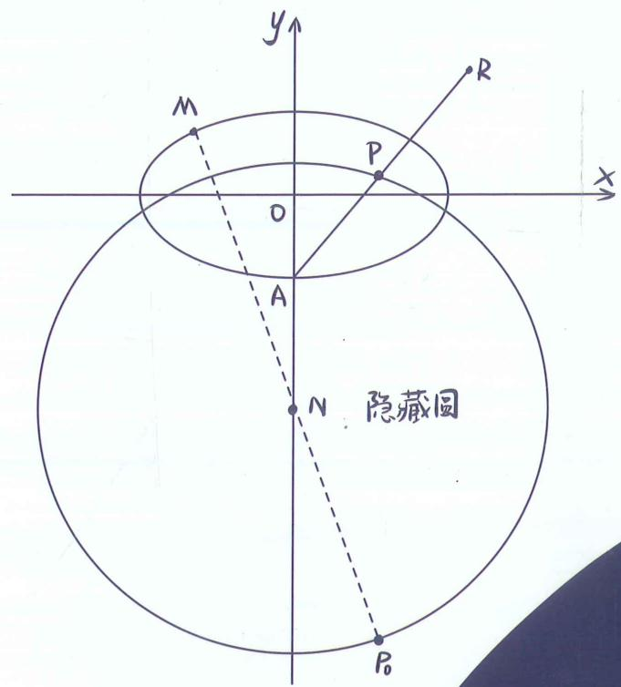

# 老唐说题团队教研产品

《高考数学满分突破—秒系列123》

《高中数学新思路—复习专题第一轮》

《高中数学新思路—复习专题第二轮》

《高中数学新思路 - 同步系列123》

《高中数学新思路—导数专题》

《高中数学新思路—圆锥曲线专题》

《MST新思路高中数学新定义 组合与概率统计专题》

《高中物理新思路 力学篇》

《高中物理新思路 电学篇》

《高中物理新思路 综合实验篇》
$e \cos \theta = \frac {\lambda - 1}{\lambda + 1}$

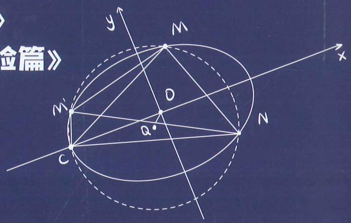

  
扫码报名陪跑课

  
官方微信

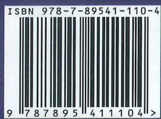

定价: 158元
$\vert A B \vert = \frac {2 P}{\sin^ {2} \theta}$

# 高中数学新思路

# 圆锥曲线专题

基本技能篇
$\frac {\sin^ {2} \frac {\theta}{2}}{e _ {1} ^ {2}} + \frac {\cos^ {2} \frac {\theta}{2}}{e _ {2} ^ {2}} = 1$

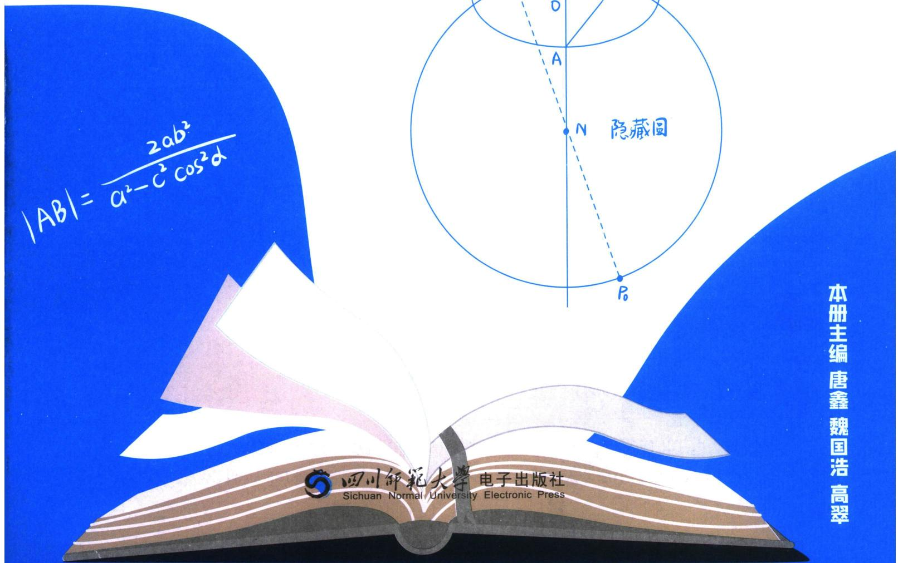

# 高中数学新思路 圆锥曲线专题

# 主编 唐鑫 魏国浩 高翠

责任编辑 胡丽娜

封面设计 老唐说题工作室

出版发行 四川师范大学电子出版社

社 址 四川省成都市锦江区静安路5号

邮政编码 610068

电话 028-84767799(总编室) 028-84769668(发行部)

网 址 www.scnup.com

光盘生产 大连华录影音实业有限公司

手册印制 长沙湘之印彩色印刷有限公司

文本尺寸 210 mm×285 mm

印 张 24

字 数 400 千字

版 次 2023年11月第1版

印 次 2025 年 7 月第 3 次印刷

I S B N 978-7-89541-110-4

# 《高中数学新思路 圆锥曲线专题》

# 编委会

主编 唐鑫 魏国浩 高翠

副主编 张羊利 郭润仙 熊翼 李弦裴

王仁正 杜松奎 程海波 李俊虎

李惟清 施小平 樊晨源 谭鸣

陈庆安 老 K 廖志发

编 委 丁兆龙 吴 斌 徐剑锋 高 斌

吴家伟 周晓燕 刘恺锐 张凯莉

向茂荣 秦伟见 庞 博 翟学强

李诗瑾 谭林华 唐阳 付笛生

蔡 涛 罗毕壬 任 升 梁士伟

罗 成 王 奎 陈 金 钱立达

王 雷 赵军芳 韩壮壮 向 涛

魏长松 冯齐友 唐自辉 赵拾伟

卫才良 兰天浩 梅议文 王佳星

罗传奇 欧阳斌斌

# 序言

圆锥曲线专题序言

数学之道，岂止算筹？格物明理，斯文为舟。纵横捭阖，以通天地之悠；吐纳风云，而穷数理之秋。璇玑运晷，数理昭回；游刃肯綮，妙析毫微，割圆裁斗，定于交轨；参变通幽，成于圆锥。

增第四定义于后，融焦点三角之妙，统离心变换于巧。以离心率为纲，贯椭圆双曲于一体；借三角形为刃，破焦点范围之连环。暗合阴阳消长，明察轨迹浮沉。用三角恒等，假化斜劈正；引向量投影，统变直为曲。

溯形演之精微，纳乾坤于轨则。昔贤穷其妙理，今士骋以新思，独辟蹊径，巧运机杼。析题剖疑，不囿陈规，化繁为简，参数统类。代数几何，相资为用；动静虚实，互证其真。一题巧变，展思维之活络；诸法归宗，显数理之贯通。摄星汉之辉，写翕张之势。规天地之度，融万象之和。解题之道，如曲径通幽，唯变所适，恰妙契自然。是书既成，脱窠臼而骋怀，方法已定，凌题海以明道。

育者国本所系；师者大道之枢。杏坛朽木奔走，讲席俗夫驱驰。执笔而画地自囚，持书而坐井观天。不思创新，变直播小王子；罔顾教研，成嘴炮之匠人。庸师不黜，数学难兴。教案积尘，岁岁陈言如故；课件老旧，年年照本宣科。题海沉浮，见新题则摇头；思维僵化，闻创新则蹙额，以懒惰为常态，视敷衍为本分。或怠惰成性，甘作知识贩夫；或功利熏心，沦为圈金机器。未闻教学相长之道，遑论春风化雨之功？误人子弟而不惭，混迹教坛而无愧。此等庸师，实为学蠹！数理昭昭，岂容昏昏之师？算法浩浩，安能混混而教？

探轨于焦准，骋思于玄黄。融合齐次化，协调曲线系，定比点差之奇，隐藏轨迹之基，纳射影几何，通点线配极，斯定线定点，破面积之比。二倍角度翻译，三类对合一体。向量旋转于形模，三角换元来作楫；悉藏玄奥，妙解玄机。

砖砾粗朴，敢效昆山之片玉；刍荛浅陋，聊引君子之清音。投顽石于渊，冀得连城之璧；振微声于谷，愿闻黄钟之鸣。故拙辞既展，期雅论纷披；寸心虽微，望群贤毕至；虽瓦缶先鸣，盼金声而应。

——MST教研组

2025.7.1

唐鑫 昵称老唐，MST《老唐说题》创始人，《高考数学满分突破》系列丛书主编，《高中数学新思路》系列丛书主编。善于归纳总结并提炼精髓，将复杂问题简单化，抽象问题形象化和具体化。

受邀于衡水二中，正定中学，青岛二中，烟台一中，安阳一中，昆明一中，遵义四中，柳铁一高，钦州二中，惠东高级中学等国内重点高中讲座，广受好评！

魏国浩 南开大学硕士研究生毕业，中学数学教师；山东理工大学特聘讲师，数学奥林匹克竞赛教练员，中国数学会会员；曾任多家教育研究所兼职研究员，多家教辅主编及编委。MST《老唐说题》创始人之一。

针对高中各年级数学教学有丰富的经验，教学成绩显著，善于发现学生的闪光点，对学生进行有的放矢的教育。

善于钻研更快、更巧的高中数学解题方法并推广应用，以自己独有的方法推导并整理《平面法向量的求法》《一步搞定错位

相减》《导数双变量问题综合探究》等五十余种高考题中独有的解法，并归纳整理《高考解题黄金模板》系列共54篇解题方法以及相关应用。

高翠 毕业于华中师范大学数学系，毕业至今一直在惠东高级中学任教，从教十余年，她始终以一颗热爱数学、热爱学生之心坚守教育教学一线，有11年实验班教学经验，多名学子考入上海交大、浙江大学、武汉大学、南京大学、华中科技大学、中山大学等名校，深受学生、家长、同行的一致好评，是县骨干教师、优秀班主任、优秀备课组长，也是县名师工作室成员。

在教学教研方面，她勤于思考、善于钻研，先后在惠州市说课比赛中荣获一等奖；惠州市优秀论文评选中荣获一等奖；惠东县解题比赛、说题比赛、综合能力大赛中均荣获第一名；参与多项市县课题研究。

# 熊翼

重庆八中高级教师，重庆市优秀班主任，重庆市骨干教师，重庆市渝北区优秀青年干部，教育部新时代中小学学科领军教师示范性培训(2023—2024)培养对象，全国高中青年教师赛课一等奖(现场展示最优秀选手)。

《班主任理论与实践》第三期封面人物。三次受邀做客《重庆卫视科教频道》。

工作 18 年，担任班主任工作 18 年，18 次被评为“优秀班主任”，7年初中，11年高中，8届毕业班，连续三轮毕业班，带出三名重庆市状元，全国唯一。

# 张羊利

MST《老唐说题》团队创始人之一，MST《高考数学满分突破》、《高中数学新思路》系列从书主编。广东省重点中学教师，在各大自媒体(ID：利哥数学)有广大的影响力。先后受邀到浙江省天台中学、贵州省遵义四中、云南省昆明一中、云南师大附中镇雄中学、广西柳铁一中、河北省衡水二中、四川省德阳五中、广西省钦州二中、广东省惠东高级中学、湖南省郴州一中、河南省实验中学、河南省郑州四中、河南省洛阳一高、山东省菏泽一中、河北省邢台一中、湖南省湘潭县一中、山西省康杰中学、广东省清远一中等众多学校开展讲座，深受广大师生的好评。

# 郭润仙

高中数学高级教师。所教班级数学高考成绩一直名列大理州第一；曾带出2011届李仕强、杨施薇大理州高考文理状元，2014届杨佯等多名大理州高考状元；培养了杨施薇、余建希、丰峰等多名清华、北大学子；辅导的蔡金明、马遥等多名学生获省级数学竞赛奖。

参与了省内外重要数学刊物的编辑，主编《高中数学同步周练(AB)卷)》，《高中数学兵法 500 条》和《数学教学通讯》增刊的编委。发表数十篇论文。

# 李弦裴

为学溪教育创始人，数学老师、学业规划师、心理咨询师、全球职业规划师。MST 老唐说题系列图书主编、副主编、《四川走进名校小升初历年招生考试真题》副主编、《四川走进名校摸底分班真卷》副主编。MST 老唐说题核心成员(分管学业规划部、出版部、四川总部)、四川壹牛家长圈首席课程顾问、四川金榜路志愿特邀学科讲座老师、四川清北家长圈首席规划布局专家。从事成都教育领域十余年，是超两百

位清北复交浙学生的老师。善长解决中等生、优生压轴题板块的归纳总结、细节提升等问题，对于高三学生擅长从学生课业强度、心理适应以及刷题方案分析给出高效学习方案。

王仁正 新疆维吾尔自治区特级教师，正高职称；上海师范大学和喀什大学硕士生导师，自治区第十一批突出贡献优秀专家，自治区“天山英才”教学名师，喀什地区教学名师。长期从事高中数学教育与研究，曾获自治区级、地区级、县市级竞赛课、优质课一等奖30次，研究成果获奖50余项，获奖和发表论文40余篇，主持和参与各类课题17余项。

杜松奎 高中数学教师，高评委专家，省市区优秀教师、班主任，特级教师，县级优秀党员、优秀基层党支部书记、十佳青年、兼职教研员等，家庭教育指导师，师范大学研究生导师，客座讲师、校外实习生指导教师，高中生创新能力大赛全国优秀指导教师，科创优秀指导师，校竞赛教研组组长，青年教师指导师，名师工作室指导师，数学奥赛教练，一直致力于教育教学研究和师资培养，以及优生培养与研究，参与国家、省、市级课题和教学专题研究，有30多篇文章获奖或刊发，有10多个课题结题，有3项课题获政府奖，与教育同行研究高考强基计划培训，解决学生成长中的一些问题，探索家校共育。

程海波 来自中国教育名城——湖北黄冈，学生时代，便在全国初中数学竞赛、全国高中数学联赛中获奖，2006年大学数学系毕业后，便从事高中数学教学工作，目前，在头条、抖音、腾讯、B站等各大平台累计粉丝超过100万！从教18年来，桃李满天下，带出了几百名学生考入牛津、剑桥、哈佛、斯坦福、港大、清华、北大等常青藤名校，无数学生考入985,211等全国高校，上课生动有趣、思维活跃，方法独特新颖，善于因材施教、举一反三，深受学生们喜爱，独特的教学方法与体系，造福全国无数学子！

座右铭：没有教不好的学生，只有不会教的老师！愿一生致力于数学教育，帮助全国更多的学生！

李俊虎 毕业于长沙理工大学数学系，参与编写 MST 新思路系列图书。在高中一线教学多年，教学风格严谨幽默，被学生称为虎哥。在教学中发现高中教考分离严重，高层次学生难以从日常教学中获取足够养分，因而转型教学设计研究。加入 MST 后，深入挖掘探路，找点，放缩，定比点差等方法，从一个更深的角度去探讨题目的逻辑。受邀于山东日照一中，莱芜一中，章丘四中，攸县一中，灵璧中学，河南清北集训营讲座，深受好评，助力芊芊孩子战胜高考圆锥导数压轴题。

李惟清 荣获高等数学竞赛、数学建模竞赛全国奖项，硕士研究生毕业。从事高中数学教学十余年，大批学生考入清北、C9名校，985、211。擅长进行教学体系设计，构建知识架构体系，化繁为简的处理高考重点难点，独创“核心考点题型归纳教学法”和“高考数学速解法”；擅长一题多解，培养学生做题的综合能力，引导学生探索数学、钻研数学！独立编写《高中数学常考必考题型清单》，参与编写MST《老唐说题》系列丛书中《高中数学新思路——导数专题》《高中数学新思路——圆锥曲线专题》。

施小平 安徽宣城人，理学硕士，助理研究员，长期从事中、高考及竞赛数学解题教学研究。2018年以来在《数学教学》《数学通讯》《数理天地》《中学生数学》等期刊发表论文数篇。在今日头条、抖音、百家号、B站上免费开设高考数学每日一题系列讲题，讲题风格由浅入深、通俗易懂，深受广大学生喜爱！

樊晨源 高中数学联赛金牌教练，毕业于中山大学数学系。参与编写《高考数学满分突破》系列，《高中数学新思路》系列书籍，浙大优学特邀作者，于《中等数学》、《数学进展》等国家级报刊发表专著论文十余篇。曾担任某 Top 级在线平台首席讲师，十年一线教龄，带领无数学子圆梦清北等一流学府；执教毕业班的高考数学平均分屡次突破 140+，并有多名满分考生。

谭鸣 中学高级教师，常年在示范高中高三任教并负责年级管理，培养出多名清华、北大学生。市教书育人楷模、青年科技人才、基础教育名师、五一劳动奖章获得者，全国高中数学联赛省级优秀辅导员。

徐剑锋 毕业于湖南大学，高考数学142，曾获江西省高中数学联赛一等奖。现任广州市某重点中学数学教师，任教10余年，具有深厚的学科素养，对教育及教学有自己独到的理解。

获广州市优秀教师，广州市高考数学科突出贡献奖等称号。获广州市数学教师解题比赛一等奖，广州市数学教师讲题比赛一等奖。主持广东省省级课题《新高考能力素养培育与数学教学模式优化的研究》顺利结题，并获广东省课题研究一等奖。

高斌 潜心教学22年，深入教学一线，教学风格独特，曾获区级教学新秀、优秀复课教师。一直专注于教学能力的研读与实践，善于激发学生兴趣，调动学生学习热情。始终秉持爱心与责任共举，助力学生知识与能力同行，连续15年担任毕业班数学教学，工作成绩显著，是学生追逐梦想的指明灯和引路人。

# 基本技能篇

# 第1章 圆锥曲线三定义

# 第一节 椭圆双曲的轨迹翻译（第一定义） … 1

一、椭圆第一定义 …… 1  
二、椭圆焦点弦 4   
三、双曲线第一定义 9  
四、双曲线焦长公式…… 12

# 第二节 椭圆双曲的比值模型（第二定义）…… 15

一、椭圆第二定义关于“比”……15  
二、双曲线第二定义关于“比”……15  
三、第二定义与 $\left|PF_{1}\right|\cdot\left|PF_{2}\right|$ 相关的结论
…… 18  
四、双曲线倍角定理…… 20

# 第三节 椭圆双曲的斜率转化（第三定义）…… 23

一、椭圆第三定义关于“积” 23  
二、双曲线第三定义之“积” 26  
三、第三定义与中点弦转化…… 27  
四、第三定义转化为斜率比…… 28

# 第四节 圆锥曲线的第四定义 …… 31

# 第五节 抛物线的焦准翻译 …… 34

一、焦点弦与焦半径公式…… 34  
二、焦准斜率关系与转化…… 38

# 第六节 长度最值问题之声东击西 …… 40

一、椭圆最值问题…… 40  
二、双曲线最值问题…… 41  
三、抛物线最值问题…… 41  
四、阿氏圆反演与圆锥曲线最值问题…… 43

# 第七节 截口曲线与祖暅原理 …… 46

一、截口曲线形成的圆锥曲线…… 46  
二、丹德林双球模型与离心率…… 48  
1. 基本数据与离心率转化 …… 48  
2. 离心率与截面角之间的关系 …… 49  
三、祖暅原理…… 54

# 第2章 离心率

# 第一节 弦长体系下的焦长模型与焦比定理 … 56

1. 椭圆的焦比定理 …… 56  
2. 双曲线焦比定理之交一支类型 …… 56  
3. 双曲线焦比定理之交两支类型 …… 57

一、通径相关的离心率…… 57  
二、焦点弦的化斜为直…… 58  
三、焦点弦比值与离心率…… 60  
四、焦点弦构造等腰三角形速解策略……62

1. 隐藏的 2a 型…… 62  
2. 双曲线的 4a 底边等腰三角形…… 63

五、椭圆与双曲线的焦弦直角体与离心率……65

六、焦点弦的平行四边形对称化构造…… 68

# 第二节 几何性质下的渐近线模型 …… 70

一、焦点到渐近线距离构造特征三角形……70  
1. 利用对称性构造直角三角形 …… 71  
2. 与焦长综合的渐近线三角形 …… 72  
3. 与渐近线平行的焦点弦问题 …… 73  
4. 小圆中位线与 2a 的数据构造……74

二、渐近线相似三角形比值与离心率……75  
三、大圆与渐近线交点构造坐标特征三角形 … 77  
四、渐近线隐藏的面积和向量积定值…… 79  
五、渐近线焦长公式推导方案…… 82

# 第三节 长度与角度下的离心率范围约束…… 83

一、短轴端点处 $\angle F_{1}PF_{2}$ 张角最大 83  
二、直角 $\angle F_{1}PF_{2}$ 的约束 85  
三、向量乘积与极化恒等式的约束…… 85  
四、弦长与角度范围约束…… 86

第一类：双曲线焦点弦最短在实轴顶点 … 86

第二类：最短焦点弦是通径的约束 …… 87

第三类：最大角为锐角的限制 88

第四类：渐近线夹角限定原点三角形形状 88

### 五、圆心角 $\angle AOB$ 为直角在椭圆内的约束 … 88

1. 椭圆 $\frac{1}{d^2} = \frac{1}{a^2} + \frac{1}{b^2}$ 88   
2. 双曲线 $\frac{1}{d^2} = \frac{1}{a^2} - \frac{1}{b^2}$ 89

### 六、中垂线定理与离心率限定…… 91

# 第3章 几何视角下的焦点三角形

# 第一节 角度语言与坐标语言下的焦点三角形 … 93

一、椭圆焦点三角形的性质…… 93  
二、双曲线焦点三角形性质…… 96  
三、椭圆焦点三角形两底角半角与离心率转化 98  
四、双曲线焦点三角形两底角半角与离心率转化 99  
五、椭圆双曲线共焦点问题 …… 101

# 第二节 几何光学性质下的焦点三角形 …… 104

一、光学性质概念 104   
二、光学性质切线法线定理 …… 104  
三、光学性质与中垂线截距定理 …… 109

# 第三节 三角形四心性质的应用 …… 112

一、椭圆焦点三角形内心与离心率 …… 112

二、椭圆焦点三角形旁心轨迹 …… 113  
三、双曲线焦点三角形内心轨迹与双切圆 … 115

1. 内心轨迹方程 …… 115  
2. 离心率问题 …… 117  
3. 大焦点三角形内切圆切于焦点 …… 118  
4. 双切圆问题 120

### 四、双曲线焦点三角形旁心与离心率 …… 123

# 第四节 焦点三角形与大小圆问题 …… 125

一、以圆锥曲线焦半径为直径的圆的性质 … 125  
二、光学定理与大圆小圆问题 …… 128

1. 椭圆的大圆 128  
2. 大圆性质拓展 129  
3. 双曲线的小圆 129

# 第4章 小题新题型与多选的综合题方法篇

# 第一节 切线与切点弦 …… 131

一、切线与切点弦的极点极线方程 …… 131

1. 二次曲线的替换法则 …… 131  
2. 切线切点弦的极点极线代数定义 … 131  
3. 切线切点弦的几何意义 …… 131

二、切线方程和切点弦方程求法的书写过程 … 134  
三、抛物线切线方程与阿基米德三角形 …… 137

1. 抛物线的切线方程 …… 137  
2. 抛物线切线与阿基米德三角形性质与结论 …… 141  
3. 特殊的阿基米德三角形 …… 142

四、阿基米德三角形的面积问题 …… 144  
五、新定义下的阿基米德三角形的面积与等比数列 …… 147

# 第二节 坐标旋转与曲线转换 …… 152

一、向量旋转公式与图像转化 …… 152  
二、等轴双曲线与反比例函数转化 …… 156  
三、非等轴双曲线的仿射换元 …… 159  
四、退化二次曲线中点点差法 …… 161

1. 中点弦存在定理 …… 161

2. 双曲线弦与渐近线弦共中点类型 … 163

五、渐近切线三角形面积与向量积问题 …… 166

# 第三节 圆锥曲线之间的交点 …… 169

一、由定义和交点坐标构造的混合型 …… 169  
二、由斜率关系和共焦点构造的混合型 …… 173  
三、由斜率关系和中点弦构造的混合型 …… 176  
四、由圆锥曲线和三角代入计算的混合型 … 178

# 第5章 常规韦达联立

# 第一节 正反设直线的方案选择 …… 182

一、椭圆的正设与反设 …… 182

1. 正设 182  
2. 反设 182

二、双曲线的正设与反设 …… 186

# 第二节 向量乘积中的翻译方法 …… 189

一、过原点的向量乘积问题 …… 189  
二、圆锥曲线中非原点向量乘积的问题 …… 191

# 第三节 运算技巧下的韦达定理拓展 …… 198

一、轴点弦的和积互换 198  
二、非对称韦达定理 199

# 第6章 联立之同构方程

# 第一节 抛物线两点联立式方程 …… 201

一、抛物线两点联立式同构与定点定值 …… 201  
二、两点联立式下的双切圆 208  
三、两点联立式下的彭塞列闭合 209  
四、两点联立式下的极点极线证明 …… 210  
五、两点联立式下的平行弦同构 …… 212

# 第二节 斜率同构式与坐标同构式的应用 … 216

一、坐标点式同构和斜率同构区别 …… 216  
二、圆锥曲线上的双切圆斜率同构 …… 217  
三、双切椭圆双曲线的斜率同构 …… 218  
四、双切椭圆的蒙日圆 218  
五、由内准圆引起的斜率同构 …… 222  
六、斜率和积为定值的同构 …… 223

七、坐标同解同构方程(外接圆) …… 225  
八、双切曲线的斜率同解同构 227

# 第三节 比值参数同构 229

比值参数 $\lambda + \mu, \frac{1}{\lambda} + \frac{1}{\mu}$ 同构 …… 229

# 第 7 章 圆锥曲线常规数据处理方法

# 第一节 齐次化处理斜率和积问题 …… 232

一、点 $P(x_0, y_0)$ 在圆锥曲线上的斜率和积为定值问题 232  
二、点 $P(x_0, y_0)$ 在圆锥曲线外的斜率和积为定值问题 236

1. 以原点为公共顶点的内切圆问题 … 236  
2. 以原点为公共顶点的斜率等比问题 …… 237  
3. 以坐标轴为角平分线的齐次化构造 …… 238

# 第二节 隐藏的斜率和积问题 239

一、同轴轴点弦+顶点角隐藏的斜率之积 … 239  
二、隐藏的斜率之比 242  
三、高考题中隐藏的斜率和与积关系 …… 243  
四、平行于坐标系的中点斜率翻译 …… 245

# 第三节 点差法与中垂线问题 …… 247

一、点差法与中点弦 247  
二、点差法与隐藏的中点轨迹问题 …… 248

1. 求隐藏轨迹方程的交轨法 …… 248  
2. 斜率双用与双中点连线过定点问题 … 250

三、点差法与中垂线问题 252  
四、焦点弦中垂线特殊性质 255

# 第四节 定比点差法…… 259

一、定比分点概念 259  
二、调和点列与定比点差法 …… 259

1. 调和点列的概念 259   
2. 调和点列的性质 260   
3. 定比分点和调和分点支配下的圆锥曲线

### 三、定比点差法与轴点弦的三炮齐鸣 …… 262

1. 三炮齐鸣破解中点截距定理 …… 263

2. 三炮齐鸣破解角平分线定理 …… 264

3. 三炮齐鸣破解单轴点弦交中点的定点定值问题 …… 265

### 四、非轴点弦三炮齐鸣数据 268

# 第8章 联立计算高阶篇

# 第一节 长度参数与直线参数方程 …… 271

一、直线的参数方程形式与性质 …… 271  
二、直线参数方程与四点共圆 273  
三、参数方程破解类圆幂定理 …… 274  
四、参数方程解决共线分弦定点定值 …… 275  
五、对称轴上任意点分弦平方和成定值问题 … 277

# 第二节 单动点与圆锥曲线参数方程 …… 278

一、圆锥曲线参数换元形式 …… 278  
二、单动点三角换元解决二次曲线上的距离问题 279  
三、隐藏的轨迹方程与单动点三角换元 …… 280  
四、三角换元破解切线单动点 282  
五、万能三角代换与顶点弦速解 …… 286

# 第三节 复数变换与三角旋转 …… 288

一、复数的模与辐角表示圆锥曲线方程 …… 288  
二、复数变换处理平行问题 …… 288  
三、复数代换下圆锥曲线中的垂直问题 …… 289  
四、复数代换下的切线几何性质挖掘 …… 291  
五、复数旋转下的等腰直角三角形 …… 293

# 第四节 直线系和圆系方程 295

一、直线系方程 295  
二、过直线与圆交点的圆系方程 …… 296  
三、相交两圆的公共弦 …… 297  
四、过圆与圆交点的圆系方程 …… 297  
五、过圆和切点的圆系方程 …… 298

# 第五节 二次曲线系与四点共圆 …… 298

一、四点共圆曲线系原理 …… 298  
二、圆幂定理反推四点共圆 …… 299  
三、四点共圆的充要条件与数据 …… 300  
四、外接圆与隐藏第四点的四点共圆 …… 302

# 第六节 二次曲线方程与四点联立曲线系 … 306

一、退化二次曲线对称轴不与坐标轴平行的曲线系 306  
二、用曲线系方程破解高考极点极线题型 … 307  
三、用曲线系速解坎迪定理 …… 309  
四、曲线上三点构造切线的适配曲线系方程速解斜率和积 312  
五、曲线系挖掘四点形斜率关系与隐藏轨迹 … 313  
六、用曲线系破解彭塞列闭合定理 …… 314  
七、双曲线退化二次曲线系方程 …… 315  
八、用退化二次曲线系方程破解浙江21高考压轴题 …… 319

# 第9章 圆锥曲线跨界综合

# 第一节 圆锥曲线与立体几何综合 …… 320

一、隐藏圆的空间构造 …… 320  
二、椭圆柱的几何综合 …… 322  
三、折叠问题与圆锥曲线 …… 324

# 第二节 圆锥曲线与三角函数的综合 …… 327

一、联立构造三角的二次方程 …… 327  
二、积化和差与和差化积综合应用 …… 328

1. 积化和差 328   
2. 和差化积 328

# 第三节 圆锥曲线与导数的综合 …… 331

一、求交点个数 …… 331  
二、对数均值与中值斜率的综合应用 …… 334

# 第四节 圆锥曲线与数列综合(上) …… 337

一、交点坐标分类构造数列 …… 337  
二、构造递推式证明数列单调性与裂项放缩 … 338  
三、斜率关系构造定点与数列递推 …… 341

# 技能强化篇

# 第10章 万能的两点对合式

# 第一节 反比例对合方程解决圆锥曲线与数列综合 …… 342

一、两点对合式构造双曲线中的等比数列 … 343  
二、非等轴双曲线的仿射换元 344  
三、抛物线两点对合式构造等差等比数列 … 349

# 第二节 抛物线切线对合与两点对合数列构造综合 …… 353

一、抛物线蝴蝶定理 353  
二、切线与对合不动点 356  
三、平移顶点的抛物线两点对合方程 …… 358

# 第三节 椭圆双曲线的两点对合式 …… 359

一、椭圆与双曲线的两点对合式 …… 359

1. 椭圆两点对合式 359  
2. 双曲线右支的两点对合式 …… 360  
3. 双曲线左支的两点对合式 …… 360  
4. 双曲线左右两支的两点对合式 …… 361

二、对合方程简化单动点模型 …… 361

1. 椭圆 361   
2. 双曲线 361

三、对合方程简化斜率关系模型 …… 362  
四、两点对合方程简化相切圆问题 …… 365  
五、两点对合方程简化轮换对称问题 …… 366

# 第11章 从定比点差到极点极线

# 第一节 单比与交比 …… 370

一、单比的概念及性质 …… 370

1. 单比的定义 370  
2. $\lambda + \mu$ 为定值的参数同构与点差法 … 370

### 二、单比与交比 …… 372

1. 单比角元形式 372  
2. 交比的概念及性质 …… 372  
3. 交比的射影不变性 …… 373

### 三、调和点列与定比点差 …… 377

1. 调和点列的概念 377   
2. 调和点列的性质 377   
3. 定比分点和调和分点支配下的圆锥曲线
…… 378

### 四、定点（极点）在坐标轴上的定比点差 … 379

类型一：定点(极点)在 x 轴 …… 379  
类型二：定点(极点)在 y 轴 …… 380

### 五、定点（极点）不在坐标轴上的定比点差 … 382

# 第二节 极点极线定义与自极三角形 …… 384

一、极点极线的定义 …… 384

1. 二次曲线的替换法则 …… 384  
2. 极点极线的代数定义 …… 385  
3. 极点极线的几何意义 …… 385

### 二、极点极线定理证明 …… 386

1. 梅涅劳斯定理 386  
2. 梅涅劳斯定理的逆定理 …… 387  
3. 塞瓦定理 387  
4. 塞瓦定理的逆定理 387

### 三、极点极线的配极性质 …… 388

四、完全四边形与自极三角形 …… 388

1. 完全四边形定义 388  
2. 极点极线的综合模型——自极三角形
388

# 第三节 蝴蝶定理与坎迪定理 394

### 一、蝴蝶定理 394

二、坎迪定理 395  
三、坎迪定理中点推论 …… 397  
四、利用对称和焦弦常数构造斜率关系 …… 400

# 第 12 章 调和点列与调和线束定理与对合关系

# 第一节 调和点列与点的对合 …… 403

调和共轭定理 403

# 第二节 调和线束两大定理的应用 …… 407

### 一、调和线束平行中点定理 …… 407

1. 利用调和梯形角度解读 …… 408  
2. 射影到与坐标轴平行线的中点 …… 409  
3. 调和等腰梯形对称构造 …… 412   
4. 射影到斜线找中点与平行 …… 417

### 二、调和线束斜率公式 …… 419

1. 平行于坐标系的中点斜率翻译 …… 420  
2. 斜率等差与斜率倒数等差模型 …… 427  
3. 由自极三角形构造的射影中心和调和线束斜率坐标翻译 …… 430

# 第三节 角平分线与调和点列 …… 433

一、斜率和为 0 与内外角平分线解读 …… 433  
二、内外角平分线与焦准模型 …… 435

1. 椭圆外角平分线与焦准模型 …… 435  
2. 双曲线内角平分线与焦准模型 …… 435  
3. 双外角平分线垂直模型 …… 435

### 三、内外角平分线隐藏阿氏圆 437

隐藏的角平分线与阿氏圆构造 …… 438

# 第四节 斜率对合与斜率翻译 …… 440

### 一、斜率对合的原理 440

1. 对合轴与对合中心的选取 …… 441  
2. 斜率对合的基本作图原理 …… 441

### 二、对合中心在无穷远点的特殊值 …… 447

1. 当 $k_{1} + k_{2} = 0$ 时，第三条边斜率为定值

447

2. 当 $k_{1}k_{2} = \pm \frac{b^{2}}{a^{2}}$ 时，第三条边斜率为定值 448

### 三、和型对合 $k_{1} + k_{2}$ 的三种模型 449

1. 射影中心与一对合不动点横坐标相同
…… 449  
2. 两对合不动点横坐标相同 …… 449   
3. 射影中心与对合中心横坐标相同 … 450

### 四、倒数和型 $\frac{1}{k_{1}}+\frac{1}{k_{2}}$ 对合的三种模型 …… 450

1. 射影中心与一对合不动点纵坐标相同
…… 450  
2. 两对合不动点纵坐标相同 …… 452   
3. 射影中心与对合中心纵坐标相同 … 452

### 五、顶点角+同轴轴点弦的对合方程 …… 454

1. 两类对合中心在坐标轴上的对合模型
…… 454  
2. 对合中心在坐标轴上的面积转化 … 461  
3. 对合中心在坐标轴上的斜率与共圆转化
463

### 六、积型 $k_{1}k_{2}$ 对合的多解问题 466

1. 射影中心在曲线上的直角构造 …… 466  
2. 射影中心未知的调和线束由 $k_{3} + k_{4} = 0$ 构造定值 466  
3. 射影中心未知的斜率乘积为定值的多解问题 469  
4. 费雷格(Fregier)定理 469

### 七、对合方程 $ak_{1}k_{2} + b(k_{1} + k_{2}) + c = 0$ ……471

1. 由调和线束斜率公式转化 …… 471  
2. 中点平行弦模型 473

# 第五节 斜率积的三次对合 474

一、椭圆内接三角形的外心斜率定理 …… 474  
二、等轴双曲线轮换对合与隐藏的垂心 …… 476  
三、等轴双曲线反演与二阶曲线外心 …… 478  
四、三次方程韦达定理与三次齐次化方程 … 478

# 第六节 从笛沙格定理到帕斯卡定理 …… 481

一、笛沙格对合 482  
二、帕斯卡（Pascal）定理及其逆定理…… 484

1. 寻找帕斯卡第六点 485  
2. 圆锥线的切线 485  
3. 帕斯卡圆锥曲线的内接四点形 …… 486

# 第七节 帕斯卡定理与对偶定理布利安桑定理… …… 492

一、布利安桑（Brianchon）定理与退化二次曲线联立 492

1. 对偶的两个定理——布利安桑定理与帕斯卡定理比较 …… 492  
2. 外切五边形的布利安桑点 …… 493  
3. 外切四边形的布利安桑点 …… 493  
4. 外切三边形的布利安桑点 493

二、热尔岗点 494  
三、退化二次曲线的布利安桑点 …… 495  
四、双曲线渐近线和共轭直径 495

# 第13章 新定义下的斜率调整与仿射

# 第一节 斜率调整法…… 497

一、曲线上双定点单动点斜率调整原理 …… 497  
二、斜率调整与斜率表示 499  
三、斜率调整与对合的综合 …… 500  
四、斜率调整背景——斯坦纳定理 …… 502

1. 点的斯坦纳定理 504  
2. 线的斯坦纳定理 504

# 第二节 仿射法与面积转化 …… 505

一、仿射法与面积变化 …… 505  
二、切点圆面积最值 511  
三、斜率乘积 $-\frac{b^2}{a^2}$ 能仿射成直角的面积定值问题 516

四、重心三角形面积定值问题 …… 520  
五、直径三角形面积最值问题 521

# 第 14 章 新定义下的面积转化

# 第一节 过焦点弦的面积问题 524

一、焦长转化为面积和差 524

1. 焦长公式 524  
2. 面积之和 524  
3. 面积之差 524

二、焦点弦中点连线隐藏定点与面积转化 … 528  
三、焦点弦用角度转化斜率与面积 …… 529  
四、焦弦中垂线与隐藏面积问题 …… 530  
五、隐藏的焦弦常数与三角形面积比值转化 533

六、焦弦的截距与面积转化问题 …… 537  
七、焦点准线关联与面积比值转化 …… 538  
八、焦半径与定比点差转化面积比值 …… 539

# 第二节 坐标面积公式与面积最值 …… 541

一、坐标面积公式推导 …… 541  
二、坐标面积公式与柯西不等式求最值 …… 543

# 第三节 面积比值转化问题 545

一、利用极点极线关系将坐标转化面积比 … 545  
二、隐藏定点的斜率关系构造面积最值问题……
…… 547

三、隐藏调和线束斜率关系与面积转化 …… 550

四、由中点隐藏轨迹方程构造面积最值问题 552  
五、由单动点三角换元构造面积比 …… 555  
六、共轭点面积等比中项模型 …… 559  
七、双圆锥曲线的双动点构造面积比 …… 560

# 第1章 圆锥曲线三定义

# YUANZHUIQUXIANSANDINGYI

# 第一节 椭圆双曲的轨迹翻译（第一定义）

### 一、椭圆第一定义

平面内与两个定点 $F_{1}$ 、 $F_{2}$ 的距离的和等于常数 $2a(2a$ 大于 $\left|F_1F_2\right|$ )的点的轨迹；其中，两个定点称做椭圆的焦点，两焦点间的距离叫做焦距.
设 $M(x, y)$ 是椭圆上任意一点，焦点 $F_{1}(-c, 0)$ 和 $F_{2}(c, 0)$ ，由上述椭圆的定义可得： $\sqrt{(x+c)^{2}+y^{2}} + \sqrt{(x-c)^{2}+y^{2}} = 2a$ ，将这个方程移项，两边平方得： $a^{2}-cx=a\sqrt{(x-c)^{2}+y^{2}}$ ，两边再平方，整理得： $\frac{x^{2}}{a^{2}} + \frac{y^{2}}{b^{2}} = 1 (a > b > 0)$

注意 1. 椭圆的标准方程 $\left\{ \begin{array}{l} \frac{x^2}{a^2} + \frac{y^2}{b^2} = 1 (a > b > 0) \Leftrightarrow \text{中心在原点，焦点在 } x \text{ 轴上；} \\ \frac{y^2}{a^2} + \frac{x^2}{b^2} = 1 (a > b > 0) \Leftrightarrow \text{中心在原点，焦点在 } y \text{ 轴上。} \end{array} \right.$

后面我们仅以 $\frac{x^2}{a^2} +\frac{y^2}{b^2} = 1(a > b > 0)$ 展开性质介绍分析.

2. 顶点 $A_{1}(-a,0)$ , $A_{2}(a,0)$ , $B_{1}(0,-b)$ , $B_{2}(0,b)$ .  
3. 长轴和短轴 长轴为 2a，短轴为 2b，注意区分长半轴为 a，短半轴为 b.  
4. 焦点 $F_{1}(-c,0)$ , $F_{2}(c,0)$ .  
5. 焦距 $\left|F_{1}F_{2}\right|=2c(c>0)$ ，同时： $c^{2}=a^{2}-b^{2}$ .  
6. 离心率 $e=\frac{c}{a}(0<e<1)$ ; 离心率越大, 椭圆越扁.

椭圆的离心率是描述椭圆扁平程度的一个重要数据。因为 $a > c > 0$ ，所以 $\pmb{e}$ 的取值范围是 $0 < e < 1$

①e 越接近 1，则 c 就越接近 a，从而 $b=\sqrt{a^{2}-c^{2}}$ 越小，因此椭圆越扁；  
②e 越接近于 0, c 就越接近 0, 从而 b 越接近于 a, 这时椭圆就越接近于圆.  
7. $P$ 为椭圆上一点，则 $\overrightarrow{PF_1} \cdot \overrightarrow{PF_2} = |\overrightarrow{PO}|^2 - c^2 \in [b^2 - c^2, b^2]$ (利用极化恒等式证明).

> [!example]- 例1 (2024·新课标Ⅱ卷)已知曲线 $C: x^{2} + y^{2} = 16(y > 0)$ , 从 $C$ 上任意一点 $P$ 向 $x$ 轴作垂线段 $PP'$ , $P'$ 为垂足, 则线段 $PP'$ 的中点 $M$ 的轨迹方程为 ( )
A. $\frac{x^2}{16} +\frac{y^2}{4} = 1(y > 0)$

B. $\frac{x^2}{16} +\frac{y^2}{8} = 1(y > 0)$

C. $\frac{y^{2}}{16}+\frac{x^{2}}{4}=1(y>0)$

D. $\frac{y^{2}}{16}+\frac{x^{2}}{8}=1(y>0)$
解析 解法一：设点 $M(x, y)$ ，则 $P(x, y_0), P'(x, 0)$ ，因为 $M$ 为 $PP'$ 的中点，所以 $y_0 = 2y$ ，即 $P(x, 2y)$ ，又 $P$ 在圆 $x^2 + y^2 = 16(y > 0)$ 上，所以 $x^2 + 4y^2 = 16(y > 0)$ ，即 $\frac{x^2}{16} + \frac{y^2}{4} = 1(y > 0)$ ，即点 $M$ 的轨迹方程为 $\frac{x^2}{16} + \frac{y^2}{4} = 1(y > 0)$ .
解法二: $PP'$ 的中点 $M$ 相当于将半圆 $C: x^{2}+y^{2}=16(y>0)$ , 横坐标不变, 纵坐标变为原来 $\frac{1}{2}$ , 原来半径作为椭圆半长轴, 压缩后的半径作为椭圆半短轴, 即点 $M$ 的轨迹方程为 $\frac{x^{2}}{16}+\frac{y^{2}}{4}=1(y>0)$ . 故选 A.

> [!example]- 例2 (2021·甲卷)已知 $F_{1}, F_{2}$ 是双曲线 $C$ 的两个焦点, $P$ 为 $C$ 上一点, 且 $\angle F_{1}PF_{2}=60^{\circ}, |PF_{1}|=3|PF_{2}|$ , 则 $C$ 的离心率为
A. $\sqrt{7}$

B. $\sqrt{13}$

C. $\frac{\sqrt{7}}{2}$

D. $\frac{\sqrt{13}}{2}$
解析 设 $|PF_1| = m$ ， $|PF_2| = n$ ， $m - n = 2a$ ，故 $m = 3a$ ， $n = a$ ， $S_{\triangle PF_1F_2} = \frac{b^2}{\tan 30^\circ} = \sqrt{3} b^2 = \frac{1}{2} mn \sin 60^\circ = \frac{3\sqrt{3}}{4} a^2$ ，所以 $3a^2 = 4b^2$ ，所求离心率为 $e = \frac{\sqrt{7}}{2}$ 。故选 C.

> [!example]- 例3 (2023·新高考Ⅰ)设椭圆 $C_{1}: \frac{x^{2}}{a^{2}} + y^{2} = 1 (a > 1)$ , $C_{2}: \frac{x^{2}}{4} + y^{2} = 1$ 的离心率分别为 $e_{1}, e_{2}$ . 若 $e_{2} = \sqrt{3} e_{1}$ , 则 $a =$
A. $\frac{2\sqrt{3}}{3}$

B. $\sqrt{2}$

C. $\sqrt{3}$

D. $\sqrt{6}$
解析 由椭圆 $C_2: \frac{x^2}{4} + y^2 = 1$ 可得 $a_2 = 2, b_2 = 1$ , 所以 $c_2 = \sqrt{4 - 1} = \sqrt{3}$ , 所以椭圆 $C_2$ 的离心率为 $e_2 = \frac{\sqrt{3}}{2}$ , 因为 $e_2 = \sqrt{3} e_1$ , 所以 $e_1 = \frac{1}{2}$ , 所以 $\frac{c_1}{a_1} = \frac{1}{2}$ , 所以 $a_1^2 = 4c_1^2 = 4(a_1^2 - b_1^2) = 4(a_1^2 - 1)$ , 所以 $a = \frac{2\sqrt{3}}{3}$ 或 $a = -\frac{2\sqrt{3}}{3}$ (舍去). 故选 A.

> [!example]- 例4 (2024·湖北模拟)已知椭圆 $C: \frac{x^2}{2} + y^2 = 1$ 的左、右焦点分别为 $F_1, F_2$ , 点 $M$ 为 $C$ 上异于长轴端点的任意一点, $\angle F_1MF_2$ 的角平分线交线段 $F_1F_2$ 于点 $N$ , 则 $\frac{|MF_1|}{|NF_1|} =$ ()
A. $\sqrt{2}$

B. $\frac{\sqrt{2}}{2}$

C. $\frac{\sqrt{10}}{5}$

D. $\frac{\sqrt{10}}{2}$
解析 解法一：因为 $\angle F_{1}MF_{2}$ 的角平分线交线段 $F_{1}F_{2}$ 于点 $N$ ，椭圆 $C: \frac{x^{2}}{2}+y^{2}=1$ 的两个焦点分别为 $F_{1}, F_{2}$ ，所以 $\angle F_{1}MN=\angle NMF_{2}$ ，所以由正弦定理得 $\frac{|MF_{1}|}{\sin\angle MNF_{1}}=\frac{|F_{1}N|}{\sin\angle F_{1}MN}$ ，又因为 $\sin\angle MNF_{1}=\sin\angle MNF_{2}$ ，不妨设 $|MF_{2}|=x, |ON|=n$ ，如图：
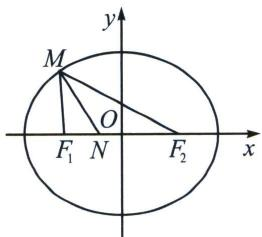
则 $\frac{2a - x}{x} = \frac{c - n}{c + n}$ ，解得 $x = \frac{a(c + n)}{c}$ ，所以 $\frac{|MF_1|}{|NF_1|} = \frac{x}{c + n} = \frac{\frac{a(c + n)}{c}}{c + n} = \frac{a}{c} = \frac{a}{\sqrt{a^2 - b^2}}$ ，由题意 $a = \sqrt{2}$ ， $b = 1$ ，所以 $\frac{|MF_1|}{|NF_1|} = \frac{\sqrt{2}}{\sqrt{2 - 1}} = \sqrt{2}$ .
解法二：由内角平分线定理， $\frac{|MF_1|}{|MF_2|} = \frac{|NF_1|}{|NF_2|}$ ，则 $\frac{|MF_1|}{|NF_1|} = \frac{|MF_2|}{|NF_2|} = \frac{|MF_1| + |MF_2|}{|NF_1| + |NF_2|} = \frac{2a}{2c} = \sqrt{2}$ 故选A.

> [!example]- 例5 (2024·辽宁三模)设点 $F_{1}$ , $F_{2}$ 分别为椭圆 $C: \frac{x^{2}}{8} + \frac{y^{2}}{4} = 1$ 的左、右焦点, 点 $P$ 是椭圆 $C$ 上任意一点, 若使得 $\overrightarrow{PF_{1}} \cdot \overrightarrow{PF_{2}} = m$ 成立的点 $P$ 恰好有 4 个, 则实数 $m$ 的值可以是
A. 0

B. 2

C. 4

D. 6
解析 解法一：因为点 $F_{1}, F_{2}$ 分别为椭圆 $\frac{x^{2}}{8} + \frac{y^{2}}{4} = 1$ 的左、右焦点；所以 $F_{1}(-2,0), F_{2}(2,0)$ ，设 $P(x_{0}, y_{0})$ 则 $\overrightarrow{PF_{1}} = (-2 - x_{0}, -y_{0}), \overrightarrow{PF_{2}} = (2 - x_{0}, -y_{0})$ ，由 $\overrightarrow{PF_{1}} \cdot \overrightarrow{PF_{2}} = m$ 可得 $x_{0}^{2} + y_{0}^{2} = m + 4$ ，又因为 $P$ 在椭圆上，即 $\frac{x_{0}^{2}}{8} + \frac{y_{0}^{2}}{4} = 1$ ，所以 $x_{0}^{2} = 2m$ ，由对称性可得，要使得 $\overrightarrow{PF_{1}} \cdot \overrightarrow{PF_{2}} = m$ 成立的点恰好是 4 个，则 $0 < 2m < 8$ ，解得 $0 < m < 4$ ，所以 $m$ 的值可以是 2.
解法二：由极化恒等式得： $\overrightarrow{PF_{1}}\cdot\overrightarrow{PF_{2}}=|PO|^{2}-|OF_{1}|^{2}=|PO|^{2}-4$ ，根据对称性，得 $|PO|\in(2,2\sqrt{2})$ 时， $\overrightarrow{PF_{1}}\cdot\overrightarrow{PF_{2}}=|PO|^{2}-4\in(0,4)$ ，故选B.

> [!example]- 例6 (2024·南昌市东湖区三模)设 $P$ 是椭圆 $C: \frac{x^{2}}{2} + y^{2} = 1$ 上任意一点, $F_{1}, F_{2}$ 是椭圆 $C$ 的左、右焦点, 则 ( )
A. $PF_{1} + PF_{2} = 2\sqrt{2}$

B. $-2 < PF_{1} - PF_{2} < 2$

C. $1 \leq PF_{1} \cdot PF_{2} \leq 2$

D. $0 \leqslant \overrightarrow{PF_{1}} \cdot \overrightarrow{PF_{2}} \leqslant 1$
解析 椭圆 $C: \frac{x^2}{2} + y^2 = 1$ ，可得 $a = \sqrt{2}$ ， $b = c = 1$ ， $P$ 是椭圆 $C: \frac{x^2}{2} + y^2 = 1$ 上任意一点， $F_1, F_2$ 是椭圆 $C$ 的左、右焦点，所以 $PF_1 + PF_2 = 2\sqrt{2}$ ，A 正确； $-2 \leqslant PF_1 - PF_2 \leqslant 2$ ，所以 B 错误；针对 C 和 D，
解法一： $PF_{1} \cdot PF_{2} = \sqrt{(\sqrt{2}\cos\theta - 1)^{2} + \sin^{2}\theta} \cdot \sqrt{(\sqrt{2}\cos\theta + 1)^{2} + \sin^{2}\theta} = \sqrt{2 + \cos^{2}\theta - 2\sqrt{2}\cos\theta} \cdot \sqrt{2 + \cos^{2}\theta + 2\sqrt{2}\cos\theta} = \sqrt{(2 + \cos^{2}\theta)^{2} - 8\cos^{2}\theta} = 2 - \cos^{2}\theta \in [1, 2]$ ，所以 C 正确；
因为 $\overrightarrow{PF_1} \cdot \overrightarrow{PF_2} = |\overrightarrow{PF_1}| \cdot |\overrightarrow{PF_2}|\cos \angle F_1PF_2 = (\sqrt{2}\cos \theta + 1, \sin \theta) \cdot (\sqrt{2}\cos \theta - 1, \sin \theta) = 2\cos^2\theta - 1 + \sin^2\theta = \cos^2\theta \in [0, 1]$ ，所以 D 正确；
解法二：由于 $|OP|^2 \in [1, 2]$ ，则 $PF_1 \cdot PF_2 = b^2 + a^2 - |OP|^2 = 3 - |OP|^2 \in [1, 2]$ ，所以 C 正确；
$\overrightarrow{PF_1} \cdot \overrightarrow{PF_2} = |PO|^2 - |OF_1|^2 = |PO|^2 - 1 \in [0, 1]$ ，所以 D 正确；故选 ACD.

注意

关于 $\left|PF_{1}\right|\cdot\left|PF_{2}\right|=b^{2}+a^{2}-\left|OP\right|^{2}$ ，详见本章第二定义部分证明.

### 二、椭圆焦点弦
若过焦点的直线与椭圆相交于两点 A 和 B， $\angle AF_{1}F_{2}$ 为 $\alpha$ ，则称线段 $|AB|$ 为焦点弦.

①如图， $\left|AF_{1}\right|=\frac{b^{2}}{a-c\cos\alpha}$ ; $\left|BF_{1}\right|=\frac{b^{2}}{a+c\cos\alpha}$ ;
当焦点弦过左焦点时，焦点弦的长度 $|AB|=\frac{2ab^{2}}{a^{2}-c^{2}\cos^{2}\alpha}=\frac{2ab^{2}}{b^{2}+c^{2}\sin^{2}\alpha}$ ;
当焦点弦过右焦点时，有 $|AB| = \frac{2ab^2}{a^2 - c^2\cos^2\alpha} = \frac{2ab^2}{b^2 + c^2\sin^2\alpha}$

②过椭圆焦点的所有弦中通径通过焦点且与长轴垂直的焦点弦最短，通径为 $2ep = \frac{2b^2}{a}$ ( $p$ 为焦准距).

③4a 体: 过椭圆 $\frac{x^{2}}{a^{2}} + \frac{y^{2}}{b^{2}} = 1 (a > b > 0)$ 的左焦点 $F_{1}$ 的弦 $AB$ 与右焦点 $F_{2}$ 围成的三角形 $\triangle ABF_{2}$ 的周长是 $4a$ ;
证明：（1）如图所示， $\left|AF_{1}\right|+\left|AF_{2}\right|=2a;\left|BF_{1}\right|+\left|BF_{2}\right|=2a$ ，故 $\left|AB\right|+\left|AF_{2}\right|+\left|BF_{2}\right|=4a$ ；  
（2） 设 $\left|AF_{1}\right|=m;\quad\left|BF_{1}\right|=n;\quad\left|AF_{2}\right|=2a-m;\quad\left|BF_{2}\right|=2a-n$ ；由余弦定理得
$m^2 + (2c)^2 - (2a - m)^2 = 2m \cdot (2c)\cos \alpha$ ；整理得 $|AF_1| = \frac{b^2}{a - c\cos \alpha}$

同理： $n^2 +(2c)^2 -(2a - n)^2 = 2n\cdot (2c)\cos (180^\circ -\alpha)$ ；整理得 $\left|BF_1\right| = \frac{b^2}{a + c\cos\alpha}$

两式相加得，则过焦点的弦长： $|AB| = m + n = \frac{2ab^2}{a^2 - c^2\cos^2\alpha} = \frac{2ab^2}{b^2 + c^2\sin^2\alpha}$

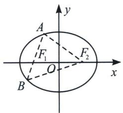

> [!example]- 例7 (2024·九江三模)已知椭圆 $C: \frac{x^{2}}{a^{2}} + \frac{y^{2}}{b^{2}} = 1 (a > b > 0)$ 的左右焦点分别为 $F_{1}, F_{2}$ , 过 $F_{1}$ 且倾斜角为 $\frac{\pi}{6}$ 的直线交 $C$ 于第一象限内一点 $A$ . 若线段 $AF_{1}$ 的中点在 $y$ 轴上, $\triangle AF_{1}F_{2}$ 的面积为 $2 \sqrt{3}$ , 则 $C$ 的方程为 ( )
A. $\frac{x^{2}}{3} + y^{2} = 1$

B. $\frac{x^{2}}{3}+\frac{y^{2}}{2}=1$

C. $\frac{x^{2}}{9}+\frac{y^{2}}{3}=1$

D. $\frac{x^2}{9} +\frac{y^2}{6} = 1$

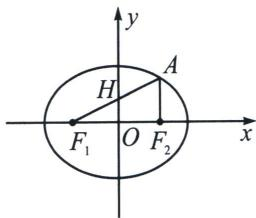

解析 设 $H$ 为 $AF_{1}$ 的中点， $O$ 为 $F_{1}F_{2}$ 的中点，因为 $HO \perp x$ 轴，所以 $AF_{2} \parallel HO$ ，故 $|AF_{2}| = \frac{b^{2}}{a}$ （半通径），又因为直线 $AF_{1}$ 的倾斜角为 $\frac{\pi}{6}$ ，可得 $|AF_{1}| = \frac{b^{2}}{a - c\cos\frac{\pi}{6}} = \frac{b^{2}}{a - \frac{\sqrt{3}}{2}c}$ ，则 $|AF_{1}| = 2|AF_{2}| \Rightarrow \frac{b^{2}}{a - \frac{\sqrt{3}}{2}c} = 2\frac{b^{2}}{a}$ ，所以 $2a - \sqrt{3}c = a$ ，且 $a^{2} = b^{2} + c^{2}$ ， $c \cdot \frac{b^{2}}{a} = 2\sqrt{3}$ ，解得 $a = 3$ ， $b^{2} = 6$ ，所以椭圆的方程为： $\frac{x^{2}}{9} + \frac{y^{2}}{6} = 1$ . 故选 D.

> [!example]- 例8 过椭圆 $\frac{x^2}{a^2} +\frac{y^2}{b^2} = 1(a > b > 0)$ 的一个焦点 $F$ 作弦 $AB$ ，若 $|AF| = d_1$ ， $|BF| = d_2$ ，则 $\frac{1}{d_1} +\frac{1}{d_2}$ 的数值为 （）
A. $\frac{2b}{a^{2}}$

B. $\frac{2a}{b^{2}}$

C. $\frac{a + b}{a^2}$

D. 与 $a 、 b$ 斜率有关
解析 $|AF_1| = d_1 = \frac{b^2}{a - c\cos\alpha}; |BF_1| = d_2 = \frac{b^2}{a + c\cos\alpha}$ ; 故 $\frac{1}{d_1} + \frac{1}{d_2} = \frac{a - c\cos\alpha}{b^2} + \frac{a + c\cos\alpha}{b^2} = \frac{2a}{b^2}$ . 故选 B.

注意 $\frac{1}{|AF|} +\frac{1}{|BF|} = \frac{2a}{b^2}$ 将成为很多考题的隐藏二级结论，需要我们重点关注.

> [!example]- 例9 (2024·河南信阳模拟)已知椭圆 $C: \frac{x^2}{a^2} + \frac{y^2}{b^2} = 1 (a > b > 0)$ 的上顶点为 $P$ ，左焦点为 $F$ ，直线 $PF$ 与 $C$ 的另一个交点为 $Q$ ，若 $|PF| = 3|QF|$ ，则 $C$ 的离心率 $e =$ （）
A. $\frac{1}{3}$

B. $\frac{\sqrt{3}}{3}$

C. $\frac{1}{2}$

D. $\frac{\sqrt{2}}{2}$

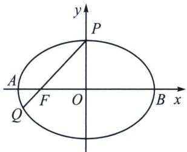

解析 解法一：由题意可得 $P(0, b)$ ， $F(-c, 0)$ ，由于 $|PF| = 3|QF|$ ，所以 $y_{Q} = -\frac{1}{3}b$ ， $x_{Q} = -\frac{4}{3}c$ ，
由于 Q 在椭圆上，所以 $\frac{\left(-\frac{4}{3}c\right)^{2}}{a^{2}}+\frac{\left(-\frac{1}{3}b\right)^{2}}{b^{2}}=1$ ，化简可得 $\frac{c^{2}}{a^{2}}=\frac{1}{2}\Rightarrow e^{2}=\frac{1}{2}$ ，由于 0<e<1，故 $e=\frac{\sqrt{2}}{2}$ .
解法二： $|PF| = 3|QF|\Rightarrow \frac{b^2}{a - c\cos\alpha} = \frac{3b^2}{a + c\cos\alpha}$ ，即 $e\cos \alpha = \frac{1}{2}$ ，由于 $\cos \alpha = \frac{|OF|}{|PF|} = \frac{c}{a} = e$ ，故 $e = \frac{\sqrt{2}}{2}$ 故选D.

注意 当 $|PF| = \lambda |QF| (\lambda > 1)$ ，则一定有 $e\cos \alpha = \frac{\lambda - 1}{\lambda + 1}$ 。关于焦点弦的比值定理，会更多出现在离心率小题中。

> [!example]- 例10 (2024·泉州模拟)椭圆 $C: \frac{x^{2}}{a^{2}} + \frac{y^{2}}{b^{2}} = 1 (a > b > 0)$ 的左、右焦点分别为 $F_{1}, F_{2}$ , 过 $F_{1}$ 且斜率为
-3 $\sqrt{7}$ 的直线与椭圆交于 $A$ ， $B$ 两点（ $A$ 在 $B$ 左侧），若 $(\overrightarrow{F_1A} + \overrightarrow{F_1F_2}) \cdot \overrightarrow{AF_2} = 0$ ，则 $C$ 的离心率为 （）

A. $\frac{2}{5}$

B. $\frac{3}{5}$

C. $\frac{2}{7}$

D. $\frac{3}{7}$
解析 $\left|AF_{1}\right|=\frac{b^{2}}{a-c\cos\alpha}$ ，同理可得 $\left|BF_{1}\right|=\frac{b^{2}}{a+c\cos\alpha}$ 。由 $(\overrightarrow{F_{1}A}+\overrightarrow{F_{1}F_{2}})\cdot\overrightarrow{AF_{2}}=0$ ，可得 $AF_{2}$ 的垂直平分线过 $F_{1}$ ，所以 $\left|AF_{1}\right|=\left|F_{1}F_{2}\right|$ ，又 $\tan\theta=-3\sqrt{7}$ ，所以 $\cos\theta=-\frac{1}{8}$ ，所以 $\left|AF_{1}\right|=\frac{\frac{b^{2}}{a}}{1+\frac{c}{8a}}=\frac{8b^{2}}{8a+c}=$ $\left|F_{1}F_{2}\right|=2c$ ，所以 $4b^{2}=8ac+c^{2}$ ，所以 $4(a^{2}-c^{2})=8ac+c^{2}$ ，所以 $5c^{2}+8ac-4a^{2}=0$ ，所以 $5e^{2}+8e-4=0$ ，又 $e\in(0,1)$ ， $e=\frac{2}{5}$ 。故选 A.

> [!example]- 例11（2024·浙江一模）已知 $F_{1}$ ， $F_{2}$ 分别为椭圆 $C: \frac{x^{2}}{a^{2}} + \frac{y^{2}}{b^{2}} = 1 (a > b > 0)$ 的左右焦点，过 $F_{2}$ 的一条直线与 $C$ 交于 $A, B$ 两点，且 $AF_{1} \perp AB, |BF_{2}| = 1$ ，则椭圆长轴长的最小值是 （）
A. $4 \sqrt{2}$

B. $3 + 2 \sqrt{2}$

C. 6

D. $4 + 2\sqrt{2}$

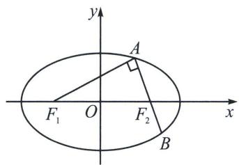

解析 解法一：设 $|AF_{2}| = t (2a > t > 1)$ ，则 $|AB| = t + 1$ ， $|BF_{1}| = 2a - 1$ ， $|AF_{1}| = 2a - t$ ，
可得 $(t + 1)^2 +(2a - t)^2 = (2a - 1)^2$ ，可得 $2a = \frac{t^2 + t}{t - 1} = (t - 1) + \frac{2}{t - 1} +3\geqslant 3 + 2\sqrt{(t - 1)\cdot\frac{2}{t - 1}} = 3 + 2\sqrt{2}.$ 当且仅当 $t = 1 + \sqrt{2}$ 时取等号.
解法二：令 $|AF_{2}| = \lambda |F_{2}B| (\lambda > 1)$ ，根据 $e\cos \alpha = \frac{\lambda - 1}{\lambda + 1}$ ，代入 $|AF_{2}| = \frac{b^{2}}{a - c\cos \alpha} = \frac{\frac{b^{2}}{a}}{1 - e\cos \alpha}$ 得： $|AF_{2}| = \frac{(\lambda + 1)b^{2}}{2a} = \lambda$ ， $AF_{1} \perp AB$ ，则 $\cos \alpha = \frac{|AF_{2}|}{|F_{1}F_{2}|} = \frac{(\lambda + 1)b^{2}}{2a} \cdot \frac{1}{2c}$ ，故 $e\cos \alpha = \frac{b^{2}(\lambda + 1)}{4a^{2}} = \frac{\lambda - 1}{\lambda + 1}$ ，即 $2a = \frac{\lambda(\lambda + 1)}{\lambda - 1} = (\lambda - 1) + \frac{2}{\lambda - 1} + 3 \geqslant 2\sqrt{2} + 3$ ，当且仅当 $\lambda = 1 + \sqrt{2}$ 时取等号。故选 B.

注意 若 $|AF_{2}|=\lambda|F_{2}B|$ ，根据 $e\cos\alpha=\frac{\lambda-1}{\lambda+1}$ ，则一定有 $|AF_{2}|=\frac{(\lambda+1)b^{2}}{2a}$ ， $|BF_{2}|=\frac{(\lambda+1)b^{2}}{2\lambda a}$ ，焦长公式通常伴随着焦比定理，打通了焦点弦的任督二脉，后续我们会在离心率专题重点介绍此公式用法.

> [!example]- 例12（2022·多选·枣庄模拟）已知椭圆 $E: \frac{x^2}{4} + \frac{y^2}{3} = 1$ ，过椭圆 $E$ 的左焦点 $F_1$ 的直线 $l_1$ 交 $E$ 于 $A, B$ 两点（点 $A$ 在 $x$ 轴的上方），过椭圆 $E$ 的右焦点 $F_2$ 的直线 $l_2$ 交 $E$ 于 $C, D$ 两点，则 （）
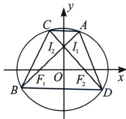

A. 若 $\overrightarrow{AF_1} = 2\overrightarrow{F_1B}$ ，则 $l_{1}$ 的斜率 $k = \frac{\sqrt{6}}{2}$

B. $|AF_{1}| + 4|BF_{1}|$ 的最小值为 $\frac{27}{4}$

C. 以 $AF_{1}$ 为直径的圆与圆 $x^{2} + y^{2} = 4$ 相切

D. 若 $l_{1} \perp l_{2}$ ，则四边形ADBC面积的最小值为 $\frac{288}{49}$
解析 易知: $|AF_1| = \frac{b^2}{a - c\cos\alpha} = \frac{3}{2 - \cos\alpha}, |BF_1| = \frac{b^2}{a + c\cos\alpha} = \frac{3}{2 + \cos\alpha}$ , 对于 A, 若 $\overrightarrow{AF_1} = 2\overrightarrow{F_1B}$ , 显然 $\frac{3}{2 - \cos\alpha} = 2 \cdot \frac{3}{2 + \cos\alpha}$ , 得 $\cos\alpha = \frac{2}{3}$ , 故 $k = \frac{\sqrt{5}}{2}$ , A 错误;

对于B， $|AF_1| + 4|BF_1| = \frac{3}{2 - \cos\alpha} +\frac{12}{2 + \cos\alpha}$ ，抓住隐藏条件 $\frac{1}{|AF_1|} +\frac{1}{|BF_1|} = \frac{2a}{b^2} = \frac{4}{3}$
根据柯西不等式： $(2 - \cos \alpha + 2 + \cos \alpha)\left(\frac{3}{2 - \cos \alpha} + \frac{12}{2 + \cos \alpha}\right) \geqslant (\sqrt{3} + \sqrt{12})^2$ ，即 $|AF_1| + 4|BF_1| \geqslant \frac{27}{4}$
故当且仅当 $\frac{4\left|BF_{1}\right|}{AF_{1}}=\frac{\left|AF_{1}\right|}{\left|BF_{1}\right|}$ ，即 $\left|AF_{1}\right|=2\left|BF_{1}\right|$ 时取等，B正确；
对于 C，设 $A(x_{1}, y_{1})$ ， $AF_{1}$ 的中点为 P，则 $P\left(\frac{x_{1}-1}{2}, \frac{y_{1}}{2}\right)$ ，又 $|OP| = \sqrt{\frac{(x_{1}-1)^{2}}{4} + \frac{y_{1}^{2}}{4}} = \frac{|AF_{2}|}{2}$ ，
由椭圆定义知： $\frac{|AF_{2}|}{2}+\frac{|AF_{1}|}{2}=2$ ，即 $|OP|=2-\frac{|AF_{1}|}{2}$ ，又 $x^{2}+y^{2}=4$ 的圆心为 $O(0,0)$ ，半径为 2，故以 $AF_{1}$ 为直径的圆与圆 $x^{2}+y^{2}=4$ 内切，C 正确；
对于 D, $S = \frac{1}{2} |AB| \cdot |CD| = \frac{1}{2} \cdot \frac{2ab^2}{a^2 - c^2\cos^2\alpha} \cdot \frac{2ab^2}{a^2 - c^2\sin^2\alpha} = \frac{72}{12 + \sin^2\alpha\cos^2\alpha}, \sin \alpha \cos \alpha = \frac{1}{2}\sin 2\alpha \in [0, \frac{1}{2}]$ , 故 $\frac{288}{49} \leqslant S \leqslant 6$ ; 故 $S \in [\frac{288}{49}, 6]$ , D 正确; 故选 BCD.

> [!example]- 例13（2022·威海二模）已知 $P(\sqrt{2}, \sqrt{3})$ 是椭圆 $C: \frac{x^2}{a^2} + \frac{y^2}{b^2} = 1 (a > b > 0)$ 上一点，以点 $P$ 及椭圆的左、右焦点 $F_1$ 、 $F_2$ 为顶点的三角形面积为 $2\sqrt{3}$ .  
（1）求椭圆 C 的标准方程;  
（2） 过 $F_{2}$ 作斜率存在且互相垂直的直线 $l_{1} 、 l_{2}$ , $M$ 是 $l_{1}$ 与 $C$ 两交点的中点, $N$ 是 $l_{2}$ 与 $C$ 两交点的中点, 求 $\triangle MNF_{2}$ 面积的最大值.

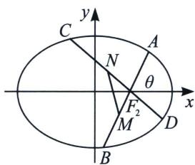

解析 （1） $\frac{x^2}{8} + \frac{y^2}{4} = 1$ ;  
（2）设 $\angle AF_{2}x = \theta$ $|AF_{2}| = x, |AF_{1}| = 2a - x,$
根据余弦定理： $\left|AF_{1}\right|^{2}=\left|AF_{2}\right|^{2}+\left|F_{1}F_{2}\right|^{2}-2\left|AF_{2}\right|\cdot\left|F_{1}F_{2}\right|\cdot\cos(\pi-\theta)$
即 $(2a - x)^{2} = x^{2} + (2c)^{2} - 2\cdot x\cdot 2c\cdot (-\cos \theta),|AF_{2}| = x = \frac{b^{2}}{a + c\cos\theta}$ ，同理 $|BF_2| = \frac{b^2}{a - c\cos\theta}$
$\mid C F _ {2} \mid = \frac {b ^ {2}}{a - c \sin \theta}, \mid D F _ {2} \mid = \frac {b ^ {2}}{a + c \sin \theta}, \mid M F _ {2} \mid = \left| \frac {A F _ {2} + B F _ {2}}{2} - A F _ {2} \right| = \frac {b ^ {2} c \cos \theta}{a ^ {2} - c ^ {2} \cos^ {2} \theta}, \mid N F _ {2} \mid = \frac {b ^ {2} c \sin \theta}{a ^ {2} - c ^ {2} \sin^ {2} \theta},$
$S _ {\triangle M N F _ {2}} = \frac {1}{2} | M F _ {2} | \cdot | N F _ {2} | = \frac {1}{2} \times \frac {8 \cos \theta}{8 - 4 \cos^ {2} \theta} \cdot \frac {8 \sin \theta}{8 - 4 \sin^ {2} \theta} = \frac {2 \sin \theta \cdot \cos \theta}{2 + (\sin \theta \cos \theta) ^ {2}} = \frac {2}{\frac {2}{\sin \theta \cdot \cos \theta} + \sin \theta \cos \theta},$
由于 $\sin \theta \cos \theta = \frac{1}{2}\sin 2\theta \in \left[0, \frac{1}{2}\right]$ ，所以 $\frac{2}{\frac{2}{\sin\theta \cdot \cos\theta} + \sin\theta \cos\theta} \leqslant \frac{2}{\frac{1}{2} + 4} = \frac{4}{9}$
所以 $\triangle MNF_{2}$ 面积的最大值为： $\frac{4}{9}$ .

> [!example]- 例14（2021·新高考Ⅱ）已知椭圆 C 的方程为 $\frac{x^{2}}{a^{2}} + \frac{y^{2}}{b^{2}} = 1 (a > b > 0)$ ，右焦点为 $F(\sqrt{2}, 0)$ ，且离心率为 $\frac{\sqrt{6}}{3}$ .  
（1）求椭圆 C 的方程;  
（2）设 M, N 是椭圆 C 上的两点，直线 MN 与曲线 $x^{2} + y^{2} = b^{2} (x > 0)$ 相切．证明：M, N, F 三点共线的充要条件是 $\left|MN\right| = \sqrt{3}$ .
解析 （1）解: 由题意可得, 椭圆的离心率 $\frac{c}{a} = \frac{\sqrt{6}}{3}$ , 又 $c = \sqrt{2}$ , 所以 $a = \sqrt{3}$ , 则 $b^{2} = a^{2} - c^{2} = 1$ ,
故椭圆的标准方程为 $\frac{x^{2}}{3}+y^{2}=1$ ;  
（2）证明：先证明充分性，当 $|MN| = \sqrt{3}$ 时，设直线 $MN$ 的方程为 $x = ty + s$ ，此时圆心 $O(0,0)$ 到直线 $MN$ 的距离 $d = \frac{|s|}{\sqrt{t^2 + 1}} = 1$ ，则 $s^2 -t^2 = 1$ ，联立方程组 $\left\{ \begin{array}{l}x = ty + s\\ \frac{x^2}{3} +y^2 = 1 \end{array} \right.$ ，可得 $(t^2 +3)y^2 +2tsy + s^2 -3 = 0,$
则 $\Delta = 4t^{2}s^{2} - 4(t^{2} + 3)(s^{2} - 3) = 12(t^{2} - s^{2} + 3) = 24$ ，因为 $|MN| = \sqrt{1 + t^2}\cdot \frac{\sqrt{24}}{t^2 + 3} = \sqrt{3}$ ，所以 $t^2 = 1$ ， $s^2$ $= 2$ ，因为直线 $MN$ 与曲线 $x^{2} + y^{2} = b^{2}(x > 0)$ 相切，所以 $s > 0$ ，则 $s = \sqrt{2}$ ，则直线 $MN$ 的方程为 $x = ty + \sqrt{2}$ 恒过焦点 $F(\sqrt{2},0)$ ，故 $M,N,F$ 三点共线，所以充分性得证.
若 M, N, F 三点共线时，设 $\left|MF\right|=m;\quad\left|NF\right|=n;\quad\left|MF_{1}\right|=2a-m;\quad\left|NF_{1}\right|=2a-n;\quad\angle MFO=\alpha,$
由余弦定理得 $m^2 + (2c)^2 - (2a - m)^2 = 2m \cdot (2c)\cos \alpha$ ；整理得 $|MF| = \frac{b^2}{a - c\cos \alpha}$

同理： $n^2 +(2c)^2 -(2a - n)^2 = 2n\cdot (2c)\cos (180^\circ -\alpha)$ ；整理得 $\mid NF\mid = \frac{b^2}{a + c\cos\alpha}$

两式相加得，则过焦点的弦长： $|MN| = m + n = \frac{2ab^2}{a^2 - c^2\cos^2\alpha} = \frac{2\sqrt{3}}{3 - 2\cos^2\alpha}$
则圆心 $O(0, 0)$ 到直线 $MN$ 的距离为 $d = c \sin \alpha = 1$ ，解得 $\sin \alpha = \frac{\sqrt{2}}{2}$ ，所以 $|MN| = \frac{2\sqrt{3}}{3 - 1} = \sqrt{3}$ ；
所以必要性成立；综上所述， $M$ ， $N$ ， $F$ 三点共线的充要条件是 $\vert MN\vert = \sqrt{3}$

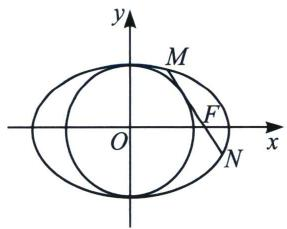

### 三、双曲线第一定义

平面内与两个定点 $F_{1}$ 、 $F_{2}$ 的距离的差的绝对值等于常数且小于 $\left|F_{1}F_{2}\right|$ 的点的轨迹；其中，两个定点叫做双曲线的焦点，焦点间的距离叫做焦距.

注意: $|PF_{1}| - |PF_{2}| = 2a$ 与 $|PF_{2}| - |PF_{1}| = 2a (a > 0)$ 分别表示双曲线的一支。若有“绝对值”，点的轨迹表示双曲线的两支；若无“绝对值”，点的轨迹仅为双曲线的一支；
根据 $\left|\sqrt{(x + c)^2 + y^2} -\sqrt{(x - c)^2 + y^2}\right| = 2a$ ，化简得： $\frac{x^2 - y^2}{a^2} = 1(a,b > 0).$

注意 1. 双曲线的标准方程： $\left\{\begin{aligned}\frac{x^{2}}{a^{2}}-\frac{y^{2}}{b^{2}}&=1(a, b>0)\Leftrightarrow\text { 中心在原点，焦点在 } x \text { 轴上；}\\ \frac{y^{2}}{a^{2}}-\frac{x^{2}}{b^{2}}&=1(a, b>0)\Leftrightarrow\text { 中心在原点，焦点在 } y \text { 轴上．}\end{aligned}\right.$

2. 顶点： $A_{1}(-a,0)$ ， $A_{2}(a,0)$ .

3. 实轴和虚轴 实轴长为 $2a$ ，虚轴长为 $2b$ ;

4. 焦点 $F_{1}(-c,0)$ , $F_{2}(c,0)$ .

5. 焦距 $\left|F_{1}F_{2}\right|=2c(c>0)$ ，满足关系式： $c^{2}=a^{2}+b^{2}$

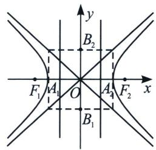

6. 离心率 $e=\frac{c}{a}(e>1)$ ，离心率越大，开口越大；
7. $P$ 为双曲线上一点，则 $\overrightarrow{PF_1} \cdot \overrightarrow{PF_2} = |\overrightarrow{PO}|^2 - c^2 \in [-b^2, +\infty)$ (利用极化恒等式证明).

> [!example]- 例15 (2025 新课标 I 卷第 3 题) 若双曲线 $C$ 的虚轴长为实轴长的 $\sqrt{7}$ 倍, 则 $C$ 的离心率为 ( )
A. $\sqrt{2}$

B. 2

C. $\sqrt{7}$

D. $2 \sqrt{2}$
解析 无论双曲线方程是 $\frac{x^2}{a^2} - \frac{y^2}{b^2} = 1$ 还是 $\frac{y^2}{a^2} - \frac{x^2}{b^2} = 1$ 虚轴皆是 $2b$ ，实轴皆是 $2a$ ，由题意则有 $\frac{2b}{2a} = \sqrt{7}$ ，所以 $\frac{b}{a} = \sqrt{7}$ ，即 $b = \sqrt{7} a$ ，由双曲线可得， $c^2 = a^2 + b^2$ ，所以有 $c^2 = 8a^2$ ，因此离心率 $e = \frac{c}{a} = \sqrt{\frac{c^2}{a^2}} = 2\sqrt{2}$ ，故该题选 D.

> [!example]- 例16（2024·新课标Ⅰ卷）设双曲线 C: $\frac{x^{2}}{a^{2}} - \frac{y^{2}}{b^{2}} = 1 (a > 0, b > 0)$ 的左、右焦点分别为 $F_{1}$ ， $F_{2}$ ，过 $F_{2}$ 作平行于 y 轴的直线交 C 于 A, B 两点，若 $\left|F_{1}A\right|=13,\left|AB\right|=10$ ，则 C 的离心率为 \_\_\_\_.
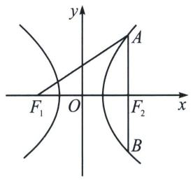

解析 由题意知， $|F_{1}A|=13$ ， $|F_{2}A|=\frac{1}{2}|AB|=5$ ，所以 $|F_{1}A|-|F_{2}A|=2a=8$ ，解得a=4；
又 x=c 时， $y=\frac{b^{2}}{a}$ （半通径），即 $\left|F_{2}A\right|=\frac{b^{2}}{a}=5$ ，所以 $b^{2}=5a=20$ ，
所以 $c^{2}=a^{2}+b^{2}=16+20=36$ ，所以 c=6，所以双曲线 C 的离心率为 $e=\frac{c}{a}=\frac{3}{2}$ 。故答案为 $\frac{3}{2}$ .

> [!example]- 例17（2024·南通模拟）在平面直角坐标系 $xOy$ 中， $F_{1}$ ， $F_{2}$ 分别是双曲线 $E: \frac{x^{2}}{4} - \frac{y^{2}}{5} = 1$ 的左，右焦点，设点 $P$ 是 $E$ 的右支上一点，则 $\frac{5}{|PF_{1}|} - \frac{1}{|PF_{2}|}$ 的最大值为 \_\_\_\_.
解析 双曲线 $E: \frac{x^2}{4} - \frac{y^2}{5} = 1$ 的 $a = 2, b = \sqrt{5}, c = 3$ , 设 $|PF_1| = m, |PF_2| = n, n \geqslant c - a = 1$ , 由双曲线的定义, 可得 $m - n = 2a = 4$ , 则 $\frac{5}{|PF_1|} - \frac{1}{|PF_2|} = \frac{1}{4}(m - n)\left(\frac{5}{m} - \frac{1}{n}\right) = \frac{1}{4}\left[6 - \left(\frac{m}{n} + \frac{5n}{m}\right)\right] \leqslant \frac{1}{4}(6 - 2\sqrt{5}) = \frac{3 - \sqrt{5}}{2}$ , 当且仅当 $m = \sqrt{5}n$ , 即有 $n = \sqrt{5} + 1 > 1$ , 取得最大值 $\frac{3 - \sqrt{5}}{2}$ . 故答案为 $\frac{3 - \sqrt{5}}{2}$ .

> [!example]- 例18（2024·黄浦区期中）已知 $F_{1}$ 、 $F_{2}$ 分别是双曲线 $C: \frac{x^{2}}{2} - \frac{y^{2}}{14} = 1$ 的左右焦点，过 $F_{1}$ 的直线 $l$ 与双曲线 $C$ 左右两支分别交于 $P$ 、 $Q$ 两点，且 $|PQ| = |QF_{2}|$ ，则 $\cos \angle PF_{1}F_{2} = \_$ .
解析 双曲线 $C: \frac{x^2}{2} - \frac{y^2}{14} = 1$ 中，实半轴长 $a = \sqrt{2}$ ，虚半轴长 $b = \sqrt{14}$ ，半焦距 $c = 4$ ，如图：
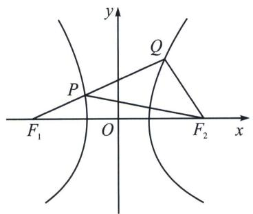
由双曲线定义知 $|PF_1| = |QF_1| - |QP| = |QF_1| - |QF_2| = 2a = 2\sqrt{2}$ ，则 $|PF_2| = 2a + |PF_1| = 4\sqrt{2}$ ， $|F_1F_2| = 2c = 8$ ， $\triangle PF_1F_2$ 中，由余弦定理得 $\cos \angle PF_1F_2 = \frac{|PF_1|^2 + |F_1F_2|^2 - |PF_2|^2}{2|PF_1| \cdot |F_1F_2|} = \frac{(2\sqrt{2})^2 + 8^2 - (4\sqrt{2})^2}{2 \cdot 2\sqrt{2} \cdot 8} = \frac{5\sqrt{2}}{8}$ 。故答案为 $\frac{5\sqrt{2}}{8}$ 。

> [!example]- 例19（湖北省武汉市武昌区2025届高三下学期5月质量检测(三模)T14）在几何中，单叶双曲面是一种典型的直纹面如图1所示，因其具有优良的稳定性和美观性，常被应用于大型建筑结构(如广州电视塔). 单叶双曲面的形成过程可通过“双曲狭缝”演示：如图2，直杆 $m$ 与固定轴 $l$ 成一定夹角，且均和连杆垂直. 当直杆 m 绕固定轴 l 旋转时，其轨迹形成单叶双曲面。若用过单叶双曲面固定轴的平面截取该曲面，所得交线为双曲线的一部分。在某科技馆的演示中，立板上的双曲狭缝即为直杆运动轨迹（双曲面）被立板面截取的双曲线的一部分，因此直杆旋转时可始终穿过两条弯曲的狭缝。若直杆 m 与固定轴 l 所成角的大小为 $30^{\circ}$ ，则该双曲线的离心率为 \_\_\_\_。
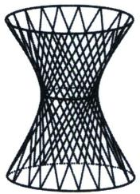

图1

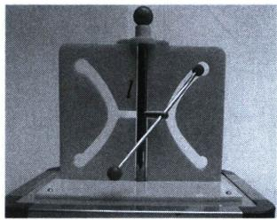

图2

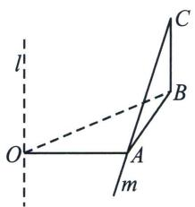

解析 模型转换后如图所示， $OA \perp AB$ ， $CB \perp$ 平面 OAB， $\angle ACB = 30^{\circ}$
设 CB=y，OB=x，因为 $OA \perp AB$ ， $CB \perp$ 平面 OAB， $\angle ACB = 30^{\circ}$ ，所以 $CB \perp AB$ ，
所以在 Rt△ABC 中可得： $AB = BC \tan 30^{\circ} = \frac{\sqrt{3}}{3} y$ ，在 Rt△OAB 中可得： $OA^{2} = OB^{2} - AB^{2} = x^{2} - \frac{y^{2}}{3}$
即 $\frac{x^2}{OA^2} -\frac{y^2}{3OA^2} = 1$ ，则该双曲线的离心率为 $e = \frac{c}{a} = \sqrt{1 + \frac{b^2}{a^2}} = \sqrt{1 + \frac{3OA^2}{OA^2}} = 2.$ 故答案为：2.

> [!example]- 例20 (2025届河南省豫北六校高三下学期5月份联合模拟考试 T14)已知等腰三角形 MNP 的顶点为 M (-6, 0)，底边的一个端点为 N(2, 6)，则另一个端点 P 的轨迹方程为\_\_\_\_；又 A(6, 0)，线段 PA 的垂直平分线与直线 PM 交于点 Q，则动点 Q 的轨迹方程为\_\_\_\_。
解析 因为等腰三角形 MNP 的顶点为 $M(-6, 0)$ ，底边的一个端点为 $N(2, 6)$ ，另一个端点为 P，
所以 $|MP| = |MN| = \sqrt{(-6 - 2)^2 + (0 - 6)^2} = 10$ ，故点 $P$ 的轨迹是以 $M$ 为圆心，10 为半径的圆 ( $x \neq 2$ 且 $y \neq 6$ )，故点 $P$ 的轨迹方程为 $(x + 6)^2 + y^2 = 100 (x \neq 2$ 且 $y \neq 6)$ 。因为线段 $PA$ 的垂直平分线与直线 $PM$ 交于点 $Q$ ，所以 $|QP| = |QA|$ 。又 $|AM| = 12 > 6$ ， $|PM| = 10$ ，所以点 $A$ 在圆 $M$ 外，线段 $PA$ 的垂直平分线与直线 $PM$ 的交点 $Q$ 在线段 $MP$ 的延长线或反向延长线上。当点 $Q$ 在线段 $MP$ 的延长线上时，如下图所示。

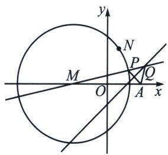

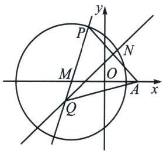
此时， $|QM| - |QA| = |QM| - |QP| = |MP| = 10$ ；当点 $Q$ 在线段 $PM$ 的延长线上时，如上右图所示.
此时， $|QA|-|QM|=|QP|-|QM|=|MP|=10$ ，综上， $||QM|-|QA||=10$ ，即动点Q到两个定点M与A的距离之差的绝对值为10。又 $|AM|=12>10$ ，所以点Q的轨迹是以点M和A为焦点的双曲线，其中2a=10，2c=12，所以 $a^{2}=25$ ， $c^{2}=36$ ， $b^{2}=11$ ，所以双曲线方程为 $\frac{x^{2}}{25}-\frac{y^{2}}{11}=1$ 。
当点 P 为 $(2, 6)$ 时，线段 PA 的垂直平分线 l 的方程为 $y = \frac{2}{3}x + \frac{1}{3}$ ，直线 PM 的方程为 $y = \frac{3}{4}x + \frac{9}{2}$ ，

直线 l 与直线 PM 的交点为 $(-50, -33)$ ，故动点 Q 的轨迹方程为 $\frac{x^{2}}{25}-\frac{y^{2}}{11}=1 (x \neq -50 \text{ 且 } y \neq -33)$ .
故答案为 $(x + 6)^2 + y^2 = 100 (x \neq 2$ 且 $y \neq 6)$ ; $\frac{x^2}{25} - \frac{y^2}{11} = 1 (x \neq -50$ 且 $y \neq -33)$ .

### 四、双曲线焦长公式  
（1）当 $AB$ 交双曲线于一支时， $|AB| = \frac{2ab^2}{a^2 - c^2\cos^2\alpha}$ ， $a^2 - c^2\cos^2\alpha > 0 \Rightarrow 1 < e < \frac{1}{\cos\alpha}$ (图中)  
（2）当 $AB$ 交双曲线于两支时， $\vert AB\vert = \frac{2ab^2}{c^2\cos^2\alpha - a^2}$ ， $a^2 - c^2\cos^2\alpha < 0 \Rightarrow e > \frac{1}{\cos\alpha}$ （图右）

双曲线的渐近线： $\frac{x^2}{a^2} -\frac{y^2}{b^2} = 1(a,b > 0)\Leftrightarrow y = \pm \frac{b}{a} x$ ；或 $\frac{y^2}{a^2} -\frac{x^2}{b^2} = 1(a,b > 0)\Leftrightarrow y = \pm \frac{a}{b} x.$

> [!example]- 例21（2024·多选·烟台二模）已知双曲线 $\Gamma: \frac{x^{2}}{a^{2}} - \frac{y^{2}}{b^{2}} = 1 (a > 0, b > 0)$ 的离心率为 $e$ ，过其右焦点 $F$ 的直线 $l$ 与 $\Gamma$ 交于点 $A, B$ ，下列结论正确的是 （）
A. 若 $a = b$ ，则 $e = \sqrt{2}$   
B. $|AB|$ 的最小值为 $2a$   
C. 若满足 $|AB| = 2a$ 的直线 $l$ 恰有一条, 则 $e > \sqrt{2}$   
D. 若满足 $|AB| = 2a$ 的直线 $l$ 恰有三条, 则 $1 < e < \sqrt{2}$
解析 A: 当 $a = b$ 时, 因为 $c^{2} = a^{2} + b^{2}$ , 所以 $e = \frac{c}{a} = \sqrt{\frac{a^{2} + b^{2}}{a^{2}}} = \sqrt{2}$ , 故 A 正确;

B: 当过其右焦点 $F$ 的直线 $l$ 与 $\Gamma$ 交于左右两支时, $|AB|$ 的最小值为 $2a$ , (此时 $A, B$ 为双曲线的两顶点)当过其右焦点 $F$ 的直线 $l$ 与 $\Gamma$ 交于同一支时, 最短弦长为通径, 即交点的横坐标为 $c$ ,
代入双曲线方程为 $\frac{c^{2}}{a^{2}}-\frac{y^{2}}{b^{2}}=1$ ，解得 $y=\pm\frac{b^{2}}{a}$ ，此时弦长为 $\frac{2b^{2}}{a}$ ，由于a不一定等于b，故B错误；
C: 若满足 $|AB| = 2a$ 的直线 $l$ 恰有一条, 由选项 B 可知直线与双曲线的两支分别相交, 与同一支不相交, 所以 $2a < \frac{2b^2}{a} \Rightarrow b^2 > a^2$ , 此时 $e = \frac{c}{a} = \sqrt{\frac{a^2 + b^2}{a^2}} = \sqrt{1 + \frac{b^2}{a^2}} > \sqrt{2}$ , 故 C 正确;

D: 若满足 $|AB| = 2a$ 的直线 $l$ 恰有三条, 则该直线与双曲线的两支分别相交, 且有两条直线 $l$ 与双曲线的同一支相交, 所以 $2a > \frac{2b^2}{a} \Rightarrow b^2 < a^2$ , 所以 $e = \frac{c}{a} = \sqrt{\frac{a^2 + b^2}{a^2}} = \sqrt{1 + \frac{b^2}{a^2}} < \sqrt{2}$ ,
又 $e > 1$ ，所以 $1 < e < \sqrt{2}$ ，故D正确．故选ACD.

决定焦点弦与双曲线交于一支还是两支，取决于直线倾斜角 $\alpha$ (假设为第一象限角) 与渐近线倾斜角 $|k| = \tan\theta = \frac{b}{a} \left( \cos\theta = \frac{a}{c} = \frac{1}{e} \right)$ 的关系，当 $\cos\alpha < \frac{1}{e}$ ，交于一支；当 $\cos\alpha > \frac{1}{e}$ ，交于两支。

> [!example]- 例22 (2024·长沙天心区模拟)过双曲线 $C: \frac{x^2}{4} - y^2 = 1$ 的左焦点 $F_1$ 作倾斜角为 $\theta$ 的直线 $l$ 交 $C$ 于 $M$ , $N$ 两点. 若 $\overrightarrow{MF_1} = 3\overrightarrow{F_1N}$ , 则 $|\cos \theta| =$
A. $\frac{\sqrt{10}}{10}$

B. $\frac{3\sqrt{10}}{10}$

C. $\frac{2\sqrt{5}}{5}$

D. $\frac{\sqrt{5}}{5}$
解析 连接 $MF, NF$ ，由题意可得 $a = 2, b = 1, c = \sqrt{5}$ ，则 $|MF_1| = \frac{b^2}{a - c\cos\theta}, |NF_1| = \frac{b^2}{a + c\cos\theta}$
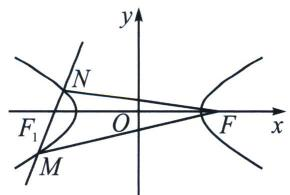
$\overrightarrow{MF_1} = 3\overrightarrow{F_1N}$ ，则 $\frac{b^2}{a - c\cos\theta} = \frac{3b^2}{a + c\cos\theta}$ ，所以 $e\cos \theta = \frac{\sqrt{5}}{2}\cos \theta = \frac{1}{2}$ ，故 $|\cos \theta | = \frac{\sqrt{5}}{5}$ 故选D.

> [!example]- 例23 (2024·南开区模拟)已知双曲线 $\frac{x^{2}}{a^{2}} - \frac{y^{2}}{b^{2}} = 1 (a > 0, b > 0)$ 的左、右焦点分别为 $F_{1}, F_{2}$ , 过 $F_{2}$ 且斜率为 $\frac{24}{7}$ 的直线与双曲线在第一象限的交点为 $A$ , 若 $|F_{1} F_{2}| = |A F_{2}|$ , 则此双曲线的标准方程可能为 ( )
A. $\frac{x^2}{3} -\frac{y^2}{4} = 1$

B. $\frac{x^2}{4} -\frac{y}{3} = 1$

C. $\frac{x^2}{9} -\frac{y^2}{16} = 1$

D. $\frac{x^2}{16} -\frac{y^2}{9} = 1$
解析 根据题意可知 $|F_{1}F_{2}| = |AF_{2}| = 2c$ ，所以 $|AF_{1}| = 2a + |AF_{2}| = 2a + 2c$ ，又直线 $AF_{2}$ 的斜率为 $\frac{24}{7}$ ，所以 $\tan \angle AF_{2}x = \frac{24}{7}$ ，所以 $\cos \angle AF_{2}x = \cos \alpha = \frac{7}{25}$ ， $|AF_{2}| = \frac{b^{2}}{a - c\cos\alpha} = \frac{c^{2} - a^{2}}{a - \frac{7}{25}c} = |F_{1}F_{2}| = 2c$
所以 $9c^{2}=25a^{2}$ ，所以 $9(a^{2}+b^{2})=25a^{2}$ ，所以 $16a^{2}=9b^{2}$ ，所以 $a^{2}:b^{2}=9:16$ ，所以只有 C 选项中的方程满足．故选 C.

注意 判断焦长公式的加减号就是长减短加，长的弦分母是减号，短的弦分母是加号，通常我们把 $\alpha$ 当作第一象限角.

> [!example]- 例24（2024·永州三模）已知 $F_{1}$ , $F_{2}$ 分别是双曲线 $\frac{x^{2}}{a^{2}} - \frac{y^{2}}{b^{2}} = 1 (a > 0, b > 0)$ 的左、右焦点，点 $O$ 为坐标原点，过 $F_{1}$ 的直线分别交双曲线左、右两支于 $A$ , $B$ 两点，点 $C$ 在 $x$ 轴上， $\overrightarrow{CB} = 3 \overrightarrow{F_{2} A}$ , $BF_{2}$ 平分 $\angle F_{1} BC$ ，其中一条渐近线与线段 $AB$ 交于点 $P$ ，则 $\sin \angle POF_{2} =$ （ ）
A. $\frac{\sqrt{41}}{7}$

B. $\frac{\sqrt{42}}{7}$

C. $\frac{\sqrt{43}}{7}$

D. $\frac{2\sqrt{11}}{7}$

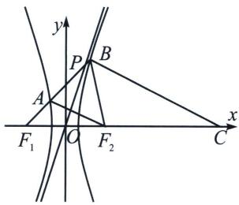

解析 $\overrightarrow{CB} = 3\overrightarrow{F_2A}$ ，所以 $|BF_1| = 3|AF_1|$ ，令 $\angle AF_1F_2 = \alpha$ ，则 $|BF_1| = \frac{b^2}{c\cos\alpha - a}, |AF_1| = \frac{b^2}{c\cos\alpha + a}$ 由于 $BF_2$ 平分 $\angle F_1BC$ ，根据内角平分线定理，则 $\frac{|BF_1|}{|BC|} = \frac{|F_1F_2|}{|F_2C|} = \frac{1}{2}$ ，即 $|BC| = 2|BF_1| = 3|AF_2| = 6|AF_1|$ ，所以 $|AF_2| = 4a, |AB| = 4a, |AB| = \frac{b^2}{c\cos\alpha - a} -\frac{b^2}{c\cos\alpha + a} = \frac{2ab^2}{c^2\cos^2\alpha - a^2} = 4a$ ，所以 $e^2 (2\cos^2\alpha -$

1) = 1, $\left|BF_{1}\right| = \frac{b^{2}}{c\cos\alpha - a} = 3\left|AF_{1}\right| = \frac{b^{2}}{c\cos\alpha + a}$ ，则 $e\cos\alpha = 2$ ，所以 $e = \sqrt{7}$ ，由 $a^{2} + b^{2} = c^{2}$ 得 $\frac{b}{c} = \frac{\sqrt{42}}{7}$ ， $\tan\angle POF_{2}=\frac{b}{a}$ ，故 $\sin\angle POF_{2}=\frac{b}{c}=\frac{\sqrt{42}}{7}$ . 故选 B.

注意 当交两支的焦点弦 $|AB| = 4a$ 时，隐藏着几个很重要的等腰三角形，这也是一种常见考题.

> [!example]- 例25（河北省名校联考 2025 届高三适应性演练 T10）已知双曲线 C: $\frac{x^{2}}{3}-y^{2}=1$ 的左右焦点为 $F_{1}$ ， $F_{2}$ ，点 P 在 C 上，O 为坐标原点，则 （）
A. $|OP| = 2$ 时， $\triangle PF_{1}F_{2}$ 为直角三角形  
B. $\left|OP\right|>2$ 时， $\triangle PF_{1}F_{2}$ 为锐角三角形  
C. $\triangle PF_{1}F_{2}$ 为等腰三角形时， $|OP|=\sqrt{18-8\sqrt{3}}$ 或 $\sqrt{18+8\sqrt{3}}$   
D. $\triangle PF_{1}F_{2}$ 外接圆半径为 $\frac{4\sqrt{3}}{3}$ 时， $|OP|=\sqrt{6}$
解析 对于 A, $a^{2}=3$ , $b^{2}=1$ , $c^{2}=4$ ，所以 $F_{1}(-2,0)$ , $F_{2}(2,0)$ ，由 $|OP|=2$ 得 $|OP|=\frac{1}{2}$ $|F_{1}F_{2}|$ ， $\angle F_{1}PF_{2}=90^{\circ}$ ，所以 $\triangle PF_{1}F_{2}$ 为直角三角形，故 A 正确；
对于B，构造通径直角三角形，当 $P\left(2, \frac{\sqrt{3}}{3}\right)$ 时，满足 $\frac{4}{3} - \frac{1}{3} = 1$ ， $|OP| = \sqrt{4 + \frac{1}{3}} = \frac{\sqrt{39}}{3} > 2$ ， $|PF_2| = \frac{\sqrt{3}}{3}$ ，所以 $|PF_2|^2 + |OF_2|^2 = |OP|^2$ ，即 $\angle PF_2F_1 = 90^\circ$ ，所以 $\triangle PF_1F_2$ 为直角三角形，故B错误；
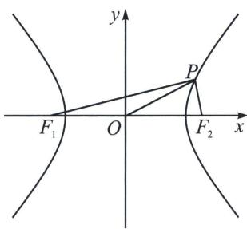

对于C，不妨设点 $P$ 在双曲线右支上时，则 $\left|PF_{2}\right| < \left|PF_{1}\right|$ ，只能是 $\left|PF_{2}\right| = \left|F_{1}F_{2}\right| = 4$ ，或 $\left|PF_{1}\right| = \left|F_{1}F_{2}\right| = 4$ ，当 $\left|PF_{2}\right| = \left|F_{1}F_{2}\right| = 4$ 时，可得 $\left|PF_{1}\right| = 2\sqrt{3} + \left|PF_{2}\right| = 2\sqrt{3} + 4$ ，利用中线定理 $\frac{\left|PF_{1}\right|^{2} + \left|PF_{2}\right|^{2}}{2} = |OP|^{2} + \left|OF_{2}\right|^{2}$ ，解得 $|OP| = \sqrt{18 + 8\sqrt{3}}$ ，当 $\left|PF_{1}\right| = \left|F_{1}F_{2}\right| = 4$ ，可得 $\left|PF_{2}\right| = 4 - 2\sqrt{3}$ ，利用中线定理 $\frac{\left|PF_{1}\right|^{2} + \left|PF_{2}\right|^{2}}{2} = |OP|^{2} + \left|OF_{2}\right|^{2}$ ，解得 $|OP| = \sqrt{18 - 8\sqrt{3}}$ ，综上△ $PF_{1}F_{2}$ 为等腰三角形时， $|OP| = \sqrt{18 - 8\sqrt{3}}$ 或 $\sqrt{18 + 8\sqrt{3}}$ ，故C正确；
对于 D，设 $\triangle PF_{1}F_{2}$ 外接圆半径为 R，由正弦定理得 $\frac{|F_{1}F_{2}|}{\sin\angle F_{1}PF_{2}}=2R=\frac{8\sqrt{3}}{3}$ ，所以 $\sin\angle F_{1}PF_{2}=\frac{\sqrt{3}}{2}$ ，则 $\angle F_{1}PF_{2}=60^{\circ}$ 或 $\angle F_{1}PF_{2}=120^{\circ}$ ，当 $\angle F_{1}PF_{2}=60^{\circ}$ ，则 $S_{\triangle PF_{1}F_{2}}=\frac{b^{2}}{\tan30^{\circ}}=c|y_{P}|\Rightarrow|y_{P}|=\frac{\sqrt{3}}{2}$ （双曲线焦点三角形面积公式 $S=\frac{b^{2}}{\tan\frac{\angle F_{1}PF_{2}}{2}}$ ），所以 $x_{P}^{2}=\frac{21}{4}$ ， $|OP|=\sqrt{6}$ ，当 $\angle F_{1}PF_{2}=120^{\circ}$ ，则 $S_{\triangle PF_{1}F_{2}}=\frac{b^{2}}{\tan60^{\circ}}=c$
$|y_{P}|\Rightarrow|y_{P}|=\frac{\sqrt{3}}{6}$ ，所以 $x_{P}^{2}=\frac{13}{4}$ ， $|OP|=\frac{\sqrt{30}}{3}$ ，所以 $|OP|=\frac{\sqrt{30}}{3}$ ，故D错误。故选AC.

# 第二节 椭圆双曲的比值模型（第二定义）

### 一、椭圆第二定义关于“比”

平面内与一个定点的距离和到一条定直线的距离的比是常数 $e (0 < e < 1)$ 的点的轨迹, 其中, 定点为焦点, 定直线叫做准线, 常数 $e$ 叫做离心率.
设 $M(x, y)$ 是椭圆上任意一点，定点为 $F(c, 0)$ ，定直线为 $x = \frac{a^{2}}{c}$ ，常数 $e = \frac{c}{a}$ ，由上述椭圆的定义可得： $\frac{\sqrt{(x-c)^{2}+y^{2}}}{\left|\frac{a^{2}}{c}-x\right|} = \frac{c}{a}$ ，变形即可.

焦半径椭圆上的点到焦点的距离；设 $P(x_0, y_0)$ 为椭圆上的一点，

① 焦点在 $x$ 轴：焦半径 $\left\{ \begin{array}{l} |PF_1| = a + ex_0 \\ |PF_2| = a - ex_0 \end{array} \right.$ （左加右减） $(F_1$ 为左焦点）；② 焦点在 $y$ 轴：焦半径 $\left\{ \begin{array}{l} |PF_1| = a + ey_0 \\ |PF_2| = a - ey_0 \end{array} \right.$ （下加上减）．（ $F_1$ 为下焦点）

注意 利用第二定义快速进行证明，结合图形，长的加，短的减.

### 二、双曲线第二定义关于“比”

平面内与一个定点和一条定直线的距离的比是常数 $e(e > 1)$ 的点的轨迹；定直线叫做准线，常数 $e$ 叫做离心率.
根据 $\frac{\sqrt{(x-c)^{2}+y^{2}}}{\left|\frac{a^{2}}{c}-x\right|}=\frac{c}{a}$ ，化简得到 $\frac{x^{2}}{a^{2}}-\frac{y^{2}}{b^{2}}=1(a,b>0)$ .

焦半径 设 $P(x_{0}, y_{0})$ 为双曲线上的一点，

① 焦点在 x 轴：P 在左支 $\left\{\begin{aligned}|PF_{1}| &= -a - ex_{0} \\ |PF_{2}| &= a - ex_{0}\end{aligned}\right.$ ，P 在右支 $\left\{\begin{aligned}|PF_{1}| &= a + ex_{0} \\ |PF_{2}| &= -a + ex_{0}\end{aligned}\right.$ ;

②焦点在 $y$ 轴： $P$ 在下支 $\left\{ \begin{array}{l} |PF_1| = -a - ey_0 \\ |PF_2| = a - ey_0 \end{array} \right.$ ， $P$ 在上支 $\left\{ \begin{array}{l} |PF_1| = a + ey_0 \\ |PF_2| = -a + ey_0 \end{array} \right.$ .

焦半径公式和焦长焦比都是解挖掘圆锥曲线几何性质的常见招数，那么什么时候用焦长焦比，什么时候用焦半径呢？

如今的圆锥曲线体系，方法众多，什么时候选择用什么成为了重中之重，焦长焦比强调共线，强调角度和比值，而焦半径强调和积，不注重共线，强调点的坐标，当然很多时候，尤其在高考题当中，焦长焦比与焦半径是相通的，我们从以下例题中找寻答案.

例①（2025 天津卷第 9 题）双曲线 $\frac{x^{2}}{a^{2}} - \frac{y^{2}}{b^{2}} = 1 (a > 0, b > 0)$ 的左、右焦点分别为 $F_{1}, F_{2}$ ，以右焦点 $F_{2}$

为焦点的抛物线 $y^{2} = 2px (p > 0)$ 与双曲线交于第一象限的点 $P$ ，若 $|PF_{1}| + |PF_{2}| = 3|F_{1}F_{2}|$ ，则双曲线的离心率 $e =$ （）

A. 2

B. 5

C. $\frac{\sqrt{2}+1}{2}$

D. $\frac{\sqrt{5}+1}{2}$
解析 解法一：根据题意可设 $F_{2}\left(\frac{p}{2},0\right)$ ，双曲线的半焦距为 $c$ ， $P(x_0,y_0)$ ，则 $p = 2c$ ，过 $F_{1}$ 作 $x$ 轴的垂线 $l$ ，过 $P$ 作 $l$ 的垂线，垂足为 $A$ ，显然直线 $AF_{1}$ 为抛物线的准线，则 $\vert PA\vert = \vert PF_2\vert$ ，由双曲线的定义及已知条件可知 $\left\{ \begin{array}{l} \vert PF_1\vert -\vert PF_2\vert = 2a\\ \vert PF_1\vert +\vert PF_2\vert = 6c \end{array} \right.$ ，则 $\left\{ \begin{array}{l}\vert PF_1\vert = 3c + a\\ \vert PF_2\vert = 3c - a = \vert PA\vert \end{array} \right.$ ，由勾股定理可知 $\vert AF_1\vert^2 = y_0^2 = \vert PF_1\vert^2$ $-\vert PA\vert^2 = 12ac$ ，易知 $y_0^2 = 4cx_0$ ，所以 $x_0 = 3a$ ，即 $\frac{x_0^2}{a^2} -\frac{y_0^2}{b^2} = \frac{9a^2}{a^2} -\frac{12ac}{c^2 - a^2} = 1$ ，整理得 $2c^{2} - 3ac - 2a^{2} = 0 = (2c + a)(c - 2a)$ ，所以 $c = 2a$
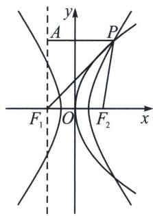

解法二：利用焦半径公式， $|PF_{2}| = ex_{P} - a = \frac{p}{2a} x_{P} - a = x_{P} + \frac{p}{2}, |PF_{1}| = ex_{P} + a = \frac{p}{2a} x_{P} + a, |PF_{1}| + |PF_{2}| = 3|F_{1}F_{2}| \Rightarrow \frac{p}{a} x_{P} = 3p \Rightarrow x_{P} = 3a$ ，所以 $|PF_{2}| = \frac{p}{2a} x_{P} - a = x_{P} + \frac{p}{2} \Rightarrow \frac{3}{2} p = 4a + \frac{p}{2} \Rightarrow p = 2c = 4a$ ，所以 $c = 2a$ ，即离心率为2．故选A.

> [!example]- 例2 (2023·包头期末)设 $F_{1}$ 、 $F_{2}$ 为椭圆 $\Gamma: \frac{x^{2}}{25} + \frac{y^{2}}{21} = 1$ 的两个焦点， $P$ 为 $\Gamma$ 上一点且在第二象限。若 $|PF_{1}| = |F_{1}F_{2}|$ ，则点 $P$ 的坐标为 \_\_\_\_.
解析 椭圆 $\frac{x^2}{25} +\frac{y^2}{21} = 1$ ，则 $a = 5$ ， $b^{2} = 21$ ， $c = \sqrt{a^{2} - b^{2}} = 2$ ，所以 $F_{1}(-2,0)$ ， $F_{2}(2,0)$ ， $|PF_1| = |F_1F_2| = 2c = 4$ ，由题意设 $P(x,y)$ ， $x <   0$ ， $y > 0$ ， $|PF_1| = |F_1F_2|$ ，所以 $a + ex_0 = 2c$ ，即 $x_0 = -\frac{5}{2}$ ，代回椭圆方程得： $P\left(-\frac{5}{2},\frac{3\sqrt{7}}{2}\right)$ ，故答案为 $\left(-\frac{5}{2},\frac{3\sqrt{7}}{2}\right).$

> [!example]- 例3 (2024·桂林三模)已知椭圆 $C: \frac{x^2}{4} + \frac{y^2}{3} = 1$ 的右焦点为 $F$ , 过 $F$ 的直线与 $C$ 交于 $A 、 B$ 两点, 其中点 $A$ 在 $x$ 轴上方且 $\overrightarrow{AF} = 2\overrightarrow{FB}$ , 则 $B$ 点的横坐标为
A. $\frac{1}{2}$

B. $\frac{3}{2}$

C. $-\frac{7}{4}$

D. $\frac{7}{4}$
解析 $\overrightarrow{AF} = 2\overrightarrow{FB}$ ，令 $\angle AFO = \alpha$ ，则 $\frac{b^2}{a - c\cos\alpha} = \frac{2b^2}{a + c\cos\alpha}$ 故 $\cos \alpha = \frac{2}{3}$
故 $|BF|=\frac{b^{2}}{a+c\cos\alpha}=\frac{9}{8}=a-ex_{2}=2-\frac{1}{2}x_{2}$ ，可知B点的横坐标为 $x_{2}=\frac{7}{4}$ 。故选D.

> [!example]- 例4 (2022·新高考1)已知椭圆 $C: \frac{x^{2}}{a^{2}} + \frac{y^{2}}{b^{2}} = 1 (a > b > 0)$ , $C$ 的上顶点为 $A$ , 两个焦点为 $F_{1}, F_{2}$ , 离心率为 $\frac{1}{2}$ , 过 $F_{1}$ 且垂直于 $AF_{2}$ 的直线与 $C$ 交于点 $D, E$ 两点, $|DE| = 6$ , 则 $\triangle ADE$ 的周长是 \_\_\_\_.
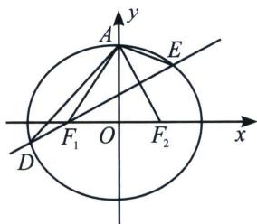

解析 如图，由于 $a = 2c$ ，故 $\angle AF_{1}F_{2} = 60^{\circ}$ ， $\triangle AF_{1}F_{2}$ 为等边三角形，又 $DE\bot AF_2$ ，故 $\angle EF_{1}F_{2} = 30^{\circ}$ ，令椭圆方程 $\frac{x^2}{4} +\frac{y^2}{3} = c^2$
解法一(焦长公式): $DE = \frac{2ab^2}{a^2 - c^2\cos^230^\circ} = \frac{48c}{16} = 6$ , 所以 $c = \frac{13}{8}$ , 周长为 $4a = 8c = 13$ .
解法二(焦半径+联立): 直线 $DE$ 的方程为 $y = \frac{\sqrt{3}}{3} (x + c)$ , 联立得 $13x^{2} + 8cx - 32c^{2} = 0$ , 由于 $\triangle ADE$ 与 $\triangle F_{2}DE$ 关于 $DE$ 对称, 所以 $|DE| = |DF_{1}| + |EF_{1}| = 2a + e(x_{1} + x_{2}) = 4c + \frac{1}{2} \times \left(-\frac{8c}{13}\right) = 6$ , 所以 $c = \frac{13}{8}$ , 周长为 $4a = 8c = 13$ . 故答案为 13.

> [!example]- 例5 (2023·南通二模)弓琴(左图), 也可称作“乐弓”, 是我国弹弦乐器的始祖. 古代有“后羿射十日”的神话, 说明上古生民对善射者的尊崇, 乐弓自然是弓箭发明的延伸. 在我国古籍《吴越春秋》中, 曾记载着: “断竹、续竹, 飞土逐肉”. 弓琴的琴身下部分可近似的看作是半椭球的琴腔, 其正面为一椭圆面, 它有多条弦, 拨动琴弦, 音色柔弱动听, 现有某研究人员对它做出改进, 安装了七根弦, 发现声音强劲悦耳. 右图是一弓琴琴腔下部分的正面图. 若按对称建立如图所示坐标系, $F_{1}(-c, 0)$ 为左焦点, $P_{i}(i=1, 2, 3, 4, 5, 6, 7)$ 均匀对称分布在上半个椭圆弧上, $P_{i}F_{1}$ 为琴弦, 记 $a_{i}=|P_{i}F_{1}| (i=1, 2, 3, 4, 5, 6, 7)$ , 数列 $\{a_{n}\}$ 前 $n$ 项和为 $S_{n}$ , 椭圆方程为 $\frac{x^{2}}{a^{2}}+\frac{y^{2}}{b^{2}}=1$ , 且 $a+64c=4ac$ , 则 $S_{7}+a_{7}-128$ 取最小值时, 椭圆的离心率为 \_\_\_\_.
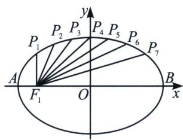

解析 设 $P_{i}(x_{i}, y_{i})$ ，有 $x_{k} = -x_{8-k}(i, k=1, 2, 3, 4, 5, 6, 7)$ ，则 $\left|P_{i}F_{1}\right| = a + ex_{i}$ （椭圆的焦半径公式），由题意可得 $\{a_{n}\}$ 为等差数列， $S_{7} = a_{1} + a_{2} + \cdots + a_{7} = 7a + e(x_{1} + \cdots + x_{7}) = 7a$ ，由题意 $P_{1}, P_{2}, \cdots P_{7}$ 的横坐标把 AB 八等分，所以 $x_{7} = \frac{3}{4}a, a_{7} = a + ex_{7} = a + \frac{3}{4}c$ ，又因为 $a + 64c = 4ac$ ，所以 $\frac{16}{a} + \frac{1}{4c} = 1$ ，
所以 $S_{7} + a_{7} - 128 = 8a + \frac{3}{4} c - 128 = \left(8a + \frac{3}{4} c\right)\left(\frac{16}{a} +\frac{1}{4c}\right) - 128 = 128 + \frac{3}{16} +\frac{12c}{a} +\frac{2a}{c} -128 = \frac{3}{16} +\frac{12c}{a} +\frac{2a}{c}$
$\geqslant\frac{3}{16}+2\sqrt{12\times2}=\frac{3}{16}+4\sqrt{6}$ ，当且仅当 $\frac{12c}{a}=\frac{2a}{c}$ ，即 $a=\sqrt{6}c$ 时取等号，即椭圆的离心率 $e=\frac{c}{a}=\frac{\sqrt{6}}{6}$ ，故答案为： $\frac{\sqrt{6}}{6}$ .

### 三、第二定义与 $|PF_1| \cdot |PF_2|$ 相关的结论

1. 设 $F_{1} 、 F_{2}$ 是椭圆 $\frac{x^{2}}{a^{2}} + \frac{y^{2}}{b^{2}} = 1 (a > b > 0)$ 的两个焦点， $O$ 是椭圆的中心， $P$ 是椭圆上任意一点， $\angle F_{1}PF_{2} = \theta$ ，则 $|PF_{1}| \cdot |PF_{2}| = a^{2} + b^{2} - |OP|^{2} = \frac{2b^{2}}{1 + \cos\theta}$ .
证明：解法一（中线定理） $2|OP|^2 + 2c^2 = |PF_1|^2 + |PF_2|^2 = (|PF_1| + |PF_2|)^2 - 2|PF_1| \cdot |PF_2|$ ，整理得 $|PF_1| \cdot |PF_2| = a^2 + b^2 - |OP|^2$ 。 $S_{PF_1F_2} = \frac{1}{2}|PF_1||PF_2|\sin \theta = \frac{1}{4}[(|PF_1| + |PF_2|)^2 - |F_1F_2|^2]$ $\frac{\sin \theta}{1 + \cos \theta}$ ，故 $|PF_1| \cdot |PF_2| = \frac{2b^2}{1 + \cos \theta}$ ;
解法二(焦半径) $\left|PF_{1}\right|\cdot\left|PF_{2}\right|=(a+ex_{0})(a-ex_{0})=a^{2}-\frac{a^{2}-b^{2}}{a^{2}}x_{0}^{2}=a^{2}+b^{2}-\left|OP\right|^{2}$

2. 设 $F_{1} 、 F_{2}$ 是双曲线 $\frac{x^{2}}{a^{2}} - \frac{y^{2}}{b^{2}} = 1 (a > 0, b > 0)$ 的两个焦点， $O$ 是双曲线的中心， $P$ 是双曲线上任意一点， $\angle F_{1}PF_{2} = \theta$ ，则 $|PF_{1}| \cdot |PF_{2}| = b^{2} - a^{2} + |OP|^{2} = \frac{2b^{2}}{1 - \cos\theta}$ .
证明：解法一（中线定理）2 $|OP|^{2}+2c^{2}=|PF_{1}|^{2}+|PF_{2}|^{2}=(|PF_{1}|-|PF_{2}|)^{2}+2|PF_{1}|\cdot|PF_{2}|$ ，整理得 $|PF_{1}|\cdot|PF_{2}|=b^{2}-a^{2}+|OP|^{2}$ ， $S_{PF_{1}F_{2}}=\frac{1}{2}|PF_{1}||PF_{2}|\sin\theta=\frac{1}{4}[-(|PF_{1}|-|PF_{2}|)^{2}+|F_{1}F_{2}|^{2}]\frac{\sin\theta}{1-\cos\theta}$ ，故 $|PF_{1}|\cdot|PF_{2}|=\frac{2b^{2}}{1-\cos\theta}$ ;
解法二(焦半径) $\left|PF_{1}\right|\cdot\left|PF_{2}\right|=-a^{2}+\frac{a^{2}+b^{2}}{a^{2}}x_{0}^{2}=-a^{2}+b^{2}+\left|OP\right|^{2}$

3. 等轴双曲线满足： $|PO|^{2}=|PF_{1}|\cdot|PF_{2}|$ ;
证明：由于等轴双曲线满足 $a = b$ ，所以 $\left|PF_1\right|\cdot \left|PF_2\right| = b^2 -a^2 +\left|OP\right|^2 = \left|OP\right|^2.$

> [!example]- 例6 (2023·甲卷)已知椭圆 $\frac{x^2}{9} + \frac{y^2}{6} = 1, F_1, F_2$ 为两个焦点， $O$ 为原点， $P$ 为椭圆上一点， $\cos \angle F_1PF_2 = \frac{3}{5}$ ，则 $|PO| =$ （）
A. $\frac{2}{5}$

B. $\frac{\sqrt{30}}{2}$

C. $\frac{3}{5}$

D. $\frac{\sqrt{35}}{2}$
解析 解法一：设 $|PF_1| = m$ ， $|PF_2| = n$ ，不妨 $m > n$ ，可得 $m + n = 6$ ， $4c^2 = m^2 + n^2 - 2mn\cos \angle F_1PF_2$ ，即 $12 = m^2 + n^2 - \frac{6}{5}mn$ ，可得 $mn = \frac{15}{2}$ ， $m^2 + n^2 = 21$ ， $\overrightarrow{PO} = \frac{1}{2} (\overrightarrow{PF_1} + \overrightarrow{PF_2})$ ，可得 $|PO|^2 = \frac{1}{4} (\overrightarrow{PF_1^2} + \overrightarrow{PF_2^2} + 2\overrightarrow{PF_1} \cdot \overrightarrow{PF_2}) = \frac{1}{4} (m^2 + n^2 + 2mn\cos \angle F_1PF_2) = \frac{1}{4} (m^2 + n^2 + \frac{6}{5}mn) = \frac{1}{4}(21 + \frac{6}{5} \times \frac{15}{2}) = \frac{15}{2}$ . 可得 $|PO| = \frac{\sqrt{30}}{2}$ .
解法二：利用焦半径公式， $\left|PF_{1}\right|=a+ex_{0}$ ， $\left|PF_{2}\right|=a-ex_{0}$ ， $\left|OP\right|^{2}=x_{0}^{2}+y_{0}^{2}=x_{0}^{2}+b^{2}-\frac{b^{2}}{a^{2}}x_{0}^{2}$
$\left|PF_{1}\right|\cdot\left|PF_{2}\right|=(a+ex_{0})(a-ex_{0})=a^{2}-\frac{c^{2}}{a^{2}}x_{0}{}^{2}=a^{2}-\left(1-\frac{b^{2}}{a^{2}}\right)x_{0}{}^{2}=a^{2}+b^{2}-\left|OP\right|^{2}$ ，利用等面积法， $S_{\triangle PF_{1}F_{2}}=\frac{1}{2}\left|PF_{1}\right|\left|PF_{2}\right|\sin\theta=b^{2}\frac{\sin\theta}{1+\cos\theta}$ ，故 $\left|PF_{1}\right|\cdot\left|PF_{2}\right|=\frac{2b^{2}}{1+\cos\theta}=a^{2}+b^{2}-\left|OP\right|^{2}$ ，即 $\left|OP\right|^{2}=a^{2}+b^{2}-\frac{2b^{2}}{1+\cos\theta}=\frac{15}{2}$ 故选 B.

> [!example]- 例7 (2024·浙江模拟)设 O 为原点， $F_{1}$ ， $F_{2}$ 为双曲线 C: $\frac{x^{2}}{a^{2}} - \frac{y^{2}}{b^{2}} = 1 (a > 0, b > 0)$ 的两个焦点，点 P 在 C 上且满足 $|OP| = \frac{3}{2} a$ ， $\cos \angle F_{1} PF_{2} = \frac{3}{7}$ ，则该双曲线的渐近线方程为 ( )
A. $\sqrt{2} x \pm y = 0$

B. $x \pm \sqrt{2} y = 0$

C. $\sqrt{3} x \pm y = 0$

D. $x \pm \sqrt{3} y = 0$
解析 $|PF_{1}| |PF_{2}| = b^{2} - a^{2} + |OP|^{2} = \frac{2b^{2}}{1 - \cos\theta}$ , 故 $b^{2} + \frac{5}{4}a^{2} = \frac{7}{2}b^{2}$ , 所以 $a = \sqrt{2}b$ , 所以渐近线方程为 $x \pm \sqrt{2}y = 0$ . 故选 B.

> [!example]- 例8 (2024·德阳模拟)设 $F_{1}$ 、 $F_{2}$ 是双曲线 $C: \frac{x^{2}}{a^{2}} - \frac{y^{2}}{b^{2}} = 1 (a > 0, b > 0)$ 的左、右焦点， $O$ 是坐标原点，点 $P$ 是 $C$ 上异于实轴端点的任意一点，若 $|PF_{1}| \cdot |PF_{2}| - |OP|^{2} = 2a^{2}$ ，则 $C$ 的离心率为 （）
A. $\sqrt{3}$

B. $\sqrt{2}$

C. 3

D. 2

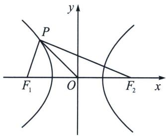

解析 如图， $\left|PF_{1}\right|\left|PF_{2}\right|=b^{2}-a^{2}+\left|OP\right|^{2}=2a^{2}+\left|OP\right|^{2}$ ，所以 $c^{2}=4a^{2}$ ， $e=\frac{c}{a}=2$ 。故选 D.
接下来我们利用 $\left|PF_{1}\right|\cdot\left|PF_{2}\right|=\left|OP\right|^{2}$ 来构造等轴双曲线解题.

> [!example]- 例9 (2022·舒城县三模)已知椭圆 $C: \frac{x^2}{a^2} + \frac{y^2}{b^2} = 1 (a > b > 0)$ 的焦点为 $F_1, F_2$ , 若点 $P$ 在椭圆上, 且满足 $|PO|^2 = |PF_1| \cdot |PF_2|$ (其中 $O$ 为坐标原点)的 $P$ 的个数
A. 0

B. 2

C. 4

D. 8
解析 设 $P(x_0, y_0)$ , 则 $\frac{x_0^2}{a^2} + \frac{y_0^2}{b^2} = 1$ , 由椭圆的第二定义可知 $|PF_1| = a - ex_0$ , $|PF_2| = a + ex_0$ ,
所以 $\left|PF_{1}\right|\cdot\left|PF_{2}\right|=a^{2}-e^{2}x_{0}^{2}$ ，而 $\left|PO\right|^{2}=\left|PF_{1}\right|\cdot\left|PF_{2}\right|$ ，所以 $x_{0}^{2}+y_{0}^{2}=a^{2}-e^{2}x_{0}^{2}$
即 $x_0^2 + b^2\left(1 - \frac{x_0^2}{a^2}\right) = a^2 - e^2 x_0^2$ ，而 $e^2 = 1 - \frac{b^2}{a^2}$ ，解得 $x_0 = \pm \frac{\sqrt{2}a}{2}$ ，所以满足条件的 $P$ 点有 4 个，

本题也可以理解为一个椭圆与一个等轴双曲线共焦点时，椭圆与双曲线有4个交点，即可秒判。故选C.

> [!example]- 例10 椭圆 $\frac{x^{2}}{4}+\frac{y^{2}}{2}=1$ 的长轴的顶点为 $A_{1}$ 、 $A_{2}$ ，动点P在椭圆内，且 $\left|PA_{1}\right|\cdot\left|PA_{2}\right|=\left|PO\right|^{2}$ ，则 $\overrightarrow{PA_{1}}\cdot\overrightarrow{PA_{2}}$ 的取值范围是\_\_\_\_.
解析 $A_{1}(-2,0), A_{2}(2,0)$ , 设 $P(x,y)$ , 由 $|PA_{1}| \cdot |PA_{2}| = |PO|^{2}$ 可得点 $P$ 的轨迹方程为 $x^{2}$ $-y^{2} = 2$ ，由于 $\frac{x^2}{4} +\frac{y^2}{2} < 1$ ，即 $y^{2} <   \frac{2}{3}$ ，故 $\overrightarrow{PA_1}\cdot \overrightarrow{PA_2} = (x + 2)(x - 2) + y^2 = x^2 +y^2 -4 = 2y^2 -2\in$ $\left[-2, - \frac{8}{3}\right)$ .故答案为 $\left[-2, - \frac{8}{3}\right)$

> [!example]- 例11 已知点 $P$ 是双曲线 $\frac{x^2}{a^2} - \frac{y^2}{b^2} = 1 (a > 0, b > 0)$ 上的动点, $F_1$ 、 $F_2$ 是其左、右焦点, $O$ 坐标原点, 若存在四个点 $P$ 满足 $\frac{|PF_1| + |PF_2|}{|OP|} = \sqrt{6}$ , 则此双曲线的离心率取值范围 \_\_\_\_.
解析 由于 $|PF_{1}| \cdot |PF_{2}| = b^{2} - a^{2} + |OP|^{2}$ , $\left(\frac{|PF_{1}| + |PF_{2}|}{|OP|}\right)^{2} = 6$ 中, 有两个关于 $|OP|$ 的解,
即 $\frac{(|PF_1| - |PF_2|)^2 + 4|PF_1|\cdot|PF_2|}{|OP|^2} = \frac{4a^2 + 4(b^2 - a^2 + |OP|^2)}{|OP|^2} = 4 + \frac{4b^2}{|OP|^2} = 6$ 有两解，所以 $|OP|^2 = 2b^2$ 有两解，由于 $|OP|^2 > a^2$ ，所以 $2b^2 > a^2$ ，即 $e > \frac{\sqrt{6}}{2}$ ，故答案为 $\left(\frac{\sqrt{6}}{2}, +\infty\right)$ .

### 四、双曲线倍角定理

> [!example]- 例12 (2023·多选·菏泽一模)已知双曲线 $E: x^{2} - \frac{y^{2}}{3} = 1$ 的左、右焦点分别为 $F_{1}, F_{2}$ , 过点 $C\left(1, \frac{\sqrt{3}}{2}\right)$ 的直线 $l$ 与双曲线 $E$ 的左、右两支分别交于 $P, Q$ 两点, 下列命题正确的有 ( )
A. 当点 C 为线段 PQ 的中点时，直线 l 的斜率为 $\sqrt{3}$   
B. 若 $A(-1,0)$ ，则 $\angle QF_{2}A=2\angle QAF_{2}$   
C. $\left|PF_{1}\right|\cdot\left|PF_{2}\right|>\left|PO\right|^{2}$   
D. 若直线 $l$ 的斜率为 $\frac{2\sqrt{3}}{3}$ , 且 $B(0, \sqrt{3})$ , 则 $|PF_1| + |QF_1| = |PB| + |QB|$
解析 对于选项 A: 利用点差法可知 $k_{PQ} \cdot k_{OC} = \frac{b^{2}}{a^{2}} = 3$ ，由于 $k_{OC} = \frac{\sqrt{3}}{2}$ ，所以 $k_{PQ} = 2\sqrt{3}$ ，故 A 错误；
对于选项B：设 $Q(x_0, y_0)$ ，因为 $\tan \angle QF_2A = -\frac{y_0}{x_0 - 2}$ ， $\tan \angle QAF_2 = \frac{y_0}{x_0 + 1}$ ，所以 $\tan 2\angle QAF_2 = \frac{2 \cdot \frac{y_0}{x_0 + 1}}{1 - \left(\frac{y_0}{x_0 + 1}\right)^2} = -\frac{y_0}{x_0 - 2}$ ，所以 $\tan \angle QF_2A = \tan 2\angle QAF_2$ ，又因为 $\angle QF_2A$ ， $\angle QAF_2 \in (0, \pi)$ ，所以 $\angle QF_2A = 2\angle QAF_2$ ，故B正确；
对于选项 C: $\left|PF_{1}\right|\left|PF_{2}\right|=b^{2}-a^{2}+\left|PO\right|^{2}=2+\left|PO\right|^{2}$ ，所以 $\left|PO\right|^{2}<\left|PF_{1}\right|\cdot\left|PF_{2}\right|$ ，故 C 正确；
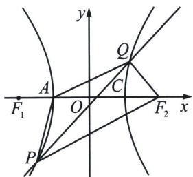

对于选项D：因为 $|PF_{2}| - |PF_{1}| = 2a$ ， $|QF_{1}| - |QF_{2}| = 2a$ ，所以 $|PF_{1}| = |PF_{2}| - 2a$ ， $|QF_{1}| = 2a + |QF_{2}|$ ，所以 $|PF_{1}| + |QF_{1}| = |PF_{2}| - 2a + 2a + |QF_{2}| = |PF_{2}| + |QF_{2}|$ ，因为直线 $l$ 的斜率为 $\frac{2\sqrt{3}}{3}$ 即
$k_{PQ}=\frac{2\sqrt{3}}{3}$ ，且过点 $C\left(1,\frac{\sqrt{3}}{2}\right)$ ，所以直线l的方程为： $2x-\sqrt{3}y-\frac{1}{2}=0$ ，又因为 $B(0,\sqrt{3})$ ， $F_{2}(2,0)$ ，所以 $k_{BF_{2}}=-\frac{\sqrt{3}}{2}$ 所以 $k_{PQ}\cdot k_{BF_{2}}=\frac{2\sqrt{3}}{3}\times\left(-\frac{\sqrt{3}}{2}\right)=-1$ ，即 $BF_{2}\perp PQ$ ，且 $BF_{2}$ 中点 $\left(\frac{0+2}{2},\frac{\sqrt{3}+0}{2}\right)$ ，恰好是C点，所以点B与点 $F_{2}$ 关于直线l对称，所以 $|PB|+|QB|=|PF_{2}|+|QF_{2}|$ ，所以 $|PF_{1}|+|QF_{1}|=|PB|+|QB|$ ，故D正确；故选BCD.

注意 关于 B 选项，是一个隐藏的二级结论，除了本题给到的解析方法，还可以涉及倍角三角形证明，利用椭圆第二定义，只需证明 $\left|QA\right|^{2}=\left|QF_{2}\right|\cdot\left(\left|QF_{2}\right|+\left|AF_{2}\right|\right)$ 即可，证明比本题解析相对复杂，一般不采用.

> [!example]- 例13（2024·多选·广州二模）已知双曲线 $C: x^{2} - \frac{y^{2}}{3} = 1$ 的左、右焦点分别为 $F_{1}, F_{2}$ ，左顶点为 $A_{1}$ ，点 $P$ 是 $C$ 的右支上一点，则 （）
A. $\left|PF_{1}\right|^{2}-\left|PF_{2}\right|^{2}$ 的最小值为 8  
B. 若直线 $PF_{2}$ 与 C 交于另一点 Q，则 $|PQ|$ 的最小值为 6  
C. $\left|PF_{1}\right|\cdot\left|PF_{2}\right|-\left|OP\right|^{2}$ 为定值  
D. 若 I 为 $\triangle PA_{1}F_{2}$ 的内心，则 $\left|IF_{1}\right| - \left|IF_{2}\right|$ 为定值
解析 对于 A, $\left|PF_{1}\right|^{2}-\left|PF_{2}\right|^{2}=(PF_{1}+PF_{2})(PF_{1}-PF_{2})=2(PF_{1}+PF_{2})\geqslant2F_{1}F_{2}=8$ , A 正确;
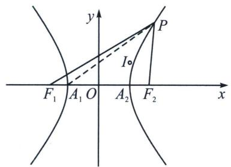

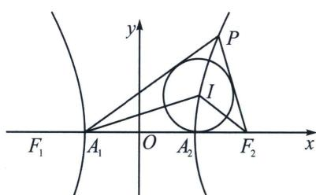

对于 B，若 P 为双曲线的右顶点 $A_{2}$ ，则 $\left|PQ\right|=A_{1}A_{2}=2<6$ ，B 错；
对于 C， $\left|PF_{1}\right|\left|PF_{2}\right|=b^{2}-a^{2}+\left|OP\right|^{2}\Rightarrow\left|PF_{1}\right|\left|PF_{2}\right|-\left|OP\right|^{2}=b^{2}-a^{2}=2$ 为定值，C 正确；
对于 D，设 $I(x, y)$ ， $A_{1}(-1, 0)$ ， $F_{2}(2, 0)$ ，设 $P(x_{0}, y_{0})$ ，因为 $\tan\angle PF_{2}A_{1}=-\frac{y_{0}}{x_{0}-2}$ ， $\tan\angle PA_{1}F_{2}=\frac{y_{0}}{x_{0}+1}$ ，所以 $\tan2\angle PA_{1}F_{2}=\frac{2\cdot\frac{y_{0}}{x_{0}+1}}{1-\left(\frac{y_{0}}{x_{0}+1}\right)^{2}}=-\frac{y_{0}}{x_{0}-2}$ ，所以 $\tan\angle PF_{2}A_{1}=\tan2\angle PA_{1}F_{2}$ ， $\angle PF_{2}A_{1}=2\angle PA_{1}F_{2}$ ，由于 I 为 $\triangle PA_{1}F_{2}$ 的内心，故 $\angle IF_{2}A_{1}=2\angle IA_{1}F_{2}$ ，设 $I(x_{1}, y_{1})$ ，则 $-\frac{y_{1}}{x_{1}-2}=\frac{2\frac{y_{1}}{x_{1}+1}}{1-\left(\frac{y_{1}}{x_{1}+1}\right)^{2}}$ ，则 $P(x_{0}, y_{0})$ 与 $I(x_{1}, y_{1})$ 均在同构方程 $-\frac{y}{x-2}=\frac{2\frac{y}{x+1}}{1-\left(\frac{y}{x+1}\right)^{2}}$ 上，即满足 $x^{2}-\frac{y^{2}}{3}=1$ ，即在双曲线 $x^{2}-\frac{y^{2}}{3}=1$ 上， $|IF_{1}|-|IF_{2}|=2$ 为定值，D 正确。故选 ACD。

> [!example]- 例14（2025年福建省厦门市高考数学第二次质检18题(25陪跑课学员博方提问))已知双曲线 $C: \frac{x^2}{a^2}$ $\frac{y^2}{b^2} = 1 (a > 0, b > 0)$ 的左、右顶点分别为 $A_1, A_2$ ，过 $C$ 的右焦点 $F(2, 0)$ 的直线 $l$ 与 $C$ 的右支交于 $P$ ， $Q$ 两点。当 $l$ 与 $x$ 轴垂直时， $\angle PA_1 F = \frac{\pi}{4}$ 。  
（1）求 C 的方程;  
（2） 直线 $A_{1}P$ ， $A_{1}Q$ 与直线 x=1 的交点分别为 M，N，E 为 $A_{2}M$ 的中点.

(i) 求 $\left| MN \right|$ 的最小值；
(ii) 证明：点 $A_{2}$ 关于直线 $EF$ 对称的点在 $l$ 上.
解析 （1）因为 $C: \frac{x^2}{a^2} - \frac{y^2}{b^2} = 1$ ，令 $x = c$ ，可得 $y = \pm \frac{b^2}{a}$ ，因此当 $l$ 与 $x$ 轴垂直时， $|PF| = \frac{b^2}{a}$ 。根据 $\angle PA_1F = \frac{\pi}{4}$ ，可得 $|A_1F| = |PF|$ ，所以 $a + c = \frac{b^2}{a} = \frac{c^2 - a^2}{a}$ ，因此 $c = 2a$ ，因为 $F(2,0)$ ，所以 $c = 2, a = 1, b = \sqrt{4 - 1} = \sqrt{3}$ ，因此 $C: x^2 - \frac{y^2}{3} = 1$ 。  
（2）如图, 易知 $k_{A_1P} k_{A_1Q} =$ 定值 (顶点角 + 第三条边为轴点弦), 采用齐次化证明, 将双曲线按照向量 $\overrightarrow{A_1O}$ : (1, 0)

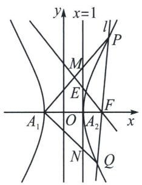

平移， $(x - 1)^2 - \frac{y^2}{3} = 1$ ，即 $x^2 - \frac{y^2}{3} - 2x = 0$ ，令 $P \to P'$ ， $Q \to Q'$ ， $P'Q'$ 过(3,0)所以 $P'Q'$ ： $\frac{x}{3} + ny = 1$ ，联立得： $x^2 - \frac{y^2}{3} - 2x\left(\frac{x}{3} + ny\right) = 0$ ，当 $x \neq 0$ ，同除以 $x^2$ ， $-\frac{1}{3}\frac{y^2}{x^2} - 2n\frac{y}{x} + \frac{1}{3} = 0$ ， $k_1k_2 = k_{A_1P}k_{A_1Q} = -1$ ，
所以 $\frac{y_M}{2} \cdot \frac{y_N}{2} = -1$ ，所以 $y_M y_N = -4$ ， $|MN| = |y_M - y_N| = \left|y_M + \frac{4}{y_M}\right| \geqslant 4$ ，当且仅当 $|y_M| = 2$ 时等号成立.

（ii）本题由于是离心率为2的双曲线，故一定隐藏一个二倍角模型，即 $\angle PFA_{1} = 2\angle PA_{1}F$ ，要证明点 $A_{2}$ 关于直线 $EF$ 对称的点在 $l$ 上，只需证 $k_{A_1P} = -k_{EF}$ 即可；
先证明 $\angle PFA_{1} = 2\angle PA_{1}F$ ，设 $P(x_0,y_0)$ ，因为 $\tan \angle PFA = -\frac{y_0}{x_0 - 2},\tan \angle PA_1F = \frac{y_0}{x_0 + 1}$ 所以 $\tan 2$ $\angle PA_{1}F = \frac{2\cdot\frac{y_{0}}{x_{0} + 1}}{1 - \left(\frac{y_{0}}{x_{0} + 1}\right)^{2}} = -\frac{y_{0}}{x_{0} - 2}$ ，所以 $\tan \angle PFA_{1} = \tan 2\angle PA_{1}F$ ，由于 $E$ 为 $A_{2}M$ 中点， $\frac{|A_1A_2|}{|A_2F|} =$ $\frac{|A_2M|}{|A_2E|} = 2$ ，所以 $\angle A_{1}A_{2}M = \angle A_{2}A_{1}M = \angle MFP$ ，故点 $A_{2}$ 关于直线 $EF$ 对称的点在 $l$ 上.

> [!example]- 例15（2025临考猜题卷19题(25陪跑课学员刘自豪提问))已知双曲线 $C: \frac{x^2}{a^2} - \frac{y^2}{b^2} = 1 (a0, b > 0)$ 的左、右焦点分别为 $F_1, F_2$ ，左顶点为 $A$ ，且 $|F_1F_2| = 4, |AF_2| = 3|AF_1|$ .  
（1）求双曲线 C 的方程;  
（2） 过点 $F_{2}$ 作直线 $l$ , 与 $C$ 的右支交于 $M, N$ 两点, 求 $\triangle MNF_{1}$ 周长的最小值;  
（3）已知点 $Q\left(\frac{1}{2}, \frac{3}{2}k\right)$ ，直线 AQ 与 C 的右支交于点 P，过点 $F_{1}$ 作 $F_{1}E // QF_{2}$ ，交直线 $PF_{2}$ 于点 E，证明：点 E 在定圆上。
解析 （1） $x^{2} - \frac{y}{3} = 1$  
（2）利用焦长公式(证明省略) $|MN|=\frac{2ab^{2}}{a^{2}-c^{2}\cos^{2}\alpha}=\frac{6}{1-2\cos^{2}\alpha}(1-2\cos^{2}\alpha>0)$ ，所以 $|MN|_{\min}=6$ ，故 $C_{\triangle MNF_{1}}=|MN|+4a\geqslant10;$

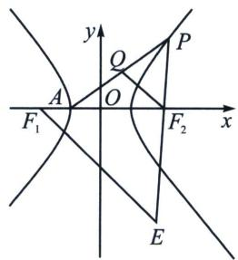  
（3）又是离心率为2的隐藏二倍角模型，如图，先证明 $\angle PF_{2}A = 2\angle PAF_{2}$ ，设 $P(x_0, y_0)$ ，因为 $\tan \angle PF_{2}A = -\frac{y_0}{x_0 - 2}$ ， $\tan \angle PAF_{2} = \frac{y_0}{x_0 + 1}$ ，所以 $\tan 2\angle PAF_{2} = \frac{2 \cdot \frac{y_0}{x_0 + 1}}{1 - \left(\frac{y_0}{x_0 + 1}\right)^2} = -\frac{y_0}{x_0 - 2}$ ，所以 $\tan \angle PF_{2}A = \tan 2\angle PAF_{2}$ ， $k_{AQ} = \frac{\frac{3}{2}k}{\frac{3}{2}} = k$ ， $k_{QF_2} = \frac{\frac{3}{2}k}{-\frac{3}{2}} = -k$ ，所以 $\angle AF_{2}Q = \angle F_{2}AQ = \angle QF_{2}P$ ，所以 $\angle AF_{2}P = 2\angle F_{2}F_{1}E$ ，即 $\angle F_{2}F_{1}E = \angle F_{1}EF_{2}$ ，所以 $|F_{1}F_{2}| = |EF_{2}| = 4$ ，所以 $E$ 在以 $F_{2}$ 为圆心，4为半径的圆上.

# 第三节 椭圆双曲的斜率转化（第三定义）

### 一、椭圆第三定义关于“积”

第三定义通常作为性质来考查使用，故我们以介绍性质为主.

已知关于原点对称的两个定点, 那么到这两定点连线的斜率之积为定值 $-\frac{b^{2}}{a^{2}}$ 或 $e^{2}-1 (0 < e < 1)$ 的点的轨迹是椭圆, 通常这两个定点分别为长轴或者短轴顶点.
另一方面，设 $M(x, y)$ 是椭圆上任意一点，两个定点为 $A_{1}(x_{1}, y_{1})$ 、 $A_{2}(-x_{1}, -y_{1})$ ，常数 $e=\frac{c}{a}$ ， $k_{MA_{1}}\cdot k_{MA_{2}}=\frac{y-y_{1}}{x-x_{1}}\cdot\frac{y+y_{1}}{x+x_{1}}=\frac{y^{2}-y_{1}^{2}}{x^{2}-x_{1}^{2}}$ ，根据椭圆方程，将 $\frac{x^{2}}{a^{2}}+\frac{y^{2}}{b^{2}}=1(a>b>0)$ 变形成 $y^{2}=b^{2}-\frac{b^{2}x^{2}}{a^{2}}$ ，所以 $k_{MA_{1}}\cdot k_{MA_{2}}=-\frac{b^{2}}{a^{2}}$ ，椭圆上动点到关于原点对称的两个定点的连线的斜率之积等于常数.

注意 本结论也可以用点差法证明.
若椭圆与直线 l 交于 AB 两点，其中 $A(x_{1}, y_{1})$ ， $B(x_{2}, y_{2})$ ， $M(x_{0}, y_{0})$ 为 AB 中点， $k_{AB} \cdot k_{OM} = -\frac{b^{2}}{a^{2}}$ 证明：设 $A(x_{1}, y_{1})$ ， $B(x_{2}, y_{2})$ ， $M(x_{0}, y_{0})$ ，则

椭圆： $\left\{ \begin{array}{l} \frac{x_1^2}{a^2} +\frac{y_1^2}{b^2} = 1①\\ \frac{x_2^2}{a^2} +\frac{y_2^2}{b^2} = 1②\\ \frac{x_1 + x_2}{2} = x_0③ \\ \frac{y_1 + y_2}{2} = y_0④\\ k_{AB} = \frac{y_2 - y_1}{x_2 - x_1} ⑤ \end{array} \right.$ 并将 $③④⑤$ 代入得： $k_{AB}\cdot k_{OM} = \frac{y_1 - y_2}{x_1 - x_2}\cdot \frac{y_1 + y_2}{x_1 + x_2} = \frac{y_1 - y_2}{x_1 - x_2}\cdot \frac{y_0}{x_0} = -\frac{b^2}{a^2},$

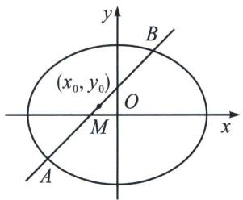

> [!example]- 例1 (2022·甲卷)椭圆 $C: \frac{x^{2}}{a^{2}} + \frac{y^{2}}{b^{2}} = 1 (a > b > 0)$ 的左顶点为 $A$ , 点 $P, Q$ 均在 $C$ 上, 且关于 $y$ 轴对称. 若直线 $AP, AQ$ 的斜率之积为 $\frac{1}{4}$ , 则 $C$ 的离心率为
A. $\frac{\sqrt{3}}{2}$

B. $\frac{\sqrt{2}}{2}$

C. $\frac{1}{2}$

D. $\frac{1}{3}$
解析 已知 $A(-a,0)$ ，设 $P(x_{0},y_{0})$ ，则 $Q(-x_{0},y_{0})$ ， $k_{AP}=\frac{y_{0}}{x_{0}+a}$ ， $k_{AQ}=\frac{y_{0}}{a-x_{0}}$ ，
故 $k_{AP} \cdot k_{AQ} = \frac{y_0}{x_0 + a} \cdot \frac{y_0}{a - x_0} = \frac{y_0^2}{a^2 - x_0^2} = \frac{1}{4}$ ①，因为 $\frac{x_0^2}{a^2} + \frac{y_0^2}{b^2} = 1$ ，即 $y_0^2 = \frac{b^2(a^2 - x_0^2)}{a^2}$ ②，

②代入①整理得： $\frac{b^{2}}{a^{2}}=\frac{1}{4}$ ， $e=\frac{c}{a}=\sqrt{1-\frac{b^{2}}{a^{2}}}=\frac{\sqrt{3}}{2}$ ．故选A.

> [!example]- 例2 (2022·新高考Ⅱ)已知直线 $l$ 与椭圆 $\frac{x^{2}}{6}+\frac{y^{2}}{3}=1$ 在第一象限交于 $A, B$ 两点， $l$ 与 $x$ 轴、 $y$ 轴分别相交于 $M, N$ 两点，且 $|MA|=|NB|$ ， $|MN|=2\sqrt{3}$ ，则 $l$ 的方程为 \_\_\_\_.
解析 设 $A(x_{1}, y_{1}), B(x_{2}, y_{2})$ ，线段 $AB$ 的中点为 $E$ ，由 $\frac{x_{1}^{2}}{6} + \frac{y_{1}^{2}}{3} = 1, \frac{x_{2}^{2}}{6} + \frac{y_{2}^{2}}{3} = 1,$

相减可得： $\frac{y_{2}^{2}-y_{1}^{2}}{x_{2}^{2}-x_{1}^{2}}=-\frac{1}{2}$ ，则 $k_{OE}\cdot k_{AB}=\frac{y_{1}+y_{2}}{x_{1}+x_{2}}\cdot\frac{y_{2}-y_{1}}{x_{2}-x_{1}}=\frac{y_{2}^{2}-y_{1}^{2}}{x_{2}^{2}-x_{1}^{2}}=-\frac{1}{2}$
解法一: 设直线 $l$ 的方程为: $y = kx + m, k < 0, m > 0, M\left(-\frac{m}{k}, 0\right), N(0, m)$ , 所以 $E\left(-\frac{m}{2k}, \frac{m}{2}\right)$ , 所以 $k_{OE} = -k$ , 所以 $-k \cdot k = -\frac{1}{2}$ , 解得 $k = -\frac{\sqrt{2}}{2}$ , 因为 $|MN| = 2\sqrt{3}$ , 所以 $\sqrt{\frac{m^2}{k^2} + m^2} = 2\sqrt{3}$ , 化为: $\frac{m^2}{k^2} + m^2 = 12$ . 所以 $3m^2 = 12, m > 0$ , 解得 $m = 2$ . 所以 $l$ 的方程为 $y = -\frac{\sqrt{2}}{2}x + 2$ , 即 $x + \sqrt{2}y - 2\sqrt{2} = 0$ ,
解法二：利用直角三角形 OMN 斜边中线 $\left|OE\right|=\frac{1}{2}\left|MN\right|=\sqrt{3}$ ，且 $k_{OE}=-k_{AB}$ ，利用 $k_{OE}\cdot k_{AB}=-\frac{1}{2}$ ，得 $k_{AB}=-\frac{\sqrt{2}}{2}$ ，所以 $x_{E}^{2}+\left(\frac{\sqrt{2}}{2}x_{E}\right)^{2}=3$ ，解得： $E(\sqrt{2},1)$ ，所以 l 的方程为 $y-1=-\frac{\sqrt{2}}{2}(x-\sqrt{2})$ ，即 $x+\sqrt{2}y-2\sqrt{2}=0$ ，故答案为 $x+\sqrt{2}y-2\sqrt{2}=0$ 。

> [!example]- 例3 (2025·重庆九龙坡·三模 T11) 在平面直角坐标系 $xOy$ 中, 点 $F_{1}$ 是椭圆 $E: \frac{x^{2}}{4} + y^{2} = 1$ 的左焦点, $A, B$ 分别是 $E$ 的左、右顶点, 直线 $l$ 与椭圆 $E$ 相交于 $M, N$ 两点, 则 ( )
A. 若直线 l 经过点 $F_{1}$ ，则 $|MN|$ 的最小值为 1  
B. 若线段 $MN$ 的中点坐标为 $\left(1, \frac{1}{2}\right)$ , 则直线 $l$ 的斜率为 $-\frac{1}{4}$   
C. 若直线 l 经过坐标原点，则 $\frac{1}{|MF_{1}|} + \frac{9}{|NF_{1}|} \geqslant 4$

D. 若点 $P$ 在椭圆 $E$ 上 (点 $P$ 与 $A, B$ 不重合), 且 $\angle PBA = 2\angle PAB$ , 则 $\tan \angle APB = -\frac{13}{9}$
解析 对 A，过左焦点的弦长最小值为通径长， $|MN|=2\frac{b^{2}}{a}=1$ ，故 A 正确；
对B，设 $M(x_{1},y_{1})$ ， $N(x_{2},y_{2})$ ， $M$ ， $N$ 在椭圆上，则 $\frac{x_1^2}{4} +y_1^2 = 1$ ， $\frac{x_2^2}{4} +y_2^2 = 1$ ，两式相减得 $\frac{(x_1 - x_2)(x_1 + x_2)}{4} +(y_1 - y_2)(y_1 + y_2) = 0$ ，因为MN的中点坐标为 $P\left(1,\frac{1}{2}\right)$ ，所以 $x_{1} + x_{2} = 2$ ， $y_{1} + y_{2} = 1$
所以 $\frac{(y_1 - y_2)}{(x_1 - x_2)} = -\frac{(x_1 + x_2)}{4(y_1 + y_2)} = -\frac{2}{4} = -\frac{1}{2}$ ，也可以直接利用第三定义 $k_{MN}k_{OP} = -\frac{b^2}{a^2}$ 直接判断，故B错误；
对 C， $\frac{1}{|MF_{1}|}+\frac{9}{|NF_{1}|}=\frac{1}{4}\left(|MF_{1}|+|NF_{1}|\right)\left(\frac{1}{|MF_{1}|}+\frac{9}{|NF_{1}|}\right)\geqslant\frac{1}{4}\left(\sqrt{1}+\sqrt{9}\right)^{2}=4$ （柯西不等式），
当且仅当 $\frac{|NF_1|}{|MF_1|} = \frac{9|MF_1|}{|NF_1|}$ ， $|NF_{1}| = 3|MF_{1}| = 3$ ，故C正确；
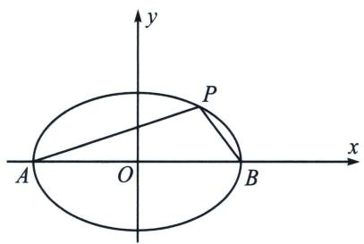

对D，根据对称性不妨取点 $P$ 在第一象限， $k_{1} = \tan \angle PAB > 0$ ， $k_{2} = \tan \angle PBA < 0$ ，利用 $\left\{ \begin{array}{l} k_{1}k_{2} = -\frac{1}{4} \\ k_{2} = -\frac{2k_{1}}{1 - k_{1}^{2}} \end{array} \right. \Rightarrow k_{1} = \frac{1}{3}$ ，所以 $\tan \angle PBA = \frac{3}{4}$ ， $\tan \angle PAB = \frac{1}{3}$ ， $\tan \angle APB = -\tan (\angle PAB + \angle PBA) =$
$\frac{\tan\angle PAB+\tan\angle PBA}{\tan\angle PAB\cdot\tan\angle PBA-1}=\frac{\frac{3}{4}+\frac{1}{3}}{\frac{1}{4}-1}=-\frac{13}{9}$ ，故D正确，故选ACD.

> [!example]- 例4 (2022·武汉模拟)已知点 $P$ 在椭圆 $T: \frac{x^{2}}{a^{2}} + \frac{y^{2}}{b^{2}} = 1 (a > b > 0)$ 上, 点 $P$ 在第一象限, 点 $P$ 关于原点 $O$ 的对称点为 $A$ , 点 $P$ 关于 $x$ 轴的对称点为 $Q$ , 设 $\overrightarrow{PD} = \frac{3}{4}\overrightarrow{PQ}$ , 直线 $AD$ 与椭圆 $T$ 的另一个交点为 $B$ , 若 $PA \perp PB$ , 则椭圆 $T$ 的离心率 $e =$
A. $\frac{1}{2}$

B. $\frac{\sqrt{2}}{2}$

C. $\frac{\sqrt{3}}{2}$

D. $\frac{\sqrt{3}}{3}$

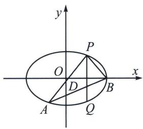

解析 由椭圆第三定义性质知 $k_{AB} \cdot k_{BP} = e^2 - 1$ ，设 $P(x_1, y_1)$ ，所以 $k_{AP} = \frac{y_1}{x_1}$ ，因为 $AP \perp BP$ ，所以 $k_{BP} = -\frac{x_1}{y_1}$ ，因为 $A(-x_1, -y_1), Q(x_1, -y_1)$ ，所以 $D(x_1, -\frac{1}{2}y_1)$ ，所以 $k_{AB} = \frac{\frac{1}{2}y_1}{2x_1}, k_{AB} \cdot k_{BP} = -\frac{1}{4} = e^2 - 1$ ，所以 $e = \frac{\sqrt{3}}{2}$ 。故选 C.

注意 此类型题最早出现在江苏卷 2011 的解答题中，通过第三定义进行转化，如今越来越多的小题是之前高考大题的降维，小题需要对二级结论的理解和记忆，信手拈来。

### 二、双曲线第三定义之“积”

到关于原点对称的两个定点连线的斜率之积为定值 $\frac{b^2}{a^2}$ 或 $e^2 - 1 (e > 1)$ 的点的轨迹是双曲线；通常定点为实轴或虚轴顶点，定值为正值.
另一方面，设 $M(x, y)$ 是双曲线上任意一点，两个定点为 $A_{1}(x_{1}, y_{1})$ 、 $A_{2}(-x_{1}, -y_{1})$ ，常数 $e=\frac{c}{a}$ ， $k_{MA_{1}}\cdot k_{MA_{2}}=\frac{y-y_{1}}{x-x_{1}}\cdot\frac{y+y_{1}}{x+x_{1}}=\frac{y^{2}-y_{1}^{2}}{x^{2}-x_{1}^{2}}$ ，根据双曲线方程，将 $\frac{x^{2}}{a^{2}}-\frac{y^{2}}{b^{2}}=1(a, b>0)$ 变形成 $y^{2}=\frac{b^{2}x^{2}}{a^{2}}-b^{2}$ ，所以 $k_{MA_{1}}\cdot k_{MA_{2}}=\frac{b^{2}}{a^{2}}$ ，双曲线上动点到关于原点对称的两个定点的连线的斜率之积等于常数.

> [!example]- 例5 (浙江省湖州市县域联盟2024-2025学年高三下学期5月月考T14)已知曲线方程 $C: \frac{x^{2}}{5} - \frac{y^{2}}{5} = 1 (x > 0), A_{1}(-\sqrt{5}, 0), A_{2}(\sqrt{5}, 0)$ , 点 $P$ 为曲线 $C$ 右支上一点, 且 $P$ 与 $A_{2}$ 不重合, 直线 $PA_{1}, PA_{2}$ 分别与直线 $x = 2$ 交于 $S_{1}, S_{2}$ 两点, 则以 $S_{1}, S_{2}$ 为直径的圆面积的最小值是 \_\_\_\_.
解析 利用双曲线第三定义可知 $k_{PA_1} \cdot k_{PA_2} = \frac{b^2}{a^2} = 1$ ，则 $PA_1: y = k(x + \sqrt{5})$ ， $PA_2: y = \frac{1}{k}(x - \sqrt{5})$ ，
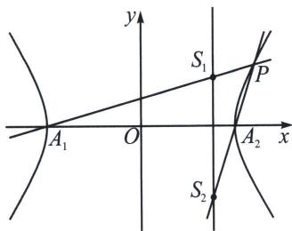
令 $x = 2$ ，则 $y_{S_1} = (2 + \sqrt{5})k$ ， $y_{S_2} = \frac{2 - \sqrt{5}}{k}$ ，所以 $\left|S_1S_2\right| = \left|(2 + \sqrt{5})k - \frac{2 - \sqrt{5}}{k}\right|$

以 $S_{1}$ ， $S_{2}$ 为直径的圆面积 $\frac{\pi|S_1S_2|^2}{4} = \frac{\pi}{4}\left[(9 + 4\sqrt{5})k^2 +\frac{9 - 4\sqrt{5}}{k^2} +2\right]\geqslant \frac{\pi}{4}(2 + 2) = \pi$ ，当且仅当 $k = \pm (\sqrt{5} -2)$ 时等号成立．故答案为 $\pi$

### 三、第三定义与中点弦转化

中点弦问题是斜率乘积为定值，其本质来源于第三定义，如图，设 AB 为椭圆 $\frac{x^{2}}{a^{2}} + \frac{y^{2}}{b^{2}} = 1 (a > b > 0)$ 不平行于坐标轴的弦，M 为 AB 的中点，C 是椭圆上一点，且弦 BC 过椭圆的中心 O，利用中位线得： $k_{OM} \cdot k_{AB} = k_{AB} \cdot k_{AC} = -\frac{b^{2}}{a^{2}}$ .
设 AB 为双曲线 $\frac{x^{2}}{a^{2}} - \frac{y^{2}}{b^{2}} = 1 (a > 0, b > 0)$ 不平行于坐标轴的弦，M 为 AB 的中点，C 是双曲线上一点，且弦 BC 过双曲线的中心 O，利用中位线得： $k_{OM} \cdot k_{AB} = k_{AB} \cdot k_{AC} = \frac{b^{2}}{a^{2}}$ .

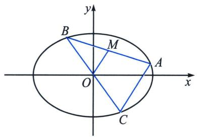

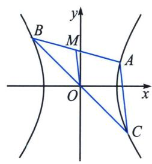
若双曲线与直线 $l$ 交于 $AB$ 两点，其中 $A(x_{1},y_{1})$ ， $B(x_{2},y_{2})$ ， $M(x_0,y_0)$ 为 $AB$ 中点， $k_{AB}\cdot k_{OM} = \frac{b^2}{a^2}$ 证明：设 $A(x_{1},y_{1})$ ， $B(x_{2},y_{2})$ ， $M(x_0,y_0)$ ，则
$\begin{array}{r l} & {\left\{ \begin{array}{l l} { \frac {x _ {1} ^ {2}}{a ^ {2}} - \frac {y _ {1} ^ {2}}{b ^ {2}} = 1 ①} \\ { \frac {x _ {2} ^ {2}}{a ^ {2}} - \frac {y _ {2} ^ {2}}{b ^ {2}} = 1 ②} \\ { \frac {x _ {1} + x _ {2}}{2} = x _ {0} ③   ① - ②, \text {并将} ③ ④ ⑤ \text {代入得:} k _ {A B} \bullet k _ {O M} = \frac {y _ {1} - y _ {2}}{x _ {1} - x _ {2}} \bullet \frac {y _ {1} + y _ {2}}{x _ {1} + x _ {2}} = \frac {y _ {1} - y _ {2}}{x _ {1} - x _ {2}} \bullet \frac {y _ {0}}{x _ {0}} = \frac {b ^ {2}}{a ^ {2}}} \\ { \frac {y _ {1} + y _ {2}}{2} = y _ {0} ④} \\ {k _ {A B} = \frac {y _ {2} - y _ {1}}{x _ {2} - x _ {1}} ⑤} \end{array} \right.} \end{array}$

> [!example]- 例6 (2024·三台县模拟)如图, 已知斜率为 $- 2$ 的直线与双曲线 $\frac{x^{2}}{a^{2}} - \frac{y^{2}}{b^{2}} = 1 (a > 0, b > 0)$ 的右支交于 $A, B$ 两点, 点 $A$ 关于坐标原点 $O$ 对称的点为 $C$ , 且 $\angle ABC = 45^{\circ}$ , 则该双曲线的离心率为
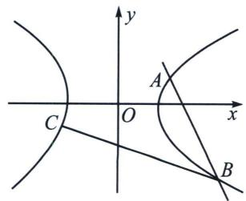

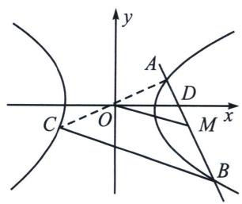

解析 如图，设直线 AB 与 x 轴交于点 D，取 AB 的中点 M，连接 AC，OM，
由双曲线的对称性可知 $O$ 为线段 $AC$ 的中点，则 $OM // BC$ ，所以 $\angle OMD = 45^\circ$ ，由直线 $AB$ 的斜率 $k_{AB} = -2$ ，得 $\tan \angle ODM = -2$ ，则直线 $OM$ 的斜率 $k_{OM} = \tan (\angle ODM + \angle OMD) = \frac{\tan \angle ODM + \tan 45^\circ}{1 - \tan \angle ODM \tan 45^\circ} = \frac{-2 + 1}{1 - (-2) \times 1} = -\frac{1}{3}$ ，设 $A(x_1, y_1)$ ， $B(x_2, y_2)$ ，则 $\frac{x_1^2}{a^2} - \frac{y_1^2}{b^2} = 1$ ， $\frac{x_2^2}{a^2} - \frac{y_2^2}{b^2} = 1$ ，两式相减，得 $\frac{x_1^2 - x_2^2}{a^2} - \frac{y_1^2 - y_2^2}{b^2} = 0$ ，化简得 $\frac{\frac{y_1 + y_2}{2}}{\frac{x_1 + x_2}{2}} \cdot \frac{y_1 - y_2}{x_1 - x_2} = \frac{b^2}{a^2}$ ，即 $k_{OM} \cdot k_{AB} = \frac{b^2}{a^2} = -\frac{1}{3} \times (-2) = \frac{2}{3}$ ，所以该双曲线的离心率 $e = \sqrt{1 + \frac{b^2}{a^2}} = \sqrt{1 + \frac{2}{3}} = \frac{\sqrt{15}}{3}$ . 故答案为 $\frac{\sqrt{15}}{3}$ .

### 四、第三定义转化为斜率比
如图，A、B 分别为椭圆 $\frac{x^{2}}{a^{2}} + \frac{y^{2}}{b^{2}} = 1 (a > b > 0)$ 的左右顶点，M、N 为椭圆上任意两点，MN 与 x 轴交于点 Q，AM 与 BN 交于点 P，根据极点极线理论可知，假设 AN 与 BM 交于 R，利用圆锥曲线的可轮换性，如果 M 与 N 两点位置互换，则 P 与 R 两点位置互换，PQR 形成自极三角形（参考后面大题章节）此时一定有 $\frac{x_{P}x_{Q}}{a^{2}} + \frac{y_{P}y_{Q}}{b^{2}} = 1$ ，即 $x_{P}x_{Q} = a^{2}$ .

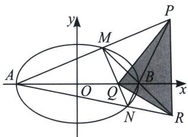
故一定有： $\frac{k_{PA}}{k_{PB}}=\frac{x_{P}-a}{x_{P}+a}=\frac{\frac{a^{2}}{x_{Q}}-a}{\frac{a^{2}}{x_{Q}}+a}=\frac{a-x_{Q}}{a+x_{Q}}$ ， $k_{BM}k_{BN}=k_{BM}k_{PB}=-\frac{b^{2}}{a^{2}k_{PA}}k_{PB}=-\frac{b^{2}}{a^{2}}\frac{a+x_{Q}}{a-x_{Q}}=$ 定值

> [!example]- 例7 (2025·江西赣州·二模T14)椭圆 $\frac{x^{2}}{a^{2}} + \frac{y^{2}}{b^{2}} = 1 (a > b > 0)$ 的右焦点为 $F$ , 上顶点为 $A$ , 直线 $l$ 与椭圆交于 $B, C$ 两点. 若 $\overrightarrow{AF} = \frac{1}{3} (\overrightarrow{AB} + \overrightarrow{AC})$ , 则 $l$ 的斜率的取值范围是 \_\_\_\_.
解析 令 $B(x_{1},y_{1}),C(x_{2},y_{2})$ ，而 $A(0,b),F(c,0)$
所以 $\overrightarrow{AF} = (c, -b)$ , $\overrightarrow{AB} = (x_1, y_1 - b)$ , $\overrightarrow{AC} = (x_2, y_2 - b)$ ,
又 $\overrightarrow{AF}=\frac{1}{3}(\overrightarrow{AB}+\overrightarrow{AC})$ ，则 $(c,-b)=\left(\frac{x_{1}+x_{2}}{3},\frac{y_{1}+y_{2}-2b}{3}\right)$ ，所以 $\left\{\begin{aligned}x_{1}+x_{2}&=3c\\ y_{1}+y_{2}&=-b\end{aligned}\right.$
由 $\left\{\begin{aligned}\frac{x_{1}^{2}}{a^{2}}+\frac{y_{1}^{2}}{b^{2}}=1\\ \frac{x_{2}^{2}}{a^{2}}+\frac{y_{2}^{2}}{b^{2}}=1\end{aligned}\right.$ ，作差得 $\frac{x_{1}^{2}-x_{2}^{2}}{a^{2}}+\frac{y_{1}^{2}-y_{2}^{2}}{b^{2}}=0$ ，则 $k=\frac{y_{1}-y_{2}}{x_{1}-x_{2}}=-\frac{b^{2}(x_{1}+x_{2})}{a^{2}(y_{1}+y_{2})}$
显然 B, C 的中点 $M\left(\frac{3c}{2}, -\frac{b}{2}\right)$ 在椭圆内，则 $\frac{9c^{2}}{4a^{2}} + \frac{b^{2}}{4b^{2}} < 1$ ，可得 $a^{2} = b^{2} + c^{2} > 3c^{2}$ ，即 $\frac{b}{c} > \sqrt{2}$ ，
所以 $k \cdot k_{OM} = -\frac{b^2}{a^2} \Rightarrow k = \frac{3bc}{a^2} = \frac{3}{\frac{b}{c} + \frac{c}{b}}$ ，令 $t = \frac{b}{c} > \sqrt{2}$ ，且 $f(t) = t + \frac{1}{t}$ 在 $(\sqrt{2}, +\infty)$ 上单调递增，值域为 $\left(\frac{3}{\sqrt{2}}, +\infty\right)$ ，所以 $k = \frac{3}{f(t)} \in (0, \sqrt{2})$ 。故答案为： $(0, \sqrt{2})$ 。

> [!example]- 例8 (2024·多选·秦州区开学)已知 A, B 是椭圆 $E: \frac{x^{2}}{4} + y^{2} = 1$ 的左右顶点，过点 $P(1, 0)$ 且斜率不为零的直线与 E 交于 M, N 两点， $k_{AM}, k_{BM}, k_{AN}, k_{BN}$ 分别表示直线 AM, BM, AN, BN 的斜率，则下列结论中正确的是 ()
A. $k_{AM} \cdot k_{BM} = -\frac{1}{4}$

B. $k_{BM} \cdot k_{BN} = -\frac{3}{4}$

C. $k_{AM}=3k_{BN}$

D. 直线 $AM$ 与 $BN$ 的交点的轨迹方程是 $x = 4$

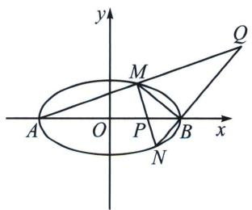

解析 对于A：根据第三定义， $k_{AM}\cdot k_{BM} = -\frac{b^2}{a^2} = -\frac{1}{4}$ ，故选项A正确；
对于 D: 设 AM 与 BN 交于点 Q，根据极点极线知识可知 $x_{P}x_{Q}=a^{2}=4$ ，故 $x_{Q}=4$ ，故选项 D 正确.
$\frac{k_{QB}}{k_{QA}}=\frac{\frac{y_{Q}}{x_{Q}-2}}{\frac{y_{Q}}{x_{Q}+2}}=3$ ，故 $k_{BN}=3k_{AM}$ ，故选项C错误；
根据第三定义可知 $k_{AM} \cdot k_{BM} = -\frac{b^2}{a^2} = -\frac{1}{4}$ ，故 $k_{BM} \cdot k_{BN} = 3k_{BM} \cdot k_{AM} = -\frac{3}{4}$ ，故选项B正确；故选ABD.

> [!example]- 例9 (2025·辽宁沈阳·三模 T11)已知点 $A_{1}$ , $A_{2}$ 分别是椭圆 $C: \frac{x^{2}}{a^{2}} + \frac{y^{2}}{b^{2}} = 1 (a > b > 0)$ 的左、右顶点, $F(1, 0)$ 为椭圆的右焦点, 且 $\frac{|FA_{1}|}{|FA_{2}|} = 3$ , 点 $P$ 是椭圆上异于 $A_{1}, A_{2}$ 的一动点, 直线 $PA_{1}, PA_{2}$ 分别与直线 $x = 4$ 交于点 $B_{1}, B_{2}$ , 则下列说法正确的有 ( )
A. $k_{PA_1} \cdot k_{PA_2} = -\frac{3}{4}$

B. $k_{PA_{2}} \cdot k_{B_{1}A_{2}} = -\frac{9}{4}$

C. $|B_{1}B_{2}|$ 的最小值为 $4 \sqrt{3}$

D. $\cos \angle A_{1}PA_{2}$ 的最小值为 $-\frac{1}{2}$
解析 设点 $P(x_0, y_0)$ , 设直线 $PA_1$ 的倾斜角为 $\alpha$ , 斜率为 $k_1$ , 直线 $PA_2$ 的倾斜角为 $\beta$ , 斜率为 $k_2$ ,
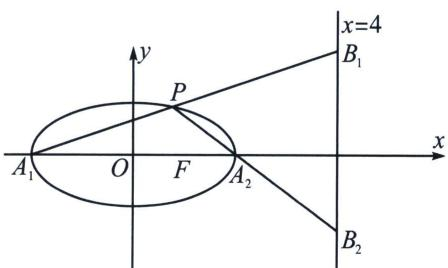

对于A，由题意可得 $\frac{|FA_1|}{|FA_2|} = \frac{a + c}{a - c} = 3$ ，且 $c = 1$ ，所以 $a = 2$ ， $b^{2} = 3$ ，则椭圆方程为 $\frac{x^2}{4} +\frac{y^2}{3} = 1$ ，所以 $k_{1}$ · $k_{2} = -\frac{b^{2}}{a^{2}} = -\frac{3}{4}$ ，故A正确；
对于 B，由 $k_{1}=\frac{y_{0}}{x_{0}+2}$ ，得 $PA_{1}: y=\frac{y_{0}}{x_{0}+2}(x+2)$ ，令 x=4 得， $y_{B_{1}}=\frac{6y_{0}}{x_{0}+2}=6k_{1}$ ，所以 $B_{1}(4,6k_{1})$ ，则 $k_{B_{1}A_{2}}=\frac{6k_{1}-0}{4-2}=3k_{1}$ ，所以 $k_{PA_{2}}\cdot k_{B_{1}A_{2}}=k_{2}\cdot3k_{1}=3\times\left(-\frac{3}{4}\right)=-\frac{9}{4}$ ，故 B 正确；
对于C，同理 $k_{2} = \frac{y_{0}}{x_{0} - 2}$ ，得 $PA_{2}:y = \frac{y_{0}}{x_{0} - 2} (x - 2)$ ，令 $x = 4$ ，得 $y_{B_2} = \frac{2y_0}{x_0 - 2} = 2k_2$ ，所以 $B_{2}(4,2k_{2})$ 又由 $k_{1}\cdot k_{2} = -\frac{3}{4}$ ，得 $k_{2} = -\frac{3}{4k_{1}}$ ，则 $\left|B_1B_2\right| = \left|6k_1 - 2k_2\right| = \left|6k_1 + \frac{3}{2k_1}\right|\geqslant 6$ ，当且仅当 $k_{1} = \pm \frac{1}{2}$ 时，等号成立，故C错误；
对于D，不妨设 $x_0 \geqslant 0$ 且 $y_0 \geqslant 0$ ，则 $k_1 > 0, k_2 < 0$ ，设 $\alpha, \beta$ 分别为直线 $PA_1, PA_2$ 的倾斜角，则 $\angle A_1PA_2 = \beta - \alpha$ ，即 $\tan \angle A_1PA_2 = \tan (\beta - \alpha) = \frac{k_2 - k_1}{1 + k_1k_2} < 0$ ，即 $\angle A_1PA_2$ 为钝角，又由 $k_1 \cdot k_2 = -\frac{3}{4}$ ，得 $k_2 = -\frac{3}{4k_1}$ ，则 $\tan \angle A_1PA_2 = \frac{-\frac{3}{4k_1} - k_1}{\frac{1}{4}} = -4\left(\frac{3}{4k_1} + k_1\right) \leqslant -4\sqrt{3}$ ，当且仅当 $k_1 = \frac{\sqrt{3}}{2}$ 时，等号成立，此时 $\tan \angle A_1PA_2$ 取最大值 $-4\sqrt{3}$ ，即 $\angle A_1PA_2$ 最大，因此 $\cos \angle A_1PA_2$ 的最小值为 $-\frac{1}{7}$ ，故D错误；故选AB.

> [!example]- 例10 (2025·重庆·二模 T11)已知双曲线 $C: x^{2} - \frac{y^{2}}{3} = 1$ 的左右顶点分别为 $A, B$ , 双曲线 $C$ 的右焦点为 $F$ , 点 $M$ 是双曲线 $C$ 上在第一象限内的点, 直线 $MF$ 交双曲线 $C$ 右支于点 $N$ , 交 $y$ 轴于点 $P$ , 且 $\overrightarrow{PM} = \lambda \overrightarrow{MF}$ , $\overrightarrow{PN} = \mu \overrightarrow{NF}$ . 设直线 $MA$ , $MB$ 的倾斜角分别为 $\alpha$ , $\beta$ , 则
A. 点 M 到双曲线 C 的两条渐近线的距离之积为 $\frac{3}{2}$   
B. 设 $R(4, 1)$ , 则 $|MR| + |MF|$ 的最小值为 $\sqrt{37} - 2$   
C. $\lambda + \mu$ 为定值  
D. 当 $2\tan\alpha + \tan\beta$ 取最小值时， $\triangle MAB$ 的面积为 $2\sqrt{6}$
解析 由题意可得 $A(-1,0), B(1,0), F(2,0)$ ，设 $M(x_1, y_1), N(x_2, y_2)$ ，

对于 A，由 C: $x^{2}-\frac{y^{2}}{3}=1$ 可得双曲线的渐近线方程为 $\sqrt{3}x\pm y=0$ ，由点到直线的距离公式可得，点 M 到双曲线 C 的两条渐近线的距离之积为 $\frac{\left|\sqrt{3}x_{1}-y_{1}\right|}{2}\times\frac{\left|\sqrt{3}x_{1}+y_{1}\right|}{2}=\frac{\left|3x_{1}^{2}-y_{1}^{2}\right|}{4}$ ，将 $M(x_{1},y_{1})$ 代入双曲线方程可得 $x_{1}^{2}-\frac{y_{1}^{2}}{3}=1$ ，则 $y_{1}^{2}=3x_{1}^{2}-3$ ，代入上式可得 $\frac{\left|3x_{1}^{2}-(3x_{1}^{2}-3)\right|}{4}=\frac{3}{4}$ ，故 A 错误；
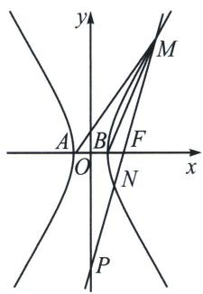

对于 B，设双曲线的左焦点为 $F'(-2,0)$ ，由双曲线的定义可得 $\left|MF\right|=\left|MF'\right|-2a=\left|MF'\right|-2$
则 $|MR| + |MF| = |MR| + |MF'| - 2$ ，当 $M, R, F'$ 三点共线时， $|MR| + |MF'|$ 最小，且 $(|MR| + |MF'|)_{\min} = |RF'| = \sqrt{(4 + 2)^2 + 1^2} = \sqrt{37}$ ，故 $|MR| + |MF|$ 的最小值为 $\sqrt{37} - 2$ ，故 B 正确；
对于 C，大家可以参考我们大题篇的定比点差部分的方法，本题小题小做， $\lambda=-\frac{|PM|}{|MF|}$ ， $\mu=\frac{|PN|}{|NF|}$ ， $\lambda+μ=-\frac{|PM|}{|MF|}+\frac{|PN|}{|NF|}=-\frac{\frac{c}{\cos\alpha}+|MF|}{|MF|}+\frac{\frac{c}{\cos\alpha}-|NF|}{|NF|}=-2-\frac{c}{\cos\alpha\cdot\frac{b^{2}}{a-c\cos\alpha}}+\frac{c}{\cos\alpha\cdot\frac{b^{2}}{a+c\cos\alpha}}$
$=-2+\frac{2c^{2}}{b^{2}}=\frac{2}{3}$ 为定值，故C正确；
对于 D，由条件可得 $\tan\alpha\tan\beta=\frac{b^{2}}{a^{2}}=3$ ，则 $2\tan\alpha+\tan\beta\geqslant2\sqrt{2\tan\alpha\tan\beta}=2\sqrt{6}$ ，当且仅当 $2\tan\alpha=\tan\beta$ 等号成立，此时 $\tan\alpha=\frac{\sqrt{6}}{2}$ ，此时 $M(3,2\sqrt{6})$ ，则 $S_{\triangle MAB}=\frac{1}{2}\times2\times2\sqrt{6}=2\sqrt{6}$ ，故 D 正确；故选 BCD.

# 第四节 圆锥曲线的第四定义

> [!example]- 例1 (人数 A 版选择性必修一 P116) 如图, 矩形 $ABCD$ 中, $|AB| = 2a$ , $|BC| = 2b (a > b > 0)$ . $E$ , $F$ , $G$ , $H$ 分别是矩形四条边的中点, $R$ , $S$ , $T$ 是线段 $OF$ 的四等分点, $R'$ , $S'$ , $T'$ 是线段 $CF$ 的四等分点. 证明直线 $ER$ 与 $GR'$ 、 $ES$ 与 $GS'$ 、 $ET$ 与 $GT'$ 的交点 $L$ , $M$ , $N$ 都在椭圆 $\frac{x^2}{a^2} + \frac{y^2}{b^2} = 1 (a > b > 0)$ 上.
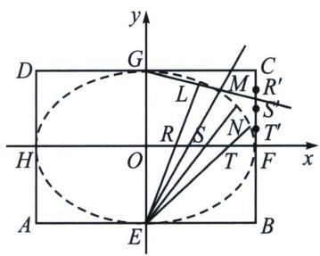

解析 由于 $k_{ER}$ 、 $k_{ES}$ 、 $k_{ET}=\frac{4b}{a}$ 、 $\frac{4b}{2a}$ 、 $\frac{4b}{3a}$ ，且 $k_{GR}$ 、 $k_{GS}$ 、 $k_{GT}=-\frac{b}{4a}$ 、 $-\frac{2b}{4a}$ 、 $-\frac{3b}{4a}$ ，
所以 $k_{ER} \cdot k_{GR'} = k_{ES} \cdot k_{GS'} = k_{ET} \cdot k_{GT'} = -\frac{b^{2}}{a^{2}}$ ，利用第三定义逆定理可知，ER 与 $GR'$ 、ES 与 $GS'$ 、ET 与 $GT'$ 的交点 L，M，N 都在椭圆 $\frac{x^{2}}{a^{2}} + \frac{y^{2}}{b^{2}} = 1 (a > b > 0)$ 上。

> [!example]- 例2 (苏教版选修第一册 P87) 把矩形的各边 $n$ 等分, 如图连接直线, 判断对应直线的交点是否在一个椭圆上, 为什么?
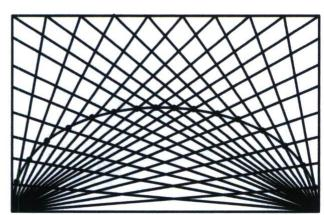

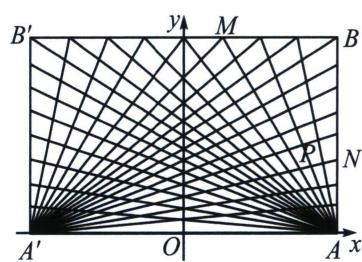

解析 设矩形 $A'ABB'$ 的长 $A'A = 2a$ ，宽 $AB = 2b$ ，以 $A'A$ 的中点 $O$ 为原点， $A'A$ 所在的直线为 $x$ 轴， $A'A$ 的中垂线为 $y$ 轴，建立直角坐标系，则 $A'(-a,0)$ ， $A(a,0)$ ， $B(a,2b)$ ，由于整个图形关于 $y$ 轴对称，我们只研究第一象限，设 $M$ 点是 $B'B$ 上自右到左的第 $m (0 < m \leqslant n, m \in \mathbb{N}^{*})$ 个分点， $N$ 点是 $AB$ 上自上到下的第 $m (0 < m \leqslant n, m \mathbb{N}^{*})$ 个分点，所以 $k_{AM} = -\frac{nb}{ma}$ ， $k_{A'N} = \frac{mb}{na}$ ，所以 $AM: y = -\frac{nb}{ma}(x - a)$ ①， $A'N: y = \frac{mb}{na}(x + a)$ ②，①，②式相乘且整理得 $\frac{x^{2}}{a^{2}} + \frac{y^{2}}{b^{2}} = 1$ ③，因为点 $P(x,y)$ 是直线 $AM$ 与 $A'N$ 的交点，所以点 $P(x,y)$ 满足方程③故点 $P$ 在椭圆上.

> [!example]- 例3 (苏教版选修第一册 P100) 如图, 在矩形 $ABB'A'$ 中, 把边 $AB$ 分成 $n$ 等份. 在边 $B'B$ 的延长线上, $BB'$ 的 $n$ 分之一为单位长度连续取点. 过边 $AB$ 上各分点和 $A'$ 作直线, 过 $B'B$ 延长线上的对应分点和点 $A$ 作直线, 这两条直线的交点为 $P$ , $P$ 在什么曲线上运动?
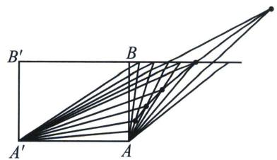

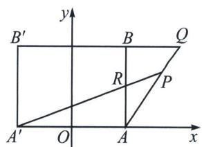

解析 设 $AA' = 2a$ , $AB = 2b$ , 取 $AA'$ 所在的直线为 $x$ 轴, $AA'$ 的垂直平分线为 $y$ 轴建立平面直角坐标系, 设第 $m$ 组对应直线 $AQ$ 与 $A'R$ 的交点为 $P(x, y)$ , 且 $P(x, y)$ 点在第一象限,
则 $A'(-a,0)$ ， $R\left(a,\frac{2bm}{n}\right)$ ， $A(a,0)$ ， $Q\left(a+\frac{2am}{n},2b\right)$ ， $k_{A'R}=\frac{\frac{2bm}{n}}{2a}=\frac{bm}{an}$ ，同理， $k_{AQ}=\frac{2b}{a+\frac{2am}{n}-a}=\frac{bn}{am}$ 直线 $A'R$ 的方程为 $y=\frac{bm}{an}(x+a)$ ，①直线 AQ 的方程为 $y=\frac{bn}{am}(x-a)$ ，②

P 点坐标满足方程①②，①②相乘得 $y^{2}=\frac{b^{2}}{a^{2}}(x^{2}-a^{2})$ ，即 $\frac{x^{2}}{a^{2}}-\frac{y^{2}}{b^{2}}=1(P(x,y)$ 点在第一象限），所以点 P 在双曲线的右支上半部分上运动.

> [!example]- 例4 (苏教版选修第一册 P105)如图, 将一张长方形纸片 $ABCD$ 的一只角斜折, 使点 $D$ 总是落在对边 $AB$ 上, 然后展开纸片, 得到一条折痕 $l$ . 这样继续下去, 得到若干折痕, 观察这些折痕围成的轮廓, 它是什么曲线?
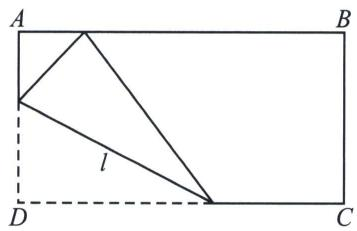

解析 设点 $D$ 折后落到 $AB$ 边上的点 $D'$ , 则线段 $DD'$ 被折痕 $l$ 垂直平分, 在折痕 $l$ 上取一点 $M$ , 且 $MD' \perp AB$ , 则可得, $MD' = MD$ , 即折痕围成的轮廓上的任意一点到定直线 $AB$ 的距离与它到定点 $D$ 的距离相等, 所以根据抛物线的定义可知折痕围成的轮廓曲线是以 $D$ 为焦点, $AB$ 为准线的抛物线.

> [!example]- 例5 (湖北省武汉市2025届高三五月调考)建立如图所示的坐标系. 矩形ABCD中, $|AB|=4$ , $|BC|=2\sqrt{3}$ . E, F, G, H分别是矩形四条边的中点, 直线HF, BC上的动点R, S满足 $\overrightarrow{OR}=\lambda\overrightarrow{OF}$ , $\overrightarrow{CS}=\lambda\overrightarrow{CF} (\lambda\in\mathbf{R})$ , 直线ER与GS的交点为P.  
（1）证明点 P 在一个确定的椭圆上，并求此椭圆的方程；  
（2）当 $\lambda=\frac{1}{2}$ 时，过点 R 的直线 l（与 x 轴不重合）与 （1） 中的椭圆交于 M，N 两点，过点 N 作直线 x=4 的垂线，垂足为点 Q。设直线 MQ 与 x 轴交于点 K，求 $\triangle KMR$ 面积的最大值。

解析 （1）依题意, $E(0, -\sqrt{3})$ , $F(2, 0)$ , 由 $\overrightarrow{OR} = \lambda \overrightarrow{OF}$ 得 $R(2\lambda, 0)$ , 当 $\lambda \neq 0$ 时,

直线 ER 的方程为： $y=\frac{\sqrt{3}}{2\lambda}x-\sqrt{3}$ ①，又 $G(0,\sqrt{3})$ ， $C(2,\sqrt{3})$ ，由 $\overrightarrow{CS}=\lambda\overrightarrow{CF}$ 得 $S(2,-\sqrt{3}\lambda+\sqrt{3})$ ，所以直线 GS 的方程为 $y=-\frac{\sqrt{3}\lambda}{2}x+\sqrt{3}$ ②，由①得 $y+\sqrt{3}=\frac{\sqrt{3}}{2\lambda}x$ ，由②得 $y-\sqrt{3}=-\frac{\sqrt{3}\lambda}{2}x$ ，两式相乘得， $(y+\sqrt{3})(y-\sqrt{3})=\frac{\sqrt{3}}{2\lambda}x\cdot\left(-\frac{\sqrt{3}\lambda}{2}x\right)$ ，整理得 $\frac{x^{2}}{4}+\frac{y^{2}}{3}=1$  
（2） 当 $\lambda=\frac{1}{2}$ 时，点 $R(1,0)$ ，设 $M(x_{1},y_{1})$ ， $N(x_{2},y_{2})$ ，
解法一：设直线 l 的方程为： $x=ty+1$ ，由 $\left\{\begin{aligned}x&=ty+1\\ 3x^{2}&+4y^{2}=12\end{aligned}\right.$ ，消去 x 得： $(3t^{2}+4)y^{2}+6ty-9=0$ ，则
$\Delta > 0, y_{1} + y_{2} = \frac{-6t}{3t^{2} + 4}, y_{1}y_{2} = \frac{-9}{3t^{2} + 4}$ ，依题意， $Q(4, y_{2})$ ，直线 $MQ$ 的方程为：
$y-y_{2}=\frac{y_{1}-y_{2}}{x_{1}-4}(x-4)$ ，令y=0，得点K的横坐标为：
$x _ {K} = \frac {- y _ {2} (x _ {1} - 4)}{y _ {1} - y _ {2}} + 4 = \frac {- y _ {2} (t y _ {1} - 3) + 4 y _ {1} - 4 y _ {2}}{y _ {1} - y _ {2}} = \frac {- t y _ {1} y _ {2} + 4 y _ {1} - y _ {2}}{y _ {1} - y _ {2}},$
又 $ty_{1}y_{2} = \frac{3}{2} (y_{1} + y_{2})$ ，则 $x_{K} = \frac{-\frac{3}{2}(y_{1} + y_{2}) + 4y_{1} - y_{2}}{y_{1} - y_{2}} = \frac{\frac{5}{2}(y_{1} - y_{2})}{y_{1} - y_{2}} = \frac{5}{2}$
因此直线 $MQ$ 过定点 $K\left(\frac{5}{2}, 0\right)$ , 所以 $S_{\triangle KMR} = \frac{1}{2} |RK| |y_M| = \frac{1}{2} \times \frac{3}{2} |y_M| \leqslant \frac{3\sqrt{3}}{4}$ , 当且仅当 $|y_M| = \sqrt{3}$ 时等号成立, 所以 $\triangle KMR$ 的面积最大值为 $\frac{3\sqrt{3}}{4}$ .
解法二(定比点差法): 由（1）可得右焦点 $R(1,0)$ , 令 $\overrightarrow{MR} = \lambda \overrightarrow{RN}$ , 令 $M(x_{1},y_{1})$ , $N(x_{2},y_{2})$ , 由定比分点公式得 $\frac{x_{1} + \lambda x_{2}}{1 + \lambda} = 1$ , $\frac{y_{1} + \lambda y_{2}}{1 + \lambda} = 0$ , 则在直线 $MN$ 上必在一点 $T$ , 满足 $\overrightarrow{MT} = -\lambda \overrightarrow{TN}$ , 所以 $x_{T} = \frac{x_{1} - \lambda x_{2}}{1 - \lambda}$ ,
因为 M、N 均在椭圆上，则 $\left\{\begin{aligned}\frac{x_{1}^{2}}{4}+\frac{y_{1}^{2}}{3}&=1①\\ \frac{\lambda^{2}x_{2}^{2}}{4}+\frac{\lambda^{2}y_{2}^{2}}{3}&=\lambda^{2}\end{aligned}\right.$ ， $\frac{①-②}{1-\lambda^{2}}$ 得 $\frac{(x_{1}+\lambda x_{2})(x_{1}-\lambda x_{2})}{4(1+\lambda)(1-\lambda)}+\frac{(y_{1}+\lambda y_{2})(y_{1}-\lambda y_{2})}{3(1+\lambda)(1-\lambda)}=1$ ，
所以 $\frac{x_{T}}{4}=1,\quad x_{T}=4=\frac{x_{1}-\lambda x_{2}}{1-\lambda}$ ，所以： $\left\{\begin{aligned}x_{1}+\lambda x_{2}&=1+\lambda\\ x_{1}-\lambda x_{2}&=4(1-\lambda)\end{aligned}\right.$ ，故 $x_{1}=\frac{5}{2}-\frac{3\lambda}{2}$ 。 $x_{2}=\frac{5}{2}-\frac{3}{2\lambda}$ 由于 RK // NQ，所以 $\overrightarrow{MK}=\lambda\overrightarrow{KQ}$ ，所以 $x_{K}=\frac{x_{1}+\lambda x_{Q}}{1+\lambda}=\frac{\frac{5}{2}-\frac{3\lambda}{2}+4\lambda}{1+\lambda}=\frac{5}{2}$ ，所以 $S_{\Delta KMR}=\frac{1}{2}|RK||y_{M}|=\frac{1}{2}\times\frac{3}{2}|y_{M}|\leqslant\frac{3\sqrt{3}}{4}$ ，当且仅当 $|y_{M}|=\sqrt{3}$ 时等号成立，所以 $\triangle KMR$ 的面积最大值为 $\frac{3\sqrt{3}}{4}$ .

# 第五节 抛物线的焦准翻译

平面内到一个定点的距离等于到一条定直线的距离的点的轨迹；其中，定点为抛物线的焦点，定直线叫做准线.

抛物线标准方程 $y^{2}=2px(p>0)$ 为例，焦点在 x 轴上，开口向右。参数 p 是焦点到准线的距离，称为焦准距，故 p 恒为正数。

### 一、焦点弦与焦半径公式

1. 顶点为原点 $O(0,0)$ , 以 $x$ 轴为对称轴, 且没有对称中心, 焦点为 $F\left(\frac{p}{2},0\right)$ , 准线为 $x=-\frac{p}{2}$ , 由于抛物线的离心率 $e$ 都等于 1 , 故抛物线通径为 $2ep=2p$ ;  
2. 焦半径： $|PF|=x_{0}+\frac{p}{2}.$   
3. 焦点弦: $x_{A} + x_{B} + p = \frac{p}{1 - \cos \alpha} + \frac{p}{1 + \cos \alpha} = \frac{2 p}{\sin^ {2} \alpha} (\alpha \neq 0)$ ; 特殊地, 当 $\alpha = \frac{\pi}{2}$ 时, 为通径 $2 p$ .

证明：如图，作 $AA_{1} \perp x$ 轴于 $A_{1}$ ， $|AF| = x_{A} + \frac{p}{2}$ ， $\cos \alpha = \frac{|FA_{1}|}{|AF|}$ 所以 $\cos \alpha = \frac{x_{A} - \frac{p}{2}}{x_{A} + \frac{p}{2}} = 1 - \frac{p}{x_{A} + \frac{p}{2}} = 1 - \frac{p}{|AF|}$ 所以 $|AF| = \frac{p}{1 - \cos \alpha}$ ，同理 $|BF| = \frac{p}{1 + \cos \alpha}$ . $|AB| = |AF| + |BF| = \frac{p}{1 - \cos \alpha} + \frac{p}{1 + \cos \alpha} = \frac{2p}{\sin^{2}\alpha}$ .（利用极坐标可以秒证，由于新课标没有引入极坐标，故我们采用保守证明）

抛物线的性质和椭圆、双曲线比较起来，差别较大。它的离心率等于1；它只有一个焦点、一个顶点、一条对称轴、一条准线；它无中心，也没有渐近线。椭圆、双曲线都有中心，它们均可称为有心圆锥曲线；抛物线没有中心，称为无心圆锥曲线。

> [!example]- 例1 (2025 新课标Ⅱ卷第6题)对于抛物线 $C: y^{2} = 2px (p > 0)$ , 焦点为 $F$ , 点 $A$ 在 $C$ 上, 过 $A$ 作 $C$ 准线的垂线, 垂足为 $B$ . 若 $l_{BF}: y = -2x + 2$ , 则 $|AF| =$ ( )
A. 3

B. 4

C. 5

D. 6
解析 由 $l_{BF}$ ： $y=-2x+2$ 与x轴交于(1,0)，故 $F(1,0)$ ，所以抛物线C： $y^{2}=4x$ ，则C准线为x=-1，故 $B(-1,4)$ ，故 $y_{A}=4$ ，故 $x_{A}=4$ ，则AB=5，由抛物线定义可知AF=AB=5，故选C.

> [!example]- 例2 (2025北京卷第11题)抛物线 $y^{2} = 2px (p > 0)$ 的顶点到焦点的距离为3，则 $p =$ \_\_\_\_.
解析 因为抛物线的顶点到焦距的距离为 $\frac{p}{2}$ , 故 $\frac{p}{2} = 3$ , 故 $p = 6$ , 故答案为 6.

> [!example]- 例3 (2024·天津卷) $(x-1)^{2}+y^{2}=25$ 的圆心与抛物线 $y^{2}=2px(p>0)$ 的焦点F重合，A为两曲线的交点，则原点到直线AF的距离为\_\_\_\_。
解析 圆 $(x-1)^{2}+y^{2}=25$ 的圆心为F(1,0)，故 $\frac{p}{2}=1$ 即p=2， $|AF|=\frac{p}{2}+x_{A}=5$ ，故 $x_{A}=4$ ，即A(4,±4)，故直线AF： $y=\pm\frac{4}{3}(x-1)$ ，即4x-3y-4=0或4x+3y-4=0，故原点到直线AF的距离为 $d=\frac{|4|}{5}=\frac{4}{5}$ ，故答案为 $\frac{4}{5}$ .

> [!example]- 例4 (2021·上海)已知抛物线 $y^{2} = 2px (p > 0)$ ，若第一象限的 $A, B$ 在抛物线上，焦点为 $F, |AF| = 2, |BF| = 4, |AB| = 3$ ，求直线 $AB$ 的斜率为 \_\_\_\_.
解析 如图所示, 设抛物线的准线为 $l$ , 作 $AC \perp l$ 于点 $C$ , $BD \perp l$ 于点 $D$ , $AE \perp BD$ 于点 $E$ ,

由抛物线的定义，可得 $AC = AF = 2$ ， $BD = BF = 4$ ，所以 $BE = 4 - 2 = 2$ ， $AE = \sqrt{AB^2 - BE^2} = \sqrt{9 - 4} = \sqrt{5}$ ，所以直线 $AB$ 的斜率 $k_{AB} = \tan \angle ABE = \frac{AE}{BE} = \frac{\sqrt{5}}{2}$ 故答案为 $\frac{\sqrt{5}}{2}$

> [!example]- 例5 (2021·新高考Ⅰ)已知 O 为坐标原点，抛物线 C: $y^{2}=2px(p>0)$ 的焦点为 F, P 为 C 上一点，PF 与 x 轴垂直，Q 为 x 轴上一点，且 $PQ \perp OP$ . 若 $|FQ|=6$ ，则 C 的准线方程为 \_\_\_\_.
解析 解法一：由题意，不妨设 P 在第一象限，则 $P\left(\frac{p}{2}, p\right)$ ， $k_{OP}=2$ ， $PQ \perp OP$ .
所以 $k_{PQ}=-\frac{1}{2}$ ，所以 PQ 的方程为： $y-p=-\frac{1}{2}\left(x-\frac{p}{2}\right)$ ，y=0 时， $x=\frac{5p}{2}$ ， $|FQ|=6$ ，所以 $\frac{5p}{2}-\frac{p}{2}=6$ ，解得 p=3，所以抛物线的准线方程为： $x=-\frac{3}{2}$ .
解法二：根据射影定理，可得 $|PF|^2 = |FO||FQ|$ ，可得 $p^2 = \frac{p}{2} \times 6$ ，解得 $p = 3$ ，因此，抛物线的准线

方程为： $x=-\frac{3}{2}$ . 故答案为 $x=-\frac{3}{2}$ .

> [!example]- 例6 (2021·上海)已知椭圆 $x^{2}+\frac{y^{2}}{b^{2}}=1(0<b<1)$ 的左、右焦点为 $F_{1}$ 、 $F_{2}$ ，以 $O$ 为顶点， $F_{2}$ 为焦点作抛物线交椭圆于 $P$ ，且 $\angle PF_{1}F_{2}=45^{\circ}$ ，则抛物线的准线方程是 \_\_\_\_.
解析 解法一：设 $F_{1}(-c,0), F_{2}(c,0)$ ，则抛物线 $y^{2} = 4cx$ ，直线 $PF_{1}: y = x + c$ ，联立方程组 $\left\{ \begin{array}{l} y^{2} = 4cx \\ y = x + c \end{array} \right.$ ，解得 $x = c, y = 2c$ ，所以点 $P$ 的坐标为 $(c,2c)$ ，所以 $PF_{2} \perp F_{1}F_{2}$ ，又 $PF_{2} = F_{2}F_{1} = 2c$ ，所以 $PF_{1} = 2\sqrt{2}c$ ，所以 $PF_{1} + PF_{2} = (2 + 2\sqrt{2})c = 2a = 2$ ，则 $c = \sqrt{2} - 1$ ，所以抛物线的准线方程为： $x = -c = 1 - \sqrt{2}$ .
解法二：根据焦长公式： $\angle PF_{1}F_{2}=45^{\circ}$ ， $|PF_{1}|=\frac{b^{2}}{1-c\cos 45^{\circ}}=\frac{1-c^{2}}{1-\frac{\sqrt{2}}{2}c}$ ，根据几何性质可知 $|PF_{2}|=d=|PF_{1}|\cos 45^{\circ}$ ，所以 $PF_{2}\perp x$ 轴，所以 $|PF_{2}|=\frac{b^{2}}{a}=1-c^{2}=\frac{1-c^{2}}{1-\frac{\sqrt{2}}{2}c}\cdot\cos 45^{\circ}$ ，所以 $c=\sqrt{2}-1$ ，故答案为 $x=1-\sqrt{2}$ .

> [!example]- 例7 (2020·山东)斜率为 $\sqrt{3}$ 的直线过抛物线 $C: y^{2} = 4x$ 的焦点, 且与 $C$ 交于 $A$ , $B$ 两点, 则 $|AB| =$ \_\_\_\_.
解析 解法一：由题意可得抛物线焦点 $F(1,0)$ ，直线 $l$ 的方程为 $y = \sqrt{3}(x - 1)$ ，
代入 $y^{2} = 4x$ 并化简得 $3x^{2} - 10x + 3 = 0$ ，设 $A(x_{1},y_{1})$ ， $B(x_{2},y_{2})$ ，则 $x_{1} + x_{2} = \frac{10}{3}$ ； $x_{1}x_{2} = 1$ ，
所以由抛物线的定义可得 $|AB|=x_{1}+x_{2}+p=\frac{10}{3}+2=\frac{16}{3}$ .
解法二： $|AB|=\frac{2p}{\sin^{2}60^{\circ}}=\frac{16}{3}$ . 故答案为 $\frac{16}{3}$ .
如图，抛物线 E: $y^{2}=2px$ 的焦点为 F，过 F 的直线与 E 交于 A、B，过 A、B 分别向准线 l 作垂线，垂足为 C、D.

①以 AB 为直径的圆与准线 l 相切；

②记 AB 中点为 M，过 M 作 MN 垂直准线 l 于 N，则 $MN = \frac{1}{2} AB$ ，AN、BN 分别平分 $\angle CAB$ 、 $\angle DBA$ ， $FN \perp AB$ ， $\angle CFD = 90^{\circ}$ ;
证明: ①由于 $|AB| = x_{A} + x_{B} + p = |AC| + |BD| = 2|MN|$ , 所以 $AN \perp BN$ , 以 $M$ 为圆心, $MN$ 为半径的圆与准线 $CD$ 相切;
$AC / / MN \Rightarrow \angle CAN = \angle ANM$ ② $AM = MN \Rightarrow \angle ANM = \angle MAN$ $\Rightarrow \angle CAN = \angle MAN$ ，易证 $\triangle ACN \cong \triangle AFN(SAS)$ ，所以 $CN = NF = ND$ ， $FN \perp AB$ ，所以 $\angle CFD = 90^{\circ}$

> [!example]- 例8 (2025 新课标 I 卷第 10 题多选) 设抛物线 $C: y^{2} = 6x$ 的焦点为 $F$ , 过 $F$ 的直线交 $C$ 于 $A 、 B$ , 过 $F$ 且垂直于 $AB$ 的直线交 $l: x = -\frac{3}{2}$ 于 $E$ , 过 $A$ 作 $l: x = -\frac{3}{2}$ 的垂线, 垂足为 $D$ , 则 ( )
A. $|AD| = |AF|$

B. $|AE|=|AB|$

C. $|AB| \geqslant 6$

D. $|AE| \cdot |BE| \geqslant 18$
解析 由题可得, 抛物线 $C: y^{2} = 6x$ 的焦点 $F$ 为 $\left(\frac{3}{2}, 0\right)$ , 准线为 $x = -\frac{3}{2}$ , 由抛物线上一点到焦点的距离等于到准线的距离, 所以可知 $|AD| = |AF|$ , 故 A 选项正确.
当 AB 为抛物线的通径时，AB=6，此时的 $AE=\sqrt{9+9}=3\sqrt{2}$ ， $6\neq3\sqrt{2}$ ，故 B 选项错误.
由于 AB 为交点弦，最小时即 AB 为通径时的长度，所以 $\left|AB\right|\geqslant6$ ，故 C 选项正确.

关于选项 D,
解法一：设 AB: $x=my+\frac{3}{2}$ ，当 m=0 时，AF=BF=3，EF=3，此时 AE=BE= $3\sqrt{2}$ ，则 $AE \cdot BE=18$ ；当 $m \neq 0$ 时，EF: $x=\frac{-1}{m}y+\frac{3}{2}$ ，则 $E\left(-\frac{3}{2},3m\right)$ ，则 $EF=\sqrt{9+9m^{2}}$ ， $S_{\triangle AEB}=\frac{1}{2}AE \cdot BE\sin\angle AEB=\frac{1}{2}AB \cdot EF=\frac{1}{2}(6m^{2}+6)\sqrt{9+9m^{2}}=9(m^{2}+)^{\frac{3}{2}}>9$ ，故 $S_{\triangle AEB}=AE \cdot BE>\frac{18}{\sin\angle AEB}\geqslant18$ ，故 D 正确，
解法二：利用抛物线性质，可得 $AE \perp EB$ ，所以 $AE \cdot BE = AB \cdot EF = \frac{2p}{\sin^{2}\theta} \times \frac{p}{\sin\theta} \geqslant 2p^{2} = 18$ ，故 D 正确，选 ACD.

> [!example]- 例9 (2024·多选·新课标Ⅱ卷)抛物线 C: $y^{2}=4x$ 的准线为 l, P 为 C 上的动点，过 P 作 $\odot A: x^{2}+(y-4)^{2}=1$ 的一条切线，Q 为切点，过 P 作 l 的垂线，垂足为 B，则 ()
A. $l$ 与 $\odot A$ 相切

B. 当 $P, A, B$ 三点共线时， $|PQ| = \sqrt{15}$

C. 当 $|PB| = 2$ 时, $PA \perp AB$

D. 满足 $|PA| = |PB|$ 的点 $P$ 有且仅有2个

解析 A 选项，抛物线 $y^{2} = 4x$ 的准线为 $x = -1$ ， $\odot A$ 的圆心(0, 4)到直线 $x = -1$ 的距离显然是 1，等于圆的半径，故准线 $l$ 和 $\odot A$ 相切，A 选项正确；
B选项，P，A，B三点共线时，即 $PA \perp l$ ，则P的纵坐标 $y_{P}=4$ ，由 $y_{P}^{2}=4x_{P}$ ，得到 $x_{P}=4$ ，故 $P(4,4)$ ，
此时切线长 $\left|PQ\right|=\sqrt{\left|PA\right|^{2}-r^{2}}=\sqrt{4^{2}-1^{2}}=\sqrt{15}$ ，B 选项正确；
C 选项，当 $\left|PB\right|=2$ 时， $x_{P}=1$ ，此时 $y_{P}^{2}=4x_{P}=4$ ，故 $P(1,2)$ 或 $P(1,-2)$ ，当 $P(1,2)$ 时， $A(0,4)$ ， $B(-1,2)$ ， $k_{PA}=\frac{4-2}{0-1}=-2$ ， $k_{AB}=\frac{4-2}{0-(-1)}=2$ ，不满足 $k_{PA}k_{AB}=-1$ ；当 $P(1,-2)$ 时， $A(0,4)$ ， $B(-1,2)$ ， $k_{PA}=\frac{4-(-2)}{0-1}=-6$ ， $k_{AB}=\frac{4-(-2)}{0-(-1)}=6$ ，不满足 $k_{PA}k_{AB}=-1$ ；于是 $PA\perp AB$ 不成立，C 选项错误；
D 选项，方法一：利用抛物线定义转化，根据抛物线的定义， $|PB| = |PF|$ ，这里 $F(1, 0)$ ，
于是 $|PA|=|PB|$ 时P点的存在性问题转化成 $|PA|=|PF|$ 时P点的存在性问题，A(0,4)，F(1,0)，AF中点 $\left(\frac{1}{2},2\right)$ ，AF中垂线的斜率为 $-\frac{1}{k_{AF}}=\frac{1}{4}$ ，于是AF的中垂线方程为： $y=\frac{2x+15}{8}$ ，与抛物线 $y^{2}=4x$ 联立可得 $y^{2}-16y+30=0,\Delta=16^{2}-4\times30=136>0$ ，即AF的中垂线和抛物线有两个交点，
即存在两个 P 点，使得 $\left|PA\right|=\left|PF\right|$ ，D 选项正确.
方法二：(设点直接求解)设 $P\left(\frac{t^{2}}{4}, t\right)$ ，由 $PB \perp l$ 可得 $B(-1, t)$ ，又 $A(0, 4)$ ，又 $|PA| = |PB|$ ，
根据两点间的距离公式， $\sqrt{\frac{t^4}{16} + (t - 4)^2} = \frac{t^2}{4} + 1$ ，整理得 $t^2 - 16t + 30 = 0$ ， $\Delta = 16^2 - 4 \times 30 = 136 > 0$ ，则关于 $t$ 的方程有两个解，即存在两个这样的 $P$ 点，D选项正确。故选ABD.

### 二、焦准斜率关系与转化

如图所示，以抛物线 $y^{2}=2px$ (p>0) 为例，AB 是焦点弦，AC 过准线与 x 轴交点 $P\left(-\frac{p}{2},0\right)$ ，设 $\angle AFx=\alpha$ ， $\angle APF=\theta$ ，则一定有：① $y_{B}+y_{C}=0$ ；② $\sin\alpha=\tan\theta$ ，③ $\frac{1}{\tan^{2}\theta}-\frac{1}{\tan^{2}\alpha}=1$ ；
证明： $\left\{ \begin{array}{l}y^{2} = 2px\\ x = t_{1}y + \frac{p}{2} \end{array} \right.\Rightarrow y^{2} - 2pt_{1}y - p^{2} = 0\Rightarrow y_{A}y_{B} = -p^{2},\left\{ \begin{array}{l}y^{2} = 2px\\ x = t_{2}y - \frac{p}{2} \end{array} \right.\Rightarrow y^{2} - 2pt_{2}y + p^{2} = 0\Rightarrow y_{A}y_{C} = p^{2},$
所以 $\frac{y_A y_B}{y_A y_C} = -1$ ，即 $y_B + y_C = 0$ ； $\sin \alpha = \frac{|y_A|}{|AF|} = \frac{|MP|}{|AM|} = \tan \theta$ ， $\frac{1}{\tan^2\theta} - \frac{1}{\tan^2\alpha} = \frac{1}{\sin^2\alpha} - \frac{1 - \sin^2\alpha}{\sin^2\alpha} = 1$ ；

> [!example]- 例10 (2024·茂名模拟)已知抛物线 $C: y^{2} = 2px (p > 0)$ 的焦点为 $F$ , $C$ 的准线与 $x$ 轴的交点为 $M$ , 点 $P$ 是 $C$ 上一点, 且点 $P$ 在第一象限, 设 $\angle PMF = \alpha$ , $\angle PFM = \beta$ , 则 ( )
A. $\tan \alpha = \sin \beta$

B. $\tan \alpha = -\cos \beta$

C. $\tan\beta=-\sin\alpha$

D. $\tan \beta = -\cos \alpha$

解析 抛物线 C: $y^{2}=2px(p>0)$ 的焦点为 F, C 的准线与 x 轴的交点为 M, 点 P 是 C 上一点, 且点 P 在第一象限, $\angle PMF=\alpha$ , $\angle PFM=\beta$ , 过点 P 作 $PP'$ 垂直准线, 垂足为 $P'$ , 如图, $\sin\beta=\frac{|y_{P}|}{|PF|}=\frac{|P'M|}{|PP'|}=\tan\alpha$ , 故选 A.

例⑪（2024·绵阳模拟）如图，过点 $M(-1, 0)$ 的直线交抛物线 $C: y^{2} = 2x$ 于 $A, B$ 两点，点 $A$ 在 $M, B$ 之间，点 $N$ 与点 $M$ 关于原点对称，延长 $BN$ 交抛物线 $C$ 于 $E$ ，记直线 $AN$ 的斜率为 $k_{1}$ ，直线 $ME$ 的斜率为 $k_{2}$ ，当 $k_{1} = 3k_{2}$ 时，直线 $AB$ 的斜率为 （）

A. $\frac{2}{3}$

B. 1

C. $\sqrt{2}$

D. $\sqrt{3}$
解析 设直线 AB 的方程为 x=my-1，代入抛物线方程 $y^{2}=2x$ ，得 $y^{2}-2my+2=0$ ，
设 $A(x_{1}, y_{1}), B(x_{2}, y_{2}), E(x_{3}, y_{3})$ ，则 $y_{1}y_{2} = 2$ ，设直线 $BN$ 的方程为 $x = ny + 1$ ，代入抛物线方程 $y^{2} = 2x$ ，得 $y^{2} - 2ny - 2 = 0$ ，则 $y_{2}y_{3} = -2$ ，所以 $y_{3} = -y_{1}$ ，因为 $y_{1}^{2} = 2x_{1}, y_{3}^{2} = 2x_{3}$ ，所以 $x_{3} = x_{1}$ ，因为 $k_{1} = \frac{y_{1}}{x_{1} - 1}, k_{2} = \frac{y_{3}}{x_{3} + 1} = \frac{-y_{1}}{x_{1} + 1}, k_{1} = 3k_{2}$ ，所以 $\frac{y_{1}}{x_{1} - 1} = 3 \times \frac{-y_{1}}{x_{1} + 1}$ ，解得 $x_{1} = \frac{1}{2}$ ，所以 $y_{1}^{2} = 2x_{1} = 1, y_{1} = 1$ ，所以直线 $AB$ 的斜率为 $k = k_{MA} = \frac{y_{1}}{x_{1} + 1} = \frac{2}{3}$ 。故选 A.

注意

不是焦准模型的，都可以按照常规的联立进行构造，一切殊途同归。

> [!example]- 例12 (2024·多选·河北模拟)已知点 $P(-1, 0)$ 为抛物线 $C: y^{2} = 2px (p > 0)$ 的准线与 $x$ 轴的交点， $M, N$ 分别为 $C$ 上不同两点（其中 $M$ 在第一象限）， $F$ 为抛物线的焦点， $O$ 为坐标原点，则下列说法正确的有（）
A. 若 $|MN| = 10$ ，则 $MN$ 中点横坐标的最小值为 4

B. 若 M, N, P 三点共线，且 $MF \perp NF$ ，则直线 MN 的斜率为 $\sqrt{2}$

C. 若 M, F, N 三点共线，且 $\overrightarrow{MN}=4\overrightarrow{FN}$ ，则直线 MN 的斜率为 $\sqrt{3}$

D. 若 M, F, N 三点共线，且 $\triangle OMN$ 的外接圆与 C 的交点为 D (异于 O, N, M)，则 $\triangle DMN$ 的重心在 x 轴上
解析 对于选项 A: 因为点 $P(-1, 0)$ 为抛物线 $C: y^{2} = 2px (p > 0)$ 的准线与 $x$ 轴的交点, 所以 $p = 2$ , 则抛物线 $C$ 的方程为 $y^{2} = 4x$ , 焦点 $F(1, 0)$ , 准线方程为 $x = -1$ ,
不妨设线段 $MN$ 的中点为 $H$ ，分别过点 $M, N, H$ 作准线的垂线，垂足分别为 $Q, T, S$ ，由梯形中位线性质和抛物线定义可得 $|HS| = \frac{1}{2} (|MQ| + |NT|) = \frac{1}{2} (|MF| + |NF|) \geqslant \frac{1}{2} |MN| = 5$ ，当且仅当 $M, N, F$ 三点共线时，等号成立，则 $MN$ 中点横坐标的最小值为 4，故选项 A 正确；

对于选项B：如图， $MF\bot NF$ ，易知 $y_{N} + y_{R} = 0$ ，则 $k_{MF} = -k_{NF} = 1$ ， $\frac{1}{\tan^2\theta} -\frac{1}{\tan^2\alpha} = \frac{1}{k_{MN}^2} -1 = 1,$ 所以直线 $MN$ 的斜率为 $\frac{\sqrt{2}}{2}$ ，故选项B错误；
对于选项 C: $\overrightarrow{MN}=4\overrightarrow{FN}$ ，则 $\frac{p}{1-\cos\alpha}=\frac{3p}{1+\cos\alpha}$ ，故 $\cos\alpha=\frac{1}{2}$ ，故选项 C 正确；
对于选项D：不妨设 $D(x_{3},y_{3})$ ，因为 $O,M,D,N$ 四点共圆，不妨设该圆的方程为 $x^{2} + y^{2} + dx + ey$ $= 0$ ，联立 $\left\{ \begin{array}{l}x^{2} + y^{2} + dx + ey = 0\\ y^{2} = 4x \end{array} \right.$ ，消去 $x$ 并整理得 $y[y^3 +(4d + 16)y + 16e] = 0$ ，所以 $y_{1},y_{2},y_{3}$ 为关于 $y$ 的方程 $y^{3} + (4d + 16)y + 16e = 0$ 的3个根，则 $y^{3} + (4d + 16)y + 16e = (y - y_{1})(y - y_{2})(y - y_{3})$ ，因为 $(y - y_{1})(y-$ $y_{2})(y - y_{3}) = y^{3} - (y_{1} + y_{2} + y_{3})y^{2} + (y_{1}y_{2} + y_{2}y_{3} + y_{1}y_{3})y - y_{1}y_{2}y_{3}$ ，所以 $y_{1} + y_{2} + y_{3} = 0$ ，则△DMN的重心的纵坐标为0，即重心在 $x$ 轴上，故选项D正确．故选ACD.

# 第六节 长度最值问题之声东击西

### 一、椭圆最值问题

1. 若 $Q$ 在椭圆外, 求 $|PQ| - |PF_1|$ 最小值, 则构造 $|PQ| + 2a - |PF_1| - 2a = |PQ| + |PF_2| - 2a$ , 利用三点共线求最值 (如左图所示), 当且仅当 $P$ 、 $Q$ 、 $F_2$ 三点共线时等号成立。此类型的题目叫做声东击西, 即问左焦点, 则连接右焦点, 问右焦点则连左焦点, 三点共线是关键。

2. 若 $Q$ 为椭圆外一定点 (如右图所示), 则 $|QF_{1}| \leqslant |PQ| + |PF_{1}| \leqslant 2a + |QF_{2}|$ , 当且仅当 $P_{1} 、 F_{1} 、 Q$ 三点共线时, 左边等号成立, 当且仅当 $Q 、 F_{2} 、 P_{2}$ 三点共线时 ( $P_{2}$ 位于 $QF_{2}$ 延长线上), 等号成立.

3. 若 Q 为椭圆内一定点(如下图所示), 则 $2a - |QF_{2}| \leqslant |PQ| + |PF_{1}| \leqslant 2a + |QF_{2}|$ , 当且仅当 $P_{1}$ 、Q、 $F_{2}$ 三点共线时, 左边等号成立, 当且仅当 $P_{2}$ 、 $F_{2}$ 、Q 三点共线时 ( $P_{2}$ 位于 $QF_{2}$ 延长线上), 右边等号成立,

### 二、双曲线最值问题

求 $|PQ|+|PF_{1}|$ 最值，则构造 $|PQ|+2a+|PF_{1}|-2a=|PQ|+|PF_{2}|+2a$ ，当且仅当P、Q、 $F_{2}$ 三点共线时等号成立。（如下图所示）.

由于椭圆和双曲线的第二定义已经不在高考范围内，形如“ $|PM|+\frac{1}{e}|PF|$ ”的最值已经不是考试的常考范围，关于问焦点则连接准线的类型题目只适合抛物线，这里不做详述。其它双曲线最值类比椭圆，画图仔细分析即可。

### 三、抛物线最值问题
根据两点之间线段最短定理，可以知道 P 为抛物线上一点：  
（1） 当 $Q(x_{Q}, y_{Q})$ 为抛物线内任意一点, 则存在 $|PF| + |PQ|$ 的最小值, 当 $P 、 Q$ 两点的纵坐标相等时, 即 $|PF| + |PQ|_{\min} = |EQ| = x_{Q} + \frac{p}{2}$ (参考下图, 内部连准线)

  
（2） 当 $Q(x_{Q}, y_{Q})$ 为抛物线外任意一点，存在 $d + |PQ|$ 最小值，当 Q、P、F 三点共线时， $(d + |PQ|)_{\min} = |FQ| = \sqrt{\left(x_{Q} - \frac{p}{2}\right)^{2} + y_{Q}^{2}}$ （参考下图，外部连焦点）

由此类比抛物线 $x^{2}=2py$ 的最值问题，把握内连准线，外找焦点.

> [!example]- 例1 (2024·浙江期中)已知双曲线 $C: \frac{x^2}{a^2} - \frac{y^2}{b^2} = 1 (a > 0, b > 0)$ 的左焦点为 $F$ , 渐近线方程为 $y = \pm x$ , 焦距为 8 , 点 $A$ 的坐标为 (1, 3), 点 $P$ 为 $C$ 的右支上的一点, 则 $|PF| + |PA|$ 的最小值为 ( )
A. $4\sqrt{2}+2\sqrt{5}$

B. $6 \sqrt{2}$

C. $7 \sqrt{2}$

D. $4 \sqrt{2} + \sqrt{10}$

# 解析 如图所示

由题意知 $\left\{ \begin{array}{l} \frac{b}{a} = 1 \\ 2c = 8 \\ c^2 = a^2 + b^2 \end{array} \right.$ ，解得 $a = 2\sqrt{2}$ ， $b = 2\sqrt{2}$ ， $c = 4$ ，记 $C$ 的右焦点为 $F_1$ ，即 $F_1(4,0)$ ，
由双曲线的定义，得 $|PF| - |PF_1| = 2a = 4\sqrt{2}$ ，即 $|PF| = 4\sqrt{2} + |PF_1|$
所以 $|PF| + |PA| = 4\sqrt{2} + |PA| + |PF_1| \geqslant 4\sqrt{2} + |AF_1| = 4\sqrt{2} + \sqrt{(1 - 4)^2 + (3 - 0)^2} = 7\sqrt{2}$ ,
当且仅当点 $P$ 在线段 $AF_{1}$ 上时等号成立，所以 $|PF| + |PA|$ 的最小值为 $7\sqrt{2}$ 。故选C.

> [!example]- 例2 (2024·多选·黑龙江模拟)已知 $A(2,0)$ , $B(4,1)$ , 点 $M(x,y)$ 为曲线 $C$ 上动点, 则下列结论正确的是 ( )
A. 若 C 为抛物线 $y^{2}=8x$ ，则 $(|MA|+|MB|)_{\min}=2+\sqrt{17}$   
B. 若 C 为椭圆 $\frac{x^{2}}{25}+\frac{y^{2}}{21}=1$ ，则 $(|MA|+|MB|)_{\min}=10-\sqrt{37}$   
C. 若 $C$ 为双曲线 $x^{2} - \frac{y^{2}}{3} = 1$ ，则 $(|MA| + |MB|)_{\min} = \sqrt{37} - 2$   
D. 若 $C$ 为圆 $x^{2} + y^{2} = 1$ ，则 $\left(\frac{1}{2} |MA| + |MB|\right)_{\min} = \frac{\sqrt{53}}{2}$
解析 对于 A，若 C 为抛物线 $y^{2}=8x$ ，则 $F(2,0)$ ，故 A 为焦点，过 M 作准线 x=-2 的垂线，垂足为 $M'$ ，

$|MA|+|MB|=|MM'|+|MB|\geqslant4+2=6$ ，当且仅当M，B， $M'$ 在同一直线上时取等号，故A错误；
对于 B，若 C 为椭圆 $\frac{x^{2}}{25} + \frac{y^{2}}{21} = 1$ ，则 A 为椭圆的右焦点，设左焦点为 $F(-2, 0)$ ，
则 $|MA| + |MB| = 2a - |MF| + |MB| = 2a - (|MF| - |MB|) \geqslant 2a - |FB| = 10 - \sqrt{(4 + 2)^2 + 1^2} = 10 - \sqrt{37}$ ，当且仅当 $M, F, B$ 共线且 $B$ 在 $F, M$ 之间时等号成立，故 B 正确；
对于C，若 $C$ 为双曲线 $x^{2} - \frac{y^{2}}{3} = 1$ ，则 $A$ 为双曲线的右焦点，左焦点为 $F(-2,0)$
$\vert M A \vert + \vert M B \vert = \vert M F \vert - 2 a + \vert M B \vert = \vert M F \vert + \vert M B \vert - 2 \geqslant \vert F B \vert - 2 = \sqrt {(4 + 2) ^ {2} + 1 ^ {2}} - 2 = \sqrt {3 7} - 2,$
当且仅当 M, F, B 共线时等号成立，故 C 正确；
对于D，若 $C$ 为圆 $x^{2} + y^{2} = 1T\left(\frac{1}{2},0\right)$ ，易得圆 $C$ 是关于 $T$ ， $A$ 的阿氏圆. $\frac{|MT|}{|MA|} = \frac{1}{2}$ ，所以 $\frac{1}{2}$ $|MA| = |MT|$ ， $\frac{1}{2}|MA| + |MB| = |MT| + |MB| \geqslant |BT| = \sqrt{\left(4 - \frac{1}{2}\right)^2 + (1 - 0)^2} = \frac{\sqrt{53}}{2}$ ，当且仅当 $M$ ， $T$ ， $B$ 三点共线时等号成立，故D正确．故选BCD.

> [!example]- 例3 (2024·多选·山西一模)已知点 $A(4, 1)$ , $F_{1}$ , $F_{2}$ 分别为双曲线 $C: \frac{x^{2}}{2} - \frac{y^{2}}{7} = 1$ 的左、右焦点, $P$ 为 $C$ 的右支上一点, 则 ( )
A. $|PA| + |PF_{1}| < 6\sqrt{2}$

B. $|PA| + |PF_2|\geqslant 3\sqrt{2}$

C. $|PA| - |PF_{1}| \leqslant -\sqrt{2}$

D. $|PA| - |PF_{2}| > -\sqrt{2}$
解析 由双曲线的方程可得 $a = \sqrt{2}, b = \sqrt{7}, c = \sqrt{a^2 + b^2} = 3$ ，所以 $F_{1}(-3,0), F_{2}(3,0)$ ，
因为 $P$ 在双曲线的右支上， $|AF_1| = \sqrt{(4 + 3)^2 + 1} = 5\sqrt{2}$ ，由双曲线的定义可知 $|PF_1| - |PF_2| = 2a = 2\sqrt{2}$ ，则 $|PF_1| = 2\sqrt{2} + |PF_2|$ ，所以 $|PA| + |PF_1| \geqslant |AF_1| = \sqrt{(4 + 3)^2 + 1} = 5\sqrt{2}$ ，当 $P, A, F_1$ 三点共线时，取等号， $|PA| + |PF_2| = |PA| + (|PF_1| - 2a) = |PA| + |PF_1| - 2\sqrt{2} \geqslant |AF_1| - 2\sqrt{2} = 5\sqrt{2} - 2\sqrt{2} = 3\sqrt{2}$ ，当 $A, P, F_1$ 三点共线时，等号成立，故A错误，B正确；
$|PA|-|PF_{1}|\leqslant-|AF_{1}|=-\sqrt{2},P,A,F_{1}$ 三点共线时取等号，故 C 正确，
因为双曲线的渐近线的斜率为 $\sqrt{\frac{7}{2}} > k_{AF_2} = \frac{1}{4 - 3} = 1$ ，若点 $P$ 是 $x$ 轴的上方时， $|PA| - |PF_2| > - |AF_2| = -\sqrt{2}$ ，当点 $P$ 在 $x$ 轴的下方时， $|PA| - |PF_2| \leqslant |AF_2| = \sqrt{2}$ ，所以 $|PA| - |PF_2| > -\sqrt{2}$ ，所以 D 正确。故选 BCD.

### 四、阿氏圆反演与圆锥曲线最值问题

一般地, 平面内到两个定点距离之比为常数 $\lambda (\lambda > 0, \lambda \neq 1)$ 的点的轨迹是圆, 此圆被叫做“阿波罗尼斯圆”. 特殊地, 当 $\lambda = 1$ 时, 点 $P$ 的轨迹是线段 $AB$ 的中垂线.

求证：已知动点 $P$ 与两定点 $A 、 B$ 的距离之比为 $\lambda (\lambda > 0)$ ，那么点 $P$ 的轨迹是什么？
证明：不妨设 $A(-c, 0)$ 、 $B(c, 0)(c > 0)$ ， $P(x, y)$ ，由 $\frac{|PA|}{|PB|} = \lambda (\lambda > 0)$ 得： $\frac{\sqrt{(x + c)^2 + y^2}}{\sqrt{(x - c)^2 + y^2}} = \lambda$ ，即
$(1 - \lambda^ {2}) x ^ {2} + 2 c (1 + \lambda^ {2}) x + c ^ {2} (1 - \lambda^ {2}) + (1 - \lambda^ {2}) y ^ {2} = 0,$

①当 $\lambda \neq 1$ 时，即为 $x^{2} + \frac{2c(1 + \lambda^{2})}{1 - \lambda^{2}} x + c^{2} + y^{2} = 0$ ，整理得： $\left(x - \frac{\lambda^2 + 1}{\lambda^2 - 1} c\right)^2 +y^2 = \left(\frac{2\lambda c}{\lambda^2 - 1}\right)^2$ ，即点 $P$ 的轨迹是以 $\left(\frac{\lambda^2 + 1}{\lambda^2 - 1} c,0\right)$ 为圆心， $\left|\frac{2\lambda c}{\lambda^2 - 1}\right|$ 为半径的圆；
②当 $\lambda=1$ 时，化简得 x=0，即点 P 的轨迹为 y 轴.
如图，易知①PC为∠APB的内角平分线，PD为∠APB的外角平分线；② $P(AB, CD) = -1$ ；③ $PC \perp PD$ ；以上三个条件中，知道任意两个都可以推得第三个！

设阿波罗尼斯圆的圆心为 O，半径 OC=OD=r，则有 $\frac{PA}{PB}=\frac{AC}{CB}=\frac{AD}{DB}=\lambda$ ，即 $\frac{OA-r}{r-OB}=\frac{OA+r}{OB+r}=\lambda$ ，即 $\frac{OA-r+OA+r}{r-OB+r+OB}=\frac{OA-r-(OA+r)}{r-OB-(r+OB)}=\lambda$ ，即 $\frac{OA}{r}=\frac{r}{OB}=\lambda$ ，即 $OA\cdot OB=r^{2}$ （反演）.

同时， $\frac{OA}{r} = \frac{r}{OB} = \lambda \Rightarrow \left\{ \begin{array}{l} \frac{OA}{r} = \lambda \\ \frac{OB}{r} = \frac{1}{\lambda} \end{array} \right. \Rightarrow \left| \frac{OA}{r} - \frac{OB}{r} \right| = \frac{AB}{r} = \left| \lambda - \frac{1}{\lambda} \right|$ ，即 $r = \frac{AB}{\left| \lambda - \frac{1}{\lambda} \right|}$ .

半径公式 已知动点 P 与两定点 A、B 的距离之比为 $\lambda (\lambda \neq 1)$ ，则已知两个定点 A、B，及定比 $\lambda$ ，则.

注意 阿氏圆的常用公式 $\frac{PA}{PB} = \frac{OA}{r} = \frac{r}{OB} = \lambda, OA \cdot OB = r^2$ ，阿氏圆的半径为： $r = \left|\frac{AB}{\lambda - \frac{1}{\lambda}}\right|$

> [!example]- 例4 阿波罗尼斯是古希腊著名数学家，与欧几里得、阿基米德并称为亚历山大时期数学三巨匠，他对圆锥曲线有深刻而系统的研究，主要研究成果集中在他的代表作《圆锥曲线》一书，阿波罗尼斯圆是他的研究成果之一，指的是：已知动点 M 与两定点 Q、P 的距离之比 $\left|\frac{MQ}{MP}\right|=\lambda(\lambda>0,\lambda\neq1)$ ，那么点 M 的轨迹就是阿波罗尼斯圆。已知动点 M 的轨迹是阿波罗尼斯圆，其方程为 $x^{2}+y^{2}=1$ ，定点 Q 为 x 轴上一点， $P\left(-\frac{1}{2},0\right)$ 且 $\lambda=2$ ，若点 $B(1,1)$ ，则 $2|MP|+|MB|$ 的最小值为（）
A. $\sqrt{6}$

B. $\sqrt{7}$

C. $\sqrt{10}$

D. $\sqrt{11}$
解析 令 $2|MP| = |MQ|$ ，则 $\frac{|MQ|}{|MP|} = 2$ ，由题意可得圆 $x^{2} + y^{2} = 1$ 是关于 $P$ ， $Q$ 的阿波罗尼斯圆，且 $\lambda = 2$ ，

我们根据阿氏圆两个最重要特征之一： $|OP| \cdot |OQ| = r^2 \Rightarrow |OQ| = 2$ ，所以 $2|MP| + |MB| = |MQ| + |MB|$ ，由图象可知，当点 M 位于 $M_1$ 或 $M_2$ 时取得最小值，且最小值为 $|QB| = \sqrt{(-2-1)^2+1} = \sqrt{10}$ 。故选 C.

> [!example]- 例5 已知两定点 $P\left(-\frac{1}{2}, 0\right)$ , $Q(m, 0) \left(m < -\frac{1}{2}\right)$ , 动点 $M$ 与 $P$ 、 $Q$ 的距离之比 $\frac{|MQ|}{|MP|} = \lambda (\lambda > 0$ 且 $\lambda \neq 1)$ , 那么点 $M$ 的轨迹是阿波罗尼斯圆, 若其方程为 $x^{2} + y^{2} = 4$ , 则 $\lambda + m$ 的值为 ( )
A. -8

B. -4

C. 0

D. 4
解析 本题抓住 $r = \left|\frac{PQ}{\lambda - \frac{1}{\lambda}}\right| = \left|\frac{-\frac{1}{2} - m}{\lambda - \frac{1}{\lambda}}\right| = 2$ ，且 $|OP| \cdot |OQ| = r^2 \Rightarrow m = -8$ ，能快速求得 $\lambda = 4$ ，所以 $\lambda + m = -4$ 。故选 B.

> [!example]- 例6（2024·成都三模）已知点 $P$ ， $Q$ 分别是抛物线 $C: y^{2} = 4x$ 和圆 $E: x^{2} + y^{2} - 10x + 21 = 0$ 上的动点，若抛物线 $C$ 的焦点为 $F$ ，则 $2|PQ| + |QF|$ 的最小值为 （）
A. 6

B. $2 + 2 \sqrt{5}$

C. $4 \sqrt{3}$

D. $4 + 2\sqrt{3}$

解析 设点 $Q$ 的坐标为 $(x_0, y_0)$ , $T(t, 0)$ 是 $x$ 轴上一点, 由抛物线的性质知点 $F$ 的坐标为 $(1, 0)$ ,

圆 $E: (x - 5)^2 + y^2 = 4$ ，根据阿氏圆反演，令 $|QF| = 2|QT|$ ，则 $r^2 = 4 = |EF| \cdot |ET|$ ， $|ET| = 1$ ，即点 $T(4,0)$ 满足 $|QF| = 2|QT|$ ，所以 $2|PQ| + |QF| = 2|PQ| + 2|QT| = 2(|PQ| + |QT|)$ ，设点 $P$ 坐标为 $\left(\frac{y_1^2}{4}, y_1\right)$ ， $|PT| = \sqrt{\left(\frac{y_1^2}{4} - 4\right)^2 + y_1^2} = \sqrt{\frac{y_1^4}{16} - y_1^2 + 16} \geqslant 2\sqrt{3}$ ，所以 $2|PQ| + |QF| = 2(|PQ| + |QT|) \geqslant 2|PT| \geqslant 4\sqrt{3}$ 。故选 C.

> [!example]- 例7 (2025·陕西咸阳·二模T11)已知在平面直角坐标系 $xOy$ 中, $A(-4, 1)$ , $B(-4, 9)$ , 点 $P$ 是满足 $\frac{|PA|}{|PB|} = \frac{1}{3}$ 的曲线 $E$ 上的任意一点, 点 $Q$ 为过点 $(2, -4\sqrt{2})$ 的抛物线 $C: y^{2} = 2px (p > 0)$ 上的一动点, 点 $Q$ 在直线 $x = -\frac{p}{2}$ 上的射影为 $R$ , 则 ( )
A. 抛物线 $C: y^{2} = 2px (p > 0)$ 上与焦点距离等于 5 的点的横坐标是 1  
B. 若过点 $H(2,0)$ 的直线 $l$ 交 $C$ 于 $M$ , $N$ 两点, 且 $\overrightarrow{MH} = 2\overrightarrow{HN}$ , 则 $\triangle OMN$ 的面积为 6  
C. $\left|PB\right|+3\left|PQ\right|+3\left|QR\right|$ 的最小值为 $3\sqrt{65}$   
D. 已知点 $T$ 在抛物线 $C: y^{2} = 2px (p > 0)$ 上, 过点 $T$ 作曲线 $E$ 的切线, 若切线长为 $\sqrt{119}$ , 则点 $T$ 到 $C$ 的准线的距离为 8
解析 因为点 $(2, -4\sqrt{2})$ 在抛物线 $C: y^{2} = 2px (p > 0)$ 上，可得 $32 = 4p$ ，解得 $p = 8$ ，所以 $y^{2} = 16x$

对于 A 中，抛物线 $y^{2}=16x$ 的焦点为 $F(4,0)$ ，准线方程为 x=-4，设抛物线上一点 $S(x_{0},y_{0})$ 到焦点 $F(4,0)$ 的距离为 5，则 $|SF|=x_{0}+\frac{p}{2}=x_{0}+4=5$ ，所以 $x_{0}=1$ ，所以 A 正确；
对于 B 中，设 $M(x_{1}, y_{1})$ ， $N(x_{2}, y_{2})$ ，不妨设点 M 在 x 轴上方，由 $\overrightarrow{MH}=2\overrightarrow{HN}$ ，可得 $y_{1}=-2y_{2}$ ，
由已知直线 $l$ 的斜率必不为0，故可设直线 $l: x = ty + 2$ ，联立方程 $\left\{ \begin{array}{l} y^2 = 16x \\ x = ty + 2 \end{array} \right.$ ，整理得 $y^2 - 16ty - 32 =$ 0, 则满足 $\left\{ \begin{array}{l} \Delta = 256t^2 + 128 > 0 \\ y_1 + y_2 = 16t \\ y_1y_2 = -32 \\ y_1 = -2y_2 \end{array} \right.$ , 解得 $\left\{ \begin{array}{l} y_1 = 8 \\ y_2 = -4 \end{array} \right.$ , 所以 $M(4,8)$ , $N(1,-4)$ , 所以 $S_{\triangle OMN} = S_{\triangle OHM} + S_{\triangle OHN} =$ $\frac{1}{2}\times|OH|\times|y_{1}-y_{2}|=\frac{1}{2}\times2\times12=12$ ，所以B错误；

对于 C 中，设 $P(x, y)$ ，则 $\left|\frac{PA}{PB}\right| = \frac{\sqrt{(x+4)^{2} + (y-1)^{2}}}{\sqrt{(x+4)^{2} + (y-9)^{2}}} = \frac{1}{3}$ ，整理得 $(x+4)^{2} + y^{2} = 9$ ，所以点 P 的轨迹为以 $E(-4, 0)$ 为圆心，3 为半径的圆，又抛物线 C: $y^{2} = 16x$ 的焦点为 $F(4, 0)$ ，准线方程为 x = -4，
则 $|PB| + 3|PQ| + 3|QR| = 3|PA| + 3|PQ| + 3|QF| = 3(|PA| + |PQ| + |QF|) \geqslant 3|AF| = 3\sqrt{65}$ , 当且仅当 $A, P, Q, F(P, Q$ 两点在 $A, F$ 两点中间)四点共线时取等号, 所以 $|PB| + 3|PQ| + 3|QR|$ 的最小值为 $3\sqrt{65}$ , 所以 C 正确;

对于D中，设点 $T\left(\frac{y_P^2}{16}, y_P\right)$ ，由曲线 $E$ 是圆心为 $E(-4, 0)$ ，半径为3的圆，切线长为 $\sqrt{119}$ ，
可得 $|TE| = 8\sqrt{2}$ ，即 $\left(\frac{y_T^2}{16} + 4\right)^2 + y_T^2 = 128$ ，解得 $y_T^2 = 64$ ，可得 $x_T = 4$ ，再由抛物线定义可得点 $T$ 到 $C$ 的准线的距离为 $4 + 4 = 8$ ，所以 D 正确。故选 ACD。

# 第七节 截口曲线与祖暅原理

### 一、截口曲线形成的圆锥曲线

圆锥曲线就可以看作圆锥被一个平面所截得到的截口曲线.
如图，设圆锥的轴截面顶角为 $2\theta$ ，圆锥的轴与截面所成的角为 $\alpha$ ，其中 $\alpha, \theta \in \left(0, \frac{\pi}{2}\right)$ .
当 $\alpha > \theta$ 时，截口曲线为椭圆，平面两侧的圆锥内切球与平面的切点为两焦点；当 $\alpha = \theta$ 时，截口曲线为抛物线，平面一侧的圆锥内切球与平面的切点为焦点；当 $\alpha < \theta$ 时，截口曲线为双曲线，平面两侧的圆锥内切球与平面的切点为两焦点.

> [!example]- 例1 (2023·多选·广东期末)用一个垂直于圆锥的轴的平面去截圆锥, 截口曲线(截而与圆锥侧面的交线)是一个圆, 用一个不垂直于轴的平面截圆锥, 当截面与圆锥的轴的夹角 $\theta$ 不同时, 可以得到不同的截口曲线, 它们分别是椭圆、抛物线、双曲线. 因此, 我们将圆、椭圆、抛物线、双曲线统称为圆锥曲线. 记圆锥轴截面半顶角为 $\alpha$ , 截口曲线形状与 $\theta$ , $\alpha$ 有如下关系: 当 $\theta > \alpha$ 时, 截口曲线为椭圆; 当 $\theta = \alpha$ 时, 截口曲线为抛物线: 当 $\theta < \alpha$ 时, 截口曲线为双曲线. 其中 $\theta$ , $\alpha \in \left(0, \frac{\pi}{2}\right)$ , 现有一定线段 $AB$ , 其与平面 $\beta$ 所成角 $\varphi$ (如图), $B$ 为斜足, $\beta$ 上一动点 $P$ 满足 $\angle BAP = \gamma$ , 设 $P$ 点在 $\beta$ 的运动轨迹是 $\Gamma$ , 则 ( )

图1

图2

A. 当 $\varphi=\frac{\pi}{4}$ ， $\gamma=\frac{\pi}{6}$ 时， $\Gamma$ 是椭圆

B. 当 $\varphi=\frac{\pi}{3}$ ， $\gamma=\frac{\pi}{6}$ 时， $\Gamma$ 是双曲线

C. 当 $\varphi=\frac{\pi}{4}$ ， $\gamma=\frac{\pi}{4}$ 时， $\Gamma$ 是抛物线

D. 当 $\varphi = \frac{\pi}{3}$ , $\gamma = \frac{\pi}{4}$ 时, $\Gamma$ 是圆
解析 因为 AB 为定线段， $\angle BAP = \gamma$ 为定值，所以 P 在以 AB 为轴的圆锥上运动，
其中圆锥的轴截面半顶角为 $\gamma$ ， $\beta$ 与圆锥轴 AB 的夹角为 $\varphi$ ，

对于 A， $\varphi>\gamma$ ，所以平面 $\beta$ 截圆锥得椭圆，故 A 正确；
对于 B， $\varphi > \gamma$ ，平面 $\beta$ 截圆锥得椭圆，故 B 错误.

对于 C， $\varphi=\gamma$ ，平面 $\beta$ 截圆锥得抛物线，故 C 正确.

对于 D， $\varphi>\gamma$ ，平面 $\beta$ 截圆锥得椭圆，故 D 不正确。故选 AC.

> [!example]- 例2 如图 AB 是平面 $\alpha$ 的斜线段，A 为斜足，若点 P 在平面 $\alpha$ 内运动，使得 $\triangle ABP$ 的面积为定值，则动点 P 的轨迹是（）.
A. 圆

B. 椭圆

C. 一条直线

D. 两条平行直线

解析 由于 $\triangle ABP$ 的面积为定值, 则点 $P$ 到直线 $AB$ 的距离不变, 所以点 $P$ 在以 $AB$ 为轴的圆柱体的表面上运动, 因为点 $P$ 在平面 $\alpha$ 内, 所以问题就转化为圆柱被不平行于轴与底面的平面所截的截面问题, 用平面去截圆柱, 截得的交线是椭圆, 当然, 也可以根据对称性, $P$ 在上下左右的距离都是对称的, 就是以 $A$ 为对称中心的图形, 但不是圆, 排除 $ACD$ , 故选 B.

> [!example]- 例3 已知斜线段 $AB$ 与平面 $\alpha$ 所成的角为 $60^{\circ}$ , $B$ 为斜足, 平面 $\alpha$ 上的动点 $P$ 满足 $\angle PAB = 30^{\circ}$ , 则点
$P$ 的轨迹是

( ).

A. 直线

B. 抛物线

C. 椭圆

D. 双曲线的一支
解析 当点 $P$ 运动时, 满足条件的 $AP$ 绕 $AB$ 旋转形成一个圆锥, 用一个与圆锥的高成 $60^{\circ}$ 角的平面去截圆锥, 所得图形为椭圆. 故选 C.

> [!example]- 例4 已知正四面体 $ABCD$ ，空间一动点 $P$ 满足 $BP \perp AD$ ，且 $\triangle PAD$ 的面积为定值，则点 $P$ 的轨迹为（ ）.
A. 直线

B. 圆

C. 圆

D. 抛物线
解析 如图，根据正四面体性质，取 $AD$ 中点 $E$ ，连接 $BE, CE.$ 因为正四面体ABCD，所以 $AD \perp BC$ ，所以 $AD \perp$ 平面 $BCE$ ，又 $BP \perp AD$ ，所以点 $P$ 在平面 $BCE$ 内，

因为 $\triangle PAD$ 的面积为定值, 可得点 $P$ 到直线 $AD$ 的距离为定值, 故点 $P$ 在以 $AD$ 为轴的圆柱面上, 由于平面 $BCE$ 与圆柱的轴垂直, 故点 $P$ 的轨迹为圆. 故选 B.

> [!example]- 例5 已知圆柱的轴截面 $ABCD$ 是边长为 2 的正方形, $M$ 为正方形 $ABCD$ 对角线的交点, 动点 $P$ 在圆柱下底面内 (包括圆周). 若直线 $AM$ 与直线 $MP$ 所成的角为 $45^{\circ}$ , 则点 $P$ 形成的轨迹为 ( ).
A. 椭圆的一部分

B. 抛物线的一部分

C. 双曲线的一部分

D. 圆的一部分
解析 因为直线 $AM$ 与直线 $MP$ 所成的角为 $45^{\circ}$ , 所以直线 $MP$ 在以直线 $AM$ 为轴的圆锥面上, 易得点 $P$ 形成的轨迹为抛物线的一部分. 故选 B.

> [!example]- 例6 设 $m$ 是平面 $\alpha$ 内的一条定直线, $P$ 是平面 $\alpha$ 外的一个定点, 动直线 $n$ 经过点 $P$ 且与 $m$ 成 $30^{\circ}$ 角, 则直线 $n$ 与平面 $\alpha$ 的交点 $Q$ 的轨迹是 ( ).
A. 圆

B. 椭圆

C. 双曲线

D. 抛物线
解析 动直线 $n$ 的轨迹是以点 $P$ 为顶点、平行于 $m$ 的直线为轴的两个圆锥面，而点 $Q$ 的轨迹就是这两个圆锥面与平面 $\alpha$ 的交线，所以点 $Q$ 的轨迹是双曲线。故选 C.

### 二、丹德林双球模型与离心率

丹德林(G·Dandelin)利用双球模型证明了平面 $\alpha$ 与圆锥侧面的交线为椭圆，双球与平面 $\alpha$ 切点 E，F 为此椭圆的两个焦点，这两个球也称为 Dandelin 双球.

#### 1. 基本数据与离心率转化
如图（1），在圆锥内放两个大小不同且不相切的球，使得它们分别与圆锥的侧面、底面相切，用与两球都相切的平面截圆锥的侧面得到截口曲线是椭圆．理由如下：如图（2），若两个球分别与截面相切于点 E，F，在得到的截口曲线上任取一点 A，过点 A 作圆锥母线，分别与两球相切于点 C，B，由球与圆的几何性质，得 $\left|AE\right|=\left|AC\right|$ ， $\left|AF\right|=\left|AB\right|$ ，所以 $\left|AE\right|+\left|AF\right|=\left|AC\right|+\left|AB\right|=\left|BC\right|=2a$ ，且 $2a>\left|EF\right|$ ，由椭圆定义知截口曲线是椭圆，切点 E，F 为焦点，具体离心率计算我们参考例题.

这个结论在圆柱中也适用, 如图（3）, 在一个高为 $h$ , 底面半径为 $r$ 的圆柱体内放球, 球与圆柱底面及侧面均相切. 若一个平面与两个球均相切, 则此平面截圆柱所得的截口曲线也为一个椭圆, 则 $2a = h - 2r$ , $b = r$ .

  
图（1）

  
图（2）

  
图（3）

#### 2. 离心率与截面角之间的关系
在空间中，已知圆锥 O 是由 $l'$ 围绕 l 旋转得到的，我们把 l 称为轴，轴与母线所成角为 $\alpha$ 。用平面 $\pi$ 截圆锥，得到的截口曲线取决于平面与圆锥轴 l 所成的线面角 $\beta$ （显然，当 $\pi$ 与 l 平行时， $\beta=0$ ），具体关系如下：  
（1） 若 $\beta > \alpha$ ， $0 < \frac{\cos\beta}{\cos a} < 1$ ，平面 $\pi$ 截圆锥面所得截口曲线为椭圆；  
（2） 若 $\beta=\alpha,\frac{\cos\beta}{\cos a}=1$ ，平面 $\pi$ 截圆锥面所得截口曲线为抛物线：  
（3） 若 $\beta < \alpha, \frac{\cos\beta}{\cos a} > 1$ ，平面 $\pi$ 截圆锥面所得截口曲线为双曲线.

这个比值 $\frac{\cos\beta}{\cos\alpha}$ 就是圆锥曲线的离心率，离心率是一个比.
证明：

作图如上, 不妨考虑截面为椭圆的情况, 记椭圆的长轴为 $A_{1} A_{2}$ , 短轴 $B_{1} B_{2}$ , 椭圆中心为 $N$ , 长半轴长为 $a$ , 短半轴长为 $b$ , 作以 $C_{1} C_{2}$ 为直径且垂直于轴的圆截面, 则在截面圆中, 由相交弦定理可得 $b^{2} = N B_{1} \cdot N B_{2} = N C_{1} \cdot N C_{2}$ 作圆锥的轴截面等腰三角形如图:
在 $\triangle A_{1}NC_{1}$ 中，由正弦定理可得 $\frac{A_{1}N}{\sin(90^{\circ}-\alpha)}=\frac{NC_{1}}{\sin(\alpha+\beta)}=\frac{a}{\sin(90^{\circ}-\alpha)}$ ，同理，在 $\triangle A_{2}NC_{2}$ 中，由正弦定理可得 $\frac{A_{2}N}{\sin(90^{\circ}+\alpha)}=\frac{NC_{2}}{\sin(\beta-\alpha)}=\frac{a}{\sin(90^{\circ}+\alpha)}$ ，整理可得 $NC_{1}\cdot NC_{2}=a^{2}\frac{\sin(\beta+\alpha)\sin(\beta-\alpha)}{\cos^{2}\alpha}=b^{2}$ ，所以离心率 $e^{2}=1-\frac{b^{2}}{a^{2}}=1-\frac{\sin(\beta+\alpha)\sin(\beta-\alpha)}{\cos^{2}\alpha}=1-\frac{\sin^{2}\beta-\sin^{2}\alpha}{\cos^{2}\alpha}=\frac{\cos^{2}\beta}{\cos^{2}\alpha}$ ，综上，离心率的表达式为 $e=\frac{\cos\beta}{\cos\alpha}$ .

> [!example]- 例7 (2024·多选·汕头二模)用一个不垂直于圆锥的轴的平面截圆锥, 当圆锥的轴与截面所成的角不同时, 可以得到不同的截口曲线, 也即圆锥曲线. 探究发现: 当圆锥轴截面的顶角为 $2 \alpha$ 时, 若截面与轴所成的角为 $\beta$ , 则截口曲线的离心率 $e = \frac{\cos \beta}{\cos \alpha}$ . 例如, 当 $\alpha = \beta$ 时, $e = 1$ , 由此知截口曲线是抛物线. 如图, 圆锥 $SO$ 中, $M 、 N$ 分别为 $SD 、 SO$ 的中点, $AB 、 CD$ 为底面的两条直径, 且 $AB \perp CD 、 AB = 4 , SO = 2$ . 现用平面 $\gamma$ 截该圆锥, 则

A. 若 $MN \subset \gamma$ ，则截口曲线为圆  
B. 若 $\gamma$ 与 $SO$ 所成的角为 $60^{\circ}$ , 则截口曲线为椭圆或椭圆的一部分  
C. 若 M、A、 $B \in \gamma$ ，则截口曲线为抛物线的一部分  
D. 若截口曲线是离心率为 $\sqrt{2}$ 的双曲线的一部分, 则 $O \notin \gamma$
解析 对于 A，过 MN 的平面与底面不一定平行，故 A 错误；
对于 B，易知 $\angle OSD = \frac{\pi}{4}$ ，所以 $e = \frac{1}{\sqrt{2}} < 1$ ，故 B 正确；
对于 C，易知 $AB \perp$ 面 SOD，所以 $SD \perp AB$ ，又 $SD \perp OM$ ，从而 $SD \perp$ 面 MAB，进而 $\gamma$ 与 SO 所成的角为 $\angle SOM = \frac{\pi}{4}$ ，所以 e = 1，故 C 正确；
对于 D，由 $\frac{\cos\beta}{\cos\alpha} = \sqrt{2}$ 得 $\cos\beta = 1, \beta = 0$ ，所以 $\gamma \parallel OS$ ，故 D 正确。故选 BCD.

> [!example]- 例8 (2023·广东期末)圆锥曲线与空间几何体具有深刻而广泛的联系。如图所示, 底面半径为 1 , 高为 3 的圆柱内放有一个半径为 1 的球, 球与圆柱下底面相切, 作不与圆柱底面平行的平面 $\alpha$ 与球相切于点 $F$ , 若平面 $\alpha$ 与圆柱侧面相交所得曲线为封闭曲线 $\tau$ , $\tau$ 是以 $F$ 为一个焦点的椭圆, 则 $\tau$ 的离心率的取值范围是 ( )

A. $\left[\frac{3}{5},1\right)$

B. $\left(0,\frac{3}{5}\right]$

C. $\left(0,\frac{4}{5}\right]$

D. $\left[\frac{4}{5},1\right)$
解析 当 $\alpha$ 与底面趋于平行时， $\tau$ 几乎成为一个圆，因此离心率可以充分接近 0。当 $\alpha$ 与底面的夹角最大时， $\tau$ 的离心率达到最大，下面求解这一最大值。如图，A, B 为长轴，F 为焦点时，e 最大。 $a + c = |BF| = |BG| = 2$ ，易知 b = 1，所以 $\left\{\begin{aligned}a &= \frac{5}{4}\\ c &= \frac{3}{4}\end{aligned}\right.$ ，则 $e = \frac{c}{a} = \frac{3}{5}$ 。则离心率的取值范围是 $\left(0, \frac{3}{5}\right]$ 。故选 B。

> [!example]- 例9 (2023·广州一模)如图是数学家 GerminalDandelin 用来证明一个平面截圆锥得到的截口曲线是椭圆的模型。在圆锥内放两个大小不同的小球，使得它们分别与圆锥的侧面与截面都相切，设图中球 $O_{1}$ ，球 $O_{2}$ 的半径分别为 4 和 2，球心距离 $\left|O_{1}O_{2}\right|=2\sqrt{10}$ ，截面分别与球 $O_{1}$ ，球 $O_{2}$ 相切于点 $E$ ， $F(E, F$ 是截口椭圆的焦点），则此椭圆的离心率等于 \_\_\_\_。

解析 解法一：设 $O_{1}O_{2} \cap EF = D$ ，由 $\left\{ \begin{array}{l} \frac{|DO_2|}{|DO_1|} = \frac{|FO_2|}{|EO_1|} = \frac{1}{2} \\ |DO_2| + |DO_1| = 2\sqrt{10} \end{array} \right.$ ，解得 $|O_2D| = \frac{2\sqrt{10}}{3}$ ， $|O_1D| = \frac{4\sqrt{10}}{3}$ ， $|DE| = \sqrt{\left(\frac{4\sqrt{10}}{3}\right)^2 - 4^2} = \frac{4}{3}$ ， $|DF| = \sqrt{\left(\frac{2\sqrt{10}}{3}\right)^2 - 2^2} = \frac{2}{3}$ ，所以 $2c = \frac{4}{3} + \frac{2}{3} = 2$ ， $c = 1$ ，设直线 $EF$ 与圆锥的母线相交于点 $A$ ，圆锥的母线与球相切于 $B$ ， $C$ 两点，如图所示，则 $|AB| = |AE|$ ， $|AC| = |AF|$ ，两式相加得 $|AB| + |AC| = |AE| + |AF| = a - c + a + c = 2a$ ，即 $|BC| = 2a$ ，过 $O_2$ 作 $O_2G \perp O_1B$ ，垂直为 $G$ ，则四边形 $BGO_2C$ 为矩形，所以 $2a = |BC| = \sqrt{(2\sqrt{10})^2 - 2^2} = 6$ ， $a = 3$ ，所以椭圆的离心率为 $\frac{c}{a} = \frac{1}{3}$ 。故答案为 $\frac{1}{3}$ 。

> [!example]- 例10（2024·丰台区二模）“用一个不垂直于圆锥的轴的平面截圆锥，当圆锥的轴与截面所成的角不同时，可以得到不同的截口曲线”。利用这个原理，小明在家里用两个射灯（射出的光锥视为圆锥）在墙上投影出两个相同的椭圆（图1），光锥的一条母线恰好与墙面垂直。图2是一个射灯投影的直观图，圆锥 $PO$ 的轴截面 $APB$ 是等边三角形，椭圆 $O_{1}$ 所在平面为 $\alpha$ ， $PB \perp \alpha$ ，则椭圆 $O_{1}$ 的离心率为 （）

A. $\frac{\sqrt{3}}{2}$

B. $\frac{\sqrt{6}}{3}$

C. $\frac{\sqrt{2}}{2}$

D. $\frac{\sqrt{3}}{3}$
解析 设 $AB = 2r$ ，由于 $PB \perp \alpha$ ，所以 $PB \perp AM$ ，在等边三角形 $PAB$ 中，点 $M$ 为 $PB$ 的中点，于是 $AM = \sqrt{3}r$ ，在平面 $\alpha$ 中，由椭圆的对称性可知， $AO_1 = MO_1 = \frac{\sqrt{3}}{2}r$ ，连接 $OO_1$ ， $PO_1$ ，延长 $PO_1$ 与 $AB$ 交于点 $Q$ ，由于 $O$ ， $O_1$ 为中点，所以在 $\triangle ABM$ 中， $PM = r$ ， $MO_1 = \frac{\sqrt{3}}{2}r$ ， $|PO_1| = \sqrt{|PM|^2 + |MO_1|^2} = \sqrt{r^2 + (\frac{\sqrt{3}}{2}r)^2} = \frac{\sqrt{7}}{2}r$ ，在 $\triangle PQO$ 中， $PO = \sqrt{3}r$ ， $PO_1 = \frac{\sqrt{7}}{2}r$ ， $OO_1 = \frac{1}{2}r$ ， $\cos \angle OP O_1 = \frac{|PO_1|^2 + |PO|^2 - |OO_1|^2}{2|PO_1| \cdot |PO|} = \frac{\frac{7}{4}r^2 + 3r^2 - \frac{1}{4}r^2}{2 \times \frac{\sqrt{7}}{2}r \times \sqrt{3}r} = \frac{3\sqrt{21}}{14}$ ，在 Rt $\triangle PQO$ 中，由于 $\cos \angle OP O_1 = \frac{|PO|}{|PQ|}$ ，所以 $|PQ| = \frac{|PO|}{\cos \angle OP O_1} = \frac{\sqrt{3}r}{\frac{3\sqrt{21}}{14}} = \frac{2\sqrt{7}}{3}r$ ，于是有 $\frac{|PO_1|}{|PQ|} = \frac{\frac{\sqrt{7}}{2}r}{\frac{2\sqrt{7}}{3}r} = \frac{3}{4}$ ，设椭圆 $O_1$ 短轴的两个顶点为 $G$ ， $H$ ，连接 $PG$ ， $PH$ 分别交圆锥于 $E$ ， $F$ ，由于 $\triangle PGH \sim \triangle PEF$ ，所以 $\frac{|PG|}{|PE|} = \frac{|PO_1|}{|PQ|} = \frac{3}{4}$ ，由于 $PE$ 为圆锥母线，所以 $PE = PA = 2r$ ，从而有 $|PG| = \frac{3}{4}$ ， $|PE| = \frac{3}{4} \times 2r = \frac{3}{2}r$ ，在 Rt $\triangle PGO$ 中，由勾股定理可得 $|GO_1| = \sqrt{|PG|^2 - |PO_1|^2} = \sqrt{\left(\frac{3}{2}r\right)^2 - \left(\frac{\sqrt{7}}{2}r\right)^2} = \frac{\sqrt{2}}{2}r,$
由于 $PE$ 为圆锥母线，所以 $PE = PA = 2r$ ，从而有 $|PG| = \frac{3}{4} |PG| = \frac{3}{4} |PE| = \frac{3}{4}\times 2r = \frac{3}{2} r,$
所以在椭圆 $O_{1}$ 中， $a = |MO_{1}| = \frac{\sqrt{3}}{2} r \cdot b = |GO_{1}| = \frac{\sqrt{2}}{2} r$ ，则 $c = \sqrt{a^2 - b^2} = \sqrt{\left(\frac{\sqrt{3}}{2}r\right)^2 - \left(\frac{\sqrt{2}}{2}r\right)^2} = \frac{1}{2} r,$
则离心率为 $e = \frac{c}{a} = \frac{\frac{1}{2}r}{\frac{\sqrt{3}}{2}r} = \frac{1}{\sqrt{3}} = \frac{\sqrt{3}}{3}$
解法二(离心率截面角公式): 如右图, 作出轴截面, $e = \frac{\cos \beta}{\cos \alpha} = \frac{\cos 60^{\circ}}{\cos 30^{\circ}} = \frac{\sqrt{3}}{3}$ 故选 D.

> [!example]- 例11（2024·杭州二模）机场为旅客提供的圆锥形纸杯如图所示，该纸杯母线长为 $12 \mathrm{~cm}$ 。开口直径为 $8 \mathrm{~cm}$ 。旅客使用纸杯喝水时，当水面与纸杯内壁所形成的椭圆经过母线中点时，椭圆的离心率等于

解析 M 为重心由题意可知： $\cos\alpha=\frac{AD}{AB}=\frac{\sqrt{12^{2}-4^{2}}}{12}=\frac{2\sqrt{2}}{3}$ ， $BE=\sqrt{BC^{2}+CE^{2}-2BC\cdot CE\cos C=8^{2}+6^{2}-2\times8\times6\times\frac{1}{3}}$ $=2\sqrt{17}$ ， $\cos\beta=\frac{MD}{BM}=\frac{\frac{1}{3}AD}{\frac{2}{3}BE}=\frac{\sqrt{12^{2}-4^{2}}}{4\sqrt{17}}=\frac{2\sqrt{2}}{\sqrt{17}}$ ，故 $e=\frac{\cos\beta}{\cos\alpha}=\frac{3}{\sqrt{17}}$ .

> [!example]- 例12 (2024·多选·日照一模)如图是数学家 GerminalDandelin 用来证明一个平面截圆锥侧面得到的截口曲线是椭圆的模型(称为“Dandelin 双球”). 在圆锥内放两个大小不同的小球, 使得它们分别与圆锥的侧面、截面相切, 截面分别与球 $O_{1}$ , 球 $O_{2}$ 切于点 $E$ , $F(E, F$ 是截口椭圆 $C$ 的焦点). 设图中球 $O_{1}$ , 球 $O_{2}$ 的半径分别为 4 和 1 , 球心距 $\left|O_{1}O_{2}\right|=\sqrt{34}$ , 则

A. 椭圆 $C$ 的中心不在直线 $O_{1} O_{2}$ 上

B. $|EF|=4$

C. 直线 $O_{1}O_{2}$ 与椭圆 C 所在平面所成的角的正弦值为 $\frac{5\sqrt{34}}{34}$

D. 椭圆 $C$ 的离心率为 $\frac{3}{5}$
解析 依题意, 截面椭圆的长轴与圆锥的轴相交, 椭圆长轴所在直线与圆锥的轴确定的平面截此组合体, 得圆锥的轴截面及球 $O_{1}$ , 球 $O_{2}$ 的截面大圆, 如图, 点 $A$ , $B$ 分别为圆 $O_{1}$ , $O_{2}$ 与圆锥轴截面等腰三角形一腰相切的切点, 线段 $MN$ 是椭圆长轴, 可知椭圆 $C$ 的中心 (即线段 $MN$ 的中点) 不在直线 $O_{1} O_{2}$ 上, 故 $A$

正确；
椭圆长轴长 $2a = |MN| = |MF| + |FN| = |MF| + |ME| = |MB| + |MA| = |AB|$ ，过 $O_{2}$ 作 $O_{2}D \perp O_{1}A$ 于 $D$ ，连 $O_{2}B$ ，显然四边形 $ABO_{2}D$ 为矩形，又 $|O_{2}B| = 1$ ， $|O_{1}A| = 4$ ， $|O_{1}O_{2}| = \sqrt{34}$ ，则 $2a = |AB| = |O_{2}D| = \sqrt{|O_{1}O_{2}|^{2} - |O_{1}D|^{2}} = \sqrt{(\sqrt{34})^{2} - 3^{2}} = 5$ ，过 $O_{2}$ 作 $O_{2}C \perp O_{1}E$ 交 $O_{1}E$ 延长线于 $C$ ，显然四边形 $CEFO_{2}$ 为矩形，椭圆焦距 $2c = |EF| = |O_{2}C| = \sqrt{|O_{1}O_{2}|^{2} - |O_{1}C|^{2}} = \sqrt{(\sqrt{34})^{2} - 5^{2}} = 3$ ，故 B 错误；
所以直线 $O_{1}O_{2}$ 与椭圆 C 所在平面所成的角的正弦值为 $\sin\angle CO_{2}O_{1}=\frac{|O_{1}C|}{|O_{1}O_{2}|}=\frac{5}{\sqrt{34}}=\frac{5\sqrt{34}}{34}$ ，故 C 正确；
所以椭圆的离心率 $e = \frac{2c}{2a} = \frac{3}{5}$ ，故D正确．故选ACD.

> [!example]- 例13 (2024·信阳模拟)如图, 已知圆锥 $PO$ 的轴 $PO$ 与母线所成的角为 $\alpha$ , 过 $A$ 的平面与圆锥的轴所成的角为 $\beta$ , 该平面截这个圆锥所得的截面为椭圆 $C$ , 椭圆 $C$ 的长轴为 $A_{1}A_{2}$ , 短轴为 $B_{1}B_{2}$ , 长半轴长为 3, $C$ 的中心为 $N$ , 再以 $B_{1}B_{2}$ 为弦且垂直于 $PO$ 的圆截面, 记该圆与直线 $PA_{1}$ 交于 $C_{1}$ , 与直线 $PA_{2}$ 交于 $C_{2}$ , 设 $\cos \alpha = 3 \cos \beta$ .  
（1）求椭圆 C 的焦距;  
（2）椭圆 C 左右焦点分别为 $F_{1}$ ， $F_{2}$ ，C 上不同两点 A，B，满足 $\overrightarrow{F_{1}A} = \lambda \overrightarrow{F_{2}B} (\lambda > 0)$ ，设直线 $F_{1}B$ ， $F_{2}A$ 交于点 Q， $S_{\triangle QAB} = 1$ ，求四边形 $ABF_{2}F_{1}$ 的面积.

解析 （1） 过 $N$ 作 $NG \perp PC_{1}$ 于点 $G$ , 因为 $\angle C_{1}A_{1}N = \alpha + \beta, |NA_{1}| = a$ , 所以 $|NG| = a\sin (\alpha + \beta)$ , $b^{2} = |NB_{1}|^{2}$ , 因为 $\angle C_{1}NG = \alpha$ , 所以 $|C_{1}N| = \frac{a\sin (\alpha + \beta)}{\cos \alpha}$ , 同理过 $N$ 向 $PC_{2}$ 作垂线, 可得 $|C_{2}N| = \frac{a\sin (\beta - \alpha)}{\cos \alpha}$ , 所以 $b^{2} = |NB_{1}|^{2} = |NC_{1}| \cdot |NC_{2}| = \frac{a^{2}\sin (\beta + \alpha)\sin (\beta - \alpha)}{\cos^{2}\alpha}$ , 所以 $e^{2} = 1 - \frac{b^{2}}{a^{2}} = 1 - \frac{\sin (\beta + \alpha)\sin (\beta - \alpha)}{\cos^{2}\alpha} = \left(\frac{\cos \beta}{\cos \alpha}\right)^{2} = \frac{1}{9}$ , 所以 $\frac{c}{a} = \frac{1}{3}$ , 所以 $c = 1$ , 故椭圆 $C$ 的焦距 $2c = 2$ ;  
（2） 因为 $AF_{1} \parallel BF_{2}$ ，所以 $S_{\triangle ABQ} = S_{\triangle F_{1}QF_{2}} = 1$ ，所以 $S_{\triangle BF_{1}F_{2}} = \left(1 + \frac{1}{\lambda}\right) S_{\triangle F_{1}QF_{2}} = 1 + \frac{1}{\lambda}$ ，所以 $S_{\triangle BQF_{2}} = 1 + \frac{1}{\lambda} - 1 = \frac{1}{\lambda}$ ，所以 $S_{\triangle AQF_{1}} = \lambda^{2} S_{\triangle QBF_{2}} = \lambda$ ，所以 $S_{四边形ABF_{1}F_{2}} = \lambda + \frac{1}{\lambda} + 2$ ，延长 $AF_{1}$ 交 C 于 $B_{3}$ 点，则 $\overrightarrow{AF_{1}} = \lambda \overrightarrow{F_{1}B_{3}}$ ，设 $A(x_{1}, y_{1})$ ， $B_{3}(x_{2}, y_{2})$ ，则 $\left\{\begin{aligned}-1 &= \frac{x_{1} + \lambda x_{2}}{1 + \lambda}\\0 &= \frac{y_{1} + \lambda y_{2}}{1 + \lambda}\end{aligned}\right.$ ， $\left\{\begin{aligned}x_{1} + \lambda x_{2} &= -(1 + \lambda)\\y_{1} + \lambda y_{2} &= 0\end{aligned}\right.$ ，因为 $\left\{\begin{aligned}\frac{x_{1}^{2}}{9} + \frac{y_{1}^{2}}{8} &= 1 \\&\frac{\lambda^{2}x_{2}^{2}}{9} + \frac{\lambda^{2}y_{2}^{2}}{8} &= \lambda^{2}\end{aligned}\right.$ ②，
所以 $\frac{(x_1 + \lambda x_2)(x_1 - \lambda x_2)}{9} +\frac{(y_1 + \lambda y_2)(y_1 - \lambda y_2)}{8} = 1 - \lambda^2\frac{(-1 - \lambda)(x_1 - \lambda x_2)}{9} = 1 - \lambda^2$ ，所以 $\left\{ \begin{array}{l}x_{1} = 4\lambda -5\\ x_{2} = -5 + \frac{4}{\lambda} \end{array} \right.$ 所以 $S_{\triangle AF_1F_2} = \lambda +1 = c|y_1| = |y_1|$ ，所以 $(\lambda +1)^{2} = y_{1}^{2} = 8\left(1 - \frac{x_{1}^{2}}{9}\right) = 8\left(1 - \frac{(4\lambda - 5)^{2}}{9}\right)$ ，所以
$137\lambda^{2} - 302\lambda + 137 = 0$ ，即 $\lambda + \frac{1}{\lambda} = \frac{302}{137}$ ，所以 $S_{\text{四边形}ABF_1F_2} = \lambda + \frac{1}{\lambda} + 2 = \frac{302}{137} + 2 = \frac{576}{137}$ ，
故四边形 $ABF_{2}F_{1}$ 的面积为 $\frac{576}{137}$ .

### 三、祖暅原理

> [!example]- 例14 (2024·海淀区三模)我国南北朝时期的数学家祖暅提出体积的计算原理(祖暅原理): “幂势既同, 则积不容异.”“势“即是几何体的高, “幂”是截面积, 意思是: 如果两等高的几何体在同高处的截面积相等, 那么这两个几何体的体积相等. 已知双曲线 $C$ 的焦点在 $x$ 轴上, 离心率为 $\sqrt{5}$ , 且过点 $(2, 2\sqrt{3})$ , 则双曲线的渐近线方程为 \_\_\_\_. 若直线 $y=0$ 与 $y=6$ 在第一象限内与双曲线及其渐近线围成如图阴影部分所示的图形, 则该图形绕 $y$ 轴旋转一周所得几何体的体积为 \_\_\_\_.

解析 因为双曲线 $C$ 的离心率 $e = \frac{c}{a} = \sqrt{5}$ ，所以 $c = \sqrt{5} a$ ；所以 $c^2 = a^2 + b^2 = 5a^2$ ，所以 $b^2 = 4a^2$ ；
所以双曲线的方程为 $\frac{x^2}{a^2} -\frac{y^2}{4a^2} = 1$ ，过点 $(2,2\sqrt{3})$ ，即 $\frac{4}{a^2} -\frac{12}{4a^2} = 1$ ， $a^2 = 1$ ， $b^{2} = 4$ ，所以双曲线方程为 $x^{2}$ $-\frac{y^2}{4} = 1$ ，则渐近线方程为 $y = \pm 2xy = 6$ 在第一象限内与渐近线 $y = 2x$ 的交点 $N$ 的坐标为(3，6)， $y = 6$ 与双曲线 $x^{2} - \frac{y^{2}}{4} = 1$ 在第一象限交点 $B$ 的坐标为（√10，6），记 $y = 6$ 与 $y$ 轴交于点 $M(0,6)$ ，且 $A(1,0)$ ，因为 $\pi |MB|^2 -\pi |MN|^2 = 10\pi -9\pi = \pi$ ，故根据祖暅原理，该图形绕 $y$ 轴旋转一周所得几何体与底面半径为1高为6的圆柱“幂势相同”，故它绕 $y$ 轴旋转一圈所得几何体的体积为 $6\pi$ 。故答案为 $y = \pm 2x$ ， $6\pi$

> [!example]- 例15 (2024·浑南区期中)如图（1）所示, 已知点 $B$ 在抛物线 $y = x^{2}$ 上, 过 $B$ 作 $BA \perp x$ 轴于点 $A$ , 且 $OA = a$ . 将曲边三角形 $OAB$ 如图（2）所示放置, 并将曲边三角形 $OAB$ 沿平面 $OAB$ 的垂线方向平移一个单位长度 (即 $AA_{1} = 1$ ), 得到相应的几何体 $OAB - O_{1}A_{1}B_{1}$ . 取一个底面面积为 $a^{2}$ 高为 $a$ 的正四棱锥 $S - MNPQ$ 放在平面 $ABB_{1}A_{1}$ 上如图（3）所示, 这时, 平面 $OO_{1}S//$ 平面 $ABB_{1}A_{1}$ , 现用平行于平面 $ABB_{1}A_{1}$ 的任意一个平面去截这两个几何体, 截面分别为矩形 $CDEF$ , 四边形 $M_{1}N$ , $P_{1}Q_{1}$ , 截面与平面 $OO_{1}S$ 的距离为 $x_{0}(0 < x_{0} < a)$ ), 试用祖暅原理, 曲边三角形 $OAB$ 的面积为 ( )

A. $\frac{1}{3} a^{3}$

B. $\frac{1}{3} a^{2}$

C. $a^3$

D. $a^{2}$
解析 依题意，在图（2）中，当 $OC = x_0$ 时， $CD = x_0^2$ ，而 $CF = AA_1 = 1$ ，则矩形 $CDEF$ 的面积 $S_{CDEF} = CD \cdot CF = x_0^2$ ，在正四棱锥 $S - MNPQ$ 中，截面四边形 $M_1N_1P_1Q_1$ 为正方形，其中心为 $G_1$ ，
令正方形 MNPQ 的中心为 G，则点 S， $G_{1}$ ，G 共线，连接 $G_{1}Q_{1}$ ，GQ， $SG_{1}=x_{0}$ ，SG=a，如图，

平面 $M_{1}N_{1}P_{1}Q_{1}$ // 平面 MNPQ，平面 $M_{1}N_{1}P_{1}Q_{1} \cap$ 平面 $SGQ = G_{1}Q_{1}$ ，平面 $MNPQ \cap$ 平面 SGQ = GQ，
因此 $G_{1}Q_{1}//GQ$ ，有 $\frac{Q_{1}M_{1}}{QM}=\frac{SQ_{1}}{SQ}=\frac{SG_{1}}{SG}=\frac{x_{0}}{a}$ ，于是 $\frac{S_{M_{1}N_{1}P_{1}Q_{1}}}{S_{MNPQ}}=\frac{Q_{1}M_{1}^{2}}{QM^{2}}=\frac{x_{0}^{2}}{a^{2}}$

而 $S_{MNPQ}=a^{2}$ ，则 $S_{M_{1}N_{1}P_{1}Q_{1}}=x_{0}^{2}=S_{CDEF}$ ，由祖暅原理知 $V_{OAB-O_{1}A_{1}B_{1}}=V_{S-MNPQ}=\frac{1}{3}a^{2}\cdot a=\frac{1}{3}a^{3}$

而几何体 $OAB-O_{1}A_{1}B_{1}$ 可视为以曲边三角形 OAB 为底面，高为 $AA_{1}$ 的柱体，其体积 $V_{OAB-O_{1}A_{1}B_{1}}=S_{OAB}\cdot AA_{1}=S_{OAB}$ ，所以曲边三角形 OAB 的面积 $S_{OAB}=\frac{a^{3}}{3}$ 。故选 A.

> [!example]- 例16（2024·盐城期末）祖暅，祖冲之之子，他的“祖暅原理”：幂势既同，则积不容异。意思是：夹在两个平行平面之间的两个几何体，被平行于这两个平面的任意平面所截，如果截得的面积总相等，那么这两个几何体的体积相等。将双曲线 $E: \frac{x^{2}}{9} - \frac{y^{2}}{25} = 1$ 与 $y = 0$ ， $y = 5$ 所围成的平面图形（含边界）绕其虚轴旋转一周得到如图所示的几何体 $\Gamma$ ，其中线段 $OA$ 为双曲线的实半轴，直线 $y = 5$ 分别与双曲线 $E$ 的一条渐近线及右支交于点 $B$ 和 $C$ ，则线段 $BC$ 旋转一周所得图形的面积为 \_\_\_\_，几何体 $\Gamma$ 的体积为 \_\_\_\_。

解析 双曲线 $E: \frac{x^2}{9} - \frac{y^2}{25} = 1$ 的 $a = 3, b = 5$ , 可得渐近线方程为 $y = \pm \frac{5}{3} x$ , 由 $\left\{ \begin{array}{l} y=5 \\ y=\frac{5}{3}x \end{array} \right.$ , 可得 $B(3, 5)$ , 由 $\left\{ \begin{array}{l} y=5 \\ \frac{x^2}{9} - \frac{y^2}{25} = 1 \end{array} \right.$ , 解得 $C(3\sqrt{2}, 5)$ , 则线段 $BC$ 旋转一周所得图形的面积为 $S_1 = \pi (3\sqrt{2})^2 - 9\pi = 9\pi$ ; 因为被平行于这两个平面的任意平面所截, 两个截面的面积总相等, 又双曲线的实半轴长 $OA = a = 3$ , 此时截面面积为 $S_2 = 9\pi$ , 所以根据祖暅原理可得几何体 $\Gamma$ 的体积为 $S_1h + V_{\text{圆锥}} = 9\pi \cdot 5 + \frac{1}{3}\pi \times 9 \times 5 = 60\pi$ . 故答案为 $9\pi, 60\pi$ .

# 第2章 离心率 LIXINLU

这是圆锥曲线在小题当中最能体现方程思想的地方，离心率，三个变量 a、b、c，需要两个方程，其中一个是 $a^{2}=b^{2}+c^{2}$ （椭圆）， $c^{2}=a^{2}+b^{2}$ （双曲线），另一个就是我们需要去列的方程，这个方程通常有两种语言角度，一种是坐标语言角度，即把一切转化为坐标，通过坐标列方程，另一种是长度/角度（斜率）角度，本文就通过列举两种角度语言来解读。小题小作，最终决定方法选取的关键就是计算量和简捷性。

# 第一节 弦长体系下的焦长模型与焦比定理

#### 1. 椭圆的焦比定理

A 是椭圆 $\frac{x^{2}}{a^{2}} + \frac{y^{2}}{b^{2}} = 1 (a > b > 0)$ 上一点， $F_{1}$ 、 $F_{2}$ 是左、右焦点， $\angle AF_{1}F_{2}$ 为 $\alpha$ ，AB 过 $F_{1}$ ，c 是椭圆半焦距，如图，则 $\left|AF_{1}\right| = \frac{b^{2}}{a - c\cos\alpha}$ ①； $\left|BF_{1}\right| = \frac{b^{2}}{a + c\cos\alpha}$ ②； $\left|AB\right| = \frac{2ab^{2}}{a^{2} - c^{2}\cos^{2}\alpha} = \frac{2ab^{2}}{b^{2} + c^{2}\sin^{2}\alpha}$ ③.

焦比定理：过椭圆 $\frac{x^2}{a^2} +\frac{y^2}{b^2} = 1$ 的左焦点 $F_{1}$ 的弦，令 $|AF_1| = \lambda |F_1B|$ ， $\frac{b^2}{a - c\cos\alpha} = \frac{\lambda b^2}{a + c\cos\alpha}\Rightarrow e\cos \alpha = \frac{\lambda - 1}{\lambda + 1}$ ④，代入焦长公式①可得 $|AF_1| = \frac{(\lambda + 1)b^2}{2a}, |BF_1| = \frac{(\lambda + 1)b^2}{2\lambda a}$ ⑤.

这样组合①②③④⑤，焦点弦问题才能形成闭环.

#### 2. 双曲线焦比定理之交一支类型

A、B 是双曲线 $\frac{x^{2}}{a^{2}} - \frac{y^{2}}{b^{2}} = 1$ 左支上两点， $F_{1}$ 是左焦点， $\angle AF_{1}O$ 为 $\alpha$ ，AB 过 $F_{1}$ ，c 是双曲线半焦距，如图，则 $\left|AF_{1}\right| = \frac{b^{2}}{a + c\cos\alpha}$ ①； $\left|BF_{1}\right| = \frac{b^{2}}{a - c\cos\alpha}$ ②；（根据长减短加判断符号） $\left|AB\right| = \frac{2ab^{2}}{a^{2} - c^{2}\cos^{2}\alpha}$ ③.
令 $\left|AF_{1}\right|=\lambda\left|F_{1}B\right|$ ，即 $\frac{b^{2}}{a+c\cos\alpha}=\frac{\lambda b^{2}}{a-c\cos\alpha}\Rightarrow e\cos\alpha=\frac{1-\lambda}{\lambda+1}(0<\lambda<1)$ ④（如果 $\lambda>1$ ，有 $e\cos\alpha=\frac{\lambda-1}{\lambda+1}$ ），
代入弦长公式可得 $\left|AF_{1}\right|=\frac{(\lambda+1)b^{2}}{2a}$ ， $\left|BF_{1}\right|=\frac{(\lambda+1)b^{2}}{2\lambda a}$ ⑤(与椭圆一致).

#### 3. 双曲线焦比定理之交两支类型

A 是双曲线 $\frac{x^{2}}{a^{2}} - \frac{y^{2}}{b^{2}} = 1$ 左支上一点，B 是双曲线右支上一点， $F_{1}$ 是左焦点， $\angle AF_{1}O$ 为 $\alpha$ ，AB 过 $F_{1}$ ，c 是双曲线半焦距，如图，由于交两支时，有 $|k| < \frac{b}{a}$ ，平方得： $\tan^{2}\alpha < \frac{b^{2}}{a^{2}}$ ，即 $\cos\alpha > \frac{a}{c}$ ，故 $a - c\cos\alpha < 0$
$\left|AF_{1}\right|=\frac{b^{2}}{a+c\cos\alpha}①;\left|BF_{1}\right|=\frac{b^{2}}{c\cos\alpha-a}②;$ （根据长减短加判断符号） $\left|AB\right|=\frac{2ab^{2}}{c^{2}\cos^{2}\alpha-a^{2}}③.$
令 $\left|BF_{1}\right|=\lambda\left|AF_{1}\right|$ ，即 $\frac{b^{2}}{c\cos\alpha-a}=\frac{\lambda b^{2}}{a+c\cos\alpha}\Rightarrow e\cos\alpha=\frac{\lambda+1}{\lambda-1}(\lambda>1)$ ④
代入弦长公式可得 $|BF_{1}|=\frac{(\lambda-1)b^{2}}{2a}$ ， $|AF_{1}|=\frac{(\lambda-1)b^{2}}{2\lambda a}$ ⑤.

### 一、通径相关的离心率

通常斜率已知或者角度已知的焦点弦问题，我们采用坐标来进行翻译，尤其是半通径点 $P(\pm c, \pm \frac{b^2}{a})$ ，其它几何性质相对体现较少.

> [!example]- 例1 (2020·新课标Ⅰ)已知 F 为双曲线 C: $\frac{x^{2}}{a^{2}} - \frac{y^{2}}{b^{2}} = 1 (a > 0, b > 0)$ 的右焦点，A 为 C 的右顶点，B 为 C 上的点，且 BF 垂直于 x 轴。若 AB 的斜率为 3，则 C 的离心率为 \_\_\_\_.
解析 F 为双曲线 C: $\frac{x^{2}}{a^{2}} - \frac{y^{2}}{b^{2}} = 1 (a > 0, b > 0)$ 的右焦点 $(c, 0)$ ，A 为 C 的右顶点 $(a, 0)$ ，

B 为 C 上的点，且 BF 垂直于 x 轴．所以 $B\left(c, \frac{b^{2}}{a}\right)$ ，若 AB 的斜率为 3，可得： $\frac{\frac{b^{2}}{a}-0}{c-a}=3$ ，
$b^{2}=c^{2}-a^{2}$ ，代入上式化简可得 $c^{2}=3ac-2a^{2}$ ， $e=\frac{c}{a}$ ，可得 $e^{2}-3e+2=0$ ，e>1，解得 e=2。故答案为 2.

> [!example]- 例2 (2021·天津)已知双曲线 $\frac{x^{2}}{a^{2}} - \frac{y^{2}}{b^{2}} = 1 (a > 0, b > 0)$ 的右焦点与抛物线 $y^{2} = 2px (p > 0)$ 的焦点重合，抛物线的准线交双曲线于 $A, B$ 两点，交双曲线的渐近线于 $C, D$ 两点，若 $|CD| = \sqrt{2}|AB|$ ，则双曲线的离心率为 （）
A. $\sqrt{2}$

B. $\sqrt{3}$

C. 2

D. 3
解析 由题意可得抛物线的准线方程为 $x = -\frac{p}{2}$ , 由题意可得: $\frac{p}{2} = \sqrt{a^2 + b^2}$ , 渐近线的方程为: $y = \pm \frac{b}{a} x$ , 可得 $A\left(-\sqrt{a^2 + b^2}, \frac{b^2}{a}\right)$ , $B\left(-\sqrt{a^2 + b^2}, -\frac{b^2}{a}\right)$ , $C\left(-\sqrt{a^2 + b^2}, \frac{b\sqrt{a^2 + b^2}}{a}\right)$ , $D\left(-\sqrt{a^2 + b^2}, -\frac{b\sqrt{a^2 + b^2}}{a}\right)$ , 所以 $|AB| = \frac{2b^2}{a}$ , $|CD| = \frac{2b\sqrt{a^2 + b^2}}{a}$ , 由 $|CD| = \sqrt{2}|AB|$ , 解得: $c = \sqrt{2} a$ , 所以双曲线的

离心率 $e=\frac{c}{a}=\sqrt{2}$ ，故选 A.

> [!example]- 例3 (2021·浙江)已知椭圆 $\frac{x^{2}}{a^{2}}+\frac{y^{2}}{b^{2}}=1(a>b>0)$ ，焦点 $F_{1}(-c,0)$ ， $F_{2}(c,0)(c>0)$ 。若过 $F_{1}$ 的直线和圆 $\left(x-\frac{1}{2}c\right)^{2}+y^{2}=c^{2}$ 相切，与椭圆的第一象限交于点P，且 $PF_{2}\perp x$ 轴，则该直线的斜率是\_\_\_\_，椭圆的离心率是\_\_\_\_。
解析 由直线过 $F_{1}$ , 设直线的方程为 $y = k(x + c)$ , 因为直线和圆 $\left(x - \frac{1}{2}c\right)^{2} + y^{2} = c^{2}$ 相切,
所以圆心 $\left(\frac{1}{2} c, 0\right)$ 到直线的距离与半径相等，所以 $\frac{\left|k \cdot \frac{c}{2} - 0 + kc\right|}{\sqrt{k^2 + 1}} = c$ ，解得 $k = \frac{2\sqrt{5}}{5}$ ，
将 $x = c$ 代入 $\frac{x^2}{a^2} +\frac{y^2}{b^2} = 1$ ，可得 $P$ 点坐标为 $P\left(c,\frac{b^2}{a}\right)$ ，因为 $\tan \angle PF_1F_2 = \frac{PF_2}{F_1F_2} = \frac{b^2}{2ac} = k = \frac{2\sqrt{5}}{5},$
所以 $\frac{a^2 - c^2}{2ac} = \frac{2\sqrt{5}}{5}$ ，所以 $\frac{1 - e^2}{2e} = \frac{2\sqrt{5}}{5}$ ，所以 $e = \frac{\sqrt{5}}{5}$ 。故答案为 $\frac{2\sqrt{5}}{5}, \frac{\sqrt{5}}{5}$ 。

> [!example]- 例4 (2024·广东模拟)已知椭圆 $\Gamma: \frac{x^{2}}{a^{2}} + \frac{y^{2}}{b^{2}} = 1 (a > b > 0)$ 的左、右焦点分别为 $F_{1}, F_{2}$ , 点 $A, B$ 在椭圆 $\Gamma$ 上, $\overrightarrow{AF_{1}} \cdot \overrightarrow{F_{1}F_{2}} = 0$ 且 $\overrightarrow{AF_{2}} = \lambda \overrightarrow{F_{2}B}$ , 则当 $\lambda \in [2, 3]$ 时, 椭圆的离心率的取值范围为 \_\_\_\_.
解析 因为 $|AF_{2}| = \frac{\lambda + 1}{2} \cdot \frac{b^{2}}{a}$ , $|AF_{1}| = \frac{b^{2}}{a}$ , 故 $\frac{\lambda + 3}{2} \cdot \frac{b^{2}}{a} = 2a$ , 所以 $4a^{2} = (\lambda + 3)b^{2}$ ,
$\frac{b^2}{a^2} = 1 - e^2 = \frac{4}{\lambda + 3} \in \left[\frac{2}{3}, \frac{4}{5}\right]$ ，则 $\frac{\sqrt{5}}{5} \leqslant e \leqslant \frac{\sqrt{3}}{3}$ ，故答案为 $\left[\frac{\sqrt{5}}{5}, \frac{\sqrt{3}}{3}\right]$ .

注意 涉及通径的三角形，一定要选择 $|AF| = \frac{\lambda + 1}{2} \cdot \frac{b^2}{a}$ 这个作为衔接，达到事半功倍的效果.

### 二、焦点弦的化斜为直

过焦点的弦可以用第二定义化斜为直，转化为坐标，也可以通过焦长公式转化为角度，其本质区别就是角度 $\cos \alpha$ 易得，则焦长更适合，如果是斜率 $k = \tan \alpha$ 不能直接转化为 $\cos \alpha$ ，则更优先考虑转化为坐标计算.

> [!example]- 例5 (2023·新高考Ⅰ)已知双曲线 C: $\frac{x^{2}}{a^{2}} - \frac{y^{2}}{b^{2}} = 1 (a > 0, b > 0)$ 的左、右焦点分别为 $F_{1}$ ， $F_{2}$ 。点 A 在 C 上，点 B 在 y 轴上， $\overrightarrow{F_{1}A} \perp \overrightarrow{F_{1}B}$ ， $\overrightarrow{F_{2}A} = -\frac{2}{3}\overrightarrow{F_{2}B}$ ，则 C 的离心率为 \_\_\_\_.

解析 (解法一: 坐标语言) 如图, $\overrightarrow{F_1A} \perp \overrightarrow{F_1B}$ , 则 $|AF_1| + |BF_1| - |AB| = |AF_1| - |AF_2| = 2a$ , 又 $\overrightarrow{F_2A} = -\frac{2}{3}\overrightarrow{F_2B}$ , 故设 $|\overrightarrow{F_2A}| = 2t$ , $|\overrightarrow{F_2B}| = |F_1B| = 3t$ , $|AB| = 5t$ , 则 $|AF_1| = 4t$ , 又因为 $2t = |AF_1| -$
$|AF_{2}|=2a$ ，且 $x-c=\frac{2}{3}c$ ，可得 $x_{A}=\frac{5}{3}c$ ，所以 $|AF_{2}|=2a=ex_{A}-a=\frac{5}{3}\cdot\frac{c^{2}}{a}-a$ ，即 $5c^{2}=9a^{2}$ ，则 $e=\frac{3\sqrt{5}}{5}$ .
解法二(长度角度语言): 由 $\overrightarrow{F_2A} = -\frac{2}{3}\overrightarrow{F_2B}$ , 得 $\frac{|\overrightarrow{F_2A}|}{|\overrightarrow{F_2B}|} = \frac{2}{3}$ , 设 $|\overrightarrow{F_2A}| = 2t, |\overrightarrow{F_2B}| = 3t$ , 由对称性可得 $|\overrightarrow{F_1B}| = 3t$ , 则 $|\overrightarrow{AB}| = 5t, |\overrightarrow{AF_1}| = 2t + 2a = 4t$ , 解得 $t = a, |F_2B| = \frac{c}{\cos \alpha} = 3a$ , 所以 $\cos \alpha = \frac{c}{3a}, |F_2A| = \frac{b^2}{a - c\cos \alpha} = 2a$ , 所以 $c^2 - a^2 = 2a^2 - 2ac \cdot \frac{c}{3a}$ , 即 $5c^2 = 9a^2$ , 则 $e = \frac{3\sqrt{5}}{5}$ . 故答案为 $\frac{3\sqrt{5}}{5}$ .

注意 本题由于 B 点坐标的不在特殊点，所以无论是坐标语言还是长度语言，差距不大，都需要进行数形结合转化，近年的高考中，通常都需要数形结合的转化，会简化计算。

> [!example]- 例6 (2022·浙江)已知双曲线 $\frac{x^{2}}{a^{2}} - \frac{y^{2}}{b^{2}} = 1 (a > 0, b > 0)$ 的左焦点为 $F$ , 过 $F$ 且斜率为 $\frac{b}{4a}$ 的直线交双曲线于点 $A(x_{1}, y_{1})$ , 交双曲线的渐近线于点 $B(x_{2}, y_{2})$ 且 $x_{1} < 0 < x_{2}$ . 若 $|FB| = 3 |FA|$ , 则双曲线的离心率是 \_\_\_\_.

解析 如图，过点 A 作 $AA' \perp x$ 轴于点 $A'$ ，过点 B 作 $BB' \perp x$ 轴于点 $B'$ ，
由于 $B(x_{2}, y_{2})$ 且 $x_{2}>0$ ，且点 B 在渐近线 $y=\frac{b}{a}x$ 上，不妨设 $B(m, \frac{b}{a}m)$ ，m>0，
设直线 AB 的倾斜角为 $\theta$ ，则 $\tan\theta=\frac{b}{4a}$ ，则 $\left|\frac{BB'}{FB'}\right|=\frac{b}{4a}$ ，即 $\frac{\frac{b}{a}m}{|FB'|}=\frac{b}{4a}$ ，则 $|FB'|=4m$ ，
所以 $|OF|=c=3m$ ，又 $\frac{|AA'|}{|BB'|}=\frac{|AF|}{|BF|}=\frac{1}{3}$ ，则 $|AA'|=\frac{1}{3}|BB'|=\frac{bm}{3a}=\frac{bc}{9a}$ ，又 $\frac{|FA'|}{|FB'|}=\frac{|AF|}{|BF|}=\frac{1}{3}$ ，则 $|FA'|=\frac{1}{3}|FB'|=\frac{4m}{3}$ ，则 $|x_1|=3m-\frac{4m}{3}=\frac{5m}{3}=\frac{5c}{9}$ ，所以点 $A$ 的坐标为 $\left(-\frac{5c}{9},\frac{bc}{9a}\right)$ ，所以 $\frac{\frac{25c^2}{81}}{a^2}-\frac{\frac{b^2c^2}{81a^2}}{b^2}=1$ ，即 $\frac{c^2}{a^2}=\frac{81}{24}=\frac{27}{8}$ ，所以 $e=\frac{c}{a}=\frac{3\sqrt{6}}{4}$ 。故答案为 $\frac{3\sqrt{6}}{4}$ 。

注意 本题由于 $k = \frac{b}{4a}$ 不能直接转化为 $\cos \alpha$ ，故考虑转化为坐标计算.

> [!example]- 例7 (2023·南阳期末)如图, $\triangle ABC$ 内接于椭圆, 其中 $A$ 与椭圆右顶点重合, 边 $BC$ 过椭圆中心 $O$ , 若 $AC$ 边上中线 $BM$ 恰好过椭圆右焦点 $F$ , 则该椭圆的离心率为

解析 设椭圆的方程为 $\frac{x^2}{a^2} +\frac{y^2}{b^2} = 1(a > b > 0)$ ，则 $A(a,0),F(c,0),c^{2} = a^{2} - b^{2},c > 0,$
设 $B(x_0, y_0)$ ，则 $C(-x_0, -y_0)$ ，且 $\frac{x_0^2}{a^2} + \frac{y_0^2}{b^2} = 1$ ， $y_0 \neq 0$ ，因为 $M$ 为 $AC$ 的中点，所以 $M\left(\frac{a - x_0}{2}, \frac{-y_0}{2}\right)$ ，当 $3x_0 \neq a$ 时，直线 $BM$ 的斜率为 $\frac{y_0 + \frac{y_0}{2}}{x_0 - \frac{a - x_0}{2}} = \frac{3y_0}{3x_0 - a}$ ，所以直线 $BM$ 的方程为 $y - y_0 = \frac{3y_0}{3x_0 - a}(x - x_0)$ ，因为点 $F$ 在直线 $BM$ 上，所以 $-y_0 = \frac{3y_0}{3x_0 - a}(c - x_0)$ ，因为 $y_0 \neq 0$ ，所以 $3x_0 - a = -3(c - x_0)$ ，解得 $a = 3c$ ，所以椭圆的离心率 $e = \frac{c}{a} = \frac{1}{3}$ ，故答案为 $\frac{1}{3}$ .

注意 涉及中点的离心率问题，通常走坐标语言体系。接下来也是一个中点问题，不过涉及到中点点差法。

> [!example]- 例8 (2023·重庆模拟)已知双曲线 $\frac{x^{2}}{a^{2}} - \frac{y^{2}}{b^{2}} = 1 (a > 0, b > 0)$ 的左、右焦点分别为 $F_{1}, F_{2}$ , 过 $F_{1}$ 作直线 $l$ 与双曲线的左、右两支分别交于 $A, B$ 两点, 设 $P$ 为线段 $AB$ 的中点, 若 $|OP| = |PF_{2}| = \frac{\sqrt{2}}{4} |F_{1}F_{2}|$ , 则双曲线的离心率为 \_\_\_\_.
解析 由 $|OP| = |PF_2| = \frac{\sqrt{2}}{4}|F_1F_2|$ ，可得点 $P$ 的坐标为 $\left(\frac{c}{2}, \frac{c}{2}\right)$ ，所以直线 $AB$ 斜率为 $k_{AB} = k_{PF} = \frac{\frac{c}{2}}{\frac{c}{2} - (-c)} = \frac{1}{3}$ ，设 $A(x_1, y_1), B(x_2, y_2)$ ，所以 $\frac{y_1 - y_2}{x_1 - x_2} = \frac{1}{3}$ ，又点 $A, B$ 在双曲线上，所以 $\frac{x_1^2 - x_2^2}{a^2} - \frac{y_1^2 - y_2^2}{b^2} = 0$ ，所以 $\frac{1}{a^2} - \frac{1}{b^2} \cdot \frac{y_1 - y_2}{x_1 - x_2} \cdot \frac{y_1 + y_2}{x_1 + x_2} = 0$ ，所以 $\frac{1}{a^2} - \frac{1}{b^2} \cdot \frac{1}{3} \times \frac{\frac{c}{2}}{\frac{c}{2}} = 0$ ，所以 $a^2 = 3b^2$ ，所以 $e^2 = \frac{c^2}{a^2} = \frac{4}{3}$ ，所以双曲线的离心率 $e = \frac{2\sqrt{3}}{3}$ ，故答案为 $\frac{2\sqrt{3}}{3}$ .

### 三、焦点弦比值与离心率

本质就是 $e\cos \alpha = \frac{\lambda - 1}{\lambda + 1}$ 和 $e\cos \alpha = \frac{\lambda + 1}{\lambda - 1}$ (双曲线交两支的焦点弦)灵活应用.

> [!example]- 例9 (2022·广西月考)已知 $F_{1}$ 是椭圆 $E: \frac{x^{2}}{a^{2}} + \frac{y^{2}}{b^{2}} = 1 (a > b > 0)$ 的左焦点, 过 $F_{1}$ 作倾斜角为 $60^{\circ}$ 的直线与椭圆交于 $A, B$ 两点, 若 $|BF_{1}| = 2 |AF_{1}|$ , 则椭圆 $E$ 的离心率为 \_\_\_\_.
解析 根据 $e\cos\alpha=\frac{\lambda-1}{\lambda+1}\Rightarrow\frac{1}{2}e=\frac{1}{3}$ ，所以 $e=\frac{2}{3}$ （相当于送分题了），故答案为 $\frac{2}{3}$ .

> [!example]- 例10 (2023·毕节市期末)如图, 双曲线 $C: \frac{x^{2}}{a^{2}} - \frac{y^{2}}{b^{2}} = 1 (a > 0, b > 0)$ 的左、右焦点分别为 $F_{1}, F_{2}$ , 点 $A, B, M$ 在双曲线 $C$ 上, 且四边形 $ABF_{1}F_{2}$ 为等腰梯形, $\overrightarrow{F_{1}F_{2}} = 2\overrightarrow{AB}, \overrightarrow{F_{1}M} = \frac{2}{3}\overrightarrow{MB}$ , 则双曲线 $C$ 的离心率为 \_\_\_\_.

解析 易知 $x_{B} = \frac{c}{2}$ , $\overrightarrow{F_{1}M} = \frac{2}{3}\overrightarrow{MB} \Rightarrow \overrightarrow{F_{1}B} = \frac{5}{2}\overrightarrow{F_{1}M} = \frac{\lambda - 1}{2}\frac{b^{2}}{a} = \frac{3b^{2}}{4a}$ , 根据焦半径公式, $\frac{3b^{2}}{4a} = ex_{B} + a = \frac{c^{2}}{2a} + a$ , 所以 $c^{2} = 7a^{2}$ , $e^{2} = 7$ . 故答案为 $\sqrt{7}$ .

注意

坐标和长度综合的，不要忘记了焦半径公式的存在.

例⑪（2023·株洲一模）已知椭圆 $C: \frac{x^{2}}{a^{2}} + \frac{y^{2}}{b^{2}} = 1 (a > b > 0)$ 的左右焦点为 $F_{1}, F_{2}$ ，过 $F_{1}$ 的直线交椭圆 $C$ 于 $P, Q$ 两点，若 $\overrightarrow{PF_{1}} = \frac{4}{3} \overrightarrow{F_{1}Q}$ ，且 $|\overrightarrow{PF_{2}}| = |\overrightarrow{F_{1}F_{2}}|$ ，则椭圆 $C$ 的离心率为 \_\_\_\_.

解析 如图所示，因为 $|\overrightarrow{PF_2}| = |\overrightarrow{F_1F_2}|$ ，所以 $|PF_2| = 2c$ ， $|PF_1| = 2a - 2c$ 。因为 $\overrightarrow{PF_1} = \frac{4}{3}\overrightarrow{F_1Q}$ ，所以 $|PF_1| = \frac{4}{3}|QF_1|$ ，所以 $|PF_1| = \frac{\lambda + 1}{2}\frac{b^2}{a} = \frac{7}{6}\frac{b^2}{a} = 2a - 2c$ ，所以 $5a = 7c$ ， $e = \frac{5}{7}$ 。故答案为 $\frac{5}{7}$ 。

> [!example]- 例12 (2023·南京月考)已知双曲线 $C: \frac{x^2}{a^2} - \frac{y^2}{b^2} = 1 (a > 0, b > 0)$ 的左、右焦点分别为 $F_1, F_2$ , 离心率为 $\sqrt{3}$ . 若过点 $F_1$ 的直线与 $C$ 交于 $A, B$ 两点, 且 $\angle AF_1F_2 = 30^\circ$ , 则 $\sin \angle AF_2B = \_$ .
解析 令 $\angle AF_{1}F_{2} = \alpha = 30^{\circ}$ ， $|BF_{1}| = \lambda |AF_{1}|$ ， $e\cos \alpha = \frac{3}{2} = \frac{\lambda + 1}{\lambda - 1}$ 所以 $\lambda = 5$ ， $|BF_{1}| = \frac{(\lambda - 1)b^{2}}{2a} = \frac{2b^{2}}{a}$ $= 4a$ ，则 $|AF_{1}| = \frac{4a}{\lambda} = \frac{4}{5} a$ ， $|AF_{2}| = 2a + \frac{4}{5} a = \frac{14}{5} a$ ， $|BF_{2}| = 2a$ ，则 $|AB| = 4a - \frac{4}{5} a = \frac{16}{5} a,$

在 $\triangle ABF_{2}$ 中， $\cos \angle AF_{2}B = \frac{|AF_{2}|^{2} + |BF_{2}|^{2} - |AB|^{2}}{2|AF_{2}||BF_{2}|} = \frac{4a^{2} + \frac{196}{25}a^{2} - \frac{256}{25}a^{2}}{2\times 2a\times\frac{14}{5}a} = \frac{1}{7}$ ，所以 $\sin \angle AF_{2}B = \frac{4\sqrt{3}}{7}$ ，故答案为 $\frac{4\sqrt{3}}{7}$ .

### 四、焦点弦构造等腰三角形速解策略

椭圆和双曲线中的等腰三角形，一定要考虑隐藏的条件，比如 $2a$ 和 $4a$ .

#### 1. 隐藏的 $2 a$ 型

> [!example]- 例13（2019·新课标Ⅰ）已知椭圆 C 的焦点为 $F_{1}(-1,0)$ ， $F_{2}(1,0)$ ，过 $F_{2}$ 的直线与 C 交于 A，B 两点．若 $\left|AF_{2}\right|=2\left|F_{2}B\right|$ ， $\left|AB\right|=\left|BF_{1}\right|$ ，则 C 的方程为（）
A. $\frac{x^{2}}{2} + y^{2} = 1$

B. $\frac{x^{2}}{3}+\frac{y^{2}}{2}=1$

C. $\frac{x^2}{4} +\frac{y^2}{3} = 1$

D. $\frac{x^{2}}{5} +\frac{y^{2}}{4} = 1$

解析 如图， $\left|AF_{2}\right|=2\left|BF_{2}\right|\Rightarrow\left|AF_{2}\right|=\frac{3}{2}\cdot\frac{b^{2}}{a}$ ， $\left|BF_{2}\right|=\frac{3}{4}\cdot\frac{b^{2}}{a}$ ，由题 $\left|AB\right|=\left|BF_{1}\right|\Rightarrow\left|BF_{1}\right|=\frac{9}{4}\cdot\frac{b^{2}}{a}$ ，又因为 $\left|BF_{1}\right|+\left|BF_{2}\right|=2a$ ，故 $\frac{3b^{2}}{a}=2a$ ，所以椭圆C的方程为 $\frac{x^{2}}{3}+\frac{y^{2}}{2}=1$ ，故选B.

> [!example]- 例14 (2024·江苏南通海门区期中)设椭圆 $C: \frac{x^{2}}{a^{2}} + \frac{y^{2}}{b^{2}} = 1 (a > b > 0)$ 的上顶点为 $A$ , 左、右焦点分别为 $F_{1}, F_{2}$ , 连接 $AF_{1}$ 并延长交椭圆 $C$ 于点 $P$ , 若 $PA = PF_{2}$ , 则该椭圆的离心率为 \_\_\_\_.

解析 令 $|PF_1| = \lambda |F_1A|$ ， $|PF_1| = \frac{\lambda + 1}{2} \frac{b^2}{a}$ ， $|AF_1| = \frac{\lambda + 1}{2\lambda} \frac{b^2}{a} = a$ ，所以 $\frac{a^2}{b^2} = \frac{\lambda + 1}{2\lambda}$ ①， $|AP| = \frac{(\lambda + 1)^2}{2\lambda} \cdot \frac{b^2}{a}$ ，所以 $2a = \frac{\lambda + 1}{2} \frac{b^2}{a} + \frac{(\lambda + 1)^2}{2\lambda} \cdot \frac{b^2}{a}$ ②，综合①②得： $\lambda = \frac{1}{2}$ ， $\frac{a^2}{b^2} = \frac{\lambda + 1}{2\lambda} = \frac{3}{2}$ ，所以离心率 $e = \frac{c}{a} = \frac{\sqrt{3}}{3}$ 。故答案为 $\frac{\sqrt{3}}{3}$ 。

> [!example]- 例15 (2024·广州模拟)已知双曲线 $E: \frac{x^{2}}{a^{2}} - \frac{y^{2}}{b^{2}} = 1 (a > 0, b > 0)$ 的左、右焦点分别为 $F_{1}, F_{2}$ , 过点 $F_{2}$ 的直线与双曲线 $E$ 的右支交于 $A, B$ 两点, 若 $|AB| = |AF_{1}|$ , 且双曲线 $E$ 的离心率为 $\sqrt{2}$ , 则 $\cos \angle BAF_{1} =$
A. $-\frac{3\sqrt{7}}{8}$

B. $-\frac{3}{4}$

C. $\frac{1}{8}$

D. $-\frac{1}{8}$

解析 根据对称性，不妨设 $A$ 点在第一象限，因为 $|AB| = |AF_1|$ ，所以 $|BF_2| = |AB| - |AF_2| = |AF_1| - |AF_2| = 2a$ ，令 $\angle AF_2x = \alpha$ ， $|BF_2| = 2a = \frac{b^2}{a + c\cos\alpha} = \frac{a^2}{a + \sqrt{2}a\cos\alpha}$ ，所以 $\cos \alpha = -\frac{\sqrt{2}}{4}$ ，所以 $|AF_2| = \frac{b^2}{a - c\cos\alpha} = \frac{a^2}{a + \sqrt{2}a\cdot\frac{\sqrt{2}}{4}} = \frac{2}{3} a$ ， $|AF_1| = |AF_2| + 2a = \frac{8}{3} a$ ，
$S_{\triangle AF_1F_2} = \frac{1}{2}|AF_1||AF_2|\sin \angle F_1AF_2 = \frac{1}{2}|F_1F_2||AF_2|\sin \angle AF_2F_1$ ，即 $\sin \angle F_{1}AF_{2} = \frac{3\sqrt{7}}{8}$ ，此时所以 $\cos \angle BAF_{1} = \pm \frac{1}{8}$ ，需要进一步分析， $\angle BAF_{1} = \theta$ ， $S_{\triangle AF_1F_2} = \frac{b^2}{\tan\frac{\theta}{2}} = \frac{a^2}{\tan\frac{\theta}{2}} = \frac{\sqrt{7}}{3} a^2$ ，所以 $\tan \frac{\theta}{2} = \frac{3}{\sqrt{7}} >1,$ 所以 $\cos \theta = -\frac{1}{8}$ .故选D.

注意 本题由于 $\tan \frac{\theta}{2} > 1$ ，所以 $\theta > 90^{\circ}$ ，本题直接利用万能公式推导过程，即算出 $\tan \frac{\theta}{2} = \frac{3}{\sqrt{7}}$ 后
代入： $\cos \theta = \cos^2\frac{\theta}{2} -\sin^2\frac{\theta}{2} = \frac{\cos^2\frac{\theta}{2} - \sin^2\frac{\theta}{2}}{\cos^2\frac{\theta}{2} + \sin^2\frac{\theta}{2}} = \frac{1 - \tan^2\frac{\theta}{2}}{1 + \tan^2\frac{\theta}{2}} = -\frac{1}{8}.$
在焦点三角形含有等腰属性时, 焦长焦比是最佳处理方法, 尤其在双曲线中, 最喜欢隐藏焦长为 $2a$ (焦弦为交一支) 或者焦长为 $4a$ (焦弦为交两支) 的, 我们接下来看焦长为 $4a$ 的类型.

#### 2. 双曲线的 $4 a$ 底边等腰三角形

如图，若 $|F_{2}A| = |F_{2}B| = m$ 与 $|AB| = 4a$ 互为充要条件.
证明：（充分性） $\left|AF_{1}\right|=m+2a,\quad\left|BF_{1}\right|=m-2a$ ，故 $\left|AB\right|=\left|AF_{1}\right|-\left|BF_{1}\right|=4a.$

(必要性) $\left|BF_{2}\right|=2a+\left|BF_{1}\right|,\quad\left|AF_{2}\right|=\left|AF_{1}\right|-2a=\left|AB\right|+\left|BF_{1}\right|-2a=2a+\left|BF_{1}\right|$ ，故
$\mid F _ {2} A \mid = \mid F _ {2} B \mid$

核心技能： $|AB|=4a=\frac{2ab^{2}}{c^{2}\cos^{2}\alpha-a^{2}}\Rightarrow e^{2}(\cos^{2}\alpha-\sin^{2}\alpha)=1\Rightarrow e^{2}=\frac{1+k^{2}}{1-k^{2}}$

> [!example]- 例16（2024·湖南期中）双曲线 $C: \frac{x^{2}}{a^{2}} - \frac{y^{2}}{b^{2}} = 1$ 的左、右焦点分别为 $F_{1}, F_{2}, O$ 为坐标原点， $P$ 为双曲线右支上的一点，连接 $PF_{1}$ 交左支于点 $Q$ . 若 $|PF_{2}| = |PQ|$ ，且 $S_{\triangle PF_{1}F_{2}} = 6S_{\triangle OF_{1}Q}$ ，则双曲线的离心率为（）
A. 2

B. $\sqrt{7}$

C. 3

D. $2 \sqrt{3}$
解析 如图所示，由双曲线的定义可知： $\left|PF_{1}\right|-\left|PF_{2}\right|=\left|PQ\right|+\left|QF_{1}\right|-\left|PF_{2}\right|=2a$

所以 $|QF_1| = 2a$ ，有 $|QF_2| = 2a + |QF_1| = 4a$ ，因为 $S_{\triangle PF_1F_2} = 6S_{\triangle OF_1Q}$ ，即 $\frac{\frac{1}{2}\sin\angle PF_1F_2\cdot|PF_1|\cdot|F_1F_2|}{\frac{1}{2}\sin\angle PF_1F_2\cdot|QF_1|\cdot|OF_1|} = \frac{2|PF_1|}{|QF_1|} = 6$ ，所以 $|PQ| = 2|QF_1| = 4a$ ，则 $\triangle PQF_2$ 为等边三角形， $|PF_1| = 6a$ ， $|PF_2| = 4a$ ，作 $MF_2 \perp PQ$ ， $|MF_2| = 2\sqrt{3}a$ ， $|MF_1| = 4a$ ，所以 $\frac{|MF_2|}{|MF_1|} = \tan \angle PF_1F_2 = \frac{\sqrt{3}}{2}$ ， $|PQ| = 4a = \frac{2ab^2}{c^2\cos^2\alpha - a^2} \Rightarrow e^2 (\cos^2\alpha - \sin^2\alpha) = 1 \Rightarrow e^2 = \frac{1 + k^2}{1 - k^2}$ ， $e = \sqrt{7}$ 。故选B.

> [!example]- 例17（2023·河南模拟）设双曲线 $E: \frac{x^2}{a^2} - \frac{y^2}{b^2} = 1 (a > 0, b > 0)$ 的左、右焦点分别为 $F_1, F_2, B$ 为双曲线 $E$ 上在第一象限内的点，线段 $F_1B$ 与双曲线 $E$ 相交于另一点 $A, AB$ 的中点为 $M$ ，且 $F_2M \perp AB$ ，若 $\angle AF_1F_2 = 30^\circ$ ，则双曲线 $E$ 的离心率为 （）
A. $\sqrt{5}$

B. 2

C. $\sqrt{3}$

D. $\sqrt{2}$

解析 解法一(分段分析)我们易知 $|MF_1| = |F_1F_2|\cos 30^\circ = \sqrt{3}c$ ，如图，这里涉及交两支焦长公式 $|AB| = |BF_1| - |AF_1|$ ， $|MF_1| = \frac{|AB|}{2} + |AF_1| = \frac{|BF_1| + |AF_1|}{2} = \frac{1}{2}\left(\frac{b^2}{c\cos 30^\circ - a} + \frac{b^2}{c\cos 30^\circ + a}\right) = \frac{\frac{\sqrt{3}}{2}b^2c}{\frac{3}{4}c^2 - a^2}$ ，所以 $\sqrt{3} c = \frac{\frac{\sqrt{3}}{2}b^2c}{\frac{3}{4}c^2 - a^2}$ ，即 $c^2 = 2a^2$ 。
解法二(寻找隐藏 4a): 由于 AB 的中点为 M, 且 $F_{2}M \perp AB$ , 故 $\left|AF_{2}\right| = \left|BF_{2}\right| = x, \left|AF_{1}\right| = x - 2a,$ $\left|BF_{1}\right| = x + 2a$ , 所以 $\left|AB\right| = 4a = \frac{2ab^{2}}{c^{2}\cos^{2}30^{\circ} - a^{2}}$ , 化简得 $c^{2} = 2a^{2}$ , 故选 D.

注意 涉及过焦点的弦长比值或者其它几何性质时，选择焦长焦比显然能够简化计算，实现小题小作.

> [!example]- 例18 (2016·上海)双曲线 $x^{2} - \frac{y^{2}}{b^{2}} = 1 (b > 0)$ 的左、右焦点分别为 $F_{1}, F_{2}$ , 直线 $l$ 过 $F_{2}$ 且与双曲线交于 $A, B$ 两点.  
（1） 直线 l 的倾斜角为 $\frac{\pi}{2}$ ， $\triangle F_{1}AB$ 是等边三角形，求双曲线的渐近线方程；  
（2） 设 $b=\sqrt{3}$ ，若 l 的斜率存在，且 $(\overrightarrow{F_{1}A}+\overrightarrow{F_{1}B})\cdot\overrightarrow{AB}=0$ ，求 l 的斜率.
解析 （1）双曲线 $x^{2} - \frac{y^{2}}{b^{2}} = 1 (b > 0)$ 的左、右焦点分别为 $F_{1}, F_{2}, a = 1, c^{2} = 1 + b^{2}$ , 直线 $l$ 的倾斜角为 $\frac{\pi}{2}, \triangle F_{1}AB$ 是等边三角形, 可得: $A(c, b^{2})$ , 可得: $\frac{\sqrt{3}}{2} \cdot 2b^{2} = 2c, 3b^{4} = 4(a^{2} + b^{2})$ , 即 $3b^{4} - 4b^{2} - 4 = 0, b > 0$ , 解得 $b^{2} = 2$ . 所求双曲线方程为: $x^{2} - \frac{y^{2}}{2} = 1$ , 其渐近线方程为 $y = \pm \sqrt{2} x$ .
$b=\sqrt{3}$ ，双曲线 $x^{2}-\frac{y^{2}}{3}=1$ ，可得 $F_{1}(-2,0)$ ， $F_{2}(2,0)$ ， $(\overrightarrow{F_{1}A}+\overrightarrow{F_{1}B})\cdot\overrightarrow{AB}=(\overrightarrow{F_{1}A}+\overrightarrow{F_{1}B})\cdot(\overrightarrow{F_{1}B}-\overrightarrow{F_{1}A})=0$ 可得： $|F_{1}A|=|F_{1}B|$ ，可知 $|AB|=|AF_{2}|-|BF_{2}|=|AF_{1}|+2a-|BF_{1}|+2a=4a=4$ ，根据与两支双曲线相交的焦长公式（这里省略了余弦定理的证明过程），可得 $\frac{2ab^{2}}{c^{2}\cos^{2}\alpha-a^{2}}=4a\Rightarrow\cos^{2}\alpha=\frac{5}{8}\Rightarrow k^{2}=\frac{3}{5}$ ， $k=\pm\frac{\sqrt{15}}{5}$ 。l 的斜率为 $\pm\frac{\sqrt{15}}{5}$ 。

### 五、椭圆与双曲线的焦弦直角体与离心率

如左图所示，椭圆若 $AF_{2} \perp AB$ ，且 $\overrightarrow{AF_{1}} = \lambda \overrightarrow{F_{1}B}$ ， $\angle AF_{1}F_{2} = \alpha$ ，我们可以借助公式 $e\cos\alpha = \frac{|\lambda - 1|}{\lambda + 1}$ 可得 $\frac{c}{a} \cdot \frac{\lambda + 1}{2} \cdot \frac{b^{2}}{a} \cdot \frac{1}{2c} = \frac{\lambda - 1}{\lambda + 1}$ 来求出 a 和 b 的关系，由于 $\lambda > 1$ ，从而求出离心率.

如右图所示, 若 $BF_{2} \perp AC$ , $AB$ 过原点, 且 $\overrightarrow{AF_2} = \lambda \overrightarrow{F_2C} (0 < \lambda < 1)$ , 通过补全矩形, 可得 $AF_{1} \perp AC$ , $|AF_{2}| = \frac{\lambda + 1}{2} \cdot \frac{b^{2}}{a}$ , 借助公式 $e\cos \alpha = \frac{|\lambda - 1|}{\lambda + 1}$ 可得 $\frac{c}{a} \cdot \frac{\lambda + 1}{2} \cdot \frac{b^{2}}{a} \cdot \frac{1}{2c} = \frac{1 - \lambda}{\lambda + 1}$ 来求出 $a$ 和 $b$ 的关系, 从而求出离心率.

注意 若直线 AB 交双曲线两支于 A、B 两点， $|\overrightarrow{AF}| = \lambda |\overrightarrow{FB}| (\lambda > 1)$ ，则 $|\overrightarrow{AF}| = \frac{\lambda - 1}{2} \frac{b^{2}}{a}$ ， $\angle AFF=\alpha$ 时， $e\cos\alpha=\frac{\lambda+1}{\lambda-1}$ ，本节前面已经论述.

> [!example]- 例19 (2024·长沙模拟)已知 $F_{1}, F_{2}$ 分别是椭圆 $C: \frac{x^{2}}{a^{2}} + \frac{y^{2}}{b^{2}} = 1 (a > b > 0)$ 的左, 右焦点, $M, N$ 是椭圆 $C$ 上两点, 且 $\overrightarrow{MF_{1}} = 2\overrightarrow{F_{1}N}, \overrightarrow{MF_{2}} \cdot \overrightarrow{MN} = 0$ , 则椭圆 $C$ 的离心率为
A. $\frac{3}{4}$

B. $\frac{2}{3}$

C. $\frac{\sqrt{5}}{3}$

D. $\frac{\sqrt{7}}{4}$

解析 设 $\angle MF_{1}F_{2} = \alpha$ ， $\lambda = \frac{|MF_{1}|}{|NF_{1}|} = 2$ ， $e\cos \alpha = \frac{\lambda - 1}{\lambda + 1}$ 可得 $\frac{c}{a} \cdot \frac{\lambda + 1}{2} \cdot \frac{b^{2}}{a} \cdot \frac{1}{2c} = \frac{\lambda - 1}{\lambda + 1} \Rightarrow \frac{b^{2}}{a^{2}} = \frac{4}{9}$ ，所以 $e = \frac{\sqrt{5}}{3}$ 。故选 C.

> [!example]- 例20 (2024·荆州期末)如图, 已知 $F_{1}, F_{2}$ 分别是双曲线 $C: \frac{x^{2}}{a^{2}} - \frac{y^{2}}{b^{2}} = 1 (a > 0, b > 0)$ 的左、右焦点, 过点 $F_{1}$ 的直线与双曲线 $C$ 的左支交于点 $A, B$ , 若 $\overrightarrow{AF_{1}} \cdot \overrightarrow{AF_{2}} = 0$ , $\overrightarrow{BF_{1}} = \frac{3}{2} \overrightarrow{F_{1} A}$ , 则双曲线 $C$ 的渐近线方程为

A. $y=\pm\frac{\sqrt{6}}{3}x$

B. $y=\pm\frac{\sqrt{6}}{2}x$

C. $y=\pm\frac{2\sqrt{3}}{5}x$

D. $y=\pm\frac{5\sqrt{3}}{6}x$
解析 设 $\angle AF_{1}F_{2}=\alpha$ ， $\lambda=\frac{|AF_{1}|}{|BF_{1}|}=\frac{2}{3}$ ， $e\cos\alpha=\frac{|\lambda-1|}{\lambda+1}$ 可得 $\frac{c}{a}\cdot\frac{\lambda+1}{2}\cdot\frac{b^{2}}{a}\cdot\frac{1}{2c}=\frac{1-\lambda}{\lambda+1}\Rightarrow\frac{b^{2}}{a^{2}}=\frac{12}{25}$ ，则双曲线 $C$ 的渐近线方程为 $y=\pm\frac{2\sqrt{3}}{5}x$ 。故选 C.

> [!example]- 例21（2023·涟源市模拟）如图所示， $F_{1}$ ， $F_{2}$ 是双曲线 C: $\frac{x^{2}}{a^{2}} - \frac{y^{2}}{b^{2}} = 1 (a > 0, b > 0)$ 的左、右焦点，双曲线 C 的右支上存在一点 B 满足 $BF_{1} \perp BF_{2}$ ， $BF_{1}$ 与双曲线 C 的左支的交点 A 平分线段 $BF_{1}$ ，则双曲线 C 的离心率为（）

A. 3

B. $2\sqrt{3}$

C. $\sqrt{13}$

D. $\sqrt{15}$
解析 令 $\angle BF_{1}F_{2} = \alpha$ ，这里涉及双曲线交两支的焦比定理， $|BF_{1}| = 2|AF_{1}|$ ，故 $|BF_{1}| = \frac{\lambda - 1}{2}\frac{b^{2}}{a} = \frac{1}{2}$ $\frac{b^{2}}{a} = 2c\cos \alpha$ ，且 $e\cos \alpha = \frac{\lambda + 1}{\lambda - 1} = 3$ ，故 $b^{2} = 12a^{2}$ ，可得 $c = \sqrt{13} a$ ，所以 $e = \frac{c}{a} = \sqrt{13}$ ，故选 C.

> [!example]- 例22 (2025·江苏南京·二模T8)在平面直角坐标系 $xOy$ 中, 双曲线 $C: \frac{x^2}{a^2} - \frac{y^2}{b^2} = 1 (a > 0, b > 0)$ 的右焦点为 $F$ , 点 $M$ , $N$ 在 $C$ 的右支上, 且 $\overrightarrow{MF} = 3\overrightarrow{FN}$ , 点 $N$ 关于原点 $O$ 的对称点为 $P$ . 若 $PF \perp MN$ , 则 $C$ 的离心率为
A. $\frac{\sqrt{5}}{2}$

B. $\frac{\sqrt{6}}{2}$

C. $\frac{3}{2}$

D. $\frac{\sqrt{10}}{2}$
解析 设双曲线的左焦点为 $F_{1}$ , 连接 $PF 、 PF_{1} 、 NF_{1} 、 MF_{1}$ , 如图所示,

又 O 为 PN 的中点，所以四边形 $PF_{1}NF$ 为矩形，设 $\angle MFx = \alpha, \lambda = \frac{|NF|}{|MF|} = \frac{1}{3}, e\cos\alpha = \frac{|\lambda - 1|}{\lambda + 1}$ 可得 $\frac{c}{a} \cdot \frac{\lambda + 1}{2} \cdot \frac{b^{2}}{a} \cdot \frac{1}{2c} = \frac{1 - \lambda}{\lambda + 1} \Rightarrow \frac{b^{2}}{a^{2}} = \frac{3}{2}$ ，即 $10a^{2} = 4c^{2}$ ，解得 $e = \frac{c}{a} = \frac{\sqrt{10}}{2}$ 。故选 D.

> [!example]- 例23 (2023·重庆模拟)已知双曲线 $C: \frac{x^2}{a^2} - \frac{y^2}{b^2} = 1 (a > 0, b > 0)$ 的左、右焦点分别为 $F_1, F_2$ ，过 $F_1$ 的直线交双曲线 $C$ 的左支于 $P, Q$ 两点，若 $\overrightarrow{PF_2^2} = \overrightarrow{PF_2} \cdot \overrightarrow{QF_2}$ ，且 $\triangle PQF_2$ 的周长为 $12a$ ，则双曲线 $C$ 的离心率为
A. $\frac{\sqrt{10}}{2}$

B. $\sqrt{3}$

C. $\sqrt{5}$

D. $2\sqrt{2}$

解析 设 $|PF_1|=m, |QF_1|=n$ ，如图，且 $m=\lambda n (0<\lambda<1)$ 由双曲线的定义可得 $|PF_2|=2a+m, |QF_2|=2a+n$ ，由题意可得 $m+n+2a+m+2a+n=12a$ ，即有 $m+n=4a$ ，再根据焦长公式得： $m=\frac{\lambda+1}{2}\frac{b^2}{a}$ ，故 $n=\frac{\lambda+1}{2\lambda} \cdot \frac{b^2}{a}$ ，代入 $m+n=4a$ 可得： $\frac{4a^2}{b^2}=\frac{(\lambda+1)^2}{2\lambda}$ ①，由 $\overrightarrow{PF_2^2}=\overrightarrow{PF_2} \cdot \overrightarrow{QF_2}$ ，可得 $\overrightarrow{PF_2} \cdot (\overrightarrow{PF_2}-\overrightarrow{QF_2})=\overrightarrow{PF_2} \cdot \overrightarrow{PQ}=0$ ，即有 $PF_2 \perp PQ$ ，根据 $e\cos\alpha=\frac{|\lambda-1|}{\lambda+1}$ ，由于 $\lambda<1$ ， $\frac{c}{a} \cdot \frac{\lambda+1}{2} \cdot \frac{b^2}{a} \cdot \frac{1}{2c}=\frac{(\lambda+1)b^2}{4a^2}=\frac{1-\lambda}{\lambda+1}\Rightarrow \frac{b^2}{4a^2}=\frac{1-\lambda}{(\lambda+1)^2}$ ②，①×②得： $\lambda=\frac{1}{3}$ ，再代入②， $\frac{b^2}{a^2}=\frac{3}{2}$ ，所以 $e=\frac{c}{a}=\frac{\sqrt{10}}{2}$ ，故选 A.

注意 没有比值，就构造比值，解决此类问题，比值成为了列方程的核心。当比值不在同一条焦点弦上时，我们就需要用勾股定理来解决。

> [!example]- 例24（2024·多选·南关区模拟）已知 $F_{1}$ ， $F_{2}$ 分别为双曲线的左、右焦点，过 $F_{1}$ 的直线交双曲线左、右两支于 $A$ ， $B$ 两点，若 $\triangle ABF_{2}$ 为等腰直角三角形，则双曲线的离心率可以为 （）
A. $\sqrt{6} + \sqrt{3}$

B. $\sqrt{3}$

C. $\sqrt{5 + 2\sqrt{2}}$

D. $\sqrt{5-2\sqrt{2}}$

解析 如果 $\angle BAF_{2}$ 为直角，设 $|AF_{2}| = |AB| = m$ ，则 $|BF_{2}| = \sqrt{2} m$ ，又 $|BF_{1}| - |BF_{2}| = 2a$ ， $|AF_{2}| - |AF_{1}| = 2a$ ，可得 $|AF_{1}| + |BF_{1}| = m + \sqrt{2} m$ ， $|BF_{1}| - |AF_{1}| = m$ ，解得 $|AF_{1}| = \frac{\sqrt{2}}{2} m$ ，所以 $|AF_{1}|: |AF_{2}|: |F_{1}F_{2}| = 1: \sqrt{2}: \sqrt{3}, e = \frac{|F_{1}F_{2}|}{|AF_{2}| - |AF_{1}|} = \frac{\sqrt{3}}{\sqrt{2} - 1} = \sqrt{6} + \sqrt{3}$ ，A 正确；
如果 $\angle AF_2B$ 为直角，设 $|AB| = 4a$ ，作 $MF_{2} \perp AB$ ， $|AM| = 2a$ ， $|AF_{2}| = 2\sqrt{2}a$ ， $|AF_{1}| = (2\sqrt{2} - 2)a$ ， $|MF_{1}| = 2\sqrt{2}a$ ， $|MF_{2}| = 2a$ ， $|MF_{1}|: |MF_{2}|: |F_{1}F_{2}| = \sqrt{2}$ ： $1: \sqrt{3}$ ，所以 $|F_{1}F_{2}| = 2\sqrt{3}a$ ， $e = \frac{|F_{1}F_{2}|}{|AF_{2}| - |AF_{1}|} = \sqrt{3}$ ，故B正确；
如果 $\angle ABF_{2}$ 为直角, 则 $|AB|=|BF_{2}|$ , $|BF_{1}|-|BF_{2}|=2a$ , 则 $|AF_{1}|=2a$ , 又 $|AF_{2}|-|AF_{1}|=2a$ , 所以 $|AF_{2}|=4a$ , $|AB|=2\sqrt{2}a$ , $|BF_{1}|=(\sqrt{2}+1)|AF_{1}|$ , 设 $\angle AF_{1}F_{2}=\alpha$ , $\lambda=\sqrt{2}+1$ , 则 $e\cos\alpha=\frac{c}{a}\cdot\frac{\lambda-1}{2}\cdot\frac{b^{2}}{a}\cdot\frac{1}{2c}=\frac{\lambda+1}{\lambda-1}\Rightarrow\frac{b^{2}}{4a^{2}}=\frac{2+\sqrt{2}}{2}$ , 化简得 $\frac{c^{2}}{a^{2}}=5+2\sqrt{2}$ , 所以 $e=\sqrt{5+2\sqrt{2}}$ , 故C正确. 故选ABC.

### 六、焦点弦的平行四边形对称化构造

> [!example]- 例25（2022·江西模拟）如图，椭圆 $M: \frac{x^2}{a^2} + \frac{y^2}{b^2} = 1 (a > b > 0)$ 的左、右焦点分别为 $F_1, F_2$ ，两平行直线 $l_1, l_2$ 分别过 $F_1, F_2$ 交 $M$ 于 $A, B, C, D$ 四点，且 $AF_2 \perp DF_2, |AF_2| = 4 |DF_2|$ ，则 $M$ 的离心率为（）

A. $\frac{1}{2}$

B. $\frac{\sqrt{3}}{2}$

C. $\frac{2}{3}$

D. $\frac{\sqrt{5}}{3}$
解析 连接 $BF_{2}$ , 两平行直线 $l_{1}, l_{2}$ 分别过 $F_{1}, F_{2}$ 交 $M$ 于 $A, B, C, D$ 四点, 且 $AF_{2} \perp DF_{2}$ , $|AF_{2}| = 4|DF_{2}|$ , 设 $|DF_{2}| = t$ , 所以, $|AF_{2}| = 4t$ , $|BF_{1}| = t$ , 则 $|BF_{2}| = 2a - t$ , $|AF_{1}| = 2a - 4t$ ,
因为 $AF_{2} \perp DF_{2}$ ，所以在 $\triangle AF_{1}F_{2}$ 中， $(2a - 4t)^{2} + (4t)^{2} = 4c^{2}$ ，可得 $8t^{2} - 4at + a^{2} = c^{2}$ ，
在 $\triangle ABF_{2}$ 中， $(2a - 3t)^{2} + (4t)^{2} = (2a - t)^{2}$ ，可得 $a = 3t$ ，代入 $8t^{2} - 4at + a^{2} = c^{2}$ ，可得 $e = \frac{c}{a} = \frac{\sqrt{5}}{3}$ 。故选D.

> [!example]- 例26 (2024·台州模拟)设 $F_{1}$ , $F_{2}$ 是双曲线 $C: \frac{x^{2}}{a^{2}} - \frac{y^{2}}{b^{2}} = 1 (a > 0, b > 0)$ 的左、右焦点, 点 $M$ , $N$ 分别在双曲线 $C$ 的左、右两支上, 且满足 $\angle MF_{2} N = \frac{\pi}{3}, \overrightarrow{NF_{2}} = 2 \overrightarrow{MF_{1}}$ , 则双曲线 $C$ 的离心率为 ( )
A. 2

B. $\frac{7}{3}$

C. $\sqrt{3}$

D. $\frac{5}{2}$

解析 因为 $\overrightarrow{NF_{2}}=2\overrightarrow{MF_{1}}$ ，延长 $NF_{2}$ 交双曲线于P，易知 $\angle F_{1}PF_{2}=\frac{\pi}{3}=\theta$ ，四边形 $MF_{1}PF_{2}$ 为平行四边形，所以 $NF_{2}//MF_{1}$ ，且 $|NF_{2}|=2|MF_{1}|=2|PF_{2}|$ ，故 $|PF_{2}|=\frac{\lambda+1}{2\lambda}\cdot\frac{b^{2}}{a}=\frac{3}{4}\cdot\frac{b^{2}}{a}$ ， $|PF_{1}|=\frac{3}{4}\cdot\frac{b^{2}}{a}+2a$ ， $S_{\triangle PF_{1}F_{2}}=\frac{b^{2}}{\tan\frac{\theta}{2}}=\frac{1}{2}|PF_{1}|\cdot|PF_{2}|\sin\theta,\sqrt{3}b^{2}=\frac{1}{2}\cdot\frac{3}{4}\cdot\frac{b^{2}}{a}\cdot\left(\frac{3}{4}\cdot\frac{b^{2}}{a}+2a\right)\cdot\frac{\sqrt{3}}{2}$ ，所以 $\frac{b^{2}}{a^{2}}=\frac{40}{9}$ ，所以e= $\frac{c}{a}=\frac{7}{3}$ 。故选B.

> [!example]- 例27 (2024·泰安四模)已知椭圆 $C: \frac{x^2}{a^2} + \frac{y^2}{b^2} = 1 (a > b > 0)$ 的左, 右焦点分别为 $F_1(-c, 0), F_2(c, 0)$ , 点 $M, N$ 在 $C$ 上, 且满足 $F_1M // F_2N$ 且 $F_1M = 2F_2N$ , 若 $\overrightarrow{F_1N} \cdot \overrightarrow{MN} + \frac{a^2}{9} = |F_1F_2|^2$ , 则 $C$ 的离心率为 \_\_\_\_.
解析 解法一：如左图所示，设 $M(x_{1},y_{1})$ ， $N(x_{2},y_{2})$ ，且 $F_{1}(-c,0)$ ， $F_{2}(c,0)$

由 $F_{1}M \parallel F_{2}N$ ， $F_{1}M = 2F_{2}N$ 得， $\overrightarrow{F_1M} = 2\overrightarrow{F_2N}$ ，所以 $\left\{ \begin{array}{l} x_1 + c = 2(x_2 - c) \\ y_1 = 2y_2 \end{array} \right.$ ，即 $\left\{ \begin{array}{l} x_1 = 2x_2 - 3c \\ y_1 = 2y_2 \end{array} \right.$ ①，
又 $\overrightarrow{F_1N} \cdot \overrightarrow{MN} + \frac{a^2}{9} = |F_1F_2|^2$ ，可化为 $(x_2 + c)(x_2 - x_1) + y_2(y_2 - y_1) + \frac{a^2}{9} = 4c^2$ ，将①式代入得， $(x_2 + c)(3c - x_2) - y_2^2 + \frac{a^2}{9} = 4c^2$ ，即 $(x_2 + c)(x_2 - 3c) + y_2^2 + 4c^2 = \frac{a^2}{9}$ ，配方整理得， $(x_2 - c)^2 + y_2^2 = \frac{a^2}{9}$ ，
所以 $|F_2N|^2 = \frac{a^2}{9}$ ，即 $|F_2N| = \frac{a}{3}$ ，则 $|F_1M| = \frac{2a}{3}$
解法二: 利用对称性, 延长 $M F_{1}$ 交椭圆于 $P$ , 取 $M F_{1}$ 中点 $Q$ , 则四边形 $P F_{1} N F_{2}$ 、 $Q F_{1} F_{2} N$ 均为平行四

边形，利用极化恒等式， $\overrightarrow{F_{1}N}\cdot\overrightarrow{MN}=|F_{1}F_{2}|^{2}-\frac{a^{2}}{9}=|NQ|^{2}-|NF_{2}|^{2}=|F_{1}F_{2}|^{2}-|NF_{2}|^{2}$ ，故 $|F_{2}N|=\frac{a}{3}$ ， $|PF_{1}|=\frac{\lambda+1}{2\lambda}\cdot\frac{b^{2}}{a}=\frac{3}{4}\cdot\frac{b^{2}}{a}=\frac{a}{3}\Rightarrow\frac{b^{2}}{a^{2}}=\frac{4}{9}$ ，所以 $e=\frac{c}{a}=\frac{\sqrt{5}}{3}$ 。故答案为 $\frac{\sqrt{5}}{3}$ 。

关于中点和对称，极化恒等式是一个特别好用的方法，下面这个难题就是通过极化恒等式能够巧妙解决。

> [!example]- 例28（2025·浙江温州·三模T8）已知双曲线 $\frac{x^2}{a^2} -\frac{y^2}{b^2} = 1(a > 0,b > 0)$ 的左、右焦点分别是 $F_{1}$ 、 $F_{2}$ ， $P$ 在第二象限且在双曲线的渐近线上， $\left|PF_2\right| = \left|F_1F_2\right|$ ，线段 $PF_{2}$ 的中点在双曲线的右支上，则双曲线的离心率为 （）
A. 4

B. $\sqrt{3} + 1$

C. $\sqrt{5}$

D. 2
解析 如下图所示：

解法一：因为 $|PF_2| = |F_1F_2| = 2c$ ， $O$ 、 $M$ 分别为 $F_{1}F_{2}$ 、 $PF_{2}$ 的中点，则 $|F_{2}M| = |F_{2}O| = c$
又因为 $\left|PF_{2}\right|=\left|F_{1}F_{2}\right|$ ， $\angle F_{1}F_{2}M=\angle PF_{2}O$ ，故 $\triangle F_{1}F_{2}M\cong\triangle PF_{2}O$
所以 $|OP| = |F_1M| = |MF_2| + 2a = c + 2a$ ，由题意可知 $\tan \angle POF_2 = -\frac{b}{a}$ ，故 $\angle POF_2$ 为钝角，
所以， $\cos^2\angle POF_2 = \frac{\cos^2\angle POF_2}{\cos^2\angle POF_2 + \sin^2\angle POF_2} = \frac{1}{1 + \tan^2\angle POF_2} = \frac{1}{1 + \frac{b^2}{a^2}} = \frac{a^2}{c^2}$
故 $\cos \angle POF_{2} = -\frac{a}{c}$ ，在 $\triangle POF_{2}$ 中， $|OP| = 2a + c$ ， $|OF_2| = c$ ， $|PF_2| = 2c$
由余弦定理可得 $\cos \angle POF_{2} = -\frac{a}{c} = \frac{|OP|^{2} + |OF_{2}|^{2} - |PF_{2}|^{2}}{2|OP|\cdot|OF_{2}|} = \frac{(2a + c)^{2} + c^{2} - 4c^{2}}{2c\cdot(2a + c)}$ ，解得 $e = \frac{c}{a} = 4.$
解法二(极化恒等式): $\angle F_{1}MF_{2} = \theta$ , 利用对称性可知 $\angle F_{1}MF_{2} = \angle F_{2}OP$ , 所以 $\cos \theta = -\frac{a}{c}$ ,
$\left\{ \begin{array}{l} \overrightarrow {M F _ {1}} \cdot \overrightarrow {M F _ {2}} = | M F _ {1} | | M F _ {2} | \cos \theta = (c + 2 a) \cdot c \cdot \left(- \frac {a}{c}\right) = | O M | ^ {2} - c ^ {2} \\ \frac {| M F _ {1} | ^ {2} + | M F _ {2} | ^ {2}}{2} = \frac {(c + 2 a) ^ {2} + c ^ {2}}{2} = | O M | ^ {2} + c ^ {2} \end{array} \Rightarrow | O M | ^ {2} = c ^ {2} - a c - 2 a ^ {2} = 2 a c + \right.$
$2a^{2}$ ，所以 $c^{2}-3ac-4a^{2}=(c-4a)(c+a)=0$ ，c=4a 或 c=-a（舍）， $e=\frac{c}{a}=4$ 。故选 A.

# 第二节 几何性质下的渐近线模型

### 一、焦点到渐近线距离构造特征三角形

双曲线 $\frac{x^{2}}{a^{2}}-\frac{y^{2}}{b^{2}}=1(a>0,\ b>0)$ 的焦点到渐近线的距离为定值b，如左图所示，由于渐近线OP的斜率为$\frac{b}{a}$ ，又 $|OF_2| = c$ ， $a^2 + b^2 = c^2$ ，显然 $PF_{2}$ 的长度是定值 $b$

如右图所示，过双曲线 $\frac{x^{2}}{a^{2}}-\frac{y^{2}}{b^{2}}=1(a>0,b>0)$ 的左焦点 $F_{1}(-c,0)(c>0)$ 作圆 $x^{2}+y^{2}=a^{2}$ 的切线，切点为P，那么，点P在渐近线 $y=-\frac{b}{a}x$ 上，也在左准线 $x=-\frac{a^{2}}{c}$ 上，即点 $P\left(-\frac{a^{2}}{c},\frac{ab}{c}\right)$ .

#### 1. 利用对称性构造直角三角形

> [!example]- 例1（2018·新课标Ⅲ）设 $F_{1}$ ， $F_{2}$ 是双曲线 $C: \frac{x^{2}}{a^{2}} - \frac{y^{2}}{b^{2}} = 1 (a > 0, b > 0)$ 的左，右焦点， $O$ 是坐标原点。过 $F_{2}$ 作 $C$ 的一条渐近线的垂线，垂足为 $P$ ，若 $|PF_{1}| = \sqrt{6} |OP|$ ，则 $C$ 的离心率为 （）
A. $\sqrt{5}$

B. 2

C. $\sqrt{3}$

D. $\sqrt{2}$
解析 双曲线 $\frac{x^2}{a^2} - \frac{y^2}{b^2} = 1 (a > 0, b > 0)$ 的一条渐近线方程为 $y = \frac{b}{a} x$ ，所以点 $F_2$ 到渐近线的距离 $|PF_2| = b$ ，所以 $|OP| = a$ ， $\cos \angle PF_2O = \frac{b}{c}$ ，因为 $|PF_1| = \sqrt{6} |OP|$ ，所以 $|PF_1| = \sqrt{6} a$ ，
解法一(余弦定理): 在三角形 $F_{1}PF_{2}$ 中, 由余弦定理得 $\left|PF_{1}\right|^{2} = \left|PF_{2}\right|^{2} + \left|F_{1}F_{2}\right|^{2} - 2\left|PF_{2}\right|\cdot$ $\left|F_{1}F_{2}\right|\cos \angle PF_{2}O,$
所以 $6a^{2} = b^{2} + 4c^{2} - 2 \times b \times 2c \times \frac{b}{c} = 4c^{2} - 3(c^{2} - a^{2})$ ，即 $3a^{2} = c^{2}$ ，即 $\sqrt{3}a = c$ ，所以 $e = \frac{c}{a} = \sqrt{3}$ ，故选 C.
解法二(极化恒等式): 由 $OP$ 为 $\triangle F_{1}PF_{2}$ 的中线, 故 $\frac{1}{2} (|PF_{1}|^{2} + |PF_{2}|^{2}) = |OP|^{2} + |OF_{2}|^{2} \Rightarrow 6a^{2} + b^{2} = 2a^{2} + 2c^{2}$ , 即 $3a^{2} = c^{2}$ , 即 $\sqrt{3} a = c$ , 所以 $e = \frac{c}{a} = \sqrt{3}$ ,

解法三: (对称化构造), 如图, 过 $F_{1}$ 作 $F_{1}Q \perp OP$ 交其延长线于 $Q$ , 所以 $|F_{1}Q| = b$ , $|PQ| = 2a$ , 所以 $|PF_{1}|^{2} - |PQ|^{2} = |F_{1}Q|^{2}$ , 即 $b^{2} = 2a^{2}$ , 所以 $e = \frac{c}{a} = \sqrt{3}$ , 故选 C.

> [!example]- 例2 (2023·天津)双曲线 $\frac{x^{2}}{a^{2}} - \frac{y^{2}}{b^{2}} = 1 (a > 0, b > 0)$ 的左、右焦点分别为 $F_{1}, F_{2}$ . 过 $F_{2}$ 作其中一条渐近线的垂线, 垂足为 $P$ . 已知 $|PF_{2}| = 2$ , 直线 $PF_{1}$ 的斜率为 $\frac{\sqrt{2}}{4}$ , 则双曲线的方程为 ( )
A. $\frac{x^2}{8} -\frac{y^2}{4} = 1$

B. $\frac{x^{2}}{4}-\frac{y^{2}}{8}=1$

C. $\frac{x^2}{4} -\frac{y^2}{2} = 1$

D. $\frac{x^2}{2} -\frac{y^2}{4} = 1$
解析 解法一(坐标语言): 因为过 $F_{2}(c, 0)$ 作一条渐近线 $y = \frac{b}{a} x$ 的垂线, 垂足为 $P$ , 则 $|PF_{2}| = b = 2$ , 联立 $\left\{ \begin{array}{l} y = \frac{b}{a} x \\ y = -\frac{a}{b} (x - c) \end{array} \right.$ , 可得 $x = \frac{a^{2}}{c}$ , $y = \frac{ab}{c}$ , 即 $P\left(\frac{a^{2}}{c}, \frac{ab}{c}\right)$ , 因为直线 $PF_{1}$ 的斜率 $\frac{\frac{ab}{c}}{\frac{a^{2}}{c} + c} = \frac{\sqrt{2}}{4}$ ,
整理得 $\sqrt{2}(a^{2}+c^{2})=4ab②$ ，①②联立得， $a=\sqrt{2}$ ， $b=2$ ，故双曲线方程为 $\frac{x^{2}}{2}-\frac{y^{2}}{4}=1$ .

解法二(对称化构造): 如图, 过 $F_{1}$ 作 $F_{1}Q \perp OP$ 交其延长线于 $Q$ , 所以 $|PF_{2}| = |F_{1}Q| = b = 2, |PQ| = 2a$ , 由于直线 $PF_{1}$ 的斜率为 $\frac{\sqrt{2}}{4}$ , 则 $\tan \alpha = \frac{\sqrt{2}}{4}$ , 令 $\angle OF_{1}Q = \beta$ , $\tan \beta = \frac{a}{2}$ , 且 $\tan (\alpha + \beta) = \frac{2a}{2} = a = \frac{\tan \alpha + \tan \beta}{1 - \tan \alpha \tan \beta}$ , 所以 $a = \frac{\frac{\sqrt{2}}{4} + \frac{a}{2}}{1 - \frac{\sqrt{2}a}{8}}$ , $a = \sqrt{2}$ , 故选 D.

#### 2. 与焦长综合的渐近线三角形

A、B 是双曲线 $\frac{x^{2}}{a^{2}} - \frac{y^{2}}{b^{2}} = 1$ 左支上两点， $F_{1}$ 是左焦点， $\angle AF_{1}O$ 为 $\alpha$ ，AB 过 $F_{1}$ ，c 是双曲线半焦距，如左图，则 $\left|AF_{1}\right| = \frac{b^{2}}{a + c\cos\alpha}$ ①； $\left|BF_{1}\right| = \frac{b^{2}}{a - c\cos\alpha}$ ②；

由于 $\cos \alpha = \frac{b}{c}$ ，如右图所示， $|AF_2| = \frac{b^2}{a + c\cos\alpha} = \frac{b^2}{a + b}$ ， $|BF_2| = \frac{b^2}{a - c\cos\alpha} = \frac{b^2}{a - b}$ ；
A 是双曲线 $\frac{x^{2}}{a^{2}} - \frac{y^{2}}{b^{2}} = 1$ 左支上一点，B 是双曲线右支上一点， $F_{1}$ 是左焦点， $\angle AF_{1}O$ 为 $\alpha$ ，AB 过 $F_{1}$ ，c 是双曲线半焦距，如图，由于交两支时，有 $|k| < \frac{b}{a}$ ，平方得： $\tan^{2}\alpha < \frac{b^{2}}{a^{2}}$ ，即 $\cos\alpha > \frac{a}{c}$ ，故 $a - c\cos\alpha < 0$
$\left|AF_{1}\right|=\frac{b^{2}}{a+c\cos\alpha}①;\left|BF_{1}\right|=\frac{b^{2}}{c\cos\alpha-a}②$ ；（根据长减短加判断符号）

由于 $\cos \alpha = \frac{b}{c}$ ，如右图所示， $|AF_2| = \frac{b^2}{a + c\cos\alpha} = \frac{b^2}{a + b}$ ， $|BF_2| = \frac{b^2}{c\cos\alpha - a} = \frac{b^2}{b - a}$ ；

> [!example]- 例3 (2024·漳州模拟)已知双曲线 $C: \frac{x^2}{a^2} - \frac{y^2}{b^2} = 1 (a > 0, b > 0)$ 左、右焦点分别为 $F_1, F_2$ ，过 $F_1$ 的直线与 $C$ 的渐近线 $l: y = -\frac{b}{a} x$ 及右支分别交于 $A, B$ 两点，若 $\overrightarrow{F_1A} = \overrightarrow{AB}, \overrightarrow{F_1B} \cdot \overrightarrow{F_2B} = 0$ ，则 $C$ 的离心率为（）
A. $\frac{3}{2}$

B. 2

C. $\sqrt{5}$

D. 3

解析 如图，由于 $|AF_1| = b$ ，故 $|BF_1| = 2b$ ， $\cos \angle AF_1F_2 = \cos \alpha = \frac{b}{c}$ ，根据双曲线的焦长公式， $|BF_1| = 2b = \frac{b^2}{c\cos\alpha - a}$ ，即 $2c \cdot \frac{b}{c} - 2a = b \Rightarrow b = 2a$ ， $e = \sqrt{5}$ ，故选C.

> [!example]- 例4 (2024·厦门模拟)已知双曲线 $C: \frac{x^2}{a^2} - \frac{y^2}{b^2} = 1 (a > 0, b > 0)$ , 过右焦点 $F$ 作一条渐近线的垂线,垂足为 $A$ , 点 $B$ 在 $C$ 上, 且 $\overrightarrow{FB} = 4\overrightarrow{FA}$ , 则 $C$ 的离心率为 ( )
$\frac{3 \sqrt{2}}{2}$

B. $\frac{5}{3}$

C. 2

D. 3

解析 如图，易知 $|AF| = b$ ， $|BF| = 4b$ ，且 $\cos \angle AFO = \cos \alpha = \frac{b}{c}$ ，故 $|BF| = 4b = \frac{b^2}{ccos\alpha - a} = \frac{b^2}{b - a},$ $\frac{b}{a} = \frac{4}{3}$ ，所以双曲线 $C$ 的离心率 $e = \sqrt{1 + \frac{b^2}{a^2}} = \sqrt{1 + \frac{16}{9}} = \frac{5}{3}$ .故选B.

#### 3. 与渐近线平行的焦点弦问题

抓住 $\cos \alpha = \frac{a}{c}$ ，焦长为 $\frac{b^2}{a + c\cos\alpha} = \frac{b^2}{2a}$ 即可.

> [!example]- 例5 (2024·多选·重庆模拟)已知双曲线 $C: \frac{x^2}{a^2} - \frac{y^2}{b^2} = 1 (a > 0, b > 0)$ 的左、右焦点分别为 $F_1(-c, 0), F_2(c, 0)$ , 直线 $l: bx + ay - bc = 0$ 与 $C$ 相交于点 $M$ , 与 $C$ 的一条渐近线相交于点 $N$ . 记 $C$ 的离心率为 $e$ , 那么 ( )
A. 若 $NF_{1} \perp NF_{2}$ ，则 e = 2

B. 若 $MF_{1} \perp MF_{2}$ , 则 $e = 2\sqrt{2}$

C. 若 $\left|NF_{2}\right|=2\left|MF_{2}\right|$ ，则 $e=\sqrt{2}$

D. 若 $\left|MF_{1}\right|\geqslant5\left|MF_{2}\right|$ ，则 $e\geqslant\sqrt{2}$
解析 由条件知 $\angle NOF_{2} = \angle NF_{2}O$ ， $\tan \angle NOF_{2} = \frac{b}{a}$ ， $\cos \angle NF_{2}O = \frac{a}{c}$ ， $\sin \angle NF_{2}O = \frac{b}{c}$

A 选项： $NF_{1} \perp NF_{2}$ ，则 $|ON| = |NF_{2}| = \frac{1}{2} |F_{1}F_{2}| = c$ ，所以 $\frac{b}{a} = \sqrt{3}$ ， $e = \frac{c}{a} = 2$ ，A 正确；
B选项：由 $MF_{1}\perp MF_{2}$ ，则有 $|MF_{2}|=2c\cos\angle NF_{2}O=2a,\quad|MF_{1}|=2c\sin\angle NF_{2}O=2b,$
又 $\left|MF_{1}\right|-\left|MF_{2}\right|=2a$ ，所以2b-2a=2a，b=2a， $c^{2}=5a^{2}$ ，所以 $e=\sqrt{5}$ ，B错误；
C 选项：由 $|NF_{2}| = 2|MF_{2}|$ ， $|MF_{2}| = \frac{b^{2}}{a + c\cos\alpha} = \frac{b^{2}}{2a}$ ， $|ON| = |NF_{2}| = \frac{c}{2\cos\alpha} = \frac{c^{2}}{2a}$ ，所以 $c^{2} = 2b^{2}$ ，
所以 $e=\sqrt{2}$ ，C 正确；
D 选项： $\left|MF_{2}\right|=\frac{c^{2}-a^{2}}{2a}$ ， $\left|MF_{1}\right|=\left|MF_{2}\right|+2a=\frac{3a^{2}+c^{2}}{2a}$ ，由 $\left|MF_{1}\right|\geqslant5\left|MF_{2}\right|$ ，即 $\frac{3a^{2}+c^{2}}{2a}\geqslant5\cdot\frac{c^{2}-a^{2}}{2a}$ ，解得 $2a^{2}\geqslant c^{2}$ ，所以 $1<e\leqslant\sqrt{2}$ ，D 错误。故选 A
C.

#### 4. 小圆中位线与 $2a$ 的数据构造

> [!example]- 例6（2022·多选·乙卷）双曲线 $C$ 的两个焦点为 $F_{1}, F_{2}$ ，以 $C$ 的实轴为直径的圆记为 $D$ ，过 $F_{1}$ 作 $D$ 的切线与 $C$ 交于 $M, N$ 两点，且 $\cos \angle F_{1}NF_{2} = \frac{3}{5}$ ，则 $C$ 的离心率为 （）
A. $\frac{\sqrt{5}}{2}$

B. $\frac{3}{2}$

C. $\frac{\sqrt{13}}{2}$

D. $\frac{\sqrt{17}}{2}$

解析 设双曲线的方程为 $\frac{x^{2}}{a^{2}}-\frac{y^{2}}{b^{2}}=1(a>0,b>0)$ ，设过 $F_{1}$ 的切线与圆D： $x^{2}+y^{2}=a^{2}$ 相切于点P，过 $F_{2}$ 作 $F_{2}Q\perp F_{1}N$ 于点Q，由 $\cos\angle F_{1}NF_{2}=\frac{3}{5}$ ，设 $|NQ|=3x,\quad|F_{2}Q|=4x,\quad|F_{2}N|=5x$ ，
设 $MN$ 切圆 $O$ 于点 $P$ ，则 $|OP| = a$ ， $|OP| = \frac{1}{2} |QF_2| = 2x$ （中位线）， $a = 2x$ ， $|F_1N| - |F_2N| = 2a = 4x$ ， $|F_1N| = |F_2N| + 2a = |F_2N| + 4x = 9x$ ， $|F_1Q| = |F_1N| - |NQ| = 9x - 3x = 6x$ ， $|F_1P| = \frac{1}{2} |F_1Q| = 3x$ ， $|F_1O| = \sqrt{|F_1P|^2 + |OP|^2} = \sqrt{13} x$ ， $e = \frac{c}{a} = \frac{|F_1O|}{|OP|} = \frac{\sqrt{13}}{2}$ ，选项 C 正确.
若 M, N 在双曲线同一支，如图所示过 $F_{2}$ 作 $F_{2}Q \perp MN$ 于点 Q, OE = a, $F_{2}Q = 2a$ , $F_{1}Q = 2b$ ，因为 $\cos \angle F_{1}NF_{2} = \frac{3}{5}$ ，所以 $NQ = \frac{3}{2}a$ , $NF_{2} = \frac{5}{2}a$ , $F_{1}N = \frac{3}{2}a - 2b$ , $\frac{5}{2}a - \frac{3}{2}a + 2b = 2a \Rightarrow 2b = a$ , $\frac{b}{a} = \frac{1}{2}$ , $\frac{c}{a} = \frac{\sqrt{5}}{2}$ ，故选项 A 正确，故选 AC.

> [!example]- 例7 (河南省H20联盟2025届高三下学期4月联考T14)已知 $\triangle AF_{1}F_{2}$ 的顶点 $F_{1}$ , $F_{2}$ 分别为双曲线 $C$ : $\frac{x^{2}}{a^{2}}-\frac{y^{2}}{b^{2}}=1(a>0, b>0)$ 的左、右焦点, 点 $A$ 在 $C$ 的右支上, 且 $AF_{1}$ 与 $C$ 的一条渐近线垂直, 记 $C$ 的离心率为 $e$ , 若 $\tan\angle F_{1}AF_{2}=\frac{\sqrt{3}}{3}$ , 则 $e^{2}=$ \_\_\_\_.

解析 过 O 作 $OT \perp AF_{1}$ 于 T，过 $F_{2}$ 作 $F_{2}M \perp AF_{1}M$ ，由题意可得 $|TO| = a, \quad |F_{1}O| = c$ ，
所以 $\left|TF_{1}\right|=\sqrt{c^{2}-a^{2}}=b$ ，因为O是 $F_{1}F_{2}$ 中点，所以 $\left|MF_{2}\right|=2\left|TO\right|=2a,\quad\left|F_{1}M\right|=2\left|TF_{1}\right|=2b,$
又 $\angle F_{1}BF_{2} = \frac{\pi}{6}$ ，所以 $|BM| = 2\sqrt{3} a$ ， $|BF_{2}| = 4a$ ，由双曲线定义可得 $|BF_1| - |BF_2| = 2a$
所以 $2b + 2\sqrt{3} a - 4a = 2a$ ①，又 $c^2 = a^2 + b^2$ ②， $e^2 = \frac{c^2}{a^2}$ ③，①②③联立可得 $e^2 = 13 - 6\sqrt{3}$ 。故答案为 $13 - 6\sqrt{3}$ 。

### 二、渐近线相似三角形比值与离心率

①如左图所示，当离心率 $e=\sqrt{2}$ 时，过焦点作渐近线垂线，则不会形成直角三角形；
②如右图所示, 当离心率 $e > \sqrt{2}$ 时, 过焦点 $F_{2}$ 作渐近线 $l_{1}$ 垂线 $MN(k_{MN} < 0)$ , 会交 $l_{2}$ 于第二象限点 $N$ , 令 $\overrightarrow{NM} = \lambda \overrightarrow{MF_{2}}$ , 则双曲线离心率为 $e = \sqrt{2} \cdot \sqrt{\frac{\lambda + 1}{\lambda}}$ ;
证明：作 $F_{2}P \perp l_{2}$ 于 P，易知 $|OM| = |OP| = a$ ， $|F_{2}M| = |F_{2}P| = b$ ， $\triangle OMN \sim \triangle F_{2}PN$ ，则 $\frac{|ON|}{|F_{2}N|} = \frac{|OM|}{|F_{2}P|}$ ，可知： $|ON| = (1 + \lambda)a$ ，根据勾股定理 $|OM|^{2} + |MN|^{2} = |ON|^{2}$ ，即 $\frac{b^{2}}{a^{2}} = \frac{\lambda + 2}{\lambda}$ ，故 $e^{2} = 1 + \frac{b^{2}}{a^{2}} =$
$\frac{2\lambda+2}{\lambda}$ ，所以 $e=\sqrt{2}\cdot\sqrt{\frac{\lambda+1}{\lambda}}$ .

③如图所示, 当离心率 $e < \sqrt{2}$ 时, 过焦点 $F_{2}$ 作渐近线 $l_{1}$ 垂线 $MN(k_{MN} < 0)$ , 会交 $l_{2}$ 于第四象限点 $N$ , 令 $\overrightarrow{NF_2} = \lambda \overrightarrow{F_2M}$ , 则双曲线离心率为 $e = \sqrt{2} \cdot \sqrt{\frac{\lambda}{\lambda + 1}}$ ;

证明：作 $F_{2}P \perp l_{2}$ 于 $P$ ，易知 $|OM| = |OP| = a$ ， $|F_{2}M| = |F_{2}P| = b$ ， $\triangle OMN \sim \triangle F_{2}PN$ ，则 $\frac{|ON|}{|F_{2}N|} = \frac{|OM|}{|F_{2}P|}$ ，可知： $|ON| = \lambda a$ ，根据勾股定理 $|OM|^2 + |MN|^2 = |ON|^2$ ，即 $\frac{b^2}{a^2} = \frac{\lambda - 1}{\lambda + 1}$ ，故 $e^2 = 1 + \frac{b^2}{a^2} = \frac{2\lambda}{\lambda + 1}$ ，所以 $e = \sqrt{2} \cdot \sqrt{\frac{\lambda}{\lambda + 1}}$ .

总结: 一切源于直角三角形相似, 需要作辅助线构造, 其实结论很好理解记忆, 就是 $e$ 与 $\sqrt{2}$ 比大小, 大于 $\sqrt{2}$ 就是 $e = \sqrt{2} \sqrt{\frac{\lambda + 1}{\lambda}}$ , 小于 $\sqrt{2}$ 就是 $e = \sqrt{2} \cdot \sqrt{\frac{\lambda}{\lambda + 1}}$ .

> [!example]- 例8 (2018·新课标 I)已知双曲线 $C: \frac{x^{2}}{3} - y^{2} = 1, O$ 为坐标原点, $F$ 为 $C$ 的右焦点, 过 $F$ 的直线与 $C$ 的两条渐近线的交点分别为 $M, N$ . 若 $\triangle OMN$ 为直角三角形, 则 $|MN| =$
A. $\frac{3}{2}$

B. 3

C. $2\sqrt{3}$

D. 4
解析 双曲线 $C: \frac{x^2}{3} - y^2 = 1$ 的渐近线方程为： $y = \pm \frac{\sqrt{3}}{3} x$ ，渐近线的夹角为 $60^\circ$ .
解法一：不妨设过 $F(2,0)$ 的直线为 $y=-\sqrt{3}(x-2)$ ，联立 $\left\{\begin{aligned}y&=\frac{\sqrt{3}}{3}x\\ y&=-\sqrt{3}(x-2)\end{aligned}\right.$ ，解得 $M\left(\frac{3}{2},\frac{\sqrt{3}}{2}\right)$ ,
联立 $\left\{\begin{aligned}y&=-\frac{\sqrt{3}}{3}x\\ y&=-\sqrt{3}(x-2)\end{aligned}\right.$ ，解得 $N(3,-\sqrt{3})$ ，则 $|MN|=\sqrt{\left(3-\frac{3}{2}\right)^{2}+\left(\sqrt{3}+\frac{\sqrt{3}}{2}\right)^{2}}=3.$
解法二：因为 $e<\sqrt{2}$ ，如图所示，则 $\left|MF\right|=\left|PF\right|=1,\quad\left|FN\right|=2\left|PF\right|=2$ ，所以 $\left|MN\right|=3$ ，故选 B.

> [!example]- 例9 (2024·化州市期中)过双曲线 $C: \frac{x^2}{a^2} - \frac{y^2}{b^2} = 1 (a > 0, b > 0)$ 的左焦点 $F$ 作圆 $x^2 + y^2 = a^2$ 的切线，
切点为 A，直线 FA 交直线 bx - ay = 0 于点 B。若 $\overrightarrow{BA} = 3 \overrightarrow{AF}$ ，则双曲线 C 的离心率为 \_\_\_\_.

解析 如图，作 $FP \perp OB$ 交 $OB$ 延长线于 $P$ ，易知 $|AF| = |PF| = b$ ， $|AB| = 3b$ ， $\frac{|OA|}{|PF|} = \frac{|OB|}{|BF|} \Rightarrow \frac{a}{b} = \frac{\sqrt{a^2 + 9b^2}}{4b}$ ，所以 $5a^2 = 3b^2$ ，则 $e = \frac{c}{a} = \sqrt{\frac{8}{3}} = \frac{2\sqrt{6}}{3}$ 。故答案为 $\frac{2\sqrt{6}}{3}$ 。

> [!example]- 例10 (2022·上虞区期末)过双曲线 $\frac{x^{2}}{a^{2}} - \frac{y^{2}}{b^{2}} = 1 (a > 0, b > 0)$ 右焦点 $F$ 作双曲线一条渐近线的垂线，垂足为 $A$ ，与另一条渐近线交于点 $B$ ，若 $|AF| = \frac{1}{2} |FB|$ ，则双曲线 $C$ 的离心率为 （）
A. $\frac{2\sqrt{3}}{3}$ 或 $\sqrt{3}$

B. 2 或 $\sqrt{3}$

C. $\sqrt{3}$ 或 $2 \sqrt{3}$

D. 2 或 $\frac{2\sqrt{3}}{3}$

解析 本题分两种情况，第一种就是一四象限类型，如左图所示，构造 Rt△OAB∽Rt△FPB，所以 $\frac{|AB|}{|PB|}=\frac{a}{b}=\frac{|OB|}{|FB|}$ ，所以 $|OB|=2a$ ， $|PB|=2a-a=a$ ，即 $a^{2}=3b^{2}$ ，即 $\frac{b^{2}}{a^{2}}=\frac{1}{3}$ ，所以 $e=\sqrt{1+\frac{b^{2}}{a^{2}}}=\frac{2\sqrt{3}}{3}$ .

第二种就是一二象限类型，如右图所示，构造 Rt△OAB～Rt△FPB，所以 $\frac{|AB|}{|PB|} = \frac{a}{b} = \frac{|OB|}{|FB|}$ ，所以 $|OB| = 2a, |PB| = 2a + a = 3a$ ，即 $3a^{2} = b^{2}$ ，即 $\frac{b^{2}}{a^{2}} = 3$ ，所以 $e = \sqrt{1 + \frac{b^{2}}{a^{2}}} = 2$ 。故选 D.

### 三、大圆与渐近线交点构造坐标特征三角形

这里通常是双曲线的坐标特征三角形，需要借助辅助大圆.
如图，以 $F_{1}F_{2}$ 为直径的圆与双曲线 $\frac{x^2}{a^2} -\frac{y^2}{b^2} = 1(a > 0,b > 0)$ 的渐近线在第一象限内的交点坐标为 $P(a,$ b).不过，很多时候，题目会以“点 $P$ 在渐近线上，且 $PF_{1}\bot PF_{2}$ ”的形式给出条件.

证明：渐近线的方程为 $y=\frac{b}{a}x$ ，设 $P(am, bm)(m>0)$ ，则 $OP^{2}=a^{2}m^{2}+b^{2}m^{2}=c^{2}$ ，即 m=1，即 $P(a, b)$

> [!example]- 例11 (2025 新课标Ⅱ卷第 11 题多选)对于双曲线 $C: \frac{x^{2}}{a^{2}} - \frac{y^{2}}{b^{2}} = 1 (a > 0, b > 0)$ , 左、右焦点为 $F_{1} 、 F_{2}$ , 左、右顶点为 $A_{1} 、 A_{2}$ , 以 $F_{1} F_{2}$ 为直径的圆与 $C$ 的一条渐近线交于 $M 、 N$ , 且 $\angle N A_{1} M = \frac{5 \pi}{6}$ , 下列说法正确的是
A. $\angle A_{1}MA_{2} = \frac{\pi}{6}$   
B. $\left| {M{A}_{1}}\right|  = 2\left| {M{A}_{2}}\right|$   
C. C 的离心率为 $\sqrt{13}$   
D. 当 $a=\sqrt{2}$ 时，四边形 $NA_{1}MA_{2}$ 的面积为 $8\sqrt{3}$
解析 设斜率为正的渐近线 $l_{MN}$ ： $y=\frac{b}{a}x$ ，又MO=r=c，则易知 $M(a,b)$ ，又 $A_{1}(-a,0)$ ， $A_{2}(a,0)$ 则 $MA_{2}\perp A_{1}A_{2}$ ，如图：

$\angle A_{1}MA_{2}=\pi-\angle NA_{1}M=\frac{\pi}{6}$ ，A正确；
则在 $\mathrm{Rt}\Delta A_1MA_2$ 中， $\angle MA_{1}A_{2} = 60^{\circ}$ ，故 $\sqrt{3}|MA_1| = 2|MA_2|$ ，B错误；
因为 $\tan\angle A_{1}MA_{2}=\frac{2a}{b}=\frac{\sqrt{3}}{3}$ ，则 $e=\frac{c}{a}=\sqrt{1+\frac{b^{2}}{a^{2}}}=\sqrt{13}$ ，C 正确；
当 $a = \sqrt{2}$ 时， $S_{NA_1MA_2} = 2 \times \frac{1}{2} |MA_1| \cdot |MA_2| = 2ab = 8\sqrt{3}$ ，D正确，故本题选ACD.

> [!example]- 例12 (2023·新乡模拟)已知双曲线 $C: \frac{x^{2}}{a^{2}} - \frac{y^{2}}{b^{2}} = 1 (a > 0, b > 0)$ 的右焦点为 $F(c, 0)$ , 点 $A$ 在 $C$ 的一条渐近线上, 且 $A$ 在第一象限, $|OA| = c$ , 若 $AF$ 的中点在 $C$ 上, 则 $C$ 的离心率为 ( )
A. $\sqrt{5} - 1$

B. $\sqrt{5} + 1$

C. $\sqrt{6}-1$

D. $\sqrt{6} + 1$
解析 设 $A$ 的坐标为 $(m, n)$ , $m$ , $n > 0$ , 由 $|OA| = c$ , 可得 $m^2 + n^2 = c^2$ , ①又点 $A$ 在 $C$ 的一条渐近线上, 可得 $n = \frac{b}{a} m$ , ②由 ① ②可得 $m = a$ , $n = b$ , 即有 $A(a, b)$ , 又 $F(c, 0)$ , 可得 $AF$ 的中点坐标为 $\left(\frac{a + c}{2}, \frac{b}{2}\right)$ , 由 $AF$ 的中点在 $C$ 上, 可得 $\frac{\left(\frac{a + c}{2}\right)^2}{a^2} - \frac{\left(\frac{b}{2}\right)^2}{b^2} = 1$ , 化为 $\left(\frac{1}{2} + \frac{1}{2} e\right)^2 - \frac{1}{4} = 1$ , 解得 $e = \sqrt{5} - 1$ , 故选 A.

> [!example]- 例13 (2023·宝鸡模拟)已知双曲线 $C: \frac{x^{2}}{a^{2}} - \frac{y^{2}}{b^{2}} = 1 (a > 0, b > 0)$ 的左、右焦点分别为 $F_{1}, F_{2}$ , 且以
$F_{1}F_{2}$ 为直径的圆与双曲线 C 的渐近线在第四象限交点为 P， $PF_{1}$ 交双曲线左支于 Q，若 $2\overrightarrow{F_{1}Q}=\overrightarrow{QP}$ ，则双曲线的离心率为（）

A. $\frac{\sqrt{10} + 1}{2}$

B. $\sqrt{10}$

C. $\frac{\sqrt{5}+1}{2}$

D. $\sqrt{5}$
解析 根据双曲线特征三角形可知 $P(a, -b)$ , 又 $F_{1}(-c, 0)$ , 设 $Q(m, n)$ , $\overrightarrow{PQ} = (m - a, n + b)$ , $\overrightarrow{QF_{1}} = (-c - m, -n)$ , 由 $2\overrightarrow{F_{1}Q} = \overrightarrow{QP}$ , 得 $(m - a, n + b) = (-2c - 2m, -2n)$ 因为 $\left\{ \begin{array}{l} m - a = -2c - 2m \\ n + b = -2n \end{array} \right.$ , 解得 $Q\left( \frac{a - 2c}{3}, -\frac{b}{3} \right)$ , 代入双曲线方程, 可得 $\frac{(a - 2c)^{2}}{9a^{2}} - \frac{b^{2}}{9b^{2}} = 1$ , 解得 $e = \frac{\sqrt{10} + 1}{2}$ , 故选 A.

### 四、渐近线隐藏的面积和向量积定值

①双曲线 $C: \frac{x^{2}}{a^{2}} - \frac{y^{2}}{b^{2}} = 1$ 上的任意点 $P$ 到双曲线 $C$ 的两条渐近线的距离的乘积是一个常数 $\frac{a^2b^2}{c^2}$ (左图);
证明：设 $P(x_{1},y_{1})$ 是双曲线上任意一点，该双曲线的两条渐近线方程分别是 $bx - ay = 0$ 和 $bx + ay = 0$ 点 $P(x_{1},y_{1})$ 到两条渐近线的距离分别是 $\frac{|bx_1 - ay_1|}{\sqrt{a^2 + b^2}}$ ， $\frac{|bx_1 + ay_1|}{\sqrt{a^2 + b^2}}$ 乘积 $\frac{|bx_1 + ay_1|}{\sqrt{a^2 + b^2}}\cdot \frac{|bx_1 - ay_1|}{\sqrt{a^2 + b^2}} = \frac{b^2x_1^2 - a^2y_1^2}{c^2} = \frac{a^2b^2}{c^2}$  
（2）过双曲线 $C: \frac{x^{2}}{a^{2}} - \frac{y^{2}}{b^{2}} = 1$ 上的任意点 $P$ 作双曲线 $C$ 的两条渐近线的平行线, 分别交渐近线于 $A, B$ 两点, 则 $|PA||PB|$ 是一个常数 $\frac{c^{2}}{4}, S_{\text {四边形}AOBP} = \frac{ab}{2}, \overrightarrow{OA} \cdot \overrightarrow{OB} = \frac{a^{2} - b^{2}}{4}$ (右图);
证明：如右图，过点 $P$ 作 $PM \perp l_{1}$ 于点 $M$ ， $PN \perp l_{2}$ 于点 $N$ ， $\angle MAP = \angle NBP = \angle AOB = 2\alpha$ ，其中 $\tan \alpha = \frac{b}{a}$ ，则 $\sin 2\alpha = 2\sin \alpha \cos \alpha = \frac{2ab}{c^2}$ ， $|PA| |PB| = \frac{|PM||PN|}{\sin^2 2\alpha} = \frac{a^2 b^2}{c^2} \cdot \frac{c^4}{4a^2 b^2} = \frac{c^2}{4}$ ；
$S _ {\text {四边形} A O B P} = \frac {| P M | | P N |}{\sin 2 \alpha} = \frac {a ^ {2} b ^ {2}}{c ^ {2}} \frac {c ^ {2}}{2 a b} = \frac {a b}{2}; \overrightarrow {O A} \cdot \overrightarrow {O B} = | O A | | O B | \cos 2 \alpha = | P A | | P B | (2 \times \frac {a ^ {2}}{c ^ {2}} - 1) = \frac {a ^ {2} - b ^ {2}}{4}$

③P位于椭圆 $\frac{x^{2}}{a^{2}}+\frac{y^{2}}{b^{2}}=1$ 上，过点P作 $y=\pm\frac{b}{a}x$ 平行线分别交于A，B两点，则 $|PA|^{2}+|PB|^{2}=\frac{a^{2}+b^{2}}{2}$
证明：令 $x_{P} = a\cos \alpha$ ， $y_{P} = b\sin \alpha$ ，构造方程组 $\left\{ \begin{array}{l} y = \frac{b}{a} x \\ y - b\sin \alpha = -\frac{b}{a} (x - a\cos \alpha) \end{array} \right. \Rightarrow \left\{ \begin{array}{l} x_{1} = \frac{a}{2} (\sin \alpha +\cos \alpha) \\ y_{1} = \frac{b}{2} (\sin \alpha +\cos \alpha) \end{array} \right.$ ，同理：
$\left\{ \begin{array}{l} y = - \frac {b}{a} x \\ y - b \sin \alpha = \frac {b}{a} (x - a \cos \alpha) \end{array} \Rightarrow \left\{ \begin{array}{l} x _ {2} = - \frac {a}{2} (\sin \alpha - \cos \alpha) \\ y ^ {2} = \frac {b}{2} (\sin \alpha - \cos \alpha) \end{array} , | P A | ^ {2} + | P B | ^ {2} = | O A | ^ {2} + | O B | ^ {2} = x _ {1} ^ {2} + y _ {1} ^ {2} + x _ {2} ^ {2} + y _ {2} ^ {2} \right. \right.$
代入数据得： $|PA|^{2}+|PB|^{2}=\frac{a^{2}+b^{2}}{2}$

> [!example]- 例14（2024·湖北模拟）已知双曲线 $C: \frac{x^2}{a^2} - \frac{y^2}{b^2} = 1 (a > 0, b > 0)$ 的左、右焦点分别为 $F_1, F_2$ ，过双曲线 $C$ 上的一点 $M$ 作两条渐近线的垂线，垂足分别为 $A, B$ ，若 $|F_1 F_2|^2 = 16 |MA| \cdot |MB|$ ，则双曲线 $C$ 的离心率为 （）
A. $\sqrt{6}$

B. $\sqrt{2}$

C. $\sqrt{3}$

D. $\sqrt{5}$
解析 设 $M(m, n)$ ，则 $\frac{m^2}{a^2} - \frac{n^2}{b^2} = 1$ ，所以 $|MA| \cdot |MB| = \frac{|bm + an|}{\sqrt{a^2 + b^2}} \cdot \frac{|bm - an|}{\sqrt{a^2 + b^2}} = \frac{b^2m^2 - a^2n^2}{c^2} = \frac{a^2b^2}{c^2}$ ，
因为 $\left|F_{1}F_{2}\right|^{2}=16\left|MA\right|\cdot\left|MB\right|$ ，所以 $\left|MA\right|\cdot\left|MB\right|=\frac{\left|F_{1}F_{2}\right|^{2}}{16}=\frac{4c^{2}}{16}=\frac{c^{2}}{4}$ ，所以 $\frac{a^{2}b^{2}}{c^{2}}=\frac{c^{2}}{4}$ ，所以 $c^{4}=4a^{2}b^{2}$ ，即 $c^{4}=4a^{2}(c^{2}-a^{2})$ ，所以 $c^{4}-4a^{2}c^{2}+4a^{4}=0$ ，即 $e^{4}-4e^{2}+4=0$ ，所以 $e^{2}=2,e=\sqrt{2}$ ，故选B.

> [!example]- 例15 (2023·安徽模拟)设 $M$ 为双曲线 $D: \frac{x^{2}}{a^{2}} - \frac{y^{2}}{16} = 1 (a > 0)$ 上任意一点, 过点 $M$ 作双曲线两渐近线的平行线, 分别与两渐近线交于 $A, B$ 两点. 若 $\triangle ABM$ 的面积为 4 , 则双曲线 $D$ 的离心率为
A. $\sqrt{5}$

B. 2

C. $\sqrt{3}$

D. $\sqrt{2}$
解析 解法一(特殊值法): 因为 $M$ 为双曲线 $D: \frac{x^{2}}{a^{2}} - \frac{y^{2}}{16} = 1 (a > 0)$ 上任意一点, 所以不妨设 $M(-a, 0)$ , 双曲线的两条渐近线方程为 $y = \pm \frac{4}{a} x$ , 过 $M$ 与两条渐近线平行的直线方程为 $y = \pm \frac{4}{a} (x + a)$ , 联立 $\left\{ \begin{array}{l} y = -\frac{4}{a} x \\ y = \frac{4}{a} (x + a) \end{array} \right.$ , 解得 $A\left(-\frac{a}{2}, 2\right)$ , 同理可得 $B\left(-\frac{a}{2}, -2\right)$ , 所以 $S_{\triangle ABM} = \frac{1}{2} \cdot \left(\frac{1}{2} \times a \times 4\right) = a = 4$ , 又 $b = 4$ , 所以 $c = \sqrt{4^2 + 4^2} = 4\sqrt{2}$ , 得 $e = \frac{c}{a} = \sqrt{2}$ , 故选 D.

解法二(通解法): 作 $MP \perp l_1$ 于 $P$ , $MQ \perp l_2$ 于 $Q$ , 设 $M(m, n)$ , 则 $\frac{m^2}{a^2} - \frac{n^2}{b^2} = 1$ , 故 $|MP| \cdot |MQ| = \frac{|bm + an|}{\sqrt{a^2 + b^2}} \cdot \frac{|bm - an|}{\sqrt{a^2 + b^2}} = \frac{b^2m^2 - a^2n^2}{c^2} = \frac{a^2b^2}{c^2}$ , $\angle MAP = \angle MBQ = \angle AOB = 2\alpha$ , 其中 $\tan \alpha = \frac{b}{a}$ , 则 $\sin 2\alpha = 2\sin \alpha \cos \alpha = \frac{2ab}{c^2}$ , $S_{\text{四边形}AOBM} = \frac{|PM||QM|}{\sin 2\alpha} = \frac{a^2b^2}{c^2} \frac{c^2}{2ab} = \frac{ab}{2}$ , 故 $S_{\triangle ABM} = \frac{1}{2} S_{\text{四边形}OABM} = \frac{ab}{4} = a = 4$ , 所以 $c = \sqrt{4^2 + 4^2} = 4\sqrt{2}$ , 得 $e = \frac{c}{a} = \sqrt{2}$ , 故选 D.

> [!example]- 例16（2024·安徽模拟）已知双曲线 $C_1: x^2 - \frac{y^2}{4} = 1$ ，椭圆 $C_2: x^2 + \frac{y^2}{4} = m^2$ 上一点 $P(P$ 不在 $C_1$ 的渐近线上），过点 $P$ 分别作平行于双曲线两条渐近线的直线，分别交渐近线于 $E, F$ 两点，且 $|PE|^2 + |PF|^2 = 5$ ，则 $m^2 =$ （）
A. $\sqrt{2}$

B. 2

C. 4

D. 8
解析 由双曲线 $C_1: x^2 - \frac{y^2}{4} = 1$ ，得 $a_1 = 1, b_1 = 2$ ，故渐近线为 $y = \pm 2x$ ，设 $P(m\cos \alpha, 2m\sin \alpha)$ ， $k_{PF} = -2, k_{PE} = 2$ ，故直线 $PF$ 的方程为 $y = -2(x - m\cos \alpha) + 2m\sin \alpha$ ，由 $\left\{ \begin{array}{l} y = -2(x - m\cos \alpha) + 2m\sin \alpha \\ y = 2x \end{array} \right.$ ，
得 $\left\{\begin{aligned}x_{E}&=\frac{m\cos\alpha+m\sin\alpha}{2}\\ y_{E}&=m\cos\alpha+m\sin\alpha\end{aligned}\right.$ ；由 $\left\{\begin{aligned}y&=2(x-m\cos\alpha)+2m\sin\alpha\\ y&=-2x\end{aligned}\right.$ ，得 $\left\{\begin{aligned}x_{F}&=\frac{-m\sin\alpha+m\cos\alpha}{2}\\ y_{F}&=m\sin\alpha-m\cos\alpha\end{aligned}\right.$ 。由四边形OEPF是平行四边形， $|PE|^{2}+|PF|^{2}=|OE|^{2}+|OF|^{2}=\frac{5}{2}m^{2}=5$ ，所以 $m^{2}=2$ ，故选B.

例(2024·多选·江西期末)已知 O 为坐标原点， $F_{1}$ ， $F_{2}$ 分别为双曲线 C: $\frac{x^{2}}{a^{2}} - \frac{y^{2}}{b^{2}} = 1 (a > 0, b > 0)$ 的左、右焦点，点 M 为双曲线右支上一点，设 $\angle F_{1}MF_{2} = \theta$ ，过 M 作两渐近线的垂线，垂足分别为 P, Q，则下列说法正确的是()

A. $\left|F_{2}M\right|$ 的最小值为 c-a

B. $|MP|\cdot |MQ|$ 为定值

C. 若当 $\theta=\frac{\pi}{2}$ 时 $\triangle OMF_{2}$ 恰好为等边三角形，则双曲线 C 的离心率为 $2\sqrt{3}-2$

D. 当 $\theta=\frac{\pi}{3}$ 时若直线 $F_{1}M$ 与圆 $x^{2}+y^{2}=a^{2}$ 相切，则双曲线 C 的离心率为 $\frac{\sqrt{21+6\sqrt{3}}}{3}$
解析 对于 A，因为 $F_{2}$ 是双曲线 C 的右焦点，点 M 为双曲线右支上一点，所以由双曲线性质知线段 $\left|F_{2}M\right|$ 长度的最小值为 c-a，故 A 正确；
对于 B，设 $M(x_{0}, y_{0})$ ，两渐近线方程分别为 $bx + ay = 0$ ，bx - ay = 0，所以 $|MP| \cdot |MQ| = \frac{|bx_{0} - ay_{0}|}{\sqrt{b^{2} + a^{2}}} \cdot \frac{|bx_{0} + ay_{0}|}{\sqrt{b^{2} + a^{2}}} = \frac{|b^{2}x_{0}^{2} - a^{2}y_{0}^{2}|}{c^{2}}$ ，又因为 $M(x_{0}, y_{0})$ 满足 $\frac{x_{0}^{2}}{a^{2}} - \frac{y_{0}^{2}}{b^{2}} = 1$ ，可得 $b^{2}x_{0}^{2} - a^{2}y_{0}^{2} = a^{2}b^{2}$ ，所以 $|MP| \cdot |MQ| = \frac{|b^{2}x_{0}^{2} - a^{2}y_{0}^{2}|}{c^{2}} = \frac{b^{2}a^{2}}{c^{2}}$ ，故 B 正确；
对于 C，因为 $\theta=\frac{\pi}{2}$ ，所以 $F_{1}M\perp F_{2}M$ ，而 $\triangle OMF_{2}(O$ 为坐标原点 $)$ 恰好为等边三角形，因此由 $\left|F_{1}F_{2}\right|=2c$ ，知 $\left|F_{1}M\right|=\sqrt{3}c$ ， $\left|F_{2}M\right|=c$ ，所以 $\left|F_{1}M\right|-\left|F_{2}M\right|=\sqrt{3}c-c=2a$ ，所以 $\frac{c}{a}=\frac{2}{\sqrt{3}-1}=\sqrt{3}+1$ ，即双曲线 C 的离心率 $e=\sqrt{3}+1$ ，故 C 不正确；
对于 D，如图，设直线 $F_{1}M$ 与圆 $x^{2}+y^{2}=a^{2}$ 相切于点 A，连接 OA，则 $OA \perp F_{1}M$ ，且 $|OA|=a$ 。作 $F_{2}B \perp F_{1}M$ 于点 B，则 $|F_{2}B|=2a$ ，又因为 $\angle F_{1}MF_{2}=\frac{\pi}{3}$ ，所以 $|BM|=\frac{2\sqrt{3}}{3}a$ ， $|F_{2}M|=\frac{4\sqrt{3}}{3}a$ ，

因此在 Rt△F₁BF₂ 中， $|F_{1}B|=\sqrt{|F_{1}F_{2}|^{2}-|F_{2}B|^{2}}=\sqrt{4c^{2}-4a^{2}}=2b$ ，又点 M 在双曲线的右支上，
所以 $|F_1M| - |F_2M| = \frac{2\sqrt{3}}{3} a + 2b - \frac{4\sqrt{3}}{3} a = 2a$ ，整理得 $b = a + \frac{\sqrt{3}}{3} a$ ，两边平方得 $b^2 = \left(1 + \frac{1}{3} + \frac{2\sqrt{3}}{3}\right)a^2$ ，即 $c^2 - a^2 = \left(1 + \frac{1}{3} + \frac{2\sqrt{3}}{3}\right)a^2$ ，解得 $e = \frac{\sqrt{21 + 6\sqrt{3}}}{3}$ ，故D正确。故选ABD.

### 五、渐近线焦长公式推导方案

> [!example]- 例18（2023·平湖市模拟）已知双曲线 $C: \frac{x^2}{4} - \frac{y^2}{b^2} = 1 (b > 2)$ 的左、右焦点为 $F_1, F_2$ ，过 $F_1$ 的直线分别交两条渐近线于 $P, Q$ 两点，若 $|F_2P| = |F_2Q|$ 且 $2|OP| \cdot |OQ| = |PQ|^2$ ，则 $C$ 的离心率为 \_\_\_\_.
解析 解法一(坐标语言): 设直线 $l$ 的方程为 $x = my - c$ , 联立 $\left\{ \begin{array}{l} x = my - c \\ y = -\frac{b}{2}x \end{array} \right.$ , 得 $\left\{ \begin{array}{l} x = \frac{-2c}{mb + 2} \\ y = \frac{bc}{mb + 2} \end{array} \right.$ , 即 $P$ $\left( \frac{-2c}{mb + 2}, \frac{bc}{mb + 2} \right)$ , 同理可得 $Q\left( \frac{2c}{mb - 2}, \frac{bc}{mb - 2} \right)$ , 则 $PQ$ 的中点 $M\left( \frac{4c}{b^2m^2 - 4}, \frac{b^2cm}{b^2m^2 - 4} \right)$ , 因为 $|F_2P| = |F_2Q|$ , 所以 $F_2M \perp PQ$ , 当 $m = 0$ 时, $PQ \perp x$ 轴, 此时 $P\left( -c, \frac{bc}{2} \right)$ , $Q\left( -c, -\frac{bc}{2} \right)$ , 又由 $|OP| = |OQ|$ , 得 $2|OP|^2 = |PQ|^2$ , 即 $2\left( c^2 + \frac{b^2c^2}{4} \right) = b^2c^2$ , 整理得 $b = 2$ , 这与 $b > 2$ 矛盾, 故 $m \neq 0$ ; 当 $m \neq 0$ 时, 由 $k_{F_2M} \cdot k_{PQ} = -1$ , 得 $\frac{\frac{b^2cm}{b^2m^2 - 4}}{\frac{4c}{b^2m^2 - 4} - c} \cdot \frac{1}{m} = -1$ , 即 $m^2 = \frac{8 + b^2}{b^2}$ , 又因为 $2|OP| \cdot |OQ| = |PQ|^2$ , 所以 $2\sqrt{\left( \frac{-2c}{bm + 2} \right)^2 + \left( \frac{bc}{bm + 2} \right)^2} \cdot \sqrt{\left( \frac{2c}{bm - 2} \right)^2 + \left( \frac{bc}{bm - 2} \right)^2} = \left( \frac{2c}{bm - 2} + \frac{2c}{bm + 2} \right)^2 + \left( \frac{bc}{bm - 2} - \frac{bc}{bm + 2} \right)^2$ , 把 $m^2 = \frac{8 + b^2}{b^2}$ 代入并化简整理, 得 $c^2 = \frac{8b^2\left( \frac{8 + b^2}{b^2} + 1 \right)}{\left| b^2 \cdot \frac{8 + b^2}{b^2} - 4 \right|} = \frac{16(4 + b^2)}{|b^2 + 4|} = 16$ , 即 $c = 4$ , 所以双曲线的离心率 $e = \frac{c}{a} = 2$ .

解法二(长度语言): 令 $|PF_1| = m_1$ , $|QF_1| = m_2$ , $\angle PF_1F_2 = \theta$ , 则 $\frac{m_1\sin\theta}{c - m_1\cos\theta} = \frac{m_2\sin\theta}{m_2\cos\theta - c} = \frac{b}{a} = \tan\alpha$ , 所以 $\left\{ \begin{array}{l} m_1 = \frac{bc}{a\sin\theta + b\cos\theta} \\ m_2 = \frac{bc}{-a\sin\theta + b\cos\theta} \end{array} \right.$ , $|PQ| = m_2 - m_1 = \frac{2abc\sin\theta}{c^2\cos^2\theta - a^2}$ , $|MF_1| = \frac{m_1 + m_2}{2} = \frac{b^2c\cos\theta}{c^2\cos^2\theta - a^2} = 2cc\cos\theta$ ，所以 $b^2 = 2(c^2\cos^2\theta - 4)$ ①; 且 $\sin^2\theta = \frac{b^2}{2c^2}$ ②, 由于 $2|OP| \cdot |OQ| = |PQ|^2$ ，根据极化恒等式， $|OP| \cdot |OQ| = \frac{\overrightarrow{OP} \cdot \overrightarrow{OQ}}{\cos\angle POQ} = \frac{|OM|^2 - \frac{|PQ|^2}{4}}{\sin^2\alpha - \cos^2\alpha} = \frac{c^2 - \frac{|PQ|^2}{4}}{\frac{b^2 - 1}{a^2}} = \frac{|PQ|^2}{2}$ , 所以 $\left(\frac{m_2 - m_1}{2}\right)^2 = \frac{4b^2c^2\sin^2\theta}{(c^2\cos^2\theta - 4)^2} = 8 = \frac{c^4}{3c^2 - 16}$ , $c^2 =$

16 或 $c^{2}=8$ (此时 b=2 矛盾)，双曲线的离心率 e=2。故答案为 2.

注意 双曲线两条渐近线是退化的二次曲线来理解, 那么两条渐近线之间也有类似于焦长公式的计算公式, 我们在这里给予总结, 数形结合是很好推导的, 令 $\theta$ 为焦弦与 $x$ 轴夹角.

  
（1） $PQ$ 交双曲线一支时， $\frac{|QF_2|\sin\theta}{|QF_2|\cos\theta + c} = \frac{b}{a}$ ，所以 $|QF_2| = \frac{bc}{a\sin\theta - b\cos\theta}$ ，同理 $|PF_2| = \frac{bc}{a\sin\theta + b\cos\theta}$  
（2）参考例18， $PQ$ 交双曲线两支时，可得： $\left\{ \begin{array}{l} |PF_1| = \frac{bc}{a\sin\theta + b\cos\theta}\\ |QF_1| = \frac{bc}{-a\sin\theta + b\cos\theta} \end{array} \right.$

区别仅仅是分母，考试时候可以直接推导，不需要强行记忆。

# 第三节 长度与角度下的离心率范围约束

### 一、短轴端点处 $\angle F_{1}PF_{2}$ 张角最大

这是我们之前就介绍过得内容，已知椭圆 $\frac{x^2}{a^2} +\frac{y^2}{b^2} = 1(a > b > 0)$ 的左、右两焦点分别为 $F_{1}$ 、 $F_{2}$ ，若椭圆上存在一点 $P$ ，使得 $\angle F_1PF_2 = \theta$ ，则椭圆离心率 $e\in \left[\sin \frac{\theta}{2},1\right)$

证明：如图，设 $B_{1}$ 为椭圆的短轴顶点，假设椭圆上存在一点 $P$ ，使得 $\angle F_{1}PF_{2} = \theta$ ，则必有 $\angle F_{1}B_{1}F_{2}\geqslant$ $\theta$ ，又 $e = \sin \frac{\angle F_1B_1F_2}{2}$ ，由于 $\frac{\theta}{2}\leqslant \frac{\angle F_1B_1F_2}{2} < \frac{\pi}{2}$ ，故 $e\in \left[\sin \frac{\theta}{2},1\right)$

例① 已知 $F_{1} 、 F_{2}$ 为椭圆的两个焦点, $P$ 是椭圆上的点, 若满足 $\angle F_{1} P F_{2} = 120^{\circ}$ 的点 $P$ 恰好有 4 个, 则此椭圆的离心率的取值范围是 ( )

A. $\left(0, \frac{\sqrt{3}}{2}\right)$

B. $\left(\frac{\sqrt{3}}{2},1\right)$

C. $\left(0,\frac{1}{2}\right)$

D. $\left(\frac{1}{2},1\right)$
解析 当点 $P$ 恰好有 4 个, 有 $\sin 60^{\circ} < e < 1 (P$ 不能为上下顶点), 故选 B.

> [!example]- 例2 (2024·多选·山东一模)已知椭圆 $C: \frac{x^2}{a^2} + \frac{y^2}{b^2} = 1 (a > b > 0)$ 的右焦点为 $F, M(x_1, y_1), N(-x_1, -y_1)$ 在椭圆 $C$ 上但不在坐标轴上，若 $\overrightarrow{FM} = 2\overrightarrow{FA}, \overrightarrow{FN} = 2\overrightarrow{FB}$ ，且 $\overrightarrow{OA} \perp \overrightarrow{OB}$ ，则椭圆 $C$ 的离心率的值可以是（）
A. $\frac{1}{2}$

B. $\frac{\sqrt{2}}{2}$

C. $\frac{\sqrt{3}}{2}$

D. $\frac{9}{10}$

解析 依题意， $\overrightarrow{FM} = 2\overrightarrow{FA}$ ， $\overrightarrow{FN} = 2\overrightarrow{FB}$ ，故 $A, B$ 分别是线段 $FM$ ， $FN$ 的中点，故 $OA \parallel FN$ ， $OB \parallel FM$ ；
又有 $\overrightarrow{OA}\perp\overrightarrow{OB}$ ，故 $FN\perp FM,\overrightarrow{OM}+\overrightarrow{ON}=0$ ，取左焦点 $F'$ ，根据对称性可知 $\angle F'MF=90^{\circ}$
$e>\sin\frac{\theta}{2}=\sin45^{\circ}=\frac{\sqrt{2}}{2},\quad e\in\left(\frac{\sqrt{2}}{2},1\right).$ 故选 CD.

> [!example]- 例3 (2023·常德市期中)设 $A 、 B$ 是椭圆 $\frac{x^{2}}{a^{2}} + \frac{y^{2}}{b^{2}} = 1 (a > b > 0)$ 长轴上的两个顶点, 若椭圆上存在一个点 $P$ , 满足 $\angle A P B = 120^{\circ}$ , 则椭圆的离心率取值范围为 \_\_\_\_.
解析 设 $P(x_0, y_0)$ , $(0 < y_0 \leqslant b)$ , 则 $x_0^2 = a^2\left(1 - \frac{y_0^2}{b^2}\right)$ , $\tan 120^\circ = \frac{k_{PB} - k_{PA}}{1 + k_{PA}k_{PB}} = \frac{\frac{y_0}{x_0 - a} - \frac{y_0}{x_0 + a}}{1 + \frac{y_0}{x_0 - a} \cdot \frac{y_0}{x_0 + a}} = \frac{2ab^2}{y_0(b^2 - a^2)} = -\sqrt{3}$ , 所以 $y_0 = \frac{2ab^2}{\sqrt{3}c^2}$ , 所以 $0 < \frac{2ab^2}{\sqrt{3}c^2} \leqslant b$ , $3e^4 + 4e^2 - 4 \geqslant 0$ , $0 < e < 1$ , 解得 $\frac{\sqrt{6}}{3} \leqslant e < 1$ . 所以椭圆的离心率 $e$ 的取值范围是 $\left[\frac{\sqrt{6}}{3}, 1\right)$ . 故答案为 $\left[\frac{\sqrt{6}}{3}, 1\right)$ .

# 注意

最大角一般出现在短轴顶点，我们也按照坐标来限定角度和离心率.

> [!example]- 例4 (2023·浙江模拟)已知椭圆 $C: \frac{x^{2}}{a^{2}} + \frac{y^{2}}{b^{2}} = 1 (a > b > 0)$ 的右焦点为 $F$ , 过坐标原点 $O$ 的直线 $l$ 与椭圆 $C$ 交于 $A, B$ 两点. 在 $\triangle AFB$ 中, $\angle AFB = 120^{\circ}$ , 且满足 $S_{\triangle AFB} \geqslant \frac{1}{2} ac$ , 则椭圆 $C$ 的离心率 $e$ 的取值范围为 \_\_\_\_.

解析 取左焦点 $E$ ，连接 $AE, BE$ ，易得四边形 $AEBF$ 是平行四边形， $S_{\triangle AFB} = S_{\triangle AEF} = b^2 \tan 30^\circ = \frac{\sqrt{3}}{3} (a^2 - c^2) \geqslant \frac{1}{2} ac$ ，所以 $2a^2 - 2c^2 \geqslant \sqrt{3} ac$ ，所以 $2 - 2e^2 \geqslant \sqrt{3} e$ ，且 $\theta = 60^\circ$ ，解得 $\frac{-\sqrt{3} - \sqrt{19}}{4} \leqslant e \leqslant \frac{-\sqrt{3} + \sqrt{19}}{4}$ ，又 $\sin \frac{\theta}{2} \leqslant e < 1$ ，所以 $\frac{1}{2} \leqslant e \leqslant \frac{-\sqrt{3} + \sqrt{19}}{4}$ ，故答案为 $\left[\frac{1}{2}, \frac{-\sqrt{3} + \sqrt{19}}{4}\right]$ .

### 二、直角 $\angle F_{1}PF_{2}$ 的约束

椭圆篇： $\left|PF_{2}\right|=2c\sin\alpha,\quad\left|PF_{1}\right|=2c\cos\alpha$ ，有 $\left|PF_{1}\right|+\left|PF_{2}\right|=2a$ ，带入可得 $2c\sin\alpha+2c\cos\alpha=2a$ ，求得 $e=\frac{1}{\sin\alpha+\cos\alpha}=\frac{1}{\sqrt{2}\sin\left(\alpha+\frac{\pi}{4}\right)}$ ，根据 $\alpha$ 范围求解值域.

双曲线篇：双曲线同样存在类似定理，如上右图 $|PF_{2}| = 2c\sin \alpha$ ， $|PF_{1}| = 2c\cos \alpha$ ，有 $|PF_{1}| - |PF_{2}| = 2a$ ，带入可得 $2c\cos \alpha - 2c\sin \alpha = 2a$ ，求得 $e = \frac{1}{\cos \alpha - \sin \alpha} = \frac{1}{\sqrt{2}\cos\left(\alpha + \frac{\pi}{4}\right)}$

> [!example]- 例5 (2023·湖北模拟)已知椭圆 $\frac{x^{2}}{a^{2}}+\frac{y^{2}}{b^{2}}=1(a>b>0)$ 上一点A关于原点的对称点为B，F为其右焦点．若 $AF\perp BF$ ，设 $\angle ABF=\alpha$ ，且 $\alpha\in\left[\frac{\pi}{6},\frac{\pi}{4}\right]$ ，则该椭圆的离心率e的取值范围是()
A. $\left[\frac{\sqrt{2}}{2}, 1\right]$

B. $\left[\frac{\sqrt{2}}{2}, \sqrt{3} - 1\right]$

C. $\left[\frac{\sqrt{2}}{2}, \frac{\sqrt{3}}{2}\right]$

D. $\left[\frac{\sqrt{3}}{3},\frac{\sqrt{6}}{3}\right]$
解析 应用焦点三角形结论 $e = \frac{1}{\sin\alpha + \cos\alpha} = \frac{1}{\sqrt{2}\sin(\alpha + 45^\circ)}$ ，根据 $\alpha \in \left[\frac{\pi}{6}, \frac{\pi}{4}\right]$ 计算得结果 $\frac{\sqrt{2}}{2} \leqslant e \leqslant \sqrt{3} - 1$ ，故选 B.

> [!example]- 例6 (2022·湖南期末)已知双曲线 $C: \frac{x^{2}}{a^{2}} - \frac{y^{2}}{b^{2}} = 1 (a > b > 0)$ 右支上非顶点的一点 $A$ 关于原点 $O$ 的对称点为 $B, F$ 为其右焦点, 若 $\overrightarrow{AF} \cdot \overrightarrow{BF} = 0$ , 设 $\angle BAF = \theta$ , 且 $\theta \in \left(\frac{\pi}{4}, \frac{5\pi}{12}\right)$ , 则双曲线 $C$ 离心率的取值范围是 ( )
A. $(\sqrt{2}, 2]$

B. $\left[\sqrt{2},+\infty\right)$

C. $(\sqrt{2},+\infty)$

D. $(2, +\infty)$

解析 取双曲线左焦点 $F'$ ，则 $\angle AF'F = \alpha = \frac{\pi}{2} - \theta \in \left(\frac{\pi}{12}, \frac{\pi}{4}\right)$ ， $e = \frac{1}{\cos \alpha - \sin \alpha} = \frac{1}{\sqrt{2} \cos \left(\alpha + \frac{\pi}{4}\right)} \in (\sqrt{2}, +\infty)$ ，故选 C.

### 三、向量乘积与极化恒等式的约束

这里是向量极化恒等式最常出现在离心率的考题，合理转化向量乘积是关键.

> [!example]- 例7 (2023·深圳开学)设 $F_{1}$ , $F_{2}$ 分别是椭圆 $E: \frac{x^{2}}{a^{2}} + \frac{y^{2}}{b^{2}} = 1 (a > b > 0)$ 的左、右焦点, 若椭圆 $E$ 上存在点 $P$ 满足 $\overrightarrow{PF_{1}} \cdot \overrightarrow{PF_{2}} = \frac{a^{2}}{2}$ , 则椭圆 $E$ 离心率的取值范围为 ( )
A. $\left(\frac{1}{2},\frac{\sqrt{2}}{2}\right)$

B. $\left[\frac{1}{2}, \frac{\sqrt{2}}{2}\right]$

C. $\left(0, \frac{1}{2}\right)$

D. $\left(0,\frac{1}{2}\right)$
解析 设 $P(a\cos \alpha, b\sin \alpha)$ , 所以 $\overrightarrow{PF_1} \cdot \overrightarrow{PF_2} = |PO|^2 - |OF_1|^2 = |PO|^2 - c^2 = a^2 \cos^2 \alpha + b^2 \sin^2 \alpha - c^2 = \frac{a^2}{2}, \frac{c^2}{a^2} = \frac{1}{2(1 + \sin^2 \alpha)}$ , 整理可得: $\frac{1}{4} \leqslant \frac{c^2}{a^2} \leqslant \frac{1}{2}$ , 即离心率 $e \in \left[\frac{1}{2}, \frac{\sqrt{2}}{2}\right]$ , 故选 B.

> [!example]- 例8 (2023·六盘水期末)已知椭圆 $C: \frac{x^2}{a^2} + \frac{y^2}{b^2} = 1 (a > b > 0)$ 的两焦点 $F_1, F_2$ , 若椭圆 $C$ 上存在点 $P$ , 使得 $|PO|^2 - |OF_1|^2 = \frac{a^2}{6}$ , (O为原点), $|PF_1|^2 + |PF_2|^2 > 4a^2 - 3b^2$ , 则椭圆 $C$ 的离心率的取值范围是 \_\_\_\_.
解析 由题意可知： $|PO|^2 = |OF_1|^2 + \frac{a^2}{6} = c^2 + \frac{a^2}{6}$ ，根据中线定理， $|PF_1|^2 + |PF_2|^2 = 2(|PO|^2 + |OF_1|^2) = 2\left(c^2 + \frac{a^2}{6}\right) + 2c^2 = 4c^2 + \frac{a^2}{3} > 4a^2 - 3b^2$ ， $c^2 = a^2 - b^2$ ，可得 $\frac{a^2}{3} > b^2$ ，即 $\frac{b^2}{a^2} < \frac{1}{3}$ ，所以 $e = \frac{c}{a} = \sqrt{1 - \frac{b^2}{a^2}} \in \left(\frac{\sqrt{6}}{3}, 1\right)$ . 由于 $|PO|^2 = |OF_1|^2 + \frac{a^2}{6} = c^2 + \frac{a^2}{6} \in [b^2, a^2]$ ，所以 $e^2 \in \left[\frac{5}{12}, \frac{5}{6}\right]$ ，综上 $e \in \left(\frac{\sqrt{6}}{3}, \frac{\sqrt{30}}{6}\right]$ ，故答案为 $e \in \left(\frac{\sqrt{6}}{3}, \frac{\sqrt{30}}{6}\right]$ .

> [!example]- 例9（河南省豫西重点高中 2024－2025 学年高三下学期 5 月联考 T14）已知椭圆 C: $\frac{x^{2}}{a^{2}} + \frac{y^{2}}{b^{2}} = 1 (a > b > 0)$ 的左、右焦点分别为 $F_{1}$ ， $F_{2}$ ，P 是 C 上异于长轴端点的一点，点 M 满足 $\overrightarrow{PF_{1}} = 3 \overrightarrow{PM}$ ， $\overrightarrow{MF_{2}} \cdot \overrightarrow{OP} = 0$ ，O 为坐标原点，则 C 的离心率的取值范围是 \_\_\_\_.

解析 设 $P(m, n) (|m| < a)$ , $M(x_M, y_M)$ , $F_1(-c, 0)$ , $F_2(c, 0)$ ,
由 $\overrightarrow{PF_{1}}=3\overrightarrow{PM}$ ，可得 $(-c-m,-n)=3(x_{M}-m,y_{M}-n)$ ，所以 $M\left(\frac{2m-c}{3},\frac{2n}{3}\right)$ .
又 $\overrightarrow{OP} = (m, n)$ , $\overrightarrow{MF_2} = \left(c - \frac{2m - c}{3}, -\frac{2n}{3}\right)$ , 由 $\overrightarrow{MF_2} \cdot \overrightarrow{OP} = 0$ 得 $m\left(c - \frac{2m - c}{3}\right) - \frac{2n^3}{3} = 0$ ,
整理得 $n^2 = m(2c - m)$ ，由 $P$ 在 $C$ 上，得 $\frac{m^2}{a^2} +\frac{n^2}{b^2} = 1$ ，即 $n^2 = b^2\left(1 - \frac{m^2}{a^2}\right)$
得 $m(2c - m) = b^2\left(1 - \frac{m^2}{a^2}\right)$ ，即 $\frac{c^2}{a^2} m^2 - 2cm + a^2 - c^2 = 0$ ，解得 $m = \frac{a^2}{c} - a$ 或 $m = \frac{a^2}{c} + a$ （舍去），
由 $\left|\frac{a^2}{c} - a\right| < a$ ，可得 $2c > a$ ，即 $e = \frac{c}{a} > \frac{1}{2}$ ，又 $0 < e < 1$ ，所以 $\frac{1}{2} < e < 1$ ，故 $C$ 的离心率的取值范围是 $(\frac{1}{2}, 1)$ 。故答案为 $(\frac{1}{2}, 1)$ 。

### 四、弦长与角度范围约束

第一类：双曲线焦点弦最短在实轴顶点

> [!example]- 例10 (2024·涪城区模拟)已知双曲线 $\frac{x^{2}}{a^{2}}-\frac{y^{2}}{b^{2}}=1(a>0,b>0)$ 的左、右焦点分别为 $F_{1}(-c,0)$ ， $F_{2}(c,$
0)，点 $P$ 在双曲线的右支上，且满足 $\frac{\sin\angle PF_2F_1}{\sin\angle PF_1F_2} = \frac{c}{2a}$ ，则该双曲线离心率的取值范围是 （）

A. $(2, +\infty)$

B. $(1, 2)$

C. $\left(1,\frac{3+\sqrt{17}}{2}\right)$

D. $\left(2,\frac{3+\sqrt{17}}{2}\right)$
解析 在 $\triangle PF_{1}F_{2}$ 中，由正弦定理得 $\frac{\sin\angle PF_2F_1}{\sin\angle PF_1F_2} = \frac{|F_1P|}{|F_2P|} = \frac{c}{2a}$ ，则 $2a|PF_1| = c|F_2P|$ ①，
因为 $\left|PF_{1}\right|-\left|F_{2}P\right|=2a②$ ，由①②可得 $\left|PF_{1}\right|=\frac{2ac}{c-2a}$ ，因为点P在双曲线的右支上，所以 $\left|PF_{1}\right|=\frac{2ac}{c-2a}>a+c$ ，

整理可得： $c^{2}-3ac-2a^{2}<0$ ，且c>2a，所以 $e^{2}-3e-2<0$ ，且e>2。解得 $2<e<\frac{3+\sqrt{17}}{2}$ ，故选D.

# 第二类：最短焦点弦是通径的约束

例⑪（2023·黎甸区模拟）已知点 $P$ 在以 $F_{1}$ , $F_{2}$ 为左、右焦点的椭圆 $C: \frac{x^{2}}{a^{2}} + \frac{y^{2}}{b^{2}} = 1 (a > b > 0)$ 上, 椭圆内一点 $Q$ 在 $PF_{2}$ 的延长线上, 满足 $Q F_{1} \perp Q P$ , 若 $\sin \angle F_{1} P Q = \frac{5}{13}$ , 则该椭圆离心率取值范围是 ( )

A. $\left(\frac{1}{5},\frac{\sqrt{5}}{3}\right)$

B. $\left(\frac{\sqrt{26}}{26},1\right)$

C. $\left(\frac{1}{5},\frac{\sqrt{2}}{2}\right)$

D. $\left(\frac{\sqrt{26}}{26},\frac{\sqrt{2}}{2}\right)$
解析 如图， $QF_{1} \perp QP$ ，且 $Q$ 在椭圆内，临界条件为 $Q$ 在椭圆上，可得 $c < b$ ，即 $c^{2} < a^{2} - e^{2}$ ，解得 $e < \frac{\sqrt{2}}{2}$ ，又由于 $Q$ 在 $PF_{2}$ 的延长线上，满足 $QF_{1} \perp QP$ ，故临界条件为 $Q$ 与 $F_{2}$ 重合，此时 $|PF_{2}| = \frac{b^{2}}{a}$ ， $\tan \angle F_{1}PQ = \frac{2c}{\frac{b^{2}}{a}} = \frac{2ac}{a^{2} - c^{2}} = \frac{5}{12}$ ，故 $e > \frac{1}{5}$ ，所以 $e \in \left( \frac{1}{5}, \frac{\sqrt{2}}{2} \right)$ ，故选 C.

> [!example]- 例12（2024·南昌三模）已知双曲线 $C: \frac{x^2}{a^2} - \frac{y^2}{b^2} = 1 (a > 0, b > 0)$ 的左、右焦点分别为 $F_1, F_2$ ，过 $F_2$ 作直线 $l$ 与双曲线 $C$ 的右支交于 $A, B$ 两点，若 $\triangle F_1AB$ 的周长为 $10b$ ，则双曲线 $C$ 的离心率的取值范围是
A. $\left[\frac{\sqrt{5}}{2}, \sqrt{5}\right]$

B. $\left[\frac{\sqrt{3}}{2},\sqrt{3}\right]$

C. $\left[\frac{1}{2}, 2\right]$

D. $[2, +\infty)$
解析 设 $\left|AF_{2}\right|=m,\left|BF_{2}\right|=n$ ，由双曲线的定义可得 $\left|AF_{1}\right|=m+2a,\left|BF_{1}\right|=n+2a$
则 $\triangle F_{1}AB$ 的周长为 $|AF_{1}| + |BF_{1}| + |AF_{2}| + |BF_{2}| = 4a + 2(m + n) = 4a + 2|AB| = 10b,$
即有 $|AB|=5b-2a$ ，由 $|AB|\geqslant\frac{2b^{2}}{a}$ ，可得 $5ab-2a^{2}\geqslant2b^{2}$ ，解得 $\frac{1}{2}\leqslant\frac{b}{a}\leqslant2$ ，由 $e=\frac{c}{a}=\sqrt{1+\frac{b^{2}}{a^{2}}}\in$
$\left[\frac{\sqrt{5}}{2}, \sqrt{5}\right]$ . 故选 A.

# 第三类：最大角为锐角的限制

> [!example]- 例13 (2023·广陵区期中)过双曲线 $\Gamma: \frac{x^2}{a^2} - \frac{y^2}{b^2} = 1 (a > 0, b > 0)$ 的左焦点 $F_1$ 的动直线 $l$ 与 $\Gamma$ 的左支交于 $A, B$ 两点，设 $\Gamma$ 的右焦点为 $F_2$ 。若存在直线 $l$ ，使得 $AF_2 \perp BF_2$ ，则 $\Gamma$ 的离心率的取值范围是 \_\_\_\_.

解析 如左图所示，第一种临界条件为通径三角形， $|AB|$ 取得最小值，此时一定有 $\left|F_{1}F_{2}\right|\geqslant\frac{|AB|}{2}$ ，即 $2c\geqslant\frac{b^{2}}{a}$ ，化简整理得 $4a^{2}c^{2}\geqslant(c^{2}-a^{2})^{2}$ ，不等式两边除以 $a^{4}$ 得 $e^{4}-6e^{2}+1\leqslant0$ ，解不等式得 $3-2\sqrt{2}\leqslant e^{2}\leqslant3+2\sqrt{2}$ ，又 e>1，所以 $1<e^{2}\leqslant3+2\sqrt{2}$ ，解得 $1<e\leqslant1+\sqrt{2}$ ，
再分析第二种临界条件，AB 与左支有两交点，此时一定满足 $\left|k_{AB}\right|>\frac{b}{a}$ ，设 $\angle AF_{1}F_{2}=\alpha$ ，即 $\sin\alpha>\frac{b}{c}$ ， $\cos\alpha<\frac{a}{c}$ ，当 $\angle AF_{2}B=90^{\circ}$ 时，那么 $\angle F_{1}AF_{2}<90^{\circ}$ ，则 $y_{A}>\frac{b^{2}}{c}$ （根据焦点三角形等面积法可知当 $\angle F_{1}AF_{2}=90^{\circ}$ 时 $y_{A}=\frac{b^{2}}{c}$ ），根据焦长公式 $\left|AF_{1}\right|=\frac{b^{2}}{a+c\cos\alpha}$ ，则 $y_{A}=\frac{b^{2}\sin\alpha}{a+c\cos\alpha}>\frac{b^{2}}{c}$ ，所以 $c(\sin\alpha-\cos\alpha)>a$ ，由于，故 b>2a，所以 $5a^{2}<c^{2}$ ，所以 $e^{2}>5$ ，所以 $e>\sqrt{5}$ ，综上： $\sqrt{5}<e\leqslant1+\sqrt{2}$ ，即 $e\in(\sqrt{5},1+\sqrt{2}]$ .

# 第四类：渐近线夹角限定原点三角形形状

> [!example]- 例4 (2023 · 浙江模拟)设直线 $l$ 与双曲线 $\frac{x^{2}}{a^{2}} - \frac{y^{2}}{b^{2}} = 1 (a > 0, b > 0)$ 的右支交于 $P$ , $Q$ 两点, $O$ 是坐标原点, $\triangle OPQ$ 是等腰直角三角形. 若这样的直线 $l$ 恰有两条, 则双曲线离心率的取值范围是 .
解析 设双曲线渐近线与 $x$ 轴正半轴的夹角为 $\theta$ ，若点 $O$ 为直角顶点，根据对称性，必须排除存在以 $PQ$ 为斜边的情况，此时只有一条 $l$ ，故必有 $\tan \theta = \frac{b}{a} \leqslant 1$ ，则 $c \leqslant \sqrt{2} a$ ，即 $e \leqslant \sqrt{2}$ ；
若点 $P$ 为直角顶点, 则 $\angle POQ = \frac{\pi}{4}$ , 则临界条件为两渐近线夹角 $2\theta > \frac{\pi}{4}$ , 故 $\tan 2\theta = \frac{2ab}{a^2 - b^2} > 1$ , 则 $b^2 + 2ab - a^2 > 0$ , 所以 $\frac{b}{a} > \sqrt{2} - 1$ , 所以 $e^2 = 1 + \frac{b^2}{a^2} > 4 - 2\sqrt{2}$ , 综上, $\sqrt{4 - 2\sqrt{2}} < e \leqslant \sqrt{2}$ . 故答案为 $(\sqrt{4 - 2\sqrt{2}}, \sqrt{2}]$ .

### 五、圆心角 $\angle AOB$ 为直角在椭圆内的约束

1. 椭圆 $\frac{1}{d^2} = \frac{1}{a^2} + \frac{1}{b^2}$

已知椭圆 $\frac{x^{2}}{a^{2}}+\frac{y^{2}}{b^{2}}=1(a>b>0)$ ，O为坐标原点，AB为椭圆上的两动点，且 $OA\perp OB$ ，则原点到AB的

距离 $d = |OH|$ 为定值，且 $\frac{1}{d^2} = \frac{1}{a^2} +\frac{1}{b^2}$

证明：设 $AB: mx + ny = 1$ ，则 $\frac{x^2}{a^2} + \frac{y^2}{b^2} = (mx + ny)^2$ ，即 $\frac{x^2}{a^2} - m^2 x^2 - 2mnxy + \frac{y^2}{b^2} - n^2 y^2 = 0$ ，当 $x \neq 0$ 时，两边除以 $x^2$ 得： $\left(\frac{1}{b^2} - n^2\right)\frac{y^2}{x^2} - 2mn\frac{y}{x} + \frac{1}{a^2} - m^2 = 0$ ，所以 $k_{OA}, k_{OB}$ 是这个关于 $\frac{y}{x}$ 的方程的两个根.
由于 $k_{OA} \cdot k_{OB} = -1$ ，所以 $\frac{\frac{1}{a^2} - m^2}{\frac{1}{b^2} - n^2} = -1$ ，即 $\frac{1}{a^2} + \frac{1}{b^2} = m^2 + n^2$ ， $d^2 = \frac{1}{m^2 + n^2}$ ，即 $\frac{1}{d^2} = \frac{1}{a^2} + \frac{1}{b^2}$
当 $x = 0$ 时， $AB$ 方程为： $\pm \frac{x}{|a|} - \frac{y}{|b|} = 1$ 或 $\pm \frac{x}{a} + \frac{y}{b} = 1, \frac{1}{d^2} = \frac{1}{a^2} + \frac{1}{b^2}$ 一样成立.

> [!example]- 例15（2023·广东月考）椭圆 $\frac{x^{2}}{a^{2}}+\frac{y^{2}}{b^{2}}=1(a>b>0)$ 的一个焦点是F(1,0)，O为坐标原点，过F的直线l交椭圆于A，B两点．若恒有 $|OA|^{2}+|OB|^{2}<|AB|^{2}$ ，则椭圆离心率的取值范围为\_\_\_\_.
解析 临界条件就是 $|OA|^{2}+|OB|^{2}=|AB|^{2}$ ，此时 $OA\perp OB$ ，这是经典的内切圆模型，此时原点到直线的距离 $d=r=\frac{ab}{\sqrt{a^{2}+b^{2}}}$ ，由于AB过焦点，故临界条件为 $\frac{ab}{\sqrt{a^{2}+b^{2}}}>c$ ，解得 $e^{2}>\frac{3+\sqrt{5}}{2}$ （舍）或 $e^{2}<\frac{3-\sqrt{5}}{2}$ 所以离心率 $e\in\left(0,\frac{\sqrt{5}-1}{2}\right)$ ，故答案为 $\left(0,\frac{\sqrt{5}-1}{2}\right)$ .

关于内切圆，证明方法很多，我们这里介绍复数法，当 $OA \perp OB$ 时，令 $z_A = x_A + y_A i = r_1 (\cos \theta + i \sin \theta)$ ，所以 $A(r_1 \cos \theta, r_1 \sin \theta)$ ， $z_B = x_B + y_B i = r_2 (\cos (\theta \pm \frac{\pi}{2}) + i \sin (\theta \pm \frac{\pi}{2}))$ ，所以 $B(r_2 \cos (\theta \pm \frac{\pi}{2}), r_2 \sin (\theta \pm \frac{\pi}{2}))$ ，即 $B(\mp r_2 \sin \theta, \pm r_2 \cos \theta))$ ， $\frac{r_1^2 \cos^2 \theta}{a^2} + \frac{r_1^2 \sin^2 \theta}{b^2} = 1 \Rightarrow \frac{1}{r_1^2} = \frac{\cos^2 \theta}{a^2} + \frac{\sin^2 \theta}{b^2}$ ，同理 $\frac{1}{r_2^2} = \frac{\sin^2 \theta}{a^2} + \frac{\cos^2 \theta}{b^2}$ ，两式相加得： $\frac{1}{r_1^2} + \frac{1}{r_2^2} = \frac{1}{a^2} + \frac{1}{b^2} = \frac{1}{d^2}$ ，故 $d = r = \frac{ab}{\sqrt{a^2 + b^2}}$ 。

2. 双曲线 $\frac{1}{d^2} = \frac{1}{a^2} - \frac{1}{b^2}$

已知双曲线 $\frac{x^2}{a^2} -\frac{y^2}{b^2} = 1(a > 0,b > 0)$ ， $O$ 为坐标原点， $AB$ 为椭圆上的两动点，且 $OA\bot OB$ ，则原点到 $AB$ 的距离 $d = |OH|$ 为定值，且 $\frac{1}{d^2} = \frac{1}{a^2} -\frac{1}{b^2}$

证明：设 AB: $mx + ny = 1$ ，则 $\frac{x^{2}}{a^{2}} - \frac{y^{2}}{b^{2}} = (mx + ny)^{2}$ ，即 $\frac{x^{2}}{a^{2}} - m^{2}x^{2} - 2mnxy - \frac{y^{2}}{b^{2}} - n^{2}y^{2} = 0$ ，当 $x \neq 0$ 时，两边除以 $x^{2}$ 得： $\left(-\frac{1}{b^{2}} - n^{2}\right)\frac{y^{2}}{x^{2}} - 2mn\frac{y}{x} + \frac{1}{a^{2}} - m^{2} = 0$ ，所以 $k_{OA}$ ， $k_{OB}$ 是这个关于 $\frac{y}{x}$ 的方程的两个根.
由于 $k_{OA} \cdot k_{OB} = -1$ ，所以 $\frac{\frac{1}{a^2} - m^2}{-\frac{1}{b^2} - n^2} = -1$ ，即 $\frac{1}{a^2} - \frac{1}{b^2} = m^2 + n^2$ ， $d^2 = \frac{1}{m^2 + n^2}$ ，即 $\frac{1}{d^2} = \frac{1}{a^2} - \frac{1}{b^2}$
当 $x = 0$ 时， $AB$ 方程为： $\pm \frac{x}{|a|} - \frac{y}{|b|} = 1$ 或 $\pm \frac{x}{a} + \frac{y}{b} = 1, \frac{1}{d^2} = \frac{1}{a^2} - \frac{1}{b^2}$ 一样成立.

> [!example]- 例16 (2024·浙江模拟)已知双曲线 $\frac{x^{2}}{a^{2}} - \frac{y^{2}}{b^{2}} = 1 (a, b > 0)$ 上存在关于原点中心对称的两点 $A, B$ , 以及双曲线上的另一点 $C$ , 使得 $\triangle ABC$ 为正三角形, 则该双曲线离心率的取值范围是 ( )
A. $(\sqrt{2},+\infty)$

B. $(\sqrt{3},+\infty)$

C. $(2, +\infty)$

D. $\left(\frac{2\sqrt{3}}{3},+\infty\right)$
解析 如图，易知 $|OC| \perp AB$ ，且 $\frac{1}{|OH|^2} = \frac{1}{a^2} - \frac{1}{b^2} > 0$ ，所以 $b^2 > a^2$ ， $e = \frac{c}{a} = \sqrt{1 + \frac{b^2}{a^2}} > \sqrt{2}$ ，故选 A.

> [!example]- 例17 (2024·聊城三模)已知双曲线 $C: \frac{x^{2}}{a^{2}} - \frac{y^{2}}{b^{2}} = 1 (b > a > 0)$ 的一个焦点为 $F, O$ 为坐标原点，点 $A, B$ 在双曲线上运动，以 $A, B$ 为直径的圆过点 $O$ ，且 $|\overrightarrow{OA} + \overrightarrow{OB}| |\overrightarrow{OF}| \leqslant |\overrightarrow{OA}| |\overrightarrow{OB}|$ 恒成立，则 $C$ 的离心率的取值范围为 \_\_\_\_.

解析 令 O 到 AB 距离为 d，易知 $OA \perp OB$ ，所以 $\left|\overrightarrow{OA} + \overrightarrow{OB}\right| \left|\overrightarrow{OF}\right| = |AB| c \leqslant \left|\overrightarrow{OA}\right| \left|\overrightarrow{OB}\right| = |AB| d$ ，又因为 $\frac{1}{d^{2}} = \frac{1}{a^{2}} - \frac{1}{b^{2}}$ ，所以 $d^{2} = \frac{a^{2} b^{2}}{b^{2} - a^{2}} \geqslant c^{2}$ ，且 $b^{2} > a^{2}$ ，所以 $\frac{b^{4}}{a^{4}} - \frac{b^{2}}{a^{2}} - 1 \leqslant 0 \Rightarrow \frac{b^{2}}{a^{2}} \leqslant \frac{1 + \sqrt{5}}{2} \Rightarrow e \leqslant \frac{1 + \sqrt{5}}{2}$ ，又 b > a
$\Rightarrow \sqrt{2} < e$ ，所以 $\sqrt{2} < e \leqslant \frac{1 + \sqrt{5}}{2}$ 故答案为 $\left(\sqrt{2}, \frac{1 + \sqrt{5}}{2}\right]$ .

### 六、中垂线定理与离心率限定

中垂线截距定理：若 $A$ 、 $B$ 关于直线 $PQ$ 对称，可以知道线段 $AB$ 被直线 $PQ$ 垂直平分，其中 $P(n, 0)$ ， $Q(0, m)$ 则能得出以下定理（不妨设焦点在 $x$ 轴上）：
$m = -\frac{y_0c^2}{b^2}$ （椭圆）， $m = \frac{y_0c^2}{b^2}$ （双曲线）； $n = \frac{x_0c^2}{a^2}$ （椭圆）， $n = \frac{x_0c^2}{a^2}$ （双曲线）.

因为 $k_{AB} \cdot k_{OM} = -\frac{b^2}{a^2}$ （点差法）， $k_{AB} \cdot k_{PQ} = -1$ ，所以 $\frac{k_{OM}}{k_{PQ}} = \frac{b^2}{a^2}$ ，故 $\frac{\frac{y_0}{x_0}}{\frac{y_0 - m}{x_0}} = \frac{b^2}{a^2}$ ，即 $m = -\frac{y_0c^2}{b^2}$ ；同理 $\frac{\frac{y_0}{x_0}}{\frac{y_0}{x_0 - n}} = \frac{b^2}{a^2}$ ，即 $n = \frac{x_0c^2}{a^2}$ .

这是一个可解决大题，也可以解决小题的二级结论，任何一个问题我们需要去理解它的适用范围，如果好用，不妨多往这个方向考虑.

> [!example]- 例18 (2023·MST 教师交流群讨论题)双曲线 $\frac{x^{2}}{a^{2}} - \frac{y^{2}}{b^{2}} = 1 (a > 0, b > 0)$ 的右顶点为 $A$ , $Q(3a, 0)$ 在 $x$ 轴上, 若 $C$ 上存在一点 $P$ (异于点 $A$ ) 使得 $AP \perp PQ$ , 则 $C$ 的离心率取值范围是 \_\_\_\_.

解析 设 $P(x_0, y_0)$ ，易知 $x_0 > a$ ，则 $M\left(\frac{a + x_0}{2}, \frac{y_0}{2}\right)$ ， $N(2a, 0)$ ， $2a$ 为 $AP$ 中垂线的横截距，故我们可得： $2a = \frac{c^2 x_M}{a^2} = e^2 \frac{x_0 + a}{2} > e^2 a$ ，所以 $e^2 < 2$ ，所以 $1 < e < \sqrt{2}$ 。

> [!example]- 例19 (2023·哈尔滨月考)椭圆 $C: \frac{x^{2}}{a^{2}} + \frac{y^{2}}{b^{2}} = 1 (a > b > 0)$ , 点 $A$ 是椭圆 $C$ 的右顶点, 点 $O$ 为坐标原点, 在第一象限椭圆 $C$ 上存在一点 $P$ , 使 $AP \perp OP$ , 则椭圆的离心率范围是 \_\_\_\_.
解析 如图所示，因为 $AP \perp OP$ ，设 $P(x_0, y_0)$ ，易知 $0 < x_0 < a$ ，则 $M\left(\frac{a + x_0}{2}, \frac{y_0}{2}\right)$ ， $N\left(\frac{a}{2}, 0\right)$ ， $\frac{a}{2}$ 为 $AP$ 中垂线的横截距，故我们可得： $\frac{a}{2} = \frac{c^2x_M}{a^2} = e^2\frac{x_0 + a}{2} < e^2a$ ，所以 $e^2 > \frac{1}{2}$ ，椭圆的离心率 $e$ 的取值范围

为 $\left(\frac{\sqrt{2}}{2}, 1\right)$ . 故答案为 $\left(\frac{\sqrt{2}}{2}, 1\right)$ .

> [!example]- 例20 (2024·西安模拟)已知椭圆 $\frac{x^{2}}{a^{2}} + y^{2} = 1 (a > 1)$ 的上顶点为 $A, B, C$ 在椭圆上, $\triangle ABC$ 为等腰直角三角形, $A$ 为直角, 若这样的 $\triangle ABC$ 有且只有一个, 则该椭圆的离心率的取值范围为 \_\_\_\_.
解析 解法一：不妨设直线 $BA: y = kx + 1 (k > 0)$ ，则直线 $BC: y = -\frac{1}{k}x + 1$ ，
联立方程得 $\left\{\begin{aligned}y&=kx+1\\ \frac{x^{2}}{a^{2}}&+y^{2}=1\end{aligned}\right.$ ，得 $(1+a^{2}k^{2})x^{2}+2a^{2}kx=0$ ，所以 $x_{A}=-\frac{2a^{2}k}{1+a^{2}k^{2}}$ ，用 $-\frac{1}{k}$ 代替k得 $x_{c}=\frac{2a^{2}k}{a^{2}+k^{2}}$
所以 $|BA| = \sqrt{1 + k^2} |x_A| = \frac{2a^2k\sqrt{1 + k^2}}{1 + a^2k^2}, |BC| = \sqrt{1 + \frac{1}{k^2}} |x_C| = \frac{2a^2\sqrt{1 + k^2}}{a^2 + k^2}$ ，由 $|BA| = |BC|$ ，
得 $(k - 1)[k^2 + (1 - a^2)k + 1] = 0$ ，该方程关于 $k$ 已有一解 $k = 1$ ，由于符合条件的 $\triangle ABC$ 有且仅有一个，
所以关于 $k$ 的方程 $k^2 + (1 - a^2)k + 1 = 0$ 无实数解或有两个相等的实数解 $k = 1$ ，当方程无实数解时， $\left\{ \begin{array}{l} a > 1 \\ \Delta = (1 - a^2)^2 - 4 < 0 \end{array} \right.$ ，解得 $1 < a < \sqrt{3}$ ，当方程有两个相等的实数解 $k = 1$ 时， $\left\{ \begin{array}{l} a > 1 \\ 1 - a^2 = -2 \end{array} \right.$ ，解得 $a = \sqrt{3}$ ，
所以 $1 < a \leqslant \sqrt{3}$ ，则该椭圆的离心率 $e = \frac{c}{a} = \sqrt{\frac{c^{2}}{a^{2}}} = \sqrt{1 - \frac{1}{a^{2}}} \in \left(0, \frac{\sqrt{6}}{3}\right]$ .

解法二(中垂线分析法): 如左图, 当 $BC \parallel x$ 轴时, $\frac{x_{C}^{2}}{a^{2}} + \frac{(b - x_{C})^{2}}{b^{2}} = 1$ , $x_{C} = \frac{2a^{2}b}{a^{2} + b^{2}}$ , $y_{C} = -\frac{bc^{2}}{a^{2} + b^{2}}$ , 当 $BC$ 不平行于 $x$ 轴时, 取 $BC$ 中点 $M$ , 易知 $BC$ 中垂线过点 $A$ , 根据中垂线性质得 $y_{A} = b = -\frac{c^{2}y_{M}}{b^{2}} \Rightarrow y_{M} = -\frac{b^{3}}{c^{2}}$ , 如右图, 存在 3 个等腰直角三角形的临界条件就是 $y_{M} = -\frac{b^{3}}{c^{2}} > -\frac{bc^{2}}{a^{2} + b^{2}}$ , 显然本题只允许一个等腰直角三角形, 则必须满足 $\frac{b^{3}}{c^{2}} \geqslant \frac{bc^{2}}{a^{2} + b^{2}}$ , 即 $(a^{2} + b^{2})b^{2} \geqslant (a^{2} - b^{2})^{2}$ , $a^{2} \leqslant 3b^{2}$ , $e = \frac{c}{a} = \sqrt{1 - \left(\frac{b}{a}\right)^{2}} \in \left(0, \frac{\sqrt{6}}{3}\right]$ . 故答案为 $\left(0, \frac{\sqrt{6}}{3}\right]$ .

# 第 3 章 几何视角下的焦点三角形

# JIHESHI JIAOXIADEJIAODIANSANJIAOXING

# 第一节 角度语言与坐标语言下的焦点三角形

### 一、椭圆焦点三角形的性质

椭圆 $\frac{x^2 + y^2}{a^2} = 1 (a > b > 0)$ 焦点为 $F_{1}, F_{2}, P$ 为椭圆上的点， $\angle F_{1}PF_{2} = \theta$ ，如图1，
则 $S_{\triangle F_1PF_2} = b^2 \cdot \frac{\sin\theta}{1 + \cos\theta} = b^2\tan \frac{\theta}{2}$ （灵动椭圆焦点三角形面积公式）

图1

证明：设 $|PF_{1}| = m, |PF_{2}| = n$
$m+n=2a①$ $(2c)^{2}=m^{2}+n^{2}-2mn\cos\theta②$ ① $^{2}$ - ②: $mn=\frac{2b^{2}}{1+\cos\theta}$ 所以 $S_{\triangle F_{1}PF_{2}}=b^{2}\cdot\frac{\sin\theta}{1+\cos\theta}=b^{2}\cdot\frac{2\sin\frac{\theta}{2}\cos\frac{\theta}{2}}{2\cos^{2}\frac{\theta}{2}}=$ $S_{\triangle F_{1}PF_{2}}=\frac{1}{2}mn\sin\theta③$
$b ^ {2} \tan {\frac {\theta}{2}}$

注意 焦点三角形面积，本质来自于解三角形部分， $S=\frac{1}{4}\left[(a+b)^{2}-c^{2}\right]\frac{\sin C}{1+\cos C}=\frac{1}{4}\left[(a+b)^{2}-c^{2}\right]\tan\frac{C}{2}$

图2

第一类：面积带动角度与坐标转化：（注意： $r$ 为内切圆半径）  
（1）直角三角等面积法：如图2，当 $PF_{1}\perp PF_{2}$ 时，有 $S_{\triangle F_{1}PF_{2}}=b^{2}=\frac{2c|y_{p}|}{2}\Rightarrow|y_{p}|=\frac{b^{2}}{c}$ ;
$S _ {\triangle F _ {1} P F _ {2}} = b ^ {2} = \frac {m n}{2} \Rightarrow m n = 2 b ^ {2}; r = a - c,$  
（2）任意角度的等面积法： $S_{\triangle F_{1}PF_{2}}=c|y_{p}|=b^{2}\tan\frac{\theta}{2}=\frac{1}{2}\overrightarrow{PF_{1}}\cdot\overrightarrow{PF_{2}}\tan\theta=(a+c)r.$  
（3）直角顶点的讨论: 当 $S_{\triangle F_1PF_2} = b^2 \tan \frac{\theta}{2} = bc$ 时, $\theta$ 取得最大值, 若 $\theta > 90^\circ$ , 则 $\frac{\theta}{2} > 45^\circ$ , $\tan \frac{\theta}{2} = \frac{c}{b} > 1$ ; 同理, 若 $\theta = 90^\circ$ , 则 $\frac{\theta}{2} = 45^\circ$ , $\tan \frac{\theta}{2} = \frac{c}{b} = 1$ ; 若 $\theta < 90^\circ$ , 则 $\frac{\theta}{2} < 45^\circ$ , $\tan \frac{\theta}{2} = \frac{c}{b} < 1$ . 在分析直角顶点个数时, 当 $c > b$ 时, $PF_1 \perp PF_2$ 有四个点 $P$ 存在; 当 $c = b$ 时, $PF_1 \perp PF_2$ 有两个点 $P$ 存在; 当 $c < b$ 时, $PF_1 \perp PF_2$ 无点 $P$ 存在. (注意: $PF_1 \perp PF_2$ 与 Rt $\triangle PF_1F_2$ 的区别)  
（4）短轴端点处 $\angle F_{1}PF_{2}$ 张角最大

已知椭圆 $\frac{x^2}{a^2} +\frac{y^2}{b^2} = 1(a > b > 0)$ 的左、右两焦点分别为 $F_{1}$ 、 $F_{2}$ ， $P$ 是椭圆上一动点，在焦点三角形 $PF_{1}F_{2}$ 中，若 $\angle F_1PF_2$ 最大，则点 $P$ 为椭圆短轴的端点.
证明： $S_{\triangle PF_{1}F_{2}} = b^{2}\tan \frac{\angle F_{1}PF_{2}}{2} = c \left| y_{P} \right|$ ，故当 $y_{P}$ 取得最大值 $b$ 时，即当点 $P$ 位于短轴端点时， $\angle F_{1}PF_{2}$ 取得最大值。  
（5）已知椭圆 $\frac{x^2}{a^2} +\frac{y^2}{b^2} = 1(a > b > 0)$ 的左、右两焦点分别为 $F_{1}$ 、 $F_{2}$ ，若椭圆上存在一点 $P$ ，使得 $\angle F_1PF_2$ $= \theta$ ，则椭圆离心率 $e\in \left[\sin \frac{\theta}{2},1\right)$

证明：如图，设 $B_{1}$ 为椭圆的短轴顶点，假设椭圆上存在一点 $P$ ，使得 $\angle F_{1}PF_{2} = \theta$ ，则必有 $\angle F_{1}B_{1}F_{2} \geqslant \theta$ ，又 $e = \sin \frac{\angle F_{1}B_{1}F_{2}}{2}$ ，由于 $\frac{\theta}{2} \leqslant \frac{\angle F_{1}B_{1}F_{2}}{2} < \frac{\pi}{2}$ ，故 $e \in \left[\sin \frac{\theta}{2}, 1\right)$ .

> [!example]- 例1 (2023·甲卷)设 $F_{1}$ , $F_{2}$ 为椭圆 $C: \frac{x^{2}}{5} + y^{2} = 1$ 的两个焦点, 点 $P$ 在 $C$ 上, 若 $\overrightarrow{PF_{1}} \cdot \overrightarrow{PF_{2}} = 0$ , 则 $|PF_{1}| \cdot |PF_{2}| =$
A. 1

B. 2

C. 4

D. 5
解析 根据题意，点 $P$ 在椭圆上，满足 $\overrightarrow{PF_1} \cdot \overrightarrow{PF_2} = 0$ ，可得 $\angle F_1PF_2 = \frac{\pi}{2}$ ，又由椭圆 $C: \frac{x^2}{5} + y^2 = 1$ ，其中 $b^2 = 1$ ，可得 $|PF_1| \cdot |PF_2| = 2S_{\triangle PF_1F_2} = 2b^2 = 2$ ，故选 B.

> [!example]- 例2 (2021·甲卷)已知 $F_{1}, F_{2}$ 为椭圆 $C: \frac{x^{2}}{16} + \frac{y^{2}}{4} = 1$ 的两个焦点, $P, Q$ 为 $C$ 上关于坐标原点对称的两点, 且 $|PQ| = |F_{1}F_{2}|$ , 则四边形 $PF_{1}QF_{2}$ 的面积为 \_\_\_\_.
解析 因为 $P, Q$ 为 $C$ 上关于坐标原点对称的两点，且 $|PQ| = |F_{1}F_{2}|$ ，所以四边形 $PF_{1}QF_{2}$ 为矩形，
解法一：设 $\left|PF_{1}\right|=m,\quad\left|PF_{2}\right|=n$ ，由椭圆的定义可得 $\left|PF_{1}\right|+\left|PF_{2}\right|=m+n=2a=8$
所以 $m^2 + 2mn + n^2 = 64$ ，因为 $\left|PF_1\right|^2 + \left|PF_2\right|^2 = \left|F_1F_2\right|^2 = 4c^2 = 4(a^2 - b^2) = 48$ ，即 $m^2 + n^2 = 48$
所以 mn=8，所以四边形 $PF_{1}QF_{2}$ 的面积为 $\left|PF_{1}\right|\left|PF_{2}\right|=mn=8$ .
解法二：选择题直接用灵动椭圆焦点三角形面积公式： $S=2S_{\triangle PF_{1}F_{2}}=2b^{2}\tan45^{\circ}=8$ 故答案为8.

> [!example]- 例3 (2019·新课标Ⅱ)已知 $F_{1}$ , $F_{2}$ 是椭圆 $C: \frac{x^{2}}{a^{2}} + \frac{y^{2}}{b^{2}} = 1 (a > b > 0)$ 的两个焦点, $P$ 为 $C$ 上的点, $O$ 为坐标原点.  
（1）若 $\triangle POF_{2}$ 为等边三角形，求C的离心率；  
（2）如果存在点 P，使得 $PF_{1} \perp PF_{2}$ ，且 $\triangle F_{1}PF_{2}$ 的面积等于 16，求 b 的值和 a 的取值范围.
解析 （1） 连接 $PF_{1}$ , 由 $\triangle POF_{2}$ 为等边三角形可知在 $\triangle F_{1}PF_{2}$ 中, $\angle F_{1}PF_{2}=90^{\circ}$ , $|PF_{2}|=c$ , $|PF_{1}|=\sqrt{3}c$ , 于是 $2a=|PF_{1}|+|PF_{2}|=(\sqrt{3}+1)c$ , 故曲线 $C$ 的离心率 $e=\frac{c}{a}=\sqrt{3}-1$ .
$\mid P F _ {1} \mid = m, \mid P F _ {2} \mid = n,$
则 $m^2 + n^2 = 4c^2 \Rightarrow (m + n)^2 = m^2 + n^2 + 2mn = 4c^2 + 4S_{\triangle F_1PF_2} = 4a^2 \Rightarrow S_{\triangle F_1PF_2} = b^2$
故 $b = 4$ ，由于 $S_{\triangle F_1PF_2} = 16 = c|y_P|\Rightarrow |y_P| = \frac{16}{c}\leqslant 4\Rightarrow c\geqslant 4$ ，从而 $a^2 = b^2 +c^2\geqslant 2b^2 = 32$ ，故 $a\geqslant 4\sqrt{2}$ ，所以 $b = 4$ ， $a$ 的取值范围为 $[4\sqrt{2}, + \infty)$

> [!example]- 例4 (2024·潍坊三模)已知 $F_{1}$ , $F_{2}$ 分别为椭圆 $C: \frac{x^{2}}{6} + \frac{y^{2}}{2} = 1$ 的左、右焦点, 点 $P(x_{0}, y_{0})$ 在 $C$ 上, 若 $\angle F_{1}PF_{2}$ 大于 $\frac{\pi}{3}$ , 则 $x_{0}$ 的取值范围是
A. $(-∞,-\sqrt{3})∪(\sqrt{3},+∞)$

B. $(- \sqrt{3}, \sqrt{3})$

C. $(-∞,-\sqrt{5})∪(\sqrt{5},+∞)$

D. $(- \sqrt{5}, \sqrt{5})$
解析 令 $\angle F_{1}PF_{2} = \theta$ ，根据焦点三角形面积公式， $S_{\triangle PF_1F_2} = b^2 \tan \frac{\theta}{2} = c |y_0|$ ，由于 $\theta > \frac{\pi}{3}$
故 $|y_0| > \frac{b^2\tan\frac{\pi}{6}}{c} = \frac{\sqrt{3}}{3}$ ，由于 $x_0^2 = 6 - 3y_0^2\in [0,5)$ ， $x_0\in (-\sqrt{5},\sqrt{5})$ .故选D.

> [!example]- 例5 (2024·郴州模拟)已知 $F_{1}$ , $F_{2}$ 是椭圆 $C: \frac{x^{2}}{a^{2}} + \frac{y^{2}}{b^{2}} = 1 (a > b > 0)$ 的左、右焦点, $O$ 是坐标原点, 过 $F_{2}$ 作直线与 $C$ 交于 $A$ , $B$ 两点, 若 $|AF_{1}| = |AB|$ , 且 $\triangle OAF_{2}$ 的面积为 $\frac{\sqrt{3}}{6} b^{2}$ , 则椭圆 $C$ 的离心率为 ( )
A. $\frac{\sqrt{3}}{12}$

B. $\frac{\sqrt{3}}{6}$

C. $\frac{\sqrt{3}}{3}$

D. $\frac{\sqrt{3}}{2}$

解析 因为 $\triangle OAF_{1}$ 的面积为 $\frac{\sqrt{3}}{6} b^{2}$ , 所以 $S_{\triangle AF_{1}F_{2}} = 2 \times \frac{\sqrt{3}}{6} b^{2} = \frac{\sqrt{3}}{3} b^{2} = b^{2} \tan \frac{\theta}{2}$ (令 $\angle F_{1}PF_{2} = \theta$ ), 所以 $\theta = \frac{\pi}{3}$ , 又因为 $|AF_{1}| = |AB|$ , 所以 $\triangle AF_{1}B$ 是等边三角形, 即 $|AF_{1}| = |BF_{1}| = |AB|$ , 故 $e = \frac{2c}{2a} =$
$\frac{\left|F_1F_2\right|}{\left|AF_1\right| + \left|AF_2\right|} = \frac{\sqrt{3}\left|AF_2\right|}{2\left|AF_2\right| + \left|AF_2\right|} = \frac{\sqrt{3}}{3}.$ 故选C.

> [!example]- 例6 (2024·临沂二模)椭圆 $\frac{x^{2}}{a^{2}} + \frac{y^{2}}{b^{2}} = 1 (a > b > 0)$ 的左、右焦点分别为 $F_{1}, F_{2}, P$ 为椭圆上第一象限内的一点，且 $PF_{1} \perp PF_{2}, PF_{1}$ 与 $y$ 轴相交于点 $Q$ ，离心率 $e = \frac{\sqrt{5}}{3}$ ，若 $\overrightarrow{Q F_{1}} = \lambda \overrightarrow{P F_{1}}$ ，则 $\lambda =$ （）
A. $\frac{3}{8}$

B. $\frac{5}{8}$

C. $\frac{1}{3}$

D. $\frac{2}{3}$

解析 设 $\angle F_{1}PF_{2} = \theta, P(x_{0}, y_{0})$ ，不妨设椭圆方程为： $\frac{x^{2}}{9} + \frac{y^{2}}{4} = 1$ （特殊值） $S_{\triangle PF_{1}F_{2}} = b^{2}\tan \frac{\theta}{2} = c|y_{0}|$ ，由于 $\theta = \frac{\pi}{2}$ ，所以 $|y_{0}| = \frac{4}{\sqrt{5}}$ ， $P$ 在第一象限，则 $P\left(\frac{3}{\sqrt{5}}, \frac{4}{\sqrt{5}}\right)$ ， $\lambda = \frac{|QF_{1}|}{|PF_{1}|} = \frac{c}{c + x_{0}} = \frac{\sqrt{5}}{\sqrt{5} + \frac{3}{\sqrt{5}}} = \frac{5}{8}$ ，故选 B.

> [!example]- 例7 (2024·西秀区一模)已知椭圆 $T: \frac{x^{2}}{a^{2}} + \frac{y^{2}}{b^{2}} = 1 (a > b > 0)$ 的左、右焦点分别为 $F_{1}, F_{2}, P$ 为 $T$ 上一点, 且 $\angle F_{1}PF_{2} = 60^{\circ}$ , $\triangle PF_{1}F_{2}$ 的外接圆面积是其内切圆面积的 25 倍, 则椭圆 $T$ 的离心率 $e =$ \_\_\_\_.
解析 令 $\angle F_{1}PF_{2} = \theta = 60^{\circ}$ , $S_{\triangle PF_{1}F_{2}} = b^{2}\tan \frac{\theta}{2} = \frac{\sqrt{3}}{3} b^{2}$ , $\triangle PF_{1}F_{2}$ 的外接圆半径为 $R$ , 内切圆半径为 $r$ ,
则 $\frac{1}{2} (2a + 2c)r = \frac{\sqrt{3}b^2}{3}$ , $\frac{2c}{\sin\angle F_1PF_2} = \frac{4\sqrt{3}c}{3} = 2R$ , 即 $r = \frac{\sqrt{3}b^2}{3(a + c)}$ , $R = \frac{2\sqrt{3}c}{3}$ , 又 $\triangle PF_1F_2$ 的外接圆面积是其内切圆面积的 25 倍, 则 $R = 5r$ , 即 $\frac{2\sqrt{3}c}{3} = \frac{5\sqrt{3}b^2}{3(a + c)}$ , 即 $2ac + 2c^2 = 5b^2 = 5(a^2 - c^2)$ , 即 $7c^2 + 2ac - 5a^2 = 0$ , 即 $7e^2 + 2e - 5 = 0$ , 又 $e > 0$ , 即 $e = \frac{5}{7}$ . 故答案为 $\frac{5}{7}$ .

### 二、双曲线焦点三角形性质

双曲线 $\frac{x^2}{a^2} -\frac{y^2}{b^2} = 1(a > 0,b > 0)$ 的焦点为 $F_{1}$ 、 $F_{2}$ ， $B$ 为双曲线上的点， $\angle F_1BF_2 = \alpha$ ，如图，则 $S_{\triangle F_1BF_2} = b^2\cdot \frac{\sin\alpha}{1 - \cos a} = \frac{b^2}{\tan\frac{\alpha}{2}}$ （灵动双曲线焦点三角形面积公式）.

证明：设 $|BF_{1}| = m, |BF_{2}| = n$
$\left\{ \begin{array}{l} |m - n| = 2a① \\ (2c)^2 = m^2 + n^2 - 2mn\cos \alpha ② \\ S_{\triangle F_1BF_2} = \frac{1}{2} mn\sin \alpha ③ \end{array} \right.$ ① $^{2}$ - ② 得: $mn = \frac{2b^{2}}{1 - \cos \alpha}$ 代入 ③, 得: $S_{\triangle F_1BF_2} = b^{2} \cdot \frac{\sin \alpha}{1 - \cos \alpha} = b^{2} \cdot$
$\frac {2 \sin \frac {\alpha}{2} \cos \frac {\alpha}{2}}{2 \sin^ {2} \frac {\alpha}{2}} = \frac {b ^ {2}}{\tan \frac {\alpha}{2}}.$

# 面积带动角度与坐标转化：  
（1）直角三角等面积法：当 $BF_{1}\perp BF_{2}$ 时，有 $S_{\triangle F_{1}BF_{2}}=b^{2}=\frac{2c|y_{B}|}{2}\Rightarrow|y_{B}|=\frac{b^{2}}{c};\quad b^{2}=\frac{mn}{2}\Rightarrow mn=2b^{2};$   
（2）任意角度的等面积法: ; $S_{\triangle F_{1}BF_{2}} = c \left| y_{B} \right| = \frac{b^{2}}{\tan \frac{\alpha}{2}} = \frac{1}{2} \overrightarrow{BF_{1}} \cdot \overrightarrow{BF_{2}} \tan \alpha.$

> [!example]- 例8 (2024·天津卷)双曲线 $\frac{x^2}{a^2} -\frac{y^2}{b^2} = 1(a > 0,b > 0)$ 的左、右焦点分别为 $F_{1}$ 、 $F_{2}$ . $P$ 是双曲线右支上一点，且直线 $PF_{2}$ 的斜率为2． $\triangle PF_{1}F_{2}$ 是面积为8的直角三角形，则双曲线的方程为 （）
A. $\frac{x^{2}}{8} - \frac{y^{2}}{2} = 1$

B. $\frac{x^{2}}{8} -\frac{y^{2}}{4} = 1$

C. $\frac{x^2}{2} -\frac{y^2}{8} = 1$

D. $\frac{x^2}{4} -\frac{y^2}{8} = 1$
解析 如下图：由题可知，点 $P$ 必落在第四象限， $\angle F_{1}PF_{2}=90^{\circ}$ ，设 $|PF_{2}|=m$ ， $\angle PF_{2}F_{1}=\theta_{1}$ ， $\angle PF_{1}F_{2}=\theta_{2}$ ，由 $k_{PF_{2}}=\tan\theta_{1}=2$ ，求得 $\sin\theta_{1}=\frac{2}{\sqrt{5}}$ ，

解法一：因为 $\angle F_{1}PF_{2} = 90^{\circ}$ ，所以 $k_{PF_1}\cdot k_{PF_2} = -1$ ，求得 $k_{PF_1} = -\frac{1}{2}$ ，即 $\tan \theta_{2} = \frac{1}{2},\sin \theta_{2} = \frac{1}{\sqrt{5}}$ ，由正弦定理可得： $|PF_1|\colon |PF_2|\colon |F_1F_2| = \sin \theta_1:\sin \theta_2:\sin 90^\circ = 2:1:\sqrt{5}$ ，则由 $|PF_2| = m$ 得 $|PF_1| = 2m$ $|F_{1}F_{2}| = 2c = \sqrt{5} m$ ，由 $S_{\triangle PF_1F_2} = \frac{1}{2}|PF_1|\cdot |PF_2| = \frac{1}{2} m\cdot 2m = 8$ 得 $m = 2\sqrt{2}$
则 $|PF_2| = 2\sqrt{2}$ , $|PF_1| = 4\sqrt{2}$ , $|F_1F_2| = 2c = 2\sqrt{10}$ , $c = \sqrt{10}$ , 由双曲线第一定义可得: $|PF_1| - |PF_2| = 2a = 2\sqrt{2}$ , $a = \sqrt{2}$ , $b = \sqrt{c^2 - a^2} = \sqrt{8}$ , 所以双曲线的方程为 $\frac{x^2}{2} - \frac{y^2}{8} = 1$ .
解法二： $S_{\triangle PF_{1}F_{2}}=\frac{b^{2}}{\tan\frac{\theta}{2}}\left(\angle F_{1}PF_{2}=\theta=\frac{\pi}{2}\right)$ ，故 $b^{2}=8$ ，由于 $e=\frac{2c}{2a}=\frac{|F_{1}F_{2}|}{|F_{1}F_{2}|(\cos\angle PF_{1}F_{2}-\sin\angle PF_{1}F_{2})}=$ $\frac{1}{\sqrt{5}}=\sqrt{5}, b=2\sqrt{2}, a=\sqrt{5a^{2}-8}=\sqrt{2}$ ，所以双曲线的方程为 $\frac{x^{2}}{2}-\frac{y^{2}}{8}=1$ 。故选C.

> [!example]- 例9 (2023·重庆二模) $F_{1} 、 F_{2}$ 是双曲线 $E: \frac{x^{2}}{a^{2}} - \frac{y^{2}}{b^{2}} = 1 (a, b > 0)$ 的左、右焦点，点 $M$ 为双曲线 $E$ 右支上一点，点 $N$ 在 $x$ 轴上，满足 $\angle F_{1} MN = \angle F_{2} MN = 60^{\circ}$ ，若 $3 \overrightarrow{MF_{1}} + 5 \overrightarrow{MF_{2}} = \lambda \overrightarrow{MN} (\lambda \in \mathbb{R})$ ，则双曲线 $E$ 的离心率为 （）
A. $\frac{8}{7}$

B. $\frac{6}{5}$

C. $\frac{5}{3}$

D. $\frac{7}{2}$
解析 因为 $3\overrightarrow{MF_1} + 5\overrightarrow{MF_2} = \lambda \overrightarrow{MN} (\lambda \in \mathbb{R})$ ，显然 $\lambda \neq 0$ ，所以 $\overrightarrow{MN} = \frac{3}{\lambda}\overrightarrow{MF_1} + \frac{5}{\lambda}\overrightarrow{MF_2}$ ，又 $F_1, N, F_2$ 三点共线，所以 $\frac{3}{\lambda} + \frac{5}{\lambda} = 1$ ，所以 $\lambda = 8$ ，所以 $\overrightarrow{MN} = \frac{3}{8}\overrightarrow{MF_1} + \frac{5}{8}\overrightarrow{MF_2}$ ，所以 $\frac{|NF_1|}{|NF_2|} = \frac{5}{3}$ （向量三点共线定理），又 $\angle F_1MN = \angle F_2MN = 60^\circ$ ，所以 $MN$ 为 $\angle F_1MF_2$ 的平分线，所以 $\frac{|MF_1|}{|MF_2|} = \frac{|NF_1|}{|NF_2|} = \frac{5}{3}$ ，设 $|MF_1| = 5t$ ， $|MF_2| = 3t$ ，所以 $|MF_1| - |MF_2| = 2t = 2a$ ，所以 $t = a$ ，所以 $|MF_1| = 5a$ ， $|MF_2| = 3a$ ，又 $|F_1F_2| = 2c$ ，且 $\angle F_1MF_2 = 120^\circ$ ，根据焦点三角形等面积法： $S_{\triangle MF_1F_2} = \frac{b^2}{\tan 60^\circ} = \frac{1}{2} |MF_1| |MF_2| \sin 120^\circ = \frac{15\sqrt{3}}{4} a^2 \Rightarrow 4b^2 = 45a^2$ ，所以 $2c = 7a$ ，所以双曲线 $E$ 的离心率 $e = \frac{c}{a} = \frac{7}{2}$ ，故选 D.

### 三、椭圆焦点三角形两底角半角与离心率转化

已知椭圆方程为 $\frac{x^2}{a^2} +\frac{y^2}{b^2} = 1(a > b > 0)$ ，左右两焦点分别为 $F_{1}$ 、 $F_{2}$ ， $P$ 是椭圆上一点，在焦点三角形 $PF_{1}F_{2}$ 中， $\angle PF_1F_2 = \alpha$ ， $\angle PF_2F_1 = \beta$ ，则有：

① $e=\frac{c}{a}=\frac{2c}{2a}=\frac{\left|F_{1}F_{2}\right|}{\left|PF_{1}\right|+\left|PF_{2}\right|}=\frac{\sin(\alpha+\beta)}{\sin\alpha+\sin\beta}=\frac{\cos\frac{\alpha+\beta}{2}}{\cos\frac{\alpha-\beta}{2}}=\frac{\cos\frac{\alpha}{2}\cos\frac{\beta}{2}-\sin\frac{\alpha}{2}\sin\frac{\beta}{2}}{\cos\frac{\alpha}{2}\cos\frac{\beta}{2}+\sin\frac{\alpha}{2}\sin\frac{\beta}{2}}=\frac{1-\tan\frac{\alpha}{2}\tan\frac{\beta}{2}}{1+\tan\frac{\alpha}{2}\tan\frac{\beta}{2}};$

② $\tan\frac{\alpha}{2}\cdot\tan\frac{\beta}{2}=\frac{a-c}{a+c}=\frac{1-e}{1+e}.$

> [!example]- 例10 (2022·遵义期末)椭圆 $C: \frac{x^{2}}{a^{2}} + \frac{y^{2}}{b^{2}} = 1 (a > b > 0)$ 左、右焦点分别为 $F_{1}, F_{2}, P$ 为 $C$ 上除左右端点外一点, 若 $\cos \angle PF_{1}F_{2} = \frac{1}{2}$ , $\cos \angle PF_{2}F_{1} = \frac{1}{3}$ , 则椭圆 $C$ 的离心率为 ( )
A. $\frac{4 - \sqrt{3}}{6}$

B. $\frac{5 - 2\sqrt{3}}{7}$

C. $\frac{7 - 3\sqrt{3}}{5}$

D. $\frac{7 - 2\sqrt{6}}{5}$
解析 解法一：设 $|F_{1}P|=t$ ，则 $|F_{2}P|=2a-t$ ， $\cos \angle PF_{1}F_{2}=\frac{1}{2}$ ， $\cos \angle PF_{2}F_{1}=\frac{1}{3}$
可得 $\frac{t^2 + 4c^2 - (2a - t)^2}{4tc} = \frac{1}{2}$ , $\frac{(2a - t)^2 + 4c^2 - t^2}{4c(2a - t)} = \frac{1}{3}$ , 化简消去 $t$ 可得: $\frac{3a^2 + 3c^2 - 2ac}{2c^2 - 2a^2} = \frac{3a - c}{c - 2a}$ ,

整理可得： $\frac{3+3e^{2}-2e}{2e^{2}-2}=\frac{3-e}{e-2}$ ，解得 $5e^{2}-14e+5=0,\quad e\in(0,1)$ ，解得 $e=\frac{7-2\sqrt{6}}{5}$ .
解法二：令 $\angle PF_{1}F_{2} = \alpha$ ， $\angle PF_{2}F_{1} = \beta$ ，易知 $\sin \alpha = \sqrt{1 - \cos^2\alpha} = \frac{\sqrt{3}}{2}$ ， $\sin \beta = \sqrt{1 - \cos^2\beta} = \frac{2\sqrt{2}}{3}$ ， $e = \frac{c}{a} =$ $\frac{2c}{2a} = \frac{|F_1F_2|}{|PF_1| + |PF_2|} = \frac{\sin(\alpha + \beta)}{\sin\alpha + \sin\beta} = \frac{\sin\alpha\cos\beta + \cos\alpha\sin\beta}{\sin\alpha + \sin\beta} = \frac{7 - 2\sqrt{6}}{5}$ 故选D.

### 四、双曲线焦点三角形两底角半角与离心率转化

已知点 $P$ 是双曲线 $\frac{x^2}{a^2} -\frac{y^2}{b^2} = 1(a > 0,b > 0)$ 右支上除顶点外的一点， $F_{1}$ 、 $F_{2}$ 分别是双曲线的左、右焦点， $\angle PF_1F_2 = \alpha$ ， $\angle PF_2F_1 = \beta$ ，双曲线的离心率为 $e$ ，则 $\frac{\tan\frac{\alpha}{2}}{\tan\frac{\beta}{2}} = \frac{e - 1}{e + 1}.$
证明： $e = \frac{c}{a} = \frac{2c}{2a} = \frac{|F_1F_2|}{|PF_1| - |PF_2|} = \frac{\sin(\alpha + \beta)}{\sin\beta - \sin\alpha} = \frac{\sin 2\left(\frac{\alpha + \beta}{2}\right)}{\sin\left(\frac{\alpha + \beta}{2} - \frac{\alpha - \beta}{2}\right) - \sin\left(\frac{\alpha + \beta}{2} + \frac{\alpha - \beta}{2}\right)} = -\frac{\sin\frac{\alpha + \beta}{2}}{\sin\frac{\alpha - \beta}{2}} =$ $\frac{\tan\frac{\alpha}{2} + \tan\frac{\beta}{2}}{-\tan\frac{\alpha}{2} + \tan\frac{\beta}{2}},$ 故 $\frac{\tan\frac{\alpha}{2}}{\tan\frac{\beta}{2}} = \frac{e - 1}{e + 1};$

注意

本结论涉及双曲线的焦点三角形内心定理，知识点纵横交错形成了命题的高密集区域。

# 双曲线的内心轨迹

已知双曲线 $\frac{x^2}{a^2} -\frac{y^2}{b^2} = 1$ ，则焦点三角形 $PF_{1}F_{2}$ 的内心 $I$ 的轨迹是： $x = \pm a$ ，和长轴的两个顶点相切.
证明：如上右图所示，以点 $P$ 在右支上为例，设内切圆 $I$ 和焦点三角形 $PF_{1}F_{2}$ 的三边分别切于点 $D$ 、 $E$ 、 $G$ ，则 $2a = |PF_1| - |PF_2| = |EF_1| - |GF_2| = |DF_1| - |DF_2|$ ，又 $|DF_1| + |DF_2| = 2c$ ，故 $\left\{ \begin{array}{l} |DF_1| = a + c \\ |DF_2| = c - a \end{array} \right.$ 所以 $|OD| = a$ ，点 $D$ 恰好和双曲线的端点重合，圆心 $I$ 在直线 $x = a$ 上．我们同样可以证明： $\frac{\tan\frac{\alpha}{2}}{\tan\frac{\beta}{2}} = \frac{\frac{r}{|F_1D|}}{\frac{r}{|F_2D|}} = \frac{|F_2D|}{|F_1D|} = \frac{c - a}{c + a} = \frac{e - 1}{e + 1}$ .
对比椭圆，类比焦点三角形面积公式，我们可以记忆为椭圆乘 $\tan \frac{\alpha}{2} \cdot \tan \frac{\beta}{2} = \frac{1 - e}{1 + e}$ ，双曲线除 $\frac{\tan \frac{\alpha}{2}}{\tan \frac{\beta}{2}} = \frac{e - 1}{e + 1}$ .

例⑪（2024·嵩明县期中）已知双曲线 C 的左右焦点分别为 $F_{1}$ ， $F_{2}$ ，P 为 C 上一点， $\angle F_{1}PF_{2}=75^{\circ}$ ， $\angle PF_{1}F_{2}=30^{\circ}$ ，则 C 的离心率为（）

A. $\frac{\sqrt{2} + \sqrt{3}}{2}$

B. $\frac{1+2\sqrt{3}}{2}$

C. $\frac{1+2\sqrt{2}}{2}$

D. $\frac{1+\sqrt{2}+\sqrt{3}}{2}$

解析 解法一：如图，取线段 $PF_{2}$ 的中点 M，连接 $F_{1}M$ ，因为 P 为 C 上一点， $\angle PF_{1}F_{2}=30^{\circ}$ ， $\angle F_{1}PF_{2}=75^{\circ}$ ，所以 $|PF_{1}|=|F_{1}F_{2}|$ ，可知 $F_{1}M\perp PF_{2}$ ，所以 $\cos\angle F_{1}PM=\frac{|PM|}{|PF_{1}|}=\cos(45^{\circ}+30^{\circ})=\frac{\sqrt{6}-\sqrt{2}}{4}$ ，设 $|PM|=(\sqrt{6}-\sqrt{2})k$ ，则 $|PF_{1}|=4k$ ，所以双曲线 C 的离心率 $e=\frac{2c}{2a}=\frac{|F_{1}F_{2}|}{|PF_{1}|-|PF_{2}|}=\frac{|PF_{1}|}{|PF_{1}|-|PF_{2}|}=\frac{4k}{4k-2(\sqrt{6}-\sqrt{2})k}=\frac{2}{2-(\sqrt{6}-\sqrt{2})}=\frac{\sqrt{2}}{\sqrt{2}+1-\sqrt{3}}=\frac{\sqrt{2}(\sqrt{2}+1+\sqrt{3})}{(\sqrt{2}+1)^{2}-3}=\frac{\sqrt{2}(\sqrt{2}+1+\sqrt{3})}{2\sqrt{2}}=\frac{1+\sqrt{2}+\sqrt{3}}{2}.$
解法二：由于 $\angle F_{1}PF_{2} = 75^{\circ}$ ， $\angle PF_{1}F_{2} = 30^{\circ}$ ，则 $\angle PF_{2}F_{1} = 75^{\circ}$
$e = \frac{c}{a} = \frac{2c}{2a} = \frac{|F_1F_2|}{|PF_1| - |PF_2|} = \frac{\sin 75^\circ}{\sin 75^\circ - \sin 30^\circ} = \frac{\frac{\sqrt{6} + \sqrt{2}}{4}}{\frac{\sqrt{6} + \sqrt{2}}{4} - \frac{1}{2}} = \frac{1 + \sqrt{2} + \sqrt{3}}{2}$ ，故选D.

> [!example]- 例12 (2024·赣州模拟)已知 $F_{1}, F_{2}$ 为双曲线 $C: \frac{x^{2}}{a^{2}} - \frac{y^{2}}{b^{2}} = 1 (a > 0, b > 0)$ 的左、右焦点， $M$ 为 $C$ 左支上一点。设 $\angle MF_{1}F_{2} = \alpha$ ， $\angle MF_{2}F_{1} = \beta$ ，且 $\sin \frac{\alpha + \beta}{2} = \sqrt{2} \sin \frac{\alpha - \beta}{2}$ ，则 $C$ 的离心率为
A. $2 \sqrt{2}$

B. 3

C. 2

D. $\sqrt{2}$

解析 解法一：因为 $\sin\frac{\alpha+\beta}{2}=\sqrt{2}\sin\frac{\alpha-\beta}{2}$ ，且 $\frac{\alpha+\beta}{2}\in(0,\pi)$ ，可知 $\cos\frac{\alpha+\beta}{2}>0$ ，两边同时乘以 $2\cos\frac{\alpha+\beta}{2}$ ，可得 $2\cos\frac{\alpha+\beta}{2}\sin\frac{\alpha+\beta}{2}=2\cos\frac{\alpha+\beta}{2}\times\sqrt{2}\sin\frac{\alpha-\beta}{2}$ ，即 $\sin(\alpha+\beta)=2\sqrt{2}\cos\frac{\alpha+\beta}{2}\sin\frac{\alpha-\beta}{2}$ ，
$e = \frac {c}{a} = \frac {2 c}{2 a} = \frac {\sin (\alpha + \beta)}{\sin \alpha - \sin \beta} = \frac {2 \sqrt {2} \cos \frac {\alpha + \beta}{2} \sin \frac {\alpha - \beta}{2}}{2 \cos \frac {\alpha + \beta}{2} \sin \frac {\alpha - \beta}{2}} = \sqrt {2}.$
解法二: 由 $\sin \frac{\alpha + \beta}{2} = \sqrt{2} \sin \frac{\alpha - \beta}{2}$ 得: $\sin \frac{\alpha}{2} \cos \frac{\beta}{2} + \cos \frac{\alpha}{2} \sin \frac{\beta}{2} = \sqrt{2} \left( \sin \frac{\alpha}{2} \cos \frac{\beta}{2} - \cos \frac{\alpha}{2} \sin \frac{\beta}{2} \right)$ , 即 $\tan \frac{\alpha}{2} + \tan \frac{\beta}{2} = \sqrt{2} \left( \tan \frac{\alpha}{2} - \tan \frac{\beta}{2} \right)$ , 借助 $\frac{\tan \frac{\alpha}{2}}{\tan \frac{\beta}{2}} = \frac{e - 1}{e + 1} = \frac{\sqrt{2} - 1}{\sqrt{2} + 1}$ (双曲线除), 故 $e = \sqrt{2}$ . 故选 D.

> [!example]- 例13（2024·多选·新乡二模）如图，已知双曲线 $C: \frac{x^2}{a^2} - \frac{y^2}{b^2} = 1 (a > 0, b > 0)$ 的左、右焦点分别为 $F_1(-3, 0), F_2(3, 0)$ ，点 $A$ 在 $C$ 上，点 $B$ 在 $y$ 轴上， $A, F_2, B$ 三点共线，若直线 $BF_1$ 的斜率为 $\sqrt{3}$ ，直线 $AF_1$ 的斜率为 $-\frac{5\sqrt{3}}{11}$ ，则 （）

A. $C$ 的渐近线方程为 $y = \pm \frac{\sqrt{5}}{2} x$

B. $|AB|=16$

C. $\triangle ABF_{1}$ 的面积为 $16 \sqrt{3}$

D. $\triangle AF_{1}F_{2}$ 内接圆的半径为 $\sqrt{3}$
解析 对于 A，依题意，直线 $BF_{1}$ 的斜率为 $\sqrt{3}$ ，所以 $\angle BF_{1}F_{2}=\frac{\pi}{3}$ ，又 $|BF_{1}|=|BF_{2}|$ ，所以 $\triangle BF_{1}F_{2}$ 为等边三角形，故 $|BF_{1}|=|BF_{2}|=|F_{1}F_{2}|=2c=6$ ， $\angle BF_{2}F_{1}=\frac{\pi}{3}$ ，
解法一：（焦长公式） $\left|AF_{2}\right|=\frac{b^{2}}{a-c\cos\frac{\pi}{3}}=\frac{9-a^{2}}{a-\frac{3}{2}}$ ，在 $\triangle AF_{1}F_{2}$ 中， $\tan\angle F_{2}F_{1}A=\frac{5\sqrt{3}}{11}>0$ ， $\angle F_{2}F_{1}A$ 为锐角，故 $\cos\angle AF_{1}F_{2}=\frac{11}{14}$ ， $\left|AF_{1}\right|=\frac{b^{2}}{c\cos\angle AF_{1}F_{2}-a}=\frac{9-a^{2}}{\frac{33}{14}-a}$ ，所以 $\left|AF_{1}\right|-\left|AF_{2}\right|=2a=\frac{9-a^{2}}{\frac{33}{14}-a}-\frac{9-a^{2}}{a-\frac{3}{2}}$ ，解得：a=2， $b=\sqrt{c^{2}-a^{2}}=\sqrt{5}$ ，所以双曲线C的方程为 $\frac{x^{2}}{4}-\frac{y^{2}}{5}=1$ ， $\left|AF_{1}\right|=14$ ， $\left|AF_{2}\right|=10$ ，
解法二：设 $\alpha = \angle AF_1F_2$ ， $\beta = \angle AF_2F_1 = 120^\circ$ ， $\tan \alpha = \frac{5\sqrt{3}}{11}$ ，故 $\cos \alpha = \frac{11}{14}$ ， $\sin \alpha = \frac{5\sqrt{3}}{14}$ ， $\sin (\alpha +\beta) = \frac{3\sqrt{3}}{14}$ $e = \frac{c}{a} = \frac{2c}{2a} = \frac{|F_1F_2|}{|PF_1| - |PF_2|} = \frac{\sin(\alpha + \beta)}{\sin\beta - \sin\alpha} = \frac{\frac{3\sqrt{3}}{14}}{\frac{\sqrt{3}}{2} - \frac{5\sqrt{3}}{14}} = \frac{3}{2}, a = 2,b = \sqrt{c^2 - a^2} = \sqrt{5},$

对于 AB, C 的渐近线方程为 $y=\pm\frac{\sqrt{5}}{2}x$ , $|AB|=6+10=16$ , 故 AB 正确;

对于 C， $\triangle ABF_{1}$ 的面积为 $\frac{1}{2}|BF_{1}|\cdot|AB|\sin\frac{\pi}{3}=\frac{1}{2}\times6\times16\times\sin\frac{\pi}{3}=24\sqrt{3}$ ，故 C 错误；
对于D， $\triangle AF_1F_2$ 的面积为 $\frac{1}{2}\times 6\times 14\times \frac{5\sqrt{3}}{14} = 15\sqrt{3}$
所以 $\triangle AF_{1}F_{2}$ 内接圆的半径为 $\frac{15\sqrt{3}}{\frac{1}{2}(6 + 10 + 14)} = \sqrt{3}$ ，故D正确．故选ABD.

### 五、椭圆双曲线共焦点问题

椭圆双曲线共焦点三角形的问题：如图17，椭圆 $\frac{x^2}{a^2} +\frac{y^2}{b^2} = 1$ 和双曲线 $\frac{x^2}{a^2} -\frac{y^2}{b^2} = 1$ 共焦点，由于两个式子 $a,b$ 不同，将椭圆写成 $\frac{x^2}{m} +\frac{y^2}{n} = 1(m > 0,n > 0)$ ，双曲线写成 $\frac{x^2}{p} -\frac{y^2}{q} = 1(p > 0,q > 0)$ 可以知道 $S_{\triangle F_1PF_2}$ $= n\cdot \frac{\sin\alpha}{1 + \cos\alpha} = q\cdot \frac{\sin\alpha}{1 - \cos\alpha}\Rightarrow \frac{n}{1 + \cos\alpha} = \frac{q}{1 - \cos\alpha}\Rightarrow \cos \alpha = \frac{n - q}{n + q},|PF_1|\cdot |PF_2| = m - p = n + q$

①当 $PF_{1} \perp PF_{2}$ 时，椭圆和双曲线的离心率 $e_{\text{椭}} = \frac{2c}{2a} = \frac{|F_{1}F_{2}|}{|PF_{1}| + |PF_{2}|}; e_{\text{双}} = \frac{2c}{2a} = \frac{|F_{1}F_{2}|}{||PF_{1}| - |PF_{2}||};$ $\frac{1}{e_{\text{椭}}^2} + \frac{1}{e_{\text{双}}^2} = \frac{(|PF_1| + |PF_2|)^2}{|F_1F_2|^2} + \frac{(|PF_1| - |PF_2|)^2}{|F_1F_2|^2} = \frac{2(|PF_1|^2 + |PF_2|^2)}{|F_1F_2|^2} = 2$

②当 $\angle F_{1}PF_{2} = \alpha$ 时，一定有 $\frac{1 - \cos\alpha}{e_{\text{椭}}^{2}} +\frac{1 + \cos\alpha}{e_{\text{双}}^{2}} = 2\Rightarrow \frac{\sin^{2}\frac{\alpha}{2}}{e_{\text{椭}}^{2}} +\frac{\cos^{2}\frac{\alpha}{2}}{e_{\text{双}}^{2}} = 1.$
证明： $\frac{a_{\text{椭}}^2 - c^2}{1 + \cos\alpha} = \frac{c^2 - a_{\text{双}}^2}{1 - \cos\alpha}\Rightarrow \frac{\frac{1}{e_{\text{椭}}^2} - 1}{2\cos^2\frac{\alpha}{2}} = \frac{1 - \frac{1}{e_{\text{双}}^2}}{2\sin^2\frac{\alpha}{2}}\Rightarrow \frac{\sin^2\frac{\alpha}{2}}{e_{\text{椭}}^2} +\frac{\cos^2\frac{\alpha}{2}}{e_{\text{双}}^2} = 1.$

> [!example]- 例14（2014·湖北卷）已知椭圆和双曲线有共同的焦点 $F_{1}$ 、 $F_{2}$ ， $P$ 是它们的一个交点，且 $\angle F_{1}PF_{2}=60^{\circ}$ ，记椭圆和双曲线的离心率分别为 $e_{1}$ ， $e_{2}$ ，则 $\frac{1}{e_{1}}+\frac{1}{e_{2}}$ 的最大值为 \_\_\_\_.
解析 对于 $\frac{1 - \cos\theta}{e_1^2} + \frac{1 + \cos\theta}{e_2^2} = 2$ ，取 $\theta = 60^\circ$ ，可得 $\frac{1}{e_1^2} + \frac{3}{e_2^2} = 4$ ，令 $\left\{ \begin{array}{l} \frac{1}{e_1} = 2\cos\alpha \\ \frac{\sqrt{3}}{e_2} = 2\sin\alpha \end{array} \right.$ ， $\alpha \in \left(0, \frac{\pi}{3}\right)$ ， $\frac{1}{e_1} + \frac{1}{e_2} = 2\cos\alpha + \frac{2\sin\alpha}{\sqrt{3}} = \frac{4\sqrt{3}}{3}\sin\left(\alpha + \frac{\pi}{3}\right) \leqslant \frac{4\sqrt{3}}{3}$ ，当且仅当 $\sin\left(\alpha + \frac{\pi}{3}\right) = 1$ ，即 $\alpha = \frac{\pi}{6}$ 时，不等式取等号，
故 $\frac{1}{e_{1}}+\frac{1}{e_{2}}$ 的最大值为 $\frac{4\sqrt{3}}{3}$ .

> [!example]- 例15（湖北省“高中名校联盟·圆创教育”联盟2025届高三下学期5月模拟T8）已知椭圆 $C_1: \frac{x^2}{a^2} + \frac{y^2}{b^2} = 1$ 与双曲线 $C_2: \frac{x^2}{m^2} - \frac{y^2}{n^2} = 1$ 有公共的焦点 $F_1(-c, 0), F_2(c, 0), c > 0$ . 若 $P$ 为 $C_1, C_2$ 在第一象限的一个公共点， $C_1$ 和 $C_2$ 的离心率分别为 $e_1, e_2, \angle F_1PF_2 = \theta$ ，则 （）
A. $|\overrightarrow{PF_1} | |\overrightarrow{PF_2}| = a^2 -m^2$   
B. $\overrightarrow{PF_{1}}\cdot\overrightarrow{PF_{2}}=b^{2}-n^{2}$   
C. $\frac{1 - \cos\theta}{e_1^2} +\frac{1 + \cos\theta}{e_2^2} = 1$   
D. 当 $\theta=\frac{\pi}{2}$ 时， $\frac{1}{e_{1}}+\frac{\sqrt{2}}{e_{2}}$ 的取值范围是 $(\sqrt{2},\sqrt{2}+1)$
解析 由 $|PF_1| + |PF_2| = 2a$ ， $|PF_1| - |PF_2| = 2m$ ，得 $|PF_1| = a + m$ ， $|PF_2| = a - m.$
所以 $\left|PF_{1}\right|\cdot\left|PF_{2}\right|=a^{2}-m^{2}$ ，则 A 正确.；
因为 $\cos\theta=\frac{2a^{2}+2m^{2}-4c^{2}}{2(a^{2}-m^{2})}=\frac{b^{2}-n^{2}}{a^{2}-m^{2}}$ ，其中 $a^{2}-b^{2}=c^{2}$ ， $m^{2}+n^{2}=c^{2}$ ，
所以 $\overrightarrow{PF_{1}}\cdot\overrightarrow{PF_{2}}=(a+m)(a-m)\cos\theta=b^{2}-n^{2}$ ，则B正确；
对于 C，将 $\cos\theta=\frac{b^{2}-n^{2}}{a^{2}-m^{2}}$ ， $e_{1}^{2}=\frac{c^{2}}{a^{2}}$ ， $e_{2}^{2}=\frac{c^{2}}{m^{2}}$ ，代入，可得 $\frac{1-\cos\theta}{e_{1}^{2}}+\frac{1+\cos\theta}{e_{2}^{2}}=2$ ，则 C 错误；
对于 D，因为 $\theta=\frac{\pi}{2}$ ，所以 $\frac{1}{e_{1}^{2}}+\frac{1}{e_{2}^{2}}=2$ 。令 $\frac{1}{e_{1}}=\sqrt{2}\cos\alpha,\quad\frac{1}{e_{2}}=\sqrt{2}\sin\alpha$ ，则 $\frac{1}{e_{1}}+\frac{\sqrt{2}}{e_{2}}=\sqrt{2}\cos\alpha+2\sin\alpha$ ，其中 $\cos\alpha>0,\quad\sin\alpha>0$ ，取 $\alpha\in\left(0,\frac{\pi}{2}\right)$ 。因为 $e_{1}\in(0,1),\quad e_{2}\in(1,+\infty)$ ，所以 $\sqrt{2}\cos\alpha>1,0<\sqrt{2}\sin\alpha<1$ ，
所以 $\cos\alpha>\frac{\sqrt{2}}{2}$ ， $0<\sin\alpha<\frac{\sqrt{2}}{2}$ ，故 $\alpha\in\left(0,\frac{\pi}{4}\right)$ 。因为 $f(\alpha)=\sqrt{2}\cos\alpha+2\sin\alpha=\sqrt{6}\sin(\alpha+\varphi)$ ，其中 $\cos\varphi=\frac{\sqrt{6}}{3}>\frac{\sqrt{2}}{2}$ ， $0<\varphi<\frac{\pi}{4}$ ，所以 $f(\alpha)$ 在 $\alpha\in\left(0,\frac{\pi}{4}\right)$ 上单调递增，故 $\frac{1}{e_{1}}+\frac{\sqrt{2}}{e_{2}}\in(\sqrt{2},\sqrt{2}+1)$ ，则 D 正确。故选 ABD.

> [!example]- 例16（贵州省遵义市2025届高三第三次适应性考试T11）椭圆 $C: \frac{x^{2}}{2} + y^{2} = 1$ 的左右焦点分别为 $F_{1}$ ， $F_{2}$ ，点 $P$ 在 $C$ 上，双曲线 $M$ 与椭圆 $C$ 有相同的焦点，则下列选项正确的是 （）
A. 存在点 $P$ , 使得 $\left|PF_{1}\right|=2$   
B. 若 $\angle F_{1}PF_{2} = \frac{\pi}{3}$ ，则 $|PF_{1}| \cdot |PF_{2}| = \frac{4}{3}$   
C. 若 $\triangle PF_{1}F_{2}$ 是等腰三角形, 则满足条件的 $P$ 点有 4 个  
D. 若 P 是椭圆 C 与双曲线 M 的交点，且 P 在第二象限， $PF_{2}$ 交 y 轴于 Q 点， $F_{1}Q$ 平分 $\angle PF_{1}F_{2}$ ，则双曲线的离心率为 $\frac{4+\sqrt{2}}{2}$
解析 对于 A: 椭圆 $C: \frac{x^{2}}{2} + y^{2} = 1$ 的左右焦点分别为 $F_{1}(-1, 0)$ ， $F_{2}(1, 0)$ ，点 P 在 C 上，所以 $\sqrt{2} - 1 \leqslant |PF_{1}| \leqslant \sqrt{2} + 1$ ，故 A 正确；
对于 B: $\left|PF_{1}\right|\cdot\left|PF_{2}\right|=\frac{2b^{2}}{1+\cos\frac{\pi}{3}}=\frac{4}{3}$ ，故 B 正确；
对于 C：若 $\triangle PF_{1}F_{2}$ 是等腰三角形，若 $\left|F_{1}F_{2}\right|=\left|PF_{1}\right|$ 或 $\left|F_{1}F_{2}\right|=\left|PF_{2}\right|$ ，由对称性可知满足条件的 P 点有 4 个；
若 $\left|PF_{1}\right|=\left|PF_{2}\right|$ ，又 $\left|PF_{1}\right|+\left|PF_{2}\right|=2\sqrt{2}$ ，则 $\left|PF_{1}\right|=\left|PF_{2}\right|=\sqrt{2}$ ，此时点 P 在椭圆的短轴的顶点处，即满足条件的 P 点有 2 个；综上可得，满足条件的 P 点有 6 个，故 C 错误；
对于 D: 记双曲线 M 的实半轴长为 a, P 在第二象限, 所以 $\left|PF_{1}\right|=\sqrt{2}-a$ , $\left|PF_{2}\right|=\sqrt{2}+a$ ,
设 $\angle PF_{1}F_{2}=2\theta$ ，因为 $PF_{2}$ 交 $y$ 轴于点 $Q$ ，且 $F_{1}Q$ 平分 $\angle PF_{1}F_{2}$ ，所以 $\angle QF_{2}F_{1}=\angle QF_{1}F_{2}=\theta$ ，

解法一：在 $\triangle PF_{1}F_{2}$ 中，由余弦定理可知， $\cos \theta = \frac{|PF_2|^2 + |F_1F_2|^2 - |PF_1|^2}{2|PF_2| \cdot |F_1F_2|} = \frac{(\sqrt{2} + a)^2 + 4 - (\sqrt{2} - a)^2}{4(a + \sqrt{2})} =$
$\frac{\sqrt{2}a + 1}{a + \sqrt{2}}$ ，设 $|QF_1| = |QF_2| = m$ ，则 $|PQ| = |PF_2| - |QF_2| = a + \sqrt{2} - m$ ，由角平分线定理可知， $\frac{|PF_1|}{|F_1F_2|} = \frac{|PQ|}{|QF_2|}$ ，即 $\frac{\sqrt{2} - a}{2} = \frac{a + \sqrt{2} - m}{m}$ ，解得 $m = \frac{2\sqrt{2} + 2a}{2 + \sqrt{2} - a}$ ，在 Rt△ $QOF_2$ 中， $\cos \angle QF_2F_1 = \cos \theta = \frac{|OF_2|}{|QF_2|} = \frac{1}{m} = \frac{2 + \sqrt{2} - a}{2\sqrt{2} + 2a}$ ，所以 $\frac{\sqrt{2}a + 1}{a + \sqrt{2}} = \frac{2 + \sqrt{2} - a}{2\sqrt{2} + 2a}$ ，因为 $0 < a < 1$ ，解得 $a = \frac{4 - \sqrt{2}}{7}$ ，因此，双曲线 $M$ 的离心率 $e = \frac{c}{a} = \frac{1}{\frac{4 - \sqrt{2}}{7}} = \frac{4 + \sqrt{2}}{2}$ ，
解法二(利用倍角三角形): 易知 $\angle PF_{2}F_{1} = \angle QF_{1}F_{2} = \angle PF_{1}Q$ , 则 $B = 2A$ 时, 一定有 $b^{2} = a(a + c)$ , 所以 $|PF_{2}|^{2} = |PF_{1}|\cdot (|PF_{1}| + |F_{1}F_{2}|)$ , $(\sqrt{2} + a)^{2} = (\sqrt{2} - a)(\sqrt{2} - a + 2)$ , $a = \frac{4 - \sqrt{2}}{7}$ , 所以 $e = \frac{c}{a} = \frac{1}{\frac{4 - \sqrt{2}}{7}} = \frac{4 + \sqrt{2}}{2}$ 故选 ABD.

# 第二节 几何光学性质下的焦点三角形

### 一、光学性质概念

椭圆的光学性质：从一个焦点发出的光线照射到椭圆上其反射光线会经过另一个焦点。

双曲线有一个光学性质：从一个焦点发出的光线照射到双曲线上其反射光线的反向延长线会经过另一个焦点。

抛物线有一个光学性质：从焦点发出的光线照射到抛物线上其反射光线平行于抛物线对称轴。

### 二、光学性质切线法线定理

定理 1：点 P 为椭圆上任一点， $F_{1}$ 、 $F_{2}$ 为椭圆的两焦点，则椭圆在 P 点处的切线与 $\angle F_{1}PF_{2}$ 的平分线垂直.
由于本题证明方法很多, 如果是解决小题, 我们按照小题小做来解读, 根据物理学的反射原理, 反射光线等于入射光线, 即把椭圆上的点 $P$ 处切线看成镜面, 那么法线就是 $\angle F_{1}PF_{2}$ 的平分线, 所以它们垂直就自然而然了, 同理也能推导双曲线.

推论1：设椭圆 $\frac{x^2}{a^2} +\frac{y^2}{b^2} = 1(a > 0,b > 0)$ 的两焦点为 $F_{1}$ ， $F_{2}$ ， $P(x_0,y_0)(x_0,y_0\neq 0)$ 为椭圆上一点，则 $\angle F_{1}PF_{2}$ 的角平分线所在直线 $l$ 的方程为 $a^2 y_0x - b^2 x_0y - (a^2 -b^2)x_0y_0 = 0.$
根据光学性质可知 $P(x_{0}, y_{0})$ 处切线方程为 $\frac{xx_{0}}{a^{2}} + \frac{yy_{0}}{b^{2}} = 1$ ，由于 P 点处的切线与 $\angle F_{1}PF_{2}$ 的平分线垂直，故 $\angle F_{1}PF_{2}$ 的角平分线所在直线 l 的方程为 $y - y_{0} = \frac{a^{2}y_{0}}{b^{2}x_{0}} (x - x_{0})$ ，即 $a^{2}y_{0}x - b^{2}x_{0}y - (a^{2} - b^{2})x_{0}y_{0} = 0$ .

> [!example]- 例1 已知点 $P$ 为椭圆上任一点, $F_{1} 、 F_{2}$ 为椭圆的两焦点, 求证椭圆在 $P$ 点处的切线与 $\angle F_{1}PF_{2}$ 的平分线垂直.

解析 证明：设椭圆方程为 $\frac{x^2}{a^2} +\frac{y^2}{b^2} = 1(a > b > 0)$ ，椭圆上一点 $P(x_0,y_0)$ 、 $F_{1}(-c,0)$ 、 $F_{2}(c,0)$ .因为椭圆在 $P$ 点处的切线力程为 $\frac{x_0x}{a^2} +\frac{y_0y}{b^2} = 1$ （请自证），其斜率为 $-\frac{b^2}{a^2}\cdot \frac{x_0}{y_0}$ 则切线的垂线 $PQ$ 的斜率 $k_{PQ} = \frac{a^2}{b^2}$ $\cdot \frac{y_0}{x_0},$
解法一(夹角公式): $k_{PF_1} = \frac{y_0}{x_0 + c}, k_{PF_2} = \frac{y_0}{x_0 - c}$ , 由夹角公式可得:
$\tan \angle F _ {1} P Q = \left| \frac {\frac {y _ {0}}{x _ {0} + c} - \frac {a ^ {2} y _ {0}}{b ^ {2} x _ {0}}}{1 + \frac {y _ {0}}{x _ {0} + c} \cdot \frac {a ^ {2} y _ {0}}{b ^ {2} x _ {0}}} \right| = \left| \frac {(b ^ {2} - a ^ {2}) x _ {0} y _ {0} - a ^ {2} c _ {0}}{a ^ {2} b ^ {2} + b ^ {2} c x _ {0}} \right| = \left| \frac {- c y _ {0} (c x _ {0} + a ^ {2})}{b ^ {2} (a ^ {2} + c x _ {0})} \right| = \left| \frac {c y _ {0}}{b ^ {2}} \right|.$
$\tan \angle F _ {2} P Q = \left| \frac {\frac {y _ {0}}{x _ {0} - c} - \frac {a ^ {2} y _ {0}}{b ^ {2} x _ {0}}}{1 + \frac {y _ {0}}{x _ {0} - c} \cdot \frac {a ^ {2} y _ {0}}{b ^ {2} x _ {0}}} \right| = \left| \frac {(b ^ {2} - a ^ {2}) x _ {0} y _ {0} + a ^ {2} c _ {0}}{a ^ {2} b ^ {2} - b ^ {2} c x _ {0}} \right| = \left| \frac {- c y _ {0} (c x _ {0} - a ^ {2})}{b ^ {2} (a ^ {2} - c x _ {0})} \right| = \left| \frac {c y _ {0}}{b ^ {2}} \right|.$
即有 $\tan \angle F_{1}PQ = \tan \angle F_{2}PQ$ ，知直线 $PQ$ 是 $\angle F_{1}PF_{2}$ 的平分线.
解法二(焦半径公式): 易求得 $PQ$ 方程为 $y - y_0 = \frac{a^2}{b^2} \cdot \frac{y_0}{x_0} (x - x_0)$ , 当 $y = 0$ 时, $x_Q = \frac{c^2 x_0}{a^2}$ ,
根据焦半径公式 $|PF_1| = a + ex_0$ ， $|PF_2| = a - ex_0$ ， $\frac{|PF_1|}{|PF_2|} = \frac{a + ex_0}{a - ex_0} = \frac{a^2 + cx_0}{a^2 - cx_0}$ ， $\frac{|F_1Q|}{|F_2Q|} = \frac{\frac{c^2x_0}{a^2} + c}{c - \frac{c^2x_0}{a^2}} = \frac{a^2 + cx_0}{a^2 - cx_0}$ 所以 $\frac{|PF_1|}{|PF_2|} = \frac{|F_1Q|}{|F_2Q|}$ ，故根据角平分线判定定理可得直线 $PQ$ 是 $\angle F_{1}PF_{2}$ 的平分线.

定理2: 点 $P$ 为双曲线上任一点. $F_{1} 、 F_{2}$ 为双曲线的两焦点, 则双曲线在 $P$ 点处的切线与 $\angle F_{1}PF_{2}$ 的平分线重合.

推论2：设双曲线 $\frac{x^2}{a^2} -\frac{y^2}{b^2} = \pm 1(a > 0,b > 0)$ 的两焦点为 $F_{1}$ ， $F_{2}$ ， $P(x_0,y_0)(x_0,y_0\neq 0)$ 为双曲线上一点，则 $\angle F_{1}PF_{2}$ 的角平分线所在直线 $l$ 的方程为 $b^{2}x_{0}x - a^{2}y_{0}y = \pm a^{2}b^{2}$

> [!example]- 例2 已知点 $P$ 为双曲线上任一点， $F_{1} 、 F_{2}$ 为椭圆的两焦点，求证双曲线在 $P$ 点处的切线与 $\angle F_{1}PF_{2}$ 的平分线重合.

解析 证明：设双曲线方程为 $\frac{x^{2}}{a^{2}}-\frac{y^{2}}{b^{2}}=1(a>0,b>0)$ ，双曲线上一点 $P(x_{0},y_{0})$ 、 $F_{1}(-c,0)$ 、 $F_{2}(c,0)$ 。因为双曲线在P点处的切线力程为 $\frac{x_{0}x}{a^{2}}-\frac{y_{0}y}{b^{2}}=1$ （请自证），其斜率为 $\frac{b^{2}}{a^{2}}\cdot\frac{x_{0}}{y_{0}}$ ，又 $k_{PF_{1}}=\frac{y_{0}}{x_{0}+c}$ ， $k_{PF_{2}}=\frac{y_{0}}{x_{0}-c}$ ，
解法一(夹角公式): $\tan \angle F_{1}PQ = \left|\frac{\frac{y_{0}}{x_{0} + c} - \frac{b^{2}x_{0}}{a^{2}y_{0}}}{1 + \frac{y_{0}}{x_{0} + c} \cdot \frac{b^{2}x_{0}}{a^{2}y_{0}}}\right| = \left|\frac{a^{2}y_{0}^{2} - b^{2}x_{0}^{2} - b^{2}cx_{0}}{(x_{0} + c)a^{2}y_{0} + b^{2}x_{0}y_{0}}\right| = \left|\frac{-b^{2}(cx_{0} + a^{2})}{cy_{0}(a^{2} + cx_{0})}\right| = \left|\frac{b^{2}}{cy_{0}}\right|$ .
$\tan \angle F _ {2} P Q = \left| \frac {\frac {y _ {0}}{x _ {0} - c} - \frac {b ^ {2} x _ {0}}{a ^ {2} y _ {0}}}{1 + \frac {y _ {0}}{x _ {0} - c} \cdot \frac {b ^ {2} x _ {0}}{a ^ {2} y _ {0}}} \right| = \left| \frac {a ^ {2} y _ {0} ^ {2} - b ^ {2} x _ {0} ^ {2} + b ^ {2} c x _ {0}}{(x _ {0} - c) a ^ {2} y _ {0} + b ^ {2} x _ {0} y _ {0}} \right| = \left| \frac {b ^ {2} (c x _ {0} - a ^ {2})}{c y _ {0} (c x _ {0} - a ^ {2})} \right| = \left| \frac {b ^ {2}}{c y _ {0}} \right|.$
即有 $\tan\angle F_{1}PQ=\tan\angle F_{2}PQ$ ，知直线 PQ 是 $\angle F_{1}PF_{2}$ 的平分线.
解法二(焦半径公式): 易求得 $PQ$ 方程为 $\frac{x_0x}{a^2} - \frac{y_0y}{b^2} = 1$ , 当 $y = 0$ 时, $x_Q = \frac{a^2}{x_0}$ ,
根据焦半径公式 $|PF_1| = ex_0 + a$ ， $|PF_2| = ex_0 - a$ ， $\frac{|PF_1|}{|PF_2|} = \frac{a + ex_0}{-a + ex_0} = \frac{a^2 + cx_0}{-a^2 + cx_0}$ ， $\frac{|F_1Q|}{|F_2Q|} = \frac{\frac{a^2}{x_0} + c}{c - \frac{a^2}{x_0}} =$ $\frac{a^2 + cx_0}{cx_0 - a^2}$ ，所以 $\frac{|PF_1|}{|PF_2|} = \frac{|F_1Q|}{|F_2Q|}$ ，故根据角平分线判定定理可得直线 $PQ$ 是 $\angle F_{1}PF_{2}$ 的平分线.

定理 3: 点 P 为抛物线上任一点, F 为抛物线的焦点, 过 P 作抛物线的准线的垂线, 垂足为 $P'$ , 则抛物线在点 P 处的切线与 $\angle FPP'$ 的平分线重合.
证明：设抛物线的方程为 $y^{2}=2px,\quad P\left(\frac{y_{0}^{2}}{2p},\quad y_{0}\right)$ . 利用导数知识易得抛物线在 P 点处的切线斜率存在时为 $k_{PQ}=\frac{p}{y_{0}}$ . 又 $F\left(\frac{p}{2},0\right)$ ，则 $k_{FP}=\frac{2py_{0}}{y_{0}^{2}-p^{2}},\quad k_{PP'}=0$ .

由夹角公式可得： $\tan \angle QPP' = \left|\frac{k_{PP'} - k_{PQ}}{1 + k_{PP'}k_{PQ}}\right| = \left|\frac{p}{y_0}\right|$ ， $\tan \angle FPQ = \left|\frac{k_{FP} - k_{PQ}}{1 + k_{FP}k_{PQ}}\right| = \left|\frac{\frac{2py_0}{y_0^2 - p^2} - \frac{p}{y_0}}{1 + \frac{2py_0}{y_0^2 - p^2}\cdot\frac{p}{y_0}}\right|$
$= \left| \frac {p y _ {0} ^ {2} - p ^ {3} - 2 p y _ {0} ^ {2}}{y _ {0} \left(y _ {0} ^ {2} - p ^ {2}\right)} \cdot \frac {y _ {0} ^ {2} - p ^ {2}}{y _ {0} ^ {2} - p ^ {2} + 2 p ^ {2}} \right| = \left| \frac {- p ^ {3} - p y _ {0} ^ {2}}{y _ {0}} \cdot \frac {1}{y _ {0} ^ {2} + p ^ {2}} \right| = \left| \frac {- p \left(p ^ {2} + y _ {0} ^ {2}\right)}{y _ {0}} \cdot \frac {1}{y _ {0} ^ {2} + p ^ {2}} \right| = \left| \frac {p}{y _ {0}} \right|.$
即有 $\tan\angle QPP'=\tan\angle FPQ$ ，所以 PQ 为 $\angle FPP'$ 的平分线.

> [!example]- 例3 (2011年高考全国卷Ⅱ理15)已知 $F_{1}$ 、 $F_{2}$ 分别为双曲线 $C: \frac{x^{2}}{9} - \frac{y^{2}}{27} = 1$ 的左、右焦点，点 $A \in C$ 点 $M$ 的坐标为(2,0)， $AM$ 为 $\angle F_{1}AF_{2}$ 的平分线．则 $|AF_{2}| =$ \_\_\_\_.
解析 设 $A(x_{0}, y_{0})$ ，则双曲线 $\frac{x^{2}}{9}-\frac{y^{2}}{27}=1$ 在 A 点处的切线方程为 $\frac{x_{0}x}{9}-\frac{y_{0}y}{27}=1$ ，由定理 1 知道此切线
即为直线 $AM$ ，将 $M$ 的坐标 $(2,0)$ 代入得 $x_0 = \frac{9}{2}$ 。又 $|AF_2| = ex_0 - a, e = 2, a = 3$ ，所以 $|AF_2| = 6$ 。故答案为 6.

> [!example]- 例4 (2024·多选·湖北月考)双曲线具有如下光学性质: 如图 $F_{1}$ , $F_{2}$ 是双曲线的左、右焦点, 从右焦点 $F_{2}$ 发出的光线 $m$ 交双曲线右支于点 $P$ , 经双曲线反射后, 反射光线 $n$ 的反向延长线过左焦点 $F_{1}$ . 若双曲线 $C$ 的方程为 $\frac{x^{2}}{9} - \frac{y^{2}}{16} = 1$ , 下列结论正确的是 ( )

A. 若 $m \perp n$ ，则 $\left|PF_{1}\right| \cdot \left|PF_{2}\right| = 16$   
B. 当反射光线 n 过 Q(7, 5) 时，光由 $F_{2} \rightarrow P \rightarrow Q$ 所经过的路程为 7  
C. 反射光线 n 所在直线的斜率为 k，则 $\left|k\right|\in\left[0,\frac{4}{3}\right)$   
D. 记点 $T(1,0)$ , 直线 $PT$ 与 $C$ 相切, 则 $\left|PF_{2}\right|=12$
解析 对于 A: 若 $m \perp n$ ，则 $\angle F_{1}PF_{2}=90^{\circ}$ ， $|PF_{1}|\cdot|PF_{2}|=2S_{\triangle PF_{1}F_{2}}=32$ ，故 A 错误；
对于 B: 光由 $F_{2} \rightarrow P \rightarrow Q$ 所经过的路程为 $\left|F_{2}P\right| + \left|PQ\right| = \left|F_{1}P\right| - 2a + \left|PQ\right| = \left|F_{1}Q\right| - 2a = \sqrt{(7+5)^{2} + (5-0)^{2}} - 6 = 7$ ，故 B 正确；
对于 C: 双曲线 $\frac{x^{2}}{9} - \frac{y^{2}}{16} = 1$ 的渐近线方程为 $y = \pm \frac{4}{3} x$ , 设左、右顶点分别为 $A, B$ , 如图所示: 当 $m$ 与 $\overrightarrow{F_{2}B}$ 同向共线时, $n$ 的方向为 $\overrightarrow{BF_{2}}$ , 此时 $k = 0$ , 最小, 因为 $P$ 在双曲线右支上, 所以 $n$ 所在直线的斜率为 $|k| < \frac{4}{3}$ , 即 $|k| \in \left[0, \frac{4}{3}\right)$ , 故 C 正确;

对于 D: 设 $P(x_{0}, y_{0})$ ，则直线 PT 为过点 P 的切线，其方程为 $\frac{xx_{0}}{9}-\frac{yy_{0}}{16}=1$ ，由于过 $T(1, 0)$ ，所以 $x_{0}=9$ ，所以 $P(9, 8\sqrt{2})$ ，所以 $\left|F_{2}P\right|=\sqrt{(9-5)^{2}+(8\sqrt{2}-0)^{2}}=12$ ，故 D 正确。故选 BCD.

> [!example]- 例5 (2025届山东省齐鲁名校高三联考四 T11)抛物线有如下光学性质: 由其焦点射出的光线经抛物线反射后, 沿平行于抛物线对称轴的方向射出. 反之, 平行于抛物线对称轴的光线经抛物线反射后必过抛物线的焦点. 已知抛物线 $C: y^{2} = x$ , $O$ 为坐标原点, 一束平行于 $x$ 轴的光线 $l_{1}$ 从点 $P(\frac{41}{16}, 1)$ 射入, 经 $C$ 上的点 $A(x_{1}, y_{1})$ 反射后, 再经 $C$ 上另一点 $B(x_{2}, y_{2})$ 反射后, 沿直线 $l_{2}$ 射出, 经过点 $Q$ , 则 ( )
A. ${BP}$ 平分 $/{ABQ}$   
B. $y_{1}y_{2}=-1$   
C. 直线 AO，直线 BQ 与抛物线 C 的准线相交于同一点  
D. 点 M 是 y 轴上一动点，当 $\left|MA\right| + \left|MB\right|$ 最小时，点 M 的坐标为 $\left(0, -\frac{3}{17}\right)$
解析 如图，由抛物线 C: $y^{2}=x$ ，得其焦点为 $F\left(\frac{1}{4},0\right)$ ，准线方程为 $x=-\frac{1}{4}$ .

由抛物线的光学性质得 $PAx$ 轴，直线 $AB$ 过点 $F$ ， $BQx$ 轴.
因为 $P\left(\frac{41}{16}, 1\right)$ ，所以 $y_{1} = 1$ ，即 $A(x_{1}, 1)$ ，代入 $C: y^{2} = x$ ，得 $x_{1} = 1$ ，则 $A(1, 1)$ ，
所以直线 AF 的斜率 $k_{AF}=\frac{1}{1-\frac{1}{4}}=\frac{4}{3}$ ，故直线 AF 的方程为 $y=\frac{4}{3}\left(x-\frac{1}{4}\right)$ ，即 4x-3y-1=0.
由 $\left\{\begin{aligned}4x-3y-1=0\\ y^{2}=x\end{aligned}\right.$ ，解得 $\left\{\begin{aligned}x=1\\ y=1\end{aligned}\right.$ ，或 $\left\{\begin{aligned}x=\frac{1}{16}\\ y=-\frac{1}{4}\end{aligned}\right.$ ，所以 $B\left(\frac{1}{16},-\frac{1}{4}\right)$ .

对于 A， $|PA|=\frac{41}{16}-1=\frac{25}{16}$ ， $|AB|=\sqrt{\left(1-\frac{1}{16}\right)^{2}+\left(1+\frac{1}{4}\right)^{2}}=\frac{25}{16}$ ，故 $|PA|=|AB|$ ，所以 $\angle APB=\angle ABP$ .
又因为 $PA \parallel x$ 轴, $BQ \parallel x$ 轴, 所以 $PA \parallel BQ$ , 故 $\angle APB = \angle PBQ$ , 所以 $\angle ABP = \angle PBQ$ , 即 $BP$ 平分 $\angle ABQ$ , 故 A 正确.

对于 B，因为 $y_{1}=1,\quad y_{2}=-\frac{1}{4}$ ，所以 $y_{1}y_{2}=-\frac{1}{4}$ ，故 B 错误.

对于 C，因为 $A(1,1)$ ，所以直线 AO 的方程为 y=x，由 $\left\{\begin{aligned}y&=x,\\ x&=-\frac{1}{4},\end{aligned}\right.$ 得直线 AO 与抛物线 C 的准线的交点为 $D\left(-\frac{1}{4},-\frac{1}{4}\right)$ ，又 BQx 轴， $B\left(\frac{1}{16},-\frac{1}{4}\right)$ ，所以直线 BQ 与抛物线 C 的准线的交点为 $\left(-\frac{1}{4},-\frac{1}{4}\right)$ ，即点 D，则直线 AO，直线 BQ 与抛物线 C 的准线相交于同一点，故 C 正确。

对于 D，点 $B\left(\frac{1}{16}, -\frac{1}{4}\right)$ 关于 y 轴的对称点为 $B'\left(-\frac{1}{16}, -\frac{1}{4}\right)$ ，所以 $|MA| + |MB| = |MA| + |MB'|$ ，
当 $|MA|+|MB'|$ 最小时，点M在直线 $AB'$ 上，因为 $k_{AB'}=\frac{1+\frac{1}{4}}{1+\frac{1}{16}}=\frac{20}{17}$ ，所以直线 $AB'$ 为 $y-1=\frac{20}{17}(x-1)$ ，即 $y=\frac{20}{17}x-\frac{3}{17}$ ，当x=0时， $y=-\frac{3}{17}$ ，所以点M的坐标为 $(0,-\frac{3}{17})$ 。故D正确。故选ACD。

> [!example]- 例6 (2024·多选·濮阳一模)费马原理是几何光学中的一条重要定理, 由此定理可以推导出圆锥曲线的一些性质, 例如, 若点 $A$ 是双曲线 $C(F_{1}, F_{2}$ 为 $C$ 的两个焦点) 上的一点, 则 $C$ 在点 $A$ 处的切线平分 $\angle F_{1}AF_{2}$ . 已知双曲线 $C: \frac{x^{2}}{8}-\frac{y^{2}}{4}=1$ 的左、右焦点分别为 $F_{1}, F_{2}$ , 直线 $l$ 为 $C$ 在其上一点 $A(4\sqrt{3}, 2\sqrt{5})$ 处的切线, 则下列结论中正确的是 ( )
A. C 的一条渐近线与直线 $\sqrt{2}x - y + 3 = 0$ 相互垂直

B. 若点 B 在直线 l 上，且 $F_{1}B \perp AB$ ，则 $|OB| = 2\sqrt{2}$ (O 为坐标原点)  
C. 直线 l 的方程为 $\sqrt{3}x - \sqrt{5}y - 4 = 0$   
D. 延长 $AF_{2}$ 交 $C$ 于点 $P$ , 则 $\triangle APF_{1}$ 的内切圆圆心在直线 $x = \frac{4\sqrt{3}}{3}$ 上

解析 双曲线 $C: \frac{x^2}{8} - \frac{y^2}{4} = 1$ 的渐近线方程为 $y = \pm \frac{\sqrt{2}}{2} x$ ，由 $y = -\frac{\sqrt{2}}{2} x$ 与直线 $\sqrt{2} x - y + 3 = 0$ 相互垂直，故 A 正确；
若点 $B$ 在直线 $l$ 上，且 $F_{1}B \perp AB$ ，延长 $F_{1}B$ 与 $AF_{2}$ ，交于 $H$ ，由题意可得 $|AF_{1}| = |AH|$ ，且 $OB$ 为 $\triangle F_{1}F_{2}H$ 的中位线，由双曲线的定义可得 $|AF_{1}| - |AF_{2}| = |F_{2}H| = 2a$ ，则 $|OB| = \frac{1}{2} |F_{2}H| = a = 2\sqrt{2}$ ，故B正确；
C 在其上一点 $A(4\sqrt{3}, 2\sqrt{5})$ 处的切线方程为 $\frac{4\sqrt{3}x}{8}-\frac{2\sqrt{5}y}{2}=1$ ，化为 $\sqrt{3}x-\sqrt{5}y-2=0$ ，故 C 错误；
对于 D，需要求出 A 和 P 处的切线方程，它们的交点即为内心 I 的坐标， $AF_{2}$ 的方程为 $\sqrt{5}x - \sqrt{3}y - 2\sqrt{15} = 0$ ，由 $\left\{\begin{aligned}\sqrt{5}x - \sqrt{3}y - 2\sqrt{15} &= 0 \\ x^{2} - 2y^{2} &= 8\end{aligned}\right.$ ，解得 $P\left(\frac{12\sqrt{3}}{7}, -\frac{2\sqrt{5}}{7}\right)$ ，P 处切线方程为 $\frac{3\sqrt{3}x}{14} + \frac{\sqrt{5}y}{14} = 1$ ，即 $3\sqrt{3}x + \sqrt{5}y - 14 = 0$ ， $\left\{\begin{aligned}\sqrt{3}x - \sqrt{5}y - 2 &= 0 \\ 3\sqrt{3}x + \sqrt{5}y - 14 &= 0\end{aligned}\right. \Rightarrow x_{I} = \frac{4\sqrt{3}}{3}$ ，故 D 正确。故选 ABD.

注意 关于大焦点三角形 $APF_{1}$ ，与其中一条焦点弦 $AP$ 一定切于 $F_{2}$ ，原因如下： $|AF_{1}| - |AF_{2}| = |PF_{1}| - |PF_{2}| = 2a$ ，设内切圆与 $AF_{1}、PF_{1}、AP$ 分别切于 $D、E、G$ 三点，则 $\left|AF_{1}\right| + \left|PF_{1}\right| - \left|AP\right| = 4a = 2\left|DF_{1}\right| = 2\left|EF_{1}\right|$ ，故 $\left|AF_{1}\right| - \left|AG\right| = \left|PF_{1}\right| - \left|PG\right| = \left|DF_{1}\right| = \left|EF_{1}\right| = 2a$ ，故 $G$ 与 $F_{2}$ 重合.

本题可以按照点 A 处切线与 $F_{2}$ 处的垂线的交点确定内心 I， $AF_{2}$ 的方程为 $\sqrt{5}x - \sqrt{3}y - 2\sqrt{15} = 0$ ，垂线方程为： $\sqrt{3}x + \sqrt{5}y - 6 = 0$ ，联立： $\left\{\begin{aligned}\sqrt{3}x - \sqrt{5}y - 2 &= 0 \\ \sqrt{3}x + \sqrt{5}y - 6 &= 0\end{aligned}\right. \Rightarrow x_{I} = \frac{4\sqrt{3}}{3}.$

### 三、光学性质与中垂线截距定理

中垂线截距定理：若 A、B 关于直线 PQ 对称，可以知道线段 AB 被直线 PQ 垂直平分，其中 $P(n,0)$ ， $Q(0,m)$ 则能得出以下定理（不妨设焦点在 x 轴上）：
$m = -\frac{y_0c^2}{b^2}$ （椭圆）， $m = \frac{y_0c^2}{b^2}$ （双曲线）； $n = \frac{x_0c^2}{a^2}$ （椭圆）， $n = \frac{x_0c^2}{a^2}$ （双曲线）.

因为 $k_{AB} \cdot k_{OM} = -\frac{b^2}{a^2}$ (第三定义点差法), $k_{AB} \cdot k_{PQ} = -1$ , 所以 $\frac{k_{OM}}{k_{PQ}} = \frac{b^2}{a^2}$ , 故 $\frac{\frac{y_0}{x_0}}{\frac{y_0 - m}{x_0}} = \frac{b^2}{a^2}$ , 即 $m = -\frac{y_0c^2}{b^2}$ ; 同理 $\frac{\frac{y_0}{x_0}}{\frac{y_0}{x_0 - n}} = \frac{b^2}{a^2}$ , 即 $n = \frac{x_0c^2}{a^2}$ .

光学性质中垂线截距定理：

我们可以把切点 $P(x_0, y_0)$ 看成二重点，如图，若 $PM$ 为 $\angle F_{1}PF_{2}$ 平分线，则 $x_{M} = \frac{c^{2}x_{0}}{a^{2}}$ ， $y_{N} = -\frac{c^{2}y_{0}}{b^{2}}$
证明：根据 $PM$ 为角平分线可知 $PM \perp l$ ，（ $l$ 是椭圆在点 $P$ 处的切线）， $PF_{2}$ 和 $PF_{1}$ 是入射光线和反射光线，所以 $PM$ 是切线（切点弦） $l$ 的中垂线（考虑极限情况，切点看为两个交点的中点），故根据中垂线截距定理 $x_{M} = \frac{c^{2} x_{0}}{a^{2}}$ ， $y_{N} = -\frac{c^{2} y_{0}}{b^{2}}$ 。

> [!example]- 例7 (2024·福州模拟)已知 $F_{1}$ , $F_{2}$ 分别是椭圆 $C: \frac{x^{2}}{a^{2}} + \frac{y^{2}}{b^{2}} = 1 (a > b > 0)$ 的左、右焦点, 过点 $F_{2}$ 作 $x$ 轴的垂线与椭圆 $C$ 在第一象限的交点为 $P$ , 若 $\angle F_{1}PF_{2}$ 的平分线经过椭圆 $C$ 的下顶点, 则椭圆 $C$ 的离心率的平方为 ( )
A. $\frac{\sqrt{3} - 1}{2}$

B. $\frac{3 - \sqrt{3}}{2}$

C. $\frac{3 - \sqrt{5}}{2}$

D. $\frac{\sqrt{5} - 1}{2}$

解析 设 $F_{2}(c,0)$ , 将 $x = c$ 代入椭圆方程, 易得 $P\left(c, \frac{b^{2}}{a}\right)$ , $\angle F_{1}PF_{2}$ 的平分线经过椭圆 $C$ 的下顶点, 根据中垂线定理得: $-b = -\frac{c^{2}y_{P}}{b^{2}} = -\frac{c^{2}}{a}$ , 即 $a^{2} - ab - b^{2} = 0$ , 所以 $\left(\frac{b}{a}\right)^{2} + \frac{b}{a} - 1 = 0$ , 得 $\frac{b}{a} = \frac{\sqrt{5} - 1}{2}$ (舍去负值), 所以 $e^{2} = \frac{a^{2} - b^{2}}{a^{2}} = \frac{ab}{a^{2}} = \frac{b}{a} = \frac{\sqrt{5} - 1}{2}$ . 故选 D.

> [!example]- 例8 (2025·山西临汾·三模T11)已知双曲线 $C_1: x^2 - \frac{y^2}{2} = 1$ 的左、右焦点分别为 $F_1, F_2$ , 直线 $l: y = kx + m (k \neq \pm \sqrt{2})$ 与 $C_1$ 有唯一公共点 $M$ , 过点 $M$ 且与 $l$ 垂直的直线 $l_1$ 与 $x$ 轴、 $y$ 轴分别交于点 $A(x, 0)$ , $B(0, y)$ , 则下列说法正确的是 ( )
A. $k^{2}=m^{2}+2$   
B. 设 $F_{2}$ 关于 $l_{1}$ 对称的点为 N，则 M, N, $F_{1}$ 三点共线  
C. 当 $k = 2$ 时, $\triangle AOB$ 的面积为 $\frac{9}{4}$   
D. 当点 M 运动时，点 $P(x, y)$ 在离心率为 $\frac{\sqrt{6}}{2}$ 的双曲线上
解析 A: 双曲线 $C_{1}: x^{2} - \frac{y^{2}}{2} = 1$ 的渐近线方程为 $y = \pm \sqrt{2} x$ , 而 $k \neq \pm \sqrt{2}$ , 又双曲线 $C_{1}: x^{2} - \frac{y^{2}}{2} = 1$ 与直线 $l: y = kx + m (k \neq \pm \sqrt{2})$ 有唯一公共点 $M$ , 则直线 $l$ 与双曲线相切, 由 $\left\{ \begin{array}{l} x^{2} - \frac{y^{2}}{2} = 1 \\ y = kx + m \end{array} \right.$ , 消去 $y$ 得 $(2 - k^{2})x^{2} - 2kmx - m^{2} - 2 = 0①$ , 由 $\Delta = 4k^{2}m^{2} + 4(2 - k^{2})(m^{2} + 2) = 0$ , 化简得 $k^{2} = m^{2} + 2$ , 故 A 正确;

B: 利用双曲线光学性质, 可知 $M$ , $N$ , $F_{1}$ 三点共线, 故 B 正确;

C: 由 A 可知 $x_{M}=\frac{km}{2-k^{2}}=-\frac{k}{m}$ (韦达)， $y_{M}=kx_{M}+m=\frac{k^{2}m}{2-k^{2}}+m=-\frac{(m^{2}+2)}{m}+m=-\frac{2}{m}$ ,
利用中垂线定理， $x=\frac{c^{2}x_{M}}{a^{2}}=3x_{M}$ ， $y=\frac{c^{2}y_{M}}{b^{2}}=\frac{3y_{M}}{2}$ ，即 $A\left(-\frac{3k}{m},0\right)$ ， $B\left(0,-\frac{3}{m}\right)$ .
当 $k = 2$ 时， $m = \pm \sqrt{2}$ ，不妨取 $m = \sqrt{2}$ ，则 $A(-3\sqrt{2}, 0)$ ， $B(0, -\frac{3\sqrt{2}}{2})$ ，此时 $S_{\triangle OAB} = \frac{1}{2} \times 3\sqrt{2} \times \frac{3\sqrt{2}}{2} = \frac{9}{2}$ ，故C错误；
D: 由选项 C 知, $P\left(-\frac{3k}{m}, -\frac{3}{m}\right)$ , 得 $x^{2} = 9 + \frac{18}{m^{2}} = 9 + 2 \cdot \frac{9}{m^{2}}$ , $y^{2} = \frac{9}{m^{2}}$ , 所以 $x^{2} = 9 + 2y^{2}$ , 整理得 $\frac{x^{2}}{9} - \frac{y^{2}}{\frac{9}{2}} = 1$ , 为焦点在 $x$ 轴上且 $a^{2} = 9$ , $b^{2} = \frac{9}{2}$ 的双曲线, 其离心率为 $e = \frac{c}{a} = \frac{\sqrt{6}}{2}$ , 故 D 正确. 故选 AB
D.

> [!example]- 例9 (2023·MST教师群探讨)如图, 椭圆焦点三角形的 $\angle F_{1}AF_{2}=90^{\circ}$ , $AB$ 为 $\angle F_{1}AF_{2}$ 的角平分线且 $\overrightarrow{AB}=2\overrightarrow{BD}$ , 则椭圆离心率为 \_\_\_\_.

解析 解法一：我们根据 $\angle F_{1}AF_{2}=90^{\circ}$ 可知： $A\left(\frac{a}{c}\sqrt{c^{2}-b^{2}}, \frac{b^{2}}{c}\right)$ ，且 $k_{AB}=\frac{a^{2}y_{A}}{b^{2}x_{A}}=\frac{a}{\sqrt{c^{2}-b^{2}}}$ ，则 $D$ 点坐标代入方程： $y-y_{A}=k(x-x_{A})$ ，当 $x=0$ 时， $y_{D}=-c$ ，由 $\overrightarrow{AB}=2\overrightarrow{BD}$ 可得： $B\left(\frac{a}{3c}\sqrt{c^{2}-b^{2}}, \frac{b^{2}-2c^{2}}{3c}\right)$ ，将 $B$ 点代入椭圆方程得： $c^{2}=3b^{2}$ .
解法二: 我们根据 $\angle F_{1} A F_{2}=90^{\circ}$ 可知: $y_{A}=\frac{b^{2}}{c}$ , 作点 $A$ 处的切线, 易知 $A D: y-y_{0}=\frac{a^{2}}{b^{2}} \cdot \frac{y_{0}}{x_{0}}(x-x_{0})$ , 则 $y_{D}=-\frac{c^{2} y_{A}}{b^{2}}=-c$ , 由 $\overrightarrow {A B}=2 \overrightarrow {B D}$ 可得: $\overrightarrow {A D}=-3 \overrightarrow {D B}$ , 熟悉定比点差的同学可以利用三炮齐鸣直接拿下, 即 $y_{A}=\frac{y_{D}+\frac{b^{2}}{y_{D}}}{2}+\frac{y_{D}-\frac{b^{2}}{y_{D}}}{2} \cdot(-3)=\frac{b^{2}}{c}$ (不熟悉三炮齐鸣和调和点列的同学还是求 $B$ 坐标代入椭圆方程), 所以 $c^{2}=3 b^{2}$ , 所以 $e=\frac{\sqrt{3}}{2}$ . 故答案为 $\frac{\sqrt{3}}{2}$ .

# 第三节 三角形四心性质的应用

### 一、椭圆焦点三角形内心与离心率

内心定理: 如图, $I$ 为 $\triangle PF_{1}F_{2}$ 内切圆的圆心, $P I$ 和 $F_{1}F_{2}$ 相交于点 $N$ (区分切点 $M$ ),
则：① $\frac{|IN|}{|IP|}=e$ ，② $\frac{S_{\triangle IF_{1}F_{2}}}{S_{\triangle PF_{1}F_{2}}-S_{\triangle IF_{1}F_{2}}}=e.$
证明：①解法一：利用角平分线定理+比例性质： $\frac{|IN|}{|IP|}=\frac{|F_{1}N|}{|F_{1}P|}=\frac{|F_{2}N|}{|F_{2}P|}=\frac{|F_{1}N|+|F_{2}N|}{|F_{1}P|+|F_{2}P|}=\frac{2c}{2a}=e$
解法二: (光学性质+中垂线)根据 $PN$ 为角平分线可知 $PN \perp l$ , (l 是椭圆在点 $P$ 处的切线), $PF_{2}$ 和 $PF_{1}$ 是入射光线和反射光线, 所以 $PN$ 是切点弦 $l$ 的中垂线(考虑极限情况, 切点看为两个交点的中点), 设 $P(x_{0}, y_{0})$ , 故根据中垂线截距定理 $x_{N} = \frac{c^{2} x_{0}}{a^{2}}$ , 再根据角平分线定理可知 $\frac{IN}{IP} = \frac{F_{1} P}{F_{1} N} = \frac{a + e x_{0}}{\frac{c^{2} x_{0}}{a^{2}} + c} = e$ ,

②根据等面积法， $\frac{|IN|}{|IP|} = \frac{|y_I|}{|y_P - y_I|} = \frac{c|y_I|}{c|y_P - y_I|} = \frac{S_{\triangle IF_1F_2}}{S_{\triangle PF_1F_2} - S_{\triangle IF_1F_2}}.$

> [!example]- 例1 (2022·雅安模拟)已知椭圆 $C: \frac{x^{2}}{a^{2}} + \frac{y^{2}}{b^{2}} = 1 (a > b > 0)$ 的左、右焦点分别为 $F_{1} 、 F_{1}$ , $P$ 为 $C$ 上异于左、右顶点的一点, $M$ 为 $\triangle PF_{1}F_{2}$ 内心, 若 $5 \overrightarrow{MF_{1}} + 3 \overrightarrow{MF_{2}} + 3 \overrightarrow{MP} = 0$ , 则该椭圆的离心率是 \_\_\_\_.

解析 解法一：设 D 是 $PF_{2}$ 的中点，连接 MD，如图，则 $\overrightarrow{MP} + \overrightarrow{MF_{2}} = 2\overrightarrow{MD}$ ，
由 $5 \overrightarrow{MF_{1}} + 3 \overrightarrow{MF_{2}} + 3 \overrightarrow{MP} = 0$ 可得 $5 \overrightarrow{MF_{1}} = 6 \overrightarrow{DM}$ ，所以 $F_{1}, D, M$ 三点共线，且 $\left| MF_{1} \right| = \frac{6}{5} \left| MD \right|$ ，
由 $F_{1}D$ 既是 $\angle PF_{1}F_{2}$ 的平分线，又是 $PF_{2}$ 边上的中线，得 $F_{1}D \perp PF_{2}$ ， $|PF_{1}| = |F_{1}F_{2}| = 2c$
所以 $|PF_{2}| = 2a - 2c$ ， $|DF_{2}| = a - c$ 作 $MN \perp x$ 轴于点 $N$ ， $\mathrm{Rt}\triangle F_1MN \sim \mathrm{Rt}\triangle F_1F_2D$ ，且 $|MD| = |NM|$ ，因为 $\frac{|F_1M|}{|MN|} = \frac{|F_1M|}{|MD|} = \frac{|F_1F_2|}{|DF_2|}$ ，所以 $\frac{2c}{a - c} = \frac{6}{5}$ ，所以 $e = \frac{c}{a} = \frac{3}{8}$
解法二：根据奔驰定理： $5\overrightarrow{MF_{1}}+3\overrightarrow{MF_{2}}+3\overrightarrow{MP}=\mathbf{0}\Leftrightarrow\overrightarrow{MF_{1}}\cdot S_{\triangle PMF_{2}}+\overrightarrow{MF_{2}}\cdot S_{\triangle PMF_{1}}+\overrightarrow{MP}\cdot S_{\triangle MF_{1}F_{2}}=\mathbf{0}$
故 $e = \frac{S_{\triangle MF_1F_2}}{S_{\triangle PF_1F_2} - S_{\triangle MF_1F_2}} = \frac{3}{8}$ ，故答案为 $\frac{3}{8}$ .

### 二、椭圆焦点三角形旁心轨迹
如图所示，焦点三角形 $PF_{1}F_{2}$ 的旁切圆 J 和 $F_{1}F_{2}$ 的延长线、 $PF_{2}$ 、 $F_{1}P$ 的延长线分别切于点 A（长轴顶点）、D、E，旁心 J 的轨迹为： $x=\pm a$ .
证明： $|F_{1}A| = |F_{1}F_{2}| + |F_{2}A| = |F_{1}F_{2}| + |F_{2}D|$ ， $|F_{1}E| = |F_{1}P| + |PE| = |F_{1}P| + |PD|$ ，又 $|F_{1}A| = |F_{1}E|$ ，故 $2|F_{1}A| = |F_{1}F_{2}| + |F_{2}D| + |F_{1}P| + |PD| = |F_{1}F_{2}| + |F_{1}P| + |F_{2}P| = 2(a + c)$ ， $|F_{1}A| = a + c$ ，又 $|F_{1}A| = |F_{1}O| + |OA|$ ，故 $|OA| = a$ ，点 $A$ 恰好和椭圆的长轴端点重合.

注意 根据光学性质，我们易知 $PJ$ 即为点 $P$ 处切线，方程为 $\frac{xx_0}{a^2} +\frac{yy_0}{b^2} = 1$ ，令 $\left\{ \begin{array}{l}x_0 = a\cos \theta \\ y_0 = b\sin \theta \end{array} \right.$ ，即 $\frac{x\cos\theta}{a} +\frac{y\sin\theta}{b} = 1$ ，当 $x = a$ 时， $y = b\tan \frac{\theta}{2}\in (-b,b)$ ，所以旁切圆半径 $r <   b$

> [!example]- 例2 (2025·四川德阳·三诊T11)给定椭圆 $\frac{x^{2}}{a^{2}} + \frac{y^{2}}{b^{2}} = 1 (a > b > 0)$ 上有一动点 $P$ (不在坐标轴上), $F_{1}$ , $F_{2}$ 分别是椭圆的左右焦点, $\triangle PF_{1}F_{2}$ 的内切圆 $I$ 与 $PF_{1}$ , $PF_{2}$ 分别切于 $A$ , $B$ 两点, 则 ( )
A. 若 $\left|PA\right|=\frac{1}{2}a$ ，则椭圆的离心率为 $\frac{1}{2}$

B. 动点 $I$ 的轨迹是一个椭圆

C. 直线 $IF_{1}$ ， $IF_{2}$ 的斜率之积为常数

D. 内切圆 I 的面积无最大值也无最小值
解析 若 C 是内切圆与 x 轴的切点， $\left|PF_{1}\right|+\left|PF_{2}\right|=2a,\quad\left|PA\right|=\left|PB\right|=\frac{1}{2}a,\quad\left|AF_{1}\right|=\left|CF_{1}\right|$ ， $\left|BF_{2}\right|=\left|CF_{2}\right|$ ，又 $\left|PA\right|+\left|AF_{1}\right|+\left|PB\right|+\left|BF_{2}\right|=2a$ ，则 $\left|AF_{1}\right|+\left|BF_{2}\right|=a$ ，即 $\left|CF_{1}\right|+\left|CF_{2}\right|=2c=a$ ，所以离心率 $e=\frac{c}{a}=\frac{1}{2}$ ，A 对；

解法一：若 $D(x_{1},0)$ 为 PI 延长线与 x 轴的交点， $P(x_{2},y_{2})$ ， $I(x,y)$ 且 x， $y\neq0$ ，则 $\frac{x_{2}^{2}}{a^{2}}+\frac{y_{2}^{2}}{b^{2}}=1$ ，故 $b^{2}=\frac{a^{2}y_{2}^{2}}{a^{2}-x_{2}^{2}}$ ，由角平分线的性质可得 $\frac{|DF_{1}|}{|PF_{1}|}=\frac{|DI|}{|PI|}=\frac{|DF_{2}|}{|PF_{2}|}$ ，则 $\frac{|DI|}{|PI|}=\frac{|DF_{1}|+|DF_{2}|}{|PF_{1}|+|PF_{2}|}=\frac{c}{a}=e$ ，所以 $\frac{y}{y_{2}}=\frac{x-x_{1}}{x_{2}-x_{1}}=\frac{|DI|}{|PI|+|DI|}=\frac{c}{a+c}$ ，则 $y_{2}=\frac{(a+c)y}{c}$ ，又 $\frac{|DF_{2}|}{|DF_{1}|}=\frac{c-x_{1}}{x_{1}+c}=\frac{|PF_{2}|}{|PF_{1}|}=\frac{a-ex_{2}}{a+ex_{2}}$ ，则 $x_{1}=e^{2}x_{2}$ ，故 $\frac{x-e^{2}x_{2}}{x_{2}-e^{2}x_{2}}=\frac{c}{a+c}=\frac{e}{1+e}$ ，所以 $x_{2}=\frac{x}{e}$ ，故 $\frac{x^{2}}{e^{2}a^{2}}+\frac{(a+c)^{2}y^{2}}{b^{2}c^{2}}=1$ ，则 $\frac{x^{2}}{c^{2}}+\frac{y^{2}}{\frac{b^{2}c^{2}}{(a+c)^{2}}}=1$ 且 x， $y\neq0$ ，
所以动点 I 的轨迹是一个不含 x，y 轴交点的椭圆曲线，不是完整椭圆轨迹，B 错；

由上分析， $k_{IF_{1}}=\frac{y}{x+c}$ ， $k_{IF_{2}}=\frac{y}{x-c}$ ，则 $k_{IF_{1}}k_{IF_{2}}=\frac{y^{2}}{x^{2}-c^{2}}=\frac{\frac{b^{2}c^{2}}{(a+c)^{2}}\left(1-\frac{x^{2}}{c^{2}}\right)}{x^{2}-c^{2}}=-\frac{b^{2}}{(a+c)^{2}}$ 为定值，C对；
解法二： $\frac{|ID|}{|IP|}=\frac{|F_{1}D|}{|F_{1}P|}=\frac{|F_{2}D|}{|F_{2}P|}=\frac{|F_{1}D|+|F_{2}D|}{|F_{1}P|+|F_{2}P|=e,\quad\angle PF_{1}F_{2}=\alpha,\quad\angle PF_{2}F_{1}=\beta,$

且 $e = \frac{2c}{2a} = \frac{|F_1F_2|}{|PF_1| + |PF_2|} = \frac{\sin(\alpha + \beta)}{\sin\alpha + \sin\beta} = \frac{\cos\frac{\alpha + \beta}{2}}{\cos\frac{\alpha - \beta}{2}} = \frac{\cos\frac{\alpha}{2}\cos\frac{\beta}{2} - \sin\frac{\alpha}{2}\sin\frac{\beta}{2}}{\cos\frac{\alpha}{2}\cos\frac{\beta}{2} + \sin\frac{\alpha}{2}\sin\frac{\beta}{2}} = \frac{1 - \tan\frac{\alpha}{2}\tan\frac{\beta}{2}}{1 + \tan\frac{\alpha}{2}\tan\frac{\beta}{2}},$
所以 $\tan \frac{\alpha}{2} \cdot \tan \frac{\beta}{2} = \frac{1 - e}{1 + e}$ ，所以 $k_{IF_1} k_{IF_2} = -\frac{1 - e}{1 + e} = -\frac{b^2}{(a + c)^2}$ ，根据第三定义，轨迹为不包含 $F_1$ 和 $F_2$ 的椭圆，B错误，C正确；
由图，由于 P 不在坐标轴上，而内切圆 I 的半径在 P 靠近 x 轴时趋向于 0，靠近 y 轴时趋向于 $\frac{a+c}{bc}$ ，
即内切圆 I 的半径 $r \in \left(0, \frac{a+c}{bc}\right)$ ，故其面积不存在最值，D 对．故选 ACD.

> [!example]- 例3 (2023·船山区模拟)动点 P 为椭圆 $\frac{x^{2}}{a^{2}} + \frac{y^{2}}{b^{2}} = 1 (a > b > 0)$ 上异于椭圆顶点 A(a, 0), B(-a, 0) 的
一点， $F_{1}$ ， $F_{2}$ 为椭圆的两个焦点，动圆 M 与线段 $F_{1}P$ ， $F_{1}F_{2}$ 的延长线及线段 $PF_{2}$ 相切，则圆心 M 的轨迹为除去坐标轴上的点的（）

A. 抛物线

B. 椭圆

C. 双曲线的右支

D. 直线
解析 如图，设切点分别为 E, D, G. 由切线长相等，得 $\left|F_{1}E\right|=\left|F_{1}G\right|$ ， $\left|F_{2}D\right|=\left|F_{2}G\right|$ ， $\left|PD\right|=\left|PE\right|$ .

由椭圆的定义，得 $|F_{1}P| + |PF_{2}| = |F_{1}P| + |PD| + |DF_{2}| = |F_{1}E| + |DF_{2}| = 2a$ ，即 $|F_{1}E| + |GF_{2}| = 2a$ ，也即 $|F_{1}G| + |GF_{2}| = 2a$ ，故点 $G$ 与点 $A$ 重合，所以点 $M$ 的横坐标是 $x = a$ ，即点 $M$ 的轨迹是一条直线(除去点 $A$ )．故选D.

### 三、双曲线焦点三角形内心轨迹与双切圆

#### 1. 内心轨迹方程

已知双曲线 $\frac{x^2}{a^2} -\frac{y^2}{b^2} = 1(a > 0,b > 0)$ ，则焦点三角形 $PF_{1}F_{2}$ 的内心 $I$ 的轨迹是： $x = \pm a$ ，和实轴的两个顶点相切.

证明：如图所示，以点 $P$ 在右支上为例，设内切圆 $I$ 和焦点三角形 $PF_{1}F_{2}$ 的三边分别切于点 $A 、 D 、 E$ 则 $\left|OF_{1}\right| + \left|OA\right| = \left|F_{1}A\right| = \frac{\left|F_{1}P\right| + \left|F_{1}F_{2}\right| - \left|PF_{2}\right|}{2} = a + c$ ，故 $\left|OA\right| = a$ ，点 $A$ 恰好和双曲线的顶点重合，则圆心 $I$ 在直线 $x = a$ 上.

注意 由于 $PI$ 位于点 $P(x_0, y_0)$ 处切线方程 $\frac{xx_0}{a^2} - \frac{yy_0}{b^2} = 1$ ，不妨令 $\left\{ \begin{array}{l} x_0 = \frac{a}{\cos \theta}, \\ y_0 = b \tan \theta \end{array} \right.$ ，即 $\frac{x}{a \cos \theta} - \frac{y \tan \theta}{b} = 1$ ，当 $x = a$ 时， $y = b \tan \frac{\theta}{2} \in (-b, b)$ ，所以内切圆半径 $r < b$ .

> [!example]- 例4 (2024·和平区模拟)已知双曲线 $\frac{x^{2}}{a^{2}}-\frac{y^{2}}{b^{2}}=1(a>0,b>0)$ 的左右焦点记为 $F_{1}$ ， $F_{2}$ 且 $|F_{1}F_{2}|=4$ ，直线l过 $F_{2}$ 且与该双曲线的一条渐近线平行，记l与双曲线的交点为P，若所得 $\triangle PF_{1}F_{2}$ 的内切圆半径恰为
$\frac{b}{3}$ , 则此双曲线的方程为

( )

A. $x^{2} - \frac{y^{2}}{3} = 1$

B. $\frac{x^2}{3} - y^2 = 1$

C. $\frac{x^2}{2} -\frac{y^2}{2} = 1$

D. $\frac{3x^2}{2} -\frac{3y^2}{10} = 1$

解析 解法一：设渐近线 $l_{0}: y = -\frac{b}{a} x$ ，由于 $PF_{2} // l_{0}$ ，故 $\cos \angle PF_{2} F_{1} = \frac{a}{c}$ ， $|PF_{2}| = \frac{b^{2}}{a + c \cos \alpha} = \frac{b^{2}}{2a}$ ， $|PF_{1}| = |PF_{2}| + 2a = \frac{b^{2} + 4a^{2}}{2a}$ ， $S_{\triangle PF_{1}F_{2}} = \frac{1}{2} \times \frac{b}{3} (|PF_{1}| + |PF_{2}| + |F_{1}F_{2}|) = \frac{1}{2} \cdot |F_{1}F_{2}| \cdot |PF_{2}|\sin \angle PF_{2} F_{1} = c \cdot \frac{b^{2}}{2a} \cdot \frac{b}{c}$ ，即有 $\frac{1}{6} \left( \frac{2b^{2} + 4a^{2}}{2a} + 2c \right) = \frac{b^{2}}{2a}$ ，即为 $\frac{b^{2}}{a} + 2(a + c) = \frac{3b^{2}}{a}$ ，即有 $\frac{2(c^{2} - a^{2})}{a} = 2(a + c)$ ，即 $c = 2a$ ，由 $|F_{1}F_{2}| = 2c = 4$ ，即 $c = 2$ ，可得 $a = 1$ ， $b = \sqrt{3}$ ，则双曲线的方程为 $x^{2} - \frac{y^{2}}{3} = 1$ 。
解法二：设 $\angle PF_{2}F_{1} = \alpha$ ，则 $\tan \alpha = \frac{b}{a}$ ，由于内切圆圆心 $I\left(a, \frac{b}{3}\right)$ ，故 $\tan \frac{\alpha}{2} = \frac{\frac{b}{3}}{c - a}$ ，利用二倍角公式 $\tan \alpha = \frac{2\tan\frac{\alpha}{2}}{1 - \tan^2\frac{\alpha}{2}}$ ，即 $\frac{b}{a} = \frac{\frac{2b}{3(c - a)}}{1 - \frac{b^2}{9(c - a)^2}} = \frac{3b(c - a)}{4c^2 + 5a^2 - 9ac}$ ，所以 $c^2 - 3ac + 2a^2 = 0$ ，解得 $c = 2a$ ，故选A.

> [!example]- 例5 (2024·松江区期中)已知点 $P$ 为双曲线 $\frac{x^2}{16} - \frac{y^2}{9} = 1$ 右支上的一点, $F_1$ , $F_2$ 分别为双曲线的左、右焦点, 点 $I$ 为 $\triangle PF_1F_2$ 的内心, 若 $S_{\triangle IPF_1} = S_{\triangle IPF_2} + \lambda \cdot S_{\triangle IF_1F_2}$ 成立, 则 $\lambda$ 的值为 \_\_\_\_.

解析 解法一：双曲线 $\frac{x^2}{16} -\frac{y^2}{9} = 1$ 的 $a = 4$ ， $b = 3$ ， $c = \sqrt{16 + 9} = 5$ ，设 $\triangle PF_{1}F_{2}$ 的内切圆半径为 $r$
由双曲线的定义得 $\left|PF_{1}\right|-\left|PF_{2}\right|=2a,\quad\left|F_{1}F_{2}\right|=2c,\quad S_{\triangle IPF_{1}}=\frac{1}{2}\left|PF_{1}\right|\cdot r,\quad S_{\triangle IPF_{2}}=\frac{1}{2}\left|PF_{2}\right|\cdot r,$
$S_{\triangle IF_1F_2} = \frac{1}{2}\cdot 2c\cdot r = cr$ ，由 $S_{\triangle IPF_1} = S_{\triangle IPF_2} + \lambda \cdot S_{\triangle IF_1F_2}$ 得， $\frac{1}{2}|PF_1|\cdot r = \frac{1}{2}|PF_2|\cdot r + \lambda cr$ ，故 $\lambda =$ $\frac{|PF_1| - |PF_2|}{2c} = \frac{a}{c} = \frac{4}{5},$
解法二： $e = \frac{|F_1F_2|}{|PF_1| - |PF_2|} = \frac{S_{\triangle IF_1F_2}}{S_{\triangle IF_1P} - S_{\triangle IF_2P}} = \frac{1}{\lambda} = \frac{5}{4}$ 故答案为 $\frac{4}{5}$

> [!example]- 例6 (2024·宝山区期中)已知双曲线 $G: \frac{x^{2}}{16} - \frac{y^{2}}{9} = 1$ ，其左、右焦点分别是 $F_{1}, F_{2}$ ，点 $P$ 坐标为(4,
2)，双曲线 $G$ 上的 $Q(x_0, y_0)(x_0, y_0 > 0)$ 满足 $\frac{\overrightarrow{QF_1} \cdot \overrightarrow{PF_1}}{|\overrightarrow{QF_1}|} = \frac{\overrightarrow{F_2F_1} \cdot \overrightarrow{PF_1}}{|\overrightarrow{F_2F_1}|}$ ，则 $(S_{\triangle F_1PQ} - S_{\triangle F_2PQ})(|QF_2| - |QF_1|) = \_$ .

解析 如图，双曲线 $G: \frac{x^2}{16} - \frac{y^2}{9} = 1$ 的实半轴长 $a = 4$ ，连接 $QF_1, QF_2$ ，设 $\triangle F_1 QF_2$ 的内切圆为 $M$ ，易知圆心 $M$ 的横坐标为 4 ，由 $\frac{\overrightarrow{QF_1} \cdot \overrightarrow{PF_1}}{|\overrightarrow{QF_1}|} = \frac{\overrightarrow{F_2 F_1} \cdot \overrightarrow{PF_1}}{|\overrightarrow{F_2 F_1}|}$ ，得 $|\overrightarrow{PF_1}| \cos \angle PF_1 Q = |\overrightarrow{PF_1}| \cos \angle PF_1 F_2$ ，则 $\angle PF_1 Q = \angle PF_1 F_2$ ，即 $P$ 在 $\angle QF_1 F_2$ 的角平分线上，则 $P$ 与 $M$ 重合，可得圆 $M$ 的半径 $r = 2$ .
$(S_{\triangle F_1PQ} - S_{\triangle F_2PQ})(|QF_2| - |QF_1|) = \left(\frac{1}{2}|QF_1|\cdot r - \frac{1}{2}|QF_2|\cdot r\right)(|QF_2| - |QF_1|) = \frac{1}{2}\times 2\times 8\times$ $(-8) = -64.$ 故答案为-64.

#### 2. 离心率问题

类比椭圆，已知双曲线 $\frac{x^2}{a^2} -\frac{y^2}{b^2} = 1(a > 0,b > 0)$ ， $I$ 为焦点三角形 $PF_{1}F_{2}$ 的内切圆， $PI$ 交 $x$ 轴于 $Q$ ，设 $\angle F_1PF_2 = \alpha$ ，找出与双曲线共焦点的椭圆，则椭圆离心率 $e_1 = \frac{|F_1F_2|}{|PF_1| + |PF_2|} = \frac{|IQ|}{|IP|}$ ，通过求出 $|PF_1|$ 和 $|PF_2|$ 长度得出 $e_2 = \frac{|F_1F_2|}{|PF_1| - |PF_2|}$ ，或者利用 $\frac{\sin^2\frac{\alpha}{2}}{e_1^2} +\frac{\cos^2\frac{\alpha}{2}}{e_2^2} = 1$ 得出 $e_2$

证明：如图所示，点 P 在两共焦点椭圆与双曲线的第一象限交点为例，以椭圆为轴心，根据内角平分线定理， $\frac{|PF_{1}|}{|F_{1}Q|}=\frac{|PF_{2}|}{|F_{2}Q|}=\frac{|PF_{1}|+|PF_{2}|}{|F_{1}Q|+|F_{2}Q|}=\frac{|PI|}{|IQ|}=\frac{2a_{1}}{2c}=\frac{1}{e_{1}}$ ，故可以利用 $\frac{\sin^{2}\frac{\alpha}{2}}{e_{1}^{2}}+\frac{\cos^{2}\frac{\alpha}{2}}{e_{2}^{2}}=1$ 得出 $e_{2}$ .
如果给出 $\angle PF_{1}F_{2}$ 或者 $\angle PF_{2}F_{1}$ 角度，也可以直接利用焦长公式算出双曲线的 $|PF_1| + |PF_2|$ 这个整体.

> [!example]- 例7 (2024·成都青羊区模拟)已知双曲线 $\frac{x^2}{a^2} - \frac{y^2}{b^2} = 1 (a > 0, b > 0)$ 的左、右焦点分别为 $F_1, F_2, P$ 为左支上一点， $\angle PF_1F_2 = \frac{2\pi}{3}$ ， $\triangle PF_1F_2$ 的内切圆圆心为 $I$ ，直线 $PI$ 与 $x$ 轴交于点 $Q$ ，若双曲线的离心率为 $\frac{5}{4}$ ，则 $\frac{|PI|}{|IQ|} =$ \_\_\_\_.

解析 设 $\frac{|PI|}{|IQ|} = \lambda$ ，由 $I$ 为 $\triangle PF_1F_2$ 的内切圆的圆心，可得 $\frac{|PI|}{|IQ|} = \frac{|PF_1|}{|F_1Q|} = \frac{|PF_2|}{|F_2Q|} = \frac{|PF_1| + |PF_2|}{|F_1Q| + |F_2Q|}$ $= \lambda$ ，即有 $|PF_1| = \frac{b^2}{a + c\cos\frac{2\pi}{3}} = \frac{b^2}{a - \frac{c}{2}}$ ，由于 $e = \frac{5}{4}$ ，故 $c = \frac{5}{4} a$ ， $|PF_1| = \frac{c^2 - a^2}{a - \frac{c}{2}} = \frac{\frac{9a^2}{16}}{\frac{3a}{8}} = \frac{3}{2} a$ ， $|PF_2| = \frac{7}{2} a$ ，故 $\lambda = \frac{|PF_1| + |PF_2|}{|F_1Q| + |F_2Q|} = \frac{5a}{2c} = \frac{5}{2e} = 2$ 。故答案为 2.

3. 大焦点三角形内切圆切于焦点

如图，大焦点三角形 $APF_{1}$ ，① $AP$ 与内切圆切于 $F_{2}$ ，② $|F_{1}D| = |F_{1}E| = 2a$
证明： $\left|AF_{1}\right|-\left|AF_{2}\right|=\left|PF_{1}\right|-\left|PF_{2}\right|=2a$ ，设内切圆与 $AF_{1}$ 、 $PF_{1}$ 、AP分别切于D、E、G三点，则 $\left|AF_{1}\right|+\left|PF_{1}\right|-\left|AP\right|=4a=2\left|DF_{1}\right|=2\left|EF_{1}\right|$ ，故 $\left|AF_{1}\right|-\left|AG\right|=\left|PF_{1}\right|-\left|PG\right|=\left|DF_{1}\right|=\left|EF_{1}\right|=2a$ ，故G与 $F_{2}$ 重合.

> [!example]- 例8 (2024·南开区模拟)已知双曲线 $\frac{x^2}{a^2} -\frac{y^2}{b^2} = 1(a,b > 0)$ 的左、右焦点分别为 $F_{1}$ 、 $F_{2}$ , 经过 $F_{1}$ 的直线交双曲线的左支于 $A$ , $B$ , $\triangle ABF_{2}$ 的内切圆的圆心为 $I$ , $\angle BF_{2}A$ 的角平分线为 $F_{2}M$ 交 $AB$ 于 $M$ , 且 $|F_{2}I|$ : $|IM| = 2:1$ , 若 $S_{\triangle IAF_2}: S_{\triangle IBF_2} = 3:5$ , 则该双曲线的离心率是 ( )
A. $\frac{\sqrt{10}}{2}$

B. $\frac{4}{3}$

C. $\frac{\sqrt{5}}{2}$

D. 2
解析 解法一：设内切圆的半径为 r，由 $S_{\triangle IAF_{2}}: S_{\triangle IBF_{2}} = 3: 5$ ，即 $\frac{\frac{1}{2} \cdot |AF_{2}| \cdot r}{\frac{1}{2} \cdot |BF_{2}| \cdot r} = \frac{3}{5}$ ，则 $\frac{|AF_{2}|}{|BF_{2}|} = \frac{3}{5}$ ,

设 $|AF_{2}|=3t$ ，则 $|BF_{2}|=5t$ ，则 $|AF_{1}|=3t-2a$ ， $|BF_{1}|=5t-2a$ ，由 $|F_{2}I|:\left|IM\right|=2:1$ ，即 $|F_{2}M|:\left|IM\right|=3:1$ ，则 $S_{\triangle MBI}=\frac{1}{3}S_{\triangle MBF_{2}}$ ， $S_{\triangle MBI}=\frac{1}{2}S_{\triangle BIF_{2}}$ ， $\frac{\frac{1}{2}\cdot\left|MB\right|\cdot r}{\frac{1}{2}\cdot\left|BF_{2}\right|\cdot r}=\frac{1}{2}$ ，则 $\frac{\left|MB\right|}{\left|BF_{2}\right|}=\frac{1}{2}$ ，故 $|MB|=\frac{5t}{2}$ ，同理得 $|MA|=\frac{3t}{2}$ ，故 $|AB|=|AM|+|BM|=4t=8t-4a$ ，故t=a，则 $|AB|^{2}+|AF_{2}|^{2}=$ $|BF_{2}|^{2}$ ，故 $AB\perp AF_{2}$ ，则 $2c=\sqrt{|AF_{1}|^{2}+|AF_{2}|^{2}}=\sqrt{a^{2}+(3a)^{2}}=\sqrt{10}a$ ，则 $e=\frac{c}{a}=\frac{\sqrt{10}}{2}$ .
解法二：如右图，易知 $F_{1}$ 为切点，找到圆与 $AF_{2}$ ， $BF_{2}$ 切点 $D$ 和 $E$ ，连接 $ID$ 、 $IE$ 、 $IF_{1}$ ，易知 $|DF_{2}| = |EF_{2}| = 2a$ ， $\frac{|F_{2}I|}{|IM|} = \frac{|AF_{2}|}{|AM|} = \frac{|BF_{2}|}{|BM|} = \frac{|AF_{2}| + |BF_{2}|}{|AB|} = \frac{|AB| + 4a}{|AB|} = \frac{2}{1}$ ，所以 $|AB| = 4a$ ， $\frac{|AF_{2}|}{|BF_{2}|} = \frac{3}{5}$ ，则 $|AF_{2}| = 3a$ ， $|BF_{2}| = 5a$ ，则 $|AB|^2 + |AF_{2}|^2 = |BF_{2}|^2$ ，故 $AB \perp AF_{2}$ ，则 $2c = \sqrt{|AF_{1}|^2 + |AF_{2}|^2} = \sqrt{a^2 + (3a)^2} = \sqrt{10}a$ ，则 $e = \frac{c}{a} = \frac{\sqrt{10}}{2}$ 。故选 A.

> [!example]- 例9 (2024·多选·临沂三模)已知双曲线 $C: \frac{x^2}{a^2} - y^2 = 1 (a > 0)$ 的渐近线方程为 $y = \pm \frac{1}{2} x$ ，过 $C$ 的右焦点 $F_2$ 的直线交双曲线右支于 $A, B$ 两点， $\triangle F_1AB$ 的内切圆分别切直线 $F_1A, F_1B, AB$ 于点 $P, Q, M$ ，内切圆的圆心为 $I$ ，半径为 $\sqrt{2}$ ，则 （）
A. $C$ 的离心率等于 $\frac{\sqrt{5}}{2}$

B. 切点 M 与右焦点 $F_{2}$ 重合

C. $S_{\triangle F_1BI} + S_{\triangle F_1AI} - S_{\triangle ABI} = 2\sqrt{2}$

D. $\cos\angle AF_{1}B=\frac{7}{9}$

解析 A 选项，由题意得 $\frac{1}{a} = \frac{1}{2}$ ，解得 $a = 2$ ，故离心率 $e = \frac{c}{a} = \frac{\sqrt{4 + 1}}{2} = \frac{\sqrt{5}}{2}$ ，A 正确；
B选项， $|AP| = |AM|$ ， $|F_{1}P| = |F_{1}Q|$ ， $|QB| = |BM|$ ，由双曲线定义可得 $|AF_1| - |AF_2| = 2a = 4$ ， $|BF_1| - |BF_2| = 2a = 4$ ，两式相减得 $|AF_1| - |BF_1| = |AF_2| - |BF_2|$ ，即 $|AP| - |BQ| = |AM| - |BM| = |AF_2| - |BF_2|$ ，故切点 $M$ 与右焦点 $F_{2}$ 重合，B正确；
C 选项， $\triangle F_{1}AB$ 的内切圆的半径为 $r = \sqrt{2}$ ，故 $S_{\triangle F_1BI} + S_{\triangle F_1AI} - S_{\triangle ABI} = \frac{1}{2} |F_1A|r + \frac{1}{2} |F_1B|r - \frac{1}{2}|AB|r = \frac{1}{2} (|F_1A| + |F_1B| - |AB|)\times \sqrt{2} = \frac{1}{2} (|F_1A| - |AM| + |F_1B| - |BM|)\times \sqrt{2} = \frac{1}{2}\times 4a\times \sqrt{2} = 4\sqrt{2}$ ，C 错误；
D选项，连接 $F_{1}I$ ，则 $F_{1}I$ 平分 $\angle AF_1B$ ，其中 $|F_1P| = |AF_1| - |AP| = |AF_1| - |AF_2| = 2a = 4,$
故 $\tan \angle AF_{1}I = \tan \alpha = \frac{|PI|}{|PF_{1}|} = \frac{\sqrt{2}}{4}$ ，所以 $\cos \angle AF_{1}B = \cos^{2}\alpha - \sin^{2}\alpha = \frac{\cos^{2}\alpha - \sin^{2}\alpha}{\cos^{2}\alpha + \sin^{2}\alpha} = \frac{1 - \tan^{2}\alpha}{1 + \tan^{2}\alpha} = \frac{1 - \left(\frac{\sqrt{2}}{4}\right)^{2}}{1 + \left(\frac{\sqrt{2}}{4}\right)^{2}} = \frac{7}{9}$ ，D正确。故选ABD.

#### 4. 双切圆问题
如图所示， $O_{1}$ 为焦点三角形 $MF_{1}F_{2}$ 的内心， $O_{2}$ 为焦点三角形 $NF_{1}F_{2}$ 的内心，MN 倾斜角为 $\alpha$ ，令 $|AO_{1}| = r_{1}$ ， $|AO_{2}| = r_{2}$ ，则一定有 $|O_{1}O_{2}| = r_{1} + r_{2} = \frac{2(c - a)}{\sin\alpha}$ ①； $r_{1}r_{2} = (c - a)^{2}$ ②； $\frac{r_{1}}{r_{2}} = \frac{1}{\tan^{2}\frac{\alpha}{2}}$ ③
证明：由于 $O_{1}O_{2} \parallel y$ 轴，作 $O_{1}D \perp MN$ 于 $D$ ， $O_{2}E \perp MN$ 于 $E$ ， $O_{2}G \parallel MN$ 交 $O_{1}D$ 于 $G$ ，易知 $|O_{1}O_{2}| = r_{1} + r_{2}$ ， $|O_{2}G| = |DE| = 2|AF_{2}| = 2(c - a)$ ， $\angle O_{2}O_{1}D = \alpha$ ，所以 $|O_{1}O_{2}| = \frac{2(c - a)}{\sin \alpha}$ 。根据内心定理， $O_{1}F_{2}$ 、 $O_{2}F_{2}$ 分别为 $\angle MF_{2}F_{1}$ 和 $\angle NF_{2}F_{1}$ 的平分线，所以 $O_{1}F_{2} \perp O_{2}F_{2}$ ，根据射影定理， $|AO_{1}| |AO_{2}| = |AF_{2}|^{2}$ ， $r_{1}r_{2} = (c - a)^{2}$ ， $\frac{r_{1}}{r_{2}} = \frac{\frac{|AF_{2}|}{\tan \angle AO_{1}F_{2}}}{|AF_{2}| \tan \angle AF_{2}O_{2}} = \frac{1}{\tan^{2}\frac{\alpha}{2}}$ 。

> [!example]- 例10 (2024·多选·潍坊月考)已知双曲线 $C: x^{2} - \frac{y^{2}}{3} = 1$ 的左、右焦点分别为 $F_{1}, F_{2}$ , 右顶点为 $E$ , 过 $F_{2}$ 的直线交双曲线 $C$ 的右支于 $A, B$ 两点 (其中点 $A$ 在第一象限内), 设 $M, N$ 分别为 $\triangle AF_{1}F_{2}$ , $\triangle BF_{1}F_{2}$ 的内心, 则 ( )
A. 点 $M$ 的横坐标为 2

B. 当 $F_{1}A \perp AB$ 时， $|AF_{1}| = 1 + \sqrt{7}$

C. 当 $F_{1}A \perp AB$ 时， $\triangle ABF_{1}$ 内切圆的半径为 $-1 + \sqrt{7}$

D. $|ME||NE|=1$

解析 由双曲线方程知： $a=1,\ b=\sqrt{3},\ c=2$ ，令圆M在x轴上的切点横坐标为 $x_{1}$ ，结合双曲线定义及圆切线性质有 $\left|AF_{1}\right|-\left|AF_{2}\right|=(x_{1}+c)-(c-x_{1})=2a$ ，即 $x_{1}=a=1$ ，所以圆M在x轴上的切点与右顶点E重合，又 $ME\perp x$ 轴，则M的横坐标为1，A错；
由 $F_{1}A \perp AB$ ，则 $|AF_{1}|^{2} + |AF_{2}|^{2} = |F_{1}F_{2}|^{2} = 16$ ，故 $(|AF_{1}| - |AF_{2}|)^{2} + 2|AF_{1}||AF_{2}| = 16$ ，而 $|AF_{1}| - |AF_{2}| = 2$ ，所以 $|AF_{1}||AF_{2}| = 6$ ，故 $|AF_{2}|^{2} + 2|AF_{2}| - 6 = 0$ ，得 $|AF_{2}| = \sqrt{7} - 1$ ，所以 $|AF_{1}| =$
$\sqrt{7}+1$ ，B对；
若 $I$ 为 $\triangle ABF_{1}$ 内切圆圆心且 $F_{1}A \perp AB$ 知: 以直角边切点 $D$ 和 $F_{2}, I, A$ 为顶点的四边形为正方形, 结合双曲线定义: 内切圆半径 $r = \frac{1}{2} (|AF_{1}| + |AB| - |BF_{1}|) = \frac{1}{2} (|AF_{1}| + |AF_{2}| + |BF_{2}| - |BF_{1}|)$ , 由 B 分析知: $r = \frac{1}{2}(2\sqrt{7} + |BF_{2}| - |BF_{1}|) = \frac{1}{2}(2\sqrt{7} - 2) = \sqrt{7} - 1$ , C 对;
由 $MF_{2}$ ， $NF_{2}$ 分别是 $\angle EF_{2}A$ ， $\angle EF_{2}B$ 的角平分线，又 $\angle EF_{2}A + \angle EF_{2}B = \pi$ ，所以 $\angle MF_{2}N = \frac{\pi}{2}$ ，结合 A 分析易知 $MN \perp EF_{2}$ ，在 Rt△ $MF_{2}N$ 中， $|EF_{2}|^{2} = |ME||NE| = (c - a)^{2} = 1$ ，D 对．故选 BCD.

例⑪（湖南省长沙市长郡中学 2024—2025 学年高三下学期数学模拟试卷 T11）已知双曲线 $C: x^{2} - \frac{y^{2}}{3} = 1$ 的左、右焦点分别为 $F_{1}, F_{2}$ ，左、右顶点分别为 $A, B$ ，过 $F_{2}$ 的直线 $l$ 与双曲线的右支交于 $P, Q$ 两点（ $P$ 在第一象限）， $PQ$ 中点为 $M, \triangle PF_{1}F_{2}, \triangle QF_{1}F_{2}$ 的内切圆圆心分别为 $I_{1}, I_{2}$ ，半径分别为 $r_{1}, r_{2}$ 则下列结论正确的是 （）

A. $I_{1}, B, I_{2}$ 三点共线

B. 直线 $l$ 斜率存在时, $k_{PQ} \cdot k_{OM} = 3$

C. 若 $r_{1}=2r_{2}$ ，则直线 l 的斜率为 $\sqrt{6}$

D. $r_{1}+r_{2}$ 的取值范围是 $\left[2,\frac{4\sqrt{3}}{3}\right)$
解析 依题意，得 $a^2 = 1$ ， $b^{2} = 3$ ，得 $c^2 = 4$ ，则 $A(-1,0)$ ， $B(1,0)$ ， $F_{1}(-2,0)$ ， $F_{2}(2,0)$ 设点 $P(x_{1},y_{1})$ ， $Q(x_{2},y_{2})$ ， $M(x_0,y_0)$

对于 A 项，如图，设 $\triangle PF_{1}F_{2}$ 的内切圆的切点为 R，S，T，由双曲线的定义得， $|PF_{1}|-|PF_{2}|=2a$ ，而 $|PR|=|PS|$ ，得 $|RF_{1}|-|SF_{2}|=2a$ ，而 $|RF_{1}|=|TF_{1}|$ ， $|SF_{2}|=|TF_{2}|$ ，得 $|TF_{1}|-|TF_{2}|=2a$ ，又因为 $|BF_{1}|-|BF_{2}|=(c+a)-(c-a)=2a$ ，得切点 T 与点 B 重合，得点 T(1,0)，则内心 $I_{1}$ 的横坐标为 1，同理可得，内心 $I_{2}$ 的横坐标也为 1，得 $I_{1}$ ，B， $I_{2}$ 三点共线，故 A 项正确.

对于B项，由 $\left\{ \begin{array}{l}x_{1}^{2} - \frac{y_{1}^{2}}{3} = 1\\ x_{2}^{2} - \frac{y_{2}^{2}}{3} = 1 \end{array} \right.$ 相减得， $x_{1}^{2} - x_{2}^{2} = \frac{y_{1}^{2}}{3} -\frac{y_{2}^{2}}{3}$ ，得 $\frac{y_1 - y_2}{x_1 - x_2}\cdot \frac{y_1 + y_2}{x_1 + x_2} = 3$ ，即 $k_{PQ}\cdot k_{OM} = 3$ ，故B项正确；
对于 C 项，设直线 l 的倾斜角为 $\theta$ ，连接 $I_{1}F_{2}$ ， $I_{2}F_{2}$ ，则 $r_{1}=\frac{1}{\tan\frac{\theta}{2}}$ ， $r_{2}=\tan\frac{\theta}{2}$ ，若 $r_{1}=2r_{2}$ ，则 $\tan\frac{\theta}{2}=\frac{\sqrt{2}}{2}$ ， $\tan\theta=\frac{2\tan\frac{\theta}{2}}{1-\tan^{2}\frac{\theta}{2}}=\frac{\sqrt{2}}{1-\frac{1}{2}}=2\sqrt{2}$ ，故 C 项错误；
对于 D 项，由题可知双曲线的渐近线为： $y=\pm\sqrt{3}x$ ，倾斜角分别为为 $\frac{\pi}{3}$ ， $\frac{2\pi}{3}$ ，因为直线 l 与双曲线的右支交于 P，Q 两点，所以 $\theta\in\left(\frac{\pi}{3},\frac{2\pi}{3}\right)$ ， $\frac{\theta}{2}\in\left(\frac{\pi}{6},\frac{\pi}{3}\right)$ ， $\tan\frac{\theta}{2}\in\left(\frac{\sqrt{3}}{3},\sqrt{3}\right)$ ，令 $\tan\frac{\theta}{2}=t$ ，则 $t\in\left(\frac{\sqrt{3}}{3},\sqrt{3}\right)$ ，则 $y=t+\frac{1}{t}$ 在 $\left(\frac{\sqrt{3}}{3},1\right)$ 单调递减，在 $(1,\sqrt{3})$ 单调递增，故 $t+\frac{1}{t}\in\left[2,\frac{4\sqrt{3}}{3}\right)$ ，故 D 项正确。故选 ABD.

> [!example]- 例12 (2025 广东省中学生数学奥林匹克竞赛一试 12 题)已知双曲线 $C: \frac{x^{2}}{3} - \frac{y^{2}}{9} = 1$ , 其左、右焦点分别为 $F_{1} 、 F_{2}$ , 过 $F_{2}$ 的直线 $l$ 与双曲线右支交于 $A 、 B$ 两点, $P 、 Q$ 分别为 $\triangle A F_{1} F_{2}$ 和 $\triangle B F_{1} F_{2}$ 的内心, 设直线 $AP 、 BQ$ 分别与 $x$ 轴交于 $D 、 E$ .  
（1）求四边形 $PF_{1}QF_{2}$ 面积 S 的取值范围；  
（2） 求 DE 的取值范围.
解析 （1）对 $\triangle AF_{1}F_{2}$ , 设内切圆与 $x$ 轴的切点为 $T$ , 其横坐标为 $x_{T}$ . 根据双曲线定义和内切圆性质: $|F_{1}T| - |F_{2}T| = |AF_{1}| - |AF_{2}| = 2a = 2\sqrt{3}$ , 联立解得: $|F_{1}T| = 3\sqrt{3}$ , $|F_{2}T| = \sqrt{3}$ ,
$\left| F _ {1} T \right| + \left| F _ {2} T \right| = \left| F _ {1} F _ {2} \right| = 4 \sqrt {3}$
所以 T 的横坐标为： $x_{T}=x_{F_{1}}+|F_{1}T|=-2\sqrt{3}+3\sqrt{3}=\sqrt{3}$ ．同理， $\triangle BF_{1}F_{2}$ 的内切圆与 x 轴的切点横坐标也为 $\sqrt{3}$ ，连接 $PF_{2}$ 和 $QF_{2}$ ， $F_{2}P$ 和 $F_{2}Q$ 均为角平分线，设直线 l 倾斜角为 $\theta$ ，通过几何关系得：
$|PQ|=|PT|+|QT|=|F_{2}T|\cdot\tan\angle PF_{2}T+|F_{2}T|\cdot\tan\angle QF_{2}T=\sqrt{3}\cdot\left(\tan\left(\frac{\pi-\theta}{2}\right)+\tan\frac{\theta}{2}\right)=$ $\frac{2\sqrt{3}}{\sin\theta}$ ，A、B均在右支上，可知 $\theta\in\left(\frac{\pi}{3},\frac{2\pi}{3}\right)$ ，从而 $\sin\theta\in(\sqrt{3}/2,1]$ ，综上：PQ的取值范围为 $[2\sqrt{3},4)$ ，S取值范围 $[12,8\sqrt{3})$ .  
（2）双曲线在点 A 处的切线方程为: $\frac{x_{A}x}{3}-\frac{y_{A}y}{9}=1$ ，设切线与 x 轴交点为 $D_{1}$ ，令 y=0 得: $x_{D_{1}}=\frac{3}{x_{A}}$ 。从而得: $\frac{|D_{1}F_{1}|}{|D_{1}F_{2}|}=\frac{\frac{3}{x_{A}}+2\sqrt{3}}{2\sqrt{3}-\frac{3}{x_{A}}}=\frac{2x_{A}+\sqrt{3}}{2x_{A}-\sqrt{3}}=\frac{|AF_{1}|}{|AF_{2}|}$ 。所以 $AD_{1}$ 是 $\angle F_{1}AF_{2}$ 的角平分线，所以 $D_{1}$ 即为 D，故 $x_{D}=\frac{3}{x_{A}}$ 。
$1^{\circ}$ 当 $l$ 斜率不存在时， $x_{A} = x_{B}$ ，从而 $x_{D} = x_{E}$ ， $|DE| = 0$ .
$2^{\circ}$ 当 l 斜率存在时，由韦达定理得： $x_{A} + x_{B} = \frac{4\sqrt{3}k^{2}}{k^{2}-3}$ ， $x_{A}x_{B} = \frac{12k^{2}+9}{k^{2}-3}$ .
所以 $|DE| = |x_{D} - x_{E}| = 3\left|\frac{x_{B} - x_{A}}{x_{A}x_{B}}\right| = 3\cdot \frac{\sqrt{(x_{A} + x_{B})^{2} - 4x_{A}x_{B}}}{|x_{A}x_{B}|} = \frac{6\sqrt{3}\sqrt{k^{2} + 1}}{4k^{2} + 3}.$
令 $t = 2\sqrt{k^2 + 1}$ , 由 $k^2 > 3$ 得 $t > 4$ , 则: $|DE| = \frac{3\sqrt{3}t}{t^2 - 1} = \frac{3\sqrt{3}}{t - \frac{1}{t}}$ , 当 $t > 4$ 时, 分母 $t - \frac{1}{t}$ 单调递增, 故 $|DE|$ 单调递减, 则: $|DE| \in \left(0, \frac{4\sqrt{3}}{5}\right)$ . 综上: $D$ 、 $E$ 距离的取值范围为 $\left[0, \frac{4\sqrt{3}}{5}\right)$ .

### 四、双曲线焦点三角形旁心与离心率
$I$ 是 $\triangle PF_{1}F_{2}$ 的旁心， $F_{1}I$ 、 $F_{2}I$ 分别是 $\angle PF_{1}D$ 、 $\angle PF_{2}D$ 的角平分线．如图，则： $\frac{|ID|}{|IP|} = e, \frac{S_{\triangle IF_1D}}{S_{\triangle PF_1I}} = e.$
证明：解法一(外角平分线定理+比例性质)： $\frac{S_{\triangle DIF_{1}}}{S_{\triangle PIF_{1}}}=\frac{|ID|}{|PI|}=\frac{|DF_{1}|}{|PF_{1}|}=\frac{|F_{2}D|}{|PF_{2}|}=\frac{|DF_{1}|-|F_{2}D|}{|PF_{1}|-|PF_{2}|}=\frac{2c}{2a}=e,$

解法二: (中垂线截距+光学性质) $l$ 是双曲线的切点弦(切线是切点弦极限情况), $P D$ 是切点弦 $l$ 的中垂线, 根据中垂线截距定理 $x _ { D } = \frac { c ^ { 2 } x _ { 0 } } { a ^ { 2 } }$ , 再根据角平分线定理可知 $\frac { I D } { I P } = \frac { D F _ { 1 } } { P F _ { 1 } } = \frac { \frac { c ^ { 2 } x _ { 0 } } { a ^ { 2 } } + c } { e x _ { 0 } + a } = e$

> [!example]- 例13（河北省2025届高考冲刺模拟考试T8）已知双曲线 $E: \frac{x^{2}}{a^{2}} - \frac{y^{2}}{b^{2}} = 1 (a > 0, b > 0)$ 的左、右焦点分别为 $F_{1}, F_{2}$ ，点 $A$ 为 $E$ 右支上一点，射线 $AB$ 是 $\angle F_{1}AF_{2}$ 的外角平分线，其与 $x$ 轴的交点为点 $B$ ， $\angle AF_{1}F_{2}$ 的角平分线与直线 $AB$ 交于点 $C$ ，若 $3\overrightarrow{AC} = \overrightarrow{AB}$ ，则双曲线 $E$ 的离心率为 （）
A. $\sqrt{2}$

B. $\sqrt{3}$

C. 2

D. $\sqrt{5}$

解析 解法一：不妨设点 $A$ 在第一象限，由于点 $C$ 为角平分线的交点，过 $C$ 作 $CM \perp F_1 A$ 于点 $M$ ， $CN \perp F_1 F_2$ 于点 $N$ ， $CP \perp AF_2$ 于点 $P$ ，则 $|CP| = |CM| = |CN| = |y_C|$ ，且 $|AP| = |AM|$ ， $|F_2 P| = |F_2 N|$ ， $|F_1 N| = |F_1 M|$ ，所以 $S_{\triangle F_1AF_2} = S_{F_1NCM} - S_{CMAF_2N} = 2S_{\triangle F_1CN} - 2S_{\triangle AF_2C}$ ，则 $|y_A| \cdot c = |F_1 N| \cdot |y_C| - |F_2 A| \cdot |y_C| = \left[\frac{1}{2} (|AF_1| + |AF_2| + |F_1F_2|) - |AF_2|\right] \cdot |y_C| = \frac{1}{2} (|AF_1| - |AF_2| + |F_1F_2|) \cdot |y_C| = (a + c) \cdot |y_C|$ ，所以 $\frac{|y_A| - |y_C|}{|y_C|} = \frac{a}{c} (*)$ ，因为 $3\overrightarrow{AC} = \overrightarrow{AB}$ ，所以 $3(|y_C| - |y_A|) = -|y_A|$ ，所以 $3|y_C| = 2|y_A|$ ，代入 $(*)$ 式得 $e = 2$ 。
解法二：易知 C 为 $\triangle AF_{1}F_{2}$ 旁心，所以 $\frac{S_{\triangle CF_{1}B}}{S_{\triangle AF_{1}C}} = \frac{|CB|}{|CA|} = \frac{|BF_{1}|}{|AF_{1}|} = \frac{|BF_{2}|}{|AF_{2}|} = \frac{|BF_{1}| - |BF_{2}|}{|AF_{1}| - |AF_{2}|} = \frac{2c}{2a} = e = 2.$ 故选 C.

> [!example]- 例14（2023哈三中高三一模16题）如图，椭圆 $\frac{x^{2}}{a^{2}}+\frac{y^{2}}{b^{2}}=1(a>b>0)$ 与双曲线 $\frac{x^{2}}{m^{2}}-\frac{y^{2}}{n^{2}}=1(m>0,n>0)$ 有公共焦点 $F_{1}(-c,0)$ ， $F_{2}(c,0)$ ，椭圆的离心率为 $e_{1}$ ，双曲线的离心率为 $e_{2}$ ，点P为两曲线的一个公共
点， $\angle F_{1}PF_{2}=60^{\circ}$ ，则 $\frac{1}{e_{1}^{2}}+\frac{3}{e_{2}^{2}}=$ \_\_\_\_； $I$ 为 $\triangle PF_{1}F_{2}$ 的内心， $F_{1}$ 、 $I$ 、 $G$ 三点共线，且 $\overrightarrow{GP}\cdot\overrightarrow{IP}=0$ ， $x$ 轴上点 $A$ 、 $B$ 满足 $\overrightarrow{AI}=\lambda\overrightarrow{IP}$ ， $\overrightarrow{BG}=\mu\overrightarrow{GP}$ ，则 $\lambda^{2}+\mu^{2}$ 的最小值为\_\_\_\_。

解析 这个题第一空很简单，也是一个结论题，我们很容易通过 $\frac{\sin^2\frac{\alpha}{2}}{e_1^2} +\frac{\cos^2\frac{\alpha}{2}}{e_2^2} = 1$ 得出 $\frac{1}{e_1^2} +\frac{3}{e_2^2} = 4;$

我们来分析第二问，第二问我们给出两种思考方法，第一种方法专题专对，第二种方法是普适性.
解法一：推导构造加强二级结论，我们证明 $\lambda=\frac{AI}{IP}=e_{1}$ ， $\mu=\frac{BG}{GP}=e_{2}$ ，然后结合第一空，用柯西不等式解决.

先证 $\lambda = \frac{AI}{IP} = e_1$ ，如下左图，连接 $IF_{2}$ ，则 $\lambda = \frac{AI}{IP} = \frac{F_1P}{F_1A} = \frac{F_2P}{F_2A} = \frac{F_1P + F_2P}{F_1A + F_2A} = \frac{2c}{2a} = e_1$

再证 $\mu = \frac{BG}{GP} = e_2$ ，如右上图，延长 $F_{1}P$ 至 $Q$ ，连接 $GF_{2}$ ，由于 $\overrightarrow{GP} \cdot \overrightarrow{IP} = 0$ ，且 $\angle F_{1}PA = \angle APF_{2}$ ，故 $\angle F_{2}PB = \angle BPQ$ ，故 $G$ 是 $\triangle F_{1}PF_{2}$ 旁心，同时也满足 $\mu = \frac{BG}{GP} = \frac{BF_{2}}{PF_{2}} = \frac{BF_{1}}{PF_{1}} = \frac{BF_{1} - BF_{2}}{PF_{1} - PF_{2}} = \frac{2c}{2m} = e_{2}$ ，
所以 $\lambda^{2}+\mu^{2}=\frac{1}{4}(e_{1}^{2}+e_{2}^{2})\left(\frac{1}{e_{1}^{2}}+\frac{3}{e_{2}^{2}}\right)\geqslant\frac{1}{4}(1+\sqrt{3})^{2}=1+\frac{\sqrt{3}}{2}$ ，当且仅当 $\sqrt{3}e_{1}^{2}=e_{2}^{2}$ 时等号成立；
解法二：光学性质+中垂线，根据 $PA \perp PB$ 即可知道 $PB$ 是椭圆的切线， $PF_{2}$ 和 $PF_{1}$ 是入射光线和反射光线，所以 $PA$ 是切点弦 $PB$ 的中垂线（考虑极限情况，切点看为两个交点的中点），设 $P(x_{0}, y_{0})$ ，故根据中垂线截距定理 $x_{A} = \frac{c^{2}x_{0}}{a^{2}}$ ，同理， $PA$ 是双曲线的切点弦（切线是切点弦极限情况）， $PB$ 是切点弦 $PA$ 的中垂线，根据中垂线截距定理 $x_{B} = \frac{c^{2}x_{0}}{m^{2}}$ ，再根据角平分线定理可知 $\lambda = \frac{AI}{IP} = \frac{F_{1}P}{F_{1}A} = \frac{a + e_{1}x_{0}}{\frac{c^{2}x_{0}}{a^{2}} + c} = e_{1}$ ， $\mu = \frac{BG}{GP} = \frac{BF_{1}}{PF_{1}} = \frac{\frac{c^{2}x_{0}}{m^{2}} + c}{e_{2}x_{0} + a} = e_{2}$ ，余下同解法一， $\lambda^{2} + \mu^{2} \geqslant 1 + \frac{\sqrt{3}}{2}$ .

注意 纵横交错的知识点，离心率全部靠椭圆内心 $e_{1}=\frac{短}{长}$ ，双曲线旁心 $e_{2}=\frac{长}{短}$ ，关键时候焦半径结合中垂线光学性质能帮忙，本题是一个好题，这个题弄通透了，基本上焦点三角形的离心率问题都能形成闭环.

# 第四节 焦点三角形与大小圆问题

### 一、以圆锥曲线焦半径为直径的圆的性质  
（1） 以椭圆的焦半径为直径的圆必与大圆(以长轴为直径的圆)相内切.  
（2） 以双曲线的焦半径为直径的圆必与小圆(以实轴为直径的圆)相切.  
（3） 以抛物线 $y^{2}=2px$ 的焦半径为直径的圆必与 y 轴相切.
证明：（1）如左图，以椭圆 $\frac{x^{2}}{a^{2}}+\frac{y^{2}}{b^{2}}=1(a>b>0)$ 为例， $F_{1}$ 、 $F_{2}$ 分别为左、右焦点，以焦半径 $\left|PF_{1}\right|$ 为直径的圆M，连结OM并延长交圆M于N、连接 $\left|PF_{2}\right|$ ，易知 $|OM|=\frac{1}{2}\left|PF_{2}\right|$ ， $|MN|=\frac{1}{2}\left|PF_{1}\right|$ ，所以 $|ON|=\frac{1}{2}\left(\left|PF_{1}\right|+\left|PF_{2}\right|\right)=a$ ，所以以椭圆的焦半径为直径的圆必与大圆（以长轴为直径的圆）内切.

  
（2） 如中图, 以双曲线 $\frac{x^{2}}{a^{2}} - \frac{y^{2}}{b^{2}} = 1 (a > 0, b > 0)$ 为例, $F_{1} 、 F_{2}$ 分别为左、右焦点, 以焦半径 $|PF_{2}|$ 为直径的圆 $M$ , 连结 $OM$ 并与圆 $M$ 交于 $N$ 、连接 $|PF_{1}|$ , 易知 $|OM| = \frac{1}{2} |PF_{1}|$ , $|MF_{2}| = \frac{1}{2} |PF_{2}|$ , 所以 $|ON| = \frac{1}{2} (|PF_{1}| - |PF_{2}|) = a$ , 因此, 以双曲线的短焦半径为直径的圆必与小圆 (以实轴为直径的圆) 外切.

如右图，以焦半径 $|PF_{1}|$ 为直径的圆 $M$ ，连结 $OM$ 并反向延长交圆 $M$ 于 $N$ 、连接 $|PF_{2}|$ ，易知 $|OM| = \frac{1}{2}|PF_{2}|$ ， $|MF_{1}| = \frac{1}{2}|PF_{1}|$ ，所以 $|ON| = \frac{1}{2} (|PF_{1}| - |PF_{2}|) = a$ ，因此，以双曲线的长焦半径为直径的圆必与小圆（以实轴为直径的圆）内切.

  
（3）如图, 以抛物线 $y^{2} = 2px (p > 0)$ 为例, $F$ 为焦点, 以焦半径 $|PF|$ 为直径的圆 $M$ , 作 $MN \perp y$ 轴于 $N$ , $|PF| = x_{0} + \frac{p}{2}$ , $|MN| = x_{M} = \frac{x_{0} + \frac{p}{2}}{2} = \frac{|PF|}{2}$ , 故以 $|PF|$ 为直径的圆 $M$ 和 $y$ 轴相切.

> [!example]- 例1 (2023·岳麓区期末) $F$ 是椭圆 $E: \frac{x^{2}}{a^{2}} + \frac{y^{2}}{b^{2}} = 1$ 的右焦点, $P$ 是该椭圆上任一点, 以 $PF$ 为直径作圆
$C_{1}$ ，以椭圆长轴为直径作圆 $C_{2}$ ，则圆 $C_{1}$ 与圆 $C_{2}$ 的位置关系是 \_\_\_\_.

解析 如图，设圆 $C_1$ 的圆心为 $M$ ， $F_{1}$ 为椭圆的左焦点；根据椭圆的定义： $PF_{1} + PF = 2a$

OM 是 $\triangle PF_{1}F$ 的中位线；所以 $OM=\frac{1}{2}PF_{1}$ ， $MF=\frac{1}{2}PF$ ；所以 $OM+MF=a$ ；所以 OM=a-MF；
即圆心距等于半径之差，所以两圆内切．故答案为内切.

> [!example]- 例2 (2023·锦州模拟)已知抛物线 $C: y^{2} = 2px (p > 0)$ 的焦点为 $F$ , 点 $P$ 是 $C$ 上一点, 且 $|PF| = 5$ , 以 $PF$ 为直径的圆截 $x$ 轴所得的弦长为 1 , 则 $p =$
A. 2

B. 2 或 4

C. 4

D. 4 或 6
解析 解法一：设以 PF 为直径的圆与 x 轴交点为 A，则 $\left|AF\right|=1,\quad\left|PF\right|=5$ ，连接 PA，则 $\angle PAF=90^{\circ}$ ，
所以 $|PA| = \sqrt{|PF|^2 - |AF|^2} = \sqrt{5^2 - 1^2} = 2\sqrt{6}$ ，所以 $y_P = 2\sqrt{6}$ ，把 $y = 2\sqrt{6}$ ，代入 $y^2 = 2px$ ，得 $x = \frac{12}{p}$ ，所以 $x_P = \frac{12}{p}$ ，所以 $\frac{12}{p} - \left(-\frac{p}{2}\right) = |PF|$ ，即 $\frac{12}{p} + \frac{p}{2} = 5$ ，所以 $p^2 - 10p + 24 = 0$ ，解得 $p = 4$ 或6，

解法二：易知 $|PF| = x_0 + \frac{p}{2} = 5$ ，以 $PF$ 为直径的圆与 $y$ 轴相切， $|AF| = \left|x_0 - \frac{p}{2}\right| = 1$ ，解得： $\left\{ \begin{array}{l} x_0 = 3 \\ p = 4 \end{array} \right.$ 或 $\left\{ \begin{array}{l} x_0 = 2 \\ p = 6 \end{array} \right.$ 故选D.

> [!example]- 例3 (2023·天山区期末)如图, 已知 $F$ 是椭圆 $\frac{x^{2}}{4}+\frac{y^{2}}{3}=1$ 的左焦点, $A$ 为椭圆的下顶点, 点 $P$ 是椭圆上任意一点, 以 $PF$ 为直径作圆 $N$ , 射线 $ON$ 与圆 $N$ 交于点 $Q$ , 则 $|AQ|$ 的取值范围为 \_\_\_\_.

解析 设 $F_{1}$ 为椭圆的右焦点，因为 $' O$ ， $N$ 分别为 $FF_{1}$ ， $PF$ 的中点，所以 $|ON| = \frac{1}{2} |PF_1|$ ， $|NQ| =$ $\frac{1}{2}|PF|$ ， $|OQ|=|ON|+|NQ|=\frac{1}{2}(|PF|+|PF_{1}|)=2$ ，所以Q的轨迹是以O为圆心，以2为半径的圆， $A(0,-\sqrt{3})$ 在圆内，所以 $|AQ|$ 的最小值为 $2-\sqrt{3}$ ，最大值为 $2+\sqrt{3}$ ，故 $|AQ|$ 的取值范围为 $[2-\sqrt{3},2+\sqrt{3}]$ 。故答案为 $[2-\sqrt{3},2+\sqrt{3}]$ 。

> [!example]- 例4 (2024·大连模拟)已知 $F_{1}$ 、 $F_{2}$ 是双曲线 $C: \frac{x^{2}}{4} - \frac{y^{2}}{5} = 1$ 的左、右焦点，点 $P(x_{0}, y_{0})(x_{0} \geqslant 3)$ 是双曲线 $C$ 上任意一点，以 $PF_{1}$ 为直径作圆 $N$ ，NO延长线与圆 $N$ 交于点 $Q$ ，则 $\overrightarrow{Q F_{1}} \cdot \overrightarrow{Q F_{2}} =$ （）
A. 9

B. 4

C. -4

D. -5

解析 双曲线的 $a = 2, b = \sqrt{5}, c = 3$ ，设 $|PF_2| = 2t$ ，由双曲线的定义可得 $|PF_1| = 2a + 2t$
由 $N$ 为 $PF_{1}$ 的中点， $O$ 为 $F_{1}F_{2}$ 的中点，可得 $|ON| = \frac{1}{2} |PF_{2}| = t$ ，由 $Q$ 在圆 $N$ 上，可得 $|NQ| = \frac{1}{2} |PF_{1}| = a + t$ ，即有 $|OQ| = a + t - t = a$ ，所以圆 $N$ 与圆 $O$ 内切， $|QO|^2 - |OF_1|^2 = a^2 - c^2 = -5$ ，故选 D.

> [!example]- 例5 (2024·多选·安徽模拟)已知双曲线 $C: \frac{x^2}{a^2} - \frac{y^2}{b^2} = 1 (a > 0, b > 0)$ 左右焦点分别为 $F_1, F_2, |F_1F_2| = 4\sqrt{7}$ . 经过 $F_1$ 的直线 $l$ 与 $C$ 的左右两支分别交于 $P, Q$ , 且 $\triangle PQF_2$ 为等边三角形, 则 ( )
A. 双曲线 C 的方程为 $\frac{x^{2}}{8}-\frac{y^{2}}{20}=1$

B. $\triangle PF_{1}F_{2}$ 的面积为 $8\sqrt{3}$

C. 以 $QF_{1}$ 为直径的圆与以实轴为直径的圆相交

D. 以 $QF_{2}$ 为直径的圆与以实轴为直径的圆相切

解析 对于 A，由 $\triangle PQF_{2}$ 为等边三角形，得 $PQ = PF_{2} = QF_{2}$ ，由双曲线定义知，
$PF_{1}=QF_{1}-QP=QF_{1}-QF_{2}=2a,\quad PF_{2}-PF_{1}=2a$ ，所以 $PF_{2}=PF_{1}+2a=4a,\quad QF_{2}=4a,\quad QF_{1}=6a$ 在 $\triangle QF_{1}F_{2}$ 中，由余弦定理得， $16a^{2}+36a^{2}-2\times24a^{2}\times\frac{1}{2}=16\times7$ ，解得 $a^{2}=4$ ，所以 $b^{2}=24$ ，

方程为 $\frac{x^{2}}{4}-\frac{y^{2}}{24}=1$ ，选项A错误.

对于 B， $\triangle PF_{1}F_{2}$ 的面积为 $S=\frac{1}{2}\times8a^{2}=\frac{\sqrt{3}}{2}=8\sqrt{3}$ ，选项 B 正确.

对于 C，取 $QF_{1}$ 的中点 M， $OM=\frac{1}{2}QF_{2}=\frac{1}{2}(QF_{1}-2a)=\frac{1}{2}QF_{1}-a$ ，两圆内切，选项 C 错误.

对于 D，取 $QF_{2}$ 的中点 N，则 $ON=\frac{1}{2}QF_{1}=\frac{1}{2}(QF_{2}+2a)=\frac{1}{2}QF_{2}+a$ ，两圆外切，选项 D 正确。故选 BD.

### 二、光学定理与大圆小圆问题

#### 1. 椭圆的大圆

过焦点作椭圆切线的垂线，垂足轨迹是以长轴为直径的圆．这个圆我们称之为大圆.
如图，已知椭圆 $\frac{x^2}{a^2} +\frac{y^2}{b^2} = 1(a > b > 0)$ 上点 $P$ 处的切线为 $l$ ，则过焦点 $F_{1}$ 、 $F_{2}$ 作直线 $l$ 的垂线，垂足 $H$ 的轨迹是以长轴为直径的圆，即为 $x^{2} + y^{2} = a^{2}$

证明：如图，作 $F_{2}H \perp l$ ， $F_{1}H' \perp l$ 。当点 $P$ 不在长轴的两个端点时，延长 $F_{1}P$ 交 $F_{2}H$ 于点 $Q$ ，根据椭圆的光学性质可知：切线 $l$ 平分 $\angle F_{2}PQ$ ，故 $\triangle PQF_{2}$ 是等腰三角形，点 $H$ 是线段 $F_{2}Q$ 的中点。因此，在 $F_{1}F_{2}Q$ 中， $|OH| = \frac{|F_{1}Q|}{2} = \frac{|F_{1}P| + |PQ|}{2} = \frac{|F_{1}P| + |PF_{2}|}{2} = a$ ，故点 $H$ 的轨迹是 $x^{2} + y^{2} = a^{2} (x \neq \pm a)$ ，当点 $P$ 在长轴的两个端点时，此时的射影点 ( $\pm a, 0$ ) 亦满足上述方程。

> [!example]- 例6 (2023·连城县月考)如图所示, 已知 $F_{1}, F_{2}$ 是椭圆 $\Gamma: \frac{x^{2}}{a^{2}} + \frac{y^{2}}{b^{2}} = 1 (a > b > 0)$ 的左, 右焦点, $P$ 是椭圆 $\Gamma$ 上任意一点, 过 $F_{2}$ 作 $\angle F_{1}PF_{2}$ 的外角的角平分线的垂线, 垂足为 $Q$ , 则点 $Q$ 的轨迹为 ( )

A. 直线

B. 圆

C. 椭圆

D. 双曲线
解析 延长 $F_{2} Q$ ，与 $F_{1} P$ 的延长线交于点 $M$ ，连接 $O Q$ ，因为 $P Q$ 是 $\angle F_{1} P F_{2}$ 的外角的角平分线，且 $P Q \perp F_{2} M$ ，所以在 $\triangle P F_{2} M$ 中， $|P F_{2}| = |P M|$ ，且 $Q$ 为线段 $F_{2} M$ 的中点，可得 $|O Q| = \frac{1}{2} |F_{1} M| =$ $\frac{1}{2} (|PF_1| + |PF_2|)$ ，根据椭圆的定义，得 $|PF_1| + |PF_2| = 2a$ ，所以 $|OQ| = a$ ，所以点 $Q$ 的轨迹为以原点为圆心，为半径 $a$ 的圆，故选 B.

#### 2. 大圆性质拓展
如图, 已知椭圆 $C: \frac{x^{2}}{a^{2}} + \frac{y^{2}}{b^{2}} = 1 (a > b > 0)$ 上点 $P$ 处的切线为 $l$ , 且焦点 $F_{1} 、 F_{2}$ 在直线 $l$ 上的垂足分别为 $G 、 H$ , 设 $\angle F_{1} P F_{2} = \theta$ , 椭圆的上顶点为 $B$ , 左右顶点分别为 $A_{1} 、 A_{2}$ , 则:  
（1） $\left|F_{1}G\right|\cdot\left|F_{2}H\right|=b^{2};$  
（2） 直角梯形 $F_{1}F_{2}HG$ 的面积的为 $S=a^{2}\sin\theta$ ，又 $\theta\leqslant\angle F_{1}BF_{2}$ ，故 $S_{\max}=\left\{\begin{aligned}&a^{2},\quad\left(\angle F_{1}BF_{2}\geqslant\frac{\pi}{2}\right)\\&2bc,\quad\left(0<\angle F_{1}BF_{2}<\frac{\pi}{2}\right)\end{aligned}\right.$ ;

证明：（1）解法一：设 $|F_1P| = m$ ， $|F_{2}P| = n$ ，则 $|F_1G| = |PF_1|\cos \frac{\theta}{2}$ ， $|F_{2}H| = |PF_{2}|\cos \frac{\theta}{2}$
$\mid F _ {1} G \mid \bullet \mid F _ {2} H \mid = m n \bullet \cos^ {2} \frac {\theta}{2} = m n \bullet \frac {1 + \cos \theta}{2} = m n \bullet \frac {1 + \frac {m ^ {2} + n ^ {2} - 4 c ^ {2}}{2 m n}}{2} = \frac {(m + n) ^ {2} - 4 c ^ {2}}{4} = b ^ {2}.$
解法二：延长 $MF_{1}$ 交大圆 $x^{2} + y^{2} = a^{2}$ 于点 $I$ ，根据对称性，有 $\left|F_{2}H\right| = \left|F_{1}I\right|$ ，再利用相交弦定理，则 $\left|F_1G\right|\cdot \left|F_2H\right| = \left|F_1G\right|\cdot \left|F_1I\right| = \left|A_1F_1\right|\cdot \left|F_1A_2\right| = (a - c)(a + c) = b^2.$  
（2）利用椭圆的光学性质，如图所示，延长 $F_{1}P$ 交 $F_{2}H$ 于点 $N$ ，过点 $N$ 作 $MN \parallel GH$ 交 $F_{1}G$ 延长线于点 $M$ ，因此， $S = \frac{1}{2} (|F_{1}G| + |F_{2}H|)|MN| = \frac{1}{2} (|F_{1}G| + |MG|)|MN| = \frac{1}{2}|F_{1}M| \cdot |MN| = \frac{1}{2}|F_{1}N|^{2}$ · sin $\frac{\theta}{2}\cos \frac{\theta}{2}$ ，又 $|F_{1}N| = |F_{1}P| + |PF_{2}| = 2a$ ，则 $S = \frac{1}{2} \cdot 4a^{2}\sin \frac{\theta}{2} \cdot \cos \frac{\theta}{2} = a^{2}\sin \theta.$

注意 在证明光学性质大题时比较麻烦，建议参考例题方式书写.

> [!example]- 例7 已知椭圆 $\frac{x^{2}}{4}+\frac{y^{2}}{3}=1$ ，圆 $x^{2}+y^{2}=4$ ，直线 y=2x 与椭圆交于点 A，过 A 作椭圆的切线交圆于 M、N 两点 (M 在 N 的左侧)，则 $\left|MF_{1}\right|\cdot\left|NF_{2}\right|=$ \_\_\_\_.
解析 $|MF_1|\cdot |NF_2| = b^2 = 3$ ，故答案为3.

#### 3. 双曲线的小圆

焦点在双曲线切线上的垂足轨迹是以实轴为直径的圆，我们称之为小圆.
如图，已知双曲线 $\frac{x^{2}}{a^{2}}-\frac{y^{2}}{b^{2}}=1(a>0,b>0)$ 上点P处的切线为l，则焦点 $F_{1}$ 、 $F_{2}$ 在直线l上的射影点H的轨迹是以实轴为直径的圆，即为 $x^{2}+y^{2}=a^{2}$ .

证明：如图，点 $P$ 在右支，以右焦点 $F_{2}$ 为例证明，作 $F_{2}H \perp l$ 。当点 $P$ 不在长轴的两个端点时，延长 $F_{2}H$ 交 $F_{1}P$ 于点 $Q$ ，根据双曲线的光学性质可知：切线 $l$ 平分 $\angle F_{1}PF_{2}$ ，由于在 $\triangle PQF_{2}$ 中，线段 $PH$ 既是角平分线又是高，因此， $\triangle PQF_{2}$ 是等腰三角形，进而点 $H$ 是线段 $F_{2}Q$ 的中点。因此，在 $F_{1}F_{2}Q$ 中， $|OH| = \frac{1}{2} |QF_{1}| = \frac{1}{2} (|PF_{1}| - |PF_{2}|) = a$ ，故点 $H$ 的轨迹是 $x^{2} + y^{2} = a^{2} (x \neq \pm a)$ 。当 $P$ 为长轴端点时也满足。

> [!example]- 例8 已知双曲线 $\frac{x^2}{9} - \frac{y^2}{16} = 1$ 的两焦点分别为 $F_{1}$ 、 $F_{2}$ ， $P$ 为双曲线上一动点，过点 $F_{1}$ 作 $\angle F_{1}PF_{2}$ 平分线所在直线的垂线，则垂足 $M$ 的轨迹方程为 （）
A. $x^{2} + y^{2} = 9$

B. $x^{2} + y^{2} = 16$

C. $x^{2}-y^{2}=9$

D. $x^{2} - y^{2} = 16$
解析 易知 M 的轨迹为小圆，故选 A.

# 第4章 小题新题型与多选的综合题方法篇

# XIAOTIXINTIXINGYUDUOXUANDEZONGHETIFANGFAPIAN

# 第一节 切线与切点弦

### 一、切线与切点弦的极点极线方程

#### 1. 二次曲线的替换法则

对于一般式的二次曲线 $\varphi: Ax^{2} + Bxy + Cy^{2} + Dx + Ey + F = 0$ ，用 $xx_{0}$ 代 $x^{2}$ ，用 $yy_{0}$ 代 $y^{2}$ ，用 $\frac{x_{0}y + xy_{0}}{2}$ 代 xy，用 $\frac{x + x_{0}}{2}$ 代 x，用 $\frac{y + y_{0}}{2}$ 代 y，常数项不变，
可得方程： $Axx_{0}+B\cdot\frac{x_{0}y+xy_{0}}{2}+Cyy_{0}+D\cdot\frac{x+x_{0}}{2}+E\cdot\frac{y+y_{0}}{2}+F=0.$

#### 2. 切线切点弦的极点极线代数定义

高中阶段，常见的二次曲线的极点极线方程如下：  
（1）圆：

①极点 $P(x_{0}, y_{0})$ 关于圆 $x^{2} + y^{2} = r^{2}$ 的极线方程是 $xx_{0} + yy_{0} = r^{2}$ ;  
②极点 $P(x_{0}, y_{0})$ 关于圆 $(x-a)^{2}+(y-b)^{2}=r^{2}$ 的极线方程是 $(x-a)(x_{0}-a)+(y-b)(y_{0}-b)=r^{2}$ ;  
③极点 $P(x_0, y_0)$ 关于圆 $x^2 + y^2 + Dx + Ey + F = 0$ 的极线方程是： $xx_0 + yy_0 + D \cdot \frac{x + x_0}{2} + E \cdot \frac{y + y_0}{2} + F = 0$ .  
（2）椭圆：

极点 $P(x_{0}, y_{0})$ 关于椭圆 $\frac{x^{2}}{a^{2}} + \frac{y^{2}}{b^{2}} = 1$ 的极线方程是： $\frac{xx_{0}}{a^{2}} + \frac{yy_{0}}{b^{2}} = 1$ .  
（3）双曲线：

极点 $P(x_{0}, y_{0})$ 关于双曲线 $\frac{x^{2}}{a^{2}} - \frac{y^{2}}{b^{2}} = 1$ 的极线方程是： $\frac{xx_{0}}{a^{2}} - \frac{yy_{0}}{b^{2}} = 1$ .  
（4）抛物线

极点 $P(x_{0}, y_{0})$ 关于抛物线 $y^{2}=2px$ 的极线方程是： $y_{0}y=p(x+x_{0})$

#### 3. 切线切点弦的几何意义  
（1）若极点 P 在二次曲线上，则极线是过点 P 的切线方程.  
（2）若极点 $P$ 在二次曲线内部, 则极线是过点 $P$ 的弦两端端点的切线交点的轨迹. 如图所示, 过点 $P$ 的弦 $A B 、 C D$ 的两端端点作切线, 得到的直线 $M N$ 即为点 $P$ 对应的极线轨迹. 【极线和二次曲线必定相离】  
（3）若极点 P 在二次曲线外部，分成两种情况：

①极线在二次曲线内的部分是点 P 对二次曲线的切点弦；【极线和二次曲线必定相交】

②极线在二次曲线外的部分是过点 P 的弦两端端点的切线交点的轨迹(也在切点弦上).

例①（2013·山东）过点(3, 1)作圆 $(x-1)^{2}+y^{2}=1$ 的两条切线，切点分别为A、B则直线AB的方程为()

A. $2x + y - 3 = 0$

B. 2x-y-3=0

C. 4x-y-3=0

D. $4x + y - 3 = 0$
解析 解法一：因为过点(3,1)作圆 $(x-1)^{2}+y^{2}=1$ 的两条切线，切点分别为A，B，所以圆的一条切线方程为y=1，切点之一为(1,1)，显然B、D选项不过(1,1)，B、D不满足题意；另一个切点的坐标在(1,1)的右侧，所以切线的斜率为负，选项C不满足，A满足．故选A.
解法二：切点弦 $AB$ 所在的直线就是点(3, 1)对应的极线，故其方程为 $(3 - 1)(x - 1) + 1 \times y = 1$
即 $2x + y - 3 = 0$ 。故选 A.

> [!example]- 例2 (2024·武汉期末)设 $P$ 是直线 $l: 2x + y + 9 = 0$ 上的任一点, 过点 $P$ 作圆 $x^{2} + y^{2} = 9$ 的两条切线 $PA 、 PB$ , 切点分别为 $A 、 B$ , 则直线 $AB$ 恒过定点
解析 解法一: 因为 $P$ 是直线 $l: 2x + y + 9 = 0$ 上的任一点, 所以设 $P(m, -2m - 9)$ , 由于圆 $x^{2} + y^{2} = 9$ 的两条切线 $PA$ 、 $PB$ , 切点分别为 $A 、 B$ , 所以 $OA \perp PA$ , $OB \perp PB$ , 则点 $A 、 B$ 在以 $OP$ 为直径的圆上, 即 $AB$ 是圆 $O$ 和圆 $C$ 的公共弦, 则圆心 $C$ 的坐标是 $\left(\frac{m}{2}, -\frac{2m + 9}{2}\right)$ , 且半径的平方是 $r^{2} = \frac{m^{2} + (2m + 9)^{2}}{4}$ ,
所以圆 C 的方程是 $\left(x-\frac{m}{2}\right)^{2}+\left(y+\frac{2m+9}{2}\right)^{2}=\frac{m^{2}+(2m+9)^{2}}{4}$ ，①又 $x^{2}+y^{2}=9$ ，②，②-①得，
$mx-(2m+9)y-9=0$ ，即公共弦 AB 所在的直线方程是： $mx-(2m+9)y-9=0$ ，即 $m(x-2y)-(9y+9)=0$ ，由 $\left\{\begin{aligned}x-2y=0\\ 9y+9=0\end{aligned}\right.$ 得， $\left\{\begin{aligned}x=-2\\ y=-1\end{aligned}\right.$ ，所以直线 AB 恒过定点 $(-2,-1)$ ，故答案为 $(-2,-1)$ .
解法二：设点 $P$ 的坐标为 $(m, -2m - 9)$ ，因为点 $P$ 对应的极线为直线 $AB$ ，其方程为 $mx + (-2m - 9)y = 9$ ，整理得 $(x - 2y)m = 9y + 9$ ，令 $9y + 9 = 0$ ， $x - 2y = 0$ ，可见直线 $AB$ 过定点 $(-2, -1)$ 。故答案为： $(-2, -1)$ 。

> [!example]- 例3 (2025·辽宁鞍山·二模)如图, 圆 $O: x^{2} + y^{2} = 4$ 与 $x$ 轴交于 $A 、 B$ 两点, $l_{1} 、 l_{2}$ 是分别过 $A 、 B$ 的圆 $O$ 的切线, 过圆 $O$ 上任意一点 $P$ 作圆 $O$ 的切线, 分别交 $l_{1} 、 l_{2}$ 于点 $C 、 D$ 两点, 记直线 $A D$ 与 $B C$ 交于
点 $M$ ，则点 $M$ 的轨迹方程为

( )

A. $x^{2}+y^{2}=1(y\neq0)$

B. $\frac{x^2}{4} + y^2 = 1 (y \neq 0)$

C. $x^{2} + y^{2} = 2(y\neq 0)$

D. $\frac{x^{2}}{4}+\frac{y^{2}}{2}=1(y\neq0)$
解析 解法一：设点 $P(x_{0}, y_{0})$ ，切线 CD 的方程为 $x_{0}x + y_{0}y = r^{2} = x_{0}^{2} + y_{0}^{2}$ ，又点 P 在圆 O 上，所以 $x_{0}^{2} + y_{0}^{2} = 4$ ，故切线 CD 的方程为 $x_{0}x + y_{0}y = 4$ 。易知 A(-2, 0)，B(2, 0)，在切线 CD 的方程中，令 x = -2，则 $y = \frac{4 + 2x_{0}}{y_{0}}$ ，令 x = 2，则 $y = \frac{4 - 2x_{0}}{y_{0}}$ ，所以 $C\left(-2, \frac{4 + 2x_{0}}{y_{0}}\right)$ ， $D\left(2, \frac{4 - 2x_{0}}{y_{0}}\right)$ ，所以直线 AD 的斜率 $k_{AD} = \frac{\frac{4 - 2x_{0}}{y_{0}}}{2 - (-2)} = \frac{2 - x_{0}}{2y_{0}}$ ，直线 AD 的方程为 $y = \frac{2 - x_{0}}{2y_{0}} (x + 2)$ ，直线 BC 的斜率 $k_{BC} = \frac{\frac{4 + 2x_{0}}{y_{0}}}{-2 - 2} = \frac{2 + x_{0}}{-2y_{0}}$ ，直线 AD 的方程为 $y = \frac{2 + x_{0}}{-2y_{0}} (x - 2)$ ，联立直线 AD 和直线 BC 的方程 $\left\{\begin{aligned} y &= \frac{2 - x_{0}}{2y_{0}} (x + 2) \\ y &= \frac{2 + x_{0}}{-2y_{0}} (x - 2) \end{aligned}\right.$ ，解得 $\left\{\begin{aligned} x &= x_{0} \\ y &= \frac{y_{0}}{2} \end{aligned}\right.$ ，所以点 M $\left(x_{0}, \frac{y_{0}}{2}\right)$ ，又 $x_{0}^{2} + y_{0}^{2} = 4$ ，所以点 M 所满足的方程为 $\frac{x_{0}^{2}}{4} + y_{0}^{2} = 1$ ，因为切线 CD 分别交 $l_{1}$ 、 $l_{2}$ 于点 C、D 两点，所以切线不能为 $l_{1}$ ， $l_{2}$ ，即 $y_{0} \neq 0$ ，且前述直线 OP 的斜率不存在时即 M(0, 1)也满足上述方程，所以点 M 的轨迹方程为 $\frac{x^{2}}{4} + y^{2} = 1 (y \neq 0)$ 。

解法二(调和梯形): 设点 $P(x_0, y_0)$ , 切线 $CD$ 的方程为 $x_0x + y_0y = 4$ , 当 $y = 0$ , $x_N = \frac{4}{x_0}$ , 由于 $M$ 与 $N$ 满足极点极线配极性质(参考本书配套的《对合方程》第二章), 所以 $x_M x_N = 4$ , 所以 $x_M = \frac{4}{x_N}$ , 所以 $x_M = x_0$ ,
由于 $AC \parallel BD \parallel PQ$ ，故 $\frac{MQ}{BD} = \frac{AQ}{AB} = \frac{CP}{CD} = \frac{PM}{BD}$ ，所以 $y_{M} = \frac{y_{0}}{2}$ ，所以 $x_{M}^{2} + (2y_{M})^{2} = 4(y_{M} \neq 0)$ ，所以点 M 的轨迹方程为 $\frac{x^{2}}{4} + y^{2} = 1 (y \neq 0)$ 。故选 B.

> [!example]- 例4（黑龙江省大庆实验中学实验2024—2025学年高三下学期得分训练(二)T14）已知 $a > b > 0$ ，从椭圆 $C: \frac{x^2}{a^2} + \frac{y^2}{b^2} = 1$ 外一点 $P(x_0, y_0)$ 向椭圆引两条切线，切点分别为 $A$ 、 $B$ ，则直线 $AB$ 方程为 $\frac{x_0x}{a^2} + \frac{y_0y}{b^2} = 1$ 称为点 $P$ 关于椭圆 $C$ 的极线。如图，两个椭圆 $C_1$ 、 $C_2$ 的方程分别为 $\frac{x^2}{a^2} + \frac{y^2}{b^2} = 1 (a > b > 0)$ 和 $\frac{x^2}{m^2} + \frac{y^2}{n^2} =$
$1(m > n > 0)$ , 离心率分别为 $e_1$ 、 $e_2$ , $C_2$ 在 $C_1$ 内, 椭圆 $C_1$ 上的任意一点 $M$ 关于椭圆 $C_2$ 的极线为 $l_M$ . 若 $O$ 到 $l_M$ 的距离为定值 1, 则 $e_1^2 - e_2^2$ 取最大值时 $e_2$ 的值为 \_\_\_\_.

解析 设椭圆 $C_{1}: \frac{x^{2}}{a^{2}} + \frac{y^{2}}{b^{2}} = 1, (a > b > 0)$ ，则 $e_{1}^{2} = \frac{c^{2}}{a^{2}} = \frac{a^{2} - b^{2}}{a^{2}} = 1 - \frac{b^{2}}{a^{2}}$ 。设椭圆 $C_{2}: \frac{x^{2}}{m^{2}} + \frac{y^{2}}{n^{2}} = 1, (m > n > 0)$ ，则 $e_{2}^{2} = 1 - \frac{n^{2}}{m^{2}}$ 。设 $M(x_{0}, y_{0})$ ，由题意可得 $l_{M}$ 方程为： $\frac{x_{0}x}{m^{2}} + \frac{y_{0}y}{n^{2}} = 1$ ，
因为原点到直线 $l_{M}$ 的距离恒为1，所以 $\frac{1}{\sqrt{\frac{x_0^2}{m^4} + \frac{y_0^2}{n^4}}} = 1 \Rightarrow \frac{x_0^2}{m^4} + \frac{y_0^2}{n^4} = 1.$
又因为 $M(x_0, y_0)$ 为椭圆 $\frac{x^2}{a^2} + \frac{y^2}{b^2} = 1$ 上的点，所以 $\frac{x_0^2}{a^2} + \frac{y_0^2}{b^2} = 1$ ，所以 $a^2 = m^4$ ， $b^2 = n^4$
所以 $e_1^2 - e_2^2 = \left(1 - \frac{b^2}{a^2}\right) - \left(1 - \frac{n^2}{m^2}\right) = \left(1 - \frac{n^4}{m^4}\right) - \left(1 - \frac{n^2}{m^2}\right) = -\frac{n^4}{m^4} + \frac{n^2}{m^2}$ ，设 $\frac{n^2}{m^2} = t$ ，则 $0 < t < 1$
$e_1^2 - e_2^2 = -t^2 + t$ ，当 $t = \frac{1}{2}$ 时， $e_1^2 - e_2^2$ 取得最大值，此时 $e_2$ 为 $\frac{\sqrt{2}}{2}$ 。故答案为 $\frac{\sqrt{2}}{2}$ .

### 二、切线方程和切点弦方程求法的书写过程

我们尝试来求椭圆 $\frac{x^2}{a^2} +\frac{y^2}{b^2} = 1$ 上一点 $P(x_0,y_0)$ 处的切线方程，
解法一(参数换元+判别式): 令 $\left\{ \begin{array}{l} x_{0} = a \cos \theta \\ y_{0} = b \sin \theta \end{array} \right.$ , 过点 $P(x_{0}, y_{0})$ 的切线方程为 $y - b \sin \theta = k (x - a \cos \theta)$ , 代入椭圆方程联立得: $(k^{2} a^{2} + b^{2}) x^{2} + 2a^{2} k (b \sin \theta - a k \cos \theta) x + a^{2} [(b \sin \theta - a k \cos \theta)^{2} - b^{2}] = 0$
$\Delta=4a^{2}b^{2}\left[k^{2}a^{2}+b^{2}-(b\sin\theta-ak\cos\theta)^{2}\right]=0$ ，所以 $(kas\sin\theta+b\cos\theta)^{2}=0$ ，所以 $k=-\frac{b\cos\theta}{a\sin\theta}$
所以 $y - b\sin \theta = -\frac{b\cos\theta}{a\sin\theta} (x - a\cos \theta)$ ，所以 $y\cdot a\sin \theta +x\cdot b\cos \theta = ab$ ，即 $\frac{xx_0}{a^2} +\frac{yy_0}{b^2} = 1.$

注意：如果是证明切线方程为 $\frac{xx_0}{a^2} +\frac{yy_0}{b^2} = 1$ ，那么可以将 $\left\{ \begin{array}{l}\frac{x^2}{a^2} +\frac{y^2}{b^2} = 1\\ \frac{xx_0}{a^2} +\frac{yy_0}{b^2} = 1 \end{array} \right.$ ，联立方程消除 $y$ ，计算判别式为0.
解法二(分类求导)当点 $P(x_{0}, y_{0})$ 位于第一或第二象限时， $y = b\sqrt{1 - \frac{x^{2}}{a^{2}}}$ ，求导得 $k = y' = \frac{b}{2} \cdot \frac{-\frac{2x}{a^{2}}}{\sqrt{1 - \frac{x^{2}}{a^{2}}}} = -\frac{bx}{a^{2}} \cdot \frac{1}{\sqrt{1 - \frac{x^{2}}{a^{2}}}}$ ，当 $x = x_{0}$ 时， $\sqrt{1 - \frac{x_{0}^{2}}{a^{2}}} = \frac{y_{0}}{b}$ ，故 $k = -\frac{b^{2}x_{0}}{a^{2}y_{0}}$ ，代入切线方程 $y - y_{0} = k(x - x_{0})$ 得： $\frac{xx_{0}}{a^{2}} +$
$\frac {y y _ {0}}{b ^ {2}} = 1;$
当点 $P(x_0, y_0)$ 位于第三或第四象限时， $y = -b\sqrt{1 - \frac{x^2}{a^2}}$ ，求导得 $k = y' = -\frac{b}{2} \cdot \frac{-\frac{2x}{a^2}}{\sqrt{1 - \frac{x^2}{a^2}}} = \frac{bx}{a^2} \cdot \frac{1}{\sqrt{1 - \frac{x^2}{a^2}}}$ ，当 $x = x_0$ 时， $\sqrt{1 - \frac{x_0^2}{a^2}} = -\frac{y_0}{b}$ ，故 $k = -\frac{b^2x_0}{a^2y_0}$ ，代入切线方程 $y - y_0 = k(x - x_0)$ 得： $\frac{xx_0}{a^2} + \frac{yy_0}{b^2} = 1.$

注意: 如果按照隐函数求导, 那么可以一次性解决切线方程问题, 但是现行高考开放政策下, 这个切线方程已经属于被默认的正确, 很多时候我们仅需要一个判别式假装证明过程, 即可使用此方程.

我们再来看看切点弦方程，过点 $P(x_0, y_0)$ 作椭圆的两条切线 $PA$ 和 $PB$ ，则切点弦 $AB$ 的方程为： $\frac{xx_0}{a^2} + \frac{yy_0}{b^2} = 1$ .

【证明】解法一(点差法)令 $A(x_{1}, y_{1})$ ， $B(x_{2}, y_{2})$ ，根据其切线方程可知 $\left\{\begin{aligned}l_{PA}&:\frac{xx_{1}}{a^{2}}+\frac{yy_{1}}{b^{2}}=1\\ l_{PB}&:\frac{xx_{2}}{a^{2}}+\frac{yy_{2}}{b^{2}}=1\end{aligned}\right.$ 由于点 $P(x_{0}, y_{0})$ 均在两直线上，故满足 $\left\{\begin{aligned}\frac{x_{0}x_{1}}{a^{2}}+\frac{y_{0}y_{1}}{b^{2}}=1①\\ \frac{x_{0}x_{2}}{a^{2}}+\frac{y_{0}y_{2}}{b^{2}}=1②\end{aligned}\right.$ ，①-②得： $\frac{x_{0}(x_{1}-x_{2})}{a^{2}}+\frac{y_{0}(y_{1}-y_{2})}{b^{2}}=0$ ，即 $k_{AB}=$ $-\frac{b^{2}x_{0}}{a^{2}y_{0}}$ ，再代入 AB 的方程 $y-y_{1}=k_{AB}(x-x_{1})$ 得： $a^{2}yy_{0}+b^{2}xx_{0}=a^{2}y_{1}y_{0}+b^{2}x_{1}x_{0}$ ，同除以 $a^{2}b^{2}$ 得： $\frac{xx_{0}}{a^{2}}+\frac{yy_{0}}{b^{2}}=\frac{x_{1}x_{0}}{a^{2}}+\frac{y_{1}y_{0}}{b^{2}}=1$ ，故切点弦 AB 的方程为： $\frac{xx_{0}}{a^{2}}+\frac{yy_{0}}{b^{2}}=1$ 。
解法二(同构方程)点 $A(x_{1}, y_{1})$ 满足方程 $\frac{x_{0}x_{1}}{a^{2}} + \frac{y_{0}y_{1}}{b^{2}} = 1$ ，点 $B(x_{2}, y_{2})$ 也满足方程 $\frac{x_{0}x_{2}}{a^{2}} + \frac{y_{0}y_{2}}{b^{2}} = 1$ ，故 A、B 均在同构方程 $\frac{x_{0}x}{a^{2}} + \frac{y_{0}y}{b^{2}} = 1$ 上，根据两点确定一直线方程原理，则 AB 方程为： $\frac{xx_{0}}{a^{2}} + \frac{yy_{0}}{b^{2}} = 1$ .
显然，选择同构方程的证法更能体现圆锥曲线的本质，两点确定一直线，两根确定一二次方程，就是二次方程的核心思想.

> [!example]- 例5 过椭圆 $\frac{x^{2}}{25}+\frac{y^{2}}{9}=1$ 内一点 M(3,2)，做直线 AB 与椭圆交于点 A，B，作直线 CD 与椭圆交于点 C，D，过 A，B 分别作椭圆的切线交于点 P，过 C，D 分别作椭圆的切线交于点 Q，求 PQ 所在的直线方程.
解析 过点 A、B、C、D 的切线方程为分别为 $l_{PA}:\frac{x_{A}x}{25}+\frac{y_{A}y}{9}=1$ ， $l_{PB}:\frac{x_{B}x}{25}+\frac{y_{B}y}{9}=1$ ， $l_{QC}:\frac{x_{C}x}{25}+$
$\frac{y_{C}y}{9} = 1, l_{QD}: \frac{x_D x}{25} + \frac{y_D y}{9} = 1$ ，因点 $P(x_p, y_p)$ 在 $PA, PB$ 上，则 $\frac{x_A x_p}{25} + \frac{y_A y_p}{9} = 1, \frac{x_B x_p}{25} + \frac{y_B y_p}{9} = 1$ ，这表明 $A(x_A, y_A), B(x_A, y_A)$ ，在直线 $\frac{x_P x}{25} + \frac{y_P y}{9} = 1$ 上，同理 $CD$ 所在的直线方程为 $\frac{x_Q x}{25} + \frac{y_Q y}{9} = 1$ ，因为直线 $AB, CD$ 相交于点 $M(3, 2)$ ，所以 $\frac{3x_P}{25} + \frac{2y_P}{9} = 1, \frac{3x_Q}{25} + \frac{2y_Q}{9} = 1$ ，所以 $P, Q$ 所在的直线方程为 $\frac{3x}{25} + \frac{2y}{9} = 1$ .

本题实质就是求椭圆 $\frac{x^{2}}{25}+\frac{y^{2}}{9}=1$ 内一点M(3,2)对应的极线方程，P、Q所在的直线方程为 $\frac{3x}{25}+\frac{2y}{9}=1$ .

注意 本题的求切线方程过程省略，大家可以自行补上，本题充分体现了切线切点弦的极点极线思想.

> [!example]- 例6 已知圆 $C: x^{2} + y^{2} = r^{2}$ 有以下性质: ①过圆 $C$ 上一点 $M(x_{0}, y_{0})$ 的圆的切线方程是 $x_{0}x + y_{0}y = r^{2}$ . ②若 $M(x_{0}, y_{0})$ 为圆 $C$ 外一点, 过 $M$ 作圆 $C$ 的两条切线, 切点分别为 $A, B$ , 则直线 $AB$ 的方程为 $x_{0}x + y_{0}y = r^{2}$ ; ③若不在坐标轴上的点 $M(x_{0}, y_{0})$ 为圆 $C$ 外一点, 国 $M$ 作圆 $C$ 的两条切线, 切点分别为 $A, B$ , 则 $OM$ 垂直 $AB$ , 即 $k_{AB} \cdot k_{OM} = -1$ , 且 $OM$ 平分线段 $AB$ .  
（1）类比上述有关结论，猜想过椭圆 $C'$ ： $\frac{x^{2}}{a^{2}}+\frac{y^{2}}{b^{2}}=1(a>b>0)$ 上一点 $M(x_{0}, y_{0})$ 的切线方程（不要证明），  
（2）过椭圆 $C'$ : $\frac{x^{2}}{a^{2}} + \frac{y^{2}}{b^{2}} = 1 (a > b > 0)$ 外一点 $M(x_{0}, y_{0})$ 作两直线，与椭圆相切于 A, B 两点，求过 A, B 两点的直线方程，  
（3）若过椭圆 $C'$ : $\frac{x^2}{a^2} + \frac{y^2}{b^2} = 1 (a > b > 0)$ 外一点 $M(x_0, y_0)$ (M 不在坐标轴上)作两直线，与椭圆相切与 $A$ ， $B$ 两点，求证 $k_{AB} \cdot k_{OM}$ 为定值，且 $OM$ 平分线段 $AB$ .
解析 （1） 过椭圆 $C'$ : $\frac{x^2}{a^2} + \frac{y^2}{b^2} = 1 (a > b > 0)$ 上一点 $M(x_0, y_0)$ 的切线方程为 $\frac{x_0 x}{a^2} + \frac{y_0 y}{b^2} = 1$ ;  
（2）过椭圆 $C'$ : $\frac{x^2}{a^2} + \frac{y^2}{b^2} = 1 (a > b > 0)$ 外一点 $M(x_0, y_0)$ 作两直线，与椭圆相切于 $A$ ， $B$ 两点，设 $A(x_1, y_1)$ ， $B(x_2, y_2)$ ，由（1）的结论可得 $A$ 处的切线方程为 $\frac{x_1x}{a^2} + \frac{y_1y}{b^2} = 1$ ， $B$ 处的切线方程为 $\frac{x_2x}{a^2} + \frac{y_2y}{b^2} = 1$ ，
又两切线都过 M，可得 $\frac{x_{1}x_{0}}{a^{2}}+\frac{y_{1}y_{0}}{b^{2}}=1$ ， $\frac{x_{2}x_{0}}{a^{2}}+\frac{y_{2}y_{0}}{b^{2}}=1$ ，由过 A，B 两点确定一条直线可得，过 AB 的直线方程为 $\frac{x_{0}x}{a^{2}}+\frac{y_{0}y}{b^{2}}=1$ ;  
（3）证明：由（2）可得过 $AB$ 的直线方程为 $\frac{x_0x}{a^2} +\frac{y_0y}{b^2} = 1$ ，可得 $k_{AB} = -\frac{b^2x_0}{a^2y_0}$ ， $k_{OM} = \frac{y_0}{x_0}$ ，则 $k_{AB}\cdot k_{OM} = -$ $\frac{b^2}{a^2}$ ；由 $A$ ， $B$ 都在椭圆上，可得 $\frac{x_1^2}{a^2} +\frac{y_1^2}{b^2} = 1$ ， $\frac{x_2^2}{a^2} +\frac{y_2^2}{b^2} = 1$ ，相减可得 $\frac{(x_1 + x_2)(x_1 - x_2)}{a^2} +\frac{(y_1 + y_2)(y_1 - y_2)}{b^2} =$ 0，设 $AB$ 的中点为 $N(m,n)$ ，可得 $x_{1} + x_{2} = 2m$ ， $y_{1} + y_{2} = 2n$ ，则 $k_{AB} = \frac{y_1 - y_2}{x_1 - x_2} = -\frac{b^2m}{a^2n}$ 又 $k_{AB} = -\frac{b^2x_0}{a^2y_0}$ $k_{OM} = \frac{y_0}{x_0}$ ，可得 $k_{ON} = k_{OM}$ ，则 $OM$ 过 $AB$ 的中点，即 $OM$ 平分线段 $AB$

> [!example]- 例7 (2025·多选·浙江一模)已知椭圆 $\Gamma: \frac{x^2}{9} + \frac{y^2}{4} = 1$ ，直线 $l: 2x + 3y + 12 = 0$ 。 $A_1, A_2$ 是椭圆的
左、右顶点， $F_{1}$ ， $F_{2}$ 是椭圆的左、右焦点，过直线 l 上任意一点 P 作椭圆 $\Gamma$ 的切线 PM，PN，切点分别为 M，N，椭圆上任意一点 Q（异于 $A_{1}$ ， $A_{2}$ ）处的切线分别交 $A_{1}$ ， $A_{2}$ 处的切线于点 $B_{1}$ ， $B_{2}$ ，则（）

A. 直线 $MN$ 过定点

B. $F_{1}, F_{2}, B_{1}, B_{2}$ 四点共圆

C. 当 MNl 时， $\left(-\frac{3}{2}, -1\right)$ 是线段 MN 的三等分点

D. $|QB_{1}| \cdot |QB_{2}|$ 的最大值为 9
解析 对于 A，根据椭圆极点、极线定义，直线 l 关于椭圆 $\Gamma$ 存在极点，即为直线 MN 的定点，设极点为 $R(x_{0}, y_{0})$ ，则直线 l 的方程为 $\frac{xx_{0}}{9} + \frac{yy_{0}}{4} = 1$ ，又由于直线 l 的方程为： $2x + 3y + 12 = 0$ ，故直线 l 关于椭圆 $\Gamma$ 的极点（定点）为 $R\left(-\frac{3}{2}, -1\right)$ ，故 A 正确；

对于 B，设 $Q(x_{1}, y_{1})$ ，则 Q 点处的切线方程为 $\frac{xx_{1}}{9} + \frac{yy_{1}}{4} = 1$ ，令 $x = \pm 3$ ，得 $B_{1} \left(-3, \frac{4(x_{1} + 3)}{3y_{1}}\right)$ ， $B_{2} \left(3, \frac{4(3 - x_{1})}{3y_{1}}\right)$ ，而 $F_{1}(-\sqrt{5}, 0)$ ，故 $\overrightarrow{F_{1}B_{1}} \cdot \overrightarrow{F_{1}B_{2}} = 0$ ，同理 $\overrightarrow{F_{2}B_{1}} \cdot \overrightarrow{F_{2}B_{2}} = 0$ ，即 $F_{1}, F_{2}, B_{1}, B_{2}$ 四点共圆，故 B 正确；
对于 C，当 MNl 时，直线 MN 的方程为 $y = -\frac{2}{3}x - 2$ ，可以验证此时有 RM = RN（阿基米德三角形共中点定理），故 C 不正确；
对于 D，由圆的相交弦定理和椭圆的光学性质可知 $\left|QB_{1}\right|\cdot\left|QB_{2}\right|=\left|QF_{1}\right|\cdot\left|QF_{2}\right|\leqslant\left(\frac{\left|QF_{1}\right|+\left|QF_{2}\right|}{2}\right)^{2}=9$ ，等号在 Q 为短轴端点时取到，故 D 正确。故选 ABD.

### 三、抛物线切线方程与阿基米德三角形

#### 1. 抛物线的切线方程
设在抛物线 $x^{2} = 2py$ 上任意一点 $A(x_0, y_0)$ 的切线方程为： $xx_{0} = p(y + y_{0})$
证明：因为点 $A(x_0, y_0)$ 在抛物线上所以 $x_0^2 = 2py_0$ ；又因为 $x^2 = 2py$ 所以 $y = \frac{x^2}{2p}$ 求导得 $k = y' = \frac{2x}{2p} = \frac{x}{p}$ ；所以在点 $A(x_0, y_0)$ 的切线方程为： $y - y_0 = \frac{x_0}{p}(x - x_0)$ 即 $py - py_0 = xx_0 - x_0^2 \Rightarrow xx_0 = p(y + y_0)$

同理，在抛物线 $y^{2} = 2px$ 上任意一点 $A(x_{0},y_{0})$ 的切线方程为： $yy_{0} = p(x + x_{0})$
证明：因为点 $A(x_0, y_0)$ 在抛物线上所以 $y_0^2 = 2px_0$ ；又因为 $y^2 = 2px$ 所以 $x = \frac{y^2}{2p}$ 对 $y$ 求导得 $k = x' = \frac{2y}{2p} = \frac{y}{p}$ ；所以在点 $A(x_0, y_0)$ 的切线方程为： $x - x_0 = \frac{y_0}{p}(y - y_0)$ 即 $px - px_0 = yy_0 - y_0^2 \Rightarrow yy_0 = p(x + x_0)$

> [!example]- 例8（山西省部分学校2024—2025学年高三下学期4月巩固提升卷T14）已知抛物线 $C: x^{2} = -6y$ 的焦点为 $F$ ，过 $F$ 的直线 $l$ 交 $C$ 于 $M, N$ 两点，抛物线 $C$ 在 $M$ 处的切线为 $l_{1}$ ，过 $N$ 作与 $l_{1}$ 平行的直线 $l_{2}$ ，记 $l_{2}$ 与 C 的另一交点为 A，则 $\triangle AMN$ 的面积的最小值为 \_\_\_\_.
解析 由题意知抛物线 C 的焦点为 $F\left(0, -\frac{3}{2}\right)$ ，易知直线 $l: (x_{1} + x_{2})x = -6y + x_{1}x_{2}$ ，由于过 $F\left(0, -\frac{3}{2}\right)$ ，所以 $x_{1}x_{2} = -9$ ， $l_{1}: xx_{1} = -3(y + y_{1})$ ， $l_{2}: (x_{2} + x_{3})x = -6y + x_{2}x_{3}$ ，由于 $l_{1} // l_{2}$ ，故 $-\frac{x_{1}}{3} = -\frac{x_{2} + x_{3}}{6}$ ，即 $x_{A} = x_{3} = 2x_{1} - x_{2} = 2x_{1} + \frac{9}{x_{1}}$ ，设直线 $x = x_{1}$ 与 $l_{2}$ 交于点 B，则 $B\left(x_{1}, -\frac{x_{1}^{2}}{3} - \frac{x_{2}^{2}}{6} - 3\right)$ ，

则 $|MB| = \left| -\frac{x_1^2}{3} -\frac{x_2^2}{6} -3 - y_1\right| = \frac{x_1^2}{6} +\frac{x_2^2}{6} +3 = \frac{x_1^2}{6} +\frac{27}{2x_1^2} +3 = \frac{1}{6}\left(x_1 + \frac{9}{x_1}\right)^2,$
$\begin{array}{l} S _ {\triangle A M N} = \frac {1}{2} | x _ {A} - x _ {2} | \cdot | M B | = \frac {1}{2} | 2 x _ {1} - x _ {2} - x _ {2} | \cdot | M B | = | x _ {1} - x _ {2} | \cdot | M B | = \left| x _ {1} + \frac {9}{x _ {1}} \right| \cdot \frac {1}{6} \\ \left(x _ {1} + \frac {9}{x _ {1}}\right) ^ {2} = \frac {1}{6} \left(\mid x _ {1} \mid + \frac {9}{\mid x _ {1} \mid}\right) ^ {3} \geqslant \frac {1}{6} \left(2 \sqrt {\mid x _ {1} \mid \cdot \frac {9}{\mid x _ {1} \mid}}\right) ^ {3} = 3 6, \\ \end{array}$
当且仅当 $|x_1| = \frac{9}{|x_1|}$ ，即 $x_1 = \pm 3$ 时，等号成立，所以 $\triangle AMN$ 的面积的最小值为36。故答案为36。

> [!example]- 例9（2025·云南曲靖·二模T11）已知 $A(3,0)$ ，抛物线 $y^{2} = 4x$ 的焦点为 $F$ ，准线 $l$ 与 $x$ 轴相交于点 $B$ ，过抛物线上异于顶点的一点 $C$ 作 $l$ 的垂线，垂足为点 $D$ ，则 （）
A. 若 $|CF|=5$ ，则点C的坐标为(4，4)  
B. 以 $CF$ 为直径的圆与 $y$ 轴相切  
C. 直线 AD 与 CF 相交与点 E，若 $\overrightarrow{EB} + \overrightarrow{EC} = \overrightarrow{AE}$ ，则 $\triangle ABE$ 的面积为 $\frac{4\sqrt{3}}{3}$   
D. 设抛物线在点 C 处的切线为 $l_{0}$ ，过原点 O 作 $l_{0}$ 的垂线交直线 CF 于点 G．则 $|AG|$ 的取值范围为 (1, 3)
解析 对于 A，由抛物线 $y^{2}=4x$ ，可得焦点为 $F(1,0)$ ，准线 l 的方程为 x=-1，设 $C(m,n)$ ，由抛物线的焦半径公式可得 $|CF|=m+1=5$ ，解得 m=4，又 $n^{2}=4m=16$ ，解得 $n=\pm4$ ，所以点 C 的坐标为 $(4,4)$ 或 $(4,-4)$ ，故 A 错误；
对于 B，设 $C(t^{2}, 2t)$ ，又 CF 的中点坐标为 $\left(\frac{t^{2}+1}{2}, t\right)$ ，圆的半径为 $\frac{1}{2}|CF| = \sqrt{(t^{2}-1)^{2} + (2t-0)^{2}} = \frac{t^{2}+1}{2}$ ，又 $\left(\frac{t^{2}+1}{2}, t\right)$ 到 y 轴的距离为 $\frac{t^{2}+1}{2}$ ，所以以 CF 为直径的圆与 y 轴相切，故 B 正确；

对于 C，设 $C(t^{2}, 2t)$ ，则 $D(-1, 2t)$ ，又 $B(-1, 0)$ ， $A(3, 0)$ ，则 $k_{AD} = \frac{2t - 0}{-1 - 3} = -\frac{t}{2}$ ， $k_{CF} = \frac{2t}{t^{2} - 1}$ ，直线 AD 的方程为 $y = -\frac{t}{2}(x - 3)$ ，直线 CF 的方程为 $y = \frac{2t}{t^{2} - 1}(x - 1)$ ，由 $\overrightarrow{EB} + \overrightarrow{EC} = \overrightarrow{AE}$ ，可得 $\overrightarrow{EB} + \overrightarrow{EC} + \overrightarrow{EA} = 0$ ，则 E 是 $\triangle ABC$ 的重心，所以 $E\left(\frac{t^{2} + 3 - 1}{3}, \frac{2t + 0 + 0}{3}\right)$ ，即 $E\left(\frac{t^{2} + 2}{3}, \frac{2t}{3}\right)$ ，又点 E 在 AD 上，则 $\frac{2t}{3} = -\frac{t}{2}\left(\frac{t^{2} + 2}{3} - 3\right)$ ，解得 $t = \pm\sqrt{3}$ ，则点 $E\left(\frac{5}{3}, \pm\frac{2\sqrt{3}}{3}\right)$ ，当 $t = \pm\sqrt{3}$ ，直线 CF 的方程为 $y = \pm\sqrt{3}(x - 1)$ ，因 $x = \frac{5}{3}$ 时，代入上式可得 $y = \pm\sqrt{3}\left(\frac{5}{3} - 1\right) = \pm\frac{2\sqrt{3}}{3}$ ，即点 E 在直线 CF 上，符合，因点 E 到 AB 的距离为 $\frac{2\sqrt{3}}{3}$ ，所以 $\triangle ABE$ 的面积为 $\frac{1}{2} \times 4 \times \frac{2\sqrt{3}}{3} = \frac{4\sqrt{3}}{3}$ ，故 C 正确；
对于 D，设抛物线在点 C 处的切线方程为 $yy_{C}=2(x+x_{C})$ ， $2ty=2(x+t^{2})$ ，故 $k=\frac{1}{t}$ ，则过原点且与切线垂直的直线方程为 y=-tx，由 $\left\{\begin{aligned}y&=\frac{2t}{t^{2}-1}(x-1)\\ y&=-tx\end{aligned}\right.$ 联立，解得 $\left\{\begin{aligned}x&=\frac{2}{t^{2}+1}\\ y&=-\frac{2t}{t^{2}+1}\end{aligned}\right.$ ，即 $G\left(\frac{2}{t^{2}+1},-\frac{2t}{t^{2}+1}\right)$ ，因 C 不是顶点，可设 $t=\tan\theta>0,0<\theta<\frac{\pi}{2}$ ，（由抛物线对称性知，t<0 也符合）则 $\frac{2}{t^{2}+1}=\frac{2}{\tan^{2}\theta+1}=2\cos^{2}\theta,-\frac{2t}{t^{2}+1}=-2\tan\theta\cos^{2}\theta=-\sin2\theta$ ，于是 $|AG|=\sqrt{(2\cos^{2}\theta-3)^{2}+(-\sin2\theta)^{2}}=\sqrt{(\cos2\theta-2)^{2}+(-\sin2\theta)^{2}}=\sqrt{5-4\cos2\theta}$ ，由 $0<\theta<\frac{\pi}{2}$ ，可得 $0<2\theta<\pi$ ，则 $-1<\cos2\theta<1,|AG|\in(1,3)$ ，即 D 正确。故选 BCD。

> [!example]- 例10 (2025 届浙江省杭州第二中学高三模拟预测 T11)已知动点 $P(x, y)$ , 其到直线 $x = -\frac{3}{4}$ 的距离与其到点 $\left(\frac{3}{4}, 0\right)$ 的距离相等, 设其轨迹为 $\Gamma$ 。 $\Gamma$ 上有两个关于 $x$ 轴对称的点 $A$ , $B(A$ 在 $B$ 的上方)。记直线 $OA$ 的斜率为 $k$ , 坐标原点记为 $O$ , $\triangle OAB$ 的外接圆记为 $\Gamma'$ 。则下列结论正确的是( )
A. 当 $k = 1$ 时, $\triangle OAB$ 的面积为 $\frac{9}{2}$   
B. $\cos \angle AOB = \frac{1 - k^2}{1 + k^2}$   
C. $\Gamma'$ 的周长大于 $3 \pi$   
D. 过点 $A$ 分别作 $\Gamma, \Gamma'$ 的切线，且与 $x$ 轴交于点 $C_1, C_2$ ，则 $|C_1C_2|$ 最小值为 24
解析 由题意得 $\left|x + \frac{3}{4}\right| = \sqrt{\left(x - \frac{3}{4}\right)^2 + y^2}$ ，化简得 $y^2 = 3x$ .

A 项，当 k=1 时，联立 $\left\{\begin{aligned} y^{2}=3x \\ y=x \end{aligned}\right.$ ，又由题意可知 A 在 x 轴上方，故解得 A(3,3)，由对称性知 B(3,-3)， $|AB|=6$ ，则 $S_{\triangle OAB}=\frac{1}{2}\times3\times6=9$ ，故 A 错误；

B项，由直线 $OA$ 的斜率为 $k, k > 0$ ，联立 $\left\{ \begin{array}{l} y^2 = 3x \\ y = kx \end{array} \right.$ ，得 $A\left(\frac{3}{k^2}, \frac{3}{k}\right)$ ，则 $B\left(\frac{3}{k^2}, -\frac{3}{k}\right)$ ，即 $\overrightarrow{OA} = \left(\frac{3}{k^2}, \frac{3}{k}\right), \overrightarrow{OB} = \left(\frac{3}{k^2}, -\frac{3}{k}\right)$ ，设直线 $OA$ 的倾斜角 $\theta$ ，则 $k = \tan \theta, k > 0$
故 $\cos \angle AOB = \frac{\overrightarrow{OA} \cdot \overrightarrow{OB}}{|\overrightarrow{OA}| |\overrightarrow{OB}|} = \frac{\frac{9}{k^4} - \frac{9}{k^2}}{\sqrt{\frac{9}{k^4} + \frac{9}{k^2}} \cdot \sqrt{\frac{9}{k^4} + \frac{9}{k^2}}} = \frac{1 - k^2}{1 + k^2}$ ，故B正确；
C项，由B项可得 $\sin \angle AOB = \sqrt{1 - \left(\frac{1 - k^2}{1 + k^2}\right)^2} = \frac{2k}{k^2 + 1}$ ，且 $|AB| = \frac{6}{k}$ ，则△OAB的外接圆直径 $2R = \frac{3(k^2 + 1)}{k^2} = 3\left(1 + \frac{1}{k^2}\right) > 3$ ，故 $\Gamma'$ 的周长大于 $3\pi$ ，C正确；
D项，设 $A(3m^2, 3m)$ ，则切线方程为 $yy_A = \frac{3}{2}(x + x_A)$ ，即 $3ym = \frac{3}{2}(x + 3m^2)$ ，令 $y = 0$ ，得 $x = -3m^2$ ，故 $C_1(-3m^2, 0)$ ，由 $2R = 3(1 + m^2)$ ，故 $\triangle OAB$ 的外接圆圆心为 $O'\left(\frac{3}{2}m^2 + \frac{3}{2}, 0\right)$ ，设 $C_2(t, 0)$ ，则 $O'C_2^2 = \left(\frac{3}{2}m^2 + \frac{3}{2} - t\right)^2$ ， $O'A^2 = \left(\frac{3}{2}m^2 - \frac{3}{2}\right)^2 + 9m^2 = \left(\frac{3}{2}m^2 + \frac{3}{2}\right)^2$ ， $AC_2^2 = (3m^2 - t)^2 + 9m^2$ ，由勾股定理可得 $\left(\frac{3}{2}m^2 + \frac{3}{2} - t\right)^2 = \left(\frac{3}{2}m^2 + \frac{3}{2}\right)^2 + (3m^2 - t)^2 + 9m^2$ ，解得 $t = \frac{3m^4 + 3m^2}{m^2 - 1}$ ，故当 $m = \frac{1}{2}$ 时， $C_1\left(-\frac{3}{4}, 0\right), C_2\left(-\frac{5}{4}, 0\right)$ ，此时 $|C_1C_2| = \frac{1}{2} < 24$ ，故 D 错误；故选 B
C.

例（11） (2025·多选·湖南二模) $P_{1}(x_{1}, y_{1}) (x_{1} > 0)$ 为抛物线 $C: x^{2} = 8y$ 上一点, 按照如下方式构造 $P_{n}$ 与 $P_{n-1} (n=1, 3, 5, 7, \cdots)$ : 过点 $P_{n-2}$ 作 $C$ 的切线交 $x$ 轴于 $Q_{n-2}$ , 取 $P_{n-2} Q_{n-2}$ 中点为 $P_{n-1}$ , 过点 $P_{n-1}$ 作 $C$ 的切线, 切点为 $P_{n}$ , 与 $x$ 轴交于点 $Q_{n}$ , $P_{n}$ 与 $P_{n-2}$ 为两个不同的点, $F$ 为抛物线的焦点, 若 $P_{n}(x_{n}, y_{n})$ , 则 ( )

A. 数列 $\{x_{n}\}$ 为等比数列

B. 数列 $\{y_{n}\}$ 为等比数列

C. $\overrightarrow{P_{2n}P_{2n-1}}\cdot\overrightarrow{Q_{2n-1}F}=0$

D. $\sum_{i=1}^{n} \frac{x_i}{x_1} \geqslant (2 + \sqrt{2}) \left[ 1 - \left( \frac{1}{2} \right)^{\frac{n}{2}} \right]$
解析 由抛物线 C: $x^{2}=8y$ ，即 $y=\frac{x^{2}}{8}$ ， $y'=\frac{1}{4}x$ ，当 n=1,3,5,7，…时，过点 $P_{n-2}$ 做抛物线的切线，则切线斜率为： $\frac{1}{4}x_{n-2}$ ，则切线方程为 $y-y_{n-2}=\frac{1}{4}x_{n-2}(x-x_{n-2})$ ，即 $xx_{n-2}=4(y+y_{n-2})$ ，则 $Q_{n-2}\left(\frac{x_{n-2}}{2},0\right)$ ，又 $P_{n-1}$ 为 $P_{n-2}Q_{n-2}$ 中点坐标值为 $x_{n-1}=\frac{3}{4}x_{n-2}$ ， $y_{n-1}=\frac{y_{n-2}}{2}$ ，过 $P_{n-1}$ 的切线 $xx_{n}=4(y+y_{n})$ ，代入 $(x_{n-1},y_{n-1})$ ，得 $x_{n}=\frac{x_{n-2}}{2}$ ， $y_{n}=\frac{y_{n-2}}{4}$ ，可得 $\frac{x_{n}}{x_{n-1}}\neq\frac{x_{n-1}}{x_{n-2}}$ ， $\frac{y_{n}}{y_{n-1}}=\frac{y_{n-1}}{y_{n-2}}=\frac{1}{2}$ ，故 A 错误，B 正确；
又 $x_{n} = \frac{x_{n - 2}}{2}$ ，则 $\frac{x_{2n + 1}}{x_{2n - 1}} = \frac{1}{2}, x_{2n} = \frac{x_{2n - 1} + x_{2n + 1}}{2} >\sqrt{x_{2n - 1}x_{2n + 1}},$
所以 $\frac{x_{2n - 1}}{x_1} = \left(\frac{1}{2}\right)^{n - 1} = \left(\frac{\sqrt{2}}{2}\right)^{2n - 2},\frac{x_{2n}}{x_{2n - 1}} >\sqrt{\frac{x_{2n + 1}}{x_{2n - 1}}} = \frac{\sqrt{2}}{2},$ 所以 $\frac{x_{2n}}{x_1} >\frac{\sqrt{2}}{2}\frac{x_{2n - 1}}{x_1} = \frac{\sqrt{2}}{2}\cdot \left(\frac{1}{2}\right)^{n - 1} = \left(\frac{\sqrt{2}}{2}\right)^{2n - 1},$
则 $\sum_{i=1}^{n} \frac{x_i}{x_1} = 1 + \frac{x_2}{x_1} + \frac{x_3}{x_1} + \cdots + \frac{x_n}{x_1} > 1 + \frac{\sqrt{2}}{2} + \left(\frac{\sqrt{2}}{2}\right)^2 + \left(\frac{\sqrt{2}}{2}\right)^3 + \cdots + \left(\frac{\sqrt{2}}{2}\right)^{n-1} = \frac{1 - \left(\frac{\sqrt{2}}{2}\right)^n}{1 - \frac{\sqrt{2}}{2}} =$
$(2+\sqrt{2})\left[1-\left(\frac{1}{2}\right)^{\frac{n}{2}}\right]$ ，故D正确；
过点 $P_{2n - 1}$ 的切线为 $xx_{2n - 1} = 4(y + y_{2n - 1})$ ，所以 $k_{P_{2n - 1}P_{2n}} = \frac{x_{2n - 1}}{4}$ ，令 $y = 0$ ， $x = \frac{x_{2n - 1}}{2}$ ，即 $Q\left(\frac{x_{n - 2}}{2},0\right)$ 又 $F(0,2),k_{Q_{2n - 1}F} = -\frac{4}{x_{2n - 1}},k_{P_{2n - 1}P_{2n}}\cdot k_{Q_{2n - 1}F} = -1$ 所以 $\overrightarrow{P_{2n}P_{2n - 1}}\cdot \overrightarrow{Q_nF} = 0$ ，故C正确；故选BCD.

#### 2. 抛物线切线与阿基米德三角形性质与结论

阿基米德三角形：圆锥曲线的弦与过弦的端点的两条切线所围成的三角形叫做阿基米德三角形.

抛物线的切线方程完全符合二次曲线的切线方程形式，下面我们来分析一下抛物线的切点弦.

如图，过点 $P(x_0, y_0)$ 作抛物线 $x^2 = 2py$ 的两条切线 $PA$ 和 $PB$ ，则切点弦 $AB$ 的方程为： $xx_0 = p(y + y_0)$ .
若 AB 中点为 Q，AB 交 y 轴于点 N(0m)，PQ 交抛物线于点 M，令 $A(x_{1}y_{1})$ ， $B(x_{2}y_{2})$ ，则有以下推论：（1） $x_{0}=x_{Q}=x_{M}=\frac{x_{1}+x_{2}}{2}$ ; （2） $y_{0}+m=0$ ; （3） M 处的切线与 AB 平行；（4） $y_{0}=\frac{x_{1}x_{2}}{2p}$ ;
证明：因为点 $A(x_{1}y_{1})$ ， $B(x_{2}y_{2})$ 在抛物线上，所以 $x_{1}^{2}=2py_{1}$ ， $x_{2}^{2}=2py_{2}$ ，求导得 $y'=\frac{2x}{2p}=\frac{x}{p}$ ；(求导)
所以点 $A(x_{1}y_{1})$ ， $B(x_{2}y_{2})$ 处的切线方程为： $\left\{\begin{aligned}y-y_{1}&=\frac{x_{1}}{p}(x-x_{1})\\ y-y_{2}&=\frac{x_{2}}{p}(x-x_{2})\end{aligned}\right.$ 即 $\left\{\begin{aligned}x&x_{1}=p(y+y_{1})\\ x&x_{2}=p(y+y_{2})\end{aligned}\right.$ 上，
由于 $PA$ 、 $PB$ 交于点 $P(x_0, y_0)$ ，故 $\left\{ \begin{array}{l} x_0x_1 = p(y_0 + y_1)① \\ x_0x_2 = p(y_0 + y_2)② \end{array} \right.$ ，所以点 $A(x_1, y_1)B(x_2, y_2)$ 均在同构方程 $xx_0 = p(y + y_0)$ 上，故切点弦 $AB$ 的方程为： $xx_0 = p(y + y_0)③$ ；（同构）

方案一(两点联立式): 切点弦 $AB: (x_{1} + x_{2})x = 2py + x_{1}x_{2}$ ④, 对比③④得: $x_{0} = \frac{x_{2} + x_{1}}{2}, y_{0} = \frac{x_{1}x_{2}}{2p}$ ;

方案二：②一①得： $x_{0}(x_{2}-x_{1})=p(y_{2}-y_{1})$ ，即 $x_{0}(x_{2}-x_{1})=p\left(\frac{x_{2}^{2}}{2p}-\frac{x_{1}^{2}}{2p}\right)\Rightarrow x_{0}=\frac{x_{2}+x_{1}}{2}$
即 $x_{Q}=\frac{x_{2}+x_{1}}{2}=x_{0}$ ，所以 $x_{0}=x_{Q}=x_{M}=\frac{x_{1}+x_{2}}{2}$ ，当x=0时，代入③得， $y=-y_{0}=m$ ；根据AB方程可

知： $k_{AB}=\frac{x_{0}}{p}$ ，求导可得当 $x=x_{M}=x_{0}$ 时， $k=\frac{x_{0}}{p}$ 。将点 $P\left(\frac{x_{2}+x_{1}}{2}y_{0}\right)$ 代入切线方程得： $\frac{x_{2}+x_{1}}{2}x_{1}=p(y_{0}+y_{1})\Rightarrow x_{1}x_{2}=2py_{0}\Rightarrow y_{0}=\frac{x_{1}x_{2}}{2p}$
$y^{2}=2px$ 的阿基米德三角形性质类似，具体书写过程参考例题.

#### 3. 特殊的阿基米德三角形

过抛物线焦点 $F$ 作抛物线的弦，与抛物线交于 $A$ 、 $B$ 两点，分别过 $A$ 、 $B$ 两点做抛物线的切线 $l_{1}$ ， $l_{2}$ 相交于 $P$ 点。那么阿基米德三角形 $PAB$ 满足以下特性：

①P 点必在抛物线的准线上  
② $\triangle PAB$ 为直角三角形，且角P为直角  
③ $PF \perp AB$ (即符合射影定理)

另外，对于任意圆锥曲线(椭圆、双曲线、抛物线)均有如下特性：

①过某一焦点 F 做弦与曲线交于 A、B 两点，分别过 A、B 两点做圆锥曲线的切线 $l_{1}$ ， $l_{2}$ 相交于 P 点。那么，P 必在该焦点所对应的准线上。  
②过某准线与 $x$ 轴的交点 $Q$ 做弦与曲线交于 $A 、 B$ 两点, 分别过 $A 、 B$ 两点做圆锥曲线的切线 $l_{1}, l_{2}$ 相交于 $P$ 点. 那么, $P$ 必在一条垂直于 $x$ 轴的直线上, 且该直线过对应的焦点.

> [!example]- 例12 (2025·山西·三模)已知过点 $M(2, 1)$ 的直线交抛物线 $C: y^{2} = 4x$ 于 $A, B$ 两点，过点 $A, B$ 分别作抛物线 $C$ 的切线，两条切线交于点 $P$ ，则 $|PM|$ 的最小值为 （）
A. $\frac{7 \sqrt{5}}{5}$

B. $\sqrt{5}$

C. $\sqrt{2}$

D. $\frac{15\sqrt{17}}{17}$

解析 设 $A(x_{1}, y_{1}), B(x_{2}, y_{2})$ ，所以 $AB: (y_{1} + y_{2})y = 4x + y_{1}y_{2}$ ，得抛物线 $C$ 在点 $A$ 的切线方程为 $y_{1}y = 2(x + x_{1})$ ，同理可得抛物线 $C$ 在点 $B$ 处的切线方程为 $y_{2}y = 2(x + x_{2})$ ，由于 $P(x_{0}, y_{0})$ 均在这两条直线上，所以 $\left\{ \begin{array}{l} y_{1}y_{0} = 2(x_{0} + x_{1}) \\ y_{2}y_{0} = 2(x_{0} + x_{2}) \end{array} \right.$ ，所以 $AB: \left\{ \begin{array}{l} yy_{0} = 2(x + x_{0}) \\ (y_{1} + y_{2})y = 4x + y_{1}y_{2} \end{array} \right.$ ，对比得 $P\left(\frac{y_1y_2}{4}, \frac{y_1 + y_2}{2}\right)$ ，
将点 $M(2,1)$ 代入直线 $AB$ 的方程得: $y_{1} + y_{2} = 8 + y_{1}y_{2}$ ①, 设点 $P$ 坐标为 $(x,y)$ , 则 ① 式可整理为: $2y = 8 + 4x$ , 即 $2x - y + 4 = 0$ , 所以点 $P$ 的轨迹为一条直线. 所以线段 $PM$ 的最小值为点 $M$ 到直线 $y = 2x + 4$ 的距离, 即为 $d = \frac{|2 \times 2 - 1 \times 1 + 4|}{\sqrt{4 + 1}} = \frac{7\sqrt{5}}{5}$ . 故选 A.

> [!example]- 例13 (2025·多选·四川南充二模)已知抛物线 $C: x^{2} = 4y$ 的焦点为 $F$ , 过 $x$ 轴下方一点 $P(x_{0}, y_{0})$ 作抛物线 $C$ 的两条切线, 切点为 $A, B$ , 直线 $PA, PB$ 分别交 $x$ 轴于 $M, N$ 两点, 则下列结论中正确的是 ( )
A. 当点 $P$ 的坐标为 $(0, -1)$ 时，则直线 $AB$ 方程为 $y = 1$

B. 若直线 $AB$ 过点 $F$ , 则四边形 $PMFN$ 为矩形  
C. 当 $x_{0}^{2} + y_{0}^{2} - 2y_{0} - 8 = 0$ 时， $|AF| \cdot |BF| = 3$   
D. $|AB| = 4$ 时, $\triangle PAB$ 面积的最大值为 4
解析 设 $A(x_{1}, y_{1}), B(x_{2}, y_{2})$ ，直线 $PA$ 的方程： $xx_{1} = 2(y + y_{1})$ ，同理可得直线 $PB$ 的方程 $l_{PB}: xx_{2} = 2(y + y_{2})$ ，点 $P$ 在直线 $PB$ 和 $PB$ 上，所以 $x_{0}x_{1} = 2(y_{0} + y_{1}), x_{0}x_{2} = 2(y_{0} + y_{2})$ ，所以 $AB$ 的方程为 $\left\{ \begin{array}{l} x_{0}x = 2(y + y_{0}) \\ (x_{1} + x_{2})x = 4y + x_{1}x_{2} \end{array} \right.$ ①，所以 $x_{1} + x_{2} = 2x_{0}, x_{1}x_{2} = 4y_{0}$ ②.

对于选项 A，当 P 为 $(0, -1)$ 时，y=1，故 A 正确；
对于选项 B，若直线 AB 过点 $F(0,1)$ 时， $y_{0}=-1$ ，即 $P(x_{0},-1)$ ，
$x_{M}=\frac{x_{1}}{2}$ ， $x_{N}=\frac{x_{2}}{2}$ ，利用韦达定理，则 $k_{PM}=\frac{1}{\frac{x_{1}}{2}-x_{0}}=\frac{1}{0-\frac{x_{2}}{2}}=k_{NF}$ ，所以 $PM//FN$ ，同理 $k_{FM}=k_{PN}$ .
由②得 $x_{1}x_{2}=4y_{0}=-4$ ， $\overrightarrow{FN}\cdot\overrightarrow{FM}=\frac{x_{1}x_{2}}{4}+1=0$ ，所以四边形 PMFN 为矩形，故 B 正确；
对于选项 C，当 $x_{0}^{2} + y_{0}^{2} - 2y_{0} - 8 = 0$ 时，取 $P(0, -2)$ ， $\left\{\begin{aligned}x_{1}+x_{2}&=0\\ x_{1}x_{2}&=-8\end{aligned}\right.$ ，即得 $A(-2\sqrt{2}, 2)$ ， $B(2\sqrt{2}, 2)$ ， $|AF||BF|=(y_{1}+1)(y_{2}+1)=9$ ，故 C 错误；
对于选项D，当 $|AB|=4$ 时，由弦长公式得 $|AB|=\sqrt{1+\frac{x_{0}^{2}}{4}}\cdot\sqrt{4x_{0}^{2}-16y_{0}}=4$ ，
即 $(4+x_{0}^{2})(x_{0}^{2}-4y_{0})=16$ ，点P到直线AB的距离为 $d=\frac{|x_{0}^{2}-4y_{0}|}{\sqrt{x_{0}^{2}+4}}=\frac{16}{(x_{0}^{2}+4)\sqrt{x_{0}^{2}+4}}=\frac{16}{\sqrt{(x_{0}^{2}+4)^{3}}}$ ， $x_{0}^{2}+4\geqslant0$ ，所以 $d\leqslant2$ ，所以 $S=\frac{1}{2}|AB|\cdot d=2d\leqslant4$ ，当 $x_{0}=0$ 取等号，故D正确．故选ABD.

> [!example]- 例14（2025·湖南师大附中二模 T11）已知 P 为抛物线 C: $x^{2}=4y$ 上一点，F 为 C 的焦点，直线 l 的方程为 $3x+4y+6=0$ ，则下列说法正确的有（）
A. 若 $A(3, 4)$ , 则 $|AP| + |PF| \geqslant 5$   
B. 点 P 到直线 l 与到直线 y = -2 的距离之和的最小值为 2  
C. 若存在点 $P$ ，使得过点 $P$ 可作两条垂直的直线与圆 $x^{2} + (y - 4)^{2} = r^{2}$ 相切，则 $r$ 的取值范围为 $r \geqslant \sqrt{6}$   
D. 过直线 l 上一点 E (点 E 不在 x 轴上) 作抛物线的两条切线，切线分别交 x 轴于点 A, B, $\triangle EAB$ 外接圆面积的最小值为 $\pi$
解析 对于 A，抛物线 C: $x^{2}=4y$ ，焦点 $F(0,1)$ ，准线 m: y=-1， $A(3,4)$ ，

过点 P 作准线 m: y = -1 的垂线，垂足为 Q，再过点 A 作准线 m: y = -1 的垂线，垂足为 B，

由抛物线定义可知： $|AP| + |PF| = |AP| + |PQ| \geqslant |AB| = 4 - (-1) = 5$ ，故 A 正确；
对于 B，过点 P 作准线 m: y = -1 的垂线，垂足为 Q，交直线 n: y = -2 于点 N，过点 P 作直线 l: 3x + 4y + 6 = 0 的垂线，垂足为 H，过点 F 作直线 l: 3x + 4y + 6 = 0 的垂线，垂足为 G，由点 F 到直线 l: 3x + 4y + 6 = 0 的距离公式可得： $|FG| = \frac{|3 \times 0 + 4 \times 1 + 6|}{\sqrt{9 + 16}} = \frac{10}{5} = 2$ ，则点 P 到直线 l 与到直线 y = -2 的距离之和为： $|PH| + |PN| = |PH| + |PQ| + 1 = |PH| + |PF| + 1 \geqslant |FG| + 1 = 2 + 1 = 3$ ，故 B 错误；
对于C．根据过点 $P$ 可作两条垂直的直线与圆 $x^{2} + (y - 4)^{2} = r^{2}$ 相切，如图，设切点为 $T$ ，可知 $|MP| = \sqrt{|PT|^2 + r^2}$ ．由于两条切线垂直，可知 $\angle MPT = \frac{\pi}{4}$ ，即 $|PT| = r$ ，所以有 $|MP| = \sqrt{2} r$ ，从而把问题转化为抛物线上存在点 $P$ 到圆心 $M$ 的距离为 $\sqrt{2} r$ ，先求抛物线上点 $P(x_0, y_0)$ 到圆心 $M(0, 4)$ 的距离：
$|MP|=\sqrt{x_{0}^{2}+(y_{0}-4)^{2}}=\sqrt{4y_{0}+y_{0}^{2}-8y_{0}+16}=\sqrt{(y_{0}-2)^{2}+12}\geqslant2\sqrt{3}$ ，当 $y_{0}=2$ 时， $|MP|$ 取到最小值 $2\sqrt{3}$ ，即 $\sqrt{2}r\geqslant2\sqrt{3}$ ，解得 $r\geqslant\sqrt{6}$ ，故C正确.

对于 D，切线 EA，EB 与抛物线分别切于 M，N，设 $M(x_{1}, y_{1})$ ， $N(x_{2}, y_{2})$ ，参考前面例题可得 MN 的方程为 $\left\{\begin{aligned}x_{0}x&=2(y+y_{0})\\ (x_{1}+x_{2})x&=4y+x_{1}x_{2}\end{aligned}\right.$ ，可得 $\left\{\begin{aligned}x_{0}&=\frac{x_{1}+x_{2}}{2}\\ &y_{0}&=\frac{x_{1}x_{2}}{4}\end{aligned}\right.$ ，故 $E\left(\frac{x_{1}+x_{2}}{2}, \frac{x_{1}x_{2}}{4}\right)$ ，又 $A\left(\frac{x_{1}}{2}, 0\right)$ ，故 $\overrightarrow{EA}=\left(-\frac{x_{2}}{2}, -\frac{x_{1}x_{2}}{4}\right)$ ， $\overrightarrow{FA}=\left(\frac{x_{1}}{2}, -1\right)$ ，故 $\overrightarrow{EA} \cdot \overrightarrow{FA}=-\frac{x_{1}x_{2}}{4}+\frac{x_{1}x_{2}}{4}=0$ ，同理 $\overrightarrow{EB} \cdot \overrightarrow{FB}=0$ ，故 $EA \perp FA$ ， $EB \perp FB$ ，所以 E，A，F，B 四点共圆，且 $\triangle EAB$ 的外接圆的直径为 EF，所以 $|EF|_{\min}$ 即为 F 到直线 $3x+4y+6=0$ 的距离，此距离为 2。故 $|EF|_{\min}=2$ ，即 $\triangle EAB$ 的外接圆的半径的最小值为 1，故 $\triangle EAB$ 的外接圆面积的最小值为 $\pi$ 。故选 ACD。

### 四、阿基米德三角形的面积问题
在阿基米德三角形 PAB 中，根据之前所证可知：点 $P(x_{0}, y_{0})$ ，根据 $x_{0}=\frac{x_{1}+x_{2}}{2}$ ， $y_{0}=\frac{x_{1}x_{2}}{2p}$ ；底边 AB 所在的直线方程为 $xx_{0}=p(y+y_{0})$ ，或者 $\frac{x_{1}+x_{2}}{2}x-py-\frac{x_{1}x_{2}}{2}=0$ ；那么一定有 $\triangle PAB$ 的面积 $S_{\triangle PAB}=\frac{\sqrt{(x_{0}^{2}-2py_{0})^{3}}}{p}$ ，或者 $S_{\triangle PAB}=\frac{|x_{1}-x_{2}|^{3}}{8p}$ ;
$\begin{array}{r l} & {\text {【证明】利用面积模型的水平宽乘以铅锤高的一半可知:} S _ {\triangle P A B} = \frac {1}{2} | x _ {2} - x _ {1} | \cdot | y _ {Q} - y _ {0} |, \text {当}} \\ & {x = x _ {0} = \frac {x _ {1} + x _ {2}}{2} \text {时,} y _ {Q} - y _ {0} = \frac {x _ {0} ^ {2} - 2 p y _ {0}}{p}, | x _ {2} - x _ {1} | = \sqrt {(x _ {1} + x _ {2}) ^ {2} - 4 x _ {1} x _ {2}} = 2 \sqrt {x _ {0} ^ {2} - 2 p y _ {0}}, \text {故}} \\ & {S _ {\triangle P A B} = \frac {\sqrt {(x _ {0} ^ {2} - 2 p y _ {0}) ^ {3}}}{p}; \text {或者当} x = x _ {0} = \frac {x _ {1} + x _ {2}}{2} \text {时,} y _ {Q} - y _ {0} = \frac {(x _ {1} + x _ {2}) ^ {2}}{4 p} - \frac {x _ {1} x _ {2}}{p} = \frac {(x _ {1} - x _ {2}) ^ {2}}{4 p}, \text {故}} \\ & {S _ {\triangle P A B} = \frac {| x _ {1} - x _ {2} | ^ {3}}{8 p}} \end{array}$

> [!example]- 例15（2021·全国乙卷）已知抛物线 $C: x^{2} = 2py (p > 0)$ 的焦点为 $F$ ，且 $F$ 与圆 $M: x^{2} + (y + 4)^{2} = 1$ 上点的距离的最小值为 4.  
（1）求 p;  
（2）若点 P 在 M 上，PA，PB 为 C 的两条切线，A，B 是切点，求 $\triangle PAB$ 面积的最大值.

解析 （1）抛物线 $C: x^{2} = 2py (p > 0)$ 的焦点为 $F\left(0, \frac{p}{2}\right)$ , $F$ 与圆 $M: x^{2} + (y + 4)^{2} = 1$ 上点的距离的最小值为 $|MF| - R = |MF| - 1 = 4$ , 所以 $|MF| = 5$ 即 $\frac{p}{2} + 4 = 5$ , $p = 2$ . 所以抛物线 $C$ 为: $x^{2} = 4y$ .  
（2）设 $A(x_{1},y_{1})$ ， $B(x_{2},y_{2})$ ， $Q$ 为 $AB$ 中点， $Q\left(\frac{x_1 + x_2}{2},\frac{y_1 + y_2}{2}\right)$ ， $y' = \frac{1}{2} x$ ，在 $A$ 切线方程为
$l_{AP}: y - y_1 = \frac{x_1}{2}(x - x_1)$ ，即 $x_1x = 2(y_1 + y)$ ，同理，过 $B$ 切线方程 $l_{BP}$ 为： $x_2x = 2(y_2 + y)$ ，由于点 $P$ 在 $PA、PB$ 上，故 $\begin{cases} x_Px_1 = 2(y_P + y_1) \\ x_Px_2 = 2(y_P + y_2) \end{cases}$ ，由于 $A、B$ 均在同构方程 $xx_P = 2(y + y_P)$ 上，故 $l_{AB}: xx_P = 2(y + y_P)$ ①，又因为 $k_{AB} = \frac{y_1 - y_2}{x_1 - x_2} = \frac{x_1 + x_2}{4}$ ，所以 $AB: y - \frac{x_1^2}{4} = \frac{x_1 + x_2}{4}(x - x_1)$ ，即 $(x_1 + x_2)x = 4y + x_1x_2$ ②，对比① ②，可得 $x_P = \frac{x_1 + x_2}{2}$ ， $y_P = \frac{x_1x_2}{4}$ ；当 $x = x_Q = x_P$ 时， $y_Q = \frac{x_p^2 - 2y_p}{2}$ ， $S_{\triangle ABP} = \frac{1}{2}|x_1 - x_2| \cdot |PQ| = \frac{1}{2}\sqrt{(x_1 + x_2)^2 - 4x_1x_2}\left|\frac{x_P^2 - 4y_P}{2}\right| = \frac{1}{2}\sqrt{4x_P^2 - 16y_P} \cdot \left|\frac{x_P^2 - 4y_P}{2}\right| = \frac{1}{2}\sqrt{(x_P^2 - 4y_P)^3}$ ，因为点 $P$ 在圆 $M: x^2 + (y + 4)^2 = 1$ 上，所以 $\begin{cases} x_p = \cos\alpha \\ y_p = \sin\alpha - 4 \end{cases} (\alpha \text{为参数})$ ，所以 $S_{\triangle ABP} = \frac{1}{2}\sqrt{(x_P^2 - 4y_P)^3} = \frac{1}{2}\sqrt{(\cos^2\alpha - 4\sin\alpha + 16)^3} = \frac{1}{2}\sqrt{(-\sin^2\alpha - 4\sin\alpha + 17)^3} \leqslant \frac{1}{2}\sqrt{20^3}$ ，当且仅当 $\sin\alpha = -1$ 时取得最大值，所以 $S_{\triangle ABPmax} = 20\sqrt{5}$ .

> [!example]- 例16（2024·广州二模）已知点 $F$ 是抛物线 $C: y^2 = 4x$ 的焦点， $C$ 的两条切线交于点 $P(x_0, y_0)$ ， $A$ ， $B$ 是切点.  
（1） 若 $x_{0}=0,\ y_{0}=3$ ，求直线 AB 的方程；  
（2）若点 P 在直线 $y=x+3$ 上，记 $\triangle PFA$ 的面积为 $S_{1}$ ， $\triangle PFB$ 的面积为 $S_{2}$ ，求 $S_{1} \cdot S_{2}$ 的最小值；  
（3）证明： $\triangle PFA \sim \triangle BFP$ .
解析 （1） 若 $x_0 = 0, y_0 = 3$ ，则 $P(0, 3)$ ，当切线斜率不存在时，直线 $x = 0$ 是抛物线 $C$ 的一条切线，切点为 $(0, 0)$ ，不合题意；当切线斜率存在时，设切线方程为 $y = kx + 3$ ，联立 $\left\{ \begin{array}{l} y^2 = 4x \\ y = kx + 3 \end{array} \right.$ ，得 $k^2 x^2 + (6k - 4)x + 9 = 0$ ，由相切关系得 $k^2 \neq 0$ ， $\triangle = (6k - 4)^2 - 4k^2 \cdot 9 = 0$ ，解得 $k = \frac{1}{3}$ ，由 $\frac{1}{9} x^2 - 2x + 9 = 0$ ，解得切点 (9, 6)，所以直线 $AB$ 的方程为 $y = \frac{2}{3} x$ .  
（2）设切点 $A(x_{1},y_{1})$ ， $B(x_{2},y_{2})$ ，则 $x_{1} = \frac{y_{1}^{2}}{4}$ ， $x_{2} = \frac{y_{2}^{2}}{4}$ ，依题意切线 $PA$ ， $PB$ 斜率不为0，不妨设 $PA: x - x_{1} = t_{1}(y - y_{1})$ ，联立直线 $PA$ 与抛物线 $C$ 得 $y^{2} - 4t_{1}y + 4(t_{1}y_{1} - x_{1}) = 0$ ，由 $\triangle = (4t_1)^2 -4\cdot 4(t_1y_1 - x_1)$ $= 0$ ，解得 $t_1 = \frac{y_1}{2}$ ，所以切线 $PA$ 的方程为 $x = \frac{y_1}{2} y - \frac{y_1^2}{4}$ ，即 $yy_{1} = 2(x + x_{1})$ ，同理切线 $PB$ 的方程为 $yy_{2} =$
$2(x + x_{2})$ ，设 $P(x_0,y_0)$ ，所以 $AB:yy_0 = 2(x + x_0)$ ，对比 $AB:(y_{1} + y_{2})y = 4x + y_{1}y_{2}$ （请自证），所以 $y_{1}y_{2}$ $= 4x_{0},y_{1} + y_{2} = 2y_{0}$ ，根据 $|PA| = \sqrt{1 + \frac{y_1^2}{4}}\left|\frac{y_1 + y_2}{2} -y_1\right| = \frac{1}{4}\sqrt{4 + y_1^2}|y_1 - y_2|$ ，同理 $|PB| = \frac{1}{4}\sqrt{4 + y_2^2}$ $|y_{1} - y_{2}|$ ，焦点 $F(1,0)$ 到 $PA$ 的距离 $d_{1} = \frac{\left|1 + \frac{y_{1}^{2}}{4}\right|}{\sqrt{1 + \frac{y_{1}^{2}}{4}}} = \sqrt{1 + \frac{y_{1}^{2}}{4}} = \frac{1}{2}\sqrt{4 + y_{1}^{2}}$ ，同理， $d_{2} = \frac{1}{2}\sqrt{4 + y_{2}^{2}}$
所以 $S_{1} = \frac{1}{2}|PA|d_{1} = \frac{1}{16}(4 + y_{1}^{2})|y_{1} - y_{2}|$ ， $S_{2} = \frac{1}{2}|PB|d_{2} = \frac{1}{16}(4 + y_{2}^{2})|y_{1} - y_{2}|$
所以 $S_{1} \cdot S_{2} = \left(\frac{1}{16}\right)^{2}(4 + y_{1}^{2})(4 + y_{2}^{2})(y_{1} - y_{2})^{2} = \left(\frac{1}{16}\right)^{2}[y_{1}^{2}y_{2}^{2} + 4(y_{1}^{2} + y_{2}^{2}) + 16][(y_{1} + y_{2})^{2} - 4y_{1}y_{2}]$
$= \left(\frac {1}{1 6}\right) ^ {2} \left[ y _ {1} ^ {2} y _ {2} ^ {2} + 4 (y _ {1} + y _ {2}) ^ {2} - 8 y _ {1} y _ {2} + 1 6 \right] \left[ (y _ {1} + y _ {2}) ^ {2} - 4 y _ {1} y _ {2} \right] = \left(\frac {1}{1 6}\right) ^ {2} (1 6 x _ {0} ^ {2} + 1 6 y _ {0} ^ {2} - 3 2 x _ {0} + 1 6) (4 y _ {0} ^ {2} -$
$16x_{0}) = \frac{1}{4} (x_{0}^{2} + y_{0}^{2} - 2x_{0} + 1)(y_{0}^{2} - 4x_{0})$ ，又 $y_0 = x_0 + 3$ ，代入得 $S_{1}\cdot S_{2} = \frac{1}{4} (2x_{0}^{2} + 4x_{0} + 10)(x_{0}^{2} + 2x_{0} + 9)$
$= \frac{1}{2} (x_0^2 + 2x_0 + 5)(x_0^2 + 2x_0 + 9) = \frac{1}{2} [(x_0 + 1)^2 + 4][(x_0 + 1)^2 + 8] \geqslant \frac{1}{2} \times 4 \times 8 = 16$ ，当且仅当 $x_0 = -1$ 时取等号，所以 $S_1 \cdot S_2$ 的最小值为 16.  
（3）证明：(等比中项)要证 $\triangle PFA\sim \triangle BFP$ ，只需证 $|PF|^2 = |FA||FB|$
$\mid P F \mid = \sqrt {(x _ {0} - 1) ^ {2} + y _ {0} ^ {2}} = \sqrt {\left(\frac {y _ {1} y _ {2}}{4} - 1\right) ^ {2} + \left(\frac {y _ {1} + y _ {2}}{2}\right) ^ {2}} = \sqrt {\frac {y _ {1} ^ {2} y _ {2} ^ {2}}{1 6} + \frac {y _ {1} ^ {2}}{4} + \frac {y _ {2} ^ {2}}{4} + 1} = \frac {1}{4} \sqrt {(y _ {1} ^ {2} + 4) (y _ {2} ^ {2} + 4)},$
$\left| P F \right| ^ {2} = \frac {1}{1 6} \left(y _ {1} ^ {2} + 4\right) \left(y _ {2} ^ {2} + 4\right), \quad \left| A F \right| = x _ {1} + 1 = \frac {y _ {1} ^ {2}}{4} + 1 = \frac {1}{4} \left(y _ {1} ^ {2} + 4\right), \quad \left| B F \right| = x _ {2} + 1 = \frac {y _ {2} ^ {2}}{4} + 1 = \frac {1}{4} \left(y _ {2} ^ {2} + 4\right),$
$\left|PF\right|^{2}=\left|FA\right|\left|FB\right|$ 恒成立，所以 $\triangle PFA\sim\triangle BFP$ .

> [!example]- 例17 (2025·多选·黑龙江模拟预测)已知抛物线 $C: x^{2} = 4y$ 的焦点为 $F, C$ 上不同两点 $A(x_{1}, y_{1})$ , $B(x_{2}, y_{2})$ , 以 $A, B$ 为切点的切线 $PA, PB$ 相交于点 $P, A, B, M(2, 2)$ 三点共线。下列说法正确的有（）
A. $|AM|\cdot |BM|$ 最小值为 4

B. $|PF|$ 的最小值为 $\frac{3}{2}$

C. 使得 $|AB| = 4\sqrt{2}$ 的直线有两条

D. $\angle PFA = \angle PFB$

解析 由题意可设直线 AB: $y-2=k(x-2)$ ，与 $x^{2}=4y$ 联立得： $x^{2}-4kx+8k-8=0$ ，
则 $\Delta = (-4k)^2 - 4(8k - 8) = 16k^2 - 32k + 32 > 0$ ，所以 $x_A + x_B = 4k$ ， $x_A x_B = 8k - 8$
所以 $|AM| |BM| = (1 + k^2) |(x_A - 2)(x_B - 2)| = (1 + k^2) |x_A x_B - 2(x_A + x_B) + 4|$
$=(1+k^{2})|8k-8-8k+4|=4(1+k^{2})\geqslant4$ ，当且仅当k=0等号成立，所以 $|AM|\cdot|BM|$ 最小值为4，
故A正确；
由 $y=\frac{1}{4}x^{2}$ ，得 $y'=\frac{1}{2}x$ ，所以在点 A 处的切线方程为 $y-y_{1}=\frac{1}{2}x_{1}(x-x_{1})$ ，整理得： $y=\frac{1}{2}x_{1}x-\frac{1}{4}x_{1}^{2}$ ，同理得在点 B 处的切线方程为 $y=\frac{1}{2}x_{2}x-\frac{1}{4}x_{2}^{2}$ ，两条切线方程联立得 $\left\{\begin{aligned}y&=\frac{1}{2}x_{2}x-\frac{1}{4}x_{2}^{2}\\ &y&=\frac{1}{2}x_{1}x-\frac{1}{4}x_{1}^{2}\end{aligned}\right.$ ，解得$\left\{ \begin{array}{l} x = \frac{x_1 + x_2}{2} \\ y = \frac{x_1x_2}{4} \end{array} \right.$ ，即 $P\left(\frac{x_1 + x_2}{2}, \frac{x_1x_2}{4}\right)$ ，由 $A, B, M$ 三点共线得： $(x_1 - 2)(y_2 - 2) - (x_2 - 2)(y_1 - 2) = 0 \Rightarrow$
$x _ {1} y _ {2} - x _ {2} y _ {1} - 2 \left(x _ {1} + y _ {2}\right) + 2 \left(x _ {2} + y _ {1}\right) = 0 \Rightarrow \frac {x _ {1} x _ {2} \left(x _ {2} - x _ {1}\right)}{4} - 2 \left(x _ {1} - x _ {2}\right) + \frac {1}{2} \left(x _ {1} ^ {2} - x _ {2} ^ {2}\right) = 0 \Rightarrow \frac {x _ {1} + x _ {2}}{2} - \frac {x _ {1} x _ {2}}{4} = 2,$
所以点 P 在直线 x-y-2=0 上，所以 $\left|FP\right|$ 的最小值为 $\frac{\left|-1-2\right|}{\sqrt{2}}=\frac{3\sqrt{2}}{2}$ ，故 B 错误；
由题意可设直线 AB: $y-2=k(x-2)$ ，与 $x^{2}=4y$ 联立得： $x^{2}-4kx+8k-8=0$ ，
则 $\Delta=(-4k)^{2}-4(8k-8)=16k^{2}-32k+32>0,$
所以 $|AB| = \sqrt{1 + k^2} |x_A - x_B| = \sqrt{1 + k^2}\sqrt{\Delta} = 4\sqrt{(1 + k^2)(k^2 - 2k + 2)}$ ,
令 $f(k) = (1 + k^2)(k^2 - 2k + 2)$ ，则 $f'(x) = 2k(k^2 - 2k + 2) + (1 + k^2)(2k - 2) = 4k^3 - 6k^2 + 6k - 2$ ，
令 $g(k)=f'(x)=4k^{3}-6k^{2}+6k-2$ ，则 $g'(k)=12k^{2}-12k+6>0$ ，所以 $f'(x)$ 在定义域 R 上单调递增，
又 $f'\left(\frac{1}{2}\right)=0$ ，所以当 $k<\frac{1}{2}$ 时 $f'(x)<0$ ，则 $f(k)$ 在 $\left(-\infty, \frac{1}{2}\right)$ 上单调递减，当 $k>\frac{1}{2}$ 时 $f'(x)>0$ ，则 $f(k)$ 在 $\left(\frac{1}{2}, +\infty\right)$ 上单调递增，所以 $f(k)$ 在 $k=\frac{1}{2}$ 时有最小值，此时 $|AB|_{\min}=5$ ，所以使得 $|AB|=4\sqrt{2}$ 的直线有两条，故 C 正确；
对于 D 选项，C: $x^{2}=4y$ 的准线方程为 y=-1，过 A 向准线作垂线，垂足为 $A_{1}$ ，

过 B 做准线 y = -1 的垂线，垂足为 $B_{1}$ ， $k_{FA_{1}} = -\frac{2}{x_{1}}$ ， $k_{PA} = \frac{x_{1}}{2}$ ，所以 $PA \perp FA_{1}$ ，
又 $\left|AA_{1}\right|=\left|AF\right|$ ， $\left|PA_{1}\right|=\left|PF\right|$ ，同理 $\left|PB_{1}\right|=\left|PF\right|$ ，所以 $\angle PA_{1}B_{1}=\angle PB_{1}A_{1}$
所以 $\angle PFA = \angle PA_{1}B_{1} + \frac{\pi}{2} = \angle PB_{1}A_{1} + \frac{\pi}{2} = \angle PFB$ ，故D正确．故选ACD.

### 五、新定义下的阿基米德三角形的面积与等比数列

推论1：如左图，阿基米德三角形 $PAB$ 中， $PA, PB$ 分别交 $x$ 轴于点 $C, D$ ，则有以下性质：
$\begin{array}{r l} & \text {①} x _ {C} = \frac {x _ {1}}{2}, x _ {D} = \frac {x _ {2}}{2}; \text {②} S _ {\triangle P C D} = \frac {| x _ {1} - x _ {2} |}{4} | y _ {P} | = \frac {\sqrt {x _ {p} ^ {2} - 2 p y _ {P}}}{2} | y _ {P} |, S _ {\triangle Q A B} = \frac {| x _ {1} - x _ {2} |}{2} | y _ {M} | = \\ & \sqrt {x _ {p} ^ {2} - 2 p y _ {P}} \cdot | y _ {P} |; \end{array}$
$③ S _ {A C D B} = S _ {\triangle P A B} - S _ {\triangle P C D} = \frac {\sqrt {(x _ {p} ^ {2} - 2 p y _ {p}) ^ {3}}}{p} - \frac {\sqrt {x _ {p} ^ {2} - 2 p y _ {P}}}{2} | y _ {P} | = \frac {\sqrt {x _ {p} ^ {2} - 2 p y _ {P}}}{2 p} (2 x _ {P} ^ {2} - 3 p y _ {P})$
证明：根据阿基米德三角形的求导、同构可知： $x_{1}+x_{2}=2x_{P}$ ， $x_{1}x_{2}=2py_{P}$ ， $y_{P}=-y_{M}$

①根据切线方程 $l_{PA}$ ： $xx_{1}=p(y+y_{1})$ 和 $l_{PB}$ ： $xx_{2}=p(y+y_{2})$ ，当 y=0 时，可得： $x_{C}=\frac{x_{1}}{2}$ ， $x_{D}=\frac{x_{2}}{2}$ ;
$② S _ {\triangle P C D} = \frac {1}{2} \cdot | x _ {D} - x _ {C} | \cdot | y _ {P} | = \frac {| x _ {1} - x _ {2} |}{4} | y _ {P} | = \frac {\sqrt {(x _ {1} + x _ {2}) ^ {2} - 4 x _ {1} x _ {2}}}{4} | y _ {P} | = \frac {\sqrt {x _ {p} ^ {2} - 2 p y _ {P}}}{2} | y _ {P} |,$
$S _ {\triangle O A B} = \frac {| x _ {1} - x _ {2} |}{2} | y _ {M} | = \frac {\sqrt {(x _ {1} + x _ {2}) ^ {2} - 4 x _ {1} x _ {2}}}{2} | y _ {M} | = \sqrt {x _ {p} ^ {2} - 2 p y _ {P}} \cdot | y _ {P} |;$

③参考阿基米德三角形面积公式： $S_{\triangle ABP}=\frac{\sqrt{(x_{P}^{2}-2py_{P})^{3}}}{p}$ ;

推论2: 如右图, 若 $E$ 为抛物线弧 $AB$ 上的动点, 点 $E$ 处的切线与 $PA$ , $PB$ 分别交于点 $C$ , $D$ , 则有 $\frac{|AC|}{|CP|} = \frac{|CE|}{|ED|} = \frac{|PD|}{|DB|}$ .
证明：由阿基米德三角形性质可知点 $P, C, D$ 的横坐标分别为 $x_{P} = \frac{x_{1} + x_{2}}{2}, x_{C} = \frac{x_{1} + x_{E}}{2}, x_{D} = \frac{x_{2} + x_{E}}{2}$ ，所以 $\frac{|AC|}{|CP|} = \frac{|x_{C} - x_{1}|}{|x_{P} - x_{C}|} = \frac{\left|\frac{x_1 + x_E}{2} - x_1\right|}{\left|\frac{x_1 + x_2}{2} - \frac{x_1 + x_E}{2}\right|} = \frac{|x_E - x_1|}{|x_2 - x_E|}, \frac{|CE|}{|ED|} = \frac{|x_E - x_C|}{|x_D - x_E|} = \frac{\left|x_E - \frac{x_1 + x_E}{2}\right|}{\left|\frac{x_E + x_2}{2} - x_E\right|} = \frac{|x_E - x_1|}{|x_2 - x_E|}$ ，所以 $\frac{|AC|}{|CP|} = \frac{|CE|}{|ED|}$ ，同理 $\frac{|PD|}{|DB|} = \frac{|CE|}{|ED|}$ ，故得 $\frac{|AC|}{|CP|} = \frac{|CE|}{|ED|} = \frac{|PD|}{|DB|}$ .

推论3: 若 $E$ 为抛物线弧 $AB$ 上的动点, 抛物线在点 $E$ 处的切线与阿基米德 $\triangle PAB$ 的边 $PA$ , $PB$ 分别交于点 $C$ , $D$ , 令 $S_{\triangle CPE} = S_1$ , $S_{\triangle DPE} = S_2$ , 则有 $S_{\triangle BDE}$ 、 $S_2$ 、 $S_1$ 、 $S_{\triangle ACE}$ 成等比数列.
证明：设 $\frac{|AC|}{|CP|} = \frac{|CE|}{|ED|} = \frac{|PD|}{|DB|} = \lambda$ ，则 $\frac{S_{\triangle ACE}}{S_1} = \frac{|AC|}{|CP|} = \lambda$ ，即 $S_{\triangle CAE} = \lambda S_1$ ，同理 $S_2 = \frac{S_1}{\lambda}$ ， $S_{\triangle BDE} = \frac{S_2}{\lambda}$ ，故 $S_{\triangle BDE}$ 、 $S_2$ 、 $S_1$ 、 $S_{\triangle ACE}$ 成公比为 $\lambda$ 的等比数列.

推论 4: $\frac{S_{\triangle EAB}}{S_{\triangle PCD}}=2.$
证明：解法一：因为 $\frac{S_{\triangle PAB}}{S_{\triangle PCD}} = \frac{|PA| \cdot |PB|}{|PC| \cdot |PD|} = \frac{\lambda + 1}{1} \cdot \frac{1 + \lambda}{\lambda} = \frac{(\lambda + 1)^2}{\lambda}$ ，所以 $S_{\triangle PAB} = (\lambda + \frac{1}{\lambda} + 2)(S_1 + S_2)$ ，所以 $S_{\triangle EAB} = S_{\triangle PAB} - S_{\triangle PCD} - S_{\triangle CAE} - S_{\triangle DBE} = (\lambda + \frac{1}{\lambda} + 2)(S_1 + S_2) - (S_1 + S_2) - \lambda S_1 - \frac{S_2}{\lambda} = S_1 + S_2 + \frac{S_1}{\lambda} + \lambda S_2$ ，即 $S_{\triangle EAB} = 2(S_1 + S_2)$ ，所以 $\frac{S_{\triangle EAB}}{S_{\triangle PCD}} = 2.$
解法二：如图，根据 $x_{P} = \frac{x_{1} + x_{2}}{2}$ ， $x_{C} = \frac{x_{1} + x_{E}}{2}$ ， $x_{D} = \frac{x_{2} + x_{E}}{2}$ ，分别作 $y$ 轴平行线 $PQ$ 和 $EF$ 分别交 $CD$ 和 $AB$ 于 $Q$ 和 $F$ ，根据面积模型之水平宽和铅锤高乘积一半可知： $S_{\triangle PCD} = \frac{1}{2}|x_D - x_C| \cdot |y_Q - y_p| = \frac{1}{4}|x_1 - x_2| \cdot |y_Q - y_p|$ ， $S_{\triangle EAB} = \frac{1}{2}|x_1 - x_2| \cdot |y_F - y_E|$ ，故只需证明 $|y_Q - y_P| = |y_F - y_E|$ ，
根据 $l_{CD}$ ： $xx_{E}=p(y+y_{E})$ ，当 $x=x_{P}$ 得： $y_{Q}=\frac{x_{P}x_{E}}{p}-y_{E},\quad|y_{Q}-y_{P}|=\left|\frac{x_{P}x_{E}}{p}-y_{E}-y_{P}\right|$ ;
由于 $l_{AB}: xx_P = p(y + y_P)$ ，当 $x = x_E$ 得： $y_F = \frac{x_P x_E}{p} - y_P, |y_F - y_E| = \left|\frac{x_P x_E}{p} - y_P - y_E\right|$ ，命题得证.

注意 推论2，推论3和推论4的证解法一更加适合做小题，解答大题时需要的是推论1和推论4的证法二，无需记忆结论，只要按照 $S = \frac{\text{水平宽} \times \text{铅锤高}}{2}$ 模型走下去，结合之前的阿基米德三角形结论即可.

> [!example]- 例18 (2024·苏州模拟)过抛物线外一点 $P$ 作抛物线的两条切线, 切点分别为 $A, B$ , 我们称 $\triangle PAB$ 为抛物线的阿基米德三角形, 弦 $AB$ 与抛物线所围成的封闭图形称为相应的“囧边形”, 且已知“囧边形”的面积恰为相应阿基米德三角形面积的三分之二. 如图, 点 $P$ 是圆 $Q: x^{2} + (y + 5)^{2} = 4$ 上的动点, $\triangle PAB$ 是抛物线 $\Gamma: x^{2} = 2py (p > 0)$ 的阿基米德三角形, $F$ 是抛物线 $\Gamma$ 的焦点, 且 $|PF|_{\min} = 6$ .  
（1）求抛物线 $\Gamma$ 的方程;  
（2）利用题给的结论, 求图中“囧边形”面积的取值范围;  
（3）设 D 是“囧边形”的抛物线弧 AB 上的任意一动点(异于 A, B 两点), 过 D 作抛物线的切线 l 交阿基米德三角形的两切线边 PA, PB 于 M, N, 证明: $\left|AM\right| \cdot \left|BN\right| = \left|PM\right| \cdot \left|PN\right|$ .

解析 （1）由题意得， $Q(0, -5)$ ，r=2， $F\left(0, \frac{P}{2}\right)$ ，由 $\left|PF\right|_{\min}=|\QF|-r=\frac{P}{2}+3=6\Rightarrow p=6$ ，所以 $\Gamma: x^{2}=12y.$  
（2）设 $A(x_{1},y_{1})$ ， $B(x_{2},y_{2})$ ， $M$ 为 $AB$ 中点， $M\left(\frac{x_1 + x_2}{2},\frac{y_1 + y_2}{2}\right)$ ， $y' = \frac{1}{6} x$ ，在 $A$ 切线方程为
$l_{AP}$ : $y - y_{1} = \frac{x_{1}}{6}(x - x_{1})$ ，即 $x_{1}x = 6(y_{1} + y)$ ，同理，过 B 切线方程 $l_{BP}$ 为： $x_{2}x = 6(y_{2} + y)$ ，由于点 P 在 PA、PB 上，故 $\left\{\begin{aligned}x_{P}x_{1}&=6(y_{P}+y_{1})\\ x_{P}x_{2}&=6(y_{P}+y_{2})\end{aligned}\right.$ ，由于 A、B 均在同构方程 $xx_{P}=6(y+y_{P})$ 上，故 $l_{AB}: xx_{P}=6(y+y_{P})$

①，又因为 $k_{AB} = \frac{y_1 - y_2}{x_1 - x_2} = \frac{x_1 + x_2}{12}$ ，所以 $AB: y - \frac{x_1^2}{12} = \frac{x_1 + x_2}{12}(x - x_1)$ ，即 $(x_1 + x_2)x = 12y + x_1x_2$ ②，对比 ①②，可得 $x_P = \frac{x_1 + x_2}{2}, y_P = \frac{x_1x_2}{12}$ ；当 $x = x_M = x_P$ 时， $y_M = \frac{x_p^2 - 6y_p}{6}, S_{\triangle ABP} = \frac{1}{2}|x_1 - x_2| \cdot |PM| = \frac{1}{2}\sqrt{(x_1 + x_2)^2 - 4x_1x_2}\left|\frac{x_P^2 - 12y_P}{6}\right| = \frac{1}{2}\sqrt{4x_P^2 - 48y_P} \cdot |\frac{x_P^2 - 12y_P}{6}| = \frac{1}{6}\sqrt{(x_P^2 - 12y_P)^3}$ ，因为点 $P$ 在圆 $M$ ：
$x^{2} + (y + 5)^{2} = 4$ 上，所以 $\left\{ \begin{array}{l} x_{p} = 2\cos \alpha \\ y_{p} = 2\sin \alpha - 5 \end{array} (\alpha \text{为参数})\right.$ ，所以 $S_{\triangle ABP} = \frac{1}{6}\sqrt{(x_{P}^{2} - 12y_{P})^{3}} = \frac{1}{6}\sqrt{(4\cos^{2}\alpha - 24\sin\alpha + 60)^{3}} = \frac{1}{6}\sqrt{4^{3}(-\sin^{2}\alpha - 6\sin\alpha + 16)^{3}} \in [36, 28\sqrt{21}]$ ，当且仅当 $\sin \alpha = -1$ 时取得最大值， $\sin \alpha = 1$ 时取得最小，由题干知“囧边形”面积 $= \frac{2}{3} S_{\triangle PAB}$ ，所以“囧边形”面积的取值范围为 $[24, \frac{56}{3}\sqrt{21}]$ .  
（3）证明：由（2）知， $x_{P}=\frac{x_{1}+x_{2}}{2}$ ，设 $B(x_{3},y_{3})$ ，过B的切线 $y-y_{3}=\frac{1}{6}x_{3}(x-x_{3})$ ，即 $y=\frac{x_{3}}{6}x-\frac{x_{3}^{2}}{12}$

过 B 点切线交 PA: $y=\frac{x_{1}}{6}x-\frac{x_{1}^{2}}{12}$ 得 $x_{M}=\frac{x_{1}+x_{3}}{2}$ ，同理 $x_{N}=\frac{x_{2}+x_{3}}{2}$ ，
因为 $\frac{|AM|}{|MP|} = \frac{|x_1 - x_M|}{|x_P - x_M|} = \frac{\left|x_1 - \frac{x_1 + x_3}{2}\right|}{\left|\frac{x_1 + x_2}{2} - \frac{x_1 + x_3}{2}\right|} = \frac{|x_1 - x_3|}{|x_2 - x_3|}, \frac{|NP|}{|BN|} = \frac{|x_P - x_N|}{|x_2 - x_N|} = \frac{\left|\frac{x_1 + x_2}{2} - \frac{x_2 + x_3}{2}\right|}{\left|x_2 - \frac{x_2 + x_3}{2}\right|} = \frac{|x_1 - x_3|}{|x_2 - x_3|}$ . 所以 $\frac{|AM|}{|MP|} = \frac{|NP|}{|BN|}$ , 即 $|AM| \cdot |BN| = |PM| \cdot |PN|$ .

> [!example]- 例19 (2024·深圳市期末)给出如下的定义和定理:
定义: 若直线 $l$ 与抛物线 $\Gamma$ 有且仅有一个公共点 $P$ , 且 $l$ 与 $\Gamma$ 的对称轴不平行, 则称直线 $l$ 与抛物线 $\Gamma$ 相切, 公共点 $P$ 称为切点.

定理：过抛物线 $y^{2} = 2px$ 上一点 $(x_0, y_0)$ 处的切线方程为 $y_0y = px_0 + px$ .

完成下述问题:
如图所示, 设 $E 、 F$ 是抛物线 $\Gamma: y^{2} = 2px (p > 0)$ 上两点. 过点 $E 、 F$ 分别作抛物线 $\Gamma$ 的两条切线 $l_{1} 、 l_{2}$ , 直线 $l_{1} 、 l_{2}$ 交于点 $C$ , 点 $A 、 B$ 分别在线段 $E C 、 C F$ 的延长线上, 且满足 $\overrightarrow{E C} = \lambda \overrightarrow{C A}, \overrightarrow{C F} = \lambda \overrightarrow{F B}$ , 其中 $\lambda > 0$ .  
（1）若点 E、F 的纵坐标分别为 $y_{1}$ 、 $y_{2}$ ，用 $y_{1}$ 、 $y_{2}$ 和 p 表示点 C 的坐标；  
（2）证明：直线 $AB$ 与抛物线 $\Gamma$ 相切；  
（3）设直线 AB 与抛物线 $\Gamma$ 相切于点 G，求 $\frac{S_{\triangle EFG}}{S_{\triangle ABC}}$ .

解析 （1）因为点 $E, F$ 的纵坐标分别为 $y_{1}, y_{2}$ , 所以 $E(x_{1}, y_{1}), F(x_{2}, y_{2})$ , 所以在 $E(x_{1}, y_{1})$ 处的切线 $CE$ 方程为 $y_{1}y = p(x + x_{1})$ , 同理在 $F(x_{2}, y_{2})$ 处的切线 $CF$ 方程为 $yy_{2} = p(x + x_{2})$ , 直线 $AB$ 方程为 $yy_{C} = p(x + x_{C})$ , 利用直线两点式: $y - y_{1} = \frac{2p}{y_{1} + y_{2}} \left( x - \frac{y_{1}^{2}}{2p} \right)$ , 化简可得: $(y_{1} + y_{2})y = 2px + y_{1}y_{2}$ . 对比得: $x_{C} = \frac{y_{1}y_{2}}{2p}, y_{C} = \frac{y_{1} + y_{2}}{2}$ , 所以点 $C$ 的坐标为 $\left( \frac{y_{1}y_{2}}{2p}, \frac{y_{1} + y_{2}}{2} \right)$ .  
（2）设 $G(x_0,y_0)$ 为抛物线上的一点，则 $x_0 = \frac{y_0^2}{2p}$ ，抛物线在点 $G(x_0,y_0)$ 处的切线方程为 $y_0y =$
$p\left(\frac{y_{0}^{2}}{2p}+x\right)$ ，令 $A'$ 为E处切线和G处切线得交点，由（1）得 $x_{A}'=\frac{y_{1}y_{0}}{2p}$ ， $y_{A'}=\frac{y_{1}+y_{0}}{2}$ ，令 $B'$ 为F处切线和G处切线得交点，由（1），得 $x_{B}'=\frac{y_{2}y_{0}}{2p}$ ， $y_{B'}=\frac{y_{2}+y_{0}}{2}$ ，
$\overrightarrow {E C} = \left(\frac {y _ {1} y _ {2} - y _ {1} ^ {2}}{2 p}, \frac {y _ {2} - y _ {1}}{2}\right) = \frac {y _ {2} - y _ {1}}{2} \left(\frac {y _ {1}}{p}, 1\right), \overrightarrow {C A ^ {'}} = \left(\frac {y _ {1} y _ {0} - y _ {1} y _ {2}}{2 p}, \frac {y _ {0} - y _ {2}}{2}\right) = \frac {y _ {0} - y _ {2}}{2} \left(\frac {y _ {1}}{p}, 1\right),$
$\overrightarrow {C F} = \left(\frac {y _ {2} ^ {2} - y _ {1} v _ {2}}{2 p}, \frac {y _ {2} - y _ {1}}{2}\right) = \frac {y _ {2} - y _ {1}}{2} \left(\frac {y _ {2}}{p}, 1\right), \overrightarrow {F B ^ {'}} = \left(\frac {y _ {2} y _ {0} - y _ {2} ^ {2}}{2 p}, \frac {y _ {0} - y _ {2}}{2}\right) = \frac {y _ {0} - y _ {2}}{2} \left(\frac {y _ {2}}{p}, 1\right),$
所以 $\overrightarrow{EC} = \frac{y_2 - y_1}{y_0 - y_2}\overrightarrow{CA'}$ ， $\overrightarrow{CF} = \frac{y_2 - y_1}{y_0 - y_2}\overrightarrow{FB'}$ ，取 $\lambda = \frac{y_2 - y_1}{y_0 - y_2}$ ，则点 $A'$ 为点 $A$ ， $B'$ 为点 $B$ ，此时满足 $\overrightarrow{EC} = \lambda \overrightarrow{CA}$ ， $\overrightarrow{CF} = \lambda \overrightarrow{FB}$ ，所以直线 $AB$ 与抛物线 $\Gamma$ 相切；  
（3）解法一: 因为 $\overrightarrow{EC} = \lambda \overrightarrow{CA}$ , $\overrightarrow{CF} = \lambda \overrightarrow{FB}$ , 所以 $\overrightarrow{BF} = \frac{1}{\lambda} \overrightarrow{FC}$ , 所以根据 （2） 可知, $\overrightarrow{GB} = \frac{1}{\lambda} \overrightarrow{BA}$ ,
所以 $\frac{S_{\triangle AEG}}{S_{\triangle ABC}} = \frac{|AG| \cdot |AE|}{|AB| \cdot |AC|} = (1 + \lambda) \cdot \frac{1 + \lambda}{\lambda} = \frac{(1 + \lambda)^2}{\lambda}$ ，所以 $\frac{S_{\text{四边形}ECBG}}{S_{\triangle ABC}} = \frac{(1 + \lambda)^2 - \lambda}{\lambda} = \frac{\lambda^2 + \lambda + 1}{\lambda}$ ，

而 $S_{\triangle CEF} = \frac{|EC| \cdot |CF|}{|CA| \cdot |CB|} S_{\triangle ABC} = \lambda \cdot \frac{\lambda}{1 + \lambda} S_{\triangle ABC} = \frac{\lambda^2}{1 + \lambda} S_{\triangle ABC}$
$S _ {\triangle B G F} = \frac {| F B | \cdot | B G |}{| C B | \cdot | A B |} S _ {\triangle A B C} = \frac {1}{1 + \lambda} \cdot \frac {1}{\lambda} S _ {\triangle A B C} = \frac {1}{\lambda (1 + \lambda)} S _ {\triangle A B C},$
所以 $S_{\triangle EFG} = S_{\text{四切形}ECBG} - S_{\triangle CEF} - S_{\triangle BGF} = 2S_{\triangle ABC}$ ，所以 $\frac{S_{\triangle EFG}}{S_{\triangle ABC}} = 2.$
解法二：如图，作 $AM \parallel x$ 轴交 $BC$ 于 $M$ ， $FN \parallel x$ 轴交 $EG$ 于 $N$ ，根据 $y_{C} = \frac{y_{1} + y_{2}}{2}$ ， $y_{A} = \frac{y_{1} + y_{0}}{2}$ ， $y_{B} = \frac{y_{2} + y_{0}}{2}$ ，根据面积模型之水平宽和铅锤高乘积一半可知： $S_{\triangle ABC} = \frac{1}{2} |x_{M} - x_{A}| \cdot |y_{B} - y_{C}| = \frac{1}{4} |x_{M} - x_{A}| \cdot |y_{0} - y_{1}|$ ， $S_{\triangle EFG} = \frac{1}{2} |y_{0} - y_{1}| \cdot |x_{N} - x_{F}|$ ，故只需证明 $|x_{N} - x_{F}| = |x_{M} - x_{A}|$ ，
根据 $l_{BC}$ : $yy_{2}=p(x+x_{2})$ ，当 $y=y_{A}$ 得： $x_{M}=\frac{y_{2}y_{A}}{p}-x_{2}$ ， $|x_{M}-x_{A}|=\left|\frac{y_{2}y_{A}}{p}-x_{2}-x_{A}\right|$ ;
由于 $l_{EG}$ ： $yy_{A}=p(x+x_{A})$ ，当 $y=y_{2}$ 得： $x_{F}=\frac{y_{2}y_{A}}{p}-x_{A}$ ， $|x_{N}-x_{F}|=\left|\frac{y_{2}y_{A}}{p}-x_{2}-x_{A}\right|$ ，命题得证.

> [!example]- 例20 (2024·江西模拟)已知抛物线 $\Gamma: y^{2} = 2x$ ，点 $R(x_{0}, y_{0})(y_{0} \neq 0)$ 在抛物线 $\Gamma$ 上.  
（1）证明：以 R 为切点的 $\Gamma$ 的切线的斜率为 $\frac{1}{y_{0}}$ ;  
（2） 过 $\Gamma$ 外一点 $A$ (不在 $x$ 轴上) 作 $\Gamma$ 的切线 $AB$ 、 $AC$ , 点 $B$ 、 $C$ 为切点, 作平行于 $BC$ 的切线 $B_{1}C_{1}$ (切点为 $D$ ), 点 $B_{1}$ 、 $C_{1}$ 分别是与 $AB$ 、 $AC$ 的交点 (如图).

(i) 若直线 AD 与 BC 的交点为 E，证明：D 是 AE 的中点；
（ii）设△ABC面积为S，若将由过Γ外一点的两条切线及第三条切线（平行于两切线切点的连线）围成的三角形叫做“切线三角形”，如△AB₁C₁．再由点B₁、C₁确定的切线△B₁B₂C₂，△C₁B₃C₃，并依这样的方法不断作1，2，4，…，2 $^{n-1}$ 个切线三角形，证明：这些“切线三角形”的面积之和小于 $\frac{1}{3}$ S.

解析 证明：（1）由于 $y_0 \neq 0$ ，故以 $R$ 为切点的 $l$ 的切线斜率存在且不为 0，设以 $R$ 为切点的 $r$ 的切线方程为 $x - x_0 = m(y - y_0)$ ，代入 $y^2 = 2x$ ，得 $y^2 - 2my + 2my_0 - 2x_0 = 0$ ，即 $y^2 - 2my + 2my_0 - y_0^2 = 0$ ，
所以 $(2m)^{2}-4(2my_{0}-y_{0}^{2})=0$ ，即 $4(m-y_{0})^{2}=0$ ，故 $m=y_{0}$ ，所以以R为切点的T的切线斜率为 $\frac{1}{y_{0}}$ ;

(i) 设 $A(x_0, y_0)$ , 切点 $B(x_1, y_1)$ , $C(x_2, y_2)$ , 则 $x_1 = \frac{y_1^2}{2}$ , $x_2 = \frac{y_2^2}{2}$ , 所以切线 $AB$ 的方程为 $y - y_1 = \frac{1}{y_1} \left( x - \frac{y_1^2}{2} \right)$ , 即 $yy_1 = x + x_1$ , 同理切线 $AC$ 的方程为 $yy_2 = x + x_2$ , 所以 $BC: yy_0 = x + x_0$ , 对比 $BC: (y_1 + y_2)y = 2x + y_1y_2$ (请自证), 所以 $y_1y_2 = 2x_0$ , $y_1 + y_2 = 2y_0$ , 所以 $k_{BC} = \frac{1}{y_0}$ , 过点 $D\left(\frac{y_D^2}{2}, y_D\right)$ 的切线方程为 $k = \frac{1}{y_D}$ , 由于 $BC // B_1C_1$ , 故 $y_D = y_E = y_0$ , 故当 $y = y_0$ 时, $y_0^2 = x_E + x_0$ , 所以 $x_E = y_0^2 - x_0$ , $x_D = \frac{y_0^2}{2}$ , 所以 $x_D = \frac{x_0 + x_E}{2}$ , 所以 $D$ 为 $AE$ 的中点;

(ii) 设 $S_{\triangle AB_1C_1} = R$ ，由 (i) 可知 $R = \frac{1}{4} S_{\triangle ABC} = \frac{S}{4}$ . 由点 $B_1C_1$ 确定的一个切线三角形的面积为 $\frac{1}{4} \times \frac{R}{2} = \frac{R}{8}$ ，如图所示， $S_{\triangle B_1B_2C_2} = S_{\triangle C_1B_3C_3} = \frac{1}{4} S_{B_1BD} = \frac{1}{4} S_{C_1CD} = \frac{1}{4} \cdot \frac{1}{2} S_{AB_1C_1} = \frac{1}{8} R$ . 即后一个切线三角形的面积是前一切线三角形面积的 $\frac{1}{8}$ ，此时有两个切线三角形，每一次作切线都能产生 2 倍于上一次的切线三角形，由此继续下去可得： $R + 2\frac{R}{8} + 4\frac{R}{64} + 8\frac{R}{512} + \cdots + 2^{n-1}\frac{R}{2^{3(n-1)}} = R + \frac{R}{4} + \frac{R}{16} + \frac{R}{64} + \cdots + \frac{R}{4^{n-1}} = \frac{R(1 - (\frac{1}{4})^n)}{1 - \frac{1}{4}} < \frac{4}{3} R = \frac{1}{3} S.$

# 第二节 坐标旋转与曲线转换

### 一、向量旋转公式与图像转化

已知对任意平面向量 $\overrightarrow{AB} = (x, y)$ ，把 $\overrightarrow{AB}$ 绕其起点 $A$ 沿逆时针方向旋转 $\theta$ 角得到向量 $\overrightarrow{AP} = (x\cos \theta - y\sin \theta, x\sin \theta + y\cos \theta)$ ，叫做把点 $B$ 绕点 $A$ 逆时针方向旋转 $\theta$ 角得到点 $P$ 。

逆时针旋转 $45^{\circ}$ ： $\left\{ \begin{array}{l}x' = \frac{\sqrt{2}}{2} (x - y)\\ y' = \frac{\sqrt{2}}{2} (x + y) \end{array} \right.$ ，通常将等轴双曲线转化为反比例函数，

> [!example]- 例1 (2025 上海卷第 15 题)已知 $A(0, 1)$ , $B(1, 2)$ , $C$ 在 $\Gamma: x^{2} - y^{2} = 1 (x \geqslant 1, y \geqslant 0)$ 上, 则 $\triangle ABC$ 的面积
A. 有最大值，但没有最小值

B. 没有最大值，但有最小值

C. 既有最大值，也有最小值

D. 既没有最大值，也没有最小值
解析 解法一：设曲线上一点为 $(a, b)$ ，则 $a^2 - b^2 = 1$ ，则 $a = \sqrt{b^2 + 1}$ ， $k_{AB} = \frac{2 - 1}{1 - 0} = 1$ ， $AB$ 方程为： $y - 1 = x$ ，即 $x - y + 1 = 0$ ，根据点到直线的距离公式， $(a, b)$ 到 $AB$ 的距离为： $\frac{|a - b + 1|}{\sqrt{2}} = \frac{|\sqrt{b^2 + 1} - b + 1|}{\sqrt{2}} = \frac{\sqrt{b^2 + 1} - b + 1}{\sqrt{2}}$ ，设 $f(b) = \sqrt{b^2 + 1} - b = \frac{1}{\sqrt{b^2 + 1} + b}$ ，由于 $b \geqslant 0$ ，显然 $f(b)$ 关于 $b$ 单调递减， $f(b)_{max} = f(0)$ ，无最小值，即 $\triangle ABC$ 中， $AB$ 边上的高有最大值，无最小值，又 $AB$ 一定，故面积有最大值，无最小值.
解法二：作逆时针旋转 $45^{\circ}$ ，得 $\left\{ \begin{array}{l}x' = \frac{\sqrt{2}}{2} (x - y)\\ y' = \frac{\sqrt{2}}{2} (x + y) \end{array} \right.$ ，即 $y^' = \frac{1}{2x^'}\left(0 <   x'_c\leqslant \frac{\sqrt{2}}{2}\right)$ ，则 $A'\left(-\frac{\sqrt{2}}{2},\frac{\sqrt{2}}{2}\right),$ $B'\left(-\frac{\sqrt{2}}{2},\frac{3\sqrt{2}}{2}\right),$

如图，故 $S_{\triangle ABC} = S_{\triangle A'B'C'} = \frac{\sqrt{2}}{2}\left|x_C' + \frac{\sqrt{2}}{2}\right| \in \left(\frac{\sqrt{2}}{2}, 1\right]$ ，故选A.

> [!example]- 例2 (2025·多选·高三专题练习)椭圆与正方形是常见的几何图形, 具有对称美感, 受到设计师的青睐. 现有一工艺品, 其图案如图所示: 基本图形由正方形和内嵌其中的“斜椭圆”组成(“斜椭圆”和正方形的四边各恰有一个公共点). 在平面直角坐标系 $xOy$ 中, 将标准椭圆绕着对称中心旋转一定角度, 即得“斜椭圆” $C: x^{2}+y^{2}-xy=3$ , 点 $P$ 是斜椭圆 $C$ 上的点, $AB$ 为过斜椭圆 $C$ 中心 $O$ 的弦, 且满足 $OP \perp AB$ , 其中 $O$ 为坐标原点, 则 ( )

A. 该斜椭圆 C 的长轴长为 $\sqrt{6}$

B. 该斜椭圆 $C$ 的离心率为 $\frac{\sqrt{6}}{3}$

C. 当点 $(x_{0}, y_{0})$ 在 C 上时， $x_{0} + y_{0} \leqslant 2\sqrt{3}$

D. $(S_{\triangle PAB})_{\min}=\frac{9}{2}$
解析 解法一：已知“斜椭圆”的中心为坐标原点，所以长半轴的长度为曲线上的点到原点距离最大值，短半轴的长度为曲线上的点到原点距离最小值，又“斜椭圆” $C: x^{2}+y^{2}-xy=3$ ，又因为 $\left|xy\right|\leqslant\frac{x^{2}+y^{2}}{2}$ ，
$-\frac{x^{2}+y^{2}}{2}\leqslant xy\leqslant\frac{x^{2}+y^{2}}{2}$ , 此时 $-\frac{x^{2}+y^{2}}{2}\leqslant xy=x^{2}+y^{2}-3\leqslant\frac{x^{2}+y^{2}}{2}$ , 解得 $2\leqslant x^{2}+y^{2}\leqslant6$ , 当 $x=y=\pm\sqrt{3}$ 时, $x^{2}+y^{2}=6$ 成立; 当 $x=-y=\pm1$ 时, $x^{2}+y^{2}=2$ 成立. 所以椭圆的长半轴长为 $\sqrt{6}$ , 短半轴长为 $\sqrt{2}$ , 则椭圆的离心率 $e=\sqrt{1-\frac{2}{6}}=\frac{\sqrt{6}}{3}$ . 所以选项 A 错误, 选项 B 正确;

对于选项 C，因为 $2 \leqslant x_{0}^{2} + y_{0}^{2} \leqslant 6$ ，所以 $\left(\frac{x_{0} + y_{0}}{2}\right)^{2} \leqslant \frac{x_{0}^{2} + y_{0}^{2}}{2} \leqslant 3$ 。所以 $x_{0} + y_{0} \leqslant 2\sqrt{3}$ ，所以选项 C 正确；
对于选项 D，满足 $OP \perp AB$ ，当 AB 为短轴时 OP 为长半轴，则 $AB = 2b = 2\sqrt{2}$ ， $OP = \sqrt{6}$ ，
所以 $S_{\triangle PAB}=OP\cdot OA=2\sqrt{3}<\frac{9}{2}$ ，所以选项 D 错误.
解法二：作逆时针旋转 $45^{\circ}$ ，得 $\left\{ \begin{array}{l}x' = \frac{\sqrt{2}}{2} (x - y)\\ y' = \frac{\sqrt{2}}{2} (x + y) \end{array} \right.$ ， $\left\{ \begin{array}{l}x = \frac{\sqrt{2}}{2} (x' + y')\\ y = \frac{\sqrt{2}}{2} (y' - x') \end{array} \right.$ ，转化得：
$x^{2}+y^{2}-xy=\frac{1}{2}(x'+y')^{2}+\frac{1}{2}(x'-y')^{2}+\frac{1}{2}(x'+y')(x'-y')=\frac{3}{2}(x')^{2}+\frac{1}{2}(y')^{2}=3$ ，即 $\frac{(x')^{2}}{2}+\frac{(y')^{2}}{6}=1$ ；所以长轴为 $2\sqrt{6}$ ，A错；离心率为 $\frac{\sqrt{6}}{3}$ ，B正确； $x_{0}+y_{0}=\sqrt{2}y'\leqslant2\sqrt{3}$ ，C正确；由于与对称轴平行的直线都满足，故D错误；故选BC.

> [!example]- 例3 (24-25 北京高三上·阶段练习)已知 $M = \{(x, y) | x^2 + y^2 - |xy| \leqslant 1\}$ 是平面直角坐标系中的点集. 设 $d$ 是 $M$ 中两点间的距离的最大值, $S$ 是 $M$ 表示的图形的面积, 则 ( )
A. $d=2\sqrt{2}$ , S>4

B. $d=2\sqrt{2}$ , S<4

C. d=3, S>4

D. d=3, S<4
解析 设 $M(x_{2}, y_{2})$ 是 $x^{2} + y^{2} - xy = 1$ , $(xy \geqslant 0)$ 或 $x^{2} + y^{2} + xy = 1$ , $(xy \leqslant 0)$ 上任意一点, 则关于原点对称点为 $M'(-x_{2}, -y_{2})$ 代入方程 $x^{2} + y^{2} - xy = 1$ , $(xy \geqslant 0)$ 或 $x^{2} + y^{2} + xy = 1$ , $(xy \leqslant 0)$ , 方程式都不变, 所以 $x^{2} + y^{2} - xy = 1$ , $(xy \geqslant 0)$ 和 $x^{2} + y^{2} + xy = 1$ , $(xy \leqslant 0)$ 都关于原点对称, 设 $P(x, y)$ 是 $x^{2} + y^{2} - xy = 1$ , $(xy \geqslant 0)$ 或 $x^{2} + y^{2} + xy = 1$ , $(xy \leqslant 0)$ 上任意一点, 则关于直线 $y = x$ 对称点为 $P'(y, x)$ 代入方程 $x^{2} + y^{2} - xy = 1$ , $(xy \geqslant 0)$ 和 $x^{2} + y^{2} + xy = 1$ , $(xy \leqslant 0)$ , 方程式都不变, 则直线 $y = x$ 是 $x^{2} + y^{2} - xy = 1$ , $(xy \geqslant 0)$ 或 $x^{2} + y^{2} + xy = 1$ , $(xy \leqslant 0)$ 的对称轴, 设点 $(x, y)$ 是 $x^{2} + y^{2} - xy = 1$ , $(xy \geqslant 0)$ 或 $x^{2} + y^{2} + xy = 1$ , $(xy \leqslant 0)$ 任一点, 则关于 $y = -x$ 对称点为 $(-y, -x)$ 代入方程 $x^{2} + y^{2} - xy = 1$ , $(xy \geqslant 0)$ 和 $x^{2} + y^{2} + xy = 1$ , $(xy \leqslant 0)$ , 方程式都不变, 则直线 $y = -x$ 是 $x^{2} + y^{2} - xy = 1$ , $(xy \geqslant 0)$ 和 $x^{2} + y^{2} + xy = 1$ , $(xy \leqslant 0)$ 的对称轴, 由 $\left\{ \begin{array}{l} x^{2} + y^{2} - xy = 1 \\ y = x \end{array} \right.$ , 得 $\left\{ \begin{array}{l} x = 1 \\ y = 1 \end{array} \right.$ 或 $\left\{ \begin{array}{l} x = -1 \\ y = -1 \end{array} \right.$ , 即 $E(1, 1)$ , $F(-1, -1)$ , $E(1, 1)$ , $F(-1, -1)$ 即椭圆 $x^{2} + y^{2} - xy = 1$ 的两个顶点, 由 $\left\{ \begin{array}{l} x^{2} + y^{2} + xy = 1 \\ y = -x \end{array} \right.$ , 解得 $\left\{ \begin{array}{l} x = 1 \\ y = -1 \end{array} \right.$ 或 $\left\{ \begin{array}{l} x = -1 \\ y = 1 \end{array} \right.$ , 即 $G(-1, 1)$ , $H(1, -1)$ , $G(-1, 1)$ , $H(1, -1)$ 即椭圆 $x^{2} + y^{2} + xy = 1$ 的两个顶点,
则 $x^{2}+y^{2}-xy=1,\quad(xy\geqslant0)$ 表示椭圆 $x^{2}+y^{2}-xy=1$ 除去第二，四象限部分；
$x^{2}+y^{2}+xy=1,\quad(xy\leqslant0)$ 表示椭圆 $x^{2}+y^{2}+xy=1$ 除去第一，三象限部分；
画出图象如图:

又 d 是 M 中两点间的距离的最大值，所以椭圆上两点间的距离最大值为长轴长，
即 $d = |GH| = |EF| = \sqrt{(-1-1)^{2} + (1+1)^{2}} = 2\sqrt{2}$ ，又四边形 GEHF 的面积为 $S_{GEHF} = |GE| \cdot |EH| = 2 \times 2 = 4$ ，所以 S > 4，故选 A.

> [!example]- 例4 (2025·多选·山东淄博三模)旋转变换是原图上所有的点都绕一个固定的点朝同一方向, 转动同一个角度. 例如, 对任意平面向量 $\overrightarrow{AB} = (x, y)$ , 把 $\overrightarrow{AB}$ 绕起点 $A$ 沿逆时针方向旋转 $\theta$ 角得到向量 $\overrightarrow{AP} = (x\cos\theta - y\sin\theta, x\sin\theta + y\cos\theta)$ , 这一过程叫做把点 $B$ 绕点 $A$ 逆时针方向旋转 $\theta$ 角得到点 $P$ . 已知椭圆 $C: x^{2} + 3y^{2} = 2$ , 绕坐标原点 $O$ 逆时针旋转 $\frac{\pi}{4}$ 得到斜椭圆 $C'$ , 则下列结论正确的是: ( )
A. 已知点 $A(-\sqrt{3}, 2\sqrt{3})$ ，点 $B(\sqrt{3}, -2\sqrt{3})$ ，把点 B 绕点 A 逆时针旋转 $\frac{\pi}{3}$ 得到点 $P(6, 3)$   
B. 斜椭圆 $C'$ 的离心率是 $\frac{1}{2}$   
C. 斜椭圆 $C'$ 方程是 $x^{2} + y^{2} - xy = 1$   
D. 过斜椭圆 $C'$ 在第一象限内的焦点作斜率为 $-1$ 的直线，与斜椭圆交于点 $M, N$ ，则 $|MN| = \frac{2\sqrt{2}}{3}$
解析 $\overrightarrow{AB}=(2\sqrt{3},-4\sqrt{3})$ ，由新定义可得 $\overrightarrow{AP}=\left(2\sqrt{3}\times\frac{1}{2}+4\sqrt{3}\times\frac{\sqrt{3}}{2},2\sqrt{3}\times\frac{\sqrt{3}}{2}-4\sqrt{3}\times\frac{1}{2}\right)=(6+\sqrt{3},3-2\sqrt{3})$ ，所以 $P(6,3)$ ，A 正确，
由 C: $x^{2}+3y^{2}=2$ ，可得 $\frac{x^{2}}{2}+\frac{y^{2}}{\frac{2}{3}}=1$ ，其离心率为： $e=\frac{\sqrt{6}}{3}$ ，故 $C'$ 的离心率为 $\frac{\sqrt{6}}{3}$ ，B 错误
设 $C: x^{2} + 3y^{2} = 2$ 上任意一点 $A(x, y)$ ，绕坐标原点 $O$ 逆时针旋转 $\frac{\pi}{4}$ 得到 $A'(m, n)$ ，
由新定义可得： $\left\{\begin{aligned}m&=\frac{\sqrt{2}}{2}x-\frac{\sqrt{2}}{2}y\\ n&=\frac{\sqrt{2}}{2}x+\frac{\sqrt{2}}{2}y\end{aligned}\right.$ ，所以 $\left\{\begin{aligned}x&=\frac{m+n}{\sqrt{2}}\\ y&=\frac{n-m}{\sqrt{2}}\end{aligned}\right.$ ，代入C： $x^{2}+3y^{2}=2$ ，可得： $m^{2}+n^{2}-mn=1$ ，
也即斜椭圆 $C'$ 方程是 $x^{2}+y^{2}-xy=1$ ，C 正确，

C: $x^{2}+3y^{2}=2$ ，右焦点坐标为： $\left(\frac{2\sqrt{3}}{3},0\right)$ ，绕坐标原点 O 逆时针旋转 $\frac{\pi}{4}$ ，可得第一象限焦点坐标 $\left(\frac{\sqrt{6}}{3},\frac{\sqrt{6}}{3}\right)$ ，此时过焦点斜率为 -1 的直线方程为： $y=-x+\frac{2\sqrt{6}}{3}$ ，设与斜椭圆的两交点坐标为 $(x_{1},y_{1})$ ， $(x_{2},y_{2})$ ，联立 $x^{2}+y^{2}-xy=1$ ，消去 y 可得： $9x^{2}-6\sqrt{6}x+5=0$ ，所以 $x_{1}=\frac{\sqrt{6}+1}{3}$ ， $x_{2}=\frac{\sqrt{6}-1}{3}$ ，所以 $y_{1}=\frac{\sqrt{6}-1}{3}$ ， $y_{2}=\frac{\sqrt{6}+1}{3}$ ，所以 $|MN|=\sqrt{\frac{4}{9}+\frac{4}{9}}=\frac{2\sqrt{2}}{3}$ ，D 正确，故选 AC
D.

> [!example]- 例5 (2025·江西南昌·二模)将双曲线绕其中心旋转一个合适的角度, 可以得到一些熟悉的函数图象,比如反比例函数 $y = \frac{1}{x}$ , “对勾”函数 $y = x + \frac{1}{x}$ , “飘带”函数 $y = x - \frac{1}{x}$ 等等, 它们的图象都能由某条双曲线绕原点旋转而得. 现将双曲线 $C_1: \frac{x^2}{a^2} - \frac{y^2}{b^2} = 1$ 绕原点旋转一个合适的角度, 得到“飘带”函数 $y = \frac{x}{4\sqrt{3}} - \frac{1}{x}$ 的图象 $C_2$ , 则双曲线 $C_1$ 的离心率为
A. $\frac{2 \sqrt{3}}{3}$

B. $\frac{\sqrt{21}}{3}$

C. $\frac{\sqrt{21}}{4}$

D. $2\sqrt{3}$
解析 “飘带”函数 $y=\frac{x}{4\sqrt{3}}-\frac{1}{x}$ 的渐近线为 $y=\frac{1}{4\sqrt{3}}x$ 与 y 轴，设两渐近线夹角为 $\alpha\left(0<\alpha<\frac{\pi}{2}\right)$ ，则 $\tan\left(\frac{\pi}{2}-\alpha\right)=\frac{1}{4\sqrt{3}}$ ，整理得 $\tan\alpha=4\sqrt{3}$ ，又 $\tan\alpha=\frac{2\tan\frac{\alpha}{2}}{1-\tan^{2}\frac{\alpha}{2}}$ ，所以 $\frac{2\tan\frac{\alpha}{2}}{1-\tan^{2}\frac{\alpha}{2}}=4\sqrt{3}$ ，整理得 $2\sqrt{3}\tan^{2}\frac{\alpha}{2}+\tan\frac{\alpha}{2}-2\sqrt{3}=0$ ，由 $0<\alpha<\frac{\pi}{2}$ ，解得 $\tan\frac{\alpha}{2}=\frac{\sqrt{3}}{2}$ 。所以旋转之前双曲线的一条渐近线斜率为 k= $\tan\left(\frac{\pi}{2}-\alpha+\frac{\alpha}{2}\right)=\tan\left(\frac{\pi}{2}-\frac{\alpha}{2}\right)=\frac{1}{\tan\frac{\alpha}{2}}=\frac{2}{\sqrt{3}}$ ，所以双曲线的离心率为 $e=\sqrt{1+\left(\frac{b}{a}\right)^{2}}=\sqrt{1+k^{2}}=\sqrt{1+\frac{4}{3}}=\frac{\sqrt{21}}{3}$ 。故选 B.

### 二、等轴双曲线与反比例函数转化

如图， $A(x_{1}, y_{1})$ 和 $B(x_{2}, y_{2})$ 分别是反比例函数（等轴双曲线） $y=\frac{m}{x}$ 上的两点，则 AB 的两点对合式方程为： $\frac{x_{1}x_{2}}{m}y+x=x_{1}+x_{2}$ .
证明：由于 $k_{AB} = \frac{\frac{m}{x_1} - \frac{m}{x_2}}{x_1 - x_2} = -\frac{m}{x_1x_2}$ ，故 $AB: y - \frac{m}{x_1} = -\frac{m}{x_1x_2}(x - x_1)$ ，即 $\frac{x_1x_2}{m} y + x = x_1 + x_2$ 。

> [!example]- 例6 (25·多选·河南高三下开学考试)已知双曲线 $\Gamma: x^{2}-y^{2}=m(m>0)$ ，点 $P_{1}(5,4)$ 在 $\Gamma$ 上，k 为常数且 0<k<1。按照如下方式依次构造点 $P_{n}(n=2,3,\cdots)$ ：过 $P_{n-1}$ 作斜率为 k 的直线与 $\Gamma$ 的左支交于点 $Q_{n-1}$ ，令 $P_{n}$ 为 $Q_{n-1}$ 关于 y 轴的对称点。记 $P_{n}$ 的坐标为 $(x_{n},y_{n})$ 。下列结论正确的是（）
A. 当 $k=\frac{1}{2}$ 时， $x_{2}=-3$

B. 当 $k=\frac{1}{2}$ 时， $y_{2}=0$

C. 数列 $\{x_{n} - y_{n}\}$ 是公比为 $\frac{1 + k}{1 - k}$ 的等比数列

D. 设 $S_{n}$ 为 $\triangle P_{n}P_{n + 1}P_{n + 2}$ 的面积, 则对任意正整数 $n$ , $S_{n} = 2S_{n + 1}$
解析 由已知有 $m = 5^{2} - 4^{2} = 9$ ，故 $\Gamma$ 的方程为 $x^{2} - y^{2} = 9$ ，当 $k = \frac{1}{2}$ 时，过 $P_{1}(5,4)$ 且斜率为 $\frac{1}{2}$ 的直线为 $y = \frac{x + 3}{2}$ ，与 $x^{2} - y^{2} = 9$ 联立得到 $x^{2} - \left(\frac{x + 3}{2}\right)^{2} = 9$ ，解得 $x = -3$ 或 5，所以该直线与 $\Gamma$ 的不同于 $P_{1}$ 的交点为 $Q_{1}(3,0)$ ，该点显然在 $\Gamma$ 的左支上，故 $x_{2} = 3$ ，故 A 错误；B 正确；

解法一：因为 $P_{n}(x_{n},y_{n})$ ， $Q_{n}(-x_{n + 1},y_{n + 1})$ ， $k = -\frac{y_{n + 1} - y_n}{x_{n + 1} + x_n}$ ，则 $\frac{1 + k}{1 - k} = \frac{x_{n + 1} + x_n - y_{n + 1} + y_n}{x_{n + 1} + x_n + y_{n + 1} - y_n}$
由 $\left\{\begin{aligned}x_{n+1}^{2}-y_{n+1}^{2}&=9\\ x_{n}^{2}-y_{n}^{2}&=9\end{aligned}\right.$ ，作差得 $(x_{n+1}-y_{n+1})(x_{n+1}+y_{n+1})=(x_{n}-y_{n})(x_{n}+y_{n})$
$\frac{x_{n+1}-y_{n+1}}{x_{n}-y_{n}}=\frac{x_{n}+y_{n}}{x_{n+1}+y_{n+1}}$ ，利用合比性质知 $\frac{x_{n+1}-y_{n+1}}{x_{n}-y_{n}}=\frac{x_{n}+y_{n}}{x_{n+1}+y_{n+1}}=\frac{x_{n+1}-y_{n+1}+x_{n}+y_{n}}{x_{n}-y_{n}+x_{n+1}+y_{n+1}}=\frac{1+k}{1-k}$
因此 $\{x_{n} - y_{n}\}$ 是公比为 $\frac{1 + k}{1 - k}$ 的等比数列，故C正确；
由 $\left\{\begin{aligned}x_{n+1}^{2}-y_{n+1}^{2}&=9\\ x_{n}^{2}-y_{n}^{2}&=9\end{aligned}\right.$ ，作差得 $(x_{n+1}-x_{n})(x_{n+1}+x_{n})=(y_{n+1}-y_{n})(y_{n+1}+y_{n})$ ，
变形得 $k_{P_nP_{n + 1}} = \frac{y_{n + 1} - y_n}{x_{n + 1} - x_n} = \frac{x_{n + 1} + x_n}{y_{n + 1} + y_n} = \frac{y_{n + 1} - y_n + x_{n + 1} + x_n}{x_{n + 1} - x_n + y_{n + 1} + y_n}$ ①，
同理可得 $k_{P_{n - 1}P_{n + 2}} = \frac{y_{n + 2} - y_{n - 1}}{x_{n + 2} - x_{n - 1}} = \frac{x_{n + 2} + x_{n - 1}}{y_{n + 2} + y_{n - 1}} = \frac{y_{n + 2} - y_{n - 1} + x_{n + 2} + x_{n - 1}}{x_{n + 2} - x_{n - 1} + y_{n + 2} + y_{n - 1}},$
可知 $\{x_{n} - y_{n}\}$ 是公比为 $\frac{1 + k}{1 - k}$ 的等比数列，令 $q = \frac{1 + k}{1 - k}$ 则 $x_{n} - y_{n} = q(x_{n - 1} - y_{n - 1})$ ②，

同时 $\{x_{n} + y_{n}\}$ 是公比为 $\frac{1}{q}$ 的等比数列，则 $x_{n + 1} + y_{n + 1} = q(x_{n + 2} + y_{n + 2})$ ③，
将②③代入①， $\frac{y_{n+1}-y_{n}}{x_{n+1}-x_{n}}=\frac{x_{n+1}+y_{n+1}+x_{n}-y_{n}}{x_{n+1}+y_{n+1}-(x_{n}-y_{n})}=\frac{q(x_{n+2}+y_{n+2})+q(x_{n-1}-y_{n-1})}{q(x_{n+2}+y_{n+2})-q(x_{n-1}-y_{n-1})}=\frac{x_{n+2}+y_{n+2}+x_{n-1}-y_{n-1}}{x_{n+2}+y_{n+2}-(x_{n-1}-y_{n-1})}$
即 $k_{P_{n}P_{n+1}} = k_{P_{n-1}P_{n+2}}$ ，从而 $S_{n-1} = S_{n}$ ，即 $S_{n} = S_{n+1}$ ，故 D 错误.

解法二：将等轴双曲线 $x^{2} - y^{2} = 9$ 逆时针旋转 $\frac{\pi}{4}$ ，记原双曲线上任意一点 $P_{n}: (x_{n}, y_{n})$ 故 $\left\{ \begin{array}{l} x_{n}' = \frac{\sqrt{2}}{2} (x_{n} - y_{n}) \\ y_{n}' = \frac{\sqrt{2}}{2} (x_{n} + y_{n}) \end{array} \right.$ ，由于 $x_{n}^{2} - y_{n}^{2} = 9$ ，故 $x_{n}'y_{n}' = \frac{1}{2} (x_{n}^{2} - y_{n}^{2}) = \frac{9}{2}$ ，本题仅需证 $\frac{x_{n}'}{x_{n-1}'}$ 为定值，由于 $Q_{n-1}$ 与 $P_{n}$

关于 $y$ 轴对称，故 $Q_{n-1}'$ 与 $P_{n}'$ 关于 $y = -x$ 对称，且新坐标系 $k' = \frac{1 + k}{1 - k} (0 < k < 1)$ ，记 $P_{n-1}'(x_{n-1}', y_{n-1}')$ ， $P_{n}'(x_{n}', y_{n}')$ ，则 $Q_{n-1}'(-y_{n}', -x_{n}')$ ， $k' = k_{P_{n-1}'Q_{n-1}'} = \frac{\frac{9}{2x_{n-1}'} + \frac{9}{2y_{n}'}}{x_{n-1}' + y_{n}'} = \frac{9}{2x_{n-1}'y_{n}'} = \frac{x_{n}'}{x_{n-1}'}$ ，故 $\frac{x_n - y_n}{x_{n-1} - y_{n-1}} = \frac{1 + k}{1 - k}$ ，C正确；
根据旋转后平行性质不变，故需要证明 $P_{n}'P_{n + 3}' / / P_{n + 1}'P_{n + 2}'$ ， $P_{i}'\left(x_{i},\frac{9}{2x_{i}}\right),P_{j}'\left(x_{j},\frac{9}{2x_{j}}\right)$ ， $k' = k_{P_{i}'P_{j}'}$ $= -\frac{9}{2x_i'x_j'}$ ，反比例函数任意两点的对合式方程为： $\frac{2x_i x_j}{9} y + x = x_i + x_j$ ，所以 $k_{P_n'P_{n + 3}'} = -\frac{9}{2x_{n + 3}'x_n'}$ $k_{P_{n + 1}'P_{n + 2}'} = -\frac{9}{2x_{n + 2}'x_{n + 1}'}$ ，由于 $\{x_n'\}$ 是等比数列，故 $x_{n}'x_{n + 3}' = x_{n + 1}'x_{n + 2}'$ ，故 $k_{P_n'P_{n + 3}'} = k_{P_{n + 1}'P_{n + 2}'}$ ，D错误；故选BC.

> [!example]- 例7 (2025·多选·山东青岛一模)在平面直角坐标系中, $O$ 为坐标原点, 直线 $l_{1} 、 l_{2}$ 的方程分别为 $y = x 、 y = -x$ , 过点 $P$ 作 $l_{1} 、 l_{2}$ 的垂线, 垂足分别为 $A 、 B$ , 四边形 $OAPB$ 的面积为 1 , 点 $P$ 的轨迹为曲线 $C$ . 则 ( )
A. 圆 $O: x^{2} + y^{2} = 2$ 与 $C$ 没有公共点

B. 曲线 $y=x+\frac{1}{x}$ 与 C 没有公共点

C. C 上存在三点 E、F、G，使得 $\triangle EFG$ 为等边三角形

D. C 在点 P 处的切线与 $l_{1}$ 、 $l_{2}$ 分别交于 M、N 两点，则 $\triangle OMN$ 的面积为定值
解析 解法一：易知 $l_{1} \perp l_{2}$ ，又因为 $PA \perp OA$ ， $PB \perp OB$ ，则 $OAPB$ 为矩形，设点 $P(x, y)$ ，则 $|PA| = \frac{|x - y|}{\sqrt{2}}$ ， $|PB| = \frac{|x + y|}{\sqrt{2}}$ ，矩形 $OAPB$ 的面积 $S = |PA| \cdot |PB| = \frac{|x^{2} - y^{2}|}{2} = 1$ ，可得 $|x^{2} - y^{2}| = 2$ ，故曲线 $C$ 的方程为 $|x^{2} - y^{2}| = 2$ ，

对于 A 选项，联立 $\left\{\begin{aligned}|x^{2}-y^{2}|&=2\\ x^{2}+y^{2}&=2\end{aligned}\right.$ 可得 $\left\{\begin{aligned}x&=\pm\sqrt{2}\\ y&=0\end{aligned}\right.$ 或 $\left\{\begin{aligned}x&=0\\ y&=\pm\sqrt{2}\end{aligned}\right.$ ，所以，曲线 C 与圆 O 有 4 个公共点，其坐标分别为 $(\sqrt{2},0)$ 、 $(-\sqrt{2},0)$ 、 $(0,\sqrt{2})$ 、 $(0,-\sqrt{2})$ ，A 错；
对于 B 选项，联立 $\left\{\begin{aligned}y&=x+\frac{1}{x}\\ &|x^{2}-y^{2}|=2\end{aligned}\right.$ 可得 $\left|2+\frac{1}{x^{2}}\right|=2$ ，该方程无解，所以，曲线 $y=x+\frac{1}{x}$ 与 C 没有公共点，B 对；
对于 C 选项，不妨取点 $E(0, \sqrt{2})$ ，取直线 $EF$ 的方程为 $y = \sqrt{3}x + \sqrt{2}$ ，取直线 $EG$ 的方程为 $y = -\sqrt{3}x + \sqrt{2}$ ，联立 $\begin{cases} y = \sqrt{3}x + \sqrt{2} \\ y^2 - x^2 = 2 \\ x \neq 0 \end{cases}$ ，解得 $\begin{cases} x = -\sqrt{6} \\ y = -2\sqrt{2} \end{cases}$ ，即点 $F(-\sqrt{6}, -2\sqrt{2})$ ，联立 $\begin{cases} y = -\sqrt{3}x + \sqrt{2} \\ y^2 - x^2 = 2 \\ x \neq 0 \end{cases}$ ，解得 $\begin{cases} x = \sqrt{6} \\ y = -2\sqrt{2} \end{cases}$ ，即点 $G(\sqrt{6}, -2\sqrt{2})$ ， $|EF| = \sqrt{(-\sqrt{6} - 0) + (-2\sqrt{2} - \sqrt{2})^2} = 2\sqrt{6}$ ，

同理可得 $\left|EG\right|=\left|FG\right|=2\sqrt{6}$ ，此时， $\triangle EFG$ 为等边三角形，C 对；
对于 D 选项，设 $P(x_{0}, y_{0})$ 为双曲线 $x^{2}-y^{2}=2$ 上一点，双曲线 $x^{2}-y^{2}=2$ 在点 P 处的切线方程为 $x_{0}x-y_{0}y=2$ ，易知，直线 $l_{1}$ 、 $l_{2}$ 的方程可视为 $x^{2}-y^{2}=0$ ，设点 $M(x_{1}, y_{1})$ 、 $N(x_{2}, y_{2})$ ，联立 $\left\{\begin{aligned}x_{0}x-y_{0}y&=2\\ x^{2}-y^{2}&=0\end{aligned}\right.$ 可得 $x^{2}-2x_{0}x+2=0$ ，由韦达定理可得 $x_{1}x_{2}=2$ ，所以， $S_{\triangle OMN}=\frac{1}{2}|OM|\cdot|ON|=\frac{1}{2}\times\sqrt{2}|x_{1}|\times\sqrt{2}|x_{2}|=|x_{1}x_{2}|=2$ ，因为点 P 关于直线 y=x 的对称点为 $Q(y_{0}, x_{0})$ ，则 $|y_{0}^{2}-x_{0}^{2}|=|x_{0}^{2}-y_{0}^{2}|=2$ ，所以，曲线 C 关于直线 y=x 对称，由对称性可知，当点 P 在曲线 $y^{2}-x^{2}=2$ 上时， $\triangle OMN$ 的面积也为定值 2，D 对.
解法二：利用反比例函数 $|xy| = k = S_{QAPB} = 1$ ，所以旋转 $45^{\circ}$ 后得反比例函数为 $y = \pm \frac{1}{x}$ ，与圆 $O: x^{2} + y^{2} = 2$ 有四个交点 $(-1, -1)$ ， $(-1, 1)$ ， $(1, -1)$ ， $(1, 1)$ ，如图，故 A 错误；

对于 B， $y=x+\frac{1}{x}$ ，令 $\left\{\begin{aligned}x&=\frac{\sqrt{2}}{2}(x'+y')\\ y&=\frac{\sqrt{2}}{2}(y'-x')\end{aligned}\right.$ ，所以 $y'=-\left(x'+\frac{1}{x'}\right)$ ，与 $y'=\pm\frac{1}{x}$ 没有交点，B 正确；
对于 C，取 $E'(1,1)$ ，则 $H'(-m,-m)$ ，所以 $F'G'$ ： $x_{1}x_{2}y+x=x_{1}+x_{2}$ ，由于 $k=-\frac{1}{x_{1}x_{2}}=-1$ ，所以 $x+y=-2m$ ，所以 $x_{1}+x_{2}=-2m$ ， $|F'G'|=\sqrt{1+k^{2}}|x_{2}-x_{1}|=2\sqrt{2}\sqrt{m^{2}-1}$ ，仅需 $|E'H'|=\frac{\sqrt{3}}{2}|F'G'|$ $\Leftrightarrow\sqrt{2}(1+m)=\sqrt{6}\sqrt{m^{2}-1}$ ，所以 m=2 或 m=-1，C 正确；
D 正确，属于渐切三角形，面积为定值 2(参考本讲后面内容)；故选 BC
D.

### 三、非等轴双曲线的仿射换元
由于 $\frac{x^{2}}{a^{2}}-\frac{y^{2}}{a^{2}}=1$ ，令 $\left\{\begin{aligned}x'&=\frac{x}{a}-\frac{y}{a}\\ y'&=\frac{x}{a}+\frac{y}{a}\end{aligned}\right.$ ，则 $x'y'=1$ ，由于(1,0)逆时针旋转 $45^{\circ}$ 后得到点 $\left(\frac{\sqrt{2}}{2},\frac{\sqrt{2}}{2}\right)$ ，(0,1)

逆时针旋转 $45^{\circ}$ 后得到点 $\left(-\frac{\sqrt{2}}{2}, \frac{\sqrt{2}}{2}\right)$ ，所以 $\left\{ \begin{array}{l} x' = \frac{x}{a} - \frac{y}{a} = \frac{\sqrt{2}}{2} \left( \frac{\sqrt{2}x}{a} - \frac{\sqrt{2}y}{a} \right) \\ y' = \frac{x}{a} + \frac{y}{a} = \frac{\sqrt{2}}{2} \left( \frac{\sqrt{2}x}{a} + \frac{\sqrt{2}y}{a} \right) \end{array} \right.$ 变换是将原来 $P(x, y)$ 横坐标和纵坐标缩小 $\frac{a}{\sqrt{2}}$ 倍后逆时针旋转 $45^{\circ}$ 得来.

综上，双曲线都可以转化为反比例或者对勾函数，当 $e = \sqrt{2}$ 时，按照旋转都能得出反比例，当 $e \neq \sqrt{2}$ 时，旋转后会得到对勾或者飘带函数。按照换元法，就需要先对坐标进行伸缩变换，如下：
$\frac{x^{2}}{a^{2}}-\frac{y^{2}}{b^{2}}=1$ ，令 $\left\{\begin{aligned}x'&=\frac{x}{a}-\frac{y}{b}=\frac{\sqrt{2}}{2}\left(\frac{\sqrt{2}x}{a}-\frac{\sqrt{2}y}{b}\right)\\ y'&=\frac{x}{a}+\frac{y}{b}=\frac{\sqrt{2}}{2}\left(\frac{\sqrt{2}x}{a}-\frac{\sqrt{2}y}{b}\right)\end{aligned}\right.$ ，则此变换是将原来 $P(x,y)$ 横坐标和纵坐标分别缩小 $\frac{a}{\sqrt{2}}$ 倍和 $\frac{b}{\sqrt{2}}$ 后逆时针旋转 $45^{\circ}$ 得来，新坐标方程为 $x'y'=1$ .

> [!example]- 例8 (2025·江苏苏州·模拟预测)在平面直角坐标系 $xOy$ 中, 已知双曲线 $C: x^{2} - \frac{y^{2}}{b^{2}} = 1$ 的左顶点为 $A$ , 异于 $O$ 的点 $P$ 在渐近线 $y = 2x$ 上, 直线 $AP$ 与 $C$ 的右支交于点 $M$ , 定义 $S(P) = \frac{S_{\triangle OAP}}{S_{\triangle OPM}}$ . 若 $P_{1}, P_{2}, P_{3}$ 是渐近线 $y = 2x$ 上异于 $O$ 的三个点, $P_{2}$ 为 $P_{1}P_{3}$ 中点, 且直线 $AP_{1}, AP_{2}, AP_{3}$ 均与 $C$ 的右支相交, 则 $S(P_{1}) + S(P_{3})$ 与 $2S(P_{2})$ 的大小关系为
A. $S(P_{1}) + S(P_{3}) < 2S(P_{2})$

B. $S(P_{1}) + S(P_{3}) = 2S(P_{2})$

C. $S(P_{1}) + S(P_{3}) > 2S(P_{2})$

D. 无法确定
解析 解法一：双曲线的一条渐近线 y=2x，所以 b=2，即 C: $x^{2}-\frac{y^{2}}{4}=1$ ，
$A(-1,0)$ ，点 $P$ 在渐近线 $y = 2x$ 上，设 $P(t,2t), t \neq 0, l_{AP}: y = \frac{2t}{t + 1} (x + 1)$
联立曲线方程得 $(2t + 1)x^{2} - 2t^{2}x - 2t^{2} - 2t - 1 = (2t + 1)(x + 1)\left(x - \frac{2t^{2} + 2t + 1}{2t + 1}\right) = 0,$
可得 $M\left(\frac{2t^2 + 2t + 1}{2t + 1}, \frac{4t^2 + 4t}{2t + 1}\right)$ ，因为 $M$ 在右支，所以 $\frac{2t^2 + 2t + 1}{2t + 1} = \frac{2\left(t + \frac{1}{2}\right)^2 + \frac{1}{2}}{2t + 1} > 0$
解得 $2t+1>0$ ， $S_{\triangle OAP}=\frac{1}{2}|OP||y_{p}|=|t|$ ， $S_{\triangle OAM}=\frac{1}{2}|OP||y_{M}|=\left|\frac{2t^{2}+2t}{2t+1}\right|$
则 $S_{\triangle 0PM} = S_{\triangle QAM} - S_{\triangle QAP} = \left|\frac{t}{2t + 1}\right|$ ， $S(P) = \frac{S_{\triangle QAP}}{S_{\triangle OPM}} = |2t + 1| = 2t + 1,$
设 $P_{1}(t_{1}, 2t_{1})$ ， $P_{2}(t_{2}, 2t_{2})$ ， $P_{3}(t_{3}, 2t_{3})$ ，因为 $P_{2}$ 为 $P_{1}P_{3}$ 中点，所以 $t_{1} + t_{3} = 2t_{2}$ ，
$S (P _ {1}) + S (P _ {3}) = 2 t _ {1} + 1 + 2 t _ {3} + 1 = 2 (t _ {1} + t _ {3}) + 2 = 4 t _ {2} + 2 = 2 S (P _ {2}),$

解法二：由于 C: $x^{2}-\frac{y^{2}}{b^{2}}=1$ 渐近线为 y=2x，故 b=2，本题涉及面积比，双曲线跟渐近线相关的作出仿射旋转成反比例函数，构造 $\left\{\begin{aligned}x'&=x-\frac{y}{2}\\ &y'&=x+\frac{y}{2}\end{aligned}\right.$ ，所以 $y'=\frac{1}{2}$ ，则 $A'(-1,-1)$ ，渐近线变为 y 轴，如图所示， $S(P)=\frac{S_{\triangle OAP}}{S_{\triangle OPM}}=\frac{S_{\triangle OA'P'}}{S_{\triangle OP'M'}}=\frac{-x_{A'}}{x_{M'}}=\frac{1}{x_{M'}}$ ， $A'M_{i}:y-y_{A'}=\frac{y_{M_{i}}-y_{A'}}{x_{M_{i}}-x_{A'}}(x-x_{A'})$ ，即 $-x_{M_{i}}y+x=-1+x_{M_{i}}$ ，当 x=0 时， $y_{P_{i}}=\frac{1-x_{M_{i}}}{x_{M_{i}}}$ ，由于 $P_{2}$ 为 $P_{1}P_{3}$ 中点，所以 $\frac{1-x_{M_{1}}}{x_{M_{1}}}+\frac{1-x_{M_{3}}}{x_{M_{3}}}=2\frac{1-x_{M_{2}}}{x_{M_{2}}}$ ，即 $\frac{1}{x_{M_{1}}}+\frac{1}{x_{M_{3}}}=\frac{2}{x_{M_{2}}}$ ，所以 $S(P_{1})+S(P_{3})=2S(P_{2})$ ，故选 B. 故选 B.

### 四、退化二次曲线中点点差法

#### 1. 中点弦存在定理

①在椭圆 $\frac{x^{2}}{a^{2}}+\frac{y^{2}}{b^{2}}=1(a>b>0)$ 中，只需要AB中点 $M(x_{0},y_{0})$ 在椭圆内，即 $\frac{x_{0}^{2}}{a^{2}}+\frac{y_{0}^{2}}{b^{2}}<1$ ;  
②在双曲线 $\frac{x^2}{a^2} -\frac{y^2}{b^2} = 1(a > 0,b > 0)$ 中，一定有 $① \left\{ \begin{array}{l} |k_{OM}| > \frac{b}{a}\\ |k_{AB}| <   \frac{b}{a} \end{array} \right.$ 或 $\frac{x_0^2}{a^2} +\frac{y_0^2}{b^2} <  0;$ $② \left\{ \begin{array}{l}\vert k_{OM}\vert <  \frac{b}{a}\\ \frac{x_0^2}{a^2} -\frac{y_0^2}{b^2} >1 \end{array} \right.$

椭圆的中点弦存在定理很好理解，关于双曲线，这里存在一个共中点定理，就是弦 $AB$ 与双曲线渐近线交于 $CD$ 两点， $M(x_0, y_0)$ 既是 $AB$ 中点，又是 $CD$ 中点，证明过程可以用直曲联立，也可以用点差法，我们本讲只介绍点差法，如下：
令 $C(x_{3}, y_{3})$ ， $D(x_{4}, y_{4})$ ，由于渐近线方程为 $y = \pm \frac{b}{a} x$ ，根据曲线与方程的思想，我们可以把两条渐

近线上点的集合统一为方程 $(ay-bx)(ay+bx)=0$ ，即 $\frac{x^{2}}{a^{2}}-\frac{y^{2}}{b^{2}}=0$ ，此时CD一定满足 $\left\{\begin{aligned}\frac{x_{3}^{2}}{a^{2}}-\frac{y_{3}^{2}}{b^{2}}&=0\\ \frac{x_{4}^{2}}{a^{2}}-\frac{y_{4}^{2}}{b^{2}}&=0\end{aligned}\right.$ ，两式相减可得 $\frac{(x_{4}-x_{3})(x_{4}+x_{3})}{a^{2}}-\frac{(y_{4}-y_{3})(y_{4}+y_{3})}{b^{2}}=0,\quad k_{CD}=k_{AB}=\frac{b^{2}}{a^{2}}\cdot\frac{x_{3}+x_{4}}{y_{3}+y_{4}}=\frac{b^{2}}{a^{2}}\cdot\frac{x_{0}}{y_{0}}$ ，由于A、B、C、D四点共线，故 $M(x_{0},y_{0})$ 既是AB中点，又是CD中点.
所以双曲线的中点弦本质来自于渐近线，即 $OM$ 斜率绝对值大于渐近线斜率绝对值时， $AB$ 斜率一定小于渐近线斜率的绝对值，其实按照数字逻辑也很好理解，其实中点弦问题就可以转化为弦 $AB$ 与渐近线和双曲线均有两个交点，如果 $\left\{ \begin{array}{l} |k_{OM}| > \frac{b}{a} \\ |k_{AB}| < \frac{b}{a} \end{array} \right.$ （左图），或者 $\frac{x_0^2}{a^2} - \frac{y_0^2}{b^2} < 0$ 时，此时弦 $AB$ 与渐近线有两个交点，也与双曲线有两个交点，此时一定成立；当 $\left\{ \begin{array}{l} |k_{OM}| < \frac{b}{a} \\ \frac{x_0^2}{a^2} - \frac{y_0^2}{b^2} > 1 \end{array} \right.$ （中图），或者仅需 $\frac{x_0^2}{a^2} - \frac{y_0^2}{b^2} > 1$ 时，由于 $M(x_0, y_0)$ 在双曲线内部，此时弦 $AB$ 与渐近线有两个交点，也与双曲线有两个交点，此时一定成立；当 $\left\{ \begin{array}{l} |k_{OM}| \leqslant \frac{b}{a} \\ 0 \leqslant \frac{x_0^2}{a^2} - \frac{y_0^2}{b^2} < 1 \end{array} \right.$ 或者仅需 $0 \leqslant \frac{x_0^2}{a^2} - \frac{y_0^2}{b^2} < 1$ （右图）时，此时弦与渐近线有 $CD$ 两个交点，但与双曲线并没有两个交点，此时不存在这样的中点弦.

综上，双曲线的中点弦本质就是中点 $M(x_0, y_0)$ 的位置，当 $M$ 位于双曲线和渐近线中间的区域时，一定不存在以 $M$ 为中点的弦.

> [!example]- 例9 (2023·乙卷)设 $A, B$ 为双曲线 $x^{2} - \frac{y^{2}}{9} = 1$ 上两点，下列四个点中，可为线段 $AB$ 中点的是（）
A. (1, 1)

B. $(-1, 2)$

C. (1, 3)

D. $(-1,-4)$
解析 解法一：设 $A(x_{1},y_{1})$ ， $B(x_{2},y_{2})$ ，AB中点为 $(x_0,y_0)$ ， $\left\{ \begin{array}{l}x_1^2 -\frac{y_1^2}{9} = 1①\\ x_2^2 -\frac{y_2^2}{9} = 1② \end{array} \right.$

①-②得 $k_{AB} = \frac{y_2 - y_1}{x_2 - x_1} = 9 \times \frac{x_1 + x_2}{y_1 + y_2} = 9 \times \frac{x_0}{y_0}$ ，由于渐近线斜率绝对值为3，中点不可能出现在渐近线上，排除 $C$ ，即 $-3 < 9 \times \frac{x_0}{y_0} < 3 \Rightarrow -\frac{1}{3} < \frac{x_0}{y_0} < \frac{1}{3}$ ，即 $\frac{y_0}{x_0} > 3$ 或 $\frac{y_0}{x_0} < -3$ ，故 $A$ 、 $B$ 错误， $D$ 正确.
解法二: 我们仅需判断 $x_{0}^{2} - \frac{y_{0}^{2}}{9}$ 的值, 针对 A, $x_{0}^{2} - \frac{y_{0}^{2}}{9} = \frac{8}{9} \in (0, 1)$ , 矛盾; 针对 B, $x_{0}^{2} - \frac{y_{0}^{2}}{9} = \frac{5}{9} \in (0, 1)$ , 矛盾; 针对 C, $x_{0}^{2} - \frac{y_{0}^{2}}{9} = 0$ , M 在渐近线上, 矛盾; 针对 D, $x_{0}^{2} - \frac{y_{0}^{2}}{9} = -\frac{7}{9} < 0$ , D 正确. 故选 D.

> [!example]- 例10（2024·广州越秀区期末）已知双曲线 $C: \frac{x^2}{a^2} - \frac{y^2}{b^2} = 1 (a > 0, b > 0)$ ，若双曲线不存在以点 $(2a, a)$ 为中点的弦，则双曲线离心率 $e$ 的取值范围是 （）
A. $\left(1,\frac{2\sqrt{3}}{3}\right]$

B. $\left[\frac{\sqrt{5}}{2}, \frac{2\sqrt{3}}{3}\right]$

C. $\left[\frac{2\sqrt{3}}{3},+\infty\right)$

D. $\left[\frac{\sqrt{5}}{2},+\infty\right)$
解析 如图，点 P 位于区域 1 时， $0 < \frac{x_{0}^{2}}{a^{2}} - \frac{y_{0}^{2}}{b^{2}} < 1$ ， $\triangle < 0$ ，方程没有两实根；
点 P 位于区域 2 时， $\frac{x_{0}^{2}}{a^{2}}-\frac{y_{0}^{2}}{b^{2}}<0,\quad\triangle>0$ ，方程有两不等实根；
点 P 位于区域 1 时， $\frac{x_{0}^{2}}{a^{2}}-\frac{y_{0}^{2}}{b^{2}}>1,\quad\triangle>0$ ，方程有两不等实根.
当点 P 位于双曲线上与渐近线上，以 P 为中点的弦不存在.

因为双曲线不存在以点(2a, a)为中点的弦，所以 $0 \leqslant \frac{4a^{2}}{a^{2}} - \frac{a^{2}}{b^{2}} \leqslant 1$ ，故 $3 \leqslant \frac{a^{2}}{b^{2}} \leqslant 4$ ，即 $3b^{2} \leqslant a^{2} \leqslant 4b^{2}$ ，
从而 $3(c^{2} - a^{2})\leqslant a^{2}\leqslant 4(c^{2} - a^{2})$ ，得 $3c^{2}\leqslant 4a^{2}$ 且 $5a^{2}\leqslant 4c^{2}$ ，解得 $\frac{\sqrt{5}}{2}\leqslant e\leqslant \frac{2\sqrt{3}}{3}$ 故选B.

#### 2. 双曲线弦与渐近线弦共中点类型

定理：如左图，作双曲线割线 $CD$ 并交渐近线于 $A, B$ 两点，则 $|AC| = |BD|$ 。我们也给出以下推论：若 $M$ 是 $CD$ 中点，则一定也是 $AB$ 中点，反之亦然；

证明：解法一：设直线为 $x = ty + m$ ，代入双曲线方程 $b^{2}x^{2} - a^{2}y^{2} = a^{2}b^{2}$ 得： $(b^{2}t^{2} - a^{2})y^{2} + 2b^{2}tmy + b^{2}m^{2} - a^{2}b^{2} = 0$ ，代入双曲线渐近线的退化二次曲线方程 $b^{2}x^{2} - a^{2}y^{2} = 0$ 得： $(b^{2}t^{2} - a^{2})y^{2} + 2b^{2}tmy + b^{2}m^{2} = 0$ 所以 $AB$ 中点坐标和 $CD$ 中点坐标重合，所以 $|AM| = |BM|$ ， $|CM| = |DM|$ .
解法二：设 $M(x_{0}, y_{0})$ ，AB 与双曲线交于 $C(x_{3}, y_{3})$ 和 $D(x_{4}, y_{4})$ ， $A(x_{1}, y_{1})$ ， $B(x_{2}, y_{2})$ ，先进行双曲线中点等差法， $\left\{\begin{aligned}\frac{x_{3}^{2}}{a^{2}}-\frac{y_{3}^{2}}{b^{2}}=1\\ \frac{x_{4}^{2}}{a^{2}}-\frac{y_{4}^{2}}{b^{2}}=1\end{aligned}\right.$ ，两式相减可得： $\frac{y_{4}-y_{3}}{x_{4}-x_{3}}=\frac{b^{2}}{a^{2}}\frac{y_{4}+y_{3}}{x_{4}+x_{3}}$ ， $k_{OM}k_{CD}=\frac{b^{2}}{a^{2}}$ ，
再进行渐近线退化二次曲线点差， $\left\{ \begin{array}{l} \frac{x_1^2}{a^2} -\frac{y_1^2}{b^2} = 0\\ \frac{x_2^2}{a^2} -\frac{y_2^2}{b^2} = 0 \end{array} \right.$ ，两式相减可得： $\frac{(x_1 - x_2)(x_1 + x_2)}{a^2} -\frac{(y_1 - y_2)(y_1 + y_2)}{b^2}$ $= 0$ ，所以 $\frac{y_2 - y_1}{x_2 - x_1} = \frac{y_4 - y_3}{x_4 - x_3} = \frac{b^2}{a^2}\frac{y_2 + y_1}{x_2 + x_1} = \frac{b^2}{a^2}\frac{y_4 + y_3}{x_4 + x_3},k_{OM}k_{AB} = k_{OM}k_{CD} = \frac{b^2}{a^2}$ ，所以 $|AM| = |BM|$ $|CM| = |DM|$

例⑪（2025届重庆市南开中学高三第八次质量检测 T8）已知双曲线 $C: \frac{x^{2}}{a^{2}} - \frac{y^{2}}{b^{2}} = 1 (a > 0, b > 0)$ ，倾斜角为 $\frac{\pi}{3}$ 的直线 $l$ 与 $C$ 的渐近线交于 $A, B$ 两点（ $A$ 在第一象限， $B$ 在第四象限），线段 $AB$ 的中点为 $M, O$ 为坐标原点，直线 $OM$ 与 $C$ 的一个交点为 $N(-\sqrt{3}, -2)$ 。则双曲线 $C$ 的离心率为 （）

A. $\sqrt{2}$

B. $\sqrt{3}$

C. $2\sqrt{2}$

D. 3
解析 双曲线 $C: \frac{x^2}{a^2} - \frac{y^2}{b^2} = 1 (a > 0, b > 0)$ 的渐近线为 $y = \pm \frac{b}{a} x$ ，即 $\frac{x^2}{a^2} - \frac{y^2}{b^2} = 0 (a > 0, b > 0)$ ，
所以利用点差法 $k_{OM}k_{AB} = \frac{b^2}{a^2}$ ，由于 $k_{OM} = \frac{-2}{-\sqrt{3}}$ ，两式相乘得 $\left(\frac{b}{a}\right)^2 = 2$ ，所以双曲线的离心率 $e = \frac{c}{a} = \sqrt{1 + \left(\frac{b}{a}\right)^2} = \sqrt{3}$ .故选B.

> [!example]- 例12 (2025·多选·吉林长春模拟预测)已知双曲线 $\Gamma: x^{2} - y^{2} = 1$ ，直线 $m$ 与双曲线 $\Gamma$ 的右支交于点 $A$ ， $B(A$ 在 $x$ 轴上方)，与双曲线的两条渐近线交于点 $M$ ， $N(M$ 在 $x$ 轴上方)， $O$ 为坐标原点。当直线 $m$ 的斜率存在时，下列结论中正确的是 （）
A. $\left|BM\right|=\left|AN\right|$ 恒成立  
B. $\triangle MON$ 的面积的最小值为 1  
C. 若 $S_{\triangle MON}=3S_{\triangle AOB}$ ，则 $\left|MA\right|=\left|AB\right|=\left|BN\right|$   
D. 若 $\left|MA\right|=\left|AB\right|=\left|BN\right|$ ，则 $\triangle MON$ 的面积为定值
解析 对于 A，设 m: $y=kx+b$ ，代入 $x^{2}-y^{2}=1$ 得 $(1-k^{2})x^{2}-2bkx-b^{2}-1=0$ ，①
设 $A(x_{1},y_{1})$ ， $B(x_{2},y_{2})$ ，则 $x_{1}$ ， $x_{2}$ 是方程①的两个根，有 $x_{1} + x_{2} = \frac{2kb}{1 - k^{2}}$ ， $x_{1}x_{2} = \frac{-(b^{2} + 1)}{1 - k^{2}}$
设 $M(x_{3},y_{3})$ ， $N(x_4,y_4)$ ，由 $\left\{ \begin{array}{l}y = kx + b\\ x^2 -y^2 = 0 \end{array} \right.$ ，所以 $x_{3} + x_{4} = \frac{2kb}{1 - k^{2}}$ ，所以MN和AB的中点重合，所以 $|MA| = |BN|$ ，所以 $|BM| = |AN|$ 恒成立．故A正确.

对于 B，当 MN 过点 $(1, 0)$ 且 MN 垂直于 x 轴时， $\triangle MON$ 的面积最小值为 1，由于 AB 斜率存在，故使得 $\triangle MON$ 的面积大于 1，故 B 错误.

对于 C，因为 MN 和 AB 的中点重合为 P，所以 $\left|MA\right|=\left|BN\right|$ ，又 $3S_{\triangle AOB}=S_{\triangle MON}$ ，所以 $3\left|AB\right|=\left|MN\right|$ ，所以 $\left|MA\right|=\left|AB\right|=\left|BN\right|$ ，故 C 正确.

对于 D，因为 $\left|MA\right|=\left|AB\right|=\left|BN\right|$ ，所以 $\left|AB\right|=\frac{1}{3}\left|M N\right|$ ，得 $\sqrt{1+k^{2}}\left|x_{1}-x_{2}\right|=\frac{1}{3}\sqrt{1+k^{2}}\left|x_{3}-x_{4}\right|$ ，即 $b^{2}=\frac{9}{8}(k^{2}-1)>0$ ，所以 $k^{2}>1$ ，又 $\left|OM\right|=\sqrt{2}\left|\frac{b}{1-k}\right|$ ， $\left|ON\right|=\sqrt{2}\left|\frac{b}{1+k}\right|$ ， $\angle MON=90^{\circ}$ ，所以 $S_{\triangle MON}=\frac{1}{2}\left|OM\right|\left|ON\right|=\left|\frac{b^{2}}{1-k^{2}}\right|=\frac{9}{8}$ 是定值。故 D 正确。故选 ACD。

> [!example]- 例13（2022 新高考Ⅱ卷）设双曲线 $C: \frac{x^2}{a^2} - \frac{y^2}{b^2} = 1 (a > 0, b > 0)$ 右焦点为 $F(2, 0)$ ，渐近线方程为 $y = \pm \sqrt{3} x$ ，  
（1） 求 C 的方程  
（2）过 F 的直线与 C 的两条渐近线分别交于 A, B 两点，点 $P(x_{1}, y_{1})$ ， $Q(x_{2}, y_{2})$ 在 C 上，且 $x_{1} > x_{2} > 0$ ， $y_{1} > 0$ ，过 P 且斜率为 $-\sqrt{3}$ 的直线与过 Q 且斜率为 $\sqrt{3}$ 的直线交于点 M。请从下面①②③中选取两个作为条件，证明另一个条件成立：

①M在AB上；②PQ//AB；③|MA|=|MB|.

解析 （1） $x^{2}-\frac{y^{2}}{3}=1$
解法一：由①③⇒②
设 $M(x_{0}, y_{0})$ ，AB 与双曲线交于 $C(x_{3}, y_{3})$ 和 $D(x_{4}, y_{4})$ ， $A(x_{5}, y_{5})$ ， $B(x_{6}, y_{6})$ ，AB 方程为 y = kx + m， $\left\{\begin{aligned} x^{2} - \frac{y^{2}}{3} &= 1 \\ & y = kx + m \end{aligned}\right. \Rightarrow (3 - k^{2})x^{2} - 2km - m^{2} - 3 = 0 \Rightarrow x_{3} + x_{4} = \frac{2km}{3 - k^{2}}$ ，由两条渐近线上的点构成的退化二次曲线方程为 $x^{2} - \frac{y^{2}}{3} = 0$ ， $\left\{ \begin{array}{l}x^{2} - \frac{y^{2}}{3} = 0\\ y = kx + m \end{array} \right.\Rightarrow (3 - k^{2})x^{2} - 2km - m^{2} = 0\Rightarrow x_{5} + x_{6} = \frac{2km}{3 - k^{2}}$ ，所以 $x_{5} + x_{6} = x_{3} + x_{4}$ ，故 $M$ 也为 $CD$ 中点，此时利用中点点差法 $\left\{ \begin{array}{l} x_{3}^{2} - \frac{y_{3}^{2}}{3} = 1 \\ x_{4}^{2} - \frac{y_{4}^{2}}{3} = 1 \end{array} \right.$ ，两式相减可得（详细过程请自行完成）： $k_{OM} k_{AB} = 3$ ，所以$k_{AB}=\frac{3x_{0}}{y_{0}}$ ，此时以MP： $\sqrt{3}(x-x_{0})+(y-y_{0})=0$ 、MQ： $\sqrt{3}(x-x_{0})-(y-y_{0})=0$ 上点构成的退化二次曲线方程为 $3(x-x_{0})^{2}-(y-y_{0})^{2}=0$ ，并与双曲线方程 $x^{2}-\frac{y^{2}}{3}=1$ 联立(相减)得PQ方程(关键步骤)：
$3-6xx_{0}+2yy_{0}+3x_{0}^{2}-y_{0}^{2}=0$ ，所以 $k_{PQ}=\frac{3x_{0}}{y_{0}}$ ，故 $PQ//AB.$
解法二: ①③ $\Rightarrow$ ②, 如右图, 延长 $M P$ 至 $C$ , 延长 $M Q$ 至 $D$ , 过 $P 、 Q$ 分别作 $P F \parallel O A$ 交 $O D$ 于 $F$ , $Q E \parallel O B$ 交 $O A$ 于 $E$ , 该双曲线的两条渐近线方程分别是 $\sqrt {3} x - y = 0$ 和 $\sqrt {3} x + y = 0$ , 点 $P (x _{1}, y _{1})$ 到两条渐近线的距离分别是 $d _{1} = \frac{\left| \sqrt {3} x _{1} - y _{1} \right|}{2}$ , $d _{2} = \frac{\left| \sqrt {3} x _{1} + y _{1} \right|}{2}$ 乘积 $d _{1} d _{2} = \frac {3 x _{1} ^{2} - y _{1} ^{2}}{4} = \frac {3}{4}$ , 令 $k _ { O A } = \tan \alpha = \sqrt {3}$ , $\sin \angle A O B = \sin 120^{\circ} = \frac {\sqrt {3}}{2}$ , $S _ { O C P F } = S _ { O D Q E } = \frac { d _ { 1 } d _ { 2 } } { \sin \angle A O B } = \frac { \sqrt {3 } } { 2 }$ , 所以 $\frac{|C P|}{|C M|} = \frac{|D Q|}{|D M|} = \frac { S _ { O C P F }}{ S _ { O C M D }} = \frac { S _ { O D Q E }}{ S _ { O C M D }} \Rightarrow P Q \parallel C D$ , 由于 $|M A| = |M B|$ , 所以 $C 、 D$ 分别为 $O A 、 O B$ 中点, 所以 $P Q \parallel C D \parallel A B$ .
解法三：由于 AB 分别位于渐近线上，故 A 和 B 均满足退化二次曲线方程为 $x^{2}-\frac{y^{2}}{3}=0$ ，利用中点点差法 $\left\{\begin{aligned}x_{5}^{2}-\frac{y_{5}^{2}}{3}&=0\\ x_{6}^{2}-\frac{y_{6}^{2}}{3}&=0\end{aligned}\right.$ ，两式相减可得： $(x_{5}-x_{6})(x_{5}+x_{6})-\frac{(y_{5}-y_{6})(y_{5}+y_{6})}{3}=0$ ，所以 $k_{OM}k_{AB}=3$ ，即 $k_{AB}=\frac{3x_{0}}{y_{0}}$ ，

以 $MP: \sqrt{3}(x - x_0) + (y - y_0) = 0$ 、 $MQ: \sqrt{3}(x - x_0) - (y - y_0) = 0$ 上点构成的退化二次曲线方程为： $3(x - x_0)^2 - (y - y_0)^2 = 0$ ，并与双曲线方程 $x^2 - \frac{y^2}{3} = 1$ 相减得 $PQ$ 方程： $3 - 6xx_0 + 2yy_0 + 3x_0^2 - y_0^2 = 0$ ，所以 $k_{PQ} = \frac{3x_0}{y_0}$ ，故 $PQ // AB$ .

### 五、渐近切线三角形面积与向量积问题

定理：过双曲线 $\frac{x^{2}}{a^{2}}-\frac{y^{2}}{b^{2}}=1(a>0,\ b>0)$ 上一点 $P(x_{0},y_{0})$ ，作双曲线的切线交两渐近线于 $A(x_{1},y_{1})$ 、 $B(x_{2},y_{2})$ 两点，则称△AOB为双曲线的切线渐近三角形，双曲线的切线渐近三角形有如下性质：

  
（1） 点 P 处的切线方程为 $\frac{x_{0}x}{a^{2}} - \frac{y_{0}y}{b^{2}} = 1$ ，即 $k_{OP} \cdot k_{AB} = \frac{b^{2}}{a^{2}} = e^{2} - 1$ .  
（2） 点 P 是线段 AB 的中点，即 $\left|PA\right| = \left|PB\right|$ .  
（3）①渐近三角形的面积为定值，即 $S_{\triangle AOB}=ab$ ; ② $\overrightarrow{OA}\cdot\overrightarrow{OB}=a^{2}-b^{2}$ ， $|OA|\cdot|OB|=a^{2}+b^{2}$ ;
证明：（1）和（2）都可以按照中点弦的极限原理理解，比较好记忆，关于（3）我们仅仅需要过 P 作两渐近线的平行线交于 C、D 两点，易知 $S_{AOB}=2S_{CCPD}=ab$ ，同理 $\overrightarrow{OA}\cdot\overrightarrow{OB}=2\overrightarrow{OC}\cdot\overrightarrow{2OD}=a^{2}-b^{2}$ ， $|OA|\cdot|OB|=2|OC|\cdot2|OD|=a^{2}+b^{2}$ ;

> [!example]- 例14（2025·多选·江西模拟预测）已知双曲线 $C: x^{2} - y^{2} = 2$ ，点 $M$ 为双曲线右支上的一个动点，过点 $M$ 且与双曲线相切的直线 $l_{1}$ 分别与两条渐近线交于 $A, B$ 两点，过点 $M$ 且与直线 $l_{1}$ 垂直的垂线 $l_{2}$ 分别与两坐标轴交于 $E, F$ 两点。下列说法正确的是 （）
A. ${OM}$ 中点的轨迹是抛物线

B. $\triangle OAB$ 的面积是定值

C. $\left|MA\right|=\left|MB\right|$

D. 四边形 EBFA 为正方形
解析 对于 A，如图，设 $M(x_{0}, y_{0})(x_{0}>0)$ ，OM 中点为 $G(x, y)$ ，则 $x=\frac{x_{0}}{2}$ ， $y=\frac{y_{0}}{2}$ .
因为 $x_{0}^{2}-y_{0}^{2}=2$ ，所以 $x^{2}-y^{2}=\frac{1}{2}(x>0)$ ，故 A 错误.

对于 B，易知 $OA \perp OB$ ，双曲线 C 的渐近线为 $y = \pm x$ 。因为直线 $l_{1}$ 过点 M 且与双曲线相切，所以设直线 $l_{1}$ 的方程为 $xx_{0} - yy_{0} = 2$ 。联立 $\left\{\begin{aligned}xx_{0}-yy_{0}&=2,\\ y=x,\end{aligned}\right.$ 得 $x_{B}=\frac{2}{x_{0}-y_{0}}$ ，联立 $\left\{\begin{aligned}xx_{0}-yy_{0}&=2,\\ y=-x,\end{aligned}\right.$ 得 $x_{A}=\frac{2}{x_{0}+y_{0}}$ 。
所以 $S_{Rt\triangle OAB}=\frac{1}{2}|OA|\cdot|OB|=\frac{1}{2}\cdot\sqrt{2}|x_{A}|\cdot\sqrt{2}|x_{B}|=\frac{4}{x_{0}^{2}-y_{0}^{2}}=2$ ，本选项也是渐切三角形面积为定值，故 B 正确.

对于 C，因为 $x_{M}-x_{A}=x_{M}-\frac{2}{x_{0}+y_{0}}=x_{0}-\frac{2}{x_{0}+y_{0}}=x_{0}-(x_{0}-y_{0})=y_{0}$

且 $x_{B} - x_{M} = \frac{2}{x_{0} - y_{0}} -x_{M} = \frac{2}{x_{0} - y_{0}} -x_{0} = x_{0} + y_{0} - x_{0} = y_{0}$ ，所以 $|MA| = |MB|$ ，故C正确.

对于 D，顺次连接 E, B, F, A 四点，因为直线 $l_{1}$ : $xx_{0}-yy_{0}=2$ ，所以 $k_{1}=\frac{x_{0}}{y_{0}}$ 。又直线 $l_{2}$ 与直线 $l_{1}$ 垂直，所以 $k_{2}=\frac{-1}{k_{1}}=-\frac{y_{0}}{x_{0}}$ ，所以直线 $l_{2}$ : $y=-\frac{y_{0}}{x_{0}}(x-x_{0})+y_{0}$ ，即 $y=-\frac{y_{0}}{x_{0}}x+2y_{0}$ ，得到 $E(0,2y_{0})$ ， $F(2x_{0},0)$ ，所以 M 是 EF 的中点。又 $|MA|=|MB|$ ，所以 EF，AB 相互平分。在 Rt△OAB 中，AB=2OM，在 Rt△OEF 中，EF=2OM，所以 AB=EF。又 AB⊥EF，所以四边形 EBFA 为正方形，故 D 正确。故选 BCD。

> [!example]- 例15 (2024·多选·杭州期末)如图, 过曲线 $C: x^{2} - \frac{y^{2}}{b^{2}} = 1 (b > 0)$ 右支上一点 $P$ 作双曲线的切线 $l$ 分别交两渐近线于 $A 、 B$ 两点, 交 $x$ 轴于点 $D , F _ { 1 } , F _ { 2 }$ 分别为双曲线的左、右焦点, $O$ 为坐标原点, 则下列结论正确的是

A. $|AB|_{\min}=2\sqrt{b^{2}+1}$

B. $S_{\triangle OAP}=S_{\triangle OBP}$   
C. $S_{\triangle AOB}=b$   
D. 若存在点 $P$ ，使 $\cos \angle F_{1}PF_{2} = \frac{1}{4}$ ，且 $\overrightarrow{F_1D} = 2\overrightarrow{DF_2}$ ，则双曲线 $C$ 的离心率 $e = 2$
解析 先求双曲线 $x^{2} - \frac{y^{2}}{b^{2}} = 1$ 上一点 $P(x_{0}, y_{0})$ 的切线方程: $y - y_{0} = \frac{b^{2} x_{0}}{y_{0}} (x - x_{0})$ , 化简即可得切线方程为: $x_{0} x - \frac{y_{0} y}{b^{2}} = 1$ . 双曲线的渐近线方程是 $y = \pm b x$ , 所以退化二次曲线方程为 $b^{2} x^{2} - y^{2} = 0$
联立： $\left\{ \begin{array}{l}x_0x - \frac{y_0y}{b^2} = 1\\ b^2x^2 -y^2 = 0 \end{array} \right.$ ，所以 $(y_0^2 -b^2 x_0^2)x^2 +2b^2 x_0x - b^2 = 0\Leftrightarrow x^2 -2x_0x + 1 = 0$ ， $x_{1} + x_{2} = 2x_{0}$ ， $x_{1}x_{2} = 1$
则 $|AB| = \sqrt{1 + k^2} |x_2 - x_1| = \sqrt{1 + \frac{b^4x_0^2}{y_0^2}}\sqrt{4x_0^2 - 4} = 2\sqrt{(b^2 + 1)x_0^2 - 1}$ ，又因为 $x_0 \geqslant 1$ ，所以 $|AB| \geqslant 2\sqrt{(b^2 + 1) - 1} = 2b$ ，即 $|AB|_{\min} = 2b$ ，A 错误；
由 $P(x_{0}, y_{0})$ 是 A, B 的中点，所以 $S_{\triangle OAP} = S_{\triangle OBP}$ ，B 正确；
根据定理四 $S_{\triangle AOB}=ab=b$ ，当点 $P(x_{0},y_{0})$ 在顶点 $(1,0)$ 时，仍然满足 $S_{\triangle AOB}=b$ ，C 正确；
根据光学性质可得 $PD$ 为 $\angle F_{1}PF_{2}$ 的角平分线，由 $\overrightarrow{F_1D} = 2\overrightarrow{DF_2}$ 可知： $|PF_1| = 2|PF_2|$ ，又因为 $|PF_1| - |PF_2| = 2$ ，所以 $|PF_1| = 4$ ， $|PF_2| = 2$ ， $S_{PF_1F_2} = \frac{1}{2} \times 2 \times 4 \times \sin \angle F_1PF_2 = \frac{b^2\sin\angle F_1PF_2}{1 - \cos\angle F_1PF_2}$ ，所以 $b^2 = 3$ ，所以 $e = 2$ ，D 正确。故选 BCD。

> [!example]- 例16 (2024·多选·河北模拟)已知双曲线 $C: \frac{y^2}{a^2} - x^2 = 1 (a > 0)$ , 其上、下焦点分别为 $F_1, F_2, O$ 为坐标原点。过双曲线上一点 $M(x_0, y_0)$ 作直线 $l$ , 分别与双曲线的渐近线交于 $P, Q$ 两点, 且点 $M$ 为 $PQ$ 中点, 则下列说法正确的是
A. 若 $l \perp y$ 轴，则 $|PQ| = 2$   
B. 若点 M 的坐标为 $(1, 2)$ ，则直线 l 的斜率为 $\frac{1}{4}$   
C. 直线 PQ 的方程为 $\frac{y_{0}y}{a^{2}} - x_{0}x = 1$   
D. 若双曲线的离心率为 $\frac{\sqrt{5}}{2}$ , 则三角形 $OPQ$ 的面积为 2
解析 双曲线 C 的渐近线退化二次曲线方程为 $a^{2}x - y^{2} = 0$ ，因为点 M 为 PQ 的中点，所以 PQ 的斜率一定存在，设为 k，则直线 l 的方程为 $y = k(x - x_{0}) + y_{0}$ ，设 $P(x_{1}, y_{1})$ ， $Q(x_{2}, y_{2})$ ，联立 $\left\{\begin{aligned}a^{2}x^{2} - y^{2} &= 0 \\ y &= k(x - x_{0}) + y_{0}\end{aligned}\right.$ ，可得 $(a^{2} - k^{2})x^{2} - 2k(y_{0} - kx_{0})x - (y_{0} - kx_{0})^{2} = 0 \Rightarrow x_{1} + x_{2} = \frac{2k(y_{0} - kx_{0})}{a^{2} - k^{2}} = 2x_{0}$ ，所以 $k = \frac{a^{2}x_{0}}{y_{0}}$ ，

对于选项 A，若 $l \perp y$ 轴，即 k=0，则 $x_{0}=0,\quad y_{0}=\pm a$ ，不妨取 $M(0,a)$ ，则 $P(-1,0)$ ， $Q(1,0)$ ，所以 $|PQ|=2$ ，即选项 A 正确；
对于选项 B，若 M 为 $(1, 2)$ ，则 $\frac{4}{a^{2}} - 1 = 1$ ，所以 $a^{2} = 2$ ，所以 $k = \frac{a^{2} x_{0}}{y_{0}} = \frac{2 \times 1}{2} = 1$ ，即选项 B 错误；
对于选项C，直线 $l$ 的方程为 $y = \frac{a^2x_0}{y_0} (x - x_0) + y_0$ ，即 $(y_0y - y_0^2)\cdot \frac{1}{a^2} = x_0x - x_0^2$ ，所以 $\frac{y_0y}{a^2} -x_0x = \frac{y_0^2}{a^2} -$ $x_0^2 = 1$ ，即选项C正确；
对于选项D，若 $e = \frac{\sqrt{5}}{2}$ ，则 $\sqrt{\frac{a^2 + 1}{a^2}} = \frac{\sqrt{5}}{2}$ ，解得 $a = 2$ ，此时，直线 $l$ 为 $\frac{y_0y}{4} - x_0x = 1$ ，与 $y$ 轴的交点为 $\left(0, \frac{4}{y_0}\right)$ ， $k = \frac{4x_0}{y_0}$ ， $|x_1 - x_2| = |y_0|$ ，三角形OPQ的面积 $S = \frac{1}{2} \cdot \left|\frac{4}{y_0}\right| \cdot |x_1 - x_2| = \frac{1}{2} \cdot \left|\frac{4}{y_0}\right| |y_0| = 2$ ，即选项D正确。故选ACD.

注意 本题是选择题，如果按照上述计算去完成，肯定会耗费不少时间，所以小题小作是必要的，点 $M$ 为 $PQ$ 中点这个条件就暴露了切线，所以 $BCD$ 可以秒断，针对 B，易得 $a^2 = 2$ ，根据点差法结论即 $k_{OM} k_{PQ} = a^2 = 2 \Leftrightarrow k_{PQ} = 1$ ，B 错，C 符合切线的特征方程，显然正确，D 选项 $S = ab = 2$ ，正确。

# 第三节 圆锥曲线之间的交点

2025 年圆锥曲线小题难度大一点的就是一卷第 10 题的抛物线焦点弦模型和天津卷第 9 题，而这个题涉及到了双曲线和抛物线混合(参考本书第一章第二节例 1)，我们最优解法是焦半径公式，利用第二定义解决，本讲将一些圆锥曲线之间综合的问题进行呈现，也是大家需要摸清楚的方向。

### 一、由定义和交点坐标构造的混合型

> [!example]- 例1 (2025高三·全国·专题练习)将抛物线 $C: y^{2} = 4x$ 向右平移至顶点与双曲线 $E: 4x^{2} - \frac{y^{2}}{b^{2}} = 1 (b > 0)$ 的右顶点重合, 若平移后的抛物线 $C'$ 在双曲线 $E$ 右支的内部(包含公共交点), 则双曲线 $E$ 的离心率的取值范围是
A. $(1, \sqrt{2}]$

B. $\left[\sqrt{2},+\infty\right)$

C. $\left[\sqrt{3}, +\infty\right)$

D. $\left[\sqrt{5}, +\infty\right)$
解析 对于抛物线 $y^{2} = 4x$ ，其顶点坐标为(0,0)，双曲线 $E: 4x^{2} - \frac{y^{2}}{b^{2}} = 1 (b > 0)$ ，其标准方程为 $\frac{x^{2}}{\frac{1}{4}} - \frac{y^{2}}{b^{2}} = 1$ ，右顶点坐标为 $\left(\frac{1}{2}, 0\right)$ 。将抛物线 $C: y^{2} = 4x$ 向右平移 $\frac{1}{2}$ 个单位，抛物线 $C'$ 的方程为 $y^{2} = 4(x - \frac{1}{2})$ 。
又双曲线 E 的方程可化为 $y^{2}=(4x^{2}-1)b^{2}$ ，因抛物线 $C'$ 在双曲线 E 右支的内部，所以 $(4x^{2}-1)b^{2}\geqslant4\left(x-\frac{1}{2}\right)$ 在 $x\in\left[\frac{1}{2},+\infty\right)$ 上总成立，所以 $\left(x+\frac{1}{2}\right)b^{2}\geqslant1$ ，即 $x\geqslant\frac{1}{b^{2}}-\frac{1}{2}$ ，所以 $\frac{1}{b^{2}}-\frac{1}{2}\leqslant\frac{1}{2}$ ，即 $b^{2}\geqslant1$ ，
所以 $e^2 = \frac{c^2}{a^2} = \frac{a^2 + b^2}{a^2} = 1 + 4b^2 \geqslant 5$ ，从而 $e \geqslant \sqrt{5}$ 。故选D.

> [!example]- 例2 (2023·天津和平·三模)双曲线 $C_{1}: \frac{x^{2}}{a^{2}} - \frac{y^{2}}{b^{2}} = 1 (a > 0, b > 0)$ 与抛物线 $C_{2}: y^{2} = 2px (p > 0)$ 交于 $M, N$ 两点，若抛物线 $C_{2}$ 与双曲线 $C_{1}$ 的两条渐近线分别交于两点 $P, Q$ （点 $P, Q$ 均异于原点），且 $MN$ 与 $PQ$ 分别过 $C_{1}, C_{2}$ 的焦点，则 $\frac{|PQ|}{|MN|} =$ （）
A. $\frac{\sqrt{5}}{5}$

B. $\frac{\sqrt{6}}{3}$

C. $\frac{2\sqrt{5}}{5}$

D. $\frac{\sqrt{6}}{6}$
解析 设双曲线 $C_1$ 的两个焦点分别为 $(-c, 0)$ , $(c, 0)$ , 抛物线 $C_2$ 的焦点为 $\left(\frac{p}{2}, 0\right)$ ,
由 $MN$ 过 $C_1$ 的焦点，可设 $M(c, -2\sqrt{pc})$ ， $N(c, 2\sqrt{pc})$ ，又 $M$ 在双曲线上，可得 $\frac{c^2}{a^2} - \frac{2pc}{b^2} = 1$
由 $\left\{ \begin{array}{l} y = \pm \frac{b}{a} x \\ y^2 = 2px \end{array} \right.$ ，解得 $P\left(\frac{2pa^2}{b^2}, \frac{2pa}{b}\right), Q\left(\frac{2pa^2}{b^2}, -\frac{2pa}{b}\right)$ ，由 $PQ$ 过 $C_2$ 的焦点，可得 $\frac{2pa^2}{b^2} = \frac{p}{2}$ ，即有 $b = 2a, c = \sqrt{5} a$ ，代入 $\frac{c^2}{a^2} - \frac{2pc}{b^2} = 1$ ，可得 $5 - \frac{2\sqrt{5}pa}{4a^2} = 1$ ，解得 $p = \frac{8\sqrt{5}}{5} a$ ，则 $\frac{|PQ|}{|MN|} = \frac{\frac{4pa}{b}}{2\sqrt{2}pc} = \frac{\frac{16\sqrt{5}}{5}}{2\sqrt{2\times 8}} = \frac{2\sqrt{5}}{5}$ . 故选 C.

> [!example]- 例3（2025·四川凉山·三模T8）已知 $a > 0, b > 0$ ，曲线 $C_1: \frac{x^2}{a^2} - \frac{y^2}{b^2} = 1$ 与曲线 $C_2: \frac{x^2}{a^2} - \frac{xy}{b^2} = -1$ 无公共点，则曲线 $C_1$ 的离心率的取值范围为 （）
A. $(1, \sqrt{2}]$

B. $\left[\sqrt{2},+\infty\right)$

C. $(1,\sqrt{3}]$

D. $\left[\sqrt{3},+\infty\right)$
解析 曲线 $C_{1}:\frac{x^{2}}{a^{2}} -\frac{y^{2}}{b^{2}} = 1$ 的渐近线方程为： $y = \pm \frac{b}{a} x$ ， $C_2:\frac{x^2}{a^2} -\frac{xy}{b^2} = -1$ 可化简为： $y = \frac{b^2x}{a^2} +\frac{b^2}{x}$ 所以曲线 $C_2$ 为双勾函数，其渐近线方程为 $y = \frac{b^2}{a^2} x$ ， $x = 0$ ，所以要使曲线 $C_1:\frac{x^2}{a^2} -\frac{y^2}{b^2} = 1$ 与曲线 $C_2:\frac{x^2}{a^2} -\frac{xy}{b^2}$ $= -1$ 无公共点，如下图：

则 $\frac{b^{2}}{a^{2}}\geqslant\frac{b}{a}$ ，解得： $\frac{b}{a}\geqslant1$ ，所以 $e=\frac{c}{a}=\sqrt{1+\left(\frac{b}{a}\right)^{2}}\geqslant\sqrt{2}$ ，所以线 $C_{1}$ 的离心率的取值范围为： $[\sqrt{2},+\infty)$ 。故选B.

> [!example]- 例4 (2025·江西宜春二模)已知椭圆 $\frac{x^{2}}{a^{2}}+\frac{y^{2}}{b^{2}}=1(a>b>0)$ 的左右焦点分别为 $F_{1}(-c,0)$ ， $F_{2}(c,0)$ ，且该椭圆与抛物线 $x^{2}=2py(p>0)$ 相交于不同的两点A，B，且四边形 $ABF_{1}F_{2}$ 的外接圆直径为 $\frac{5c}{2}$ ，若b>c，则该椭圆的离心率的取值范围是\_\_\_\_.
解析 如图，由椭圆与抛物线的对称性知点 $A$ ， $B$ 关于 $y$ 轴对称，四边形 $ABF_{1}F_{2}$ 是等腰梯形，易知四边形 $ABF_{1}F_{2}$ 的外接圆就是 $\triangle BF_{1}F_{2}$ 的外接圆，设四边形 $ABF_{1}F_{2}$ 的外接圆半径为 $R$ .

在 $\triangle BF_{1}F_{2}$ 中，由正弦定理知 $\frac{2c}{\sin\angle F_{1}BF_{2}}=2R=\frac{5c}{2}$ ，所以 $\sin\angle F_{1}BF_{2}=\frac{4}{5}$ ，记椭圆的上顶点为 $M$ ， $\angle F_{1}MF_{2}=\theta$ ，坐标原点为 $O$ ，易知 $\angle F_{1}BF_{2}<\theta$ ，又 $b>c$ ，则 $\tan\frac{\theta}{2}=\tan\angle F_{1}MO=\frac{c}{b}<1$ ， $0<\frac{\theta}{2}<\frac{\pi}{2}$ ，所以 $0<\frac{\theta}{2}<\frac{\pi}{4}$ ，所以 $0<\theta<\frac{\pi}{2}$ ，即 $\theta$ 为锐角，所以 $\frac{4}{5}=\sin\angle F_{1}BF_{2}<\sin\theta$ ，又 $\sin\theta=\frac{2\sin\frac{\theta}{2}\cos\frac{\theta}{2}}{\sin^{2}\frac{\theta}{2}+\cos^{2}\frac{\theta}{2}}=\frac{2\tan\frac{\theta}{2}}{\tan^{2}\frac{\theta}{2}+1}$ ，所以 $\frac{2\tan\frac{\theta}{2}}{\tan^{2}\frac{\theta}{2}+1}>\frac{4}{5}$ ，所以 $\frac{1}{2}<\tan\frac{\theta}{2}<2$ 。又 $0<\frac{\theta}{2}<\frac{\pi}{4}$ ，所以 $\frac{1}{2}<\tan\frac{\theta}{2}<1$ ，所以 $\frac{1}{2}<\frac{c}{b}<1$ ，则 $\frac{1}{4}<\frac{c^{2}}{b^{2}}<1$ ，所以 $\frac{1}{4}<\frac{c^{2}}{a^{2}-c^{2}}<1 \Rightarrow 1<\frac{a^{2}-c^{2}}{c^{2}}<4 \Rightarrow 1<\frac{a^{2}}{c^{2}}-1<4$ ，所以 $2<\frac{a^{2}}{c^{2}}<5$ ，则 $\frac{\sqrt{5}}{5}<\frac{c}{a}<\frac{\sqrt{2}}{2}$ ，即 $\frac{\sqrt{5}}{5}<e<\frac{\sqrt{2}}{2}$ ，则椭圆的离心率的取值范围是 $\left(\frac{\sqrt{5}}{5}, \frac{\sqrt{2}}{2}\right)$ 。故答案为 $\left(\frac{\sqrt{5}}{5}, \frac{\sqrt{2}}{2}\right)$ 。

> [!example]- 例5 (2025高三专题练习)若抛物线 $E: y^{2} = 2px (p > 0)$ 的焦点与椭圆 $C: \frac{x^{2}}{a^{2}} + \frac{y^{2}}{b^{2}} = 1 (a > b > 0)$ 的右焦点重合, 设 $A, B$ 为抛物线 $E$ 与椭圆 $C$ 的两个交点, 且抛物线 $E$ 在点 $A$ 的切线过椭圆 $C$ 的左焦点, 则椭圆 $C$ 的离心率为 \_\_\_\_.

解析 如图, 设 $A(x_{0}, y_{0})$ , 切线方程: $y_{0}y = p(x + x_{0})$ , 因抛物线 $E$ 在点 $A$ 的切线过椭圆 $C$ 的左焦点, 令 $y = 0$ , 则 $x = -x_{0} = -c$ , 即 $x_{0} = c$ , 考虑图形对称性, 直线 $AB$ 过椭圆 $C$ 的右焦点 (也即抛物线的焦点), 故 $\frac{p}{2} = c$ , 所以抛物线 $E$ 的方程为 $y^{2} = 4cx$ , 代入椭圆 $C$ 的方程得 $\frac{x^{2}}{a^{2}} + \frac{4cx}{b^{2}} = 1$ , 该方程的解为 $x_{A} = x_{B} = c$ , 故 $\frac{c^{2}}{a^{2}} + \frac{4c^{2}}{b^{2}} = 1$ , 因 $b^{2} = a^{2} - c^{2}$ , 故得 $\frac{c^{2}}{a^{2}} + \frac{4c^{2}}{a^{2} - c^{2}} = 1$ , 即 $e^{2} + \frac{4e^{2}}{1 - e^{2}} = 1$ , 整理得 $e^{4} - 6e^{2} + 1 = 0$ , 解得 $e^{2} = 3 \pm 2\sqrt{2}$ , 因 $0 < e < 1$ , 解得离心率 $e = \sqrt{2} - 1$ . 故答案为 $\sqrt{2} - 1$ .

> [!example]- 例6 (24-25 重庆高三下阶段练习) 抛物线 $x^{2} = 2py (p > 0)$ 与椭圆 $\frac{x^{2}}{m} + \frac{y^{2}}{4} = 1 (m > 0)$ 有相同的焦点, $F_{1}, F_{2}$ 分别是椭圆的上、下焦点, $P$ 是椭圆上的任一点, $I$ 是 $\triangle PF_{1}F_{2}$ 的内心, $PI$ 交 $y$ 轴于 $M$ , 且 $\overrightarrow{PI} = 2\overrightarrow{IM}$ , 点 $(x_{n}, y_{n}) (n \in \mathbf{N}^{*})$ 是抛物线上在第一象限的点, 且在该点处的切线与 $x$ 轴的交点为 $(x_{n+1}, 0)$ , 若 $x_{2} = 8$ , 则 $x_{2025} =$ \_\_\_\_.
解析 $x^{2} = 2py(p > 0)$ 焦点在 $y$ 轴上，故椭圆 $\frac{x^2}{m} +\frac{y^2}{4} = 1(m > 0)$ 的焦点在 $y$ 轴上，故 $4 > m$
$I$ 是 $\triangle PF_{1}F_{2}$ 的内心，连接 $F_{2}I$ ，则 $F_{2}I$ 平分 $\angle F_{1}F_{2}P$ ，在 $\triangle PF_{2}I$ 中，由正弦定理得 $\frac{|PI|}{\sin\angle PIF_2I} = \frac{|PF_2|}{\sin\angle PIF_2}$ ①，在 $\triangle MF_{2}I$ ，由正弦定理得 $\frac{|MI|}{\sin\angle MF_2I} = \frac{|MF_2|}{\sin\angle MIF_2}$ ②，其中 $\angle MIF_{2} + \angle PIF_{2} = \pi$ ，故 $\sin \angle MIF_{2} = \sin \angle PIF_{2}$ ，又 $\sin \angle PF_{2}I = \sin \angle MF_{2}I$ ，式子①与②相除得 $\frac{|PI|}{|MI|} = \frac{|PF_2|}{|MF_2|}$ ，故 $\frac{|PF_2|}{|MF_2|} = 2$ ，同理可得 $\frac{|PI|}{|IM|} = \frac{|PF_1|}{|F_1M|} = 2,$

所以 $|PF_1| + |PF_2| = 2|F_1M| + 2|F_2M|$ ，由椭圆定义可知 $|PF_1| + |PF_2| = 2a = 4$ ， $|F_1M| + |F_2M| = 2c$ ，所以 $2a = 4c$ ，所以 $c = 1$ ，即焦点坐标为 $(0, \pm 1)$ ，所以抛物线方程为 $x^2 = 4y$ ，在点 $(x_n, y_n)$ 的切线为： $x_n x = 2y + 2y_n$ ，令 $y = 0$ ， $x_{n+1} = \frac{2y_n}{x_n} = \frac{2 \times \frac{x_n^2}{4}}{x_n} = \frac{x_n}{2}$ ，又 $x_2 = \frac{x_1}{2} = 8$ ，即 $x_1 = 16$ ，所以 $\{x_n\}$ 是首项16，公比 $\frac{1}{2}$ 的等比数列，所以 $x_{2025} = 16 \times \left(\frac{1}{2}\right)^{2024} = \left(\frac{1}{2}\right)^{2020}$ ，故答案为 $\left(\frac{1}{2}\right)^{2020}$ .

> [!example]- 例7 (2025·天津河东二模)已知双曲线 $C_{1}: \frac{x^{2}}{a^{2}} - \frac{y^{2}}{b^{2}} = 1 (a > 0, b > 0)$ 的右焦点 $F$ 与抛物线 $C_{2}: y^{2} = 2px (p > 0)$ 的焦点重合，过 $F$ 的直线与双曲线 $C_{1}$ 的一条渐近线垂直且交于点 $A$ ， $FA$ 的延长线与抛物线 $C_{2}$ 的准线交于点 $B$ ， $\overrightarrow{FA} = \frac{1}{3}\overrightarrow{FB}$ ， $\triangle AOB$ 的面积为 $2\sqrt{2}$ ， $O$ 为原点，双曲线 $C_{1}$ 的方程为 （）
A. $\frac{x^2}{4} -\frac{y^2}{2} = 1$

B. $\frac{x^{2}}{2}-\frac{y^{2}}{4}=1$

C. $x^{2}-\frac{y^{2}}{2}=1$

D. $\frac{x^{2}}{2}-y^{2}=1$

解析 设双曲线的半焦距为 $c$ ，设 $x$ 轴与准线交于点 $P$ ，则 $F(c,0)$ ， $c^2 = a^2 + b^2$ ①，准线方程为 $x = -c$ ，不妨设直线 $FA$ 与渐近线 $OA$ ： $y = -\frac{b}{a} x$ 垂直，则点 $F$ 到直线 $OA$ 的距离 $|FA| = b$ ，则 $|OA| = a$ ，

因 $\overrightarrow{FA} = \frac{1}{3}\overrightarrow{FB}$ ，则 $|AB| = 2b$ ， $|BF| = 3b$ ，则 $S_{\triangle AOB} = \frac{1}{2}|OA||AB| = \frac{1}{2}\times a\times 2b = ab = 2\sqrt{2}$ ②，

因 $\cos \angle OFA = \frac{|FA|}{|OF|} = \frac{|PF|}{|BF|}$ ，即 $\frac{b}{c} = \frac{2c}{3b}$ ，则 $3b^2 = 2c^2$ ③，联立①②③得， $a = \sqrt{2}$ ， $b = 2$ ， $c = \sqrt{6}$ ，则双

曲线 $C_{1}$ 的方程为 $\frac{x^{2}}{2}-\frac{y^{2}}{4}=1$ 。故选 B.

> [!example]- 例8 (2025·多选·山东滨州二模)已知 $F_{1}$ , $F_{2}$ 是双曲线 $C: \frac{x^{2}}{a^{2}} - \frac{y^{2}}{b^{2}} = 1 (a > 0, b > 0)$ 的左、右焦点、抛物线 $E: y^{2} = 2px (p > 0)$ 的焦点与双曲线 $C$ 的右焦点重合。且 $M$ 是双曲线 $C$ 与抛物线 $E$ 的一个公共点。若 $\triangle MF_{1}F_{2}$ 是等腰三角形，则双曲线 $C$ 的离心率为
A. $\sqrt{2} + 1$

B. $\sqrt{2} + 2$

C. $\sqrt{3} + 2$

D. $\sqrt{3} + 1$

解析 由题设 $F\left(\frac{p}{2},0\right)$ 且 $p > 0$ ， $a^2 +b^2 = c^2 = \frac{p^2}{4}$ ，本题需要利用焦半径公式，参考本书第一章第二节，

①当 $|MF_{2}|=|F_{1}F_{2}|=2c$ 时，如左图，由抛物线的性质可知 $|MF_{2}|=x_{M}+c$ ，所以 $x_{M}=c$ ，所以 $ex_{M}-a=\frac{c^{2}}{a}-a=2c$ ，所以 $e^{2}-2e-1=0$ ，解得 $e=\sqrt{2}+1$ （负值舍）；
②当 $|MF_{1}|=|F_{1}F_{2}|=2c$ 时，则 $|MF_{2}|=2c-2a$ ，由抛物线的性质可知 $|MF_{2}|=x_{M}+c$ ，则 $x_{M}=c-2a$ ，所以 $ex_{M}-a=\frac{c^{2}}{a}-a-2c=2c-2a$ ，所以 $e^{2}-4e+1=0$ ，解得解得 $e=2+\sqrt{3}$ （小于1的值舍）；
综上， $e=\sqrt{2}+1$ 或 $e=2+\sqrt{3}$ 。故选 AC.

### 二、由斜率关系和共焦点构造的混合型

> [!example]- 例9 (24-25 江苏常州高三下阶段练习)已知椭圆 $C: \frac{x^{2}}{a^{2}} + \frac{y^{2}}{b^{2}} = 1 (a > b > 0)$ 的短轴长为 4, 上顶点为 $B$ , $O$ 为坐标原点, 点 $D$ 为 $OB$ 的中点, 曲线 $E: \frac{x^{2}}{m^{2}} - \frac{y^{2}}{n^{2}} = 1 (m > 0, n > 0)$ 的左、右焦点分别与椭圆 $C$ 的左、右顶点 $A_{1}, A_{2}$ 重合, 点 $P$ 是双曲线 $E$ 与椭圆 $C$ 在第一象限的交点, 且 $A_{1}, P, D$ 三点共线, 直线 $PA_{2}$ 的斜率 $k_{PA_{2}} = -\frac{4}{3}$ , 则双曲线 $E$ 的实轴长为 \_\_\_\_.

解析 椭圆 C 的短轴长为 4，则 b=2，设 $P(x, y)$ ， $A_{1}(-a, 0)$ ， $A_{2}(a, 0)$ ， $D(0, 1)$ ，则 $\frac{x^{2}}{a^{2}} + \frac{y^{2}}{4} = 1$ ，则利用第三定义： $k_{PA_{1}} \cdot k_{PA_{2}} = \frac{y}{x + a} \times \frac{y}{x - a} = \frac{y^{2}}{x^{2} - a^{2}} = -\frac{4}{a^{2}}$ ，因 $A_{1}$ ，P，D 三点共线，则 $k_{PA_{1}} = k_{DA_{1}} = \frac{1}{a}$ ，则 $k_{PA_{2}} = -\frac{4}{a}$ ，因 $k_{PA_{2}} = -\frac{4}{3}$ ，则 a=3，即 $A_{1}(-3, 0)$ ， $A_{2}(3, 0)$ ，则直线 $A_{1}P: y = \frac{1}{3}x + 1$ ，联立椭圆

C: $\frac{x^2}{9} + \frac{y^2}{4} = 1$ ，解得 $\left\{ \begin{array}{l} x = \frac{9}{5} \\ y = \frac{8}{5} \end{array} \right.$ 或 $\left\{ \begin{array}{l} x = -3 \\ y = 0 \end{array} \right.$ ，则点 $P\left(\frac{9}{5}, \frac{8}{5}\right)$ ，则双曲线 $E$ 的实轴长为 $|PA_1| - |PA_2| = \sqrt{\left(\frac{9}{5} + 3\right)^2 + \left(\frac{8}{5}\right)^2} - \sqrt{\left(\frac{9}{5} - 3\right)^2 + \left(\frac{8}{5}\right)^2} = \frac{8\sqrt{10}}{5} - 2.$ 故答案为 $\frac{8\sqrt{10}}{5} - 2.$

> [!example]- 例10 (24-25·高三上安徽蚌埠期末)已知椭圆 $C_1$ 与双曲线 $C_2$ 有相同的焦点 $F_1(-2,0), F_2(2,0)$ , 点 $P(2,3)$ 是 $C_1$ 与 $C_2$ 的交点. 记椭圆 $C_1$ 在点 $P$ 处的切线为直线 $m$ , 双曲线 $C_2$ 在点 $P$ 处的切线为直线 $n$ , $\angle PF_1F_2$ 的平分线与 $m$ , $n$ 分别相交于点 $M$ , $N$ , 则 $\frac{|MF_1|}{|NF_1|} =$ \_\_\_\_.

解析 因为 $F_{1}(-2,0)$ , $F_{2}(2,0)$ , $P(2,3)$ , 所以 $PF_{2} \perp F_{1}F_{2}$ , 所以 $|PF_{2}| = 3$ , $|F_{1}F_{2}| = 4$ , 所以 $|PF|_{1} = \sqrt{3^{2} + 4^{2}} = 5$ , 设椭圆的长轴为 $2a_{1}$ , 短轴长为 $2b_{1}$ , 可得 $2a_{1} = 5 + 3 = 8$ , 解得 $a_{1} = 4$ , 所以 $b_{1} = \sqrt{16 - 4} = 2\sqrt{3}$ , 所以椭圆的方程为 $\frac{x^{2}}{16} + \frac{y^{2}}{12} = 1$ , 设双曲线的实轴为 $2a_{2}$ , 虚轴长为 $2b_{2}$ , 可得 $2a_{2} = 5 - 3 = 2$ , 解得 $a_{2} = 1$ , 所以 $b_{2} = \sqrt{4 - 1} = \sqrt{3}$ , 所以双曲线的方程为 $x^{2} - \frac{y^{2}}{3} = 1$ ,
设过点 $P(2,3)$ 与椭圆 $\frac{x^2}{16} +\frac{y^2}{12} = 1$ 相切的切线 $m$ 的方程为 $\frac{2x}{16} +\frac{3y}{12} = 1$ ，即 $m:x + 2y - 8 = 0$ ，设过点 $P(2,3)$ 与双曲线的方程为 $x^{2} - \frac{y^{2}}{3} = 1$ 相切的切线 $n$ 的方程为 $2x - \frac{3y}{3} = 1$ ，即 $n:2x - y - 1 = 0$ ，设 $\angle PF_1F_2$ $= 2\alpha$ ，则 $\angle PF_1F_2$ 的平分线的倾斜角为 $\alpha$ ，所以 $\tan 2\alpha = \tan \angle PF_1F_2 = \frac{3 - 0}{2 + 2} = \frac{3}{4}$ ，所以 $\frac{2\tan\alpha}{1 - \tan^2\alpha} = \frac{3}{4}$ ，所以 $8\tan \alpha = -3\tan^2\alpha +3$ ，解得 $\tan \alpha = \frac{1}{3}$ 或 $\tan \alpha = -3$ （舍去），所以 $\angle PF_1F_2$ 的平分线的方程为 $y = \frac{1}{3}(x + 2)$ ，即 $x - 3y + 2 = 0$ ，联立 $\left\{ \begin{array}{l}x - 3y + 2 = 0\\ x + 2y - 8 = 0 \end{array} \right.$ ，解得 $\left\{ \begin{array}{l}x = 4\\ y = 2 \end{array} \right.$ ，即 $M(4,2)$ ，所以 $|MF_1| = \sqrt{(4 + 2)^2 + (2 - 0)^2} = 2\sqrt{10}$
联立 $\left\{ \begin{array}{l} x - 3y + 2 = 0 \\ 2x - y - 1 = 0 \end{array} \right.$ ，解得 $\left\{ \begin{array}{l} x = 1 \\ y = 1 \end{array} \right.$ ，即 $N(1,1)$ ，所以 $|NF_1| = \sqrt{(1 + 2)^2 + (1 - 0)^2} = \sqrt{10}$ ，所以 $\frac{|MF_1|}{|NF_1|} = \frac{2\sqrt{10}}{\sqrt{10}} = 2$ 。故答案为2.

> [!example]- 例11（24-25·多选·河北沧州高三上期末）椭圆 $C_{1}:\frac{x^{2}}{a_{1}^{2}} +\frac{y^{2}}{b_{1}^{2}} = 1(a_{1} > b_{1} > 0)$ 与双曲线 $C_2:\frac{x^2}{a_2^2} -\frac{y^2}{b_2^2} =$ $1(a_{2} > 0,b_{2} > 0)$ 有共同的左焦点 $F_{1}(-c,0)$ 和右焦点 $F_{2}(c,0),C_{1}$ 与 $C_2$ 离心率分别为 $e_1,e_2$ ，它们在第一象限的交点为 $P(O$ 为坐标原点)，圆 $I_{1}$ 是 $\triangle F_{1}PF_{2}$ 的内切圆，过点 $P$ 且与直线 $PI_{1}$ 垂直的直线与 $F_{1}I_{1}$ 交于 $I_{2}$ ，则 （）
A. 当 $\left|F_{1}F_{2}\right|=2\left|OP\right|$ 时， $\frac{1}{e_{1}^{2}}+\frac{1}{e_{2}^{2}}=2$

B. 当 $\left|F_{1}F_{2}\right|=2\left|OP\right|$ 时， $\left|PI_{1}\right|+\left|PI_{2}\right|=\sqrt{2}(a_{1}-a_{2})$

C. $\left|F_{1}I_{2}\right|-\left|F_{1}I_{1}\right|=a_{1}-a_{2}$

D. 过右焦点 $F_{2}$ 分别作直线 $PI_{1}$ ， $PI_{2}$ 的垂线，垂足分别为 M，N，则 $|ON| - |OM| = a_{1} - a_{2}$

解析 由题意可设 $|F_{1}F_{2}| = 2c$ ， $|PF_{1}| + |PF_{2}| = 2a_{1}$ ， $|PF_{1}| - |PF_{2}| = 2a_{2}$ ，解得 $|PF_{1}| = a_{1} + a_{2}$ ， $|PF_{2}| = a_{1} - a_{2}$ 。当 $|F_{1}F_{2}| = 2|OP|$ 时，得 $\angle F_{1}PF_{2} = \alpha = \frac{\pi}{2}$ 。由勾股定理得， $|PF_{1}|^{2} + |PF_{2}|^{2} = 4c^{2}$ ，即 $(a_{1} + a_{2})^{2} + (a_{1} - a_{2})^{2} = 4c^{2}$ ，得 $a_{1}^{2} + a_{2}^{2} = 2c^{2}$ 。即 $\frac{1}{e_1^2} + \frac{1}{e_2^2} = 2$ 。本选项也可以利用 $\frac{\sin^2\frac{\alpha}{2}}{e_1^2} + \frac{\cos^2\frac{\alpha}{2}}{e_2^2} = 1$ 得出 $\frac{1}{e_1^2} + \frac{1}{e_2^2} = 2$ ，故 A 正确。

圆 $I_{1}$ 是 $\triangle F_{1}PF_{2}$ 的内切圆, 则其半径为 $\frac{|PF_{1}| + |PF_{2}| - |F_{1}F_{2}|}{2} = a_{1} - c$ , 得 $|PI_{1}| = \sqrt{2}(a_{1} - c)$ , 且 $PI_{1}$ 为 $\angle F_{1}PF_{2}$ 的平分线. $PI_{2} \perp PI_{1}$ , 则 $PI_{2}$ 为 $\angle F_{1}PF_{2}$ 外角的平分线, 故以 $I_{2}$ 为圆心, 以 $I_{2}$ 到直线 $PF_{2}$ 的距离为半径的圆, 必与直线 $PF_{1}, F_{1}F_{2}, PF_{2}$ 均相切 ( $\triangle F_{1}PF_{2}$ 的一个旁切圆), 可知该圆半径为 $c - a_{2}$ , 得 $|PI_{2}| = \sqrt{2}(c - a_{2})$ , 所以 $|PI_{1}| + |PI_{2}| = \sqrt{2}(a_{1} - a_{2})$ . 故 B 正确.
由以上分析知 $F_{1}$ , $I_{1}$ , $I_{2}$ 在同一直线上, 易证圆 $I_{1}$ 与 $x$ 轴切于 $C_{2}$ 的右顶点, 圆 $I_{2}$ 与 $x$ 轴切于 $C_{1}$ 的右顶点, 所以 $\left|F_{1}I_{2}\right| - \left|F_{1}I_{1}\right| > a_{1} - a_{2}$ , 故 C 错误.

因 $F_{2}M \perp PI_{1}$ , 垂足为 $M$ , 延长 $F_{2}M$ 交 $F_{1}P$ 于点 $D$ , 因为 $PI_{1}$ 平分 $\angle F_{1}PF_{2}$ , 由三线合一得 $|PD| = |PF_{2}|$ , $M$ 为 $F_{2}D$ 的中点, 则 $|F_{1}D| = |PF_{1}| - |PD| = |PF_{1}| - |PF_{2}| = 2a_{2}$ , 连接 $OM$ , 由中位线性质得 $|OM| = \frac{1}{2} |F_{1}D| = a_{2}$ , 因 $F_{2}N \perp PI_{2}$ , 垂足为 $N$ , 延长 $F_{2}N$ 交 $F_{1}P$ 于点 $E$ , 因为 $PI_{2}$ 平分 $\angle F_{1}PF_{2}$ 的外角, 由三线合一得 $|PE| = |PF_{2}|$ , $N$ 为 $F_{2}E$ 的中点, 则 $|F_{1}E| = |PF_{1}| + |PE| = |PF_{1}| + |PF_{2}| = 2a_{1}$ , 连接 $ON$ , 由中位线性质得 $|ON| = \frac{1}{2} |F_{1}E| = a_{1}$ , 则 $|ON| - |OM| = a_{1} - a_{2}$ . 故 D 正确. 故选 ABD.

> [!example]- 例12 (2025·江西南昌模拟)如图, 已知椭圆 $C_{1}$ 和双曲线 $C_{2}$ 具有相同的焦点 $F_{1}(-c, 0), F_{2}(c, 0)$ , $A 、 B 、 C 、 D$ 是它们的公共点, 且都在圆 $x^{2} + y^{2} = c^{2}$ 上, 直线 $AB$ 与 $x$ 轴交于点 $P$ , 直线 $CP$ 与双曲线 $C_{2}$ 交于点 $Q$ , 记直线 $AC 、 AQ$ 的斜率分别为 $k_{1} 、 k_{2}$ , 若椭圆 $C_{1}$ 的离心率为 $\frac{2 \sqrt{5}}{5}$ , 则 $k_{1} \cdot k_{2}$ 的值为 ( )

A. 2

B. $\frac{2}{3}$

C. $\frac{4}{3}$

D. 4
解析 设 $k_{\mathrm{PC}} = k_3$ ，根据双曲线第三定义可得： $k_2k_3 = \frac{b^2}{a^2}$ ，由于椭圆双曲线共焦点，且它们交点在圆 $x^2 + y^2 = c^2$ 上，故 $\alpha = \angle F_1AF_2 = 90^\circ$ ， $\frac{\sin^2\frac{\alpha}{2}}{e_\text{椭}^2} + \frac{\cos^2\frac{\alpha}{2}}{e_\text{双}^2} = 1 \Rightarrow e_\text{双} = \frac{2\sqrt{3}}{3} \Rightarrow \frac{b^2}{a^2} = \frac{1}{3}$ ，由于 $\frac{k_3}{k_1} = \frac{\frac{0 - y_C}{x_P - x_C}}{\frac{y_A}{x_A}} = \frac{\frac{y_A}{2x_A}}{\frac{y_A}{x_A}} = \frac{1}{2}$ ，所以 $k_1k_2 = 2k_3k_2 = \frac{2}{3}$ 。故选 B.

### 三、由斜率关系和中点弦构造的混合型

> [!example]- 例13（2009高二全国·竞赛）设点 $A$ 、 $B$ 为椭圆 $\frac{x^2}{a^2} + \frac{y^2}{b^2} = 1 (a > b > 0)$ 和双曲线 $\frac{x^2}{a^2} - \frac{y^2}{b^2} = 1$ 的公共顶点，点 $P$ 、 $M$ 分别是双曲线和椭圆上不同于 $A$ 、 $B$ 的两动点，且满足 $\overrightarrow{AP} + \overrightarrow{BP} = \lambda (\overrightarrow{AM} + \overrightarrow{BM}) (\lambda \in \mathbf{R}$ 且 $|\lambda| > 1)$ . 设 $AP$ 、 $BP$ 、 $AM$ 、 $BM$ 的斜率分别为 $k_1$ ， $k_2$ ， $k_3$ ， $k_4$ ，则 $k_1 + k_2 + k_3 + k_4$ 的值为（ ）.
A. 0

B. $-\frac{b}{2a}$

C. $-\frac{2b}{a}$

D. $-\frac{b^{2}}{a^{2}}$
解析 如下图所示，不妨取 $A(-a, 0)$ ， $B(a, 0)$ 。设 $P(x_1, y_1)$ ， $M(x_2, y_2)$ 。因为动点 $M$ ， $P$ 满足 $\overrightarrow{AP} + \overrightarrow{BP} = \lambda (\overrightarrow{AM} + \overrightarrow{BM})$ ，

可得 $2 \overrightarrow{OP} = \lambda 2 \overrightarrow{OM}$ ，即 $\overrightarrow{OP} = \lambda \overrightarrow{OM}$ ，所以 O、P、M 三点共线，
故 $k_{1} + k_{2} = \frac{y_{1}}{x_{1} + a} +\frac{y_{1}}{x_{1} - a} = \frac{2x_{1}y_{1}}{x_{1}^{2} - a^{2}} = \frac{2x_{1}y_{1}}{a^{2} + \frac{a^{2}}{b^{2}}y_{1}^{2} - a^{2}} = \frac{2b^{2}}{a^{2}}\cdot \frac{x_{1}}{y_{1}}.$ 同理， $k_{3} + k_{4} = -\frac{2b^{2}}{a^{2}}\cdot \frac{x_{2}}{y_{2}}.$
所以 $k_{1}+k_{2}+k_{3}+k_{4}=0$ 。故选 A.

> [!example]- 例14（2025·浙江期中）已知双曲线 $C: \frac{x^{2}}{a^{2}} - \frac{y^{2}}{b^{2}} = 1 (a > 0, b > 0)$ ，斜率为 $\frac{1}{8}$ 的直线与曲线 $C$ 的两条渐近线分别交于 $A, B$ 两点，点 $P$ 的坐标为 $(1, 2)$ ，直线 $AP, BP$ 分别与渐近线交于 $C, D$ ，若直线 $CD$ 的斜率也为 $\frac{1}{8}$ ，则双曲线的离心率为 \_\_\_\_.
解析 解法一：设双曲线的渐近线为 $y = \pm kx$ ， $k = \frac{b}{a} > 0$ ，且 $k \neq \frac{1}{8}$ ，直线 $AB: x = 8y + m$ ，直线 $CD$ ：
$x = 8 y + n,$

联立 $\left\{\begin{aligned}y=kx\\ x=8y+m\end{aligned}\right.$ ，解得 $\left\{\begin{aligned}x=\frac{m}{1-8k}\\ y=\frac{mk}{1-8k}\end{aligned}\right.$ ，不妨令 $A\left(\frac{m}{1-8k},\frac{mk}{1-8k}\right)$ ，
联立 $\left\{\begin{aligned}y&=-kx\\ x&=8y+m\end{aligned}\right.$ ，解得 $\left\{\begin{aligned}x&=\frac{m}{1+8k}\\ y&=-\frac{mk}{1+8k}\end{aligned}\right.$ ，则 $B\left(\frac{m}{1+8k},-\frac{mk}{1+8k}\right)$ ，
同理可得： $C\left(\frac{n}{1+8k}, -\frac{nk}{1+8k}\right)$ ， $D\left(\frac{n}{1-8k}, \frac{nk}{1-8k}\right)$
又 $P(1,2)$ ，所以 $\overrightarrow{PA} = \left(\frac{m}{1 - 8k} -1,\frac{mk}{1 - 8k} -2\right),\overrightarrow{PC} = \left(\frac{n}{1 + 8k} -1, - \frac{nk}{1 + 8k} -2\right),$
由 P, A, C 三点共线，可得 $\overrightarrow{PA} \parallel \overrightarrow{PC}$ ，则 $\left(\frac{m}{1-8k}-1\right)\left(-\frac{nk}{1+8k}-2\right)=\left(\frac{mk}{1-8k}-2\right)\left(\frac{n}{1+8k}-1\right)$ ,
整理得： $2mnk=n(k+2)(1-8k)+m(k-2)(1+8k)$ ，同理，由P，B，D三点共线，可得 $2mnk=n(k-2)(1+8k)+m(k+2)(1-8k)$ ，
即 $n(k+2)(1-8k)+m(k-2)(1+8k)=n(k-2)(1+8k)+m(k+2)(1-8k)$ ,

整理可得 $(m - n)(1 - 4k^2) = 0$ ，因为 $m\neq n$ ，所以 $m - n\neq 0$ ，则 $1 - 4k^{2} = 0$ ，解得 $k = \frac{1}{2}$ ，即 $\frac{b}{a} = \frac{1}{2}$
解法二(退化二次曲线联立): 取 $AB$ 中点 $M$ , $CD$ 中点 $N$ , 点差法易知 $k_{OM} k_{AB} = \frac{b^2}{a^2} = k_{ON} k_{CD}$ , 由于 $k_{AB} = k_{CD} = \frac{1}{8}$ , 所以 $P$ 、 $M$ 、 $N$ 、 $O$ 共线, 所以 $k_{OP} k_{AB} = \frac{b^2}{a^2} = \frac{1}{4}$ , 双曲线的离心率 $e = \frac{c}{a} = \sqrt{\frac{c^2}{a^2}} = \sqrt{\frac{a^2 + b^2}{a^2}} = \sqrt{1 + \left(\frac{b}{a}\right)^2} = \frac{\sqrt{5}}{2}$ . 故答案为 $\frac{\sqrt{5}}{2}$ .

> [!example]- 例15 (2025 广东省中学生数学奥林匹克竞赛一试第 9 题) 已知双曲线 $G: \frac{x^{2}}{a^{2}} - \frac{y^{2}}{b^{2}} = 1 (a > 0, b > 0)$ , 斜率为 $-\frac{1}{2}$ 的直线 $l$ 与 $G$ 的左右两支分别交于 $A, B$ 两点, 点 $Q(-1, 2)$ 不在 $l$ 上, 直线 $AQ、BQ$ 分别交 $G$ 于另一点 $C、D$ , 若 $CD // l$ , 则 $G$ 的离心率为 \_\_\_\_.

解析 过 Q 作 $EF \parallel AB \parallel CD$ 分别交 AD 和 BC 于 E 和 F，EF 交双曲线于 M 和 N 两点，如图所示，根据调和梯形性质可知 $QE = QF$ （也可以利用相似证明 $\frac{QE}{CD} = \frac{AE}{AD} = \frac{QF}{CD} = \frac{BF}{BC}$ ），再根据蝴蝶定理可知，当 QE = QF 时，一定有 QM = QN，根据中点弦性质 $k_{OQ} \cdot k_{MN} = \frac{b^{2}}{a^{2}} = 1$ ，所以 $e = \sqrt{2}$ 。故答案为 $\sqrt{2}$ 。

### 四、由圆锥曲线和三角代入计算的混合型

> [!example]- 例16（2025·黑龙江哈尔滨三模T11）已知 $O$ 为坐标原点，椭圆 $C_1: \frac{y^2}{a^2} + \frac{x^2}{b^2} = 1 (a > b > 0)$ 的长轴长为4，离心率为 $\frac{\sqrt{3}}{2}$ ，过抛物线 $C_2: y^2 = 4x$ 的焦点 $F$ 作直线 $l$ 交抛物线于 $A, B$ 两点，连接 $AO, BO$ 并分别延长交椭圆 $C_1$ 于 $M, N$ 两点，则下列结论正确的是 （）
A. 若 $\overrightarrow{AF} = 2\overrightarrow{FB}$ , 则 $|AB| = \frac{9}{2}$   
B. 若直线 OM, ON 的斜率分别为 $k_{1}$ , $k_{2}$ ，则 $k_{1}k_{2} = -\frac{1}{4}$   
C. 若抛物线 $C_{2}$ 的准线与 x 轴交于点 P，直线 l 的倾斜角为 $45^{\circ}$ ，则 $\tan\angle APB=2\sqrt{2}$   
D. $\frac{1}{|OM|} + \frac{1}{|ON|}$ 的最小值为 $\frac{2\sqrt{10}}{5}$
解析 如图：对椭圆 $C_1: \begin{cases} a = 2 \\ \frac{c}{a} = \frac{\sqrt{3}}{2} \\ a^2 = b^2 + c^2 \end{cases} \Rightarrow \begin{cases} a = 2 \\ c = \sqrt{3} \\ b = 1 \end{cases}$ ，所以椭圆 $C_1: \frac{y^2}{4} + x^2 = 1$ ；

对抛物线 $C_{2}$ ： $y^{2}=4x$ ，所以 $F(1,0)$ ， $P(-1,0)$ 。设 $A(x_{1},y_{1})$ ， $B(x_{2},y_{2})$ 。

对 A 选项： $|AF|=2|FB|\Rightarrow\frac{p}{1-\cos\theta}=\frac{2p}{1+\cos\theta}\Rightarrow\cos\theta=\frac{1}{3}$ ， $|AB|=\frac{p}{1-\cos\theta}+\frac{p}{1+\cos\theta}=\frac{9}{2}$ ，故 A 正确；
对 B 选项：由于 AB: $(y_{1}+y_{2})y=4x+y_{1}y_{2}$ ，由于过 $F(1,0)$ ，所以 $y_{1}y_{2}=-4$ ， $k_{1}k_{2}=\frac{y_{1}}{x_{1}}\cdot\frac{y_{2}}{x_{2}}=\frac{y_{1}y_{2}}{\frac{(y_{1}y_{2})^{2}}{16}}=-4$ ，故 B 错误；
对 C 选项：解法一：直线 l 的倾斜角为 $45^{\circ}$ ，即 m=1，所以直线 AB: $x=y+1$ ，即 y=x-1。
此时 $x_{1} + x_{2} = 6$ ， $x_{1}x_{2} = 1$ ， $x_{1} > x_{2}$ ，所以 $x_{1} - x_{2} = \sqrt{(x_{1} + x_{2})^{2} - 4x_{1}x_{2}} = 4\sqrt{2}$ 。 $\tan \angle APF = \frac{y_1}{x_1 + 1} =$ $\frac{x_1 - 1}{x_1 + 1},\tan \angle BPF = -\frac{y_2}{x_2 + 1} = -\frac{x_2 - 1}{x_2 + 1}$ ，所以 $\tan \angle APB = \tan (\angle APF + \angle BPF) =$
$\begin{array}{l} \frac {\tan \angle A P F + \tan \angle B P F}{1 - \tan \angle A P F \cdot \tan \angle B P F} = \frac {\frac {x _ {1} - 1}{x _ {1} + 1} - \frac {x _ {2} - 1}{x _ {2} + 1}}{1 + \frac {x _ {1} - 1}{x _ {1} + 1} \cdot \frac {x _ {2} - 1}{x _ {2} + 1}} = \frac {(x _ {1} - 1) (x _ {2} + 1) - (x _ {2} - 1) (x _ {1} + 1)}{(x _ {1} + 1) (x _ {2} + 1) + (x _ {1} - 1) (x _ {2} - 1)} = \frac {2 (x _ {1} - x _ {2})}{2 x _ {1} x _ {2} + 2} = \frac {2 \times 4 \sqrt {2}}{2 \times 1 + 2} \\ = 2 \sqrt {2}, \\ \end{array}$
$\begin{array}{l} \frac {\tan \angle A P F + \tan \angle B P F}{1 - \tan \angle A P F \cdot \tan \angle B P F} = \frac {\frac {x _ {1} - 1}{x _ {1} + 1} - \frac {x _ {2} - 1}{x _ {2} + 1}}{1 + \frac {x _ {1} - 1}{x _ {1} + 1} \cdot \frac {x _ {2} - 1}{x _ {2} + 1}} = \frac {(x _ {1} - 1) (x _ {2} + 1) - (x _ {2} - 1) (x _ {1} + 1)}{(x _ {1} + 1) (x _ {2} + 1) + (x _ {1} - 1) (x _ {2} - 1)} = \frac {2 (x _ {1} - x _ {2})}{2 x _ {1} x _ {2} + 2} = \frac {2 \times 4 \sqrt {2}}{2 \times 1 + 2} \\ = 2 \sqrt {2}, \\ \end{array}$
解法二：利用 $\tan \angle APF = \frac{y_1}{x_1 + 1} = \frac{y_1}{|AF|} = \sin \angle AFx = \frac{\sqrt{2}}{2}$ ，同理 $\tan \angle BPF = \frac{-y_2}{x_2 + 1} = \frac{|y_2|}{|BF|} = \sin \angle BFP = \frac{\sqrt{2}}{2}$ ，所以 $\tan \angle APB = \frac{2\sin\theta}{1 - 2\sin^2\theta} = 2\sqrt{2}$ ，故C正确；
对 D 选项：解法一：因为直线 OA: $y=\frac{y_{1}}{x_{1}}x=\frac{4}{y_{1}}x$ ，由 $\left\{\begin{aligned}y&=\frac{4}{y_{1}}x\\ \frac{y^{2}}{4}&+x^{2}=1\end{aligned}\right.$ 得：
$x^{2} = \frac{y_{1}^{2}}{4 + y_{1}^{2}}, y^{2} = \frac{16}{4 + y_{1}^{2}}$ 所以 $|OM| = \sqrt{x^2 + y^2} = \sqrt{\frac{y_1^2}{4 + y_1^2} + \frac{16}{4 + y_1^2}} = \sqrt{\frac{y_1^2 + 16}{4 + y_1^2}}$

同理 $|ON| = \sqrt{\frac{y_2^2 + 16}{4 + y_2^2}}$ ，且 $\left\{ \begin{array}{l} y_1 + y_2 = 4m \\ y_1y_2 = -4 \end{array} \right.$ ， $y_1^2 + y_2^2 = (y_1 + y_2)^2 - 2y_1y_2 = 16m^2 + 8.$
因为 $\frac{1}{|OM|^2} +\frac{1}{|ON|^2} = \frac{y_1^2 + 4}{y_1^2 + 16} +\frac{y_2^2 + 4}{y_2^2 + 16} = \frac{(y_1^2 + 4)(y_2^2 + 16) + (y_2^2 + 4)(y_1^2 + 16)}{(y_1^2 + 16)(y_2^2 + 16)}$
$= \frac {2 y _ {1} ^ {2} y _ {2} ^ {2} + 2 0 (y _ {1} ^ {2} + y _ {2} ^ {2}) + 1 2 8}{y _ {1} ^ {2} y _ {2} ^ {2} + 1 6 (y _ {1} ^ {2} + y _ {2} ^ {2}) + 1 6 ^ {2}} = \frac {3 2 + 2 0 (1 6 m ^ {2} + 8) + 1 2 8}{1 6 + 1 6 (1 6 m ^ {2} + 8) + 1 6 ^ {2}} = \frac {2 0 m ^ {2} + 2 0}{1 6 m ^ {2} + 2 5} = \frac {5}{4} - \frac {4 5}{4 (1 6 m ^ {2} + 2 5)},$
又 $\frac{1}{|OM| \cdot |ON|} = \sqrt{\frac{4 + y_1^2}{y_1^2 + 16} \cdot \frac{4 + y_2^2}{y_2^2 + 16}} = \sqrt{\frac{y_1^2 y_2^2 + 4(y_1^2 + y_2^2) + 16}{y_1^2 y_2^2 + 16(y_1^2 + y_2^2) + 16^2}} = \sqrt{\frac{4(m^2 + 1)}{16m^2 + 25}}$ ，所以 $\left(\frac{1}{|OM|} + \frac{1}{|ON|}\right)^2 = \frac{1}{|OM|^2} + \frac{1}{|ON|^2} + \frac{2}{|OM| \cdot |ON|} = \frac{5}{4} - \frac{45}{4(16m^2 + 25)} + 4\sqrt{\frac{m^2 + 1}{16m^2 + 25}} = \frac{5}{4} - \frac{45}{4(16m^2 + 25)} + \sqrt{1 - \frac{9}{16m^2 + 25}}$ ，设 $t = \frac{1}{16m^2 + 25}$ ，则 $0 < t \leqslant \frac{1}{25}$ ，
所以 $\left(\frac{1}{|OM|} +\frac{1}{|ON|}\right)^2 = \frac{5}{4} -\frac{45t}{4} +\sqrt{1 - 9t},0 <   t\leqslant \frac{1}{25}.$ 因为 $\left(\frac{1}{|OM|} +\frac{1}{|ON|}\right)^2 = \frac{5}{4} -\frac{45t}{4} +\sqrt{1 - 9t}$ 在 $\left(0,\frac{1}{25}\right]$ 上单调递减，所以 $\left(\frac{1}{|OM|} +\frac{1}{|ON|}\right)^2\geqslant \frac{5}{4} -\frac{45}{4}\times \frac{1}{25} +\sqrt{1 - \frac{9}{25}} = \frac{5}{4} -\frac{9}{20} +\frac{4}{5} = \frac{8}{5}.$ 所以 $\frac{1}{|OM|}+$ $\frac{1}{|ON|}\geqslant \sqrt{\frac{8}{5}} = \frac{2\sqrt{10}}{5}.$
解法二(三角换元): 令 $r_1 = |OM|$ , $r_2 = |ON|$ , $k_{OM} = k_1 = \frac{y_1}{x_1} = \frac{4}{y_1} = \tan \theta_1$ , $k_{ON} = k_2 = \frac{y_2}{x_2} = \frac{4}{y_2} = \tan \theta_2$ , 由于 $y_1 y_2 = -4 \Rightarrow k_1 k_2 = -4$ , 所以 $(k_1 k_2)^2 = 16$ , 所以不妨令 $M(r_1 \cos \theta_1, r_1 \sin \theta_1)$ , $N(r_2 \cos \theta_2, r_2 \sin \theta_2)$ ,
所以 $\left\{ \begin{array}{l} r_{1}^{2}\cos^{2}\theta_{1} + \frac{r_{1}^{2}\sin^{2}\theta_{1}}{4} = 1 = \cos^{2}\theta_{1} + \sin^{2}\theta_{1}\\ r_{2}^{2}\cos^{2}\theta_{2} + \frac{r_{2}^{2}\sin^{2}\theta_{2}}{4} = 1 = \cos^{2}\theta_{2} + \sin^{2}\theta_{2} \end{array} \right.$ ，转化为斜率 $\left\{ \begin{array}{l} r_1^2 +\frac{r_1^2\tan^2\theta_1}{4} = 1 + \tan^2\theta_1\\ r_2^2 +\frac{r_2^2\tan^2\theta_2}{4} = 1 + \tan^2\theta_2 \end{array} \right.$ ，所以 $\tan^2\theta_1\tan^2\theta_2$ $= \frac{r_1^2 - 1}{\frac{r_1^2}{4} - 1}\cdot \frac{r_2^2 - 1}{\frac{r_2^2}{4} - 1} = 16$ ，即 $r_1^2 +r_2^2 = 5$ ，所以令 $r_1 = \sqrt{5}\cos \alpha ,r_2 = \sqrt{5}\sin \alpha$ ，易知 $\sin \alpha +\cos \alpha = \sqrt{2}\sin \left(\alpha +\frac{\pi}{4}\right) = t\in$
$(1, \sqrt{2}]$ ，且 $\sin\alpha\cos\alpha=\frac{(\sin\alpha+\cos\alpha)^{2}-1}{2}=\frac{t^{2}-1}{2}$
$\frac{1}{r_1} + \frac{1}{r_2} = \frac{\sqrt{5} (\sin \alpha + \cos \alpha)}{5 \sin \alpha \cos \alpha} = \frac{1}{\sqrt{5}} \frac{2t}{t^2 - 1} = \frac{2}{\sqrt{5}} \frac{1}{t - \frac{1}{t}} \geqslant \frac{2\sqrt{10}}{5} \cdot$ 故D正确. 故选ACD.

> [!example]- 例17（重庆市西南大学附属中学校 2024－2025 学年高三下学期全真模拟 T14）已知函数 $f(x)=2\sin(\omega\pi x+\theta)(\omega>0)$ ，若存在实数 $\theta$ 使得函数图象上的最低点或最高点恰有 2 个在椭圆 $\frac{x^{2}}{32}+\frac{y^{2}}{8}=1$ 的内部（包含边界），则 $\omega$ 的取值范围是 \_\_\_\_.
解析 令 $\omega \pi x + \theta = \frac{\pi}{2} + k\pi, k \in \mathbf{Z}$ , 则 $x = \frac{\frac{\pi}{2} + k\pi - \theta}{\omega\pi}, k \in \mathbf{Z}$ , 因存在实数 $\theta$ 使得函数图象上的最低点或最高点恰有 2 个在椭圆 $\frac{x^2}{32} + \frac{y^2}{8} = 1$ 的内部 (包含边界), 则存在两个相邻的 $k \in \mathbf{Z}$ , 使得 $\frac{\left(\frac{\pi}{2} + k\pi - \theta}{\omega\pi}\right)^2}{32} + \frac{(\pm 2)^2}{8} \leqslant 1$ 成立, 即 $\left(\frac{\pi}{2} + k\pi - \theta}{\omega\pi}\right)^2 \leqslant 16$ , 则 $-4 \leqslant \frac{\frac{\pi}{2} + k\pi - \theta}{\omega\pi} \leqslant 4$ , 则 $\frac{-\frac{\pi}{2} - 4\omega\pi + \theta}{\pi} \leqslant k \leqslant \frac{-\frac{\pi}{2} + 4\omega\pi + \theta}{\pi}$ ,
则 $1 \leqslant \frac{-\frac{\pi}{2} + 4\omega\pi + \theta}{\pi} - \frac{-\frac{\pi}{2} - 4\omega\pi + \theta}{\pi} < 3$ ，得 $\frac{1}{8} \leqslant \omega < \frac{3}{8}$ ，故 $\omega$ 的取值范围是 $\left[\frac{1}{8}, \frac{3}{8}\right)$ . 故答案为 $\left[\frac{1}{8}, \frac{3}{8}\right)$ .

> [!example]- 例18（浙江省部分学校2024—2025学年高三下学期5月联考数学试题）抛物线 $E: y^{2} = 2px (p > 0)$ 的准线为 $l: 2x + 1 = 0$ ，焦点为 $F, A(2\cos^{2}\alpha, \cos\beta), B(\cos 2\beta, \sin\alpha)$ 两点均在 $E$ 上， $\alpha, \beta$ 均为第一象限角， $P$ 为线段 $AB$ 上一点，则 （）
A. OA, OB 斜率之积为 $\frac{1}{7}$   
B. 若 P 为 AB 中点，则 P 到 l 的距离为 $\frac{3}{4}$   
C. 存在实数 m，使得 $(m\tan(\alpha+\beta), (m+1)\cos(\alpha-\beta))$ 在抛物线上  
D. 存在 $P$ , 使得 $\triangle OAP$ 为等腰三角形
解析 因为抛物线 E 的准线为 l: $2x+1=0$ ，所以 $-\frac{p}{2}=-\frac{1}{2}$ ，所以 p=1。所以抛物线 E: $y^{2}=2x$ 。
因为点 $A(2\cos^{2}\alpha,\cos\beta)$ ， $B(\cos2\beta,\sin\alpha)$ 均在抛物线上，所以 $\left\{\begin{aligned}\cos^{2}\beta&=4\cos^{2}\alpha\\ \sin^{2}\alpha&=2\cos2\beta\end{aligned}\right.$
化简得: $\sin^2\alpha = 2(8\cos^2\alpha - 1)$ , 因为 $\sin^2\alpha + \cos^2\alpha = 1$ , 所以 $\cos^2\alpha = \frac{3}{17}$ , 因为 $\alpha, \beta$ 为第一象限角, 所以 $\cos\alpha = \sqrt{\frac{3}{17}}$ . 进而可以求得: $\sin\alpha = \sqrt{\frac{14}{17}}$ , $\cos\beta = \sqrt{\frac{12}{17}}$ , $\sin\beta = \sqrt{\frac{5}{17}}$ , $\cos 2\beta = \frac{7}{17}$ .

点 $A\left(\frac{6}{17}, \sqrt{\frac{12}{17}}\right), B\left(\frac{7}{17}, \sqrt{\frac{14}{17}}\right)$ .

对于选项 A: $k_{OA}=\frac{\sqrt{\frac{12}{17}}}{\frac{6}{17}}$ , $k_{OB}=\frac{\sqrt{\frac{14}{17}}}{\frac{7}{17}}$ ，所以 $K_{OA} \cdot K_{OB}=\frac{\sqrt{\frac{12}{17}}}{\frac{6}{17}} \cdot \frac{\sqrt{\frac{14}{17}}}{\frac{7}{17}}=\frac{17\sqrt{2}}{\sqrt{21}}$ ，所以 A 错误.

对于选项 B: 因为点 P 为 AB 的中点，所以 $P\left(\frac{13}{34}, \sqrt{\frac{3}{17}} + \sqrt{\frac{7}{34}}\right)$ ，所以点 P 到 l 的距离为 $\frac{1}{2} + \frac{13}{34} = \frac{30}{34} = \frac{15}{17}$ ，所以 B 错误.

对于选项 C：因为 $\sin\alpha=\sqrt{\frac{14}{17}}$ ， $\cos\alpha=\sqrt{\frac{3}{17}}$ ， $\cos\beta=\sqrt{\frac{12}{17}}$ ， $\sin\beta=\sqrt{\frac{5}{17}}$ ，所以 $\cos(\alpha-\beta)=\cos\alpha\cos\beta+$ $\sin\alpha\sin\beta=\frac{6+\sqrt{70}}{17}$ ， $\tan(\alpha+\beta)=\frac{\tan\alpha+\tan\beta}{1-\tan\alpha\tan\beta}=\frac{\sqrt{\frac{14}{3}}+\sqrt{\frac{5}{12}}}{1-\sqrt{\frac{14}{3}}\cdot\sqrt{\frac{5}{12}}}=\frac{6\sqrt{14}+3\sqrt{5}}{(6-\sqrt{70})\sqrt{3}}.$
假设存在实数 m 使得 $(m\tan(\alpha+\beta), (m+1)\cos(\alpha-\beta))$ 在抛物线上，所以 $(m+1)^{2}\cos^{2}(\alpha-\beta)=2m\tan(\alpha+\beta)$ .
$(m+1)^{2}\left(\frac{6+\sqrt{70}}{17}\right)^{2}=2m\left[\frac{6\sqrt{14}+3\sqrt{5}}{(6-\sqrt{70})\sqrt{3}}\right]$ 对上述方程求取判别式，如果判别式大于等于0，则存在实数m满足条件．令 $A=\left(\frac{6+\sqrt{70}}{17}\right)^{2}$ ， $B=\left[\frac{6\sqrt{14}+3\sqrt{5}}{(6-\sqrt{70})\sqrt{3}}\right]$ ，所以方程转变为 $A^{2}m^{2}+2(A^{2}-B)m+A^{2}=0$
通过计算可得 $\Delta=4(A^{2}-B)^{2}-4A^{4}=4B^{2}-8A^{2}B$ ，因为 B 的值小于 0，所以可以得出 $\Delta=4B^{2}-8A^{2}B>0$ ，所以 C 正确.

对于选项D: 因为点 $A\left(\frac{6}{17}, \sqrt{\frac{12}{17}}\right)$ , $B\left(\frac{7}{17}, \sqrt{\frac{14}{17}}\right)$ , 所以直线 $AB$ 的方程为: $y - \sqrt{\frac{14}{17}} = \sqrt{17} (\sqrt{14} - \sqrt{12}) (x - \frac{7}{17})$ .
通过点 A, B 的横坐标和纵坐标比较可以发现，点 A, B 在抛物线同一侧，而且距离很近，而点 P 在线段 AB 上，所以点 P 的横坐标在 $\left[\frac{6}{17}, \frac{7}{17}\right]$ 之间，纵坐标在 $\left[\sqrt{\frac{12}{17}}, \sqrt{\frac{14}{17}}\right]$ 之间，所以不存在 P 使得 $\triangle OAP$ 为等腰三角形．所以 D 错误．故选 C.

# 第5章 常规韦达联立

# CHANGGUIWEIDALIANLI

高考发展几十年，圆锥曲线的计算方法呈现百花齐放的状态，韦达联立一直作为一切的根基，虽然在解决一些问题的时候并非最优解，但是这也是圆锥曲线入门的必修课，本章节我们介绍一下常规的韦达联立，也能为后面的同构联立增加一些理论支持.

# 第一节 正反设直线的方案选择

直曲联立，用斜率作为参数，转韦达定理，最直接的用处就是弦长和面积问题，我们分别以椭圆和双曲线来说明.

### 一、椭圆的正设与反设

问题：椭圆 $\frac{x^{2}}{a^{2}}+\frac{y^{2}}{b^{2}}=1(a>b>0)$ 与直线l： $y=kx+m$ 相交于AB两点，求AB的弦长.

#### 1. 正设:
设 $A(x_{1},y_{1})$ ， $B(x_{2},y_{2})$ ，则 $\vert AB\vert = \sqrt{(x_2 - x_1)^2 + (y_2 - y_1)^2} = \sqrt{1 + k^2}\sqrt{(x_1 + x_2)^2 - 4x_1x_2}$
$\left\{ \begin{array}{l} \frac{x^2}{a^2} + \frac{y^2}{b^2} = 1 \\ y = kx + m \end{array} \right.$ ，得 $(b^2 + k^2 a^2)x^2 + 2a^2kmx + a^2m^2 - a^2b^2 = 0$ 所以 $\left\{ \begin{array}{l} x_1 + x_2 = -\frac{2a^2km}{b^2 + k^2a^2} \\ x_1 \cdot x_2 = \frac{a^2m^2 - a^2b^2}{b^2 + k^2a^2} \end{array} \right.$
$\vert A B \vert = \sqrt {1 + k ^ {2}} \sqrt {\left| x _ {2} - x _ {1} \right| ^ {2}} = \sqrt {1 + k ^ {2}} \sqrt {(x _ {1} + x _ {2}) ^ {2} - 4 x _ {1} x _ {2}} = \sqrt {1 + k ^ {2}} \frac {2 a b \sqrt {b ^ {2} + k ^ {2} a ^ {2} - m ^ {2}}}{b ^ {2} + a ^ {2} k ^ {2}}.$

椭圆与直线交点的判别式： $\Delta=4a^{2}b^{2}(b^{2}+k^{2}a^{2}-m^{2})$ 用来判断是否有交点问题.

面积问题: 椭圆与直线 $l: y = kx + m$ 相交与两点, $C(x_0, y_0)$ 为 $AB$ 外任意一点, 求 $S_{\triangle ABC}$ . 设 $C$ 到 $l$ 的距离为 $d$ , 则 $S_{\triangle ABC} = \frac{1}{2} |AB| d = \frac{1}{2} |AB| \frac{|kx_0 - y_0 + m|}{\sqrt{k^2 + 1}} = \frac{|kx_0 - y_0 + m| \cdot ab \sqrt{b^2 + k^2 a^2 - m^2}}{b^2 + k^2 a^2}$ .

#### 2. 反设:
若椭圆中出现 $\frac{x^2}{a^2} + y^2 = 1 (a > 0)$ ，或者椭圆 $\frac{x^2}{a^2} + \frac{y^2}{b^2} = 1 (a > 0, b > 0)$ 与过定点 $(m, 0)$ 的直线 $l$ ，则直线设为 $x = ty + m$ ，如此消去 $x$ ，保留 $y$ ，构造的方程如下：
$\left\{ \begin{array}{l} \frac{x^2}{a^2} + \frac{y^2}{b^2} = 1 \\ x = ty + m \end{array} \right.$ ，得 $(a^2 + t^2 b^2)y^2 + 2b^2 tmy + b^2 m^2 - a^2 b^2 = 0 \Rightarrow \left\{ \begin{array}{l} y_1 + y_2 = -\frac{2b^2 tm}{a^2 + t^2 b^2} \\ y_1 \cdot y_2 = \frac{b^2 m^2 - a^2 b^2}{a^2 + t^2 b^2} \end{array} \right.$ （就是将 $x \rightleftharpoons y$ ， $a \rightleftharpoons b$ ）
$\vert A B \vert = \sqrt {1 + t ^ {2}} \sqrt {\left| y _ {2} - y _ {1} \right| ^ {2}} = \sqrt {1 + t ^ {2}} \sqrt {(y _ {1} + y _ {2}) ^ {2} - 4 y _ {1} y _ {2}} = \sqrt {1 + t ^ {2}} \frac {2 a b \sqrt {a ^ {2} + t ^ {2} b ^ {2} - m ^ {2}}}{a ^ {2} + b ^ {2} t ^ {2}}.$

椭圆与直线交点的判别式： $\Delta=4a^{2}b^{2}(a^{2}+t^{2}b^{2}-m^{2})$ 用来判断是否有交点问题.

> [!example]- 例1 已知椭圆方程为 $\frac{x^{2}}{2}+y^{2}=1$ 与直线方程 $l: y=x+\frac{1}{2}$ 相交于A、B两点，求AB的弦长.
解析 正设： $A(x_{1},y_{1})$ ， $B(x_{2},y_{2})$ 则 $\left|AB\right|=\sqrt{1+k^{2}}\sqrt{\left|x_{2}-x_{1}\right|^{2}}=\sqrt{1+k^{2}}\sqrt{(x_{1}+x_{2})^{2}-4x_{1}x_{2}}$
将 $y = x + \frac{1}{2}$ 代入 $\frac{x^2}{2} + y^2 = 1$ 得： $3x^{2} + 2x - \frac{3}{2} = 0$ 所以 $\left\{ \begin{array}{l}x_{1} + x_{2} = -\frac{2}{3}\\ x_{1}\cdot x_{2} = -\frac{1}{2} \end{array} \right.$ 所以 $|AB| = \sqrt{1 + k^2}$ $\sqrt{|x_2 - x_1|^2} = \frac{2\sqrt{11}}{3}.$

> [!example]- 例2 (2024·新高考Ⅰ卷)已知 A(0, 3) 和 P(3, $\frac{3}{2}$ ) 为椭圆 C: $\frac{x^{2}}{a^{2}} + \frac{y^{2}}{b^{2}} = 1 (a > b > 0)$ 上两点.  
（1）求 C 的离心率;  
（2）若过 P 的直线 l 交 C 于另一点 B，且 $\triangle ABP$ 的面积为 9，求 l 的方程.
解析 （1）依题意， $\left\{ \begin{array}{l} \frac{9}{b^2} = 1 \\ \frac{9}{a^2} + \frac{4}{b^2} = 1 \end{array} \right.$ ，解得 $\left\{ \begin{array}{l} a^2 = 12 \\ b^2 = 9 \end{array} \right.$ ，则离心率 $e = \sqrt{1 - \frac{b^2}{a^2}} = \sqrt{1 - \frac{9}{12}} = \frac{1}{2}$ ；
  
（2）由（1）可知,椭圆 $C$ 的方程为 $\frac{x^{2}}{12} +\frac{y^{2}}{9} = 1$ , 当直线 $l$ 的斜率不存在时, 直线 $l$ 的方程为 $x = 3$ , 易知此时 $B(3, - \frac{3}{2})$ , 点 $A$ 到直线 $PB$ 的距离为 3 , 则 $S_{\triangle ABP} = \frac{1}{2}\times 3\times 3 = \frac{9}{2}$ , 与已知矛盾;
解法一(直接联立): 当直线 $l$ 的斜率存在时, 设直线 $l$ 的方程为 $y - \frac{3}{2} = k(x - 3)$ , 即 $y = k(x - 3) + \frac{3}{2}$ , 设 $P(x_1, y_1)$ , $B(x_2, y_2)$ , 联立 $\left\{ \begin{array}{l} y = k(x - 3) + \frac{3}{2} \\ \frac{x^2}{12} + \frac{y^2}{9} = 1 \end{array} \right.$ , 消去 $y$ 整理可得, $(4k^2 + 3)x^2 - (24k^2 - 12k)x + 36k^2 -$
$36k - 27 = 0$ ，则 $x_{1} + x_{2} = \frac{24k^{2} - 12k}{4k^{2} + 3}, x_{1}x_{2} = \frac{36k^{2} - 36k - 27}{4k^{2} + 3}$ ，由弦长公式可得， $\vert PB\vert = \sqrt{1 + k^2}$
$\sqrt {(x _ {1} + x _ {2}) ^ {2} - 4 x _ {1} x _ {2}} = \sqrt {1 + k ^ {2}} \cdot \sqrt {\left(\frac {2 4 k ^ {2} - 1 2 k}{4 k ^ {2} + 3}\right) ^ {2} - 4 \times \frac {3 6 k ^ {2} - 3 6 k - 2 7}{4 k ^ {2} + 3}} = \frac {4 \sqrt {3} \cdot \sqrt {1 + k ^ {2}} \cdot \sqrt {3 k ^ {2} + 9 k + \frac {2 7}{4}}}{4 k ^ {2} + 3},$

点 $A$ 到直线 $l$ 的距离为 $d = \frac{|3k + \frac{3}{2}|}{\sqrt{1 + k^2}}$ ，则 $\frac{1}{2} \times \frac{4\sqrt{3} \cdot \sqrt{1 + k^2} \cdot \sqrt{3k^2 + 9k + \frac{27}{4}}}{4k^2 + 3} \times \frac{|3k + \frac{3}{2}|}{\sqrt{1 + k^2}} = 9,$
解得 $k=\frac{1}{2}$ 或 $k=\frac{3}{2}$ ，则直线 l 的方程为 $y=\frac{1}{2}x$ 或 $y=\frac{3}{2}x-3$ .

解法二：作 $BD \parallel AP$ 交 $y$ 轴于点 $D$ ，且有 $S_{\triangle ABP} = S_{\triangle ADP} = 9$ ，可得 $D(0, -3)$ ，由于 $k_{AP} = \frac{\frac{3}{2} - 3}{3 - 0} = -\frac{1}{2}$ 设直线 $l_{BD}$ ： $y = -\frac{1}{2}x - 3$ ，联立椭圆有： $\left\{\begin{aligned}y &=-\frac{1}{2}x - 3\\ \frac{x^{2}}{12} + \frac{y^{2}}{9} &=1\end{aligned}\right. \Rightarrow 4x^{2} + 12x = 0 \Rightarrow \left\{\begin{aligned}x_{B} &=0\\ y_{B} &=-3\end{aligned}\right.$ 或 $\left\{\begin{aligned}x_{B} &=-3\\ y_{B} &=-\frac{3}{2}\end{aligned}\right.$ 所以直线直线 l 为 $y=\frac{1}{2}x$ 或 $y=\frac{3}{2}x-3$ ，即 3x-2y-6=0 或 x-2y=0。
解法三：(参数方程)先求得直线 $AP$ 的方程为 $x + 2y - 6 = 0$ ，点 $B$ 到直线 $AP$ 的距离 $d = \frac{12\sqrt{5}}{5}$ ，设 $B(2\sqrt{3}\cos \theta ,3\sin \theta)$ ，其中 $\theta \in [0,2\pi)$ ，则有 $\frac{|2\sqrt{3}\cos\theta + 6\sin\theta - 6|}{\sqrt{5}} = \frac{12\sqrt{5}}{5},$
联立 $\cos^2\theta +\sin^2\theta = 1$ ，解得 $\left\{ \begin{array}{l}\cos \theta = -\frac{\sqrt{3}}{2}\\ \sin \theta = -\frac{1}{2} \end{array} \right.$ 或 $\left\{ \begin{array}{l}\cos \theta = 0\\ \sin \theta = -1 \end{array} \right.$ ，即 $B(0, - 3)$ 或 $\left(-3, - \frac{3}{2}\right)$
所以直线直线 l 为 $y=\frac{1}{2}x$ 或 $y=\frac{3}{2}x-3$ ，即 3x-2y-6=0 或 x-2y=0。

注意 考虑数形结合，几何法最简单，不考虑数形结合的情况，参数方程换元是解决弦长面积相对简单的方法。当下高考，注重本质背景，不是技巧。

> [!example]- 例3 (2025 新课标Ⅱ卷第 16 题) 椭圆 $C: \frac{x^{2}}{a^{2}} + \frac{y^{2}}{b^{2}} = 1 (a > b > 0)$ 的离心率为 $\frac{\sqrt{2}}{2}$ , 长轴长为 4。  
（1）求椭圆 C 的方程;  
（2） 过点 $(0, -2)$ 的直线 l 与椭圆 C 交于 A, B 两点，O 为坐标原点，若 $S_{\triangle OAB} = \sqrt{2}$ ，求 $|AB|$ 。

解析 （1）由题可得 $2a = 4, e = \frac{c}{a} = \frac{\sqrt{2}}{2}, b = \sqrt{a^2 - c^2} = \sqrt{2}$ , 可得椭圆 $C$ 的方程为 $\frac{x^2}{4} + \frac{y^2}{2} = 1$  
（2）设直线 l: y=kx-2，点 $P(0,-2)$ ， $A(x_{1},y_{1})$ ， $B(x_{2},y_{2})$ ，
联立 $\left\{\begin{aligned}\frac{x^{2}}{4}+\frac{y^{2}}{2}=1\\ y=kx-2\end{aligned}\right.$ 可得： $(2k^{2}+1)x^{2}-8kx+4=0,\Delta=32k^{2}-16>0\Rightarrow k>\frac{\sqrt{2}}{2}$ 或 $k<-\frac{\sqrt{2}}{2}$ ，由韦达定理 $x_{1}$
$+x_{2}=\frac{8k}{2k^{2}+1},\quad x_{1}\quad x_{2}=\frac{4}{2k^{2}+1},\quad$ 所以 $S_{\triangle OAB}=S_{\triangle OPB}-S_{\triangle OPA}=\frac{1}{2}\times2\left|x_{2}\right|-\frac{1}{2}\times2\left|x_{1}\right|= \left|x_{2}-x_{1}\right|=$ $\frac{\sqrt{32k^{2}-16}}{2k^{2}+1}=\sqrt{2}$ ，解得： $k^{2}=\frac{3}{2}$ ，因此 $|AB|=\sqrt{k^{2}+1}\left|x_{2}-x_{1}\right|=\sqrt{5}$ 。

> [!example]- 例4 (2014·新课标 I)已知点 $A(0, -2)$ , 椭圆 $E: \frac{x^{2}}{a^{2}} + \frac{y^{2}}{b^{2}} = 1 (a > b > 0)$ 的离心率为 $\frac{\sqrt{3}}{2}$ , $F$ 是椭圆的右焦点, 直线 $AF$ 的斜率为 $\frac{2\sqrt{3}}{3}$ , $O$ 为坐标原点.  
（1） 求 E 的方程;  
（2）设过点 A 的直线 l 与 E 相交于 P, Q 两点，当 $\triangle OPQ$ 的面积最大时，求 l 的方程.
解析 （1）由条件知 $\frac{2}{c} = \frac{2\sqrt{3}}{3}$ , 得 $c = \sqrt{3}$ , 又 $\frac{c}{a} = \frac{\sqrt{3}}{2}$ , 所以 $a = 2, b^2 = a^2 - c^2 = 1$ , 故 $E$ 的方程 $\frac{x^2}{4} + y^2 = 1$ .  
（2）依题意当 $l\perp x$ 轴不合题意，故设直线l：y=kx-2，设 $P(x_{1},y_{1})$ ， $Q(x_{2},y_{2})$
将 $y = kx - 2$ 代入 $\frac{x^2}{4} + y^2 = 1$ ，得 $(1 + 4k^2)x^2 - 16kx + 12 = 0$ ，当 $\Delta = 16(4k^2 - 3) > 0$ ，即 $k^2 > \frac{3}{4}$ 时，从而 $|PQ| = \sqrt{k^2 + 1}|x_1 - x_2| = \frac{4\sqrt{k^2 + 1} \cdot \sqrt{4k^2 - 3}}{1 + 4k^2}$ ，又点 $O$ 到直线 $PQ$ 的距离 $d = \frac{2}{\sqrt{k^2 + 1}}$ ，所以 $\triangle OPQ$ 的面积 $S_{\triangle OPQ} = \frac{1}{2} d |PQ| = \frac{4\sqrt{4k^2 - 3}}{1 + 4k^2}$ ，
解法一: (构造函数求最值) 设 $\sqrt{4k^2 - 3} = t$ , 则 $t > 0$ , $S_{\triangle OPQ} = \frac{4t}{t^2 + 4} = \frac{4}{t + \frac{4}{t}} \leqslant 1$ , 当且仅当 $t = 2$ , $k = \pm \frac{\sqrt{7}}{2}$ 等号成立, 且满足 $\Delta > 0$ , 所以当 $\triangle OPQ$ 的面积最大时, $l$ 的方程为: $y = \frac{\sqrt{7}}{2} x - 2$ 或 $y = -\frac{\sqrt{7}}{2} x - 2$ .
解法二: (构造不等式求最值)由于 $(4k^{2} - 3) + 4 \geqslant 4\sqrt{4k^{2} - 3}$ , 故 $4k^{2} + 1 \geqslant 4\sqrt{4k^{2} - 3}$ , 当且仅当 $4k^{2} - 3 = 4$ , $k = \pm \frac{\sqrt{7}}{2}$ 等号成立, $l$ 的方程为: $y = \frac{\sqrt{7}}{2} x - 2$ 或 $y = -\frac{\sqrt{7}}{2} x - 2$ .

构造函数属于稳但要付出一定计算量的方法，也属于通性通法，但是构造不等式在求弦长和面积的时候，计算量小，经常要用到基本不等式和柯西不等式。

> [!example]- 例5 (2023·天津) 设椭圆 $\frac{x^2}{a^2} + \frac{y^2}{b^2} = 1 (a > b > 0)$ 的左、右顶点分别为 $A_1, A_2$ ，右焦点为 $F$ ，已知 $|A_1 F| = 3, |A_2 F| = 1$ .  
（1）求椭圆方程及其离心率;  
（2）已知点 $P$ 是椭圆上一动点(不与顶点重合), 直线 $A_{2} P$ 交 $y$ 轴于点 $Q$ , 若 $\triangle A_{1} P Q$ 的面积是 $\triangle A_{2} F P$ 面积的二倍, 求直线 $A_{2} P$ 的方程.
解析 （1）由题意可知， $\left\{ \begin{array}{l}a + c = 3\\ a - c = 1 \end{array} \right.$ ，解得 $\left\{ \begin{array}{l}a = 2\\ c = 1 \end{array} \right.$ ，所以 $b^{2} = a^{2} - c^{2} = 4 - 1 = 3.$
则椭圆方程为 $\frac{x^{2}}{4}+\frac{y^{2}}{3}=1$ ，椭圆的离心率为 $e=\frac{c}{a}=\frac{1}{2}$ ;  
（2）解法一: 由题意可知, 直线 $A_{2} P$ 的斜率存在且不为 0 , 当 $k < 0$ 时, 直线方程为 $y = k(x - 2)$ , 取 $x = 0$ , 得 $Q(0, -2k)$ . 联立 $\left\{ \begin{array}{l} y = k(x - 2) \\ \frac{x^{2}}{4} + \frac{y^{2}}{3} = 1 \end{array} \right.$ , 得 $(4k^{2} + 3)x^{2} - 16k^{2}x + 16k^{2} - 12 = 0$ .

$\Delta = (-16k^2)^2 - 4(4k^2 + 3)(16k^2 - 12) = 144 > 0$ ， $2x_P = \frac{16k^2 - 12}{4k^2 + 3}$ ，得 $x_P = \frac{8k^2 - 6}{4k^2 + 3}$ ，则 $y_P = \frac{-12k}{4k^2 + 3}$ .
$S _ {\triangle A _ {1} P Q} = \left| S _ {\triangle A _ {1} A _ {2} Q} - S _ {\triangle A _ {1} A _ {2} P} \right| = \left| \frac {1}{2} \times 4 \times (- 2 k) - \frac {1}{2} \times 4 \times \left(- \frac {1 2 k}{4 k ^ {2} + 3}\right) \right| = \left| \frac {- 1 6 k ^ {3} + 1 2 k}{4 k ^ {2} + 3} \right|. S _ {\triangle A _ {2} F P} = \frac {1}{2} \times 1$
$\times \left(-\frac{12k}{4k^2 + 3}\right) = -\frac{6k}{4k^2 + 3}$ . 所以 $\left|\frac{-16k^3 + 12k}{4k^2 + 3}\right| = -\frac{12k}{4k^2 + 3}$ , 即 $2k^2 = 3$ , 得 $k = -\frac{\sqrt{6}}{2} (k < 0)$ ;

同理求得当 $k > 0$ 时， $k = \frac{\sqrt{6}}{2}$ 。所以直线 $A_{2}P$ 的方程为 $y = \pm \frac{\sqrt{6}}{2}(x - 2)$ 。
解法二(几何转化): 由于 $S_{\triangle A_1PQ} = 2S_{\triangle A_2FP}$ , 且 $|A_1F| = 3|A_2F|$ , 所以 $S_{\triangle A_1PA_2} = 4S_{\triangle A_2FP} = 2S_{\triangle A_1PQ}$ , 所以 $|A_2P| = 2|PQ|$ , 所以 $P\left(\frac{2}{3}, \pm \frac{2\sqrt{6}}{3}\right)$ , 故 $k_{AP} = \pm \frac{\sqrt{6}}{2}$ , 直线 $A_2P$ 的方程为 $y = \pm \frac{\sqrt{6}}{2}(x - 2)$ .

### 二、双曲线的正设与反设

#### 1. 直线与双曲线交点问题  
（1） 直线 $y = kx + m$ 与双曲线 $\frac{x^2}{a^2} - \frac{y^2}{b^2} = 1 (a > 0, b > 0)$ 有两个交点时， $\Delta = 4a^2b^2 (b^2 - k^2a^2 + m^2) > 0$ ; $\Delta = 4a^2b^2 (b^2 - k^2a^2 + m^2) = 0$ ，有且仅有一个交点； $\Delta = 4a^2b^2 (b^2 - k^2a^2 + m^2) < 0$ ，没有交点；  
（2） 过点 $P(x_0, y_0)$ 的直线与双曲线有一个交点情况需要分类讨论:

①当 $\frac{y_{0}}{x_{0}}=\pm\frac{b}{a}$ 时，点P在渐近线上，有两条直线（一条切线，一条与另一条渐近线平行）。无论 $x_{0}$ 是否等于 $\pm a$ ;  
②当点 $P$ 不在渐近线上, 且 $\frac{x_0^2}{a^2} - \frac{y_0^2}{b^2} < 1 (a > 0, b > 0)$ (在双曲线外部), 有四条直线 (两条切线, 两条与另一条渐近线平行的直线);  
③当 $\frac{x_{0}^{2}}{a^{2}}-\frac{y_{0}^{2}}{b^{2}}>1(a>0,b>0)$ 时(点P在双曲线内部)，一定有交点，当直线斜率 $k=\pm\frac{b}{a}$ 时，有一交点，当直线斜率 $k\neq\pm\frac{b}{a}$ 时，有两个交点.

> [!example]- 例6 (2024·北京卷)已知双曲线 $\frac{x^{2}}{4} - y^{2} = 1$ ，则过(3,0)且和双曲线只有一个交点的直线的斜率为\_\_\_\_。
解析 由于(3,0)在双曲线焦点的右侧，无法作双曲线的切线，仅存在与渐近线平行的直线与双曲线有唯一交点，即 $k=\pm\frac{1}{2}$ ，经检验，符合题意。故答案为 $\pm\frac{1}{2}$ 。

> [!example]- 例7 (2024·多选·茂名模拟)已知双曲线 $C: 4x^{2} - y^{2} = 1$ ，直线 $l: y = kx + 1 (k > 0)$ ，则下列说法正确的是 （）
A. 若 k=2，则 l 与 C 仅有一个公共点

B. 若 $k=2\sqrt{2}$ ，则 l 与 C 仅有一个公共点

C. 若 l 与 C 有两个公共点，则 $2 < k < 2 \sqrt{2}$

D. 若 $l$ 与 $C$ 没有公共点, 则 $k > 2 \sqrt{2}$

解析 双曲线的方程为 $4x^{2} - y^{2} = 1$ ，即 $\frac{x^2}{\frac{1}{4}} - y^2 = 1$ ，所以 $a = \frac{1}{2}$ ， $b = 1$ ，所以双曲线的渐近线方程为 $y = \pm \frac{b}{a} x$ ，即 $y = \pm 2x$ ，

对于 A，因为直线 $l: y = kx + 1$ 过定点 $(0, 1)$ ，当 k = 2 时，直线 l 与双曲线 C 的渐近线平行，所以直线与双曲线有且只有一个交点，选项 A 正确；
对于B，联立 $\left\{ \begin{array}{l} 4x^{2} - y^{2} = 1 \\ y = kx + 1 \end{array} \right.$ ，消去 $y$ 得 $(4 - k^{2})x^{2} - 2kx - 2 = 0$ ，当直线 $l$ 与双曲线 $C$ 相切时，方程只有一个实数根， $\Delta = (2k)^{2} + 8(4 - k^{2}) = 0$ ，解得 $k = \pm 2\sqrt{2}$ ，
所以当 $k=2\sqrt{2}$ 时，直线 l 与双曲线 C 相切，有且只有一个交点，选项 B 正确；
对于 C，由选项 B 知，若 l 与 C 有两个公共点，则 $\left\{\begin{aligned}\Delta&>0\\ k&>0\end{aligned}\right.$ ，解得 $2<k<2\sqrt{2}$ 或 0<k<2，选项 C 错误；
对于 D，若 l 与 C 没有公共点，则 $\left\{\begin{aligned}\Delta<0\\ k>0\end{aligned}\right.$ ，解得 $k>2\sqrt{2}$ ，选项 D 正确。故选 ABD.

> [!example]- 例8 (2024·多选·桂林开学)若曲线 $C_1: y = k|x| + 2$ 与曲线 $C_2: \frac{x^2}{2} + y|y| = 1$ 有6个公共点, 则 $k$ 的值可能是 ( )
A. $-\frac{\sqrt{15}}{3}$

B. $-\frac{\sqrt{10}}{2}$

C. $-\frac{\sqrt{7}}{2}$

D. $-\sqrt{2}$
解析 因为曲线 $C_{1}: y = k|x| + 2$ 与曲线 $C_{2}: \frac{x^{2}}{2} + y|y| = 1$ 都关于 $y$ 轴对称，所以当 $x > 0$ 时，曲线 $C_{1}$ 与曲线 $C_{2}$ 有3个交点，而当 $y \geqslant 0$ 时， $C_{2}: \frac{x^{2}}{2} + y^{2} = 1$ ，当 $y < 0$ 时， $C_{2}: \frac{x^{2}}{2} - y^{2} = 1$ ，

其图象如图所示：

显然 $k < 0$ ，要使当 $x > 0$ 时，曲线 $C_1$ 与曲线 $C_2$ 有 3 个交点，则直线 $y = kx + 2$ 与 $\frac{x^2}{2} + y^2 = 1$ 有两个交点，或与 $\frac{x^2}{2} - y^2 = 1$ 有两个交点，
由 $\left\{\begin{aligned}y=kx+2\\ x^{2}+2y^{2}-2=0\end{aligned}\right.$ ，得 $(2k^{2}+1)x^{2}+8kx+6=0,\Delta=64k^{2}-24(2k^{2}+1)>0$ ，解得 $-\frac{\sqrt{2}}{2}\leqslant k<-\frac{\sqrt{6}}{2}$ ;
由 $\left\{\begin{aligned}y&=kx+2\\ x^{2}&-2y^{2}-2=0\end{aligned}\right.$ ，得 $(2k^{2}-1)x^{2}+8kx+10=0,\Delta=64k^{2}-40(2k^{2}-1)>0$ ，解得 $-\frac{\sqrt{10}}{2}<k\leqslant-\frac{\sqrt{2}}{2}\leqslant k;$

综上， $-\frac{\sqrt{10}}{2}<k<-\frac{\sqrt{6}}{2}$ . 故选 ACD.

#### 2. 双曲线弦长面积问题

问题：双曲线 $\frac{x^{2}}{a^{2}}-\frac{y^{2}}{b^{2}}=1(a>0,\ b>0)$ 与直线l： $y=kx+m$ 相交于AB两点，求AB的弦长.

双曲线正设和反设差距不大, 所以我们一般用正设, 双曲线很多侧重点在于渐近线体系, 正设的斜率直接对接渐近线斜率 $\pm \frac{b}{a}$ , 所以本文先介绍正设, 反设模仿椭圆的, 就是替换 $a$ 与 $b$ 即可, 会在后面介绍.
设 $A(x_{1},y_{1})$ ， $B(x_{2},y_{2})$ ，则 $\vert AB\vert = \sqrt{(x_2 - x_1)^2 + (y_2 - y_1)^2} = \sqrt{1 + k^2}\sqrt{(x_1 + x_2)^2 - 4x_1x_2}$
将 $y = kx + m$ 代入 $\frac{x^2}{a^2} -\frac{y^2}{b^2} = 1$ 得： $(b^{2} - k^{2}a^{2})x^{2} - 2a^{2}kmx - a^{2}m^{2} - a^{2}b^{2} = 0$ 所以 $\left\{ \begin{array}{l}x_{1} + x_{2} = -\frac{2a^{2}km}{b^{2} - k^{2}a^{2}}\\ x_{1}\cdot x_{2} = \frac{-a^{2}m^{2} - a^{2}b^{2}}{b^{2} - k^{2}a^{2}} \end{array} \right.$ 所
$\text { 以 } | A B | = \sqrt {1 + k ^ {2}} \sqrt {(x _ {1} + x _ {2}) ^ {2} - 4 x _ {1} x _ {2}} = \sqrt {1 + k ^ {2}} \frac {2 a b \sqrt {b ^ {2} - k ^ {2} a ^ {2} + m ^ {2}}}{| b ^ {2} - a ^ {2} k ^ {2} |}$

双曲线与直线交点的判别式： $\Delta=4a^{2}b^{2}(b^{2}-k^{2}a^{2}+m^{2})$ 用来判断是否有两个交点问题.

面积问题: 双曲线与直线 $l: y = kx + m$ 相交与两点, $C(x_0, y_0)$ 为 $AB$ 外任意一点, 求 $S_{\triangle ABC}$ 。设 $C$ 到 $l$ 的距离为 $d$ , 则 $S_{\triangle ABC} = \frac{1}{2} |AB| d = \frac{1}{2} |AB| \frac{|kx_0 - y_0 + m|}{\sqrt{k^2 + 1}} = \frac{|kx_0 - y_0 + m| \cdot ab \sqrt{b^2 - k^2 a^2 + m^2}}{|b^2 - k^2 a^2|}$

> [!example]- 例9 (2024·甘肃省开学)已知双曲线 C: $x^{2}-y^{2}=1$ 及直线 l: y=kx-1.  
（1）若直线 l 与双曲线 C 有两个不同的交点，求实数 k 的取值范围；  
（2）若直线 l 与双曲线 C 交于 A, B 两点，O 是坐标原点，且 $\triangle AOB$ 的面积为 $\sqrt{2}$ ，求实数 k 的值.
解析 （1）联立方程 $\left\{ \begin{array}{l} x^{2} - y^{2} = 1 \\ y = kx - 1 \end{array} \right.$ ，消去 $y$ 并整理得 $(1 - k^{2})x^{2} + 2kx - 2 = 0$ .
因为直线与双曲线有两个不同的交点，则 $\left\{\begin{aligned}1-k^{2}&\neq0\\ \Delta&=4k^{2}+8(1-k^{2})>0\end{aligned}\right.$ ，解得 $-\sqrt{2}<k<\sqrt{2}$ ，且 $k\neq\pm1$ .
所以实数 k 的取值范围为 $(- \sqrt{2}, -1) \cup (-1, 1) \cup (1, \sqrt{2})$ .  
（2）设 $A(x_{1}, y_{1})$ ， $B(x_{2}, y_{1})$ ，对于（1）中的方程 $(1-k^{2})x^{2}+2kx-2=0$ ，
由根与系数的关系可得， $x_{1}+x_{2}=-\frac{2k}{1-k^{2}}$ ， $x_{1}x_{2}=-\frac{2}{1-k^{2}}$ ，由弦长公式可得， $|AB|=\sqrt{1+k^{2}}$ $\left|x_{1}-x_{2}\right|=\sqrt{1+k^{2}}\cdot\sqrt{(x_{1}+x_{2})^{2}-4x_{1}x_{2}}=\sqrt{1+k^{2}}\cdot\sqrt{\left(-\frac{2k}{1-k^{2}}\right)^{2}+\frac{8}{1-k^{2}}}=\sqrt{\frac{(1+k^{2})(8-4k^{2})}{(1-k^{2})^{2}}}$
又因为点 $O(0, 0)$ 到直线 $y = kx - 1$ 的距离 $d = \frac{1}{\sqrt{1 + k^2}}$ ，所以 $S_{\triangle AOB} = \frac{1}{2} \cdot |AB| \cdot d = \frac{1}{2}\sqrt{\frac{8 - 4k^2}{(1 - k^2)^2}} = \sqrt{2}$ ，化简可得 $2k^4 - 3k^2 = 0$ ，解得 $k = 0$ 或 $k = \pm \frac{\sqrt{6}}{2}$ 。所以实数 $k$ 的值为 $\pm \frac{\sqrt{6}}{2}$ 或 0。

> [!example]- 例10（2024·昆明模拟）已知双曲线 $C: \frac{x^2}{a^2} - \frac{y^2}{b^2} = 1 (a > 0, b > 0)$ 的焦距为 4，且过点 $(-3, 2\sqrt{6})$ 。  
（1）求双曲线方程;  
（2）若直线 l: $y=kx+2$ 与双曲线 C 有且只有一个公共点，求实数 k 的值.
解析 （1）由题意可知双曲线的焦点为 $(-2, 0)$ 和 $(2, 0)$ ，根据定义： $2a = \left| \sqrt{(-3 + 2)^2 + (2\sqrt{6} - 0)^2} - \sqrt{(-3 - 2)^2 + (2\sqrt{6} - 0)^2} \right| = 2$ ，解得 $a = 1$ ，又 $c^2 = a^2 + b^2$ ，所以 $a^2 = 1$ ， $c^2 = 4$ ， $b^2 = 3$ ，故所求双曲线 $C$ 的方程为 $x^2 - \frac{y^2}{3} = 1$ ；  
（2）因为双曲线 C 的方程为 $x^{2}-\frac{y^{2}}{3}=1$ ，所以渐近线方程为 $y=\pm\sqrt{3}x$ ;
由 $\left\{\begin{aligned}y&=kx+2\\ x^{2}&-\frac{y^{2}}{3}=1\end{aligned}\right.$ ，消去y整理得 $(3-k^{2})x^{2}-4kx-7=0$ ，

①当 $3-k^{2}=0$ 即 $k=\pm\sqrt{3}$ 时，此时直线 l 与双曲线的渐近线平行，此时直线与双曲线相交于一点，符合题意；
②当 $3-k^{2}\neq0$ 即 $k\neq\pm\sqrt{3}$ 时，由 $\Delta=(-4k)^{2}+4\times7\times(3-k^{2})=0$ ，解得 $k=\pm\sqrt{7}$ ，此时直线 l 双曲线相切于一个公共点，符合题意。综上所述：符合题意的 k 的所有取值为 $\pm\sqrt{3}$ ， $\pm\sqrt{7}$ 。

注意

与双曲线只有一个交点的直线，可以相切，也可以与渐近线平行.

# 第二节 向量乘积中的翻译方法

### 一、过原点的向量乘积问题

问题：椭圆与双曲线与直线 $y=kx+m$ 相交于 $A(x_{1},y_{1})$ ， $B(x_{2},y_{2})$ 两点，O 为坐标原点，求 $\overrightarrow{OA}\cdot\overrightarrow{OB}$ 设 $A(x_{1},y_{1})$ ， $B(x_{2},y_{2})$

1. 正设：将 $y = kx + m$ 代入 $\frac{x^2}{a^2} + \frac{y^2}{b^2} = 1$ 得：
将 $y=kx+m$ 代入 $\frac{x^{2}}{a^{2}}-\frac{y^{2}}{b^{2}}=1$ 得：
$(b ^ {2} + k ^ {2} a ^ {2}) x ^ {2} + 2 a ^ {2} k m x + a ^ {2} m ^ {2} - a ^ {2} b ^ {2} = 0$
$(b ^ {2} - k ^ {2} a ^ {2}) x ^ {2} - 2 a ^ {2} k m x - a ^ {2} m ^ {2} - a ^ {2} b ^ {2} = 0$
$\left\{ \begin{array}{l} x _ {1} + x _ {2} = \frac {- 2 a ^ {2} k m}{b ^ {2} + k ^ {2} a ^ {2}} （1） \\ x _ {1} \cdot x _ {2} = \frac {a ^ {2} (m ^ {2} - b ^ {2})}{b ^ {2} + k ^ {2} a ^ {2}} （2） \end{array} \right.$
$\left\{ \begin{array}{l} x _ {1} + x _ {2} = \frac {2 a ^ {2} k m}{b ^ {2} - k ^ {2} a ^ {2}} （1） \\ x _ {1} \cdot x _ {2} = \frac {a ^ {2} (- m ^ {2} - b ^ {2})}{b ^ {2} - k ^ {2} a ^ {2}} （2） \end{array} \right.$
$\overrightarrow {O A} \cdot \overrightarrow {O B} = x _ {1} x _ {2} + y _ {1} y _ {2} = x _ {1} x _ {2} + (k x _ {1} + m) (k x _ {2} + m) = (1 + k ^ {2}) x _ {1} x _ {2} + k m \left(x _ {1} + x _ {2}\right) + m ^ {2} \tag {3}$
将（1）（2）分别代入（3）得:
$\overrightarrow{OA} \cdot \overrightarrow{OB} = \frac{(b^{2} + a^{2})m^{2} - b^{2}a^{2}(1 + k^{2})}{b^{2} + k^{2}a^{2}}$ 椭圆
$\overrightarrow{OA} \cdot \overrightarrow{OB} = \frac{(b^{2}-a^{2})m^{2}-b^{2}a^{2}(1+k^{2})}{b^{2}-k^{2}a^{2}}$ 双曲线

2. 反设：将 $x = ty + m$ 代入 $\frac{x^2}{a^2} + \frac{y^2}{b^2} = 1$ 得：
将 $x=ty+m$ 代入 $\frac{x^{2}}{a^{2}}-\frac{y^{2}}{b^{2}}=1$ 得：
$(a ^ {2} + t ^ {2} a ^ {2}) y ^ {2} + 2 b ^ {2} t m y + b ^ {2} m ^ {2} - a ^ {2} b ^ {2} = 0$
$(b ^ {2} t ^ {2} - a ^ {2}) y ^ {2} + 2 b ^ {2} t m y + b ^ {2} (m ^ {2} - a ^ {2}) = 0$
$\left\{ \begin{array}{l} y _ {1} + y _ {2} = \frac {- 2 b ^ {2} t m}{a ^ {2} + t ^ {2} b ^ {2}} （1） \\ y _ {1} \cdot y _ {2} = \frac {b ^ {2} (m ^ {2} - a ^ {2})}{a ^ {2} + t ^ {2} b ^ {2}} （2） \end{array} \right.$
$\left\{ \begin{array}{l} y _ {1} + y _ {2} = - \frac {2 b ^ {2} t m}{b ^ {2} t ^ {2} - a ^ {2}} （1） \\ y _ {1} \cdot y _ {2} = \frac {b ^ {2} (m ^ {2} - a ^ {2})}{b ^ {2} t ^ {2} - a ^ {2}} （2） \end{array} \right.$
$\overrightarrow {O A} \cdot \overrightarrow {O B} = x _ {1} x _ {2} + y _ {1} y _ {2} = y _ {1} y _ {2} + (t y _ {1} + m) (t y _ {2} + m) = (1 + t ^ {2}) y _ {1} y _ {2} + t m (y _ {1} + y _ {2}) + m ^ {2} （3）$
将（1）（2）分别代入（3）得:
$\overrightarrow{OA} \cdot \overrightarrow{OB} = \frac{(b^{2} + a^{2})m^{2} - b^{2}a^{2}(1 + t^{2})}{a^{2} + t^{2}b^{2}}$ 椭圆
$\overrightarrow{OA} \cdot \overrightarrow{OB} = \frac{(b^{2}-a^{2})m^{2}-b^{2}a^{2}(1+t^{2})}{b^{2}t^{2}-a^{2}}$ 双曲线

> [!example]- 例1 经过椭圆 $\frac{x^{2}}{2}+y^{2}=1$ 的一个焦点作倾斜角为 $45^{\circ}$ 的直线，交椭圆于A、B两点．设O为坐标原点，则 $\overrightarrow{OA}\cdot\overrightarrow{OB}$ 等于\_\_\_\_.
解析 $\left\{\begin{aligned}\frac{x^{2}}{2}+y^{2}&=1\\ y&=x-1\end{aligned}\right.\Rightarrow\overrightarrow{OA}\cdot\overrightarrow{OB}=\frac{(b^{2}+a^{2})m^{2}-b^{2}a^{2}(1+k^{2})}{b^{2}+k^{2}a^{2}}=\frac{(1+2)\times1-1\times2(1+1)}{1+2}=-\frac{1}{3}.$

> [!example]- 例2 已知椭圆中心在原点，焦点在 x 轴上，离心率 $e=\frac{\sqrt{2}}{2}$ ，过椭圆的右焦点且垂直于长轴的弦长为 $\sqrt{2}$ .  
（1）求椭圆的标准方程;  
（2）已知直线 l 与椭圆相交于 P、Q 两点，O 为原点，且 $OP \perp OQ$ 。试探究点 O 到直线 l 的距离是否为定值？若是，求出这个定值；若不是，说明理由。
解析 （1） $\frac{x^2}{2} + y^2 = 1$ ; （2）①当 $l$ 斜率存在时, $\overrightarrow{OP} \cdot \overrightarrow{OQ} = 0 \Rightarrow (b^2 + a^2)m^2 - b^2a^2(1 + k^2) = 0 \Rightarrow d^2 = \frac{m^2}{1 + k^2} = \frac{a^2b^2}{a^2 + b^2} = \frac{2}{3}$ . 所以 $d = \frac{\sqrt{6}}{3}$ . ②当 $l$ 斜率不存在时, $d = \frac{\sqrt{6}}{3}$ . 综上: $O$ 到 $l$ 的距离为定值 $\frac{\sqrt{6}}{3}$ .

> [!example]- 例3 (2024·渭南期末)已知双曲线 $C: \frac{x^2}{a^2} - \frac{y^2}{b^2} = 1 (a > 0, b > 0)$ 的离心率为 $\sqrt{3}$ , 双曲线 $C$ 的左、右焦点分别为 $F_1, F_2$ , 点 $P$ 在双曲线 $C$ 的右支上, 且 $|PF_1| - |PF_2| = 4$ .  
（1）求双曲线 C 的标准方程;  
（2） 过点 $D(4, 0)$ 的直线 l 交双曲线 C 于 A, B 两点，且以 AB 为直径的圆过原点 O，求弦长 $\left|AB\right|$ .
解析 （1）双曲线 $C$ 的左、右焦点分别为 $F_{1}$ , $F_{2}$ , 点 $P$ 在双曲线 $C$ 的右支上, 且 $\left|PF_{1}\right| - \left|PF_{2}\right| = 4$ ,
由双曲线的定义可得 $\left|PF_{1}\right|-\left|PF_{2}\right|=2a=4$ ，解得：a=2，因为双曲线C的离心率为 $\sqrt{3}$ ，所以 $\frac{c}{a}=\frac{c}{2}=\sqrt{3}$ ，解得 $c=2\sqrt{3}$ ，因为 $c^{2}=a^{2}+b^{2}$ ，所以 $b^{2}=c^{2}-a^{2}=8$ ，故双曲线C的标准方程为 $\frac{x^{2}}{4}-\frac{y^{2}}{8}=1$ ；  
（2）当直线 l 的斜率为 0 时，此时 A, B 两点为双曲线的顶点，故以 AB 为直径的圆不过原点，不合题意，舍去；直线 l 的斜率不为 0，则设直线 $l: x=my+4$ ， $A(x_{1}, y_{1})$ ， $B(x_{2}, y_{2})$ ，
联立 $\left\{\begin{aligned}x&=my+4,\\ \frac{x^{2}}{4}-\frac{y^{2}}{8}&=1,\end{aligned}\right.$ 整理得 $(2m^{2}-1)y^{2}+16my+24=0$ ，则 $y_{1}+y_{2}=-\frac{16m}{2m^{2}-1},\quad y_{1}y_{2}=\frac{24}{2m^{2}-1},$
故 $x_{1}x_{2} = (my_{1} + 4)(my_{2} + 4) = m^{2}y_{1}y_{2} + 4m(y_{1} + y_{2}) + 16$ ，因为以 $AB$ 为直径的圆过原点 $O$ ，所以 $\overrightarrow{OA}\perp$ $\overrightarrow{OB}$ ，所以 $\overrightarrow{OA}\cdot \overrightarrow{OB} = x_1x_2 + y_1y_2 = 0$ ，所以 $(m^2 +1)y_1y_2 + 4m(y_1 + y_2) + 16 = 0,$
即 $(m^2 + 1) \cdot \frac{24}{2m^2 - 1} + 4m \cdot \left(-\frac{16m}{2m^2 - 1}\right) + 16 = 0$ ，化简整理得 $8 - 8m^2 = 0$ ，即 $m^2 = 1$
则 $|y_1 - y_2| = \sqrt{(y_1 + y_2)^2 - 4y_1y_2} = \sqrt{16^2 - 4\times 24} = 4\sqrt{10}$ ，故 $|AB| = \sqrt{m^2 + 1}|y_1 - y_2| = \sqrt{2}\times 4\sqrt{10}$ $= 8\sqrt{5}$ ，则弦长 $|AB| = 8\sqrt{5}$

> [!example]- 例4 (2024·辽宁期末)已知椭圆 $C: \frac{x^2}{a^2} + \frac{y^2}{b^2} = 1 (a > b > 0)$ 的离心率为 $\frac{\sqrt{2}}{2}$ , $C$ 上的点到其焦点的最大距离为 $\sqrt{2} + 2$ .  
（1） 求 C 的方程;  
（2） 若 $OA \perp OB$ ，与 C 交于点 A，B，求 $|AB|$ 的最大值.
解析 （1）由题意可得 $a + c = \sqrt{2} + 2$ ，又 $\frac{c}{a} = \frac{\sqrt{2}}{2}$ ，解得 $a = 2$ ， $c = \sqrt{2}$ ，所以 $b^2 = a^2 - c^2 = 2$ ，
所以椭圆 C 的方程为 $\frac{x^{2}}{4} + \frac{y^{2}}{2} = 1$ ;  
（2）由 $\left\{\begin{aligned}x^{2}+2y^{2}=4\\ y=kx+m\end{aligned}\right.$ ，得 $(2k^{2}+1)x^{2}+4kmx+2m^{2}-4=0$ ，所以 $\Delta=(4km)^{2}-4(2k^{2}+1)(2m^{2}-4)>0$ ，
设 $A(x_{1},y_{1}),B(x_{2},y_{2})$ ，所以 $x_{1} + x_{2} = -\frac{4km}{1 + 2k^{2}},x_{1}x_{2} = \frac{2m^{2} - 4}{1 + 2k^{2}}.$
$\overrightarrow{OA} \cdot \overrightarrow{OB} = x_{1}x_{2} + y_{1}y_{2} = x_{1}x_{2}(1 + k^{2}) + km(x_{1} + x_{2}) + m^{2} = 0$ ，所以 $m^{2} = \frac{4}{3}(k^{2} + 1)$ ，
所以 $|AB|^2 = (1 + k^2)[(x_1 + x_2)^2 - 4x_1x_2] = (1 + k^2)\left[\left(-\frac{4km}{1 + 2k^2}\right)^2 - 4 \times \frac{2m^2 - 4}{1 + 2k^2}\right] = (1 + k^2)$
$\left[ \frac {1 6 k ^ {2} m ^ {2} + 4 (4 - 2 m ^ {2}) (1 + 2 k ^ {2})}{(1 + 2 k ^ {2}) ^ {2}} \right] = (1 + k ^ {2}) \frac {1 6 + 3 2 k ^ {2} - 8 m ^ {2}}{(1 + 2 k ^ {2}) ^ {2}} = \frac {8 (1 + k ^ {2}) \left(2 + 4 k ^ {2} - \frac {4}{3} k ^ {2} - \frac {4}{3}\right)}{(1 + 2 k ^ {2}) ^ {2}} = \frac {\frac {1 6}{3} [ (1 + 2 k ^ {2}) ^ {2} + k ^ {2} ]}{(1 + 2 k ^ {2}) ^ {2}} =$
$\frac{16}{3} + \frac{16}{3} \times \frac{1}{\frac{1}{k^2} + 4k^2 + 4} \leqslant \frac{16}{3} + \frac{16}{3} \cdot \frac{1}{8} = 6$ ，当且仅当 $\frac{1}{k^2} = 4k^2$ ，即 $k = \pm \frac{\sqrt{2}}{2}$ 时取等号。所以 $|AB|$ 的最大值 $\sqrt{6}$ 。

### 二、圆锥曲线中非原点向量乘积的问题

#### 1. 常规联立

任意长轴上定点向量乘积问题：设定点 $P(n,0)$
$\overrightarrow {P A} \cdot \overrightarrow {P B} = x _ {1} x _ {2} + y _ {1} y _ {2} - n \left(x _ {1} + x _ {2}\right) + n ^ {2} = \frac {\left(a ^ {2} + b ^ {2}\right) m ^ {2} - a ^ {2} b ^ {2} \left(1 + k ^ {2}\right)}{k ^ {2} a ^ {2} + b ^ {2}} + \frac {2 a ^ {2} k m n}{k ^ {2} a ^ {2} + b ^ {2}} + n ^ {2}$

通常求定值的问题，若 AB 过定点 $(x_{0}, 0)$ ，则 $m = -kx_{0}$ 只需满足
$\overrightarrow {P A} \cdot \overrightarrow {P B} = \frac {(a ^ {2} + b ^ {2}) k ^ {2} x _ {0} ^ {2} - a ^ {2} b ^ {2} (1 + k ^ {2})}{k ^ {2} a ^ {2} + b ^ {2}} - \frac {2 a ^ {2} k ^ {2} x _ {0} n}{k ^ {2} a ^ {2} + b ^ {2}} + n ^ {2} = \frac {k ^ {2} [ (a ^ {2} + b ^ {2}) x _ {0} ^ {2} - 2 a ^ {2} n x _ {0} - a ^ {2} b ^ {2} ] - a ^ {2} b ^ {2}}{k ^ {2} a ^ {2} + b ^ {2}} + n ^ {2}$

> [!example]- 例5 (2024·上海)已知双曲线 $\Gamma: x^{2} - \frac{y^{2}}{b^{2}} = 1, (b > 0)$ , 左右顶点分别为 $A_{1}, A_{2}$ , 过点 $M(-2, 0)$ 的直线 $l$ 交双曲线 $\Gamma$ 于 $P$ 、 $Q$ 两点, 且点 $P$ 在第一象限.  
（1） 当离心率 e=2 时，求 b 的值；  
（2） 当 $b=\frac{2\sqrt{6}}{3}$ ， $\triangle MA_{2}P$ 为等腰三角形时，求点 P 的坐标；  
（3）连接 OQ 并延长，交双曲线 $\Gamma$ 于点 R，若 $\overrightarrow{A_{1}R} \cdot \overrightarrow{A_{2}P} = 1$ ，求 b 的取值范围.
解析 （1） 因为 $e = 2$ ，即 $\frac{c}{a} = 2$ ，所以 $\frac{c^2}{a^2} = 4$ ，又因为 $a^2 = 1$ ，所以 $c^2 = 4$ ，又因为 $a^2 + b^2 = c^2$ ，
所以 $b^{2}=3$ ，所以 $b=\sqrt{3}$ （负舍）；  
（2）因为 $\triangle MA_{2}P$ 为等腰三角形，①若 $A_{1}A_{2}$ 为底，则点 $P$ 在线段 $MA_{2}$ 的中垂线，即 $x=-\frac{1}{2}$ 上，与 $P$ 双曲线上且在第一象限矛盾，故舍去；
②若 $A_{2}P$ 为底，则 $MP=MA_{2}$ ，与 $MP>MA_{2}$ 矛盾，故舍去；
③若 $MP$ 为底，则 $MA_{2} = PA_{2}$ ，设 $P(x_{0}, y_{0})$ ， $x_{0} > 0$ ， $y_{0} > 0$ ，则 $\sqrt{(x_{0} - 1)^{2} + (y_{0} - 0)^{2}} = 3$ ，即 $(x_{0} - 1)^{2} + y_{0}^{2} = 9$ ，又因为 $x_{0}^{2} - \frac{y_{0}^{2}}{\frac{8}{3}} = 1$ ，得 $(x_{0} - 1)^{2} + \frac{8}{3}(x_{0}^{2} - 1) = 9$ ，得 $11x_{0}^{2} - 6x_{0} - 32 = 0$ ，解得 $x_{0} = 2$ ， $y_{0} = 2\sqrt{2}$ ，即 $P(2, 2\sqrt{2})$ ；

  
（3）由 $A_{1}(-1,0)$ ，设 $P(x_{1},y_{1})$ ， $Q(x_{2},y_{2})$ ，则 $R(-x_{2},-y_{2})$ ，设直线 l: $x=my-2\left(m>\frac{1}{b}\right)$ ,
联立 $\left\{\begin{aligned}x&=my-2\\ x^{2}&-\frac{y^{2}}{b^{2}}=1\\ m&>\frac{1}{b}\end{aligned}\right.$ ，得 $(b^{2}m^{2}-1)y^{2}-4b^{2}my+3b^{2}=0$ ，则 $y_{1}+y_{2}=\frac{4b^{2}m}{b^{2}m^{2}-1}$ ， $y_{1}y_{2}=\frac{3b^{2}}{b^{2}m^{2}-1}$
所以 $\overrightarrow{A_1R} = (-x_2 + 1, -y_2), \overrightarrow{A_2P} = (x_1 - 1, y_1)$ ，又因为 $\overrightarrow{A_1R} \cdot \overrightarrow{A_2P} = 1$ ，得 $(-x_2 + 1)(x_1 - 1) - y_1y_2 = 1$ ，则 $(x_2 - 1)(x_1 - 1) + y_1y_2 = -1$ ，即 $(my_2 - 3)(my_1 - 3) + y_1y_2 = -1$ ，化简后可得到 $(m^2 + 1)y_1y_2 - 3m(y_1 + y_2) + 10 = 0$ ，
再由韦达定理得 $3b^{2}(m^{2}+1)-12m^{2}b^{2}+10(b^{2}m^{2}-1)=0$ ，化简得 $b^{2}m^{2}+3b^{2}-10=0$ ，所以 $m^{2}=\frac{10}{b^{2}}-3>\frac{1}{b^{2}}$ ，所以 $b^{2}<3$ ，解得 $0<b<\sqrt{3}$ ， $b\in(0,\sqrt{3})$ 。

#### 2. 点乘双根法  
（1）点乘双根法的原理

我们要计算 $(x_{1}-t)(x_{2}-t)$ 这个量，此时当然可以将其展开，利用韦达定理来进行计算，但更简单的操作方法是利用二次函数的两根式，得出 $ax^{2}+bx+c=a(x-x_{1})(x-x_{2})$ ，并在两端同时令x=t，即可得到 $at^{2}+bt+c=a(t-x_{1})(t-x_{2})$ ，从而 $(x_{1}-t)(x_{2}-t)=\frac{at^{2}+bt+c}{a}$ ，这种方法叫做“点乘双根法”
$\overrightarrow{PA} \cdot \overrightarrow{PB} = (x_{1} - x_{0})(x_{2} - x_{0}) + (y_{1} - y_{0})(y_{2} - y_{0})$ ，从而构建出关于参数的等式关系式，避免复杂的计算，达到快速解题的目的(其中，点P坐标 $(x_{0}, y_{0})$ 为已知定点， $A(x_{1}, y_{1})$ ， $B(x_{2}, y_{2})$ 为直线l与圆锥曲

线的交点.  
（2）点乘双根法适用题型
在圆锥曲线中, 遇到如 $\overrightarrow{PA} \cdot \overrightarrow{PB} = m$ (其中 $m$ 为常数) 的形式, 其中点 $P$ 是已知的点, $A$ , $B$ 为直线 $l$ 与圆雉曲线的交点的问题时, 可用点乘双根法以达到简化运算.

> [!example]- 例6 (2025 上海卷第 20 题) 已知椭圆 $\Gamma: \frac{x^{2}}{a^{2}} + \frac{y^{2}}{5} = 1 (a > \sqrt{5})$ ， $M(0, m) (m > 0)$ ， $A$ 是 $\Gamma$ 的右顶点.  
（1）若 $\Gamma$ 的焦点(2,0)，求离心率 e;  
（2） 若 a=4，且 $\Gamma$ 上存在一点 P，满足 $\overrightarrow{PA}=2\overrightarrow{MP}$ ，求 m；  
（3）已知 $AM$ 的中垂线 $l$ 的斜率为 2, $l$ 与 $\Gamma$ 交于 $C 、 D$ 两点, $\angle CMD$ 为钝角, 求 $a$ 的取值范围.
解析 （1）由题意知， $\Gamma:\frac{x^{2}}{a^{2}}+\frac{y^{2}}{5}=1(a>\sqrt{5})$ ，则 $b^{2}=5$ ，由右焦点(2,0)，可知 c=2，则 $a=\sqrt{5+c^{2}}=3$ ，故离心率 $e=\frac{c}{a}=\frac{2}{3}$ .  
（2）由题意 $A(4,0)$ , $M(0,m)(m > 0)$ , $P(x_{P},y_{P})$ 由 $\overrightarrow{PA} = 2\overrightarrow{MP}$ 得, $\left\{ \begin{array}{l}4 - x_{P} = 2x_{P}\\ -y_{P} = 2y_{p} - 2m \end{array} \right.$ , 解得 $P\left(\frac{4}{3},\frac{2m}{3}\right)$ , 代入 $\frac{x^2}{16} +\frac{y^2}{5} = 1$ , 得 $\frac{1}{9} +\frac{4m^2}{45} = 1$ , 又 $m > 0$ , 解得 $m = \sqrt{10}$ .

  
（3）由线段 $AM$ 的中垂线 $l$ 的斜率为 2，所以直线 $AM$ 的斜率为 $-\frac{1}{2}$ ，则 $\frac{m - 0}{0 - a} = -\frac{1}{2}$ ，解得 $m = \frac{a}{2}$ ，
由 $A(a,0)$ ， $M\left(0,\frac{a}{2}\right)$ 得 AM 中点坐标为 $\left(\frac{a}{2},\frac{a}{4}\right)$ ，故直线 l: $y=2x-\frac{3}{4}a$ ，显然直线 l 过椭圆内点 $\left(\frac{3}{8}a,0\right)$ ，故直线与椭圆恒有两不同交点，设 $C(x_{1},y_{1})$ ， $D(x_{2},y_{2})$ ，由 $\left\{\begin{aligned}y&=2x-\frac{3}{4}a\\ 5x^{2}+a^{2}y^{2}&=5a^{2}\end{aligned}\right.$ 消 y 得 $(4a^{2}+5)$ $x^{2}-3a^{3}x+\frac{9}{16}a^{4}-5a^{2}=0$ ，由韦达定理得 $x_{1}+x_{2}=\frac{3a^{3}}{4a^{2}+5}$ ， $x_{1}x_{2}=\frac{\frac{9}{16}a^{4}-5a^{2}}{4a^{2}+5}$ ，
因为 $\angle CMD$ 为钝角, 则 $\overrightarrow{MC} \cdot \overrightarrow{MD}<0$ , 且 $M\left(0, \frac{a}{2}\right)$ , 则有 $x_{1}x_{2}+\left(y_{1}-\frac{a}{2}\right)\left(y_{2}-\frac{a}{2}\right)<0$ ,
所以 $x_{1}x_{2}+\left(2x_{1}-\frac{5a}{4}\right)\left(2x_{2}-\frac{5a}{4}\right)=5x_{1}x_{2}-\frac{5}{2}a(x_{1}+x_{2})+\frac{25}{16}a^{2}<0,$
即 $5\left(\frac{9}{16} a^4 - 5a^2\right) - \frac{5a}{2} \times 3a^3 + \frac{25}{16} a^2 (4a^2 + 5) < 0$ ，解得 $a^2 < 11$ ，又 $a > \sqrt{5}$ ，
故 $\sqrt{5}<a<\sqrt{11}$ ，即a的取值范围是 $(\sqrt{5},\sqrt{11})$ .

> [!example]- 例7 (2017·新课标Ⅰ卷文)设 A, B 为曲线 C: $y=\frac{x^{2}}{4}$ 上两点，A 与 B 的横坐标之和为 4.  
（1）求直线 AB 的斜率;  
（2）设 M 为曲线 C 上一点，C 在 M 处的切线与直线 AB 平行，且 $AM \perp BM$ ，求直线 AB 的方程.
解析 （1）设 $A(x_{1},y_{1})$ ， $B(x_{2},y_{2})$ 为曲线 $C$ ： $y = \frac{x^2}{4}$ 上两点，则 $k_{AB} = \frac{\frac{x_1^2}{4} - \frac{x_2^2}{4}}{x_1 - x_2} = \frac{1}{4} (x_1 + x_2) = \frac{1}{4}\times 4$ $= 1;$  
（2）再由 $y=\frac{x^{2}}{4}$ 的导数为 $y'=\frac{1}{2}x$ ，设 $M\left(m,\frac{m^{2}}{4}\right)$ ，可得 M 处切线的斜率为 $\frac{1}{2}m$ ，由 C 在 M 处的切线与直线 AB 平行，可得 $\frac{1}{2}m=1$ ，解得 m=2，即 $M(2,1)$ ，设直线 AB: $y=x+m$ ，与抛物线联立得： $\left\{\begin{aligned}&x^{2}=4y\\&y=x+m\end{aligned}\right.$ ，则 $x^{2}-4x-4m=0$ ，因为 $AM\perp BM$ ，所以 $\overrightarrow{AM}\cdot\overrightarrow{BM}=0,\overrightarrow{AM}=(2-x_{1},1-y_{1}),\overrightarrow{BM}=(2-x_{2},1-y_{2})$
解法一(常规联立): $\overrightarrow{AM} \cdot \overrightarrow{BM} = (x_{1}-2)(x_{2}-2) + (y_{1}-1)(y_{2}-1)$
$= (x _ {1} - 2) (x _ {2} - 2) + \left(\frac {x _ {1} ^ {2}}{4} - 1\right) \left(\frac {x _ {2} ^ {2}}{4} - 1\right) = \frac {x _ {1} ^ {2} x _ {2} ^ {2}}{1 6} + \frac {3}{2} x _ {1} x _ {2} - \frac {(x _ {1} + x _ {2}) ^ {2}}{4} - 2 (x _ {1} + x _ {2}) + 5 = m ^ {2} - 6 m - 7 = 0,$
所以 m=-1（舍）或 m=7；所以 AB: $y=x+7$ .
解法二(点乘双根): $\overrightarrow{AM} \cdot \overrightarrow{BM} = (x_{1} - 2)(x_{2} - 2) + (y_{1} - 1)(y_{2} - 1) = 0,$
即 $(x_{1}-2)(x_{2}-2)+(x_{1}+m-1)(x_{2}+m-1)=0;$
$x^{2} - 4x - 4m = (x - x_{1})(x - x_{2}) = (x_{1} - 2)(x_{2} - 2)$ ，令 $x = 2$ ， $(x_{1} - 2)(x_{2} - 2) = -4 - 4m;$
$x^{2} - 4x - 4m = (x_{1} + m - 1)(x_{2} + m - 1)$ ，令 $x = 1 - m$ ， $(x_{1} + m - 1)(x_{2} + m - 1) = -3 - 2m + m^{2}$
$(x_{1}-2)(x_{2}-2)+(x_{1}+m-1)(x_{2}+m-1)=m^{2}-6m-7=0,\ m=-1$ （仅有唯一交点，故舍去）或 m=7；所以 AB: $y=x+7$ .

AB: $y=x+7$ .
解法三(抛物线两点联立式): 设 AB: $y - y_{1} = \frac{y_{2} - y_{1}}{x_{2} - x_{1}} (x - x_{1}) = \frac{\frac{x_{2}^{2}}{4} - \frac{x_{1}^{2}}{4}}{x_{2} - x_{1}} (x - x_{1}) = y - \frac{x_{1}^{2}}{4}$ ,
化简得： $(x_{1}+x_{2})x=4y+x_{1}x_{2}$ ，即 $4x=4y+x_{1}x_{2}$ ，

同理， $AM:(2+x_{1})x=4y+2x_{1}$ ， $BM:(2+x_{2})x=4y+2x_{2}$ ， $AM\perp BM$ ，则 $\frac{2+x_{1}}{4}\cdot\frac{2+x_{2}}{4}=-1$ ， $x_{1}x_{2}=-28$ ，所以AB:4x=4y-28，即 $y=x+7$ .

注意 点乘双根法是一种站在同解方程的角度解读，并不会对解题产生一个巨大的简化计算的效果，本题站在抛物线的方程角度，针对 $x^{2}=2py$ ，一边是二次，一边是一次，使用以曲代直，抛物线代入直线的两点式方程，达到最佳效果，这也是抛物线联立的最优解，我们也会在下一章重点解读此法。

> [!example]- 例8 椭圆 $C: \frac{x^2}{4} + \frac{y^2}{3} = 1$ ，若直线 $l: y = kx + m$ 与椭圆 $C$ 交于 $A, B$ 两点（ $A, B$ 不是左右顶点），且以直线 $AB$ 为直径的圆恒过椭圆 $C$ 的右顶点。求证：直线 $l$ 恒过定点，并求出该点的坐标。
解析 解法一(点乘双根): 设椭圆的右顶点为 $M(2,0)$ , $A(x_1,y_1)$ , $B(x_2,y_2)$ , 所以 $\overrightarrow{MA} \cdot \overrightarrow{MB} = (x_1 - 2)(x_2 - 2) + y_1y_2 = 0$ , 联立 $\left\{ \begin{array}{l} \frac{x^2}{4} + \frac{y^2}{3} = 1 \\ y = kx + m \end{array} \right.$ , 化简得: $(3 + 4k^2)x^2 + 8mkx + 4(m^2 - 3) = 0$ ,
又因为 $x_{1}$ ， $x_{2}$ 是方程 $(3 + 4k^{2})x^{2} + 8mkx + 4(m^{2} - 3) = 0$ 的两个根，所以
$(3 + 4 k ^ {2}) x ^ {2} + 8 m k x + 4 (m ^ {2} - 3) = (3 + 4 k ^ {2}) (x - x _ {1}) (x - x _ {2})$
$\overrightarrow{MA} \cdot \overrightarrow{MB} = (x_{1}-2)(x_{2}-2) + y_{1}y_{2} = 0$ 中的 $(x_{1}-2)(x_{2}-2)$ ①和 $y_{1}y_{2}$ ②进行整体代换以达到简化计算的目的，故对双根式①中的 x 赋值 x = 2 得： $4(3+4k^{2}) + 16mk + 4(m^{2}-3) = (3+4k^{2})(2-x_{1})(2-x_{2})$ ，

求出 $(x_{1} - 2)(x_{2} - 2) = \frac{16k^{2} + 16mk + 4m^{2}}{3 + 4k^{2}}$ ；针对②： $y_{1}y_{2} = (kx_{1} + m)(kx_{2} + m) = k^{2}\left(x_{1} + \frac{m}{k}\right)\left(x_{2} + \frac{m}{k}\right)$ ，故需赋值 $x = -\frac{m}{k}$ ，并两边同时乘以 $k^{2}$ 可得： $y_{1}y_{2} = k^{2}\left(x_{1} + \frac{m}{k}\right)\left(x_{2} + \frac{m}{k}\right) = \frac{3m^{2} - 12k^{2}}{3 + 4k^{2}}$

整体代入 $\overrightarrow{MA} \cdot \overrightarrow{MB} = (x_{1} - 2)(x_{2} - 2) + y_{1}y_{2} = 0$ ，可得 $\frac{16k^2 + 16mk + 4m^2}{3 + 4k^2} + \frac{3m^2 - 12k^2}{3 + 4k^2} = 0$
即 $4k^{2} + 16mk + 7m^{2} = 0$ ，分解因式得 $(7m + 2k)(m + 2k) = 0$ ，所以 $m = -\frac{2}{7} k$ 或 $m = -2k$ ，当 $m = -\frac{2}{7} k$ 时，直线 $l: y = kx + m = k(x - \frac{2}{7})$ ，故直线恒过定点 $\left(\frac{2}{7}, 0\right)$ . 当 $m = -2k$ 时，直线 $ly = kx + m = k(x - 2)$ ，故直线恒过定点 $(2, 0)$ ，舍去.
解法二(齐次化): 设椭圆的右顶点为 $M(2,0)$ , 将椭圆按照向量 $\overrightarrow{MO}$ : $(-2,0)$ 平移, 则椭圆方程为 $\frac{(x+2)^2}{4}+\frac{y^2}{3}=1$ , 即 $\frac{x^2}{4}+\frac{y^2}{3}+x=0$ , 平移后 $A \to A'$ , $B \to B'$ 设 $A'B'$ 方程为 $mx+ny=1$ , 齐次联立得: $\frac{x^2}{4}+\frac{y^2}{3}+x(mx+ny)=0$ , 同除以 $x^2$ 得: $\frac{1}{3}\left(\frac{y}{x}\right)^2+n\frac{y}{x}+\frac{1}{4}+m=0$ , $k_{MA}$ , $k_{MB}$ 为这方程的两根, 由于 $M$ 位于椭圆右顶点, 故不存在斜率不存在情况, 所以 $k_{MA} k_{MB}=\frac{\frac{1}{4}+m}{\frac{1}{3}}=-1$ , 所以 $m=-\frac{7}{12}$ , $A'B'$ 过定点 $\left(-\frac{12}{7},0\right)$ , 故 $AB$ 过定点 $\left(\frac{2}{7},0\right)$ .

注意 点乘双根还是常规联立韦达的转化形式，相比直接转化为斜率和积的齐次化，并没有什么优势，解题关键在于效率，高观点，低运算也是新高考主流方向。

> [!example]- 例9 (2024·天津)已知椭圆 $\frac{x^2}{a^2} + \frac{y^2}{b^2} = 1 (a > b > 0)$ 的离心率 $e = \frac{1}{2}$ , 左顶点为 $A$ , 下顶点为 $B$ , $C$ 是线段 $OB$ 的中点, 其中 $S_{\triangle ABC} = \frac{3\sqrt{3}}{2}$ .  
（1）求椭圆方程.  
（2） 过点 $\left(0, -\frac{3}{2}\right)$ 的动直线与椭圆有两个交点 $P, Q$ ，在 $y$ 轴上是否存在点 $T$ 使得 $\overrightarrow{TP} \cdot \overrightarrow{TQ} \leqslant 0$ 恒成立。若存在，求出这个 $T$ 点纵坐标的取值范围；若不存在，请说明理由。
解析 （1） 因为椭圆的离心率为 $e = \frac{1}{2}$ , 所以 $\frac{c}{a} = \frac{1}{2}$ , 即 $a = 2c$ , 其中 $c$ 为半焦距, $a^2 = b^2 + c^2$ ,
则 $b = \sqrt{3} c$ ，所以 $A(-2c,0),B(0, - \sqrt{3} c),C\left(0, - \frac{\sqrt{3} c}{2}\right),S_{\triangle ABC} = \frac{1}{2}\times 2c\times \frac{\sqrt{3}}{2} c = \frac{3\sqrt{3}}{2}$ ，解得 $c = \sqrt{3}$
故 $a=2\sqrt{3}$ ，b=3，故椭圆方程为 $\frac{x^{2}}{12}+\frac{y^{2}}{9}=1$ ;  
（2）解法一(直接联立): ①若过点 $\left(0, -\frac{3}{2}\right)$ 的动直线的斜率不存在, 则 $P(0, 3)$ , $Q(0, -3)$ 或 $P(0, -3)$ , $Q(0, 3)$ , 此时 $-3 \leqslant t \leqslant 3$ ,

②若过点 $\left(0, -\frac{3}{2}\right)$ 的动直线的所率存在，则可设该直线方程为： $y = kx - \frac{3}{2}$ ，设 $P(x_{1}, y_{1})Q(x_{2}, y_{2})$ ， $T(0, t), \begin{cases} y = kx - \frac{3}{2} \\ 3x^{2} + 4y^{2} = 36 \end{cases}$ ，化简整理可得， $(3 + 4k^{2})x^{2} - 12kx - 27 = 0$ ，
故 $\triangle = 144k^2 + 108(3 + 4k^2) = 324 + 576k^2 > 0$ $x_1 + x_2 = \frac{12k}{3 + 4k^2}$ , $x_1x_2 = -\frac{27}{3 + 4k^2}$ ;
$\overrightarrow {T P} = (x _ {1}, y _ {1} - t), \overrightarrow {T Q} = (x _ {2}, y _ {2} - t),$
故 $\overrightarrow{TP} \cdot \overrightarrow{TQ} = x_{1}x_{2} + (y_{1} - t)(y_{2} - t) = x_{1}x_{2} + \left(kx_{1} - \frac{3}{2} - t\right)\left(kx_{2} - \frac{3}{2} - t\right) = (1 + k^{2})x_{1}x_{2} - k\left(\frac{3}{2} + t\right)(x_{1} +$
$x _ {2}) + \left(\frac {3}{2} + t\right) ^ {2} = \frac {\left[ (3 + 2 t) ^ {2} - 1 2 t - 4 5 \right] k ^ {2} + 3 \left(\frac {3}{2} + t\right) ^ {2} - 2 7}{3 + 4 k ^ {2}},$
$\overrightarrow{TP} \cdot \overrightarrow{TQ} \leqslant 0$ 恒成立，故 $\left\{ \begin{array}{l} 3\left(\frac{3}{2} + t\right)^2 - 27 \leqslant 0 \\ (3 + 2t)^2 - 12t - 45 \leqslant 0 \end{array} \right.$ ，解得 $-3 \leqslant t \leqslant \frac{3}{2}$ ，若 $\overrightarrow{TP} \cdot \overrightarrow{TQ} \leqslant 0$ 恒成立。结合①②可知， $-3 \leqslant t \leqslant \frac{3}{2}$ 。故这个 $T$ 点纵坐标的取值范围为 $\left[-3, \frac{3}{2}\right]$ 。
解法二：（点乘双根）若过点 $\left(0, -\frac{3}{2}\right)$ 的直线 $PQ$ 斜率不存在，此时 $P(0, 3)$ ， $Q(0, -3)$ 或 $P(0, -3)$ ， $Q(0, 3)$ ，则： $\overrightarrow{TP} \cdot \overrightarrow{TQ} = (t + 3)(t - 3) \leqslant 0$ ，解得： $-3 \leqslant t \leqslant 3$ ，若过点 $\left(0, -\frac{3}{2}\right)$ 的动直线的斜率存在，设该直线方程为： $y = kx - \frac{3}{2}$ ，设 $P(x_1, y_1)$ ， $Q(x_2, y_2)$ ， $T(0, t)$ ，
$\left\{ \begin{array}{l} 3x^{2} + 4y^{2} = 36 \\ y = kx - \frac{3}{2} \end{array} \right.$ 可得 $(3 + 4k^{2})x^{2} - 12kx - 27 = (3 + 4k^{2})(x - x_{1})(x - x_{2})$ ①，
即有： $(x - x_{1})(x - x_{2}) = x^{2} - \frac{12kx + 27}{3 + 4k^{2}}$
由 $\overrightarrow{TP} \cdot \overrightarrow{TQ} = x_{1}x_{2} + (y_{1} - t)(y_{2} - t) = x_{1}x_{2} + \left(kx_{1} - \frac{3}{2} -t\right)\left(kx_{2} - \frac{3}{2} -t\right) = x_{1}x_{2} + k^{2}\left(x_{1} - \frac{\frac{3}{2} + t}{k}\right)\left(x_{2} - \frac{\frac{3}{2} + t}{k}\right)$
当 $x = 0$ 时，由①式可得： $x_{1}x_{2} = -\frac{27}{3 + 4k^{2}}$
当 $x = \frac{\frac{3}{2} + t}{k}$ 时， $\left(x_{1} - \frac{\frac{3}{2} + t}{k}\right)\left(x_{2} - \frac{\frac{3}{2} + t}{k}\right) = \left(\frac{\frac{3}{2} + t}{k}\right)^{2} - \frac{12k\frac{\frac{3}{2} + t}{k} + 27}{3 + 4k^{2}} = \left(\frac{\frac{3}{2} + t}{k}\right)^{2} - \frac{12t + 45}{3 + 4k^{2}}$
所以 $\overrightarrow{TP} \cdot \overrightarrow{TQ} = x_{1}x_{2} + k^{2}\left(x_{1} - \frac{\frac{3}{2} + t}{k}\right)\left(x_{2} - \frac{\frac{3}{2} + t}{k}\right) = \frac{[(3 + 2t)^{2} - 12t - 45]k^{2} + 3\left(\frac{3}{2} + t\right)^{2} - 27}{3 + 4k^{2}}$
因为 $\overrightarrow{TP} \cdot \overrightarrow{TQ} \leqslant 0$ 恒成立，则 $\left\{ \begin{array}{l} (3 + 2t)^2 - 12t - 45 \leqslant 0 \\ 3(+t)^2 - 27 \leqslant 0 \end{array} \right. \Rightarrow -3 \leqslant t \leqslant \frac{3}{2}$ ，故 $-3 \leqslant t \leqslant \frac{3}{2}$ ;

> [!example]- 例10（2023·濮阳模拟）已知椭圆 $C: \frac{x^{2}}{a^{2}} + \frac{y^{2}}{b^{2}} = 1 (a > b > 0)$ 的一个焦点与上、下顶点构成直角三角形，以椭圆 $C$ 的长轴长为直径的圆与直线 $x + y - 2 = 0$ 相切.  
（1）求椭圆 C 的标准方程;  
（2）设过椭圆右焦点且不平行于 x 轴的动直线与椭圆 C 相交于 A、B 两点，探究在 x 轴上是否存在定点 E，使得 $\overrightarrow{EA} \cdot \overrightarrow{EB}$ 为定值？若存在，试求出定值和点 E 的坐标；若不存在，请说明理由.
解析 （1）由题意知， $\left\{ \begin{array}{l}b = c\\ a = \frac{|0 + 0 - 2|}{\sqrt{2}}\\ b^{2} + c^{2} = a^{2} \end{array} \right.$ ，解得 $\left\{ \begin{array}{l}a = \sqrt{2}\\ b = 1\\ c = 1 \end{array} \right.$ ，则椭圆 $C$ 的方程为 $\frac{x^2}{2} +y^2 = 1.$  
（2）当直线的斜率存在时，设直线 $y=k(x-1)(k\neq0)$ ，联立 $\left\{\begin{aligned}\frac{x^{2}}{2}+y^{2}=1\\ y=k(x-1)\end{aligned}\right.$ ，得 $(1+2k^{2})x^{2}-4k^{2}x+2k^{2}-2=0,\Delta=8k^{2}+8>0$ ，所以 $x_{A}+x_{B}=\frac{4k^{2}}{1+2k^{2}},x_{A}x_{B}=\frac{2k^{2}-2}{1+2k^{2}}$ 。假设 x 轴上存在定点 $E(x_{0},0)$ ，使得 $\overrightarrow{EA}\cdot\overrightarrow{EB}$ 为定值，所以 $\overrightarrow{EA}\cdot\overrightarrow{EB}=(x_{A}-x_{0},y_{A})\cdot(x_{B}-x_{0},y_{B})=x_{A}x_{B}-x_{0}(x_{A}+x_{B})+x_{0}^{2}+y_{A}y_{B}$
$= x _ {A} x _ {B} - x _ {0} \left(x _ {A} + x _ {B}\right) + x _ {0} ^ {2} + k ^ {2} \left(x _ {A} - 1\right) \left(x _ {B} - 1\right) = \left(1 + k ^ {2}\right) x _ {A} x _ {B} - \left(x _ {0} + k ^ {2}\right) \left(x _ {A} + x _ {B}\right) + x _ {0} ^ {2} + k ^ {2}$
$= \frac{(2x_0^2 - 4x_0 + 1)k^2 + (x_0^2 - 2)}{1 + 2k^2}$ . 要使 $\overrightarrow{EA} \cdot \overrightarrow{EB}$ 为定值，则 $\overrightarrow{EA} \cdot \overrightarrow{EB}$ 的值与 $k$ 无关，所以 $2x_0^2 - 4x_0 + 1 = 2(x_0^2 - 2)$ ，解得 $x_0 = \frac{5}{4}$ ，此时 $\overrightarrow{EA} \cdot \overrightarrow{EB} = -\frac{7}{16}$ 为定值，定点为 $\left(\frac{5}{4}, 0\right)$ . 当直线的斜率不存在时，也满足条件.
解法二(点乘双根): 当直线的斜率存在时, 设直线 $y = k(x - 1) (k \neq 0)$ , $A(x_1, y_1)$ , $B(x_2, y_2)$ 联立 $\left\{ \begin{array}{l} \frac{x^2}{2} + y^2 = 1 \\ y = k(x - 1) \end{array} \right.$ , 得 $(1 + 2k^2)x^2 - 4k^2x + 2k^2 - 2 = 0$ , 假设 $x$ 轴上存在定点 $E(x_0, 0)$ , 使得 $\overrightarrow{EA} \cdot \overrightarrow{EB}$ 为定值, 所以 $\overrightarrow{EA} \cdot \overrightarrow{EB} = (x_1 - x_0, y_1) \cdot (x_2 - x_0, y_2) = (x_1 - x_0)(x_2 - x_0) + k^2(x_1 - 1)(x_2 - 1)$
令 $x = x_0$ ， $(1 + 2k^2)x_0^2 -4k^2 x_0 + 2k^2 -2 = (1 + 2k^2)(x_0 - x_1)(x_0 - x_2)$ ，故 $(x_0 - x_1)(x_0 - x_2) = x_0^2-$ $\frac{4k^2x_0}{1 + 2k^2} +\frac{2k^2 - 2}{1 + 2k^2}$ ；令 $x = 1$ ， $-1 = (1 + 2k^2)(1 - x_1)(1 - x_2)$ ，故 $k^2 (1 - x_1)(1 - x_2) = -\frac{k^2}{1 + 2k^2};$
$\overrightarrow{EA} \cdot \overrightarrow{EB} = x_{0}^{2} - \frac{4k^{2}x_{0}}{1 + 2k^{2}} + 1 - \frac{3}{1 + 2k^{2}} - \frac{k^{2}}{1 + 2k^{2}} = x_{0}^{2} + 1 - \frac{k^{2}(4x_{0} + 1) + 3}{1 + 2k^{2}}$ ，故当 $\frac{4x_{0} + 1}{3} = 2$ ，即 $x_{0} = \frac{5}{4}$ ，此

时 $\overrightarrow{EA}\cdot\overrightarrow{EB}=-\frac{7}{16}$ 为定值.

# 第三节 运算技巧下的韦达定理拓展

### 一、轴点弦的和积互换

轴点弦 $P(m, 0)$ 就是意味着 $x_{1}x_{2} = \frac{m + \frac{a^{2}}{m}}{2}(x_{1} + x_{2}) - a^{2}$ ，和积互换成为韦达定理当中的最大隐藏。当然本文在这里不作深究，毕竟轴点弦的世界还是定比点差的天下。

本节和下一节的非对称韦达定理我们仅以一道经典的考题来解读.

> [!example]- 例1 (2023·赣州教师竞赛)已知椭圆 $Q: \frac{x^2}{a^2} + \frac{y^2}{b^2} = 1 (a > b > 0)$ 的离心率为 $\frac{\sqrt{2}}{2}$ , 椭圆 $Q$ 上的点, 与 $P(1, 0)$ 的最大距离为 $2\sqrt{2} + 1$ .  
（1）求椭圆 Q 的方程;  
（2）设椭圆 $Q$ 的下、上顶点分别为 $A 、 B$ , 过点 $P$ 的直线与椭圆 $Q$ 交于 $C 、 D$ 两点, 与 $y$ 轴交于点 $M$ , 直线 $A C$ 与直线 $B D$ 交于点 $N$ , 试探究 $\overrightarrow {O M} \cdot \overrightarrow {O N}$ 是否为定值.
解析 （1） $\frac{x^2}{8} + \frac{y^2}{4} = 1$  
（2）分析: 此题的背景是极点极线, 所求直线是极点 $M(0, m)$ 所对应的极线 $y = \frac{4}{m}$ , 那么点 $P(1, 0)$ 在本题中属于多余条件, 往往能够迷惑大家, 不过也能简化一些计算.

解法一：常规联立韦达(正设)
联立 $\left\{\begin{aligned}y=kx-k\\ \frac{x^{2}}{8}+\frac{y^{2}}{4}=1\end{aligned}\right.$ 可得： $(2k^{2}+1)x^{2}-4k^{2}x+2(k^{2}-4)=0,\quad x_{1}+x_{2}=\frac{4k^{2}}{2k^{2}+1},\quad x_{1}x_{2}=\frac{2k^{2}-8}{2k^{2}+1},$

直线 $AC$ 的方程： $y = \frac{y_1 + 2}{x_1} x - 2①$ ，直线 $BD$ 的方程： $y = \frac{y_2 - 2}{x_2} x + 2②$ ，
联立①②消去 x 可得： $\frac{y+2}{y-2}=\frac{kx_{1}x_{2}-(k-2)x_{2}}{kx_{1}x_{2}-(k+2)x_{1}}\Rightarrow y=\frac{4kx_{1}x_{2}-2k(x_{1}+x_{2})-4x_{1}+4x_{2}}{k(x_{1}-x_{2})+2(x_{1}+x_{2})}$

和积转化(联立精髓，重点掌握!) 由 $\left\{\begin{aligned}x_{1}+x_{2}&=\frac{4k^{2}}{2k^{2}+1}\\ x_{1}x_{2}&=\frac{2k^{2}-8}{2k^{2}+1}\end{aligned}\right.$ 得到： $x_{1}x_{2}=\frac{9}{2}(x_{1}+x_{2})-8$ ，
故 $y = \frac{16k(x_1 + x_2 - 2) - 4(x_1 - x_2)}{k(x_1 - x_2) + 2(x_1 + x_2)} = \frac{\frac{-32k}{2k^2 + 1} - 4(x_1 - x_2)}{\frac{8k^2}{2k^2 + 1} + k(x_1 - x_2)} = -\frac{4}{k}$ ，故 $\overrightarrow{OM} \cdot \overrightarrow{ON} = 4$ .

注意 轴点弦 $P(m,0)$ 就是意味着 $x_{1}x_{2} = \frac{m + \frac{a^{2}}{m}}{2} (x_{1} + x_{2}) - a^{2}$ ，和积互换成为韦达定理当中的最大隐藏.
解法二：常规联立韦达(反设)
联立 $\left\{\begin{aligned}x&=my+1\\ \frac{x^{2}}{8}&+\frac{y^{2}}{4}=1\end{aligned}\right.$ 可得： $(m^{2}+2)y^{2}+2my-7=0,\quad y_{1}+y_{2}=\frac{-2m}{m^{2}+2},\quad y_{1}y_{2}=\frac{-7}{m^{2}+2},$

直线 $AC$ 的方程： $y = \frac{y_1 + 2}{x_1} x - 2①$ ，直线 $BD$ 的方程： $y = \frac{y_2 - 2}{x_2} x + 2②$ ，
联立①②消去 $x$ 可得： $y = \frac{-4x_1 + 4x_2 + 2x_1y_2 + 2x_2y_1}{-x_1y_2 + x_2y_1 + 2x_2 + 2x_1} = \frac{4my_1y_2 + (4m + 2)y_2 + (2 - 4m)y_1}{(2m + 1)y_1 + (2m - 1)y_2 + 4}$

和积转化(联立精髓，重点掌握!) 由 $\left\{\begin{aligned}y_{1}+y_{2}&=\frac{-2m}{m^{2}+2}\\ y_{1}y_{2}&=\frac{-7}{m^{2}+2}\end{aligned}\right.$ 得到： $m y_{1}y_{2}=\frac{7}{2}(y_{1}+y_{2})$ ,
所以 $y = \frac{16(y_2 + y_1) + 4m(y_2 - y_1)}{2m(y_2 + y_1) + 4 - (y_2 - y_1)} = \frac{\frac{-32m}{m^2 + 2} + 4m(y_2 - y_1)}{\frac{-4m^2}{m^2 + 2} + 4 - (y_2 - y_1)} = \frac{\frac{-32m}{m^2 + 2} + 4m(y_2 - y_1)}{\frac{8}{m^2 + 2} - (y_2 - y_1)} = -4m$ ，故 $\overrightarrow{OM} \cdot \overrightarrow{ON} = 4$ .

韦达定理最关键的步骤就是和积转化，这种不对称的，一定要将分子分母都化为 $\lambda(y_{1}+y_{2})+\mu(y_{1}-y_{2})+c$ 的形式，计算中提醒我们，数据处理没那么简单，数学永远是从复杂转化为简单，本方法对于学生来说，数据处理要求较高，其操作难度远大于后面我们要介绍的定比点差法。

### 二、非对称韦达定理

关于出现 $\frac{r_{1}x_{1}x_{2}+m_{1}x_{1}+n_{1}x_{2}+p_{1}}{r_{2}x_{1}x_{2}+m_{2}x_{1}+n_{2}x_{2}+p_{2}}$

方案一：对称后直接配凑；方案二：和积互换(参考上一节)

> [!example]- 例2 已知椭圆 $C: \frac{x^2}{a^2} + \frac{y^2}{b^2} = 1 (a > b > 0)$ 与 $y$ 轴的交点为 $A, B$ （点 $A$ 位于点 $B$ 的上方）， $F$ 为左焦点，原点 $O$ 到直线 $FA$ 的距离为 $\frac{\sqrt{2}}{2} b$ .  
（1）求椭圆 C 的离心率;  
（2） 设 b=2，直线 $y=kx+4$ 与椭圆 C 交于不同的两点 M，N，求证：直线 BM 与直线 AN 的交点 G 在定直线上.
解析 （1）由题意设 $F$ 的坐标为 $(-c, 0)$ , 依题意有 $bc = \frac{\sqrt{2}}{2} ab$ , 所以椭圆 $C$ 的离心率 $e = \frac{c}{a} = \frac{\sqrt{2}}{2}$ .  
（2） 若 $b = 2$ ，由 (I) 得 $a = 2\sqrt{2}$ ，所以椭圆方程为 $\frac{x^2}{8} + \frac{y^2}{4} = 1$ 。联立方程组 $\left\{ \begin{array}{l} x^2 + 2y^2 = 8 \\ y = kx + 4 \end{array} \right.$
化简得： $(2k^{2}+1)x^{2}+16kx+24=0$ ，由 $\Delta=32(2k^{2}-3)>0$ ，解得： $k^{2}>\frac{3}{2}$
由韦达定理得： $x_{M} + x_{N} = \frac{-16k}{2k^{2} + 1}$ ①， $x_{M}x_{N} = \frac{24}{2k^{2} + 1}$ ②，设 $M(x_{M}, kx_{M} + 4)$ ， $N(x_{N}, kx_{N} + 4)$ ，

MB方程为： $y = \frac{kx_{M} + 6}{x_{M}} x - 2$ ③，NA方程为： $y = \frac{kx_{N} + 2}{x_{N}} x + 2$ ④，由 ③ ④ 解得： $y = \frac{2(kx_{M}x_{N} + x_{M} + 3x_{N})}{3x_{N} - x_{M}} = \frac{2\left(\frac{24k}{2k^{2} + 1} + \frac{-16k}{2k^{2} + 1} + 2x_{N}\right)}{4x_{N} - \frac{-16k}{2k^{2} + 1}} = \frac{2\left(\frac{8k}{2k^{2} + 1} + 2x_{N}\right)}{4x_{N} + \frac{16k}{2k^{2} + 1}} = 1$ ，即 $y_{G} = 1$ ，所以直线BM与直线AN的交点G在定直线y=1上.

数学离不开计算和数据处理, 但是数学更需要简化数据处理的方法, 和积互换和非对称韦达定理属于经典解法, 但在现行高考体系下已经开始被其它方法打败了, 因为数据处理相对复杂, 本书的侧重点是什么问题选择什么方法的问题, 所以非对称韦达定理我们只能忍痛割爱, 写到这里.

# 6 章 联立之同构方程

# LIANLIZHITONGGOUFANGCHENG
如果曲线上有两个动点，那么就是直曲联立的核心，如果曲线上有三个点，那么就会有三条弦，这三条弦与曲线联立方程就具备同构属性，本章我们探讨同构方程，探讨一次联立之后带来的各种同构式，也将圆锥曲线的二次方程属性展现得淋漓尽致.

# 第一节 抛物线两点联立式方程

过抛物线 $y^{2}=2px$ 上两点 $A(x_{1},y_{1})$ 、 $B(x_{2},y_{2})$ 的直线 AB 方程是： $(y_{1}+y_{2})y=2px+y_{1}y_{2}$ .
证明：利用 $k_{AB} = \frac{y_2 - y_1}{x_2 - x_1} = \frac{y_2 - y_1}{\frac{y_2^2}{2p} - \frac{y_1^2}{2p}}$ ，得到 $k_{AB} = \frac{2p}{y_1 + y_2}$ ，故直线 $AB$ 方程为： $y - y_1 = \frac{2p}{y_1 + y_2}\left(x - \frac{y_1^2}{2p}\right)$ ，化简可得： $(y_1 + y_2)y = 2px + y_1y_2$ .

记忆方法：把抛物线化成标准方程，然后将最左端的二次自动降为一次，再在最左端和最右端加上“ $y_{1}+y_{2}$ 、 $y_{1}y_{2}$ ”皆可.

同理，如果抛物线的形式是 $x^{2}=2py(p>0)$ ，直线 AB 的方程是： $(x_{1}+x_{2})x=2py+x_{1}x_{2}$ .

注意：考试时，最好给出 $(y_{1}+y_{2})y=2px+y_{1}y_{2}$ 的推导过程.

这个式子首先是经过了一次联立，但又满足直线的两点式方程，故我们称之为抛物线的两点式方程，它体现过直线和抛物线两个交点的所有性质，可以这么说，搞定这个式子，大部分抛物线的题目都大结局了。至于椭圆和双曲线的两点式方程，我们会在下一节介绍。

一旦抛物线上出现三点， $A(x_{1}, y_{1})$ 、 $B(x_{2}, y_{2})$ 、 $C(x_{3}, y_{3})$ ，就会出现轮换，这里就会涉及同构式，
所以轮换对称的三个方程 $\left\{\begin{aligned}AB:(y_{1}+y_{2})y=2px+y_{1}y_{2}\\AC:(y_{1}+y_{3})y=2px+y_{1}y_{3}\\BC:(y_{2}+y_{3})y=2px+y_{2}y_{3}\end{aligned}\right.$ ，它们的坐标形式结构相同，仅仅是字母变量不同，
我们把这种拥有相同的特征和形态的式子叫做同构式。

### 一、抛物线两点联立式同构与定点定值

> [!example]- 例1 (2018·北京理)已知抛物线 $C: y^{2} = 2px$ 经过点 $P(1, 2)$ , 过点 $Q(0, 1)$ 的直线 $l$ 与抛物线 $C$ 有两个不同的交点 $A, B$ , 且直线 $PA$ 交 $y$ 轴于 $M$ , 直线 $PB$ 交 $y$ 轴于 $N$ .  
（1）求直线 l 的斜率的取值范围;  
（2）设 O 为原点， $\overrightarrow{QM}=\lambda\overrightarrow{QO}$ ， $\overrightarrow{QN}=\mu\overrightarrow{QO}$ 求证： $\frac{1}{\lambda}+\frac{1}{\mu}$ 为定值.

解析 （1）因为抛物线 $C: y^{2} = 2px$ 经过点 $P(1, 2)$ , 所以 $4 = 2p$ , 解得 $p = 2$ , 设直线 $l$ 方程为 $y = kx + 1$ , $A(x_{1}, y_{1})$ , $B(x_{2}, y_{2})$ , 联立方程组可得 $\left\{ \begin{array}{l} y^{2} = 4x \\ y = kx + 1 \end{array} \right.$ , $k^{2}x^{2} + (2k - 4)x + 1 = 0$ , $\Delta = (2k - 4)^{2} - 4k^{2} > 0$ , 且 $k \neq 0$ 解得 $k < 1$ , 且 $k \neq 0$ , 又因为 $PA$ 、 $PB$ 要与 $y$ 轴相交, 故直线 $l$ 不能经过点 $(1, -2)$ , 所以 $k \neq -3$ , 所以直线 $l$ 的斜率的取值范围 $(- \infty, -3) \cup (-3, 0) \cup (0, 1)$ :  
（2） $k_{AB}=\frac{y_{1}-y_{2}}{x_{1}-x_{2}}=\frac{4(y_{1}-y_{2})}{y_{1}^{2}-y_{2}^{2}}=\frac{4}{y_{1}+y_{2}}$ ，故直线AB方程为：
$y-y_{1}=\frac{4}{y_{1}+y_{2}}\left(x-\frac{y_{1}^{2}}{4}\right)$ ，化简可得： $(y_{1}+y_{2})y=4x+y_{1}y_{2}$ 。由于直线AB过Q(0,1)，所以 $y_{1}+y_{2}=y_{1}y_{2}$ ，同理：AP方程： $(y_{1}+2)y=4x+2y_{1}$ ；BP方程： $(2+y_{2})y=4x+2y_{2}$ ，令x=0，得 $y_{M}=\frac{2y_{1}}{2+y_{1}}$ ，同理可得 $y_{N}=\frac{2y_{2}}{2+y_{2}}$ ， $\frac{1}{\lambda}+\frac{1}{\mu}=\frac{1}{1-y_{M}}+\frac{1}{1-y_{N}}=\frac{2+y_{1}}{2-y_{1}}+\frac{2+y_{2}}{2-y_{2}}=\frac{8-2y_{1}y_{2}}{(2-y_{1})(2-y_{2})}=\frac{8-2y_{1}y_{2}}{4-2(y_{1}+y_{2})+y_{1}y_{2}}=\frac{8-2y_{1}y_{2}}{4-y_{1}y_{2}}=2$ ，所以 $\frac{1}{\lambda}+\frac{1}{\mu}=2$ ，所以 $\frac{1}{\lambda}+\frac{1}{\mu}$ 为定值。

> [!example]- 例2 (2024·广东月考)已知抛物线 $C: y^{2} = 2px$ , 焦点为 $F$ , 点 $M(-2, 0)$ , $N(2, 2)$ , 过点 $M$ 作抛物线的切线 $MP$ , 切点为 $P$ , $|PF| = 3$ , 又过 $M$ 作直线交抛物线于不同的两点 $A$ , $B$ , 直线 $AN$ 交抛物线于另一点 $D$ .  
（1）求抛物线方程;   
（2）求证 $BD$ 过定点.
解析 （1）设切点为 $P(x_0, y_0)$ ，直线 $MP: x = my - 2$ ，联立 $\left\{ \begin{array}{l} x = my - 2 \\ y^2 = 2px \end{array} \right.$ 可得 $y^2 - 2pmy + 4p = 0$
则 $\Delta = 4p^{2}m^{2} - 16p = 0$ ，所以 $m^2 = \frac{4}{p}$ ，又因为 $|PF| = x_0 + \frac{p}{2} = 3$ ，所以 $\left\{ \begin{array}{l}x_0 = 3 - \frac{p}{2}\\ y_0 = \frac{5 - \frac{p}{2}}{m} \end{array} \right.$ 代入 $y_0^2 = 2px_0$ 得 $p^2$ $-4p + 4 = 0$ ，所以 $p = 2$ ，抛物线的方程为 $y^{2} = 4x$  
（2）证明：设 $A(x_{1},y_{1})$ ， $B(x_{2},y_{2})$ ， $D(x_{3},y_{3})$ ， $k_{AB} = \frac{y_1 - y_2}{x_1 - x_2} = \frac{4}{y_1 + y_2}$ ， $k_{AD} = \frac{4}{y_1 + y_3}$

AB: $y - y_{1} = \frac{4}{y_{1} + y_{2}} (x - x_{1})$ ，即 $4x - (y_{1} + y_{2})y + y_{1}y_{2} = 0①$ ,

同理 AD: $4x-(y_{1}+y_{3})y+y_{1}y_{3}=0$ ，因为 AB 过点 $M(-2,0)$ ，所以 $-8+y_{1}y_{2}=0②$ ，
因为 AD 过点 $N(2, 2)$ ，所以 $8-2(y_{1}+y_{3})+y_{1}y_{3}=0$ ，又 $y_{1}=\frac{8}{y_{2}}$ 代入②得 $8-4(y_{2}+y_{3})+y_{2}y_{3}=0$ ③，
又因为 BD: $4x-(y_{2}+y_{3})y+y_{2}y_{3}=0$ ，所以 $4x-(y_{2}+y_{3})y+4(y_{2}+y_{3})=8$ ，即 $4(x-2)-(y_{2}+y_{3})(y-4)=0$ ，所以直线 BD 过定点 (2, 4).

> [!example]- 例3 (2022·全国甲卷)已知抛物线 $C: y^{2} = 2px (p > 0)$ 焦点为 $F$ , 点 $D(p, 0)$ 过焦点 $F$ 做直线 $l$ 交抛物线于 $M, N$ 两点, 当 $MD \perp x$ 轴时, $|MF| = 3$ .  
（1）求抛物线方程  
（2）若直线 MD, ND 与抛物线的另一个交点分别为 A, B. 若直线 MN, AB 的倾斜角为 $\alpha$ , $\beta$ , 当 $\alpha - \beta$ 最大时, 求 AB 的方程

# 解析 （1） $y^{2}=4x$  
（2）设 $A(x_{1},y_{1})$ ， $B(x_{2},y_{2})$ 则AB的方程： $4x-(y_{1}+y_{2})y+y_{1}y_{2}=0$ （证明省略），
由 M, D, A 共线得: $y_{M}y_{1} = -8$ ① $\Rightarrow y_{M} = -\frac{8}{y_{1}}$ ,
由 B, D, N 共线得: $y_{N}y_{2} = -8$ ②, ①×②得 $y_{M}y_{N}y_{1}y_{2} = 64$
由 M, F, N 共线得： $y_{N}y_{M}=-4\Rightarrow y_{1}y_{2}=-16$ ;
设 AB, MN 斜率分别为 $k_{1}$ , $k_{2}$
$1^{\circ}$ 当 $AB$ 斜率存在 $k_{1} = \frac{4}{y_{1} + y_{2}}$ ， $k_{2} = \frac{4}{y_{M} + y_{N}} = \frac{4}{-\frac{8}{y_{1}} - \frac{8}{y_{2}}} = -\frac{y_{1}y_{2}}{2(y_{1} + y_{2})} = \frac{8}{y_{1} + y_{2}}\Rightarrow k_{2} = 2k_{1}$
$\tan (\alpha - \beta) = \frac{k_2 - k_1}{1 + k_1k_2} = \frac{2k_1 - k_1}{1 + k_1 \cdot 2k_1} = \frac{k_1}{1 + 2k_1^2} = \frac{1}{\frac{1}{k_1} + 2k_1}$ 显然当 $k_1 > 0$ ， $\tan (\alpha - \beta)$ 有最大值，当 $\frac{1}{k_1} = 2k_1$ 时，即 $k_1 = \frac{\sqrt{2}}{2}$ 取等，此时 $AB$ 方程 $x = \sqrt{2}y + 4$
$2^{\circ}$ 当 AB 斜率不存在时， $\alpha-\beta=0$ ，不合题意.

> [!example]- 例4 (2023·南宁一模)设抛物线 C: $y^{2}=2px(p>0)$ 的焦点为 F，点 D(p,0)，过 F 的直线交 C 于 M，N 两点．当直线 MD 垂直于 x 轴时， $|MF|=3$ .  
（1） 求 C 的方程;  
（2）若点 $A(-1,0)$ , $B(1,-1)$ , 过点 $A$ 的动直线 $l$ 交抛物线 $C$ 于 $P$ 、 $Q$ , 直线 $PB$ 交抛物线 $C$ 于另一点 $R$ , 连接 $QB$ 并延长交抛物线于点 $S$ . 证明直线 $QR$ 与直线 $PS$ 的斜率之和为定值.
解析 （1）直线 $MD$ 垂直于 $x$ 轴时, $D(p, 0)$ , 可得 $M$ 的横坐标为 $p$ , 又因为 $|MF| = 3$ , 由抛物线的性质可得 $p + \frac{p}{2} = 3$ , 解得 $p = 2$ , 所以抛物线的方程为: $y^{2} = 4x$ ;
  
（2）证明：由题意知直线 l 的斜率存在且不为 0，设 $P(x_{1}, y_{1})$ ， $Q(x_{2}, y_{2})$ ， $R(x_{3}, y_{3})$ ， $S(x_{4}, y_{4})$ ，则直线 l 的方程为 $(y_{1} + y_{2})y = 4x + y_{1}y_{2}$ （请自证），由于过点 A(-1, 0)，所以 $y_{1}y_{2} = 4$ ，

同理， $PR:(y_{1}+y_{3})y=4x+y_{1}y_{3}$ ，QS: $(y_{2}+y_{4})y=4x+y_{2}y_{4}$ ，由于都过点 $B(1,-1)$ ，所以 $y_{1}y_{3}+y_{1}+y_{3}+4=0$ ， $y_{2}y_{4}+y_{2}+y_{4}+4=0$ ，即 $y_{3}=-1-\frac{3}{y_{1}+1}$ ， $y_{4}=-1-\frac{3}{y_{2}+1}$ ，
所以 $k_{QR} + k_{PS} = \frac{y_2 - y_3}{x_2 - x_3} +\frac{y_1 - y_4}{x_1 - x_4} = \frac{4}{y_2 + y_3} +\frac{4}{y_1 + y_4} = \frac{4}{y_2 - \frac{4 + y_1}{y_1 + 1}} +\frac{4}{y_1 - \frac{4 + y_2}{y_2 + 1}} = \frac{4(y_1 + 1)}{y_1y_2 + y_2 - 4 - y_1} +$ $\frac{4(y_2 + 1)}{y_1y_2 + y_1 - 4 - y_2} = \frac{4(y_1 + 1)}{y_2 - y_1} +\frac{4(y_2 + 1)}{y_1 - y_2} = -4,$
即证得 $k_{QR} + k_{PS}$ 为定值.

> [!example]- 例5 (2024·广东模拟)已知 F 为抛物线 $\Gamma: y^{2}=mx(m>0)$ 的焦点，A, B, C 是 $\Gamma$ 上三个不同的点，直线 AB, BC, AC 分别与 x 轴交于 F, D, E，其中 $|AB|$ 的最小值为 4.  
（1） 求 $\Gamma$ 的标准方程;  
（2） $\triangle ABC$ 的重心 $G$ 位于 $x$ 轴上, 且 $D, G, E$ 的横坐标分别为 $d, g, e, \frac{3}{2} g - d - e$ 是否为定值? 若是, 请求出该定值; 若不是, 请说明理由.
解析 （1）因为直线 $AB$ 通过抛物线 $\Gamma$ 的焦点 $F$ , 所以线段 $AB$ 为抛物线 $\Gamma$ 的焦点弦, 设 $A(x_{1}, y_{1})$ , $B(x_{2}, y_{2})$ , 线段 $AB$ 的中点 $M(x_{0}, y_{0})$ , 由抛物线的定义可得 $|AB| = x_{1} + x_{2} + \frac{m}{2} = 2x_{0} + \frac{m}{2}$ , 由平面几何的性质得当且仅当 $AB \perp x$ 轴时, $|AB|$ 取得最小值为 $m$ , 所以 $m = 4$ , 所以抛物线 $\Gamma$ 的标准方程为 $y^{2} = 4x$ ;  
（2）依题知直线 AB 的倾斜角不为 0，如图，设 $A(x_{1}, y_{1})$ ， $B(x_{2}, y_{2})$ ， $C(x_{3}, y_{3})$ ，

则直线 AB 的方程为 $(y_{1}+y_{2})y=4x+y_{1}y_{2}$ （请自证），由于过点 $F(1,0)$ ，所以 $y_{1}y_{2}=-4$ ，

同理， $AC:(y_{1}+y_{3})y=4x+y_{1}y_{3}$ ，由于过点 $E(e,0)$ ，所以 $y_{1}y_{3}=-4e$ ，即 $y_{1}=-\frac{4e}{y_{3}}$

BC: $(y_{2} + y_{3})y = 4x + y_{2}y_{3}$ ，由于过点 $D(d,0)$ ，所以 $y_{2}y_{3} = -4d$ ，即 $y_{2} = -\frac{4d}{y_{3}}$
由重心定理可知： $y_{1}+y_{2}+y_{3}=0$ ，则 $y_{1}+y_{2}=-y_{3}$ ，即 $y_{3}^{2}=4(d+e)①$ ，
$x_{1} + x_{2} + x_{3} = \frac{y_{1}^{2}}{4} +\frac{y_{2}^{2}}{4} +\frac{y_{3}^{2}}{4} = 3g$ ，即 $y_{1}^{2} + y_{2}^{2} = (y_{1} + y_{2})^{2} - 2y_{1}y_{2} = y_{3}^{2} + 8 = 12g - y_{3}^{2},y_{3}^{2} = 6g - 4②$
综合①②， $4(d+e)=6g-4$ ，所以 $\frac{3}{2}g-d-e$ 为定值1.

> [!example]- 例6（2021·浙江卷）如图，已知点 $P$ 是 $y$ 轴左侧（不含 $y$ 轴）一点，抛物线 $E: y^{2} = 4x$ 上存在不同的两点 $A, B$ 满足 $PA, PB$ 的中点均在 $E$ 上.  
（1）设 $AB$ 中点为 $M$ , 证明: $PM$ 垂直于 $y$ 轴;  
（2） 若 P 是半椭圆 $x^{2} + \frac{y^{2}}{4} = 1 (x < 0)$ 上的动点，求 $\triangle PAB$ 面积的取值范围.

解析 （1）证明：设 $P(m, n)$ ， $A(x_1, y_1)$ ， $B(x_2, y_2)$ ， $AB$ 中点 $M$ 的坐标为 $\left(\frac{x_1 + x_2}{2}, \frac{y_1 + y_2}{2}\right)$ ，
$PA$ 中点坐标为 $C\left(\frac{m+x_1}{2}, \frac{n+y_1}{2}\right)$ , $PB$ 中点坐标为 $D\left(\frac{m+x_2}{2}, \frac{n+y_2}{2}\right)$ , 由于 $k_{AB} = \frac{y_2 - y_1}{x_2 - x_1} = \frac{y_2 - y_1}{\frac{y_2^2}{4} - \frac{y_1^2}{4}}$ , 得到 $k_{AB} = \frac{4}{y_1 + y_2}$ , 故直线 $AB$ 方程为: $y - y_1 = \frac{4}{y_1 + y_2}\left(x - \frac{y_1^2}{2p}\right)$ , 化简可得: $(y_1 + y_2)y = 4x + y_1y_2$ ①, 同理 $CD$ 的方程为: $\left(\frac{n+y_1}{2} + \frac{n+y_2}{2}\right)y = 4x + \frac{n+y_1}{2} \cdot \frac{n+y_2}{2}$ , 由于 $AB // CD$ , 故 $y_1 + y_2 = \frac{n+y_1}{2} + \frac{n+y_2}{2}$ , 即 $n = \frac{y_1 + y_2}{2}$ . 即 $PM$ 垂直于 $y$ 轴;  
（2）因为 $P$ 是半椭圆 $x^{2} + \frac{y^{2}}{4} = 1 (x < 0)$ 上的动点，所以 $m^{2} + \frac{n^{2}}{4} = 1, -1 \leqslant m < 0, -2 < n < 2,$
根据①式得：AC 的方程为 $\left(\frac{n+y_{1}}{2}+y_{1}\right)y=4x+\frac{n+y_{1}}{2}\cdot y_{1}$ ，代入点 $P(m,n)$ 得： $\left(\frac{n+y_{1}}{2}+y_{1}\right)n=4m+\frac{n+y_{1}}{2}\cdot y_{1}$ ，即 $\frac{y_{1}^{2}}{2}-ny_{1}+4m-\frac{n^{2}}{2}=0$ ，同理，我们可以通过 BD 的方程得到 $\frac{y_{2}^{2}}{2}-ny_{2}+4m-\frac{n^{2}}{2}=0$ ，所以 $y_{1}$ 、 $y_{2}$ 均在同构方程 $\frac{y^{2}}{2}-ny+4m-\frac{n^{2}}{2}=0$ 上，即 $y_{1}+y_{2}=2n$ ， $y_{1}y_{2}=8m-n^{2}$ ，故 $\triangle PAB$ 面积 $S=\frac{1}{2}|x_{M}-m|$ 。
$\left| y _ {1} - y _ {2} \right| = \frac {1}{2} \left(\frac {y _ {1} ^ {2} + y _ {2} ^ {2}}{8} - m\right) \cdot \sqrt {(y _ {1} + y _ {2}) ^ {2} - 4 y _ {1} y _ {2}} = \left[ \frac {1}{1 6} \cdot (4 n ^ {2} - 1 6 m + 2 n ^ {2}) - \frac {1}{2} m \right] \cdot \sqrt {4 n ^ {2} - 3 2 m + 4 n ^ {2}}$
$= \frac{3\sqrt{2}}{4} (n^2 - 4m)\sqrt{n^2 - 4m}$ ，令 $t = \sqrt{n^2 - 4m} = \sqrt{4 - 4m^2 - 4m} = \sqrt{-4(m + \frac{1}{2})^2 + 5}$ ，可得 $m = -\frac{1}{2}$ 时， $t$ 取得最大值 $\sqrt{5}$ ； $m = -1$ 时， $t$ 取得最小值 2，即 $2 \leqslant t \leqslant \sqrt{5}$ ，则 $S = \frac{3\sqrt{2}}{4} t^3$ 在 $2 \leqslant t \leqslant \sqrt{5}$ 递增，可得 $S \in [6\sqrt{2}, \frac{15}{4}\sqrt{10}]$ ，
所以 $\triangle PAB$ 面积的取值范围为 $\left[6\sqrt{2}, \frac{15}{4}\sqrt{10}\right]$ .

> [!example]- 例7 (2025 苏州大学考前适应卷第 18 题(陪跑课学员汪小云提问))在平面直角坐标系 $xOy$ 中, 已知抛
物线 $\Gamma: y^{2}=4x$ 的焦点为 F，直线 $l_{1}$ 与 $\Gamma$ 交于 A，B 两点.  
（1） 若 $l_{1}$ 过 F，另一条过 F 的直线 $l_{2}$ 与 $\Gamma$ 交于 D，E 两点 (A, D 在 x 轴上方)，直线 AE，BD 分别交直线 x = 1 于 R，T 两点，证明：F 为 RT 的中点；  
（2） 若 $\Gamma$ 上存在点 C，使得 $\overrightarrow{FA} \cdot \overrightarrow{BC} = \overrightarrow{FB} \cdot \overrightarrow{AC} = 0$ ，证明： $\overrightarrow{FA} \cdot \overrightarrow{FB}$ 为定值.

解析 （1） 设 $A\left(\frac{a^2}{4}, a\right), B\left(\frac{b^2}{4}, b\right), D\left(\frac{d^2}{4}, d\right), E\left(\frac{e^2}{4}, e\right)$ . $AB: y - y_A = \frac{y_B - y_A}{x_B - x_A} (x - x_A)$ ,
即 $(y_{A} + y_{B})y = 4x + y_{A}y_{B}$ ，由于 $AB$ 与 $DE$ 都过焦点 $F$ ，则 $y_{A}y_{B} = ab = -4$ ，即 $ab = -4$ ，同理可得 $de = -4$ 。又因为 $AE:(a + e)y = 4x + ae$ ，令 $x = 1$ ，得 $y_{R} = \frac{4 + ae}{a + e}$ ，同理 $y_{T} = \frac{4 + bd}{b + d}$ ，将 $b = -\frac{4}{a},d = -\frac{4}{e}$ 代入得 $y_{T} = \frac{4 + \frac{16}{ae}}{-\frac{4}{a} - \frac{4}{e}} = -\frac{4 + ae}{a + e} = -y_{R}$ ，所以 $F$ 为 $RT$ 的中点。本问背景为蝴蝶定理，四边形ADBE中，由于交点 $F$ 所在直线 $x = 1$ 截取抛物线两点 $P$ 和 $Q$ ，且 $F$ 为 $PQ$ 中点，所以 $|FT| = |FR|$  
（2）设 $C\left(\frac{c^2}{4}, c\right)$ ，因为 $\overrightarrow{FB} \cdot \overrightarrow{AC} = 0$ ，得 $\left(1 - \frac{b^2}{4}\right)\left(\frac{c^2}{4} - \frac{a^2}{4}\right) - b(c - a) = 0 \Leftrightarrow \left(1 - \frac{b^2}{4}\right)(c + a) - 4b = 0①$
由 $\overrightarrow{FA} \cdot \overrightarrow{BC} = 0$ ，得 $\left(1 - \frac{a^2}{4}\right)(b + c) - 4a = 0$ ②，由于 $\overrightarrow{FA} \cdot \overrightarrow{FB} = \left(\frac{a^2}{4} - 1\right)\left(\frac{b^2}{4} - 1\right) + ab$ ，故需要构造含有 $\left(\frac{a^2}{4} - 1\right)\left(\frac{b^2}{4} - 1\right)$ 的乘积式，由① $\times \left(1 - \frac{a^2}{4}\right) - ② \times \left(1 - \frac{b^2}{4}\right)$ 得： $\left(1 - \frac{a^2}{4}\right)\left(1 - \frac{b^2}{4}\right)(c + a) - 4b\left(1 - \frac{a^2}{4}\right) - \left(1 - \frac{a^2}{4}\right)\left(1 - \frac{b^2}{4}\right)(c + b) + 4a\left(1 - \frac{b^2}{4}\right) = 0,$
即 $\left(1 - \frac{a^2}{4}\right)\left(1 - \frac{b^2}{4}\right)a - 4b\left(1 - \frac{a^2}{4}\right) - \left(1 - \frac{a^2}{4}\right)\left(1 - \frac{b^2}{4}\right)b + 4a\left(1 - \frac{b^2}{4}\right) = 0,$
即 $\left[\left(\frac{a^2}{4} - 1\right)\left(\frac{b^2}{4} - 1\right) + ab + 4\right](a - b) = 0$ 。因为 $a \neq b$ ，所以 $\left(\frac{a^2}{4} - 1\right)\left(\frac{b^2}{4} - 1\right) + ab + 4 = 0$
则 $\overrightarrow{FA} \cdot \overrightarrow{FB} = \left(\frac{a^2}{4} - 1\right)\left(\frac{b^2}{4} - 1\right) + ab = -4$ ，即 $\overrightarrow{FA} \cdot \overrightarrow{FB}$ 为定值-4.

> [!example]- 例8 (2025·河南郑州·三模 T18)已知抛物线 E: $y^{2}=2px(p>0)$ 的焦点为 F，点 $M\left(\frac{5}{4}, y_{0}\right)$ 在 E 上，且 $|MF|=\frac{7}{4}$ .  
（1）求 E 的方程;  
（2） 过 $F$ 作互相垂直的两条直线 $l_{1}, l_{2}$ , 这两条直线与抛物线 $C$ 分别交于 $A, B$ 和 $P, Q$ 两点, 其中点 $A, P$ 在第一象限.

(i) 记 $\triangle AOB$ 和 $\triangle POQ$ 的面积为 $S_{1}$ ， $S_{2}$ ，求 $S_{1}S_{2}$ 的最小值；
（ii）过 $F$ 点作 $x$ 轴的垂线，分别交 $AP, BQ$ 于 $C, D$ 两点，请判断是否存在以 $CD$ 为直径的圆与 $y$ 轴相切，并说明理由.
解析 （1）依题意得, 点 $M$ 在抛物线上, 且 $|MF| = \frac{7}{4}$ , 所以 $\frac{p}{2} + \frac{5}{4} = \frac{7}{4}$ , 所以可得 $p = 1$ , 所以 $E$ 的方程为 $y^{2} = 2x$ ;  
（2）(i)抛物线方程为 $y^{2} = 2x$ ，焦点坐标为 $F\left(\frac{1}{2}, 0\right)$ ，当 $l_{1}$ 的直线斜率为0时，与抛物线只有1个交点，不合要求，当 $l_{1}$ 的斜率不存在时， $l_{2}$ 的斜率为0，此时 $l_{2}$ 与抛物线只有1个交点，不合要求，故设 $l_{1}: x = my + \frac{1}{2}, m \neq 0$ ，则 $l_{2}: x = -\frac{1}{m}y + \frac{1}{2}, A(x_{1}, y_{1}), B(x_{2}, y_{2}), P(x_{3}, y_{3}), Q(x_{4}, y_{4})$ ，由 $\left\{\begin{aligned}y^{2}&=2x,\\ x&=my+\frac{1}{2},\end{aligned}\right.$ ，消去 $x$ 得 $y^{2}-2my-1=0, \Delta=m^{2}+4>0, y_{1}+y_{2}=2m, y_{1}y_{2}=-1$ ，所以 $S_{1}=\frac{1}{2}|OF|$ $|y_{1}-y_{2}|=\frac{1}{4}\sqrt{(y_{1}+y_{2})^{2}-4y_{1}y_{2}}=\frac{1}{4}\sqrt{4m^{2}+4}=\frac{1}{2}\sqrt{m^{2}+1}$ ，

同理 $S_{2} = \frac{1}{2}\sqrt{\frac{1}{m^{2}} + 1}$ ，所以 $S_{1}S_{2} = \frac{1}{4}\sqrt{(m^{2} + 1)\left(\frac{1}{m^{2}} + 1\right)} = \frac{1}{4}\sqrt{m^{2} + \frac{1}{m^{2}} + 2} \geqslant \frac{1}{4}\sqrt{2m \cdot \frac{1}{m} + 2} = \frac{1}{2}$ ，当且仅当 $m^{2} = \frac{1}{m^{2}}$ ，即 $m = \pm 1$ 时等号成立，故 $S_{1}S_{2}$ 的最小值为 $\frac{1}{2}$ .

(ii) 不妨设 $m > 0$ ，由题意可知 $l_{AP}: y - y_1 = \frac{y_1 - y_3}{x_1 - x_3} (x - x_1)$ ，
又 $y_{1}^{2}=2x_{1}$ ， $y_{3}^{2}=2x_{3}$ ，所以AP的直线方程可化为： $y-y_{1}=\frac{2}{y_{1}+y_{3}}(x-x_{1})$ ，
又 $x_{C} = \frac{1}{2}$ ，故可得 $y_{C} = \frac{1 + y_{1}y_{3}}{y_{1} + y_{3}}$ ，同理可得直线 $BQ$ 的方程为 $y - y_{2} = \frac{2}{y_{2} + y_{4}} (x - x_{2})$
又 $x_{D} = \frac{1}{2}$ ，故 $y_{D} = \frac{1 + y_{2}y_{4}}{y_{2} + y_{4}}$ ，又 $y_{1}y_{2} = y_{3}y_{4} = -1$ ，所以可得 $y_{D} = \frac{1 + \left(-\frac{1}{y_1}\right)\left(-\frac{1}{y_3}\right)}{-\frac{1}{y_1} - \frac{1}{y_3}} = -\frac{1 + y_1y_3}{y_1 + y_3},$
可得 $y_{C} + y_{D} = 0$ ，所以可得 CD 的中点恒为 F，以 CD 为直径的圆与 y 轴相切等价于 $y_{C} = \frac{1}{2}$ ，若 $y_{C} = \frac{1}{2}$ ，则 $\frac{1}{2} = \frac{1 + y_{1}y_{3}}{y_{1} + y_{3}}$ ，所以 $2y_{1}y_{3} + 2 = y_{1} + y_{3}$ ，又 $l_{1} \perp l_{2}$ ，所以 $\frac{2}{y_{1} + y_{2}} \cdot \frac{2}{y_{3} + y_{4}} = -1$ ，故 $\left(y_{1} - \frac{1}{y_{1}}\right)\left(y_{3} - \frac{1}{y_{3}}\right) = -4$ ，整理可得 $(y_{1}y_{3})^{2} - (y_{1}^{2} + y_{3}^{2}) + 1 = -4y_{1}y_{3}$ ，即 $(y_{1}y_{3} + 1)^{2} = (y_{1} - y_{3})^{2}$ ，因为 m > 0，故 $y_{1} > y_{3}$ ，所以 $y_{1}y_{3} + 1 = y_{1} - y_{3}$ 。又 $2y_{1}y_{3} + 2 = y_{1} + y_{3}$ ，故可得 $y_{1} = 3y_{3}$ 。
代入方程 $y_{1}y_{3} + 1 = y_{1} - y_{3}$ 可得， $3y_{3}^{2} - 2y_{3} + 1 = 0$ ， $\Delta = 4 - 12 = -8 < 0$ ，故不存在以 $CD$ 为直径的圆与 $y$ 轴相切.

### 二、两点联立式下的双切圆
只要两点在抛物线上，就能满足两点联立式的方程，当这两点都在圆的切线上，两点形成双切圆方程，这里就会产生另一组同构方程，再根据曲线的同一法确定方程，我们可以参考例题，逐步曲领悟圆锥曲线的二次方程思想.

> [!example]- 例9 (2024·浙江模拟)如图, 已知点 $A$ 是抛物线 $y^{2} = 2px (p > 0)$ 在第一象限上的点, $F$ 为抛物线的焦点, 且 $AF$ 垂直于 $x$ 轴. 过 $A$ 作圆 $B: (x - 1)^{2} + y^{2} = r^{2} (0 < r < 1)$ 的两条切线, 与抛物线在第四象限分别交于 $M$ , $N$ 两点, 且直线 $AB$ 的斜率为 4.  
（1）求抛物线的方程及A点坐标;  
（2）问：直线MN是否经过定点？若是，求出该定点坐标，若不是，请说明理由.

解析 （1） 因为 $A\left(\frac{p}{2}, p\right)$ , 由 $\frac{p}{\frac{p}{2} - 1} = 4$ 可得: $p = 4$ , 所以抛物线方程为 $y^{2} = 8x$ 且 $A(2, 4)$ .  
（2）设 $M(x_{1},y_{1})$ ， $N(x_{2},y_{2})$ ，故AM方程为： $y - 4 = \frac{y_1 - 4}{x_1 - 2} (x - 2) = \frac{8}{y_1 + 4} (x - 2),$
即 $(4+y_{1})y=8x+4y_{1}$ ，同理AN方程为： $(4+y_{2})y=8x+4y_{2}$ ，以及 $l_{MN}:(y_{1}+y_{2})y=8x+y_{1}y_{2}$ ， $r=\frac{|8+4y_{1}|}{\sqrt{(y_{1}+4)^{2}+64}}=\frac{|8+4y_{2}|}{\sqrt{(y_{2}+4)^{2}+64}}$ ，所以 $(16-r^{2})y_{1}^{2}+(64-8r^{2})y_{1}+64-80r^{2}=0$ ，

同理： $(16-r^{2})y_{2}^{2}+(64-8r^{2})y_{2}+64-80r^{2}=0;$
$y_{1}$ ， $y_{2}$ 为 $(16-r^{2})y^{2}+(64-8r^{2})y+64-80r^{2}=0$ 两根，所以 $y_{1}+y_{2}=-\frac{8r^{2}-64}{r^{2}-16}$ ， $y_{1}y_{1}=\frac{80r^{2}-64}{r^{2}-16}$ ，
由于 $l_{MN}:(y_{1}+y_{2})y=8x+y_{1}y_{2}$ ，即 $(8r^{2}-64)y=8x(16-r^{2})+64-80r^{2}$
故当且仅当 $\left\{\begin{aligned}&8r^{2}y=-8xr^{2}-80r^{2}\\ &-64y=128x+64\end{aligned}\right.$ 同时满足，即 $\left\{\begin{aligned}&x=9\\ &y=-19\end{aligned}\right.$ ，所以直线MN恒过定点(9，-19).

注意 本题也可以直接利用 $y^{2}=8x$ 转化为 $8(16-r^{2})x+(64-8r^{2})y+64-80r^{2}=0$ ，这样直接指向结果.

> [!example]- 例10（2011·浙江理）已知抛物线 $C_1: x^2 = y$ ，圆 $C_2: x^2 + (y - 4)^2 = 1$ 的圆心为 $M$ ， $P$ 是 $C_1$ 上一点（异于原点），过 $P$ 作圆 $C_2$ 的两条切线，交 $C_1$ 于 $A$ 、 $B$ 两点， $MP \perp AB$ 。求 $PM$ 的方程。

解析 设 $P(x_0, y_0)$ , $A(x_1, y_1)$ , $B(x_2, y_2)$ , 由于 $k_{AP} = \frac{y_1 - y_0}{x_1 - x_0} = \frac{y_1 - y_0}{y_1^2 - y_0^2} = \frac{1}{y_1 + y_0}$ , 所以 $AP$ 方程: $y - y_1 = \frac{1}{y_1 + y_0}(x - x_1)$ , 即 $PA: (x_1 + x_0)x - y - x_1x_0 = 0①$ ; 由于 $PA$ 与圆 $M$ 相切, $M$ 到 $PA$ 距离: $d = \frac{|4 + x_1x_0|}{\sqrt{(x_1 + x_0)^2 + 1}} = 1$ , 整理得: $6x_1x_0 + (x_0^2 - 1)y_1 + 15 - x_0^2 = 0②$ , 同理 $PB$ 方程是①式的同构方程:
$(x_{2}+x_{0})x-y-x_{2}x_{0}=0③$ ，PB也满足相切条件，也是②式的同构方程，即： $6x_{0}x_{2}+(x_{0}^{2}-1)y_{2}+15-x_{0}^{2}=0④$ ；由于A、B两点均满足同构方程 $6x_{0}x+(x_{0}^{2}-1)y+15-x_{0}^{2}=0$ ，所以AB： $6x_{0}x+(x_{0}^{2}-1)y+15-x_{0}^{2}=0$ ，所以： $k_{AB}=\frac{6x_{0}}{1-x_{0}^{2}}$ ，因为PM⊥AB。所以 $\frac{x_{0}^{2}-4}{x_{0}}\cdot\frac{6x_{0}}{1-x_{0}^{2}}=-1$ ，解得： $x_{0}=\pm\frac{\sqrt{115}}{5}$ ，所以PM： $y=\pm\frac{3\sqrt{115}}{115}x+4$ 。

> [!example]- 例11 (2023·广州一模)已知抛物线 $C: y^{2} = 2px (p > 0)$ 的焦点 $F$ 到准线的距离为 2，圆 $M$ 与 $y$ 轴相切，且圆心 $M$ 与抛物线 $C$ 的焦点重合.  
（1）求抛物线 C 和圆 M 的方程;  
（2）设 $P(x_{0}, y_{0})(x_{0} \neq 2)$ 为圆 M 外一点，过点 P 作圆 M 的两条切线，分别交抛物线 C 于两个不同的点 $A(x_{1}, y_{1}), B(x_{2}, y_{2})$ 和点 $Q(x_{3}, y_{3}), R(x_{4}, y_{4})$ 。且 $y_{1}y_{2}y_{3}y_{4}=16$ ，证明：点 P 在一条定曲线上。
解析 （1）由题设得 $p = 2$ , 所以抛物线 $C$ 的方程为 $y^{2} = 4x$ , 因此, 抛物线的焦点为 $F(1,0)$ , 即圆 $M$ 的圆心为 $M(1,0)$ , 由圆 $M$ 与 $y$ 轴相切, 所以圆 $M$ 半径为 1 , 所以圆 $M$ 的方程为 $(x - 1)^{2} + y^{2} = 1$ ;
  
（2）证明：由于 $P(x_{0}, y_{0})(x_{0} \neq 2)$ ，每条切线都与抛物线有两个不同的交点，则 $x_{0} \neq 0$ ，

AB: $(y_{1} + y_{2})y = 4x + y_{1}y_{2}$ ，QR: $(y_{3} + y_{4})y = 4x + y_{3}y_{4}$ （请自证），所以 $\left\{ \begin{array}{l}(y_1 + y_2)y_0 = y_1y_2 + 4x_0\\ (y_3 + y_4)y_0 = y_3y_4 + 4x_0 \end{array} \right.$
依题意得 $\frac{|y_1y_2 + 4|}{\sqrt{(y_1 + y_2)^2 + 16}} = \frac{|y_3y_4 + 4|}{\sqrt{(y_3 + y_4)^2 + 16}} = 1$ ，所以 $\left\{ \begin{array}{l} (y_{1}y_{2} + 4)^{2} = (y_{1} + y_{2})^{2} + 16 \\ (y_{3}y_{4} + 4)^{2} = (y_{3} + y_{4})^{2} + 16 \end{array} \right.$ 均为同构方程，故我们只需要计算 $(y_{1}y_{2} + 4)^{2} = (y_{1} + y_{2})^{2} + 16$ ，即 $y_{1}^{2}y_{2}^{2}\left(1 - \frac{1}{y_{0}^{2}}\right) + 8y_{1}y_{2}\left(1 - \frac{x_{0}}{y_{0}^{2}}\right) - \frac{16x_{0}^{2}}{y_{0}^{2}} = 0$ ，同理，
$y_{3}^{2}y_{4}^{2}\left(1 - \frac{1}{y_{0}^{2}}\right) + 8y_{3}y_{4}\left(1 - \frac{x_{0}}{y_{0}^{2}}\right) - \frac{16x_{0}^{2}}{y_{0}^{2}} = 0$ ，所以根据同构方程思想， $y_{1}y_{2}y_{3}y_{4} = \frac{-\frac{16x_{0}^{2}}{y_{0}^{2}}}{1 - \frac{1}{y_{0}^{2}}} = 16,$
即 $x_{0}^{2}+y_{0}^{2}=1$ ，所以点 P 在圆 $x^{2}+y^{2}=1$ 。

### 三、两点联立式下的彭塞列闭合

以上几道例题属于半等位同构，就是由于 PA 和 PB 属于完全等位同构，因为都满足与圆相切，由于点 $P(x_{0}, y_{0})$ 不是抛物线任意一点（满足其它条件），所以第三条边 AB 与圆的关系不确定，如果 $P(x_{0}, y_{0})$ 是抛物线上任意一点呢？那么 $AB$ 和圆又会有什么关系呢？能否发现新的对称关系，我们来看看2021年全国甲卷的高考题.

> [!example]- 例12 (2021·全国甲卷)抛物线 $C$ 的顶点为坐标原点 $O$ , 焦点在 $x$ 轴上, 直线 $l: x = 1$ 交 $C$ 于 $P 、 Q$ 两点, 且 $OP \perp OQ$ , 已知点 $M(2,0)$ , 且圆 $M$ 与 $l$ 相切.  
（1）求 C，圆 M 的方程；  
（2）设 $A_{1}$ 、 $A_{2}$ 、 $A_{3}$ 是 C 上的三个点，直线 $A_{1}A_{2}$ ， $A_{1}A_{3}$ 均与圆 M 相切，判断直线 $A_{2}A_{3}$ 与圆 M 的位置关系，并说明理由.

解析 （1）因为 $x = 1$ 与抛物线有两个不同的交点, 故可设抛物线 $C$ 的方程为: $y^{2} = 2px (p > 0)$ , 令 $x = 1$ , 则 $y = \pm \sqrt{2p}$ , 根据抛物线的对称性, 不妨设 $P$ 在 $x$ 轴上方, $Q$ 在 $x$ 轴下方, 故 $P(1, \sqrt{2p})$ , $Q(1, -\sqrt{2p})$ , 因为 $OP \perp OQ$ , 故 $1 + \sqrt{2p} \times (-\sqrt{2p}) = 0 \Rightarrow p = \frac{1}{2}$ , 抛物线 $C$ 的方程为: $y^{2} = x$ , 因为 $\odot M$ 与 $l$ 相切, 所以其半径为 1 , 所以 $\odot M: (x - 2)^{2} + y^{2} = 1$ .  
（2）设 $A_{1}(x_{0},y_{0})$ ， $A_{2}(x_{1},y_{1})$ ， $A_{3}(x_{2},y_{2})$ ，由于 $k_{A_1A_2} = \frac{y_1 - y_0}{x_1 - x_0} = \frac{y_1 - y_0}{\frac{1}{2p}(y_1^2 -y_0^2)} = \frac{2p}{y_1 + y_0}$
所以 $A_{1}A_{2}$ 方程： $y-y_{1}=\frac{2p}{y_{1}+y_{0}}(x-x_{1})$ ，即 $A_{1}A_{2}: x-(y_{0}+y_{1})y+y_{0}y_{1}=0$ ，
由 $A_{1}A_{2}$ 与圆相切得： $d_{M - A_1A_2} = \frac{|2 + y_0y_1|}{\sqrt{1 + (y_0 + y_1)^2}} = 1$ ，即： $(y_0^2 -1)x_1 + 2y_0y_1 + 3 - y_0^2 = 0①$

同理直线 $A_{1}A_{3}$ 与圆 M 相切，故： $(y_{0}^{2}-1)x_{2}+2y_{0}y_{2}+3-y_{0}^{2}=0②$
由①②可得， $A_{2}$ 、 $A_{3}$ 均满足同构方程 $(y_{0}^{2}-1)x+2y_{0}y+3-y_{0}^{2}=0$ ，根据两点确定一直线，
所以 $A_{2}A_{3}$ 直线方程： $(y_{0}^{2}-1)x+2y_{0}y+3-y_{0}^{2}=0$ 。所以 $d_{M-A_{2}A_{3}}=\frac{|2(y_{0}^{2}-1)+3-y_{0}^{2}|}{\sqrt{(y_{0}^{2}-1)^{2}+(2y_{0})^{2}}}=\frac{y_{0}^{2}+1}{\sqrt{(y_{0}^{2}+1)^{2}}}=$ 1，所以圆 M 与 $A_{2}A_{3}$ 相切.

注意 本题有一个背景，就是彭塞列闭合定理。 $A_{1}$ 、 $A_{2}$ 、 $A_{3}$ 是 C 上的三个点，这三个点是完全等价的，可轮换的，同构方程就必须要有等价性，可替换性，直线 $A_{1}A_{2}$ ， $A_{1}A_{3}$ ， $A_{2}A_{3}$ 三者同构，所以第三条边 $A_{2}A_{3}$ 也一定与圆相切。前面的题目 PA、PB 虽然与圆 C 相切，但是 P 是定点，是不可以参与轮换的，那么 PA，PB 能同构，因为同时经过点 P，且 A、B 两点在抛物线上，但是不能与 AB 进行同构。

### 四、两点联立式下的极点极线证明

极点极线知识点不复杂，但是落实在解答题的书写当中，就成了一个难题，往往需要联立三四次，但是有了两点联立式的同构属性，一切化繁为简.

> [!example]- 例13 (2024·保定二模)已知抛物线 C: $y^{2}=2px(p>0)$ 的焦点为 F，过 F 作互相垂直的直线 $l_{1}$ ， $l_{2}$ ，分
别与 C 交于 A, B 和 D, E 两点 (A, D 在第一象限), 当直线 $l_{1}$ 的倾斜角等于 $45^{\circ}$ 时, 四边形 ADBE 的面积为 32.  
（1）求 C 的方程;  
（2）设直线 $AD$ 与 $BE$ 交于点 $Q$ , 证明: 点 $Q$ 在定直线上.
解析 （1）当直线 $l_{1}$ 的倾斜角等于 $45^{\circ}$ 时, 直线 $l_{2}$ 的倾斜角等于 $135^{\circ}$ , 此时直线 $AB$ 的方程为 $y = x - \frac{p}{2}$ , 由抛物线的对称性得 $|AB| = |DE|$ , 所以 $S_{ADBE} = \frac{1}{2} |AB||DE| = 32$ , 解得 $|AB| = 8$ ,
联立 $\left\{\begin{aligned}y&=x-\frac{p}{2}\\ y^{2}&=2px\end{aligned}\right.$ ，消去y并整理得 $x^{2}-3px+\frac{p^{2}}{4}=0$ ，此时 $\triangle=8p^{2}>0$ ，由韦达定理得 $x_{A}+x_{B}=3p$ ，
又 $|AB|=x_{A}+x_{B}+p=4p=8$ ，解得p=2，则C的方程为 $y^{2}=4x$ ;

  
（2）证明：由（1）知 $F(1,0)$ ， $A(x_{1},y_{1})$ ， $B(x_{2},y_{2})$ ，得 $k_{AB}=\frac{y_{2}-y_{1}}{\frac{y_{2}^{2}}{4}-\frac{y_{1}^{2}}{4}}=\frac{4}{y_{1}+y_{2}}$ ，直线 AB 的方程为 $y=\frac{4}{y_{1}+y_{2}}\left(x-\frac{y_{1}^{2}}{4}\right)+y_{1}$ ，即 $4x-(y_{1}+y_{2})y+y_{1}y_{2}=0$ ，又直线 AB 过点 $F(1,0)$ ，所以 $y_{1}y_{2}=-4$ ，同理，设 $D(x_{3},y_{3})$ ， $E(x_{4},y_{4})$ ， $4x-(y_{3}+y_{4})y+y_{3}y_{4}=0$ ，又直线 DE 过点 $F(1,0)$ ，所以 $y_{3}y_{4}=-4$ ，

直线 AD 的方程为 $4x - (y_{1} + y_{3})y + y_{1}y_{3} = 0$ ①，直线 BE 的方程为 $4x - (y_{2} + y_{4})y + y_{2}y_{4} = 0$ ②，

直线 AD 的方程为 $4x-(y_{1}+y_{3})y+y_{1}y_{3}=0$ ，转化为 $4x-\left(\frac{-4}{y_{2}}+\frac{-4}{y_{4}}\right)y+\frac{16}{y_{2}y_{4}}=0$ ，
即 $(y_{2}+y_{4})y=-y_{2}y_{4}x-4$ ，和直线BE的方程 $(y_{2}+y_{4})y=4x+y_{2}y_{4}$ ，联立得：x=-1.
所以点 Q 的横坐标为 -1，即直线 AD 与 BE 的交点在定直线 x = -1 上.

注意 本题以 F 为极点，点 Q 在其对应极线上，这个属于完全四边形对角线形成最基础的极点极线定理，在圆锥曲线考题中经常出现，也是必须能解答的题型.

> [!example]- 例14（2024·哈师大附中、东北师大附中、辽宁省实验中学三模）如图抛物线 C: $y^{2}=x$ ，过 M(2,1) 有两条直线 $l_{1}$ ， $l_{2}$ ， $l_{1}$ 与抛物线交于 A，B， $l_{2}$ 与抛物线交于 D，E.  
（1） 若 $l_{1}$ 斜率为 1，求 $|AB|$ ;  
（2）是否存在抛物线 C 上定点 N，使得 $\overrightarrow{NA} \cdot \overrightarrow{NB} = 0$ ，若存在，求出 N 点坐标并证明，若不存在，请说明理由；  
（3） 直线 $y=\frac{1}{2}x$ 与直线 AD，BE 相交于 P，Q 两点，证明：M 为 PQ 中点.
解析 （1）由题意, 直线 $AB$ 方程为 $y - 1 = x - 2$ , 即 $y = x - 1$ ,
联立方程组 $\left\{\begin{aligned}y&=x-1\\ y^{2}&=x\end{aligned}\right.$ ，可得 $y^{2}-y-1=0$ ，可得 $\Delta=5>0$ 且， $y_{1}+y_{2}=1$ ， $y_{1}y_{2}=-1$ ，
所以 $\left|AB\right|=\sqrt{1+1^{2}}\cdot\sqrt{(y_{1}-y_{2})^{2}}=\sqrt{2}\cdot\sqrt{(y_{1}+y_{2})^{2}-4y_{1}y_{2}}=\sqrt{10}$ ;  
（2）设 $A(x_{1},y_{1})$ ， $B(x_{2},y_{2})$ ，假设存在 $N(x_0,y_0)$ ，由题意， $k_{AB} = \frac{y_2 - y_1}{x_2 - x_1} = \frac{y_2 - y_1}{y_2^2 - y_1^2}$ ，得到 $k_{AB} = \frac{1}{y_1 + y_2}$ ，故直线 $AB$ 方程为： $y - y_{1} = \frac{1}{y_{1} + y_{2}} (x - y_{1}^{2})$ ，化简可得： $(y_{1} + y_{2})y = x + y_{1}y_{2}$ ①，又因为点 $M(2,$ 1)在 $AB$ 上，所以 $y_{1} + y_{2} = 2 + y_{1}y_{2}$ ②

同理 $AN: (y_0 + y_1)y = x + y_0y_1$ ， $BN: (y_0 + y_2)y = x + y_0y_2$ ，由于 $AN \perp BN$ ，故 $\frac{1}{(y_0 + y_1)} \cdot \frac{1}{(y_0 + y_2)} = -1$ ， $y_0^2 + (y_1 + y_2)y_0 + y_1y_2 + 1 = 0$ ，代入②得： $y_0^2 + (y_1y_2 + 2)y_0 + y_1y_2 + 1 = (y_0 + y_1y_2 + 1)(y_0 + 1) = 0$ 所以 $y_0 = -1$ ，故存在定点 $N(1, -1)$ 满足题意.

证明：（3）设 $A(a^{2}, a)$ ， $B(b^{2}, b)$ ， $E(c^{2}, c)$ ， $D(d^{2}, d)$ ，
则 $l_{AB}:(a+b)y=x+ab$ 过 M(2,1)，所以 $a+b=2+ab$ ，所以 $b=\frac{a-2}{a-1}$
$l_{ED}:(c+d)y=x+cd$ 过 M(2,1)，所以 $c+d=2+cd$ ，所以 $c=\frac{d-2}{d-1}$
$l_{AD}:(a+d)y=x+ad$ ，联立方程组 $\left\{\begin{aligned}(a+d)y&=x+ad\\ y&=\frac{1}{2}x\end{aligned}\right.$ ，可得 $x_{p}=\frac{2ad}{a+d-2}$ ，同理 $x_{Q}=\frac{2bc}{b+c-2}$
所以 $x_{P} + x_{Q} = \frac{2ad}{a + d - 2} +\frac{2bc}{b + c - 2} = \frac{2ad}{a + d - 2} +\frac{2\left(\frac{a - 2}{a - 1}\right)\left(\frac{d - 2}{d - 1}\right)}{\frac{a - 2}{a - 1} + \frac{d - 2}{d - 1} - 2} = \frac{4a + 4d - 8}{a + d - 2} = 4 = 2x_{M},$
所以 P, Q 的中点为 M.

本题背景来自蝴蝶定理，即直线 $y=\frac{1}{2}x$ 与抛物线交于点 O(0,0) 和 R(4,2)，在抛物线的内接四边形 ABDE 中，由于 M 为 OR 中点，则 M 为 PQ 中点。关于更多详细蝴蝶定理的内容，我们会在本书第十一章详细解读。

### 五、两点联立式下的平行弦同构

平行就意味着分线段成比例相等，这就是等位的理解，数学中对等位的语言就是可以同构，我们先来进行数学建模.

如图所示，抛物线 $y^{2}=2px$ 上存在 $A(x_{1},y_{1})$ ， $B(x_{2},y_{2})$ ， $C(x_{3},y_{3})$ ， $D(x_{4},y_{4})$ 四点，AD 与 BC 交于 $P(x_{0},y_{0})$ ，且 $AB\parallel CD$ ，令 $\overrightarrow{AP}=\lambda\overrightarrow{PD}$ ， $\overrightarrow{BP}=\lambda\overrightarrow{PC}$ ，则  
（1） $k_{AB}=k_{CD}=\frac{p}{y_{0}}$ ; （2） $y_{1}+y_{2}=y_{3}+y_{4}=2y_{0}$ ; （3） $y_{1}y_{2}=(1+\lambda)y_{0}^{2}-2\lambda p x_{0}, y_{3}y_{4}=(1+\frac{1}{\lambda})y_{0}^{2}-\frac{2p x_{0}}{\lambda}$ ;
证明： $k_{AB}=\frac{y_{2}-y_{1}}{x_{2}-x_{1}}=\frac{y_{2}-y_{1}}{\frac{y_{2}^{2}}{2p}-\frac{y_{1}^{2}}{2p}}$ ，得到 $k_{AB}=\frac{2p}{y_{1}+y_{2}}$ ，故直线 AB 方程为： $y-y_{1}=\frac{2p}{y_{1}+y_{2}}(x-\frac{y_{1}^{2}}{2p})$ ，化简可得： $(y_{1}+y_{2})y=2px+y_{1}y_{2}$ ，同理，直线 CD 方程为： $(y_{3}+y_{4})y=2px+y_{3}y_{4}$ ，由于 $AB//CD$ ，
故 $k_{AB} = k_{CD} = \frac{2p}{y_1 + y_2} = \frac{2p}{y_3 + y_4}$ ①，由于 $\left\{ \begin{array}{l} \overrightarrow{AP} = \lambda \overrightarrow{PD} \\ \overrightarrow{BP} = \lambda \overrightarrow{PC} \end{array} \right. \Rightarrow y_0 = \frac{y_1 + \lambda y_4}{1 + \lambda} = \frac{y_2 + \lambda y_3}{1 + \lambda}$ ，即 $\left\{ \begin{array}{l} y_1 = (1 + \lambda)y_0 - \lambda y_4 \\ y_2 = (1 + \lambda)y_0 - \lambda y_3 \end{array} \right.$ ②，
由①②得： $y_{1}+y_{2}=2(1+\lambda)y_{0}-\lambda(y_{3}+y_{4})=y_{3}+y_{4}$ ，即 $y_{1}+y_{2}=y_{3}+y_{4}=2y_{0}$ ，且 $k_{AB}=k_{CD}=\frac{p}{y_{0}}$ ;

AD: $(y_{1} + y_{4})y = 2px + y_{1}y_{4}$ ，将 $P(x_0,y_0)$ 得： $(y_{1} + y_{4})y_{0} = 2px_{0} + y_{1}y_{4},$
将②式代入得： $\left\{\begin{aligned}y_{1}^{2}-2y_{0}y_{1}+(1+\lambda)y_{0}^{2}-2\lambda p x_{0}&=0\\ y_{4}^{2}-2y_{0}y_{4}+(1+\frac{1}{\lambda})y_{0}^{2}-\frac{2p x_{0}}{\lambda}&=0\end{aligned}\right.$

同理 $BC: (y_{2} + y_{3})y = 2px + y_{2}y_{3}$ ，将 $P(x_0, y_0)$ 和②式代入得： $\left\{ \begin{array}{l} y_2^2 - 2y_0y_2 + (1 + \lambda)y_0^2 - 2\lambda px_0 = 0 \\ y_3^2 - 2y_0y_3 + (1 + \frac{1}{\lambda})y_0^2 - \frac{2px_0}{\lambda} = 0 \end{array} \right.$ ；
所以 $y_{1}$ 、 $y_{2}$ 均在同构方程 $y^{2}-2y_{0}y+(1+\lambda)y_{0}^{2}-2\lambda px_{0}=0$ 上，所以 $y_{1}y_{2}=(1+\lambda)y_{0}^{2}-2\lambda px_{0}$ ;
所以 $y_{3}$ 、 $y_{4}$ 均在同构方程 $y^{2}-2y_{0}y+(1+\frac{1}{\lambda})y_{0}^{2}-\frac{2px_{0}}{\lambda}=0$ 上，所以 $y_{3}y_{4}=(1+\frac{1}{\lambda})y_{0}^{2}-\frac{2px_{0}}{\lambda}$ ;

注意：我们只需要用两点式求出两相交直线的方程，即可得出 $y_{1} + y_{2} = y_{3} + y_{4} = 2y_{0}$ 和 $y_{1}y_{2} = (1 + \lambda)y_{0}^{2} - 2\lambda px_{0}$ ， $y_{3}y_{4} = (1 + \frac{1}{\lambda})y_{0}^{2} - \frac{2px_{0}}{\lambda}$ ，这两个式子好记忆，用 $y_{0}^{2} - 2px_{0}$ 左边乘以 $(1 + \lambda)$ ，右边乘以 $\lambda$ ，或者左边乘以 $(1 + \frac{1}{\lambda})$ ，右边乘以 $\frac{1}{\lambda}$ ，如果不需要求两个平行直线的斜率，则两平行线的方程都是多余的，我们只是在建模时候给大家解释清楚.

我们同样可以得到抛物线 $x^{2} = 2py$ 上存在 $A(x_{1},y_{1})$ ， $B(x_{2},y_{2})$ ， $C(x_{3},y_{3})$ ， $D(x_4,y_4)$ 四点， $AD$ 与 $BC$ 交于 $P(x_0,y_0)$ ，且 $AB / / CD$ ，令 $\overrightarrow{AP} = \lambda \overrightarrow{PD}$ ， $\overrightarrow{BP} = \lambda \overrightarrow{PC}$ ，则  
（1） $k_{AB}=k_{CD}=\frac{x_{0}}{p}$ ; （2） $x_{1}+x_{2}=x_{3}+x_{4}=2x_{0}$ ; （3） $x_{1}x_{2}=(1+\lambda)x_{0}^{2}-2\lambda p y_{0}$ , $x_{3}x_{4}=(1+\frac{1}{\lambda})x_{0}^{2}-\frac{2p y_{0}}{\lambda}$ ;

> [!example]- 例14（2024·浙江模拟）如图所示，已知抛物线 $x^{2} = 4y$ 的焦点为 $F$ ，过 $F$ 的直线交抛物线于 $A$ ， $B$ 两
点，A 在 y 轴左侧且 AB 的斜率大于 0.  
（1）当直线 $AB$ 的斜率为 1 时, 求弦长 $|AB|$ 的长度;  
（2） 点 $P(x_{0}, 0)$ 在 $x$ 轴正半轴上，连接 $PA, PB$ 分别交抛物线于 $C, D$ 若 $AB \parallel CD$ 且 $|AB| = 3|CD|$ ，求 $x_{0}$ .

解析 （1）因为点 $F$ 坐标为 $(0, 1)$ , 且直线 $AB$ 的斜率为 1 , 故直线 $AB: x - y + 1 = 0$ ,
$\left\{ \begin{array}{l} x^{2} = 4y \\ x - y + 1 = 0 \end{array} \right.$ 得 $x^{2} - 4x - 4 = 0$ ， $|AB| = \sqrt{2}\sqrt{4^2 + 4\times 4} = 8.$  
（2）设 $A(x_{1},y_{1}),B(x_{2},y_{2}),C(x_{3},y_{3}),D(x_{4},y_{4})$ ，因为 $AB / / CD,|AB| = 3|CD|$ ，所以 $\overrightarrow{AP} = -$ $3\overrightarrow{PC},\overrightarrow{BP} = -3\overrightarrow{PD}$ ，根据定比分点公式： $\left\{ \begin{array}{l}x_0 = \frac{x_1 - 3x_3}{-2}\\ 0 = y_1 - 3y_3 \end{array} \right.$ ①， $\left\{ \begin{array}{l}x_0 = \frac{x_2 - 3x_4}{-2}\\ 0 = y_2 - 3y_4 \end{array} \right.$ ②，
设直线 $AB$ 方程为： $y - y_{1} = \frac{y_{2} - y_{1}}{x_{2} - x_{1}} (x - x_{1})$ ，由于 $\frac{y_{2} - y_{1}}{x_{2} - x_{1}} = \frac{\frac{x_2^2}{4} - \frac{x_1^2}{4}}{x_2 - x_1} = \frac{x_1 + x_2}{4}$ ，化简得： $(x_{1} + x_{2})x = 4y + x_{1}x_{2}$ ③，

同理，直线 $AC$ 方程为： $(x_{1} + x_{3})x = 4y + x_{1}x_{3}$ ，代入 $P(x_{0}, 0)$ 得： $(x_{1} + x_{3})x_{0} = x_{1}x_{3}$ ，再将①代入，可得： $x_{1}^{2} - 2x_{0}x_{1} - 2x_{0}^{2} = 0$ ，同理，直线 $BD$ 方程可得出 $x_{2}^{2} - 2x_{0}x_{2} - 2x_{0}^{2} = 0$ ，所以 $x_{1}, x_{2}$ 是同构方程 $x^{2} - 2x_{0}x - 2x_{0}^{2} = 0$ 的两根，所以 $x_{1}x_{2} = -2x_{0}^{2}$ 。由于 $AB$ 过焦点，根据③可得： $x_{1}x_{2} = -4$ ，解得 $x_{0} = \sqrt{2}$ 。故 $x_{0} = \sqrt{2}$ 。

> [!example]- 例15（湖北省部分学校（圆创）2025届高三下学期考前压轴卷T18)平面直角坐标系中，点 $A(2,0)$ ， $P$ 为动点，以 $PA$ 为直径的圆与 $y$ 轴相切，动点 $P$ 的轨迹记为 $E$ .  
（1）求 $E$ 的方程;  
（2）已知点 $B(1, 1)$ , 不经过点 $B$ 的直线 $l$ 与 $E$ 相交于 $C$ , $D$ 两点.

①若 B 为 $\triangle OCD$ 的垂心，求 l 的方程；
②连结 CB, DB 分别交 E 于点 P, Q, 若 PQ//CD, 求 l 的斜率.
解析 （1） 设 $P(x, y)$ , $PA$ 中点为 $M$ , 因为 $A(2, 0)$ , 所以 $M(\frac{x+2}{2}, \frac{y}{2})$ , 由题意知 $\sqrt{\left(\frac{x+2}{2}-2\right)^2 + \left(\frac{y}{2}\right)^2} = \frac{x+2}{2}$ , 化简可得 $y^2 = 8x$ , 所以动点 $P$ 的轨迹记 $E$ 为 $y^2 = 8x$ .

  
（2）①设 $C(x_{1}, y_{1})$ , $D(x_{2}, y_{2})$ , 已知 $B(1, 1)$ , 因为 $B$ 为 $\triangle OCD$ 的垂心, 所以有 $\overrightarrow{BC} \cdot \overrightarrow{BO} = \overrightarrow{BC} \cdot \overrightarrow{BD} = \overrightarrow{BD} \cdot \overrightarrow{BO}$ , $\overrightarrow{BC} = (x_{1}-1, y_{1}-1)$ , $\overrightarrow{BD} = (x_{2}-1, y_{2}-1)$ , $\overrightarrow{BO} = (-1, -1)$ , 由 $\overrightarrow{BC} \cdot \overrightarrow{BO} = \overrightarrow{BD} \cdot \overrightarrow{BO}$ 可得 $-(x_{1}-1)-(y_{1}-1)=- (x_{2}-1)-(y_{2}-1)$ , 化简得 $x_{1}-x_{2}=y_{2}-y_{1}$ , 即直线 $CD$ 斜率为 $-1$ , 设直线 $CD: (y_{1}+y_{2})y=8x+y_{1}y_{2}$ (自证), $k=\frac{8}{y_{1}+y_{2}}=-1 \Rightarrow y_{1}+y_{2}=-8$ , 由 $\overrightarrow{BC} \cdot \overrightarrow{BO} = \overrightarrow{BC} \cdot \overrightarrow{BD}$ 可得 $(x_{1}-1)(x_{2}-1)+(y_{1}-1)(y_{2}-1)=- (x_{1}-1)-(y_{1}-1)$ , 同理 $(x_{1}-1)(x_{2}-1)+(y_{1}-1)(y_{2}-1)=- (x_{2}-1)-(y_{2}-1)$ ,
即 $\left\{\begin{aligned}\frac{(y_{1}y_{2})^{2}}{64}+y_{1}y_{2}&=\frac{y_{2}^{2}}{8}+y_{2}\\ \frac{(y_{1}y_{2})^{2}}{64}+y_{1}y_{2}&=\frac{y_{1}^{2}}{8}+y_{1}\end{aligned}\right.\Rightarrow\frac{(y_{1}y_{2})^{2}}{32}+2y_{1}y_{2}=\frac{y_{1}^{2}+y_{2}^{2}}{8}+y_{1}+y_{2}\Rightarrow\frac{(y_{1}y_{2})^{2}}{32}+\frac{9}{4}y_{1}y_{2}=0,$
所以 $y_{1}y_{2}=-72$ ，直线方程为 $y=-x+9$ 。

② $C(x_{1},y_{1}),D(x_{2},y_{2}),P(x_{3},y_{3}),Q(x_{4},y_{4})$ ，由于 $PQ\parallel CD$ ，所以令 $\overrightarrow{CB}=\lambda\overrightarrow{BP},\overrightarrow{DB}=\lambda\overrightarrow{BQ}$ $B(1,1)$ ，则 $\left\{\begin{aligned}&1=\frac{y_{1}+\lambda y_{3}}{1+\lambda}\\ &1=\frac{y_{2}+\lambda y_{4}}{1+\lambda}\end{aligned}\right.$ ，即 $\left\{\begin{aligned}y_{1}&=(1+\lambda)-\lambda y_{3}\\ y_{2}&=(1+\lambda)-\lambda y_{4}\end{aligned}\right.$ ①，
由于 $\left\{\begin{aligned}PC:(y_{1}+y_{3})y=8x+y_{1}y_{3}\\ DQ:(y_{2}+y_{4})y=8x+y_{2}y_{4}\end{aligned}\right.$ 且过 $B(1,1)\Rightarrow\left\{\begin{aligned}y_{1}+y_{3}=8+y_{1}y_{3}\\ y_{2}+y_{4}=8+y_{2}y_{4}\end{aligned}\right.$ ②，
由①②得： $\left\{\begin{aligned}\lambda y_{3}^{2}-2\lambda y_{3}-7+\lambda=0\\ \lambda y_{4}^{2}-2\lambda y_{4}-7+\lambda=0\end{aligned}\right.$ ，所以 $y_{3}+y_{4}=\frac{2\lambda}{\lambda}=2$ ，所以 $k_{PQ}=\frac{2p}{y_{3}+y_{4}}=4$ ，所以l的斜率为4.

> [!example]- 例16（合肥一中2025届高三最后一卷18题（陪跑课学员胡升辉、潘思宇提问））在直角坐标系 $xOy$ 中. 点 $P$ 到点 $F(0, \frac{1}{4})$ 的距离等于点 $P$ 到直线 $y = -\frac{1}{4}$ 的距离．记动点 $P$ 的轨迹为 $W$ .  
（1）求 W 的方程;  
（2）已知梯形 ABCD 的四个顶点都在曲线 W 上，其中 A、D 在第一象限 (D 在 A 的上方). B、C 在第二象限，且 $AB \parallel CD$ ，线段 AC，BD 交于点 H，记 AB，CD 中点分别为 M、N.

(i) 求证: $\overrightarrow{MN} \parallel \overrightarrow{NH}$ ;

(ii) 若线段 MN 长度为 3，梯形 ABCD 的面积为 9，求线段 CD 与 AB 长度的比值.
解析 （1）根据抛物线的定义可知, 动点 $P$ 的轨迹为抛物线, 其中 $F\left(0, \frac{1}{4}\right)$ 为焦点, 直线 $y = -\frac{1}{4}$ 为准线, 所以点 $P$ 的轨迹为曲线 $E$ 的方程为 $y = x^2$ .  
（2）(i)证明: 由 $AB \parallel CD$ 可知, $\Delta ABH \sim \Delta CDH$ , 又因为 $D$ 在 $A$ 的上方, 则 $\frac{|HC|}{|HA|} = \frac{|HD|}{|HB|} = t (t > 1)$ , 所以 $\overrightarrow{HC} = -t \overrightarrow{HA}$ , $\overrightarrow{HD} = -t \overrightarrow{HB}$ , 由 $AB$ 中点为 $M$ , 可得 $\overrightarrow{HM} = \frac{\overrightarrow{HA} + \overrightarrow{HB}}{2}$ . 同理 $\overrightarrow{HN} = \frac{\overrightarrow{HC} + \overrightarrow{HD}}{2}$ , 又 $\overrightarrow{HN} = \frac{\overrightarrow{HC} + \overrightarrow{HD}}{2} = -t \frac{\overrightarrow{HA} + \overrightarrow{HB}}{2} = -t \overrightarrow{HM}$ , 所以: $\overrightarrow{MN} \parallel \overrightarrow{NH}$ .

(ii) 设直线 AB 的方程为: $(x_{1}+x_{2})x=y+x_{1}x_{2}$ ，直线 CD 得方程为: $(x_{3}+x_{4})x=y+x_{3}x_{4}$ （过程自证）所以 $x_{M}=\frac{x_{1}+x_{2}}{2}$ ，同理， $x_{N}=\frac{x_{3}+x_{4}}{2}$ ，所以 $x_{M}=x_{N}=x_{0}$ ，则直线 $MN\parallel y$ 轴，令 $H(x_{0},y_{0})$
由(i)可知， $\frac{|CD|}{|AB|}=\frac{|HN|}{|HM|}=t$ ，因为 $\frac{|CD|}{|AB|}=\frac{\sqrt{1+k^{2}}\left|x_{C}-x_{D}\right|}{\sqrt{1+k^{2}}\left|x_{A}-x_{B}\right|}=\frac{\left|x_{C}-x_{D}\right|}{\left|x_{A}-x_{B}\right|=t}$ ，所以 $x_{0}=\frac{x_{3}+tx_{1}}{1+t}=\frac{x_{4}+tx_{2}}{1+t}$ ，所以 $x_{3}=(1+t)x_{0}-tx_{1}$ ， $x_{4}=(1+t)x_{0}-tx_{2}$ ，代入 $\left\{\begin{aligned}&AC:(x_{1}+x_{3})x_{0}=y_{0}+x_{1}x_{3}\\ &BD:(x_{2}+x_{4})x_{0}=y_{0}+x_{2}x_{4}\end{aligned}\right.$ 得：
$\left\{ \begin{array}{l} -2tx_{1}x_{0} + (1 + t)x_{0}^{2} = y_{0} - tx_{1}^{2}\\ -2tx_{2}x_{0} + (1 + t)x_{0}^{2} = y_{0} - tx_{2}^{2} \end{array} \right.$ ，两式均为 $tx^{2} - 2tx_{0}x + (1 + t)x_{0}^{2} - y_{0} = 0$ 同构方程，且 $AB:(x_1 + x_2)x_0$ $= y_{M} + x_{1}x_{2}$ ，所以 $x_{1}x_{2} = 2x_{0}^{2} - y_{M} = \frac{(1 + t)x_{0}^{2} - y_{0}}{t}$ ，所以 $y_0 = (1 - t)x_0^2 +ty_M\Rightarrow y_M = \frac{y_0 - x_0^2}{t} +x_0^2①,$
又因为 $\frac{|HN|}{|HM|} = t$ 所以 $|HM| + |HN| = (t + 1)|HM| = |MN| = 3$ ，代入①，所以 $|HM| = y_0 - y_M = (1 - \frac{1}{t})(y_0 - x_0^2) = \frac{3}{t + 1}$ ②，
因为 $S_{ABCD} = S_{\triangle ABH} + S_{\triangle BCH} + S_{\triangle ADH} + S_{\triangle CDH} = (t + 1)^2 S_{\triangle ABH} = 9$ ，所以 $\frac{1}{2} \times \frac{3}{t + 1} |x_2 - x_1| = \frac{9}{(t + 1)^2}$ ，所以 $|x_2 - x_1| = \frac{6}{t + 1}$ ， $|x_2 - x_1|^2 = 4x_0^2 - 4x_1x_2 = \frac{4}{t}(y_0 - x_0^2) = \frac{36}{(t + 1)^2}$ ③，综合 ② 和 ③， $y_0 - x_0^2 = \frac{9t}{(t + 1)^2} = \frac{3t}{(t + 1)(t - 1)}$ ，解得： $t = 2$ ，即线段 $CD$ 与 $AB$ 长度的比值 2.

# 第二节 斜率同构式与坐标同构式的应用

### 一、坐标点式同构和斜率同构区别

我们前面两讲的内容都是点式同构，就是两个点可以对称轮换，这就需要直线与同一曲线有两个交点，于是抛物线的两点式方程和椭圆(双曲线)三角两点式方程应运而生。同构是一个强调对称和等位的操作手法，所以我们一定要精确理解，用好了确实能在解题中达到事半功倍的效果.
如果一条直线跟两个不同曲线交于两个不同的点，由于是同一条直线，故斜率不会改变，但是由于交于两条曲线，故此时我们利用不变的斜率来构造同构(同解)方程，便是我们说到的斜率同构.

图 1: 点式同构

图 2: 斜率同构

看图 1, 我们发现 $P 、 A 、 B$ 三点都在抛物线上, 这样三点我们称之为等位三点, 就能构成三个同构式方程, 即 $\left\{ \begin{array}{l} l_{PA}: (y_P + y_A)y = 2px + y_Py_A \\ l_{PB}: (y_P + y_B)y = 2px + y_Py_B \end{array} \right.$ , 还有 $l_{AB}: (y_A + y_B)y = 2px + y_Ay_B$ , 之所以这样分开表达, 就是我们发现 $PA 、 PB$ 均与圆 $C$ 相切, 所以它们完全等位, 即利用点 $C$ 到两条直线距离相等又能得到新的同构方程,但是 $l_{AB}$ 并不一定能满足。如果圆 $C$ 与三条直线都相切，就是我们熟悉的彭塞列闭合圆.
再来看图2, 虽然 $PA 、 PB$ 均与圆 $C$ 相切, 但是由于 $A 、 B$ 均在圆 $M$ 上, 此时 $P 、 A 、 B$ 不具备等位性, 但是直线 $PA$ 和 $PB$ 具备等位性, 因为相切, 所以这两条直线的斜率就能构成同构方程, 我们把这种两条直线分列不同曲线上, 但是具备相同等位性质的类型, 叫做斜率同构。

### 二、圆锥曲线上的双切圆斜率同构

> [!example]- 例1 (2024·大理期末)如图, 点 $P$ 是抛物线 $x^{2} = 4y$ 在第一象限内的动点, 过点 $P$ 作圆 $M: x^{2} + (y - 2)^{2} = 4$ 的两条切线, 分别交抛物线的准线 $l$ 于点 $A, B$ .  
（1） 当 $\angle APB = 90^{\circ}$ 时，求点 P 的坐标；  
（2） 当点 P 的横坐标大于 4 时，求 $\triangle PAB$ 面积 S 的最小值.

解析 （Ⅰ）当 $\angle APB=90^{\circ}$ 时，由圆及圆的切线的性质知 $P$ 到圆心 $M(0,2)$ 的距离是 $2\sqrt{2}$ ，
设 $P(2t, t^{2})(t>0)$ ，则 $4t^{2}+(t^{2}-2)^{2}=8\Rightarrow t^{2}=2$ ，所以 $t=\sqrt{2}$ ，即 $P(2\sqrt{2}, 2)$ .  
（2）设 $P(2t, t^{2})(t>2)$ ，切线方程为 $y-t^{2}=k(x-2t)$ ，即 $kx-y+t^{2}-2kt=0$ ，
则由 $2 = \frac{|t^2 - 2kt - 2|}{\sqrt{1 + k^2}} \Rightarrow (4t^2 - 4)k^2 + 4t(2 - t^2)k + t^4 - 4t^2 = 0$ ，记 $PA, PB$ 的斜率分别为 $k_1, k_2$ ，故 $k_1, k_2$ 是同构方程 $(4t^2 - 4)k^2 + 4t(2 - t^2)k + t^4 - 4t^2 = 0$ 的两个根，则 $k_1 + k_2 = \frac{(t^2 - 2)t}{t^2 - 1}, k_1k_2 = \frac{(t^2 - 4)t^2}{4(t^2 - 1)}.$
由 $\left\{\begin{aligned}y=k_{1}x+t^{2}-2tk_{1}\\ y=-1\end{aligned}\right.$ ，则 $x_{A}=\frac{-1-t^{2}}{k_{1}}+2t$ ，同理得 $x_{B}=\frac{-1-t^{2}}{k_{2}}+2t$ ，所以 $|AB|=(1+t^{2})\left|\frac{k_{1}-k_{2}}{k_{1}k_{2}}\right|$ ，
所以 $S = \frac{1}{2}|AB|d_{P\to AB} = \frac{1}{2}(1 + t^2)^2\left|\frac{k_1 - k_2}{k_1k_2}\right| = \frac{1}{2}(1 + t^2)^2\sqrt{\frac{(k_1 + k_2)^2 - 4k_1k_2}{(k_1k_2)^2}}$
将 $k_{1} + k_{2} = \frac{(t^{2} - 2)t}{t^{2} - 1}, k_{1}\cdot k_{2} = \frac{(t^{2} - 4)t^{2}}{4(t^{2} - 1)}$ 代入，得 $S = \frac{2(t^2 + 1)^2}{t^2 - 4} (t^2 >4)$ ，令 $t^2 -4 = m > 0$
则 $S = \frac{2(m + 5)^2}{m} = 2\left(m + \frac{25}{m} +10\right)\geqslant 2(10 + 10) = 40$ ，当且仅当 $m = 5$ 即 $t = 3$ 时取等号（即点 $P(6,9)$
所以 $\triangle PAB$ 的面积的最小值是40.

> [!example]- 例2 (2024·河南模拟)在平面直角坐标系 $xOy$ 中, 已知点 $F(1, 0)$ , 点 $P$ (不位于 $y$ 轴左侧)到 $y$ 轴的距离为 $d$ , $|PF| = d + 1$ .  
（1）求点 P 的轨迹方程 C;  
（2） 若圆 $M: (x - m)^{2} + y^{2} = m^{2} (m > 0)$ 与点 $P$ 的轨迹有且仅有一个公共点，求 $m$ 的最大值；  
（3）在（2）的条件下, 当 $m$ 取最大值, 且 $d > 4$ 时, 过 $P$ 作圆 $M$ 的两条切线, 分别交 $y$ 轴于 $A$ , $B$ 两点, 求 $\triangle PAB$ 面积的最小值.
解析 （1）设 $P(x, y)$ ，此时 $|PF| = \sqrt{(x - 1)^2 + y^2}$ ， $d = x$ ，所以 $\sqrt{(x - 1)^2 + y^2} = x + 1$

对等式两边同时平方得 $(x-1)^{2}+y^{2}=x^{2}+2x+1$ ，整理得 $y^{2}=4x$ ，则点P的轨迹方程为 $y^{2}=4x$ ;  
（2）联立 $\left\{\begin{aligned}(x-m)^{2}+y^{2}=m^{2}\\ y^{2}=4x\end{aligned}\right.$ ，消去y并整理得 $x^{2}+(4-2m)x=0$ ，解得x=0或x=2m-4，
因为圆 M 与点 P 的轨迹有且仅有一个公共点，所以 $2m - 4 \leqslant 0$ ，解得 $m \leqslant 2$ ，则 m 的最大值为 2；  
（3）设 $A(0, a)$ , $B(0, b)$ , $P(x_0, y_0)$ , $x_0 > 4$ , 此时直线 $PA$ 的方程为 $y = \frac{y_0 - a}{x_0} x + a$ , 直线 $PB$ 的方程为 $y = \frac{y_0 - b}{x_0} x + b$ , 因为直线 $PA$ 与圆 $M$ 相切, 所以 $\frac{|2y_0 + a(x_0 - 2)|}{\sqrt{x_0^2 + (y_0 - a)^2}} = 2$ ,
整理得 $(x_{0}^{2}-4x_{0})a^{2}+4x_{0}y_{0}a-4x_{0}^{2}=0$ ，同理得 $(x_{0}^{2}-4x_{0})b^{2}+4x_{0}y_{0}b-4x_{0}^{2}=0$ ，所以a，b为方程 $(x_{0}^{2}-4x_{0})x^{2}+4x_{0}y_{0}x-4x_{0}^{2}=0$ 的两根，则 $a+b=\frac{-4x_{0}y_{0}}{x_{0}^{2}-4x_{0}}$ ， $ab=\frac{-4x_{0}^{2}}{x_{0}^{2}-4x_{0}}$ ，可得 $|AB|=|a-b|=\sqrt{(a+b)^{2}-4ab}=\frac{4x_{0}^{2}}{x_{0}^{2}-4x_{0}}$ ，所以△PAB面积 $S=\frac{1}{2}|AB|\times d=\frac{1}{2}\times\frac{4x_{0}^{2}}{x_{0}^{2}-4x_{0}}\times x_{0}=\frac{2x_{0}^{2}}{x_{0}-4}=2(x_{0}-4+\frac{16}{x_{0}-4}+8)\geqslant2(2\sqrt{(x_{0}-4)\cdot\frac{16}{x_{0}-4}}+8)=32$ ，当且仅当 $x_{0}=8$ 时，等号成立，故△PAB面积的最小值为32.

### 三、双切椭圆双曲线的斜率同构

> [!example]- 例3 (2024·湖南模拟)已知抛物线 $C: y^{2} = 2px (p > 0)$ 的焦点为点 $F, P$ 为 $C$ 上一点, 若点 $P$ 到原点的距离与点 $P$ 到点 $F$ 的距离都是 $\frac{3}{2}$ .  
（1） 求 C 的标准方程;  
（2）动点 $M$ 在抛物线 $C$ 上, 且在直线 $x = 2$ 的右侧, 过点 $M$ 作椭圆 $E: \frac{x^2}{4} + \frac{y^2}{3} = 1$ 的两条切线分别交直线 $x = -2$ 于 $A$ , $B$ 两点. 当 $|AB| = 10$ 时, 求点 $M$ 的坐标.

解析 （1）不妨取点 $P$ 在第一象限, 设 $P(x_0, \sqrt{2px_0})$ , 由抛物线的定义知, $|PF| = x_0 + \frac{p}{2} = \frac{3}{2}$ , 由勾股定理知, $|OP|^2 = x_0^2 + 2px_0 = \frac{9}{4}$ , 联立上述两个方程, 消去 $x_0$ 可得, $p^2 - 2p = 0$ ,
解得 p=2 或 0，因为 p>0，所以 p=2，故 C 的标准方程为 $y^{2}=4x$ .  
（2）不妨设 $k_{MA} = k_1$ ， $k_{MB} = k_2$ ， $A(x_{1},y_{1})$ ， $B(x_{2},y_{2})$ ， $M(t^{2},2t)(t > \sqrt{2})$
设过点 M 作椭圆的切线方程为 $y=k(x-t^{2})+2t$ ①，联立 $\left\{\begin{aligned}y&=k(x-t^{2})+2t\\ \frac{x^{2}}{4}&+\frac{y^{2}}{3}=1\end{aligned}\right.$
得 $(3 + 4k^{2})x^{2} + 8k(2t - t^{2}k)x + 4(2t - t^{2}k)^{2} - 12 = 0$ ，由 $\Delta = 0$ ，得 $(t^4 -4)k^2 -4t^3 k + 4t^2 -3 = 0,$
所以 $k_{1} + k_{2} = \frac{4t^{3}}{t^{4} - 4}, k_{1}k_{2} = \frac{4t^{2} - 3}{t^{4} - 4}$ ，在①中令 $x = -2$ ，得 $y = -(t^2 + 2)k + 2t$
所以 $|AB| = |y_1 - y_2| = (t^2 + 2)|k_1 - k_2| = (t^2 + 2) \cdot \sqrt{(k_1 + k_2)^2 - 4k_1k_2} = (t^2 + 2)\frac{2\sqrt{3t^4 + 16t^2 - 12}}{|t^4 - 4|} = 10$ ，解得 $t^2 = 4$ ，所以点 $M$ 的坐标为(4，±4).

### 四、双切椭圆的蒙日圆

问题：过 $\frac{x^{2}}{a^{2}}+\frac{y^{2}}{b^{2}}=1(a>b>0)$ 外一点 $P(x_{0},y_{0})$ 作椭圆两条切线．切点分别为A、B，若 $k_{PA}\cdot k_{PB}=\lambda$
讨论 P 的轨迹.

如果是切线同构成切点弦，这是走阿基米德三角形的线路，一旦涉及两切线斜率和积问题，用 $k_{PA}$ 构造一个联立式子，利用判别式为零，从而得出 $k_{PA}$ 的二次方程： $ak_{PA}^{2} + bk_{PA} + c = 0$ ，而 $k_{PB}$ 也满足这个方程，故 $k_{PA}$ 、 $k_{PB}$ 是此同构方程 $ak^{2} + bk + c = 0$ 的两个根，从而再利用韦达定理来确定 $k_{PA} \cdot k_{PB} = \lambda$ 的关系式。我们也可以理解为 $k_{PA}$ 确定方程 $ak^{2} + bk + c = 0$ ，而 $k_{PA}$ ， $k_{PB}$ 是此方程的根。

先联立看切线： $\left\{ \begin{array}{l} \frac{x^2}{a^2} +\frac{y^2}{b^2} = 1\\ y = kx + m \end{array} \right.\Rightarrow (a^2 k^2 +b^2)x^2 +2kma^2 x + a^2 (m^2 -b^2) = 0,\Delta = 0\Rightarrow a^2 k^2 +b^2 -m^2 = 0①,$
将 $m=y_{0}-kx_{0}$ 代入①得关于 k 的一元一次方程： $(a^{2}-x_{0}^{2})k^{2}+2x_{0}y_{0}k+b^{2}-y_{0}^{2}=0$ ②，

易知 $k_{PA}$ 、 $k_{PB}$ 同时满足②式，故 $k_{PA}$ 、 $k_{PB}$ 是②式的两个根，我们设为 $k_{1}$ 、 $k_{2}$ ，
所以 $k_{1} \cdot k_{2} = \frac{b^{2} - y_{0}^{2}}{a^{2} - x_{0}^{2}} = \lambda$ ，所以 $\lambda x_{0}^{2} - y_{0}^{2} = \lambda a^{2} - b^{2}$ ；  
（1） $\lambda<-1$ ，P为焦点在y轴上的椭圆；  
（2） $\lambda=-1$ ，P为半径为 $r=\sqrt{a^{2}+b^{2}}$ 的圆，即“蒙日圆”；  
（3） $\lambda\in(-1,0)$ ，P为焦点在x轴上的椭圆；  
（4） $\lambda\in\left(0,\frac{b^{2}}{a^{2}}\right)$ ，P为焦点在y轴上的双曲线；  
（5） $\lambda=\frac{b^{2}}{a^{2}}$ ，P为斜率为 $\pm\frac{b}{a}$ 的射线；  
（6） $\lambda>\frac{b^{2}}{a^{2}}$ ，P为焦点在x轴上的双曲线；

> [!example]- 例4 (2014·广东)已知椭圆 $C: \frac{x^2}{a^2} + \frac{y^2}{b^2} = 1 (a > b > 0)$ 的右焦点为 $(\sqrt{5}, 0)$ ，离心率为 $\frac{\sqrt{5}}{3}$ .  
（1）求椭圆 C 的标准方程;  
（2）若动点 $P(x_{0}, y_{0})$ 为椭圆 C 外一点，且点 P 到椭圆 C 的两条切线相互垂直，求点 P 的轨迹方程.
解析 （1）依题意知 $\left\{ \begin{array}{l}a^{2} - b^{2} = 5\\ \frac{c}{a} = \frac{\sqrt{5}}{a} = \frac{\sqrt{5}}{3} \end{array} \right.$ ，求得 $a = 3$ ， $b = 2$ ，所以椭圆的方程为 $\frac{x^2}{9} +\frac{y^2}{4} = 1.$  
（2）①当两条切线斜率均存在时，设为 $k_{1}$ 、 $k_{2}$ ，设过点 $P(x_0,y_0)$ 的切线为 $y = k(x - x_0) + y_0$
代入椭圆得： $\frac{x^{2}}{9}+\frac{y^{2}}{4}=\frac{x^{2}}{9}+\frac{\left[k(x-x_{0})+y_{0}\right]^{2}}{4}=1,\quad4x^{2}+9\left[k^{2}(x-x_{0})^{2}+y_{0}^{2}+2ky_{0}(x-x_{0})\right]=36,$
整理得 $(9k^{2} + 4)x^{2} + 18k(y_{0} - kx_{0})x + 9[(y_{0} - kx_{0})^{2} - 4] = 0,$
所以 $\Delta=\left[18k\left(y_{0}-kx_{0}\right)\right]^{2}-4\left(9k^{2}+4\right)\times9\left[\left(y_{0}-kx_{0}\right)^{2}-4\right]=0$ ，整理得 $(x_{0}^{2}-9)k^{2}-2x_{0}\times y_{0}\times k+(y_{0}^{2}-4)=0①$ ，

易知 $k_{1}$ 、 $k_{2}$ 同时满足①式，故 $k_{1}$ 、 $k_{2}$ 是①式的两个根，所以 $k_{1} \cdot k_{2} = \frac{y_{0}^{2} - 4}{x_{0}^{2} - 9} = -1$ ，所以 $x_{0}^{2} + y_{0}^{2} = 13$ .

②当两条切线中有一条斜率不存在时, 即 $A 、 B$ 两点分别位于椭圆长轴与短轴的端点,

P 的坐标为 $(\pm3, \pm2)$ 或 $(\pm3, \mp2)$ ，把点代入 $x_{0}^{2} + y_{0}^{2} = 13$ 亦成立，所以点 P 的轨迹方程为： $x^{2} + y^{2} = 13$ .

> [!example]- 例5 (2024·西湖区模拟)在平面直角坐标系 $xOy$ 中, 椭圆 $C: \frac{x^2}{4} + y^2 = 1$ , 圆 $O: x^2 + y^2 = 5$ , $P$ 为圆 $O$ 上任意一点, $Q$ 为椭圆 $C$ 上任意一点. 过 $P$ 作椭圆 $C$ 的两条切线 $l_1, l_2$ , 当 $l_1, l_2$ 与坐标轴不垂直时, 记两切线斜率分别为 $k_1, k_2$ , 则
A. 椭圆 C 的离心率为 $\frac{\sqrt{3}}{2}$

B. $|PQ|$ 的最小值为 1

C. $|PQ|$ 的最大值为 $\sqrt{5} + 2$

D. $k_{1}^{2} + k_{2}^{2}\geqslant 3$
解析 对于 A，在平面直角坐标系 $xOy$ 中，椭圆 $C: \frac{x^2}{4} + y^2 = 1$ ，所以 $a = 2, b = 1$ ，则 $c = \sqrt{3}$ ，故 $e = \frac{c}{a} = \frac{\sqrt{3}}{2}$ ，故 A 正确；
对于 BC，圆 O: $x^{2}+y^{2}=5$ ，P 为圆 O 上任意一点，Q 为椭圆 C 上任意一点，设 $Q(x, y)$ ， $-2 \leqslant x \leqslant 2$ ，则 $\frac{x^{2}}{4} + y^{2} = 1$ ，而圆 O: $x^{2} + y^{2} = 5$ 的圆心 $O(0, 0)$ ，半径为 $r = \sqrt{5}$ ，则 $|OQ| = \sqrt{x^{2} + y^{2}} = \sqrt{x^{2} + 1 - \frac{x^{2}}{4}} = \sqrt{\frac{3}{4}x^{2} + 1}$ ，因为 $-2 \leqslant x \leqslant 2$ ，所以 $0 \leqslant x^{2} \leqslant 4$ ，则 $1 \leqslant \frac{3}{4}x^{2} + 1 \leqslant 4$ ，所以 $1 \leqslant \sqrt{\frac{3}{4}x^{2} + 1} \leqslant 2$ ，即 $1 \leqslant |OQ| \leqslant 2$ ，所以 $|PQ|$ 的最小值为 $r - 2 = \sqrt{5} - 2$ ，最大值为 $r + 2 = \sqrt{5} + 2$ ，故 B 错误，C 正确；

对于 D，设 $P(x_{0}, y_{0})$ ， $x_{0}^{2} + y_{0}^{2} = 5$ ，过点 P 的直线方程为： $y - y_{0} = k(x - x_{0})$ ，联立 $\left\{\begin{aligned}y - y_{0} &= k(x - x_{0}) \\ \frac{x^{2}}{4} + y^{2} &= 1\end{aligned}\right.$ ，(1 + 4 $k^{2}$ ) $x^{2} + 8k(y_{0} - kx_{0})x + 4(y_{0} - kx_{0})^{2} - 4 = 0$ ，根据直线与椭圆的相切，则 $\Delta = [8k(y_{0} - kx_{0})]^{2} - 4(1 + 4k^{2})[4(y_{0} - kx_{0})^{2} - 4] = 0$ ，化简可得， $(x_{0}^{2} - 4)k^{2} - (2x_{0}y_{0})k + y_{0}^{2} - 1 = 0$ ，可知 $k_{1}$ ， $k_{2}$ 是方程的两个根，所以 $k_{1}k_{2} = \frac{y_{0}^{2} - 1}{x_{0}^{2} - 4} = \frac{4 - x_{0}^{2}}{x_{0}^{2} - 4} = -1$ ，所以 $k_{1}^{2} + k_{2}^{2} \geqslant 2|k_{1}k_{2}| = 2$ ，当且仅当 $|k_{1}| = |k_{2}|$ 取等号，故 D 错误。故选 AC.

> [!example]- 例6 (2024·威海二模)数学家加斯帕尔·蒙日在研究圆锥曲线时发现: 椭圆 $\frac{x^{2}}{a^{2}} + \frac{y^{2}}{b^{2}} = 1 (a > b > 0)$ 任意两条互相垂直的切线的交点都在以原点 $O$ 为圆心, $\sqrt{a^{2} + b^{2}}$ 为半径的圆上, 这个圆被称为该椭圆的蒙日圆. 已知椭圆 $C: \frac{x^{2}}{9} + \frac{y^{2}}{b^{2}} = 1 (0 < b < 3)$ 可以与边长为 $2\sqrt{6}$ 的正方形的四条边均相切, 它的左、右顶点分别为 $A$ , $B$ , 则 ( )
A. $b = \sqrt{3}$

B. 若矩形的四条边均与椭圆 C 相切，则该矩形面积的最大值为 12

C. 椭圆 $C$ 的蒙日圆上存在两个点 $M$ 满足 $\vert MA\vert = \sqrt{3}\vert MB\vert$

D. 若椭圆 $C$ 的切线与 $C$ 的蒙日圆交于 $E, F$ 两点，且直线 $OE, OF$ 的斜率都存在，记为 $k_{1}, k_{2}$ ，则 $k_{1} \cdot k_{2}$ 为定值
解析 A 选项，由题意得边长为 $2 \sqrt{6}$ 的正方形为 $\frac{x^{2}}{9} + \frac{y^{2}}{b^{2}} = 1 (0 < b < 3)$ 的蒙日圆的内接正方形，
故 $\sqrt{9 + b^2} = \frac{2\sqrt{6}\times\sqrt{2}}{2}$ ，解得 $b^{2} = 3$ ， $b = \sqrt{3}$ ，A正确；
B 选项, 若矩形的四条边均与椭圆 $C$ 相切, 则该矩形为 $\frac{x^{2}}{9} + \frac{y^{2}}{3} = 1$ 的蒙日圆的内接矩形, 其中蒙日圆的半径为 $\frac{2\sqrt{6} \times \sqrt{2}}{2} = 2\sqrt{3}$ , 设矩形的长为 $x$ , 宽为 $y$ , 故 $x^{2} + y^{2} = (4\sqrt{3})^{2} = 48$ , 故矩形面积为 $xy \leqslant \frac{x^{2} + y^{2}}{2} = 24$ , 当且仅当 $x = y = 2\sqrt{6}$ 时, 等号成立, 故该矩形面积的最大值为 24 , B 错误;

C选项，法一(直译)：由题意得 $A(-3,0)$ ， $B(3,0)$ ，蒙日圆方程为 $x^{2} + y^{2} = 12$
设 $M(2\sqrt{3}\cos \theta ,2\sqrt{3}\sin \theta)$ ，故 $\left|MA\right| = \sqrt{(2\sqrt{3}\cos\theta + 3)^2 + (2\sqrt{3}\sin\theta)^2} = \sqrt{21 + 12\sqrt{3}\cos\theta},$
$|MB|=\sqrt{(2\sqrt{3}\cos\theta-3)^{2}+(2\sqrt{3}\sin\theta)^{2}}=\sqrt{21-12\sqrt{3}\cos\theta}$ ，由 $|MA|=\sqrt{3}|MB|$ 得 $\sqrt{21+12\sqrt{3}\cos\theta}=\sqrt{3}\sqrt{21-12\sqrt{3}\cos\theta}$ ，故 $21+12\sqrt{3}\cos\theta=3(21-12\sqrt{3}\cos\theta)$ ，解得 $\cos\theta=\frac{7\sqrt{3}}{24}$ ，显然M点可能在第一象限或第四象限，C正确；
法二(构造阿氏圆): $|MA| = \sqrt{3} |MB|$ , 则 $M$ 在一个阿氏圆上, 根据阿氏圆半径公式 $r = \frac{|AB|}{\lambda - \frac{1}{\lambda}} = \frac{6}{\sqrt{3} - \frac{\sqrt{3}}{3}} = 3\sqrt{3}$ , 且阿氏圆圆心 $O'(m, 0)$ 满足 $r^2 = |O'A||O'B| \Rightarrow 27 = (m-3)(m+3) \Rightarrow m=6$ , 故阿氏圆为 $(x-6)^2 + y^2 = 27$ , 与蒙日圆 $x^2 + y^2 = 12$ 有两个交点, C 正确;

D 选项，法一：由于椭圆 $E: \frac{x^2}{a^2} + \frac{y^2}{b^2} = 1 (a > b > 0)$ 在 $P(x_0, y_0)$ 处的切线方程为 $\frac{x_0x}{a^2} + \frac{y_0y}{b^2} = 1$ ，设切点为 $R(x_0, y_0)$ ，则椭圆 $C$ 的切线方程为 $\frac{x_0x}{9} + \frac{y_0y}{3} = 1$ ，联立 $\frac{x_0x}{9} + \frac{y_0y}{3} = 1$ 与 $x^2 + y^2 = 12$ 得 $(x_0^2 + 9y_0^2)x^2 - 18x_0x + 81 - 108y_0^2 = 0$ ，设 $E(x_1, y_1), F(x_2, y_2)$ ，则 $x_1 + x_2 = \frac{18x_0}{x_0^2 + 9y_0^2}, x_1x_2 = \frac{81 - 108y_0^2}{x_0^2 + 9y_0^2}$ ，
$y _ {1} y _ {2} = \left(\frac {3}{y _ {0}} - \frac {x _ {0} x _ {1}}{3 y _ {0}}\right) \left(\frac {3}{y _ {0}} - \frac {x _ {0} x _ {2}}{3 y _ {0}}\right) = \frac {9}{y _ {0} ^ {2}} - \frac {x _ {0}}{y _ {0} ^ {2}} (x _ {1} + x _ {2}) + \frac {x _ {0} ^ {2} x _ {1} x _ {2}}{9 y _ {0} ^ {2}} = \frac {9}{y _ {0} ^ {2}} - \frac {x _ {0}}{y _ {0} ^ {2}} \frac {1 8 x _ {0}}{x _ {0} ^ {2} + 9 y _ {0} ^ {2}} + \frac {x _ {0} ^ {2}}{9 y _ {0} ^ {2}} \cdot \frac {8 1 - 1 0 8 y _ {0} ^ {2}}{x _ {0} ^ {2} + 9 y _ {0} ^ {2}},$
将 $x_0^2 = 9 - 3y_0^2$ 代入得， $x_{1}x_{2} = \frac{81 - 108y_{0}^{2}}{x_{0}^{2} + 9y_{0}^{2}} = \frac{81 - 108y_{0}^{2}}{9 - 3y_{0}^{2} + 9y_{0}^{2}} = \frac{27 - 36y_{0}^{2}}{2y_{0}^{2} + 3},$
$y_{1}y_{2}=\frac{9}{y_{0}^{2}}-\frac{9-3y_{0}^{2}}{y_{0}^{2}}\frac{6}{3+2y_{0}^{2}}+\frac{9-3y_{0}^{2}}{y_{0}^{2}}\cdot\frac{3-4y_{0}^{2}}{3+2y_{0}^{2}}=\frac{12y_{0}^{2}-9}{2y_{0}^{2}+3},$ 故 $k_{1}k_{2}=\frac{y_{1}y_{2}}{x_{1}x_{2}}=\frac{12y_{0}^{2}-9}{2y_{0}^{2}+3}\div\frac{27-36y_{0}^{2}}{2y_{0}^{2}+3}=-\frac{1}{3},$ 为定值，

法二(齐次化): $x^{2} + y^{2} = 12\left(\frac{xx_{0}}{9} + \frac{yy_{0}}{3}\right)^{2}$ , 同除以 $x^{2}$ 得: $\frac{y^{2}}{x^{2}}\left(\frac{4}{3}y_{0}^{2} - 1\right) + \frac{8}{9}x_{0}y_{0}\frac{y}{x} + \frac{4}{27}x_{0}^{2} - 1 = 0, k_{1}k_{2}$ $= \frac{\frac{4}{27}x_{0}^{2} - 1}{\frac{4}{3}y_{0}^{2} - 1} = \frac{\frac{4}{27}(9 - 3y_{0}^{2}) - 1}{\frac{4}{3}y_{0}^{2} - 1} = \frac{\frac{1}{3} - \frac{4}{9}y_{0}^{2}}{\frac{4}{3}y_{0}^{2} - 1} = -\frac{1}{3},$ D正确. 故选ACD.

### 五、由内准圆引起的斜率同构

已知 $M(x_{0}, y_{0})$ 是椭圆 $\frac{x^{2}}{a^{2}} + \frac{y^{2}}{b^{2}} = 1 (a > b > 0)$ 上的一点，过原点 O 作圆 $M: (x - x_{0})^{2} + (y - y_{0})^{2} = r^{2}$ 两条切线，切点为 A、B，且与椭圆交于点 P、Q，记 $k_{OP} = k_{1}$ ， $k_{OQ} = k_{2}$ ，则有以下等价条件：

$① r ^ {2} = \frac {a ^ {2} b ^ {2}}{a ^ {2} + b ^ {2}}; ② k _ {1} k _ {2} = - \frac {b ^ {2}}{a ^ {2}}; ③ | O A | ^ {2} + | O B | ^ {2} = a ^ {2} + b ^ {2}.$

我们仅以条件①为已知条件来进行证明：
因为直线 OP: $y=k_{1}x$ , OQ: $y=k_{2}x$ ，与圆 M 相切，所以直线 OP: $y=k_{1}x$ 与圆 M: $(x-x_{0})^{2}+(y-y_{0})^{2}=r^{2}$ 联立，可得 $r^{2}=\frac{a^{2}b^{2}}{a^{2}+b^{2}}=\frac{(k_{1}x_{0}-y_{0})^{2}}{1+k_{1}^{2}}=\frac{(k_{2}x_{0}-y_{0})^{2}}{1+k_{2}^{2}}$ , $k_{1}$ , $k_{2}$ 是同构方程 $(x_{0}^{2}-r^{2})k^{2}-2x_{0}y_{0}k+y_{0}^{2}-r^{2}=0$ 的两个不相等的实数根，所以 $k_{1}k_{2}=\frac{y_{0}^{2}-r^{2}}{x_{0}^{2}-r^{2}}$ ，因为点 $M(x_{0},y_{0})$ 在椭圆 C 上，所以 $y_{0}^{2}=b^{2}-\frac{b^{2}x_{0}^{2}}{a^{2}}$ ，所以 $k_{1}k_{2}=-\frac{b^{2}}{a^{2}}$ ，设 $P(x_{1},y_{1})$ , $Q(x_{2},y_{2})$ ，所以 $\frac{y_{1}}{x_{1}}\cdot\frac{y_{2}}{x_{2}}=-\frac{b^{2}}{a^{2}}$ ，所以 $(y_{1}y_{2})^{2}=\frac{b^{4}}{a^{4}}(x_{1}x_{2})^{2}$ ，又 $\left\{\frac{x_{1}^{2}}{a^{2}}+\frac{y_{1}^{2}}{b^{2}}=1\right.$ ，所以 $(y_{1}y_{2})^{2}=\left(b^{2}-\frac{b^{2}}{a^{2}}x_{1}^{2}\right)\left(b^{2}-\frac{b^{2}}{a^{2}}x_{2}^{2}\right)=\frac{b^{4}}{a^{4}}(x_{1}x_{2})^{2}$ ，所以 $x_{1}^{2}+x_{2}^{2}=a^{2}$ ，同理 $y_{1}^{2}+y_{2}^{2}=b^{2}$ ，
所以 $|OA|^{2}+|OB|^{2}=x_{1}^{2}+y_{1}^{2}+x_{2}^{2}+y_{2}^{2}=a^{2}+b^{2}$

> [!example]- 例7 (2021·浙江模拟)如图, 在平面直角坐标系 $xOy$ 中, 设点 $M(x_0, y_0)$ 是椭圆 $C: \frac{x^2}{16} + \frac{y^2}{4} = 1$ 上一点, 从原点 $O$ 向圆 $M: (x - x_0)^2 + (y - y_0)^2 = r^2$ 作两条切线, 分别与椭圆 $C$ 交于点 $P$ , $Q$ , 直线 $OP$ , $OQ$ 的斜率分别记为 $k_1$ , $k_2$ .  
（1） 若圆 M 与 x 轴相切于椭圆 C 的右焦点，求圆 M 的方程；  
（2） 若 $r=\frac{4\sqrt{5}}{5}$ ，求证： $k_{1}k_{2}=-\frac{1}{4}$ ;  
（3）在（2）的情况下，求 $|OP|\cdot|OQ|$ 的最大值.

解析 （1）椭圆 $C$ 的右焦点是 $(2\sqrt{3}, 0)$ ，将 $x = 2\sqrt{3}$ ，代入 $\frac{x^2}{16} + \frac{y^2}{4} = 1$ ，可得 $y = \pm 1$
所以 $M(2\sqrt{3}, \pm1)$ ，所以圆 M 的方程为 $(x-2\sqrt{3})^{2}+(y\pm1)^{2}=1$ .  
（2）证明: 因为直线 $OP: y = k_{1}x$ , $OQ: y = k_{2}x$ , 与圆 $M$ 相切, 所以直线 $OP: y = k_{1}x$ 与圆 $M: (x - x_{0})^{2} + (y - y_{0})^{2} = \frac{16}{5}$ 联立, 可得 $(1 + k_{1}^{2})x^{2} - (2x_{0} + 2k_{1}y_{0})x + x_{0}^{2} + y_{0}^{2} - \frac{16}{5} = 0$

同理 $(1 + k_2^2)x^2 -(2x_0 + 2k_2y_0)x + x_0^2 +y_0^2 -\frac{16}{5} = 0,$
由判别式为 0，可得 $k_{1}$ ， $k_{2}$ 是方程 $\left(x_{0}^{2}-\frac{16}{5}\right)k^{2}-2x_{0}y_{0}k+y_{0}^{2}-\frac{16}{5}=0$ 的两个不相等的实数根，
所以 $k_{1}k_{2} = \frac{y_{0}^{2} - \frac{16}{5}}{x_{0}^{2} - \frac{16}{5}}$ ，因为点 $M(x_0,y_0)$ 在椭圆 $C$ 上，所以 $y_0^2 = 4 - \frac{x_0^2}{4}$ ，所以 $k_{1}k_{2} = -\frac{1}{4}$  
（3）设 $P(x_{1}, y_{1})$ ， $Q(x_{2}, y_{2})$ ，因为 $4k_{1}k_{2}+1=0$ ，所以 $y_{1}^{2}y_{2}^{2}=\frac{1}{16}x_{1}^{2}x_{2}^{2}$ ，因为 $P(x_{1}, y_{1})$ ， $Q(x_{2}, y_{2})$ 在椭圆 C 上，所以 $y_{1}^{2}y_{2}^{2}=\left(4-\frac{x_{1}^{2}}{4}\right)\left(4-\frac{x_{2}^{2}}{4}\right)=\frac{1}{16}x_{1}^{2}x_{2}^{2}$ ，整理得 $x_{1}^{2}+x_{2}^{2}=16$ ，
所以 $y_{1}^{2}+y_{2}^{2}=4$ ，所以 $OP^{2}+OQ^{2}=20$ .
所以 $\left|OP\right|\cdot\left|OQ\right|\leqslant\frac{1}{2}(OP^{2}+OQ^{2})=10$ ，所以 $\left|OP\right|\cdot\left|OQ\right|$ 的最大值为 10.

### 六、斜率和积为定值的同构

斜率和积同构, 是通过直线与直线相交联立 $\left\{ \begin{array}{l} y = kx + m \\ y = k_{1}(x - x_{0}) + y_{0} \end{array} \right.$ 解点, 通过解出来的点用斜率 $k_{1}$ 、 $k$ 、 $m$ 表示, 代入所在的圆锥曲线方程得出一个关于 $k_{1}$ 的二次方程, 同理 $k_{2}$ 也满足此同构方程; 同样, 也可以 $\left\{ \begin{array}{l} \frac{x^{2}}{a^{2}} + \frac{y^{2}}{b^{2}} = 1 \\ y = k_{1}(x - x_{0}) + y_{0} \end{array} \right.$ 联立得到 $x_{1} + x_{0}$ 从而解出 $x_{1}$ 和 $y_{1}$ , 然后代入直线 $y = kx + m$ , 得出一个关于 $k_{1}$ 的二次方程, 同理 $k_{2}$ 也满足此同构方程, 那么轻松拿捏 $k_{1} + k_{2}$ , $k_{1}k_{2}$ 。口诀就是: 联二代三, 同构定系!

> [!example]- 例8 (2022·北京卷)已知椭圆 $E: \frac{x^2}{a^2} + \frac{y^2}{b^2} = 1 (a > b > 0)$ 的一个顶点为 $A(0, 1)$ ，焦距为 $2\sqrt{3}$ .  
（1）求椭圆 E 的方程;  
（2）过点 $P(-2,1)$ 作斜率为 k 的直线与椭圆 E 交于不同的两点 B, C, 直线 AB, AC 分别与 x 轴交于点 M, N. 当 $|MN|=2$ 时，求 k 的值.

解析 （1） $\frac{x^2}{4} + y^2 = 1$  
（2）设 AM: $y=k_{1}x+1$ , AN: $y=k_{2}x+1$ , BC: $y=k(x+2)+1$ ，则 $x_{M}=-\frac{1}{k_{1}}$ , $x_{N}=-\frac{1}{k_{2}}$ ，所以 $|MN|=\left|\frac{1}{k_{1}}-\frac{1}{k_{2}}\right|$ ,
$\left\{ \begin{array}{l} l_{AM}: y = k_1 + 1 \\ l_{BC}: y = k(x + 2) + 1 \end{array} \right. \Rightarrow B\left(\frac{2k}{k_1 - k}, \frac{(2k + 1)k_1 - k}{k_1 - k}\right)$ 代入椭圆 $\left(\frac{2k}{k_1 - k}\right)^2 + 4 \cdot \left[\frac{(2k + 1)k_1 - k}{k_1 - k}\right]^2 = 4$ $\Rightarrow 4k(k + 1)k_1^2 - 4k^2k_1 + k^2 = 0$ ，同理 $4k(k + 1)k_2^2 - 4k^2k_2 + k^2 = 0$
故 $k_{1}$ ， $k_{2}$ 是同构方程 $4k(k + 1)x^{2} - 4k^{2}x + k^{2} = 0$ 的两根，所以 $\left\{ \begin{array}{l}k_{1} + k_{2} = \frac{k}{k + 1}\\ k_{1}k_{2} = \frac{k}{4(k + 1)} \end{array} \right.\Rightarrow \left\{ \begin{array}{l}\frac{1}{k_1} +\frac{1}{k_2} = 4\\ \frac{1}{k_1k_2} = \frac{4(k + 1)}{k} \end{array} \right.$
所以 $|MN| = \sqrt{\left(\frac{1}{k_1} + \frac{1}{k_2}\right)^2 - 4\frac{1}{k_1} \cdot \frac{1}{k_2}} = 2$ ，即 $\sqrt{16 - \frac{16(k + 1)}{k}} = 2 \Rightarrow k = -4$ .

> [!example]- 例9 (2022·新高考Ⅰ卷)已知 A(2,1) 在双曲线 C: $\frac{x^{2}}{a^{2}} - \frac{y^{2}}{a^{2} - 1} = 1 (a > 1)$ 上，直线 l 交 C 于 P、Q 两点，直线 AP，AQ 斜率之和为 0.  
（1） 求 l 的斜率;  
（2） 若 $\tan\angle PAQ=2\sqrt{2}$ . 求 $\triangle PAQ$ 面积.

解析 （1）将点 $A(2, 1)$ 代入双曲线 $C: \frac{x^2}{a^2} - \frac{y^2}{a^2 - 1} = 1 (a > 1)$ , 得 $a = \sqrt{2}$ , 所以双曲线 $C: \frac{x^2}{2} - y^2 = 1$ , 令 $PQ: y = kx + m$ , $AP$ 斜率为 $k_1$ , $AQ$ 斜率为 $k_2$ ,
$\left\{ \begin{array}{l} \frac {x ^ {2}}{2} - y ^ {2} = 1 \\ y = k _ {1} x + 1 - 2 k _ {1} \end{array} \Rightarrow (1 - 2 k _ {1} ^ {2}) x ^ {2} - 4 k _ {1} (1 - 2 k _ {1}) x - 2 [ (1 - 2 k _ {1}) ^ {2} + 1 ] = 0, \right.$
$x_{P} \cdot x_{A} = \frac{-2[(1 - 2k_{1})^{2} + 1]}{1 - 2k_{1}^{2}} \Rightarrow x_{P} = \frac{-4k_{1}^{2} + 4k_{1} - 2}{1 - 2k_{1}^{2}}$ ，所以 $y_{P} = k_{1}(x_{P} - 2) + 1 = \frac{2k_{1}^{2} - 4k_{1} + 1}{1 - 2k_{1}^{2}}$
因为 $P$ 在 $PQ$ 上，所以 $\frac{-4k_1^2 + 4k_1 - 2}{1 - 2k_1^2} = \frac{(2k_1^2 - 4k_1 + 1) \cdot k}{1 - 2k_1^2} + m, \Rightarrow (-2m + 2k + 4)k_1^2 + (-4 - 4k)k_1 + m + k + 2 = 0$ ，同理： $(-2m + 2k + 4)k_2^2 + (-4 - 4k)k_2 + m + k + 2 = 0,$
所以 $k_{1}$ ， $k_{2}$ 是同构方程： $(-2m+2k+4)x^{2}+(-4-4k)x+m+k+2=0$ 的两根，
所以 $k_{1} + k_{2} = \frac{4k + 4}{-2m + 2k + 4} = 0$ ，则 $k = -1$  
（2） $k_{l}=-1<-\frac{\sqrt{2}}{2}$ ，①若PQ与左支交于两点，经检验不成立；②若PQ与右支交于两点．如图：

$\tan 2\theta = \frac{2\tan\theta}{1 - \tan^2\theta} = 2\sqrt{2}$ 得： $\tan \theta = \frac{\sqrt{2}}{2}$ ，所以 $k_{AP} = \frac{1}{\frac{\sqrt{2}}{2}} = \sqrt{2}, k_{AQ} = -\frac{1}{\frac{\sqrt{2}}{2}} = -\sqrt{2}$ （不妨设 $P$ 在 $Q$ 上方）
由（1）得： $x_{P}=\frac{-4k_{1}^{2}+4k_{1}-2}{1-2k_{1}^{2}}=\frac{10-4\sqrt{2}}{3}$ ， $x_{Q}=\frac{-4k_{2}^{2}+4k_{2}-2}{1-2k_{2}^{2}}=\frac{10+4\sqrt{2}}{3}$
$\begin{array}{l} \mid A P \mid = \sqrt {1 + k _ {1} ^ {2}} \mid x _ {P} - x _ {A} \mid = \frac {4 \sqrt {2} - 4}{\sqrt {3}}, \mid A Q \mid = \sqrt {1 + k _ {2} ^ {2}} \mid x _ {Q} - x _ {A} \mid = \frac {4 + 4 \sqrt {2}}{\sqrt {3}}, \\ S = \frac {1}{2} | A P | \cdot | A Q | \sin 2 \theta = \frac {1}{2} t _ {1} t _ {2} \frac {2 \sqrt {2}}{3} = \frac {1 6 \sqrt {2}}{9} \\ \end{array}$

注意 虽然斜率同构也是用了等位的思想来解决问题，但是这里少不了计算，在斜率和积，尤其在这种曲线内的三角形的斜率和积问题处理上，同构不如齐次化计算简单，不过齐次化解决不了本题第二问，因为同构的坐标就是用斜率来表示的，尤其在双切圆或者双切椭圆双曲线上，同构优势巨大.

我们再来看看同构的一些具有独特的存在.

### 七、坐标同解同构方程(外接圆)
如果一条直线 l 上两点在曲线 $C_{1}$ 上，又在曲线 $C_{2}$ 上，我们可以通过联立得到关于 $x_{1}$ ， $x_{2}$ 的方程 $a_{1}x^{2}+b_{1}x+c_{1}=0①$

和 $a_{2}x^{2}+b_{2}x+c_{2}=0②$
则①②为同解方程，对比系数，一定有 $\frac{a_1}{a_2} = \frac{b_1}{b_2} = \frac{c_1}{c_2}$ ，从而解决相关问题。这种方式对外接圆问题尤为有效。

> [!example]- 例10 (2022·南京联考)双曲线 $C: \frac{x^{2}}{a^{2}} - \frac{y^{2}}{b^{2}} = 1 ((a > b > 0)$ 经过点 $(\sqrt{3}, 1)$ 且渐近线方程为 $y = \pm x$  
（1）求 $a, b$ 的值  
（2）点 A, B, D 是双曲线 C 上不同的三个点，且 B, D 两点关于 y 对称， $\triangle ABD$ 的外接圆经过原点 O，求证：直线 AB 与圆 $x^{2} + y^{2} = 1$ 相切

解析 （1） $a = b = \sqrt{2}, x^2 - y^2 = 2$  
（2）设 $A(x_{1},y_{1})$ ， $B(x_{2},y_{2})$ ，圆心 $(0,m)$ ， $\left\{ \begin{array}{l}x_1^2 +(y_1 - m)^2 = m^2\\ x_2^2 +(y_2 - m)^2 = m^2 \end{array} \right.\Rightarrow \left\{ \begin{array}{l}2 + y_1^2 +(y_1 - m)^2 = m^2\\ 2 + y_2^2 +(y_2 - m)^2 = m^2 \end{array} \right.$
$\Rightarrow y_{1}$ 和 $y_{2}$ 关于 $2 + y^{2} + (y - m)^{2} = m^{2}\Rightarrow 2y^{2} - 2my + 2 = 0\Rightarrow y_{1}y_{2} = 1①$
$\left\{ \begin{array}{l} x ^ {2} - y ^ {2} = 2 \\ l _ {A B}: x = t y + n \end{array} \Rightarrow (t ^ {2} - 1) y ^ {2} + 2 t n y + n ^ {2} - 2 = 0 \Rightarrow y _ {1} y _ {2} = \frac {n ^ {2} - 2}{t ^ {2} - 1} ②, \right.$
$y_{1}$ 、 $y_{2}$ 为①②的解，所以①与②同解（同解方程），所以 $y_{1}y_{2}=\frac{n^{2}-2}{t^{2}-1}=1\Rightarrow n^{2}=t^{2}+1$ ，
所以 $d^{2}=\frac{n^{2}}{t^{2}+1}=1\Rightarrow d=r=1.$

例⑪ (2025·南昌一模 T18)已知椭圆 $C: \frac{x^{2}}{a^{2}} + \frac{y^{2}}{b^{2}} = 1 (a > b > 0)$ 的离心率 $e = \frac{\sqrt{3}}{2}$ , 过点 $P(4, 0)$ 作直线 $l$ 与椭圆 $C$ 交于 $A$ , $B$ 两点 ( $A$ 在 $B$ 上方), 当 $l$ 的斜率为 $-\frac{1}{4}$ 时, 点 $A$ 恰与椭圆的上顶点重合.  
（1）求椭圆 C 的标准方程;  
（2）已知 $M(1,0)$ ，设直线 MA，MB 的斜率分别为 $k_{1}$ ， $k_{2}$ ，设 $\triangle AMB$ 的外接圆圆心为 E。点 B 关于 x 轴的对称点为 D。

(i) 求 $k_{1} + k_{2}$ 的值；
(ii) 求证: $ME \perp PD$ .

解析 （1） 易知直线 $l: y = -\frac{1}{4} x + 1$ ，因为 $b = 1, e = \sqrt{1 - \frac{b^2}{a^2}}$ ，解得 $a = 2$ ，则椭圆 $C$ 的标准方程为 $\frac{x^2}{4} + y^2 = 1$ ;

(i) 利用定比点差法，参考本书下一章节，令 $\overrightarrow{AF} = \lambda \overrightarrow{FB} \Leftrightarrow \frac{x_1 + \lambda x_2}{1 + \lambda} = 4$ ，在直线 $AB$ 上存在一点 $Q$ ，使 $\overrightarrow{AQ} = -\lambda \overrightarrow{QB}$ ，故 $x_Q = \frac{x_1 - \lambda x_2}{1 - \lambda}$ ， $A$ 、 $B$ 两点在椭圆上，有 $\left\{ \begin{array}{l} \frac{x_1^2}{4} + y_1^2 = 1 \\ \frac{\lambda^2 x_2^2}{4} + \lambda^2 y_2^2 = \lambda^2 \end{array} \right.$

1-②得： $\frac{(x_1 + \lambda x_1)(x_1 - \lambda x_2)}{4(1 - \lambda^2)} +\frac{(y_1 + \lambda y_2)(y_1 - \lambda y_2)}{1 - \lambda^2} = 1$ ，即 $\frac{1}{4}\cdot \frac{x_1 + \lambda x_2}{1 + \lambda}\cdot \frac{x_1 - \lambda x_2}{1 - \lambda} +0\cdot \frac{y_1 + \lambda y_2}{1 - \lambda} = 1$ $\Rightarrow \frac{x_Fx_Q}{4} = 1\Rightarrow x_Q = \frac{x_1 - \lambda x_2}{1 - \lambda} = 1,$
所以 $\left\{ \begin{array}{l}x_{1} + \lambda x_{2} = 4(1 + \lambda)\\ x_{1} - \lambda x_{2} = 1 - \lambda \\ y_{1} + \lambda y_{2} = 0 \end{array} \right.\Rightarrow \left\{ \begin{array}{l}x_{1} = \frac{5}{2} -\frac{3}{2}\lambda \\ x_{2} = \frac{5}{2} -\frac{3}{2\lambda}\\ y_{1} + \lambda y_{2} = 0 \end{array} \right.$ ，所以 $k_{1} + k_{2} = \frac{y_{1}}{x_{1} - x_{M}} +\frac{y_{2}}{x_{2} - x_{M}} = 0;$

（ii）解法一：同解同构： $\left\{ \begin{array}{l} (x - m)2 + (y - n)2 = (m - 1)2 + n^2 \\ x = ty + 4 \end{array} \right.$ ，所以 $y^{2}(1 + t^{2}) + (8t - 2mt - 2n)y + 15 - 6m = 0$ ， $\left\{ \begin{array}{l} \frac{x^2}{4} + y^2 = 1 \\ x = ty + 4 \end{array} \right.$ ，所以 $y^{2}(4 + t^{2}) + 8ty + 12 = 0$ ，由于 $y_{1}$ 和 $y_{2}$ 同解，所以 $\frac{1 + t^2}{4 + t^2} = \frac{4t - mt - n}{4t} = \frac{5 - 2m}{4}$ ，
所以 $m - 1 = \frac{n}{t}$ ， $ME\bot PD$ 等价于 $\frac{n}{m - 1}\cdot -\frac{1}{t} = -1$ ，即 $m - 1 = \frac{n}{t}$ ，得证。
解法二(几何法): 设 $\angle B M P = \alpha$ , $\angle B P M = \beta$ , 则 $\angle A B M = \alpha + \beta$ , 利用圆心角等于圆周角二倍, 则
$\angle AEM = 2(\alpha + \beta)$ ，所以 $\angle EMA = \angle EAM = \frac{1}{2}(180^{\circ} - \angle AEM) = 90^{\circ} - (\alpha + \beta)$ ，
所以 $\angle EMO=\angle EMA+\alpha=90^{\circ}-\beta$ ，所以 $\angle EMP=90^{\circ}+\beta$ ，所以 $ME\perp PD$ .

### 八、双切曲线的斜率同解同构

同解同构，可以是坐标点的同解同构，也可以是斜率的同解同构，斜率同解同构，顾名思义，就是两直线分别交两个曲线于不同点，这两条直线的 $k_{1}, k_{2}$ 就能用来进行两次同构，形成同解同构方程.

> [!example]- 例12 $\frac{x^2}{4} + \frac{y^2}{3} = 1$ 上一点 $A\left(-1, \frac{3}{2}\right)$ , 过 $A$ 作两直线与 $y = tx^2 (t < 0)$ 相切, 分别交椭圆于 $P$ 、 $Q$ 两点, 求证 $PQ$ 过定点.

解析 设 $AP$ 斜率为 $k_{1}$ ， $AQ$ 斜率为 $k_{2}$ ， $\left\{\begin{aligned} y &= k_{1}(x + 1) + \frac{3}{2} \\ y &= tx^{2} \end{aligned}\right. \Rightarrow tx^{2} - k_{l}x - \left(k_{1} + \frac{3}{2}\right) = 0.$
$\Delta = k_{1}^{2} + 4t\left(k_{1} + \frac{3}{2}\right) = 0 \Rightarrow k_{1}^{2} + 4tk_{1} + 6t = 0$ ，同理 $k_{2}^{2} + 4tk_{2} + 6t = 0$ ，所以 $k_{1}$ 、 $k_{2}$ 是同构方程 $k^{2} + 4tk + 6t = 0$ 的两根。所以 $\left\{ \begin{array}{l} k_{1} + k_{2} = -4t \\ k_{1}k_{2} = 6t \end{array} \right.$ ，令 $\left\{ \begin{array}{l} x_{p} = -1 + t_{1} \\ y_{p} = \frac{3}{2} + k_{1}t_{1} \end{array} \right.$ 代入椭圆 $3x^{2} + 4y^{2} = 12$ 得， $t_{1} = \frac{6 - 12k_{1}}{4k_{1}^{2} + 3}$ ，所以 $\left\{ \begin{array}{l} x_{p} + 1 = \frac{6 - 12k_{1}}{4k_{1}^{2} + 3} \\ y_{p} - \frac{3}{2} = \frac{(6 - 12k_{1})k_{1}}{4k_{1}^{2} + 3} \end{array} \right.$ 设 $PQ: y = kx + m \Rightarrow y - \frac{3}{2} = k(x + 1) + m - \frac{3}{2} - k$ ，即 $\frac{(6 - 12k_1)k_1}{4k_1^2 + 3} = \frac{k(6 - 12k_1)}{4k_1^2 + 3} + m - \frac{3}{2} - k$ ，整理得： $(4m - 4k + 6)k_1^2 - (12k + 6)k_1 + 3m - \frac{9}{2} + 3k = 0$ ，同理 $(4m - 4k + 6)k_2^2 - (12k + 6)k_2 + 3m - \frac{9}{2} + 3k = 0$ ，所以 $k_{1}$ 、 $k_{2}$ 是同构方程 $(4m - 4k + 6)k^{2} - (12k + 6)k + 3m - \frac{9}{2} + 3k = 0$ 的两根，所以 $k_{1} + k_{2} = \frac{12k + 6}{4m - 4k + 6}$ ， $k_{1} \cdot k_{2} = \frac{3m - \frac{9}{2} + 3k}{4m - 4k + 6}$ ，所以 $\frac{k_{1} + k_{2}}{k_{1}k_{2}} = -\frac{2}{3} = \frac{12k + 6}{3m - \frac{9}{2} + 3k} \Rightarrow m = -7k - \frac{3}{2}$ ，所以 $PQ$ 过 $(7, -\frac{3}{2})$ 。

注意：本题可以用齐次式解决第二个同构式，如下：
将椭圆按照向量 $\overrightarrow{AO} = (1, -\frac{3}{2})$ 平移，得： $\frac{(x - 1)^2}{4} +\frac{(y + \frac{3}{2})^2}{3} = 1$ ，即 $\frac{x^2}{4} +\frac{y^2}{3} +\left(-\frac{1}{2} x + y\right) = 0$ ，原来
$PQ$ 对应此时 $P'Q'$ ，令 $P'Q':mx + ny = 1$ ，则一定有： $\frac{x^2}{4} +\frac{y^2}{3} +\left(-\frac{1}{2} x + y\right)(mx + ny) = 0,$

同除以 $x^{2}$ 得： $\left(\frac{1}{3} +n\right)\frac{y^2}{x^2} +\left(m - \frac{1}{2} n\right)\frac{y}{x} +\frac{1}{4} -\frac{1}{2} m = 0$ ，即 $\left(\frac{1}{3} +n\right)k^2 +\left(m - \frac{1}{2} n\right)k + \frac{1}{4} -\frac{1}{2} m = 0,$
所以 $k_{1} + k_{2} = \frac{-m + \frac{1}{2}n}{\frac{1}{3} + n}, k_{1}\cdot k_{2} = \frac{\frac{1}{4} - \frac{1}{2}m}{\frac{1}{3} + n}$ 所以 $\frac{k_1 + k_2}{k_1k_2} = -\frac{2}{3} = \frac{-m + \frac{1}{2}n}{\frac{1}{4} - \frac{1}{2}m}\Rightarrow 8m - 3n = 1,$
$P'Q'$ 过定点 $(8, -3)$ ，所以 PQ 过 $\left(7, -\frac{3}{2}\right)$ .

> [!example]- 例13 (2023·西安月考)已知椭圆 $E: \frac{x^{2}}{a^{2}} + \frac{y^{2}}{b^{2}} = 1 (a > b > 0)$ 的离心率为 $\frac{\sqrt{2}}{2}$ , $A(0, -1)$ 是椭圆 $E$ 短轴的一个四等分点.  
（1）求椭圆 E 的标准方程;  
（2）设过点 A 且斜率为 $k_{1}$ 的动直线与椭圆 E 交于 M, N 两点，且点 B(0, 2)，直线 BM, BN 分别交圆 C: $x^{2} + (y - 1)^{2} = 1$ 于点 P, Q (均异于点 B)，设直线的斜率为 $k_{2}$ ，求实数 $\lambda$ ，使得 $k_{2} = \lambda k_{1}$ 恒成立.
解析 （1） $\frac{x^2}{8} + \frac{y^2}{4} = 1$  
（2）解法一(齐次化): 将椭圆按 $\overrightarrow{BO} = (0, -2)$ 平移, 得: $\frac{x^2}{8} + \frac{(y+2)^2}{4} = 1$ , 即 $\frac{x^2}{8} + \frac{y^2}{4} + y = 0$ . 因为 $M'N': mx - \frac{1}{3}y = 1$ (过点 $(0, -3)$ ), 所以 $\frac{x^2}{8} + \frac{y^2}{4} + y(mx - \frac{y}{3}) = 0$ , 所以 $k_{BM}k_{BN} = -\frac{3}{2}$ , $k_{BM} + k_{BN} = 12m$ ,
将椭圆按 $\overrightarrow{BO}=(0,-2)$ 平移，得 $x^{2}+(y+1)^{2}=1$ ，令 $l_{P'Q'}:px+qy=1$ ，即 $x^{2}+y^{2}+2y(px+qy)=0$ ，即 $\frac{y^{2}}{x^{2}}(1+2q)+2p\cdot\frac{y}{x}+1=0$ ，所以 $k_{BP}+k_{BQ}=k_{BM}+k_{BN}=\frac{-2p}{1+2q},k_{BP}\cdot k_{BQ}=k_{BM}\cdot k_{BN}=-\frac{3}{2}=\frac{1}{1+2q}$ ，所以 $q=-\frac{5}{6}$ ，所以12m=3p，所以p=4m，所以 $k_{1}=3m,k_{2}=-\frac{p}{q}=\frac{24}{5}m.$ 故 $\lambda=\frac{k_{2}}{k_{1}}=\frac{8}{5}.$

解法二(同构): 设 $MN: y = k_{1}x - 1$ , $PQ: y = k_{2}x + m$ , $BM: y = k_{3}x + 2$ , $BN: y = k_{4}x + 2$ ,
则 $\left\{\begin{aligned}y=k_{1}x-1\\ y=k_{3}x+2\end{aligned}\Rightarrow M\left(\frac{3}{k_{1}-k_{3}},\frac{2k_{1}+k_{3}}{k_{1}-k_{3}}\right)$ ，代入椭圆E方程得： $2k_{3}^{2}-8k_{1}k_{3}-3=0$ ，

同理， $N\left(\frac{3}{k_{1}-k_{4}},\frac{2k_{1}+k_{4}}{k_{1}-k_{4}}\right)$ ，代入椭圆方程得： $2k_{4}^{2}-8k_{1}k_{4}-3=0$ ，
所以 $k_{3}, k_{4}$ 是同构方程 $2k^{2} - 8kk_{1} - 3 = 0$ 两个根，所以 $k_{3} + k_{4} = 4k_{1}$ ， $k_{3}k_{4} = -\frac{3}{2}$ ；
$\left\{\begin{aligned}y=k_{2}x+m\\ y=k_{3}x+2\end{aligned}\right.\Rightarrow P\left(\frac{2-m}{k_{2}-k_{3}},\frac{2k_{2}-mk_{3}}{k_{2}-k_{3}}\right)$ ，代入圆C方程得： $mk_{3}^{2}-2k_{2}k_{3}+m-2=0$

同理： $Q\left(\frac{2-m}{k_{2}-k_{4}},\frac{2k_{2}-mk_{4}}{k_{2}-k_{4}}\right)$ ，代入圆 C 方程得： $mk_{4}^{2}-2k_{2}k_{4}+m-2=0$ ，
所以 $k_{3}, k_{4}$ 是同构方程 $mk^{2}-2kk_{2}+m-2=0$ 两个根，所以 $k_{3}+k_{4}=\frac{2k_{2}}{m}$ ， $k_{3}k_{4}=\frac{m-2}{m}$ ;
所以有 $k_{3}k_{4} = -\frac{3}{2} = \frac{m - 2}{m}\Rightarrow m = \frac{4}{5}, k_{3} + k_{4} = 4k_{1} = \frac{2k_{2}}{m}\Rightarrow k_{2} = 2mk_{1} = \frac{8}{5} k_{1}$ ，所以 $\lambda = \frac{8}{5}$

这里由于是第三条弦的斜率比值，还涉及不同曲线，同构的同解方程式最好理解的，齐次化依然还是计算量最小，这也是齐次化已经在处理共顶点斜率和积问题的最大优势.

# 第三节 比值参数同构

比值参数 $\lambda +\mu ,\frac{1}{\lambda} +\frac{1}{\mu}$ 同构

我们先介绍一下定比分点： $M(x, y)$ 为经过两个不同的定点 $A(x_{1}, y_{1})$ 、 $B(x_{2}, y_{2})$ 的直线上的一点，且满足 $\overrightarrow{AM} = \lambda \overrightarrow{MB}$ ，则： $\left\{\begin{aligned}x &= \frac{x_{1} + \lambda x_{2}}{1 + \lambda}\\ y &= \frac{y_{1} + \lambda y_{2}}{1 + \lambda}\end{aligned}\right.$ （ $\lambda$ 为参数， $\lambda \neq -1$ ）.
证明：因为 $\overrightarrow{AM} = \lambda \overrightarrow{MB}$ ，所以 $\left\{ \begin{array}{l}x - x_{1} = \lambda (x_{2} - x)\\ y - y_{1} = \lambda (y_{2} - y) \end{array} \right.$ ，整理得： $\left\{ \begin{array}{l}x = \frac{x_1 + \lambda x_2}{1 + \lambda}\\ y = \frac{y_1 + \lambda y_2}{1 + \lambda} \end{array} \right.$

对于 $\overrightarrow{AP} = \lambda \overrightarrow{PB}$ , $\overrightarrow{AQ} = \mu \overrightarrow{QB}$ , 这类含参数 $\lambda, \mu$ 通过构建关于 $\lambda, \mu$ 的同构式, 来求解 $\lambda + \mu$ , $\frac{1}{\lambda} + \frac{1}{\mu}$ 这类和与差的问题.

> [!example]- 例1 已知焦点在 $x$ 轴上, 离心率为 $\frac{2\sqrt{5}}{5}$ 的椭圆的一个顶点是抛物线 $x^{2} = 4y$ 的焦点, 过椭圆右焦点 $F$ 的直线 $l$ 交椭圆于 $A$ , $B$ 两点, 交 $y$ 轴于点 $M$ , 且 $\overrightarrow{MA} = \lambda_{1} \overrightarrow{AF}$ , $\overrightarrow{MB} = \lambda_{2} \overrightarrow{BF}$  
（1）求椭圆的方程;  
（2）证明： $\lambda_{1}+\lambda_{2}$ 为定值.
解析 （1） $\frac{x^2}{5} + y^2 = 1$ .  
（2）设 $A(x_{1},y_{1})$ ， $B(x_{2},y_{2})$ ， $M(0,m)$ ，由题意，点 $F(2,0)$ ，因为 $\overrightarrow{MA} = \lambda_1\overrightarrow{AF}$ ， $\overrightarrow{MB} = \lambda_2\overrightarrow{BF}$ ，根据定比分点公式： $\left\{ \begin{array}{l}x_{1} = \frac{2\lambda_{1}}{\lambda_{1} + 1}\\ y_{1} = \frac{m}{\lambda_{1} + 1} \end{array} \right.$ ，因为点 $A$ 在椭圆 $\frac{x^2}{5} +y^2 = 1$ 上，所以 $\frac{1}{5}\left(\frac{2\lambda_1}{\lambda_1 + 1}\right)^2 +\left(\frac{m}{\lambda_1 + 1}\right)^2 = 1$ ，整理得：
$\lambda_1^2 + 10\lambda_1 + 5 - 5m^2 = 0$ ，同理可得： $\lambda_2^2 + 10\lambda_2 + 5 - 5m^2 = 0$ 。即 $\lambda_1, \lambda_2$ 为同构方程 $\lambda^2 + 10\lambda + 5 - 5m^2 = 0$ 的两根，从而有 $\lambda_1 + \lambda_2 = -10$ 为定值。

注意：本题我们也可以按照点差法来解决， $\left\{ \begin{array}{l} \frac{1}{5}\left(\frac{2\lambda_1}{\lambda_1 + 1}\right)^2 +\left(\frac{m}{\lambda_1 + 1}\right)^2 = 1\\ \frac{1}{5}\left(\frac{2\lambda_2}{\lambda_2 + 1}\right)^2 +\left(\frac{m}{\lambda_1 + 2}\right)^2 = 1 \end{array} \right.\Rightarrow \left\{ \begin{array}{l} \frac{1}{5}(2\lambda_{1})^{2} + (m)^{2} = (\lambda_{1} + 1)^{2}\\ \frac{1}{5}(2\lambda_{2})^{2} + (m)^{2} = (\lambda_{2} + 1)^{2} \end{array} \right.$ ①

①-②得： $\frac{4}{5} (\lambda_1 + \lambda_2)(\lambda_1 - \lambda_2) = (\lambda_1 + \lambda_2 + 2)(\lambda_1 - \lambda_2),\lambda_1 + \lambda_2 = -10$ ，为定值.
所以我们可以再次确认，同构构造二次方程和点差法都是表达同一联立的思想.

> [!example]- 例2 过 $P(4, 1)$ 的直线交椭圆 $\frac{x^2}{4} + \frac{y^2}{2} = 1$ 于不同两点 $A, B$ , 在线段 $AB$ 上取点 $Q$ , 满足 $\frac{|\overrightarrow{AP}|}{|\overrightarrow{PB}|} = \frac{|\overrightarrow{AQ}|}{|\overrightarrow{QB}|}$ . 求证: 点 $Q$ 在某定直线上.
解析 （1）由 $\frac{|\overrightarrow{AP}|}{|\overrightarrow{PB}|} = \frac{|\overrightarrow{AQ}|}{|\overrightarrow{QB}|}$ ，得：令 $\overrightarrow{PA} = \lambda_1\overrightarrow{AQ},\overrightarrow{PB} = \lambda_2\overrightarrow{BQ},Q(x_0,y_0)$ 由定比分点坐标公式得：
$\left\{ \begin{array}{l} x_{A} = \frac{4 + \lambda_{1}x_{0}}{1 + \lambda_{1}} \\ y_{A} = \frac{1 + \lambda_{1}y_{0}}{1 + \lambda_{1}} \end{array} \right.$ 代入椭圆： $\left(\frac{4 + \lambda_1x_0}{1 + \lambda_1}\right)^2 + 2 \cdot \left(\frac{1 + \lambda_1y_0}{1 + \lambda_1}\right)^2 = 4$
得： $(x_0^2 + 2y_0^2 - 4)\lambda_1^2 + \lambda_1(8x_0 + 4y_0 - 8) + 14 = 0$ ，同理： $(x_0^2 + 2y_0^2 - 4)\lambda_2^2 + \lambda_2(8x_0 + 4y_0 - 8) + 14 = 0,$
所以 $\lambda_{1}$ ， $\lambda_{2}$ 为同构程 $(x_0^2 + 2y_0^2 - 4)\lambda^2 + (8x_0 + 4y_0 - 8)\lambda + 14 = 0$ 的两个根，
所以 $\lambda_1 + \lambda_2 = -\frac{8x_0 + 4y_0 - 8}{x_0^2 + 2y_0^2 - 4} = 0 \Rightarrow 2x_0 + y_0 - 2 = 0$ ，故 $Q$ 在 $2x + y - 2 = 0$ 上.

注意 本题在高考数学满分突破《秒系列一》我们给到了定比点差的解法，直接通过调和点列解决问题，其实调和点列都可以通过同构方程推出.

> [!example]- 例3 (2021·深圳二模)已知实数 $p > 0$ ，且过点 $M(0, -p^2)$ 的直线 $l$ 与曲线 $C: x^2 = 2py$ 交于 $A$ 、 $B$ 两点.  
（1）设 O 为坐标原点，直线 OA、OB 的斜率分别为 $k_{1}$ 、 $k_{2}$ ，若 $k_{1}k_{2}=1$ ，求 p 的值；  
（2）设直线 $MT_{1}$ 、 $MT_{2}$ 与曲线 C 分别相切于点 $T_{1}$ 、 $T_{2}$ ，点 N 为直线 $T_{1}T_{2}$ 与弦 AB 的交点，且 $\overrightarrow{MA} = \lambda \overrightarrow{MN}$ ， $\overrightarrow{MB} = \mu \overrightarrow{MN}$ ，证明： $\frac{1}{\lambda} + \frac{1}{\mu}$ 为定值.

解析 （1） 设 $A(x_{1}, y_{1}), B(x_{2}, y_{2})$ ，直线 $AB$ 的方程为 $y = kx - p^{2}$ ，
$\left\{ \begin{array}{l} y = kx - p^2 \\ x^2 = 2py \end{array} \right.$ ，得 $x^2 - 2pkx + 2p^3 = 0$ 。所以 $x_1x_2 = 2p^3$ ， $x_1 + x_2 = 2pk$ ，所以 $y_1y_2 = k^2x_1x_2 - kp^2(x_1 + x_2) + p^4 = p^4$ ， $k_1k_2 = 1 \Rightarrow \frac{y_2y_1}{x_2x_1} = 1$ 即 $\frac{p^4}{2p^3} = 1$ ，解得 $p = 2$ ；  
（2）设过点 $M$ 与 $x^{2} = 2py$ 相切的切点的坐标为 $\left(x_0, \frac{1}{2p} x_0^2\right)$ . 因为 $y' = \frac{1}{p} x$ , 所以 $k = \frac{1}{p} x_0 = \frac{\frac{1}{2p} x_0^2 + p^2}{x_0}$ 解
得： $x_{0}=\pm p\sqrt{2p}$ ，所以 $T_{1}(-p\sqrt{2p},p^{2})$ ， $T_{2}(p\sqrt{2p},p^{2})$ ，所以直线 $T_{1}T_{2}$ 的方程为 $y=p^{2}$ ，由 $\left\{\begin{aligned}y=p^{2}\\ y=kx-p^{2}\end{aligned}\right.$ ，所以 $x=\frac{2p^{2}}{k}$ ， $y=p^{2}$ ，所以 $N\left(\frac{2p^{2}}{k},p^{2}\right)$ ，由于 $\overrightarrow{MA}=(x_{1},y_{1}+p^{2})$ ， $\overrightarrow{MN}=\left(\frac{2p^{2}}{k},2p^{2}\right)$ ， $\overrightarrow{MB}=(x_{2},y_{2}+p^{2})$ ，根据 $\overrightarrow{MA}=\lambda\overrightarrow{MN}$ ， $\overrightarrow{MB}=\mu\overrightarrow{MN}$ ，所以 $(x_{1},y_{1}+p^{2})=\lambda\left(\frac{2p^{2}}{k},2p^{2}\right)$ ， $(x_{2},y_{2}+p^{2})=\mu\left(\frac{2p^{2}}{k},2p^{2}\right)$ ，所以 $y_{1}+p^{2}=\lambda\cdot2p^{2}$ ， $y_{2}+p^{2}=\mu\cdot2p^{2}$ ，所以 $y_{1}y_{2}=p^{4}(2\lambda-1)(2\mu-1)=p^{4}$ ，所以 $2\lambda\mu-\lambda-\mu=0$ 所以 $\frac{1}{\lambda}+\frac{1}{\mu}=2$ ，故： $\frac{1}{\lambda}+\frac{1}{\mu}$ 为定值.

> [!example]- 例4 (2023·清远期末)已知抛物线 $C: y^{2} = 4x$ , $F$ 为抛物线 $C$ 的焦点, 且直线 $l$ 与抛物线 $C$ 交于 $A$ , $B$ 两点.  
（1）若直线 l 的方程为 $x + y - 2 = 0$ ，求 $\triangle ABF$ 的面积；  
（2）设线段 AB 的中点为 T，已知点 P 是不同于 A，B 的一点，若 $\overrightarrow{PM} = \lambda \overrightarrow{MA}$ ， $\overrightarrow{PN} = \lambda \overrightarrow{NB} (\lambda > 0)$ ，且 M，N 均在抛物线 C 上，证明：直线 PT 垂直于 y 轴.
解析 （1）由题意可知， $F(1,0)$ ，由 $\left\{ \begin{array}{l} y^2 = 4x \\ x + y - 2 = 0 \end{array} \right.$ ，消去 $y$ 并化简得 $x^2 - 8x + 4 = 0$ ， $\Delta = 64 - 16 = 48 > 0$ ，设 $A(x_1, y_1)$ ， $B(x_2, y_2)$ ，则 $x_1 + x_2 = 8$ ， $x_1x_2 = 4$ ，
所以 $|AB| = \sqrt{1 + k^2} \times \sqrt{(x_1 + x_2)^2 - 4x_1x_2} = \sqrt{2} \times \sqrt{64 - 16} = 4\sqrt{6}$ ，点 $F$ 到直线 $l$ 的距离 $d = \frac{|1 + 0 - 2|}{\sqrt{1 + 1}} = \frac{\sqrt{2}}{2}$ ，所以三角形 $ABF$ 的面积为 $\frac{1}{2} \times 4\sqrt{6} \times \frac{\sqrt{2}}{2} = 2\sqrt{3}$ .  
（2）证明：设 $P(x_0,y_0),M(x_3,y_3),N(x_4,y_4),A\left(\frac{y_1^2}{4},y_1\right),B\left(\frac{y_2^2}{4},y_2\right)$
由于 $\overrightarrow{PM}=\lambda\overrightarrow{MA}$ ，所以 $(x_{3}-x_{0},y_{3}-y_{0})=\lambda\left(\frac{y_{1}^{2}}{4}-x_{3},y_{1}-y_{3}\right)$
解得 $M\left(\frac{4x_{0}+\lambda y_{1}^{2}}{4(1+\lambda)}, \frac{y_{0}+\lambda y_{1}}{1+\lambda}\right)$ ，同理可得 $N\left(\frac{4x_{0}+\lambda y_{2}^{2}}{4(1+\lambda)}, \frac{y_{0}+\lambda y_{2}}{1+\lambda}\right)$ ，由于 M，N 均在抛物线 C 上，
所以 $\left\{ \begin{array}{l} \left(\frac{y_0 + \lambda y_1}{1 + \lambda}\right)^2 = 4 \times \frac{4x_0 + \lambda y_1^2}{4(1 + \lambda)} \\ \left(\frac{y_0 + \lambda y_2}{1 + \lambda}\right)^2 = 4 \times \frac{4x_0 + \lambda y_2^2}{4(1 + \lambda)} \end{array} \right.$ ，可得 $y_1, y_2$ 是方程 $\left(\frac{y_0 + \lambda y}{1 + \lambda}\right)^2 = 4 \times \frac{4x_0 + \lambda y^2}{4(1 + \lambda)}$ 的两个不同实根，
即 $y_{1}$ ， $y_{2}$ 是方程 $\lambda y^{2}-2\lambda y_{0}y+4(1+\lambda)x_{0}-y_{0}^{2}=0$ 的两个不同实根，所以 $y_{1}+y_{2}=2y_{0}$ ，则线段 AB 的中点 T 的纵坐标为 $y_{T}=\frac{y_{1}+y_{2}}{2}=y_{0}$ ，又因为点 P 的纵坐标也是 $y_{0}$ ，所以直线 PT 垂直于 y 轴.

# 第7章 圆锥曲线常规数据处理方法

# YUANZHU I QUX I ANCHANGGU I SHU JUCHUL I FANGFA

# 第一节 齐次化处理斜率和积问题

### 一、点 $P(x_0, y_0)$ 在圆锥曲线上的斜率和积为定值问题

咱们以椭圆为例，已知点 $P(x_0, y_0)$ 是椭圆上一个定点，椭圆 $C: \frac{x^2}{a^2} + \frac{y^2}{b^2} = 1 (a > b > 0)$ 上有两动点 $A$ 、 $B$  
（1）若直线 $k_{PA} + k_{PB} = \lambda (\lambda \neq 0)$ ，则直线 AB 过定点 $\left(x_{0} - \frac{2y_{0}}{\lambda}, -y_{0} - \frac{2x_{0}b^{2}}{\lambda a^{2}}\right)$ ; (2017 全国一卷)  
（2）若直线 $k_{PA} + k_{PB} = 0$ ，则直线 AB 斜率为定值 $\frac{x_{0}b^{2}}{y_{0}a^{2}}$ ;  
（3）若直线 $k_{PA} \cdot k_{PB} = \lambda \left( \lambda \neq \frac{b^{2}}{a^{2}} \right)$ ，则直线 AB 过定点 $\left( \frac{\lambda a^{2} + b^{2}}{\lambda a^{2} - b^{2}} x_{0}, -\frac{\lambda a^{2} + b^{2}}{\lambda a^{2} - b^{2}} y_{0} \right)$ ；(2020 山东卷，全国一卷)  
（4）若直线 $k_{PA} \cdot k_{PB} = \frac{b^2}{a^2}$ ，则直线 $AB$ 斜率为定值 $-\frac{y_0}{x_0}$ ；
证明：将椭圆 C 按向量 $\overrightarrow{PO}(-x_{0}, -y_{0})$ 平移得椭圆 $C' : \frac{(x+x_{0})^{2}}{a^{2}} + \frac{(y+y_{0})^{2}}{b^{2}} = 1$ ,
又点 $P(x_0, y_0)$ 在椭圆 $\frac{x^2}{a^2} + \frac{y^2}{b^2} = 1$ 上，所以 $\frac{x_0^2}{a^2} + \frac{y_0^2}{b^2} = 1$ ，代入上式得 $\frac{x^2}{a^2} + \frac{y^2}{b^2} + \frac{2x_0}{a^2} x + \frac{2y_0}{b^2} y = 0$ ①．椭圆 $C$ 上的定点 $P(x_0, y_0)$ 和动点 $A$ ， $B$ 分别对应椭圆 $C'$ 上的定点 $O$ 和动点 $A'$ ， $B'$ ，设直线 $A'B'$ 的方程为 $mx + ny = 1$ ，代入①得： $\frac{x^2}{a^2} + \frac{y^2}{b^2} + \left(\frac{2x_0}{a^2} x + \frac{2y_0}{b^2} y\right)(mx + ny) = 0$
当 $x \neq 0$ 时，两边除以 $x^2$ 得： $\frac{1 + 2y_0n}{b^2} \frac{y^2}{x^2} + \left(\frac{2x_0n}{a^2} + \frac{2y_0m}{b^2}\right) \frac{y}{x} + \frac{1 + 2x_0m}{a^2} = 0$
因为点 $A'$ ， $B'$ 的坐标满足这个方程，所以 $k_{OA'}$ ， $k_{OB'}$ 是这个关于 $\frac{y}{x}$ 的方程的两个根.

注意 之所以将 $A'B'$ 的方程设为 $mx + ny = 1$ ，就是利用了乘一法，即乘除一个为一的式子，能改变结构，但不改变结果。在三角函数当中我们经常会将 $m \sin^2\alpha + n \cos^2\alpha$ 转化为 $\frac{m \sin^2\alpha + n \cos^2\alpha}{\sin^2\alpha + \cos^2\alpha} = \frac{m \tan^2\alpha + n}{\tan^2\alpha + 1}$ ，也是利用了齐次化原理化弦为切。
证明：（1）若 $k_{PA} + k_{PB} = \lambda (\lambda \neq 0)$ ，由平移性质知 $k_{OA'} + k_{OB'} = \lambda$ ，所以 $k_{OA'} + k_{OB'} = \frac{-2b^2x_0n - 2a^2y_0m}{a^2(1 + 2y_0n)} = \lambda$ ，即 $-2b^2x_0n - 2a^2y_0m = \lambda a^2 + 2a^2\lambda y_0n$ ，所以 $-\frac{2y_0}{\lambda} m - \left(\frac{2b^2x_0}{\lambda a^2} - 2y_0\right)n = 1$ ，
由此知点 $\left(-\frac{2y_0}{\lambda}, -\frac{2b^2x_0}{\lambda a^2} - 2y_0\right)$ 在直线 $A'B'$ : $mx + ny = 1$ 上, 从而直线 $AB$ 过定点 $\left(x_0 - \frac{2y_0}{\lambda}, -\frac{2b^2x_0}{\lambda a^2} - y_0\right)$ .  
（2）依题意知直线 $PA, PB$ 的倾斜角互补且斜率存在, 由平移性质知, 直线 $OA'$ , $OB'$ 的倾斜角也互补且斜率存在, 所以 $k_{OA'} + k_{OB'} = 0$ , 即 $\frac{2x_0n}{a^2} + \frac{2y_0m}{b^2} = 0$ , 由此得 $k_{A'B'} = -\frac{m}{n} = \frac{x_0b^2}{y_0a^2}$ . 所以 $AB$ 的斜率为定值 $\frac{x_0b^2}{y_0a^2}$  
（3） 若 $k_{PA} \cdot k_{PB} = \lambda \left(\lambda \neq \frac{b^2}{a^2}\right)$ ，由平移性质知 $k_{OA'} \cdot k_{OB'} = \lambda$ ，所 $k_{OA'} \cdot k_{OB'} = \frac{b^2(1 + 2x_0m)}{a^2(1 + 2y_0n)} = \lambda$
即 $b^{2} + 2b^{2}x_{0}m = \lambda a^{2} + 2a^{2}\lambda y_{0}n$ ，所以 $\frac{2b^2x_0}{\lambda a^2 - b^2} m + \frac{-2a^2y_0\lambda}{\lambda a^2 - b^2} n = 1$ ，由此知点 $\left(\frac{2b^2x_0}{\lambda a^2 - b^2},\frac{-2a^2y_0\lambda}{\lambda a^2 - b^2}\right)$ 在直线 $A'B'$ ： $mx + ny = 1$ 上，从而直线 $AB$ 过定点 $\left(\frac{\lambda a^2 + b^2}{\lambda a^2 - b^2} x_0, - \frac{\lambda a^2 + b^2}{\lambda a^2 - b^2} y_0\right).$

前三条考试非常常见，不过有一个局限，就是这个定点 $P$ 必须已知，如果未知，计算量会大到你怀疑人生.
$k_{OA'} \cdot k_{OB'} = \frac{b^2(1 + 2x_0m)}{a^2(1 + 2y_0n)} = \frac{b^2}{a^2}$ ，则 $1 + 2x_0m = 1 + 2y_0n \Rightarrow k = -\frac{m}{n} = -\frac{y_0}{x_0}$ .

> [!example]- 例1（2017·新课标 I 理）已知椭圆 C: $\frac{x^{2}}{a^{2}} + \frac{y^{2}}{b^{2}} = 1 (a > b > 0)$ ，四点 $P_{1}(1, 1)$ ， $P_{2}(0, 1)$ ， $P_{3}(-1, \frac{\sqrt{3}}{2})$ ， $P_{4}(1, \frac{\sqrt{3}}{2})$ ，中恰有三点在椭圆 C 上.  
（1）求 C 的方程;  
（2）设直线 l 不经过 $P_{2}$ 点且与 C 相交于 A, B 两点. 若直线 $P_{2}A$ 与直线 $P_{2}B$ 的斜率的和为 -1，证明：l 过定点.
解析 （1）根据椭圆的对称性, $P_{3} \left(-1, \frac{\sqrt{3}}{2}\right), P_{4} \left(1, \frac{\sqrt{3}}{2}\right)$ , 两点必在椭圆 $C$ 上, 又 $P_{4}$ 的横坐标为 1 , 所以椭圆必不过 $P_{1}(1, 1)$ , 所以 $P_{2}(0, 1), P_{3} \left(-1, \frac{\sqrt{3}}{2}\right), P_{4} \left(1, \frac{\sqrt{3}}{2}\right)$ , 三点在椭圆 $C$ 上. 把 $P_{2}(0, 1)$ , $P_{3} \left(-1, \frac{\sqrt{3}}{2}\right)$ , 代入椭圆 $C$ , 得: $\left\{ \begin{array}{l} \frac{1}{b^{2}} = 1 \\ \frac{1}{a^{2}} + \frac{3}{4b^{2}} = 1 \end{array} \right.$ , 解得 $a^{2} = 4, b^{2} = 1$ , 所以椭圆 $C$ 的方程为 $\frac{x^{2}}{4} + y^{2} = 1$ .  
（2）证明: 将椭圆 $C$ 按照向量 $(0, -1)$ 平移, 则得到方程 $\frac{x^2}{4} + (y + 1)^2 = 1 \Rightarrow \frac{x^2}{4} + y^2 + 2y = 0$ , 平移后 $A \to A'$ , $B \to B'$ , 设 $A'B'$ 方程为 $mx + ny = 1$ , 即 $\frac{x^2}{4} + y^2 + 2y = \frac{x^2}{4} + y^2 + 2y (mx + ny) = 0$ (构造齐次式), 同除以 $x^2$ 得, $(1 + 2n)\frac{y^2}{x^2} + 2m\frac{y}{x} + \frac{1}{4} = 0$ , 因为点 $A'$ , $B'$ 的坐标满足这个方程, 所以 $k_{OA'}$ , $k_{OB'}$ 是这个关于 $\frac{y}{x}$ 的方程的两个根. 所以 $k_{OA'} + k_{OB'} = k_{PA} + k_{PB} = -\frac{2m}{1 + 2n} = -1 \Rightarrow 2m - 2n = 1$ , 故 $A'B'$ 过定点 $(2, -2)$ , 平移回去可得 $AB$ 过定点 $(2, -1)$ , 所以 $l$ 过定点 $(2, -1)$ .

> [!example]- 例2 (2020·山东)已知椭圆 $C: \frac{x^2}{a^2} + \frac{y^2}{b^2} = 1 (a > b > 0)$ 的离心率为 $\frac{\sqrt{2}}{2}$ , 且过点 $A(2, 1)$ .  
（1）求 C 的方程;  
（2）点 $M, N$ 在 $C$ 上, 且 $AM \perp AN$ , $AD \perp MN$ , $D$ 为垂足. 证明: 存在定点 $Q$ , 使得 $|DQ|$ 为定值.

解析 （1）因为离心率 $e = \frac{c}{a} = \frac{\sqrt{2}}{2}$ ，所以 $a = \sqrt{2} c$ ，又 $a^2 = b^2 + c^2$ ，所以 $b = c$ ， $a = \sqrt{2} b$ 把点 $A(2, 1)$ 代入椭圆方程得， $\frac{4}{2b^2} + \frac{1}{b^2} = 1$ ，解得 $b^2 = 3$ ，故椭圆 $C$ 的方程为 $\frac{x^2}{6} + \frac{y^2}{3} = 1$ .  
（2） 将 $A(2, 1)$ , $A \to O$ 平移到原点, 即 $\frac{(x + 1)^2}{6} + \frac{(y + 1)^2}{3} = 1$ , 即 $x^2 + 2y^2 + 4x + 4y = 0$ ;
当 $x = 0$ 时， $y = -2$ ，当 $y = 0$ 时， $x = -4$ ， $M'N'$ 方程为 $\frac{x}{-4} + \frac{y}{-2} = 1$ ；设 $MN$ 平移后直线为 $M'N'$ ，
令 $M'N'$ 方程为： $mx + ny = 1$ ，即 $x^{2} + 2y^{2} + (4x + 4y)(mx + ny) = 0$ ， $(2 + 4n)y^{2} + (4n + 4m)xy + (1 + 4m)x^{2} = 0$ ，当 $x \neq 0$ 时，同除以 $x^{2}$ ， $(2 + 4n)\left(\frac{y}{x}\right)^{2} + 4(m + n)\frac{y}{x} + 1 + 4m = 0$ ；令 $k_{AM} = k_{1}$ ， $k_{AN} = k_{2}$ ， $k_{1}$ 、 $k_{2}$ 是方程 $(2 + 4n)k^{2} + 4(m + n)k + 1 + 4m = 0$ 两根，所以 $k_{1}k_{2} = \frac{1 + 4m}{2 + 4n} = -1$ ，所以 $4m + 4n = -3$ 所以 $-\frac{4}{3}m - \frac{4}{3}n = 1$ ，所以 $M'N'$ 恒过 $\left(-\frac{4}{3}, -\frac{4}{3}\right)$ ，当 x = 0 时，也过此定点，所以 MN 恒过 $\left(\frac{2}{3}, -\frac{1}{3}\right)$ ，则 AT 中点 $\left(\frac{4}{3}, \frac{1}{3}\right)$ ，D 在以 AT 为直径，Q 为圆心的圆上， $|AT| = \sqrt{\left(2 - \frac{2}{3}\right)^{2} + \left(1 + \frac{1}{3}\right)^{2}} = \frac{4\sqrt{2}}{3}$ ，所以 $|DQ| = \frac{1}{2}|AT| = \frac{2\sqrt{2}}{3}$ ，故存在定点 $Q\left(\frac{4}{3}, \frac{1}{3}\right)$ 使得 $|DQ|$ 为定值.

> [!example]- 例3 (2023·广州模拟)已知椭圆 $C: \frac{x^2}{a^2} + \frac{y^2}{b^2} = 1 (a > b > 0)$ 的离心率为 $\frac{\sqrt{2}}{2}$ , 以 $C$ 的短轴为直径的圆与直线 $y = ax + 6$ 相切.  
（1）求 C 的方程;  
（2） 直线 $l: y = k(x - 1) (k \geqslant 0)$ 与 $C$ 相交于 $A, B$ 两点, 过 $C$ 上的点 $P$ 作 $x$ 轴的平行线交线段 $AB$ 于点 $Q$ , 直线 $OP$ 的斜率为 $k'$ ( $O$ 为坐标原点), $\triangle APQ$ 的面积为 $S_1$ . $\triangle BPQ$ 的面积为 $S_2$ , 若 $|AP| \cdot S_2 = |BP| \cdot S_1$ , 判断 $k \cdot k'$ 是否为定值? 并说明理由.
解析 （1）由椭圆的离心率为 $\frac{\sqrt{2}}{2}$ , 得 $\frac{a^2 - b^2}{a^2} = \frac{1}{2}$ , 即有 $a^2 = 2b^2$ , 由以 $C$ 的短轴为直径的圆与直线 $y = ax + 6$ 相切得: $\frac{6}{\sqrt{a^2 + 1}} = b$ , 联立解得 $a^2 = 8, b^2 = 4$ , 所以 $C$ 的方程为 $\frac{x^2}{8} + \frac{y^2}{4} = 1$ ;  
（2）因为 $|AP|\cdot S_{2}=|BP|\cdot S_{1}$ ，则 $\frac{|AP|}{|BP|}=\frac{S_{1}}{S_{2}}=\frac{\frac{1}{2}|AP||PQ|\sin\angle APQ}{\frac{1}{2}|BP||PQ|\sin\angle BPQ}=\frac{|AP|\sin\angle APQ}{|BP|\sin\angle BPQ}$
因此 $\sin \angle APQ = \sin \angle BPQ$ ，而 $\angle APQ + \angle BPQ = \angle ABP \in (0, \pi)$ ，有 $\angle APQ = \angle BPQ$
于是可得 PQ 平分 $\angle APB$ ，所以直线 AP，BP 的斜率互为相反数，即 $k_{AP} + k_{BP} = 0$ ，
将椭圆 C 按向量 $\overrightarrow{PO}(-x_{0}, -y_{0})$ 平移得椭圆 $C' : \frac{(x+x_{0})^{2}}{a^{2}} + \frac{(y+y_{0})^{2}}{b^{2}} = 1$ ,
又点 $P(x_0, y_0)$ 在椭圆 $\frac{x^2}{8} + \frac{y^2}{4} = 1$ 上，所以 $\frac{x_0^2}{8} + \frac{y_0^2}{4} = 1$ ，代入上式得 $\frac{x^2}{8} + \frac{y^2}{4} + \frac{x_0}{4}x + \frac{y_0}{2}y = 0$ ①。椭圆 $C$ 上的定点 $P(x_0, y_0)$ 和动点 $A$ ， $B$ 分别对应椭圆 $C'$ 上的定点 $O$ 和动点 $A'$ ， $B'$ ，设直线 $A'B'$ 的方程为 $mx + ny = 1$ ，代入 ① 得： $\frac{x^2}{8} + \frac{y^2}{4} + \left(\frac{x_0}{4}x + \frac{y_0}{2}y\right)(mx + ny) = 0$ ，当 $x \neq 0$ 时，两边除以 $x^2$ 得： $\frac{1 + 2y_0n}{4}\frac{y^2}{x^2} + \left(\frac{x_0n}{4} + \frac{y_0m}{2}\right)\frac{y}{x} + \frac{1 + 2x_0m}{8} = 0$ ，因为点 $A'$ ， $B'$ 的坐标满足这个方程，所以 $k_{OA'}$ ， $k_{OB'}$ 是这个关于 $\frac{y}{x}$ 的方程的两个根。所以 $k_{OA'} + k_{OB'} = 0$ ，即 $\frac{x_0n}{4} + \frac{y_0m}{2} = 0$ ，由此得 $k_{A'B'} = -\frac{m}{n} = \frac{x_0}{2y_0} = k$ 。即 $k \times \frac{y_0}{x_0} = k \cdot k' = \frac{1}{2}$ ，
所以 $k \cdot k'$ 为定值，且 $k \cdot k' = \frac{1}{2}$ .

关于双曲线，也有跟椭圆类似的性质，过双曲线 $\frac{x^2}{a^2} -\frac{y^2}{b^2} = 1$ 上任一点 $P(x_0,y_0)$ ， $A$ 、 $B$ 为双曲线上两动点  
（1） 若 $k_{PA} + k_{PB} = \lambda (\lambda \neq 0)$ ，则直线 $AB$ 恒过定点 $\left(a^2 x_0 - \frac{2a^2y_0}{\lambda}, -a^2y_0 + \frac{2b^2x_0}{\lambda}\right)$ .  
（2）若直线 $k_{PA} + k_{PB} = 0$ ，则直线 AB 斜率为定值 $-\frac{x_{0}b^{2}}{y_{0}a^{2}}$ (2022 新课标全国一卷);  
（3） 若 $k_{PA} \cdot k_{PB} = \lambda \left(\lambda \neq -\frac{b^2}{a^2}\right)$ ，则直线 $AB$ 恒过定点 $\left(\frac{\lambda a^2 - b^2}{\lambda a^2 + b^2} x_0, -\frac{\lambda a^2 - b^2}{\lambda a^2 + b^2} y_0\right)$ .  
（4）若直线 $k_{PA} \cdot k_{PB} = -\frac{b^{2}}{a^{2}}$ ，则直线 AB 斜率为定值 $\frac{y_{0}}{x_{0}}$ ;

> [!example]- 例4 (2022 新高考 I 卷) 已知 $A(2, 1)$ 在双曲线 $C: \frac{x^2}{a^2} - \frac{y^2}{a^2 - 1} = 1 (a > 1)$ 上, 直线 $l$ 交 $C$ 于 $P$ 、 $Q$ 两点, 直线 $AP$ , $AQ$ 斜率之和为 0.  
（1） 求 l 的斜率;  
（2） 若 $\tan\angle PAQ=2\sqrt{2}$ . 求 $\triangle PAQ$ 面积.

解析 （1）将点 $A(2, 1)$ 代入双曲线方程得: $C: \frac{x^{2}}{2} - y^{2} = 1$ , 将 $A(2, 1), A \to O$ 平移到原点, 即 $\frac{(x+2)^{2}}{2} - (y+1)^{2} = 1$ , 即 $\frac{x^{2}}{2} - y^{2} + 2x - 2y = 0$ ; 设 $PQ$ 平移后直线为 $P'Q'$ , 令 $P'Q'$ 方程为: $mx + ny = 1$ , 即 $\frac{x^{2}}{2} - y^{2} + (2x - 2y)(mx + ny) = 0$ , $(1 + 2n)y^{2} - (2n - 2m)xy - \left(\frac{1}{2} + 2m\right)x^{2} = 0$ , 当 $x \neq 0$ 时, 同除以 $x^{2}$ , 得: $(1 + 2n)\left(\frac{y}{x}\right)^{2} + 2(m - n)\frac{y}{x} - \frac{1}{2} - 2m = 0$ ; $k_{AP} + k_{AQ} = \frac{2n - 2m}{1 + 2n} = 0$ , 所以 $n = m$ , $k_{l} = -\frac{m}{n} = -1$ .  
（2） $k_{l}=-1<-\frac{\sqrt{2}}{2}$ ，①若PQ与左支交于两点，不成立②若PQ与右支交于两点．如图：

$\tan 2\theta = \frac{2\tan\theta}{1 - \tan^2\theta} = 2\sqrt{2}$ 得 $\tan \theta = \frac{\sqrt{2}}{2}$ ，所以 $k_{AP} = \frac{1}{\frac{\sqrt{2}}{2}} = \sqrt{2}$ ， $k_{AQ} = -\frac{1}{\frac{\sqrt{2}}{2}} = -\sqrt{2}$ （不妨设 $P$ 在 $Q$ 上方）
$\left\{ \begin{array}{l} l_{AQ}: y = -\sqrt{2}(x - 2) + 1 \\ \frac{x^2}{2} - y^2 = 1 \end{array} \right.$ 联立得： $-\frac{3}{2} x^2 + 2\sqrt{2}(2\sqrt{2} + 1)x - 10 - 4\sqrt{2} = 0, x_Q \cdot 2 = \frac{10 + 4\sqrt{2}}{\frac{3}{2}} =$
$\frac{20 + 8\sqrt{2}}{3}$ 所以 $x_{Q} = \frac{10 + 4\sqrt{2}}{3}, |AQ| = \sqrt{1 + 2} |x_{Q} - x_{A}| = \sqrt{3} \left|\frac{10 + 4\sqrt{2}}{3} - 2\right| = \frac{4(\sqrt{3} + \sqrt{6})}{3},$ $\left\{ \begin{array}{l} l_{AP}: y = \sqrt{2}(x - 2) + 1 \\ \frac{x^2}{2} - y^2 = 1 \end{array} \right.$ 联立得 $-\frac{3}{2} x^2 + 2\sqrt{2}(1 - 2\sqrt{2})x - 10 + 4\sqrt{2} = 0, x_P \cdot 2 = \frac{10 - 4\sqrt{2}}{\frac{3}{2}} = \frac{20 - 8\sqrt{2}}{3}$ 得 $x_{P} = \frac{10 - 4\sqrt{2}}{3}$ , 所以 $|AP| = \sqrt{1 + 2}|x_{P} - 2| = \sqrt{3} \cdot \frac{4(\sqrt{2} - 1)}{3} = \frac{4(\sqrt{6} - \sqrt{3})}{3}$ ,
$S _ {\triangle P A Q} = \frac {1}{2} | A P | \cdot | A Q | \cdot \sin 2 \theta = \frac {1}{2} \times \frac {4 (\sqrt {3} + \sqrt {6})}{3} \times \frac {4 (\sqrt {6} - \sqrt {3})}{3} \times \frac {2 \sqrt {2}}{3} = \frac {\sqrt {2}}{3} \times \frac {1 6 (6 - 3)}{9} = \frac {1 6 \sqrt {2}}{9}.$

### 二、点 $P(x_0, y_0)$ 在圆锥曲线外的斜率和积为定值问题

之前提到的都是定点 $P(x_0, y_0)$ 在曲线上的模型，我们还是用椭圆来举例，将椭圆 $C$ 按向量 $\overrightarrow{PO}(-x_0, -y_0)$ 平移得椭圆 $C'$ : $\frac{(x + x_0)^2}{a^2} + \frac{(y + y_0)^2}{b^2} = 1$ ，又点 $P(x_0, y_0)$ 在椭圆 $\frac{x^2}{a^2} + \frac{y^2}{b^2} = 1$ 上，所以 $\frac{x_0^2}{a^2} + \frac{y_0^2}{b^2} = 1$ ，代入上式得 $\frac{x^2}{a^2} + \frac{y^2}{b^2} + \frac{2x_0}{a^2}x + \frac{2y_0}{b^2}y = 0$ ，我们发现这个二次式是没有常数项的，在构造齐次式的时候，我们仅仅需要 $\frac{x^2}{a^2} + \frac{y^2}{b^2} + \left(\frac{2x_0}{a^2}x + \frac{2y_0}{b^2}y\right)(mx + ny) = 0$ ，即在一次式乘以平移后的直线方程 $mx + ny$ ，定点 $P$ 不在圆锥曲线上时，我们会发现化简后常数项不为零，我们仅仅需要将这个不为零的常数项乘以 $(mx + ny)^2$ 即可.

#### 1. 以原点为公共顶点的内切圆问题

已知椭圆 $\frac{x^{2}}{a^{2}}+\frac{y^{2}}{b^{2}}=1(a>b>0)$ ，O为坐标原点，AB为椭圆上的两动点，且 $OA\perp OB$ ，则原点到AB的距离 $d=|OH|$ 为定值： $\frac{1}{d^{2}}=\frac{1}{a^{2}}+\frac{1}{b^{2}}$ .

证明：设 $AB: mx + ny = 1$ ，则 $\frac{x^2}{a^2} + \frac{y^2}{b^2} = (mx + ny)^2$ ，即 $\frac{x^2}{a^2} - m^2 x^2 - 2mnxy + \frac{y^2}{b^2} - n^2 y^2 = 0$ ，当 $x \neq 0$ 时，两边除以 $x^2$ 得： $\left(\frac{1}{b^2} - n^2\right)\frac{y^2}{x^2} - 2mn\frac{y}{x} + \frac{1}{a^2} - m^2 = 0$ ，所以 $k_{OA}, k_{OB}$ 是这个关于 $\frac{y}{x}$ 的方程的两个根.
由于 $k_{OA} \cdot k_{OB} = -1$ ，所以 $\frac{\frac{1}{a^2} - m^2}{\frac{1}{b^2} - n^2} = -1$ ，即 $\frac{1}{a^2} + \frac{1}{b^2} = m^2 + n^2$ ，所以 $d^2 = \frac{1}{m^2 + n^2}$ ，即 $\frac{1}{d^2} = \frac{1}{a^2} + \frac{1}{b^2}$ 当 $x = 0$ 时， $AB: \frac{|x|}{a} + \frac{|y|}{b} = 1, \frac{1}{d^2} = \frac{1}{a^2} + \frac{1}{b^2}$ 一样成立.

> [!example]- 例5 设椭圆 $E$ 的方程为 $\frac{x^2}{a^2} + y^2 = 1 (a > 1)$ , 点 $O$ 为坐标原点, 点 $A$ , $B$ 的坐标分别为 $(a, 0)$ , $(0, 1)$ , 点 $M$ 在线段 $AB$ 上, 满足 $|BM| = 2 |MA|$ , 直线 $OM$ 的斜率为 $\frac{1}{4}$ .  
（1）求椭圆的方程;  
（2）若动直线 l 与椭圆 E 交于 P, Q 两点，且恒有 $OP \perp OQ$ ，是否存在一个以原点 O 为圆心的定圆 C，使得动直线 l 始终与定圆 C 相切？若存在，求圆 C 的方程，若不存在，请说明理由.
解析 （1）设点 $M$ 的坐标为 $(x_0, y_0)$ , 点 $M$ 在线段 $AB$ 上, 满足 $|BM| = 2 |MA|$ ,
所以 $\overrightarrow{AM} = \frac{1}{3}\overrightarrow{AB} = \frac{1}{3} (-a, 1) = \left(-\frac{1}{3} a, \frac{1}{3}\right), \overrightarrow{OM} = \overrightarrow{OA} + \overrightarrow{AM} = (a, 0) + \left(-\frac{1}{3} a, \frac{1}{3}\right) = \left(\frac{2a}{3}, \frac{1}{3}\right)$ ,
故 $x_0 = \frac{2a}{3}$ , $y_0 = \frac{1}{3}$ , 因为 $\frac{y_0}{x_0} = \frac{1}{4}$ , 所以 $\frac{\frac{1}{3}}{\frac{2}{3}a} = \frac{1}{4}$ , 解得 $a = 2$ , 所以椭圆的方程的方程为 $\frac{x^2}{4} + y^2 = 1$ ;  
（2）设 $PQ: mx + ny = 1$ , 则 $\frac{x^2}{4} + y^2 = (mx + ny)^2$ , 即 $\frac{x^2}{4} - m^2 x^2 - 2mnxy + y^2 - n^2y^2 = 0$ , 当 $x \neq 0$ 时, 两边除以 $x^2$ 得: $(1 - n^2)\frac{y^2}{x^2} - 2mn\frac{y}{x} + \frac{1}{4} - m^2 = 0$ , 所以 $k_{OP}$ , $k_{OQ}$ 是这个关于 $\frac{y}{x}$ 的方程的两个根.
由于 $k_{OP} \cdot k_{OQ} = -1$ ，所以 $\frac{\frac{1}{4} - m^2}{1 - n^2} = -1$ ，即 $m^2 + n^2 = \frac{5}{4}$ ，所以 $\frac{4}{5} = \frac{1}{m^2 + n^2} = d^2$ ，当 $x = 0$ 时， $PQ: \frac{|x|}{2} + |y| = 1$ ， $d^2 = \frac{4}{5}$ 一样成立。所以定圆的方程为 $x^2 + y^2 = \frac{4}{5}$ 。

#### 2. 以原点为公共顶点的斜率等比问题

已知椭圆 $\frac{x^2}{a^2} +\frac{y^2}{b^2} = 1(a > b > 0)$ ， $O$ 为坐标原点， $AB$ 为椭圆上的两动点， $k_{OA}$ 、 $k_{AB}$ 、 $k_{OB}$ 成等比数列，则一定有 $k_{AB} = \pm \frac{b}{a}$ ； $|OA|^2 +|OB|^2 = a^2 +b^2$
证明：设 $AB: mx + ny = 1$ ，则 $\frac{x^2}{a^2} + \frac{y^2}{b^2} = (mx + ny)^2$ ，即 $\frac{x^2}{a^2} - m^2 x^2 - 2mnxy + \frac{y^2}{b^2} - n^2 y^2 = 0$ ，当 $x \neq 0$ 时，两边除以 $x^2$ 得： $\left(\frac{1}{b^2} - n^2\right)\frac{y^2}{x^2} - 2mn\frac{y}{x} + \frac{1}{a^2} - m^2 = 0$ ，所以 $k_{OA}$ ， $k_{OB}$ 是这个关于 $\frac{y}{x}$ 的方程的两个根。由于 $k_{OA} \cdot k_{OB} = k_{AB}^2$ ，所以 $\frac{\frac{1}{a^2} - m^2}{\frac{1}{b^2} - n^2} = \frac{m^2}{n^2}$ ，根据等比定理 $\frac{\frac{1}{a^2} - m^2}{\frac{1}{b^2} - n^2} = \frac{m^2}{n^2} = \frac{\frac{1}{a^2} - m^2 + m^2}{\frac{1}{b^2} - n^2 + n^2} = \frac{b^2}{a^2}$ ，所以 $k_{AB} = \pm \frac{b}{a}$ 。

> [!example]- 例6 已知圆 $C: x^{2} + y^{2} = 4$ ，点 $P$ 为圆 $C$ 上的动点，过点 $P$ 作 $x$ 轴的垂线，垂足为 $Q$ ，设 $D$ 为 $PQ$ 的中点，且 $D$ 的轨迹为曲线 $E$ .  
（1）求曲线 E 的方程;  
（2）不过原点的直线 l 与曲线 E 交于 M、N 两点，已知 OM，直线 l，ON 的斜率 $k_{1}$ ，k， $k_{2}$ 成等比数列，记以 OM，ON 为直径的圆的面积分别为 $S_{1}$ ， $S_{2}$ ，试探就 $S_{1} + S_{2}$ 是否为定值，若是，求出此值；若不是，说明理由.
解析 （1） 设 $D(x, y)$ , $P(x_0, y_0)$ 因为 $D$ 为 $PQ$ 的中点, 所以 $\left\{ \begin{array}{l} x_0 = x \\ y_0 = 2y \end{array} \right.$ . 因为 $P(x_0, y_0)$ 在圆 $C: x^2 + y^2 = 4$ 上, 所以 $x^2 + 4y^2 = 4$ , 所以曲线 $E$ 的方程为: $\frac{x^2}{4} + y^2 = 1$ .  
（2）设 $MN$ 方程为： $mx + ny = 1$ ，椭圆方程齐次化： $\frac{x^2}{4} + y^2 = (mx + ny)^2$ ，所以 $\frac{1}{4} + \left(\frac{y}{x}\right)^2 = \left(m + n\frac{y}{x}\right)^2$ 令 $\frac{y}{x} = k$ ， $(n^2 - 1)k^2 + 2mnk + m^2 - \frac{1}{4} = 0$ ， $k_1$ ， $k_2$ 是其两根， $k^2 = k_1k_2 = \frac{m^2 - \frac{1}{4}}{n^2 - 1} = \frac{m^2}{n^2} = \frac{\frac{1}{4}}{1} = \frac{1}{4}$ ，所以 $k = \pm \frac{1}{2}$ . $\frac{y_M}{x_M} \cdot \frac{y_N}{x_N} = k_{MN}^2 = \frac{(y_M - y_N)^2}{(x_M - x_N)^2} = \frac{y_M^2 + y_N^2 - 2y_My_N}{x_M^2 + x_N^2 - 2x_Mx_N} = \frac{y_M^2 + y_N^2}{x_M^2 + x_N^2} = \frac{1}{4}$ ①，
$\left\{ \begin{array}{l l} { \frac {x _ {n} ^ {2}}{4} + y _ {M} ^ {2} = 1   ②} \\ { \frac {x _ {M} ^ {2}}{4} + y _ {M} ^ {2} = 1   ③} \end{array} \right., \textcircled {2} + ③: \frac {x _ {M} ^ {2} + x _ {N} ^ {2}}{4} + y _ {M} ^ {2} + y _ {N} ^ {2} = 2   ④, \text {由}   ①   ④ \text {得} x _ {M} ^ {2} + x _ {N} ^ {2} = 4, y _ {M} ^ {2} + y _ {M} ^ {2} = 1,$
$S _ {1} + S _ {2} = \pi \left(\frac {| O M |}{2}\right) ^ {2} + \pi \left(\frac {| O N |}{2}\right) ^ {2} = \frac {\pi}{4} (| O M | ^ {2} + | O N | ^ {2}) = \frac {\pi}{4} (x _ {M} ^ {2} + y _ {M} ^ {2} + x _ {N} ^ {2} + y _ {N} ^ {2}) = \frac {\pi}{4} \times 5 = \frac {5 \pi}{4}.$

#### 3. 以坐标轴为角平分线的齐次化构造  
（1）椭圆 $C: \frac{x^2}{a^2} + \frac{y^2}{b^2} = 1$ 对称轴上的两点 $M, N$ , 且 $M, N$ 不在 $C$ 上, 若点 $M, N$ 满足 $x_M \cdot x_N = a^2$ (或者 $y_M \cdot y_N = b^2$ ), 则过点 $M$ 作任意直线与椭圆交于 $A, B$ 两点, 则 $MN$ 平分 $\angle ANB$ , 也可以表示为 $k_{AN} + k_{BN} = 0$ . 双曲线也具备一样的性质.  
（2）抛物线等角定理: 抛物线 $y^{2} = 2px$ 对称轴上关于 $y$ 轴对称的两点 $M$ 、 $N$ ，则过点 $M$ 作任意直线与抛物线交于 $A$ 、 $B$ 两点，则则 $MN$ 平分 $\angle ANB$ ，也可以表示 $k_{AN} + k_{BN} = 0$ .

> [!example]- 例7 (2024·北京)已知椭圆方程 $E: \frac{x^{2}}{a^{2}} + \frac{y^{2}}{b^{2}} = 1 (a > b > 0)$ , 以椭圆 $E$ 的焦点和短轴端点为顶点的四边形是边长为 2 的正方形. 过点 $(0, t)(t > \sqrt{2})$ 且斜率存在的直线与椭圆 $E$ 交于不同的两点 $A, B$ , 过点 $A$ 和 $C(0, 1)$ 的直线 $AC$ 与椭圆 $E$ 的另一个交点为 $D$ .  
（1）求椭圆 E 的方程及离心率;  
（2）若直线 BD 的斜率为 0，求 t 的值.
解析 （1）椭圆方程 $C: \frac{x^2}{a^2} + \frac{y^2}{b^2} = 1 (a > b > 0)$ , 焦点和短轴端点构成边长为 2 的正方形, 则 $b = c = \frac{2}{\sqrt{2}} = \sqrt{2}$ , 故 $a^2 = b^2 + c^2 = 2$ , 解得 $a = \sqrt{2}$ ; $a = \sqrt{b^2 + c^2} = 2$ , 所以椭圆方程为 $\frac{x^2}{4} + \frac{y^2}{2} = 1$ , 离心率为 $e = \frac{\sqrt{2}}{2}$ ;  
（2）解法一：设 $A(x_{1},y_{1})$ ， $B(x_{2},y_{2})$ ， $D(-x_ {2},y_{2})$ ， $P(0,t)$

由 A、C、D 三点共线可得： $\frac{y_{1}-1}{x_{1}}=\frac{y_{2}-1}{-x_{2}}\Rightarrow x_{1}y_{2}+x_{2}y_{1}=x_{2}+x_{1}①$

且 $y_1^2 = 2 - \frac{x_1^2}{2}$ ， $y_2^2 = 2 - \frac{x_2^2}{2}$ ②，又 $(x_1y_2 - x_2y_1)(x_1y_2 + x_2y_1) = x_1^2y_2^2 - x_2^2y_1^2$ ，所以 $y_1x_2 - y_2x_1 = 2(x_1 - x_2)$
由 A、B、P 三点共线有： $\frac{y_{1}-t}{x_{1}}=\frac{y_{2}-t}{x_{2}}\rightarrow y_{1}x_{2}-y_{2}x_{1}=t(x_{1}-x_{2})$ ，所以 t=2.
解法二(齐次化): 将椭圆按照 $\overrightarrow{CO}$ 方向平移得椭圆 $E'$ , 则 $C \to O$ , $A \to A'$ , $B \to B'$ , $D \to D'$ 椭圆 $E'$ : $\frac{(y+1)^2}{2} + \frac{x^2}{4} = 1$ , 设直线 $l_{A'B'}: mx + ny = 1$ , 椭圆 $E': x^2 + 2y^2 + 4y - 2 = 0$ ,
联立得： $x^{2}+4y(mx+ny)+2y^{2}-2(mx+ny)^{2}=0$ ，两边同除以 $x^{2}$ ， $(2+4n-2n^{2})\frac{y^{2}}{x^{2}}+(4m-4mn)\frac{y}{x}-2m^{2}+1=0$ ， $k_{CD}+k_{CB}=-\frac{4m-4mn}{2+4n-2n^{2}}=0$ ，所以4m-4mn=4m(1-n)=0，故n=1， $A'B'$ 过定点 $P'(0,1)$ ，则 $P(0,2)$ ，所以t=2。

# 第二节 隐藏的斜率和积问题

### 一、同轴轴点弦+顶点角隐藏的斜率之积
若以椭圆的左顶点 $A$ 作 $AP$ 、 $AQ$ 交椭圆于 $P$ 、 $Q$ 两点，且 $PQ$ 过 $x$ 轴上点 $D(m,0)$ ，延长 $AP$ 、 $AQ$ 交直线 $x=n$ 于 $M$ 、 $N$ 两点，以 $MN$ 为直径作圆，则圆在 $x$ 轴上交于两定点 $T_{1}$ 、 $T_{2}$ ；

证明：利用平移构造齐次化可得： $k_{PA} \cdot k_{QA}$ 为定值 $\frac{b^{2}(m-a)}{a^{2}(m+a)}$ ，又由于 $k_{AP} \cdot k_{AQ} = k_{AM} \cdot k_{AN} \Leftrightarrow \frac{y_{M}}{n+a} \cdot \frac{y_{N}}{n+a} = \frac{b^{2}(m-a)}{a^{2}(m+a)}$ ，即 $y_{M} y_{N} = \frac{b^{2}(m-a)}{a^{2}(m+a)} \cdot (n+a)^{2}$ ，即 $RT^{2} = \Delta x = \frac{b|n+a|}{a} \sqrt{\frac{m-a}{m+a}}$ ，因此，以 MN 为直径的圆恒过定点 $T_{1}(n - \Delta x, 0)$ 和 $T_{2}(n + \Delta x, 0)$ .

> [!example]- 例1（武汉市2021届高中毕业生三月质量检测）已知椭圆 $C: \frac{x^{2}}{a^{2}} + \frac{y^{2}}{b^{2}} = 1 (a > b > 0)$ 的左右顶点分别为 $A, B$ , 过椭圆内点 $D\left(\frac{2}{3}, 0\right)$ 且不与 $x$ 轴重合的动直线交椭圆 $C$ 于 $P$ , $Q$ 两点, 当直线 $PQ$ 与 $x$ 轴垂直时,
$\mid P D \mid = \mid B D \mid = \frac {4}{3}.$  
（1）求椭圆 C 的标准方程;  
（2）设直线 $AP$ ， $AQ$ 和直线 $l: x = t$ 分别交于点 $M$ ， $N$ ，若 $MD \perp ND$ 恒成立，求 $t$ 的值.

解析 （1）由 $|BD| = \frac{4}{3}$ , 得 $a = \frac{2}{3} + \frac{4}{3} = 2$ , 故 $C$ 的方程为 $\frac{x^2}{4} + \frac{y^2}{b^2} = 1$ , 此时 $P\left(\frac{2}{3}, \frac{4}{3}\right)$ . 代入方程 $\frac{1}{9} + \frac{16}{9b^2} = 1$ , 解得 $b^2 = 2$ , 故 $C$ 的标准方程为 $\frac{x^2}{4} + \frac{y^2}{2} = 1$ .  
（2）将椭圆 C 按照向量 $\overrightarrow{AO}=(2,0)$ 平移，平移后的 $C':\frac{(x-2)^{2}}{4}+\frac{y^{2}}{2}=1$ ，即 $x^{2}+2y^{2}-4x=0①$ ，设平移后的直线 $P'Q'$ 方程为 $mx+ny=1$ ，恒过 $D'\left(\frac{8}{3},0\right)$ ，则 $\frac{8}{3}m=1$ ，所以 $m=\frac{3}{8}$ ，所以 $\frac{3}{8}x+ny=1$ ，代入①得 $x^{2}+2y^{2}-4x\left(\frac{3}{8}x+ny\right)=0$ ，即 $2y^{2}-4nxy-\frac{1}{2}x^{2}=0$ ，当 $x\neq0$ 时，除以 $x^{2},2\left(\frac{y}{x}\right)^{2}-4n\cdot\frac{y}{x}-\frac{1}{2}=0$ ，因为 $P'$ ， $Q'$ 满足该方程。所以 $k_{OP'}$ ， $k_{OQ'}$ 是关于 $\frac{y}{x}$ 的方程的两个根所以 $k_{OP'}\cdot k_{OQ'}=-\frac{1}{4}$ ，设平移后的 M，N 坐标分别为 $M'(t',m)$ ， $N'(t',n)$ ， $k_{OM'}\cdot k_{ON'}=\frac{m}{t'}\cdot\frac{n}{t'}=\frac{mn}{t'^{2}}=-\frac{1}{4}$ ，所以 $mn=-\frac{1}{4}t'^{2}②$ ，及 $D'M'\perp D'N'$ ，由射影定理 $-mn=\left(t'-\frac{8}{3}\right)^{2}③$ 由②，③， $\frac{1}{4}t'^{2}=\left(t'-\frac{8}{3}\right)^{2}$ ，所以 $\frac{1}{2}t'=t'-\frac{8}{3}$ 或者 $-\frac{1}{2}t'=t'-\frac{8}{3}$ ，所以 $t'=\frac{16}{3}$ 或 $t'=\frac{16}{9}$ ，所以 $t=\frac{10}{3}$ 或 $t=-\frac{2}{9}$ 。

> [!example]- 例2（2021·北京）已知椭圆 $E: \frac{x^2}{a^2} + \frac{y^2}{b^2} = 1 (a > b > 0)$ 的一个顶点 $A(0, -2)$ ，以椭圆 $E$ 的四个顶点围成的四边形面积为 $4\sqrt{5}$ .  
（1）求椭圆 E 的方程;  
（2）过点 $P(0, -3)$ 作斜率为 $k$ 的直线与椭圆 $E$ 交于不同的两点 $B, C$ , 直线 $AB$ 、 $AC$ 分别与直线 $y = -3$ 交于点 $M, N$ , 当 $|PM| + |PN| \leqslant 15$ 时, 求 $k$ 的取值范围.
解析 （1） $\frac{x^2}{5} + \frac{y^2}{4} = 1$
  
（2）将椭圆按照向量 $\overrightarrow{AO}$ ：(0，2)平移，得 $\frac{x^2}{5} +\frac{(y - 2)^2}{4} = 1$ ，即 $\frac{x^2}{5} +\frac{y^2}{4} -y = 0$ ，此时 $B\to B'$ ， $C\to C'$ ， $B'$
$C'$ 过定点 $P'(0, - 1)$ ，所以 $B'C':mx - y = 1$ ，联立 $\frac{x^2}{5} +\frac{y^2}{4} -y(mx - y) = 0$ ，由于 $x\neq 0$ ，同除以 $x^{2}$ 得： $\frac{5}{4}$ $\frac{y^2}{x^2} -m\frac{y}{x} +\frac{1}{5} = 0,k_{AC}\cdot k_{AB} = \frac{4}{25}$ ，由于AM： $y = k_{1}x - 2$ ，AN： $y = k_2x - 2$ ，当 $y = -3$ ， $x_{M} = \frac{-1}{k_{1}}$ ， $x_{N} =$ $\frac{-1}{k_2},|x_M| + |x_N| = \left|\frac{1}{k_1} +\frac{1}{k_2}\right| = \frac{k_1 + k_2}{k_1k_2} = \frac{25}{4}|k_1 + k_2|\leqslant 15$ ，所以 $|k_1 + k_2| = \left|\frac{4}{5} m\right|\leqslant \frac{12}{5}$ ，所以 $|k_{BC}| =$ $|m|\leqslant 3$ ，当 $B,C$ 重合时， $|k_{BC}| = 1$ ，所以 $k_{BC}\in [-3, - 1)\cup (1,3]$

> [!example]- 例3 (2022 浙江卷)如图, 已知椭圆 $E: \frac{x^{2}}{12} + y^{2} = 1$ . 设 $A, B$ 是椭圆上异于 $P(0, 1)$ 的两点, 且点 $Q$ $(0, \frac{1}{2})$ 在线段 $AB$ 上, 直线 $PA, PB$ 分别交直线 $y = -\frac{1}{2} x + 3$ 于 $C, D$ 两点.  
（1）求点 P 到椭圆上点的距离的最大值;  
（2）求 $|CD|$ 的最小值.

解析 （1） $d=\sqrt{x^{2}+(y-1)^{2}}\Rightarrow d=\sqrt{12-12y^{2}+y^{2}-2y+1}\Rightarrow d=\sqrt{-11y^{2}-2y+13}\Rightarrow d\leqslant\frac{12\sqrt{11}}{11}$  
（2）由于点 $Q\left(0, \frac{1}{2}\right)$ 在线段 $AB$ 上，我们令 $PA$ 的斜率为 $k_{1}$ ， $PB$ 的斜率为 $k_{2}$ ， $k_{1}k_{2}$ 一定为定值， $k_{1}+k_{2}$ 则是一个变量，本题就是通过处理 $k_{1}+k_{2}$ 这个隐藏的变量来得到最终的结果。将椭圆 $E: \frac{x^{2}}{12}+y^{2}=1$ 按照向量 $\overrightarrow{PO}: (0,-1)$ 平移，则得到方程 $\frac{x^{2}}{12}+(y+1)^{2}=1 \Rightarrow \frac{x^{2}}{12}+y^{2}+2y=0$ ，平移后 $P \to O'$ ， $A \to A'$ ， $B \to B'$ ， $D \to D'$ ， $Q \to Q'$ 易知 $C'D'$ 方程为： $y=-\frac{1}{2}x+2$ ，设 $A'B'$ 方程为 $mx+ny=1$ ，由于点 $Q\left(0, \frac{1}{2}\right)$ 在线段 $AB$ 上，故 $Q'\left(0, -\frac{1}{2}\right)$ ，所以 $n=-2$ ，即 $\frac{x^{2}}{12}+y^{2}+2y=\frac{x^{2}}{12}+y^{2}+2y(mx-2y)=0$ （构造齐次式），同除以 $x^{2}$ 得， $-3\frac{y^{2}}{x^{2}}+2m\frac{y}{x}+\frac{1}{12}=0$ ，所以 $k_{1}, k_{2}$ 是这个关于 $\frac{y}{x}$ 的方程的两个根。
所以 $k_{1} + k_{2} = \frac{2m}{3}, k_{1}k_{2} = -\frac{1}{36}, \left\{ \begin{array}{l} l_{CC'}: y = k_1x \\ l_{C'D'}: y = -\frac{1}{2}x + 2 \end{array} \Rightarrow x_{C'} = \frac{2}{k_1 + \frac{1}{2}} \right.$ 同理： $x_{D'} = \frac{2}{k_2 + \frac{1}{2}}$
解法一（柯西不等式）： $|CD|=\sqrt{1+\left(-\frac{1}{2}\right)^{2}}\quad|x_{C'}-x_{D'}|=\sqrt{5}\cdot\left|\frac{1}{k_{1}+\frac{1}{2}}-\frac{1}{k_{2}+\frac{1}{2}}\right|=\sqrt{5}\cdot$
$\left| \frac {k _ {2} - k _ {1}}{k _ {1} k _ {2} + \frac {1}{2} (k _ {1} + k _ {2}) + \frac {1}{4}} \right| = \sqrt {5} \cdot \frac {\sqrt {4 m ^ {2} + 1}}{m + \frac {2}{3}} = \sqrt {5} \cdot \left| \frac {\sqrt {(k _ {1} + k _ {2}) ^ {2} - 4 k _ {1} k _ {2}}}{k _ {1} k _ {2} + \frac {1}{2} (k _ {1} + k _ {2}) + \frac {1}{4}} \right| = \sqrt {5} \cdot \frac {\sqrt {4 m ^ {2} + 1} \cdot \sqrt {\frac {1}{4} + \frac {4}{9}}}{(m + \frac {2}{3}) \cdot \sqrt {\frac {1}{4} + \frac {4}{9}}} \geqslant$
$\frac{6\sqrt{5}}{5}$ . 当且仅当 $|m|=\frac{3}{8}$ 时取等.
解法二(万能 t 法): $\left|CD\right|=\sqrt{1+\left(-\frac{1}{2}\right)^{2}}\left|x_{C}-x_{D'}\right|=\sqrt{5}\cdot\left|\frac{k_{2}-k_{1}}{k_{1}k_{2}+\frac{1}{2}(k_{1}+k_{2})+\frac{1}{4}}\right|=\sqrt{5}\cdot\frac{\sqrt{4m^{2}+1}}{m+\frac{2}{3}}=t,\quad t^{2}\left(m+\frac{2}{3}\right)^{2}=20m^{2}+5$ ，关于 m 的一元二次方程 $(20-t^{2})m^{2}-\frac{4}{3}t^{2}m+5-\frac{4}{9}t^{2}=0$ 有解，则利用判别式可得: $\Delta=\left(-\frac{4}{3}t^{2}\right)-4(20-t^{2})\left(5-\frac{4}{9}t^{2}\right)\geqslant0$ ，所以 $t^{2}\geqslant\frac{36}{5}$ ，当且仅当 $|m|=\frac{3}{8}$ 时取等.

### 二、隐藏的斜率之比
若 A、B 为椭圆长轴顶点，直线 MN 交椭圆于 M、N 两点，交长轴于点 $P(m,0)$ ，则 $\frac{k_{AM}}{k_{BN}}$ 为定值，反之， $\frac{k_{AM}}{k_{BN}}$ 为定值，则 MN 过长轴上定点 $P(m,0)$ ;

> [!example]- 例4 (2020全国1卷)已知 $A, B$ 分别为椭圆 $E: \frac{x^2}{a^2} + y^2 = 1 (a > 1)$ 的左、右顶点, $G$ 为 $E$ 的上顶点, $\overrightarrow{AG} \cdot \overrightarrow{GB} = 8$ . $P$ 为直线 $x = 6$ 上的动点, $PA$ 与 $E$ 的另一交点为 $C$ , $PB$ 与 $E$ 的另一交点为 $D$ .  
（1）求 E 的方程;  
（2）证明：直线 CD 过定点.

解析 （1）由题意 $A(-a, 0)$ , $B(a, 0)$ , $G(0, 1)$ , $\overrightarrow{AG} = (a, 1)$ , $\overrightarrow{GB} = (a, -1)$ , $\overrightarrow{AG} \cdot \overrightarrow{GB} = a^2 - 1 = 8$ , 解得: $a = 3$ , 故椭圆 $E$ 的方程是 $\frac{x^2}{9} + y^2 = 1$ ;  
（2）由（1）知 $A(-3,0), B(3,0), M(x_1, y_1), N(x_2, y_2), P(6, t)$ , 设 $k_{AM} = k_1, k_{BN} = k_2, k_{BM} = k_3$ , 由 $A, M, P$ 三点共线得: $k_1 = k_{PA} = \frac{t}{9}$ ; 由 $k_2 = k_{PB} = \frac{t}{3}$ ; 因为 $AB$ 是椭圆的直径, 所以 $k_{MA} \cdot k_{MB} = \frac{y_1}{x_1 + 3} \cdot \frac{y_1}{x_1 - 3} = \frac{y_1^2}{x_1^2 - 9}$ , 由于 $\frac{x_1^2}{9} - y_1^2 = 1$ , 所以 $\frac{y_1^2}{x_1^2 - 9} = -\frac{1}{9}$ , 所以 $k_{MA} \cdot k_{MB} = k_1 k_3 = -\frac{1}{9}$ , 所以 $k_2 \cdot k_3 = -\frac{1}{3}$ , 将坐标原点平移到 $B$ 点, 则椭圆 $E'$ : $\frac{(x + 3)^2}{9} + y^2 = 1$ , 即 $x^2 + 6x + 9y^2 = 0$ , 设直线 $M'N'$ 方程为 $mx + ny = 1$ , 代入椭圆 $E'$ 得 $x^2 + 6x (mx + ny) + 9y^2 = 0$ , 同除 $x^2$ 得 $9\left(\frac{y}{x}\right)^2 + 6n\frac{y}{x} + 1 + 6m = 0$ , 由 $k_2 \cdot k_3 = \frac{1 + 6m}{9} = -\frac{1}{3}$ , 解得 $m = -\frac{2}{3}$ , 所以直线 $M'N'$ 过定点 $\left(-\frac{3}{2}, 0\right)$ , 所以直线 $MN$ 过定点 $\left(\frac{3}{2}, 0\right)$ .

> [!example]- 例5 (2023·新高考Ⅱ)已知双曲线 $C$ 中心为坐标原点, 左焦点为 $(-2\sqrt{5}, 0)$ , 离心率为 $\sqrt{5}$ .  
（1）求 $C$ 的方程;  
（2）记 C 的左、右顶点分别为 $A_{1}$ ， $A_{2}$ ，过点 $(-4,0)$ 的直线与 C 的左支交于 M，N 两点，M 在第二象限，直线 $MA_{1}$ 与 $NA_{2}$ 交于 P，证明 P 在定直线上.
解析 （1）双曲线 $C$ 中心为原点，左焦点为 $(-2\sqrt{5}, 0)$ ，离心率为 $\sqrt{5}$ ，则 $\left\{ \begin{array}{l} c^2 = a^2 + b^2 \\ c = 2\sqrt{5} \\ e = \frac{c}{a} = \sqrt{5} \end{array} \right.$ ，解得 $\left\{ \begin{array}{l} a = 2 \\ b = 4 \end{array} \right.$ ，
故双曲线 C 的方程为 $\frac{x^{2}}{4}-\frac{y^{2}}{16}=1$ ;

  
（2） 发现 $MN$ 是 $x$ 轴的轴点弦, $\angle MA_{2}N$ 是 $x$ 轴的顶点角, 易判断隐藏了斜率关系 $k_{A_{2}M} \cdot k_{A_{2}N} =$ 定值, 将双曲线按照向量 $\overrightarrow{A_{2}O} = (-2, 0)$ 平移得: $\frac{(x + 2)^{2}}{4} - \frac{y^{2}}{16} = 1$ , 此时 $M \to M'$ , $N \to N'$ ,

同时设直线 $M'N'$ 的方程为： $mx + ny = 1$ ，由于过定点 $(-6, 0)$ ，所以 $m = -\frac{1}{6}$ ;

与双曲线联立可得： $4x^{2}+16x(mx+ny)-y^{2}=0$ ，化简得： $-y^{2}+16nxy+4x^{2}+16mx^{2}=0$ ，

同除以 $x^{2}$ 有： $\frac{y^2}{x^2} -16n\frac{y}{x} -(4 + 16m) = 0$ ，所以 $k_{MA_2}\cdot k_{NA_2} = -(4 + 16m) = -\frac{4}{3}$
根据第三定义(考试需自证): $k_{MA_1} \cdot k_{MA_2} = \frac{b^2}{a^2} = 4$ , 所以 $k_{MA_1} = -3k_{NA_2} = -3k$ ; 又直线 $MP$ 、 $NP$ 的方程分别为: ① $l_{MP}: y = -3k(x + 2)$ , ② $l_{NP}: y = k(x - 2)$ ; 联立①②: $-3(x + 2) = x - 2$ , 整理得 $x_P = -1$
故点 P 在定直线 x = -1 上.

### 三、高考题中隐藏的斜率和与积关系

高考中出现斜率和积问题，最早可以追溯到近二十年前，考题的日新月异决定了不会永远局限于斜率和与积的问题，所以需要通过题目给到的定点或者探索定点的过程中，找到北后的本质逻辑。2022年新课标一卷的斜率和积成为了第一问就能看出来，压轴问往往要根据已知的定点或者定值来探索斜率的关系。

1. 已知点 $P(a, 0)$ 是椭圆 C: $\frac{x^{2}}{a^{2}} + \frac{y^{2}}{b^{2}} = 1 (a > b > 0)$ 右顶点，

①椭圆上弦 AB 过定点 $(a, t)$ ，则 $k_{PA} + k_{PB} = -\frac{2b^{2}}{at} =$ 定值；  
②椭圆上弦 AB 过定点 $(a+t,0)$ ，则 $k_{PA}k_{PB}=\frac{b^{2}(t+2a)}{a^{2}t}=$ 定值；

证明：将椭圆 C 按向量 $\overrightarrow{PO}(-a,0)$ 平移得椭圆 $C':\frac{(x+a)^{2}}{a^{2}}+\frac{y^{2}}{b^{2}}=1\Leftrightarrow\frac{x^{2}}{a^{2}}+\frac{y^{2}}{b^{2}}+\frac{2a}{a^{2}}x=0,$

①动点 A, B 分别对应椭圆 $C'$ 上的动点 $A'$ , $B'$ ，根据题意直线 $A'B'$ 过定点 $(0, t)$ ， $A'B'$ 的方程为 $mx + \frac{y}{t} = 1$ ，即 $\frac{x^{2}}{a^{2}} + \frac{y^{2}}{b^{2}} + \frac{2a}{a^{2}}x \left( mx + \frac{y}{t} \right) = 0$ ，当 $x \neq 0$ 时，两边除以 $x^{2}$ 得： $\frac{1}{b^{2}}\frac{y^{2}}{x^{2}} + \frac{2}{at}\frac{y}{x} + \frac{1 + 2am}{a^{2}} = 0$ ， $k_{PA} + k_{PB} = -\frac{2b^{2}}{at} = 定值；$

②动点 $A'$ ， $B'$ 分别对应椭圆 $C'$ 上的动点 $A'$ ， $B'$ ，根据题意直线 $A'B'$ 过定点 $(t, 0)$ ， $A'B'$ 的方程为 $\frac{x}{t} + ny = 1$ ，代入①得 $\frac{x^2}{a^2} + \frac{y^2}{b^2} + \frac{2a}{a^2}x\left(\frac{x}{t} + ny\right) = 0$ ，当 $x \neq 0$ 时，两边除以 $x^2$ 得： $\frac{1}{b^2}\frac{y^2}{x^2} + \frac{2n}{a}\frac{y}{x} + \frac{1}{a^2} + \frac{2}{at} = 0$ ， $k_{PA}k_{PB} = \frac{b^2(t + 2a)}{a^2t} =$ 定值；
2. 已知点 $P(0, b)$ 是椭圆 $C: \frac{x^2}{a^2} + \frac{y^2}{b^2} = 1 (a > b > 0)$ 上顶点，

①椭圆上弦 $AB$ 过定点 $(t, b)$ ，则 $\frac{1}{k_{PA}} + \frac{1}{k_{PB}} = -\frac{2a^2}{bt}$ =定值；
②椭圆上弦 AB 过定点 $(0, b+t)$ ，则 $k_{PA}k_{PB} = -\frac{2b^{2}}{at} =$ 定值；

证明：将椭圆 C 按向量 $\overrightarrow{PO}(0, -b)$ 平移得椭圆 $C' : \frac{x^{2}}{a^{2}} + \frac{(y+b)^{2}}{b^{2}} = 1 \Leftrightarrow \frac{x^{2}}{a^{2}} + \frac{y^{2}}{b^{2}} + \frac{2b}{b^{2}} y = 0$ ,

①动点 $A'$ ， $B'$ 分别对应椭圆 $C'$ 上的动点 $A'$ ， $B'$ ，根据题意直线 $A'$ ， $B'$ 过定点 $(t, 0)$ ， $A'$ ， $B'$ 的方程为 $\frac{x}{t} + ny = 1$ ，即，当 $x \neq 0$ 时，两边除 $\frac{x^2}{a^2} + \frac{y^2}{b^2} + \frac{2b}{b^2} y\left(\frac{x}{t} + ny\right) = 0$ 以 $x^2$ 得： $\frac{1 + 2bn y^2}{b^2} + \frac{2}{bt} \frac{y}{x} + \frac{1}{a^2} = 0$ ， $\frac{1}{k_{PA}} + \frac{1}{k_{PB}} = -\frac{2a^2}{bt}$ 定值；
②动点 $A'$ ， $B'$ 分别对应椭圆 $C'$ 上的动点 $A'$ ， $B'$ ，根据题意直线 $A'$ ， $B'$ 过定点 $(0, t)$ ， $A'$ ， $B'$ 的方程为 $mx + \frac{y}{t} = 1$ ，即 $\frac{x^2}{a^2} + \frac{y^2}{b^2} + \frac{2b}{b^2} y \left( mx + \frac{y}{t} \right) = 0$ ，当 $x \neq 0$ 时，两边除以 $x^2$ 得： $\left( \frac{1}{b^2} + \frac{2}{bt} \right) \frac{y^2}{x^2} + \frac{2m}{b} \frac{y}{x} + \frac{1}{a^2} = 0$ ， $k_{PA} k_{PB} = \frac{b^2 t}{a^2 (t + 2b)} =$ 定值；
我们不需要记忆这个定值，但是我们可以提前预判定值的类型，从而进行定点定值的必要性探路，  
（1）当角的顶点 P 为椭圆的 x 轴顶点时，第三边直线过了 x 轴定点，那么斜率之积 $k_{PA}k_{PB}$ 为定值，当第三边直线过了 y 轴定点时，那么斜率之和 $k_{PA} + k_{PB}$ 为定值；  
（2）当角的顶点 $P$ 为椭圆的 $y$ 轴顶点时, 第三边直线过了 $x$ 轴定点, 那么斜率倒数和 $\frac{1}{k_{PA}} + \frac{1}{k_{PB}}$ 为定值, 当第三边直线过了 $y$ 轴定点时, 那么斜率之积 $k_{PA} k_{PB}$ 为定值;

最终得到一句口诀：同积异和！即轴点弦和角顶点在相同轴上，斜率积为定值，轴点弦和角顶点在不同

轴上，斜率和或者倒数和为定值.

### 四、平行于坐标系的中点斜率翻译
如图，PC 为 $\triangle PAB$ 的中线，设直线 AP，BP，CP 的斜率分别为 $k_{1}$ ， $k_{2}$ ， $k_{3}$ ，

①若 AB 与 x 轴平行，则： $\frac{1}{k_{1}}+\frac{1}{k_{2}}=\frac{2}{k_{3}}$ ；②若 AB 与 y 轴平行，则： $k_{1}+k_{2}=2k_{3}$ .

> [!example]- 例6 (2023·乙卷)已知椭圆 $C: \frac{y^2}{a^2} + \frac{x^2}{b^2} = 1 (a > b > 0)$ 的离心率为 $\frac{\sqrt{5}}{3}$ , 点 $A(-2, 0)$ 在 $C$ 上.  
（1） 求 C 的方程;  
（2）过点 $(-2,3)$ 的直线交C于点P，Q两点，直线AP，AQ与y轴的交点分别为M，N，证明：线段MN的中点为定点.
解析 （1）椭圆 $C$ 的方程为 $\frac{y^2}{9} +\frac{x^2}{4} = 1;$

将椭圆按照向量 $\overrightarrow{AO}=(2,0)$ 平移得到方程： $\frac{(x-2)^{2}}{4}+\frac{y^{2}}{9}=1$ ，即 $\frac{x^{2}}{4}+\frac{y^{2}}{9}-x=0$ ，此时 $P\rightarrow P',Q\rightarrow Q'$ ，设 $l_{P'Q'}:mx+ny=1$ ，此时 $P'Q'$ 恒过(0,3)， $l_{P'Q'}:mx+\frac{y}{3}=1$ ，故将椭圆与直线联立得： $4y^{2}+9x^{2}-36x=0\Rightarrow4y^{2}+9x^{2}-36x\left(mx+\frac{y}{3}\right)=0$ ；由于 $x\neq0$ ，故同时除以 $x^{2}$ 有： $4\left(\frac{y}{x}\right)^{2}-12\left(\frac{y}{x}\right)+9-36m=0\Rightarrow k_{AP}+k_{AQ}=\frac{y_{M}}{2}+\frac{y_{N}}{2}=3$ ，所以线段MN的中点为定点(0,3).

> [!example]- 例7 (2022 北京卷)已知椭圆 $E: \frac{x^{2}}{a^{2}} + \frac{y^{2}}{b^{2}} = 1 (a > b > 0)$ 的一个顶点为 $A(0, 1)$ , 焦距为 $2\sqrt{3}$ .  
（1）求椭圆 $E$ 的方程  
（2） 过点 $P(-2, 1)$ 作斜率为 k 的直线与椭圆 E 交于不同的两点 B, C, 直线 AB, AC 分别与 x 轴交于点 M, N. 当 $|MN| = 2$ 时，求 k 的值.

解析 （1） $\frac{x^2}{4} + y^2 = 1$  
（2） 设 $l_{AB}: y = k_1x + 1$ ，则 $M = \left(-\frac{1}{k_1}, 0\right)$ ，同理： $N\left(-\frac{1}{k_2}, 0\right), |MN| = \left|\frac{k_1 - k_2}{k_1k_2}\right| = \sqrt{\frac{(k_1 + k_2)^2 - 4k_1k_2^2}{|k_1k_2|}} = 2$ 故我们需要探索 $k_1 + k_2$ 和 $k_1k_2$ 之间关系.
将椭圆 $E: \frac{x^2}{4} + y^2 = 1$ 按照向量 $(0, -1)$ 平移，则得到方程 $\frac{x^2}{4} + (y + 1)^2 = 1 \Rightarrow \frac{x^2}{4} + y^2 + 2y = 0$

平移后 $A \to O'$ , $B \to B'$ , $C \to C'$ , 设 $B'C'$ 方程为 $mx + ny = 1$ , 即 $\frac{x^2}{4} + y^2 + 2y = \frac{x^2}{4} + y^2 + 2y (mx + ny) = 0$ (构造齐次式), 同除以 $x^2$ 得, $(1 + 2n)\frac{y^2}{x^2} + 2m\frac{y}{x} + \frac{1}{4} = 0$ , 因为点 $B'$ , $C'$ 的坐标满足这个方程, 所以 $k_{OB'} = k_1$ , $k_{OC'} = k_2$ 是这个关于 $\frac{y}{x}$ 的方程的两个根. 所以 $k_{OX'} + k_{OB'} = k_1 + k_2 = -\frac{2m}{1 + 2n}$ , $k_1k_2 = \frac{1}{4 + 8n}$ 由于 $BC$ 过点 $P(-2, 1)$ , 所以 $B'C'$ 过定点 $P'(-2, 0)$ , 故 $m = -\frac{1}{2}$ , 则 $k_1 + k_2 = \frac{1}{1 + 2n} = 4k_1k_2$ ,
解法一： $|MN| = \left|\frac{k_1 - k_2}{k_1k_2}\right| = \sqrt{\frac{(k_1 + k_2)^2 - 4k_1k_2}{|k_1k_2|^2}} = \frac{\sqrt{\frac{16}{(4 + 8n)^2} - \frac{4}{4 + 8n}}}{\left|\frac{1}{4 + 8n}\right|}\sqrt{\frac{-2n}{(1 + 2n)^2}}\cdot |4 + 8n| = 4$
$\sqrt{-2n}=2$ ，所以 $n=-\frac{1}{8}$ ，所以 $k=-\frac{m}{n}=-\frac{-\frac{1}{2}}{-\frac{1}{8}}=-4.$
解法二：设椭圆的左顶点 $D(-2,0)$ ， $k_{AD} = \frac{1}{2}$ ，由齐次化方程得： $\frac{1}{k_1} + \frac{1}{k_2} = \frac{2}{k_{AD}} = 4$ ，则 $|DM| = |DN|$ ，由于 $|MN| = 2$ ，由此知 $M$ 点的坐标为 $(-3,0)$ ，故 $AB: y = \frac{1}{3} x + 1$ ，联立 $\left\{ \begin{array}{l} \frac{x^2}{4} + y^2 = 1 \\ y = \frac{1}{3} x + 1 \end{array} \right.$ ，易解得 $x_B = -\frac{24}{13}$ ，
$y _ {B} = \frac {5}{1 3}, k = \frac {1 - \frac {5}{1 3}}{- 2 + \frac {2 4}{1 3}} = - 4.$

> [!example]- 例8（2022全国乙卷）已知椭圆 E 的中心为坐标原点，对称轴为 x 轴、y 轴，且过 A(0, -2)，B(3/2, -1)两点.  
（1）求 $E$ 的方程;  
（2）设过点 $P(1, -2)$ 的直线交 $E$ 于 $M, N$ 两点, 过 $M$ 且平行于 $x$ 轴的直线与线段 $AB$ 交于点 $T$ , 点 $H$ 满足 $\overrightarrow{MT} = \overrightarrow{TH}$ . 证明: 直线 $HN$ 过定点.

解析 （1） 设 $E: \frac{x^2}{a^2} + \frac{y^2}{b^2} = 1$ ，将 $(0, -2)$ ， $\left(\frac{3}{2}, -1\right)$ 代入得 $\left\{ \begin{array}{l} a^2 = 3 \\ b^2 = 4 \end{array} \right.$ ，所以 $\frac{x^2}{3} + \frac{y^2}{4} = 1$ .  
（2）将椭圆 $E: \frac{x^2}{3} + \frac{y^2}{4} = 1$ 按照向量 $\overrightarrow{AO}$ : (0, 2)平移, 则得到方程 $\frac{x^2}{3} + \frac{(y - 2)^2}{4} = 1 \Rightarrow \frac{x^2}{3} + \frac{y^2}{4} - y = 0$ , 平移后 $P \to P'$ , $A \to O$ , $B \to B'$ , $M \to M'$ , $N \to N'$ , $H \to H'$ 易知 $M'N'$ 过点 $P'(1, 0)$ . 设 $M'N'$ 方程为 $mx + ny = 1$ , 由于点 $P'(1, 0)$ 在 $M'N'$ 上, 所以 $m = 1$ . 即 $\frac{x^2}{3} + \frac{y^2}{4} - y = \frac{x^2}{3} + \frac{y^2}{4} - y (x + ny) = 0$ (构造齐次式), 同除以 $x^2$ 得, $\left(-n + \frac{1}{4}\right) \frac{y^2}{x^2} - \frac{y}{x} + \frac{1}{3} = 0$ , 所以 $k_1, k_2$ 是这个关于 $\frac{y}{x}$ 的方程的两个根, 所以 $\frac{1}{k_1} + \frac{1}{k_2} = \frac{k_1 + k_2}{k_1 k_2} = 3$ .

点 $H$ 满足 $\overrightarrow{MT} = \overrightarrow{TH}$ ，则一定有 $\frac{1}{k_{AH}} + \frac{1}{k_{AM}} = \frac{2}{k_{AT}} = 3$ ，所以 $k_{AH} = k_{AN}$ ，故 $A$ 、 $H$ 、 $N$ 三点共线直线 $HN$ 恒过 $(0, -2)$ .

# 第三节 点差法与中垂线问题

### 一、点差法与中点弦
若椭圆(双曲线)与直线 l 交于 AB 两点，其中 $A(x_{1}, y_{1})$ ， $B(x_{2}, y_{2})$ ， $M(x_{0}, y_{0})$ ，为 AB 中点，

定理1： $k_{AB}\cdot k_{OM} = -\frac{b^2}{a^2}$ （椭圆）； $k_{AB}\cdot k_{OM} = \frac{b^2}{a^2}$ （双曲线）
证明：设 $A(x_{1},y_{1})$ ， $B(x_{2},y_{2})$ ， $M(x_0,y_0)$ ，则

椭圆： $\left\{ \begin{array}{l} \frac{x_1^2}{a^2} +\frac{y_1^2}{b^2} = 1①\\ \frac{x_2^2}{a^2} +\frac{y_2^2}{b^2} = 1②\\ \frac{x_1 + x_2}{2} = x_0③ \\ \frac{y_1 + y_2}{2} = y_0④\\ k_{AB} = \frac{y_2 - y_1}{x_2 - x_1} ⑤ \end{array} \right.$ 双曲线： $\left\{ \begin{array}{l}\frac{x_1^2}{a^2} -\frac{y_1^2}{b^2} = 1①\\ \frac{x_2^2}{a^2} -\frac{y_2^2}{b^2} = 1②\\ \frac{x_1 + x_2}{2} = x_0③\\ \frac{y_1 + y_2}{2} = y_0④\\ k_{AB} = \frac{y_2 - y_1}{x_2 - x_1} ⑤ \end{array} \right.$

①-②，并将③④⑤代入得： $k_{AB} \cdot k_{OM} = \frac{y_1 - y_2}{x_1 - x_2} \cdot \frac{y_1 + y_2}{x_1 + x_2} = \frac{y_1 - y_2}{x_1 - x_2} \cdot \frac{y_0}{x_0} = -\frac{b^2}{a^2}$ （椭圆），
$k_{AB} \cdot k_{OM} = \frac{y_1 - y_2}{x_1 - x_2} \cdot \frac{y_1 + y_2}{x_1 + x_2} = \frac{y_1 - y_2}{x_1 - x_2} \cdot \frac{y_0}{x_0} = \frac{b^2}{a^2}$ (双曲线)

点差法，抓住“差中斜”，这样找到了对应关系，由于点差法属于解析几何技巧方法的入门篇，第一次让大家见识到“设而不求”。本内容小题篇就已经介绍，写大题注意步骤即可，也不是什么难题。

### 二、点差法与隐藏的中点轨迹问题

#### 1. 求隐藏轨迹方程的交轨法
如果直线 $AB$ 方程为 $y = kx + m$ 或者 $x = \frac{1}{k} y + n$ ，那么弦中点 $M(x_0, y_0)$ 一定位于一个椭圆上，证明如下：因为 $k_{AB} \cdot k_{OM} = -\frac{b^2}{a^2}$ ，故 $\frac{y_0 - m}{x_0} \cdot \frac{y_0}{x_0} = -\frac{b^2}{a^2}$ ，所以 $\frac{x_0^2}{a^2} + \frac{y_0^2 - my_0}{b^2} = 0$ ，也可以表示为 $\frac{x_0^2}{a^2} + \frac{(y_0 - \frac{m}{2})^2}{b^2} = \frac{m^2}{4b^2}$ ；因为 $k_{AB} \cdot k_{OM} = -\frac{b^2}{a^2}$ ，故 $\frac{y_0}{x_0 - n} \cdot \frac{y_0}{x_0} = -\frac{b^2}{a^2}$ ，所以 $\frac{x_0^2 - nx_0}{a^2} + \frac{y_0^2}{b^2} = 0$ ，也可以表示为 $\frac{(x_0 - \frac{n}{2})^2}{a^2} + \frac{y_0^2}{b^2} = \frac{n^2}{4a^2}$ 。易知弦中点的轨迹都是椭圆，求出轨迹，则很容易求出中点的取值范围。

> [!example]- 例1 已知椭圆 $\frac{x^2}{a^2} + \frac{y^2}{b^2} = 1 (a > b > 0)$ 的右焦点 $F(1, 0)$ , 离心率为 $\frac{\sqrt{2}}{2}$ , 过 $F$ 作两条互相垂直的弦 $AB$ , $CD$ , 设 $AB$ , $CD$ 的中点分别为 $M$ , $N$ .  
（1）求椭圆的方程;  
（2）证明：直线 MN 必过定点，并求出此定点坐标；  
（3）若弦 AB, CD 的斜率均存在, 求 $\triangle FMN$ 面积的最大值.

解析 （1）由题意: $c = 1, \frac{c}{a} = \frac{\sqrt{2}}{2}$ , 所以 $a = \sqrt{2}, b = c = 1$ , 则椭圆的方程为 $\frac{x^2}{2} + y^2 = 1$ ;  
（2）设过 F 的弦中点为 $E(x, y)$ 则 E 的轨迹方程为 $\frac{y}{x-1} \cdot \frac{y}{x} = -\frac{1}{2}$ ，所以 $2y^{2} + x^{2} - x = 0, x \neq 0$ 且 $x \neq 1$ 将 F 点平移到坐标原点得 $2y^{2} + (x+1)^{2} - (x+1) = 0$ ，化简可得 $2y^{2} + x^{2} + x = 0$ 设 MN 方程为 $mx + ny = 1$ ，联立得 $2y^{2} + x^{2} + x (mx + ny) = 0$ ，整理得 $2y^{2} + nxy + (1 + m)x^{2} = 0$ 因为 $FM \perp FN$ ，所以 $k_{1}k_{2} = -1$ ，所以 $1 + m = -2, m = -3$ 则 MN 经过 $\left(-\frac{1}{3}, 0\right)$ ，平移前经过 $\left(\frac{2}{3}, 0\right)$ ;  
（3）由第（2）知直线MN过 $P\left(\frac{2}{3},0\right)$ ，故 $S_{\triangle FMN}=S_{\triangle FPM}+S_{\triangle FPN}=\frac{1}{2}\times\frac{1}{3}\left|\frac{k}{2+k^{2}}\right|+\frac{1}{2}\times\frac{1}{3}\left|\frac{-k}{1+2k^{2}}\right|=\frac{1}{2}$ $\times\frac{\left(|k|+\frac{1}{|k|}\right)}{2k^{2}+\frac{2}{k^{2}}+5}$ ，令 $t=|k|+\frac{1}{|k|}\in[2,+\infty)$ ， $S_{\triangle FMN}=f(t)=\frac{1}{2}\times\frac{t}{2(t^{2}-2)+5}=\frac{1}{2}\times\frac{t}{2t^{2}+1}$ ，所以 $f(t)$ 在 $t$ $\in[2,+\infty)$ ，单调递减，当t=2时， $f(t)$ 取得最大值，即 $S_{\triangle FMN}$ 最大值 $\frac{1}{9}$ ，此时 $k=\pm1$ .

> [!example]- 例2 (2025·临近一模(25陪跑课学员刘自豪提问))已知椭圆 $E: \frac{x^2}{a^2} + \frac{y^2}{b^2} = 1 (a > 0, b > 0)$ 的离心率为 $\frac{\sqrt{6}}{3}, F_1, F_2$ 是 $E$ 的左、右焦点，且 $|F_1F_2| = 4\sqrt{2}$ ，直线 $l_2$ 过点 $F_1$ 与 $E$ 交于 $A, B$ 两点.  
（1）求 E 的方程;  
（2） 若 $\left|AB\right|=2\sqrt{3}$ ，求 $l_{1}$ 的方程；  
（3）若直线 $l_{2}$ 过点 $F_{2}$ 与 E 交于 C, D 两点，且 $l_{1}, l_{2}$ 的斜率乘积为 $-\frac{1}{3}$ ，M, N 分别是线段 AB, CD 的中点，求 $\triangle OMN$ 面积的最大值.
解析 （1）因为椭圆 $E$ 离心率为 $\frac{\sqrt{6}}{3}$ , $|F_1F_2| = 4\sqrt{2}$ , 所以 $\left\{ \begin{array}{l} \frac{c}{a} = \frac{\sqrt{6}}{3} \\ 2c = 4\sqrt{2} \\ a^2 = b^2 + c^2 \end{array} \right.$ , 解得 $a = 2\sqrt{3}$ , $b = 2$ ,
则椭圆 E 的方程为 $\frac{x^{2}}{12} + \frac{y^{2}}{4} = 1$ ;  
（2）解法一: 当直线 $l_{1}$ 的斜率为零时, 此时直线 $y = 0$ 的方程为 $x = \pm 2\sqrt{3}$ , 解得 $x = \pm 2\sqrt{3}$ , 此时 $|AB| = 4\sqrt{3}$ , 不符合题意, 所以直线 $l_{1}$ 的斜率存在, 设直线 $l_{1}$ 的方程为 $x = my - 2\sqrt{2}$ , $A(x_{1}, y_{1})$ , $B(x_{2}, y_{2})$ ,
联立 $\left\{\begin{aligned}x=my-2\sqrt{2}\\ \frac{x^{2}}{12}+\frac{y^{2}}{4}=1\end{aligned}\right.$ ，消去x并整理得 $(m^{2}+3)y^{2}-4\sqrt{2}my-4=0$ ，此时 $\Delta=(-4\sqrt{2}m)^{2}+16(m^{2}+3)>0$ ，
由韦达定理得 $y_{1} + y_{2} = \frac{4\sqrt{2}m}{m^{2} + 3}$ ， $y_{1}y_{2} = \frac{-4}{m^{2} + 3}$ ，
所以 $|AB| = \sqrt{1 + m^2} \cdot \sqrt{(y_1 + y_2)^2 - 2y_1y_2} = \sqrt{1 + m^2} \cdot \sqrt{\left(\frac{4\sqrt{2}m}{m^2 + 3}\right)^2 + \frac{16}{m^2 + 3}} = 2\sqrt{3}$ ，解得 $m = \pm 1$ ，
解法二(焦长公式): 设 $AB$ 的倾斜角为 $\alpha$ , $|AB| = \frac{2ab^2}{a^2 - c^2 \cos^2 \alpha} = \frac{16\sqrt{3}}{12 - 8 \cos^2 \alpha} = 2\sqrt{3}$ , $\cos^2 \alpha = \frac{1}{2}$ ,
所以直线 $l_{1}$ 的方程为 $x-y+2\sqrt{2}=0$ ，或 $x+y+2\sqrt{2}=0$ ;  
（3） 解法一：由 （2） 知 $y_{1} + y_{2} = \frac{4\sqrt{2}m}{m^{2} + 3}$ ，所以 $x_{1} + x_{2} = my_{1} - 2\sqrt{2} + my_{2} - 2\sqrt{2} = \frac{-12\sqrt{2}}{m^{2} + 3}$ ，即 $M\left(\frac{-6\sqrt{2}}{m^{2} + 3}, \frac{2\sqrt{2}m}{m^{2} + 3}\right)$ ，设直线 $l_{1}$ 的方程为 $x = ny + 2\sqrt{2}$ ， $C(x_{3}, y_{3})$ ， $D(x_{4}, y_{4})$ ，

联立 $\left\{\begin{aligned}x&=ny+2\sqrt{2}\\ \frac{x^{2}}{12}&+\frac{y^{2}}{4}=1\end{aligned}\right.$ ，消去x并整理得 $(n^{2}+3)y^{2}+4\sqrt{2}ny-4=0$ ，此时 $\Delta=(-4\sqrt{2}n)^{2}+16(n^{2}+3)>0$ ，
由韦达定理得 $y_{3} + y_{4} = \frac{-4\sqrt{2}n}{n^{2} + 3}$ ，所以 $x_{3} + x_{4} = ny_{1} + 2\sqrt{2} +ny_{2} + 2\sqrt{2} = \frac{12\sqrt{2}}{n^{2} + 3}$ ，即 $N\left(\frac{6\sqrt{2}}{n^2 + 3},\frac{-2\sqrt{2}n}{n^2 + 3}\right)$ ，
因为 $l_{2}$ ， $l_{2}$ 的斜率乘积为 $-\frac{1}{3}$ ，所以 $\frac{1}{m} \cdot \frac{1}{n} = -\frac{1}{3}$ ，解得 $mn = -3$ ，即 $N\left(\frac{2\sqrt{2}m^2}{m^2 + 3}, \frac{2\sqrt{2}m}{m^2 + 3}\right)$
显然边 $MN$ 与横轴平行，所以 $S_{\triangle OMN} = \frac{1}{2} \times \frac{2\sqrt{2}|m|}{m^2 + 3} \times \left|\frac{2\sqrt{2}m^2}{m^2 + 3} + \frac{6\sqrt{2}}{m^2 + 3}\right| = \frac{4}{|m| + \frac{3}{|m|}} \leqslant \frac{4}{2\sqrt{|m| \cdot \frac{3}{|m|}}}$ ，即 $S_{\triangle OMN} \leqslant \frac{2\sqrt{3}}{3}$ 当 $|m| = \frac{3}{|m|}$ 时，即 $m = \pm \sqrt{3}$ 时，等号成立。则 $\triangle OMN$ 面积的最大值 $\frac{2\sqrt{3}}{3}$ 。

解法二：如图，过 $F_{1}$ 作 $EG \parallel CD$ 交椭圆于 $E, G$ 两点，取 $EG$ 中点 $P$ ，利用对称性易知 $S_{\triangle OMN} = S_{\triangle OMP}$ ，利用点差法得 $k_{OM} k_{AB} = -\frac{1}{3}$ ，且 $k_{AB} = \frac{y_M}{x_M + 2\sqrt{2}}$ ，所以 $3y_M^2 + x_M (x_M + 2\sqrt{2}) = 0$ ，同理， $P$ 也在此曲线上，由于 $l_{1}, l_{2}$ 的斜率乘积为 $-\frac{1}{3}$ ，利用 $\left\{ \begin{array}{l} k_{AB} k_{OM} = -\frac{1}{3} \\ k_{EG} k_{OP} = -\frac{1}{3} \end{array} \right. \Rightarrow k_{OM} k_{OP} = -\frac{1}{3}$ ，利用齐次化（或斜率双用也行） $3y^2 + x^2 + 2\sqrt{2} x (mx + ny) = 0$ ，同除以 $x^2$ 得： $3\frac{y^2}{x^2} + 2\sqrt{2} n\frac{y}{x} + (1 + 2\sqrt{2} m) = 0$ ， $k_{OM} k_{OP} = \frac{1 + 2\sqrt{2} m}{3} = -\frac{1}{3} \Rightarrow m = -\frac{\sqrt{2}}{2}$ ，所以 $MP$ 过定点 $(- \sqrt{2}, 0)$ ， $\left\{ \begin{array}{l} x = ty - \sqrt{2} \\ 3y^2 + x^2 + 2\sqrt{2}x = 0 \end{array} \right.$ 即 $(3 + t^2)y^2 - 2 = 0$ ，故 $S_{\triangle OMN} = S_{\triangle OMP} = \frac{\sqrt{2}}{2}|y_M - y_P| = \frac{2}{\sqrt{3 + t^2}} \leqslant \frac{2\sqrt{3}}{3}$ ，当且仅当 $t = 0$ ，即隐藏椭圆的短轴时取最大，本题不计算也可直接判断。

#### 2. 斜率双用与双中点连线过定点问题
$k=\frac{y_{2}-y_{1}}{x_{2}-x_{1}}$ 和 $k=-\frac{b^{2}}{a^{2}}\frac{x_{2}+x_{1}}{y_{2}+y_{1}}$ 两者一起出现，相得益彰，在出现双中点连线过定点时候，两个斜率齐上阵，实现“斜率双用”，中点弦就可以将 $k=-\frac{b^{2}x_{0}}{a^{2}y_{0}}$ 直接派上，实现双点合一．之后我们在解决定点定值过程中，斜率经常需要双用.

> [!example]- 例3 (2024·天心区模拟)已知椭圆 $E: \frac{x^2}{a^2} + \frac{y^2}{b^2} = 1 (a > b > 0)$ 的离心率 $e = \frac{\sqrt{2}}{2}$ .  
（1）若椭圆 E 过点 $(2, \sqrt{2})$ ，求椭圆 E 的标准方程.  
（2）若直线 $l_{1}$ ， $l_{2}$ 均过点 $P(p_{n},0)(0<p_{n}<a,n\in\mathbf{N}^{*})$ 且互相垂直，直线 $l_{1}$ 交椭圆 E 于 A，B 两点，直线 $l_{2}$ 交椭圆 E 于 C，D 两点，M，N 分别为弦 AB 和 CD 的中点，直线 MN 与 x 轴交于点 $Q(t_{n},0)$ ，设 $p_{n}=\frac{1}{3^{n}}$ .

(i) 求 $t_{n}$ ;

(ii) 记 $a_{n} = |PQ|$ ，求数列 $\left\{\frac{1}{a_n}\right\}$ 的前 $n$ 项和 $S_{n}$ .
解析 （1）因为 $e = \frac{c}{a} = \frac{\sqrt{2}}{2}$ , 又 $a^2 = b^2 + c^2$ , 所以 $a^2 = 2b^2$ , 此时椭圆 $E$ 的方程为 $\frac{x^2}{2b^2} + \frac{y^2}{b^2} = 1$ ,
因为椭圆 E 过点 $(2, \sqrt{2})$ ，所以 $\frac{4}{2b^{2}} + \frac{2}{b^{2}} = 1$ ，解得 $b^{2} = 4$ ，则椭圆 E 的标准方程为 $\frac{x^{2}}{8} + \frac{y^{2}}{4} = 1$ ;  
（2）(i)当直线 $l_{1}$ , $l_{2}$ 中一条直线的斜率不存在, 另一条直线的斜率为 0 时, 此时直线 $MN$ 与 $x$ 轴重合, 不符合题意, 所以直线 $l_{1}$ , $l_{2}$ 的斜率均存在且不为 0,
$k_{AB}=\frac{y_{2}-y_{1}}{x_{2}-x_{1}}=-\frac{x_{1}+x_{2}}{2(y_{1}+y_{2})}=-\frac{x_{M}}{2y_{M}}$ ，同时满足 $k_{AB}=\frac{y_{M}}{x_{M}-p_{n}}$ ，同理 $k_{CD}=-\frac{x_{N}}{2y_{N}}$ ，且同时满足 $k_{CD}=$ $\frac{y_{N}}{x_{N}-p_{n}},\left\{\begin{aligned}&-\frac{x_{M}}{2y_{M}}\cdot\frac{y_{N}}{x_{N}-p_{n}}=-1\\&-\frac{y_{M}}{x_{M}-p_{n}}\cdot\frac{x_{N}}{2y_{N}}=-1\end{aligned}\right.\Rightarrow\left\{\begin{aligned}x_{M}y_{N}=2x_{N}y_{M}-2y_{M}p_{n}\\ x_{N}y_{M}=2x_{M}y_{N}-2y_{N}p_{n}\end{aligned}\right.\Rightarrow x_{M}y_{N}-x_{N}y_{M}=\frac{2p_{n}}{3}(y_{N}-y_{M})\Rightarrow MN$ 过点 $\left(\frac{2p_{n}}{3},0\right)$ ; 所以 $t_{n}=\frac{2p_{n}}{3}$ ，因为 $p_{n}=\frac{1}{3^{n}}$ ，所以 $t_{n}=\frac{2}{3^{n+1}}$ ;

（ii）由（i）知 $a_{n} = |PQ| = |p_{n} - t_{n}| = \left|\frac{1}{3^{n}} -\frac{2}{3^{n + 1}}\right| = \frac{1}{3^{n + 1}}$ ，所以 $\frac{1}{a_n} = 3^{n + 1}$ ，则数列 $\left\{\frac{1}{a_n}\right\}$ 是以首项为9，公比为3的等比数列，则数列 $\left\{\frac{1}{a_n}\right\}$ 的前 $n$ 项和 $S_{n} = \frac{9(1 - 3^{n})}{1 - 3} = \frac{9}{2}(3^{n} - 1).$

> [!example]- 例4 (2024·九省联考)已知抛物线 $C: y^{2} = 4x$ 的焦点为 $F$ , 过 $F$ 的直线 $l$ 交 $C$ 于 $A, B$ 两点, 过 $F$ 与 $l$ 垂直的直线交 $C$ 于 $D, E$ 两点, 其中 $B, D$ 在 $x$ 轴上方, $M, N$ 分别为 $AB, DE$ 的中点.  
（1）证明：直线 MN 过定点；  
（2）设 G 为直线 AE 与直线 BD 的交点，求 $\triangle GMN$ 面积的最小值.

解析 （1）证明: 由 $C: y^{2} = 4x$ , 故 $F(1, 0)$ , 由直线 $AB$ 与直线 $CD$ 垂直, 故两只直线斜率都存在且不为 0 , 设 $A(x_{1}, y_{1})$ 、 $B(x_{2}, y_{2})$ 、 $M(x_{M}, y_{M})$ 、 $E(x_{3}, y_{3})$ 、 $D(x_{4}, y_{4})$ 、 $N(x_{N}, y_{N})$ ,
$k_{AB}=\frac{y_{2}-y_{1}}{x_{2}-x_{1}}=\frac{y_{2}-y_{1}}{\frac{y_{2}^{2}}{4}-\frac{y_{1}^{2}}{4}}=\frac{4}{y_{1}+y_{2}}=\frac{2}{y_{M}}$ ，且同时满足 $k_{AB}=\frac{y_{M}}{x_{M}-1}$ ，同理 $k_{CD}=\frac{2}{y_{N}}$ ，且同时满足 $k_{CD}=$ $\frac{y_{N}}{x_{N}-1},\left\{\begin{aligned}\frac{2}{y_{M}}\cdot\frac{y_{N}}{x_{N}-1}&=-1\\ \frac{y_{M}}{x_{M}-1}\cdot\frac{2}{y_{N}}&=-1\end{aligned}\right.\Rightarrow\left\{\begin{aligned}2y_{N}&=-x_{N}y_{M}+y_{M}\\ 2y_{M}&=-x_{M}y_{N}+y_{N}\end{aligned}\right.\Rightarrow x_{M}y_{N}-x_{N}y_{M}=3(y_{N}-y_{M})\Rightarrow MN$ 过点(3,0);  
（2）: 由（1）知 $k_{AB} = \frac{4}{y_1 + y_2}$ , 直线 $AB$ 的方程为 $y = \frac{4}{y_1 + y_2} \left(x - \frac{y_1^2}{4}\right) + y_1$ , 即 $4x - (y_1 + y_2)y + y_1y_2 = 0$ , 又直线 $AB$ 过点 $F(1, 0)$ , 所以 $y_1y_2 = -4$ , 同理, $4x - (y_3 + y_4)y + y_3y_4 = 0$ , 又直线 $DE$ 过点 $F(1, 0)$ , 所以 $y_3y_4 = -4$ ,

直线 AE 的方程为 $4x-(y_{1}+y_{4})y+y_{1}y_{4}=0①$ ，直线 BD 的方程为 $4x-(y_{2}+y_{3})y+y_{2}y_{3}=0②$ ，
将直线 $AE$ 的方程为 $4x - (y_{1} + y_{4})y + y_{1}y_{4} = 0$ ，转化为 $4x - \left(\frac{-4}{y_2} +\frac{-4}{y_3}\right)y + \frac{16}{y_2y_3} = 0,$
即 $(y_{2} + y_{3})y = -y_{2}y_{3}x - 4$ ，和直线 $BD$ 的方程 $(y_{2} + y_{3})y = 4x + y_{2}y_{3}$ ，联立得： $x = -1$
所以点 $G$ 的横坐标为 $-1$ ，即直线 $AE$ 与 $BD$ 的交点在定直线 $x = -1$ 上。由于 $\frac{2}{y_M} \cdot \frac{2}{y_N} = -1$ ，故 $y_N = \frac{-4}{y_M}$ ，且 $k_{AB} = \frac{2}{y_M} = \frac{y_M}{x_M - 1} \Rightarrow y_M^2 = 2x_M - 2$ ，同理 $y_N^2 = 2x_N - 2$ ，所以 $MN$ 轨迹方程为 $y^2 = 2x - 2$

过点 $G$ 作 $GQ \parallel x$ 轴，交直线 $MN$ 于点 $Q$ ，则 $S_{\triangle GMN} = \frac{1}{2} |y_M - y_N| \times |x_Q - x_G| = \frac{1}{2} \left|y_M + \frac{4}{y_M}\right| |x_Q + 1|$ ，
故 $\left|y_{M}-y_{N}\right|\geqslant2\sqrt{y_{M}\cdot\frac{4}{y_{M}}}=4$ ，当且仅当 $y_{M}=2$ 时等号成立，此时 $M(3,2)$ ， $N(3,-2)$ ， $S_{\triangle GMN}=\frac{1}{2}\times4\times4=8$ ，

下证 $S_{\triangle GMN} \geqslant 8$ ，即证 $|y_M - y_N| \geqslant 2\sqrt{y_M \cdot \frac{4}{y_M}} = 4, |x_Q + 1| \geqslant 4$ ，由抛物线的对称性，不妨设 $y_M > 0$ ，则 $y_N < 0$ ，当 $y_M > 2$ 时，有 $y_N \in (-2, 0)$ ，则点 $G$ 在 $x$ 轴上方，点 $Q$ 亦在 $x$ 轴上方，有 $k_{MN} = \frac{1}{y_M + y_N} > 0$ ，由直线 $MN$ 过定点 $(3, 0)$ ，此时 $|x_Q - x_G| > 3 - (-1) = 4$ ，同理，当 $y_M < 2$ 时，有点 $G$ 在 $x$ 轴下方，点 $Q$ 亦在 $x$ 轴下方，有 $\frac{1}{y_M + y_N} < 0$ ，故此时 $|x_Q - x_G| > 4$ ，
当且仅当 $y_{M}=2$ 时， $x_{Q}=3$ ，故 $\left|x_{Q}-x_{G}\right|\geqslant4$ 恒成立，故 $S_{\triangle GMN}=\frac{1}{2}\left|y_{M}-y_{N}\right|\times\left|x_{Q}-x_{G}\right|\geqslant8$ ，

### 三、点差法与中垂线问题

如今的考试已经不可能让大家简单背个点差结论就能解决，总会在点差法的基础上加上一点命题逻辑，所以我们找到了常考的第一点——中垂线和对称问题！

中垂线问题: 若 $A 、 B$ 关于直线 $P Q$ 对称, 可以知道线段 $A B$ 被直线 $P Q$ 垂直平分, 其中 $P (n, 0)$ , $Q (0, m)$ 则能得出以下定理(不妨设焦点在 $x$ 轴上):
$m=-\frac{y_{0}c^{2}}{b^{2}}$ （椭圆）， $m=\frac{y_{0}c^{2}}{b^{2}}$ （双曲线）； $m=p+y_{0}$ （抛物线）；
$n=\frac{x_{0}c^{2}}{a^{2}}$ （椭圆）， $n=\frac{x_{0}c^{2}}{a^{2}}$ （双曲线）。 $n=p+x_{0}$ （抛物线）；

我们这里以焦点在 $x$ 轴上的椭圆为例来证明：
$k_{AB} \cdot k_{OM} = -\frac{b^{2}}{a^{2}}, k_{AB} \cdot k_{PQ} = -1, \frac{k_{OM}}{k_{PQ}} = \frac{b^{2}}{a^{2}}$ ，故 $\frac{\frac{y_{0}}{x_{0}}}{\frac{y_{0}-m}{x_{0}}} = \frac{b^{2}}{a^{2}}$ ，即 $m = -\frac{y_{0}c^{2}}{b^{2}}$ ；同理 $\frac{\frac{y_{0}}{x_{0}}}{\frac{y_{0}}{x_{0}-n}} = \frac{b^{2}}{a^{2}}$ ，即 $n = \frac{x_{0}c^{2}}{a^{2}}$ .

> [!example]- 例5 (2024·郑州一模)已知点A是双曲线C: $\frac{y^{2}}{4}-\frac{x^{2}}{2}=1$ 的上顶点.  
（1）若点 B 的坐标为 $(\sqrt{2}, 1)$ ，延长 AB 交双曲线于点 D，求点 D 的坐标；  
（2）双曲线 C 与直线 l: $y=kx+m(k\neq\pm2)$ 有唯一的公共点 P，过点 P 且与 l 垂直的直线分别交 x 轴，y 轴于 $M(x,0)$ ， $N(0,y)$ 两点，当点 P 运动时，求点 $Q(x,y)$ 的轨迹方程.
解析 （1）由题意得 $A(0, 2)$ , 故直线 $AB$ 方程为 $\frac{y - 1}{2 - 1} = \frac{x - \sqrt{2}}{0 - \sqrt{2}}$ , 即 $x + \sqrt{2} y - 2\sqrt{2} = 0$ ,
联立 $x + \sqrt{2} y - 2\sqrt{2} = 0$ 与 $C: \frac{y^2}{4} - \frac{x^2}{2} = 1$ ，得 $-3y^2 + 16y - 20 = 0$ ，由韦达定理得 $2y_D = \frac{20}{3}$ ，解得 $y_D = \frac{10}{3}$ ，故 $x_D = 2\sqrt{2} - \sqrt{2} y_D = -\frac{4\sqrt{2}}{3}$ ，则点 $D$ 的坐标为 $\left(-\frac{4\sqrt{2}}{3}, \frac{10}{3}\right)$ ；
  
（1）联立 $l: y = kx + m (k \neq \pm \sqrt{2})$ 与 $C: \frac{y^2}{4} - \frac{x^2}{2} = 1$ ，得 $(k^2 - 2)x^2 + 2kmx + m^2 - 4 = 0, k \neq \pm \sqrt{2}$ ，
由 $\triangle = 4k^2 m^2 - 4(k^2 - 2)(m^2 - 4) = 0$ ，解得 $2k^2 + m^2 = 4$ ，则 $m \neq 0$ ，又 $x_P = \frac{-km}{k^2 - 2} = \frac{-km}{-\frac{m^2}{2}} = \frac{2k}{m}$ ，
$y_{P}=k\cdot\frac{2k}{m}+m=\frac{2k^{2}+m^{2}}{m}=\frac{4}{m}$ ，故 $P\left(\frac{2k}{m},\frac{4}{m}\right)$ ，由题可知 $k\neq0$ ，过点P且与l垂直的直线方程为 $y-\frac{4}{m}=-\frac{1}{k}\left(x-\frac{2k}{m}\right)$ ，即 $y=-\frac{1}{k}x+\frac{6}{m}$ ，令x=0，得 $y=\frac{6}{m}$ ，令y=0，得 $x=\frac{6k}{m}$ ，
因为 $y=\frac{6}{m}$ ，所以 $m=\frac{6}{y}$ ，故 $k=\frac{mx}{6}=\frac{6}{y}\cdot\frac{x}{6}=\frac{x}{y}$ ，显然 $y\neq0$ ，代入 $2k^{2}+m^{2}=4$ 中，得 $2\frac{x^{2}}{y^{2}}+\frac{36}{y^{2}}=4$ ，化简得 $2y^{2}-x^{2}=18$ ，即 $\frac{y^{2}}{9}-\frac{x^{2}}{18}=1(y\neq0)$ .

> [!example]- 例6 (2024 北京海淀二模改篇题(25 届陪跑课学员张梦凯提问))已知椭圆 $E$ 的焦点在 $x$ 轴上, 中心在坐标原点. 以 $E$ 的一个顶点和两个焦点为顶点的三角形是等边三角形, 且其周长为 $6 \sqrt{2}$ .  
（1）求椭圆 E 的方程;  
（2）设过点 $M(2,0)$ 的直线 l 与椭圆 E 交于不同的两点 A, C，与直线 x=16 交于点 P. 点 B 在 y 轴上，D 为坐标平面内的一点，四边形 ABCD 是菱形.

(i) 求 $\left| OB \right|$ 最大值；
(ii) 求证: 直线 $PD$ 过定点.
解析 （1）因为椭圆 $E$ 的焦点在 $x$ 轴上, 中心在坐标原点, 不妨设椭圆 $E$ 的方程为 $\frac{x^2}{a^2} + \frac{y^2}{b^2} = 1 (a > b > 0)$ , 因为以 $E$ 的一个顶点和两个焦点为顶点的三角形是等边三角形, 且其周长为 $6\sqrt{2}$ , 所以 $2a + 2c = 6\sqrt{2}$ 且 $\frac{c}{a} = \frac{1}{2}$ , ①, 又 $a^2 = b^2 + c^2$ , ②, 联立①②, 解得 $a = 2\sqrt{2}$ , $b = \sqrt{6}$ , $c = \sqrt{2}$ , 则椭圆 $E$ 的方程为 $\frac{x^2}{8} + \frac{y^2}{6} = 1$ ;
  
（2）(i)令 $AC: y = k(x - 2)$ , $AC$ 中点 $N(x_0, y_0)$ , 利用点差法(省略)可得 $k_{ON}k_{AC} = -\frac{3}{4}$ ①, 且利用菱形性质可知 $k_{BN}k_{AC} = -1$ ②, ① $\div$ ②得: $\frac{k_{ON}}{k_{BN}} = \frac{3}{4} = \frac{y_0}{y_0 - y_B}$ , 所以 $y_B = -\frac{y_0}{3}$ ,
由于 $\left\{ \begin{array}{l} y_0 = k(x_0 - 2) \\ k = -\frac{3x_0}{4y_0} \end{array} \right.$ 得： $y_0^2 = -\frac{3}{4}(x_0^2 - 2x_0)$ ，所以 $\frac{(x_0 - 1)^2}{3} + \frac{4y_0^2}{9} = 1$ ， $-\frac{3}{2} \leqslant y_0 \leqslant \frac{3}{2}$ ，所以 $|y_B|_{\max} = \frac{1}{2}$

(ii) 解法一：证明：不妨设直线 $l$ 的方程为 $x = ty + 2, A(x_{1}, y_{1}), C(x_{2}, y_{2})$ ，令 $x = 16$
解得 $y=\frac{14}{t}$ ，即 $P\left(16,\frac{14}{t}\right)$ ，联立 $\left\{\begin{aligned}x&=ty+2\\ \frac{x^{2}}{8}&+\frac{y^{2}}{6}=1\end{aligned}\right.$ ，消去 x 并整理得 $(3t^{2}+4)y^{2}+12ty-12=0$ ，
由韦达定理得 $y_{1} + y_{2} = -\frac{12t}{3t^{2} + 4}, y_{1}y_{2} = -\frac{12}{3t^{2} + 4}$ ，不妨设 $AC$ 的中点为 $N(x_{3}, y_{3})$ ，
此时 $y_{3}=\frac{y_{1}+y_{2}}{2}=-\frac{6t}{3t^{2}+4}$ ，所以 $x_{3}=ty_{3}+2=\frac{8}{3t^{2}+4}$ ，因为四边形 ABCD 为菱形，
所以点 N 为 BD 的中点， $AC \perp BD$ ，则直线 BD 的斜率为 -t，
所以直线 $BD$ 的方程为 $y + \frac{6t}{3t^2 + 4} = -t\left(x - \frac{8}{3t^2 + 4}\right)$
令 $x = 0$ ，解得 $y = \frac{8t}{3t^2 + 4} -\frac{6t}{3t^2 + 4} = \frac{2t}{3t^2 + 4}$ ，即 $B\left(0,\frac{2t}{3t^2 + 4}\right)$ ，不妨设 $D(x_{4},y_{4})$
此时 $x_{4} = 2x_{3} = \frac{16}{3t^{2} + 4}, y_{4} = 2y_{3} - \frac{2t}{3t^{2} + 4} = -\frac{14t}{3t^{2} + 4}$ ，即 $D\left(\frac{16}{3t^2 + 4}, -\frac{14t}{3t^2 + 4}\right)$ ，
所以直线 $PD$ 的方程为 $y - \frac{14}{t} = \frac{\frac{14}{t} + \frac{14t}{3t^2 + 4}}{16 - \frac{16}{3t^2 + 4}} (x - 16)$ ，即 $y = \frac{7}{6t} (x - 4)$ .
解法二：由于 $B: \left(0, -\frac{y_0}{3}\right)$ ，故 $D: \left(2x_0, \frac{7}{3}y_0\right)$ ， $AC: y = k(x - 2) = -\frac{3x_0}{4y_0}(x - 2)$ ，代入 $x = 16$ ，则 $P\left(16, -\frac{21x_0}{2y_0}\right)$ ，利用对称性可知定点一定出现在 $x$ 轴上，设定点为 $Q(t, 0)$ ，则 $\frac{y_P}{y_D} = \frac{16 - t}{x_D - t}$ ，即 $-\frac{9x_0}{2y_0^2} = \frac{16 - t}{2x_0 - t} = \frac{6x_0}{x_0^2 - 2x_0}$ ，所以 $t = 4$ ，故直线 $PD$ 过定点 $(4, 0)$ .

> [!example]- 例7 (2025 上海长宁区期中考试 20 题(26 届陪跑课学员宋亚宸提问))已知椭圆 $W: \frac{x^{2}}{a^{2}} + \frac{y^{2}}{b^{2}} = 1 (a > b > 0)$ 的离心率为 $\frac{1}{2}$ , 且过点(2, 0).  
（1）求 W 的方程;  
（2） 直线 $x - my + 1 = 0 (m \neq 0)$ 交 $W$ 于 $A, B$ 两点.

(i) 点 A 关于原点的对称点为 C，直线 BC 的斜率为 k，证明： $\frac{k}{m}$ 为定值；
(ii) 若 $W$ 上存在点 $P$ 使得 $\overrightarrow{AP}$ , $\overrightarrow{PB}$ 在 $\overrightarrow{AB}$ 上的投影向量相等, 且 $\triangle PAB$ 的重心在 $y$ 轴上, 求直线 $AB$ 的方程.
解析 （1）由已知得， $\left\{ \begin{array}{l} \frac{c}{a} = \frac{1}{2} \\ a = 2 \\ b^2 = a^2 - c^2 \end{array} \right.$ ，解得 $\left\{ \begin{array}{l} a = 2 \\ b = \sqrt{3} \end{array} \right.$ ，则椭圆 $W$ 的方程为 $\frac{x^2}{4} + \frac{y^2}{3} = 1$ ；  
（2）(i)证明：依题意可设点 $A(x_{1},y_{1})$ ， $B(x_{2},y_{2})$ ，且 $x_{1}\neq x_{2}$
因为点 A 关于原点的对称点为 C，所以 $C(-x_{1}, -y_{1})$ ，因为点 A，B 在 W 上，所以 $\left\{\begin{aligned}\frac{x_{1}^{2}}{4}+\frac{y_{1}^{2}}{3}&=1\\ \frac{x_{2}^{2}}{4}+\frac{y_{2}^{2}}{3}&=1\end{aligned}\right.$ ，作差得 $\frac{y_{2}^{2}-y_{1}^{2}}{x_{2}^{2}-x_{1}^{2}}=-\frac{3}{4}$ ，因为直线 AB： $x-my+1=0(m\neq0)$ 的斜率为 $\frac{1}{m}$ ，直线 BC 的斜率为 k，所以 $\frac{k}{m}=\frac{y_{2}-y_{1}}{x_{2}-x_{1}}\cdot\frac{y_{2}+y_{1}}{x_{2}+x_{1}}=\frac{y_{2}^{2}-y_{1}^{2}}{x_{2}^{2}-x_{1}^{2}}=-\frac{3}{4}$ ，即 $\frac{k}{m}$ 为定值 $-\frac{3}{4}$ ;

(ii) (求隐藏轨迹): 设弦 $AB$ 的中点 $D$ 的坐标为 $(x_{D}, y_{D})$ , 点 $P$ 的坐标为 $(x_{P}, y_{P})$ , $\triangle PAB$ 的重心 $G$ 的坐标为 $(x_{G}, y_{G})$ , 利用点差法得 $k_{OD} k_{AB} = -\frac{3}{4}$ , 且 $k_{AB} = \frac{y_{D}}{x_{D} + 1}$ , 所以 $D$ 坐标 $(x_{D}, y_{D})$ 的轨迹方程为 $3(x_{D}^{2} + x_{D}) + 4y_{D}^{2} = 0①$ , 再利用 $\left\{ \begin{array}{l} k_{OD} k_{AB} = -\frac{3}{4} \\ k_{GD} k_{AB} = -1 \end{array} \right.$ , 两式相除得: $y_{G} = -\frac{y_{D}}{3}$ , 由于 $PAB$ 的重心 $G$ 在 $y$ 轴上, 所以 $\overrightarrow{PG} = 2 \overrightarrow{GD}$ , 所以 $y_{P} - y_{G} = 2 (y_{G} - y_{D}) \Rightarrow y_{P} = -3y_{D}$ , 同理 $x_{P} = -2x_{D}$ , 由于 $P$ 在 $W$ 上, 所以 $\frac{4x_{D}^{2}}{4} + \frac{9y_{D}^{2}}{3} = 1②$ , ①②联立得: $x_{D} = -\frac{4}{5}$ 或 $x_{D} = -1$ (舍), $y_{D} = \pm \frac{\sqrt{3}}{5}$ , 所以 $k_{AB} = \frac{y_{D}}{x_{D} + 1} = \pm \sqrt{3}$ , 直线 $AB$ 的方程为 $3x \pm \sqrt{3}y + 3 = 0$ .

### 四、焦点弦中垂线特殊性质

1. 设椭圆焦点弦 $AB$ 的中垂线与长轴的交点为 $D$ , 则 $\left|FD\right| = \frac{e}{2}\left|AB\right|$ (如左图)

2. 设双曲线焦点弦 AB 的中垂线与焦点所在轴的交点为 D，则 $\left|FD\right|=\frac{e}{2}\left|AB\right|$ （如中图）  
3. 设抛物线焦点弦 AB 的中垂线与对称轴的交点为 D，则 $\left|FD\right|=\frac{1}{2}\left|AB\right|$ （如右图）  
（1）证明：根据椭圆焦长公式： $|BF|=\frac{b^{2}}{a-c\cos\alpha}$ ， $|AF|=\frac{b^{2}}{a+c\cos\alpha}$ ， $|AB|=\frac{2ab^{2}}{a^{2}-c^{2}\cos^{2}\alpha}$
$\begin{array}{l} | C F | = \left| \frac {| A B |}{2} - | A F | \right| = \left| \frac {| A F | + | B F |}{2} - | A F | \right| = \left| \frac {| B F | - | A F |}{2} \right| = \left| \frac {\frac {b ^ {2}}{a - c \cos \alpha} - \frac {b ^ {2}}{a + c \cos \alpha}}{2} \right| = \frac {b ^ {2} c | \cos \alpha |}{a ^ {2} - c ^ {2} \cos^ {2} \alpha}, \\ | D F | = \frac {| C F |}{| \cos \alpha |} = \frac {b ^ {2} c}{a ^ {2} - c ^ {2} \cos^ {2} \alpha}, \text {   故   } \frac {| D F |}{| A B |} = \frac {b ^ {2} c}{2 a b ^ {2}} = \frac {c}{2 a} = \frac {e}{2}. \\ \end{array}$  
（2）证明: 当直线 $AB$ 与双曲线交于一支时, 证明过程同椭圆一致; 当直线 $AB$ 与双曲线交于两支时,
$|BF|=\frac{b^{2}}{c\cos\alpha-a},\quad|AF|=\frac{b^{2}}{c\cos\alpha+a},\quad|AB|=\frac{2ab^{2}}{c^{2}\cos^{2}\alpha-a^{2}},\quad|CF|=\frac{b^{2}c\cos\alpha}{c^{2}\cos^{2}\alpha-a^{2}}$ ，其余过程与椭圆一致.  
（3）证明：抛物线 $y^{2} = 2px (p > 0)$ 焦点弦公式： $|AF| = \frac{p}{1 + \cos\alpha}$ ； $|BF| = \frac{p}{1 - \cos\alpha}$ ； $|AB| = \frac{2p}{\sin^2\alpha}$ .
$|CF|=\left|\frac{|AB|}{2}-|AF|\right|=\left|\frac{|AF|+|BF|}{2}-|AF|\right|=\left|\frac{|BF|-|AF|}{2}\right|=\frac{p|\cos\alpha|}{\sin^{2}\alpha},\quad|DF|=\frac{|CF|}{|\cos\alpha|}=\frac{p}{\sin^{2}\alpha},\quad$ 故 $\frac{|DF|}{|AB|}=\frac{1}{2}.$
如果是直接问 $|DF|$ 与 $|AB|$ 之间的长度关系, 那属于之前相对简单的考题, 本文论述一下在这个结论下隐藏的命题逻辑.

关于焦点弦和中垂线比值问题：求焦点弦所在的直线方程，中垂线被长轴(对称轴)分成两段，
解决口诀：截距两边分，乘除各一边！

# 模型一：正向相加型

如图: $AB$ 为过椭圆 $\frac{x^{2}}{a^{2}}+\frac{y^{2}}{b^{2}}=1(a>b>0)$ 的左焦点 $F$ 的直线, $MN$ 为 $AB$ 中垂线, $M$ 为 $AB$ 中点, $N$ 在直线 $x=n$ 上, $D$ 为 $MN$ 与 $x$ 轴的交点, $E(n,0)$ , 易知 $|FD|= \frac{e}{2}|AB|$ , $\angle AFD=\alpha$ , $|AB|= \frac{2ab^{2}}{b^{2}+c^{2}\sin^{2}\alpha}$ ,
$\begin{array}{r l} & {| M D | = | F D | \cdot \sin \alpha = \frac {c}{2 a} \cdot \frac {2 a b ^ {2} \sin \alpha}{b ^ {2} + c ^ {2} \cdot \sin^ {2} \alpha} = \frac {b ^ {2} c \sin \alpha}{b ^ {2} + c ^ {2} \cdot \sin^ {2} \alpha} ①, | D N | = \frac {| E D |}{\sin \alpha} = \frac {n + c - | F D |}{\sin \alpha} =} \\ & {\frac {n + c - \frac {b ^ {2} c}{b ^ {2} + c ^ {2} \cdot \sin^ {2} \alpha}}{\sin \alpha} ②,} \end{array}$
所以 $|MN| = |MD| + |DN| = |FD|\sin \alpha +\frac{|EF| - |FD|}{\sin\alpha}$ （①②代入整理即可）

# 模型二：反向相减型

如图：AB 为过椭圆 $\frac{x^{2}}{a^{2}}+\frac{y^{2}}{b^{2}}=1(a>b>0)$ 的右焦点 F 的直线，MN 为 AB 中垂线，M 为 AB 中点，N 在直线 $x=n(n>c)$ 上，D 为 MN 与 x 轴的交点， $E(n,0)$ 易知： $|FD|=\frac{e}{2}|AB|$ ， $\angle AFD=\alpha$ ， $|AB|=\frac{2ab^{2}}{b^{2}+c^{2}\sin^{2}\alpha}$ ， $|MD|=|FD|\cdot\sin\alpha=\frac{e}{2}\cdot|AB|\sin\alpha$ ， $|DN|=\frac{|ED|}{\sin\alpha}=\frac{n-c+\frac{e}{2}|AB|}{\sin\alpha}$ ，
$| M N | = | N D | - | M D | = \frac {n - c + \frac {e}{2} | A B |}{\sin \alpha} - \frac {e}{2} \cdot | A B | \sin \alpha .$

> [!example]- 例8 (2024·广东模拟)已知双曲线 $\frac{x^{2}}{a^{2}}-\frac{y^{2}}{b^{2}}=1(a>0,b>0)$ 的右焦点为F，过点F且斜率为 $k(k\neq0)$ 的直线l交双曲线于A、B两点，线段AB的中垂线交x轴于点D．若 $|AB|\geqslant\sqrt{3}|DF|$ ，则双曲线的离心率取值范围是( )
A. $\left(1, \frac{2\sqrt{3}}{3}\right]$

B. $(1, \sqrt{3}]$

C. $\left[\sqrt{3}, +\infty\right)$

D. $\left[\frac{2\sqrt{3}}{3},+\infty\right)$

解析 如图，根据焦点弦中垂线定理： $|DF|:\left|AB\right|=\frac{e}{2}\leqslant\frac{\sqrt{3}}{3}$ ，注意到双曲线的离心率e>1，所以双曲线的离心率取值范围是 $\left(1,\frac{2\sqrt{3}}{3}\right]$ 。故选A。

> [!example]- 例9 (2024·安徽模拟)过抛物线 $y = \frac{1}{4} x^2$ 的焦点 $F$ 的直线交抛物线于 $A$ 、 $B$ 两点，点 $C$ 在直线 $y = -1$ 上，若 $\triangle ABC$ 为等边三角形，则其边长为（）
A. 11

B. 12

C. 13

D. 14
解析 如图，作 $AB$ 的中垂线交 $y$ 轴于 $N$ ， $AB$ 中点为 $M$ ，令 $AB$ 与 $y$ 轴夹角为 $\alpha$
$\mid A B \mid = \frac {4}{\sin^ {2} \alpha}, \quad \mid N F \mid = \frac {1}{2} \mid A B \mid = \frac {2}{\sin^ {2} \alpha}, \quad \mid N C \mid = \frac {\mid N F \mid + p}{\sin \alpha} = \frac {\frac {2}{\sin^ {2} \alpha} + 2}{\sin \alpha}, \quad \mid M N \mid = \mid N F \mid \sin \alpha = \frac {2}{\sin \alpha},$
$|MN|+|MC|=|NC|$ ， $|MC|=\frac{\sqrt{3}}{2}|AB|=\frac{2\sqrt{3}}{\sin^{2}\alpha}$ ，所以 $\sin\alpha=\frac{\sqrt{3}}{3}$ ， $|AB|=12$ ，故选 B.

> [!example]- 例10 (2024·鼓楼模拟)已知椭圆 $C: \frac{x^2}{a^2} + \frac{y^2}{b^2} = 1 (a > b > 0)$ , 长轴为 4, 不过坐标原点 $O$ 且不平行于坐
标轴的直线 l 与椭圆 C 有两个交点 A, B, 线段 AB 的中点为 M, 直线 OM 的斜率与直线 l 的斜率的乘积为定值 $-\frac{1}{4}$ .  
（1）求椭圆 C 的方程;  
（2）若直线 l 过右焦点 $F_{2}$ ，问 y 轴上是否存在点 D，使得三角形 ABD 为正三角形，若存在，求出点 D 坐标，若不存在，请说明理由.
解析 （1）由题意可知, $2a = 4$ , $a = 2$ . 设点 $A(x_{1}, y_{1})$ , $B(x_{2}, y_{2})$ , $A$ , $B$ 在椭圆上, 所以 $\frac{x_{1}^{2}}{a^{2}} + \frac{y_{1}^{2}}{b^{2}} = 1$ , $\frac{x_{2}^{2}}{a^{2}} + \frac{y_{2}^{2}}{b^{2}} = 1$ , 所以 $\frac{(x_{1} + x_{2})(x_{1} - x_{2})}{a^{2}} + \frac{(y_{1} + y_{2})(y_{1} - y_{2})}{b^{2}} = 0$ , 所以 $\frac{(y_{1} + y_{2})(y_{1} - y_{2})}{(x_{1} + x_{2})(x_{1} - x_{2})} = -\frac{a^{2}}{b^{2}}$ , 因为 $k_{AB} \cdot k_{OM} = -\frac{1}{4}$ , 所以 $\frac{y_{2} - y_{1}}{x_{2} - x_{1}} \cdot \frac{y_{2} + y_{1}}{x_{2} + x_{1}} = -\frac{1}{4}$ , 所以 $-\frac{b^{2}}{a^{2}} = -\frac{1}{4}$ , 所以 $b^{2} = 1$ , 所以椭圆 $C$ 方程为 $\frac{x^{2}}{4} + y^{2} = 1$ .
  
（2）令 $AB$ 中点 $M$ ， $DM$ 交 $x$ 轴于 $E$ ：先证 $\frac{|EF_2|}{|AB|} = \frac{e}{2} = \frac{\sqrt{3}}{4}$ （请读者自己完成）， $|AB| = \frac{4}{1 + 3\sin^2\alpha}$ $|EF_{2}| = \frac{\sqrt{3}}{1 + 3\sin^{2}\alpha}$ ；拆分中垂线，乘除各一边， $|EM| = |EF_{2}|\sin \alpha ,|DE| = \frac{|OE|}{\sin\alpha} = \frac{\sqrt{3} - |EF_{2}|}{\sin\alpha};$ $|DM| = \frac{\sqrt{3}}{2} |AB|$ ，所以 $\frac{\sqrt{3}\sin\alpha}{1 + 3\sin^2\alpha} +\frac{\sqrt{3} - \frac{\sqrt{3}}{1 + 3\sin^2\alpha}}{\sin\alpha} = \frac{2\sqrt{3}}{1 + 3\sin^2\alpha}$ ；所以 $\sin \alpha = \frac{1}{2}$ ，所以 $|EF_{2}| = \frac{4\sqrt{3}}{7},$ $|OE| = \sqrt{3} -\frac{4\sqrt{3}}{7} = \frac{3\sqrt{3}}{7}$ ，所以 $|OD| = \frac{9}{7}$ ，故 $D\left(0,\pm \frac{9}{7}\right)$

> [!example]- 例11 (2024·保定一模)已知椭圆 $\frac{x^2}{8} + \frac{y^2}{4} = 1$ ，过右焦点 $F$ 作不与 $x$ 轴垂直的直线 $l$ 交椭圆于 $A$ ， $B$ 两点， $AB$ 的中垂线交 $x$ 轴于点 $M$ ，交直线 $x = 4$ 于点 $N$ ，直线 $x = 4$ 与 $x$ 轴交于点 $H$ .  
（1）求证: 在 $x$ 轴上存在点 $C$ 使得 $\overrightarrow{CA} \cdot \overrightarrow{CB}$ 为定值;  
（2）试探究 A, M, B, N 四点是否共圆，请说明理由.
解析 （1）证明: 依题意有 $F(2,0)$ , 直线 $l$ 过点 $F$ , 且斜率存在, 则设直线 $l$ 方程为 $y = k(x - 2)$ , 设 $A(x_{1}, y_{1}), B(x_{2}, y_{2})$ , 联立 $\left\{ \begin{array}{l} y = k(x - 2) \\ \frac{x^{2}}{8} + \frac{y^{2}}{4} = 1 \end{array} \right.$ , 消去 $y$ 并整理得 $(1 + 2k^{2})x^{2} - 8k^{2}x + 8k^{2} - 8 = 0$ ,
因为 $l$ 过椭圆右焦点 $F$ ，所以 $l$ 一定与椭圆相交，即 $\triangle > 0$ 恒成立。所以 $x_{1} + x_{2} = \frac{8k^{2}}{1 + 2k^{2}}$ ， $x_{1}x_{2} = \frac{8k^{2} - 8}{1 + 2k^{2}}$ ， $y_{1}y_{2} = k(x_{1} - 2) \cdot k(x_{2} - 2) = k^{2}[x_{1}x_{2} - 2(x_{1} + x_{2}) + 4] = k^{2}\left(\frac{8k^{2} - 8}{1 + 2k^{2}} - \frac{16k^{2}}{1 + 2k^{2}} + \frac{4 + 8k^{2}}{1 + 2k^{2}}\right) = \frac{-4k^{2}}{1 + 2k^{2}}$ ，
设 $C(m,0)$ ，则 $\overrightarrow{CA} = (x_1 - m,y_1),\overrightarrow{CB} = (x_2 - m,y_2),\overrightarrow{CA}\cdot \overrightarrow{CB} = (x_1 - m)(x_2 - m) + y_1y_2 = x_1x_2-$
$m (x _ {1} + x _ {2}) + m ^ {2} + y _ {1} y _ {2} = \frac {8 k ^ {2} - 8}{1 + 2 k ^ {2}} - \frac {8 m k ^ {2}}{1 + 2 k ^ {2}} + \frac {m ^ {2} + 2 m ^ {2} k ^ {2}}{1 + 2 k ^ {2}} + \frac {- 4 k ^ {2}}{1 + 2 k ^ {2}} = \frac {(4 - 8 m + 2 m ^ {2}) k ^ {2} + (m ^ {2} - 8)}{1 + 2 k ^ {2}}$

要使 $\overrightarrow{CA} \cdot \overrightarrow{CB}$ 为定值，则 $4 - 8m + 2m^2 = 2(m^2 - 8)$ ，解得 $m = \frac{5}{2}$ ，此时 $\overrightarrow{CA} \cdot \overrightarrow{CB} = -\frac{7}{4}$ ，
所以在 x 轴上存在点 $C\left(\frac{5}{2}, 0\right)$ ，使 $\overrightarrow{CA} \cdot \overrightarrow{CB}$ 为定值，定值为 $-\frac{7}{4}$ .

  
（2）设 AB 倾斜角为 $\alpha$ ，先证 $\frac{|MF|}{|AB|} = \frac{e}{2} = \frac{\sqrt{2}}{4}$ （请读者自己完成）， $|AB| = \frac{4\sqrt{2}}{1 + \sin^{2}\alpha}$ ， $|MF| = \frac{2}{1 + \sin^{2}\alpha}$ ;

拆分中垂线，AB 中点 P，乘除各一边， $|PM| = |MF| \sin \alpha = \frac{2 \sin \alpha}{1 + \sin^{2} \alpha}$
$|PN|=\frac{|MH|}{\sin\alpha}-|PM|=\frac{2+|MF|}{\sin\alpha}-|PM|=\frac{4}{\sin\alpha(1+\sin^{2}\alpha)}$ ; 所以 $|PM|\cdot|PN|=\frac{8}{(1+\sin^{2}\alpha)^{2}}=\frac{1}{4}$ $|AB|^{2}$ ，由相交弦定理得，A，M，B，N四点共圆.

# 第四节 定比点差法

### 一、定比分点概念

定比分点： $M(x, y)$ 为经过两个不同的定点 $A(x_{1}, y_{1})$ 、 $B(x_{2}, y_{2})$ 的直线上的一点，且满足 $\overrightarrow{AM} = \lambda$ $\overrightarrow{MB}$ ，则： $\left\{\begin{aligned}x &= \frac{x_{1} + \lambda x_{2}}{1 + \lambda}\\ y &= \frac{y_{1} + \lambda y_{2}}{1 + \lambda}\end{aligned}\right.$ ( $\lambda$ 为参数， $\lambda \neq -1$ ).
证明：因为 $\overrightarrow{AM} = \lambda \overrightarrow{MB}$ ，所以 $\left\{ \begin{array}{l}x - x_{1} = \lambda (x_{2} - x)\\ y - y_{1} = \lambda (y_{2} - y) \end{array} \right.$ ，整理得： $\left\{ \begin{array}{l}x = \frac{x_1 + \lambda x_2}{1 + \lambda}\\ y = \frac{y_1 + \lambda y_2}{1 + \lambda} \end{array} \right.$ ，下面分三种情况讨论：

①当 $\lambda > 0$ 时，M 为内分点；②当 $\lambda < 0$ ，且 $\lambda \neq -1$ 时，M 为外分点；③当 $\lambda = 0$ 时，点 M 与 A 重合.

### 二、调和点列与定比点差法

#### 1. 调和点列的概念

如下图①，点 $P$ 在线段 $AB$ 上，则满足 $\frac{|\overrightarrow{AP}|}{|PB|} = \lambda (\lambda > 0)$ 的点 $P$ 是唯一存在的。但是，如果将线段 $AB$ 改为直线 $AB$ ，此时，满足 $\frac{|\overrightarrow{AP}|}{|PB|} = \lambda$ 的点有两个，如下图②，不妨记另一个点为 $Q$ ，则 $\frac{AP}{PB} = \frac{AQ}{QB} = \lambda (\lambda \neq 1)$ ，在此种情况下，我们称点 $A$ 、 $P$ 、 $B$ 、 $Q$ 为调和点列，或者称点 $P$ 、 $Q$ 调和分割点 $A$ 、 $B$ .

特别的，当 $\lambda=1$ 时，即点 P 为 AB 的中点，则 Q 为无穷远点.

#### 2. 调和点列的性质

如下图所示：对于线段 $AB$ 的内分点 $C$ 和外分点 $D$ 满足 $C$ 、 $D$ 调和分割线段 $AB$ ，即 $\frac{AC}{CB} = \frac{AD}{DB}$ ，设 $O$ 为线段 $AB$ 的中点，则有以下结论成立：

①点 A、B 也调和分割 C、D，即 $\frac{CA}{AD} = \frac{CB}{BD}$ ;

② $\frac{2}{AB}=\frac{1}{AC}+\frac{1}{AD}$ (AB 是 AC 与 AD 的调和平均数).

> [!example]- 例1 (2011·山东)设 $A_{1} 、 A_{2} 、 A_{3} 、 A_{4}$ 是平面直角坐标系中两两不同的四点, 若 $\overrightarrow{A_{1} A_{3}} = \lambda \overrightarrow{A_{1} A_{2}} (\lambda \in \mathbb{R})$ , $\overrightarrow{A_{1} A_{4}} = \mu \overrightarrow{A_{1} A_{2}} (\mu \in \mathbb{R})$ , 且 $\frac{1}{\lambda} + \frac{1}{\mu} = 2$ , 则称 $A_{3} 、 A_{4}$ 调和分割 $A_{1} 、 A_{2}$ , 已知平面上的点 $C 、 D$ 调和分割 $A 、 B$ , 则下面说法正确的是 ( )
A. $C$ 可能是线段 $AB$ 的中点

B. $D$ 可能是线段 $A B$ 的中点

C. C、D 可能同时在线段 AB 上

D. C、D 不可能同时在线段 AB 的延长线上

# 解析 显然选 D.

#### 3. 定比分点和调和分点支配下的圆锥曲线

定理1: 在椭圆或双曲线中, 设 $A, B$ 为椭圆或双曲线上的两点. 若存在 $P, Q$ 两点, 满足 $\overrightarrow{AP} = \lambda \overrightarrow{PB}$ , $\overrightarrow{AQ} = -\lambda \overrightarrow{QB}$ , 一定有 $\frac{x_P x_Q}{a^2} \pm \frac{y_P y_Q}{b^2} = 1$
证明：若 $A(x_{1},y_{1})$ ， $B(x_{2},y_{2})$ ， $\overrightarrow{AP} = \lambda \overrightarrow{PB}$ ，则 $P:\left(\frac{x_1 + \lambda x_2}{1 + \lambda},\frac{y_1 + \lambda y_2}{1 + \lambda}\right)$ ， $\overrightarrow{AQ} = -\lambda \overrightarrow{QB}$ 则 $Q:\left(\frac{x_1 - \lambda x_2}{1 - \lambda},\frac{y_1 - \lambda y_2}{1 - \lambda}\right)$ ，有 $\left\{ \begin{array}{l}\frac{x_1^2}{a^2}\pm \frac{y_1^2}{b^2} = 1①\\ \frac{\lambda^2x_1^2}{a^2}\pm \frac{\lambda^2y_1^2}{b^2} = \lambda^2② \end{array} \right.$ ①-②得： $\frac{(x_1 + \lambda x_2)(x_1 - \lambda x_2)}{a^2}\pm \frac{(y_1 + \lambda y_2)(y_1 - \lambda y_2)}{b^2} = 1$ $-\lambda^{2}$ ，即 $\frac{1}{a^2}\cdot \frac{x_1 + \lambda x_2}{1 + \lambda}\cdot \frac{x_1 - \lambda x_2}{1 - \lambda}\pm \frac{1}{b^2}\cdot \frac{y_1 + \lambda y_2}{1 + \lambda}\cdot \frac{y_1 - \lambda y_2}{1 - \lambda} = 1\Rightarrow \frac{x_Px_Q}{a^2}\pm \frac{y_Py_Q}{b^2} = 1$

定理2：在抛物线 $y^{2} = 2px$ 中，设 $A, B$ 为抛物线上的两点．若存在 $P, Q$ 两点，满足 $\overrightarrow{AP} = \lambda \overrightarrow{PB}, \overrightarrow{AQ} = -\lambda \overrightarrow{QB}$ ，一定有 $y_{P}y_{Q} = p(x_{P} + x_{Q})$ .
证明若 $A(x_{1}, y_{1})$ ， $B(x_{2}, y_{2})$ ， $\overrightarrow{AP} = \lambda \overrightarrow{PB}$ ，则 $P\left(\frac{x_{1} + \lambda x_{2}}{1 + \lambda}, \frac{y_{1} + \lambda y_{2}}{1 + \lambda}\right)$ ， $\overrightarrow{AQ} = -\lambda \overrightarrow{QB}$ ，则
$Q\left(\frac{x_{1}-\lambda x_{2}}{1-\lambda},\frac{y_{1}-\lambda y_{2}}{1-\lambda}\right)$ ，有 $\left\{\begin{aligned}y_{1}^{2}&=2px_{1}\textcircled{①}\\ \lambda^{2}y_{2}^{2}&=2\lambda^{2}px_{2}\textcircled{②}\end{aligned}\right.$ ①-②得： $y_{1}^{2}-\lambda^{2}y_{2}^{2}=p(x_{1}+x_{1}-\lambda^{2}x_{2}-\lambda^{2}x_{2})$
即 $(y_{1} + \lambda y_{2})(y_{1} - \lambda y_{2}) = p(x_{1} + \lambda x_{2} + x_{1} - \lambda x_{2} + \lambda x_{1} - \lambda^{2}x_{2} - \lambda x_{1} - \lambda^{2}x_{2})$ ，所以 $\frac{(y_1 + \lambda y_2)(y_1 - \lambda y_2)}{(1 + \lambda)(1 - \lambda)} =$ $\frac{p(x_1 + \lambda x_2)(1 - \lambda)}{(1 - \lambda)(1 + \lambda)} +\frac{p(x_1 - \lambda x_2)(1 + \lambda)}{(1 - \lambda)(1 + \lambda)}$ ，故 $y_{P}y_{Q} = p(x_{P} + x_{Q})$

定比点差的原理谜题解开, 就是两个互为调和的定比分点坐标满足圆锥曲线的特征方程.
利用定比分点和调和分点证明特征方程

> [!example]- 例2 设抛物线 $C: y^{2} = 2px (p > 0)$ 的焦点为 $F$ ，过点 $P(0, 4)$ 的动直线 $l$ 与抛物线 $C$ 交于 $A, B$ 两点，当 $F$ 在 $l$ 上时，直线 $l$ 的斜率为 $-2$ .  
（1）求抛物线的方程:  
（2） 在线段 $AB$ 上取点 $D$ , 满足 $\overrightarrow{PA} = \lambda \overrightarrow{PB}$ , $\overrightarrow{AD} = \lambda \overrightarrow{DB}$ , 证明: 点 $D$ 总在定直线上.
解析 （1）由题意可得 $F\left(\frac{p}{2}, 0\right)$ ，则 $\frac{4 - 0}{0 - \frac{p}{2}} = -2$ ，解得 $p = 4$ ，故抛物线的方程为 $y^2 = 8x$ ：  
（2） 若 $A(x_{1}, y_{1}), B(x_{2}, y_{2}), \overrightarrow{AP} = -\lambda \overrightarrow{PB}$ , 则 $P\left(\frac{x_1 - \lambda x_2}{1 - \lambda}, \frac{y_1 - \lambda y_2}{1 - \lambda}\right); \overrightarrow{AD} = \lambda \overrightarrow{DB}$ , 则 $D\left(\frac{x_1 + \lambda x_2}{1 + \lambda}, \frac{y_1 + \lambda y_2}{1 + \lambda}\right), \begin{cases} y_1^2 = 8x_1① \\ \lambda^2y_2^2 = 8\lambda^2x_2② \end{cases} ① - ②$ 得 $y_1^2 - \lambda^2y_2^2 = 4(x_1 + x_2 - \lambda^2x_2 - \lambda^2x_2)$
即 $(y_{1} + \lambda y_{2})(y_{1} - \lambda y_{2}) = 4(x_{1} + \lambda x_{2} + x_{1} - \lambda x_{2} + \lambda x_{1} - \lambda^{2}x_{2} - \lambda x_{1} - \lambda^{2}x_{2})$ ，所以 $\frac{(y_1 + \lambda y_2)(y_1 - \lambda y_2)}{(1 + \lambda)(1 - \lambda)} =$ $\frac{4(x_1 + \lambda x_2)(1 - \lambda)}{(1 - \lambda)(1 + \lambda)} +\frac{4(x_1 - \lambda x_2)(1 + \lambda)}{(1 - \lambda)(1 + \lambda)}$ ，则有 $y_{P}y_{D} = 4(x_{P} + x_{D})$ ，即 $4y_{D} = 4(0 + x_{D})\Rightarrow y_{D} = x_{D}$ ，故点 $D$ 总在定直线 $y = x$ 上.

> [!example]- 例 3 (2023·四省联考)已知双曲线 C: $\frac{x^{2}}{a^{2}} - \frac{y^{2}}{b^{2}} = 1 (a > 0, b > 0)$ 过点 A( $4\sqrt{2}$ , 3)，且焦距为 10.  
（1）求 C 的方程;  
（2）已知点 $B(4\sqrt{2}, -3)$ ， $D(2\sqrt{2}, 0)$ ，E 为线段 AB 上一点，且直线 DE 交 C 于 G，H 两点．证明： $\frac{\left|GD\right|}{\left|GE\right|}=\frac{\left|HD\right|}{\left|HE\right|}$

解析 （1） $\frac{x^2}{16} - \frac{y^2}{9} = 1$ ;  
（2）解法一(参数同构) $\overrightarrow{DG}=\lambda\overrightarrow{GE},\overrightarrow{DH}=\mu\overrightarrow{HE}$ ，所以 $\left\{\begin{aligned}&x_{G}=\frac{2\sqrt{2}+4\sqrt{2}\lambda}{1+\lambda}\\ &y_{G}=\frac{\lambda y_{E}}{1+\lambda}\end{aligned}\right.\left\{\begin{aligned}&x_{H}=\frac{2\sqrt{2}+4\sqrt{2}\mu}{1+\mu}\\ &y_{H}=\frac{\mu y_{E}}{1+\mu}\end{aligned}\right.$ 代入双曲线方

程得： $\lambda^2\left(1 - \frac{y_E^2}{9}\right) - \frac{1}{2} = 0$ ，同理， $\mu^2\left(1 - \frac{y_E^2}{9}\right) - \frac{1}{2} = 0$ ，所以 $\lambda$ 、 $\mu$ 为同构方程 $x^2\left(1 - \frac{y_E^2}{9}\right) - \frac{1}{2} = 0$ 两根，所以 $\lambda + \mu = 0$ 。命题得证。
解法二(定比点差): 要证 $\frac{|GD|}{|GE|} = \frac{|HD|}{|HE|}$ , 只需证 $\frac{|GD|}{|HD|} = \frac{|GE|}{|HE|}$ , 不妨令 $\overrightarrow{GD} = \lambda \overrightarrow{DH}$ , 在直线 $GH$ 上一定存在点 $P$ , 使得 $\overrightarrow{GP} = -\lambda \overrightarrow{PH}$ , 本题需证 $\overrightarrow{GE} = -\lambda \overrightarrow{EH}$ , 故只需证明 $E$ 、 $P$ 两点重合即可,
由定比点差得 $\frac{x_{D}x_{P}}{16}-\frac{y_{D}y_{P}}{9}=1\Rightarrow x_{P}=4\sqrt{2}$ （过程请补充），在直线GH上与 $x_{E}=4\sqrt{2}$ 重合，故命题得证.

### 三、定比点差法与轴点弦的三炮齐鸣

轴点弦坐标与比值转换定理：

# 类型一：定点在 $x$ 轴

过定点 $P(x_{P}, 0)$ 的直线与椭圆 $\frac{x^{2}}{a^{2}} + \frac{y^{2}}{b^{2}} = 1 (a > b > 0)$ 相交于 A、B 两点，设 $\overrightarrow{AP} = \lambda \overrightarrow{PB} (\lambda \neq \pm 1)$ ， $A(x_{1}, y_{1})$ ， $B(x_{2}, y_{2})$ ，则在直线 AB 上一定存在点 Q 满足 $\overrightarrow{AQ} = -\lambda \overrightarrow{QB}$ ，根据定比点差法可知 $x_{Q} = \frac{a^{2}}{x_{P}}$ .

一定有 $\left\{\begin{aligned}x_{1}&=\frac{x_{P}+x_{Q}}{2}+\frac{x_{P}-x_{Q}}{2}\cdot\lambda\\ x_{2}&=\frac{x_{P}+x_{Q}}{2}+\frac{x_{P}-x_{Q}}{2\lambda}\\ y_{1}&+\lambda y_{2}=0\end{aligned}\right.$
证明： $\left\{ \begin{array}{l} \frac{x_1 + \lambda x_2}{1 + \lambda} = x_p \\ \frac{x_1 - \lambda x_2}{1 - \lambda} = x_Q \Rightarrow \left\{ \begin{array}{l} x_1 + \lambda x_2 = x_p(1 + \lambda) \\ x_1 - \lambda x_2 = x_p(1 - \lambda) \Rightarrow \\ y_1 + \lambda y_2 = 0 \end{array} \right. \\ \frac{y_1 + \lambda y_2}{1 + \lambda} = 0 \end{array} \right.$

# 类型二：定点在 $y$ 轴

过定点 $P(0, y_{p})$ 的直线与椭圆 $\frac{x^{2}}{a^{2}} + \frac{y^{2}}{b^{2}} = 1 (a > b > 0)$ 相交于 A、B 两点，设 $\overrightarrow{AP} = \lambda \overrightarrow{PB} (\lambda \neq \pm 1)$ ， $A(x_{1}, y_{1})$ ， $B(x_{2}, y_{2})$ ，则在直线 AB 上一定存在点 Q 满足 $\overrightarrow{AQ} = -\lambda \overrightarrow{QB}$ ，根据定比点差法可知 $y_{Q} = \frac{b^{2}}{y_{P}}$ 。同

理： $\left\{ \begin{array}{l}y_{1} = \frac{y_{P} + y_{Q}}{2} +\frac{y_{P} - y_{Q}}{2}\cdot \lambda \\ y_{2} = \frac{y_{P} + y_{Q}}{2} +\frac{y_{P} - y_{Q}}{2\lambda}\\ x_{1} + \lambda x_{2} = 0 \end{array} \right.$
由于在考试当中我们经常要拿出这三个等式，故我们称之为：“三炮齐鸣，天下太平”

> [!example]- 例4 (2018·浙江高考)已知点 $P(0, 1)$ , 椭圆 $\frac{x^{2}}{4} + y^{2} = m (m > 1)$ 上两点 $A$ 、 $B$ 满足 $\overrightarrow{AP} = 2\overrightarrow{PB}$ , 则当 $m =$ \_\_\_\_时, 点 $B$ 横坐标的绝对值最大.
解析 因为 $\frac{x^2}{4} + y^2 = m$ ，所以 $\frac{x^2}{4m} + \frac{y^2}{m} = 1$ ，因为 $P(0,1)$ ， $\overrightarrow{AP} = 2\overrightarrow{PB}$ 故存在点 $Q$ ，使得 $\overrightarrow{AQ} = -2\overrightarrow{QB}$ ，根据定比点差得： $\frac{x_P x_Q}{4m} + \frac{y_P y_Q}{m} = 1$ ，故 $y_Q = m$ ，因此可得： $\left\{ \begin{array}{l} y_A = \frac{1 + m}{2} + \frac{1 - m}{2} \times 2 \\ y_B = \frac{1 + m}{2} + \frac{1 - m}{2 \times 2} \end{array} \right.$ ，又因为点 $B$ 在椭圆上，所以 $x_B^2 = 4m - 4y_B^2 = 4m - 4\left(\frac{1 + m}{2} + \frac{1 - m}{4}\right)^2 = -\frac{m^2}{4} + \frac{5}{2}m - \frac{9}{4}$ ，故当 $m = 5$ 时， $x_B^2$ 取最大值 4，此时 $|x_B| = 2$ 。

#### 1. 三炮齐鸣破解中点截距定理
如图所示, 在椭圆 $\frac{x^{2}}{a^{2}} + \frac{y^{2}}{b^{2}} = 1 (a > b > 0)$ 中, $A 、 B$ 为椭圆上的两点, 设 $x$ 轴上一点 $P(m, 0)$ , 存在直线 $x = n$ 和 $x$ 轴上一点 $Q$ , 连接 $BQ$ 并延长交直线 $x = n$ 于 $M$ , 则: ① $n = \frac{a^{2}}{m}$ : ② 直线 $AM \parallel x$ 轴: ③ $x_{Q} = \frac{m + \frac{a^{2}}{m}}{2}$ .

> [!example]- 例5 (2023·宁德模拟)已知椭圆 $C: \frac{x^2}{a^2} + \frac{y^2}{b^2} = 1 (a > b > 0)$ 的离心率为 $\frac{\sqrt{2}}{2}$ , 过点 $(-1, \frac{\sqrt{2}}{2})$ .  
（1）求椭圆 C 的标准方程;  
（2）设椭圆的右焦点为 F，定直线 m: x=2，过点 F 且斜率不为零的直线 l 与椭圆交于 A，B 两点，过 A，B 两点分别作 $AP \perp m$ 于 P， $BQ \perp m$ 于 Q，直线 AQ、BP 交于点 M，证明：M 点为定点，并求出 M 点的坐标.

解析 （1）由离心率 $e = \frac{c}{a} = \sqrt{1 - \frac{b^2}{a^2}} = \frac{\sqrt{2}}{2}$ ，可得 $a^2 = 2b^2$ ，所以椭圆的方程为： $\frac{x^2}{2b^2} + \frac{y^2}{b^2} = 1$ ，
将 $\left(-1,\frac{\sqrt{2}}{2}\right)$ 代入椭圆的方程可得： $\frac{1}{2b^{2}}+\frac{2}{4b^{2}}=1$ ，解得 $b^{2}=1$ ，所以椭圆的方程为： $\frac{x^{2}}{2}+y^{2}=1$ ；  
（2）证明：由椭圆的对称性可得直线 AQ，BP 的交点在 x 轴上，由（1）可得右焦点 $F(1,0)$ ，
令 $\overrightarrow{AF} = \lambda \overrightarrow{FB}$ ，令 $A(x_{1}, y_{1})$ ， $B(x_{2}, y_{2})$ ，由定比分点公式得 $\frac{x_{1} + \lambda x_{2}}{1 + \lambda} = 1$ ， $\frac{y_{1} + \lambda y_{2}}{1 + \lambda} = 0$ ，则在直线 $AB$ 上必在一点 $G$ ，满足 $\overrightarrow{AG} = -\lambda \overrightarrow{GB}$ ，所以 $x_{G} = \frac{x_{1} - \lambda x_{2}}{1 - \lambda}$ ，因为 $A$ 、 $B$ 均在椭圆上，则 $\left\{ \begin{array}{l} \frac{x_{1}^{2}}{2} + y_{1}^{2} = 1① \\ \frac{\lambda^{2}x_{2}^{2}}{2} + \lambda^{2}y_{2}^{2} = \lambda^{2}② \end{array} \right.$ ，$\frac{①-②}{1-\lambda^{2}}$ 得 $\frac{(x_{1}+\lambda x_{2})(x_{1}-\lambda x_{2})}{2(1+\lambda)(1-\lambda)}+\frac{(y_{1}+\lambda y_{2})(y_{1}-\lambda y_{2})}{(1+\lambda)(1-\lambda)}=1$ ，所以 $\frac{x_{G}}{2}=1$ ， $x_{G}=2=\frac{x_{1}-\lambda x_{2}}{1-\lambda}$ ，所以： $\left\{\begin{aligned}x_{1}+\lambda x_{2}&=1+\lambda\\ x_{1}-\lambda x_{2}&=2(1-\lambda)\end{aligned}\right.$ ，故 $x_{1}=\frac{3}{2}-\frac{\lambda}{2}$ . $x_{2}=\frac{3}{2}-\frac{1}{2\lambda}$ 由于 $AP//MF//BQ$ ，所以 $\overrightarrow{AM}=\lambda\overrightarrow{MQ}$ ，所以 $x_{M}=\frac{x_{1}+\lambda x_{Q}}{1+\lambda}=\frac{\frac{3}{2}-\frac{\lambda}{2}+2\lambda}{1+\lambda}=\frac{3}{2}$ ，故存在点 $M\left(\frac{3}{2},0\right)$ ，满足题意.

注意

本题的几何背景就是构造调和梯形 ABQP，定比点差就是专门翻译调和点列的坐标形式.

#### 2. 三炮齐鸣破解角平分线定理

已知 AB 交椭圆 $\frac{x^{2}}{a^{2}} + \frac{y^{2}}{b^{2}} = 1 (a > b > 0)$ 长轴（短轴）于点 P, B, $B^{r}$ 是椭圆上关于长轴（短轴）对称的两点，直线 $AB'$ 交长轴（短轴）于 Q，则 $\frac{x_{P}x_{Q}}{a^{2}} = 1$ 或 $\frac{y_{P}y_{Q}}{b^{2}} = 1$ . （双曲线也有相同调和共轭性质）

代数本质解读:
如图，过定点 $M(m,0)$ 的直线与椭圆 $\frac{x^{2}}{a^{2}}+\frac{y^{2}}{b^{2}}=1(a>b>0)$ 相交于 $A(x_{1},y_{1})$ 、 $B(x_{2},y_{2})$ 两点，作点 A 关于 x 轴的对称点 $A'(x_{1},-y_{1})$ ，则直线 $A'B$ 恒过定点 $N\left(\frac{a^{2}}{m},0\right)$ .

> [!example]- 例6 (2024·北京卷)已知椭圆方程 $E: \frac{x^{2}}{a^{2}} + \frac{y^{2}}{b^{2}} = 1 (a > b > 0)$ , 以椭圆 $E$ 的焦点和短轴端点为顶点的四边形是边长为 2 的正方形. 过点 $(0, t)(t > \sqrt{2})$ 且斜率存在的直线与椭圆 $E$ 交于不同的两点 $A, B$ , 过点 $A$ 和 $C(0, 1)$ 的直线 $AC$ 与椭圆 $E$ 的另一个交点为 $D$ .  
（1）求椭圆 E 的方程及离心率;  
（2）若直线 $BD$ 的斜率为 0，求 $t$ 的值.

解析 （1）椭圆方程 $C: \frac{x^{2}}{a^{2}} + \frac{y^{2}}{b^{2}} = 1 (a > b > 0)$ , 焦点和短轴端点构成边长为 2 的正方形, 则 $b = c = \frac{2}{\sqrt{2}} = \sqrt{2}$ ,
故 $a^2 = b^2 + c^2 = 2$ ，解得 $a = \sqrt{2}$ ； $a = \sqrt{b^2 + c^2} = 2$ ，所以椭圆方程为 $\frac{x^2}{4} + \frac{y^2}{2} = 1$ ，离心率为 $e = \frac{\sqrt{2}}{2}$ ；  
（2）设 $A(x_{1},y_{1})$ ， $B(x_{2},y_{2})$ ， $D(-x_{2},y_{2})$ ， $P(0,t)$ ；令 $\overrightarrow{AC} = \lambda \overrightarrow{CD}$ ，则在直线 $AD$ 上存在一点 $Q$ 使 $\overrightarrow{AQ} = -\lambda \overrightarrow{QD}$ ， $x_{C} = \frac{x_{1} + \lambda(-x_{2})}{1 + \lambda} = 0$ ， $y_{C} = \frac{y_{1} + \lambda y_{2}}{1 + \lambda} = 1$ ， $x_{Q} = \frac{x_{1} - \lambda(-x_{2})}{1 - \lambda}$ ， $y_{Q} = \frac{y_{1} - \lambda y_{2}}{1 - \lambda}$

A、D两点在椭圆上，有 $\left\{\begin{aligned}\frac{x_{1}^{2}}{4}+\frac{y_{1}^{2}}{2}&=1①\\ \frac{\lambda^{2}x_{2}^{2}}{4}+\frac{\lambda^{2}y_{2}^{2}}{2}&=\lambda^{2}\end{aligned}\right.$ ①-②得： $\frac{(x_{1}+\lambda x_{1})(x_{1}-\lambda x_{2})}{4(1-\lambda^{2})}+\frac{(y_{1}+\lambda y_{2})(y_{1}-\lambda y_{2})}{2(1-\lambda^{2})}=1,$
即 $\frac{1}{4} \cdot 0 \cdot \frac{x_1 - \lambda x_2}{1 - \lambda} + \frac{1}{2} \frac{y_1 + \lambda y_2}{1 + \lambda} \frac{y_1 + \lambda y_2}{1 - \lambda} = 1 \Rightarrow \frac{y_c y_Q}{2} = 1 \Rightarrow y_Q = \frac{y_1 - \lambda y_2}{1 - \lambda} = 2$ ，所以 $\left\{ \begin{array}{l} x_1 - \lambda x_2 = 0 \\ y_1 = \frac{3}{2} - \frac{\lambda}{2} \\ y_2 = \frac{3}{2} - \frac{1}{2\lambda} \end{array} \right.$
$A(x_{1},y_{1}),B(x_{2},y_{2}),P(0,t)$ 三点共线，所以 $\frac{y_{1}-t}{x_{1}}=\frac{y_{2}-t}{x_{2}}$ ，代入数据，得t=2.

#### 3. 三炮齐鸣破解单轴点弦交中点的定点定值问题

> [!example]- 例7 (2024·甲卷)已知椭圆 $C: \frac{x^2}{a^2} + \frac{y^2}{b^2} = 1 (a > b > 0)$ 的右焦点为 $F$ , 点 $M\left(1, \frac{3}{2}\right)$ 在椭圆 $C$ 上, 且 $MF \perp x$ 轴.  
（1）求椭圆 C 的方程;  
（2） 过点 $P(4, 0)$ 的直线与椭圆 C 交于 A, B 两点，N 为线段 FP 的中点，直线 NB 与 MF 交于 Q，证明： $AQ \perp y$ 轴.
解析 （1） 设椭圆 $C$ 的左焦点为 $F_{1}$ , 点 $M\left(1, \frac{3}{2}\right)$ 在椭圆 $C$ 上, 且 $MF \perp x$ 轴, 则 $|F_{1}F| = 2$ , $|MF| = \frac{3}{2}$ ,
由勾股定理可知， $\left|MF_{1}\right|=\frac{5}{2}$ ，故 $2a=\left|MF_{1}\right|+\left|MF\right|=4$ ，解得 $a^{2}=4,\ b^{2}=a^{2}-1=3$ ，
故椭圆 C 的方程为 $\frac{x^{2}}{4} + \frac{y^{2}}{3} = 1$ ;

  
（2）解法一：(定比点差)设 $A(x_{1},y_{1})$ ， $B(x_{2},y_{2})$ ， $\overrightarrow{AP} = \lambda \overrightarrow{PB}$ ，则 $\left\{ \begin{array}{l} \frac{x_1 + \lambda x_2}{1 + \lambda} = 4 \\ \frac{y_1 + \lambda y_2}{1 + \lambda} = 0 \end{array} \right.$ ①，存在点 $R$ ，使得 $\overrightarrow{AR}$
$= -\lambda \overrightarrow{RB}$ ，则 $\left\{ \begin{array}{l} \frac{x_1 - \lambda x_2}{1 + \lambda} = x_R \\ \frac{y_1 - \lambda y_2}{1 + \lambda} = y_R \end{array} \right.$ ②，又由 $\left\{ \begin{array}{l} \frac{x_1^2}{4} + \frac{y_1^2}{3} = 1 \\ \frac{(\lambda x_2)^2}{4} + \frac{(\lambda y_2)^2}{3} = \lambda^2 \end{array} \right.$ 可得， $\frac{1}{4} \cdot \frac{x_1 + \lambda x_2}{1 + \lambda} \cdot \frac{x_1 - \lambda x_2}{1 - \lambda} + \frac{1}{3} \cdot \frac{y_1 + \lambda y_2}{1 + \lambda} \cdot$ $\frac{y_1 - \lambda y_2}{1 - \lambda} = 1$ ③，

结合①②③可得， $\frac{x_{P}x_{R}}{4}=1$ ，所以 $x_{R}=1$ ，即 $\left\{\begin{aligned}x_{1}&=\frac{5}{2}+\frac{3}{2}\lambda\\ x_{2}&=\frac{5}{2}+\frac{3}{2\lambda}\\ y_{1}&+\lambda y_{2}=0\end{aligned}\right.$ ，直线 NB 的方程为 $y-0=\frac{y_{2}}{x_{2}-\frac{5}{2}}\left(x-\frac{5}{2}\right)$ ，
$MF \perp x$ 轴，直线 NB 与 MF 交于 Q，则 $x_{Q}=1$ ，故 $y_{Q}=\frac{3y_{2}}{5-2x_{2}}=-\lambda y_{2}=y_{1}$ ，故 $AQ \perp y$ 轴.

> [!example]- 例8 (2020 北京)已知椭圆 $C: \frac{x^2}{a^2} + \frac{y^2}{b^2} = 1$ 过点 $A(-2, -1)$ , 且 $a = 2b$ .  
（1）求椭圆 C 的方程;  
（2） 过点 $B(-4, 0)$ 的直线 l 交椭圆 C 于点 M, N, 直线 MA, NA 分别交直线 x = -4 于点 P, Q. 求 $\frac{|PB|}{|BQ|}$ 的值.
解析 （1） $\frac{x^2}{8} + \frac{y^2}{2} = 1$ ;
  
（2）令 $\overrightarrow{MB}=\lambda\overrightarrow{BN}$ ，设 $M(x_{1},y_{1})$ ， $N(x_{2},y_{2})$ ，根据定比点差法(略)可得： $x_{1}=-3-\lambda,\quad x_{2}=-3-\frac{1}{\lambda}$ ， $y_{1}+\lambda y_{2}=0$ 所以 AQ: $\frac{y_{Q}+1}{-2}=\frac{y_{2}+1}{-1-\frac{1}{\lambda}}=\frac{\lambda y_{2}+\lambda}{-1-\lambda}$ ①，AP: $\frac{y_{p}+1}{-2}=\frac{y_{1}+1}{-1-\lambda}$ ②，

①+②得： $\frac{y_{Q}+1}{-2}+\frac{y_{P}+1}{-2}=-1$ ，即 $y_{P}+y_{Q}=0$ ，所以 $\frac{|PB|}{|BQ|=1}$ .

> [!example]- 例9 (24 武汉二调)已知双曲线 $E: \frac{x^{2}}{a^{2}} - \frac{y^{2}}{b^{2}} = 1$ 的左右焦点为 $F_{1}, F_{2}$ , 其右准线为 $l$ , 点 $F_{2}$ 到直线 $l$ 的距离为 $\frac{3}{2}$ , 过点 $F_{2}$ 的动直线交双曲线 $E$ 于 $A, B$ 两点, 当直线 $AB$ 与 $x$ 轴垂直时, $|AB| = 6$ .  
（1）求双曲线 E 的标准方程;  
（2）设直线 $AF_{1}$ 与直线 l 的交点为 P，证明：直线 PB 过定点.
解析 （1） $x^{2}-\frac{y}{3}=1$
  
（2） $A(x_{1},y_{1}),B(x_{2},y_{2}),F_{2}(2,0)$ ，设 $\overrightarrow{AF_2} = \lambda \overrightarrow{F_2B}$ ，exists点 $D$ ，使得 $\overrightarrow{AD} = -\lambda \overrightarrow{DB}$ ，所以 $\left\{ \begin{array}{l}\frac{x_1 + \lambda x_2}{1 + \lambda} = x_{F_2} = 2\\ \frac{y_1 + \lambda y_2}{1 + \lambda} = y_{F_2} = 0 \end{array} \right.$ ， $\left\{ \begin{array}{l}\frac{x_1 - \lambda x_2}{1 - \lambda} = x_D\\ \frac{y_1 - \lambda y_2}{1 - \lambda} = y_D \end{array} \right.$ ，故 $\left\{ \begin{array}{l}x_1^2 -\frac{y_1^2}{3} = 1\\ \lambda^2 x_2^2 -\frac{\lambda^2y_2^2}{3} = \lambda^2 \end{array} \right.$ ，两式相减得： $\frac{(x_1 + \lambda x_2)(x_1 - \lambda x_2)}{(1 + \lambda)(1 - \lambda)} -$ $\frac{(y_1 + \lambda y_2)(y_1 - \lambda y_2)}{3(1 + \lambda)(1 - \lambda)} = 1$ ，即 $x_{D} = \frac{1}{2}$
所以 $\left\{ \begin{array}{l}x_{1} + \lambda x_{2} = 2(1 + \lambda)\\ x_{1} - \lambda x_{2} = \frac{1}{2} (1 - \lambda),\\ y_{1} + \lambda y_{2} = 0 \end{array} \right.$ 即 $\left\{ \begin{array}{l}x_1 = \frac{5}{4} +\frac{3}{4}\lambda \\ x_2 = \frac{5}{4} +\frac{3}{4\lambda}\\ y_1 + \lambda y_2 = 0 \end{array} \right.,A(x_1,y_1),P\left(\frac{1}{2},y_P\right),F_1(-2,0)$ 三点共线，则 $\frac{y_P}{\frac{1}{2} + 2}$
$= \frac{y_1}{x_1 + 2}$ , 所以 $y_{P} = \frac{10y_{1}}{13 + 3\lambda}$ ①, 根据 $AB$ 上下对称性 (AB 可轮换上下对称) 可知, $PB$ 过的定点在 $x$ 轴上, 设为点 $Q(t,0)$ ,
$B(x_{2},y_{2})$ 、 $P\left(\frac{1}{2},y_P\right)$ 、 $Q(t,0)$ 三点共线，则 $\frac{y_P}{\frac{1}{2} - t} = \frac{y_2}{x_2 - t}\Rightarrow \frac{10y_1}{(13 + 3\lambda)\left(\frac{1}{2} -t\right)} = \frac{y_1}{-\lambda\left(\frac{5}{4} + \frac{3}{4\lambda} -t\right)},t$ $= \frac{14}{13}$ ，故直线 $PB$ 过定点过 $Q:\left(\frac{14}{13},0\right).$

注意：本题还隐藏另一个结论，就是 $k_{PA} = k_1$ ， $k_{PB} = k_2$ ， $k_{PF} = k_3$ ，利用定比点差能证明 $k_{1} + k_{2} = 2k_{3}$

> [!example]- 例10 (2023·新高考Ⅱ)已知双曲线 C 中心为坐标原点，左焦点为 $(-2\sqrt{5}, 0)$ ，离心率为 $\sqrt{5}$ .  
（1）求 C 的方程;  
（2）记 C 的左、右顶点分别为 $A_{1}$ ， $A_{2}$ ，过点 $(-4,0)$ 的直线与 C 的左支交于 M，N 两点，M 在第二象限，直线 $MA_{1}$ 与 $NA_{2}$ 交于 P，证明 P 在定直线上.
解析 （1）双曲线 $C$ 中心为原点，左焦点为 $(-2\sqrt{5}, 0)$ ，离心率为 $\sqrt{5}$ ，则 $\left\{ \begin{array}{l} c^2 = a^2 + b^2 \\ c = 2\sqrt{5} \\ e = \frac{c}{a} = \sqrt{5} \end{array} \right.$ ，解得 $\left\{ \begin{array}{l} a = 2 \\ b = 4 \end{array} \right.$ ,
故双曲线 C 的方程为 $\frac{x^{2}}{4}-\frac{y^{2}}{16}=1$ ;  
（2）(定比点差): 过点 $(-4, 0)$ 的直线与 $C$ 的左支交于 $M$ , $N$ 两点, 设 $M(x_{1}, y_{1})$ , $N(x_{2}, y_{2})$ ,

满足 $\overrightarrow{MF} = \lambda \overrightarrow{FN}$ ；即有 $-4 = \frac{x_1 + \lambda x_2}{1 + \lambda}, 0 = \frac{y_1 + \lambda y_2}{1 + \lambda}$ ；又 $M(x_1, y_1)$ ， $N(x_2, y_2)$ 在双曲线上，则满足 $\left\{ \begin{array}{l} \frac{x_1^2}{4} - \frac{y_1^2}{16} = 1 \\ \frac{(\lambda x_2)^2}{4} - \frac{(\lambda y_2)^2}{16} = \lambda^2 \end{array} \right.$ ，两式相减得： $\frac{(x_1 - \lambda x_2)(x_1 + \lambda x_2)}{4(1 - \lambda)(1 + \lambda)} - \frac{(y_1 - \lambda y_2)(y_1 + \lambda y_2)}{16(1 - \lambda)(1 + \lambda)} = 1$ ，
即 $\left\{ \begin{array}{l}x_{1} - \lambda x_{2} = -1(1 - \lambda)\\ x_{1} + \lambda x_{2} = -4(1 + \lambda) \end{array} \right.\Rightarrow \left\{ \begin{array}{l}x_{1} = \frac{-5 - 3\lambda}{2}\\ x_{2} = \frac{-5\lambda - 3}{2\lambda},\\ y_{1} + \lambda y_{2} = 0 \end{array} \right.$ ， $M$ 、 $P$ 、 $A_{1}$ 三点共线： $\frac{y_P}{x_P + 2} = \frac{y_1}{x_1 + 2}$ ①， $N$ 、 $P$ 、 $A_{2}$ 三点共

线： $\frac{y_P}{x_P - 2} = \frac{y_2}{x_2 - 2}$ ②；故 $\frac{x_P + 2}{x_P - 2} = \frac{y_2(x_1 - 2)}{y_1(x_2 + 2)} = \frac{-\lambda y_2\left(\frac{-3 - 5\lambda}{2\lambda} - 2\right)}{y_2\left(\frac{-3\lambda - 5}{2} + 2\right)} = -3$ ，所以 $x_{P} = -1$ ，点 $P$ 在定直线 $x = -1$ 上.

### 四、非轴点弦三炮齐鸣数据

椭圆 $\frac{x^{2}}{a^{2}}+\frac{y^{2}}{b^{2}}=1(a>b>0)$ ，点 $A(x_{1},y_{1})$ 、 $B(x_{2},y_{2})$ 是椭圆上的点，且 $\overrightarrow{AP}=\lambda\overrightarrow{PB}$ ， $P(x_{0},y_{0})$ ，则：
$\left\{ \begin{array}{l l} {\lambda x _ {2} = x _ {0} (1 + \lambda) - x _ {1}} \\ {\lambda y _ {2} = y _ {0} (1 + \lambda) - y _ {1}} \\ {\left(\frac {x _ {0} x _ {1}}{a ^ {2}} + \frac {y _ {0} y _ {1}}{b ^ {2}} - 1\right) = \frac {1 + \lambda}{2} \cdot \left(\frac {x _ {0} ^ {2}}{a ^ {2}} + \frac {y _ {0} ^ {2}}{b ^ {2}} - 1\right)} \end{array} \right. (\text {非轴点弦三炮齐鸣起手式，方便理解，不是最终方程})$
即点 $A(x_{1}, y_{1})$ 、 $B(x_{2}, y_{2})$ 的坐标都可以用只含有 $x_{1}$ （或 $y_{1}$ ）的式子表示出来.
证明：由 $\overrightarrow{AP}=\lambda\overrightarrow{PB}$ 得： $\left\{\begin{aligned}x_{0}&=\frac{x_{1}+\lambda x_{2}}{1+\lambda}\\ y_{0}&=\frac{y_{1}+\lambda y_{2}}{1+\lambda}\end{aligned}\right.$ ，即 $\left\{\begin{aligned}\lambda x_{2}&=x_{0}(1+\lambda)-x_{1}\\ \lambda y_{2}&=y_{0}(1+\lambda)-y_{1}\end{aligned}\right.$ ①，利用定比点差法得：
$\left\{ \begin{array}{l} \frac {x _ {1} ^ {2}}{a ^ {2}} + \frac {y _ {1} ^ {2}}{b ^ {2}} = 1 \\ \frac {\lambda^ {2} x _ {2} ^ {2}}{a ^ {2}} + \frac {\lambda^ {2} y _ {2} ^ {2}}{b ^ {2}} = \lambda^ {2} \end{array} \Rightarrow \frac {(x _ {1} + \lambda x _ {2}) (x _ {1} - \lambda x _ {2})}{a ^ {2}} + \frac {(y _ {1} + \lambda y _ {2}) (y _ {1} - \lambda y _ {2})}{b ^ {2}} = 1 - \lambda^ {2},, \right.$
即 $\frac{x_0(x_1 - \lambda x_2)}{a^2} +\frac{y_0(y_1 - \lambda y_2)}{b^2} = 1 - \lambda$ ，代入（1），消去 $\lambda x_{2}$ 、 $\lambda y_{2}$ ，整理可得：
$\frac {x _ {0} x _ {1}}{a ^ {2}} + \frac {y _ {0} y _ {1}}{b ^ {2}} - 1 = \frac {(1 + \lambda)}{2} \left(\frac {x _ {0} ^ {2}}{a ^ {2}} + \frac {y _ {0} ^ {2}}{b ^ {2}} - 1\right) \dots ②,$
如果消去 $x_{1}$ 、 $x_{2}$ ，整理可得： $\frac{x_0x_2}{a^2} +\frac{y_0y_2}{b^2} -1 = \left(\frac{x_0^2}{a^2} +\frac{y_0^2}{b^2} -1\right)\cdot \frac{\left(1 + \frac{1}{\lambda}\right)}{2}.$
在上面椭圆的基础上，我们也可以大胆推测，对于抛物线 $y^{2} = 2px$ ，设点 $A(x_{1}, y_{1})$ 、 $B(x_{2}, y_{2})$ 为抛物线上的点，且 $\overrightarrow{AP} = \lambda \overrightarrow{PB}$ ， $P(x_{0}, y_{0})$ ，则亦有公式：
$\left\{ \begin{array}{l} y _ {0} y _ {1} - p (x _ {0} + x _ {1}) = \frac {(1 + \lambda)}{2} \cdot (y _ {0} ^ {2} - 2 p x _ {0}) \\ y _ {0} y _ {2} - p (x _ {0} + x _ {2}) = \frac {\left(1 + \frac {1}{\lambda}\right)}{2} \cdot (y _ {0} ^ {2} - 2 p x _ {0}), \end{array} \right.$

例①（2022·全国乙卷）已知椭圆 E 的中心为坐标原点，对称轴为 x 轴、y 轴，且过 A(0, -2)，B(3/2, -1)两点.  
（1） 求 E 的方程;  
（2）设过点 $P(1, -2)$ 的直线交 E 于 M, N 两点，过 M 且平行于 x 轴的直线与线段 AB 交于点 T，点 H 满足 $\overrightarrow{MT} = \overrightarrow{TH}$ . 证明：直线 HN 过定点.
解析 （1） 设 $E: mx^2 + ny^2 = 1$ 过 $(0, -2)$ , $\left(\frac{3}{2}, 1\right)$ , 代入 $\begin{cases} 4n = 1 \\ \frac{9}{4}m + n = 1 \end{cases}$ 得: $\begin{cases} n = \frac{1}{4} \\ m = \frac{1}{3} \end{cases}$ , 所以 $\frac{x^2}{3} + \frac{y^2}{4} = 1$
  
（2）设 $M(x_{1}, y_{1})$ ， $\overrightarrow{MP} = \lambda \overrightarrow{PN}$ ，则 $x_{1} + \lambda x_{2} = 1 + \lambda$ ， $y_{1} + \lambda y_{2} = -2(1 + \lambda)$ ， $\left\{\begin{aligned}\frac{x_{1}^{2}}{3} + \frac{y_{1}^{2}}{4} &= 1① \\ \frac{\lambda^{2}x_{2}^{2}}{3} + \frac{\lambda^{2}y_{2}^{2}}{4} &= \lambda^{2}②\end{aligned}\right.$ ①-②得
$\frac{(x_1 + \lambda x_2)(x_1 - \lambda x_2)}{3} + \frac{(y_1 + \lambda y_2)(y_1 - \lambda y_2)}{4} = 1 - \lambda^2 \Rightarrow \lambda = 2x_1 - 3y_1 - 7, N\left(\frac{x_1 - 3y_1 - 6}{2x_1 - 3y_1 - 7}, \frac{-4x_1 + 5y_1 + 12}{2x_1 - 3y_1 - 7}\right)$ 由题意可得： $T\left(\frac{3}{2}(y_1 + 2), y_1\right)$ 又 $\overrightarrow{MT} = \overrightarrow{TH}$ ，则 $H(3(y_1 + 2) - x_1, y_1)$ 设 $NH$ 过定点 $P(m, n) \Rightarrow \frac{y_1 - n}{-x_1 + 3y_1 + 6 - m} = \frac{\frac{-4x_1 + 5y_1 + 12}{2x_1 - 3y_1 - 7} - n}{\frac{x_1 - 3y_1 - 6}{2x_1 - 3y_1 - 7} - m} = \frac{(-4 - 2n)x_1 + (5 + 3n)y_1 + 7n + 12}{(1 - 2m)x_1 + (3m - 3)y_1 + 7m - 6} \Rightarrow -4 - 2n = 0$ 所以得 $n = -2$ ，此时 $\frac{y_1 + 2}{-x_1 + 3y_1 + 6 - m} = \frac{y_1 + 2}{(2m - 1)x_1 + (3 - 3m)y_1 + 6 - 7m}$ ，对比得： $m = 0$ 。所以直线 $HN$ 过定点 $(0, -2)$ 。

注意 这题探索定点其实很好分析计算，得到 $\frac{y_1 - n}{-x_1 + 3y_1 + 6 - m} = \frac{\frac{-4x_1 + 5y_1 + 12}{2x_1 - 3y_1 - 7} - n}{\frac{x_1 - 3y_1 - 6}{2x_1 - 3y_1 - 7} - m}$ 时，分子不含 $x_{1}$ ，故 $n = -2$ ，而 $m = 0$ 也可以秒断.

> [!example]- 例12 (2024·成都三诊)已知椭圆 $C: \frac{x^2}{a^2} + \frac{y^2}{b^2} = 1 (a > b > 0)$ 的离心率为 $\frac{\sqrt{3}}{2}$ , 过点 $P(a, b)$ 的直线 $l$ 与椭圆 $C$ 交于 $A$ , $B$ 两点, 当 $l$ 过坐标原点 $O$ 时, $|AB| = \sqrt{10}$ .
(I)求椭圆 C 的方程;  
（2）线段 OP 上是否存在定点 Q，使得直线 QA 与直线 QB 的斜率之积为定值。若存在，求出点 Q 的坐标；若不存在，请说明理由。
解析 （1） $\frac{x^2}{4} + y^2 = 1$ ;
  
（2）设 $Q(m, \frac{1}{2} m)$ ，且 $\overrightarrow{AP} = \lambda \overrightarrow{PB}$ ，则 $\left\{ \begin{array}{l} x_1 + \lambda x_2 = 2(1 + \lambda) \\ y_1 + \lambda y_2 = 1 + \lambda \end{array} \right.$ ，故在直线 $AB$ 上一定存在点 $R$ ，使得 $\overrightarrow{AR} = -\lambda \overrightarrow{RB}$ ，此时 $\left\{ \begin{array}{l} \frac{x_1 - \lambda x_2}{1 - \lambda} = x_R \\ \frac{y_1 - \lambda y_2}{1 - \lambda} = y_R \end{array} \right.$ ，此时根据定比点差得： $\left\{ \begin{array}{l} \frac{x_1^2}{4} + y_1^2 = 1① \\ \frac{\lambda^2x_2^2}{4} + \lambda^2y_2^2 = \lambda^2② \end{array} \right.$

①-②得 $\frac{(x_1 + \lambda x_2)(x_1 - \lambda x_2)}{4} +(y_1 + \lambda y_2)(y_1 - \lambda y_2) = 1 - \lambda^2$ ，则 $\frac{x_1 - \lambda x_2}{2(1 - \lambda)} +\frac{y_1 - \lambda y_2}{(1 - \lambda)} = 1$ ，所以 $\frac{x_R}{2} +y_R =$ 1，代入 $x_{R}$ 和 $y_{R}$ ， $\frac{x_1}{2} +y_1 - 1 = \frac{\lambda + 1}{2}\left(\frac{4}{4} +1 - 1\right)$ （默写步骤）所以 $\left\{ \begin{array}{l}x_{2} = \frac{x_{1} + 4y_{1} - 4}{x_{1} + 2y_{1} - 3}\\ \lambda = x_{1} + 2y_{1} - 3\\ y_{2} = \frac{x_{1} + y_{1} - 2}{x_{1} + 2y_{1} - 3} \end{array} \right.$ （非轴点弦三炮齐鸣结论式）
由于 $k_{QA}k_{QB} = \frac{\left(y_2 - \frac{m}{2}\right)\left(y_1 - \frac{m}{2}\right)}{(x_2 - m)(x_1 - m)} = \frac{\left[ \left(1 - \frac{m}{2}\right)x_1 + (1 - m)y_1 + \frac{3m}{2} - 2\right]\left(y_1 - \frac{m}{2}\right)}{\left[ (1 - m)x_1 + (4 - 2m)y_1 + 3m - 4 \right](x_1 - m)} =$ 常数，
故分子和分母不对称的项(分子有分母没有和分母有分子没有的)必须系数为0，即分子的 $y_{1}^{2}$ 与分母的 $x_{1}^{2}$ 系数必须为0，所以m=1，此时 $k_{QA}k_{QB}=\frac{\left(\frac{1}{2}x_{1}-\frac{1}{2}\right)\left(y_{1}-\frac{1}{2}\right)}{(2y_{1}-1)(x_{1}-1)}=\frac{1}{4}$ ，故存在点 $Q\left(1,\frac{1}{2}\right)$ 符合题意.

# 8 章 联立计算高阶篇

# LIANLIJISUANGAOJIEPIAN

我们在前面篇幅重点解读了斜率语言坐标化的点差法，坐标语言坐标化的定比点差法，斜率语言斜率化的齐次化方程，坐标语言斜率化的斜率同构，每一种方法，都在一个相对特定的范畴内发挥着巨大的优势，比如切线看同构，斜率和积看齐次化，轴点弦看定比点差。本章我们介绍特殊联立，以长度联立的参数方程，以单动点构造椭圆双曲线特征的三角参数换元，以坐标旋转为特征的复数变换，以两曲线交点联立的曲线系.

# 第一节 长度参数与直线参数方程

### 一、直线的参数方程形式与性质

直线：经过点 $P_{0}(x_{0}, y_{0})$ ，倾斜角为 $\alpha$ 的直线的参数方程是 $\left\{\begin{aligned} x &= x_{0} + t\cos\alpha \\ y &= y_{0} + t\sin\alpha \end{aligned}\right.$ (t 为参数).

注意：1. 在直线的参数方程 $\left\{ \begin{array}{l} x = x_0 + t\cos \alpha \\ y = y_0 + t\sin \alpha \end{array} \right.$ ( $t$ 为参数)中 $|t|$ 的几何意义是表示在直线上过定点 $P_0(x_0, y_0)$ 与直线上的任一点 $P(x, y)$ 构成的有向线段 $P_0P$ 的模，且在直线上任意两点 $P_1, P_2$ 的距离为 $|P_1P_2| = |t_1 - t_2| = \sqrt{(t_1 + t_2)^2 - 4t_1t_2}$ .

2. 若直线与已知二次曲线相交于 $A$ 、 $B$ 两点时，则将此直线代入二次曲线，得到两根 $t_1$ 和 $t_2$ ，则 $|AB| = |t_1 - t_2|$ .  
3. 定点 $P_{0}$ 是线段 $AB$ 的中点可得 $t_{1} + t_{2} = 0$ ；设线段 $AB$ 中点为 $M$ ，则点 $M$ 对应的参数值 $t_{M} = \frac{t_{1} + t_{2}}{2}$ （由此可求 $|AB|$ 及中点坐标）.

注意 这里的参数 t 不一定是正数，关于 $\left|P_{1}P_{2}\right|=\left|t_{1}-t_{2}\right|=\sqrt{(t_{1}+t_{2})^{2}-4t_{1}t_{2}}$ ，如左图所示，当 $P_{0}$ 位于线段 $P_{1}P_{2}$ 外时， $t_{1}$ 和 $t_{2}$ 同号（可以都为负），当 $P_{0}$ 位于线段 $P_{1}P_{2}$ 内时， $t_{1}$ 和 $t_{2}$ 异号（一正一负）。这也是为什么，老教材区分了参数方程和极坐标，新教材虽然没有参数方程的篇章，但是三角换元这种思想一直存在于任何高考体系里，并且考场中直接用参数方程换元，是不会被扣分的。

> [!example]- 例1 (2021·新课标2卷)已知椭圆C的方程为 $\frac{x^{2}}{a^{2}}+\frac{y^{2}}{b^{2}}=1(a>b>0)$ ，右焦点为 $F(\sqrt{2},0)$ ，且离心率为 $\frac{\sqrt{6}}{3}$ .  
（1）求椭圆 C 的方程;  
（2）设 M、N 是椭圆 C 上的两点，直线 MN 与曲线 $x^{2}+y^{2}=b^{2}(x>0)$ 相切．证明：M、N、F 三点共线的充要条件是 $\left|MN\right|=\sqrt{3}$ .
解析 （1）椭圆方程为 $\frac{x^2}{3} + y^2 = 1$ ;  
（2）先证必要性： $M$ ， $F$ ， $N$ 共线 $\Rightarrow |MN| = \sqrt{3}$
解法一：（焦长，具体过程用余弦定理证明） $|MF|=\frac{b^{2}}{a+c\cos\theta}$ ， $|NF|=\frac{b^{2}}{a-c\cos\theta}$ ， $|MN|=\frac{2ab^{2}}{a^{2}-c^{2}\cos^{2}\theta}$ ，
由于 $|OF| = \sqrt{2}$ ，且原点到 MN 的距离等于半径 1，故 $\theta = 45^{\circ}$ 或者 $\theta = 135^{\circ}$ ，
故 $|MN| = |MF| + |NF| = \frac{2\sqrt{3}}{3 - 2\cos^245^\circ} = \frac{2\sqrt{3}}{3 - 2\times\frac{1}{2}} = \sqrt{3}$ ;
解法二：（参数方程）由于 $|OF|=\sqrt{2}$ ，且原点到MN的距离等于半径1，故 $\theta=\frac{\pi}{4}$ 或者 $\theta=\frac{3\pi}{4}$ ，我们先设 $\theta=\frac{\pi}{4}$ ，则 $l_{MN}$ 的参数方程为： $\left\{\begin{aligned}&x=\sqrt{2}+\frac{\sqrt{2}}{2}t\\&y=\frac{\sqrt{2}}{2}t\end{aligned}\right.$ （t为参数）代入 $x^{2}+3y^{2}=3$ 得： $2t^{2}+2t-1=0$ 设FM，FN对应的参数分别为 $t_1, t_2$ ，则 $t_1 + t_2 = -1, t_1 t_2 = -\frac{1}{2}$ ， $|MN| = |t_1 - t_2| = \sqrt{(t_1 + t_2)^2 - 4t_1 t_2} = \sqrt{1 + 2} = \sqrt{3}$
$\theta=\frac{3\pi}{4}$ 时，由对称性 $|MN|=\sqrt{3}$ ，则 $|MN|=\sqrt{3}$ ;
再证充分性: $|MN| = \sqrt{3} \Rightarrow M, F, N$ 共线, 设 $MN$ 与 $x$ 轴交于 $T(m,0)$ , 则 $l_{MN}$ 的参数程为: $\left\{ \begin{array}{l} x = m + t \cos \theta \\ y = t \sin \theta \end{array} \right.$ ( $t$ 为参数, $\theta$ 为倾斜角)代入 $x^{2} + 3y^{2} = 3$ , $(\cos^{2}\theta + 3\sin^{2}\theta)t^{2} + 2mt\cos\theta + m^{2} - 3 = 0$ , 则 $t_{1} + t_{2} = \frac{-2m\cos\theta}{\cos^{2}\theta + 3\sin^{2}\theta}, t_{1}t_{2} = \frac{m^{2} - 3}{\cos^{2}\theta + 3\sin^{2}\theta}, |MN| = |t_{1} - t_{2}| = \sqrt{(t_{1} + t_{2})^{2} - 4t_{1}t_{2}} = \frac{\sqrt{12 + (24 - 12m^{2})\sin^{2}\theta}}{\cos^{2}\theta + 3\sin^{2}\theta} = \sqrt{3}$ ①
又圆心到 $MN$ 距离 $d = 1 = m\sin \theta$ ，则 $m^2\sin^2\theta = 1②$ ，②代入①； $\frac{\sqrt{24\sin^2\theta}}{1 + 2\sin^2\theta} = \sqrt{3}$ ， $\sin \theta = \frac{\sqrt{2}}{2}$ ，代入②得： $m^2 = 2$ ， $m = \sqrt{2}$ ，所以 $T(\sqrt{2}, 0)$ ， $T$ 即为 $F$ ，所以 $M$ ， $N$ ， $F$ 三点共线.

> [!example]- 例2 (2022·新高考Ⅰ卷)已知 A(2, 1) 在双曲线 C: $\frac{x^{2}}{a^{2}} - \frac{y^{2}}{a^{2} - 1} = 1 (a > 1)$ 上，直线 l 交 C 于 P、Q 两点，直线 AP，AQ 斜率之和为 0.  
（1） 求 $l$ 的斜率;  
（2） 若 $\tan\angle PAQ=2\sqrt{2}$ . 求 $\triangle PAQ$ 面积.
解析 （1）将点 $A(2, 1)$ 代入双曲线方程得: $C: \frac{x^{2}}{2} - y^{2} = 1$ , 将圆形按向量 $\overrightarrow{AO} = (-2, -1)$ 平移, $C \rightarrow$
$C'$ ，即 $\frac{(x+2)^{2}}{2}-(y+1)^{2}=1$ ，即 $\frac{x^{2}}{2}-y^{2}+2x-2y=0$ ；设PQ平移后直线为 $P'Q'$ ，令 $P'Q'$ 方程为： $mx+ny=1$ ，即 $\frac{x^{2}}{2}-y^{2}+(2x-2y)(mx+ny)=0$ ， $(1+2n)y^{2}-(2n-2m)xy-\left(\frac{1}{2}+2m\right)x^{2}=0$ ，当 $x\neq0$ 时，同除以 $x^{2}$ ，得： $(1+2n)\left(\frac{y}{x}\right)^{2}+2(m-n)\frac{y}{x}-\frac{1}{2}-2m=0$ ； $k_{AP}+k_{AQ}=\frac{2n-2m}{1+2n}=0$ ，所以n=m， $k_{l}=-\frac{m}{n}=-1$ 。  
（2） $k_{l}=-1<-\frac{\sqrt{2}}{2}$ ，①若PQ与左支交于两点，不成立，②若PQ与右支交于两点．如图：

$\tan2\theta=\frac{2\tan\theta}{1-\tan^{2}\theta}=2\sqrt{2}$ 得： $\tan\theta=\frac{\sqrt{2}}{2}$ ，不妨设P在Q上方
所以 $k_{AP}=\frac{1}{\frac{\sqrt{2}}{2}}=\sqrt{2}\Rightarrow\left\{\begin{aligned}&\cos\theta_{1}=\frac{\sqrt{3}}{3}\\ &\sin\theta_{1}=\frac{\sqrt{6}}{3}\end{aligned}\right.$ ， $k_{AQ}=-\frac{1}{\frac{\sqrt{2}}{2}}=-\sqrt{2}\Rightarrow\left\{\begin{aligned}&\cos\theta_{2}=-\frac{\sqrt{3}}{3}\\ &\sin\theta_{2}=\frac{\sqrt{6}}{3}\end{aligned}\right.$
所以 $l_{AP}:\left\{\begin{aligned}&x=2+\frac{\sqrt{3}}{3}t\\&y=1+\frac{\sqrt{6}}{3}t\end{aligned}\right.$ ，代入双曲线方程得： $\frac{t^{2}}{2}-\frac{2-2\sqrt{2}}{\sqrt{3}}t=0,\quad t_{1}=\frac{4-4\sqrt{2}}{\sqrt{3}}$

同理， $l_{AQ}:\left\{\begin{aligned}x&=2-\frac{\sqrt{3}}{3}t\\ y&=1+\frac{\sqrt{6}}{3}t\end{aligned}\right.$ ，代入双曲线方程得： $\frac{t^{2}}{2}+\frac{2\sqrt{2}+2}{\sqrt{3}}t=0,\quad t_{2}=-\frac{4+4\sqrt{2}}{\sqrt{3}}$
$S = \frac {1}{2} | A P | \cdot | A Q | \sin 2 \theta = \frac {1}{2} | t _ {1} | | t _ {2} | \frac {2 \sqrt {2}}{3} = \frac {1 6 \sqrt {2}}{9}$

### 二、直线参数方程与四点共圆

> [!example]- 例3（2021·新高考Ⅰ卷）在平面直角坐标系 $xOy$ 中，已知点 $F_{1}(-\sqrt{17}, 0)$ ， $F_{2}(\sqrt{17}, 0)$ ，点 $M$ 满足 $|MF_{1}| - |MF_{2}| = 2$ 。记 $M$ 的轨迹为 $C$ 。  
（1） 求 C 的方程;  
（2）设点 T 在直线 $x=\frac{1}{2}$ 上，过 T 的两条直线分别交 C 于 A, B 两点和 P, Q 两点，且 $|TA|\cdot|TB|=|TP|\cdot|TQ|$ ，求直线 AB 的斜率与直线 PQ 的斜率之和.
解析 （1）由双曲线的定义可知， $M$ 的轨迹 $C$ 是双曲线的右支，设 $C$ 的方程为 $\frac{x^2}{a^2} - \frac{y^2}{b^2} = 1 (a > 0, b > 0)$ ，根据题意 $\begin{cases} c = \sqrt{17} \\ 2a = 2 \\ c^2 = a^2 + b^2 \end{cases}$ ，解得 $\begin{cases} a = 1 \\ b = 4 \\ c = \sqrt{17} \end{cases}$ ，故 $C$ 的方程为 $x^2 - \frac{y^2}{16} = 1 (x \geqslant 1)$ ；  
（2）设 $T\left(\frac{1}{2}, m\right)$ , $l_{AB}: \begin{cases} x = \frac{1}{2} + t\cos \alpha \\ y = m + t\sin \alpha \end{cases}$ (t 为参数)，代入双曲线方程得 $16\left(\frac{1}{2} + t\cos \alpha\right)^2 - (m + t\sin \alpha)^2 = 16$ ，即 $t^2(16\cos^2\alpha - \sin^2\alpha) + t(16\cos \alpha - 2m\sin \alpha) - m^2 - 12 = 0$ ，TA、TB 对应的参数为 $t_1, t_2$ ，
$|TA|\cdot|TB|=t_{1}t_{2}=\frac{-m^{2}-12}{16\cos^{2}\alpha-\sin^{2}\alpha}=\frac{-m^{2}-12}{17\cos^{2}\alpha-1}$ ，同理 $l_{PQ}:\left\{\begin{aligned}&x=\frac{1}{2}+t\cos\beta\\&y=m+t\sin\beta\end{aligned}\right.$ （t为参数），设TP、TQ对
应的参数为 $t_{3}$ ， $t_{4}$ ， $|TP|\cdot|TQ|=t_{3}t_{4}=\frac{-m^{2}-12}{17\cos^{2}\beta-1}$ ，因为 $|TA|\cdot|TB|=|TP|\cdot|TQ|$ ， $\frac{-m^{2}-12}{17\cos^{2}\alpha-1}=\frac{-m^{2}-12}{17\cos^{2}\beta-1}$ ，故 $\cos^{2}\alpha=\cos^{2}\beta$ ，因为 $\alpha\neq\beta$ ，所以 $\alpha+\beta=\pi$ ，所以 $k_{1}=-k_{2}$ ，所以 $k_{1}+k_{2}=0$ .

注意

四点共圆一定满足相交弦定理或者切割线定理，一定能得出 $\alpha + \beta = 180^{\circ}$

补充: 圆幂定理 ①相交弦定理: 圆内的两条相交弦 $AB$ 与 $CD$ 交于 $P$ , 则 $|PA| \cdot |PB| = |PC| \cdot |PD|$ (左图).

②切割线定理: 从圆外一点 $P$ 引圆的切线 $PA$ 和割线交圆于 $B 、 C$ 两点, 则 $\left| PA \right|^2 = \left| PB \right| \cdot \left| PC \right|$ (中图).  
③割线定理: 从圆外一点 $P$ 引两条割线与圆分别交于 $A 、 B$ 和 $C 、 D$ , 则 $|PA| \cdot |PB| = |PC| \cdot |PD|$ (右图).

### 三、参数方程破解类圆幂定理
在圆的切线长定理当中，存在 $|PA|^{2}=|PB|\cdot|PC|$ ，当这个问题出现在椭圆当中，则满足类圆幂定理 $\lambda|PA|^{2}=|PB|\cdot|PC|$ ，确定 $\lambda$ 的数值.

> [!example]- 例4 (2016·四川)已知椭圆 $E: \frac{x^2}{a^2} + \frac{y^2}{b^2} = 1 (a > b > 0)$ 的两个焦点与短轴的一个端点是直角三角形的 3 个顶点, 直线 $l: y = -x + 3$ 与椭圆有且只有一个公共点 $T$ .  
（1）求椭圆 E 的方程及点 T 的坐标;  
（2）设 O 是坐标原点，直线 $l'$ 平行于 OT，与椭圆 E 交于不同的两点 A、B，且与直线 l 交于点 P．证明：存在常数 $\lambda$ ，使得 $\left|PT\right|^{2}=\lambda\left|PA\right|\cdot\left|PB\right|$ ，并求 $\lambda$ 的值.
解析 （1）设短轴一端点为 $C(0, b)$ , 左右焦点分别为 $F_{1}(-c, 0)$ , $F_{2}(c, 0)$ , 其中 $c > 0$ , 则 $a^{2} = b^{2} + c^{2}$ ; 由题意, $\triangle F_{1}F_{2}C$ 为直角三角形, 故 $|F_{1}F_{2}|^{2} = |F_{1}C|^{2} + |F_{2}C|^{2}$ , 解得 $b = c = \frac{\sqrt{2}}{2} a$ , 椭圆方程为 $\frac{x^{2}}{2b^{2}} + \frac{y^{2}}{b^{2}} = 1$ ; 代入直线 $l: y = -x + 3$ , 可得 $3x^{2} - 12x + 18 - 2b^{2} = 0$ , 又直线 $l$ 与椭圆 $E$ 只有一个交点, 则 $\Delta = 12^{2} - 4 \times 3(18 - 2b^{2}) = 0$ , 解得 $b^{2} = 3$ , 椭圆 $E$ 的方程为 $\frac{x^{2}}{6} + \frac{y^{2}}{3} = 1$ ; 由 $b^{2} = 3$ , 解得 $x = 2$ ,
则 $y=-x+3=1$ ，所以点 T 的坐标为 $(2,1)$ ;  
（2）设 $AB: y = \frac{1}{2} x + m$ ，根据 $\Delta > 0$ ，易得： $-\frac{3\sqrt{2}}{2} < m < \frac{3\sqrt{2}}{2}$ ，由于 $PT: y = -x + 3$ ，故它们交点为 $P\left(\frac{6 - 2m}{3}, \frac{2m + 3}{3}\right)$ ， $|PT|^2 = \left(\frac{6 - 2m}{3} - 2\right)^2 + \left(\frac{2m + 3}{3} - 1\right)^2 = \frac{8m^2}{9}$ ，不妨设 $AB$ 的参数方程为 $\left\{ \begin{array}{l} x = \frac{6 - 2m}{3} + \frac{2}{\sqrt{5}} t \\ y = \frac{2m + 3}{3} + \frac{1}{\sqrt{5}} t \end{array} \right.$ （ $t$ 为参数），代入椭圆得： $\frac{6}{5} t^2 + \frac{12}{\sqrt{5}} t + \frac{4}{3} m^2 = 0$ ，其两根为 $t_1$ 和 $t_2$ ，易知 $t_1 t_2 = |PA| \cdot |PB| = \frac{10}{9} m^2$ ，故 $\lambda = \frac{|PT|^2}{|PA| \cdot |PB|} = \frac{4}{5}$ .

> [!example]- 例5 (2024·山西期末)已知抛物线 $C: y^{2} = 2px (p > 0)$ , 直线 $l: y = x + 1$ 与抛物线 $C$ 有且只有一个公共点 $T$ .  
（1）求抛物线 C 的方程以及 T 点坐标;  
（2）设 O 为坐标原点，直线 $l'$ 平行于 OT 与 C 交于不同的两点 A, B，且与直线 l 交于点 Q，是否存在常数 m，使得 $\left|QT\right|^{2}=m\left|QA\right|\cdot\left|QB\right|$ ？若存在，求出 m 的值，若不存在，请说明理由.
解析 （1）联立 $\left\{ \begin{array}{l} y^{2} = 2px \\ y = x + 1 \end{array} \right.$ 得 $y^{2} - 2py + 2p = 0$ ，由题意 $\Delta = 0$ ，所以 $p = 2$ ，所以 $C: y^{2} = 4x$ 故 $T(1, 2)$ ;  
（2）由于 $k_{OT} = 2$ ，则 $l'$ 可设为： $y = 2x + b$ ， $\left\{ \begin{array}{l}y = 2x + b\\ y = x + 1 \end{array} \right.$ 解得： $\left\{ \begin{array}{l}x = 1 - b\\ y = 2 - b \end{array} \right.$ ，所以 $Q(1 - b,2 - b)$
则 $l'$ 的参数方程为： $\left\{\begin{aligned}x&=1-b+\frac{1}{\sqrt{5}}t\\ y&=2-b+\frac{2}{\sqrt{5}}t\end{aligned}\right.$ (t 为参数) 代入 C 方程： $\left(2-b+\frac{2}{\sqrt{5}}t\right)^{2}=4\left(1-b+\frac{1}{\sqrt{5}}t\right)$ ,
整理得： $\frac{4}{5}t^{2}+\frac{4}{\sqrt{5}}(1-b)t+b^{2}=0,\quad t_{1},\quad t_{2}$ 为其两个根， $|QA|\cdot|QB|=t_{1}t_{2}=\frac{5}{4}b^{2},\quad|QT|^{2}=b^{2}+b^{2}=2b^{2}$ ，所以 $m=\frac{|QT|^{2}}{|QA|\cdot|QB|}=\frac{8}{5}$ .

### 四、参数方程解决共线分弦定点定值

性质1: 已知圆锥曲线的椭圆(双曲线)半通径为 $ep = \frac{b^2}{a}$ , $(p = \frac{b^2}{c}$ 代表焦准距)抛物线半通径为 $p$ , 在焦点所在的对称轴上, 必定存在定点 $M$ , 过定点 $M$ 的弦为 $PQ$ , 则 $\frac{1}{|MP|} + \frac{1}{|MQ|} = \frac{2}{ep}$ , 此时 $M$ 必为焦点.
证明：（1）设定点 M 为 $(m,0)$ ，直线 PQ 的参数方程为 $\left\{\begin{aligned} x=m+t\cos\theta \\ y=t\sin\theta \end{aligned}\right.$ （t 是参数），将直线 PQ 方程代入椭圆联立： $(a^{2}\sin^{2}\theta+b^{2}\cos^{2}\theta)\cdot t^{2}+2b^{2}m\cos\theta\cdot t+b^{2}(m^{2}-a^{2})=0$ ，设此方程的两个根分别为 $t_{1}$ 、 $t_{2}$ ，
则 $t_{1}+t_{2}=\frac{-2b^{2}m\cos\theta}{a^{2}\sin^{2}\theta+b^{2}\cos^{2}\theta},\quad t_{1}t_{2}=\frac{b^{2}(m^{2}-a^{2})}{a^{2}\sin^{2}\theta+b^{2}\cos^{2}\theta}.$
$\frac{1}{|MP|} + \frac{1}{|MQ|} = \frac{1}{|t_1|} + \frac{1}{|t_2|} = \frac{|t_1 - t_2|}{-t_1t_2} = -\frac{\sqrt{(t_1 + t_2)^2 - 4t_1t_2}}{t_1t_2} = \frac{2a\sqrt{(a^2 - m^2)\sin^2\theta + b^2\cos^2\theta}}{b(a^2 - m^2)}$ ，当且仅当 $a^2 - m^2 = b^2$ ，即 $m = \pm c$ 时， $\frac{1}{|MP|} + \frac{1}{|MQ|} = \frac{2a}{b^2} = \frac{2}{ep}$ 。（双曲线大家可以自己去尝试）  
（2）将直线 $PQ$ 方程代入抛物线联立: $\sin^2\theta \cdot t^2 - 2p\cos\theta \cdot t - 2pm = 0$ , 设此方程的两个根分别为 $t_1$ 、 $t_2$ , 则 $t_1 + t_2 = \frac{2p\cos\theta}{\sin^2\theta}$ , $t_1t_2 = \frac{-2pm}{\sin^2\theta}$ . 因此, $\frac{1}{|MP|} + \frac{1}{|MQ|} = \left|\frac{1}{t_1} - \frac{1}{t_2}\right| = \frac{\sqrt{(t_1 + t_2)^2 - 4t_1t_2}}{-t_1t_2} = \frac{\sqrt{p^2\cos^2\theta + 2pmsin^2\theta}}{pm}$ , 欲使得 $\frac{1}{|MP|} + \frac{1}{|MQ|}$ 为定值, 则必有 $m = \frac{p}{2}$ , 进而可得定值为 $\frac{1}{|MP|} + \frac{1}{|MQ|} = \frac{2}{p}$ .

性质 2 若圆锥曲线的离心率为 e，焦准距为 p，在长轴(实轴)所在的对称轴上，必定存在定点 M，过 M 的弦为 PQ，满足 $\frac{1}{|MP|^{2}} + \frac{1}{|MQ|^{2}} = \frac{2 - e^{2}}{e^{2} p^{2}}$ .  
（1）对于椭圆 $\frac{x^2}{a^2} +\frac{y^2}{b^2} = 1(a > b > 0)$ ，过定点 $M\left(\pm \frac{ac}{\sqrt{a^2 + b^2}},0\right)$ 的弦为 $PQ$ ，则 $\frac{1}{|MP|^2} +\frac{1}{|MQ|^2}$ $= \frac{a^2 + b^2}{b^4}.$  
（2）对于双曲线 $\frac{x^2}{a^2} -\frac{y^2}{b^2} = 1(a > b > 0)$ ，过定点 $M\left(\pm \frac{ac}{\sqrt{a^2 - b^2}},0\right)$ 的弦为 $PQ$ ，则 $\frac{1}{|MP|^2} +\frac{1}{|MQ|^2}$ $= \frac{a^2 - b^2}{b^4}.$  
（3）对于抛物线 $y^{2} = 2px (p > 0)$ ，过定点 $M(p, 0)$ 的弦为 $PQ$ ，则 $\frac{1}{|MP|^2} + \frac{1}{|MQ|^2} = \frac{1}{p^2}$ .
证明：由于前面模型用了椭圆来证明，故本模型我们证明一下双曲线和抛物线.  
（2）设定点 M 为 $(m, 0)$ ，直线 PQ 的参数方程为 $\left\{\begin{aligned} x &= m + t \cos \theta \\ y &= t \sin \theta \end{aligned}\right.$ （t 是参数），代入双曲线方程联立得：
$(- a ^ {2} \sin^ {2} \theta + b ^ {2} \cos^ {2} \theta) \cdot t ^ {2} + 2 b ^ {2} m \cos \theta \cdot t + b ^ {2} (m ^ {2} - a ^ {2}) = 0$
则 $t_1 + t_2 = \frac{-2b^2m\cos\theta}{-a^2\sin^2\theta + b^2\cos^2\theta}, t_1t_2 = \frac{b^2(m^2 - a^2)}{-a^2\sin^2\theta + b^2\cos^2\theta}.$
$\frac {1}{| M P | ^ {2}} + \frac {1}{| M Q | ^ {2}} = \frac {(t + t _ {2}) ^ {2} - 2 t _ {1} t _ {2}}{t _ {1} ^ {2} t _ {2} ^ {2}} = \frac {(2 b ^ {2} m ^ {2} - 2 m ^ {2} a ^ {2} + 2 a ^ {2} c ^ {2}) \cos^ {2} \theta + 2 a ^ {2} m ^ {2} - 2 a ^ {4}}{b ^ {2} (m ^ {2} - a ^ {2}) ^ {2}},$
当 $2b^{2}m^{2} - 2m^{2}a^{2} + 2a^{2}c^{2} = 0$ ，即 $m^2 = \frac{a^2c^2}{a^2 - b^2}$ （这里一定要满足 $a > b$ ，否则此方程无解），此时 $\frac{1}{|MP|^2} + \frac{1}{|MQ|^2} = \frac{a^2 - b^2}{b^4} = \frac{2 - e^2}{e^2p^2}$ .  
（3）将直线 $PQ$ 参数方程与抛物线的方程进行联立: $\sin^2\theta \cdot t^2 - 2p\cos\theta \cdot t - 2pm = 0$ , 设此方程的两个根分别为 $t_1$ 、 $t_2$ , 则 $t_1 + t_2 = \frac{2p\cos\theta}{\sin^2\theta}$ , $t_1t_2 = \frac{-2pm}{\sin^2\theta}$ . $\frac{1}{|MP|^2} + \frac{1}{|MQ|^2} = \frac{1}{t_1^2} + \frac{1}{t_2^2} = \frac{(t_1 + t_2)^2 - 2t_1t_2}{(t_1t_2)^2} = \frac{p\cos^2\theta + m\sin^2\theta}{pm^2}$ , 当且仅当 $p = m$ 时, $\frac{1}{|MP|^2} + \frac{1}{|MQ|^2} = \frac{1}{p^2}$ (为定值).

> [!example]- 例6 (2024·山西期末)已知椭圆 $C: \frac{x^2}{a^2} + \frac{y^2}{b^2} = 1 (a > b > 0)$ 的一个顶点为 $A(2, 0)$ , 离心率为 $\frac{\sqrt{2}}{2}$ , 过点 $P(1, 0)$ 的直线 $l$ 与椭圆 $C$ 交于不同的两点 $M$ 、 $N$ .  
（1）求椭圆 C 的方程;  
（2） 当 $\triangle AMN$ 的面积为 $\frac{\sqrt{10}}{3}$ 时，求直线 l 的方程；  
（3）若存在实数 t，使得 $\left|MP\right| + \left|NP\right| = t \left|MP\right| \left|NP\right|$ 成立，求实数 t 的取值范围.
解析 （1）由题意可知: 椭圆 $C: \frac{x^{2}}{a^{2}} + \frac{y^{2}}{b^{2}} = 1$ 的焦点在 $x$ 轴上, 由一个顶点为 $A(2,0)$ , 得 $a = 2$ , 椭圆的离心率 $e = \frac{c}{a} = \frac{\sqrt{2}}{2}$ , 得 $c = \sqrt{2}$ , $b^{2} = a^{2} - c^{2} = 2$ , 椭圆的标准方程为 $\frac{x^{2}}{4} + \frac{y^{2}}{2} = 1$ ;  
（2）设直线 l 的参数方程为 $\left\{\begin{aligned} x &= 1 + n\cos\theta \\ y &= n\sin\theta \end{aligned}\right.$ (n 为参数)，代入 $\frac{x^{2}}{4} + \frac{y^{2}}{2} = 1$ ，得 $(1 + \sin^{2}\theta)n^{2} + 2n\cos\theta - 3 = 0$ ，
则 $n_1 + n_2 = -\frac{2\cos\theta}{1 + \sin^2\theta}, n_1n_2 = -\frac{3}{1 + \sin^2\theta},$
$S_{\triangle AMN}=\frac{2-1}{2}\cdot|y_{M}-y_{N}|=\frac{1}{2}|n_{1}-n_{2}|\sin\theta=\frac{\sin\theta\cdot\sqrt{4+2\sin^{2}\theta}}{1+\sin^{2}\theta}=\frac{\sqrt{10}}{3}$ ，化简得： $4\sin^{4}\theta+8\sin^{2}\theta-5=0$ 即 $(2\sin^{2}\theta-1)(2\sin^{2}\theta+5)=0$ ，故 $\sin\theta=\frac{\sqrt{2}}{2}$ ， $k=\tan\theta=\pm1$ ，则直线l的方程 $x\pm y-1=0$ ；  
（3）若存在实数 t，使得 $\left|MP\right| + \left|NP\right| = t \left|MP\right| \left|NP\right|$ 成立，则 $t = \frac{\left|MP\right| + \left|NP\right|}{\left|MP\right| \left|NP\right|}$ ，所以
$t = \frac {| M P | + | N P |}{| M P | | N P |} = \frac {\left| n _ {1} - n _ {2} \right|}{\left| n _ {1} n _ {2} \right|} = \sqrt {\frac {\left(n _ {1} + n _ {2}\right) ^ {2} - 4 n _ {1} n _ {2}}{\left(n _ {1} n _ {2}\right) ^ {2}}} = \sqrt {\frac {\frac {4 \cos^ {2} \theta}{(1 + \sin^ {2} \theta) ^ {2}} + \frac {1 2}{1 + \sin^ {2} \theta}}{\frac {9}{(1 + \sin^ {2} \theta) ^ {2}}}} = \frac {2 \sqrt {4 + 2 \sin^ {2} \theta}}{3} \in$
$\left[\frac{4}{3}, \frac{2\sqrt{6}}{3}\right]$ ，故实数 $t$ 的取值范围是 $\left[\frac{4}{3}, \frac{2\sqrt{6}}{3}\right]$ .

> [!example]- 例7 (2024·河北月考)已知抛物线 $C: y^{2} = 4x$ , 点 $M(m, 0)$ 在 $x$ 轴的正半轴上, 过 $M$ 的直线 $l$ 与 $C$ 相交于 $A 、 B$ 两点, $O$ 为坐标原点.  
（1） 若 m=1，且直线 l 的斜率为 1，求以 AB 为直径的圆的方程；  
（2）问是否存在定点 M，不论直线 l 绕点 M 如何转动，使得 $\frac{1}{|AM|^{2}} + \frac{1}{|BM|^{2}}$ 恒为定值.

解析 （1）AB 的直线方程为 $x=y+1$ ，代入抛物线方程 $y^{2}=4x$ 得， $y^{2}-4y-4=0$ ， $y_{A}+y_{B}=4\Rightarrow y_{0}=\frac{y_{A}+y_{B}}{2}=2$ ， $x_{0}=y_{0}+1=3$ ，半径 $r=\frac{x_{A}+x_{B}+2}{2}=4$ ，以 AB 为直径的圆的方程为 $(x-3)^{2}+(y-2)^{2}=16$ ；  
（2）令 $M(m,0)$ ，AB 的参数方程为 $\left\{\begin{aligned}x=m+t\cos\alpha\\ y=t\sin\alpha\end{aligned}\right.$ （t 为参数），代入抛物线方程得： $t^{2}\sin^{2}\alpha=4(t\cos\alpha+m)$ ，故 $t_{1}+t_{2}=\frac{4\cos\alpha}{\sin^{2}\alpha}$ ， $t_{1}t_{2}=\frac{-4m}{\sin^{2}\alpha}$ ， $\frac{1}{t_{1}^{2}}+\frac{1}{t_{2}^{2}}=\frac{t_{1}^{2}+t_{2}^{2}}{t_{1}^{2}t_{2}^{2}}=\frac{(t_{1}+t_{2})^{2}-2t_{1}t_{2}}{t_{1}^{2}t_{2}^{2}}=\left(\frac{t_{1}+t_{2}}{t_{1}t_{2}}\right)^{2}-\frac{2}{t_{1}t_{2}}=\frac{\cos^{2}\alpha}{m^{2}}+\frac{\sin^{2}\alpha}{2m}$ 为定值时，必有 $m^{2}=2m$ ，即 m=2 时成立，此时 $\frac{1}{|AM|^{2}}+\frac{1}{|BM|^{2}}$ 恒为定值 $\frac{1}{4}$ ， $M(2,0)$ .

### 五、对称轴上任意点分弦平方和成定值问题

已知在椭圆的焦点所在的对称轴上任取一点 M，过点 M 的弦为 PQ，必定存在斜率 $k_{PQ} = \pm \frac{b}{a}$ ，使得 $|MP|^{2} + |MQ|^{2}$ 为定值.
证明设点 M 为 $(m, 0)$ ，直线 PQ 的参数方程为 $\left\{\begin{aligned} x &= m + t \cos \theta \\ y &= t \sin \theta \end{aligned}\right.$ （t 是参数），将直线 PQ 方程代入椭圆联立： $(a^{2} \sin^{2} \theta + b^{2} \cos^{2} \theta) \cdot t^{2} + 2b^{2} m \cos \theta \cdot t + b^{2} (m^{2} - a^{2}) = 0$ ，设此方程的两个根分别为 $t_{1}$ 、 $t_{2}$ ，
则 $t_1 + t_2 = \frac{-2b^2m\cos\theta}{a^2\sin^2\theta + b^2\cos^2\theta}, t_1t_2 = \frac{b^2(m^2 - a^2)}{a^2\sin^2\theta + b^2\cos^2\theta}.$
$\left| M P \right| ^ {2} + \left| M Q \right| ^ {2} = t _ {1} ^ {2} + t _ {2} ^ {2} = (t _ {1} + t _ {2}) ^ {2} - 2 t _ {1} t _ {2} = \frac {2 b ^ {2} \left[ m ^ {2} (b ^ {2} \cos^ {2} \theta - a ^ {2} \sin^ {2} \theta) + a ^ {2} (a ^ {2} \sin^ {2} \theta + b ^ {2} \cos^ {2} \theta) \right]}{(a ^ {2} \sin^ {2} \theta + b ^ {2} \cos^ {2} \theta) ^ {2}}$

要使 $|MP|^{2}+|MQ|^{2}$ 为定值，则代数式与m无关，只需 $b^{2}\cos^{2}\theta-a^{2}\sin^{2}\theta=0$ ，此时 $k^{2}=\frac{\sin^{2}\theta}{\cos^{2}\theta}=\frac{b^{2}}{a^{2}}$ ，结合等比定理可得： $|MP|^{2}+|MQ|^{2}=\frac{2a^{2}b^{2}}{a^{2}\sin^{2}\theta+b^{2}\cos^{2}\theta}=\frac{2a^{2}b^{2}}{2b^{2}\cos^{2}\theta}=\frac{a^{2}}{\cos^{2}\theta}=\frac{b^{2}}{\sin^{2}\theta}=\frac{a^{2}+b^{2}}{\sin^{2}\theta+\cos^{2}\theta}=a^{2}+b^{2}$ （定值）.

注意

双曲线和抛物线没有此性质.

> [!example]- 例8（2024·昆明期中）已知椭圆 $C: \frac{x^2}{a^2} + \frac{y^2}{b^2} = 1 (a > b > 0)$ 的离心率为 $\frac{1}{2}, F_1, F_2$ 分别是椭圆的左，右焦点， $P$ 是椭圆 $C$ 上一点，且 $\triangle PF_1F_2$ 的周长是6.  
（1）求椭圆 C 的方程;  
（2）设斜率为 k 的直线交 x 轴于 T 点，交曲线 C 于 A，B 两点，是否存在 k 使得 $\left|AT\right|^{2}+\left|BT\right|^{2}$ 为定值，若存在，求出 k 的值；若不存在，请说明理由.
解析 （1）由 $2a + 2c = 6, \frac{c}{a} = \frac{1}{2}$ , 解得 $a = 2, c = 1$ , 又 $a^2 = b^2 + c^2, b^2 = 3$ , 故椭圆 $C$ 的方程为 $\frac{x^2}{4} + \frac{y^2}{3} = 1$ .  
（2）设点 T 为 $(m, 0)$ ，直线 AB 的参数方程为 $\left\{\begin{aligned} x &= m + t \cos \theta \\ y &= t \sin \theta \end{aligned}\right.$ （t 是参数），将直线 AB 方程代入椭圆联立： $(4 \sin^{2} \theta + 3 \cos^{2} \theta) \cdot t^{2} + 6 m \cos \theta \cdot t + 3 (m^{2} - 4) = 0$ ，设此方程的两个根分别为 $t_{1}$ 、 $t_{2}$ ，
则 $t_{1}+t_{2}=\frac{-6m\cos\theta}{4\sin^{2}\theta+3\cos^{2}\theta},\quad t_{1}t_{2}=\frac{3(m^{2}-4)}{4\sin^{2}\theta+3\cos^{2}\theta},$
$|AT|^{2}+|BT|^{2}=t_{1}^{2}+t_{2}^{2}=(t_{1}+t_{2})^{2}-2t_{1}t_{2}==\frac{6[m^{2}(3\cos^{2}\theta-4\sin^{2}\theta)+4(4\sin^{2}\theta+3\cos^{2}\theta)]}{(4\sin^{2}\theta+3\cos^{2}\theta)^{2}}$ ，要使 $|AT|^{2}+|BT|^{2}$ 为定值，则代数式与m无关，只需 $3\cos^{2}\theta-4\sin^{2}\theta=0$ ，此时 $k^{2}=\frac{\sin^{2}\theta}{\cos^{2}\theta}=\frac{3}{4}$ ，即 $k=\pm\frac{\sqrt{3}}{2}$ ， $|MP|^{2}+|MQ|^{2}=7$ （定值）.

# 第二节 单动点与圆锥曲线参数方程

我们来看一下圆锥曲线的参数方程，就是把圆锥曲线上的点进行参数换元，达到简化计算的效果.

### 一、圆锥曲线参数换元形式

1. 圆：以 $O'(a, b)$ 为圆心， $r$ 为半径的圆的参数方程是 $\left\{\begin{array}{l} x = a + r \cos \alpha \\ y = b + r \sin \alpha \end{array}\right.$ ，其中 $\alpha$ 是参数。当圆心在 $(0, 0)$

时，方程为 $\left\{\begin{aligned}x&=r\cos\alpha\\ y&=r\sin\alpha\end{aligned}\right.$

# 注意

圆的参数方程换元， $\alpha$ 代表倾斜角.

2. 椭圆：中心在原点，坐标轴为对称轴的椭圆的参数方程有以下两种情况：  
（1）双曲线 $\frac{x^{2}}{a^{2}}+\frac{y^{2}}{b^{2}}=1(a>b>0)$ 的参数方程是 $\left\{\begin{aligned}x&=a\cos\alpha\\ y&=b\sin\alpha\end{aligned}\right.$ ，其中 $\alpha$ 是参数.  
（2）双曲线 $\frac{x^{2}}{b^{2}}+\frac{y^{2}}{a^{2}}=1(a>b>0)$ 的参数方程是 $\left\{\begin{aligned}x&=b\cos\alpha\\ y&=a\sin\alpha\end{aligned}\right.$ ，其中 $\alpha$ 是参数.

# 注意

椭圆的参数方程换元， $\alpha$ 不代表倾斜角.

3. 双曲线：中心在原点，坐标轴为对称轴的椭圆的参数方程有以下两种情况：  
（1）双曲线 $\frac{x^{2}}{a^{2}}-\frac{y^{2}}{b^{2}}=1(a>0,\ b>0)$ 的参数方程是 $\left\{\begin{aligned}x&=\frac{a}{\cos\alpha}\\ y&=b\tan\alpha\end{aligned}\right.$ ，其中 $\alpha$ 是参数.  
（2）双曲线 $\frac{y^2}{a^2} -\frac{x^2}{b^2} = 1(a > 0,b > 0)$ 的参数方程是 $\left\{ \begin{array}{l}x = b\tan \alpha \\ y = \frac{a}{\cos\alpha} \end{array} \right.$ ，其中 $\alpha$ 是参数.

### 二、单动点三角换元解决二次曲线上的距离问题
通过三角换元后，我们能得到一个三角的二次函数，在求最值的时候，要注意一点，就是二次函数的轴和区间问题，即对称轴在区间 $[-1, 1]$ 内，最值在顶点，当轴在区间外，则最值出现在端点.

例①（2021·乙卷）设 B 是椭圆 C: $\frac{x^{2}}{5} + y^{2} = 1$ 的上顶点，点 P 在 C 上，则 $|PB|$ 的最大值为 （）

A. $\frac{5}{2}$

B. $\sqrt{6}$

C. $\sqrt{5}$

D. 2
解析 由于 B 是椭圆的上顶点，所以 $B(0,1)$ ，点 P 在 C 上，设 $P(\sqrt{5}\cos\theta,\sin\theta)$ ， $\theta\in[0,2\pi)$ ，则 $|PB|=\sqrt{(\sqrt{5}\cos\theta-0)^{2}+(\sin\theta-1)^{2}}=\sqrt{4\cos^{2}\theta-2\sin\theta+2}=\sqrt{-4\sin^{2}\theta-2\sin\theta+6}=\sqrt{-4\left(\sin\theta+\frac{1}{4}\right)^{2}+\frac{25}{4}}$ ，当 $\sin\theta=-\frac{1}{4}$ 时， $|PB|$ 取得最大值，最大值为 $\frac{5}{2}$ ，故选 A.

> [!example]- 例2 (2021·乙卷)设 B 是椭圆 C: $\frac{x^{2}}{a^{2}} + \frac{y^{2}}{b^{2}} = 1 (a > b > 0)$ 的上顶点，若 C 上的任意一点 P 都满足 $|PB| \leqslant 2b$ ，则 C 的离心率的取值范围是 ( )
A. $\left[\frac{\sqrt{2}}{2},1\right)$

B. $\left[\frac{1}{2},1\right)$

C. $\left(0,\frac{\sqrt{2}}{2}\right]$

D. $\left(0,\frac{1}{2}\right]$
解析 点 $B$ 的坐标为 $(0, b)$ , 设 $P(a \cos \theta, b \sin \theta)$ , 故 $|PB|^2 = a^2 \cos^2 \theta + (b \sin \theta - b)^2 = a^2 \cos^2 \theta + b^2 \sin^2 \theta - 2b^2 \sin \theta + b^2 \leqslant 4b^2$ , 即 $c^2 \sin^2 \theta + 2b^2 \sin \theta \geqslant c^2 - 2b^2$ , 令 $f(\sin \theta) = c^2 \sin^2 \theta + 2b^2 \sin \theta$ , 显然 $f(-1) = c^2 - 2b^2$ , 则一定需要满足 $f(\sin \theta)_{\min} = f(-1)$ , 根据二次函数最值的观点, 对称轴 $\sin \theta = -\frac{b^2}{c^2}$ 一定要在区间 $[-1, 1]$ 外, 即当 $-\frac{b^2}{c^2} \leqslant -1$ 时, $e \in \left(0, \frac{\sqrt{2}}{2}\right]$ , 此时 $\sin \theta = -1$ 取得最小值, 满足题意; 当 $0 > -\frac{b^2}{c^2} > -1$ 时, 此时 $\sin \theta =$

-1 并非取得函数最小值，存在 $c^{2} \sin^{2} \theta + 2b^{2} \sin \theta < c^{2} - 2b^{2}$ 情况，不满足题意；故 $e$ 的范围为 $\left(0, \frac{\sqrt{2}}{2}\right]$ ，故选 C.

> [!example]- 例3 (2023·广西月考)已知动点 $M(x, y)$ 在椭圆 $\frac{x^2}{3} + \frac{y^2}{4} = 1$ 上，动点 $N$ 在直线 $2x + y = 9$ 上，则 $|MN|$ 的最小值为 （）
A. $\frac{4 \sqrt{5}}{5}$

B. $\sqrt{5}$

C. $\frac{13\sqrt{5}}{5}$

D. $2 \sqrt{5}$
解析 此题可以理解为椭圆上的点到直线距离的最小值，设椭圆上的点 $M(\sqrt{3}\cos\theta, 2\sin\theta)$ ，则点 M 到直线 l 的距离 $d=\frac{\left|2\sqrt{3}\cos\theta+2\sin\theta-9\right|}{\sqrt{2^{2}+1}}=\frac{\left|4\sin\left(\theta+\frac{\pi}{3}\right)-9\right|}{\sqrt{5}}\geqslant\sqrt{5}$ ，故选 B.

> [!example]- 例4 (2023·河南模拟)设 $P, Q$ 分别为圆 $(x - 1)^{2} + y^{2} = 2$ 和椭圆 $\frac{x^{2}}{25} + \frac{y^{2}}{16} = 1$ 上的点，则 $P, Q$ 两点间的最短距离是 （）
A. $\sqrt{2}$

B. $\frac{5\sqrt{2}}{3}$

C. $\frac{8\sqrt{2}}{3}$

D. $\frac{11\sqrt{2}}{3}$

解析 如图，此题可以理解为椭圆上点 $Q(5\cos\theta, 4\sin\theta)$ 到圆心 C 的距离最小值再减去圆 $(x-1)^{2} + y^{2} = 2$ 的半径， $|PQ|_{\min} = \sqrt{(5\cos\theta - 1)^{2} + 16\sin^{2}\theta_{\min}} - \sqrt{2} = \sqrt{17 - 10\cos\theta + 9\cos^{2}\theta_{\min}} - \sqrt{2} = \frac{5\sqrt{2}}{3}$ ，故选 B.

### 三、隐藏的轨迹方程与单动点三角换元

> [!example]- 例5 (2025 新课标 1 卷 18 题) 设椭圆 $C: \frac{x^{2}}{a^{2}} + \frac{y^{2}}{b^{2}} = 1 (a > b > 0)$ , 记 $A$ 为椭圆下端点, $B$ 为右端点, $|AB| = \sqrt{10}$ , 且椭圆 $C$ 的离心率为 $\frac{2\sqrt{2}}{3}$  
（1）求椭圆 C 的方程;  
（2）设点 $P(m, n)$

(j) 设 R 是射线 AP 上一点， $|AR| \cdot |AP| = 3$ ，求 R 的坐标(用 m, n 表示);  
(ii) 设直线 $OR$ 的斜率为 $k_{1}$ , 直线 $OP$ 的斜率为 $k_{2}$ , 若 $k_{1} = 3k_{2}$ , $M$ 为椭圆上一点, 求 $|PM|$ 的最大值
解析 （1）由题可得: $\left\{ \begin{array}{l} \sqrt{a^2 + b^2} = \sqrt{10} \\ e = \frac{c}{a} = \frac{2\sqrt{2}}{3} \\ a^2 = b^2 + c^2 \end{array} \right.$ , $a^2 = 9$ ; $b^2 = 1$ , 故椭圆 $C$ 的方程: $\frac{x^2}{9} + y^2 = 1$  
（2） (i) 解法一: 设 $\overrightarrow{AP} = \lambda \overrightarrow{AR}$ , 因为 $A(0, -1)$ , $P(m, n)$ ; $R(x_R, y_R)$ , $(m, n+1) = \lambda(x_R, y_R + 1)$ ;
即 $x_{R} = \frac{m}{\lambda}, y_{R} = \frac{n + 1}{\lambda} - 1$ ，因为 $|AR| \cdot |AP| = 3$ ，即 $\overrightarrow{AR} \cdot \overrightarrow{AP} = 3$ ，故 $(x_{R}, y_{R} + 1) \cdot (m, n + 1) = 3$ ，即 $\frac{m^{2}}{\lambda} + \frac{(n + 1)^{2}}{\lambda} = 3$ ， $\lambda = \frac{m^{2} + (n + 1)^{2}}{3}$ ，故 $x_{R} = \frac{3m}{m^{2} + (n + 1)^{2}}, y_{R} = \frac{3(n + 1)}{m^{2} + (n + 1)^{2}} - 1$ ，
即 $R\left(\frac{3m}{m^2 + (n + 1)^2}, \frac{3(n + 1)}{m^2 + (n + 1)^2} - 1\right)$ ;

(i) 解法二：设 $R(x_{0}, y_{0})$ ，由题意可知射线 AP 所在直线斜率存在，AP: $y=\frac{n+1}{m}x-1$ ，
$|AR|\cdot|AP|=\sqrt{1+\left(\frac{n+1}{m}\right)^{2}}|m-0|\cdot\sqrt{1+\left(\frac{n+1}{m}\right)^{2}}|x_{0}-0|=\left[1+\left(\frac{n+1}{m}\right)^{2}\right]|x_{0}m|=3$ ，由R是射线AP上一点可知 $x_{0}$ 、m同号，故 $x_{0}=\frac{3}{m+\frac{(n+1)^{2}}{m}}=\frac{3m}{m^{2}+(n+1)^{2}}$ ，将 $x=\frac{3m}{m^{2}+(n+1)^{2}}$ 代入 $y=\frac{n+1}{m}x-1$ ，得 $y_{0}=\frac{3(n+1)}{m^{2}+(n+1)^{2}}-1$ ，故 $R\left(\frac{3m}{m^{2}+(n+1)^{2}},\frac{3(n+1)}{m^{2}+(n+1)^{2}}-1\right)$ .

(ii) 由 $k_{1} = \frac{\frac{3(n + 1)}{m^{2} + (n + 1)^{2}} - 1}{\frac{3m}{m^{2} + (n + 1)^{2}}} = \frac{-(m^{2} + n^{2}) + n + 2}{3m}, k_{2} = \frac{n}{m}$ , 由 $k_{1} = 3k_{2}$ 得: $\frac{-(m^2 + n^2) + n + 2}{3m} = \frac{3n}{m}$ , 即 $m^2 + (n + 4)^2 = 18$ , 故 $|MP|$ 的最大值为 $|HP| + 3\sqrt{2}$ , 令 $M(3\cos \theta, \sin \theta)$ , 故 $|HM|^2 = (3\cos \theta)^2 + (\sin \theta + 4)^2 = -8\sin^2\theta + 8\sin \theta + 25$ , 当 $\sin \theta = \frac{1}{2}$ 时; $|HM|^2$ 取最大值 27; 即 $|HM|$ 的最大值为 $3\sqrt{3}$ , 故 $|PM|$ 的最大值为 $3\sqrt{3} + 3\sqrt{2}$ .

> [!example]- 例6 (2017·山东)在平面直角坐标系 $xOy$ 中, 已知椭圆 $C: \frac{x^2}{a^2} + \frac{y^2}{b^2} = 1 (a > b > 0)$ 的离心率为 $\frac{\sqrt{2}}{2}$ , 椭圆 $C$ 截直线 $y = 1$ 所得线段的长度为 $2\sqrt{2}$ .  
（1）求椭圆 C 的方程;  
（2）动直线 $l: y = kx + m (m \neq 0)$ 交椭圆 $C$ 于 $A, B$ 两点，交 $y$ 轴于点 $M$ 。点 $N$ 是 $M$ 关于 $O$ 的对称点， $\odot N$ 的半径为 $|NO|$ 。设 $D$ 为 $AB$ 的中点， $DE, DF$ 与 $\odot N$ 分别相切于点 $E, F$ ，求 $\angle EDF$ 的最小值。

解析 （1）因为椭圆 $C$ 的离心率为 $\frac{\sqrt{2}}{2}$ , 所以 $\frac{a^2 - b^2}{a^2} = \frac{1}{2}, a^2 = 2b^2$ , 因为椭圆 $C$ 截直线 $y = 1$ 所得线段的

长度为 $2 \sqrt{2}$ , 所以椭圆 $C$ 过点 $(\sqrt{2}, 1)$ , 所以 $\frac{2}{a^2} + \frac{1}{b^2} = 1$ , 所以 $b^2 = 2, a^2 = 4$ , 所以椭圆 $C$ 的方程为 $\frac{x^2}{4} + \frac{y^2}{2} = 1$ .  
（2）设则 $A(x_{1}, y_{1})$ ， $B(x_{1}, y_{1})$ ， $D(x_{0}, y_{0})$ ， $M(0, m)$ ，则 $N(0, -m)$ ，所以 $\odot N$ 的半径为 $|m|$ ，
$\left\{ \begin{array}{l} \frac{x_1^2}{4} + \frac{y_1^2}{2} = 1 \\ \frac{x_2^2}{4} + \frac{y_2^2}{2} = 1 \end{array} \right.$ ，两式相减得： $\frac{x_1^2 - x_2^2}{4} + \frac{y_1^2 - y_2^2}{2} = 0$ ，所以 $\frac{y_1 + y_2}{x_1 + x_2} \cdot \frac{y_1 - y_2}{x_1 - x_2} = \frac{y_0}{x_0} \cdot k = \frac{y_0}{x_0} \cdot \frac{y_0 - m}{x_0} = -\frac{1}{2}$ ，故

点 D 的轨迹方程为： $\frac{x_{0}^{2}}{2}+\left(y_{0}-\frac{m}{2}\right)^{2}=\frac{m^{2}}{4}$ ；令 $\left\{\begin{aligned}x_{0}&=\frac{m}{\sqrt{2}}\cos\alpha\\ y_{0}&=\frac{m}{2}(\sin\alpha+1)\end{aligned}\right.$ ( $\alpha$ 为参数)，
$\left| D N \right| ^ {2} = \left(\frac {m}{\sqrt {2}} \cos \alpha\right) ^ {2} + \left(\frac {m \sin \alpha}{2} + \frac {3 m}{2}\right) ^ {2} = - \frac {m ^ {2}}{4} \sin^ {2} \alpha + \frac {3 m ^ {2}}{2} \sin \alpha + \frac {1 1 m ^ {2}}{4}, \frac {\left| E N \right| ^ {2}}{\left| D N \right| ^ {2}} = \frac {m ^ {2}}{m ^ {2} \left(- \frac {1}{4} \sin^ {2} \alpha + \frac {3}{2} \sin \alpha + \frac {1 1}{4}\right)} \geqslant$
$\frac{1}{4}$ , 当 $\sin \alpha = 1$ 时, 等号成立, 此时 $\frac{|EN|}{|DN|} = \frac{1}{2}$ , $\sin \angle EDN \geqslant \frac{1}{2}$ , 所以 $\angle EDF$ 的最小值是 $60^{\circ}$ .

注意 中点弦的轨迹方程，在上一章已经介绍，就是椭圆的中点弦+定点的轨迹方程也是一个小椭圆，这一点是解决此题的关键，参数方程就是构造了三角函数进行简化的处理结果.

### 四、三角换元破解切线单动点

我们先来了解一下切线方程.

定理一：在圆锥曲线方程中，点 $P(x_0, y_0)$ 是曲线上的任意一点，以 $x_0x$ 替换 $x^2$ ，以 $\frac{x_0 + x}{2}$ 替换 $x$ ，以 $y_0y$ 替换 $y^2$ ，以 $\frac{y_0 + y}{2}$ 替换 $y$ ，即可得到点 $P(x_0, y_0)$ 的切线方程。已知圆锥曲线 $\Gamma: Ax^2 + Cy^2 + 2Dx + 2Ey + F = 0$ ，则点 $P(x_0, y_0)$ 处的切线方程为： $l: Ax_0x + Cy_0y + D(x + x_0) + E(y + y_0) + F = 0$ 。

我们尝试来求椭圆 $\frac{x^{2}}{a^{2}}+\frac{y^{2}}{b^{2}}=1$ 上一点 $P(x_{0},y_{0})$ 处的切线方程，令 $\left\{\begin{aligned}x_{0}&=a\cos\theta\\ y_{0}&=b\sin\theta\end{aligned}\right.$ ，过点 $P(x_{0},y_{0})$ 的切线方程为 $y-b\sin\theta=k(x-a\cos\theta)$ ，代入椭圆方程联立得： $(k^{2}a^{2}+b^{2})x^{2}+2a^{2}k(b\sin\theta-ak\cos\theta)x+a^{2}\left[(b\sin\theta-ak\cos\theta)^{2}-b^{2}\right]=0$
$\Delta = 4a^{2}b^{2}[k^{2}a^{2} + b^{2} - (b\sin \theta -ak\cos \theta)^{2}] = 0$ ，所以 $(ka\sin \theta +b\cos \theta)^{2} = 0$ ，所以 $k = -\frac{b\cos\theta}{a\sin\theta},$
所以 $y - b\sin \theta = -\frac{b\cos\theta}{a\sin\theta} (x - a\cos \theta)$ ，所以 $y \cdot a\sin \theta + x \cdot b\cos \theta = ab$ ，即 $\frac{xx_0}{a^2} + \frac{yy_0}{b^2} = 1.$

1. 椭圆的切线参数方程： $\frac{xx_{0}}{a^{2}}+\frac{yy_{0}}{b^{2}}=1\Leftrightarrow\frac{x\cos\theta}{a}+\frac{y\sin\theta}{b}=1;$   
2. 双曲线的切线参数方程: $\frac{xx_{0}}{a^{2}} - \frac{yy_{0}}{b^{2}} = 1 \Leftrightarrow \frac{x}{a \cos \theta} - \frac{y \tan \theta}{b} = 1$

> [!example]- 例7 (2025 北京卷)已知椭圆 $E: \frac{x^{2}}{a^{2}} + \frac{y^{2}}{b^{2}} = 1 (a > b > 0)$ 的离心率为 $\frac{\sqrt{2}}{2}$ , 椭圆上的点到两焦点距离之和为 4.  
（1）求椭圆 E 的方程;  
（2）设 O 为坐标原点， $M(x_{0},y_{0})(x_{0}\neq0)$ 为椭圆上一点，直线 $x_{0}x+2y_{0}y-4=0$ 与直线 y=2，y=-2 交于点 A，B， $\triangle OAM$ 与 $\triangle OBM$ 的面积为 $S_{1}$ ， $S_{2}$ ；比较 $\frac{S_{1}}{S_{2}}$ 与 $\frac{|OA|}{|OB|}$ 的大小.
解析 （1）由题可得: $\left\{ \begin{array}{l} \frac{c}{a} = \frac{\sqrt{2}}{2} \\ 2a = 4 \\ a^2 = b^2 + c^2 \end{array} \right.$ , 即 $a^2 = 4, b^2 = 2$ , 故椭圆 $E$ 的方程为: $\frac{x^2}{4} + \frac{y^2}{2} = 1$ ;  
（2）由 $\left\{\begin{aligned}x_{0}&x+2y_{0}y-4=0\\ y&=2\end{aligned}\right.$ 可得： $A\left(\frac{4-4y_{0}}{x_{0}},2\right)$ ，由 $\left\{\begin{aligned}x_{0}&x+2y_{0}y-4=0\\ y&=-2\end{aligned}\right.$ 可得： $B\left(\frac{4+4y_{0}}{x_{0}},-2\right)$ ,
令 $M(2\cos \theta, \sqrt{2}\sin \theta)$ , $\frac{|OA|}{|OB|} = \frac{\sqrt{\left(\frac{4 - 4\sqrt{2}\sin\theta}{2\cos\theta}\right)^2 + 4}}{\sqrt{\left(\frac{4 + 4\sqrt{2}\sin\theta}{2\cos\theta}\right)^2 + 4}} = \sqrt{\frac{16(1 + 2\sin^2\theta - 2\sqrt{2}\sin\theta) + 16\cos^2\theta}{16(1 + 2\sin^2\theta + 2\sqrt{2}\sin\theta) + 16\cos^2\theta}} =$
$\sqrt {\frac {2 \sin^ {2} \theta - 2 \sqrt {2} \sin \theta + \cos^ {2} \theta + 1}{2 \sin^ {2} \theta + 2 \sqrt {2} \sin \theta + \cos^ {2} \theta + 1}} = \sqrt {\frac {\sin^ {2} \theta - 2 \sqrt {2} \sin \theta + 2}{\sin^ {2} \theta + 2 \sqrt {2} \sin \theta + 2}} = \frac {\sqrt {2} - \sin \theta}{\sqrt {2} + \sin \theta};$
由 $M(x_{0}, y_{0})(x_{0} \neq 0)$ 为椭圆上一点，直线 l: $x_{0}x + 2y_{0}y - 4 = 0$ ，故直线为椭圆 E 的切线方程且切点为点 M；又 $\frac{S_{1}}{S_{2}} = \frac{\frac{1}{2} \cdot |MA| \cdot d}{\frac{1}{2} \cdot |MB| \cdot d} = \frac{|MA|}{|MB|} = \frac{2 - y_{0}}{y_{0} + 2} = \frac{2 - \sqrt{2}\sin\theta}{\sqrt{2}\sin\theta + 2} = \frac{\sqrt{2} - \sin\theta}{\sqrt{2} + \sin\theta}$ ，即 $\frac{S_{1}}{S_{2}} = \frac{|OA|}{|OB|}$ .

> [!example]- 例8 (2025 天津卷 18 题)已知椭圆 $\frac{x^{2}}{a^{2}} + \frac{y^{2}}{b^{2}} = 1 (a > b > 0)$ 的左焦点为 $F$ , 右顶点为 $A$ , $P$ 为 $x = a$ 上一点, 且直线 $PF$ 的斜率为 $\frac{1}{3}$ , $\triangle PFA$ 的面积为 $\frac{3}{2}$ , 离心率为 $\frac{1}{2}$ .  
（1）求椭圆的方程;  
（2） 过点 P 的直线与椭圆有唯一交点 B (异于点 A)，求证：PF 平分 $\angle AFB$ .
解析 （1）依题意, 设椭圆 $\frac{x^{2}}{a^{2}} + \frac{y^{2}}{b^{2}} = 1 (a > b > 0)$ 的半焦距为 $c$ , 则左焦点 $F(-c, 0)$ , 右顶点 $A(a, 0)$ , 离心率 $e = \frac{c}{a} = \frac{1}{2}$ , 即 $a = 2c$ , 因为 $P$ 为 $x = a$ 上一点, 设 $P(a, m)$ , 又直线 $PF$ 的斜率为 $\frac{1}{3}$ , 则 $\frac{m - 0}{a - (-c)} = \frac{1}{3}$ , 即 $\frac{m}{a + c} = \frac{1}{3}$ , 所以 $\frac{m}{2c + c} = \frac{1}{3}$ , 解得 $m = c$ , 则 $P(a, c)$ , 即 $P(2c, c)$ , 因为 $\triangle PFA$ 的面积为 $\frac{3}{2}$ , $|AF| = a - (-c) = a + c = 3c$ , 高为 $|m| = c$ , 所以 $S_{\triangle PFA} = \frac{1}{2} |AF| |m| = \frac{1}{2} \times 3c \times c = \frac{3}{2}$ , 解得 $c = 1$ , 则 $a = 2c = 2$ , $b^{2} = a^{2} - c^{2} = 3$ , 所以椭圆的方程为 $\frac{x^{2}}{4} + \frac{y^{2}}{3} = 1$ .
  
（2）由（1）可知 $P(2, 1)$ , $F(-1, 0)$ , $A(2, 0)$ , 易知直线 $PB$ 的斜率存在, 设其方程为 $y = kx + m$ , 则 $1 = 2k + m$ , 即 $m = 1 - 2k$ , 联立 $\left\{ \begin{array}{l} y = kx + m \\ \frac{x^2}{4} + \frac{y^2}{3} = 1 \end{array} \right.$ , 消去 $y$ 得, $(3 + 4k^2)x^2 + 8kmx + 4m^2 - 12 = 0$ , 因为直线与椭圆

有唯一交点，所以 $\Delta = (8k\cdot m)^2 -4(3 + 4k^2)\cdot (4m^2 -12) = 0$ ，即 $4k^{2} - m^{2} + 3 = 0$ ，则 $4k^{2} - (1 - 2k)^{2} + 3 = 0$ ，解得 $k = -\frac{1}{2}$ ，则 $m = 2$ ，所以直线 $PB$ 的方程为 $y = -\frac{1}{2} x + 2$ ，联立 $\left\{ \begin{array}{l}y = -\frac{1}{2} x + 2\\ \frac{x^2}{4} +\frac{y^2}{3} = 1 \end{array} \right.$ ，解得 $\left\{ \begin{array}{l}x = 1\\ y = \frac{3}{2} \end{array} \right.$ 则 $B\left(1,\frac{3}{2}\right)$ ，所以 $k_{FB} = \frac{\frac{3}{2} - 0}{1 - (-1)} = \frac{3}{4}, k_{PF} = \frac{1 - 0}{2 - (-1)} = \frac{1}{3}, k_{AF} = 0$ ，由两直线夹角公式，得 $\tan \angle BFP =$ $\left|\frac{\frac{3}{4} - \frac{1}{3}}{1 + \frac{1}{3}\times\frac{3}{4}}\right| = \frac{1}{3},\tan \angle PFA = \left|\frac{\frac{1}{3} - 0}{1 + 0}\right| = \frac{1}{3}$ ，则 $\tan \angle BFP = \tan \angle PFA$ ，又∠BFP，∠PFA∈（0，π/2），所以∠BFP=∠PFA，即PF平分∠AFB.
$\begin{array}{r l} & {\text {注意}} \\ & {\text {本题由于什么数据都给予了, 没什么计算难度, 天津卷一直重导数, 轻圆锥, 我们看实都能推导一般性结论, 设} B (a \cos \theta , b \sin \theta), \text {则} P B: \frac {x \cos \theta}{a} + \frac {y \sin \theta}{b} = 1, \text {当} x = a \text {时,} y _ {P} = \frac {b (1 - \cos \theta)}{\sin \theta} =} \\ & {b \tan \frac {\theta}{2}, \text {所以} \tan \alpha = \tan \angle P F A = \frac {b \tan \frac {\theta}{2}}{a + c}, \tan \beta = \tan \angle B F A = \frac {b \sin \theta}{a \cos \theta + c} = \frac {\frac {2 b \tan \frac {\theta}{2}}{1 + \tan^ {2} \frac {\theta}{2}}}{\frac {a (1 - \tan^ {2} \frac {\theta}{2})}{1 + \tan^ {2} \frac {\theta}{2}} + c} =} \\ & {\frac {2 b \tan \frac {\theta}{2}}{a + c - (a - c) \tan^ {2} \frac {\theta}{2}}, \text {由于} b ^ {2} = (a + c) (a - c), \text {故} \tan 2 \alpha = \frac {\frac {2 b \tan \frac {\theta}{2}}{a + c}}{1 - \left(\frac {b \tan \frac {\theta}{2}}{a + c}\right) ^ {2}} = \frac {2 b \tan \frac {\theta}{2}}{(a + c) - \frac {b ^ {2}}{a + c} \tan^ {2} \frac {\theta}{2}} =} \\ & {\frac {2 b \tan \frac {\theta}{2}}{(a + c) - (a - c) \tan^ {2} \frac {\theta}{2}}, \text {所以本题是一个恒成立的问题, 即} P \text {为椭圆右顶点处切线与任意一点处切线的交点, 则一定有} P F \text {平分} \angle A F B.} \end{array}$

> [!example]- 例9（2021·天津）已知椭圆 $\frac{x^2}{a^2} +\frac{y^2}{b^2} = 1(a > b > 0)$ 中， $e = \frac{2\sqrt{5}}{5}$ ，其上顶点为 $B$ ，右焦点为 $F$ ，且 $|BF| = 2\sqrt{5}$  
（1）求椭圆的方程;  
（2）若直线 l 与椭圆有唯一交点 M, l 与 y 轴正半轴交于点 N, 过 N 作 BF 的垂线, 交 x 轴于点 P, 已知 $MP \parallel BF$ , 求直线 l 的方程.
解析 （1）由题意知 $B(0, b)$ , $F(c, 0)$ , 所以 $|BF| = \sqrt{c^2 + b^2} = a = 2\sqrt{5}$ , $e = \frac{c}{a} = \frac{2\sqrt{5}}{5}$ , 所以 $c = 4$ , $b^2 = a^2 - c^2 = 20 - 16 = 4$ , 因此椭圆方程为: $\frac{x^2}{20} + \frac{y^2}{4} = 1$ .

$M$ 点在椭圆上，由于 $M$ 在第二象限，故 $y = 2\sqrt{1 - \frac{x^2}{20}}$ ，求导得 $k = y' = \frac{-\frac{2x}{20}}{\sqrt{1 - \frac{x^2}{20}}} = -\frac{x}{10} \cdot \frac{1}{\sqrt{1 - \frac{x^2}{20}}}$
当 $x = x_{M}$ 时， $\sqrt{1 - \frac{x_M^2}{20}} = \frac{y_M}{2}$ ，故 $k = -\frac{x_M}{5y_M}$ ，代入切线方程 $y - y_{M} = k(x - x_{M})$ 得： $\frac{xx_M}{20} +\frac{yy_M}{4} = 1,$
设 $M(2\sqrt{5}\cos \theta ,2\sin \theta)$ ，直线 $l_{MN}$ ： $\frac{2\sqrt{5}\cos\theta\cdot x}{20} +\frac{2\sin\theta\cdot y}{4} = 1$ ，令 $x = 0$ 得 $y_{N} = \frac{2}{\sin\theta}$ 所以 $N\left(0,\frac{2}{\sin\theta}\right)$ 过 $M$ 作 $MQ$ 垂直于 $x$ 轴，垂足为 $Q$ ，因为 $MP\bot PN$ ，所以 $\angle BFP = \angle PNO = \angle MPQ$ ，由于 $|OF| = 2|OB|$ 所以 $|QP| = 2|MQ|$ ， $|ON| = 2|OP|$ ， $|OQ| = |OP| + |PQ| = \frac{1}{2} |ON| + 2|MQ|$

有 $-2\sqrt{5}\cos \theta = 4\sin \theta +\frac{1}{\sin\theta},\theta \in [0,2\pi)$ 且 $\sin \theta \neq 0$ ， $\cos \theta \neq 0$ 所以 $4\sin^2\theta +1 + 2\sqrt{5}\sin \theta \cos \theta = 0,$
$5\sin^{2}\theta+2\sqrt{5}\sin\theta\cos\theta+\cos^{2}\theta=0$ ，同除以 $\cos^{2}\theta$ 得： $5\tan^{2}\theta+2\sqrt{5}\tan\theta+1=0,\quad\tan\theta=-\frac{1}{\sqrt{5}}$
由 $\left\{\begin{aligned}\sin^{2}\theta+\cos^{2}\theta=1\\\tan\theta=\frac{\sin\theta}{\cos\theta}\end{aligned}\right.$ ，解得 $\left\{\begin{aligned}\sin\theta=\frac{1}{\sqrt{6}}\\\cos\theta=-\frac{\sqrt{5}}{\sqrt{6}}\end{aligned}\right.$ 或者 $\left\{\begin{aligned}\sin\theta=-\frac{1}{\sqrt{6}}\\\cos\theta=\frac{\sqrt{5}}{\sqrt{6}}\end{aligned}\right.$ （舍去）。代入 $l_{MN}:\frac{2\sqrt{5}\cos\theta\cdot x}{20}+\frac{2\sin\theta\cdot y}{4}=1$
得： $l_{MN}$ 的方程为： $x-y+2\sqrt{6}=0$ .

> [!example]- 例10 (2022·天津卷)椭圆 $\frac{x^2}{a^2} + \frac{y^2}{b^2} = 1 (a > b > 0)$ 离心率为 $\frac{\sqrt{6}}{3}$ , 直线 $l$ 与椭圆有唯一公共点 $M$ , 与 $y$ 轴交于点 $N (N$ 异于 $M$ ), 记 $O$ 为原点, 若 $|OM| = |ON|$ , 且 $\triangle OMN$ 面积为 $\sqrt{3}$ , 求椭圆方程.

解析 由题意，椭圆化为 $\frac{x^2}{3b^2} +\frac{y^2}{b^2} = 1$ ，设 $M(\sqrt{3} b\cos \theta ,b\sin \theta)$ ， $l_{MN}$ ： $\frac{\sqrt{3} bx\cos\theta}{3b^2} +\frac{bysin\theta}{b^2} = 1$ ，即 $\frac{\sqrt{3} x\cos\theta}{3b}$ $+\frac{y\sin\theta}{b} = 1$ （需证），
令 $x = 0$ ， $y = \frac{b}{\sin\theta}$ ， $N\left(0, \frac{b}{\sin\theta}\right)$ ， $S_{\triangle OMN} = \frac{1}{2} |ON| \cdot |x_M| = \frac{1}{2} \frac{b}{\sin\theta} \cdot \sqrt{3} b |\cos \theta| = \frac{\sqrt{3} b^2}{2|\tan\theta|} = \sqrt{3}$
所以 $b^{2} = 2|\tan \theta|$ ①，又 $|OM|^{2} = |ON|^{2}$ ，所以 $3b^{2}\cos^{2}\theta + b^{2}\sin^{2}\theta = \frac{b^{2}}{\sin^{2}\theta}$ ，所以 $3\sin^{2}\theta\cos^{2}\theta + \sin^{4}\theta = 1$ ，令 $\sin^{2}\theta = t, 3t(1 - t) + t^{2} = 1, 2t^{2} - 3t + 1 = 0, t = 1$ 或 $\frac{1}{2}, t = 1$ 时， $M(0, \pm b)$ ，不成立。
$t=\frac{1}{2}$ 时，即 $\sin^{2}\theta=\frac{1}{2}$ ， $\cos^{2}\theta=\frac{1}{2}$ ， $|\tan\theta|=1$ 代入① $b^{2}=2$ ，所以方程为 $\frac{x^{2}}{6}+\frac{y^{2}}{2}=1$

### 五、万能三角代换与顶点弦速解

椭圆： $\left\{ \begin{array}{l}x = a\cos \theta \\ y = b\sin \theta \end{array} \right.$ ，双曲线： $\left\{ \begin{array}{l}x_{1} = \frac{a}{\cos\theta}\\ y_{1} = b\tan \theta \end{array} \right.$ ，不妨令 $t = \tan \frac{\theta}{2}$

通常单个动点在圆锥曲线上，用参数换元连接四个顶点是能大大简化计算的。以椭圆为例，
$k _ {P A} = \frac {b \sin \theta}{a \cos \theta + a} = \frac {b}{a} \frac {2 \sin \frac {\theta}{2} \cos \frac {\theta}{2}}{2 \cos^ {2} \frac {\theta}{2}} = \frac {b}{a} \tan \frac {\theta}{2} = \frac {b}{a} t, k _ {P B} = \frac {b \sin \theta}{a \cos \theta - a} = - \frac {b}{a} \frac {2 \sin \frac {\theta}{2} \cos \frac {\theta}{2}}{2 \sin^ {2} \frac {\theta}{2}} = - \frac {b}{a \tan \frac {\theta}{2}} = - \frac {b}{a t},$

计算量瞬间被简化. 同理, 关于上下顶点, $k_{PC} = -\frac{b(1 - \sin\theta)}{a\cos\theta} = -\frac{b\left(\sin\frac{\theta}{2} - \cos\frac{\theta}{2}\right)^2}{a\left(\cos^2\frac{\theta}{2} - \sin^2\frac{\theta}{2}\right)} = -\frac{b(1 - t)}{a(1 + t)}, k_{PD} = \frac{b(1 + t)}{a(1 - t)},$

记忆方法: 将 $t = \tan \frac{\theta}{2}$ 作为第一象限角, 则 $0 < t < 1$ , 显然 $|k_{PA}| < |k_{PB}|$ , 所以左乘右除, 左正右负, $k_{PA} = \frac{b}{a} t$ , $k_{PB} = -\frac{b}{a t}$ ; $|k_{PC}| < |k_{PD}|$ 上负下正, 上小下大, $k_{PC} = -\frac{b(1-t)}{a(1+t)}$ , $k_{PD} = \frac{b(1+t)}{a(1-t)}$ ;

同理，双曲线 $k_{PA} = \frac{b\tan\theta}{\frac{a}{\cos\theta} + a} = \frac{b}{a}\frac{2\sin\frac{\theta}{2}\cos\frac{\theta}{2}}{2\cos^2\frac{\theta}{2}} = \frac{b}{a}\tan \frac{\theta}{2} = \frac{b}{a} t, k_{PB} = \frac{b\tan\theta}{\frac{a}{\cos\theta} - a} = \frac{b}{at}.$

例(2013·江西文)椭圆 $C: \frac{x^{2}}{a^{2}} + \frac{y^{2}}{b^{2}} = 1 (a > b > 0)$ 的离心率为 $e = \frac{\sqrt{3}}{2}, a + b = 3$ .  
（1）求椭圆 C 的方程;  
（2）如图, $A, B, D$ 是椭圆 $C$ 的顶点, $P$ 是椭圆 $C$ 上除顶点外的任意点, 直线 $DP$ 交 $x$ 轴于 $N$ 直线 $AD$ 交 $BP$ 于点 $M$ , 设 $BP$ 的斜率为 $k$ , $MN$ 的斜率为 $m$ , 证明为 $2 m - k$ 为定值.

解析 （1） $\frac{x}{4} + y^{2} = 1$ .  
（2）设点 $P(2\cos \theta ,\sin \theta)(\theta \in \left(0,\frac{\pi}{2}\right))$ 则有 $\left\{ \begin{array}{l}x = 2\cos \theta = 2\frac{1 - t^2}{1 + t^2}\\ y = \sin \theta = \frac{2t}{1 + t^2} \end{array} \right.$ （其中 $t = \tan \frac{\theta}{2}$ ）
$l_{PB}: y=-\frac{1}{2t}(x-2), l_{PD}: y=-\frac{1-t}{2(t+1)}x+1$ ，由题可知 $l_{AD}: y=\frac{1}{2}x+1$ ；联立直线 AD 和直线 PB 可得： $M\left(\frac{2(1-t)}{1+t}, \frac{2}{1+t}\right)$ ；联立直线 PD 和直线 y=0 可得： $N\left(\frac{2(t+1)}{1-t}, 0\right)$ ；所以 $k_{MN}=\frac{0-\frac{2}{1+t}}{\frac{2(t+1)}{1-t}-\frac{2(1-t)}{t+1}}=-\frac{1-t}{4t}$ ，所以 $2m-k=\frac{1}{2}$ .

> [!example]- 例12（2023·北京）已知椭圆 $E: \frac{x^2}{a^2} + \frac{y^2}{b^2} = 1 (a > b > 0)$ 的离心率为 $\frac{\sqrt{5}}{3}$ ， $A$ 、 $C$ 分别为 $E$ 的上、下顶点， $B$ 、 $D$ 分别为 $E$ 的左、右顶点， $|AC| = 4$ .  
（1）求 E 的方程;  
（2） 点 P 为第一象限内 E 上的一个动点，直线 PD 与直线 BC 交于点 M，直线 PA 与直线 y = -2 交于点 N．求证： $MN \parallel CD$ .
解析 （1）椭圆 $E$ 的方程为 $\frac{x^2}{9} + \frac{y^2}{4} = 1$ .
  
（2）设点 $P(3\cos \theta ,2\sin \theta)\left(\theta \in \left(0,\frac{\pi}{2}\right)\right)$ ，则令 $t = \tan \frac{\theta}{2},k_{PA} = \frac{2\sin\theta - 2}{3\cos\theta} = -\frac{2}{3}\cdot \frac{\left(\sin\frac{\theta}{2} - \cos\frac{\theta}{2}\right)^2}{\cos^2\frac{\theta}{2} - \sin^2\frac{\theta}{2}} = -$ $\frac{2(1 - t)}{3(1 + t)},l_{PA}:y = \frac{2(t - 1)}{3(t + 1)} x + 2$ ，联立直线 $PA$ 和直线 $y = -2$ 可得： $N\left(\frac{-6(t + 1)}{t - 1}, - 2\right)$
$k_{PD}=\frac{2\sin\theta}{3\cos\theta-3}=-\frac{2}{3}\cdot\frac{2\sin\frac{\theta}{2}\cos\frac{\theta}{2}}{2\sin^{2}\frac{\theta}{2}}=-\frac{2}{3t}$ ，由题可知 $l_{BC}:y=-\frac{2}{3}x-2;l_{PD}:y=-\frac{2}{3t}(x-3)$ ，联立直线PD和直线BC可得： $M\left(\frac{3(1+t)}{1-t},\frac{-4}{1-t}\right)$ ；所以 $k_{MN}=\frac{-2-\frac{4}{t-1}}{\frac{-6(t+1)}{t-1}+\frac{3(1+t)}{t-1}}=\frac{2}{3}$
所以 $k_{CD} = \frac{2}{3} = k_{MN}\Rightarrow MN / / CD$ ，得证！

注意

更多利用三角换元，涉及双动点的，请大家参考《对合方程》篇。

# 第三节 复数变换与三角旋转

### 一、复数的模与辐角表示圆锥曲线方程
设 $M$ 是平面内任意一点，它的直角坐标是 $(x, y)$ ，转化为复平面， $z_{M} = x + yi = r(\cos \theta + i\sin \theta)$ ，可以得出它们之间的关系： $x = r\cos \theta$ ， $y = r\sin \theta$ 。又可得到关系式： $r^2 = x^2 + y^2$ ， $\arg z_{M} = \theta$ 。这就是复平面坐标与直角坐标的互化公式。
由于新教材删除了原来的极坐标和参数方程内容，故我们在上一讲介绍了三角代换，由于2019版本的人教A版教材介绍了复数的三角形式，虽然加了一号，但是也在另一个层面提示我们一些涉及坐标变换的，尤其是旋转类型的题，完全可以利用复数的三角形式来解决.

### 二、复数变换处理平行问题

平行问题, 则 $\theta$ 相等, 抓住这一点, 能简化很多问题. 根据复平面坐标与直角坐标的转换关系: $\left\{ \begin{array}{l} x = r \cos \theta \\ y = r \sin \theta \end{array} \right.$ , 椭圆: $\frac{x^{2}}{a^{2}} + \frac{y^{2}}{b^{2}} = 1 \Leftrightarrow \frac{1}{r^{2}} = \frac{\cos^{2} \theta}{a^{2}} + \frac{\sin^{2} \theta}{b^{2}} \Leftrightarrow r^{2} = \frac{a^{2} b^{2}}{a^{2} - c^{2} \cos^{2} \theta}$ ;

双曲线： $\frac{x^2}{a^2} -\frac{y^2}{b^2} = 1\Leftrightarrow \frac{1}{r^2} = \frac{\cos^2\theta}{a^2} -\frac{\sin^2\theta}{b^2}\Leftrightarrow r^2 = \frac{a^2b^2}{c^2\cos^2\theta - a^2};$

> [!example]- 例1 (2021·佛山模拟)已知椭圆 $C: \frac{x^{2}}{a^{2}} + \frac{y^{2}}{b^{2}} = 1 (a > b > 0)$ 的某三个顶点形成边长为 2 的正三角形,
O 为 C 的中心.  
（1）求椭圆 C 的方程;  
（2） $P$ 在 $C$ 上, 过 $C$ 的左焦点 $F$ 且平行于 $OP$ 的直线与 $C$ 交于 $A$ , $B$ 两点, 是否存在常数 $\lambda$ , 使得 $|AF| \cdot |BF| = \lambda |OP|^2$ ? 若存在, 求出 $\lambda$ 的值; 若不存在, 说明理由.
解析 （1）当三顶点为长轴两顶点和短轴一顶点时, 因为 $\frac{b}{a} = \sqrt{3}$ , 所以 $b = \sqrt{3} a > a$ , 此时不可能为正三角形, 所以正三角形的三顶点只能是短轴两顶点和长轴一顶点, 依题意可得 $b = 1$ , $a = \frac{\sqrt{3}}{2} \times 2 b = \sqrt{3}$ , 故椭圆 $C$ 的方程为 $\frac{x^2}{3} + y^2 = 1$ ;
  
（2）设 $z_{P} = x + yi = r(\cos \theta +\mathrm{i}\sin \theta)$ ，即 $P(r\cos \theta ,r\sin \theta)$ ，代入椭圆方程 $\frac{x^2}{3} +y^2 = 1$ ，整理得：
$r^{2}=|OP|^{2}=\frac{3}{3\sin^{2}\theta+\cos^{2}\theta}=\frac{3}{3-2\cos^{2}\theta}$ ，补出另一个焦点 $F'$ ，则 $|AF'|=2\sqrt{3}-|AF|$ ，
在 $\triangle AFF'$ 中，利用余弦定理得：
$|AF|^2 + (2\sqrt{2})^2 - (2\sqrt{3} - |AF|)^2 = 2 \times 2\sqrt{2} \cdot |AF| \cdot \cos \theta$ ，即 $|AF| = \frac{1}{\sqrt{3} - \sqrt{2} \cos \theta}$ ，同理可得：
$|BF|=\frac{1}{\sqrt{3}+\sqrt{2}\cos\theta},\quad|AF|\cdot|BF|=\frac{1}{3-2\cos^{2}\theta},\quad$ 故 $|AF|\cdot|BF|=\frac{1}{3}|OP|^{2},\quad$ 所以存在常数 $\lambda=\frac{1}{3},$

使得 $|AF|\cdot|BF|=\lambda|OP|^{2}$ .

> [!example]- 例2 (2023·安徽模拟)已知椭圆 $C: \frac{x^2}{a^2} + \frac{y^2}{b^2} = 1 (a > b > 0)$ 的离心率为 $\frac{\sqrt{2}}{2}$ , 左右顶点分别为 $A, B, Q$ 为椭圆 $C$ 上一点, $\triangle QAB$ 面积的最大值为 $2\sqrt{2}$ .  
（1）求椭圆 C 的方程;  
（2）当点 $Q$ 不为椭圆 $C$ 的顶点时, 设直线 $AQ$ 与 $y$ 轴交于点 $P$ , 过原点 $O$ 作直线 $AQ$ 的平行线 $OM$ 且与椭圆 $C$ 交于点 $M$ , 问是否存在常数 $\lambda$ 使得 $|AP| \cdot |AQ| = \lambda |OM|^2$ 成立? 若存在, 求出常数 $\lambda$ ; 若不存在, 说明理由.
解析 （1）由题意得: $e = \frac{c}{a} = \frac{\sqrt{2}}{2}, a^2 - b^2 = c^2$ , 当 $Q$ 为椭圆的上顶点时, $\triangle AQB$ 的面积取得最大值且为 $\frac{1}{2} \cdot b \cdot 2a = 2\sqrt{2}$ , 解得 $a = 2, b = \sqrt{2}, c = \sqrt{2}$ , 所以椭圆方程为 $\frac{x^2}{4} + \frac{y^2}{2} = 1$ ;  
（2）设 $z_{M} = x + y\mathrm{i} = r(\cos \theta +\mathrm{i}\sin \theta)$ ，故 $M(r\cos \theta ,r\sin \theta)$ ，代入椭圆方程 $\frac{x^2}{4} +\frac{y^2}{2} = 1$ ，得 $r^2 = |OM|^2 =$ $\frac{4}{2 - \cos^2\theta}$ ，将椭圆向右平移2个单位，得 $\frac{x^2 - 4x}{4} +\frac{y^2}{2} = 0$ ，设 $Q'(r'\cos \theta ,r'\sin \theta)$ ，代入椭圆方程 $\frac{x^2 - 4x}{4} +\frac{y^2}{2}$ $= 0$ ，整理可得： $r^' = \frac{4\cos\theta}{2 - \cos^2\theta}$ ，又 $|AP| = \frac{2}{\cos\theta}$ ，故 $|AP|\cdot |AQ| = \frac{8}{2 - \cos^2\theta}$ 故 $|OM|^2 = \frac{1}{2}|AP|\cdot |AQ|$ 故 $\lambda = 2$ ，故存在常数 $\lambda = 2$ ，使得 $|AP|\cdot |AQ| = \lambda |OM|^2$ 成立.

### 三、复数代换下圆锥曲线中的垂直问题

复平面处理垂直问题，当 $OA \perp OB$ 时，令 $z_A = x_A + y_A\mathrm{i} = r_1(\cos \theta + \mathrm{i}\sin \theta)$ ，所以 $A(r_1\cos \theta, r_1\sin \theta), z_B = x_B + y_B\mathrm{i} = r_2(\cos (\theta \pm \frac{\pi}{2}) + \mathrm{i}\sin (\theta \pm \frac{\pi}{2}))$ ，所以 $B(r_2\cos (\theta \pm \frac{\pi}{2}), r_2\sin (\theta \pm \frac{\pi}{2}))$ ，即 $B(\mp r_2\sin \theta, \pm r_2\cos \theta))$ ，然后代入其相应方程，进行运算。

> [!example]- 例3 (2024·四川模拟)已知双曲线 $\frac{x^{2}}{4} - \frac{y^{2}}{5} = 1$ ， $O$ 为坐标原点， $P$ ， $Q$ 为双曲线上两动点，且 $OP \perp OQ$ ，则 $\triangle POQ$ 面积的最小值为 （）
A. 20

B. 15

C. 30

D. 25
解析 令 $P(r_{1}\cos \theta, r_{1}\sin \theta)$ , $Q\left(r_{2}\cos \left(\theta \pm \frac{\pi}{2}\right), r_{2}\sin \left(\theta \pm \frac{\pi}{2}\right)\right)$ 即转化为 $Q(\mp r_{2}\sin \theta, \pm r_{2}\cos \theta)$ , 分别代入双曲线方程得: $\frac{r_1^2\cos^2\theta}{4} - \frac{r_1^2\sin^2\theta}{5} = 1 \Rightarrow \frac{1}{r_1^2} = \frac{5\cos^2\theta - 4\sin^2\theta}{20}$ , 同理 $\frac{1}{r_2^2} = \frac{5\sin^2\theta - 4\cos^2\theta}{20}$ , 两式相加得: $\frac{1}{r_1^2} + \frac{1}{r_2^2} = \frac{1}{20}$ , 根据基本不等式: $\frac{1}{r_1^2} + \frac{1}{r_2^2} = \frac{1}{20} \geqslant \frac{2}{r_1r_2} = \frac{1}{S_{\triangle POQ}}$ , 则 $S_{\triangle OPQ} \geqslant 20$ , 故选 A.

> [!example]- 例4 (2024·山东期末)已知椭圆 $C: \frac{x^2}{a^2} + \frac{y^2}{b^2} = 1 (a > b > 0)$ 经过点 $P(\sqrt{2}, 1)$ , 且离心率为 $\frac{\sqrt{2}}{2}$ , $\odot O: x^2 + y^2 = r^2$ 的任意一条切线 $l$ 与椭圆交于 $A, B$ 两点.  
（1）求椭圆 C 的方程;  
（2）是否存在 $\odot O$ ，使得 $\overrightarrow{OA} \cdot \overrightarrow{OB} = 0$ ，若存在，求 $\triangle AOB$ 的面积 $S$ 的范围；不存在，请说明理由.
解析 （1）依题意, 设椭圆方程为 $\frac{x^{2}}{2} + y^{2} = \lambda$ , 代入点 $P(\sqrt{2}, 1)$ , 得 $\lambda = 2$ , 故椭圆 $C$ 的方程为 $\frac{x^{2}}{4} + \frac{y^{2}}{2} = 1$ ;  
（2） 令 $z_{A} = x_{A} + y_{A}\mathrm{i} = r_{1}(\cos \theta +\mathrm{i}\sin \theta)$ ，所以 $A(r_1\cos \theta ,r_1\sin \theta),z_B = x_B + y_B\mathrm{i} = r_2$ $\left(\cos \left(\theta \pm \frac{\pi}{2}\right) + \mathrm{i}\sin \left(\theta \pm \frac{\pi}{2}\right)\right)$ ，所以 $B\left(r_2\cos \left(\theta \pm \frac{\pi}{2}\right),r_2\sin \left(\theta \pm \frac{\pi}{2}\right)\right)$ ，即 $B(\mp r_2\sin \theta ,\pm r_2\cos \theta))$
分别代入椭圆方程得： $\frac{r_{1}^{2}\cos^{2}\theta}{4}+\frac{r_{1}^{2}\sin^{2}\theta}{2}=1\Rightarrow\frac{1}{r_{1}^{2}}=\frac{\cos^{2}\theta+2\sin^{2}\theta}{4}$ ，同理 $\frac{1}{r_{2}^{2}}=\frac{\sin^{2}\theta+2\cos^{2}\theta}{4}$ ，两式相加得： $\frac{1}{r_{1}^{2}}+\frac{1}{r_{2}^{2}}=\frac{3}{4}=\frac{1}{r^{2}}$ ，故 $r^{2}=\frac{4}{3}$ ，满足题意，由于 $b^{2}\leqslant r^{2}\leqslant a^{2}$ ，故 $2\leqslant r_{1}^{2}\leqslant4$ ， $2\leqslant r_{2}^{2}\leqslant4$ ， $\frac{1}{2}\leqslant\frac{1}{r_{1}}\leqslant\frac{\sqrt{2}}{2}$ ，根据基本不等式： $\frac{1}{r_{1}^{2}}+\frac{1}{r_{2}^{2}}=\frac{3}{4}\geqslant\frac{2}{r_{1}r_{2}}=\frac{1}{S_{\triangle AOB}}$ ，当且仅当 $r_{1}^{2}=r_{2}^{2}=\frac{8}{3}$ 时等号成立，故 $S_{\triangle AOB}\geqslant\frac{4}{3}$ ，
令 $\frac{1}{r_1} = \frac{\sqrt{3}}{2} |\cos \alpha |\Rightarrow |\cos \alpha | \in \left[\frac{\sqrt{3}}{3},\frac{\sqrt{6}}{3}\right],\frac{1}{r_2} = \frac{\sqrt{3}}{2} |\sin \alpha |\Leftrightarrow |\sin \alpha | \in \left[\frac{\sqrt{3}}{3},\frac{\sqrt{6}}{3}\right],S_{\triangle AOB} = \frac{r_1r_2}{2} = \frac{4}{3|\sin 2\alpha|}$ $\in \left[\frac{4}{3},\sqrt{2}\right].$

注意 求最大值这里要利用三角函数的单调性，求最小值很好处理，如果知道处理三角的最值，则上面那一步基本不等式的可以略去.

知道垂足的情况，通常把垂足平移到原点，构造极坐标来解题，前提是垂足要已知。

> [!example]- 例5 (2016·新课标Ⅱ)已知椭圆 $E: \frac{x^{2}}{t} + \frac{y^{2}}{3} = 1$ 的焦点在 $x$ 轴上, $A$ 是 $E$ 的左顶点, 斜率为 $k (k > 0)$ 的直线交 $E$ 于 $A$ , $M$ 两点, 点 $N$ 在 $E$ 上, $MA \perp NA$ .  
（1） 当 t=4， $|AM|=|AN|$ 时，求 $\triangle AMN$ 的面积；  
（2） 当 $2|AM| = |AN|$ 时，求 k 的取值范围.
解析 （1）t=4 时，椭圆 E 的方程为 $\frac{x^{2}}{4}+\frac{y^{2}}{3}=1$ ， $A(-2,0)$ ，由 $|AM|=|AN|$ ，可得 M，N 关于 x 轴对称，由 $MA\perp NA$ 。可得直线 AM 的斜率为 1，直线 AM 的方程为 $y=x+2$ ，代入椭圆方程 $\frac{x^{2}}{4}+\frac{y^{2}}{3}=1$ ，可得 $7x^{2}+16x+4=0$ ，x=-2 或 $-\frac{2}{7}$ ， $M\left(-\frac{2}{7},\frac{12}{7}\right)$ ， $N\left(-\frac{2}{7},-\frac{12}{7}\right)$ ， $\triangle AMN$ 的面积为 $\frac{1}{2}\times\frac{24}{7}\times\left(-\frac{2}{7}+2\right)=\frac{144}{49}$ ;  
（2）将椭圆向右平移 $\sqrt{t}$ 个单位得： $\frac{(x - \sqrt{t})^2}{t} +\frac{y^2}{3} = 1$ ，即 $\frac{x^2 - 2\sqrt{t} x}{t} +\frac{y^2}{3} = 0,$
令 $z_{M} = r(\cos \theta + i\sin \theta)$ ，所以 $M'(r\cos \theta, r\sin \theta)$ ， $z_{N'} = 2r\left(\cos \left(\theta - \frac{\pi}{2}\right) + i\sin \left(\theta - \frac{\pi}{2}\right)\right)$ ，所以
$N'\left(2r\cos\left(\theta-\frac{\pi}{2}\right), 2r\sin\left(\theta-\frac{\pi}{2}\right)\right)$ ，即 $N'(2r\sin\theta, -2r\cos\theta)$ ，分别代入椭圆方程
$\frac{x^{2}-2\sqrt{t}x}{t}+\frac{y^{2}}{3}=0$ 得： $\frac{r^{2}\cos^{2}\theta-2\sqrt{t}r\cos\theta}{t}+\frac{r^{2}\sin^{2}\theta}{3}=0$ ，即 $\frac{r\cos^{2}\theta}{t}+\frac{r\sin^{2}\theta}{3}=\frac{2\cos\theta}{\sqrt{t}}$ ①，

同理 $\frac{4r^{2}\sin^{2}\theta-4\sqrt{t}r\sin\theta}{t}+\frac{4r^{2}\cos^{2}\theta}{3}=0$ ，即 $\frac{r\sin^{2}\theta}{t}+\frac{r\cos^{2}\theta}{3}=\frac{\sin\theta}{\sqrt{t}}$ ②

②÷①得： $\frac{\tan\theta}{2}=\frac{\frac{\sin^{2}\theta}{t}+\frac{\cos^{2}\theta}{3}}{\frac{\sin^{2}\theta}{3}+\frac{\cos^{2}\theta}{t}}=\frac{k^{2}}{t}+\frac{1}{3}$ ，即 $t=\frac{6k^{2}-3k}{k^{3}-2}>3,\quad\frac{(k^{2}+1)(k-2)}{k^{3}-2}<0,$
可得 $\sqrt[3]{2}<k<2$ ，即k的取值范围是 $(\sqrt[3]{2},2)$ .

### 四、复数代换下的切线几何性质挖掘

> [!example]- 例6 (2022·天津卷)椭圆 $\frac{x^2}{a^2} +\frac{y^2}{b^2} = 1(a > b > 0)$ 离心率为 $\frac{\sqrt{6}}{3}$ , 直线 $l$ 与椭圆有唯一公共点 $M$ , 与 $y$ 轴交于点 $N(N$ 异于 $M$ ), 记 $O$ 为原点, 若 $|OM| = |ON|$ , 且 $\triangle OMN$ 面积为 $\sqrt{3}$ , 求椭圆方程.

解析 令 $z_{M} = r(\cos \theta + i\sin \theta)$ ，所以 $M(r\cos \theta, r\sin \theta)$ ，由于 $|OM| = |ON|$ ，作 $OH \perp MN$ 于 $H$ ，则 $\angle MON = 90^{\circ} - \theta$ ， $\angle ONM = \frac{180^{\circ} - 90^{\circ} + \theta}{2} = 45^{\circ} + \frac{\theta}{2} = \alpha$ ，根据切线方程可知： $k_{MN} = -\frac{x_{M}b^{2}}{y_{M}a^{2}} = -\frac{\cos \theta}{3\sin \theta} = -\frac{1}{3\tan \theta} = -\frac{1}{\tan \alpha}$ ，所以 $\theta = 30^{\circ}, \alpha = 60^{\circ}$ ， $S_{\triangle OMN} = \frac{\sqrt{3}}{4}r^{2} = \sqrt{3}$ ，所以 $r = 2$ ，所以 $M(\sqrt{3}, 1)$ ，代入椭圆方程 $\frac{x^{2}}{3} + y^{2} = \lambda$ 得： $\lambda = 2$ ，所以椭圆方程为 $\frac{x^{2}}{6} + \frac{y^{2}}{2} = 1$

> [!example]- 例7（2021·天津）已知椭圆 $\frac{x^{2}}{a^{2}}+\frac{y^{2}}{b^{2}}=1(a>b>0)$ 中， $e=\frac{2\sqrt{5}}{5}$ ，其上顶点为B，右焦点为F，且 $|BF|=2\sqrt{5}$ .  
（1）求椭圆的方程;  
（2）若直线 l 与椭圆有唯一公共点 M，l 与 y 轴正半轴交于点 N，过 N 作 BF 的垂线，交 x 轴于点 P，已知 $MP \parallel BF$ ，求直线 l 的方程.
解析 （1）由题意知 $B(0, b)$ , $F(c, 0)$ , 所以 $|BF| = \sqrt{c^2 + b^2} = a = 2\sqrt{5}$ , $e = \frac{c}{a} = \frac{2\sqrt{5}}{5}$ , 所以 $c = 4$ , $b^2 = a^2 - c^2 = 20 - 16 = 4$ , 因此椭圆方程为: $\frac{x^2}{20} + \frac{y^2}{4} = 1$ .
  
（2）令 $z_{PM} = r(\cos \theta +\mathrm{i}\sin \theta)$ ，所以 $M(r\cos \theta +x_P,r\sin \theta)$ ， $MP / / BF$ ，故 $\cos \theta = -\frac{2}{\sqrt{5}}$ ， $\sin \theta = \frac{1}{\sqrt{5}}$ ，即 $M\left(-\frac{2}{\sqrt{5}} r + x_P,\frac{1}{\sqrt{5}} r\right)$ ，由于 $MP\bot PN$ ，故 $|ON| = 2|OP|$ ，根据椭圆切线方程 $\frac{xx_M}{20} +\frac{yy_M}{4} = 1$ （请自证），当 $x$

=0 时， $|ON|=y_{N}=-2x_{P}=\frac{4}{y_{M}}=\frac{4\sqrt{5}}{r}$ ，所以 $x_{P}=-\frac{2\sqrt{5}}{r}$ ，由于 $M\left(-\frac{2}{\sqrt{5}}r-\frac{2\sqrt{5}}{r},\frac{1}{\sqrt{5}}r\right)$ 在椭圆上，所以代入椭圆得： $\frac{9}{100}r^{4}-\frac{3}{5}r^{2}+1=0,\left(\frac{3}{10}r^{2}-1\right)^{2}=0,r^{2}=\frac{10}{3}$ ，所以 $M\left(-\frac{10}{\sqrt{6}},\frac{2}{\sqrt{6}}\right)$ ，得： $l_{MN}$ 的方程为： $x-y+2\sqrt{6}=0$ .

注意 参数方程和复数变换，一个在于代数，一个在于几何条件挖掘，大家可以自行选取方法.

> [!example]- 例 8 (2023·新高考Ⅰ卷)在直角坐标系 $xOy$ 中, 点 $P$ 到 $x$ 轴的距离等于点 $P$ 到 $\left(0, \frac{1}{2}\right)$ 的距离, 记动点 $P$ 的轨迹为 $W$ ,  
（1） 求 W 的方程;  
（2）已知矩形 ABCD 有三个顶点在 W 上，证明：矩形 ABCD 的周长大于 $3\sqrt{3}$ .
解析 （1）设点 $P$ 点坐标为 $(x, y)$ , 由题意得 $|y| = \sqrt{x^2 + \left(y - \frac{1}{2}\right)^2}$ , 两边平方可得: $y^2 = x^2 + y^2 - y + \frac{1}{4}$ ,
化简得： $y=x^{2}+\frac{1}{4}$ ，符合题意。故 W 的方程为 $y=x^{2}+\frac{1}{4}$ 。

  
（2）本题方法众多，篇幅有限，本题选择最优解，由于垂直关系的长度关系，故选择复数变换最为简单.
欲证命题为 $|AB| + |AD| > \frac{3\sqrt{3}}{2}$ 。由图象的平移可知，将抛物线 $W$ 看作 $y = x^2$ 不影响矩形的周长.
设 $A(m, m^{2})$ 为垂足，将抛物线按照向量 $\overrightarrow{AO}=(-m, -m^{2})$ 平移得： $y=x^{2}+2mx$
令 $z_{B'} = x_{B'} + y_{B'}\mathrm{i} = r_{1}(\cos \theta +\mathrm{i}\sin \theta)$ ，所以 $B'(r_ {1}\cos \theta ,r_{1}\sin \theta)$ ， $z_{D'} = x_{D'} + y_{D'}\mathrm{i} = r_2\left(\cos \left(\theta +\frac{\pi}{2}\right) + \mathrm{i}\sin \left(\theta +\right.\right.$ $\frac{\pi}{2}\Big)$ ，所以 $D'(-r_{2}\sin \theta ,r_{2}\cos \theta)$ ，代入方程 $y = x^{2} + 2mx$ 得： $\left\{ \begin{array}{l}r_1 = \frac{\sin\theta - 2m\cos\theta}{\cos^2\theta}\\ r_2 = \frac{\cos\theta + 2m\sin\theta}{\sin^2\theta} \end{array} \right.$
$r_{1}+r_{2}=\left|\frac{\sin\theta-2m\cos\theta}{\cos^{2}\theta}\right|+\left|\frac{\cos\theta+2m\sin\theta}{\sin^{2}\theta}\right|$ ，根据绝对值函数性质，若 $f(x)=p|x-a|+q|x-b|(p>0,q>0)$ ，最小值一定取在绝对值零点处，即x=a或x=b处，所以当 $m=\frac{\sin\theta}{2\cos\theta}$ 或者 $m=-\frac{\cos\theta}{2\sin\theta}$ 时，取得最小值；
①当 $m=\frac{\sin\theta}{2\cos\theta}$ 时，要证明不等式 $\left|\frac{1}{\cos\theta}+\frac{\cos\theta}{\sin^{2}\theta}\right|>\frac{3\sqrt{3}}{2}$ ，即证 $\left|\frac{1}{\cos\theta\sin^{2}\theta}\right|>\frac{3\sqrt{3}}{2}$ ，根据均值不等式，有$\left|\cos\theta\sin^{2}\theta\right|=\frac{1}{\sqrt{2}}.\quad\sqrt{2\cos^{2}\theta(1-\cos^{2}\theta)(1-\cos^{2}\theta)}\leqslant\frac{1}{\sqrt{2}}.\quad\sqrt{\left(\frac{2}{3}\right)^{3}}=\frac{2}{3\sqrt{3}}$ ，由题意， $r_{1}$ 不可能为0，等号取不到；
②当 $m = -\frac{\cos\theta}{2\sin\theta}$ 时，要证明不等式 $\left|\frac{1}{\sin\theta} + \frac{\sin\theta}{\cos^{2}\theta}\right| > \frac{3\sqrt{3}}{2}$ ，即证 $\left|\frac{1}{\cos^{2}\theta\sin\theta}\right| > \frac{3\sqrt{3}}{2}$ ，根据均值不等式，有 $\left|\cos^{2}\theta\sin\theta\right| = \frac{1}{\sqrt{2}}$ 。 $\sqrt{2\sin^{2}\theta(1-\sin^{2}\theta)(1-\sin^{2}\theta)} \leqslant \frac{1}{\sqrt{2}}$ 。 $\sqrt{\left(\frac{2}{3}\right)^{3}} = \frac{2}{3\sqrt{3}}$ ，由题意， $r_{2}$ 不可能为 0，等号取不到；故原命题得证。

### 五、复数旋转下的等腰直角三角形

> [!example]- 例9 (2025·成都零诊)已知抛物线 $E: x^{2} = 2py (p > 0)$ 的焦点为 $F$ , 过 $F$ 的直线与抛物线 $E$ 相交于 $A$ , $B$ 两点.  
（1）当直线 AB 的倾斜角为 $\frac{\pi}{4}$ 时，直线 AB 被圆 $x^{2} + y^{2} - 4y = 0$ 所截得的弦长为 $\sqrt{14}$ ，求 p 的值；  
（2）若点 C 在 x 轴上，且 $\triangle ABC$ 是以 C 为直角顶点的等腰直角三角形，求直线 AB 的斜率.
解析 （1）因为直线 $AB$ 的倾斜角为 $\frac{\pi}{4}$ , 所以 $k_{AB} = 1$ . 由题意, 抛物线 $E$ 的焦点 $F$ 坐标为 $\left(0, \frac{p}{2}\right)$ .
所以直线 AB 的方程为 $y = x + \frac{p}{2}$ ，因为圆的方程为 $x^{2} + y^{2} - 4y = 0$ ，即 $x^{2} + (y - 2)^{2} = 4$ ，所以圆心坐标为 $(0, 2)$ ，半径为 2，所以圆心到直线 AB 的距离 $d = \frac{\left|2 - \frac{p}{2}\right|}{\sqrt{2}}$ ，由垂径定理得 $d^{2} + \left(\frac{\sqrt{14}}{2}\right)^{2} = 4$ ，解得 p = 2 或 p = 6。

  
（2）解法一: (焦点弦中垂线截距定理)设 $AB$ 倾斜角为 $\theta$ , 根据中垂线截距定理可得: $\frac{|NF|}{|AB|} = \frac{1}{2}$ (自证), 根据焦长公式, $|AF| = \frac{p}{1 + \sin \theta}$ , $|BF| = \frac{p}{1 - \sin \theta}$ , $|AB| = \frac{2p}{\cos^2 \theta}$ , $|CN| = \frac{\frac{1}{2}|AB| + \frac{p}{2}}{\cos \theta} = \frac{p}{\cos^3 \theta} + \frac{p}{2\cos \theta}$ , $|MN| = |NF|\cos \theta = \frac{p}{\cos \theta}$ , $|CM| = |CN| - |MN| = \frac{p}{\cos^3 \theta} + \frac{p}{2\cos \theta} - \frac{p}{\cos \theta} = \frac{p}{\cos^3 \theta} - \frac{p}{2\cos \theta} = \frac{|AB|}{2} = \frac{p}{\cos^2 \theta}$ ,
所以 $\frac{1}{\cos^{2}\theta}-\frac{1}{\cos\theta}-\frac{1}{2}=0,\quad\frac{1}{\cos\theta}=\frac{2}{\sqrt{3}+1},\quad\cos\theta=\sqrt{3}-1$ ，此时 $k=\pm\frac{\sqrt[4]{12}}{2}$ ，或者 $\cos\theta=-(\sqrt{3}+1)$ （舍）

注意：利用 $\frac{1}{\cos\theta}=sec\theta=\sqrt{1+\tan^{2}\theta}=\frac{2}{\sqrt{3}+1}$ 能快速计算出结果.
解法二(复数旋转)设 $C(m,0)$ ， $z_{CB}=a+bi$ ，根据题意可知： $z_{CA}=z_{CB}\cdot(\cos90^{\circ}+i\sin90^{\circ})=-b+ai$
故 $\left\{\begin{aligned}x_{B}-m=a\\ y_{B}=b\end{aligned}\right.\Rightarrow\left\{\begin{aligned}x_{B}=m+a\\ y_{B}=b\end{aligned}\right.,\quad\left\{\begin{aligned}x_{A}-m=-b\\ y_{A}=a\end{aligned}\right.\Rightarrow\left\{\begin{aligned}x_{A}=m-b\\ y_{A}=a\end{aligned}\right.$
$\left\{ \begin{array}{l} x ^ {2} = 2 p y \\ y = k x + \frac {p}{2} \end{array} \Rightarrow x ^ {2} - 2 p k x - p ^ {2} = 0, | a + b | = \sqrt {4 p ^ {2} k ^ {2} + 4 p ^ {2}} = 2 p \sqrt {1 + k ^ {2}} ①, \right.$
$y _ {A} - y _ {B} = a - b = k (x _ {A} - x _ {B}) = - k (a + b) \Rightarrow | a + b | = \frac {| a - b |}{k} ②$
由于 AB 过 $F\left(0, \frac{p}{2}\right)$ ，利用抛物线两点联立式 $(x_{A} + x_{B})x = 2py + x_{A}x_{B}$ 可知 $x_{A}x_{B} = -p^{2}$ ， $y_{A}y_{B} = ab = \frac{p^{2}}{4}$ ③，综合①②③，所以 $\left|a + b\right|^{2} = \frac{\left|a - b\right|^{2}}{k^{2}} = \frac{\left|a + b\right|^{2} - 4ab}{k^{2}} \Rightarrow (k^{2} - 1)\left|a + b\right|^{2} = 4p^{2}(k^{2} - 1)(k^{2} + 1) = -p^{2}$ ， $k^{4} = \frac{3}{4}$ ， $k = \pm \frac{\sqrt[4]{12}}{2}$ .

> [!example]- 例10（2022·德州三模）已知 F 为抛物线 $\Gamma: x^{2}=2py(p>0)$ 的焦点，点 P 在抛物线 $\Gamma$ 上，O 为坐标原点， $\triangle OPF$ 的外接圆与抛物线 $\Gamma$ 的准线相切，且该圆周长为 $3\pi$ .  
（1）求抛物线 $\Gamma$ 的方程;  
（2）如图, 设点 $A, B, C$ 都在抛物线 $\Gamma$ 上, 若 $\triangle ABC$ 是以 $AC$ 为斜边的等腰直角三角形, 求 $\overrightarrow{AB} \cdot \overrightarrow{AC}$ 的最小值.

解析 （1）已知 $F$ 为抛物线 $\Gamma: x^{2} = 2py (p > 0)$ 的焦点, 点 $P$ 在抛物线 $\Gamma$ 上, $O$ 为坐标原点, $\triangle OPF$ 的外接圆与抛物线 $\Gamma$ 的准线相切, 且该圆周长为 $3\pi$ . $F(0, \frac{p}{2})$ , 圆心在直线 $y = \frac{p}{4}$ 上, 又外接圆与准线 $y = -\frac{p}{2}$ 相切, 所以半径为 $\frac{p}{4} + \frac{p}{2} = \frac{3}{4}p$ , 所以周长为 $2\pi \cdot \frac{3}{4}p = 3\pi$ , 所以 $p = 2$ , 故抛物线方程为 $x^{2} = 4y$ ;  
（2）设 $B(x_0, y_0)$ , $z_{BA} = a + bi$ , 根据题意可知: $z_{BC} = z_{BA} \cdot (\cos 90^\circ + i \sin 90^\circ) = -b + ai$ (复数三角变换), 故 $\left\{ \begin{array}{l} x_A - x_0 = a \\ y_A - y_0 = b \end{array} \right. \Rightarrow \left\{ \begin{array}{l} x_A = x_0 + a \\ y_A = y_0 + b \end{array} \right.$ , $\left\{ \begin{array}{l} x_C - x_0 = -b \\ y_C - y_0 = a \end{array} \right. \Rightarrow \left\{ \begin{array}{l} x_C = x_0 - b \\ y_C = y_0 + a \end{array} \right.$ , 我们将 $A(x_0 + a, y_0 + b)$ 、 $C(x_0 - b, y_0 + a)$ 两点代入抛物线得: $\left\{ \begin{array}{l} (x_0 + a)^2 = 4(y_0 + b) \\ (x_0 - b)^2 = 4(y_0 + a) \end{array} \right. \Rightarrow x_0 = -\frac{a^2 - 4b}{2a} = \frac{b^2 - 4a}{2b} \Rightarrow ab(a + b) = 4(a^2 + b^2)$ , 根据题意, 我们需要 $\overrightarrow{AB} \cdot \overrightarrow{AC} = |\overrightarrow{AB}|^2 = a^2 + b^2$ , 所以利用基本不等式将 $\frac{a^2 + b^2}{2} \geqslant ab$ 以及 $\frac{a^2 + b^2}{2} \geqslant \left(\frac{a + b}{2}\right)^2$ 代入替换得:
$\frac{a^{2}+b^{2}}{2}\cdot2\sqrt{\frac{a^{2}+b^{2}}{2}}\geqslant4(a^{2}+b^{2})$ ，即 $a^{2}+b^{2}\geqslant32$ ，当且仅当a=b=4时等号成立.

> [!example]- 例11 (2024·北京怀柔区模拟)已知椭圆 $C: \frac{x^{2}}{4} + \frac{y^{2}}{3} = 1$ .  
（1）求椭圆 C 的离心率和长轴长.  
（2）已知直线 y=kx-2 与椭圆 C 有两个不同的交点 A, B, P 为 x 轴上一点. 是否存在实数 k，使得 $\triangle PAB$ 是以点 P 为直角顶点的等腰直角三角形？若存在，求出 k 的值及点 P 的坐标；若不存在，说明理由.

解析 （1）椭圆 $C: \frac{x^2}{4} + \frac{y^2}{3} = 1$ 可得 $a = 2, c = 1$ , 故离心率为 $\frac{1}{2}$ , 长轴长为 4;  
（2）解法一(中点弦轨迹方程): 取 $AB$ 的中点 $Q(x_0, y_0)$ , 易知 $PQ$ 为 $AB$ 的中垂线, 且 $PQ = AQ = BQ$ , $k_{OQ} \cdot k_{AB} = -\frac{3}{4}$ , 又 $k_{PQ} \cdot k_{AB} = -1$ , 所以 $\frac{k_{OQ}}{k_{PQ}} = \frac{\frac{y_0}{x_0}}{\frac{y_0}{x_0 - x_P}} = \frac{3}{4}$ , 故 $x_P = \frac{1}{4} x_0$ (中垂线截距问题翻译),
由于 $k_{OQ} \cdot k_{AB} = -\frac{3}{4}$ ，故 $\frac{y_0}{x_0} \cdot \frac{y_0 + 2}{x_0} = -\frac{3}{4}$ ，故 $Q$ 点轨迹 $\frac{x^2}{4} + \frac{(y + 1)^2}{3} = \frac{1}{3}$ ，
令 $Q\left(\frac{2}{\sqrt{3}}\cos \theta ,\sin \theta -1\right),PQ = AQ = BQ$ ，令 $z_{QB} = a + bi$ ， $z_{QP} = z_{QB}\cdot (\cos 90^{\circ} + i\sin 90^{\circ}) = -b + ai,$
故 $\left\{\begin{aligned}x_{B}-\frac{2}{\sqrt{3}}\cos\theta=a\\ y_{B}-\sin\theta+1=b\end{aligned}\right.\Rightarrow\left\{\begin{aligned}x_{B}&=\frac{2}{\sqrt{3}}\cos\theta+a\\ y_{B}&=b+\sin\theta-1\end{aligned}\right.$ ， $\left\{\begin{aligned}x_{p}-\frac{2}{\sqrt{3}}\cos\theta&=-b\\ y_{P}-\sin\theta+1=a\end{aligned}\right.\Rightarrow\left\{\begin{aligned}b&=\frac{\sqrt{3}}{2}\cos\theta\\ a&=1-\sin\theta\end{aligned}\right.$ ， $x_{B}=\frac{2\sqrt{3}}{3}\cos\theta+1-\sin\theta,\quad y_{B}=$
$\sin \theta - 1 + \frac{\sqrt{3}}{2} \cos \theta$ ，代入椭圆方程 $\frac{x^2}{4} + \frac{y^2}{3} = 1$ ， $\frac{\left(\frac{2\sqrt{3}}{3} \cos \theta + 1 - \sin \theta\right)^2}{4} + \frac{\left(\frac{\sqrt{3}}{2} \cos \theta + \sin \theta - 1\right)^2}{3} = 1$
$7\cos^2\theta + 7\sin^2\theta - 14\sin \theta + 7 = 12 \Rightarrow \sin \theta = \frac{1}{7}$ ，所以 $Q\left(\pm \frac{8}{7}, -\frac{6}{7}\right)$ ，故 $P\left(\pm \frac{2}{7}, 0\right)$ ，故 $k = \pm 1$ 。
解法二：(原始复数旋转)设 $P(m,0)$ ， $z_{PA}=a+bi$ ，根据题意可知： $z_{PB}=z_{PA}\cdot(\cos90^{\circ}+\mathrm{i}\sin90^{\circ})=-b+ai$
故 $\left\{\begin{aligned}x_{A}-m=a\\ y_{A}=b\end{aligned}\right.\Rightarrow\left\{\begin{aligned}x_{A}=m+a\\ y_{A}=b\end{aligned}\right.,\quad\left\{\begin{aligned}x_{B}-m=-b\\ y_{B}=a\end{aligned}\right.\Rightarrow\left\{\begin{aligned}x_{B}=m-b\\ y_{B}=a\end{aligned}\right.$
$\left\{ \begin{array}{l} \frac {x ^ {2}}{4} + \frac {y ^ {2}}{3} = 1 \\ y = k x - 2 \end{array} \Rightarrow (4 k ^ {2} + 3) x ^ {2} - 1 6 k x + 4 = 0, \Delta > 0 \Rightarrow k ^ {2} > \frac {1}{4}, | a + b | = \frac {4 \sqrt {1 2 k ^ {2} - 3}}{4 k ^ {2} + 3} ①, a b = (k x _ {A} - 2) (k x _ {B} \right.$
$- 2) = k ^ {2} x _ {A} x _ {B} - 2 k (x _ {A} + x _ {B}) + 4 = \frac {- 1 2 k ^ {2} + 1 2}{4 k ^ {2} + 3} ②,$
$y _ {A} - y _ {B} = b - a = k (x _ {A} - x _ {B}) = k (a + b) \Rightarrow | a + b | = \frac {| a - b |}{k} ③$
综合①②③，所以 $|a + b|^2 = \frac{|a - b|^2}{k^2} = \frac{|a + b|^2 - 4ab}{k^2} \Rightarrow (k^2 - 1)|a + b|^2 = \frac{48(k^2 - 1)}{4k^2 + 3}, 4(k^2 - 1) = 0$
由于 $k^{2}>\frac{1}{4}$ ，故 $k^{2}=1,\quad k=\pm1$ ，此时 $Q\left(\pm\frac{8}{7},-\frac{6}{7}\right)$ ，故 $P\left(\pm\frac{2}{7},0\right)$ .

# 第四节 直线系和圆系方程

### 一、直线系方程

过直线 $l_{1}$ ： $f_{1}(x, y)=A_{1}x+B_{1}y+C_{1}=0$ 与 $l_{2}$ ： $f_{2}(x, y)=A_{2}x+B_{2}y+C_{2}=0$ 的交点的直线系方程：
$A_{1}x+B_{1}y+C_{1}+\lambda(A_{2}x+B_{2}y+C_{2})=0(\lambda$ 为参数 $)$ .

这里 $f_{1}(x, y)=0$ 和 $f_{2}(x, y)=0$ 都属于一次曲线方程，所以 $f_{1}(x, y)+\lambda f_{2}(x, y)=0$ 表示过两直线交点的一系列方程，也叫做直线系方程；

> [!example]- 例1 已知直线 $l_{1}: x + y + 2 = 0$ 与 $l_{2}: 2x - 3y - 3 = 0$ ，求经过 $l_{1}, l_{2}$ 的交点且与已知直线 $3x + y - 1 = 0$ 平行的直线 $l$ 的方程.
解析 我们不妨设直线 $l$ 的方程为: $2x - 3y - 3 + \lambda (x + y + 2) = 0$ , 所以 $(\lambda + 2)x + (\lambda - 3)y + 2\lambda - 3 = 0$ . $l$ 与直线 $3x + y - 1 = 0$ 平行, 故 $\frac{\lambda + 2}{3} = \frac{\lambda - 3}{1} \neq \frac{2\lambda - 3}{-1}$ , 解得 $\lambda = \frac{11}{2}$ , 所以直线 $l$ 的方程为: $15x + 5y + 16 = 0$ .

我们发现，设成直线系方程以后，不需要联立求交点，得到的是满足过交点的一系列直线方程，在这一系列直线方程中，只有一条满足与已知直线平行，这样确定系数 $\lambda$ ，从而快速得到结果.

> [!example]- 例2 求证： $m$ 为任意实数时，直线 $(m - 1)x + (2m - 1)y = m - 5$ 恒过一定点 $P$ ，并求 $P$ 点坐标.
【分析】不论 m 为何实数时，直线恒过定点，因此，这个定点就一定是直线系中任意两直线的交点.
解析 由原方程得 $m(x + 2y - 1) - (x + y - 5) = 0$ ，即 $\left\{ \begin{array}{l} x + 2y - 1 = 0 \\ x + y - 5 = 0 \end{array} \right. \Rightarrow \left\{ \begin{array}{l} x = 9 \\ y = -4 \end{array} \right.$ ，直线过定点 $P(9, -4)$ .

### 二、过直线与圆交点的圆系方程

过直线 $l: f_{2}(x, y) = Ax + By + C = 0$ 与圆 $C: f_{1}(x, y) = x^{2} + y^{2} + Dx + Ey + F = 0$ 交点的圆系方程： $x^{2} + y^{2} + Dx + Ey + F + \lambda (Ax + By + C) = 0.$

这里 $f_{1}(x, y)=0$ 属于二次曲线方程， $f_{2}(x, y)=0$ 属于一次曲线方程，所以 $f_{1}(x, y)+\lambda f_{2}(x, y)=0$ 表示过直线与圆交点的一系列圆方程，也叫做圆系方程；若已知直线与已知圆有两个交点，则 $f_{1}(x, y)+\lambda f_{2}(x, y)=0$ ，表示一系列过这两个交点的圆，若已知直线与已知圆相切，则 $f_{1}(x, y)+\lambda f_{2}(x, y)=0$ ，这表示一系列过这个切点且与已知直线和已知圆相切的圆。原因很清楚，就是次方高的二次方程决定形状，次方低的一次方程只能决定圆心位置和半径，所有曲线系方程都满足此原理。

> [!example]- 例3 求过直线 $2x + y + 4 = 0$ 和圆 $x^{2} + y^{2} + 2x - 4y + 1 = 0$ 的交点，且过原点的圆方程.
解析 设所求圆的方程为： $x^{2}+y^{2}+2x-4y+1+\lambda(2x+y+4)=0$ 。即 $x^{2}+y^{2}+2(1+\lambda)x+(\lambda-4)y+(1+4\lambda)=0$ ，因为过原点，所以 $1+4\lambda=0$ ，得 $\lambda=-\frac{1}{4}$ 。故所求圆的方程为： $x^{2}+y^{2}+\frac{3}{2}x-\frac{17}{4}y=0$ 。

> [!example]- 例4 求与圆 $C: x^{2} + y^{2} - 4x - 2y - 20 = 0$ 切于 $A(-1, -3)$ ，且过 $B(2, 0)$ 的圆的方程.
解析 易知圆 C 的圆心 $C(2,1)$ ， $k_{AC}=\frac{-3-1}{-1-2}=\frac{4}{3}$ ，故点 A 处的切线斜率为 $-\frac{3}{4}$ ，则点 A 处的切线方程为： $3x+4y+15=0$ ，设所求圆的方程为： $x^{2}+y^{2}-4x-2y-20+\lambda(3x+4y+15)=0$ 。
因为过点 $B(2,0)$ ，所以 $\lambda=\frac{8}{7}$ 。故所求圆的方程为： $x^{2}+y^{2}-\frac{4}{7}x+\frac{18}{7}y-\frac{20}{7}=0$ 。

> [!example]- 例5 已知圆 $C: x^{2} + y^{2} - 2x + 4y - 4 = 0$ 与直线 $x - y + m = 0$ 相交于 $A, B$ 两点， $O$ 为坐标原点，若 $OA \perp OB$ ，求实数 $m$ 的值.
解析 【分析】充分挖掘本题的几何关系 $OA \perp OB$ ，不难得出 $O$ 在以 $AB$ 为直径的圆上。而 $A, B$ 刚好为直线与圆的交点，选取过直线与圆交点的圆系方程，可极大地简化运算过程。

【解析】过直线 l: $x - y + m = 0$ 与圆 $x^{2} + y^{2} - 2x + 4y - 4 = 0$ 的交点的圆系方程为：
$x^{2} + y^{2} - 2x + 4y - 4 + \lambda (x - y + m) = 0$ ，即 $x^{2} + y^{2} + (-2 + \lambda)x + (4 - \lambda)y - 4 + \lambda m = 0$ ①
依题意，O 在以 AB 为直径的圆上，则圆心 $\left(-\frac{-2+\lambda}{2}, -\frac{4-\lambda}{2}\right)$ 显然在直线 $x-y+m=0$ 上. $-\frac{-2+\lambda}{2}+\frac{4-\lambda}{4}+m=0.$ $\therefore\left\{\begin{aligned}\lambda=m+3\\ \lambda m=4\end{aligned}\right.$ $\therefore m=1$ 或 -4.

### 三、相交两圆的公共弦
若圆 $C_1: x^2 + y^2 + D_1x + E_1y + F_1 = 0$ 与圆 $C_2: x^2 + y^2 + D_2x + E_2y + F_2 = 0$ 相交，则两圆方程相减，即可得到两圆的公共弦 $AB$ 所在的直线方程为： $(D_1 - D_2)x + (E_1 - E_2)y + F_1 - F_2 = 0$ .
证明 设两圆 $C_{1}$ 、 $C_{2}$ 的任一交点坐标为 $(x_{0}, y_{0})$ ，则有：
$x _ {0} ^ {2} + y _ {0} ^ {2} + D _ {1} x _ {0} + E _ {1} y _ {0} + F _ {1} = 0 \textcircled {1}, x _ {0} ^ {2} + y _ {0} ^ {2} + D _ {2} x _ {0} + E _ {2} y _ {0} + F _ {2} = 0 \textcircled {2}$
由①一②得： $(D_{1}-D_{2})x_{0}+(E_{1}-E_{2})y_{0}+F_{1}-F_{2}=0$ ，因此，A、B的坐标都满足方程：
$(D_{1} - D_{2})x + (E_{1} - E_{2})y + F_{1} - F_{2} = 0$ 。又过 $A$ 、 $B$ 两点的直线是唯一的，故上述方程即为公共弦 $AB$ 所在直线的方程。

注意 （1） 当两圆相切时, 它为内公切线方程;  
（2）当两圆相离或包含时, 它为到两圆的与连心线垂直的切线段相等的点的集合; 显然, 当两圆相离且半径相等时, 它为两圆的对称轴.

> [!example]- 例6 求经过两条曲线 $x^{2}+y^{2}+3x-y=0$ ①和 $3x^{2}+3y^{2}+2x+y=0$ ②交点的直线方程.
解析 先化②为圆的一般式方程： $x^{2}+y^{2}+\frac{2}{3}x+\frac{1}{3}y=0$ ③由①-③得： $\left(3-\frac{2}{3}\right)x+\left(-1-\frac{1}{3}\right)y=0$
即 7x-4y=0. 此为所求直线方程.

> [!example]- 例7 平面上有两个圆，它们的方程分别是 $x^{2} + y^{2} = 16$ 和 $x^{2} + y^{2} - 6x + 8y + 24 = 0$ ，求这两个圆的内公切线方程.
解析 因为 $x^{2} + y^{2} - 6x + 8y + 24 = 0 \Rightarrow (x - 3)^{2} + (y + 4)^{2} = 1$
所以这两圆是外切，所以 $(x^{2}+y^{2}-6x+8y+24)-(x^{2}+y^{2}-16)=0\Rightarrow3x-4y-20=0$ ，
所以所求的两圆内公切线的方程为：3x-4y-20=0.

### 四、过圆与圆交点的圆系方程

过两已知圆 $C_1: f_1(x, y) = x^2 + y^2 + D_1x + E_1y + F_1 = 0$ 和 $C_2: f_2(x, y) = x^2 + y^2 + D_2x + E_2y + F_2 = 0$ 交点的圆系方程为： $x^2 + y^2 + D_1x + E_1y + F_1 + \lambda (x^2 + y^2 + D_2x + E_2y + F_2) = 0 (\lambda \neq -1)$ ，若 $\lambda = -1$ 时，变为 $(D_1 - D_2)x + (E_1 - E_2)y + F_1 - F_2 = 0$ ，则表示过两圆的交点的直线。

> [!example]- 例8（2022·尖草坪区期中）过点 $M(2, -1)$ ，且经过圆 $x^{2} + y^{2} - 4x - 4y + 4 = 0$ 与圆 $x^{2} + y^{2} - 4 = 0$ 的交点的圆的方程为 （）
A. $x^{2}+y^{2}+x+y-6=0$

B. $x^{2} + y^{2} + x - y - 8 = 0$

C. $x^{2}+y^{2}-x+y-2=0$

D. $x^{2}+y^{2}-x-y-4=0$
解析 设过圆 $x^{2} + y^{2} - 4x - 4y + 4 = 0$ 与圆 $x^{2} + y^{2} - 4 = 0$ 的交点的圆的方程为 $(x^{2} + y^{2} - 4x - 4y + 4) + \lambda (x^{2} + y^{2} - 4) = 0$ ，由题意将 $M$ 的坐标代入可得： $(4 + 1 - 8 + 4 + 4) + \lambda (4 + 1 - 4) = 0$
解得： $\lambda=-5$ ，所以所求的圆的方程为： $x^{2}+y^{2}+x+y-6=0$ ，故选A.

> [!example]- 例9 求过圆： $x^{2}+y^{2}-2x+2y+1=0$ 与圆： $x^{2}+y^{2}+4x-2y-4=0$ 的交点，圆心在直线： $x-2y+5=0$ 圆的方程.
解析 设所求圆的方程为: $x^{2} + y^{2} - 2x + 2y + 1 + \lambda (x^{2} + y^{2} + 4x - 2y - 4) = 0 (\lambda \neq -1)$ , 整理得 $(1 + \lambda)x^{2} + (1 + \lambda)y^{2} + (4\lambda - 2)x + 2(1 - \lambda)y + 1 - 4\lambda = 0$ , 所以所求圆的圆心为 $\left(\frac{1 - 2\lambda}{1 + \lambda}, \frac{\lambda - 1}{1 + \lambda}\right)$ , 由已知所求圆的圆心在直线: $x - 2y + 5 = 0$ 上, 所以 $\frac{1 - 2\lambda}{1 + \lambda} - 2 \times \frac{\lambda - 1}{1 + \lambda} + 5 = 0$ , 解得 $\lambda = -8$ , 代入圆系方程整理得: 所求圆的方程为 $x^{2} + y^{2} + \frac{34}{7}x - \frac{18}{7}y - \frac{33}{7} = 0$ .

### 五、过圆和切点的圆系方程

与圆 $C: x^{2} + y^{2} + Dx + Ey + F = 0$ 相切于点 $(x_{0}, y_{0})$ 的圆系方程可设为：
$x ^ {2} + y ^ {2} + D x + E y + F + \lambda [ (x - x _ {0}) ^ {2} + (y - y _ {0}) ^ {2} ] = 0.$

我们按照极限思想，把切点当作一个半径无穷小的圆，符合圆 vs 圆的圆系模型.

> [!example]- 例10 求与圆 $C: x^{2} + y^{2} - 4x - 8y + 15 = 0$ 切于点 $A(3,6)$ , 且过点 $B(5,6)$ 的圆的方程.
解析 与圆 $C$ 切于点 $A(3,6)$ 的圆系方程可以设为 $x^{2} + y^{2} - 4x - 8y + 15 + \lambda [(x - 3)^{2} + (y - 6)^{2}] = 0$ , 然后, 代入点 $B(5,6)$ , 得 $\lambda = -2$ , 故所求的圆的方程为 $x^{2} + y^{2} - 8x - 16y + 75 = 0$

注意: 凡是切点弦模型, 即过圆 $M: (x - a)^{2} + (y - b)^{2} = r^{2}$ 外一点 $P(x_{0}, y_{0})$ 作圆的两条切线, 设切点分别为 $A(x_{1}, y_{1})$ 和 $B(x_{2}, y_{2})$ , 则切线方程分别为 $\left\{ \begin{array}{l} PA: (x - a)(x_{1} - a) + (y - b)(y_{1} - b) = r^{2} \\ PB: (x - a)(x_{2} - a) + (y - b)(y_{2} - b) = r^{2} \end{array} \right.$ , 我们发现直线 $PA$ , $PB$ 为同构方程, 且都满足 $\left\{ \begin{array}{l} PA: (x_{0} - a)(x_{1} - a) + (y_{0} - b)(y_{1} - b) = r^{2} \\ PB: (x_{0} - a)(x_{2} - a) + (y_{0} - b)(y_{2} - b) = r^{2} \end{array} \right.$ , 即 $A$ 、 $B$ 两点都在同构方程 $(x_{0} - a)(x - a) + (y_{0} - b)(y - b) = r^{2}$ 上, 根据两点确定一条直线, 我们可知 $AB$ 方程为: $(x_{0} - a)(x - a) + (y_{0} - b)(y - b) = r^{2}$ , 这是利用极点极线的同构方程原理理解切点弦, 对于任何圆锥曲线都适用, 在圆的切点弦当中, 我们发现 $P$ 、 $A$ 、 $M$ 、 $B$ 四点共圆, 故我们也可以将这个圆求出来, 而 $AB$ 即为两圆的交线, 将两圆相减即可.

# 第五节 二次曲线系与四点共圆

### 一、四点共圆曲线系原理

圆锥曲线上的四点共圆问题: 圆锥曲线 $f_{1}(x, y) = Ax^{2} + By^{2} + Dx + Ey + F = 0$ 上存在四点 $P 、 Q 、 M 、 N$ , 且 $PQ$ 与 $MN$ 相交于点 $T$ , 若满足 $|TM| \cdot |TN| = |TP| \cdot |TQ|$ , 则 $P 、 Q 、 M 、 N$ 四点共圆 (如图). 根据初中的相交弦定理 (左图) 或切割线定理 (右图) 即可证明, 当然也有同学觉得需要更严谨的证明, 不妨利用相似来证明.

我们来理解四点共圆的曲线系方程形式，其实本质就是四点整体联立的思想，曲线系就是不同曲线交点构造新的曲线的方程，四点共圆，由于是 $f_{1}(x, y) = Ax^{2} + By^{2} + Dx + Ey + F = 0$ 上四点形成的圆，不妨设 $l_{MN}: k_{1}x - y + m_{1} = 0, l_{PQ}: k_{2}x - y + m_{2} = 0$ ，而 $f_{2}(x, y) = (k_{1}x - y + m_{1}) \cdot (k_{2}x - y + m_{2}) = 0$ 表示满足直线 $MN$ 和直线 $PQ$ 上的任意点方程，属于两条直线并集， $f_{1}(x, y) + \lambda f_{2}(x, y) = 0$ 表示过圆锥曲线和两直线构成的退化二次曲线交点的一系列曲线方程，有一个满足圆的方程 $f_{3}(x, y) = x^{2} + y^{2} + D_{1}x + E_{1}y + F_{1} = 0$ ，即
$A x ^ {2} + B y ^ {2} + D x + E y + F + \lambda (k _ {1} x - y + m _ {1}) (k _ {2} x - y + m _ {2}) = \mu (x ^ {2} + y ^ {2} + D _ {1} x + E _ {1} y + F _ {1}).$

由于没有 $xy$ 的项，必有 $-k_{1} - k_{2} = 0$ 。即 $PQ$ 与 $MN$ 斜率互为相反数。
证明四点共圆的步骤：

1. 设出曲线系方程，解出 $\lambda$ ;

2. 根据 $4R^{2}=D^{2}+E^{2}-4F>0$ 证明四点一定共圆.

> [!example]- 例1 (2023·辽宁一模)已知双曲线 $C: \frac{x^2}{a^2} - \frac{y^2}{b^2} = 1 (a > 0, b > 0)$ 的右焦点为 $F(2, 0)$ , 左、右顶点分别为 $A_1, A_2$ , 且 $D$ 为 $C$ 上不与 $A_1, A_2$ 重合的一点, 直线 $DA_1, DA_2$ 的斜率之积为 3.  
（1）求双曲线 C 的方程;  
（2）平面一点 $T(m, n)$ (m<1) 且 T 不在 C 上，过 T 的两条直线分别交 C 的右支于 A，B 两点和 P，Q 两点，若 A，B，Q，P 四点在同一圆上，求直线 AB 的斜率与直线 PQ 的斜率之和.
解析 （1）由题意, $A_{1}(-a,0), A_{2}(a,0)$ , 设 $D(x_{0}, y_{0})(x_{0} \neq \pm a)$ , 则 $\frac{x_{0}^{2}}{a^{2}} - \frac{y_{0}^{2}}{b^{2}} = 1$ , 所以 $y_{0}^{2} = \frac{b^{2}}{a^{2}} (x_{0}^{2} - a^{2})$ , 因为直线 $DA_{1}$ 、 $DA_{2}$ 的斜率之积为 3, 所以 $\frac{y_{0}}{x_{0} + a} \cdot \frac{y_{0}}{x_{0} - a} = \frac{y_{0}^{2}}{x_{0}^{2} - a^{2}} = 3$ , 所以 $\frac{b^{2}}{a^{2}} = 3$ , 又双曲线 $C$ 的右焦点为 $F(2,0)$ , 所以 $a^{2} + b^{2} = 4$ , $a = 1$ , $b = \sqrt{3}$ , 双曲线 $C$ 的方程为 $x^{2} - \frac{y^{2}}{3} = 1$ .  
（2） 因为 A, B, Q, P 四点共圆，
令 AB: $y-n=k_{1}(x-m)$ ，PQ: $y-n=k_{2}(x-m)$ ，以 AB，PQ 构成的弱化二次曲线方程为： $(k_{1}x-y-mk_{1}+n)(k_{2}x-y-mk_{2}+n)=0$ ，则以 AB，PQ 与双曲线 $x^{2}-\frac{y^{2}}{3}-1=0$ 构成的圆系方程为： $x^{2}-\frac{y^{2}}{3}-1+\lambda(k_{1}x-y-mk_{1}+n)(k_{2}x-y-mk_{2}+n)=\mu(x^{2}+y^{2}+Dx+Ey+F)$ ，xy 系数为 0，所以 $\lambda(-k_{1}-k_{2})=0$ ，所以 $k_{1}+k_{2}=0$ 。即直线 AB 的斜率与直线 PQ 的斜率之和为 0。

### 二、圆幂定理反推四点共圆

> [!example]- 例2 (2021·新课标1卷)在平面直角坐标系 $xOy$ 中, 已知点 $F_{1}(-\sqrt{17}, 0)$ , $F_{2}(\sqrt{17}, 0)$ , 点 $M$ 满足 $|MF_{1}| - |MF_{2}| = 2$ . 记 $M$ 的轨迹为 $C$ .  
（1） 求 C 的方程;  
（2）设点 T 在直线 $x=\frac{1}{2}$ 上，过 T 的两条直线分别交 C 于 A, B 两点和 P, Q 两点，且 $|TA| \cdot |TB| = |TP| \cdot |TQ|$ ，求直线 AB 的斜率与直线 PQ 的斜率之和.
解析 （1） 因为 $|MF_{1}| - |MF_{2}| = 2$ 所以轨迹 $C$ 为双曲线右半支, $c^{2} = 17$ , $2a = 2$ , 所以 $a^{2} = 1$ , $b^{2} = 16$ ,
所以 $x^{2}-\frac{y^{2}}{16}=1(x>0)$ .  
（2）解法一：（韦达联立硬算）设 $T\left(\frac{1}{2}, n\right)$ ，设 $AB: y - n = k_1\left(x - \frac{1}{2}\right)$ ，联立 $\left\{ \begin{array}{l} y - n = k_1\left(x - \frac{1}{2}\right) \\ x^2 - \frac{y^2}{16} = 1 \end{array} \right.$ ，所以
$(16 - k_{1}^{2})x^{2} + (k_{1}^{2} - 2k_{1}n)x - \frac{1}{4} k_{1}^{2} - n^{2} + k_{1}n - 16 = 0$ ，得 $x_{1} + x_{2} = \frac{k_{1}^{2} - 2k_{1}n}{k_{1}^{2} - 16}, x_{1}x_{2} = \frac{\frac{1}{4}k_{1}^{2} + n^{2} - k_{1}n + 16}{k_{1}^{2} - 16},$
$|TA| = \sqrt{1+k_{1}^{2}}\left(x_{1}-\frac{1}{2}\right),\quad |TB| = \sqrt{1+k_{1}^{2}}\left(x_{2}-\frac{1}{2}\right),\quad \text{所以} \quad |TA| \cdot |TB| = (1 + k_{1}^{2})$ $\left(x_{1}-\frac{1}{2}\right)\left(x_{2}-\frac{1}{2}\right)=\frac{(n^{2}+12)(1+k_{1}^{2})}{k_{1}^{2}-16},$
设 $PQ: y - n = k_{2}\left(x - \frac{1}{2}\right)$ ，同理 $|TP| \cdot |TQ| = \frac{(n^{2} + 12)(1 + k_{2}^{2})}{k_{2}^{2} - 16}$ ，因为 $|TA| \cdot |TB| = |TP| \cdot |TQ|$ ，所以 $\frac{1 + k_1^2}{k_1^2 - 16} = \frac{1 + k_2^2}{k_2^2 - 16}$ ， $1 + \frac{17}{k_1^2 - 16} = 1 + \frac{17}{k_2^2 - 16}$ ，所以 $k_1^2 - 16 = k_2^2 - 16$ ，即 $k_1^2 = k_2^2$ ，因为 $k_1 \neq k_2$ ，所以 $k_1 + k_2 = 0$ .

解法二：令 AB: $y-n=k_{1}\left(x-\frac{1}{2}\right)$ ，PQ: $y-n=k_{2}\left(x-\frac{1}{2}\right)$ ，因为 $|AT|\cdot|TB|=|PT|\cdot|TQ|$ ，所以 A、P、Q、B 四点共圆，以 AB，PQ 构成的弱化二次曲线方程为： $\left(k_{1}x-y-\frac{1}{2}k_{1}+n\right)\left(k_{2}x-y-\frac{1}{2}k_{2}+n\right)=0$ ，则以 AB，PQ 与双曲线 $x^{2}-\frac{y^{2}}{16}-1=0$ 构成的圆系方程为： $x^{2}-\frac{y^{2}}{16}-1+\lambda\left(k_{1}x-y-\frac{1}{2}k_{1}+n\right)\left(k_{2}x-y-\frac{1}{2}k_{2}+n\right)=\mu\left(x^{2}+y^{2}+Dx+Ey+F\right)$ ，xy 系数为 0，所以 $\lambda(-k_{1}-k_{2})=0$ ，所以 $k_{1}+k_{2}=0$ 。

### 三、四点共圆的充要条件与数据

四点共圆总定理：一个二次曲线 $Ax^{2} + By^{2} + Dx + Ey + F = 0$ 上四点，其中包含四点的任意两条退化的二次曲线斜率和为零，则这四点共圆.

若曲线 $Ax^2 + By^2 + Dx + Ey + F = 0$ 与 $l_1: y = k_1x + m_1$ 与 $l_2: y = k_2x + m_2$ 有四个交点 $A, B, C, D$ , 则点共圆的充要条件是 $k_1 + k_2 = 0$ .

注意: $l_{1}: y = k_{1} x + m_{1}$ 与 $l_{2}: y = k_{2} x + m_{2}$ 可以表示为 $A B$ 与 $C D$ , 也可以表示为 $A C$ 与 $B D$ , 也可以表示为 $A D$ 与 $B C$ , 因为曲线系就是以这四点形成的退化二次曲线方程, 那么包含这四点的退化二次曲线方程就包含这三种情况，由于交叉项不存在，所以 $k_{1} + k_{2} = 0$

证明: 由四点共圆总定理可知, 两直线形成退化二次曲线的 $(k_{1} x - y + m_{1})(k_{2} x - y + m_{2}) = 0$ , 此时交叉项 $xy$ 为 0 , 故它们的交点共圆. 本定理也可以理解为两直线形成的退化二次曲线的对称轴也是 $x$ 轴与 $y$ 轴的平行线, 所以满足拥有两平行的对称轴的曲线系共圆.

推论：若圆锥曲线 $f_{1}(x, y) = Ax^{2} + By^{2} + Dx + Ey + F = 0$ 上存在四点 $P$ 、 $Q$ 、 $M$ 、 $N$ ，斜率互为相反数，且 $PQ$ 是 $MN$ 中垂线，则 $k_{MN} = \pm 1$ ；

> [!example]- 例3 (2016·四川文)已知椭圆 $E: \frac{x^2}{a^2} + \frac{y^2}{b^2} = 1 (a > b > 0)$ 的一个焦点与短轴的两个端点是正三角形的三个顶点，点 $P(\sqrt{3}, \frac{1}{2})$ 在椭圆 $E$ 上.  
（1）求椭圆 E 的方程;  
（2）设不过原点 O 且斜率为 $\frac{1}{2}$ 的直线 l 与椭圆 E 交于不同的两点 A、B，线段 AB 的中点为 M，直线 OM 与椭圆 E 交于 C、D，证明： $|MA| \cdot |MB| = |MC| \cdot |MD|$ .
解析 （1）由题意可得 $a = 2b, \frac{3}{a^2} + \frac{1}{4b^2} = 1, a^2 = b^2 + c^2$ ，解得 $a^2 = 4, b^2 = 1$ ，所以椭圆 $E$ 的方程为 $\frac{x^2}{4} + y^2 = 1$ ;  
（2）证明：设 $A(x_{1},y_{1})$ ， $B(x_{2},y_{2})$ ，则有 $\left\{ \begin{array}{l} \frac{x_1^2}{4} + y_1^2 = 1① \\ \frac{x_2^2}{4} + y_2^2 = 1② \end{array} \right.$ ， $① - ②$ 得：
$\frac{(x_1 + x_2)(x_1 - x_2)}{4} + (y_1 + y_2)(y_1 - y_2) = 0$ ，即 $\frac{2x_M}{4} + 2y_M \cdot \frac{y_1 - y_2}{x_1 - x_2} = 0$ ，所以 $k_{OM} \cdot k_{AB} = -\frac{1}{4}$ ，又 $k_{AB} = \frac{1}{2}$ ，故 $k_{OM} = -\frac{1}{2}$ ，则 $OM$ 所在直线方程为 $y = -\frac{1}{2}x$ ，设 $AB$ 所在直线方程为 $y = \frac{1}{2}x + m$ ，以 $A, B, C, D$ 四点和椭圆构成的曲线系方程为 $\left(\frac{x^2}{4} + y^2 - 1\right) + \lambda \left(\frac{1}{2}x - y + m\right)\left(\frac{1}{2}x + y\right) = \mu(x^2 + y^2 + Dx + Ey + F)$ ，由于无 $xy$ 项，故 $A, B, C, D$ 四点共圆，此时一定有 $x^2\left(\frac{1 + \lambda}{4}\right) + y^2(1 - \lambda) + \frac{m\lambda}{2}x + m\lambda y - 1 = 0$ ，且 $\frac{1 + \lambda}{4} = 1 - \lambda$ ，即 $\lambda = \frac{3}{5}$ ，圆方程为 $x^2 + y^2 + \frac{3m}{4}x + \frac{3m}{2}y - \frac{5}{2} = 0$ ， $4R^2 = \left(\frac{3m}{4}\right)^2 + \left(\frac{3m}{2}\right)^2 + 4 \times \frac{5}{2} > 0$ ，故 $A, B, C, D$ 四点共圆的半径恒大于 $0$ ，所以 $|MA| \cdot |MB| = |MC| \cdot |MD|$ .

> [!example]- 例4 (2024·新高考Ⅱ卷19题)已知双曲线 $C: x^{2} - y^{2} = m (m > 0)$ , 点 $P_{1}(5, 4)$ 在 $C$ 上, $k$ 为常数, $0 < k < 1$ , 按照如下方式依次构造点 $P_{n}(n = 2, 3, \cdots)$ , 过 $P_{n-1}$ 斜率为 $k$ 的直线与 $C$ 的左支交于点 $Q_{n-1}$ , 令 $P_{n}$ 为 $Q_{n-1}$ 关于 $y$ 轴的对称点, 记 $P_{n}$ 的坐标为 $(x_{n}, y_{n})$ .  
（1） 若 $k=\frac{1}{2}$ ，求 $x_{2}$ ， $y_{2}$ ;  
（2）证明：数列 $\{x_{n}-y_{n}\}$ 是公比为 $\frac{1+k}{1-k}$ 的等比数列；  
（3）设 $S_{n}$ 为 $\triangle P_{n}P_{n + 1}P_{n + 2}$ 的面积，证明：对任意的正整数 $n$ ， $S_{n} = S_{n + 1}$
解析 （1）（2）略(参考本章第三节例12)

  
（3）要证 $S_{n} = S_{n + 1}$ ，只需证 $P_{n + 1}P_{n + 2} / / P_nP_{n + 3}$ ，由于 $Q_{n}P_{n + 1}P_{n + 2}Q_{n + 1}$ 为等腰梯形， $k_{Q_nQ_{n + 1}} + k_{P_{n + 1}P_{n + 2}} = 0$ 故 $Q_{n}$ 、 $P_{n + 1}$ 、 $P_{n + 2}$ 、 $Q_{n + 1}$ 四点共圆，则 $k_{P_{n + 1}Q_{n + 1}} + k_{P_{n + 2}Q_n} = 0$

同理 $Q_{n + 1}$ 、 $P_{n + 2}$ 、 $P_{n + 3}$ 、 $Q_{n + 2}$ 四点共圆， $k_{P_{n + 3}Q_{n + 1}} + k_{P_{n + 2}Q_{n + 2}} = 0,$
由于 $P_{n}Q_{n} / / P_{n + 1}Q_{n + 1} / / P_{n + 2}Q_{n + 2}$ ，故 $k_{P_{n + 3}Q_{n + 1}} + k_{P_nQ_n} = 0$ ，所以 $Q_{n}$ 、 $Q_{n + 1}$ 、 $P_{n}$ 、 $P_{n + 3}$ 四点共圆，证明如下：
$P_{n}Q_{n}: y=kx+m_{1}; P_{n+3}Q_{n+1}: y=-kx+m_{2}$ ，以 $Q_{n}$ 、 $Q_{n+1}$ 、 $P_{n}$ 、 $P_{n+3}$ 构成的曲线系方程为： $x^{2}-y^{2}-9+\lambda(kx-y+m_{1})(kx+y-m_{2})=\mu(x^{2}+y^{2}+Dx+Ey+F)$ ，由于 xy 系数为 0，故 $Q_{n}$ 、 $Q_{n+1}$ 、 $P_{n}$ 、 $P_{n+3}$ 四点共圆， $Q_{n}Q_{n+1}: y=k_{1}x+m_{3}; P_{n}P_{n+3}: y=k_{2}x+m_{4}$ ，则这四点的曲线系方程也可以表示为
$x^{2} - y^{2} - 9 + \lambda_{1}(k_{1}x - y + m_{3})(k_{2}x - y + m_{4}) = \mu_{1}(x^{2} + y^{2} + Dx + Ey + F)$ ，由于 $xy$ 系数为0，则 $k_{1} + k_{2} = 0$ ， $k_{P_nP_{n + 3}} + k_{Q_{n + 1}Q_n} = 0$ ，即证明 $P_{n + 1}P_{n + 2} / / P_nP_{n + 3}$

### 四、外接圆与隐藏第四点的四点共圆

> [!example]- 例5 (2025届T8联考T18)已知过 $A(-1,0)$ , $B(1,0)$ 两点的动抛物线的准线始终与圆 $x^{2}+y^{2}=9$ 相切, 该抛物线焦点 $P$ 的轨迹是某圆锥曲线 $E$ 的一部分.  
（1）求曲线 E 的标准方程;  
（2）已知点 $C(-3,0)$ , $D(2,0)$ , 过点 $D$ 的动直线与曲线 $E$ 交于 $M$ , $N$ 两点, 设 $\triangle CMN$ 的外心为 $Q$ , $O$ 为坐标原点, 问: 直线 $OQ$ 与直线 $MN$ 的斜率之积是否为定值, 如果是定值, 求出该定值; 如果不是定值,说明理由.

解析 （1）由题意知抛物线的焦点 $P$ 到两定点 $A, B$ 的距离之和等于点 $A, B$ 到抛物线的准线的距离之和，等于 $AB$ 的中点 $O$ 到准线的距离的 2 倍，即等于圆 $x^{2} + y^{2} = 9$ 的半径的 2 倍，所以 $|PA| + |PB| = 6 > |AB| = 2$ ，所以点 $P$ 在以 $A, B$ 为焦点的椭圆 $E$ 上，设椭圆 $E$ 的标准方程为 $\frac{x^{2}}{a^{2}} + \frac{y^{2}}{b^{2}} = 1 (a > b > 0)$ ，所以 $a =$

3, $c = 1$ ，所以 $b^{2} = a^{2} - c^{2} = 8$ ，所以曲线 $E$ 的标准方程为 $\frac{x^2}{9} +\frac{y^2}{8} = 1$  
（2）解法一(三点转四点共圆): 如左图, 若 $\triangle MCN$ 为椭圆 $E$ 与其外接圆的内接三角形, 则椭圆 $E$ 和外接圆还会存在第四个交点 $M'$ , 如右图, 若 $M$ 为 $\triangle MCN$ 外接圆与椭圆的公切点, 此时为退化的四点, $M$ 与 $M'$ 重合, 设 $\left. \begin{array}{l} CM': x = ty - 3 \\ MN: x = \frac{1}{k}y + 2 \end{array} \right\}$ , 由于四点共圆, 所以以 $C, M, N, M'$ 四点的曲线系方程为:
$(x - ty + 3)(x - \frac{1}{k}y - 2) + \lambda (\frac{x^2}{9} + \frac{y^2}{8} - 1) = \mu (x^2 + y^2 + Dx + Ey + F)$ ，由于无 $xy$ 项，故 $k = -\frac{1}{t}$ ，所以曲线系方程变为： $(x - ty + 3)(x + ty - 2) + \lambda (\frac{x^2}{9} + \frac{y^2}{8} - 1) = \mu (x^2 + y^2 + Dx + Ey + F)$ ，由于 $Q(-\frac{D}{2}, -\frac{E}{2})$ ，且 $x$ 系数： $\mu D = -2 + 3 = 1$ ， $y$ 系数： $\mu E = 3t + 2t = 5t$ ，所以 $k_{OQ} \cdot k_{MN} = \frac{E}{D} \cdot (-\frac{1}{t}) = -5$ 。
解法二(同解方程): 设 $M(x_{1}, y_{1}), N(x_{2}, y_{2}), Q(m, n)$ , 设直线 $MN: x = ty + 2 (t \neq 0)$
则 $\odot Q$ 的方程为 $(x - m)^2 + (y - n)^2 = (-3 - m)^2 + (0 - n)^2$
联立 $\odot Q$ 与直线 $MN$ $\left\{ \begin{array}{l}x = ty + 2\\ (x - m)^2 +(y - m)^2 = (m + 3)^2 +n^2 \end{array} \right.$
得 $(t^{2}+1)y^{2}+(4t-2tm-2n)y-5-10m=0$ （1）
联立椭圆 E 与直线 $MN\left\{\begin{aligned}x&=ty+2\\ 8x^{2}&+9y^{2}=72\end{aligned}\right.$ 得： $(8t^{2}+9)y^{2}+32ty-40=0$ （2）

方程（1）（2）为同解方程，因此对应系数成比例，则 $\frac{t^2 + 1}{8t^2 + 9} = \frac{4t - 2tm - 2n}{32t} = \frac{-5 - 10m}{-40}$
由后面两等式可得 $\frac{n}{m} = -5t$ ，所以 $k_{\mathrm{OQ}}\cdot k_{\mathrm{MN}} = -5t\cdot \frac{1}{t} = -5$

> [!example]- 例6（福建名校联盟全国优质校 2025 届高三大联考 18 题）已知椭圆 $C: \frac{x^{2}}{9} + \frac{y^{2}}{3} = 1$ 的左顶点为 $A$ ，过点 $(1, 0)$ 的直线 $l$ 交 $C$ 于 $P, Q$ 两点，记 $\triangle APQ$ 的外接圆为圆 $N$ . （1） 当 $l$ 与 $x$ 轴垂直时，求圆 $N$ 的方程；（2） 求圆 $N$ 面积的最大值.
解析 （1）当直线 $l$ 与 $x$ 轴垂直时, 联立直线 $x = 1$ 与 $C$ 的方程, 即 $\left\{ \begin{array}{l} x=1 \\ \frac{x^2}{9}+\frac{y^2}{3}=1 \end{array} \right.$ , 解得 $y^2=\frac{8}{3}$ , 不妨设 $P\left(1, \frac{2\sqrt{6}}{3}\right)$ , $Q\left(1, -\frac{2\sqrt{6}}{3}\right)$ . 圆心 $N$ 在 $x$ 轴上, $A(-3,0)$ , 设 $N(t,0)$ , 所以 $\triangle APQ$ 的外接圆半径 $R=|AN|=|PN|$ . 所以 $t+3=\sqrt{(t-1)^2+\left(\frac{2\sqrt{6}}{3}\right)^2}$ , 解得 $t=-\frac{2}{3}$ , 所以 $R=\frac{7}{3}$ , 所以圆 $N$ 的方程为 $\left(x+\frac{2}{3}\right)^2+y^2=\frac{49}{9}$ .

  
（2）在椭圆上取一个点, 根据圆与椭圆交点, 必有四个 (相切才为三个以内), 所以 $APQ$ 的外接圆则为 $APP'Q$ 四点的外接圆
$AP': x = ty - 3$ 四点共圆，所以以 $A, P, Q, P'$ 四点形式曲线系方程为： $PQ: x = t'y + 1$
$(x-ty+3)(x-t'y-1)+\lambda\left(\frac{x^{2}}{9}+\frac{y^{2}}{3}-1\right)=\mu(x^{2}+y^{2}+Dx+Ey+F)$ ，由于无 xy 项，故 $t'=-t$ ，故曲线系方程为： $(x-ty+3)(x+ty-1)+\lambda\left(\frac{x^{2}}{9}+\frac{y^{2}}{3}-1\right)=\mu(x^{2}+y^{2}+Dx+Ey+F)$ ，由于 $R=\frac{1}{2}\sqrt{D^{2}+E^{2}-4F}$ ，x 系数： $\mu D=-1+3=2$ ，y 系数： $\mu E=t+3t=4t$ ，常数项： $\mu F=-3-\lambda$ ， $x^{2}$ 与 $y^{2}$ 系数相等： $\mu=1+\frac{\lambda}{9}=-t^{2}+\frac{\lambda}{3}$ ，综上
$S = \pi R ^ {2} = \frac {\pi}{4} \cdot \left[ \left(\frac {2}{\mu}\right) ^ {2} + \left(\frac {4 t}{\mu}\right) ^ {2} + \frac {4 (3 + \lambda)}{\mu} \right] = \pi \left(\frac {1}{\mu^ {2}} + \frac {- 1 2 + 8 \mu}{\mu^ {2}} + \frac {9 \mu - 6}{\mu}\right) = \pi \frac {9 \mu^ {2} - 2 \mu - 1 1}{\mu^ {2}} \leqslant \frac {1 0 0 \pi}{1 1}.$

> [!example]- 例7 (2025年黑龙江省哈尔滨三中高考数学一模18题(25陪跑课学员胡升辉提问))点 $A$ 为直线 $x = -4$ 上的动点, $O$ 为坐标原点, 过点 $A$ 作直线 $l$ 垂直于 $y$ 轴, 过点 $O$ 作直线 $OA$ 的垂线交直线 $l$ 于点 $P$ .  
（1）求点 P 的轨迹方程;  
（2）记 $P$ 点轨迹为曲线 $C, C$ 上一定点 $B$ , 过 $B$ 作两不同直线分别交 $C$ 于 $M, N$ 两点,

①直线 BM、BN 的斜率满足 $k_{BM} + k_{BN} = 1$ ，且直线 MN 过点 $(-3, 2)$ ，求定点 B 坐标；
②若点 $B(1, 2)$ , 且直线 $BM$ 、 $BN$ 的斜率满足 $k_{BM} + k_{BN} = 0$ , 设 $\triangle BMN$ 的外接圆为圆 $E$ , 过点 $B$ 作曲线 $C$ 的切线 $m$ , 判断直线 $m$ 与圆 $E$ 位置关系, 并说明理由.
解析 （1）设 $A(-4, y_0)$ , 那么 $l: y = y_0$ , $OA: y = \frac{y_0}{4} x$ , 当 $y_0 = 0$ 时, $P(0, 0)$ , 当 $y_0 \neq 0$ 时, 直线 $OP: y = -\frac{4}{y_0} x$ , 点 $P$ 的轨迹为 $y^2 = 4x (y \neq 0)$ , 综上所述, 点 $P$ 的轨迹方程 $y^2 = 4x$ ;  
（2）如图， $BM:y - y_{B} = \frac{y_{M} - y_{B}}{x_{M} - x_{B}} (x - x_{B})$ ，即 $(y_{B} + y_{M})y = 4x + y_{B}y_{M}$ ，同理， $BN:(y_B + y_N)y = 4x$ $+y_{B}y_{N}$

MN: $(y_{M} + y_{N})y = 4x + y_{M}y_{N}$ , 代入点 $(-3, 2)$ , 所以 $2(y_{M} + y_{N}) = -12 + y_{M}y_{N}$ , 所以 $y_{N} = \frac{12 + 2y_{M}}{y_{M} - 2}$ ①, 又 $k_{BM} + k_{BN} = 1$ , 故 $\frac{4}{y_M + y_B} + \frac{4}{y_N + y_B} = 1$ ②, ②代入①得: $y_{B} = 2$ , 因此 $B(1, 2)$ ;

②法一：如图，当 $y > 0$ 时，根据 $y^{2} = 4x$ ，可得 $y = 2\sqrt{x}$ ，导函数 $y' = \frac{1}{\sqrt{x}}$
当 $x = 1$ 时， $y' = 1$ ，因此切线的斜率为1，因此直线 $m: y = x + 1$ ，设直线 $MN: x = \mu y + n$ ，联立抛物线方程可得 $y^2 - 4\mu y - 4n = 0$ ， $\left\{ \begin{array}{l} \triangle > 0 \\ y_1 + y_2 = 4\mu, k_{BM} + k_{BN} = \frac{4(y_1 + y_2) + 16}{y_1y_2 + 2(y_1 + y_2) + 4} = 0, \\ y_1y_2 = -4n \end{array} \right.$
所以 $y_{1} + y_{2} + 4 = 4\mu +4 = 0$ ，因此 $\mu = -1$ ，BM中垂线： $y - \frac{y_1 + 2}{2} = -\frac{y_1 + 2}{4}\left(x - \frac{y_1^2 + 4}{8}\right)$

同理，BN中垂线： $y - \frac{y_2 + 2}{2} = -\frac{y_2 + 2}{4}\left(x - \frac{y_2^2 + 4}{8}\right)$ ，联立可得 $x = \frac{y_1^2 + y_2^2 + y_1y_2 + 2(y_1 + y_2) + 20}{8} = \frac{n + 7}{2}$ ， $y = \frac{-n - 1}{2}$ ， $k_{BE} \cdot k_m = -1$ ，即直线 $m$ 与圆 $E$ 相切.
解法二：根据 $y^{2}=4x$ ，可得 $y=2\sqrt{x}$ ，导函数 $y'=\frac{1}{\sqrt{x}}$ ，当 x=1 时， $y'=1$ ，因此切线的斜率为 1，因此直线 m: $y=x+1$ ，又 $k_{BM}+k_{BN}=\frac{4}{y_{M}+2}+\frac{4}{y_{N}+2}=0$ ，所以 $y_{M}+y_{N}=-4$ ，所以 $k_{MN}=\frac{4}{y_{M}+y_{N}}=-1$ ，假设 BMN 外接圆与抛物线第四个交点为 E 点，由（1）知 MN: $x=-y+m$ ，BE: $x-1=t(y-2)$ ，以 M、N、B、E 构造的曲线系方程为： $(x+y-m)(x-ty-1+2t)+\lambda(y^{2}-4x)=\mu(x^{2}+y^{2}+Dx+Ey+F)$ ，由于无 xy 项，故 t=1，故曲线系方程变为： $(x+y-m)(x-y+1)+\lambda(y^{2}-4x)=\mu(x^{2}+y^{2}+Dx+Ey+F)$ ，
所以 $BE: y = x + 1$ ，与直线 $m: y = x + 1$ 重合，即 $B$ 与 $E$ 重合于一点， $B$ 为抛物线和圆公切点，直线 $m$ 与圆 $E$ 相切。

> [!example]- 例8 (2025数海二模18题(陪跑课学员潘思宇提问))已知抛物线 $C: y^{2} = 4x$ 的焦点为 $F$ , 过 $y$ 轴上一点 $P$ 作 $C$ 的切线 $PA(A$ 在 $C$ 上, 且异于原点 $O$ ), $PF$ 与 $C$ 交于 $B$ , $D$ 两点.  
（1）证明： $PA \perp PF;$  
（2）若 $\triangle ABD$ 的外接圆圆心在 $x$ 轴上, 求直线 $BD$ 的方程.
解析 （1）解法一: 易知 $F(10)$ , 设 $PF: x = my + 1$ , 则 $P\left(0 - \frac{1}{m}\right)$ , 设 $PA: x = k\left(y + \frac{1}{m}\right)$ , $y^{2} - 4ky - \frac{4k}{m} = 0 \Rightarrow \Delta = 16k^{2} + \frac{16k}{m} = 0$ , 故 $k = -\frac{1}{m}$ , $A\left(\frac{1}{m^{2}} - \frac{2}{m}\right)$ , 则 $k_{PF} \cdot k_{PA} = \frac{1}{m} \cdot \frac{1}{k} = -1$ , 得证!  
（2）联立 $PF: x = my + 1$ 与 $y^{2} = 4x$ ，得 $y^{2} - 4my - 4 = 0$
故 $BD$ 中点 $M(2m^2 + 12m)$ ，设 $\triangle ABD$ 的外接圆圆心为 $T$ ，则 $MT: y = -m(x - 2m^2 - 1) + 2m$ ，故 $T(2m^2 + 30)$ 。由 $|AT|^2 = |TB|^2 = |TM|^2 + |MB|^2 = |TM|^2 + \frac{1}{4} |BD|^2$ 得， $\left(2m^2 + 3 - \frac{1}{m^2}\right)^2 + \frac{4}{m^2} = 4 + 4m^2 + \frac{1}{4}(m^2 + 1)|y_B - y_D|^2$ ，
又 $\left\{\begin{aligned}y_{B}+y_{D}&=4m\\ y_{B}y_{D}&=-4\end{aligned}\right.$ ，则 $\left(2m^{2}+3-\frac{1}{m^{2}}\right)^{2}+\frac{4}{m^{2}}=4+4m^{2}+\frac{1}{4}(m^{2}+1)(16m^{2}+16)$ ，
则 $\left(2m^{2} + 3 - \frac{1}{m^{2}}\right)^{2} - (2m^{2} + 2)^{2} = 4 + 4m^{2} - \frac{4}{m^{2}},$
化简得 $(3m^{2} - 1)(m^{2} + 1) = 0$ ，故 $m = \pm \frac{\sqrt{3}}{3}$ ，则 $BD: x = \pm \frac{\sqrt{3}}{3} y + 1.$
解法二：（1）令 $A(x_0, y_0)$ ，则 $\left\{ \begin{array}{l} y - y_0 = k(x - x_0) \\ y^2 = 4x \end{array} \right.$ ， $\Delta = 0 \Leftrightarrow k = \frac{2}{y_0}$ ，所以 $PA: yy_0 = 2(x + x_0)$ ，当 $x = 0$ 时， $y_P = \frac{2x_0}{y_0} = \frac{y_0}{2}$ ， $k_{PF} = \frac{\frac{y_0}{2}}{-1} = -\frac{y_0}{2}$ ，所以 $k_{PF} \cdot k = -1$
  
（2）假设 $\triangle ABD$ 的外接圆经过抛物线的 $E$ 点，由（1）知 $BD: x=ty+1$ ，此时 $t=\frac{1}{k_{PF}}=-\frac{2}{y_0}$ ，令 $AE: x-x_0=t'(y-y_0)$ ，以 $A、B、D、E$ 构造的曲线系方程为：
$(x-ty-1)(x-t'y-x_{0}+t'y_{0})+\lambda(y^{2}-4x)=\mu(x^{2}+y^{2}+Dx+Ey+F)$ ，由于无xy项，故 $t'=-t$ ，
所以 AE: $x - \frac{1}{t^{2}} = -t (y - y_{0}) = -ty - 2$ ，故曲线系方程变为： $(x - ty - 1)(x + ty + 2 - \frac{1}{t^{2}}) + \lambda (y^{2} - 4x) = \mu (x^{2} + y^{2} + Dx + Ey + F)$ ,
分析 $y: -t\left(2 - \frac{1}{t^2}\right) - t = 0, t^2 = \frac{1}{3}$ ，所以 $BD: x = \pm \frac{\sqrt{3}}{3} y + 1.$

# 第六节 二次曲线方程与四点联立曲线系

### 一、退化二次曲线对称轴不与坐标轴平行的曲线系

模型构造： $f_{1}(x,y)+\lambda f_{2}(x,y)=\mu f_{3}(x,y)$
根据上一节的内容, 如果两条直线斜率互为相反数, 则它们构造的退化二次曲线也是以坐标轴平行线为对称轴, 这样与圆锥曲线构造的曲线系是指向圆. 但当构成退化二次曲线的两相交直线斜率不为相反数时, 那么它们可以形成圆以外的其它圆锥曲线, 本讲介绍四点确定椭圆、双曲线和抛物线的曲线系方程.
如图，A、B分别为椭圆 $\frac{x^{2}}{a^{2}}+\frac{y^{2}}{b^{2}}=1(a>b>0)$ 的左右顶点，M、N为椭圆上任意两点，MN与x轴交于点Q，AM与BN交于点P，我们可以理解为A，M，B，N四点确定椭圆（双曲线和抛物线也一致），那么四点之间连线有6条，我们选取一组过四点的直线乘积式构造退化二次曲线 $f_{1}(x,y)=0$ ，再选取另外两条过四点的直线乘积式构造另一退弱化的二次曲线 $f_{2}(x,y)=0$ ，可以理解为两条退化的二次曲线形成了这个椭圆 $f_{3}(x,y)=\frac{x^{2}}{a^{2}}+\frac{y^{2}}{b^{2}}-1=0$ ，即 $f_{1}(x,y)+\lambda f_{2}(x,y)=\mu f_{3}(x,y)$

注意 这里最终结果会指向一个极点极线性质 $x_{P}x_{Q} = a^{2}$ ，故在设计 $l_{AB}: y = 0, l_{MN}: x - ty - m = 0, f_{1}(x, y) = y \cdot (x - ty - m) = 0, l_{AM}: x - t_{1}y + a = 0, l_{BN}: x - t_{2}y - a = 0$
$f_{2}(x, y) = (x - t_{1}y + a) \cdot (x - t_{2}y - a) = 0$ ，从而得出： $y \cdot (x - ty - m) + \lambda (x - t_{1}y + a) \cdot (x - t_{2}y - a) = \mu \left(\frac{x^{2}}{a^{2}} + \frac{y^{2}}{b^{2}} - 1\right)$ .

记住：曲线系只需要对比系数，确定参数，无需展开求出 $\lambda$ 和 $\mu$ ，t， $t_{1}$ ， $t_{2}$ 均是斜率倒数.

### 二、用曲线系方程破解高考极点极线题型

> [!example]- 例1（2023·新高考Ⅱ）已知双曲线 C 中心为坐标原点，左焦点为 $(-2\sqrt{5}, 0)$ ，离心率为 $\sqrt{5}$ .  
（1） 求 C 的方程;  
（2）记 C 的左、右顶点分别为 $A_{1}$ ， $A_{2}$ ，过点 $(-4,0)$ 的直线与 C 的左支交于 M，N 两点，M 在第二象限，直线 $MA_{1}$ 与 $NA_{2}$ 交于 P，证明 P 在定直线上.
解析 （1）双曲线 $C$ 中心为原点，左焦点为 $(-2\sqrt{5}, 0)$ ，离心率为 $\sqrt{5}$ ，则 $\left\{ \begin{array}{l} c^2 = a^2 + b^2 \\ c = 2\sqrt{5} \\ e = \frac{c}{a} = \sqrt{5} \end{array} \right.$ ，解得 $\left\{ \begin{array}{l} a = 2 \\ b = 4 \end{array} \right.$ ，
故双曲线 C 的方程为 $\frac{x^{2}}{4}-\frac{y^{2}}{16}=1$ ;

  
（2） $A_{1}M: x=t_{1}y-2, A_{2}N: x=t_{2}y+2$ ，联立可得： $x_{P}=\frac{2(t_{1}+t_{2})}{t_{1}-t_{2}}$ ;
$A_{1}A_{2}: y=0, MN: x=ty-4;$ 故曲线系方程为： $(x-t_{1}y+2)(x-t_{2}y-2)+\lambda y(x-ty+4)=\mu\left(\frac{x^{2}}{4}-\frac{y^{2}}{16}-1\right)$
对比 $xy$ 系数： $-t_1 - t_2 + \lambda = 0$ ，对比 $y$ 系数： $2t_{1} - 2t_{2} + 4\lambda = 0$ ， $x_{P} = \frac{2(t_{1} + t_{2})}{t_{1} - t_{2}} = \frac{2\lambda}{-2\lambda} = -1.$

> [!example]- 例2 (2020·新课标Ⅰ卷)已知 A, B 分别为椭圆 E: $\frac{x^{2}}{a^{2}} + y^{2} = 1 (a > 1)$ 的左、右顶点，G 为 E 的上顶
点， $\overrightarrow{AG} \cdot \overrightarrow{GB} = 8$ 。 $P$ 为直线 $x = 6$ 上的动点， $PA$ 与 $E$ 的另一交点为 $C$ ， $PB$ 与 $E$ 的另一交点为 $D$ .  
（1） 求 E 的方程;  
（2）证明：直线 CD 过定点.
解析 （1）由题意 $A(-a, 0)$ , $B(a, 0)$ , $G(0, 1)$ , $\overrightarrow{AG} = (a, 1)$ , $\overrightarrow{GB} = (a, -1)$ , $\overrightarrow{AG} \cdot \overrightarrow{GB} = a^2 - 1 = 8$ , 解得: $a = 3$ , 故椭圆 $E$ 的方程是 $\frac{x^2}{9} + y^2 = 1$ ;  
（2）设 $P(6, y_0)$ ，因为 $A(-3, 0), B(3, 0)$ ，则直线 $PA$ 的方程可以表示为 $x = k_1y - 3 = \frac{9}{y_0}y - 3$

直线 $PB$ 的方程可以表示为 $x = k_{2}y + 3 = \frac{3}{y_{0}} y + 3$ ，易知 $k_{1} = 3k_{2}$ ，设直线 $CD$ 的方程为 $x - ky - m = 0$
故经过 A、B、C、D 四点的曲线系可表示为 $y(x - ky - m) + \lambda(x - 3k_{2}y + 3)(x - k_{2}y - 3) = \mu\left(\frac{x^{2}}{9} + y^{2} - 1\right)$ ,

①比较“xy”项的系数 $1-4\lambda k_{2}=0$ ，②比较“y”项的系数 $-m+6\lambda k_{2}=0$ ，

两式比较得 $m=\frac{3}{2}$ ，故直线 CD 过 $\left(\frac{3}{2},0\right)$ .

> [!example]- 例3 (2011·四川)如图, 椭圆有两顶点 $A(-1, 0)$ 、 $B(1, 0)$ , 过其焦点 $F(0, 1)$ 的直线 $l$ 与椭圆交于 $C$ , $D$ 两点, 并与 $x$ 轴交于点 $P$ . 直线 $AC$ 与直线 $BD$ 交于点 $Q$ . 当点 $P$ 异于 $A$ , $B$ 两点时, 求证: $\overrightarrow{OP} \cdot \overrightarrow{OQ}$ 为定值.

解析 椭圆标准方程为 $x^{2} + \frac{y^{2}}{2} = 1$ ，设 $P$ 的坐标为 $(x_{P}, 0)$ ， $Q$ 的坐标为 $(x_{Q}, y_{Q})$ ， $l_{AC}: x = t_{1}y - 1$ ， $l_{BD}: x = t_{2}y + 1$ ， $l_{CD}: \frac{x}{x_{P}} + y = 1$ ，因为椭圆过二次曲线 $AC$ ， $BD$ 与二次曲线 $AB$ ， $CD$ 的四个交点 $A, C, B$ ， $D$ 有：四点的曲线系方程为 $(x - t_{1}y + 1)(x - t_{2}y - 1) + \mu y\left(\frac{x}{x_{P}} + y - 1\right) = \lambda (x^{2} + \frac{y^{2}}{2} - 1)$ ，

xy 的系数： $-t_{1}-t_{2}+\frac{\mu}{x_{P}}=0$ ,

y 的系数： $t_{1}-t_{2}-\mu=0$ ，
联立 $\left\{\begin{aligned}l_{AC}&:x=t_{1}y-1\\ l_{BD}&:x=t_{2}y+1\end{aligned}\right.$ ，解得 $(t_{1}-t_{2})x_{Q}=t_{1}+t_{2}$ ，
$x_{Q} = \frac{1}{x_{p}}$ ，则 $\overrightarrow{OP}\cdot \overrightarrow{OQ} = x_P\cdot x_Q = 1.$

> [!example]- 例4 (2024·北京)已知椭圆方程 $E: \frac{x^{2}}{a^{2}} + \frac{y^{2}}{b^{2}} = 1 (a > b > 0)$ , 以椭圆 $E$ 的焦点和短轴端点为顶点的四边形是边长为 2 的正方形. 过点 $(0, t)(t > \sqrt{2})$ 且斜率存在的直线与椭圆 $E$ 交于不同的两点 $A, B$ , 过点 $A$ 和 $C$
(0, 1)的直线 $AC$ 与椭圆 $E$ 的另一个交点为 $D$ .  
（1）求椭圆 E 的方程及离心率;  
（2）若直线 BD 的斜率为 0，求 t 的值.
解析 （1）椭圆方程 $C: \frac{x^2}{a^2} + \frac{y^2}{b^2} = 1 (a > b > 0)$ , 焦点和短轴端点构成边长为 2 的正方形, 则 $b = c = \frac{2}{\sqrt{2}} = \sqrt{2}$ , 故 $a^2 = b^2 + c^2 = 2$ , 解得 $a = \sqrt{2}$ ; $a = \sqrt{b^2 + c^2} = 2$ , 所以椭圆方程为 $\frac{x^2}{4} + \frac{y^2}{2} = 1$ , 离心率为 $e = \frac{\sqrt{2}}{2}$ ;
  
（2） 连接 BC 交椭圆于点 G，由于 $k_{BD}=0$ ，所以 $k_{AC}+k_{BG}=0$ ， $k_{AB}+k_{DG}=0$ ，
不妨令 AD: $y=k_{1}x+1$ , BG: $y=-k_{1}x+1$ ,
则以 AD 和 BG 构成的退化二次曲线方程为 $(k_{1}x - y + 1)(k_{1}x + y - 1) = 0$ ;
$A B: y = k _ {2} x + t, D G: y = - k _ {2} x + t,$
则以 AB 和 DG 构成的退化二次曲线方程为 $(k_{2}x-y+t)(k_{2}x+y-t)=0$ ;

四点联立得： $(k_{2}x - y + t)(k_{2}x + y - t) + \lambda (k_{1}x - y + 1)(k_{1}x + y - 1) = \mu \left(\frac{x^{2}}{4} +\frac{y^{2}}{2} -1\right),$
对比 $y^{2}$ 系数： $-1 - \lambda = \frac{\mu}{2}$ ，对比 $y$ 系数： $2t + 2\lambda = 0$ ，对比常数项： $-t^2 -\lambda = -\mu ,$

综上 $t^{2}-3t+2=0,\quad t=1$ (舍) 或 t=2.

### 三、用曲线系速解坎迪定理

> [!example]- 例5 (2023·江苏月考)在平面直角坐标系 $xOy$ 中, 椭圆 $C: \frac{x^2}{a^2} + \frac{y^2}{b^2} = 1 (a > b > 0)$ 的离心率是 $\frac{1}{2}$ , 焦点到相应准线的距离是 3.  
（1）求 a, b 的值;  
（2）已知 A、B 是椭圆 C 上关于原点对称的两点，A 在 x 轴的上方， $F(1,0)$ ，连接 AF、BF 并分别延长交椭圆 C 于 D、E 两点，证明：直线 DE 过定点.

解析 （1）由题意可得 $\frac{c}{a} = \frac{1}{2}$ , $\frac{a^2}{c} - c = 3$ , 解得 $a = 2, c = 1$ , 所以 $b^2 = a^2 - c^2 = 4 - 1 = 3$ 故 $b = \sqrt{3}$
$A B: x - t _ {1} y = 0$
$A D: x - t _ {2} y - 1 = 0$  
（2）证明: 令 $BE: x - t_{3}y - 1 = 0$ , 过二次曲线 $AB, DE$ 与二次曲线 $AD, BE$ 的四个交点 $A, B, D, E$
$D E: x - t _ {4} y - m = 0$

的曲线系可表示为： $(x-t_{1}y)(x-t_{4}y-m)+\lambda(x-t_{2}y-1)(x-t_{3}y-1)=\mu\left(\frac{x^{2}}{4}+\frac{y^{2}}{3}-1\right)$ ，对比两边 x 项系数，得 $-m+\lambda(-2)=0$ ，对比两边 $x^{2}$ 项系数，得 $1+\lambda=\frac{\mu}{4}$ ，对比常数项，得 $\lambda=-\mu$ ，联立以上三式，解得 $\lambda=-\frac{4}{5}$ ， $m=\frac{8}{5}$ ，故直线 DE 恒过 $\left(\frac{8}{5},0\right)$ .

注意 一般曲线系的对比系数环节，选取 $xy$ 、 $x$ 、 $y$ 、 $x^{2}$ 、 $y^{2}$ 、常数项六个当中的两三个最好，尽量避开参数多的选项，比如本题当中含有 $t_{1}$ 、 $t_{2}$ 、 $t_{3}$ 、 $t_{4}$ 的 $y$ 或者 $y^{2}$ .

> [!example]- 例6（2022·全国甲卷）已知抛物线 C: $y^{2}=2px(p>0)$ 焦点为 F，点 D(p,0) 过焦点 F 做直线 l 交抛物线于 M，N 两点，当 $MD \perp x$ 轴时， $|MF|=3$ .  
（1）求抛物线方程，  
（2）若直线 MD, ND 与抛物线的另一个交点分别为 A, B. 若直线 MN, AB 的倾斜角为 $\alpha$ , $\beta$ , 当 $\alpha - \beta$ 最大时, 求 AB 的方程.

解析 （1） $y^{2}=4x$  
（2）将抛物线向左平移两个单位得： $y^{2}=4(x+2)$ ，即 $y^{2}-4x-8=0$
$M ^ {'} N ^ {'}: x = \frac {y}{k _ {1}} - 1, M ^ {'} A ^ {'}: y = k _ {3} x, A ^ {'} B ^ {'}: x = \frac {y}{k _ {2}} + m, B ^ {'} N ^ {'}: y = k _ {4} x,$

过 $A'M'$ 、 $B'N'$ 和 $M'N'$ 、 $A'B'$ 组成的两个退化的二次曲线的交点的曲线系方程为： $\lambda (k_3x - y)(k_4x - y)$ $+ \left(x - \frac{1}{k_1} y + 1\right)\left(x - \frac{1}{k_2} y - m\right) = \mu (y^2 -4x - 8)$

常： $-m=-8\mu,\quad x:-m+1=-4\mu,\quad y:\frac{m}{k_{1}}=\frac{1}{k_{2}}$ ，综合解得： $2k_{2}=k_{1},\quad m=2,\quad \mu=\frac{1}{4}$
所以 $\tan\alpha=2\tan\beta,\quad\tan(\alpha-\beta)=\frac{k_{1}-k_{2}}{1+k_{1}k_{2}}=\frac{k_{2}}{1+2k_{2}^{2}}=\frac{1}{\frac{1}{k_{2}}+2k_{2}}\leqslant\frac{1}{2\sqrt{2}}$ ，当且仅当 $k_{2}=\frac{\sqrt{2}}{2}$ 等号成立，
所以 AB 方程为： $x=\sqrt{2}y+4$ .

> [!example]- 例7 已知椭圆 $\frac{x^{2}}{a^{2}}+\frac{y^{2}}{b^{2}}=1(a>b>0)$ 过点 $(2,\sqrt{2})$ ，离心率为 $\frac{\sqrt{2}}{2}$ .  
（1）求椭圆的方程;  
（2）过点 $P(0,1)$ 做椭圆的两条弦 $AB$ ， $CD(A,C$ 分别位于第一、二象限)，若 $BC$ ， $AD$ 与直线 $y=1$ 分

别交于 M, N, 求证: $\left|PM\right|=\left|PN\right|$ .
解析 （1） $\frac{x^2}{8} + \frac{y^2}{4} = 1$
  
（2）将椭圆按(0, -1)平移得： $\frac{x^{2}}{8}+\frac{y^{2}}{4}+\frac{y}{2}-\frac{3}{4}=0$
$A ^ {'} B ^ {'}: y = k _ {1} x, C ^ {'} D ^ {'}: y = k _ {2} x, A ^ {'} D ^ {'}: x = t _ {1} y + m _ {1}, B ^ {'} C ^ {'}: x = t _ {2} y + m _ {2},$
所以 $(k_{1}x - y)(k_{2}x - y) + \lambda (x - t_{1}y - m_{1})(x - t_{2}y - m_{2}) = \mu \left(\frac{x^{2}}{8} +\frac{y^{2}}{4} +\frac{y}{2} -\frac{3}{4}\right)$
所以 x 系数： $\lambda(-m_{1}-m_{2})=0$ ，所以 $m_{1}+m_{2}=0$

> [!example]- 例8 已知椭圆 $C: \frac{x^2}{a^2} + \frac{y^2}{b^2} = 1 (a > b > 0)$ 的离心率为 $\frac{2}{3}$ , 半焦距为 $c (c > 0)$ , 且 $a - c = 1$ , 经过椭圆的左焦点 $F_1$ 斜率为 $k_1 (k_1 \neq 0)$ 的直线与椭圆交于 $A$ 、 $B$ 两点, $O$ 为坐标原点.  
（1）求椭圆 C 的标准方程;  
（2）设 $R(1,0)$ ，延长 AR，BR 分别与椭圆交于 C、D 两点，直线 CD 的斜率为 $k_{2}$ ，求 $\frac{k_{1}}{k_{2}}$ 的值及直线 CD 所经过的定点坐标.

解析 （1） $\left\{ \begin{array}{l} \frac{c}{a} = \frac{2}{3} \\ a - c = 1 \end{array} \right.$ , 解得 $\left\{ \begin{array}{l} a = 3 \\ c = 2 \end{array} \right.$ , 在椭圆中, $b^{2} = a^{2} - c^{2} = 3^{2} - 2^{2} = 5$ . 所以椭圆 $C$ 的标准方程为 $\frac{x^{2}}{9} + \frac{y^{2}}{5} = 1$  
（2）将椭圆向左平移一个单位得： $\frac{(x + 1)^2}{9} +\frac{y^2}{5} = 1$ ，即： $\frac{x^2}{9} +\frac{y^2}{5} +\frac{2}{9} x - \frac{8}{9} = 0$
$A ^ {'} C ^ {'}: x = \frac {y}{k _ {3}}, B ^ {'} D ^ {'}: x = \frac {y}{k _ {4}}, A ^ {'} B ^ {'}: x = \frac {y}{k _ {1}} - 3, C ^ {'} D ^ {'}: x = \frac {y}{k _ {2}} + m$
故曲线系方程为： $\left(x - \frac{y}{k_2} -m\right)\left(x - \frac{y}{k_1} +3\right) + \lambda \left(x - \frac{y}{k_3}\right)\left(x - \frac{y}{k_4}\right) = \mu \left(\frac{x^2}{9} +\frac{y^2}{5} +\frac{2}{9} x - \frac{8}{9}\right)$
$x^{2}:1+\lambda=\frac{\mu}{9}$ 常： $-3m=-\frac{8}{9}\mu$ $x:3-m=\frac{2}{9}\mu$ $y:\frac{m}{k_{1}}-\frac{3}{k_{2}}=0$

### 四、曲线上三点构造切线的适配曲线系方程速解斜率和积

关于曲线系方程，一定是两对边直线相乘构成退化的二次曲线，不能是邻边的，其实在实际教学过程中，总有学生会问及为什么不能是邻边，我们仅以例6为例，通过平移构造的曲线系方程，如果以
$B ^ {'} D ^ {'}: x = \frac {y}{k _ {4}}, A ^ {'} B ^ {'}: x = \frac {y}{k _ {1}} - 3 \Rightarrow \left(x - \frac {y}{k _ {4}}\right) \left(x - \frac {y}{k _ {1}} + 3\right) = 0,$
$A ^ {'} C ^ {'}: x = \frac {y}{k _ {3}}, C ^ {'} D ^ {'}: x = \frac {y}{k _ {2}} + m \Rightarrow \left(x - \frac {y}{k _ {3}}\right) \left(x - \frac {y}{k _ {2}} + m\right) = 0,$
故曲线系方程为: $\left(x - \frac{y}{k_4}\right)\left(x - \frac{y}{k_1} + 3\right) + \lambda \left(x - \frac{y}{k_3}\right)\left(x - \frac{y}{k_2} + m\right) = \mu \left(\frac{x^2}{9} + \frac{y^2}{5} + \frac{2}{9} x - \frac{8}{9}\right)$ , 显然一边有常数项, 而另一边没有常数项, 这就是一个明显的错误, 在学习曲线系的初期, 很多同学都容易犯这个错误.

那么相邻两边就不能相乘作为退化的二次曲线方程吗？显然是可以的，那我们就需要有极限思想，其中的一条弦变成了无穷小，那就是某点处的切线，如图，这样对边自然等同了邻边。

如图所示，P、A、B三点在二次曲线C： $F(x, y) = 0$ 上，曲线C在P处的切线方程为 $l_{P} = 0$ ，故一定有曲线系方程 $l_{PA}(x, y) \cdot l_{PB}(x, y) + \lambda l_{P}(x, y) \cdot l_{AB}(x, y) = \mu F(x, y)$ ，这种方法类比于齐次化求定点定值问题，属于另一种角度解读.

> [!example]- 例9 (2022·全国乙卷)已知椭圆 E 的中心为坐标原点，对称轴为 x 轴、y 轴，且过 A(0, -2)，B $\left(\frac{3}{2}, -1\right)$ 两点.  
（1）求 E 的方程;  
（2）设过点 $P(1, -2)$ 的直线交 E 于 M, N 两点，过 M 且平行于 x 轴的直线与线段 AB 交于点 T，点 H 满足 $\overrightarrow{MT} = \overrightarrow{TH}$ . 证明：直线 HN 过定点.

解析 （1） 设 $E: \frac{x^2}{a^2} + \frac{y^2}{b^2} = 1$ ，将 $(0, -2)$ ， $\left(\frac{3}{2}, -1\right)$ 代入得 $\begin{cases} a^2 = 3 \\ b^2 = 4 \end{cases}$ ，所以 $\frac{x^2}{3} + \frac{y^2}{4} = 1$ .  
（2）我们发现曲线上有三点 A、M、N、方便简化计算，我们将 A 移到原点，
将椭圆按 $\overrightarrow{AO}=(0,2)$ 平移得 $E':\frac{x^{2}}{3}+\frac{y^{2}}{4}-y=0,$
$A'M': y=k_{1}x, A'N': y=k_{2}x, M'N': x=ty+1, A'$ 处切线 $l_{A'P'}: y=0$ ,
所以 $(k_{1}x - y)(k_{2}x - y) + \lambda (x - ty - 1)y = \mu \left(\frac{x^{2}}{3} +\frac{y^{2}}{4} -y\right)$

xy 系数： $-k_{1}-k_{2}+\lambda=0$ ，
$x^{2}$ 系数： $k_{1}k_{2}=\frac{\mu}{3}$ ,

y 系数： $-\lambda=-\mu,$
所以 $\frac{k_{1}+k_{2}}{k_{1}k_{2}}=\frac{1}{k_{1}}+\frac{1}{k_{2}}=3$ ，由于 $\overrightarrow{MT}=\overrightarrow{TH}$ ，故 $\frac{1}{k_{1}}+\frac{1}{k_{OH'}}=\frac{2}{k_{OB'}}=3$ ，故 $H'$ 、 $N'$ 、O三点共线，平移回去可知，直线HN恒过(0,-2).

### 五、曲线系挖掘四点形斜率关系与隐藏轨迹

> [!example]- 例10 (2024 江苏南京师大附中(25 陪跑课学员林浩然提问))已知点 $A(2,1)$ , $B(-2,1)$ 在双曲线 $C$ : $\frac{x^{2}}{2}-y^{2}=1$ 上, 过点 $D(0,-3)$ 作直线 $l$ 交双曲线于点 $E$ , $F$ (不与点 $A$ , $B$ 重合). 证明:  
（1）记点 $P(0, 2 + \sqrt{5})$ ，当直线 l 平行于 x 轴，且与双曲线的右支交点为 E 时，P, A, E 三点共线；  
（2） 直线 AE 与直线 BF 的交点在定圆上，并求出该圆的方程.
解析 （1）由题意, 当直线 $l$ 平行于 $x$ 轴时, $l$ 方程为 $y = -3$ , 且与双曲线的右支交点为 $E$ , 则 $\frac{x^2}{2} - (-3)^2 = 1 \Rightarrow E(2\sqrt{5}, -3)$ , $AE$ 的斜率 $k_{AE} = \frac{4}{2 - 2\sqrt{5}} = -\frac{1 + \sqrt{5}}{2}$ , $AP$ 的斜率 $k_{AP} = \frac{1 + \sqrt{5}}{-2} = -\frac{1 + \sqrt{5}}{2} = k_{AE}$ , 所以 $P, A, E$ 三点共线.  
（2）解法一: 由题知直线 $EF$ 斜率存在, 且过 $D(0, -3)$ , 设 $EF: y = kx - 3, E(x_1, y_1), F(x_2, y_2)$ 与双曲线 $\frac{x^2}{2} - y^2 = 1$ 联立得: $(1 - 2k^2)x^2 + 12kx - 20 = 0, 1 - 2k^2 \neq 0$ 且 $\Delta = 80 - 16k^2 > 0$
则 $x_{1}x_{2} = \frac{20}{2k^{2} - 1}, x_{1} + x_{2} = \frac{12k}{2k^{2} - 1}$ ，设直线 $AE$ 与直线 $BF$ 的交点为 $G$ ，斜率分别为 $k_{1}, k_{2}$ ，

$\tan \angle B G A = \frac {k _ {2} - k _ {1}}{1 + k _ {1} k _ {2}} = \frac {\frac {y _ {2} - 1}{x _ {2} + 2} - \frac {y _ {1} - 1}{x _ {1} - 2}}{1 + \frac {y _ {2} - 1}{x _ {2} + 2} \cdot \frac {y _ {1} - 1}{x _ {1} - 2}} = \frac {(4 - 2 k) (x _ {1} + x _ {2}) - 8 x _ {1} + 1 6}{(k ^ {2} + 1) x _ {1} x _ {2} - (2 + 4 k) (x _ {1} + x _ {2}) + 4 x _ {1} + 1 2} =$
$\frac{\frac{-8k^2 - 48k + 16}{1 - 2k^2} - 8x_1}{\frac{4k^2 + 24k - 8}{1 - 2k^2} + 4x_1} = -2$ ， $\tan \angle BGA = -2 \Rightarrow \sin \angle BGA = \frac{2\sqrt{5}}{5}$ ，在 $\triangle BGA$ 中， $\sin \angle BGA = \frac{2\sqrt{5}}{5}$ ， $|AB| = 4$ ，
由正弦定理得 $\triangle BGA$ 外接圆半径 $R=\frac{|AB|}{2\sin\angle BGA}=\frac{4}{\frac{4\sqrt{5}}{5}}=\sqrt{5}$ ，所以 $G$ 在过 $A$ ， $B$ 且半径为 $\sqrt{5}$ 的圆上，设其圆

心为 $H$ ，因为 $A(2,1)$ ， $B(-2,1)$ ， $H$ 在线段 $AB$ 的中垂线上，所以 $H$ 在 $y$ 轴上，设 $H(0,t)$ ， $t > 1$ ，则由 $R^2 = \left(\frac{|AB|}{2}\right)^2 + (t - 1)^2 \Rightarrow 5 = 4 + (t - 1)^2 \Rightarrow t = 2$ 或 $t = 0$ （舍），所以定圆方程为 $x^2 + (y - 2)^2 = 5$ .
解法二(四点曲线系): $\left\{ \begin{array}{l} AB: y - 1 = 0 \\ AE: y - 1 = k_1(x - 2) \\ BF: y - 1 = k_2(x + 2) \\ y = kx - 3 \end{array} \right. \Leftrightarrow$ 以 $A, B, E, F$ 构出曲线系方程为:
$(k _ {1} x - y - 2 k _ {1} + 1) (k _ {2} x - y + 2 k _ {2} + 1) + \lambda (y - 1) (k x - y - 3) = \mu \Big (\frac {x ^ {2}}{2} - y ^ {2} - 1 \Big), \text {则} \left\{ \begin{array}{l l} x y: & - k _ {1} - k _ {2} + \lambda k = 0 \\ x ^ {2}: & k _ {1} k _ {2} = \frac {\mu}{2} \\ y ^ {2}: & 1 - \lambda = - \mu \\ y: & k _ {1} - k _ {2} = \lambda + 1 \end{array} \right.,$
$\left\{ \begin{array}{l} AE: y - 1 = k_{1}(x - 2) \\ BF: y - 1 = k_{2}(x + 2) \end{array} \right. \Rightarrow \left\{ \begin{array}{l} x_{P} = \frac{2(k_{1} + k_{2})}{k_{1} - k_{2}} \\ y_{P} = \frac{4k_{1}k_{2}}{k_{1} - k_{2}} + 1 \end{array} \right.$ ，利用 $(k_{1} - k_{2})^{2} = (k_{1} + k_{2})^{2} - 4k_{1}k_{2}$ ，得 $k^{2} = \frac{\lambda^{2} + 4\lambda - 1}{\lambda^{2}}$ ，代入得
$\left\{ \begin{array}{l l} {x _ {P} =  \frac {2 \lambda k}{\lambda + 1}} \\ {y _ {P} =  \frac {2 (\lambda - 1)}{\lambda + 1} + 1 = - 1 +  \frac {4 \lambda}{\lambda + 1}} \end{array} \right., \text {所以} x _ {P} ^ {2} + (y _ {P} - 1) ^ {2} =  \frac {8 \lambda^ {2} + 8 \lambda}{\lambda^ {2} + 2 \lambda + 1} =  \frac {8 \lambda}{\lambda + 1},$
所以 $x_{P}^{2}+(y_{P}-1)^{2}=\frac{8\lambda}{\lambda+1}=2(1+y_{P})$ ，即 $x^{2}+y^{2}-4y-1=0$ .

### 六、用曲线系破解彭塞列闭合定理

> [!example]- 例11（2009·江西）如图，已知圆 $G: (x - 2)^{2} + y^{2} = r^{2}$ 是椭圆 $\frac{x^{2}}{16} + y^{2} = 1$ 的内接 $\triangle ABC$ 的内切圆，其中 $A$ 为椭圆的左顶点.  
（1）求圆G的半径r;   
（2） 过点 $M(0, 1)$ 作圆 G 的两条切线交椭圆于 E, F 两点，证明：直线 EF 与圆 G 相切.

# 解析 （1） $r=\frac{2}{3}$  
（2）我们发现 M、E、F 三点在椭圆上，令 ME: $y=k_{1}x+1$ ，MF: $y=k_{2}x+1$ ，EF: $y=kx+m$ ，点 M 处的切线方程为 y=1，故构造曲线系方程，即 $(y-1)(kx-y+m)+\lambda(k_{1}x-y+1)(k_{2}x-y+1)=\mu\left(\frac{x^{2}}{16}+y^{2}-1\right)$ ，且 ME、MF 均与圆 G 相切，故 $\frac{|2k_{1}+1|}{\sqrt{k_{1}^{2}+1}}=\frac{|2k_{2}+1|}{\sqrt{k_{2}^{2}+1}}=\frac{2}{3}$ ，即 $\left\{\begin{aligned}&32k_{1}^{2}+36k_{1}+5=0\\ &32k_{2}^{2}+36k_{2}+5=0\end{aligned}\right.$ ，根据同

构方程思想可知 $\left\{ \begin{array}{l} k_{1} + k_{2} = -\frac{9}{8} \\ k_{1}k_{2} = \frac{5}{32} \end{array} \right.$ ，再看曲线系方程， $\left\{ \begin{array}{l} xy \text{系数：} k + \lambda (-k_{1} - k_{2}) = 0 \\ \text{常数项：} -m + \lambda = -\mu \\ x^{2} \text{系数：} \lambda k_{1}k_{2} = \frac{\mu}{16} \\ y^{2} \text{系数：} -1 + \lambda = \mu \\ y \text{系数：} 1 + m - 2\lambda = 0 \end{array} \right.$ 所以 $\left\{ \begin{array}{l} k = \frac{3}{4} \\ m = -\frac{7}{3} \\ \lambda = -\frac{2}{3} \\ \mu = -\frac{5}{3} \end{array} \right.$ ，
所以 $l_{EF}: 3x - 4y = \frac{28}{3}$ ，故 $d = \frac{\left|3 \times 2 - \frac{28}{3}\right|}{5} = \frac{2}{3}$ ，直线 $EF$ 与圆 $G$ 相切.

### 七、双曲线退化二次曲线系方程

双曲线方程为 $\frac{x^2}{a^2} - \frac{y^2}{b^2} = 1 (a > 0, b > 0)$ , 双曲线两条渐近线构成的退化二次曲线为 $\frac{x^2}{a^2} - \frac{y^2}{b^2} = 0$ , 我们发现直线可以跟双曲线联立, 也可以跟退化的渐近线曲线系联立, 能通过韦达的两根之和证出它们共中点, 也能通过两根之差求出它们的长度比, 这些我们都在之前联立篇介绍了.

我们也发现双曲线 $\frac{x^2}{a^2} -\frac{y^2}{b^2} = 1(a > 0,b > 0)$ 与渐近线构成的退化二次曲线 $\frac{x^2}{a^2} -\frac{y^2}{b^2} = 0$ 是没有交点的，但是双曲线 $\frac{x^2}{a^2} -\frac{y^2}{b^2} = 1(a > 0,b > 0)$ ①和与渐近线平行的退化二次曲线会有两个交点 $PQ$ ，即过不在渐近线上的点 $M(x_0,y_0)$ 且与渐近线平行的两条直线 $\left\{ \begin{array}{l}y - y_0 = \frac{b}{a} (x - x_0)\\ y - y_0 = -\frac{b}{a} (x - x_0) \end{array} \right.\Rightarrow \left\{ \begin{array}{l}\frac{x}{a} -\frac{y}{b} -\frac{x_0}{a} +\frac{y_0}{b} = 0\\ \frac{x}{a} +\frac{y}{b} -\frac{x_0}{a} -\frac{y_0}{b} = 0 \end{array} \right.$ 构成的退化二次曲线为$\frac{x^{2}}{a^{2}}-\frac{y^{2}}{b^{2}}-\frac{2xx_{0}}{a^{2}}+\frac{2yy_{0}}{b^{2}}+\frac{x_{0}^{2}}{a^{2}}-\frac{y_{0}^{2}}{b^{2}}=0$ ②，①②两式相减得： $\frac{2xx_{0}}{a^{2}}-\frac{2yy_{0}}{b^{2}}-\frac{x_{0}^{2}}{a^{2}}+\frac{y_{0}^{2}}{b^{2}}-1=0$ ，这是一条直线的方程，就是PQ的直线方程。通常只要斜率互为相反数的两条直线构成的退化二次曲线跟原曲线相加减即可得到这条直线的方程。

> [!example]- 例12 (2022·新高考Ⅱ卷)设双曲线 $C: \frac{x^{2}}{a^{2}} - \frac{y^{2}}{b^{2}} = 1 (a > 0, b > 0)$ 右焦点为 $F(2, 0)$ , 渐近线方程为 $y = \pm \sqrt{3} x$ ,  
（1）求 $C$ 的方程  
（2）过 F 的直线与 C 的两条渐近线分别交于 A, B 两点，点 $P(x_{1}, y_{1})$ ， $Q(x_{2}, y_{2})$ 在 C 上，且 $x_{1} > x_{2} > 0$ ， $y_{1} > 0$ ，过 P 且斜率为 $-\sqrt{3}$ 的直线与过 Q 且斜率为 $\sqrt{3}$ 的直线交于点 M。请从下面①②③中选取两个作为条件，证明另一个条件成立：

①M 在 AB 上；②PQ//AB；③|MA|=|MB|.

# 解析 （1） $x^{2}-\frac{y^{2}}{3}=1$  
（2）设 $A(x_{3},y_{3})$ ， $B(x_{4},y_{4})$ ，

方案一：用①③推导②.
设 $M(x_0, y_0)$ ，因为 $PM$ 的斜率为 $-\sqrt{3}$ ，从而有直线 $PM$ 的方程为： $\sqrt{3} x + y - (\sqrt{3} x_0 + y_0) = 0$

同理直线 QM 的方程为： $\sqrt{3}x-y-(\sqrt{3}x_{0}-y_{0})=0$ ，故直线 PQ 的方程可以用下列曲线系来表示：
$x ^ {2} - \frac {y ^ {2}}{3} - 1 + \lambda (\sqrt {3} x + y - (\sqrt {3} x _ {0} + y _ {0})) (\sqrt {3} x - y - (\sqrt {3} x _ {0} - y _ {0})) = 0,$
显然有 $\lambda=-\frac{1}{3}$ ，从而 PQ 的方程为： $-6xx_{0}+2yy_{0}+3x_{0}^{2}-y_{0}^{2}=0$ ，故 $k_{PQ}\cdot k_{OM}=\frac{3x_{0}}{y_{0}}\cdot\frac{y_{0}}{x_{0}}=3$ ，
又因为 $|AM| = |BM|$ ，此时利用中点点差法 $\left\{ \begin{array}{l} x_{3}^{2} - \frac{y_{3}^{2}}{3} = 0 \\ x_{4}^{2} - \frac{y_{4}^{2}}{3} = 0 \end{array} \right.$ ，两式相减可得（详细过程请自行完成）： $k_{OM}k_{AB} = 3$ ，由此知 $PQ // AB$ .

方案二：用①②推导③.
设 $M(x_0, y_0)$ ，因为 $PM$ 的斜率为 $-\sqrt{3}$ ，从而有直线 $PM$ 的方程为： $\sqrt{3} x + y - (\sqrt{3} x_0 + y_0) = 0$

同理直线 QM 的方程为： $\sqrt{3}x-y-(\sqrt{3}x_{0}-y_{0})=0$ ，故直线 PQ 的方程可以用下列曲线系来表示：
$x ^ {2} - \frac {y ^ {2}}{3} - 1 + \lambda [ \sqrt {3} x + y - (\sqrt {3} x _ {0} + y _ {0}) ] [ \sqrt {3} x - y - (\sqrt {3} x _ {0} - y _ {0}) ] = 0,$
显然有 $\lambda=-\frac{1}{3}$ ，从而 PQ 的方程为： $-6xx_{0}+2yy_{0}+3x_{0}^{2}-y_{0}^{2}=-3$ ，故 $k_{PQ}\cdot k_{OM}=\frac{3x_{0}}{y_{0}}\cdot\frac{y_{0}}{x_{0}}=3$ ，
由于 $PQ \parallel AB$ ，所以 $k_{AB} = \frac{3x_0}{y_0}$ ，联立得： $\left\{ \begin{array}{l} 3x^2 - y^2 = 0 \\ y = kx + m \end{array} (3 - k^2)x^2 - 2kmx - m^2 = 0, \text{此时 } x_3 + x_4 = \frac{2km}{3 - k^2}, \right.$ 由于 $k = \frac{3x_0}{y_0}$ ， $m = -kx_0 + y_0 = \frac{-3x_0^2}{y_0} + y_0$ ，代入 $x_3 + x_4 = \frac{2km}{3 - k^2} = 2x_0$ ，即 $M$ 为 $AB$ 中点，命题得证.

方案三：用②③推导①.
设 $M(x_{0}, y_{0})$ ，因为 PM 的斜率为 $-\sqrt{3}$ ，从而有直线 PM 的方程为： $\sqrt{3}x + y - (\sqrt{3}x_{0} + y_{0}) = 0$

同理直线 QM 的方程为： $\sqrt{3}x-y-(\sqrt{3}x_{0}-y_{0})=0$ ，故直线 PQ 的方程可以用下列曲线系来表示：
$x ^ {2} - \frac {y ^ {2}}{3} - 1 + \lambda [ \sqrt {3} x + y - (\sqrt {3} x _ {0} + y _ {0}) ] [ \sqrt {3} x - y - (\sqrt {3} x _ {0} - y _ {0}) ] = 0,$
显然有 $\lambda=-\frac{1}{3}$ ，从而 PQ 的方程为： $-6xx_{0}+2yy_{0}+3x_{0}^{2}-y_{0}^{2}=-3$ ，故 $k_{PQ}\cdot k_{OM}=\frac{3x_{0}}{y_{0}}\cdot\frac{y_{0}}{x_{0}}=3$ ，
由于 $PQ \parallel AB$ ，所以 $k_{AB} = \frac{3x_0}{y_0}$ ，此时利用中点点差法 $\left\{ \begin{array}{l} x_3^2 - \frac{y_3^2}{3} = 0 \\ x_4^2 - \frac{y_4^2}{3} = 0 \end{array} \right.$ ，两式相减可得： $\frac{y_3 - y_4}{x_3 - x_4} \cdot \frac{y_3 + y_4}{x_3 + x_4} = 3$ ，所以 $\frac{3x_0}{y_0} \cdot \frac{y_3 + y_4}{x_3 + x_4} = 3 \Rightarrow \frac{2x_0}{x_3 + x_4} \cdot \frac{y_3 + y_4}{2y_0} = 1$ ，又因为 $|AM| = |BM|$ ，故当且仅当 $\left\{ \begin{array}{l} x_3 + x_4 = 2x_0 \\ y_3 + y_4 = 2y_0 \end{array} \right.$ 时 $\star$ 式恒成

立，所以 M 在 AB 上.

> [!example]- 例13（2024·广州模拟第19题）已知双曲线 $C: \frac{x^2}{a^2} - \frac{y^2}{b^2} = 1 (a > 0, b > 0)$ 的两条渐近线分别为 $l_1: y = 2x$ 和 $l_2: y = -2x$ ，右焦点坐标为 $(\sqrt{5}, 0)$ ， $O$ 为坐标原点.  
（1）求双曲线的标准方程;  
（2） 直线 y=4x-6 与双曲线的右支交于点 $A_{1}$ ， $B_{1}(A_{1}$ 在 $B_{1}$ 的上方)，过点 $A_{1}$ ， $B_{1}$ 分别作 $l_{2}$ ， $l_{1}$ 的平行线，交于点 $P_{1}$ ，过点 $P_{1}$ 且斜率为 4 的直线与双曲线交于点 $A_{2}$ ， $B_{2}(A_{2}$ 在 $B_{2}$ 的上方），再过点 $A_{2}$ ， $B_{2}$ 分别作 $l_{2}$ ， $l_{1}$ 的平行线，交于点 $P_{2}$ ，…，这样一直操作下去，可以得到一列点 $P_{1}$ ， $P_{2}$ ，…， $P_{n}$ ， $n \geqslant 3$ ， $n \in N^{*}$ .
证明：① $P_{1}$ ， $P_{2}$ ，…， $P_{n}$ 共线；② $\left|OP_{i}\right|^{2}-\left|P_{i}P_{i+1}\right|^{2}$ 为定值， $1\leqslant i\leqslant n-1$ ， $i\in N^{*}$

解析 （1）因为双曲线 $C$ 的两条渐近线分别为 $l_{1}: y = 2x$ 和 $l_{2}: y = -2x$ , 右焦点坐标为 $C(\sqrt{5}, 0)$ ,
所以 $\left\{ \begin{array}{l} c = \sqrt{5} \\ \frac{b}{a} = 2 \\ a^2 + b^2 = c^2 \end{array} \right.$ ，解得 $a = 1$ ， $b = 2$ ，则双曲线的标准方程为 $x^2 - \frac{y^2}{4} = 1$ ；  
（2）①证明：易知直线 $A_{k}P_{k}$ 的方程为 $y - y_{P_k} = -2(x - x_{P_k})$ ，直线 $B_{k}P_{k}$ 的方程为 $y - y_{P_k} = 2(x - x_{P_k})$ 故以 $A_{k}P_{k}$ 和 $B_{k}P_{k}$ 形成的退化二次曲线方程为： $4(x - x_{P_K})^2 - (y - y_{P_K})^2 = 0$ ；
$A_{k}B_{k}$ 是双曲线与退化二次曲线的交线，故 $4(x-x_{P_{K}})^{2}-(y-y_{P_{K}})^{2}+\lambda\left(x^{2}-\frac{y^{2}}{4}-1\right)=0$ ，由于不含二次项，故 $\lambda=-4$ ；所以 $A_{k}B_{k}:-8xx_{P_{k}}+2yy_{P_{k}}+4x_{P_{k}}^{2}-y_{P_{k}}^{2}+4=0$ ，所以 $k_{A_{k}B_{K}}=\frac{4x_{P_{k}}}{y_{P_{k}}}=4$ ，所以 $x_{P_{k}}=y_{P_{k}}$ ，
则 $P_{1}$ ， $P_{2}$ ，…， $P_{s}$ 都在直线 y=x 上，所以 $P_{1}$ ， $P_{2}$ ，…， $P_{n}$ 共线；
②法二：设 $P_{\mathrm{i}}(x_{\mathrm{i}}, x_{\mathrm{i}})$ ，只需证 $\left|OP_{\mathrm{i}}\right|^{2}-\left|P_{\mathrm{i}}P_{\mathrm{i}+1}\right|^{2}=(\left|OP_{\mathrm{i}}\right|-\left|P_{\mathrm{i}}P_{\mathrm{i}+1}\right|)(\left|OP_{\mathrm{i}}\right|+\left|P_{\mathrm{i}}P_{\mathrm{i}+1}\right|)=2x_{\mathrm{i}+1}$ ( $2x_{\mathrm{i}}-x_{\mathrm{i}+1}$ )为定值，
由 $A_{k}B_{k}$ ： $-8xx_{P_{k}} + 2yy_{P_{k}} + 4x_{P_{k}}^{2} - y_{P_{k}}^{2} + 4 = 0$ 方程得： $-8xx_{\mathrm{i}} + 2yy_{\mathrm{i}} + 4x_{\mathrm{i}}^{2} - y_{\mathrm{i}}^{2} + 4 = 0$ ，由于 $P_{i - 1}(x_{i - 1},$ $y_{i - 1})$ 在直线上，且 $\left\{ \begin{array}{ll}x_{\mathrm{i}} = y_{\mathrm{i}}\\ x_{\mathrm{i - 1}} = y_{\mathrm{i - 1}} \end{array} \right.$ 所以 $-8x_{\mathrm{i - 1}}x_{\mathrm{i}} + 2y_{\mathrm{i - 1}}y_{\mathrm{i}} + 4x_{\mathrm{i}}^{2} - y_{\mathrm{i}}^{2} + 4 = 0$ ，所以 $x_{\mathrm{i - 1}} = \frac{x_{\mathrm{i}}}{2} +\frac{2}{3x_{\mathrm{i}}}$ ，即 $x_{\mathrm{i}} = \frac{x_{\mathrm{i + 1}}}{2}+$ $\frac{2}{3x_{\mathrm{i + 1}}},2x_{\mathrm{i + 1}}(2x_{\mathrm{i}} - x_{\mathrm{i + 1}}) = \frac{8}{3}.$

> [!example]- 例14（2025·福建教学联盟开学考第19题）在平面直角坐标系 $xOy$ 中，点 $T$ 到点 $F(2,0)$ 的距离与到直线 $x = 1$ 的距离之比为 $\sqrt{2}$ ，记 $T$ 的轨迹为曲线 $E$ .  
（1） 求 E 的标准方程;  
（2）若直线 $l_{1}$ 过点(2,0)交 E 右支于 A, B 两点，直线 $l_{2}$ 过点(8,0)且交 E 的右支于 C、D 两点，且 $l_{1} \parallel l_{2}$ 记 AB, CD 的中点分别为 P, Q，过点 Q 作 E 两条渐近线的垂线，垂足分别为 M, N;

(i)证明：O、P、Q三点共线；
(ii) 求四边形 PMQN 面积的取值范围.
解析 （1）设点 $T(x, y)$ , 因为点 $T$ 到点 $F(2, 0)$ 的距离与到直线 $x = 1$ 的距离之比为 $\sqrt{2}$ ,
所以 $\frac{\sqrt{(x - 2)^2 + y^2}}{|x - 1|} = \sqrt{2}$ ，整理得 $\frac{x^2}{2} - \frac{y^2}{2} = 1$ ，所以 $E$ 的标准方程为 $\frac{x^2}{2} - \frac{y^2}{2} = 1$ .  
（2）(i)根据题意: 若直线 $l_{1}$ 过点 $(2,0)$ 交 $E$ 右支于 $A$ , $B$ 两点, 直线 $l_{2}$ 过点 $(8,0)$ 且交 $E$ 的右支于 $C$ , $D$ 两点, 且 $l_{1} \parallel l_{2}$ 记 $A B$ , $C D$ 的中点分别为 $P$ , $Q$ , 过点 $Q$ 作 $E$ 两条渐近线的垂线, 垂足分别为 $M$ , $N$ ,
由题意可知直线 $l_{1}$ 和直线 $l_{2}$ 斜率若存在则均不为0且不为 $\pm 1$

①直线 AB 的斜率不存在时，P、Q 都在 x 轴上，O、P、Q 三点共线.

②直线 AB 斜率存在时，则可设方程为 $y = kx + b (k \neq 0, 1)$ ， $A(x_{1}, y_{1})$ 、 $B(x_{2}, y_{2})$ ， $P\left(\frac{x_{1} + x_{2}}{2}, \frac{y_{1} + y_{2}}{2}\right)$ .
接下来可以使用利用点差法求出 $k_{AB} \cdot k_{OP}$ ，由 $\left\{ \begin{array}{l} \frac{x_1^2}{2} - \frac{y_1^2}{2} = 1 \\ \frac{x_2^2}{2} - \frac{y_2^2}{2} = 1 \end{array} \right.$ ，得 $2(x_1 - x_2)(x_1 + x_2) = (y_1 - y_2)(y_1 + y_2)$ ，
所以 $\frac{(y_{1}-y_{2})}{(x_{1}-x_{2})}\cdot\frac{(y_{1}+y_{2})}{(x_{1}+x_{2})}=1,\quad k_{AB}=\frac{y_{1}-y_{2}}{x_{1}-x_{2}},\quad k_{OP}=\frac{y_{1}+y_{2}}{x_{1}+x_{2}}$ ，所以 $k_{AB}\cdot k_{OP}=1$ ，同理 $k_{CD}\cdot k_{OQ}=1$ ，因为 $l_{1}//l_{2}$ ，所以 $k_{AB}=k_{CD}$ ，所以 $k_{OP}=k_{OQ}$ ，所以O、P、Q三点共线。综上，O、P、Q三点共线。

（ii）由题意可知直线 $l_{1}$ 和直线 $l_{2}$ 斜率若存在则斜率大于 l 或小于 -1，且曲线 E 的渐近线方程为 $x \pm y = 0$ ，

①当 $AB \parallel CD \parallel y$ 轴时， $Q$ 与 $G(8,0)$ 重合， $P$ 与 $F(2,0)$ 重合，如左图， $M(4,4), N(4,-4)$ ， $S_{PMQN} = \frac{1}{2} \times 8 \times 6 = 24$ ;

②当 $k_{AB}=k_{CD}=k$ 时，点差法可证出 $k_{OP}\cdot k_{AB}=1$ ， $k_{OQ}\cdot k_{CD}=1$ ， $x_{M}=\frac{x_{C}}{2}$ ， $x_{N}=\frac{x_{D}}{2}$ 利用中点性质可知 $\frac{x_{M}+x_{N}}{2}=x_{L}=\frac{x_{C}+x_{D}}{4}=\frac{x_{Q}}{2}$ ，MN//AB//CD，利用平行线性质， $\frac{OH}{OG}=\frac{OL}{OQ}$ ，所以 MN 过定点 H(4,0)，设

MN: $x = ty + 4$ ，联立 $\left\{ \begin{array}{l} x = ty + 4 \\ x^2 - y^2 = 0 \end{array} \right.$ ， $y^2(t^2 - 1) + 8ty + 16 = 0$ ， $\left\{ \begin{array}{l} y_1 + y_2 = -\frac{8t}{t^2 - 1} \\ y_1y_2 = \frac{16}{t^2 - 1} \end{array} \right.$ ，交一支显然 $0 < t^2 < 1$
$S _ {Q M N} = S _ {Q M N} = \frac {1}{2} \sqrt {1 + t ^ {2}} | y _ {2} - y _ {1} | \cdot \frac {4}{\sqrt {1 + t ^ {2}}} = 2 | y _ {2} - y _ {1} |, S _ {P M N} = S _ {F M N} = \frac {1}{2} \sqrt {1 + t ^ {2}} | y _ {2} - y _ {1} | \cdot \frac {2}{\sqrt {1 + t ^ {2}}} =$
$|y_{2}-y_{1}|$ ， $S_{PMQN}=S_{QMN}+S_{PMN}=3|y_{1}-y_{2}|=\frac{24}{|t^{2}-1|}>24$ ，所以 $S_{PMQN}\in[24,+\infty)$ ，所以四边形PMQN面积的取值范围为 $[24.+\infty)$ .

### 八、用退化二次曲线系方程破解浙江21高考压轴题

> [!example]- 例15（2021·浙江）如图，已知 F 是抛物线 $y^{2}=2px(p>0)$ 的焦点，M 是抛物线的准线与 x 轴的交点，且 $|MF|=2$ .  
（1）求抛物线的方程:  
（2）设过点 F 的直线交抛物线于 A, B 两点，若斜率为 2 的直线 l 与直线 MA, MB, AB, x 轴依次交于点 P, Q, R, N，且满足 $\left|RN\right|^{2}=\left|PN\right|\cdot\left|QN\right|$ ，求直线 l 在 x 轴上截距的取值范围.

解析 （Ⅰ）依题意，p=2，故抛物线的方程为 $y^{2}=4x$ ;  
（2）设直线 AB 的方程为： $x=ty+1$ ，联立得 $y^{2}-4ty-4=0$ ， $y_{A}y_{B}=-4$ ，
设直线 $MA$ 的方程为: $x = t_{1}y - 1$ , 联立得 $y^{2} - 4t_{1}y + 4 = 0$ , $y_{A}y_{C} = 4$ , 故在直线 $MA$ 和抛物线的另一个交点 $C$ 满足 $y_{C} = -y_{B}$ , 所以 $B$ 、 $C$ 两点关于 $x$ 轴对称, 故 $k_{AM} + k_{BM} = 0$ ,
此时 $t_1^2 = \frac{1}{k_{MA}^2} = \left(\frac{x_A + 1}{y_A}\right)^2 = \frac{(x_A - 1)^2 + 4x_A}{4x_A} = t^2 + 1$ ，同时可得 $t_2^2 = \frac{1}{k_{MB}^2} = t^2 + 1$
设直线 $MA$ 的方程为 $x = t_{1}y - 1$ , 则直线 $MB$ 的方程为 $x = t_{2}y - 1 = -t_{1}y - 1$ , 以 $MA$ 、 $MB$ 构成的退化二次曲线方程为 $(x - t_{1}y + 1)(x + t_{1}y + 1) = 0$ , 即 $(x + 1)^{2} - t_{1}^{2}y^{2} = 0①$ , 再设直线 $l$ 的方程为: $x = \frac{1}{2} y + m②$ ,

①②联立可得： $t_{1}^{2}y^{2}-\left(\frac{1}{2}y+m+1\right)^{2}=0$ ，即 $\left(t^{2}+\frac{3}{4}\right)y^{2}-(m+1)y-(m+1)^{2}=0$ ，所以 $y_{Q}y_{p}=-\frac{(m+1)^{2}}{t^{2}+\frac{3}{4}}$ ，再联立 AB 与 l 得： $y_{R}=\frac{2m-2}{2t-1}$ ，显然 $m\neq1$ ，因为 $|RN|^{2}=|PN|\cdot|QN|$ ，故 $\left(\frac{2m-2}{2t-1}\right)^{2}=\frac{(m+1)^{2}}{t^{2}+\frac{3}{4}}$ ，即 $\left(\frac{m+1}{m-1}\right)^{2}=\frac{t^{2}+\frac{3}{4}}{\left(t-\frac{1}{2}\right)^{2}}=\frac{\left(t-\frac{1}{2}\right)^{2}+\left(t-\frac{1}{2}\right)+1}{\left(t-\frac{1}{2}\right)^{2}}=1+\frac{1}{t-\frac{1}{2}}+\frac{1}{\left(t-\frac{1}{2}\right)^{2}}\in\left[\frac{3}{4},+\infty\right)$ ，则 $\left(\frac{m+1}{m-1}\right)^{2}\geqslant\frac{3}{4}$ ，解得 $m\leqslant-7-4\sqrt{3}$ 或 $m\geqslant-7+4\sqrt{3}$ 且 $m\neq1$ .

# 第9章 圆锥曲线跨界综合

# YUANZHUIQUX IANKUAJIEZONGHE

2024 年，新高考Ⅱ卷出现了圆锥曲线＋数列的综合问题，虽然表面上看是这两个板块，但核心还是圆锥曲线的坐标变换，圆锥曲线的直曲联立是突破重点，本章针对圆锥曲线和其它知识板块的综合，进行逐一分析，新高考模式下，需要跨板块分析，力争知识体系更加立体化。

# 第一节 圆锥曲线与立体几何综合

### 一、隐藏圆的空间构造

> [!example]- 例1 (2025·T8 模拟 T19) 在平面四边形 ABCD 中, AB = AC = CD = 1, ∠ADC = 30°, ∠DAB = 120°, 将△ACD 沿 AC 翻折至△ACP, 其中 P 为动点.  
（1）设 $PC \perp AB$ ，三棱锥 P-ABC 的各个顶点都在球 O 的球面上.  
(i)证明：平面 PAC⊥平面 ABC;  
(ii) 求球 O 的半径;  
（2）求二面角 A-CP-B 的余弦值的最小值.
解析 （1）(i)证明：因为 $AC = CD = 1$ ， $\angle CAD = \angle ADC = 30^{\circ}$ ， $\angle BAD = 120^{\circ}$
所以 $\angle BAC=90^{\circ}$ ， $AB\perp AC$ ，翻折后同样有 $AB\perp AC$ ，又 $AB\perp PC$ ， $PC\cap AC=C$ ，
所以 $AB \perp$ 平面 PCA，又 $AB \subset$ 平面 ABC，所以平面 $PAC \perp$ 平面 ABC；
(ii)如图, 因为 $\triangle ABC$ 的外接圆圆心 $O_{1}$ 位于 $BC$ 中点, 作 $C$ 关于 $AP$ 的对称点 $O_{2}$ ,

则 $O_{2}C=O_{2}A=O_{2}P=1$ ， $O_{2}$ 为 $\triangle ACP$ 的外接圆圆心，作 $O_{1}H\perp AC$ 于 H，则 H 为 AC 中点，则 $O_{1}H\perp$ 平面 ACP， $O_{1}H\perp O_{2}H$ ，又 $\triangle O_{2}AC$ 为等边三角形，所以 $O_{2}H\perp AC$ ，而外接球球心 O，满足 $OO_{1}\perp$ 平面 ABC， $OO_{2}\perp$ 平面 ACP，所以 $OO_{1}=O_{2}H=\frac{\sqrt{3}}{2}$ ， $BO_{1}=\frac{\sqrt{2}}{2}$ ，所以球 O 的半径为 $R=\sqrt{BO_{1}^{2}+OO_{1}^{2}}=\sqrt{\frac{1}{2}+\frac{3}{4}}=\frac{\sqrt{5}}{2}$ ;  
（2）解法一: 以 $A$ 为原点, $AC$ 所在直线为 $x$ 轴, 过 $A$ 且垂直底面 $ACP$ 的直线为 $z$ 轴, 建系如图:
则根据题意可得 $C(1,0,0)$ ， $P\left(\frac{3}{2},\frac{\sqrt{3}}{2},0\right)$ ，又 AB=1，所以设 $B(0,\cos\theta,\sin\theta)$ ，
所以 $\overrightarrow{CP} = \left(\frac{1}{2}, \frac{\sqrt{3}}{2}, 0\right)$ , $\overrightarrow{CB} = (-1, \cos \theta, \sin \theta)$ , 易知平面 $ACP$ 的一个法向量为 $n = (0, 0, 1)$ , 设平面 $BCP$ 的法向量为 $m = (x, y, z)$ , 则 $\left\{ \begin{array}{l} m \cdot \overrightarrow{CB} = -x + y \cos \theta + z \sin \theta = 0 \\ m \cdot \overrightarrow{CP} = \frac{1}{2} x + \frac{\sqrt{3}}{2} y = 0 \end{array} \right.$ , 取 $m = (-\sqrt{3} \sin \theta, \sin \theta, -(\sqrt{3} + \cos \theta))$ , 设二面角 $A - CP - B$ 的平面角为 $\varphi$ , 易知 $\varphi$ 为锐角, 所以 $\cos \varphi = |\cos < m, n| = \frac{|m \cdot n|}{|m||n|} = \frac{|\sqrt{3} + \cos \theta|}{\sqrt{7 - 3 \cos^2 \theta + 2 \sqrt{3} \cos \theta}}$ , 令 $t = \cos \theta + \sqrt{3}$ , 则 $t \in [\sqrt{3} - 1, \sqrt{3} + 1]$ , 所以 $\cos \varphi = \frac{|t|}{\sqrt{-3t^2 + 8\sqrt{3} t - 8}} = \frac{1}{\sqrt{-8\left(\frac{1}{t} - \frac{\sqrt{3}}{2}\right)^2 + 3}}$ , 所以当 $\frac{1}{t} = \frac{\sqrt{3}}{2}$ , 即 $\cos \theta = -\frac{\sqrt{3}}{3}$ 时, $\cos \varphi$ 取得最小值 $\frac{\sqrt{3}}{3}$ , 所以二面角 $A - CP - B$ 的余弦值的最小值为 $\frac{\sqrt{3}}{3}$ .

解法二: 如上图, 利用最大角定理, 易知 $P$ 在一个以 $AC$ 延长线上取 $AC = 2CO = 1$ , 且半径为 $\frac{\sqrt{3}}{2}$ 为半径的圆环上运动, 如上右图所示, 将 $ACP$ 和 $BCP$ 分别置于两个不同半平面内, 令 $A - CP - B$ 二面角根据最大为 $\theta$ , $AC$ 与面 $PBC$ 的夹角为 $\alpha$ , 根据最大角定理, $\sin \theta = \frac{\sin \alpha}{\sin \angle ACP} = \frac{2 \sin \alpha}{\sqrt{3}}$ , 由于 $\angle ACB = 45^{\circ}$ , 利用最小角定理, 即线线角大于线面角, 故 $\angle ACB \geqslant \alpha$ , 所以 $\sin \alpha \leqslant \frac{\sqrt{2}}{2}$ , 当且仅当面 $ABC \perp$ 面 $BCP$ 取得等号, 所以 $\sin \theta = \frac{\sin \alpha}{\sin \angle ACP} = \frac{2 \sin \alpha}{\sqrt{3}} \leqslant \frac{\sqrt{6}}{3}$ , 所以二面角 $A - CP - B$ 的余弦值的最小值为 $\frac{\sqrt{3}}{3}$ .

最大角定理: 对于一个锐二面角, 在其中一个半平面内的任一条直线与另一个半平面所成的线面角的最大值等于二面角的平面角, 即二面角是最大的线面角. (由三正弦定理 $\sin \theta = \sin \alpha \cdot \sin \angle PAB$ 可得)

证明如图，过平面 $\gamma_{2}$ 内一点 $P$ 作底平面 $\gamma_{1}$ 的垂线，垂足为 $O$ ，则 $\angle PAO$ 为 $PB$ 与底平面所成的角，即 $\angle PAO = \theta$ ，所以 $\sin \theta = \frac{PO}{PA}$ ，在平面 $\gamma_{1}$ 中，过点 $A$ 作棱 $OB$ 的垂线，垂足为 $B$ ，连接 $OB$ ，则 $OP \perp AB$ ， $\angle PBO$ 为二面角 $P - AB - O$ 的平面角，即 $\angle PBO = \alpha$ ，所以 $\sin \alpha = \frac{OP}{PB}$ . 又 $\sin \angle PAB = \frac{PB}{PA}$ ，
因此 $\sin\theta=\sin\alpha\cdot\sin\angle PAB.$

### 二、椭圆柱的几何综合

> [!example]- 例2 (2025届湖北省“新八校”协作体高三下学期5月联考T18)把底面为椭圆且母线与底面垂直的柱体称为“椭圆柱”. 如图, 椭圆柱 $OO'$ 中底面长轴 $AB = A'B' = 4$ , 短轴长 $2\sqrt{3}$ , $F_1$ , $F_2$ 为下底面椭圆的左右焦点, $F_2'$ 为上底面椭圆的右焦点, $AA' = 4$ , $P$ 为 $BB'$ 上的中点, $E$ 为线段 $A'B'$ 上的动点, $MN$ 为过点 $F_2$ 的下底面的一条动弦(不与AB重合).

  
（1）求证： $F_{1}F_{2}'$ 平面 PMN.  
（2） 若点 $Q$ 是下底面椭圆上的动点, $Q'$ 是点 $Q$ 在上底面的投影, 且 $Q'F_1$ , $Q'F_2$ 与下底面所成的角分别为 $\alpha$ , $\beta$ , 试求出 $\tan (\alpha + \beta)$ 的最小值.  
（3）求三棱锥 E-PMN 的体积的取值范围.
解析 （1）由题设, 长轴长 $|AB| = |A'B'| = 4$ , 短轴长 $2\sqrt{3}$ , 则 $|OF_1| = |OF_2| = |O'F_2'| = 1$ , 所以 $F_2, F_2'$ 分别是 $OB, O'B'$ 的中点, 而柱体中 $ABB'A'$ 为矩形, 连接 $OB'$ , 由 $B'F_2'OF_1, |B'F_2'| = |OF_1| = 1$ , 故四边形 $F_1OB'F_2'$ 为平行四边形, 则 $OB'F_1F_2'$ , 当 $P$ 为 $BB'$ 的中点时, 则 $PF_2OB'$ , 故 $PF_2F_1F_2', PF_2 \subset$ 面 $PMN, F_1F_2' \not\subset$ 面 $PMN$ , 故 $F_1F_2'$ 平面 $PMN$ .  
（2）由题设，令 $|QF_1| = m$ ， $|QF_2| = n$ ，则 $m + n = 4$ ，又 $|QQ'| = 4$ ，所以 $\tan \alpha = \frac{4}{m},\tan \beta = \frac{4}{n}$ 则 $\tan (\alpha +\beta) = \frac{\tan\alpha + \tan\beta}{1 - \tan\alpha\tan\beta} = \frac{4(m + n)}{mn - 16} = \frac{16}{mn - 16}$ ，因为 $mn\leqslant \left(\frac{m + n}{2}\right)^2 = 4$ ，当且仅当 $m = n$ ，即 $\tan \alpha = \tan \beta$ 上式取等号，所以 $\tan (\alpha +\beta)\geqslant -\frac{4}{3}$  
（3）由 $V_{E - PMN} = V_{M - PEF_2} + V_{N - PEF_2}$ ，正方形 $ABB'A'$ 中 $P$ 为中点，易得 $E$ 与 $A'$ 重合时 $F_{2}P$ 与 $EP$ 垂直，

此时 $PF_{2} = \sqrt{5}$ ， $EP = \sqrt{20}$ ，则 $S_{\triangle PEF_2}$ 最大值为 $\frac{1}{2}\sqrt{5}\cdot \sqrt{20} = 5$ ，构建如上图空间直角坐标系且 $B(0,2)$ ，底面椭圆方程为 $\frac{y^2}{4} +\frac{x^2}{3} = 1$ ， $V_{E - PMN} = V_{M - PEF_2} + V_{N - PEF_2} = \frac{1}{3} S_{\triangle PEF_2}\cdot |MN|\sin \angle MF_2F_1$ ，令 $\angle MF_2F_1 = \theta$ 利用焦长公式（自证） $|MN| = \frac{2ab^2}{b^2 + c^2\sin^2\theta} = \frac{12}{3 + \sin^2\theta}$ ，所以 $\frac{1}{3} S_{\triangle PEF_2}\cdot |MN|\sin \angle MF_2F_1 = \frac{1}{3} S_{\triangle PEF_2}\cdot$ $\frac{12}{\frac{3}{\sin\theta} + \sin\theta}\leqslant 5$ ，当且仅当 $\sin \theta = 1$ 时取等，综上， $V_{E - PMN}\in (0,5]$

> [!example]- 例3 (2025·广东揭阳三模 T19)如图, 三棱锥 $A - BCD$ 中, 点 $B$ 在平面 $ACD$ 的射影 $H$ 恰在 $CD$ 上,
M 为 HC 中点， $\angle BAH=\frac{\pi}{6}$ ，AB=2， $S_{\triangle ABM}=S_{\triangle ABD}=1$ .

  
（1） 若 $CD \perp$ 平面 $BAH$ , 证明: $M$ 是 $CD$ 的三等分点;  
（2）记 D 的轨迹为曲线 W，判断 W 是什么曲线，并说明理由；  
（3） 求 CD 的最小值.
解析 （1）由于 $CD \perp$ 平面 $BAH$ , 作 $HG \perp AB$ , 垂足为点 $G$ , 因为 $AB \subset$ 平面 $BAH$ , 则 $CD \perp AB$ ,
又因为 $HG \perp AB$ ，且 $GH \cap MH = H$ ， $MH$ ， $GH \subset$ 平面 $GMH$ ，因此 $AB \perp$ 平面 $GMH$ ，因为 $GM \subset$ 平面 $GMH$ ，所以 $AB \perp GM$ ，同理可证： $AB \perp GD$ ，又因为 $S_{\triangle ABM} = S_{\triangle ABD}$ ，可得 $\frac{1}{2} AB \cdot GM = \frac{1}{2} AB \cdot GD$ ，所以 $GM = GD$ ，因为 $GH \subset$ 面 $ABH$ ，从而 $MD \perp GH$ ，因此 $DH = MH = MC$ ，进而 $M$ 为 $DC$ 的三等分点。

  
（2）椭圆, 延长 $BA$ 至 $K$ , 使得 $AK = AB$ , 由于 $S_{\triangle ABM} = S_{\triangle ABD} = 1$ , 可得 $M, D$ 到 $AB$ 的距离为定值,
因此 $M, D$ 应在以 $AK$ 为高线的圆柱上运动，且上下底面与 $AK$ 垂直，又因为 $M, D$ 为平面 $ACD$ 上两点， $\angle BAH = \frac{\pi}{6}$ ，从而 $M, D$ 的运动平面截得该圆柱，根据圆锥曲线的定义， $M, D$ 的运动轨迹应为椭圆.

  
（3）以 $A$ 为原点, $HA$ 所在直线为 $x$ 轴, 过 $A$ 点与 $HB$ 平行的直线为 $z$ 轴, 建立空间直角坐标系, 如图所示, 下面求椭圆方程: 一方面, 由于该圆柱的底面半径为 $r = 1$ , 故由图可知椭圆的短半轴长为 1 , 由 $\angle BAH = \frac{\pi}{6}$ , 从而椭圆的长半轴 $a = \frac{r}{\sin \frac{\pi}{6}} = 2r = 2$ , 进而椭圆方程 $E: \frac{x^2}{4} + y^2 = 1$ ,
又由 $\angle BAH = \frac{\pi}{6}$ , $BH \perp$ 平面 $ACD$ , 从而 $HA = AB\cos \frac{\pi}{6} = \sqrt{3}$ , 即 $H(-\sqrt{3}, 0, 0)$ , 由定义知 $H$ 为椭圆的左焦点, 设 $E$ 的右焦点为 $F(\sqrt{3}, 0, 0)$ , 则 $FD = 4 - DH$ , 设 $\angle DHA = \theta$ , 在 $\triangle DHF$ 中, 由余弦定理, 可得 $HF^2 + HD^2 - 2FH \cdot DH\cos \theta = FD^2$ , 解得 $DH = \frac{1}{2 - \sqrt{3}\cos\theta}$ , 同理可得: $MH = \frac{1}{2 + \sqrt{3}\cos\theta}$ ,
由 $\frac{1}{MH} + \frac{1}{DH} = 4$ ，原题等价于求 $2MH + DH$ 的最小值，则等价于求 $\frac{1}{4}\left(\frac{1}{MH} + \frac{1}{DH}\right)(2MH + DH)$ 的最

小值，又由 $\frac{1}{4}\left(\frac{1}{MH} +\frac{1}{DH}\right)(2MH + DH) = \frac{1}{4}\left(\frac{2MH}{DH} +\frac{DH}{MH} +3\right)\geqslant \frac{3 + 2\sqrt{2}}{4}$ ，当且仅当 $DH = \sqrt{2} MH$ 时等号成立，因此 $CD$ 的最小值为 $\frac{3 + 2\sqrt{2}}{4}$

注意

斜椭圆的计算中，重在考查空间思维能力，计算部分相对要求不高，不过对于焦长公式，焦半径的考查就比较常见。

### 三、折叠问题与圆锥曲线

> [!example]- 例4 (2024·浙江模拟)已知椭圆 $C: \frac{x^2}{a^2} + \frac{y^2}{b^2} = 1 (a > b > 0)$ 的左、右焦点分别为 $F_1$ 、 $F_2$ ，焦距为 $2\sqrt{3}$ ，离心率为 $\frac{\sqrt{3}}{2}$ ，直线 $l: y = x + m$ 与椭圆交于 $A$ 、 $B$ 两点（其中点 $A$ 在 $x$ 轴上方，点 $B$ 在 $x$ 轴下方）.  
（1）求椭圆 C 的标准方程;  
（2）如图, 将平面 $xOy$ 沿 $x$ 轴折叠, 使 $y$ 轴正半轴和 $x$ 轴所确定的半平面 (平面 $A'F_{1}F_{2}$ ) 与 $y$ 轴负半轴和 $x$ 轴所确定的半平面 (平面 $B'F_{1}F_{2}$ ) 垂直.

①若折叠后 $OA' \perp OB'$ ，求 m 的值；
②是否存在 m，使折叠后 $A'$ 、 $B'$ 两点间的距离与折叠前 A、B 两点间的距离之比为 $\frac{3}{4}$ ?

折叠前

折叠后
解析 （1）由题意 $c = \sqrt{3}$ , $\frac{c}{a} = \frac{\sqrt{3}}{2}$ , 解得 $a = 2$ , $b = 1$ , 所以椭圆 $C$ 的标准方程为: $\frac{x^2}{4} + y^2 = 1$ ;  
（2）解法一: ①折叠前设 $A(x_{1}, y_{1}), B(x_{2}, y_{2})$ , 联立 $\left\{ \begin{array}{l} \frac{x^{2}}{4} + y^{2} = 1 \\ y = x + m \end{array} \right.$ , 整理可得: $5x^{2} + 8mx + 4m^{2} - 4 = 0$ , 由题意可得 $\triangle = 64m^{2} - 4 \times 5 \times (4m^{2} - 4) > 0$ , 解得 $m^{2} < 5$ , 从而 $\left\{ \begin{array}{l} x_{1} + x_{2} = -\frac{8m}{5} \\ x_{1}x_{2} = \frac{4m^{2} - 4}{5} \end{array} \right.$ , 因为 $AB$ 位于 $x$ 轴两侧, 则 $m^{2} < 4$ , 从而 $-2 < m < 2$ , 以 $O$ 为坐标原点, 折叠后,
分别以原 $y$ 轴负半轴，原 $x$ 轴，原 $y$ 轴正半轴所在直线为 $x, y, z$ 轴建立空间直角坐标系，则折叠后 $A'(0, x_1, y_1), B'(-y_2, x_2, 0)$ ，折叠后 $OA' \perp OB'$ ，则 $\overrightarrow{OA'} \cdot \overrightarrow{OB'} = 0$ ，即 $x_1 \cdot x_2 = 0$ ，所以 $m^2 = 1, m = \pm 1$ ，

② 折叠前 $|AB| = \sqrt{2} |x_1 - x_2| = \sqrt{2}\sqrt{(x_1 + x_2)^2 - 4x_1x_2} = \frac{4\sqrt{2}}{5}\sqrt{5 - m^2}$ ，折叠后 $|AB| = \sqrt{y_2^2 + (x_2 - x_1)^2 + y_1^2} = \sqrt{(x_2 + m)^2 + (x_1 + m)^2 + (x_2 - x_1)^2} = \sqrt{2(x_1^2 + x_2^2) + 2m(x_1 + x_2) + 2m^2 - 2x_1x_2} = \sqrt{2(x_1 + x_2)^2 - 6x_1x_2 + 2m(x_1 + x_2) + 2m^2} = \sqrt{2\cdot\frac{64m^2}{25} - 6\cdot\frac{4m^2 - 4}{5} + 2m\cdot\frac{-8m}{5} + 2m^2} = \frac{\sqrt{120 - 22m^2}}{5}$ ，由

题意可得 $\frac{\sqrt{120 - 22m^2}}{5} = \frac{3}{4} \cdot \frac{4\sqrt{2}}{5}\sqrt{5 - m^2}$ ，解得 $m = \pm \frac{\sqrt{30}}{2} \notin (-2, 2)$ ，此时直线 $l$ 与椭圆无交点，故不存在 $m$ ，使折叠后的 $A'B'$ 与折叠前的 $AB$ 长度之为 $\frac{3}{4}$ .
解法二(三余弦定理+对角线向量定理): ①利用三余弦定理, 设 $\angle AOF_{1} = \theta_{1}$ , $\angle BOF_{1} = \theta_{2}$ , $\angle A'OB' = \theta = \frac{\pi}{2}$ , 根据三余弦定理, $\cos \theta = \cos \theta_{1} \cos \theta_{2} = 0$ , 则 $\cos \theta_{1} = 0$ 或 $\cos \theta_{2} = 0$ , 故 $AB$ 过上顶点或者下顶点, $m = \pm 1$ ;

②利用对角线向量定理， $\cos \langle AB, F_1F_2 \rangle = \frac{\overrightarrow{AB} \cdot \overrightarrow{F_1F_2}}{2|\overrightarrow{AB}| |\overrightarrow{F_1F_2}|} = \frac{|AF_2|^2 + |BF_1|^2 - |AF_1|^2 - |BF_2|^2}{2|\overrightarrow{AB}| |\overrightarrow{F_1F_2}|}$ ，由于 $\overrightarrow{AB} \cdot \overrightarrow{F_1F_2}$ 不随折叠而改变，故 $\cos \langle A'B', F_1F_2 \rangle = \frac{4}{3}\cos \langle AB, F_1F_2 \rangle = \frac{4}{3} \times \left(-\frac{\sqrt{2}}{2}\right) = -\frac{2\sqrt{2}}{3}$ ，
分别以原 $y$ 轴负半轴，原 $x$ 轴，原 $y$ 轴正半轴所在直线为 $x$ ， $y$ ， $z$ 轴建立空间直角坐标系，则折叠后 $A'(0, x_1, y_1)$ ， $B'(-y_2, x_2, 0)$ ， $\overrightarrow{AB} = (-y_2, x_1 - x_2, -y_1)$ ， $\overrightarrow{F_1F_2} = (0, 2, 0)$ ， $\cos \langle A'B'$ ， $F_1F_2 \rangle = \frac{(x_1 - x_2)}{\sqrt{y_2^2 + y_1^2 + (x_1 - x_2)^2}}$ ，即 $(x_1 - x_2)^2 = 8(y_1^2 + y_2^2)$ ，即 $(y_1 - y_2)^2 = 8(y_1^2 + y_2^2)$ ，无解；故不存在 $m$ ，使折叠后的 $A'B'$ 与折叠前的 $AB$ 长度之为 $\frac{3}{4}$ .

注意：立体几何的一些性质定理，在这些综合问题中发挥很大作用，补充一下对角线向量定理证明.

如左图所示, 在 $\triangle ABC$ 中, 由余弦定理的向量式有 $\overrightarrow{CA} \cdot \overrightarrow{CB} = \frac{\overrightarrow{CA^2} + \overrightarrow{CB^2} - \overrightarrow{AB^2}}{2}$ ; 在 $\triangle CAD$ 中, 同理有 $\overrightarrow{CA} \cdot \overrightarrow{CD} = \frac{\overrightarrow{CA^2} + \overrightarrow{CD^2} - \overrightarrow{AD^2}}{2}$ . 所以在四边形 $ABCD$ 中, $\overrightarrow{AC} \cdot \overrightarrow{BD} = \overrightarrow{AC} \cdot (\overrightarrow{CD} - \overrightarrow{CB}) = \frac{(\overrightarrow{AD^2} + \overrightarrow{BC^2}) - (\overrightarrow{AB^2} + \overrightarrow{CD^2})}{2}$ , 即 $\overrightarrow{AC} \cdot \overrightarrow{BD} = \frac{(\overrightarrow{AD^2} + \overrightarrow{BC^2}) - (\overrightarrow{AB^2} + \overrightarrow{CD^2})}{2}$ , 这就是对角线向量定理.

推论1： $\cos \langle \overrightarrow{AC},\overrightarrow{BD}\rangle = \frac{(\overrightarrow{AD^2} + \overrightarrow{BC^2}) - (\overrightarrow{AB^2} + \overrightarrow{CD^2})}{2|AC||BD|}$ ②

推论2：在空间向量中涉及折叠的问题，一定有折痕的向量与任意向量在折叠前后对应的向量的乘积不变；
证明：如右图所示，在四边形 ABCD 中，沿着 BD 折叠后，A 移到了 $A'$ 位置，则 $\overrightarrow{AC} \cdot \overrightarrow{BD} = \frac{\overrightarrow{AD^{2}} + \overrightarrow{BC^{2}} - \overrightarrow{AB^{2}} - \overrightarrow{CD^{2}}}{2} = \frac{\overrightarrow{A'D^{2}} + \overrightarrow{BC^{2}} - \overrightarrow{A'B^{2}} - \overrightarrow{CD^{2}}}{2} = \overrightarrow{A'C} \cdot \overrightarrow{BD}.$

> [!example]- 例5 (2025·成都外国语联盟模拟19题)在平面直角坐标系中, 分别以 $x$ 轴和 $y$ 轴为实轴和虚轴建立复平面. 已知复数 $z = x + yi(x, y \in \mathbb{R})$ , 在复平面内满足 $|z + 2i| + |z - 2i|$ 为定值的点 $Z$ 的轨迹为曲线 $\Gamma$ . 且点 $P(1, \sqrt{3})$ 在曲线 $\Gamma$ 上.  
（1）求曲线 $\Gamma$ 的平面直角坐标系方程;  
（2）若斜率为 $\sqrt{3}$ 的直线l与曲线 $\Gamma$ 交于A、B两点(直线PA斜率为正)，直线PA、PB(若P、B重合，

直线 $PB$ 即为椭圆 $\Gamma$ 在 $P$ 点处的切线)分别与 $x$ 轴交于 $M$ 、 $N$ 两点， $H$ 为 $PN$ 中点.

(i) 证明： $k_{PA} + k_{PB}$ 为定值；
(ii) $\angle PMH$ 最大时, 将坐标平面沿 $x$ 轴折成二面角 $P - MN - A$ , 在二面角 $P - MN - A$ 大小变化过程中, 求三棱锥 $P - MNA$ 外接球的半径最小时, 三棱锥 $P - MNA$ 的表面积.

解析 （1） 因为 $z = x + yi(x, y \in \mathbb{R})$ ，在复平面内满足 $|z + 2i| + |z - 2i|$ 为定值的点 $Z$ 的轨迹为曲线 $\Gamma$ ，所以曲线 $\Gamma$ 是以 $(0, 2)$ ， $(0, -2)$ 为焦点的椭圆，又点 $P(1, \sqrt{3})$ 在曲线 $\Gamma$ 上，令曲线 $\Gamma: \frac{y^2}{a^2} + \frac{x^2}{b^2} = 1$ ( $a > b > 0$ )，则 $c = 2, \frac{(\sqrt{3})^2}{a^2} + \frac{1}{b^2} = 1$ ，解得 $a = \sqrt{6}$ ， $b = \sqrt{2}$ ，所以所求方程为： $\frac{y^2}{6} + \frac{x^2}{2} = 1$ ；
(i) 将椭圆 $\Gamma$ 按向量 $\overrightarrow{PO} = (-1, -\sqrt{3})$ 平移，则 $\frac{(y + \sqrt{3})^2}{6} + \frac{(x + 1)^2}{2} = 1, y^2 + 3x^2 + (6x + 2\sqrt{3}y) = 0$ ①，根据题意，则平移后 $A'B'$ 方程为 $\sqrt{3}mx - my = 1$ ，代入①得： $3x^2 + y^2 + (6x + 2\sqrt{3}y)(\sqrt{3}mx - my) = 0$ ，当 $x \neq 0$ ，同除以 $x^2$ 得： $(1 - 2\sqrt{3}m) \cdot \left(\frac{y}{x}\right)^2 + 3 + 6\sqrt{3}m = 0$ ，令 $\frac{y}{x} = k$ ，所以 $k_1 + k_2 = 0$

(ii)由(i)可知 $\angle PMN = \angle PNM$ ，即 $PM = PN$
解法一：在 $\triangle PMN$ 中，令 $|MN| = 2t$ ，则 $|PM| = 2|PH| = \sqrt{t^2 + 3}$ ， $|MH| = \sqrt{\frac{9t^2}{4} + \frac{3}{4}}$
$\cos \angle PMH = \frac{(t^2 + 3) + \left(\frac{9t^2}{4} + \frac{3}{4}\right) - \frac{t^2 + 3}{4}}{2\sqrt{t^2 + 3} \cdot \frac{\sqrt{3}}{2} \cdot \sqrt{3t^2 + 1}} = \frac{\sqrt{3}(t^2 + 1)}{\sqrt{(t^2 + 3)(3t^2 + 1)}} \geqslant \frac{\sqrt{3}(t^2 + 1)}{\frac{(t^2 + 3) + (3t^2 + 1)}{2}} = \frac{\sqrt{3}}{2}$ ，当且仅当 $t = 1$ 时取等号，
解法二：如中图，易知 $\frac{|PH|}{|PM|} = \frac{1}{2}$ ，令 $|PH| = x, |PM| = 2x, \frac{2x}{\sin\angle PHM} = \frac{x}{\sin\angle PMH}$ ，易知当这个三角形有唯一解的时候，即 $PH \perp MH$ 时，此时 $\angle PMH$ 最大， $\triangle PMN$ 是边长为 2 的等边三角形，

PA 过原点 O，PM=MA=2， $\angle AMN=120^{\circ}$ ，将 $\triangle PAN$ 沿 x 轴折成三棱锥 P-AMN，将底面 AMN 补成等腰梯形 AMND，则三棱锥 P-AMN 的外接球即为四棱锥 P-AMND 的外接球。过等腰梯形 AMND 外心，即 AD 中点 $O_{1}$ 作直线 $l_{1}\perp$ 平面 AMND，过 $\triangle PMN$ 中心 $O_{2}$ 作直线 $l_{2}\perp$ 平面 PMN， $l_{1}\cap l_{2}=O_{3}$ ，则 $O_{3}$ 即为三棱锥 P-AMN 外接球球心， $O_{3}A$ 即为三棱锥 P-AMN 外接球半径，显然 $O_{3}$ 与 $O_{1}$ 重合时三棱锥 P-AMN 外接球半径最小，此时 $O_{1}O_{2}\perp$ 平面 PMN，三棱锥 $P-MNO_{1}$ 为正四面体，MN 与 DM 交点 G 即为 $\triangle MNO_{1}$ 中心， $PG\perp$ 平面 AMND，而 AM⊂平面 AMND，则 $PG\perp AM$ ，在等腰梯形 AMND 中， $\angle MND=120^{\circ}$ ，ND=MN=2，则 $\angle NMD=30^{\circ}$ ， $\angle AMD=90^{\circ}$ ，即 AM⊥MD，由 $PG\cap MD=G$ ，PG， $MD\subset$ 平面 PMG，于是 AM⊥平面 PMG，而 PM⊂平面 PMG，因此 $PM\perp AM$ ，因此 $S_{\triangle PAN}=\frac{1}{2}AN\cdot PG=\frac{1}{2}\cdot2\sqrt{3}\cdot$
$\frac{2\sqrt{6}}{3} = 2\sqrt{2}$ ， $S_{\triangle PMA} = \frac{1}{2} AM\cdot PM = 2$ ， $S_{\triangle PMN} = S_{\triangle AMN} = \frac{1}{2}\times 2\times 2\frac{\sqrt{3}}{2} = \sqrt{3}$ ，则三棱锥 $P - MNA$ 表面积为 $2 + 2$ $\sqrt{2} +2\sqrt{3}$

# 第二节 圆锥曲线与三角函数的综合

三角函数提供三角换元，可以构造联立的方程，这个我们在以前高考小题也经常出现，也会因为构造和差化积，积化和差出现，这些都是以前老高考常见，新高考模式又以新的面貌回来了。

### 一、联立构造三角的二次方程

> [!example]- 例1（华大新高考联盟2025届高三下学期4月教学质量测评T18）已知椭圆 $E: \frac{x^2}{a^2} + \frac{y^2}{b^2} = 1 (a > b > 0)$ 经过点 $\left(4, \frac{9}{5}\right)$ ，且离心率为 $\frac{4}{5}$ .  
（1） 求 E 的方程;  
（2）设 M、A、B 为 E 上的三个动点，且 A 和 B 关于坐标原点 O 对称。若直线 MA、MB 的斜率存在，设直线 MA、MB 的斜率分别为 $k_{1}$ 、 $k_{2}$ ，求 $k_{1}k_{2}$ 的值；  
（3）设 E 内部(包括边界)的圆满足: 该圆在 E 短轴的右侧且与短轴相切. 求满足条件的最大圆的方程.
解析 （1）由已知得 $\left\{ \begin{array}{l} \frac{16}{a^2} + \frac{81}{25b^2} = 1 \\ \frac{c}{a} = \frac{4}{5} \\ a^2 = b^2 + c^2 \end{array} \right.$ ，解得 $a = 5, b = 3, c = 4$ ，所以 $E$ 的方程为 $\frac{x^2}{25} + \frac{y^2}{9} = 1$ .  
（2）设 $M(x_{1},y_{1})$ 、 $A(x_{2},y_{2})$ ，则 $B(-x_2, - y_2)$ .因为 $M,A$ 在 $E$ 上，所以 $\left\{ \begin{array}{l}9x_1^2 +25y_1^2 = 9\times 25,\\ 9x_2^2 +25y_2^2 = 9\times 25, \end{array} \right.$

两式相减，得 $9(x_{1}^{2} - x_{2}^{2}) + 25(y_{1}^{2} - y_{2}^{2}) = 0$ ，即 $\frac{y_1^2 - y_2^2}{x_1^2 - x_2^2} = -\frac{9}{25}$ 所以直线 $MA$ 、 $MB$ 的斜率之积 $k_{1}k_{2} = \frac{y_{1} - y_{2}}{x_{1} - x_{2}}\cdot \frac{y_{1} + y_{2}}{x_{1} + x_{2}} = \frac{y_{1}^{2} - y_{2}^{2}}{x_{1}^{2} - x_{2}^{2}} = -\frac{9}{25}.$  
（3）根据圆的位置及圆的对称性, 设圆心的坐标为 $C(r, 0) (r > 0)$ , 故可设圆 $C$ 的方程为 $(x - r)^2 + y^2 = r^2$ , 显然 $0 < r < \frac{5}{2}$ . 要求最大圆, 即求半径 $r$ 的最大值.

如图所示，设 $E$ 右半侧上点 $A$ 的坐标为 $A(5\cos \theta, 3\sin \theta)$ ，则 $-\frac{\pi}{2} \leqslant \theta \leqslant \frac{\pi}{2}$ 。由于 $E$ 右半侧上点 $A$ 只能在圆 $C$ 外或者圆 $C$ 上，所以有 $(5\cos \theta - r)^2 + (3\sin \theta)^2 \geqslant r^2$ 对 $r \in \left(0, \frac{5}{2}\right)$ 及 $\theta \in \left[-\frac{\pi}{2}, \frac{\pi}{2}\right]$ 恒成立。
因此 $(5\cos \theta - r)^2 + (3\sin \theta)^2 - r^2 = 16(\cos \theta - \frac{5}{16} r)^2 + 9 - \frac{25}{16} r^2$ 在 $\theta \in \left[-\frac{\pi}{2}, \frac{\pi}{2}\right]$ 内的最小值 $T \geqslant 0$ .
因为 $r \in \left(0, \frac{5}{2}\right)$ ，所以 $\frac{5r}{16} \in \left(0, \frac{25}{32}\right) \subseteq (0, 1)$ ，所以当 $\cos \theta = \frac{5r}{16}$ 时有最小值 $T = 9 - \frac{25}{16} r^2 \geqslant 0$ ，解得 $r \leqslant \frac{12}{5}$ 。故所求最大圆的方程为 $\left(x - \frac{12}{5}\right)^2 + y^2 = \frac{144}{25}$ ，即 $x^2 + y^2 - \frac{24}{5} x = 0$ 。

### 二、积化和差与和差化积综合应用

#### 1. 积化和差
$\cos \alpha \cos \beta = \frac {1}{2} [ \cos (\alpha + \beta) + \cos (\alpha - \beta) ]; \sin \alpha \sin \beta = - \frac {1}{2} [ \cos (\alpha + \beta) - \cos (\alpha - \beta) ];$
$\sin \alpha \cos \beta = \frac {1}{2} [ \sin (\alpha + \beta) + \sin (\alpha - \beta) ]; \cos \alpha \sin \beta = \frac {1}{2} [ \sin (\alpha + \beta) - \sin (\alpha - \beta) ].$
证明：由 $\cos(\alpha+\beta)=\cos\alpha\cos\beta-\sin\alpha\sin\beta,\quad\cos(\alpha-\beta)=\cos\alpha\cos\beta+\sin\alpha\sin\beta$ ，得
$\cos \alpha \cos \beta = \frac {1}{2} [ \cos (\alpha + \beta) + \cos (\alpha - \beta) ].$

#### 2. 和差化积
证明： $\sin\alpha+\sin\beta=2\sin\frac{\alpha+\beta}{2}\cos\frac{\alpha-\beta}{2}.$

证法一：由上可知，有 $\sin x\cos y=\frac{1}{2}\left[\sin(x+y)+\sin(x-y)\right]$ ,
在其中取 $x = \frac{\alpha + \beta}{2}$ ， $y = \frac{\alpha - \beta}{2}$ ，就有 $\sin \frac{\alpha + \beta}{2} \cos \frac{\alpha - \beta}{2} = \frac{1}{2} (\sin \alpha + \sin \beta)$ ，
即 $\sin\alpha+\sin\beta=2\sin\frac{\alpha+\beta}{2}\cos\frac{\alpha-\beta}{2}$

证法二： $\alpha=\frac{\alpha+\beta}{2}+\frac{\alpha-\beta}{2},\quad\beta=\frac{\alpha+\beta}{2}-\frac{\alpha-\beta}{2},$
$\sin \alpha + \sin \beta = \sin \left(\frac {\alpha + \beta}{2} + \frac {\alpha - \beta}{2}\right) + \sin \left(\frac {\alpha + \beta}{2} - \frac {\alpha - \beta}{2}\right) \Rightarrow \sin \alpha + \sin \beta = 2 \sin \frac {\alpha + \beta}{2} \cos \frac {\alpha - \beta}{2}.$

同理： $\sin \alpha +\sin \beta = 2\sin \frac{\alpha + \beta}{2}\cos \frac{\alpha - \beta}{2},\sin \alpha -\sin \beta = 2\cos \frac{\alpha + \beta}{2}\sin \frac{\alpha - \beta}{2},$
$\cos \alpha + \cos \beta = 2 \cos \frac {\alpha + \beta}{2} \cos \frac {\alpha - \beta}{2}, \cos \alpha - \cos \beta = - 2 \sin \frac {\alpha + \beta}{2} \sin \frac {\alpha - \beta}{2}.$

> [!example]- 例2 (东北三省部分高中联盟 2025 届高三第三次联合调研 T19) 已知椭圆 $C: \frac{x^{2}}{a^{2}} + \frac{y^{2}}{b^{2}} = 1 (a > b > 0)$ 的离心率为 $\frac{\sqrt{2}}{2}$ , $F_{1}, F_{2}$ 分别为 $C$ 的左, 右焦点, 点 $P$ 为曲线 $C$ 在第一象限内图象上的一点, $\triangle PF_{1}F_{2}$ 的周长为 $4 + 2\sqrt{2}$ , $O$ 为坐标原点, 记 $|OP| = r$ , $\angle POF_{2} = \theta$ , $\frac{1}{r^{2}} = \frac{1 + \sin^{2}\theta}{m}$ .  
（1） 求 C 的方程及 m 的值  
（2） 证明： $\cos\alpha+\cos(\alpha+d)+\cos(\alpha+2d)+\cdots+\cos[\alpha+(n-1)d]=\frac{\cos\left(\alpha+\frac{n-1}{2}d\right)\sin\left(\frac{n}{2}d\right)}{\sin\frac{d}{2}}.$  
（3）请探究：若 $P_{1}, P_{2}, \cdots, P_{2n}$ 为 $C$ 上 $2n (n \geqslant 2)$ 个不同点，且 $\angle PiOP_{i+1} = \frac{\pi}{n}$ ， $|OP_{i}| = r_{i}$ ， $|OP_{2n}| =$
$r_{2n}$ ，其中 $i=1,2,\cdots,2n-1$ ，点 $P_{1}$ 与点 P 重合，当 $\theta$ 变化时， $\frac{1}{n}\sum_{i=1}^{2n}\frac{1}{r_{i}^{2}}$ 是否为定值？若是定值，请求出该定值；若不是定值，说明理由
解析 （1）设椭圆 $C$ 的半焦距为 $c$ , 则由题意知 $\frac{c}{a} = \frac{\sqrt{2}}{2}$ , 故 $a = \sqrt{2} c$ . 由 $\triangle PF_{1}F_{2}$ 的周长为 $4 + 2\sqrt{2}$ 知: $2a + 2c = 4 + 2\sqrt{2}$ , 即 $2\sqrt{2} c + 2c = 4 + 2\sqrt{2}$ , 解得 $c = \sqrt{2}$ , 故 $C$ 的方程为 $\frac{x^{2}}{4} + \frac{y^{2}}{2} = 1$ ,
因为点 $P(r\cos\theta, r\sin\theta)$ 为曲线 C 上的点，则满足 $\frac{r^{2}\cos^{2}\theta}{4} + \frac{r^{2}\sin^{2}\theta}{2} = 1$ ，
即 $\frac{1}{r^2} = \frac{\cos^2\theta}{4} +\frac{\sin^2\theta}{2} = \frac{1 - \sin^2\theta}{4} +\frac{\sin^2\theta}{2} = \frac{1 + \sin^2\theta}{4} = \frac{1 + \sin^2\theta}{m}$ 故 $m = 4$  
（2）由题意， $\cos \alpha +\cos (\alpha +d) + \cos (\alpha +2d) + \dots +\cos [\alpha +(n - 1)d] = \frac{1}{\sin\frac{d}{2}}\left\{\sin \frac{d}{2}\cos \alpha +\sin \frac{d}{2}\cos (\alpha +d) + \dots +\right.$
$\sin \frac {d}{2} \cos [ \alpha + (n - 1) d ] \Big \} = \frac {1}{\sin \frac {d}{2}} \times \frac {1}{2} \left\{\sin \left(\alpha + \frac {d}{2}\right) - \sin \left(\alpha - \frac {d}{2}\right) + \sin \left(\alpha + \frac {3 d}{2}\right) - \sin \left(\alpha + \frac {d}{2}\right) + \dots + \sin \left[ \alpha + \left(n - \frac {1}{2}\right) d \right] \right.$
$- \sin [ \alpha + (n + \frac {1}{2}) d ] \} = \frac {1}{\sin \frac {d}{2}} \times \frac {1}{2} \left\{- \sin (\alpha - \frac {d}{2}) + \sin [ \alpha + (n - \frac {1}{2}) d ] \right\} = \frac {\cos (\alpha + \frac {n - 1}{2} d) \sin (\frac {n}{2} d)}{\sin \frac {d}{2}} = \frac {1}{\sin \frac {d}{2}} \times$
$\frac{1}{2}\left\{-\sin \left(\alpha +\frac{n - 1}{2} d - \frac{n}{2} d\right) + \sin \left(\alpha +\frac{n - 1}{2} d + \frac{n}{2} d\right)\right\} = \frac{\cos\left(\alpha + \frac{n - 1}{2} d\right)\sin\left(\frac{n}{2} d\right)}{\sin\frac{d}{2}}$ ，得证；  
（3）由题意知 $\frac{1}{r_i^2} = \frac{1 + \sin^2\left(\theta + \frac{(i - 1)\pi}{n}\right)}{4},$
则 $\frac{1}{n}\sum_{i = 1}^{2n}\frac{1}{r_i^2} = \frac{1}{4n}\left[2n + \sin^2\theta +\sin^2\left(\theta +\frac{\pi}{n}\right) + \sin^2\left(\theta +\frac{2\pi}{n}\right) + \dots +\sin^2\left(\theta +\frac{(2n - 1)\pi}{n}\right)\right]$
$= \frac {1}{4 n} \left[ 2 n + \frac {2 n - \left(\cos 2 \theta + \cos \left(2 \theta + \frac {2 \pi}{n}\right) + \cos \left(2 \theta + \frac {4 \pi}{n}\right) + \cdots + \cos \left(2 \theta + \frac {2 (2 n - 1) \pi}{n}\right)\right)}{2} \right]$
$= \frac{1}{4n}\left\{ \begin{array}{l}2n - \left[\frac{\cos\left(2\theta + \frac{(2n - 1)\pi}{n}\right)\sin 2\pi}{\sin \frac{\pi}{n}}\right]\\ 2n + \frac{1}{2} \end{array} \right\} = \frac{3}{4}. \quad \text{即当} \theta \text{变化时，}\frac{1}{n}\sum_{i = 1}^{2n}\frac{1}{r_i^2}\text{是定值，定值为}\frac{3}{4}.$

> [!example]- 例3 (2025·广东佛山·二模 T19)对于椭圆 $\Gamma: \frac{x^{2}}{4} + \frac{y^{2}}{3} = 1$ 上的任意两点 $P, Q$ 定义“⊕”运算满足：过点 $S(1, \frac{3}{2})$ 作直线 $l / /$ 直线 $PQ$ （规定当 $P$ 和 $Q$ 相同时，直线 $PQ$ 就是 $\Gamma$ 在点 $P$ 处的切线），若 $l$ 与 $\Gamma$ 有异于 $S$ 的交点 $T$ ，则 $P \oplus Q = T$ ；否则 $P \oplus Q = S$ 。已知“⊕”满足交换律和结合律，记 $P_{n} = P \oplus P \oplus \cdots \oplus P$ 。
$n$ 个  
（1） 若 $P(2,0)$ ， $Q\left(-1,-\frac{3}{2}\right)$ ，求 $P \oplus Q$ ， $P_{2}$ 以及 $P_{2025}$ ;  
（2）对于 $\Gamma$ 上的四点 $P(2\cos2\theta,\sqrt{3}\sin2\theta)$ ， $Q(2\cos2\varphi,\sqrt{3}\sin2\varphi)$ ， $M(2\cos2\alpha,\sqrt{3}\sin2\alpha)$ ， $N(2\cos2\beta,\sqrt{3}\sin2\alpha)$
$\sin2\beta)$ ，求证： $\overrightarrow{PQ}//\overrightarrow{MN}$ 的充要条件是 $\alpha+\beta=\theta+\varphi+k\pi(k\in\mathbf{Z})$ ;  
（3）是否存在异于 S 的点 P，使得 $P_{4}=S$ ？若存在，请求出 P 的坐标；若不存在，请说明理由.
解析 （1）由题设, 直线 $PQ$ 的斜率为 $\frac{1}{2}$ , 则过 $S\left(1, \frac{3}{2}\right)$ 且平行于直线 $PQ$ 的直线方程 $y = \frac{1}{2}(x + 2)$ , 联立 $\left\{ \begin{array}{l} y = \frac{1}{2}(x + 2) \\ \frac{x^2}{4} + \frac{y^2}{3} = 1 \end{array} \right.$ , 可得 $x^2 + x - 2 = 0$ , 解得 $x = 1$ (舍) 或 $x = -2$ , 则 $T(-2, 0)$ ,

所以 $P \oplus Q = (-2, 0)$ ，过 $S\left(1, \frac{3}{2}\right)$ 且平行于椭圆在 $P$ 点处切线的直线方程为 $x = 1$ ，联立 $\left\{ \begin{array}{l} x = 1 \\ \frac{x^2}{4} + \frac{y^2}{3} = 1 \end{array} \right.$ ，可得 $\left\{ \begin{array}{l} x = 1 \\ y = \frac{3}{2} \end{array} \right.$ （舍）或 $\left\{ \begin{array}{l} x = 1 \\ y = -\frac{3}{2} \end{array} \right.$ ，故 $P_2 = P \oplus P = \left(1, -\frac{3}{2}\right)$ ，过 $S\left(1, \frac{3}{2}\right)$ 且平行于 $PP_2$ 的直线方程为 $y = \frac{3}{2} x$
联立 $\left\{\begin{aligned}y&=\frac{3}{2}x\\ \frac{x^{2}}{4}&+\frac{y^{2}}{3}=1\end{aligned}\right.$ ，可得 $\left\{\begin{aligned}x&=1\\ y&=\frac{3}{2}\end{aligned}\right.$ （舍）或 $\left\{\begin{aligned}x&=-1\\ y&=-\frac{3}{2}\end{aligned}\right.$ ，故 $P_{3}=P\oplus P_{2}=\left(-1,-\frac{3}{2}\right)=Q,$
所以 $P_{4}=P\oplus P_{3}=P\oplus Q=(-2,0)$ ，过 $S\left(1,\frac{3}{2}\right)$ 且平行于 $PP_{4}$ 的直线方程为 $y=\frac{3}{2}$ ，
联立 $\left\{\begin{aligned}y&=\frac{3}{2}\\ \frac{x^{2}}{4}&+\frac{y^{2}}{3}=1\end{aligned}\right.$ ，可得 $\left\{\begin{aligned}x&=1\\ y&=\frac{3}{2}\end{aligned}\right.$ （舍）或 $\left\{\begin{aligned}x&=-1\\ y&=\frac{3}{2}\end{aligned}\right.$ ，故 $P_{5}=P\oplus P_{4}=\left(-1,\frac{3}{2}\right)$

过 $S\left(1, \frac{3}{2}\right)$ 且平行于 $PP_{5}$ 的直线方程为 $y = -\frac{1}{2} x + 2$ ，联立 $\left\{ \begin{array}{l} y = -\frac{1}{2} x + 2 \\ \frac{x^2}{4} + \frac{y^2}{3} = 1 \end{array} \right.$ ，可得 $\left\{ \begin{array}{l} x = 1 \\ y = \frac{3}{2} \end{array} \right.$ ，故 $P_{6} = P \oplus P_{5} = \left(1, \frac{3}{2}\right) = S$ ，又对于椭圆上任意一点 $P$ ，都有 $P \oplus S = S \oplus P = P$ ，故 $P_{n} = P_{n+6k}$ ， $k \in \mathbb{N}$ ，
所以 $P_{2025}=P_{3+6\times337}=P_{3}=(-1,-\frac{3}{2})$ ;  
（2）由 $\overrightarrow{PQ}=(2\cos2\varphi-2\cos2\theta,\sqrt{3}\sin2\varphi-\sqrt{3}\sin2\theta)$ ,
$\begin{array}{r l} & \cos 2 \varphi - \cos 2 \theta = \cos [ (\varphi + \theta) + (\varphi - \theta) ] - \cos [ (\varphi + \theta) - (\varphi - \theta) ] = \cos (\varphi + \theta) \cos (\varphi - \theta) - \sin (\varphi + \theta) \sin (\varphi - \theta) \\ & - \cos (\varphi + \theta) \cos (\varphi - \theta) - \sin (\varphi + \theta) \sin (\varphi - \theta) = - 2 \sin (\varphi + \theta) \sin (\varphi - \theta), \end{array}$
$\begin{array}{r l} & \sin 2 \varphi - \sin 2 \theta = \sin [ (\varphi + \theta) + (\varphi - \theta) ] - \sin [ (\varphi + \theta) - (\varphi - \theta) ] = \sin (\varphi + \theta) \cos (\varphi - \theta) + \cos (\varphi + \theta) \sin (\varphi - \theta) \\ & - \sin (\varphi + \theta) \cos (\varphi - \theta) + \cos (\varphi + \theta) \sin (\varphi - \theta) = 2 \cos (\varphi + \theta) \sin (\varphi - \theta), \end{array}$
所以 $\overrightarrow{PQ} = 2\sin (\varphi -\theta)\cdot (-2\sin (\varphi +\theta),\sqrt{3}\cos (\varphi +\theta))$ ，同理 $\overrightarrow{MN} = 2\sin (\beta -\alpha)\cdot (-2\sin (\beta +\alpha),\sqrt{3}\cos (\beta +\alpha))$ ，故 $\overrightarrow{PQ} // \overrightarrow{MN}$ ，则有 $-2\sqrt{3}\sin (\varphi +\theta)\cos (\beta +\alpha) + 2\sqrt{3}\cos (\varphi +\theta)\sin (\beta +\alpha) = 2\sqrt{3}\sin [(\beta +\alpha) - (\varphi +\theta)] = 0$ ，所以 $(\beta +\alpha) - (\varphi +\theta) = k\pi ,k\in \mathbf{Z}$ ，即 $\beta +\alpha = \varphi +\theta +k\pi ,k\in \mathbf{Z}$ ，得证；  
（3）设 $P(2\cos 2\theta, \sqrt{3}\sin 2\theta)$ , $P_{n}(2\cos 2\theta_{n}, \sqrt{3}\sin 2\theta_{n})$ , 由 $S\left(2\cos \frac{\pi}{3}, \sqrt{3}\sin \frac{\pi}{3}\right)$ , 点 $P$ 处的切线平行于 $SP_{2}$ , 由（2）知 $\theta_{2} + \frac{\pi}{6} = 2\theta + k_{1}\pi, k_{1} \in \mathbf{Z}$ , 则 $\theta_{2} = 2\theta - \frac{\pi}{6} + k_{1}\pi, k_{1} \in \mathbf{Z}$ ,
由 $PP_{2} / / SP_{3}$ ，所以 $\theta_3 + \frac{\pi}{6} = \theta +\theta_2 + k_2\pi ,k_2\in \mathbf{Z},$ ，则 $\theta_3 = 3\theta -\frac{\pi}{3} +k_3\pi ,k_3\in \mathbf{Z},$
由 $PP_{3} / / SP_{4}$ ，所以 $\theta_4 + \frac{\pi}{6} = \theta +\theta_3 + k_4\pi ,k_4\in \mathbf{Z},$ ，则 $\theta_4 = 4\theta -\frac{\pi}{2} +k_5\pi ,k_5\in \mathbf{Z},$
若 $P_{4}=S$ ，则 $\frac{\pi}{6}=4\theta-\frac{\pi}{2}+k_{5}\pi,\quad k_{5}\in\mathbf{Z}$ ，即 $2\theta=\frac{\pi}{3}+\frac{k\pi}{2},\quad k\in\mathbf{Z}$
所以存在异于 S 的点 P，使得 $P_{4}=S$ ，坐标为 $\left(-\sqrt{3},\frac{\sqrt{3}}{2}\right)$ 或 $\left(-1,-\frac{3}{2}\right)$ 或 $\left(\sqrt{3},-\frac{\sqrt{3}}{2}\right)$ .

# 第三节 圆锥曲线与导数的综合

关于导数和圆锥曲线，之前一直交集不多，随着新高考模式下的改革，通常第 19 题会将知识板块进行综合来考查，所以导数和圆锥的综合也多了起来，其实大部分还是涉及求交点，求最值，求斜率三个方向。

### 一、求交点个数

> [!example]- 例1 (2025·重庆·三模 T18)已知椭圆 C: $\frac{y^{2}}{a^{2}}+\frac{x^{2}}{b^{2}}=1(a>b>0)$ 的离心率为 $\frac{\sqrt{2}}{2}$ ，C 与曲线 $y=\ln x$ 经过 x 轴上的同一点.  
（1） 求 C 的方程;  
（2）作曲线 $y=\ln x$ 在 $x=x_{0}$ 处的切线 l.

(i) 若 $x_{0}=1$ ，l 与 C 相交于 A，B 两点，P 是 C 上任意一点，求 $\triangle ABP$ 面积的最大值；
(ii) 当 $0 < x_{0} < \sqrt{2}$ 时，证明 l 与 C 有两个公共点.
解析 （1）由题意, $C$ 经过点 $(1,0)$ , 则 $b = 1$ , 又 $e = \frac{c}{a} = \frac{\sqrt{2}}{2}$ , $a^2 - b^2 = c^2$ , 可得 $a = \sqrt{2}$ , $c = 1$ , 所以 $\frac{y^2}{2} + x^2 = 1$ ;
  
（2）(i)由 $y=\ln x$ 求导得 $y'=\frac{1}{x}$ ，当 $x_{0}=1$ 时，切线 l: y=x-1，联立 $\left\{\begin{aligned}y&=x-1\\ \frac{y^{2}}{2}&+x^{2}=1\end{aligned}\right.$ 消去 y，
得 $3x^{2} - 2x - 1 = 0$ ，则有 $x = 1$ 或 $-\frac{1}{3}$ ，所以 $|AB| = \sqrt{2}|x_A - x_B| = \frac{4\sqrt{2}}{3}$ ，设 $P(x_1, y_1)$ ，则点 $P$ 到 $l$ 的距离 $d = \frac{|x_1 - y_1 - 1|}{\sqrt{2}}$ ，因为 $\frac{y_1^2}{2} + x_1^2 = 1$ ，令 $t = x_1 - y_1 - 1$ ，则 $y_1 = x_1 - t - 1$ ，从而 $3x_1^2 - 2(t + 1)x_1 + (t + 1)^2 - 2 = 0$ ，令 $\Delta = 4(t + 1)^2 - 12[(t + 1)^2 - 2] \geqslant 0$ ，得 $-\sqrt{3} - 1 \leqslant t \leqslant \sqrt{3} - 1$ ，故 $|t| \leqslant \sqrt{3} + 1$ ， $d \leqslant \frac{\sqrt{3} + 1}{\sqrt{2}}$ .
所以 $\triangle ABP$ 面积的最大值为 $\frac{2(\sqrt{3} + 1)}{3}$ ，当且仅当 $t = -\sqrt{3} - 1$ ，即 $x_{1} = -\frac{\sqrt{3}}{3}$ ， $y_{1} = \frac{2\sqrt{3}}{3}$ 时取最大.

（ii）切线 $l: y - \ln x_0 = \frac{1}{x_0} (x - x_0)$ 即 $y = \frac{1}{x_0} x + \ln x_0 - 1$ ，带入 $2x^2 + y^2 = 2$ 中有 $\left(2 + \frac{1}{x_0^2}\right)x^2 + \frac{2}{x_0} (\ln x_0 - 1)x + (\ln x_0 - 1)^2 - 2 = 0, \left(2 + \frac{1}{x_0^2}\right) \neq 0,$
由题意只需证明 $\Delta > 0$ ，即 $\frac{4}{x_0^2} (\ln x_0 - 1)^2 - 4\left(2 + \frac{1}{x_0^2}\right)[(\ln x_0 - 1)^2 - 2] > 0$
即证： $\frac{1}{x_0^2} - (\ln x_0 - 1)^2 + 2 > 0$ ，令 $f(x) = \frac{1}{x^2} - (\ln x - 1)^2 + 2, 0 < x < \sqrt{2}$
解法一： $f'(x) = -\frac{2}{x^3} - 2(\ln x - 1)\frac{1}{x} = -\frac{2}{x}\left(\frac{1}{x^2} + \ln x - 1\right)$ ，令 $g(x) = \frac{1}{x^2} + \ln x - 1, 0 < x < \sqrt{2}$ ，
$g'(x) = -\frac{2}{x^{3}} + \frac{1}{x} = \frac{x^{2} - 2}{x^{3}} < 0$ ，所以 $g(x)$ 在 $(0, \sqrt{2})$ 上单调递减，因为 $g(1) = 0$
所以当 $x \in (0, 1)$ 时， $g(x) > 0$ ， $f'(x) < 0$ ，当 $x \in (1, \sqrt{2})$ 时， $g(x) < 0$ ， $f'(x) > 0$
所以当 $x \in (0, 1)$ 时， $f(x)$ 单调递减，当 $x \in (1, \sqrt{2})$ 时， $f(x)$ 单调递增，所以 $f(x) \geqslant f(1) = 2 > 0$ 得证.
解法二： $f(x)=\frac{1}{x^{2}}-(\ln x-1)^{2}+2=\left(\frac{1}{x}-\ln x+1\right)\left(\frac{1}{x}+\ln x-1\right)+2$ ，易证 $\frac{1}{x}+\ln x-1=\frac{1}{x}-\ln\frac{1}{x}-1\geqslant0$ ，当且仅当x=1时取等， $\frac{1}{x}-\ln x+1=\frac{1}{x}+\ln\frac{1}{x}+1\left(\frac{1}{x}>\frac{\sqrt{2}}{2}\right)$ ，构造 $h(t)=t+\ln t+1$ ，显然 $h(t)$ 单调递增， $h(t)>h\left(\frac{\sqrt{2}}{2}\right)>0$ ，所以 $f(x)=\left(\frac{1}{x}-\ln x+1\right)\left(\frac{1}{x}+\ln x-1\right)+2\geqslant f(1)=2$ ，得证.

> [!example]- 例2 (江西省上进联考 2025 届高三下学期 5 月联合测评 T19) 记抛物线 $E: x^{2} = 4y$ 的焦点为 $F$ , 过点 $P(x_{0}, \ln x_{0}) \left( x_{0} > \frac{1}{e} \right)$ 作 $E$ 的两条切线, 切点分别为 $A, B$ .  
（1） 当 $x_{0}=1$ 时，求直线 PF 的方程；  
（2）证明：直线 AB 的倾斜角为锐角；  
（3）记 $\triangle PAB$ 的面积为 $S_{1}$ ， $\triangle FAB$ 的面积为 $S_{2}$ ，当 $\frac{S_{1}}{S_{2}}$ 取得最小值时，证明： $x_{0}\in(1,2)$ .
解析 （1） 易知 $F(0, 1)$ , 当 $x_{0} = 1$ 时, $P(1, 0)$ , 故直线 $PF$ 的方程为 $x + y - 1 = 0$ .  
（2）设 $A\left(x_{1},\frac{x_{1}^{2}}{4}\right)$ ， $B\left(x_{2},\frac{x_{2}^{2}}{4}\right)$ ，对 $y=\frac{x^{2}}{4}$ ，求导可得 $y'=\frac{x}{2}$ ，故曲线E在点A，B处的切线方程分别为$xx_{1}=2(y+y_{1})$ ， $xx_{2}=2(y+y_{2})$ ，而点 $P(x_{0},\ln x_{0})$ 同时在两条切线上，故方程 $x_{0}x=2(\ln x_{0}+y)$ 的两解分别为 $x_{1}$ ， $x_{2}$ ，所以对比 $\left\{\begin{aligned}AB:(x_{1}+x_{2})x=4y+x_{1}x_{2}\\ AB:x_{0}x=2(\ln x_{0}+y)\end{aligned}\right.$ ，得： $x_{1}+x_{2}=2x_{0}$ ， $x_{1}x_{2}=4\ln x_{0}$
故直线 AB 的斜率为 $\frac{x_{1}+x_{2}}{4}=\frac{x_{0}}{2}>0$ ，故直线 AB 的倾斜角为锐角.  
（3）记线段 $AB$ 的中点为 $M$ ，且 $\frac{x_1 + x_2}{2} = x_0$ ， $\frac{x_1^2 + x_2^2}{8} = \frac{(x_1 + x_2)^2 - 2x_1x_2}{8} = \frac{x_0^2}{2} -\ln x_0,$
$l_{AB}: x_0x = 2(\ln x_0 + y)$ ，点 $P$ 到直线 $AB$ 的距离 $d = \frac{|x_0^2 - 4\ln x_0|}{\sqrt{x_0^2 + 4}}$ ，点 $F$ 到直线 $AB$ 的距离 $h = \frac{|2\ln x_0 + 2|}{\sqrt{x_0^2 + 4}}$ ，

故 $\frac{S_1}{S_2} = \frac{\frac{1}{2}|AB|\cdot d}{\frac{1}{2}|AB|\cdot h} = \left|\frac{x_0^2 - 4\ln x_0}{2\ln x_0 + 2}\right|$ ，设函数 $f(x_0) = \frac{x_0^2 - 4\ln x_0}{2\ln x_0 + 2}$ ，则 $f'(x_0) = \frac{2x_0^2\ln x_0 + x_0^2 - 4}{2x_0(\ln x_0 + 1)^2}$ ，
设函数 $g(x_0) = 2x_0^2\ln x_0 + x_0^2 -4$ ，则在区间 $\left(\frac{1}{e}, +\infty\right)$ 上 $g'(x_0) = 4x_0(\ln x_0 + 1) > 0$ ，故 $g(x_0)$ 在区间 $\left(\frac{1}{e}, +\infty\right)$ 上单调递增，而 $g(1) = -3 < 0$ ， $g(2) = 8\ln 2 > 0$ ，故存在 $m \in (1, 2)$ ，使得 $g(m) = 0$ ，即 $f'(m) = 0$ ，当 $x_0 \in \left(\frac{1}{e}, m\right)$ 时， $f'(x_0) < 0$ ， $f(x_0)$ 单调递减；当 $x_0 \in (m, +\infty)$ 时， $f'(x_0) > 0$ ， $f(x_0)$ 单调递增，
于是当 $x_0 = m$ 时， $f(x_0)$ 取得最小值，下面证明其为正数，令函数 $h(x_0) = x_0^2 - 4\ln x_0$ ，则 $h'(x_0) = 2x_0 - \frac{4}{x_0} = \frac{2}{x_0}(x_0^2 - 2)$ ，当 $x_0 \in \left(\frac{1}{e}, \sqrt{2}\right)$ 时， $h'(x_0) < 0$ ， $h(x_0)$ 单调递减；当 $x_0 \in (\sqrt{2}, +\infty)$ 时， $h'(x_0) > 0$ ， $h(x_0)$ 单调递增，故 $h(x_0) \geqslant h(\sqrt{2}) = 2 - 2\ln 2 > 0$ ，故 $\frac{S_1}{S_2} = |f(x_0)| = \frac{h(x_0)}{2\ln x_0 + 2} > 0$ ，故当 $x_0 = m \in (1, 2)$ 时， $\frac{S_1}{S_2}$ 取得最小值，故原命题得证.

> [!example]- 例3 (25 温州三模 T19) 设曲线 C: $x^{3}-xy-y^{3}=1$ .  
（1）求证：C关于直线y=-x对称；  
（2）求证： $C$ 是某个函数的图象；  
（3）试求所有实数 k 与 m，使得直线 $y=kx+m$ 在 C 的上方.
解析 （1）证明: 设点 $(x_0, y_0)$ 在曲线 $C$ 上, 则 $x_0^3 - x_0y_0 - y_0^3 = 1$ , 点 $(x_0, y_0)$ 关于直线 $y = -x$ 的对称点为 $(-y_0, -x_0)$ , 因为 $(-y_0)^3 - (-y_0)(-x_0) - (-x_0)^3 = x_0^3 - x_0y_0 - y_0^3 = 1$ , 所以点 $(-y_0, -x_0)$ 在曲线 $C$ 上, 故 $C$ 关于直线 $y = -x$ 对称  
（2）只要满足曲线 C 与直线 $x=a(a\in\mathbb{R})$ 只有一个交点，则 C 就是某个函数的图象，
证明：由分析可知，设 $f(y) = x^{3} - xy - y^{3} - 1$ ，证明 $\forall x \in \mathbb{R}$ ， $f(y) = 0$ 只有一个零点即可， $f'(y) = -x - 3y^{2}$ ，①当 $x \geqslant 0$ 时， $f'(y) \leqslant 0$ ，则 $f(y)$ 在定义域上单调递减，因此至多只有一个零点；
②当 $x < 0$ 时, 令 $f'(y) = 0$ , 解得 $y_1 = -\sqrt{\frac{-x}{3}}$ , $y_2 = \sqrt{\frac{-x}{3}}$ , 则 $f(y)$ 在 $\left(-\infty, -\sqrt{\frac{-x}{3}}\right)$ 单调递减, $\left(-\sqrt{\frac{-x}{3}}, \sqrt{\frac{-x}{3}}\right)$ 单调递增, $\left(\sqrt{\frac{-x}{3}}, +\infty\right)$ 单调递减, 所以 $f\left(\sqrt{\frac{-x}{3}}\right) = x^3 - x\sqrt{\frac{-x}{3}} - \frac{-x}{3}\sqrt{\frac{-x}{3}} - 1 = x^3 - \frac{2x}{3}\sqrt{\frac{-x}{3}} - 1$ , 设 $t = \sqrt{\frac{-x}{3}} \in (0, +\infty)$ , 则 $x = -3t^2$ , 所以 $f\left(\sqrt{\frac{-x}{3}}\right) = -27t^6 + 2t^3 - 1 = 2t^3 - (27t^6 + 1) \leqslant 2t^3 - 3\sqrt{3} t^3 < 0$ , 因此 $f(y)$ 在 $\left(-\infty, -\sqrt{\frac{-x}{3}}\right)$ 存在一根, 综上所述, $\forall x \in \mathbf{R}$ , $f(y) = 0$ 只有一个零点因此 $C$ 是某个函数的图象(如图1)

  
（3）先证明 $\forall (x_0, y_0) \in C, x_0 - 2 < y_0 < x_0$ ，这里可设 $f(y) = x_0^3 - x_0y - y^3 - 1$ ，所以 $f(x_0) = -x_0^2 - 1 < 0 = f(y_0)$ ，所以 $y_0 < x_0$ ， $f(x_0 - 2) = x_0^3 - x_0(x_0 - 2) - (x_0 - 2)^3 - 1 = 5x_0^2 - 10x_0^2 + 7 = 5(x_0 - 1)^2 + 2 > 0$ ，所以 $x_0 - 2 < y_0$ ；所以 $C$ 的图象夹在 $y = x$ 与 $y = x - 2$ 之间（如图1），故 $k = 1$ .
联立 $\left\{\begin{aligned}y&=x+m\\ x^{3}&-xy-y^{3}=1\end{aligned}\right.$ 可得 $(3m+1)x^{2}+(3m^{2}+m)x+m^{3}+1=0,$
故 $\Delta = (3m^2 + m)^2 - 4(3m + 1)(m^3 + 1) = (3m + 1)[m^2(3m + 1) - 4(m^3 + 1)] = (3m + 1)(-m^3 + m^2 - 4)$
令 $h(m)=-m^{3}+m^{2}-4,\quad h'(m)=-3m^{2}+2m=-3m\left(m-\frac{2}{3}\right)$ ，所以 $h(m)$ 在 $(-∞,0)$ 单调递减， $\left(0,\frac{2}{3}\right)$ 单调递增， $\left(\frac{2}{3},+\infty\right)$ 单调递减，因为 $h\left(\frac{2}{3}\right)=-\frac{104}{27}<0,\quad h(-1)=-2<0,\quad h(-2)=8>0$ ，所以 $h(m)$ 在 $(-2,-1)$ 仅存在一个零点，所以当 $m\in\left[-\frac{1}{3},+\infty\right)$ 时， $\Delta<0$ ，方程无解，所以 k=1， $m\in\left[-\frac{1}{3},+\infty\right)$ .

### 二、对数均值与中值斜率的综合应用

> [!example]- 例4（浙江台州部分学校25届高三1月期末T19）对于一个函数 $f(x)$ 和两个点 $M(a, b), N(c, d)$ ，给出如下定义：记 $\gamma(x) = \sqrt{(x - a)^2 + (f(x) - b)^2} + \sqrt{(x - c)^2 + (f(x) - d)^2}$ ，
若 $P(x_{0}, f(x_{0}))$ 满足 $\gamma(x_{0})=\lambda$ ，则称 P 是 M，N 视角下 $f(x)$ 的“基于 $\lambda$ 的回点”.  
（1） 若 $f(x)=e^{x}\sin x$ ，点 $M(1,1)$ ， $N(-1,-1)$ ，求：M，N 视角下 $f(x)$ 的基于 $2\sqrt{2}$ 的回点 P 的坐标；  
（2） 若 $f(x)=ae^{x}$ ， $(0<a\leqslant1)$ ，对于点 $M(-1,0)$ ， $N(1,0)$ ，若 M，N 视角下 $f(x)$ 的“基于 $2\sqrt{2}$ 的

回点”恰有两个，记为 $P_{1}$ ， $P_{2}$ ，求证：直线 $P_{1}P_{2}$ 的斜率 $k < \frac{\sqrt{2}}{2}$
解析 （1）由于 $|PM|+|PM|\geqslant|MN|=2\sqrt{2}$ ，当且仅当点P在线段MN上时，取得等号
即 M, N 视角下 $f(x)$ 的基于 $2\sqrt{2}$ 的回点 P 只能在线段 $y = x (-1 \leqslant x \leqslant 1)$ ，与 $f(x) = e^{x} \sin x$ 的交点，
解法一：令 $h(x)=e^{x}\sin x-x(-1\leqslant x\leqslant1)$ ， $h'(x)=e^{x}(\sin x+\cos x)-1=\sqrt{2}e^{x}\sin\left(x+\frac{\pi}{4}\right)-1$
$h''(x)=e^{x}(\sin x+\cos x+\cos x-\sin x)=2e^{x}\cos x$ ，因为 $-1\leqslant x\leqslant1$ ， $h''(x)>0$ ，所以 $h'(x)=\sqrt{2}e^{x}\sin(x+\frac{\pi}{4})-1$ 在 $[-1,1]$ 上单调递增，又 $h'（0）=0$ ，所以 $h(x)=e^{x}\sin x-x$ 在区间 $[-1,0)$ 上单调递减，在 $[0,1]$ 上单调递增，所以 $h(x)=e^{x}\sin x-x\geqslant h(0)=0$ ，因此 $h(x)$ 只有一个零点，即M，N视角下 $f(x)$ 的“基于 $2\sqrt{2}$ 的回点”个数有且只有一个 $(0,0)$ ；
解法二：构造 $h(x)=\sin x-\frac{x}{e^{x}}$ ，易知 $h(0)=0$ ， $h'(x)=\cos x-\frac{1-x}{e^{x}}=\frac{e^{x}\cos x+x-1}{e^{x}}$ ，构造 $g(x)=\cos x+\frac{x^{2}}{2}-1$ ， $g'(x)=x-\sin x$ ， $g''(x)=1-\cos x\geqslant0$ ，所以当 $0<x\leqslant1$ 时，易证 $g'(x)>0$ ，当 $-1\leqslant x<0$ 时， $g'(x)<0$ ；所以当 $0<x\leqslant1$ 时， $h'(x)>\frac{e^{x}\left(1-\frac{x^{2}}{2}\right)+x-1}{e^{x}}>\frac{1-\frac{x^{2}}{2}+x-1}{e^{x}}=\frac{x-\frac{x^{2}}{2}}{e^{x}}>0$ ，所以 $h(x)>h(0)=0$ ；
当 $-1 \leqslant x < 0$ 时, $e^x \cos x < 1$ , 所以 $h'(x) < \frac{x}{e^x} < 0$ , 所以 $h(x) < h(0) = 0$ ; 因此 $h(x)$ 只有一个零点, 即 $M$ , $N$ 视角下 $f(x)$ 的“基于 $2\sqrt{2}$ 的回点”个数有且只有一个 $(0, 0)$ ;  
（2）解法一: 由于 $|PM| + |PN| = 2\sqrt{2} > |MN| = 2$ ，则由椭圆的定义可知 $P$ 在椭圆 $\frac{x^2}{2} + y^2 = 1$ 上，由题意可知 $P$ 是椭圆 $\frac{x^2}{2} + y^2 = 1$ 与 $f(x) = ae^x (0 < a \leqslant 1)$ 的交点，设 $P_1(x_1, y_1), P_2(x_2, y_2)$ ，不妨设 $x_1 < x_2$ ，利用指数均值不等式 $\frac{e^{x_1 - e^{x_2}}}{x_1 - x_2} < \frac{e^{x_1 + e^{x_2}}}{2}$ （自证），所以 $k = \frac{y_1 - y_2}{x_1 - x_2} = \frac{a(e^{x_1 - e^{x_2}})}{x_1 - x_2} < \frac{a(e^{x_1 + e^{x_2}})}{2} = \frac{y_1 + y_2}{2}$ ，所以 $y_1 + y_2 > 2k$ ，点 $P$ 在椭圆 $\frac{x^2}{2} + y^2 = 1$ 上， $\left\{ \begin{array}{l} \frac{x_1^2}{2} + y_1^2 = 1 \\ \frac{x_2^2}{2} + y_2^2 = 1 \end{array} \right.$ ， $\frac{(x_1 + x_2)(x_1 - x_2)}{2} + (y_1 + y_2)(y_1 - y_2) = 0$ ，所以 $x_1 + x_2 = -2k(y_1 + y_2)$ ，所以 $\frac{x_1^2 + x_2^2}{2} + y_1^2 + y_2^2 = 2$ ，
所以 $2 = \frac{x_1^2 + x_2^2}{2} + y_1^2 + y_2^2 > \frac{(x_1 + x_2)^2}{4} + \frac{(y_1 + y_2)^2}{2} = \frac{4k^2(y_1 + y_2)^2}{4} + \frac{(y_1 + y_2)^2}{2} > 4k^4 + 2k^2$
所以所以 $2k^{4}+k^{2}-1<0$ ，所以 $(2k^{2}-1)(k^{2}+1)<0$ ，解得 $k<\frac{\sqrt{2}}{2}$ .

注意：由于 $\frac{x_1 - x_2}{\ln x_1 - \ln x_2} < \frac{x_1 + x_2}{2}$ ，令 $x_{1} = e^{t_{1}}$ ， $x_{2} = e^{t_{2}}$ ，所以 $\frac{e^{t_1} - e^{t_2}}{t_1 - t_2} < \frac{e^{t_1} + e^{t_2}}{2}$ ；
解法二(数形结合): 如图, 椭圆的左顶点和上顶点连线 $AB$ 斜率 $k_{AB} = \frac{\sqrt{2}}{2}$ , 故本题只需证明 $k_{P_1P_2} < k_{AB} = \frac{\sqrt{2}}{2}$ ,

由于 $f(x) = ae^x$ ， $(0 < a \leqslant 1)$ ，故 $0 < y_1 < y_2 \leqslant 1$ ，构造 $g(x) = (ae^x)^2 + \frac{x^2}{2} - 1$ ， $g'(x) = 2a^2e^{2x} + x$ ， $g''(x) = 4a^2e^{2x} + 1 > 0$ ，所以 $g'(x)$ 单调递增，由于 $g'(-\sqrt{2}) = \frac{2a^2}{e^{2\sqrt{2}}} - \sqrt{2} < \frac{2}{e^{2\sqrt{2}}} - \sqrt{2} < 0$ ， $g'（0） = 2a^2 > 0$ ，故存在 $x_0 \in (-\sqrt{2}, 0)$ ，使得 $g'(x_0) = 0$ ， $g(x)$ 在 $(- \sqrt{2}, x_0)$ 单调递减，在 $(x_0, \sqrt{2})$ 单调递增， $g(-\sqrt{2}) = \frac{a^2}{e^{2\sqrt{2}}} > 0$ ， $g(0) = a^2 - 1 \leqslant 0$ ， $g(\sqrt{2}) = a^2e^{2\sqrt{2}} > 0$ ，所以存在 $x_1 \in (-\sqrt{2}, 0]$ ，存在 $x_2 \in [0, \sqrt{2})$ ，使得 $g(x_i) = 0$ ，显然 $P_1P_2$ 与直线 $AB$ 在第二象限会有一个交点，设 $P_1P_2: \frac{x}{m} + \frac{y}{n} = 1$ ，显然 $0 < n \leqslant 1$ ， $m < -\sqrt{2}$ ，所以 $k = -\frac{n}{m} < \frac{1}{\sqrt{2}}$ ，得证！

> [!example]- 例5（深圳中学24届高三二轮测试T19）已知曲线 $y = \ln x + a (a \in \mathbb{R})$ 和圆 $O: x^{2} + y^{2} = r^{2} (r \in \mathbb{R}, r > 0)$ 相交于 $A, B$ 两个不同点，记直线 $AB$ 的斜率为 $k$ .  
（1） 当 $r=\sqrt{2}$ 时，证明：a>-1；  
（2） 当 $r=\frac{\sqrt{3}}{2}$ 时，证明： $k>\sqrt{2}$ ;
解析 （1）当 $r = \sqrt{2}$ 时, 由题意得 $x^{2} + (\ln x + a)^{2} = 2$ 有两个不同零点, 设函数 $g(x) = x^{2} + (\ln x + a)^{2} - 2$ , $g'(x) = 2x + \frac{2(\ln x + a)}{x} = \frac{2}{x}(x^{2} + \ln x + a)$ , 易知 $h(x) = x^{2} + \ln x + a$ 在 $x > 0$ 时单调递增, $x \to 0$ 时, $h(x) \to -\infty$ , $x \to +\infty$ 时, $h(x) \to +\infty$ , 由零点存在定理知, 存在 $x_{0} > 0$ , 使得 $x_{0}^{2} + \ln x_{0} + a = 0$ , 当 $x \in (0, x_{0})$ 时, $g'(x) < 0$ , 当 $x \in (x_{0}, +\infty)$ 时, $g'(x) > 0$ , 所以函数 $g(x)$ 在 $(0, x_{0})$ 递减, 在 $(x_{0}, +\infty)$ 递增, 又因为 $x \to 0$ 时, $g(x) \to +\infty$ , $x \to +\infty$ 时, $g(x) \to +\infty$ , 所以 $g(x)$ 有两个不同零点等价于 $g(x_{0}) < 0$ , 即 $x_{0}^{2} + (\ln x_{0} + a)^{2} - 2 = x_{0}^{2} + x_{0}^{4} - 2 < 0$ , 解得 $x_{0}^{2} < 1$ , 所以 $a = -x_{0}^{2} - \ln x_{0} > -1$  
（2）设点 $A(x_{1},y_{1})$ ， $B(x_{2},y_{2})$ ，两点地位等价，不妨设 $x_{1} > x_{2}$ ，则 $y_{1} > y_{2}$ 由题意得 $\left\{ \begin{array}{l}x_1^2 +y_1^2 = \frac{3}{4}\\ x_2^2 +y_2^2 = \frac{3}{4} \end{array} \right.$
由垂径定理可得 $k=\frac{y_{1}-y_{2}}{x_{1}-x_{2}}=-\frac{x_{1}+x_{2}}{y_{1}+y_{2}}\Leftrightarrow y_{1}+y_{2}=-\frac{x_{1}+x_{2}}{k}$ ，又因为 $\left\{\begin{aligned}y_{1}&=\ln x_{1}+a\\ y_{2}&=\ln x_{2}+a\end{aligned}\right.$

两式作差得 $y_{1} - y_{2} = \ln x_{1} - \ln x_{2}$ ，由 ALG 不等式 $\frac{\ln x_{1} - \ln x_{2}}{x_{1} - x_{2}} < \frac{x_{1} + x_{2}}{2}$ 可得：
$y _ {1} - y _ {2} = \ln x _ {1} - \ln x _ {2} > \frac {2 (x _ {1} - x _ {2})}{x _ {1} + x _ {2}} \Leftrightarrow k = \frac {y _ {1} - y _ {2}}{x _ {1} - x _ {2}} > \frac {2}{x _ {1} + x _ {2}} \Leftrightarrow x _ {1} + x _ {2} > \frac {2}{k} > 0 \Leftrightarrow k > 0,$
由均值不等式可得： $x_{1}^{2}+y_{1}^{2}+x_{2}^{2}+y_{2}^{2}=\frac{3}{2}\Rightarrow\frac{3}{2}=x_{1}^{2}+x_{2}^{2}+y_{1}^{2}+y_{2}^{2}>2\cdot\left(\frac{x_{1}+x_{2}}{2}\right)^{2}+2\cdot\left(\frac{y_{1}+y_{2}}{2}\right)^{2}=\frac{1}{2}(x_{1}+x_{2})^{2}+\frac{1}{2}\left(\frac{x_{1}+x_{2}}{k}\right)^{2}>\frac{1}{2}\left(\frac{2}{k}\right)^{2}+\frac{1}{2k^{2}}\left(\frac{2}{k}\right)^{2}\Leftrightarrow4\frac{1}{k^{4}}+4\frac{1}{k^{2}}-3<0\Leftrightarrow\left(2\frac{1}{k^{2}}+3\right)\left(2\frac{1}{k^{2}}-1\right)<0\Leftrightarrow k^{2}>2$ ，所以 $k>\sqrt{2}$ ，得证。

# 第四节 圆锥曲线与数列综合（上）

圆锥曲线与数列综合，从2024年起成为各地考题一个绕不开的话题，由于模型较多，在前面介绍阿基米德三角形构造和退化二次曲线系构造就有一些综合题，属于一个贯穿的大内容，本章介绍一下以过定点联立的数列放缩为主的构造，更多圆锥与数列的放缩会在下一章《万能的两点对合式》中呈现。

### 一、交点坐标分类构造数列

> [!example]- 例1 (重庆市第一中学校 2025 届高三下学期 5 月高考适应性月考卷 T19) 在平面直角坐标系中, 已知椭圆 $C: \frac{x^{2}}{225} + y^{2} = 1$ .  
（1）椭圆 C 的左、右焦点分别为 $F_{1}$ 、 $F_{2}$ ，点 P 在椭圆上运动，证明： $\left|PF_{1}\right|\cdot\left|PF_{2}\right|+\overrightarrow{PF_{1}}\cdot\overrightarrow{PF_{2}}$ 为定值，并求出该定值；  
（2）对于给定的正整数 n，经过点 $(n,0)$ 的动直线和椭圆 C 交于 A、B 两点，O 为坐标原点，设 $\triangle AOB$ 面积的最大值为 $S_{n}$ .

(i) 求 $S_{2025}$ ;

(ii) 证明： $\frac{3}{2}<\frac{1}{S_{1}^{2}}+\frac{1}{S_{2}^{2}}+\frac{1}{S_{3}^{2}}+\cdots+\frac{1}{S_{10}^{2}}<\frac{5}{3}.$
解析 （1） 设 $P(x_0, y_0)$ ，由极化恒等式可得 $\overrightarrow{PF_1} \cdot \overrightarrow{PF_2} = |PO|^2 - c^2$ ，且利用焦半径 $|PF_1| |PF_2| = (a + ex_0)(a - ex_0)$ （自证），且 $\left\{ \begin{array}{l} \frac{x_0^2}{a^2} + \frac{y_0^2}{b^2} = 1 \\ x_0^2 + y_0^2 = |OP|^2 \end{array} \right.$ ，故有 $|PF_1| |PF_2| = a^2 + b^2 - |OP|^2$ ，所以 $|PF_1| \cdot |PF_2| + \overrightarrow{PF_1} \cdot \overrightarrow{PF_2} = 2b^2 = 2$ 为定值.  
（2）若直线 AB 与 x 轴重合，则直线 AB 经过原点 O，此时，A、B、O 不能构成三角形，不合乎题意.
设直线 AB 的方程为 $x=my+n$ ，设点 $A(x_{1}, y_{1})$ 、 $B(x_{2}, y_{2})$ ，联立 $\left\{\begin{aligned}x&=my+n\\ \frac{x^{2}}{225}&+y^{2}=1\end{aligned}\right.$ 可得 $(m^{2}+225)y^{2}+2mny+(n^{2}-225)=0$ ，则 $\Delta=4mn^{2}-4(m^{2}+225)(n^{2}-225)>0$ ，可得 $m^{2}+225>n^{2}$ ，

由韦达定理可得 $y_{1} + y_{2} = -\frac{2mn}{m^{2} + 225}$ ， $y_{1}y_{2} = \frac{n^{2} - 225}{m^{2} + 225}$ ，原点 O 到直线 AB 的距离为 $d = \frac{|n|}{\sqrt{m^{2} + 1}}$ ，
$\begin{array}{l} S _ {\triangle A O B} = \frac {1}{2} | A B | \cdot d = \frac {1}{2} \sqrt {1 + m ^ {2}} \cdot | y _ {1} - y _ {2} | \cdot \frac {| n |}{\sqrt {1 + m ^ {2}}} = \frac {1}{2} | n | \cdot | y _ {1} - y _ {2} | = \frac {1}{2} | n | \cdot \sqrt {(y _ {1} + y _ {2}) ^ {2} - 4 y _ {1} y _ {2}} = \\ \frac {1}{2} \sqrt {\left(- \frac {2 m n}{m ^ {2} + 2 2 5}\right) ^ {2} - \frac {4 (n ^ {2} - 2 2 5)}{m ^ {2} + 2 2 5}} \cdot | n | = \frac {1 5 n \sqrt {m ^ {2} - n ^ {2} + 2 2 5}}{m ^ {2} + 2 2 5}, \end{array}$
设 $t^2 = m^2 + 225$ ，则 $S_{\triangle AOB} = \frac{15n\sqrt{t^2 - n^2}}{t^2} = 15n\sqrt{-\frac{n^2}{t^4} + \frac{1}{t^2}}$ ，设 $u = \frac{1}{t^2}$ ，则 $S_{\triangle AOB} = 15n\sqrt{-n^2u^2 + u}$ ，
因为二次函数 $y = -n^2 u^2 + u$ 的图象开口向下，对称轴为直线 $u = \frac{1}{2n^2}$ ，故 $S_{\triangle AOB} \leqslant 15n \sqrt{-n^2 \cdot \left(\frac{1}{2n^2}\right)^2 + \frac{1}{2n^2}} = \frac{15}{2}$ ，当且仅当 $u = \frac{1}{2n^2}$ 时，即当 $m^2 + 225 = 2n^2$ 时，等号成立，由于 $m^2 + 225 \geqslant 225$ 且 $m^2 + 225 > n^2$ ，所以 $2n^2 \geqslant 225$ 且 $2n^2 > n^2$ ，只需 $2n^2 \geqslant 225$ ，所以 $n \geqslant 11$ 且 $n \in \mathbf{N}^*$ ，此时 $S_{\triangle AOB}$ 可取到最大值 $\frac{15}{2}$ ，
当 $n \in \{1, 2, 3, \cdots, 10\}$ 时，此时 $n^{2} < \frac{225}{2}$ ，此时 $m^{2} + 225 - n^{2} > 0$ 恒成立，即 $\Delta > 0$ 恒成立，
此时，只需满足 $t^2 = m^2 + 225 \geqslant 225$ 即可，即 $u = \frac{1}{t^2} \in \left(0, \frac{1}{225}\right]$ ，所以，当 $u = \frac{1}{225}$ 时， $S_{\triangle AOB}$ 的最大值为 $\frac{n\sqrt{225 - n^2}}{15}$ ，综上所述， $S_n = \begin{cases} \frac{15}{2}, & n \geqslant 11, \\ \frac{n\sqrt{225 - n^2}}{15}, & n \leqslant 10, \end{cases}$ 。

(i) 因为 2025 > 11，故 $S_{2025} = \frac{15}{2}$ ;

(ii) 当 $n \leqslant 10$ 且 $n \in \mathbb{N}^*$ 时， $S_n = \frac{n\sqrt{225 - n^2}}{15}$ ，则 $\frac{1}{S_n^2} = \frac{225}{n^2(225 - n^2)} = \frac{1}{n^2} + \frac{1}{225 - n^2}$ ，
$\sum_{n=1}^{10}\frac{1}{n^2}>1+\frac{1}{4}+\frac{1}{3\times 4}+\frac{1}{4\times 5}+\cdots+\frac{1}{10\times 11}=1+\frac{1}{4}+\frac{1}{3}-\frac{1}{4}+\frac{1}{4}-\frac{1}{5}+\cdots+\frac{1}{10}-\frac{1}{11}=\frac{5}{4}+\frac{1}{3}-\frac{1}{11}=\frac{3}{2}-\frac{1}{4}+\frac{1}{3}-\frac{1}{11}=\frac{3}{2}-\frac{1}{10}-\frac{1}{11}=\frac{5}{4}+\frac{1}{3}-\frac{1}{11}=\frac{3}{2}-\frac{1}{4}+\frac{1}{3}-\frac{1}{11}=\frac{3}{2}-\frac{1}{10}-\frac{1}{10}=\frac{5}{4}+\frac{1}{3}-\frac{1}{10}-\frac{1}{10}=\frac{5}{4}+\frac{1}{3}-\frac{1}{10}-\frac{1}{10}=\frac{5}{4}+\frac{1}{3}-\frac{1}{10}-\frac{1}{10}=\frac{5}{4}+\frac{1}{3}-\frac{1}{10}- \frac{1}{2}-\frac{1}{2}-\frac{1}{2}-\frac{1}{2}-\frac{1}{2}-\frac{1}{2}-\frac{1}{2}-\frac{1}{2}-\frac{1}{2}-\frac{1}{2}-\frac{1}{2}-\frac{1}{2}-\frac{1}{2}-\frac{1}{2}-\frac{1}{2}-\frac{\mathrm{d}}{\mathrm{d}t}$
所以 $\sum_{n=1}^{10}\frac{1}{n^2}<1+\left(\frac{2}{3}-\frac{2}{5}\right)+\left(\frac{2}{5}-\frac{2}{7}\right)+\cdots+\left(\frac{2}{19}-\frac{2}{21}\right)=\frac{5}{3}-\frac{2}{21},\quad\sum_{n=1}^{10}\frac{1}{225-n^2}<\frac{10}{225-10^2}=\frac{10}{125}=\frac{2}{25}<\frac{2}{21},$
所以 $\sum_{n=1}^{10}\frac{1}{S_n^2} = \sum_{n=1}^{10}\frac{1}{n^2} + \sum_{n=1}^{10}\frac{1}{225 - n^2} < \frac{5}{3}$ . 综上所述， $\frac{3}{2} < \frac{1}{S_1^2} + \frac{1}{S_2^2} + \frac{1}{S_3^2} + \cdots + \frac{1}{S_{10}^2} < \frac{5}{3}$ .

### 二、构造递推式证明数列单调性与裂项放缩

> [!example]- 例2（安徽省卓越县中联盟2024—2025学年高三下学期5月份检测T19）记抛物线 $E: x^{2} = 4y$ 的焦点为 $F$ ，过原点 $O$ 作斜率为1的直线 $l, l$ 与 $E$ 交于另一点 $P_{1}$ ，取 $FP_{1}$ 的中点 $M_{1}$ ，直线 $OM_{1}$ 与 $E$ 交于另一点 $P_{2}$ ，取 $FP_{2}$ 的中点 $M_{2}$ ，以此类推，记直线 $OM_{n}$ 的斜率为 $k_{n}$ .  
（1）求点 $P_{2}$ 的坐标;  
（2）证明： $\{k_{n+1}-k_{n}\}$ 是递减数列；  
（3）记 $\triangle OP_{n}P_{n + 1}$ 的面积为 $S_{n}$ ，证明： $\sqrt{6} n <   \sum_{i = 1}^{n}S_{i} <   13\cdot \left(\frac{6}{5}\right)^{n} - 13.$
解析 （1）如图所示，联立 $\left\{ \begin{array}{l} y = x \\ x^2 = 4y \end{array} \right.$ ，解得 $\left\{ \begin{array}{l} x = 0 \\ y = 0 \end{array} \right.$ 或 $\left\{ \begin{array}{l} x = 4 \\ y = 4 \end{array} \right.$ ，故 $P_1(4, 4)$ 。又 $F(0, 1)$ ，所以 $M_1\left(2, \frac{5}{2}\right)$ ，

$k_{1}=\frac{\frac{5}{2}-0}{2-0}=\frac{5}{4}$ ，故直线 $OP_{2}: y=\frac{5}{4}x$ ，联立 $\left\{\begin{aligned}y&=\frac{5}{4}x\\ x^{2}&=4y\end{aligned}\right.$ ，解得 $\left\{\begin{aligned}x&=0\\ y&=0\end{aligned}\right.$ 或 $\left\{\begin{aligned}x&=5\\ y&=\frac{25}{4}\end{aligned}\right.$ ，故 $P_{2}\left(5,\frac{25}{4}\right)$ .  
（2）联立 $\left\{\begin{aligned}y&=k_{n}x\\ x^{2}&=4y\end{aligned}\right.$ ，解得点 $P_{n+1}(4k_{n},4k_{n}^{2})$ ，所以 $M_{n+1}\left(2k_{n},\frac{4k_{n}^{2}+1}{2}\right)$ ， $k_{n+1}=\frac{\frac{4k_{n}^{2}+1}{2}-0}{2k_{n}-0}=k_{n}+\frac{1}{4k_{n}}$
所以 $k_{n+1}-k_{n}=\frac{1}{4k_{n}}$ 。又因为 $k_{1}=\frac{5}{4}>0$ ，故 $k_{n}>0$ ，于是 $k_{n+1}-k_{n}>0$ ，即 $k_{n+1}>k_{n}$ ，故 $\{k_{n}\}$ 是递增数列。
又由 $k_{n}>0$ ，可知 $\left\{\frac{1}{4k_{n}}\right\}$ 是递减数列，于是 $\{k_{n+1}-k_{n}\}$ 是递减数列.  
（3）由（2）得，当 $n \geqslant 2$ 时， $P_{n}(4k_{n-1}, 4k_{n-1}^{2})$ ， $P_{n+1}(4k_{n}, 4k_{n}^{2})$ ，利用割补法，知
$\begin{array}{l} S _ {n} = \frac {1}{2} \cdot 4 k _ {n} \cdot 4 k _ {n} ^ {2} - \frac {1}{2} \left(4 k _ {n} ^ {2} - 4 k _ {n - 1} ^ {2}\right) \left(4 k _ {n} - 4 k _ {n - 1}\right) - \frac {1}{2} \cdot 4 k _ {n - 1} \cdot 4 k _ {n - 1} ^ {2} - 4 k _ {n - 1} ^ {2} \left(4 k _ {n} - 4 k _ {n - 1}\right) = 8 k _ {n} ^ {3} - 8 k _ {n - 1} ^ {3} \\ - 8 \left(k _ {n} + k _ {n - 1}\right) \left(k _ {n} - k _ {n - 1}\right) ^ {2} - 1 6 k _ {n - 1} ^ {2} \left(k _ {n} - k _ {n - 1}\right) = 8 \left(k _ {n - 1} + \frac {1}{4 k _ {n - 1}}\right) ^ {3} - 8 k _ {n - 1} ^ {3} - 8 \left(2 k _ {n - 1} + \frac {1}{4 k _ {n - 1}}\right) \left(\frac {1}{4 k _ {n - 1}}\right) ^ {2} - 4 k _ {n - 1} \\ = 8 k _ {n - 1} ^ {3} + 6 k _ {n - 1} + \frac {3}{2 k _ {n - 1}} + \frac {1}{8 k _ {n - 1} ^ {3}} - 8 k _ {n - 1} ^ {3} - \frac {1}{k _ {n - 1}} - \frac {1}{8 k _ {n - 1} ^ {3}} - 4 k _ {n - 1} = 2 k _ {n - 1} + \frac {1}{2 k _ {n - 1}} = 2 k _ {n} (n \geqslant 2). \\ \end{array}$

而 $S_{1} = \frac{1}{2}\times 5\times \frac{25}{4} -\frac{1}{2}\times 4\times 4 - \frac{1}{2}\times (5 - 4)\times \left(\frac{25}{4} +4\right) = \frac{5}{2} = 2k_{1}$ ，故 $S_{n} = 2k_{n}$

而 $k_{n} \geqslant k_{1} = \frac{5}{4}$ ，故 $\sum_{i=1}^{n} S_{i} \geqslant 2nk_{1} = \frac{5}{2} n > \sqrt{6} n$ ；又 $\frac{1}{4k_{n}} \leqslant \frac{1}{4k_{1}} = \frac{1}{5} < \frac{1}{5} k_{1} \leqslant \frac{1}{5} k_{n}$ ，故 $k_{n+1} = k_{n} + \frac{1}{4k_{n}} < \frac{6}{5} k_{n}$ ，
由累乘法可知 $k_{n} < k_{1} \cdot \left(\frac{6}{5}\right)^{n - 1} = \frac{5}{4} \cdot \left(\frac{6}{5}\right)^{n - 1} (n \geqslant 2)$ ，而 $k_{1} = \frac{5}{4} \cdot \left(\frac{6}{5}\right)^{1 - 1}$ ，故 $k_{n} \leqslant \frac{5}{4} \cdot \left(\frac{6}{5}\right)^{n - 1}$ .
故 $\sum_{i=1}^{n} S_i = 2 \sum_{i=1}^{n} k_n \leqslant 2 \times \frac{5}{4} \times \frac{\left(\frac{6}{5}\right)^n - 1}{\frac{6}{5} - 1} = \frac{25}{2} \left[\left(\frac{6}{5}\right)^n - 1\right] < 13 \cdot \left(\frac{6}{5}\right)^n - 13.$

综上， $\sqrt{6}n<\sum_{i=1}^{n}S_{i}<13\cdot\left(\frac{6}{5}\right)^{n}-13.$

> [!example]- 例3（东北三省精准教学联盟2025届高三下学期4月模拟T19）已知经过定点 $F\left(0, \frac{1}{2}\right)$ 的动圆E与直线 $y = -\frac{1}{2}$ 相切，记圆心E的轨迹为曲线Γ，直线 $l: y = kx + \frac{1}{2}$ 与曲线Γ交于不同的两点M，N，以M，N分别为切点作曲线Γ的切线 $l_1, l_2, l_1$ 与 $l_2$ 的交点为P.  
（1） 求点 P 的轨迹方程;  
（2）设点 $A_{1}(0, y_{1})$ ，连接 $MA_{1}$ ， $NA_{1}$ ，分别与曲线 $\Gamma$ 的另一个交点为 $M_{1}$ ， $N_{1}$ ，直线 $M_{1}N_{1}$ 与 $y$ 轴相交于 $A_{2}(0, y_{2})$ ，连接 $MA_{2}$ ， $NA_{2}$ ，分别与曲线 $\Gamma$ 的另一个交点为 $M_{2}$ ， $N_{2}$ ，直线 $M_{2}N_{2}$ 与 $y$ 轴相交于 $A_{3}(0, y_{3})$ ，…，连接 $MA_{n}$ ， $NA_{n}$ ，分别与曲线 $\Gamma$ 的另一个交点为 $M_{n}$ ， $N_{n}$ ，直线 $M_{n}N_{n}$ 与 $y$ 轴相交于 $A_{n+1}(0, y_{n+1})$ ，已知 $y_{1}=1$ .

(i)求数列 $\{y_{n}\}$ 的通项；
（ii）已知 $a_{n} = \log_{2}y_{n} + 1$ ， $b_{n} = \log_{2}a_{n}$ ， $S_{n}$ 为数列 $\{a_n b_n\}$ 的前 $n$ 项和，求使不等式 $S_{n} > 2025$ 成立时， $n$ 的最小值.
解析 （1）依题意可知, 动圆 $E$ 的圆心 $E$ 到点 $F\left(0, \frac{1}{2}\right)$ 与到直线 $y = -\frac{1}{2}$ 的距离相等, 根据抛物线定

义可得曲线 $\Gamma$ 是以 $F\left(0, \frac{1}{2}\right)$ 为焦点， $y = -\frac{1}{2}$ 为准线的抛物线，所以曲线 $\Gamma$ 的方程为 $x^{2} = 2y$ ，则直线 l: $y = kx + \frac{1}{2}$ 经过抛物线的焦点，设 $M(x_{M}, y_{M})$ ， $N(x_{N}, y_{N})$ ，又 $x^{2} = 2y$ 可化为 $y = \frac{1}{2}x^{2}$ ，则 $y' = x$ ，所以 $l_{1}: y - y_{M} = x_{M}(x - x_{M})$ ， $l_{2}: y - y_{N} = x_{N}(x - x_{N})$ ，即 $\left\{\begin{aligned}xx_{M}&=y+y_{M}\\ xx_{N}&=y+y_{N}\end{aligned}\right.$ ，由于点 $P(x_{0}, y_{0})$ 均在两直线上，故 MN: $xx_{0}=y+y_{0}$ ，对比 l: $y=kx+\frac{1}{2}$ ，故点 P 的轨迹方程为 $y=-\frac{1}{2}$ .  
（2）(i) 设 $M_{n}(x_{Mn}, y_{Mn})$ ， $N_{n}(x_{Nn}, y_{Nn})$ ，则 $x_{Mn}^{2}=2y_{Mn}$ ， $x_{Nn}^{2}=2y_{Nn}$ ，又 $x_{M}^{2}=2y_{M}$ ， $x_{N}^{2}=2y_{N}$ ，则 $(x_{Mn}-x_{M})(x_{Mn}+x_{M})=2(y_{Mn}-y_{M})$ ，又 $x_{Mn}\neq x_{M}$ ，所以 $\frac{y_{Mn}-y_{M}}{x_{Mn}-x_{M}}=\frac{x_{Mn}+x_{M}}{2}$ ，即直线 $MM_{n}$ 的方程为 $y-y_{M}=\frac{x_{Mn}+x_{M}}{2}(x-x_{M})$ ，整理得 $2y=x(x_{Mn}+x_{M})-x_{Mn}x_{M}$ ，令 x=0，可得 $2y_{n}=-x_{Mn}x_{M}$ ，①

同理得 $NN_{n}$ 的方程为 $x(x_{Nn}+x_{N})=2y+x_{Nn}x_{N}$ ，令 x=0，可得 $2y_{n}=-x_{Nn}x_{N}$ ，②
又直线 $M_{n}N_{n}$ 的斜率为 $\frac{y_{Mn} - y_{Nn}}{x_{Mn} - x_{Nn}} = \frac{x_{Mn} + x_{Nn}}{2}$ ，所以直线 $M_{n}N_{n}$ 的方程为 $x(x_{Mn} + x_{Nn}) = 2y + x_{Mn}x_{Nn}$ ，令 $x = 0$ ，得 $2y_{n+1} = -x_{Mn}x_{Nn}$ ，由①可知， $x_{M}x_{N} = -1$ ，①×②可得 $4y_{n}^{2} = x_{Mn}x_{M}x_{Nn}x_{N} = -x_{Mn}x_{Nn}$ .
于是可得 $4y_{n}^{2} = 2y_{n + 1}$ ，即 $2y_{n}^{2} = y_{n + 1}$ ，又因为 $y_{1} = 1$ ，则 $y_{n} > 0$ ，于是 $\log_2(2y_n^2) = \log_2y_{n + 1}$ ，即 $1 + 2\log_2y_n = \log_2y_{n + 1}$ ，即 $2 + 2\log_2y_n = \log_2y_{n + 1} + 1$ ，即 $2(\log_2y_n + 1) = \log_2y_{n + 1} + 1$ ，又 $\log_2y_1 + 1 = 1$ ，所以数列 $\{\log_2y_n + 1\}$ 是以1为首项，2为公比的等比数列，则 $\log_2y_n + 1 = 2^{n - 1}$ ，所以 $\log_2y_n = 2^{n - 1} - 1$ ，所以 $y_{n} = 2^{2^{n - 1} - 1}$

(ii) 由 (i) 可知， $a_{n}=2^{n-1}$ ， $b_{n}=\log_{2}2^{n-1}=n-1$ ，则 $a_{n}b_{n}=(n-1)2^{n-1}$ ，
所以 $S_{n}=0+2+2\times2^{2}+\cdots+(n-2)2^{n-2}+(n-1)2^{n-1}$ ,
则 $2S_{n}=0+2^{2}+2\times2^{3}+\cdots+(n-2)2^{n-1}+(n-1)2^{n}$

两式作差可得 $-S_{n}=0+(2+2^{2}+2^{3}+\cdots+2^{n-1})-(n-1)2^{n}=\frac{2(1-2^{n-1})}{1-2}-(n-1)2^{n}$ ，所以 $S_{n}=(n-2)2^{n}+2$ .
令 $S_{n}=(n-2)2^{n}+2>2025$ ，即 $(n-2)2^{n}>2023$ .
当 n=1，2 时，显然不合题意；
当 $n \geqslant 3$ 时， $f(n) = (n - 2)2^n$ 随着 $n$ 的增大而增大，又 $f(7) = 5 \times 2^7 = \frac{5}{8} \times 2^{10} = \frac{5}{8} \times 1024 < 1024, f(8) = 6 \times 2^8 = \frac{6}{4} \times 2^{10} = \frac{3}{2} \times 1024 < 2023, f(9) = 7 \times 2^9 = \frac{7}{2} \times 2^{10} = \frac{7}{2} \times 1024 > 2023,$
则满足不等式 $S_{n}>2025$ 的 n 的最小值为 9.

### 三、斜率关系构造定点与数列递推

> [!example]- 例4 (山东省齐鲁名校教研共同体 2024-2025 学年高三下学期第六次联考数 T19)已知椭圆 $C: \frac{x^{2}}{a^{2}} + \frac{y^{2}}{b^{2}} = 1 (a > b > 0)$ 经过点 $\left(b, \frac{2\sqrt{2}}{3} b\right)$ .  
（1）求 C 的离心率.  
（2）设 $A, B$ 分别为 $C$ 的左、右顶点， $P, Q$ 为 $C$ 上异于 $A, B$ 的两动点，且直线 $BQ$ 的斜率恒为直线 $AP$ 的斜率的5倍.

①当 b 的值确定时，证明：直线 PQ 过 x 轴上的定点；
②按下面方法构造数列 $\{b_{n}\}$ ：当 $b=b_{n}$ 时，直线 PQ 过的定点为 $M(b_{n+1},0)$ ，且 $b_{1}=2$ ，设 $d_{n}=\frac{1}{b_{n}-\frac{(-1)^{n}}{3}}$ ，证明： $d_{1}+d_{2}+\cdots+d_{n}<1$ .
解析 （1） 因为椭圆 $C$ 经过点 $\left(b, \frac{2\sqrt{2}}{3} b\right)$ , 所以 $\frac{b^2}{a^2} + \frac{8b^2}{9b^2} = 1$ , 故 $\frac{b^2}{a^2} = \frac{1}{9}$ , 所以 $C$ 的离心率 $e = \sqrt{1 - \frac{b^2}{a^2}} = \frac{2\sqrt{2}}{3}$ .  
（2）①由（1）知 C 的方程为 $\frac{x^{2}}{9b^{2}} + \frac{y^{2}}{b^{2}} = 1$ , A (-3b, 0), B (3b, 0). 利用第三定义可知 $k_{AP}k_{BP} = -\frac{1}{9}$ (自证), 又因为 $\frac{k_{BQ}}{k_{AP}} = 5$ , 所以 $k_{BQ}k_{BP} = -\frac{5}{9}$ , 将椭圆按照 $\overrightarrow{BO}$ : (-3b, 0) 平移, 则椭圆 $C' : \frac{(x+3b)^{2}}{9b^{2}} + \frac{y^{2}}{b^{2}} = 1$ , 即 $x^{2} + 6bx + 9y^{2} = 0$ , 设直线 $P'Q'$ 方程为 $mx + ny = 1$ , 代入椭圆 $C'$ 得 $x^{2} + 6bx (mx + ny) + 9y^{2} = 0$ , 同除 $x^{2}$ 得 $9\left(\frac{y}{x}\right)^{2} + 6bn\frac{y}{x} + 1 + 6bm = 0$ , 由 $k_{1} \cdot k_{2} = \frac{1 + 6bm}{9} = -\frac{5}{9}$ , 解得 $m = -\frac{1}{b}$ , 所以 $P'Q'$ 过定点 (-b, 0), 即直线 PQ 过 x 轴上的定点 (2b, 0).

②由①可知， $b_{n+1}=2b_{n}$ ，又 $b_{n}>0$ ， $b_{1}=2$ ，所以 $\{b_{n}\}$ 是首项为2，公比为2的等比数列．所以 $b_{n}=2^{n}$ ， $d_{n}=\frac{1}{2^{n}-\frac{(-1)^{n}}{3}}$ ．当n为偶数时， $d_{n-1}+d_{n}=\frac{1}{2^{n-1}+\frac{1}{3}}+\frac{1}{2^{n}-\frac{1}{3}}=\frac{2^{n}+2^{n-1}}{2^{n}\cdot2^{n-1}+\frac{2^{n-1}}{3}-\frac{1}{9}}<\frac{2^{n}+2^{n-1}}{2^{n}\cdot2^{n-1}}=\frac{1}{2^{n-1}}+\frac{1}{2^{n}}$
所以 $d_{1}+d_{2}+\cdots+d_{n-1}+d_{n}<\frac{1}{2}+\frac{1}{2^{2}}+\cdots+\frac{1}{2^{n-1}}+\frac{1}{2^{n}}=1-\frac{1}{2^{n}}<1.$
当 n 为奇数时，因为 $d_{n+1}=\frac{1}{2^{n+1}-\frac{1}{3}}>0$ ，所以 $d_{1}+d_{2}+\cdots+d_{n}<d_{1}+d_{2}+\cdots+d_{n}+d_{n+1}<1$ .

综上可得： $d_{1}+d_{2}+\cdots+d_{n}<1.$

