# 1.1.1 达标训练

1.（市中月考）已知椭圆 $\frac{x^2}{a^2} +\frac{y^2}{b^2} = 1(a > b > 0)$ 经过点 $(1,\frac{\sqrt{2}}{2})$ ，过顶点 $(a,0),(0,b)$ 的直线与圆 $x^{2} + y^{2} = \frac{2}{3}$ 相切，则椭圆的方程为（）

A. $\frac{x^2}{2} + y^2 = 1$

B. $\frac{x^2}{4} +\frac{3y^2}{2} = 1$

C. $\frac{x^2}{3} +\frac{4y^2}{3} = 1$

D. $\frac{x^2}{5} +\frac{8y^2}{5} = 1$

2.（福州三模）已知椭圆 $C: \frac{x^2}{a^2} + \frac{y^2}{b^2} = 1 (a > b > 0)$ 的焦距为 2，右顶点为 $A$ 。过原点与 $x$ 轴不重合的直线交 $C$ 于 $M$ ， $N$ 两点，线段 $AM$ 的中点为 $B$ ，若直线 $BN$ 经过 $C$ 的右焦点，则 $C$ 的方程为（）

A. $\frac{x^{2}}{4}+\frac{y^{2}}{3}=1$

B. $\frac{x^2}{6} +\frac{y^2}{5} = 1$

C. $\frac{x^{2}}{9}+\frac{y^{2}}{8}=1$

D. $\frac{x^2}{36} +\frac{y^2}{32} = 1$

3.（2019·新课标III）设 $F_{1}$ ， $F_{2}$ 为椭圆 $C: \frac{x^{2}}{36} + \frac{y^{2}}{20} = 1$ 的两个焦点， $M$ 为 $C$ 上一点且在第一象限。若 $\triangle MF_{1}F_{2}$ 为等腰三角形，则 $M$ 的坐标为 \_\_\_\_.

4.（武进期末）已知 F 是椭圆 $\frac{x^{2}}{a^{2}} + \frac{y^{2}}{b^{2}} = 1 (a > b > 0)$ 的左焦点，A 为右顶点，P 是椭圆上一点， $PF \perp x$ 轴．若 $|PF| = \frac{1}{4} |AF|$ ，则该椭圆的离心率是 \_\_\_\_.

5.（福建模拟）设 $F_{1}$ ， $F_{2}$ 是椭圆 $\frac{x^2}{4} + \frac{y^2}{b^2} = 1 (0 < b < 2)$ 的左、右焦点，过 $F_{1}$ 的直线 $l$ 交椭圆于 $A$ ， $B$ 两点，若 $|AF_2| + |BF_2|$ 最大值为 5，则椭圆的离心率为（）

A. $\frac{1}{2}$

B. $\frac{\sqrt{2}}{2}$

C. $\frac{\sqrt{5} - 1}{2}$

D. $\frac{\sqrt{3}}{2}$

6.（合肥二模）已知椭圆 $\frac{x^2}{a^2} +\frac{y^2}{b^2} = 1(a > b > 0)$ 的左，右焦点为 $F_{1}$ ， $F_{2}$ ，离心率为 $e$ ． $P$ 是椭圆上一点，满足 $PF_{2}\perp F_{1}F_{2}$ ，点 $Q$ 在线段 $PF_{1}$ 上，且 $F_{1}Q = 2QP$ ．若 $F_{1}PF_{2}Q = 0$ ，则 $e^2 =$ （

A. $\sqrt{2} - 1$

B. $2 - \sqrt{2}$

C. $2 - \sqrt{3}$

D. $\sqrt{5}-2$

7.（江西模拟）已知椭圆 $C: \frac{x^2}{a^2} + \frac{y^2}{b^2} = 1 (a > b > 0)$ ，点 $M$ ， $N$ ， $F$ 分别为椭圆 $C$ 的左顶点、上顶点、左焦点，若 $\angle MFN = \angle NMF + 90^\circ$ ，则椭圆 $C$ 的离心率是（）

A. $\frac{\sqrt{5} - 1}{2}$

B. $\frac{\sqrt{3} - 1}{2}$

C. $\frac{\sqrt{2} - 1}{2}$

D. $\frac{\sqrt{3}}{2}$

8.（哈尔滨月考）已知椭圆 $E: \frac{x^2}{a^2} + \frac{y^2}{b^2} = 1 (a > b > 0)$ 的右焦点为 $F$ ，短轴的一个端点为 $M$ ，直线$l:3x-4y=0$ 交椭圆 E 于 A，B 两点，若 $\left|AF\right|+\left|BF\right|=4$ ，点 M 到直线 l 的距离不小于 $\frac{4}{5}$ ，则椭圆 E 的离心率的取值范围是 \_\_\_\_.

9.（海淀一模）已知 $F_{1}$ ， $F_{2}$ 分别是椭圆 $C: \frac{x^{2}}{m} + \frac{y^{2}}{4} = 1$ 的上下两个焦点，若椭圆上存在四个不同点 $P$ ，使得 $\triangle PF_{1}F_{2}$ 的面积为 $\sqrt{3}$ ，则椭圆 $C$ 的离心率的取值范围是（）

A. $\left(\frac{1}{2},\frac{\sqrt{3}}{2}\right)$

B. $\left(\frac{1}{2},1\right)$

C. $\left(\frac{\sqrt{3}}{2},1\right)$

D. $\left(\frac{\sqrt{3}}{3},1\right)$

10.（广东期末）设 $F_{1}$ ， $F_{2}$ 分别是椭圆 $\frac{x^2}{a^2} + \frac{y^2}{b^2} = 1 (a > b > 0)$ 的左、右焦点，若在直线 $x = \frac{a^2}{c}$ （其中 $c^2 + b^2 = a^2$ ）上存在点 $P$ ，使线段 $PF_{1}$ 的垂直平分线经过点 $F_{2}$ ，则椭圆离心率的取值范围是（）

A. $(0, \frac{\sqrt{2}}{2}]$

B. $(0,\frac{\sqrt{3}}{3}]$

C. $\left[\frac{\sqrt{3}}{3},1\right)$

D. $\left[\frac{\sqrt{2}}{2},1\right)$

11.（都匀月考）已知椭圆 $C_1: \frac{x^2}{a^2} + \frac{y^2}{b^2} = 1 (a > b > 0)$ 与圆 $C_2: x^2 + y^2 = b^2$ ，若在椭圆 $C_1$ 上存在点 $P$ ，使得由点 $P$ 所作的圆 $C_2$ 的两条切线互相垂直，则椭圆 $C_1$ 的离心率的取值范围是（）

A. $\left[\frac{1}{2},1\right)$

B. $\left[\frac{\sqrt{2}}{2},\frac{\sqrt{3}}{2}\right]$

C. $\left[\frac{\sqrt{2}}{2},1\right)$

D. $\left[\frac{\sqrt{3}}{2},1\right)$

12.（常州期末）已知 $F$ 为椭圆 $M: \frac{x^2}{2} + y^2 = 1$ 的右焦点，点 $A, B, C$ 为椭圆 $M$ 上三点，当 $FA + FB + FC = 0$ 时，称 $\triangle ABC$ 为“和谐三角形”，则“和谐三角形”有（）

A. 0 个

B. 1 个

C. 3 个

D. 无数个

13.（福州期中）已知椭圆 $\frac{x^2}{a^2} +\frac{y^2}{b^2} = 1(a > b > 0)$ 的内接 $\Delta ABC$ 的顶点 $B$ 为短轴的一个端点，右焦点 $F$ ，线段 $AB$ 中点为 $K$ ，且 $CF = 2FK$ ，则椭圆离心率的取值范围为（）

A. $(0,\frac{\sqrt{3}}{3})$

B. $(0,\frac{\sqrt{6}}{3})$

C. $\left(\frac{\sqrt{3}}{3},1\right)$

D. $\left(\frac{\sqrt{6}}{3},1\right)$

# 1.1.2 达标训练

1.（肇庆三模）已知定点 $F_{1}(-2,0)$ ， $F_{2}(2,0)$ ， $N$ 是圆 $O: x^{2} + y^{2} = 1$ 上任意一点，点 $F_{1}$ 关于点 $N$ 的对称点为 $M$ ，线段 $F_{1}M$ 的中垂线与直线 $F_{2}M$ 相交于点 $P$ ，则点 $P$ 的轨迹是（）

A. 椭圆

B. 双曲线

C. 抛物线

D. 圆

2.（南关期中）双曲线 $\frac{x^2}{a^2} -\frac{y^2}{b^2} = 1(a > 0,b > 0)$ 的离心率为 $\sqrt{3}$ ，左、右焦点分别为 $F_{1}$ ， $F_{2}$ ， $P$ 为双曲线右支上一点， $\angle F_{1}PF_{2}$ 的平分线为 $l$ ，点 $F_{1}$ 关于 $l$ 的对称点为 $Q$ ， $|F_2Q| = 2$ ，则双曲线的方程为 \_\_\_\_.

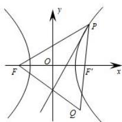

text_image

y
P
O
F
x
F'
Q

第2题

3.（绵阳期末）已知两个圆 $O_{1}$ 和 $O_{2}$ ，它们的半径分别是 2 和 4，且 $|O_{1}O_{2}| = 8$ ，若动圆 $M$ 与圆 $O_{1}$ 内切，又与圆 $O_{2}$ 外切，则动圆圆心 $M$ 的轨迹方程是（）

A. 圆

B. 椭圆

C. 双曲线一支

D. 抛物线

4.（2018·新课标III）已知双曲线 $C: \frac{x^2}{a^2} - \frac{y^2}{b^2} = 1 (a > 0, b > 0)$ 的离心率为 $\sqrt{2}$ ，则点(4,0)到 $C$ 的渐近线的距离为（）

A. $\sqrt{2}$

B. 2

C. $\frac{3\sqrt{2}}{2}$

D. $2 \sqrt{2}$

5.（2019·新课标III）已知 F 是双曲线 $C: \frac{x^{2}}{4}-\frac{y^{2}}{5}=1$ 的一个焦点，点 P 在 C 上，O 为坐标原点。若 $|OP|=|OF|$ ，则 $\triangle OPF$ 的面积为（）

A. $\frac{3}{2}$

B. $\frac{5}{2}$

C. $\frac{7}{2}$

D. $\frac{9}{2}$

6.（2019•新课标III）双曲线 $C: \frac{x^{2}}{4}-\frac{y^{2}}{2}=1$ 的右焦点为 F，点 P 在 C 的一条渐近线上，O 为坐标原点．若 $|PO|=|PF|$ ，则 $\triangle PFO$ 的面积为（）

A. $\frac{3\sqrt{2}}{4}$

B. $\frac{3\sqrt{2}}{2}$

C. $2 \sqrt{2}$

D. $3 \sqrt{2}$

7.（樊城区校级模拟）从双曲线 $\frac{x^2}{3} -\frac{y^2}{5} = 1$ 的左焦点 $F$ 引圆 $x^{2} + y^{2} = 3$ 的切线 $FP$ 交双曲线右支于点 $P$ ， $T$ 为切点， $M$ 为线段 $FP$ 的中点， $O$ 为坐标原点，则 $|MO| - |MT|$ 等于

8.（泉州模拟）已知双曲线 $C: \frac{x^2}{a^2} - \frac{y^2}{b^2} = 1 (a > 0, b > 0)$ 的右焦点为 $F$ ， $O$ 为坐标原点，以 $F$ 为圆心， $2\sqrt{3} a$

为半径的圆与双曲线 C 的一条渐近线交于 P、Q 两点，且 $FP \cdot FQ = -6a^{2}$ ，若 $OP = \lambda OQ$ ，则 $\lambda =$ \_\_\_\_ .

9.（南昌模拟）已知 $F_{1}$ ， $F_{2}$ 是双曲线 $\frac{x^{2}}{a^{2}} - \frac{y^{2}}{b^{2}} = 1 (a > 0, b > 0)$ 的左、右焦点，设双曲线的离心率为 $e$ 。若在双曲线的右支上存在点 $M$ ，满足 $|MF_{2}| = |F_{1}F_{2}|$ ，且 $e\sin \angle MF_{1}F_{2} = 1$ ，则该双曲线的离心率 $e$ 等于（）

A. $\frac{5}{4}$

B. $\frac{5}{3}$

C. $\sqrt{5}$

D. $\frac{5}{2}$

10.（广东模拟）已知点 $F_{1}$ 、 $F_{2}$ 分别是双曲线 $C: \frac{x^{2}}{a^{2}} - \frac{y^{2}}{b^{2}} = 1 (a > 0, b > 0)$ 的左右焦点，过 $F_{1}$ 的直线 $l$ 与双曲线 $C$ 的左、右两支分别交于 $A$ 、 $B$ 两点，若 $|AB|: |BF_{2}|: |AF_{2}| = 3:4:5$ ，则双曲线的离心率为（）

A. 2

B. 4

C. $\sqrt{13}$

D. $\sqrt{15}$

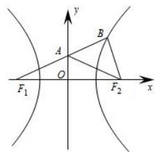

text_image

y
A
B
O
F₁
F₂
x

第10题

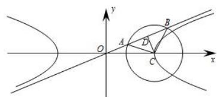

text_image

Mathematical diagram showing a hyperbola with tangent lines and labeled points A, B, C, D on coordinate axes

第 12 题

11.（思明模拟）双曲线 $\frac{x^2}{a^2} -\frac{y^2}{b^2} = 1(a > 0,b > 0)$ 的右焦点为 $F$ ， $B$ 为其左支上一点，线段 $BF$ 与双曲线的一条渐近线相交于 $A$ ，且 $(OF - OB)\cdot OA = 0$ ， $2OA = OB + OF(O$ 为坐标原点)，则双曲线的离心率为（）

A. $\sqrt{3}$

B. 2

C. $\sqrt{5}$

D. $\sqrt{7}$

12.（佛山二模）已知双曲线 $\Gamma: \frac{x^2}{a^2} - \frac{y^2}{b^2} = 1 (a > 0, b > 0)$ 的一条渐近线为 $l$ ，圆 $C: (x - a)^2 + y^2 = 8$ 与 $l$ 交于 $A$ ， $B$ 两点，若 $\triangle ABC$ 是等腰直角三角形，且 $OB = 5OA$ （其中 $O$ 为坐标原点），则双曲线 $\Gamma$ 的离心率为（）

A. $\frac{2\sqrt{13}}{3}$

B. $\frac{2\sqrt{13}}{5}$

C. $\frac{\sqrt{13}}{5}$

D. $\frac{\sqrt{13}}{3}$

13.（岳阳二模）已知直线 $l_{1}$ 与双曲线 $C:\frac{x^{2}}{a^{2}}-\frac{y^{2}}{b^{2}}=1(a>0,b>0)$ 交于A，B两点，且AB中点M的横坐标为b，过M且与直线 $l_{1}$ 垂直的直线 $l_{2}$ 过双曲线C的右焦点，则双曲线的离心率为（）

A. $\frac{1 + \sqrt{5}}{2}$

B. $\sqrt{\frac{1+\sqrt{5}}{2}}$

C. $\frac{1 + \sqrt{3}}{2}$

D. $\sqrt{\frac{1+\sqrt{3}}{2}}$

14.（东莞二模）已知 $F$ 为双曲线 $C: \frac{x^2}{a^2} - \frac{y^2}{b^2} = 1 (a > 0, b > 0)$ 的右焦点， $l_1$ ， $l_2$ 为 $C$ 的两条渐近线，点

$A$ 在 $l_{1}$ 上，且 $FA \perp l_{1}$ ，点 $B$ 在 $l_{2}$ 上，且 $FB // l_{1}$ ，若 $|FA| = \frac{4}{5} |FB|$ ，则双曲线 $C$ 的离心率为（）

A. $\frac{\sqrt{5}}{2}$ 或 $\sqrt{5}$

B. $\frac{\sqrt{5}}{2}$ 或 $\frac{3\sqrt{5}}{2}$

C. $\frac{\sqrt{5}}{2}$

D. $\sqrt{5}$

15.（东城模拟）如图， $F_{1}$ 和 $F_{2}$ 分别是双曲线 $\frac{x^{2}}{a^{2}} - \frac{y^{2}}{b^{2}} = 1 (a > 0, b > 0)$ 的两个焦点，A 和 B 是以 O 为圆心，以 $\left|OF_{1}\right|$ 为半径的圆与该双曲线左支的两个交点，且 $\triangle F_{2}AB$ 是等边三角形，则双曲线的离心率为 \_\_\_\_.

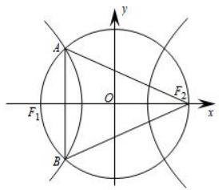

text_image

y
A
O
F₁
B
x
F₂

16. (2015·山东) 平面直角坐标系 $xOy$ 中, 双曲线 $C_1: \frac{x^2}{a^2} - \frac{y^2}{b^2} = 1 (a > 0, b > 0)$ 的渐近线与抛物线 $C_2: x^2 = 2py (p > 0)$ 交于点 $O$ , $A$ , $B$ , 若 $\triangle OAB$ 的垂心为 $C_2$ 的焦点, 则 $C_1$ 的离心率为 \_\_\_\_.

17.（临汾模拟）已知双曲线 $\frac{x^2}{a^2} -\frac{y^2}{b^2} = 1(a > 0,b > 0)$ ，过其左焦点 $F_{1}$ 作 $x$ 轴的垂线交双曲线于 $A$ 、 $B$ 两点，若双曲线右顶点在以 $AB$ 为直径的圆内，则双曲线离心率的取值范围为（）

A. $(2, +\infty)$

B. $(1,2)$

C. $\left(\frac{3}{2},+\infty\right)$

D. $(1,\frac{3}{2})$

# 1.1.3 达标训练

1. (松江区二模) 已知动点 $P$ 到定点 $(1,0)$ 的距离等于它到定直线 $l: x = -1$ 的距离, 则点 $P$ 的轨迹方程为 \_\_\_\_.  
2.（安徽一模）已知抛物线 $y^{2}=2px(p>0)$ 过点 $A(\frac{1}{2},\sqrt{2})$ ，其准线与 x 轴交于点 B，直线 AB 与抛物线的另一个交点为 M，若 $MB=\lambda AB$ ，则实数 $\lambda$ 为（）

A. $\frac{1}{3}$

B. $\frac{1}{2}$

C. 2

D. 3

3.（张家口期中）已知点 $P(2,1)$ 是抛物线上 $x^{2} = 4y$ 上的一点，点 $M$ ， $N$ 是抛物线上的动点 $(M, N, P$ 三点不共线)，直线 $PM$ ， $PN$ 分别交 $y$ 轴于 $A$ ， $B$ 两点，且 $|PA| = |PB|$ ，则直线 $MN$ 的斜率为 \_\_\_\_.  
4.（成都模拟）如图，抛物线 $y^{2}=4x$ 的一条弦 AB 经过焦点 F，取线段 OB 的中点 D，延长 OA 至点 C，使 $|OA|=|AC|$ ，过点 C，D 作 y 轴的垂线，垂足分别为 E，G，则 $|EG|$ 的最小值为 \_\_\_\_.

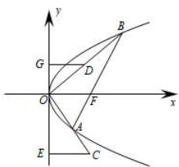

text_image

y
G
D
O
F
x
A
E
C
B

5.（宜春期末）已知抛物线 $x^{2}=2py(p>0)$ 的焦点为 F，过点 F 且倾斜角为 $150^{\circ}$ 的直线 l 与抛物线在第一、二象限分别交于 A，B 两点，则 $\frac{|BF|}{|AF|}$ 等于（）

A. 3

B. $7 + 4\sqrt{3}$

C. $\frac{1}{3}$

D. $3 + 2\sqrt{2}$

6.（五华月考）已知直线 $l_{1}$ 是抛物线 $C: y^{2} = 8x$ 的准线，P 是 C 上的一动点，则 P 到直线 $l_{1}$ 与直线 $l_{2}: 3x - 4y + 24 = 0$ 的距离之和的最小值为（）

A. $\frac{24}{5}$

B. $\frac{26}{5}$

C. 6

D. $\frac{32}{5}$

7.（琼海模拟）已知抛物线 $y^{2}=2px(p>0)$ ，过焦点且倾斜角为 $30^{\circ}$ 的直线交抛物线于 A，B 两点，以 AB 为直径的圆与抛物线的准线相切，切点的纵坐标是 3，则抛物线的准线方程为（）

A. $x = -1$

B. $x = -\frac{\sqrt{3}}{2}$

C. $x = -\frac{\sqrt{3}}{3}$

D. $x = -\sqrt{3}$

8.（岳阳一模）在平面直角坐标系 $xoy$ 中，双曲线 $C_1: \frac{x^2}{a^2} - \frac{y^2}{b^2} = 1 (a > 0, b > 0)$ 的渐近线与抛物线 $C_2: y^2 = 2px (p > 0)$ 交于点 $O$ ， $A$ ， $B$ ，若 $\triangle OAB$ 的垂心为 $C_2$ 的焦点，则 $C_1$ 的离心率为（）

A. $\frac{3}{2}$

B. $\sqrt{5}$

C. $\frac{3\sqrt{5}}{5}$

D. $\frac{\sqrt{5}}{2}$

9.（福建模拟）已知抛物线 $C: x^{2} = 4y$ 的焦点为 $F$ ， $P$ 为抛物线 $C$ 上的动点，点 $Q(0, -1)$ ，则 $\frac{|PF|}{|PQ|}$ 的最小值为 \_\_\_\_.

10.（河南模拟）已知抛物线 $C: y^{2} = 8x$ 的焦点为 $F$ ，准线 $l$ 与 $x$ 轴的交点为 $M$ ，过点 $M$ 的直线 $l'$ 与抛物线 $C$ 的交点为 $P$ ， $Q$ ，延长 $PF$ 交抛物线 $C$ 于点 $A$ ，延长 $QF$ 交抛物线 $C$ 于点 $B$ ，若 $\frac{|PF|}{|AF|} + \frac{|QF|}{|BF|} = 22$ ，则直线 $l'$ 的方程为 \_\_\_\_.

11.（渝中月考）过抛物线 $y^{2}=2px(p>0)$ 的焦点的直线交抛物线 A、B 两点，且 $|AB|=4$ ，这样的直线可以作 2 条，则 p 的取值范围是（）

A. $(0,4)$

B. $(0,4]$

C. $(0,2]$

D. $(0,2)$

# 1.1.4 达标训练

1.（未央期末）已知动圆 $P$ 与定圆 $C: (x - 2)^{2} + y^{2} = 1$ 相外切，又与定直线 $l: x = -1$ 相切，那么动圆的圆心 $P$ 的轨迹方程是（）

A. $y^{2}=4x$

B. $y^{2} = -4x$

C. $y^{2}=8x$

D. $y^{2} = -8x$

2.（西夏月考）已知动点 $P(x,y)$ 满足 $\sqrt{x^2 + (y + 3)^2} +\sqrt{x^2 + (y - 3)^2} = 6$ ，则动点 $P$ 的轨迹是（

A. 双曲线

B. 线段

C. 抛物线

D. 椭圆

3.（美兰模拟）过点 $F(0,3)$ ，且和直线 $y + 3 = 0$ 相切的动圆圆心轨迹方程是（）

A. $y^{2}=12x$

B. $y^{2} = -12x$

C. $x^{2} = -12y$

D. $x^{2}=12y$

4.（西陵期中）动圆 M 与圆 $C_{1}:(x+1)^{2}+y^{2}=1$ 外切，与圆 $C_{2}:(x-1)^{2}+y^{2}=25$ 内切，则动圆圆心 M 的轨迹方程是（）

A. $\frac{x^{2}}{8}+\frac{y^{2}}{9}=1$

B. $\frac{x^2}{9} +\frac{y^2}{8} = 1$

C. $\frac{x^2}{9} + y^2 = 1$

D. $x^{2}+\frac{y^{2}}{9}=1$

5.（三台月考）已知点 $F_{1}(-1,0)$ ， $F_{2}(1,0)$ ，动点 $A$ 到 $F_{1}$ 的距离是 $2\sqrt{3}$ ，线段 $AF_{2}$ 的垂直平分线交 $AF_{1}$ 于点 $P$ ，则 $P$ 点的轨迹方程是（）

A. $\frac{x^{2}}{9}+\frac{y^{2}}{4}=1$

B. $\frac{x^{2}}{12}+\frac{y^{2}}{8}=1$

C. $\frac{x^{2}}{3}+\frac{y^{2}}{2}=1$

D. $\frac{x^2}{12} +\frac{y^2}{10} = 1$

6.（绵阳期末）已知两个圆 $O_{1}$ 和 $O_{2}$ ，它们的半径分别是 2 和 4，且 $|O_{1}O_{2}| = 8$ ，若动圆 $M$ 与圆 $O_{1}$ 内切，又与圆 $O_{2}$ 外切，则动圆圆心 $M$ 的轨迹方程是（）

A. 圆

B. 椭圆

C. 双曲线一支

D. 抛物线

7.（天水月考）已知 $B(-5,0)$ ， $C(5,0)$ 是 $\triangle ABC$ 的两个顶点，且 $\sin B - \sin C = \frac{3}{5} \sin A$ ，则顶点 A 的轨迹方程为（）

A. $\frac{x^2}{9} -\frac{y^2}{16} = 1(x <   - 3)$

B. $\frac{x^2}{9} -\frac{y^2}{16} = 1(x\leq -3)$

C. $\frac{x^{2}}{9}-\frac{y^{2}}{16}=1$

D. $\frac{x^{2}}{9}-\frac{y^{2}}{16}=1(x>3)$

8.（青羊模拟）设 C 为椭圆 $x^{2}+\frac{y^{2}}{5}=1$ 上任意一点， $A(0,-2)$ ， $B(0,2)$ ，延长 AC 至点 P，使得 $|PC|=|BC|$ ，则点 P 的轨迹方程为（）

A. $x^{2}+(y-2)^{2}=20$

B. $x^{2}+(y+2)^{2}=20$

C. $x^{2}+(y-2)^{2}=5$

D. $x^{2}+(y+2)^{2}=5$

9.（龙凤期中）若点 $P$ 到点 $F(4,0)$ 的距离比它到直线 $x + 5 = 0$ 的距离小1，则 $P$ 点轨迹方程是（）

A. $y^{2} = -16x$

B. $y^{2} = -32x$

C. $y^{2}=16x$

D. $y^{2}=32x$

10.（温州期末）一个动圆与定圆 $F:(x+2)^{2}+y^{2}=1$ 相外切，且与定直线L:x=1相切，则此动圆的圆心M的轨迹方程是（）

A. $y^{2}=4x$

B. $y^{2} = -2x$

C. $y^{2} = -4x$

D. $y^{2} = -8x$

11.（上饶月考）已知 $A(-3,0)$ ， $B$ 是圆 $x^{2} + (y - 4)^{2} = 1$ 上的点，点 $P$ 在双曲线 $\frac{x^2}{4} - \frac{y^2}{5} = 1$ 的右支上，则 $|PA| + |PB|$ 的最小值为（）

A. 9

B. $2\sqrt{5} + 4$

C. $2\sqrt{5} + 4$

D. 7

12.（运城月考）已知抛物线 $C: y = \frac{1}{4} x^2$ 的焦点为 $F$ ， $O$ 为坐标原点，点 $A$ 在抛物线 $C$ 上，且 $|AF| = 2$ ，点 $P$ 是抛物线 $C$ 的准线上的一动点，则 $|PA| + |PO|$ 的最小值为（）

A. $\sqrt{13}$

B. $2\sqrt{13}$

C. $3\sqrt{13}$

D. $2\sqrt{6}$

13.（海淀月考）点 $P$ 在曲线 $y^{2} = 4x$ 上，过 $P$ 分别作直线 $x = -1$ 及 $y = x + 3$ 的垂线，垂足分别为 $G$ ， $H$ 则 $|PG| + |PH|$ 的最小值为（）

A. $\frac{3\sqrt{2}}{2}$

B. $2\sqrt{2}$

C. $\frac{3\sqrt{2}}{2}+1$

D. $\sqrt{2} + 2$

14.（杜集月考）已知抛物线 $C: x^{2} = 12y$ 上一点 $P$ ，直线 $l: y = -3$ ，过点 $P$ 作 $PA \perp l$ ，垂足为 $A$ ，圆 $M: (x - 4)^{2} + y^{2} = 1$ 上有一动点 $N$ ，则 $|PA| + |PN|$ 最小值为（）

A. 2

B. 4

C. 6

D. 8

15.（沙坪坝模拟）已知直线 $l_{1}: x = -2$ ， $l_{2}: y = x + 3$ ，点 $A$ 为抛物线 $C: y^{2} = 4x$ 上一动点，过 $A$ 作 $l_{1}$ ， $l_{2}$ 的垂线，垂足分别为 $P$ ， $Q$ ，则 $|PA| + |QA|$ 的最小值为（）

A. 4

B. $4\sqrt{2}$

C. $1 + 2\sqrt{2}$

D. $1 + 3\sqrt{2}$

16.（高港月考）设双曲线 $\frac{x^2}{16} -\frac{y^2}{12} = 1$ 的左、右焦点分别为 $F_{1}$ ， $F_{2}$ ，过 $F_{1}$ 的直线 $l$ 交双曲线左支于 $A$ ， $B$ 两点，则 $\vert AF_2\vert +\vert BF_2\vert$ 的最小值为（）

A. 20

B. 21

C. 22

D. 23

17.(丰台期末)已知点 P 是椭圆 $C: \frac{x^{2}}{100} + \frac{y^{2}}{64} = 1$ 上一点，M，N 分别是圆 $(x - 6)^{2} + y^{2} = 1$ 和圆 $(x + 6)^{2} + y^{2} = 4$ 上的点，那么 $|PM| + |PN|$ 的最小值为（）

A. 15

B. 16

C. 17

D. 18

18.（兰州模拟）已知点 $M(-4, - 2)$ ，抛物线 $x^{2} = 4y$ ， $F$ 为抛物线的焦点， $l$ 为抛物线的准线， $P$ 为抛物线上一点，过 $P$ 做 $PQ\bot l$ ，点 $Q$ 为垂足，过 $P$ 作抛物线的切线 $l_{1}$ ， $l_{1}$ 与 $l$ 交于点 $R$ ，则 $|QR| + |MR|$ 的最小值为（）

A. $1 + 2\sqrt{5}$

B. $2 \sqrt{5}$

C. $\sqrt{17}$

D. 5

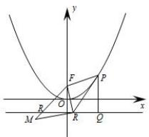

text_image

Mathematical diagram showing a parabola and triangle in coordinate plane with labeled points and axes

19.（温江月考）设 P 是椭圆 $\frac{x^{2}}{169} + \frac{y^{2}}{25} = 1$ 上一点，M、N 分别是两圆 $(x + 12)^{2} + y^{2} = 1$ 和 $(x - 12)^{2} + y^{2} = 1$ 上的点，则 $|PM| + |PN|$ 的最小值、最大值分别为（）

A. 18, 24

B. 16, 22

C. 24, 28

D. 20, 26

20.（黑龙江三模）已知点 $M(-3, - 2)$ ，抛物线 $x^{2} = 4y$ ， $F$ 为抛物线的焦点， $l$ 为抛物线的准线， $P$ 为抛物线上一点，过 $P$ 作 $PQ \perp l$ ，点 $Q$ 为垂足，过 $P$ 作 $FQ$ 的垂线 $l_{1}$ ， $l_{1}$ 与 $l$ 交于点 $R$ ，则 $|QR| + |MR|$ 的最小值为（）

A. $1 + \sqrt{13}$

B. $\sqrt{13}$

C. $\sqrt{10}$

D. $3\sqrt{2}$

21.（武汉模拟）已知平面上定点 $A(-5,0)$ 和 $B(8,4)$ ，又 $P$ 点为双曲线 $\frac{x^2}{16} - \frac{y^2}{9} = 1$ 右支上的动点，则 $|PA| - |PB|$ 的最大值为（）

A. 8

B. 10

C. 11

D. 13

22.（浙江模拟）已知点 $A(2, - 1)$ ， $P$ 为椭圆 $C:\frac{x^2}{4} +\frac{y^2}{3} = 1$ 上的动点， $B$ 是圆 $C_1:(x - 1)^2 +y^2 = 1$ 上的动点，则 $\vert PB\vert -\vert PA\vert$ 的最大值为（ ）

A. $\sqrt{5}$

B. $\sqrt{2} + 1$

C. 3

D. $5 - \sqrt{10}$

23.（广东月考）已知圆 $C_1: (x - 3)^2 + (y - 2\sqrt{2})^2 = 1$ 和焦点为 $F$ 的抛物线 $C_2: y^2 = 8x$ ， $N$ 是 $C_1$ 上一点， $M$ 在 $C_2$ 上，当点 $M$ 在 $M_1$ 时， $|MF| + |MN|$ 取得最小值，当点 $M$ 在 $M_2$ 时， $|MF| - |MN|$ 取得最大值，则 $\left|M_1M_2\right| = (\quad)$

A. $2 \sqrt{2}$

B. $3 \sqrt{2}$

C. $4\sqrt{2}$

D. $\sqrt{17}$

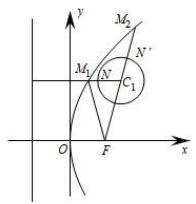

text_image

y
M₂
N'
M₁
N
C₁
O
F
x

24.（福州期末）已知点 $A(3, - 1)$ ， $F$ 是抛物线 $y^{2} = 4x$ 的焦点， $M$ 是抛物线上任意一点，则 $\vert MF\vert +\vert MA\vert$ 的最小值为

25.（梅河口模拟）已知双曲线的一条渐近线方程为 $y = \sqrt{3}x$ ，且双曲线经过点(2,3)，若 $F_{1}$ 、 $F_{2}$ 为其左、右焦点，P 为双曲线右支上一点，若点 $A(6,8)$ ，则当 $|PA| + |PF_{2}|$ 取最小值时，点 P 的坐标为（）

A. $(1 + \frac{\sqrt{2}}{2}, 3 + \frac{3\sqrt{2}}{2})$

B. $(1 + \frac{3\sqrt{2}}{2}, 3 + \frac{\sqrt{2}}{2})$

C. $(1+\frac{3\sqrt{2}}{2},3+\frac{3\sqrt{2}}{2})$

D. $(1 + \frac{\sqrt{2}}{2}, 3 + \frac{\sqrt{2}}{2})$

26.（和平区三模）已知双曲线 $\frac{x^2}{a^2} -\frac{y^2}{b^2} = 1(a > 0, > 0)$ 的右焦点为 $F$ ，虚轴的上端点为 $B$ ， $P$ 为左支上的一个动点，若 $\triangle PBF$ 周长的最小值等于实轴长的3倍，则该双曲线的离心率为（）

A. $\frac{\sqrt{10}}{2}$

B. $\frac{\sqrt{10}}{5}$

C. $\sqrt{10}$

D. $\sqrt{2}$

27.（湖北期中）定长为 10 的线段 AB 的两个端点在抛物线 $y^{2}=8x$ 上移动，P 为线段 AB 的中点，则 P 点到 y 轴的最短距离为()

A. 2

B. 3

C. 4

D. 4

28.（龙岩模拟）设双曲线 $C: \frac{x^2}{a^2} - \frac{y^2}{b^2} = 1 (a > 0, b > 0)$ 的左、右焦点分别为 $F_1$ ， $F_2$ ， $|F_1F_2| = 2c$ ，过 $F_2$ 作 $x$ 轴的垂线，与双曲线在一第象限的交点为 $A$ ，点 $Q$ 坐标为 $(c, \frac{3a}{2})$ 且满足 $|F_2Q| > |F_2A|$ ，若在双曲线 $C$ 的右支上存在点 $P$ 使得 $|PF_1| + |PQ| < \frac{7}{6}|F_1F_2|$ 成立，则双曲线 $C$ 的离心率的取值范围是（）

A. $(1,\frac{\sqrt{10}}{2})$

B. $(1,\frac{3}{2})$

C. $\left(\frac{3}{2},\frac{\sqrt{10}}{2}\right)$

D. $\left(\frac{3}{2},+\infty\right)$

29.（全国二模）希腊著名数学家阿波罗尼斯与欧几里得、阿基米德齐名．他发现：“平面内到两个定点 A，B 的距离之比为定值 $\lambda(\lambda \neq 1)$ 的点的轨迹是圆”。后来，人们将这个圆以他的名字命名，称为阿波罗尼斯圆，简称阿氏圆．在平面直角坐标系 xOy 中， $A(0,1)$ ， $B(0,4)$ ，则点 P 满足 $\lambda = \frac{1}{2}$ 的阿波罗尼斯圆的方程为 \_\_\_\_．已知点 $C(-2,4)$ ，Q 为抛物线 $E: y^{2} = 8x$ 上的动点，点 Q 在直线 x = -2 上的射影为 H，M 为 $(x + 2)^{2} + y^{2} = 4$ 上动点，则 $\frac{1}{2}|MC| + |QH| + |QM|$ 的最小值为 \_\_\_\_．

30.（和平一模）已知双曲线 $C: \frac{4x^2}{3} - b^2y^2 = 1 (b > 0)$ 的右焦点到其中一条新近线的距离等于 $\frac{1}{2}$ ，抛物线 $E: y^2 = 2px (p > 0)$ 的焦点与双曲线 $C$ 的右焦点重合，则抛物线 $E$ 上的动点 $M$ 到直线 $l_1: 4x - 3y + 6 = 0$ 和 $l_2: x = -1$ 的距离之和的最小值为（）

A. 1

B. 2

C. 3

D. 4

# 1.1.5 达标训练

1.（吉林期末）点 $M$ 与定点 $F(4,0)$ 的距离和它到定直线 $x = \frac{25}{4}$ 的距离之比是常数 $\frac{4}{5}$ ，则 $M$ 的轨迹方

程为（）

A. $\frac{x^{2}}{4}+\frac{y^{2}}{9}=1$

B. $\frac{x^{2}}{9}+\frac{y^{2}}{3}=1$

C. $\frac{x^2}{25} +\frac{y^2}{9} = 1$

D. $\frac{x^2}{25} +\frac{y^2}{16} = 1$

2.（简阳期中）下列命题是真命题的是（）

A. 到两定点距离之和为常数的点的轨迹是椭圆

B. 到定直线 $x = \frac{a^2}{c}$ 和定点 $F(c,0)$ 的距离之比为 $\frac{c}{a}$ 的点的轨迹是椭圆

C. 到定点 $F(-c,0)$ 和定直线 $x = -\frac{a^2}{c}$ 的距离之比为 $\frac{c}{a} (a > c > 0)$ 的点的轨迹是左半个椭圆

D. 到定直线 $x = \frac{a^2}{c}$ 和定点 $F(c,0)$ 的距离之比为 $\frac{a}{c} (a > c > 0)$ 的点的轨迹是椭圆

3.（南通期末）平面内到定点 $F(5,0)$ 及到定直线 $x=\frac{16}{5}$ 的距离之比为 5:4 的点的轨迹方程是（）

A. $\frac{x^{2}}{16}-\frac{y^{2}}{9}=1$

B. $\frac{x^2}{9} -\frac{y^2}{16} = 1$

C. $\frac{y^2}{16} -\frac{x^2}{9} = 1$

D. $\frac{y^2}{9} -\frac{x^2}{16} = 1$

4.（南安月考）动点 $P(x,y)$ 到点 $(1,0)$ 的距离与到定直线 $x = 3$ 的距离之比是 $\frac{\sqrt{3}}{3}$ ，则动点 $P$ 的轨迹方程是 \_\_\_\_.

5.（双流月考）已知椭圆 $\frac{x^2}{a^2} +\frac{y^2}{b^2} = 1(a > b > 0)$ 的上、下、左、右四个顶点分别为 $A$ 、 $B$ 、 $C$ 、 $D$ ， $x$ 轴正半轴上的某点 $G$ 满足 $|GD| = 2$ ， $|GA| = 3$ ， $|GC| = 4$ ：

(1) 求椭圆的方程;

(2)设该椭圆的左、右焦点分别为 $F_{1}$ 、 $F_{2}$ ，点M在圆 $x^{2}+y^{2}=b^{2}$ 上，且M在第一象限，过M作圆 $x^{2}+y^{2}=b^{2}$ 的切线交椭圆于P，Q两点，求证： $\triangle PF_{2}Q$ 的周长是定值.

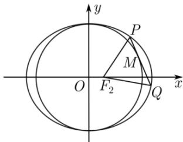

text_image

y
P
M
O
F₂
Q
x

# 1.1.6 达标训练

1.（沙坪坝期末）在平面直角坐标系 $xOy$ 中，双曲线 $E: \frac{x^2}{a^2} - \frac{y^2}{b^2} = 1 (a > 0, b > 0)$ 的离心率为 2，其焦点到渐近线的距离为 $\sqrt{3}$ ，过点 $P(2,1)$ 的直线 $m$ 与双曲线 $E$ 交于 $A$ ， $B$ 两点。若 $P$ 是 $AB$ 的中点，则直线 $m$ 的斜率

为（）

A. 2

B. 4

C. 6

D. 8

2.（沈阳一模）已知双曲线 $C: \frac{x^2}{a^2} - \frac{y^2}{b^2} = 1 (a > 0, b > 0)$ 的两条渐近线分别为直线 $l_1$ 与 $l_2$ ，若点 $A$ ， $B$ 为直线 $l_1$ 上关于原点对称的不同两点，点 $M$ 为直线 $l_2$ 上一点，且 $k_{AM} k_{BM} = \frac{\sqrt{3} b}{a}$ ，双曲线 $C$ 的离心率为（）

A. 1

B. $\sqrt{2}$

C. 2

D. $\sqrt{5}$

3.（河北模拟）已知 $F_{1}(-c,0)$ ， $F_{2}(c,0)$ 分别为双曲线 $C:\frac{x^{2}}{a^{2}}-\frac{y^{2}}{b^{2}}=1(a>0,b>0)$ 的左、右焦点，直线 $l:\frac{x}{c}+\frac{y}{b}=1$ 与 $C$ 交于 $M$ ， $N$ 两点，线段 $MN$ 的垂直平分线与 $x$ 轴交于 $T(-5c,0)$ ，则 $C$ 的离心率为（）

A. $\frac{\sqrt{6}}{2}$

B. $\sqrt{2}$

C. $\sqrt{3}$

D. $\frac{\sqrt{5}}{2}$

4.（武汉月考）已知 P 是椭圆 $E: \frac{x^{2}}{4} + \frac{y^{2}}{m} = 1$ 上任意一点，M，N 是椭圆上关于坐标原点对称的两点，且直线 PM，PN 的斜率分别为 $k_{1}$ ， $k_{2}(k_{1}k_{2} \neq 0)$ ，若 $|k_{1}| + |k_{2}|$ 的最小值为 1，则实数 m 的值为（）

A. 1

B. 2

C. 1 或 16

D. 2 或 8

5.（襄城模拟）已知直线 $l: \sqrt{3} x + y + m = 0$ 与双曲线 $C: \frac{x^2}{a^2} - \frac{y^2}{b^2} = 1 (a > 0, b > 0)$ 右支交于 $M$ ， $N$ 两点，点 $M$ 在第一象限，若点 $Q$ 满足 $OM + OQ = 0$ （其中 $O$ 为坐标原点），且 $\angle MNQ = 30^\circ$ ，则双曲线 $C$ 的渐近线方程为 \_\_\_\_.

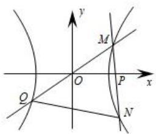

text_image

y
M
O
P
x
Q
N

6.（宁波期末）已知双曲线 $x^{2} - y^{2} = a^{2}(a > 0)$ 的左、右顶点分别为 $A$ 、 $B$ ，双曲线在第一象限的图象上有一点 $P$ ， $\angle PAB = \alpha$ ， $\angle PBA = \beta$ ， $\angle APB = \gamma$ ，则（）

A. $\tan \alpha +\tan \beta +\tan \gamma = 0$

B. $\tan \alpha +\tan \beta -\tan \gamma = 0$

C. $\tan\alpha+\tan\beta+2\tan\gamma=0$

D. $\tan \alpha +\tan \beta -2\tan \gamma = 0$

7.（莆田月考）双曲线 $x^{2} - y^{2} = 2015$ 的左，右顶点分别为 $A$ ， $B$ ， $P$ 为其右支上不同于 $B$ 的一点，且 $\angle APB = 2\angle PAB$ ，则 $\angle PAB =$ \_\_\_\_.

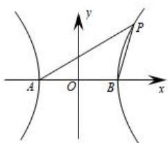

text_image

y
P
A O B x

8.（无锡期末）双曲线 $C: \frac{x^2}{4} - \frac{y^2}{3} = 1$ 的左右顶点为 $A, B$ ，以 $AB$ 为直径作圆 $O, P$ 为双曲线右支上不同于顶点 $B$ 的任一点，连接 $PA$ 交圆 $O$ 于点 $Q$ ，设直线 $PB, QB$ 的斜率分别为 $k_1, k_2$ ，若 $k_1 = \lambda k_2$ ，则 $\lambda =$ \_\_\_\_.  
9.（南京模拟）已知椭圆 $C: \frac{x^{2}}{a^{2}} + \frac{y^{2}}{b^{2}} = 1 (a > b > 0)$ 的左焦点为 $F_{1}$ ，点 A，B 为椭圆的左、右顶点，点 P 是椭圆上一点，且直线 $PF_{1}$ 的倾斜角为 $\frac{\pi}{4}$ ， $PF_{1} = 2$ ，已知椭圆的离心率为 $\frac{\sqrt{2}}{2}$ .

(1) 求椭圆 C 的方程;  
(2) 设 $M, N$ 为椭圆上异于 $A, B$ 的两点, 若直线 $BN$ 的斜率等于直线 $AM$ 斜率的 2 倍, 求四边形 $AMBN$ 面积的最大值.

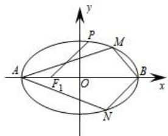

text_image

y
P
M
A
F₁ O B
x
N

10.（单县二模）已知椭圆 $C: \frac{x^2}{a^2} + \frac{y^2}{b^2} = 1 (a > b > 0)$ 的两焦点与短轴的一个端点的连线构成等边三角形，直线 $x + y + 2\sqrt{2} - 1 = 0$ 与以椭圆 $C$ 的右焦点为圆心，椭圆的长半轴为半径的圆相切.

(1) 求椭圆 C 的方程;  
(2) 设点 $B, C, D$ 是椭圆上不同于椭圆顶点的三点，点 $B$ 与点 $D$ 关于原点 $O$ 对称，设直线 $CD, CB, OB, OC$ 的斜率分别为 $k_{1}, k_{2}, k_{3}, k_{4}$ ，且 $k_{1}k_{2} = k_{3}k_{4}$ .

(i) 求 $k_{1}k_{2}$ 的值;  
(ii) 求 $OB^{2} + OC^{2}$ 的值.

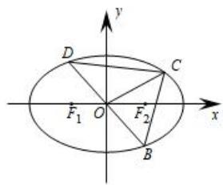

text_image

y
D
C
F₁ O F₂ x
B

# 1. 2 达标训练

1.（沧州期中）已知双曲线 $C: \frac{x^2}{a^2} - \frac{y^2}{b^2} = 1 (a > 0, b > 0)$ 的左、右焦点分别为 $F_1$ ， $F_2$ ，过 $F_1$ 的直线 $l$ 交双曲线 $C$ 的左支于 $A$ ， $B$ 两点，且 $|AB| = 6$ 。若 $\Delta ABF_2$ 的周长为 24，则双曲线 $C$ 的实轴长是（）

A. 3

B. 6

C. 9

D. 12

2.（武汉期末）过椭圆 $9x^{2}+y^{2}=1$ 的一个焦点 $F_{1}$ 的直线与椭圆交于A，B两点，则A与B和椭圆的另一个焦点 $F_{2}$ 构成的三角形 $ABF_{2}$ 的周长是（）

A. $\frac{4}{3}$

B. 4

C. 8

D. $2 \sqrt{2}$

3.（浙江月考）已知 $F_{1}$ 、 $F_{2}$ 分别为椭圆 $C: \frac{x^{2}}{a^{2}} + \frac{y^{2}}{b^{2}} = 1 (a > b > 0)$ 的左、右焦点，点 $F_{2}$ 关于直线 $y = x$ 对称的点 $Q$ 在椭圆上，则椭圆的离心率为 \_\_\_\_；若过 $F_{1}$ 且斜率为 $k (k > 0)$ 的线与椭圆相交于 $A$ ， $B$ 两点，且 $AF_{1} = 3F_{1}B$ ，则 $k =$ \_\_\_\_.

4.（抚顺期中）设 $F_{1}$ ， $F_{2}$ 分别是椭圆 $E: x^{2} + \frac{y^{2}}{b^{2}} = 1 (0 < b < 1)$ 的左、右焦点，过点 $F_{1}$ 的直线交椭圆 $E$ 于 $A$ 、 $B$ 两点，若 $|AF_{1}| = 3 |F_{1}B|$ ， $AF_{2} \hat{} x$ 轴，则椭圆 $E$ 的方程为 \_\_\_\_.

5.（漳州模拟）已知双曲线 $\frac{x^2}{16} -\frac{y^2}{9} = 1$ 的左、右焦点分别为 $F_{1}$ ， $F_{2}$ ，过 $F_{2}$ 的直线与该双曲线的右支交于 $A$ 、 $B$ 两点，若 $|AB| = 5$ ，则 $\Delta ABF_{1}$ 的周长为（）

A. 16

B. 20

C. 21

D. 26

6.（浙江模拟）已知 $F_{1}$ 、 $F_{2}$ 为椭圆 $C: \frac{x^{2}}{a^{2}} + \frac{y^{2}}{b^{2}} = 1 (a > b > 0)$ 的左、右焦点，过左焦点 $F_{1}$ 的直线交椭圆于 M 、 N 两点，若 $MF_{2} \perp x$ 轴，且 $MN = -4NF_{1}$ ，则椭圆的离心率为（）

A. $\frac{1}{3}$

B. $\frac{1}{2}$

C. $\frac{\sqrt{3}}{3}$

D. $\frac{\sqrt{5}}{3}$

7.（2014·新课标 I）已知抛物线 $C: y^{2} = 8x$ 的焦点为 F，准线为 l，P 是 l 上一点，Q 是直线 PF 与 C 的一个交点，若 FP = 4FQ，则 $|QF| = (\quad)$

A. $\frac{7}{2}$

B. 3

C. $\frac{5}{2}$

D. 2

8.（鼓楼月考）椭圆 $E: \frac{x^2}{a^2} + \frac{y^2}{b^2} = 1 (a > b > 0)$ 的左、右焦点分别是 $F_1$ 、 $F_2$ ，离心率是 $\frac{1}{2}$ ，又点 $(1, \frac{3}{2})$ 在椭圆 $E$ 上.

（1）求椭圆 E 的方程；

(2) 过 $F_{2}$ 的直线与椭圆 $E$ 交于 $A$ 、 $B$ 两点, 求 $\triangle F_{1}AB$ 面积的最大值.

9.（香坊月考）已知 $F$ 是椭圆： $x^{2} + \frac{y^{2}}{m} = 1$ 在 $y$ 正半轴上的焦点，该椭圆的离心率 $e = \frac{\sqrt{2}}{2}$ ，直线 $PQ$ 和 $MN$ 过点 $F$ 且与该椭圆分别交于 $P$ 、 $Q$ 、 $M$ 、 $N$ 四点，且 $PQ \perp MN$ .

(1) 求 m 的值;  
(2) 求四边形 PMQN 的面积的最大值和最小值.

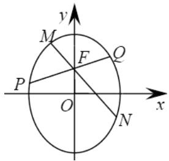

text_image

y
M
F
Q
P
O
x
N

# 1. 3 达标训练

1. （青岛一模）已知圆 $M: (x + 1)^2 + y^2 = 1$ ，圆 $N: (x - 1)^2 + y^2 = 25$ ，动圆 $P$ 与圆 $M$ 外切并与圆 $N$ 内切，圆心 $P$ 的轨迹为曲线 $C$ ．求曲线 $C$ 的方程；

2.（梁园期末）已知圆 $M:(x + \sqrt{5})^2 +y^2 = 36$ ，定点 $N(\sqrt{5},0)$ ，点 $P$ 为圆 $M$ 上的动点，点 $Q$ 在 $NP$ 上，点 $G$ 在 $MP$ 上，且满足 $NP = 2NQ$ ， $GQ NP = 0$ ．求点 $G$ 的轨迹 $C$ 的方程；

3.（广元一模）已知定圆 $M: (x - 3)^2 + y^2 = 16$ 和圆 $M$ 所在平面内一定点 $A$ ，点 $P$ 是圆 $M$ 上一动点，线段 $PA$ 的垂直平分线 $l$ 交直线 $PM$ 于点 $Q$ 。讨论 $Q$ 点的轨迹可能是下面的情形中的哪几种：①椭圆；②双曲线；③抛物线；④圆；⑤直线；⑥一个点。

4.（湖北月考）已知圆 $M:(x + 1)^2 +y^2 = 1$ ，圆 $N:(x - 1)^2 +y^2 = 9$ ，动圆 $P$ 与圆 $M$ 外切并与圆 $N$ 内切，圆心 $P$ 的轨迹为曲线 $C$ ．求 $C$ 的方程.

5.（绵阳模拟）在 $\Delta ABC$ 中， $|AB|=4$ ，且 $|CA|=\sqrt{3}|CB|$ ，则 $\Delta ABC$ 面积的最大值是 \_\_\_\_.

6.（银川期中）已知动圆 $P$ 与定圆 $C:(x + 2)^{2} + y^{2} = 1$ 相外切，又与定直线 $L:x = 1$ 相切，求动圆的圆心 $P$ 的轨迹方程.

7.（鄂尔多斯期中）已知点 $P(2,2)$ ，圆 $C: x^2 + y^2 - 8y = 0$ ，过点 $P$ 的动直线 $l$ 与圆 $C$ 交于 $A$ ， $B$ 两点，线段 $AB$ 的中点为 $M$ ， $O$ 为坐标原点．求 $M$ 的轨迹方程.

8.（湖北月考）已知动圆 G 过定点 $F(4,0)$ ，且在 y 轴上截得的弦长为 8。求动圆 G 的圆心点 G 的轨迹方程 $\Gamma$ ;

9.（青原月考）如图，动点 $M$ 与两定点 $A(-1,0)$ ， $B(2,0)$ 构成 $\Delta MAB$ ，且 $\angle MBA = 2\angle MAB$ ，设动点 $M$ 的轨迹为 $C$ ．求轨迹 $C$ 的方程；

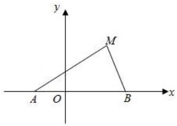

text_image

y
M
A O B x

10.（隆回县月考）当点 $P$ 在圆 $x^{2} + y^{2} = 4$ 上运动时，点 $M$ 在 $DP$ 的延长线上， $DP \perp x$ 轴，且 $\frac{|DM|}{|DP|} = \frac{3}{2}$ ，求：动点 $M$ 的轨迹方程.

11.（天心月考）如图所示，从曲线 $x^{2} - y^{2} = 1$ 上一点 $Q$ 引直线 $x + y = 2$ 的垂线，垂足为 $N$ ，求线段 $QN$ 的中点 $P$ 的轨迹方程.

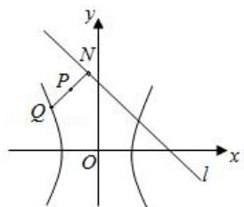

text_image

y
N
P
Q
O
x
l

12.（东胜月考）在平面直角坐标系 $xOy$ 中，点 $P$ 是圆 $x^{2} + y^{2} = 4$ 上一动点， $PD \perp x$ 轴于点 $D$ 。记满足 $OM = \frac{1}{2}(OP + OD)$ 的动点 $M$ 的轨迹为 $C$ 。求点 $M$ 的轨迹 $C$ 的方程。

13.（阿城月考）在直角坐标系 $xoy$ 中，长为 $\sqrt{2} + 1$ 的线段的两端点 $C$ ， $D$ ，分别在 $x$ 轴， $y$ 轴上滑动， $CP = \sqrt{2} PD$ ，记点 $P$ 的轨迹为曲线 $E$ ．求曲线 $E$ 的轨迹方程；

14.（椒江月考）已知定点 $B(3,0)$ ，点 $A$ 在圆 $x^{2} + y^{2} = 1$ 上运动， $M$ 是线段 $AB$ 上的中点，则点 $M$ 的轨迹方程为（ ）

A. $x^{2} + y^{2} = 4$

B. $(x + 3)^{2} + y^{2} = 4$

C. $(x - \frac{3}{2})^2 + y^2 = \frac{1}{4}$

D. $(x - 3)^{2} + y^{2} = \frac{1}{4}$

15.（杭州模拟）已知抛物线 $y^{2} = x + 1$ ，定点 $A(3,1)$ ， $B$ 为抛物线上任意一点，点 $P$ 在线段 $AB$ 上，且有

$BP:PA=1:2$ ，当点 B 在抛物线上变动时，则点 P 的轨迹方程是 \_\_\_\_。

16.（岳池月考）已知直角三角形 ABC 的斜边为 AB，且 $A(-1,0)$ ， $B(3,0)$ .

求: (1) 直角顶点 $C$ 的轨迹方程; (2) 直角边 $BC$ 的中点 $M$ 的轨迹方程.

17. 已知椭圆 $\frac{x^2}{9} + \frac{y^2}{4} = 1$ 的左、右顶点分别为 $A_{1}$ 和 $A_{2}$ ，垂直于椭圆长轴的动直线与椭圆的两个交点分别为 $P_{1}$ 和 $P_{2}$ ，其中 $P_{1}$ 的纵坐标为正数，则直线 $A_{1}P_{1}$ 与 $A_{2}P_{2}$ 的交点 $M$ 的轨迹方程（）

A. $\frac{x^2}{9} +\frac{y^2}{4} = 1$

B. $\frac{y^2}{9} +\frac{x^2}{4} = 1$

C. $\frac{x^{2}}{9}-\frac{y^{2}}{4}=1$

D. $\frac{y^2}{9} -\frac{x^2}{4} = 1$

18.（太原三模）已知过点 $A(-2,0)$ 的直线与 $x = 2$ 相交于点 $C$ ，过点 $B(2,0)$ 的直线与 $x = -2$ 相交于点 $D$ ，若直线 $CD$ 与圆 $x^{2} + y^{2} = 4$ 相切，则直线 $AC$ 与 $BD$ 的交点 $M$ 的轨迹方程为 \_\_\_\_.

19.（高阳期中）已知双曲线 $\frac{x^2}{2} - y^2 = 1$ 的左、右顶点分别为 $A_1$ 、 $A_2$ ，点 $P(x_1, y_1)$ ， $Q(x_1, -y_1)$ 是双曲线上不同的两个动点．求直线 $A_1P$ 与 $A_2Q$ 交点的轨迹 $E$ 的方程.

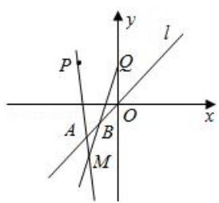

text_image

P
Q
l
A
B
O
x
M

20.（南通期末）已知曲线 $C_1: \frac{|x|}{a} + \frac{|y|}{b} = 1 (a > b > 0)$ 所围成的封闭图形的面积为 $4\sqrt{5}$ ，曲线 $C_1$ 的内切圆半径为 $\frac{2\sqrt{5}}{3}$ 。记 $C_2$ 为以曲线 $C_1$ 与坐标轴的交点为顶点的椭圆。

（Ⅰ）求椭圆 $C_{2}$ 的标准方程；

（Ⅱ）设 AB 是过椭圆 $C_{2}$ 中心的任意弦，l 是线段 AB 的垂直平分线．M 是 l 上异于椭圆中心的点．若 $|MO| = \lambda |OA|$ (O 为坐标原点)，当点 A 在椭圆 $C_{2}$ 上运动时，求点 M 的轨迹方程；

21.（江岸期中）已知点 $P(x_0, y_0)$ 是圆 $C: (x - 2)^2 + (y - 2)^2 = 8$ 内一点 $(C$ 为圆心），过 $P$ 点的动弦 $AB$ 。过 $A$ 、 $B$ 作圆的两切线相交于点 $M$ ，求动点 $M$ 的轨迹方程。  
22. 从圆外一点 $P(a, b)$ 向圆 $x^{2} + y^{2} = r^{2}$ 引割线交该圆于 $A$ 、 $B$ 两点，求弦 $AB$ 的中点 $M$ 的轨迹方程.  
23.（通州期末）在平面直角坐标系 $xOy$ 中，已知抛物线 $C:y^{2} = 2px(p > 0)$ 上一点 $P(\frac{1}{2}, m)$ 到准线的距离与到原点 $O$ 的距离相等.

(1) 求抛物线的方程;   
（2）设抛物线 C 的焦点为 F，平行于 x 轴的两条直线 $l_{1}$ ， $l_{2}$ 分别交 C 于 A，B 两点，交 C 的准线于 P，Q 两点．若 $\Delta PQF$ 的面积是 $\Delta ABF$ 的面积的两倍，求 AB 中点的轨迹方程.  
24.（天心月考）如图所示，从曲线 $x^{2} - y^{2} = 1$ 上一点 $Q$ 引直线 $x + y = 2$ 的垂线，垂足为 $N$ ，求线段 $QN$ 的中点 $P$ 的轨迹方程.

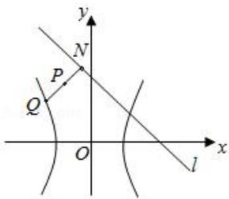

text_image

y
N
P
Q
O
x
l

25. 已知直线与抛物线 $y^{2}=2px(p>0)$ 交于 AB 两点，且 $OA \perp OB$ 求 O 在 AB 上射影 M 的轨迹方程.  
26.（衡水期末）已知直线 l 过椭圆 $E: x^{2} + 2y^{2} = 2$ 的右焦点 F，且与 E 相交于 P，Q 两点．设 $OR = \frac{1}{2}(OP + OQ)$ (O 为原点)，求点 R 的轨迹方程；

27.（荔城期中）过抛物线 $y^{2}=4x$ 的顶点 O 作两条互相垂直的弦 OA、OB，求弦 AB 的中点 M 的轨迹方程.

28.（天津月考）已知抛物线 $y^{2} = 4\sqrt{2} x$ 的焦点为椭圆 $\frac{x^2}{a^2} + \frac{y^2}{b^2} = 1 (a > b > 0)$ 的右焦点，且椭圆的长轴长为 4，左右顶点分别为 $A, B$ 。经过椭圆左焦点的直线 $l$ 与椭圆交于 $C$ 、 $D$ 两点。

（1）求椭圆标准方程；（2）若 $M(x_{1}, y_{1})$ ， $N(x_{2}, y_{2})$ 是椭圆上的两动点，且满足 $x_{1}x_{2} + 2y_{1}y_{2} = 0$ ，动点 P 满足 $OP = OM + 2ON$ （其中 O 为坐标原点），求动点 P 的轨迹方程.

29.（陵县月考）已知椭圆 $E: \frac{x^2}{a^2} + \frac{y^2}{b^2} = 1 (a, b > 0)$ 的焦点坐标为 $F_1(-2, 0)$ ，点 $M(-2, \sqrt{2})$ 在椭圆 $E$ 上.

(1) 求椭圆 E 的方程;  
（2）设 $Q(1,0)$ ，过 Q 点引直线 l 与椭圆 E 交于 A，B 两点，求线段 AB 中点 P 的轨迹方程.

# 2.1.1 达标训练

1.（淮南一模）已知双曲线 $\frac{x^2}{4} -\frac{y^2}{b^2} = 1(b > 0)$ 的左右焦点分别为 $F_{1}$ 、 $F_{2}$ ，过点 $F_{2}$ 的直线交双曲线右支于 $A$ 、 $B$ 两点，若 $\triangle ABF_{1}$ 是等腰三角形，且 $\mathrm{D}A = 120^{\circ}$ ，则 $\triangle ABF_{1}$ 周长为（）

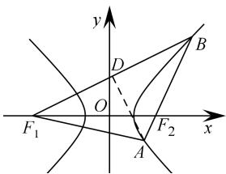

text_image

y
D
B
O
F₁
A
F₂
x

A. $\frac{16\sqrt{3}}{3} + 8$

B. $4(\sqrt{2} - 1)$

C. $\frac{4\sqrt{3}}{3}+8$

D. $2(\sqrt{3} - 2)$

2.（诸暨市期末）已知双曲线 $\frac{x^2}{a^2} -\frac{y^2}{b^2} = 1$ ，过双曲线的左焦点 $F(-c,0)$ 的直线 $x = \frac{5}{2}\sqrt{2} y - c$ 交双曲线的渐近线于 $A$ ， $B$ 两点，若点 $M(2c,0)$ 满足 $|MA| = |MB|$ ，则双曲线的离心率 $e =$ （

A. $\frac{3\sqrt{2}}{4}$

B. $\frac{3\sqrt{2}}{2}$

C. $\sqrt{6}$

D. 3

3.（湖北模拟）已知双曲线 $\frac{x^2}{a^2} -\frac{y^2}{b^2} = 1(a > 0,b > 0)$ 的左、右焦点分别为 $F_{1}$ ， $F_{2}$ ，过 $F_{2}$ 且斜率为 $\frac{24}{7}$ 的直线与双曲线在第一象限的交点为 $A$ ，若 $(F_{2}F_{1} + F_{2}A)\times F_{1}A = 0$ ，则此双曲线的标准方程可能为（）

A. $x^{2}-\frac{y^{2}}{12}=1$

B. $\frac{x^2}{3} -\frac{y^2}{4} = 1$

C. $\frac{x^{2}}{16}-\frac{y^{2}}{9}=1$

D. $\frac{x^2}{9} -\frac{y^2}{16} = 1$

4.（泉州期末）已知DABC为等腰直角三角形，其顶点为A，B，C，若圆锥曲线E以A，B为焦点，并经过顶点C，该圆锥曲线E的离心率不可以是（）

A. $\sqrt{2} - 1$

B. $\frac{\sqrt{2}}{2}$

C. $\sqrt{2}$

D. $\sqrt{2} + 1$

5.（葫芦岛期末）已知双曲线 $\frac{x^2}{a^2} -\frac{y^2}{b^2} = 1(a > 0,b > 0)$ 的左右焦点分别为 $F_{1}$ ， $F_{2}$ ，离心率为 $e$ ，点 $P$ 为双曲线右支上一点，延长 $PF_{2}$ 交双曲线于点 $M$ ， $\mathrm{D}F_1PM = 120^\circ$ ， $|PF_1| = |PM|$ ，则 $e^2$ 为（

A. $5 - 2\sqrt{2}$

B. $5 - 2\sqrt{3}$

C. $\frac{28-8\sqrt{3}}{3}$

D. $\frac{16-4\sqrt{3}}{3}$

6.（湖北月考）在 $\triangle ABC$ 中． $A$ ， $B$ 分别是双曲线 $E$ 的左、右焦点，点 $C$ 在 $E$ 上．若 $BA\times BC = 0$ ， $(BA + BC)\times AC = 0$ ，则双曲线 $E$ 的离心率为（）

A. $\sqrt{5} - 1$

B. $\sqrt{2} + 1$

C. $\frac{\sqrt{2}-1}{2}$

D. $\frac{\sqrt{2} + 1}{2}$

7.（道里区月考）已知点 $Q$ 是椭圆 $\frac{x^2}{4} +\frac{y^2}{2} = 1$ 椭上非顶点的动点， $F_{1}F_{2}$ 分别是椭圆的左、右焦点， $O$ 为坐标原点，若 $M$ 为 $\mathbb{D}F_1QF_2$ 的平分线上一点，且 $F_{1}M\times MQ = 0$ ，则 $|OM|$ 的取值范围（ ）

A. $(0, \sqrt{2})$

B. $[0, \sqrt{2}]$

C. $\left(\frac{2-\sqrt{2}}{2},\frac{2+\sqrt{2}}{2}\right)$

D. $\left[\frac{2 - \sqrt{2}}{2},\frac{2 + \sqrt{2}}{2}\right]$

8.（岳麓区月考）已知双曲线 $C: \frac{x^2}{16} - \frac{y^2}{9} = 1$ 的左右焦点分别是 $F_1, F_2$ ，点 $P$ 是 $C$ 的右支上的一点（不是顶点），过 $F_2$ 作 $\mathrm{D}F_1PF_2$ 的角平分线的垂线，垂足是 $M$ ， $O$ 是原点，则 $|MO| = (\quad)$

A. 随 $P$ 点变化而变化

B. 2

C. 4

D. 5

9.（金牛区期中）已知双曲线 $\frac{x^2}{4} -\frac{y^2}{5} = 1$ 左焦点为 $F$ ， $P$ 为双曲线右支上一点，若 $FP$ 的中点在以 $O$ 为圆心， $|OF|$ 为半径的圆上，则 $P$ 的横坐标为（）

A. $\frac{8}{3}$

B. 4

C. $\frac{16}{3}$

D. 6

10.（安徽模拟）已知点 A 是焦点在 x 轴上的椭圆 $\frac{x^{2}}{4} + \frac{y^{2}}{t} = 1$ 的上顶点，椭圆上恰有两点到点 A 的距离最大，则 t 的取值范围为（）

A. $(0,1)$

B. $(0,2)$

C. $(0, 3)$

D. $(0, 4)$

11.（安徽模拟）已知椭圆 $\frac{x^2}{a^2} +\frac{y^2}{b^2} = 1(a > b > 0)$ 的左焦点 $F_{1}$ ， $O$ 为坐标原点，点 $P$ 在椭圆上，点 $Q$ 在椭圆的右准线上，若 $PQ = 2F_{1}O,F_{1}Q = 1(\frac{F_{1}P}{|F_{1}P|} +\frac{F_{1}O}{|F_{1}O|})(1 > 0)$ 则椭圆的离心率为（）

A. $\frac{1}{2}$

B. $\frac{\sqrt{3}}{2}$

C. $\frac{\sqrt{5}-1}{2}$

D. $\frac{\sqrt{5}+1}{4}$

12.（武昌区期末）已知椭圆 $C: \frac{x^2}{a^2} + \frac{y^2}{b^2} = 1 (a > b > 0)$ 的左、右焦点分别为 $F_1$ ， $F_2$ ，过 $F_1$ 的直线与椭圆 $C$ 交于 $M$ ， $N$ 两点，若 $2S_{MNF_2} = 5S_{MF_1F_2}$ 且 $\mathbb{D}F_2F_1N = \mathbb{D}F_2NF_1$ ，则椭圆 $C$ 的离心率为（）

A. $\frac{3}{5}$

B. $\frac{\sqrt{2}}{2}$

C. $\frac{1}{3}$

D. $\frac{\sqrt{3}}{2}$

13.（昌江区期中） $F_{1}$ ， $F_{2}$ 分别是椭圆 $C: \frac{x^{2}}{25} + \frac{y^{2}}{9} = 1$ 的左、右焦点，点 P 在椭圆 C 上， $|PF_{1}| = 6$ ，过 $F_{1}$ 作 $D F_{1} PF_{2}$ 的角平分线的垂线，垂足为 M，则 $|OM|$ 的长为 \_\_\_\_.

14.（南通模拟）已知点 $F_{1}$ 、 $F_{2}$ 分别是椭圆 $\frac{x^2}{a^2} +\frac{y^2}{b^2} = 1$ 的左、右焦点，过 $F_{1}$ 且垂直于 $x$ 轴的直线与椭圆交于 $A$ 、 $B$ 两点，若 $\mathrm{DABF}_2$ 为正三角形，则该椭圆的离心率 $e$ 是

# 2.1.2 达标训练

1.（湖南一模）已知双曲线 $C: \frac{x^2}{a^2} - \frac{y^2}{b^2} = 1 (a > 0, b > 0)$ ，过其右焦点 $F$ 作渐近线的垂线，垂足为 $B$ 。交 $y$ 轴于点 $C$ ，交另一条渐近线于点 $A$ ，点 $C$ 位于点 $A$ ， $B$ 之间。已知 $O$ 为原点，且 $|OA| = \frac{5}{3} a$ ，则 $\frac{|FA|}{|FC|} = (\quad)$

A. $\frac{5}{4}$

B. $\frac{4}{3}$

C. $\frac{3}{2}$

D. $\frac{\sqrt{5}}{2}$

2.（南明区月考）设 $F_{1}$ ， $F_{2}$ 是双曲线 $\frac{x^2}{4} -y^2 = 1$ 的左、右有两个焦点，若双曲线的左支上存在一点 $P$ ，使得 $(OP + OF_1)\times F_1P = 0$ (O为坐标原点)，设 $\mathrm{DPF_1F_2 = a}$ ，则tana的值为（

A. $6 + \sqrt{5}$

B. $5 + 2\sqrt{6}$

C. $6 - \sqrt{5}$

D. $5 - 2\sqrt{6}$

3.（陕西月考）如图， $F_{1}$ 、 $F_{2}$ 是双曲线 $C:\frac{x^{2}}{a^{2}}-\frac{y^{2}}{b^{2}}=1(a>0,b>0)$ 的左、右焦点，过 $F_{2}$ 的直线与双曲线C交于A、B两点．若 $|AB|:|BF_{1}|:|AF_{1}|=3:4:5$ ，则双曲线的渐近线方程为()

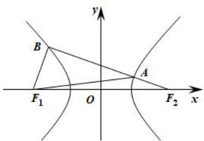

text_image

y
B
A
F₁ O F₂ x

A. $y = \pm 2\sqrt{3}x$

B. $y = \pm 2\sqrt{2}x$

C. $y = \pm\sqrt{3}x$

D. $y = \pm \sqrt{2} x$

4.（定远县模拟）已知双曲线 $C: \frac{x^2}{a^2} - \frac{y^2}{b^2} = 1 (a > 0, b > 0)$ 的左、右焦点分别为 $F_1(-c, 0)$ 、 $F_2(c, 0)$ ，且双曲线 $C$ 与圆 $x^2 + y^2 = c^2$ 在第一象限相交于点 $A$ ，且 $|AF_1| = \sqrt{3}|AF_2|$ ，则双曲线 $C$ 的离心率是（）

A. $\sqrt{3} + 1$

B. $\sqrt{2} + 1$

C. $\sqrt{3}$

D. $\sqrt{2}$

5.（新乡期末）已知双曲线 $C: \frac{x^2}{a^2} - \frac{y^2}{b^2} = 1 (a > 0, b > 0)$ 的左、右焦点分别是 $F_1$ ， $F_2$ ，直线 $l: y = k(x - \sqrt{10})$ 过点 $F_2$ ，且与双曲线 $C$ 在第一象限交于点 $P$ ，若 $(OP + OF_2) \times PF_2 = 0$ （ $O$ 为坐标原点），且 $|PF_1| = (a + 1)|PF_2|$ ，则双曲线 $C$ 的离心率为（）

A. $\sqrt{10}$

B. $\sqrt{5}$

C. $\frac{\sqrt{10}}{2}$

D. $\frac{\sqrt{5}}{2}$

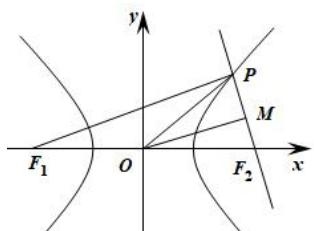

text_image

y
P
M
F₁ O F₂ x

6.（吴忠一模）设 $F_{1}$ 、 $F_{2}$ 是双曲线 $\frac{x^2}{a^2} -\frac{y^2}{b^2} = 1(a > 0,b > 0)$ 的左、右焦点， $P$ 是双曲线右支上一点，满足 $(OP + OF_2)PF_2 = 0(O$ 为坐标原点)，且 $3|PF_1| = 4|PF_2|$ ，则双曲线的离心率为（

A. 2

B. $\sqrt{3}$

C. $\sqrt{2}$

D. 5

7.（巴南区期末）已知双曲线 $C: \frac{x^2}{a^2} - \frac{y^2}{b^2} = 1 (a > 0, b > 0)$ 的左右焦点分别为 $F_1$ ， $F_2$ ，双曲线 $C$ 与圆 $x^2 + y^2 = a^2 + b^2$ 在第一象限的交点为 $P$ ， $\exists PF_1F_2$ 的角平分线与 $PF_2$ 交于点 $Q$ ，若 $4|PQ| = 3|F_2Q|$ ，则双曲线 $C$ 的离心率为（）

A. $6 + 2\sqrt{7}$

B. $3 + \sqrt{7}$

C. $6 - 2\sqrt{7}$

D. $4 - \sqrt{7}$

8.（佛山模拟）已知椭圆 $\frac{x^2}{a^2} +\frac{y^2}{b^2} = 1(a > b > 0)$ 的左、右焦点分别为 $F_{1}$ ， $F_{2}$ ，过 $F_{2}$ 的直线与椭圆交于 $A$ 、 $B$ 两点，若 $\triangle F_1AB$ 是以 $A$ 为直角顶点的等腰直角三角形，则离心率为（

A. $\frac{\sqrt{2}}{2}$

B. $2 - \sqrt{3}$

C. $\sqrt{5} - 2$

D. $\sqrt{6} -\sqrt{3}$

9.（景德镇月考）已知点 A 是抛物线 $y^{2}=6x$ 上位于第一象限的点，F 是其焦点，AF 的倾斜角为 $60^{\circ}$ ，以 F 为圆心，AF 为半径的圆交该抛物线准线于 B，C 两点，则 DABC 的面积为（）

A. $18 \sqrt{3}$

B. $36 \sqrt{15}$

C. $72\sqrt{3}$

D. 18

10.（沙坪坝区模拟）抛物线 $y^{2}=x$ 的焦点为 F，O 为坐标原点，点 P 在抛物线上，向量 FP 与 OF 的夹角为 $60^{\circ}$ ，过 P 作抛物线准线的垂线，垂足为 H，线段 HF 和抛物线交于点 Q，则 $\frac{|HF|}{|FQ|}=(\quad)$

A. 1

B. 2

C. 3

D. $\frac{2}{3}$

11.（安徽期末）已知双曲线 $C: \frac{x^2}{a^2} - \frac{y^2}{b^2} = 1 (a > 0, b > 0)$ 的左、右焦点分别是 $F_1, F_2$ ，直线 $l: y = 3x + 6$ 过点 $F_1$ ，且与双曲线 $C$ 在第二象限交于点 $P$ ，若点 $P$ 在以 $F_1F_2$ 为直径的圆上，则双曲线 $C$ 的离心率为 \_\_\_\_.

12.（北碚区期中）双曲线 $C: \frac{x^{2}}{a^{2}} - \frac{y^{2}}{b^{2}} = 1 (a > 0, b > 0)$ 左、右焦点分别为 $F_{1}$ ， $F_{2}$ ，左、右顶点分别为 $A_{1}$ ， $A_{2}$ ，B 为虚轴的上顶点，若直线 $BF_{2}$ 上存在两点 $P_{i} (i = 1, 2)$ 使得 $A_{1}P_{i} \hat{} A_{2}P_{i} (i = 1, 2)$ ，且过双曲线的右焦点 $F_{2}$ 作斜率为 1 的直线与双曲线的左、右两支各有一个交点，则双曲线离心率的范围是（）

A. $\sqrt{3} < e < \sqrt{5}$

B. $\sqrt{2} < e < \sqrt{5}$

C. $\sqrt{3} < e < \frac{1 + \sqrt{5}}{2}$

D. $\sqrt{2}<e<\frac{1+\sqrt{5}}{2}$

# 2.1.3 达标训练

1.（黄冈月考）椭圆 $M: \frac{x^2}{a^2} + \frac{y^2}{b^2} = 1 (a > b > 0)$ 与双曲线 $Q: \frac{x^2}{m^2} - \frac{y^2}{n^2} = 1 (m > 0, n > 0)$ 焦点相同， $F_1$ ， $F_2$ 分别为左焦点和右焦点，椭圆 $M$ 与双曲线 $Q$ 在第一象限交点为 $A$ ，且 $\mathrm{D} F_1 A F_2 = \frac{p}{3}$ ，则当这两条曲线的离心率之积为 $\frac{\sqrt{3}}{2}$ 时，双曲线 $Q$ 的渐近线斜率是（）

A. $\pm \sqrt{2}$

B. $\pm\frac{\sqrt{2}}{2}$

C. $\pm\frac{1}{2}$

D. ±2

2.（高安市期中）已知点 $F_{1}$ ， $F_{2}$ 分别是椭圆 $C_{1}$ 和双曲线 $C_{2}$ 的公共焦点， $e_{1}$ ， $e_{2}$ 分别是 $C_{1}$ 和 $C_{2}$ 的离心率，点 $P$ 为 $C_{1}$ 和 $C_{2}$ 的一个公共点，且 $\mathfrak{D}F_{1}PF_{2} = \frac{p}{3}$ ，若 $e_{2}\hat{\mathrm{I}}(2, \sqrt{7})$ ，则 $e_{1}$ 的取值范围是（）

A. $\left(\frac{\sqrt{5}}{5},\frac{\sqrt{7}}{3}\right)$

B. $\left(\frac{\sqrt{13}}{13}, \frac{\sqrt{7}}{5}\right)$

C. $(\frac{\sqrt{7}}{5}, \frac{2\sqrt{13}}{13})$

D. $\left(\frac{\sqrt{7}}{3}, \frac{2\sqrt{5}}{5}\right)$

3.（长三模）已知双曲线 $\frac{x^2}{a^2} -\frac{y^2}{b^2} = 1(a > 0,b > 0)$ 与椭圆 $\frac{x^2}{18} +\frac{y^2}{2} = 1$ 有相同焦点 $F_{1}$ ， $F_{2}$ ，其中双曲线为离心率为 $\frac{4}{3}$ .若双曲线的左支上有一点 $M$ 到右焦点 $F_{2}$ 的距离为12， $N$ 为线段 $MF_{2}$ 的中点， $O$ 为坐标原点，则 $|NO|$ 等于（）

A. 4

B. 3

C. 2

D. $\frac{2}{3}$

4.（宣城期末）已知点 $F_{1}$ ， $F_{2}$ 是椭圆 $C_{1}$ 和双曲线 $C_{2}$ 的公共焦点， $e_{1}$ ， $e_{2}$ 分别是 $C_{1}$ 和 $C_{2}$ 离心率，点 $P$ 为 $C_{1}$ 和 $C_{2}$ 的一个公共点，且 $\mathrm{D} F_{1}PF_{2} = \frac{2p}{3}$ ，若 $e_{2} = 2$ ，则 $e_{1}$ 的值是（）

A. $\frac{\sqrt{5}}{5}$

B. $\frac{\sqrt{5}}{4}$

C. $\frac{2\sqrt{5}}{7}$

D. $\frac{2\sqrt{5}}{5}$

5.（保定期末）已知中心在原点，焦点在 $x$ 轴上的椭圆与双曲线有公共焦点，左、右焦点分别为 $F_{1}$ ， $F_{2}$ ，且两条曲线在第一象限的交点为 $P$ ， $\triangle PF_{1}F_{2}$ 是以 $PF_{1}$ 为底边的等腰三角形，若 $|PF_{1}| = 8$ ，椭圆与双曲线的离心率分别为 $e_{1}$ ， $e_{2}$ ，则 $e_{1} \times e_{2}$ 的取值范围是（）

A. $\left(\frac{1}{9},+\yen\right)$

B. $\left(\frac{1}{3},+\yen\right)$

C. $\left(\frac{1}{2},+\yen\right)$

D. $\left(\frac{5}{3},+\yen\right)$

# 2.1.4 达标训练

1.（河南月考）已知椭圆 $C: \frac{x^2}{a^2} + \frac{y^2}{b^2} = 1 (a > b > 0)$ 的左右焦点分别为 $F_1$ ， $F_2$ ，点 $A$ 是椭圆上一点，线段 $AF_1$ 的垂直平分线与椭圆的一个交点为 $B$ ，若 $AB = 3F_2B$ ，则椭圆 $C$ 的离心率为（）

A. $\frac{1}{3}$

B. $\frac{\sqrt{3}}{3}$

C. $\frac{2}{3}$

D. $\frac{\sqrt{6}}{3}$

2.（益阳期末）已知 $O$ 为坐标原点， $A$ ， $B$ 分别是椭圆 $C: \frac{x^2}{a^2} + \frac{y^2}{b^2} = 1 (a > b > 0)$ 的左，右顶点，抛物线 $E: y^2 = 2px (p > 0)$ 与椭圆 $C$ 在第一象限交于点 $P$ ，点 $P$ 在 $x$ 轴上的投影为 $P\phi$ ，且有 $OP \times \frac{OP\phi}{|OP\phi|} = c$ （其中 $c^2 = a^2 - b^2$ ）， $AP$ 的连线与 $y$ 轴交于点 $M$ ， $BM$ 与 $PP\phi$ 的交点 $N$ 恰为 $PP\phi$ 的中点，椭圆 $C$ 离心率为（）

A. $\frac{\sqrt{3}}{2}$

B. $\frac{\sqrt{2}}{2}$

C. $\frac{2}{3}$

D. $\frac{1}{3}$

3. 已知点 $A(2,8)$ ， $B(x_1, y_1)$ ， $C(x_2, y_2)$ 在抛物线 $y^2 = 2px (p > 0)$ 上， $\triangle ABC$ 的重心与此抛物线的焦点 $F$

重合，如图。（1）写出该抛物线的方程和焦点 $F$ 的坐标；

(2) 求线段 BC 中点 M 的坐标;  
(3) 求 BC 所在直线的方程.

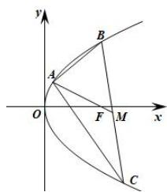

text_image

y
A
B
O
F
M
x
C

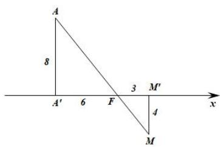

text_image

A
8
A' 6 F 3 M'
4
M x

4. 已知椭圆 $\frac{x^2}{m + 1} + y^2 = 1 (m\hat{1} R)$ 的两焦点 $F_{1}$ , $F_{2}$ 在 $x$ 轴上, $F_{2}$ 为右焦点, $P$ 是椭圆上一点, 且 $PF_{1}$ 与 $PF_{2}$ 垂直, 如图3.

（1）求 $\triangle PF_{1}F_{2}$ 的面积；  
（2）设 $l$ 为椭圆右准线，直线 $PF_{2}$ 与 $l$ 交于点 $Q$ ，若 $\frac{PF_2}{QF_2} = 2 + \sqrt{3}$ ，求直线 $l$ 的方程.

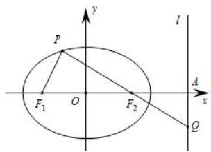

text_image

P
F₁ O F₂
l
A x
Q

5. 已知圆 $C: (x - 3)^2 + (y - 4)^2 = 4$ ，直线 $l_1$ 过定点 $A(1, 0)$ ，如图。（1）若直线 $l_1$ 与圆 $C$ 相切，求 $l_1$ 的方程；

(2) 若直线 $l_{1}$ 与圆 $C$ 相交于 $P, Q$ 两点, 线段 $PQ$ 的中点为 $M$ . 又知直线 $l_{1}$ 与直线 $l_{2}: x + 2y + 2 = 0$ 交点为 $N$ , 判断 $AM \cdot AN$ 是否为定值? 若是, 则求出定值; 若不是, 请说明理由.

6.（山东高考）平面直角坐标系 $xOy$ 中，双曲线 $C_1: \frac{x^2}{a^2} - \frac{y^2}{b^2} = 1 (a > 0, b > 0)$ 的渐近线与抛物线 $C_2: x^2 = 2py (p > 0)$ 交于 $O, A, B$ ，若 $\triangle OAB$ 的垂心为 $C_2$ 的焦点，则 $C_1$ 的离心率为 \_\_\_\_.

7.(湖北2015)如图,圆C与x轴相切于点 $T(1,0)$ ,与y轴正半轴交于两点A,B(B在A的上方),且 $|AB|=2$ .

(1) 圆 C 的标准方程为 \_\_\_\_；  
（2）过点 A 任作一条直线与圆 $O: x^{2} + y^{2} = 1$ 相交于 M，N 两点，下列三个结论：

① $\frac{|NA|}{|NB|}=\frac{|MA|}{|MB|}$ ; ② $\frac{|NB|}{|NA|}-\frac{|MA|}{|MB|}=2$ ; ③ $\frac{|NB|}{|NA|}+\frac{|MA|}{|MB|}=2\sqrt{2}$ .

其中正确结论的序号是\_\_\_\_。（写出所有正确结论的序号）

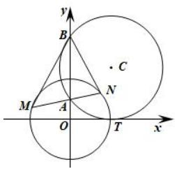

text_image

y
B
C
M
A
N
O
T
x

# 2.1.5 达标训练

1.（福州期末）已知双曲线 $E: \frac{x^2}{a^2} - \frac{y^2}{b^2} = 1 (a > 0, b > 0)$ 的左、右焦点分别为 $F_1$ ， $F_2$ ，若 $E$ 上点 $A$ 满足 $|AF_1| = 2 |AF_2|$ ，且向量 $AF_1$ ， $AF_2$ 夹角的取值范围为 $\left[\frac{2p}{3}, p\right]$ ，则 $E$ 的离心率取值范围是（）

A. $[\sqrt{3},\sqrt{5} ]$

B. $\left[\sqrt{7},3\right]$

C. $[3,5]$

D. [7, 9]

2.（阳泉二模）抛物线 $y^{2}=2px(p>0)$ 的焦点为 F，已知 A，B 为抛物线上的两个动点，且满足 $\exists AFB=120^{\circ}$ ，过弦 AB 的中点 M 作抛物线准线的垂线 MN，垂足为 N，则 $\frac{|MN|}{|AB|}$ 的最大值为（）

A. 2

B. $\frac{2\sqrt{3}}{3}$

C. 1

D. $\frac{\sqrt{3}}{3}$

3.（罗湖区期末）已知动点 P 与双曲线 $x^{2}-y^{2}=1$ 的两个焦点 $F_{1}$ ， $F_{2}$ 的距离之和为定值，且 $\cos\Phi F_{1}PF_{2}$ 的最小值为 $-\frac{1}{3}$ .

(1) 求动点 P 的轨迹方程;

（2）设 $M(0, -1)$ ，若斜率为 $k(k^1 0)$ 的直线 $l$ 与 $P$ 点的轨迹交于不同的两点 $A$ 、 $B$ ，若要使 $|MA| = |MB|$ ，试求 $k$ 的取值范围.

# 2.1.6 达标训练

1.（兴宁区期末）设 $F_{1}$ ， $F_{2}$ 分别为双曲线 $C: \frac{x^{2}}{a^{2}} - \frac{y^{2}}{b^{2}} = 1 (a > b > 0)$ 的左、右焦点， $A$ 为双曲线的左顶点，以 $F_{1}F_{2}$ 为直径的圆交双曲线的某条渐近线于 $M$ ， $N$ 两点，且 $\mathrm{DMAN} = \frac{3p}{4}$ ，则该双曲线的离心率为（）

A. $\sqrt{2}$

B. $\sqrt{3}$

C. 2

D. $\sqrt{5}$

2.（成都模拟）已知 $F_{1}$ ， $F_{2}$ 是双曲线 $\frac{x^{2}}{a^{2}} - \frac{y^{2}}{b^{2}} = 1 (a > 0, b > 0)$ 的左，右焦点，经过点 $F_{2}$ 且与 $x$ 轴垂直的直线与双曲线的一条渐近线相交于点 $A$ ，且 $\frac{p}{6} \mathrm{P} F_{1} A F_{2} \notin \frac{p}{4}$ ，则该双曲线离心率的取值范围是（）

A. $\left[\sqrt{5},\sqrt{13}\right]$

B. $[\sqrt{5}, 3]$

C. $[3, \sqrt{13}]$

D. $[\sqrt{7}, 3]$

3.（河南月考）已知双曲线 $C: \frac{x^2}{a^2} - \frac{y^2}{b^2} = 1 (a > 0, b > 0)$ 的左、右焦点分别为 $F_1$ ， $F_2$ ，过 $F_2$ 作一条渐近线的垂线，垂足为 $A$ ， $B(0, -\frac{1}{3}b)$ 。若向量 $F_1A$ 与 $F_2B$ 共线，则双曲线 $C$ 的离心率为（）

A. $\sqrt{5}$

B. $\frac{3 + \sqrt{5}}{2}$

C. $\frac{\sqrt{2}+\sqrt{5}}{2}$

D. $\frac{1 + \sqrt{5}}{2}$

4. 如图，双曲线 $\frac{x^2}{a^2} - \frac{y^2}{b^2} = 1 (a, b > 0)$ 的右顶点为 $A$ ，左右焦点分别为 $F_1$ ， $F_2$ ，点 $P$ 是双曲线右支上一点， $PF_1$ 交左支于点 $Q$ ，交渐近线 $y = \frac{b}{a} x$ 于点 $R$ ， $M$ 是 $PQ$ 的中点，若 $RF_2 \hat{} PF_1$ ，且 $AM \hat{} PF_1$ ，则双曲线的离心率是（）

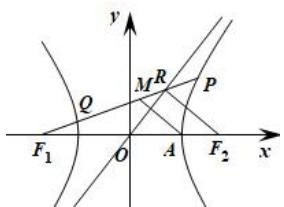

text_image

y
Q
M
R
P
F₁
O
A
F₂
x

A. $\sqrt{2}$

B. $\sqrt{3}$

C. 2

D. $\sqrt{5}$

5.(浙江期中)已知 P 为双曲线 $C: \frac{x^{2}}{a^{2}} - \frac{y^{2}}{b^{2}} = 1 (a > 0, b > 0)$ 上的一点， $F_{1}, F_{2}$ 分别为 C 的左右焦点，若 $\triangle PF_{1}F_{2}$ 的内切圆的直径为 a，则双曲线 C 的离心率的取值范围为 \_\_\_\_.

# 2.2.1 达标训练

1.（成都模拟）已知直线 $y = kx$ 与双曲线 $C: \frac{x^2}{a^2} - \frac{y^2}{b^2} = 1 (a > 0, b > 0)$ 相交于不同的两点 $A, B, F$ 为双曲线 $C$ 的左焦点，且满足 $|AF| = 3|BF|$ ， $|OA| = b$ （O 为坐标原点），则双曲线 $C$ 的离心率为（）

A. $\sqrt{2}$

B. $\sqrt{3}$

C. 2

D. $\sqrt{5}$

2.（广东期末）已知双曲线 $E:\frac{x^{2}}{a^{2}}-\frac{y^{2}}{b^{2}}=1(a>0,b>0)$ ，过原点O任作一条直线，分别交曲线两支于点P，Q（点P在第一象限），点F为E的左焦点，且满足 $|PF|=3|FQ|$ ， $|OP|=b$ ，则E的离心率为（）

A. $\sqrt{3}$

B. $\sqrt{2}$

C. $\sqrt{5}$

D. 2

3.（运城模拟）已知椭圆 $E: \frac{x^2}{a + 2} + \frac{y^2}{a} = 1 (a > 0)$ 的离心率为 $\frac{\sqrt{2}}{2}$ ，若面积为4的矩形ABCD的四个顶点都在椭圆 $E$ 上，点 $O$ 为坐标原点，则 $|OA|^2 = (\quad)$

A. $\frac{\sqrt{2} \pm 1}{2}$

B. 3

C. $3 \pm \frac{1}{2}$

D. $3 \pm \frac{\sqrt{2}}{2}$

4.（崂山区期中）如图，双曲线 $\frac{x^2}{a^2} -\frac{y^2}{b^2} = 1(a > 0,b > 0)$ 的右顶点为 $A$ ，右焦点为 $F$ ，点 $B$ 在双曲线的右支上，矩形OFBD与矩形AEGF相似，且矩形OFBD与矩形AEGF的面积之比为2:1，则该双曲线的离心率为（）

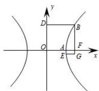

A. $\sqrt{2}$

B. $1 + \sqrt{2}$

C. $2 + \sqrt{2}$

D. $2\sqrt{2}$

5.（金凤区期末）椭圆 $C: \frac{x^2}{a^2} + \frac{y^2}{b^2} = 1 (a > b > 0)$ 与抛物线 $E: y^2 = 4x$ 相交于点 $M, N$ ，过点 $P(-1, 0)$ 的直线与抛物线 $E$ 相切于 $M, N$ 点，设椭圆的右顶点为 $A$ ，若四边形 $PMAN$ 为平行四边形，则椭圆的离心率为（）

A. $\frac{\sqrt{3}}{3}$

B. $\frac{\sqrt{2}}{2}$

C. $\frac{\sqrt{2}}{3}$

D. $\frac{\sqrt{3}}{4}$

6. 设椭圆 $C: \frac{x^2}{a^2} + \frac{y^2}{b^2} = 1 (a > b > 0)$ 的右焦点为 $F$ ，椭圆 $C$ 上的两点 $A$ ， $B$ 关于原点对称，且满足 $FA \times FB = 0$ ， $|FB| \# FA| \sqrt{3} |FB|$ ，则椭圆 $C$ 的离心率的取值范围为 \_\_\_\_.

# 2.2.2 达标训练

1.（徐州模拟）已知圆 $O: x^{2} + y^{2} = 4$ ，直线 $l$ 与圆 $O$ 交于 $P$ ， $Q$ 两点， $A(2, 2)$ ，若 $AP^{2} + AQ^{2} = 40$ ，则弦 $PQ$ 的长度的最大值为 \_\_\_\_.  
2.（红塔区月考）设点 P 是椭圆 $\frac{x^{2}}{a^{2}} + \frac{y^{2}}{b^{2}} (a > b > 0) = 1$ 上异于长轴端点的任意一点， $F_{1}$ ，F， $_{2}$ 分别是其左、右焦点，O 为中心， $|PF_{1}| \times PF_{2}| + |OP|^{2} = 3b^{2}$ ，则此椭圆的离心率为（）

A. $\frac{1}{2}$

B. $\frac{\sqrt{3}}{2}$

C. $\frac{\sqrt{2}}{2}$

D. $\frac{\sqrt{2}}{4}$

3. 如图，在平面直角坐标系 $xOy$ 中，已知点 $A(-1, 0)$ ，点 $P$ 是圆 $O: x^2 + y^2 = 4$ 上的任意一点，过点 $B(1, 0)$ 作直线 $BT$ 垂直于 $AP$ ，垂足为 $T$ ，则 $2PA + 3PT$ 的最小值是 \_\_\_\_.

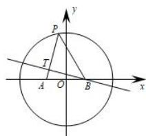

text_image

P
T
A O B
x
y

4. 如图所示，已知 $P(4,0)$ 是圆 $x^{2} + y^{2} = 36$ 内的一点， $A$ 、 $B$ 是圆上两动点，且满足 $\mathrm{D}APB = 90$ ，求矩形 $APBQ$ 的顶点 $Q$ 的轨迹方程.

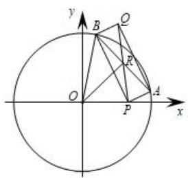

text_image

y
B
Q
R
O
P
A
x

5. 在平面直角坐标系 $xOy$ 中，已知两圆 $C_1: x^2 + y^2 = 12$ 和 $C_2: x^2 + y^2 = 14$ ，又 $A$ 点坐标为 $(3, -1)$ ， $M$ ， $N$ 是 $C_1$ 上的动点， $Q$ 为 $C_2$ 上的动点，则四边形 $AMQN$ 能构成矩形的个数为（）

A. 0 个

B. 2 个

C. 4 个

D. 无数个

# 2.2.3 达标训练

1.（东湖区期中）椭圆 $\frac{x^2}{a^2} +\frac{y^2}{b^2} = 1(a > b > 0)$ 上一点 $A$ 关于原点的对称点为 $B$ ， $F$ 为其右焦点，若 $AF\hat{} BF$ 设 $\mathbb{D}ABF = a$ ，且 $a\hat{\mathrm{I}}\left[\frac{p}{12},\frac{p}{4}\right]$ ，则该椭圆离心率的最大值为（ ）

A. $\frac{\sqrt{6}}{3}$

B. $\frac{\sqrt{3}}{2}$

C. $\frac{\sqrt{2}}{2}$

D. 1

2.（黄冈模拟）已知双曲线 $C: \frac{x^2}{a^2} - \frac{y^2}{b^2} = 1 (a > b > 0)$ 右支上非顶点的一点 $A$ 关于原点 $O$ 的对称点为 $B$ ， $F$ 为其右焦点，若 $AF \hat{} FB$ ，设 $\mathbb{D}ABF = q$ 且 $q\hat{\mathbb{I}}\left(\frac{p}{12}, \frac{p}{4}\right)$ ，则双曲线离心率的取值范围是（）

A. $(\sqrt{2}, 2]$

B. $(1,\sqrt{2}]$

C. $(\sqrt{2}, +\yen)$

D. $(2, +¥)$

3. 在平面直角坐标系 $xOy$ 中，已知圆 $C: x^{2} + (y - 1)^{2} = 1$ 及点 $A(\sqrt{3}, 0)$ ，设点 $P$ 是圆 $C$ 上的动点，在 $\mathrm{DACP}$ 中，若 $\mathrm{DACP}$ 的角平分线与 $AP$ 相交于点 $Q(m, n)$ ，则 $\sqrt{m^2 + n^2}$ 的取值范围为 \_\_\_\_.

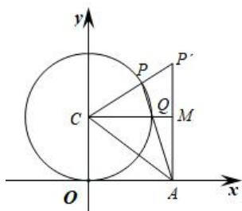

text_image

y
P
P'
C
Q
M
O
A
x

4.（湖北期末）椭圆 $\frac{x^2}{a^2} +\frac{y^2}{b^2} = 1(a > b > 0)$ 上一点 $A$ 关于原点的对称点为 $B$ ， $F$ 为其右焦点，若 $AF\hat{} BF$ ，设 $\mathrm{D}ABF = a$ ，且 $a\hat{\mathrm{I}}[\frac{p}{12},\frac{5p}{12} ]$ ，则椭圆的离心率的取值范围为（）

A. $\left[\frac{\sqrt{2}}{2},\frac{\sqrt{6}}{3}\right]$

B. $(0, \frac{\sqrt{2}}{2}]$

C. $\left[\frac{\sqrt{2}}{2}, 1\right)$

D. $\left[\frac{\sqrt{6}}{3}, 1\right)$

# 2.3.1 达标训练

1.（西湖区模拟）已知双曲线 $C: \frac{x^2}{a^2} - \frac{y^2}{b^2} = 1 (a > 0, b > 0)$ 的右焦点为 $F$ ，以 $F$ 为圆心，实半轴长为半径的圆与双曲线 $C$ 的某一条渐近线交于两点 $P$ ， $Q$ ，若 $OQ = 3OP$ （其中 $O$ 为原点），则双曲线 $C$ 的离心率为（）

A. $\frac{\sqrt{7}}{2}$

B. $\frac{\sqrt{5}}{2}$

C. $\sqrt{5}$

D. $\sqrt{7}$

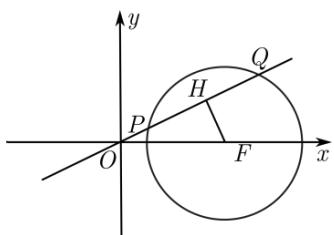

text_image

y
Q
H
P
O
F
x

2.（攀枝花期末）已知点 $P(2, t)$ 是抛物线 $x^{2} = 4y$ 上一点， $M$ ， $N$ 是抛物线上异于 $P$ 的两点，若直线 $PM$ 与直线 $PN$ 的斜率之和为 $\frac{3}{2}$ ，线段 $MN$ 的中点为 $Q$ ，要使所有满足条件的 $Q$ 点都在圆 $x^{2} + y^{2} = r^{2} (r > 0)$ 外，则 $r$ 的最大值为 \_\_\_\_.

3.（沈阳期末）已知 $F$ 是双曲线 $\frac{x^2}{a^2} -\frac{y^2}{b^2} = 1(a > 0,b > 0)$ 的左焦点， $E$ 是该双曲线的右顶点，过点 $F$ 且垂直于 $x$ 轴的直线与双曲线交于 $A$ 、 $B$ 两点，点 $E$ 在以 $AB$ 为直径的圆外，则该双曲线的离心率 $e$ 的取值范围为（）

A. $(1, +\infty)$

B. $(2, +\infty)$

C. $(1, 1 + \sqrt{2})$

D. $(1, 2)$

4.（桃城区月考）已知椭圆 $x^{2} + \frac{y^{2}}{b^{2}} = 1 (0 < b < 1)$ 的左焦点为 $F$ ，左、右顶点分别为 $A$ ， $C$ ，上顶点为 $B$ ．过 $F$ ， $B$ ， $C$ 作圆 $P$ ，其中圆心 $P$ 的坐标为 $(m, n)$ ．当 $m + n > 0$ 时，椭圆离心率的取值范围为（）

A. $(0, \frac{\sqrt{2}}{2})$

B. $(0, \frac{1}{2})$

C. $(0, \frac{\sqrt{3}}{2})$

D. $(0,\frac{\sqrt{6}}{5})$

5.（合肥二模）已知椭圆 $\frac{x^2}{a^2} +\frac{y^2}{b^2} = 1(a > b > 0)$ 的左右焦点分别为 $F_{1}$ ， $F_{2}$ ，右顶点为 $A$ ，上顶点为 $B$ ，以线段 $F_{1}A$ 为直径的圆交线段 $F_{1}B$ 的延长线于点 $P$ ，若 $F_{2}B / / AP$ ，则该椭圆离心率是（）

A. $\frac{\sqrt{3}}{3}$

B. $\frac{\sqrt{2}}{3}$

C. $\frac{\sqrt{3}}{2}$

D. $\frac{\sqrt{2}}{2}$

# 2.3.2 达标训练

1.（东莞市期末）已知双曲线 $C: \frac{x^2}{16} - \frac{y^2}{9} = 1$ 的左、右焦点分别为 $F_1$ 、 $F_2$ ， $P$ 为双曲线 $C$ 上一点，直线 $l$ 分别与以 $F_1$ 为圆心、 $F_1P$ 为半径的圆和以 $F_2$ 为圆心、 $F_2P$ 为半径的圆相切于点 $A$ ， $B$ ，则 $|AB| = (\quad)$

A. $2 \sqrt{7}$

B. 6

C. 8

D. 10

2. 若圆 $C_1: (x - m)^2 + y^2 = 16$ 与圆 $C_2: (x - n)^2 + y^2 = 16$ 相交，点 $P$ 为其在 $x$ 轴下方的交点，且 $mn = -8$ ，则点 $P$ 到直线 $x + y - 1 = 0$ 距离的最大值是 \_\_\_\_.  
3.（黄山一模）如图， $F_{1}(-c,0)$ ， $F_{2}(c,0)$ 分别为双曲线 $\Gamma:\frac{x^{2}}{a^{2}}-\frac{y^{2}}{b^{2}}=1(a,b>0)$ 的左、右焦点，过点 $F_{1}$ 作直线 l，使直线 l 与圆 $(x-c)^{2}+y^{2}=r^{2}$ 相切于点 P，设直线 l 交双曲线 $\Gamma$ 的左右两支分别于 A、B 两点 (A、B 位于线段 $F_{1}P$ 上)，若 $|F_{1}A|:|AB|:|BP|=2:2:1$ ，则双曲线 $\Gamma$ 的离心率为（）

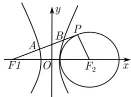

text_image

y
A
B
P
F1 O F2 x

A. 5

B. $\frac{\sqrt{265}}{5}$

C. $2\sqrt{6} + 2\sqrt{3}$

D. $2 \sqrt{6} + \sqrt{3}$

4.（岳阳一模）已知 $F_{1}$ ， $F_{2}$ 是双曲线 $C: \frac{x^{2}}{a^{2}} - \frac{y^{2}}{b^{2}} = 1 (a > 0, b > 0)$ 的左右焦点，过 $F_{1}$ 的直线与圆 $x^{2} + y^{2} = a^{2}$ 相切，切点 $T$ ，且交双曲线右支于点 $P$ ，若 $2F_{1}T = TP$ ，则双曲线 $C$ 的渐近线方程为（）

A. $x \pm y = 0$

B. $2x \pm 3y = 0$

C. $3x \pm 2y = 0$

D. $x \pm 2y = 0$

5.（宜宾模拟）已知抛物线 $C: y^{2} = 4x$ 的焦点为 F，过点 F 且斜率为 -1 的直线与抛物线 C 交于两点 A、B，若在以线段 AB 为直径的圆上存在两点 M、N，在直线 $l: 2x + 3y + m = 0$ 上存在一点 Q，使得 $\angle MQN = 90^{\circ}$ ，则实数 m 的取值范围（）

A. $[-3\sqrt{23}, 3\sqrt{23}]$

B. $\left[-4\sqrt{26},4\sqrt{26}\right]$

C. $[-4\sqrt{13}, 4\sqrt{13}]$

D. $[-11, 11]$

6. 椭圆的焦点 $F_{1}(-2 \sqrt{2}, 0)$ , $F_{2}(2 \sqrt{2}, 0)$ , 长轴长为 $2a$ , 在椭圆上存在点 $P$ , 使 $\angle F_{1}PF_{2}=90^{\circ}$ , 对于直线 $y=a$ , 在圆 $x^{2}+(y-1)^{2}=2$ 上始终存在两点 $M$ , $N$ 使得直线上有点 $Q$ , 满足 $\angle MQN=90^{\circ}$ , 则椭圆的离心率的取值范围是 ( )

A. $\left[\frac{2\sqrt{2}}{3}, 1\right)$

B. $\left[\frac{\sqrt{2}}{2},1\right)$

C. $\left[\frac{\sqrt{2}}{2},\frac{2\sqrt{2}}{3}\right]$

D. $(0, \frac{2\sqrt{2}}{3}]$

7. 已知 $P$ 为椭圆 $\frac{x^2}{16} + \frac{y^2}{4} = 1$ 上的一个动点，过点 $P$ 作圆 $(x - 1)^2 + y^2 = 1$ 的两条切线，切点分别是 $A$ ， $B$ 则 $|AB|$ 的最小值为 \_\_\_\_.

# 2.3.3 达标训练

1.（五华区月考）已知双曲线 $\frac{x^2}{4} -\frac{y^2}{3} = 1$ 的左、右焦点分别为 $F_{1}$ ， $F_{2}$ ， $O$ 为双曲线的中心， $P$ 是双曲线右支上的点， $\triangle PF_1F_2$ 的内切圆的圆心为 $I$ ，且圆 $I$ 与 $x$ 轴相切于点 $A$ ，过 $F_{2}$ 作直线 $PI$ 的垂线，垂足为 $B$ 则 $\frac{|OB|}{|OA|} = (\quad)$

A. 1

B. 2

C. 3

D. 4

2.（济南二模）已知 $F_{1}$ ， $F_{2}$ 分别是双曲线 $C: \frac{x^{2}}{a^{2}} - \frac{y^{2}}{b^{2}} = 1 (a > 0, b > 0)$ 的左，右焦点，过点 $F_{1}$ 向一条渐近线作垂线，交双曲线右支于点 $P$ ，直线 $F_{2}P$ 与 $y$ 轴交于点 $Q(P, Q$ 在 $x$ 轴同侧），连接 $QF_{1}$ ，若 $\Delta PQF_{1}$ 的内切圆圆心恰好落在以 $F_{1}F_{2}$ 为直径的圆上，则 $\angle F_{1}PF_{2}$ 的大小为 \_\_\_\_；双曲线的离心率为 \_\_\_\_.

3.（新华区期中）已知 $F_{1}$ ， $F_{2}$ 为椭圆 $\frac{x^2}{a^2} + \frac{y^2}{16} = 1$ 的左、右焦点， $M$ 为椭圆上一点，若满足 $\triangle MF_1F_2$ 内切圆的周长等于 $3\pi$ 的点 $M$ 恰好有 2 个，则 $a^2 = (\quad)$

A. 20

B. 25

C. 36

D. 48

4. 已知点 P 在离心率为 $\sqrt{2}$ 的双曲线 $\frac{x^{2}}{a^{2}} - \frac{y^{2}}{b^{2}} = 1 (a > 0, b > 0)$ 上， $F_{1}, F_{2}$ 为双曲线的两个焦点，且 $PF_{1} \cdot PF_{2} = 0$ ，则 $\triangle PF_{1}F_{2}$ 的内切圆半径 r 与外接圆半径 R 之比为 \_\_\_\_.

5.（五华区月考）已知双曲线 $\frac{x^2}{4} -\frac{y^2}{3} = 1$ 的左、右焦点分别为 $F_{1}$ ， $F_{2}$ ， $O$ 为双曲线的中心， $P$ 是双曲线右支上的点， $\triangle PF_1F_2$ 的内切圆的圆心为 $I$ ，且圆 $I$ 与 $x$ 轴相切于点 $A$ ，过 $F_{2}$ 作直线 $PI$ 的垂线，垂足为 $B$ 则 $\frac{|OB|}{|OA|} = (\quad)$

A. 1

B. 2

C. 3

D. 4

6.（山西期中）已知双曲线 $C: \frac{y^{2}}{a^{2}} - \frac{x^{2}}{b^{2}} = 1 (a > b > 0)$ ，过其焦点 F 的直线与该双曲线的两条渐近线的交点分别为 A，B，以 OB 为直径的圆过 A 点，且 $\triangle OAB$ 的内切圆半径为 $\frac{2b}{3}$ ，则该双曲线的离心率为（）

A. $\sqrt{2}$

B. $\frac{\sqrt{5}}{2}$

C. $\frac{\sqrt{6}}{2}$

D. $\frac{\sqrt{7}}{2}$

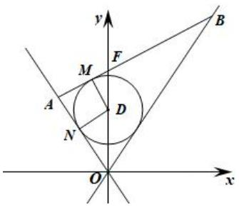

text_image

y
B
M
F
A
D
N
O
x

7.（洛阳期末）已知 $F$ 是椭圆 $M: \frac{x^2}{16} + \frac{y^2}{7} = 1$ 的右焦点， $A$ ， $B$ 是椭圆 $M$ 上关于原点 $O$ 对称的两点，若 $FAFB = 0$ ，则 $\Delta FAB$ 的内切圆的面积为（）

A. $5\pi$

B. $4\pi$

C. $2\pi$

D. $\pi$

8.（全国模拟）已知椭圆 $\frac{x^2}{a^2} +\frac{y^2}{b^2} = 1(a > b > 0)$ 的左、右焦点分别为 $F_{1}$ ， $F_{2}$ ，点 $P$ 为椭圆上不同于左、右顶点的任意一点， $I$ 为 $\triangle PF_1F_2$ 的内心，且 $S_{IPF_1} = \lambda S_{IF_1F_2} - S_{IPF_2}$ ，若椭圆的离心率为 $e$ ，则 $\lambda =$ （

A. $\frac{1}{e}$

B. $\frac{2}{e}$

C. e

D. 2e

9.（日照二模）已知双曲线 $\frac{x^2}{a^2} -\frac{y^2}{b^2} = 1(a > 0,b > 0)$ 的左右焦点分别为 $F_{1}$ ， $F_{2}$ ， $P$ 为双曲线右支上一点（异于右顶点)， $\triangle PF_1F_2$ 的内切圆与 $x$ 轴切于点(2，0)，过 $F_{2}$ 作直线 $l$ 与双曲线交于 $A$ ， $B$ 两点，若使 $|AB| = b^{2}$ 的直线 $l$ 恰有三条，则双曲线离心率取值范围是（）

A. $(1, \sqrt{2})$

B. $(1, 2)$

C. $(\sqrt{2}, +\infty)$

D. $(2, +\infty)$

# 2.3.4 达标训练

1.(2016年高考四川卷理科第20题)已知椭圆 $E:\frac{x^{2}}{6}+\frac{y^{2}}{3}=1$ ，直线 $l:y=-x+3$ 与枯圆E有且只有一个公共点T直线 $l'$ 平行于OT与椭圆E交于不同的两点A、B且与直线l交于点P证明:存在常数 $\lambda$ ，使得 $|PT|^{2}=\lambda|PA|\cdot|PB|$ ，并求 $\lambda$ 的值.

2.（深圳模拟）已知椭圆 $E: \frac{x^2}{a^2} + \frac{y^2}{b^2} = 1 (a > b > 0)$ 的两个焦点与短轴的一个端点是有一个角为 $120^\circ$ 的等腰三角形的三个顶点，直线 $l: y = -x + \sqrt{5}$ 与椭圆 $E$ 有且只有一个公共点 $T$ .

（Ⅰ）求椭圆 E 的方程及点 T 的坐标；

（II）斜率为2的直线 $l_{1}$ 与椭圆E交于不同的两点A、B，且与直线l交于点P，证明：存在常数 $\lambda$ ，使得 $|PT|^{2}=\lambda|PA|\cdot|PB|$ 成立，并求 $\lambda$ 的值.

3.（浙江月考）已知抛物线 $C:y^{2} = 2px$ ， $F$ 为其焦点，点 $Q(1,y)(y > 0)$ ，在抛物线 $C$ 上，且 $|FQ| = 2$ ，过点 $Q$ 作抛物线 $C$ 的切线 $l_{1}$ ， $P(x_0,y_0)$ ，为 $l_{1}$ 上异于点 $Q$ 的一个动点，过点 $P$ 作直线 $l_{2}$ 交抛物线 $C$ 于 $A$ ， $B$ 两点.

(1) 求抛物线 C 的方程;

（2）若 $|PQ|^{2}=|PA|\cdot|PB|$ ，求直线 $l_{2}$ 的斜率，并求 $x_{0}$ 的取值范围.

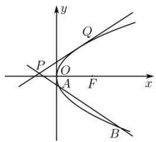

text_image

y
Q
P
O
A
F
x
B

4. 过直线 $l: x + y = 2$ 上的点 $P$ 作圆 $O: x^2 + y^2 = 1$ 的切线，切点为 $A, B$ ，则 $AB$ 中点 $M$ 到直线 $l$ 距离的取值范围为 \_\_\_\_.

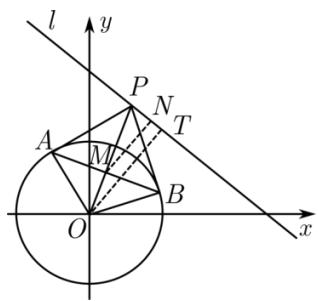

text_image

l
y
P
N
A
M
T
B
O
x

5.（沙坪坝期末）如图，椭圆 $C: \frac{x^2}{a^2} + \frac{y^2}{4} = 1 (a > 2)$ ，圆 $O: x^2 + y^2 = a^2 + 4$ ，椭圆 $C$ 的左、右焦点分别为 $F_1$ ， $F_2$ 过椭圆上一点 $P$ 和原点 $O$ 作直线 $l$ 交圆 $O$ 于 $M$ ， $N$ 两点，若 $|PF_1| \cdot |PF_2| = 6$ ，则 $|PM| \cdot |PN|$ 的为 \_\_\_\_.

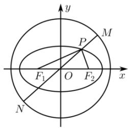

text_image

y
M
P
F₁ O F₂ x
N

# 2.3.5 达标训练

1.（抚州期末）已知点 $P$ 为椭圆 $\frac{x^2}{9} +\frac{y^2}{16} = 1$ 上的任意一点，点 $F_{1}$ ， $F_{2}$ 分别为该椭圆的上下焦点，设 $\alpha = \angle PF_1F_2$ ， $\beta = \angle PF_2F_1$ ，则 $\sin \alpha +\sin \beta$ 的最大值为（）

A. $\frac{3\sqrt{7}}{7}$

B. $\frac{4\sqrt{7}}{7}$

C. $\frac{9}{8}$

D. $\frac{3}{2}$

2.（道里区模拟）已知点 $P$ 是双曲线 $\frac{x^2}{a^2} -\frac{y^2}{b^2} = 1(a > 0,b > 0)$ 左支上的一点， $F_{1}$ ， $F_{2}$ 分别是双曲线左、右

焦点， $\angle PF_{1}F_{2} = \alpha$ ， $\angle PF_{2}F_{1} = \beta$ ，双曲线离心率为 $e$ ，则 $\frac{\tan\frac{\alpha}{2}}{\tan\frac{\beta}{2}} = (\quad)$

A. $\frac{e-1}{e+1}$

B. $\frac{e+1}{e-1}$

C. $\frac{e^2 + 1}{e^2 - 1}$

D. $\frac{e^2 - 1}{e^2 + 1}$

3.（4月份模拟）已知抛物线 $C:y^{2} = 4x$ 和直线 $l:x - y + 1 = 0$ ， $F$ 是 $C$ 的焦点， $P$ 是 $l$ 上一点过 $P$ 作抛物线 $C$ 的一条切线与 $y$ 轴交于 $Q$ ，则 $\triangle PQF$ 外接圆面积的最小值为（）

A. $\frac{\pi}{2}$

B. $\frac{\sqrt{2}}{2}\pi$

C. $\sqrt{2}\pi$

D. $2\pi$

4. 已知双曲线 $\frac{x^2}{a^2} - \frac{y^2}{b^2} = 1 (a > 0, b > 0)$ 的右顶点和右焦点分别为 $A(a, 0)$ 、 $F(c, 0)$ ，若在直线 $x = -\frac{a^2}{c}$ 上存在点 $P$ 使得 $\angle APF = 30^\circ$ 。则该双曲线的离心率的取值范围是（）

A. $(1, \frac{3 + \sqrt{17}}{2}]$

B. $\left[\frac{3+\sqrt{17}}{2},+\infty\right)$

C. $(1, 4]$

D. $[4, +\infty)$

5.（抚州期末）已知椭圆 $\frac{x^2}{a^2} +\frac{y^2}{b^2} = 1(a > b > 0)$ 的左右焦点分别为 $F_{1}(-c,0)$ ， $F_{2}(c,0)$ ，若椭圆上存在一点 $P$ 使得 $\frac{\sin\angle PF_1F_2}{\sin\angle PF_2F_1} = \frac{a}{c}$ ，则这椭圆的离心率的取值范围为（）

A. $(0, \sqrt{2} - 1)$

B. $(0, \frac{1}{2})$

C. $\left(\frac{1}{2},1\right)$

D. $(\sqrt{2} - 1, 1)$

6.（鼓楼区模拟）过点 $A(-8, 4)$ 作抛物线 $y^{2} = 8x$ 的两条切线 $l_{1}, l_{2}$ ，设 $l_{1}, l_{2}$ 与 $y$ 轴分别交于点 $B, C$ ，则 $\triangle ABC$ 的外接圆方程为（）

A. $x^{2} + y^{2} + 6x - 4y - 16 = 0$

B. $x^{2} + y^{2} + 6x - 16 = 0$

C. $x^{2} + y^{2} + 5x - 6y - 12 = 0$

D. $x^{2} + y^{2} - 4y - 16 = 0$

7.（达州模拟）已知 F 是抛物线 $C: x^{2} = 4y$ 的焦点．O 是坐标原点，A 是 C 上一点， $\triangle OFA$ 外接圆 B(B 为圆心）与 C 的准线相切，则过点 B 与 C 相切的直线的斜率 \_\_\_\_.

# 2.3.6 达标训练

1.（全国 I 卷模拟）已知圆 $O: x^{2} + y^{2} = 3$ 与抛物线 $C: y^{2} = 2px (p > 0)$ 相交于 $A$ ， $B$ 两点，且 $|AB| = 2\sqrt{2}$ ，若抛物线 $C$ 上存在关于直线 $l: x - y - 2 = 0$ 对称的相异两点 $P$ 和 $Q$ ，则线段 $PQ$ 的中点坐标为（）

A. $(1, -1)$

B. $(2, 0)$

C. $\left(\frac{1}{2},-\frac{3}{2}\right)$

D. $(1, 1)$

2.(安丘市模拟)如图所示点 F 是抛物线 $y^{2}=8x$ 的焦点, 点 A、B 分别在抛物线 $y^{2}=8x$ 及圆 $(x-2)^{2}+y^{2}=16$ 的实线部分上运动, 且 AB 总是平行于 x 轴, 则 $\triangle FAB$ 的周长的取值范围是（）

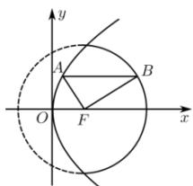

text_image

y
A
B
O
F
x

A. (6, 10)

B. (8, 12)

C. $[6,8]$

D. [8, 12]

3.（道里区期末）已知圆 $E: (x + 1)^2 + y^2 = r^2$ （圆心为点 $E$ ）与抛物线 $C: y^2 = 4x$ 交于 $A$ ， $B$ 两点，若此抛物线的焦点为 $F$ ，且 $A$ ， $B$ 两点都在以 $EF$ 为直径的圆上，则 $\sin \angle AEF = (\quad)$

A. $\frac{\sqrt{5} - 2}{2}$

B. $\frac{\sqrt{5} - 2}{3}$

C. $\frac{\sqrt{5} - 1}{2}$

D. $\frac{\sqrt{5} - 1}{3}$

4.（6月份模拟）已知直线 $y = kx (k \neq 0)$ 与双曲线 $\frac{x^2}{a^2} - \frac{y^2}{b^2} = 1 (a > 0, b > 0)$ 交于 $A$ ， $B$ 两点，以 $AB$ 为直径的圆恰好经过双曲线的右焦点 $F$ ，若 $\triangle ABF$ 的面积为 $4a^2$ ，则双曲线的离心率为（）

A. $\sqrt{2}$

B. $\sqrt{3}$

C. 2

D. $\sqrt{5}$

# 2.4.1 达标训练

1（昆明期末）已知抛物线 $E: y^{2} = 2px (p > 0)$ 的焦点为 $F$ ，准线为 $l$ ，经过 $F$ 的直线交 $E$ 于 $A$ ， $B$ 两点，交 $l$ 于 $G$ 点．过点 $A$ ， $B$ 分别作 $l$ 的垂线，乘足分别为 $C$ ， $D$ ，若 $AF = 3FB$ ，下述三个结论：

① $CF \hat{} DF$

②直线 AB 的倾斜角为 $\frac{p}{4}$ 或 $\frac{3p}{4}$

③ $F$ 是 $AG$ 的中点

其中所有正确结论的编号是（）

A. ①③

B. ②③

C. ①②③

D. ①②

2.（贵州期末）已知直线 l 过抛物线 $y^{2}=4x$ 的焦点 F，且与抛物线相交于 A、B 两点，点 B 关于 x 轴的对称点为 $B_{1}$ ，直线 $AB_{1}$ 与 x 轴相交于 $C(m,0)$ 点，则实数 m 的值为（）

A.-1

B.-2

C. $-\frac{3}{2}$

D. $-\frac{1}{2}$

3.（沈河区模拟）已知线段 $AB$ 是过抛物线 $y^{2} = 2px (p > 0)$ 的焦点 $F$ 的一条弦，过点 $A(A$ 在第一象限内）作直线 $AC$ 垂直于抛物线的准线，垂足为 $C$ ，直线 $AT$ 与抛物线相切于点 $A$ ，交 $x$ 轴于点 $T$ ，给出下列命题：

(1) D AFx = 2D TAF ; (2) TF = AF ; (3) AT ^ CF .

其中正确的命题个数为（）

A. 0

B. 1

C. 2

D. 3

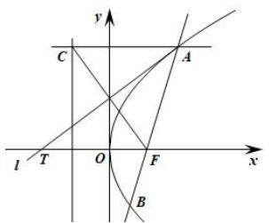

text_image

y
C
A
l T O F x
B

# 2.4.2 达标训练

1. （涪城区模拟）已知 $F$ 为抛物线 $y^{2} = x$ 的焦点，点 $A$ ， $B$ 在该抛物线上且位于 $x$ 轴的两侧，而且 $OA \times OB = 6(O$ 为坐标原点），若 DABO 与 DAFO 的面积分别为 $S_{1}$ 和 $S_{2}$ ，则 $S_{1} + 4S_{2}$ 最小值是 \_\_\_\_.  
2. (2015·四川) 设直线 $l$ 与抛物线 $y^{2} = 4x$ 相交于 $A$ 、 $B$ 两点, 与圆 $(x - 5)^{2} + y^{2} = r^{2}(r > 0)$ 相切于点 $M$ , 且 $M$ 为线段 $AB$ 的中点, 若这样的直线 $l$ 恰有 4 条, 则 $r$ 的取值范围是 ( )

A. (1, 3)

B. $(1, 4)$

C. $(2,3)$

D. $(2, 4)$

3. 在平面直角坐标系 $xOy$ 中，直线 $l$ 与抛物线 $y^{2} = 4x$ 相交于不同的 $A, B$ 两点.

(1) 如果直线 l 过抛物线的焦点，求 $OA \times OB$ 的值；  
(2) 如果 $OA \times OB = -4$ ，证明直线 l 必过一定点，并求出该定点.

4. 已知抛物线 $y^{2} = 2x$ 及定点 $A(1, 1), B(-1, 0)$ ， $M$ 是抛物线上的点，设直线 $AM, BM$ 与抛物线的另一交点分别为 $M_{1}, M_{2}$ . 求证：当点 $M$ 在抛物线上变动时（只要 $M_{1}, M_{2}$ 存在且 $M_{1}$ 与 $M_{2}$ 是不同两点），直线 $M_{1}M_{2}$ 恒过一定点，并求出定点的坐标.

5. 已知抛物线 $y^{2}=2px(p>0)$ ，过定点 $M(p,0)$ 作一弦 PQ，则 $\frac{1}{\left|MP\right|^{2}}+\frac{1}{\left|MQ\right|^{2}}=$ \_\_\_\_.

6. 已知: O 为坐标原点, 点 F、T、M、 $P_{1}$ 满足 OF = (1, 0), OT = (-1, t), FM = MT, $P_{1}M^{\wedge}FT$ , $P_{1}T //OF$ .

(1) 当 t 变化时，求点 $P_{1}$ 的轨迹方程；  
(2) 若 $P_{2}$ 是轨迹上不同于 $P_{1}$ 的另一点，且存在非零实数 $I$ ，使得 $FP_{1} = IFP_{2}$ ，求证： $\frac{1}{|FP_1|} +\frac{1}{|FP_2|} = 1.$

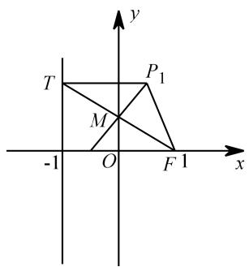

text_image

T
P₁
M
-1 O F 1 x
y

7. 设圆 $O: x^{2} + y^{2} = 5$ 与抛物线 $C: y^{2} = 2px (p > 0)$ 交于点 $A(x_{0}, 2)$ , $AB$ 为圆 $O$ 的直径, 过 $B$ 的直线与 $C$ 交于两不同点 $D$ , $E$ , 则直线 $AD$ 与 $AE$ 的斜率之积为 \_\_\_\_.

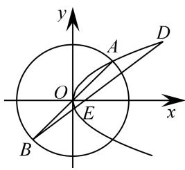

text_image

y
A
D
O
E
x
B

# 2.4.3 达标训练

1.（慈溪市期末）已知抛物线 $C_1: y^2 = 8x$ ，圆 $C_2: (x - 2)^2 + y^2 = 1$ ，若点 $P$ ， $Q$ 分别在 $C_1$ ， $C_2$ 上运动，且设点 $M(4, 0)$ ，则 $\frac{|PM|}{|PQ|}$ 的最小值为（）

A. $\frac{3}{5}$

B. $\frac{4}{5}$

C. 4

D. 5

2.（武汉模拟）已知直线 $PQ: y = x - \frac{1}{2}$ 与 y 轴交于 P 点，与曲线 $C: y^{2} = x(y^{3} - 0)$ 交于 Q，M 成为线段 PQ 上一点，过 M 作直线 x = t 交 C 于点 N，则 $\triangle MNP$ 面积取到最大值时，t 的值为（）

A. $\frac{1}{16}$

B. $\frac{1}{4}$

C. 1

D. $\frac{5}{4}$

3.（桐乡市模拟）已知点 $A$ 是抛物线 $x^{2} = 4y$ 的对称轴与准线的交点，点 $F$ 为抛物线的焦点，点 $P$ 在抛物线上且满足 $|PA| = m|PF|$ ，若 $m$ 取最大值时，点 $P$ 恰好在以 $A$ ， $F$ 为焦点的椭圆上，则椭圆的离心率为（）

A. $\sqrt{3} - 1$

B. $\sqrt{2}-1$

C. $\frac{\sqrt{5} - 1}{2}$

D. $\frac{\sqrt{2} - 1}{2}$

4.（青羊区期中）如图，过抛物线 $y^{2}=4x$ 焦点 F 作直线 l，交抛物线于 P，Q 两点，以 PQ 为直径的圆 M 交 x 轴于 A，B 两点，交 y 轴于 C，D 两点，则 $\frac{|AB|^{2}}{|CD|^{2}}$ 的最小值为（）

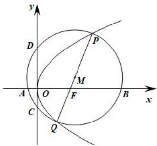

text_image

y
D
P
M
A
O
F
B
x
C
Q

A. $\frac{11}{4}$

B. $\frac{5}{2}$

C. $\frac{2\sqrt{13} - 1}{4}$

D. $\frac{\sqrt{13} - 1}{2}$

5.（安徽期末）已知点 $A(0, -2)$ ， $B(0, 2)$ 及抛物线 $x^{2} = 4y$ ，若抛物线上点 $P$ 满足 $|PA| = \lambda |PB|$ ，则 $l$ 的最大值（）

A. 3

B. 2

C. $\sqrt{3}$

D. $\sqrt{2}$

# 2.4.4 达标训练

1. 如图，已知点 $P$ 是 $y$ 轴左侧（不含 $y$ 轴）一点，抛物线 $C: y^2 = 4x$ 上存在不同的两点 $A, B$ 满足 $PA, PB$ 的中点均在 $C$ 上.

（Ⅰ）设 AB 中点为 M，证明：PM 垂直于 y 轴；  
（Ⅱ）若 P 是半椭圆 $x^{2}+\frac{y^{2}}{4}=1$ （x<0）上的动点，求 $\triangle PAB$ 面积的取值范围.

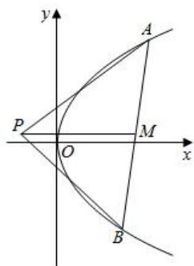

text_image

y
A
P
O
M
x
B

2. 已知抛物线 $C: x^{2} = 2py (p > 0)$ , 过点 $T(0, p)$ 作两条互相垂直的直线 $l_{1}$ 和 $l_{2}, l_{1}$ 交抛物线 $C$ 于 $A$ , $B$ 两点, $l_{2}$ 交抛物线 $C$ 于 $D, E$ 两点, 抛物线 $C$ 上一点 $P(t, 2)$ 到焦点 $F$ 的距离为 3.

(1) 求抛物线 C 的方程;  
（2）若线段 AB 的中点为 M，线段 DE 的中点为 N，求证：直线 MN 过定点.

3. 已知抛物线 C: $x^{2}=2py$ (p>0) 经过点 $M(-\sqrt{2},1)$ .

(1) 求抛物线 C 的方程;

（2）设抛物线 C 的准线与 y 轴的交点为 N，直线 l 过点（0，1），且与抛物线 C 交于 A、B 两点，AB 的中点为 E，若 $EN = \frac{3\sqrt{2}}{2}$ ，求 $\triangle ANB$ 的面积.

4. 在平面直角坐标系 $xOy$ 中，已知圆 $G: x^{2+}(y-1)^{2}=1$ 与抛物线 $C: x^{2}=2py (p>0)$ 交于点 $M, N$ （异于原点 $O$ )， $MN$ 恰为该圆的直径，过点 $E(0,2)$ 作直线交抛物线于 $A, B$ 两点，过 $A, B$ 两点分别作抛物线 $C$ 的切线交于点 $P$ .

（1）求证：点 P 的纵坐标为定值；

（2）若 F 是抛物线 C 的焦点，证明： $\angle PFA = \angle PFB$ .

5. 已知抛物线 $C: y^{2} = 4x$ 的焦点为 $F, P(-1, 0)$ ，过 $F$ 作直线 $l$ 交抛物线 $C$ 于 $A(x_{1}, y_{1}), B(x_{2}, y_{2})$ 两点.

（1）若直线 l 的斜率为 1，求线段 AB 的中点坐标；

（2）设直线 PA，PB 的斜率分别为 $k_{PA}$ ， $k_{PB}$ ，求证： $k_{PA} + k_{PB}$ 是定值.

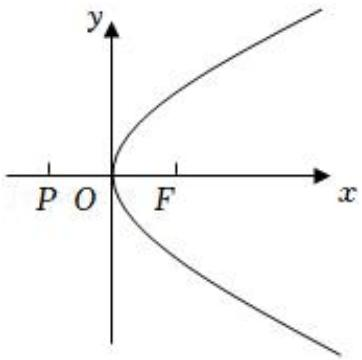

text_image

y
P O F x

# 3.1 达标训练

1.（常德模拟）已知 $A(-2,0)$ ， $B(2,0)$ ，点 $P$ 在平面内运动， $k_{PA} k_{PB} = -\frac{1}{4}$ .

(1) 求点 P 的轨迹方程;  
（2）若点 $Q(0,1)$ ， $M$ ， $N$ 为曲线 $C$ 上两动点， $k_{MQ} k_{NQ} = -\frac{3}{4}$ 。问直线 $MN$ 能否过定点，若能过定点，则求出该定点坐标，若不能过定点则说明理由。

2.（上饶月考）已知椭圆 $C: \frac{x^2}{a^2} + \frac{y^2}{b^2} = 1 (a > b > 0)$ 的左焦点坐标为 $(- \sqrt{3}, 0)$ ， $A$ ， $B$ 分别是椭圆的左，右顶点， $P$ 是椭圆上异于 $A$ ， $B$ 的一点，且 $PA$ ， $PB$ 所在直线斜率之积为 $-\frac{1}{4}$ .

(1) 求椭圆 C 的方程;  
（2）过点 $Q(0,1)$ 作两条直线，分别交椭圆 $C$ 于 $M$ ， $N$ 两点（异于 $Q$ 点）。当直线 $QM$ ， $QN$ 的斜率之和为

定值 $t(t \neq 0)$ 时，直线 $MN$ 是否恒过定点？若是，求出定点坐标；若不是，请说明理由.

3.（六合月考）已知椭圆 $E: \frac{x^2}{a^2} + \frac{y^2}{b^2} = 1 (a > b > 0)$ 的左焦点为 $F(-c, 0)$ ，离心率为 $e$ ，椭圆过点 $P(-2, 3)$ 与 $Q(\frac{2}{e}, 0)$ .

(1) 求此椭圆的方程;   
（2）设经过点 P 的直线与圆 $O: x^{2} + y^{2} = 28$ 的交点为 M 、 N ，若 PF = PM ，求 PN 的长；  
（3）设不经过点 P 的直线 $l: y = kx + m$ 与椭圆 E 交于两点 A、B，记直线 PA 与 PB 的斜率分别为 $k_{1}$ 、 $k_{2}$ ，且 $4k_{1}k_{2} + 3 = 0$ ，求 m 的值.

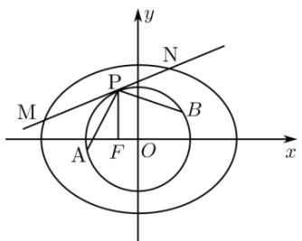

text_image

y
N
P
M
B
A
F
O
x

4.（思明月考）已知椭圆 $C: \frac{x^2}{a^2} + \frac{y^2}{b^2} = 1 (a > b > 0)$ 的下顶点为点 $D$ ，右焦点为 $F_2(1,0)$ 。延长 $DF_2$ 交椭圆 $C$ 于点 $E$ ，且满足 $|DF_2| = 3 |F_2E|$ 。

（1）试求椭圆 C 的标准方程；  
(2) $A, B$ 分别是椭圆长轴的左、右两个端点， $M, N$ 是椭圆上与 $A, B$ 均不重合的相异两点，设直线 $AM, AN$ 的斜率分别是 $k_{1}, k_{2}$ . 若直线 $MN$ 过点 $(\frac{\sqrt{2}}{2}, 0)$ ，求证： $k_{1} k_{2} = -\frac{1}{6}$ .

5.（广陵月考）如图，椭圆 $E:\frac{x^{2}}{a^{2}}+\frac{y^{2}}{b^{2}}=1(a>b>0)$ 经过点 $A(0,-1)$ ，右准线l:x=2，设O为坐标原点，若不与坐标轴垂直的直线与椭圆E交于不同两点P，Q（均异于点A），直线AP交l于M（点M在x轴下方）.

（1）求椭圆 E 的标准方程；  
（2）过右焦点 F 作 OM 的垂线与以 OM 为直径的圆交于 C，D 两点，若 $CD = \sqrt{6}$ ，求圆 H 的方程；  
（3）若直线 AP 与 AQ 的斜率之和为 2，证明：直线 PQ 过定点，并求出该定点.

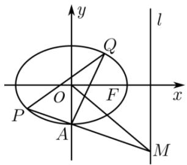

text_image

y
l
Q
O
F
x
P
A
M

# 3.2 达标训练

1.（万柏林期末）（1）求证： $m$ 为任何实数，直线 $(m - 1)x + (2m - 1)y = m - 5$ 经过某一定点；  
（2）过该定点引一条直线，使它夹在两坐标轴间的线段被这点平分，求这条直线的方程.

2.（宁波期中）已知直线 $l_{1}:mx - y = 0$ ， $l_{2}:x + my - m - 2 = 0$

（1）求证：直线 $l_{2}$ 恒过定点，并求定点坐标；

（2）求证：对 m 的任意实数值， $l_{1}$ 和 $l_{2}$ 的交点 M 总在一个定圆上；

（3）若 $l_{1}$ 与定圆的另一个交点为 $P_{1}$ ， $l_{2}$ 与定圆的另一个交点为 $P_{2}$ ，求当实数 m 取值变化时， $\triangle MP_{1}P_{2}$ 面积取得最大值时，直线 $l_{1}$ 的方程.

3.（滨州一模）已知直线 $l: x + ay - 1 = 0$ 是圆 $C: x^2 + y^2 - 4x - 2y + 1 = 0$ 的一条对称轴，过点 $A(-4, a)$ 作圆 $C$ 的两条切线，切点分别为 $B$ 、 $D$ ，则直线 $BD$ 的方程为 \_\_\_\_.

4.（秦州月考）已知抛物线 $y^{2}=2px(p>0)$ ，AB 为过抛物线焦点 F 的弦，AB 的中垂线交抛物线 E 于点 M、N．若 A、M、B、N 四点共圆，求直线 AB 的方程.

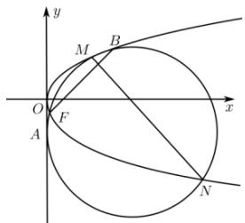

text_image

y
M B
O F x
A N

5.（陕西模拟）设椭圆 $\frac{x^2}{a^2} +\frac{y^2}{b^2} = 1(a > b > 0)$ 的离心率 $e = \frac{\sqrt{2}}{2}$ ，过左焦点作倾斜角为 $45^{\circ}$ 的直线交椭圆于 $A$ ， $B$ 两点.

（1）若 $FA = \lambda FB$ ，求 $\lambda$ ：

（2）设 AB 的中垂线与椭圆交于 C，D 两点，问 A，B，C，D 四点是否共圆，若共圆，则求出该圆的方程；若不共圆，则说明理由.

6.（武汉月考）设直线 y=3x-2 与椭圆 $\Gamma:\frac{x^{2}}{25}+\frac{y^{2}}{16}=1$ 交于 A，B 两点，过 A，B 两点的圆与椭圆 $\Gamma$ 交于另外两点 C，D，则直线 CD 的斜率 k 为()

A. $-\frac{1}{3}$

B.-3

C. $\frac{1}{2}$

D.-2

7.（成都期末）已知 $O$ 为坐标原点， $F$ 为椭圆 $C: x^{2} + \frac{y^{2}}{2} = 1$ 在 $y$ 轴正半轴上的焦点，过 $F$ 且斜率为 $-\sqrt{2}$ 的直线 $l$ 与 $C$ 交与 $A, B$ 两点，点 $P$ 满足 $OA + OB + OP = 0$ .

(1)证明：点 $P$ 在 $C$ 上；

(2)设点 $P$ 关于 $O$ 的对称点为 $Q$ , 证明: $A, P, B, Q$ 四点在同一圆上. (2011年全国卷)

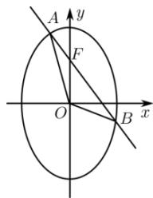

text_image

A
y
F
O
B
x

8.（红塔期中）已知椭圆方程为 $\frac{x^2}{a^2} +\frac{y^2}{b^2} = 1(a > b > 0)$ ，它的一个顶点为 $M(0,1)$ ，离心率 $e = \frac{\sqrt{6}}{3}$

(1) 求椭圆方程;

（2）过点 $M$ 分别作直线 $MA$ ， $MB$ 交椭圆于 $A$ ， $B$ 两点，设两直线的斜率分别为 $k_{1}$ ， $k_{2}$ ，且 $k_{1} + k_{2} = 3$ ：求证：直线 $AB$ 过定点，并求出直线 $AB$ 的斜率 $k$ 的取值范围.

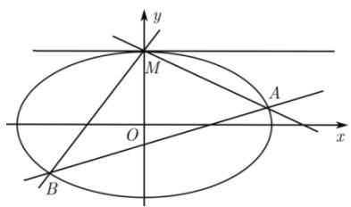

text_image

y
M
O
A
x
B

9. 在平面直角坐标系 $xOy$ 中，已知椭圆 $\frac{x^2}{4} + \frac{y^2}{2} = 1$ 的左、右顶点为 $A, B$ ，直线 $l$ 过点 $P(1,0)$ 与椭圆交于 $M, N$ ，直线 $AM, BN$ 交于点 $Q$ ，求证： $Q$ 在一定直线上.

10. 已知圆 $O: x^{2} + y^{2} = 4$ ，与 $x$ 轴的负半轴的交点为 $A$ ，过点 $A$ 作两条斜率分别为 $k_{1}$ ， $k_{2}$ 的直线，交圆 $O$ 于 $B$ ， $C$ 两点，且 $k_{1} k_{2} = -2$ 。试证明直线 $BC$ 恒过一个定点，并求出该定点坐标。

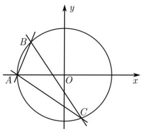

text_image

y
B
A
O
x
C

11. 已知椭圆 $C: \frac{x^2}{4} + \frac{y^2}{3} = 1$ ，斜率为 1 的直线 $l$ 与椭圆交于 $A$ 、 $B$ 两点，点 $M(4,0)$ ，直线 $AM$ 与椭圆交于点 $A_1$ ，直线 $BM$ 与椭圆交于 $B_1$ ，求证：直线 $A_1 B_1$ 过定点.

# 4.1-4.3 达标训练

1. (2008·广东) 设 $b > 0$ ，椭圆方程为 $\frac{x^2}{2b^2} + \frac{y^2}{b^2} = 1$ ，抛物线方程为 $x^2 = 8(y - b)$ 。如图所示，过点 $F(0, b + 2)$ 作 $x$ 轴的平行线，与抛物线在第一象限的交点为 $G$ ，已知抛物线在点 $G$ 的切线经过椭圆的右焦点 $F_1$ 。

(1) 求满足条件的椭圆方程和抛物线方程;   
（2）设 A，B 分别是椭圆长轴的左、右端点，试探究在抛物线上是否存在点 P，使得 $\triangle ABP$ 为直角三角形？若存在，请指出共有几个这样的点？并说明理由（不必具体求出这些点的坐标）.

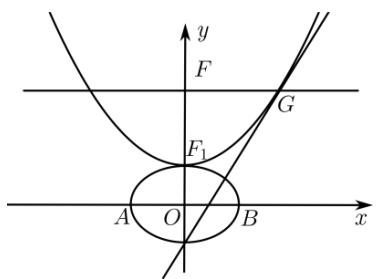

text_image

y
F
G
F₁
A O B x

2.（石家庄二模）已知椭圆 $C_1: \frac{x^2}{4b^2} + \frac{y^2}{b^2} = 1 (b > 0)$ ，抛物线 $C_2: x^2 = 4(y - b)$ 。过点 $F(0, b + 1)$ 作 $x$ 轴的平行线，与抛物线 $C_2$ 在第一象限的交点为 $G$ ，且该抛物线在点 $G$ 处的切线经过坐标原点 $O$ 。

(1) 求椭圆 $C_{1}$ 的方程;  
（2）设直线 $l: y = kx$ 与椭圆 $C_1$ 相交于两点 $C$ 、 $D$ 两点，其中点 $C$ 在第一象限，点 $A$ 为椭圆 $C_1$ 的右顶点，求四边形 $ACFD$ 面积的最大值及此时 $l$ 的方程.

3.（中山）如图，在平面直角坐标系中， $O$ 为坐标原点，点 $B(0,1)$ ，且点 $A(a,0) (a \neq 0)$ 是 $x$ 轴上动点，过点 $A$ 作线段 $AB$ 的垂线交 $y$ 轴于点 $D$ ，在直线 $AD$ 上取点 $P$ ，使 $AP = DA$ .

（Ⅰ）求动点 P 的轨迹 C 的方程；  
（Ⅱ）点 $Q$ 是直线 $y = -1$ 上的一个动点，过点 $Q$ 作轨迹 $C$ 的两条切线切点分别为 $M$ ， $N$ 求证： $QM \perp QN$ ：

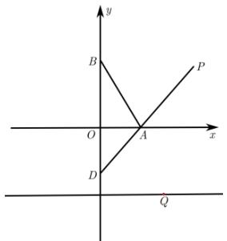

text_image

y
B
P
O
A
x
D
Q̂

4.（2013·广东）已知抛物线 C 的顶点为原点，其焦点 $F(0,c)(c>0)$ ，到直线 l:x-y-2=0 的距离为 $\frac{3\sqrt{2}}{2}$ ，设 P 为直线 l 上的点，过点 P 作抛物线 C 的两条切线 PA，PB，其中 A，B 为切点.

(1) 求抛物线 C 的方程;  
(2) 当点 $P(x_{0}, y_{0})$ 为直线 l 上的定点时，求直线 AB 的方程；  
（3）当点 P 在直线 l 上移动时，求 $\left|AF\right|\left|BF\right|$ 的最小值.

5.（龙岩一模）已知抛物线 $C: x^{2} = 2py (p > 0)$ 上一点 $P(2, m)$ ，F 为焦点， $\triangle PFO$ 面积为 1.

(1) 求抛物线 C 的方程;  
（2）过点 P 引圆 $M: x^{2} + (y - 3)^{2} = r^{2} (0 < r < \sqrt{2})$ 的两条切线 PA、PB，切线 PA、PB 与抛物线 C 的另一个交点分别为 A、B，求直线 AB 斜率的取值范围.

6.（2005·江西）如图，设抛物线 $C:y = x^2$ 的焦点为 $F$ ，动点 $P$ 在直线 $l:x - y - 2 = 0$ 上运动，过 $P$ 作抛物线 $C$ 的两条切线 $PA$ 、 $PB$ ，且与抛物线 $C$ 分别相切于 $A$ 、 $B$ 两点.

(1) 求 $\Delta APB$ 的重心 G 的轨迹方程;  
(2) 证明 $\angle PFA = \angle PFB$ .

text_image

y
A
F
O
x
l
P
B

7.（江西二模）已知椭圆 $C: \frac{x^2}{a^2} + \frac{y^2}{b^2} = 1 (a > b > 0)$ 的离心率为 $e = \frac{\sqrt{2}}{2}$ ，椭圆上的点 $P$ 与两个焦点 $F_1$ ， $F_2$ 构成的三角形的最大面积为 1.

(1) 求椭圆的方程.   
(2) 过圆 $M: x^{2} + y^{2} = r^{2} (r > 0)$ 外一点 $P(x_{0}, y_{0})$ ，作圆 $M$ 的两条切线 $PA$ ， $PB$ （且点分别为 $A$ ， $B$ ），则直线 $AB$ 的方程为 $x_{0}x + y_{0}y = r^{2}$ ，类比此结论，过点 $Q(3,1)$ 作椭圆 $C$ 的两条切线 $QD$ 、 $QE$ （切点分别为 $D$ 、 $E$ ），写出直线 $DE$ 的方程，并予以证明.

8.（潍坊模拟）已知椭圆 $C: \frac{x^2}{a^2} + \frac{y^2}{b^2} = 1 (a > b > 0)$ 的离心率 $e = \frac{1}{2}$ ，点 $A$ 为椭圆上一点， $\angle F_1AF_2 = 60^\circ$ ，且 $S_{F_1AF_2} = \sqrt{3}$ .

(1) 求椭圆 C 的方程;  
（2）设动直线 $l: y = kx + m$ 与椭圆 $C$ 有且只有一个公共点 $P$ ，且与直线 $x = 4$ 相交于点 $Q$ 。问：在 $x$ 轴上是否存在定点 $M$ ，使得以 $PQ$ 为直径的圆恒过定点 $M$ ？若存在，求出点 $M$ 的坐标；若不存在，说明理由。

9.（吉林三模）如图，已知椭圆 $C: \frac{x^2}{a^2} + \frac{y^2}{b^2} = 1 (a > b > 0)$ ，离心率 $e = \frac{\sqrt{2}}{2}$ ， $M(x_0, y_0)$ ，是椭圆上的任一点，从原点 $O$ 向圆 $M: (x - x_0)^2 + (y - y_0)^2 = 2$ 作两条切线，分别交椭圆于点 $P$ ， $Q$ 。

（1）若过点 $(0,-b)$ ， $(a,0)$ 的直线与原点的距离为 $\sqrt{2}$ ，求椭圆方程；  
（2）在（1）的条件下，若直线 $OP$ ， $OQ$ 的斜率存在，并记为 $k_{1}$ ， $k_{2}$ ．试问 $k_{1}k_{2}$ 是否为定值？若是，求出该值；若不是，说明理由.

text_image

y
Q
M
P
O
x

10.（秋·道里区校级期中）已知直线 l 与椭圆 $E: x^{2} + \frac{y^{2}}{b^{2}} = 1 (0 < b < 1)$ 相切于第一象限的点 $P(x_{0}, y_{0})$ ，且直线 l 与 x 轴、y 轴分别交于点 A、B，当 $\triangle AOB$ (O 为坐标原点) 的面积最小时， $\angle F_{1}PF_{2} = \frac{\pi}{3} (F_{1}$ 、 $F_{2}$ 是椭圆的两个焦点)，则此时 $\triangle F_{1}PF_{2}$ 中 $\angle F_{1}PF_{2}$ 的平分线的长度为（）

A. $\frac{2\sqrt{3}}{5}$

B. $\frac{4\sqrt{3}}{5}$

C. $\frac{2\sqrt{3}}{15}$

D. $\frac{4\sqrt{3}}{15}$

11.(邯郸一模)过点 P 作抛物线 $C: x^{2} = 2y$ 的切线 $l_{1}, l_{2}$ ，切点分别为 M, N，若 $\triangle PMN$ 的重心坐标为 $(1,1)$ ，且 P 在抛物线 $D: y^{2} = mx$ 上，则 D 的焦点坐标为（）

A. $\left(\frac{1}{4},0\right)$

B. $\left(\frac{1}{2},0\right)$

C. $\left(\frac{\sqrt{2}}{4},0\right)$

D. $\left(\frac{\sqrt{2}}{2},0\right)$

12. 如图 2, 在平面直角坐标系 $xOy$ 中, 圆 $O: x^2 + y^2 = 4$ , 直线 $l: 4x + 3y - 20 = 0$ . $A\left(\frac{4}{5}, \frac{3}{5}\right)$ 为圆 $O$ 内一点, 弦 $MN$ 过点 $A$ , 过点 $O$ 作 $MN$ 的垂线交 $l$ 于点 $P$ . 判断直线 $PM$ 与圆 $O$ 的位置关系, 并证明.

text_image

y
M
A
P
O
N
l x

图2

13. (贵州预赛题)如图 3，已知 A、B 是椭圆 $\frac{x^{2}}{a^{2}} + \frac{y^{2}}{b^{2}} = 1 (a > b > 0)$ 的左、右右顶点，P、Q 是该椭圆上不

同于顶点的两点，且直线 AP 与 QB、PB 与 AQ 分别交于点 M、N.

（1）求证： $MN \perp AB;$   
(2) 若弦 PQ 过椭圆的右焦点 $F_{2}$ ，求直线 MN 的方程.

text_image

y
P
M
O
A
G
Q
N
x
图3

14.（河北预赛题）已知 A、B 是椭圆 $C: \frac{x^{2}}{25} + \frac{y^{2}}{9} = 1$ 的左、右顶点，直线 l 交椭圆 C 于 M、N 两点，记 AM 的斜率为 $k_{1}$ ，BN 的斜率为 $k_{2}$ ，且 $k_{1}: k_{2} = 1:9$ ．求证：直线 l 过定点．

15. 如图 4，椭圆 $E: \frac{x^{2}}{a^{2}} + \frac{y^{2}}{b^{2}} = 1 (a > b > 0)$ 的离心率为 $\frac{\sqrt{2}}{2}$ ，直线 $l: y = \frac{1}{2} x$ 与椭圆 E 相交于 A、B 两点， $AB = 2\sqrt{5}$ ，C、D 是椭圆 E 上异于 A、B 的任意两点，且直线 AC、BD 相交对点 M，直线 AD、BC 相交于点 N，连结 MN.

(1) 求椭圆 E 的方程;  
(2) 求证: 直线 MN 的斜率为定值.

text_image

M
y
C
D
N
A
O
x
B
图4

16.（虹口二模）设双曲线 $C: \frac{x^2}{a^2} - y^2 = 1$ 的左顶点为 $D$ ，且以点 $D$ 为圆心的圆 $D: (x + 2)^2 + y^2 = r^2 (r > 0)$ 与双曲线 $C$ 分别相交于点 $A$ ， $B$ ，如图所示.

（1）求双曲线 C 的方程；  
（2）求 DA DB 的最小值，并求出此时圆 D 的方程；  
（3）设点 P 为双曲线 C 上异于点 A，B 的任意一点，且直线 PA，PB 分别与 x 轴相交于点 M，N，求证： $|OM||ON|$ 为定值（其中 O 为坐标原点）.

text_image

y
A
O
M
N
x
P
B

17.（惠州三模）已知动圆过定点 $F(0,2)$ ，且与定直线L:y=-2相切.

(1) 求动圆圆心的轨迹 C 的方程;  
(2) 若 AB 是轨迹 C 的动弦，且 AB 过 $F(0,2)$ ，分别以 A、B 为切点作轨迹 C 的切线，设两切线交点为 Q，证明： $AQ \perp BQ$ .

18.（岳麓二模）如图，点 $F$ 是抛物线 $E: x^{2} = 2py (p > 0)$ 的焦点，点 $A$ 是抛物线上的定点，且 $AF = (2,0)$ 。点 $B$ ， $C$ 是抛物线上的动点，直线 $AB$ ， $AC$ 的斜率分别为 $k_{1}$ ， $k_{2}$ ，且 $k_{2} - k_{1} = 2$ ，以 $A$ 为圆心， $|AF|$ 的长为半径的圆分别交直线 AB，AC 于点 M，N，抛物线 E 在点 B，C 处的切线相交于 D 点.

(1) 求抛物线的方程;   
（2）记 $\Delta BCD$ 的面积为 $S_{1}$ ， $\Delta AMN$ 的面积为 $S_{2}$ ，求 $\frac{S_1}{S_2}$ 的最小值.

text_image

B
M
N
A
F
O
x
y
C
D

19.（2007·江苏）如图，在平面直角坐标系 $xOy$ 中，过 $y$ 轴正方向上一点 $C(0,c)$ 任作一直线，与抛物线 $y = x^2$ 相交于 $AB$ 两点，一条垂直于 $x$ 轴的直线，分别与线段 $AB$ 和直线 $l: y = -c$ 交于 $P$ ， $Q$ ，

（1）若 $OA OB = 2$ ，求 $c$ 的值；  
(2) 若 $P$ 为线段 $AB$ 的中点, 求证: $QA$ 为此抛物线的切线;  
（3）试问（2）的逆命题是否成立？说明理由.

text_image

y
C
P
B
A
Q
x
l
Q

20.（东莞期末）已知双曲线 $E: \frac{x^2}{a^2} - \frac{y^2}{b^2} = 1 (a > 0, b > 0)$ 的中心为原点 $O$ ，左、右焦点分别为 $F_1$ 、 $F_2$ ，离心率为 $\frac{5}{4}$ ，且过点 $M(5, \frac{9}{4})$ ，又 $P$ 点是直线 $x = \frac{a^2}{5}$ 上任意一点，点 $Q$ 在双曲线 $E$ 上，且满足 $PF_2 QF_2 = 0$ 。

(1) 求双曲线的方程;   
(2) 证明: 直线 $PQ$ 与直线 $OQ$ 的斜率之积是定值;  
（3）若点 P 的纵坐标为 1，过点 P 作动直线 l 与双曲线右支交于不同的两点 M、N，在线段 MN 上取异于点 M、N 的点 H，满足 $\frac{|PM|}{|PN|} = \frac{|MH|}{|HN|}$ ，证明点 H 恒在一条定直线上.

# 4.4-4.5 达标训练

1.（吉安期末）已知椭圆 $C: \frac{x^2}{a^2} + \frac{y^2}{b^2} = 1$

$(a > b > 0)$ 的焦距为2，离心率为 $\frac{1}{2}$

(1) 求椭圆 C 的标准方程;

（2）直线 l 与 x 轴正半轴和 y 轴分别交于点 Q，P，与椭圆分别交于点 M，N，各点均不重合且满足 $PM = \lambda MQ$ ， $PN = \mu NQ$ 。若 $\lambda + \mu = -4$ ，证明：直线 l 恒过定点。

2.（山东二模）已知椭圆 $C: \frac{x^2}{a^2} + \frac{y^2}{b^2} = 1$

$(a > b > 0)$ 的离心率 $e = \frac{1}{2}$ ，且经过点 $(1, \frac{3}{2})$ ，点 $F_{1}$ ， $F_{2}$ 为椭圆 $C$ 的左、右焦点.

(1) 求椭圆 C 的方程;

(2) 过点 $F_{1}$ 分别作两条互相垂直的直线 $l_{1}, l_{2}$ ，且 $l_{1}$ 与椭圆交于不同两点 A, B, $l_{2}$ 与直线 x=1 交于点 P。若 $AF_{1}=\lambda F_{1}B$ ，且点 Q 满足 $QA=\lambda QB$ ，求 $\triangle PQF_{1}$ 面积的最小值。

text_image

l₂
y
A
l₁
B
F₁
O
F₂
x
P
Q

3. 若椭圆 $E_{1}:\frac{x^{2}}{a_{1}^{2}}+\frac{y^{2}}{b_{1}^{2}}=1$ 与椭圆 $E_{2}:\frac{x^{2}}{a_{2}^{2}}+\frac{y^{2}}{b_{2}^{2}}=1$ 满足 $\frac{a_{1}}{a_{2}}=\frac{b_{1}}{b_{2}}=m(m>0)$ ，则称这两个椭圆相似，m 叫相似比．若椭圆 $M_{1}$ 与椭圆 $M_{2}:x^{2}+2y^{2}=1$ 相似且过 $(1,\frac{\sqrt{2}}{2})$ 点.

(1) 求椭圆 $M_{1}$ 的标准方程;

(2) 过点 $P(-2, 0)$ 作斜率不为零的直线 $l$ 与椭圆 $M_{1}$ 交于不同两点 $A, B, F$ 为椭圆 $M_{1}$ 的右焦点，直线 $AF$ 、 $BF$ 分别交椭圆 $M_{1}$ 于点 $G$ 、 $H$ ，设 $AF = \lambda FG$ ， $BF = \mu FH (\lambda, \mu \in R)$ ，求 $\lambda + \mu$ 的取值范围.

4.（垫江模拟）已知椭圆 $C: \frac{x^2}{a^2} + \frac{y^2}{b^2} = 1 (a > b > 0)$ 的左、右焦点分别为 $F_1$ ， $F_2$ ，长轴长为 $4\sqrt{2}$ ， $A$ 、 $B$ 为

椭圆上的两个动点，当 A，B 关于原点对称时， $(|AF_{2}|+|BF_{2}|)\cdot S_{\triangle ABF_{2}}$ 的最大值为 $16\sqrt{2}$ .

（1）求椭圆 C 的方程；  
（2）若存在实数 $\lambda$ 使得 $AF_{1} = \lambda AB$ ，过点 A 作直线 x = -4 的垂线，垂足为 N，直线 NB 是否恒过某点？若恒过某点，求出该点坐标；若不过定点，请说明理由.

text_image

N
M
x=-4
A
F₁ O
B
y
x

5.（绵阳模拟）已知椭圆 $E: \frac{x^2}{a^2} + \frac{y^2}{b^2} = 1 (a > b > 0)$ 过点 $(\sqrt{6}, 1)$ ，且离心率为 $\frac{\sqrt{2}}{2}$ .

（1）求椭圆 E 的方程；  
（2）过右焦点 F 且不与 x 轴重合的直线与椭圆交于 M，N 两点，已知 $D(3,0)$ ，过 M 且与 y 轴垂直的直线与直线 DN 交于点 P，求证：点 P 在一定直线上，并求出此直线的方程.

6.（安徽模拟）在平面直角坐标系 $xOy$ 中， $A$ ， $B$ 分别为椭圆 $C: \frac{x^2}{a^2} + \frac{y^2}{b^2} = 1 (a > b > 0)$ 的右顶点和上顶点， $\triangle OAB$ 的面积为 $\sqrt{3}$ ，且椭圆 $C$ 的离心率为 $\frac{1}{2}$ .

(1) 求椭圆 C 的方程;

(2) 设斜率不为 0 的直线 $l$ 经过椭圆 $C$ 的右焦点 $F$ , 且与椭圆 $C$ 交于不同的两点 $M, N$ , 过 $M$ 作直线 $x = 4$ 的垂线, 垂足为 $Q$ . 试问: 直线 $QN$ 是否过定点? 若过定点, 请求出定点的坐标; 若不过定点, 请说明理由.

7.（黄山二模）已知椭圆 $C_1: \frac{x^2}{a^2} + \frac{y^2}{b^2} = 1$

$(a > b > 0)$ ，其短轴长为 $2\sqrt{3}$ ，离心率为 $e_1$ ，双曲线 $C_2: \frac{x^2}{p} - \frac{y^2}{q} = 1 (p > 0, q > 0)$ 的渐近线为 $y = \pm \sqrt{3} x$ ，离心率为 $e_2$ ，且 $e_1 \cdot e_2 = 1$ 。

(1) 求椭圆 $C_{1}$ 的方程;  
(2) 设椭圆 $C_1$ 的右焦点为 $F$ , 动直线 $l$ ( $l$ 不垂直于坐标轴) 交椭圆 $C_1$ 于 $M$ , $N$ 不同两点, 设直线 $FM$ 和 $FN$ 的斜率为 $k_1$ , $k_2$ , 若 $k_1 = -k_2$ , 试探究该动直线 $l$ 是否过 $x$ 轴上的定点, 若是, 求出该定点; 若不是, 请说明理由.

text_image

y
N
M
O
F
P
x
M'

8. 已知椭圆 $E: \frac{x^2}{a^2} + \frac{y^2}{b^2} = 1 (a > b > 0)$ 的离心率是 $\frac{\sqrt{2}}{2}$ ， $F_1$ 、 $F_2$ 是椭圆的左、右焦点，点 $A$ 为

椭圆的右顶点，点 B 为椭圆的上顶点，且 $S_{\triangle ABF_{1}} = \frac{\sqrt{2} + 1}{2}$ .

(1) 求椭圆 E 的方程;  
(2) 若直线 $l$ 过右焦点 $F_{2}$ 且交椭圆 $E$ 于 $P$ 、 $Q$ 两点，点 $M$ 是直线 $x = 2$ 上的任意一点，直线 $MP$ 、 $MF_{2}$ 、 $MQ$ 的斜率分别为 $k_{1}$ 、 $k_{2}$ 、 $k_{3}$ ，问是否存在常数 $\lambda$ ，使得 $k_{1} + k_{3} = \lambda k_{2}$ 成立？若存在，求出 $\lambda$ 的值；若不存在，请说明理由.

text_image

y
B
P
F₂
F₁ O A x
Q M

# 5.1 达标训练

1.（辽宁二模）已知点 M 是抛物线 $C_{1}: y^{2} = 2px (p > 0)$ 的准线与 x 轴抛物线 $C_{1}$ 上的动点，点 A、B 在 y 轴上， $\triangle APB$ 的内切圆为圆 $C_{2}: (x - 1)^{2} + y^{2} = 1$ ，且 $|MC_{2}| = 3|OM|$ ，其中 O 为坐标原点.

(1) 求抛物线 $C_1$ 的标准方程 (2) 求 $\triangle APB$ 面积的最小值.

2.（山东模拟）椭圆 $C: \frac{x^2}{a^2} + \frac{y^2}{b^2} = 1 (a > b > 0)$ 的左、右焦点分别为 $F_1$ 、 $F_2$ ，离心率为 $\frac{\sqrt{3}}{2}$ ，过焦点 $F_2$ 且垂直于 $x$ 轴的直线被椭圆 $C$ 截得的线段长为 1.

（1）求椭圆 C 的方程；  
（2）点 $P(x_{0}, y_{0})(y_{0} \neq 0)$ ，为椭圆 C 上一动点，连接 $PF_{1}$ ， $PF_{2}$ ，设 $\angle F_{1}PF_{2}$ 的角平分线 PM 交椭圆 C 的长轴于点 $M(m, 0)$ ，求实数 m 的取值范围.

text_image

y
P
F₁ O M F₂ x

3.（武侯期末）已知圆 C 经过坐标原点 O 和点 $G(-2, 2)$ ，且圆心 C 在直线 $x + y - 2 = 0$ 上.

(1) 求圆 C 的方程;

（2）设 $PA$ 、 $PB$ 是圆 $C$ 的两条切线，其中 $A$ 、 $B$ 为切点.

①若点 P 在直线 x-y-2=0 上运动，求证：直线 AB 经过定点；  
②若点 P 在曲线 $y=\frac{1}{4}x^{2}$ （其中 x>4）上运动，记直线 PA、PB 与 x 轴的交点分别为 M、N，求 $\triangle PMN$ 面积的最小值.

4.（上虞二模）已知椭圆 $C_1: \frac{y^2}{a^2} + \frac{x^2}{b^2} = 1 (a > b > 0)$ 和抛物线 $C_2: y = x^2 + h$ 。椭圆 $C_1$ 的左顶点为 $A(-1, 0)$ ，过 $C_1$ 的焦点且垂直于长轴的弦长为 1。

(1) 求椭圆 $C_{1}$ 的方程;  
（2）设 P 为抛物线 $C_{2}$ 上任一点，过点 P 作切线交椭圆 $C_{1}$ 于点 M，N，问线段 AP 的中点与弦 MN 的中点连线是否平行于 x 轴？若平行，求出 h 的取值范围；若不平行，请说明理由.

text_image

y
P
M
A
O
x
N

5.（衢州期中）已知 M 是抛物线 $C: x^{2} = 2py (p > 0)$ 上异于原点 O 的动点， $A(0, -2)$ ， $B(0, 1)$ 是平面上两个定点．当 M 的纵坐标为 $\frac{3}{4}$ 时，点 M 到抛物线焦点 F 的距离为 1．

(1) 求抛物线 C 的方程;  
(2) 直线 $MA$ 交 $C$ 于另一点 $M_{1}$ , 直线 $MB$ 交 $C$ 于另一点 $M_{2}$ , 记直线 $M_{1} M_{2}$ 的斜率为 $k_{1}$ , 直线 $OM$ 的斜率为 $k_{2}$ . 求证: $k_{1} \cdot k_{2}$ 为定值, 并求出该定值.

text_image

M₁
y
B
M₂
M
O
x
A

6.（徐州期末）如图4-1-6所示，在平面直角坐标系中，已知圆 $O: x^{2} + y^{2} = 4$ 与直线l:x=4，A，B是圆O与x轴的交点，P是l上的动点.

（1）若从 P 到圆 O 的切线长为 $2\sqrt{3}$ ，求点 P 的坐标；

（2）若直线 PA，PB 与圆 O 的另一个交点分别为 M，N，求证：直线 MN 经过定点.

text_image

y
l
A O B x

# 5.2 达标训练

1. （湖北期末）已知抛物线 $y^{2}=2x$ ，过点 $P(1,1)$ 分别作斜率为 $k_{1}$ ， $k_{2}$ 的抛物线的动弦 AB，CD，设 M，N 分别为线段 AB，CD 的中点.

（1）若 P 为线段 AB 的中点，求直线 AB 的方程；  
（2）若 $k_{1} + k_{2} = 1$ ，求证直线 MN 恒过定点，并求出定点坐标.

text_image

y
C
A
P
M
O
x
N
B
D

2.（成都模拟）已知椭圆 $C: \frac{x^2}{a^2} + \frac{y^2}{b^2} = 1 (a > b > 0)$ 的离心率为 $\frac{\sqrt{6}}{3}$ ，焦距为4，定点 $A(-4, 0)$ .

(1) 求椭圆 C 标准方程;  
（2）已知 $P(x_{1},y_{1})$ ， $Q(x_{2},y_{2})$ ，是椭圆 $C$ 上的两点，向量 $m = (x_{1},\sqrt{3} y_{1})$ ， $n = (x_2,\sqrt{3} y_2)$ 且 $m\cdot n = 0$ ：设 $B(x_0,y_0)$ ，且 $OB = \cos \theta \cdot OP + \sin \theta \cdot OQ(\theta \in R)$ ，求 $x_0^2 +3y_0^2$ 的值；  
（3）如图 4-2-8 所示，直线 MN 经过椭圆 C 右焦点 F．当 M、N 两点在椭圆 C 运动时，试判断 $AM \cdot AN \times \tan \angle MAN$ 是否有最大值，若存在求出最大值，并求出这时 M、N 两点所在直线方程，若不存在，给出理由.

text_image

y
M
O
A
F
x
N

3.（新吴期中）已知椭圆 $C: \frac{x^2}{a^2} + \frac{y^2}{b^2} = 1 (a > b > 0)$ 的离心率为 $\frac{\sqrt{2}}{2}$ ，椭圆 $C$ 的上顶点到右顶点的距离为 $\sqrt{3}$ ， $O$ 为坐标原点.

（1）求椭圆 C 的标准方程；

(2) 若 $S, T$ 是椭圆 $C$ 上两点 (异于顶点), 且 $\triangle OST$ 的面积为 $\frac{\sqrt{2}}{2}$ , 设射线 $OS, OT$ 的斜率分别为 $k_{1}, k_{2}$ , 求 $k_{1} \cdot k_{2}$ 的值;

（3）设直线 l 与椭圆交于 M，N 两点（直线 l 不过顶点），且以线段 MN 为直径的圆过椭圆的右顶点 A，求证：直线 l 过定点.

4.（宿松模拟）平面内与两定点 $A_{1}(-a,0)$ ， $A_{2}(a,0)(a > 0)$ ，连线的斜率之积等于常数 $m(m < 0)$ 的点的轨迹，连同 $A_{1}$ ， $A_{2}$ 两点所成的曲线为 $C$ 。

（1）求曲线 C 的方程，并讨论 C 的形状；

（2）设 $a=\sqrt{3}$ ， $m=-\frac{2}{3}$ ，对应的曲线是 $C_{1}$ ，已知动直线 l 与椭圆 $C_{1}$ 交于 $P(x_{1},y_{1})$ ， $Q(x_{2},y_{2})$ ，两不同点，且 $S_{\triangle OPQ}=\frac{\sqrt{6}}{2}$ ，其中 O 为坐标原点，探究 $x_{1}^{2}+x_{2}^{2}$ 是否为定值，写出解答过程.

5.（珠海期末）已知椭圆 $C: \frac{x^2}{a^2} + \frac{y^2}{b^2} = 1 (a > b > 0)$ 过点 $M(1, \frac{3}{2})$ ，且一个焦点为 $F_1(-1, 0)$ ，直线 $l$ 与椭圆 $C$ 交于 $P(x_1, y_1)$ ， $Q(x_2, y_2)$ 两不同点， $O$ 为坐标原点.

（1）求椭圆 C 的方程；  
（2）若 $\triangle OPQ$ 的面积为 $\sqrt{3}$ ，证明： $x_{1}^{2} + x_{2}^{2}$ 和 $y_{1}^{2} + y_{2}^{2}$ 均为定值；  
（3）在（2）的条件下，设线段 $PQ$ 的中点为 $M$ ，求 $\vert OM\vert \cdot \vert PQ\vert$ 的最大值.

6.（重庆模拟）已知 $A(1,2)$ 为抛物线 $y^{2} = 2px(p > 0)$ 上的一点， $E$ ， $F$ 为抛物线上异于点 $A$ 的两点，且直线 $AE$ 的斜率与直线 $AF$ 的斜率互为相反数.

(1) 求直线 EF 的斜率;  
（2）设直线 l 过点 $M(m, 0)$ 并交抛物线于 P，Q 两点，且 $PM = \lambda MQ (\lambda > 0)$ ，直线 x = -m 与 x 轴交于点 N，试探究 MN 与 $NP - \lambda NQ$ 的夹角是否为定值，若是则求出定值，若不是，说明理由.

7.（定海区校级模拟）如图4-2-9所示，在直角坐标系 $xOy$ 中， $A$ ， $B$ 是抛物线 $C_1: y^2 = 2px (p > 0)$ 上两点， $M$ ， $N$ 是椭圆 $C_2: \frac{x^2}{6} + \frac{y^2}{3} = 1$ 两点，若 $AB$ 与 $MN$ 相交于点 $E(2, 0)$ ， $OA \cdot OB = -p^2$ 。

（Ⅰ）求实数 p 的值及抛物线 C 的准线方程.  
（Ⅱ）设 $\triangle OMN$ 的面积为 $S$ ， $\triangle OMN$ 、 $\triangle OAB$ 的重心分别为 $G$ ， $T$ ，当 $GT$ 平行于 $x$ 轴时，求 $|GT| + S^2$ 的最大值.

text_image

y
M
A
G
T
E
O
x
N
B

8.（镇江期末）已知椭圆 $\frac{x^2}{a^2} +\frac{y^2}{b^2} = 1(a > b > 0)$ 的右焦点 $F(1,0)$ ，离心率为 $\frac{\sqrt{2}}{2}$ ，过 $F$ 作两条互相垂直的弦 $AB$ ， $CD$ ，设 $AB$ ， $CD$ 的中点分别为 $M$ ， $N$ ：

(1) 求椭圆的方程;   
（2）证明：直线 MN 必过定点，并求出此定点坐标；

9.（南京期中）已知点 $R$ 为曲线 $\Omega$ 上任意一点定点 $S(4,0)$ ， $T(1,0)$ 。满足 $RS = 2RT$ ，过点 $M\left(\frac{1}{2}, 1\right)$ 分别作斜率为 $k_1$ ， $k_2$ 的曲线 $\Omega$ 的动弦 $AB$ ， $CD$ ，设 $P$ ， $Q$ 分别为线段 $AB$ ， $CD$ 的中点。

(1) 求曲线的方程;

（2）当线段 AB 长度最小时，求 $k_{1}$ ;  
（3）若 $k_{1} + k_{2} = 2$ ，求证直线 PQ 恒过定点，并求出定点坐标.

10.（西湖模拟）已知抛物线 $x^{2}=4y$ 上的点 P（非原点）处的切线与 x 轴，y 轴分别交于 Q，R 两点，F 为焦点.

（1）若 $PQ = \lambda PR$ ，求 $\lambda$ .  
（2）若抛物线上的点 A 满足条件 $PF = \mu FA$ ，求 $\triangle APR$ 的面积最小值，并写出此时的切线方程.

text_image

y
A
F
P
O
Q
x
R

11. 已知椭圆 $E: \frac{x^2}{5} + \frac{y^2}{4} = 1$ 的一个顶点为 $C(0, -2)$ , 直线 $l$ 与椭圆 $E$ 交于 $A$ 、 $B$ 两点, 若 $E$ 的左焦点为 $\Delta ABC$ 的重心, 则直线 $l$ 的方程为 ( )

A. $6x - 5y - 14 = 0$

B. $6x - 5y + 14 = 0$

C. $6x + 5y + 14 = 0$

D. $6x + 5y - 14 = 0$

# 5.3 达标训练

1.（乌鲁木齐三模） $M$ 是双曲线 $C: \frac{x^2}{a^2} - \frac{y^2}{b^2} = 1 (a > 0, b > 0)$ 上位于第二象限的一点， $F_1$ ， $F_2$ 分别是左、右焦点， $MF_1 \perp F_1F_2$ 。 $x$ 轴上的一点 $N$ 使得 $\angle NMF_2 = 90^\circ$ ， $A$ ， $B$ 两点满足 $MA = AN$ ， $MB = 2BF_1$ ，且 $A$ ， $B$ ， $F_2$ 三点共线，则双曲线 $C$ 的离心率为（）

A. $\sqrt{2} + 1$

B. $\sqrt{3}+1$

C. $\sqrt{2} + 2$

D. $\sqrt{3} + 2$

2.（春·博望区校级月考）已知双曲线 $\frac{y^2}{a^2} -\frac{x^2}{b^2} = 1(a > 0,b > 0)$ 的上焦点、下顶点、上顶点分别为 $F$ 、 $A$ 、 $B$ 过点 $F$ 作 $y$ 轴的垂线与双曲线交于点 $P$ 、 $Q$ ，线段 $FQ$ 的中点为 $M$ ，直线 $AP$ 与 $x$ 轴交于点 $N$ 。若 $M$ 、 $B$ 、 $N$ 三点共线，则该双曲线的离心率为

3. 已知双曲线 $C$ 的两条渐近线为 $l_{1}$ , $l_{2}$ , $O$ 为坐标原点, $l_{1}$ 交圆 $E: x^{2} - 4x + y^{2} = 0$ 于点 $P$ , 作 $l_{1}$ 的平行线经过双曲线的右焦点 $F$ 交 $l_{2}$ 于点 $Q$ , 且 $P$ , $E$ , $Q$ 三点共线, $PE \perp OQ$ , $PF \perp OF$ , 则圆心 $E$ 到双曲线焦点 $F$ 的距离为 \_\_\_\_.

4. 已知椭圆 $E: \frac{x^{2}}{a^{2}} + \frac{y^{2}}{b^{2}} = 1 (a > b > 0)$ 的两焦点 $F_{1}$ ， $F_{2}$ ，D 为椭圆上任意一点， $\triangle DF_{1}F_{2}$ 面积的最大值为 1，椭圆离心率为 $\frac{\sqrt{2}}{2}$

(1) 求椭圆 E 的方程;

(2) 设 $T$ 为直线 $x = 2$ 上任意一点, 过右焦点 $F_{2}$ 作直线 $TF_{2}$ 的垂线交椭圆 $E$ 于点 $P$ , $Q$ , 线段 $PQ$ 中点为 $N$ , 证明: $O$ , $N$ , $T$ 三点共线 ( $O$ 为坐标原点).

5. 已知椭圆 $C: \frac{x^2}{a^2} + \frac{y^2}{b^2} = 1 (a > b > 0)$ 的左右焦点分别为 $F_1$ ， $F_2$ ，点 $M$ 为椭圆 $C$ 上一点， $MF_1 \cdot MF_2 = 0$ ，且 $\triangle MF_1F_2$ 的周长为 6，面积为 3，椭圆 $C$ 的左右顶点分别为 $A$ 、 $B$ .

(1) 求椭圆 C 的标准方程;

（2）在直线 $x = -4$ 上任取一点 $R$ ，直线 $RA$ 与椭圆 $C$ 交于另一点 $P(P$ 与 $A$ 不重合)，直线 $RB$ 与椭圆 $C$ 交于另一点 $Q(Q$ 与 $B$ 不重合). 求证： $P$ 、 $F_1$ 、 $Q$ 三点共线.

6. 已知双曲线 $C_1$ 和椭圆 $C_2$ 有相同的焦点 $F_1(-c, 0)$ , $F_2(c, 0) (c > 0)$ , 两曲线在第一象限内的交点为 $P$ , 椭圆 $C_2$ 与 $y$ 轴负方向交点为 $B$ , 且 $P$ , $F_2$ , $B$ 三点共线, $F_2$ 分 $PB$ 所成的比为 1:2, 又直线 $PB$ 与双曲线 $C_1$ 的另一个交点为 $Q$ , 若 $|F_2Q| = \frac{\sqrt{3}}{5}$ , 求双曲线 $C_1$ 和椭圆 $C_2$ 的方程.

text_image

y
P
F₁ O Q F₂ x
B

7.（房山一模）已知椭圆 $C: \frac{x^2}{a^2} + \frac{y^2}{b^2} = 1 (a > b > 0)$ 的离心率为 $\frac{\sqrt{3}}{2}$ ，右焦点为 $F(3, 0)$ 。 $N$ 为直线 $x = 4$ 上任意一点，过点 $F$ 做直线 $FN$ 的垂线 $l$ ，直线 $l$ 与椭圆 $C$ 交于 $A$ ， $B$ 两点， $M$ 为线段 $AB$ 的中点， $O$ 为坐标原点。

(1) 求椭圆 C 的标准方程;

（2）证明：O，M，N三点共线；

（3）若 $2|OM|=|MN|$ ，求 l 的方程.

8.（龙岩二模）已知椭圆 C； $\frac{x^{2}}{a^{2}}+\frac{y^{2}}{b^{2}}=1(a>b>0)$ 过点 $(0,2)$ ，且离心率为 $\frac{\sqrt{5}}{5}$

(1) 求椭圆 C 的方程;  
(2) 设椭圆 $C$ 的左、右焦点分别为 $F_{1}$ 、 $F_{2}$ ，若在直线 $x = 3$ 上存在点 $P$ 使得线段 $PF_{2}$ 的垂直平分线与椭圆 $C$ 有且只有一个公共点 $T$ ，证明： $F_{1}$ ， $T$ ， $P$ 三点共线.

9.（巢湖模拟）已知椭圆 $C:\frac{x^{2}}{a^{2}}+\frac{y^{2}}{b^{2}}=1(a>b>0)$ 的长轴长为 $2\sqrt{2}$ ，且椭圆 C 与圆 $M:(x-1)^{2}+y^{2}=\frac{1}{2}$ 的公共弦长为 $\sqrt{2}$ .

(1) 求椭圆 C 的方程.  
（2）经过原点作直线 l （不与坐标轴重合）交椭圆于 A，B 两点， $AD \perp x$ 轴于点 D，点 E 在椭圆 C 上，且 $(AB - EB)(DB + AD) = 0$ ，求证：B，D，E 三点共线.

10.（安徽一模）已知椭圆 $C: \frac{x^2}{2} + y^2 = 1$ 的左顶点为 $A$ ，右焦点为 $F$ ， $O$ 为原点， $M$ ， $N$ 是 $y$ 轴上的两个动点，且 $MF \perp NF$ ，直线 $AM$ 和 $AN$ 分别与椭圆 $C$ 交于 $E$ ， $D$ 两点.

（1）求 $\triangle MFN$ 的面积的最小值；  
（2）证明； $E$ ， $O$ ， $D$ 三点共线.

text_image

y
E
M
A
O
F
x
D
N

11.（铜山三模）在平面直角坐标系 $xOy$ 中，已知 $A$ 、 $B$ 分别是椭圆 $\frac{x^2}{a^2} +\frac{y^2}{b^2} = 1(a > b > 0)$ 的上、下顶点，点 $M(0,\frac{1}{2})$ 为线段 $AO$ 的中点， $AB = \sqrt{2} a$ ：

(1) 求椭圆的方程;   
（2）设 $N(t,2)(t \neq 0)$ ，直线 NA，NB 分别交椭圆于点 P，Q，直线 NA，NB，PQ 的斜率分别为 $k_{1}$ ， $k_{2}$ ， $k_{3}$ .

①求证：P，M，Q三点共线；②求证： $k_{1}k_{3}+k_{2}k_{3}-k_{1}k_{2}$ 为定值.

text_image

y
N
A
Q
M
O
x
P

12.（东阳模拟）已知椭圆 $C: \frac{x^2}{a^2} + \frac{y^2}{b^2} = 1 (a > b > 0)$ 的左、右焦点分别为 $F_1$ 、 $F_2$ ，上、下顶点分别为 $B_1$ 、 $B_2$ ，右顶点为 $A$ ，点 $D$ 满足： $B_2F_1 = \frac{3}{8} B_2D$ ，且 $A$ ， $B_1$ ， $D$ 三点共线，则椭圆的离心率为 \_\_\_\_.

13. 如图 4-3-13 所示, 在平面直角坐标系 $xOy$ 中, $M$ 、 $N$ 分别是椭圆 $\frac{x^2}{4} + \frac{y^2}{2} = 1$ 的顶点, 过坐标原点的直线交椭圆于 $P$ , $A$ 两点, 其中点 $P$ 在第一象限, 过 $P$ 作 $x$ 轴的垂线, 垂足为 $C$ , 设直线 $PA$ 的斜率为 $k$ .

（1）若直线 PA 平分线段 MN，求 k 的值；  
（2）求 $\triangle PMN$ ，面积S的最大值，并指出对应的点P的坐标；  
（3）对任意的 k > 0，过点 P 作 PA 的垂线交椭圆于 B，求证：A，C，B 三点共线.

text_image

y
P
O
M
C
x
A
N

14.（南通模拟）如图 4-3-14 所示，已知椭圆 $\frac{x^2}{a^2} + \frac{y^2}{b^2} = 1 (a > b > 0)$ 的离心率为 $\frac{1}{2}$ ，直线 $F$ 是右焦点且准线方程为 $x = 4$ 。 $A$ 、 $B$ 分别是其左右顶点， $P$ 是椭圆上异于左右顶点的任意一点。直线 $PA$ 、 $PB$ 与椭圆的右准线分别交于 $E$ 、 $F$ 两点，连接 $AF$ 与椭圆交于点 $M$ 。

（1）求椭圆的标准方程；（2）证明：E、B、M三点共线.

text_image

y
l
P
E
A
O
B
x
M
F

# 5.4 达标训练

1.（碑林月考）已知椭圆 $C: \frac{x^2}{a^2} + \frac{y^2}{b^2} = 1 (a > b > 0)$ 的离心率 $e = \frac{1}{2}$ ，且定点 $Q(1, 0)$ 与短轴端点连线所得三角形面积为 $\sqrt{3}$ .

(1) 求椭圆 C 的方程;  
（2）设经过定点 $P(-1,0)$ 的直线 $l$ 与椭圆 $C$ 交于 $A$ ， $B$ 两点，直线 $AQ$ ， $BQ$ 分别与椭圆 $C$ 交于 $E$ ， $F$ 两点，设 $AQ = \lambda QE$ ， $BQ = \mu QF$ ，求 $\lambda +\mu$ 的取值范围.

text_image

y
A
P
O
F
x
B
Q
E

2.（辽宁四模）已知 $F_{1}$ 、 $F_{2}$ 分别是椭圆 $\frac{x^2}{4} +\frac{y^2}{3} = 1$ 的左、右焦点，曲线 $C$ 是以坐标原点为顶点，以 $F_{2}$ 为焦点的抛物线，自点 $F_{1}$ 引直线 $l$ 交曲线 $C$ 于 $P$ ， $Q$ 两个不同的点，点 $P$ 关于 $x$ 轴的对称点记为 $M$ ，设 $F_{1}P = \lambda F_{1}Q$ ：

(1) 写出曲线 C 的方程;  
（2）若 $F_{2}M = \mu F_{2}Q$ ，试用 $\lambda$ 表示 $\mu$ ;  
（3）若 $\lambda \in [2,3]$ ，求 $|PQ|$ 的取值范围.

3.（鹿城期末）已知斜率为 $\sqrt{3}$ 的直线 $l$ 过点 $(0, -2\sqrt{3})$ 和椭圆 $C: \frac{x^2}{a^2} + \frac{y^2}{b^2} = 1 (a > b > 0)$ 的焦点，且椭圆 $C$ 的中心关于直线 $l$ 的对称点在椭圆 $C$ 的右准线上.

(1) 求椭圆 C 的方程;  
(2) 点 $P, Q, R$ 都在椭圆 $C$ 上， $PQ, PR$ 分别过点 $M_{1}(-1, 0), M_{2}(1, 0)$ ，设 $PM_{1} = \lambda M_{1}Q, PM_{2} = \mu M_{2}R$ 当 $P$ 点在椭圆 $C$ 上运动时，试问 $\lambda + \mu$ 是否为定值，并请说明理由.

4.（衡水模拟）已知抛物线 $C: x^{2} = 4y$ 的焦点为 $F$ ， $O$ 坐标原点，过点 $F$ 的直线 $l$ 与 $C$ 交于 $A$ ， $B$ 两点.

（1）若直线 l 与圆 $O: x^{2} + y^{2} = \frac{1}{4}$ 相切，求直线 l 的方程；  
（2）若直线 l 与 x 轴的交点为 D，且 $DA = \lambda AF$ ， $DB = \mu BF$ ，试探究： $\lambda + \mu$ 是否为定值？若为定值，求出该定值；若不为定值，试说明理由.

5.（道里期末）已知 A，B 为椭圆 $\frac{x^{2}}{a^{2}} + \frac{y^{2}}{b^{2}} = 1 (a > b > 0)$ 和双曲线 $\frac{x^{2}}{a^{2}} - \frac{y^{2}}{b^{2}} = 1$ 的公共顶点，过原点的直线 l 分别与椭圆和双曲线在第一象限交于 P，Q 两点.

(1) 若椭圆的离心率为 $\frac{1}{2}$ , 求双曲线的渐近线方程;   
（2）设 $AP$ ， $BP$ ， $AQ$ ， $BQ$ 的斜率分别为 $k_{1}$ ， $k_{2}$ ， $k_{3}$ ， $k_{4}$ ，求证： $k_{1}k_{2} + k_{3}k_{4} = 0$   
（3）设 F， $F_{1}$ 分别为椭圆和双曲线的右焦点，若 $PF // QF_{1}$ ，试求 $k_{1}^{2} + k_{2}^{2} + k_{3}^{2} + k_{4}^{2}$ 的值.

6.（浦东期末）已知抛物线 $\Gamma: y^2 = 2px (p > 0)$ 经过点 $P(1, 2)$ ，直线 $l$ 与抛物线 $\Gamma$ 有两个不同的交点 $A$ 、 $B$ ，直线 $PA$ 交 $y$ 轴于 $M$ ，直线 $PB$ 交 $y$ 轴于 $N$ 。

（1）若直线 l 过点 $Q(0,1)$ ，求直线 l 的斜率的取值范围；

（2）若直线 l 过点 $Q(0,1)$ ，设 $O(0,0)$ ， $QM = \lambda QO$ ， $QN = \mu QO$ ，求 $\frac{1}{\lambda} + \frac{1}{\mu}$ 的值；  
（3）若直线 l 过抛物线 $\Gamma$ 焦点 F，交 y 轴于点 D， $DA = \lambda AF$ ， $DB = \mu BF$ ，求 $\lambda + \mu$ 的值.

7.（深圳一模）已知 $A$ 、 $B$ 分别是直线 $y = \frac{\sqrt{3}}{3} x$ 和 $y = -\frac{\sqrt{3}}{3} x$ 上的两个动点，线段 $AB$ 的长为 $2\sqrt{3}$ ， $P$ 是 $AB$ 的中点.

（1）求动点 P 的轨迹 C 的方程；  
（2）过点 $Q(1,0)$ 任意作直线 $l$ （与 $x$ 轴不垂直），设 $l$ 与（1）中轨迹 $C$ 交于 $M$ 、 $N$ ，与 $y$ 轴交于 $R$ 点．若 $RM = \lambda MQ$ ， $RN = \mu NQ$ ，证明： $\lambda +\mu$ 为定值.

8.（渝中期中）已知椭圆 $C: \frac{x^2}{a^2} + \frac{y^2}{b^2} = 1 (a > b > 0)$ ，斜率为 $-\frac{1}{2}$ 且过椭圆右焦点 $F$ 的直线交椭圆 $C$ 于 $A$ ， $B$ 两点，且向量 $OA + OB$ 与向量 $a = (2,1)$ 平行 ( $O$ 为原点).

（1）求椭圆的离心率；  
（2）设 M 为椭圆上任意一点，满足 $OM = \lambda(OA + OB) + \mu AB (\lambda \in R, \mu \in R)$ ，求 $\lambda$ ， $\mu$ 满足的关系式.

9.（海淀期末）已知椭圆 $C: \frac{x^2}{a^2} + \frac{y^2}{b^2} = 1 (a > b > 0)$ 的离心率为 $\frac{1}{2}$ ，右焦点为 $F$ ，点 $B(0, \sqrt{3})$ 在椭圆 $C$ 上.

(1) 求椭圆 C 的方程;

(2) 过点 $F$ 的直线交椭圆 $C$ 于 $M, N$ 两点，交直线 $x = 3$ 于点 $P$ ，设 $PM = \lambda MF$ ， $PN = \mu NF$ ，求证： $\lambda + \mu$ 为定值.

# 5.6 达标训练

1. 已知点 $M(p - 1, p)$ 在抛物线 $C: y^{2} = 2px (p > 0)$ 上.

(1) 求抛物线 C 的方程;

（2）过点 M 作斜率分别为 $k_{1}$ 、 $k_{2}$ 的两条直线 $l_{1}$ 、 $l_{2}$ ，若 $l_{1}$ 、 $l_{2}$ 与抛物线 C 的另一个交点分别为 A，B，且有 $k_{1} + k_{2} = 2$ ，探究：直线 AB 是否恒过定点？若是，求出该定点；若否，说明理由.

2. 如图，已知椭圆 $C: \frac{x^2}{a^2} + \frac{y^2}{b^2} = 1 (a > b > 0)$ ， $A_1, A_2$ 分别是长轴的左、右两个端点， $F_2$ 是右焦点。椭圆 $C$ 过点 $(0, \sqrt{3})$ ，离心率为 $\frac{1}{2}$ .

（Ⅰ）求椭圆 C 的方程；（Ⅱ）若直线 x=4 上有两个点 M，N，且 $\vec{MF}_{2} \cdot \vec{NF}_{2} = 0$ .

①求 $\triangle MNF_{2}$ 面积的最小值；  
②连接 $MA_{1}$ 交椭圆 C 于另一点 P（不同于点 $A_{1}$ ），证明：P、 $A_{2}$ 、N 三点共线.

text_image

y
P
M
A₁ F₁ O F₂ A₂ x
N

3. 已知抛物线 $C_1$ 的方程为 $y = x^2$ ，抛物线 $C_2$ 的方程为 $y = 2 - x^2$ ， $C_1$ 和 $C_2$ 交于 $A$ ， $B$ 两点， $D$ 是曲线段 $AOB$ 段上异于 $A$ ， $B$ 的任意一点，直线 $AD$ 交 $C_2$ 于点 $E$ ， $G$ 为 $\triangle BDE$ 的重心，过 $G$ 作 $C_1$ 的两条切线，切

点分别为 M, N, 求线段 MN 的长度的取值范围.

4. 已知双曲线 $C: \frac{x^2}{a^2} - \frac{y^2}{b^2} = 1 (a > 0, b > 0)$ 的虚轴长为 4，且经过点 $(\frac{5}{4}, \frac{3}{2})$

（1）求双曲线 C 的标准方程；

(2) 双曲线 $C$ 的左、右顶点分别为 $A_{1}, A_{2}$ , 过左顶点 $A_{1}$ 作实轴的垂线交一条渐近线 $l: y = -\frac{b}{a} x$ 于点 $T$ , 过 $T$ 作直线分别交双曲线左、右两支于 $P, Q$ 两点, 直线 $A_{2}P, A_{2}Q$ 分别交 $l$ 于 $M, N$ 两点. 证明: 四边形 $A_{1}MA_{2}N$ 为平行四边形.

5. 已知椭圆 $C: \frac{x^2}{a^2} + \frac{y^2}{b^2} = 1 (a > b > 0)$ 的离心率 $e = \frac{\sqrt{3}}{2}$ ，且圆 $x^2 + y^2 = 2$ 过椭圆 $C$ 的上、下顶点.

(1) 求椭圆 C 的方程;

(2) 若直线 $l$ 的斜率为 $\frac{1}{2}$ , 且直线 $l$ 与椭圆 $C$ 相交于 $P$ , $Q$ 两点, 点 $P$ 关于原点的对称点为 $E$ , 点 $A(-2, 1)$ 是椭圆 $C$ 上一点, 若直线 $AE$ 与 $AQ$ 的斜率分别为 $k_{AE}$ , $k_{AQ}$ , 证明: $k_{AE} + k_{AQ} = 0$ .

6. 已知抛物线 $E: y^{2} = 4x, F$ 为其焦点， $O$ 为原点， $A, B$ 是 $E$ 上位于 $x$ 轴两侧的不同两点，且 $\overrightarrow{OA} \cdot \overrightarrow{OB} = 5$ .

（1）求证：直线 AB 恒过一定点；

（2）在 x 轴上求一定点 C，使 F 到直线 AC 和 BC 的距离相等；

（3）在（2）的条件下，当 F 为 $\triangle ABC$ 的内心时，求 $\triangle ABC$ 重心的横坐标.

7. 如图，已知椭圆 $C: \frac{x^2}{a^2} + \frac{y^2}{b^2} = 1 (a > b > 0)$ 的四个顶点分别是 $A_1, A_2, B_1, B_2, \triangle A_2B_1B_2$ 是边长为 $2\sqrt{3}$ 的正三角形，其内切圆为圆 $G$ .

（1）求椭圆 C 及圆 G 的标准方程；  
(2) 若点 $D$ 是椭圆 $C$ 上第一象限内的动点, 直线 $B_{1} D$ 交线段 $A_{2} B_{2}$ 于点 $E$ . (i) 求 $\frac{|D B_{1}|}{|E B_{1}|}$ 的最大值;  
(ii) 设 $F(-1, 0)$ , 是否存在以椭圆 $C$ 上的点 $M$ 为圆心的圆 $M$ , 使得过圆 $M$ 上任意一点 $N$ , 作圆 $G$ 的切线 (切点为 $T$ ) 都满足 $\frac{|NF|}{|NT|} = \sqrt{2}$ ? 若存在, 请求出圆 $M$ 的方程; 若不存在, 请说明理由.

text_image

y
B₁
D
E
A₁
O
C
x
A₂
B₁

8.（2022·南京联考）双曲线 $C$ ： $\frac{x^2}{a^2} -\frac{y^2}{b^2} = 1$ （ $(a > b > 0)$ 经过点 $(\sqrt{3},1)$ 且渐近线方程为 $y = \pm x$

（1）求 $a, b$ 的值  
(2) 点 $A, B, D$ 是双曲线 $C$ 上不同的三个点, 且 $B, D$ 两点关于 $y$ 对称, $\Delta ABD$ 的外接圆经过原点 $O$ , 求证: 直线 $AB$ 与圆 $x^{2} + y^{2} = 1$ 相切

text_image

y
B
D
x
A

# 6.1 达标训练

1. （西湖模拟）斜率为 1 的直线与椭圆 $\frac{x^2}{2} + y^2 = 1$ 相交于 $A, B$ 两点，则 $AB$ 的最大值为（）

A. $\frac{4\sqrt{3}}{3}$

B. $\sqrt{3}$

C. 2

D. $2\sqrt{3}$

2. （呼和浩特一模）设直线 $y = kx$ 与椭圆 $\frac{x^2}{4} + \frac{y^2}{3} = 1$ 相交于 $A$ 、 $B$ 两点，分别过 $A$ 、 $B$ 向 $x$ 轴作垂线，若垂足恰为椭圆的两个焦点，则 $k$ 等于（）

A. $\pm\frac{3}{2}$

B. $\pm\frac{2}{3}$

C. $\pm\frac{1}{2}$

D. $\pm2$

3. （醴陵期末）过点 $(\sqrt{2}, 0)$ 引直线 $l$ 与曲线 $y = \sqrt{1 - x^2}$ 相交于 $A, B$ 两点， $O$ 为坐标原点，当 $\Delta AOB$ 的面积取最大值时，直线 $l$ 的斜率等于（）

A. $\frac{\sqrt{3}}{3}$

B. $-\frac{\sqrt{3}}{3}$

C. $\pm\frac{\sqrt{3}}{3}$

D. $-\sqrt{3}$

4.（香坊级月考）设椭圆 $C: \frac{x^2}{a^2} + \frac{y^2}{b^2} = 1 (a > b > 0)$ 左焦点为 $F$ ，过点 $F$ 的直线 $l$ 与椭圆 $C$ 交于 $A$ ， $B$ 两点，直线 $l$ 的倾斜角为 $45^\circ$ ，且 $AF = 3FB$ .

(1) 求椭圆 C 的离心率;

（2）若 $|AB|=\frac{4\sqrt{2}}{3}$ ，求椭圆C的方程.

# 6.2 达标训练

1.（辽宁模拟）已知椭圆 $C: \frac{x^2}{a^2} + \frac{y^2}{b^2} = 1 (a > b > 0)$ 的长轴长为6，且椭圆 $C$ 与圆 $M: (x - 2)^2 + y^2 = \frac{40}{9}$ 的公共弦长为 $\frac{4\sqrt{10}}{3}$ .

(1) 求椭圆 C 的方程;

(2) 过点 $P(0, 2)$ 作斜率为 $k (k > 0)$ 的直线 $l$ 与椭圆 $C$ 交于两点 $A, B$ , 试判断在 $x$ 轴上是否存在点 $D$ , 使得 $\triangle ADB$ 为以 $AB$ 为底边的等腰三角形, 若存在, 求出点 $D$ 的横坐标的取值范围; 若不存在, 请说明理由.

2.（凉山州模拟）已知 $F_{1}$ 、 $F_{2}$ 分别是椭圆 $C: \frac{x^{2}}{4} + y^{2} = 1$ 的左、右焦点.

（1）若 P 是第一象限内该椭圆上的一点， $PF_{1} \times PF_{2} = -\frac{5}{4}$ ，求点 P 的坐标；

(2) 设过定点 $M(0, 2)$ 的直线 $l$ 与椭圆交于不同的两点 $A, B$ , 且 $\mathrm{AOB}$ 为锐角 (其中 $O$ 为坐标原点), 求直线 $l$ 的斜率 $k$ 的取值范围.

3.（怀化三模）如图4-6-3所示，椭圆 $E:\frac{x^{2}}{a^{2}}+\frac{y^{2}}{b^{2}}=1(a>b>0)$ 的离心率为 $\frac{\sqrt{3}}{3}$ ，点 $(\sqrt{3},\sqrt{2})$ 为椭圆上的一点.

（Ⅰ）求椭圆 E 的标准方程；  
（II）若斜率为 $k$ 的直线 $l$ 过点 $A(0,1)$ ，且与椭圆 $E$ 交于 $C$ ， $D$ 两点， $B$ 为椭圆 $E$ 的下顶点，求证：对于任意的 $k$ ，直线 $BC$ ， $BD$ 的斜率之积为定值.

text_image

y
A
D
O
x
C
B

4.（山西二模）已知椭圆 $C: \frac{x^2}{a^2} + \frac{y^2}{b^2} = 1 (a > b > 0)$ 的左、右焦点分别为 $F_1(-1, 0)$ ， $F_2(1, 0)$ ，点 $A(1, \frac{\sqrt{2}}{2})$ 在椭圆 $C$ 上.

(1) 求椭圆 C 的标准方程;  
(2) 是否存在斜率为 2 的直线 $l$ , 使得当直线 $l$ 与椭圆 $C$ 有两个不同交点 $M$ 、 $N$ 时, 能在直线 $y = \frac{5}{3}$ 上找到一点 $P$ , 在椭圆 $C$ 上找到一点 $Q$ , 满足 $PM = NQ$ ? 若存在, 求出直线 $l$ 的方程; 若不存在, 说明理由.

5.（眉山校级期中）已知椭圆 $\frac{y^2}{a^2} +\frac{x^2}{b^2} = 1(a > b > 0)$ ，过点 $A(b,0)$ ， $B(0, - a)$ 的直线倾斜角为 $\frac{p}{3}$ ，原点到该直线的距离为 $\frac{\sqrt{3}}{2}$

(1) 求椭圆的方程;   
(2) 斜率大于零的直线过 $D(0, 1)$ 与椭圆交于 $E(x_{1}, y_{1})$ ， $F(x_{2}, y_{2})$ 两点，且 $x_{1} = -2x_{2}$ ，求直线 $EF$ 的方程.

6.（2019·天津）设椭圆 $\frac{x^2}{a^2} +\frac{y^2}{b^2} = 1(a > b > 0)$ 的左焦点为 $F$ ，左顶点为 $A$ ，上顶点为 $B$ ．已知 $\sqrt{3}|OA| = 2|OB|(O$ 为原点).

(1) 求椭圆的离心率;   
(2) 设经过点 $F$ 且斜率为 $\frac{3}{4}$ 的直线 $l$ 与椭圆在 $x$ 轴上方的交点为 $P$ , 圆 $C$ 同时与 $x$ 轴和直线 $l$ 相切, 圆心 $C$ 在直线 $x = 4$ 上, 且 $OC // AP$ . 求椭圆的方程.

7.（台州期末）已知椭圆 $C: \frac{x^2}{a^2} + \frac{y^2}{b^2} = 1 (a > b > 0)$ .

（1）若椭圆的两个焦点与一个短轴顶点构成边长为2的正三角形，求椭圆的标准方程；  
(2) 过右焦点 $(c, 0)$ 的直线 l 与椭圆 C 交于 A、B 两点，过点 F 作 l 的垂线，交直线 $x = \frac{a^{2}}{c}$ 于 P 点，若 $\frac{|PF|}{|AB|}$ 的最小值为 $\frac{b}{a}$ ，试求椭圆 C 率心率 e 的取值范围.

text_image

y
A
O
F
x
B
P

8.（浙江模拟）已知椭圆 $E: \frac{x^2}{a^2} + \frac{y^2}{b^2} = 1 (a > b > 0)$ ，点 $F$ ， $B$ 分别是椭圆的右焦点与上顶点， $O$ 为坐标原点，记 $\triangle OBF$ 的周长与面积分别为 $C$ 和 $S$ .

（1）求 $\frac{C}{\sqrt{S}}$ 的最小值；  
（2）如图4-6-5所示，过点 $F$ 的直线 $l$ 交椭圆于 $P$ ， $Q$ 两点，过点 $F$ 作 $l$ 的垂线，交直线 $x = 3b$ 于点 $R$ ，当 $\frac{C}{\sqrt{S}}$ 取最小值时，求 $\frac{|FR|}{|PQ|}$ 的最小值.

text_image

y
x=3b
B
l
P
O
F
x
Q
R

9.（2016·浙江）如图4-6-6所示，设抛物线 $y^{2} = 2px(p > 0)$ 的焦点为 $F$ ，抛物线上的点 $A$ 到 $y$ 轴的距离等于 $|AF| - 1$ ，

（Ⅰ）求 p 的值；  
（Ⅱ）若直线 $AF$ 交抛物线于另一点 $B$ ，过 $B$ 与 $x$ 轴平行的直线和过 $F$ 与 $AB$ 垂直的直线交于点 $N$ ， $AN$ 与 $x$ 轴交于点 $M$ ，求 $M$ 的横坐标的取值范围.

text_image

y
A
F
O
M
x
B
N

# 6.3 达标训练

1(福州期中)如图4-7-4所示, 已知圆 $F_{1}:(x+1)^{2}+y^{2}=16$ 上有一动点 Q, 点 $F_{2}$ 的坐标为 $(1,0)$ , 四边形 $QF_{1}F_{2}R$ 为平行四边形, 线段 $F_{1}R$ 的垂直平分线交 $F_{2}R$ 于点 P, 设点 P 的轨迹为曲线 C.

(1) 求曲线 C 的方程;  
（2）过点 $F_{2}$ 的直线 $l$ 与曲线 $C$ 有两个不同的交点 $A$ ， $B$ ，问是否存在实数 $\lambda$ ，使得 $|AF_2| + |BF_2| = \lambda |AF_2|\cdot |BF_2|$ 成立，若存在求出 $\lambda$ 的值；若不存在，请说明理由.

text_image

y
Q
R
F₁
-1
F₂
P
1
x

2（2016·新课标Ⅱ）已知 A 是椭圆 $E: \frac{x^{2}}{4} + \frac{y^{2}}{3} = 1$ 的左顶点，斜率为 $k (k > 0)$ 的直线交 E 于 A，M 两点，点 N 在 E 上， $MA \perp NA$ .

（1）当 $|AM|=|AN|$ 时，求 $\Delta AMN$ 的面积  
(2) 当 $2 \mid AM \mid = \mid AN \mid$ 时，证明： $\sqrt{3} < k < 2$ .

3（2017•新课标 I）已知椭圆 $C: \frac{x^{2}}{a^{2}} + \frac{y^{2}}{b^{2}} = 1 (a > b > 0)$ ，四点 $P_{1}(1, 1)$ ， $P_{2}(0, 1)$ ， $P_{3}(-1, \frac{\sqrt{3}}{2})$ ， $P_{4}(1, \frac{\sqrt{3}}{2})$ 中恰有三点在椭圆 C 上.

(1) 求 C 的方程;  
（2）设直线 l 不经过 $P_{2}$ 点且与 C 相交于 A，B 两点．若直线 $P_{2}A$ 与直线 $P_{2}B$ 的斜率的和为 -1，证明：l 过定点.

text_image

y
P
A
A'
O
x
B'
B

4（连云港期中）如图 4-7-6 所示，在平面直角坐标系 $xOy$ 中， $A$ ， $B$ 是椭圆 $\frac{x^2}{a^2} + \frac{y^2}{b^2} = 1 (a > b > 0)$ 的左、右顶点， $AB = 2\sqrt{2}$ ，离心率 $e = \frac{\sqrt{2}}{2}$ 。 $F$ 是右焦点，过 $F$ 点任作直线 $l$ 交椭圆于 $M$ ， $N$ 两点。

(1) 求椭圆的方程;   
（2）试探究直线 $AM$ 与直线 $BN$ 的交点 $P$ 是否落在某条定直线上？若是，请求出该定直线的方程；若不是，请说明理由.

text_image

y
l
M
P
A
O
F
B
x
N

5（长沙市浏阳三中）设椭圆中心在原点 O，长轴在 x 轴上，上顶点为 A，左右顶点分别为 $F_{1}$ ， $F_{2}$ ，线段 $OF_{1}$ ， $OF_{2}$ 中点分别为 $B_{1}$ ， $B_{2}$ ，且 $\triangle AB_{1}B_{2}$ 是面积为 4 的直角三角形.

(1) 求其椭圆的方程  
(2) 过 $B_{1}$ 作直线 $l$ 交椭圆于 $P, Q$ 两点, 使 $PB_{2} \perp QB_{2}$ , 求直线 $l$ 的方程.

text_image

y
Q
B₁
O
B₂
x
P

# 6.4 达标训练

1(2011年四川理科21)椭圆有两顶点 $A(-1,0)$ 、 $B(1,0)$ ，过其焦点 $F(0,1)$ 的直线 $l$ 与椭圆交于 $C,D$ 两点，并与 $x$ 轴交于点 $P$ 。直线 $AC$ 与直线 $BD$ 交于点 $Q$ .

（1）当 $|CD|=\frac{3}{2}\sqrt{2}$ 时，求直线l的方程：

(2) 当点 P 异于 A, B 两点时，求证： $OP \times OQ$ 为定值.

text_image

y
D
F
C
Q
B
A
O
P
l x

2（安庆期末）如图所示，椭圆 C 的离心率为 $\frac{\sqrt{3}}{2}$ ，以坐标原点 O 为圆心，椭圆 C 的短半轴长为半径的圆与直线 $y = \sqrt{3}x + 2$ 相切.

(1) 求椭圆 C 的方程;  
（2）设 P，Q，T 为椭圆 C 上不同的三点，且 P，Q 两点关于 x 轴对称，若直线 PT，QT 分别与 x 轴交于点 M．N．求证： $|OM| \times ON|$ 为定值.

text_image

y
P
T
O
x
M N Q

3. 已知 A, B 是圆 C: $x^{2} + y^{2} = 4$ 与 y 轴的两个交点，且 A 在 B 上方.

（1）若直线 l 过点( $\sqrt{2}$ ， $\sqrt{2}$ )，且与圆 C 相切，求 l 的方程；  
（2）已知斜率为 $k$ 的直线 $m$ 过点（0，1），且与圆 $C$ 交于 $M, N$ 两点，直线 $AM, BN$ 相交于点 $T$ ，证明点 $T$ 在定直线上.

4. 已知椭圆 $C: \frac{x^2}{a^2} + \frac{y^2}{b^2} = 1 (a > b > 0)$ 的离心率 $e = \frac{1}{2}$ , $F$ 为椭圆的右焦点, $P$ 为椭圆上的动点, $|PF|$ 的最大值为3.

(1) 求椭圆 C 的标准方程;

(2) $A, B$ 分别为椭圆 $C$ 的左、右顶点，过点 $F$ 作直线交椭圆 $C$ 于 $M, N$ 两点，直线 $AM, BN$ 交于点 $T$ ，试探究点 $T$ 是否在某条定直线上，若是，请求出该定直线方程，若不是，请说明理由.

5. 已知椭圆 $C: \frac{x^2}{a^2} + \frac{y^2}{b^2} = 1 (a > b > 0)$ 的左、右焦点分别为 $F_1(-c, 0), F_2(c, 0)$ ， $M$ 、 $N$ 分别为左、右顶点，直线 $l: x = ty + 1$ 与椭圆 $C$ 交于 $A, B$ 两点，当 $t = -\frac{\sqrt{3}}{3}$ 时， $A$ 是椭圆的上顶点，且 $\triangle AF_1F_2$ 的周长为6.

(1) 求椭圆 C 的方程;

（2）设直线 AM，BN 交于点 Q，证明：点 Q 在定直线上；

（3）设直线 AM, BN 的斜率分别为 $k_{1}$ , $k_{2}$ ，证明： $\frac{k_{1}}{k_{2}}$ 为定值.

6. 已知 $A$ 、 $B$ 分别是椭圆 $\frac{x^2}{2} + y^2 = 1$ 的右顶点和上顶点， $C$ 、 $D$ 在椭圆上，且 $CD \parallel AB$ ，设直线 $AC$ 、 $BD$ 的斜率分别为 $k_1$ 、 $k_2$ ，证明： $k_1 k_2$ 为定值.

# 7.1-7.2 达标训练

1.（定远县模拟）椭圆 $C: \frac{x^2}{4} + \frac{y^2}{3} = 1$ 的左，右顶点分别为 $A_1$ ， $A_2$ ，点 $P$ 在 $C$ 上，且直线 $PA_2$ 斜率的取值范围是 $[-2, -1]$ ，那么直线 $PA_1$ 斜率的取值范围是（）

A. $\left[\frac{3}{8},\frac{3}{4}\right]$

B. $\left[\frac{1}{2},\frac{3}{4}\right]$

C. $\left[\frac{1}{2}, 1\right]$

D. $\left[\frac{3}{4}, 1\right]$

2.（罗湖区期中）已知椭圆 $C: \frac{x^2}{8} + \frac{y^2}{6} = 1$ 的左、右顶点分别为 $A$ 、 $B$ 。点 $P$ 为圆 $x^2 + y^2 = 8$ 上不同于 $A$ 、 $B$ 两点的动点，直线 $PB$ 与椭圆 $C$ 交于点 $Q$ ，若直线 $PA$ 斜率的取值范围是 $[1, 2]$ ，则直线 $QA$ 斜率的取值范围是 \_\_\_\_.  
3.（邗江区期中）已知椭圆 $C: \frac{x^2}{a^2} + \frac{y^2}{b^2} = 1 (a > b > 0)$ 的离心率 $e = \frac{\sqrt{3}}{2}$ ， $A$ ， $B$ 分别是椭圆的左、右顶点，点 $P$ 是椭圆上的一点，直线 $PA$ 、 $PB$ 的倾斜角分别为 $\alpha$ 、 $\beta$ 满足 $\tan \alpha + \tan \beta = 1$ ，则直线 $PA$ 的斜率为 \_\_\_\_.  
4.（2016·北京）已知椭圆 $C: \frac{x^2}{a^2} + \frac{y^2}{b^2} = 1$ 过点 $A(2,0)$ ， $B(0,1)$ 两点.

（1）求椭圆 C 的方程及离心率；

（2）设 $P$ 为第三象限内一点且在椭圆 $C$ 上，直线 $PA$ 与 $y$ 轴交于点 $M$ ，直线 $PB$ 与 $x$ 轴交于点 $N$ ，求证：四边形ABNM的面积为定值.

5.（2014·新课标Ⅰ）已知点 $A(0,-2)$ ，椭圆 $E:\frac{x^{2}}{a^{2}}+\frac{y^{2}}{b^{2}}=1(a>0,b>0)$ 的离心率为 $\frac{\sqrt{3}}{2}$ ，F 是椭圆 E 的右焦点，直线 AF 的斜率为 $\frac{2\sqrt{3}}{3}$ ，O 是坐标原点.

(1) 求 E 的方程;  
（2）设过点 A 的直线 l 与 E 相交于 P，Q 两点，当 $\Delta OPQ$ 的面积最大时，求直线 l 的方程.

6.（濮阳一模）如图7．1，已知椭圆 $C:\frac{x^{2}}{4}+y^{2}=1$ ，A、B是四条直线 $x=\pm2$ ， $y=\pm1$ 所围成的两个顶点.

（1）设 $P$ 是椭圆 $C$ 上任意一点，若 $OP = mOA + nOB$ ，求证：动点 $Q(m, n)$ 在定圆上运动，并求出定圆的方程；  
(2) 若 $M$ 、 $N$ 是椭圆 $C$ 上两个动点, 且直线 $OM$ 、 $ON$ 的斜率之积等于直线 $OA$ 、 $OB$ 的斜率之积, 试探求 $\Delta OMN$ 的面积是否为定值, 说明理由.

text_image

y
B M A
O x
N

7.（2011·重庆）如图8.1，椭圆 $O$ 的中心为原点，离心率 $e = \frac{\sqrt{2}}{2}$ ，一条准线的方程是 $x = 2\sqrt{2}$

(1) 求椭圆的标准方程;

（2）设动点满足 $P: \overrightarrow{OP} = \overrightarrow{OM} + 2\overrightarrow{ON}$ ，其中 $M$ 、 $N$ 是椭圆上的点，直线 $OM$ 与 $ON$ 的斜率之积为 $-\frac{1}{2}$ ，问：是否存在定点，使得 $|PF|$ 与点 $P$ 到直线 $l: x = 2\sqrt{10}$ 的距离之比为定值；若存在，求 $F$ 的坐标，若不存在，说明理由.

8.（武汉模拟）已知椭圆 $C: \frac{x^2}{a^2} + \frac{y^2}{b^2} = 1 (a > b > 0)$ 的右焦点为 $(\sqrt{2}, 0)$ ，离心率为 $\frac{\sqrt{6}}{3}$ .

(1) 求椭圆 C 的方程;  
（2）若直线 l 与椭圆 C 相交于 A，B 两点，且以 AB 为直径的圆经过原点 O，求证：点 O 到直线 AB 的距离为定值；

(3) 在 (2) 的条件下, 求 $\triangle OAB$ 面积的最大值.

# 7.3 达标训练

1.（芜湖期末）已知直线 $x = 3$ 与双曲线 $C: \frac{x^2}{9} - y^2 = 1$ 的渐近线交于 $A$ ， $B$ 两点，设 $P$ 为双曲线上任一点，若 $OP = aOA + bOB (a, b \in R)$ ， $O$ 为坐标原点，则下列不等式恒成立的是（）

A. $a^2 + b^2 \geq 1$

B. $|ab| \geq 1$

C. $|a + b|\geq 1$

D. $|a - b|\geq 1$

2.（衡阳三模）已知直线 l 与双曲线 $\frac{x^{2}}{4}-y^{2}=1$ 的两条渐近线分别交于 M，N 两点，且线段 MN 的中点在双曲线上，则 $\triangle MON$ 的面积为（）

A. 1

B. 8

C. 4

D. 2

3. (2010·上海) 在平面直角坐标系中, 双曲线 $\Gamma$ 的中心在原点, 它的一个焦点坐标为 $(\sqrt{5}, 0)$ , $e_1 = (2, 1)$ 、 $e_2 = (2, -1)$ 分别是两条渐近线的方向向量. 任取双曲线 $\Gamma$ 上的点 $P$ , 若 $OP = ae_1 + be_2 (a, b \in R)$ , 则 $a$ 、 $b$ 满足的一个等式是 \_\_\_\_.

4. 已知双曲线 $C: \frac{x^2}{a^2} - \frac{y^2}{b^2} = 1 (b > a > 0)$ 的右焦点为 $F$ ， $O$ 为坐标原点，若存在直线 $l$ 过点 $F$ 交双曲线 $C$ 的右支于 $A$ ， $B$ 两点，使 $OA \cdot OB = 0$ ，则双曲线离心率的取值范围是 \_\_\_\_.

5.（2008·上海）已知双曲线 $C: \frac{x^2}{4} - y^2 = 1$ ， $P$ 为 $C$ 上的任意点.

（1）求证：点 P 到双曲线 C 的两条渐近线的距离的乘积是一个常数；  
（2）设点 A 的坐标为 $(3, 0)$ ，求 $|PA|$ 的最小值.

6.（湖北期中）已知 $F_{1}$ ， $F_{2}$ 是双曲线 $\frac{x^2}{a^2} - \frac{y^2}{b^2} = 1 (a > 0, b > 0)$ 的左右焦点， $|F_1 F_2| = 2\sqrt{5}$ ，点 $P(2\sqrt{5}, 2)$ ，在双曲线上。

（1）求双曲线的标准方程；  
(2) 若直线 $l$ 与双曲线相切与于点 $Q$ , 与双曲线的两条渐近线分别相交于 $M$ , $N$ 两点, 当点 $Q$ 在双曲线上运动时, $OM$ ON 的值是否为定值? 若是, 求出定值; 否则, 请说明理由.

7.(2009·陕西)已知双曲线 C 的方程为 $\frac{y^{2}}{a^{2}} - \frac{x^{2}}{b^{2}} = 1 (a > 0, b > 0)$ ，离心率 $e = \frac{\sqrt{5}}{2}$ ，顶点到渐近线的距离为 $\frac{2\sqrt{5}}{5}$ .

(1) 求双曲线 C 的方程;  
(2) $P$ 是双曲线 $C$ 上一点, $A, B$ 两点在双曲线 $C$ 的两条渐近线上, 且分别位于第一、二象限, 若 $AP = \lambda PB$ , $\lambda \in [\frac{1}{3}, 2]$ , 求 $\triangle AOB$ 面积的取值范围.

# 7.4 达标训练

1.（齐齐哈尔三模）曲线 $C_1$ 的参数方程为 $\left\{ \begin{array}{l} x = \cos \theta \\ y = \sin \theta \end{array} \right.$ ( $\theta$ 为参数)，将曲线 $C_1$ 上所有点的横坐标伸长为原来的 2 倍，纵坐标伸长为原来的 $\sqrt{3}$ 倍，得到曲线 $C_2$ .

(1) 求曲线 $C_{2}$ 的普通方程;  
（2）已知点 $B(1,1)$ ，曲线 $C_2$ 与 $x$ 轴负半轴交于点 $A$ ， $P$ 为曲线 $C_2$ 上任意一点，求 $\vert PA\vert^2 -\vert PB\vert^2$ 的最大值.

2.（2017·新课标 I）在直角坐标系 $xOy$ 中，曲线 $C$ 的参数方程为 $\left\{ \begin{array}{l} x = 3\cos \theta \\ y = \sin \theta \end{array} \right.$ ，（ $\theta$ 为参数），直线 $l$ 的参数方程为 $\left\{ \begin{array}{l} x = a + 4t \\ y = 1 - t \end{array} \right.$ （ $t$ 为参数）.

（1）若 a = -1，求 C 与 l 的交点坐标；  
（2）若 C 上的点到 l 距离的最大值为 $\sqrt{17}$ ，求 a.

3.（2015·新课标Ⅱ）在直角坐标系 $xOy$ 中，曲线 $C_1: \begin{cases} x = t\cos \alpha \\ y = t\sin \alpha \end{cases}$ （ $t$ 为参数， $t \neq 0$ ），其中 $0 \leq \alpha \leq \pi$ ，在以 $O$ 为极点， $x$ 轴正半轴为极轴的极坐标系中，曲线 $C_2: \rho = 2\sin \theta$ ， $C_3: \rho = 2\sqrt{3}\cos \theta$ 。

（1）求 $C_{2}$ 与 $C_{3}$ 交点的直角坐标；  
（2）若 $C_1$ 与 $C_2$ 相交于点 $A$ ， $C_1$ 与 $C_3$ 相交于点 $B$ ，求 $|AB|$ 的最大值.

4.（2014·新课标Ⅱ）在直角坐标系 $xOy$ 中，以坐标原点为极点， $x$ 轴正半轴为极轴建立极坐标系，半圆 $C$ 的极坐标方程为 $\rho = 2\cos \theta$ ， $\theta \in [0, \frac{\pi}{2}]$ ，

(1) 求 C 的参数方程;  
（2）设点 $D$ 在半圆 $C$ 上，半圆 $C$ 在 $D$ 处的切线与直线 $l: y = \sqrt{3} x + 2$ 垂直，根据（1）中你得到的参数方程，求直线 $CD$ 的倾斜角及 $D$ 的坐标.

5.（锦州二模）极坐标系与直角坐标系 $xOy$ 取相同的长度单位，以原点 $O$ 为极点，以 $x$ 轴正半轴为极轴．已知直线 $l$ 的参数方程为 $\left\{ \begin{array}{l} x = 2 + t\cos \alpha \\ y = t\sin \alpha \end{array} \right.$ （ $t$ 为参数）．曲线 $C$ 的极坐标方程为 $\rho \sin^2\theta = 8\cos \theta$ ．

(1) 求曲线 C 的直角坐标方程;  
（2）设直线 l 与曲线 C 交于 A，B 两点，与 x 轴的交点为 F，求 $\frac{1}{|AF|} + \frac{1}{|BF|}$ 的值.

# 7.5 达标训练

1.（西安三模）在圆锥 $PO$ 中，已知高 $PO = 2$ ，底面圆的半径为4， $M$ 为母线 $PB$ 的中点，根据圆锥曲线的定义，图中的截面边界曲线为抛物线，在截面所在的平面中，以 $M$ 为原点。 $MO$ 为 $x$ 轴，过 $M$ 点与 $MO$ 垂直的直线为 $y$ 轴，建立直角坐标系，则抛物线的焦点到准线的距离为（）

text_image

P
M
A
O
H
B

第1题

A. $\frac{4\sqrt{5}}{5}$

B. $\frac{8\sqrt{5}}{5}$

C. $\frac{2\sqrt{5}}{5}$

D. $\sqrt{5}$

2.（东莞市二模）古希腊数学家阿波罗尼斯在他的著作《圆锥曲线论》中记载了用平面切割圆锥得到圆锥曲线的方法。如图，将两个完全相同的圆锥对顶放置（两圆锥的轴重合），已知两个圆锥的底面半径均为1，母线长均为3，记过圆锥轴的平面ABCD为平面 $\alpha (\alpha$ 与两个圆锥侧面的交线为 $AC$ ，BD)，用平行于 $\alpha$ 的平面截圆锥，该平面与两个圆锥侧面的交线即双曲线 $\Gamma$ 的一部分，且双曲线 $\Gamma$ 的两条渐近线分别平行于 $AC$ ， $BD$ ，则双曲线 $\Gamma$ 的离心率为（）

text_image

A
B
D
C

第2题

A. $\frac{3\sqrt{2}}{4}$

B. $\frac{2\sqrt{3}}{3}$

C. $\sqrt{2}$

D. $2 \sqrt{2}$

3. 如图, 斜线段 $AB$ 与平面 $\alpha$ 所成的角为 $60^{\circ}$ , $B$ 为斜足, 平面 $\alpha$ 上的动点 $P$ 满足 $\angle PAB = 30^{\circ}$ , 则点 $P$ 的轨迹是 ( )

  
第3题

A. 直线

B. 抛物线

C. 椭圆

D. 双曲线的一支

4. 如图所示, 在正方体 $ABCD - A_{1}B_{1}C_{1}D_{1}$ 中, 点 $M$ 是棱 $BC$ 的中点, 点 $P$ 是平面 $DCC_{1}D_{1}$ 内的动点, 若直线 $AP$ 与平面 $DCC_{1}D_{1}$ 所成的角等于直线 $MP$ 与平面 $DCC_{1}D_{1}$ 所成的角, 则点 $P$ 的轨迹是 ( )

text_image

D₁
A₁
B₁
C₁
P
D
A
B
C
M

第4题

text_image

C₁
B₁
D₁
D
A₁
P
C
M
B
N
D
A

第5题

A. 圆

B. 椭圆

C. 直线

D. 射线

5.（金华模拟）在正方体 $ABCD - A_{1}B_{1}C_{1}D_{1}$ 中，点 M、N 分别是直线 CD、AB 上的动点，点 P 是 $\triangle A_{1}C_{1}D$ 内的动点（不包括边界），记直线 $D_{1}P$ 与 MN 所成角为 $\theta$ ，若 $\theta$ 的最小值为 $\frac{\pi}{3}$ ，则点 P 的轨迹是（）

A. 圆的一部分

B. 椭圆的一部分

C. 抛物线的一部分

D. 双曲线的一部分

6.（成都月考）已知点 $P$ 是正四面体ABCD内的动点， $E$ 是棱 $CD$ 的中点，且点 $P$ 到棱 $AB$ 和棱 $CD$ 的距离相等，则 $P$ 点的轨迹被平面ABE所截得的图形为（）

A. 线段

B. 椭圆的一部分

C. 双曲线的一部分

D. 抛物线的一部分

7.（浙江模拟）在正方体 $ABCD - A_{1}B_{1}C_{1}D_{1}$ 中，动点 $P$ 在底面 $ABCD$ 内，且 $P$ 到棱 $AD$ 的距离与到面对角线 $BC_{1}$ 的距离相等，则点 $P$ 的轨迹是（ ）

A. 线段

B. 椭圆的一部分

C. 双曲线的一部分

D. 抛物线的一部分

8.（沙坪坝期末）若 $P$ 是正四面体 $V - ABC$ 的侧面 $VBC$ 上一点，点 $P$ 到平面 $ABC$ 的距离与到点 $V$ 的距离相等，则动点 $P$ 的轨迹为（ ）

A. 一条线段

B. 椭圆的一部分

C. 双曲线的一部分

D. 抛物线的一部分

9.（西城区一模）如图，正方体 $ABCD - A_{1}B_{1}C_{1}D_{1}$ 中，E 是棱 $B_{1}C_{1}$ 的中点，动点 P 在底面 ABCD 内，且 $PA_{1} = A_{1}E$ ，则点 P 运动形成的图形是（）

text_image

D₁
C₁
A₁
E
B₁
D
C
P
A
B

第9题

A. 线段

B. 圆弧

C. 椭圆的一部分

D. 抛物线的一部分

10.（焦作一模）已知点 P 是长方体 $ABCD - A_{1}B_{1}C_{1}D_{1}$ 底面 ABCD 内一动点，其中 $AA_{1} = AB = 1$ ， $AD = \sqrt{2}$ ，若 $A_{1}P$ 与 $A_{1}C$ 所成的角为 $30^{\circ}$ ，那么点 P 在底面的轨迹为（）

A. 圆弧

B. 椭圆的一部分

C. 双曲线的一部分

D. 抛物线的一部分

11.（房山区期末）在正方体 $ABCD-A_{1}B_{1}C_{1}D_{1}$ 中，点 Q 是平面 $A_{1}BCD_{1}$ 内的动点，且点 Q 到直线 $AB_{1}$ 和直线 BC 的距离相等，则动点 Q 的轨迹是（）

A. 圆的一部分

B. 椭圆的一部分

C. 双曲线的一部分

D. 抛物线的一部分

# 7.6 达标训练

1.（崇明区一模）已知如图，直线 $l: x = -\frac{p}{2} (p > 0)$ ，点 $F(\frac{p}{2}, 0)$ ， $P$ 为平面上的动点，过 $P$ 作直线 $l$ 的垂线，垂足为点 $Q$ ，且 $QP \cdot QF = FP \cdot FQ$ 。

（1）求动点 P 的轨迹 C 的方程；  
（2）当 $p = 2$ 时，曲线 $C$ 上存在不同的两点关于直线 $y = kx + 3$ 对称，求实数 $k$ 满足的条件（写出关系式即可）；  
（3）设动点 $M(a,0)$ ，过 $M$ 且斜率为1的直线与轨迹 $C$ 交于不同的两点 $A$ ， $B$ ，线段 $AB$ 的中垂线与 $x$ 轴交于点 $N$ ，当 $|AB|\leq 2p$ 时，求 $\Delta NAB$ 面积的最大值.

2.（金华期中）已知 $\Delta ABC$ 的顶点 $A$ ， $B$ 在圆 $x^{2} + y^{2} = 4$ 上， $C$ 在直线 $l: y = x + 2$ 上，且 $AB // l$ .

（1）当 AB 边通过坐标原点 O 时，求 AB 的长及 $\Delta ABC$ 的面积；  
(2) 当 $\angle ABC = 90^{\circ}$ ，且斜边 AC 的长最大时，求 AB 所在直线的方程.

3.（金华期末）已知椭圆 $C_1: \frac{x^2}{a^2} + \frac{y^2}{b^2} = 1 (a > b > 0)$ 的离心率为 $\frac{\sqrt{3}}{2}$ ，抛物线 $C_2: x^2 = 2py$ 与椭圆 $C_1$ 在第一象限的交点为 $A(\sqrt{3}, \frac{1}{2})$ .

（1）求曲线 $C_{1}$ 、 $C_{2}$ 的方程；

（2）在抛物线 $C_2$ 上任取一点 $P$ ，在点 $P$ 处作抛物线 $C_2$ 的切线 $l$ ，若椭圆 $C_1$ 上存在两点关于直线 $l$ 对称，求点 $P$ 的纵坐标的取值范围.

text_image

y
A
l
P
O
x

4.（海曙模拟）已知点 $A(m,4)(m > 0)$ ，在抛物线 $x^{2} = 4y$ 上，过点 $A$ 作倾斜角互补的两条直线 $l_{1}$ 和 $l_{2}$ ，且 $l_{1}$ ， $l_{2}$ 与抛物线另一个交点分别为 $B$ 、 $C$ ：

（1）求证：直线 BC 的斜率为定值；  
(2) 若抛物线上存在两点关于直线 $BC$ 对称, 求 $|BC|$ 的取值范围.

text_image

C
y
A
B
O
x

5.（苏州二模）已知椭圆 $C:\frac{x^{2}}{a^{2}}+\frac{y^{2}}{b^{2}}=1(a>b>0)$ .

（1）若椭圆的离心率为 $\frac{\sqrt{3}}{2}$ ，且点 $(1, \frac{\sqrt{3}}{2})$ 在椭圆上，①求椭圆的方程；②设 $P(-1, -\frac{\sqrt{3}}{2})$ ， $R$ 、 $S$ 分别为椭圆 $C$ 的右顶点和上顶点，直线 $PR$ 和 $PS$ 与 $y$ 轴和 $x$ 轴相交于点 $M$ ， $N$ ，求直线 $MN$ 的方程.

（2）设 $D(b,0)$ ，过 $D$ 点的直线 $l$ 与椭圆 $C$ 交于 $E$ 、 $F$ 两点，且 $E$ 、 $F$ 均在 $y$ 轴的右侧， $DF = 2ED$ ，求椭圆离心率的取值范围.

text_image

Two coordinate diagrams showing an ellipse with labeled points and axes, including a triangle inscribed in the first quadrant.

第5题

6.（桓台月考）已知椭圆 $C$ 方程为 $\frac{x^2}{a^2} + y^2 = 1$ ，过右焦点斜率为 $l$ 的直线到原点的距离为 $\frac{\sqrt{2}}{2}$ .

(1) 求椭圆 C 的方程;  
(2) 设 $M(2,0)$ , 过点 $M$ 的直线与椭圆 $C$ 相交于 $E$ , $F$ 两点, 当线段 $EF$ 的中点落在由四点 $C_1(-1,0)$ , $C_2(1,0)$ , $B_1(0,-1)$ , $B_2(0,1)$ 构成的四边形内 (包括边界) 时, 求直线斜率的取值范围.

text_image

y
B₂
F
M
B
C₁
C₂
x
B₁

7.（渝中月考）已知 $F_{1}$ ， $F_{2}$ ， $A$ 分别为椭圆 $\frac{x^2}{a^2} + \frac{y^2}{b^2} = 1 (a > b > 0)$ 的左右焦点及上顶点 $\triangle AF_1F_2$ 的面积为 $4\sqrt{3}$ 且椭圆的离心率等于 $\frac{\sqrt{3}}{2}$ ，过点 $M(0,4)$ 的直线 $l$ 与椭圆相交于不同的两点 $P$ 、 $Q$ ，点 $N$ 在线段 $PQ$ 上.

(1) 求椭圆的标准方程;

（2）设 $\frac{|PM|}{|PN|} = \frac{|MQ|}{|NQ|} = \lambda$ ，试求 $\lambda$ 的取值范围.

text_image

y
M
P
A
N
O
x
l
Q

8.（2012·浙江）如图，椭圆 $C: \frac{x^2}{a^2} + \frac{y^2}{b^2} = 1 (a > b > 0)$ 的离心率为 $\frac{1}{2}$ ，其左焦点到点 $P(2,1)$ 的距离为 $\sqrt{10}$ ，不过原点 $O$ 的直线 $l$ 与 $C$ 相交于 $A$ ， $B$ 两点，且线段 $AB$ 被直线 $OP$ 平分.

(1) 求椭圆 C 的方程;  
(2) 求 $\Delta APB$ 面积取最大值时直线 l 的方程.

text_image

A
O
B
P
x
y

9. 已知圆 $O: x^{2} + y^{2} = 2$ 与抛物线 $E: x^{2} = 2py(p > 0)$ 相交于 $AB$ 两点，且 $A$ 的横坐标为 1， $P$ 为劣弧 $AB$ 上的任意一点，过 $P$ 作圆 $O$ 的切线交抛物线于 $CD$ 两点，过 $CD$ 作直线 $l_{1}l_{2}$ 与抛物线 $E$ 相切，记 $l_{1}l_{2}$ 的交点为 $M$ .

(1) 求 p 的值;  
(2) 求 $\triangle MCD$ 面积的取值范围.

text_image

y
C
P
D
B
A
O
x
M

10. 已知 $F$ 是抛物线 $C: x^2 = 2py(p > 0)$ 的焦点， $M$ 是抛物线 $C$ 上位于第一象限内的任意一点，过 $M$ ， $F$ ， $O$ 三点的圆的圆心为 $Q$ ，点 $Q$ 到抛物线 $C$ 的准线的距离为 $\frac{3}{4}$ .

(1) 求抛物线 C 的方程;  
（2）若点 $M$ 的横坐标为 $\sqrt{2}$ ，直线 $l: y = kx + \frac{1}{4}$ 与抛物线 $C$ 有两个不同  
的交点 A, B，l 与圆 Q 有两个不同的交点 D，E，求当 $\frac{1}{2} \leq k \leq 2$ 时，  
$\left|AB\right|^2 +\left|DE\right|^2$ 的最小值.

text_image

Mathematical diagram showing a circle intersecting coordinate axes with labeled points and lines, including a parabola and tangent lines.

11.（吴中区模拟）椭圆 $M: \frac{x^2}{a^2} + \frac{y^2}{b^2} = 1 (a > b > 0)$ 的焦距为 $2\sqrt{3}$ ，点 $P(0, 2)$ 关于直线 $y = -x$ 的对称点在椭圆 $M$ 上.

（1）求椭圆 M 的方程；  
（2）如图，椭圆 M 的上、下顶点分别为 A, B，过点 P 的直线 l 与椭圆 M 相交于两个不同的点 C, D.

①求 OC OD 的取值范围;  
②当 AD 与 BC 相交于点 Q 时，试问：点 Q 的纵坐标是否是定值？若是，求出该定值；若不是，说明理由.

text_image

y
P
A
M
G
O
x
B
N

12. 如图，设椭圆 $C_1: \frac{x^2}{a^2} + \frac{y^2}{b^2} = 1 (a > b > 0)$ ，长轴的右端点与抛物线 $C_2: y^2 = 8x$ 的焦点 $F$ 重合，且椭圆 $C_1$ 的离心率是 $\frac{\sqrt{3}}{2}$ .

(1) 求椭圆 $C_{1}$ 的标准方程;  
（2）过 $F$ 作直线 $l$ 交抛物线 $C_2$ 于 $A$ ， $B$ 两点，过 $F$ 且与直线 $l$ 垂直的直线交椭圆 $C_1$ 于另一点 $C$ ，求 $ABC$ 面积的最小值，以及取到最小值时直线 $l$ 的方程.

text_image

y
C
A/
l
O
F
x
B

