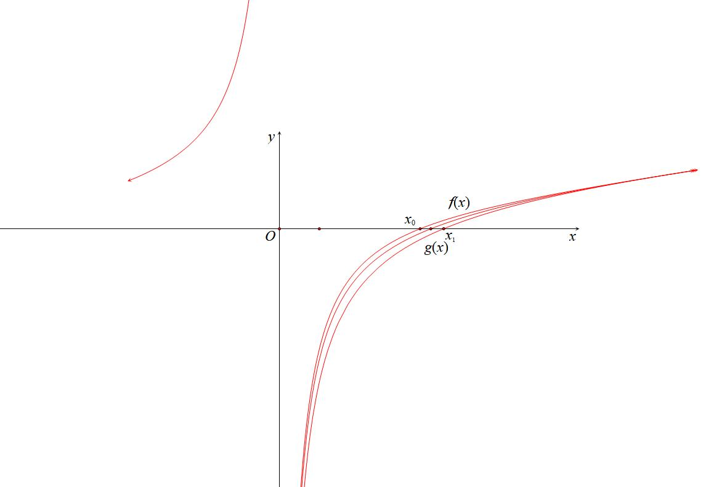

第八章 综合篇-隐点探路

上一章我们介绍了显点探路，相对应的就是隐点，就是在题目当中那个不知道的隐零点，隐极值点，也是我们通常说的隐零点代换，那么隐零点代换怎么代，怎么换？有哪些要注意的，又有哪些坑，本章系统介绍一下常见的探路方法和方向 .

隐点效应，就是零点或者极值点需要通过放缩取点获得，但通过隐零点代换来证明不等式，隐零点代换，要么参变分离来消元，要么替换主体变量，调整极值点函数单调性.

第一节  构造极点效应解决含参恒成立

若恒成立，则一定存在一点，使得恒成立，所以利用探路，探出与有关的方程来进行最值锁定.

隐零点代换通常出现在非显点的考题中，其表现特征主要是导函数零点不可求（先需要放缩取点证明），隐零点代换分主要转化为两个方向，一个是初高分流，即将高等函数转化为初等函数，比如当一个函数导函数满足，则将，，另一个就是参变分离的转化，比如：，根据题目需求来进行转化，对于单变量恒成立或者定值计算，我们通常选择初高分流，对于恒成立求参类型，则需要进行参变分离。

隐点效应题型分两类，一类端点取等，但是端点效应失效，一类端点不取等，无显零点，对于端点取等的隐点效应就是为了告诉我吗端点有效还是失效，该端点效应还是分参。

第一类：单位置参数参变分离与隐点效应

【例1】（24-25高二下·浙江绍兴·阶段练习）设函数，．

(3)设，若恒成立，求的取值范围.

【例2】（2024•山东期中）已知函数．

（1）当时，证明：；

（2）若恒成立，求的取值范围．

【例3】（2024•MST虎哥）已知，

1. 当，求的取值范围

【例4】（2024•广东期末）已知函数，．若，，，求的取值范围．

【例5】(2024吉林中学生数学奥林匹克竞赛一试第10题) 已知函数．若，使得，则实数的最大值为．

第二类：隐点效应处理双位置参数

【例6】（2020•新高考山东卷）已知函数．若，求的取值范围．

【例7】（2024•湖北金太阳）已知函数．

（1）当时，求曲线在点处的切线方程；

（2）当时，若关于的不等式恒成立，求实数的取值范围．

【例8】（2024•湖南模拟）已知函数，．

（1）当，，时，求证：；

（2）若时，，求实数的取值范围．

第二节 隐点效应与极值点不等式证明

涉及极值点的不等式证明一直是隐点效应的重难点，本节我们系统解读一系列隐点不等式构造.

第一类：常数型

如果是函数的极小值，则在证明不等式中，可以直接从函数中找点获得，而，一个比极小值还要小的值，必须要将的关系式做隐零点代换，构造新的函数来最值，这就属于利用隐零点来调整极值点函数单调性；同理，是函数的极大值，则在证明不等式中，属于“原函数找点”，则属于“隐零点调整单调性”。

【例1】•新课标II)已知函数，且.
(1)求;
(2)证明:存在唯一的极大值点，且.

########## 显点效应关键在于找到题目当中给到的固定点，可以是原函数上，探其导函数，也可以是导函数上，探其原函数，与其对应的就是，放缩取点需要找到其隐零点，实现隐点效应.

【例2】（2024•北京月考）已知函数．当时，记函数的最大值为，证明：．

【例3】（2023•山东模拟）已知函数．若有两个极值点，，证明：．

【例4】（2025·广东汕头·三模）已知函数.

(1)当时，讨论的单调性；

(2)若有两个零点，为的导函数.

（i）求实数的取值范围；

（ii）记较小的一个零点为，证明：.

第二类：含参数（变量）型

【例5】（2023•炎德英才联考）已知函数．当时，求证函数在上存在极值点，且．

注意：涉及这一类含参的，只能构造隐零点函数进行调整，原函数导函数起到了提供方程的作用.

【例6】（2023•长沙县月考）已知函数．

（1）若的极小值为0，求实数的值；

（2）当时，证明：存在唯一极值点，且．

【例7】（2020•浙江）已知，函数，其中为自然对数的底数．

（Ⅰ）证明：函数在上有唯一零点；

（Ⅱ）记为函数在上的零点，证明：（ⅰ）；（ⅱ）．

看了此题我们才能明白，高考真题的含金量确实是远超平常模考题，因为模考题都是按照高考真题的套路来的，找点先行，构造单调放缩函数在后，把握变量主元.

【例7】（2025•惠州二模 远方有梦陪跑课答疑）定义：记函数的导函数为，若在区间上单调递增，则称为区间上的凹函数；若在区间上单调递减，则称为区间上的凸函数．已知函数，．

（1）求证：为区间上的凹函数；

（2）若为区间，的凸函数，求实数的取值范围；

（3）求证：当时，．

第三类：插值放缩解决不同函数的隐零点比大小

########## 与在区间的零点分别为和，比较的问题，可以转化为插值取点，即插入函数，即构造，如图，这样就能构造，

若，则可以通过找点证明.

【例8】（2024•哈尔滨期末）已知函数，．

（1）讨论的单调性；

（2）当时，记的零点为，的极小值点为，判断与的大小关系，并说明理由．

########## 【例9】（2014•辽宁）已知函数，．

########## 证明：（1）存在唯一，使；

########## （2）存在唯一，使，且对（1）中的，有．

第四类：复杂含参的参变转化极点效应探路

若含参数*a*的恒成立，由于参数导致的复杂，在利用探出来带入以后，由于得到的式子相对复杂，很难通过求导确定是最小值，所以可以通过先探路求出的范围后再证明，此时以作为主元，构造新的函数求导证明。

此方法就是两头凑法，分别以参数和变量作为两个主元，先猜后证的隐点探路法。

【例10】（2019•浙江）已知实数，设函数，．

（Ⅰ）当时，求函数的单调区间；

（Ⅱ）对任意，均有，求的取值范围．

注：为自然对数的底数．

【例11】（2024•重庆江北区模拟）设．若对任意恒成立，求的取值范围．

