- 导数的工具

第一节 常见六大基本函数模型

########## 一.与

如图1，如果，，故在区间单调递减，在区间单调递增，．

同理，如图2：，当，即单调递减，当，即单调递增，．

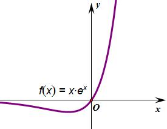

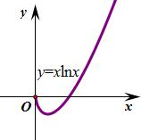

########## 图1                              图2

【例1】（2024•海珠区校级模拟）设实数，若不等式对任意恒成立，则的最小值为

A．	
B．	
C．	
D．

【例2】（2023•广东联考）已知实数满足，，则_________．

【例3】（2023•成都零诊选择压轴）若正实数是函数的一个零点，

是函数的一个大于的零点，则的值为（   ）

A．    	 
B．	  
C．	
D．

【例4】（2025春•临川区校级月考）已知实数，满足，，其中是自然对数的底数，则

A．2	
B．	
C．3	
D．4

########## 【例5】对，不等式恒成立，则实数的最小值为（    ）

A．    	
B．	
C．	
D．

【例6】（2024春•新乐市校级月考）已知函数，，，若对任意，不等式恒成立，则实数的取值范围是

A．	
B．	
C．	
D．

二．与

如图3：，即将关于原点对称后得到，故可得在区间单调递增，在区间单调递减，当时，．

如图4：，实现了凹凸反转，原来最小值反转后变成了最大值，或者令，，当，即单调递减，当，即单调递增，．

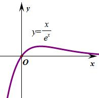

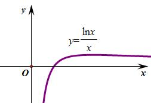

########## 图3                              图4

########## 三．与

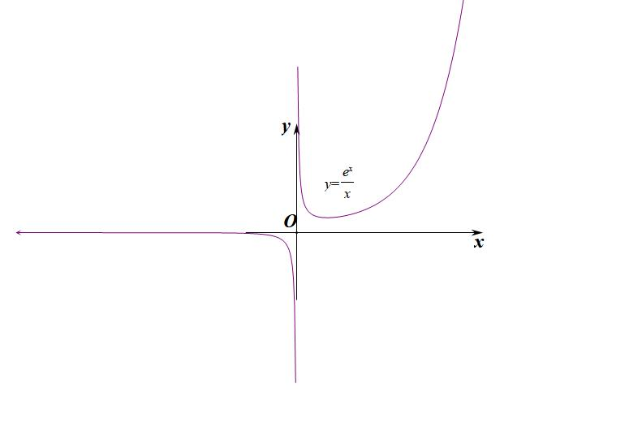

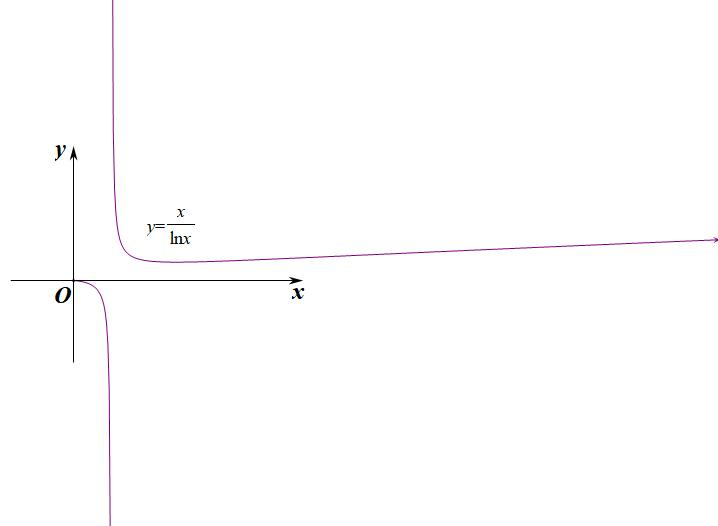

########## 图5                             图6

########## 如图5：，属于分式函数，将关于原点对称后得到，故可得在区间单调递减，在区间单调递增，当时，；当时，.

########## 如图6：令，，故可得在区间单调递减，在区间单调递增，当时，．当时，.

四．利用六大函数分析与之相关函数的单调性与最值

我们利用这六大基本函数来分析一些与之相关函数的单调性和最值，我们举几个例子,如下：

如图7：，即将向右平移1个单位，再将纵坐标扩大为原来的倍，故可得在区间单调递减，在区间单调递增，当时，．

如图8：令，，将左移一个单位，再将纵坐标缩小为原来的倍，故可得在区间单调递减，在区间单调递增，当时，．

如图9：令，，当，即单调递减，当，即单调递增，．

如图10：令，，当，即单调递减，当，即单调递增，．

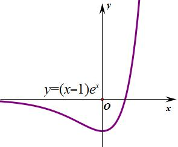

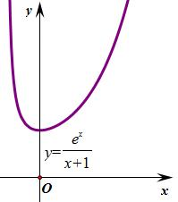

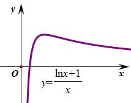

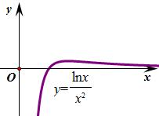  
图7                 图8                   图9                   图10

【例7】函数的单调增区间为（    ）

A．    	
B．	
C．        
D．

【例8】（2024春•封开县校级期中）函数在上单调递增，则实数的取值范围是

A．	
B．	
C．，	
D．

【例9】（2024•金凤区三模）若函数存在减区间，则的取值范围为

A．	
B．	
C．	
D．

【例10】．（2025•东莞市校级模拟）若对于任意正数，，不等式恒成立，则实数的取值范围是

A．	
B．	
C．	
D．

【例11】（2024•港口区月考）已知函数，则不等式的解集是

A．	
B．	
C．	
D．

【例12】（2025•湖北模拟）已知关于的不等式在上恒成立，则实数的取值范围为 _______

【例13】（2024•三台县期中）已知函数有零点，则实数的范围为

A．	
B．，	
C．	
D．，

关于的最值问题， ，当且仅当时取得最小值；

同理，，当时，能取得最小值；当时，若，能取到最大值，都是当且仅当取到.

【例14】（2024•北京期中）设函数，，给定下列命题

①不等式的解集为；②函数在单调递增，在单调递减；

③时，总有恒成立；④若函数有两个极值点，则实数．

则正确的命题的个数为

A．1	
B．2	
C．3	
D．4

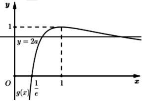

关于的同构问题， 只需知道这两个结构都是递增的即可

【例15】（2024秋•惠山区校级期中）已知实数，满足：，，则的值是 <u>　_____</u>

【例16】（2024秋•松江区期末）已知实数、满足，则 <u>　  　</u>．

########## 零点成等差与等比模型

①若，则，当时，，当（或者）时，一定有，或者；

针对同构函数和与形成四个交点，即构成，一定有；

②若，则，当时，，当（或者）时，一定有，或者；

########## ③若，则（或），当时，，当（或者）时，一定有，或者；

针对同构函数和与形成四个交点，即构成，一定有；
口诀：差值函数构等差，比值函数构等比.

【例17】（2024秋•垫江县校级月考）已知函数，，若存在，，使得成立，则下列结论正确的是

A．

B．

C．的最大值为

D．的最大值为

【例18】（2024•江苏月考）已知函数，若，则的最大值为

A．	
B．1	
C．	
D．

【例19】（2023•多选•衡水月考）函数，则

A．若函数恒成立，则

B．若函数有两个不同的零点，记为，，则

C．若函数和共有两个不同的零点，则

D．若函数和共有三个不同的零点，记为，，，且，则

【例20】（2025春•多选•庐阳区校级期末）已知，，则下列结论正确的是

A．函数，在上存在唯一极值点

B．任意，有恒成立

C．若对任意，不等式恒成立，则实数的最大值为2

D．若，，则的最大值为

【例21】（2022•新高考1）已知函数和有相同的最小值．

  
（1）求；

  
（2）证明：存在直线，其与两条曲线和共有三个不同的交点，并且从左到右的三个交点的横坐标成等差数列．

【例22】（2024秋•嘉定区期末）已知．

  
（1）求函数、的单调区间和极值；

  
（2）请严格证明曲线、有唯一交点；

  
（3）对于常数，若直线和曲线、共有三个不同交点，、，、，，其中，求证：、、成等比数列．

第二节 常见两大切线函数模型

########## 一．与

如图1所示，令，时，，故在区间单调递减，在区间单调递增，；

如图2所示，，当，即，单调递减，当，即，单调递增，；
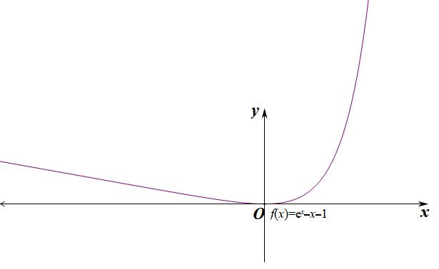

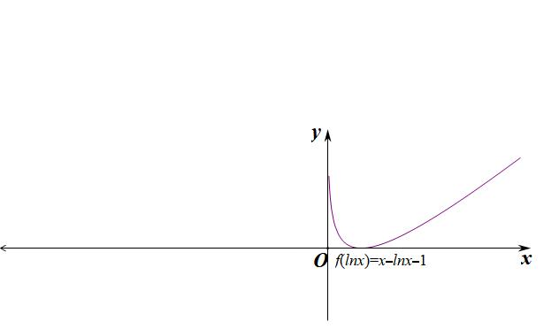  
图1                       图2

【例1】（2013•新课标Ⅱ）已知函数．

  
（1）设是的极值点，求，并讨论的单调性；

  
（2）当时，证明．

注意：本题的三个均为非负数，但不能同时取零，故．后面的单调性和最值证明我们就简写了，请大家自己完成证明．

【例2】（2018•新课标Ⅰ）已知函数．

  
（1）设是的极值点，求，并求的单调区间；

  
（2）证明：当时，．

注意：两个题由于取等条件的限制，会产生不一样的结果，更多的双切线同构题型，我们会在本书同构专题再深一步探讨.

【例3】（2024•新乡模拟）已知函数．

  
（1）设是的极值点，求的值，并求的单调区间．

  
（2）证明：当时，．

##########  二.由<em>ex</em>≥<em>x</em>+1引出的切线找点

①．（用替换，切点横坐标是），通常表达为．

②．（用替换，切点横坐标是），平移模型，找到切点是关键．

③（用替换，切点横坐标是）；通常有的构造模型．

【例4】（2024•杭州模拟）已知函数，，若直线与函数，的图象都相切，则的最小值为 <u>　　</u>．

【例5】（2023•山西模拟）若直线与函数和的图象都相切，则

A．	
B．0	
C．1	
D．3

下面我们来探索的切线系数关闭，虽然我们都可以求导处理，但是我们更想知道任意一条切线与切线不等式的关系.

函数在点处的切线方程我们可以按照不等式等效替换法求得，抓住是切点，故将原来的替换为，即，故切线方程为，同理函数在点处的切线方程可以根据求得．

函数的切线方程为，抓住，由于我们所知道的切线方程斜率为，故可以通过除法变成熟悉形式：，根据此不等式，我们可以得出以下三个结论：

①函数在斜率为2的位置的切线方程为；

②若不等式恒成立，则；

③若不等式恒成立，则．

归根揭底，我们进行总结：

1.指数切线切点构造：，转化为．

2.指数切线斜率构造：，．

核心问题：构造斜率为1的式子是关键.

【例6】（2023•鞍山月考）已知函数，若为上的增函数，则的取值范围为

A．	
B．，	
C．，	
D．，

【例7】（2023•商丘三模）已知函数，，若恒成立，则的最大值是

A．	
B．1	
C．2	
D．

【例8】（2025•桃城区校级三模）已知在函数，，，若对，恒成立，则实数的取值范围为

A．，	
B．，	
C．，	
D．，

- 由引出的切线放缩

朗博函数指的是形如或类型的函数，将积式拿到指数里，进行切线构造，比如；关于朗博函数我们统一往进行同构，恒成立，当且仅当时等号成立．

．（用替换，切点横坐标满足，）常见的指对跨阶模型，切线的方程是按照指数函数给予的．

【例9】（2025•烟台三模）若不等式恒成立，则实数的取值范围为

A．，	
B．，	
C．，	
D．，

【例10】若时，恒有成立，则实数的取值范围是_________．

【例10】（2024•全国百校强）已知函数，若函数在区间内存在零点，则实数的取值范围是（    ）

A．       
B．      
C．	       
D．

【例11】（2025•庄河市模拟）已知，若存在，使得，则实数的取值范围是

A．	
B．	
C．	
D．

########## 四．由<strong>ln</strong><em><strong>x</strong></em> <strong>≤</strong> <em><strong>x</strong></em> <strong>-1</strong>引起的切线找点

########## 最常见的就是，由向左平移一个单位来理解，或者将两边取对数而来．

①．（用替换，切点横坐标是），表示过原点与的切线为．

②（．）．（用替换，切点横坐标），或者记为．

③．（由及切点横坐标是），或者记为．

④（由），即在点处三曲线相切．

【例12】（2022•新高考Ⅱ卷）写出曲线 过坐标原点的切线方程：_______，_______.

【例13】（2023•苏州期中）已知直线与是曲线的两条切线，则

A．	
B．	
C．4	
D．无法确定

我们一起来探讨对数的切线找点，

对数切线切点找点：，转化为．

对数切线斜率找点：，．

【例14】函数，的图象有公共点，则实数的取值范围为（    ）

A．     
B．     
C．	    
D．

【例15】（2024春•攀枝花模拟）若对于，关于的不等式恒成立，则实数的取值范围是<u>　 　</u>．

【例16】若直线既是曲线的切线，又是曲线的切线，则<u>　　____</u>．

注意： 此题有一个结论，就是两个形状完全相同的函数公切线，斜率一定为平移的纵坐标（下移）比上横坐标（左移）的比值，本题，即为经过下移2个单位和左移3个单位后得到，

########## 更多公切线内容，我们会在本书第二章解读.

【例17】（2024秋•江苏月考）已知直线分别与曲线，都相切，则的值为 <u>　______</u>

第三讲 指对处理与三次函数

########## 一．对数单身狗

设为可导函数，则有，若为非常数函数，求导式子中含有，这类问题需要多次求导．处理这类函数的技巧是将前面部分提出，就留下这个单身狗，然后研究剩余部分，这类方法技巧叫对数单身狗．

########## 【例1】若，若在上恒成立，求的最小值．

【例2】（2024•邢台模拟）已知函数．

  
（1）当时，求函数的零点个数．

########## 【例3】（2018•新课标Ⅲ卷）已知函数．

### 1.1.1.1.1.1.1.1.1.1 若，证明：当时，；当时，．

  
（2）若是的极大值点，求的值．

########## 指对找基友

指数找基友：设为可导函数，则有，若为非常数函数，求导式子中还是含有，针对此类型，可以采用作商（积）的方法，构造，从而达到简化证明和求最值的目的，总在找属于它的基友，此类方法技巧俗称指数找基友．这种题的命题逻辑就是一般会出现（或者），即证（或者），由于（或者），那么（或者）就能形成“导中构”．

########## 【例5】求证：（1）（2018•新课标II卷）（）；（2）；（3）（）

【例6】（2025•漳州模拟）已知函数．

  
（1）若，求在，上的最大值；

  
（2）若在，上恰有两个零点，求实数的取值范围．

【例7】（2018•新课标卷Ⅰ）已知函数．

  
（1）设是的极值点，求，并求的单调区间；

  
（2）证明：当时，．

########## 【例8】已知函数．

########## （1）当时，判断函数的单调性；

########## （2）已知对任意恒成立，求的取值范围．

########## 注意：涉及跟三角的综合题，“指数找基友”能有效避免讨论，属于上乘之策．

【例9】（2025春•静安区期末）设函数，．

  
（1）讨论的单调性；

  
（2）当时，恒成立，求的取值范围．

########## 切线与最值等效转化

########## 通常切线意味着函数最值，比如说，，这是我们经常说到的六大函数可以直接跟切线放缩挂钩，本质来说他们也是一体的，切线可以转化为最值，最值也能转化为切线，通常我们建议大家按照最值理解，因为单个函数好处理，一旦变成两个函数比大小，变量就会增多。

##########   我们来分析一组同构函数，也是由切线转化而来的共零点函数，即与，根据同构知识易知，我们来做一下两个函数图像，，取（利用恒成立，取等），所以单调递减，当时，分子分母出现了，但是这里是有意义的，根据在时取等可知，，当然也可以根据洛必达法则得出结果，不过涉及一点大学知识，我们会在本书后续章节介绍.

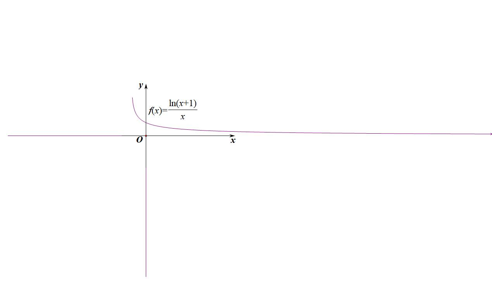

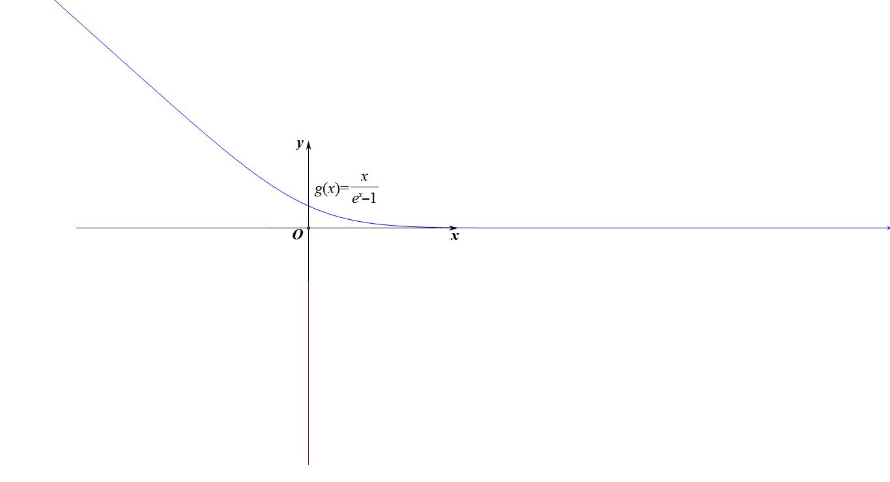

【例10】求证：．

【例11】（2021•多选•水哥供题）若实数满足，则下列选项正确的有（    ）

A．若，则                   
B．若，则

C．存在实数，使得

D．设，为满足等式的两组数，则当时，

【例12】（2025春•厦门期中）已知函数．

（Ⅰ）若不等式在，上恒成立，求实数的取值范围；

（Ⅱ）若，求证：．

########## 【例13】（2023•河北月考）已知函数．

########## （1）求的单调区间；

########## （2）证明：（其中是自然对数的底数，．

########## 注意：通常比切线精度更高的对数放缩，我们选择一飘一帕，即

########## 下面我们继续证明一些切线构造的函数最值，这些经常出现在一些放缩和找点的高考题中.

########## 【例13】求证：（1），（2）

########## 四．三次函数的极值与拐点

########## 设三次函数为（、、、且），其基本性质有：

性质一：定义域为R．

性质二：值域为R，函数在整个定义域上没有最大值、最小值．

性质三：单调性和图象

三次函数导函数为二次函数，

<table><tr><td></td><td colspan="2">

</td><td colspan="2">

</td></tr><tr><td rowspan="2">
图象
</td><td>

</td><td>

</td><td>

</td><td>

</td></tr><tr><td>
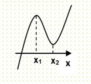

图1
</td><td>
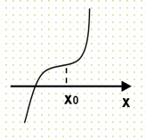

图2
</td><td>
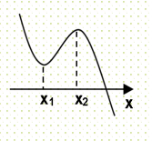

图3
</td><td>
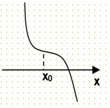

图4
</td></tr></table>

当时，

①当，即时，与轴有两个交点，，形成三个单点区间和两个极值点，，图象如图1．

②当，即时，与轴没有穿越零点，没有极值点，图象如图2．

当时，

①当，即时，与轴有两个交点，，形成三个单点区间和两个极值点，.图象如图3

②当，即时，与轴没有穿越零点，没有极值点，图象如图4．

性质四：奇偶性

对于三次函数（、、、且）.

①不可能为偶函数；②当且仅当时是奇函数．

性质五：对称性

①三次函数是中心对称曲线，且对称中心是；

②其导函数为 对称轴为，所以对称中心的横坐标也就是导函数的对称轴，可见，图象的对称中心在导函数的对称轴上，且又是两个极值点的中点，同时也是二阶导为零的点；我们可以得出若是可导函数，若的图象关于点对称，则图象关于直线对称；同理，若图象关于直线对称，则图象关于点对称.故奇函数的导数是偶函数，偶函数的导数是奇函数，周期函数的导数还是周期函数.

########## 性质五：三次方程的实根个数

########## 对于三次函数（、、、且），其导数为

########## 当，其导数有两个解，，原方程有两个极值.

########## ①当，原方程有且只有一个实根，图象如图5，6.

########## ②当，则方程有2个实根，图象如图7，8.

########## ③当，则方程有三个实根.

<strong>x1</strong>

<strong>x2</strong>

x

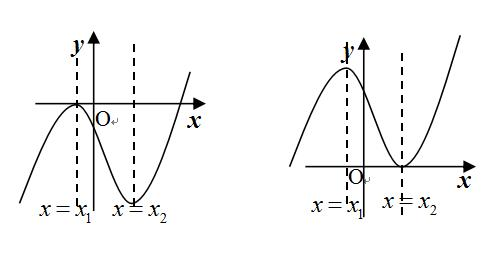

########## 图5                图6                   图7                图8      

【例14】（2021•乙卷）设，若为函数的极大值点，则

A．	
B．	
C．	
D．

【例15】（2025•新高考二卷）若<em>x</em>＝2是函数的极值点，则＝<u>　___</u> ．

【例16】（2022•新高考Ⅰ•多选）已知函数，则

A．有两个极值点	                
B．有三个零点

C．点是曲线的对称中心	
D．直线是曲线的切线

【例17】（2025春•广东月考）设是函数的导数，是函数的导数，若方程有实数解，则称点为，函数的拐点．某同学经过探究发现：任何一个三次函数都有拐点，任何一个三次函数都有对称中心，且拐点就是对称中心，设函数，利用上述探究结果计算： <u>　　</u>．

【例18】（2021•乙卷）已知函数．

  
（1）讨论的单调性；

  
（2）求曲线过坐标原点的切线与曲线的公共点的坐标．

########## 五．三次函数四段论

########## 且导函数  且导函数

########## 极大值                                             极大值

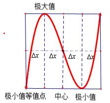

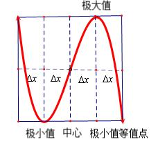

########## 极小值等值点      中心     极小值              极小值    中心     极小值等值点

########## 1．对称中心：；

########## 2．极大值到对称中心距离为，极小值点到对称中心距离为，极小值等值点到极大值点距离为，极大值等值点到极小值点距离为；设的极大值为，当的两根为，时，区间被中心和极小值点三等分，类似的，对极小值也有此结论，

【例19】（24新I卷第10题•多选）设函数，则（    ）

A. 是的极小值点	
B. 当时，

C. 当时，	
D. 当时，

########## 【例20】已知，在区间上任取三个数，，，均存在以，，为边长的三角形，则的取值范围是（    ）

A．     
B．       
C．	 
D．

【例21】（2024•广东开学•多选）设函 数满足，则给出如下结论正确的是

A．关于点成中心对称

B．若在上单调递增，则是在上单调递增

C．若，则无极值

D．对任意实数，直线与曲线有唯一公共点

【例22】（2018•新课标Ⅱ）已知函数．

> 

> 
> |  |  |
> | --- | --- |
> | （1）若，求的单调区间； | （2）证明：只有一个零点． |
> 

【例23】（2020•新课标Ⅲ）设函数，曲线在点，处的切线与轴垂直．

  
（1）求；

  
（2）若有一个绝对值不大于1的零点，证明：所有零点的绝对值都不大于1．

【例24】（2023•多选•广陵区模拟）已知正方形的中心在坐标原点，四个顶点都在函数的图象上．若正方形唯一确定，则实数的值为

A．	
B．	
C．	
D．

- 泰勒展开

若在点可导，则有 ．即在点附近，用一次多项式逼近函数时，其误差为()的高阶无穷小量．然而在很多场合，取一次多项式逼近是不够的，往往需要用二次或高于二次的多项式去逼近，并要求误差为，其中为多项式的次数．为此，我们考察任一次多项式

逐次求它在点处的各阶导数得到．

对于一般函数，设它在点存在直到阶的导数．由这些导数构造一个次多项式

，称为函数在点处的泰勒(Taylor)多项式，的各项系数1，2，…，)称为泰勒系数．由上面对多项式系数的讨论，易知与其泰勒多项式在点有相同的函数值和相同的直至阶导数值，即．

若函数在点存在直至阶导数，则有

即

，即以（2）式所示的泰勒多项式逼近时，其误差为关于的高阶无穷小量．形如的余项称为佩亚诺(Peano)型余项．

所以（3）式称为函数在点处的泰勒公式，称为泰勒公式的余项，形如的余项称为佩亚诺(Peano)型余项．所以（3）式又称为带有佩亚诺型余项的泰勒公式．

以后用得较多的是泰勒公式（3）在时的特殊形式：

########## ，它也称为(带有佩亚诺余项的)麦克劳林(Maclaurin)公式．由此可得近似公式：；

########## 的泰勒展开

高考中常见，由，故，则；所以我们经常会用到一个不等式：，加强型:；

我们经常还会用到：．

【例1】（2010•新课改2卷）设函数．

  
（1）若，求的单调区间；

  
（2）若当时，求的取值范围．

########## 与的泰勒展开

########## ．，

我们之前讲到的切线找点不等式：，我们能写出在处的泰勒公式为，

则在处的泰勒展开式为：，

同理：；

在处的泰勒公式为；

【例2】（2024•新高考Ⅰ）已知函数．

  
（1）证明：曲线是中心对称图形；

  
（2）若当且仅当，求的取值范围．

########## 三角函数的泰勒展开

；；
$tan x=x+\frac{1}{3}x^{3}+\frac{2}{15}x^{5}+\frac{17}{315}x^{7}+o(x^{7})(|x|<\frac{\pi }{2})$

我们通常能够用到的是对于恒成立，对于恒成立.，对于恒成立，

【例3】设．（1）证明：；（2）若，求的取值范围．

########## 四．分式函数与幂函数展开

，；

，均为等比数列求和．

########## $\left(1+x\right)^{\alpha }=1+\alpha x+\frac{\alpha \left(\alpha -1\right)}{2!}x^{2}+\cdots +\frac{\alpha \left(\alpha -1\right)\cdots \left(\alpha -n+1\right)}{n!}x^{n}+\cdots x\in \left(1\right)$

########## 可以理解为二项式展开.

########## 五．泰勒展开与双曲正弦余弦函数（含飘带函数）

根据，，两式相加即得，当时取“=”，时恒成立；由此我们能得出一个新的总结归纳，如下：

由于①；②

①+②得：，我们综合总结归纳可得：，由于，我们称之为双曲余弦函数，那么它的泰勒展开式我们也随即推导

同理，我们可以得到双曲正弦函数，当，记，

令，则会有，最经典的代表就是飘带函数，同理，我们也可以推出

另外，由于双曲余弦函数是偶函数，双曲正弦函数是奇函数，

易知当时，（如右图），而依然成立．

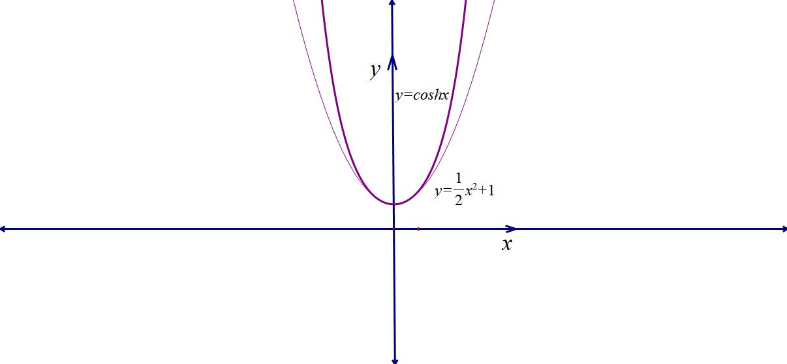

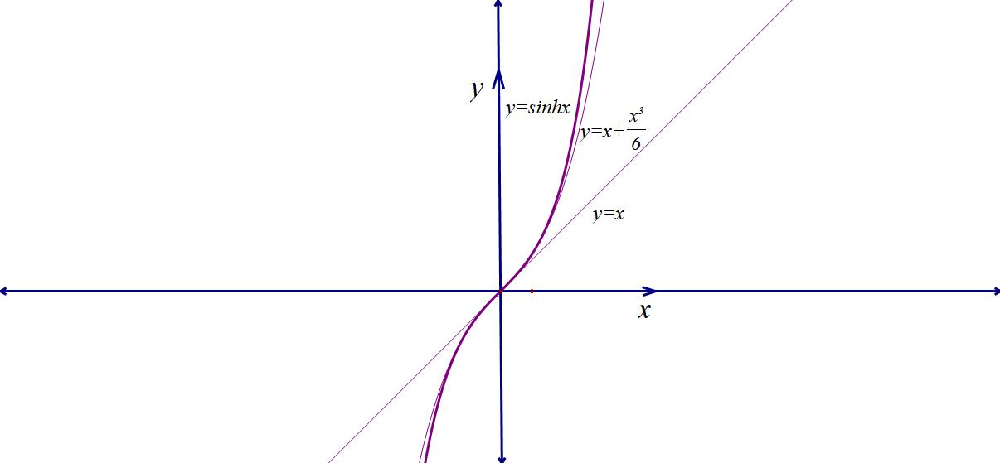

########## 我们再来分析一下对数的泰勒展开，我们能得到

，即，两式相减得：，令，则有，故，同理也能证明，这就是我们经常用来放缩估值的帕德逼近，我们可以进行泰勒加强，即，两式相减得：，

令，则有，故，

同理也能证明.

【例4】函数（是自然对数的底数，存在唯一的零点，则实数的取值范围为（    ）

A．    
B．       
C．	
D．

【例5】（2024•赣州模拟）已知函数且为自然对数的底数）．

  
（1）当时，求的最小值；

  
（2）若关于的不等式，求整数的最大值．

########## 泰勒展开与估值

########## 泰勒展开能把一系列似乎不相干的函数组合到了一起，高考中利用泰勒展开的估值和比大小的题比较多，我们来简单介绍，更多比大小估值问题，我们会在本书第五章系统解读.

########## 【例6】（2014•新课标Ⅱ）已知函数．

########## （1）讨论的单调性；

########## （2）设，当时，，求的最大值；

########## （3）已知，估计的近似值（精确到．

【例7】（2025春•常州校级期中）在高等数学中，我们将在处可以用一个多项式函数近似表示，具体形式为：（其中表示的次导数，，以上公式我们称为函数在处的泰勒展开式．当时泰勒展开式也称为麦克劳林公式．比如在处的麦克劳林公式为：，由此当时，可以非常容易得到不等式请利用上述公式和所学知识完成下列问题：

> 

> 
> |  |  |
> | --- | --- |
> | （1）写出在处的泰勒展开式； | （2）根据泰勒公式估算的值，精确到小数点后两位； |
> 

  
（3）若，恒成立，求的范围．（参考数据

第五讲  帕德逼近

########## 一．帕德逼近原理

帕德逼近(*Padé approximant)* 是一种对任意函数的有理函数逼近。这个是高中数学内容，帕德逼近有阶的概念，如果分子是阶多项式，分母是阶多项式，那么帕德逼近就是阶的帕德逼近，符号为或者，当的时候，就是多项式逼近了。多项式逼近有多种，常见的有切比雪夫逼近和泰勒级数，帕德逼近在时，是泰勒级数的前项，也就是我们上一讲讲到的泰勒展开多项式。

帕德逼近还有个小细节，它的基本形式如下：，这个细节就是分母是以开始的，也就是，帕德逼近是以为基础的，以，，为例，帕德逼近在点的误差最小，离越远，误差越大，值得注意的的是，是在处的逼近。

########## 常见的帕德逼近

【例1】求的阶帕德逼近.

【例2】（2016•新课标Ⅱ）已知函数．若当时，，求的取值范围.

【例3】求的阶帕德逼近.

.

########## 帕德逼近与估值

相比于泰勒展开的近似数估算，我们发现如果泰勒某些情况精度不足，而且不等号方向相对固定，这就是泰勒展开的问题，我们估值需要但一个上下界限，所以帕德逼近和泰勒展开合体时，我们就能发现指数和对数都有了上下界，我们通常做如下处理：

当时，（左图）；

当时，（右图）；
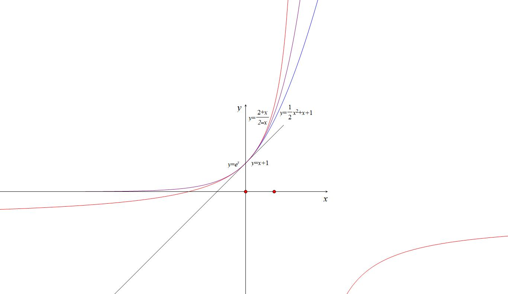

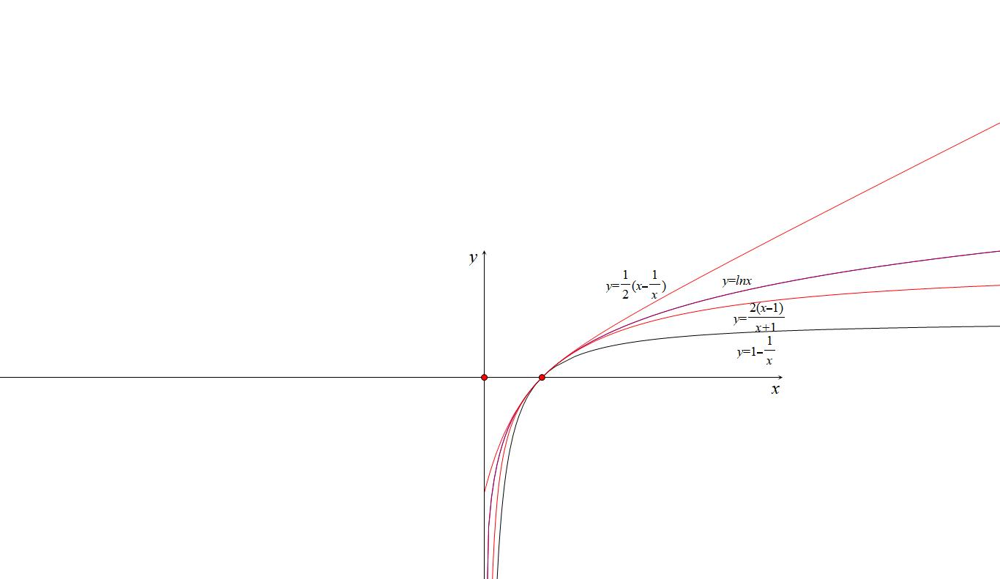

由于飘带不等式和帕德逼近都是在附近取得近似数，当在处取得近似数时，我们可以如下处理， ，显然是一个相对紧密型的逼近，同理我们考虑飘带函数，故采取，得到更紧密的逼近。

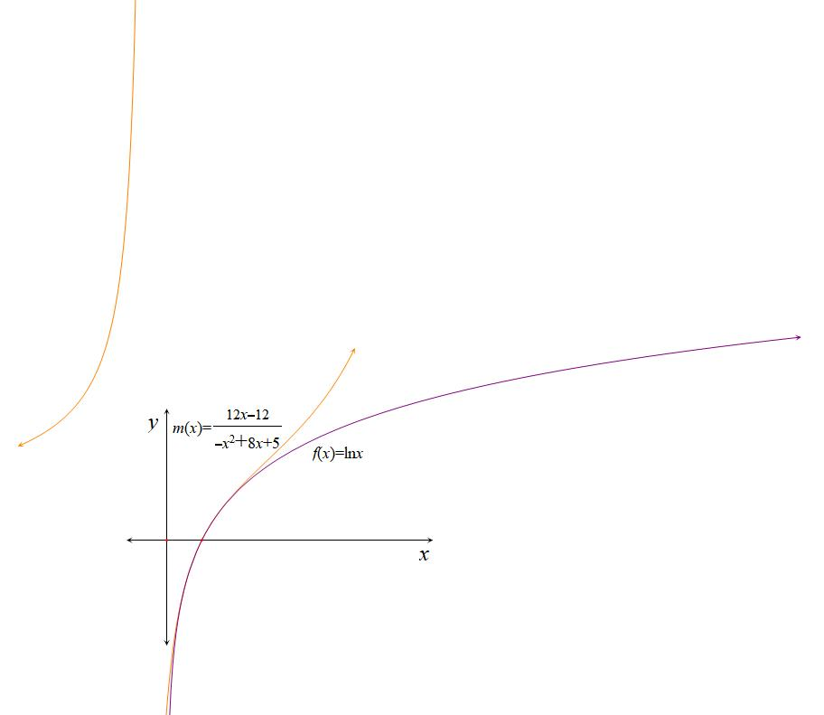

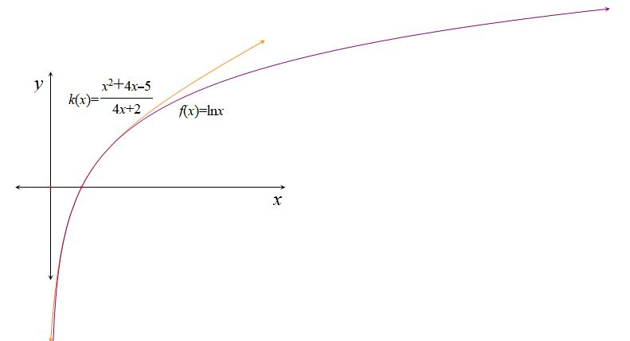

【例4】两个正整数，，函数在处的，阶帕德近似定义为：，且满足：，，，，，已知函数．

> 

> 
> |  |  |
> | --- | --- |
> | （1）求函数在处的，阶帕德近似； | （2）在（1）的条件下：求证：； |
> 

  
（3）已知在处的，阶帕德近似为，依据帕德近似公式；若在处的，阶帕德近似为，设，试比较，，的大小．

########## 高阶帕德逼近与偏移综合

【例5】（2024•厦门模拟）帕德近似是法国数学家亨利帕德发明的用有理多项式近似特定函数的方法，在计算机数学中有着广泛的应用．已知函数在处的，阶帕德近似定义为：，且满足：，，，，．

已知在处的阶帕德近似为；

  
（1）求实数，的值；

  
（2）设，证明：；

  
（3）已知，，是方程的三个不等实根，求实数的取值范围，并证明：．

- 指对同构体系

同构是一种很重要的思想，强调整体代换，抽丝剥茧，将复杂的问题通过同构变形后形成降维打击，自从2018年我们团队不断给大家还原同构命题的逻辑以后，这几年同构体系也在不断变化和升级，本文力争系统还原近几年同构的一些考题的新逻辑.

第一节  同构函数单调性

第一类：构造单调函数或

如图，，易知为单调增函数（图1），则也为单调增函数（图2），我们知道，故一定有（图3）

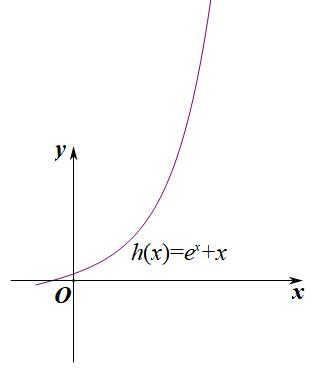

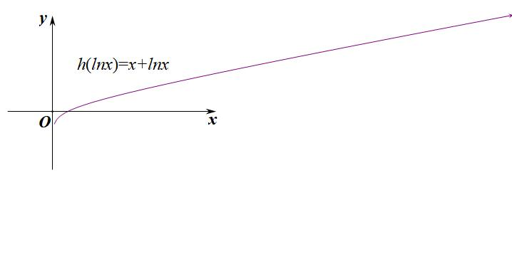

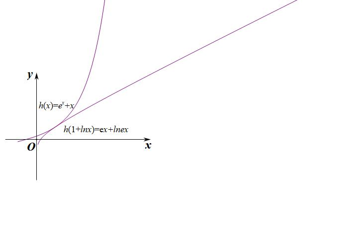  
图1                          图2                       图3

若在区间上具备单调性，则时，一定有（或者）；
常见的单调性母函数模板：

①在定义域内单调递增；

【例1】（2020•新课标Ⅰ）若则（　　）

A．<em>a</em>＞2<em>b</em>	
B．<em>a</em>＜2<em>b</em>	
C．<em>a</em>＞<em>b</em>2	
D．<em>a</em>＜<em>b</em>2

【例2】（2024秋•张家川月考）若，则下列不正确的是

A．	
B．	
C．	
D．

########## 【例3】（2023•山西模拟）已知不等式，对于任意的恒成立，则的最大值_________．

【例4】（2023•江西模拟）已知在上恒成立，则实数的取值范围 <u>　   　</u>．

【例5】（2025•河东区模拟）设函数，，若存在，，使得，则的最小值为<u>　_____</u>

【例6】（2025•河南二模）已知函数有零点，那么实数的最大值为

A．	
B．1	
C．	
D．

【例7】（2023•安徽模拟）已知，，且，则，的值不可能是

A．        
B．     
C．	   
D．

【例8】（2024秋•湖北月考）已知实数，满足，，则<u>　  　</u>．

【例9】（2023•丹阳市月考•多选）函数，，则下列正确的是

A．在上是增函数

B．在上是增函数

C．，不等式恒成立，则正实数的最小值为

D．若有两个零点，，则

【例10】（2023•河南期末）若，不等式在上恒成立，则实数的取值范围是 <u>　   　</u>．

【例11】（2023•镜湖区月考）已知，若对于任意的，不等式恒成立，则的最小值为 <u>　   　</u>．

【例13】2025春•广州期中）已知正实数，满足，则

A．2	
B．	
C．	
D．

【例14】（2016•四川）设函数，，其中，为自然对数的底数．

  
（1）讨论的单调性；

  
（2）证明：当时，；

  
（3）如果在区间内恒成立，求实数的取值范围．

第三类：构造单调函数或

根据本书第一章的介绍，我们都知道在单调递增，通常我们仅需选取，在这个区间是单调递增的，且时，；

，则，故单调递增；

【例15】（2024•广西月考）若在上恒成立，则的取值范围是 <u>　    　</u>．

【例16】（2023•濠江区期中）已知函数，，若，，则的取值可能是

A．	
B．	
C．	
D．

【例17】（2023•富县期中）若对任意，不等式恒成立，则的范围是

A．	
B．，	
C．，	
D．

【例18】（2025•临翔区模拟）设函数，，若存在实数，，使得，则的最小值为

A．	
B．2	
C．1	
D．

【例19】（2025春•福州期中）已知函数，，若，则的最小值为<u>　 　</u>．

【例20】（2023•茂名一模•多选）是自然对数的底数，，，已知，则下列结论一定正确的是

A．若，则	
B．若，则

C．若，则	
D．若，则

【例20】（2024秋•承德模拟）若，则 <u>　 　</u>．

第四类：构造区间单调函数或

【例21】（2023•翠屏区校级开学）若关于的不等式对恒成立，则实数的取值范围为

A．	
B．	
C．	
D．

【例22】（2023•邯郸开学）已知，，若，则

A．	
B．

C．	
D．

【例23】（2021•多选•老唐原创）若，，，，使得，则下列说法正确的是（    ）

A．若，则    
B．若，则

C．存在

D．，使得当时，的值随着，的增大而增大

第五类：构造单调双曲正弦（飘带）与双曲余弦同构函数

由于①；②

我们称之为双曲余弦函数，记，

令，则会有，最经典的代表就是飘带函数．

所以，或者在其定义域内均为单调递增函数.

【例24】（2024•河南模拟）已知函数，其中是自然对数的底数，若，则实数的取值范围是

A．，    
B．，    
C．，     
D．，，

【例25】（2023•湖北月考）若关于的不等式在上恒成立，则实数的取值范围是

A．	
B．	
C．	
D．

双曲正弦（对数飘带）经常在一些双变量转化题型中作为判断单调函数的关键，也属于我们高中阶段常见的隐藏数据，我们不妨看看下一题.

【例26】（2023•凉山州期末•多选）设，，且满足，则下列判断正确的是

A．	
B．	
C．	
D．

双曲正弦函数经常在一些地方作为隐藏数据来考查我们，尤其一些需要对称化处理的，我们不妨看下一道题.

【例27】（多选）1．（2024•禅城区校级模拟）已知函数，对于任意的实数，，下列结论一定成立的有

A．若，则	
B．若，则

C．若，则	
D．若，则

第六类：构造任意单调同构函数

【例28】（2023•抚州期末•多选）已知正数，满足，则下列不等式正确的是

A．	
B．

C．	
D．

【例29】（2023•广州模拟）已知函数，若不等式对恒成立，则实数的取值范围为 <u>　    　</u>．

########## 第七类：双元同构的单调性转化

##########        我们前面题型已经涉及了双元同构，这就是说有的时候是两个变量合体形成的同构，剥离了外层函数关系，再来分析两个变量的关系，并通过构造新函数来分析单调性和最值.

【例30】（2025春•如皋市期中）已知，满足，，则

A．1	
B．2	
C．	
D．3

【例31】（2023•佛山一模）若正实数，满足，则下列不等式中可能成立的是

A．	
B．	
C．	
D．

【例32】（2023•乐山期末）已知正实数，，满足，则的最大值为 <u>　 　</u>．

########## 第八类：不完整同构与不等式上下界构造
在一些双元同构中，等式两边是不能完全同构的，故我们需要进行两个同构，即一个上界，一个下界的放缩同构，我们可以通过例题来解读.

【例33】（2023•通州区期中）若，其中，，则

A．	
B．	
C．	
D．

【例34】（2025•三元区校级模拟）已知，，，若，则下列结论一定成立的是

A．	
B．	
C．	
D．

【例35】（2023•广州模拟•多选）已知，，，则

A．	
B．	
C．	
D．

########## 第九类：同构与估值

##########      同样是构造上界和下界，但是涉及一些数据，就需要零点的找点.

【例36】（2023•多选•嵊州市模拟）已知，，若，，其中是自然对数的底数，则

A．	
B．	
C．	
D．

【例37】（2025•新高考Ⅰ卷）若实数 $x,y,z$  满足 $2+log_{2}x=3+log_{3}y=5+log_{5}z$  ,则 $x,y,z$  的大小关系不可能是（    ）

A. $x>y>z$          
B. $x>z>y$           
C. $y>x>z$          
D. $y>z>x$

【例38】（2024•河南天一大联考•多选）已知满足，且，则（  ）

1. B.       C.       D.

