切线问题是导数的起始，一切源于切线，本章系统介绍切线的各种处理方法，力争高观点视角降维解读切线，以达到小题小做的目的.

第一节 切线方程

########## 一．  基本切线求法与应用

  
（1）导数的几何意义:函数在点处的导数的几何意义就是曲线在点处的切线的斜率.注:()切线方程的计算:

########## （2）在点处的切线方程:，抓住关键:

【例1】（2024•黄埔区模拟）已知函数，则曲线在处的切线方程为

A．	
B．	
C．	
D．

【例2】（2022春•岳麓区校级月考）已知函数，，，函数的图象在点，和点，处的两条切线互相垂直，且分别交轴于，两点，则下列结论正确的有

A．函数只有一个极值

B．若函数有且只有一个零点，则实数的取值范围是，

C．

D．的取值范围是

【例3】（2024•长沙模拟多选）已知函数，函数的图象在点，和点，处的两条切线互相垂直，且分别交轴于，两点，若，则

A．

B．的取值范围是

C．直线与的交点的横坐标恒为1

D．的取值范围是

【例4】（2024•陕西月考）“以直代曲”是微积分中最基本、最朴素的数学思想方法．在切点附近，用曲线在该点处的切线近似代替曲线就是这一思想的典型应用．曲线在处的切线方程为 <u>　　</u>，已知，利用上述“切线近似代替曲线”的思想计算所得的结果为 <u>　　</u>（结果用分数表示）

########## 过某点的切线方程

########## 过点的切线方程:设切点为，则斜率，过切点的切线方程为:所以，又因为过点，所以然后解出的值.(有几个值，就有几条切线)

########## （2）求函数过某点切线方程，可设切点为，切线，可令，则是函数的不变号零点，即的极值点，故由极点效应可知，从而求出与k的值

【例5】（2025•新高考Ⅰ）若直线是曲线的切线，则 <u>　　</u>．

【例6】（2023•东城区一模）过坐标原点作曲线的切线，则切线方程为

A．	
B．	
C．	
D．

【例7】（2023•江西九江期末•多选）关于切线，下列结论正确的是

A．过点且与圆相切的直线方程为

B．过点且与抛物线相切的直线方程为

C．过点且与曲线相切的直线的方程为

D．曲线在点处的切线方程为

【例8】（2023•南通二模•多选）过平面内一点作曲线两条互相垂直的切线、，切点为、、不重合），设直线、分别与轴交于点、，则

A．、两点的纵坐标之积为定值	
B．直线的斜率为定值

C．线段的长度为定值	       
D．面积的取值范围为

【例9】（2023•浙江模拟）已知，，，，则

A．对于任意的实数，存在，使得与有互相平行的切线

B．对于给定的实数，存在、，使得成立

C．在，上的最小值为0，则的最大值为

D．存在、，使得对于任意恒成立

【例10】（2025•北京卷20）函数 $f\left(x\right)$  的定义域为 $\left(+\infty \right)$  的，且 $f\left(0\right)=0,f'\left(x\right)=\frac{ln\left(x+1\right)}{x+1},f\left(x\right)$  在 $A\left(f\left(a\right)\right)$  处的切线为 $l_{1}$  ．   
（1）求 $f'\left(x\right)$  的最大值；  
（2）证：当 $-1<a<0$  时，除切点 $A$  外， $y=f\left(x\right)$  均在 $l_{1}$  上方；  
（3）当 $a>0$  时，直线 $l_{2}$  过 $A$  点且与 $l_{1}$  垂直， $l_{1},l_{2}$  与 $x$  轴的交点横坐标分别为 $x_{1},x_{2}$  ，求 $\frac{2a-x_{2}-x_{1}}{x_{2}-x_{1}}$  的取值范围．

########## 二． 直线与曲线与距离问题

【例11】（2024•湖南模拟）函数图象上一点到直线的最短距离为 <u>　　</u>．

【例12】（2024•江西月考）点是曲线上任意一点，则点到直线的最短距离 <u>　　</u>．

【例13】（2023•五华区月考）已知点在函数的图象上，点在函数的图象上，则的最小值为 <u>　　</u>．

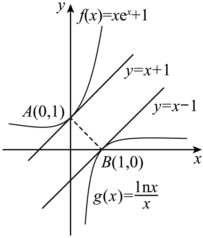

【例14】（2023秋•雨城区校级月考）已知，分别是函数图象上的动点，则的最小值为 <u>　  　</u>．

########## 三、牛顿-拉夫逊方法的应用

牛顿迭代法（也称牛顿法）是牛顿在17世纪提出的一种求解方程零点近似值的方法，多数不含求根公式，导致求零点的精度很困难，牛顿利用切线原理来设计迭代法.它的基本思想是从一个初始的近似解出发,过该点作曲线的切线，以切线与ｘ轴交点的横坐标作为下一个更精确的近似解．这样连续不断地做下去，得到一个近似解序列，

证明：曲线在点，处的切线为，令，则，所以.

【例14】（2025春•观山湖区校级月考）牛顿在《流数法》一书中，给出了高次代数方程的一种数值解法一一牛顿法．如图，是函数的零点，牛顿用“作切线”的方法找到了一串逐步逼近的实数，，，，，在横坐标为的点处作的切线，则在处的切线与轴交点的横坐标是，同理在处的切线与轴交点的横坐标是，，一直继续下去，得到数列．令．当时，用牛顿法可求出方程的近似解 <u>　 　</u>；当，且时，数列的通项公式为 <u>　 　_</u>．

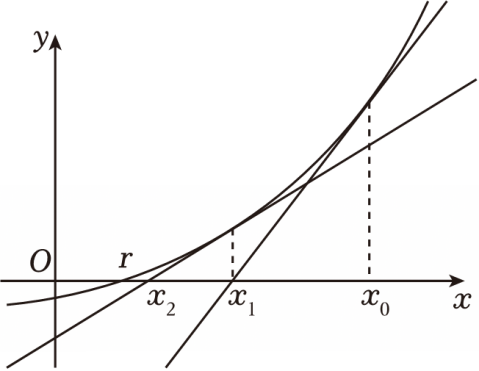

# 【例15】（2023•东北三省四市教研联合体•多选）人们很早以前就开始探索高次方程的数值求解问题．牛顿在《流数法》一书中给出了牛顿迭代法：用“作切线”的方法求方程的近似解．具体步骤如下：设是函数的一个零点，任意选取作为的初始近似值，曲线在点，处的切线为，设与轴交点的横坐标为，并称为的1次近似值；曲线在点，处的切线为，设与轴交点的横坐标为，称为的2次近似值．一般地，曲线在点，处的切线为，记与轴交点的横坐标为，并称为的次近似值．在一定精确度下，用四舍五入法取值，当与的近似值相等时，该近似值即作为函数的一个零点的近似值．下列说法正确的是　　

A．

B．利用牛顿迭代法求函数的零点的近似值（精确到，取，需要作两条切线即可确定的近似值

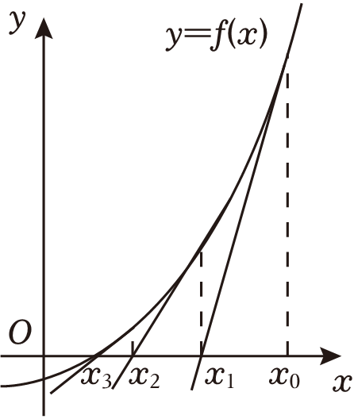

C．利用二分法求函数的零点的近似值（精确度为，给定初始区间为，需进行4次区间二分可得到零点的近似值

D．利用牛顿迭代法求函数的零点的近似值，任取，总有

【例16】（2023•芜湖模拟•多选）牛顿在《流数法》一书中，给出了高次代数方程根的一种解法．具体步骤如下：设是函数的一个零点，任意选取作为的初始近似值，过点，作曲线的切线，设与轴交点的横坐标为，并称为的1次近似值；过点，作曲线的切线，设与轴交点的横坐标为，称为的2次近似值．一般地，过点，作曲线的切线，记与轴交点的横坐标为，并称为的次近似值．对于方程，记方程的根为，取初始近似值为，下列说法正确的是

A．      
B．	     
C．     
D．

【例17】（2025春•惠东县期中）牛顿在《流数法》一书中给出了“牛顿切线法”求方程的近似解．具体步骤如下：设是函数的一个零点，任意选取作为的初始近似值，曲线在点，处的切线为，设与轴交点的横坐标为，并称为的1次近似值；曲线在点，处的切线为，设与轴交点的横坐标为，称为的2次近似值．一般地，在点，处的切线为，记与轴交点的横坐标为，并称为的次近似值．重复以上操作，在一定精确度下，可取为的近似解．求函数的大于零的零点的近似值，取．

  
（1）求和；

> 

> 
> |  |  |
> | --- | --- |
> | （2）求和的关系并证明； | （3）证明：． |
> 

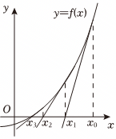

- 函数的切线界定

########## 一.凹凸性与切线

########## 我们可以参考圆的切线，对于圆上一点只能作一条切线，圆外一点能作两条切线，圆内一点不能作切线，所以对于一个凹凸性不改变的函数，即二阶导没有变号零点的函数，在“圆外”一点能作两条切线如下左图所示.

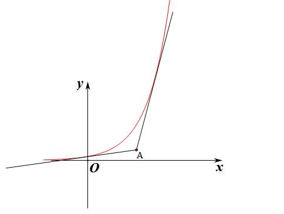

【例1】(2021•新高考Ⅰ)若过点可以作曲线的两条切线，则（    ）
A．	
B．	
C．	
D．

【例2】(2023•湖州期末)若过点可以作曲线的两条切线，则（    ）
A.        
B.          
C.          
D.

凹凸性定义：若在区间上连续，，

如果恒有	，则是向下凸的，也可以理解为下凹，比如；

如果恒有，则是向上凸的，也可以理解为上凸，比如；

注意：若为下凹函数，则，或者单调递增；

若为上凸函数，则，或者单调递减；

【例3】（2023•南京期中）已知直线是曲线的切线，则

A．	
B．的最小值为1

C．的最大值为1	
D．时，直线有2条

【例4】（2023•山西模拟）已知过点作曲线的切线有且仅有两条，则实数的取值范围为

A．	
B．	
C．	
D．

【例5】（2023•全国二模）已知函数，下列结论正确的是

A．对任意，，函数有且只有两个极值点

B．存在，，曲线有经过原点的切线

C．对于任意，且，均满足

D．当时，恒成立

########## 三次函数拐点与切线条数界定

########## 一般地，如图，过三次函数图象的拐点（对称中心或拐点）作切线,则坐标平面被切线和函数的图象分割为四个区域，有以下结论：

### 1.1.1.1.1.1.1.1.1.1 由于区域Ⅰ、IV属于外弧区域，故过区域Ⅰ、IV内的点作的切线，有3条；

### 1.1.1.1.1.1.1.1.1.2 由于区域II、Ⅲ属于内弧区域，过区域II、Ⅲ内的点或者对称中心作的切线，有且仅有1条；

### 1.1.1.1.1.1.1.1.1.3 过切线或函数图象（除去对称中心）上的点作的切线，有且仅有2条．

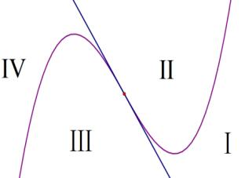

【例8】（2023•汕头市月考）若过点，可作曲线三条切线，则

A．	
B．

C．或	
D．

【例9】（2023•浙江月考•多选）已知函数，其中实数，，点，则下列结论正确的是

A．必有两个极值点

B．当时，点是曲线的对称中心

C．当时，过点可以作曲线的2条切线

D．当时，过点可以作曲线的3条切线

【例10】（2024秋•兴庆区校级月考）已知函数，其中实数，，则下列结论正确的是

A．在上单调递增

B．当有且仅有3个零点时，的取值范围是

C．若直线与曲线有3个不同的交点，，，，，，且，则

D．当时，过点可以作曲线的3条切线

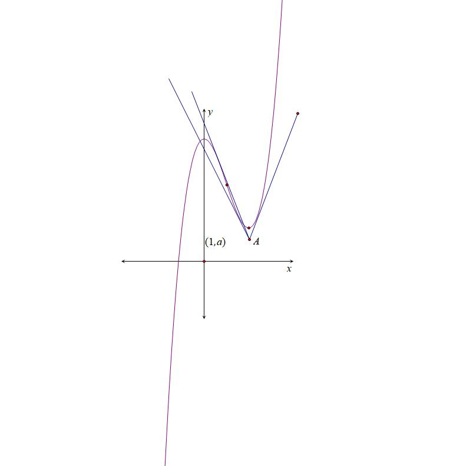

【例11】（2023•枣庄二模•多选）已知函数，则下列结论正确的是

A．当时，若有三个零点，则的取值范围为

B．若满足，则

C．若过点可作出曲线的三条切线，则

D．若存在极值点，且，其中，则

【例12】（2025春•齐齐哈尔期中）设是的导函数，是函数的导函数．若方程有实数解，且在的左、右附近，异号，则称点

为函数的“拐点”．经过探究发现：任何一个三次函数都有“拐点”且“拐点”就是三次函数图象的对称中心．已知函数的对称中心为，则下列说法中正确的是

A．，

B．的极小值为

C．若函数在区间上存在最小值，则的取值范围为，

D．若过点可以作三条直线与的图象相切，则的取值范围为

- 任意函数拐点与渐近线对切线条数界定

关于切线条数问题，由于，，当时，，此处为函数的拐点，易求拐点处切线方程为，当时，，我们把称为此函数的渐近线，区别于三次函数只有拐点，故我们通过拐点切线和渐近线，将平面分为7个区域，我们可以对此类型题进行归纳总结，如下：

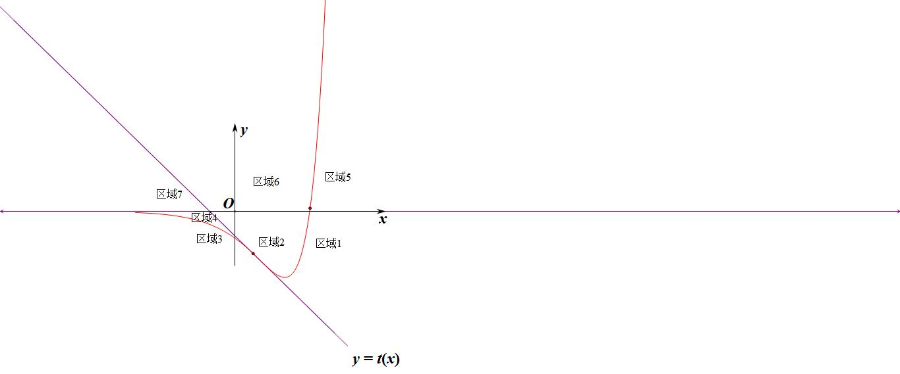

当时，函数与拐点处切线以及轴（渐近线）将平面分成四个区域（如图所示），分别由两个外弧区域和两个内弧区域组成，

①区域1和区域4属于双外弧区域，位于此区域的点能作三条切线；

②区域2和区域3属于一内弧一外弧区域，位于此区域的点能作一条切线；
我们将拐点切线作为内外弧分界点，区域2就是拐点右侧曲线的内弧区域，但是相对于曲线左侧，则是外弧区域，所以只能往拐点左侧区域作唯一一条切线，也是“远切线”；同理，区域3是拐点左侧曲线的内弧区域，也是拐点右侧曲线的外弧区域，所以过区域3的任意一点能作唯一一条切点位于拐点右侧的“远切线”；那么区域1和区域4就是拐点左右两侧的双外弧区域，在本侧能作两条切点位于拐点同侧的“近切线”，以及一条拐点另一侧的“远切线”.

③过曲线上拐点处仅能作一条切线，过拐点以外的曲线上任意一点能作两条切线；
在曲线上任意一点能作一条切线，这可以理解为拐点同侧外弧的两条切线合二为一，类比于圆，圆上一点能作一条切线，就是圆外的两条切线在这里合二为一，还有一条切线源自拐点另一处的“远切线”.

④过拐点处切线上除了拐点以外的任意一点，仅能作两条切线；
拐点切线，就是一条“近切线”和一条“远切线”合二为一，否则就会有三条切线.

当时，函数与拐点处切线以及轴将平面分成三个区域（如图所示），分别由两个外弧区域和一个内弧区域组成，由于不在渐近线内侧，故少了一条“远切线”.

⑤区域5和区域7属于双外弧区域，位于此区域的点能作两条切线，相比区域1和区域4，少了一条位于处的远切线；

⑥区域6属于一内弧一外弧区域，由于唯一一条远切线的缺失，故位于此区域的点不能作的切线；
⑦由于缺失了一条远切线，故过曲线上任意一点仅能作一条切点在曲线上切线；
⑧过拐点处切线上任意一点仅能作唯一切线，就是这条拐点切线.

【例13】（2022•新课标1卷）若曲线有两条过坐标原点的切线，则的取值范围是_____．

【例14】（2025•北京模拟）已知过点作曲线的切线有且仅有1条，则

A．	
B．3	
C．或1	
D．3或1

【例15】（2023•辽宁期末）已知过点作的曲线的切线有且仅有两条，则的取值范围为

A．	
B．	
C．	
D．

【例15】（2022•扬州期末•多选）若过点&lt;<em>t</em>ext style="italic"&gt;P&lt;/text&gt;（﹣1，t）最多可以作出<em>&lt;text style="italic"&gt;n</em>&lt;/text&gt;（n∈<strong>N</strong>\*）条直线与函数 $f(x)=\frac{x+1}{e^{x}}$ 的图像相切，则（　　）

A．*tn*可以等于2022	
B．*n*不可以等于3

C．*te*+*<text style="italic">n*</text>＞3	
D．n＝1时， $t\in \{0\}\cup (\frac{4}{e}，+\infty )$

【例16】（2023•思明区月考•多选）已知函数 $f(x)=\frac{x}{e^{x}}$ ，过点（<te*x*t style="italic">a</text>，*b*）作曲线*f*（x）的切线，下列说法正确的（）

1. 当<text style="it*a*lic">a</text>＝0，*b*＝0时，有且仅有一条切线	B．当a＝0时，可作三条切线， $0＜b＜\frac{4}{e^{2}}$
2. C．当<text style="it*a*lic">a</text>＝2，*b*＞0时，可作两条切线	    D．0＜a＜2时，可作两条切线， $b=\frac{4-a}{e^{2}}或\frac{a}{e^{a}}$

【例17】（2023•雅安期末）经过点作曲线的切线有

A．1条	
B．2条	
C．3条	
D．4条

【例18】（多选）（2024春•潍坊月考）过点存在条直线与函数的图像相切，则

A．的最大值为2

B．的最大值为0

C．函数图像上的动，点到直线的距离最小值为

D．当时，的取值范围是

【例19】（2023•广东期末•多选）已知函数，则过点恰能作曲线的两条切线的充分条件可以是

A．	
B．（*a*）	
C．（a）	
D．

########## 注意：这是一道综合发散型的多选，要求在各个角度维度来分析切线条数，所以我们对渐近线和拐点划分区域界定一定要精准掌握.

【例20】（2023•山西模拟•多选）已知函数，则下列说法正确的是

A．若在上单调递增，则

B．若，设的解集为，，则

C．若有两个极值点，，且，则

D．若，则过仅能做曲线的一条切线

- 公切线的秘密

########## 一． 公切线的恒等关系

切线问题，按照纯代数运算来说就是设点解方程，公切线也是两个方程共解.
当与具有公切线时，设直线与切于点，与切于点，
①当与切于同一点，设切点为，则有
②公切线方程的等量关系，求参数取范围或者切点的取值范围.

########## 切线与一曲线的切点已知，且与另一曲线相切，求另一曲线方程

【例1】（2023•许昌模拟）已知函数在点处的切线，若直线与二次函数的图象也相切，则实数的取值为（　　）

A．    	
B．	
C．	
D．

【例2】已知函数 ，且的图象在处的切线与曲相切，符合情况的切线有（    ）

A．    	
B．	
C．	
D．

二．平行曲线的公切线

当与为平行曲线，即，则有

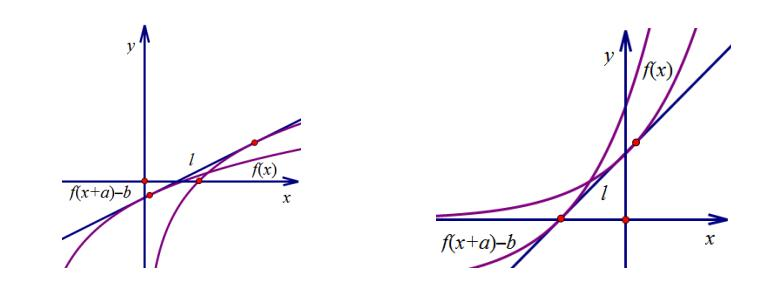

证明:因为与有公切线，设切点为，切点为，则一定有，所以，根据公切线方程
可得:，所以，即如果按照数形结合来理解，就是与，两点确定公切线，两切点连线的斜率就是公切线斜率，即将切点左移单位，再下移单位，这样得到点，所以公切线斜率

########## 【例3】(2016•新课标II)若直线是曲线的切线，也是曲线的切线，则_________．

########## 【例4】若直线与曲线和曲线同时相切，则（    ）
A.     
B.     
C.      
D.

【例5】（2024秋•海珠区校级月考）若直线是曲线与的公切线，则

A．	
B．	
C．	
D．

########## 三．同构与公切线

两曲线公共点公切线问题：当与切于同一点，设切点为，则有，单参数求定值，双参数转化为单参数后确定参数的取值范围，这里面要看清楚同构.

【例6】（2023•福建模拟）．已知直线是曲线的切线，也是曲线的切线，则的最大值是

A．	
B．	
C．	
D．

注意：本题核心还是指向了六大同构函数，这是我们高中导数的基本功，所以大家现在应该明白为什么本书没有那些简单的单调性分析讨论和零点分区间，因为不同构，无导数.

本题的凹凸性解读在下一节也会体现。

【例7】（2024•长沙模拟）已知函数与的图象在第一象限有公共点，且在该点处的切线相同，当实数变化时，实数的取值范围为

A．	
B．	
C．	
D．

【例8】（2024•聊城模拟）若存在，使得函数与的图象在这两个函数图象的公共点处的切线相同，则的最大值为

A．	
B．	
C．	
D．

四．公切线的几何解读

与是否有公切线，决定它们公切线条数的是函数凹凸性和相同的单调区间交点.
凹凸性相同的两曲线，在两个曲线，时，两个函数均为凹函数，且，时均在递增区间，
①如图，若与无交点，可以类比于两个圆的外公切线，当小圆内含于大圆时，无公切线;

②若与有唯一交点时，如图，可以类比于当小圆与大圆内切时，有唯一的外公切线;

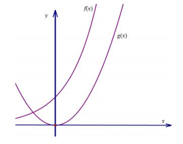

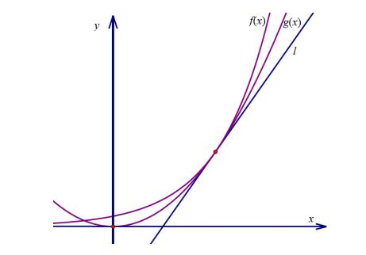

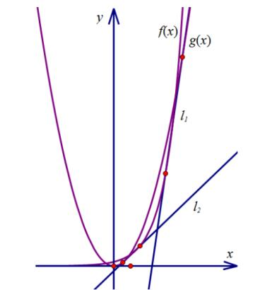

③若与有两个交点时，如图，可以类比于当小圆与大圆相交时，有两条外公切线;

内含型无公切线              内切型有一条外公切线         同旁相交型两条外公切线

同理，凹凸性不同的两条曲线，在两个曲线为凹函数，为凸函数时，且，，两个函数均在递增区间;
④如图，若与有两个交点，可以类比圆的内公切线，当两圆相交时，无内公切线;

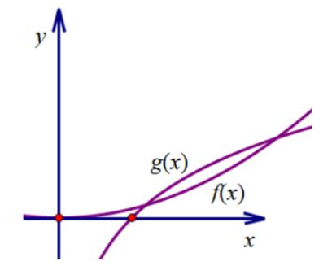

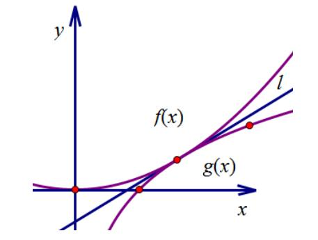

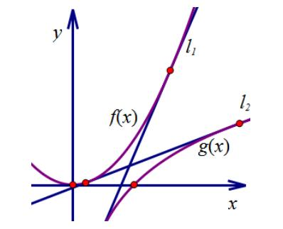

⑤若与有唯一交点时，如图所示，可以类比于当两圆外切时，有唯一的内公切线.
⑥若与无交点时，如图所示，可以类比于当两圆相离时，有两条内公切线.

########## 非同旁相交型无公切线            外切型有一条内公切线       外离型有两条内公切线

【例9】（2023•常德期末）已知直线与曲线和曲线均相切，则实数的解的个数为

A．0	
B．1	
C．2	
D．无数

【例10】（2023•云南模拟）若函数与函数的图象存在公切线，则实数的取值范围为

A．	
B．	
C．	
D．

【例11】(2022石家庄期末•多选)若两曲线与存在公切线，则正实数的取值可能是（    ）
A.         
B.4             
C.              
D.
【例12】(多选)若曲线与存在公共切线，则实数的可能取值是（    ）
A．    	
B．e	
C．	
D．

【例13】已知直线是曲线的切线，也是曲线的切线，则的最大值是

1. B．	C．	D．

########## 五.分段函数的公切线

【例14】（2023•衡阳模拟）若曲线与有三条公切线，则的取值范围为

A．	
B．	
C．	
D．

【例15】（2023•烟台期末•多选）关于曲线和的公切线，下列说法正确的有

A．无论取何值，两曲线都有公切线	   
B．若两曲线恰有两条公切线，则

C．若，则两曲线只有一条公切线	   
D．若，则两曲线有三条公切线

六 包络线与切线范围

一曲线族的包络线是这样的曲线：该曲线不包含于曲线族中，但过该曲线上的每一点，都有曲线族中的一条曲线与它在这一点处相切．若圆是直线族的包络线

包络线在高中阶段就是判断切线的存在性，有切线，有公切线就有包络线，我们设平面内一点为，将该点坐标代入曲线方程得到一条关于其切线的方程。若该方程有实数解，则说明该点位于包络区域内;反之，若该方程无实数解，则该点位于包络区域外。所以我们的目的就很明确了，求取满足该方程有实数解的条件。

我们来求的包络线，设，则，故，此时被包络在内的就是一个圆，故包络线就是，熟悉极点极线的同学们都知道这是圆上任意一点的切线族，类比可得是椭圆的包络线。

【例16】（2022•江苏模拟）一曲线族的包络线是这样的曲线：该曲线不包含于曲线族中，但过该曲线上的每一点，都有曲线族中的一条曲线与它在这一点处相切．若圆是直线族的包络线，则，满足的关系式为<u>　 　</u>；若曲线是直线族的包络线，则的长为 <u>　　</u>．

【例17】（2023•咸宁模拟•多选）一曲线族的包络线是这样的曲线：该曲线不包含于曲线族中，但过该曲线上的每一点，都有曲线族中的一条曲线与它在这点处相切．下列说法正确的是

A．若圆是直线的包络线，则有

B．若曲线是直线族的包络线，则的长为

C．曲线是三条过点的直线的包络线，其中且

D．若两曲线和是同一条直线的包络线，则的取值范围是

七 指对公切线与定值问题

1.关于为的交点个数与公切线

先分析，

1. 若，两函数没有交点，此时能出现两条公切线，也相当于两个外离的圆弧的公切线，如图，此时，则，所以时，必有两条公切线，且两条公切线斜率乘积为1；

证明：设与切于，与切于，则根据对称性，另一条切线比过，所以必有；

  
（2）时，有两个交点，故没有公切线如右图；
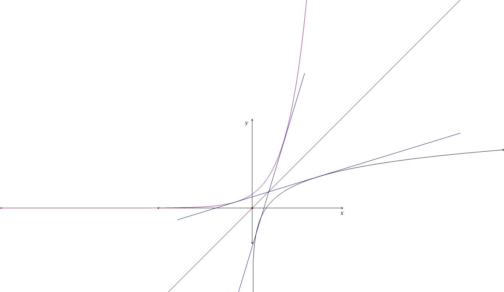

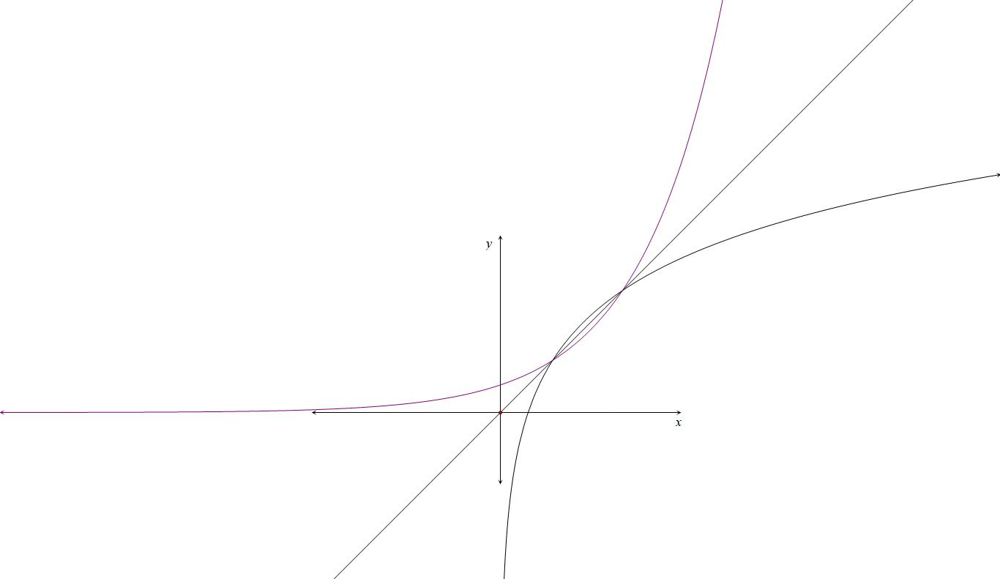

  
（1），两条公切线                 （2），没有公切线

我们再来分析，在这里就会出现一个或者三个交点的情况，我们做以下分析：

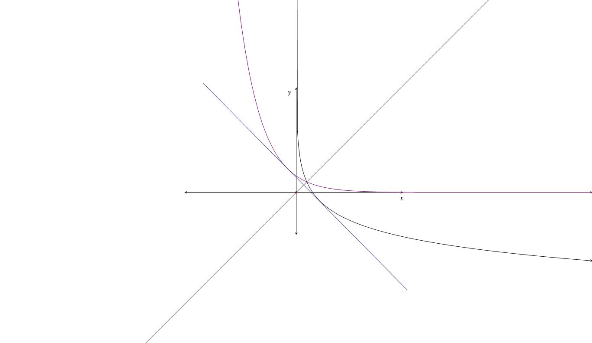

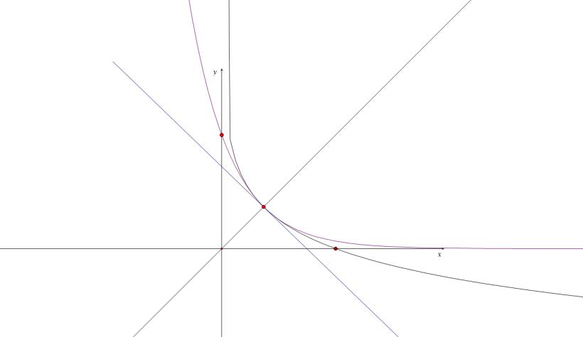

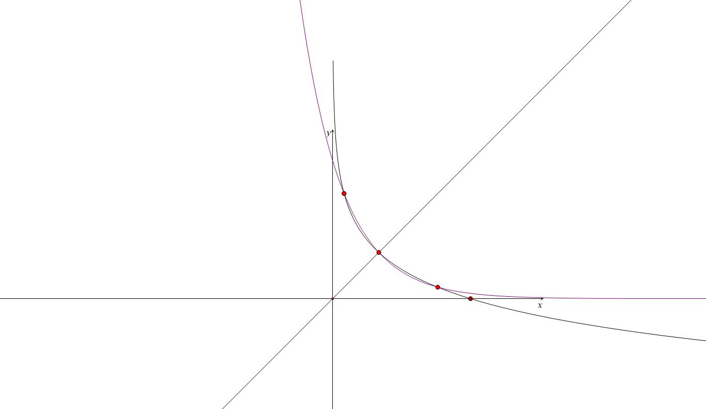

  
（3）一个交点   （4） 一个交点 （相切）  （5） 三个交点

我们发现越小，根据，函数递减越慢，临界条件就是与相切于，且切线斜率为，所以，且，所以，
> 

> 
> |  |  |
> | --- | --- |
> | （3）当时，如左图所示，两个函数仅有一个交点，此时也有一条公切线； | （4）当时，两个函数拟合，就是在交点处相切，如中图，此时共切线点公切线一条； |
> 

  
（5）当时，两函数会出现三个零点，会有三条公切线，如右图，类比于三条公切线中，；

2.与公切线的切点数据关系

  
（1）若在点，处的切线与曲线在点，处的切线相同，则

证明：本题我们可以尝试切线找点，常规法大家可以参考例题22，切线找点的转化也属于同构思想，我们应该重点掌握，，，故此时满足

【例18】（2023•景德镇模拟）若曲线在点，处的切线与曲线相切于点，，则<u>　　</u>．

【例19】（2023•南通模拟•多选）已知为坐标原点，曲线在点，处的切线与曲线相切于点，，则

A．	
B．

C．的最大值为0	
D．当时，

【例20】（2023•新罗模拟•多选）已知两曲线与，则下列结论正确的是

A．若两曲线只有一个交点，则这个交点的横坐标

B．若，则两曲线只有一条公切线

C．若，则两曲线有两条公切线，且两条公切线的斜率之积为

D．若，，分别是两曲线上的点，则，两点距离的最小值为1

########## 【例21】（2023东北师大附中二模）已知函数，，其中，且.若函数，则下列结论正确的是（   ）

A.当时，有且只有一个零点

B.当时，有两个零点

C.当时，曲线与曲线有且只有两条公切线

D.若为单调函数，则

【例22】（2018•天津）已知函数，，其中．

  
（1）求函数的单调区间；

  
（2）若曲线在点处的切线与曲线在点处的切线平行，证明；

  
（3）证明当时，存在直线，使是曲线的切线，也是曲线的切线．

【例23】（2024春•浦东新区校级月考）已知，其中．

  
（1）请利用的导函数推出导函数，并求函数的递增区间；

  
（2）若曲线在点，处的切线与曲线在点，的切线平行，求（化简为只含的代数式）；

  
（3）证明：当时，存在直线，使得既是的一条切线，也是的一条切线．

