第五章 小题篇比大小

第一节 指数与对数比大小

一．指数与指数函数比大小

1.转化为同底或者同幂
在分析指数比大小问题时，先分析是否是同一底数，能转化为同一底数的优先转化为同底，幂函数则转化为同幂，同时不断跟1比或者跟0比，这也是比大小最基础的模型.

【例1】（24高一上·河北唐山·阶段练习）设，，，则*a*，*b*，*c*的大小顺序是（    ）

A．	
B．	
C．	
D．

【例2】（2022•天津）已知，，，则

A．	
B．	
C．	
D．

【例3】（2025·天津武清·模拟预测）已知定义在<strong>R</strong>上的函数，，，，则<em>a</em>，<em>b</em>，<em>c</em>的大小关系为（    ）

A．	
B．	
C．	
D．

【例4】（24-25高二上·安徽·期末）已知函数，记则的大小关系为（    ）

A．	
B．	
C．	
D．

2.关于与比大小

当 $e>a>b>0$  时, $a^{b}>b^{a}$ , 当 $a>b>e$  时, $a^{b}<b^{a}$ ; 口诀: 大指小底。(大于 $e$  看指数大,小于 $e$  看底数大 )
证明: 同时取对数得，仅比较与的大小，即比较与大小，构造函数，易知 $x=e,f\left(e\right)=\frac{1}{e}$ , $f\left(x\right)$ 在区间 $\left(e\right)$  单调递增, 在区间 $\left(+\infty \right)$  单调递减; 所以当 $e>a>b>0$  时, $a^{b}>b^{a}$ , 当 $a>b>e$  时, $a^{b}<b^{a}$ .

【例5】（20-21高三下·河北衡水·阶段练习）已知函数，则*a*，*b*，*c*，*d*的大小顺序为（    ）

A．	
B．	
C．	
D．

【例6】（2023•浙江期中）已知，，，则

A．	
B．	
C．	
D．

【例7】（2023•浙江期中）记，则

A．	
B．	
C．	
D．

3. 二项式定理展开比大小

一些整式的带有顺子的指数比大小，可以考虑二项式定理展开来比大小.

【例8】（2023•辽宁模拟）已知，，，则，，的大小关系为

A．	
B．	
C．	
D．

【例10】（2025•湘西二模）已知，，，则

A．	
B．	
C．	
D．

4.关于比大小

我们通过前面两个例题发现,因为构造的函数单调递减，然而，可能出现吗？

【例11】（2024•金太阳模拟）已知 ，，. 则（    ）

A．    	
B．      
C．       
D．

注意：小题判断极值点偏移，源自三阶导，参考对勾函数，三阶导，根据图像性质我们可知第一象限极小值左偏，第三象限极大值右偏，在不清楚三阶导与极值点偏移关系的时候可以直接参考对勾函数，本题易得极大值左偏.

通过这些题我们发现，若对于*a*为足够小，

①当时，在区间单调递增，则有，如图，参考，当足够小，在单调递增；
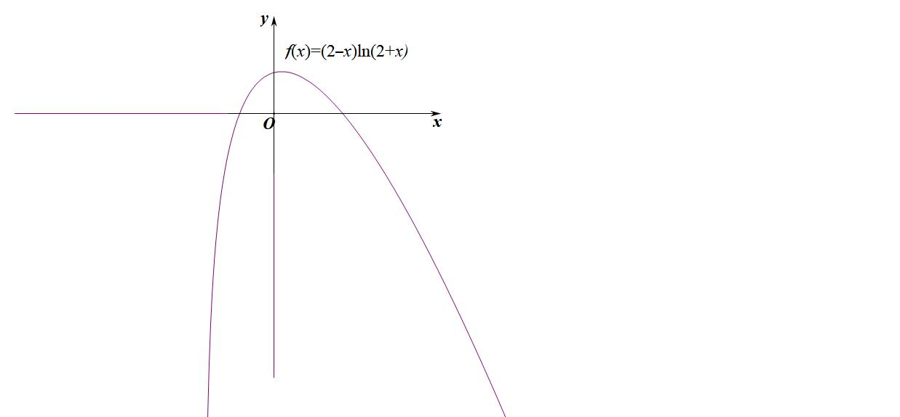

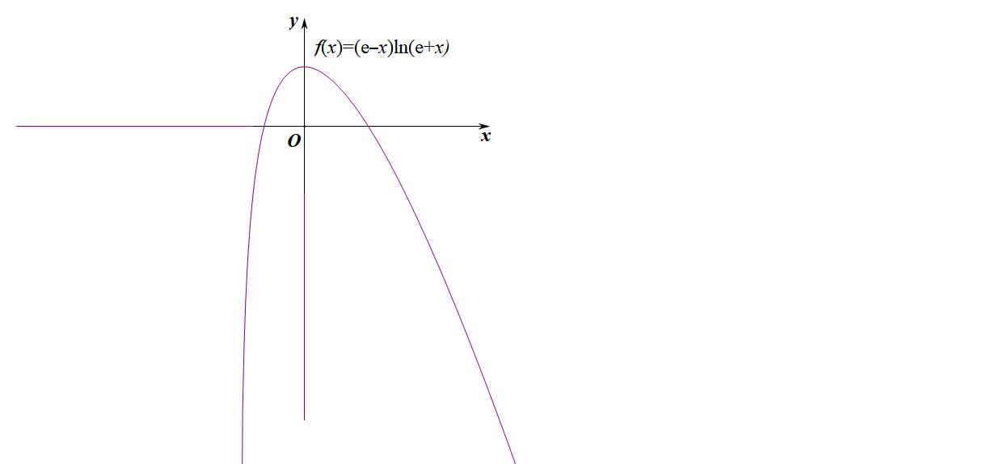

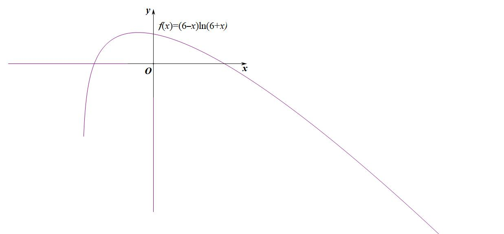

②当时，在区间单调递增，在单调递减，且极大值点左偏，则有，

③当时，在区间单调递减，则有，如图，参考，当足够小，在单调递减；
二．对数与对数函数比大小

########## 1.转化为同底数或者同真数 
在比较大小的题型中, 对数是最为常见的, 通常也是 $log_{a}b$  对比 $log_{c}d$ , 底数和真数都不相等时, 我们要么构造底数相等, 要么选择中间变量进行比大小。
对数同步升 (降) 次法: 根据 $log_{a}b=log_{a^{m}}b^{m}$  可知 $log_{2}3=log_{4}9=log_{8}27=log_{\frac{1}{2}}\frac{1}{3}$ ;
注意: 一般出现在以 2 或者 3 为底数的对数比大小当中, 底数真数次方一起同升同降, 我们先看一道例题:
【典例】比较 $a=log_{4}3,b=log_{5}2,c=log_{8}5$  的大小.
注意：通常我们需要把底数和真数的分数转化为整数,再进行比大小, 选取必要的中间变量, 比如 0 或者 1 .

【例12】(2021•新高考 II 卷) 已知 $a=log_{5}2,b=log_{8}3,c=\frac{1}{2}$ , 则下列判断正确的是 ( )
A. $c<b<a$      
B. $b<a<c$      
C. $a<c<b$               
D. $a<b<c$ 
【例13】（2024•广州期中）设，，，则

A．	
B．	
C．	
D．

2.构造糖水不等式比大小
定理:若 $a>b>0,m>0$ , 则一定有 $\frac{b+m}{a+m}>\frac{b}{a}$ , 或者 $\frac{a+m}{b+m}<\frac{a}{b}$ 
通俗的理解就是 $a$  克的不饱和糖水里含有 $b$  克糖, 往糖水里面加入 $m$  克糖, 则糖水更甜;
证明: $\frac{b+m}{a+m}-\frac{b}{a}=\frac{ab+am-ab-bm}{a^{2}+am}=\frac{(a-b)m}{a^{2}+am}>0$  ； $\frac{a+m}{b+m}-\frac{a}{b}=\frac{ab+bm-ab-am}{b^{2}+bm}=-\frac{(a-b)m}{b^{2}+bm}<0$ 
【例14】（26陪跑课答疑，朱茜瑶）已知，则，，的大小关系为

A．	
B．	
C．	
D．

【例15】 $(2020$  •新课标III $)$  已知 $5^{5}<8^{4},13^{4}<8^{5}$ . 设 $a=log_{5}3,b=log_{8}5,c=log_{13}8$ , 则 (    )
A. $a<b<c$       
B. $b<a<c$       
C. $b<c<a$       
D. $c<a<b$

【例16】已知 $a=2^{-\frac{1}{2}},b=log_{4}20,c=log_{3}12$ , 则 (    )
A. $b<c<a$     
B. $a<c<b$      
C. $b<a<c$       
D. $a <b<c$

【例17】 $(2022$ ·全国甲卷文 $)$  已知 $9^{m}=10,a=10^{m}-11,b=8^{m}-9$ , 则 ( $)$ 
A. $a>0>b$         
B. $a>b>0$        
C. $b>a>0$            
D. $b>0>a$

########## 3.利用六大同构函数比大小

1. 由 $f\left(x\right)=\frac{lnx}{x}$  引出的大小比较问题  
（1） $f\left(x\right)=\frac{lnx}{x}$  在区间 $\left(e\right)$  上单调递增,在区间 $\left(e,+\infty \right)$  单调递减; 当 $x=e$  时, 取得最大值 $\frac{1}{e}$ ;  
（2） 极大值左偏, 且 $f\left(2\right)=f\left(4\right)$   
（3） 当 $e>a>b>1$  时, $\frac{b}{a}>\frac{lnb}{ln a}$ , 当 $a>b>e$  时, $\frac{b}{a}<\frac{lnb}{ln a}$ .  
（4）  $f\left(2\right)=\frac{ln2}{2}=\frac{2ln2}{4}=f\left(4\right)$ , 注意: 只能比较 $f\left(3\right),f\left(4\right),f\left(5\right)$ , 或者 $f\left(0.7\right),f\left(0.8\right),f\left(2\right)$  之类属于 e 的左边或者右边, $f\left(2\right)=f\left(4\right)$  涉及左右互换。
关于函数 $x^{\frac{1}{x}}$  和函数 $x^{x}$  比大小问题, 都可以按照构造对数来比较, 例如在比较 $2^{\frac{1}{2}},e^{\frac{1}{e}},3^{\frac{1}{3}}$  大小时, 即比较 $\frac{ln2}{2}$ , $\frac{lne}{e},\frac{ln3}{3}$  大小, 在比较 $\left(\frac{1}{2}\right)^{\frac{1}{2}},\left(\frac{1}{3}\right)^{\frac{1}{3}},\left(\frac{1}{5}\right)^{\frac{1}{5}}$ , 即构造 $2^{-\frac{1}{2}},3^{-\frac{1}{3}},5^{-\frac{1}{5}}$ , 即比较 $-\frac{ln2}{2},-\frac{ln3}{3},-\frac{ln5}{5}$  大小

【例18】（22-23高二下·浙江杭州·期中）已知，则的大小为（   ）

A．	
B．	
C．	
D．

【例19】下列四个命题: ① $ln 5<\sqrt{5}ln 2$ ; ② $ln \pi >\sqrt{\frac{\pi }{e}}$ ; ③ $2^{\sqrt{11}}<11$ ; ④ $3eln 2>4\sqrt{2}$ ; 其中真命题的个数是 (    )
A. 1      
B. 2        
C. 3    
D. 4
【例20】（2023•哈尔滨月考）设，其中为自然对数的底数，则

A．	
B．	
C．	
D．

【例21】（2023•叙州区模拟）实数，，分别满足，，，则，，的大小关系为

A．	
B．	
C．	
D．

【例22】（2023•工业园区月考）设，，，则

A．	
B．	
C．	
D．

【例23】（25高三上·河南许昌模拟）设，，，则，，的大小顺序为（    ）

A．	
B．

C．	
D．

【例24】(多选) 若实数 $t\geqslant 2$  时, 则下列不等式一定成立的是(   )
A. $(t+3)ln (t+2)>(t+2)ln (t+3)$      
B. $(t+1)^{t+2}>(t+2)^{t+1}$ 
C. $1+\frac{1}{t}>log_{t} (t+1)$                    
D. $log_{t+1} (t+2)>log_{t+2} (t+3)$ 
【例25】（2024春•江阴市校级月考）已知，，，则，，的大小关系是

A．	
B．	
C．	
D．

【例26】（2024•沙河口区月考）已知，，，且，，，则

A．	
B．	
C．	
D．

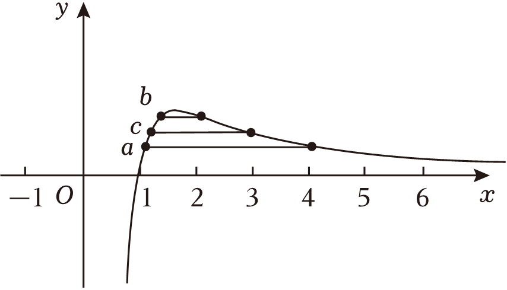

【例27】若，则

A．	
B．

C．	
D．

【例28】（2023•安阳二模）已知，，均为负实数，且，，，则

A．	
B．	
C．	
D．

########## 4.数形结合比大小 

【例29】（2023•小店区月考）若，，，则

A．	
B．	
C．	
D．

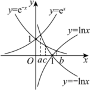

【例30】若，则下列不等式一定不成立的是（    ）

A．	
B．	
C．	
D．

【例31】（2025·黑龙江·一模）已知实数，，满足，，，其中为自然对数的底数.则，，的大小关系是（   ）

A．	
B．	
C．	
D．

【例32】已知 ，，. 则 （    ）

A．	
B．	
C．	
D．

【例33】（2025春•无锡校级月考）已知，，，且，，，其中是自然对数的底数，则

A．	
B．	
C．	
D．

【例34】（2024•衡水月考）已知正数，，，满足，，，则下列不等式成立的是

A．	
B．	
C．	
D．

########## 5.直线与指数和差函数交点问题

########## （1）若，则与的图像均为增函数，且在处相交，当时，，当时，（如图）；
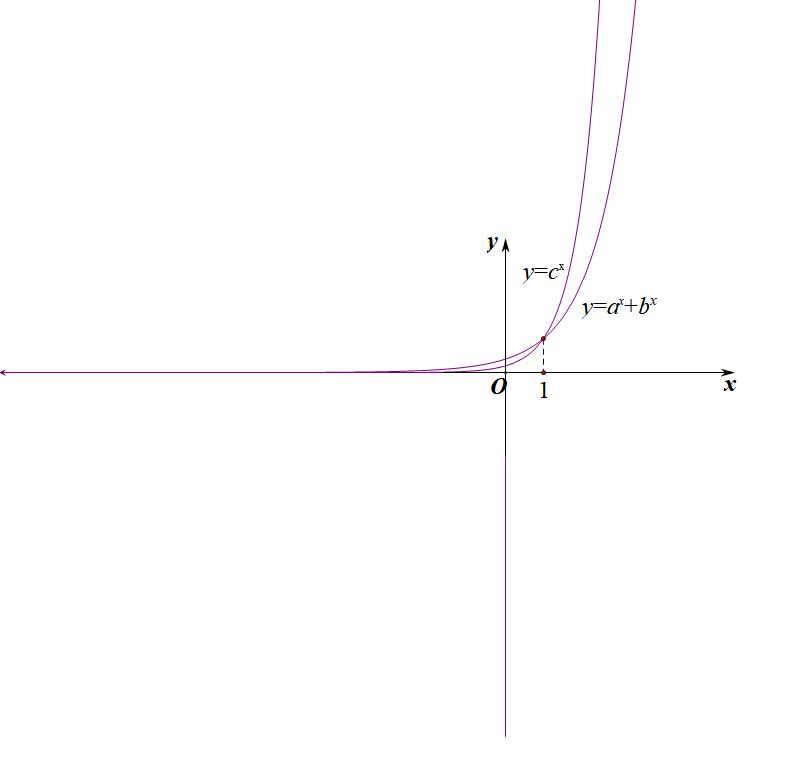

########## （2）若，则与的图像均为增函数，且在处相交，当时，，当时，（如图）；
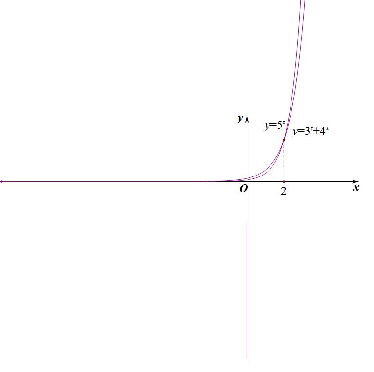

### 1.1.1.1.1.1.1.1.1.1 若，则与的图像均为增函数，且在处相交，当时，，当时，（如图）；
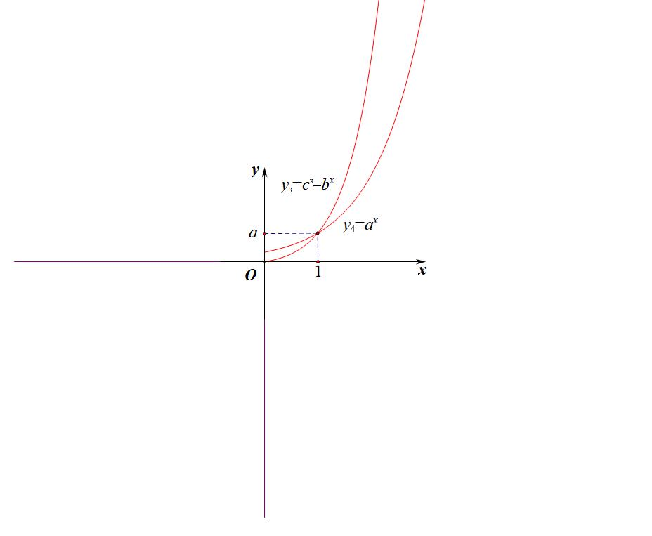

########## 关于两个函数开口差距大小，就是交点越高，开口越小，开口越低，开口越大.

【例35】已知实数 、、 满足 ，， 则 、、 的关系是（    ）

A．	
B．	
C．	
D．

【例36】（2023•盐城一模）设，，，，则

A．	
B．	
C．	
D．

【例37】（2023•四省联考）已知满足，则（   ）

1. B.

C.          
D.

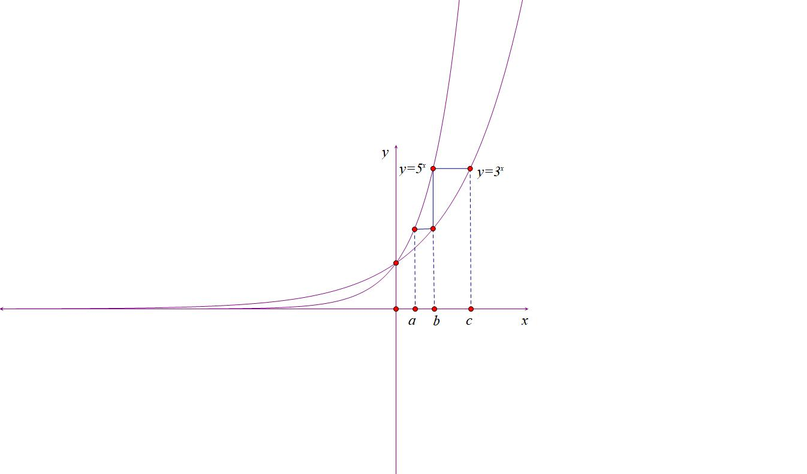

第二节  利用泰勒展开和帕德逼近比大小

########## 一 泰勒展开与估值
当所有函数在一个指数和三角函数靠近0或者对数靠近1时候，就可以用泰勒来进行估值，泰勒展开的形式我们在本书第一章已经介绍.

【例1】（2024•湖北开学）已知，，，则，，的大小关系为

A．	
B．	
C．	
D．

注意：关于，也可以用来估值，这样充分说明了飘带和帕德逼近时处理对数更好的方案.

【例2】（2024•河南模拟）已知，，，则

A．	
B．	
C．	
D．

【例3】（2023·四川自贡·一模）若，，，则*a*、*b*、*c*满足的大小关系式是（    ）.

A．	
B．	
C．	
D．

【例4】（2024•运城月考）已知，，，则

A．	
B．	
C．	
D．

【例5】（2024•重庆月考）若，则

A．	
B．	
C．	
D．

【例6】（2024•深圳月考）已知，，，则（    ）

A．	
B．	
C．	
D．

【例7】（2025·广东中山·模拟预测）设，，，则（   ）

A．	
B．	
C．	
D．

########## 二 帕德逼近与飘带函数对上下界锁定

我们通常做如下处理：

当时，（左图）；

当时，（右图）；

这样，指数和对数的上下界都被锁定.

【例8】（2024•京口区月考）设，，，则

A．	
B．	
C．	
D．

【例9】（2023•上开学）设，，，则

A．	
B．	
C．	
D．

【例10】（2023•山东月考•多选）若，，，，则

A．	
B．	
C．	
D．

【例11】已知，，，则（    ）

A．	
B．	
C．	
D．

【例12】（2024•德化县月考）设，，，则

A．	
B．	
C．	
D．

【例13】（2024•西安月考）已知，，，则，，的大小关系为

A．	
B．	
C．	
D．

########## 三．三角函数与的上下界切割锁定

1.我们知道，但是下界没有锁定，我们可以利用原点和极值点的连线，形成割线放缩，即，同理，我们也能放大精度，利用原点和点的连线，形成割线放缩，即，同时，根据泰勒展开对也成立，这个也是我们经常用到的.

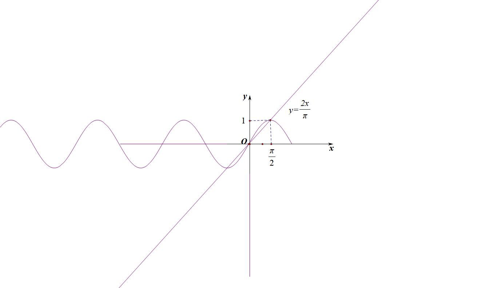

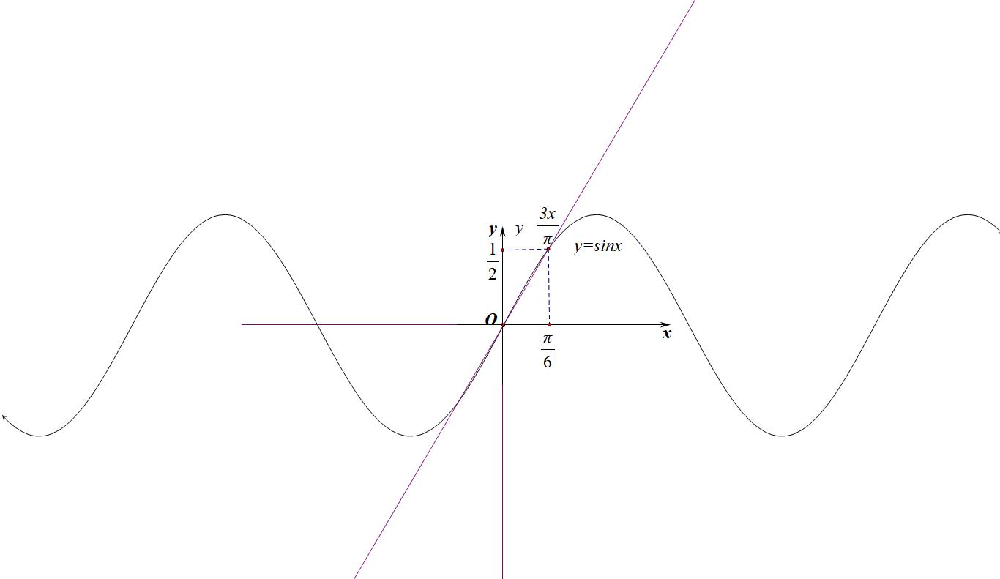

2.针对，，似乎只有下界，那么针对其上界，我们进行割线处理，如左图，我们构造原点与处的割线，则有，我们也可以提升精度，利用原点与处的割线，则有；
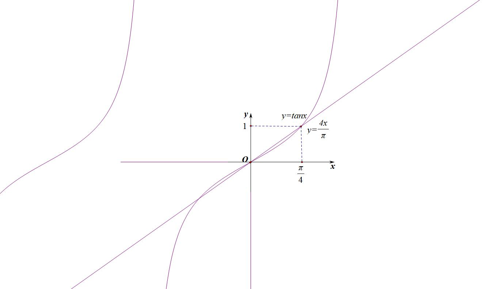

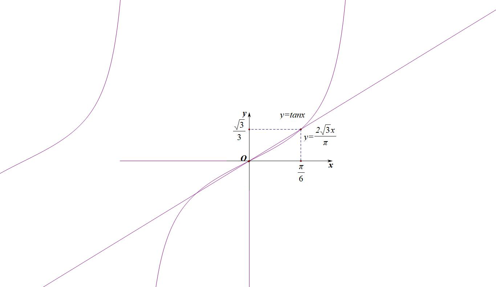

【例14】（2024•锦江区月考），，，则，，的大小关系为

A．	
B．	
C．	
D．

【例15】（2023•靖江市期中）已知，，，其中为自然对数的底数，则，，的大小关系为

A．	
B．	
C．	
D．

########## 四 极小变量微元法

高考题中经常出现的一些比较小的变量，比如说，的比大小问题，我们可以采用微元法，如图所示，和图像如下，其中与的值可以用微元法来比较，当，通常我们将时进行划分，利用导数的数值越大，则函数在自变量变化相同时，函数的变化率越大

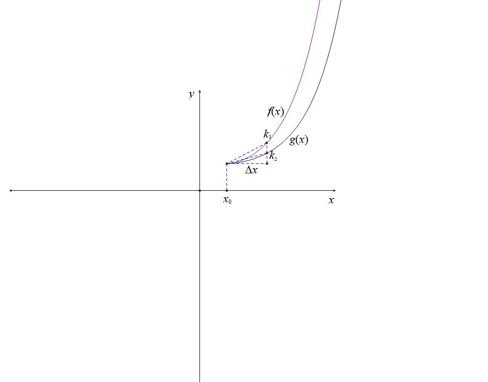

从图像可以看出，和 的大小即是曲线弯曲程度.即比较和的大小.如果 和  相同，可以比较 . 直到可以比出大小.

【例16】(2022 新课标1卷) 设 $a=0.1e^{0.1},b=\frac{1}{9},c=-ln0.9$ , 则(     )
$A.a<b<c$         B. $c<b<a$       C. $c<a<b$          D. $a<c<b$

【例17】(2021·全国乙卷理) 设 $a=2ln1.01,b=ln1.02,c=\sqrt{1.04}-1$ , 则 ( )
A. $a<b<c$           
B. $b<c<a$ 
C. $b<a<c$ 
D. $c<a<b$

【例20】（2023•清远期末•多选）设，，，，则

A．	
B．	
C．	
D．

【例21】（2023•鼓楼区校级模拟）设，则

A．	
B．	
C．	
D．

########## 五 利用极值点偏移比大小

一般结论: 若  极小值点左偏 (极大值点右偏);  极小值点右偏 (极大值点左偏) 证明: 设 ，. 由  公式得:

.

.

相椷得: .即 .

当  在  恒成立， 所以 .

若  单调递增， 所以  为  的极小值点. ， 所以 . 即极小值点左偏. 若  单调递减， 所以  为  的极大值点， ， 所以 ， 即极大值点右偏.  的情况同理可得.

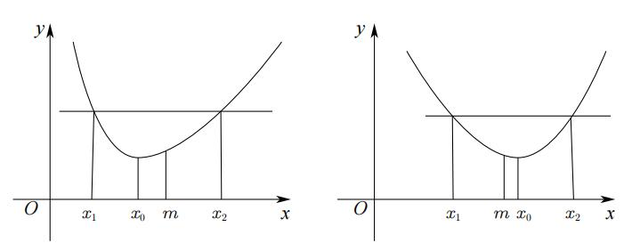

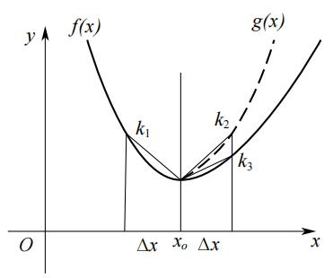

如图:  是  关于  的对称函数. 则 . 若  在  恒成立， 则必有  . 同理，  在  恒成立， 则有  恒成立.

从图像可以看出，  和  的大小即是曲线弯曲程度. 即比较  和  的大小. 如果  和  相同， 可以比较 . 直到可以比出大小.

【例22】设 ，，， 则（    ）

A．	
B．      
C．	
D．

【例23】（2023•日照一模•多选）已知，，，，则有

A．	
B．	
C．	
D．

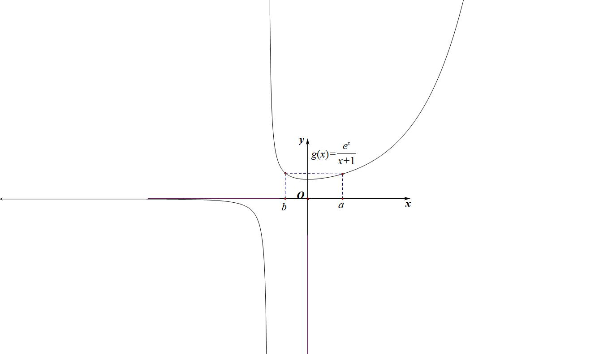

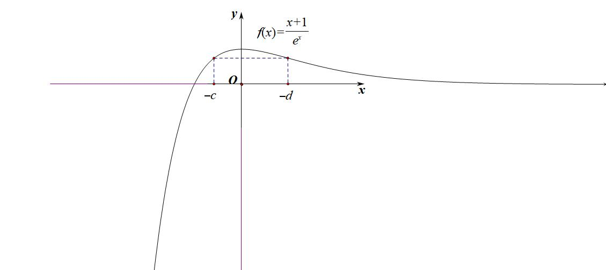

【例24】（2023•重庆期中•多选）已知，，，，则有

A．	
B．	
C．	
D．

