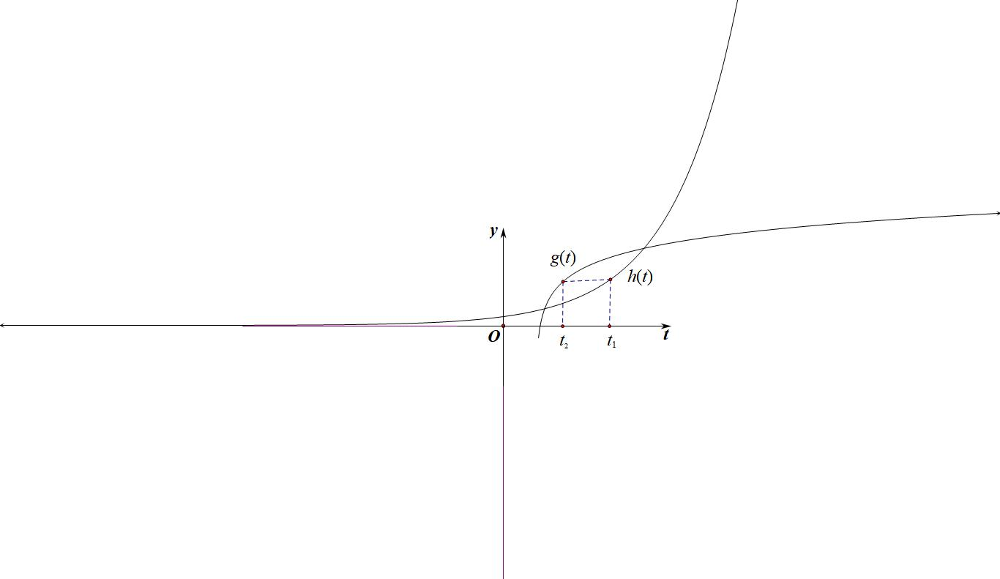
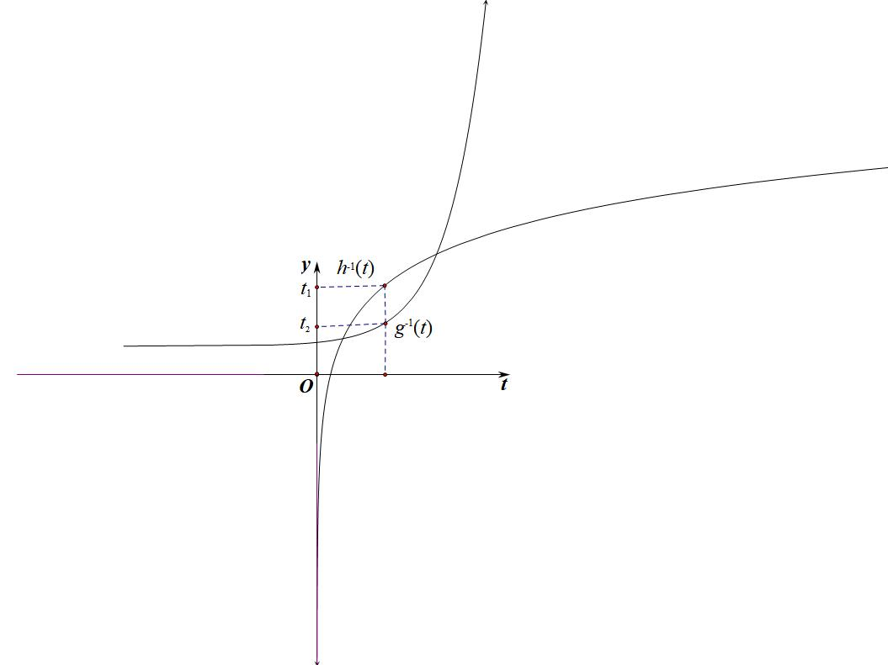
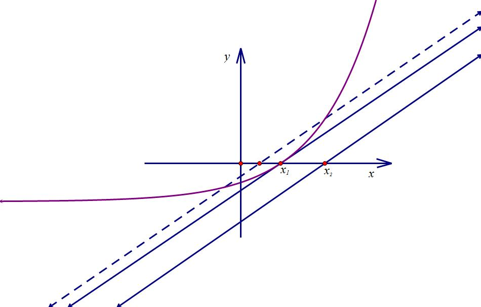
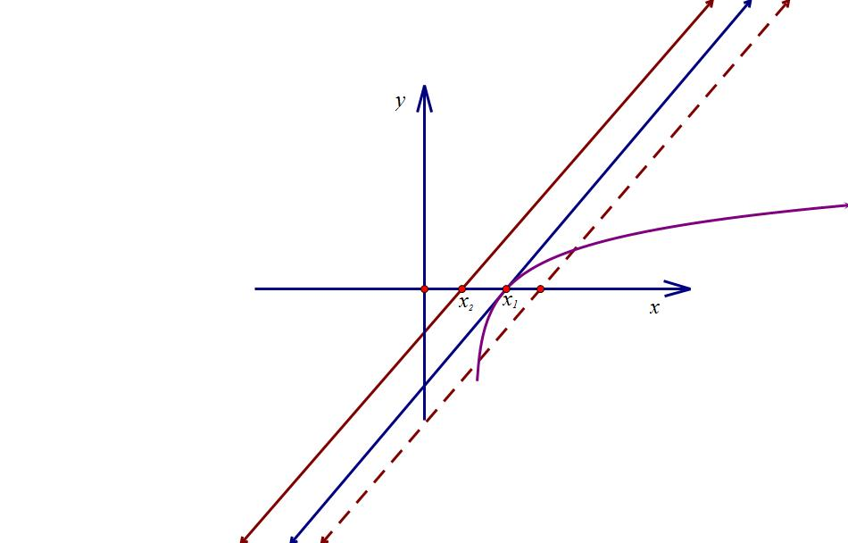
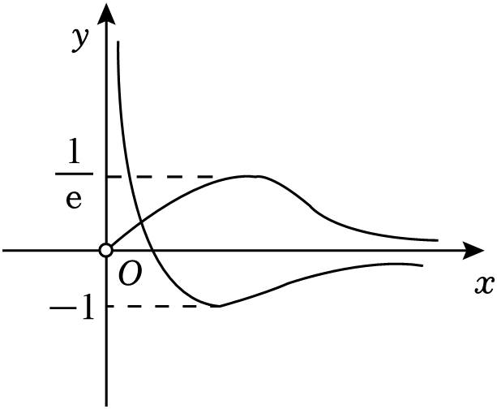
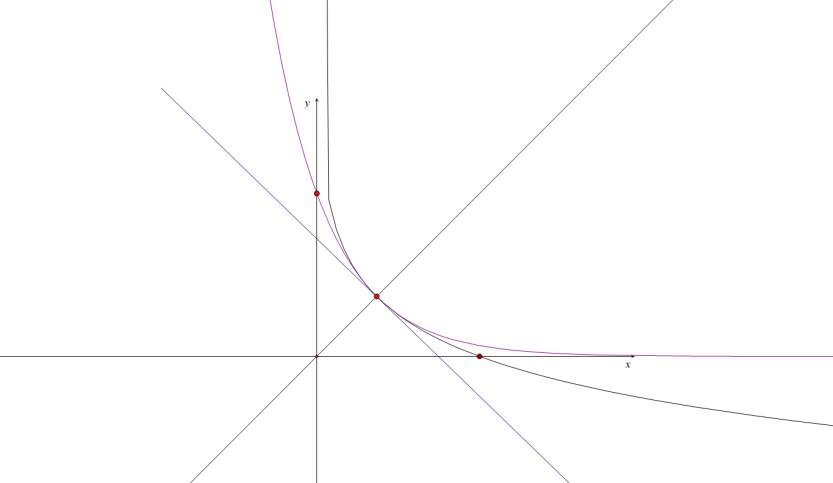

第六章  小题篇-数形结合

小题小做，本章从恒成立和零点个数题型进行解读，如何简化，如何利用我们上篇给到的方法和工具，更加重要的就是审题的角度.

第一节 恒成立问题

一．切线与距离问题

1.构造平行切线的最小距离

【例1】（2025•临潭县模拟）已知函数与，、分别是函数、图象上的动点，则的最小值为

A．	B．	C．	D．

【例2】（2024•大余县期中）曲线上的点到直线的最短距离是

A．	B．2	C．1	D．

【例3】（2024•重庆月考）已知直线与曲线，分别交于点，，则的最小值为

A．	B．	C．1	D．

【例4】（2024•兰山区校级模拟）若，，则的最小值为

A．	B．	C．	D．

【例5】（2024•江西模拟）在同一平面直角坐标系中，，分别是函数和图象上的动点，若对任意，有恒成立，则实数的最大值为

A．	B．	C．	D．

【例6】（2025•无为市月考）已知直线分别与直线和曲线相交于点，，点在直线上，且，则三角形的面积最小值为

A．	B．	C．	D．

- 水平距离差问题

当成立时，最值可以转化为最值问题，简称反函数构造法．

【例7】（2023•湛江二模）对于两个函数与，若这两个函数值相等时对应的自变量分别为，，则的最小值为

A．	B．	C．	D．

【例6】（2024•山东月考）已知函数，，若成立，则的最小值为

A．	B．	C．	D．

【例7】（2024•晋江市）已知函数，分别与直线交于点，，则的最小值为

A．	B．	C．	D．

- 不同函数包裹性解决恒成立能成立问题

定理一 若满足，恒成立，则在区间上

如左图所示，令，则恒成立．

定理二 若满足，恒成立，则在各自区间上；如上右图所示，的区域始终在区域上方才满足条件．

定理三（包裹性定理） 若满足若，总，使得成立, 则在区间上；如左图，所在区域能包含所在区域时，满足条件．

定理四 若满足，总使得能成立，则在区间上；如右图，所在区域最小值大于所在区域最小值时，满足条件．

注意 包裹性定理的关键在于区别符号与，还要看是否有两个区间与．

【例7】（2023•翠屏区期中）已知函数，，对任意的，都有成立，则实数的取值范围是

A．	B．	C．	D．

【例8】（2024•贵州模拟）已知函数，，任意，，，都有不等式成立，则的取值范围是

A．，	B．	C．	D．

【例9】（2024春•德州期末）已知函数，若，，，使得成立，则实数的取值范围是

A．	B．	C．	D．

- 双变量探路

第一类：转化为柯西不等式问题

【例10】（2025•历下区校级一模）已知函数，且在区间，上有零点，则的最小值为

A．	B．	C．2	D．1

【例11】（2024•济宁一模）已知函数，若在上有解，则的最小值 <u>　  　</u>．

【例12】（2024秋•洮北区校级期中）已知是函数的一个零点，且，，则的最大值为 <u>　　</u>．

第二类：双参数涉及公切点定值问题

【例13】（2023•邢台月考•多选）关于的不等式在，上恒成立，则

A．	B．	C．	D．

第三类：三角函数切割线与切点比大小问题

【例13】（2023•惠州模拟）已知，且恒成立，则的最小值为

A．1	B．	C．	D．

【例14】（2024•成都月考）曲线在处的切线为，且满足，，若，则整数的最小值为

A．1	B．2	C．3	D．4

########## 第四类：双参数比值利用零点比大小

########## ①恒成立，求的最值和取值范围；②恒成立，求的最值和取值范围；

如图所示，通常是一个凹函数（），意味着与相切时即恒成立，是直线和轴的交点，记为，故此类型题可以将的唯一零点求出，满足即可．同理，在比较时，此时为凸函数（），构造；四个图中的虚线直线是不可能满足题目要求的，此类方法叫做零点切线探路，或者叫零点比大小．

【例15】（2023•商丘三模）已知函数，，若恒成立，则的最大值是

A．	B．1	C．2	D．

【例16】（2023•驻马店月考）已知函数恒成立，则的最小值为

A．	B．	C．	D．

【例17】（2025•桃城区校级三模）已知在函数，，，若对，恒成立，则实数的取值范围为

1. ，	B．，	C．，	D．，

【例18】（2023•浙江月考）已知，若对任意实数恒成立恒成立，则的取值范围为\_\_\_\_\_\_\_．

【例19】（2022•镇海月考）不等式对任意实数恒成立，则的最大值为（    ）

A．    	B．	C．	D．

【例20】（2025•浙江月考）已知函数，．若不等式在上恒成立，则的最小值为

A．	B．1	C．	D．

########## 第五类：单参数分离不同凹凸性函数利用零点比大小

关于单参数的零点探路，也可以用比大小原理，就是分离两个凹凸性不同的函数，实现零点处两个函数相切的原理.

【例21】（2021•安徽模拟）设函数为自然对数的底数，当时恒成立，则实数的最大值为（    ）

A．	B．	C．	D．

【例22】（2023•邵东市期末）若不等式恒成立，则实数的取值范围是

A．，	B．，	C．	D．，

【例23】（2023•茂名一模）是自然对数的底数，的零点为 <u>　  　</u>．

【例24】（2024•重庆期末）已知函数，，为实数），若存在实数，使得对任意恒成立，则实数的取值范围是

A．，	B．，	C．，	D．，

########## 第六类：双参数和与差利用切点比大小

【例25】（2024•浙江模拟）已知在上恒成立，的最小值是

A．0	B．	C．	D．

【例26】（2024•南岸区月考）已知曲线与直线相切，则的最大值为

A．	B．	C．	D．

########## 【例27】（2021•天津高考）已知函数．

########## （1）求处的切线方程；

########## （2）求证：仅有一个极值点；

（3）若存在，使对任意的恒成立，求实数的取值范围

########## 第七类：双参数乘积利用切线找点和基本不等式妙解

指数切线切点找点：，转化为．

对数切线切点找点：，转化为．

指数切线斜率找点：，．

对数切线斜率找点：，．

根据指数切线斜率找点：．

根据对数切线斜率找点：

【例28】（2025•湘潭期末）若关于的不等式为自然对数的底数）在上恒成立，则的最大值为

A．	B．	C．	D．

【例29】（2024•青羊区校级模拟）已知函数没有极值点，则的最大值为

A．	B．	C．	D．

【例30】（2023•昆明期末）已知关于的不等式恒成立，则的最小值为

A．	B．	C．	D．

【例31】（2023•重庆月考）关于的不等式的解集为，则的最大值是

A．	B．	C．	D．

【例31】（2012•新课标）已知函数满足．

（1）求的解析式及单调区间；

（2）若，求的最大值．

########## 关于乘积型探路

1.单调函数共零点型

【例32】（2024秋•昆明模拟）已知，，若关于的不等式在上恒成立，的最小值是

A．0	B．1	C．	D．2

【例33】（2025•内乡二模）已知，，若关于的不等式在上恒成立，则的最小值是

A．4	B．	C．8	D．

########## 【例34】（2024·新课标2卷13）设函数，若，则的最小值为（     ）

1. B．	C．	D．

########## 【例35】（2024·武汉江汉区月考）设函数，若，则的最小值为（     ）

1. B．	C．	D．

2. 构造型

【例34】（2023•山西模拟•多选）已知，则的可能取值有

A．	B．	C．	D．

3. 构造型

【例35】（2024•重庆模拟•多选）已知函数（其中为自然对数的底数），若存在实数使得恒成立，则实数的取值范围是

A．	B．，	C．	D．

【例36】（2023•浙江二模•多选）已知时，，则

A．当时，	B．当时，

C．当时，	D．当时，

- 数形结合与零点问题

- 零点与等效零点

小题注重参变分离与等效零点设计，我们分别列举一些常见的零点小题，力争小题小做。

第一类：参变分离

参变分离的目的就是构造我们相对熟悉的函数，进行值域和单调性锁定，把不确定性转化为确定性.

【例1】（2024春•顺义区校级期中）若函数恰有2个零点，则实数的取值范围是

A．	B．	C．	D．

【例2】（2025春•肇庆期末）已知函数，函数恰有两个不同的零点，，则的最大值和最小值的差是

A．	B．	C．	D．

【例3】（2024•天津模拟）已知函数，若方程有4个零点，则的可能的值为

A．	B．1	C．	D．

【例4】（2020•赤峰模拟）设函数，若函数有三个零点，则的取值范围为

A．	B．

C．，，	D．，，

【例5】（2025•锦州模拟）已知，函数，若有四个不同零点，，，，满足，则的范围是

A．	B．	C．	D．

【例6】（2025春•南京校级期中）已知函数，若函数有3个零点，则实数的取值范围为

A．	B．	C．	D．

第二类：参变半分离与模块函数分析

【例7】（2023•叙州区期末）函数在内存在零点，则实数的取值范围是

A．，	B．，	C．，	D．，

【例8】（2023•浉河区期末）若方程存在唯一实根，则实数的取值范围是 <u>　  　</u>．

【例7】（2023•咸阳模拟）若方程<em>xlnx</em>+<em>ex</em>+1﹣<em>ax</em>＝0有两个不等的实数根，则实数<em>a</em>的取值范围是（　　）

A．（<em>e</em>，+∞）	B．（<em>e</em>+1，+∞）	C．（2<em>e</em>，+∞）	D．（<em>e</em>﹣1，+∞）

第三类：定零点与变化零点

【例8】（2023•大荔县一模）已知函数为自然对数的底数）．若函数在上有三个不同的极值点，则实数的取值范围为 <u>　　</u>．

【例9】（2023•成都模拟）已知函数有两个极值点，则的取值范围为

A．，	B．

C．	D．

二．嵌套函数与零点个数问题

在某些情况下，我们可能需要将某函数作为另一函数的参数使用，这一函数就是嵌套函数．在函数里面调用另外一个函数，就叫做函数嵌套．

第一类：判断嵌套函数零点个数

嵌套函数零点问题的法则：内函数横着走，外函数竖着走，参变分离横竖皆来．

########## 将函数分为和一内一外两个函数，分别作出其图形，找到竖着外函数的零点，然后将作纵坐标在内函数当中横插从而找到交点来确定零点．

【例10】（多选）定义域和值域均为（常数）的函数和的图象如图所示，下列四个命题中正确的结论是（    ）

A．方程有且仅有三个解    	B．方程有且仅有三个解

C．方程有且仅有九个解	D．方程有且仅有一个解

图7                                     图8

【例11】（2025•天津模拟）已知函数，，若，则零点的个数为

A．2	B．4	C．6	D．8

【例12】（2023•青原区期末•多选）已知方程常数），下列说法正确的有

A．为方程实根	B．

C．方程在无实根	D．方程所有实根之和大于

########## 第二类：根据零点个数判断参数取值范围

########## 【例13】（2023•福州期末）已知，关于的方程有四个不同的实数根，则的取值范围为<u>　      　</u>．

【例14】（2025•河南模拟）若关于的方程存在两个不等实根，则实数的取值范围是 <u>　　</u>．

【例16】已知函数，方程有两个不等实根，则下列选项正确的是

A．点是函数的零点

B．的取值范围是

C．是的极大值点

D．，，使

第三类：零点和积定值问题

########## 【例17】（2023•云南期末）已知函数有三个不同的零点，，（其中），则的值为（    ）

A．    	B．	C．	D．

【例18】（2023•枣庄期末•多选）已知函数有四个零点，，，，则

A．	                         B．

C．	    D．若，则

########## 【例19】（2024·郑州模拟）已知函数，若有三个不同的零点，则的取值范围为（    ）

1. B．	C．	D．

三．原函数与反函数综合零点问题

第一类：不动点与稳定点

########## 不动点 对于函数，我们把方程的解称为函数的不动点，即与图象交点的横坐标．

########## 例如 函数有一个不动点为，函数的不动点．有两个不动点．

########## 稳定点 对于函数，我们把方程的解称为函数的稳定点，即与图象交点的横坐标．很显然，若为函数的不动点，则必为函数的稳定点．

########## 证明 因为，所以，故也是函数的稳定点．

【例20】求函数的稳定点．

########## 由此可见，不动点是函数图象与直线的交点的横坐标，稳定点是函数图象与曲线图象交点的横坐标（特别，若函数有反函数时，则稳定点是函数图象与其反函数图象交点的横坐标）．

########## 不动点定理1 若函数为定义域内的单调递增函数，则有解等价于有解．

########## 证明 若无解，则必有，或恒成立，当时，因为为定义域内的单调增函数，则，显然无解；同理，可证的情况．因此，函数为定义域内的单调增函数，有解等价于有解．

########## 【例21】（2013•四川文）设函数(，为自然对数的底数)，若存在使成立，则的取值范围是\_\_\_\_\_\_\_\_\_\_．

########## 【例22】（2023•湖北月考）对于函数，若，则称为函数的“不动点”；若，则称为函数的“稳定点”，若函数的稳定点恰是它的不动点，则实数的取值范围是_________．

【例23】（2023•广州月考•多选）已知时，，则关于函数下列说法正确的是

A．方程的解只有一个	            B．方程的解有五个

C．方程，的解有五个	D．方程的解有三个

########## 第二类 原函数与反函数交点个数问题

关于为的交点个数

先分析，

1. 若，如图，此时，则，所以时，两函数没有交点；

（2）时，有两个交点，如右图；

（1），无交点                  （2），两个交点

我们再来分析，在这里就会出现一个或者三个交点的情况，我们做以下分析：

（3）一个交点    （4） 一个交点 （相切） （5） 三个交点

我们发现越小，根据，函数递减越慢，临界条件就是与相切于，且切线斜率为，所以，且，所以，

（3）当时，如左图所示，两个函数仅有一个交点；

（4）当时，两个函数拟合，就是在交点处相切，如中图；

（5）当时，两函数会出现三个零点，如右图；

【例24】（2023•东昌府区开学）已知函数，，其中，则

A．若点在的图象上，则点在的图象上

B．当时，设点，分别在，的图象上，则的最小值为

C．当时，函数的最小值小于

D．当时，函数有3个零点

########## 【例25】已知方程有3个实根，则实数的取值范围是_________．

