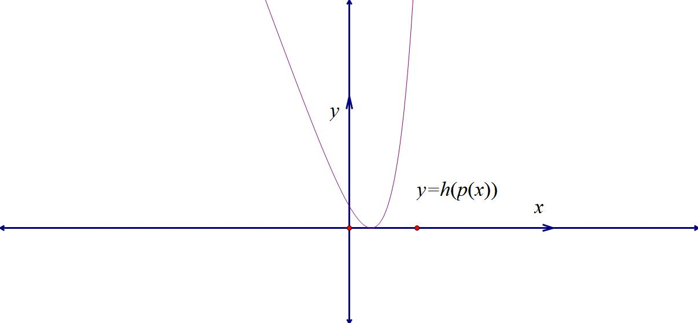
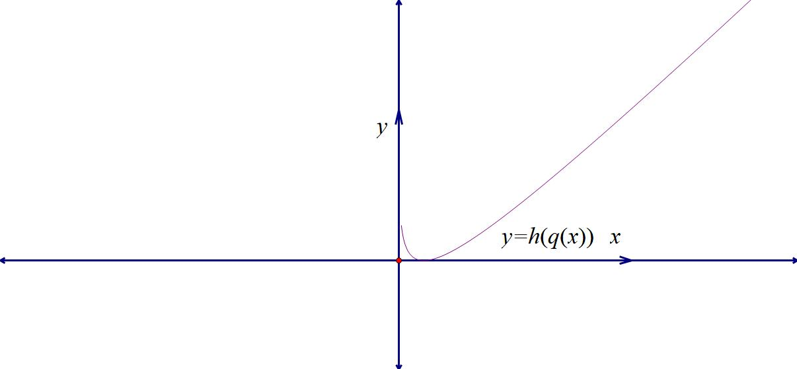
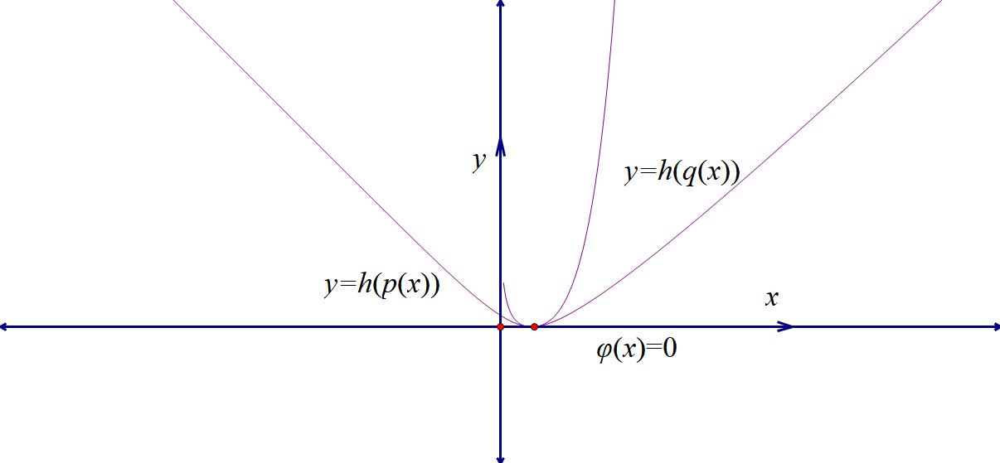
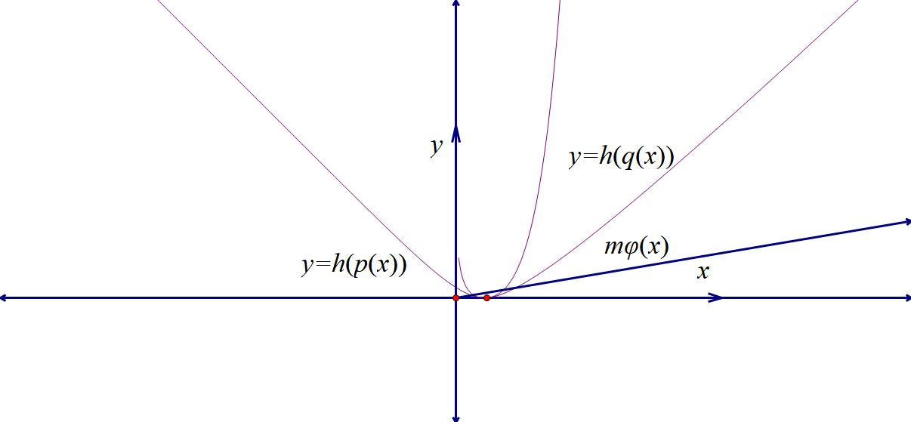
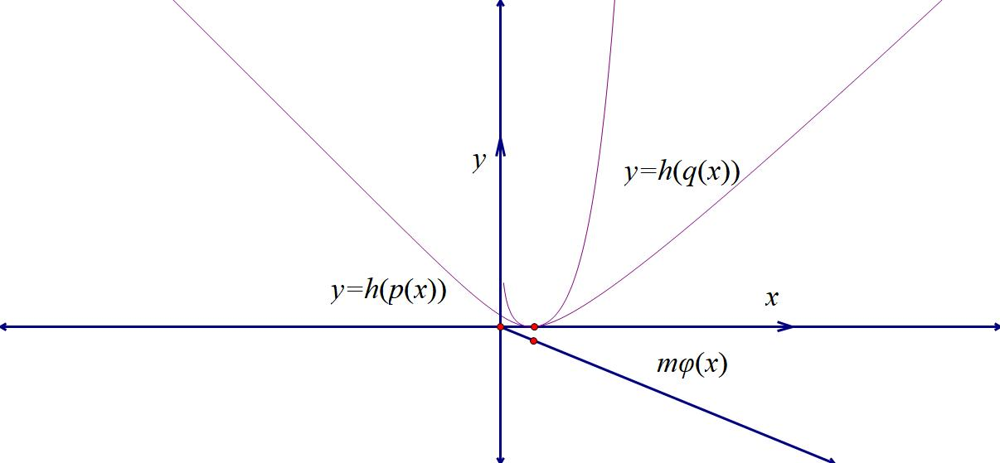
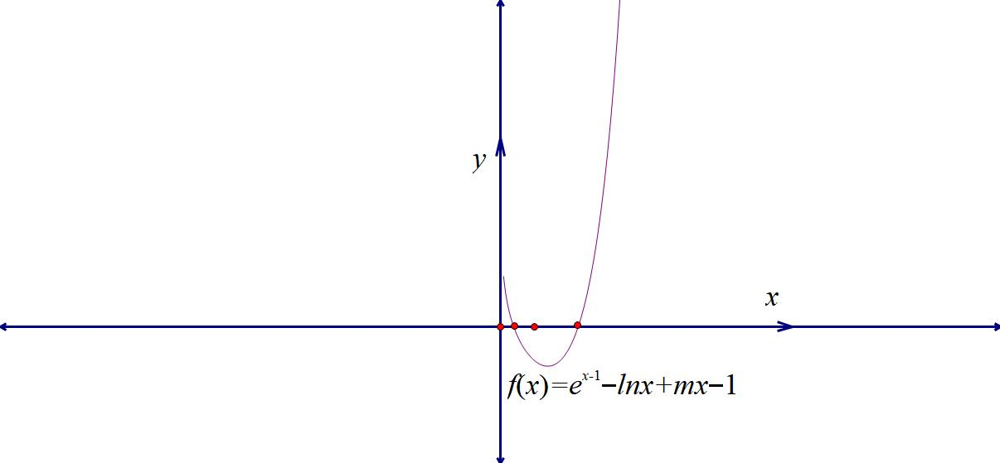
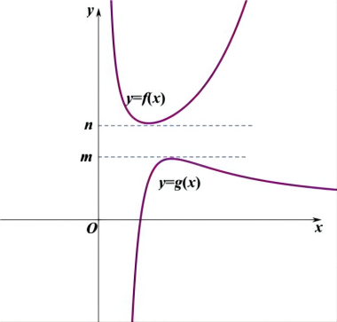
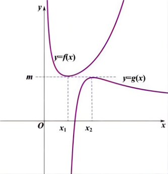
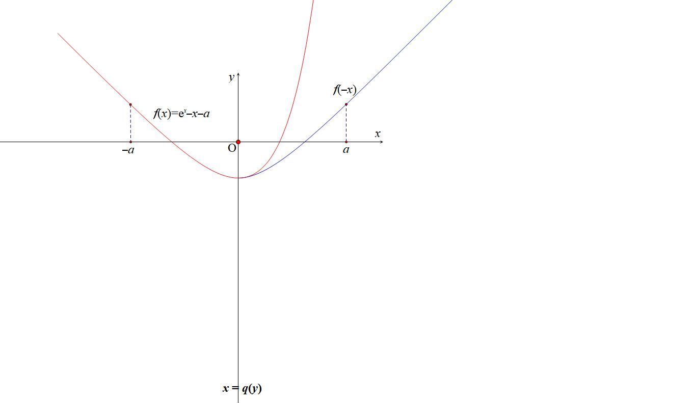
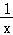

- 综合篇-新三板斧（放缩、分而治之、找点）

放缩是一种很重要的思想，在哪里放缩，选择怎样的精度进行放缩，尤为重要，放缩得当，对于部分恒成立问题可以说是降维打击，了解了放缩，那么对于找点，以及后续的导数数列综合帮助较大。

第一节  放缩

一、 指对三角放缩

题型1 指数常用放缩式

0线放缩

①(，)；

证明：令，求导易证．

②(，)；（小题篇八大函数已证）

③(，)；

证明：令，则，易证．

④(，)；

证明：令，则，即证．

⑤(，)；

证明：，即证．

⑥(，)；

证明：令，则，即证．

⑦(，)；

证明：令，则，易证．

⑧(，)；

证明：令，则，即证．

1线放缩

①（，）；

证明：由0线②向右平移一个单位得，或者令，易证．

②（，）；

证明：令，，易证．

③（，）；

证明：令，，即证．

④(，，)；

证明：令，找基友证，详解见拓展．

【例1】（2024•利哥每日一题）
> 

> 
> |  |  |
> | --- | --- |
> | （1）函数的最小值为______； | （2）函数的最小值为______． |
> 

【例2】（2024•利哥每日一题）

  
（1）已知，若恒成立，求实数的取值范围为______．

  
（2）已知，若恒成立，求实数的取值范围为______．

【例3】若当时，函数有两个极值点，则实数的取值范围为______．

【例4】 求证：当时, ．

【例5】已知函数．

证明：对任意的，当时，．

########## 【例6】（2018•新课标Ⅰ）已知函数．

  
（1）设是的极值点，求，并求的单调区间；

  
（2）证明：当时，．

【例7】已知函数，，不等式对于一切恒成立，求的取值范围．

考点二 对数常见放缩及推导

0线放缩

①(，)；

证明：令，，易证．

②(，)；

证明：令，，即证．

1线对数不等式链条

①(，)

证明：令，，易证；

；；．

飘带函数

①，；②．

【例1】（2024•定州市月考）函数的最小值为 <u>　___</u>.

【例2】已知函数，对任意的，都有，则实数的取值范围是为______．

【例3】已知函数对任意有成立，则的最小值为______．

【例4】已知函数．

证明:，．

【例5】（2024•青铜峡市模拟）已知函数，．

求函数的单调区间；

当，时，求的最小值；

当，时，证明：．

【例6】已知函数，当时，证明．

【例7】已知函数．

求证：当时，．

【例8】（2025•张家口三模）已知函数，．

  
（1）求证：．

  
（2）若，，为的最大值，

求的极小值；

设，，求证：．

考点三 三角常见放缩及推导

①(，)；

证明：左边令，，即证．

证明：右边令，，即证．

②(，)；

证明：令，，易证．

③(，)；

证明：令，，即证．

④(，)；

证明：令，，即证．

【例1】证明：，．

【例2】已知函数．

若，证明：当时，．

【例3】（2024春•南关区校级期中）英国数学家泰勒发现了如下公式：其中，为自然对数的底数，．以上公式称为泰勒公式．设，，根据以上信息，并结合高中所学的数学知识，解决如下问题．

  
（1）证明：；

  
（2）设，证明：．

【例4】已知为正实数．

1. 比较与的大小；
2. 求证：．

【例5】已知函数.

【例6】求证：．

【例7】（2024秋•明山区校级期末）麦克劳林展开式是泰勒展开式的一种特殊形式，的麦克劳林展开式为：，其中表示的阶导数在0处的取值，我们称为麦克劳林展开式的第项．例如：．

  
（1）请写出的麦克劳林展开式中的第2项与第4项；

  
（2）数学竞赛小组发现的麦克劳林展开式为，这意味着：当时，，你能帮助数学竞赛小组完成对此不等式的证明吗？

  
（3）当时，若，求整数的最大值．

【例8】（2024春•庐阳区校级期中）英国数学家泰勒发现的泰勒公式有如下特殊形式：当在处阶导数都存在时，．注：表示的2阶导数，即为的导数，表示的阶导数，该公式也称麦克劳林公式．
> 

> 
> |  |  |
> | --- | --- |
> | （1）写出泰勒展开式（只需写出前4项）； | （2）根据泰勒公式估算的值，精确到小数点后两位； |
> 

  
（3）证明：当时，．

【例8】（2021春•吴江区校级月考）给出以下三个材料：

①若函数可导，我们通常把导函数的导数叫做的二阶导数，记作．类似地，二阶导数的导数叫做三阶导数，记作，三阶导数的导数叫做四阶导数

一般地，阶导数的导数叫做阶导数，记作，．

②若函数在包含的某个开区间上具有阶的导数，那么对于任一有，

我们将称为函数在点处的阶泰勒展开式．例如，在点处的阶泰勒展开式为．
根据以上三段材料，完成下面的题目：

  
（1）求出在点处的3阶泰勒展开式，并直接写出在点处的3阶泰勒展开式；

  
（2）比较（1）中与的大小．

  
（3）已知不小于其在点处的3阶泰勒展开式，证明：时，．

第二节 保值性原理

一．保值性原理

所谓的保值性，就是初一学的非负数原理，例如： 恒成立，，，必有．此时，且时取“=”，此时同时取“=”显然格外重要．

下面我们就来看看保值性定理：

保值性定理1： 若恒成立，若满足，此时，我们称其为余量函数．

问题1．证不等式恒成立：

若恒成立，且，当时，则余量函数一定满足恒成立；例如：，我们易知，，

，如图1和图2，两个函数都是单峰函数，且在时同时取得最小值，故恒成立，当时，我们发现当时，恒成立，如图3图4；此时我们只知道是恒成立的，但这只是必要条件，我们需要说明时不成立，此时我们只需要使用找点探路法，代入，如图5，矛盾，故．

  
图1                        图2                           图3

  
图4                         图5                          图6
接下来我们分析一下零点个数问题：

零点个数问题，则一定要满足：①当时，则（有0个零点）如图4；②当时，且，则（有1个零点）如图3；③当时，有2个零点，如图6．

【例1】（2013•新课标Ⅱ）已知函数．

  
（1）设是的极值点，求，并讨论的单调性；

  
（2）当时，证明．

注意：本题的余量函数为，三个均为非负数，但不能同时取零，故．后面的单调性和最值证明我们就简写了，请大家自己完成证明．

【例2】（2018•新课标Ⅰ）已知函数．

  
（1）设是的极值点，求，并求的单调区间；

  
（2）证明：当时，．

注意：此题中余量部分是，定义域内恒正．

【例3】(2015・新课标I)设函数.
(I)讨论的导函数零点的个数;（II）证明：当时，．

########## 二．同构保值性的数据分析

指对的双切线共点同构，当然一切的母函数都是，我们下面来进行数学建模，证明题当中通常没有一次配凑项，或者不含余量函数；

①，当且仅当时等号成立；

②，当且仅当时等号成立；
注意：1和2属于平移式，两个是一个意思，我们通常叫差一同构，原理大家都能懂．

③，当且仅当时等号成立；
注意：这个属于同构保值性配凑难度最大的式子，严格抓取等条件显得关键．

考试中经常出现，我们先转化为，这样便于同构．

④，当且仅当时等号成立；

注意：这个才是我们常见的式子，我们需要转化为模型式进行同构．

⑤，当且仅当时等号成立；

注意：这个较为常见，和4式区别在于和，原因是和所需的切线函数需要配凑常数项不同，4和5属于典型的3式降维版本，考试中，我们经常会遇到是展开式不含有项的不等式，我们需要仔细甄别．

【例4】（2020•全国新高考Ⅰ卷）已知函数．

  
（1）当时，求曲线在点处的切线与两坐标轴围成的三角形的面积；

  
（2）若，求的取值范围．

########## 三 保值性与极点效应

保值性定理二（极点效应）

若恒成立，且恒成立，，若满足在附近具有单调性，且．

问题1：恒成立求参，则一定要满足；

问题2：零点个数问题，则一定要满足：

当时，（有1个零点）；当或者时，有2个零点（或者更多）．

【例13】（2023•湖南模拟）已知对于任意的恒成立，则的取值_________．

【例14】（2023•广州期末）已知函数．

  
（1）当时，讨论的单调性；

  
（2）若，且，求的值．

########## 四  双变量与保值性

当双变量同构形成对任意的a和b都成立时，一定有保值函数恒成立，这类型题通常都有一定欺骗性，通常要进行代数变形，抓住代数式中能变和不能变的部分进行同构.

【例15】（2023•浙江期末）若存在正实数，使得不等式成立，则

A．	
B．	
C．	
D．

【例16】对任意，都有恒成立，则实数的值为（  ）

A．    	
B．1	
C．0	
D．

【例17】（2022•名校联盟）对任意实数，不等式恒成立，

求实数的取值范围_________.

- 分而治之体系

########## 一．分而治之的原理与方法选取

1．若对恒成立，且，我们可以转化为，通过分别求出两个函数的最值，当时一定成立，我们称之为高人一等，如图7所示；或者

，时一定成立，我们称之为错位，如图8所示． 通常我们将叫做上函数，叫做下函数．

  
图7                                         图8

2．若对恒成立，且，我们可以转化为，通过分别求出两个函数的最值，当，且时一定成立，我们称之为亲密接触，如图9所示．

  
图9                                            图10

3. 若含参数的函数对恒成立，且，构造，在这种情况下恒成立，且，只需单调递减；或者单调递增，且，只需单调递减，这也是我们通常讲到的端点效应（洛必达法则）；此法叫做天各一方，如图10所示，在端点效应中推导矛盾区间时往往需要切线放缩．

我们来用分而治之解答例题2：

########## 法二 （分而治之）：因为函数，所以有，即对恒

########## 成立，令，时，，时，时，故；

########## 再令，则时，，时，时，故；

########## 故当时，，当且仅当时等号成立，如图11-2-2所示．

########## 总结：亲密接触模型，上函数和下函数选取很重要，我们必须熟悉六大基础函数模型．

我们继续用分而治之解答例题3：

########## （2）法二：（分而治之）要证，即证，只需

########## 只需，由同构式可令，求导后可以得，，易知，故，当仅当时等号成立；恒成立，所以恒成立，当且仅当时，取得等号；

########## 故当时，．

同理，我们继续用分而治之解答例题4：

########## （2）法二：（分而治之）由得：，两边同时除以得：，

########## 由六大乘除同构函数可得：令，求导后可以得，，易知，故，当且仅当时等号成立；恒成立，所以恒成立，必须满足，当且仅当时，取得等号；

########## 当时，，与题意不符合，

########## 综上，.

【例5】（2024•贵阳模拟）已知函数．

  
（1）设是的极值点，求，并求的单调区间；

  
（2）当时，证明．

【例6】（2021•清华自招）已知函数．

  
（1）当时，讨论的单调性；

  
（2）当时，证明：．

########## 数据特点与方法选取：如果说双切线同构保值性与分而治之都能解决以上的问题，那么我们就要来分析一下两种方法的选取，虽然都是解决指对的问题，但是同构保值性强调整体，而分而治之强调的是分开的最值，对于恒成立，核心就是找到取等条件，分而治之在找寻取等条件上的优势很大，但是在含有和混合体的时候，找不到取等条件也会带来一些麻烦.

########## 接下来介绍一个分而治之出现“翻车现场”的题，数学是灵活的，辨别模型与模型之间的关键往往在一些小细节．

########## 【例7】（2023•越秀期中）设，在处的切线方程是，其中为自然对数的底数．

########## （1）求，的值；

########## （2）证明：．

朗博同构其实是一个函数，一个整体，没法分而治之，至于分而治之的一些优势，我们会在下一讲继续探讨.

【例8】（2023•四川模拟）若 $\frac{e^{x}}{x}+alnx-ax+e^{2}\geq 0(a＞0)$ ，则*a*的取值范围为（　　）

A．（0，<em>e</em>2]	
B． $(0，\frac{e^{2}}{2}]$ 	
C． $[\frac{1}{e}，e^{2}]$ 	
D． $[\frac{1}{e}，\frac{e^{2}}{2}]$

【例9】（2023•江西期末）不等式<em>xlnx</em>﹣<em>x</em>2﹣<em>x</em>﹣<em>aex</em>≥0对任意<em>x</em>＞0都成立，则实数<em>a</em>的最大值为（　　）

A． $-\frac{2}{e}$ 	
B． $-\frac{3}{2e}$ 	
C． $-\frac{1}{e}$ 	
D．﹣1

【例10】（2023•浙江月考）已知<em>a</em>，<em>x</em>均为正实数，不等式<em>ex</em>﹣1﹣<em>aln</em>（<em>ax</em>）+<em>a</em>≥0恒成立，则<em>a</em>的最大值为（　　）

A．1	
B． $\sqrt{e}$ 	
C．&lt;t<em>e</em>xt style="italic"&gt;e	&lt;/text&gt;
D．e2

【例11】（2023•长沙三模）若，若恒成立，则的值不可以是

A．	
B．1	
C．	
D．2

【例12】（2024•衡水月考•多选）已知函数，则

A．当时，单调递减	            
B．当时，

C．若有且仅有一个零点，则      
D．若，则

注意：无论朗博同构，还是分而治之，一定有其局限性，尤其对于这种含的并非一一对应的，需要借助嵌套函数来理解，我们会在本书后续章节再来探讨.

########## 二 .六大基本函数体系中的上下函数选取

依托于六大基础函数和两大切线函数，我们进行上下函数的选取，不含参的不等式证明，一般不能选取直上直下的函数，上函数一般选取，，，这一系列函数的同构函数，他们都是高阶比低阶的函数，有一个极小值；下函数一般为，，，这一些列的同构函数，这些函数都是低阶比高阶，有一个极大值；一般上函数选取范围优先，所以是否分而治之，上函数最关键．

含参数的函数，先看参数是否能够参与同构，这样往往会构成亲密接触型的分而治之；
第一类：六大基础函数VS六大基础函数

这一类我们在之前章节就已经几次介绍了，往往考题都是故意隐藏命题逻辑的，我们先通过一道高考题来解读如何拆分出两个六大函数.

【例18】（2014•新课标Ⅰ）设函数，曲线在点处得切线方程为．

> 

> 
> |  |  |
> | --- | --- |
> | （1）求和的值； | （2）证明：． |
> 

【例19】已知函数．

  
（1）求函数的极值；

  
（2）若，求证：．

【例20】设函数，其中为自然对数的底数．

  
（1）若，求的单调区间；

  
（2）若，，求证：无零点．

第二类：六大基础函数VS常规二次三次函数

【例21】（2016•山东）已知，．

  
（1）讨论的单调性；

  
（2）当时，证明对于任意的成立．

总结：分而治之+错位PS模型．一大堆数据摆在眼前，能让我们识别的就是这个有最小值的函数，加上本题没有等号，所以分而治之是一个很好的选择.

【例22】已知函数．若不等式恒成立，求实数的取值范围．

第三类：VS

没有别的，除以,构造与.

【例23】已知函数．

  
（1）讨论函数的单调性；

  
（2）若对任意的，恒成立，求实数的取值范围；

  
（3）求证：当时，．

第四类：VS

没有别的，除以,构造与.

【例24】已知函数．

  
（1）讨论函数的单调性；

  
（2）当时，求证：．

########## 总结：是一个上函数，但由于其对应的无极值，不具备成为下函数形式，故无法进行分而治之，如果同乘以，那么将变成一个有极小值的函数，无法完成构造，故只能同除，若只除以，极小值为负数，并且取得极小值的位置不再本题定义域内，最终经过几次尝试，得出了一个结果：，两组分别来自六大函数的同构函数进行了分而治之的表演，所以分而治之只有一种形式进行函数分离.

########## 三、函数变形后的分而治之

【例25】证明：．

总结：函数，虽然最小值难以求出精确值，但我们通常可以用来放缩，这也是一种常见的上函数．当然，这个精度一般高考考不到.

【例26】已知函数．

> 

> 
> |  |  |
> | --- | --- |
> | （1）若函数，求的极值； | （2）证明：． |
> 

（参考数据：，，，

【例27】（2021•山东模拟）已知函数，．若，且关于的不等式在上恒成立，（其中是自然对数的底数，）求实数的取值范围．

########## 四：三角体系中的分而治之

第一类：构造单调三角函数进行或者最值界定

通常构造单调函数以及，作为三角的整体.

【例28】（2019•新课标Ⅰ）已知函数，为的导数．

  
（1）证明：在区间存在唯一零点；

  
（2）若时，，求的取值范围．

【例29】已知函数，．

  
（1）求函数的单调区间；

  
（2）若对于任意的实数，，（其中，都有恒成立求实数的取值范围．

【例30】已知曲线在点处的切线斜率为．

  
（1）求的值，并求函数的极小值；

  
（2）当时，求证：．

第二类：三角借助泰勒展开放缩后的分而治之

【例31】已知函数，在区间有极值．
> 

> 
> |  |  |
> | --- | --- |
> | （1）求的取值范围； | （2）证明：． |
> 

【例32】已知函数，它的导函数为．

  
（1）当时，求的零点；

  
（2）当时，证明：．

【例33】（1）求证：时，恒成立；

  
（2）当时，，证明不等式恒成立．

第三类：三角借助朗博同构后的分而治之

这类题型的一大特点，就是三角作为指数，所以一般需要进行同构放缩.

【例34】已知函数，函数，，

  
（1）讨论的单调性；

  
（2）证明：当时，．

  
（3）证明：当时，．

- 放缩取点

一、找点灵魂问题

问题一：什么是放缩取点？

########## 函数中存在零点，通常我们寻找这个零点，需要用到零点存在定理，就是当时，一定有，这样说明在区间内一定有一个零点.
只要高考题中出现了零点问题，那就需要进行放缩取点，就是找出这个和，其实取点的本质就是一句话:把不可解方程转化为可解方程。

问题二：哪些方程是高中阶段可解的？

①;
②;
③;
④;
⑤时，;

问题三：如何将不可解方程转化为可解方程？

第一步：先对函数进行求导分析，分析单调性和极值之后，确定零点所处的大概范围;

第二步：对函数的变化趋势进行分析，分析函数每一项，找出导致出现变号零点的主体变量和客体变量，比如函数，当时，导致，为正，且无界，是主体变量，和有界，是客体变量；当时，导致，为正，且无界，是主体变量，为负且无界，有界，但是显然递增变化更快，控制着的趋势，则是客体变量；
第三步：将客体变量通过有界放缩或者等效零点方程转化成有界，转化为问题二的五个可解方程，找出零点的范围.

问题四：取点只能解决零点与零点个数问题吗？

涉及到的含参数的恒成立问题也需要矛盾取点，如果是参变分离求最值，可以不需要取点，此类型题相对简单；一旦参变分离无法求最值，那就需要考虑必要性探路，此时在推导矛盾区间时候就必须要放缩取点.

二．取点原理

物理学电磁感应有一个重要的定理叫做“楞次定理”，其中最重要的一句口诀叫做“增反减同”，这个原理也能应用在找点上，就是单调递增的函数，需要找到，使，我们在找大点的时候需要一个更小的函数，使;取小点则需要构造一个更大的函数，使，我们将此叫做“增反”，即增函数找大点构造小函数，找小点构造大函数，当然以及都是我们上面介绍的那五个可求出零点的函数;
	减函数则满足“减同”，即减函数找大点构造大函数，取小点构造小函数(图右)，这类“增反减同”的找点法原理我们叫做楞次找点原理.

同理，我们来研究有极值点的函数取点原理，当函数极大值大于零或者极小值小于零，通常会有两个零点，高考中一旦需要我们去找这两个零点时，我们也可以根据楞次取点法进行分析，两边都构造放缩函数，得到可解方程。我们通常将零点当中的较小零点用表示，较大零点用表示。	若为函数唯一极小值点，那么我们需要找到，，我们可以利用不同的范围来进行放缩，当时，构造，当时，一定有(如下图左);同理当时，构造，当时，一定有(如下图右);当然和通常都是零点易求的函数。由于和不是唯一的，我们有多种构造方法和构造选择，故我们把这类型极小值小于零的两个零点问题的放缩找点类型称为“众星捧月”。

同样，在极大值大于零的两个零点问题时，则需要构造“仙女散花”的模型(如下图)

三．锁界与放缩取点

单调函数，关键问题在于值域锁定，如果不能锁定值域，零点取点就会变得相对复杂.

【例1】当时，讨论函数的零点个数．

【例2】当时，讨论函数的零点个数．

【例3】（2025·广东佛山·三模）已知函数．

  
（1）若曲线在点处的切线经过坐标原点，求的值；

  
（2）若存在两个极值点，求的取值范围．

四．等效零点方程与界限锁定

在前面的零点问题分析当中，我们发现无论是指数还是对数，一定要有主体变量和客体变量，如果出现或者，我们就需要进行等效零点转化，即转化为含有主体和客体变量的形式，比如或者这样的等效零点方程.

【例4】(2021•天津)已知，函数.

> 

> 
> |  |  |
> | --- | --- |
> | （1）求曲线在点处的切线方程; | （2）证明函数存在唯一的极值点; |
> 

  
（3）若，使得对任意的恒成立，求实数的取值范围.

【例5】已知函数

1. 求证：
2. 讨论单调性
3. 求证：有唯一零点

五．单极值双零点的主客体分析

任何一个函数，只要有极值点，一定是主体可以在极值点左右两边发生了转换，所以单极值点函数进行放缩取点，一定要把主体客体分析准确.

【例5】当时，讨论函数的零点个数．

【例6】（2025·广东佛山·三模节选）已知函数．

若存在两个极值点，求的取值范围．

【例7】当时，讨论函数的零点个数．

【例8】(2021•甲卷)已知且，函数.  
（1）当时，求的单调区间;  
（2）若曲线与直线有且仅有两个交点，求的取值范围.

【例9】讨论函数的零点个数.

六．单极值点指数函数与幂函数零点取点

我们知道的导函数是一个可求的极值，即时，为极小值点，但是时，的极值点为不可求，但是零点问题我们可以通过等效零点方程转化.

1.通过零点等价方程转化根式零点

【例10】(2022天津卷)已知函数，.

  
（1）求函数在处的切线方程.

  
（2）若和有公共点

i)当时，求的取值范围

ii)求证:

【例11】（2024•天津模拟节选）已知函数，且．

  
（1）当时，求曲线在处的切线方程；

  
（2）若，且存在三个零点，，．

求实数的取值范围；

【例12】（2025天津卷压轴题节选）己知函数．

  
（1）时，求在点处的切线方程；

> 

> 
> |  |  |
> | --- | --- |
> | （2）有 3 个零点，且。 | （i）求的取值范围； |
> 

七．三项变量的主客体分析
当变量出现三项及以上时，成为了近几年高考题的主战场，这要求我们逐一分析主体客体，并最终转化为一主体一客体的变量形式，处理的方法还是等效零点。

三项变量最大的变数就是客体的正负号一定要统一，否则无法对界限进行限定.

【例13】(2017•新课标I)已知函数.  
（1）讨论的单调性;  
（2）若有两个零点，求的取值范围.

【例14】（2025长郡20校联盟17题节选）已知函数，当时，有两个零点，求的取值范围.

【例15】（MST-李老师，改编）证明：时，有解.

注：无需说明有几个解与单调性，函数连续，找个点即可.

类似的找点方法其实比较多，在此再分享一种取点方法，由于同类题出现的太少，同学们可以仅理解。

【例15】（MST陪跑课答疑）已知，判断的零点个数.

八．放缩取点与不等式证明

【例16】（2024•福州期末）已知函数．

  
（1）讨论的单调区间；

  
（2）若在区间上存在唯一零点，证明：．

【例17】（2024•重庆一中三模）已知函数．

  
（1）求证：；

  
（2）若，是的两个相异零点，求证：．

【例18】（陪跑课学生答疑）已知函数

1. 若对于恒成立，求的值；
2. 若，使得成立，求证：.

【例19】(2025广东高二期末考试节选）已知，当时，若关于的方程有两个实数根求证：.

九．偏移取点

【例20】（2025新课标Ⅱ卷第18题）已知 $f\left(x\right)=ln\left(1+x\right)-x+\frac{1}{2}x^{2}-kx^{3}，0<k$  $<\frac{1}{3}$  .  
（1）证明: $f\left(x\right)$  在 $\left(0,+\infty \right)$  存在唯一极值点和唯一零点；  
（2） 设 $x_{1}$  , $x_{2}$  为 $f\left(x\right)$  在 $\left(0,+\infty \right)$  的极值点和零点；
（*ⅰ*）设 $g\left(t\right)=f\left(x_{1}+t\right)-f\left(x_{1}-t\right)$  ，证明： $g\left(t\right)$  在 $\left(0,x_{1}\right)$  单调递增；
（*ⅱ*）比较 $2x_{1}$  与 $x_{2}$  的大小，并证明。

注意：本题就在第二问简单的极值点偏移提示下，给了第三问一个不用计算便能拿到的结果，总体而言，今年的二卷难度偏简单，一道三问的考题，似乎还不如以前两问的考题难度大。明年高考命题组估计又要换人，没有达到选拔人才的目的。如果说2024年的新定义走的有点激进，咱们很多地方的教学环境很难支撑新定义的学习，那么一道这样的18题，没有任何设计的坑，没有任何可能走偏的方向，目的何在？意欲何为？如果非要我来理解，那便是利用极值点偏移进行放缩取点，高考早就有了要求，对极值点和零点的关系，高考早就有这些多元化的考查，我们不妨看看那些曾经高考中出现过的考题。

知识点：极值点偏移与放缩取点

如果函数的满足，且在处左右两侧异号，则在取得极值点，所有的函数，除了二次函数（和型对称）和对勾函数（积型对称），都会产生极值点偏移，所以我们可以利用极值点偏移，进行放缩取点。

比如最简单的有两个零点，求*a*取值范围，并进行放缩取点。

如图，，，易知，，单调递减；，，单调递增；，则时，会有两个零点，接下来进行放缩取点，先对函数再作分析：，函数为凹函数，，故极小值出现右偏，即时，，很容易证明，构造，典型的双曲正弦函数，，所以单调递增，，所以；

在这个极值点偏移的buff加成下，取点则简单很多，时，，取，则，由于时，，故一定有取，；
所以，合理利用极值点偏移进行放缩取点，很多题根本无需计算即可得出。

【例21】(2020•新课标I文科第二问)已知函数.若有两个零点，求的取值范围.

【例22】(2021•甲卷第二问)已知且，函数.若曲线与直线有且仅有两个交点，求的取值范围.

【例23】(2017•新课标I)已知函数.  
（1）讨论的单调性;  
（2）若有两个零点，求的取值范围.

【例24】（2023•乙卷第三问）已知函数*f*（*x*）＝（+*a*）*ln*（1+*x*）．若*f*（*x*）在（0，+∞）存在极值，求*a*的取值范围．
如果说前面是开胃小菜，那么我们接下来看一道跟2025二卷18题几乎一模一样的高考题。

【例25】(2019•天津)设函数，其中.
(I)若，讨论的单调性;
(II)若，
(i)证明恰有两个零点;
（ⅱ）设为的极值点，为的零点，且，证明：．

十．放缩取点二分法升级精度

【例26】(2021•浙江)设，为实数，且，函数.

  
（1）求函数的单调区间;

  
（2）若对任意，函数有两个不同的零点，求的取值范围;

> 

> 
> |  |  |
> | --- | --- |
> | （3）当时，证明:对任意，函数有两个不同的零点，满足 | （注:是自然对数的底数） |
> 

