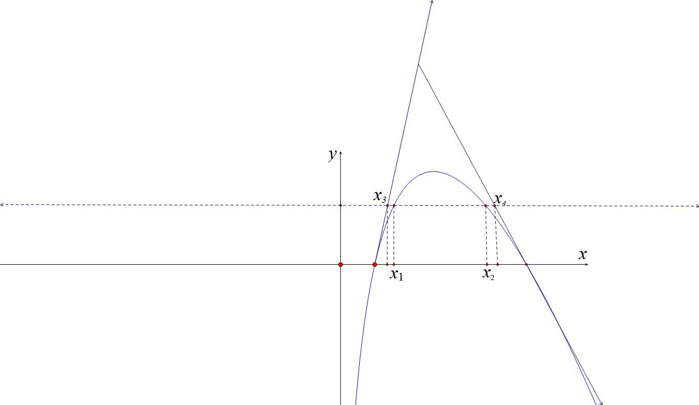
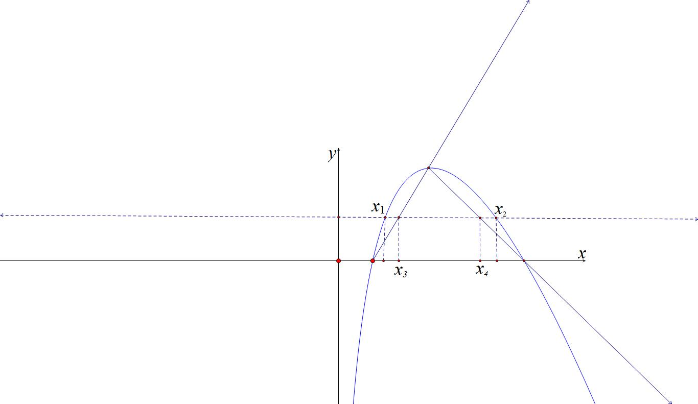
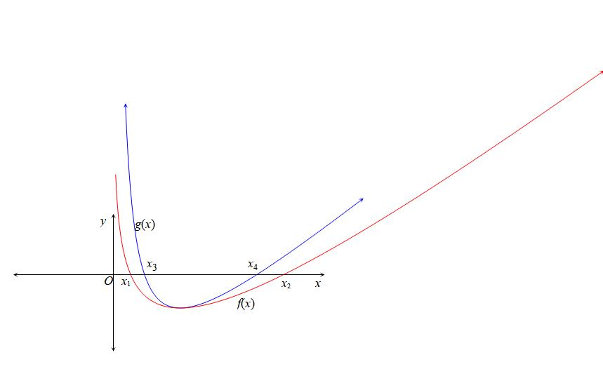
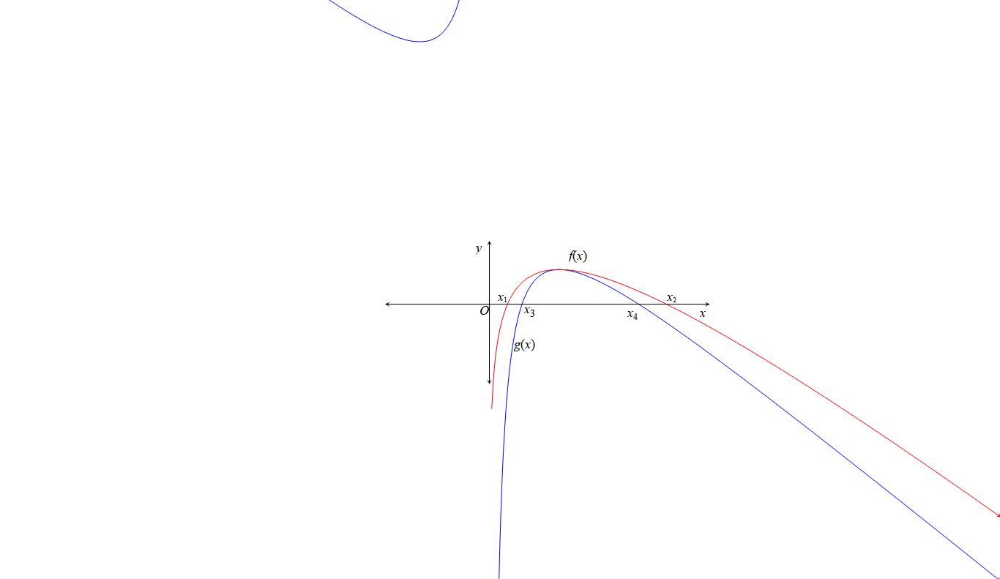
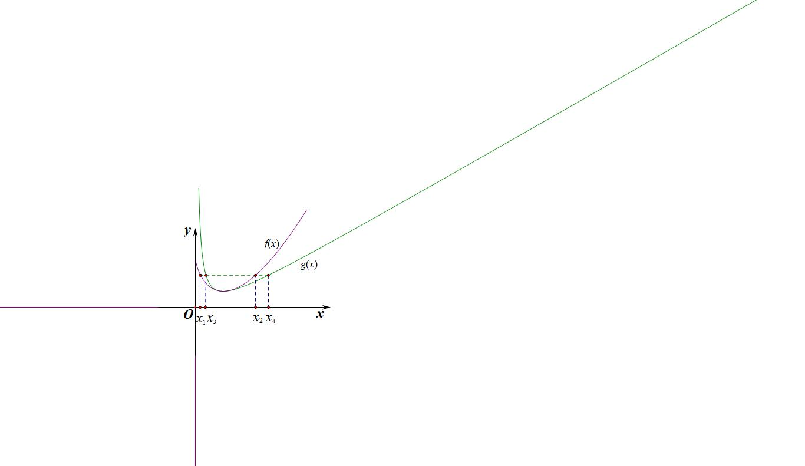
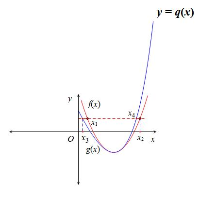
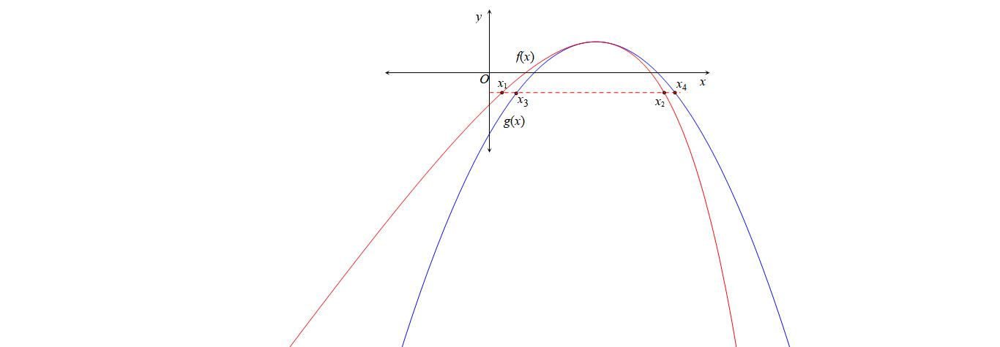
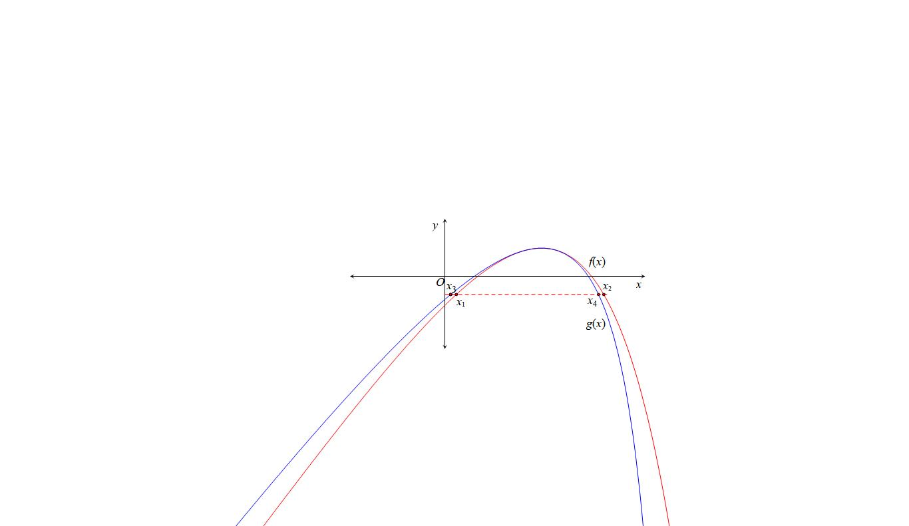
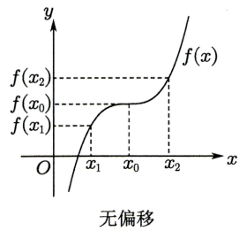
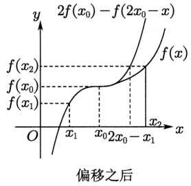

- 零点差直线拟合问题

①切割线夹问题
在遇到零点差问题，我们通常的做法就是切割线夹或者曲线拟合，如果待证式为关于参数的一次式，此时考虑切割线，如果带有根式，则考虑二次，对勾等拟合手段.

一 双零点处切线夹构造

若有两根，满足，通常在双零点处进行切线夹构造，如图，分别找出两个零点处切线与的交点，和，即可证明.最早出现切线夹放缩在2015年天津高考卷．

########## 【例1】（2015•天津）已知函数，．

########## （1）求的单调区间；

########## （2）设曲线与轴正半轴的交点为，曲线在点处的切线方程为，求证：对于任意的实数，都有；

########## （3）若方程为实数）有两个实数根，，且，求证：．

【例2】已知函数，．

  
（1）设函数，若在定义域内恒成立，求的取值范围；

  
（2）当时方程有两个实数根，且．证明：．

【例3】已知函数．

> 

> 
> |  |  |
> | --- | --- |
> | （1）求函数在处的切线方程； | （2）求函数的极值； |
> 

  
（3）若关于的方程有两个根和，求证：．

二 单零点处和拐点外切线夹构造与单零点+切线探路

【例4】（2023•安徽模拟）已知函数（为自然对数的底数）．

  
（1）求函数的零点，以及曲线在处的切线方程；

  
（2）设方程有两个实数根，，求证：．

注意：切线夹放缩，拐点是关键

> [!example]- 例4虽然是根据执果索因得出要证明当时，，但是再解完题反思的过程中，我们发现，，显然，也就是说在这个区间，没有拐点，函数的切线斜率一直递减，故在处取得的切线就一定恒在函数上方；但这个区间有了一个拐点，斜率先减后增，所以在处的切线方程不满足恒在函数上方，所以转化为函数过点处的切线方程，即构造切线不等式．

【例5】（2025·湖南长沙·一模）已知函数

  
（1）若函数在定义域上单调递增，求实数*a*的取值范围；

> 

> 
> |  |  |  |
> | --- | --- | --- |
> | （2）设是的两个极值点，证明： | （i）； | （ii） |
> 

三 双零点割线夹构造

若有两根，满足，通常在双零点和极值点连线进行割线夹构造，如图，分别找出两个零点处切线与的交点，和，即可证明.

【例6】（2024•汉中一模）已知函数，．

  
（1）求函数的单调区间；

  
（2）若方程的根为、，且，求证：．

【例7】（2023•龙凤区期中）已知函数．

  
（1）若，证明：在上恒成立；

  
（2）若方程．有两个实数根，，且，求证：．

【例8】（24-25高二下·山东·期中）已知函数有两个不同零点，（）.  
（1）求*a*的取值范围；
> 

> 
> |  |  |
> | --- | --- |
> | （2）证明：； | （3）证明：. |
> 

三 单零点和极值点形成曲线夹构造

如果只有一个零点，另一边有渐近线，则我们可以构造零点和极值点形成的二次拟合函数，形成内部封闭构造出.

【例9】（2022•盐城期末）已知函数．

  
（1）当时，求函数的最小值；

  
（2）已知，，求证：．

很多问题到了这里，通过前面的例题发现，关于的逻辑就很清晰了，如果讲参数引入函数，形成参变混合的与，我们进行以下分析：

第一类：极小值模型

如果我们需要构造，我们需要找到的恒大的极值点处拟合函数，如图；

第二类：极大值模型

如果我们需要构造，我们需要找到的恒小的极值点处拟合函数，如图；

【例10】（2021•湖北十一校联考）已知函数．

  
（1）讨论的单调性；

  
（2）若，，（）是的两个零点；证明：①；②．

【例11】（2022•湖北新协作考试) 已知函数，已知函数有3个不同的零点，，（）
> 

> 
> |  |  |
> | --- | --- |
> | （i）求证：； | （ii）求证：（*e*＝2.71828…是自然对数的底数）. |
> 

五 切线+割线夹构造与问题

关于和式构造，与差式的不同就是需要构造先小后大或者先大后小的极值点函数，这里可以时切线+割线夹的组合，也可以是整个函数的拟合，此类型也会涉及极值点偏移，我们下一节会重点解读.

【例12】（2023•盐城期中）已知．

  
（1）求函数的最大值；

  
（2）设，，求证：．

【例13】（2024•广东月考）已知函数，．

  
（1）讨论函数的单调区间；

  
（2）当时，设，为两个不相等的正数，且，证明：．

- 拟合体系

我们在解决极值点偏移问题时，通常是单个极值点，两个零点的模型，我们通过极大值和极小值类型来分类，如下：

第一类：极小值模型

如果我们需要构造以及，我们需要找到极值点处的先大后小的拟合函数，如左图，且时，一定有或者  ；

如果我们需要构造以及，我们需要找到极值点处的先小后大的拟合函数，如右图，且时，一定有或者  ；

第二类：极大值模型

如果我们需要构造以及，我们需要找到的先小后大的拟合函数，如左图，且时，一定有或者  ；

如果我们需要构造以及，我们需要找到的先大后小的拟合函数，如右图，且时，一定有或者  ；

如果我们回看高考，就会发现很多高考题都能按照不偏移函数拟合原函数，比如和型不偏移函数就是二次函数（为极值点），因为极值点所在直线就是对称轴，而积型不偏移函数就是对勾函数（为极值点），我们分别通过高考题来解读.

一,极值点和型偏移与二次函数构造

若有两个零点和，其极值点为，要证明或者，我们进行以下操作：

①构建二次函数；

②设,利用求出；

③根据的正负，并通过和解出和；

④判断并证明得出或．

注意：如果不找点，则根据的正负和得到或，二次函数因式分解可得：或．

【例1】（2010•天津卷）已知函数，如果且，证明：．

【例2】(2016•新课标Ⅰ理)已知函数有两个零点.

(I)求的取值范围;

(II)设，是的两个零点，证明:.

【例3】（2024·湖南郴州·模拟预测）已知函数，其中为常数.

（ii）证明：.

二 极值点积型偏移与对勾函数构造

若有两个零点和，其极值点为，要证明或者，我们进行以下操作：

①构建对勾函数；

②设,利用求出；

③根据的正负，并通过和解出和；

④判断并证明得出或．

【例4】（2021年新高考I卷改编）已知函数．设，为两个不相等的正数，且，证明：．

【例5】（清华中学生学术能力标准测试节选）已知函数有两个零点

1. 求实数的范围
2. 求证

三 涉及双零点偏移的同构函数拟合

关于，有两个零点，分别为或，这类型题除了极值点偏移问题外，还涉及与两个零点的中点，即的偏移问题，极值点偏移可以在极值点处构造拟合的二次函数，零点的偏移则需要通过两个零点和极值点进行三点的二次函数拟合构造.

零点和型偏移与二次函数构造：

①构建二次函数；

②带入点，求出；

③设,证明的正负；

④通过和解出和；

⑤判断并证明得出或．

注意：如果不找点，则根据的正负和得到或，二次函数因式分解可得：或．

【例6】（2023•河北模拟）已知函数与直线交于两点．

1. 求证：；（2）证明：．

四 指数对数函数的常见拟合函数

我们都熟知的，即把对数函数分别拟合为飘带函数和帕德逼近，本文给予这两个式子的来龙去脉，虽然这两个式子都很好证明.

我们根据泰勒展开，，同理，我们可得两式相减，可得，当时，，令，故，同理，我们也可以推出，所以，令，故，飘带拟合推导成功，其实很多时候会以或者形式出现，一切殊途同归.

利用对数的泰勒展开，同理，

即，两式相减得：，令，则有，故，同理也能证明.

我们得到，不妨令，则可得（帕德逼近）

关于极值点偏移，我们通常会出现两种不同极值点，第一类是参变分离后的极值点，第二类是含参的极值点，在极值点处构造先小后大或者先大后小的拟合函数，可以整体函数构造，也可以局部的和构造，我们通过模特函数为例来阐述拟合函数构造.

【例7】已知函数，若有两个不同的零点，，且，

  
（1）求的取值范围．

第一类：常数的极值点

  
（2）;   （3）; （4）; （5）

第二类：含参的极值点

  
（6） （7）

  
（8）;  （9）;

【例8】（2025·黑龙江哈尔滨·一模节选）已知函数.

①求证：；

②求证：.

【例9】（2022•甲卷）已知函数．

1. 证明：若有两个零点，，则．

【例10】（2024•湖南金太阳月考）已知函数有两个零点，．

  
（2）证明：．

【例11】（24-25高三上·广东深圳·阶段练习）已知函数有两个零点，

  
（1）求的单调区间和极值；

> 

> 
> |  |  |
> | --- | --- |
> | （2）当时，恒成立，求实数的最小值； | （3）证明：. |
> 

五 合理有效利用帕德逼近拟合函数

我们列举一些常见的帕德逼近，先看指数的：

<table><tr><td>
<strong></strong>
</td><td>
<strong></strong>
</td><td>
<strong></strong>
</td><td>
<strong></strong>
</td></tr><tr><td>

</td><td>

（先大后小）
</td><td>
<strong></strong>

（恒小于）
</td><td>
<strong></strong>

（先大后小）
</td></tr><tr><td>
<strong></strong>
</td><td>
<strong></strong>

（恒大于）
</td><td>
<strong></strong>

（先小后大）
</td><td>
<strong></strong>

（恒大于）
</td></tr><tr><td>
<strong></strong>
</td><td>
<strong></strong>

（先大后小）
</td><td>
<strong></strong>

（恒小于）
</td><td>
<strong></strong>

（先大后小）
</td></tr></table>

将向右平移一个单位后，得到，我们列举一下常见的帕德逼近：

<table><tr><td>
<strong></strong>
</td><td>
<strong></strong>
</td><td>
<strong></strong>
</td><td>
<strong></strong>
</td></tr><tr><td>

</td><td></td><td>
<strong></strong>

（恒大于）
</td><td>
<strong></strong>

（先大后小）
</td></tr><tr><td>
<strong></strong>
</td><td></td><td>
<strong></strong>

（先大后小）
</td><td>
<strong></strong>

（恒大于）
</td></tr><tr><td>
<strong></strong>
</td><td></td><td>
<strong></strong>

（恒大于）
</td><td>
<strong></strong>

（先大后小）
</td></tr></table>

帕德逼近出现在指对跨阶类型时，注意三点：

- 极值点统一，则指数平移构造，即的帕德逼近，对数倍缩构造，即的帕德逼近；
- 帕德的阶位要统一，通常和（泰勒展开二阶）最多，最重要构造二次或者分式的可解方程.
- 共零点问题则构造一阶恒大或者恒小的不等式，比如含有或者，涉及它们在处的极值点构造，即和只能构造切线这类恒成立的不等式.

【例12】（2023•河北模拟）有两不同的零点，（），证明：.

六 对勾与二次的强制转换

对于同样可以通过单调性调整强行转换，其它函数同样可以强制对勾。

【例13】（2023•浙江模拟）已知函数有两个零点

  
（1）求*a*的取值范围；（2）记，为的两个零点，证明：

【例14】（2024秋•安徽月考）已知函数．
> 

> 
> |  |  |
> | --- | --- |
> | （Ⅰ）讨论的单调性． | （Ⅱ）当时． |
> 

证明：当时，；

若方程有两个不同的实数根，，证明．

附：当时，，，．

七 组合型偏移与三元偏移.

新高考的难度越来越偏向于组合型的零点和差问题，对于此类问题我们的手段就是找各个分量的关系，最后汇总到一起，就是理解了常见思想后，此类题就是纸老虎而已。

【例1】（2025•清远期中）已知函数．  
（1）求函数的单调区间；

  
（2）是否存在使得成立？若存在，求的取值范围，若不存在，请说明理由；

  
（3）若方程有两个不同的实数解，，证明：．

【例2】（2024•上饶一模）已知函数，若为实数，且方程有两个不同的实数根，．

  
（1）求的取值范围；

  
（2）证明：对任意的都有；

求证：．

本题一侧用直线拟合，一侧用曲线拟合，完全打破了我们对于切割线夹的认知，但是兵来将挡水来土掩，看出了关于参数的结构的次数，对于此类题也能迎刃而解。

【例3】（2025春•福建期中•河南讲座答疑）已知函数．

  
（1）求函数的单调区间与极值；

  
（2）若，求证：．

【例4】（2025天津卷压轴题）己知函数．

> 

> 
> |  |  |  |
> | --- | --- | --- |
> | （2）有 3 个零点，且。 | （i）求的取值范围； | （ii）证明：． |
> 

【例5】（2024•天津模拟）已知函数，且．

  
（2）若，且存在三个零点，，．

求实数的取值范围；

设，求证：．

【例6】（2025•株洲模拟）已知函数．

  
（1）当时，判断在区间内的单调性；

  
（2）若有三个零点，，，且．

求的取值范围；

证明：．

【例7】（2024•石家庄期末）已知函数有三个极值点，，，且．

  
（1）求实数的取值范围；

  
（2）若2是的一个极大值点，证明：．

【例8】（24高三上·辽宁·开学考试）设方程有三个实数根.

  
（1）求的取值范围；  
（2）请在以下两个问题中任选一个进行作答，注意选的序号不同，该题得分不同.若选①则该小问满分4分，若选②则该小问满分9分.

①证明：；

②证明：.

- 变量转化为单调函数的调整函数

【例8】（2024•天津卷压轴）设函数．

  
（3）若，证明．

- 拐点偏移

拐点偏移定义：若函数在定义域内连续且二阶可导，且，则是函数

的一个拐点.极值点是一阶导数的零点；拐点是二阶导数的零点；拐点是一阶导数的极值点．若，有，则拐点不偏移;若，有，则称拐点右偏;若，有，则称拐点左偏.

如我们熟悉的三次函数的拐点为坐标原点．

作直线与函数分别交于，则的中点坐标为．对于三次函数，拐点的横坐标为，此时认为拐点居中，没有偏离中点．同样，我们可以发现对于三次函数，若其在定义域内单调，其拐点也居中，没有偏离中点．

然而很多含拐点的单调函数，由于拐点左、右的“增减速度”不同，函数图象不具有中心对称的性质，常常会有拐点的情况，这样就出现了拐点向左或向右偏移的情况．如右图所示：

思路如下： 如果需要判断与的大小关系，则就需要判断与的大小关系，也就需要判断与的大小关系．而，因此就需要判断（）与的大小关系，也就需要判断与的大小关系，于是就构建函数进行分析，或者利用三次函数拟合。仅以上右图为例，此时拐点左偏，在拐点处呈上升趋势，，故可在拐点处拟合先大后大的三次函数，在拐点处取等即可，通常的方法有泰勒展开与待定系数法。

【例1】（2025·四川攀枝花·三模）已知函数．

  
（1）若曲线在点处的切线在*x*轴上的截距为，求实数*a*的值；

  
（2）设数列的前*n*项和为，若对任意的正整数*n*，当时，函数均存在两个极值点，，且满足，求；

  
（3）当时，如果存在两个不同的正实数满足，证明：．

【例2】（2025·江苏南通·三模）已知函数.

  
（1）证明：；

  
（2）证明：在上单调递减；

  
（3）若，且，证明：.

【例3】已知函数．

  
（1）若在上单调递增，求实数的取值范围；

  
（2）当时，若实数，满足，求证．

【例4】已知函数．

  
（1）若在上单调递增，求实数的取值范围；

  
（2）当时，若实数，满足，求证：．

【例5】设函数，．

（Ⅰ）若对恒成立，求的取值范围；

（Ⅱ）若，当时，求证：．

【例6】设函数，．

（Ⅰ）讨论的单调性；

（Ⅱ）时，若，，求证：．

后面几道的拐点偏移就交给同学们自行完成了，拐点偏移优先泰勒展开到三次。

第六节 浙江风格的双变量

一．高阶帕德逼近的应用

通常帕德逼近都是到了，，现在考题越来越不讲“武德”，一步一步往高阶上靠近，我们接下来分析一下高阶的帕德逼近考题.

【例1】（2023•柳州二模）已知，记的导函数为．

  
（1）讨论的单调性；

  
（2）若有三个零点，，，且，证明：．

注意：本题仅仅是探路探出，并没对这一阶有什么过分要求，不过也印证了我们需要了解更高阶帕德逼近.

【例2】（2023•扬州期末）已知函数，，．

  
（1）若，求的单调区间；

  
（2）若不单调，且（1）．

证明：（*a*）（*b*）；

若，且，

证明：．

类比于此题，虽然此题时按照22浙江卷模板命制，我们还是利用帕德高阶来解答浙江22年高考题.

【例3】（2022•浙江）设函数．

（Ⅰ）求的单调区间；

（Ⅱ）已知，，曲线上不同的三点，，，，，处的切线都经过点．证明：

（ⅰ）若，则（*a*）；

> 

> 
> |  |  |
> | --- | --- |
> | （ⅱ）若，，则． | （注是自然对数的底数） |
> 

二．泰勒展开与加强

我们根据泰勒展开，，同理，，我们可得两式相减，可得，当时，，令，故，同理，我们也可以推出.

利用对数的泰勒展开，同理，

即，两式相减得：，令，则有，故，同理也能证明.

这类型加强的不等式，继帕德逼近之后，也能用来解答22年浙江卷压轴题的压轴问.

【例4】（2022•浙江）设函数．

（Ⅰ）求的单调区间；

（Ⅱ）已知，，曲线上不同的三点，，，，，处的切线都经过点．证明：

（ⅰ）若，则（*a*）；

> 

> 
> |  |  |
> | --- | --- |
> | （ⅱ）若，，则． | （注是自然对数的底数） |
> 

三 泰勒展开构造追加函数

我们通过之前推导飘带函数，，帕德逼近，，甚至加强型的。我们都发现一个特点，这种拟合函数是单调的，具体说来，就是将泰勒展开的偶次幂抵消了，这样才构造单调拟合函数，且一边大一边小的拟合原理.一切追本溯源，极值点偏移，我们需要构造同型的或者，这样才能证明或者。在这个大框架下，我们对变量或者在极值处进行泰勒展开，并对新构造的函数进行函数追加，以达到抵消偶次幂，最终构造单调函数的目的。

【例5】（2024•河南月考）若函数有两个零点，，证明：．

注意：本题由于上一讲已经解答，这里仅仅作为模型分析

【例6】（2023•浙江模拟 ）已知函数有两个相异零点，.
> 

> 
> |  |  |
> | --- | --- |
> | （1）求的取值范围; | （1）求证:. |
> 

四 双变量恒成立探路

########## 【例6】（2019•浙江卷）已知实数，函数，．

########## （1），求的单调性；

########## （2）如果对任意均有，求的取值范围．

