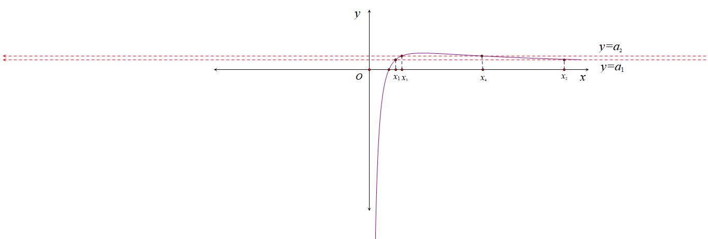
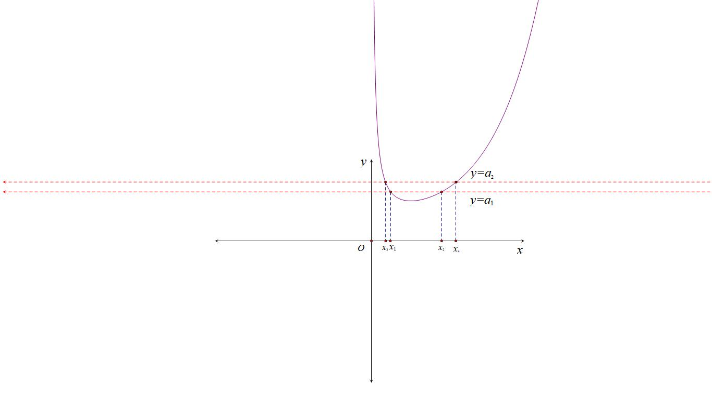
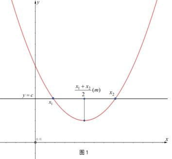
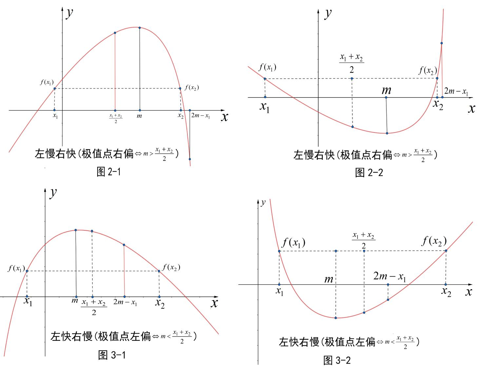
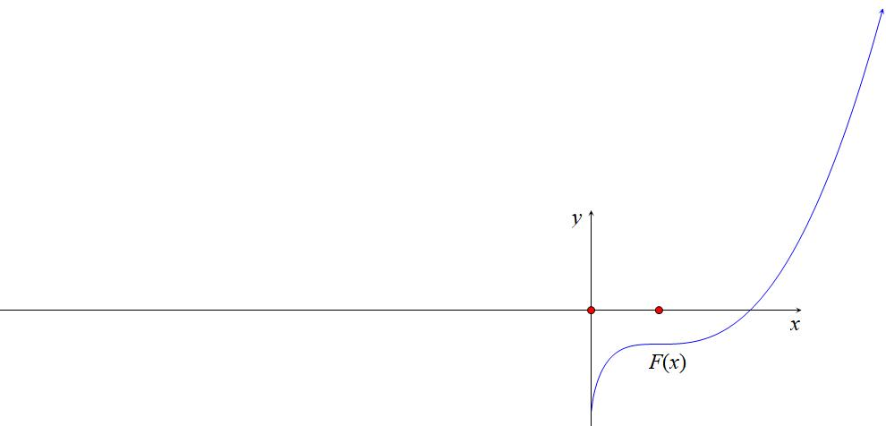
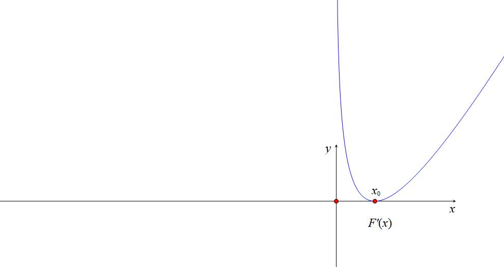
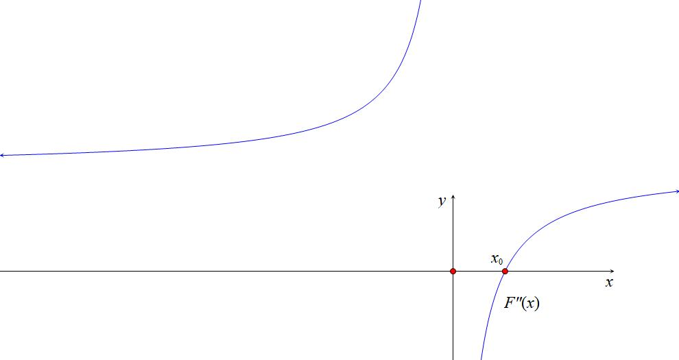

第一节 极值和差

########## **一 极值之和以参数为主元**

极值之和问题最早出现在2014年湖南高考自主命题卷中，解决问题的关键就是将转化为统一参数后，构造新函数求出极值之和取值范围．

【例1】（2014•湖南）已知常数，函数．

（1）讨论在区间上的单调性；

（2）若存在两个极值点，，且，求的取值范围．

【例2】（2023•北京海淀区三模）已知函数，．

（1）若，求在，（1）处的切线方程；

（2）讨论的单调性；

（3）若存在两个极值点，，求证：．

【例3】（2025春•天津期中）已知函数，其中．

（Ⅰ）当时，求曲线在点，（1）处的切线方程；

（Ⅱ）若的最大值是，求的值；

（Ⅲ）设函数，若有两个极值点，，证明：．

【例4】（2025秋•天津模拟）已知函数，其中

（Ⅰ）当时，求曲线在点处的切线方程；

（Ⅱ）记的导函数为，若不等式在区间上恒成立，求的取值范围；

（Ⅲ）设函数，是函数的导函数，若存在两个极值点，，且满足，求实数的取值范围．

总结：极值之和，极值点和拐点共点取最值

拐点即为函数凹凸的分界点，即为函数二阶导的零点，类似于极值点偏移的本质源于三阶导正负（下一讲会提到），我们以先凸后凹作为参照，当时，拐点左偏，同理，时，拐点右偏．

极值之和最值定理：

当时，若，且时，一定有，相反，若，且时，一定有．

########## **二 极值之差**

第一类：转化为为主元的构造

若函数的两个极值点为，则称为极值之差．通常解决这类问题需要用到函数的内构造，一般求导后会构成二次函数，必有，其中与中必有一个是常数，这样将参数和通过韦达定理替换成，最后构成一个在已知范围的新函数，然后求导即可求出最值．或者利用比值换元，，这里通常为常数．在函数或者中，经常出现这样的式子，单调性基本固定，只看端点值来求最值，此为经典考题，飘带函数放缩无处不在．

1.型

【例5】（2023•四川模拟）已知函数．

（1）求曲线在点处的切线方程；

（2）若函数（其中是的导函数）有两个极值点、，且，求的取值范围．

【例6】（24-25高二下·广东湛江·期中）设函数．

(1)时，求曲线在点处的切线方程；

(2)讨论的单调性；

(3)若有两个极值点且，证明：．

【例7】（24-25高三下·山西晋中·阶段练习）已知函数，.

(1)讨论的单调性；

(2)若，求曲线与曲线的公切线；

(3)已知，若的两个极值点为，，求的取值范围.

【例8】（2023•徐汇区校级三模）已知函数．

（1）求曲线在处的切线方程；

（2）函数在区间，上有零点，求的值；

（3）记函数，设，是函数的两个极值点，若，且恒成立，求实数的取值范围．

总结：虽然还是飘带函数和对数，但加入了新的参数元素，不到最后转化为只有或者的函数式，就不能罢休，以下例题虽然构造的不是飘带函数，但也换汤不换药．

##########      以上的类型都是极值为定值时，直接构造，当为定值时，我们可以构造为主元全部替换，也可以半替换后进行函数求导求最值.

########## 【例9】（2023•济宁三模）已知函数．

（1）讨论函数的单调性；

（2）设、是函数的两个极值点．证明：．

2.型

如果不是，而是，或者,那么又会怎样呢？

【例10】（2023•长沙期末）已知．

（1）当时，求的单调区间；

（2）若为的导函数，有两个不相等的极值点，，求的最小值．

3.型

【例11】（2023•天津月考）已知函数，为常数．

（1）讨论函数的单调性；

（2）若函数有两个极值点，，且，求证：．

【例11】（2023•成都模拟）已知函数，其中．

（Ⅰ）求函数的单调区间；

（Ⅱ）若函数存在两个极值点，，且，

证明：．

【例12】（2024•郑州模拟）已知函数，．

（1）讨论函数的单调性；

（2）若函数有两个极值点，，且，求证：．

########## **第二类** 比值换元构造与差值换元构造

极值之差，极值之和，都可以通过齐次化进行比值换元，比值换元就是齐次化思想在导数中的最佳使用说明书.我们通过例题来说明情况.

【例10】（24高三上·天津宁河·期末）已知函数，．

(1)当时，求曲线在处的切线方程；

(2)求的单调区间；

(3)设是函数的两个极值点，证明：．

【例11】（2023•广东期末）已知函数有两个极值点，，其中．

（Ⅰ）求实数的取值范围；

（Ⅱ）当时，求的最小值．

【例12】（24高二下·山东德州·阶段练习）已知函数，其中.

(1)讨论函数的单调性；

(2)若存在两个极值点的取值范围为，求*a*的取值范围.

注意：当两极值点之和或者积有一个为定值时，构造比值换元齐次化求极值之差通常会求出一个具体最值，当极值点的和与积都含参数时，求出的极值之差还是含参的,操作手法类似.

【例13】（2024·山西·模拟预测）已知函数.

(1)若函数在定义域上单调递增，求的取值范围；

(2)若；求证：；

(3)设，是函数的两个极值点，求证：.

【例14】（2024•济南模拟）设函数．

（1）若有两个不同的零点，求实数的取值范围；

（2）若函数有两个极值点，，证明：．

注意：本题最后的证明来源于指数均值不等式，常见证明方法为差值代换统一变量，上一题为对数均值不等式，在后面的极值点偏移中也会强调这几个换元的用法。

第三类 放缩法构造极值之差

在遇到一些极值之差时，求导遇到一些困难，比如指对乘除型，这是我们高中阶段不涉及的，需要将其中的进行放缩，成为我们熟悉的函数模型.

【例15】（2023•重庆二模）已知函数，．

（1）求的最小值；

（2）若，且，求证：；

（3）若有两个极值点，，证明：．

【例16】（2023•青岛期中）已知函数．

（1）若函数在上单调递增，求的值；

（2）当时，证明：函数有两个极值点，，且．

########## **三 六大同构函数的比值换元**

最早的比值换元出现在2014天津卷，涉及，有关，要转化为来进行构造成的函数，比值换元一般用在指数与对数函数里面，指数函数通常都需要转化为对数来进行构造，我们先看几个例题．

【例17】（2014•天津）设，，已知函数有两个零点，，且．

（1）求的取值范围；

（2）证明：随着的减小而增大；

（3）证明随着的减小而增大．

总结：本题作为比值换元的模型题，充分挖掘了六大函数当中的性质，并且在构造当中遇到了老朋友，分子又是飘带函数遇上了对数函数，这种经典搭配总在高考题反复出现．

关于，我们得到，这类型换元操作成为解题的关键突破口.

下面我们来进行比值换元的数学建模：

（1）已知，若，令，则一定有，，随着的增大而减小，随着的增大而减小，参考例1图；

（2）已知，若，令，则一定有，，随着的增大而减小，或者随着的增大而减小，参考左下图；

3. 已知，若，令，则一定有，，随着的增大而增大，随着的增大而增大，参考右上图；
4. 已知，若，令，则一定有，，随着的增大而增大，或者随着的增大而增大；
5. 已知，若，令，则一定有，，随着的增大而增大，随着的增大而增大；
6. 已知，若，令，则一定有，，随着的增大而增大，或者随着的增大而增大；

【例18】（2023•浙江模拟）若，是函数的两个极值点，且，则实数的取值范围为 <u>　  　</u>．

【例19】（2023•河北模拟）已知函数，若有两个极值点，，且，则的取值范围是（    ）

A．     B．      C．   D．

【例20】（24高三上·重庆渝中·期中）已知函数．

(1)若函数是减函数，求的取值范围；

(2)若有两个零点，且，证明：．

总结：比值代换总能处理成为单调函数，双变量零点处理之前必要先找点．

########## 【例21】（2023•汉阳模拟）已知函数，其中无理数．

########## （1）若函数有两个极值点，求的取值范围．

########## （2）若函数的极值点有三个，最小的记为，最大的记为，若的最大值为，求的最小值．

【例22】（24-25高三上·江苏常州·期末）已知函数．

(1)若在区间上单调，求实数的取值范围；

(2)若函数有两个不同的零点．

（i）求实数的取值范围；

（ii）若恒成立，求证：．

########## **四 比值换元与不对称零点和积最值问题**

当我们遇到或者最值时，这个属于对称零点最值，也通常指向极值点偏移方向，而或者之类的，属于不对成零点问题，通常也是利用比值换元来解决问题.

【例23】（2023•武汉模拟）已知关于的方程有两个不相等的正实根和，且．

（1）求实数的取值范围；

（2）设为常数，当变化时，若有最小值，求常数的值．

【例24】（2023秋•雨城区校级月考）已知函数．

（1）若函数有两个不同的零点，求实数的取值范围；

（2）若函数有两个不同的极值点，，当时，求证：．

非对称多参数通常采用比值（差值）代换+主元思想

【例25】（2023•济南模拟）已知函数．

（1）若单调递减，求的取值范围；

（2）若有两个极值点，，且，证明：．

【例26】（2023•四川模拟）已知函数．

（1）若单调递减，求的取值范围；

（2）若有两个极值点，且，证明：．

【例27】（2024高中数学联赛广州赛区）（)有两个不同的零点，且

1. 求实数的范围
2. 若不等式恒成立，求正数的范围

【例28】已知函数

1. 若方程有两个不同的实数根，求实数的范围
2. 若方程有两个不同的实数根，且不等式对任意恒成立，求正数的取值范围

【例29】（2025·河南·二模）已知函数.

(2)若有两个零点，，且.

（i）求的取值范围；

（ii）证明：.

第二节 极值点偏移

########## **一 对称化构造**

########## 极值点偏移概念 函数满足定义域内任意自变量都有，则函数关于直线对称；可以理解为函数的对称轴两侧，函数值变化快慢相同，且若为单峰函数，则必为的极值点，如二次函数的对称轴就是极值点，若的两根的中点为，即极值点在两根的正中间，也就是极值点没有偏移．

当相等变为不等，则极值点偏移：若单峰函数的极值点为，，且，对任意都有(见图2-1)或(见图3-1)，由于，在上单调，则或，即(极值点右偏)或(极值点左偏)．

########## 1.1.1.1.1.1.1.1.1.1 极值点偏移问题的一般题设形式（和型）

和型：（1）若函数存在两个零点，且，求证：(为函数的极值点);

（2）若函数存在，且满足，求证：(为函数的极值点);

（3）若函数存在两个零点，且，令，求证：;

（4）若函数存在，且满足，令，求证：．

（5）若函数存在两个极值点，，且，求证：

########## （2）答题模板

先分清楚极值点是当前函数极值点还是代数变形后的极值点，如果是当前函数极值点，直接使用，如果不是，先代数变形再利用模板。

常见题设：若函数存在两个零点，且满足，为函数的极值点，求证．

（1）求导讨论单调性，并求出极值点以及，的范围；

（2）构造函数；(左右构造)

注：有时需要根据题意构造(居中构造)．

（3）对求导，讨论单调性，从而判断在极值点单侧的正负，得出与的大小关系；

注：①后续代入哪侧的自变量证明，就求哪侧的正负，无需同时求极值点两侧；

②若出现定号部分，可先去掉定号部分再求导．

（4）代入或，得出与的大小关系，借助将自变量统一到极值点同侧，再通过单调性得出结论．

（5）若要证明，还需要进一步讨论与的大小，得出的单调区间，从而得出该函处函数导函数值的正负，从而结论得证．

此处只需继续证明：因为，故，由于在上单调递减，故．

（3）积型：（1）若函数存在两个零点，且，求证：(为函数的极值点);

（2）若函数存在，且满足，求证：(为函数的极值点);

（3）若函数存在两个零点，且，令，求证：;

（4）若函数存在，且满足，令，求证：;

（5）若函数存在两个极值点，，且，求证：.

（4）答题模板

（1）求导讨论单调性，并求出极值点以及，的范围；

（2）构造函数；(左右构造)

（3）对求导，讨论单调性，从而判断在极值点单侧的正负，得出与的大小关系；

注：①后续代入哪侧的自变量证明，就求哪侧的正负，无需同时求极值点两侧；

②若出现定号部分，可先去掉定号部分再求导．

（4）代入或，得出与的大小关系，借助将自变量统一到极值点同侧，再通过单调性得出结论．

对于极值点偏移高考题出现的历史比较久远，最早出现在2010年天津卷；

########## **① 极值点偏移显极值点和型构造**

【例1】（2010•天津）已知函数，，如果，且，证明：

【例2】（2016•全国I卷）已知函数有两个零点，．

1. 求的取值范围；
2. 证明：．

【例3】（2024·湖南郴州·模拟预测）已知函数，其中为常数.

(1)当时，试讨论的单调性；

(2)若函数有两个不相等的零点，，

（i）求的取值范围；

（ii）证明：.

########## **② 极值点偏移隐极值点和型构造**

【例4】（2025·青海海南·模拟预测）已知函数．

(1)讨论函数的单调性．

(2)假设存在正实数，满足．

（i）求实数的取值范围；

（ii）证明：．

【例5】（2025·海南·模拟预测）已知函数．

(2)当时，若函数有两个不同的零点，．

（ⅰ）求*m*的取值范围；

（ⅱ）证明：．

########## **③ 极值点偏移积型构造**

【例6】（24-25高三上·山东潍坊·期末）已知函数，.

(2)若，求的取值范围；

(3)若有两个实数解，，证明：.

【例7】（24-25高二下·甘肃白银·期中）定义：若函数与在公共定义域内存在，使得，则称与为“契合函数”，为“契合点”．

(1)若与为“契合函数”，且只有一个“契合点”，求实数*a*的取值范围．

(2)若与为“契合函数”，且有两个不同的“契合点”．

①求*b*的取值范围；

②证明：．

########## **二 对数均值不等式与指数均值不等式**

飘带和帕德逼近这个黄金组合催生了高中阶段非常重要得不等式，就是对数均值不等式，我们称之为ALG不等式。

两个正数和的对数平均定义：，对数平均与算术平均、几何平均的大小关系：（此式记为对数平均不等式）取等条件：当且仅当时，等号成立．

########## 证明：当时，，可设.（1）先证：……①

########## 不等式①

########## 构造函数，则.

########## 因为时，，所以函数在上单调递减，故，从而不等式①成立；

########## （2）再证： ②不等式②

########## 构造函数，则.

因为时，，所以函数在上单调递增，故，从而不等式②成立；综合（1）（2）知，对，都有对数平均不等式成立，当且仅当时，等号成立．

##########      对数均值不等式是极值点偏移最常见处理方法，也是思维相对最容易得方法之一，本讲例题提供解答没有给到证明ALG不等式得过程，大家考试时候记得要先证再用.

########## 令，则，这就是我们所讲的指数均值不等式.

########## ①常规ALG不等式

【例8】（2010•天津卷）已知函数，如果且，证明：．

【例9】（2022•甲卷理科）已知函数．

（1）若，求的取值范围；

（2）证明：若有两个零点，，则．

【例10】（24-25高三上·江苏无锡·阶段练习）已知函数.

(1)若，当与的极小值之和为0时，求正实数的值；

(2)若，求证：.

【例4】（2023•湖南月考）已知，函数有两个零点，．

（Ⅰ）求实数的取值范围；

（Ⅱ）证明：．

【例5】（2024•安徽六安一中月考）已知函数．

1. 当是的两个根，求证：

【例6】（2025高三·辽宁模拟）已知函数（*a*为常数）.

(1)求函数的单调区间；

(2)若存在两个不相等的整数，满足，求证：.

(3)若有两个零点，，证明：.

【例7】已知函数，如果且，求证：．

【例8】已知是函数的两个零点，且，其极值点为．

（1）求*a*的取值范围；

（2）求证：；

（3）求证：.

（4）求证：；

########## ③ALG不等式常数项构造与调整

【例9】（2024•湖南金太阳节选）若有两个零点和.

1. 求的取值范围；
2. 求证：

########## ④砍一半：根号ALG不等式与三角放缩交汇

【例10】（2025·浙江·模拟预测）已知函数.

(3)若存在，使得.证明：.

【例11】（24-25高三上·天津河西·期末）已知函数的导函数为，（为自然对数的底数）.

(1)当时，求函数在点处的切线的斜率；

(2)若且函数在上是单调递增函数，求的取值范围；

(3)若满足，证明：.

【例12】（24-25高三下·江苏南京·开学考试）已知

(1)当时，求曲线在处的切线方程；

(2)当时，讨论函数的极值点个数；

(3)若存在证明：

########## ⑤两次使用ALG不等式

针对带证式含参且可构造ALG特征分式的我们可以通过与极值点构造两次对数均值不等式来提高精度.

【例13】（26届高三陪跑课答疑）有两个解，求证：.

【例14】（26届高三陪跑课答疑）有两个解，求证：.

########## **三 零点偏移构造**

①针对含有同构类型的零点偏移结构型，若有两个零点，则一定有，通过同构换元后，令，要证明或者（），全部构造成或者形式，再构造单调函数直接转化为或者．

在中，由于不是极值点，而是两个零点的中点，故不能用极值点偏移的调整函数来进行调整，极值点偏移的调整函数需要同时取得极值点，这才能进行和型调整，而源自于，通过商式调整单调性.

②零点偏移也可以通过二次函数双根式拟合，已知零点，极值点为，

则可令，其中过极值点，可通过证明的符号，从而确定，本质就是利用的对称性解题

【例1】（2021年新高考I卷第22题）已知函数．设，为两个不相等的正数，且，证明：．

【例2】（2022•武汉零诊）已知．

（1）若，，（），且，证明：．

########## **四 单调性调整与阿达玛积分不等式**

1．和型构造

极值点偏移构造单调调整函数

若要证明，则需要在为前提的条件下，构造含有的单调增函数，不妨令，通过来锁定系数，从而证明恒成立，也可以构造或者等一系列待证调整式。

2.积型构造单调减函数

，这也是前面我们介绍对勾拟合的时候介绍到的，我们需要构造处于同一极值点的函数，即此函数满足条件，此时我们构造，利用导函数极点效应构造单调递减函数，锁定.

3.阿达玛积分不等式

如果一个函数是凸函数，即：，则在区间上，不等式

；

如果一个函数是凹函数，即：，则在区间上，不等式

；

注意：证明极值点偏移时需要把导函数当做原函数，求三阶导判断导函数凹凸性，阿达玛积分不等式一般应用在待证式不含参的标准偏移中.

单调性调整的思想本质为拟合思想，以下题为例。

①代征式不含参，直接调整

【例1】（2024•安徽六安一中月考）已知函数．

2. 当是的两个根，求证：

本题我们在写对均的时候写了单调性调整，那么到底是怎么来的呢？为什么能通过极值点二阶导为0锁定参数，理解了下图，单调性调整就融会贯通了。

【例2】（24-25高三下·河南驻马店·开学考试）已知函数．

(1)若函数单调递增，求实数*a*的取值范围；

(2)若函数有两个零点．

①求实数*a*的取值范围；

②证明：．

【例3】（24-25高三上·广东·期末）已知函数.

(1)若函数在其定义域上单调递减，求实数*a*的最小值.

(2)若函数存在两个零点，设

（i）求实数*m*的取值范围；

（ii）证明：.

【例4】（2024·湖南郴州·模拟预测）已知函数，其中为常数.

(1)当时，试讨论的单调性；

(2)若函数有两个不相等的零点，，

（i）求的取值范围；

（ii）证明：.

本题的拟合方法在后续拟合篇给出。

②代证式含参，消参调整

对于此类题，如果精度一般，将参数消除就足够了，如精度较高，消参的过程相当于应用了一次精度调整，可能需要调到二次精度或者指数精度，当然高精度不是我们高考的考试内容。

【例5】（2025·山西临汾·二模）已知函数，其中.

(3)当时，设的两个零点为，求证：.

【例6】（2023•MST虎哥）已知函数．

1. 若函数证明：

【例7】（2024•湖南金太阳月考）已知函数有两个零点，．

（1）求的取值范围；

（2）证明：．

【例8】（24-25高三下·江西·开学考试）已知函数.

(1)若恒成立，求实数的取值范围；

(2)若有两个极值点

①求实数的取值范围；

②证明：.

########## 二.积型函数单调性调整

积型构造单调减函数

①，我们需要构造处于同一极值点的函数，即此函数满足条件，此时我们构造，利用导函数的极点效应构造单调递减的函数，锁定.

②当时，要证，只需证，此类型方法就是处理一些积型偏移，原函数含参，但是偏移乘积型的不含参，所以要想办法把参数消除，所以通过参变分离，这样求导以后参数就变成常数的导数消除了，当然，ALG构造消除参数也可以。

【例9】（2022•甲卷）已知函数．

1. 证明：若有两个零点，，则．

【例10】（2022•湖南联考）已知函数若函数，

求证：．

积型乘除构造单调函数

当时，，故我们可以构造单调函数.

【例11】已知函数有两个不同的零点，．求证：．

【例12】（2018•全国卷1理科）已知函数.若存在两个极值点，证明：

