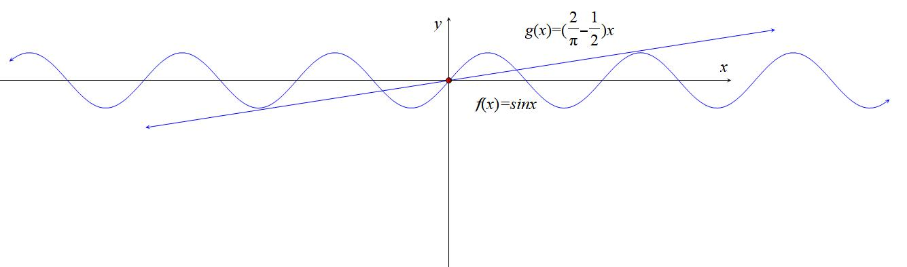
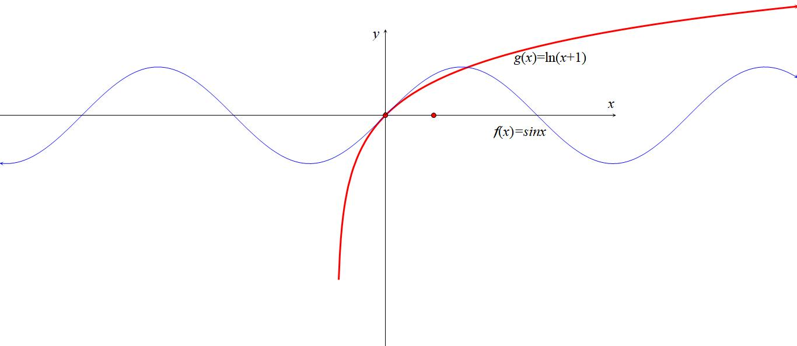
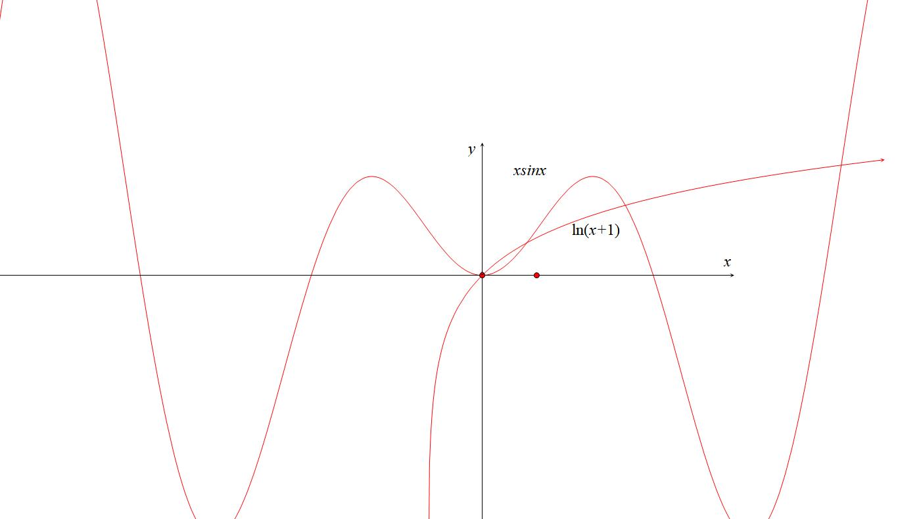
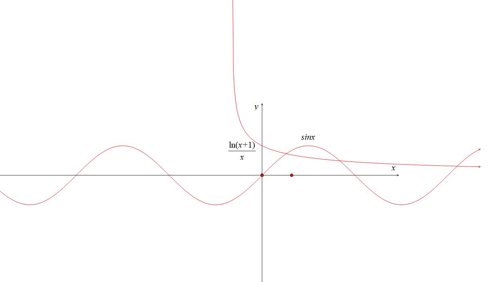
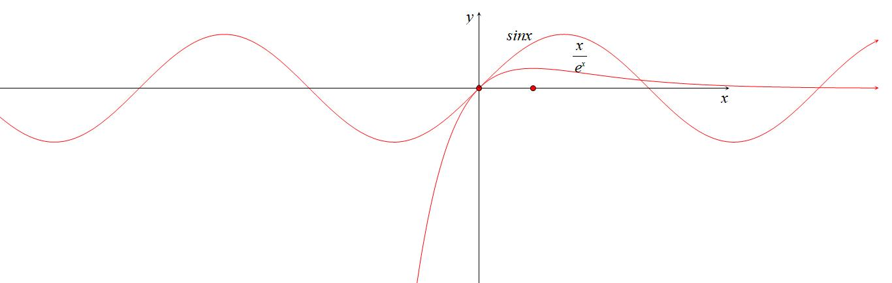
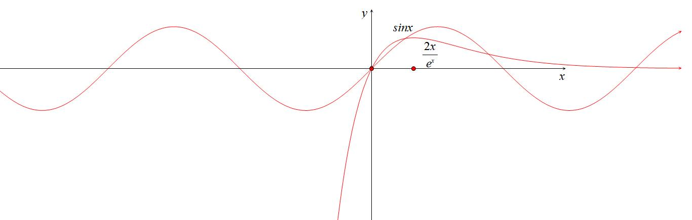
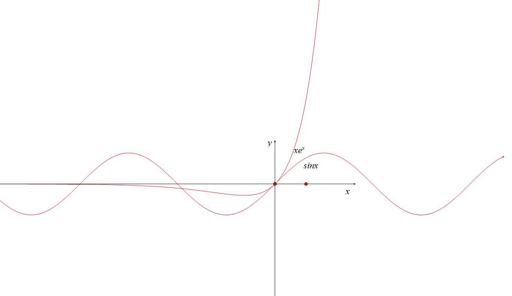
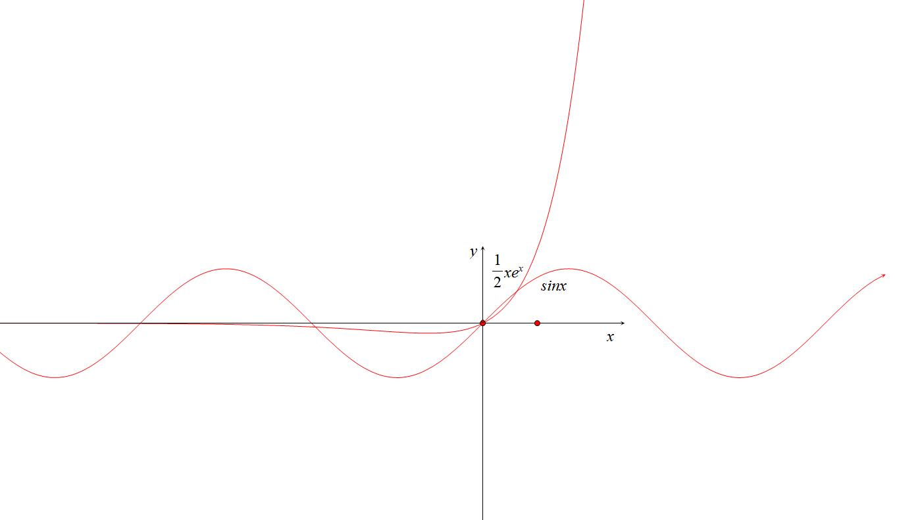

- 三角与导数综合

第一节 三角函数与零点综合

关于三角函数出现零点问题，由于没有解三角函数的方程，高中不涉及反三角函数，故三角函数的零点问题基本上都会有明确的界限，由于，，当三角函数和指数在一起，通常从选取、、，和对数在一起，通常选取、、对恒成立).

第一类：三角混合与型

1.三角零点证明分区间型

【例1】（2024•斗门区月考）已知函数，为的导数．

  
（1）求曲线在处的切线方程；

  
（2）证明：在区间存在唯一零点．

【例2】（2025春•高邮市期中）已知函数，．

  
（3）若，证明：在上有且只有一个零点．

2.参变分离型

【例3】（2023•云南月考）已知函数，．

  
（1）求曲线在处的切线方程；

  
（2）若函数在上有且仅有一个零点，求的取值范围．

【例4】（2025春•菏泽期中）已知函数．

> 

> 
> |  |  |
> | --- | --- |
> | （1）若函数在区间上恰有两个极值点，求实数的取值范围； | （2）当时．证明： |
> 

若，则恒成立；

（ⅱ）若，，则恒成立．

3.高精度第二周期见分晓型

### 1.1.1.1.1.1.1.1.1.1 如果是在第一个周期，通常是时，甚至是，我们常见的切割线放缩，但是到了第二个周期，我们通常会使用一个高精度的放缩(如图).

【例5】（2023•福建期中）已知函数．

  
（1）求在，的单调区间与最值；

  
（2）当时，若，证明：有且仅有两个零点．

注意：三角的零点问题难度更多在于不等式恒成立，所以更多篇章我们会在下一章节展开.

第二类：三角VS对数

1.关于与

在比大小章节中，我们给到了一个常见的不等式，当时，，其实它们之间满足①，

②当时，与有唯一交点；

③当时，;
证明过程我们参考例4.

【例6】（2025•谷城县校级模拟）已知函数，，．

  
（3）若，，求函数在上的零点个数．

【例7】（2025•岳麓区校级二模）已知函数，且与轴相切于坐标原点．

  
（1）求实数的值及的最大值；

  
（2）证明：当时，；

  
（3）判断关于的方程实数根的个数，并证明．

【例8】（2023•潍坊二模）已知函数．

  
（1）若在上周期为，求的值；

  
（2）当时，判断函数在上零点的个数：

  
（3）已知在，上恒成立，求实数的取值范围．

【例9】（2024•新县校级模拟）已知函数，．

  
（1）当时，求在区间内极值点的个数；

  
（2）若恒成立，求的值；

1. 与三角函数分而治之

含有与三角的综合，可以考虑分而治之构造区域内零点.

【例10】(2022•苏州三模)函数.

> 

> 
> |  |  |
> | --- | --- |
> | （1）求函数在上的极值; | （2）证明:有两个零点. |
> 

2. 与

此类型题除了是零点以外，在区间有两个零点，在任意和各有一个零点，我们转化为与交点，通过数形结合即可理解.

【例11】（2023•重庆模拟）设函数．

  
（1）当，时，求函数的最值；

  
（2）函数，其中为函数的导函数，试讨论函数在的零点个数．

法二（分而治之）：

②构造，，令，，所以，所以，所以在单调递减，当时，根据，当且仅当时取等，所以，所以，在的零点个数即为的交点个数.

由于在单调递增，在单调递减，，，，，，故存在，使；，故存在，使；

③当，时，，，故，所以在，无零点；

综上，函数在上恰有3个零点．

注意：三角的重难点在恒成立，在探路，零点问题由于有了分而治之被大大降维，所以零点问题难度大在指对，恒成立难度大的会在三角.

第三类：三角VS指数

1.0处泰勒展开型

由于泰勒展开，，指数和三角函数混合经常在处作为突破口.

【例12】(2022•淮坊月考)已知函数，，.

  
（1）当时，求的最小值;

  
（2）若函数有两个不同的零点，求实数的取值范围.

【例13】（2023•沈阳期中）已知函数．

> 

> 
> |  |  |  |
> | --- | --- | --- |
> | （1）求在处的切线方程； | （2）求证：； | （3）求证：有且仅有两个零点． |
> 

【例14】（2024秋•滨海新区校级月考）已知函数，，其中．

> 

> 
> |  |  |  |
> | --- | --- | --- |
> | （1）求在处的切线方程，并判断零点个数． | （2）讨论函数的单调性； | （3）求证：． |
> 

2. 关于、与零点

由于是与以及在原点处的公切线，故时，；

类似于极点效应，当时，与会在产生两个交点，临界条件进行端点探路.

【例15】（2023•六安月考）已知函数的图象在点，处的切线与轴垂直．

  
（1）求实数的值．

  
（2）讨论在区间上的零点个数．

【例16】（2023•广东月考）已知，函数，，．

  
（1）记的导函数为，求在，上的单调区间；

  
（2）若在上的极大值、极小值恰好各有一个，求的取值范围．

【例17】（2023•青岛月考）已知函数．

  
（1）当时，求函数的极值；

  
（2）若，，，求的取值范围；

  
（3）当时，试讨论在内零点的个数，并说明理由．

【例18】（2025•鄢陵县三模）设，已知函数，．

  
（1）若，判断在区间上的单调性；

  
（2）若，判断的零点个数，并给出证明；

  
（3）若，求正整数的值．

【例19】（2025•道里区四模）已知．

  
（1）若有两个零点时，求的取值范围；

  
（2）若恒成立，求实数的最小值；

  
（3）时，设，判断在上解的个数．

3. 关于指数和正切组合零点

【例20】（2025•景德镇模拟）（1）证明：在上恒成立．

  
（2）若，证明：函数在上恰有1个零点．

  
（3）试讨论函数在上的零点个数．

第二节 三角函数恒成立问题

考点1 基于25新一卷的，三角恒成立解读

【例1】（2025•新高考一卷19）设函数 $f\left(x\right)=5cosx-cos5x$ .  
（1）求 $f\left(x\right)$ 在 $(0,\frac{\pi }{4})$  的最大值；  
（2）给定 $\theta \in \left(0,\pi \right)$ , $a$ 为给定实数，证明：存在 $y\in \left[a-\theta ,a+\theta \right]$  ,使得 $cosy\leq cos\theta$ ；  
（3）若存在 $\varphi$ ，使得对任意 $x$ ，都有 $5cosx-cos\left(5x+\varphi \right)\leq b$ ，求 $b$ 的最小值.

【例2】（2025·内蒙古呼和浩特·模拟预测）已知函数，其中．

  
（1）证明：曲线是中心对称图形；

  
（2）讨论函数在内零点的个数；

  
（3）若存在，当时，总有成立，求符合条件的*m*的最小值．

考点1 端点效应模型

【例1】（2023•甲卷）已知函数，．

  
（1）当时，讨论的单调性；

  
（2）若，求的取值范围．

【例2】（2024·黑龙江大庆·一模）已知函数，其中.

  
（1）证明：当时，；

  
（2）若时，有极小值，求实数的取值范围；

  
（3）对任意的恒成立，求实数的取值范围.

【例3】（2025•资阳模拟）已知函数．

  
（1）若有两个极值点，求的取值范围；

  
（2）若，，求的取值范围．

【例4】（2025•江苏模拟）已知函数，，．

  
（1）若曲线在点的切线也是曲线的切线，求的值；

  
（2）讨论函数在区间上的单调性；

  
（3）若对任意恒成立，求的取值范围．

【例5】（2008•全国卷Ⅱ）设函数．

  
（1）求的单调区间；

  
（2）如果对任何，都有，求的取值范围．

【例6】（2025·辽宁沈阳·模拟预测）已知函数．

  
（1）当时，曲线与关于点中心对称，求函数的解析式；

  
（2）讨论在上的单调性；

  
（3）若关于*x*的不等式在上恒成立，求实数λ的取值范围．

【例7】（2025·江西赣州·二模）已知函数，．

  
（1）求函数，的最小值；

  
（2）当时，，求*a*的取值范围．

考点2 极点效应模型

【例1】（八省联考）已知函数，．

  
（1）证明：当时，；

  
（2）若，求．

【例2】（2025·黑龙江大庆·模拟预测）已知函数，

  
（1）讨论函数的单调性；

  
（2）若函数与函数存在公切线，求的取值范围；

  
（3）若当时，函数恒成立，求的取值范围．

【例3】（2024•佛山模拟）已知函数，其中.

1. 求函数的极值；
2. 当时，恒成立，求实数的范围.

【例4】（2025·云南昆明·二模）已知函数．

  
（1）当，求的单调区间；

  
（2）直线是曲线的一条切线，且与曲线有无穷多个切点．

（i）已知为坐标原点，直线与轴交于点，求的值；

（ii）是否存在常数使得直线也是曲线的切线，若存在，写出直线的一个方程并证明，若不存在，说明理由．

考点3 原函数极点效应失效

【例1】（2025·湖南邵阳·模拟预测）已知函数.

  
（1）当时，证明：恒成立；

  
（2）若对任意的，恒成立，求实数的取值范围.

考点4 隐点效应模型

【例1】（2024•福建月考）已知函数．

1. 证明：在区间内有唯一零点，且；
2. 当时，，求实数的取值范围．

【例2】（2025·河南·三模）已知函数

  
（2）若，求的最大值；
五  三角恒成立与放缩思想

【例1】（2025·山东日照·一模）已知函数．

  
（1）当时，讨论函数的单调性；

  
（2）当时，若曲线上的动点到直线距离的最小值为（为自然对数的底数）．

①求实数的值；

②求证：．

【例2】（2025·江苏宿迁·模拟预测）已知，．

  
（1）判断的单调性；

> 

> 
> |  |  |
> | --- | --- |
> | （2）若函数图象在处切线斜率为，求； | （3）求证：． |
> 

- 三角函数与数列综合

考点一 基于sinx与ln（1+x)

【例1】（2025•驻马店校级模拟）已知函数为自然对数的底数），，其中为实数．

  
（1）求函数在点，处的切线方程；

> 

> 
> |  |  |
> | --- | --- |
> | （2）若对，有，求的取值范围； | （3）证明：． |
> 

考点2基于的放缩

【例1】（2025·河南·三模）已知函数

  
（1）当时，求的零点个数；

> 

> 
> |  |  |
> | --- | --- |
> | （2）若，求的最大值； | （3）证明：. |
> 

考点三 基于弦切互化的数列综合放缩

【例1】（2025·湖南长沙·三模）若存在正实数，对任意，使得，则称函数在上是一个 “ 函数”.

  
（1）已知函数在区间上是一个 “ 函数”，求；

> 

> 
> |  |  |
> | --- | --- |
> | （2）证明: 函数在区间上是一个 “ 函数”; | （3）证明:  . |
> 

【例2】（2025•固始县二模）英国数学家泰勒发现的泰勒公式有如下特殊形式：当在处的阶导数都存在时，．注：表示的2阶导数，即为的导数，表示的阶导数，该公式也称麦克劳林公式．

  
（1）根据该公式估算的值，精确到小数点后两位；

  
（2）由该公式可得：．当时，试比较与的大小，并给出证明；

  
（3）设，证明：．

考点四 三角+数列与零点综合

【例1】（2015•湖南）已知，函数，记为的从小到大的第个极值点．

（Ⅰ）证明：数列是等比数列；

（Ⅱ）若对一切，恒成立，求的取值范围．

【例2】（2020•天心区校级模拟）设函数，为的导函数．

（Ⅰ）求的单调区间；

（Ⅱ）当，时，证明；

（Ⅲ）设为函数在区间，内的零点，其中，证明：．

【例3】（2025春•岳麓区校级月考）已知函数，．

  
（1）当时，若恒成立，求的取值范围；

  
（2）当，时，设为的从小到大的第个极值点．证明：数列是等比数列；

  
（3）设函数在区间，内的零点依次为，，，，，求证：．

考点五 三角泰勒展开与数列综合

【例1】（2024秋•胶州市期中）已知函数，．

> 

> 
> |  |  |
> | --- | --- |
> | （1）若恰为的极小值点． | （ⅰ）证明：； |
> 

（ⅱ）求在区间上的零点个数；

  
（2）若，，

又由泰勒级数知：，．证明：．

考点六  积式代换补充

【例1】（2024秋•上月考）已知函数．

> 

> 
> |  |  |
> | --- | --- |
> | （1）讨论在区间上的单调性； | （2）求的最大值和最小值； |
> 

  
（3）设，，证明：．

- 三角函数与双元杂谈

考点一 三角偏移结合和差化积的放缩

【例1】（24-25高三下·重庆·阶段练习）已知函数.

  
（1）当时，判断函数的单调性；

  
（2）对任意的时，恒成立，求实数的取值范围；

  
（3）记，若，且，求证：.

【例2】(2024重庆中学生数学奥林匹克竞赛一试第9题)

已知函数，若两不相等的实数满足曲线在点和点处的切线斜率相等，求证：．

在三角的偏移中，经常涉及到的放缩，在我们前面三角结合对均的处理就已经介绍过了，此类题只是需要利用到和差化积，这也是今年的考察重点。

考点二 三角与飘带结合，同一法的应用

同一法：恒成立问题的万能方法，消元，将变量统一

【例1】（2025·山东济宁·模拟预测）已知函数的图象在点处的切线与直线：垂直，记.
> 

> 
> |  |  |
> | --- | --- |
> | （1）求实数的值； | （2）证明：有两个极值点； |
> 

  
（3）证明：当，时，

【例2】（2025春•广东月考）已知函数的导函数为，我们称函数的导函数为函数的二阶导函数，若一个连续函数在区间Ⅰ上的二阶导函数，则称为Ⅰ上的凹函数，若二阶导函数，则称为Ⅰ上的凸函数．
> 

> 
> |  |  |
> | --- | --- |
> | （1）证明：函数是凸函数． | （2）已知函数． |
> 

①若是上的凹函数，求实数的取值范围；

②在内有两个不同的零点，，证明：．

【例3】（2025•雨花区校级模拟）已知函数．

  
（1）当时，判断的零点个数，并说明理由；

  
（2）设为在区间，内的零点，令，，．

求证：；

求证：．

