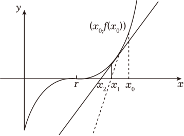
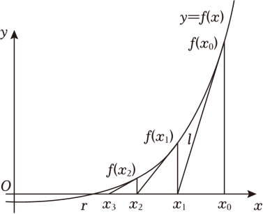
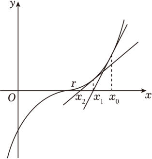
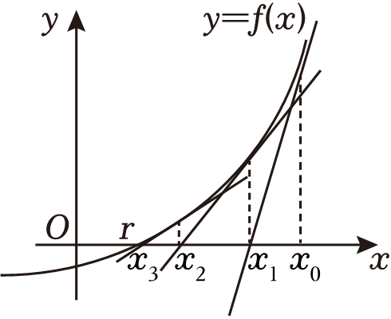
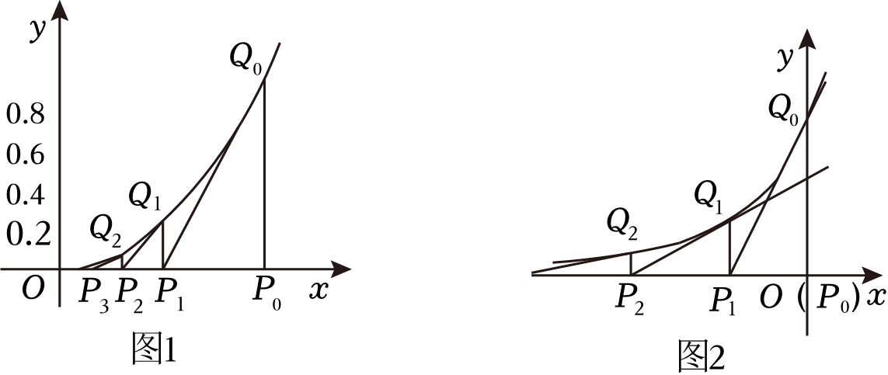

第十章 导数不等式与数列综合

如果说导数是不等式的狂欢，那么一定要拿上数列，因为可以从单挑变成求和，可以体现放缩和裂项相消的独特隐藏,高考就是在一些不复杂的数据下隐藏命题逻辑，其体现函数方程不等式三位一体的思想，不妨我们一起来解读导数与数列的综合.

第一节 导数与数列递推

########## 导数和数列关联的方程主要在两个角度，一是通过求导构造极值，二是求导构造切线方程，我们逐一分解.

- **极值点与数列构造**

**1.由极值点隐零点代换构成的数列递推**

【例1】（2024•成都青羊区模拟）已知数列满足，函数在处取得最大值，若，则<u>　　</u>．

【例2】（2024•安源区开学）设函数的极值点为，数列满足，若，则<u>　  　</u>．

**2.由极值点方程构造的列项求和**

##########     关于列项求和，是我们必须知道的一个总体代换式：，这里可以为任意的数列，本章节重心在于导数极值点提供的等式来构造，更多的裂项技巧会在下一节和《数列新定义》数中详细介绍.

【例3】（2024•德州模拟）数列中，，，设是函数且的极值点，则的整数部分为 <u>　   　</u>．

【例4】（2024•深圳期中）若是函数的极值点，数列满足，，设，则<u>　 　</u>，记表示不超过的最大整数．设，对，不等式恒成立，则实数的最大值为 <u>　　</u>．

3. **由三角极值点方程构造的多零点问题**

【例5】（2024•资阳月考）将函数在上的所有极值点按照由小到大的顺序排列，得到数列（其中，则

A．	B．

C．	D．为递减数列

【例6】（2024•多选•重庆月考）已知定义在上的函数，记在，．上的极值点为，，，共个，则下列说法正确的是

A．

B．

C．当时，对任意，，，均为等差数列

D．当时，存在，使得，，，为等差数列

【例7】（2024•长宁区月考）已知函数，，的极值点从小到大依次为，，，，则<u>　　</u>．

- **切线方程与数列构造**

**1.由过定点切线方程构造的数列**

【例8】（2024•碑林区月考）设曲线在点处的切线与轴的交点的横坐标为．则<u>　____</u>．

【例9】（2023•河南月考）已知曲线与曲线在处的切线互相平行，记，，则

A．，	B．，

C．，	D．，

【例10】（2023•多选•北林区期末）已知函数，，，动直线过原点且与曲线相切，切点的横坐标从小到大依次为，，，，，则下列说法错误的是

A．	B．数列为等差数列

C．	D．

**2.牛顿法作切线与近似值计算**

牛顿迭代法（也称牛顿法）是牛顿在17世纪提出的一种求解方程零点近似值的方法，多数不含求根公式，导致求零点的精度很困难，牛顿利用切线原理来设计迭代法.它的基本思想是从一个初始的近似解出发,过该点作曲线的切线，以切线与ｘ轴交点的横坐标作为下一个更精确的近似解．这样连续不断地做下去，得到一个近似解序列，

证明：曲线在点，处的切线为，令，则，所以.

【例11】（2024•海淀区期中）牛顿和拉弗森在17世纪提出了“牛顿迭代法”，相比二分法可以更快速的给出近似值，至今仍在计算机等学科中被广泛应用．如图，设是方程的根，选取作为初始近似值．

过点，作曲线在，处的切线，切线方程为，当时，称与轴的交点的横坐标是的1次近似值；

过点，作曲线在，处的切线，切线方程为，当时，称与轴的交点的横坐标是的2次近似值；重复以上过程，得到的近似值序列．这就是所谓的“牛顿迭代法”．

（1）当，时，的次近似值与次近似值可建立等式关系：<u>　 　</u>；

（2）若取作为的初始近似值，根据牛顿迭代法，计算的2次近似值为 <u>　 　</u>（用分数表示）．

【例&lt;te&lt;te<em>x</em>t style="italic"&gt;x&lt;/text&gt;t style="subscript"&gt;1&lt;/text&gt;2】（2023•山东期末）英国物理学家牛顿用“作切线”的方法求函数的零点时，给出的“牛顿数列”在航空航天中应用广泛．若数列{&lt;te&lt;te&lt;te<em>x</em>t style="italic"&gt;x&lt;/text&gt;t style="italic"&gt;x&lt;/text&gt;t style="italic"&gt;x&lt;/text&gt;<em>&lt;text style="italic,subscript"&gt;&lt;text style="italic,subscript"&gt;&lt;text style="italic,subscript"&gt;&lt;text style="italic,subscript"&gt;&lt;text style="italic"&gt;&lt;text style="italic,subscript"&gt;&lt;text style="italic,subscript"&gt;&lt;text style="italic"&gt;n</em>&lt;/text&gt;&lt;/text&gt;&lt;/text&gt;&lt;/text&gt;&lt;/text&gt;&lt;/text&gt;&lt;/text&gt;&lt;/text&gt;}满足 $x_{n+1}=x_{n}-\frac{f(x_{n})}{f'(x_{n})}$ ，则称数列{&lt;te&lt;te&lt;te&lt;te&lt;te<em>x</em>t style="italic"&gt;x&lt;/text&gt;t style="italic"&gt;x&lt;/text&gt;t style="italic"&gt;x&lt;/text&gt;t style="italic"&gt;x&lt;/text&gt;t style="italic"&gt;x&lt;/text&gt;<em>&lt;text style="italic,subscript"&gt;&lt;text style="italic,subscript"&gt;&lt;text style="italic,subscript"&gt;&lt;text style="italic,subscript"&gt;&lt;text style="italic"&gt;&lt;text style="italic,subscript"&gt;&lt;text style="italic,subscript"&gt;&lt;text style="italic"&gt;n</em>&lt;/text&gt;&lt;/text&gt;&lt;/text&gt;&lt;/text&gt;&lt;/text&gt;&lt;/text&gt;&lt;/text&gt;&lt;/text&gt;}为牛顿数列．若 $f(x)=\frac{1}{x}$ ，数列{&lt;te&lt;te&lt;te&lt;te&lt;te<em>x</em>t style="italic"&gt;x&lt;/text&gt;t style="italic"&gt;x&lt;/text&gt;t style="italic"&gt;x&lt;/text&gt;t style="italic"&gt;x&lt;/text&gt;t style="italic"&gt;x&lt;/text&gt;<em>&lt;text style="italic,subscript"&gt;&lt;text style="italic,subscript"&gt;&lt;text style="italic,subscript"&gt;&lt;text style="italic,subscript"&gt;&lt;text style="italic"&gt;&lt;text style="italic,subscript"&gt;&lt;text style="italic,subscript"&gt;&lt;text style="italic"&gt;n</em>&lt;/text&gt;&lt;/text&gt;&lt;/text&gt;&lt;/text&gt;&lt;/text&gt;&lt;/text&gt;&lt;/text&gt;&lt;/text&gt;}为牛顿数列，且x1＝1，xn≠0，数列{xn}的前n项和为<em>&lt;text style="italic"&gt;S</em>&lt;/text&gt;n，则满足Sn≤2024的最大正整数n的值为（　　）

A．10	B．11	C．12	D．13

【例13】（2023•芜湖模拟•多选）牛顿在《流数法》一书中，给出了高次代数方程根的一种解法．具体步骤如下：设是函数的一个零点，任意选取作为的初始近似值，过点，作曲线的切线，设与轴交点的横坐标为，并称为的1次近似值；过点，作曲线的切线，设与轴交点的横坐标为，称为的2次近似值．一般地，过点，作曲线的切线，记与轴交点的横坐标为，并称为的次近似值．对于方程，记方程的根为，取初始近似值为，下列说法正确的是

A．      B．切线	     C．     D．

【例14】（2024•沈河区四模）人们很早以前就开始探索高次方程的数值求解问题．牛顿在《流数法》一书中给出了牛顿法：用“作切线”的方法求方程的近似解．具体步骤如下：设是函数的一个零点，任意选取作为的初始近似值，过点，作曲线的切线，设与轴交点的横坐标为，并称为的1次近似值；过点，作曲线的切线，设与轴交点的横坐标为，称为的2次近似值．一般地，过点，作曲线的切线，记与轴交点的横坐标为，并称为的次近似值．若，取作为的初始近似值，则的正根的二次近似值为 <u>　　</u>．若，，设，，数列的前项积为．若任意，恒成立，则整数的最小值为 <u>　　__</u>．

【例15】（2024•广州月考）牛顿法是牛顿在17世纪提出的一种用导数求方程近似解的方法，其过程如下：如图，设是的根，选取．作为的初始近似值，过点，作曲线的切线，的方程为．如果，则与轴的交点的横坐标记为，称为的一阶近似值．再过点，作曲线的切线，并求出切线与轴的交点横坐标记为，称为的二阶近似值．重复以上过程，得的近似值序列：，，，，根据已有精确度，当时，给出近似解．对于函数，已知．

（1）若给定，求的二阶近似值；

（2）设

①试探求函数的最小值与的关系；②证明：．

########## 3.分式平方递推与牛顿数列

########## **平方式的递推**

########## （1）迭代法，先求出**，**

########## （2）对数代换法：

【例16】（2023•北京海淀区三模）给定函数，若数列满足，则称数列为函数的牛顿数列．已知为的牛顿数列，，且，，数列的前项和为．则

A．	B．	C．	D．

【例&lt;te&lt;te&lt;te&lt;te&lt;te&lt;text style="it&lt;text style="it<em>a</em>lic"&gt;a&lt;/text&gt;lic"&gt;x&lt;/text&gt;t style="it<em>a</em>lic"&gt;x&lt;/text&gt;t style="italic"&gt;x&lt;/text&gt;t style="it&lt;text style="it&lt;text style="it<em>a</em>lic"&gt;a&lt;/text&gt;lic"&gt;a&lt;/text&gt;lic"&gt;x&lt;/text&gt;t style="italic"&gt;x&lt;/text&gt;t style="su<em>&lt;text style="italic"&gt;b</em>&lt;/text&gt;script"&gt;&lt;text style="subscript"&gt;1&lt;/text&gt;&lt;/text&gt;7】（&lt;te&lt;te&lt;text style="it&lt;text style="it&lt;text style="it<em>a</em>lic"&gt;a&lt;/text&gt;lic"&gt;a&lt;/text&gt;lic"&gt;x&lt;/text&gt;t style="italic"&gt;x&lt;/text&gt;t style="superscript"&gt;&lt;text style="subscript"&gt;&lt;text style="subscript"&gt;2&lt;/text&gt;&lt;/text&gt;&lt;/text&gt;024•多选•广东模拟）牛顿选代法是求函数零点近似值的一种方法，它的原理是利用曲线一系列切线与&lt;te&lt;te<em>x</em>t style="italic"&gt;x&lt;/text&gt;t style="italic"&gt;x&lt;/text&gt;轴交点的横坐标来通近函数的零点．已知<em>&lt;text style="italic"&gt;&lt;text style="italic"&gt;&lt;text style="italic"&gt;&lt;text style="italic"&gt;&lt;text style="italic"&gt;f</em>&lt;/text&gt;&lt;/text&gt;&lt;/text&gt;&lt;/text&gt;&lt;/text&gt;（x）＝x2﹣x﹣1，设α，β为f（x）的两个零点（α＜β），令a1＝﹣1，在点（a1，f（a1））处作函数f（x）的切线，设切线与x轴的交点为a2，继续在点（a2，f（a2））处作f（x）的切线，切线与x轴的交点为a3，…如此重复，得到一系列切线，它们与x轴的交点的横坐标形成数列{a<em>&lt;text style="italic,subscript"&gt;&lt;text style="italic"&gt;&lt;text style="italic,subscript"&gt;&lt;text style="italic"&gt;&lt;text style="italic,subscript"&gt;&lt;text style="italic"&gt;&lt;text style="italic,subscript"&gt;n</em>&lt;/text&gt;&lt;/text&gt;&lt;/text&gt;&lt;/text&gt;&lt;/text&gt;&lt;/text&gt;&lt;/text&gt;}，易得an＜0（n∈<strong>&lt;text style="bold"&gt;N</strong>&lt;/text&gt;&lt;text style="superscript"&gt;\*&lt;/text&gt;）．设bn＝<em>ln</em> $\frac{a_{n}-\alpha }{a_{n}-\beta }$ （&lt;text style="it<em>a</em>lic,su<em>&lt;text style="italic"&gt;b</em>&lt;/text&gt;script"&gt;<em>&lt;text style="italic"&gt;&lt;text style="italic,subscript"&gt;&lt;text style="italic"&gt;&lt;text style="italic,subscript"&gt;&lt;text style="italic"&gt;&lt;text style="italic,subscript"&gt;n</em>&lt;/text&gt;&lt;/text&gt;&lt;/text&gt;&lt;/text&gt;&lt;/text&gt;&lt;/text&gt;&lt;/text&gt;∈<strong>&lt;text style="bold"&gt;N</strong>&lt;/text&gt;&lt;text style="superscript"&gt;\*&lt;/text&gt;），{bn}的前n项和为<em>T</em>n，则下列说法中，正确的是（　　）

A． $a_{2}=-\frac{3}{5}$ 	B．<em>an</em>＜α

C．{<em>an</em>}是单调递增数列	D．<em>T</em>4＝15<em>b</em>1

【例18】（2024•市南区期末）牛顿给出了牛顿切线法求方程的近似解：如图设是的一个零点，任意选取作为的初始近似值，过点，作曲线的切线，与轴的交点为横坐标为，称为的1次近似值，过点，作曲线的切线，与轴的交点为横坐标为，称为的2次近似值．一般地，过点，作曲线的切线，与轴的交点为横坐标为，就称为的次近似值，称数列为牛顿数列．

（1）若的零点为，，请用牛顿切线法求的2次近似值；

（2）已知二次函数有两个不相等的实数根，，数列为的牛顿数列，数列满足，且．

（ⅰ）设，求的解析式；

（ⅱ）证明：．

########## 1.1.1.1.1.1.1.1.1.1 牛顿数列与面积计算

【例19】（2024•大理州期末）对函数做如下操作：先在轴找初始点，，然后作在点，处切线，切线与轴交于点，，再作在点，处切线，切线与轴交于点，，再作在点，处切线，依次类推．现已知初始点为，若按上述过程操作，则<u>　   　</u>，所得△的面积为 <u>　　</u>．（用含有的代数式表示）

【例20】（2024•郑州期末）从函数的观点看，方程的根就是函数的零点，设函数的零点为．牛顿在《流数法》一书中，给出了高次代数方程的一种数值解法——牛顿法．具体做法如下：先在轴找初始点，，然后作在点，处切线，切线与轴交于点，，再作在点，处切线轴，以下同），切线与轴交于点，，再作在点，处切线，一直重复，可得到一列数：，，，，．显然，它们会越来越逼近．于是，求近似解的过程转化为求，若设精度为，则把首次满足的．称为的近似以解．

（Ⅰ）设，试用牛顿法求方程满足精度的近似解（取，且结果保留小数点后第二位）；

（Ⅱ）如图，设函数；

由以前所学知识，我们知道函数没有零点，你能否用上述材料中的牛顿法加以解释？

若设初始点为，类比上述算法，求所得前个△，△，，△的面积和．

第二节 切线放缩型

一 .切线放缩求和型vs和式代换

利用数列的和式代换，将形式.

1. 型

由于，令，故.令，当然，对于左右两侧都是含n的待证式，通常也可以考虑利用和式代换，构造通项公式比大小.

【例1】（2025·湖南岳阳·模拟预测）已知函数，且.

(1)求;

(2)已知为函数的导函数，证明：对任意的，均有；

(3)证明：对任意的，均有.

【例2】（2023•厦门期中）已知函数．

（1）求的最小值；

（2）设，证明：有且仅有两个零点，，且；

（3）证明不等式：，其中，．

【例3】（2025·陕西西安·模拟预测）已知函数.

(1)若*x*轴是曲线的一条切线，求实数*a*的值；

(2)若在上恒成立，求*a*的最小值；

(3)证明：（且）.

【例4】（2025·天津和平·一模）已知函数.

(1)若，函数在点处的切线斜率为，求函数的单调区间和极值；

(2)试利用（1）结论，证明：；

(3)若，且，不等式恒成立，求的取值范围.

【例5】（2024·黑龙江大庆·模拟预测）已知函数．

(1)若，求曲线在点处的切线方程；

(2)若对任意的恒成立，求的取值范围.

(3)证明：

2. 型

由于，令，.

【例4】（2023•哈尔滨开学）已知函数．

（1）讨论函数的单调性；

（2）求证：，．

【例5】（2023•安徽月考）已知函数．

（1）求函数的零点个数；

（2）若，且，求证：．

【例6】（2025·湖北黄冈·模拟预测）已知函数，.

(1)证明；

(2)若，（）是方程（）的两个相异实根，当时，求的取值范围；

(3)当且时，试比较与的大小，并说明理由.

3. 型

利用，令，即可获取此不等式链.

【例7】（2025·湖北十堰·模拟预测）已知函数．

(1)当时，求在点处的切线方程；

(2)若对任意，都有，求实数的取值范围；

(3)证明：．

【例8】（24-25高三下·湖北·开学考试）已知函数.

(1)求在处的瞬时变化率；

(2)若恒成立，求的值；

(3)求证：.

【例9】（2023•福田区模拟）已知，且0为的一个极值点．

（1）求实数的值；

（2）证明：①函数在区间上存在唯一零点；

②，其中且．

【例10】（2023•大连期中）已知函数．

（1）若对，时，，求正实数的最大值；

（2）证明：．

4. 型

在比大小当中，关于的上下界锁定，我们想到了，令，即可得到此放缩的不等式链.

【例11】（2023•无锡三模）已知函数，，．

（1）求的极值；

（2）求证：．

5. 构造的切线放缩型

在单调递增，且在区间上任意一点的切线方程恒成立.

【例12】（2023•日照期中）已知函数．

（1）求函数的单调区间；

（2）若方程的两根互为相反数．

①求实数的值；②若，且，证明：．

6. 以割线构造型

【例13】（2023•重庆模拟）已知函数．

（1）若在上恒成立，求实数的取值范围；

（2）证明：．

．

二．构造裂项相消型

前面类型，我们已经涉及了裂项相消求和，通常在令时就能构成裂项相消，但有一些隐藏起来的裂项相消，比如平方式，就需要我们去仔细建模.

裂项相消，关键在于把握好常数，，则；

，则；

1.接龙型

利用，我们采用不同赋值，令，则，

【例14】（2023•浙江模拟）已知为正实数，函数．

（1）若恒成立，求的取值范围；

（2）求证：，2，3，．

【例15】（2023•广州期末）已知函数，．

（1）讨论的单调性；

（2）求证：对任意的且，都有：．（其中为自然对数的底数）

【例16】（2023•新华区月考）已知函数．

（1）若恒成立，求的取值范围；

（2）当时，证明：．

2. 接龙型

利用，令， ，

【例17】（2023•北辰区期中）已知函数的最小值为0，其中．

（1）求的值；

（2）若对任意的，，有成立，求实数的最小值；

（3）证明：．

3. 或型

利用，令，则可以有，或者.

【例18】（2023•海珠区期中）设，．

（1）当时，求函数的最小值；

（2）当时．证明：；

（3）证明：．

【例19】（2025·河南·三模）已知函数

(1)当时，求的零点个数；

(2)若，求的最大值；

(3)证明：.

4.隔项相消型

# **【例19】**(23届绵阳一诊理科导数)已知函数，当，．

（1）求的取值范围；

（2）求证：．

三．构造等比数列放缩型

1.等比型

【例20】（2025·江苏泰州·模拟预测）已知函数

(1)当时，求函数的极值;

(2)对于任意的正整数

(ⅰ)不等式恒成立，求整数*M*的最小值;

(ⅱ)证明：为自然对数的底数

【例21】（2023•吉林模拟）已知函数，且．

（1）求实数的取值范围；

（2）设为整数，且对任意正整数，不等式恒成立，求的最小值；

（3）证明：．

【例22】（2023•松江区期中）已知函数，，．

（1）求的最大值；

（2）若对，总存在，使得成立，求实数的取值范围；

（3）证明不等式（其中是自然对数的底数）．

【例23】（2023•和平区一模）已知函数，，其中为自然对数的底数，．

（1）当时，函数有极小值（1），求；

（2）证明：恒成立；

（3）证明：．

【例24】（2023•湖北月考）已知函数．

（1）若恒成立，求实数的取值集合；

（2）求证：对，都有．

【例25】（2023•浙江模拟）已知函数，．

（1）令，讨论的单调性；

（2）证明：；

（3）若，对于任意的，，不等式恒成立，求实数的取值范围．

【例26】（2025·辽宁鞍山·模拟预测）已知

(1)当时，求函数的单调区间；

(2)，恒成立，求的取值范围；

(3)，恒成立，求正整整的最小值．

四．积式代换型

1.型

【例27】（2020•新课标Ⅱ）已知函数．

（1）讨论在区间的单调性；

（2）证明：；

（3）设，证明：．

########## 注意：本题我们来理顺一下积式代换的思路，根据第（2）问的数据，，

补齐对称化数据得：，所以每一道和式代换和积式代换题目的背后都需要一个必要性探路的分析过程，我们需要掌握一些重要的不等式，也需要考试中不断用必要性探路进行逆向思维破解。

2. 型

【例28】（24•浙江，25•内蒙古月考）设函数，，．

（1）讨论函数的单调区间；

（2）若对任意，函数均有2个零点，求的取值范围；

（3）设且，证明：．

第三节 飘带函数型

一  飘带函数常规型

1. 令型

【例1】（2023•和平区月考）已知函数．

（1）若不等式在上恒成立，求实数的取值范围；

（2）证明：．

2. 令型

令，这是最常见的构造，根据时，，则，

即，故我们能得到：，

这样的式子太大，且没有一个好的裂项相消的隐藏，所以此类型题命题点在于向后累加，

即，

或者，，以此类推.

【例2】（2025·四川自贡·三模）函数

(1)求的单调区间；

(2)设，证明：；

(3)若，，比较与2的大小，并说明理由.

【例3】（23届鄂东南联盟）已知函数，．

（1）讨论函数在上的单调性；

（2）证明：．

【例4】（24-25高三上·山西运城·期末）在数列中，，，且

(1)证明：是等差数列;

(2)求数列的前*n*项和

(3)求证：.

3. 令型

【例4】（2023•四川月考）已知函数．

（1）若，，，求的取值范围；

（2）证明：．

【解析】（1），，

设，△．

当△时，即，此时，则，在，上单调递减，所以（1）．

当△时，即或，

若，有两个零点，，则，，则，均小于零，

所以在，上恒成立，即在，上单调递减，则（1）；

若，则，，可设，

当时，单调递增，则（1），不符合题意．

综上，的取值范围是，．

证明：（2）当时，，，，即，当且仅当时取等号，

令，其中，则，则，

记，则，即，

，

，

所以，故．

二  飘带函数根式型

1.令接龙型

【例5】（2022•新高考Ⅱ）已知函数．

（1）当时，讨论的单调性；

（2）当时，，求的取值范围；

（3）设，证明：．

【例6】（2023•靖江市期中）已知函数和的图象在处的切线互相垂直．

（1）求实数的值；

（2）当时，不等式恒成立，求实数的取值范围；

（3）设，证明：．

【例7】(成都七中2023届高三上期中)已知函数.

1. 求函数在处的切线方程;
2. 当时，恒成立，求实数的取值范围;
3. 设，证明:.

3.根式飘带放缩与帕德逼近数列放缩综合与估值问题

【例8】（2025·河北·模拟预测）函数（或级数）逼近论是函数（或级数）论的一个重要组成部分，涉及的基本问题是函数（或级数）的近似表示问题.将一函数用较简单的函数（或级数）来找到最佳逼近，且所产生的误差可以有量化的表征——这种处理复杂函数（或级数）的方法，我们称之为函数（或级数）逼近.用函数去逼近，在处的值称为逼近估差.法国数学家亨利・帕德用有理函数去逼近一些常见函数，有较高的精确度.比如对数函数两个常见的逼近函数为：，

(1)证明：时，；

(2)对时，用分别去逼近和的逼近估差分别为，.证明：

①；

②，必有一数小于0.02.

- 帕德逼近型

1.令

我们先看一个经典的和式证明：．

证明：法一：利用，令，所以，所以，所以，

所以．

法二（帕德逼近）：对时恒成立．令，故，则有．有，

即．

我们发现，帕德逼近相对切线放缩式，是一个精度更高的式子，所以导数数列综合，本质就是换元和精度的综合，结合前面飘带的放缩式，我们可以得到的两个和式放缩式：

【例8】（2023•五莲县期中）已知函数．

（1）若，判断函数的单调性，并说明理由；

（2）若时，恒成立．

求实数的取值范围；

（ⅱ）证明：，．

【例9】（2023•齐齐哈尔二模）设函数，，．

（1）求在，上的单调区间；

（2）若在轴右侧，函数图象恒不在函数的图象下方，求实数的取值范围；

（3）证明：当时，．

2.构造裂项相消型

【例10】（2023•浦东新区三模）已知实数，，．

（1）求；

（2）若对一切成立，求的最小值；

（3）证明：当正整数时，．

3.令型

【例11】（24-25高二上·湖南长沙·期末）设函数（）.

(1)当时，讨论函数的单调性；

(2)当时，曲线与直线交于，两点，求证：；

(3)证明：（，）.

四  斯特林公式与特殊的导数与数列类型

所有的倒数和数列综合，只要难度上升，就一定是精度和裂项相消的不等式构造问题，2023天津卷就完美阐述了这类型问题的本质，我们就通过此题来解读高精度的导数数列综合问题.

【例11】（2023天津卷）已知函数；

（Ⅰ）求函数在处的切线；

（Ⅱ）求证：当时，；

（Ⅲ）求证：

第四节 导数与数列迭代放缩与求和

一  基于琴生不等式下的数列迭代求和

琴生不等式常见形式：，当然也有两种形式.

【例1】（2025·湖南长沙·一模）已知函数.

(1)求的图象在处的切线方程；

(2)若时，恒成立，求正实数的取值范围；

(3)当时，若正实数满足，求证：.

二 基于隐零点放缩下的数列迭代求和体系

【例2】（2025·江苏宿迁·二模）已知函数，．

(1)证明：有唯一零点；

(2)记的零点为．

（i）数列中是否存在连续三项按某顺序构成等比数列，并说明理由；

（ii）证明：．

【例3】（2025·安徽安庆·模拟预测）已知函数.

(1)当时，求曲线在处的切线方程；

(2)讨论函数极值点的个数；

(3)设，，求证：.

此类题技巧性偏强，常规做法考试很难写出来，所以对于和式代换的掌握很重要。

【例4】（2025•永州三模）已知函数，且有唯一零点．

（1）证明：；

（2）证明：；

（3）判断数列中是否存在连续三项按某顺序构成等比数列，并说明理由．

本题的和式代换就交给同学们自行完成了.

三 不动点蛛网图下的单调性证明与伪等比探路体系

不动点定号原理

若要证明连续项与不动点的位置关系，可采用在两种情况分别讨论，当然积式也可以，但是商式是有斜率的几何意义的，所以更契合此类题型。

不动点蛛网图一级精度与导数综合大题

此类题的思考方向为构造递推关系式，结合与不动点连线斜率与渐近线连线斜率，构造诸如之类的关系式，结合蛛网图分析它的单调情况，以及它的界限.

此类数列放缩证明题分为两类，第一类，考虑转化为为等比探路放缩，证明，第二类，为不动点，

考虑，证明.

【例5】（25安徽模拟）定义数列为“阶梯数列“：.

1. 求“阶梯数列“中，与的递推关系；
2. 证明：对，数列为递减数列；
3. 证明：.

【例6】（2025•绵阳一诊压轴）已知函数，在上的最大值为.

1. 求实数的值；
2. 若数列满足，且.

1. 当，时，比较与的大小，并说明理由；
2. 求证：.

【例3】（2025•长郡中学第三套模拟）对于函数，若实数满足，则称为的不动点.已知，且的不动点的集合为A.以分别表示集合M中的最小元素和最大元素，

1. 若，求的元素个数及；
2. 当A中只有一个元素时，的取值集合记为B，

求B；

若，数列满足，，集合，

求证：，.

