$$
\sin \alpha - \sin \beta = 2 \cos \frac {\alpha + \beta}{2} \sin \frac {\alpha - \beta}{2}
$$

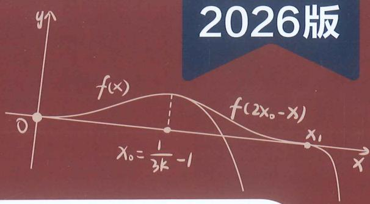

text_image

2026版
f(x)
f(2x₀-x)
x₀ = 1/(3k - 1)
x₁

# 高中数学新思路

# 导数专题（上）

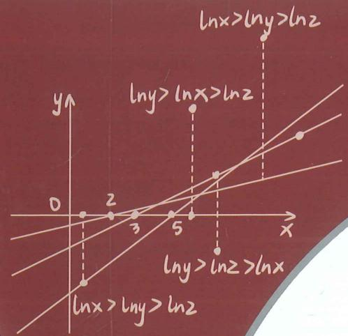

text_image

lnx>lny>lnz
lny>lnx>lnz
lny>lnz>lnx
lnx>lny>lnz

本册主编唐鑫张羊利

# 老唐说题团队教研产品

《高考数学满分突破 - 秒系列123》

《高中数学新思路—复习专题第一轮》

《高中数学新思路—复习专题第二轮》

《高中数学新思路 - 同步系列123》

《高中数学新思路 - 导数专题》

《高中数学新思路—圆锥曲线专题》

《MST新思路高中数学新定义 组合与概率统计专题》

《高中物理新思路 力学篇》

《高中物理新思路 电学篇》

《高中物理新思路 综合实验篇》

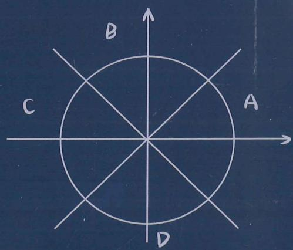

text_image

B
A
C
D

natural_image

Abstract geometric design with white and red shapes on a dark blue background (no text or symbols)

  
扫码报名陪跑课

  
官方微信

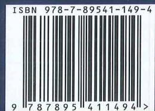

text_image

ISBN 978-7-89541-149-4
9 787895 411494 >

定价: 158元

$$
\sin \alpha - \sin \beta = 2 \cos \frac {\alpha + \beta}{2} \sin \frac {\alpha - \beta}{2}
$$

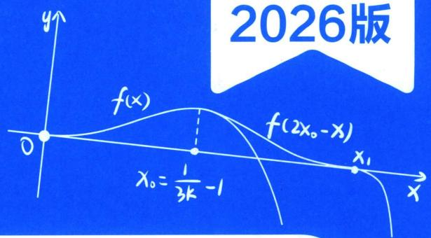

text_image

2026版
f(x)
f(2x₀-x)
x₀=1/(3k)-1
x₁

# 高中数学新思路 导数专题（上）

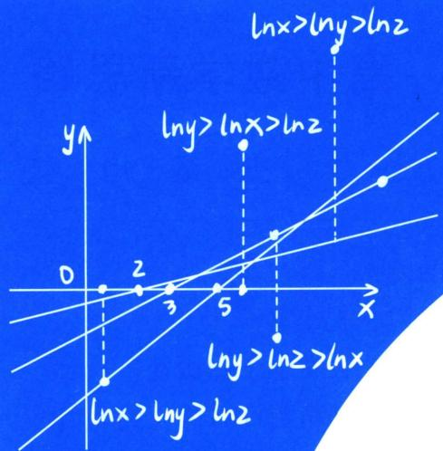

text_image

lnx>lny>lnz
lny>lnx>lnz
lny>lnz>lnx
lnx>lny>lnz

本册主编 唐鑫 张羊利

# 高中数学新思路 导数专题

# 主 编 唐 鑫 张羊利

责任编辑 胡丽娜

封面设计 老唐说题工作室

出版发行 四川师范大学电子出版社

社 址 四川省成都市锦江区静安路5号

邮政编码 610068

电话 028-84767799(总编室) 028-84769668(发行部)

网 址 www.scnup.com

光盘生产 大连华录影音实业有限公司

手册印制 长沙湘之印彩色印刷有限公司

文本尺寸 210 mm×285 mm

印 张 29.25

字 数 470 千字

版 次 2024年1月第1版

印 次 2025 年 7 月第 3 次印刷

I S B N 978-7-89541-149-4

# 《高中数学新思路 导数专题》

# 编委会

主 编 唐 鑫 张羊利

副主编 李俊虎 魏国浩 郭润仙 高翠

廖志发 李秉泽 熊翼 李弦裴

程海波 王仁正 杜松奎 李惟清

施小平 谭鸣 陈庆安 老K

编 委 丁兆龙 吴 斌 徐剑锋 高 斌

吴家伟 周晓燕 刘恺锐 张凯莉

向茂荣 秦伟见 庞 博 翟学强

李诗瑾 谭林华 唐阳 付笛生

蔡 涛 罗毕壬 任 升 梁士伟

罗 成 王 奎 陈 金 钱立达

王 雷 赵军芳 韩壮壮 向 涛

魏长松 冯齐友 唐自辉 赵拾伟

卫才良 兰天浩 梅议文 王佳星

罗传奇 欧阳斌斌

# 序言 XUYAN

泱泱数海，浩浩微澜，导数之思，妙不可言。看思维之玄微，究变化之无穷。析数理于毫末，探乾坤于掌中。前创微元，开之鸿蒙；吾辈研习，继贤之风。十法既陈，万象可攻；书文以述，思变以通。

同构之法，妙在形同。左右相顾，异曲同工。指对相伴，乘除相融。构造得宜，疑难冰释；变形得当，繁复消空。观其式形，察其源宗，庖丁解牛，游刃从容。

切线为界，分水之岭。割线逼近，瞬时率明。凹凸判断，走势可定。一划之间，天地两清。函数变化，尽在掌心。几何解读，代数落英。数形结合，拐点界定。

找点之术，如探玄珠。试值二分，逐步趋逐。主客分析，转换迅速。等效零点，全局可图。譬如破阵，先夺其枢。三项转化，综合频出。飘带隐藏，必依其途。

放缩有度，张弛合宜。大小适度，因题而施。切线找点，恰如其意。如制良弓，劲而不弃。如烹小鲜，熟而不腻。分而治之，证明简易。保值分析，解参飘逸。

数之较量，差商为凭。函数单调，增减可征。作差观变，泰勒先行。大小估算，逼近交锋。函数构造，指对成风。奇偶交辉，单调锁定。积分构造，逆向与共。

双元并立，纠缠难分。主客易位，比值代更。韦达转换，乱麻可理。固定变量，迷雾渐澄。譬如弈棋，先占要津。又如治水，疏导为能。函数构造，偏移可期。

显点如星，璀璨可寻。零点极值，直指核心。方程可解，答案自临。然须谨防，题设陷阱，显中有隐，不可轻心。极点失效，探路成荫。参变分离，浪沙淘金。

隐点若渊，深藏不现。方程难解，须借极限。放缩逼近，渐露真面。耐心者得，含参转换，如探龙珠，必至深渊。差值放缩，隐点上岸。复杂含参，极点探甘。

数列递推，导数为桥。离散连续，代换高超。归纳奠基，转换登高。极限拆解，隐隐可招。放缩转换，隔项相消；数形相辅，等比构造。积式代换，取对灵巧。

正弦余弦，起伏如涛。周期变幻，极值难料。导数一落，波动皆凋。最值所在，一目昭昭。细审其性，慢推其妙，指对结合，尽化烟消。精度升级，周期后绕。

导数之海，浩瀚无涯。十法为舟，思维作槎。勤学精思，必至其华。执此利器，无以复加。题如破竹，下探深挖，高考之巅，青云可踏！

MST 教研组全体成员

2025. 7.8 于武当山金顶

唐鑫 昵称老唐，MST《老唐说题》创始人，《高考数学满分突破》系列丛书主编，《高中数学新思路》系列丛书主编。善于归纳总结并提炼精髓，将复杂问题简单化，抽象问题形象化和具体化。

受邀于衡水二中，正定中学，青岛二中，烟台一中，安阳一中，昆明一中，遵义四中，柳铁一高，钦州二中，惠东高级中学等国内重点高中讲座，广受好评！

natural_image

Portrait of a man in formal attire with glasses, hands clasped, seated at a desk (no visible text or symbols)

natural_image

Portrait of a man in formal suit sitting on a stool (no visible text or symbols)

# 张羊利

MST《老唐说题》团队创始人之一，MST《高考数学满分突破》、《高中数学新思路》系列从书主编。广东省重点中学教师，在各大自媒体(ID：利哥数学)有广大的影响力。先后受邀到浙江省天台中学、贵州省遵义四中、云南省昆明一中、云南师大附中镇雄中学、广西柳铁一中、河北省衡水二中、四川省德阳五中、广西省钦州二中、广东省惠东高级中学、湖南省郴州一中、河南省实验中学、河南省郑州四中、河南省洛阳一高、山东省菏泽一中、河北省邢台一中、湖南省湘潭县一中、山西省康杰中学、广东省清远一中等众多学校开展讲座，深受广大师生的好评。

# 李俊虎

毕业于长沙理工大学数学系，参与编写 MST 新思路系列图书。在高中一线教学多年，教学风格严谨幽默，被学生称为虎哥。在教学中发现高中教考分离严重，高层次学生难以从日常教学中获取足够养分，因而转型教学设计研究。加入 MST 后，深入挖掘探路，找点，放缩，定比点差等方法，从一个更深的角度去探讨题目的逻辑。受邀于

natural_image

Portrait photo of a man wearing glasses and a suit (no text or symbols visible)

山东日照一中，莱芜一中，章丘四中，攸县一中，灵璧中学，河南清北集训营讲座，深受好评，助力芊芊孩子战胜高考圆锥导数压轴题。

natural_image

Portrait of a man in formal suit and tie, standing against plain background (no text or symbols visible)

魏国浩 南开大学硕士研究生毕业，中学数学教师；山东理工大学特聘讲师，数学奥林匹克竞赛教练员，中国数学会会员；曾任多家教育研究所兼职研究员，多家教辅主编及编委。MST《老唐说题》创始人之一。

针对高中各年级数学教学有丰富的经验，教学成绩显著，善于发现学生的闪光点，对学生进行有的放矢的教育。

善于钻研更快、更巧的高中数学解题方法并推广应用，以自己独有的方法推导并整理《平面法向量的求法》《一步搞定错位相减》《导数双变量问题综合探究》等五十余种高考题中独有的解法，并归纳整理《高考解题黄金模板》系列共54篇解题方法以及相关应用。

郭润仙 高中数学高级教师。所教班级数学高考成绩一直名列大理州第一；曾带出2011届李仕强、杨施薇大理州高考文理状元，2014届杨佯等多名大理州高考状元；培养了杨施薇、余建希、丰峰等多名清华、北大学子；辅导的蔡金明、马遥等多名学生获省级数学竞赛奖。

参与了省内外重要数学刊物的编辑，主编《高中数学同步周练（AB卷）》，《高中数学兵法500条》和《数学教学通讯》增刊的编委。发表数十篇论文。

natural_image

Portrait of a woman wearing glasses and a pink top, seated at a desk in an office setting (no visible text or symbols)

natural_image

Portrait of a woman wearing a white lab coat against a dark background (no text or symbols visible)

高翠 毕业于华中师范大学数学系，毕业至今一直在惠东高级中学任教，从教十余年，她始终以一颗热爱数学、热爱学生之心坚守教育教学一线，有11年实验班教学经验，多名学子考入上海交大、浙江大学、武汉大学、南京大学、华中科技大学、中山大学等名校，深受学生、家长、同行的一致好评，是县骨干教师、优秀班主任、优秀备课组长，也是县名师工作室成员。

在教学教研方面，她勤于思考、善于钻研，先后在惠州市说课比赛中荣获一等奖；惠州市优秀论文评选中荣获一等奖；惠东县解题比赛、说题比赛、综合能力大赛中均荣获第一名；参与多项市县课题研究。

李秉泽 哈尔滨师范大学硕士毕业，MST《老唐说题》系列丛书副主编，MST《老唐说题》理科体系研发核心教研员。高中数学高级教师，曾任大庆重点中学教研组组长，多篇优秀论文深得全国广大教师认可。连续多年受邀到各地培训青年教师，对于教学理解独特，把生活与教学完美地融合到一起。多年一线教学培养出一大批的优秀学子，累计数百名C9学子，北师大、华中师大、哈师大等优秀师范院校的学子数不胜数。

natural_image

Portrait of a woman in business attire with arms crossed, against a dark background (no text or symbols visible)

熊翼 重庆八中高级教师，重庆市优秀班主任，重庆市骨干教师，重庆市渝北区优秀青年干部，教育部新时代中小学学科领军教师示范性培训(2023—2024)培养对象，全国高中青年教师赛课一等奖(现场展示最优秀选手)。

《班主任理论与实践》第三期封面人物。三次受邀做客《重庆卫视科教频道》。

natural_image

Portrait of a man in formal suit and glasses, seated at a desk (no visible text or symbols)

工作 18 年，担任班主任工作 18 年，18 次被评为“优秀班主任”，7 年初中，11 年高中，8 届毕业班，连续三轮毕业班，带出三名重庆市状元，全国唯一。

natural_image

Portrait of a man wearing glasses and a suit (no visible text or symbols)

李弦裴 为学溪教育创始人，数学老师、学业规划师、心理咨询师、全球职业规划师。MST 老唐说题系列图书主编、副主编、《四川走进名校小升初历年招生考试真题》副主编、《四川走进名校摸底分班真卷》副主编。MST 老唐说题核心成员（分管学业规划部、出版部、四川总部）、四川壹牛家长圈首席课程顾问、四川金榜路志愿特邀学科讲座老师、四川清北家长圈首席规划布局专家。从事成都教育领域十余年，是超两百位清北复交浙学生的老师。善长解决中等生、优生压轴题板块的归纳总结、细节提升等问题，对于高三学生擅长从学生课业强度、心理适应以及刷题方案分析给出高效学习方案。

王仁正 新疆维吾尔自治区特级教师，正高职称；上海师范大学和喀什大学硕士生导师，自治区第十一批突出贡献优秀专家，自治区“天山英才”教学名师，喀什地区教学名师。长期从事高中数学教育与研究，曾获自治区级、地区级、县市级竞赛课、优质课一等奖30次，研究成果获奖50余项，获奖和发表论文40余篇，主持和参与各类课题17余项。

natural_image

Portrait of a man in a blue shirt standing beside a textured wall (no visible text or symbols)

natural_image

Portrait of a man wearing a blue polo shirt, standing outdoors with blurred greenery in the background (no text or symbols visible)

杜松奎 高中数学教师，高评委专家，省市区优秀教师、班主任，特级教师，县级优秀党员、优秀基层党支部书记、十佳青年、兼职教研员等，家庭教育指导师，师范大学研究生导师，客座讲师、校外实习生指导教师，高中生创新能力大赛全国优秀指导教师，科创优秀指导师，校竞赛教研组组长，青年教师指导师，名师工作室指导师，数学奥赛教练，一直致力于教育教学研究和师资培养，以及优生培养与研究，参与国家、省、市级课题和教学专题研究，有30多篇文章获奖或刊发，有10多个课题结题，有3项课题获政府奖，与教育同行研究高考强基计划培训，解决学生成长中的一些问题，探索家校共育。

程海波 来自中国教育名城——湖北黄冈，学生时代，便在全国初中数学竞赛、全国高中数学联赛中获奖，2006年大学数学系毕业后，便从事高中数学教学工作，目前，在头条、抖音、腾讯、B站等各大平台累计粉丝超过100万！从教18年来，桃李满天下，带出了几百名学生考入牛津、剑桥、哈佛、斯坦福、港大、清华、北大等常青藤名校，无数学生考入985, 211等全国高校，上课生动有趣、思维活跃，方法独特新颖，善于因材施教、举一反三，深受学生们喜爱，独特的教学方法与体系，造福全国无数学子！

座右铭：没有教不好的学生，只有不会教的老师！愿一生致力于数学教育，帮助全国更多的学生！

natural_image

Portrait of a man wearing glasses and a dark shirt, with a framed picture in the background (no visible text or symbols)

natural_image

Portrait of a man in formal suit and tie against a plain background (no text or symbols visible)

李惟清 荣获高等数学竞赛、数学建模竞赛全国奖项，硕士研究生毕业。从事高中数学教学十余年，大批学生考入清北、C9名校，985、211。擅长进行教学体系设计，构建知识架构体系，化繁为简的处理高考重点难点，独创“核心考点题型归纳教学法”和“高考数学速解法”；擅长一题多解，培养学生做题的综合能力，引导学生探索数学、钻研数学！独立编写《高中数学常考必考题型清单》，参与编写MST《老唐说题》系列丛书中《高中数学新思路——导数专题》《高中数学新思路——圆锥曲线专题》。

施小平 安徽宣城人，理学硕士，助理研究员，长期从事中、高考及竞赛数学解题教学研究。2018年以来在《数学教学》《数学通讯》《数理天地》《中学生数学》等期刊发表论文数篇。在今日头条、抖音、百家号、B站上免费开设高考数学每日一题系列讲题，讲题风格由浅入深、通俗易懂，深受广大学生喜爱！

natural_image

Portrait of a man in formal suit adjusting his tie (no visible text or symbols)

natural_image

Portrait of a man in formal suit with arms crossed (no visible text or symbols)

廖志发 重庆知名培训学校特级教师，大区教研组组长，从事数学教学近十年。提分有道，所带学生多名考入重大、浙大等985、211名校。在专业方面，精准把握高考重难点，擅长对知识点梳理各个板块经典题型的归纳总结，形成了一套较为完整教学体系。主编《高考数学培优专题系列之导数》《微专题锦集》，参编《高中数学新思路·秒杀系列123》，担任秒系列《高中数学新思路复习专题一轮二轮》副主编，担任《高中数学新思路123》副主编。

谭鸣 中学高级教师，常年在示范高中高三任教并负责年级管理，培养出多名清华、北大学生。市教书育人楷模、青年科技人才、基础教育名师、五一劳动奖章获得者，全国高中数学联赛省级优秀辅导员。

natural_image

Portrait photo of a man in formal attire against a red background (no text or symbols visible)

natural_image

Portrait photo of a man in a black shirt against a red background (no text or symbols visible)

高斌 潜心教学 22 年，深入教学一线，教学风格独特，曾获区级教学新秀、优秀复课教师。一直专注于教学能力的研读与实践，善于激发学生兴趣，调动学生学习热情。始终秉持爱心与责任共举，助力学生知识与能力同行，连续 15 年担任毕业班数学教学，工作成绩显著，是学生追逐梦想的指明灯和引路人。

# 上册

# 第1章 技能篇——导数基本技能

# 第一节 同构函数的基础应用 …… 1

一、六大函数基本模型 …… 1  
二、六大函数的衍生模型 …… 3  
三、零点成等差与等比模型 …… 6  
四、指对同构体系 …… 10

考点1：构造单调函数 $\mathrm{e}^x + x$ 或 $x + \ln x$ 10

考点2：构造单调函数 $\mathrm{e}^x - x (x > 0)$ 或者 $\mathrm{e}^{-x} + x$ …… 12

考点3：构造单调函数 $x\mathrm{e}^{x}(x>0)$ 或 $x\mathrm{e}^{x}+x$ 14

考点 4：构造区间单调函数 $\frac{\mathrm{e}^{x}}{x}(x>1)$ 或 $\frac{x}{\mathrm{e}^{x}}(x>1)\cdots17$

考点 5：构造单调双曲正弦(飘带)与双曲余弦同构函数 …… 18

考点 6：构造任意单调同构函数 …… 20

考点 7：双元同构的单调性转化 …… 21

考点 8: 不完整同构与不等式上下界构造
…… 22

考点 9：同构与估值 …… 23

# 第二节 切线函数的基本应用 …… 24

一、两大基本切线式 24  
二、指数的切线找点 26  
三、朗博同构引发的切线放缩……28  
四、由 $\ln x \leqslant x - 1$ 引起的切线找点……29

# 第三节 指对处理的基本方法 …… 31

一、对数单身狗 31  
二、指对找基友 32  
三、切线与最值等效转化…… 35

# 第四节 三次函数的基本理论 …… 39

一、三次函数的极值与拐点 …… 39  
二、三次函数四段论 …… 42

# 第四节 泰勒展开的基本应用 …… 46

一、常见的泰勒展开式…… 47

1. $\mathrm{e}^x$ 的泰勒展开 47  
2. $\ln (x + 1)$ 与 $\ln x$ 的泰勒展开 …… 48  
3. 三角函数的泰勒展开 …… 49  
4. 分式函数与幂函数展开 …… 49

二、泰勒展开与双曲正弦余弦函数（含飘带函数）……50  
三、泰勒展开与估值 …… 51

# 第五节 帕德逼近的基本原理 …… 54

一、常见的帕德逼近 54  
二、帕德逼近与估值 …… 57  
三、高阶帕德逼近与偏移综合…… 58

# 第2章 技能篇——导数的切线方程

# 第一节 基本切线方程 60

一、基本切线求法与应用 …… 60

1. 在某点处的切线方程 …… 60  
2. 过某点处的切线方程 …… 62

二、直线与曲线的距离问题 …… 65  
三、牛顿——拉夫逊方法的应用 …… 66

# 第二节 函数的切线界定 …… 70

一、凹凸性与切线 70  
二、三次函数拐点与切线条数界定…… 73

1. 拐点与拐点切线 73  
2. 三次函数切线条数 …… 75

三、任意函数拐点与渐近线对切线条数界定 78

# 第三节 切线的秘密 85

一、公切线的恒等关系 …… 85

二、平行曲线的公切线…… 86

三、同构与公切线 87

四、公切线的几何解读 88

五、分段函数的公切线 …… 91

六、包络线与切线范围 92

七、指对公切线与定值问题 94

1. 关于为 $y=a^{x}$ 与 $y=\log_{a}x$ 的交点个数与公切线 …… 94

2. $e^x$ 与 $\ln x$ 公切线的切点数据关系 … 95

# 第3章 小题篇——抽象函数的构造

# 第一节 原函数与导函数的周期性构造 … 101

一、函数的对称性与周期的关系 …… 101

二、原函数与导函数周期的关系 …… 101

三、双函数原函数导函数周期性构造 … 103

四、借助导函数来寻找对称和周期 …… 104

五、原函数含有 $x$ 导致导函数对称中心不在坐标轴 104

六、 $f(a+mx)$ 和 $f(a+x)$ 对称轴不变与 $f(mx)$ 和 $f(x)$ 对称轴倍增性 …… 105

七、对称性锁定和调整 …… 106

# 第二节 抽象函数单调性构造 …… 107

一、常见构造 …… 107

1. 幂函数基础构造…… 108

2. 由指数找基友引出的 $f'(x) \pm nf(x)$ 构造……109

3. 三角函数基础构造…… 112

4. 对数函数基础构造…… 115

二、函数性质锁定 …… 116

1. 对称中心与对称轴对单调性锁定 116

2. 共对称中心对单调性调整…… 117

三、奇偶性锁定 …… 118

1. 奇函数锁定…… 119

2. 偶函数锁定…… 119

3. 对称轴与对称中心锁定构造…… 120

# 第三节 抽象函数构造的逆向思维 …… 121

一、分式函数构造 …… 121

考点1： $\frac{f(x)}{x^m + x^n}$ 型反向构造 …… 121

二、幂指对反向求导（积分）构造 …… 122

考点1：幂函数型 122

考点2： $\frac{1}{x}$ 型逆向转化为 $\ln x+C\cdots\cdots124$

考点3： $\ln x + 1$ 逆向转化为 $x\ln x + C$ 124

考点4： $\frac{\ln x}{x}$ 型逆向转化为 $\frac{1}{2} (\ln x)^2 +C$ 124

考点 5: $f(x)f'(x)$ 型逆向转化为 $\frac{1}{2}f(x)^{2} + C$ …… 125

考点6： $xe^{x}$ 逆向转化为 $(x - 1)e^{x} + C$ 125

考点 7：整体代换与符号确定 …… 126

# 第4章 小题篇——比大小

# 第一节 指数与对数比大小…… 128

一、指数与指数函数比大小 …… 128

1. 转化为同底或者同幂…… 128

2. 关于 $a^b$ 与 $b^a$ 比大小 …… 129

3. 二项式定理展开比大小…… 130

4. 关于 $(a - x)^{a + x}, a^a, (a + x)^{a - x}$ 比大小 130

二、对数与对数函数比大小 …… 131

1. 转化为同底数或者同真数…… 131

2. 构造糖水不等式比大小…… 132

三、利用六大同构函数比大小 …… 133

四、数形结合比大小 …… 137

五、直线与指数和差函数交点问题 …… 139

# 第二节 利用泰勒展开和帕德逼近比大小 141

一、泰勒展开与数值估算 …… 141

二、帕德逼近与飘带函数对上下界锁定 … 142

三、三角函数的切割线锁定 …… 144

四、微元法与比大小 …… 145

五、极值偏移与比大小 147

# 第5章 小题篇——数形结合

# 第一节 数形结合与恒成立…… 150

一、切线与距离问题 …… 150

1. 构造平行切线的最小距离…… 150

2. 朗博同构构造切线制造最小距离差
…… 151

二、反函数构造水平距离差问题 …… 152

三、不同函数包裹性解决恒成立能成立问题
…… 153

四、双变量问题 …… 155

考点1： $a^2 + b^2$ 转化为柯西不等式问题 155

考点2：双参数涉及公切点定值问题 155考点 3：三角函数切割线与切点比大小问题 …… 156

考点 4：双参数比值利用零点比大小 … 157

考点 5：单参数分离不同凹凸性函数利用零点比大小 …… 159

考点 6：双参数和与差利用切点比大小
…… 160

考点 7：双参数乘积利用切线找点和基本不等式妙解 …… 161

# 五、关于乘积型 $f(x)g(x)$ 探路 …… 163

1. 单调函数共零点型…… 163  
2. 构造 $\max\{g(x), h(x)\}\leqslant m$ 型……
……163  
3. 构造 $g(x)_{\max} \leqslant m \leqslant h(x)_{\min}$ 型 ……
…… 164

# 第二节 数形结合与零点问题 …… 165

# 一、零点与等效零点 …… 165

考点1：参变分离 165  
考点 2：参变半分离与模块函数分析 … 168  
考点 3：定零点与变化零点 …… 169

# 二、嵌套函数与零点 …… 170

考点1：判断嵌套函数零点个数 …… 170  
考点2：根据零点个数判断参数取值范围 173

考点 3：零点和积定值问题 …… 174

# 三、原函数与反函数综合零点问题 …… 176

考点1：不动点与稳定点 176  
考点2：原函数与反函数交点个数问题 178

# 第三节 整点问题 …… 181

考点1：整点问题，直曲分离与数形结合 181

# 第 6 章 综合篇——新三板斧（放缩、找点、分而治之）

# 第一节 指对三角的放缩应用 …… 184

考点1：指数常用放缩式及推导 …… 184   
考点 2：对数常见放缩及推导 …… 186  
考点 3：三角常见放缩及推导 …… 189

# 第二节 保值性原理 …… 193

一、保值性原理 …… 193  
问题一：证不等式恒成立 …… 193

二、同构保值性的数据分析 …… 196  
三、数据特点与方法选取 …… 197  
四、保值性与极点效应 …… 201  
五、双变量与保值性 202

# 第三节 分而治之的上下函数选取 …… 203

一、分而治之的原理与方法选取 …… 203  
二、含指对的上下函数选取 …… 206

考点1：六大基础函数VS六大基础函数 206

考点2：六大基础函数VS常规二次三次函数 207

考点 3: $e^{x}\mathrm{VS}x\ln x$ 208

考点 4: $x^{n}e^{x}\mathrm{VSln}x$ 209

# 三、函数变形后的分而治之 …… 210

考点5：需要放缩估值的 $\frac{e^x - 1}{x}$ 和 $\frac{e^x - 1}{x^2}$ 210

考点 6：分区间凹凸反转的分而治之 … 211

# 四、三角体系中的分而治之 …… 212

考点 1：构造单调三角函数进行或者最值界定 …… 212

考点 2：三角借助泰勒展开放缩后的分而治之 …… 213

考点 3：三角借助朗博同构后的分而治之
…… 215

# 第四节 找点体系与原理解析 …… 215

一、找点灵魂三问 215  
问题一：什么是放缩取点？……215  
问题二：哪些方程是高中阶段可解的？ 215  
问题三：如何将不可解方程转化为可解方程？ 216  
问题四：取点只能解决零点与零点个数问题吗？ 216

二、找点原理 216  
三、锁界与放缩 217  
三、等效零点方程与界限锁定 …… 218  
四、单极值双零点的主客体分析 …… 219

五、单极值点指数函数与幂函数零点取点 222

1. 通过零点等价方程转化根式……222  
2. 通过零点等价方程转化平方式 …… 223

# 六、三项变量的主客体分析 …… 224

# 七、放缩取点与不等式证明 …… 226

# 八、偏移取点 229

九、放缩取点二分法升级精度 …… 235

# 第7章 综合篇——显点探路

# 第一节 端点效应探路…… 238

恒成立之端点效应 238

1. 端点探路+矛盾取点…… 238   
2. 端点探路+指数找基友…… 241   
3. 端点效应之参变分离…… 242   
4. 双端点效应之中间零点模型…… 244

# 第二节 极点效应探路…… 248

一、开区间极点效应 …… 248

1. 双参数的极点效应…… 250  
2. 朗博同构在 $x_0 + \ln x_0 = 0$ 处的极点效应 251

3. 导函数极点效应…… 251

4. 极点效应失效分析…… 253

二、极大值和极小值的界定 …… 255

1. 高阶导函数本质解读…… 255  
2. 利用泰勒展开式的界定极值…… 257

# 第三节 极值显点探路与零点个数问题 … 261

一、零点探路之显点效应 …… 261  
二、利用显点效应来构造极值点零点不等式 266

# 第8章 综合篇——隐点探路

# 第一节 构造极点效应解决含参恒成立 … 273

考点1：单位置参数参变分离与隐点效应 273  
考点 2：隐点效应处理双位置参数 … 276

# 第二节 最大整数解问题，特殊点探路与隐零点思想 …… 278

第三节 隐点效应与极值点不等式证明 … 285

考点1：常数型 285

考点 2：含参数(变量)型 …… 288

考点 3：插值放缩解决不同函数的隐零点比大小 …… 292

考点4：复杂含参的参变转化极点效应探路 295

# 下册

# 第9章 导数与双变量

# 第一节 极值和差 …… 299

一、极值之和以参数为主元 …… 299  
二、极值之差 …… 302

考点1：转化为 $x_{1}$ 为主元的构造 …… 302

1. $f(x_{1})-f(x_{2})$ 型 303  
2. $f(x_{1}) - \lambda f(x_{2})$ 型 307  
3. $f(x_{1}) - \lambda x_{2}$ 型 307  
4. $\frac{f(x_1)}{x_2}$ 型 308

考点2：比值换元构造与差值换元构造 310

考点3：放缩法构造极值之差 …… 314

三、六大同构函数的比值换元 …… 316  
四、比值换元与不对称零点和积最值问题 321

# 第二节 极值点偏移 …… 326

一、对称化构造 …… 326

1. 极值点偏移显极值点和型构造
328   
2. 极值点偏移隐极值点和型构造 …… 330  
3. 极值点偏移积型构造…… 331

# 二、对数均值不等式与指数均值不等式 … 333

1. 常规 ALG 不等式 …… 333  
2. ALG 不等式符号反向用加法原理…
…… 336  
3. ALG 不等式常数项构造与调整……
…… 336  
4. 砍一半：根号 ALG 不等式与三角放缩交汇 …… 337  
5. 两次使用 ALG 不等式 …… 339

# 三、零点偏移构造 …… 339

四、单调性调整与阿达玛积分不等式 … 341

1. 和型 $x_{1} + x_{2} > 2x_{0}$ 构造 $F(x) = x^{2} - 2x_{0}x + \lambda f(x)$ …… 341

2. 阿达玛积分不等式…… 341

①代征式不含参，直接调整…… 342  
②代证式含参，消参调整…… 346

3. 积型函数单调性调整…… 348

4. 积型乘除构造 $F(x) = \frac{f(x)}{x + \frac{m}{x}}$ 单调函

数 350

# 第三节 零点差直线拟合问题 …… 350

一、双零点处切线夹 $x_{2} - x_{1} <   x_{4} - x_{3}$ 构造 351  
二、单零点处和拐点外切线夹构造与单零点十切线探路 353  
三、双零点割线夹 $x_{2} - x_{1} > x_{4} - x_{3}$ 构造 355  
四、单零点和极值点形成曲线夹 $x_{2}-x_{1}>x_{4}-x_{3}$ 构造 …… 358

考点1： $f(x)$ 极小值模型 359

考点 2: $f(x)$ 极大值模型 …… 359

五、切线+割线夹构造 $x_{1}+x_{2}<x_{3}+x_{4}$ 与 $x_{1}+x_{2}>x_{3}+x_{4}$ 问题 …… 362

# 第四节 拟合体系 …… 363

一、极值点和型偏移与二次函数构造 … 364  
二、极值点积型偏移与对勾函数构造 … 366  
三、涉及双零点偏移的 $x\ln x$ 同构函数拟合 368  
四、指数对数函数的常见拟合函数 …… 370

考点1：常数的极值点 372

考点 2：含参的极值点 …… 373

五、合理有效利用帕德逼近拟合函数 … 376  
六、对勾与二次的强制转换 378  
七、组合型偏移与三元偏移 …… 380  
八、变量转化为单调函数的调整函数 … 389

# 第五节 拐点偏移 …… 390

# 第六节 浙江风格的双变量…… 395

一、高阶帕德逼近的应用 …… 395  
二、泰勒展开与加强 …… 399  
三、泰勒展开构造追加函数 …… 401  
四、双变量恒成立探路 403

# 第七节 双元问题调整与主元法 …… 404

函数 Hölder（赫尔德）连续性 …… 404

# 第10章 导数不等式与数列综合

# 第一节 导数与数列递推 …… 409

# 一、极值点与数列构造 …… 409

1. 由极值点隐零点代换构成的数列递推
…… 409  
2. 由极值点方程构造的列项求和 …… 410  
3. 由三角极值点方程构造的多零点问题
…… 410

# 二、切线方程与数列构造 …… 412

1. 由过定点切线方程构造的数列 … 412  
2. 牛顿法作切线与近似值计算…… 414  
3. 分式平方递推与牛顿数列…… 418  
4. 牛顿数列与面积计算…… 421

# 第二节 切线放缩型 422

# 一、切线放缩求和型 VS 和式代换 …… 422

1. $\frac{1}{n + 1} < \ln \left(1 + \frac{1}{n}\right) < \frac{1}{n}$ 型 …… 422  
2. $\ln\sqrt{n+1}>1-2(\sqrt{n+1}-\sqrt{n})$ 型…
…… 426  
3. $\sin \frac{1}{n + 1} < \ln \left(1 + \frac{1}{n}\right) < \sin \frac{1}{n} < \frac{1}{n}$ 型 429  
4. $\ln \frac{n + 1}{n} < \tan \frac{1}{n} < \ln \frac{n}{n - 1}$ 型 …… 433  
5. $\frac{x}{e^x}$ 构造的切线放缩型 433  
6. 以 $\sin x \geqslant \frac{2}{\pi} x$ 割线构造型 …… 434

# 二、构造裂项相消型 435

1. 接龙型 $\frac{1}{n} - \frac{2}{n^2} < \ln \left(1 + \frac{1}{n}\right) < \frac{1}{n}$ 435  
2. 接龙型 $\frac{2}{2n - 1} - \frac{2}{(2n - 1)^2} < \ln \frac{2n + 1}{2n - 1}$ $< \frac{2}{2n - 1}$ 437  
3. $\cos \frac{1}{n} > 1 - \frac{1}{2n(n-1)}$ 或 $\cos \frac{1}{n} > 1 - \frac{2}{4n^2 - 1}$ 型 438  
4. 隔项相消 $\frac{1}{2e^n - 1} < \frac{1}{2}\left(\frac{1}{n} - \frac{1}{n + 2}\right)$ 型， $e^x < \frac{1}{1 - x}$ 型 …… 440

# 三、构造等比数列放缩型 441

1. 等比 $\ln\left(1+\frac{1}{q}\right)\left(1+\frac{1}{q^{2}}\right)\cdots\left(1+\frac{1}{q^{n}}\right)<\frac{1}{q-1}(q>1)$ 型 …… 441  
5. $e^{1-n} \geqslant \left(\frac{1}{n}\right)^{n} > \sin\left(\frac{1}{n}\right)^{n} > \ln\left[1 + \left(\frac{1}{n}\right)^{n}\right]$ 型 …… 442

# 四、积式代换型 446

1. $|\sin^2 x\sin^2 2x\sin^2 4x\dots \sin^2 2^n x|$ 型 446  
2. $\left(\frac{1}{n}\right) \cdot \left(\frac{2}{n}\right)^2 \cdot \left(\frac{3}{n}\right)^3 \cdots \cdot \left(\frac{n-1}{n}\right)^{n-1}$ 型 447

# 第三节 飘带函数型 …… 448

# 一、飘带函数 $\ln x < \frac{1}{2}\left(x - \frac{1}{x}\right) (x > 1)$ 常规型 …… 448

1. 令 x=n 型 …… 448  
2. 令 $x = 1 + \frac{1}{n}$ 型 449  
3. 令 $x = n(n + 1)$ 型 452

# 二、飘带函数根式 $\ln x < \sqrt{x} - \frac{1}{\sqrt{x}} (x > 1)$ 型 …… 452

1. 令 $x = 1 + \frac{1}{n}$ 接龙型 452  
2. 令 $x = 1 + \frac{2}{n}$ 隔项型 455  
3. 根式飘带放缩与帕德逼近数列放缩综合与估值问题…… 456

# 三、帕德逼近 $\ln x > \frac{2(x - 1)}{x + 1} (x > 1)$ 型 …… 457

1. 令 $x = \frac{2n + 1}{2n - 1}$ 457  
2. 构造 $\ln \frac{2n + 1}{2n - 1} > \frac{1}{n} > \frac{1}{\sqrt{n^2 + n}}$ 裂项相消型 459  
3. 令 $x = \frac{n}{n - 1}$ 型 460

# 四、斯特林公式与特殊的导数与数列类型 461

# 第四节 导数与数列迭代放缩与求和 … 462

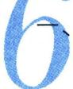

基于琴生不等式下的数列迭代求和 462

二、基于隐零点放缩下的数列迭代求和体系
…… 463  
三、不动点蛛网图下的单调性证明与伪等比探路体系 …… 467

# 第11章 三角与导数综合

# 第一节 三角函数与零点综合 …… 471

考点1：三角混合 $x\sin x$ 与 $x\cos x$ 型 471

1. 三角零点证明分区间型…… 471  
2. 参变分离型 472  
3. 高精度第二周期见分晓型…… 473

考点2：三角VS对数 476

1. 关于 $\sin x$ 与 $\ln (x + 1)$ …… 476  
2. $x-\ln x-1$ 与三角函数分而治之 … 480  
3. $x\sin x$ 与 $\ln(x+1)$ …… 481

考点 3：三角 VS 指数 …… 483

1. 0 处泰勒展开型 …… 483  
2. 关于 $\frac{x}{e^x}, xe^x$ 与 $\sin x$ 零点 …… 485  
3. 关于指数和正切组合零点…… 489

# 第二节 三角函数恒成立问题 …… 490

一、基于25新一卷的，三角恒成立解读 490  
二、三角恒成立与探路思想 493

考点1：端点效应模型 493  
考点2：极点效应模型 498  
考点 3：原函数极点效应失效 …… 501  
考点 4：隐点效应模型 …… 502

三、三角恒成立与放缩思想 …… 503

# 第三节 三角函数与数列综合 …… 504

考点1：基于 $\sin x$ 与 $\ln (1 + x)$ ……504  
考点 2：基于 $\cos x \sim 1 - \frac{1}{2}x^{2}$ 的放缩 … 506  
考点 3：基于弦切互化的数列综合放缩
…… 506  
考点 4：三角＋数列与零点综合 …… 508  
考点 5：三角泰勒展开与数列综合 … 511  
考点6：积式代换补充 512

# 第四节 三角函数与双元杂谈 …… 513

考点1：三角偏移结合和差化积的放缩 513  
考点2：三角与飘带结合，同一法的应用 514

text_image

第

# 1 章 技能篇——导数基本技能

# 第一节 同构函数的基础应用

# 一、六大函数基本模型

如图1，如果 $f(x)=xe^{x}$ ， $f'(x)=(x+1)\cdot e^{x}$ ，故 $f(x)$ 在区间 $(-∞,-1)$ 单调递减，在区间 $(-1,+∞)$ 单调递增， $f(x)_{\min}=f(-1)=-\frac{1}{e}$ .

同理，如图2： $x\ln x=e^{\ln x}\cdot\ln x=f(\ln x)$ ，当 $\ln x\in(-\infty,-1)$ ，即 $x\in\left(0,\frac{1}{e}\right)$ 单调递减，当 $\ln x\in(-1,+\infty)$ ，即 $x\in\left(\frac{1}{e},+\infty\right)$ 单调递增， $y_{\min}=-\frac{1}{e}$ .

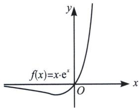

text_image

f(x)=x·e^x
O
x
y

图1

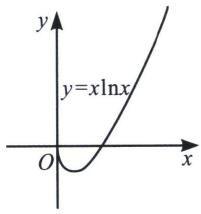

text_image

y
y=xlnx
O
x

图2

例1 (河北省2024届高三上学期大数据应用调研联合测评T7) 设实数 $a > 0$ ，若不等式 $ae^{ax} - 1 \geqslant \ln \frac{x}{e}$ 对任意 $x > 0$ 恒成立，则 $a$ 的最小值为 （）

A. e

B. $2 \mathrm{e}$

C. $\frac{1}{\mathrm{e}}$

D. $\frac{1}{2 \mathrm{e}}$

解析 由题意 $a \mathrm{e}^{ax} - 1 \geqslant \ln \frac{x}{\mathrm{e}}$ ，即 $a x \mathrm{e}^{ax} \geqslant x \ln x = \ln x \mathrm{e}^{\ln x}, a x > 0$ ，令 $f(x) = x \mathrm{e}^{x}, f'(x) = (x + 1) \cdot \mathrm{e}^{x}$ ，故 $f(x)$ 在区间 $(- \infty, -1)$ 单调递减，在区间 $(-1, +\infty)$ 单调递增，故 $f(ax) \geqslant f(\ln x) \Leftrightarrow a \geqslant \frac{\ln x}{x}$ ，由同构函数： $a \geqslant \frac{\ln x}{x_{\max}} = \frac{1}{\mathrm{e}}$ .

例2 (福建省厦门市科技中学 2024-2025 学年高一上学期 12 月阶段性检测 T8) 已知实数 $\alpha, \beta$ 满足 $\alpha e^{\alpha} = e^{3}, \beta (\ln \beta - 1) = e^{4}$ , 则 $\alpha \beta =$ \_\_\_\_.

解析 由题易知 $\alpha, \beta > 0$ ，同构 $F(x) = x\mathrm{e}^{x}$ ，则 $F(x)$ 在 $(0, +\infty)$ 上单调递增， $\beta (\ln \beta - 1) = \mathrm{e}^{4} \Leftrightarrow (\ln \beta - 1)\mathrm{e}^{(\ln \beta - 1)} = \mathrm{e}^{3}$ ，即 $F(\alpha) = F(\ln \beta - 1)$ ，由于 $\alpha, \beta > 0$ ，故 $\alpha = \ln \beta - 1$ ，即 $\alpha \beta = \beta (\ln \beta - 1) = \mathrm{e}^{4}$ .

例3 (2023·成都零诊选择压轴)若正实数 $x_{1}$ 是函数 $f(x) = x\mathrm{e}^{x} - x - \mathrm{e}^{2}$ 的一个零点， $x_{2}$ 是函数$g(x)=(x-\mathrm{e})(\ln x-1)-\mathrm{e}^{3}$ 的一个大于 e 的零点，则 $\frac{x_{1}(x_{2}-\mathrm{e})}{\mathrm{e}^{2}}$ 的值为（）

A. $\frac{1}{\mathrm{e}}$

B. $\frac{1}{\mathrm{e}^{2}}$

C. e

D. $e^{2}$

解析 由题意 $g(x_{2}) = (x_{2} - \mathrm{e})(\ln x_{2} - 1) - \mathrm{e}^{3} = 0\Rightarrow \ln \frac{x_2}{\mathrm{e}}\left(\frac{x_2}{\mathrm{e}} -1\right) - \mathrm{e}^2 = 0$ ， $f(x_{1}) = x_{1}\mathrm{e}^{x_{1}} - x_{1} - \mathrm{e}^{2} = 0$ $\Rightarrow x_{1}(\mathrm{e}^{x_{1}} - 1) - \mathrm{e}^{2} = 0$ ，函数 $h(x) = x(\mathrm{e}^x -1)$ 在(0， $+\infty)$ 单调递增

故 $x_{1} = \ln \frac{x_{2}}{\mathrm{e}}$ ，故 $\frac{x_1(x_2 - \mathrm{e})}{\mathrm{e}^2} = \frac{x_1}{\mathrm{e}^2}\cdot \frac{\mathrm{e}^3}{\ln x_2 - 1} = \mathrm{e}$ ，故选C.

例 4 （河北省邯郸市部分学校 2024—2025 学年高三下学期开学考试 T8）已知实数 a，b 满足 a-1= $\ln(4-a)$ ， $be^{b}=e^{3}$ ，其中 e 是自然对数的底数，则 $a+b=$ （）

A. 2

B. e

C. 3

D. 4

解析 由题意 $\mathrm{e}^{a - 1} + a - 1 = b + \ln b = \mathrm{e}^{\ln b} + \ln b = 3$ ，故 $a - 1 = \ln b$ ，则 $a + b = a + \mathrm{e}^{a - 1} = 4$ 。故选D.

例 5 （浙江省金华市曙光学校高二下学期第一次月考 T10）对 $\forall x > 0$ ，不等式 $2ae^{2x} - \ln x + \ln a \geqslant 0$ 恒成立，则实数 a 的最小值为（）

A. $\frac{2}{\sqrt{\mathrm{e}}}$

B. $\frac{1}{2 \sqrt{\mathrm{e}}}$

C. $\frac{2}{\mathrm{e}}$

D. $\frac{1}{2 \mathrm{e}}$

解析 由题意得： $2ae^{2x}\geqslant\ln x-\ln a\Rightarrow2xe^{2x}\geqslant\frac{x}{a}\ln\frac{x}{a}=e^{\ln\frac{x}{a}}\ln\frac{x}{a}\Rightarrow2x\geqslant\ln\frac{x}{a},\quad a\geqslant\frac{x}{e^{2x}_{\max}}=\frac{1}{2}\cdot\frac{2x}{e^{2x}_{\max}}=\frac{1}{2e}$ . 故选 D.

例6 (2024 春·新乐市校级月考 T12) 已知函数 $f(x) = \ln x + \frac{k}{x}$ ， $k \in \mathbb{R}$ ， $g(x) = 2 + \frac{1 - e}{x}$ ，若对任意 $x \in (0, +\infty)$ ，不等式 $f(x) \geqslant g(x)$ 恒成立，则实数 $k$ 的取值范围是 ( )

A. $k > 1$

B. $k \geqslant 1$

C. k>3

D. $k \geqslant 3$

解析 由题意得： $\ln x+\frac{k}{x}\geqslant2+\frac{1-\mathrm{e}}{x}\Leftrightarrow x\ln x-2x\geqslant1-\mathrm{e}-k\Rightarrow\mathrm{e}^{2}\frac{x}{\mathrm{e}^{2}}\ln\frac{x}{\mathrm{e}^{2}}\geqslant1-\mathrm{e}-k$

由同构函数 $\mathrm{e}^2\frac{x}{\mathrm{e}^2}\ln \frac{x}{\mathrm{e}^2}\geqslant -\mathrm{e}$ ，故 $k\geqslant 1$

如图 3: $y = \frac{x}{\mathrm{e}^{x}} = x \cdot \mathrm{e}^{-x} = -f(-x)$ , 即将 $f(x)$ 关于原点对称后得到 $y = \frac{x}{\mathrm{e}^{x}}$ , 故可得 $y = \frac{x}{\mathrm{e}^{x}}$ 在区间 $(-\infty, 1)$ 单调递增, 在区间 $(1, +\infty)$ 单调递减, 当 $x = 1$ 时, $y_{\max} = \frac{1}{\mathrm{e}}$ .

如图 4: $\frac{\ln x}{x} = -\ln x^{-1} \cdot x^{-1} = -f(-\ln x)$ , 实现了凹凸反转, 原来最小值反转后变成了最大值, 或者令 $h(x) = \frac{x}{\mathrm{e}^x}$ , $h(\ln x) = \frac{\ln x}{x}$ , 当 $\ln x \in (1, +\infty)$ , 即 $x \in (\mathrm{e}, +\infty)$ 单调递减, 当 $\ln x \in (-\infty, 1)$ , 即 $x \in (0, \mathrm{e})$ 单调递增, $y_{\max} = \frac{1}{\mathrm{e}}$ .

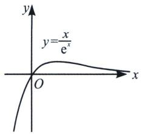

text_image

y
y=x/e^x
O
x

图3

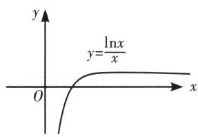

text_image

y
y=lnx/x
O
x

图4

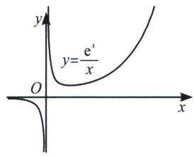

text_image

y
y=e^x/x
O
x

图 5

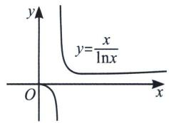

text_image

y
y=\frac{x}{\ln x}
O
x

图6

如图 5: $y = \frac{\mathrm{e}^{x}}{x} = -\frac{1}{-x \cdot \mathrm{e}^{-x}} = -\frac{1}{f(-x)} (x > 0)$ ，属于分式函数，将 $\frac{1}{f(x)}$ 关于原点对称后得到，故可得 $y = \frac{\mathrm{e}^{x}}{x}$ 在区间 $(0, 1)$ 单调递减，在区间 $(1, +\infty)$ 单调递增，当 $x = 1$ 时， $y_{\min} = e$ ；当 $x < 0$ 时， $y < 0$ .

如图 6：令 $h(x)=\frac{\mathrm{e}^{x}}{x}$ ， $h(\ln x)=\frac{x}{\ln x}(x>1)$ ，故可得 $y=\frac{x}{\ln x}$ 在区间 $(1,\mathrm{e})$ 单调递减，在区间 $(\mathrm{e},+\infty)$ 单调递增，当 x=e 时， $y_{\min}=e$ 。当 0<x<1 时，y<0。

# 二、六大函数的衍生模型

我们利用这六大基本函数来分析一些与之相关函数的单调性和最值，我们举几个例子，如下：

如图 7: $(x-1)\cdot\mathrm{e}^{x}=\mathrm{e}\cdot(x-1)\cdot\mathrm{e}^{x-1}=\mathrm{e}f(x-1)$ ，即将 $f(x)=xe^{x}$ 向右平移 1 个单位，再将纵坐标扩大为原来的 e 倍，故可得 $y=(x-1)\cdot\mathrm{e}^{x}$ 在区间 $(-∞,0)$ 单调递减，在区间 $(0,+∞)$ 单调递增，当 x=0 时， $y_{\min}=-1$ .

如图8：令 $f(x)=\frac{\mathrm{e}^{x}}{x}$ ， $y=\frac{\mathrm{e}^{x}}{x+1}=\frac{1}{\mathrm{e}}\frac{\mathrm{e}^{x+1}}{x+1}=\frac{1}{\mathrm{e}}f(x+1)(x>0)$ ，将 $f(x)$ 左移一个单位，再将纵坐标缩小为原来的 $\frac{1}{\mathrm{e}}$ 倍，故可得 $y=\frac{\mathrm{e}^{x}}{x+1}$ 在区间 $(-1,0)$ 单调递减，在区间 $(0,+\infty)$ 单调递增，当x=0时， $y_{\min}=1$ .

如图9：令 $f(x) = \frac{\ln x}{x}$ ， $\frac{\ln x + 1}{x} = e\frac{\ln ex}{ex} = ef(ex)$ ，当 $ex \in (e, +\infty)$ ，即 $x \in (1, +\infty)$ 单调递减，当 $ex \in (0, e)$ ，即 $x \in (0, 1)$ 单调递增， $y_{\max} = 1$ .

如图 10：令 $f(x)=\frac{\ln x}{x}$ ， $\frac{\ln x}{x^{2}}=\frac{1}{2}\frac{\ln x^{2}}{x^{2}}=\frac{1}{2}f(x^{2})$ ，当 $x^{2}\in(\mathrm{e},+\infty)$ ，即 $x\in(\sqrt{\mathrm{e}},+\infty)$ 单调递减，当 $x^{2}\in(0,\mathrm{e})$ ，即 $x\in(0,\sqrt{\mathrm{e}})$ 单调递增， $y_{\max}=\frac{1}{2\mathrm{e}}$ .

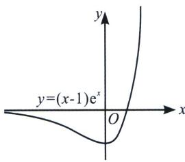

text_image

y
y=(x-1)e^x
O
x

图 7

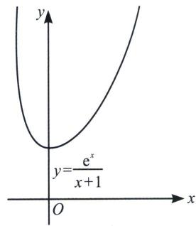

text_image

y
y=e^x/(x+1)
O
x

图8

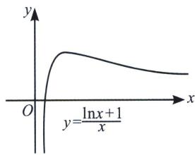

text_image

y
O
y=lnx+1/x
x

图9

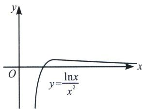

text_image

y
O
y=lnx/x²
x

图10

例7 函数 $f(x)=\frac{a+\ln x}{x}$ 的单调增区间为

A. $(-\infty, \mathrm{e}^{1 - a})$

B. $(0, \mathrm{e}^{1 - a})$

C. $(0, \mathrm{e}^{a})$

D. $(\mathrm{e}^{a}, + \infty)$

解析 $f(x) = \frac{a + \ln x}{x} = \mathrm{e}^{a} \cdot \frac{\ln e^{a}x}{\mathrm{e}^{a}x}$ ，由于函数 $y = \frac{\ln x}{x}$ 在区间 $(0, \mathrm{e})$ 单调递增， $(\mathrm{e}, +\infty)$ 单调递减，则当 $\mathrm{e}^{a}x \in (0, \mathrm{e})$ ，即 $x \in (0, \mathrm{e}^{1 - a})$ 时， $f(x)$ 单调递增，故选 B.

例 8 (2024 春·封开县校级期中) 函数 $f(x)=ax^{2}-x\ln x$ 在 $\left[\frac{1}{e},+\infty\right)$ 上单调递增，则实数 a 的取值范围是

A. $\left[\frac{1}{2}, +\infty\right)$

B. $\left(\frac{1}{2},+\infty\right)$

C. $[1, +\infty)$

D. $(1, +\infty)$

解析 因为 $f(x) = ax^2 - x \ln x$ 在 $\left[\frac{1}{\mathrm{e}}, +\infty\right)$ 上单调递增，所以 $f'(x) = 2ax - 1 - \ln x \geqslant 0, 2a \geqslant \frac{1 + \ln x}{x} = \mathrm{e}\frac{\ln x}{\mathrm{e}x}$ ，由同构函数 $2a \geqslant \left(\mathrm{e}\frac{\ln x}{\mathrm{e}x}\right)_{\max} = 1$ ，当且仅当 $x = 1$ 时等号成立，故 $a \geqslant \frac{1}{2}$ ，故选 A.

例 9 (2024 金凤区三模 T8) 若函数 $f(x)=x^{2}\ln x+ax$ 存在减区间，则 a 的取值范围为（）

A. $\left(e^{-\frac{3}{2}},+\infty\right)$

B. $(2e^{-\frac{3}{2}},+\infty)$

C. $(-∞,e^{-\frac{3}{2}})$

D. $(-∞, 2e^{-\frac{3}{2}})$

解析 由题可知 $f'(x)=2x\ln x+x+a$ ，因为函数 $f(x)=x^{2}\ln x+ax$ 存在减区间，则 $f'(x)<0$ 有解，即 $a<-2x\ln x-x=-2x\left(\ln x+\frac{1}{2}\right)=-2x\ln\sqrt{\mathrm{e}}x=\frac{-2}{\sqrt{\mathrm{e}}}\sqrt{\mathrm{e}}x\ln\sqrt{\mathrm{e}}x_{\max}=\frac{-2}{\sqrt{\mathrm{e}}}\cdot\left(-\frac{1}{\mathrm{e}}\right)=2\mathrm{e}^{-\frac{3}{2}}$ ，当且仅当 $\sqrt{\mathrm{e}}x=\frac{1}{\mathrm{e}}$ 时取得最值，故选D.

例10（湖北省十一校2024学年高三下学期第二次联考T8)若对于任意正数 $x, y$ ，不等式 $x(1 + \ln x) \geqslant x \ln y - ay$ 恒成立，则实数 $a$ 的取值范围是 （）

A. $\left(0, \frac{1}{\mathrm{e}}\right]$

B. $\left[\frac{1}{e^{3}},\frac{1}{e}\right]$

C. $\left[\frac{1}{e^{2}},+\infty\right)$

D. $\left[\frac{1}{e^{3}},+\infty\right)$

解析 $x(1 + \ln x) \geqslant x\ln y - ay \Leftrightarrow a \geqslant \frac{x\ln y - x(1 + \ln x)}{y} = \frac{x}{y}\ln \frac{y}{x} - \frac{x}{y}$ ，令 $\frac{y}{x} = t > 0$ ，则 $a \geqslant \frac{(\ln t - 1)}{t} = \frac{1}{e}\frac{\ln \frac{t}{e}}{\frac{t}{e}}$ ，由同构函数 $a \geqslant \frac{1}{e}\left[\frac{\ln \frac{t}{e}}{\frac{t}{e}}\right]_{\max} = \frac{1}{e^2}$ ，故选C.

例11 (2024 港口区月考 T8) 已知函数 $f(x) = \frac{4\mathrm{e}x^2}{1 + \ln 2x}$ ，则不等式 $f(x) > \mathrm{e}^{2x}$ 的解集是（）

A. (0, 1)

B. $\left(\frac{1}{2e},\frac{1}{4}\right)$

C. $\left(\frac{1}{e},1\right)$

D. $\left(\frac{1}{2e},\frac{1}{2}\right)$

解析 不等式 $\frac{4\mathrm{e}x^2}{1 + \ln 2x} >\mathrm{e}^{2x}$ 可整理为 $\frac{2\mathrm{e}x}{1 + \ln 2x} >\frac{\mathrm{e}^{2x}}{2x}$ ，令 $g(x) = \frac{\mathrm{e}^x}{x}$ ，定义域为 $(0, +\infty)$ ， $g(x)$ 在 $(0, 1)$ 上单调递减， $(1, +\infty)$ 上单调递增，则原不等式可看成 $g(1 + \ln 2x) > g(2x)$ ，根据切线不等式 $x - 1 \geqslant \ln x$ 得： $1 + \ln 2x \leqslant 2x$ ，当 $0 < x < \frac{1}{2}$ 时， $1 + \ln 2x < 1$ ， $2x < 1$ ，所以 $\left\{ \begin{array}{l} 1 + \ln 2x < 2x \\ 0 < 1 + \ln 2x < 1 \\ 0 < 2x < 1 \end{array} \right.$ ，解得 $\frac{1}{2\mathrm{e}} < x < \frac{1}{2}$ ；当 $x > \frac{1}{2}$ 时， $1 + \ln 2x > 1$ ， $2x > 1$ ，所以 $1 + \ln 2x > 2x$ ，不成立；综上可得，不等式 $f(x) > \mathrm{e}^{2x}$ 的解集为 $\left(\frac{1}{2\mathrm{e}}, \frac{1}{2}\right)$ . 故选 D.

例12 (湖北省部分学校 2025 届高三下学期模拟预测考试 T14) 已知关于 $x$ 的不等式 $x^{x^2} > ax^2 \ln x$ 在 $(0, +\infty)$ 上恒成立，则实数 $a$ 的取值范围为 \_\_\_\_.

解析 由 $x^{2} > ax^2\ln x$ ，可得 $\mathrm{e}^{x^2\ln x} > ax^2\ln x$ ，令 $t = \frac{1}{2} x^2\ln x^2 \geqslant -\frac{1}{2\mathrm{e}}$ ，则 $a < \frac{\mathrm{e}^t}{t} = g(t)$ ，当 $t = 0$ 时， $\mathrm{e}^0 > a \cdot 0$ ，所以 $a \in \mathbb{R}$ ，当 $t > 0$ ， $a < g(t)_{\min} = \mathrm{e}$ ，当 $-\frac{1}{2\mathrm{e}} \leqslant t < 0$ ， $g(t)_{\max} = \frac{\mathrm{e}^{-\frac{1}{2\mathrm{e}}}}{-\frac{1}{2\mathrm{e}}} = -2\mathrm{e}^{1 - \frac{1}{2\mathrm{e}}}$ ，所以 $a > -2\mathrm{e}^{1 - \frac{1}{2\mathrm{e}}}$ 。综上所述：实数 $a$ 的取值范围为 $(-2\mathrm{e}^{1 - \frac{1}{2\mathrm{e}}}, \mathrm{e})$ 。

例13 (2024三台县期中T9)已知函数 $f(x)=\sqrt{x}-\ln x-m$ 有零点，则实数m的范围为()

A. $(-∞, \sqrt{2}-\ln2]$

B. $(-∞, 2-2ln2]$

C. $\left[\sqrt{2}-\ln2,+\infty\right)$

D. $[2 - 2\ln 2, +\infty)$

解析 $f(x) = \sqrt{x} - \ln x - m, x > 0, m = \sqrt{x} - \ln x$ ，令 $t = \sqrt{x}$ ，则 $m = t - \ln t^2 = \ln \frac{e^t}{t^2} = 2\ln \frac{e^{\frac{t}{2}}}{t} = 2\ln \frac{1}{2}$ 。 $\cdot \frac{e^{\frac{t}{2}}}{\frac{t}{2}} \geqslant 2\ln \frac{e}{2}$ ，当且仅当 $\frac{t}{2} = 1$ 时取等，实数 $m$ 的范围为 $[2 - 2\ln 2, +\infty)$ 。故选 D.

关于 $\frac{\mathrm{e}^x}{x^n}$ 的最值问题， $\frac{\mathrm{e}^x}{x^n} = \left(\frac{\mathrm{e}^{\frac{x}{n}}}{\frac{x}{n}}\right)^n\cdot \frac{1}{n^n}\geqslant \left(\frac{\mathrm{e}}{n}\right)^n$ ，当且仅当 $x = n$ 时取得最小值；

同理， $x^{n}\mathrm{e}^{x}=\left(\frac{x}{n}\mathrm{e}^{\frac{x}{n}}\right)^{n}\cdot n^{n}$ ，当 $n=2k-1(k\in\mathbf{N}^{*})$ 时，能取得最小值 $-\left(\frac{n}{\mathrm{e}}\right)^{n}$ ；当 $n=2k(k\in\mathbf{N}^{*})$ 时，若 x<0，能取到最大值 $\left(\frac{n}{\mathrm{e}}\right)^{n}$ ，都是当且仅当 x=n 取到.

例14 (山西省沁县中学 2024-2025 学年高三上学期 1 月期末 T11) 设函数 $f(x) = x \ln x$ , $g(x) = \frac{f'(x)}{x}$ ，给定下列命题

①不等式 $g(x)>0$ 的解集为 $\left(\frac{1}{\mathrm{e}},+\infty\right)$ ；②函数 $g(x)$ 在 $(0,\mathrm{e})$ 单调递增，在 $(\mathrm{e},+\infty)$ 单调递减；

③ $x\in\left[\frac{1}{e},1\right]$ 时，总有 $f(x)<g(x)$ 恒成立；④若函数 $F(x)=f(x)-ax^{2}$ 有两个极值点，则实数 $a\in(0,1)$ .

则正确的命题的个数为 （）

A. 1

B. 2

C. 3

D. 4

解析 因为函数 $f(x) = x \ln x$ ，所以 $f'(x) = \ln x + 1$ ，令 $h(x) = \frac{\ln x}{x}$ ，则 $g(x) = \frac{\ln x + 1}{x} = e \cdot \frac{\ln e x}{e x} = eh(ex)$ ，对于①， $g(x) > 0$ 即 $\frac{\ln x + 1}{x} > 0, \ln x + 1 > 0$ ，即 $x > \frac{1}{e}$ 故正确，对于②， $h(x)$ 在(0，e)单调递增，故 $eh(ex)$ 在 $ex \in (0, e)$ 时，即 $x \in (0, 1)$ 时递增，故错误；对于③，当 $x \in \left[\frac{1}{e}, 1\right]$ 时， $f(x)$

单调递增， $f(x) \leqslant 0$ ，当且仅当 $x = 1$ 时取等，故 $g(x) \geqslant 0$ ，当且仅当 $x = \frac{1}{\mathrm{e}}$ 时取等，故 $f(x) < g(x)$ ，故②正确；对于④，若函数 $F(x) = f(x) - ax^2$ 有 2 个极值点，则 $F'(x) = f'(x) - 2ax$ 有 2 个零点，即 $\ln x + 1 - 2ax = 0$ ， $2a = \frac{\ln x + 1}{x} = g(x) = \mathrm{eh}(\mathrm{ex})$ ，即 $y = 2a$ 与 $y = g(x)$ 有两个交点，如图所示， $g(x) \in (0, 1)$ ，即 $a \in \left(0, \frac{1}{2}\right)$ 满足题意，故错误，综上，只有①③正确，故选 B.

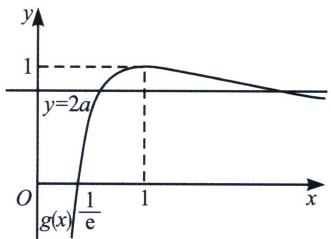

line

| x    | y     |
| ---- | ----- |
| 0    | 0     |
| 1    | 1     |

关于 $e^{x}+x,\quad x+\ln x$ 的同构问题，只需知道这两个结构都是递增的即可

例15（江苏省锡山高级中学2024—2025学年高一上学期期中考试T11）已知实数 $x_{1}$ ， $x_{2}$ 满足： $x_{1}+\mathrm{e}^{x_{1}}=2$ ， $\frac{\mathrm{e}}{x_{2}}-\ln x_{2}=1$ ，则 $x_{1}+\frac{\mathrm{e}}{x_{2}}$ 的值是\_\_\_\_。

解析 $\frac{\mathrm{e}}{x_2} -\ln x_2 = 1\Rightarrow \frac{\mathrm{e}}{x_2} +\ln \frac{\mathrm{e}}{x_2} = \mathrm{e}^{\ln \frac{\mathrm{e}}{x_2}} + \ln \frac{\mathrm{e}}{x_2} = 2$ ，又 $x_{1} + \mathrm{e}^{x_{1}} = 2$ ，设 $f(x) = x + \mathrm{e}^{x}$ ，因为 $f(x) = x+$ $\mathrm{e}^x$ 单调递增， $f(x_{1}) = f\left(\ln \frac{\mathrm{e}}{x_{2}}\right)\Leftrightarrow x_{1} = \ln \frac{\mathrm{e}}{x_{2}}$ ，所以 $x_{1} + \frac{\mathrm{e}}{x_{2}} = x_{1} + \mathrm{e}^{x_{1}} = 2.$

例16（上海市松江区2024—2025学年高一上学期期末质量监控T12）已知实数 $x_{1}$ 、 $x_{2}$ 满足 $\mathrm{e}^{x_1} + x_1 = 6$ ， $\ln \sqrt[5]{5x_2 + 3} +x_2 = \frac{3}{5}$ ，则 $x_{1} + 5x_{2} =$ \_\_\_\_.

解析 $\ln \sqrt[5]{5x_2 + 3} + x_2 = \frac{3}{5} \Rightarrow \ln (5x_2 + 3) + 5x_2 + 3 = 6 \Rightarrow \mathrm{e}^{\ln (5x_2 + 3)} + \ln (5x_2 + 3) = 6$ ，令 $f(x) = \mathrm{e}^x + x$ ， $f(x)$ 单调递增， $f(x_1) = f(\ln (5x_2 + 3)) \Rightarrow x_1 = \ln (5x_2 + 3)$ ，所以 $x_1 + 5x_2 = \ln (5x_2 + 3) + 5x_2 = 3$ .

# 三、零点成等差与等比模型

①若 $h(x)=\mathrm{e}^{x}-x$ ，则 $g(x)=x-\ln x=h(\ln x)$ ，当 $h(x_{1})=g(x_{2})$ 时， $g(x_{2})=h(\ln x_{2})=h(x_{1})$ ，当 $x_{1}<0,0<x_{2}<1$ （或者 $x_{1}>0,x_{2}>1$ )时，一定有 $x_{1}=\ln x_{2}$ ，或者 $x_{2}=\mathrm{e}^{x_{1}}$ ；

针对同构函数 $h(x) = \mathrm{e}^{x} - x$ 和 $g(x) = x - \ln x$ 与 $y = a$ 形成四个交点，即构成 $\left\{ \begin{array}{l}x_{1} = \ln x_{3}\\ x_{2} = \ln x_{4} \end{array} \right.$ ，一定有 $x_{1} + x_{4} = x_{2} + x_{3}$

②若 $h(x)=xe^{x}$ ，则 $g(x)=x\ln x=h(\ln x)$ ，当 $h(x_{1})=g(x_{2})$ 时， $g(x_{2})=h(\ln x_{2})=h(x_{1})$ ，当 $x_{1}<-1$ ， $0<x_{2}<\frac{1}{e}$ （或者 $x_{1}>-1$ ， $x_{2}>\frac{1}{e}$ ）时，一定有 $x_{1}=\ln x_{2}$ ，或者 $x_{2}=e^{x_{1}}$ ；

③若 $h(x)=\frac{\mathrm{e}^{x}}{x}\left(\text{或}\frac{x}{\mathrm{e}^{x}}\right)$ ，则 $g(x)=\frac{x}{\ln x}=h(\ln x)$ （或 $g(x)=\frac{\ln x}{x}=h(\ln x)$ ），当 $h(x_{1})=g(x_{2})$ 时， $g(x_{2})=h(\ln x_{2})=h(x_{1})$ ，当 $0<x_{1}<1,1<x_{2}<e$ （或者 $x_{1}>1,x_{2}>e$ )时，一定有 $x_{1}=\ln x_{2}$ ，或者 $x_{2}=\mathrm{e}^{x_{1}}$ ；

针对同构函数 $h(x) = \frac{\mathrm{e}^x}{x}$ 和 $g(x) = \frac{x}{\ln x}$ 与 $y = a$ 形成四个交点，即构成 $\left\{ \begin{array}{l}x_{1} = \ln x_{3}\\ x_{2} = \ln x_{4} \end{array} \right.$ ，一定有 $x_{1}x_{4}$ $= x_{2}x_{3}$

口诀：差值函数构等差，比值函数构等比.

例17（重庆市沙坪坝区第七中学校2024届高三上学期12月月考T8）已知函数 $f(x)=\frac{\ln x}{x}$ ， $g(x)=\frac{x}{e^{x}}$ ，若存在 $x_{1}\in(0,+\infty)$ ， $x_{2}\in R$ ，使得 $f(x_{1})=g(x_{2})=k(k<0)$ 成立，则下列结论正确的是()

A. $x_{1} + x_{2} > 1$

B. $\ln (-x_{2}) = -x_{1}$

C. $\left(\frac{x_{2}}{x_{1}}\right)^{2} \cdot e^{k}$ 的最大值为 $\frac{4}{e^{2}}$

D. $\left(\frac{x_2}{x_1}\right)^2 \cdot \mathrm{e}^k$ 的最大值为 $\frac{1}{\mathrm{e}^2}$

解析 由题意得 $f(x_{1})=\frac{\ln x_{1}}{x_{1}}=\ln x_{1}\cdot\mathrm{e}^{-\ln x_{1}}=k,\quad g(x_{2})=x_{2}\cdot\mathrm{e}^{-x_{2}}=k$ ，又 $f(x_{1})=g(x_{2})=k(k<0)$ ，故 $\ln x_{1}=x_{2}$ ，故B错；可得 $\frac{x_{2}}{x_{1}}=k$ ，所以 $\left(\frac{x_{2}}{x_{1}}\right)^{2}\cdot\mathrm{e}^{k}=k^{2}\cdot\mathrm{e}^{k}=4\left(\frac{k}{2}\cdot\mathrm{e}^{\frac{k}{2}}\right)^{2}$ ，构造 $h(x)=xe^{x}$ ，知 $h(x)_{\min}=h(-1)=-\frac{1}{\mathrm{e}}$ ，所以 $\left(\frac{x_{2}}{x_{1}}\right)^{2}\cdot\mathrm{e}^{k}$ 的最大值为 $\frac{4}{\mathrm{e}^{2}}$ 故，C对，D错；

对于 A， $x_{1}+x_{2}=x_{1}+\ln x_{1}$ ， $x_{1}<1$ ，由于 $y=x+\ln x$ 单调递增， $y=x_{1}+\ln x_{1}<1+\ln1=1$ ，A 错，故选 C.

例18 (江苏省百校联考2023-2024学年高三上学期第一次考试T7)已知函数 $f(x)=xe^{x}$ ， $g(x)=-\frac{\ln x}{x}$ ，若 $f(x_{1})=g(x_{2})=t(>0)$ ，则 $\frac{x_{1}}{x_{2}e^{t}}$ 的最大值为()

A. e

B. 1

C. $\frac{1}{e}$

D. $\frac{1}{\mathrm{e}^{2}}$

解析 由 $f(x_{1})=g(x_{2})=t>0$ 得： $x_{1}e^{x_{1}}=-\frac{\ln x_{2}}{x_{2}}=t$ ，即 $x_{1}e^{x_{1}}=\frac{1}{x_{2}}\ln\frac{1}{x_{2}}=\ln\frac{1}{x_{2}}e^{\ln\frac{1}{x_{2}}}$ ，又 $f(x)=xe^{x}(x>0)$ 是增函数，所以 $x_{1}=\ln\frac{1}{x_{2}}\Rightarrow e^{x_{1}}=\frac{1}{x_{2}}\Rightarrow x_{2}e^{x_{1}}=1$ ，则 $\frac{x_{1}}{x_{2}e^{t}}=\frac{x_{1}e^{x_{1}}}{x_{2}e^{x_{1}}e^{t}}=\frac{t}{e^{t}}$ ，令 $h(t)=\frac{t}{e^{t}}(t>0)$ ， $h(t)_{\max}=h(1)=\frac{1}{e}$ ，所以 $\frac{x_{1}}{x_{2}e^{t}}$ 的最大值为 $\frac{1}{e}$ 。故选C.

例19 (河北省衡水中学 2024 高三三调 T12) 函数 $f(x) = \frac{\mathrm{e}^x}{x} - m (x > 0)$ , $g(x) = \frac{x}{\ln x} - m (x > 1)$ ，则 ( )

A. 若函数 $f(x) \geqslant 0$ 恒成立，则 $m \leqslant 1$

B. 若函数 $g(x)$ 有两个不同的零点，记为 $x_{1}$ ， $x_{2}$ ，则 $x_{1} + x_{2} > 2e$

C. 若函数 $f(x)$ 和 $g(x)$ 共有两个不同的零点，则 $m = e$

D. 若函数 $f(x)$ 和 $g(x)$ 共有三个不同的零点，记为 $x_{1}$ ， $x_{2}$ ， $x_{3}$ ，且 $x_{1}<x_{2}<x_{3}$ ，则 $x_{1}\cdot x_{3}=x_{2}^{2}$

解析 对于 A，由 $f(x) \geqslant 0$ 恒成立得 $m \leqslant \frac{e^{x}}{x}$ 在 $(0, +\infty)$ 上恒成立，令 $h(x) = \frac{e^{x}}{x} (x > 0)$ ，则 $m \leqslant$

$h(x)_{\min}$ ， $h'(x)=\frac{(x-1)e^{x}}{x^{2}}$ ，令 $h'(x)<0$ ，得0<x<1；令 $h'(x)>0$ ，得x>1，故 $h(x)$ 在(0,1)上单调递减，在 $(1,+\infty)$ 上单调递增，所以 $h(x)_{\min}=h(1)=e$ ，即 $m\leqslant e$ ，故A错误；

对于 B，易知 $m > e,\left\{\begin{aligned}x_{1}&=m\ln x_{1}\\ x_{2}&=m\ln x_{2}\end{aligned}\right.\Rightarrow\frac{x_{2}-x_{1}}{\ln x_{2}-\ln x_{1}}=m<\frac{x_{1}+x_{2}}{2}\Rightarrow x_{1}+x_{2}>2m>2e$ ，B 正确；

对于 C，由选项 AB 可知 $h(x)$ ， $\varphi(x)$ 的单调性，且具有相同的极小值 e，可作出大致图象如图，

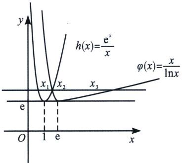

text_image

y
h(x)=e^x/x
φ(x)=x/lnx
x_1 x_2 x_3
e
O 1 e x

若函数 $f(x)$ 和 $g(x)$ 共有两个不同的零点，即 $h(x)$ ， $\varphi(x)$ 与 $y=m$ 共有两个交点，显然，当且仅当 $m=e$ 时，满足题意，故 C 正确；

对于 D，右函数 $f(x)$ 和 $g(x)$ 共有三个不同的零点，则 y=m 经过 $h(x)$ 与 $\varphi(x)$ 的交点，如图所示，因为 $h(x)=\frac{\mathrm{e}^{x}}{x}=\frac{\mathrm{e}^{x}}{\ln\mathrm{e}^{x}}=\varphi(\mathrm{e}^{x})$ ，所以 $\varphi(\mathrm{e}^{x_{1}})=h(x_{1})=\varphi(x_{2})$ ，因为 $0<x_{1}<1$ ，所以 $1<\mathrm{e}^{x_{1}}<\mathrm{e}$ ，又 $1<x_{2}<\mathrm{e}$ ，且 $\varphi(x)$ 在 $(1,\mathrm{e})$ 上单调递减，故 $e^{x_{1}}=x_{2}$ ，同理： $e^{x_{2}}=x_{3}$ ，即 $x_{2}=\ln x_{3}$ ，又由 $h(x_{1})=\varphi(x_{3})$ 得 $\frac{e^{x_{1}}}{x_{1}}=\frac{x_{3}}{\ln x_{3}}$ ，故 $x_{1}\cdot x_{3}=e^{x_{1}}\ln x_{3}=x_{2}^{2}$ ，故 D 正确。故选 BCD.

例20 (吉林省长春市五校 2024 学年高三上学期联合模拟考试 T11) 已知 $f(x) = (x + 1)\ln x$ , $g(x) = x(e^x + 1)$ ，则下列结论正确的是 ( )

A. 函数 $f(x)=(x+1)\ln x$ ，在 $(0,+\infty)$ 上存在唯一极值点  
B. 任意 $x \in (0, +\infty)$ , 有 $f(x) < g(x)$ 恒成立  
C. 若对任意 $x \in (0, +\infty)$ , 不等式 $g(x^2 + ax + a) \leqslant g(2e^x)$ 恒成立, 则实数 $a$ 的最大值为 2  
D. 若 $f(x_{1}) = g(x_{2}) = t$ , $(t > 0)$ , 则 $\frac{\ln t}{2x_{2}(x_{1} + 1)}$ 的最大值为 $\frac{1}{2e}$

解析 对于 A: $f'(x)=\ln x+1+\frac{1}{x}=-\ln\frac{1}{x}+1+\frac{1}{x}\geqslant2>0$ ，函数 $f(x)$ 无极值点，故 A 错误；

对于 B， $f(x)=(x+1)\ln x=(\mathrm{e}^{\ln x}+1)\ln x=g(\ln x)$ ， $g(x)=x(\mathrm{e}^{x}+1)$ ，显然 $g(x)$ 在 $(0,+\infty)$ 单调递增， $g(\ln x)<g(x)$ 成立，故 B 正确；

对于 C: $g'(x)=(x+1)e^{x}+1=\frac{(x+1)e^{x+1}}{e}+1>1-\frac{1}{e^{2}}>0$ ， $g(x)$ 在 $(0,+\infty)$ 上单调递增，不等式 $g(x^{2}+ax+a)\leqslant g(2e^{x})$ 恒成立， $x^{2}+ax+a\leqslant2e^{x}$ 恒成立，由泰勒展开 $x^{2}+ax+a\leqslant2+2x+x^{2}\leqslant2e^{x}$ ，所以 $a\leqslant2$ ，故 C 正确；

对于D：若 $f(x_{1}) = g(x_{2}) = t(t > 0)$ ，则 $x_{1}(\mathrm{e}^{x_{1}} + 1) = (x_{2} + 1)\ln x_{2} = t$ ，因为 $t > 0$ ，所以 $x_{1} > 0$ ， $x_{2}>$ 1，且 $x_{2} = \mathrm{e}^{x_{1}}$ ，当 $x_{2} = \mathrm{e}^{x_{1}}$ 时， $\frac{\ln t}{x_1(x_2 + 1)} = \frac{\ln[x_1(\mathrm{e}^{x_1} + 1)]}{x_1(\mathrm{e}^{x_1} + 1)}$ ，设 $k = x_{1}(\mathrm{e}^{x_{1}} + 1)$ ，设 $g(k) = \frac{\ln k}{k}\leqslant \frac{1}{\mathrm{e}},$

此时 $\mathrm{e}=x_{1}(\mathrm{e}^{x_{1}}+1)=(x_{2}+1)\ln x_{2}$ ， $\frac{\ln t}{2x_{1}(x_{2}+1)}$ 的最大值为 $\frac{1}{2e}$ ，故 D 正确，故选 BCD.

例21 (2022·新高考1)已知函数 $f(x)=\mathrm{e}^{x}-ax$ 和 $g(x)=ax-\ln x$ 有相同的最小值.

(1) 求 a;

(2)证明：存在直线 y=b，其与两条曲线 $y=f(x)$ 和 $y=g(x)$ 共有三个不同的交点，并且从左到右的三个交点的横坐标成等差数列.

解析 (1)当 $a \leqslant 0$ 时, $f(x)$ 单调递增, $g(x)$ 单调递减, 无最小值, 所以 $a > 0$

$f'(x)=\mathrm{e}^{x}-a,\quad g'(x)=a-\frac{1}{x},\quad f(x)_{\min}=f(\ln a)=a-a\ln a,\quad g(x)_{\min}=g\left(\frac{1}{a}\right)=1+\ln a$ ，由题知 $a-a\ln a=1+\ln a$ ，即 $\ln a=\frac{a-1}{a+1}$ ，设 $h(x)=\ln x-\frac{x-1}{x+1},\quad h'(x)=\frac{1}{x}-\frac{2}{(x+1)^{2}}=\frac{x^{2}+1}{x(x+1)^{2}}>0$ ，所以 $h(x)$ 单调递增，又 $h(1)=0$ ，所以 $h(x)$ 有唯一零点x=1，故a=1.

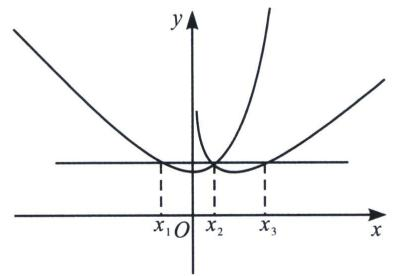

text_image

y
x₁ O x₂ x₃ x

(2)先证 $y=f(x)$ 与 $y=g(x)$ 恰有一个交点，设 $F(x)=f(x)-g(x)=\mathrm{e}^{x}+\ln x-2x$ ，由(1)知 $e^{x}\geqslant x+1$ ， $F'(x)=\mathrm{e}^{x}+\frac{1}{x}-2\geqslant x+1+\frac{1}{x}-2\geqslant1>0$ ，所以 $F(x)$ 单调递增， $F(1)=\mathrm{e}-2>0$ ，又 $F(x)=\mathrm{e}^{x}+\ln x-2x<\mathrm{e}+\ln x=0$ ，取 $x=e^{-e}$ ， $F(e^{-e})<0$ ，所以 $F(x)$ 有唯一零点，记作 $x_{2}$ ，由 $e^{x_{1}}-x_{1}=b$ ， $e^{x_{2}}-x_{2}=b$ 及 $x_{2}-\ln x_{2}=b\Leftrightarrow e^{\ln x_{2}}-\ln x_{2}=b$ ，得 $x_{1}=\ln x_{2}$ ；

由 $e^{x_{2}}-x_{2}=b,\quad x_{2}-\ln x_{2}=b$ 及 $x_{3}-\ln x_{3}=b\Leftrightarrow e^{\ln x_{3}}-\ln x_{3}=b$ ，得 $x_{2}=\ln x_{3}$

由 $e^{x_{2}}-x_{2}=x_{2}-\ln x_{2}$ ，得 $e^{x_{2}}+\ln x_{2}=2x_{2}$ ，即 $x_{3}+x_{1}=2x_{2}$ .

例22（上海市嘉定区2024届高三一模T21）已知 $f(x)=\frac{x}{\mathrm{e}^{x}}$ ， $g(x)=\frac{\ln x}{x}$ .

(1)求函数 $y=f(x)$ 、 $y=g(x)$ 的单调区间和极值；

(2)请严格证明曲线 $y=f(x)$ 、 $y=g(x)$ 有唯一交点；

(3)对于常数 $a \in \left(0, \frac{1}{\mathrm{e}}\right)$ ，若直线 y = a 和曲线 $y = f(x)$ 、 $y = g(x)$ 共有三个不同交点 $(x_{1}, a)$ 、 $(x_{2}, a)$ 、 $(x_{3}, a)$ ，其中 $x_{1} < x_{2} < x_{3}$ ，求证： $x_{1}$ 、 $x_{2}$ 、 $x_{3}$ 成等比数列.

解析 (1)由同构函数 $f(x)=\frac{x}{e^{x}}$ 的极值点为1，极大值为 $\frac{1}{e}$ ， $g(x)=\frac{\ln x}{x}$ 的极值点为e，极大值为 $\frac{1}{e}$ ；(2)令 $h(x)=\mathrm{e}^{x}\ln x-x^{2}$ ，当0<x<1， $h(x)=\mathrm{e}^{x}\ln x-x^{2}<0$ ，无零点，当x>1， $h'(x)=\mathrm{e}^{x}\left(\ln x+\frac{1}{x}\right)-2x>\mathrm{e}^{x}-2x>0$ ，(自证)， $h(1)=-1<0$ ， $h(e)=\mathrm{e}^{e}-\mathrm{e}^{2}>0$ ，故存在唯一 $x_{2}\in(1,e)$ 使得 $h(x)=0$ ，所以 $h(x)$ 有唯一零点，即 $y=f(x)$ 、 $y=g(x)$ 有唯一交点；

(3)图像如图对于常数 $a \in \left(0, \frac{1}{e}\right)$ ，直线 y = a 和曲线 $y = f(x)$ 、 $y = g(x)$ 共有三个不同交点， $(x_{1},$

$a)$ 、 $(x_{2},a)$ 、 $(x_{3},a)$ ，所以 $a = f(x_{2})$ 所以 $f(x_{1}) = f(x_{2}) = g(x_{2}) = g(x_{3})$ ， $0 <   x_{1} <   1 <   x_{2} <   x_{3}$

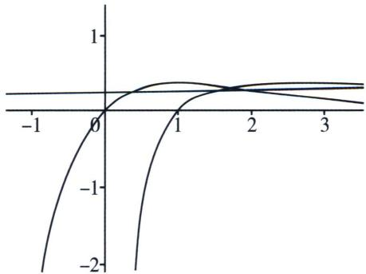

line

| x    | y1     | y2     | y3     |
| ---- | ------ | ------ | ------ |
| -1   | -2.0   | -1.5   | -1.0   |
| 0    | 0.0    | 0.0    | 0.0    |
| 1    | 0.5    | 0.8    | 0.6    |
| 2    | 0.7    | 0.9    | 0.8    |
| 3    | 0.8    | 0.95   | 0.9    |

$$
f (x _ {1}) = g (x _ {2}) \Leftrightarrow x _ {1} = \ln x _ {2}, f (x _ {2}) = g (x _ {3}) \Leftrightarrow x _ {2} = \ln x _ {3}
$$

所以 $x_{1}x_{3}=e^{x_{2}}\ln x_{2}=x_{2}^{2}$ ，即 $x_{1}$ 、 $x_{2}$ 、 $x_{3}$ 成等比数列.

# 四、指对同构体系

同构是一种很重要的思想，强调整体代换，抽丝剥茧，将复杂的问题通过同构变形后形成降维打击，自从2018年我们团队不断给大家还原同构命题的逻辑以后，这几年同构体系也在不断变化和升级，本文力争系统还原近几年同构的一些考题的新逻辑.

同构函数单调性

考点1：构造单调函数 $\mathrm{e}^x + x$ 或 $x + \ln x$

如图， $h(x)=x+\mathrm{e}^{x}\Rightarrow h(\ln x)=x+\ln x$ ，易知 $h(x)$ 为单调增函数(图1)，则 $h(\ln x)=x+\ln x$ 也为单调增函数(图2)，我们知道 $x\geqslant\ln x+1$ ，故一定有 $h(x)=x+\mathrm{e}^{x}\geqslant h(\ln x+1)=\mathrm{e}x+\ln x$ （图3）

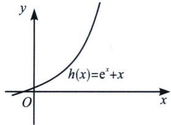

text_image

y
h(x)=e^x+x
O
x

图1

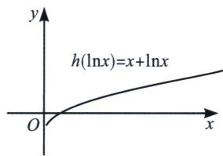

text_image

h(lnx)=x+lnx
O
x
y

图 2

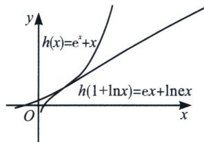

text_image

h(x)=e^x+x
h(1+lnx)=ex+lnex
O
x
y

图3

若 $h(x)$ 在区间 $D$ 上具备单调性，则 $h(p(x)) \geqslant h(q(x))$ 时，一定有 $p(x) \geqslant q(x)$ （或者 $p(x) \leqslant q(x)$ ）；

常见的单调性母函数模板：

① $h(x)=a^{x}+x(a>1)$ 在定义域内单调递增；

例1 (2020·新课标 I T12) 若 $2^{a} + \log_{2}a = 4^{b} + 2\log_{4}b$ 则 （）

A. $a > 2b$

B. $a <   2b$

C. $a > b^{2}$

D. $a < b^{2}$

解析 因为 $2^{a} + \log_{2} a = 4^{b} + 2\log_{4} b = 2^{2b} + \log_{2} b < 2^{2b} + \log_{2} 2b$ ；令 $f(x) = 2^{x} + \log_{2} x$ ，可知 $f(x)$ 在 $(0, +\infty)$ 内单调递增；则 $f(a) < f(2b) \Leftrightarrow a < 2b$ ；故选 B.

例2（甘肃张家川回族自治县第一中学2024届高三月考T11）若 $2^{a} + \log_{2}a < 2^{2b} + \log_{2}b + 1$ ，则下列正确的是 （）

A. $\ln(2b-a+1)<0$

B. $\ln(2b-a+1)>0$

C. $\ln|a-2b|>0$

D. $\ln |a - 2b| < 0$

解析 因为 $2^{a} + \log_{2}a < 2^{2b} + \log_{2}b + 1 = 2^{2b} + \log_{2}2b$ ；令令 $f(x) = 2^{x} + \log_{2}x$ ，可知 $f(x)$ 在 $(0, +\infty)$

内单调递增；则 $f(a)<f(2b)\Leftrightarrow a<2b$ ，即 $\ln(2b-a+1)>0$ ；故选 B.

例 3 (2023·陕西一模 T15)已知不等式 $e^{x}-1 \geqslant kx + \ln x$ ，对于任意的 $x \in (0, +\infty)$ 恒成立，则 k 的最大值 \_\_\_\_.

解析 法一(同构单调性): 构造函数 $h(x) = \mathrm{e}^{x} + x$ , 根据题意, $\mathrm{e}^{x} \geqslant kx + \ln \mathrm{ex} \Rightarrow \mathrm{e}^{x} + x \geqslant kx + \ln \mathrm{ex} + x$ , 在此基础上进行同构式转换, 即 $kx + \ln \mathrm{ex} + x = kx + x - \mathrm{e}x + \ln \mathrm{ex} + \mathrm{e}x = h(\ln \mathrm{ex}) + (k + 1 - \mathrm{e})x$ , 原不等式可以转化为同构式 $h(x) \geqslant h(\ln \mathrm{ex}) + (k + 1 - \mathrm{e})x$ , 由于 $h(x) \geqslant h(\ln \mathrm{ex})$ 恒成立, 当且仅当 $x = 1$ 时等号成立. 故 $k + 1 - \mathrm{e} \leqslant 0$ , 即 $k \leqslant \mathrm{e} - 1$ . 当 $k > \mathrm{e} - 1$ 时, 取 $x = 1$ 代入, 则 $\mathrm{e}^{1} - 1 - k < 0$ , 矛盾;

法二(分而治之): $\mathrm{e}^{x}-1 \geqslant k x + \ln x \Rightarrow \frac{\mathrm{e}^{x}}{x} \geqslant k + \frac{1 + \ln x}{x}, \frac{\mathrm{e}^{x}}{x} \geqslant \mathrm{e}$ , 当且仅当 $x=1$ 时取等; $\frac{1+\ln x}{x} = \mathrm{e} \cdot \frac{\ln \mathrm{e} x}{\mathrm{e} x} \leqslant 1$ , 当且仅当 $\mathrm{e} x = \mathrm{e}$ , 即 $x=1$ 时取等, 故 $\mathrm{e} \geqslant k+1, k \leqslant \mathrm{e}-1$ , 当 $k > \mathrm{e}-1$ 时, 代入 $x=1$ 时矛盾; 故答案为: $\mathrm{e}-1$ .

例4 (2023·江西模拟 T16) 已知 $a \mathrm{e}^{ax} - \ln \left(x + \frac{2}{a}\right) - 2 \geqslant 0$ 在上恒成立, 则实数 $a$ 的取值范围 \_\_\_\_.

解析 令 $f(x)=ae^{ax}-\ln\left(x+\frac{2}{a}\right)-2$ ，当a<0时，显然题设不成立，当a>0时， $f(x)=ae^{ax}-\ln\left(x+\frac{2}{a}\right)-2\geqslant0$ 在 $\left(-\frac{2}{a},+\infty\right)$ 上恒成立，即 $ae^{ax}-\ln(ax+2)-\ln a-2\geqslant0$ ，即 $ae^{ax}+\ln(ae^{ax})\geqslant\ln(ax+2)+ax+2$ 在 $\left(-\frac{2}{a},+\infty\right)$ 上恒成立，令 $h(x)=x+\ln x$ ，即 $h(ae^{ax})\geqslant h(ax+2),ae^{ax}\geqslant ax+2$ 在 $\left(-\frac{2}{a},+\infty\right)$ 上恒成立，即 $e^{ax}-x-\frac{2}{a}\geqslant0$ ，

法一(六大函数): $\mathrm{e}^{ax} \geqslant x + \frac{2}{a} \Rightarrow \frac{\mathrm{e}^{ax + 2}}{ax + 2} \geqslant \frac{\mathrm{e}^2}{a}$ , 所以 $\mathrm{e} \geqslant \frac{\mathrm{e}^2}{a}$ , 当且仅当 $ax + 2 = 1$ 时取等, 所以 $a \geqslant \mathrm{e}$ ; 法二(朗博同构): $\mathrm{e}^{ax} \geqslant x + \frac{2}{a} \Rightarrow a\mathrm{e}^{ax} - ax - 2 = \mathrm{e}^{ax + \ln a} - ax - \ln a - 1 + \ln a - 1 = h(ax + \ln a) + \ln a - 1 \geqslant 0$ , 所以 $a \geqslant \mathrm{e}(h(x) = \mathrm{e}^x - x - 1 \geqslant 0)$ , 当且仅当 $ax + \ln a = 0$ 时取等; 故答案为: [e, +∞).

注意: 本题可以全程利用同构保值性, 但是操作起来相对复杂一点, 我们也可以如下尝试: $e^{ax + \ln a} - (ax + \ln a) - 1 + ax + \ln a - \ln \left(x + \frac{2}{a}\right) - 1 = e^{ax + \ln a} - (ax + \ln a) - 1 + ax + 2 - \ln (ax + 2) - 1 + 2 \ln a - 2 = h(ax + \ln a) + h(\ln (ax + 2)) + 2(\ln a - 1) \geqslant 0$ , 同样也能得出相同的结果.

例5 (2025天津市河东区质检T15)设函数 $f(x)=x+\ln x$ ， $g(x)=x+e^{x}$ ，若存在 $x_{1}$ ， $x_{2}$ ，使得 $g(x_{1})=f(x_{2})$ ，则 $|x_{1}-x_{2}|$ 的最小值为\_\_\_\_。

解析 因为 $g(x_{1}) = f(x_{2})$ ，所以 $\mathrm{e}^{x_1} + x_1 = x_2 + \ln x_2 = \mathrm{e}^{\ln x_2} + \ln x_2$ ，即 $g(x) = \mathrm{e}^x + x\uparrow$ ，由 $g(x_{1}) = g(\ln x_{2}) \Rightarrow x_{1} = \ln x_{2}$ ，所以 $|x_{1} - x_{2}| = |x_{2} - \ln x_{2}| \geqslant 1$ ，则 $|x_{1} - x_{2}|$ 的最小值为 1.

例6 (2025 河南二模 T7) 已知函数 $f(x) = \mathrm{e}^{2x + a} - \frac{1}{2}\ln (x + 5) + \frac{a}{2} - 5$ 有零点，那么实数 $a$ 的最大值

为 （）

A. $\frac{1}{2}$

B. 1

C. $1+\ln2$

D. $9 - \ln 2$

解析 因为函数 $f(x) = \mathrm{e}^{2x + a} - \frac{1}{2}\ln (x + 5) + \frac{a}{2} - 5$ 有零点，由 $f(x) = 0$ ，得 $\mathrm{e}^{2x + a} + \frac{a}{2} = 5 + \frac{1}{2}\ln (x + 5)$ ，即 $\mathrm{e}^{2x + a} + x + \frac{a}{2} = x + 5 + \frac{1}{2}\ln (x + 5)$ ，则 $\mathrm{e}^{2\left(x + \frac{a}{2}\right)} + x + \frac{a}{2} = \mathrm{e}^{\ln (x + 5)} + \frac{1}{2}\ln (x + 5)$ ，令函数 $g(x) = \mathrm{e}^{2x} + x \uparrow$ ，则有 $g\left(x + \frac{a}{2}\right) = g\left(\frac{1}{2}\ln (x + 5)\right)$ ，故 $x + \frac{a}{2} = \frac{1}{2}\ln (x + 5)$ ，即 $a = \ln (x + 5) - 2x$ ，令 $h(x) = \ln (x + 5) - 2x$ ， $h'(x) = \frac{1}{x + 5} - 2$ ，当 $-5 < x < -\frac{9}{2}$ ， $h'(x) > 0$ ， $h(x)$ 单调递增，当 $x > -\frac{9}{2}$ ， $h'(x) < 0$ ， $h(x)$ 单调递减，故函数 $h(x)$ 在 $x = -\frac{9}{2}$ 时取得最大值 $9 - \ln 2$ ，所以实数 $a$ 的最大值为 $9 - \ln 2$ . 故选 D.

例7 (2023·安徽模拟 T8)已知 a>0, b>0，且 $b[\sqrt{a^{2}+1}+\ln(ab)]>\sqrt{1+b^{2}}$ ，则 a, b 的值不可能是

A. $\left\{ \begin{array}{l}a = 2\\ b = \sin 31^{\circ} \end{array} \right.$

B. $\left\{ \begin{array}{l}a = \log_25\\ b = \frac{\sqrt{5}}{4} \end{array} \right.$

C. $\left\{ \begin{array}{l}a = \log_43\\ b = \log_45 \end{array} \right.$

D. $\left\{\begin{aligned}a&=1\\ b&=2\end{aligned}\right.$

解析 因为 $b[\sqrt{a^2 + 1} + \ln (ab)] > \sqrt{1 + b^2}$ , $a > 0$ , $b > 0$ , 所以 $\sqrt{a^2 + 1} + \ln a > \sqrt{\frac{1}{b^2} + 1} - \ln b = \sqrt{\frac{1}{b^2} + 1} + \ln \frac{1}{b}$ , $h(x) = \sqrt{x^2 + 1} + \ln x$ , 显然 $h(x)$ 单调递增, $h(a) > h\left(\frac{1}{b}\right)$ , 所以 $a > \frac{1}{b}$ ;

对于 A， $2\sin31^{\circ}>2\sin30^{\circ}=1$ ，满足 $a>\frac{1}{b}$ ，但不符合题意；

对于 B， $ab=\frac{\sqrt{5}}{4}\cdot\frac{\ln5}{\ln2}=\frac{2\cdot\sqrt{5}\ln\sqrt{5}}{2\cdot2\ln2}=\frac{\sqrt{5}\ln\sqrt{5}}{2\ln2}>1(x\ln x$ 在 $\left(\frac{1}{e},+\infty\right)$ 递增)，满足 $a>\frac{1}{b}$ ，但也不符合题意；

对于 C, $ab=\frac{\ln3}{\ln4}\cdot\frac{\ln5}{\ln4}<\frac{\left(\frac{\ln3+\ln5}{2}\right)^{2}}{\ln^{2}4}=\left(\frac{\ln\sqrt{15}}{\ln4}\right)^{2}<1$ , C 符合题意;

对于 D, $a > \frac{1}{b}$ ，不符合题意，故选 C.

例8 (2024 秋·湖北月考 T15) 已知实数 $x_{1}$ , $x_{2}$ 满足 $\mathrm{e}^{x_{1}} + x_{1} = 10$ , $\ln \sqrt[3]{3x_{2} + 2} + x_{2} = \frac{8}{3}$ , 则 $x_{1} + 3x_{2} =$ \_\_\_\_.

解析 $\ln \sqrt[3]{3x_2 + 2} + x_2 = \frac{8}{3} \Rightarrow \frac{1}{3} \ln (3x_2 + 2) + x_2 = \frac{8}{3} \Rightarrow \ln (3x_2 + 2) + (3x_2 + 2) = 10$ ，令 $g(x) = x + e^x$ 易知 $g(x)$ 在 $\mathbf{R}$ 上单调递增，所以 $\ln (3x_2 + 2) = x_1 \Rightarrow 3x_2 + 2 = e^{x_1} = 10 - x_1 \Rightarrow x_1 + 3x_2 = 8$ 。故答案为：8.

考点2：构造单调函数 $\mathrm{e}^x - x (x > 0)$ 或者 $\mathrm{e}^{-x} + x$

① $h(x)=\mathrm{e}^{x}-x\geqslant1$ 在 $(-∞,0)$ 单调递减，在 $(0,+∞)$ 单调递增；

② $h(x)=x+\frac{1}{\mathrm{e}^{x}}\geqslant h(0)=1$ 在 $(-∞,0)$ 单调递减，在 $(0,+∞)$ 单调递增.

③ $\frac{1}{x}+\ln x=\frac{1}{x}-\ln\frac{1}{x}$ 在(0,1)单调递减，在(1,+∞)单调递增.

例 9 (2023 丹阳月考多选 T12) 函数 $f(x)=\mathrm{e}^{x}-x$ ， $g(x)=x-\ln x$ ，则下列正确的是（）

A. $f(\ln x)$ 在 $(0, +\infty)$ 上是增函数  
B. $g(e^{x})$ 在 $(0, +\infty)$ 上是增函数  
C. $\forall x > 1$ ，不等式 $f(ax) \geqslant f(\ln x^2)$ 恒成立，则正实数 $a$ 的最小值为 $\frac{2}{\mathrm{e}}$   
D. 若 $g(x)=t$ 有两个零点 $x_{1}$ ， $x_{2}$ ，则 $x_{1}+x_{2}<2$

解析 对于 A: $f(\ln x) = x - \ln x = g(x)$ ，由六大函数知 $g(x)$ ，在 $(1, +\infty)$ 上单调递增，故 A 错误；

对于 B: $g(e^{x})=e^{x}-x=h(x)$ ，由六大函数知 $h(x)$ ，在 $(0,+\infty)$ 上单调递增，故 B 正确；

对于 C：当 x>1 时， $\ln x^{2}>\ln1=0$ ，又因为 a 为正实数，所以 ax>a>0，因为 $f'(x)=\mathrm{e}^{x}-1$ ，所以当 x>0 时， $f'(x)>0$ 恒成立，所以函数 $f(x)$ 在 $(0,+\infty)$ 上单调递增，则由 $f(ax)\geqslant f(\ln x^{2})$ 得： $ax\geqslant\ln x^{2}$ ，即 $a\geqslant\frac{2\ln x}{x}\max=\frac{2}{e}$ ，故 C 正确；

对于 D: 函数 $g(x)=t$ 有两个根 $x_{1}$ ， $x_{2}$ ，等价于 $x_{1}-\ln x_{1}=x_{2}-\ln x_{2}\Rightarrow\frac{x_{2}-x_{1}}{\ln x_{2}-\ln x_{1}}=1<\frac{x_{1}+x_{2}}{2}$ （ALG 不等式）故 D 错误。故选 BC.

例10 (2024 湖北武汉高二月考 T14) 若 $a > 1$ , 不等式 $x \mathrm{e}^{x} - x + (a - 2) \ln x - x^{a - 1} > 0$ 在 $(1, +\infty)$ 上恒成立, 则实数 $a$ 的取值范围是 \_\_\_\_.

解析 设 $f(x)=\mathrm{e}^{x}-x(x>0)$ ， $f(x)$ 在 $(0,+\infty)$ 单调递增，因为 $x\mathrm{e}^{x}-x+(a-2)\ln x-x^{a-1}>0$ ，所以 $x\mathrm{e}^{x}-x-\ln x>x^{a-1}-(a-1)\ln x$ ，所以 $f(x+\ln x)>f(\ln x^{a-1})$ ，所以 $x+\ln x>(a-1)\ln x$ ，即 $x>(a-2)\ln x$ ，所以 $\frac{x}{\ln x_{\min}}=\mathrm{e}>a-2$ ，则实数a的取值范围是 $(1,\mathrm{e}+2)$ 。故答案为： $(1,\mathrm{e}+2)$ 。

例11 (2023 安徽师大附中月考 T16) 已知 $a > \mathrm{e}^{-\frac{2}{3}}$ ，若对于任意的 $x \in \left[\frac{2}{3}, +\infty\right)$ ，不等式 $\ln \frac{2a}{3x} \geqslant -\frac{1}{ae^x} + \frac{2}{3x} - x$ 恒成立，则 $a$ 的最小值为 \_\_\_\_.

解析 由 $\ln \frac{2a}{3x} \geqslant -\frac{1}{ae^x} + \frac{2}{3x} - x \Rightarrow \ln a + x + \frac{1}{ae^x} \geqslant -\ln \frac{2}{3x} + \frac{2}{3x} \Rightarrow \ln (a \cdot e^x) + \frac{1}{ae^x} \geqslant \ln \frac{1}{\frac{2}{3x}} + \frac{2}{3x}$ ，因为 $x \in \left[\frac{2}{3}, +\infty\right)$ ，所以 $\frac{3}{2} x \geqslant 1$ ，因为 $x \in \left[\frac{2}{3}, +\infty\right)$ ， $a > e^{-\frac{2}{3}}$ ，所以 $ae^x \geqslant 1$ ，构造新函数 $f(x) = \ln x + \frac{1}{x}$ ， $x \geqslant 1$ ， $f'(x) = \frac{1}{x} - \frac{1}{x^2} = \frac{x - 1}{x^2}$ ，因为 $x \geqslant 1$ ，所以 $f'(x) \geqslant 0$ ，函数 $f(x)$ 单调递增，所以由 $\ln (a \cdot e^x) + \frac{1}{ae^x} \geqslant \ln \frac{1}{\frac{2}{3x}} + \frac{2}{3x} \Rightarrow f(a \cdot e^x) \geqslant f\left(\frac{1}{\frac{2}{3x}}\right) \Rightarrow a \cdot e^x \geqslant \frac{1}{\frac{2}{3x}}$ ，即 $a \geqslant \frac{3}{2} \cdot \frac{x}{e^{x}_{\max}} = \frac{3}{2e}$ ，故答案为： $\frac{3}{2e}$ .

例12 (2025 广东省广州市三校期中 T8) 已知正实数 $x$ ， $y$ 满足 $\frac{x}{3} + 3y - 2 = \ln x + \ln y$ ，则 $x + y = (\quad)$

A. 2

B. $\frac{5}{2}$

C. $\frac{1}{4}$

D. $\frac{10}{3}$

解析 $\frac{x}{3} + 3y - 2 = \ln x + \ln y$ 即 $\frac{x}{3} - \ln x + 3y - \ln y = 2 \Rightarrow \frac{x}{3} - \ln \frac{x}{3} - 1 + 3y - \ln 3y - 1 = 0$ ，设 $f(t) = t - \ln t - 1$ ，由切线函数易知 $f(t) \geqslant 0, t = 1$ 取等，原式等价于 $f\left(\frac{x}{3}\right) + f(3y) = 0$ ，即 $\frac{x}{3} = 1$ 且 $3y = 1$ ，所以 $x = 3, y = \frac{1}{3}$ ，所以 $x + y = 3 + \frac{1}{3} = \frac{10}{3}$ .

例13 (2016·四川T21)设函数 $f(x)=ax^{2}-a-\ln x$ ， $g(x)=\frac{1}{x}-\frac{1}{e^{x-1}}$ ，其中 $a\in R$ ， $e=2.718\cdots$ 为自然对数的底数.

(1) 讨论 $f(x)$ 的单调性；  
(2)证明：当x>1时， $g(x)>0$ ;  
(3)如果 $f(x)>g(x)$ 在区间 $(1,+\infty)$ 内恒成立，求实数a的取值范围.

解析 (1) 由 $f(x) = ax^2 - a - \ln x$ ，得 $f'(x) = 2ax - \frac{1}{x} = \frac{2ax^2 - 1}{x} (x > 0)$ ，当 $a \leqslant 0$ 时， $f'(x) < 0$ ， $f(x)$ 单调递减；当 $a > 0$ 时，令 $f'(x) = 0$ ，得 $x = \pm \sqrt{\frac{1}{2a}}$ 则当 $x \in (0, \sqrt{\frac{1}{2a}})$ 时， $f'(x) < 0$ ， $f(x)$ 递减，当 $x \in (\sqrt{\frac{1}{2a}}, +\infty)$ 时， $f'(x) > 0$ ， $f(x)$ 递增；综上，当 $a \leqslant 0$ 时， $f(x)$ 为 $(0, +\infty)$ 上的减函数，当 $a > 0$ 时， $f(x)$ 在 $(0, \sqrt{\frac{1}{2a}})$ 上为减函数，在 $(\sqrt{\frac{1}{2a}}, +\infty)$ 上为增函数；

(2)证明：要证 $g(x)>0(x>1)$ ，即 $\frac{1}{x}-\frac{1}{e^{x-1}}>0$ ，即证 $\frac{1}{x}>\frac{e}{e^{x}}$ ，也就是证 $\frac{e^{x}}{x}>e$ （同构函数自证），即当x>1时， $G(x)>e$ ，所以当x>1时， $g(x)>0$ ；  
(3)要证 $f(x)>g(x)$ 恒成立，即证 $\left[\mathrm{e}^{-(x-1)}+(x-1)\right]-\left(\frac{1}{x}+\ln x\right)+(x-1)(ax+a-1)>0$ 恒成立，令 $h(x)=x+\frac{1}{\mathrm{e}^{x}}$ ，当x>0时， $h'(x)=1-\mathrm{e}^{-x}>0$ ，易知 $h(x)$ 单调递增，易证 $x-1>\ln x(x>1)$ ， $h(x-1)=x-1+\frac{1}{\mathrm{e}^{x-1}}>h(\ln x)=\ln x+\frac{1}{x}\Leftrightarrow h(x-1)-h(\ln x)>0$ ，故 $(x-1)(ax+a-1)+h(x-1)-h(\ln x)>0$ ；由于x-1>0，故仅需分析 $ax+a-1\geqslant0$ 恒成立；①当 $a\leqslant0$ 时， $f(x)<0$ ， $g(x)>0$ ，矛盾；  
②当 $0 < a < \frac{1}{2}$ 时，由(1)知取 $x_{0} = \sqrt{\frac{1}{2a}} > 1$ ，使得 $f(x_{0}) < f(1) = 0$ ，得 $g(x_{0}) > 0$ ，矛盾；  
③当 $a \geqslant \frac{1}{2}$ 时， $ax + a - 1 > 0$ 对 $x \in (1, +\infty)$ 恒成立，满足；综合有 $a \geqslant \frac{1}{2}$ .

考点3：构造单调函数 $x\mathrm{e}^{x}(x > 0)$ 或 $x\mathrm{e}^{x} + x$

根据本书第一章的介绍，我们都知道 $x\mathrm{e}^x$ 在 $(-1, +\infty)$ 单调递增，通常我们仅需选取 $x \in (0, +\infty)$ ，在这个区间是单调递增的，且 $x < 0$ 时， $f(x) < 0$ ；

$h(x) = x\mathrm{e}^{x} + x$ ，则 $h^{\prime}(x) = (x + 1)\mathrm{e}^{x} + 1\geqslant -\frac{1}{\mathrm{e}^{2}} +1 > 0$ ，故 $h(x)$ 单调递增；

例14 (辽宁省县级重点高中协作体 2024 学年高三 11 月期中考试 T16) 若 $a e^{ax - 1} \geqslant 1 + \ln x$ 在 $(0, +\infty)$ 上恒成立，则 $a$ 的取值范围是 \_\_\_\_.

解析 由 $ae^{ax - 1} \geqslant 1 + \ln x$ ，得 $a > 0$ ，变形得 $axe^{ax} \geqslant ex\ln (ex)$ ，所以 $axe^{ax} \geqslant e^{\ln (ex)}\ln (ex)$ ，令 $g(t) = te^t$ ， $g(t)$ 在 $(0, +\infty)$ 上为增函数，若 $\ln (ex) \leqslant 0$ ，则不等式恒成立，若 $\ln (ex) > 0$ ，则 $x > \frac{1}{e}$ ， $axe^{ax} \geqslant e^{\ln (ex)}\ln (ex)$ ，即 $g(ax) \geqslant g(\ln x)$ ，所以 $ax \geqslant \ln (ex) = 1 + \ln x$ ，即 $a \geqslant \frac{1 + \ln x}{x}_{\max} = e \cdot \frac{\ln x}{ex} = 1$ 恒成立，故答案为： $[1, +\infty)$ .

例15 (2021 成都一诊 T12·多选) 已知函数 $f(x) = x + \ln (x - 1)$ ， $g(x) = x\ln x$ ，若 $f(x_1) = 1 + 2\ln t$ ， $g(x_2) = t^2$ ，则 $(x_1x_2 - x_2)\ln t$ 的取值可能是（）

A. $-\frac{2}{e}$

B. $-\frac{1}{2e^{2}}$

C. $-\frac{1}{2e}$

D. $-\frac{1}{e}$

解析 因为 $f(x_{1})=x_{1}+\ln(x_{1}-1)=1+2\ln t$ ，即 $x_{1}-1+\ln(x_{1}-1)=\ln t^{2}=\ln\left[\mathrm{e}^{x_{1}-1}\cdot(x_{1}-1)\right]$ ，所以 $t^{2}=\mathrm{e}^{x_{1}-1}(x_{1}-1)①$ ， $t^{2}>0$ ，因为 $g(x_{2})=x_{2}\ln x_{2}=t^{2}=\mathrm{e}^{\ln x_{2}}\cdot\ln x_{2}②$ ，又因为 $y=x\cdot\mathrm{e}^{x}$ 在 $[0,+\infty)$ 上单调递增，故由①②得 $x_{1}-1=\ln x_{2}$ ，故 $(x_{1}x_{2}-x_{2})\ln t=x_{2}\ln x_{2}\cdot\ln t=t^{2}\ln t=\frac{1}{2}t^{2}\ln t^{2}\geqslant-\frac{1}{2\mathrm{e}}$ ，故选BC.

例16 (2023·富县期中 T12) 若对任意 $x \in (1, +\infty)$ , 不等式 $(\ln a + x - 1)e^{x - 1} > \frac{x}{a}\ln x$ 恒成立, 则 $a$ 的范围是

A. (0, 1)

B. $(0,1]$

C. $[1, +\infty)$

D. $(1, +\infty)$

解析 由题意可得： $a > 0$ ， $\ln a + x - 1 = \ln a + \ln e^{x - 1} = \ln (ae^{x - 1})$ ，由 $(\ln a + x - 1)e^{x - 1} > \frac{x}{a}\ln x$ 可得 $e^{x - 1}\ln (ae^{x - 1}) > \frac{x}{a}\ln x$ ，即 $ae^{x - 1}\ln (ae^{x - 1}) > x\ln x$ ，令 $g(x) = x\ln x$ ，可得 $g(a\mathrm{e}^{x - 1}) > g(x)$ ， $g(x) = x\ln x$ 在(1， $+\infty$ )单调递增，若 $ae^{x - 1}\in (0,1]$ ，则 $g(a\mathrm{e}^{x - 1})\leqslant 0$ ， $g(a^{x - 1}) > g(x)$ 不成立，故 $ae^{x - 1}>$ 1，若 $g(a\mathrm{e}^{x - 1}) > g(x)$ ，则 $ae^{x - 1} > x$ ，可得 $a > \frac{x}{\mathrm{e}^{x - 1}_{\max}} = \mathrm{e}\cdot \frac{x}{\mathrm{e}^x_{\max}} = 1$ ；故选C.

例17 (2025云南省临沧中学高考适应性模拟 T7) 设函数 $f(x)=x(e^{x}+1)$ ， $g(x)=(x+1)\ln x$ ，若存在实数 $x_{1}$ ， $x_{2}$ ，使得 $f(x_{1})=g(x_{2})$ ，则 $\left|x_{1}-x_{2}\right|$ 的最小值为（）

A. e

B. 2

C. 1

D. $\frac{1}{\mathrm{e}}$

解析 $g(x) = (x + 1)\ln x = \ln x\cdot (\mathrm{e}^{\ln x} + 1) = f(\ln x)$ ，存在实数 $x_{1}$ ， $x_{2}$ ，使得 $f(x_{1}) = g(x_{2})$ ，即 $f(x_{1}) = g(x_{2}) = f(\ln x_{2}),f^{\prime}(x) = \mathrm{e}^{x}(x + 1) + 1 = \frac{\mathrm{e}^{x + 1}(x + 1)}{\mathrm{e}} +1\geqslant 1 - \frac{1}{\mathrm{e}^2}$ ，（同构函数最值）

故 $f(x)$ 在 R 上单调递增，所以 $x_{1}=\ln x_{2}$ ，故 $\left|x_{1}-x_{2}\right|=\left|\ln x_{2}-x_{2}\right|\geqslant1$ ， $x_{2}=1$ 时取等，故选 C.

例18 (2025 福州福九联盟期中 T14) 已知函数 $f(x) = x \mathrm{e}^{x}$ ， $g(x) = -\frac{\ln x}{x}$ ，若 $f(x_{1}) = g(x_{2}) > 0$ ，则 $\frac{x_{1}}{x_{2}} - x_{1} - \ln x_{1}$ 的最小值为 \_\_\_\_.

解析 $f(x) = x\mathrm{e}^{x}$ , $g(x) = -\frac{\ln x}{x}$ , $f(x_{1}) = g(x_{2}) > 0 \Leftrightarrow x_{1}\mathrm{e}^{x_{1}} = -\frac{\ln x_{2}}{x_{2}} = \frac{1}{x_{2}}\ln \frac{1}{x_{2}} = \ln \frac{1}{x_{2}}\mathrm{e}^{\ln \frac{1}{x_{2}}} > 0$ ，设 $h(x) = x\mathrm{e}^{x}$ ，易知 $h(x)$ 在 $(0, +\infty)$ 上单调递增，且 $h(0) = 0$ ，故 $h(x_{1}) = h\left(\ln \frac{1}{x_{2}}\right) \Leftrightarrow x_{1} = -\ln x_{2} > 0$ ，所以 $\frac{x_1}{x_2} - x_1 - \ln x_1 = x_1\mathrm{e}^{x_1} - (x_1 + \ln x_1) = \mathrm{e}^{x_1 + \ln x_1} - (x_1 + \ln x_1)$ ， $x_1 + \ln x_1 \in \mathbb{R}$ ，故 $\frac{x_1}{x_2} - x_1 - \ln x_1 = x_1\mathrm{e}^{x_1} - (x_1 + \ln x_1) = \mathrm{e}^{x_1 + \ln x_1} - (x_1 + \ln x_1) \geqslant 1$ ， $x_1 + \ln x_1 = 0$ 时等号成立；故 $\frac{x_1}{x_2} - x_1 - \ln x_1$ 的最小值为 1.

例20 (2023·茂名一模·多选)e是自然对数的底数，m， $n \in R$ ，已知 $me^{m} + \ln n > n\ln n + m$ ，则下列结论一定正确的是()

A. 若 m>0，则 m-n>0

B. 若 $m > 0$ ，则 $\mathrm{e}^{m} - n > 0$

C. 若 m<0，则 $m+\ln n<0$

D. 若 m<0，则 $e^{m}+n>2$

解析 原式变形为 $me^{m}-m>n\ln n-\ln n$ ，构造函数 $f(x)=xe^{x}-x$ ，则 $f(m)>f(\ln n)$ ，因为 $f'(x)=e^{x}(x+1)-1$ ，当 x>0 时，即 $f'(x)=\mathrm{e}^{x}(x+1)-1>0$ ；当 x<0 时， $f'(x)=\mathrm{e}^{x}(x+1)-1<0$ ；故 $f(x)$ 在 $(-∞,0)$ 上单调递减，在 $(0,+∞)$ 上单调递增；对于 A，取 m=n=e，满足题变，故 A 错误；

对于 B：若 m>0，则有：当 $\ln n\leqslant0$ ，即 $n\leqslant1$ 时，则 $e^{m}>1\geqslant n$ ，即 $e^{m}-n>0$ ；当 $\ln n>0$ ，即 n>1 时，由 $f(x)$ 在 $(0,+\infty)$ 时单调递增，且 $f(m)>f(\ln n)$ ，故 $m>\ln n$ ，则 $e^{m}-n>0$ ；综上所述： $e^{m}-n>0$ ，B 正确；

对于 C：若 m<0，则有：当 $\ln n\leqslant0$ ，即 $n\leqslant1$ 时， $m+\ln n<0$ 显然成立；当 $\ln n>0$ ，即 n>1 时，令 $h(x)=f(x)-f(-x)=x(\mathrm{e}^{x}+\mathrm{e}^{-x}-2)$ ，因为 $e^{x}+e^{-x}-2\geqslant2\sqrt{e^{x}\cdot e^{-x}}-2=0$ ，当且仅当 $e^{x}=e^{-x}$ ，即 x=0 时等号成立，所以当 x<0 时，所以 $h(x)<0$ ，即 $f(x)<f(-x)$ ，由 m<0 可得 $f(m)<f(-m)$ ，即 $f(\ln n)<f(-m)$ ，又因为由 $f(x)$ 在 $(0,+\infty)$ 时单调递增，且 $\ln n>0,-m>0$ ，所以 $\ln n<-m$ ，即 $\ln n+m<0$ ；综上所述： $\ln n+m<0$ ，C 正确；

对于 D: 取 m = -2, $n = \frac{1}{e}$ ，则 $\ln n = -1 < m$ ，因为 $f(x)$ 在 $(-∞, 0)$ 上单调递减，故 $f(m) > f(\ln n)$ ，所以故 m = -2, $n = \frac{1}{e}$ 满足题意，但 $e^{m} + n = \frac{1}{e^{2}} + \frac{1}{e} < 2$ ，D 错误。故选 BC.

例21 (2024承德模拟T14)若 $(2a - 2b + 1)\mathrm{e}^{2a - b} + be^{a - 1} - 2a + 1 = 0$ ，则 $a + b =$

解析 $(2a - 2b + 1)\mathrm{e}^{2a - b} + be^{a - 1} - 2a + 1 = 0$ ，（此类题如果拆括号很难写，考虑不拆括号，以括号为主体进行同构），两边同时除以 $\mathrm{e}^{a - 1}$ ，得 $(2a - 2b + 1)\mathrm{e}^{a - b + 1} + b + (1 - 2a)\mathrm{e}^{1 - a} = 0$ ，故[1-2(b-a)] $\mathrm{e}^{1 - (b - a)} + b - a + (1 - 2a)\mathrm{e}^{1 - a} + a = 0.$ 令 $f(x) = (1 - 2x)\mathrm{e}^{1 - x} + x$ ，则 $f^{\prime}(x) = (2x - 3)\mathrm{e}^{1 - x} + 1$ ， $f''(x)$

$= (5 - 2x)\mathrm{e}^{1 - x}$ . 当 $x \in \left(-\infty, \frac{5}{2}\right)$ 时， $f''(x) > 0$ ， $f'(x)$ 单调递增，当 $x \in \left(\frac{5}{2}, +\infty\right)$ 时， $f''(x) < 0$ ， $f'(x)$ 单调递减，所以 $f'(x) \leqslant f'\left(\frac{5}{2}\right) = 2\mathrm{e}^{-\frac{3}{2}} + 1$ ，易得 $f'(1) = 0$ ，当 $x \in (-\infty, 1)$ 时， $f'(x) < 0$ ， $f(x)$ 单调递减，当 $x \in \left(1, \frac{5}{2}\right)$ 时， $f'(x) > 0$ ， $f(x)$ 单调递增，当 $x \geqslant \frac{5}{2}$ 时， $f'(x) > 0$ ， $f(x)$ 单调递增，所以 $f(x)_{\min} = f(1) = 0$ 。因为 $f(b - a) + f(a) = [1 - 2(b - a)]\mathrm{e}^{1 - (b - a)} + b - a + (1 - 2a)\mathrm{e}^{1 - a} + a = 0$ ，所以 $b - a = a = 1$ ，则 $a = 1$ ， $b = 2$ ，得 $a + b = 3$ 。故答案为：3.

考点4：构造区间单调函数 $\frac{\mathrm{e}^x}{x} (x > 1)$ 或 $\frac{x}{\mathrm{e}^x} (x > 1)$

例22 (2025 江苏卓越联盟月考 T8) 若关于 $x$ 的不等式 $x^{2} + x \ln a - ae^{x} \ln x > 0$ 对 $\forall x \in (0, 1)$ 恒成立, 则实数 $a$ 的取值范围为 ( )

A. $\left(-\infty,\frac{1}{e}\right]$

B. $\left(0,\frac{1}{e}\right]$

C. $\left[\frac{1}{e},1\right)$

D. $\left[\frac{1}{e},+\infty\right)$

解析 因为关于 $x$ 的不等式 $x^{2} + x\ln a - ae^{x}\ln x > 0$ 对 $\forall x\in (0,1)$ 恒成立，所以 $x\ln (ae^x) - ae^x\ln x>$ 0，即 $\frac{\ln(ae^x)}{ae^x} >\frac{\ln x}{x}$ ，不妨设 $f(x) = \frac{\ln x}{x}$ ，此时 $f(ae^x) > f(x)$ 在(0，1)上恒成立，可得 $f^{\prime}(x) =$ $\frac{1 - \ln x}{x^2}$ ，当 $0 < x < e$ 时， $f'(x) > 0$ ， $f(x)$ 单调递增；当 $x > e$ 时， $f'(x) < 0$ ， $f(x)$ 单调递减，又 $f(1) = 0$ ，所以当 $0 < x < 1$ 时， $f(x) < 0$ ，当 $x > 1$ 时， $f(x) > 0$ ，又 $a > 0$ ，所以 $ae^x > x$ 在(0，1)上恒成立，即 $a\geqslant \frac{x}{\mathrm{e}^x_{\max}} = \frac{1}{\mathrm{e}}$ 恒成立，故选D.

例23 (2023·邯郸开学T11)已知 $m > 1$ ， $n > 1$ ，若 $\mathrm{e}^m >\mathrm{me}^{n + 1} - n\mathrm{e}^m$ ，则 （）

A. $\frac{\mathrm{e}^m}{m} >\frac{\mathrm{e}^{n + 1}}{n + 1}$

B. $\left(\frac{1}{2}\right)^{m-1}>\left(\frac{1}{2}\right)^{n}$

C. $2^{m-4} + 2^{-n} > \frac{\sqrt{2}}{2}$

D. $\log_{3}(m+n)>1$

解析 因为 $m > 1, n > 1, \mathrm{e}^{m} > m\mathrm{e}^{n + 1} - n\mathrm{e}^{m}$ , 所以 $(n + 1)\mathrm{e}^{m} > m\mathrm{e}^{n + 1}$ , 即 $\frac{\mathrm{e}^{m}}{m} > \frac{\mathrm{e}^{n + 1}}{n + 1}$ , 故 A 正确;

对于 B: 令 $f(x)=\frac{\mathrm{e}^{x}}{x}(x>1)$ ， $f(x)$ 在 $(1,+\infty)$ 上单调递增；

由选项 A，得 $\frac{e^{m}}{m} > \frac{e^{n+1}}{n+1}$ ，即 $f(m) > f(n+1)$ ，所以 m > n + 1，即 m - 1 > n，又 $y = \left(\frac{1}{2}\right)^{x}$ 单调递减，
所以 $\left(\frac{1}{2}\right)^{m-1}<\left(\frac{1}{2}\right)^{n}$ ，故 B 错误；

由选项 B，得 $m > n + 1$ ，所以 $2^{m-4} + 2^{-n} > 2^{n-3} + 2^{-n} \geqslant 2\sqrt{2^{n-3} \cdot 2^{-n}} = 2\sqrt{2^{-3}} = \frac{\sqrt{2}}{2}$ ，所以 $2^{m-4} + 2^{-n} > \frac{\sqrt{2}}{2}$ ，故 C 正确；

对于 D：因为 $m+n>n+1+n=2n+1>3$ ，所以 $\log_{3}(m+n)>1$ ，故 D 正确。故选 ACD.

例24 (2021·多选·老唐原创)若 $f(x)=\frac{e^{x-1}}{x}$ ， $g(x)=\frac{x}{1+\ln x}$ ， $\exists x_{1}, x_{2}$ ，使得 $f(x_{1})=g(x_{2})$ ，则下列说法正确的是()

A. 若 $x_{1}>x_{2}$ ，则 $x_{2}<1$   
B. 若 $x_{1}<x_{2}$ ，则 $x_{1}<1$   
C. 存在 $x_{1}=x_{2}$   
D. $\exists x_{0}$ ，使得当 $x_{1}>x_{0}$ ， $x_{2}>x_{0}$ 时， $\left|x_{2}-x_{1}\right|$ 的值随着 $x_{1}$ ， $x_{2}$ 的增大而增大

解析 由题意 $g(x)=\frac{x}{1+\ln x}=\frac{x}{\ln(\mathrm{e}x)}=\frac{\mathrm{e}^{\ln(\mathrm{e}x)-1}}{\ln(\mathrm{e}x)}$ ，故 $g(x)=f(1+\ln x)$ ，因为 $x\geqslant1+\ln x$ ，故 $f(x)\geqslant f(1+\ln x)$ ，且x=1时，如下图， $f(x)$ 与 $g(x)$ 都是先减后增，且同时取得极小值1；在递减区间时， $f(1+\ln x)$ 图像更为陡；在递增区间时， $f(x)$ 图像更为陡；

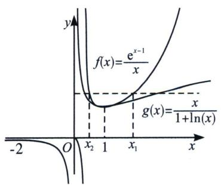

text_image

f(x)=\frac{e^{x-1}}{x}
g(x)=\frac{x}{1+\ln(x)}
-2
O
x_2 1 x_1 x

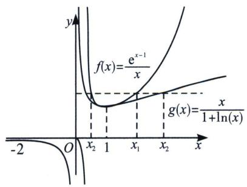

text_image

f(x)=\frac{e^{x-1}}{x}
g(x)=\frac{x}{1+\ln(x)}
-2
O
x_2 1 x_1 x_2 x

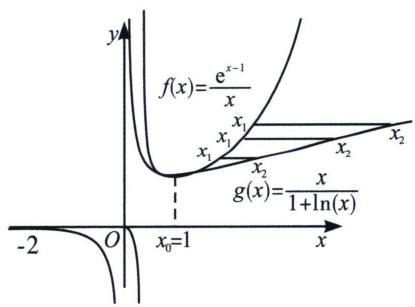

text_image

f(x)=\frac{e^{x-1}}{x}
x_1 x_1
x_2 x_2
g(x)=\frac{x}{1+\ln(x)}
-2 O x_v=1 x

因为 $f(x_{1})=g(x_{2})=f(1+\ln x_{2})$ .

①若 $1 + \ln x_{2} < 0$ ，即 $0 \leqslant x_{2} < \frac{1}{e}$ ，则 $f(x_{1}) - f(1 + \ln x_{2}) < 0$ ，此时 $x_{1} < 0$ ，因为函数 $f(x)$ 在 $(-∞, 0)$ 上单调递减，则 $x_{1} = 1 + \ln x_{2} < x_{2}$ ;  
②若 $0 < 1 + \ln x_{2} < 1$ ，即 $\frac{1}{e} < x_{2} < 1$ ，由于函数 $f(x)$ 在 $(0, 1)$ 上递减，在 $(1, +\infty)$ 上递增，则存在 $x_{1} > 1$ ，使得 $f(x_{1}) = f(1 + \ln x_{2})$ ，此时 $1 + \ln x_{2} < x_{2} < 1 < x_{1}$ ，存在 $x_{1} \in (0, 1)$ ，使得 $f(x_{1}) = f(1 + \ln x_{2})$ ，此时 $x_{1} = 1 + \ln x_{2} < x_{2} < 1$ ;  
③若 $l + \ln x_{2} = 1$ ，即 $x_{2} = 1$ ，则 $f(x) = f(1)$ 只有唯一解，此时 $x_{1} = 1$ ，即 $x_{1} = x_{2} = 1$ ;  
④若 $1 + \ln x_{2} > 1$ ，即 $x_{2} > 1$ ，由于函数 $f(x)$ 在 $(0, 1)$ 上递减，在 $(1, +\infty)$ 上递增，则存在 $x_{1} \in (0, 1)$ 使得 $f(x_{1}) = f(1 + \ln x_{2})$ ，此时 $x_{1} < 1 < 1 + \ln x_{2} < x_{2}$ ，存在 $x_{1} > 1$ 使得 $f(x_{1}) = f(1 + \ln x_{2})$ ，此时 $x_{1} = 1 + \ln x_{2} < x_{2}$ ，故 A 对，B 错，C 对；取 $x_{0} = 1$ ，因为函数 $f(x)$ 在 $(1, +\infty)$ 上单调递增，且 $x_{1} > 1$ ， $x_{2} > 1$ ，则 $1 + \ln x_{2} > 1$ ，由 $f(x_{1}) = f(1 + \ln x_{2})$ 可得 $x_{1} = 1 + \ln x_{2} < x_{2}$ ，则 $x_{2} - x_{1} = x_{2} - \ln x_{2} - 1 > 0$ ，因为函数 $h(x)$ 在 $(1, +\infty)$ 上单调递增，且 $x_{2} > 1$ ，故 $h(x_{2})$ 随着 $x_{2}$ 的增大而增大，D 对。故选 ACD.

考点 5：构造单调双曲正弦(飘带)与双曲余弦同构函数

由于 $\mathrm{e}^x\geqslant 1 + x + \frac{1}{2} x^2 +\frac{1}{6} x^3 +\frac{1}{24} x^4 +\frac{1}{120} x^5$ ①； $\mathrm{e}^{-x}\geqslant 1 - x + \frac{1}{2} x^{2} - \frac{1}{6} x^{3} + \frac{1}{24} x^{4} - \frac{1}{120} x^{5}$ ②

$\cosh x=\frac{e^{x}+e^{-x}}{2}\geqslant1+\frac{1}{2!}x^{2}+\frac{1}{4!}x^{4}+\cdots$ 我们称之为双曲余弦函数，记 $\sinh x=\frac{e^{x}-e^{-x}}{2}\geqslant x+\frac{x^{3}}{6}+\frac{x^{5}}{5!}+\cdots,$

令 $e^{x}=t$ ，则会有 $\frac{t}{2}-\frac{1}{2t}\geqslant\ln t+\frac{1}{6}(\ln t)^{3}+\cdots$ ，最经典的代表就是飘带函数 $\frac{1}{2}\left(t-\frac{1}{t}\right)\geqslant\ln t(t\geqslant1)$ .

所以 $f(x) = x - \frac{1}{x} - 2\ln x$ ，或者 $f(x) = \mathrm{e}^{x} - \mathrm{e}^{-x} - 2x$ 在其定义域内均为单调递增函数.

例25 (2024 河南模拟 T8) 已知函数 $f(x) = \frac{1}{3} x^3 + 2x + \mathrm{e}^x - \frac{1}{\mathrm{e}^x} + 3$ ，其中 $e$ 是自然对数的底数，若 $f(2a - 3) + f(a^2) \geqslant 6$ ，则实数 $a$ 的取值范围是

A. $[-3, 1]$

B. $(-∞,-3]$

C. $[1, +\infty)$

D. $(- \infty, -3] \cup [1, +\infty)$

解析 不妨设 $g(x)=f(x)-3=\frac{1}{3}x^{3}+2x+\mathrm{e}^{x}-\frac{1}{\mathrm{e}^{x}}$ ，易知 $g(-x)=\frac{1}{3}(-x)^{3}+2(-x)+\mathrm{e}^{-x}-\frac{1}{\mathrm{e}^{-x}}=-\frac{1}{3}x^{3}-2x+\frac{1}{\mathrm{e}^{x}}-\mathrm{e}^{x}=-g(x)$ ，所以函数 $g(x)$ 在R上为奇函数，易知函数 $y=\frac{1}{3}x^{3},y=2x,y=\mathrm{e}^{x}-\mathrm{e}^{-x}$ 在R上单调递增，所以函数 $g(x)$ 在R上单调递增，若 $f(2a-3)+f(a^{2})\geqslant6$ ，此时 $f(2a-3)-3+f(a^{2})-3\geqslant0$ ，即 $g(2a-3)+g(a^{2})\geqslant0$ ，所以 $g(2a-3)\geqslant-g(a^{2})=g(-a^{2})$ ，即 $a^{2}+2a-3\geqslant0$ ，解得 $a\geqslant1$ 或 $a\leqslant-3$ ，则实数a的取值范围为 $(-∞,-3]∪[1,+∞)$ 。故答案为：D.

例26 (2023·湖北月考T8)若关于 $x$ 的不等式 $\mathrm{e}^{ax} - x + \sin 2ax > \frac{1}{\mathrm{e}^{ax}} - \frac{1}{x} + \sin (\ln x^2)$ 在 $(0, +\infty)$ 上恒成立，则实数 $a$ 的取值范围是 （）

A. $\left(\frac{2}{\mathrm{e}}, +\infty\right)$

B. $\left(\frac{1}{e},+\infty\right)$

C. $\left(-\infty,\frac{1}{e}\right)$

D. $\left(-\infty,\frac{2}{e}\right)$

解析 令 $f(x) = \mathrm{e}^{x} - \mathrm{e}^{-x} + \sin 2x$ ，易得 $f'(x) = \mathrm{e}^{x} + \mathrm{e}^{-x} + 2\cos 2x \geqslant 2\sqrt{\mathrm{e}^{x} \cdot \mathrm{e}^{-x}} + 2\cos 2x \geqslant 0$ 在 R 上恒成立，所以 $f(x)$ 在 R 上单调递增，不等式 $\mathrm{e}^{ax} - x + \sin 2ax > \frac{1}{\mathrm{e}^{ax}} - \frac{1}{x} + \sin (\ln x^2)$ ，即 $\mathrm{e}^{ax} - \mathrm{e}^{-ax} + \sin 2ax > \mathrm{e}^{\ln x} - \mathrm{e}^{-\ln x} + \sin (\ln x^2)$ 在 $(0, +\infty)$ 上恒成立，即 $f(ax) > f(\ln x)$ 在 $(0, +\infty)$ 上恒成立，即 $ax > \ln x$ 在 $(0, +\infty)$ 上恒成立，即 $a > \frac{\ln x}{x_{\max}} = \frac{1}{\mathrm{e}}$ 在 $(0, +\infty)$ 上恒成立，故选 B.

双曲正弦(对数飘带)经常在一些双变量转化题型中作为判断单调函数的关键, 也属于我们高中阶段常见的隐藏数据, 我们不妨看看下一题.

例27 (2023·凉山州期末 T12) 设 a > 0, b > 0，且满足 $\frac{\ln b}{a - 1} = \frac{a + 1}{a}$ ，则下列判断正确的是（）

A. $a^{2} > b$

B. $a^2 < b$

C. $\log_{a}b<2$

D. $\log_a b > 2$

解析 因为 $\frac{\ln b}{a - 1} = \frac{a + 1}{a}$ , 所以 $\ln b - \ln a^2 = \frac{a^2 - 1}{a} - \ln a^2$ , 令 $f(x) = x - \frac{1}{x} - 2\ln x$ , 则 $f'(x) = \frac{(x - 1)^2}{x^2} \geqslant 0$ , 所以 $f(x)$ 在 $(0, +\infty)$ 上递增, 且 $f(1) = 0$ . 当 $0 < x < 1$ 时, $f(x) < 0$ ; 当 $1 < x$ 时, $f(x) > 0$ ; 当 $0 < a < 1$ 时, $f(a) < 0$ , 即 $\ln b - \ln a^2 < 0$ , 则 $b < a^2$ . 又因为 $\ln b - \ln a^2 < 0$ , 所以 $\frac{\ln b}{\ln a} > 2$ , 所以 $\log_a b > 2$ , 当 $1 < a$ 时, $f(a) > 0$ , 即 $\ln b - \ln a^2 > 0$ , 则 $b > a^2$ . 又因为 $\ln b - \ln a^2 > 0$ , 所以 $\frac{\ln b}{\ln a} > 2$ , 所以 $\log_a b > 2$ , 故选项 D 正确. 因为不确定 $a$ 与 1 的大小关系, 故选项 AB 不正确. 故选 D.

双曲正弦函数经常在一些地方作为隐藏数据来考查我们，尤其一些需要对称化处理的，我们不妨看下一道题.

例28 (2023佛山二模T12·多选)已知函数 $f(x)=\mathrm{e}^{x}-\frac{1}{2}x^{2}-1$ ，对于任意的实数a，b，下列结论一定成立的有()

A. 若 $a+b>0$ ，则 $f(a)+f(b)>0$

B. 若 $a + b > 0$ ，则 $f(a) - f(-b) > 0$

C. 若 $f(a)+f(b)>0$ ，则 $a+b>0$

D. 若 $f(a) + f(b) < 0$ ，则 $a + b < 0$

解析 $f(x) = \mathrm{e}^{x} - \frac{1}{2} x^{2} - 1$ ，则 $f'(x) = \mathrm{e}^{x} - x$ ， $f''(x) = \mathrm{e}^{x} - 1$ ，当 $x \in (0, +\infty)$ 时， $f''(x) > 0$ ， $f'(x)$ 单调递增，当 $x \in (-\infty, 0)$ 时， $f''(x) < 0$ ， $f'(x)$ 单调递减，所以 $f'(x) \geqslant f'(0) = 1$ ，所以 $f(x)$ 在 $\mathbf{R}$ 上单调递增，且 $f(0) = 0$ ，若 $a + b > 0$ ，则 $a > -b$ ，所以 $f(a) > f(-b)$ ，则 $f(a) - f(-b) > 0$ ，故 $\mathrm{B}$ 正确； $f(b) + f(-b) = \mathrm{e}^{b} - \frac{1}{2} b^{2} - 1 + (\mathrm{e}^{-b} - \frac{1}{2} b^{2} - 1) = \mathrm{e}^{b} + \mathrm{e}^{-b} - b^{2} - 2$ ，

令 $h(b)=\mathrm{e}^{b}+\mathrm{e}^{-b}-b^{2}-2,\quad h'(b)=\mathrm{e}^{b}-\mathrm{e}^{-b}-2b,\quad h(b)$ 在 $(0,+\infty)$ 上单调递增，在 $(-∞,0)$ 上单调递减，故 $h(b)\geqslant h(0)=0$ ，所以 $f(b)+f(-b)\geqslant0\Rightarrow f(a)+f(b)\geqslant f(a)-f(-b)>0$ ，故 A 正确；

对于D，若 $f(a) + f(b) < 0 \Rightarrow f(a) < -f(b) \leqslant f(-b) \Rightarrow a < -b, \Rightarrow a + b < 0$ ，故D正确；

设 $f(c)=-f(b)$ ，若 c<a<-b，则 $f(c)=-f(b)<f(a)$ ，满足 $f(a)+f(b)>0$ ，但 $a+b<0$ ，故 C 错误。故选 ABD.

# 考点6：构造任意单调同构函数

例29 (2023 抚州期末·多选 T11) 已知正数 $\alpha$ ， $\beta$ 满足 $e^{\alpha} - e^{\beta} > \frac{1}{2\alpha + \sin\alpha} - \frac{1}{2\beta + \sin\beta}$ ，则下列不等式正确的是

A. $\frac{1}{\alpha} + \frac{1}{\beta} < \frac{4}{a + \beta}$

B. $2^{\alpha-\beta+1}>2$

C. $\ln\alpha+\alpha<\ln\beta+\beta$

D. $\frac{1}{e^{a}}+\frac{1}{\alpha}<\frac{1}{e^{\beta}}+\frac{1}{\beta}$

解析 因为正数 $\alpha, \beta$ 满足 $e^{\alpha} - e^{\beta} > \frac{1}{2\alpha + \sin\alpha} - \frac{1}{2\beta + \sin\beta}$ , 所以 $e^{\alpha} - \frac{1}{2\alpha + \sin\alpha} > e^{\beta} - \frac{1}{2\beta + \sin\beta}$ , 构造函数 $f(x) = e^{x} - \frac{1}{2x + \sin x}, x > 0$ , 令 $g(x) = 2x + \sin x, g'(x) = 2 + \cos x > 0$ 恒成立, 所以 $g(x)$ 单调递增, 由复合函数的单调性可知 $g(x) = -\frac{1}{2x + \sin x}$ 在 $(0, +\infty)$ 上单调递增, 所以 $f(x) = e^{x} - \frac{1}{2x + \sin x}$ 在 $(0, +\infty)$ 上单调递增, 由 $f(\alpha) > f(\beta)$ , 可得 $\alpha > \beta > 0$ , 对于 A, $\left(\frac{1}{\alpha} + \frac{1}{\beta}\right)(\alpha + \beta) = 2 + \frac{\alpha}{\beta} + \frac{\beta}{\alpha} > 2 + 2\sqrt{\frac{\alpha}{\beta} \cdot \frac{\beta}{\alpha}} = 4$ , 所以 $\frac{1}{\alpha} + \frac{1}{\beta} > \frac{4}{\alpha + \beta}$ , 故 A 错误;

对于 B，由 $\alpha > \beta > 0$ ，可得 $\alpha - \beta + 1 > 1$ ，所以 $2^{\alpha - \beta + 1} > 2$ ，故 B 正确；

对于 C，由 $\alpha > \beta > 0$ ，可得 $\ln\alpha > \ln\beta$ ，则 $\ln\alpha + \alpha > \ln\beta + \beta$ ，故 C 错误；

对于D，由 $\alpha >\beta >0$ ，可得 $e^{\alpha} > e^{\beta} > 0$ ， $\frac{1}{\alpha} <  \frac{1}{\beta}$ ，所以 $\frac{1}{e^a} <  \frac{1}{e^\beta}$ ，所以 $\frac{1}{e^a} +\frac{1}{\alpha} <  \frac{1}{e^\beta} +\frac{1}{\beta}$ ，故D正确．故选BD.

例30 (2023 广州模拟 T16) 已知函数 $f(x) = a \ln x - 2x (a \neq 0)$ ，若不等式 $x^a \geqslant 2e^{2x}f(x) + e^{2x}\cos (f(x))$ 对 $x > 0$ 恒成立，则实数 $a$ 的取值范围为 \_\_\_\_.

解析 $x^{a} \geqslant 2\mathrm{e}^{2x}f(x) + \mathrm{e}^{2x}\cos [f(x)] \Leftrightarrow \mathrm{e}^{a\ln x - 2x} - 2f(x) - \cos [f(x)] \geqslant 0 \Leftrightarrow \mathrm{e}^{f(x)} - 2f(x) - \cos [f(x)] \geqslant 0$ ，令 $t = f(x)$ ，则 $g(t) = \mathrm{e}^t - 2t - \cos t$ ， $g'(t) = \mathrm{e}^t - 2 + \sin t$ ，设 $h(t) = \mathrm{e}^t - 2 + \sin t$ ，则 $h'(t) = \mathrm{e}^t + \cos t$ ，当 $t \leqslant 0$ 时， $\mathrm{e}^t \leqslant 1$ ， $\sin t \leqslant 1$ ，且等号不同时成立，则 $g'(t) < 0$ 恒成立，当 $t > 0$ 时， $\mathrm{e}^t > 1$ ， $\cos t \geqslant -1$ ，则 $h'(t) > 0$ 恒成立，则 $g'(t)$ 在 $(0, +\infty)$ 上单调递增，又因为 $g'(0) = -1$ ， $g'(1) = \mathrm{e} - 2 + \sin 1 > 0$ ，因此存在 $t_0 \in (0, 1)$ ，使得 $g'(t_0) = 0$ ，当 $0 < t < t_0$ 时， $g'(t) < 0$ ，当 $t > t_0$ 时， $g'(t) > 0$ ，所以函数 $g(t)$ 在 $(- \infty, t_0)$ 上单调递减，在 $(t_0, +\infty)$ 上单调递增，又 $g(0) = 0$ ，作出函数 $g(t)$ 的图象如下：

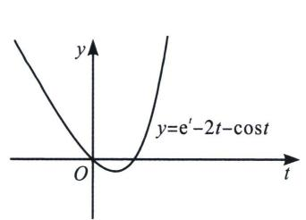

text_image

y
y=e' - 2t - cost
O
t

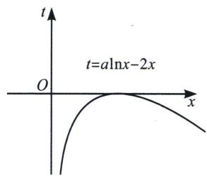

text_image

t
O
x
t=a\ln x-2x

根据复合嵌套函数知识可得，当 $t=a\ln x-2x\leqslant0$ 恒成立时才能满足题意，①当 a<0 时， $f(x)$ 在 $(0,+\infty)$ 上单调递减，当 $x\to0^{+}$ 时， $f(x)\to+\infty$ ，当 $x\to+\infty$ 时， $f(x)\to-\infty$ ，故 $t=f(x)\in\mathbb{R}$ ， $g(t_{0})<0$ ，不合题意；

②当 $a > 0$ 时，由 $f^{\prime}(x) < 0$ 得 $x > \frac{a}{2}$ ，由 $f^{\prime}(x) < 0$ 得 $0 < x < \frac{a}{2}$ ，函数 $f(x)$ 在 $\left(0, \frac{a}{2}\right)$ 上单调递增，在 $\left(\frac{a}{2}, +\infty\right)$ 上单调递减， $f(x)_{\max} = f\left(\frac{a}{2}\right) = a \ln \frac{a}{2} - a$ ，当 $a \ln \frac{a}{2} - a \leqslant 0$ 时，即当 $0 < a \leqslant 2e$ 时， $g(t) \geqslant 0$ 恒成立，符合题意，故答案为： $(0, 2e]$ .

# 考点7：双元同构的单调性转化

我们前面题型已经涉及了双元同构，这就是说有的时候是两个变量合体形成的同构，剥离了外层函数关系，再来分析两个变量的关系，并通过构造新函数来分析单调性和最值.

例31 (25 如皋高二期中 T7) 已知 $x, y$ 满足 $x + 3^{x} = 3, 3y + \log_{3}y = 2$ , 则 $x + 3y =$

A. 1

B. 2

C. $\frac{3}{2}$

D. 3

解析 因为 $3y + \log_3y = 2$ ，所以 $3y + \log_3y + 1 = 3$ ，即 $3y + \log_3(3y) = 3$ ， $\log_3(3y) + 3^{\log_3(3y)} = 3$ ，令 $f(x) = x + 3^x \uparrow$ ，则 $f(\log_3(3y)) = 3$ ，又 $x + 3^x = 3$ ，即 $f(x) = 3$ ，所以 $f(x) = f(\log_3(3y)) = 3$ ；所以 $x = \log_3(3y)$ ，所以 $3^x = 3y$ ，所以 $x + 3y = x + 3^x = 3$ 。故选D.

例32 (2023 佛山一模 T11) 若正实数 $x$ , $y$ 满足 $x \mathrm{e}^{x - 1} = y (1 + \ln y)$ , 则下列不等式中可能成立的是 ( )

A. $1 <   x <   y$

B. $1 < y < x$

C. $x <   y <   1$

D. $y <   x <   1$

解析 因为 $x \mathrm{e}^{x - 1} = y (1 + \ln y)$ , 所以 $x \mathrm{e}^{x - 1} = (1 + \ln y) \mathrm{e}^{(1 + \ln y) - 1}$ , 因为 $x > 0$ , 所以 $x \mathrm{e}^{x - 1} > 0$ , 则 $1 + \ln y > 0$ , $h(x) = x \mathrm{e}^{x - 1}$ 在 $(0, +\infty)$ 上单调递增, 由 $h(x) = h (1 + \ln y)$ , 可得 $x = 1 + \ln y$ , 利用 $y - 1 \geqslant \ln y$ , 当且仅当 $y = 1$ 时取等号, 则 $x = 1 + \ln y \leqslant y$ , 当且仅当 $x = y = 1$ 时取等号, 当 $y \neq 1$ 时 $1 < x < y$

或 $x < y < 1$ ；故选AC.

例33 (2023 乐山期末 T16) 已知正实数 $a, b$ , 满足 $ae^{2} (\ln b - \ln a + a - 1) \geqslant be^{a}$ , 则 $ab$ 的最大值为 \_\_\_\_.

解析 $a\mathrm{e}^{2}(\ln b - \ln a + a - 1)\geqslant b\mathrm{e}^{a}\Rightarrow \ln \frac{b}{a} +a - 2 + 1\geqslant \frac{b}{a}\mathrm{e}^{a - 2} = \mathrm{e}^{a - 2 + \ln \frac{b}{a}}$ ，令 $t = \ln \frac{b}{a} +a - 2$ ，则 $t + 1$ $\geqslant \mathrm{e}^t$ ，由于 $\mathrm{e}^t\geqslant t + 1$ ，结合 $t + 1\geqslant \mathrm{e}^t$ ，则 $t + 1 = \mathrm{e}^t$ ，当且仅当 $t = 0$ 时等号成立，

即 $t = \ln \frac{b}{a} + a - 2 = 0 \Rightarrow b = \frac{\mathrm{e}^2a}{\mathrm{e}^a} \Rightarrow ab = \frac{\mathrm{e}^2a^2}{\mathrm{e}^a} = 4\mathrm{e}^2\left(\frac{\frac{a}{2}}{\mathrm{e}^{\frac{a}{2}}}\right)^2 \leqslant 4.$ 故答案为：4.

# 考点8：不完整同构与不等式上下界构造

在一些双元同构中，等式两边是不能完全同构的，故我们需要进行两个同构，即一个上界，一个下界的放缩同构，我们可以通过例题来解读.

例34 (2023 通州区期中 T8) 若 $\left(\frac{x}{2} + 1\right)y = e^x \cdot \ln \frac{ey}{2}$ , 其中 $x > 0, y > 2$ , 则 ( )

A. $e^{x} > y$

B. $e^{\frac{x}{2}}>y$

C. $4e^{\frac{x}{2}} < y$

D. $2e^{x} > y$

解析 因为 $\left(\frac{x}{2} + 1\right)y = e^x \cdot \ln \frac{ey}{2}, x > 0, y > 2$ ，所以 $\frac{\frac{x}{2} + 1}{e^x} = \frac{\ln \frac{y}{2} + 1}{y} < \frac{\ln \frac{y}{2} + 2}{y}$ ，构造函数 $g(x) = \frac{\frac{x}{2} + 1}{e^x}$ ， $g'(x) = -\frac{\frac{x}{2} + 1}{e^x} < 0$ ，所以函数 $g(x)$ 单调递减，又因为 $g\left(\ln \frac{y}{2}\right) = \frac{\frac{\ln \frac{y}{2}}{2} + 1}{\frac{y}{2}} = \frac{\ln \frac{y}{2} + 2}{y}$ ，所以 $g(x) < g\left(\ln \frac{y}{2}\right)$ ，可得 $x > \ln \frac{y}{2}$ ，即 $e^x > \frac{y}{2}$ ，故选 D.

例35 (2025 福建省三明一中五月高考适应性模拟 T8) 已知 $\alpha, \beta \in (0, \pi), \alpha \neq \beta$ ，若 $e^{\alpha} - e^{\beta} = \cos \alpha - 2\cos \beta$ ，则下列结论一定成立的是 ( )

A. $\sin \alpha < \sin \beta$

B. $\cos \alpha < \cos \beta$

C. $\sin\alpha>\sin\beta$

D. $\cos\alpha>\cos\beta$

解析 构造函数 $f(x) = \mathrm{e}^{x} - \cos x, x \in (0, \pi)$ ，则 $f'(x) = \mathrm{e}^{x} + \sin x > 0$ ，所以函数 $f(x)$ 在 $(0, \pi)$ 上单调递增，又 $\mathrm{e}^{\alpha} - \mathrm{e}^{\beta} = \cos \alpha - 2\cos \beta$ ，即 $\mathrm{e}^{\alpha} - \cos \alpha = \mathrm{e}^{\beta} - \cos \beta - \cos \beta$ ，即 $f(\alpha) = f(\beta) - \cos \beta$ ，①当 $\alpha, \beta \in (0, \frac{\pi}{2})$ 时， $\cos \beta > 0$ ，则 $f(\beta) > f(\alpha)$ ，所以 $\beta > \alpha$ ；

②当 $\alpha, \beta \in \left(\frac{\pi}{2}, \pi\right)$ 时， $\cos\beta < 0$ ，则 $f(\beta) < f(\alpha)$ ，所以 $\alpha > \beta;$

又函数 $y=\sin x$ 在 $\left(0,\frac{\pi}{2}\right)$ 单调递增，在 $\left(\frac{\pi}{2},\pi\right)$ 单调递减，故由①②可知，选项 A 一定成立。故选 A.

例36 (2023 广州模拟·多选 T12) 已知 $a > 0, b > 0, abe^{a} + \ln b - 1 = 0$ ，则 （）

A. $\ln b > \frac{1}{a}$

B. $e^{a} > \frac{1}{b}$

C. $a + \ln b < 1$

D. ab<1

解析 同构1： $abe^{a}+\ln b-1=0\Leftrightarrow ae^{a}+\frac{1}{b}\ln b=\frac{1}{b}\Leftrightarrow ae^{a}-\frac{1}{b}\ln\frac{1}{b}=\frac{1}{b}\Leftrightarrow ae^{a}-\ln\frac{1}{b}e^{\ln\frac{1}{b}}=\frac{1}{b}$ . 设 $g(x)=xe^{x}$ ，其中x>0. 得 $g(x)$ 在在 $(0,+\infty)$ 上单调递增. 注意到 $ae^{a}-\ln\frac{1}{b}e^{\ln\frac{1}{b}}=\frac{1}{b}\Leftrightarrow g(a)-g(\ln\frac{1}{b})=\frac{1}{b}$ . 则 $g(a)-g(\ln\frac{1}{b})=\frac{1}{b}>0\Rightarrow a>\ln\frac{1}{b}$ . 又 $y=e^{x}$ 在R上递增，则有 $e^{a}>e^{\ln\frac{1}{b}}\Rightarrow e^{a}>\frac{1}{b}$ . 故B正确；同构2： $abe^{a}+\ln b-1=0\Leftrightarrow ae^{a}=\frac{1}{e}\frac{e}{b}\ln\left(\frac{e}{b}\right)\Leftrightarrow g(a)=\frac{1}{e}g\left(\ln\frac{e}{b}\right)\Leftrightarrow a<\ln\frac{e}{b}\Leftrightarrow a+\ln b<1$ ，故C正确. 由BC可知 $-a<\ln b<1-a$ ，所以A错误；根据BC选项可得： $ae^{-a}<ab<ae^{1-a}$ ，所以 $ab<e\cdot\frac{a}{e^{a}_{max}}=1$ ，故D正确. 故选BCD.

# 考点9：同构与估值

同样是构造上界和下界，但是涉及一些数据，就需要零点的找点.

例37 (2023 嵊州市考前模拟·多选 T12) 已知 $x, y \in \mathbb{R}$ , 若 $x \cdot (\mathrm{e}^x + \ln x + x) = 1$ , $y \cdot [2\ln y + \ln (\ln y)] = 1$ , 其中 $\mathrm{e} = 2.71828 \cdots$ 是自然对数的底数, 则 ( )

A. $0 <   x <   1$

B. ${xy} = 2$

C. y-x>1

D. $y - x <   \frac{3}{2}$

解析 令 $h(x) = \mathrm{e}^{x} + x$ ， $x \cdot (\mathrm{e}^{x} + \ln x + x) = 1$ ， $\mathrm{e}^{x} + x = \ln \frac{1}{x} + \frac{1}{x} = \ln \frac{1}{x} + \mathrm{e}^{\ln \frac{1}{x}}$ ， $h(x) = h\left(\ln \frac{1}{x}\right)$ ①由 $y \cdot [2\ln y + \ln (\ln y)] = 1$ 得 $\ln y + \ln (\ln y) = \frac{1}{y} + \ln \frac{1}{y}$ ，即 $\mathrm{e}^{\ln (\ln y)} + \ln (\ln y) = \mathrm{e}^{\ln \frac{1}{y}} + \ln \frac{1}{y}$ ， $h\left(\ln \frac{1}{y}\right) = h(\ln (\ln y))$ ②，由① $x = \ln \frac{1}{x} \Rightarrow x + \ln x = 0 \Rightarrow x \approx 0.567 \in (0, 1)$ ，故A正确；由② $\frac{1}{y} = \ln y \Rightarrow \frac{1}{y} + \ln \frac{1}{y} = 0 \Rightarrow \frac{1}{y} = x \approx 0.567$ ， $xy = 1$ ，故B错误；对于C， $y - x = \frac{1}{x} - x = \frac{1}{0.6} - 0.6 > 1$ ，或者 $y - x = \frac{1}{x} - x = \mathrm{e}^{x} - x > 1$ ，故C正确；

由 A 知， $x \in \left( \frac{1}{2}, 1 \right)$ ， $y - x = \frac{1}{x} - x$ 在 $x \in \left( \frac{1}{2}, 1 \right)$ 上递减，当 $x = \frac{1}{2}$ 时， $\frac{1}{x} - x = \frac{3}{2}$ ，故 D 正确。故选 ACD.

例38 (2025·新高考I卷T8)若实数 $x, y, z$ 满足 $2 + \log_2 x = 3 + \log_3 y = 5 + \log_5 z$ , 则 $x, y, z$ 的大小关系不可能是

A. $x > y > z$

B. $x > z > y$

C. $y > x > z$

D. y > z > x

解析 法一(特值): 设 $2 + \log_2 x = 3 + \log_3 y = 5 + \log_5 z = k$ , 所以有 $\log_2 x = k - 2, x = 2^{k-2}$ , 同理 $y = 3^{k-3}, z = 5^{k-5}$ , 当 $k = 3$ 时, 有 $x > y > z$ , 当 $k = 5$ 时, 有 $y > x > z$ . 当 $k = 8$ 时, 有 $y > z > x$ . 选 A. 法二(构造函数): $2 + \log_2 x = 3 + \log_3 y = 5 + \log_5 z$ , 所以 $\frac{\ln x}{\ln 2} = \frac{\ln y}{\ln 3} + 1 = \frac{\ln z}{\ln 5} + 3 = k - 2$ , 所以 $\left\{ \begin{array}{l} \ln x = (k - 2) \ln 2 \\ \ln y = (k - 3) \ln 3, \text{故仅需比较} \ln x, \ln y \text{以及} \ln z \text{的大小, 作图,} \\ \ln z = (k - 5) \ln 5 \end{array} \right.$

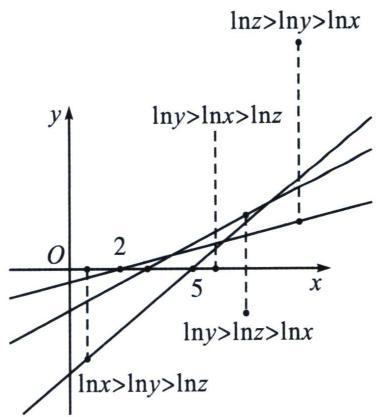

text_image

lnz>lny>lnx
lny>lnx>lnz
lny>lnz>lnx
lnx>lny>lnz
O
2
5
x
y

易知，只有 B 不可能，故本题选 B.

当然，对于 A 可采用同构估值判断，令 $g(t)=(k-t)\ln t$ ， $g'(t)=-\ln t+1-\frac{k}{t}$ ，显然当 $k\geqslant1$ ， $g'(t)<0$ ， $g(t)\downarrow$ ， $g(2)>g(3)>g(5)$ ，即 $\ln x>\ln y>\ln z$ ，A 正确.

例39 (2024 扬州中学考前模拟·多选 T12) 已知 m，n 满足 $\frac{m e^{m}}{4 n^{2}} = \frac{\ln n + \ln 2}{e^{m}}$ ，且 $e^{2m} = \frac{1}{m}$ ，则（）

$$
n = \frac {\mathrm{e} ^ {m}}{2}
$$

B. $mn^{2} = 1$

C. $m + n <   \frac{7}{5}$

D. $1 <   2n - m^{2} <   \frac{3}{2}$

解析 $\frac{me^{m}}{4n^{2}}=\frac{\ln n+\ln2}{e^{m}}\Rightarrow me^{2m}=4n^{2}\ln2n=\ln2n\cdot e^{2\ln2n}=1$ ，令 $h(x)=xe^{2x}$ ，当 x>0 时， $f(x)$ 单调递增，对于 A，由于 $h(m)=h(\ln2n)$ ，所以 $m=\ln2n$ ，即 $n=\frac{e^{m}}{2}$ ，A 对；

对于 B， $mn^{2}=m\cdot\frac{e^{2m}}{4}=\frac{1}{4}$ ，B 错；对于 C： $m+n=m+\frac{e^{m}}{2}$ ，显然是关于 m 的递增函数，由于 $h\left(\frac{1}{2}\right)=\frac{e}{2}>1$ ，故 $m+\frac{e^{m}}{2}<\frac{1}{2}+\frac{\sqrt{e}}{2}<\frac{1+\sqrt{3}}{2}\approx1.37<\frac{7}{5}$ ，C 正确；

对于 D， $2n-m^{2}=e^{m}-m^{2}=g(m)$ ， $g'(m)=e^{m}-2m=e^{m}\left(1-\frac{2m}{e^{m}}\right)>e^{m}\left(1-\frac{2}{e}\right)>0$ ，所以 $g(m)$ 在区间 $\left(0,\frac{1}{2}\right)$ 单调递增，所以 $g(0)<g(m)<g\left(\frac{1}{2}\right)$ ，即 $1<2n-m^{2}<\sqrt{e}-\frac{1}{4}<\frac{3}{2}$ ，D 正确；故选 ACD.

# 第二节 切线函数的基本应用

# 一、两大基本切线式

如图 1 所示，令 $f(x)=\mathrm{e}^{x}-x-1$ ， $f'(x)=\mathrm{e}^{x}-1=0$ 时，x=0，故 $f(x)$ 在区间 $(-∞,0)$ 单调递减，在区间 $(0,+∞)$ 单调递增， $f(x)_{\min}=f(0)=0$ ;

如图 2 所示， $g(x)=f(\ln x)=x-\ln x-1$ ，当 $\ln x\in(-\infty,0)$ ，即 $x\in(0,1)$ ， $g(x)$ 单调递减，当 $\ln x\in(0,+\infty)$ ，即 $x\in(1,+\infty)$ ， $g(x)$ 单调递增， $g(x)_{\min}=g(1)=0$ ；

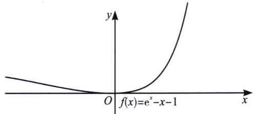

text_image

y
O f(x)=e^x-x-1
x

图1

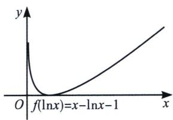

text_image

f(lnx)=x-lnx-1

图2

例1 (2013·新课标ⅡT21)已知函数 $f(x)=\mathrm{e}^{x}-\ln(x+m)$ .

(1)设 $x = 0$ 是 $f(x)$ 的极值点，求 $m$ ，并讨论 $f(x)$ 的单调性：  
(2) 当 $m \leqslant 2$ 时，证明 $f(x) > 0$ .

解析 (1) 因为 $f'(x) = \mathrm{e}^{x} - \frac{1}{x + m}$ ， $x = 0$ 是 $f(x)$ 的极值点，所以 $f'(0) = 1 - \frac{1}{m} = 0$ ，解得 $m = 1$ ;

令 $h(x)=\mathrm{e}^{x}-x-1$ ，则 $h'(x)=\mathrm{e}^{x}-1$ ，当x>0时， $h'(x)>0$ ， $h(x)$ 单调递增；当x<0时， $h'(x)<0$ ， $h(x)$ 单调递减， $h(\ln(x+1))=x-\ln(x+1)$ ， $h'(\ln(x+1))=\frac{x}{x+1}$ ，当x>0时， $h'(\ln(x+1))>0$ ， $h(\ln(x+1))$ 单调递增；当-1<x<0时， $h'(\ln(x+1))<0$ ， $h(\ln(x+1))$ 单调递减，故 $f(x)=h(x)+h(\ln(x+1))+1$ 在 $(-1,0)$ 上单调递减；在 $(0,+\infty)$ 上单调递增；

(2) 易证 $h(x) \geqslant 0$ (当且仅当 $x = 0$ 时等号成立)，原式转化为 $e^x - \ln (x + m) = e^x - x - 1 + (x + m) - \ln (x + m) - 1 + 2 - m = h(x) + h(\ln (x + m)) + 2 - m$ ，由 $h(x) \geqslant 0$ (当且仅当 $x = 0$ 时等号成立)， $h(\ln (x + m)) \geqslant 0$ (当且仅当 $x + m = 1$ 时等号成立)，由题意 $m \leqslant 2$ ，则 $2 - m \geqslant 0$ ，三个取等条件不能同时取得，故 $f(x) > 0$ .

注意: 本题的 $f(x) = h(x) + h(\ln (x + m)) + 2 - m$ 三个均为非负数, 但不能同时取零, 故 $f(x) > 0$ . 后面的 $h(x) = \mathrm{e}^{x} - x - 1 \geqslant 0$ 单调性和最值证明我们就简写了, 请大家自己完成证明.

例2 (2018·新课标 I T21)已知函数 $f(x) = ae^{x} - \ln x - 1$ .

(1)设 x=2 是 $f(x)$ 的极值点，求 a，并求 $f(x)$ 的单调区间；  
(2)证明：当 $a \geqslant \frac{1}{\mathrm{e}}$ 时， $f(x) \geqslant 0$ .

解析 (1) $x > 0$ , $f'(x) = ae^x - \frac{1}{x}$ , 因为 $x = 2$ 是 $f(x)$ 的极值点, 所以 $f'(2) = ae^2 - \frac{1}{2} = 0$ , 解得 $a = \frac{1}{2e^2}$ , 所以 $f(x) = \frac{1}{2e^2}e^x - \ln x - 1$ , 所以 $f'(x) = \frac{1}{2e^2}e^x - \frac{1}{x}$ , 当 $0 < x < 2$ 时, $f'(x) < 0$ , 当 $x > 2$ 时, $f'(x) > 0$ , 所以单调递减区间是 $(0, 2)$ , 单调递增区间是 $(2, +\infty)$ ;

(2) 因为 $a \geqslant \frac{1}{e}$ ，所以 $a - \frac{1}{e} \geqslant 0$ ， $f(x) \geqslant \frac{1}{e} e^{x} - \ln x - 1 = e^{x - 1} - x + x - \ln x - 1$ ，令 $h(x) = e^{x} - x - 1$ ，
易证 $h(x)\geqslant0$ （当且仅当x=0时等号成立）， $f(x)\geqslant h(x-1)+h(\ln x)$ ，由于 $h(x-1)\geqslant0(x=1$ 时取等）， $h(\ln x)\geqslant0(x=1$ 时取等），故得证.

注意: 两个题由于取等条件的限制, 会产生不一样的结果, 更多的双切线同构题型, 我们会在本书同构专题再深一步探讨.

例3 (2024·新乡模拟T21)已知函数 $f(x)=\mathrm{e}^{x}-k(\ln x+1)$ .

(1)设 x=3 是 $f(x)$ 的极值点，求 k 的值，并求 $f(x)$ 的单调区间.  
(2)证明：当0<k<e时， $f(x)>0$ .

解析 (1) $f(x)=\mathrm{e}^{x}-k(\ln x+1)$ ， $f'(x)=\mathrm{e}^{x}-\frac{k}{x}$ ，x=3是 $f(x)$ 的极值点，所以 $f'(3)=0\Rightarrow k=3\mathrm{e}^{3}$ ， $k=3\mathrm{e}^{3}$ ， $f(x)=\mathrm{e}^{x}-3\mathrm{e}^{3}(\ln x+1)$ ， $f'(x)=\mathrm{e}^{x}-\frac{3\mathrm{e}^{3}}{x}$ ，导函数单调递增， $\left\{\begin{aligned}&x<3,&f'(x)<0,f(x)\downarrow\\&x>3,&f'(x)>0,f(x)\uparrow\end{aligned}\right.$

(3)法一：(主元法)显然，当 $x < \frac{1}{e}$ ， $f(x) = e^{x} - k(\ln x + 1) > 0$ ，当 $x > \frac{1}{e}$ ， $f(x) = e^{x} - k(\ln x + 1) = g(k)$ ， $g'(k) = -\ln x - 1 < 0$ ， $g(k) \downarrow$ ， $g(k) > g(e) = e^{x} - e(\ln x + 1)$ ;

令 $h(x)=\mathrm{e}^{x}-\mathrm{e}(\ln x+1)=\mathrm{e}(\mathrm{e}^{x-1}-\ln x-1)\geqslant\mathrm{e}(x-1-\ln x)\geqslant0$ ，各处取等不一致，故 $f(x)>0$ .

注：题干中用到的放缩考场需证明，在后续章节我们不再一一证明.

法二： $f(x)=\mathrm{e}^{x}-k(\ln x+1)>0\Leftrightarrow\mathrm{e}^{x-\ln k}-\ln x-1>0$ ，即 $e^{x-\ln k}>e^{x-l}>x>\ln x+1$ ;

显然成立，得证！

# 二、指数的切线找点

① $e^{x-1}\geqslant x$ .（用x-1替换x，切点横坐标是x=1），通常表达为 $e^{x}\geqslant ex$ .

② $e^{x+a}\geqslant x+a+1$ .（用 $x+a$ 替换x，切点横坐标是x=-a），平移模型，找到切点是关键.

③ $e^{x}\geqslant\frac{e^{2}}{4}x^{2}>x^{2}(x>0)$ （用 $\frac{x}{2}$ 替换x，切点横坐标是x=2）；通常有 $e^{\frac{x}{n}}\geqslant e\cdot\frac{x}{n}(x>0)$ 的构造模型.

例4 (广东省河源市河源中学 2023 届高三 10 月教学质量检测 T16) 已知函数 $f(x) = a \ln x$ , $g(x) = b e^{x}$ ，若直线 $y = kx (k > 0)$ 与函数 $f(x)$ ， $g(x)$ 的图象都相切，则 $4a + \frac{1}{b}$ 的最小值为 \_\_\_\_.

解析 根据 $e^{x} \geqslant ex$ ，则 $be^{x} \geqslant bex = kx$ ， $a \ln x \leqslant \frac{a}{e}x = kx$ （原点切线），故 $\frac{a}{e} = be$ ，故 $4a + \frac{1}{b} \geqslant 2\sqrt{\frac{4a}{b}} = 4e$ ，当且仅当 $a = \frac{e}{2}$ ， $b = \frac{1}{2e}$ 时等号成立，此时取得最小值 4e.

例 5 (山西省三晋名校联盟 2023 学年高三下学期顶尖计划联考 T7) 若直线 $y = x + a$ 与函数 $f(x) = e^{x}$ 和 $g(x) = \ln x + b$ 的图象都相切，则 $a + b =$ ()

A. -1

B. 0

C. 1

D. 3

解析 $e^{x} \geqslant x + 1 = (x - 1) + 2 \geqslant \ln x + 2, a = 1, b = 2$ ，所以 $a + b = 3$ 。故选 D.

下面我们来探索 $e^{x} \geqslant ax + b$ 的切线系数关闭，虽然我们都可以求导处理，但是我们更想知道任意一条切线与切线不等式 $e^{x} \geqslant x + 1$ 的关系.

函数 $y=e^{x}$ 在点(1, e)处的切线方程我们可以按照不等式等效替换法求得，抓住 x=1 是切点，故将原来的 x 替换为 x-1，即 $\mathrm{e}^{x-1}\geqslant(x-1)+1\Rightarrow\mathrm{e}^{x}\geqslant\mathrm{e}x$ ，故切线方程为 y=ex，同理函数 $y=e^{x}$ 在点 $(-1,\mathrm{e}^{-1})$ 处的切线方程可以根据 $\mathrm{e}^{x+1}\geqslant(x+1)+1\Rightarrow\mathrm{e}^{x}\geqslant\frac{1}{\mathrm{e}}x+\frac{2}{\mathrm{e}}$ 求得 $y=\frac{1}{\mathrm{e}}x+\frac{2}{\mathrm{e}}$ .

函数 $y=e^{x}$ 的切线方程为 $y=2x+b$ ，抓住 k=2，由于我们所知道的切线方程斜率为 1，故可以通过除法变成熟悉形式： $e^{x}\geqslant2x+b\Rightarrow\frac{e^{x}}{2}\geqslant x+\frac{b}{2}\Rightarrow e^{x-\ln2}\geqslant x-\ln2+1\Rightarrow e^{x}\geqslant2x-2\ln2+2\geqslant2x+b$ ，根据此不等式，我们可以得出以下三个结论：

①函数 $y=e^{x}$ 在斜率为 2 的位置的切线方程为 $y=2x+2-2\ln2$ ;

②若不等式 $e^{x} \geqslant 2x + b$ 恒成立，则 $b \leqslant 2 - 2\ln 2$ ;

③若不等式 $e^{x} \geqslant ax + 2 - 2\ln2 (x \geqslant \ln2)$ 恒成立，则 $a \leqslant 2$ .

归根揭底，我们进行总结：

1. 指数切线切点构造： $e^{x-x_{0}}\geqslant x-x_{0}+1$ ，转化为 $e^{x}\geqslant e^{x_{0}}x+e^{x_{0}}(-x_{0}+1)$ .

2. 指数切线斜率构造： $e^{x} \geqslant kx + b \Leftrightarrow x_{0} = \ln k, b = k(1 - \ln k)$ .

核心问题：构造斜率为 1 的式子是关键.

例6 (辽宁鞍山2024学年高三上学期第一次质量监测T7)已知函数 $f(x)=ke^{x}-\frac{1}{2}x^{2}-2x$ ，若 $f(x)$ 为R上的增函数，则k的取值范围为()

A. $\left[\frac{1}{e},+\infty\right)$

B. $[e, +\infty)$

C. $[e+1, +\infty)$

D. $[2e, +\infty)$

解析 法一(六大函数同构): 由 $f(x)=ke^{x}-\frac{1}{2}x^{2}-2x$ ，求导得 $f'(x)=ke^{x}-x-2$ ，因为 $f(x)$ 为R上的增函数，所以 $f'(x)\geqslant0$ 在R上恒成立，即 $k\geqslant\frac{x+2}{e^{x}}_{\max}=e^{2}\cdot\frac{x+2}{e^{x+2}_{\max}}=e$ 恒成立，当且仅当 $x+2=1$ 时取等.

法二(切线找点): $f^{\prime}(x) = k\mathrm{e}^{x} - x - 2 \geqslant 0$ 恒成立, 即 $\mathrm{e}^{x + \ln k} \geqslant x + \ln k + 1 \geqslant x + 2$ 恒成立, 所以 $\ln k \geqslant 1$ , 所以 $k$ 的取值范围为 $[\mathrm{e}, +\infty)$ . 故选 B.

例7 (2023·商丘三模 T11)已知函数 $f(x)=ae^{x}$ ， $g(x)=2x+b$ ，若 $f(x)\geqslant g(x)$ 恒成立，则 $\frac{b}{a}$ 的最大值是()

A. -1

B. 1

C. 2

D. $\sqrt{2}$

解析 因为函数 $f(x)=ae^{x}$ ， $g(x)=2x+b$ ，且 $f(x)\geqslant g(x)$ 恒成立，所以当a<0时， $f(x)$ 是单调减函数，且 $f(x)<0$ ， $g(x)$ 是单调增函数， $g(x)$ 的值域是R，显然不满足题意；

法一：当 $a > 0$ 且 $b > 0$ 时，由 $f(x) \geqslant g(x)$ 得， $ae^x \geqslant 2x + b$ ， $\mathrm{e}^x \geqslant x + 1 \Leftrightarrow \mathrm{e}^{x + \ln a - \ln 2} \geqslant x + \ln a - \ln 2 + 1 \geqslant x + \frac{b}{2}$ ，此时 $\frac{b}{2} = \ln \frac{a}{2} + 1$ ， $\frac{b}{a} = \frac{2\ln \frac{ae}{2}}{a} = e \cdot \frac{\ln \frac{ae}{2}}{\frac{ae}{2}} \leqslant 1$ ，此时 $a = b = 2$ ，即 $\frac{b}{a}$ 的最大值是1，选B.

法二(零点比大小): 如图, 利用函数凹凸性构造 $a \mathrm{e}^{x} - b \geqslant 2 x$ , 令 $t = \mathrm{e}^{x} (t > 0)$ , 即 $a t - b \geqslant 2 \ln t$ , 由于 $h(t) = a t - b$ 零点为 $t_{1} = \frac{b}{a}$ , $p(t) = \ln t$ 的零点为 $t_{2} = 1$ , 故 $t_{1} \leqslant t_{2} = 1$ ; 故选 B.

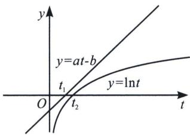

text_image

y
y=at-b
t₁
y=lnt
O
t₂
t

例8 (2025·桃城区校级三模 T11)已知在函数 $f(x)=ax+b(a>0,b>0)$ ， $g(x)=\ln(x+2)$ ，若对 $\forall x>-2,\ f(x)\geqslant g(x)$ 恒成立，则实数 $\frac{b}{a}$ 的取值范围为（）

A. $[0, +\infty)$

B. $[1, +\infty)$

C. $[2, +\infty)$

D. $[e, +\infty)$

解析 法一：当 a>0 且 b>0 时，由 $f(x)\geqslant g(x)$ 得， $f(x)=ax+b$ ，令 $\ln(x+2)=t$ ，即 $ae^{t}-2a+b$

$\geqslant t,\mathrm{e}^{x}\geqslant x+1\Leftrightarrow\mathrm{e}^{t+\ln a}\geqslant t+\ln a+1\geqslant t+2a-b$ ，取等时 $\frac{b}{a}\geqslant2-\frac{\ln a+1}{a}=2-\mathrm{e}\frac{\ln(\mathrm{e}a)}{\mathrm{e}a}\geqslant1$ ，此时a=b=1，即 $\frac{b}{a}$ 的最小值是1，故选B.

法二(零点比大小): $f(x)=ax+b=0$ , $x=-\frac{b}{a}$ , 令 $g(x)=\ln(x+2)=0$ , 即 $x=-1$ , 如图: 当两个函数共零点且在零点处相切时, $-\frac{b}{a}$ 有最大值-1, 故 $-\frac{b}{a} \leqslant -1 \Leftrightarrow \frac{b}{a} \geqslant 1$ , 故选 B.

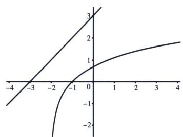

line

| x   | y1    | y2    |
| --- | ----- | ----- |
| -4  | -1.0  | -2.0  |
| -3  | -0.5  | -1.0  |
| -2  | 0.0   | 0.0   |
| -1  | 0.5   | 0.5   |
| 0   | 1.0   | 1.0   |
| 1   | 1.5   | 1.5   |
| 2   | 2.0   | 2.0   |
| 3   | 2.5   | 2.5   |
| 4   | 3.0   | 3.0   |

法三： $\ln(x+2)\leqslant ax+b\Leftrightarrow\ln(x+2)+\ln a\leqslant a(x+2)+b+\ln a$ ，又有 $\ln a(x+2)\leqslant a(x+2)+1$ ，故 $\ln a(x+2)\leqslant a(x+2)-1\leqslant a(x+2)+b+\ln a-2a\Leftrightarrow b\geqslant-\ln a-1+2a\Leftrightarrow\frac{b}{a}\geqslant2-\frac{\ln a+1}{a}\geqslant1$ ，故选B.

# 三、朗博同构引发的切线放缩

朗博函数指的是形如 $x^{n} \cdot \mathrm{e}^{x}$ 或 $a\mathrm{e}^{x}$ 类型的函数， $a > 0$ ， $x > 0$ ，将积式拿到指数里，进行切线构造，比如 $x \cdot \mathrm{e}^{x} = \mathrm{e}^{\ln x + x}$ ， $a\mathrm{e}^{x} = \mathrm{e}^{\ln a + x}$ ， $\frac{\mathrm{e}^{x}}{x} = \mathrm{e}^{x - \ln x}$ ；关于朗博函数我们统一往 $f(x) = \mathrm{e}^{x} - x - 1$ 进行同构， $f(x) \geqslant 0$ 恒成立，当且仅当 $x = 0$ 时等号成立。

$x\mathrm{e}^{x}\geqslant x+\ln x+1$ .（用 $x+\ln x$ 替换x，切点横坐标满足 $x_{0}+\ln x_{0}=0,\quad x_{0}\approx0.567$ )常见的指对跨阶模型，切线的方程是按照指数函数给予的.

例 9 (山东省烟台市 2025 届高三三模 T8) 若不等式 $xe^{x}-x-\ln x-a \geqslant 0$ 恒成立，则实数 a 的取值范围为

A. (0, 1]

B. $(0, e-1]$

C. $(-∞,1]$

D. $(-∞, e-1]$

解析 构造 $h(x) = \mathrm{e}^{x} - x - 1$ ， $f(x) = x\mathrm{e}^{x} - x - \ln x - a = \mathrm{e}^{x + \ln x} - x - \ln x - 1 + 1 - a = h(x + \ln x) + 1 - a$ $\geqslant 0$ ，当且仅当 $x_0 + \ln x_0 = 0$ 时， $h(x_0 + \ln x_0) = 0$ ，此时 $1 - a\geqslant 0$ ， $a\leqslant 1$ ，当 $a > 1$ 时，在 $x = x_0$ 处矛盾；故答案为C.

例10 若 $x > 0$ 时，恒有 $x^{2}\mathrm{e}^{3x} - (k + 3)x - 2\ln x - 1 \geqslant 0$ 成立，则实数 $k$ 的取值范围是

解析 设 $g(x)=\mathrm{e}^{x}-x-1$ ，原式等价于 $\mathrm{e}^{2\ln x+3x}-(2\ln x+3x)-1-kx\geqslant0$ ，则原式等价于 $g(2\ln x+3x)-kx\geqslant0$ 恒成立，又 $g(2\ln x+3x)\geqslant0$ ，当且仅当 $2\ln x_{0}+3x_{0}=0$ 时，等号成立，则需满足 $-kx\geqslant0$ ，所以 $k\leqslant0$ 时成立，当k>0时， $g(2\ln x_{0}+3x_{0})-kx_{0}=-kx_{0}<0$ ，矛盾；故答案为 $k\leqslant0$ .

例11 (2024·全国百校强 T8)已知函数 $f(x)=\frac{ax}{\mathrm{e}^{x-1}}+x-\ln(ax)-2(a>0)$ ，若函数 $f(x)$ 在区间(0, +∞)内存在零点，则实数a的取值范围是()

A. (0, 1]

B. $[1, +\infty)$

C. (0, e]

D. $[3, +\infty)$

解析 由题即 $\mathrm{e}^{\ln (ax) - x + 1} - [\ln (ax) - x + 1] - 1 = 0$ 有解，由 $\mathrm{e}^x - x - 1 \geqslant 0, x = 0$ 取等，故 $\ln (ax) - x + 1 = 0$ 有解，即 $\ln (ax) = x - 1, a = \frac{\mathrm{e}^{x - 1}}{x} = \frac{1}{\mathrm{e}} \cdot \frac{\mathrm{e}^x}{x} \geqslant 1$ ，故选B.

例12 (辽宁庄河高级中学 2025 届高三下学期 5 月模拟测试 T8) 已知 $f(x) = x \mathrm{e}^{ax} - \ln x - ax$ ，若存在 $x_0 \in \mathbb{R}$ ，使得 $f(x_0) = 1$ ，则实数 $a$ 的取值范围是（）

A. $\left(-\infty, \frac{1}{e}\right)$

B. $\left[-\frac{1}{e}, +\infty\right)$

C. $\left(-\frac{1}{e},0\right)$

D. $\left(0,\frac{1}{\mathrm{e}}\right]$

解析 由题即 $f(x) = x \mathrm{e}^{ax} - \ln x - ax = 1$ 有解，由 $\mathrm{e}^x - x - 1 \geqslant 0, x = 0$ 取等，故 $\mathrm{e}^{ax + \ln x} - \ln x - ax - 1 = 0$ 有解，即 $ax + \ln x = 0$ 有解， $a = -\frac{\ln x}{x} \geqslant -\frac{1}{\mathrm{e}}$ ，故选 B.

# 四、由 $\ln x \leqslant x - 1$ 引起的切线找点

最常见的就是 $\ln (x + 1)\leqslant x$ ，由 $\ln x\leqslant x - 1$ 向左平移一个单位来理解，或者将 $\mathrm{e}^x\geqslant x + 1$ 两边取对数而来.

① $\ln x\leqslant\frac{x}{e}$ .（用 $\frac{x}{e}$ 替换x，切点横坐标是x=e），表示过原点与 $f(x)=\ln x$ 的切线为 $y=\frac{x}{e}$ .

② $\ln x\geqslant1-\frac{1}{x}(x\ln x\geqslant x-1)$ .（用 $\frac{1}{x}$ 替换x，切点横坐标x=1），或者记为 $x\ln x\geqslant x-1$ .

③ $\ln x\leqslant x^{2}-x$ .（由 $\ln x\leqslant x-1$ 及 $x-1\leqslant x^{2}-x$ 切点横坐标是x=1），或者记为 $\frac{\ln x}{x}\leqslant x-1$ .

④ $\ln x\leqslant\frac{1}{2}(x^{2}-1)$ （由 $\ln x\leqslant x-1\leqslant\frac{1}{2}(x^{2}-1)$ ），即在点(1,0)处三曲线相切.

例13 (2022·新高考Ⅱ卷T14)写出曲线 $y = \ln |x|$ 过坐标原点的切线方程：\_\_\_\_，\_\_\_\_.

解析 当 x>0 时， $y=\ln x$ 过原点的切线为 $y=\frac{x}{e}$ ; 当 x<0 时， $y=\ln(-x)$ 过原点的切线为 $y=-\frac{x}{e}$ . 答案： $y=\frac{x}{e}$ ， $y=-\frac{x}{e}$

例14 (江苏海安2023学年高三上学期11月期中T11)已知直线 $y = k_{1}x$ 与 $y = k_{2}x (k_{1} > k_{2})$ 是曲线 $y = ax + 2\ln |x| (a \in \mathbb{R})$ 的两条切线，则 $k_{1} - k_{2} =$ （）

A. $\frac{4}{e}$

B. 2a

C. 4

D. 无法确定

解析 曲线的切线过(0, 0), $x > 0$ 时, 曲线为 $y = ax + 2\ln x$ , 过原点的切线方程为 $y = ax + \frac{2}{e} x$ , 同理 $x < 0$ , 曲线为 $y = ax + 2\ln (-x)$ , 利用对称性可知过原点的切线方程为 $y = ax - \frac{2}{e} x$ , 则 $k_{1} - k_{2} = \frac{4}{e}$ . 故选 A.

我们一起来探讨对数的切线找点，对数切线切点找点： $\ln \frac{x}{x_0}\leqslant \frac{x}{x_0} -1$ ，转化为 $\ln x\leqslant \frac{x}{x_0} -1$ $+\ln x_0$

对数切线斜率找点： $\ln x\leqslant kx + b\Leftrightarrow x_0 = \frac{1}{k}$ ， $b = -1 - \ln k$

例15 函数 $f(x) = x^{2}$ ， $g(x) = 2\ln x + a$ 的图象有公共点，则实数 $a$ 的取值范围为（）

A. $[e, +\infty)$

B. $(1, +\infty)$

C. $[1, +\infty)$

D. $(-∞,-1]$

解析 法一：函数 $f(x) = x^2$ ，与 $g(x) = 2\ln x + a$ 图象有公共点，即关于 $x$ 的方程 $x^2 - 2\ln x - a = 0$ 有实根，令 $h(x) = x^2 - 2\ln x - a$ ， $x > 0$ ，则 $h'(x) = 2x - \frac{2}{x} (x > 0)$ ，令 $h'(x) = 0$ 得 $x = 1 (x = -1$ 不在范围内，舍去），所以当 $x > 1$ 时， $h'(x) > 0$ ， $h(x)$ 单调递增；当 $0 < x < 1$ 时， $h'(x) < 0$ ， $h(x)$ 单调递减，所以 $h(x)_{\min} = h(1) = 1 - a$ ；为使关于 $x$ 的方程 $x^2 - 2\ln x - a = 0$ 有实根，只需 $h(x)_{\min} = 1 - a \leqslant 0$ ，所以 $a \geqslant 1$ ，故选 C.

法二：由于 $2\ln x = \ln x^2$ ，故令 $t = x^2$ ，即 $t = \ln t + a$ 有解，由于 $t\geqslant \ln t + 1$ ，故 $\ln t + 1\leqslant \ln t + a$ ， $a\geqslant 1$ 故选C.

例16 (2024 春·攀枝花模拟)若对于 $\forall x\in(0,+\infty)$ ，关于 x 的不等式 $\ln x-ax+2\leqslant0$ 恒成立，则实数 a 的取值范围是 \_\_\_\_.

解析 法一：同构 $\ln x - ax + 2 \leqslant 0 \Leftrightarrow a \geqslant \left(\frac{\ln x + 2}{x}\right)_{\max} = \left(\mathrm{e}^2 \frac{\ln \left(\mathrm{e}^2 x\right)}{\mathrm{e}^2 x}\right)_{\max} = \mathrm{e}$ .

法二：由于 $\ln x - ax + 2 \leqslant 0$ ，故 $\ln ax - ax + 1 + 1 - \ln a \leqslant 0$ ，当 ax = 1， $\ln ax - ax + 1 = 0$ ，此时 $1 - \ln a \leqslant 0 \Rightarrow a \geqslant e$ ，故答案为： $a \geqslant e$

例17 若直线 $y = kx + b$ 既是曲线 $y = \ln x + 2$ 的切线，又是曲线 $y = \ln (x + 3)$ 的切线，则 $b =$ \_\_\_\_.

解析 法一：设直线 $y=kx+b$ 与曲线 $y=\ln x+2$ 相切于 $(x_{1},\ln x_{1}+2)$ ，则直线方程为 $y-\ln x_{1}-2=\frac{1}{x_{1}}(x-x_{1})$ ；设直线 $y=kx+b$ 与曲线 $y=\ln(x+3)$ 相切于点 $(x_{2},\ln(x_{2}+3))$ ，则直线方程为 $y-\ln(x_{2}+3)=\frac{1}{x_{2}+3}(x-x_{2})$ 。得 $\left\{\begin{aligned}\frac{1}{x_{1}}&=\frac{1}{x_{2}+3}\\1+\ln x_{1}&=-\frac{x_{2}}{x_{2}+3}+\ln(x_{2}+3)\end{aligned}\right.$ ，得 $x_{1}=\frac{3}{2}$ ， $x_{2}=-\frac{3}{2}$ ， $k=\frac{2}{3}$ ，则直

线 l 与曲线 $y=\ln x+2$ 相切于 $\left(\frac{3}{2},\ln\frac{3}{2}+2\right)$ ，即 $\frac{2}{3}\times\frac{3}{2}+b=\ln\frac{3}{2}+2$ ，得 $b=1+\ln\frac{3}{2}$ 。故答案为 $1+\ln\frac{3}{2}$ .

法二：根据 $\ln x \leqslant x - 1 \Rightarrow \ln kx \leqslant kx - 1 \Rightarrow \ln x \leqslant kx - 1 - \ln k$ ，所以 $\ln x + 2 \leqslant kx + b \Rightarrow \ln x + 2 \leqslant kx + 1 - \ln k$ ，显然 $b = 1 - \ln k$ ，再根据 $\ln (x + 3) \leqslant x + 2 \Rightarrow \ln k(x + 3) \leqslant kx + 3k - 1 \Rightarrow \ln (x + 3) \leqslant kx + 3k - 1 - \ln k$ ，即 $\ln (x + 3) \leqslant kx + b \Rightarrow \ln (x + 3) \leqslant kx + 3k - 1 - \ln k$ ，显然 $b = 3k - 1 - \ln k$ ，即 $3k - 1 - \ln k = 1 - \ln k$ ，得 $k = \frac{2}{3}$ ， $b = 1 + \ln \frac{3}{2}$ 。故答案为 $1 + \ln \frac{3}{2}$ 。

注意: 此题有一个结论, 就是两个形状完全相同的函数公切线, 斜率一定为平移的纵坐标(下

移)比上横坐标(左移)的比值, 本题 $k = \frac{2}{3}$ , 即为 $y = \ln x + 2$ 经过下移 2 个单位和左移 3 个单位后得到 $y = \ln (x + 3)$ , 更多公切线内容, 我们会在本书第二章解读.

例18 (江苏省卓越高中联盟2024—2025学年高三上学期12月月考T12)已知直线 $l: x - y + b = 0$ 分别与曲线 $y = \mathrm{e}^{x + 1}$ , $y = -x^{2} + mx (m > 0)$ 都相切, 则 $b - 2m$ 的值为 \_\_\_\_.

解析（切线找点） $\mathrm{e}^{x+1}\geqslant kx+b\geqslant x+b\Rightarrow k=1,\quad\mathrm{e}^{x+1}\geqslant x+b\Rightarrow\mathrm{e}^{x+1}\geqslant x+2=x+b,\quad b=2$ ，切线为l：x-y+2=0，令 $-x^{2}+mx=x+2,\quad\Delta=(1-m)^{2}-8=0\Rightarrow m=2\sqrt{2}+1,\quad b-2m=-4\sqrt{2}$ .

# 第三节 指对处理的基本方法

# 一、对数单身狗

设 $f(x)$ 为可导函数，则有 $(f(x) \cdot \ln x)' = f'(x) \ln x + f(x) \cdot \frac{1}{x}$ ，若 $f(x)$ 为非常数函数，求导式子中含有 $\ln x$ ，这类问题需要多次求导。处理这类函数的技巧是将 $\ln x$ 前面部分提出，就留下 $\ln x$ 这个单身狗，然后研究剩余部分，这类方法技巧叫对数单身狗。

例1 若 $f(x) = x \ln x$ ，若 $f(x) \geqslant ax^2 + \frac{2}{a} (a \neq 0)$ . 在 $x \in (0, +\infty)$ 上恒成立，求 $a$ 的最小值.

解析【思路分析】令 $F(x)=x\ln x-ax^{2}-\frac{2}{a}$ ， $F'(x)=\ln x+1-2ax$ ，如此研究 $F(x)$ 最小值有点复杂，为了避免求导后出现 $\ln x$ 可以先“清除” $\ln x$ 前面的因式，实现“对数单身狗”。

解析：设 $F(x) = x\ln x - ax^2 -\frac{2}{a} = x\left(\ln x - ax - \frac{2}{ax}\right),g(x) = \ln x - ax - \frac{2}{ax}(a\neq 0)$ ，题目等价于 $g(x)\geqslant 0$ 恒成立，即 $g(x)\min \geqslant 0,g^{\prime}(x) = \frac{-a^{2}\left(x + \frac{1}{a}\right)\left(x - \frac{2}{a}\right)}{ax^{2}}$ ， $① a > 0$ 时， $g(1) = -a - \frac{2}{a} <$ 0，不合题意； $② a <   0$ 时， $g(x)$ 在 $\left(0,\frac{1}{a}\right)$ 单调递减，在 $\left(\frac{1}{a}, + \infty\right)$ 单调递增. $g(x)_{\mathrm{min}} = g\left(-\frac{1}{a}\right)$ $\geqslant 0$ ，即 $0 > a\geqslant -\mathrm{e}^3.$

例2 (河南省部分省示范高中 2024 届高三下学期 3 月联考 T19) 已知函数 $f(x) = \frac{\ln(x - 1)}{x - 2}$ .

当 $a \in (2, +\infty)$ 时，求函数 $g(x) = f(x + 1) - \frac{a}{x + 1}$ 的零点个数.

解析 $g(x) = f(x + 1) - \frac{a}{x + 1} = \frac{\ln x}{x - 1} -\frac{a}{x + 1}$ ，令 $g(x) = \ln x - \frac{a(x - 1)}{x + 1},g\left(\frac{1}{x}\right) = \ln \frac{1}{x} -\frac{a\left(\frac{1}{x} - 1\right)}{\frac{1}{x} + 1}$ $= -\ln x - \frac{a(1 - x)}{1 + x} = -\left(\ln x - \frac{a(x - 1)}{1 + x}\right) = -g(x),g(1) = 0$ ，故考虑 $x > 1$ ， $g(x) = \ln x - \frac{a(x - 1)}{x + 1}$ 的零点个数 $a > 2$ ， $g^{\prime}(x) = \frac{1}{x} -\frac{2a}{(x + 1)^2} = \frac{(x + 1)^2 - 2ax}{x(x + 1)^2},g'(1) <   0,g'(2a - 2) > 0,$ 存在唯一 $x\in$

(1, 2a-2)使得 $g'(x_0) = 0$ , $\left\{ \begin{array}{l} x \in (1, x_0), g'(x) < 0, g(x) \downarrow \\ x \in (x_0, +\infty), g'(x) > 0, g(x) \uparrow \end{array} \right.$ , $g(x_0) < g(1) = 0$ , 当 $x > x_0$ , $g(x) > \ln x - a = 0$ , 取 $x = e^a$ , 即存在唯一 $x_1 \in (1, e^a)$ 使得 $g(x_1) = 0$ , 故此时有3个零点.

例3 (2018·新课标Ⅲ卷T21)已知函数 $f(x)=(2+x+ax^{2})\ln(1+x)-2x$ .

(1) 若 a=0，证明：当 -1<x<0 时， $f(x)<0$ ；当 x>0 时， $f(x)>0$ .

(2) 若 x=0 是 $f(x)$ 的极大值点，求 a 的值.

解析 (1) 当 $a = 0$ 时, $f(x) = (2 + x)\ln (1 + x) - 2x$ , $(x > -1)$ . 由于 $x + 2 > 0$ , 故令 $g(x) = \ln (1 + x) - \frac{2x}{x + 2}$ ; $g'(x) = \frac{1}{x + 1} - \frac{4}{(x + 2)^2} = \frac{x^2}{(x + 1)(x + 2)^2}$ , 故 $x \in (-1, +\infty)$ 时, $g'(x) > 0 \Rightarrow g(x)$ 单调递增, 因为 $g(0) = 0$ 所以当 $-1 < x < 0$ 时, $g(x) < 0$ ; 当 $x > 0$ 时, $g(x) > 0$ , 故当 $-1 < x < 0$ 时, $f(x) < 0$ ; 当 $x > 0$ 时, $f(x) > 0$ .

(2) 因为 $x = 0$ 是 $f(x)$ 的极大值点，所以 $\exists m < 0, n > 0$ ，使得 $x \in (m, n)$ 时， $2 + x + ax^2 > 0$ 且 $f(x) \leqslant f(0)$ 恒成立， $(2 + x + ax^2) \ln(1 + x) - 2x \leqslant 0 \Leftrightarrow \ln(1 + x) - \frac{2x}{2 + x + ax^2} \leqslant 0$ 恒成立，令 $h(x) = \ln(1 + x) - \frac{2x}{2 + x + ax^2}$ ，则 $h(x) \leqslant h(0)$ 恒成立，所以 $x = 0$ 是 $h(x)$ 的极大值点.

又 $h'(x)=\frac{x^{2}(a^{2}x^{2}+4ax+6a+1)}{(x+1)(ax^{2}+x+2)^{2}}$ ，则 x=0 是 $t(x)=a^{2}x^{2}+4ax+6a+1$ 的（变号）零点.

$t(0)=0$ ，得 $a=-\frac{1}{6}$ ，而当 $a=-\frac{1}{6}$ 时， $h'(x)=\frac{x^{3}(x-24)}{(x+1)(x^{2}-6x-12)^{2}}$ ，则 -1<x<0 时， $h'(x)>0$ ； $0<x<\min\{24, n\}$ 时， $h'(x)<0$ ；所以 x=0 是 $h(x)$ 的极大值点，也是 $f(x)$ 的极大值点，故 $a=-\frac{1}{6}$ .

# 二、指对找基友

指数找基友：设 $f(x)$ 为可导函数，则有 $\left[e^{x}-f(x)\right]'=e^{x}-f'(x)$ ，若 $f(x)$ 为非常数函数，求导式子中还是含有 $e^{x}$ ，针对此类型，可以采用作商（积）的方法，构造 $\left[\frac{f(x)}{e^{x}}\right]'=\frac{f'(x)-f(x)}{e^{x}}$ ，从而达到简化证明和求最值的目的， $e^{x}$ 总在找属于它的基友，此类方法技巧俗称指数找基友。这种题的命题逻辑就是一般会出现 $e^{-x}<f(x)$ （或者 $e^{x}>f(x)$ ），即证 $h(x)=e^{x}f(x)>1$ （或者 $h(x)=\frac{f(x)}{e^{x}}<1$ ），由于 $h'(x)=e^{x}(f'(x)+f(x))$ （或者 $h'(x)=\frac{f'(x)-f(x)}{e^{x}}$ ），那么 $f'(x)+f(x)$ （或者 $f'(x)-f(x)$ ）就能形成“导中构”。

例5 求证：(1)(2018·新课标Ⅱ卷) $e^{x}\geqslant x^{2}+1(x\geqslant0)$ ; (2) $e^{x}\geqslant ex$ ; (3) $e^{x}\geqslant ex+(x-1)^{2}(x\geqslant0)$

解析【证明】指数函数中典型的“指数找基友”模型，(1)要证 $e^{x} \geqslant x^{2} + 1$ ，只需证 $\frac{x^{2} + 1}{e^{x}} \leqslant 1$ ，令 $f(x) = \frac{x^{2} + 1}{e^{x}}$ ， $f'(x) = \frac{2x - x^{2} - 1}{e^{x}} = -\frac{(x - 1)^{2}}{e^{x}} \leqslant 0$ ，故 $f(x)$ 单调递减，由于 $f(0) = 1$ ，故 $\frac{x^{2} + 1}{e^{x}} \leqslant 1$ ，即证；

(2)令 $f(x)=\frac{\mathrm{e}x}{\mathrm{e}^{x}}$ ， $f'(x)=\frac{\mathrm{e}(1-x)}{\mathrm{e}^{x}}$ ，当x>1时， $f'(x)<0$ ；当x<1时， $f'(x)>0$ ， $f(x)_{\max}=f(1)=1$ ，故 $\frac{\mathrm{e}x}{\mathrm{e}^{x}}\leqslant1$ ， $e^{x}\geqslant ex$ 即证.

【注意】 $y = \mathrm{e}x$ 即为 $y = \mathrm{e}^{x}$ 在点(1, e)处的切线，属于 $\mathrm{e}^{x} \geqslant x + 1$ 的代换模型题，将 $x - 1$ 替代原来的 $x$ 即可；关于此类替换，还有 $\mathrm{e}^{x} \geqslant \frac{\mathrm{e}^{2}}{4} x^{2}$ （用 $\frac{x}{2}$ 替换 $x$ ），两函数在点(2, $\mathrm{e}^{2}$ )处相切； $\mathrm{e}^{x} \geqslant \frac{\mathrm{e}^{3}}{27} x^{3}$ （用 $\frac{x}{3}$ 替换 $x$ ），两函数在点(3, $\mathrm{e}^{3}$ )处相切.

(3)令 $f(x)=\frac{\mathrm{e}x+(x-1)^{2}}{\mathrm{e}^{x}}$ ， $f'(x)=-\frac{(x-1)(x+\mathrm{e}-3)}{\mathrm{e}^{x}}$ ， $f'(x)=0$ 时， $x_{1}=3-\mathrm{e}$ ， $x_{2}=1$ ，故 $f(x)$ 在区间 $(0,3-\mathrm{e})$ ， $(1,+\infty)$ 单调递减，在区间 $(3-\mathrm{e},1)$ 单调递增，由于 $f(0)=1$ 且 $f(1)=1$ ，故 $\frac{\mathrm{e}^{x}+(x-1)^{2}}{\mathrm{e}^{x}}\leqslant1$ 对 $x\in[0,+\infty)$ 恒成立.

例6 (2025·漳州高三第四次质检 T16)已知函数 $f(x)=\sin x-a\mathrm{e}^{x}$ .

(1) 若 a=1，求 $f(x)$ 在 $[0, +\infty)$ 上的最大值；

(2) 若 $f(x)$ 在 $[0, 2\pi]$ 上恰有两个零点，求实数 a 的取值范围.

解析 (1)由题意函数 $f(x)=\sin x-a\mathrm{e}^{x}$ ，若 a=1，则 $f(x)=\sin x-\mathrm{e}^{x}$ ，因为当 $x\geqslant0$ 时， $f'(x)=\cos x-\mathrm{e}^{x}\leqslant1-1=0$ ，仅当 x=0 时，“=”成立，所以 $f(x)$ 在 $[0,+\infty)$ 上单调递减，所以 $f(x)$ 在 $[0,+\infty)$ 上的最大值为 $f(0)=-1$ .

(2)由题意函数 $f(x)$ 在 $[0, 2\pi]$ 上恰有两个零点，可得 $f(x) = \sin x - ae^x = 0 \Leftrightarrow a = \frac{\sin x}{e^x}$ ，令 $g(x) = \frac{\sin x}{e^x}$ ，则 $g'(x) = \frac{\cos x - \sin x}{e^x}$ ，当 $x \in [0, 2\pi]$ 时，由 $g'(x) = 0$ ，即 $\tan x = 1$ ，得 $x = \frac{\pi}{4}$ 或 $x = \frac{5\pi}{4}$ . 当 $x \in \left(0, \frac{\pi}{4}\right)$ 时， $g'(x) > 0$ ， $g(x)$ 单调递增；当 $x \in \left(\frac{\pi}{4}, \frac{5\pi}{4}\right)$ 时， $g'(x) < 0$ ， $g(x)$ 单调递减；当 $x \in \left(\frac{5\pi}{4}, 2\pi\right)$ 时， $g'(x) > 0$ ， $g(x)$ 单调递增；

$g(0)=0,\quad g\left(\frac{\pi}{4}\right)=\frac{\sqrt{2}}{2\mathrm{e}^{\frac{\pi}{4}}},\quad g\left(\frac{5\pi}{4}\right)=-\frac{\sqrt{2}}{2\mathrm{e}^{\frac{5\pi}{4}}},\quad g(2\pi)=0$ ，因为 $f(x)$ 在 $[0,2\pi]$ 上恰有两个零点，所以直线y=a与曲线 $y=g(x)(x\in[0,2\pi])$ 恰有两个交点，所以实数a的取值范围为 $\left(-\frac{\sqrt{2}}{2\mathrm{e}^{\frac{5\pi}{4}}},0\right)\cup\left(0,\frac{\sqrt{2}}{2\mathrm{e}^{\frac{\pi}{4}}}\right)$ .

例7 (2018·新课标卷 [T21)已知函数 $f(x)=ae^{x}-\ln x-1$ .

(1)设 x=2 是 $f(x)$ 的极值点，求 a，并求 $f(x)$ 的单调区间；

(2)证明：当 $a \geqslant \frac{1}{e}$ 时， $f(x) \geqslant 0$ .

解析 (1) 因为 $f(x) = a\mathrm{e}^{x} - \ln x - 1$ . 所以 $x > 0$ , $f'(x) = a\mathrm{e}^{x} - \frac{1}{x}$ , 因为 $x = 2$ 是 $f(x)$ 的极值点, 所以 $f'(2) = a\mathrm{e}^{2} - \frac{1}{2} = 0$ , $a = \frac{1}{2\mathrm{e}^{2}}$ , 所以 $f(x) = \frac{1}{2\mathrm{e}^{2}}\mathrm{e}^{x} - \ln x - 1$ , 所以 $f'(x) = \frac{1}{2\mathrm{e}^{2}}\mathrm{e}^{x} - \frac{1}{x}$ , 当 $0 < x < 2$ 时, $f'(x) < 0$ , 当 $x > 2$ 时, $f'(x) > 0$ , 所以 $f(x)$ 在 (0, 2) 单调递减, 在 (2, +∞) 单调递增.

(2)证明: 当 $a \geqslant \frac{1}{\mathrm{e}}$ 时, 要证 $f(x) \geqslant \frac{\mathrm{e}^{x}}{\mathrm{e}} - \ln x - 1 \geqslant 0$ , 只需 $\frac{\ln x + 1}{\mathrm{e}^{x}} \leqslant \frac{1}{\mathrm{e}}$ 设 $g(x) = \frac{\ln x + 1}{\mathrm{e}^{x}}$ , 则 $g'(x) = \frac{\frac{1}{x} - 1 - \ln x}{\mathrm{e}^{x}}$ , 由 $g'(x) = 0$ , 得 $x = 1$ , 令 $h(x) = \frac{1}{x} - 1 - \ln x$ , $h'(x) = -\frac{1}{x^2} - \frac{1}{x} < 0$ , 当 $0 < x < 1$ 时, $g'(x) > 0$ , 当 $x > 1$ 时, $g'(x) < 0$ , 所以 $x = 1$ 是 $g(x)$ 的最大值点, 故当 $x > 0$ 时, $g(x) \leqslant g(1) = \frac{1}{\mathrm{e}}$ , 所以当 $a \geqslant \frac{1}{\mathrm{e}}$ 时, $f(x) \geqslant 0$ .

例8（江西重点中学协作体2021届高三联考T20)已知函数 $f(x) = x - \frac{a}{\mathrm{e}^x} - \frac{1}{2} (\sin x - \cos x)$ .

(1) 当 a=0 时，判断函数 $f(x)$ 的单调性；  
(2)已知 $f(x)\geqslant1$ 对任意 $x\in R$ 恒成立，求a的取值范围.

解析 (1) 当 $a = 0$ 时， $f(x) = x - \frac{1}{2} (\sin x - \cos x)$ ， $f'(x) = 1 - \frac{1}{2} (\cos x + \sin x)$

$= 1 - \frac{\sqrt{2}}{2}\sin \left(x + \frac{\pi}{4}\right) > 0$ ，所以 $f(x)$ 在 $\mathbf{R}$ 上单调递增；

(2)法一将 $x = 0$ 代入，故 $a \leqslant \mathrm{e}^{0}\left(-1 + \frac{1}{2}\right) = -\frac{1}{2}$ ，当 $a \leqslant -\frac{1}{2}$ 时，要证 $f(x) = x - \frac{1}{2} (\sin x - \cos x) - \frac{a}{\mathrm{e}^x} \geqslant x - \frac{1}{2} (\sin x - \cos x) + \frac{1}{2\mathrm{e}^x} \geqslant 1$ ，即证 $1 \geqslant \mathrm{e}^{x}(2 - 2x + \sin x - \cos x) = g(x)$ ， $g'(x) = 2\mathrm{e}^{x}(\sin x - x)$ ， $g'(0) = 0$ ，令 $h(x) = \sin x - x$ ， $h'(x) = \cos x - 1 \leqslant 0$ ，则 $h(x)$ 单调递减，则 $x \in (-\infty, 0)$ ， $h(x) > 0$ ， $g'(x) > 0$ ， $g(x)$ 单调递增， $x \in (0, +\infty)$ ， $h(x) < 0$ ， $g'(x) < 0$ ， $g(x)$ 单调递减，则 $g(x)_{\max} = g(0) = 1$ ，故命题成立；综上 $a$ 的取值范围为 $\left(-\infty, -\frac{1}{2}\right]$ .

法二由 $f(x)=x-\frac{a}{\mathrm{e}^{x}}-\frac{1}{2}(\sin x-\cos x)\geqslant1$ 对任意 $x\in\mathbb{R}$ 恒成立，则 $\frac{a}{\mathrm{e}^{x}}\leqslant x-1-\frac{1}{2}(\sin x-\cos x)$ 对任意 $x\in\mathbb{R}$ 恒成立，所以 $a\leqslant\left(x-1-\frac{1}{2}\sin x+\frac{1}{2}\cos x\right)\mathrm{e}^{x}$ 对任意 $x\in\mathbb{R}$ 恒成立，令 $g(x)=(x-1-\frac{1}{2}\sin x+\frac{1}{2}\cos x)\mathrm{e}^{x}$ ，则 $g'(x)=(x-\sin x)\mathrm{e}^{x}$ ，令 $\varphi(x)=x-\sin x$ ，则 $\varphi'(x)=1-\cos x\geqslant0$ ，所以 $\varphi(x)$ 在 $x\in\mathbb{R}$ 上单调递增，又因为 $\varphi(0)=0$ ，所以 $x\in(-\infty,0)$ 时， $\varphi(x)<0$ ，即 $g'(x)<0$ ， $g(x)$ 单调递减； $x\in(0,+\infty)$ 时， $\varphi(x)>0$ ，即 $g'(x)>0$ ， $g(x)$ 单调递增，所以 $g(x)_{\min}=g(0)=-\frac{1}{2}$ ，所以 $a\leqslant-\frac{1}{2}$ ，所以 $a$ 的取值范围为 $(-∞,-\frac{1}{2}]$ .

注意：涉及 $e^{x}$ 跟三角的综合题，“指数找基友”能有效避免讨论，属于上乘之策.

例 9 (2025 春·静安区高二期末 T17) 设函数 $f(x)=\mathrm{e}^{x}-ax$ ， $a\in\mathbb{R}$ .

(1) 讨论 $y=f(x)$ 的单调性；  
(2) 当 $x \geqslant 0$ 时， $f(x) \geqslant (x + 1)^{2}$ 恒成立，求 a 的取值范围.

解析 (1) $f(x)=\mathrm{e}^{x}-ax,\ f'(x)=\mathrm{e}^{x}-a$ ，当 $a<0,\ f'(x)=\mathrm{e}^{x}-a>0,\ f(x)\uparrow$ ，当 $a>0,\ f'(x)=$

$$
\mathrm{e} ^ {x} - a = 0 \Rightarrow x = \ln a, \left\{ \begin{array}{l l} x <   \ln a, & f ^ {\prime} (x) <   0, f (x) \downarrow \\ x > \ln a, & f ^ {\prime} (x) > 0, f (x) \uparrow \end{array} ; \right.
$$

(2) 设 $g(x)=f(x)-(x+1)^{2}=e^{x}-ax-(x+1)^{2}$ ，则 $g(0)=0$ ，即证 $g(x)\geqslant0$ ， $g(x)=x\left[\frac{e^{x}-(x+1)^{2}}{x}-a\right]\geqslant0$ ，令 $h(x)=\frac{e^{x}-(x+1)^{2}}{x}$ ， $h'(x)=\frac{(e^{x}-x-1)(x-1)}{x^{2}}$ ， $\left\{\begin{aligned}x<1, & h'(x)<0, & h(x)\downarrow \\ x>1, & h'(x)>0, & h(x)\uparrow\end{aligned}\right.$

所以 $a \leqslant h(x)_{\min} = h(1) = e - 4$

# 三、切线与最值等效转化

通常切线意味着函数最值，比如说 $\frac{\mathrm{e}^x}{x} \geqslant \mathrm{e} \Leftrightarrow \mathrm{e}^x \geqslant \mathrm{e}x (x > 0)$ ， $\frac{\ln x}{x} \leqslant \frac{1}{\mathrm{e}} \Leftrightarrow \ln x \leqslant \frac{1}{\mathrm{e}} x (x > 0)$ ，这是我们经常说到的六大函数可以直接跟切线放缩挂钩，本质来说他们也是一体的，切线可以转化为最值，最值也能转化为切线，通常我们建议大家按照最值理解，因为单个函数好处理，一旦变成两个函数比大小，变量就会增多。

我们来分析一组同构函数，也是由切线转化而来的共零点函数，即 $f(x) = \frac{\ln(x + 1)}{x}$ 与 $g(x) = \frac{x}{\mathrm{e}^x - 1}$ ，根据同构知识易知 $f(x) = g(\ln (x + 1))$ ，我们来做一下两个函数图像， $f'(x) = \frac{\frac{x}{x + 1} - \ln(x + 1)}{x^2}$ ，取 $h(x) = \frac{x}{x + 1} - \ln(x + 1) = 1 - \frac{1}{x + 1} - \ln(x + 1) \leqslant 0$ （利用 $\ln x \geqslant 1 - \frac{1}{x}$ 恒成立， $x = 1$ 取等），所以 $f(x)$ 单调递减，当 $x \to 0$ 时，分子分母出现了 $\frac{0}{0}$ ，但是这里是有意义的，根据 $x \geqslant \ln(x + 1)$ 在 $x = 0$ 时取等可知， $f(0) = 1$ ，当然也可以根据洛必达法则得出结果，不过涉及一点大学知识，我们会在本书后续章节介绍.

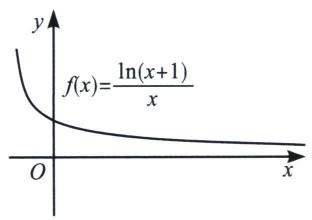

text_image

f(x)=\frac{\ln(x+1)}{x}

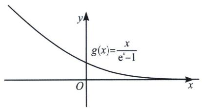

text_image

g(x)=\frac{x}{e^x-1}

例10 求证： $(\mathrm{e}^{x}-1)\ln(x+1)\geqslant x^{2}(x>-1)$ .

解析 法一(放缩法): 指对跨阶不等式, 根据“放对再放指, 不行找基友”的原理, 由于 $x = 0$ 时, 两边均为零, 故可以考虑对数在 $x = 0$ 处的切线放缩, 不等号方向必须一致, 由于 $x \geqslant 1$ 时, $\ln x \geqslant \frac{2(x - 1)}{x + 1}$ , 故 $x \geqslant 0$ 时, $\ln (x + 1) \geqslant \frac{2x}{x + 2}$ , 故只需证 $(\mathrm{e}^{x} - 1)\frac{2}{x + 2} \geqslant x (x \geqslant 0)$ , 即证 $\mathrm{e}^{x} \geqslant \frac{x^{2} + 2x}{2} + 1 (x \geqslant 0)$ , 构造 $h(x) = \frac{x^{2} + 2x + 2}{2\mathrm{e}^{x}}$ , 易得 $h'(x) = \frac{-x^{2}}{2\mathrm{e}^{x}}$ , 故 $h(x)_{\max} = h(0) = 1$ , 故 $(\mathrm{e}^{x} - 1)\ln (x + 1) \geqslant x^{2}(x \geqslant 0)$ 成立. 同理, 当 $-1 < x \leqslant 0$ 时, 易证 $\ln (x + 1) \leqslant \frac{2x}{x + 2} \leqslant 0$ , $\mathrm{e}^{x} - 1 \leqslant \frac{x^{2} + 2x}{2} \leqslant 0$ , 则 $-\ln (x + 1) \geqslant -\frac{2x}{x + 2} \geqslant 0$ , $-(e^{x} - 1) \geqslant \frac{x^{2} + 2x}{2} \geqslant 0$ , 所以 $[- (e^{x} - 1)] \cdot [-\ln (x + 1)] = (e^{x} - 1)\ln (x + 1) \geqslant x^{2}$ .

$(-1<x\leqslant0)$ . 综上 $(e^{x}-1)\ln(x+1)\geqslant x^{2}(x>-1)$ .

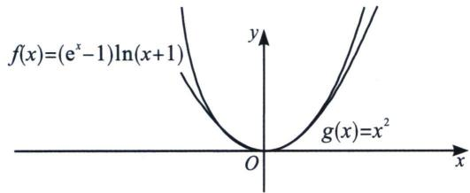

text_image

f(x)=(e^x-1)ln(x+1)
g(x)=x^2
O
y
x

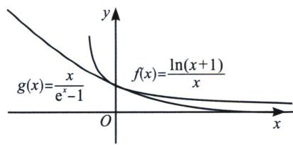

text_image

g(x)=\frac{x}{e^x-1} \quad f(x)=\frac{\ln(x+1)}{x}

法二(同构): 要证: $(\mathrm{e}^{x} - 1) \ln (x + 1) \geqslant x^{2}(x > -1)$ , 只需证 $\frac{x}{\mathrm{e}^{x} - 1} \leqslant \frac{\ln(x + 1)}{x}$ , 令 $f(x) = \frac{\ln(x + 1)}{x}$ , $f'(x) = \frac{\frac{x}{x + 1} - \ln(x + 1)}{x^2}$ , 取 $h(x) = \frac{x}{x + 1} - \ln(x + 1)$ , $h'(x) = \frac{1}{(x + 1)^2} - \frac{1}{x + 1} = \frac{-x}{(x + 1)^2}$ , 显然 $h(x)$ 在 $(-1, 0)$ 单调递增, 在 $(0, +\infty)$ 单调递减, $h(x)_{\max} = h(0) = 0$ , 所以 $f'(x) \leqslant 0$ 恒成立, 所以 $f(x)$ 单调递减, 当 $x = 0$ 时, 由于 $x \geqslant \ln(x + 1)$ 在 $x = 0$ 处取等, 故 $f(0) = 1$ , 令 $g(x) = \frac{x}{\mathrm{e}^{x} - 1}$ , 则 $g(x) = f(\mathrm{e}^{x} - 1)$ , 易证 $\mathrm{e}^{x} - 1 \geqslant x$ , 当且仅当 $x = 0$ 成立, 故 $f(0) = g(0) = 1$ , 由于 $f(x)$ 单调递减, 故 $f(x) \geqslant f(\mathrm{e}^{x} - 1) = g(x)$ , 命题得证.

注意: 本题利用了同构函数是一种特殊的复合函数, 我们可以表示 $g(x) = f(\mathrm{e}^{x} - 1)$ , 也可以表示为 $f(x) = g(\ln (x + 1))$ , 只要分析一个母函数(外函数)即可证明.

例11 (2021·多选·水哥供题)若实数 $a$ 、 $b$ 满足 $ab = (e^{a} - 1)\ln (1 + b)$ ，则下列选项正确的有（）

A. 若 b<0，则 a<0 B. 若 a>0，则 $b<a+\frac{b^{2}}{2}$

C. 存在实数 a、b，使得 $\left|a-b\right|=\sqrt{2}$

D. 设 $(a_{1}, b_{1})$ ， $(a_{2}, b_{2})$ 为满足等式的两组数，则当 $a_{1} < 0$ ， $a_{2} < 0$ 时， $|a_{1} - a_{2}| < |b_{1} - b_{2}|$

解析 对于 A，当 a=0, b>-1，此时 a 与 b 无关，A 错；

对于 B，由已知得 $\frac{a}{e^{a}-1}=\frac{\ln(1+b)}{b}$ ，令 $f(x)=\frac{x}{e^{x}-1}$ ， $g(x)=\frac{\ln(1+x)}{x}$ ，易知 $f(x)$ 和 $g(x)$ 均为减函数，且 $f(\ln(x+1))=g(x)$ ，故 $f(\ln(1+b))=\frac{\ln(1+b)}{\mathrm{e}^{(\ln(1+b))}-1}=\frac{\ln(1+b)}{b}=\frac{\mathrm{e}^{a}-1}{a}=f(a)\Rightarrow a=\ln(1+b)$ ，要证明 $b<a+\frac{b^{2}}{2}$ ，故只需证 $\frac{b^{2}}{2}-b+\ln(1+b)>0$ ，令 $h(x)=\frac{x^{2}}{2}+\ln(1+x)-x$ ，则 $h'(x)=x-1+\frac{1}{1+x}=x+1+\frac{1}{x+1}-2\geqslant0$ ， $h(x)$ 为增函数， $g(0)=0$ ，所以 $h(x)>0$ ， $b<\ln(1+b)+\frac{b^{2}}{2}$ ，故 B 正确；对于 C，由于 $a=\ln(1+b)$ ， $|a-b|=\sqrt{2}$ ，则 $|b-\ln(b+1)|=\sqrt{2}$ ，一定有解，C 正确；对于 D，由于 $x\geqslant\ln(1+x)$ ， $f(x)$ 和 $g(x)$ 均为减函数，则 $f(x)\leqslant f(\ln(x+1))=g(x)$ ，作出两

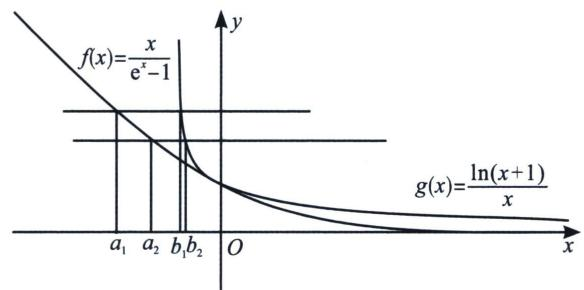

text_image

f(x)=\frac{x}{e^x-1}
g(x)=\ln(x+1)/x
a_1 a_2 b_1 b_2 O x

函数图知， $(a_{1}, b_{1})$ ， $(a_{2}, b_{2})$ 为满足等式的两组数，则 $f(a_{1}) = g(b_{1}) = y_{1}$ ， $f(a_{2}) = g(b_{2}) = y_{2}$ ，当 $a_{1} < 0$ ， $a_{2} < 0$ 时， $y_{1} > y_{2} > 0$ ，有相同 $\Delta y$ ，分析两函数的 $\Delta x$ ，显然 $f(x)$ 递减更缓慢，如图，一定有 $|a_{1} - a_{2}| > |b_{1} - b_{2}|$ ，故 D 错误，故选 BC.

例12 (2025 厦门、泉州五校高二期中 T19) 已知函数 $f(x) = \mathrm{e}^{x} - \frac{1}{2} x^{2} - ax (a \in \mathbb{R})$ .

(1)若不等式 $f(x)\geqslant1$ 在 $x\in[0,+\infty)$ 上恒成立，求实数a的取值范围；  
(2) 若 x > 0，求证： $\left(\mathrm{e}^{x} - \frac{1}{2} x^{2} + 1\right)\ln(x + 1) > 2x.$

解析 (1) $f(x)=\mathrm{e}^{x}-\frac{1}{2}x^{2}-ax\geqslant1\Leftrightarrow g(x)=\mathrm{e}^{x}-\frac{1}{2}x^{2}-ax-1\geqslant0,\quad g(0)=0,$

法一：(洛必达法则) $h(x)=\frac{\mathrm{e}^{x}-\frac{1}{2}x^{2}-1}{x}\geqslant a,\lim_{x\to0}\frac{\mathrm{e}^{x}-\frac{1}{2}x^{2}-1}{x}=\lim_{x\to0}\frac{\mathrm{e}^{x}-x}{1}=1$ ，故 $a\leqslant1$

注：本题分参后为典型的 $\frac{0}{0}$ 型，故可采用洛必达法则，后续章节也会给出洛必达法则的具体知识点以及方法的应用.

法二：(泰勒展开式) $e^{x}=1+x+\frac{1}{2}x^{2}+\cdots+\frac{1}{n!}x^{n}$ ，故 $h(x)=\frac{e^{x}-\frac{1}{2}x^{2}-1}{x}\geqslant\frac{x}{x}=1\geqslant a$ ，故 $a\leqslant1$ ；

法三：（端点效应） $g(x)=\mathrm{e}^{x}-\frac{1}{2}x^{2}-ax-1\geqslant0,\quad g(0)=0,\quad g'(x)=\mathrm{e}^{x}-x-a\geqslant0,\quad g'(0)=1-a\geqslant0,$ $a\leqslant1,\quad g''(x)=\mathrm{e}^{x}-1\geqslant0,\quad g'(x)\uparrow$ ，当 $a\leqslant1$ 时， $g'(x)=\mathrm{e}^{x}-x-a\geqslant0$ ，成立，当 a>1 时， $g'(0)=$ $e^{x}-x-a<0,\quad g'(a)=\mathrm{e}^{a}-2a>0$ ，存在唯一 $x_{0}\in(0,a)$ 使得 $g'(x_{0})=0$ ，故 $x\in(0,x_{0})$ ， $g'(x)<0,\quad g(x)\downarrow,\quad g'(x_{0})<g(0)=0$ 矛盾！综上： $a\leqslant1$

注：可采用洛必达法则的基本上也能端点效应，端点效应是高中对于洛必达的一个严格的书写，通常小题洛必达，大题端点效应，后续章节也会给出端点效应的具体应用及失效条件分析；

(2)要证: $\left(\mathrm{e}^{x}-\frac{1}{2}x^{2}+1\right)\ln(x+1)>2x$ ，同样考虑先放对数后放指数，发现 $x=0$ 时恰好取等，故考虑在 0 右边将 $\ln(x+1)$ 放小， $x \geqslant 0$ 时， $\ln(x+1) \geqslant \frac{2x}{x+2}$ ， $\mathrm{e}^{x}-\frac{1}{2}x^{2}+1>0$ ，即证 $\left(\mathrm{e}^{x}-\frac{1}{2}x^{2}+1\right)\frac{2x}{x+2}>2x$ ，即 $\mathrm{e}^{x}-\frac{1}{2}x^{2}+1>2+x$ ，由(1)得成立，故得证！

例13 (2023·河北月考 T21)已知函数 $f(x)=\frac{\ln x}{x-1}$ .

(1)求 $f(x)$ 的单调区间；  
(2)证明： $f(x)>\frac{x+1}{\mathrm{e}^{x}}$ （其中e是自然对数的底数， $e=2.71828\cdots$ ）.

解析 (1)定义域是 $(0, 1) \cup (1, +\infty)$ , $f'(x) = \frac{1 - \frac{1}{x} - \ln x}{(x - 1)^2}$ , 令 $u(x) = 1 - \frac{1}{x} - \ln x$ , 则 $u'(x) = \frac{1 - x}{x^2}$ , 所以 $u(x)$ 在 $(0, 1)$ 递增, 在 $(1, +\infty)$ 递减, 故 $x \in (0, 1) \cup (1, +\infty)$ 时, $u(x) < u(1) = 0$ ,

也即 $f'(x)<0$ ，因此 $f(x)$ 在(0,1)上单调递减；在 $(1,+\infty)$ 上也单调递减；

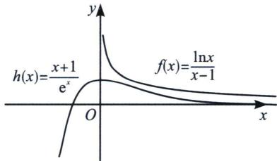

text_image

h(x)=\frac{x+1}{e^x}\nO\nf(x)=\ln x/(x-1)\ny\nx

(2)分析: 我们参考六大函数可知 $h(x)=\frac{x+1}{e^{x}}=e \cdot \frac{x+1}{e^{x+1}} \leqslant 1$ , 当且仅当 $x+1=1$ , 即 $x=0$ 时取等, $f(x)=\frac{\ln x}{x-1}$ 在 $(0,+\infty)$ 递减, 且由 $x-1 \geqslant \ln x (x=1$ 取等), 可知 $f(1)=1$ , 在 $x \in (0,1)$ 时, 可以证 $f(x)>1>h(x)$ , 当 $x>1$ 时, 两函数都是单调递减, 故此时我们可以构造函数或者放缩式证明. 法一 (对数单身狗, 指数找基友): 即证明 $\frac{\ln x}{x-1}>\frac{x+1}{e^{x}}, x \in (0,1) \cup (1,+\infty)$ , ①先证明 $x \in (1,+\infty)$ 时的情况: 此时问题等价于 $\ln x-\frac{x^{2}-1}{e^{x}}>0$ , 令 $g(x)=\ln x-\frac{x^{2}-1}{e^{x}}, g'(x)=\frac{e^{x}+x^{3}-2x^{2}-x}{xe^{x}}$ 令 $t(x)=e^{x}+x^{3}-2x^{2}-x$ , 则 $t'(x)=e^{x}+3x^{2}-4x-1, t''(x)=e^{x}+6x-4>0, (x>1)$ , 故 $t'(x)$ 在 $(1,+\infty)$ 递增, 故 $t'(x)>t'(1)=e-2>0$ , 故 $h(x)$ 在 $(1,+\infty)$ 递增, 于是 $t(x)>t(1)=e-2>0$ , 故 $g'(x)>0$ , 故 $g(x)$ 在 $(1,+\infty)$ 递增, 因此 $x \in (1,+\infty)$ 时, $g(x)>g(1)=0$ , 即 $\ln x-\frac{x^{2}-1}{e^{x}}>0$ ②下面证明 $x \in (0,1)$ 时的情况: 令 $m(x)=e^{x}-x-1, g'(x)=e^{x}-1>0$ , 故 $m(x)$ 在 $[0,1)$ 递增, 于是 $x \in (0,1)$ 时, $m(x)>m(0)=0$ , 故 $\frac{x+1}{e^{x}}<1$ , 令 $n(x)=\ln x-x+1, n'(x)=\frac{1-x}{x}>0$ , 故 $n(x)$ 在 $(0,1]$ 递增, 故 $x \in (0,1)$ 时, $n(x)<n(1)=0$ , 即 $\ln x-x+1<0$ , 即 $\frac{\ln x}{x-1}>1>\frac{x+1}{e^{x}}$ , 证毕.

法二(帕德放缩): 构造 $g(x)=\ln x-\frac{2(x-1)}{x+1}$ ，则 $g'(x)=\frac{1}{x}-\frac{4}{(x+1)^2}=\frac{(x-1)^2}{x(x+1)^2}\geqslant0$ ，而 $f(1)=0$ ，
故当 0 < x < 1 时， $\ln x < \frac{2(x-1)}{x+1}$ ; 当 $x \geqslant 1$ 时， $\ln x \geqslant \frac{2(x-1)}{x+1}$

①先证明 $x \in (1, +\infty)$ 时的情况: 要证: $\ln x - \frac{x^2 - 1}{e^x} \geqslant \frac{2(x - 1)}{x + 1} - \frac{x^2 - 1}{e^x} > 0$ , 故只需证 $\frac{2}{x + 1} > \frac{x + 1}{e^x}$ , 故只需证 $1 > \frac{(x + 1)^2}{2e^x}$ , 构造 $p(x) = \frac{(x + 1)^2}{2e^x}$ , $p'(x) = \frac{-x^2 + 1}{2e^x}$ , 显然 $p(x)_{\max} = p(1) = \frac{2}{e} < 1$ , ②下面证明 $x \in (0, 1)$ 时的情况: 此时问题等价于 $\ln x - \frac{x^2 - 1}{e^x} < \frac{2(x - 1)}{x + 1} - \frac{x^2 - 1}{e^x} < 0$ , 故只需证 $\frac{2}{x + 1} > \frac{x + 1}{e^x}$ , 故只需证 $1 > \frac{(x + 1)^2}{2e^x}$ , 显然 $p(x)_{\max} = h(1) = \frac{2}{e} < 1$ , 证毕.

注意：通常比切线精度更高的对数放缩，我们选择一飘一帕，即

$$
\left\{ \begin{array}{l} \frac {2 (x - 1)}{x + 1} > \ln x > \frac {1}{2} \left(x - \frac {1}{x}\right) (\text {当} 0 <   x <   1) \\ \frac {2 (x - 1)}{x + 1} <   \ln x <   \frac {1}{2} \left(x - \frac {1}{x}\right) (\text {当} x > 1) \end{array} \right.
$$

下面我们继续证明一些切线构造的函数最值，这些经常出现在一些放缩和找点的高考题中.

例13 求证：(1) $\frac{\ln(x+1)}{\sqrt{x}}<2$ ，(2) $\frac{\ln(x+1)}{\sqrt{x}}<1$

解析 (1) 因为 $f(x) = \frac{\ln(x + 1)}{x} < 1 (x > 0)$ (证明过程省略)，所以 $f(\sqrt{x}) = \frac{\ln(\sqrt{x} + 1)}{\sqrt{x}} < 1 (x > 0)$ ，所以 $2 > \frac{2\ln(\sqrt{x} + 1)}{\sqrt{x}} = \frac{\ln(\sqrt{x} + 1)^2}{\sqrt{x}} > \frac{\ln(x + 1)}{\sqrt{x}}$ ，所以 $\frac{\ln(x + 1)}{\sqrt{x}} < 2$ ;

(2)法一(指数找基友): 令 $t = \sqrt{x}$ , 本题转化为 $g(t) = \frac{\ln (t^2 + 1)}{t} < 1$ , 只需证 $t > \ln (t^2 + 1)$ , 两边取指数得, 只需证 $\mathrm{e}^t > t^2 + 1$ , 构造 $h(t) = \frac{t^2 + 1}{\mathrm{e}^t}$ , $h'(t) = -\frac{(t - 1)^2}{\mathrm{e}^t} \leqslant 0$ , 故 $h(t) < h(0) = 1$ , 证毕.

法二(对数单身狗): 即证 $h(x)=\sqrt{x}-\ln(x+1)>0$ , $h'(x)=\frac{1}{2\sqrt{x}}-\frac{1}{x+1}\geqslant0$ , 故 $h(x)$ 单调递增, $h(x)>h(0)=0$ .

# 第四节 三次函数的基本理论

# 一、三次函数的极值与拐点

设三次函数为 $f(x)=ax^{3}+bx^{2}+cx+d(a、b、c、d\in\mathbb{R}$ 且 $a\neq0)$ ，其基本性质有：

性质一：定义域为 $\mathbf{R}$

性质二：值域为 R，函数在整个定义域上没有最大值、最小值.

性质三：单调性和图象

三次函数导函数为二次函数 $f'(x)=3ax^{2}+2bx+c,\quad\Delta=4b^{2}-12ac=4(b^{2}-3ac)$

<table><tr><td></td><td colspan="2">a&gt;0</td><td colspan="2">a&lt;0</td></tr><tr><td rowspan="3">图象</td><td>Δ&gt;0</td><td>Δ≤0</td><td>Δ&gt;0</td><td>Δ≤0</td></tr><tr><td>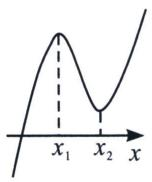</td><td>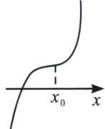</td><td>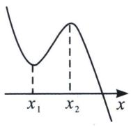</td><td>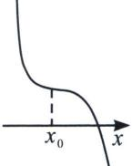</td></tr><tr><td>图1</td><td>图2</td><td>图3</td><td>图4</td></tr></table>

当 $a > 0$ 时，

①当 $\Delta=4b^{2}-12ac=4(b^{2}-3ac)>0$ ，即 $b^{2}-3ac>0$ 时， $f'(x)$ 与 x 轴有两个交点 $x_{1}$ ， $x_{2}$ ， $f(x)$ 形成三个单点区间和两个极值点 $x_{1}$ ， $x_{2}$ ，图象如图 1.

②当 $\Delta=4b^{2}-12ac=4(b^{2}-3ac)\leq0$ ，即 $b^{2}-3ac\leq0$ 时， $f'(x)$ 与 x 轴没有穿越零点， $f(x)$ 没有极值点，图象如图 2.

当 $a < 0$ 时，

①当 $\Delta=4b^{2}-12ac=4(b^{2}-3ac)>0$ ，即 $b^{2}-3ac>0$ 时， $f'(x)$ 与 x 轴有两个交点 $x_{1}$ ， $x_{2}$ ， $f(x)$ 形成三个单点区间和两个极值点 $x_{1}$ ， $x_{2}$ 。图象如图 3

②当 $\Delta=4b^{2}-12ac=4(b^{2}-3ac)\leqslant0$ ，即 $b^{2}-3ac\leqslant0$ 时， $f'(x)$ 与 x 轴没有穿越零点， $f(x)$ 没有极值点，图象如图 4.

性质四：奇偶性

对于三次函数 $f(x)=ax^{3}+bx^{2}+cx+d(a,b,c,d\in\mathbf{R}$ 且 $a\neq0)$ .

① $f(x)$ 不可能为偶函数；②当且仅当b=d=0时是奇函数.

性质五：对称性

①三次函数是中心对称曲线，且对称中心是 $\left(-\frac{b}{3a},f\left(-\frac{b}{3a}\right)\right)$ ;

②其导函数为 $f'(x)=3ax^{2}+2bx+c=0$ 对称轴为 $x=-\frac{b}{3a}$ ，所以对称中心的横坐标也就是导函数的对称轴，可见， $y=f(x)$ 图象的对称中心在导函数 $y=f'(x)$ 的对称轴上，且又是两个极值点的中点，同时也是二阶导为零的点；我们可以得出若 $y=f(x)$ 是可导函数，若 $y=f(x)$ 的图象关于点 $(m,n)$ 对称，则 $y=f'(x)$ 图象关于直线x=m对称；同理，若 $y=f(x)$ 图象关于直线x=m对称，则 $y=f'(x)$ 图象关于点 $(m,0)$ 对称。故奇函数的导数是偶函数，偶函数的导数是奇函数，周期函数的导数还是周期函数。

性质五：三次方程 $f(x)=0$ 的实根个数

对于三次函数 $f(x)=ax^{3}+bx^{2}+cx+d(a、b、c、d\in\mathbb{R}$ 且 $a\neq0$ ，其导数为 $f'(x)=3ax^{2}+2bx+c$ ，当 $b^{2}-3ac>0$ ，其导数 $f'(x)=0$ 有两个解 $x_{1}$ ， $x_{2}$ ，原方程有两个极值 $x_{1},x_{2}=\frac{-b\pm\sqrt{b^{2}-3ac}}{3a}$ .

①当 $f(x_{1})\cdot f(x_{2})>0$ ，原方程有且只有一个实根，图象如图5，6.

②当 $f(x_{1})\cdot f(x_{2})=0$ ，则方程有2个实根，图象如图7，8.

③当 $f(x_{1})\cdot f(x_{2})<0$ ，则方程有三个实根.

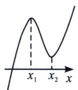  
图 5

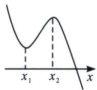  
图6

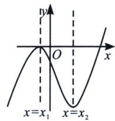

text_image

y
O
x
x=x₁
x=x₂

图 7

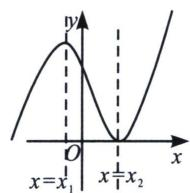  
图8

例14 (2021·乙卷)设 $a \neq 0$ , 若 $x = a$ 为函数 $f(x) = a(x - a)^{2}(x - b)$ 的极大值点, 则 ( )

A. a<b

B. a > b

C. $ab < a^{2}$

D. $ab > a^{2}$

解析 令 $f(x)=0$ ，解得 x=a 或 x=b，即 x=a 及 x=b 是 $f(x)$ 的两个零点，当 a>0 时，由三次函数的性质可知，要使 x=a 是 $f(x)$ 的极大值点，则函数 $f(x)$ 的大致图象如下左图所示，则 0<a<b；当 a<0 时，由三次函数的性质可知，要使 x=a 是 $f(x)$ 的极大值点，则函数 $f(x)$ 的大致图象如下右图所示，则 b<a<0；综上， $ab>a^{2}$ 。故选 D.

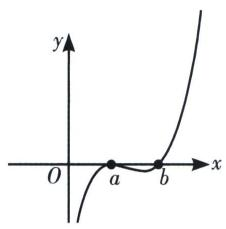

text_image

y
O
a
b
x

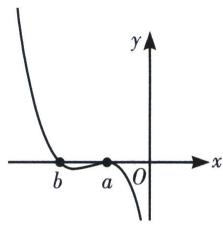

text_image

y
x
b
a
O

例15 (2025·新高考二卷) 若 $x = 2$ 是函数 $f(x) = (x - 1)(x - 2)(x - a)$ 的极值点，则 $f(0) = \_$ .

解析 函数 $f'(x) = (x - 1)(x - 2) + (2x - 3)(x - a)$ ，所以 $f'(2) = 2 - a = 0 \Rightarrow a = 2$ ， $f(0) = (0 - 1)(0 - 2)(0 - 2) = -4$ ，故答案为：-4

例16 (2022·新高考Ⅰ·多选)已知函数 $f(x)=x^{3}-x+1$ ，则()

A. $f(x)$ 有两个极值点

B. $f(x)$ 有三个零点

C. 点(0,1)是曲线 $y=f(x)$ 的对称中心

D. 直线 $y = {2x}$ 是曲线 $y = f\left( x\right)$ 的切线

解析 $f^{\prime}(x) = 3x^{2} - 1$ ，令 $f^{\prime}(x) > 0$ ，解得 $x < -\frac{\sqrt{3}}{3}$ 或 $x > \frac{\sqrt{3}}{3}$ ，令 $f^{\prime}(x) < 0$ ，解得 $-\frac{\sqrt{3}}{3} < x < \frac{\sqrt{3}}{3}$ ，所以 $f(x)$ 在 $\left(-\infty, -\frac{\sqrt{3}}{3}\right), \left(\frac{\sqrt{3}}{3}, +\infty\right)$ 上单调递增，在 $\left(-\frac{\sqrt{3}}{3}, \frac{\sqrt{3}}{3}\right)$ 上单调递减，且 $f\left(-\frac{\sqrt{3}}{3}\right) = \frac{2\sqrt{3} + 9}{9} > 0$ ， $f\left(\frac{\sqrt{3}}{3}\right) = \frac{9 - 2\sqrt{3}}{9} > 0$ ，所以 $f(x)$ 有两个极值点，有且仅有一个零点，故选项 A 正确，选项 B 错误；

又 $f(x)+f(-x)=x^{3}-x+1-x^{3}+x+1=2$ ，则 $f(x)$ 关于点(0,1)对称，故选项C正确；

假设 y=2x 是曲线 $y=f(x)$ 的切线，设切点为 $(a, b)$ ，则 $\left\{\begin{aligned}3a^{2}-1&=2\\ 2a=b\end{aligned}\right.$ ，解得 $\left\{\begin{aligned}a&=1\\ b&=2\end{aligned}\right.$ 或 $\left\{\begin{aligned}a&=-1\\ b&=-2\end{aligned}\right.$ ，显然
(1, 2) 和 $(-1, -2)$ 均不在曲线 $y=f(x)$ 上，故选项 D 错误。故选 AC.

例17 (广东省中山市第一中学 2025 学年高二 4 月月考 T14) 设 $f'(x)$ 是函数 $f(x)$ 的导数， $f''(x)$ 是函数 $f'(x)$ 的导数，若方程 $f''(x)=0$ 有实数解 $x_0$ ，则称点为 $(x_0, f(x_0))$ 函数 $f(x)$ 的拐点。某同学经过探究发现：任何一个三次函数 $f(x)=ax^3+bx^2+cx+d(a\neq0)$ 都有拐点，任何一个三次函数都有对称中心，且拐点就是对称中心，设函数 $g(x)=x^3-3x^2+4x+2$ ，利用上述探究结果计算： $g\left(\frac{1}{2025}\right)+g\left(\frac{2}{2025}\right)+\cdots+g\left(\frac{4048}{2025}\right)+g\left(\frac{4049}{2025}\right)=$ \_\_\_\_.

解析 由题意可知， $g'(x)=3x^{2}-6x+4$ ， $g''(x)=6x-6$ ，由 $g''(x)=6x-6=0\Rightarrow x=1$ ，又 $g(1)=1-3+4+2=4$ ，方程 $f''(x)=0$ 有实数解 $x_{0}$ ，则称点为 $(x_{0},f(x_{0}))$ 函数 $f(x)$ 的拐点，所以点(1,4)是函数 $g(x)$ 的拐点，即 $g(x)$ 的对称中心，所以 $g(x)+g(2-x)=8$ ，所以 $g\left(\frac{1}{2025}\right)+g\left(\frac{4049}{2025}\right)=8$ ， $g\left(\frac{2}{2025}\right)+g\left(\frac{4048}{2025}\right)=8,\cdots,g\left(\frac{2024}{2025}\right)+g\left(\frac{2026}{2025}\right)=8$ ， $g\left(\frac{2025}{2025}\right)=g(1)=4$ ， $g\left(\frac{1}{2025}\right)+g\left(\frac{2}{2025}\right)+\cdots+g\left(\frac{4048}{2025}\right)+g\left(\frac{4049}{2025}\right)=8\times2024+4=16196$ 。故答案为：16196。

例18 (2021·乙卷)已知函数 $f(x)=x^{3}-x^{2}+ax+1$ .

(1) 讨论 $f(x)$ 的单调性;  
(2)求曲线 $y=f(x)$ 过坐标原点的切线与曲线 $y=f(x)$ 的公共点的坐标.

解析 (1) $f'(x)=3x^{2}-2x+a,\quad\Delta=4-12a$ ，①当 $\Delta\leqslant0$ ，即 $a\geqslant\frac{1}{3}$ 时，由于 $f'(x)$ 的图象是开口向上的抛物线，故此时 $f'(x)\geqslant0$ ，则 $f(x)$ 在R上单调递增；

②当 $\Delta >0$ ，即 $a < \frac{1}{3}$ 时，令 $f'(x) = 0$ ，解得 $x_{1} = \frac{1 - \sqrt{1 - 3a}}{3}$ ， $x_{2} = \frac{1 + \sqrt{1 - 3a}}{3}$ ，令 $f'(x) > 0$ ，解得 $x < x_{1}$ 或 $x > x_{2}$ ，令 $f'(x) < 0$ ，解得 $x_{1} < x < x_{2}$ ，所以 $f(x)$ 在 $(-∞, x_{1})$ ， $(x_{2}, +∞)$ 单调递增，在 $(x_{1}, x_{2})$ 单调递减；

综上，当 $a \geqslant \frac{1}{3}$ 时， $f(x)$ 在 $\mathbf{R}$ 上单调递增；当 $a < \frac{1}{3}$ 时， $f(x)$ 在 $\left(-\infty, \frac{1 - \sqrt{1 - 3a}}{3}\right)$ ， $\left(\frac{1 + \sqrt{1 - 3a}}{3}, +\infty\right)$ 单调递增，在 $\left(\frac{1 - \sqrt{1 - 3a}}{3}, \frac{1 + \sqrt{1 - 3a}}{3}\right)$ 单调递减.

(2)设曲线 $y=f(x)$ 过坐标原点的切线为 l，则切点为 $(x_{0}, x_{0}^{3}-x_{0}^{2}+ax_{0}+1)$ ， $f'(x_{0})=3x_{0}^{2}-2x_{0}+a$ ，则切线方程为 $y-(x_{0}^{3}-x_{0}^{2}+ax_{0}+1)=(3x_{0}^{2}-2x_{0}+a)(x-x_{0})$ ，将原点代入切线方程有， $2x_{0}^{3}-x_{0}^{2}-1=0$ ，解得 $x_{0}=1$ ，所以切线方程为 $y=(a+1)x$ ，令 $x^{3}-x^{2}+ax+1=(a+1)x$ ，即 $x^{3}-x^{2}-x+1=0$ ，解得 x=1 或 x=-1，所以曲线 $y=f(x)$ 过坐标原点的切线与曲线 $y=f(x)$ 的公共点的坐标为 $(1, a+1)$ 和 $(-1, -a-1)$ .

# 二、三次函数四段论

$f(x) = ax^{3} + bx^{2} + cx + d(a > 0)$ 且导函数 $\Delta >0 f(x) = ax^3 +bx^2 +cx + d(a <   0)$ 且导函数 $\Delta >0$

text_image

极大值
Δx Δx Δx Δx
极小值等值点 中心 极小值

text_image

极大值
Δx Δx Δx Δx
极小值 中心 极小值等值点

1. 对称中心: $\left(-\frac{b}{3a}, f\left(-\frac{b}{3a}\right)\right)$ ;

2. 极大值到对称中心距离为 $\Delta x$ ，极小值点到对称中心距离为 $\Delta x$ ，极小值等值点到极大值点距离为 $\Delta x$ ，极大值等值点到极小值点距离为 $\Delta x$ ；设 $f(x)$ 的极大值为 $M$ ，当 $f(x)=M$ 的两根为 $x_1$ ， $x_2(x_1<x_2)$ 时，区间 $[x_1, x_2]$ 被中心 $\left(-\frac{b}{3a}, f\left(-\frac{b}{3a}\right)\right)$ 和极小值点三等分，类似的，对极小值 $N$ 也有此结论，

例19 (24 新Ⅰ卷第 10 题 · 多选) 设函数 $f(x) = (x - 1)^{2}(x - 4)$ ，则 ( )

A. x=3 是 $f(x)$ 的极小值点

B. 当 0 < x < 1 时， $f(x) < f(x^{2})$

C. 当 1 < x < 2 时， $-4 < f(2x - 1) < 0$

D. 当-1<x<0时， $f(2-x)>f(x)$

解析 法一：对 A，因为函数 $f(x)$ 的定义域为 R，而 $f'(x)=2(x-1)(x-4)+(x-1)^{2}=3(x-1)(x-3)$ ，易知当 $x\in(1,3)$ 时， $f'(x)<0$ ，当 $x\in(-\infty,1)$ 或 $x\in(3,+\infty)$ 时， $f'(x)>0$ ，函数 $f(x)$ 在 $(-∞,1)$ 上单调递增，在 $(1,3)$ 上单调递减，在 $(3,+\infty)$ 上单调递增，故 x=3 是函数 $f(x)$ 的极小值点，正确；

对 B，当 0 < x < 1 时， $x - x^{2} = x(1 - x) > 0$ ，所以 $1 > x > x^{2} > 0$ ，而由上可知，函数 $f(x)$ 在 $(0, 1)$ 上单调递增，所以 $f(x) > f(x^{2})$ ，错误；

对 C，当 1 < x < 2 时，1 < 2x - 1 < 3，而由上可知，函数 $f(x)$ 在 (1, 3) 上单调递减，所以 $f(1) > f(2x - 1) > f(3)$ ，即 -4 < f(2x - 1) < 0，正确；

对 D，当 -1 < x < 0 时， $f(2 - x) - f(x) = (1 - x)^{2} (-2 - x) - (x - 1)^{2} (x - 4) = (x - 1)^{2}$ $(2-2x)>0$ ，所以 $f(2-x)>f(x)$ ，正确；

line

| x | y |
|---|---|
| 0 | 0 |
| 1 | 1 |
| 2 | 0 |
| 3 | 0 |
| 4 | >1 |

法二：利用零点穿根和三次函数四段论，简化处理，由于两个零点 $x_{1} = 1$ （偶回）， $x_{2} = 4$ （奇穿），故我们能作出其图像，结合四段论的理论，对称中心为 $(2, -2)$ ， $x = 1$ 为极大值点， $x = 3$ 为极小值点，A 正确；函数 $f(x)$ 在 $(0, 1)$ 上单调递增，所以 $f(x) > f(x^{2})$ ，B 错误；当 $1 < x < 2$ 时， $1 < 2x - 1 < 3$ ， $-4 < f(2x - 1) < 0$ ，C 正确；当 $-1 < x < 0$ 时， $2 - x \in (2, 3)$ ， $f(2 - x) > f(3) = f(0) > f(x)$ ，D 正确；故选 ACD.

例20 (2023·龙岩一模 T12)已知 $f(x)=x^{3}-3x+m$ ，在区间[0, 2]上任取三个数 a, b, c，均存在以 $f(a)$ ， $f(b)$ ， $f(c)$ 为边长的三角形，则 m 的取值范围是（）

A. $m > 2$

B. $m > 4$

C. m>6

D. $m > 8$

解析 由 $f'(x)=3x^{2}-3=3(x+1)(x-1)$ ，得 $x=\pm1$ ，画出函数四段论图象

因为函数的定义域为[0, 2]，所以 $f(x)_{\min} = f(1) = m - 2$ ， $f(x)_{\max} = f(2) = m + 2$ ， $f(0) = m$ 由题意知 $f(1) + f(1) > f(2)$ ，即 $-4 + 2m > 2 + m$ ，得到 $m > 6$ ，故选C.

line

| x    | y     |
| ---- | ----- |
| -1   | 0     |
| 0    | n     |
| 1    | 0     |
| 2    | 0     |

例21 (2024 广东省名校高三开学考多选 T12) 设函数 $f(x) = ax^3 + bx^2 + cx + d (a \neq 0)$ 满足 $f(1) +$ $f(3) = 2f(2)$ ，则给出如下结论正确的是 （）

A. $f(x)$ 关于点 $(2, f(2))$ 成中心对称  
B. 若 $f(x)$ 在(0,1)上单调递增，则 $f(x)$ 是在(3,4)上单调递增  
C. 若 $a \cdot f(1) \geqslant a \cdot f(3)$ , 则 $f(x)$ 无极值

D. 对任意实数 $x_{0}$ , 直线 $y = (c - 12a)(x - x_{0}) + f(x_{0})$ 与曲线 $y = f(x)$ 有唯一公共点

解析 根据 $f(1)+f(3)=2f(2)$ ，我们将极大值设为 $f(1)$ ，极小值 $f(3)$ ，四段论作图左，易知A，B都正确，如下右图，若 $a\cdot f(1)\geqslant a\cdot f(3)$ ，根据对称性，发现 $f(x)$ 有极值，C不正确；

关于 D，依题意， $-\frac{b}{3a}=2$ ，整理得：b=-6a，则 $f(x)=ax^{3}-6ax^{2}+cx+d$ ， $f'(x)=3ax^{2}-12ax+c$ ， $f'(2)=c-12a$ ，故过拐点 $(2,f(2))$ 的切线斜率为 c-12a，则直线 $y=(c-12a)(x-x_{0})+f(x_{0})$ 是过曲线上任意一点作拐点切线平行的直线，如右图，则根据几何性质可知与 $y=f(x)$ 只有一个交点。D 正确。故选 ABD。

注意: 关于拐点, 任何函数有拐点, 通常过拐点的切线与原函数只有一个交点, 三次函数中,除了大于极大值或者小于极小值的与 $x$ 轴平行的直线与三次函数有一个交点, 还有与拐点切线平行的直线与三次函数只有一个交点.

三次函数四段论除了用于解决单调性和恒成立，也能帮助我们找零点，我们来看一下以下高考题.

例22 (2018·新课标ⅡT21)已知函数 $f(x)=\frac{1}{3}x^{3}-a(x^{2}+x+1)$ .

(1) 若 a=3，求 $f(x)$ 的单调区间；  
(2)证明： $f(x)$ 只有一个零点.

解析 (1) 当 $a = 3$ 时, $f(x) = \frac{1}{3} x^3 - 3 (x^2 + x + 1)$ , 所以 $f'(x) = x^2 - 6x - 3$ 时, 令 $f'(x) = 0$ 解得 $x = 3 \pm 2\sqrt{3}$ , $f(x)$ 增区间 $(- \infty, 3 - 2\sqrt{3})$ , $(3 + 2\sqrt{3}, + \infty)$ , 减区间 $(3 - 2\sqrt{3}, 3 + 2\sqrt{3})$ .

(2)法一: 因为 $x^{2} + x + 1 = \left(x + \frac{1}{2}\right)^{2} + \frac{3}{4} > 0$ , 所以 $f(x) = 0$ 等价于 $\frac{x^3}{3(x^2 + x + 1)} - a = 0$ , 令 $g(x) = \frac{x^3}{3(x^2 + x + 1)} - a$ , 则 $g'(x) = \frac{x^2[(x + 1)^2 + 2]}{3(x^2 + x + 1)^2} \geqslant 0$ , 仅当 $x = 0$ 时, $g'(x) = 0$ , 所以 $g(x)$ 在 $\mathbf{R}$ 上是增函数; $g(x)$ 至多有一个零点, 从而 $f(x)$ 至多有一个零点, 又因为 $f(3a - 1) = -6a^2 + 2a - \frac{1}{3} = -6\left(a - \frac{1}{6}\right)^2 - \frac{1}{6} < 0$ , $f(3a + 1) = \frac{1}{3} > 0$ , 综上, $f(x)$ 只有一个零点.

法二(等效零点法): 当 $x = 0$ 时, $f(x) = -a$ ; 当 $x \neq 0$ 时, $f(x) = 0$ 等价于 $\frac{x^3}{3(x^2 + x + 1)} - a = 0$ , 即

$0=\frac{3}{x^{3}}+\frac{3}{x^{2}}+\frac{3}{x}-\frac{1}{a}=g(x)$ ，令 $\frac{1}{x}=t\neq0$ ，则 $h(t)=3t^{3}+3t^{2}+3t-\frac{1}{a}$ ， $h'(t)=9t^{2}+6t+3,\Delta<0$ ， $h'(t)>0$ ，故 $h(t)$ 在R上单调递增，故 $h(t)$ 至多有一个零点.

例23 (2020·新课标ⅢT20)设函数 $f(x)=x^{3}+bx+c$ ，曲线 $y=f(x)$ 在点 $\left(\frac{1}{2},f\left(\frac{1}{2}\right)\right)$ 处的切线与y轴垂直.

(1)求b;

(2)若 $f(x)$ 有一个绝对值不大于1的零点，证明： $f(x)$ 所有零点的绝对值都不大于1.

解析 (1) 由 $f(x) = x^3 + bx + c$ ，得 $f'(x) = 3x^2 + b$ ，所以 $f'\left(\frac{1}{2}\right) = 3 \times \left(\frac{1}{2}\right)^2 + b = 0$ ，即 $b = -\frac{3}{4}$ ;

(2)证明：由(1)可得， $f(x)=x^{3}-\frac{3}{4}x+c$ 。 $f'(x)=3x^{2}-\frac{3}{4}=3\left(x+\frac{1}{2}\right)\left(x-\frac{1}{2}\right)$ ，可得当 $x\in\left(-\infty,-\frac{1}{2}\right),\left(\frac{1}{2},+\infty\right)$ 时， $f'(x)>0$ ，当 $x\in\left(-\frac{1}{2},\frac{1}{2}\right)$ 时， $f'(x)<0$ ，则 $f(x)$ 在 $\left(-\infty,-\frac{1}{2}\right),\left(\frac{1}{2},+\infty\right)$ 上单调递增，在 $\left(-\frac{1}{2},\frac{1}{2}\right)$ 上单调递减， $f(x)_{\text{极小值}}=f\left(\frac{1}{2}\right)$ ， $f(x)_{\text{极大值}}=f\left(-\frac{1}{2}\right)$ 。且 $f(-1)=f\left(\frac{1}{2}\right)=c-\frac{1}{4}$ ， $f\left(-\frac{1}{2}\right)=f(1)=c+\frac{1}{4}$ ，若 $f(x)$ 的所有零点中存在一个绝对值不大于1的零点 $x_{0}$ ，则 $f(-1)\leqslant0$ 且 $f(1)\geqslant0$ ，如图，即 $-\frac{1}{4}\leqslant c\leqslant\frac{1}{4}$ 。

①当 $-\frac{1}{4}<c<\frac{1}{4}$ 时， $f(-1)=f\left(\frac{1}{2}\right)<0,\quad f\left(-\frac{1}{2}\right)=f(1)>0;$ 故 $\exists x_{1}\in\left(-1,-\frac{1}{2}\right)$ ，使得 $f(x_{1})=0;\quad\exists x_{2}\in\left(-\frac{1}{2},\frac{1}{2}\right)$ ，使得 $f(x_{2})=0;\quad\exists x_{3}\in\left(\frac{1}{2},1\right)$ ，使得 $f(x_{3})=0$ ，即 $f(x)$ 所有零点的绝对值都小于1；

line

| x | y |
|---|---|
| -1 | -1 |
| -1/2 | 0 |
| 0 | 0 |
| 1/2 | -1 |
| 1 | 0 |

②当 $c=\frac{1}{4}$ 时，有且仅有 $f(-1)=f\left(\frac{1}{2}\right)=0$ ;

③当 $c=-\frac{1}{4}$ 时，有且仅有 $f\left(-\frac{1}{2}\right)=f(1)=0$ ;

综上， $f(x)$ 所有零点的绝对值都不大于1.

例24 (江苏省扬州中学 2023 届高三下学期高考前保温练 T8)已知正方形 ABCD 的中心在坐标原点, 四个顶点都在函数 $f(x)=x^{3}+bx$ 的图象上. 若正方形 ABCD 唯一确定, 则实数 b 的值为 ( )

A. $-\sqrt{2}$

B. -2

C. $- 2\sqrt{2}$

D. -4

解析 法一：因为四边形 $ABCD$ 为正方形， $O$ 为其中心，所以 $AC \perp BD$ 于点 $O$ ，且 $OA = OB = OC = OD$ ，不妨设直线 $AC$ 的方程为 $y = kx (k > 0)$ ，则直线 $BD$ 的方程为 $y = -\frac{1}{k} x$ ，设点 $A(x_1, y_1)$ ，

$B(x_{2}, y_{2})$ ，则 $C(-x_{1}, -y_{1})$ ， $D(-x_{2}, -y_{2})$ ，当 $b \geqslant 0$ 时， $f'(x) = 3x^{2} + b \geqslant 0$ ， $f(x)$ 在 R 上单调递增，与 $y = -\frac{1}{k}x$ 仅有 1 个交点为原点，不合题意，当 b < 0 时，联立直线 AC 与曲线方程，得到 $x_{1}^{3} + bx_{1} = kx_{1}$ ，解得 $x_{1}^{2} = k - b$ ，联立直线 BD 与曲线方程，得到 $x_{2}^{3} + bx_{2} = -\frac{1}{k}x_{2}$ ，解得 $x_{2}^{2} = -\frac{1}{k} - b$ ，因为 OA = OB，所以 $(1 + k^{2})(k - b) = \left(1 + \frac{1}{k^{2}}\right)\left(-\frac{1}{k} - b\right)$ ，整理得 $(k^{2} + \frac{1}{k^{2}}) - b(k - \frac{1}{k}) = 0$ ，即 $\left(k - \frac{1}{k}\right)^{2} - b\left(k - \frac{1}{k}\right) + 2 = 0$ ，设 $t(k) = k - \frac{1}{k}(k > 0)$ ，该函数在 $(0, +\infty)$ 上单调递增，值域为 R，要使符合题意的正方形只有 1 个，则必有 $t^{2} - bt + 2 = 0$ 有两个相等的实数根，即 $\triangle = b^{2} - 8 = 0$ ，解得 $b = -2\sqrt{2}$ ，正根舍去，此时 $k - \frac{1}{k} = -2\sqrt{2}$ ，解得 $k = \frac{\sqrt{6} - \sqrt{2}}{2}$ ，负根舍去，所以 $b = -2\sqrt{2}$ ;

法二：不妨设点 A 在第一象限，且 A, B, C, D 四点逆时针排布，设 $\angle A O x = \theta, 0 < \theta < \frac{\pi}{2}$ ， $|OA| = |OB| = |OC| = |OD| = r$ ，则 $A(r \cos \theta, r \sin \theta)$ ， $B(r \cos \left(\theta + \frac{\pi}{2}\right), r \sin \left(\theta + \frac{\pi}{2}\right)) = (-r \sin \theta, r \cos \theta)$ ，

text_image

y
B
A
O
x
C
D

由题意得两点存在曲线 $f(x)=x^{3}+bx$ 上，所以 $\left\{\begin{aligned}r\sin\theta &= r^{3}\cos^{3}\theta + br\cos\theta① \\ r\cos\theta &= -r^{3}\sin^{3}\theta - br\sin\theta②\end{aligned}\right.$ ，由①得 $r^{2}=\frac{\sin\theta-b\cos\theta}{\cos^{3}\theta}$ ，由②得 $r^{2}=-\frac{\cos\theta+b\sin\theta}{\sin^{3}\theta}$ ，联立两式得 $b=\frac{\sin^{4}\theta+\cos^{4}\theta}{\sin^{3}\theta\cos\theta-\sin\theta\cos^{3}\theta}=\frac{1+\tan^{4}\theta}{\tan^{3}\theta-\tan\theta}=-\frac{2\tan\theta}{1-\tan^{2}\theta}\cdot\frac{1+\tan^{4}\theta}{2\tan^{2}\theta}=-\tan2\theta\cdot\frac{(1-\tan^{2}\theta)^{2}+2\tan^{2}\theta}{2\tan^{2}\theta}=-\tan2\theta\left[2\left(\frac{1-\tan^{2}\theta}{2\tan\theta}\right)^{2}+\frac{2\tan^{2}\theta}{2\tan^{2}\theta}\right]=-\tan2\theta\left[2\left(\frac{1}{\tan2\theta}\right)^{2}+1\right]=-\left(\frac{2}{\tan2\theta}+\tan2\theta\right)$ ，因为 $r^{2}=\frac{\sin\theta-b\cos\theta}{\cos^{3}\theta}>0,\quad r^{2}=-\frac{\cos\theta+b\sin\theta}{\sin^{3}\theta}>0$ ，故 $\sin\theta-b\cos\theta>0,\quad \cos\theta+b\sin\theta<0$ ，又 $\sin\theta>0,\quad \cos\theta>0$ ，所以只有 b<0 时，才能使得两式恒成立，故 $\tan2\theta>0$ ，由基本不等式可得 $b=-\left(\frac{2}{\tan2\theta}+\tan2\theta\right)\leqslant-2\sqrt{\frac{2}{\tan2\theta}\cdot\tan2\theta}=-2\sqrt{2}$ ，当且仅当 $\frac{2}{\tan2\theta}=$ $\tan2\theta$ ，即 $\tan2\theta=\sqrt{2}$ 时，等号成立，由题意， $\theta$ 有唯一解，故 $b=-2\sqrt{2}$ 。故选 C.

# 第四节 泰勒展开的基本应用

若 $f$ 在点 $x_0$ 可导，则有 $f(x) = f(x_0) + f'(x_0)(x - x_0) + o(x - x_0)$ 。即在点 $x_0$ 附近，用一次多项式 $f(x_0) + f'(x_0)(x - x_0)$ 逼近函数 $f(x)$ 时，其误差为 $(x - x_0)$ 的高阶无穷小量。然而在很多场合，取一次多项式逼近是不够的，往往需要用二次或高于二次的多项式去逼近，并要求误差为 $O((x - x_0))^n$ ，其中 $n$ 为多项式的次数．为此，我们考察任一 $n$ 次多项式 $p_{n(x)} = a_0 + a_1 (x - x_0) + a_2 (x - x_0)^2 + \cdots + a_n (x - x_0)^n$ （1）

逐次求它在点 $x_{0}$ 处的各阶导数得到.

对于一般函数 $f$ ，设它在点 $x_0$ 存在直到 $n$ 阶的导数。由这些导数构造一个 $n$ 次多项式

$T_{n(x)}=f(x_{0})+\frac{f'(x_{0})}{1!}(x-x_{0})+\frac{f''(x_{0})}{2!}(x-x_{0})^{2}+\cdots+\frac{f^{(n)}(x_{0})}{n!}(x-x_{0})^{n}$ (2)，称为函数 f 在点 $x_{0}$ 处的泰勒(Taylor)多项式， $T_{n(x)}$ 的各项系数 $\frac{f^{(k)}(x_{0})}{k!}(k=1,2,\cdots,n)$ 称为泰勒系数。由上面对多项式系数的讨论，易知 $f(x)$ 与其泰勒多项式 $T_{n(x)}$ 在点 $x_{0}$ 有相同的函数值和相同的直至 n 阶导数值，即 $f^{(k)}(x_{0})=T_{n}^{(k)}(x_{0}), k=0,1,2,\cdots,n.$

若函数 f 在点 $x_{0}$ 存在直至 n 阶导数，则有 $f(x)=T_{n(x)}+o((x-x_{0})^{n})$ ，即 $f(x)=f(x_{0})+f'(x_{0})(x-x_{0})+\frac{f''(x_{0})}{2!}(x-x_{0})^{2}+\cdots\frac{f^{(n)}(x_{0})}{n!}(x-x_{0})^{n}+o((x-x_{0})^{n})$ (3)

$f(x)-T_{n(x)}=o((x-x_{0})^{n})$ ，即以(2)式所示的泰勒多项式逼近 $f(x)$ 时，其误差为关于 $(x-x_{0})^{n}$ 的高阶无穷小量。形如 $o((x-x_{0})^{n})$ 的余项称为佩亚诺(Peano)型余项。

所以(3)式称为函数 f 在点 $x_{0}$ 处的泰勒公式， $R_{n(x)} = f(x) - T_{n(x)}$ 称为泰勒公式的余项，形如 $o((x - x_{0})^{n})$ 的余项称为佩亚诺(Peano)型余项。所以(3)式又称为带有佩亚诺型余项的泰勒公式。V 以后用得较多的是泰勒公式(3)在 $x_{0} = 0$ 时的特殊形式：

$f(x)=f(0)+f'(0)x+\frac{f''(0)}{2!}x^{2}+\cdots+\frac{f^{(n)}(0)}{n!}x^{n}+o(x^{n})$ (4)，它也称为(带有佩亚诺余项的)麦克劳林(Maclaurin)公式．由此可得近似公式： $f(x)\approx f(0)+f'(0)x+\frac{f''(0)}{2!}x^{2}+\cdots+\frac{f^{(n)}(0)}{n!}x^{n}$ (5);

# 一、常见的泰勒展开式

1. $\mathbf{e}^x$ 的泰勒展开

$$
\mathrm{e} ^ {x} = 1 + x + \frac {x ^ {2}}{2 !} + \dots + \frac {x ^ {n}}{n !} + o (x ^ {n})
$$

高考中常见 $\left\{\begin{aligned}\mathrm{e}^{x}&\geqslant1+x+\frac{x^{2}}{2}(x\geqslant0)\\ \mathrm{e}^{x}&\leqslant1+x+\frac{x^{2}}{2}(x\leqslant0)\end{aligned}\right.$ ，由 $x\geqslant0$ ，故 $-x\leqslant0$ ，则 $\left\{\begin{aligned}\mathrm{e}^{-x}&\leqslant1-x+\frac{x^{2}}{2}(x\geqslant0)\\ \mathrm{e}^{-x}&\geqslant1-x+\frac{x^{2}}{2}(x\leqslant0)\end{aligned}\right.$ ；所以我们经常会用到一个不等式： $\mathrm{e}^{x}-\mathrm{e}^{-x}\geqslant2x(x\geqslant0)$ ，加强型： $\mathrm{e}^{x}-\mathrm{e}^{-x}\geqslant2x+\frac{x^{3}}{3}(x\geqslant0)$ ;

我们经常还会用到： $1+x<\mathrm{e}^{x}<\frac{1}{1-x}(0<x<1)$ .

例1 (2010·新课改2卷)设函数 $f(x)=\mathrm{e}^{x}-1-x-ax^{2}$ .

(1) 若 a=0，求 $f(x)$ 的单调区间；  
(2)若当 $x \geqslant 0$ 时 $f(x) \geqslant 0$ ，求 a 的取值范围.

解析 (1) 当 $a = 0$ 时 $f(x) = \mathrm{e}^{x} - 1 - x, f'(x) = \mathrm{e}^{x} - 1$ . 当 $x \in (-\infty, 0)$ 时, $f'(x) < 0$ ; 当 $x \in (0, \infty)$ .

$+\infty)$ 时， $f'(x)>0$ ，故 $f(x)$ 在 $(-∞,0)$ 单调递减，在 $(0,+∞)$ 单调递增.

原式 $\Leftrightarrow \mathrm{e}^{x} - 1 - x - \frac{1}{2} x^{2} + \left(\frac{1}{2} -a\right)x^{2}\geqslant 0$ ，令 $g(x) = \mathrm{e}^x -1 - x - \frac{1}{2} x^2$ ，下面证 $g(x)\geqslant 0$ 在 $x\geqslant 0$ 恒成立

$g(x)\geqslant0\Leftrightarrow h(x)=\frac{1+x+\frac{1}{2}x^{2}}{\mathrm{e}^{x}}\leqslant1,\quad h'(x)=\frac{-\frac{1}{2}x^{2}}{\mathrm{e}^{x}}\leqslant0,\quad h(x)$ 在 $[0,+\infty)$ 单调递减， $h(x)\leqslant h(x)_{\max}=h(0)=1$ ，满足题意.

①当 $a \leqslant \frac{1}{2}$ 时， $\left(\frac{1}{2}-a\right)x^{2} \geqslant 0$ ， $g(x) \geqslant 0$ ，满足题意；

②当 $a > \frac{1}{2}$ 时， $f(0) = 0$ ， $f'(x) = e^{x} - 1 - 2ax$ ， $f'(0) = 0$ ， $f''(x) = e^{x} - 2a$ ， $f''(0) = 1 - 2a < 0$ ，易知 $f''(x)$ 单调递增， $f''(\ln 2a) = 0$ 故 $f''(x)$ 在 $(0, \ln 2a)$ 恒负，则 $f'(x)$ 单调递减， $f'(x) < f'(0) = 0$ ，故 $f(x)$ 在 $(0, \ln 2a)$ 单调递减，所以 $f(\ln 2a) < f(0) = 0$ 矛盾，综上， $a \leqslant \frac{1}{2}$ .

# 2. $\ln (x + 1)$ 与 $\ln x$ 的泰勒展开

$$
\begin{array}{l} \ln (1 + x) = x - \frac {x ^ {2}}{2} + \frac {x ^ {3}}{3} + \dots + (- 1) ^ {n - 1} \frac {x ^ {n}}{n} + o (x ^ {n}). \quad \ln x = (x - 1) - \frac {1}{2} (x - 1) ^ {2} + \dots + (- 1) ^ {n - 1} \frac {1}{n} \\ (x - 1) ^ {n} + o ((x - 1) ^ {n}), \end{array}
$$

设 $f(x)=\ln(1+x)$ ， $f'(x)=\frac{1}{1+x}$ ，…， $f^{(k)}(x)=(-1)^{k-1}(k-1)!$ $(1+x)^{-k}$ ，k=1,2，
…，n

设 $f^{(k)}(0)=(-1)^{k-1}(k-1)!, k=1,2,\cdots,n$ ，代人公式(4)，便得 $\ln(1+x)$ 的麦克劳林公式，我们得到： $\ln(1+x)=x-\frac{x^{2}}{2}+\frac{x^{3}}{3}+\cdots+(-1)^{n-1}\frac{x^{n}}{n}+o(x^{n})$ ，高考中常见：

$$
\left\{ \begin{array}{l} x - \frac {x ^ {2}}{2} \leqslant \ln (1 + x) \leqslant x (x \geqslant 0) \\ x - \frac {x ^ {2}}{2} \leqslant \ln (1 + x) \leqslant x - \frac {1}{2} x ^ {2} + \frac {1}{3} x ^ {3} (x \geqslant 0) \end{array} , \right.
$$

我们之前讲到的切线找点不等式： $\ln\frac{x}{x_{0}}\leqslant\frac{x}{x_{0}}-1\Leftrightarrow\ln x\leqslant\frac{x}{x_{0}}+\ln x_{0}-1=\ln x_{0}+\frac{x-x_{0}}{x_{0}}$ ，我们能写出 $\ln x$ 在 $x=x_{0}$ 处的泰勒公式为 $\ln x=\ln x_{0}+\frac{1}{x_{0}}(x-x_{0})-\frac{1}{2\cdot x_{0}^{2}}(x-x_{0})^{2}+\cdots+(-1)^{n-1}\frac{1}{n\cdot x_{0}^{n}}(x-x_{0})^{n}+o((x-x_{0})^{n})$ ,

则 $\ln x$ 在 x=1 处的泰勒展开式为： $\ln x=(x-1)-\frac{1}{2}(x-1)^{2}+\cdots+(-1)^{n-1}\frac{1}{n}\cdot(x-1)^{n}+o((x-1)^{n})$ ,

同理： $\ln(x+x_{0})=\ln x_{0}+\frac{x}{x_{0}}-\frac{x^{2}}{2x_{0}^{2}}+\frac{x^{3}}{3x_{0}^{3}}+\cdots+\frac{(-1)^{n-1}x^{n}}{nx_{0}^{n}}+o(x)^{n};$

$e^{x}$ 在 $x = x_{0}$ 处的泰勒公式为 $\mathrm{e}^{x} = \mathrm{e}^{x_{0}} (1 + (x - x_{0}) + \frac{1}{2}(x - x_{0})^{2} + \cdots + \frac{1}{n!}(x - x_{0})^{n} + o((x - x_{0})^{n}))$ ;

例2 (2024·新高考Ⅰ)已知函数 $f(x)=\ln\frac{x}{2-x}+ax+b(x-1)^{3}$ .

(1)证明：曲线 $y=f(x)$ 是中心对称图形；  
(2) 若 $f(x) > -2$ 当且仅当 1 < x < 2，求 b 的取值范围.

解析 (1) 证明: $x \in (0, 2)$ , $f(2 - x) + f(x) = \ln \frac{2 - x}{x} + a(2 - x) + b(1 - x)^3 + \ln \frac{x}{2 - x} + ax + b(x - 1)^3 = 2a$ , 所以 $f(x)$ 关于点 $(1, a)$ 中心对称.

(2)由对称型及函数的连续性 a = -2，即 $\ln \frac{x}{2-x} - 2x + b(x-1)^{3} > -2$ ， $\ln \frac{x}{2-x} - 2(x-1) + b(x-1)^{3} > 0$ ，故本篇我们挖掘其本质，考试的解法在我们后续显点探路，由泰勒展开：x > 0， $\left\{\begin{aligned}\ln(1+x)\geqslant x-\frac{x^{2}}{2}+\frac{x^{3}}{3}-\frac{x^{4}}{4}\\ \ln(1-x)\leqslant-x-\frac{x^{2}}{2}-\frac{x^{3}}{3}-\frac{x^{4}}{4}\end{aligned}\right.$ ，做差后就得到了泰勒展开加强式， $\ln\frac{1+x}{1-x}\geqslant2x+\frac{2}{3}x^{3}\Rightarrow\ln\frac{x}{2-x}\geqslant$ $2(x-1)+\frac{2}{3}(x-1)^{3}$ 故 $b\geqslant-\frac{2}{3}$ .

# 3. 三角函数的泰勒展开

$$
\begin{array}{l} \sin x = x - \frac {x ^ {3}}{3 !} + \frac {x ^ {5}}{5 !} + \dots + (- 1) ^ {n} \frac {x ^ {2 n + 1}}{(2 n + 1) !} + o (x ^ {2 n + 1}); \cos x = 1 - \frac {x ^ {2}}{2 !} + \frac {x ^ {4}}{4 !} + \dots + (- 1) ^ {n} \frac {x ^ {2 n}}{(2 n) !} \\ + o (x ^ {2 n}); \\ \tan x = x + \frac {1}{3} x ^ {3} + \frac {2}{1 5} x ^ {5} + \frac {1 7}{3 1 5} x ^ {7} + o (x ^ {7}) \left(| x | <   \frac {\pi}{2}\right) \\ \end{array}
$$

我们通常能够用到的是 $x - \frac{x^3}{6} \leqslant \sin x \leqslant x$ 对于 $x \geqslant 0$ 恒成立， $1 - \frac{x^2}{2} \leqslant \cos x \leqslant 1 - \frac{x^2}{2} + \frac{x^4}{24}$ 对于 $x \geqslant 0$ 恒成立。 $\tan x \geqslant x$ ， $\tan x \geqslant x + \frac{x^3}{3}$ 对于 $x \geqslant 0$ 恒成立，

例3 设 $0 < x < 1$ . (1) 证明: $\frac{1}{x} - \frac{x}{6} < \frac{\sin x}{x^2}$ ; (2) 若 $ax - \frac{x^3}{6} < \sin x$ , 求 $a$ 的取值范围.

解析 (1) 证明：设 $g(x) = \sin x + \frac{x^3}{6} - x (0 < x < 1)$ ， $g'(x) = \cos x + \frac{x^2}{2} - 1$ ， $g''(x) = x - \sin x > 0$ ，则有 $g'(x)$ 单调递增， $g'(x) > g'(0) = 0$ ， $g(x)$ 递增，得 $g(x) > 0$ ，故 $\sin x + \frac{x^3}{6} - x > 0$ ，故 $\frac{1}{x} - \frac{x}{6} < \frac{\sin x}{x^2}$ 得证；

(2)设 $h(x)=\sin x+\frac{x^{3}}{6}-ax$ ，则 $h'(x)=\cos x+\frac{x^{2}}{2}-a$ ， $h''(x)=-\sin x+x>0$ ，则 $h'(x)$ 单调递增，
①当 $a\leqslant1$ 时，易知 $h'(x)>h'(0)=1-a\geqslant0$ ， $h(x)$ 在 $(0,+\infty)$ 为单调递增函数， $h(x)>h(0)=0$ ；
②当a>1时， $h'(2a)=\cos2a-a+2a^{2}=\cos2a+a^{2}+a(a-1)\geqslant2a^{2}-a-1>0$ ， $h'(0)=1-a<0$ ，由零点存在性定理知 $\exists x_{0}\in(0,2a)$ 使得 $h'(x_{0})=0$ ，且在 $(0,x_{0})$ ， $h'(x)<0$ ，即 $h(x)$ 单调递减， $h(x)<h(0)=0$ 与题设不符，综上可知， $a\leqslant1$ 时， $f(x)\geqslant0$ .

# 4. 分式函数与幂函数展开

$$
\frac {1}{1 - x} = 1 + x + x ^ {2} + \dots + x ^ {n} + o (x ^ {n}), \frac {1}{1 + x} = 1 - x + x ^ {2} + \dots + (- 1) ^ {n} x ^ {n} + o (x ^ {n});
$$

$1+x+x^{2}+\cdots+x^{n}=\frac{1}{1-x}(-1<x<1)$ ， $1-x+x^{2}+\cdots+(-x)^{n}=\frac{1}{1+x}(-1<x<1)$ 均为等比数列求和.

$$
(1 + x) ^ {\alpha} = 1 + \alpha x + \frac {\alpha (\alpha - 1)}{2 !} x ^ {2} + \dots + \frac {\alpha (\alpha - 1) \cdots (\alpha - n + 1)}{n !} x ^ {n} + \dots (- 1 <   x <   1)
$$

$(1+x)^{\alpha}=C_{\alpha}^{0}\cdot x^{0}+C_{\alpha}^{1}\cdot x^{1}+C_{\alpha}^{2}\cdot x^{2}+C_{\alpha}^{3}\cdot x^{3}+\cdots C_{\alpha}^{n}\cdot x^{n}+o(x^{n})$ 可以理解为二项式展开.

# 二、泰勒展开与双曲正弦余弦函数(含飘带函数)

根据 $\mathrm{e}^x\geqslant \frac{1}{6} x^3 +\frac{1}{2} x^2 +x + 1$ ， $\mathrm{e}^{-x}\geqslant -\frac{1}{6} x^3 +\frac{1}{2} x^2 -x + 1$ ，两式相加即得 $h(x) = \mathrm{e}^{x} + \mathrm{e}^{-x} - 2 - x^{2}$ $\geqslant 0$ ，当 $x = 0$ 时取“ $=$ ”， $x\in \mathbb{R}$ 时恒成立；由此我们能得出一个新的总结归纳，如下：

由于 $\mathrm{e}^x\geqslant 1 + x + \frac{1}{2} x^2 +\frac{1}{6} x^3 +\frac{1}{24} x^4 +\frac{1}{120} x^5$ ①； $\mathrm{e}^{-x}\geqslant 1 - x + \frac{1}{2} x^{2} - \frac{1}{6} x^{3} + \frac{1}{24} x^{4} - \frac{1}{120} x^{5}$ ②

①+②得： $e^{x}+e^{-x}\geqslant2+x^{2}+\frac{1}{12}x^{4}$ ，我们综合总结归纳可得： $\frac{e^{x}+e^{-x}}{2}\geqslant1+\frac{1}{2!}x^{2}+\frac{1}{4!}x^{4}+\cdots$ 由于 $\cos h x = \frac{e^{x} + e^{-x}}{2}$ ，我们称之为双曲余弦函数，那么它的泰勒展开式我们也随即推导

同理，我们可以得到双曲正弦函数，当 $x \geqslant 0$ ，记 $\sinh x = \frac{e^{x} - e^{-x}}{2} \geqslant x + \frac{x^{3}}{6} + \frac{x^{5}}{5!} + \cdots$

令 $e^{x}=t$ ，则会有 $\frac{t}{2}-\frac{1}{2t}\geqslant\ln t+\frac{1}{6}(\ln t)^{3}+\cdots$ ，最经典的代表就是飘带函数 $\frac{1}{2}\left(t-\frac{1}{t}\right)\geqslant\ln t(t\geqslant1)$ ，同理，我们也可以推出 $t-\frac{1}{t}<2\ln t+\frac{(\ln t)^{3}}{3}(0<t<1)$

另外，由于双曲余弦函数是偶函数，双曲正弦函数是奇函数，

易知当 $x \leqslant 0$ 时， $\sinh x = \frac{e^{x} - e^{-x}}{2} \leqslant x + \frac{x^{3}}{6} + \frac{x^{5}}{5!} + \cdots$ （如右图），而 $\cosh x = \frac{e^{x} + e^{-x}}{2} \geqslant 1 + \frac{1}{2!} x^{2} + \frac{1}{4!} x^{4} + \cdots$ 依然成立.

text_image

y
y=coshx
y=\frac{1}{2}x^2+1
x

text_image

y
y=sinh x
y=x+ x³/6
y=x
x

我们再来分析一下对数的泰勒展开 $\ln (1 + x) = x - \frac{x^2}{2} +\frac{x^3}{3} +\dots +(-1)^{n - 1}\frac{x^n}{n} +o(x^n)$ ，我们能得到

$\ln (1 - x) = -x - \frac{x^2}{2} -\frac{x^3}{3} -\frac{x^4}{4} -\frac{x^5}{5}\dots$ ，即 $\left\{ \begin{array}{l}\ln (1 + x) > x - \frac{x^2}{2} (x > 0)\\ \ln (1 - x) <   - x - \frac{x^2}{2} (x > 0) \end{array} \right.$ ，两式相减得： $\ln \frac{1 + x}{1 - x} >$ $2x(x > 0)$ ，令 $\frac{1 + x}{1 - x} = t(t > 1)$ ，则有 $x = \frac{t - 1}{t + 1}$ ，故 $\ln t > \frac{2(t - 1)}{t + 1}(t > 1)$ ，同理也能证明 $\ln t <   \frac{2(t - 1)}{t + 1}(0$

$<t<1)$ ，这就是我们经常用来放缩估值的帕德逼近 $R_{1,1}(x)$ ，我们可以进行泰勒加强，即

$\left\{ \begin{array}{l} \ln (1 + x) > x - \frac{x^2}{2} + \frac{x^3}{3} - \frac{x^4}{4} (x > 0) \\ \ln (1 - x) < -x - \frac{x^2}{2} - \frac{x^3}{3} - \frac{x^4}{4} (x > 0) \end{array} \right.$ ，两式相减得： $\ln \frac{1 + x}{1 - x} > 2x + \frac{2x^3}{3} (x > 0)$ ，

令 $\frac{1+x}{1-x}=t(t>1)$ ，则有 $x=\frac{t-1}{t+1}$ ，故 $\ln t>\frac{2(t-1)}{t+1}+\frac{2(t-1)^{3}}{3(t+1)^{3}}(t>1)$ ，

同理也能证明 $\ln t < \frac{2(t - 1)}{t + 1} + \frac{2(t - 1)^3}{3(t + 1)^3} (0 < t < 1)$ .

例 4 (2023 辽宁大连二模 T12) 函数 $f(x)=\mathrm{e}^{x}-\mathrm{e}^{-x}-a\sin x(x\in\mathbb{R})$ (e 是自然对数的底数，a>0 存在唯一的零点，则实数 a 的取值范围为 ()

A. (0, 2]

B. $(0, 1]$

C. (0, e]

D. $(0, \pi)$

解析 因为 $y=e^{x}$ 在 x=0 处的泰勒展开式为 $1+x+\frac{x^{2}}{2}+\frac{x^{3}}{6}+\cdots$ ， $y=e^{-x}$ 在 x=0 处的泰勒展开式为 $1-x+\frac{x^{2}}{2}-\frac{x^{3}}{6}+\cdots$ ， $y=\sin x$ 在 x=0 处的泰勒展开式为 $x-\frac{x^{3}}{6}+\cdots$ ，故 $\sin x\leqslant x$ ，根据双曲正弦函数和正弦均为奇函数可知，我们仅仅需要分析 $y=e^{x}-e^{-x}$ 与 $y=a\sin x$ 在 x>0 的交点情况， $e^{x}-e^{-x}\geqslant2x(x\geqslant0)$ ，根据题意当 2x>ax，即 a>2， $y=e^{x}-e^{-x}$ 与 $y=a\sin x$ 在 $x\in(0,+\infty)$ 无交点，故 $0<a\leqslant2$ ，故选 A.

例 5 (2024 · 赣州二模 T21) 已知函数 $f(x)=ax+\frac{a}{x}-(\ln x)^{2}(a \in \mathbb{R}$ 且 e 为自然对数的底数).

(1) 当 $a \geqslant 1$ 时，求 $f(x)$ 的最小值；

(2)若关于 x 的不等式 $e^{x} + e^{-x} - 2\ln x \geqslant b$ ，求整数 b 的最大值.

解析 (1) 函数 $f(x)$ 的定义域为 $(0, +\infty)$ , $f'(x) = a - \frac{a}{x^2} - \frac{2\ln x}{x} = \frac{1}{x}\left(ax - \frac{a}{x} - 2\ln x\right)$ , 设 $g(x) = ax - \frac{a}{x} - 2\ln x$ , 则 $g'(x) = a + \frac{a}{x^2} - \frac{2}{x} = \frac{ax^2 - 2x + a}{x^2}$ , 因为当 $a \geqslant 1$ 时, $ax^2 - 2x + a \geqslant 0$ 恒成立, 所以 $g'(x) \geqslant 0$ 在 $(0, +\infty)$ 上恒成立, 即 $g(x)$ 在 $(0, +\infty)$ 上单调递增, 又 $g(1) = 0$ , 故当 $x \in (0, 1)$ 时, $f'(x) < 0$ , 当 $x \in (1, +\infty)$ 时, $f'(x) > 0$ , 所以函数 $f(x)$ 在 $(0, 1)$ 上单调递减, 在 $(1, +\infty)$ 上单调递增, 所以 $f(x)_{\min} = f(1) = 2a$ ;

(2)由(1)知, 当 $a = 1$ 时, $x + \frac{1}{x} - (\ln x)^2 \geqslant 2$ , 当且仅当 $x = 1$ 时等号成立, 故 $\mathrm{e}^x + \mathrm{e}^{-x} - x^2 \geqslant 2$ , 当且仅当 $x = 0$ 时等号成立, 所以 $\mathrm{e}^x + \mathrm{e}^{-x} - 2\ln x > x^2 - 2\ln x + 2$ , 设 $h(x) = x^2 - 2\ln x + 2 = x^2 - \ln x^2 - 1 + 3 \geqslant 3$ , 所以 $h(x)_{\min} = h(1) = 3$ , 即 $\mathrm{e}^x + \mathrm{e}^{-x} - 2\ln x > 3$ , 另一方面, 当 $x = 1$ 时, $\mathrm{e}^x + \mathrm{e}^{-x} - 2\ln x = \mathrm{e} + \mathrm{e}^{-1} \in (3,4)$ , 所以 $3 < (\mathrm{e}^x + \mathrm{e}^{-x} - 2\ln x)_{\min} < \mathrm{e} + \mathrm{e}^{-1}$ , 又 $b$ 为整数, 故 $b \leqslant 3$ , 所以 $b$ 的最大值为 3.

# 三、泰勒展开与估值

泰勒展开能把一系列似乎不相干的函数组合到了一起，高考中利用泰勒展开的估值和比大小的题比较多，我们来简单介绍，更多比大小估值问题，我们会在本书第五章系统解读.

例6 (2014·新课标ⅡT21)已知函数 $f(x)=\mathrm{e}^{x}-\mathrm{e}^{-x}-2x$ .

(1) 讨论 $f(x)$ 的单调性；

(2)设 $g(x)=f(2x)-4bf(x)$ ，当x>0时， $g(x)>0$ ，求b的最大值；

(3)已知 $1.4142 < \sqrt{2} < 1.4143$ ，估计 $\ln 2$ 的近似值(精确到 0.001).

解析 (1)由 $f(x)$ 得 $f'(x)=\mathrm{e}^{x}+\mathrm{e}^{-x}-2\geqslant2\sqrt{\mathrm{e}^{x}\cdot\mathrm{e}^{-x}}-2=0$ ，即 $f'(x)\geqslant0$ ，当且仅当 $e^{x}=e^{-x}$ 即x=0时， $f'(x)=0$ ，所以函数 $f(x)$ 在R上为增函数.

(2) 函数 $g(x)=f(2x)-4b f(x)=\mathrm{e}^{2x}-\mathrm{e}^{-2x}-4b(\mathrm{e}^{x}-\mathrm{e}^{-x})+(8b-4)x$ ，求导得

$g'(x)=2\left[e^{2x}+e^{-2x}-2b(e^{x}+e^{-x})+(4b-2)\right]=2(e^{x}+e^{-x}-2)(e^{x}+e^{-x}+2-2b)$ ，①由 $e^{x}+e^{-x}>2$ ，则 $e^{x}+e^{-x}+2>4$ ，当 $2b\leqslant4$ ，即 $b\leqslant2$ 时， $g'(x)\geqslant0$ ，当且仅当x=0时取等号，从而 $g(x)$ 在 R 上为增函数，而 $g(0)=0$ ，所以 x>0 时， $g(x)>0$ ，符合题意；

②当 b>2 时，若 x 满足 $2<e^{x}+e^{-x}<2b-2$ ，即 $\left\{\begin{aligned}&2<e^{x}+e^{-x}\\ &e^{x}+e^{-x}<2b-2\end{aligned}\right.$ ，得 $\ln(b-1-\sqrt{b^{2}-2b})<x<\ln(b-1+\sqrt{b^{2}-2b})$ ，此时， $g'(x)<0$ ， $g(x)$ 单调递减，又由 $g(0)=0$ 知，当 $0<x\leqslant\ln(b-1+\sqrt{b^{2}-2b})$ 时， $g(x)<0$ ，不符合题意.

综合①②知， $b \leq 2$ ，即 b 的最大值为 2.

注意： $g(x)=f(2x)-4bf(x)=(\mathrm{e}^{2x}-\mathrm{e}^{-2x}-4x)-4b(\mathrm{e}^{x}-\mathrm{e}^{-x}-2x)$ ，根据泰勒展开式， $e^{x}\geqslant\frac{1}{24}x^{4}+\frac{1}{6}x^{3}+\frac{1}{2}x^{2}+x+1,\quad\mathrm{e}^{-x}\leqslant\frac{1}{24}x^{4}-\frac{1}{6}x^{3}+\frac{1}{2}x^{2}-x+1$ ，两式相减即得： $e^{x}-e^{-x}-2x\geqslant\frac{x^{3}}{3}\Leftrightarrow e^{2x}-e^{-2x}-4x\geqslant\frac{(2x)^{3}}{3}\Leftrightarrow\frac{(2x)^{3}}{3}-4b\frac{x^{3}}{3}\geqslant0\Leftrightarrow b\leqslant2$ ，多数的端点效应，都是按照泰勒公式展开来命题的.

(3) 因为 $1.4142 < \sqrt{2} < 1.4143$ ，根据(2)中 $g(x) = e^{2x} - e^{-2x} - 4b(e^x - e^{-x}) + (8b - 4)x$ ，为了凑配 $\ln 2$ ，并利用 $\sqrt{2}$ 的近似值，故将 $\ln \sqrt{2}$ 即 $\frac{1}{2} \ln 2$ 代入 $g(x)$ 的解析式中，得 $g(\ln \sqrt{2}) = \frac{3}{2} - 2\sqrt{2}b + 2(2b - 1)$ $\ln 2$ ，当 $b = 2$ 时，由 $g(x) > 0$ ，得 $g(\ln \sqrt{2}) = \frac{3}{2} - 4\sqrt{2} + 6\ln 2 > 0$ ，从而 $\ln 2 > \frac{8\sqrt{2} - 3}{12} > \frac{8 \times 1.4142 - 3}{12} = 0.6928$ ；令 $\ln (b - 1 + \sqrt{b^2 - 2b}) = \ln \sqrt{2}$ ，得 $b = \frac{3\sqrt{2}}{4} + 1 > 2$ ，当 $0 < x \leqslant \ln (b - 1 + \sqrt{b^2 - 2b})$ 时，由 $g(x) < 0$ ，得 $g(\ln \sqrt{2}) = -\frac{3}{2} - 2\sqrt{2} + (3\sqrt{2} + 2)\ln 2 < 0$ ，得 $\ln 2 < \frac{18 + \sqrt{2}}{28} < \frac{18 + 1.4143}{28} < 0.6934$ ，所以 $\ln 2$ 的近似值为 0.693。

注意：因为 $\ln2=\ln\frac{1+\frac{1}{3}}{1-\frac{1}{3}}$ ，转化研究 $\ln\frac{1+x}{1-x}$ 的结构， $\ln(1+x)=x-\frac{x^{2}}{2}+\frac{x^{3}}{3}-\frac{x^{4}}{4}+\frac{x^{5}}{5}-\frac{x^{6}}{6}+\cdots$ $\ln(1-x)=-x-\frac{x^{2}}{2}-\frac{x^{3}}{3}-\frac{x^{4}}{4}-\frac{x^{5}}{5}-\frac{x^{6}}{6}+\cdots$ ，两式相减得 $\ln\frac{1+x}{1-x}=2x+\frac{2}{3}x^{3}+\frac{2}{5}x^{5}+\cdots$

取 $x = \frac{1}{3}$ 即得符合精度的近似值 $\ln 2 = 2\times \frac{1}{3} +\frac{2}{3}\times \left(\frac{1}{3}\right)^3 +\frac{2}{5}\times \left(\frac{1}{3}\right)^5 +\dots \approx 0.693$

例7（江苏常州北郊高级中学2025学年高二4月期中考试T19)在高等数学中，我们将 $y = f(x)$ 在$x=x_{0}$ 处可以用一个多项式函数近似表示，具体形式为： $f(x)=f(x_{0})+f'(x_{0})(x-x_{0})+\frac{f''(x_{0})}{2!}(x-x_{0})^{2}+\cdots+\frac{f^{(n)}(x_{0})}{n!}(x-x_{0})^{n}+\cdots$ （其中 $f^{(n)}(x)$ 表示 $f(x)$ 的n次导数 $n\geqslant3,n\in N^{*}$ ），以上公式我们称为函数 $f(x)$ 在 $x=x_{0}$ 处的泰勒展开式。当 $x_{0}=0$ 时泰勒展开式也称为麦克劳林公式。比如 $e^{x}$ 在x=0处的麦克劳林公式为： $e^{x}=1+x+\frac{1}{2!}x^{2}+\frac{1}{3!}x^{2}+\cdots+\frac{1}{n!}x^{n}+\cdots$ ，由此当 $x\geqslant0$ 时，可以非常容易得到不等式 $e^{x}\geqslant1+x,e^{x}\geqslant1+x+\frac{1}{2}x^{2},e^{x}\geqslant1+x+\frac{1}{2}x^{2}+\frac{1}{6}x^{3},\cdots$ 请利用上述公式和所学知识完成下列问题：

(1) 写出 $\sin x$ 在 x=0 处的泰勒展开式；  
(2)根据泰勒公式估算 $\cos\frac{1}{2}$ 的值，精确到小数点后两位；  
(3) 若 $\forall x \in \left(0, \frac{3}{2}\right)$ , $e^{a\sin x} > x + 1$ 恒成立, 求 $a$ 的范围. (参考数据 $\ln \frac{5}{2} \approx 0.9$ )

解析 (1)根据 $(- \sin x)' = -\cos x, (- \cos x)' = \sin x, (\sin x)' = \cos x, (\cos x)' = -\sin x, \sin x$ 在 $x = 0$ 处的泰勒展开式为： $\sin x = x - \frac{1}{3!} x^3 + \frac{1}{5!} x^5 + \cdots + \frac{(-1)^{n-1}}{(2n-1)!} x^{2n-1} + \cdots$ .

(2)记函数 $f(x)=\cos x$ ，那么导函数 $f'(x)=-\sin x$ ， $f''(x)=-\cos x$ ， $f^{(3)}(x)=\sin x$ ， $f^{(4)}(x)=\cos x$ ，故 $\cos x=1-\frac{x^2}{2!}+\frac{x^4}{4!}-\frac{x^6}{6!}+\frac{x^8}{8!}-\cdots$ ，因此 $\cos \frac{1}{2}=1-\frac{\left(\frac{1}{2}\right)^2}{2!}+\frac{\left(\frac{1}{2}\right)^4}{4!}-\frac{\left(\frac{1}{2}\right)^6}{6!}+\frac{\left(\frac{1}{2}\right)^8}{8!}-\cdots$ ，由于 $\frac{\left(\frac{1}{2}\right)^{2k}}{(2k)!}-\frac{\left(\frac{1}{2}\right)^{2k+2}}{(2k+2)!}>\frac{\left(\frac{1}{2}\right)^{2k+2}}{(2k)!}-\frac{\left(\frac{1}{2}\right)^{2k+2}}{(2k+2)!}>\left(\frac{1}{2}\right)^{2k+2}\left[\frac{1}{(2k)!}-\frac{1}{(2k+2)!}\right]>0$ ，因此 $\cos \frac{1}{2}<1-\frac{\left(\frac{1}{2}\right)^2}{2!}$ 且 $\cos \frac{1}{2}>1-\frac{\left(\frac{1}{2}\right)^2}{2!}+\frac{\left(\frac{1}{2}\right)^4}{4!}$ ，所以 $1-\frac{1}{8}=0.875<\cos \frac{1}{2}<1-\frac{1}{8}+\frac{1}{16\times 24}<0.878$ ，因此 $\cos \frac{1}{2}\approx0.88$ .

(3)所以 $\sin x=x-\frac{1}{3!}x^{3}+\frac{1}{5!}x^{5}+\cdots+\frac{(-1)^{n-1}}{(2n-1)!}x^{2n-1}+\cdots$ ，根据 $\sin x$ 在 x=0 处的泰勒展开式，先证 $\forall x\in\left(0,\frac{3}{2}\right)$ ， $\sin x>x-\frac{1}{6}x^{3}$ ，令函数 $f(x)=\sin x-x+\frac{1}{6}x^{3}$ ， $f'(x)=\cos x-1+\frac{1}{2}x^{2}$ ， $f''(x)=x-\sin x$ ，三次导函数 $f'''(x)=1-\cos x$ ，易知 $f'''(x)>0$ ，即 $f''(x)$ 在区间 $\left(0,\frac{3}{2}\right)$ 上单调递增，因此 $f''(x)>f''(0)=0$ ，因此导函数 $f'(x)$ 在区间 $\left(0,\frac{3}{2}\right)$ 上单调递增，因此 $f'(x)>f'(0)=0$ ，因此函数 $f(x)$ 在区间 $\left(0,\frac{3}{2}\right)$ 上单调递增，因此 $f(x)>f(0)=0$ ，再令函数 $g(x)=x-\frac{1}{6}x^{3}-\ln(x+1)$ ， $x\in\left(0,\frac{3}{2}\right)$ ，易得导函数 $g'(x)=\frac{-\frac{1}{2}x(x-1)(x+2)}{x+1}$ ，因此 $g(x)$ 在区间 $\left(1,\frac{3}{2}\right)$ 上单调递减，在区间 $(0,1)$ 上单调递增，又因为 $g(0)=0$ ， $g\left(\frac{3}{2}\right)=\frac{15}{16}-\ln\frac{5}{2}>0$ ，因此 $\forall x\in\left(0,\frac{3}{2}\right)$ ， $g(x)>0$ 恒成立，

当 $a \geqslant 1$ 时， $a \sin x \geqslant \sin x > x - \frac{1}{6} x^3 > \ln (x + 1)$ ，因此 $\mathrm{e}^{a \sin x} > x + 1$ 成立，当 $a < 1$ 时，令函数 $h(x) = a \sin x - \ln (x + 1)$ ， $x \in \left(0, \frac{3}{2}\right)$ ，易求得 $h'(0) = a - 1 < 0$ ，因此必存在一个区间 $(0, m)$ ，使得函数 $h(x)$ 在区间 $(0, m)$ 上单调递减，因此 $x \in (0, m)$ 时， $h(x) < h(0) = 0$ ，不符合题意。综上所述， $a \in [1, +\infty)$ 。

# 第五节 帕德逼近的基本原理

帕德逼近(Padéapproximant)是一种对任意函数的有理函数逼近。这个是高中数学内容，帕德逼近有阶的概念，如果分子是 $m$ 阶多项式，分母是 $n$ 阶多项式，那么帕德逼近就是 $m / n$ 阶的帕德逼近，符号为 $[m / n]$ 或者 $R_{m,n}$ ，当 $n = 0$ 的时候，就是多项式逼近了。多项式逼近有多种，常见的有切比雪夫逼近和泰勒级数，帕德逼近在 $n = 0$ 时，是泰勒级数的前 $m$ 项，也就是我们上一讲讲到的泰勒展开多项式。

帕德逼近还有个小细节，它的基本形式如下： $\left[m/n\right]=R_{m,n}=\frac{p_{0}+p_{1}x+p_{2}x^{2}+\cdots+p_{m}x^{m}}{1+q_{1}x+q_{2}x^{2}+\cdots+q_{n}x^{n}}$ ，这个细节就是分母是以1开始的，也就是 $q_{0}=1$ ，帕德逼近是以0为基础的，以 $e^{x}$ ， $\ln(x+1)$ ， $\sin x$ 为例，帕德逼近在x=0点的误差最小，离0越远，误差越大，值得注意的是， $\ln x$ 是在x=1处的逼近.

# 一、常见的帕德逼近

例1 求 $f(x)=\ln(1+x)$ 的[1, 1]阶帕德逼近.

解析 由定义可知， $f(x)$ 的[1，1]阶帕德逼近为： $R(x)=\frac{a_{0}+a_{1}x}{1+b_{1}x}$ ，且满足 $f(0)=R(0)$ ，可得： $a_{0}=0$ 。 $f'(x)=\frac{1}{1+x}$ ， $R'(x)=\frac{a_{1}}{(1+b_{1}x)^{2}}$ ，再由定义可知，需满足： $f'(0)=R'(0)\Rightarrow a_{1}=1$ 。

同理再由 $f''(0)=R''(0)\Rightarrow b_{1}=\frac{1}{2}$ ，于是可得到 $f(x)$ 的 $[1,1]$ 阶帕德逼近为： $R(x)=\frac{2x}{x+2}$

line

| x   | y (Upper Curve) | y (Lower Curve) |
| --- | --------------- | --------------- |
| -2  | -2              | -2              |
| -1  | -1              | -1              |
| 0   | 0               | 0               |
| 1   | 1               | 1               |
| 2   | 1.5             | 1.5             |
| 3   | 2               | 2               |

如图，-1<x<0 时， $\ln(x+1)<\frac{2x}{x+2}$ ; x>0 时， $\ln(x+1)>\frac{2x}{x+2}$ ，若将上述不等式中 x 换成 x-1，
便可得到当 $x \geqslant 1$ 时， $\frac{2(x-1)}{(x+1)} \leqslant \ln x$ ，当 $0 < x \leqslant 1$ 时， $\ln x \leqslant \frac{2(x-1)}{x+1}$ .

例 2 (2016 · 新课标Ⅱ) 已知函数 $f(x)=(x+1)\ln x-a(x-1)$ . 若当 $x\in(1,+\infty)$ 时， $f(x)>0$ ,

求 a 的取值范围.

解析【分析】我们发现 $f(1)=0$ ，故 $f(x)>0\Rightarrow f(x)>f(1)$ ，这类端点处出现最值的类型，我们称之为端点效应，只需要端点处导函数大于等于0，保证之后都是递增即可，一旦端点处导函数为负，则会出现负值，与题意不符合，我们需要证明端点处导函数为正的情况成立，还要证明为负情况的矛盾.

解答：由 $f'(x)=1+\frac{1}{x}+\ln x-a$ ， $f''(x)=\frac{x-1}{x^{2}}$ ，因为x>1，所以 $f''(x)>0$ ，所以 $f'(x)$ 在 $(1,+\infty)$ 上单调递增，所以 $f'(x)>f'(1)=2-a$ 。

① $a\leqslant2$ ， $f'(x)>f'(1)\geqslant0$ ，所以 $f(x)$ 在 $(1,+\infty)$ 上单调递增，所以 $f(x)>f(1)=0$ ，满足题意；

② $a > 2$ ， $f^{\prime}(1) <   0$ ， $f^{\prime}(x) = 1 + \frac{1}{x} +\ln x - a > \ln x + 1 - a = 0$ ，取 $x = \mathrm{e}^{a - 1}$ ， $f^{\prime}(\mathrm{e}^{a - 1}) > 0$ ，存在 $x_0\in$ $(1,\mathrm{e}^{a - 1})$ ，使 $f^{\prime}(x_0) = 0$ ，函数 $f(x)$ 在(1， $x_0$ )上单调递减，在 $(x_0, + \infty)$ 上单调递增，由 $f(1) = 0$ 可得存在 $x_{1}\in (1, + \infty)$ ， $f(x_{1}) <   0$ ，不合题意，综上所述， $a\leqslant 2.$

我们再列举一些常见的帕德逼近，先看指数的：

<table><tr><td> $f(x)=\mathrm{e}^{x}$ </td><td>0</td><td>1</td><td>2</td></tr><tr><td>0</td><td>1(先大后小)</td><td> $x+1$ (恒小于)</td><td> $\frac{x^{2}+2x+2}{2}$ (先大后小)</td></tr><tr><td>1</td><td> $\frac{1}{1-x}$ (恒大于)</td><td> $\frac{2+x}{2-x}$ (先小后大)</td><td> $\frac{x^{2}+4x+6}{-2x+6}$ (恒大于)</td></tr><tr><td>2</td><td> $\frac{2}{x^{2}-2x+2}$ (先大后小)</td><td> $\frac{2x+6}{x^{2}-4x+6}$ (恒小于)</td><td> $\frac{x^{2}+6x+12}{x^{2}-6x+12}$ (先大后小)</td></tr></table>

将 $\ln (x + 1)$ 向右平移一个单位后，得到 $\ln x$ ，我们列举一下常见的帕德逼近：

<table><tr><td> $f(x)=\ln x$ </td><td>0</td><td>1</td><td>2</td></tr><tr><td>0</td><td></td><td> $x-1$ (恒大于)</td><td> $\frac{-x^{2}+4x-3}{2}$ (先大后小)</td></tr><tr><td>1</td><td></td><td> $\frac{2(x-1)}{x+1}$ (先大后小)</td><td> $\frac{x^{2}+4x-5}{4x+2}$ (恒大于)</td></tr><tr><td>2</td><td></td><td> $\frac{12(x-1)}{-x^{2}+8x+5}$ (恒大于)</td><td> $\frac{3x^{2}-3}{x^{2}+4x+1}$ (先大后小)</td></tr></table>

我们通过作图来分析逼近程度，我们发现，两个先大后小的逼近函数，显然 $R_{2,2}(x) = \frac{3x^2 - 3}{x^2 + 4x + 1}$ 比 $R_{1,1}(x) = \frac{2(x - 1)}{x + 1}$ 的逼近效果更好，两个恒大于的，显然 $R_{2,1}(x) = \frac{x^2 + 4x - 5}{4x + 2}$ 比

$R_{1,2}(x) = \frac{12(x - 1)}{-x^2 + 8x + 5}$ 的逼近效果更好，

text_image

f(x)=lnx
g(x)=\frac{2(x-1)}{x+1}

text_image

f(x)=lnx
h(x)=\frac{3(x^2-1)}{x^2+4x+1}

text_image

m(x)=\frac{12x-12}{-x^2+8x+5}
f(x)=\ln x

text_image

k(x)=\frac{x^2+4x-5}{4x+2}
f(x)=\ln x
y
x

例3 求 $f(x) = \ln (x + 1)$ 的[2, 2]阶帕德逼近.

解析 因为分母有 2 阶，而分子也有 2 阶，所以总体复杂度有 4 阶.

$\ln(x+1)=x-\frac{x^{2}}{2}+\frac{x^{3}}{3}-\frac{x^{4}}{4}+O(x^{5})$ ， $R_{2,2}(x)=\frac{a(x)}{b(x)}=\frac{a_{0}+a_{1}x+a_{2}x^{2}}{1+b_{1}x+b_{2}x^{2}}$ ，要求泰勒级数去掉尾项后减去帕德逼近要约等于0，于是误差只在泰勒级数尾项中： $x-\frac{x^{2}}{2}+\frac{x^{3}}{3}\approx\frac{a_{0}+a_{1}x+a_{2}x^{2}}{1+b_{1}x+b_{2}x^{2}}$ ，直接转化为等号，即： $\left(x-\frac{x^{2}}{2}+\frac{x^{3}}{3}-\frac{x^{4}}{4}\right)(1+b_{1}x+b_{2}x^{2})=a_{0}+a_{1}x+a_{2}x^{2}$

将左边展开： $x-\frac{x^{2}}{2}+\frac{x^{3}}{3}-\frac{x^{4}}{4}+b_{1}x^{2}-\frac{1}{2}b_{1}x^{3}+\frac{1}{3}b_{1}x^{4}-\frac{1}{4}b_{1}x^{5}+b_{2}x^{3}-\frac{1}{2}b_{2}x^{4}+\frac{1}{3}b_{2}x^{5}-\frac{1}{4}b_{2}x^{6}=x$ $+\left(b_{1}-\frac{1}{2}\right)x^{2}+\left(b_{2}-\frac{1}{2}b_{1}+\frac{1}{3}\right)x^{3}+\left(-\frac{1}{2}b_{2}+\frac{1}{3}b_{1}-\frac{1}{4}\right)x^{4}+\left(\frac{1}{3}b_{2}-\frac{1}{4}b_{1}\right)x^{5}-\frac{1}{4}b_{2}x^{6}$

把最高次的 $x^{5}$ 项和 $x^{6}$ 忽略（因为再往后展开，还会出现 $x^{5}$ 项和 $x^{6}$ 项，此时的系数不为0），剩余的每项等于0，所以有： $x + \left(b_{1} - \frac{1}{2}\right)x^{2} + \left(b_{2} - \frac{1}{2}b_{1} + \frac{1}{3}\right)x^{3} + \left(-\frac{1}{2}b_{2} + \frac{1}{3}b_{1} - \frac{1}{4}\right)x^{4} = a_{0} + a_{1}x + a_{2}x^{2}$ 左边减去右边有： $-a_{0} + (1 - a_{1})x + \left(b_{1} - a_{2} - \frac{1}{2}\right)x^{2} + \left(b_{2} - \frac{1}{2}b_{1} + \frac{1}{3}\right)x^{3} + \left(-\frac{1}{2}b_{2} + \frac{1}{3}b_{1} - \frac{1}{4}\right)x^{4} = 0$

可以得到一个方程组： $\left\{ \begin{array}{l} - a_0 = 0\\ 1 - a_1 = 0\\ b_1 - a_2 - \frac{1}{2} = 0\\ b_2 - \frac{1}{2} b_1 + \frac{1}{3} = 0\\ -\frac{1}{2} b_2 + \frac{1}{3} b_1 - \frac{1}{4} = 0 \end{array} \right.\Rightarrow \left\{ \begin{array}{l}a_0 = 0\\ a_1 = 1\\ a_2 = \frac{1}{2}\\ b_1 = 1\\ b_2 = \frac{1}{6} \end{array} \right.$

最终 $\ln(x+1)$ 的 $[2, 2]$ 阶帕德逼近为： $R_{2,2}(x)=\frac{x+\frac{1}{2}x^{2}}{1+x+\frac{1}{6}x^{2}}=\frac{3x^{2}+6x}{x^{2}+6x+6}$ .

# 二、帕德逼近与估值

相比于泰勒展开的近似数估算，我们发现如果泰勒某些情况精度不足，而且不等号方向相对固定，这就是泰勒展开的问题，我们估值需要但一个上下界限，所以帕德逼近和泰勒展开合体时，我们就能发现指数和对数都有了上下界，我们通常做如下处理：

当 $x \to 0^{+}$ 时， $\frac{2+x}{2-x} > e^{x} > \frac{1}{2} x^{2} + x + 1 > x + 1$ (左图);

当 $x \to 1^{+}$ 时， $\frac{1}{2} \left( x - \frac{1}{x} \right) > \ln x > \frac{2(x - 1)}{x + 1} > 1 - \frac{1}{x}$ (右图);

line

| x | y = e^x | y = x + 1 |
|---|---|---|
| 0.5 | 0.378 | 0.469 |
| 1.0 | 0.636 | 0.792 |
| 1.5 | 0.964 | 1.184 |
| 2.0 | 1.382 | 1.567 |
| 2.5 | 1.800 | 1.949 |
| 3.0 | 2.218 | 2.331 |
| 3.5 | 2.636 | 2.713 |
| 4.0 | 3.054 | 3.095 |
| 4.5 | 3.472 | 3.479 |
| 5.0 | 3.900 | 3.862 |
| 5.5 | 4.328 | 4.244 |
| 6.0 | 4.756 | 4.626 |
| 6.5 | 5.184 | 5.008 |
| 7.0 | 5.612 | 5.390 |
| 7.5 | 6.040 | 5.772 |
| 8.0 | 6.468 | 6.144 |
| 8.5 | 6.906 | 6.516 |
| 9.0 | 7.344 | 6.888 |
| 9.5 | 7.782 | 7.260 |
| 10.0 | 8.210 | 7.632 |
| 10.5 | 8.638 | 8.004 |
| 11.0 | 9.066 | 8.376 |
| 11.5 | 9.504 | 8.748 |
| 12.0 | 9.942 | 9.120 |
| 12.5 | 10.380 | 9.492 |
| 13.0 | 10.818 | 9.864 |
| 13.5 | 11.256 | 10.236 |
| 14.0 | 11.704 | 10.608 |
| 14.5 | 12.152 | 11.000 |
| 15.0 | 12.600 | 11.382 |
| 15.5 | 13.058 | 11.764 |
| 16.0 | 13.516 | 12.146 |
| 16.5 | 13.974 | 12.528 |
| 17.0 | 14.432 | 12.910 |
| 17.5 | 14.890 | 13.302 |
| 18.0 | 15.348 | 13.704 |
| 18.5 | 15.806 | 14.106 |
| 19.0 | 16.274 | 14.508 |
| 19.5 | 16.742 | 14.910 |
| 20.0 | 17.210 | 15.312 |
| 20.5 | 17.688 | 15.714 |
| 21.0 | 18.166 | 16.116 |
| 21.5 | 18.644 | 16.518 |
| 22.0 | 19.122 | 17.020 |
| 22.5 | 19.600 | 17.422 |
| 23.0 | 20.088 | 17.824 |
| 23.5 | 20.576 | 18.226 |
| 24.0 | 21.074 | 18.628 |
| 24.5 | 21.572 | 19.030 |
| 25.0 | 22.070 | 19.432 |
| 25.5 | 22.568 | 19.834 |
| 26.0 | 23.076 | 20.236 |
| 26.5 | 23.584 | 20.638 |
| 27.0 | 24.092 | 21.040 |
| 27.5 | 24.600 | 21.442 |
| 28.0 | 25.098 | 21.844 |
| 28.5 | 25.596 | 22.246 |
| 29.0 | 26.094 | 22.648 |
| 29.5 | 26.592 | 23.050 |
| 30.0 | 27.090 | nan        |

The chart is a line graph of the function y = e^x / (e^(-x/2 - x)). The x-axis ranges from approximately - to +in multiples of x (from -e^x to +e^x), and the y-axis ranges from -∞ to +∞ (from -∞ to +∞). The lines represent different y-values: y = e^x, y = e^x + x, and y = (e^x) / (e^(-x/2 - x)). The labels above the lines are 'y = (e^x)' and 'y = (e^x + x)'. The labels below are 'y = (e^x) / (e^(-x/2 - x))' and 'y = (e^x) / (e^(-x/2 + x)').'

由于飘带不等式和帕德逼近都是在 x=1 附近取得近似数，当在 $x=x_{0}$ 处取得近似数时，我们可以如下处理， $\left\{\begin{aligned}\ln x&>\frac{2(x-1)}{x+1}(x>1)\\ \ln x&<\frac{2(x-1)}{x+1}(0<x<1)\end{aligned}\right.$ ， $\left\{\begin{aligned}\ln\frac{x}{x_{0}}&>\frac{2(x-x_{0})}{x+x_{0}}(x>x_{0})\\ \ln\frac{x}{x_{0}}&<\frac{2(x-x_{0})}{x+x_{0}}(0<x<x_{0})\end{aligned}\right.$ 显然是一个相对紧密型的逼近，同

理我们考虑飘带函数 $\left\{\begin{aligned}\ln x&>\frac{1}{2}\left(x-\frac{1}{x}\right)\quad(\text{当}0<x<1)\\ \ln x&<\frac{1}{2}\left(x-\frac{1}{x}\right)\quad(\text{当}x>1)\end{aligned}\right.$ ，故采取 $\left\{\begin{aligned}\ln\frac{x}{x_{0}}&>\frac{1}{2}\left(\frac{x}{x_{0}}-\frac{x_{0}}{x}\right)\quad(\text{当}0<x<x_{0})\\ \ln\frac{x}{x_{0}}&<\frac{1}{2}\left(\frac{x}{x_{0}}-\frac{x_{0}}{x}\right)\quad(\text{当}x>x_{0})\end{aligned}\right.$

得到更紧密的逼近.

text_image

m(x)=\frac{12x-12}{-x^2+8x+5}
f(x)=\ln x

text_image

k(x)=\frac{x^2+4x-5}{4x+2} \n f(x)=\ln x

例 4 (2024 山东德州高二期末 T19)两个正整数 m, n, 函数 $f(x)$ 在 x=0 处的 [m, n] 阶帕德近似定义为: $R(x)=\frac{a_{0}+a_{1}x+\cdots+a_{m}x^{m}}{1+b_{1}x+\cdots+b_{n}x^{n}}$ , 且满足: $f(0)=R(0)$ , $f'(0)=R'(0)$ , $f''(0)=R''(0)$ , $\cdots$ , $f^{(m+n)}(0)=R^{(m+n)}(0)$ , 已知函数 $f(x)=\ln(x+1)$ .

(1)求函数 $f(x)=\ln(x+1)$ 在x=0处的 $[1,1]$ 阶帕德近似 $R(x)$ ;

(2)在(1)的条件下：求证： $\frac{R(x)}{\ln(x+1)}<1;$

(3)已知 $g(x)=\mathrm{e}^{x}$ 在x=0处的[2,2]阶帕德近似为 $R(x)=\frac{x^{2}+6x+12}{x^{2}-6x+12}$ ，依据帕德近似公式 $e^{x}\approx\frac{x^{2}+6x+12}{x^{2}-6x+12}$ ；若 $f(x)=\ln(x+1)$ 在x=0处的[2,2]阶帕德近似为 $R(x)=\frac{a+bx+\frac{1}{2}x^{2}}{1+x+\frac{1}{6}x^{2}}$ ，设 $p=0.1\mathrm{e}^{0.1},q=\frac{1}{9},r=-\ln0.9$ ，试比较p,q,r的大小.

解析 由已知 $f(x)=\ln(x+1)$ 在 x=0 处的[1,1]阶帕德近似 $R(x)=\frac{a_{0}+a_{1}x}{1+b_{1}x},\cdots,f'(x)=\frac{1}{x+1},f''(x)=-\frac{1}{(x+1)^{2}}$ ，由 $f(0)=R(0)$ 得 $a_{0}=0$ ，所以 $R(x)=\frac{a_{1}x}{1+b_{1}x}$ ，则 $R'(x)=\frac{a_{1}}{(1+b_{1}x)^{2}}$ ，又由 $f'(0)=R'(0)$ 得 $a_{1}=1$ ，所以 $R''(x)=\frac{-2b_{1}}{(1+b_{1}x)^{3}}$ ，由 $f''(0)=R''(0)$ 得 $b_{1}=\frac{1}{2}$ ，所以 $R(x)=\frac{x}{1+\frac{1}{2}x}=\frac{2x}{x+2}$ .

(2)证明：令 $F(x)=\frac{2x}{x+2}-\ln(x+1)$ ， $x\in(-1,0)\cup(0,+\infty)$ ，因为 $F'(x)=\frac{4}{(x+2)^{2}}-\frac{1}{x+1}=\frac{-x^{2}}{(x+1)(x+2)^{2}}<0$ ，所以 $F(x)$ 在 $x\in(-1,0)$ 及 $(0,+\infty)$ 上均单调递减.

①当 $x \in (-1, 0)$ , $F(x) > F(0) = 0$ , 即 $\frac{2x}{x + 2} > \ln (x + 1)$ , 而 $\ln (x + 1) < 0$ , 所以 $\frac{\frac{2x}{x + 2}}{\ln (x + 1)} < 1$ , 即 $\frac{R(x)}{\ln (x + 1)} < 1$ , ②当 $x \in (0, +\infty)$ , $F(x) < F(0) = 0$ , 即 $\frac{2x}{x + 2} < \ln (x + 1)$ , 而 $\ln (x + 1) > 0$ , 所以 $\frac{\frac{2x}{x + 2}}{\ln (x + 1)} < 1$ , 即 $\frac{R(x)}{\ln (x + 1)} < 1$ , 综上, 所以不等式 $\frac{R(x)}{\ln (x + 1)} < 1$ 恒成立,

(3)解: 依题意, $f(0)=0$ , $R(0)=a$ , 由 $f(0)=R(0)$ , 得 $a=0$ , 此时 $R(x)=\frac{6bx+3x^{2}}{6+6x+x^{2}}$ , 因为 $f'(x)=\frac{1}{1+x}$ , $R'(x)=\frac{(18-6b)x^{2}+36x+36b}{(x^{2}+6x+6)^{2}}$ , 所以 $f'(0)=1$ , $R'(0)=b$ , 又因为 $f'(0)=R'(0)$ , 所以 $b=1$ , 故 $f(x)=\ln(x+1)$ 在 $x=0$ 处的[2, 2]阶帕德近似为:

$R(x) = \frac{x + \frac{1}{2}x^2}{1 + x + \frac{1}{6}x^2} = \frac{3x^2 + 6x}{x^2 + 6x + 6}$ ，故 $p = 0.1\mathrm{e}^{0.1}\approx 0.1\times \frac{0\cdot 1^2 + 6\times 0.1 + 12}{0\cdot 1^2 - 6\times 0.1 + 12} = \frac{1.261}{11.41}\approx 0.1105$ ， $q = \frac{1}{9}\approx 0.1111$ ， $r = -\ln 0.9 = -\ln (1 - 0.1)\approx -\frac{3\times(-0.1)^2 + 6\times(-0.1)}{(-0.1)^2 + 6\times(-0.1) + 6} = \frac{0.57}{5.41}\approx 0.1054$ ，即 $r < p < q.$

# 三、高阶帕德逼近与偏移综合

例5（福建省厦门市2024届高中毕业班第四次质量检测数学试题T19)帕德近似是法国数学家亨利

\- 帕德发明的用有理多项式近似特定函数的方法, 在计算机数学中有着广泛的应用. 已知函数 $f(x)$ 在 $x=0$ 处的 $[m, n]$ 阶帕德近似定义为: $R(x)=\frac{a_{0}+a_{1}x+\cdots+a_{m}x^{m}}{1+b_{1}x+\cdots+b_{n}x^{n}}$ , 且满足: $f(0)$

$$
= R (0), f ^ {\prime} (0) = R ^ {\prime} (0), f ^ {(2)} (0) = R ^ {(2)} (0), \dots , f ^ {(m + n)} (0) = R ^ {(m + n)} (0).
$$

已知 $f(x)=\ln(x+1)$ 在x=0处的 $[2,2]$ 阶帕德近似为 $R(x)=\frac{a+bx+\frac{1}{2}x^{2}}{1+x+\frac{1}{6}x^{2}}$ ;

(1)求实数 a, b 的值;

(2)设 $h(x)=f(x)-R(x)$ ，证明： $xh(x)\geqslant0$ ;

(3)已知 $x_{1}$ ， $x_{2}$ ， $x_{3}$ 是方程 $\ln x = \lambda \left( x - \frac{1}{x} \right)$ 的三个不等实根，求实数 $\lambda$ 的取值范围，并证明： $\frac{x_{1} + x_{2} + x_{3}}{3} > \frac{1}{\lambda} - 1.$

解析 (1) 法一：因为 $f(x)=\ln(x+1)$ ， $R(x)=\frac{a+bx+\frac{1}{2}x^{2}}{1+x+\frac{1}{6}x^{2}}$ ，所以 $f(0)=R(0)=0\Rightarrow a=0$ ， $f'(x)$

$$
= \frac {1}{x + 1}, R ^ {\prime} (x) = \frac {(b + x) \left(1 + x + \frac {1}{6} x ^ {2}\right) - \left(a + b x + \frac {1}{2} x ^ {2}\right) \left(1 + \frac {1}{3} x\right)}{1 + x + \frac {1}{6} x ^ {2}}, f ^ {\prime} (0) = R ^ {\prime} (0) = 0 \Rightarrow b = 1,
$$

$$
R (x) = \frac {x + \frac {1}{2} x ^ {2}}{1 + x + \frac {1}{6} x ^ {2}};
$$

法二：由泰勒展开： $x\to0,\ \ln(x+1)=x-\frac{1}{2}x^{2}+\frac{1}{3}x^{3}+o(x^{3})=\frac{a+bx+\frac{1}{2}x^{2}}{1+x+\frac{1}{6}x^{2}}$ ，所以 $\ln(x+1)=x-$

$\frac{1}{2}x^{2}+x^{2}=a+bx+\frac{1}{2}x^{2}$ ，即a=0，b=1， $R(x)=\frac{x+\frac{1}{2}x^{2}}{1+x+\frac{1}{6}x^{2}}$ ;

$$
x h (x) \geqslant 0 \Leftrightarrow \left\{ \begin{array}{l} - 1 <   x <   0, h (x) <   0 \\ x > 0, h (x) > 0 \end{array} , h (x) = f (x) - R (x) = \ln (1 + x) - \frac {6 x + 3 x ^ {2}}{6 + 6 x + x ^ {2}}, h ^ {\prime} (x) = \frac {1}{1 + x} - \right.
$$

$$
\frac {6 (x + 1) (6 + 6 x + x ^ {2}) - (6 x + 3 x ^ {2}) (6 + 6 x + x ^ {2})}{(6 + 6 x + x ^ {2}) ^ {2}} = \frac {x ^ {4}}{(1 + x) (x ^ {2} + 6 x + 6) ^ {2}} \geqslant 0, h (x) \uparrow ,
$$

$\left\{ \begin{array}{l} -1 < x < 0, h(x) < h(0) = 0 \\ x > 0, h(x) > h(0) = 0 \end{array} \right.$ ，所以 $xh(x) \geqslant 0$ 得证！

(3)由飘带函数零点个数， $\lambda<\frac{1}{2}$ （具体证明在后续飘带函数找点），由飘带函数性质，有 $x_{2}=1$ ， $x_{1}x_{3}=1$ ，由(2)得x>0， $\ln(1+x)>\frac{6x+3x^{2}}{6+6x+x^{2}}\Leftrightarrow x>1$ ， $\ln x>\frac{3x^{2}-3}{1+4x+x^{2}}$ ；

所以 $\ln x_{3}=\lambda\left(x_{3}-\frac{1}{x_{3}}\right)>\frac{3x_{3}^{2}-3}{1+4x_{3}+x_{3}^{2}}\Leftrightarrow\frac{\lambda}{x_{3}}>\frac{3}{1+4x_{3}+x_{3}^{2}}\Rightarrow\lambda>\frac{3}{\frac{1}{x_{3}}+4+x_{3}}$ ，即 $\frac{1}{\lambda}<\frac{\frac{1}{x_{3}}+4+x_{3}}{3}=$ $\frac{x_{1}+x_{2}+x_{3}}{3}+1\Rightarrow\frac{x_{1}+x_{2}+x_{3}}{3}>\frac{1}{\lambda}-1$ 得证！

text_image

第

# 第2章 技能篇——导数的切线方程

切线问题是导数的起始，一切源于切线，本章系统介绍切线的各种处理方法，力争高观点视角降维解读切线，以达到小题小做的目的.

# 第一节 基本切线方程

# 一、基本切线求法与应用

# 1. 在某点处的切线方程

(1)导数的几何意义: 函数 $f(x)$ 在点 $x_0$ 处的导数的几何意义就是曲线 $y = f(x)$ 在点 $(x_0, f(x_0))$ 处的切线的斜率. 注: $(k = f'(x) = \tan \alpha)$ 切线方程 $y - f(x_0) = f'(x_0)(x - x_0)$ 的计算:

(2)在点 $A(x_0, y_0)$ 处的切线方程： $y - f(x_0) = f'(x_0)(x - x_0)$ ，抓住关键： $\left\{ \begin{array}{l} y_0 = f(x_0) \\ k = f'(x_0) \end{array} \right.$

例1 (2024 广州二中期中考试 T2) 已知函数 $f(x) = \frac{1}{e^x} - x + 1$ ，则曲线 $y = f(x)$ 在 $x = 0$ 处的切线方程为

A. $x + y - 2 = 0$

B. $2x + y - 1 = 0$

C. $2x + y - 2 = 0$

D. $x + y - 1 = 0$

解析 法一：由 $f(x) = \frac{1}{e^x} - x + 1$ ，得 $f'(x) = -e^{-x} - 1$ ，则 $f'(0) = -2$ ，由 $f(0) = 2$ ，则切点为（0，2），故切线方程为 $y = -2x + 2$ ，即 $2x + y - 2 = 0$ .

法二：(极点效应)设切线 $y=kx+b$ ，设 $g(x)=\frac{1}{e^{x}}-x+1-kx-b$ ， $g(0)=2-b=0\Rightarrow b=2$ ， $g'(x)=-\frac{1}{e^{x}}-1-k$ ， $g'(0)=-2-k=0$ ，k=-2，故切线方程为： $y=-2x+2\Rightarrow2x+y-2=0$ ；故选 C.

例2 (2023株洲二中高三月考T11)已知函数 $f(x)=|e^{x}-1|$ ， $x_{1}<0$ ， $x_{2}>0$ ，函数 $f(x)$ 的图象在点 $A(x_{1},f(x_{1}))$ 和点 $B(x_{2},f(x_{2}))$ 处的两条切线互相垂直，且分别交y轴于M，N两点，则下列结论正确的有()

A. 函数 $f(x)$ 只有一个极值  
B. 若函数 $g(x)=f(x)-a$ 有且只有一个零点，则实数a的取值范围是 $[1,+\infty)$   
C. $x_{1}+x_{2}=0$   
D. $\frac{|AM|}{|BN|}$ 的取值范围是(0,1)

解析 由极值点定义，结合图像如图，A 正确；

若函数 $g(x)=f(x)-a$ 有且只有一个零点，则实数a的取值范围是 $\{0\}\cup\{1,+\infty\}$ ，故B错误；

对于 C. 由 $f(x) = |e^x - 1| = \begin{cases} 1 - e^x, & x < 0 \\ e^x - 1, & x \geqslant 0 \end{cases}$ ，可得 $f'(x) = \begin{cases} -e^x, & x < 0, \\ e^x, & x \geqslant 0, \end{cases}$

所以点 $A(x_{1}, 1 - e^{x_{1}})$ 和点 $B(x_{2}, e^{x_{2}} - 1)$ ， $k_{AM} = -e^{x_{1}}$ ， $k_{BN} = e^{x_{2}}$ ，因为函数 $f(x)$ 的图象在点 $A(x_{1}, f(x_{1}))$ 和点 $B(x_{2}, f(x_{2}))$ 处的两条切线互相垂直，所以 $-e^{x_{1}} \cdot e^{x_{2}} = -1$ ，所以 $e^{x_{1} + x_{2}} = 1$ ，所以 $x_{1} + x_{2} = 0$ ，故 C 正确；

对于D. 直线 $AM$ 的方程为 $y - 1 + e^{x_1} = -e^{x_1}(x - x_1)$ , $M(0, e^{x_1}x_1 - e^{x_1} + 1)$ , 所以 $|AM| = \sqrt{x_1^2 + (e^{x_1}x_1)^2} = \sqrt{1 + e^{2x_1}} \cdot |x_1|$ , 同理 $|BN| = \sqrt{1 + e^{2x_2}} \cdot |x_2|$ , 所以 $\frac{|AM|}{|BN|} = \frac{\sqrt{1 + e^{2x_1}} |x_1|}{\sqrt{1 + e^{2x_2}} |x_2|} = \frac{\sqrt{1 + e^{2x_1}}}{\sqrt{1 + e^{-2x_1}}} = e^{x_1} \in (0, 1)$ , 因此D正确. 故选ACD.

text_image

y
1
O
x

例 3 (2024 长沙四大名校考前模拟多选 T10) 已知函数 $f(x)=\left|\ln x\right|$ ，函数 $f(x)$ 的图象在点 $A(x_{1}, f(x_{1}))$ 和点 $B(x_{2}, f(x_{2}))$ 处的两条切线互相垂直，且分别交 y 轴于 M，N 两点，若 $x_{1}<x_{2}$ ，则

A. $f(x_{1})=f(x_{2})$   
B. $|AM|$ 的取值范围是 $(1, \sqrt{2})$   
C. 直线 $AM$ 与 $BN$ 的交点的横坐标恒为 1  
D. $|AM||BN|$ 的取值范围是 $(2, +\infty)$

解析 不妨设 $0 < x_{1} < 1, x_{2} > 1$ ，则 $A(x_{1}, -\ln x_{1}), B(x_{2}, \ln x_{2})$ ，当 $x \in (1, +\infty)$ 时，

$f'(x)=\frac{1}{x}$ ，当 $x\in(0,1)$ 时， $f'(x)=-\frac{1}{x}$ ，由导数的几何意义知 $k_{AM}=-\frac{1}{x_{1}}$ ， $k_{BN}=\frac{1}{x_{2}}$

因为 $f(x)$ 的图象在A，B两点处的切线互相垂直，所以 $k_{AM}k_{BN}=-1$ ，即 $x_{1}x_{2}=1$ 。

对于 A，因为 $f(x_{2})=\left|\ln x_{2}\right|=\left|\ln\frac{1}{x_{1}}\right|=\left|\ln x_{1}\right|=f(x_{1})$ ，所以 A 正确：

对于 B，因为 $l_{AM}$ : $y = -\frac{1}{x_{1}}x + 1 - \ln x_{1}$ ， $l_{BM}$ : $y = \frac{1}{x_{2}}x + \ln x_{2} - 1$ ，则 $M(0, 1 - \ln x_{1})$ ，

$N(0, \ln x_{2}-1)$ ，所以 $|AM|=\sqrt{x_{1}^{2}+1}\in(1,\sqrt{2})$ ，所以 B 正确；

对于 C，当 $-\frac{1}{x_{1}}x+1-\ln x_{1}=\frac{1}{x_{2}}x+\ln x_{2}-1$ 时， $x=\frac{2-(\ln x_{1}+\ln x_{2})}{\frac{1}{x_{1}}+\frac{1}{x_{2}}}=\frac{2}{x_{1}+x_{2}}<\frac{2}{2\sqrt{x_{1}x_{2}}}=1$

即直线 AM 与 BN 的交点的横坐标恒小于 1，所以 C 错误；

对于 D， $|AM||BN|=\sqrt{(x_{1}^{2}+1)(x_{2}^{2}+1)}=\sqrt{x_{1}^{2}+x_{2}^{2}+2}>\sqrt{2x_{1}x_{2}+2}=2$ ，所以 D 正确。故选 ABD.

例 4 (2024 衡阳县四中高三期中考试 T14)“以直代曲”是微积分中最基本、最朴素的数学思想方法。在切点附近，用曲线在该点处的切线近似代替曲线就是这一思想的典型应用。曲线 $y = \ln x$ 在(1,0)处的切线方程为\_\_\_\_，已知 $\left| \sqrt[2024]{e} - 1 \right| < 0.0005$ ，利用上述“切线近似代替曲线”的思想计算 $\sqrt[2024]{e}$ 所得的结果为\_\_\_\_。（结果用分数表示）

解析 由 $y = \ln x$ ，得 $y' = \frac{1}{x}$ ，曲线在点(1,0)处的切线斜率 $k = 1$ ，则切线方程为 $y = x - 1$ .

由题意知在 x=1 附近， $\ln x\approx x-1$ ，所以 $\ln\sqrt[2024]{e}\approx\sqrt[2024]{e}-1$ ，所以 $e^{\frac{1}{2024}}\approx\ln e^{\frac{1}{2024}}+1=\frac{1}{2024}+1=\frac{2025}{2024}$ ，即 $\sqrt[2024]{e}\approx\frac{2025}{2024}$ 。故答案为：y=x-1； $\frac{2025}{2024}$ 。

# 2. 过某点处的切线方程

过点 $A(x_{1}, y_{1})$ 的切线方程：设切点为 $P(x_{0}, y_{0})$ ，则斜率 $k = f'(x_{0})$ ，过切点的切线方程为：所以 $y - y_{0} = f'(x_{0})(x - x_{0})$ ，又因为过点 $A(x_{1}, y_{1})$ ，所以 $y_{1} - y_{0} = f'(x_{0})(x_{1} - x_{0})$ 然后解出 $x_{0}$ 的值。（ $x_{0}$ 有几个值，就有几条切线）

(2)求函数 $f(x)$ 过某点切线方程，可设切点为 $(x_{0}, y_{0})$ ，切线 $y=kx+b$ ，可令 $g(x)=f(x)-kx-b$ ，则 $x_{0}$ 是函数 $g(x)$ 的不变号零点，即 $g(x)$ 的极值点，故由极点效应可知 $\left\{\begin{aligned}g(x_{0})&=0\\ g'(x_{0})&=0\end{aligned}\right.$ ，从而求出 $x_{0}$ 与k的值

例 5 (2025 · 新高考 I T12) 若直线 $y=2x+5$ 是曲线 $y=e^{x}+x+a$ 的切线，则 a= \_\_\_\_.

解析 法一：切线找点： $y=2x+5$ 是 $y=e^{x}+x+a$ 的切线，则 $y=x+5-a$ ，是 $y=e^{x}$ 的切线，则a=4；

法二：（极点效应），设 $g(x)=e^{x}+x+a-2x-5,\quad\left\{\begin{aligned}&g(x_{0})=e^{x_{0}}-x_{0}+a-5=0\\&g^{\prime}(x_{0})=e^{x_{0}}-1=0\end{aligned}\right.\Rightarrow\left\{\begin{aligned}&x_{0}=0\\ &a=4\end{aligned}\right.$

法三：设切点为 $(x_{0}, e^{x_{0}} + x_{0} + a)$ ，则切线方程为： $y - (e^{x_{0}} + x_{0} + a) = (e^{x_{0}} + 1)(x - x_{0})$ 故 $e^{x_{0}}+1=2$ ，即 $x_{0}=0$ ，代入得 a=4.

例6 (2023·东城区一模T7)过坐标原点作曲线 $y = e^{x - 2} + 1$ 的切线，则切线方程为

A. y=x

B. y=2x

C. $y=\frac{1}{e^{2}}x$

D. y=ex

解析 法一：由函数 $y=e^{x-2}+1$ ，可得 $y'=e^{x-2}$ ，设切点坐标为 $(t, e^{t-2}+1)$ ，可得切线方程为 $y-(e^{t-2}+1)=e^{t-2}(x-t)$ ，把原点 $(0, 0)$ 代入方程，可得 $0-(e^{t-2}+1)=e^{t-2}(0-t)$ ，即 $(t-1)e^{t-2}=1$ ，解得 t=2，所以切线方程为 $y-(e^{0}+1)=e^{0}(x-2)$ ，即 y=x.

法二(极点效应): 设 $y = kx$ , 设切点 $(x_0, e^{x_0 - 2} + 1)$ 令 $f(x) = e^{x - 2} + 1 - kx$ , 由极点效应:

$$
\left\{ \begin{array}{l l} f (x _ {0}) = e ^ {x _ {0} - 2} + 1 - k x _ {0} = 0 \\ f ^ {\prime} (x _ {0}) = e ^ {x _ {0} - 2} - k = 0 \end{array} \right. \Rightarrow \left\{ \begin{array}{l l} x _ {0} = 2 \\ k = 1 \end{array} \right. \text {故选A.}
$$

例7 (2023江西九江高二期末·多选T10)关于切线，下列结论正确的是 （）

A. 过点 $\left(-\frac{1}{2}, \frac{\sqrt{3}}{2}\right)$ 且与圆 $x^{2} + y^{2} = 1$ 相切的直线方程为 $x - \sqrt{3}y + 2 = 0$

B. 过点(1, 2)且与抛物线 $y^{2} = 4x$ 相切的直线方程为 $x - y + 1 = 0$

C. 过点(0, -1)且与曲线 $f(x)=x\ln x$ 相切的直线l的方程为 $x-y+1=0$

D. 曲线 $y = \frac{2x - 1}{x + 2}$ 在点 $(-1, -3)$ 处的切线方程为 $5x - y + 2 = 0$

解析 对于选项 A，点 $\left(-\frac{1}{2}, \frac{\sqrt{3}}{2}\right)$ 在圆 $x^{2} + y^{2} = 1$ 上，设切线斜率为 k，则 $\frac{\frac{\sqrt{3}}{2} - 0}{-\frac{1}{2} - 0} \times k = -1$ ，

所以 $k=\frac{\sqrt{3}}{3}$ ，切线方程为 $y-\frac{\sqrt{3}}{2}=\frac{\sqrt{3}}{3}\left(x+\frac{1}{2}\right)$ ，即 $x-\sqrt{3}y+2=0$ ，故 A 选项正确；

对于选项 B，我们可以利用切线方程 $yy_{0}=p(x+x_{0})$ 得： $yy_{0}=2(x+x_{0})=2\left(x+\frac{y_{0}^{2}}{4}\right)$ ，代入点 (1, 2)

得， $y_{0}=2$ ，所以切线方程为： $2y=2\left(x+\frac{4}{4}\right)$ ，即 $x-y+1=0$ ，故 B 选项正确；

对于选项 C，对 $f(x)=x\ln x$ 求导得 $f'(x)=\ln x+1$ ，设切点为 $(x_{0}, x_{0}\ln x_{0})$ ，切线斜率 $k=\ln x_{0}+1$ ，则 $\ln x_{0}+1=\frac{x_{0}\ln x_{0}+1}{x_{0}-0}$ ，解得 $x_{0}=1$ ，切点为 $(1,0)$ ，斜率 k=1，所以切线方程为 y=x-1，

即 x-y-1=0，故 C 选项错误；

对于选项 D，对 $y=\frac{2x-1}{x+2}$ 求导得 $y'=\frac{5}{(x+2)^{2}}$ ，点 $(-1,-3)$ 处的切线的斜率 $k=\frac{5}{(-1+2)^{2}}=5$ ，切线方程为 $y+3=5\times(x+1)$ ，即 $5x-y+2=0$ ，故 D 选项正确。故选 ABD.

例8 (2023 南通二模·多选 T12) 过平面内一点 $P$ 作曲线 $y = |\ln x|$ 两条互相垂直的切线 $l_{1} 、 l_{2}$ , 切点为 $P_{1} 、 P_{2} (P_{1} 、 P_{2}$ 不重合), 设直线 $l_{1} 、 l_{2}$ 分别与 $y$ 轴交于点 $A 、 B$ , 则 ( )

A. $P_{1} 、 P_{2}$ 两点的纵坐标之积为定值

B. 直线 $P_{1} P_{2}$ 的斜率为定值

C. 线段 $AB$ 的长度为定值

D. $\Delta ABP$ 面积的取值范围为(0, 1)

解析 $y = \left\{ \begin{array}{l} -\ln x, 0 < x < 1 \\ \ln x, x \geqslant 1 \end{array} \right.$ , $0 < x < 1$ 时, $y' = -\frac{1}{x}$ ; $x \geqslant 1$ 时, $y' = \frac{1}{x}$ . 不妨设 $P_{1}(x_{1}, -\ln x_{1})(0 < x_{1} < 1)$ , $P_{2}(x_{2}, \ln x_{2})$ , $(x_{2} > 1)$ , 因为切线 $l_{1} \perp l_{2}$ , 所以 $k_{l_1} \cdot k_{l_2} = -\frac{1}{x_1} \times \frac{1}{x_2} = -1$ , 所以 $x_{1}x_{2} = 1$ . 切线 $l_{1}$ 、 $l_{2}$ 的方程分别为: $y + \ln x_{1} = -\frac{1}{x_{1}} (x - x_{1})$ , $y - \ln x_{2} = \frac{1}{x_{2}} (x - x_{2})$ , 联立解得 $x_{P} = \frac{2x_{1}x_{2}}{x_{1} + x_{2}} = \frac{2}{x_{1} + \frac{1}{x_{1}}} \in (0, 1)$ , $A(0, 1 - \ln x_{1})$ , $B(0, \ln x_{2} - 1)$ , 所以 $|AB| = |1 - \ln x_{1} - (\ln x_{2} + 1)| = |2 + \ln (x_{1}x_{2})| = 2$ 为定值, 所以 $\Delta ABP$ 面积 $S = \frac{1}{2} \times |AB| \cdot x_{P} = x_{P} \in (0, 1)$ ;

$P_{1}$ 、 $P_{2}$ 两点的纵坐标之积为 $-\ln x_{1}\ln x_{2} = \ln^{2}x_{1}$ 不为定值；直线 $P_{1}P_{2}$ 的斜率为 $\frac{-\ln x_1 - \ln x_2}{x_1 - x_2} =$ $\frac{-\ln(x_1x_2)}{x_1 - x_2} = 0$ 为值．综上可得：只有BCD正确．故选BCD.

例9 (2023 浙江北斗星联盟五月联考 T12) 已知 $a, b \in \mathbb{R}, f(x) = e^{x} - ax, g(x) = b\sqrt{x^{2} + 1}$ , 则 ( )

A. 对于任意的实数 $a$ ，存在 $b$ ，使得 $f(x)$ 与 $g(x)$ 有互相平行的切线  
B. 对于给定的实数 $x_0$ ，存在 $a, b$ ，使得 $g(x_0) \geqslant f(x_0)$ 成立  
C. $v = f(x) - g(x)$ 在 $[0, +\infty)$ 上的最小值为 0，则 $a + \sqrt{5} b$ 的最大值为 $2\sqrt{e}$   
D. 存在 $a 、 b$ ，使得 $\left| f ( x ) - g ( x ) \right| \leqslant e ^ { 2 } + 2$ 对于任意 $x \in \mathbb { R }$ 恒成立

解析 本着小题小做的思想，本题我们需要数形结合来简化处理，我们先对 $g(x)=b\sqrt{x^{2}+1}$ 处理一下，由 $y=b\sqrt{x^{2}+1}$ ， $\frac{y^{2}}{b^{2}}-x^{2}=1$ ，故当b>0时，是双曲线的上支，b<0时，是双曲线下支，b=0时是x轴；无论如何 $y=\pm bx$ 是其渐近线，而 $f(x)=e^{x}-ax$ 当 $x\rightarrow+\infty$ ， $f(x)\rightarrow+\infty$ ，且 $e^{x}-ax-bx\rightarrow+\infty$ ，故D错误；

text_image

y
g(x)=b\sqrt{x^2+1}
O
x

对于 A， $f'(x)=e^{x}-a>-a$ ，当 $g'(x)=0$ 时，切线斜率一定介于两渐近线之间， $g'(x)\in(-|b|, |b|)$ ，所以对于任意的实数 a，存在 b，使得 $f(x)$ 与 $g(x)$ 有互相平行的切线，所以 A 正确；

对于 B，由于给定的实数 $x_{0}$ ，由 $g(x_{0}) \geqslant f(x_{0})$ ，只需 $e^{x_{0}} \leqslant b \sqrt{x_{0}^{2} + 1} + ax_{0}$ 则只要 b 足够大， $|ax_{0}|$ 按照需求调整，就能满足，所以 B 正确；

对于 C，我们做一下探路， $y=f(x)-g(x)$ 在 $[0,+\infty)$ 上的最小值为 0，则两函数有公切点，对函数做一下变形得 $e^{x}\geqslant ax+b\sqrt{x^{2}+1}$ ，易知 $x=\frac{1}{2}$ 时， $e^{\frac{1}{2}}\geqslant\frac{a}{2}+\frac{\sqrt{5}}{2}b\Rightarrow2\sqrt{e}\geqslant a+\sqrt{5}b$ ， $F(x)=f(x)-g(x)\geqslant0$ 恒成立，且 $F(x)\geqslant F\left(\frac{1}{2}\right)=0$ ，符合费马引理（极点效应），所以 C 正确；故选 ABC.

例10 (2025·北京卷 T20) 函数 $f(x)$ 的定义域为 $(-1+\infty)$ 的，且 $f(0)=0$ ， $f'(x)=\frac{\ln(x+1)}{x+1}$ ， $f(x)$ 在 $A(af(a))$ 处的切线为 $l_{1}$ .

(1)求 $f'(x)$ 的最大值；  
(2)证：当-1<a<0时，除切点A外， $y=f(x)$ 均在 $l_{1}$ 上方；  
(3)当 $a > 0$ 时，直线 $l_{2}$ 过 $A$ 点且与 $l_{1}$ 垂直， $l_{1}, l_{2}$ 与 $x$ 轴的交点横坐标分别为 $x_{1}, x_{2}$ ，求 $\frac{2a - x_2 - x_1}{x_2 - x_1}$ 的取值范围.

解析 (1)由同构函数， $f'(x)_{\max} = \frac{1}{e}$ .

(2) 令 $y = f(x) - f(a) - f'(a)(x - a)$ , $y' = \frac{\ln(x + 1)}{x + 1} - \frac{\ln(a + 1)}{a + 1}$ ，显然当 $\begin{cases} x < a, & y' < 0, & y \downarrow \\ x > a, & y' > 0, & y \uparrow \end{cases}$ ，

$y_{\min}=y|_{x=a}=f(a)-f(a)-f'(a)(a-a)=0$ ，故 $x\neq a,\quad y>0$ 当-1<a<0时，除切点A外， $y=f(x)$ 均在 $l_{1}$ 上方；

(3) $l_{1}: y - f(a) = f'(a)(x - a), l_{2}: y - f(a) = -\frac{1}{f'(a)} (x - a),$

令 $y = 0$ ， $x_{1} = -\frac{f(a)}{f^{\prime}(a)} + a$ ， $x_{2} = f(a)f^{\prime}(a) + a$ ，所以 $\frac{2a - x_1 - x_2}{x_2 - x_1} = 1 + \frac{2}{(f'(a))^2 + 1},$

$f^{\prime}(a)\in \left(0,\frac{1}{e}\right)$ ，代入得 $\frac{2a - x_2 - x_1}{x_2 - x_1}\in \left[\frac{e^2 - 1}{e^2 + 1},1\right).$

# 二、直线与曲线的距离问题

例11 (2024·湖南模拟 T15) 函数 $f(x)=\ln x$ 图象上一点 P 到直线 y=2x 的最短距离为 \_\_\_\_.

解析 由 $f(x)=\ln x$ ，得 $f'(x)=\frac{1}{x}$ ，令 $\frac{1}{x}=2$ ，得 $x=\frac{1}{2}$ ，则与直线y=2x平行的直线与曲线 $f(x)=\ln x$ 切于点 $\left(\frac{1}{2},-\ln2\right)$ ，由点到直线的距离公式可得，函数 $f(x)=\ln x$ 图象上一点P到直线y=2x的最短距离为： $d=\frac{2\times\frac{1}{2}+\ln2}{\sqrt{5}}=\frac{(1+\ln2)\sqrt{5}}{5}$ 。故答案为： $\frac{(1+\ln2)\sqrt{5}}{5}$

例12 (2023 河南驻马店高二期中 T16) 点 $P$ 是曲线 $f(x)=2x^{2}-3\ln x$ 上任意一点, 则点 $P$ 到直线 $y=x-4$ 的最短距离 \_\_\_\_.

解析 $f(x)=2x^{2}-3\ln x$ ，可得 $f'(x)=4x-\frac{3}{x}(x>0)$ ，令 $f'(x)=4x-\frac{3}{x}=1$ ，解得 $x=1\left(x=-\frac{3}{4}\right.$ 舍去），又 $f(1)=2$ ，可得与直线 y=x-4 平行且与曲线 $y=f(x)$ 相切的直线的切点为 $(1,2)$ ，所以点 P 到直线 y=x-4 的最短距离为 $\frac{|1-2-4|}{\sqrt{1+1}}=\frac{5\sqrt{2}}{2}$ 。故答案为： $\frac{5\sqrt{2}}{2}$ 。

例13 (2024 云南师大附中高三适应性 T16) 已知点 $P$ 在函数 $f(x)=xe^{x}+1$ 的图象上, 点 $Q$ 在函数 $g(x)=\frac{\ln x}{x}$ 的图象上, 则 $|PQ|$ 的最小值为 \_\_\_\_.

text_image

f(x)=xe^x+1
y=x+1
A(0,1)
y=x-1
B(1,0)
g(x)=lnx/x

解析 由函数 $f(x) = xe^{x} + 1$ ，求导可得： $f'(x) = (1 + x)e^{x}$ ，则 $f'(0) = 1$ ，在 $A(0,1)$ 处的切线方程

为 $y-1=1\times(x-0)$ ，整理可得： $y=x+1$ ；由函数 $g(x)=\frac{\ln x}{x}$ ，求导可得： $g'(x)=\frac{1-\ln x}{x^{2}}$ ，则 $g'(1)=1$ ，在 $B(1,0)$ 处的切线方程为 $y-0=1\times(x-1)$ ，整理可得 y=x-1；由直线 AB 的斜率 $k_{AB}=\frac{1-0}{0-1}=-1$ ，易知：直线 AB 分别与两条切线垂直，则 $\left|PQ\right|_{\min}=\frac{\left|-1-1\right|}{\sqrt{1^{2}+(-1)^{2}}}=\sqrt{2}$ 。故答案为： $\sqrt{2}$ 。

例14 (2024雅安天立高级中学月考T16)已知 $P$ ， $Q$ 分别是函数 $y = \frac{1}{2} e^{2x}$ ， $y = \frac{\ln 2 + \ln x}{2}$ 图象上的动点，则 $|PQ|$ 的最小值为 \_\_\_\_.

解析 因为 $y=\frac{1}{2}e^{2x}$ 反解得 $x=\frac{\ln2+\ln y}{2}$ ，所以 $y=\frac{1}{2}e^{2x}$ 与 $y=\frac{\ln2+\ln x}{2}$ 互为反函数，关于 y=x 对称，所以 $|PQ|$ 的最小值为点 P 到直线 y=x 的距离的最小值的 2 倍，当曲线 $y=\frac{1}{2}e^{2x}$ 在点 P 处的切线与 y=x 平行时，点 P 到直线 y=x 的距离有最小值， $y'=e^{2x}$ ，令 $y'=1$ ，解得 x=0，所以 $P\left(0,\frac{1}{2}\right)$ ，则点 P 到直线 y=x 的距离 $d=\frac{\left|0-\frac{1}{2}\right|}{\sqrt{1^{2}+1^{2}}}=\frac{\sqrt{2}}{4}$ ，所以 $|PQ|$ 的最小值为 $2d=\frac{\sqrt{2}}{2}$ 。故答案为： $\frac{\sqrt{2}}{2}$ .

# 三、牛顿——拉夫逊方法的应用

牛顿迭代法(也称牛顿法)是牛顿在17世纪提出的一种求解方程 $f(x)$ 零点近似值的方法，多数 $f(x)$ 不含求根公式，导致求零点的精度很困难，牛顿利用切线原理来设计迭代法。它的基本思想是从一个初始的近似解出发，过该点作曲线的切线，以切线与x轴交点的横坐标作为下一个更精确的近似解。这样连续不断地做下去，得到一个近似解序列 $\{x_{k}\}$ ，

$$
x _ {k + 1} = x _ {k} - \frac {f (x _ {k})}{f ^ {\prime} (x _ {k})}, k = 0, 1, 2, \dots
$$

证明：曲线 $y = f(x)$ 在点 $(x_{k}, f(x_{k}))$ 处的切线为 $y - f(x_{k}) = f'(x_{k})(x - x_{k})$ ，令 $y = 0$ ，则 $x = x_{k} - \frac{f(x_{k})}{f'(x_{k})}$ ，所以 $x_{k+1} = x_{k} - \frac{f(x_{k})}{f'(x_{k})} (f'(x_{k}) \neq 0)$ .

例14 (2025 贵阳一中高三月考 T14) 牛顿在《流数法》一书中, 给出了高次代数方程的一种数值解法一一牛顿法. 如图, $r$ 是函数 $f(x)$ 的零点, 牛顿用“作切线”的方法找到了一串逐步逼近 $r$ 的实数 $x_0$ , $x_1$ , $\cdots$ , $x_{n-1}$ , $x_n$ , 在横坐标为 $x_0$ 的点处作 $f(x)$ 的切线, 则 $f(x)$ 在 $x=x_0$ 处的切线与 $x$ 轴交点的横坐标是 $x_1$ , 同理 $f(x)$ 在 $x=x_1$ 处的切线与 $x$ 轴交点的横坐标是 $x_2$ , $\cdots$ , 一直继续下去, 得到数列 $\{x_n\}$ . 令 $f(x)=(x-1)^3$ . 当 $x_0=2$ 时, 用牛顿法可求出方程 $f(x)=0$ 的近似解 $x_1=$ \_\_\_\_; 当 $x_0=2$ , 且 $x_n>1(n\in\mathbb{N}^*)$ 时, 数列 $\{x_n\}$ 的通项公式为 \_\_\_\_.

text_image

r
O
x₂
x₁
x₀
x

解析 因为 $f(x)=(x-1)^{3}$ ， $x_{0}=2$ ，所以 $f(x_{0})=f(2)=1$ ，且 $f'(x)=3(x-1)^{2}$ ，则 $f'(2)=3$ ，
所以曲线 $y=f(x)$ 在 $x=x_{0}$ 处的切线方程为 $y-1=3(x-2)$ ，故令 $y=0\Rightarrow x_{1}=\frac{5}{3}$ ;

故函数在 $x = x_{n}$ 处切线为 $y - f(x_{n}) = f^{\prime}(x_{n})(x - x_{n})$ ，即 $x_{n + 1} = x_n - \frac{f(x_n)}{f'(x_n)} = x_n - \frac{(x_n - 1)^3}{3(x_n - 1)^2} =$ $\frac{2}{3} x_n + \frac{1}{3}$ ，即 $x_{n + 1} - 1 = \frac{2}{3} (x_n - 1)$ ，故 $x_{n} = \left(\frac{2}{3}\right)^{n} + 1$

例15

(2023 东北三省四市教研联合体·多选 T12)人们很早以前就开始探索高次方程的数值求解问题。牛顿在《流数法》一书中给出了牛顿迭代法：用“作切线”的方法求方程的近似解。具体步骤如下：设 r 是函数 $y=f(x)$ 的一个零点，任意选取 $x_{0}$ 作为 r 的初始近似值，曲线 $y=f(x)$ 在点 $(x_{0}, f(x_{0}))$ 处的切线为 $l_{1}$ ，设 $l_{1}$ 与 x 轴交点的横坐标为 $x_{1}$ ，并称 $x_{1}$ 为 r 的 1 次近似值；曲线 $y=f(x)$ 在点 $(x_{1}, f(x_{1}))$ 处的切线为 $l_{2}$ ，设 $l_{2}$ 与 x 轴交点的横坐标为 $x_{2}$ ，称 $x_{2}$ 为 r 的 2 次近似值。一般地，曲线 $y=f(x)$ 在点 $(x_{n}, f(x_{n}))$ $(n\in\mathbf{N}_{+})$ 处的切线为 $l_{n+1}$ ，记 $l_{n+1}$ 与 x 轴交点的横坐标为 $x_{n+1}$ ，并称 $x_{n+1}$ 为 r 的 $n+1$ 次近似值。在一定精确度下，用四舍五入法取值，当 $x_{n}$ 与 $x_{n+1}$ 的近似值相等时，该近似值即作为函数 $f(x)$ 的一个零点 r 的近似值。下列说法正确的是（）

text_image

y
y=f(x)
O
x₃ x₂ x₁ x₀ x

A. $x_{n+1}=x_{n}+\frac{f(x_{n})}{f'(x_{n})}(f'(x_{n})\neq0)$

B. 利用牛顿迭代法求函数 $f(x)=x^{3}-6$ 的零点 r 的近似值(精确到 0.1)，取 $x_{0}=2$ ，需要作两条切线即可确定 r 的近似值

C. 利用二分法求函数 $f(x) = x^{3} - 6$ 的零点 $r$ 的近似值(精确度为0.1)，给定初始区间为(1,2)，需进行4次区间二分可得到零点 $r$ 的近似值

D. 利用牛顿迭代法求函数 $f(x) = \ln x + 2x - b (b > 2)$ 的零点 $r$ 的近似值，任取 $x_0 \in (1, r)$ ，总有 $x_n < x_{n+1} < r$

解析 曲线 $y=f(x)$ 在点 $(x_{n}, f(x_{n}))$ 处的切线为 $y-f(x_{n})=f'(x_{n})(x-x_{n})$ ，令 y=0，

则 $x=x_{n}-\frac{f(x_{n})}{f'(x_{n})}$ ，所以 $x_{n+1}=x_{n}-\frac{f(x_{n})}{f'(x_{n})}(f'(x_{n})\neq0)$ ，故 A 错误；

对于 B, $x_{0}=2$ , $f(x)=x^{3}-6$ , $f'(x)=3x^{2}$ ，则 $x_{1}=x_{0}-\frac{f(x_{0})}{f'(x_{0})}=2-\frac{2}{3\times4}=\frac{11}{6}$ , $x_{2}=x_{1}-\frac{f(x_{1})}{f'(x_{1})}=$ $\frac{11}{6}-\frac{\left(\frac{11}{6}\right)^{3}-6}{3\times\left(\frac{11}{6}\right)^{2}}=\frac{1979}{1089}\approx1.82$ , $x_{1}=\frac{11}{6}\approx1.83$ ，由于 1.83-1.82=0.1 符合精确度的要求，故只需要

求两次切线即可求解近似值，B 正确；

对于 C， $f(1)=-5<0$ ， $f(2)=2>0$ ， $f\left(\frac{3}{2}\right)=\frac{27}{8}-6<0$ ，故第一次确定零点位于 $\left(\frac{3}{2},2\right)$ ， $f\left(\frac{7}{4}\right)=\frac{343}{64}-6=\frac{343}{64}-\frac{384}{64}<0$ ，故第二次确定零点位于 $\left(\frac{7}{4},2\right)$ ， $f\left(\frac{15}{8}\right)=\frac{3375}{512}-6=\frac{3375}{512}-\frac{3072}{512}>0$ ，故第三次确定零点位于 $\left(\frac{7}{4},\frac{15}{8}\right)$ ，此时 $\frac{15}{8}-\frac{7}{4}=\frac{1}{8}=0.125$ ，第四次分区间时，区间长度为 $\frac{1}{2}\times\frac{1}{8}<0.1$ ，此时一定可以确定近似值所在区间，故 C 正确；

对于 D， $f(x)=\ln x+2x-b(b>2)$ ，则 $f'(x)=\frac{1}{x}+2$ ，所以对任意的 $x_n \in (0, +\infty)$ ，曲线 $f(x)$ 在 $(x_n, f(x_n))$ 处的切线方程为： $y=\frac{1+2x_n}{x_n}x+\ln x_n-b-1$ ，故令 $h(x)=\frac{1+2x_n}{x_n}x+\ln x_n-b-1$ ，令 $F(x)=f(x)-h(x)=\ln x-\frac{1}{x_n}x-\ln x_n+1$ ，所以 $F'(x)=\frac{1}{x}-\frac{1}{x_n}=\frac{x_n-x}{x_nx}$ ，当 $x \in (0, x_n)$ 时， $F'(x)>0$ ， $F(x)$ 单调递增，当 $x \in (x_n, +\infty)$ 时， $F'(x)<0$ ， $F(x)$ 单调递减，所以，恒有 $F(x) \leqslant F(x_n)=0$ ，即 $f(x) \leqslant h(x)$ 恒成立，当且仅当 $x=x_n$ 时等号成立，另一方面， $x_{n+1}=x_n-\frac{f(x_n)}{f'(x_n)}$ ，且当 $x_n \neq a$ 时， $x_{n+1} \neq x_n$ （若 $x_n=r$ ，则 $f(x_n)=f(r)=0$ ，故任意 $x_{n+1}=x_n=\cdots=x_1=r$ ，显然矛盾），因为 $x_{n+1}$ 是 $h(x)$ 的零点，所以 $f(x_{n+1})<h(x_{n+1})=f(r)=0$ ，因为 $f(x)$ 为单调递增函数，所以，对任意的 $x_n \neq r$ 时，总有 $x_{n+1}<r$ ，又因为 $x_0<r$ ，所以，对于任意 $n \in \mathbf{N}^*$ ，均有 $x_n<r$ ，所以， $f'(x_n)>0$ ， $f(x_n)<f(r)<0$ ，所以 $x_{n+1}=x_n-\frac{f(x_n)}{f'(x_n)}>x_n$ ，综上，当 $x_0 \in (1, r)$ ，总有 $x_n<x_{n+1}<r$ 。故 D 正确。故选 BCD。

例16 (2023 芜湖五月质检·多选 T11) 牛顿在《流数法》一书中, 给出了高次代数方程根的一种解法. 具体步骤如下: 设 $r$ 是函数 $y = f(x)$ 的一个零点, 任意选取 $x_0$ 作为 $r$ 的初始近似值, 过点 $(x_0, f(x_0))$ 作曲线 $y = f(x)$ 的切线 $l_1$ , 设 $l_1$ 与 $x$ 轴交点的横坐标为 $x_1$ , 并称 $x_1$ 为 $r$ 的 1 次近似值; 过点 $(x_1, f(x_1))$ 作曲线 $y = f(x)$ 的切线 $l_2$ , 设 $l_2$ 与 $x$ 轴交点的横坐标为 $x_2$ , 称 $x_2$ 为 $r$ 的 2 次近似值. 一般地, 过点 $(x_n, f(x_n))(n \in \mathbf{N}^*)$ 作曲线 $y = f(x)$ 的切线 $l_{n+1}$ , 记 $l_{n+1}$ 与 $x$ 轴交点的横坐标为 $x_{n+1}$ , 并称 $x_{n+1}$ 为 $r$ 的 $n+1$ 次近似值. 对于方程 $x^3 - x + 1 = 0$ , 记方程的根为 $r$ , 取初始近似值为 $x_0 = -1$ , 下列说法正确的是 ( )

A. $r \in (-2, -1)$

B. $l_{2}$ : 23x-4y+31=0. $\left|x_{3}-x_{2}\right|>\frac{1}{8}$

D. $x_{n + 1} = \frac{2x_n^3 - 1}{3x_n^2 - 1}$

解析 $f(x) = x^{3} - x + 1, f^{\prime}(x) = 3x^{2} - 1$ ，因为当 $x \in \left(-\infty, -\frac{\sqrt{3}}{3}\right) \cup \left(\frac{\sqrt{3}}{3}, +\infty\right)$ 时， $f^{\prime}(x) > 0$ ，当 $x \in \left(-\frac{\sqrt{3}}{3}, \frac{\sqrt{3}}{3}\right)$ 时， $f^{\prime}(x) < 0$ ，所以 $f(x)$ 的增区间 $\left(-\infty, -\frac{\sqrt{3}}{3}\right), \left(\frac{\sqrt{3}}{3}, +\infty\right)$ ，

减区间 $\left(-\frac{\sqrt{3}}{3},\frac{\sqrt{3}}{3}\right)$ ，因为 $f(-2)=-5<0,\quad f(-1)=1>0,\quad f\left(\frac{\sqrt{3}}{3}\right)=\frac{\sqrt{3}}{9}-\frac{\sqrt{3}}{3}+1>0,$

所以 $r \in (-2, -1)$ ，故 A 正确；

所以 $f(-1)=1,\quad f'(-1)=2$ ，所以曲线 $y=f(x)$ 在点 $(x_{0},f(x_{0}))$ 处的切线为 $y=2(x+1)+1$ ，令 y=0 ，得 $x_{1}=-\frac{3}{2},\quad f'\left(-\frac{3}{2}\right)=\frac{23}{4},\quad f\left(-\frac{3}{2}\right)=-\frac{7}{8}$ ，所以曲线 $y=f(x)$ 在点 $\left(-\frac{3}{2},f\left(-\frac{3}{2}\right)\right)$ 处的切线为 $y=\frac{23}{4}\left(x+\frac{3}{2}\right)-\frac{7}{8}$ ，即 $23x-4y+31=0$ ，故 B 正确；

令 y=0，得 $x_{2}=-\frac{31}{23}$ ， $f'\left(-\frac{31}{23}\right)=\frac{2354}{529}$ ， $f\left(-\frac{31}{23}\right)=-\frac{1225}{12167}$ ，所以曲线 $y=f(x)$ 在点

$\left(-\frac{31}{23}, f\left(-\frac{31}{23}\right)\right)$ 处的切线为 $y = \frac{2325}{529} \left(x + \frac{31}{23}\right) - \frac{1225}{12167}$ . 令 $y = 0$ ，得 $x_{3} = -\frac{2834}{2139}$ .

所以 $\left|x_{3}-x_{2}\right|=\left|-\frac{2834}{2139}+\frac{31}{23}\right|=\frac{49}{2139}<\frac{1}{8}$ ，故 C 错误；

设切点为 $(x_{n}, x_{n}^{3} - x_{n} + 1)$ ，则切线斜率 $k = 3x_{n}^{2} - 1$ ，所以切线方程为 $y = (3x_{n}^{2} - 1)(x - x_{n}) + x_{n}^{3} - x_{n} + 1$ ，令 $y = 0$ ，可得 $x_{n+1} = \frac{2x_{n}^{3} - 1}{3x_{n}^{2} - 1}$ ，故D正确。故选ABD。

例17 (2025 惠东县高二期中 T19)牛顿在《流数法》一书中给出了“牛顿切线法”求方程的近似解。具体步骤如下：设 $r$ 是函数 $y = f(x)$ 的一个零点，任意选取 $x_0$ 作为 $r$ 的初始近似值，曲线 $y = f(x)$ 在点 $(x_0, f(x_0))$ 处的切线为 $l_1$ ，设 $l_1$ 与 $x$ 轴交点的横坐标为 $x_1$ ，并称 $x_1$ 为 $r$ 的 1 次近似值；曲线 $y = f(x)$ 在点 $(x_1, f(x_1))$ 处的切线为 $l_2$ ，设 $l_2$ 与 $x$ 轴交点的横坐标为 $x_2$ ，称 $x_2$ 为 $r$ 的 2 次近似值。一般地， $y = f(x)$ 在点 $(x_n, f(x_n))(n \in \mathbb{N})$ 处的切线为 $l_{n+1}$ ，记 $l_{n+1}$ 与 $x$ 轴交点的横坐标为 $x_{n+1}$ ，并称 $x_{n+1}$ 为 $r$ 的 $n+1$ 次近似值。重复以上操作，在一定精确度下，可取 $x_n$ 为 $f(x) = 0$ 的近似解。求函数 $f(x) = x^2 - 2$ 的大于零的零点 $r$ 的近似值，取 $x_0 = 2$ 。

(1)求 $x_{1}$ 和 $x_{2}$ ;  
(2)求 $x_{n}$ 和 $x_{n-1}$ 的关系并证明 $(n \in \mathbf{N}^{*})$ ;  
(3) 证明： $\sqrt{2}n<\sum_{i=1}^{n}x_{i}<\sqrt{2}n+1(n\in\mathbf{N}^{*})$ .

text_image

y
y=f(x)
O
x₃ x₂ x₁ x₀ x

解析 解：(1) $f'(x)=2x,\ f'(2)=4$ ，所以 $l_{1}:y-2=4(x-2)$ ，令y=0，得 $x_{1}=\frac{3}{2},f'\left(\frac{3}{2}\right)=3$ ，
所以 $l_{2}:\ y-\frac{1}{4}=3\left(x-\frac{3}{2}\right)$ ，令 y=0，得 $x_{2}=\frac{17}{12}$ .

(2) 证明：由题意得， $l_{n}: y - (x_{n-1}^{2} - 2) = 2x_{n-1}(x - x_{n-1})$ ，令 y = 0，得 $x_{n} = \frac{x_{n-1}^{2} + 2}{2x_{n-1}}$ .  
(3)由(2)知. $x_{n} = \frac{x_{n - 1}^{2} + 2}{2x_{n - 1}} = \frac{1}{2}\left(x_{n - 1} + \frac{2}{x_{n - 1}}\right) > \sqrt{2}$ ，（基本不等式），所以 $\sqrt{2} n < \sum_{i = 1}^{n}x_{i}$

所以 $x_{n}^{2}=\frac{1}{4}(x_{n-1}^{2}+\frac{4}{x_{n-1}^{2}}+4)$ ，由几何意义易知： $\sqrt{2}<x_{n}\leqslant2$ ，由 $x_{n}^{2}>2$ 得， $x_{n}^{2}=\frac{1}{4}(x_{n-1}^{2}+\frac{4}{x_{n-1}^{2}}+4)$

$<\frac{1}{4}(x_{n-1}^{2}+\frac{4}{2}+4)=\frac{1}{4}(x_{n-1}^{2}+6)$ ，即 $x_{n}^{2}<\frac{1}{4}(x_{n-1}^{2}+6)$ ，所以 $x_{n}^{2}-2<\frac{1}{4}(x_{n-1}^{2}-2)<\cdots<\left(\frac{1}{4}\right)^{n}(x_{0}^{2}-2)=\frac{2}{4^{n}}$ ，所以 $x_{n}<\sqrt{2+\frac{2}{4^{n}}}<\sqrt{2}+\frac{1}{2^{n}}$ ，所以 $\sum_{i=21}^{n}x_{i}<\sqrt{2}n+\frac{\frac{1}{2}\left(1-\frac{1}{2^{n}}\right)}{1-\frac{1}{2}}=\sqrt{2}n+1-\frac{1}{2^{n}}<\sqrt{2}n+1$ ，即 $\sqrt{2}n<\sum_{i=1}^{n}x_{i}<\sqrt{2}n+1(n\in\mathbf{N}^{*})$ .

# 第二节 函数的切线界定

# 一、凹凸性与切线

我们可以参考圆的切线，对于圆上一点只能作一条切线，圆外一点能作两条切线，圆内一点不能作切线，所以对于一个凹凸性不改变的函数，即二阶导没有变号零点的函数，在“圆外”一点能作两条切线如下左图所示.

text_image

y
O
A
x

例1 (2021·新高考 I T7) 若过点 $(a, b)$ 可以作曲线 $y = e^{x}$ 的两条切线，则 （）

A. $e^{b} < a$

B. $e^{a}<b$

C. $0 < a < e^{b}$

D. $0 < b < e^{a}$

解析 法一：设过点 $(a, b)$ 的切线横坐标为 $t$ ，则切线方程为 $b - e^{t} = e^{t}(a - t)$ ，可得 $b = e^{t}(a + 1 - t)$ ，设 $f(t) = e^{t}(a + 1 - t)$ ，可得 $f'(t) = e^{t}(a - t), t \in (-\infty, a)$ ， $f'(t) > 0$ ， $f(t)$ 是增函数， $t \in (a, +\infty)$ ， $f'(t) < 0$ ， $f(t)$ 是减函数，因此当且仅当 $0 < b < e^{a}$ 时，上述关于 $t$ 的方程有两个实数解，对应两条切线，故选 D.

text_image

y
P(a,b)
x

法二: (数形结合) 函数 $y = e^{x}$ 是增函数, 函数的图象如图, $y > 0$ , 即切点坐标在 $x$ 轴上方, 如果 $P(a, b)$ 在 $x$ 轴下方, 连线的斜率小于 0 时不成立, 故点 $P(a, b)$ 在 $x$ 轴或下方时, 只有一条切线. 如果 $P(a, b)$ 在曲线上, 只有一条切线; $P(a, b)$ 在曲线上侧, 没有切线; 由图象可知 $P(a, b)$ 在图象的下方, 并且在 $x$ 轴上方时, 有两条切线, 所以 $0 < b < e^{a}$ , 故选 D.

例2 (2023·湖州高二期末T8)若过点 $(s, t)$ 可以作曲线 $y = \ln x$ 的两条切线，则 （）

A. $s > \ln t$

B. $s<\ln t$

C. $t < \ln s$

D. $t > \ln s$

解析 法一：设切点为 $P(x_{0}, y_{0})$ ，由 $y = \ln x$ ，得 $y' = \frac{1}{x}$ ，所以曲线在点 P 处的切线方程为 $y - \ln x_{0} = \frac{1}{x_{0}}(x - x_{0})$ ，因为切线过点 $(s, t)$ ，所以 $t - \ln x_{0} = \frac{1}{x_{0}}(s - x_{0})$ ，即 $t + 1 = \ln x_{0} + \frac{s}{x_{0}}$ ，令 $f(x) = \ln x + \frac{s}{x}(x > 0)$ ，则 $y = t + 1$ 与 $f(x) = \ln x + \frac{s}{x}(x > 0)$ 有两个不同的交点， $f'(x) = \frac{1}{x} - \frac{s}{x^{2}} = \frac{x - s}{x^{2}}$ ，所以当 $s \leqslant 0$ 时， $f'(x) > 0$ ， $f(x)$ 单调递增，不成立；当 s > 0 时，若 0 < x < s 时， $f'(x) < 0$ ， $f(x)$ 单调递减，若 x > s 时， $f'(x) > 0$ ， $f(x)$ 单调递增，所以 $f(x)_{\min} = f(s) = \ln s + 1$ ，所以 $t + 1 > \ln s + 1$ ，即 $t > \ln s$ ，故选 D.

法二：类比圆的切线，必须在圆外才能有两条切线，此函数曲线 $y=\ln x$ 必须要在其外凸函数区间外，即可以有两条切线，即属于 $y>\ln x$ 区间，即 $t>\ln s$ ，故选 D.

凹凸性定义：若 $f(x)$ 在区间 $I$ 上连续， $\forall x_1, x_2 \in I$ ，如果恒有 $f\left(\frac{x_1 + x_2}{2}\right) < \frac{f(x_1) + f(x_2)}{2}$ ，则 $f(x)$ 是向下凸的，也可以理解为下凹，比如 $f(x) = e^x$ ；

如果恒有 $f\left(\frac{x_{1}+x_{2}}{2}\right)>\frac{f(x_{1})+f(x_{2})}{2}$ ，则 $f(x)$ 是向上凸的，也可以理解为上凸，比如 $f(x)=\ln x$ ;

注意：若 $f(x)$ 为下凹函数，则 $f''(x)>0$ ，或者 $f'(x)$ 单调递增；

若 $f(x)$ 为上凸函数，则 $f''(x)<0$ ，或者 $f'(x)$ 单调递减；

例3 (2023福州一中高二期中T11)已知直线 $l: y = kx + m$ 是曲线 $f(x) = x + \ln x$ 的切线, 则( )

A. $m = -\ln(k-1)-1$

B. $k+m$ 的最小值为 1

C. k-m 的最大值为 1

D. $m = -2k$ 时，直线 $l$ 有2条

解析 函数 $f(x) = x + \ln x$ 的定义域为 $(0, +\infty)$ ， $f'(x) = 1 + \frac{1}{x}$ ，设曲线 $f(x) = x + \ln x$ 上的切点坐标为 $(x_0, x_0 + \ln x_0)$ ，切线斜率为 $1 + \frac{1}{x_0}$ ，则切线方程为 $y = \left(1 + \frac{1}{x_0}\right)(x - x_0) + x_0 + \ln x_0 = \left(1 + \frac{1}{x_0}\right)x - 1 + \ln x_0$ ，所以 $k = 1 + \frac{1}{x_0}$ ， $m = -1 + \ln x_0 = \ln \frac{1}{k-1} - 1 = -\ln (k-1) - 1$ ，A选项正确；

我们分析 $f''(x)=-\frac{1}{x^{2}}<0$ ，故 $f(x)$ 为上凸函数，故当x=1时， $f(1)=1$ ， $l:y=kx+m$ 始终在 $f(x)$ 上方，故当直线切 $f(x)$ 于(1,1)时， $k+m$ 取得最小值1，如左图，故B正确；

易知 $k-m=-(k(-1)+m)$ ，通过作图（右图），当 $y\to-\infty$ 时依然能作 $f(x)$ 切线，故 C 错误；
m=-2k 时，直线过定点 $(2,0)$ ，易知这个点在曲线内弧区域，直线 l 不存在，D 选项错误。故

选 AB.

例4 (2023 山西晋中名校高二月考 T7)已知过点 $A(a, 0)$ 作曲线 $y = x \ln x$ 的切线有且仅有两条, 则实数 $a$ 的取值范围为 ( )

A. $(0, +\infty)$

B. $(1, +\infty)$

C. $\left(\frac{1}{e},+\infty\right)$

D. $(e, +\infty)$

解析 由于 $f''(x)=\frac{1}{x}\neq0$ ，故本函数没有拐点，那么只能参考函数的零点，显然当a<0时，过点A(a,0)仅能作一条近切线，当0<a<1时，过点A(a,0)不能作切线，当a=1时，仅能做一条切线，当a>1时，能作两条切线，如图所示，则实数a的取值范围是： $(1,+\infty)$ 。故选B.

text_image

y
O
(a,0)
f(x)=x\ln x
x

例5 (2023 东北三省三校二模 T12)已知函数 $f(x) = x^{m} + \frac{1}{x^{n}} (m, n \in \mathbb{N}^{*})$ ，下列结论正确的是（）

A. 对任意 $m, n \in \mathbb{N}^*$ , 函数 $f(x)$ 有且只有两个极值点

B. 存在 $m, n \in \mathbf{N}^{*}$ , 曲线 $y = f(x)$ 有经过原点的切线

C. 对于任意 $x_{1}>0$ ， $x_{2}>0$ 且 $x_{1}\neq x_{2}$ ，均满足 $f\left(\frac{x_{1}+x_{2}}{2}\right)<\frac{f(x_{1})+f(x_{2})}{2}$

D. 当 x > 0 时， $|f(-x)| \leqslant f(x)$ 恒成立

解析 对于 A，当 m=2，n=1 时， $f(x)=x^{2}+\frac{1}{x}$ ， $f'(x)=2x-\frac{1}{x^{2}}=0$ ，解得 $x=\sqrt[3]{\frac{1}{2}}$ ，所以函数 $f(x)=x^{2}+\frac{1}{x}$ 只有一个极小值点，故 A 错误；

对于 B，由 A 选项知，当 m=2，n=1 时， $f(x)=x^{2}+\frac{1}{x}$ ， $f'(x)=2x-\frac{1}{x^{2}}$ ，假设其存在过原点知切线，则可设切点为 $(x_{0}, y_{0})(x_{0}>0)$ ，斜率为 $k=2x_{0}-\frac{1}{x_{0}^{2}}$ 所以，其切线方程为： $y-\left(x_{0}^{2}+\frac{1}{x_{0}}\right)=\left(2x_{0}-\frac{1}{x_{0}^{2}}\right)(x-x_{0})$ ，又因为其过坐标原点，则 $0-\left(x_{0}^{2}+\frac{1}{x_{0}}\right)=\left(2x_{0}-\frac{1}{x_{0}^{2}}\right)(0-x_{0})$ ，整理解方程得 $x_{0}=\sqrt[3]{2}$ ，故该曲线 $f(x)=x^{2}+\frac{1}{x}$ 存在过原点的切线， $f'(x)=mx^{m-1}-\frac{n}{x^{n+1}}$ ， $f''(x)=m(m-1)x^{m-2}+\frac{n(n+1)}{x^{n+2}}>0$ ，属于凹函数（对勾函数），原点在曲线外弧，故存在经过原点的切线，故 B 正确；

对于 C，因为 $f''(x)=m(m-1)x^{m-2}+n(n+1)\frac{1}{x^{n+2}}>0$ 在 $(0,+\infty)$ 上恒成立，所以 $f'(x)=mx^{m-1}-n\frac{1}{x^{n+1}}$ 在 $(0,+\infty)$ 上单调递增，所以当 x>0 时，函数 $f(x)$ 为凹函数，所以对于任意 $x_{1}>0$ ， $x_{2}>0$ 且 $x_{1}\neq x_{2}$ ，均满足 $f\left(\frac{x_{1}+x_{2}}{2}\right)<\frac{f(x_{1})+f(x_{2})}{2}$ ，故 C 正确；

对于 D，当 x>0 时， $f(x)=x^{m}+\frac{1}{x^{n}}>0$ ，当 m，n 同为奇数时，函数 $f(x)$ 为奇函数， $f(x)=-f(-x)$ ，故 $f(x)=|f(-x)|$ ，即 $f(x)\geqslant|f(-x)|$ 成立；

当 m, n 同为偶数时，函数 $f(x)$ 为偶函数， $f(x) = f(-x)$ ，故 $f(x) = |f(-x)|$ ，即 $f(x) \geqslant |f(-x)|$ 成立；

当 m 为奇数，n 为偶数时， $f(x)+f(-x)=\frac{2}{x^{n}}>0,\quad f(x)-f(-x)=2x^{m}>0$ ，即 $f(x)>|f(-x)|$ ；
当 m 为偶数，n 为奇数时， $f(x)+f(-x)=2x^{m}>0,\quad f(x)-f(-x)=\frac{2}{x^{n}}>0$ ，即 $f(x)>|f(-x)|$ ；
故 D 正确．故选 BCD.

# 二、三次函数拐点与切线条数界定

# 1. 拐点与拐点切线

连续曲线上凹弧与凸弧的分界点称为曲线的拐点，若 $f(x)$ 的图象是一条连续不断的曲线， $\forall x \in (a, b)$ ， $f(x)$ 的导函数 $f'(x)$ 都存在，且 $f'(x)$ 的导函数 $f''(x)$ 也都存在。若 $\exists x_0 \in (a, b)$ ，使得 $f''(x_0) = 0$ ，且在 $x_0$ 的左、右附近， $f''(x)$ 异号，则称点 $(x_0, f(x_0))$ 为曲线 $y = f(x)$ 的拐点。

注意: 拐点的本质其实就是凹凸性变换的分界点, 也是切线切点附近与原函数比大小的分界点,以二次函数为例, 当抛物线开口向上, 则抛物线为下凹曲线, 由于没有拐点, 故所有的切线都在抛物线下方, 当一个三次函数出现拐点(对称中心)的时候, 在拐点两侧的切线与三次函数的大小比较就会发生变化, 我们本节后面会重点提及.

例6 1. (2024重庆巴蜀中学高二期中T19)若函数 $f(x)$ 的导函数 $f'(x)$ 在点 $x_0$ 可导，则称 $f'(x)$ 在点 $x_0$ 的导数值为 $f(x)$ 在点 $x_0$ 的二阶导数，记作 $f''(x)$ 。若 $f(x)$ 在开区间I内的每一点都二阶可导，则得到一个定义在I上的二阶导函数，记作 $f''(x)$ 。曲线 $y = x^2$ 上任意两点间的弧段总在这两点的下方；而曲线 $y = \sqrt{x}$ 则相反，任意两点间的弧段总在这两点连线的上方。我们把具有前一种特性的曲线称为凸的，相应的函数称为凸函数；后一种曲线称为凹的，相应的函数称为凹函数。连续曲线上凹弧与凸弧的分界点称为曲线的拐点。拐点在统计学，物理学，经济学领域都有重要的应用。若函数 $f(x)$ 在定义域内是一条连续不断的曲线，对任意的 $x \in (m, n)$ ， $f(x)$ 的导函数 $f'(x)$ 都存在，且 $f'(x)$ 的导函数 $f''(x)$ 也都存在，若 $\exists x_0 \in (m, n)$ ，使得 $f''(x_0) = 0$ ，且在 $x_0$ 的左右附近， $f''(x)$ 异号，则称点 $(x_0, f(x_0))$ 为曲线 $y = f(x)$ 的拐点。已知函数 $f(x) = x - (x + 1)\ln(x + 1)$ ， $g(x) = (x - 5)e^x - \frac{k}{12}x^4 + \frac{1}{2}kx^3$ ， $h(x) = e^x - ax^3 - \sin x$ 。

(1)求 $f(x)$ 在定义域内的拐点个数；  
(2) 若 $g(x)$ 在 $(0, +\infty)$ 上有唯一拐点 $(3, g(3))$ ，求实数 k 的取值范围；  
(3) 函数 $F(x)=f(x)+h(x)$ 在区间 $(-1,0)$ 恰有一个拐点，求实数 a 的取值范围.

解析 (1)由题意可知，函数 $f(x)$ 的定义域为 $\{x \mid x > -1\}$ ， $f'(x) = 1 - \left[\ln(x + 1) + (x + 1)\frac{1}{x + 1}\right] = -\ln(x + 1)$ ， $f''(x) = -\frac{1}{x + 1} < 0$ ，故函数 $f(x)$ 拐点为0个.

(2)由题意可知, 函数 $g(x)$ 的定义域为 $\mathbf{R}$ , $g'(x) = (x - 4)e^x - \frac{k}{3}x^3 + \frac{3}{2}kx^2$ , $g''(x) = (x - 3)e^x - kx^2 + 3kx = (x - 3)(e^x - kx)$ , 因为函数 $g(x)$ 在 $(0, +\infty)$ 上有唯一拐点 $(3, g(3))$ , 所以 $x = 3$ 是 $g''(x)$ 唯一的变号零点, 即 $y = e^x - kx$ 无变号零点, 当 $k \leqslant e$ , $y = e^x - kx \geqslant e^x - ex \geqslant 0$ (自证), 无变号零点; 当 $k > e$ , $\begin{cases} 0 < x < \ln k, y' < 0, y \downarrow \\ x > \ln k, y' > 0, y \uparrow \end{cases}$ , $y|_{x=0} = 1 > 0$ , $y|_{x=\ln k} = k - k\ln k < 0$ , 故存在唯一 $x_0 \in (0, \ln k)$ 使得 $x_0$ 为变号零点, 矛盾! 故 $k \leqslant e$ ;

(3)由题意, $F(x) = f(x) + h(x) = x - (x + 1)\ln (x + 1) + ex - ax3 - \sin x$ , $F'(x) = -\ln (x + 1) + e^x - 3ax^2 - \cos x$ , $F''(x) = -\frac{1}{x + 1} + e^x - 6ax + \sin x$ , 因为函数 $F(x)$ 在区间 $(-1, 0)$ 恰有一个拐点, 所以 $F''(x) = 0$ 在区间 $(-1, 0)$ 恰有一个根.

所以 $-\frac{1}{x+1}+e^{x}-6ax+\sin x=0$ 在区间 $(-1,0)$ 恰有一个根.

令 $G(x) = -\frac{1}{x + 1} + e^x - 6ax + \sin x$ ， $\lim_{x \to -1^+} G(x) = -\infty$ ， $G(0) = 0$ ，由于函数 $G(x)$ 在区间 $(-1, 0)$ 恰有一个零点，那么 $G'(x)$ 在区间 $(-1, 0)$ 必须变号，且 $G'(x) = \frac{1}{(x + 1)^2} + e^x - 6a + \cos x$ ，因为 $\frac{1}{(x + 1)^2}$ ， $e^x$ ， $\cos x$ 在区间 $(-1, 0)$ 上都大于 0，又 $\lim_{x \to -1^+} G'(x) = +\infty$ ， $G'(0) = 1 + 1 - 6a + 1 = 3 - 6a$ ，要使 $G'(x)$ 在区间 $(-1, 0)$ 上改变符号，必须有 $G'(0) < 0$ ，即 $a$ 的取值范围为 $\left(\frac{1}{2}, +\infty\right)$ .

例7 (2023徐州高二期末·多选T11)连续曲线上凹弧与凸弧的分界点称为曲线的拐点，拐点在统计学、物理学、经济学等领域都有重要应用。若 $f(x)$ 的图象是一条连续不断的曲线， $\forall x\in(a,b)$ ， $f(x)$ 的导函数 $f'(x)$ 都存在，且 $f'(x)$ 的导函数 $f''(x)$ 也都存在。若 $\exists x_{0}\in(a,b)$ ，使得 $f''(x_{0})=0$ ，且在 $x_{0}$ 的左、右附近， $f''(x)$ 异号，则称点 $(x_{0},f(x_{0}))$ 为曲线 $y=f(x)$ 的拐点。则以下函数具有唯一拐点的是()

A. $f(x)=(x+1)^{2}$

B. $f(x) = x^{3} + 2x^{2} + 3x$

C. $f(x)=xe^{x}$

D. $f(x) = \ln x + x^{2} + \sin x$

解析 选项 A: $f'(x) = 2(x + 1)$ , $f''(x) = 2 \neq 0$ ，根据拐点定义可知， $y = f(x)$ 没有拐点；

选项 B: $f'(x)=3x^{2}+4x+3$ ，即 $f''(x)=6x+4=0$ ，解得 $x=-\frac{2}{3}$ ，且 $x\in\left(-\infty,-\frac{2}{3}\right)$ 时， $f''(x)<0,\quad x\in\left(-\frac{2}{3},+\infty\right)$ 时， $f''(x)>0$ ，故 $\left(-\frac{2}{3},f\left(-\frac{2}{3}\right)\right)$ 为 $y=f(x)$ 的拐点；

选项 C: $f'(x) = (x + 1)e^x$ ，令 $f''(x) = (x + 2)e^x = 0$ ，解得 $x = -2$ ，且 $x \in (-\infty, -2)$ 时， $f''(x) < 0$ ， $x \in (-2, +\infty)$ 时， $f''(x) > 0$ ，故 $(-2, f(-2))$ 为 $y = f(x)$ 的拐点；

选项 D: $f'(x) = \frac{1}{x} + 2x + \cos x$ , $f''(x) = -\frac{1}{x^2} + 2 - \sin x$ ，因为 $f''\left(\frac{1}{2}\right) = -2 - \sin \frac{1}{2} < 0$ ， $f''(1) = 1 - \sin 1 > 0$ ，所以 $\exists x_0 \in \left(\frac{1}{2}, 1\right)$ ，使得 $f''(x_0) = 0$ 成立，由于 $f''(x_0)$ 在 $(0, +\infty)$ 是连续不断可导的，所以 $f''(x_0)$ 在 $(0, +\infty)$ 有异号函数值，故 $y = f(x)$ 存在拐点。故选 BCD.

# 2. 三次函数切线条数

一般地，如图，过三次函数 $f(x)$ 图象的拐点 $\left(-\frac{b}{3a}, f\left(-\frac{b}{3a}\right)\right)$ （对称中心或拐点）作切线l，则坐标平面被切线l和函数 $f(x)$ 的图象分割为四个区域，有以下结论：

(1)由于区域Ⅰ、Ⅳ属于外弧区域，故过区域Ⅰ、Ⅳ内的点作 $f(x)$ 的切线，有3条；

(2)由于区域Ⅱ、Ⅲ属于内弧区域，过区域Ⅱ、Ⅲ内的点或者对称中心作 $f(x)$ 的切线，有且仅有1条；

(3) 过切线 l 或函数 $f(x)$ 图象(除去对称中心)上的点作 $f(x)$ 的切线，有且仅有 2 条.

text_image

IV
II
III
I

例 8 (2023 汕头市月考 T7) 若过点 $(m, n)$ (m > 0) 可作曲线 $y = x^{3} - 3x$ 三条切线，则（）

A. n<-3m

B. $n > m^{3} - 3m$

C. $n=m^{3}-3m$ 或 n=-3m

D. $-3m<n<m^{3}-3m$

解析 $f^{\prime}(x) = 3x^{2} - 3, f^{\prime \prime}(x) = 6x = 0$ ，故拐点为原点，且拐点切线为 $y = -3x$ ，我们作出图形，

text_image

y
y=f(x)
O
x
y=-3x

在拐点右侧，位于曲线下方拐点切线上方的区域，我们能作三条切线，两条与曲线切于拐点右侧的近切线，由于曲线处于下凹函数区间，切线切点附近区域都在曲线下方，一条绕过拐点，与曲线切于拐点左侧，由于拐点左侧区域曲线位于上凸区间，故切线都在曲线附近上方，所以 $-3m < n < m^{3} - 3m$ 。故选 D.

例 9 (2023 浙江浙南名校联盟第一次联考·多选 T12) 已知函数 $f(x) = ax^3 - 3ax^2 + b$ ，其中实数 $a > 0, b \in \mathbb{R}$ ，点 $A(2, a)$ ，则下列结论正确的是 ( )

A. $f(x)$ 必有两个极值点

B. 当 $b = {2a}$ 时,点(1,0)是曲线 $y = f\left( x\right)$ 的对称中心

C. 当 $b = {3a}$ 时,过点 $A$ 可以作曲线 $y = f\left( x\right)$ 的 2 条切线

D. 当 $5a < b < 6a$ 时, 过点 $A$ 可以作曲线 $y = f(x)$ 的 3 条切线

解析 对于 A, $f'(x) = 3ax^2 - 6ax = 3ax(x - 2)$ , 令 $f'(x) = 0$ , 解得 $x = 0$ 或 $x = 2$ , 故 A 正确; 对于 B, 当 $b = 2a$ 时, $f(x) = ax^3 - 3ax^2 + 2a$ , $-\frac{b}{3a} = 1$ , $f(1) = 0$ , 所以点 (1, 0) 是曲线 $y = f(x)$ 的对称中心, 所以 B 正确;

对于 C，当 b=3a 时， $f(x)=ax^{3}-3ax^{2}+3a$ ，(1, a) 是对称中心， $f(2)=-a$ ，如左图可知 A 位于内弧区域，过 A 作切线，有仅有一条，所以 C 不正确；

text_image

y
(1, a)
A
x
y
(1, a) A
x

对于 D， $f(2)=-4a+b>a$ ，如右图，A 位于外弧区域区间，故当 5a<b<6a 时，过点 A 可以作曲线 $y=f(x)$ 的 3 条切线，故 D 正确。故选 ABD.

例10 (2025 银川一中月考 T11) 已知函数 $f(x) = ax^3 - 3ax^2 + b$ ，其中实数 $a > 0, b \in \mathbb{R}$ ，则下列结论正确的是

A. $f(x)$ 在 $(0, +\infty)$ 上单调递增

B. 当 $f(x)$ 有且仅有3个零点时，b的取值范围是(0,4a)

C. 若直线 l 与曲线 $y = f(x)$ 有 3 个不同的交点 $A(x_{1}, y_{1})$ ， $B(x_{2}, y_{2})$ ， $C(x_{3}, y_{3})$ ，且 $|AB| = |AC|$ ，则 $x_{1} + x_{2} + x_{3} = 3$

D. 当 $5a < b < 6a$ 时, 过点 $A(2, a)$ 可以作曲线 $y = f(x)$ 的 3 条切线

text_image

y
(1, a) A
x

解析 对于 A：由题意可得 $f'(x)=3ax^{2}-6ax=3ax(x-2)$ ，令 $f'(x)=0$ 解得 x=0 或 x=2，因为 a>0，所以令 $f'(x)>0$ ，解得 x<0 或 x>2，令 $f'(x)<0$ ，解得 0<x<2，故 $f(x)$ 在区间 $(-∞,0)$ 或 $(2,+∞)$ 上单调递增，在 $(0,2)$ 上单调递减，故 A 错误；

对于 B: 当 $f(x)$ 有有 3 个零点，即 $f(0)f(2)=b(b-4a)<0\Rightarrow0<b<4a$ ，B 正确；

对于 C: 由题意, A 为对称中心, 则 $x_{1} + x_{2} + x_{3} = 3x_{1} = 3$ , C 正确;

对于 D， $f(2)=-4a+b>a$ ，如右图，A 位于外弧区域区间，故当 5a<b<6a 时，过点 A 可以作曲线 $y=f(x)$ 的 3 条切线，故 D 正确。

例11 (2023 枣庄二模·多选 T12)已知函数 $f(x)=(x-1)^{3}-ax-b+1$ ，则下列结论正确的是()

A. 当 $a = 3$ 时, 若 $f(x)$ 有三个零点, 则 $b$ 的取值范围为 $(-4, 0)$

B. 若 $f(x)$ 满足 $f(2 - x) = 3 - f(x)$ ，则 $a + b = -1$

C. 若过点(2, m)可作出曲线 $g(x)=f(x)-3x+ax+b$ 的三条切线，则-5<m<-4

D. 若 $f(x)$ 存在极值点 $x_0$ ，且 $f(x_0) = f(x_1)$ ，其中 $x_0 \neq x_1$ ，则 $x_1 + 2x_0 = 3$

解析 函数 $f(x)=(x-1)^{3}-ax-b+1$ ， $f'(x)=3(x-1)^{2}-a$ 。 $f''(x)=6(x-1)=0$ ，x=1；

A. 当 a=3 时， $f'(x)=3(x-1)^{2}-3=3x(x-2)$ ，令 $f'(x)=0$ ，解得 x=0，2.

$x \in (-\infty, 0)$ 时， $f'(x) > 0$ ，函数 $f(x)$ 单调递增； $x \in (0, 2)$ 时， $f'(x) < 0$ ，函数 $f(x)$ 单调递减； $x \in (2, +\infty)$ 时， $f'(x) > 0$ ，函数 $f(x)$ 单调递增。所以 0 是函数 $f(x)$ 的极大值点，2 是函数 $f(x)$ 的极小值点，因为 $f(x)$ 有三个零点，所以 $\left\{ \begin{array}{l} f(0) = -b > 0 \\ f(2) = -4 - b < 0 \end{array} \right.$ ，解得 $-4 < b < 0$ ，所以 $b$ 的取值范围为 $(-4, 0)$ ，因此 A 正确。

B. $f(x)$ 满足 $f(2-x)=3-f(x)$ ， $f(x)$ 关于点 $\left(1,\frac{3}{2}\right)$ 对称，则 $-a-b+1=\frac{3}{2}$ ，因此 B 不正确.

C. $g(x)=f(x)-3x+ax+b=x^{3}-3x^{2}$ ， $g'(x)=3x^{2}-6x$ ， $g''(x)=6x-6=0$ ，x=1，拐点(1,-2)，拐点处切线方程为 $y=-3x+1$ ，当 x=2 时，y=-5， $g(2)=-4$ ，过点(2,m)可作出曲线 $g(x)=f(x)-3x+ax+b$ 的三条切线，如左图，则 -5<m<-4，因此 C 正确.

text_image

y
y=g(x)
O
x
y=-3x+1

text_image

(1,f(1))
x₀ 1 x₁

D. 根据三次函数四段论，如图我们可得： $2(1 - x_{0}) = x_{1} - 1$ ， $x_{1} + 2x_{0} = 3$ ，因此 D 正确。故选 ACD.

例12 (2025 齐齐哈尔期中 T11) 设 $f'(x)$ 是 $f(x)$ 的导函数, $f''(x)$ 是函数 $f'(x)$ 的导函数. 若方程 $f''(x)=0$ 有实数解 $x_0$ , 且在 $x_0$ 的左、右附近, $f''(x)$ 异号, 则称点

$(x_{0}, f(x_{0}))$ 为函数 $y=f(x)$ 的“拐点”。经过探究发现：任何一个三次函数都有“拐点”且“拐点”就是三次函数图象的对称中心。已知函数 $f(x)=ax^{3}+bx^{2}+9x-4(ab\neq0)$ 的对称中心为 $(2,-2)$ ，则下列说法中正确的是（）

A. a=1, b=6   
B. $f(x)$ 的极小值为 $-4$   
C. 若函数 $f(x)$ 在区间 $(m, 4)$ 上存在最小值，则 $m$ 的取值范围为[0, 3)  
D. 若过点(3, m)可以作三条直线与 $y = f(x)$ 的图象相切，则 m 的取值范围为 $(-5, -4)$

解析 由已知可得 $f'(x) = 3ax^2 + 2bx + 9$ ，则 $f''(x) = 6ax + 2b$ ，因为（2，-2）是对称中心，所以 $f''(2) = 12a + 2b = 0$ 且 $f(2) = 8a + 4b + 18 - 4 = -2$ ，解得 $a = 1, b = -6$ ，故 A 选项错误；

由 A 选项可知 $f(x)=x^{3}-6x^{2}+9x-4$ ，则 $f'(x)=3x^{2}-12x+9=3(x-1)(x-3)$ ，令 $f'(x)>0$ ，得 x<1 或 x>3，令 $f'(x)<0$ ，得 1<x<3，所以 $f(x)$ 在 $(-∞,1)$ ， $(5,+∞)$ 上单调递增，在 $(1,3)$ 上单调递减，所以函数 $f(x)$ 的极小值为 $f(3)=-4$ ，故 B 选项正确；

令 $f(x)=-4$ ，解得x=0或3，函数 $f(x)$ 在区间 $(m,4)$ 上存在最小值，由图1可知，m的取值范围为 $[0,3)$ ，故C选项正确；

对于 D: 法一: 设切点为 $(c, d)$ , 则切线的斜率为 $k = f'(c) = 3c^2 - 12c + 9$ , 所以切线方程为 $y - d = (3c^2 - 12c + 9)(x - c)$ , 即 $y - (c^3 - 6c^2 + 9c - 4) = (3c^2 - 12c + 9)(x - c)$ , 因为切线经过点 $(3, m)$ ,所以 $m-(c^{3}-6c^{2}+9c-4)=(3c^{2}-12c+9)(3-c)$ ，整理得 $m=-2c^{3}+15c^{2}-36c+23$ ，由题意可知关于 c 的方程 $m=-2c^{3}+15c^{2}-36c+23$ 有 3 个不等的根，令 $g(x)=-2x^{3}+15x^{2}-36x+23$ ，则 $g'(x)=-6x^{2}+30x-36$ ，令 $g'(x)<0$ ，得 x<2 或，令 $g'(x)>0x>3$ ，得 2<x<3，所以 $g(x)$ 在 $(-∞,2)$ 和 $(3,+∞)$ 上单调递减，在 $(2,3)$ 上单调递增，所以 $g(x)$ 的极小值为 $g(2)=-5$ ，极大值为 $g(3)=-4$ ，所以 $g(x)$ 的大致图象如图 2 所示，由图象可知当 -5<m<-4 时，直线 y=m 与 $g(x)$ 的图象有 3 个交点，即当 -5<m<-4 时，过 $(3,m)$ 可以作三条直线与 $y=f(x)$ 图象相切，故 D 选项正确.

line

| x | y |
|---|---|
| 0 | -4 |
| 1 | 0 |
| 2 | -3 |
| 3 | -4 |
| 4 | 4 |

图1

line

| Point | x | y |
|---|---|---|
| (2) | 1.5 | -5 |
| (3) | 2.5 | -4 |
| (4) | 3.5 | -3 |

图2

法二：拐点切线： $f'(2)=-3,\quad y+2=-3(x-2)\Rightarrow y=-3x+4$ ，故由图像(3，m)在 $y=-3x+4$ 上方，在 $f(x)=x^{3}-6x^{2}+9x-4$ 下方，即 $-3\times3+4<m<3^{3}-6\times3^{2}+9\times3-4$ ，即-5<m<-4。故选BCD.

# 三、任意函数拐点与渐近线对切线条数界定

关于 $f(x)=(x+a)e^{x}$ 切线条数问题，由于 $f'(x)=(x+a+1)e^{x}$ ， $f''(x)=(x+a+2)e^{x}$ ，当x=-a-2时， $f''(x)=0$ ，此处 $(-a-2,-2e^{-a-2})$ 为函数的拐点，易求拐点处切线方程为 $y=-e^{-a-2}(x+a+4)$ ，当 $x\to-\infty$ 时， $f(x)\to0$ ，我们把y=0称为此函数的渐近线，区别于三次函数只有拐点，故我们通过拐点切线和渐近线，将平面分为7个区域，我们可以对此类型题进行归纳总结，如下：

text_image

区域7
区域4
区域3
区域6
区域5
x
y
O
区域2
区域1

当 $y < 0$ 时，函数 $y = f(x)$ 与拐点处切线 $y = -e^{-a - 2}(x + a + 4)$ 以及 $x$ 轴（渐近线）将平面分成四个区域（如图所示），分别由两个外弧区域和两个内弧区域组成，

①区域1和区域4属于双外弧区域，位于此区域的点能作 $y=f(x)$ 三条切线；  
②区域 2 和区域 3 属于一内弧一外弧区域，位于此区域的点能作 $y=f(x)$ 一条切线；

我们将拐点切线作为内外弧分界点，区域 2 就是拐点右侧曲线的内弧区域，但是相对于曲线左侧，则是外弧区域，所以只能往拐点左侧区域作唯一一条切线，也是“远切线”；同理，区域 3 是拐点左侧曲线的内弧区域，也是拐点右侧曲线的外弧区域，所以过区域3的任意一点能作唯一一条切点位于拐点右侧的“远切线”；那么区域1和区域4就是拐点左右两侧的双外弧区域，在本侧能作两条切点位于拐点同侧的“近切线”，以及一条拐点另一侧的“远切线”。

③过曲线上拐点处仅能作一条切线，过拐点以外的曲线上任意一点能作两条切线；

在曲线上任意一点能作一条切线，这可以理解为拐点同侧外弧的两条切线合二为一，类比于圆，圆上一点能作一条切线，就是圆外的两条切线在这里合二为一，还有一条切线源自拐点另一处的“远切线”.

④过拐点处切线上除了拐点以外的任意一点，仅能作两条切线；

拐点切线，就是一条“近切线”和一条“远切线”合二为一，否则就会有三条切线.

当 $y \geqslant 0$ 时，函数 $y = f(x)$ 与拐点处切线 $y = -e^{-a - 2}(x + a + 4)$ 以及 $x$ 轴将平面分成三个区域（如图所示），分别由两个外弧区域和一个内弧区域组成，由于不在渐近线内侧，故少了一条“远切线”.

⑤区域5和区域7属于双外弧区域，位于此区域的点能作 $y = f(x)$ 两条切线，相比区域1和区域4，少了一条位于 $x \to -\infty$ 处的远切线； $v$ ⑥区域6属于一内弧一外弧区域，由于唯一一条远切线的缺失，故位于此区域的点不能作 $y = f(x)$ 的切线；

⑦由于缺失了一条远切线，故过曲线上任意一点仅能作一条切点在曲线上切线；

⑧过拐点处切线上任意一点仅能作唯一切线，就是这条拐点切线.

例13 (2022·新课标1卷T15)若曲线 $y = (x + a)e^x$ 有两条过坐标原点的切线，则 $a$ 的取值范围是\_\_\_\_.

解析 设切点 $(x_0, (x_0 + a)e^{x_0})$ ， $y' = (x + a + 1)e^x$ ，则 $-(x_0 + a)e^{x_0} = (x_0 + a + 1)e^{x_0}(-x_0)$ ，即 $x_0^2 + ax_0 - a = 0$ ，由 $\Delta > 0$ ，得 $a \in (-\infty, -4) \cup (0, +\infty)$ .

text_image

拐点处切线
f(x)=(x+a)e^x
a>0

text_image

拐点处切线
f(x)=(x+a)e^x
a<-4

我们可以根据数形结合来理解 2022·新高考Ⅰ的考题，若曲线 $y=(x+a)e^{x}$ 有两条过坐标原点的切线，则原点一定位于外弧的区域 5（函数递增零点右侧，如左图）和区域 7（拐点切线横坐标截距的左侧，如右图），显然当 a>0 时，原点就位于曲线 $y=(x+a)e^{x}$ 的区域 5，此时作出两条切线，均为近切线；我们求出函数 $y=(x+a)e^{x}$ 拐点处切线 $y=-e^{-a-2}(x+a+4)$ ，此时切线的横截距为 -a-4，要使原点位于区域 7，必须满足 -a-4>0，即 a<-4，此时我们作出两条切线，一条近切线，切点在拐点左侧，一条远切线，切点在拐点右侧，故答案为 $a\in(-\infty,-4)\cup(0,+\infty)$ .

例14 (2025 北京二中考前模拟 T6) 已知过点 $A(a, 0)$ 作曲线 $y = (1 - x)e^{x}$ 的切线有且仅有 1 条，则 $a =$

A.-3

B. 3

C. -3 或 1

D. 3或1

解析 法一：设切点为 $(t, (1 - t)e^t)$ ， $y' = -xe^x$ ，所以 $y' \mid_{x=t} = -te^t$ ，则切线方程为 $y - e^t + te^t =$ $-te^{t}(x-t)$ ，切线过点 $A(a,0)$ ，代入得 $-e^{t}+te^{t}=-te^{t}(a-t)$ ，所以 $t^{2}-(a+1)t+1=0$ ，即方程 $t^{2}-(a+1)t+1=0$ 有两个相等的实数根，则 $\triangle=(a+1)^{2}-4=a^{2}+2a-3=0$ ，解得a=-3或a=1。

法二：（拐点切线界定） $y=(1-x)e^{x}$ ， $y'=-xe^{x}$ ， $y''=-(x+1)e^{x}=0\Rightarrow x=-1$ ，故 $\left\{\begin{aligned}x<0,\ f'(x)>0,\ f(x)\uparrow\\ x>0,\ f'(x)<0,\ f(x)\downarrow\end{aligned}\right.$ ，拐点切线为： $y=\frac{x+3}{e}$ ，当 $\left\{\begin{aligned}x<1,\ f(x)>0\\ x>1,\ f(x)<0\end{aligned}\right.$ ，如图所示：

$A(a,0)$ 作曲线 $y=(1-x)e^{x}$ 的切线有且仅有1条，则点 $A(a,0)$ 为函数与x轴交点或者拐点切线与x轴交点，所以a=-3或a=1故选C.

line

| x    | y1     | y2     |
| ---- | ------ | ------ |
| -3.5 | 0.2    | 0.2    |
| -2.5 | 0.4    | 0.4    |
| -2   | 0.6    | 0.6    |
| -1   | 0.8    | 0.8    |
| 0    | 1.0    | 1.0    |
| 0.5  | 1.2    | 0.8    |
| 1    | 1.4    | 0.4    |
| 1.5  | 1.6    | -0.4   |
| 2    | 1.8    | -1.0   |

例15 (2023 辽宁高二期末 T8)已知过点 $A(0, b)$ 作的曲线 $y = \frac{\ln x}{x}$ 的切线有且仅有两条，则 $b$ 的取值范围为

A. $\left(0, \frac{1}{e}\right)$

B. $\left(0, \frac{2}{e}\right)$

C. $(0, e)$

D. $\left(0, \frac{2}{e^{\frac{3}{2}}}\right)$

解析 $f^{\prime}(x) = \frac{1 - \ln x}{x^{2}}, f^{\prime \prime}(x) = \frac{2\ln x - 3}{x^{3}} = 0, x = e^{\frac{3}{2}}$ ，拐点处切线为 $y = -\frac{x}{2e^3} + \frac{2}{e^{\frac{3}{2}}} (\text{虚线})$ ，与 $y$ 轴交点为 $\left(0, \frac{2}{e^{\frac{3}{2}}}\right)$ ，由于 $y$ 轴为此函数的渐近线，故当 $b \in \left(0, \frac{2}{e^{\frac{3}{2}}}\right)$ 时，能作一条近切线（切点在拐点左侧）和一条远切线（切点在拐点右侧），如图所示。故选D.

text_image

(0, \frac{2}{e^{\frac{3}{2}}})
拐点处切线
(0, b)
O
f(x)=\frac{\ln x}{x}

例15 (2022 扬州高二期末·多选 T12) 若过点 $P(-1, t)$ 最多可以作出 $n(n \in \mathbf{N}^{*})$ 条直线与函数 $f(x) = \frac{x + 1}{e^{x}}$ 的图像相切，则 （）

A. $tn$ 可以等于2022

B. $n$ 不可以等于3

C. $te+n>3$

D. n=1 时， $t\in\{0\}\cup\left(\frac{4}{e},+\infty\right)$

解析 作曲线 $f(x)=\frac{x+1}{e^{x}}$ 的图像，并求得其拐点处 $\left(1,\frac{2}{e}\right)$ 切线方程为 $y=\frac{-x+3}{e}$ ，如图所示，点P(-1,t)位于虚线上，被曲线 $f(x)$ 和拐点处切线 $y=\frac{-x+3}{e}$ 分为三段，最上段位于区域3， $t>\frac{4}{e}$ ，

此区间仅能作一条切线，对于 A, n=1，故 tn 可以等于 2022，A 正确；n=1 时，除了区域 3，还有区域 5，即 $f(x)$ 与 x 轴交点，故 $t \in \{0\} \cup \left( \frac{4}{e}, +\infty \right)$ ，D 正确；

text_image

区域1
区域2
区域3
区域4
区域5
O
区域6
区域7
x
y

中间段 $0 < t < \frac{4}{e}$ 可以作三条切线，故 B 错误；

最下段 t<0 时，不能作切线，此时 $te+n>3$ 不成立，故 C 错误；故选 AD.

例16 (2023·思明区月考·多选T12)已知函数 $f(x)=\frac{x}{e^{x}}$ ，过点 $(a,b)$ 作曲线 $f(x)$ 的切线，下列说法正确的()

A. 当 $a = 0, b = 0$ 时，有且仅有一条切线

B. 当 a=0 时，可作三条切线， $0<b<\frac{4}{e^{2}}$

C. 当 a=2, b>0 时，可作两条切线

D. 0<a<2时，可作两条切线， $b=\frac{4-a}{e^{2}}$ 或 $\frac{a}{e^{a}}$

解析 作曲线 $f(x)=\frac{x}{e^{x}}$ 的图像，并求得其拐点处 $\left(2,\frac{2}{e^{2}}\right)$ 切线方程为 $y=\frac{-x+4}{e^{2}}$ ，如图所示，

text_image

y
区域1
区域2
区域3
区域4
x
O
区域6
区域5
区域7

对于 A，当 a=0，b=0 时，点 $(0,0)$ 在函数 $f(x)=\frac{x}{e^{x}}$ 的图象上，过 y>0 的曲线上任意一点能作曲线 $f(x)$ 的两条切线，过 $y\leqslant0$ 的曲线上任意一点仅能作曲线 $f(x)$ 的一条切线，故 A 正确；

对于 B，当 a=0 时，y 轴被 $f(x)$ 和拐点处切线分为三段，当位于区域 1 的部分，即 $0<b<\frac{4}{e^{2}}$ ，可作三条切线，故 B 正确；

对于 C，当 a=2, b>0 时，易知位于区域 2 和区域 3，属于内弧区域，此区域的点能作 $y=f(x)$ 一条切线，故 C 错误；

对于 D，当 0 < a < 2 时，位于拐点左侧，可作两条切线，故只能在曲线 $f(x) = \frac{x}{e^{x}}$ 的图象或者拐点处切线 $y = \frac{-x + 4}{e^{2}}$ 上，则 b 的取值为 $\frac{4 - a}{e^{2}}$ 或 $\frac{a}{e^{a}}$ ，故 D 正确。故选 ABD.

例17 (2023雅安高二期末T7)经过点(2,0)作曲线 $y = x^{2}e^{x}$ 的切线有

A. 1 条

B. 2 条

C. 3 条

D. 4 条

解析 法一：设切点 $P(x_0, x_0^2 e^{x_0})$ ，由 $y = x^2 e^x$ ，得 $y' = 2x \cdot e^x + x^2 \cdot e^x = (x^2 + 2x)e^x$ ，所以 $y'|_{x=x_0} = (x_0^2 + 2x_0)e^{x_0}$ ，则过切点的切线方程为 $y - x_0^2 e^{x_0} = (x_0^2 + 2x_0)e^{x_0}(x - x_0)$ ，把(2, 0)代入，可得 $-x_0^2 e^{x_0} = (x_0^2 + 2x_0)e^{x_0}(2 - x_0)$ ，整理得， $x_0e^{x_0}(x_0^2 - x_0 - 4) = 0$ 。所以 $x_0 = 0$ 或 $x_0^2 - x_0 - 4 = 0$ ，方程 $x_0^2 - x_0 - 4 = 0$ 的判别式 $\triangle = 17 > 0$ ，方程有两个不等非 0 根，则经过点(2, 0)作曲线 $y = x^2 e^x$ 的切线有 3 条。

法二：先求导 $f'(x)=(x^{2}+2x)e^{x}=0$ 时，x=0或x=-2，故原点为函数极值点，那么x轴一定是函数的一条切线，由于x<-2时， $f(x)$ 单调递增，故过点(2,0)做 $f(x)$ 切线时，切点不会位于区间 $(-∞,-2)$ ， $f''(x)=(x^{2}+4x+2)e^{x}$ ，拐点 $x_{0}=-2+\sqrt{2}$ ，拐点处切线与x轴交点显然位于负半轴，过点(2,0)能作三条切线，其中两条近切线，分别为x轴和切点位于第一象限的切线，另外一条远切线，切点 $x∈(-2,-2+\sqrt{2})$ 。故选C.

text_image

拐点处切线
f(x)=x²e^x
O
(2, 0)
x
y

例18 (2022 潍坊月考 T11·多选) 过点 $P(-1, a)$ 存在 $n(n \in \mathbf{N}^{*})$ 条直线与函数 $f(x) = (x + 1)e^{x}$ 的图像相切，则 （）

A. $n$ 的最大值为 2  
B. na 的最大值为 0  
C. 函数 $y=f(x)$ 图像上的动，点到直线 2x-y-4=0 的距离最小值为 $\sqrt{5}$   
D. 当 n=1 时，a 的取值范围是 $\left\{a \mid a < -\frac{4}{e^{3}} \text{ 或 } a = 0\right\}$

解析 法一：设过点 $P(-1, a)$ 的切线 $l$ 与函数 $f(x)$ 的切点为 $(x_0, (x_0 + 1)e^{x_0})$ ，因为 $f'(x) = (x + 2)e^x$ ，则切线 $l$ 的斜率为 $k = f'(x_0) = (x_0 + 2)e^{x_0}$ ，所以切线 $l$ 的方程为： $y - (x_0 + 1)e^{x_0} = (x_0 + 2)e^{x_0}(x - x_0)$ ，代入 $P(-1, a)$ ，得 $a - (x_0 + 1)e^{x_0} = (x_0 + 2)e^{x_0}(-1 - x_0) \Rightarrow a = -(x_0 + 1)^2e^{x_0}$ ，令 $g(x) = -(x + 1)^2e^x$ ，则 $g'(x) = [-2(x + 1) - (x + 1)^2]e^x = -(x + 1)(x + 3)e^x$ ，由 $g'(x) = 0$ ，得 $x = -1$ ， $x = -3$ ，当 $x < -3$ ， $x > -1$ 时， $g'(x) < 0$ ， $g(x)$ 在 $(- \infty, -3)$ ， $(-1, +\infty)$ 上单调递减；

当-3<x<-1时， $g'(x)>0$ ， $g(x)$ 在 $(-3,-1)$ 上单调递增；

所以 $g(x)$ 在 x=-3 处取得极小值 $g(-3)=-\frac{4}{e^{3}}$ ，在 x=-1 处取得极大值 $g(-1)=0$ ，又因为 $e^{x}>0$ ， $(x-1)^{2}\leqslant0$ ，则 $g(x)=-(x+1)^{2}e^{x}\leqslant0$ ，所以 $g(x)$ 的最大值为 $g(-1)=0$ ；

且当 $x \to -\infty$ 时， $g(x) \to 0$ ，当 $x \to +\infty$ 时， $g(x) \to -\infty$ ， $g(x)$ 的图像如图所示：

text_image

y
-3 -1 O
y=\frac{4}{e^3} x
g(x)=-(x+2)^2 e^3

对于 A 选项，由图像可知， $a \leqslant 0$ 时，n = 1 或 2 或 3，所以 n 的最大值为 3，故 A 选项错误；

对于 B 选项，可知 $[na]_{\max}=g(x)_{\max}=0$ ，所以 na 的最大值为 0，故 B 选项正确；

对于 C 选项，当函数 $f(x)$ 图像上动点的切线斜率平行于直线 2x-y-4=0 时，距离最小，即 $f'(x_{0})=(x_{0}+2)e^{x_{0}}=2$ ，令 $h(x)=(x+2)e^{x}$ ，则 $h'(x)=(x+3)e^{x}$ ，当 x>-3 时， $h'(x)>0$ ， $h(x)$ 在 $(-3,+\infty)$ 上单调递增；当 x<-3 时， $h'(x)<0$ ， $h(x)$ 在 $(-∞,-3)$ 上单调递减；

且 x<-2 时， $h(x)<0$ 恒成立，即直线 y=2 与函数 $h(x)=(x+2)e^{x}$ 有且仅有一个交点；

所以 $(x_{0}+2)e^{x_{0}}=2$ 有唯一解，即 $x_{0}=0$ ，则 $f(0)=(0+1)e^{0}=1$ ，该函数 $f(x)$ 图像上动点到直线2x-y-4=0的距离最小值等于(0,1)到直线2x-y-4=0的距离 $d=\frac{|2\times0-1-4|}{\sqrt{5}}=\sqrt{5}$ ，故C选项正确；对于D选项，由图可知n=1时， $a<-\frac{4}{e^{3}}$ 或a=0，故D选项正确．故选BCD.

法二：（拐点切线界定）对于 ABD 选项，由法一，拐点为 $\left(-3, -\frac{2}{e^{3}}\right)$ ，拐点切线为： $y = -\frac{(x+5)}{e^{3}}$ ，如图：

line

| x    | y     |
| ---- | ----- |
| -2.5 | 0.0   |
| -2.0 | 0.1   |
| -1.5 | 0.3   |
| -1.0 | 0.6   |
| -0.5 | 0.9   |
| 0.0  | 1.2   |
| 0.5  | 1.5   |

拐点切线与 x=-1 交点为 $\left(-1, -\frac{4}{e^{3}}\right)$ ，显然：当 a>0，n=0；a=0 或者 $a=-\frac{4}{e^{3}}$ ，n=1，当 $-\frac{4}{e^{3}}$ <a<0, n=3, 当 $a<-\frac{4}{e^{3}}$ , n=2; 故 n 的最大值为 3, na 的最大值为 0. 故选 BCD.

例19 (2023 广东五校期末·多选 T12) 已知函数 $f(x) = e^{x - 1} + \ln x$ ，则过点 $(a, b)$ 恰能作曲线 $y = f(x)$ 的两条切线的充分条件可以是 ( )

A. $b = 2a - 1 > 1$

B. $b=f(a)$

C. $2a - 1 < b < f(a)$

D. $b < {2a} - 1 \leq   - 1$

解析 $f^{\prime}(x) = e^{x - 1} + \frac{1}{x}$ , 易知 $f^{\prime}(x) > 0$ , 故 $f(x)$ 在区间 $(0, +\infty)$ 单调递增, $f''(x) = e^{x - 1} - \frac{1}{x^2} = 0$ 时, $x = 1$ , 故 $(1, 1)$ 是函数 $f(x) = e^{x - 1} + \ln x$ 的唯一拐点, 在拐点处切线为 $y = 2x - 1$ , 由此切线和曲线将平面划分为几个区域, 如图, 我们发现渐近线是 $y$ 轴, 先看渐近线内侧, 易知区域 1 和区域 4 属于双外弧区域, 此区域内任意一点能作三条切线, 区域 2 和区域 3 属于拐点左右两侧的一内弧一外弧区域, 故其内任意点仅能作一条切线; 要过点 $(a, b)$ 恰能作曲线 $y = f(x)$ 的两条切线, 只能在函数 $f(x) = e^{x - 1} + \ln x$ 上除了拐点外上任意一点也能作两条切线, 拐点处切线上除了拐点外的任意一点也能作两条切线, 故 A 对 B 错; 我们再分析渐近线外侧, 区域 5 (比区域 4 少了一条 $y \to -\infty$ 的远切线), 故 C 错 D 对. 故选 AD.

text_image

区域1
区域2
区域3
O
x
y
区域4
区域5

注意: 这是一道综合发散型的多选, 要求在各个角度维度来分析切线条数, 所以我们对渐近线和拐点划分区域界定一定要精准掌握.

例20 (2023 山西模拟·多选)已知函数 $f(x)=\frac{x+1}{e^{x-1}}-ax-1$ ，则下列说法正确的是（）

A. 若 $f(x)$ 在R上单调递增，则 $a \leq -1$

B. 若 0 < a < 2，设 $f(x) > a - 1$ 的解集为 $(m, n)(n > m)$ ，则 n - m > 2

C. 若 $f(x)$ 有两个极值点 $x_{1}$ ， $x_{2}$ ，且 $x_{2}>2x_{1}$ ，则 $a\in\left(-\frac{e\ln2}{2},0\right)$

D. 若 $a = 1$ , 则过 $(0, 3)$ 仅能做曲线 $y = f(x)$ 的一条切线

解析 对于 A, $f'(x) = -\frac{x}{e^{x-1}} - a$ , 因为函数 $f(x)$ 在 R 上单调递增, 所以 $f(x) \geqslant 0$ 恒成立, 即 $-a \geqslant \frac{x}{e^{x-1}} = \frac{ex}{e^x_{\max}} = 1$ 恒成立, 即 $a \leqslant -1$ , 故 A 正确;

对于 B，由 $f(x)>a-1$ 得 $h(x)=\frac{x+1}{e^{x-1}}>a(x+1)=p(x)$ ，如图， $h(1)=2,\ p(1)=2a$ ，当 $a\in(1,2)$ 时， $h(1)<p(1)$ ，故 B 错误；

text_image

h(x)=\frac{x+1}{e^{x-1}}
O
1
x
y

line

| x    | y (g(x)) |
| ---- | -------- |
| 0    | 0        |
| 1    | Peak     |
| >1   | Decreasing |

text_image

y
3
2
1
O
x

对于 C，因为函数 $f(x)$ 有两个极值点 $x_{1}$ ， $x_{2}$ ，且 $x_{2} > 2x_{1}$ ，所以 $f'(x) = -\frac{x}{e^{x-1}} - a$ 有两个零点 $x_{1}$ ， $x_{2}$ ，即方程 $-a = \frac{x}{e^{x-1}}$ 有两个解为 $x_{1}$ ， $x_{2}$ ，设 $g(x) = \frac{x}{e^{x-1}}$ ，函数 $g(x)$ 在 x = 1 处取得最大值 $g(1) = 1$ ，令 $x_{2} = 2x_{1}$ ，则 $\frac{x_{1}}{e^{x_{1}-1}} = \frac{x_{2}}{e^{x_{2}-1}} = \frac{2x_{1}}{e^{2x_{1}-1}}$ ，解得 $x_{1} = \ln 2$ ，此时 $-a = \frac{x_{1}}{e^{x_{1}-1}} = \frac{\ln 2}{e^{\ln 2-1}} = \frac{e\ln 2}{2}$ ，即 $a = -\frac{e\ln 2}{2}$ ，方程 $-a = \frac{x}{e^{x-1}}$ 有两个解为 $x_{1}$ ， $x_{2}$ 等价于 y = -a 与 $y = \frac{x}{e^{x-1}}$ 有两个交点，作出两函数图象，如图所示：由图象可得 $0 < -a < \frac{e\ln 2}{2}$ ，解得 $-\frac{e\ln 2}{2} < a < 0$ ，故 C 正确；

对于 D, a=1 时， $f(x)=\frac{x+1}{e^{x-1}}-x-1$ ， $f'(x)=-\frac{x}{e^{x-1}}-1$ ， $f''(x)=\frac{x-1}{e^{x-1}}=0$ 时，x=1，故拐点为 $(1,0)$ ，拐点处切线为： $y=-2x+2$ ，如图，拐点切线与 y 轴交点为 $(0,2)$ ，故过 $(0,3)$ 仅能做曲线 $y=f(x)$ 的一条左侧的近切线，故 D 正确。故选 ACD.

# 第三节 切线的秘密

# 一、公切线的恒等关系

切线问题，按照纯代数运算来说就是设点解方程，公切线也是两个方程共解.

当 $y = f(x)$ 与 $y = g(x)$ 具有公切线时，设直线与 $y = f(x)$ 切于点 $(x_{1}, f(x_{1}))$ ，与 $y = g(x)$ 切于点 $(x_{2}, g(x_{2}))$ ，

①当 $y=f(x)$ 与 $y=g(x)$ 切于同一点，设切点为 $P(x_{0},y_{0})$ ，则有 $\left\{\begin{aligned}f'(x_{0})&=g'(x_{0})\\ f(x_{0})&=g(x_{0})\end{aligned}\right.$   
②公切线方程的等量关系 $f'(x_1) = g'(x_2) = \frac{f(x_1) - g(x_2)}{x_1 - x_2}$ ，求参数取范围或者切点的取值范围.

切线与一曲线的切点已知，且与另一曲线相切，求另一曲线方程

例1 (2023 许昌二模 T9)已知函数 $y = x + 1 + \ln x$ 在点 $A(1, 2)$ 处的切线 $l$ ，若直线 $l$ 与二次函数 $y = ax^2 + (a + 2)x + 1$ 的图象也相切，则实数 $a$ 的取值为 ( )

A. 12

B. 8

C. 0

D. 4

解析 $y = x + 1 + \ln x$ 的导数为 $y' = 1 + \frac{1}{x}$ ，曲线 $y = x + 1 + \ln x$ 在 $x = 1$ 处的切线斜率为 $k = 2$ ，则曲线 $y = x + 1 + \ln x$ 在 $x = 1$ 处的切线方程为 $y - 2 = 2x - 2$ ，即 $y = 2x$ 。由于切线与曲线 $y = ax^2 + (a + 2)x + 1$ 相切，由极点效应：设切点 $(x_0, y_0)$ ， $g(x) = ax^2 + (a + 2)x + 1 - 2x$ ，可得 $\left\{ \begin{array}{l} g(x) = ax_0^2 + (a + 2)x_0 + 1 - 2x_0 = 0 \\ g'(x) = 2ax_0 + a = 0 \end{array} \right. \Rightarrow \left\{ \begin{array}{l} x_0 = -\frac{1}{2} \\ a = 4 \end{array} \right.$ ，故选 D.

例2 (2020 东北育才考前模拟 T12) 已知函数 $f(x) = x - e^{\frac{x}{a}}$ ( $a > 0$ )，且 $y = f(x)$ 的图象在 $x = 0$ 处的切线 $l$ 与曲 $y = e^{x}$ 相切，符合情况的切线有（）

A. 0

B. 1

C. 2

D. 3

解析 函数 $f(x)=x-e^{\frac{x}{a}}$ 的导数为 $f'(x)=1-\frac{1}{a}e^{\frac{x}{a}}$ ，a>0，易知，曲线 $y=f(x)$ 在x=0处的切线l的斜率为 $1-\frac{1}{a}$ ，切点为 $(0,-1)$ ，可得切线的方程为 $y=\left(1-\frac{1}{a}\right)x-1$ ，假设l与曲线 $y=e^{x}$ 相切，设切点为 $(x_{0},y_{0})$ ，即有 $e^{x_{0}}=1-\frac{1}{a}=\left(1-\frac{1}{a}\right)x_{0}-1$ ，消去a得 $e^{x_{0}}=e^{x_{0}}x_{0}-1$ ，设 $h(x)=xe^{x}-e^{x}-1$ ，则 $h'(x)=xe^{x}$ 令 $h'(x)>0$ ，则x>0所以 $h(x)$ 在 $(-∞,0)$ 上单调递减，在 $(0,+∞)$ 上单调递增，当 $x\to-\infty$ ， $h(x)\to-1$ ， $x\to+\infty$ ， $h(x)\to+\infty$ ，所以 $h(x)$ 在 $(0,+∞)$ 有唯一解，则 $e^{x_{0}}>1$ ，而a>0时， $1-\frac{1}{a}<1$ 与 $e^{x_{0}}>1$ 矛盾，不存在．故选A.

法二：特值法，取 $a = 1$ ， $f(x) = x - e^{x}$ ， $f^{\prime}(x) = 1 - e^{x}$ ， $f^{\prime}(0) = 0$ ，而 $y = e^{x} > 0$ ，故不存在切线 $l$

# 二、平行曲线的公切线

当 $y = f(x)$ 与 $y = g(x)$ 为平行曲线，即 $g(x) = f(x + a) - b$ ，则有 $f^{\prime}(x_{1}) = g^{\prime}(x_{2}) = \frac{f(x_{1}) - g(x_{2})}{x_{1} - x_{2}} = \frac{b}{a}$

text_image

f(x+a)-b
l
f(x)
x
y

text_image

f(x)
f(x+a)-b
l
x
y

证明：因为 $y = f(x)$ 与 $g(x) = f(x + a) - b$ 有公切线，设 $y = f(x)$ 切点为 $(x_{1}, f(x_{1}))$ ， $y = g(x) = f(x + a) - b$ 切点为 $(x_{2}, f(x_{2} + a) - b)$ ，则一定有 $f'(x_{1}) = f'(x_{2} + a)$ ，所以 $x_{1} = x_{2} + a$ ，根据公切线方程 $y_{2} - y_{1} = k(x_{2} - x_{1})$

可得： $f(x_{2}+a)-b-f(x_{1})=f'(x_{1})(x_{2}-x_{1})$ ，所以 $-b=-af'(x_{1})$ ，即 $f'(x_{1})=k=\frac{b}{a}$ 如果按照数形结合来理解，就是 $y=f(x)$ 与 $y=g(x)=f(x+a)-b$ ，两点确定公切线，两切点连线的斜率就是公切线斜率，即将切点 $(x_{1}, f(x_{1}))$ 左移 a 单位，再下移 b 单位，这样得到点 $(x_{1}-a, f(x_{1})-b)$ ，所以公切线斜率 $k=\frac{f(x_{1})-b-f(x_{1})}{x_{1}-a-x_{1}}=\frac{b}{a}$

例 3 (2016 · 新课标 II T16) 若直线 $y = kx + b$ 是曲线 $y = \ln x + 2$ 的切线，也是曲线 $y = \ln (x + 1)$ 的切线，则 $b =$ \_\_\_\_.

解析 解：法一：设 $y=\ln x+2$ 和 $y=\ln(x+1)$ 的切点分别为 $(x_{1},\ln x_{1}+2)$ 、 $(x_{2},\ln(x_{2}+1))$ ；由导数的几何意义可得 $k=\frac{1}{x_{1}}=\frac{1}{x_{2}+1}$ ，得 $x_{1}=x_{2}+1$ 由于切点也在各自的曲线上，可得 $\left\{\begin{aligned}&kx_{1}+b=\ln x_{1}+2\\ &kx_{2}+b=\ln(x_{2}+1)\end{aligned}\right.$ ，联立上述式子解得 $\left\{\begin{aligned}&k=2\\ &x_{1}=\frac{1}{2}\\ &x_{2}=-\frac{1}{2}\end{aligned}\right.$ ；从而 $kx_{1}+b=\ln x_{1}+2$ 得出 $b=1-\ln2$ .

法二：函数 $y=\ln x+2$ 由函数 $y=\ln(x+1)$ 向右平移一个单位，且向上平移 2 个单位，所以公切线方程斜率为 $k=\frac{\Delta y}{\Delta x}=2$ ，再根据 $k=\frac{1}{x_{1}}=2$ ，得 $x_{1}=\frac{1}{2}$ ，从而 $kx_{1}+b=\ln x_{1}+2$ 得出 $b=1-\ln2$ 故答案为： $1-\ln2$ .

例4 (2018 内蒙古包头市北重三中模拟 T16) 若直线 $y = kx + b$ 与曲线 $C_1: y = 3 + e^x$ 和曲线 $C_2: y = e^{x+2}$ 同时相切，则 $b=$

A. $\frac{9}{2} - \frac{3}{2} \ln \frac{3}{2}$

B. $2 - \ln 2$

C. $\frac{1}{2} - \ln \frac{1}{2}$

D. $3 - \ln 3$

解析 曲线 $C_1$ 向下移动 3 个单位, 向左移动 2 个单位, 得到 $C_2$ , 故切线斜率为 $k = \frac{3}{2}$ , 与 $C_2$ 切点

的斜率 $k=e^{x_{2}+2}=\frac{3}{2}$ ，所以直线与 $C_{2}$ 切于点 $\left(\ln\frac{3}{2}-2,\frac{3}{2}\right)$ ，则 $kx_{2}+b=\frac{3}{2}\Rightarrow b=\frac{3}{2}-kx_{2}=\frac{9}{2}-\frac{3}{2}\ln\frac{3}{2}$ ，故选 A.

例5 (2024 广州六中月考 T7) 若直线 $y = kx + b$ 是曲线 $f(x) = e^{x - 2023}$ 与 $g(x) = e^{x + 2024} - 2025$ 的公切线，则 $k =$

A. $\frac{1}{2025}$

B. $\frac{2023}{2024}$

C. $\frac{2025}{4047}$

D. $\frac{2}{4047}$

解析 法一：函数 $f(x) = e^{x - 2023}$ 由函数 $g(x) = e^{x + 2024} - 2025$ 向左平移 4047 个单位，且向下平移 2025 个单位，所以公切线方程斜率为 $k = \frac{\Delta y}{\Delta x} = \frac{2025}{4047}$ ，故答案为：C.

# 三、同构与公切线

两曲线公共点公切线问题：当 $y = f(x)$ 与 $y = g(x)$ 切于同一点，设切点为 $P(x_0, y_0)$ ，则有 $\left\{\begin{aligned}f'(x_0)=g'(x_0)\\ f(x_0)=g(x_0)\end{aligned}\right.$ ，单参数求定值，双参数转化为单参数后确定参数的取值范围，这里面要看清楚同构.

例6 (2023 福建泉州四校期末 T8) 已知直线 $y = kx + b$ 是曲线 $y = x^2 - (a + 1)$ 的切线，也是曲线 $y = a\ln x - 1$ 的切线，则 $a$ 的最大值是（）

A. $\frac{2}{e}$

B. $\frac{4}{e}$

C. 2e

D. 4e

解析 因为 $y=x^{2}-(a+1)$ ， $y'=2x$ ，又 $y=a\ln x-1$ ， $y'=\frac{a}{x}$ ，设直线 $y=kx+b$ 与 $y=x^{2}-(a+1)$ ， $y=a\ln x-1$ 分别切于 $A(x_{1},x_{1}^{2}-(a+1))$ ， $B(x_{2},a\ln x_{2}-1)$ ，则根据题意可得 $k=2x_{1}=\frac{a}{x_{2}}=\frac{x_{1}^{2}-(a+1)-a\ln x_{2}+1}{x_{1}-x_{2}}$ ，所以 $x_{1}=\frac{a}{2x_{2}}$ ，所以 $\frac{a}{x_{2}}=\frac{\frac{a^{2}}{4x_{2}^{2}}-a-a\ln x_{2}}{\frac{a}{2x_{2}}-x_{2}}$ ，所以 $\frac{a^{2}}{2x_{2}^{2}}-a=\frac{a^{2}}{4x_{2}^{2}}-a-a\ln x_{2}$ ，所以 $\frac{a^{2}}{4x_{2}^{2}}=-a\ln x_{2}$ ，所以 $a=-4x_{2}^{2}\ln x_{2}=-2x_{2}^{2}\ln x_{2}^{2}\leqslant\frac{2}{e}$ ，当 $x=e^{-\frac{1}{2}}$ 时等号成立，所以 a 的最大值为 $\frac{2}{e}$ 。故选 A.

注意: 本题核心还是指向了六大同构函数, 这是我们高中导数的基本功, 所以大家现在应该明白为什么本书没有那些简单的单调性分析讨论和零点分区间, 因为不同构, 无导数.

本题的凹凸性解读在下一节也会体现.

例7 (2020五岳三月考前模拟T12)已知函数 $f(x)=ae^{x}(a>0)$ 与 $g(x)=2x^{2}-m(m>0)$ 的图象在第一象限有公共点，且在该点处的切线相同，当实数m变化时，实数a的取值范围为（）

A. $\left(\frac{4}{e^{2}},+\infty\right)$

B. $\left(\frac{8}{e^{2}},+\infty\right)$

C. $\left(0,\frac{4}{e^{2}}\right)$

D. $\left(0,\frac{8}{e^{2}}\right)$

解析 解：设切点为 $A(x_0, y_0)$ ，所以 $\left\{ \begin{array}{l} ae^{x_0} = 2x_0^2 - m \\ ae^{x_0} = 4x_0 \end{array} \right.$ ，整理得 $\left\{ \begin{array}{l} 4x_0 = 2x_0^2 - m \\ x_0 > 0 \\ m > 0 \end{array} \right.$ ，由 $m = 2x_0^2 - 4x_0 >$

0，解得 $x_0 > 2$ ，由上可知 $a = \frac{4x_0}{e^{x_0}}$ ，令 $h(x) = \frac{4x}{e^x}$ ，则 $h'(x) = \frac{4(1 - x)}{e^x}$ ，因为 $x > 2$ ，所以 $h'(x) = \frac{4(1 - x)}{e^x} < 0$ ， $h(x) = \frac{4x}{e^x}$ 在 $(2, +\infty)$ 上单调递减，所以 $0 < h(x) < \frac{8}{e^2}$ ，即 $a \in \left(0, \frac{8}{e^2}\right)$ . 故选D.

例 8 (2024 · 聊城模拟 T8) 若存在 a > 0，使得函数 $f(x) = 6a^{2}\ln x$ 与 $g(x) = x^{2} - 4ax - b$ 的图象在这两个函数图象的公共点处的切线相同，则 b 的最大值为（）

A. $-\frac{1}{3e^{2}}$

B. $-\frac{1}{6e^{2}}$

C. $\frac{1}{6e^{2}}$

D. $\frac{1}{3e^{2}}$

解析 解: 设曲线 $y = f(x)$ 与 $y = g(x)$ 的公共点为 $(x_0, y_0)$ , 因为 $f'(x) = \frac{6a^2}{x}$ , $g'(x) = 2x - 4a$ , 所以 $2x_0 - 4a = \frac{6a^2}{x_0}$ , 则 $x_0^2 - 2ax_0 - 3a^2 = 0$ , 解得 $x_0 = -a$ 或 $3a$ , 又 $x_0 > 0$ , 且 $a > 0$ , 则 $x_0 = 3a$ .

因为 $f(x_{0})=g(x_{0})$ ，所以 $x_{0}^{2}-4ax_{0}-b=6a^{2}\ln x_{0}$ ， $b=-3a^{2}-6a^{2}\ln3a=-3a^{2}(1+\ln9a^{2})=-\frac{1}{3e}$ $9a^{2}e\ln(9a^{2}e)\leqslant\frac{1}{3e^{2}}$ ， $a=\frac{1}{3e}$ 时取等．故选D.

# 四、公切线的几何解读

$y = f(x)$ 与 $y = g(x)$ 是否有公切线，决定它们公切线条数的是函数凹凸性和相同的单调区间交点.

凹凸性相同的两曲线，在两个曲线 $f''(x)>0$ ， $g''(x)>0$ 时，两个函数均为凹函数，且 $f'(x)>0$ ， $g'(x)>0$ 时均在递增区间，

①如图，若 $y = f(x)$ 与 $y = g(x)$ 无交点，可以类比于两个圆的外公切线，当小圆内含于大圆时，无公切线；  
②若 $y=f(x)$ 与 $y=g(x)$ 有唯一交点时，如图，可以类比于当小圆与大圆内切时，有唯一的外公切线；  
③若 $y=f(x)$ 与 $y=g(x)$ 有两个交点时，如图，可以类比于当小圆与大圆相交时，有两条外公切线；

text_image

f(x)
g(x)
y
O
x

内含型无公切线

text_image

y
f(x)
g(x)
l
O
x

内切型有一条外公切线

text_image

y
f(x)
g(x)
l₁
l₂
O
x

同旁相交型两条外公切线

同理，凹凸性不同的两条曲线，在两个曲线 $f''(x)>0$ 为凹函数， $g''(x)<0$ 为凸函数时，且 $f'(x)>0$ ， $g'(x)>0$ ，两个函数均在递增区间；

④如图，若 $y=f(x)$ 与 $y=g(x)$ 有两个交点，可以类比圆的内公切线，当两圆相交时，无内公切线；

⑤若 $y = f(x)$ 与 $y = g(x)$ 有唯一交点时，如图所示，可以类比于当两圆外切时，有唯一的内公切线.

⑥若 $y=f(x)$ 与 $y=g(x)$ 无交点时，如图所示，可以类比于当两圆相离时，有两条内公切线.

text_image

y
g(x)
f(x)
O
x

非同旁相交型无公切线

text_image

y
f(x)
g(x)
O
x
l

外切型有一条内公切线

text_image

y
l₁
f(x)
O
x
g(x)
l₂

外离型有两条内公切线

例 9 (2023 常德高三月考 T8) 已知直线 $y = kx + b$ 与曲线 $y = e^x + 2$ 和曲线 $y = \ln (e^2 x)$ 均相切, 则实数 $k$ 的解的个数为 ( )

A. 0

B. 1

C. 2

D. 无数

解析 如图，令 $f(x)=e^{x}+2$ ， $g(x)=\ln(e^{2}x)=2+\ln x$ ，由于 $e^{x}>\ln x$ ，故 $f(x)>g(x)$ ，两个函数属于一凹一凸型，如图所示，且两函数相离，类比于两个相离的圆，一定有两条内公切线，如图所示，

text_image

f(x)=e^x+2
g(x)=ln(e^2x)

所以存在两条斜率分别为 $k_{1}$ ， $k_{2}$ 的直线与曲线 $y=e^{x}+2$ 和曲线 $y=\ln(e^{2}x)$ 都相切，故选 C.

例10 (2023 云南保山质检 T8) 若函数 $f(x) = 4\ln x + 1$ 与函数 $g(x) = \frac{1}{a} x^2 - 2x (a > 0)$ 的图象存在公切线，则实数 $a$ 的取值范围为 （）

A. $\left(0,\frac{1}{3}\right]$

B. $\left[\frac{1}{3},+\infty\right)$

C. $\left[\frac{2}{3},1\right)$

D. $\left[\frac{1}{3}, \frac{2}{3}\right]$

解析 首先排除 $a \leqslant 0$ ，抛物线开口向下，无法在递增区间与 $f(x) = 4 \ln x + 1$ 有公切线，故 a > 0；

text_image

g(x)=\frac{1}{a}x^2-2x
f(x)=4\ln x+1

text_image

g(x)=\frac{1}{a}x^2-2x
f(x)=4\ln x+1

如图所示，当 $g(x)\geqslant f(x)$ 时(左图)，或者 $g(x)>f(x)$ 时，两函数存在公切线，即 $\frac{1}{a}\geqslant\frac{2x+4\ln x+1}{x^{2}}$

$= h(x), h'(x) = \frac{2 - 2x - 8\ln x}{x^3}$ ，令 $\varphi (x) = 2 - 2x - 8\ln x, \varphi '(x) = -2 - \frac{8}{x} < 0$ ，由于 $h'(1) = 0$ ，所以 $h(x)_{\max} = h(1) = 3$ ，所以 $\frac{1}{a} \geqslant 3$ ，所以 $a \leqslant \frac{1}{3}$ 故选A.

例11 (2022 石家庄期末·多选 T12) 若两曲线 $y = x^{2} - 1$ 与 $y = a\ln x - 1$ 存在公切线，则正实数 $a$ 的取值可能是

A. 1.2

B. 4

C. 5.6

D. $2 e$

解析 本题转化为 $f(x) = x^{2}$ 与 $g(x) = a\ln x$ 的关系问题，根据数形结合，我们作出两个函数的图像，一个为凹函数 $f(x)$ ，一个为凸函数 $g(x)$ ，由于在区间 $(0, +\infty)$ ，两个函数都位于递增区间 $(a \leqslant 0$ 时不符合单调性相同，矛盾，被排除），此时类比于两个圆寻找内公切线模型，只要 $f(x) \geqslant g(x)$ 恒成立，即 $a \leqslant \left(\frac{x^2}{\ln x}\right)_{\min} = 2e$ 结合选项可得，正实数 $a$ 的取值可能是ABD，故选ABD.

text_image

y
y=x²-1
y=a\ln x-1
x

text_image

y
y=x²-1
x
y=a\ln x-1

例12 (2025 广西南宁高二期中·多选 T11) 若曲线 $y = ax^2 (a \neq 0)$ 与 $y = \ln x + 1$ 存在公共切线，则实数 $a$ 的可能取值是 ( )

A. -1

B. $e$

C. $\frac{e}{2}$

D. $\frac{1}{2}$

解析 当 $a > 0$ 时，两函数符合一凹一凸内公切线类型， $a \geqslant \left(\frac{\ln x + 1}{x^2}\right)_{\max} = \left(\frac{\ln ex}{x^2}\right)_{\max} = \left(\frac{e^2}{2} \frac{\ln e^2 x^2}{e^2 x^2}\right)_{\max} = \frac{e}{2}$

text_image

f(x)=ax^2
g(x)=lnx+1

text_image

f(x)=ax^2
g(x)=lnx+1

当 a<0 时，根据图像可知，在各自递增区间，类比于外公切线模型一定存在一条公切线；
结合选项可得，实数 a 的可能取值是 ABC，故选 ABC.

例13 (2024 福建泉州四校期末 T8) 已知直线 $y = kx + b$ 是曲线 $y = x^2 - (a + 1)$ 的切线，也是曲线 $y = a\ln x - 1$ 的切线，则 $a$ 的最大值是（）

A. $\frac{2}{e}$

B. $\frac{4}{e}$

C. $2e$

D. $4e$

解析 即 $y = x^{2}$ 与 $y = a(\ln x + 1)$ 存在公切线， $y = x^{2}$ 为凹函数， $y = a(\ln x + 1)$ 为凸函数，易知 $a > 0$ ， $a(\ln x + 1) \leqslant x^{2} \Rightarrow a \leqslant \left( \frac{2(ex)^{2}}{e^{2}\ln (ex)^{2}} \right)_{\min} = \frac{2}{e}$ . 故选 A.

# 五、分段函数的公切线

例14 (2024 泉州五中高二期中 T8) 若曲线 $f(x) = \frac{k}{x} (k < 0)$ 与 $g(x) = e^{x}$ 有三条公切线，则 $k$ 的取值范围为

A. $\left(-\frac{1}{e}, 0\right)$

B. $\left(-\infty,-\frac{1}{e}\right)$

C. $\left(-\frac{2}{e},0\right)$

D. $\left(-\infty,-\frac{2}{e}\right)$

解析 由于 $f(x)$ 在第四象限与 $g(x)$ 位于第一象限的部分属于两弧外离型，受限于渐近线，故它们一定有一条公切线（左图），故我们仅需 $f(x)$ 在第二象限与 $g(x)$ 位于第二象限部分有两条公切线，此时一定要满足同旁相交型模型，才能有两条外公切线（右图）.

text_image

g(x)=e^x
f(x)=k/x

text_image

f(x)=\frac{k}{x}
g(x)=e^x

这样仅需当 $x < 0$ 时， $f(x) = g(x)$ 有两个交点，即 $k = xe^{x} (x < 0)$ 有两个交点，易知 $x < 0$ 时， $xe^{x} \in \left(-\frac{1}{e}, 0\right)$ ，且当 $x \in (-\infty, -1)$ 时， $xe^{x} \in \left(-\frac{1}{e}, 0\right)$ ，当 $x \in (-1, 0)$ 时， $xe^{x} \in \left(-\frac{1}{e}, 0\right)$ ，所以 $k$ 的取值范围为 $\left(-\frac{1}{e}, 0\right)$ . 故选A.

例15 (2023烟台期末·多选T12)关于曲线 $f(x)=\ln x$ 和 $g(x)=\frac{a}{x}(a\neq0)$ 的公切线，下列说法正确的有()

A. 无论 $a$ 取何值，两曲线都有公切线

B. 若两曲线恰有两条公切线，则 $a = -\frac{1}{e}$

C. 若 $a < -1$ ，则两曲线只有一条公切线

D. 若 $-\frac{1}{e^2} < a < 0$ ，则两曲线有三条公切线

解析 如左图，当 a>0 时，如左图所示， $f(x)$ 与 $g(x)$ 一个递增，一个递减，没有公切线，所以 A 错误；

text_image

y
f(x)=lnx
x
g(x)=a/x

text_image

g(x)=\frac{a}{x}
f(x)=\ln x
y
x

当 $a < 0$ 时, 如右上图所示, $f(x)$ 第一象限与 $g(x)$ 第二象限存在一条公切线, 所以我们仅需要考虑

$g(x)$ 在第四象限与 $f(x)$ 的交点情况；

如左图所示，当 $f(x)>g(x)$ 恒成立时， $\ln x>\frac{a}{x}\Rightarrow x\ln x\geqslant-\frac{1}{e}>a$ ，两曲线只有一条公切线，故C正确；
如中图所示，当 $f(x)\geqslant g(x)$ 恒成立时， $\ln x\geqslant\frac{a}{x}\Rightarrow x\ln x\geqslant-\frac{1}{e}=a$ ，两曲线恰有两条公切线，故B正确；
如右图所示，当 $f(x)=g(x)$ 有两个交点时， $\ln x=\frac{a}{x}\Rightarrow a=x\ln x$ 有两个交点，两曲线有三条公切线，
易知 $-\frac{1}{e}<a<0$ ，由于 $\left(-\frac{1}{e^{2}},0\right)\subseteq\left(-\frac{1}{e},0\right)$ ，故D正确；故选BCD.

# 六、包络线与切线范围

一曲线族的包络线(Envelope)是这样的曲线: 该曲线不包含于曲线族中, 但过该曲线上的每一点, 都有曲线族中的一条曲线与它在这一点处相切. 若圆 $C_{1}: x^{2} + y^{2} = 1$ 是直线族 $ax + by - 1 = 0 (a, b \in \mathbb{R})$ 的包络线

包络线在高中阶段就是判断切线的存在性，有切线，有公切线就有包络线，我们设平面内一点为 $P(x_0, y_0)$ ，将该点坐标代入曲线方程得到一条关于其切线的方程。若该方程有实数解，则说明该点位于包络区域内；反之，若该方程无实数解，则该点位于包络区域外。所以我们的目的就很明确了，求取满足该方程有实数解的条件。

我们来求 $x\cos \theta + y\sin \theta = 1$ 的包络线，设 $P(x_0, y_0)$ ，则 $x_0\cos \theta + y\sin \theta = \sqrt{x_0^2 + y_0^2}\sin (\theta + \varphi) = 1$ 故 $x_0^2 + y_0^2 \geqslant 1$ ，此时被包络在内的就是一个圆，故包络线就是 $x_0^2 + y_0^2 = 1$ ，熟悉极点极线的同学们都知道这是圆 $x^2 + y^2 = 1$ 上任意一点的切线族，类比可得 $2x\cos \theta + y\sin \theta = 1$ 是椭圆 $\frac{x^2}{4} + y^2 = 1$ 的包络线.

例16 (2022 江苏苏北七市三调 T16)一曲线族的包络线(Envelope)是这样的曲线: 该曲线不包含于曲线族中, 但过该曲线上的每一点, 都有曲线族中的一条曲线与它在这一点处相切. 若圆 $C_{1}$ : $x^{2} + y^{2} = 1$ 是直线族 $ax + by - 1 = 0 (a, b \in \mathbb{R})$ 的包络线, 则 $a, b$ 满足的关系式为\_\_\_\_; 若曲线 $C_{2}$ 是直线族 $(1 - t^{2})x + 2ty - 2t - 4 = 0 (t \in \mathbb{R})$ 的包络线, 则 $C_{2}$ 的长为\_\_\_\_.

解析 由题意，若圆 $C_1: x^2 + y^2 = 1$ 是直线族 $ax + by - 1 = 0 (a, b \in \mathbf{R})$ 的包络线，则 $\frac{1}{\sqrt{a^2 + b^2}} = 1$ 可得 $a^2 + b^2 = 1$ ；又曲线 $C_2$ 是直线族 $(1 - t^2)x + 2ty - 2t - 4 = 0 (t \in \mathbf{R})$ 的包络线，所以$\frac{|-xt^2 + 2(y - 1)t + x - 4|}{1 + t^2}$ 为定值 $r$ ，则 $\left\{ \begin{array}{l}2(y - 1) = 0\\ -x = x - 4 \end{array} \right.$ ，解得 $\left\{ \begin{array}{l}x = 2\\ y = 1 \end{array} \right.$ ，此时 $r = 2$ 。所以曲线 $C_2$ 的方程为 $(x - 2)^2 +(y - 1)^2 = 4$ ，则曲线 $C$ 的周长为 $4\pi$ 。故答案为： $a^2 +b^2 = 1$ ； $4\pi$

例17 (2023 成宁考前模拟·多选 T12)一曲线族的包络线(Envelope)是这样的曲线: 该曲线不包含于曲线族中, 但过该曲线上的每一点, 都有曲线族中的一条曲线与它在这点处相切. 下列说法正确的是 ( )

A. 若圆 $C_{1}: x^{2} + y^{2} = 1$ 是直线 $ax + by - 1 = 0$ 的包络线，则有 $a^{2} + b^{2} = 1$   
B. 若曲线 $C_{2}$ 是直线族 $(1 - t^{2})x + 2ty - 2t - 4 = 0 (t \in \mathbb{R})$ 的包络线, 则 $C_{2}$ 的长为 $2\pi$   
C. 曲线 $C_{3}: y = \frac{e}{2x} + \ln x$ 是三条过点 $(a, b)$ 的直线的包络线，其中 $a > e$ 且 $\frac{e}{2a} + \ln a < b < \frac{a}{2e} + 1$   
D. 若两曲线 $y=x^{2}-1$ 和 $y=a\ln x-1$ 是同一条直线的包络线，则 a 的取值范围是 $(2e, +\infty)$

解析 对于 A，由圆 $C_{1}$ ： $x^{2} + y^{2} = 1$ 是直线族 $ax + by - 1 = 0$ 的包络线，可得 $\frac{1}{\sqrt{a^{2} + b^{2}}} = 1$ ，可得 $a^{2} + b^{2} = 1$ ，A 正确；

对于 B，设曲线 $C_{2}$ 的方程为 $(x-a)^{2}+(y-b)^{2}=r^{2}$ ，由曲线 $C_{2}$ 是直线族 $(1-t^{2})x+2ty-2t-4=0(t\in\mathbb{R})$ 的包络线，可得 $\frac{|(1-t^{2})a+2tb-2t-4|}{\sqrt{(1-t^{2})^{2}+(2t)^{2}}} = r$ ，即 $\frac{|-at^{2}+2(b-1)t+x-4|}{1+t^{2}} = r$ 因为 r 为定值，则 $\left\{\begin{aligned}&2(b-1)=0\\ &-a=a-4\end{aligned}\right.$ ，可得 $\left\{\begin{aligned}&a=2\\ &b=1\end{aligned}\right.$ ，此时 r=2，所以曲线 $C_{2}$ 的方程为 $(x-2)^{2}+(y-1)^{2}=4$ ，所以曲线 $C_{2}$ 的周长为 $4\pi$ ，B 错误；

对于 C，令曲线 $C_{3}$ ： $y=\frac{e}{2x}+\ln x$ 与过点 $(a,b)$ 的直线 l 相切于点 $(x_{0},y_{0})$ ，对 $y=\frac{e}{2x}+\ln x$ 求导得 $f'(x)=-\frac{e}{2x^{2}}+\frac{1}{x}$ ，由 $f'(x)=\frac{2x-e}{2x^{2}}>0$ ，得 $x>\frac{e}{2}$ ，所以 $f(x)$ 在 $\left(\frac{e}{2},+\infty\right)$ 上单调递增；由 $f'(x)=\frac{2x-e}{2x^{2}}<0$ ，得 $0<x<\frac{e}{2}$ ，所以 $f(x)$ 在 $\left(0,\frac{e}{2}\right)$ 上单调递减。 $f''(x)=\frac{e}{x^{3}}-\frac{1}{x^{2}}=0$ ，故拐点 $\left(e,\frac{3}{2}\right)$ ，拐点处的切线为 $y=\frac{x}{2e}+1$ ，拐点切线与 $y=f(x)$ 将平面划分为 I、II、III、IV 四个区域，如图，当 x>e 时，位于区域 III 内的任意一点能作 $y=f(x)$ 三条切线，所以满足 $f(a)<b<\frac{a}{2e}+1$ 。C 正确；

text_image

y
y=\frac{x}{2e}+1
I
II
(e,\frac{3}{2})
III
IV
O
x

对于 D，两曲线 $y=x^{2}-1$ 和 $y=a\ln x-1$ 是同一条直线的包络线，等价于两曲线 $y=x^{2}-1$ 和 $y=a\ln x-1$ 有公切线，a>0 保证两函数单调递增，且 $x^{2}-1 \geqslant a\ln x-1$ ，即 $a \leqslant \frac{x^{2}}{\ln x_{\min}} = \frac{2x^{2}}{\ln x_{\min}^{2}} = 2e$ ，D 错误。故选 AC.

# 七、指对公切线与定值问题

# 1. 关于为 $y = a^{x}$ 与 $y = \log_{a} x$ 的交点个数与公切线

先分析 a > 1，

(1) 若 $a^x > x > \log_a x$ ，两函数没有交点，此时能出现两条公切线，也相当于两个外离的圆弧的公切线，如图，此时 $a^x > x$ ，则 $e^{x\ln a} > x \Rightarrow x\ln a > \ln x \Rightarrow \ln a > \frac{\ln x}{x_{\max}} = \frac{1}{e}$ ，所以 $a > e^{\frac{1}{e}}$ 时，必有两条公切线，且两条公切线斜率乘积为 1；

证明：设 $y=k_{1}x+b$ 与 $y=a^{x}$ 切于 $(x_{1},y_{1})$ ，与 $y=\log_{a}x$ 切于 $(x_{2},y_{2})$ ，则根据对称性，另一条切线比过 $(y_{1},x_{1})$ 和 $(y_{2},x_{2})$ ，所以必有 $k_{2}=\frac{x_{2}-x_{1}}{y_{2}-y_{1}}=\frac{1}{k_{1}}$ ;

(2) $1 < a < e^{\frac{1}{e}}$ 时， $y = a^{x}$ 与 $y = \log_{a} x$ 有两个交点，故没有公切线如右图；

text_image

Mathematical graph showing multiple curves with x and y axes, likely illustrating a mathematical function or coordinate system.

(1) $a>e^{\frac{1}{e}}$ ，两条公切线

text_image

Mathematical graph showing multiple intersecting curves in the Cartesian coordinate system with labeled x and y axes.

(2) $1 < a < e^{\frac{1}{e}}$ ，没有公切线

我们再来分析 $0 < a < 1$ ，在这里就会出现一个或者三个交点的情况，我们做以下分析：

text_image

Mathematical graph showing multiple intersecting curves in a Cartesian coordinate system with labeled x and y axes.

(3) $1 > a > e^{-e}$ 一个交点

text_image

Mathematical graph showing a parabola and two tangent lines in the first quadrant, with labeled x and y axes.

(4) $a=e^{-e}$ 一个交点(相切)

text_image

y
x

(5) $0 < a < e^{-1}$ 三个交点

我们发现 a 越小，根据 $(a^{x})' = a^{x} \ln a$ ，函数递减越慢，临界条件就是 $a^{x}$ 与 $\log_{a} x$ 相切于 y = x，且切线斜率为 -1，所以 $\frac{1}{x_{0} \ln a} = -1 \Rightarrow \frac{1}{x_{0}} = -\ln a$ ，且 $a^{x_{0}} = x_{0} \Rightarrow e^{x_{0} \ln a} = x_{0} \Rightarrow \ln a = \frac{\ln x_{0}}{x_{0}} = -\ln a \ln x_{0} \Rightarrow x_{0} = \frac{1}{e}$ ，所以 $a = e^{-e}$ ，

(3)当 $1 > a > e^{-e}$ 时, 如左图所示, 两个函数仅有一个交点, 此时也有一条公切线;

(4) 当 $a = e^{-e}$ 时，两个函数拟合，就是在交点处相切，如中图，此时共切线点公切线一条；

(5)当 $0 < a < e^{-1}$ 时，两函数会出现三个零点，会有三条公切线，如右图，类比于 $a > e^{\frac{1}{e}}$ 三条公切线中 $k_{1}k_{3} = 1, k_{2} = -1$ ；

# 2. $e^x$ 与 $\ln x$ 公切线的切点数据关系

(1) 若 $y = e^{x}$ 在点 $(x_{1}, y_{1})$ 处的切线与曲线 $y = \ln x$ 在点 $(x_{2}, y_{2})$ 处的切线相同，则 $e^{x_{1}} = \frac{1}{x_{2}} = \frac{x_{1} + 1}{x_{1} - 1}$

证明：本题我们可以尝试切线找点，常规法大家可以参考例题22，切线找点的转化也属于同构思想，我们应该重点掌握， $e^{x-x_{1}}\geqslant x-x_{1}+1\Rightarrow e^{x}\geqslant e^{x_{1}}x+e^{x_{1}}(1-x_{1})$ ， $\ln\frac{x}{x_{2}}\leqslant\frac{x}{x_{2}}-1\Rightarrow\ln x\leqslant\frac{x}{x_{2}}+\ln x_{2}-1$ ，故此时满足

$$
\left\{ \begin{array}{l} e ^ {x _ {1}} = \frac {1}{x _ {2}} \\ e ^ {x _ {1}} (1 - x _ {1}) = \ln x _ {2} - 1 = - x _ {1} - 1 \end{array} \right. \Leftrightarrow \left\{e ^ {x _ {1}} = \frac {1}{x _ {2}} = \frac {x _ {1} + 1}{x _ {1} - 1} \right.
$$

例18 (2023 景德镇模拟 T16) 若曲线 $y = \ln x$ 在点 $P(x_1, y_1)$ 处的切线与曲线 $y = e^x$ 相切于点 $Q(x_2, y_2)$ ，则 $\frac{2}{x_1 - 1} + x_2 =$ \_\_\_\_.

解析 解： $y=\ln x$ 的导数为 $y'=\frac{1}{x}$ ，可得 $y=\ln x$ 在点 P 处的切线方程为 $y-\ln x_{1}=\frac{1}{x_{1}}(x-x_{1})$ ， $y=e^{x}$ 的导数为 $y'=e^{x}$ ，可得在点 $Q(x_{2},y_{2})$ 处的切线的方程为 $y-e^{x_{2}}=e^{x_{2}}(x-x_{2})$ ，由两条切线重合的条件，可得 $\frac{1}{x_{1}}=e^{x_{2}}$ ，且 $\ln x_{1}-1=e^{x_{2}}(1-x_{2})$ ，则 $x_{2}=-\ln x_{1}$ ，即有 $\ln x_{1}-1=\frac{1}{x_{1}}(1+\ln x_{1})$ ，可得 $\ln x_{1}-1=\frac{2}{x_{1}-1}$ ，则 $\frac{2}{x_{1}-1}+x_{2}=\ln x_{1}-1-\ln x_{1}=-1$ 。故答案为：-1。

例19 (2023 南通基地大联考·多选 T12) 已知 O 为坐标原点，曲线 $y = \ln x$ 在点 $P(x_{1}, y_{1})$ 处的切线与曲线 $y = e^{x}$ 相切于点 $Q(x_{2}, y_{2})$ ，则（）

A. $x_{1}y_{2} = 1$

B. $\frac{x_1 + 1}{x_1 - 1} + x_2 = 0$

C. $\overrightarrow{OP} \cdot \overrightarrow{OQ}$ 的最大值为 0

D. 当 $x_{2} < 0$ 时， $x_{1} + x_{2} > e^{2} - 2$

解析 因为 $y=\ln x$ ，所以 $y'=\frac{1}{x}$ ，又 $P(x_{1},\ln x_{1})$ ，所以 $k=\frac{1}{x_{1}}$ ，切线方程为 $y-\ln x_{1}=\frac{1}{x_{1}}(x-x_{1})$ ，即 $y=\frac{1}{x_{1}}x-1+\ln x_{1}$ ，因为 $y=e^{x}$ ，所以 $y'=e^{x}$ ，又 $Q(x_{2},e^{x_{2}})$ ，所以 $k=e^{x_{2}}$ ，切线： $y-e^{x_{2}}=e^{x_{2}}(x-x_{2})$ ，即 $y=e^{x_{2}}x+e^{x_{2}}(1-x_{2})$ ，所以 $\left\{\begin{aligned}\frac{1}{x_{1}}&=e^{x_{2}}\\ \ln x_{1}&-1=e^{x_{2}}(1-x_{2})\end{aligned}\right.$ ，所以 $x_{1}e^{x_{2}}=1$ ，即 $x_{1}y_{2}=1$ ，A 正确；

当 $x_{1}=1$ 时，两切线不重合，不合题意，所以 $-x_{2}-1=\frac{1}{x_{1}}(1-x_{2})$ ， $x_{1}\neq1$ ， $-x_{1}x_{2}-x_{1}=1-x_{2}$ ，
所以 $x_{1}x_{2}-x_{2}+x_{1}+1=0,\quad x_{2}+\frac{x_{1}+1}{x_{1}-1}=0,\quad B$ 正确；

$\overrightarrow{OP}\cdot\overrightarrow{OQ}=x_{1}x_{2}+y_{1}y_{2}=x_{1}(-\ln x_{1})+(\ln x_{1})e^{x_{2}}=-x_{1}\ln x_{1}+\frac{\ln x_{1}}{x_{1}}=\left(\frac{1}{x_{1}}-x_{1}\right)\ln x_{1}$ ，当 $0<x_{1}<1$ 时， $\frac{1}{x_{1}}-x_{1}>0,\quad\ln x_{1}<0$ ，则 $\overrightarrow{OP}\cdot\overrightarrow{OQ}<0$ ，当 $x_{1}>1$ 时， $\frac{1}{x_{1}}-x_{1}<0,\quad\ln x_{1}>0$ ，则 $\overrightarrow{OP}\cdot\overrightarrow{OQ}<0,\quad x_{1}\neq1$ 所以 $\overrightarrow{OP}\cdot\overrightarrow{OQ}<0$ ，C错误；

设 $f(x)=e^{x}(-x+1)$ ，x<0，则 $f'(x)=e^{x}(-x)>0$ ，所以函数 $f(x)$ 在 $(-∞,0)$ 上单调递增，所以 $0<f(x)<1$ ，所以 $0<e^{x_{2}}(1-x_{2})<1$ ，所以 $\ln x_{1}-1∈(0,1)$ ，所以 $e<x_{1}<e^{2}$ ，记 $g(x)=x-\ln x$ ， $(e<x<e^{2})$ ，则 $g'(x)=1-\frac{1}{x}=\frac{x-1}{x}>0$ ，所以函数 $g(x)$ 在 $(e,e^{2})$ 上单调递增，则 $g(x)<g(e^{2})=e^{2}-2$ ，所以 $x_{1}+x_{2}=x_{1}-\ln x_{1}<e^{2}-2$ ，D错误。故选AB.

例20 (2023 浙江精诚联盟考前模拟·多选 T12) 已知两曲线 $y = e^{x}$ 与 $y = \ln x + a$ ，则下列结论正确的是

A. 若两曲线只有一个交点，则这个交点的横坐标 $x \in (1, 2)$   
B. 若 a=3，则两曲线只有一条公切线  
C. 若 a=2，则两曲线有两条公切线，且两条公切线的斜率之积为 e  
D. 若 $a = 1, P, Q$ 分别是两曲线上的点，则 $P, Q$ 两点距离的最小值为 1

解析 若两曲线只有一个交点，记交点为 $A(x_0, e^{x_0})$ ，则 $e^{x_0} = \ln x_0 + a$ ，且在此处的切线为公切线，所以 $e^{x_0} = \frac{1}{x_0}$ ，即 $x_0$ 满足 $x_0 e^{x_0} = 1$ 。设 $f(x) = xe^x$ ，则 $x \in (-1, +\infty)$ 时单调递增， $f(1) = e > 1$ ，所以 A 错误。

line

| x    | f(x)=e^x | g(x)=lnx+3 |
| ---- | -------- | ---------- |
| 0    | 1        | 1          |
| 1    | 2        | 2          |
| 2    | 3        | 3          |
| 3    | 4        | 4          |

如图，a=3 时，设 $h(x)=e^{x}-\ln x-3,\quad h(e^{-3})>0,\quad h(1)<0,\quad h(2)>0$ ，则两曲线有两个公共点，故没有公切线，所以 B 错误.

$a = 2$ 时，设 $(t, e^t)$ 是曲线 $y = e^x$ 上的一点， $y' = e^x$ ，所以在点 $(t, e^t)$ 处的曲线 $y = e^x$ 切线方程为 $y - e^t = e^t (x - t)$ ，即 $y = e^t x + (1 - t)e^t$ ①，设 $(s, \ln s + 2)$ 是曲线 $y = \ln x + a$ 上的一点， $y' = \frac{1}{x}$ ，所以在点

$(s, \ln s + 2)$ 处的切线方程为 $y - (\ln s + 2) = \frac{1}{s} (x - s)$ ，即 $y = \frac{1}{s} x + \ln s + 1$ ，所以 $\left\{ \begin{array}{l} e^t = \frac{1}{s} \\ (1 - t)e^t = \ln s + 1 \end{array} \right.$ ，解得 $t = 0$ 或 $t = 1$ ，所以两斜率分别是 1 和 $e$ ，所以 C 正确.

a=1 时，曲线 $y=e^{x}$ 的一条切线为 $y=x+1$ ， $y=\ln x+a$ 的一条切线 y=x，两切线间的距离为最小值 $\frac{\sqrt{2}}{2}$ ，所以 D 错误。故选 C.

例21 (2024 广东深圳外国语一调·多选 T12) 已知函数 $f(x) = a^{x} \ln a$ , $g(x) = a \ln (x - 1)$ ，其中 $a > 0$ ，且 $a \neq 1$ 。若函数 $h(x) = f(x) - g(x)$ ，则下列结论正确的是 ( )

A. 当 $0 < a < 1$ 时, $h(x)$ 有且只有一个零点

B. 当 $1 < a < e^{\frac{1}{e}}$ 时, $h(x)$ 有两个零点

C. 当 $a \geq e^{\frac{1}{e}}$ 时，曲线 $y = f(x)$ 与曲线 $y = g(x)$ 有且只有两条公切线

D. 若 $h\left( x\right)$ 为单调函数,则 ${e}^{-e} < a < 1$

解析 若 $f(x) = g(x) \Leftrightarrow a^{x-1} = \log_a (x-1)$ ，令 $t = x - 1$ ，即转化为 $a^t = \log_a t$ 的零点问题，当 $a > 1$ 时， $a^x > x > \log_a x$ ，两函数没有交点，此时能有两条公切线，则 $e^{x \ln a} > x \Rightarrow x \ln a > \ln x \Rightarrow \ln a > \frac{\ln x}{x_{\max}} = \frac{1}{e}$ ，所以 $a > e^{\frac{1}{e}}$ 时，有两条公切线，同理， $1 < a < e^{\frac{1}{e}}$ 时，则 $h(x)$ 有两个零点，BC 正确；

我们再来分析 0 < a < 1，在这里就会出现一个或者三个交点的情况，我们做以下分析：

我们发现 a 越小，根据 $(a^{x})^{\prime}=a^{x}\ln a$ ，函数递减越慢，临界条件就是 $a^{x}$ 与 $\log_{a}x$ 相切于 y=x，且切线斜率为 -1，所以 $\frac{1}{x_{0}\ln a}=-1\Rightarrow\frac{1}{x_{0}}=-\ln a$ ，且 $a^{x_{0}}=x_{0}\Rightarrow e^{x_{0}\ln a}=x_{0}\Rightarrow\ln a=\frac{\ln x_{0}}{x_{0}}=-\ln a\ln x_{0}\Rightarrow x_{0}=\frac{1}{e}$ ，所以 $a=e^{-e}$ ，所以 A 错，关于 D 选项，我们可以根据拟合原理来分析，当 $1>a>e^{-e}$ 时，两个函数仅有一个交点，当 $a=e^{-e}$ 时，两个函数拟合，就是在交点处相切，类比于 $\ln x$ 的两个拟合函数 $\frac{1}{2}(x-\frac{1}{x})$ 和 $\frac{2(x-1)}{x+1}$ ，都是在交点处相切，所以 $\ln x-\frac{1}{2}(x-\frac{1}{x})$ 与 $\ln x-\frac{2(x-1)}{x+1}$ 均为单调函数，而一旦 $a>\frac{1}{2}$ ， $\ln x-a(x-\frac{1}{x})$ 会出现三个零点，且函数不单调，或者 a>2 时， $\ln x-\frac{a(x-1)}{x+1}$ 也会出现三个零点，且函数一定不单调，所以类比此题，当 $0<a<e^{-1}$ 时，两函数会出现三个零点，一定不单调，故 D 正确；故选 BCD.

例22 (2018·天津 T20)已知函数 $f(x)=a^{x}$ ， $g(x)=\log_{a}x$ ，其中 a>1.

(1)求函数 $h(x)=f(x)-x\ln a$ 的单调区间；

(2)若曲线 $y=f(x)$ 在点 $(x_{1}, f(x_{1}))$ 处的切线与曲线 $y=g(x)$ 在点 $(x_{2}, g(x_{2}))$ 处的切线平行，证明 $x_{1}+g(x_{2})=-\frac{2\ln\ln a}{\ln a}$ ;

(3)证明当 $a \geqslant e^{\frac{1}{e}}$ 时，存在直线 $l$ ，使 $l$ 是曲线 $y = f(x)$ 的切线，也是曲线 $y = g(x)$ 的切线.

解析 (1)由已知, $h(x) = a^{x} - x\ln a$ ，有 $h^{\prime}(x) = a^{x}\ln a - \ln a$ ，令 $h^{\prime}(x) = 0$ ，解得 $x = 0$

由 a>1，可知当 x 变化时， $h'(x)$ ， $h(x)$ 的变化情况如下表：

<table><tr><td>x</td><td> $(-\infty, 0)$ </td><td>0</td><td> $(0, +\infty)$ </td></tr><tr><td>h&#x27;(x)</td><td>-</td><td>0</td><td>+</td></tr><tr><td>h(x)</td><td>↓</td><td>极小值</td><td>↑</td></tr></table>

所以函数 $h(x)$ 的单调减区间为 $(-∞, 0)$ ，单调递增区间为 $(0, +∞)$ ;

(2)证明：由 $f'(x)=a^{x}\ln a$ ，可得曲线 $y=f(x)$ 在点 $(x_{1},f(x_{1}))$ 处的切线的斜率为 $a^{x_{1}}\ln a$ 。由 $g'(x)=\frac{1}{x\ln a}$ ，可得曲线 $y=g(x)$ 在点 $(x_{2},g(x_{2}))$ 处的切线的斜率为 $\frac{1}{x_{2}\ln a}$ 。这两条切线平行，故有 $a^{x_{1}}\ln a=\frac{1}{x_{2}\ln a}$ ，即 $x_{2}a^{x_{1}}(\ln a)^{2}=1$ ，两边取以a为底数的对数，得 $\log_{a}x_{2}+x_{1}+2\log_{a}\ln a=0$ ，所以 $x_{1}+g(x_{2})=-\frac{2\ln\ln a}{\ln a}$ ；

(3)法一证明：曲线 $y=f(x)$ 在点 $(x_{1}, a^{x_{1}})$ 处的切线 $l_{1}$ ： $y-a^{x_{1}}=a^{x_{1}}\ln a(x-x_{1})$ ，曲线 $y=g(x)$ 在点 $(x_{2}, \log_{a}x_{2})$ 处的切线 $l_{2}$ ： $y-\log_{a}x_{2}=\frac{1}{x_{2}\ln a}(x-x_{2})$ 。要证明当 $a\geqslant e^{\frac{1}{e}}$ 时，存在直线 l，使 l 是曲线 y=f(x) 的切线，也是曲线 $y=g(x)$ 的切线，只需证明当 $a\geqslant e^{\frac{1}{e}}$ 时，存在 $x_{1}\in(-\infty, +\infty)$ ， $x_{2}\in(0, +\infty)$ 使得 $l_{1}$ 与 $l_{2}$ 重合，即只需证明当 $a\geqslant e^{\frac{1}{e}}$ 时，方程组 $\left\{\begin{aligned}a^{x_{1}}\ln a &= \frac{1}{x_{2}\ln a}\\ a^{x_{1}} - x_{1}a^{x_{1}}\ln a &= \log_{a}x_{2} - \frac{1}{\ln a}\end{aligned}\right.$

由①得 $x_{2} = \frac{1}{a^{x_{1}}(\ln a)^{2}}$ ，代入②得： $a^{x_1} - x_1a^{x_1}\ln a + x_1 + \frac{1}{\ln a} +\frac{2\ln\ln a}{\ln a} = 0$ ③

因此只需证明当 $a \geqslant e^{\frac{1}{e}}$ 时，关于 $x_{1}$ 的方程③存在实数解，设函数 $u(x) = a^{x} - xa^{x}\ln a + x + \frac{1}{\ln a} + \frac{2\ln \ln a}{\ln a}$ ，既要证明当 $a \geqslant e^{\frac{1}{e}}$ 时，函数 $y = u(x)$ 存在零点， $u'(x) = 1 - (\ln a)^{2}xa^{x}$ ，可知 $x \in (-\infty, 0)$ 时， $u'(x) > 0$ ；

$x \in (0, +\infty)$ 时， $u'(x)$ 单调递减，又 $u'(0) = 1 > 0$ ， $u'\left(\frac{1}{(\ln a)^2}\right) = 1 - a^{\frac{1}{(\ln a)^2}} < 0$ ，故存在唯一的 $x_0$ ，且 $x_0 > 0$ ，使得 $u'(x_0) = 0$ ，即 $1 - (\ln a)^2 x_0 a^{x_0} = 0$ 。由此可得， $u(x)$ 在 $(- \infty, x_0)$ 上单调递增，在 $(x_0, +\infty)$ 上单调递减， $u(x)$ 在 $x = x_0$ 处取得极大值 $u(x_0)$ ，由 $a \geqslant e^{\frac{1}{e}}$ ，故 $\ln \ln a \geqslant -1$ 。

$u(x_0) = a^{x_0} - x_0a^{x_0}\ln a + x_0 + \frac{1}{\ln a} +\frac{2\ln\ln a}{\ln a} = \frac{1}{x_0(\ln a)^2} +x_0 + \frac{2\ln\ln a}{\ln a}\geqslant \frac{2 + 2\ln\ln a}{\ln a}\geqslant 0$ ，下面证明存在实数 $t$ ，使得 $u(t) <   0$ ，由(1)可得 $a^x\geqslant 1 + x\ln a$ ，当 $x > \frac{1}{\ln a}$ 时，有 $u(x)\leqslant (1 + x\ln a)(1 - x\ln a) + x + \frac{1}{\ln a}$ $+\frac{2\ln\ln a}{\ln a}$ ，存在实数 t，使得 $u(t)<0$ ，因此，当 $a\geqslant e^{\frac{1}{e}}$ 时，存在 $x_{1}\in(-\infty,+\infty)$ ，使得 $u(x_{1})=0$ 。当 $a\geqslant e^{\frac{1}{e}}$ 时，存在直线 l，使 l 是曲线 $y=f(x)$ 的切线，也是曲线 $y=g(x)$ 的切线。

法二利用切线找点不等式： $a^{x - x_1}\geqslant \ln a(x - x_1) + 1\Leftrightarrow a^x\geqslant a^{x_1}\ln ax - x_1a^{x_1}\ln a + a^{x_1}$ 和 $\log_a x\leqslant \frac{x - 1}{\ln a}\Leftrightarrow \log_a\frac{x}{x_2}\leqslant$ $\frac{\frac{x}{x_2} - 1}{\ln a}\Leftrightarrow \log_a x\leqslant \frac{x}{x_2\ln a} -\frac{1}{\ln a} +\log_a x_2$ ，故当 $a\geqslant e^{\frac{1}{e}}$ 时，方程组 $\left\{ \begin{array}{l}a^{x_1}\ln a = \frac{1}{x_2\ln a}\text{①}\\ a^{x_1} - x_1a^{x_1}\ln a = \log_a x_2 - \frac{1}{\ln a}\text{②} \end{array} \right.$ ，由①

得 $x_{2} = \frac{1}{a^{x_{1}}(\ln a)^{2}}$ ，代入②得： $a^{x_1} - x_1a^{x_1}\ln a + x_1 + \frac{1}{\ln a} +\frac{2\ln\ln a}{\ln a} = 0$ ③

因此，只需证明当 $a \geqslant e^{\frac{1}{e}}$ 时，关于 $x_{1}$ 的方程③存在实数解，即 $e^{x_{1} \ln a} - x_{1} \ln a e^{x_{1} \ln a} + x_{1} + \frac{1}{\ln a} + \frac{2 \ln \ln a}{\ln a} = 0$ ，令 $e^{x_{1} \ln a} = m$ ， $\ln a = n \geqslant \frac{1}{e}$ ，即 $m - m \ln m + \frac{\ln m}{n} + \frac{1}{n} + \frac{2 \ln n}{n} = 0$ 有解，当 $n = \frac{1}{e}$ 时， $m - m \ln m + e \ln m - e = 0 \Leftrightarrow (m - e)(1 - \ln m) = 0$ ，此时有仅有 $m = e$ 一个解；

由此发现 mn=1，不妨令 mn=k>0，只要对于任意 k 值使得方程有解，即可证明此方程有解， $m-\ln m+\frac{\ln m}{n}+\frac{1}{n}+\frac{2\ln n}{n}=m-m\ln m+\frac{m\ln m}{k}+\frac{m}{k}+\frac{2m\ln k-2m\ln m}{k}=0\Leftrightarrow(1-\ln m)\left(1+\frac{1}{k}\right)=-\frac{2\ln k}{k}$ ，即 $\ln m-1=\ln k-\ln n-1=\frac{2\ln k}{k+1}\Leftrightarrow\ln k\left(1-\frac{2}{k+1}\right)=\ln n+1\geqslant\ln\frac{1}{e}+1=0$ ，即 $\ln k\cdot\frac{k-1}{k+1}\geqslant0$ 有解， $h(x)=\ln x\cdot\frac{x-1}{x+1}$ ，显然 $h(x)=\ln x\cdot\frac{x-1}{x+1}\geqslant0$ 恒成立，当仅当 k=1 时 $h(1)=0$ ，故此方程一定有解.

例23 (2024 春·浦东新区校级月考 T1) 已知 $f(x) = \log_a x$ ， $g(x) = a^x$ ，其中 $a > 1$ .

(1)请利用 $y=\ln x$ 的导函数推出 $f(x)$ 导函数，并求函数 $h(x)=f(x)-\frac{x}{\ln a}$ 的递增区间；  
(2)若曲线 $y = f(x)$ 在点 $(x_{1}, f(x_{1}))$ 处的切线与曲线 $y = g(x)$ 在点 $(x_{2}, f(x_{2}))$ 的切线平行，求 $f(x_{1}) + x_{2}$ （化简为只含 $a$ 的代数式）；  
(3)证明: 当 $a \geqslant e^{\frac{1}{e}}$ 时, 存在直线 $l$ , 使得 $l$ 既是 $y = f(x)$ 的一条切线, 也是 $y = g(x)$ 的一条切线.

解析 (1)由已知有 $f(x)=\log_{a}x=\frac{\ln x}{\ln a}=\frac{1}{\ln a}\cdot\ln x$ ，又因为 $(\ln x)^{\prime}=\frac{1}{x}$ ，故 $f^{\prime}(x)=\frac{1}{\ln a}\cdot\frac{1}{x}=\frac{1}{x\ln a}$ ，故 $h^{\prime}(x)=\frac{1}{x\ln a}-\frac{1}{\ln a}=\frac{1}{\ln a}\left(\frac{1}{x}-1\right)$ ，因为a>1，故 $\ln a>0$ ，令 $h^{\prime}(x)>0$ ，解得0<x<1，故 $h(x)$ 的递增区间为(0,1);

(2)由(1)有： $f'(x)=\frac{1}{\ln a}\cdot\frac{1}{x}=\frac{1}{x\ln a}$ ，可得 $y=f(x)$ 在点 $(x_{1},f(x_{1}))$ ，处的切线的斜率为 $\frac{1}{x_{1}\ln a}$

由 $g'(x)=a^{x}\ln a$ ，可得曲线 $y=g(x)$ 在点 $(x_{2}, g(x_{2}))$ 处的切线的斜率为 $a^{x_{2}}\ln a$ ， $a^{x_{2}}\ln a=\frac{1}{x_{1}\ln a}$ ，即 $x_{1}\ln a \cdot a^{x_{2}}\ln a=1$ ，即 $\log_{a}x_{1}+x_{2}+2\log_{a}(\ln a)=0$ ，因为这两条切线平行，故有 $a^{x_{1}}\ln a=\frac{1}{x_{2}\ln a}$ ，即 $x_{2}ax^{1}(\ln a)^{2}=1$ ，两边取以 a 为底数的对数，得 $\log_{a}x_{2}+x_{1}+2\log_{a}\ln a=0$ ，故 $f(x_{1})+x_{2}=\log_{a}x_{1}+x_{2}=-2\log_{a}(\ln a)=\frac{-2\ln(\ln a)}{\ln a}$ ，所以 $f(x_{1})+x_{2}=-\frac{2\ln\ln a}{\ln a}$ ;

(3)证明: 曲线 $y = f(x)$ 在点 $(x_1, ax_1)$ 处的切线 $l_1: y - a^{x_1} = a^{x_1} \ln a (x - x_1)$ , 曲线 $y = g(x)$ 在点 $(x_2, \log_a x_2)$ 处的切线 $l_2: y - \log_a x_2 = \frac{1}{x_2 \ln a} (x - x_2)$ , 要证明当 $a \geqslant e^{\frac{1}{e}}$ 时, 存在直线 $l$ , 使 $l$ 是曲线 $y = f(x)$ 的切线, 也是曲线 $y = g(x)$ 的切线, 只需证明当 $a \geqslant e^{\frac{1}{e}}$ 时, 存在 $x_1 \in (-\infty, +\infty)$ , $x_2 \in (0, +\infty)$ , 使得 $l_1$ 与 $l_2$ 重合, 即只需证明当 $a \geqslant e^{\frac{1}{e}}$ 时, 方程组 $\left\{ \begin{array}{l} a^{x_1} \ln a = \frac{1}{x_2 \ln a} \\ a^{x_1} - x_1 a^{x_1} \ln a = \log_a x_2 - \frac{1}{\ln a} \end{array} \right.$ , 由①得 $x_2 = \frac{1}{a^{x_1} (\ln a)^2}$ , 代入②得: $a^{x_1} - x_1 a^{x_1} \ln a + x_1 + \frac{1}{\ln a} + \frac{2 \ln \ln a}{\ln a} = 0$ ③, 因此, 只需证明当 $a \geqslant e^{\frac{1}{e}}$ 时, 关于 $x_1$ 的方程③存在实数解, 设函数 $\mu(x) = a^x - xa^x \ln a + x + \frac{1}{\ln a} + \frac{2 \ln \ln a}{\ln a}$ , 即要证明当 $a \geqslant e^{\frac{1}{e}}$ 时, 函数 $y = u(x)$ 存在零点.

$u'(x)=1-(\ln a)^{2}xa^{x}$ ，可知 $x\in(-\infty,0)$ 时， $u'(x)>0;\quad x\in(0,+\infty)$ 时， $u'(x)$ 单调递减，又 $u'(0)=1>0,\quad\mu'\left(\frac{1}{(\ln a)^{2}}\right)=1-a^{\frac{1}{(\ln a)^{2}}}<0$ ，故存在唯一的 $x_{0}$ ，且 $x_{0}>0$ ，使得 $u'(x_{0})=0$ ，即 $1-(\ln a)^{2}x_{0}a^{x-0}=0$ ，由此可得， $u(x)$ 在 $(-∞,x_{0})$ 上单调递增，在 $(x_{0},+∞)$ 上单调递减， $u(x)$ 在 $x=x_{0}$ 处取得极大值 $u(x_{0})$ 。因为 $a\geqslant e^{\frac{1}{e}}$ ，故 $\ln\ln a\geqslant-1$ ，所以 $\mu(x_{0})=a^{x_{0}}-x_{0}a^{x_{0}}\ln a+x_{0}+\frac{1}{\ln a}+\frac{2\ln\ln a}{\ln a}=\frac{1}{x_{0}(\ln a)^{2}}+x_{0}+\frac{2\ln\ln a}{\ln a}\geqslant\frac{2+2\ln\ln a}{\ln a}\geqslant0$ ，下面证明存在实数t，使得 $u(t)<0$ ，由(1)可得 $a^{x}\geqslant1+x\ln a$ ，当 $x>\frac{1}{\ln a}$ 时， $\mu(x)\leqslant(1+x\ln a)(1-x\ln a)+x+\frac{1}{\ln a}+\frac{2\ln\ln a}{\ln a}=-(\ln a)^{2}x^{2}+x+1+\frac{1}{\ln a}+\frac{2\ln\ln a}{\ln a}$ ，所以存在实数t，使得 $u(t)<0$ ，因此，当 $a\geqslant e^{\frac{1}{e}}$ 时，存在 $x_{1}\in(-∞,+∞)$ ，使得 $u(x_{1})=0$ ，所以当 $a\geqslant e^{\frac{1}{e}}$ 时，存在直线l，使l是曲线 $y=f(x)$ 的切线，也是曲线 $y=g(x)$ 的切线。

text_image

第

# 第3章 小题篇——抽象函数的构造

# 第一节 原函数与导函数的周期性构造

# 一、函数的对称性与周期的关系

(1)若函数 $y=f(x+a)$ 为偶函数，则函数 $y=f(x)$ 关于 x=a 对称.

(2)若函数 $y=f(x+a)$ 为奇函数，则函数 $y=f(x)$ 关于点 $(a,0)$ 对称.

(3) 若 $f(x) = f(2a - x)$ ，则函数 $f(x)$ 关于 $x = a$ 对称 $f(a + x) = f(b - x) \Rightarrow$ 关于 $x = \frac{a + b}{2}$ 轴对称.

(4) 若 $f(x) + f(2a - x) = 2b$ ，则函数 $f(x)$ 关于点 $(a, b)$ 对称.

(5)若函数 $f(x)$ 的图象关于直线x=a，x=b都对称，则 $f(x)$ 为周期函数且 $2|b-a|$ 是它的一个周期.

推论若偶函数 $f(x)$ 的图象关于直线 $x = a$ 对称，则 $f(x)$ 为周期函数，且 $2|a|$ 是它的一个周期.

(6)函数 $f(x)(x\in\mathbf{R})$ 的图象关于两点 $A(a,y_{0})$ 、 $B(b,y_{0})$ 都对称，则函数 $f(x)$ 是以 $2|b-a|$ 为周期的周期函数.

推论若奇函数 $f(x)$ 的图象关于 $A(a,0)$ 对称，则 $f(x)$ 为周期函数，且 $2|a|$ 是它的一个周期.

(7) 函数 $f(x)(x \in \mathbb{R})$ 的图象关于 $A(a, y_{0})$ 和直线 x = b 都对称，则函数 $f(x)$ 是以 $4|b - a|$ 为周期的周期函数.

# 二、原函数与导函数周期的关系

定理 1：若 $f(x)$ 关于直线 x=a 对称，则 $f'(x)$ 关于点 $(a,0)$ 对称，反之亦然；

$f(x)$ 关于直线 x=a 对称时，则 x=a 是 $f(x)$ 的极值点，易知 $f'(a)=0$ ；可以参考三角函数 $f(x)=\sin x$ 的对称轴为 $x=k\pi+\frac{\pi}{2}$ ，则其导函数 $f'(x)=\cos x$ ，其关于点 $\left(k\pi+\frac{\pi}{2},0\right)$ 对称.

定理 2: 若 $f(x)$ 关于点 $(a, b)$ 对称，则 $f'(x)$ 关于直线 $x=a$ 对称，反之亦然；

参考三角函数 $f(x)=\sin x+1$ 的对称中心为 $(k\pi,1)$ ，则其导函数 $f'(x)=\cos x$ ，其关于直线 $x=k\pi$ 对称.

定理 3: 若 $f(x)$ 的周期为 T，则 $f'(x)$ 的周期也为 T.

(1)若函数 $y = f(x + a)$ 为偶函数，则函数 $y = f(x)$ 关于 $x = a$ 对称， $f'(x)$ 关于点 $(a, 0)$ 对称；(2)若函数 $y = f(x + a)$ 为奇函数，则函数 $y = f(x)$ 关于点 $(a, 0)$ 对称， $f'(x)$ 关于直线 $x = a$ 对称；

例1 (2022·新课标1卷·多选)已知函数 $f(x)$ 及其导函数 $f'(x)$ 的定义域均为R，记 $g(x)=f'(x)$ ，若 $f\left(\frac{3}{2} - 2x\right)$ ， $g(2 + x)$ 均为偶函数，则 （）

A. $f(0) = 0$

B. $g\left(-\frac{1}{2}\right) = 0$

C. $f(-1) = f(4)$

D. $g(-1) = g(2)$

解析 法一(特殊值): 取 $g(x)=\cos\pi x$ , $f(x)=\frac{1}{\pi}\sin\pi x+c$ (c 为任意常数), 知 AD 错误, 故选 BC.

法二: 因为 $f\left(\frac{3}{2}-2x\right)$ 偶, 所以 $f\left(\frac{3}{2}-2x\right)=f\left(\frac{3}{2}+2x\right)$ , C 正确. 显然 $y=f(x)$ 图像关于 $x=\frac{3}{2}$ 对称, 所以 $f(x)=f(3-x)$ , 两边求导, 得 $f'(x)=-f'(3-x)$ , 即 $g(x)=-g(3-x)$ , 故 $g(x)$ 关于 $\left(\frac{3}{2},0\right)$ 对称, 又 $g(2+x)$ 为偶函数, 所以 $g(2+x)=g(2-x)$ , 所以 $g(x)$ 关于 x=2 对称, 故 $g(x)$ 周期为 2, 所以 $g\left(-\frac{1}{2}\right)=g\left(\frac{3}{2}\right)=0$ , 故选 BC.

注意：两边同时求导是这种题的最好通法.

例2 (2024·南京模拟·多选)已知函数 $f(x)$ 及其导函数 $f'(x)$ 的定义域均为R，记 $g(x)=f'(x)$ ，若 $f(2x+1)$ ， $g(x-1)$ 均为偶函数，则下列等式一定正确的是()

A. $f(-1) = 0$

B. $f(-3) = f(5)$

C. $g(2)=0$

D. $g\left(-\frac{1}{2}\right)=g\left(\frac{7}{2}\right)$

解析 因为 $f(2x+1)$ 为偶函数，所以 $f(x)$ 关于直线 x=1 对称， $f'(x)$ 关于点 $(1,0)$ 对称，又因为 $g(x-1)$ 为偶函数，所以 $g(x)=f'(x)$ 关于直线 x=-1 对称，综合可知 $f(x)$ 与 $g(x)$ 周期均为 8；

针对 A，由于 $f'(x)$ 关于直线 x = -1 对称，则 $f(x)$ 关于点 $(1, b)$ 对称， $f(-1) = b$ ，故 A 错；

针对 B， $f(x)$ 关于直线 x=1 对称，所以 $f(-3)=f(5)$ ，B 正确；

针对 C，根据一点一轴构造轴心距四倍为一周期可知， $g(x)=f'(x)$ 关于点 $(4k-3,0)$ 对称，且对称轴为直线 x=4k-1，C 错误；

针对 D，若需要满足 $g\left(-\frac{1}{2}\right)=g\left(\frac{7}{2}\right)$ ，则 $g(x)=f'(x)$ 关于直线 $x=\frac{3}{2}$ 对称，显然错误；故选 B.

例3 (2023·盐城三模)(2025春·荔湾区校级期中)已知函数 $f(x)$ 及其导函数 $f'(x)$ 的定义域均为R，记 $g(x)=f'(x+1)$ ，且 $f(2+x)-f(2-x)=4x$ ， $g(x+3)$ 为偶函数，则 $g'(7)-g(25)=$

A. 0

B. 1

C.-1

D. -2

解析 因为 $f(2 + x) - f(2 - x) = 4x, g(x + 3)$ 为偶函数，所以 $f'(2 + x) + f'(2 - x) = 4, g(-x + 3) = g(x + 3)$ ，又 $g(x) = f'(x + 1)$ ，即 $g(x + 1) + g(-x + 1) = 4, g(-x + 3) = g(x + 3)$ ，所以 $2g(1) = 4$ ，所以 $g(1) = 2$ ，所以 $g(-x) + g(x + 2) = 4, g(-x) = g(x + 6)$ ，所以 $g(x + 6) + g(x + 2) = 4$ ，所以 $g(x + 4) + g(x) = 4$ ，所以 $g(x + 8) + g(x + 4) = 4$ ，所以 $g(x + 8) = g(x)$ ，所以 $g(x)$ 的周期为8，所以 $g(25) = g(3 \times 8 + 1) = g(1) = 2$ ，因为 $g(-x) + g(x + 2) = 4, g(-x) = g(x + 6)$ ，所以 $-g'(-x) + g'(x + 2) = 0, -g'(-x) = g'(x + 6)$ ，所以 $-g'(3) = g'(3)$ ，所以 $g'(3) = 0$ ，所以$g'(x+6)+g'(x+2)=0$ ，所以 $g'(x+4)+g'(x)=0$ ，所以 $g'(7)=-g'(3)=0$ ，所以 $g'(7)-g(25)=0-2=-2$ 。故选 D.

例4 (2025·长沙市一中月考)已知函数 $f(x)$ ， $g(x)$ 的定义域均为 R，它们的导函数分别为 $f'(x)$ ， $g'(x)$ 。若 $y = f(x + 1)$ 是奇函数， $g'(x) = \cos(\pi x)$ ， $f(x)$ 与 $g(x)$ 图象的交点为 $(x_1, y_1)$ ， $(x_2, y_2)$ ，…， $(x_m, y_m)$ ，则 （）

A. $f(x)$ 的图象关于点 $(-1, 0)$ 对称

B. $f'(x)$ 的图象关于直线 x=1 对称

C. $g(x)$ 的图象关于直线 $x=\frac{1}{2}$ 对称

D. $\sum_{i=1}^{m}(x_{i}+y_{i})=m$

解析 对于 A，因为 $y=f(x+1)$ 是奇函数，则 $f(x+1)=-f(-x+1)$ ，即 $f(x+1)+f(-x+1)=0$ ，故 $f(x)$ 的对称中心为 $(1,0)$ ，故 A 错；

对于 B， $f(-x+1)=-f(x+1)$ 两边求导为 $\left[f(-x+1)\right]'=\left[-f(x+1)\right]'$ ，即 $-f'(-x+1)=-f'(x+1)$ ，则 $f'(-x+1)=f'(x+1)$ ，则 $f'(x)$ 的图象关于直线 x=1 对称，故 B 正确；对于 C，因为 $g'(x)=\cos(\pi x)$ ，故 $g(x)=\frac{1}{\pi}\sin(\pi x)+C$ ，则 $g(x)$ 的对称轴为 $\pi x=\frac{\pi}{2}+k\pi$ ，则 $x=\frac{1}{2}+k$ ， $(k\in\mathbf{Z})$ ，故 C 正确；

对于 D，因为 $f(x)$ 对称中心为 $(1,0)$ ， $g(x)=\frac{1}{\pi}\sin(\pi x)$ ，对称中心为 $(1,0)$ ，所以 $f(x)$ 与 $g(x)$ 的交点关于 $(1,0)$ 对称，则 $\sum_{i=1}^{m}(x_{i}+y_{i})=\sum_{i=1}^{m}x_{i}+\sum_{i=1}^{m}y_{i}=\frac{m}{2}\times2+0=m$ ，故 D 正确，故选 BCD.

我们可以根据三角函数和三次函数得出一个结论，就是原函数取得对称轴的位置，一定出现极值点，导函数则取得对称中心，原函数取得对称中心的位置，其一定是拐点，导函数出现对称轴.

# 三、双函数原函数导函数周期性构造

一切都跟抽象函数求导有关，接下来我们分析求导导出来的周期，这种题通常会出现两个函数，它们有共同的周期，但是对称性有着相对应的关联.

例 5 (2024·广陵区月考·多选)已知函数 $f(x)$ 及其导函数 $f'(x)$ 的定义域均为 R，且满足 $f(x)=2-f(6-x)$ ， $f'(x)=2-f'(4-x)$ ， $f'(3)=-1$ ， $g(x)=f(3-x)+5$ ，则 $\sum_{i=1}^{18}g'(k)=$ （）

A. -18

B.-20

C. 88

D. 90

解析 由 $f(x)=2-f(6-x)$ ，得 $f'(x)=-[f(6-x)]=f'(6-x)$ ， $f'(x)=f'(6-x)$ ①，则 $f'(x)$ 关于直线x=3对称，另外 $f'(x)=2-f'(4-x)$ ， $f'(x)+f'(4-x)=2$ ，②则 $f'(x)$ 关于点(2,1)对称，所以 $f'(x)=f'(x+4)$ ，所以 $f'(x)$ 和 $f(x)$ 是周期为4的周期函数， $g(x)=f(3-x)+5$ 可知 $g'(x)$ 和 $g(x)$ 也是周期为4的周期函数， $g(x)=f(3-x)+5$ ， $g'(x)=-f'(3-x)$ ，又 $f'(3-x)+f'(1+x)=2$ ，所以 $g'(x)=-f'(3-x)=f'(1+x)-2$ ， $f'(2)=f'(4)=f'(6)=\cdots f'(18)=1$ ， $f'(2)+f'(3)+f'(4)+f'(5)=4$ ， $\sum_{i=1}^{18}g'(k)=f(2)-2+f(3)-2+\cdots f(19)-2=f(2)+f(3)-2-2+4\cdot(-4)=-20$ ，故选B.

例6 (2022·滕州市月考)已知函数 $f(x)$ ， $g(x)$ 的定义域为 R， $g'(x)$ 为 $g(x)$ 的导函数，且 $f(x)+$ $g^{\prime}(x) = 5$ ， $f(x) - g^{\prime}(4 - x) = 5$ ，若 $g(x)$ 为偶函数，则下列结论一定正确的是 （）

A. $f(4) = 5$

B. $g'(2)=0$

C. $f(-1)=f(-3)$

D. $f(1)+f(3)=10$

解析 因为 $g(x)$ 为偶函数，则 $g(-x)=g(x)$ ，两边求导得 $-g'(-x)=g'(x)$ ，所以 $g'(x)$ 为奇函数，因为 $f(x)+g'(x)-5=0$ ， $f(x)-g'(4-x)-5=0$ ，所以 $g'(x)+g'(4-x)=0①$ ， $g'(x)$ 关于(2,0)对称，故B正确；所以 $f(x)-5=-g'(x)=g'(4-x)$ ，故 $g'(-x)=g'(4-x)$ ，所以 $g'(x)=g'(4+x)②$ ，即 $g'(x)$ 的周期T=4，我们分析 $f(x)$ ， $f(x)+g'(x)=5$ ， $f(x)-g'(4-x)=5\Rightarrow f(x+4)-g'(-x)=5$ ，两式相减得： $f(x)=f(x+4)③$ ，再根据 $f(x)+g'(x)=5$ ， $f(x)-g'(4-x)=5\Rightarrow f(-x)-g'(4+x)=5$ ，两式相加得： $f(x)+f(-x)=10④$ ，将③④相减可得： $f(x+4)+f(-x)=10$ ，所以 $f(x)$ 关于(2,5)对称，所以 $f(1)+f(3)=10$ ，D正确.

根据周期性和对称性知识我们可知 $f(x)$ 有无数个对称中心， $f(2)=f(-2)=5,\ f(-1)+f(-3)=10$ ，但不能确定 $f(-1)=f(-3)$ ，C不正确，由于对称中心为 $(-2,5)$ ，所以 $f(-4-x)+f(x)=f(-4-x)+f(4+x)=10$ ，所以 $f(x)$ 关于 $(0,5)$ 对称，所以 $f(0)=f(4)=5$ ，A正确。故选ABD.

注意: 本题其实赋值法更快, 抓住 $g'(0) = 0$ , 所以 $f(4) + g'(0) = 5$ 得出 $f(4) = 5$ , 这样属于本题的递进型思维, 我给到的解答方法是用了方程思想解读此类型题, 本题确实也可以优题优解.

我们发现原函数是对称中心，那么导函数一定是对称轴，那么二阶导呢，又是对称中心，本题我们是否可以利用原函数和二阶导的对称一致性来解答呢？

$f(x)+g'(x)=5\Rightarrow f'(x)+g''(x)=0,\quad f(x)-g'(4-x)=5\Rightarrow f'(x)+g''(4-x)=0\Rightarrow f'(x+4)+g''(-x)=0$ ，这样 $f'(x)=f'(x+4)$ ，也能快速得到周期，从而得出一系列 $f'(x)$ 对称关系.

# 四、借助导函数来寻找对称和周期

在处理两个函数对称周期关系时，不妨把导函数引入，能快速拿到它们之间隐藏的关系，就不需要再原函数下很大文章.

例7 (2024·绵阳一诊)已知函数 $f(x)$ ， $g(x)$ 定义域为 R， $f(-x)=f(x+6)$ ， $f(2-x)+g(x)=4$ ，若 $g(x+1)$ 为奇函数， $f(2)=3$ ，则 $\sum_{i=1}^{31}g(k)=$ \_\_\_\_

解析 本题没有出现两个函数的导函数关系，不过一旦出现了两个函数，则一定需要求导，这样就能更直观找到两个函数之间的关系， $f(-x)=f(x+6)\Rightarrow\left\{\begin{aligned}f(x) & \text{关于直线 } x=3 \text{ 对称}\\ f'(x) & \text{关于(3,0)对称}\end{aligned}\right.$ ； $g(x+1)$ 为奇函数 $\Rightarrow\left\{\begin{aligned}g(x) & \text{关于直线(1,0)对称}\\ g'(x) & \text{关于直线 } x=1\text{ 对称}\end{aligned}\right.$ ， $f(2-x)+g(x)=4\Rightarrow g'(x)=f'(2-x)=g'(2-x)$ ，这里神奇的一幕出现了 $f'(2-x)=g'(2-x)\Rightarrow f'(x)=g'(x)$ ，但是它们的原函数并不相等，而是有上下平移的关系，即 $f(x)=g(x)+c$ ，令x=1，代入 $f(2-x)+g(x)=4$ 得： $f(1)=4-g(1)=4$ ，所以c=4， $g(2)=-1$ ，这样， $g(x)$ 也关于直线x=3对称，则 $f(x)$ 、 $f'(x)$ 、 $g(x)$ 、 $g'(x)$ 均为周期为8的周期函数， $g(1)=g(5)=g(9)=\cdots g(4n-3)=0$ ，一个周期内 $g(1)+g(2)+\cdots g(8)=0$ ， $\sum_{i=1}^{31}g(k)=g(1)+g(2)+\cdots g(7)+3[g(1)+g(2)+\cdots g(8)]=g(1)+g(2)+\cdots g(7)=-g(8)=g(2)=-1$

故答案为-1.

# 五、原函数含有 $x$ 导致导函数对称中心不在坐标轴

要么把 $x$ 移到一边求导出常数，要么同构一下构造整体求导，导致导函数的对称中心不在 $x$

轴上.

例8 (2024·黄冈模拟·多选)已知函数 $f(x)$ 及其导函数 $f'(x)$ 定义域均为R，记 $g(x)=f'(x+1)$ ，且 $f(2+x)-f(2-x)=4x$ ， $g(3+x)$ 为偶函数，则 $g'(7)+g(17)=$ （）

A. 0

B. 1

C. 2

D. 3

解析 因为 $g(3+x)$ 为偶函数， $g(x)=f'(x+1)$ ，所以 $f'(x)$ 关于直线 x=4 对称， $f'(x+4)=f'(-x+4)$ ，对 $f(2+x)-f(2-x)=4x$ 两边同时求导，得 $f'(2+x)+f'(2-x)=4$ ，所以 $f'(x)$ 关于 $(2,2)$ 对称，所以函数 $f'(x)$ 的周期为 8， $f'(2)=2$ ；同理， $g(x)$ 是 $f'(x)$ 左移一个单位获得，则 $g(x)$ 关于直线 x=3 对称，也关于点 $(1,2)$ 对称 $g(1)=g(9)=g(17)=2$ ， $g(x)$ 和 $g'(x)$ 周期都为 8， $g'(x)$ 关于 $(3,0)$ 对称， $g'(7)=g'(-1)$ ，且关于直线 x=1 对称，所以 $g'(7)=g'(-1)=g'(3)=0$ ；所以 $g'(7)+g(17)=2$ ，故选 C.

例9 (2024·浙江月考·多选)已知连续函数 $f(x)$ 及其导函数 $f'(x)$ 的定义域均为 R，记 $g(x)=f'(x)$ ，若 $g'\left(\frac{3}{2}-\frac{2}{3}x\right)$ 为奇函数， $f\left(\frac{3}{4}+2x\right)-2x$ 的图象关于 y 轴对称，则（）

A. $g^{\prime}(3) = 0$

B. $g\left(\frac{3}{4}\right) = g'\left(\frac{3}{2}\right)$

C. $g'(x)$ 在 $(0, 4)$ 上至少有 2 个零点

D. $\sum_{k=1}^{2024}\left[g\left(\frac{3}{4}k\right)+g'\left(\frac{3}{4}k\right)\right]=3036$

解析 由 $f\left(\frac{3}{4}+2x\right)-2x$ 的图象关于 $y$ 轴对称，则 $f\left(\frac{3}{4}+x\right)-x$ 的图象关于 $y$ 轴对称，则 $f\left(\frac{3}{4}+x\right)-x=f\left(\frac{3}{4}-x\right)+x$ ，所以 $f'\left(\frac{3}{4}+x\right)-1=-f'\left(\frac{3}{4}-x\right)+1$ ，即 $f'\left(\frac{3}{4}+x\right)+f'\left(\frac{3}{4}-x\right)=2$ ，所以 $g(x)$ 的图象关于点 $\left(\frac{3}{4},1\right)$ 对称，则 $y=g'(x)$ 的图象关于直线 $x=\frac{3}{4}$ 对称。又因为 $g'\left(\frac{3}{2}-\frac{2}{3}x\right)$ 为奇函数，所以函数 $y=g'(x)$ 的图象关于点 $\left(\frac{3}{2},0\right)$ 对称，则 $g(x)$ 的图象关于 $x=\frac{3}{2}$ 对称。所以 3 为 $g(x)$ 和 $g'(x)$ 的一个周期，所以 $g'(0)=g'\left(\frac{3}{2}\right)=0$ ，所以 $g'(3)=g'(0)=0$ ，故 A 选项正确；因为 $g\left(\frac{3}{4}\right)=1\neq0=g'\left(\frac{3}{2}\right)$ ，故 B 选项错误；

由 $g'(0)=g'\left(\frac{3}{2}\right)=g'(3)=0$ ，得 $g(x)$ 在 $(0,4)$ 上至少有 2 个零点，故 C 选项正确；

由 $g(x)$ 的图象关于 $x=\frac{3}{2}$ 对称，且周期为3，则 $g(x)$ 的图象关于 $x=\frac{3}{2}k(k\in\mathbf{Z})$ 对称，因为 $g\left(\frac{3}{4}\right)=1$ ，所以 $g\left(\frac{3}{4}k\right)=1(k\in\mathbf{Z})$ ， $g'\left(\frac{3}{4}\right)=t$ ，所以 $g'\left(\frac{3}{2}\right)=0$ ， $g'\left(\frac{9}{4}\right)=-t$ ， $g'(3)=0$ ，所以 $\sum_{k=1}^{2024}g'\left(\frac{3}{4}k\right)=0$ ，所以 $\sum_{k=1}^{2024}\left[g\left(\frac{3}{4}k\right)+g'\left(\frac{3}{4}k\right)\right]=2024$ ，故D选项错误。故选AC.

# 六、 $f(a+mx)$ 和 $f(a+x)$ 对称轴不变与 $f(mx)$ 和 $f(x)$ 对称轴倍增性

其实 $f(a + mx)$ 的对称轴和 $f(a + x)$ 的对称轴(对称中心)是一致的，我们可以理解为三角函数的“先移后缩”，不会改变对称轴或者对称中心，但是 $f(mx)$ 却与 $f(x)$ 对称轴不一样，因为这里只有伸缩，没有平移，故对称轴(对称中心)会产生倍增(减)关系.

例10 (2024·安徽月考·多选)已知函数 $f(x)$ 为定义在R上的可导函数， $g(x)=f'(x)$ ， $f(x)-1$ 为奇函数， $f(2x)$ 的图像关于 $x=-\frac{1}{2}$ 对称，则()

A. $f(x)$ 的图象关于 x=1 对称

B. $g(x)$ 为偶函数

C. $g(x)-g(x-2)=0$

D. $y=f(x)-1$ 在 $[0,4]$ 上至少有 5 个零点

解析 $f(2x)$ 的图象关于 $x = -\frac{1}{2}$ 对称，所以 $f(2x) = f(2(-1 - x)) = f(-2 - 2x)$ ，所以 $f(x) = f(-2 - x)$ ，故 $f(x)$ 的图象关于 $x = -1$ 对称，又因为 $f(x) - 1$ 为奇函数，所以 $f(x)$ 以点 $(0, 1)$ 中心对称，所以 $f(x)$ 的图象关于 $x = 1$ 对称，故 A 正确；

因为 $f(-x)-1=-f(x)+1$ ，所以 $-f'(-x)=-f'(x)$ ，所以 $g(-x)=g(x)$ ，故 B 正确；

因为 $f(x)=f(-2-x)$ ，所以 $f'(x)=-f'(-2-x)$ ，所以 $g(x)=-g(-2-x)$ ，所以 $g(x)$ 的图象关于 $(-1,0)$ 对称，又因为 $g(x)$ 为偶函数，所以 $g(x)=-g(2+x)$ ，故C错误；

取 $f(x)=1+\sin\frac{\pi}{2}x$ ，满足条件，因为 $f(0)=f(2)=f(4)=1$ ，此时函数 $y=f(x)-1$ 只有3个零点，故D错误，故选AB.

# 七、对称性锁定和调整

对称性调整：两个拥有同一位置对称中心函数相乘可以构造一个同位置的轴对称函数；

例11 (2023·厦门月考·多选)已知函数 $f(x)$ 定义域为 R， $f(x+1)$ 是奇函数， $g(x)=(x-1)f(x)$ ， $f'(x)$ ， $g'(x)$ 分别是函数 $f(x)$ ， $g(x)$ 的导函数，函数 $g(x)$ 在区间 $(-∞, 1]$ 上单调递增，则()

A. $f(1) = 0$

B. $f'(1+x)=f'(1-x)$

C. $g^{\prime}(1 + x) = g^{\prime}(1 - x)$

D. $g(e^{0.1}) < g(1 - \ln 1.1) < 0$

解析 对于 A，由 $f(x+1)$ 是奇函数，则 $f(-x+1)=-f(x+1)$ ，令 x=0，有 $f(1)=0$ ，A 正确。对于 B，由 $f(x+1)$ 是奇函数，则 $f(-x+1)=-f(x+1)$ ，所以 $f'(1+x)=f'(1-x)$ ，B 正确。

对于 C，由 $g(x)=(x-1)f(x)$ ，有 $g(1+x)=xf(1+x)$ ， $g(1-x)=-xf(1-x)$ ，所以 $g(1+x)=g(1-x)$ ，所以 $g'(1+x)=-g'(1-x)$ ，C 错.

对于 D, $g(x)$ 关于直线 x=1 对称，因为 $g(x)$ 在 $(-∞, 1]$ 上单调递增，所以 $g(x)$ 在 $(1, +∞)$ 上单调递减， $g(x) \leqslant g(1)=0$ ，当且仅当 x=1 时取等号，利用 $e^{x} \geqslant x+1 \geqslant 1+\ln(x+1)$ ，有 $e^{0.1} > 1+0.1 > 1+\ln1.1$ 。所以 $g(e^{0.1}) < g(1-\ln1.1) < 0$ ，D 正确。故选 ABD。

注意: $g(x) = (x - 1)f(x)$ , 由于 $x - 1$ 对称中心为 $(1,0)$ , $f(x)$ 对称中心也为 $(1,0)$ , 则 $g(x) = (x - 1)f(x)$ 的对称轴为直线 $x = 1$ .

对称性锁定： $f(x)+g(x-m)=\cos x$ （或 $x^{2}$ ），则锁定轴对称函数； $f(x)+g(x-m)=\sin x$ （或 $x^{3}$ ），则锁定中心对称函数；

例12 (2023·山东月考·多选)已知定义在 $\mathbf{R}$ 上的函数 $f(x)$ , $g(x)$ , 其导函数分别为 $f'(x)$ , $g'(x)$ , 若 $f(x) = f(-x)$ , $g(-2) = 0$ , $f(x) + g'(x - 2) = \cos x$ , $f'(x - 2) + g(x) = x - 2$ , 则

A. $g'(x)$ 的图象关于直线 x = -2 对称

B. $g(x)$ 的图象关于点 $(-2, 0)$ 对称

C. $g^{\prime}(x)$ 是周期函数

D. ${f}^{\prime }\left( 4\right)  = 0$

解析 因为 $f(x)+g'(x-2)=\cos x$ ，所以 $f(-x)+g'(-x-2)=\cos(-x)=\cos x$ .

因为 $f(x)=f(-x)$ ，所以 $g'(x-2)=g'(-x-2)$ ，所以 $g'(x)$ 的图象关于直线x=-2对称，A正确.

设 $G(x) = g(x - 2) + g(-x - 2)$ ，则 $G'(x) = g'(x - 2) - g'(-x - 2) = 0$ ，所以 $G(x) = c$ （ $c$ 为常数）。又 $G(0) = g(-2) + g(-2) = 2g(-2) = 0$ ，所以 $G(x) = 0$ ，即 $g(x - 2) + g(-x - 2) = 0$ ①，则 $g(x)$ 的图象关于点 $(-2, 0)$ 对称，B 正确。

因为 $f(x)=f(-x)$ ，所以 $f'(x)=-f'(-x)$ ，则 $f'(x)$ 为奇函数。则函数 $y=x-f'(x)$ 仍然是奇函数，其图象关于原点对称。又因为 $g(x)=(x-2)-f'(x-2)$ ，所以 $g(x)$ 的图象关于点(2,0)对称，有 $g(2-x)+g(2+x)=0$ ，即 $g(-x-2)+g(6+x)=0$ ②。由①-②可得 $g(x-2)=g(6+x)$ ，即 $g(x)=g(x+8)$ ，故 $g(x)$ 为周期函数，T=8为 $g(x)$ 的一个周期，又 $g'(x)=g'(x+8)$ ，所以T=8也是 $g'(x)$ 的一个周期，C正确。

令 x=6，可得 $f'(6-2)+g(6)=6-2$ ，即 $f'(4)=4-g(6)=4-g(-2)=4$ ，D 错误。故选 ABC.

例13 (2023·桃城区三模·多选)已知函数 $f(x)$ 的定义域为 R， $h(x)=f(x)+f(2-x)$ 是奇函数， $h(x)$ 的导函数为 $h'(x)$ ，则()

A. $h(1) = 0$

B. $f(6) = -f(-4)$

C. $h'(1)=0$

D. $f'(6)=f'(-4)$

解析 因为 $h(x)$ 是奇函数，所以 $h(x) = -h(-x)$ ，且 $h(0) = 0$ 。又 $h(2 - x) = f(2 - x) + f(x) = h(x)$ ，所以 $h(2 - x) = -h(-x)$ ，即 $h(2 + x) = -h(x)$ 。令 $x$ 等价于 $x + 2$ ，所以 $h(4 + x) = -h(x + 2) = h(x)$ ，所以 4 是 $h(x)$ 的一个周期，所以 $h(6) = h(2) = -h(0) = 0$ ，得 $f(6) + f(2 - 6) = 0$ ，即 $f(6) = -f(-4)$ ，故 B 正确。

由 $h(x)=-h(-x)$ ，得 $h'(x)=h'(-x)$ 。又 $h'(x)=f'(x)-f'(2-x)$ ，所以 $h'(2-x)=-h'(x)$ ，所以 $h'(2-x)=-h'(-x)$ ，即 $h'(2+x)=-h'(x)$ 。所以 $h'(4+x)=h'(x)$ ，所以4也是 $h'(x)$ 的一个周期，所以 $h'(1)=-h'(1)$ ，得 $h'(1)=0$ ，故C正确。取 $f(x)=\frac{1}{2}\sin\frac{\pi}{2}x$ ，则 $h(x)=\sin\frac{\pi}{2}x$ ，显然 $h(x)$ 是奇函数，符合题意。此时 $h'(x)=\frac{\pi}{2}\cos\frac{\pi}{2}x$ ，但 $h(1)=1$ ，故A错误；因为 $h'(6)=-\frac{\pi}{2}$ ，所以 $f'(6)-f'(-4)=-\frac{\pi}{2}$ ，得 $f'(6)\neq f'(-4)$ ，故D错误。故选BC。

# 第二节 抽象函数单调性构造

# 一、常见构造

课本中关于两个函数四则混合运算后的求导法则，在现在考试中通常两个函数解析式隐藏构造抽象函数来分析其单调性和奇偶性，上一节讲到了方程属性的周期性对称性，本讲我们探索函数不等式的属性.

构造总则： $[f(x)\pm g(x)]' = f'(x)\pm g'(x),f'(g(x)) = f'(g(x))\cdot g'(x),$

$[f(x) \cdot g(x)]' = f'(x)g(x) + f(x)g'(x), \left[\frac{f(x)}{g(x)}\right]' = \frac{f'(x)g(x) - f(x)g'(x)}{g(x)^2}$ ，我们来一一列举常见的构造模型：

# 1. 幂函数基础构造

模型1(幂函数乘除): 当 $x > 0$ 时, $xf'(x) + nf(x) > 0 \Leftrightarrow [x^n f(x)]' > 0$ ; $xf'(x) - nf(x) > 0 \Leftrightarrow \left[\frac{f(x)}{x^n}\right]' > 0$

证明：因为 $x^n f'(x) + nx^{n-1}f(x) = [x^n f(x)]'$ ; $\frac{x^n f'(x) - nx^{n-1}f(x)}{x^{2n}} = \left[\frac{f(x)}{x^n}\right]'$

所以 $xf'(x)+nf(x)>0$ ，则函数 $y=x^{n}f(x)$ 单调递增； $xf'(x)-nf(x)>0$ ，则 $y=\frac{f(x)}{x^{n}}$ 单调递增.

模型 2(平移构造): ① $(x+a)f'(x)+f(x)>0\Leftrightarrow[(x+a)f(x)]'\geqslant0$ ; $(x+a)f'(x)-f(x)>0\Leftrightarrow\left[\frac{f(x)}{x+a}\right]'>0$

② $(x + a)f'(x) + f(x) > b \Leftrightarrow [(x + a)(f(x) - b)]' > 0; (x + a)f'(x) - f(x) > b \Leftrightarrow \left[\frac{f(x) + b}{x + a}\right]' > 0$

例1 (2015·新课标Ⅱ)设函数 $f'(x)$ 是奇函数 $f(x)(x \in \mathbb{R})$ 的导函数， $f(-1)=0$ ，当 x>0 时， $x$ $f'(x)-f(x)<0$ ，则使得 $f(x)>0$ 成立的 x 的取值范围是

A. $(-∞,-1)∪(0,1)$

B. $(-1, 0) \cup (1, +\infty)$

C. $(-∞,-1)∪(-1,0)$

D. $(0, 1) \cup (1, +\infty)$

解析 由于当 x>0 时， $\frac{xf'(x)-f(x)}{x^{2}}=\left[\frac{f(x)}{x}\right]'<0$ ，则 $\frac{f(x)}{x}$ 为减函数；又 $f(-1)=0$ ， $f(x)$ 为奇函数，则 $f(1)=0$ ，当 x>1 时， $f(x)<0$ ，当 0<x<1 时， $f(x)>0$ ，根据奇函数的图象可得 $f(x)>0$ 成立的 x 的取值范围是 $(-∞,-1)∪(0,1)$ ，故选 A.

例 2 (2023·厦门模拟)已知函数 $f(x)(x \in \mathbb{R})$ 是偶函数， $f'(x)$ 是函数 $f(x)(x \in \mathbb{R})$ 的导函数， $f(1) = 1$ ，若 $x \geqslant 0$ 时， $3f(x) + xf'(x) > 0$ ，则使得不等式 $(x - 2022)^{3}f(x - 2022) > 1$ 成立的 $x$ 的取值范围是

A. (2021, +∞)

B. $(-∞, 2021)$

C. (2023, +∞)

D. $(-∞, 2023)$

解析 构造函数 $g(x)=x^{3}f(x)$ ，其中 $x\in R$ ，当 $x\geqslant0$ 时， $g'(x)=3x^{2}f(x)+x^{3}f'(x)=x^{2}[3f(x)+xf'(x)]\geqslant0$ ，且 $g'(x)$ 不恒为零，所以函数 $g(x)$ 在 $[0,+\infty)$ 上为增函数， $g(-x)=(-x)^{3}f(-x)=-x^{3}f(x)=-g(x)$ ，所以函数 $g(x)$ 为R上的奇函数，则该函数在 $(-∞,0]$ 上也为增函数，故函数 $g(x)$ 在R上为增函数，因为 $f(1)=1$ ，则 $g(1)=f(1)=1$ ，由 $(x-2022)^{3}f(x-2022)>1$ 得 $g(x-2022)>g(1)$ ，可得x-2022>1，解得x>2023。故选C.

例3 (2023·吉林期末)函数 $f(x)$ 是定义在区间 $(0, +\infty)$ 上可导函数，其导函数为 $f'(x)$ 且满足 $x$ $f'(x)+2f(x)>0$ ，则不等式 $\frac{(x+2023)f(x+2023)}{5}<\frac{5f(5)}{x+2023}$ 的解集为（）

A. $\{x \mid x > -2018\}$

B. $\{x \mid -2023 < x < -2018\}$

C. $\{x \mid 0 < x < 2023\}$

D. $\{x \mid x < -2023\}$

解析 根据题意，设 $g(x)=x^{2}f(x)$ ， $g'(x)=x[2f(x)+xf'(x)]$ ；当x>0时， $2f(x)+xf'(x)>0$ ，则有 $g'(x)>0$ ，即 $g(x)$ 在 $(0,+\infty)$ 上单调递增， $\frac{(x+2023)f(x+2023)}{5}<\frac{5f(5)}{x+2023}\Rightarrow(x+2023)^{2}f(x+2023)<25f(5)\Rightarrow g(x+2023)<g(5)$ ，又由 $g(x)$ 在 $(0,+\infty)$ 上单调递增，则有 $0<x+2023<5$ ，解可得： $-2023<x<-2018$ ，故选B.

例4 (2023·考越期末)定义在 $(0, +\infty)$ 上的函数 $f(x)$ 的导函数为 $f'(x)$ ，且 $(x^3 - x^2 + x)f'(x) < (3x^2 - 2x + 1)f(x)$ 恒成立，则必有 （）

A. $f(1) < \frac{f(2)}{2} < \frac{f(3)}{7}$

B. $3f(1)<\frac{f(2)}{2}<\frac{f(3)}{7}$

C. $f(1) > \frac{f(2)}{2} > \frac{f(3)}{7}$

D. $3f(1)>\frac{f(2)}{2}>\frac{f(3)}{7}$

解析 由 $(x^{3}-x^{2}+x)f'(x)<(3x^{2}-2x+1)f(x)$ ，得 $(x^{3}-x^{2}+x)f'(x)<(x^{3}-x^{2}+x)'f(x)$ .
设函数 $g(x)=\frac{f(x)}{x^{3}-x^{2}+x}$ ，x>0，则 $g'(x)=\frac{(x^{3}-x^{2}+x)f'(x)-(x^{3}-x^{2}+x)'f(x)}{(x^{3}-x^{2}+x)^{2}}<0$ ，所以 $g(x)$ 在 $(0,+\infty)$ 上单调递减，从而 $g(1)>g(2)>g(3)$ ，即 $\frac{f(1)}{1}>\frac{f(2)}{6}>\frac{f(3)}{21}$ ，即 $3f(1)>\frac{f(2)}{2}>\frac{f(3)}{7}$ . 故选D.

例5 (24-25 高二下·天津和平·阶段练习)已知 $f(x)$ 为 $(0, +\infty)$ 上的可导函数，且 $(x+1) \cdot f'(x) > f(x)$ ，则下列不等式一定成立的是()

A. $3f(4)<4f(3)$

B. $4f(4)<5f(3)$

C. $3f(3)<4f(2)$

D. $3f(3)>4f(2)$

解析 设 $h(x) = \frac{f(x)}{x + 1}$ , $x \in (0, +\infty)$ , 则 $h'(x) = \frac{(x + 1)f'(x) - f(x)}{(x + 1)^2}$ , 因为 $(x + 1)f'(x) > f(x)$ , 所以 $(x + 1)f'(x) - f(x) > 0$ , 得到 $h'(x) > 0$ , 则函数 $h(x) = \frac{f(x)}{x + 1}$ 在区间 $(0, +\infty)$ 上单调递增, 所以 $h(4) > h(3)$ , 即 $\frac{f(4)}{5} > \frac{f(3)}{4}$ , 则 $4f(4) > 5f(3)$ , 故 B 错误, 而 $h(3) > h(2)$ , $\frac{f(3)}{4} > \frac{f(2)}{3}$ , 得到 $3f(3) > 4f(2)$ , 故 C 错误, D 正确, 而依据已知条件无法确定 A, 故 A 错误. 故选 D.

# 2. 由指数找基友引出的 $f'(x) \pm nf(x)$ 构造

模型三(指数找基友): $f^{\prime}(x) + f(x) > 0 \Leftrightarrow [e^{x} f(x)]^{\prime} > 0$ ; $f^{\prime}(x) - f(x) > 0 \Leftrightarrow \left[\frac{f(x)}{e^{x}}\right]' > 0$

证明：因为 $[f(x)e^x]'$ = $e^x [f'(x) + f(x)]$ ， $\left[\frac{f(x)}{e^x}\right]' = \frac{f'(x) - f(x)}{e^x}$ ，所以 $f'(x) + f(x) > 0$ ，则 $y = f(x)e^x$ 单调递增；反之 $y = f(x)e^x$ 单调递减； $f'(x) > f(x)$ ，则 $y = \frac{f(x)}{e^x}$ 单调递增；反之 $y = \frac{f(x)}{e^x}$ 单调递减.

模型四(指数上下平移构造): 由于 $f'(x)+f(x)>a\Leftrightarrow\left[e^{x}(f(x)-a)\right]'>0$ ; $f'(x)-f(x)>a\Leftrightarrow\left[\frac{f(x)+a}{e^{x}}\right]'>0$

证明：因为 $f'(x)+f(x)-a=\frac{\left[e^{x}(f(x)-a)\right]'{e^{x}}$ ； $f'(x)-f(x)-a=e^{x}\left[\frac{f(x)+a}{e^{x}}\right]'$

所以 $f'(x)+f(x)>a$ ，则 $y=e^{x}(f(x)-a)$ 单调递增，反之单调递减；若 $f'(x)-f(x)>a$ ，则 $y=\frac{f(x)+a}{e^{x}}$ 单调递增，反之单调递减.

模型五(指数倍数模型): $f^{\prime}(x) + nf(x) > 0 \Leftrightarrow [e^{nx} f(x)]^{\prime} > 0$ ; $f^{\prime}(x) - nf(x) > 0 \Leftrightarrow \left[\frac{f(x)}{e^{nx}}\right]^{\prime} > 0$

例6 (24-25 高二下·辽宁鞍山·期中) $f(x)$ 是定义在 $\mathbf{R}$ 上的奇函数. 当 $x > 0$ 时, $f'(x) - f(x) > x - 1$ , 则下列说法中正确的是

A. 令函数 $F(x) = \frac{f(x) - x}{e^x}$ ，则 $F(x)$ 在 $(0, +\infty)$ 上单调递增

B. $e f(1)-f(2)<2-e$

C. $ef(1)-f(2)<e-2$

D. $ef(-1)+f(2)<e-2$

解析 对 $F(x)$ 求导得： $F'(x)=\frac{\left[(f'(x)-1)\cdot e^{x}-(f(x)-x)\cdot e^{x}\right]}{(e^{x})^{2}}=\frac{f'(x)-f(x)+x-1}{e^{x}}>$ $\frac{2(x-1)}{e^{x}}$ ，得不到 $F'(x)$ 在 $(0, +\infty)$ 上恒大于 0，故 A 选项错误；

构造函数 $H(x) = \frac{f(x) + x}{e^x}$ , 求导得 $H'(x) = \frac{[(f'(x) + 1) \cdot e^x - (f(x) + x) \cdot e^x]}{(e^x)^2} = \frac{f'(x) - f(x) - x + 1}{e^x}$ , 由 $f'(x) - f(x) > x - 1$ 可知; $H'(x)$ 在 $(0, +\infty)$ 上恒大于 $0$ , $H(x)$ 在 $(0, +\infty)$ 上单调递增, 所以 $H(1) < H(2)$ , 所以 $\frac{f(1) + 1}{e^1} < \frac{f(2) + 1}{e^2}$ , 所以 $ef(1) - f(2) < 2 - e$ , 故 B 选项正确;

由于 2-e<e-2，所以 $ef(1)-f(2)<2-e<e-2$ ，故 C 选项正确；

由于 $f(x)$ 是奇函数，所以 $f(1) = -f(-1)$ ，所以 $ef(1) - f(2) < 2 - e \Rightarrow -ef(-1) - f(2) < 2 - e$ ， $f(2) + ef(-1) > e - 2$ ，故D选项错误。故选BC.

例7 (2024·南关区月考)定义域为 $\mathbf{R}$ 的函数 $f(x)$ 的导函数记作 $f'(x)$ , 满足 $f'(x) - f(x) > 3e^{x}$ , $f(2) = 6e^{2}$ , 则不等式 $f(x) > 3xe^{x}$ 的解集为

A. $(2, +\infty)$

B. $(-∞,2)$

C. $(3, +\infty)$

D. $(-∞,3)$

解析 令 $G(x) = \frac{f(x)}{e^x} - 3x$ ，则 $G'(x) = \frac{f'(x) - f(x)}{e^x} - 3 > \frac{3e^x}{e^x} - 3 = 0$ ，所以函数 $G(x)$ 在 $\mathbf{R}$ 上单调递增，又 $G(2) = \frac{f(2)}{e^2} - 3 \times 2 = 0$ ，由 $f(x) > 3xe^x$ ，可得 $\frac{f(x)}{e^x} - 3x > 0$ ，即 $G(x) > G(2)$ ，所以 $x > 2$ . 故选 A.

例8 (2023·叙州区模拟)已知函数 $f(x)$ 是定义在R上的增函数， $f(x)+2>f'(x)$ ， $f(0)=1$ ，则不等式 $\ln[f(x)+2]>\ln3+x$ 的解集为()

A. $(- \infty, 0)$

B. $(0, +\infty)$

C. $(-∞,1)$

D. $(1, +\infty)$

解析 令 $g(x)=\frac{f(x)+2}{e^{x}}$ ， $g'(x)=\frac{f'(x)-f(x)-2}{e^{x}}$ ，又 $f(x)+2>f'(x)$ ，则有 $g'(x)<0$ ，则函数 $g(x)$ 单调递减， $f(0)=1$ ，则 $g(0)=\frac{f(0)+2}{e^{0}}=3$ ，函数 $f(x)$ 单调递增， $f(x)+2>f'(x)>0\Rightarrow f(x)+2>0$ 在R上恒成立； $\ln[f(x)+2]>\ln3+x\Rightarrow\ln\frac{f(x)+2}{3}>x\Rightarrow\frac{f(x)+2}{3}>e^{x}\Rightarrow\frac{f(x)+2}{e^{x}}>3\Rightarrow g(x)>g(0)$ ，故 $g(x)$ 为减函数，则有x<0，故选A.

例 9 (2024·东湖区月考)已知定义在 $(-2,2)$ 上的函数 $f(x)$ 满足 $f(x)+e^{4x}f(-x)=0,\ f(1)=e^{2}$ ， $f'(x)$ 为 $f(x)$ 的导函数，当 $x\in[0,2)$ 时， $f'(x)>2f(x)$ ，则不等式 $e^{2x}f(2-x)<e^{4}$ 的解集为()

A. $(-1,1)$

B. $(-1,2)$

C. (1, 4)

D. (1, 5)

解析 令 $g(x)=\frac{f(x)}{e^{2x}}$ ， $x\in R$ ，则 $f(x)+e^{4x}f(-x)=0$ ，即 $g(x)+g(-x)=0$ ，故函数 $g(x)$ 是定义在R上的奇函数，当 $x\in[0,2)$ 时， $f'(x)>2f(x)$ ，则 $g'(x)=\frac{f'(x)-2f(x)}{e^{2x}}>0$ ，故 $g(x)$ 在 $[0,2)$ 上单调递增，在 $(-2,0]$ 上单调递增，又 $f(1)=e^{2}$ ，则 $g(1)=\frac{f(1)}{e^{2}}=1$ ， $e^{2x}f(2-x)<e^{4}$ ，即 $\frac{f(2-x)}{e^{2(2-x)}}=g(2-x)<1=g(1)$ ，故 $\left\{\begin{aligned}-2&<2-x<2\\ 2&-x<1\end{aligned}\right.$ ，解得1<x<4。故选C.

例10 ((24-25 高二下·江苏·期中) 设 $f'(x)$ 是函数 $f(x)$ 定义在 $(0, +\infty)$ 上的导函数，满足 $x$ $f'(x) + 2f(x) = e^x$ ，则下列不等式一定成立的是()

A. $\frac{f(e)}{e^2} >\frac{f(e^2)}{e}$

B. $\frac{f(2)}{9} >\frac{f(3)}{4}$

C. $\frac{f(e)}{e^2} < \frac{f(3)}{9}$

D. $\frac{f(2)}{e^2} < \frac{f(e)}{4}$

解析 因为 $(x^{2}f(x))' = 2xf(x) + x^{2}f'(x) = x(2f(x) + xf'(x))$ ，又 $xf'(x) + 2f(x) = e^x$ ，所以 $(x^{2}f(x))' = xe^{x}$ ，所以当 $x > 0$ 时， $(x^{2}f(x))' = xe^{x} > 0$ ， $x^{2}f(x) = (x - 1)e^{x} + C$ ，所以函数 $x^{2}f(x)$ 在 $(0, +\infty)$ 上单调递增，且 $f(x) = \frac{(x - 1)e^{x} + C}{x^{2}}$ ，所以 $4f(2) < 9f(3)$ ，所以 $\frac{f(2)}{9} < \frac{f(3)}{4}$ ，B 错误，因为 $2 < e$ ，所以 $4f(2) < e^{2}f(e)$ ，所以 $\frac{f(2)}{e^{2}} < \frac{f(e)}{4}$ ，D 正确， $xf(x) = \frac{(x - 1)e^{x} + C}{x}$ ，故 $[xf(x)]' = \frac{x^{2}e^{x} - (x - 1)e^{x} - C}{x^{2}}$ ，所以 $[xf(x)]' = \frac{(x^{2} - x + 1)e^{x} - C}{x^{2}}$ ，当 $C = 0$ 时， $[xf(x)]' > 0$ ，所以函数 $xf(x)$ 在 $(0, +\infty)$ 上单调递增，又 $e < e^{2}$ ，所以 $ef(e) < e^{2}f(e^{2})$ ，所以 $\frac{f(e)}{e^{2}} > \frac{f(e^{2})}{e}$ ，所以 $A$ 不一定正确；

因为 $f(x)=\frac{(x-1)e^{x}+C}{x^{2}}$ ，所以 $\frac{f(x)}{x^{2}}=\frac{(x-1)e^{x}+C}{x^{4}}$ ，所以 $\left[\frac{f(x)}{x^{2}}\right]'=\left[\frac{(x-1)e^{x}+C}{x^{4}}\right]'=\frac{(x-2)^{2}e^{x}-4C}{x^{5}}$ ，设 $g(x)=(x-2)^{2}e^{x}-4C$ ，则 $g'(x)=(x^{2}-2x)e^{x}$ ，所以当 x>2 时， $g'(x)>0$ ，

函数 $g(x)=(x-2)^{2}e^{x}-4C$ 在 $(2,+\infty)$ 上单调递增，所以若 $2<x\leqslant3$ ，则 $g(x)\leqslant g(3)=e^{3}-4C$ ，取C=10，可得当 $2<x\leqslant3$ 时， $g(x)<0$ ，所以当C=10， $2<x\leqslant3$ 时， $\left[\frac{f(x)}{x^{2}}\right]'<0$ ，函数 $\frac{f(x)}{x^{2}}$ 在(2,3]上单调递减，所以 $\frac{f(e)}{e^{2}}>\frac{f(3)}{9}$ ，所以C不一定正确；故选D.

# 3. 三角函数基础构造

$\sin x f'(x) + \cos x f(x) > 0 \Leftrightarrow [\sin x f(x)]' > 0$ ；当 $x \in \left(-\frac{\pi}{2}, \frac{\pi}{2}\right)$ ， $\tan x f'(x) + f(x) > 0 \Leftrightarrow [\sin x f(x)]' > 0$

$\sin x f'(x) - \cos x f(x) > 0 \Leftrightarrow \left[\frac{f(x)}{\sin x}\right]' > 0$ ；当 $x \in \left(-\frac{\pi}{2}, \frac{\pi}{2}\right)$ ， $\tan x f'(x) - f(x) > 0 \Leftrightarrow \left[\frac{f(x)}{\sin x}\right]' > 0$

$\cos x f'(x) - \sin x f(x) > 0 \Leftrightarrow [\cos x f(x)]' > 0$ ；当 $x \in \left(-\frac{\pi}{2}, \frac{\pi}{2}\right)$ ， $f'(x) - \tan x f(x) > 0 \Leftrightarrow [\cos x f(x)]' > 0$

$\cos x f'(x) + \sin x f(x) > 0 \Leftrightarrow \left[\frac{f(x)}{\cos x}\right]' > 0$ ；当 $x \in \left(-\frac{\pi}{2}, \frac{\pi}{2}\right)$ ， $f'(x) + \tan x f(x) > 0 \Leftrightarrow \left[\frac{f(x)}{\cos x}\right]' > 0$

遇正切时化切为弦，请自己证明相关结论.

例11 (24-25 高二下·山东泰安·阶段练习)已知函数 $y = f(x)$ 是奇函数，对于任意的 $x \in \left(0, \frac{\pi}{2}\right]$ 满足 $f'(x)\sin x - f(x)\cos x > 0$ (其中 $f'(x)$ 是函数 $f(x)$ 的导函数)，则下列不等式成立的是

A. $\sqrt{3} f\left(-\frac{\pi}{6}\right) <   f\left(-\frac{\pi}{3}\right)$

B. $f\left(\frac{\pi}{3}\right)<\sqrt{3}f\left(\frac{\pi}{6}\right)$

C. $f\left(\frac{\pi}{4}\right) > - \sqrt{2} f\left(-\frac{\pi}{6}\right)$

D. $\sqrt{2} f\left(-\frac{\pi}{4}\right) < -f\left(\frac{\pi}{2}\right)$

解析 令函数 $g(x)=\frac{f(x)}{\sin x},x\in\left[-\frac{\pi}{2},0\right)\cup\left(0,\frac{\pi}{2}\right]$ ，由函数 $y=f(x)$ 是奇函数，得 $g(-x)=\frac{f(-x)}{\sin(-x)}=\frac{-f(x)}{-\sin x}=g(x)$ ，函数 $g(x)$ 是偶函数，求导得 $g'(x)=\frac{f'(x)\sin x-f(x)\cos x}{\sin^2x}$ ，由任意 $x\in\left(0,\frac{\pi}{2}\right],f'(x)\sin x-f(x)\cos x>0$ ，得任意 $x\in\left(0,\frac{\pi}{2}\right],g'(x)>0$ ，函数 $g(x)=\frac{f(x)}{\sin x}$ 在 $\left(0,\frac{\pi}{2}\right]$ 上单调递增，在 $\left[-\frac{\pi}{2},0\right)$ 上单调递减，对于A，由 $-\frac{\pi}{3}<-\frac{\pi}{6}$ ，得 $\frac{f\left(-\frac{\pi}{3}\right)}{\sin\left(-\frac{\pi}{3}\right)}>\frac{f\left(-\frac{\pi}{6}\right)}{\sin\left(-\frac{\pi}{6}\right)}$ ，化简得 $\sqrt{3}f\left(-\frac{\pi}{6}\right)>f\left(-\frac{\pi}{3}\right)$ ，A错误；

对于 B，由 $\frac{\pi}{3} > \frac{\pi}{6}$ ，得 $\frac{f\left(\frac{\pi}{3}\right)}{\sin\frac{\pi}{3}} > \frac{f\left(\frac{\pi}{6}\right)}{\sin\frac{\pi}{6}}$ ，化简得 $f\left(\frac{\pi}{3}\right) > \sqrt{3} f\left(\frac{\pi}{6}\right)$ ，B 错误；

对于 C，由 $\frac{\pi}{6}<\frac{\pi}{4}$ ，得 $\frac{f\left(-\frac{\pi}{6}\right)}{\sin\left(-\frac{\pi}{6}\right)}=\frac{f\left(\frac{\pi}{6}\right)}{\sin\left(\frac{\pi}{6}\right)}<\frac{f\left(\frac{\pi}{4}\right)}{\sin\frac{\pi}{4}}$ ，化简得 $f\left(\frac{\pi}{4}\right)>-\sqrt{2}f\left(-\frac{\pi}{6}\right)$ ，C 正确；

对于 D，由 $\frac{\pi}{4}<\frac{\pi}{2}$ ，得 $\frac{f\left(-\frac{\pi}{4}\right)}{\sin\left(-\frac{\pi}{4}\right)}=\frac{f\left(\frac{\pi}{4}\right)}{\sin\left(\frac{\pi}{4}\right)}<\frac{f\left(\frac{\pi}{2}\right)}{\sin\frac{\pi}{2}}$ ，化简得 $\sqrt{2}f\left(-\frac{\pi}{4}\right)>-f\left(\frac{\pi}{2}\right)$ ，D 错误.
故选 C.

例12 (2023·河南模拟)已知函数 $y = f(x)$ 对任意的 $x \in \left(-\frac{\pi}{2}, \frac{\pi}{2}\right)$ 满足 $f'(x) \cos x + f(x) \sin x > 0$ （其中 $f'(x)$ 是函数 $f(x)$ 的导函数），则下列不等式成立的是（）

A. $\sqrt{2} f\left(-\frac{\pi}{3}\right) <   f\left(-\frac{\pi}{4}\right)$

B. $\sqrt{2} f\left(\frac{\pi}{3}\right) <   f\left(\frac{\pi}{4}\right)$

C. $f(0) > 2f\left(\frac{\pi}{3}\right)$

D. $f(0) > \sqrt{2} f\left(\frac{\pi}{4}\right)$

解析 典型的余弦反号模型，构造函数 $g(x) = \frac{f(x)}{\cos x}$ ， $g'(x) = \frac{f'(x)\cos x - f(x)(\cos x)'}{\cos^2 x} = \frac{1}{\cos^2 x}$ $[f'(x)\cos x + f(x)\sin x]$ ，因为对任意的 $x \in \left(-\frac{\pi}{2}, \frac{\pi}{2}\right)$ 满足 $f'(x)\cos x + f(x)\sin x > 0$ ，所以 $g'(x) > 0$ ，即函数 $g(x)$ 在 $x \in \left(-\frac{\pi}{2}, \frac{\pi}{2}\right)$ 单调递增，则 $g\left(-\frac{\pi}{3}\right) < g\left(-\frac{\pi}{4}\right)$ ，即 $\frac{f\left(-\frac{\pi}{3}\right)}{\cos\left(-\frac{\pi}{3}\right)} < \frac{f\left(-\frac{\pi}{4}\right)}{\cos\left(-\frac{\pi}{4}\right)}$ ，所以 $\frac{f\left(-\frac{\pi}{3}\right)}{\frac{1}{2}} < \frac{f\left(-\frac{\pi}{4}\right)}{\frac{\sqrt{2}}{2}}$ ，即 $\sqrt{2} f\left(-\frac{\pi}{3}\right) < f\left(-\frac{\pi}{4}\right)$ ，故 A 正确。 $g\left(\frac{\pi}{3}\right) > g\left(\frac{\pi}{4}\right)$ ，即 $\sqrt{2} f\left(\frac{\pi}{3}\right) > f\left(\frac{\pi}{4}\right)$ ，B 错误； $g(0) < g\left(\frac{\pi}{3}\right)$ ，即 $\frac{f(0)}{\cos 0} < \frac{f\left(\frac{\pi}{3}\right)}{\cos \frac{\pi}{3}}$ ，所以 $f(0) < 2f\left(\frac{\pi}{3}\right)$ ，C 错误， $g(0) < g\left(\frac{\pi}{4}\right)$ ，即 $\frac{f(0)}{\cos 0} < \frac{f\left(\frac{\pi}{4}\right)}{\cos \frac{\pi}{4}}$ ，所以 $f(0) < \sqrt{2} f\left(\frac{\pi}{4}\right)$ ，D 错误，故选 A.

例13 (2023·广东期末)已知关于变量 x 的非常值函数 $f(x)$ 在 $\left(0, \frac{\pi}{2}\right)$ 上 $f'(x)\sin2x + f(x)\cos2x < f(x)$ 成立，且 $f(x) > 0$ ；在 $(0, \pi)$ 上 $f(x)$ 的图像关于 $x = \frac{\pi}{2}$ 对称，则下列不等式一定成立的是（）

A. $f\left(\frac{\pi}{3}\right) > \sqrt{2} f\left(\frac{\pi}{4}\right)$

B. $\sqrt{3} f\left(\frac{5\pi}{6}\right) < \sqrt{2} f\left(\frac{3\pi}{4}\right)$

C. $3f\left(\frac{5\pi}{6}\right)<\sqrt{3}f\left(\frac{2\pi}{3}\right)$

D. $\sqrt{3} f\left(\frac{\pi}{6}\right) > f\left(\frac{2\pi}{3}\right)$

解析 因为 $f'(x)\sin 2x + f(x)\cos 2x < f(x)$ 成立，所以 $f'(x)\sin 2x + f(x)(\cos 2x - 1) < 0$ 成立，即

$2\sin x[f'(x)\cos x-f(x)\sin x]<0$ 成立。而 $x\in\left(0,\frac{\pi}{2}\right)$ ，则 $\sin x>0$ ，可得 $f'(x)\cos x-f(x)\sin x<0$ ，构造函数 $g(x)=f(x)\cos x$ ，得 $g'(x)=f'(x)\cos x-f(x)\sin x<0$ ，可得 $g(x)$ 在 $x\in\left(0,\frac{\pi}{2}\right)$ 上单调递减，任取 $x_1,x_2\in(0,\pi)$ ，且 $x_1+x_2=\pi$ 。在 $(0,\pi)$ 上， $f(x)$ 的图像关于 $x=\frac{\pi}{2}$ 对称，可得 $f(x_1)=f(x_2)$ ，又 $y=\cos x$ 的图像关于 $\left(\frac{\pi}{2},0\right)$ 中心对称，则 $\cos x_1=-\cos x_2$ ，所以 $f(x_1)\cos x_1=-f(x_2)\cos x_2$ ，即 $g(x_1)=-g(x_2)$ 。所以 $g(x)$ 的图像关于 $\left(\frac{\pi}{2},0\right)$ 中心对称，则 $g(x)$ 在 $x\in\left(\frac{\pi}{2},\pi\right)$ 上单调递减。则 $g\left(\frac{\pi}{3}\right)<g\left(\frac{\pi}{4}\right)$ ，得 $f\left(\frac{\pi}{3}\right)\cos\frac{\pi}{3}<f\left(\frac{\pi}{4}\right)\cos\frac{\pi}{4}$ ，即 $f\left(\frac{\pi}{3}\right)<\sqrt{2}f\left(\frac{\pi}{4}\right)$ ，故 A 错误；

$g\left(\frac{5\pi}{6}\right) < g\left(\frac{3\pi}{4}\right)$ ，即 $f\left(\frac{5\pi}{6}\right)\cos \frac{5\pi}{6} < f\left(\frac{3\pi}{4}\right)\cos \frac{3\pi}{4}$ ，得 $f\left(\frac{5\pi}{6}\right)\left(-\frac{\sqrt{3}}{2}\right) < f\left(\frac{3\pi}{4}\right)\left(-\frac{\sqrt{2}}{2}\right)$ ，所以 $\sqrt{3} f\left(\frac{5\pi}{6}\right) > \sqrt{2} f\left(\frac{3\pi}{4}\right)$ ，故 B 错误； $g\left(\frac{5\pi}{6}\right) < g\left(\frac{2\pi}{3}\right)$ ，即 $f\left(\frac{5\pi}{6}\right)\cos \frac{5\pi}{6} < f\left(\frac{2\pi}{3}\right)\cos \frac{2\pi}{3}$ ，得 $f\left(\frac{5\pi}{6}\right)\left(-\frac{\sqrt{3}}{2}\right) < f\left(\frac{2\pi}{3}\right)\left(-\frac{1}{2}\right)$ ，所以 $3f\left(\frac{5\pi}{6}\right) > \sqrt{3} f\left(\frac{2\pi}{3}\right)$ ，故 C 错误；

在 $(0,\pi)$ 上，因为 $f(x)$ 的图像关于 $x=\frac{\pi}{2}$ 对称，所以 $f\left(\frac{5\pi}{6}\right)=f\left(\frac{\pi}{6}\right)$ ，又 $g(x)$ 在 $x\in\left(\frac{\pi}{2},\pi\right)$ 上单调递减，所以 $g\left(\frac{5\pi}{6}\right)<g\left(\frac{2\pi}{3}\right)$ ，即 $f\left(\frac{5\pi}{6}\right)\cos\frac{5\pi}{6}<f\left(\frac{2\pi}{3}\right)\cos\frac{2\pi}{3}$ ，得 $f\left(\frac{5\pi}{6}\right)\left(-\frac{\sqrt{3}}{2}\right)<f\left(\frac{2\pi}{3}\right)\left(-\frac{1}{2}\right)$ ，所以 $\sqrt{3}f\left(\frac{5\pi}{6}\right)>f\left(\frac{2\pi}{3}\right)$ ，即 $\sqrt{3}f\left(\frac{\pi}{6}\right)>f\left(\frac{2\pi}{3}\right)$ ，故D正确．故选D.

例14 (24-25 高二下·重庆·阶段练习)定义在 $\left(0, \frac{\pi}{2}\right)$ 上的函数 $f(x)$ 的导函数为 $f'(x)$ , $\forall x \in \left(0, \frac{\pi}{2}\right)$ , 都有 $f(x) > f'(x) \cdot \tan x$ , 下列说法正确的是 ( )

A. $\sqrt{2}f\left(\frac{\pi}{6}\right)<f\left(\frac{\pi}{4}\right)$

B. $\sqrt{6} f\left(\frac{\pi}{4}\right) < 2f\left(\frac{\pi}{3}\right)$

C. $(\sqrt{6}-\sqrt{2})f\left(\frac{5\pi}{12}\right)<2f\left(\frac{\pi}{6}\right)$

D. $(\sqrt{6} + \sqrt{2})f\left(\frac{\pi}{12}\right) < 2f\left(\frac{\pi}{6}\right)$

解析 因为 $x \in \left(0, \frac{\pi}{2}\right)$ ，所以 $\sin x > 0$ ， $\cos x > 0$ ，由 $f(x) > f'(x) \tan x$ ，得 $f(x) > f'(x) \times \frac{\sin x}{\cos x}$ ，则 $f(x) \cos x > f'(x) \sin x$ ，即 $f(x) \cos x - f'(x) \sin x > 0$ ，设 $F(x) = \frac{f(x)}{\sin x}$ ，则 $F'(x) = \frac{f'(x) \sin x - f(x) \cos x}{\sin^2 x}$ ，可得 $F'(x) < 0$ ，则 $F(x)$ 在定义域 $\left(0, \frac{\pi}{2}\right)$ 上单调递减，对于 A，可得 $F\left(\frac{\pi}{6}\right) > F\left(\frac{\pi}{4}\right)$ ，则 $\frac{f\left(\frac{\pi}{6}\right)}{\sin \frac{\pi}{6}} > \frac{f\left(\frac{\pi}{4}\right)}{\sin \frac{\pi}{4}}$ ，得到 $2f\left(\frac{\pi}{6}\right) > \sqrt{2}f\left(\frac{\pi}{4}\right)$ ，即 $\sqrt{2}f\left(\frac{\pi}{6}\right) > f\left(\frac{\pi}{4}\right)$ ，故 A 错误，对于 B，可得 $F\left(\frac{\pi}{4}\right) > F\left(\frac{\pi}{3}\right)$ ，则 $\frac{f\left(\frac{\pi}{4}\right)}{\sin \frac{\pi}{4}} > \frac{f\left(\frac{\pi}{3}\right)}{\sin \frac{\pi}{3}}$ ，得到 $\sqrt{2}f\left(\frac{\pi}{4}\right) > \frac{2\sqrt{3}}{3}f\left(\frac{\pi}{3}\right)$ ，即 $\sqrt{6}f\left(\frac{\pi}{4}\right) > 2f\left(\frac{\pi}{3}\right)$ ，故 B

错误，对于C，可得 $F\left(\frac{5\pi}{12}\right)<F\left(\frac{\pi}{6}\right)$ ，则 $\frac{f\left(\frac{5\pi}{12}\right)}{\sin\frac{5\pi}{12}}<\frac{f\left(\frac{\pi}{6}\right)}{\sin\frac{\pi}{6}}$ ，而由两角和的正弦公式得 $\sin\frac{5\pi}{12}=\sin\left(\frac{\pi}{4}+\frac{\pi}{6}\right)=\frac{\sqrt{2}}{2}\times\frac{\sqrt{3}}{2}+\frac{\sqrt{2}}{2}\times\frac{1}{2}=\frac{\sqrt{6}+\sqrt{2}}{4}$ ，得到 $(\sqrt{6}-\sqrt{2})f\left(\frac{5\pi}{12}\right)<2f\left(\frac{\pi}{6}\right)$ ，故C正确，对于D，可得 $F\left(\frac{\pi}{12}\right)>F\left(\frac{\pi}{6}\right)$ ，则 $\frac{f\left(\frac{\pi}{12}\right)}{\sin\frac{\pi}{12}}>\frac{f\left(\frac{\pi}{6}\right)}{\sin\frac{\pi}{6}}$ ，而由两角和的正弦公式得 $\sin\frac{\pi}{12}=\sin\left(\frac{\pi}{4}-\frac{\pi}{6}\right)=\frac{\sqrt{2}}{2}\times\frac{\sqrt{3}}{2}-\frac{\sqrt{2}}{2}\times\frac{1}{2}=\frac{\sqrt{6}-\sqrt{2}}{4}$ ，得到 $(\sqrt{6}+\sqrt{2})f\left(\frac{\pi}{12}\right)>2f\left(\frac{\pi}{6}\right)$ ，故D错误．故选C

# 4. 对数函数基础构造

$$
\begin{array}{l} f ^ {\prime} (x) \cdot x \ln x + f (x) > 0 \Leftrightarrow [ f (x) \ln x ] ^ {\prime} > 0; f ^ {\prime} (x) \cdot x \ln x - f (x) > 0 \Leftrightarrow \left[ \frac {f (x)}{\ln x} \right] ^ {\prime} > 0 \\ f ^ {\prime} (x) \cdot x \ln x + (1 + \ln x) f (x) > 0 \Leftrightarrow [ x \ln x \cdot f (x) ] ^ {\prime} > 0; f ^ {\prime} (x) \cdot x \ln x - (1 + \ln x) f (x) > 0 \Leftrightarrow \\ \left[ \frac {f (x)}{x \ln x} \right] ^ {\prime} > 0 f ^ {\prime} (x) \cdot x \ln x + (1 - \ln x) f (x) > 0 \Leftrightarrow \left[ \frac {\ln x}{x} \cdot f (x) \right] ^ {\prime} > 0; f ^ {\prime} (x) \cdot x \ln x - (1 - \ln x) f (x) \\ > 0 \Leftrightarrow \left[ \frac {x f (x)}{\ln x} \right] ^ {\prime} > 0 \\ \end{array}
$$

记忆方法: 将式子全部转化为 $f'(x) \cdot x \ln x \pm f(x) \cdot (1 \pm \ln x)$ 形式, 首先满足导数构造中加乘减除符号不变性, 若括号内无 $\ln x$ 则是 $[\ln x f(x)]'$ 或 $\left[\frac{f(x)}{\ln x}\right]'$ ; 若括号内是 $1 + \ln x$ , 则是 $[x \ln x f(x)]'$ 或 $\left[\frac{f(x)}{x \ln x}\right]'$ ; 若括号内是 $1 - \ln x$ , 则是 $\left[\frac{\ln x}{x} f(x)\right]'$ 或 $\left[\frac{x f(x)}{\ln x}\right]'$ .

例15 (24-25 高二下·黑龙江·期中)已知定义在 $(0, +\infty)$ 上的函数 $f(x)$ 的导函数 $f'(x)$ 满足 $f'(x) > \ln x$ ，则 （）

A. $f(2) - f(1) < \ln 2$

B. $f(2) - f(1) > \ln 2$

C. $f(e) - f(1) < 1$

D. $f(e) - f(1) > 1$

解析 设 $h(x)=f(x)-x\ln x+x$ ，则 $h'(x)=f'(x)-\ln x-1+1=f'(x)-\ln x>0$ ，所以，函数 $h(x)$ 在 $(0,+\infty)$ 上为增函数，对于 AB 选项， $h(2)>h(1)$ ，即 $f(2)-2\ln2+2>f(1)+1$ ，所以 $f(2)-f(1)>2\ln2-1$ ，AB 无法判断；

对于 CD 选项， $h(e) > h(1)$ ，即 $f(e) > f(1) + 1$ ，可得 $f(e) - f(1) > 1$ ，C 错 D 对。故选 D.

例16 (2024·河南月考)若可导函数 $f(x)$ 是定义在R上的奇函数，当x>0时，有 $\ln x \cdot f'(x)+\frac{1}{x}$ • $f(x)<0$ ，则不等式 $(x-2)\cdot f(x)>0$ 的解集为（）

A. $(-2, 0)$

B. $(0, 2)$

C. $(-2, 2)$

D. $(2, +\infty)$

解析 不妨设 $F(x)=\ln x \cdot f(x)$ ，函数定义域为 $(0,+\infty)$ ，可得 $F'(x)=\frac{1}{x}f(x)+\ln x \cdot f'(x)$ ，易知当x>0时， $\ln x \cdot f'(x)+\frac{1}{x} \cdot f(x)<0$ ，所以 $F(x)=\ln x \cdot f(x)$ 在 $(0,+\infty)$ 上单调递减，又 $F(1)=\ln 1 \cdot f(1)=0$ ，所以当x>0时， $f(x)<0$ ，因为可导函数 $f(x)$ 是定义在R上的奇函数，此时 $f(0)=0$ ，所以当x<0时， $f(x)>0$ ，此时 $(x-2) \cdot f(x)>0$ 等价于x-2<0，解得x<2，又x>0，故不等式 $(x-2)\cdot f(x)>0$ 的解集为 $(0,2)$ . 故选B.

例17 (22-23 高二下·贵州·阶段练习) 函数 $f(x)$ 的导函数 $f'(x)$ , 对任意 $x \in (0, +\infty)$ , $\ln x^{3x} f'(x) > 3 f(x)$ , 则 ( )

A. $2f(e) > f(e^{2})$

B. $2f(e)=f(e^{2})$

C. $2f(e)<f(e^{2})$

D. $2f(e)$ 与 $f(e^{2})$ 的大小不确定

解析 因为 $\ln x^{3x}f'(x) - 3f(x) > 0$ ，所以 $3x\ln x f'(x) - 3f(x) > 0$ ，所以 $\ln x f'(x) - \frac{f(x)}{x} > 0$ ，令 $F(x) = \frac{f(x)}{\ln x} (x > 1)$ ，则 $F'(x) = \frac{f'(x)\ln x - \frac{f(x)}{x}}{(\ln x)^2} > 0$ ，所以 $F(x)$ 在 $(1, +\infty)$ 上单调递增，所以 $F(e) < F(e^2)$ ，即 $\frac{f(e)}{\ln e} < \frac{f(e^2)}{2\ln e}$ ，所以 $2f(e) < f(e^2)$ ，故选C.

例18 (2023·九江模拟)定义在 $(0, +\infty)$ 上的函数 $f(x)$ 的导函数为 $f'(x)$ ，且对 $\forall x \in (0, +\infty)$ 都有 $f'(x) \ln x > \frac{1 + \ln x}{x} f(x)$ ，则 （）

A. $12f(2)>3f(4)>f(8)$

B. $3f(4)>12f(2)>f(8)$

C. $f(8)>3f(4)>12f(2)$

D. $f(8)>12f(2)>3f(4)$

解析【思路分析】先转化为 $f'(x)x\ln x>(1+\ln x)f(x)$ ，依然是减法→作商，括号内 $1+\ln x\rightarrow$ 构造导函数 $\left[\frac{f(x)}{x\ln x}\right]$

解析：由 $f'(x)\ln x>\frac{1+\ln x}{x}f(x)$ 得， $f'(x)x\ln x>(1+\ln x)f(x)$ ，即 $f'(x)x\ln x-(1+\ln x)f(x)>0$ ，令 $g(x)=\frac{f(x)}{x\ln x}$ ，则 $g'(x)=\frac{f'(x)x\ln x-(1+\ln x)f(x)}{(x\ln x)^2}$ ，由 $f'(x)x\ln x-(1+\ln x)f(x)>0$ ，所以 $x\in(0,1)$ ， $(1,+\infty)$ 时， $g'(x)>0$ ，所以 $g(x)$ 在区间 $(0,1)$ 和 $(1,+\infty)$ 上单调递增，所以 $g(2)<g(4)<g(8)$ ，即 $f(8)>3f(4)>12f(2)$ ，故选C.

例19 (2025·浙江杭州·模拟预测)定义在 $(0, +\infty)$ 上的可导函数 $f(x)$ , 满足 $f'(x) + \frac{2f(x)}{x} = \frac{\ln x}{x^2}$ , 且 $f(e) = \frac{1}{2e}$ , 若 $a = f(3)$ , $b = f(2)$ , $c = f(e)$ , 则 $a$ 、 $b$ 、 $c$ 的大小关系是 ( )

A. $a > b > c$

B. a>c>b

C. b>c>a

D. c>b>a

解析 由已知可得： $x^{2}f'(x)+2xf(x)=\ln x$ ，令 $g(x)=x^{2}f(x)$ ，则 $g'(x)=x^{2}f'(x)+2xf(x)=\ln x$ ，且 $f(x)=\frac{g(x)}{x^{2}}$ ， $f'(x)=\frac{xg'(x)-2g(x)}{x^{3}}=\frac{x\ln x-2g(x)}{x^{3}}$ ，再令 $h(x)=x\ln x-2g(x)$ ，则 $h'(x)=1+\ln x-2g'(x)=1-\ln x$ ，所以当 $x\in(0,e)$ 时， $h'(x)>0$ ，即函数 $h(x)$ 在 $(0,e)$ 上为增函数，当 $x\in(e,+\infty)$ 时， $h'(x)<0$ ，即函数 $h(x)$ 在 $(e,+\infty)$ 上为减函数，所以 $h(x)\leqslant h(e)=e-2g(e)=e-2e^{2}f(e)=0$ ，所以 $f'(x)\leqslant0$ 在 $(0,+\infty)$ 上恒成立，所以 $f(x)$ 在 $(0,+\infty)$ 上为减函数；因为2<e<3，所以 $f(2)>f(e)>f(3)$ ，即b>c>a。故选C.

# 二、函数性质锁定

# 1. 对称中心与对称轴对单调性锁定

单调性锁定：四则混合运算，一定要构造单调函数来处理，对称中心单调性不改变，对称轴两

边单调性发生改变.

例20 (2023·射洪市模拟)设函数 $f(x)$ ， $g(x)$ 在 $R$ 的导函数存在，且 $f'(x) < g'(x)$ ，

则当 $x \in (a, b)$ 时

( )

A. $f(x) <   g(x)$

B. $f(x) > g(x)$

C. $f(x)+g(a)<g(x)+f(a)$

D. $f(x) + g(b) <   g(x) + f(b)$

解析 设 $h(x) = f(x) - g(x)$ ，则 $h'(x) = f'(x) - g'(x) < 0$ ，所以 $h(x)$ 在 $\mathbf{R}$ 上单调递减，因为 $a < x < b$ ，所以 $h(a) > h(x) > h(b)$ ，即 $f(a) - g(a) > f(x) - g(x) > f(b) - g(b)$ ，所以 $f(x) + g(a) < g(x) + f(a)$ ， $f(x) + g(b) > g(x) + f(b)$ ，即选项 C 正确，D 错误，而选项 A 和 B 无法判断。故选 C.

例21 (2023·怀仁市期中)已知函数 $f(x)$ 的导函数 $f'(x)$ 满足 $f'(x)+2x>0$ 在R上恒成立，则不等式 $f(2x-1)+3x^{2}>f(1-x)+2x$ 的解集是\_\_\_\_.

解析 因为 $f'(x) + 2x = [f(x) + x^2]' > 0$ ，所以令 $g(x) = f(x) + x^2$ ，则 $g(x)$ 在 $\mathbb{R}$ 上单调递增，因为 $f(2x - 1) + 3x^2 > f(1 - x) + 2x$ ，所以 $f(2x - 1) + (2x - 1)^2 > f(1 - x) + (1 - x)^2$ ，即 $g(2x - 1) > g(1 - x)$ ，所以 $2x - 1 > 1 - x$ ，解得 $x > \frac{2}{3}$ ，所以 $f(2x - 1) + 3x^2 > f(1 - x) + 2x$ 的解集为 $\left(\frac{2}{3}, +\infty\right)$ . 故答案为： $\left(\frac{2}{3}, +\infty\right)$ .

例22 (2023·徐州月考)已知定义在 $\mathbf{R}$ 上的可导函数 $f(x)$ 满足 $xf'(x) + f(x) < xf(x)$ ,

若 $y = f(x - 3) - \frac{1}{e}$ 是奇函数，则不等式 $xf(x) + 3e^{x + 2} > 0$ 的解集是 （）

A. $(-∞,-2)$

B. $(-∞,-3)$

C. $(-2,+\infty)$

D. $(-3, +\infty)$

解析 不妨设 $g(x)=\frac{x\cdot f(x)}{e^{x}}$ ，函数定义域为R，可得 $g'(x)=\frac{f(x)+xf'(x)-xf(x)}{e^{x}}<0$ ，所以函数 $g(x)$ 在R上单调递减，因为函数 $y=f(x-3)-\frac{1}{e}$ 为奇函数，所以当x=0时， $y=f(-3)-\frac{1}{e}=0$ ，解得 $f(-3)=\frac{1}{e}$ ，此时 $g(-3)=\frac{-3\cdot f(-3)}{e^{-3}}=\frac{-3\cdot\frac{1}{e}}{e^{-3}}=-3e^{2}$ ，要求 $xf(x)+3e^{x+2}>0$ ，即求 $e^{x}g(x)+3e^{x+2}>0$ ，此时 $g(x)>-3e^{2}=g(-3)$ ，解得x<-3，则不等式的解集为 $(-∞,-3)$ 。故选B.

# 2. 共对称中心对单调性调整

单调性调整： $(x-a)f'(x)>0$ 导致 $f(x)$ 在 x=a 处产生了单调性变化.

例23 (2024·湖北月考)已知定义在 $\mathbf{R}$ 上的函数 $f(x)$ 的导函数为 $f'(x)$ , 满足 $f(1 + x) = f(1 - x)$ , $(x - 1)f'(x) > 0$ , $f(3) = 2$ , 则不等式 $[f(x) - 2] \ln x < 0$ 的解集为 \_\_\_\_.

解析 因为 $f(1+x)=f(1-x)$ ， $f(3)=2$ ，所以 $f(3)=f(-1)=2$ ， $(x-1)f'(x)>0\Rightarrow\left\{\begin{aligned}x&>1\\ f'(x)&>0\end{aligned}\right.$ ，
或 $\left\{\begin{aligned}x<1\\ f'(x)<0\end{aligned}\right.$ ，所以函数 $f(x)$ 在 $(-∞,1)$ 上递减， $(1,+∞)$ 上递增，当x<1时，

$[f(x) - 2]\ln x < 0 \Rightarrow \begin{cases} 0 < x < 1 \\ [f(x) - 2]\ln x < 0 \end{cases} \Rightarrow f(x) - 2 > 0 \Rightarrow f(x) > 2 = f(-1) \Rightarrow x < -1$ ，不满足，当 $x > 1$ 时， $[f(x) - 2]\ln x < 0 \Rightarrow f(x) - 2 < 0 \Rightarrow f(x) < 2 = f(3) \Rightarrow x < 3 \Rightarrow 1 < x < 3$ ：故答案为：(1, 3).

例24 (2023·南岗区三模·多选)已知函数 $f(x)$ 在R上可导，其导函数为 $f'(x)$ ，若 $f(x)$ 满足： $(x - 1)[f'(x) - f(x)] > 0$ ， $f(2 - x) = f(x)e^{2 - 2x}$ ，则下列判断不正确的是（）

A. $f(1) < ef(0)$

B. $f(2) > e^{2}f(0)$

C. $f(3) > e^{3}f(0)$

D. $f(4) < e^{4} f(0)$

解析 由题意设 $g(x)=\frac{f(x)}{e^{x}}$ ，则 $g'(x)=\frac{f'(x)-f(x)}{e^{x}}$ 。因为 $f(x)$ 满足 $(x-1)[f'(x)-f(x)]>0$ ，所以当x<1时， $f'(x)-f(x)<0$ ，即 $g'(x)<0$ ，故函数 $g(x)$ 在 $(-∞,1)$ 上单调递减；当x>1时， $f'(x)-f(x)>0$ ，即 $g'(x)>0$ 。故函数 $g(x)$ 在 $(1,+\infty)$ 上单调递增；又 $f(2-x)=f(x)e^{2-2x}$ ，则 $\frac{f(2-x)}{e^{2-x}}=\frac{f(x)}{e^{x}}$ ，即 $g(2-x)=g(x)$ ，故 $g(x)$ 关于x=1对称，对于A： $g(1)<g(0)$ ，即 $\frac{f(1)}{e}<\frac{f(0)}{e^{0}}$ ，故 $f(1)<ef(0)$ ，故A正确；

对于 B: $g(2)=g(0)$ ，即 $\frac{f(2)}{e^{2}}=\frac{f(0)}{e^{0}}$ ，即 $f(2)=e^{2}f(0)$ ，故 B 错误；

对于 C: $g(3) > g(2) = g(0)$ ，即 $\frac{f(3)}{e^{3}} > \frac{f(0)}{e^{0}}$ ，故 $f(3) > e^{3} f(0)$ ，故 C 正确；

对于 D: $g(4) > g(2) = g(0)$ ，即 $\frac{f(4)}{e^{4}} > \frac{f(0)}{e^{0}}$ ，故 $f(4) > e^{4} f(0)$ ，故 D 错误；故选 BD.

例24 (2024·小店区月考·多选)已知函数 $f(x)$ 的定义域为 $\left(-\frac{\pi}{2}, \frac{\pi}{2}\right)$ ，其导函数为 $f'(x)$ 。若 $[x + f(x)]\sin x = f'(x)\cos x$ ，且 $f(0) = 0$ ，则()

A. $f(x)$ 是增函数

B. $f(x)$ 是减函数

C. $f(x)$ 有最大值

D. $f(x)$ 没有极值

解析 因为 $f'(x)\cos x = [x + f(x)]\sin x$ ，所以 $f'(x)\cos x - f(x)\sin x = x\sin x$ ，设 $g(x) = f(x)\cos x$ ，则 $g'(x) = x\sin x$ ，因为 $x \in \left(-\frac{\pi}{2}, \frac{\pi}{2}\right)$ ，所以 $g'(x) = x\sin x \geqslant 0$ 恒成立，所以 $y = g(x)$ 在 $\left(-\frac{\pi}{2}, \frac{\pi}{2}\right)$ 上单调递增，又因为 $f(0) = 0$ ，所以 $g(0) = f(0)\cos 0 = 0$ ，所以当 $x \in \left(-\frac{\pi}{2}, 0\right)$ 时， $g(x) < 0$ ；当 $x \in \left(0, \frac{\pi}{2}\right)$ 时， $g(x) > 0$ ，又 $f'(x) = \left[\frac{g(x)}{\cos x}\right]' = \frac{g'(x)\cos x + g(x)\sin x}{\cos^2 x}$ ，所以当 $x \in \left(-\frac{\pi}{2}, 0\right)$ 时， $g(x) < 0$ ， $g'(x) > 0$ ， $\cos x > 0$ ， $\sin x < 0$ ，故 $f'(x) > 0$ 恒成立；

当 $x \in \left(0, \frac{\pi}{2}\right)$ 时， $g(x) > 0$ ， $g'(x) > 0$ ， $\cos x > 0$ ， $\sin x > 0$ ，故 $f'(x) > 0$ 恒成立.

所以 $f'(x) \geqslant 0$ 在 $\left(-\frac{\pi}{2}, \frac{\pi}{2}\right)$ 上恒成立，故 $y = f(x)$ 在 $\left(-\frac{\pi}{2}, \frac{\pi}{2}\right)$ 上单调递增，没有极值和最值。故选 AD.

# 三、奇偶性锁定

我们可以将任何函数构造成 $F(x)=f(x)+g(x)$ 形式，其中 $f(x)$ 是奇函数， $g(x)$ 是偶函数，

若函数 $f(x)$ 是任意函数， $g(x)$ 是偶函数，且满足 $f(x)+f(-x)=g(x)$ ，我们可以构造 $F(x)$

$= f(x) - \frac{g(x)}{2}$ ，显然 $F(-x) = f(-x) - \frac{g(x)}{2}$ ，所以 $F(x)$ 是奇函数；

若函数 $f(x)$ 是任意函数， $g(x)$ 是奇函数，且满足 $f(x) - f(-x) = g(x)$ ，我们可以构造 $F(x) = f(x) - \frac{g(x)}{2}$ ，显然 $F(-x) = f(-x) + \frac{g(x)}{2}$ ，所以 $F(x)$ 是偶函数；

# 1. 奇函数锁定

例25 (2023·成都期末)已知定义在 $\mathbf{R}$ 上的可导函数 $f(x)$ , 对于任意实数 $x$ 都有 $f(-x) + f(x) = x^2$ 成立, 且当 $x \in (0, +\infty)$ 时, 都有 $f'(x) > x$ 成立, 若 $f(1 - a) \geqslant f(a) + \frac{1}{2} - a$ , 则实数 $a$ 的取值范围为

A. $\left(-\infty, \frac{1}{2}\right]$

B. $\left[\frac{1}{2}, +\infty\right)$

C. $(- \infty, 2]$

D. $[2, +\infty)$

解析 法一：令 $F(x) = f(x) - \frac{1}{2} x^2$ ，故 $F(-x) = -F(x)$ ，又因为 $f'(x) > x$ ，则 $F'(x) = f'(x) - x > 0$ ，即 $F(x)$ 单调递增在 $\mathbf{R}$ 上恒成立，当 $f(1 - a) - \frac{1}{2}(1 - a)^2 \geqslant f(a) - \frac{1}{2} a^2$ ，即 $f(1 - a) \geqslant f(a) - a + \frac{1}{2}$ 恒成立时，一定有 $1 - a \geqslant a$

法二: (奇偶性锁定)由于 $f(-x) + f(x) = x^2$ , 奇函数部分随着 $f(-x) + f(x) = 0$ 被消除了, 故我们令 $f(x) = \frac{x^2}{2} + g(x)$ , 其中 $g(x)$ 为奇函数, 我们根据题意, 锁定一个符合题意的奇函数 $g(x)$ 即可, 由于 $f'(x) > x$ , 所以令 $f'(x) = x + m (m > 0)$ , 故 $f(x) = \frac{1}{2} x^2 + mx$ , 令 $m = 1$ , 即 $f(x) = \frac{1}{2} x^2 + x$ , $f(1 - a) \geqslant f(a) - a + \frac{1}{2} \Leftrightarrow \frac{1}{2}(1 - a)^2 + (1 - a) \geqslant \frac{1}{2} a^2 + a - a + \frac{1}{2} \Leftrightarrow a \leqslant \frac{1}{2}$ , 故选 A.

# 2. 偶函数锁定

例26 (2024·城厢区月考)设函数 $f(x)$ 在R上存在导数 $f'(x)$ ， $g(x)=f(x)-\sin x$ 是偶函数。在[0, +∞)上 $f'(x)>\cos x$ 。若 $f\left(\frac{\pi}{2}-t\right)-f(t)\geqslant\cos t-\sin t$ ，则实数t的取值范围为\_\_\_\_。

解析 法一：已知 $g(x)=f(x)-\sin x$ ，可得 $g'(x)=f'(x)-\cos x>0$ 在 $[0,+\infty)$ 上恒成立，所以函数 $g(x)$ 在 $[0,+\infty)$ 上单调递增，又 $g(x)=f(x)-\sin x$ 是偶函数，所以函数 $g(x)$ 在 $(-∞,0)$ 上单调递减，若 $f(\frac{\pi}{2}-t)-f(t)\geqslant\cos t-\sin t$ ，此时 $f(\frac{\pi}{2}-t)-\cos t\geqslant f(t)-\sin t$ ，即 $f(\frac{\pi}{2}-t)-\sin(\frac{\pi}{2}-t)\geqslant f(t)-\sin t$ ，所以 $g(\frac{\pi}{2}-t)\geqslant g(t)$ ，则 $g(\left|\frac{\pi}{2}-t\right|)\geqslant g(|t|)$ ，因为函数 $g(x)$ 在 $[0,+\infty)$ 上单调递增，所以 $\left|\frac{\pi}{2}-t\right|\geqslant|t|$ ，解得 $t\leqslant\frac{\pi}{4}$ ，则实数t的取值范围为 $(-∞,\frac{\pi}{4}]$ .

法二(奇偶锁定): $g(x) = f(x) - \sin x$ 为偶函数, 不妨锁定 $g(x) = x^2$ , 则 $f(x) = \sin x + x^2$ 满足 $f'(x) > \cos x$ , 则由 $f\left(\frac{\pi}{2} - t\right) - f(t) \geqslant \cos t - \sin t$ 可知: $\sin \left(\frac{\pi}{2} - t\right) + \left(\frac{\pi}{2} - t\right)^2 - \sin t - t^2 \geqslant \cos t - \sin t$ , 即 $\left|\frac{\pi}{2} - t\right| \geqslant |t|$ . 故答案为: $\left(-\infty, \frac{\pi}{4}\right]$ .

例27 (2022·安徽期末)已知定义在 $\mathbf{R}$ 上的函数 $f(x)$ , 其导函数为 $f'(x)$ , 若 $f(x) - f(-x) + 2x^3 + 2x = 0$ , 且当 $x \geqslant 0$ 时, $f'(x) + 3x^2 + 1 \leqslant 0$ , 则不等式 $f(x + 1) - f(x) + 3x^2 + 3x + 2 \leqslant 0$ 的解集为

A. $(-∞,0]$

B. $[0, +\infty)$

C. $\left(-\infty,-\frac{1}{2}\right]$

D. $\left[-\frac{1}{2},+\infty\right)$

解析 法一：因为 $f(x) - f(-x) + 2x^3 + 2x = 0$ ，所以 $f(x) + x^3 + x = f(-x) - x^3 - x$ ，令 $g(x) = f(x) + x^3 + x$ ，则 $g(-x) = g(x)$ ，所以 $g(x)$ 为偶函数。所以 $g'(x) = f'(x) + 3x^2 + 1$ ，又当 $x \geqslant 0$ 时， $f'(x) + 3x^2 + 1 < 0$ ，所以当 $x \geqslant 0$ 时 $g'(x) \leqslant 0$ ，则 $g(x)$ 在 $[0, +\infty)$ 为减函数，故 $g(x)$ 在 $(- \infty, 0)$ 上为增函数，又不等式 $f(x+1) + 3x^2 + 3x + 2 \leqslant f(x)$ 可化为 $f(x+1) + (x+1)^3 + (x+1) \leqslant f(x) + x^3 + x$ ，即 $g(x+1) \leqslant g(x)$ ，又 $g(x+1) = g(|x+1|)$ ， $g(x) = g(|x|)$ ，所以 $|x+1| > |x|$ ，解得 $x \geqslant -\frac{1}{2}$ ，法二： $f(x) - f(-x) + 2x^3 + 2x = 0$ ，则 $f(x) = -x^3 - x + g(x)$ ，其中 $g(x)$ 为偶函数，我们根据题意来锁定一个 $g(x)$ 即可， $f'(x) + 3x^2 + 1 \leqslant 0 \Rightarrow g'(x) \leqslant 0$ ，所以我们不妨令 $g(x) = -x^2$ ， $f(x) = -x^3 - x - x^2$ ，解得 $x \geqslant -\frac{1}{2}$ 。故选 D.

# 3. 对称轴与对称中心锁定构造

例28 (2023·广州二模)已知偶函数 $f(x)$ 与其导函数 $f'(x)$ 的定义域均为R，且 $f'(x)+e^{-x}+x$ 也是偶函数，若 $f(2a-1)<f(a+1)$ ，则实数a的取值范围是()

A. $(-∞,2)$

B. $(0,2)$

C. $(2, +\infty)$

D. $(- \infty, 0) \cup (2, + \infty)$

解析 因为 $f(x)$ 为偶函数，则 $f'(x) = -f'(-x)$ ，①

因为函数 $f'(x)+e^{-x}+x$ 为偶函数，则 $f'(x)+e^{-x}+x=f'(-x)+e^{x}-x$ ，②

联立①②可得 $f'(x)=\frac{e^x-e^{-x}}{2}-x$ ，我们需要引入双曲正弦 $\sinh x=\frac{e^x-e^{-x}}{2}$ 和双曲余弦 $\cosh x=\frac{e^x+e^{-x}}{2}$ ， $f'(x)=\sinh x-x$ ，则 $f(x)=\cosh x-\frac{1}{2}x^2+C$ ，显然 $f''(x)=\cosh x-1\geqslant0$ ，函数 $f'(x)$ 在R上为增函数，故当x>0时， $f'(x)>f'(0)=0$ ，所以函数 $f(x)$ 在 $[0,+\infty)$ 上为增函数，由 $f(2a-1)<f(a+1)$ ，可得 $f(|2a-1|)<f(|a+1|)$ ，所以 $|2a-1|<|a+1|$ ，整理可得 $a^2-2a<0$ ，解得0<a<2。故选B.

例29 (2024·米东区月考)定义在 $\mathbf{R}$ 上的可导函数 $f(x)$ , 其导函数记为 $f'(x)$ , 满足 $f(x)+2x=f(2-x)+2$ , 且当 $x \leqslant 1$ 时, 恒有 $f'(x)+2>x$ . 若 $f(m)-f(1-m) \geqslant \frac{3}{2}-3m$ , 则实数 $m$ 的取值范围是

A. $\left[\frac{1}{2},+\infty\right)$

B. $(-∞,1]$

C. $[1, +\infty)$

D. $\left(-\infty,\frac{1}{2}\right]$

解析 $f(x) + 2x = f(2 - x) + 2 \Rightarrow f(x) + x = f(2 - x) + 2 - x$ ，故 $g(x) = f(x) + x$ 关于 $x = 1$ 对称，令 $g(x) = f(x) + 2x - \frac{1}{2} x^2$ ，则 $g'(x) = f'(x) + 2 - x$ ，因为当 $x \leqslant 1$ 时，恒有 $f'(x) + 2 > x$ ，即 $g'(x) > 0$ 在 $(- \infty, 1]$ 上恒成立，所以函数 $g(x)$ 在 $(- \infty, 1]$ 上单调递增，所以函数 $g(x)$ 在 $(- \infty, 1]$ 上单调递增，在 $[1, +\infty)$ 上单调递减，又 $f(m) - f(1 - m) \geqslant \frac{3}{2} - 3m$ ，则 $f(m) + 2m - \frac{1}{2}m^2 \geqslant f(1 - m) + 2(1 - m) - \frac{1}{2}(1 - m)^2$ ，即 $g(m) \geqslant g(1 - m)$ ，所以 $|m - 1| \leqslant |1 - m - 1|$ ，解得 $m \geqslant \frac{1}{2}$ ，故选A.

例30 (2024·重庆月考·多选)已知函数 $y = f(x)$ 在 $\mathbf{R}$ 上可导，且 $f(0) = 1$ ，其导函数 $f'(x)$ 满足 $(x - 1)[f'(x) - f(x)] \geqslant 0$ （当且仅当 $x = 1$ 时取等号），对于函数 $g(x) = \frac{f(x)}{e^x}$ ，下列结论正确的是

A. 函数 $g(x)$ 在 $(-∞, 1)$ 上为减函数

B. x=1 是函数 $g(x)$ 的极大值点

C. 函数 $g(x)$ 必有2个零点

D. $e^{2}f(e)>e^{e}f(2)$

解析 对于 AB，因为 $g(x)=\frac{f(x)}{e^{x}}$ ，所以 $g'(x)=\frac{f'(x)e^{x}-e^{x}f(x)}{(e^{x})^{2}}=\frac{f'(x)-f(x)}{e^{x}}$ ，因为 $(x-1)[f'(x)-f(x)]\geqslant0$ （当且仅当 x=1 时取等号），所以当 x<1 时， $f'(x)-f(x)<0$ ，则 $g'(x)<0$ ， $g(x)$ 单调递减，当 x>1 时， $f'(x)-f(x)>0$ ，则 $g'(x)>0$ ， $g(x)$ 单调递增，所以 x=1 是函数的极小值点，所以 A 正确，B 错误；对于 C，因为 $g(1)=\frac{f(1)}{e}$ ，所以当 $g(1)>0$ 时，函数 $g(x)$ 没有零点，故 C 错误；对于 D，因为 $g(x)$ 在 $(1,+\infty)$ 上单调递增，所以 $g(2)<g(e)$ ，即 $\frac{f(2)}{e^{2}}<\frac{f(e)}{e^{e}}$ ，所以 $e^{e}f(2)<e^{2}f(e)$ ，故 D 正确，故选 AD.

# 第三节 抽象函数构造的逆向思维

# 一、分式函数构造

当题目出现分式求导，这个是比幂函数更难看出原函数，本节强调逆向思维，我们先整理一下分式的逆向求导反构.

① $\left(f(x)\cdot\frac{1}{x+1}\right)'=\frac{(x+1)f'(x)-f(x)}{(x+1)^{2}};$

② $\left(f(x)\cdot\frac{x}{x+1}\right)'=\frac{(x^{2}+x)f'(x)+f(x)}{(x+1)^{2}};$

③ $\left(f(x) \cdot \left(1 - \frac{1}{x + m}\right)\right)' = \frac{(x + m)(x + m - 1)f'(x) + f(x)}{(x + m)^2}$

④ $\frac{f(x)}{x^{m}+x^{n}}=\frac{f'(x)(x^{m}+x^{n})-f(x)(mx^{m-1}+nx^{n-1})}{(x^{m}+x^{n})^{2}}\quad(m>n)$ ，最能暴露的就是 $mx^{m-1}+nx^{n-1}$ 是 $(x^{m}+x^{n})'$ ，指数幂可以消除，但是 $mx^{m-n}$ 当中，就m这个系数就是暴露破绽的关键.

考点1: $\frac{f(x)}{x^{m}+x^{n}}$ 型反向构造

例1 (2023·山东月考·多选)定义在 $\mathbf{R}$ 上的奇函数 $f(x)$ 的导函数为 $f'(x)$ , 且 $\forall x \in (1, +\infty)$ , $(x^3 - x)f'(x) > f(x)(5x^2 - 3)$ , 则 ( )

A. $6\sqrt{2}f(-\sqrt{2})>f(2)$

B. $6\sqrt{2}f(\sqrt{2})<f(2)$

C. $f(3) > 12f(2)$

D. $f(3)+9f(-2)>0$

解析 因为 $\forall x \in (1, +\infty)$ , $(x^3 - x)f'(x) > f(x)(5x^2 - 3)$ , 所以 $\forall x \in (1, +\infty)$ , $(x^5 - x^3)f'(x) > f(x)(5x^4 - 3x^2)$ , 设函数 $g(x) = \frac{f(x)}{x^5 - x^3}$ , 若 $x > 1$ , 则 $g'(x) = \frac{f'(x)(x^5 - x^3) - f(x)(5x^4 - 3x^2)}{(x^5 - x^3)^2} > 0$ , 所以 $g(x)$ 在 $(1, +\infty)$ 上单调递增, 从而 $g(\sqrt{2}) < g(2) < g(3)$ , 即 $\frac{f(\sqrt{2})}{2\sqrt{2}} < \frac{f(2)}{24} = \frac{f(-2)}{-24} < \frac{f(3)}{216}$ , 则 $6\sqrt{2} f(\sqrt{2}) < f(2)$ , $f(3) + 9f(-2) > 0$ . 故选 BD.

注意: $(x^{3} - x)f'(x) > f(x)(5x^{2} - 3)$ 当中, $5x^{2} - 3$ 对应着导函数部分, 这里的系数 5 暴露了题目构造的破绽, 即联想到 $(x^{5} - x^{3})'$ .

例2 (2023·如东县期末·多选)定义在 $(0, +\infty)$ 上的函数 $f(x)$ 的导函数为 $f'(x)$ ，且 $(x^2 + x)f'(x) < (3x + 2)f(x)$ 恒成立，则必有 （）

A. $f(3) > 20 \, f(1)$

B. $f(2) <   6f(1)$

C. $3f(1) > 16f\left(\frac{1}{2}\right)$

D. $f(3) < 3f(2)$

解析 构造函数 $g(x)=\frac{f(x)}{x^{3}+x^{2}}$ ，x>0，因为在 $(0,+\infty)$ 上，有 $(x^{2}+x)f'(x)<(3x+2)f(x)$ ，所以 $g'(x)=\frac{f'(x)(x^{3}+x^{2})-f(x)(3x^{2}+2x)}{(x^{3}+x^{2})^{2}}<0$ ，则 $g(x)$ 在 $(0,+\infty)$ 上单调递减，从而得到 $g\left(\frac{1}{2}\right)>g(1)>g(2)>g(3)$ ，即 $\frac{f\left(\frac{1}{2}\right)}{\frac{3}{8}}>\frac{f(1)}{2}>\frac{f(2)}{12}>\frac{f(3)}{36}$ ，所以 $f(3)<18f(1)$ ， $f(2)<6f(1)$ ， $3f(1)<16f\left(\frac{1}{2}\right)$ ， $f(3)<3f(2)$ 。故选BD.

例3 (2022秋·龙凤区校级期末)定义在 $(0, +\infty)$ 上的函数 $f(x)$ 的导函数为 $f'(x)$ ，且 $f(x) + (x^2 + x)f'(x) < 0$ 恒成立，则 （）

A. $4f(2)<3f(1)$

B. $8f(2)<9f(3)$

C. $3f(3)>2f(1)$

D. $15f(3)>16f(4)$

解析 设函数 $g(x)=\frac{xf(x)}{x+1}(x>0)$ ，则 $g'(x)=\frac{\left[f(x)+xf'(x)\right](x+1)-xf(x)}{(x+1)^2}=\frac{f(x)+(x^2+x)f'(x)}{(x+1)^2}$ ，因为 $f(x)+(x^2+x)f'(x)<0$ 恒成立，所以 $g'(x)<0$ ，所以 $g(x)$ 在 $(0,+\infty)$ 上单调递减，所以 $g(1)>g(2)>g(3)>g(4)$ ，即 $\frac{f(1)}{2}>\frac{2f(2)}{3}>\frac{3f(3)}{4}>\frac{4f(5)}{5}$ ，所以有 $4f(2)<3f(1)$ ，A 选项正确； $8f(2)>9f(3)$ ，B 选项错误； $3f(3)<2f(1)$ ，C 选项错误； $15f(3)>16f(4)$ ，D 选项正确。故选 AD.

注意：由于 $f(x)+f'(x)(x^{2}+x)$ 隐藏较深.

# 二、幂指对反向求导(积分)构造

$F'(x) > g(x) \Leftrightarrow [F(x) - \int g(x)dx]' > 0 \Leftrightarrow [F(x) - \int g(x)dx]$ 单调递增

考点1：幂函数型

$xf^{\prime}(x) + nf(x) > ax\Leftrightarrow [x^{n}f(x)]^{\prime} > ax^{n}\Leftrightarrow [x^{n}f(x) - \int ax^{n}dx]^{\prime} > 0\Leftrightarrow \left[x^{n}f(x) - \frac{ax^{n + 1}}{n + 1}\right]^{\prime}>$ $0\Leftrightarrow \left[x^n f(x) - \frac{ax^{n + 1}}{n + 1}\right]$ 单调递增.

$x f^{\prime}(x) - n f(x) > ax \Leftrightarrow \left[\frac{f(x)}{x^{n}}\right]' > \frac{a}{x^{n}} \Leftrightarrow \left[\frac{f(x)}{x^{n}} - \int \frac{a}{x^{n}} dx\right]' > 0 \Leftrightarrow \left[\frac{f(x)}{x^{n}} - \frac{ax^{1-n}}{1-n}\right]' > 0 \Leftrightarrow \left[\frac{f(x)}{x^{n}} - \frac{ax}{x^{n}(1-n)}\right]$ 单调递增.

例4 (2023·长沙月考)设函数 $f(x)$ 在R上的导函数为 $f'(x)$ ，且 $2f(x)+xf'(x)>x$ ，则下面的不等式在R上恒成立的是()

A. $f(x) > 0$

B. $f(x) <   0$

C. $f(x) > \frac{x}{3}$

D. $f(x) < \frac{x}{3}$

解析【思路分析】 $2f(x)+xf'(x)>x\Leftrightarrow\left[x^{2}f(x)\right]'>x^{2}\Leftrightarrow\left[x^{2}f(x)-\frac{x^{3}}{3}\right]'>0\Leftrightarrow\left[x^{2}f(x)-\frac{x^{3}}{3}\right]$ 单调递增.

解析：构造函数 $g(x)=x^{2}f(x)-\frac{1}{3}x^{3}$ ，则 $g'(x)=2xf(x)+x^{2}f'(x)-x^{2}=x[2f(x)+xf'(x)-x]$ ，因为 $2f(x)+xf'(x)>x$ 则 $g'(x)>0$ ，所以 $g(x)=x^{2}f(x)-\frac{1}{3}x^{3}$ 为实数集上的增函数，当x>0时， $g(x)>g(0)=0$ ，所以当x>0时， $x^{2}f(x)-\frac{1}{3}x^{3}=x^{2}\left[f(x)-\frac{x}{3}\right]>0$ ，则 $f(x)>\frac{x}{3}$ 。故选C.

例5 (2023·凤冈县月考·多选)若函数 $f(x)$ ， $g(x)$ 的导函数都存在，且 $f'(x)g(x)+f(x)g'(x)<3x^{2}$ ，则 $f(2)g(2)-f(1)g(1)$ 的值可能为()

A. 9

B. 8

C. 6

D. 5

解析 因为 $f'(x)g(x)+f(x)g'(x)<3x^{2}$ ，所以 $\left[f(x)g(x)\right]'<(x^{3})'$ 。不妨设函数 $h(x)=f(x)g(x)-x^{3}$ ，函数定义域为 $(0,+\infty)$ ，可得 $h'(x)=f'(x)g(x)+f(x)g'(x)-3x^{2}<0$ ，所以函数 $h(x)$ 在 $(0,+\infty)$ 上单调递减，此时 $h(1)>h(2)$ ，即 $f(1)g(1)-1^{3}>f(2)g(2)-2^{3}$ ，所以 $f(2)g(2)-f(1)g(1)<7$ ，则 $f(2)g(2)-f(1)g(1)$ 的值可能为5，6。故选CD.

例6 (2023·廊坊开学·多选)已知定义域为 $\mathbf{R}$ 的函数 $f(x)$ 的导函数为 $f'(x)$ ，且 $f'(x) - f(x) = 2xe^{x}$ ， $f(0) = 0$ ，则以下错误的有 （）

A. $f(x)$ 有唯一的极值点

B. $f(x)$ 在 $(-3, 0)$ 上单调递增

C. 当关于 x 的方程 $f(x)=m$ 有三个实数根时，实数 m 的取值范围为 $(0, 4e^{-1})$

D. $f(x)$ 的最小值为0

解析 因为 $f'(x) - f(x) = 2xe^x$ ，所以 $\left(\frac{f(x)}{e^x}\right)' = \frac{f'(x) - f(x)}{e^x} = 2x$ ，即 $\frac{f(x)}{e^x} = x^2 + c$ ，所以 $f(x) = (x^2 + c)e^x$ ，又 $f(0) = 0$ ，解得 $c = 0$ ，即 $f(x) = x^2 e^x$ ，所以 $f'(x) = (2x + x^2)e^x$ ，对于 A：由 $f'(x) = 0$ 得 $x = 0, x = -2$ ，当 $f'(x) > 0$ 得 $x < -2$ 或 $x > 0$ ，当 $f'(x) < 0$ 得 $-2 < x < 0$ ，所以 $f(x)$ 单调递增区间为 $(-\infty, -2)$ 和 $(0, +\infty)$ ，单调递减区间为 $(-2, 0)$ ，所以 $f(x)$ 有两个极值点，故 A 错误；

对于 B: 由选项 A 可知, $f(x)$ 在 $(-3, -2)$ 上单调递增, 在 $(-2, 0)$ 上单调递减, 故 B 错误;

对于 C: 由选项 A 可知, 当 $x = -2$ 时, $f(x)$ 取得极大值, 且 $f(-2) = 4e^{-2}$ , 当 $x = 0$ 时, $f(x)$ 取得极小值, 且 $f(0) = 0$ , 关于 $x$ 的方程 $f(x) = m$ 有三个实数根, 转化为 $y = f(x)$ 与 $y = m$ 有三个交点,

所以实数 m 的取值范围为 $(0, 4e^{-2})$ ，故 C 错误；

对于 D：当 $x \to -\infty$ 时， $f(x) \to 0$ ，又当 x = 0 时， $f(x)$ 取得极小值，且 $f(0) = 0$ ， $f(x)$ 单调递增区间为 $(-\infty, -2)$ 和 $(0, +\infty)$ ，单调递减区间为 $(-2, 0)$ ，所以 $f(x)$ 的最小值为 0，故 D 正确，故选 ABC.

考点2： $\frac{1}{x}$ 型逆向转化为 $\ln x + C$

例7 (2025·广东韶关北中月考)已知 $f(x)$ 的导函数 $f'(x)$ ，若满足 $x f'(x) - f(x) = x^2 + x$ ，且 $f(1) \geqslant 1$ ，则 $f(x)$ 的解析式可能是

A. $x^{2}-x\ln x+x$

B. $x^{2} - x \ln x - x$

C. $x^{2}+x\ln x+x$

D. $x^{2}+2x\ln x+x$

解析 因为 $xf'(x) - f(x) = x^2 + x$ ，所以 $\frac{xf'(x) - f(x)}{x^2} = 1 + \frac{1}{x}$ ，所以 $\left[\frac{f(x)}{x}\right]' = 1 + \frac{1}{x}$ ，所以 $\frac{f(x)}{x} = \int \left(1 + \frac{1}{x}\right) dx = x + \ln x + C$ ，所以 $f(x) = x^2 + x \ln x + Cx$ ，所以 $f(1) = 1 + 1 \ln 1 + C = 1 + C$ ，因为 $f(1) \geqslant 1$ ，所以 $1 + C \geqslant 1$ ，所以 $C \geqslant 0$ ，所以 $f(x)$ 的解析式可能是 $x^2 + x \ln x + x$ ，故选 C.

考点 3: $\ln x + 1$ 逆向转化为 $x\ln x + C$

例8 (2023·常熟市月考·多选)已知函数 $f(x)$ 及其导函数 $f'(x)$ 满足 $x f'(x) + f(x) = 1 + \ln x$ , $f(1) = 2$ ，则下列说法正确的是 ( )

A. $f(2)=1+\ln2$

B. x=2 是函数 $f(x)$ 的极大值点

C. 方程 $f(x)=x$ 有且只有一个实根

D. 存在 $k > 0$ ，使得 $f(x) > kx$ 恒成立

解析 因为 $xf'(x)+f(x)=1+\ln x=(xf(x))'$ ，则 $xf(x)=x\ln x+C$ ，C 为常数， $f(x)=\ln x+\frac{C}{x}$ ， $f(1)=\ln1+C=2$ ，C=2，则 $f(x)=\frac{2}{x}+\ln x$ ， $f'(x)=\frac{x-2}{x^{2}}$ ，则 $x\in(0,2)$ 时， $f(x)$ 单调递减； $x\in(2,+\infty)$ 时，函数 $f(x)$ 单调递增。所以函数 $f(x)$ 只有一个极小值点 2，即只有一个极小值 $f(2)=1+\ln2$ ，故选项 A 正确，选项 B 错误；

$y=f(x)-x=\frac{2}{x}+\ln x-x$ ，则 $y'=\frac{-x^{2}+x-2}{x^{2}}<0$ ， $y=f(x)-x$ 单调递减，当 x=1 时， $y=\frac{2}{1}+\ln1-1=1>0$ ，当 x=e 时 $y=\frac{2}{e}+1-e<0$ ，所以函数 $y=f(x)-x$ 有且只有一个零点，故选项 C 正确；

$f(x)>kx$ ，可得 $k<\frac{2}{x^{2}}+\frac{\ln x}{x}$ ，令 $g(x)=\frac{2}{x^{2}}+\frac{\ln x}{x}$ ，则 $g'(x)=\frac{-4+x-x\ln x}{x^{3}}$ ，令 $h(x)=-4+x-x\ln x$ ，则 $h'(x)=-\ln x$ ，故 x>1 时 $h(x)$ 单调递减，0<x<1 时， $h(x)$ 单调递增，所以 $h(x)\leqslant h(1)<0$ ，所以 $g(x)$ 在 x>0 上单调递减，无最小值，所以不存在正实数 k，使得 $f(x)>kx$ 恒成立，故选项 D 错误。故选 AC.

考点4： $\frac{\ln x}{x}$ 型逆向转化为 $\frac{1}{2} (\ln x)^2 + C$

例9 (2023·宁乡市月考·多选)设函数 $f'(x)$ 是函数 $f(x)$ 的导函数，且满足 $f'(x)-\frac{f(x)}{x}=\ln x$ ，

$f\left(\frac{1}{e}\right) = \frac{1}{e}$ ，则 （）

A. $f(x)$ 有极大值

B. $4f(2) < 3f(4)$

C. $f(1) > f'(e)$

D. $f'(1) > \frac{1}{e}$

解析 $f^{\prime}(x) - \frac{f(x)}{x} = \ln x, \frac{x f^{\prime}(x) - f(x)}{x^{2}} = \frac{\ln x}{x}, \left(\frac{f(x)}{x}\right)^{\prime} = \frac{\ln x}{x}$ , 设 $\frac{f(x)}{x} = \frac{1}{2} (\ln x)^{2} + b$ (b 为常数, $x > 0$ ), 所以 $f(x) = \frac{1}{2} x (\ln x)^{2} + bx (x > 0)$ , $f\left(\frac{1}{e}\right) = \frac{1}{2e} \times \left(\ln \frac{1}{e}\right)^{2} + \frac{b}{e} = \frac{1 + 2b}{2e} = \frac{1}{e}$ , $b = \frac{1}{2}$ , 所以 $f(x) = \frac{1}{2} x (\ln x)^{2} + \frac{1}{2} x$ , $f^{\prime}(x) = \frac{1}{2} (\ln x)^{2} + \frac{1}{2} x \cdot (2\ln x) \cdot \frac{1}{x} + \frac{1}{2} = \frac{1}{2} (\ln x)^{2} + \ln x + \frac{1}{2} = \frac{1}{2} (\ln x + 1)^{2} \geqslant 0$ , 所以 $f(x)$ 在 $(0, +\infty)$ 上递增, 没有极大值, A 错误.

$f(1)=\frac{1}{2}$ ， $f'(e)=2$ ， $f(1)<f'(e)$ ，C选项错误。 $f'(1)=\frac{1}{2}>\frac{1}{e}$ ，D选项正确。

$f(2)=(\ln2)^{2}+1,\quad f(4)=2(\ln4)^{2}+2=8(\ln2)^{2}+2,\quad 4f(2)=4(\ln2)^{2}+4,\quad 3f(4)=24(\ln2)^{2}+6=$ $4(\ln2)^{2}+4+20(\ln2)^{2}+2>4f(2)$ ，B选项正确。故选BD.

考点5： $f(x)f'(x)$ 型逆向转化为 $\frac{1}{2}f(x)^{2}+C$

例10 (2023·长沙月考)已知函数 $f(x)$ 的定义域为 R，设 $f(x)$ 的导数是 $f'(x)$ ，且 $f(x) \cdot f'(x) + \sin x > 0$ 恒成立，则()

A. $f\left(\frac{\pi}{2}\right) <   f\left(-\frac{\pi}{2}\right)$

B. $f\left(\frac{\pi}{2}\right) > f\left(-\frac{\pi}{2}\right)$

C. $\left|f\left(\frac{\pi}{2}\right)\right|<\left|f\left(-\frac{\pi}{2}\right)\right|$

D. $\left|f\left(\frac{\pi}{2}\right)\right| > \left|f\left(-\frac{\pi}{2}\right)\right|$

解析 设 $g(x)=f^{2}(x)-2\cos x$ ，因为 $f(x)\cdot f'(x)+\sin x>0$ 恒成立，所以 $g'(x)=2f(x)\cdot f'(x)+2\sin x>0$ ，所以 $y=g(x)$ 在定义域上是增函数，所以 $g\left(\frac{\pi}{2}\right)>g\left(-\frac{\pi}{2}\right)$ ，即 $f^{2}\left(\frac{\pi}{2}\right)>f^{2}\left(-\frac{\pi}{2}\right)$ ，所以 $\left|f\left(\frac{\pi}{2}\right)\right|>\left|f\left(-\frac{\pi}{2}\right)\right|$ 。故选D.

考点6: $x e^{x}$ 逆向转化为 $(x - 1) e^{x} + C$

例11（2023·哈尔滨期末·多选）已知函数 $f(x)$ 的定义域为 $(0, +\infty)$ ，导函数为 $f'(x)$ ，满足 $x$ ； $f'(x) - f(x) = (x - 1)e^x$ ，（e 为自然对数的底数），且 $f(1) = 0$ ，则 （）

A. $\frac{f(2)}{2}<\frac{f(3)}{3}$

B. $f(x)$ 在 $(0, 1)$ 上单调递增

C. $f(x)$ 在 $x = 1$ 处取得极小值

D. $f(x)$ 无最大值

解析 不妨设 $g(x)=\frac{f(x)}{x}$ ，函数定义域为 $(0,+\infty)$ ，因为 $f(1)=0$ ，所以 $g(1)=f(1)=0$ ，可得 $g'(x)=\frac{xf'(x)-f(x)}{x^2}$ ，因为 $xf'(x)-f(x)=(x-1)e^x$ ，所以 $g'(x)=\frac{xf'(x)-f(x)}{x^2}=\frac{(x-1)e^x}{x^2}=\left(\frac{e^x}{x}\right)'$ ，不妨设 $g(x)=\frac{e^x}{x}+c$ ，因为 $g(1)=0$ ，所以 $g(1)=e+c=0$ ，解得c=-e，此时 $g(x)=\frac{e^x}{x}-e$ ，即 $f(x)=e^x-ex$ ，因为 $g'(x)=\frac{e^x(x-1)}{x^2}$ ，当0<x<1时， $g'(x)<0$ ， $g(x)$ 单调递减；

当 x>1 时， $g'(x)>0$ ， $g(x)$ 单调递增，所以 $g(2)<g(3)$ ，即 $\frac{f(2)}{2}<\frac{f(3)}{3}$ ，故选项 A 正确；

易得 $f'(x)=e^{x}-e$ ，当0<x<1时， $f'(x)<0$ ， $f(x)$ 单调递减；当x>1时， $f'(x)>0$ ， $f(x)$ 单调递增，所以函数 $f(x)$ 在x=1处取得极小值，故选项B错误，选项C正确；

当 $x \to +\infty$ 时， $f(x) \to +\infty$ ，所以 $f(x)$ 无最大值，故选项 D 正确。故选 ACD.

例12 (2023·包河区期末·多选)定义在 $\mathbf{R}$ 上的函数 $f(x)$ 的导函数为 $f'(x)$ , 对于任意实数 $x$ , 都有 $f(-x)=e^{2x}f(x)$ , 且满足 $2f(x)+f'(x)=2x+1-e^{-2x}$ , 则 ( )

A. 函数 $F(x)=e^{x}f(x)$ 为偶函数

B. $f(0)=0$

C. $f(x)=x(1+e^{-2x})$

D. 不等式 $e^x f(x) + \frac{x}{e^x} > e$ 的解集为 $(1, +\infty)$

解析 令 $F(x)=e^{x}f(x)$ ，定义域为R，由 $f(-x)=e^{2x}f(x)$ ，有 $e^{-x}f(-x)=e^{x}f(x)$ ，即 $F(-x)=F(x)$ ，所以函数 $F(x)$ 为偶函数，故A正确；

由 $2f(x)+f'(x)=2x+1-e^{-2x}$ ，得 $2e^{2x}f(x)+e^{2x}f'(x)=(2x+1)e^{2x}-1$ ，即 $\left[e^{2x}f(x)\right]'=(2x+1)e^{2x}-1$ ，所以 $\left[f(-x)\right]'=(2x+1)e^{2x}-1$ ，有 $-f'(-x)=(2x+1)e^{2x}-1$ ，得 $-f'(x)=(1-2x)e^{-2x}-1$ ，所以 $2f(x)=2x+1-e^{-2x}-f'(x)=2x(1-e^{-2x})$ ，得 $f(x)=x(1-e^{-2x})$ ， $f(0)=0$ ，故 B 正确，C 错误；

$e^{x}f(x)+\frac{x}{e^{x}}=xe^{x}(1-e^{-2x})+\frac{x}{e^{x}}=xe^{x}-\frac{x}{e^{x}}+\frac{x}{e^{x}}=xe^{x}$ ，令 $g(x)=xe^{x}$ ，则 $g'(x)=(x+1)e^{x}$ ，当x>-1时， $g'(x)>0$ ， $g(x)$ 单调递增，当x<-1时， $g'(x)<0$ ， $g(x)$ 单调递递减，且当 $x\leqslant0$ 时， $g(x)\leqslant0$ ，又 $g(1)=e$ ，则不等式 $e^{x}f(x)+\frac{x}{e^{x}}>e$ 即为 $g(x)>g(1)$ 且x>0，所以x>1，即 $e^{x}f(x)+\frac{x}{e^{x}}>e$ 的解集为 $(1,+\infty)$ ，故D正确。故选ABD.

# 考点 7：整体代换与符号确定

例13 (2023·哈尔滨三模·多选)已知函数 $f(x)$ 是定义在 $(0, +\infty)$ 上的函数， $f'(x)$ 是 $f(x)$ 的导函数，若 $x^{2}f'(x) + xf(x) = e^{\frac{1}{2}x}$ ，且 $f(2) = \frac{e}{2}$ ，则下列结论正确的是（）

A. 函数 $f(x)$ 在定义域上有极小值

B. 函数 $f(x)$ 在定义域上单调递增

C. 函数 $H(x)=xf(x)-e\ln x$ 的单调递减区间为 $(0,2)$

D. 不等式 $f(x)>\frac{e^{\frac{1}{2}x}+e}{4}$ 的解集为 $(2,+\infty)$

解析 令 $m(x) = xf(x)$ ，则 $m'(x) = f(x) + xf'(x)$ ，由 $x^2 f'(x) + xf(x) = e^{\frac{x}{2}}$ ，得 $f(x) + xf'(x) = \frac{e^{\frac{x}{2}}}{x}$ ，由 $f(x) = \frac{m(x)}{x}$ 得： $f'(x) = \frac{m'(x) \cdot x - m(x)}{x^2} = \frac{xf(x) + x^2 f'(x) - m(x)}{x^2} = \frac{e^{\frac{x}{2}} - m(x)}{x^2}$ ，令 $h(x) = e^{\frac{x}{2}} - m(x)$ 得： $h'(x) = \frac{e^{\frac{x}{2}}}{2} - m'(x) = \frac{e^{\frac{x}{2}}}{2} - \frac{e^{\frac{x}{2}}}{x} = e^{\frac{x}{2}}\left(\frac{x - 2}{2x}\right)$ ，当 $x \in (0, 2)$ 时， $h'(x) < 0$ ， $h(x)$ 单调递减；当 $x \in (2, +\infty)$ 时， $h'(x) > 0$ ， $h(x)$ 单调递增，所以 $h(x) \geqslant h(2) = e - m(2) = e - 2f(2) = 0$ ，即 $f'(x) \geqslant 0$ ，所以 $f(x)$ 单调递增，所以 B 正确，A 不正确；

由 $H(x)=m(x)-e\ln x$ 且定义域为 $(0,+\infty)$ 得： $H'(x)=m'(x)-\frac{e}{x}=\frac{e^{\frac{x}{2}}-e}{x}$ ，令 $H'(x)<0$ ，解得 0<x<2，即 $H(x)$ 的单调递减区间为 $(0,2)$ ，故 C 正确.

$f(x)>\frac{e^{\frac{1}{2}x}+e}{4}$ 的解集等价于 $xf(x)>\frac{xe^{\frac{x}{2}}+xe}{4}$ 的解集，设 $\varphi(x)=m(x)-\frac{xe^{\frac{x}{2}}}{4}-\frac{ex}{4}$ ，则 $\varphi'(x)=m'(x)-\frac{e^{\frac{x}{2}}}{4}\left(1+\frac{x}{2}\right)-\frac{e}{4}=\frac{e^{\frac{x}{2}}}{x}-\frac{e^{\frac{x}{2}}}{4}\left(1+\frac{x}{2}\right)-\frac{e}{4}=e^{\frac{x}{2}}\cdot\frac{8-2x-x^{2}}{8x}-\frac{e}{4}$ ，当 $x\in(2,+\infty)$ 时， $8-2x-x^{2}<0$ ，此时 $\varphi'(x)<0$ ，即 $\varphi(x)$ 在 $(2,+\infty)$ 上递减，所以 $\varphi(x)<\varphi(2)=m(2)-e=0$ ，即 $xf(x)<\frac{xe^{\frac{x}{2}}+xe}{4}$ 在 $(2,+\infty)$ 上成立，故D错误。故选BC.

例14 (2022·吾坊区期末·多选)已知 $f(x)$ 是定义在 $(0, +\infty)$ 上的函数， $f'(x)$ 是 $f(x)$ 的导函数，若 $x f(x) + x^{2} f'(x) = e^{2x}$ ，且 $f\left(\frac{1}{2}\right) = 2e$ ，则下列结论正确的是（）

A. 函数 $f(x)$ 在定义域上单调递增  
B. 函数 $f(x)$ 在定义域上有极小值  
C. 函数 $g(x)=xf(x)-e^{2}\ln x$ 的单调递增区间为 $(1,+\infty)$   
D. 不等式 $f(x) > e^{2x} + e$ 的解集为 $\left(\frac{1}{2}, +\infty\right)$

解析 令 $m(x) = xf(x)$ ，则 $m'(x) = f(x) + xf'(x)$ ，因为 $xf(x) + x^2 f'(x) = e^{2x}$ ，可得 $f(x) + xf'(x) = \frac{e^{2x}}{x}$ ，又由 $f(x) = \frac{m(x)}{x}$ ，可得 $f'(x) = \frac{m'(x) \cdot x - m(x)}{x^2} = \frac{x f(x) + x^2 f'(x) - m(x)}{x^2} = \frac{e^{2x} - m(x)}{x^2}$ ，令 $h(x) = e^{2x} - m(x)$ ，可得 $h'(x) = 2e^{2x} - m'(x) = 2e^{2x} - \frac{e^{2x}}{x} = e^{2x} \left(2 - \frac{1}{x}\right) = e^{2x} \cdot \frac{2x - 1}{x}$ ，当 $x \in \left(0, \frac{1}{2}\right)$ 时， $h'(x) < 0$ ， $h(x)$ 单调递减；当 $x \in \left(\frac{1}{2}, +\infty\right)$ 时， $h'(x) > 0$ ， $h(x)$ 单调递增，所以 $h(x) \geqslant h\left(\frac{1}{2}\right) = e - m\left(\frac{1}{2}\right) = e - \frac{1}{2} f\left(\frac{1}{2}\right) = e - \frac{1}{2} \cdot 2e = 0$ ，即 $f'(x) \geqslant 0$ ，所以 $f(x)$ 单调递增，所以 A 正确，B 不正确；

由函数 $g(x)=xf(x)-e^{2}\ln x$ ，可得 $g'(x)=f(x)+xf'(x)-\frac{e^{2}}{x}=\frac{e^{2x}-e^{2}}{x}$ ，令 $g'(x)>0$ ，即 $e^{2x}-e^{2}>0$ ，解得x>1，所以函数 $g(x)$ 的单调递增区间为 $(1,+\infty)$ ，所以C正确；

设 $\varphi(x) = f(x) - e^{2x} - e$ ，则 $\varphi\left(\frac{1}{2}\right) = 0$ ， $\varphi'(x) = \frac{e^{2x} - xf(x) - 2x^2e^{2x}}{x^2} = \frac{n(x)}{x^2} \Rightarrow n'(x) = e^{2x}\left[(2 - 4x) - \frac{1}{x} - 4x^2\right]$ ，注意到 $x > \frac{1}{2}$ 时 $2 - 4x < 0$ ，进而 $n'(x) < 0$ ， $n(x)$ 单减，由 $n\left(\frac{1}{2}\right) = e - xf\left(\frac{1}{2}\right) - \frac{e}{2} = -\frac{e}{2} < 0$ ，知 $x > \frac{1}{2}$ 时 $n(x) < n\left(\frac{1}{2}\right) < 0$ ，即 $\varphi'(x) < 0$ ， $x > \frac{1}{2}$ 时 $\varphi(x)$ 单减，而 $\varphi\left(\frac{1}{2}\right) = 0$ ， $\varphi(x) < 0$ ，所以 D 不正确。故选 AC.

text_image

第

# 第4章 小题篇——比大小

# 第一节 指数与对数比大小

# 一、指数与指数函数比大小

# 1. 转化为同底或者同幂

在分析指数比大小问题时，先分析是否是同一底数，能转化为同一底数的优先转化为同底，幂函数则转化为同幂，同时不断跟1比或者跟0比，这也是比大小最基础的模型.

例1 (24 高一上·河北唐山·阶段练习) 设 $a = \left(\frac{3}{4}\right)^{\frac{1}{2}}$ , $b = \ln 1.5$ , $c = \left(\frac{2}{3}\right)^{\frac{3}{4}}$ , 则 $a, b, c$ 的大小顺序是

A. $c < a < b$

B. $c < b < a$

C. $a < c < b$

D. $b < c < a$

解析 因为 $a = \left(\frac{3}{4}\right)^{\frac{1}{2}} = \left(\frac{9}{16}\right)^{\frac{1}{4}} > 0, c = \left(\frac{2}{3}\right)^{\frac{3}{4}} = \left(\frac{8}{27}\right)^{\frac{1}{4}} > 0, \frac{9}{16} > \frac{8}{27} > \frac{1}{16} > 0$ ，又因为 $y = x^{\frac{1}{4}}$ 在 $(0, +\infty)$ 上单调递增，所以 $\left(\frac{9}{16}\right)^{\frac{1}{4}} > \left(\frac{8}{27}\right)^{\frac{1}{4}} > \left(\frac{1}{16}\right)^{\frac{1}{4}} = \frac{1}{2}$ ，即 $a > c > \frac{1}{2}$ ，因为 $\frac{3}{2} < e^{\frac{1}{2}}$ ，所以 $\ln \frac{3}{2} < \ln e^{\frac{1}{2}}$ ，即 $b = \ln 1.5 < \frac{1}{2}$ ，综上： $b < c < a$ 。故选 D.

例2（2022·天津）已知 $a = 2^{0.7}$ ， $b = \left(\frac{1}{3}\right)^{0.7}$ ， $c = \log_2\frac{1}{3}$ ，则 （）

A. $a > c > b$

B. $b > c > a$

C. $a > b > c$

D. $c > a > b$

解析 因为 $y = 2^{x}$ 是定义域 $\mathbf{R}$ 上的单调增函数，所以 $2^{0.7} > 2^{0} = 1$ ，即 $a = 2^{0.7} > 1$ ；因为 $y = \left( \frac{1}{3} \right)^{x}$ 是定义域 $\mathbf{R}$ 上的单调减函数，所以 $\left( \frac{1}{3} \right)^{0.7} < \left( \frac{1}{3} \right)^{0} = 1$ ，且 $b = \left( \frac{1}{3} \right)^{0.7}$ ，所以 $0 < b < 1$ ；因为 $y = \log_{2} x$ 是定义域 $(0, +\infty)$ 上的单调增函数，所以 $\log_{2} \frac{1}{3} < \log_{2} 1 = 0$ ，即 $c = \log_{2} \frac{1}{3} < 0$ ；所以 $a > b > c$ 。故选 C.

例3 (2025·天津武清·模拟预测)已知定义在 $\mathbf{R}$ 上的函数 $f(x) = x \cdot e^{|x|}$ , $a = f(\log_3\sqrt{5})$ , $b = -f\left(\log_3\frac{1}{2}\right)$ , $c = f(\ln 3)$ , 则 $a, b, c$ 的大小关系为

A. $c > b > a$

B. $b > c > a$

C. $a > b > c$

D. $c > a > b$

解析 $f(x) = x \cdot e^{|x|}$ , 定义域为 $\mathbf{R}$ , 关于原点对称, 且 $f(-x) = -x \cdot e^{| -x|} = -x \cdot e^{|x|} = -f(x)$ , 所以函数 $f(x) = x \cdot e^{|x|}$ 为奇函数, 所以 $b = -f\left(\log_3 \frac{1}{2}\right) = f(\log_3 2)$ , 又 $f(x) = x \cdot e^x$ , $x > 0$ , 任取 $x_1, x_2 \in (0, +\infty)$ , 且 $0 < x_1 < x_2$ , 则 $0 < e^{x_1} < e^{x_2}$ , 则 $f(x_1) < f(x_2)$ , 故 $f(x)$ 在(0, +∞)上单调递增，又 $\log_{3}2<\log_{3}\sqrt{5}<1<\ln3$ ，所以 $f(\log_{3}2)<f(\log_{3}\sqrt{5})<f(\ln3)$ ，即 c>a>b。故选 D.

例4 (24-25 高二上·安徽·期末)已知函数 $f(x) = e^{x} - e^{-x} + \sin 2x$ ，记 $a = -f(-\ln 2)$ ， $b = f(\log_4\sqrt{3})$ ， $c = f(e^{0.2})$ ，则 $a, b, c$ 的大小关系为 （）

A. $c < a < b$

B. $b < a < c$

C. $a < b < c$

D. $b < c < a$

解析 $f(-x) = e^{-x} - e^{x} + \sin (-2x) = e^{-x} - e^{x} - \sin 2x = -f(x)$ ，所以 $f(x)$ 为奇函数，故 $a = -f(-\ln 2) = f(\ln 2)$ 。 $f'(x) = e^{x} + e^{-x} + 2\cos 2x$ ，因为 $e^{x} + e^{-x} \geqslant 2\sqrt{e^{x} \cdot e^{-x}} = 2$ ，当且仅当 $x = 0$ 时等号成立， $2\cos 2x \geqslant -2$ ，所以 $f'(x) \geqslant 0$ ，即 $f(x)$ 在 $\mathbf{R}$ 上单调递增，因为 $\log_4\sqrt{3} < \log_42 = \frac{1}{2} = \ln \sqrt{e} < \ln 2 < \ln e = 1 = e^0 < e^{0.2}$ ，所以 $b < a < c$ 。故选 B.

# 2. 关于 $a^b$ 与 $b^a$ 比大小

当 $e > a > b > 0$ 时， $a^b > b^a$ ，当 $a > b > e$ 时， $a^b < b^a$ ；口诀：大指小底。（大于 $e$ 看指数大，小于 $e$ 看底数大）

证明: 同时取对数得, 仅比较 $b \ln a$ 与 $a \ln b$ 的大小, 即比较 $\frac{\ln a}{a}$ 与 $\frac{\ln b}{b}$ 大小, 构造函数 $f(x) = \frac{\ln x}{x}$ , 易知 $x = e$ , $f(e) = \frac{1}{e}$ , $f(x)$ 在区间 $(0e)$ 单调递增, 在区间 $(e + \infty)$ 单调递减; 所以当 $e > a > b > 0$ 时, $a^b > b^a$ , 当 $a > b > e$ 时, $a^b < b^a$ .

例5 (20-21高三下·河北衡水·阶段练习)已知函数 $f(x)=e^{x}\ln|x|$ ， $a=f(-\ln3)$ ， $b=f(\ln3)$ ， $c=f(3^{e})$ ， $d=f(e^{3})$ ，则a，b，c，d的大小顺序为()

A. $a > b > c > d$

B. $d > c > b > a$

C. $c > d > b > a$

D. $c > d > a > b$

解析 因为 $a = f(-\ln 3) = e^{-\ln 3}\ln (\ln 3) = \frac{\ln(\ln 3)}{3}, b = f(\ln 3) = e^{\ln 3}\ln (\ln 3) = 3\ln (\ln 3)$ ，所以 $a < b$ 。因为函数 $f(x) = e^{x}\ln |x|$ 在区间 $(0, +\infty)$ 上单调递增，且 $1 < \ln 3 < 2, 3^{e} > 2, e^{3} > 2$ ，所以 $b, c, d$ 中 $b$ 最小。对于 $c, d$ ，取对数可得即比较 $e\ln 3, 3\ln e$ 的大小关系，即 $\frac{\ln 3}{3}, \frac{\ln e}{e}$ 的大小，由同构函数 $\frac{\ln 3}{3} < \frac{\ln e}{e}$ ，故 $e^{3} > 3^{e}$ ，所以 $d > c$ ，所以 $d > c > b > a$ 。故选 B.

例6 (2023·浙江期中)已知 $a = \left(\frac{3}{5}\right)^{\frac{2}{5}}$ ， $b = \left(\frac{2}{5}\right)^{\frac{3}{5}}$ ， $c = \left(\frac{2}{5}\right)^{5}$ ，则 （）

A. $a < b < c$

B. $c < b < a$

C. b<c<a

D. $c < a < b$

解析 法一：根据题意， $a=\left(\frac{3}{5}\right)^{\frac{2}{5}}=\sqrt[5]{\left(\frac{3}{5}\right)^{2}}=\sqrt[5]{\frac{9}{25}}$ ， $b=\left(\frac{2}{5}\right)^{\frac{3}{5}}=\sqrt[5]{\left(\frac{2}{5}\right)^{3}}=\sqrt[5]{\frac{8}{125}}$ ， $c=\left(\frac{2}{5}\right)^{5}=\sqrt[5]{\left(\frac{2}{5}\right)^{25}}$ ，又由 $\left(\frac{2}{5}\right)^{25}<\frac{8}{125}<\frac{9}{25}$ ，则有 $\sqrt[5]{\left(\frac{2}{5}\right)^{25}}<\sqrt[5]{\left(\frac{8}{125}\right)}<\sqrt[5]{\frac{9}{25}}$ ，即c<b<a.

法二：根据大指小底， $\frac{2}{5}<\frac{3}{5}<e$ ，所以 $a=\left(\frac{3}{5}\right)^{\frac{2}{5}}>b=\left(\frac{2}{5}\right)^{\frac{3}{5}}>c=\left(\frac{2}{5}\right)^{5}$ ，故选B.

例7（2023·浙江期中）记 $a = 0.2^{0.1}$ ， $b = 0.1^{0.2}$ ， $c = (\sqrt{2})^{-0.5}$ ，则 （）

A. a > b > c

B. $b > c > a$

C. $a > c > b$

D. $c > a > b$

解析 法一： $a=0.2^{0.1}$ ， $b=0.1^{0.2}=(0.1^{2})^{0.1}=0.01^{0.1}$ ， $c=(\sqrt{2})^{-0.5}=[(\sqrt{2})^{-5}]^{0.1}=\left(\frac{\sqrt{2}}{8}\right)^{0.1}$ ，因为幂函数 $y=x^{0.1}$ 在 $(0,+\infty)$ 上递增，且 $0.2>\frac{\sqrt{2}}{8}>0.01$ ，所以 $0.2^{0.1}>\left(\frac{\sqrt{2}}{8}\right)^{0.1}>0.01^{0.1}$ ，即 a>c>b.
法二：根据大指小底， $a=0.2^{0.1}>b=0.1^{0.2}$ ，只需转化 $a=0.2^{0.1}$ ， $b=0.1^{0.2}$ ， $c=\left[\left(\frac{\sqrt{2}}{2}\right)^{5}\right]^{0.1}=\left(\frac{\sqrt{2}}{8}\right)^{0.1}$ ，所以 a>c>b。故选 C.

# 3. 二项式定理展开比大小

一些整式的带有顺子的指数比大小，可以考虑二项式定理展开来比大小.

例 8 (2023·辽宁模拟)已知 $a=7^{9}$ ， $b=8^{8}$ ， $c=9^{7}$ ，则 a，b，c 的大小关系为（）

A. $c < a < b$

B. $b < c < a$

C. $b < a < c$

D. $c < b < a$

解析 法一：设 $f(x)=(16-x)\ln x(7\leqslant x\leqslant9)$ ，则 $f'(x)=-\ln x+\frac{16}{x}-1$ ， $f'(x)$ 为减函数，又因为 $f'(7)=-\ln7+\frac{16}{7}-1=\frac{2}{7}+1-\ln7=\frac{2}{7}-\ln\frac{7}{e}<0$ ，所以 $f'(x)<0$ ， $f(x)$ 单调递减，所以 $f(9)<f(8)<f(7)$ ，所以 $7\ln9<8\ln8<9\ln7$ ，所以 $\ln9^{7}<\ln8^{8}<\ln7^{9}$ ，所以 $9^{7}<8^{8}<7^{9}$ ，即c<b<a.

法二：根据大指小底判断 $9^{7}<7^{9}$ ，但是对本题用处不大，我们可以考虑二项式定理展开来判断 $b=(7+1)^{8}=7^{8}+C_{8}^{1}7^{7}+C_{8}^{2}7^{6}+C_{8}^{3}7^{5}+\cdots1<7\cdot7^{8}=7^{9},\quad c=(8+1)^{7}=8^{7}+C_{7}^{1}8^{6}+C_{7}^{2}8^{5}+C_{7}^{3}8^{4}+\cdots1<8\cdot8^{7}=8^{8}$ 故选 D.

例10 (2025·湘西二模)已知 $a = 2024^{2026}$ , $b = 2025^{2025}$ , $c = 2026^{2024}$ , 则 ( )

A. $c > b > a$

B. $b > a > c$

C. $a > b > c$

D. $a > c > b$

解析 法一：构造 $f(x) = (4050 - x)\ln (x)$ ， $f'(x) = -\ln (x) + \frac{4050 - x}{x} \downarrow$ ， $f'(2024) = -\ln (2024) + \frac{4050 - 2024}{2026} < 0$ ， $f(x) = (4050 - x)\ln (x) \downarrow$ ， $f(2024) > f(2025) > f(2026)$ ，故 $a > b > c$ ;

法二： $b=(2024+1)^{2025}=2024^{2025}+C_{2025}^{1}2024^{2024}+\cdots+1<2024\cdot2024^{2025}=2024^{2026},c=(2025+1)^{2024}=2025^{2024}+C_{2024}^{1}2025^{2023}+\cdots+1<2025\cdot2025^{2024}=2025^{2025}$ ，故a>b>c.故选C.

# 4. 关于 $(a - x)^{a + x}$ 、 $a^a$ 、 $(a + x)^{a - x}$ 比大小

我们通过前面两个例题发现 $(a - x)^{a + x} > a^a > (a + x)^{a - x}$ ，因为构造的函数 $f(x) = (a - x)\ln (a + x)$ 单调递减，然而，可能出现 $(a - x)^{a + x} < a^a < (a + x)^{a - x}$ 吗？

例11 (2024·金太阳模拟)已知 $a = (e - 0.1)^{e + 0.1}$ , $b = e^e$ , $c = (e + 0.1)^{e - 0.1}$ . 则 （）

A. $c < a < b$

B. $a < c < b$

C. $a <   b <   c$

D. $c <   b <   a$

解析 构造 $f(x)=(2e-x)\ln x$ . $\ln a=g(e-0.1)$ , $\ln b=g(e)=e$ , $\ln c=g(e+0.1)$ .

$f^{\prime}(x) = \frac{2e}{x} -1 - \ln x$ 递减， $f^{\prime}(e) = 0$ ，所以 $f(x)\leqslant f(e) = e.$

text_image

f(x)=(2e-x)lnx
O
e
x
y

法一(微元法): 因为 0.1 非常小, 可以近似 $f'(e - 0.1) \approx \frac{e - \ln a}{0.1}$ , $f'(e + 0.1) \approx \frac{\ln c - e}{0.1}$ .

而 $f^{\prime}(e - 0.1) + f^{\prime}(e + 0.1) = \frac{4e^{2}}{(e - 0.1)(e + 0.1)} -2 - \ln [(e - 0.1)(e + 0.1)] > \frac{4e^{2}}{e^{2}} -2 - \ln e^{2} = 0.$

所以 $\frac{e - \ln a}{0.1} +\frac{\ln c - e}{0.1} = \frac{\ln c - \ln a}{0.1} >0.$ 所以 $\ln b > \ln c > \ln a\Leftrightarrow b > c > a.$

法二(利用极值点偏移): $f''(x) = -\frac{2e}{x^2} - \frac{1}{x}$ , $f'''(x) = \frac{4e}{x^3} + \frac{1}{x^2} > 0$ , 极大值点左偏, 故 $\ln b > \ln c > \ln a \Leftrightarrow b > c > a$ , 故选 B.

注意: 小题判断极值点偏移, 源自三阶导, 参考对勾函数 $g(x) = x + \frac{1}{x}$ , 三阶导 $g'''(x) = -\frac{6}{x^4} < 0$ , 根据图像性质我们可知第一象限极小值左偏, 第三象限极大值右偏, 在不清楚三阶导与极值点偏移关系的时候可以直接参考对勾函数, 本题易得极大值左偏.

通过这些题我们发现，若 $x_0$ 对于 $a$ 为足够小，

①当 $a < e$ 时， $f(x) = (a - x)\ln (a + x)$ 在区间 $(-x_0, x_0)$ 单调递增，则有 $(a - x_0)^{a + x_0} < a^a < (a + x_0)^{a - x_0}$ ，如图，参考 $f(x) = (2 - x)\ln (2 + x)$ ，当 $x_0$ 足够小， $f(x)$ 在 $(-x_0, x_0)$ 单调递增；

text_image

f(x)=(2-x)ln(2+x)
O
x
y

text_image

f(x)=(e-x)ln(e+x)
O
x
y

text_image

f(x)=(6-x)ln(6+x)
O
x
y

②当 a=e 时， $f(x)=(e-x)\ln(e+x)$ 在区间 $(-x_{0},0)$ 单调递增，在 $(0,x_{0})$ 单调递减，且极大值点左偏，则有 $(e-x_{0})^{e+x_{0}}<(e+x_{0})^{e-x_{0}}<e^{e}$ ，③当 a>e 时， $f(x)=(a-x)\ln(a+x)$ 在区间 $(-x_{0},x_{0})$ 单调递减，则有 $(a+x_{0})^{a-x_{0}}<a^{a}<(a-x_{0})^{a+x_{0}}$ ，如图，参考 $f(x)=(6-x)\ln(6+x)$ ，当 $x_{0}$ 足够小， $f(x)$ 在 $(-x_{0},x_{0})$ 单调递减；

# 二、对数与对数函数比大小

# 1. 转化为同底数或者同真数

在比较大小的题型中，对数是最为常见的，通常也是 $\log_{a}b$ 对比 $\log_{c}d$ ，底数和真数都不相等时，我们要么构造底数相等，要么选择中间变量进行比大小。

对数同步升(降)次法：根据 $\log_{a}b=\log_{a^{m}}b^{m}$ 可知 $\log_{2}3=\log_{4}9=\log_{8}27=\log_{\frac{1}{2}}\frac{1}{3}$ ;

注意: 一般出现在以 2 或者 3 为底数的对数比大小当中, 底数真数次方一起同升同降, 我们先看一道例题.

例12 比较 $a = \log_43, b = \log_52, c = \log_85$ 的大小.

解析 因为 $\log_43 = \log_{64}27$ ， $\log_85 = \log_{64}25$ ，所以 $a > c$ ，又 $2\log_85 = \log_825 > 1$ ， $2\log_52 = \log_54 < 1$ 故 $2c > 2b$ ，即 $a > c > b$

注意：通常我们需要把底数和真数的分数转化为整数，再进行比大小，选取必要的中间变量，比如0或者1.

例13 (2021·新高考Ⅱ卷)已知 $a = \log_5 2, b = \log_8 3, c = \frac{1}{2}$ , 则下列判断正确的是 ( )

A. $c < b < a$

B. b<a<c

C. a<c<b

D. $a < b < c$

解析 因为 $\log_5 2 < \log_5 5^{\frac{1}{2}} = \frac{1}{2}$ ， $\log_8 3 > \log_8 8^{\frac{1}{2}} = \frac{1}{2}$ ，所以 $a < c < b$ 。故选 C.

例14 (2024·广州期中)设 $a = \log_63$ ， $b = \lg 5$ ， $c = 2^{0.1}$ ，则 （）

A. a<b<c

B. b<a<c

C. $c < b < a$

D. $c < a < b$

解析 法一：由题意知，0<a<1，0<b<1，c>1，所以 c>a，c>b，下面比较 a 与 b 的大小：

$a=\log_{6}3=\log_{6}\frac{6}{2}=1-\log_{6}2,\quad b=\lg5=\lg\frac{10}{2}=1-\lg2$ ，因为 $\log_{6}2=\frac{1}{\log_{2}6},\quad\lg2=\frac{1}{\log_{2}10}$ ，且 $1<\log_{2}6<\log_{2}10$ ，所以 $\log_{6}2>\lg2$ ，所以a<b，综上：a<b<c.

法二(糖水不等式): $a=\frac{\lg3}{\lg6}<\frac{\lg3+\lg\frac{10}{6}}{\lg6+\lg\frac{10}{6}}=\lg5=b<1<c.$ 故选 A.

# 2. 构造糖水不等式比大小

定理：若 $a > b > 0$ ， $m > 0$ ，则一定有 $\frac{b + m}{a + m} >\frac{b}{a}$ 或者 $\frac{a + m}{b + m} <  \frac{a}{b}$

通俗的理解就是 $a$ 克的不饱和糖水里含有 $b$ 克糖，往糖水里面加入 $m$ 克糖，则糖水更甜；

证明： $\frac{b+m}{a+m}-\frac{b}{a}=\frac{ab+am-ab-bm}{a^{2}+am}=\frac{(a-b)m}{a^{2}+am}>0;\quad\frac{a+m}{b+m}-\frac{a}{b}=\frac{ab+bm-ab-am}{b^{2}+bm}=-\frac{(a-b)m}{b^{2}+bm}<0$

例15 (26 陪跑课答疑，朱茜瑶)已知 $a = \log_6 2, b = \log_{12} 3, c = \log_{40} 5$ ，则 $a, b, c$ 的大小关系为（）

A. $a < b < c$

B. b<a<c

C. $c < a < b$

D. $a < c < b$

解析 $a = \log_62, b = \log_{12}3, c = \log_{40}5$ ，故 $\frac{1}{a} = \log_26 = 1 + \frac{\ln 3}{\ln 2}, \frac{1}{b} = \log_312 = 1 + \frac{\ln 4}{\ln 3}, \frac{1}{c} = \log_540 = 1 + \frac{\ln 8}{\ln 5}, \frac{\ln 3}{\ln 2} > \frac{\ln 3 + \ln \frac{3}{2}}{\ln 2 + \ln \frac{3}{2}} > \frac{\ln 4}{\ln 3}, \frac{\ln 4}{\ln 3} = \frac{\ln 64}{\ln 27} < \frac{\ln 64}{\ln 25} = \frac{\ln 8}{\ln 5}, \frac{\ln 3}{\ln 2} = \frac{\ln 9}{\ln 4} > \frac{\ln 8}{\ln 5}$ ，所以 $\frac{1}{a} > \frac{1}{c} > \frac{1}{b} \Rightarrow a < c < b$ ，故选D.

例16（2020·新课标Ⅲ）已知 $5^{5} < 8^{4}$ ， $13^{4} < 8^{5}$ 。设 $a = \log_5 3$ ， $b = \log_8 5$ ， $c = \log_{13} 8$ ，则（）

A. $a < b < c$

B. $b < a < c$

C. $b < c < a$

D. $c < a < b$

解析 由于 $\frac{\ln 3}{\ln 5} < \frac{\ln 3 + \ln \frac{8}{5}}{\ln 5 + \ln \frac{8}{5}} = \frac{\ln \frac{24}{5}}{\ln 8} < \frac{\ln 5}{\ln 8}$ ，故 $a < b$ ；由于 $\frac{\ln 5}{\ln 8} < \frac{\ln 5 + \ln \frac{13}{8}}{\ln 8 + \ln \frac{13}{8}} = \frac{\ln \frac{65}{8}}{\ln 13}$ ， $b$ 与 $c = \log_{13}8$ 无法确定大小，只能根据 $b = \log_85 = \frac{\ln 5^5}{\ln 8^5}$ ， $c = \log_{13}8 = \frac{\ln 8^4}{\ln 13^4}$ ，显然 $c > b$ ，综上， $c > b > a$ 。故选A.

例17 已知 $a = 2^{-\frac{1}{2}}$ ， $b = \log_420$ ， $c = \log_312$ ，则 （）

A. $b < c < a$

B. $a < c < b$

C. $b < a < c$

D. $a < b < c$

解析 $a = \frac{1}{\sqrt{2}} < 1 < \frac{\ln 20}{\ln 4} = b$ ，由于 $b = 1 + \frac{\ln 5}{\ln 4}$ ， $c = 1 + \frac{\ln 4}{\ln 3}$ ， $\frac{\ln 4}{\ln 3} > \frac{\ln 4 + \ln \frac{4}{3}}{\ln 3 + \ln \frac{4}{3}} > \frac{\ln 5}{\ln 4}$ ，所以 $b < c$ ，故选D.

例18 (2022·全国甲卷文)已知 $9^{m}=10$ ， $a=10^{m}-11$ ， $b=8^{m}-9$ ，则()

A. $a > 0 > b$

B. $a > b > 0$

C. b > a > 0

D. $b > 0 > a$

解析 由 $9^{m} = 10$ 可得 $m = \log_{9}10 = \frac{\lg 10}{\lg 9} >1$ ，而 $10^{m} - 11$ 与 $8^{m} - 9$ 无法直接比较大小，需要将其指数进行转化，利用糖水不等式可知： $\frac{\lg 10}{\lg 9} >\frac{\lg 10 + \lg \frac{10}{9}}{\lg 9 + \lg \frac{10}{9}} >\frac{\lg 11}{\lg 10}$ ，即 $m > \lg 11$ ，所以 $a = 10^{m} - 11 > 10^{\lg 11} - 11 = 0$ ，同理， $\frac{\lg 9}{\lg 8} >\frac{\lg 9 + \lg \frac{9}{8}}{\lg 8 + \lg \frac{9}{8}} >\frac{\lg 10}{\lg 9}$ ，即 $\log_89 > m$ ，所以 $b = 8^{m} - 9 < 8^{\log_89} - 9 = 0$ 。综上， $a > 0 > b$ 。故选A.

# 三、利用六大同构函数比大小

由 $f(x)=\frac{\ln x}{x}$ 引出的大小比较问题

(1) $f(x)=\frac{\ln x}{x}$ 在区间 $(0e)$ 上单调递增，在区间 $(e,+\infty)$ 单调递减；当x=e时，取得最大值 $\frac{1}{e}$ ;

(2)极大值左偏，且 $f(2)=f(4)$

(3)当 $e > a > b > 1$ 时， $\frac{b}{a} >\frac{\ln b}{\ln a}$ ，当 $a > b > e$ 时， $\frac{b}{a} <  \frac{\ln b}{\ln a}.$

(4) $f(2)=\frac{\ln2}{2}=\frac{2\ln2}{4}=f(4).$

注意：只能比较 $f(3), f(4), f(5)$ ，或者 $f(0.7), f(0.8), f(2)$ 之类属于 $e$ 的左边或者右边， $f(2) = f(4)$ 涉及左右互换。

关于函数 $x^{\frac{1}{x}}$ 和函数 $x^{x}$ 比大小问题，都可以按照构造对数来比较，例如在比较 $2^{\frac{1}{2}}$ ， $e^{\frac{1}{e}}$ ， $3^{\frac{1}{3}}$ 大小时，即比较 $\frac{\ln 2}{2}$ ， $\frac{\ln e}{e}$ ， $\frac{\ln 3}{3}$ 大小，在比较 $\left(\frac{1}{2}\right)^{\frac{1}{2}}$ ， $\left(\frac{1}{3}\right)^{\frac{1}{3}}$ ， $\left(\frac{1}{5}\right)^{\frac{1}{5}}$ ，即构造 $2^{-\frac{1}{2}}$ ， $3^{-\frac{1}{3}}$ ， $5^{-\frac{1}{5}}$ ，即比较一 $\frac{\ln 2}{2}$ ， $-\frac{\ln 3}{3}$ ， $-\frac{\ln 5}{5}$ 大小

例19 (22-23 高二下·浙江杭州·期中)已知 $a = \frac{\ln\sqrt{2}}{2}$ , $b = \frac{\ln 3}{6}$ , $c = \frac{1}{2e}$ , 则 $a, b, c$ 的大小为 ( )

A. $b > c > a$

B. a > b > c

C. $b > a > c$

D. $c > b > a$

解析 解：因为 $a = \frac{\ln\sqrt{2}}{2} = \frac{\frac{1}{2}\ln 2}{2} = \frac{\ln 2}{4}, c = \frac{1}{2e} = \frac{\ln e}{2e}$ ，设 $f(x) = \frac{\ln x}{2x}, x > 0$ ，则 $f'(x) = \frac{\frac{1}{x} \cdot (2x) - 2\ln x}{(2x)^2} = \frac{1 - \ln x}{2x^2}$ ，所以当 $x \in (0, e)$ 时， $f'(x) > 0$ ， $f(x)$ 单调递增；

当 $x \in (e, +\infty)$ 时， $f'(x) < 0$ ， $f(x)$ 单调递减；所以 $a = f(2) < f(e) = c$ ， $b = f(3) < f(e) = c$ ，又因为 $a = \frac{\ln 2}{4} = \frac{3 \ln 2}{12} = \frac{\ln 8}{12} < \frac{\ln 9}{12} = \frac{2 \ln 3}{12} = \frac{\ln 3}{6} = b$ ，所以 c > b > a。故选 D。法二： $\frac{m_{2}}{4} = \frac{m_{4}}{8} = f(4) < f(3) < f(e)$ ，所以 a < b < c，选 D。

例20 下列四个命题：① $\ln5<\sqrt{5}\ln2$ ；② $\ln\pi>\sqrt{\frac{\pi}{e}}$ ；③ $2\sqrt{11}<11$ ；④ $3e\ln2>4\sqrt{2}$ ；其中真命题的个数是()

A. 1

B. 2

C. 3

D. 4

解析 由 $\frac{\ln 5}{\sqrt{5}} < \ln 2 \Rightarrow \frac{\ln \sqrt{5}}{\sqrt{5}} < \ln \sqrt{2} = \frac{2 \ln \sqrt{2}}{2} = \frac{\ln 2}{2}$ , 当 $2 < \sqrt{5} < e$ 时, 与 $\frac{\ln \sqrt{5}}{\sqrt{5}} > \frac{\ln 2}{2}$ 矛盾, 故①错误; 因为 $\frac{\ln \pi}{\sqrt{\pi}} = \frac{2 \ln \sqrt{\pi}}{\sqrt{\pi}} > \frac{2 \ln \sqrt{e}}{\sqrt{e}} (e > \sqrt{\pi} > \sqrt{e})$ , 所以 $\ln \pi > \sqrt{\frac{\pi}{e}}$ , 故②正确;

针对命题③，要比较 $2^{\sqrt{11}}$ 与 $\sqrt{11^{2}}$ ，即比较 $\sqrt{11}\ln2$ 与 $2\ln\sqrt{11}$ ，即比较 $\frac{\ln2}{2}$ 与 $\frac{\ln\sqrt{11}}{\sqrt{11}}$ ，而 $2<e<\sqrt{11}$ 不好比较，故要进行 $f(2)=f(4)$ 转换， $\frac{\ln2}{2}=\frac{\ln4}{4}<\frac{\ln\sqrt{11}}{\sqrt{11}}$ ，即 $2^{\sqrt{11}}<11$ ，所以③正确；

针对命题④，要比较 $3e \ln 2$ 与 $4\sqrt{2}$ 的大小，即比较 $2e \cdot \frac{3}{2} \ln 2 = 2e \ln \sqrt{8}$ 与 $2\sqrt{8}$ ，即比较 $\frac{\ln \sqrt{8}}{\sqrt{8}}$ 与 $\frac{1}{e}$ 的大小，根据 $f(x) = \frac{\ln x}{x}$ 最大值 $\frac{1}{e}$ ，故 $\frac{\ln \sqrt{8}}{\sqrt{8}} < \frac{1}{e}$ ，与命题矛盾，④不正确；故选 B.

例21（2023·哈尔滨月考）设 $a=\sin\frac{\pi}{e}$ ， $b=\frac{\ln\pi}{\pi}$ ， $c=\frac{2\pi-\pi\ln\pi}{e^{2}}$ ，其中 e 为自然对数的底数，则（）

A. $a < c < b$

B. b<a<c

C. $b < c < a$

D. c<b<a

解析 $a = \sin \frac{\pi}{e} >\sin \frac{\pi}{3} = \frac{\sqrt{3}}{2}$ 设 $f(x) = \frac{\ln x}{x}$ ，函数定义域为 $(0, + \infty)$ ， $f^{\prime}(x) = \frac{1 - \ln x}{x^{2}}$ ， $f(x)$ 在

$(e, +\infty)$ 上单调递减，得 $f(\pi) < f(e)$ ，即 $\frac{\ln \pi}{\pi} < \frac{\ln e}{e} = \frac{1}{e} < \frac{\sqrt{3}}{2}$ ，所以 $b < a$ ； $c = \frac{2\pi - \pi \ln \pi}{e^2} = \frac{\pi}{e^2} \ln \frac{e^2}{\pi} = \frac{\ln \frac{e^2}{\pi}}{\frac{e^2}{\pi}}$ ，由于 $\frac{e^2}{\pi} < e < \pi$ ，这里又涉及极值点偏移问题，小题我们可以记住结论，也可以根据ALG不等式，即 $\frac{\ln x_1}{x_1} = \frac{\ln x_2}{x_2} \Rightarrow \frac{\ln x_1 - \ln x_2}{x_1 - x_2} = \frac{\ln x_1 + \ln x_2}{x_1 + x_2} > \frac{2}{x_1 + x_2} \Rightarrow x_1x_2 > e^2$ ，当 $x_1x_2 = e^2$ 时，由于极大值点左偏，显然左边递增速度更快，所以 $c = \frac{\ln \frac{e^2}{\pi}}{\frac{e^2}{\pi}} < \frac{\ln \pi}{\pi} = b$ ，所以 $a > b > c$ 。故选D.

例22 (2023·叙州区模拟)实数 $x, y, z$ 分别满足 $19^{x} = 20, 20^{y} = 21, \log_{19}^{20} z = \frac{21}{20}$ , 则 $x, y, z$ 的大小关系为

A. $x > y > z$

B. $x > z > y$

C. $z > x > y$

D. $y > x > z$

解析 由 $19^{x} = 20$ ， $20^{y} = 21$ ，得 $x = \log_{19}20 = \frac{\lg 20}{\lg 19} >\frac{\lg 20 + \lg\frac{20}{19}}{\lg 19 + \lg\frac{20}{19}} = \frac{\lg\frac{400}{19}}{\lg 20}$ ， $y = \log_{20}21 = \frac{\lg 21}{\lg 20}$ ，所以 $x$ $>y$ ，根据大指小底， $19^{20} > 20^{19}$ ，所以 $19^{\frac{20}{19}} > 20$ ，所以 $\frac{20}{19} >\log_{19}20 = x$ ，又因为 $z = \left(\frac{20}{19}\right)^{\frac{21}{20}} > \frac{20}{19}$ ，所以 $z > x$ ，综上所述， $z > x > y$ .故选C.

例23 (2023·工业园区月考)设 $a = \frac{3}{4} e^{\frac{2}{5}}$ ， $b = \frac{2}{5}$ ， $c = \frac{2}{5} e^{\frac{3}{4}}$ ，则 （）

A. b<c<a

B. b<a<c

C. c<b<a

D. $c < a < b$

解析 令 $f(x) = \frac{e^x}{x}$ ， $x \in (0,1)$ ， $f(x)$ 在 $(0,1)$ 上递减，又 $\frac{2}{5} < \frac{3}{4}$ ，则 $f\left(\frac{2}{5}\right) > f\left(\frac{3}{4}\right) \Rightarrow \frac{e^{\frac{2}{5}}}{\frac{2}{5}} > \frac{e^{\frac{3}{4}}}{\frac{3}{4}} \Rightarrow \frac{3}{4} e^{\frac{2}{5}} > \frac{2}{5} e^{\frac{3}{4}}$ ，即 $a > c$ ，又 $c - b = \frac{2}{5} e^{\frac{3}{4}} - \frac{2}{5} = \frac{2}{5} (e^{\frac{3}{4}} - 1) > 0$ ，则 $c > b$ ，综上， $b < c < a$ . 故选 A.

例24 (25高三上·河南许昌模拟)设 $a = \frac{4(2 - \ln 4)}{e^2}$ , $b = \frac{1}{e}$ , $c = \frac{\ln 4}{4}$ , 则 $a, b, c$ 的大小顺序为 ( )

A. a<c<b

B. $c < a < b$

C. $a < b < c$

D. $b < a < c$

解析 因为 $a = \frac{4(2 - \ln 4)}{e^2} = \frac{\ln\frac{e^2}{4}}{\frac{e^2}{4}}$ ， $b = \frac{1}{e} = \frac{\ln e}{e}$ ， $c = \frac{\ln 4}{4}$ 构造函数 $f(x) = \frac{\ln x}{x}$ ，则 $f^{\prime}(x) = \frac{1 - \ln x}{x^{2}}$ ， $a$ $= f\left(\frac{e^2}{4}\right)$ ， $b = f(e)$ ， $c = f(4) = f(2)$ ， $f(x)$ 在 $(0,e)$ 上递增，在 $(e, + \infty)$ 上递减．则有 $b = f(e)$ 最大， $e > 2 > \frac{e^2}{4}$ ， $f\left(\frac{e^2}{4}\right) <   f(2) <   f(e)$ ，即 $a <   c <   b$ ；故选A

例25 (多选)若实数 $t \geqslant 2$ 时, 则下列不等式一定成立的是

A. $(t+3)\ln(t+2)>(t+2)\ln(t+3)$

B. $(t + 1)^{t + 2} > (t + 2)^{t + 1}$

C. $1 + \frac{1}{t} >\log_t(t + 1)$

D. $\log_{t + 1}(t + 2) > \log_{t + 2}(t + 3)$

解析 构造 $g(x)=\frac{\ln x}{x}$ ， $g(x)$ 在 $(e,+\infty)$ 单调递减，在 $(0e)$ 单调递增，当 $t\geqslant2$ 时， $g(t+2)>g(t+3)$ ，A正确，关于选项B，可以通过取对数后得到 $\frac{\ln(t+1)}{t+1}>\frac{\ln(t+2)}{t+2}$ ， $g(t+1)>g(t+2)$ ，B也正确，由于 $g(t)$ 与 $g(t+1)$ 的大小需要讨论， $t\leqslant e$ 时， $g(t)>g(t+1)$ ， $2\leqslant t<e$ 时，我们根据 $g(2)=g(4)$ 来判断， $g(t+1)$ 与 $g(t)$ 无法比较大小，C不正确， $\ln(t+1)\cdot\ln(t+3)<\left[\frac{\ln(t+1)+\ln(t+3)}{2}\right]^{2}=\left[\frac{\ln(t+1)(t+3)}{2}\right]^{2}<\left[\frac{\ln\left(\frac{t+1+t+3}{2}\right)^{2}}{2}\right]^{2}=\ln^{2}(t+2)$ 则 $\frac{\ln(t+2)}{\ln(t+1)}>\frac{\ln(t+3)}{\ln(t+2)}$ 。则 $\log_{(t+1)}(t+2)>\log_{(t+2)}(t+3)$ ，D正确。故选ABD.

例26 (2024 春·江阴市校级月考)已知 $a = 4\ln 5^{\pi}$ , $b = 5\ln 4^{\pi}$ , $c = 5\ln \pi^{4}$ , 则 $a, b, c$ 的大小关系是 ( )

A. $c < a < b$

B. $a < b < c$

C. $a < c < b$

D. $c < b < a$

解析 令 $f(x)=\frac{\ln x}{x}(x\geqslant e)$ ，则 $f'(x)=\frac{1-\ln x}{x^2}<0$ ，则函数 $f(x)$ 在 $(e,+\infty)$ 上单调递减，所以 $\frac{\pi\ln4}{4}>\frac{\pi\ln5}{5}$ ，所以 $5\ln4^\pi>4\ln5^\pi$ ，所以b>a，同理可得： $\frac{\ln\pi}{\pi}>\frac{\ln4}{4}$ ，所以 $\pi^4>4^\pi$ ，所以 $5\ln\pi^4>5\ln4^\pi$ ，所以c>b，所以a<b<c。故选B.

例27（2024·沙河口区月考）已知 0 < a < 4，0 < b < 2，0 < c < 3，且 $16 \ln a = a^{2} \ln 4$ ， $4 \ln b = b^{2} \ln 2$ ， $9 \ln c = c^{2} \ln 3$ ，则 （）

A. $c > b > a$

B. $c > a > b$

C. $a > c > b$

D. $b > c > a$

text_image

y
b
c
a
-1 O 1 2 3 4 5 6 x

解析 由 $16\ln a = a^2\ln 4$ ， $4\ln b = b^2\ln 2$ ， $9\ln c = c^2\ln 3$ ，得 $\frac{\ln a}{a^2} = \frac{\ln 4}{4^2}$ ， $\frac{\ln b}{b^2} = \frac{\ln 2}{2^2}$ ， $\frac{\ln c}{c^2} = \frac{\ln 3}{3^2}$ ，构造函数 $f(x) = \frac{\ln x}{x^2} = \frac{1}{2}\frac{\ln x^2}{x^2}$ ，得 $f(a) = f(4)$ ， $f(b) = f(2)$ ， $f(c) = f(3)$ ，令 $g(x) = \frac{\ln x}{x}$ ，易得 $g(x)$ 在 $(0, e)$ 单调递增，在 $(e, +\infty)$ 单调递减，由于 $f(x) = \frac{1}{2} g(x^2)$ ，所以 $f(x)$ 在 $(0, \sqrt{e})$ 上单调递增，在 $(\sqrt{e}, +\infty)$ 上单调递减，则 $f(2) > f(3) > f(4)$ ，即 $f(b) > f(c) > f(a)$ ，所以 $\sqrt{e} > b > c > a > 0$ ，故选D.

例28 若 $a \ln a > b \ln b > c \ln c = 1$ ，则 （）

A. $e^{b+c}\ln a>e^{a+c}\ln b>e^{a+b}\ln c$

B. $e^{a + b}\ln c > e^{a + c}\ln b > e^{b + c}\ln a$

C. $e^{a+c}\ln b>e^{b+c}\ln a>e^{a+b}\ln c$

D. $e^{a + b}\ln c > e^{b + c}\ln a > e^{a + c}\ln b$

解析 不妨设 $g(x)=x\ln x$ ，函数定义域为 $(0,+\infty)$ ， $x>\frac{1}{e}$ ，函数 $g(x)$ 单调递增，所以当 $x\geqslant1$ ，

函数 $g(x)$ 单调递增，不妨设 $f(x)=\frac{\ln x}{e^{x}}$ ，函数定义域为 $[1,+\infty)$ ，可得 $f'(x)=\frac{1-x\ln x}{xe^{x}}$ ，因为 $c\ln c=1$ ，所以当 $x\geqslant c$ 时， $x\ln x\geqslant1$ ，此时 $f(x)\leqslant0$ ，所以函数 $f(x)$ 在 $[1,+\infty)$ 上单调递减，又 $a\ln a>b\ln b>c\ln c=1$ ，所以a>b>c>1，可得 $f(a)<f(b)<f(c)$ ，所以 $\frac{\ln a}{e^{a}}<\frac{\ln b}{e^{b}}<\frac{\ln c}{e^{c}}$ ，即 $e^{a}\ln b>e^{b}\ln a,e^{a}\ln c>e^{c}\ln a,e^{b}\ln c>e^{c}\ln b$ ，所以 $e^{a+c}\ln b>e^{b+c}\ln a,e^{a+b}\ln c>e^{b+c}\ln a,e^{a+b}\ln c>e^{a+c}\ln b$ ，则 $e^{a+b}\ln c>e^{a+c}\ln b>e^{b+c}\ln a$ ，故选B.

例29 (2023·安阳二模)已知 $a, b, c$ 均为负实数，且 $a = \ln \frac{a + 1}{3} + 2, b = \ln \frac{b + 1}{4} + 3, c = 2e^{c - 1} - 1,$ 则 （）

A. b<a<c

B. $c < b < a$

C. a<b<c

D. $a < c < b$

解析 因为 a, b, c 均为负实数，由 $a=\ln\frac{a+1}{3}+2$ 可得 $a=2-\ln3+\ln(a+1)$ ，故 $a-\ln(a+1)=2-\ln3$ ，同理由 $b=\ln\frac{b+1}{4}+3$ 可得 $b-\ln(b+1)=3-\ln4$ ，因为 $c=2e^{c-1}-1$ ，所以 $c+1=2e^{c-1}$ ，所以 $\ln(c+1)=\ln2+c-1$ ，即 $c-\ln(c+1)=1-\ln2$ ，令 $f(x)=x-\ln(x+1)$ ，则 $f(a)=f(2)$ ， $f(b)=f(3)$ ， $f(c)=f(1)$ ，又 $f'(x)=1-\frac{1}{1+x}=\frac{x}{x+1}$ ，x>-1，易得，当 -1<x<0 时， $f'(x)<0$ ，函数单调递减，当 x>0 时， $f'(x)>0$ ，函数单调递增，所以 $f(1)<f(2)<f(3)$ ，又 a<0，b<0，c<0，所以 b<a<c。故选 A.

text_image

f(x)=x-ln(x+1)
y
b a c O 1 2 3 x

# 四、数形结合比大小

例30 (2023·小店区月考)若 $e^{a} = -\ln a, e^{-b} = \ln b, e^{-c} = -\ln c$ ，则 （）

text_image

y=e^{-x} \n y=e^{x} \n 1 \n O \n ac \n 1 \n b \n x \n y=lnx \n y=-lnx

A. a<b<c

B. a<c<b

C. b<c<a

D. b<a<c

解析 在同一直角坐标系中作出 $y=e^{x}$ ， $y=e^{-x}$ ， $y=\ln x$ ， $y=-\ln x$ 的图象，由图象可知 a<c<b。故选 B.

例31 若 $e^{-x_1} \cdot x_3 = -\ln x_2 \cdot x_3 = -1$ ，则下列不等式一定不成立的是 （）

A. $x_{1} <   x_{2} <   x_{3}$

B. $x_{3}<x_{1}<x_{2}$

C. $x_{3}<x_{2}<x_{1}$

D. $x_{1}<x_{3}<x_{2}$

line

| x       | e^(-x) | -lnx   |
| ------- | ------ | ------ |
| -1/x    | -1.0   | -1.0   |
| 0       | 0      | 0      |

解析 作出 $y = e^{-x}$ ， $y = -\ln x$ 和 $y = -\frac{1}{x}$ 的图像，分别与 $y = m$ 交与点 $x_1, x_2, x_3; x_2 > x_3$ 恒成立，结合图像选 A.

例32 (2025·黑龙江·一模)已知实数 $x, y, z$ 满足 $e^{x} - e^{2} = e(x - 2) \neq 0, e^{y} - e^{3} = e(y - 3) \neq 0, e^{z} - e^{5} = e(z - 5) \neq 0$ , 其中 $e$ 为自然对数的底数. 则 $x, y, z$ 的大小关系是 ( )

A. $x <   y <   z$

B. $y <   x <   z$

C. $z <   x <   y$

D. $z <   y <   x$

解析 设 $f(t) = e^t - et$ ，可知函数 $f(t)$ 的定义域为 $\mathbf{R}$ ，且 $f'(t) = e^t - e$ ，因为 $f'(t)$ 在定义域上单调递增，且 $f'(1) = 0$ ，若 $t > 1$ ，则 $f'(t) > 0$ ；若 $t < 1$ ，则 $f'(t) < 0$ ；

可得 $f(t)$ 在 $(1, +\infty)$ 上单调递增，在 $(-∞, 1)$ 上单调递减，如图：

line

| x | y |
|---|---|
| 0 | 2 |
| 1 | 0 |
| 2 | -1 |

又因为 $e^{x}-e^{2}=e(x-2)\neq0,\quad e^{y}-e^{3}=e(y-3)\neq0,\quad e^{z}-e^{5}=e(z-5)\neq0$ ，可得 $e^{x}-ex=e^{2}-2e,\quad e^{y}-ey=e^{3}-3e,\quad e^{z}-ez=e^{5}-5e$ ，即 $f(x)=f(2),\quad f(y)=f(3),\quad f(z)=f(5)$ ，且 $x\neq2,\quad y\neq3,\quad z\neq5$ ，可知 $f(x)<f(y)<f(z)$ ，且 x<1，y<1，z<1 ，所以 z<y<x 。故选 D.

例33 已知 $a = e - 2, b = 1 - \ln 2, c = e^{x} - e^{2}$ . 则 （）

A. $c > b > a$

B. $a > b > c$

C. $a > c > b$

D. $c > a > b$

解析 $k_{1} > k_{2} > k_{3} \Leftrightarrow \frac{c}{a} > \frac{a}{a} > \frac{b}{a}$ . 所以 $c > a > b$ . 故选 D.

text_image

e^x
k_1
x
k_2
lnx
k_3
2
e

例34 (2025 春·无锡校级月考)已知 $a, b, c \in (1, +\infty)$ , 且 $a - \ln a - 1 = e^{-1}$ , $b - \ln b - 2 = e^{-2}$ , $c - \ln c - 4 = e^{-4}$ , 其中 $e$ 是自然对数的底数, 则 ( )

A. $a < b < c$

B. $b < a < c$

C. $b < c < a$

D. $c < b < a$

解析 由题意可得 $a - \ln a = e^{-1} + 1, b - \ln b = e^{-2} + 2, c - \ln c = e^{-4} + 4$ ，令 $f(x) = e^{-x} + x$ ，则 $f'(x) = -e^{-x} + 1$ ，因为当 $x > 0$ 时， $f'(x) > 0, f(x)$ 单调递增，所以 $f(1) < f(2) < f(4)$ ，即 $a - \ln a < b - \ln b < c - \ln c$ ，令 $g(x) = x - \ln x$ ，由同构函数因为当 $x > 1$ 时，所以 $g(x)$ 单调递增，又因为 $a, b, c \in (1, +\infty)$ 且 $g(a) < g(b) < g(c)$ ，所以 $a < b < c$ 。故选 A.

例35 (2024·衡水月考)已知正数 $a, b, c \in (1, +\infty)$ ，满足 $\frac{2a - 1}{a - 1} = 2 + \log_2 a, \frac{3b - 2}{b - 1} = 3 + \log_3 b,$ $\frac{4c - 3}{c - 1} = 4 + \log_4 c$ ，则下列不等式成立的是 （）

A. $c < b < a$

B. $a < b < c$

C. a<c<b

D. $c < a < b$

解析 因为正数 $a, b, c \in (1, +\infty)$ ，满足 $\frac{2a - 1}{a - 1} = 2 + \log_2 a, \frac{3b - 2}{b - 1} = 3 + \log_3 b, \frac{4c - 3}{c - 1} = 4 + \log_4 c,$ 可得 $\frac{2a - 1}{a - 1} = 2 + \log_2 a \Rightarrow \frac{1}{a - 1} = \log_2 a, \frac{3b - 2}{b - 1} = 3 + \log_3 b \Rightarrow \frac{1}{b - 1} = \log_3 b, \frac{4c - 3}{c - 1} = 4 + \log_4 c \Rightarrow \frac{1}{c - 1} =$ $\log_4 c$ ，考虑 $y = \frac{1}{x - 1}$ 和 $y = \log_2 x, y = \log_3 x, y = \log_4 x$ 的图象的交点，可得 $a < b < c$ 。故选 B.

text_image

y
y=1/x-1
y=log₂x
y=log₃x
y=log₄x
O
1
abc
x

# 五、直线与指数和差函数交点问题

(1) 若 $a + b = c (c > b > a > 0)$ ，则 $y_{1} = a^{x} + b^{x}$ 与 $y_{2} = c^{x}$ 的图像均为增函数，且在 $(1, c)$ 处相交，当 x < 1 时， $y_{1} > y_{2}$ ，当 x > 1 时， $y_{1} < y_{2}$ （如图）；

text_image

y
y=c^x
y=a^x+b^x
O
1
x

(2) 若 $a^2 + b^2 = c^2 (c > b > a > 0)$ , 则 $y_1 = a^x + b^x$ 与 $y_2 = c^x$ 的图像均为增函数, 且在 $(2, c^2)$ 处相交, 当 $x < 2$ 时, $y_1 > y_2$ , 当 $x > 2$ 时, $y_1 < y_2$ (如图);

line

| x | y = 5^x | y = 3^x + 4^x |
|---|---|---|
| 0 | 0 | 0 |
| 2 | ∞ | ∞ |

(3) 若 $a + b = c (c > b > a > 0)$ , 则 $y_{3} = c^{x} - b^{x}$ 与 $y_{4} = a^{x}$ 的图像均为增函数, 且在 $(1, a)$ 处相交, 当 $x < 1$ 时, $y_{3} < y_{4}$ , 当 $x > 1$ 时, $y_{3} > y_{4}$ (如图);

text_image

y
y₃=cˣ-bˣ
a
y₄=aˣ
O
1
x

关于两个函数开口差距大小，就是交点越高，开口越小，开口越低，开口越大.

例36 已知实数 $a$ 、 $b$ 、 $c$ 满足 $a = 6^{\frac{1}{3}}$ ， $c$ ， $5^{b} + 12^{b} = 13^{c}$ 则 $a$ 、 $b$ 、 $c$ 的关系是 （）

A. $b > a > c$

B. $c > b > a$

C. b>c>a

D. $c > a > b$

解析 $a < 2, b = \frac{\ln 3}{\ln 2} + \frac{2\ln 2}{\ln 2 + \ln 3} = \frac{\ln 3}{\ln 2} + \frac{2}{1 + \frac{\ln 3}{\ln 3}} = t + \frac{2}{1 + t} > 2.$ 针对B和C，作图 $y_{1} = 5^{x} + 12^{x}$ 与 $y_{2} = 13^{x}$ 的图像均为增函数，且在(2， $13^{2}$ )处相交，当 $x > 2$ 时， $y_{1} < y_{2}, 5^{b} + 12^{b} = 13^{c} = y_{0}$ ，则 $b > c$ 所以 $b > c > 2 > a$ 。故选C.

line

| Point | x | y |
|---|---|---|
| 1 | 2 | 13^x |
| 2 | c | 12^x + 5^x |
| b | | |
The chart displays a curve that represents the function's output over the interval [0, 2]. The x-axis is labeled 'x', and the y-axis is labeled 'y'. The vertical axis is unlabeled but corresponds to the function's value.

例37 (2023·盐城一模)设 $a, b \in \mathbf{R}, 4^{b} = 6^{a} - 2^{a}, 5^{a} = 6^{b} - 2^{b}$ , 则 ( )

A. $1 < a < b$

B. $0 < b < a$

C. $b <   0 <   a$

D. $b < a < 1$

解析 由 $4^{b} = 6^{a} - 2^{a}$ 得，作图 $y_{1} = 4^{x}$ 和 $y_{2} = 6^{x} - 2^{x}$ ，易知两图像交点为(1,4)，根据图像性质可知，当 $x > 1$ 时， $y_{2} > y_{1}$ ，故 $b > a > 1$ 或者 $1 > a > b$ ，排除 $B$ 和 $C$ ，故我们只能根据 $5^{a} = 6^{b} - 2^{b}$ 来判断，由于 $5^{1} > 6^{1} - 2^{1}$ ， $5^{2} < 6^{2} - 2^{2}$ ，故 $y_{2} = 6^{x} - 2^{x}$ 和 $y_{3} = 5^{x}$ 交点 $x_{0} \in (1,2)$ ，当 $x < x_{0}$ 时， $y_{3} > y_{2}$ ，当 $x > x_{0}$ 时， $y_{3} < y_{2}$ ，所以当 $x < 1$ 时，此时仅有 $1 > b > a$ 成立，与 D 选项矛盾，此时只有 A 正确，如图所示，当 $b > a > 1$ 符合题意；故选 A.

line

| x | y = 6^x - 2^x | y = 4^x |
|---|---|---|
| 1 | 0 | 0 |
| a | b | b |
| b | c | c |

line

| x    | y=6^x-2^x | y=5^x |
| ---- | --------- | ----- |
| 0    | 0         | 0     |
| 1    | ab        | x₀    |
| >1   | >6^x      | >5^x  |

例38 (2023·四省联考)已知 $a, b, c$ 满足 $a = \log_5(2^b + 3^b)$ , $c = \log_3(5^b - 2^b)$ 则 （）

A. $|a - c|\geqslant |b - c|$ ， $|a - b|\geqslant |b - c|$

B. $|a - c|\geqslant |b - c|$ ， $|a - b|\leqslant |b - c|$

C. $|a - c|\leqslant |b - c|$ ， $|a - b|\geqslant |b - c|$

D. $|a - c|\leqslant |b - c|$ ， $|a - b|\leqslant |b - c|$

text_image

y
y=5^x
y=3^x
a b c
x

解析 法一：由 $2^{b} + 3^{b} = 5^{a}$ ， $3^{c} = 5^{b} - 2^{b}$ ，利用 $2^{2} + 3^{2} < 5^{2}$ ， $3^{2} < 5^{2} - 2^{2}$ 得： $c \geqslant b \geqslant a > 1$ ，所以 $|a - c| \geqslant |b - c|$ 针对单选，我们只考虑 $x > 1$ 情况，将两式相减消去 $2^{b}$ 得： $5^{a} - 5^{b} = 3^{b} - 3^{c}$ ，我们画图，作 $y = 5^{x}$ 与 $y = 3^{x}$ 得：由于 $y = 5^{x}$ 递增速率更快，所以 $|a - b| \leqslant |b - c|$ ，故选 B.

法二：本题由于是单选，我们就单从 a>1, b>1, c>1 角度来考虑，由于 $y_{1}=5^{x}$ 与 $y_{2}=3^{x}+2^{x}$ 交于 (1, 5)，如左图所示，易得 $2^{b}+3^{b}=5^{a}$ 时，b>a>1； $y_{3}=5^{x}-2^{x}$ 与 $y_{4}=3^{x}$ 交于 (1, 3)，如中图所示，所以 c>b>1，且 $y_{2}$ 与 $y_{3}$ 相交于 $x_{0}\in(1,2)$ ，不妨令 $x_{0}=b$ ，如右图所示，交点越高的开口越小，交点越低的开口越大，所以 $|a-b|\leqslant|b-c|$ ，故选B.

line

| x    | y₁ (y₁=5ˣ) | y₂ (y₂=3ˣ+2ˣ) |
| ---- | ----------- | -------------- |
| 0    | 0           | 0              |
| 1    | 5           | 5              |
| a    | 5           | 5              |
| b    | 5           | 5              |

text_image

y
y=5^x-2^x
y=3^x
O
1 b c
x

line

| Point | x | y |
|---|---|---|
| 1 | 1 | 3 |
| a | 1 | 5 |
| b | 1 | 5 |
| c | 1 | 5 |
| y₁ = 5ˣ | 1 | 3 |
| y₄ = 3ˣ | 1 | 3 |

# 第二节 利用泰勒展开和帕德逼近比大小

# 一、泰勒展开与数值估算

当所有函数在一个指数和三角函数靠近 0 或者对数靠近 1 时候，就可以用泰勒来进行估值，泰勒展开的形式我们在本书第一章已经介绍.

例1（2024·湖北开学）已知 $a = \sin \frac{\pi}{5}$ ， $b = \frac{\sqrt{e}}{2}$ ， $c = \ln 2$ ，则 $a, b, c$ 的大小关系为 （）

A. $a < c < b$

B. $a < b < c$

C. $c < a < b$

D. $c < b < a$

解析 对于 $a$ ，利用 $\sin x < x$ ，则 $\sin \frac{\pi}{5} < \frac{\pi}{5} \approx 0.63$ ，故 $a < 0.63$ ；对于 $b, b = \frac{\sqrt{e}}{2} > \frac{\sqrt{2.56}}{2} = \frac{1.6}{2} = 0.8$ ，故 $b > 0.8$ ；对于 $c$ ，利用 $\ln (1 + x) < x - \frac{x^2}{2} + \frac{x^3}{3} - \frac{x^4}{4} + \frac{x^5}{5}$ ， $\ln 2 = \ln (1 + 1) < 1 - \frac{1}{2} + \frac{1}{3} - \frac{1}{4} + \frac{1}{5} = \frac{47}{60} \approx 0.78$ ，所以有 $0.67 < c = \ln 2 < 0.78$ ，综上， $a < c < b$ 。故选 A.

注意：关于 $\ln 2$ ，也可以用 $\ln 2 < \frac{1}{2}\left(2 - \frac{1}{2}\right) = \frac{3}{4} = 0.75$ 来估值，这样充分说明了飘带和帕德逼近时处理对数更好的方案.

例2 (2024·河南模拟)已知 $a = e^{0.1} - e^{-0.1}$ , $b = \ln 1.21$ , $c = 0.2$ , 则

A. $b < a < c$

B. $c < b < a$

C. $a < c < b$

D. $b < c < a$

解析 根据双曲正弦函数(也可求导证明)可知: $x \geqslant 0$ 时, $e^x - e^{-x} - 2x \geqslant 0$ , 从而 $e^{0.1} - e^{-0.1} - 0.2 > 0$ , 即 $a > c$ , $2x \geqslant 2\ln (1 + x)$ , 则 $0.2 = 2 \times 0.1 > 2\ln 1.1 = \ln 1.21$ , 即 $c > b$ , 所以 $b < c < a$ . 故选 D.

例3 (2023·四川自贡·一模)若 $a = \frac{1}{3}$ , $b = \cos \left(\frac{1}{3} - \frac{\pi}{2}\right)$ , $c = \frac{1}{\pi}$ , 则 $a$ 、 $b$ 、 $c$ 满足的大小关系式是 ( )

A. $a > b > c$

B. $a < b < c$

C. $a > c > b$

D. $b > c > a$

解析 显然 $\frac{1}{3} > \frac{1}{\pi}$ ，即 $a > c$ ，而 $b = \cos \left(\frac{1}{3} - \frac{\pi}{2}\right) = \sin \frac{1}{3}$ ，设 $f(x) = x - \sin x (0 < x < 1)$ ，求导得 $f'(x) = 1 - \cos x > 0$ ， $f(x)$ 在 $(0, 1)$ 上单调递增，则 $f(x) > f(0) = 0$ ，即当 $0 < x < 1$ 时， $x > \sin x$ ，因此 $a = \frac{1}{3} > \sin \frac{1}{3} = b$ ；

设 $g(x)=\sin x-x+\frac{x^{3}}{6}(0<x<1)$ ，求导得 $g'(x)=\cos x-1+\frac{x^{2}}{2}$ ，令 $\varphi(x)=\cos x-1+\frac{x^{2}}{2}(0<x<1)$ ，$\varphi'(x)=-\sin x+x>0$ ，则函数 $\varphi(x)$ ，即 $g'(x)$ 在(0,1)上单调递增， $g'(x)>g'(0)=0$ ，即函数 $g(x)$ 在(0,1)上单调递增，于是 $g(x)>g(0)=0$ ，则当0<x<1时， $\sin x>x-\frac{x^{3}}{6}$ ，从而 $\sin\frac{1}{3}>\frac{1}{3}-\frac{\left(\frac{1}{3}\right)^{3}}{6}=\frac{1}{3}-\frac{1}{162}=\frac{53}{162}\approx0.327$ ，而 $\frac{1}{\pi}\approx0.318$ ，即有 $b=\sin\frac{1}{3}>\frac{1}{\pi}=c$ ，所以a>b>c。故选A

例4 (2024·运城月考)已知 $a = 1 + \sin 0.1, b = 1 + \ln 1.1, c = 1.01^{10}$ , 则 ( )

A. $a < b < c$

B. $b < a < c$

C. $c < a < b$

D. $b < c < a$

解析 由 $c = 1.01^{10} = (1 + 0.1)^{10} = 1 + C_{10}^{1} \cdot 0.01 + C_{10}^{2} \cdot 0.01^{2} + \cdots + C_{10}^{10} \cdot 0.01^{10} > 1 + C_{10}^{1} \cdot 0.01 + \cdots = 1.1$ ，由于 $x > \sin x$ 在 $(0, +\infty)$ 上恒成立，所以 $a = 1 + \sin 0.1 < 1 + 0.1 = 1.1$ ，所以 $a < c$ ，设 $f(x) = \sin x - \ln(1 + x) > x - \frac{x^3}{6} - \left(x - \frac{x^2}{2} + \frac{x^3}{3}\right) = \frac{x^2}{2} - \frac{x^3}{2}, x \in (0, 1)$ ，可得 $\sin 0.1 > \ln 1.1$ ，即 $a > b$ ，所以 $b < a < c$ 。故选 B.

注意：利用泰勒展开可以得出 $\sin x > \ln(1 + x)x \in (0, 1)$ .

例5 (2024·重庆月考)若 $a = 0.1$ ， $b = \ln \frac{10}{9}$ ， $c = \sin \frac{1}{9}$ ，则 （）

A. $b < a < c$

B. $a < c < b$

C. $a < b < c$

D. $c < b < a$

解析 $a=\frac{1}{10}=1-\frac{9}{10}=1-\frac{1}{\frac{10}{9}}$ ， $b=\ln\frac{10}{9}=\ln\left(1+\frac{1}{9}\right)$ ， $c=\sin\frac{1}{9}$ ，利用 $\ln x<x-1$ ，得 $\ln\frac{1}{x}<\frac{1}{x}-1$ ，即 $\ln x>1-\frac{1}{x}$ ，即 $\ln\frac{10}{9}>1-\frac{9}{10}=0.1$ ，所以 b>a.

利用泰勒展开得出 $\sin x > \ln(1 + x)$ ， $x \in (0, 1)$ ，即 $\ln \frac{10}{9} < \sin \frac{1}{9}$ ，所以 b < c，综上 a < b < c。故选 C.

例6（2024·深圳月考）已知 $a = e^{0.05}$ ， $c = \ln \sqrt{2}$ ， $c = \ln \sqrt{2}$ ，则 （）

A. $a > b > c$

B. $c > b > a$

C. $b > a > c$

D. a>c>b

解析 因为 $e^{x}>x+1,\quad x>\ln x+1$ ，所以 $e^{0.1}>1.1\Leftrightarrow e^{0.05}>\sqrt{1.1}>\ln\sqrt{1.1}+1=\frac{\ln1.1}{2}+1$ 。所以 a>c>b。故选 D.

例7（2025·广东中山·模拟预测）设 $a = \frac{1}{4}$ ， $b = 2\ln \left(\sin \frac{1}{8} + \cos \frac{1}{8}\right)$ ， $c = \frac{5}{4}\ln \frac{5}{4}$ ，则 （）

A. $a < b < c$

B. $b < a < c$

C. $b < a < c$

D. $c < b < a$

解析 已知 $b=2\ln\left(\sin\frac{1}{8}+\cos\frac{1}{8}\right)$ 可得 $b=\ln\left(\sin\frac{1}{8}+\cos\frac{1}{8}\right)^{2}$ ，即 $b=\ln\left(1+\sin\frac{1}{4}\right)$ .

又已知 $c=\frac{5}{4}\ln\frac{5}{4}$ ，可变形为 $c=\left(1+\frac{1}{4}\right)\ln\left(1+\frac{1}{4}\right)$ .

由泰勒： $\ln(1+\sin x)<\sin x<x,\quad b=\ln\left(1+\sin\frac{1}{4}\right)<\sin\frac{1}{4}<\frac{1}{4},\quad b<a,\quad$ 由 x>0， $\ln(1+x)>1-\frac{1}{x+1}=\frac{x}{x+1}\Rightarrow(1+x)\ln(1+x)>x$ ，故 c>a；故选 B

# 二、帕德逼近与飘带函数对上下界锁定

我们通常做如下处理：

当 $x \to 0^{+}$ 时， $\frac{2 + x}{2 - x} > e^{x} > \frac{1}{2} x^{2} + x + 1 > x + 1$ （左图）；

当 $x \to 1^{+}$ 时， $\frac{1}{2} \left(x - \frac{1}{x}\right) > \ln x > \frac{2(x - 1)}{x + 1} > 1 - \frac{1}{x}$ (右图)；

text_image

y
y=\frac{2+x}{2-x}
y=\frac{1}{2}x^2+x+1
y=e^x
y=x+1
x

text_image

y
y=\frac{1}{2}(x-\frac{1}{x})
y=\ln x
y=\frac{2(x-1)}{x+1}
y=1-\frac{1}{x}

这样，指数和对数的上下界都被锁定.

例8 (2024·京口区月考)设 $a = \frac{2}{21}$ , $b = \sin \frac{2}{21}$ , $c = \ln \frac{11}{10}$ , 则 ( )

A. $a > b > c$

B. $a > c > b$

C. $c > a > b$

D. $b > c > a$

解析 $\sin x < x$ 对任意的 $x \in \left(0, \frac{\pi}{2}\right)$ 恒成立，即 $\sin \frac{2}{21} < \frac{2}{21}$ ，即 $b < a; a = \frac{2}{21}, c = \ln \frac{11}{10}, \frac{2\left(\frac{11}{10} - 1\right)}{\frac{11}{10} + 1} = \frac{2}{21} = a$ ，根据帕德逼近， $\ln x > \frac{2(x - 1)}{x + 1}, x > 1$ ，即 $c > a$ ，综上所述， $c > a > b$ 。故选 C.

例9（2023·上开学）设 $a = \frac{2}{3}$ ， $b = \ln 2$ ， $c = \sin 1$ ，则 （）

A. $b > c > a$

B. $b > a > c$

C. $c > b > a$

D. $c > a > b$

解析 ① 先比较 b 与 a 的大小， $\frac{1}{2}\left(x-\frac{1}{x}\right)>\ln x>\frac{2(x-1)}{x+1}(x>1)$ ，所以 $\frac{1}{2}\left(2-\frac{1}{2}\right)>\ln2>\frac{2(2-1)}{2+1}$ ，所以 b>a;

②再比较 b 与 c 的大小： $\sin x > \ln(1 + x) (0 < x < 1)$ ，所以 $\sin 1 - \ln 2 > 0$ ，所以 c > b，所以 c > b > a。故选 C.

例10 (2023·山东月考·多选)若 $a = \ln 1.1, b = \frac{1}{11}, c = \sin 0.1, d = \frac{21}{220}$ , 则 ( )

A. $a < b$

B. $b < c$

C. $a < d$

D. $c <   d$

解析 $b = \frac{1}{11} = 1 - \frac{1}{1.1}$ ，令 $\ln x > 1 - \frac{1}{x}, x \in [1, 1.1]$ ， $\ln 1.1 > \frac{1}{11}$ ，故 $b < a$ ，而 $d = \frac{21}{220} = \frac{1.1}{2} - \frac{1}{2 \times 1.1}$ ，令 $\ln x < \frac{1}{2}\left(x - \frac{1}{x}\right), x \in [1, 1.1]$ ， $\ln 1.1 < \frac{21}{220}$ ，故 $a < d, 0.1 - \frac{0.1^3}{6} < \sin 0.1 < 0.1$ ，所以 $\frac{21}{220} < 0.0998 < \sin 0.1 < 0.1$ ，则 $d < c$ ，故 $b < a < d < c$ 。故选BC。

例11 已知 $a = 5, a = 5, c = 16(\ln 5 - \ln 4)$ ，则 （）

A. $a < c < b$

B. $c < b < a$

C. $b < a < c$

D. $a < b < c$

解析 $\ln x \leqslant x - 1, b < 15 \times \left(\frac{4}{3} - 1\right) = 5$ ，所以 $b < a, c < 16 \times \left(\frac{5}{4} - 1\right) = 4$ ，我们仅需比较 $b$ 与 $c$ ，利用 $\ln x \geqslant \frac{2(x - 1)}{x + 1} (x \geqslant 1)$ ，所以 $4 < \frac{30}{7} = 15 \times \frac{2\left(\frac{4}{3} - 1\right)}{\left(\frac{4}{3} + 1\right)} < b$ ，所以 $c < b < a$ ，故选 B.

例12 (2024·德化县月考)设 $a = e^{-0.01}$ , $b = \frac{\ln 1.01}{0.01}$ , $c = 0.99$ , 则 ( )

A. $b > a > c$

B. $c > b > a$

C. $a > b > c$

D. a>c>b

解析 $a = e^{-0.01} > 1 + (-0.01) = 0.99 = c, a = e^{-0.01} < \frac{1}{1 - (-0.01)} \approx 0.990, b = \frac{\ln 1.01}{0.01} = \frac{\ln(1 + 0.01)}{0.01}$ ，而 $\frac{2x}{x + 2} < \ln (1 + x)(x > 0)$ ，所以 $b > \frac{2}{2 + 0.01} \approx 0.995$ ，则 $b > a$ ，综上可得 $b > a > c$ . 故选A.

例13 (2024·西安月考)已知 $a = \ln 10 - \ln 7, b = 0.3e^{0.3}, c = \frac{3}{7}$ , 则 $a, b, c$ 的大小关系为 ( )

A. $c > b > a$

B. c > a > b

C. b>c>a

D. a > b > c

解析 $a = \ln 10 - \ln 7 = \ln \frac{10}{7}$ , 利用 $\frac{2(x - 1)}{x + 1} < \ln x < \frac{1}{2}\left(x - \frac{1}{x}\right)$ , 故 $\frac{6}{17} < a < \frac{51}{140}$ , 所以 $a < c$ , $b = 0.3e^{0.3}$ , 利用 $x + 1 < e^x < \frac{1}{1 - x}$ , $0.39 < b < \frac{3}{7}$ , 由于 $0.39 > \frac{51}{140} \approx 0.364$ , 故 $a < b < c$ . 故选 A.

# 三、三角函数的切割线锁定

1. 我们知道 $\sin x < x$ ，但是下界没有锁定，我们可以利用原点和极值点 $\left(1, \frac{\pi}{2}\right)$ 的连线，形成割线放缩，即 $\sin x > \frac{2x}{\pi}$ ，同理，我们也能放大精度，利用原点和点 $\left(\frac{\pi}{6}, \frac{1}{2}\right)$ 的连线，形成割线放缩，即 $\sin x > \frac{3x}{\pi} \left(0 < x < \frac{\pi}{6}\right)$ ，同时，根据泰勒展开 $\sin x > \ln (1 + x)$ 对 $x \in (0, 1)$ 也成立，这个也是我们经常用到的。

text_image

y
y=\frac{2x}{\pi}
1
O
\frac{\pi}{2}
x

text_image

y=3x/π
1/2
y=sin x
O
π/6
x

2. 针对 $\tan x > x$ , $\tan x > x + \frac{1}{3}x^{3}$ ，似乎只有下界，那么针对其上界，我们进行割线处理，如左图，我们构造原点与 $\left(\frac{\pi}{4}, 1\right)$ 处的割线，则有 $\tan x < \frac{4x}{\pi} \left(0 < x < \frac{\pi}{4}\right)$ ，我们也可以提升精度，利用原点与 $\left(\frac{\pi}{6}, \frac{\sqrt{3}}{3}\right)$ 处的割线，则有 $\tan x < \frac{2\sqrt{3}x}{\pi} \left(0 < x < \frac{\pi}{6}\right)$ ;

text_image

y=tanx
y=\frac{4x}{\pi}
1
O
\frac{\pi}{4}
x

text_image

y
y=√3/3
y=tanx
y=2√3x/π
O
π/6
x

例14（2024·锦江区月考） $a=1+\sin0.1,\quad b=e^{0.1},\quad c=\frac{17}{16}$ ，则a，b，c的大小关系为()

A. $b > c > a$

B. $b > a > c$

C. $a > b > c$

D. $c > b > a$

解析 根据泰勒展开， $e^{x}>x+1$ ， $(x>0)$ 。 $x>\sin x$ ， $(x>0)$ 。所以 $e^{0.1}>1+0.1>1+\sin0.1$ ，即 b>a；关于 a 和 c，我们尝试两种方法，第一种就是构造函数，第二种利用割线放缩，

法一(构造函数): 令 $h(x) = \sin x - \frac{5}{8} x \left(0 < x < \frac{\pi}{6}\right)$ , 则 $h'(x) = \cos x - \frac{5}{8}$ , 因为 $0 < x < \frac{\pi}{6}$ , 所以 $\frac{\sqrt{3}}{2} < \cos x < 1$ , 则 $\cos x > \frac{\sqrt{3}}{2} > \frac{5}{8}$ , 故 $h'(x) > 0$ , 所以 $h(x)$ 在 $\left(0, \frac{\pi}{6}\right)$ 上单调递增, 则 $h(x) > h(0) = 0$ , 即 $\sin x > \frac{5}{8} x$ , 易知 $0.1 \in \left(0, \frac{\pi}{6}\right)$ , 所以 $\sin 0.1 > \frac{5}{8} \times 0.1 = \frac{1}{16}$ , 则 $1 + \sin 0.1 > 1 + \frac{1}{16} = \frac{17}{16}$ , 即 $a > c$ ;

法二(割线放缩): 利用原点和极值点 $\left(\frac{\pi}{2}, 1\right)$ 的连线, 形成割线放缩, 即 $\sin x > \frac{2x}{\pi} > \frac{5}{8}x$ , 所以 $\sin 0.1 > \frac{5}{8} \times 0.1 = \frac{1}{16}$ , 则 $1 + \sin 0.1 > 1 + \frac{1}{16} = \frac{17}{16}$ , 即 $a > c$ ; 综上: $b > a > c$ . 故选 B.

text_image

y
y=2x/π
1
O
π/2
x

例15 (2023·靖江市期中)已知 $a = \tan \frac{1}{e}$ , $b = \frac{e - 1}{e^2}$ , $c = \ln \frac{e}{e - 1}$ , 其中 $e$ 为自然对数的底数, 则 $a$ , $b$ , $c$ 的大小关系为

A. a<b<c

B. b<a<c

C. b<c<a

D. $c < b < a$

解析 $b = \frac{e - 1}{e^2} = \frac{1}{e} -\frac{1}{e^2},c = \ln \frac{e}{e - 1} >\frac{2\left(\frac{e}{e - 1} - 1\right)}{\frac{e}{e - 1} + 1} = \frac{2}{2e - 1} >\frac{e - 1}{e^2}$ 所以 $c > b$ $a = \tan \frac{1}{e} >\frac{1}{e} >\frac{1}{e}$ $-\frac{1}{e^2} = b$ ，故我们只需要比较 $a$ 与 $c$ 大小即可，我们构造割线放缩来求 $\tan \frac{1}{e}$ 上界，由于 $\frac{1}{e}\approx 0.369$ 比较接近 $\frac{\pi}{6}\approx 0.523$ ，故当 $0 <   x <   \frac{\pi}{6}$ 时， $\tan x <   \frac{\sqrt{3}}{3}\cdot \frac{6}{\pi} x = \frac{2\sqrt{3}x}{\pi}$ ，故 $\tan \frac{1}{e} <  \frac{2\sqrt{3}}{e\pi} <  \frac{2}{2e - 1} < c$ ，综上： $b <   a <   c.$ 故选B.

# 四、微元法与比大小

高考题中经常出现的一些比较小的变量，比如说 $\Delta x=0.1, \Delta x=0.01$ 的比大小问题，我们可以采用微元法，如图所示， $f(x)$ 和 $g(x)$ 图像如下，其中 $f(x_{0}+\Delta x)$ 与 $g(x_{0}+\Delta x)$ 的值可以用微元法来比较，当 $\Delta x\to0$ ，通常我们将 $\Delta x\leqslant0.1$ 时进行划分，利用导数的数值越大，则函数在自变量变化相同时，函数的变化率越大

text_image

y
f(x)
k₁
g(x)
k₂
Δx
x₀
x

从图像可以看出， $k_{1}$ 和 $k_{2}$ 的大小即是曲线弯曲程度。即比较 $f'(x_{0})$ 和 $g'(x_{0})$ 的大小。如果 $f'(x_{0})$ 和 $g'(x_{0})$ 相同，可以比较 $f^{(n)}(x_{0})$ 。直到可以比出大小。

例16 (2022 新课标 1 卷) 设 $a = 0.1e^{0.1}$ , $b = \frac{1}{9}$ , $c = -\ln 0.9$ , 则 ( )

A. $a < b < c$

B. $c < b < a$

C. $c < a < b$

D. $a < c < b$

解析 构造 $A(x) = xe^{x}$ , $B(x) = \frac{x}{1 - x}$ , $C(x) = -\ln (1 - x)$ , 由于有相同的 $\Delta x = 0.1$ , $A'(x) = (x + 1)e^{x}$ , $A'(0) = 1$ , $A''(x) = (x + 2)e^{x}$ , $A''(0) = 2$ , $B'(x) = \frac{1}{(x - 1)^2}$ , $B'(0) = 1$ , $B''(x) = \frac{-2}{(x - 1)^3}$ , $B''(0) = 2$ , $C'(x) = \frac{1}{1 - x}$ , $C'(0) = 1$ , $C''(x) = \frac{1}{(x - 1)^2}$ , $C''(0) = 1$ , $A''(0) = B''(0) > C''(0)$ , 所以 $a > c$ , 比较 $A'''(0)$ 和 $B'''(0)$ , $A'''(x) = (x + 3)e^{x}$ , $B'''(x) = \frac{6}{(x - 1)^4}$ , $A'''(0) < B'''(0)$ . 所以 $b > a > c$ . 法二: 由泰勒展开: $a = 0.1e^{0.1} \approx 0.1 \times \left(0.1 + 1 + \frac{0.1^2}{2} + \frac{0.1^3}{b}\right)$ , $b = \frac{1}{9}$ , $c = \ln (1 - 0.1) \approx -0.1 + \frac{1}{2} \times 0.1^2 - \frac{1}{3} \times 0.1^3$ , 计算得: $b > a > c$ , 故选 C.

例17（2021·全国乙卷理）设 $a = 2\ln 1.01$ ， $b = \ln 1.02$ ， $c = \sqrt{1.04} -1$ ，则 （）

A. a<b<c

B. $b < c < a$

C. $b < a < c$

D. $c < a < b$

解析 法一(泰勒展开): 根据 $\ln (1 + x) \approx x - \frac{x^2}{2} + \frac{x^3}{3}$ , $a = 2\ln 1.01 \approx 2\left[0.01 - \frac{0.01^2}{2} + \frac{0.01^3}{3}\right]$ , $b = \ln 1.02 \approx 0.02 - \frac{0.02^2}{2} + \frac{0.02^3}{3}$ , 显然 $a > b$ , 根据 $(1 + x)^a \approx 1 + ax + \frac{\alpha (\alpha - 1)}{2!}x^2 + \frac{\alpha (\alpha - 1)(\alpha - 2)}{3!}x^3$ , $c = \sqrt{1.04} - 1 \approx 1 + 0.02 - \frac{1}{8} \times 0.04^2 + \frac{1}{16} \times 0.04^3 - 1 \approx 0.02 - \frac{0.02^2}{2} + \frac{0.02^3}{2}$ , 所以 $a > c > b$ . 故选 B. 法二(微元法): 设 $A(x) = 2\ln (x + 1)$ , $B(x) = \ln (1 + 2x)$ , $C(x) = \sqrt{1 + 4x} - 1$ .

$$
A ^ {\prime} (x) = \frac {2}{x + 1}, A ^ {\prime} (0) = 2, A ^ {\prime \prime} (x) = \frac {- 2}{(x + 1) ^ {2}}, A ^ {\prime \prime} (0) = - 2,
$$

$$
B ^ {\prime} (x) = \frac {2}{2 x + 1}, B ^ {\prime} (0) = 2, B ^ {\prime \prime} (x) = \frac {- 4}{(2 x + 1) ^ {2}}, B ^ {\prime \prime} (0) = - 4,
$$

$$
C ^ {\prime} (x) = \frac {2}{\sqrt {1 + 4 x}}, C ^ {\prime} (0) = 2, C ^ {\prime \prime} (x) = \frac {- 4}{\sqrt [ 3 ]{(4 x + 1) ^ {3}}}, C ^ {\prime \prime} (0) = - 4,
$$

$A''(0)>B''(0)=C''(0)$ ，比较 $B'''(0)$ 和 $C'''(0)$ ，

$B'''(x)=\frac{16}{(2x+1)^{3}}$ , $C'''(x)=24(4x+1)^{-\frac{5}{2}}$ . $B'''(0)<C''(0)$ . 所以 a>c>b. 故选 B.

例20 (2023·清远期末·多选)设 $a = e^{0.02} - 1$ ， $b = \ln 1.02$ ， $c = \frac{1}{51}$ ， $d = \sqrt{1.02} - 1$ ，则 （）

A. $b < a$

B. $b < c$

C. $d < b$

D. $d < c$

解析 法一：由于有相同的 $\Delta x=0.02<0.1$ ，设 $A(x)=e^{x}-1$ ， $B(x)=\ln(x+1)$ ， $C(x)=\frac{x}{1+x}$ ，

$D(x)=\sqrt{x+1}-1,\ A'(x)=e^{x},\ B'(x)=\frac{1}{x+1},\ C'(x)=\frac{1}{(x+1)^{2}},\ D'(x)=\frac{1}{2\sqrt{x+1}}.\ A'(0)=$ $B'(0)=C'(0)=1>D'(0)=\frac{1}{2}\Leftrightarrow d$ 最小， $A''(x)=e^{x}$ ， $B''(x)=-\frac{1}{(x+1)^{2}}$ ， $C''(x)=-\frac{2}{(x+1)^{3}}.$ $A''(0)=1>B''(0)=-1>C''(0)=-2\Leftrightarrow a>b>c,$ 所以 a>b>c>d.

法二： $0.02 < a = e^{0.02} - 1 < \frac{2 + 0.02}{2 - 0.02} - 1 = 0.0202$ ， $0.196 = 1 - \frac{1}{1.02} < b = \ln 1.02 = \ln (1 + 0.02) < 0.02$ ， $c = \frac{1}{51} = 0.196$ ， $d = \sqrt{1.02} - 1 = 1 + 0.01 - \frac{1}{8} 0.02^2 - 1 < 0.01$ ，故选ACD.

例21 (2023·鼓楼区校级模拟)设 $a = 2(e^{\frac{1}{4}} - 1)$ , $b = e^{\frac{1}{2}} - 1$ , $c = \sin \frac{1}{4} + \tan \frac{1}{4}$ , 则 （）

A. b > a > c

B. $b > c > a$

C. a > b > c

D. $a > c > b$

解析 令 $g(x)=e^{2x}-1-2(e^{x}-1)$ ，则 $g(0)=0$ ，当x>0， $g'(x)=2e^{2x}-2e^{x}>0$ ，所以 $g(x)$ 单调递增，所以 $g(x)>g(0)=0$ ，所以 $g\left(\frac{1}{4}\right)>0$ ，即b-a>0，同理，当x>0， $e^{x}>1+x$ ，又可得 $e^{x}>1+x+\frac{x^{2}}{2}$ ，所以 $a=2\left(e^{\frac{1}{4}}-1\right)>2\times\left(\frac{1}{4}+\frac{1}{32}\right)>0.55$ ，而 $\sin\frac{1}{4}+\tan\frac{1}{4}<\sin\frac{\pi}{12}+\tan\frac{\pi}{12}=\sin\left(\frac{\pi}{4}-\frac{\pi}{6}\right)+\tan\left(\frac{\pi}{4}-\frac{\pi}{6}\right)=\frac{\sqrt{2}}{2}\times\left(\frac{\sqrt{3}}{2}-\frac{1}{2}\right)+\frac{3-\sqrt{3}}{3+\sqrt{3}}=\frac{\sqrt{6}-\sqrt{2}}{4}+2-\sqrt{3}<0.53$ ，所以a>c。故选A.

# 五、极值偏移与比大小

一般结论：若 $f'''(x)<0\Leftrightarrow$ 极小值点左偏（极大值点右偏）； $f'''(x)>0\Leftrightarrow$ 极小值点右偏（极大值点左偏）证明：设 $m=\frac{x_{1}+x_{2}}{2}$ ， $f'(x_{0})=0$ 。由 taylor 公式得：

$$
f \left(x _ {1}\right) = f (m) + f ^ {\prime} (m) \left(x _ {1} - m\right) + \frac {f ^ {\prime \prime} (m)}{2} \left(x _ {1} - m\right) ^ {2} + \frac {f ^ {\prime \prime \prime} (\xi_ {1})}{6} \left(x _ {1} - m\right) ^ {3} \cdot \xi_ {1} \in \left(x _ {1}, m\right).
$$

$$
f (x _ {2}) = f (m) + f ^ {\prime} (m) (x _ {2} - m) + \frac {f ^ {\prime \prime} (m)}{2} (x _ {2} - m) ^ {2} + \frac {f ^ {\prime \prime \prime} (\xi_ {2})}{6} (x _ {2} - m) ^ {3} \cdot \xi_ {2} \in (m, x _ {2}).
$$

相械得： $f(x_{1})-f(x_{2})=f^{\prime}(m)(x_{1}-x_{2})+\frac{f^{\prime\prime\prime}(\xi_{1})+f^{\prime\prime\prime}(\xi_{2})}{6}\cdot\left(\frac{x_{1}-x_{2}}{2}\right)^{3}$ . 即 $f^{\prime}(m)=-\frac{f(\xi_{1})+f^{\prime\prime\prime}(\xi_{2})}{6}\cdot\frac{(x_{1}-x_{2})^{2}}{8}$ .

当 $f'''(x)<0$ 在 $(x_{1}, x_{2})$ 恒成立，所以 $f'(m)>0$ .

若 $f'(x)$ 单调递增，所以 $x_0$ 为 $f(x)$ 的极小值点． $f'(m) > f'(x_0)$ ，所以 $\frac{x_1 + x_2}{2} > x_0$ ．即极小值点左偏．若 $f'(x)$ 单调递减，所以 $x_0$ 为 $f(x)$ 的极大值点， $f'(m) < f'(x_0)$ ，所以 $\frac{x_1 + x_2}{2} < x_0$ ，即极大值点右偏． $f'''(x) > 0$ 的情况同理可得．

text_image

y
x₁ x₀ m x₂ x
O

text_image

y
O x₁ mx₀ x₂ x

text_image

f(x)
g(x)
k₁
k₂
k₃
O
Δx x₀ Δx
x
y

如图: $g(x)$ 是 $f(x)$ 关于 $x = x_0$ 的对称函数. 则 $k_1 + k_2 = 0$ . 若 $f(x) < g(x)$ 在 $(x_0, x_1)$ 恒成立, 则必有 $k_1 + k_3 < 0$ . 同理, $f(x) > g(x)$ 在 $(x_0, x_1)$ 恒成立, 则有 $k_3 + k_1 > 0$ 恒成立.

从图像可以看出， $k_{2}$ 和 $k_{3}$ 的大小即是曲线弯曲程度。即比较 $g'(x_{0})$ 和 $f'(x_{0})$ 的大小。如果 $f'(x_{0})$ 和 $g'(x_{0})$ 相同，可以比较 $f^{(n)}(x_{0})$ 。直到可以比出大小。

例22 设 $a = 1.1e^{0.9}$ , $b = 0.99e$ , $c = 0.9e^{1.1}$ , 则 ( )

A. $c > a > b$

B. $c > b > a$

C. $a > b > c$

D. $a > c > b$

解析 设： $g(x)=\frac{e^{2}x}{e^{x}}$ ， $g'(x)=\frac{e^{2}(1-x)}{e^{x}}$ ， $g''(x)=\frac{e^{2}(x-2)}{e^{x}}$ ， $g'''(x)=\frac{e^{2}(3-x)}{e^{x}}>0$ 在 $(-3,3)$ 恒成立， $g(x)$ 极值点左偏，所以 $g(x_{1})=g(x_{2})\Leftrightarrow x_{1}+x_{2}>2$ ，

令 $g(1.1)=g(m)$ ，得 $m+1.1>2=0.9+1.1\Leftrightarrow1>m>0.9$ ，所以 $g(1.1)=g(m)>g(0.9)$ ，所以 $1.1e^{0.9}>0.9e^{1.1}$ . $e^{0.1}>1.1\Leftrightarrow0.9e^{1.1}>0.99e$ . 所以 a>c>b. 故选 D.

例23 (2023·日照一模·多选)已知 a > b, c > d, $\frac{e^{a}}{a+1} = \frac{e^{b}}{b+1} = 1.01$ , $(1-c)e^{c} = (1-d)e^{d} = 0.99$ ,
则有
()

A. $a + b > 0$

B. $c + d > 0$

C. $a+d>0$

D. $b + c > 0$

text_image

g(x)=\frac{e^x}{x+1}
y
O
b	a	x

text_image

f(x)=\frac{x+1}{e^x}
O
-c
-d
x
y

解析 $g(x) = \frac{e^x}{x + 1}, f(x) = \frac{1 + x}{e^x}, g(a) = g(b) = \frac{101}{100}, f(-c) = f(-d) = \frac{99}{100}.$ 且 $\frac{1}{f(x)} = g(x).$

$g'(x)=\frac{xe^{x}}{(x+1)^{2}}$ ， $g''(x)=\frac{(1-x)e^{x}}{(x+1)^{3}}$ ， $g'''(x)=\frac{(2x-4)e^{x}}{(x+1)^{4}}<0$ 在 $(-2,2)$ 恒成立。所以 $g(x)$ 的极小值点左偏，故 $a+b>0$ 。A正确；

$f'(x)=\frac{-x}{e^{x}}$ ， $f''(x)=\frac{x-1}{e^{x}}<0$ ， $f'''(x)=\frac{2-x}{e^{x}}>0$ 在 $(-2,2)$ 恒成立．所以 $f(x)$ 的极大值点左偏，故 $-c+ -d>0\Leftrightarrow c+d<0$ ．故B错误；

注意到 $g(a)+f(-d)=\frac{1}{f(a)}+f(-d)=2<\frac{1}{f(a)}+f(a)$ . $f(x)$ 在 $(0,+\infty)$ 递减，所以 $-d>a\Leftrightarrow a+d<0$ . 故 C 错误；

注意到 $g(b)+f(-c)=\frac{1}{f(b)}+f(-c)=2<\frac{1}{f(b)}+f(b)$ . $f(x)$ 在 $(-∞,0)$ 递增，所以 $-c<b\Leftrightarrow c+b>0$ . 故 D 正确；故选 AD.

例24 (2023·重庆期中·多选)已知 $\frac{a}{\ln a}=\frac{b}{\ln b}=2.86,\quad c\ln c=d\ln d=-0.35,\quad a<b,\quad c<d$ ，则有()

A. $a + b <   2e$

B. $c+d>\frac{2}{e}$

C. ${ad} < 1$

D. ${bc} > 1$

解析 由于 $\frac{1}{2.86} \approx 0.3497$ 令 $f(x) = \frac{\ln x}{x} (x > 1)$ ，则 $\frac{\ln a}{a} = \frac{\ln b}{b} = 0.3497$ ，若 $f(a) = f(b) = 0.3497$ ，则 $1 < a < e < b$ ，根据六大函数知识可知，极大值点左偏，即 $a + b > 2e$ ，A 错误；

$g(x)=x\ln x=-\frac{\ln\frac{1}{x}}{\frac{1}{x}}=-f\left(\frac{1}{x}\right)(0<x<1)$ ，由 $c\ln c=d\ln d=-0.35$ 得： $0<c<\frac{1}{e}<d<1$ ，极小值
左偏，即 $c+d>\frac{2}{e}$ ，B 正确；

因为 1 < a < e < b，0 < c < $\frac{1}{e} < d < 1$ ，所以 $-f\left(\frac{1}{d}\right) = g(d)$ ， $-f\left(\frac{1}{d}\right) + f(a) < 0$ ，所以 $f\left(\frac{1}{d}\right) > f(a)$ ，由于 $f(x)$ 在区间 $(1, e)$ 单调递增，所以 $\frac{1}{d} > a$ ，则 ad < 1，C 正确；

因为 $-f\left(\frac{1}{c}\right) = g(c) = -0.35$ ，所以 $-f\left(\frac{1}{c}\right) + f(b) < 0 \Rightarrow f(b) < f\left(\frac{1}{c}\right)$ ，又 $\frac{1}{c} > e, b > e$ ， $f(x)$ 在 $(e, +\infty)$ 上单调递减，所以 $\frac{1}{c} < b$ ，则 $bc > 1$ ，D 正确。故选 BCD.

text_image

第

# 第5章 数形结合综合篇

小题小做，本章从恒成立和零点个数题型进行解读，如何简化，如何利用我们上篇给到的方法和工具，更加重要的就是审题的角度.

# 第一节 数形结合与恒成立

# 一、切线与距离问题

# 1. 构造平行切线的最小距离

例1 (2025·临潭二中考前模拟 T8)已知函数 $f(x)=e^{x}+x^{2}+x+1$ 与 $g(x)=2x-3$ ，P、Q分别是函数 $f(x)$ 、 $g(x)$ 图象上的动点，则 $|PQ|$ 的最小值为()

A. $\frac{\sqrt{5}}{5}$

B. $\sqrt{5}$

C. $\frac{2\sqrt{5}}{5}$

D. $2\sqrt{5}$

解析 $f(x) = e^{x} + x^{2} + x + 1$ ， $f^{\prime}(x) = e^{x} + 2x + 1$ ，当函数 $f(x) = e^{x} + x^{2} + x + 1$ 在点 $P$ 处的切线与 $g(x) = 2x - 3$ 平行时， $\mid PQ\mid$ 最小． $f^{\prime}(x) = e^{x} + 2x + 1 = 2\Rightarrow x = 0$ ，所以切点为 $P(0,2)$ ， $\mid PQ|_{\min} =$ $\frac{| - 5|}{\sqrt{1 + 4}} = \sqrt{5}$ ，故选B.

例 2 (2024·大余县期中 T4) 曲线 $y=e^{x}$ 上的点到直线 y=x-2 的最短距离是 ( )

A. $\sqrt{2}$

B. 2

C. 1

D. $\frac{3\sqrt{2}}{2}$

解析 设与直线 y=x-2 平行的直线和 $y=e^{x}$ 相切，则切线的斜率为 k=1，设切点为 $(x_{0}, y_{0})$ ， $y=e^{x}$ 的导数为 $y'=e^{x}$ ，可得 $e^{x_{0}}=k=1$ ，即切点 $(0,1)$ ，则点 $(0,1)$ 到直线 y=x-2 的距离就是曲线 $y=e^{x}$ 的点到直线 y=x-2 的最短距离，可得最短距离为 $d=\frac{|0-1-2|}{\sqrt{1^{2}+1^{2}}}=\frac{3}{\sqrt{2}}=\frac{3\sqrt{2}}{2}$ 。故选 D.

例3 (2024·重庆月考 T6)已知直线 $x + y + a = 0$ 与曲线 $y = e^{ex}$ , $y = \frac{\ln x}{e}$ 分别交于点 $A$ , $B$ , 则 $|AB|$ 的最小值为

A. $\frac{2}{e}$

B. $\frac{2\sqrt{2}}{e}$

C. 1

D. $e$

解析 因为 $y = e^{ex}$ ，所以 $\ln y = ex$ ，即 $x = \frac{\ln y}{e}$ ，所以函数 $y = e^{ex}$ 与 $y = \frac{\ln x}{e}$ 互为反函数，所以曲线 $y =$

$e^{ex}$ 与 $y=\frac{\ln x}{e}$ 关于 y=x 对称，因为直线 $x+y+a=0$ 与直线 y=x 垂直，所以直线 $x+y+a=0$ 与曲线 $y=e^{ex}$ ， $y=\frac{\ln x}{e}$ 交点 A，B 关于 y=x 对称，设 $y=\frac{\ln x}{e}$ 上的点 $B(x_{0},y_{0})$ ，则 $A(y_{0},x_{0})$ ，AB 中点为 M，且 M 在 y=x 上，所以 $|AB|=2|AM|=2|BM|$ ，当 $y'=\frac{1}{ex}=1$ 时， $x_{0}=\frac{1}{e}$ ， $y_{0}=-\frac{1}{e}$ ，此时过点 B 的切线平行于 y=x，取得最小值，所以 $|AB|_{\min}=2\frac{\left|\frac{1}{e}-\left(-\frac{1}{e}\right)\right|}{\sqrt{2}}=\frac{2\sqrt{2}}{e}$ ，故选 B.

例4 (2024·山东临近一中考前模拟T5)若 $x, y \in \mathbb{R}$ , 则 $\sqrt{(x - y)^2 + (xe^x - y + 1)^2}$ 的最小值为 ( )

A. $\frac{\sqrt{2}}{2}$

B. $\sqrt{2}$

C. $\frac{1}{2}$

D. $\frac{\sqrt{2}}{e}$

解析 即 $y=xe^{x}$ 上一点 A 到 y=x-1 上一点 B 的距离的最小值， $y=e^{x}$ 上与 y=x-1 平行切线为的切线为 y=x，切点为 $(0,0)$ ，故最小距离为 $d=\frac{1}{\sqrt{2}}=\frac{\sqrt{2}}{2}$ ，故选 A.

# 2. 朗博同构构造切线制造最小距离差

例5 (2023·江西南昌八一中学三模 T12)在同一平面直角坐标系中， $P$ ， $Q$ 分别是函数 $f(x)=axe^{x}-\ln(ax)$ 和 $g(x)=\frac{2\ln(x-1)}{x}$ 图象上的动点，若对任意 $a>0$ ，有 $|PQ|\geqslant m$ 恒成立，则实数 $m$ 的最大值为 （）

A. $\sqrt{3}$

B. $\frac{3}{2}\sqrt{2}$

C. $\sqrt{2}$

D. $\frac{\sqrt{5}}{2}$

解析 因为点 $P$ ， $Q$ 分别是函数 $f(x) = ax e^{x} - \ln (ax)$ 和 $g(x) = \frac{2 \ln (x - 1)}{x}$ 图象上的动点，由于 $f(x) = ax e^{x} - \ln (ax) = e^{x + \ln ax} - \ln ax = (e^{x + \ln ax} - x - \ln ax - 1) + x + 1 \geqslant x + 1$ ，故 $y = x + 1$ 是 $f(x)$ 的切线，所以我们需要构造 $g(x) = \frac{2 \ln (x - 1)}{x}$ 斜率为 1 的切线， $g'(x) = \frac{\frac{2x}{x - 1} - 2 \ln (x - 1)}{x^2} = 1$ ，此时 $x = 2$ ，故切线方程为 $y = x - 2$ ，这两条平行切线的距离为 $d = \frac{3}{\sqrt{2}} = \frac{3\sqrt{2}}{2}$ ，所以 $m \leqslant \frac{3\sqrt{2}}{2}$ ，即 $m$ 的最大值为 $\frac{3\sqrt{2}}{2}$ . 故选 B.

例6 (2023·无为市月考 T12)已知直线 $y = a$ 分别与直线 $y = 2x - 2$ 和曲线 $y = 2e^{x} + x$ 相交于点 $A$ , $B$ , 点 $C$ 在直线 $y = 2x - 2$ 上, 且 $BC \perp AB$ , 则三角形 $ABC$ 的面积最小值为 ( )

A. $\frac{1}{2} (3 + \ln 2)^{2}$

B. $\frac{1}{4} (3 + \ln 2)^{2}$

C. $\frac{1}{8}(3+\ln2)^{2}$

D. $3 + 2 \ln 2$

text_image

y
B
A
O
C
x

解析 法一：如图，因为 A, C 在直线 y=2x-2 上，所以 $\tan\angle BAC=2=\frac{BC}{AB}$ ，则 BC=2AB，先求 BC 的最小值，令 $h(x)=2e^{x}+x-(2x-2)=2e^{x}-x+2$ ，得 $h'(x)=2e^{x}-1$ ，令 $h'(x)=0$ ，得 $e^{x}=\frac{1}{2}$ ，即 $x=-\ln2$ 时，可得 $h(x)_{\min}=h(-\ln2)=3+\ln2$ ，所以 BC 的最小值为 $3+\ln2$ ，可得三角形 ABC 的面积最小值为 $\frac{1}{4}(3+\ln2)^{2}$ 。故选 B.

法二： $y=2e^{x}+x=e^{x+\ln2}+x\geqslant2x+1+\ln2$ ，即 $y=2x+1+\ln2$ 为 y=2x-2 的平行切线，即 B 到 AC 距离最小值为 $d=\frac{|3+\ln2|}{\sqrt{5}}$ ，此时 $AC=\frac{d}{2}+2d=\frac{5}{2}\frac{|3+\ln2|}{\sqrt{5}}$ ，则三角形 ABC 的面积最小值 S= $\frac{AC\cdot d}{2}=\frac{1}{4}(3+\ln2)^{2}$ ，故选 B.

# 二、反函数构造水平距离差问题

当 $f(m) = g(n)$ 成立时， $n - m$ 最值可以转化为 $h(x) = g^{-1}(x) - f^{-1}(x)$ 最值问题，简称反函数构造法.

例7 (2023·湛江二模 T8)对于两个函数 $h(t)=e^{t-1}\left(t>\frac{1}{2}\right)$ 与 $g(t)=\ln(2t-1)+2\left(t>\frac{1}{2}\right)$ ，若这两个函数值相等时对应的自变量分别为 $t_{1}$ ， $t_{2}$ ，则 $t_{2}-t_{1}$ 的最小值为（）

A. -1

B. $-\ln 2$

C. $1 - \ln 3$

D. $1 - {2}\ln 2$

text_image

y
g(t)
h(t)
O
t₂
t₁
t

text_image

y
h⁻¹(t)
t₁
t₂
g⁻¹(t)
O
t

解析 $h^{-1}(t) = \ln t + 1\left(t > \frac{1}{\sqrt{e}}\right), g^{-1}(t) = \frac{e^{t - 2} + 1}{2}$ ，如图所示， $t_2 - t_1 = g^{-1}(t) - h^{-1}(t) = \frac{e^{t - 2}}{2} - \ln t - \frac{1}{2} = f(t), f(t) = \frac{1}{2}(e^{t - 2} - t + 2 - 1) + \left(\frac{t}{2} - \ln \frac{t}{2} - 1\right) - \ln 2 \geqslant -\ln 2$ ，由于 $f(2) = -\ln 2$ ，即 $t_2 - t_1$ 的最小值为 $-\ln 2$ ，故选B.

例6 (2024·山东曲阜师大附中月考T8)已知函数 $f(x)=\ln x+\frac{1}{2}$ ， $g(x)=e^{2x-2}$ ，若 $f(a)=g(b)$ 成立，则a-b的最小值为()

A. $1 - \frac{1}{2} \ln 2$

B. $\frac{1}{2}$

C. $\sqrt{e} - 1$

D. $\frac{1}{2} \ln 2$

解析 $a - b = f^{-1}(x) - g^{-1}(x) = e^{x - \frac{1}{2}} - \frac{\ln x + 2}{2} = e^{x - \frac{1}{2}} - x + \frac{1}{2} - 1 + \frac{1}{2}(2x - \ln 2x - 1) + \frac{\ln 2}{2} \geqslant \frac{\ln 2}{2},$

当且仅当 $x=\frac{1}{2}$ 时取等，即 a-b 的最小值为 $\frac{1}{2}\ln2$ ，故选 D.

例7 (2024·晋江市五校联考 T8)已知函数 $f(x)=e^{2x}$ ， $g(x)=\ln x+\frac{1}{2}$ 分别与直线 y=a 交于点 A，B，则 $|AB|$ 的最小值为（）

A. $1 - \frac{1}{2}\ln 2$

B. $1 + \frac{1}{2}\ln 2$

C. $2-\frac{1}{2}\ln2$

D. $2 + \frac{1}{2}\ln 2$

解析 设 $f(x) = e^{2x}$ 的反函数为 $y = \frac{\ln x}{2}$ ， $g(x) = \ln x + \frac{1}{2}$ 的反函数为 $f(x) = e^{x - \frac{1}{2}}$ 分别与直线 $x = a$ 交于点 $A'$ ， $B'$ ， $|AB| = |A'B'|$ ，故 $|AB| = e^{a - \frac{1}{2}} - \frac{\ln a}{2}$ ，令 $f(x) = e^{x - \frac{1}{2}} - \frac{\ln x}{2}$ ， $f'(x) = e^{x - \frac{1}{2}} - \frac{1}{2x} = 0 \Rightarrow x = \frac{1}{2}$ ，显然 $f(x)_{\min} = f\left(\frac{1}{2}\right) = 1 + \frac{\ln 2}{2}$ ，故选 B.

# 三、不同函数包裹性解决恒成立能成立问题

定理一若 $y = f(x)$ 满足 $\forall x_1, x_2 \in D, |f(x_1) - f(x_2)| < m$ 恒成立，则在区间 $D$ 上 $f(x)_{\max} - f(x)_{\min} < m$

如左图所示，令 AB=m，则 $\left|f(x_{1})-f(x_{2})\right|<m$ 恒成立.

text_image

f(x)_{max}
D_1
f(x)_{min}
g(x)_{max}
D_2
g(x)_{min}

定理二若 $y = f(x)$ ， $y = g(x)$ 满足 $\forall x_1 \in D_1, x_2 \in D_2, f(x_1) > g(x_2)$ 恒成立，则在各自区间上 $f(x)_{\min} > g(x)_{\max}$ ；如上右图所示， $f(x)$ 的区域始终在 $g(x)$ 区域上方才满足条件。

text_image

g(x)_{max}
f(x)_{max}
D
g(x)_{min}
f(x)_{min}

text_image

f(x)_{max}
D_1
f(x)_{min}
g(x)_{max}
D_2
g(x)_{min}

定理三(包裹性定理)若 $y=f(x)$ ， $y=g(x)$ 满足若 $\forall x_{1}\in D$ ，总 $\exists x_{0}\in D$ ，使得 $f(x_{0})=g(x_{1})$ 成立，则在区间 D 上 $\left\{\begin{aligned}f(x)_{\min}<g(x)_{\min}\\ f(x)_{\max}>g(x)_{\max}\end{aligned}\right.$ ；如左图， $y=f(x)$ 所在区域能包含 $y=g(x)$ 所在区域时，满足条件.

定理四若 $y = f(x)$ ， $y = g(x)$ 满足 $\forall x_1 \in D_1$ ，总 $\exists x_2 \in D_2$ 使得 $f(x_1) > g(x_2)$ 能成立，则在区间 $D$ 上 $f(x)_{\min} > g(x)_{\min}$ ；如右图， $y = f(x)$ 所在区域最小值大于 $y = g(x)$ 所在区域最小值时，满足条件.

注意包裹性定理的关键在于区别符号 $\forall$ 与 $\exists$ ，还要看是否有两个区间与 $x_{1} \in D_{1}$ ， $x_{2} \in D_{2}$

例7 (2024·武汉新洲区高二期末T8)已知函数 $f(x)=\frac{a}{x}+\ln x-\frac{2}{3}$ ， $g(x)=-\frac{2}{3}x^{3}+\frac{3}{2}x^{2}-x$ ，对任意的 $x_{1}, x_{2}\in\left[\frac{1}{3}, 2\right]$ ，都有 $f(x_{1})\geqslant g(x_{2})$ 成立，则实数a的取值范围是()

A. $\left[\frac{\sqrt{e}}{e}, +\infty\right)$

B. $\left(\frac{\sqrt{e}}{e},+\infty\right)$

C. $\left(-\infty,\frac{\sqrt{e}}{e}\right]$

D. $(e, +\infty)$

解析 $g(x) = -\frac{2}{3} x^3 + \frac{3}{2} x^2 - x$ ，则 $g'(x) = -2x^2 + 3x - 1 = -(2x - 1)(x - 1)$ ，令 $g'(x) < 0$ ，解得 $x > 1$ 或 $x < \frac{1}{2}$ ，令 $g'(x) > 0$ ，解得 $\frac{1}{2} < x < 1$ ，因为 $x \in \left[\frac{1}{3}, 2\right]$ ，故 $g(x)$ 在 $\left[\frac{1}{3}, \frac{1}{2}\right)$ 单调递减，在 $\left(\frac{1}{2}, 1\right)$ 单调递增，在(1, 2)单调递减， $g\left(\frac{1}{3}\right) = -\frac{2}{81} - \frac{1}{6} < g(1) = -\frac{1}{6}$ ，故 $g(x)_{\max} = g(1) = -\frac{1}{6}$ ，任意的 $x_1, x_2 \in \left[\frac{1}{3}, 2\right]$ ，都有 $f(x_1) \geqslant g(x_2)$ 成立，则 $f(x)_{\min} \geqslant g(x)_{\max}$ ， $f(x) = \frac{a}{x} + \ln x - \frac{2}{3}$ ， $f'(x) = -\frac{a}{x^2} + \frac{1}{x} = \frac{x - a}{x^2}$ ，当 $a \leqslant 0$ 时， $f'(x) > 0$ ， $f(x)$ 在 $\left[\frac{1}{3}, 2\right]$ 单调递增， $f(x)_{\min} = f\left(\frac{1}{3}\right) = 3a - \ln 3 - \frac{2}{3}$ ，故 $3a - \ln 3 - \frac{2}{3} \geqslant -\frac{1}{6}$ ，即 $a \geqslant \frac{1}{3} \ln 3 + \frac{5}{18}$ （舍去），当 $a > 0$ 时，令 $f'(x) > 0$ ，解得 $x > a$ ，令 $f'(x) < 0$ ，解得 $0 < x < a$ ，故 $f(x)$ 在 $(0, a)$ 上单调递减，在 $(a, +\infty)$ 上单调递增，所以 $f(x)_{\min} = f(a) = \frac{1}{3} + \ln a$ ，所以 $\frac{1}{3} + \ln a \geqslant -\frac{1}{6}$ ，即 $\ln a \geqslant -\frac{1}{2}$ ，解得 $a \geqslant e^{-\frac{1}{2}} = \frac{\sqrt{e}}{e}$ ，综上所述，实数 $a$ 的取值范围为 $\left[\frac{\sqrt{e}}{e}, +\infty\right)$ . 故选 A.

例8 (2023·贵州“3+3+3”模拟T10)已知函数 $f(x)=xe^{x}+2a$ ， $g(x)=\frac{e\ln x}{x}$ ，任意 $x_{1}\in[1,2]$ ， $\exists x_{2}\in[1,3]$ ，都有不等式 $f(x_{1})\geqslant g(x_{2})$ 成立，则a的取值范围是()

A. $[-e^2, +\infty)$

B. $\left[\frac{1-e}{2},+\infty\right)$

C. $\left[-\frac{e}{2},+\infty\right)$

D. $\left[\frac{1}{2}-e^{2},+\infty\right)$

解析 对任意 $x_{1} \in [1, 2]$ , $\exists x_{2} \in [1, 3]$ , 都有不等式 $f(x_{1}) \geqslant g(x_{2})$ 成立 $\Leftrightarrow f(x)_{\min} \geqslant g(x)_{\min}$ , $f'(x) = e^{x}(x + 1)$ , $x \in [1, 2]$ , $f'(x) > 0$ , 则 $f(x)$ 在区间 $[1, 2]$ 上单调递增, 所以 $f(x)_{\min} = f(1) = e + 2a$ , 因为 $g'(x) = \frac{e(1 - \ln x)}{x^2}$ , 所以 $x \in [1, e]$ , $g'(x) > 0$ , 则 $g(x)$ 在 $[1, e]$ 上单调递增, $x \in (e, 3]$ , $g'(x) < 0$ , 则 $g(x)$ 在 $(e, 3]$ 上单调递减, 又 $g(1) = 0$ , $g(3) = \frac{e \ln 3}{3} > 0$ , 故 $g(x)_{\min} = 0$ , 综上, $e + 2a \geqslant 0 \Rightarrow a \geqslant -\frac{e}{2}$ . 故选 C.

例9 (2022·哈三中期末 T7)已知函数 $f(x)=\frac{\ln x}{x}$ ， $g(x)=\ln(x+1)-ax^{2}$ ，若 $\forall x_{1}\in[1,e]$ ， $\exists x_{2}\in(0,1]$ 使得 $f(x_{1})>g(x_{2})$ 成立，则实数 a 的取值范围是（）

A. $a > \ln 2$

B. $a \geqslant \ln 2$

C. $a > \frac{1}{e}$

D. $a \geqslant \frac{1}{e} - \ln 2$

解析 由 $f(x) = \frac{\ln x}{x}$ 得 $f'(x) = \frac{1 - \ln x}{x^2}$ ，当 $x \in [1, e]$ 时， $f'(x) \geqslant 0$ ，此时 $f(x)$ 单调递增，所以 $f(x)$

在 $x \in [1, e]$ 上的最小值为 $f(1) = 0$ ，所以 $\forall x_1 \in [1, e]$ ， $\exists x_2 \in (0, 1]$ 使得 $f(x_1) > g(x_2)$ 成立，即 $\exists x \in (0, 1]$ ，使得 $\ln (x + 1) - ax^2 < 0$ 成立，即 $a > \frac{\ln(x + 1)}{x^2}$ 成立，令 $h(x) = \frac{\ln(x + 1)}{x^2}$ ， $x \in (0, 1]$ ，即 $a > h(x)_{\min}$ ，因为 $h'(x) = \frac{\frac{1}{x + 1} \cdot x^2 - 2x \ln(x + 1)}{x^4} = \frac{\frac{x}{x + 1} - 2 \ln(x + 1)}{x^3}$ ，令 $\varphi(x) = \frac{x}{x + 1} - 2 \ln (x + 1), x \in (0, 1]$ ，则 $\varphi'(x) = \frac{1}{(x + 1)^2} - \frac{2}{x + 1} = \frac{-2x - 1}{(x + 1)^2} < 0$ ，所以 $\varphi(x)$ 在 $(0, 1]$ 上单调递减，所以 $\varphi(x) < \varphi(0) = 0$ ，所以 $h'(x) < 0$ ，即 $h(x)$ 在 $(0, 1]$ 上单调递减，所以 $h(x)_{\min} = h(1) = \ln 2$ ，则 $a > \ln 2$ 。故选 A.

# 四、双变量问题

考点 1: $a^{2} + b^{2}$ 转化为柯西不等式问题

例10 (2025·山东师大附中一模 T8)已知函数 $f(x)=(a-2)x^{2}+bx-a+1(a,b\in\mathbb{R}$ 且 $a\neq2)$ 在区间[1,2]上有零点，则 $a^{2}+b^{2}$ 的最小值为()

A. $\frac{3}{2}$

B. $\frac{1}{2}$

C. 2

D. 1

解析 依题意 $f(x)=(a-2)x^{2}+bx-a+1=0$ 在区间 $[1,2]$ 上有零点，整理得 $(x^{2}-1)a+xb+1-2x^{2}=0$ 在 $[1,2]$ 上有解为 $x_{0}$ ， $(x_{0}^{2}-1)a+x_{0}b+1-2x_{0}^{2}=0\Rightarrow(1-2x_{0}^{2})^{2}=[(x_{0}^{2}-1)a+x_{0}b]^{2}\leqslant(a^{2}+b^{2})[(x_{0}^{2}-1)^{2}+x_{0}^{2}]$ ， $a^{2}+b^{2}\geqslant\frac{4x^{4}-4x^{2}+1}{x^{4}-x^{2}+1}=\left(4-\frac{3}{\left(x^{2}-\frac{1}{2}\right)^{2}+\frac{3}{4}}\right)_{\min}=1$ ， $x=1$ 时取等，故选 D.

例11 (2024·济宁一模 T16)已知函数 $f(x)=a\sqrt{x^{2}-\frac{1}{2}}+\frac{\sqrt{2}}{2}b-e^{x}$ ，若 $f(x)=0$ 在 $\left[\frac{e}{3},e\right]$ 上有解，则 $a^{2}+b^{2}$ 的最小值\_\_\_\_.

解析 设函数 $f(x)$ 在 $\left[\frac{e}{3}, e\right]$ 上的零点为 $m$ ，则 $a\sqrt{m^2 - \frac{1}{2}} + \frac{\sqrt{2}}{2} b - e^m = 0, e^{2m} = \left(a\sqrt{m^2 - \frac{1}{2}} + \frac{\sqrt{2}}{2} b\right)^2 \leqslant (a^2 + b^2)\left(\sqrt{m^2 - \frac{1}{2}}^2 + \left(\frac{\sqrt{2}}{2}\right)^2\right)$ ，即 $a^2 + b^2 \geqslant \left(\frac{e^{2m}}{m^2}\right)_{\min} = e^2$ ，当且仅当 $m = e$ 时等号成立，故答案为： $e^2$ .

例12 (2024·吉林白城一中期中 T16)已知 t 是函数 $f(x)=\sqrt{2}m+n\sqrt{x}+e^{\frac{x}{2}}$ 的一个零点，且 $t\in[1,2]$ ，则 $\sqrt{\frac{e}{m^{2}+n^{2}}}$ 的最大值为 \_\_\_\_.

解析 因为 t 是函数 $f(x)$ 的一个零点，所以 $f(t)=\sqrt{2}m+n\sqrt{t}+e^{\frac{t}{2}}=0,\quad e^{t}=(\sqrt{2}m+n\sqrt{t})^{2}\leqslant(m^{2}+n^{2})(2+t)\Rightarrow m^{2}+n^{2}\geqslant\left(\frac{e^{t}}{2+t}\right)_{\min}=\frac{e}{3},\quad t=1$ 时取等，所以 $\sqrt{\frac{e}{m^{2}+n^{2}}}\leqslant\sqrt{3}$ ，故 $\sqrt{\frac{e}{m^{2}+n^{2}}}$ 的最大值为 $\sqrt{3}$ . 故答案为： $\sqrt{3}$ .

考点 2：双参数涉及公切点定值问题

例13 (2023·邢台月考·多选T12)关于 $x$ 的不等式 $2x^{2} - 3x - x\ln x + 1 \geqslant ax + b + (x - 2)^{2} \geqslant 0$ 在[1, $\infty$ ), 上恒成立, 则 ( )

A. $a = -2$

B. $a = 2$

C. b=-3

D. $b = 3$

解析 由 $2x^{2} - 3x - x\ln x + 1 \geqslant ax + b + (x - 2)^{2} \geqslant 0$ ，可得 $x^{2} + x - x\ln x - 3 \geqslant ax + b$ ，且 $ax + b \geqslant -x^{2} + 4x - 4$ .

记 $f(x)=x^{2}+x-x\ln x-3$ ， $g(x)=-x^{2}+4x-4$ ，令 $h(x)=f(x)-g(x)=2x^{2}-3x-x\ln x+1$ ，因为 $x\geqslant1$ ，则 $h'(x)=4x-\ln x-4$ ，令 $k(x)=4x-\ln x-4$ ，则 $k'(x)=4-\frac{1}{x}>0$ 恒成立，所以 $h'(x)$ 在 $[1,+\infty)$ 上单调递增，且 $h'(1)=0$ ，所以 $h'(x)\geqslant0$ 恒成立，所以 $h(x)$ 在 $[1,+\infty)$ 上单调递增，所以当 $x\geqslant1$ 时， $h(x)\geqslant h(1)=0$ ，所以 $f(x)\geqslant g(x)$ ，当且仅当x=1时，等号成立。又 $f'(x)=2x-\ln x$ ， $g'(x)=-2x+4$ ，且 $f'(1)=g'(1)=2$ ，从而 $y=ax+b$ 为 $f(x)$ 与 $g(x)$ 在x=1处的公切线时，才能使原不等式恒成立，此时 $a=f'(1)=2$ ，b=-3。故选BC。

# 考点 3：三角函数切割线与切点比大小问题

例13（2023·惠州三调T8）已知 $x \in \left(0, \frac{\pi}{2}\right)$ ，且 $ax < \sin x < bx$ 恒成立，则 $b - a$ 的最小值为（ ）

A. 1

B. $\frac{2}{\pi}$

C. $\frac{2}{\pi} - 1$

D. $1 - \frac{2}{\pi}$

解析 法一：由已知有 $x > 0$ ，对原不等式同时除以 $x$ ，可得： $a < \frac{\sin x}{x} < b$ ，构造函数 $f(x) = \frac{\sin x}{x}$ 即要求 $b - a$ 的最小值即是求解 $f(x)$ 在 $x \in \left(0, \frac{\pi}{2}\right)$ 的最大值与最小值即可， $f'(x) = \frac{\cos x \cdot x - \sin x}{x^2}$ ，令 $h(x) = \cos x \cdot x - \sin x$ ， $h'(x) = -x \cdot \sin x$ ，因为 $x \in \left(0, \frac{\pi}{2}\right)$ ，故 $h'(x) < 0$ 恒成立，故 $h(x)$ 在 $\left(0, \frac{\pi}{2}\right)$ 单调递减，又因为 $h(0) = 0$ ，故 $h(x) < h(0) = 0$ ，即 $f'(x) < 0$ 在 $\left(0, \frac{\pi}{2}\right)$ 恒成立，故 $f(x)$ 在 $\left(0, \frac{\pi}{2}\right)$ 单调递减，且 $x \to 0$ 时， $\frac{\sin x}{x} \to 1$ ，当 $x = \frac{\pi}{2}$ 时， $f(x) = \frac{2}{\pi}$ ，故 $b - a$ 的最小值为 $1 - \frac{2}{\pi}$ ，法二（切割线构造）：本方法已经在上一章比大小中介绍，我们知道 $\sin x < x$ ，但是下界没有锁定，我们可以利用原点和极值点 $\left(1, \frac{\pi}{2}\right)$ 的连线，形成割线放缩，即 $\sin x > \frac{2x}{\pi} \left(0 < x < \frac{\pi}{2}\right)$ ，故 $b - a$ 的最小值为 $1 - \frac{2}{\pi}$ ，故选D.

text_image

y
1
O
π/2
x
y=\frac{2x}{\pi}

例14 (2024·成都七中月考T12)曲线 $y = \sin x$ 在 $x = x_0(x_0 \geqslant 0)$ 处的切线为 $y = ax + b$ ，且满足 $\forall x \geqslant 0, \sin x \leqslant ax + b$ ，若 $10ab \leqslant m$ ，则整数 $m$ 的最小值为 （）

A. 1

B. 2

C. 3

D. 4

解析 若 $\forall x \geqslant 0, \sin x \leqslant ax + b$ ，结合函数 $y = \sin x (x \geqslant 0)$ 的图象，可得 $0 \leqslant x \leqslant \frac{\pi}{2}$ ， $y' = \cos x$ ，由 $y$ $= \sin x$ 在 $x = x_0(x_0 \geqslant 0)$ 处的切线为 $y = ax + b$ ，可得 $a = \cos x_0, ax_0 + b = \sin x_0$ ，即 $b = \sin x_0 - x_0 \cos x_0$ ，则 $ab = \cos x_0(\sin x_0 - x_0 \cos x_0)$ ， $0 \leqslant x_0 \leqslant \frac{\pi}{2}$ ，设 $g(x) = \cos x(\sin x - x \cos x)$ ， $0 \leqslant x \leqslant \frac{\pi}{2}$ ，可得 $g'(x) = \sin x(-\sin x + 2x \cos x)$ ，由 $g'(x) = 0$ 可得 $x = 0$ ，或 $2x = \tan x, 0 < x < \frac{\pi}{2}$ ，由 $g(x) \geqslant 0$ ，设 $\tan x = 2x$ 的解为 $a$ ，即 $a = \frac{1}{2} \tan a$ ，可得 $a$ 为 $g(x)$ 的极大值点，且为最大值点.

由 $g(a)=\cos a(\sin a-a\cos a)=\sin a\cos a-\frac{1}{2}\tan a\cos a\cos a=\frac{1}{2}\sin a\cos a=\frac{1}{2}\cdot\frac{\tan a}{1+\tan^{2}a}=\frac{1}{2}\cdot\frac{2a}{1+4a^{2}}=\frac{1}{4a+\frac{1}{a}}\leqslant\frac{1}{4}$ ，当且仅当 $a=\frac{1}{2}$ 时，取得等号，则 $g(x)$ 的最大值 $g(x)_{\max}\leqslant\frac{1}{4}$ ，即有 $10ab\leqslant2.5$ ，

即有 $m \geqslant 2.5$ ，整数 m 的最小值为 3。故选 C.

# 考点 4：双参数比值利用零点比大小

① $kx+b\leqslant f(x)$ 恒成立，求 $\frac{b}{k}$ 的最值和取值范围；② $kx+b\geqslant f(x)$ 恒成立，求 $\frac{b}{k}$ 的最值和取值范围；

如图所示，通常 $y=f(x)$ 是一个凹函数 $(f''(x)>0)$ ， $kx+b\leqslant f(x)$ 意味着 $y=f(x)$ 与 $y=kx+b$ 相切时即恒成立， $\left(-\frac{b}{k},0\right)$ 是直线和 x 轴的交点，记为 $(x_{2},0)$ ，故此类型题可以将 $y=f(x)$ 的唯一零点 $x_{1}$ 求出，满足 $x_{1}\leqslant x_{2}=-\frac{b}{k}$ 即可。同理，在比较 $kx+b\geqslant f(x)$ 时，此时 $y=f(x)$ 为凸函数 $(f''(x)<0)$ ，构造 $x_{1}\geqslant x_{2}=-\frac{b}{k}$ ；四个图中的虚线直线是不可能满足题目要求的，此类方法叫做零点切线探路，或者叫零点比大小。

text_image

y
O
x₁
x₂
x

text_image

y
O
x
x
x

例15 (2023·商丘三模 T11)已知函数 $f(x)=ae^{x}$ ， $g(x)=2x+b$ ，若 $f(x)\geqslant g(x)$ 恒成立，则 $\frac{b}{a}$ 的最大值是()

A. -1

B. 1

C. 2

D. $\sqrt{2}$

解析 法一（切线找点）： $ae^{x}\geqslant2x+b\Rightarrow e^{x+\ln a-\ln2}\geqslant x+\ln a-\ln2+1\geqslant x+\frac{b}{2}\Rightarrow b\leqslant2\ln\frac{a}{2}+2,\quad\frac{b}{a}\leqslant$ $\left(2\frac{\ln\frac{a}{2}+1}{a}\right)_{\max}=\left(e\cdot\frac{\ln\frac{ea}{2}}{\frac{ea}{2}}\right)_{\max}=1,\quad b=a=2$ 时取等，即 $\frac{b}{a}$ 的最大值是 1.

text_image

y
y=at-b
t₁
y=2lnt
O
t₂
t

法二(零点比大小): $ae^{x} \geqslant 2x + b \Rightarrow ae^{x} - b \geqslant 2x$ , 令 $e^{x} = t$ , 则 $at - b \geqslant 2\ln t$ , 如图当 $y = at - b$ 一直在一个上凸函数 $y = 2\ln t$ 上方时, 则横截距 $t_{1} = \frac{b}{a}$ 一定在 $t_{2} = 1$ 左边, 即 $\frac{b}{a} \leqslant 1$ . 故选 B.

例16 (2023·驻马店月考 T8)已知函数 $f(x)=\ln(3x)-ax^{2}-bx+1 \leqslant 0$ 恒成立，则 $\frac{b}{a}$ 的最小值为()

A. $\frac{1}{e}$

B. $-\frac{1}{e}$

C. $-\frac{1}{2e}$

D. $- \frac{1}{3e}$

解析 因为 $f(x)=\ln(3x)-ax^{2}-bx+1\leqslant0$ 恒成立，即 $\frac{\ln(3x)+1}{x}\leqslant ax+b$ 恒成立，利用零点比大小 $\frac{\ln3x+1}{x}=0$ 时 $x_{1}=\frac{1}{3e}$ ， $ax+b=0$ 时， $x_{2}=-\frac{b}{a}$ ，所以 $x_{2}\leqslant x_{1}$ ，即 $-\frac{b}{a}\leqslant\frac{1}{3e}$ ，所以 $\frac{b}{a}$ 的最小值是 $-\frac{1}{3e}$ 。故选D.

例17 (2025·桃城区校级三模 T8)已知在函数 $f(x)=ax+b(a>0,b>0)$ ， $g(x)=\ln(x+2)$ ，若对 $\forall x>-2,\ f(x)\geqslant g(x)$ 恒成立，则实数 $\frac{b}{a}$ 的取值范围为（）

A. $[0, +\infty)$

B. $[1, +\infty)$

C. $[2, +\infty)$

D. $[e, +\infty)$

解析 令 $ax + b = 0 \Rightarrow x = -\frac{b}{a}$ , $\ln (x + 2) = 0 \Rightarrow x = -1$ , 利用零点比大小 $-\frac{b}{a} \leqslant -1 \Rightarrow \frac{b}{a} \geqslant 1$ ; 故答案为: $[1, +\infty)$ . 选 B.

例18 (2023·浙江月考 T14)已知 $a, b \in \mathbb{R}$ , 若 $e^x - 1 \geqslant ax - b$ 对任意实数 $x$ 恒成立恒成立, 则 $\frac{b - a + 1}{a}$ 的取值范围为 \_\_\_\_.

解析 设 $y = ax - b - 1$ 的零点为 $x_{1} = \frac{b + 1}{a}$ , $f(x) = e^{x} - 2$ 的零点为 $x_{2} = \ln 2$ , 由零点比大小的模型, 可知 $x_{1} \geqslant x_{2}$ , 所以 $\frac{b + 1}{a} \geqslant \ln 2$ , 故 $\frac{b + 1}{a} - 1 \geqslant \ln 2 - 1$ , 故答案为: $[\ln 2 - 1, +\infty)$ .

例19 (2022·镇海月考 T8) 不等式 $e^{x} - 4x + 2 \geqslant ax + b (a, b \in \mathbb{R}, a \neq -4)$ 对任意实数 $x$ 恒成立，则 $\frac{b - 4}{a + 4}$ 的最大值为 （）

A. $-\ln 2$

B. $-1-\ln2$

C. $-2\ln2$

D. $2-2\ln2$

解析 设 $y=(a+4)x+b-4$ 的零点为 $x_{1}=-\frac{b-4}{a+4}$ ， $f(x)=e^{x}-2$ 的零点为 $x_{2}=\ln2$ ，由零点比大小的模型，可知 $x_{1}\geqslant x_{2}$ ，所以 $-\frac{b-4}{a+4}\geqslant\ln2$ ，综上 $\frac{b-4}{a+4}\leqslant-\ln2$ ，故选 A.

例20 (2025·浙江月考T8)已知函数 $f(x)=\ln x$ ， $g(x)=(a-e)x+2b$ 。若不等式 $f(x)\leqslant g(x)$ 在 $x\in(0,+\infty)$ 上恒成立，则 $\frac{2e\cdot b}{a}$ 的最小值为()

A. -1

B. 1

C. -e

D. $e$

解析 $f(x) \leqslant g(x) \Rightarrow \ln x \leqslant (a - e)x + 2b$ ，即 $y_{1} = ex + \ln x \leqslant ax + 2b = y_{2}$ ， $y_{1}$ 的零点为 $\frac{1}{e}$ ， $y_{2}$ 的零点

为 $-\frac{2b}{a}$ ，由凹凸性与零点比大小， $\frac{1}{e}\geqslant-\frac{2b}{a}\Rightarrow\frac{2eb}{a}\geqslant-1$ ；故选A.

# 考点 5：单参数分离不同凹凸性函数利用零点比大小

关于单参数的零点探路，也可以用比大小原理，就是分离两个凹凸性不同的函数，实现零点处两个函数相切的原理.

例21 (2021·安徽皖江八校 T12) 设函数 $f(x) = 6x^{2} \cdot e^{x} - 3ax + 2a$ (e 为自然对数的底数)，当 $x \in \mathbb{R}$ 时 $f(x) \geqslant 0$ 恒成立，则实数 $a$ 的最大值为（）

A. $e$

B. $2 e$

C. $4e$

D. $6e$

解析 由题意可知， $6e^{x}\geqslant\frac{3ax-2a}{x^{2}}$ ，两边同时取对数，可得 $\ln6+x\geqslant\ln a+\ln\frac{3x-2}{x^{2}}$ ，即 $\ln\frac{6}{a}+x\geqslant\ln\frac{3x-2}{x^{2}}$ ，令 $y=\ln\frac{6}{a}+x$ ，其零点为 $x_{1}=\ln\frac{a}{6}$ ， $f(x)=\ln\frac{3x-2}{x^{2}}$ ，其零点为 $x_{2}=1$ ，由零点比大小模型 $x_{1}\leqslant x_{2}$ ，所以 $a\leqslant6e$ ，故最大值为 6e，本题关键在于左边是直线零点，右边是凸函数零点，可以直接用零点探路。故选 D.

例22 (2023·岳阳平江高二期末 T8) 若不等式 $e^{x+a} \geqslant \ln x - a$ 恒成立, 则实数 $a$ 的取值范围是 ( )

A. $[0, +\infty)$

B. $[-1, +\infty)$

C. $\left[-\frac{1}{e},+\infty\right)$

D. $[-e, +\infty)$

解析 法一：构造 $f(x)=e^{x}+x$ ，则 $f(x)$ 在R上显然递增，由 $e^{x+a}\geqslant\ln x-a$ 得 $e^{x+a}+a+x\geqslant\ln x+x$ ，即 $e^{x+a}+a+x\geqslant e^{\ln x}+\ln x$ ，所以 $x+a\geqslant\ln x$ ，所以 $a\geqslant\ln x-x$ ，令 $g(x)=\ln x-x(x>0)$ ，则 $g'(x)=\frac{1}{x}-1=\frac{1-x}{x}$ ，由 $g'(x)>0$ 得0<x<1， $g(x)$ 单调递增，由 $g'(x)<0$ 得x>1， $g(x)$ 单调递减，所以 $g(x)_{\max}=g(1)=-1$ ，所以 $a\geqslant-1$ 。

法二： $e^{x+a}+a\geqslant\ln x$ ，显然左边是凹函数，右边是凸函数，左边零点 $x_{1}=\ln(-a)-a$ ，右边零点 $x_{2}=1$ ，所以 $x_{1}\leqslant x_{2}$ ，即 $(-a)+\ln(-a)\leqslant1$ ，根据 $x+\ln x$ 为单调增函数，则 $-a\leqslant1$ ，所以 $a\geqslant-1$ 。故选B.

例23 (2023·茂名一模 T15)e 是自然对数的底数， $f(x)=e^{\cos(2\pi x)}+e^{2x}-2ex-\frac{1}{e}$ 的零点为 \_\_\_\_.

解析 法一：由 $f(x) = e^{\cos(2\pi x)} + e^{2x} - 2ex - \frac{1}{e} = 0$ 得 $e^{\cos(2\pi x)} = 2ex - e^{2x} + \frac{1}{e}$ ，因为 $\cos(2\pi x) \geqslant -1$ ，所以 $e^{\cos(2\pi x)} \geqslant \frac{1}{e}$ ，当且仅当 $2\pi x = \pi + 2k\pi, k \in \mathbf{Z}$ ，即 $x = \frac{1}{2} + k, k \in \mathbf{Z}$ ，取等号，令 $g(x) = 2ex - e^{2x} + \frac{1}{e}, g'(x) = 2e - 2e^{2x}$ ，令 $g'(x) > 0$ 解得 $x < \frac{1}{2}$ ，令 $g'(x) < 0$ 解得 $x > \frac{1}{2}$ ，所以 $g(x) = 2ex - e^{2x} + \frac{1}{e}$ 在 $(-\infty, \frac{1}{2})$ 单调递增，在 $(\frac{1}{2}, +\infty)$ 单调递减，所以 $g(x) = 2ex - e^{2x} + \frac{1}{e} \leqslant g(\frac{1}{2}) = \frac{1}{e}$ ，所以要使 $e^{\cos(2\pi x)} = 2ex - e^{2x} + \frac{1}{e}$ ，只能 $k = 0, x = \frac{1}{2}$ ，所以 $f(x)$ 零点为 $x = \frac{1}{2}$ .

法二： $f(x)=(e^{2x}-2ex)+\left(e^{\cos(2\pi x)}-\frac{1}{e}\right)$ ，由于 $e^{2x}-2ex\geqslant0$ ，当且仅当 $x=\frac{1}{2}$ 时等号成立， $e^{\cos(2\pi x)}\geqslant\frac{1}{e}$ ，当且仅当 $2\pi x=\pi+2k\pi,k\in Z$ ，即 $x=\frac{1}{2}+k,k\in Z$ ，不妨构造零点比大小 $e^{2x}-2ex=\frac{1}{e}-$

$\cos^{(2\pi x)}$ ，即 $\frac{1}{2}=\frac{1}{2}+k$ ，所以k=0，故答案为： $\frac{1}{2}$ .

例24 (2024·重庆万州高二期末 T8)已知函数 $f(x)=(e-a)e^{x}-ma+x$ ，(m, a 为实数)，若存在实数 a，使得 $f(x)\leqslant0$ 对任意 $x\in R$ 恒成立，则实数 m 的取值范围是（）

A. $\left[-\frac{1}{e},+\infty\right)$

B. $[-e, +\infty)$

C. $\left[\frac{1}{e},e\right]$

D. $\left[-e, -\frac{1}{e}\right]$

解析 法一(构造逆否等价命题): 显然 $a > 0$ , 否则 $e^{x + 1} + x \leqslant 0$ 不可能恒成立, 利用逆否命题, 若对于任意实数 $a > 0$ , 存在 $x \in \mathbb{R}$ 使 $f(x) > 0$ 成立, 构造 $g(a) = x + e^{x + 1} - a(e^x + m) > 0$ , 则 $\left\{ \begin{array}{l} e^x + m < 0 \\ x + e^{x + 1} > 0 \end{array} \right.$ 恒成立, 故 $\left\{ \begin{array}{l} x > -1 \\ m < -e^{-1} \end{array} \right.$ , 由于此命题和原命题互为逆否命题, 故: $m \geqslant -\frac{1}{e}$ .

法二(切线找点): $(a - e)e^{x} \geqslant x - ma$ , 所以 $e^{x + \ln (a - e)} \geqslant x + \ln (a - e) + 1 \geqslant x - ma$ 恒成立, 即存在 $a$ , 满足 $\ln (a - e) + 1 \geqslant -ma$ , 令 $a - e = t > 0$ , 即 $\ln t \geqslant -m(t + e) - 1$ 能成立, 利用 $\ln (-mt) \leqslant -mt - 1$ , 则 $\ln t \leqslant -mt - \ln (-m) - 1 \leqslant -m(t + e) - 1$ , 则 $-me \geqslant -\ln (-m) \Rightarrow e \geqslant \left(-\frac{1}{m}\right)\ln \left(-\frac{1}{m}\right)$ , 所以 $m \geqslant -\frac{1}{e}$

法三(零点比大小): 由题意即 $e^{x+1} + x \leqslant a(m + e^x)$ , 令 $e^x = t > 0$ , 原式即 $et + \ln t \leqslant a(t + m)$ , 左边零点 $t_1 = \frac{1}{e}$ , 右边零点 $t_2 = -m$ , 由 $\frac{1}{e} \geqslant -m$ , 得 $m \geqslant -\frac{1}{e}$ , 故选 A.

考点 6：双参数和与差利用切点比大小

例25 (2023·浙江稽阳模拟 T7)已知 $\ln x - ax^{2} - b \leqslant 0$ 在 $(0, +\infty)$ 上恒成立， $a + 2b$ 的最小值是（）

A. 0

B.-1

C. $-\ln4$

D. $-\ln2$

解析 利用切点比大小，当 $x=\frac{\sqrt{2}}{2}$ 时， $\frac{a}{2}+b\geqslant\ln\frac{\sqrt{2}}{2}\Rightarrow a+2b\geqslant-\ln2$ ，所以 $a+2b$ 的最小值是 $-\ln2$ .
(大题需说明取等条件)故选 D.

例26 (2024·重庆十一中月考 T6)已知曲线 $y = \ln (mx + n)$ 与直线 $2x - y = 0$ 相切，则 $m + n$ 的最大值为

A. $\frac{e^{2}}{4}$

B. $\frac{e^{2}}{2}$

C. $e^{2}$

D. $2e^{2}$

解析 利用切点比大小，当 x=1 时， $y_{1}=\ln(m+n)\leqslant y_{2}=2$ ，所以 $m+n$ 取得最大值 $e^{2}$ 。故选 C.

例27 (2021·天津高考)已知函数 $f(x)=ax-xe^{x}(a>0)$ .

(1)求(0, f(0))处的切线方程;

(2)求证： $f(x)$ 仅有一个极值点；

(3)若存在 $a$ ，使 $f(x)\leqslant a + b$ 对任意的 $x\in \mathbf{R}$ 恒成立，求实数 $b$ 的取值范围

解析 (1) 在 $(0, f(0))$ 处的切线方程为 $y = (a - 1)x$ ;

(2) $f'(x)=a-(x+1)e^{x}$ ， $f''(x)=- (x+2)e^{x}$ ，当 $x \leqslant -1$ 时， $f'(x)>0$ ，函数无极值；当 x>-1 时， $f''(x)<0$ ， $f'(x)$ 单调递减， $f'(-1)>0$ ，由于 $-1<x_{0}$ ，且 $(x+1)e^{x}>(x+1)\cdot\frac{1}{e}$ ， $f'(x)=a$ $-(x+1)e^{x}<a-(x+1)\cdot\frac{1}{e}$ ，取m=ea-1， $f'(ea-1)=a-ae^{ea}=a(1-e^{ea})<0$ ，存在唯一的 $x_{0}\in(-1,ea-1)$ 使得 $f'(x_{0})=0$ ;

(3)令 $h(x)=xe^{x}-a(x-1)+b\geqslant0$ ， $h'(x)=(x+1)e^{x}-a$ ，根据第(2)问结论可知 $h(x)$ 有唯一极小值点 $x_{0}$ ，此时满足 $a=(x_{0}+1)e^{x_{0}}$ ， $h(x_{0})=x_{0}e^{x_{0}}-(x_{0}+1)(x_{0}-1)e^{x_{0}}+b\geqslant0$ ，所以 $b\geqslant(x_{0}^{2}-x_{0}-1)e^{x_{0}}$ 令 $t(x)=(x^{2}-x-1)e^{x}$ ， $t'(x)=(x^{2}+x-2)e^{x}=(x-1)(x+2)e^{x}$ ，由于x>-1，故 $x\in(-1,1)$ 时， $t(x)$ 单调递减， $x\in(1,+\infty)$ 时， $t(x)$ 单调递增， $t(x)_{\min}=t(1)=-e$ ，所以 $b\geqslant-e$ 。

# 考点 7：双参数乘积利用切线找点和基本不等式妙解

指数切线切点找点： $e^{x-x_{0}}\geqslant x-x_{0}+1$ ，转化为 $e^{x}\geqslant e^{x_{0}}x+e^{x_{0}}(-x_{0}+1)$ .

对数切线切点找点： $\ln\frac{x}{x_{0}}\leqslant\frac{x}{x_{0}}-1$ ，转化为 $\ln x\leqslant\frac{x}{x_{0}}-1+\ln x_{0}$ .

指数切线斜率找点： $e^{x}\geqslant kx+b\Leftrightarrow x_{0}=\ln k,\quad b=k(1-\ln k)$ .

对数切线斜率找点： $\ln x\leqslant kx+b\Leftrightarrow x_{0}=\frac{1}{k},\quad b=-1-\ln k.$

根据指数切线斜率找点： $e^{x}\geqslant ax+b\Leftrightarrow x_{0}=\ln a,\quad b=a(1-\ln a)\Leftrightarrow ab=-a^{2}\ln\frac{a}{e}=-\frac{e^{2}}{2}\frac{a^{2}}{e^{2}}\ln\frac{a^{2}}{e^{2}}\leqslant\frac{e}{2}.$

根据对数切线斜率找点： $\ln x\leqslant ax+b\Leftrightarrow x_{0}=\frac{1}{a}$ ， $b=-1-\ln a\Leftrightarrow ab=-a(1+\ln a)=-\frac{1}{e}ae\ln ae\leqslant\frac{1}{e^{2}}$

例28 (2025·湘潭期末 T8) 若关于 $x$ 的不等式 $e^{x} - (a + 1)x - b \geqslant 0$ ( $e$ 为自然对数的底数) 在 $\mathbf{R}$ 上恒成立, 则 $(a + 1)b$ 的最大值为 ( )

A. $e + 1$

B. $e + \frac{1}{2}$

C. $\frac{e}{2}$

D. $\frac{e}{4}$

解析 法一(切线找点): $e^x \geqslant (a + 1)x + b \Leftrightarrow e^{x - \ln (a + 1)} \geqslant x - \ln (a + 1) + 1 = x + \frac{b}{a + 1} \Leftrightarrow (a + 1)b = -(a + 1)^2 \ln \frac{a + 1}{e} = -(a + 1)^2 \ln \frac{a + 1}{e} = -\frac{e^2}{2} \frac{(a + 1)^2}{e^2} \ln \frac{(a + 1)^2}{e^2} \leqslant \frac{e}{2}$ ;

法二(基本不等式): $e^{x} \geqslant (a + 1)x + b \geqslant 2\sqrt{(a + 1)bx} \Rightarrow \frac{e^{x}}{2\sqrt{x}} \geqslant \sqrt{(a + 1)b} \Rightarrow \frac{e^{2x}}{4x} \geqslant \frac{e}{2} \geqslant (a + 1)b$ , 当且仅当 $(a + 1)x = b$ 时取等, 此时, 所以当且仅当 $x = \frac{1}{2}$ , $a + 1 = \sqrt{e}$ , $b = \frac{\sqrt{e}}{2}$ 时取等, 故选 B.

例29 (2024·河南漯河高级中学考前模拟 T7)已知函数 $f(x)=e^{x}-\frac{1}{2(a+1)}x^{2}-bx(a,b\in\mathbb{R})$ 没有极值点，则 $\frac{b}{a+1}$ 的最大值为()

A. $\frac{\sqrt{e}}{2}$

B. $\frac{e}{2}$

C. $e$

D. $\frac{e^{2}}{2}$

解析 即 $f'(x) = e^x - \frac{1}{(a+1)} x - b = 0$ 无解，显然 $f'(x) = e^x - \frac{1}{(a+1)} x - b \geqslant 0$ 恒成立， $e^x \geqslant \frac{1}{(a+1)} x + b \geqslant 2\sqrt{\frac{b}{(a+1)} x}$ ，故 $\frac{e^{2x}}{4x} \geqslant \frac{e}{2} \geqslant \frac{b}{(a+1)}$ ，当且仅当 $x = \frac{1}{2}$ ， $\frac{1}{a+1} = \sqrt{e}$ ， $b = \frac{\sqrt{e}}{2}$ 时取等，故选 B.

例30 (2023·昆明高二期末 T8)已知关于 $x$ 的不等式 $(a + 1)x \geqslant \ln x + b$ 恒成立, 则 $ae^{b - 1}$ 的最小值为 ( )

A. -1

B. $-\frac{1}{2}$

C. $-\frac{1}{4}$

D. $-\frac{1}{8}$

解析 关于 $x$ 的不等式 $(a + 1)x \geqslant \ln x + b$ 恒成立，利用 $\ln (a + 1)x \leqslant (a + 1)x - 1$ ，则 $\ln x \leqslant (a + 1)x - 1 - \ln (a + 1) \leqslant (a + 1)x - b \Rightarrow -\ln (a + 1) - 1 \leqslant -b \Rightarrow e^{b - 1} \leqslant a + 1$ ，故 $ae^{b - 1} \geqslant a(a + 1)$ ，令 $g(a) = a(a + 1) = \left(a + \frac{1}{2}\right)^2 - \frac{1}{4} \in \left[-\frac{1}{4}, 0\right]$ ，故 $(ae^{b - 1})_{\min} = -\frac{1}{4}$ ，故选C.

例31 (2024·先铁一中学月考 T12)关于 $x$ 的不等式 $e^{ax} - 2x - b \geqslant 0$ 的解集为 $R$ , 则 $\frac{b}{ea}$ 的最大值是 ( )

A. $\frac{1}{4}$

B. $\frac{e^{2} - 6}{3e}$

C. $\frac{e - 1}{2 e}$

D. $\frac{e + 2}{5e}$

解析 $e^{ax} \geqslant 2x + b$ 对任意 $x \in \mathbb{R}$ 恒成立；令 $ax = t$ ，即 $e^t \geqslant \frac{2t}{a} + b$

法一(切线找点): $e^{t - \ln \frac{2}{a}} \geqslant t - \ln \frac{2}{a} + 1 = t + \frac{ab}{2} \Rightarrow b = \frac{2}{a} \left(1 - \ln \frac{2}{a}\right)$ , $\frac{b}{ea} = \frac{2}{ea^2} \ln \frac{ea}{2} = \frac{\ln \frac{ea}{2}}{\frac{ea^2}{2}} = \frac{e}{4} \frac{\ln \frac{e^2 a^2}{4}}{\frac{e^2 a^2}{4}} \leqslant \frac{e}{4} \cdot \frac{1}{e} = \frac{1}{4}$ ;

法二(基本不等式) $e^{t}\geqslant\frac{2t}{a}+b\geqslant2\sqrt{\frac{2bt}{a}}\Rightarrow\frac{e^{t}}{\sqrt{2t}}\geqslant2\sqrt{\frac{b}{a}}\Rightarrow\frac{e^{2t}}{2t}\geqslant e\geqslant4\frac{b}{a}\Rightarrow\frac{b}{ea}\leqslant\frac{1}{4}$ ，当且仅当 $t=\frac{1}{2}$ ， $a=\frac{2}{\sqrt{e}}$ ， $b=\frac{\sqrt{e}}{2}$ 时取等，所以 $\frac{b}{ea}$ 的最大值是 $\frac{1}{4}$ 。故选A.

例31 (2012·新课标)已知函数 $f(x)$ 满足 $f(x)=f'(1)e^{x-1}-f(0)x+\frac{1}{2}x^{2}$ .

(1)求 $f(x)$ 的解析式及单调区间；  
(2)若 $f(x)\geqslant\frac{1}{2}x^{2}+ax+b$ ，求 $(a+1)b$ 的最大值.

解析 (1) 函数求导得 $f'(x) = f'(1)e^{x-1} - f(0) + x$ ，令 $x = 1$ ，得 $f(0) = 1$ ，所以 $f(x) = f'(1)e^{x-1} - x + \frac{1}{2}x^2$ ，令 $x = 0$ ，则 $f(0) = f'(1)e^{-1} = 1$ ，解得 $f'(1) = e$ ，故函数的解析式为 $f(x) = e^x - x + \frac{1}{2}x^2$ ，令 $g(x) = f'(x) = e^x - 1 + x$ ，得 $g'(x) = e^x + 1 > 0$ ，由此知 $y = g(x)$ 在 $x \in \mathbb{R}$ 上单调递增；当 $x > 0$ 时， $f'(x) > f'(0) = 0$ ；当 $x < 0$ 时，由 $f'(x) < f'(0) = 0$ 得：函数 $f(x) = e^x - x + \frac{1}{2}x^2$ 的单调递增区间为 $(0, +\infty)$ ，单调递减区间为 $(-\infty, 0)$ .

(2)先证明 $a + 1 > 0$ (略)，令 $g(x) = e^{x} - x - 1$ ， $g^{\prime}(x) = e^{x} - 1 = 0\Rightarrow x = 0$ ，故 $g(x)_{\min} = g(0) = 0$ ，即 $e^x\geqslant x + 1$ 恒成立，根据题意， $f(x)\geqslant \frac{1}{2} x^2 +ax + b\Leftrightarrow e^x\geqslant (a + 1)x + b\Leftrightarrow \frac{e^x}{a + 1} = e^{x - \ln (a + 1)}\geqslant x - \ln (a+$ $1) + 1 = x + \frac{b}{a + 1}$ ，根据切线意义可知： $-\ln (a + 1) + 1 = \frac{b}{a + 1}\Leftrightarrow b = (a + 1)[1 - \ln (a + 1)] = -(a + 1)$ $\ln \frac{a + 1}{e}$ ，由同构令 $h(x) = -x\ln x$ ，由 $h^{\prime}(x) = -\ln x - 1 = 0$ 得， $x = \frac{1}{e}$ ，当 $x <   \frac{1}{e}$ 时， $h^{\prime}(x) > 0$ ，当 $x>\frac{1}{e}$ 时， $h^{\prime}(x) <   0$ ，故 $h(x)_{\max} = h\left(\frac{1}{e}\right) = \frac{1}{e}$ ，所以 $(a + 1)b = -(a + 1)^2\ln \frac{a + 1}{e} = -\frac{e^2}{2}\frac{(a + 1)^2}{e^2}\ln$

$$
\frac {(a + 1) ^ {2}}{e ^ {2}} = \frac {e ^ {2}}{2} h \left(\frac {(a + 1) ^ {2}}{e ^ {2}}\right) \leqslant \frac {e}{2}.
$$

# 五、关于乘积型 $f(x)g(x)$ 探路

# 1. 单调函数共零点型

例32 (2025·昆明一中期末 T8)已知 $a > 0, b \in \mathbb{R}$ , 若关于 $x$ 的不等式 $(ax - 1)(x^2 + bx - 1) \geqslant 0$ 在 $(0, +\infty)$ 上恒成立, $2a - b$ 的最小值是

A. 0

B. 1

C. $\sqrt{2}$

D. 2

解析 $a > 0$ ，函数 $y = ax - 1 \uparrow, x^2 + bx - 1 = 0$ 有两个根，且一正一负，在 $(0, +\infty)$ 上都单调递增，因为 $(ax - 1)(x^2 + bx - 1) \geqslant 0, y = ax - 1, x^2 + bx - 1 = 0$ 有相同的零点，即 $\frac{1}{a^2} + \frac{b}{a} - 1 = 0, 2a - b = a + \frac{1}{a} \geqslant 2$ ，当且仅当 $a = 1, b = 0$ 时等号成立，故选 D.

例33 (2025·内乡实验高级中学二模 T8)已知 $a > 0, b \in \mathbb{R}$ , 若关于 $x$ 的不等式 $(ax - 1)(x^2 + bx - 1) \geqslant 0$ 在 $(0, +\infty)$ 上恒成立, 则 $b + \frac{5}{a}$ 的最小值是 ( )

A. 4

B. $4\sqrt{2}$

C. 8

D. $8\sqrt{2}$

解析 $a > 0$ ，函数 $y = ax - 1 \uparrow$ ， $x^2 + bx - 1 = 0$ 有两个根，且一正一负，在 $(0, +\infty)$ 上都单调递增，因为 $(ax - 1)(x^2 + bx - 1) \geqslant 0$ ， $y = ax - 1$ ， $x^2 + bx - 1 = 0$ 有相同的零点， $\frac{1}{a^2} + \frac{b}{a} - 1 = 0$ ， $\frac{5}{a} + b = a + \frac{4}{a} \geqslant 4$ ，当且仅当 $a = 2$ ， $b = \frac{3}{2}$ 时等号成立，故选 A.

例34 (2024·新课标2卷13)设函数 $f(x)=(a+x)\ln(x+b)$ ，若 $f(x)\geqslant0$ ，则 $a^{2}+b^{2}$ 的最小值为()

A. $\frac{1}{8}$

B. $\frac{1}{4}$

C. $\frac{1}{2}$

D. 1

解析 定义域为 $x > -b$ ，由穿根原理： $-a = 1 - b$ ，所以 $a^2 + b^2 = 2b^2 - 2b + 1 \geqslant \frac{1}{2}$ ，当且仅当 $b = \frac{1}{2}$ 时等号成立，故选 C

例35 (2024·武汉江汉区月考T8)设函数 $f(x)=(2a-x)\ln(x+b)$ ，若 $f(x)\leqslant0$ ，则 $a^{2}+b^{2}$ 的最小值为()

A. $\frac{1}{5}$

B. $\frac{\sqrt{5}}{5}$

C. $\frac{1}{2}$

D. $\frac{\sqrt{2}}{2}$

解析 定义域为 $x > -b$ ，由穿根原理 $2a = 1 - b$ ，所以 $a^2 + b^2 = \frac{[a^2 + (2a - 1)^2][(-2)^2 + 1^2]}{5} \geqslant \frac{1}{5}$ ，当且仅当 $a = \frac{2}{5}$ ， $b = \frac{1}{5}$ 时等号成立；故选 A

# 2. 构造 $\max \{g(x), h(x)\} \leqslant m$ 型

例34 (2023·山西模拟·多选T11)已知 $(e^{x} - ax)(x^{2} - ax + 1)\geqslant 0$ ，则 $a$ 的可能取值有 （）

A. -e

B. $\ln 6$

C. $e^{2}$

D. $\frac{\pi}{2}$

解析 已知 $(e^{x} - ax)(x^{2} - ax + 1) \geqslant 0$ ，当 $x = 0$ 时， $(e^{0} - 0)(0^{2} - 0 + 1) = 1 \geqslant 0$ 成立；

当 $x > 0$ 时， $\left\{ \begin{array}{l} e^{x} - ax \geqslant 0 \\ x^{2} - ax + 1 \geqslant 0 \end{array} \right.$ 恒成立或 $\left\{ \begin{array}{l} e^{x} - ax \leqslant 0 \\ x^{2} - ax + 1 \leqslant 0 \end{array} \right.$ 恒成立；即 $\left\{ \begin{array}{l} a \leqslant \frac{e^{x}}{x} \\ a \leqslant x + \frac{1}{x} \end{array} \right.$ 恒成立或 $\left\{ \begin{array}{l} a \geqslant \frac{e^{x}}{x} \\ a \geqslant x + \frac{1}{x} \end{array} \right.$ 恒成立；

设 $g(x)=x+\frac{1}{x}$ ， $g(x)_{\min}=g(1)=2$ ， $g(x)$ 无最大值。设 $f(x)=\frac{e^{x}}{x}$ ， $f(x)_{\min}=f(1)=e$ ， $f(x)$ 无最大值。

当 x>0 时， $\left\{\begin{aligned}a&\leqslant f(x)_{\min}\\ a&\leqslant g(x)_{\min}\end{aligned}\right.$ ，即 $\left\{\begin{aligned}a&\leqslant e\\ a&\leqslant2\end{aligned}\right.$ 成立，或 $\left\{\begin{aligned}a&\geqslant f(x)_{\max}\\ a&\geqslant g(x)_{\max}\end{aligned}\right.$ 无解，所以 $a\leqslant2$ ;

当 x<0 时， $\left\{\begin{aligned}e^{x}-ax&\geqslant0\\ x^{2}-ax+1&\geqslant0\end{aligned}\right.$ 恒成立或 $\left\{\begin{aligned}e^{x}-ax&\leqslant0\\ x^{2}-ax+1&\leqslant0\end{aligned}\right.$ 恒成立；即 $\left\{\begin{aligned}a&\geqslant\frac{e^{x}}{x}\\ a&\geqslant x+\frac{1}{x}\end{aligned}\right.$ 恒成立或 $\left\{\begin{aligned}a&\leqslant\frac{e^{x}}{x}\\ a&\leqslant x+\frac{1}{x}\end{aligned}\right.$ 恒成立；

$g(x)_{\max}=g(-1)=-2,\quad g(x)$ 无最小值． $f(x)$ 单调递减， $f(x)<0,\quad f(x)$ 无最小值.

当 x<0 时， $\left\{\begin{aligned}a&\geqslant f(x)\\ a&\geqslant g(x)\text{max}\end{aligned}\right.$ 即 $\left\{\begin{aligned}a&\geqslant-2\\ a&\geqslant0\end{aligned}\right.$ 成立；或 $\left\{\begin{aligned}a&\leqslant f(x)_{\min}\\ a&\leqslant g(x)_{\min}\end{aligned}\right.$ 无解；

所以 $2 \geqslant a \geqslant 0$ ，因为 $0 < \ln 6 < \ln e^{2} = 2, 0 < \frac{\pi}{2} < 2$ ，所以 BD 正确。故选 BD.

# 3. 构造 $g(x)_{\max} \leqslant m \leqslant h(x)_{\min}$ 型

例35 (2024·陕西同仁一模·多选 T12)已知函数 $f(x)=(ax-me^{x})(ax-\ln x)$ （其中 e 为自然对数的底数），若存在实数 a 使得 $f(x)<0$ 恒成立，则实数 m 的取值范围是（）

A. $\left(-\infty,\frac{1}{e^{2}}\right)$

B. $(e^{2}, +\infty)$

C. $\left(\frac{1}{e},+\infty\right)$

D. $\left(\frac{1}{e^{2}},+\infty\right)$

解析 函数 $f(x)$ 的定义域为 $(0, +\infty)$ ，由 $f(x) < 0$ ，得 $(ax - me^{x})(ax - \ln x) < 0$ ，所以 $\left(a - \frac{me^{x}}{x}\right)\left(a - \frac{\ln x}{x}\right) < 0$ ，令 $g(x) = \frac{\ln x}{x}$ ， $h(x) = \frac{me^{x}}{x}$ ，由题意知函数 $y = g(x)$ 和函数 $y = h(x)$ 的图象，一个在直线 y = a 上方，一个在直线 y = a 下方，等价于一个函数的最小值大于另一个函数的最大值，由 $g(x) = \frac{\ln x}{x}(x > 0)$ ， $g(x)_{\max} = g(e) = \frac{\ln e}{e} = \frac{1}{e}$ ，由 $h(x) = \frac{me^{x}}{x}$ ， $(x > 0)$ ， $h(x)_{\min} = h(1) = me$ ，所以 $h(1) > g(e)$ ，即 $me > \frac{1}{e}$ ，所以 $m > \frac{1}{e^{2}}$ ，所以 m 的取值范围为 $\left(\frac{1}{e^{2}}, +\infty\right)$ 。故选 D.

例36 (2023·云南三校联考·多选T12)已知 $x > 0$ 时， $(e^{x} - ax - b - c)(ax + b - \ln x) \geqslant 0$ ，则（）

A. 当 c<2 时， $a+\ln a>c$

B. 当 $c < 2$ 时, $a + \ln a > 2c - 3$

C. 当 $c > 3$ 时, $a + \ln a < c$

D. 当 $c > 3$ 时, $a + \ln a < {2c} - 3$

解析 设 $f(x) = e^{x} - c$ , $g(x) = \ln x$ , $h(x) = ax + b$ , 由 $(e^{x} - ax - b - c)(ax + b - \ln x) \geqslant 0$

得 $[f(x) - h(x)][h(x) - g(x)]\geqslant 0$ ，所以 $x > 0$ 时， $f(x)\geqslant h(x)\geqslant g(x)$ 或 $f(x)\leqslant h(x)\leqslant g(x)$

A 和 B 选项：当 c<2 时， $f(x)-g(x)=e^{x}-x-1+x-\ln x-1+2-c>0$ ，即 $\forall x>0, f(x)\geqslant h(x)\geqslant g(x)$ .

text_image

y
h(x)
h(x)
g(x)
O
x

text_image

y
f(x)
h(x)
O
N
x
g(x)
M

设 $s(x) = h(x) - g(x) = ax + b - \ln x$ ，由题意可知 $s(x) \geqslant 0, a > 0, s'(x) = a - \frac{1}{x}$ ，当 $x \in \left(0, \frac{1}{a}\right)$ 时， $s'(x) < 0, s(x)$ 在 $\left(0, \frac{1}{a}\right)$ 上单调递减，当 $x \in \left(\frac{1}{a}, +\infty\right)$ 时， $s'(x) > 0, s(x)$ 在 $\left(\frac{1}{a}, +\infty\right)$ 单调递增，所以 $s(x) \geqslant s\left(\frac{1}{a}\right) = 1 + b + \ln a \geqslant 0$ ，得 $a \geqslant e^{-b-1}$ ，由 $s(1) \geqslant 0$ 得 $a \geqslant -b, a + \ln a \geqslant a - b - 1 \geqslant -2b - 1$ ，当 $x \to 0$ 时，由 $f(x) \geqslant h(x)$ 得 $b < 1 - c$ ，则 $a + \ln a > -2(1 - c) - 1 = 2c - 3$ ，故 B 正确，取 $c = 1, a = 1, b = -1$ ，则 $a + \ln a = c$ ，故 A 错误；C 和 D 选项：

当 c>3 时， $f(1)=e-c<e-3<1=h(1)$ ，由题意， $h(x)=ax+b$ 恰为 $f(x)=e^{x}-c$ ， $g(x)=\ln x$ 两交点 $M(x_{1},\ln x_{1})$ ， $N(x_{2},\ln x_{2})$ 所在直线，则 $\left\{\begin{aligned}\ln x_{1}&=e^{x_{1}}-c=ax_{1}+b\\ \ln x_{2}&=e^{x_{2}}-c=ax_{2}+b\end{aligned}\right.$ ， $(0<x_{1}<1<x_{2})$ ，则 $a=\frac{\ln x_{1}-\ln x_{2}}{x_{1}-x_{2}}=\frac{e^{x_{1}}-e^{x_{2}}}{x_{1}-x_{2}}$ ， $c=\frac{e^{x_{1}}+e^{x_{2}}}{2}-\frac{\ln x_{1}+\ln x_{2}}{2}=\frac{e^{x_{1}}+e^{x_{2}}}{2}-\ln\sqrt{x_{1}x_{2}}$ ，由 ALG 不等式知， $c=\frac{e^{x_{1}}+e^{x_{2}}}{2}-\ln\sqrt{x_{1}x_{2}}>\frac{e^{x_{1}}-e^{x_{2}}}{x_{1}-x_{2}}-\ln\frac{x_{1}-x_{2}}{\ln x_{1}-\ln x_{2}}=a-\ln\frac{1}{a}=a+\ln a.$ 故 $a+\ln a<c<2c-3$ ，故 CD 正确。故选 BCD。

# 第二节 数形结合与零点问题

# 一、零点与等效零点

小题注重参变分离与等效零点设计，我们分别列举一些常见的零点小题，力争小题小做.

考点1：参变分离

参变分离的目的就是构造我们相对熟悉的函数，进行值域和单调性锁定，把不确定性转化为确定性.

例1 (2024·顺义二中高二期中 T9) 若函数 $f(x) = ae^{x} - x$ 恰有 2 个零点，则实数 $a$ 的取值范围是 ( )

A. $\left(0, \frac{1}{e}\right)$

B. (0, 1)

C. $\left(-\infty,\frac{1}{e}\right)$

D. $(- \infty, 0)$

解析 令 $f(x) = ae^{x} - x = 0$ ，则 $a = \frac{x}{e^{x}}$ ，令 $g(x) = \frac{x}{e^{x}}$ ，由同构函数：如图

line

| x    | y     |
| ---- | ----- |
| -1   | -2.0  |
| 0    | 0.0   |
| 1    | 0.5   |
| 2    | 0.3   |
| 3    | 0.1   |
| 4    | 0.0   |

由题意可知直线 y=a 与函数 $y=g(x)$ 的图象有 2 个交点， $0<a<\frac{1}{e}$ ，故选 A.

例2 (2025·肇庆期末T8)已知函数 $f(x)=\left\{\begin{aligned}&2-x^{2},-2\leqslant x\leqslant0\\ &1+\ln x,0<x\leqslant e\end{aligned}\right.$ ，函数 $g(x)=f(x)-m-1$ 恰有两个不同的零点 $x_{1}$ ， $x_{2}(x_{1}<x_{2})$ ，则 $x_{1}^{2}+x_{2}$ 的最大值和最小值的差是()

A. $2 + e^{-3}$

B. $4 + e^{-3}$

C. $2 - e^{-3}$

D. $4 - e^{-3}$

解析 作出 $y = f(x)$ ， $y = m + 1$ 的图象如下，

text_image

y
2
y=m+1
x₁ O x₂ x

由图象可知，当 $-2 \leqslant m + 1 \leqslant 2$ ，即 $-3 \leqslant m \leqslant 1$ 时，函数 $y = f(x)$ ， $y = m + 1$ 有 2 个交点，即函数 $g(x) = f(x) - m - 1$ 恰有两个不同的零点，因为 $x_1 < x_2$ ，所以 $\left\{ \begin{array}{l} 2 - x_1^2 = m + 1 \\ \ln x_2 + 1 = m + 1 \end{array} \right.$ ，可得 $\left\{ \begin{array}{l} x_1^2 = 1 - m \\ x_2 = e^m \end{array} \right.$ ，则 $x_1^2 + x_2 = e^m - m + 1$ ，构造函数 $h(x) = e^x - x + 1$ ， $(-3 \leqslant x \leqslant 1)$ ，由切线函数： $h(x)$ 在 $[-3, 0)$ 单调递减， $(0, 1]$ 单调递增，所以 $h(x)_{\min} = h(0) = 2$ ， $h(x)_{\max} = \max \{h(-3), h(1)\} = e^{-3} + 4$ ，所以函数 $h(x) = e^x - x + 1$ ， $(-3 \leqslant x \leqslant 1)$ 的最大值和最小值之差为 $2 + e^{-3}$ ，所以 $x_1^2 + x_2$ 的最大值和最小值的差是 $2 + e^{-3}$ 。故选 A.

例3 (2024·天津模拟T9)已知函数 $f(x)=\left\{\begin{aligned}&|\ln x|,&0<x\leqslant e\\&f(2e-x)&,&e<x<2e\end{aligned}\right.$ ，若方程 $F(x)=f(x)-ax$ 有4个零点，则a的可能的值为()

A. $\frac{1}{4}$

B. 1

C. $\frac{1}{2}$

D. $\frac{1}{e}$

解析 根据函数 $f(x)$ 的解析式可知，函数的图象如下：

text_image

f(x)
y=ax
O
1
e
2e-1
x

要使方程 $F(x)=f(x)-ax$ 有4个零点，则 $f(x)$ 的图象与直线y=ax有4个不同的交点，所以只需a小于 $y=\ln x$ 在区间 $[1,e]$ 上的过坐标原点的切线的斜率即可，由 $y=\ln x$ ，得 $y'=\frac{1}{x}$ ，设切点坐标为 $(x_{0},y_{0})$ ，则切线方程为 $y-\ln x_{0}=\frac{1}{x_{0}}(x-x_{0})$ ，又切线过 $(0,0)$ ，所以 $-\ln x_{0}=\frac{1}{x_{0}}(-x_{0})$ ，解得 $x_{0}=e$ ，故此时切线的斜率为 $\frac{1}{x_{0}}=\frac{1}{e}$ ，故 $a\in\left(0,\frac{1}{e}\right)$ ，结合选项知，A正确，故选A.

例4 (2020·赤峰模拟T12)设函数 $f(x)=\left\{\begin{aligned}e^{x}+1, & x\geqslant0\\ |x^{2}+2x|, & x<0\end{aligned}\right.$ ，若函数 $g(x)=f(x)-ax-1$ 有三个零点，则a的取值范围为()

A. $\left(0,\frac{1}{2}\right)$

B. $(e, +\infty)$

C. $\left(0, \frac{1}{2}\right) \cup (e, e^{2})$

D. $\left(0, \frac{1}{2}\right) \cup (e, +\infty)$

解析 函数 $g(x)=f(x)-ax-1$ 有三个零点，等价于函数 $f(x)$ 与 $y=ax+1$ 图象有3个交点，且 $y=ax+1$ 图象恒过点(0,1)，作出函数 $f(x)$ 的图象如图：

line

| x | y (a=e) | y (a>1/2) | y (a=1/2) | y (0<a<1/2) | y (a=0) |
|---|---|---|---|---|---|
| -4 | 5 | 3 | 2 | 0 | 0 |
| -3 | 4 | 2 | 1.5 | 0.5 | 0 |
| -2 | 3 | 1.5 | 1 | 1 | 0 |
| -1 | 2 | 1 | 0.5 | 1.5 | 0 |
| 0 | 1 | 0.5 | 0.25 | 2 | 0 |
| 1 | 0.5 | 0.25 | 0.125 | 2.5 | 0 |
| 2 | 0.25 | 0.125 | 0.0625 | 3.75 | 0 |
| 3 | 0.125 | 0.0625 | 0.025 | 4.875 | 0 |
| 4 | 0.0625 | 0.025 | 0.0125 | 6 | 0 |
The chart displays a line graph with x-axis labeled 'x' and y-axis labeled 'y'. The legend defines three curves: 'a=e', 'a>1/2', and 'a=1/2'. The lines are drawn for different parameter values of 'a'.

如图，当 a<0 时， $y=ax+1$ 与 $f(x)$ 的图象有且只有一个交点，当 a=0 时， $y=ax+1$ 与 $f(x)$ 的图象有 2 个交点，当 $0<a<\frac{1}{2}$ 时， $y=ax+1$ 与 $f(x)$ 的图象有 3 个交点，易得，当 a=e 时， $y=ex+1$ 是 $y=e^{x}+1$ 的切线，此时 $y=ax+1$ 与 $f(x)$ 的图象有 2 个交点，由图，当 a>e 时， $y=ax+1$ 与 $f(x)$ 的图象有 3 个交点，当 $\frac{1}{2}<a<e$ 时， $y=ax+1$ 与 $f(x)$ 的图象有 1 个交点，综上， $a\in(0,\frac{1}{2})\cup(e,+\infty)$ ，故选 D.

例5 (2025·锦州模拟T8)已知 $f(x)=\left\{\begin{aligned}-x^{2}-2x,&x\leqslant0\\|\log_{2}x|,&x>0\end{aligned}\right.$ ，函数 $g(x)=f(x)-a(a\in\mathbb{R})$ ，若 $g(x)$ 有四个不同零点 $x_{1},x_{2},x_{3},x_{4}$ ，满足 $x_{1}<x_{2}<x_{3}<x_{4}$ ，则 $x_{3}(x_{1}+x_{2})+\frac{1}{x_{3}^{2}x_{4}}$ 的范围是（）

A. $(-1, +\infty)$

B. $\left(0,\frac{7}{2}\right)$

C. $\left(-1,\frac{7}{2}\right]$

D. $(-1, 1)$

解析 $f(x) = \left\{ \begin{array}{ll} - x^2 -2x, & x\leqslant 0\\ |\log_2x|, & x > 0 \end{array} \right.$ $= \left\{ \begin{array}{ll} - x^{2} - 2x, & x\leqslant 0\\ -\log_{2}x, & 0 <   x <   1,\\ \log_{2}x, & x\geqslant 1 \end{array} \right.$ 函数 $f(x)$ 的图象，如图：

line

| x    | y     |
| ---- | ----- |
| -4   | -3.0  |
| -3   | -2.0  |
| -2   | -1.0  |
| -1   | 0.0   |
| 0    | 1.0   |
| 1    | 0.0   |
| 2    | 1.0   |
| 3    | 2.0   |
| 4    | 2.5   |

函数 $g(x)=f(x)-a$ 有4个不同的零点，故 $f(x)=a$ 有4个不同的解，根据对称性得到 $x_{1}+x_{2}=-2$ ， $x_{3}x_{4}=1$ ，（更多等高线问题，可参考同步系列函数篇）

所以 $x_{3}(x_{1}+x_{2})+\frac{1}{x_{3}^{2}x_{4}}=-2x_{3}+\frac{1}{x_{3}}$ ，因为 $\frac{1}{2}<x_{3}<1$ ，所以 $y=-2x_{3}+\frac{1}{x_{3}}$ 是减函数，所以 $-1<-2x_{3}+\frac{1}{x_{3}}<1$ ，故选 D.

例6 (2025·南京金陵中学期中T6)已知函数 $f(x)=\left\{\begin{aligned}x^{2}+2x,&x\leqslant0\\\frac{\ln(2x)}{x},&x>0\end{aligned}\right.$ ，若函数 $g(x)=f(x)-m$ 有3个零点，则实数m的取值范围为()

A. $\left[0, \frac{2}{e}\right)$

B. $\left(-1, \frac{2}{e}\right)$

C. $\left[0, \frac{\sqrt{e}}{e}\right)$

D. $\left(-1,\frac{\sqrt{e}}{e}\right)$

解析 函数 $f(x) = \begin{cases} x^2 + 2x, & x \leqslant 0 \\ \frac{\ln(2x)}{x}, & x > 0 \end{cases}$ ，函数 $g(x) = f(x) - m$ 有 3 个零点，当 $x \leqslant 0$ 时， $f(x) = x^2 + 2x$ ，当 $x \in (-\infty, -1)$ 时， $f(x)$ 单调递减；当 $x \in (-1, 0)$ 时， $f(x)$ 单调递增，

所以当 $x \leqslant 0$ 时， $f(x)_{\min} = f(-1) = -1$ ， $f(0) = 0$ ，当 $x \to -\infty$ ， $f(x) \to +\infty$ ，当 $x > 0$ 时， $f(x) = \frac{\ln(2x)}{x} = 2\frac{\ln(2x)}{2x}$ ，由同构函数，当 $2x \in (0, e)$ 时，函数 $f(x)$ 单调递增；当 $2x \in (e, +\infty)$ 时，函数 $f(x)$ 单调递减。当 $x > 0$ 时， $f(x)_{\max} = f\left(\frac{e}{2}\right) = \frac{2\ln e}{e} = \frac{2}{e}$ ， $f(x)$ 的图象如图所示。

line

| x | y |
|---|---|
| -1 | -1 |
| 0 | 0 |
| e/2 | 0 |

所以 y=m 与 $f(x)$ 的图象有 3 个交点，由图知 $-1<m<\frac{2}{e}$ . 故选 B.

# 考点2：参变半分离与模块函数分析

例7 (2023·朔州应县一中高二期末T7)函数 $f(x)=x^{2}-x\ln(ax)-\frac{e^{x-1}}{a}(a>0)$ 在 $(0,+\infty)$ 内存在零点，则实数a的取值范围是()

A. $[e, +\infty)$

B. $[1, e)$

C. $(0, 1]$

D. $[1, +\infty)$

解析 设 $g(x)=x-\ln(ax)-\frac{e^{x-1}}{ax}=\ln\frac{e^x}{ax}-\frac{1}{e}\frac{e^x}{ax}$ ，则 $f(x)$ 与 $g(x)$ 的零点相同，令 $t=\frac{e^x}{ax}$ ， $g(t)=\ln t-\frac{t}{e}$ ，显然 $g(t)=0$ 有仅有唯一零点t=e，故要使 $g(x)$ 有零点，则 $t=\frac{e^x}{ax}=e$ 有解，即 $a=\frac{e^x}{ex}$ 有解，显然 $a\geqslant1$ 。故选D.

例8 (河南省南阳市2023高三期中T16)若方程 $x^{2}e^{-x} = ax - \ln x - 1$ 存在唯一实根，则实数 $a$ 的取值范围是\_\_\_\_.

text_image

y
1/e
O
-1
x

解析 方程 $x^{2}e^{-x}=ax-\ln x-1$ 可转化为 $\frac{x}{e^{x}}=a-\frac{\ln(ex)}{x}$ 存在唯一实数根，令 $f(x)=\frac{x}{e^{x}}$ ，x>0， $g(x)=-\frac{e\ln(ex)}{e^{\ln(ex)}}$ ，x>0，由 $f'(x)=\frac{1-x}{e^{x}}$ ，当 $x\in(0,1)$ ， $f'(x)>0$ ， $f(x)$ 单调递增，当 $x\in(1,+\infty)$ 时， $f'(x)<0$ ， $f(x)$ 单调递减，当 x=1 时， $f(x)$ 取得极大值，极大值为 $f(1)=\frac{1}{e}$ ，由 $g(x)=-ef(\ln(ex))$ ，所以，当 $x\in(0,1)$ ， $g(x)$ 单调递减，当 $x\in(1,+\infty)$ 时， $g(x)$ 单调递增，当 x=1 时， $g(x)$ 取得极小值，极小值为 $g(1)=-1$ ，如图所示，而 $g(x)$ 图像可由 $y=a-\frac{\ln ex}{x}$ 图像平移可得，显然， $a\leqslant0$ 或 $a=1+\frac{1}{e}$ ，故答案为： $(-∞,0]∪\left\{1+\frac{1}{e}\right\}$ .

例7 (2023·咸阳模拟T8)若方程 $x \ln x + e^{x} + 1 - ax = 0$ 有两个不等的实数根，则实数 $a$ 的取值范围是 （）

A. $(e, +\infty)$

B. $(e + 1, + \infty)$

C. $(2e, +\infty)$

D. $(e^{-1}, + \infty)$

解析 方程 $x \ln x + e^{x} + 1 - ax = 0$ 化为 $(x \ln x - x + 1) + (e^{x} - ex) + (e + 1 - a)x = 0$ ，一般含有指对的我们都按照特殊点探路，取 $x = 1$ ，由于 $x \ln x - x + 1 \geqslant 0$ ，且 $e^{x} - ex \geqslant 0$ ，所以 $e + 1 - a \geqslant 0$ 时不符合题意，当 $a > e + 1$ 时，小题小作，按照极限分析有两个零点。故选 B.

考点 3：定零点与变化零点

例8 (2023·大荔县一模 T14)已知函数 $f(x)=\frac{e^{x}}{x}+a(x-\ln x)$ (e 为自然对数的底数). 若函数 $f(x)$ 在 $x\in\left(\frac{1}{2},2\right)$ 上有三个不同的极值点, 则实数 a 的取值范围为 \_\_\_\_.

解析 因为 $f(x) = \frac{e^x}{x} + a (x - \ln x)$ ( $e$ 为自然对数的底数)，所以 $f'(x) = \frac{e^x(x-1)}{x^2} + a - \frac{a}{x} = \frac{(x-1)(e^x + ax)}{x^2}$ ，依题意，可知 $f'(x) = 0$ 在 $x \in \left(\frac{1}{2}, 2\right)$ 上有三个不同的根，因为 $x = 1$ 是 $f'(x) = 0$ 的一个根，所以 $e^x + ax = 0$ 在 $x \in \left(\frac{1}{2}, 2\right)$ 有两个不同的根，令 $g(x) = -\frac{e^x}{x}$ ， $g'(x) = -\frac{e^x(x-1)}{x^2}$ ， $x \in \left(\frac{1}{2}, 1\right)$ 时 $g'(x) > 0$ ， $g(x)$ 单调递增， $x \in (1, 2)$ 时 $g'(x) < 0$ ， $g(x)$ 单调递减，所以 $g(x)_{\max} = g(1) = -e$ ， $g\left(\frac{1}{2}\right) = -2\sqrt{e}$ ， $g(2) = -\frac{1}{2}e^2$ ，因为 $-2\sqrt{e} - \left(-\frac{1}{2}e^2\right) > 0$ ，所以 $-2\sqrt{e} < a < -e$ ，故答案为： $(-2\sqrt{e}, -e)$ .

注意：本题三零点，一个为已知，另外两个探路极值点和端点.

例 9 (2023 · 成都模拟 T12) 已知函数 $f(x) = \frac{e^x}{x} + t\left(3\ln x + \frac{2}{x} - x\right)$ 有两个极值点，则 $t$ 的取值范围为 ( )

A. $(e^{3},+\infty)$

B. $\left(-\infty, -\frac{1}{2}\right) \cup \{e^3\}$

C. $(- \infty, -e) \cup \left(-e, -\frac{1}{2}\right) \cup \{e^3\}$

D. $(- \infty, -e) \cup \left(-e, -\frac{1}{2}\right)$

解析 $f^{\prime}(x) = \frac{e^{x}(x - 1)}{x^{2}} + t\left(\frac{3}{x} -\frac{2}{x^{2}} -1\right) = \frac{x - 1}{x^{2}}\cdot (e^{x} - tx + 2t)$ ，因为数 $f(x) = \frac{e^x}{x} +t$ $\left(3\ln x + \frac{2}{x} -x\right)$ 有两个极值点，则 $f^{\prime}(x) = \frac{e^{x}(x - 1)}{x^{2}} +t\left(\frac{3}{x} -\frac{2}{x^{2}} -1\right) = \frac{x - 1}{x^{2}}\cdot (e^{x} - tx + 2t)$ 有两个变号正的零点，因为 $f^{\prime}(1) = 0$ ，令 $g(x) = e^{x} - tx + 2t$ ，则 $g(x)$ 在 $(0,1)\cup (1, + \infty)$ 上有一个零点，又 $g(2) = e^2\neq 0$ ，所以 $g(x)$ 在 $(0,1)\cup (1, + \infty)$ 上有一个零点等价于方程 $\frac{e^x}{x - 2} = t$ 在 $(0,1)\cup (1,$ $+\infty)$ 上有一个根，令 $h(x) = \frac{e^x}{x - 2},x\in (0,1)\cup (1, + \infty),h^{\prime}(x) = \frac{e^{x}(x - 2) - e^{x}}{(x - 2)^{2}} = \frac{e^{x}(x - 3)}{(x - 2)^{2}}$ ，所以在(0，1)，(1，2)，(2，3)上 $h^\prime (x) <   0,h(x)$ 单调递减，在(3， $+\infty)$ 上 $h^\prime (x) > 0,h(x)$ 单调递增， $h(0) = -\frac{1}{2},h(1) = -e,h(3) = e^3$ ，所以 $t <   - \frac{1}{2}$ 且 $t\neq -e$ 或 $t = e^3$ ，所以 $t$ 的取值范围为 $(-\infty , - e)\cup \left(-e, - \frac{1}{2}\right)\cup \{e^3\}$ ，故选C.

# 二、嵌套函数与零点

在某些情况下，我们可能需要将某函数作为另一函数的参数使用，这一函数就是嵌套函数。在函数里面调用另外一个函数，就叫做函数嵌套。

# 考点1：判断嵌套函数零点个数

嵌套函数零点问题的法则：内函数横着走，外函数竖着走，参变分离横竖皆来.

将函数 $y=f(g(x))$ 分为 $t=g(x)$ 和 $y=f(t)$ 一内一外两个函数，分别作出其图形，找到竖着外函数 $y=f(t)$ 的零点 $t_{1}$ ， $t_{2}$ ， $t_{3}\cdots t_{n}$ ，然后将 $t_{1}$ ， $t_{2}$ ， $t_{3}\cdots t_{n}$ 作纵坐标在内函数当中横插从而找到交点来确定零点.

例10 (多选)定义域和值域均为 $[-a, a]$ (常数 $a > 0$ ) 的函数 $y = f(x)$ 和 $y = g(x)$ 的图象如图所示，下列四个命题中正确的结论是 （）

text_image

y
a
y=f(x)
-a O a x
-a

A. 方程 $f[g(x)] = 0$ 有且仅有三个解

text_image

y
a
y=g(x)
-a O a x
-a

C. 方程 $f[f(x)] = 0$ 有且仅有九个解

B. 方程 $g[f(x)] = 0$ 有且仅有三个解

D. 方程 $g[g(x)]=0$ 有且仅有一个解

解析 关于 A，当 $f[g(x)]=0$ 时，如图 1，先找到外函数 $y=f(x)$ 的零点 $x_{1}$ ， $x_{2}$ ， $x_{3}$ ，如图 2，再针对内函数分别作出 $y=x_{1}$ ， $y=x_{2}$ ， $y=x_{3}$ ，可得三条横线与 $y=g(x)$ 有三个交点，故 A 正确；

text_image

y
a
y=f(x₁)
O
-a
x₁ x₂
x₃ a
-a

图 1

text_image

y=x₃
y=g(x)
-a
O
a
x
y=x₂
y=x₁
-a

图 2

关于 B，当 $g[f(x)]=0$ 时，如图 3，先找到外函数 $y=g(x)$ 的零点 $x_{1}$ ，如图 4，再针对内函数作出 $y=x_{1}$ 可得一条横线与 $y=f(x)$ 有一个交点，故 B 错误；

text_image

y
a
y=f(x)
O
x₁
-a
-a
a x

图 3

text_image

y
a
y=g(x)
-a O x₁ a x
-a

图 4

关于 C，当 $f[f(x)]=0$ 时，如图 5，先找到外函数 $y=f(x)$ 的零点 $x_{1}$ ， $x_{2}$ ， $x_{3}$ ，如图 6，再针对内函数分别作出 $y=x_{1}$ ， $y=x_{2}$ ， $y=x_{3}$ ，可得三条横线仅有 $y=x_{2}$ 与 $y=f(x)$ 有三个交点，故 C 错误；

text_image

y
a
y=x₃
y=f(x)
-a
O
x
y=x₂
y=x₁
-a

图 5

text_image

y=x₃
y=g(x)
-a O a
y=x₂
y=x₁
-a

图 6

关于 D，当 $g[g(x)]=0$ 时，如图 7，先找到外函数 $y=g(x)$ 的零点 $x_{1}$ ，如图 8，再针对内函数作出 $y=x_{1}$ 可得一条横线与 $y=g(x)$ 有一个交点，故 D 正确，故选 AD.

text_image

y
a
y=g(x)
-a O x₁ a x
-a

图 7

text_image

y=x₁
y=g(x)
-a
O
a
x
-a

图 8

例11（江苏苏州常熟中学2024高三阶段性抽测T8）已知函数 $f(x)=\left\{\begin{aligned}-x^{2}-2x,&x\leqslant0\\|\log_{\frac{1}{2}}x|,&x>0\end{aligned}\right.$ ， $g(x)=2$ $[f(x)]^{2}-mf(x)+1$ ，若 $m\in(2\sqrt{2},3)$ ，则 $g(x)$ 零点的个数为()

A. 2

B. 4

C. 6

D. 8

解析 解：函数 $f(x) = \begin{cases} -x^2 - 2x, & x \leqslant 0 \\ |\log_{\frac{1}{2}}x|, & x > 0 \end{cases}$ ，的图象如下，

line

| x    | y     |
| ---- | ----- |
| -2   | -2    |
| -1   | 0     |
| 0    | 0     |
| 1    | 0     |

令 $t = f(x)$ ，则求 $h(t) = 2t^2 - mt + 1$ 在 $m \in (2\sqrt{2}, 3)$ 零点的个数，由 $m \in (2\sqrt{2}, 3)$ 得 $m^2 \in (8, 9)$ ，所以 $\triangle = (-m)^2 - 4 \times 2 = m^2 - 8 > 0$ ，即方程 $2t^2 - mt + 1 = 0$ 有两个不相等正根 $t_1 < t_2$ ，对称轴为 $0 < t = \frac{m}{4} < 1$ ， $t = 1$ ， $2t^2 - mt + 1 = 3 - m > 0$ ，令 $h(t) = 2t^2 - mt + 1 = 0$ ，图像如图：

line

| x | y |
|---|---|
| 0 | 1 |
| 1 | -1 |
| 2 | 2 |

故 $0 < t_{1} < t_{2} < 1$ ， $g(x) = 2[f(x)]^{2} - mf(x) + 1 = h(f(x))$ ，结合 $f(x)$ 图像可知 $f(x) = t_{1}$ 有四个解， $f(x) = t_{2}$ 有四个解，故 $g(x)$ 共有8个零点；故选D.

例12（福建三校协作2023高二月考·多选T12）已知方程 $2e^{2}\ln^{2}x-3ex\ln x+x^{2}=0$ （e常数），下列说法正确的有()

A. $x = e$ 为方程实根

B. $2 \ln 3 < 3 \ln 2$

C. 方程在(0, 1)无实根

D. 方程所有实根之和大于 $3e$

解析 方程 $2e^{2}\ln^{2}x - 3ex\ln x + x^{2} = 0$ ，等价为 $2e^{2}\cdot \frac{\ln^{2}x}{x^{2}} -3e\cdot \frac{\ln x}{x} +1 = 0$ ，令 $t = \frac{\ln x}{x}$ ，则方程等价为 $2e^{2}t^{2} - 3et + 1 = 0$ ，即 $(et - 1)(2et - 1) = 0$ ，得 $t = \frac{1}{e}$ 或 $t = \frac{1}{2e}$ ，设 $f(x) = \frac{\ln x}{x},(x > 0),f'(x) =$ $\frac{1 - \ln x}{x^2}$ ，由 $f^{\prime}(x) > 0$ 得 $\ln x <   1$ ，即 $0 <   x <   e$ ，此时 $f(x)$ 为增函数，由 $f^{\prime}(x) <   0$ 得 $\ln x > 1$ ，即 $x > e$ 此时 $f(x)$ 为减函数，即当 $x = e$ 时， $f(x)$ 取得极大值 $f(e) = \frac{1}{e}$ ，作出 $f(x)$ 的图象如图：

text_image

y
x₁
x₂
x=e
x

则 $f(1)=0$ ，则当0<x<1时， $f(x)<0$ ，即方程在 $(0,1)$ 无实根，故C正确，当x=e时， $t=\frac{\ln x}{x}=\frac{\ln e}{e}=\frac{1}{e}$ ，即x=e是方程的根，故A正确.

$2\ln 3 <   3\ln 2$ 等价为 $\frac{\ln 3}{3} < \frac{\ln 2}{2} = \frac{2\ln 2}{4} = \frac{\ln 4}{4}$ ，因为 $f(x)$ 在 $x > e$ 上为减函数，所以 $f(3) > f(4)$ ，即 $\frac{\ln 3}{3}>$ $\frac{\ln 4}{4} = \frac{\ln 2}{2}$ ，则 $2\ln 3 > 3\ln 2$ ，故B错误，由 $t = \frac{\ln x}{x} = \frac{1}{e}$ ，得 $x = e$ ，即 $x = e$ 是方程的一个根，设 $t = \frac{\ln x}{x} = \frac{1}{2e}$ 的两个根为 $x_{1}$ ， $x_{2}$ ，设 $x_{1} <   x_{2}$ ，则 $1 <   x_{1} <   e <   x_{2}$ ，利用ALG不等式， $\frac{\ln x_1}{x_1} = \frac{\ln x_2}{x_2} = \frac{1}{2e} =$ $\frac{\ln x_2 - \ln x_1}{x_2 - x_1} >\frac{2}{x_1 + x_2},x_1 + x_2 > 4e$ ，则 $e + x_{1} + x_{2} > 4e + e = 5e > 3e$ ，则方程所有实根之和大于 $3e$ ，故

D 正确. 故选 ACD.

# 考点 2：根据零点个数判断参数取值范围

例13 (2023·福州期末T16)已知 $f(x)=|xe^{x}|$ ，关于x的方程 $f^{2}(x)+af(x)+2=0(a\in\mathbb{R})$ 有四个不同的实数根，则a的取值范围为\_\_\_\_.

text_image

t
t=f(x)
t=t₂
t=t₁
O
x

line

| t     | y=g(t) |
|-------|--------|
| t₁    | 0      |
| t₂    | 0      |

解析 因为函数 $f(x)=\left\{\begin{aligned} &x e^{x},&x\geqslant0\\ &-x e^{x},&x<0\end{aligned}\right.$ ，所以当 $x\geqslant0$ 时， $f^{\prime}(x)=e^{x}(x+1)>0$ ， $f(x)$ 单调递增；当x<0时， $f^{\prime}(x)=-e^{x}(x+1)$ ，所以当x<-1时， $f^{\prime}(x)>0$ ，当-1<x<0时， $f^{\prime}(x)<0$ ，所以 $f(x)$ 在 $(-∞,-1)$ 上单调递增，在 $(-1,0)$ 上单调递减，所以当x=-1时， $f(x)$ 取得极大值 $f(-1)=\frac{1}{e}$ 。作出 $f(x)$ 的函数图象如图所示，令 $f(x)=t$ ，所以当 $0<t<\frac{1}{e}$ ， $f(x)=t$ 有3解，当 $t>\frac{1}{e}$ 或t=0时， $f(x)=t$ 有1解，当 $t=\frac{1}{e}$ ， $f(x)=t$ 有2解。因为关于x的方程 $[f(x)]^{2}+af(x)+2=0(a\in\mathbf{R})$ 有四个不同的实数根，所以关于t的方程 $t^{2}+at+2=0$ 在 $(0,\frac{1}{e})$ 和 $(\frac{1}{e},+\infty)$ 上各有1解。令 $g(t)=t^{2}+at+2$ ，如图15-2，所以 $g(\frac{1}{e})=\frac{1}{e^{2}}+\frac{t}{e}+2<0$ ，即 $t<-\frac{2e^{2}+1}{e}$ ，故答案为： $(-∞,-\frac{2e^{2}+1}{e})$ 。

例14 (2025·河南模拟 T14) 若关于 $x$ 的方程 $(2^{x} - ae^{x})2^{x} = -2e^{2x}$ 存在两个不等实根, 则实数 $a$ 的取值范围是 \_\_\_\_.

解析 关于 x 的方程 $(2^{x}-ae^{x})2^{x}=-2e^{2x}$ 存在两个不等实根，即为 $a=\left(\frac{2}{e}\right)^{x}+2\cdot\left(\frac{e}{2}\right)^{x}$ 有两个不等的实根，令 $\left(\frac{e}{2}\right)^{x}=t>0$ ，由对勾函数 $\frac{1}{t}+2t\geqslant2\sqrt{2}$ ，故 a 的取值范围是 $(2\sqrt{2},+\infty)$ .

例16 已知函数 $f(x)=\left\{\begin{aligned}x^{2}e^{x},&x<1\\ \frac{e^{x}}{x^{2}},&x\geqslant1\end{aligned}\right.$ ，方程 $[f(x)]^{2}-2af(x)=0(a\in\mathbb{R})$ 有两个不等实根，则下列选项正确的是()

A. 点(0, 0)是函数 $f(x)$ 的零点  
B. a 的取值范围是 $\left(\frac{2}{e^{2}}, \frac{e^{2}}{8}\right) \cup \left[\frac{e}{2}, +\infty\right)$   
C. x=-3 是 $f(x)$ 的极大值点  
D. $\exists x_{1}\in(0,1)$ ， $x_{2}\in(1,3)$ ，使 $f(x_{1})>f(x_{2})$

解析 本题考查六大基础函数的变化功底， $x^{2}e^{x}=4\left(\frac{x}{2}e^{\frac{x}{2}}\right)^{2}\leqslant\frac{4}{e^{2}}$ ，当且仅当 $\frac{x}{2}=-1$ 时取等，由于 $g(x)=xe^{x}$ 在区间 $(-∞,-1)$ 单调递减，在 $(-1,+∞)$ 单调递增，故 $f(x)=x^{2}e^{x}$ 在区间 $(-∞,-1)$ 单调递减。

2) 单调递增，在 $(-2, 0)$ 单调递减，且 $x \in (-\infty, 0)$ 时， $f(x) > 0$ ；当 $x \in (0, 1)$ 时， $f(x)$ 单调递增，当 x = 1 时， $x^{2} e^{x} = e$ ;

$\frac{e^{x}}{x^{2}}=\frac{1}{4}\cdot\left(\frac{e^{\frac{x}{2}}}{\frac{x}{2}}\right)^{2}\geqslant\frac{e^{2}}{4}$ ，当且仅当 $\frac{x}{2}=1$ 时取等，由于 $h(x)=\frac{e^{x}}{x}$ 在(0,1)单调递减，在 $(1,+\infty)$ 单调递增，所以 $f(x)=\frac{e^{x}}{x^{2}}$ 在(1,2)单调递减，在 $(2,+\infty)$ 单调递增，故我们可以快速作出 $f(x)$ 草图，如图所示：

line

| x    | y        |
| ---- | -------- |
| 0    | 0        |
| 1    | 1        |
| 2    | 0        |

对于 A: $f(0)=0$ ，点 0 是函数 $f(x)$ 的零点，故 A 错，（书写规范尤其注意）

对于 B: $\left[f(x)\right]^{2}-2af(x)=0$ ，不妨令 $g(x)=x^{2}-2ax,\left[f(x)\right]^{2}-2af(x)=0\Leftrightarrow f(x)=0$ 或 $f(x)=2a$ 有两个不等实根， $f(x)=0$ 有唯一解 x=0，故 $f(x)=2a$ 有一个根， $2a\in\left(\frac{4}{e^{2}},\frac{e^{2}}{4}\right)\cup(e,+\infty)$ ， $a\in\left(\frac{2}{e^{2}},\frac{e^{2}}{8}\right)\cup\left(\frac{e}{2},+\infty\right)$ 故 B 错误，对于 C：极大值点为 x=-2，故 C 错误，对于 D：由图像 $\exists x_{1}\in(0,1)$ ， $x_{2}\in(1,3)$ ，使 $f(x_{1})>f(x_{2})$ ，故 D 正确。故选 D.

# 考点3：零点和积定值问题

例17 (2020·四川攀枝花期末 T12) 已知函数 $f(x) = \left(\frac{x}{e^x}\right)^2 + \frac{ax}{e^x} - a$ 有三个不同的零点 $x_1, x_2, x_3$ （其中 $x_1 < x_2 < x_3$ ），则 $\left(1 - \frac{x_1}{e^{x_1}}\right)^2 \left(1 - \frac{x_2}{e^{x_2}}\right) \left(1 - \frac{x_3}{e^{x_3}}\right)$ 的值为（）

A. 1

B.-1

C. a

D. -a

解析 令 $t = g(x) = \frac{x}{e^x}$ ，则 $t' = \frac{1 - x}{e^x}$ ，所以当 $x < 1$ 时， $g'(x) > 0$ ，函数 $g(x)$ 在 $(- \infty, 1)$ 单调递增，当 $x > 1$ 时， $g'(x) < 0$ ，在 $(1, +\infty)$ 单调递减，且 $t = g(x)_{\max} = g(1) = \frac{1}{e}$ ，如图左，由题意得 $g(t) = t^2 + at - a$ 必有两个根 $t_1 < 0$ ，且 $0 < t_2 < \frac{1}{e}$ ，由根与系数的关系有， $t_1 + t_2 = -a$ ， $t_1 t_2 = -a$ ，由图右可知， $t_1 = \frac{x}{e^x}$ 有一解 $x_1 < 0$ ， $t_2 = \frac{x}{e^x}$ 有两解 $x_2$ ， $x_3$ ，且 $0 < x_2 < 1 < x_3$ ， $\left(1 - \frac{x_1}{e^{x_1}}\right)^2 = \left(1 - \frac{x_2}{e^{x_2}}\right)\left(1 - \frac{x_3}{e^{x_3}}\right) = (1 - t_1)^2 (1 - t_2)(1 - t_2) = [(1 - t_1)(1 - t_2)]^2 = [1 - (t_1 + t_2) + t_1 t_2]^2 = (1 + a - a)^2 = 1$ ，故选 A.

text_image

t=g(x)
x₁
x₂
x₃
t=t₂
t=t₁

例18 (2023·枣庄期末·多选T12)已知函数 $f(x)=\frac{x^{2}}{e^{x}}+e^{x-4}-ax$ 有四个零点 $x_{1}$ , $x_{2}$ , $x_{3}$ , $x_{4}(x_{1}<$

$x_{2} <   x_{3} <   x_{4})$ ，则

( )

A. $x_{1} + x_{2} > 2$

B. $\frac{2}{e^2} < a < \frac{1}{e} + \frac{1}{e^3}$

C. $\ln(x_{1}x_{2}x_{3}x_{4})-(x_{1}+x_{2}+x_{3}+x_{4})=-8$

D. 若 $x_{2} = 2 - \sqrt{3}$ ，则 $x_{4} = 2 + \sqrt{3}$

解析 由题意知 $\frac{x^2}{e^x} + e^{x - 4} - ax = 0$ 有四个不同的根，显然 $x \neq 0$ ，则 $\frac{x}{e^x} + \frac{e^x}{e^4x} - a = 0$ ，令 $t = \frac{x}{e^x}$ ，则 $t + \frac{1}{e^4t} - a = 0$ ，即 $e^4 t^2 - e^4 at + 1 = 0$ ， $t = \frac{x}{e^x}$ 的大致图像如图所示：

text_image

t
t(x)=\frac{x}{e^x}
t=t_2
t=t_1
O
x

根据题意知 $e^{4}t^{2}-e^{4}at+1=0$ 存在两根 $t_{1}$ ， $t_{2}$ ，不妨设 $t_{1}<t_{2}$ ，则满足 $0<t_{1}<t_{2}<\frac{1}{e}$ ， $t_{1}t_{2}=\frac{1}{e^{4}}$ ，即有 $t_{1}=\frac{x_{1}}{e^{x_{1}}}=\frac{x_{4}}{e^{x_{4}}}$ ， $t_{2}=\frac{x_{2}}{e^{x_{2}}}=\frac{x_{3}}{e^{x_{3}}}$ ，则由图象可知 $0<x_{1}<x_{2}<1$ ，所以 $x_{1}+x_{2}<2$ ，故 A 错误；

由于方程 $e^4 t^2 - e^4 at + 1 = 0$ 的两根 $t_1, t_2$ 满足 $0 < t_1 < t_2 < \frac{1}{e}$ ，所以 $\left\{ \begin{array}{l} \triangle = (-e^4 a)^2 - 4 \times e^4 \times 1 > 0 \\ 0 < \frac{a}{2} < \frac{1}{e} \\ e^4 \times \left(\frac{1}{e}\right)^2 - e^4 a \times \frac{1}{e} + 1 > 0 \end{array} \right.$ ，解得 $\frac{2}{e^2} < a < \frac{1}{e} + \frac{1}{e^3}$ ，故B正确；

由 $t_1 = \frac{x_1}{e^{x_1}} = \frac{x_4}{e^{x_4}}$ ， $t_2 = \frac{x_2}{e^{x_2}} = \frac{x_3}{e^{x_3}}$ ，得 $\frac{x_1}{e^{x_1}}\cdot \frac{x_2}{e^{x_2}}\cdot \frac{x_3}{e^{x_3}}\cdot \frac{x_4}{e^{x_4}} = (t_1t_2)^2 = \frac{1}{e^8}$ ，两边取自然对数得 $\ln (x_{1}x_{2}x_{3}x_{4})$ $-(x_{1} + x_{2} + x_{3} + x_{4}) = -\ln e^{8} = -8$ ，故C正确；

由 $t_{1}t_{2}=\frac{x_{2}}{e^{x_{2}}}\cdot\frac{x_{4}}{e^{x_{4}}}=\frac{x_{2}x_{4}}{e^{x_{2}+x_{4}}}=\frac{1}{e^{4}}$ ，两边取自然底数得 $\ln x_{2}+\ln x_{4}=x_{2}+x_{4}-4$ ，若 $x_{2}=2-\sqrt{3}$ ，则 $\ln(2-\sqrt{3})+\ln x_{4}=(2-\sqrt{3})+x_{4}-4$ ，所以 $\ln x_{4}-x_{4}=-\ln(2-\sqrt{3})-2-\sqrt{3}=\ln(2+\sqrt{3})-(2+\sqrt{3})$ ，令 $m(x)=\ln x-x,\quad x>1$ ，则 $m(x_{4})=m(2+\sqrt{3}),\quad m'(x)=\frac{1}{x}-1=\frac{1-x}{x}<0$ 恒成立，所以 $m(x)$ 在 $(1,+\infty)$ 上单调递减，又 $2+\sqrt{3}>1,\quad x_{4}>1$ ，所以 $x_{4}=2+\sqrt{3}$ ，故 D 正确。故选 BCD.

例19 (2024·郑州模拟 T11)已知函数 $f(x)=\frac{e^{x-1}}{x}+\frac{x}{e^{x-1}+x}+a$ ，若 $f(x)=0$ 有三个不同的零点 $x_{1}$ ， $x_{2}$ ， $x_{3}(x_{1}<x_{2}<x_{3})$ ，则 $\frac{2e^{x_{1}}}{x_{1}}+\frac{e^{x_{2}}}{x_{2}}+\frac{e^{x_{3}}}{x_{3}}$ 的取值范围为()

A. $(e, +\infty)$

B. $[2e, +\infty)$

C. $(-8e, +\infty)$

D. $(e, 2e)$

解析 $f(x) = \frac{e^{x - 1}}{x} +\frac{x}{e^{x - 1} + x} +a = 0\Leftrightarrow \frac{e^{x - 1}}{x} +\frac{1}{\frac{e^{x - 1}}{x} + 1} +a = 0\Leftrightarrow \frac{e^{x - 1}}{x}\left(\frac{e^{x - 1}}{x} +1\right) + 1 + a\left(\frac{e^{x - 1}}{x} +1\right) = 0$ 令 $h(t) = \frac{t^2}{e^2} +(a + 1)\frac{t}{e} +a + 1$ ，设两根分别为 $t_1,t_2,t_1 + t_2 = -(a + 1)e,t_1t_2 = (a + 1)e^2$ ，令 $g(x) =$

$\frac{e^x}{x}$ ，如图，结合 $g(x) = \frac{e^x}{x}$ 图像易知 $\frac{e^{x_1}}{x_1} = t_1 < 0$ ， $\frac{e^{x_2}}{x_2} = \frac{e^{x_3}}{x_3} = t_2 > e,$

line

| x    | y     |
| ---- | ----- |
| -4   | -4    |
| -2   | -2    |
| 0    | 0     |
| 2    | 2     |
| 4    | 4     |

由二次函数性质 $a < -\frac{3}{2}$ ，所以 $\frac{2e^{x_1}}{x_1} + \frac{e^{x_2}}{x_2} + \frac{e^{x_3}}{x_3} = 2(t_1 + t_2) > e$ ，故选A.

# 三、原函数与反函数综合零点问题

# 考点1：不动点与稳定点

不动点对于函数 $f(x)(x \in D)$ ，我们把方程 $f(x) = x$ 的解 $x$ 称为函数 $f(x)$ 的不动点，即 $y = f(x)$ 与 $y = x$ 图象交点的横坐标.

例如函数 $f(x)=2x-1$ 有一个不动点为1，函数 $g(x)=2x^{2}-1$ 的不动点．有两个不动点 $-\frac{1}{2}$ ，1.

稳定点对于函数 $f(x)(x \in D)$ ，我们把方程 $f[f(x)] = x$ 的解 $x$ 称为函数 $f(x)$ 的稳定点，即 $y = f[f(x)]$ 与 $y = x$ 图象交点的横坐标。很显然，若 $x_0$ 为函数 $y = f(x)$ 的不动点，则 $x_0$ 必为函数 $y = f(x)$ 的稳定点。

证明因为 $f(x_0) = x_0$ ，所以 $f(f(x_0)) = f(x_0) = x_0$ ，故 $x_0$ 也是函数 $y = f(x)$ 的稳定点.

例20 求函数 $f(x)=2x^{2}-1$ 的稳定点.

解析 令 $f(f(x)) = x$ ，则 $2(2x^2 - 1)^2 - 1 = x \Rightarrow 2(4x^4 - 4x^2 + 1) - 1 - x = 0 \Rightarrow 8x^4 - 8x^2 - x + 1 = 0$ ，因为不动点必为稳定点，所以该方程一定有两解 $x_1 = -\frac{1}{2}$ ， $x_2 = 1 \Rightarrow 8x^4 - 8x^2 - x + 1$ 必有因式 $(x - 1)(2x + 1) = 2x^2 - x - 1$ ，可得 $(x - 1)(2x + 1)(4x^2 + 2x - 1) = 0 \Rightarrow$ 另外两解 $x_{3,4} = \frac{-1 \pm \sqrt{5}}{4}$ ，故函数 $f(x) = 2x^2 - 1$ 的稳定点是 $-\frac{1}{2}$ ， $1, \frac{-1 + \sqrt{5}}{4}, \frac{-1 - \sqrt{5}}{4}$ ，其中 $\frac{-1 \pm \sqrt{5}}{4}$ 是稳定点，但不是不动点。

text_image

f(x)=2x-1
y=x
y=\frac{1}{2}x+\frac{1}{2}

text_image

g(x)=2x^2-1
y=x
y=±√(x+1)/2

由此可见，不动点是函数图象与直线 y=x 的交点的横坐标，稳定点是函数 $y=f(x)(x\in D)$ 图象与曲线 $x=f(y)(y\in D)$ 图象交点的横坐标（特别，若函数有反函数时，则稳定点是函数图象与其反函数图象交点的横坐标）.

不动点定理1若函数 $f(x)$ 为定义域内的单调递增函数，则 $f(f(x))=x$ 有解等价于 $f(x)=x$ 有解。证明若 $f(x)=x$ 无解，则必有 $f(x)>x$ ，或 $f(x)<x$ 恒成立，当 $f(x)>x$ 时，因为 $f(x)$ 为定义域内的单调增函数，则 $f(f(x))>f(x)>x$ ，显然 $f(f(x))=x$ 无解；同理，可证 $f(x)<x$ 的情况。因此，函数 $f(x)$ 为定义域内的单调增函数， $f(f(x))=x$ 有解等价于 $f(x)=x$ 有解。

例21 (2013·四川文)设函数 $f(x)=\sqrt{e^{x}+x-a}$ ( $a\in R$ , e为自然对数的底数)，若存在 $b\in[0,1]$ 使 $f(f(b))=b$ 成立，则a的取值范围是\_\_\_\_.

解析 由题意得函数 $f(x)$ 在定义域内为增函数，利用 $f(f(x)) = x$ 等价于 $f(x) = x$ 有解这个结论，若存在 $b \in [0,1]$ 使 $f(f(b)) = b$ 成立，即为 $f(x) = x$ 在 $[0,1]$ 有解，所以 $x = \sqrt{e^x + x - a}$ ，分离参数得 $a = e^x - x^2 + x = g(x)$ ， $x \in [0,1]$ ，所以 $g'(x) = e^x - 2x + 1 \geqslant 0$ ，所以 $g(x)$ 单调递增， $g(x) \in [1,e]$ ，所以若存在 $b \in [0,1]$ 使 $f(f(b)) = b$ 成立，则 $a$ 的取值范围是 $[1,e]$ . 故答案为 $[1,e]$ .

例22 (重庆市第十八中学 2024 高一期中 T16) 对于函数 $f(x)$ , 若 $f(x_0) = x_0$ , 则称 $x_0$ 为函数的“不动点”; 若 $f(f(x_0)) = x_0$ , 则称 $x_0$ 为函数的“稳定点”, 若函数 $f(x) = x^2 + a (x \in \mathbb{R})$ 的稳定点恰是它的不动点, 则实数 $a$ 的取值范围是 \_\_\_\_.

解析 法一设 $y=f(x)$ ，由 $f(f(x))=x$ 得 $y^{2}+a=x$ ，所以 $\left\{\begin{aligned}y^{2}+a&=x\\ x^{2}+a&=y\end{aligned}\right.$ ，两式相减得 $(y-x)(y+x+1)=0$ ，即 y-x=0 或 $y+x+1=0$ ，所以 y-x=0 必有解，即 $x^{2}-x+a=0$ 有解，所以 $\Delta=1-4a\geqslant0\Rightarrow a\leqslant\frac{1}{4}$ ，因为函数 $f(x)=x^{2}+a(x\in\mathbb{R})$ 的稳定点恰是它的不动点，所以 $y+x+1=0$ 无解或者与 y-x=0 同解，当 $y+x+1=0$ 无解时，即方程 $x^{2}+x+a+1=0$ 无解，则 $\Delta=1-4(a+1)<0\Rightarrow a>-\frac{3}{4}$ ，当 $y+x+1=0$ 与 y-x=0 同解时， $\left\{\begin{aligned}x^{2}+x+a+1&=0\\ x^{2}-x+a&=0\end{aligned}\right.$ ，两式相减得 $x=\frac{1}{2}$ ， $a=-\frac{3}{4}$ ，经检验 $a=-\frac{3}{4}$ 满足题意，综上所述 $a\in\left[-\frac{3}{4},\frac{1}{4}\right]$ .

法二如图所示， $f(x)=x^{2}+a(x\in\mathbb{R})$ 的其中一个不动点一定位于 $f(x)=x^{2}+a$ 与 $f^{-1}(x)=\sqrt{x-a}$ 的切点，此时原函数与反函数公切线斜率一定为 -1， $f'(x)=2x=-1\Rightarrow x=-\frac{1}{2}\Rightarrow a=-\frac{3}{4}$ ，当 $f(x)=x^{2}+a$ 只有一个不动点时， $a=\frac{1}{4}$ ，故 $a\in\left[-\frac{3}{4},\frac{1}{4}\right]$ .

text_image

f(x)=x²+a
y=x
O
f⁻¹(x)=-√(x-a)

例23 (2023·广州月考·多选T12)已知 $x > 0$ 时， $x > \log_2 x$ ，则关于函数 $f(x) = \begin{cases} 2^x, & x \leqslant 0 \\ |\log_2 x|, & x > 0 \end{cases}$ 下列说法正确的是 （）

A. 方程 $f(x)=x$ 的解只有一个

B. 方程 $f(f(x)) = 1$ 的解有五个

C. 方程 $f(f(x))=t$ ， $(0<t<1)$ 的解有五个

D. 方程 $f(f(x))=x$ 的解有三个

解析 $x > 0$ 时， $x > \log_2 x$ ，且 $f(x) = \begin{cases} 2^x, & x \leqslant 0 \\ |\log_2 x|, & x > 0 \end{cases}$ ，作出函数 $f(x)$ 的图象如图23-1：

text_image

y
y=x
1
O 1
x

图23-1

line

| x | y |
|---|---|
| 0 | 0 |
| 1/2 | 1 |
| 1 | 0 |
| 2 | 1 |

图23-2

line

| x | y |
|---|---|
| 0 | 0 |
| 1 | 2 |
| 2 | 3 |

图23-3

由图可知，直线 $y = x$ 与曲线 $y = f(x)$ 只有一个交点，即方程 $f(x) = x$ 的解只有一个，故A正确；令 $f(x) = t$ ，由 $f(t) = 1$ ，得 $t = 0$ 或 $t = \frac{1}{2}$ 或 $t = 2$ ，如图23-2，由 $t = f(x) = 0$ ，可得 $x = 1$ ，由 $t = f(x) = \frac{1}{2}$ ，由图23-3可知此方程有三个根，由 $t = f(x) = 2$ ，由图23-3可知，此方程有两个根，综上可得，方程 $f(f(x)) = 1$ 的解有六个，故B错误；

text_image

y
1
t₁ O t₂ 1 t₃

图23-4

text_image

y=t₃
y=t₂
y=t₁ O 1 x

图23-5

text_image

y
O 1 x

图23-6

由图23-4可知，满足方程 $f(f(x)) = t$ ， $(0 < t < 1)$ 的 $f(x)$ 有三个值，分别设为 $t_1 < 0$ ， $0 < t_2 < 1$ ， $t_3 > 1$ ，由 $f(x) = t_1$ ，得此方程无实数根，如图23-5，由 $f(x) = t_2$ ，得此方程有三个实数根，由 $f(x) = t_3$ ，得此方程有两个实数根，综上可得，方程 $f(f(x)) = t$ ， $(0 < t < 1)$ 的解有五个，故C正确；对于D，这是一个稳定点的问题，令 $y = f(x)$ ，所以本题满足 $f(f(x)) = f(y) = x$ ，即 $y = f(x)$ 与 $x = f(y)$ 的交点，我们用稳定点作图，如图23-6，作 $y = f(x)$ 关于直线 $y = x$ 对称的图像，如粗线表示的部分，两曲线有5个交点，故有5个稳定点，D错误；故选AC.

# 考点 2：原函数与反函数交点个数问题

关于为 $y = a^{x}$ 与 $y = \log_a x$ 的交点个数

先分析 $a > 1$ ，(1)若 $a^x > x > \log_a x$ ，如图，此时 $a^x > x$ ，则 $e^{x\ln a} > x \Rightarrow x\ln a > \ln x \Rightarrow \ln a > \frac{\ln x}{x}_{\max} = \frac{1}{e}$ ，所以 $a > e^{\frac{1}{e}}$ 时，两函数没有交点；

(2) $1 < a < e^{\frac{1}{e}}$ 时， $y = a^{x}$ 与 $y = \log_{a} x$ 有两个交点，如右图；

text_image

Mathematical graph showing multiple curves with x and y axes, likely representing functions or equations in a Cartesian coordinate system.

(1) $a>e^{\frac{1}{e}}$ ，无交点

text_image

Mathematical graph showing multiple intersecting curves in the Cartesian coordinate system with labeled x and y axes.

(2) $1 < a < e^{\frac{1}{e}}$ ，两个交点

我们再来分析 $0 < a < 1$ ，在这里就会出现一个或者三个交点的情况，我们做以下分析：

text_image

Mathematical graph showing multiple intersecting curves in a Cartesian coordinate system with labeled x and y axes.

(3) $1 > a > e^{-e}$ 一个交点

text_image

Mathematical graph showing two intersecting lines with labeled x and y axes, illustrating a quadratic function's behavior.

(4) $a=e^{-e}$ 一个交点(相切)

text_image

y
x

(5) $0 < a < e^{-1}$ 三个交点

我们发现 a 越小，根据 $(a^{x})' = a^{x} \ln a$ ，函数递减越慢，临界条件就是 $a^{x}$ 与 $\log_{a} x$ 相切于 y = x，且切线斜率为 -1，所以 $\frac{1}{x_{0} \ln a} = -1 \Rightarrow \frac{1}{x_{0}} = -\ln a$ ，且 $a^{x_{0}} = x_{0} \Rightarrow e^{x_{0} \ln a} = x_{0} \Rightarrow \ln a = \frac{\ln x_{0}}{x_{0}} = -\ln a \ln x_{0} \Rightarrow x_{0} = \frac{1}{e}$ ，所以 $a = e^{-e}$ ，

(3) 当 $1 > a > e^{-e}$ 时，如左图所示，两个函数仅有一个交点；

(4) 当 $a = e^{-e}$ 时，两个函数拟合，就是在交点处相切，如中图；

(5) 当 $0 < a < e^{-1}$ 时，两函数会出现三个零点，如右图；

例24 (2023·东昌府区开学 T12)已知函数 $f(x)=e^{kx}$ ， $g(x)=\frac{\ln x}{k}$ ，其中 $k\neq0$ ，则()

A. 若点 $P(a, b)$ 在 $f(x)$ 的图象上，则点 $Q(b, a)$ 在 $g(x)$ 的图象上

B. 当 $k = e$ 时，设点 $A, B$ 分别在 $f(x), g(x)$ 的图象上，则 $|AB|$ 的最小值为 $\frac{\sqrt{2}}{e}$

C. 当 k=1 时，函数 $F(x)=f(x)-g(x)$ 的最小值小于 $\frac{5}{2}$

D. 当 $k = -2e$ 时，函数 $G(x) = f(x) - g(x)$ 有3个零点

解析 对于 A，将 $y=e^{kx}$ 两边同时对自然对数可得， $\ln y=kx$ ，即 $x=\frac{\ln y}{k}$ ，所以 $g(x)=\frac{\ln x}{k}$ 是 $f(x)=e^{kx}$ 的反函数，它们的图象关于直线 y=x 对称，A 正确；

对于 B，当 k=e 时， $f(x)=e^{ex}$ ， $f'(x)=e\cdot e^{ex}$ ，令 $e\cdot e^{ex}=1$ ，得 $x=-\frac{1}{e}$ ， $f\left(-\frac{1}{e}\right)=\frac{1}{e}$ ，所以函数 $y=f(x)$ 的与直线 y=x 平行的切线的切点是 $M\left(-\frac{1}{e},\frac{1}{e}\right)$ ，则 M 到直线 x-y=0 的距离是 d= $\frac{\left|-\frac{1}{e}-\frac{1}{e}\right|}{\sqrt{1+1}}=\frac{\sqrt{2}}{e}$ ，所以 $\left|AB\right|_{\min}=2d=\frac{2\sqrt{2}}{e}$ ，B 错；

对于 C，当 k=1 时， $F(x)=f(x)-g(x)=e^{x}-\ln x$ ，则 $F'(x)=e^{x}-\frac{1}{x}$ ， $F''(x)=e^{x}+\frac{1}{x^{2}}>0$ ，则 $F'(x)$ 是增函数，又 $F'\left(\frac{1}{2}\right)=\sqrt{e}-2<0$ ， $F'(1)=e-1>0$ ，所以 $F'(x)$ 在 $\left(\frac{1}{2},1\right)$ ，即在 $(0,+\infty)$ 上存在唯一零点 $x_{0}$ ，且 $F'(x_{0})=e^{x_{0}}-\frac{1}{x_{0}}=0$ ， $x_{0}=\ln\frac{1}{x_{0}}=-\ln x_{0}$ ，当 $0<x<x_{0}$ 时， $F'(x)<0$ ，当 $x>x_{0}$ 时， $F'(x)>0$ ，所以 $F(x)$ 在 $(0,x_{0})$ 上递减，在 $(x_{0},+\infty)$ 上递增，所以 $F(x)_{\min}=F(x_{0})=e^{x_{0}}$

$-\ln x_0 = \frac{1}{x_0} + x_0$ ，由双勾函数知 $y = \frac{1}{x} + x$ 在 $\left(\frac{1}{2}, 1\right)$ 上是减函数， $x_0 \in \left(\frac{1}{2}, 1\right)$ ，所以 $F(x)_{\min} = \frac{1}{x_0} + x_0 < 2 + \frac{1}{2} = \frac{5}{2}$ ，C 正确；

对于 D，法一：当 k = -2e 时， $f(x) = e^{-2ex}$ 是减函数， $g(x) = \frac{\ln x}{-2e}$ 也是减函数，它们互为反函数，作出它们的图象如下图所示，易知它们有一个交点在直线 y = x 上，在右侧， $f(x)$ 的图象在 x 轴上方，而 $g(x)$ 的图象在 (1, 0) 处穿过 x 轴过渡到 x 轴下方，之间它们有一个交点，根据对称性，在左上方，靠近 (0, 1) 处也有一个交点，因此函数 $y = f(x)$ 与 $y = g(x)$ 的图象有 3 个交点，即 $G(x) = f(x) = g(x)$ 有 3 个零点，D 正确.

法二： $e^{-2ex} = \frac{\ln x}{-2e} \Rightarrow -2exe^{-2ex} = x\ln x \Rightarrow h(-2ex) = h(\ln x)$ ，故 $\left\{ \begin{array}{l} -2ex_{1} = \ln x_{1}\\ -2ex_{2} <   - 1, - 1 <   \ln x_{2} <   0,\\ -1 <   - 2ex_{3} <   0,\ln x_{3} <   - 1 \end{array} \right.$ 三种情况各有一解故选ACD.

text_image

f(x)=e^{-2ex}
g(x)=\frac{\ln x}{-2e}

text_image

-1
x
y

例25 已知方程 $x^{2} \ln x = a \ln a - a \ln x$ 有3个实根，则实数 $a$ 的取值范围是

解析 构造 $x \ln x = \frac{a}{x} \ln \frac{a}{x}$ ，根据定义域可知 $a > 0$ ，如图，当 $x > 1$ 时， $y = x \ln x > 0$ ，此时，仅存在 $x = \frac{a}{x}$ ，使 $x_{1} \ln x_{1} = \frac{a}{x_{1}} \ln \frac{a}{x_{1}}$ ，此时只存在一个实根，不合题意；当 $0 < x < 1$ 时，则会出现一个根与三个根的情况，其临界点就 $x_{1} = \frac{a}{x_{2}} = \frac{1}{e}$ ，此时 $a = \frac{1}{e^{2}}$ ，此时两函数在 $x = \frac{1}{e}$ 处相切，若需要有三个零点，则一定要满足 $\left\{ \begin{array}{l} x_{1} = \frac{a}{x_{1}} \\ 0 < x_{2} < \frac{1}{e}, \frac{1}{e} < \frac{a}{x_{2}} < 1, \\ \frac{1}{e} < x_{3} < 1, 0 < \frac{a}{x_{3}} < \frac{1}{e} \end{array} \right.$ （本质也是极值点偏移 $x_{2} x_{3} < \frac{1}{e^{2}} \Rightarrow a < \frac{1}{e^{2}}$ ）

text_image

y
x

# 第三节 整点问题

# 考点1：整点问题，直曲分离与数形结合

整点小题，数形结合是关键，直线与曲线分离之后从临界条件分析相切与割线恰好满足单零点的状态，从而找到整零点，但是这种思路一定要保证曲线为定曲线，直线为动直线，这样处理就会更简单。

例1 若 $f(x) = x\mathrm{e}^{x} - ax + a$ ，若存在唯一的整数 $x_0$ 使得 $f(x_0) < 0$ ，则实数 $a$ 的取值范围为（）

A. $\left[-\frac{2}{3\mathrm{e}^2}, \frac{1}{2\mathrm{e}}\right)$

B. $\left[\frac{2}{3e^{2}},\frac{1}{2e}\right)\cup\left(2e^{2},\frac{3}{2}e^{3}\right]$

C. $\left[-\frac{1}{e^{2}},\frac{1}{e}\right)$

D. $\left[\frac{1}{e^{2}},\frac{1}{e}\right)\cup\left(2e^{2},\frac{3}{2}e^{3}\right]$

解析 $x\mathrm{e}^{x} - ax + a < 0 \Leftrightarrow x\mathrm{e}^{x} < ax - a$ 有唯一整数点， $y = ax - a$ 恒过(1，0)

若 $a \leqslant 0$ ，由同构函数 $y = x \mathrm{e}^{x}$ 图像如图， $x < 0$ ， $x \mathrm{e}^{x} < ax - a$ 恒成立，则必有无数个整数点，不满足；故 $a > 0$ ，先分析右边图像，若在右边有整数点，则由 $x \mathrm{e}^{x}$ 增长的越来越快，只能是 $x = 2$ 成立， $x = 3$ 不成立，由图像知：即 $\left\{ \begin{array}{l} 2 \mathrm{e}^{2} < 2a - a \\ 3 \mathrm{e}^{3} \geqslant 3a - a \end{array} \right. \Rightarrow 2 \mathrm{e}^{2} < a \leqslant \frac{3}{2} \mathrm{e}^{3}$ ，再分析左边图像，若在左边有整数点，只可能在 $x = -1$ 成立， $x = -2$ 不成立， $\left\{ \begin{array}{l} -\mathrm{e}^{-1} < -a - a \\ -2 \mathrm{e}^{-2} \geqslant -2a - a \end{array} \right. \Rightarrow \frac{2}{3 \mathrm{e}^{2}} \leqslant a < \frac{1}{2 \mathrm{e}}$ ，故选 B.

line

| x  | y    |
|----|------|
| -10| 0    |
| -5 | 0    |
| 0  | 0    |
| 5  | 10   |
| 10 | 20   |
| 15 | 25   |
| 20 | 30   |

例2 若 $f(x) = \mathrm{e}^{x}(2x - 1) - ax + 2a$ ， $a < \frac{1}{2}$ ，若存在唯一的整数 $x_0$ 使得 $f(x_0) < 0$ ，则实数 $a$ 的取值范围为 （）

A. $\left[-\frac{3}{2e^{2}},\frac{1}{2}\right)$

B. $\left[-\frac{3}{2e},\frac{1}{4}\right)$

C. $\left[\frac{1}{e},\frac{1}{2}\right)$

D. $\left(\frac{1}{4},\frac{1}{e}\right]$

解析 $\mathrm{e}^{x}(2x-1)-ax+2a<0\Leftrightarrow\mathrm{e}^{x}(2x-1)<ax-2a$ 有唯一整数点，y=ax-2a 单调递减，恒过(2,0)，若 $a\leqslant0,\quad x<0$ 时必有无数个整数点，不满足；

先分析右边图像，令 $h(x)=\mathrm{e}^{x}(2x-1)$ ， $h'(x)=\mathrm{e}^{x}(2x+1)$ ，x>2， $h'(x)>\frac{1}{2}$ ，不可能有整数点，再分析左边图像，若有整数点， $h(0)=-1-2a>-1$ ， $h(-1)=-3\mathrm{e}^{-1}\geqslant-a-2a\Rightarrow\frac{1}{\mathrm{e}}\leqslant a<\frac{1}{2}$ ，故选 C.

line

| x | y |
|---|---|
| -10 | 0 |
| -5 | 0 |
| 0 | 0 |
| 5 | 25 |
| 10 | 5 |

例3 若 $f(x) = \mathrm{e}^{x}(ax - 1) - x + 2$ ，若存在唯一的整数 $x_0$ 使得 $f(x_0) < 0$ ，则实数 $a$ 的取值范围为（）

A. $\left[\frac{1}{4} +\frac{1}{2\mathrm{e}^4},\frac{1}{3\mathrm{e}^3} +\frac{1}{3}\right)$

B. $\left(3\mathrm{e} - 1,2\mathrm{e}^2 -\frac{1}{2}\right]$

C. $\left[\frac{1}{2}, 1 - \frac{1}{\mathrm{e}}\right) \cup \left(3\mathrm{e} - 1, 2\mathrm{e}^2 - \frac{1}{2}\right]$

D. $\left[\frac{1}{2}, 1 - \frac{1}{\mathrm{e}}\right) \cup \left[\frac{1}{4} + \frac{1}{2\mathrm{e}^4}, \frac{1}{3\mathrm{e}^3} + \frac{1}{3}\right)$

解析 $e^{x}(ax-1)-x+2<0$ 有唯一整点，即 $ax-1<\frac{x-2}{e^{x}}$ 有唯一整数点，y=ax-1 恒过 $(0,-1)$ ， $h(x)=\frac{x-2}{e^{x}}, h'(x)=\frac{3-x}{e^{x}}$ ，先分析右边：由函数凹凸性和单调性， $\left\{\begin{aligned}&a-1<\frac{1-2}{e^{1}}\\ &2a-1\geqslant0\end{aligned}\right.\Rightarrow\frac{1}{2}\leqslant a<1-\frac{1}{e}$ 再分析左边：只能 $\left\{\begin{aligned}-a-1&<\frac{-1-2}{e^{-1}}\\ -2a-1&\geqslant\frac{-2-2}{e^{-2}}\end{aligned}\right.\Rightarrow3e-1<a\leqslant2e^{2}-\frac{1}{2}$ ，故选C.

line

| x  | y1  | y2  |
|----|-----|-----|
| -4 | -3  | -1  |
| -2 | -1  | 0   |
| 0  | 0   | 1   |
| 2  | 1   | 2   |
| 4  | 2   | 3   |
| 6  | 3   | 4   |
| 8  | 4   | 5   |

例4 (2024·中山市模拟)设函数 $f(x) = 2x + 1 - (ax + 1)e^x$ ，其中 $a > 0$ ，若存在唯一的整数 $x_0$ 使得 $f(x_0) > 0$ ，则实数 $a$ 的取值范围是 （）

A. (0, 4]

B. $\left(0,\frac{1+3e^{2}}{2}\right]$

C. $(e + 1, 8]$

D. $\left(0, \frac{3}{\mathrm{e}} - 1\right) \cup \left(\mathrm{e} + 1, \frac{1 + 3\mathrm{e}^2}{2}\right]$

解析 解: 函数 $f(x)=2x+1-(ax+1)\mathrm{e}^{x}$ , 其中 $a>0$ , 设 $g(x)=\mathrm{e}^{x}(ax+1)$ , $y=h(x)=2x+1$ , $g(0)=h(0)=1$ . 因为存在唯一的整数 $x_{0}$ , 使得 $f(x_{0})>0$ , 所以存在唯一的整数 $x_{0}$ , 使得 $g(x_{0})$ 在 $y=2x+1$ 的下方, 因为 $g^{\prime}(x)=(ax+1+a)\mathrm{e}^{x}=a\left(x+\frac{a+1}{a}\right)\mathrm{e}^{x}$ , 所以当 $x<-\frac{a+1}{a}$ 时, $g^{\prime}(x)<0$ , 当

$x > -\frac{a + 1}{a}$ 时， $g^{\prime}(x) > 0$ ，所以当 $x = -\frac{a + 1}{a} = -1 - \frac{1}{a}$ 时， $[g(x)]_{\min} = g\left(-\frac{a + 1}{a}\right) = -ae^{-\frac{a + 1}{a}}.$

①如图1所示，要求： $\left\{\begin{aligned}g(-1)&<h(-1)\\ g(-2)&\geqslant h(-2)\end{aligned}\right.$ ，即 $\left\{\begin{aligned}(1-a)e^{-1}&<-1\\ e^{-2}(1-2a)&\geqslant-3\end{aligned}\right.$ ，解得： $1+e<a\leqslant\frac{1+3e^{2}}{2}.$

②如图2所示，要求： $\left\{\begin{aligned}g(1)&<h(1)\\ g(2)&\geqslant h(2)\end{aligned}\right.$ ，即 $\left\{\begin{aligned}e(a+1)&<3\\ e^{2}(2a+1)&\geqslant5\end{aligned}\right.$ ，及其a>0，解得 $0<a<\frac{3}{e}-1$ .

综上可得：实数 a 的取值范围为： $\left(0, \frac{3}{\mathrm{e}} - 1\right) \cup \left(1 + \mathrm{e}, \frac{1 + 3\mathrm{e}^2}{2}\right]$ . 故选 D.

text_image

y
-2
-1
O
1
x
图1

text_image

y
1
O
1
x
图2

例 5 (2024 · 西安模拟) 已知函数 $f(x)=a(x+1)e^{x}-x$ ，若存在唯一的正整数 $x_{0}$ ，使得 $f(x_{0})<0$ ，则实数 a 的取值范围是（）

A. $\left[-\frac{1}{2e},\frac{3}{4e^{3}}\right)$

B. $\left[\frac{3}{4e^{3}},\frac{2}{3e^{2}}\right)$

C. $\left[\frac{2}{3e^{2}},\frac{1}{2e}\right)$

D. $\left[\frac{1}{2e},\frac{1}{2}\right)$

解析 函数 $f(x)=a(x+1)e^{x}-x$ ，因为存在唯一的正整数 $x_{0}$ ，使得 $f(x_{0})<0$ ，即存在唯一的正整数 x，使得 $a(x+1)<\frac{x}{e^{x}}$ ，令 $h(x)=a(x+1)$ ， $g(x)=\frac{x}{e^{x}}$ ，问题即转化为存在唯一的正整数 x，使得 $h(x)<g(x)$ ， $g'(x)=\frac{1-x}{e^{x}}$ ，令 $g'(x)=0$ ，解得 x=1，所以 $g(x)$ 在 $(-∞,1)$ 上为单调递增函数，在区间 $(1,+\infty)$ 上为单调递减函数，所以 $g(x)_{\max}=g(1)=\frac{1}{e}$ ， $h(x)=a(x+1)$ 过定点 $C(-1,0)$ ，当 $a\leqslant0$ 时，有无穷多个 x 的值使得 $h(x)<g(x)$ ，当 a>0 时，函数 $h(x)$ 单调递增，由图象可以分析得到只有正整数 x=1 使得 $h(x)<g(x)$ ，令 $A\left(1,\frac{1}{e}\right)$ ， $B\left(2,\frac{2}{e^{2}}\right)$ ，则 $k_{AC}=\frac{\frac{1}{e}}{1-(-1)}=\frac{1}{2e}$ ， $k_{BC}=\frac{\frac{2}{e^{2}}}{2-(-1)}=\frac{2}{3e^{2}}$ ，由图可知，实数 a 的取值范围为 $\frac{2}{3e^{2}}\leqslant a<\frac{1}{2e}$ 。故选 C.

text_image

y
C
A
B
O
x
5

text_image

第

# 第6章 综合篇——新三板斧（放缩、找点、分而治之）

放缩是一种很重要的思想，在哪里放缩，选择怎样的精度进行放缩，尤为重要，放缩得当，对于部分恒成立问题可以说是降维打击，了解了放缩，那么对于找点，以及后续的导数数列综合帮助较大。

# 第一节 指对三角的放缩应用

# 考点1：指数常用放缩式及推导

0 线放缩

① $xe^{x}\geqslant x(x=0,\ x\in\mathbf{R})$ ;

证明：令 $f(x)=xe^{x}-x$ ，求导易证.

② $e^{x}\geqslant x+1(x=0,\ x\in\mathbf{R})$ ; (小题篇八大函数已证)

③ $e^{x}\geqslant x^{2}+1(x=0,\ x\geqslant0)$ ;

证明：令 $f(x)=e^{x}-x^{2}-1(x\geqslant0)$ ，则 $f'(x)=e^{x}-2x>0$ ，易证.

④ $e^{x}\geqslant\frac{1}{2}x^{2}+x+1(x=0,\ x\geqslant0)$ ;

证明：令 $f(x)=e^{x}-\frac{1}{2}x^{2}-x-1(x\geqslant0)$ ，则 $f'(x)=e^{x}-x-1\geqslant0$ ，即证.

⑤ $e^{x}+e^{-x}\geqslant2(x=0,\ x\in\mathbf{R})$ ;

证明： $e^{x}+e^{-x}-2\geqslant2\sqrt{e^{x}\cdot e^{-x}}-2=0$ ，即证.

⑥ $e^{x}-e^{-x}\geqslant2x(x=0,\ x\geqslant0)$ ; v 证明：令 $f(x)=e^{x}-e^{-x}-2x(x\geqslant0)$ ，则 $f'(x)=e^{x}+e^{-x}-2\geqslant0$ ，即证.

⑦ $e^{x}+e^{-x}\geqslant x^{2}+2(x=0,\ x\in\mathbf{R})$ ;

证明：令 $f(x)=e^{x}+e^{-x}-x^{2}-2$ ，则 $f'(x)=e^{x}-e^{-x}-2x$ ，易证.

⑧ $(x-1)e^{x}\geqslant\frac{1}{2}x^{2}-1(x=0,\ x\geqslant0)$ ;

证明：令 $f(x)=(x-1)e^{x}-\frac{1}{2}x^{2}+1$ ，则 $f'(x)=xe^{x}-x\geqslant0$ ，即证.

1 线放缩

① $e^{x-1}\geqslant x(x=1,\ x\in\mathbf{R})$ ;

证明：由0线②向右平移一个单位得，或者令 $f(x)=e^{x-1}-x$ ，易证.

② $e^{x}\geqslant ex(x=1,\ x\in\mathbf{R})$ ;

证明：令 $f(x)=e^{x}-ex,\quad f'(x)=e^{x}-e$ ，易证.

③ $e^{x}\geqslant\frac{e}{2}x^{2}+\frac{e}{2}(x=1,\ x\geqslant1)$ ;

证明：令 $f(x)=e^{x}-\frac{e}{2}x^{2}-\frac{e}{2}(x\geqslant1)$ ， $f'(x)=e^{x}-ex\geqslant0$ ，即证.

④ $e^{x}\geqslant ex+(x-1)^{2}(x=1,\ x=0,\ x\geqslant0)$ ;

证明：令 $f(x)=e^{x}-ex-(x-1)^{2}(x\geqslant0)$ ，找基友证，详解见拓展.

# 例1 (2024·利哥每日一题)

(1) 函数 $f(x)=xe^{x}-x-\ln x$ 的最小值为 \_\_\_\_；

(2) 函数 $g(x)=\frac{e^{x}}{x}-x+\ln x$ 的最小值为 \_\_\_\_.

解析 (1) $f(x)=xe^{x}-x-\ln x=e^{x+\ln x}-(x+\ln x)\geqslant1$ ，因为 $x+\ln x\in R$ ，取等条件 $x_{0}+\ln x_{0}=0$ ， $x_{0}\in(0,1)$ ;

$g(x)=\frac{e^{x}}{x}-x+\ln x=e^{x-\ln x}-(x-\ln x)\geqslant e-1$ ，因为 $x-\ln x\geqslant1$ ，且 $y=e^{t}-t-1$ 在 $t\geqslant1$ 时递增，故当 $x-\ln x=1$ 时， $g(x)$ 取得最小值e-1.

# 例2 (2024·利哥每日一题)

(1)已知 $x \geqslant 0$ ，若 $e^x - ax^2 - x - 1 \geqslant 0$ 恒成立，求实数 $a$ 的取值范围为

(2)已知 $x \in R$ ，若 $e^{x} - ax^{2} - x - 1 \geqslant 0$ 恒成立，求实数 a 的取值范围为

解析 (1) 即 $e^{x} \geqslant ax^{2} + x + 1$ , 由 $e^{x} \geqslant \frac{1}{2} x^{2} + x + 1 (x \geqslant 0)$ , 得 $a \leqslant \frac{1}{2}$ , 注意: 大题需要证明充分性, 即证明 $a > \frac{1}{2}$ 时矛盾, 详情可看端点效应.

(2)由于 $e^{x}-x-1 \geqslant 0$ (大题需证)，故 $a \leqslant 0$ 时原式恒成立； $a > 0$ 时，原式矛盾，理由如下：

$x < -\frac{1}{a}$ 时， $e^x < 1$ ，而 $ax^2 + x + 1 > 1$ ，或 $f\left(-\frac{1}{a}\right) = e^{-\frac{1}{a}} - 1 < 0$ ；综上 $a \in (-\infty, 0]$ .

例 3 (2023·山西阳泉高二期末 T14) 若当 x > 0 时，函数 $f(x) = 2 - e^{x} + mx^{2}$ 有两个极值点，则实数 m 的取值范围为 \_\_\_\_。

解析 依题意有 $f'(x) = -e^x + 2mx$ 有两个零点，即 $e^x = 2mx$ 有两解，由 $e^x \geqslant ex$ ，则需满足 $2m > e$ ，得 $m > \frac{e}{2}$ .

另解： $e^{x}=2mx$ 即 $\frac{e^{x}}{2x}=m$ 有两解，由八大函数得，当 x>0 时， $m=\frac{e^{x}}{2x}\in\left(\frac{e}{2},+\infty\right)$ .

例4 求证：当 $x \in [0, +\infty)$ 时， $\cos x \geqslant x + 2 - e^x$ 。

解析 由于 $e^x \geqslant \frac{1}{2} x^2 + x + 1 (x \geqslant 0)$ , $\cos x \geqslant 1 - \frac{x^2}{2} (x \in \mathbb{R})$ , 原式即 $e^x - \frac{1}{2} x^2 - x - 1 + \cos x + \frac{x^2}{2} - 1 \geqslant 0$ ，得证。所用切线不等式考试需证明。

另解：即证 $f(x)=e^{x}+\cos x-x-2\geqslant0,\quad f'(x)=e^{x}-\sin x-1=e^{x}-x-1+x-\sin x\geqslant0$ ，故 $f(x)\geqslant f(0)=0$ ，得证．所用切线不等式考试需证明.

例5 已知函数 $f(x) = ae^{x} + 2x - 1$ .

证明：对任意的 $a \geqslant 1$ ，当 $x > 0$ 时， $f(x) \geqslant (x + ae)x$ .

解析 原式 $\Leftrightarrow a(e^{x} - ex) - (x - 1)^{2}\geqslant 0\Leftrightarrow (a - 1)(e^{x} - ex) + e^{x} - ex - (x - 1)^{2}\geqslant 0$ ，得证；

考试需分别证 $e^x -ex\geqslant 0$ ， $e^x -ex - (x - 1)^2\geqslant 0.$

例6 (2018·新课标Ⅰ)已知函数 $f(x)=ae^{x}-\ln x-1$ .

(1)设 x=2 是 $f(x)$ 的极值点，求 a，并求 $f(x)$ 的单调区间；

(2)证明：当 $a \geqslant \frac{1}{e}$ 时， $f(x) \geqslant 0$ .

解析 (1) $x > 0$ , $f'(x) = ae^x - \frac{1}{x}$ , 因为 $x = 2$ 是 $f(x)$ 的极值点, 所以 $f'(2) = ae^2 - \frac{1}{2} = 0$ , 解得 $a = \frac{1}{2e^2}$ , 所以 $f(x) = \frac{1}{2e^2} e^x - \ln x - 1$ , 所以 $f'(x) = \frac{1}{2e^2} e^x - \frac{1}{x}$ , 当 $0 < x < 2$ 时, $f'(x) < 0$ , 当 $x > 2$ 时, $f'(x) > 0$ , 所以 $f(x)$ 的单调递减区间是 $(0, 2)$ , 单调递增区间是 $(2, +\infty)$ .

(2)要证 $ae^{x}-\ln x-1 \geqslant 0$ ，即证 $e^{x-1}-x+x-\ln x-1+\left(a-\frac{1}{e}\right)e^{x} \geqslant 0$ ，得证。所用切线不等式考试需证明。

例7 已知函数 $f(x) = e^{2x} - (b + 2)x (b \in \mathbb{R})$ ， $g(x) = \ln x + \ln 2e$ ，不等式 $f(x) \geqslant g(x)$ 对于一切 $x \in (0, +\infty)$ 恒成立，求 $b$ 的取值范围.

解析 由题意即 $e^{2x} - 2ex + 2x - 1 - \ln 2x + (2e - 4 - b)x\geqslant 0$ ，考试需分别证： $e^{2x} - 2ex\geqslant 0$ ， $x = \frac{1}{2}$ 取等； $2x - 1 - \ln 2x\geqslant 0$ ， $x = \frac{1}{2}$ 取等；①当 $2e - 4 - b\geqslant 0$ ，即 $b\leqslant 2e - 4$ 时原式成立；②当 $b > 2e - 4$ 时，将 $x = \frac{1}{2}$ 代入，矛盾；

综合有 $b \leqslant 2e - 4$ .

# 考点 2：对数常见放缩及推导

0 线放缩

$$
① x \geqslant \ln (x + 1) (x = 0, x > - 1);
$$

证明：令 $f(x)=x-\ln(x+1)(x>-1)$ ， $f'(x)=\frac{x}{x+1}$ ，易证.

$$
② \ln (x + 1) \geqslant x - \frac {1}{2} x ^ {2} (x = 0, x \geqslant 0);
$$

证明：令 $f(x)=\ln(x+1)+\frac{1}{2}x^{2}-x(x\geqslant0)$ ， $f'(x)=\frac{x^{2}}{x+1}\geqslant0$ ，即证.

1 线对数不等式链条

$$
① x ^ {2} - x \geqslant x \ln x \geqslant x - 1 \geqslant \ln x \geqslant 1 - \frac {1}{x} \geqslant \frac {\ln x}{x} (x = 1, x > 0)
$$

证明：令 $f(x)=x\ln x-x+1(x>0)$ ， $f'(x)=\ln x$ ，易证；

$$
\begin{array}{r l} & {x - 1 \geqslant \ln x \xrightarrow {\text {两边同乘} x} x ^ {2} - x \geqslant x \ln x; x \ln x \geqslant x - 1 \xrightarrow {\text {两边同除} x} \ln x \geqslant 1 - \frac {1}{x}; x - 1 \geqslant \ln x \xrightarrow {\text {两边同除} x} 1} \\ & {- \frac {1}{x} \geqslant \frac {\ln x}{x}.} \end{array}
$$

飘带函数

$$
① \frac {1}{2} \left(x - \frac {1}{x}\right) <   \ln x <   \frac {2 (x - 1)}{x + 1}, x \in (0, 1); ② \frac {2 (x - 1)}{x + 1} \leqslant \ln x \leqslant \frac {1}{2} \left(x - \frac {1}{x}\right), x \in [ 1, + \infty).
$$

例1 (2024·定州市月考)函数 $g(x)=\frac{2}{x}+\ln x$ 的最小值为 \_\_\_\_.

解析 依题意有 $g(x) = \frac{2}{x} + \ln x = \frac{2}{x} - \ln \frac{1}{x} = \frac{2}{x} - \ln \frac{2}{x} + \ln 2 \geqslant 1 + \ln 2$ ，故答案为： $1 + \ln 2$

例 2 已知函数 $f(x)=x(\ln x-ax)+a$ ，对任意的 $x\geqslant1$ ，都有 $f(x)\leqslant0$ ，则实数 a 的取值范围是为 \_\_\_\_.

解析 依题意有 $x \ln x \leqslant ax^2 - a$ ，即 $\ln x \leqslant ax - \frac{a}{x} = a(x - \frac{1}{x})$ ，当 $x \geqslant 1$ 时，有 $\ln x \leqslant \frac{1}{2}(x - \frac{1}{x})$ ，所以 $a \geqslant \frac{1}{2}$ 。大题需找矛盾说明 $a < \frac{1}{2}$ 时不成立，可参考端点效应篇。

例3 已知函数 $f(x) = x - \ln (x + 1)$ 对任意 $x \in [0, +\infty)$ 有 $f(x) \leqslant kx^2$ 成立，则 $k$ 的最小值为 \_\_\_\_.

解析 依题意 $\ln (x + 1) \geqslant x - kx^2$ 恒成立，由 $\ln (1 + x) \geqslant x - \frac{x^2}{2} (x \geqslant 0)$ ，得 $k \geqslant \frac{1}{2}$ ，故 $k$ 的最小值为 $\frac{1}{2}$ 。大题需找矛盾说明 $k < \frac{1}{2}$ 时不成立，可参考端点效应篇。

例 4 已知函数 $f(x)=ax-ax\ln x+1$ ( $a \in R, a \neq 0$ ).

证明： $a = -2$ ， $f(x)\leqslant x^{2} - 3x + \frac{1}{x} +2\ln x.$

解析 当 a=-2 时， $f(x)=-2x+2x\ln x+1$ ，令 $x^{2}-3x+\frac{1}{x}+2\ln x-f(x)=x^{2}-x+\frac{1}{x}-1+2\ln x-2x\ln x=(x-1)\left(x-\frac{1}{x}-2\ln x\right)$ 。（后面的因式就是一个飘带函数），令 $g(x)=x-\frac{1}{x}-2\ln x$ ， $g'(x)=1+\frac{1}{x^{2}}-\frac{2}{x}=\frac{(x-1)^{2}}{x^{2}}\geqslant0$ ，所以 $g(x)$ 在 $(0,+\infty)$ 上单调递增，有 $g(1)=0$ ，所以当 0<x<1 时， $g(x)<0$ ；当 x>1 时， $g(x)>0$ ，所以 $(x-1)\left(x-\frac{1}{x}-2\ln x\right)\geqslant0$ ，即 $f(x)\leqslant x^{2}-3x+\frac{1}{x}+2\ln x$ 。

例 5 (2024 · 青铜峡市模拟 T21) 已知函数 $f(x)=ax-\ln x$ , $a \in R$ .

(1)求函数 $f(x)$ 的单调区间；  
(2) 当 $x \in (0, e]$ 时，求 $g(x) = e^{2}x - \ln x$ 的最小值；  
(3) 当 $x \in (0, e]$ 时，证明： $e^{2}x - \ln x - \frac{\ln x}{x} > \frac{5}{2}$ .

解析 (1) 因为函数 $f(x) = ax - \ln x, a \in \mathbb{R}$ ，所以 $f'(x) = a - \frac{1}{x} = \frac{ax - 1}{x} (x > 0)$ .

①当 $a \leqslant 0$ 时， $f'(x) < 0$ ，所以 $f(x)$ 在 $(0, +\infty)$ 上单调递减；

②当 a>0 时，令 $f'(x)>0$ ，得 $x>\frac{1}{a}$ ，令 $f'(x)<0$ ，得 $0<x<\frac{1}{a}$ ，所以 $f(x)$ 在 $\left(0,\frac{1}{a}\right)$ 上单调递减，在 $\left(\frac{1}{a},+\infty\right)$ 上单调递增.

综上，当 $a \leqslant 0$ 时， $f(x)$ 的单调递减区间是 $(0, +\infty)$ ，无单调递增区间；

当 a>0 时， $f(x)$ 的单调递减区间是 $\left(0, \frac{1}{a}\right)$ ，单调递增区间是 $\left(\frac{1}{a}, +\infty\right)$ .

(2) 因为 $g(x)=e^{2}x-\ln x=e^{2}x-\ln e^{2}x+2 \geqslant 3$ ，则 $g'(x)=e^{2}-\frac{1}{x}=\frac{e^{2}x-1}{x}$ ，当且仅当 $x=\frac{1}{e^{2}}$ ， $g(x)$ 取得最小值，即 $g(x)_{\min}=3$ 。（切线放缩考场需证明）

证明：(3)令 $\varphi(x)=\frac{\ln x}{x}+\frac{5}{2}$ ，由同构函数 $\varphi(x)=\frac{\ln x}{x}+\frac{5}{2}<\frac{1}{e}+\frac{5}{2}<3$ ，故 $e^{2}x-\ln x-\frac{\ln x}{x}>\frac{5}{2}$ .

例6 已知函数 $f(x)=ae^{x}-x-a$ ，当 $a\geqslant1$ 时，证明 $f(x)>x(\ln x-1)-\cos x.$

解析 $a \geqslant 1$ 时, $ae^x - x - a \geqslant e^x - x - 1$ ;

即证 $e^{x}-1-x\ln x+\cos x>0$ ，即 $(e^{x}-x^{2}-1)+(x^{2}-x-x\ln x)+(x+\cos x)>0$ .

注意：考试需分别证明所用不等式.

例7 (2018·郑州二模 T21)已知函数 $f(x)=e^{x}-x^{2}$ .

求证：当 $x > 0$ 时， $\frac{e^x + (2 - e)x - 1}{x}\geqslant \ln x + 1.$

解析 证明思路：即证 $e^x - (x - 1)^2 - ex + x^2 - x - x\ln x \geqslant 0$ ，当且仅当 $x = 1$ 时取等号，得证。考试需分别证： $e^x \geqslant ex + (x - 1)^2 (x \geqslant 0, x = 0, x = 1)$ ， $x^2 - x - x\ln x \geqslant 0 (x \geqslant 0, x = 1)$

例 8 (2025 · 张家口三模 T19) 已知函数 $f(x) = \ln x, x \in (0, +\infty)$ .

(1)求证： $f(x)<\frac{1}{2}x^{2}-\frac{x}{e^{x}}.$

(2) 若 $h(x)=a f(x)-2[f(x+1)-f(2)]$ ， $a\in(0,2)$ ， $m(a)$ 为 $h(x)$ 的最大值.

(i) 求 $m(a)$ 的极小值；

(ii) 设 $n \in N^{*}$ ， $n \geqslant 2$ ，求证： $2^{2} \times 3^{3} \times 4^{4} \times \cdots \times (2n-1)^{2n-1} > n^{2n^{2}-n}$ .

解析 (1)证明：令 $g(x)=\left(\frac{1}{2}x^{2}-\frac{x}{e^{x}}\right)-\ln x=\frac{1}{2}x^{2}-\frac{1}{2}\ln x^{2}-\frac{x}{e^{x}}\geqslant\frac{1}{2}-\frac{1}{e}>0$ ，即 $f(x)<\frac{1}{2}x^{2}-\frac{x}{e^{x}}$ ；(2)(i) $h(x)=a\ln x-2[\ln(x+1)-\ln2]$ ，定义域为 $(0,+\infty)$ ， $h'(x)=\frac{a}{x}-\frac{2}{x+1}=\frac{(a-2)x+a}{x(x+1)}$ ， $x(x+1)>0$ ，因为 $a\in(0,2)$ ，所以当 $x\in\left(0,\frac{a}{2-a}\right)$ 时， $h'(x)>0$ 恒成立， $h(x)$ 单调递增，当 $x\in\left(\frac{a}{2-a},+\infty\right)$ 时， $h'(x)<0$ 恒成立， $h(x)$ 单调递减，故 $h(x)$ 的最大值为 $h\left(\frac{a}{2-a}\right)=a\ln\frac{a}{2-a}-2\left(\ln\frac{2}{2-a}-\ln2\right)=a\ln\frac{a}{2-a}+2\ln(2-a)=m(a)$ ，所以 $m'(a)=\ln\frac{a}{2-a}+a\times\frac{2-a}{a}\times\frac{2}{(2-a)^{2}}+\frac{-2}{2-a}=$

$\ln\frac{a}{2-a}=\ln\left(-1+\frac{2}{2-a}\right)$ ，因为函数 $y=-1+\frac{2}{2-a}$ 在(0,2)上单调递增，所以函数 $m'(a)$ 在(0,2)上单调递增，因为 $m'(1)=0$ ，所以当 $a\in(0,1)$ 时， $m'(a)<0$ ， $m(a)$ 单调递减，当 $a\in(1,2)$ 时， $m'(a)>0$ ， $m(a)$ 单调递增，故 $m(a)$ 的极小值为 $m(1)=\ln\frac{1}{2-1}+2\ln(2-1)=0$ 。

（ii）证明：因为 $1 + 2 + 3 + \cdots + (2n - 1) = \frac{(2n-1)(1+2n-1)}{2} = 2n^{2} - n$ ，所以 $\frac{1^{1}\times2^{2}\times3^{3}\times4^{4}\times\cdots\times(2n-1)^{2n-1}}{n^{2n^{2}-n}}=\left(\frac{1}{n}\right)^{1}\times\left(\frac{2}{n}\right)^{2}\times\left(\frac{3}{n}\right)^{3}\times\cdots\times\left(\frac{2n-1}{n}\right)^{2n-1}.$

证明 $2^{2} \times 3^{3} \times 4^{4} \times \cdots \times (2n - 1)^{2n - 1} > n^{2n^{2} - n}$ 等价于证明 $\left(\frac{1}{n}\right)^{1} \times \left(\frac{2}{n}\right)^{2} \times \left(\frac{3}{n}\right)^{3} \times \cdots \times \left(\frac{2n - 1}{n}\right)^{2n - 1} > 1.$

取对可得：即证 $\ln\left(\frac{1}{n}\right)+2\ln\left(\frac{2}{n}\right)+3\ln\left(\frac{3}{n}\right)+\cdots+(2n-1)\ln\left(\frac{2n-1}{n}\right)>0$ ，由(2)得 $m(a)\geqslant m(1)=\ln\frac{1}{2-1}+2\ln(2-1)=0$ ，故 $\frac{1}{n}\ln\left(\frac{1}{n}\right)+\frac{(2n-1)}{n}\ln\left(\frac{2n-1}{n}\right)>0,\quad\frac{2}{n}\ln\left(\frac{2}{n}\right)+\frac{(2n-2)}{n}\ln\left(\frac{2n-2}{n}\right)>0,$

…累加得： $\ln\left(\frac{1}{n}\right)+2\ln\left(\frac{2}{n}\right)+3\ln\left(\frac{3}{n}\right)+\cdots+(2n-1)\ln\left(\frac{2n-1}{n}\right)>0$ ，综上： $2^{2}\times3^{3}\times4^{4}\times\cdots\times(2n-1)^{2n-1}>n^{2n^{2}-n}$ 得证！

# 考点 3：三角常见放缩及推导

① $x\geqslant\sin x\geqslant x-\frac{x^{3}}{6}(x=0,\quad x\geqslant0)$ ;

证明：左边令 $f(x)=x-\sin x(x\geqslant0)$ ， $f'(x)=1-\cos x\geqslant0$ ，即证.

证明：右边令 $f(x)=\sin x-x+\frac{x^{3}}{6}(x\geqslant0)$ ， $f'(x)=\cos x+\frac{1}{2}x^{2}-1\geqslant0$ ，即证.

② $1-\frac{x^{2}}{2}\leqslant\cos x\leqslant1(x=0,\quad x\in\mathbf{R})$ ;

证明：令 $f(x)=\cos x+\frac{1}{2}x^{2}-1,\quad f'(x)=x-\sin x$ ，易证.

③ $\tan x\geqslant x(x=0,\quad x\in\left[0,\quad\frac{\pi}{2}\right))$ ;

证明：令 $f(x)=\tan x-x\left(0\leqslant x<\frac{\pi}{2}\right)$ ， $f'(x)=\frac{1}{\cos^{2}x}-1\geqslant0$ ，即证.

④ $\tan x\geqslant x+\frac{x^{3}}{3}\left(x=0,\quad x\in\left[0,\quad\frac{\pi}{2}\right)\right)$ ;

证明：令 $f(x)=\tan x-\frac{x^{3}}{3}-x\left(0\leqslant x<\frac{\pi}{2}\right)$ ， $f'(x)=\frac{1}{\cos^{2}x}-1-x^{2}=\tan^{2}x-x^{2}\geqslant0$ ，即证.

例1 证明： $e^{x}+\sin x+\cos x-2-2x\geqslant0,\quad x\in\mathbb{R}.$

解析 即证 $h(x)=\frac{2x+2-\sin x-\cos x}{e^{x}}\leqslant1,\quad h'(x)=\frac{2(\sin x-x)}{e^{x}}<0,\quad h(x)$ 单调递减，故 $h(x)\leqslant h(0)=1$ ，得证.

例2 (2024·宁夏一模T21)已知函数 $f(x) = a(e^{x} - 1) - x^{2} + x$ .

若 $a \geqslant 1$ ，证明：当 $x > 0$ 时， $f(x) + \cos x > 1$ .

解析 要证 $a(e^{x} - 1) - x^{2} + x + \cos x > 1$ ，只需证 $e^{x} - 1 - x^{2} + x + \cos x > 1$ ，令 $F(x) = e^{x} - 1 - x^{2} + x + \cos x$ ， $F'(x) = e^{x} - 2x + 1 - \sin x > 0$ ，故 $F(x)\uparrow$ ，故 $F(x) > F(0) = 1$ ，得证.

例3 (射洪中学2024高二6月期末T19)英国数学家泰勒发现了如下公式: $e^{x} = 1 + x + \frac{x^{2}}{2!} + \frac{x^{3}}{3!} + \cdots + \frac{x^{n}}{n!} + \cdots$ 其中 $n! = 1 \times 2 \times 3 \times 4 \times \cdots \times n$ , $e$ 为自然对数的底数, $e = 2.71828 \cdots$ . 以上公式称为泰勒公式. 设 $f(x) = \frac{e^{x} - e^{-x}}{2}$ , $g(x) = \frac{e^{x} + e^{-x}}{2}$ , 根据以上信息, 并结合高中所学的数学知识, 解决如下问题.

(1)证明： $e^{x}\geqslant1+x;$   
(2) 设 $x \in (0, +\infty)$ ，证明： $\frac{f(x)}{x} < g(x)$ .

解析 证明：(1)设 $h(x)=e^{x}-x-1$ ，则 $h'(x)=e^{x}-1$ ，当x>0时， $h'(x)>0$ ；当x<0时， $h'(x)<0$ ；所以 $h(x)$ 在 $(0,+\infty)$ 上单调递增，在 $(-∞,0)$ 上单调递减，因此 $h(x)\geqslant h(0)=0$ ，即 $e^{x}\geqslant1+x$ .

(2)由泰勒公式知 $e^{x}=1+x+\frac{x^{2}}{2!}+\frac{x^{3}}{3!}+\frac{x^{4}}{4!}+\frac{x^{5}}{5!}+\cdots+\frac{x^{n}}{n!}+\cdots$ ，①

于是 $e^{-x}=1-x+\frac{x^{2}}{2!}-\frac{x^{3}}{3!}+\frac{x^{4}}{4!}-\frac{x^{5}}{5!}+\cdots+(-1)^{n}\frac{x^{n}}{n!}+\cdots,$ ②

由①-②得 $f(x)=\frac{e^{x}-e^{-x}}{2}=x+\frac{x^{3}}{3!}+\frac{x^{5}}{5!}+\cdots+\frac{x^{2n-1}}{(2n-1)!}+\cdots$ ，由①+②得 $g(x)=\frac{e^{x}+e^{-x}}{2}=1+\frac{x^{2}}{2!}+\frac{x^{4}}{4!}+\cdots+\frac{x^{2n-2}}{(2n-2)!}+\cdots$ ，所以 $\frac{f(x)}{x}=1+\frac{x^{2}}{3!}+\frac{x^{4}}{5!}+\cdots+\frac{x^{2n-2}}{(2n-1)!}+\cdots<1+\frac{x^{2}}{2!}+\frac{x^{4}}{4!}+\cdots+\frac{x^{2n-2}}{(2n-2)!}+\cdots=g(x)$ ，即 $\frac{f(x)}{x}<g(x)$ .

例4 已知 $x$ 为正实数.

(1) 比较 $\cos x$ 与 $1 - \frac{1}{2}x^{2}$ 的大小；  
(2)求证： $e^{x}+\cos x\geqslant\sin x+2.$

解析 (1) $\cos x \geqslant 1 - \frac{x^2}{2} (x \in \mathbf{R})$ .

(2)证即 $e^x - \frac{1}{2} x^2 - x - 1 + \cos x + \frac{1}{2} x^2 - 1 + x - \sin x \geqslant 0$ ，得证。所用切线不等式考试需证明。

$$
e ^ {x} \geqslant \frac {1}{2} x ^ {2} + x + 1 (x \geqslant 0), \cos x \geqslant 1 - \frac {x ^ {2}}{2} (x \in \mathbf {R}), x - \sin x \geqslant 0 (x \geqslant 0).
$$

例5 已知函数 $f(x) = 2x^{2} + \cos 2x - 1$ .

当 $x \geqslant 0$ 时，证明： $xe^{x} + \frac{1}{2}\sin 2x \geqslant 2\sin x + \sin^{2}x.$

解析 原式即 $xe^{x} \geqslant \sin x (2 - \cos x) + \sin^{2} x$ ，下面所用的不等式考试均需证：

当 $x \geqslant \pi$ 时，左边 $xe^{x} \geqslant \pi e^{\pi} > 4$ ，右边 $\leqslant 4$ ，成立；

当 $0 \leqslant x < \pi$ 时，由 $\cos x \geqslant 1 - \frac{1}{2}x^{2}$ ，即证 $xe^{x} \geqslant \sin x\left(1 + \frac{1}{2}x^{2}\right) + \sin^{2}x$ ，由于 $x \geqslant \sin x (x \geqslant 0)$ ，

即证 $xe^{x} \geqslant x\left(1 + \frac{1}{2} x^{2}\right) + x^{2} = \frac{1}{2} x^{3} + x^{2} + x$ ，又 $e^{x} \geqslant \frac{1}{2} x^{2} + x + 1 (x \geqslant 0)$ ，即得证.

例6 求证： $e^{x}+\ln x>\cos x+\frac{\sin x-1}{x}$ .

解析 证明思路： $e^{x}-x-1+1-\cos x+\ln x+\frac{1}{x}-1+1-\frac{\sin x}{x}>0.$

例7 (2025·辽宁本溪一中高三开学考 T19) 麦克劳林展开式是泰勒展开式的一种特殊形式, $f(x)$ 的麦克劳林展开式为: $f(x) = f(0) + f'(0)x + \frac{f''(0)}{2!}x^2 + \cdots + \frac{f^{(n)}(0)}{n!}x^n + \cdots = \sum_{n=0}^{\infty} \frac{f^{(n)}(0)}{n!}x^n$ , 其中 $f^{(n)}(0)$ 表示 $f(x)$ 的 $n$ 阶导数在 0 处的取值, 我们称 $T_n = \frac{f^{(n)}(0)}{n!}x^n$ 为 $f(x)$ 麦克劳林展开式的第 $n+1$ 项. 例如: $e^x = 1 + x + \frac{x^2}{2!} + \frac{x^3}{3!} + \frac{x^4}{4!} + \cdots$ .

(1)请写出 $f(x)=\sin x$ 的麦克劳林展开式中的第2项与第4项；  
(2)数学竞赛小组发现 $\ln(1+x)$ 的麦克劳林展开式为 $\ln(1+x)=x-\frac{x^{2}}{2}+\frac{x^{3}}{3}-\frac{x^{4}}{4}+\cdots$ ，这意味着：当x>0时， $\ln(1+x)>x-\frac{x^{2}}{2}$ ，你能帮助数学竞赛小组完成对此不等式的证明吗？  
(3)当 $x \geqslant 1$ 时，若 $e^{x} + \ln x + \frac{1}{2} > \frac{x^{3}}{6} + mx$ ，求整数 m 的最大值.

解析 (1) 因为 $f'(x) = \cos x$ , $f^{(2)}(x) = -\sin x$ , $f^{(3)}(x) = -\cos x$ , 所以第 2 项 $T_1 = \frac{\cos 0}{1!} x^1 = x$ , $T_3 = \frac{-\cos 0}{3!} x^3 = -\frac{1}{6} x^3$ .

(2)证明：设 $g(x)=\ln(1+x)-x+\frac{x^{2}}{2}$ ， $g'(x)=\frac{1}{x+1}-1+x=\frac{1+x^{2}-1}{x+1}=\frac{x^{2}}{x+1}$ ，因为x>0，所以 $g'(x)=\frac{x^{2}}{x+1}>0$ ， $g(x)$ 单调递增，所以 $g(x)>g(0)=\ln1-0+0=0$ ，所以 $\ln(1+x)>x-\frac{x^{2}}{2}$ .  
(3) 当 x=1 时， $e^{1}+\ln1+\frac{1}{2}>\frac{1}{6}+m$ 成立，得出 $m<e+\frac{1}{3}$ ，m 的最大整数为 3.

当 m=3 时，设 $h(x)=e^{x}+\ln x+\frac{1}{2}-\frac{x^{3}}{6}-3x=1+x+\frac{x^{2}}{2}+\frac{x^{3}}{6}+\ln x+\frac{1}{2}-\frac{x^{3}}{6}-3x,\quad h(x)=\frac{x^{2}}{2}+\ln x+\frac{3}{2}-2x,\quad h'(x)=x+\frac{1}{x}-2\geqslant2\sqrt{x\times\frac{1}{x}}-2=0$ ，当 x>1， $h'(x)>0,\quad h(x)$ 单调递增，则 $h(x)>h(1)=\ln1+\frac{1}{2}-2+\frac{3}{2}=0$ ，所以 $e^{x}+\ln x+\frac{1}{2}>\frac{x^{3}}{6}+3x$ ，又当 x=1 时， $e^{2}+\ln1+\frac{1}{2}>\frac{1}{6}+3$ 成立，所以当 $x\geqslant1$ 时 $e^{x}+\ln x+\frac{1}{2}>\frac{x^{3}}{6}+3x.$

例8 (2024·安徽合肥八中高二期中T19)英国数学家泰勒发现的泰勒公式有如下特殊形式：当$f(x)$ 在 x=0 处 $n(n\in\mathbf{N}^{*})$ 阶导数都存在时， $f(x)=f(0)+f'(0)x+\frac{f''(0)}{2!}x^{2}+\frac{f^{(3)}(0)}{3!}x^{3}+\cdots+\frac{f^{(n)}(0)}{n!}x^{n}+\cdots$ 。注： $f''(x)$ 表示 $f(x)$ 的 2 阶导数，即为 $f'(x)$ 的导数， $f^{(n)}(x)(n\geqslant3)$ 表示

$f(x)$ 的 n 阶导数，该公式也称麦克劳林公式.

(1) 写出 $f(x)=\frac{1}{1-x}$ 泰勒展开式(只需写出前 4 项);

(2)根据泰勒公式估算 $\sin\frac{1}{2}$ 的值，精确到小数点后两位；

(3)证明：当 $x \geqslant 0$ 时， $e^x - \frac{x^2}{2} - \sin x - \cos x \geqslant 0$ .

解析 (1) $f(x)=\frac{1}{1-x}=1+x+x^{2}+x^{3}$ ;

(2)由该公式可得 $\sin x = x - \frac{x^{3}}{3!} + \frac{x^{5}}{5!} - \frac{x^{7}}{7!} + \cdots$ ，故 $\sin \frac{1}{2} = \frac{1}{2} - \frac{1}{48} + \cdots \approx 0.48$ ;

证明：(3)法一：由泰勒展开， $x \geqslant 0$ 时， $e^{x} \geqslant 1 + x + \frac{1}{2}x^{2}$ ，所以 $e^{x} - \frac{x^{2}}{2} - \sin x - \cos x \geqslant 1 + x + \frac{x^{2}}{2} - \frac{x^{2}}{2} - \sin x - \cos x = 1 + x - \sin x - \cos x \geqslant x - \sin x \geqslant 0$ ，所以 $e^{x} - \frac{x^{2}}{2} - \sin x - \cos x \geqslant 0$ ;

法二：令 $G(x)=e^{x}-\frac{x^{2}}{2}-\sin x-\cos x$ ，则 $G'(x)=e^{x}-x-\sqrt{2}\cos\left(x+\frac{\pi}{4}\right)$ ，当 $x\in\left[0,\frac{3\pi}{4}\right)$ ， $G'(x)=e^{x}-x-\sqrt{2}\cos\left(x+\frac{\pi}{4}\right)$ 单调递增，所以 $G'(x)\geqslant G'(0)=0$ ，所以当 $x\in\left[0,\frac{3\pi}{4}\right)$ ， $G(x)$ 单调递增，所以 $G(x)\geqslant G(0)=0$ ，当 $x\in\left[\frac{3\pi}{4},+\infty\right)$ ， $G(x)=e^{x}-\frac{x^{2}}{2}-\sin x-\cos x\geqslant e^{x}-\frac{x^{2}}{2}-2$ 。

令 $F(x)=e^{x}-\frac{x^{2}}{2}-2$ ，则 $F'(x)=e^{x}-x\geqslant0$ ，则 $F(x)=e^{x}-\frac{x^{2}}{2}-2$ 单调递增，则 $F(x)=e^{x}-\frac{x^{2}}{2}-2\geqslant F(2)=e^{2}-2\geqslant0$ ，综上，原不等式得证.

例8 (2021·吴江区校级月考T20)给出以下三个材料：

①若函数 $f(x)$ 可导，我们通常把导函数 $f'(x)$ 的导数叫做 $f(x)$ 的二阶导数，记作 $f''(x)$ 。类似地，二阶导数的导数叫做三阶导数，记作 $f'''(x)$ ，三阶导数的导数叫做四阶导数……

一般地， $n - 1$ 阶导数的导数叫做 $n$ 阶导数，记作 $f^{(n)}(x) = [f^{(n - 1)}(x)]'$ ， $n \geqslant 4$ .

②若函数 $f(x)$ 在包含 $x_0$ 的某个开区间 $(a, b)$ 上具有 $n$ 阶的导数，那么对于任一 $x \in (a, b)$ 有

$$
g (x) = f \left(x _ {0}\right) + \frac {f ^ {\prime} \left(x _ {0}\right)}{1 !} \left(x - x _ {0}\right) + \frac {f ^ {\prime \prime} \left(x _ {0}\right)}{2 !} \left(x - x _ {0}\right) ^ {2} + \frac {f ^ {\prime \prime \prime} \left(x _ {0}\right)}{3 !} \left(x - x _ {0}\right) ^ {3} + \dots + \frac {f ^ {(n)} \left(x _ {0}\right)}{n !} \left(x - x _ {0}\right) ^ {n},
$$

我们将 $g(x)$ 称为函数 $f(x)$ 在点 $x=x_{0}$ 处的n阶泰勒展开式。例如， $y=e^{x}$ 在点x=0处的n阶泰勒展开式为 $1+x+\frac{1}{2}x^{2}+\cdots+\frac{1}{n!}x^{n}$ 。

根据以上三段材料，完成下面的题目：

(1)求出 $f_{1}(x)=\sin x$ 在点 x=0 处的 3 阶泰勒展开式 $g_{1}(x)$ ，并直接写出 $f_{2}(x)=\cos x$ 在点 x=0 处的 3 阶泰勒展开式 $g_{2}(x)$ ;

(2) 比较(1)中 $f_{1}(x)$ 与 $g_{1}(x)$ 的大小.

(3)已知 $y=e^{x}$ 不小于其在点 x=0 处的 3 阶泰勒展开式，证明： $x \geqslant 0$ 时， $e^{x} + \sin x + \cos x \geqslant 2 + 2x$

解析（1）解：因为 $f_{1}(x) = \sin x$ ，则 $f_{1}^{\prime}(x) = \cos x$ ， $f_{1}^{\prime \prime}(x) = -\sin x$ ， $f_{1}^{\prime \prime \prime}(x) = -\cos x$ ，所以 $f_{1}^{\prime}(0) = 1$ ， $f_{1}^{\prime \prime}(0) = 0$ ， $f_{1}^{\prime \prime \prime}(0) = -1$ ，故 $g_{1}(x) = \sin 0 + \frac{1}{1!} (x - 0) + \frac{0}{2!} (x - 0)^{2} + \frac{-1}{3!} (x - 0)^{3}$ ，即 $g_{1}(x) = x - \frac{1}{6} x^{3}$ ，同理可得， $g_{2}(x) = 1 - \frac{1}{2} x^{2}$

(2)解: 由(1)可知, $f_{1}(x)=\sin x, g_{1}(x)=x-\frac{1}{6}x^{3}$ , 令 $h(x)=f_{1}(x)-g_{1}(x)=\sin x-x+\frac{1}{6}x^{3}$ , 则 $h^{\prime}(x)=\cos x-1+\frac{1}{2}x^{2}$ , 则 $h^{\prime \prime}(x)=-\sin x+x, h^{\prime \prime \prime}(x)=1-\cos x\geqslant0$ , 所以 $h^{\prime \prime}(x)$ 在 $\mathbf{R}$ 上单调递增, 又 $h^{\prime \prime}(0)=0$ , 故当 $x<0$ 时, $h^{\prime \prime}(x)<0$ , 故 $h^{\prime}(x)$ 单调递减, 当 $x>0$ 时, $h^{\prime \prime}(x)>0$ , 故 $h^{\prime}(x)$ 单调递增, 所以 $h^{\prime}(x)$ 的最小值为 $h^{\prime}(0)=1-1+0=0$ , 所以 $h^{\prime}(x)\geqslant0$ , 故 $h(x)$ 在 $\mathbf{R}$ 上单调递增, 又 $h(0)=0$ , 所以当 $x<0$ 时, $h(x)<0$ , 当 $x>0$ 时, $h(x)>0$ , 综上所述, 当 $x<0$ 时, $f_{1}(x)<g_{1}(x)$ ; 当 $x=0$ 时, $f_{1}(x)=g_{1}(x)$ ; 当 $x>0$ 时, $f_{1}(x)>g_{1}(x)$ .

(3)证明：令 $\varphi(x)=f_{2}(x)-g_{2}(x)=\cos x-1+\frac{1}{2}x^{2}$ ，则 $\varphi'(x)=-\sin x+x$ ，所以 $\varphi''(x)=1-\cos x\geqslant0$ 。则 $\varphi'(x)$ 在 R 上单调递增，又 $\varphi'(0)=0$ ，所以 $\varphi(x)$ 在 $(-∞,0)$ 上单调递减，在 $(0,+∞)$ 上单调递增，所以 $\varphi(x)\geqslant\varphi(0)=0$ ，即 $\cos x\geqslant1-\frac{1}{2}x^{2}$ ，因为 $y=e^{x}$ 在点 x=0 处的 3 阶泰勒展开式为： $1+x+\frac{1}{2}x^{2}+\frac{1}{6}x^{3}$ ，所以 $e^{x}\geqslant1+x+\frac{1}{2}x^{2}+\frac{1}{6}x^{3}$ ，又 $y=\sin x$ 在 x=0 处的 3 阶泰勒展开式为： $x-\frac{1}{6}x^{3}$ ，当 $x\geqslant0$ 时， $\sin x\geqslant x-\frac{1}{6}x^{3}$ ，所以当 $x\geqslant0$ 时， $e^{x}+\sin x+\cos x\geqslant1+x+\frac{1}{2}x^{2}+\frac{1}{6}x^{3}+x-\frac{1}{6}x^{3}+1-\frac{1}{2}x^{2}\geqslant2+2x$ ，故 $e^{x}+\sin x+\cos x\geqslant2+2x(x\geqslant0)$ 。

# 第二节 保值性原理

# 一、保值性原理

所谓的保值性，就是初一学的非负数原理，例如： $a^{2}+|b|+\sqrt{c}+d\geqslant0$ 恒成立 $a, b\in R, c\geqslant0$ ，必有 $d\geqslant0$ 。此时，a=b=c=0 且 d=0 时取“=”，此时同时取“=”显然格外重要。

下面我们就来看看保值性定理：

保值性定理1：若 $h(p(x)) + h(q(x)) \geqslant 0$ 恒成立，若满足 $f(x) = h(p(x)) + h(q(x)) + m\varphi(x)$ ，此时， $m\varphi(x)$ 我们称其为余量函数.

# 问题一：证不等式恒成立

若 $f(x) \geqslant 0$ 恒成立，且 $h(p(x)) + h(q(x)) \geqslant 0$ ，当 $x = x_0$ 时 $h(p(x_0)) = h(q(x_0)) = 0$ ，则余量函数一定满足 $m\varphi(x) \geqslant 0$ 恒成立；例如： $h(x) = e^x - x - 1$ ，我们易知 $h(x) \geqslant 0, h(p(x)) = h(x - 1) = e^{x - 1} - x, h(q(x)) = h(\ln x)$

$=x-\ln x-1$ ，如图1和图2，两个函数都是单峰函数，且在x=1时同时取得最小值，故$h(p(x))+h(q(x))\geqslant0$ 恒成立，当 $\varphi(x)=x$ 时，我们发现当 $m\geqslant0$ 时， $f(x)=e^{x-1}+mx-\ln x-1=(e^{x-1}-x)+(x-\ln x-1)+mx\geqslant0$ 恒成立，如图3图4；此时我们只知道 $m\geqslant0$ 是恒成立的，但这只是必要条件，我们需要说明m<0时不成立，此时我们只需要使用找点探路法，代入 $f(1)=m<0$ ，如图5，矛盾，故 $m\geqslant0$ .

text_image

y
y=h(p(x))
x

图1

text_image

y
y=h(q(x))
x

图2

text_image

y
y=h(p(x))
φ(x)=0
x
y=h(q(x))

图3

text_image

y
y=h(p(x))
y=h(q(x))
mφ(x)
x

图4

text_image

y
y=h(p(x))
y=h(q(x))
x
mφ(x)

图5

text_image

f(x)=e^{x-1}=lnx+mx-1

图6

接下来我们分析一下零点个数问题：

$f(x)=0$ 零点个数问题，则一定要满足：①当 $m\varphi(x)>0$ 时，则 $f(x)>0(f(x)$ 有0个零点）如图4；②当 $m\varphi(x)\geqslant0$ 时，且 $h(p(x_{0}))=h(q(x_{0}))=\varphi(x_{0})=0$ ，则 $f(x)\geqslant0(f(x)$ 有1个零点）如图3；③当 $m\varphi(x)<0$ 时， $f(x)$ 有2个零点，如图6.

例1 (2013·新课标ⅡT21)已知函数 $f(x)=e^{x}-\ln(x+m)$ .

(1)设 x=0 是 $f(x)$ 的极值点，求 m，并讨论 $f(x)$ 的单调性；  
(2) 当 $m \leqslant 2$ 时，证明 $f(x) > 0$ .

解析 (1) 因为 $f'(x) = e^x - \frac{1}{x + m}$ ， $x = 0$ 是 $f(x)$ 的极值点，所以 $f'(0) = 1 - \frac{1}{m} = 0$ ，解得 $m = 1$ ;

法一：函数 $f(x)=e^{x}-\ln(x+1)$ ，其定义域为 $(-1,+\infty)$ ，因为 $f'(x)=e^{x}-\frac{1}{x+1}=\frac{e^{x}(x+1)-1}{x+1}$ ，设 $g(x)=e^{x}(x+1)-1$ ，则 $g'(x)=e^{x}(x+1)+e^{x}>0$ ，所以 $g(x)$ 在 $(-1,+\infty)$ 上为增函数，又因为 $g(0)=0$ ，所以当x>0时， $g(x)>0$ ，即 $f'(x)>0$ ；当-1<x<0时， $g(x)<0$ ， $f'(x)<0$ ，所以 $f(x)$ 在 $(-1,0)$ 上为减函数；在 $(0,+\infty)$ 上为增函数；

法二：令 $h(x)=e^{x}-x-1$ ，则 $h'(x)=e^{x}-1$ ，当x>0时， $h'(x)>0$ ， $h(x)$ 单调递增；当x<0时， $h'(x)<0$ ， $h(x)$ 单调递减， $h(\ln(x+1))=x-\ln(x+1)$ ， $h'(\ln(x+1))=\frac{x}{x+1}$ ，当x>0时， $h'(\ln(x+1))>0$ ， $h(\ln(x+1))$ 单调递增；当-1<x<0时， $h'(\ln(x+1))<0$ ， $h(\ln(x+1))$ 单调递减，故 $f(x)=h(x)+h(\ln(x+1))+1$ 在 $(-1,0)$ 上单调递减；在 $(0,+\infty)$ 上单调递增；

(2)我们按照第一问的法二来写过程, 易证 $h(x) \geqslant 0$ (当且仅当 $x = 0$ 时等号成立), 原式转化为 $e^x - \ln (x + m) = e^x - x - 1 + (x + m) - \ln (x + m) - 1 + 2 - m = h(x) + h(\ln (x + m)) + 2 - m$ , 由 $h(x) \geqslant 0$ (当且仅当 $x = 0$ 时等号成立）， $h(\ln (x + m)) \geqslant 0$ （当且仅当 $x + m = 1$ 时等号成立），由题意 $m \leqslant 2$ ，则 $2 - m \geqslant 0$ ，原式得证.

注意：本题的余量函数为 $2 - m$ ， $f(x) = h(x) + h(\ln (x + m)) + 2 - m$ 三个均为非负数，但不能同时取零，故 $f(x) > 0$ 。后面的 $h(x) = e^{x} - x - 1 \geqslant 0$ 单调性和最值证明我们就简写了，请大家自己完成证明。

例2 (2018·新课标Ⅰ)已知函数 $f(x)=ae^{x}-\ln x-1$ .

(1)设 x=2 是 $f(x)$ 的极值点，求 a，并求 $f(x)$ 的单调区间；

(2)证明：当 $a \geqslant \frac{1}{e}$ 时， $f(x) \geqslant 0$ .

解析 (1) 因为函数 $f(x) = ae^{x} - \ln x - 1$ ，所以 $x > 0$ ， $f'(x) = ae^{x} - \frac{1}{x}$ ，因为 $x = 2$ 是 $f(x)$ 的极值点，所以 $f'(2) = ae^{2} - \frac{1}{2} = 0$ ，解得 $a = \frac{1}{2e^{2}}$ ，所以 $f(x) = \frac{1}{2e^{2}}e^{x} - \ln x - 1$ ，所以 $f'(x) = \frac{1}{2e^{2}}e^{x} - \frac{1}{x}$ ，当 $0 < x < 2$ 时， $f'(x) < 0$ ，当 $x > 2$ 时， $f'(x) > 0$ ，所以单调递减区间是 (0, 2)，单调递增区间是 (2, +∞);

(2) 因为 $a \geqslant \frac{1}{e}$ , 所以 $a - \frac{1}{e} \geqslant 0$ , $f(x) = \frac{1}{e} e^x - \ln x - 1 + \left(a - \frac{1}{e}\right)e^x$ , 令 $h(x) = e^x - x - 1$ , 易证 $h(x) \geqslant 0$ (当且仅当 $x = 0$ 时等号成立), $f(x) = e^{x-1} - x + x - \ln x - 1 + \left(a - \frac{1}{e}\right)e^x = h(x - 1) + h(\ln x) + \left(a - \frac{1}{e}\right)e^x$ , 由于 $h(x - 1) \geqslant 0 (x = 1$ 时取等), $h(\ln x) \geqslant 0 (x = 1$ 时取等), $\left(a - \frac{1}{e}\right)e^x \geqslant 0$ , 故得证. 注意: 此题中余量部分是 $e^x$ , 定义域内恒正.

例3 (2015·新课标Ⅰ)设函数 $f(x)=e^{2x}-a\ln x$ .

(1) 讨论 $f(x)$ 的导函数 $f'(x)$ 零点的个数；

(2)证明：当a>0时， $f(x)\geqslant2a+a\ln\frac{2}{a}$ .

解析 (1) $f'(x)=2e^{2x}-\frac{a}{x}$ ，①当 $a\leqslant0$ 时， $f'(x)>0$ 恒成立，没有零点；

②当 a>0 时， $f''(x)>0$ ，故 $f'(x)$ 单调递增，我们对 $f'(x)=2e^{2x}-\frac{a}{x}$ 进行主客体变量分析，当 x>0 时， $2e^{2x}\in(1,+\infty)$ ，且当 $x\to+\infty$ ， $2e^{2x}\to+\infty$ ， $-\frac{a}{x}<0$ ，当 $x\to0$ 时， $-\frac{a}{x}\to-\infty$ ，找大点时，我们需要构造一个小函数，即 $f'(x)=2\left(e^{2x}-\frac{a}{2x}\right)>2\left(1-\frac{a}{2x}\right)=0$ ，取 $x=\frac{a}{2}$ ， $f'\left(\frac{a}{2}\right)>0$ ，我们需要找一个小点 m，使得 $f'(m)<0$ ，一定要找一个比 $f'(x)$ 更大的函数，从 $2e^{2x}$ 放缩不等式下手，利用 $e^{x}>x+1$ 得 $e^{-x}>-x+1$ ，从而 $e^{x}<\frac{1}{1-x}(x<1)$ ，所以本题可以利用 $f'(x)=2e^{2x}-\frac{a}{x}<\frac{2}{1-2x}-\frac{a}{x}=0$ ，取 $x=\frac{a}{2+2a}$ ，故 $\exists x_{1}\in\left(\frac{a}{2+2a},\frac{a}{2}\right)$ ，使得 $f'(x_{1})=0$ ；

(2)要证 $e^{2x} \geqslant a \ln x + 2a + a \ln \frac{2}{a}$ ，只需 $\frac{e^{2x}}{a} \geqslant \ln x + 2 + \ln \frac{2}{a}$ ，即证 $e^{2x - \ln a} - \ln 2x - 2 + \ln a \geqslant 0$ ，构造函数

$h(x)=e^{x}-x-1$ ，显然 $h(x)\geqslant0$ ，由于 $h(2x-\ln a)=e^{2x-\ln a}-2x+\ln a-1$ ， $h(\ln2x)=2x-\ln2x-1$ ，故 $h(2x-\ln a)+h(\ln2x)=e^{2x-\ln a}-2x+\ln a-1+2x-\ln2x-1=e^{2x-\ln a}-\ln2x+\ln a-2\geqslant0$ ，当仅当2x=ln a且 $\ln2x=0$ ，即 $x=\frac{1}{2}$ ，a=e时等号成立，所以当a>0时， $f(x)\geqslant2a+a\ln\frac{2}{a}$ .

# 二、同构保值性的数据分析

指对的双切线共点同构，当然一切的母函数都是 $h(x)=e^{x}-x-1$ ，我们下面来进行数学建模，证明题当中通常没有一次配凑项ax，或者不含余量函数 $\varphi(x)$ ；

① $e^{x}-x-1+x-\ln(x+1)=h(x)+h(\ln(x+1))\geqslant0$ ，当且仅当x=0时等号成立；

② $e^{x-1}-x+x-\ln x-1=h(x-1)+h(\ln x)\geqslant0$ ，当且仅当x=1时等号成立；

注意：1 和 2 属于平移式，两个是一个意思，我们通常叫差一同构，原理大家都能懂.

③ $e^{x-a}-(x-a)-1+a\left(\frac{x}{a}-\ln\frac{x}{a}-1\right)=h(x-a)+ah\left(\ln\frac{x}{a}\right)\geqslant0$ ，当且仅当 $x=a(a>0)$ 时等号成立；

注意：这个属于同构保值性配凑难度最大的式子，严格抓取等条件显得关键.

考试中经常出现 $e^x - ae^a \ln x - e^a + ae^a \ln a \geqslant 0$ ，我们先转化为 $e^{x - a} - a \ln x + a \ln a - 1 \geqslant 0$ ，这样便于同构.

④ $e^{x-1}-x+a\left(\frac{x}{a}-\ln\frac{x}{a}-1\right)=h(x-1)+ah\left(\ln\frac{x}{a}\right)\geqslant0$ ，当且仅当x=a=1时等号成立；

注意： $e^{x-1}-a\ln x+a\ln a-a\geqslant0$ 这个才是我们常见的式子，我们需要转化为模型式进行同构.

⑤ $e^{x-\ln a}-(x-\ln a)-1+(x-\ln x-1)=h(x-\ln a)+h(\ln x)\geqslant0$ ，当且仅当 $x=\ln a=1$ 时等号成立；

注意： $e^{x}-a\ln x+a\ln a-2a\geqslant0$ 这个较为常见，和4式区别在于-a和-2a，原因是 $e^{x}$ 和 $e^{x-1}$ 所需的切线函数需要配凑常数项不同，4和5属于典型的3式降维版本，考试中，我们经常会遇到是展开式不含有x项的不等式，我们需要仔细甄别.

例 4 (2020 · 全国新高考 I 卷 T21) 已知函数 $f(x)=ae^{x-1}-\ln x+\ln a$ .

(1)当 a=e 时，求曲线 $y=f(x)$ 在点 $(1, f(1))$ 处的切线与两坐标轴围成的三角形的面积；

(2)若 $f(x)\geqslant1$ ，求a的取值范围.

解析 (1) 当 $a = e$ 时, $f(x) = e^{x} - \ln x + 1$ , 所以 $f'(x) = e^{x} - \frac{1}{x}$ , 所以 $f'(1) = e - 1$ , 因为 $f(1) = e + 1$ , 所以曲线 $y = f(x)$ 在点 $(1, f(1))$ 处的切线方程为 $y - (e + 1) = (e - 1)(x - 1)$ , 当 $x = 0$ 时, $y = 2$ , 当 $y = 0$ 时, $x = \frac{-2}{e - 1}$ , 所以曲线 $y = f(x)$ 在点 $(1, f(1))$ 处的切线与两坐标轴围成的三角形的面积 $S = \frac{1}{2} \times 2 \times \frac{2}{e - 1} = \frac{2}{e - 1}$ .

(2)令 $h(x)=e^{x}-x-1$ ，易证 $h(x)\geqslant0$ （当且仅当x=0时等号成立），由题意得a>0.

法一：要使 $ae^{x-1}-\ln x+\ln a-1\geqslant0$ ，等价于 $a(e^{x-1}-x)+ax-\ln\frac{x}{a}-1=a(e^{x-1}-x)+\left(\frac{x}{a}-\ln\frac{x}{a}-1\right)+\left(a-\frac{1}{a}\right)x\geqslant0$ ，即 $ah(x-1)+h\left(\ln\frac{x}{a}\right)+\left(a-\frac{1}{a}\right)x\geqslant0$ ，由 $ah(x-1)\geqslant0$ ，（当且仅当 $x = 1$ 时等号成立）， $h\left(\ln \frac{x}{a}\right) \geqslant 0$ （当且仅当 $x = a$ 时等号成立），故需满足 $\left(a - \frac{1}{a}\right)x \geqslant 0$ ，①当 $a > 1$ 时， $ah(x - 1) + h\left(\ln \frac{x}{a}\right) + \left(a - \frac{1}{a}\right)x > 0$ ；②当 $a = 1$ 时， $\left(a - \frac{1}{a}\right)x = 0$ ，当 $x = 1$ 时， $ah(x - 1) + h\left(\ln \frac{x}{a}\right) = 0$ ，故 $ah(x - 1) + h\left(\ln \frac{x}{a}\right) + \left(a - \frac{1}{a}\right)x \geqslant 0$ ；③当 $0 < a < 1$ 时，则 $f(1) - 1 = (a - 1) + \ln a < 0$ ，矛盾；综上 $a$ 的取值范围为 $[1, +\infty)$ .

注意: 此题中余量部分是 $x$ , 定义域内恒正, 求参数范围问题一定要找矛盾区间证明.

法二：本题等价于 $a(e^{x - 1} - x) + x - \ln x - 1 + (a - 1)x + \ln a = ah(x - 1) + h(\ln x) + (a - 1)x + \ln a\geqslant 0$ 时，求 $a$ 的取值范围，根据题意可知 $a > 0$ ，故 $ah(x - 1)\geqslant 0$ ， $h(\ln x)\geqslant 0$ ，当且仅当 $x = 1$ 时等号成立，故余量函数 $(a - 1)x + \ln a$ 成为分类讨论的关键：

①当 a>1 时， $(a-1)x+\ln a>0$ 对 $x\in(0,+\infty)$ 恒成立，故 $ah(x-1)+h(\ln x)+(a-1)x+\ln a>0$ 恒成立；  
②当 a=1 时， $(a-1)x+\ln a=0$ ，当 x=1 时， $ah(x-1)+h(\ln x)=0$ ，故 $ah(x-1)+h(\ln x)+(a-1)x+\ln a\geqslant0$ 恒成立；  
③当 0 < a < 1 时， $(a - 1)x + \ln a < 0$ 对 $x \in (0, +\infty)$ 恒成立，取 x = 1 代入 $ae^{x-1} - \ln x + \ln a - 1 = a + \ln a - 1 < 0$ ，矛盾；综上 a 的取值范围为 $\lceil 1, +\infty \rceil$ .

注意：虽然余量函数选取不一样，但一切殊途同归。

法三：由 $e^{x-1}-x+x-\ln x-1+(a-1)e^{x-1}+\ln a=h(x-1)+h(\ln x)+(a-1)e^{x-1}+\ln a\geqslant0$ ，这里我们简单说明，大家可以自己去完善过程，余量函数 $(a-1)e^{x-1}+\ln a\geqslant0$ 时， $a\geqslant1$ ，取等条件是 a=1，x=1，当 a<1，同样取 x=1 代入会出现矛盾.

# 三、数据特点与方法选取

如果说双切线同构保值性与分而治之都能解决以上的问题，那么我们就要来分析一下两种方法的选取，虽然都是解决指对的问题，但是同构保值性强调整体，而分而治之强调的是分开的最值，对于恒成立，核心就是找到取等条件，分而治之在找寻取等条件上的优势很大，但是在含有 $xe^{x}$ 和 $\ln x$ 混合体的时候，找不到取等条件也会带来一些麻烦.

接下来介绍一个分而治之出现“翻车现场”的题，数学是灵活的，辨别模型与模型之间的关键往往在一些小细节.

例5 (2023·越秀期中T22)设 $f(x) = ax + bx\ln x$ ， $f(x)$ 在 $x = e$ 处的切线方程是 $x + y - e = 0$ ，其中 $e = 2.718\dots$ 为自然对数的底数.

(1)求 a, b 的值;  
(2)证明： $f(x)\leqslant\frac{1}{e^{x}}+x^{2}$

解析 (1) 求导 $f'(x) = a + b + b \ln x$ ，由题得 $\left\{ \begin{aligned} f'(e) &= a + b + b = -1 \\ f(e) &= ae + be = 0 \end{aligned} \right.$ ，解得 $a = 1, b = -1$ ;

(2)由(1)知函数 $f(x)=x-x\ln x$ ，令 $h(x)=x-x\ln x-\frac{1}{e^{x}}-x^{2}$ ，且函数 $h(x)$ 的定义域为 $(0,+\infty)$ ，

所以 $h'(x)=-\ln x+\frac{1}{e^{x}}-2x$ ， $h''(x)=-\frac{1}{x}-\frac{1}{e^{x}}-2<0$ ， $h'(1)<0$ ，当 $x\to0$ ， $h'(x)>0$ ， $g'(x)\leqslant g'(0)=1$ ，又 $g'(1)<0$ ，所以 $\exists x_{0}\in(0,1)$ ，使得 $h'(x_{0})=0$ 即 $2x_{0}=-\ln x_{0}+\frac{1}{e^{x_{0}}}$ ，所以 $h(x)$ 在 $(0,x_{0})$ 上单调递增，在 $(x_{0},+\infty)$ 上单调递减，所以 $h(x)_{\max}=h(x_{0})=x_{0}-x_{0}\ln x_{0}-\frac{1}{e^{x_{0}}} - x_{0}^{2}=x_{0}+x_{0}\left(2x_{0}-\frac{1}{e^{x_{0}}}\right)-\frac{1}{e^{x_{0}}} - x_{0}^{2}=x_{0}+x_{0}^{2}-\frac{x_{0}}{e^{x_{0}}} - \frac{1}{e^{x_{0}}}=(x_{0}+1)\left(x_{0}-\frac{1}{e^{x_{0}}}\right)$ ，令 $m(x_{0})=x_{0}-\frac{1}{e^{x_{0}}}$ ， $m'(x_{0})=1+\frac{1}{e^{x_{0}}}>0$ ，又 $m(0)<0$ ， $m(1)>0$ 所以 $\exists x_{1}\in(0,1)$ ，使得 $m(x_{1})=0$ ，此时 $x_{1}=\frac{1}{e^{x_{1}}}\ln(x_{1})=-x_{1}$ 且 $h'(x_{1})=0$ ， $x_{0}=x_{1}$ ， $m(x_{0})\leqslant0$ ， $h(x)\leqslant h(x_{0})\leqslant0$ ，故 $f(x)\leqslant\frac{1}{e^{x}}+x^{2}$ 。这是传统的隐零点代换，我们可以试一下分而治之， $x-x\ln x\leqslant\frac{1}{e^{x}}-x^{2}$ ，首先是不等式有取等，而取等条件却不在 x=1， $x=\frac{1}{e}$ 、e 这些特殊点，其次很难找到拥有最小值的上函数和拥有最大值的下函数，更重要的是一旦有等号，就必须是“亲密接触”型，分而治之一旦遇到不含参且有等号的题目基本上被束缚住了手脚， $\frac{1}{e^{x}}+x^{2}+x\ln x-x=x(e^{-x-\ln x}+x+\ln x-1)$ ，同构，令函数 $h(x)=e^{x}-x-1$ ，显然 $h(x)\geqslant h(0)=0$ ，故 $\frac{1}{e^{x}}+x^{2}+x\ln x-x=x(-x-\ln x)\geqslant0$ ，当仅当 $x_{0}+\ln x_{0}=0$ 时，等号成立，也是朗博同构的保值性。

朗博同构其实是一个函数，一个整体，没法分而治之，至于分而治之的一些优势，我们会在下一讲继续探讨.

例6 (2023·江西师大附中三模 T12) 若 $\frac{e^x}{x} + a\ln x - ax + e^2 \geqslant 0 (a > 0)$ ，则 $a$ 的取值范围为 （）

A. $(0, e^{2}]$

B. $\left(0,\frac{e^{2}}{2}\right]$

C. $\left[\frac{1}{e}, e^2\right]$

D. $\left[\frac{1}{e},\frac{e^{2}}{2}\right]$

解析 含有 $e^{x - \ln x}$ 和 $a(x - \ln x)$ ，显然是一个整体的朗博同构，但是 $x - \ln x \geqslant 1$ ，故要选择有取得零点条件的 $x - \ln x - 2$ 作为同构的主体.

不等式 $\frac{e^x}{x} + a\ln x - ax + e^2 \geqslant 0$ ，即 $e^{x - \ln x - 2} - \frac{a}{e^2} (x - \ln x) + 1 \geqslant 0$ ，此时我们构造 $g(x) = e^x - x - 1 \geqslant 0$ ， $f(x) = e^{x - \ln x - 2} - \frac{a}{e^2} (x - \ln x) + 1 = e^{x - \ln x - 2} - (x - \ln x - 2) - 1 + \left(1 - \frac{a}{e^2}\right) (x - \ln x) = g(x - \ln x - 2) + \left(1 - \frac{a}{e^2}\right) (x - \ln x) \geqslant 0$ ，由于 $g(x - \ln x - 2) \geqslant 0$ ，故只需 $\left(1 - \frac{a}{e^2}\right) (x - \ln x) \geqslant 0$ ，所以 $a$ 的取值范围是 $(0, e^2]$ . 故选A.

例7 (2023·江西乐安二中高二期末 T8) 不等式 $x \ln x - x^2 - x - ae^x \geqslant 0$ 对任意 $x > 0$ 都成立, 则实数 $a$ 的最大值为

A. $-\frac{2}{e}$

B. $-\frac{3}{2e}$

C. $-\frac{1}{e}$

D. -1

解析 由不等式 $x \ln x - x^2 - x - ae^x \geqslant 0$ ，可得 $-a \frac{e^x}{x} - (x - \ln x) - 1 = -ae^{x - \ln x} - (x - \ln x) - 1 \geqslant 0$ 对

$x-\ln x\geqslant1$ 恒成立，由于 $-ae^{x-\ln x}-(x-\ln x)-1=e^{x-\ln x-1}-(x-\ln x-1)-1-1+(-ae-1)e^{x-\ln x-1}\geqslant0$ ，根据保值性，需要构造能取等处的x=1时 $-1+(-ae-1)e^{x-\ln x-1}\geqslant0$ ，则 $a\leqslant-\frac{2}{e}$ 。也可以理解为 $-ae^{t}-t-1\geqslant0$ 对 $t\geqslant1$ 恒成立， $-a\geqslant\frac{t+1}{e^{t}}=h(t)$ ， $h'(t)=-\frac{t}{e^{t}}<0$ ，所以 $-a\geqslant h(1)=\frac{2}{e}$ ，即实数a的最大值为 $-\frac{2}{e}$ 。故选A。

例8 (2023·浙江精诚联盟高二月考T8)已知 $a$ ， $x$ 均为正实数，不等式 $e^{x-1}-a\ln(ax)+a \geqslant 0$ 恒成立，则 $a$ 的最大值为 （）

A. 1

B. $\sqrt{e}$

C. $e$

D. $e^{2}$

解析 法一(同构): $e^{x-1}-a\ln(ax)+a \geqslant 0$ 得: $\frac{e^{x-1}}{a}-\ln ax+1 \geqslant 0 \Rightarrow e^{x-\ln a-1}-(x-\ln a)+x-\ln x-1+2-2\ln a \geqslant 0$ , 令 $h(x)=e^{x}-x-1$ , 易知 $h(x) \geqslant 0$ , 当且仅当 $x=0$ 时等号成立, 故利用保值性, $e^{x-\ln a-1}-(x-\ln a)+x-\ln x-1+2-2\ln a=h(x-\ln a-1)+h(\ln x)+2-2\ln a \geqslant 0$ 时, 仅需 $2-2\ln a \geqslant 0$ , 此时 $a \leqslant e$ , 当且仅当 $\left\{\begin{array}{l}a=e \\ x=1\end{array}\right.$ 时, 取等, 本题的设计有点迷, $a=e$ 时, 不能三个不等式同时取等, 所以满足 $e^{x-1}-a\ln(ax)+a>0$ , 我们仅需排除 $D$ 即可, 当 $a=e^{2}$ 时, 取 $x=1$ 代入, 则 $f(1)=1-e^{2}<0$ , 矛盾;

法二(分而治之): 原不等式转化为: $e^{x-1} \geqslant a \ln \frac{ax}{e}$ , 即 $g(x) = \frac{e^{x-1}}{\frac{ax}{e}} \geqslant h(x) = a \frac{\ln \frac{ax}{e}}{\frac{ax}{e}}$ , 当 $g(x)_{\min} \geqslant h(x)_{\max}$ , 根据六大同构函数最值可知 $g(x) = \frac{1}{a} \cdot \frac{e^x}{x} \geqslant \frac{e}{a}$ , 当且仅当 $x=1$ 时等号成立, $h(x)=a \frac{\ln \frac{ax}{e}}{\frac{ax}{e}} \leqslant \frac{a}{e}$ , 当且仅当 $x=\frac{e^2}{a}$ 时等号成立, 所以当 $\frac{e}{a} \geqslant \frac{a}{e}$ , 即 $a \leqslant e$ 时成立, 由于取等条件 $x=\frac{e^2}{a}=e$ 不能同时满足, 故属于分而治之的错位 PS 模型, 如左图, 当 $a=e^2$ 时, $g(x)_{\min} = g(1) = \frac{1}{e}$ , $h(x)_{\max} = h(1)=e$ , 显然矛盾, 如右图; 故选 C.

text_image

y
g(x)
h(x)
1
a=e
x

text_image

y
g(x)
h(x)
1
a=e²
x

例9 (2023·长沙周南中学三模 T12) 若 $f(x)=ae^{x}+\ln\frac{a}{x+2}-2(a>0)$ ，若 $f(x)>0$ 恒成立，则 a 的值不可以是 ()

A. $e$

B. 1

C. 2e

D. 2

解析 因为 $ae^x + \ln \frac{a}{x + 2} - 2 > 0$ ，等价于 $e^{x + \ln a} + \ln a - \ln (x + 2) - 2 > 0$

法一(同构单调性): 于 $e^{x + \ln a} + (x + \ln a) > \ln (x + 2) + (x + 2) = e^{\ln (x + 2)} + \ln (x + 2)$ , 即为 $e^{x + \ln a} + (x + \ln a) > e^{\ln (x + 2)} + \ln (x + 2)$ 恒成立, 令 $g(x) = e^x + x$ , 则 $g(x + \ln x) > g(\ln (x + 2))$ , 又易得 $g(x) = e^x + x$ 在定义域内单调递增, 所以 $x + \ln a > \ln (x + 2)$ , 即 $x - \ln (x + 2) + \ln a > 0$ , 故 $x - \ln (x + 2) + \ln a > 0$ 恒成立, $a > \frac{x + 2}{e^x}_{\max} = \frac{x + 2}{e^{x + 2}} \cdot e_{\max}^2 = e$ , 法二(同构保值性): $e^{x + \ln a} + \ln a - \ln (x + 2) - 2 = e^{x + \ln a} - (x + \ln a) - 1 + (x + 2) - \ln (x + 2) - 1 - 2 + 2\ln a > 0$ , 令 $h(x) = e^x - x - 1$ , 易知 $h(x) \geqslant 0$ , 当且仅当 $x = 0$ 时等号成立, $h(x + \ln a) + h(\ln (x + 2)) - 2 + 2\ln a \geqslant 0$ , 故利用保值性, $2\ln a - 2 > 0$ , $a > e$ , 当 $\left\{ \begin{array}{l} x + \ln a = 0 \\ x + 2 = 1 \end{array} \right.$ 时取等, 故 A、B、D 错误, C 正确.

法三(分而治之): $ae^x > \ln \frac{e^2(x + 2)}{a} \Leftrightarrow \frac{ae^x}{\frac{e^2(x + 2)}{a}}_{\min} > \frac{\ln \frac{e^2(x + 2)}{a}}{\frac{e^2(x + 2)}{a}}_{\max}$ , 即 $\frac{a^2}{e^3} > \frac{1}{e}$ , $a > e$ 即可, 取等条件为 $\left\{ \begin{array}{l} x + 2 = 1 \\ \frac{e^2(x + 2)}{a} = e \end{array} \right. \Leftrightarrow \left\{ \begin{array}{l} x = -1 \\ a = e \end{array} \right.$ , 当 $a \leqslant e$ 时, $ae^{-1} \leqslant \ln \frac{e^2}{a}$ , 即 $\frac{a}{e} + \ln a \leqslant 2$ , 故 A、B、D 错误, C 正确. 故选 ABD.

例10 (2024·衡水月考·多选T12)已知函数 $f(x)=ae^{x}-x^{2}+x\ln x-ax$ ，则()

A. 当 a=0 时， $f(x)$ 单调递减

B. 当 $a = 1$ 时, $f(x) > 0$

C. 若 $f(x)$ 有且仅有一个零点，则 $a \leqslant 1$

D. 若 $f(x) \geqslant 0$ ，则 $a \geqslant \frac{1}{e-1}$

解析 对于 A: 当 a=0 时， $f(x)=x\ln x-x^{2}$ ， $f'(x)=1+\ln x-2x(x>0)$ ，设 $g(x)=1+\ln x-2x$ ，所以 $g'(x)=\frac{1}{x}-2=\frac{1-2x}{x}$ ，令 $g'(x)=0$ 得 $x=\frac{1}{2}$ ，所以当 $x\in\left(0,\frac{1}{2}\right)$ 时， $g'(x)>0$ ， $f'(x)$ 单调递增，当 $x\in\left(\frac{1}{2},+\infty\right)$ 时， $g'(x)<0$ ， $f'(x)$ 单调递减，所以当 $x=\frac{1}{2}$ 时， $f'(x)$ 取得最大值，因为 $f'\left(\frac{1}{2}\right)=1+\ln\frac{1}{2}-2\times\frac{1}{2}=-\ln2<0$ ，所以 $f'(x)<0$ ， $f(x)$ 单调递减，故 A 正确；

对于 B：当 a=1 时， $f(x)=e^{x}+x\ln x-x^{2}=x\left[e^{x-\ln x}-(x-\ln x)-1\right]>0$ ，取等条件不存在，故 B 正确；

对于 C: $f(x)=x\left[ae^{x-\ln x}-(x-\ln x)-a\right]$ ，若 $f(x)=0$ ，则 $ae^{x-\ln x}-(x-\ln x)-a=0$ ， $ae^{x-\ln x}-(x-\ln x)-a=e^{x-\ln x+\ln a}-(x-\ln x+\ln a)-1+1+\ln a-a=0$ ，故只需 $1+\ln a-a\leqslant0$ ，且 $x-\ln x+\ln a=0$ 有解，由于余量函数恒小于 0，且 $x-\ln x+\ln a$ 有界，取等条件不明朗，故我们不能直接朗博同构，设 $t=m(x)=x-\ln x\geqslant1$ ，即 $a=\frac{t}{e^{t}-1}$ ，设 $F(t)=\frac{t}{e^{t}-1}$ ，则 $F'(t)=\frac{(1-t)e^{t}-1}{(e^{t}-1)^{2}}$ ，因为 $F(t)=\frac{t}{e^{t}-1}$ ，所以 $(1-t)e^{t}-1<0$ ，所以在 $[1,+\infty)$ 上 $F'(t)<0$ ， $F(t)$ 单调递减，若 $f(x)$ 有且仅有一个零点，则 t=1，此时 $a=\frac{1}{e-1}$ ，故 C 错误；

对于 D: 若 $f(x) \geqslant 0$ ，则 $ae^{t} - t - a \geqslant 0$ ，即 $a \geqslant \frac{t}{e^{t} - 1} = F(t)$ ，因为 $F(t)$ 单调递减，所以 $a \geqslant F(t)_{\max} = F(1) = \frac{1}{e - 1}$ ，故 D 正确。故选 ABD.

注意: 无论朗博同构, 还是分而治之, 一定有其局限性, 尤其对于这种含 $x - \ln x$ 的并非一一对应的, 需要借助嵌套函数来理解, 我们会在本书后续章节再来探讨.

# 四、保值性与极点效应

若 $f(x)=h(p(x))+h(q(x))+m\varphi(x)\geqslant0$ 恒成立，且 $h(p(x))+h(q(x))\geqslant0$ 恒成立， $h(p(x_{0}))=h(q(x_{0}))=0$ ，若满足 $\varphi(x)$ 在 $x_{0}$ 附近具有单调性，且 $\varphi(x_{0})=0$ .

问题 1: $f(x) \geqslant 0$ 恒成立求参，则一定要满足 m = 0;

问题 2: $f(x)=0$ 零点个数问题，则一定要满足：

当 m=0 时， $f(x)\geqslant0(f(x)$ 有 1 个零点；当 m>0 或者 m<0 时， $f(x)$ 有 2 个零点（或者更多）.

例11 (2023·湖南模拟 T14)已知 $f(x)=xe^{x}-a(x+\ln x)\geqslant1$ 对于任意的 $x\in(0,+\infty)$ 恒成立，则a的取值\_\_\_\_.

解析 令 $h(x)=e^{x}-x-1$ ，易证 $h(x)\geqslant0$ （当且仅当x=0时等号成立）， $h(x+\ln x)=e^{x+\ln x}-(x+\ln x)-1\geqslant0$ ，（当且仅当 $x_{0}+\ln x_{0}=0$ 取等 $x_{0}\approx0.6$ ），故 $f(x)-1=h(x+\ln x)+(1-a)(x+\ln x)\geqslant0$ ，由于余量函数 $(1-a)(x+\ln x)$ 与前面 $h(x+\ln x)$ 共零点，且为单调函数，此时必然有a=1，当 $x_{0}+\ln x_{0}=0$ 时， $f(x_{0})=1$ ，本题我们也按照解答题标准来写一下过程：

若要满足 $f(x)\geqslant1$ 恒成立，则一定有 $f(x)_{\min}=f(x_{0})=1,\quad f^{\prime}(x)=\left(1+\frac{1}{x}\right)(e^{x+\ln x}-a)$ ，由于 $1+\frac{1}{x}>0$ ，故令 $g(x)=e^{x+\ln x}-a,\quad g^{\prime}(x)=\left(1+\frac{1}{x}\right)e^{x+\ln x}>0$ ，故 $g(x)$ 单调递增，当 $g(x)=0$ 时，有唯一解 $x+\ln x=\ln a$ ;

①当 $\ln a=0$ ，即 a=1 时， $f'(x_{0})=0$ ， $f(x)$ 在 $(0, x_{0})$ 单调递减，在 $(x_{0}, +\infty)$ 单调递增， $f(x)_{\min}=f(x_{0})=1$ ，成立；

②当 $\ln a > 0$ ，即 a > 1 时， $\exists x_{1}$ ，使 $x_{1} + \ln x_{1} = \ln a$ ，此时 $f'(x_{0}) < 0$ ， $f(x)$ 在区间 $(x_{0}, x_{1})$ 单调递减，故 $x \in (x_{0}, x_{1})$ ， $f(x) < 1$ 恒成立，与题设矛盾；

③当 $\ln a < 0$ ，即 0 < a < 1 时， $\exists x_{2}$ ，使 $x_{2} + \ln x_{2} = \ln a$ ，此时 $f'(x_{0}) > 0$ ， $f(x)$ 在区间 $(x_{2}, x_{0})$ 单调递增，故 $x \in (x_{2}, x_{0})$ ， $f(x) < 1$ 恒成立，与题设矛盾；

④当 $a \leqslant 0$ 时， $f'(x) = \left(1 + \frac{1}{x}\right)(e^{x + \ln x} - a) > 0$ 恒成立，故当 $x \in (0, x_{0})$ 时， $f(x) < 1$ ，矛盾；综上 a = 1.

例12 (2023·广州期末 T22)已知函数 $f(x)=a(xe^{x-1}-4)-b\ln x+3x$ .

(1)当a=0时，讨论 $f(-x)$ 的单调性；

(2)若a=1，且 $f(x)\geqslant0$ ，求b的值.

解析 (1) 当 $a = 0$ 时, $f(-x) = -b \ln (-x) - 3x$ , $f(-x)$ 的定义域为 $(- \infty, 0)$ , $f'(-x) = -\frac{b}{x} - 3 = -\frac{b + 3x}{x}$ . 当 $b \leqslant 0$ 时, $f'(-x) < 0$ , $f(-x)$ 在 $(- \infty, 0)$ 上单调递减, $b > 0$ 时, 由 $f'(-x) > 0$ ,

得 $-\frac{b}{3}<x<0$ ，则 $f(-x)$ 在 $\left(-\frac{b}{3},0\right)$ 上单调递增，由 $f'(-x)<0$ ，得 $x<-\frac{b}{3}$ ，则 $f(-x)$ 在 $\left(-\infty,-\frac{b}{3}\right)$ 上单调递减；综上，当 $b\leqslant0$ 时， $f(-x)$ 在 $(-∞,0)$ 上单调递减，当b>0时， $f(-x)$ 在 $\left(-\frac{b}{3},0\right)$ 上单调递增，在 $(-∞,-\frac{b}{3})$ 上单调递减；

(2) 分析: $f(x) = x e^{x - 1} - b \ln x + 3x - 4 = e^{x + \ln x - 1} - (x + \ln x - 1) - 1 + 4x - 4 \ln x - 4 + (5 - b) \ln x \geqslant 0$ , 我们令 $h(x) = e^x - x - 1$ , 易证 $h(x) \geqslant 0$ (当且仅当 $x = 0$ 时等号成立), $h(x + \ln x - 1) = e^{x + \ln x - 1} - (x + \ln x - 1) - 1 \geqslant 0$ , 当且仅当 $x = 1$ 时等号成立, $h(\ln x) = x - \ln x - 1 \geqslant 0$ , 当且仅当 $x = 1$ 时等号成立, $f(x) = h(x + \ln x - 1) + 4h(\ln x) + (5 - b)\ln x \geqslant 0$ , 由于 $x = 1$ 时, 余量函数 $(5 - b)\ln x = 0$ , 符合极点效应, 故 $b = 5$ ;

我们还是来书写一下完整步骤：

因为 a=1，所以 $f(x)=xe^{x-1}-b\ln x+3x-4$ ，且 $f(1)=0$ ，要使 $f(x)\geqslant0$ 恒成立，则 $f(x)$ 在 x=1 处取得最小值，因为 $f'(x)=\frac{x(x+1)e^{x-1}+3x-b}{x}$ ，所以 $f'(1)=0$ ，即 b=5， $f'(x)=\frac{x(x+1)e^{x-1}+3x-b}{x}(x>0)$ ，令 $h(x)=x(x+1)e^{x-1}+3x-b$ ，则 $h'(x)=(x^{2}+3x+1)e^{x-1}+3>0$ ，所以 $h(x)$ 在 $(0,+\infty)$ 上单调递增，①当 b=5 时，又 $h(1)=0$ ，所以当 0<x<1 时， $h(x)<0$ ，即 $f'(x)<0$ ， $f(x)$ 单调递减，当 x>1 时， $h(x)>0$ ，即 $f'(x)>0$ ， $f(x)$ 单调递增，所以 $f(x)_{\min}=f(1)=0$ ，则 $f(x)\geqslant0$ ，故 b=5 成立；

②当 b>5 时， $h(1)<0,\ h(b)>0,\ \exists x_{0}\in(1,b)$ ，使 $h(x_{0})=0$ ，故当 $x\in(1,x_{0})$ 时， $h(x)<0$ ， $f'(x)<0,\ f(x)$ 单调递减， $f(x)<f(1)=0$ ，矛盾；

③当 b<5 时， $h(1)>0$ ， $h(0)<0$ ， $\exists x_{0}\in(0,1)$ ，使 $h(x_{0})=0$ ，故当 $x\in(x_{0},1)$ 时， $h(x)>0$ ， $f'(x)>0$ ， $f(x)$ 单调递增， $f(x)<f(1)=0$ ，矛盾；综上，b=5.

# 五、双变量与保值性

当双变量同构形成 $h(a)+h(b)\geqslant0$ 对任意的 a 和 b 都成立时，一定有保值函数 $h(x)\geqslant0$ 恒成立，这类型题通常都有一定欺骗性，通常要进行代数变形，抓住代数式中能变和不能变的部分进行同构.

例13 (23·浙江期末T10)若存在正实数 $x$ ， $y$ 使得不等式 $\ln x - x^2 + 1 \geqslant \ln y + \frac{4}{y^2} - \ln 4$ 成立，则 $x + y =$

A. $\frac{\sqrt{2}}{2}$

B. $\sqrt{2}$

C. $\frac{3\sqrt{2}}{2}$

D. $\frac{5 \sqrt{2}}{2}$

解析 $x^{2} - \ln x + \frac{4}{y^{2}} + \ln y - 1 - \ln 4 = \frac{1}{2}(2x^{2} - \ln x^{2} + \frac{8}{y^{2}} + \ln y^{2} - 2 - 2\ln 4)$ ，这样调整的目的就是知道双变量保值性设计，两个都是 $h(x) = x - \ln x - 1$ 的同构函数，但是 $\ln x$ 要升级为 $\ln x^2$ ，所以提了 $\frac{1}{2}$ 出来，接着进入保值性同构 $2x^{2} - \ln x^{2} + \frac{8}{y^{2}} + \ln y^{2} - 2 - 2\ln 4 = 2x^{2} - \ln 2x^{2} - 1 + \ln 2 + 1 + \frac{8}{y^{2}} - \ln \frac{8}{y^{2}} - 1 + 3\ln 2 + 1 - 2 - 2\ln 4, h(2x^{2}) + h\left(\frac{8}{y^{2}}\right) \leqslant 0$ ，解得 $x = \frac{\sqrt{2}}{2}, y = 2\sqrt{2}$ ，所以 $x + y = \frac{5\sqrt{2}}{2}$ 。故选 D.

例14 (2025·四川德阳质检 T8)对任意 $a, b \in \mathbb{R}$ , 都有 $(b - a)e^{b - a} \geqslant be^{-b} - \lambda a$ 恒成立, 则实数 $\lambda$ 的值为 ( )

A. $e$

B. 1

C. 0

D. -e

解析 法一：取 a=b=1，则 $\lambda\geqslant\frac{1}{e}$ ，排除 CD；取 b=0， $a=-\frac{1}{2}$ 则 $\lambda\leqslant e^{\frac{1}{2}}$ ，排除 A，故选 B.

法二： $(b-a)e^{b-a}-\lambda(b-a)+(-be^{-b})-\lambda(-b)\geqslant0$ ，设 $h(x)=xe^{x}-\lambda x$ ，即 $h(b-a)+h(-b)\geqslant0$ 恒成立，故 $h(x)\geqslant0$ 恒成立，接下来分类讨论：当x=0显然成立；当x<0，即 $\lambda\geqslant1$ ；当x>0，即 $\lambda\leqslant1$ ，故选B.

例15 (2022·名校联盟 T14)对任意实数 m, n, 不等式 $kme^{n-1}-2n+1+(2n-2m+1)e^{2n-m}\geqslant0$ 恒成立，求实数 k 的取值范围 \_\_\_\_.

解析 由题意有 $[1 - 2(m - n)]e^{n - m + 1} + k(m - n) + (1 - 2n)e^{1 - n} + kn \geqslant 0$ ，构造 $f(x) = (1 - 2x)e^{1 - x} + kx$ ，则有 $f(m - n) + f(n) \geqslant 0$ 对任意实数 $m$ ， $n$ 恒成立，则 $f(x) \geqslant 0$ 恒成立，令 $g(x) = \frac{2x - 1}{xe^{x - 1}}$ ， $g'(x) = \frac{-2x^2 + x + 1}{x^2e^{x - 1}} = \frac{-(2x + 1)(x - 1)}{x^2e^{x - 1}}$ ，接下来分类讨论：当 $x = 0$ 显然成立；当 $x < 0$ ，即 $k \leqslant g(x)$ 恒成立， $k \leqslant g(x)_{\min} = g\left(-\frac{1}{2}\right) = 4e^{\frac{3}{2}}$ ；当 $x > 0$ ，即 $k \geqslant g(x)$ 恒成立， $k \geqslant g(x)_{\max} = g(1) = 1$ ；综上： $k \in [1, 4e^{\frac{3}{2}}]$ . 故答案为 $k \in [1, 4e^{\frac{3}{2}}]$

# 第三节 分而治之的上下函数选取

# 一、分而治之的原理与方法选取

1. 若 $F(x) > 0$ 对 $x \in D$ 恒成立，且 $F(x) = f(x) - g(x)$ ，我们可以转化为 $f(x) > g(x)$ ，通过分别求出两个函数的最值，当 $f(x)_{\min} > g(x)_{\max}$ 时一定成立，我们称之为高人一等，如图7所示；或者 $f(x)_{\min} = f(x_1) \geqslant g(x)_{\max} = g(x_2)$ ， $x_1 \neq x_2$ 时一定成立，我们称之为错位PS，如图8所示。通常我们将 $f(x)$ 叫做上函数， $g(x)$ 叫做下函数。

text_image

y
y=f(x)
n
m
y=g(x)
O
x

图7

text_image

y
y=f(x)
m
y=g(x)
O
x₁
x₂
x

图8

2. 若 $F(x) \geqslant 0$ 对 $x \in D$ 恒成立，且 $F(x) = f(x) - g(x)$ ，我们可以转化为 $f(x) \geqslant g(x)$ ，通过分别求出两个函数的最值，当 $f(x)_{\min} \geqslant g(x)_{\max}$ ，且 $f(x)_{\min} = f(x_0) = g(x)_{\max} = g(x_0)$ 时一定成立，我们称之为亲密接触，如图9所示.

text_image

y
y=f(x)
m
x₀
O
y=g(x)
x

图9

text_image

y
y=f(x)
m
y=h(a)g(x)
O
x

图10

3. 若含参数 $a$ 的函数 $F(x) \geqslant 0$ 对 $x \in [x_0, +\infty)$ 恒成立，且 $F(x_0) = 0$ ，构造 $F(x) = f(x) - h(a)g(x)$ ，在这种情况下 $f(x) \geqslant h(a)g(x)$ 恒成立，且 $f(x)_{\min} = f(x_0) = m$ ，只需 $h(a)g(x)$ 单调递减；或者 $y = f(x)$ 单调递增，且 $f'(x_0) = 0$ ，只需 $h(a)g(x)$ 单调递减，这也是我们通常讲到的端点效应（洛必达法则）；此法叫做天各一方，如图10所示，在端点效应中推导矛盾区间时往往需要切线放缩.

我们来用分而治之解答例题 2:

法二(分而治之): 因为函数 $f(x) = ae^{x} - \ln x - 1 \geqslant 0$ , 所以有 $ae^{x} \geqslant \ln x + 1$ , 即 $\frac{ae^{x}}{x} \geqslant \frac{\ln x + 1}{x}$ 对 $x \in (0, +\infty)$ 恒成立, 令 $g(x) = \frac{e^{x}}{x}$ , $g'(x) = \frac{e^{x}x - e^{x}}{x^{2}} = 0$ 时, $x = 1$ , $x < 1$ 时 $g'(x) < 0$ , $x > 1$ 时 $g'(x) > 0$ , 故 $g(x)_{\min} = g(1) = e$ ;

再令 $h(x)=\frac{\ln x+1}{x}$ ，则 $h'(x)=\frac{-\ln x}{x^{2}}=0$ 时，x=1，x<1时 $h'(x)>0$ ，x>1时 $h'(x)<0$ ，故 $h(x)_{\max}=h(1)=1$ ;

故当 $a \geqslant \frac{1}{e}$ 时， $\frac{ae^x}{x} \geqslant \frac{1}{e} g(x)_{\min} = 1 \geqslant h(x)_{\max}$ ，当且仅当 $x = 1$ 时等号成立，如图11-2-2所示.

总结：亲密接触模型，上函数和下函数选取很重要，我们必须熟悉六大基础函数模型。

text_image

y
y=g(x)
e
y=h(x)
O
1
x

我们继续用分而治之解答例题 3:

(2)法二：（分而治之）要证 $f(x)\geqslant 2a + a\ln \frac{2}{a}$ ，即证 $e^{2x} - a\ln x\geqslant 2a + a\ln \frac{2}{a}$ ，只需 $e^{2x}\geqslant a$ $\left(\ln x + 2 + \ln \frac{2}{a}\right) = a\ln \frac{2e^2x}{a}$

只需 $\frac{e^{2x}}{2x} \geqslant e^2 \frac{a}{2e^2x} \ln \frac{2e^2x}{a}$ ，由同构式可令 $g(x) = \frac{e^x}{x}$ ，求导后可以得 $g(x)_{\min} = g(1) = e$ ， $h(x) = \frac{\ln x}{x}$ ，易知 $h(x)_{\max} = h(e) = \frac{1}{e}$ ，故 $\frac{e^{2x}}{2x} = g(2x) \geqslant e$ ，当仅当 $x = \frac{1}{2}$ 时等号成立；

$e^2\frac{a}{2e^2x}\ln \frac{2e^2x}{a} = e^2h\left(\frac{2e^2x}{a}\right)\leqslant e^2\cdot \frac{1}{e} = e$ 恒成立，所以 $e^{2x} > a\left(\ln x + 2 + \ln \frac{2}{a}\right)$ 恒成立，当且仅当 $\frac{2e^2x}{a} = e\Leftrightarrow \left\{ \begin{array}{ll}x = \frac{1}{2}\\ a = e \end{array} \right.$ 时， $e^{2x}\geqslant a\left(\ln x + 2 + \ln \frac{2}{a}\right)$ 取得等号；故当 $a > 0$ 时， $f(x)\geqslant 2a + a\ln \frac{2}{a}$

同理，我们继续用分而治之解答例题 4：

(2)法二: (分而治之)由 $f(x)\geqslant1$ 得: $ae^{x-1}\geqslant\ln x-\ln a+1=\ln\frac{ex}{a}$ , 两边同时除以 $\frac{ex}{a}$ 得: $\frac{a^2}{e^2}\frac{e^x}{x}\geqslant\frac{\ln\frac{ex}{a}}{\frac{ex}{a}}$ , 由六大乘除同构函数可得: 令 $g(x)=\frac{e^x}{x}$ , 求导后可以得 $g(x)_{\min}=g(1)=e$ , $h(x)=\frac{\ln x}{x}$ , 易知 $h(x)_{\max}=h(e)=\frac{1}{e}$ , 故 $\frac{a^2}{e^2}\frac{e^x}{x}=\frac{a^2}{e^2}g(x)\geqslant\frac{a^2}{e}$ , 当且仅当 $x=1$ 时等号成立; $\frac{\ln\frac{ex}{a}}{\frac{ex}{a}}=h\left(\frac{ex}{a}\right)\leqslant\frac{1}{e}$ 恒成立, 所以 $\frac{a^2}{e^2}\frac{e^x}{x}\geqslant\frac{\ln\frac{ex}{a}}{\frac{ex}{a}}$ 恒成立, 必须满足 $\frac{a^2}{e}\geqslant\frac{1}{e}\Rightarrow a\geqslant1$ , 当且仅当 $\frac{a^2}{e}=\frac{1}{e}\Leftrightarrow\begin{cases}x=1\\a=1\end{cases}$ 时, $ae^{x-1}\geqslant\ln x-\ln a+1$ 取得等号; 当 $a<1$ 时, $f(1)=a+\ln a<1$ , 与题意不符合, 综上, $a\geqslant1$ .

例1 (2024·贵阳模拟 T21)已知函数 $f(x)=e^{x-1}-\ln(x+a)+1$ .

(1)设 x=1 是 $f(x)$ 的极值点，求 a，并求 $f(x)$ 的单调区间；  
(2) 当 $a \leqslant 3$ 时，证明 $f(x) > -1$ .

解析 (1) $f'(x)=e^{x-1}-\frac{1}{x+a}$ ，因为 x=1 是 $f(x)$ 的极值点，即 $f'(1)=0$ ，即 $1-\frac{1}{1+a}=0$ ，所以 a=0。于是 $f(x)=e^{x-1}-\ln x+1$ ，定义域为 $(0,+\infty)$ ，且 $f'(x)=e^{x-1}-\frac{1}{x}$ ，函数 $f'(x)=e^{x-1}-\frac{1}{x}$ 在 $(0,+\infty)$ 上单调递增，且 $f'(1)=0$ ，因此当 $x\in(0,1)$ 时， $f'(x)<0$ ；当 $x\in(1,+\infty)$ 时， $f'(x)>0$ ，所以 $f(x)$ 的单调递减区间为 $(0,1)$ ，增区间为 $(1,+\infty)$ 。

(2) 当 $a \leqslant 3$ , x > -a 时， $0 < x + a \leqslant x + 3$ ，从而 $\ln(x + a) \leqslant \ln(x + 3)$ ，则证： $e^{x-1} \geqslant \ln \frac{x+3}{e^2} \Rightarrow \frac{1}{e^4}$ $\frac{e^{x+3}}{x+3} \geqslant \frac{\ln \frac{x+3}{e^2}}{e^2 \frac{x+3}{e^2}}$ ， $\frac{1}{e^4} \frac{e^{x+3}}{x+3} \geqslant e^3 \geqslant \frac{\ln \frac{x+3}{e^2}}{e^2 \frac{x+3}{e^2}}$ ，左边不等式在 x = -2 取等，右边不等式在 $x = e^3 - 3$ 取等，

取等不一致，故 $f(x) > -1$ .

例 2 (2021 · 清华自招) 已知函数 $f(x)=e^{x-1}-a\ln x+a\ln a$ .

(1) 当 a=1 时，讨论 $f(x)$ 的单调性；

(2) 当 a > 0 时，证明： $f(x) \geqslant a$ .

解析 (1) 当 $a = 1$ 时, $f(x) = e^{x - 1} - \ln x$ , $f'(x) = e^{x - 1} - \frac{1}{x}$ , $f''(x) = e^{x - 1} + \frac{1}{x^2} > 0$ , $f'(x)$ 单调递增, $f'(1) = 0$ , 故 $x \in (0, 1)$ , $f'(x) < 0$ , $f(x)$ 单调递减, $x \in (1, +\infty)$ , $f'(x) > 0$ , $f(x)$ 单调递增;

(2)法一(同构保值性): 要证 $f(x) \geqslant a$ , 只需证 $e^{x-1} - x + a\left(\frac{x}{a} - 1 - \ln \frac{x}{a}\right) \geqslant 0$ , 令 $h(x) = e^x - x - 1$ , 易证 $h(x) \geqslant 0$ 当且仅当 $x = 0$ 等号成立; $h(x-1) \geqslant 0$ , $x = 1$ 取等; $h\left(\frac{x}{a}\right) \geqslant 0$ , $x = a$ 取等, $e^{x-1} - x + a\left(\frac{x}{a} - 1 - \ln \frac{x}{a}\right) = h(x-1) + ah\left(\frac{x}{a}\right) \geqslant 0$ , 当且仅当 $x = a = 1$ 取等, 原式得证.

法二(分而治之): 要证 $f(x) \geqslant a$ , 只需证 $e^{x-1} \geqslant a (\ln x - \ln a + 1) = a \ln \frac{ex}{a}$ , 即证 $\frac{e^{x-1}}{\frac{ex}{a}} \geqslant a \frac{\ln \frac{ex}{a}}{\frac{ex}{a}}$ , 左边 $\frac{e^{x-1}}{\frac{ex}{a}} = \frac{a}{e^2} \frac{e^x}{x} \geqslant \frac{a}{e}$ , 当且仅当 $x = 1$ 时取等, 右边 $a \frac{\ln \frac{ex}{a}}{\frac{ex}{a}} \leqslant \frac{a}{e}$ , 当且仅当 $\frac{ex}{a} = e$ , 即 $x = a$ 时取等, 故当 $\left\{\begin{aligned}a &= 1 \\ x &= 1\end{aligned}\right.$ 时取等, 不等式得证.

# 二、含指对的上下函数选取

依托于六大基础函数和两大切线函数，我们进行上下函数的选取，不含参的不等式证明，一般不能选取直上直下的函数，上函数一般选取 $\frac{e^x}{x}, \frac{x}{\ln x}, x - \ln x, x \ln x$ 这一系列函数的同构函数，他们都是高阶比低阶的函数，有一个极小值；下函数一般为 $\frac{\ln x}{x}, \frac{x}{e^x}, \frac{\sin x}{x}, \frac{\sin x}{e^x}$ 这一些列的同构函数，这些函数都是低阶比高阶，有一个极大值；一般上函数选取范围优先，所以是否分而治之，上函数最关键.

含参数的函数，先看参数是否能够参与同构，这样往往会构成亲密接触型的分而治之；

# 考点1：六大基础函数VS六大基础函数

这一类我们在之前章节就已经几次介绍了，往往考题都是故意隐藏命题逻辑的，我们先通过一道高考题来解读如何拆分出两个六大函数.

例3 (2014·新课标 [T21) 设函数 $f(x)=ae^{x}\ln x+\frac{be^{x-1}}{x}$ ，曲线 $y=f(x)$ 在点(1, $f(0)$ )处得切线方程为 $y=e(x-1)+2$ .

(1)求 $a$ 和 $b$ 的值；  
(2)证明： $f(x)>1$ .

解析 (1) 函数 $f(x)$ 的定义域为 $(0, +\infty)$ ，求导 $f'(x) = ae^x \ln x + \frac{a}{x} \cdot e^x - \frac{b}{x^2} \cdot e^{x-1} + \frac{b}{x} \cdot e^{x-1}$ ，由题意可得 $f(1) = 2$ ， $f'(1) = e$ ，故 $a = 1, b = 2$ ；

(2)由(1)知，函数 $f(x)=e^{x}\ln x+\frac{2}{x}\cdot e^{x-1}$ ，且 $f(x)>1$ ，即 $e^{x}\ln x+\frac{2}{x}\cdot e^{x-1}>1$ ，得 $\ln x>\frac{1}{e^{x}}-\frac{2}{xe}$ ，
故 $f(x)>1$ 等价于 $x\ln x>xe^{-x}-\frac{2}{e}$ ，设函数 $g(x)=x\ln x$ ，则 $g'(x)=1+\ln x$ ，当 $x\in\left(0,\frac{1}{e}\right)$ 时， $g'(x)<0$ ; 当 $x\in\left(\frac{1}{e},+\infty\right)$ 时， $g'(x)>0$ 。故 $g(x)$ 在 $\left(0,\frac{1}{e}\right)$ 上单调递减，在 $\left(\frac{1}{e},+\infty\right)$ 上单调

递增，从而 $g(x)$ 在 $(0,+\infty)$ 上的最小值为 $g\left(\frac{1}{e}\right)=-\frac{1}{e}$ 。函数 $h(x)=xe^{-x}-\frac{2}{e}$ ，则 $h'(x)=e^{-x}(1-x)$ 。当 $x\in(0,1)$ 时， $h'(x)>0$ ；当 $x\in(1,+\infty)$ 时， $h'(x)<0$ ，故 $h(x)$ 在 $(0,1)$ 上单调递增，在 $(1,+\infty)$ 上单调递减，从而 $h(x)$ 在 $(0,+\infty)$ 上的最大值为 $h(1)=-\frac{1}{e}$ 。综上，当x>0时， $g(x)>h(x)$ ，即 $f(x)>1$ 。

例4 (2019·济南考前模拟T21)已知函数 $f(x) = \frac{1 + \ln x}{x}$ .

(1)求函数 $f(x)$ 的极值:

(2) 若 $a \geqslant 1$ ，求证： $ae^{x} > \left(1 + \frac{1}{x}\right)(1 + \ln x)$ .

解析 (1)函数的定义域为 $(0, +\infty)$ , 函数的导数 $f'(x) = \frac{-\ln x}{x^2}$ , 由 $f'(x) > 0$ 得, $0 < x < 1$ , 即函数 $f(x)$ 为增函数, 由 $f'(x) < 0$ 得 $x > 1$ , 即函数 $f(x)$ 为减函数, 即当 $x = 1$ 时, 函数 $f(x)$ 取得极大值, 极大值为 $f(1) = 1$ . 无极小值.

(2)当 $a \geqslant 1$ 时，有 $ae^x \geqslant e^x$ ，所以要证明不等式 $ae^x \geqslant \left(1 + \frac{1}{x}\right)(1 + \ln x)$ 成立，即证明 $e^x \geqslant \left(1 + \frac{1}{x}\right)(1 + \ln x)$ 成立，即 $\frac{e^x}{1 + x} > \frac{1 + \ln x}{x}$ ，令 $g(x) = \frac{e^x}{1 + x}$ ，则 $g'(x) = \frac{x e^x}{(x + 1)^2} > 0$ ，函数 $g(x)$ 在区间[0， $+\infty)$ 上为增函数，故 $g(x) > g(0) = 1$ ，即 $\frac{e^x}{1 + x} > 1$ ，由(1)得 $\frac{1 + \ln x}{x} \leqslant 1$ ，则 $\frac{e^x}{1 + x} > \frac{1 + \ln x}{x}$ 成立，即 $ae^x \geqslant \left(1 + \frac{1}{x}\right)(1 + \ln x)$ 成立.

例 5 (2019 · 雅安三诊 T21) 设函数 $f(x)=x-a\ln x$ ，其中 e 为自然对数的底数.

(1)若 $a = 1$ ，求 $f(x)$ 的单调区间；

(2)若 $g(x)=f(x)-x+e^{x-1}$ ， $0\leqslant a\leqslant e$ ，求证： $g(x)$ 无零点.

解析 (1) 若 $a=1$ ，则 $f(x)=x-\ln x$ ，求导 $f'(x)=1-\frac{1}{x}=\frac{x-1}{x}$ ，当 $x\in(0,1)$ 时， $f'(x)<0$ ， $f(x)$ 单调递减，当 $x\in(1,+\infty)$ 时， $f'(x)>0$ ， $f(x)$ 单调递增， $f(x)$ 单调递减区间为 $(0,1)$ ，单调递增区间为 $(1,+\infty)$ .

(2)要满足 $e^{x-1}-a\ln x=0$ 无解，则只需 $e^{x-1}>a\ln x$ 恒成立，只需 $g(x)=\frac{e^{x-1}}{x}>a\frac{\ln x}{x}=h(x)$ ，即 $g(x)_{\min}=g(1)=1\geqslant h(x)_{\max}=h(e)=a\cdot\frac{1}{e}$ （具体求导分析过程略去）， $0\leqslant a\leqslant e,\quad g(x)>h(x)$ 恒成立， $g(x)$ 没有零点.

考点 2：六大基础函数 VS 常规二次三次函数

例6 (2016·山东T20)已知 $f(x)=a(x-\ln x)+\frac{2x-1}{x^{2}}$ ， $a\in R$ .

(1) 讨论 $f(x)$ 的单调性:

(2)当 $a = 1$ 时，证明 $f(x) > f'(x) + \frac{3}{2}$ 对于任意的 $x\in [1,2]$ 成立.

解析 (1) 因为函数 $f(x) = a(x - \ln x) + \frac{2x - 1}{x^2}$ ，所以 $f'(x) = a\left(1 - \frac{1}{x}\right) + \frac{2x^2 - (2x - 1) \cdot 2x}{x^4} = \frac{ax - a}{x} + \frac{2 - 2x}{x^3} = \frac{ax^3 - ax^2 + 2 - 2x}{x^3} = \frac{(x - 1)(ax^2 - 2)}{x^3} (x > 0)$ ，若 $a \leqslant 0$ ，则 $ax^2 - 2 < 0$ 恒成立，当 $x \in (0, 1)$ 时， $f'(x) > 0$ ， $f(x)$ 为增函数，当 $x \in (1, +\infty)$ 时， $f'(x) < 0$ ， $f(x)$ 为减函数；当 $a > 0$ ，若 $0 < a < 2$ ，当 $x \in (0, 1)$ 和 $\left(\frac{\sqrt{2a}}{a}, +\infty\right)$ 时， $f'(x) > 0$ ， $f(x)$ 为增函数，当 $x \in \left(1, \frac{\sqrt{2a}}{a}\right)$ 时， $f'(x) < 0$ ， $f(x)$ 为减函数；若 $a = 2$ ， $f'(x) \geqslant 0$ 恒成立， $f(x)$ 在 $(0, +\infty)$ 上为增函数；若 $a > 2$ ，当 $x \in \left(0, \frac{\sqrt{2a}}{a}\right)$ 和 $(1, +\infty)$ 时， $f'(x) > 0$ ，所以 $f(x)$ 为增函数，当 $x \in \left(\frac{\sqrt{2a}}{a}, 1\right)$ 时， $f'(x) < 0$ ，所以 $f(x)$ 为减函数；

text_image

y
g(x)
1
h(x)
O
1
2
x

(2)当 $a = 1$ 时，令 $F(x) = f(x) - f'(x) - \frac{3}{2} = x - \ln x + \frac{2}{x} - \frac{1}{x^2} - 1 + \frac{2}{x^2} + \frac{1}{x} - \frac{2}{x^3} = x - \ln x + \frac{3}{x} + \frac{1}{x^2} - \frac{2}{x^3} - \frac{5}{2}$ . 令 $g(x) = x - \ln x$ ，由 $g'(x) = \frac{x - 1}{x} \geqslant 0$ ，可得 $g(x) \geqslant g(1) = 1$ ，当且仅当 $x = 1$ 时取等号； $h(x) = \frac{2}{x^3} - \frac{1}{x^2} - \frac{3}{x} + \frac{5}{2}$ ，令 $t = \frac{1}{x} \in \left[\frac{1}{2}, 1\right]$ ， $h(t) = 2t^3 - t^2 - 3t + 1$ ， $h'(t) = 6t^2 - 2t - 3$ ，又 $h'\left(\frac{1}{2}\right) = -\frac{5}{2}$ ， $h'(1) = 1$ ，故存在 $t_0 \in \left[\frac{1}{2}, 1\right]$ ，使得 $h(t) = 0$ ， $h(t)_{\max} = \max \{h\left(\frac{1}{2}\right), h(1)\} = h\left(\frac{1}{2}\right) = 1$ ，如图，即当且仅当 $x = 2$ 取等号， $f(x) - f'(x) > g(1) - h(2) = 0$ ， $F(x) > 0$ 恒成立，即 $f(x) > f'(x) + \frac{3}{2}$ 对于任意的 $x \in [1, 2]$ 成立.

总结: 分而治之+错位 $PS$ 模型. 一大堆数据摆在眼前, 能让我们识别的就是 $g(x) = x - \ln x$ 这个有最小值的函数, 加上本题没有等号, 所以分而治之是一个很好的选择.

例7 已知函数 $f(x) = a \ln x - x^2 - 1$ ， $a \in \mathbb{R}$ 。若不等式 $f(x) \leqslant e^x - a$ 恒成立，求实数 $a$ 的取值范围。

解析 即 $e^x + x^2 + 1 \geqslant a (1 + \ln x)$ ，易知 $a \geqslant 0$ ，即 $\frac{e^x}{x} + x + \frac{1}{x} \geqslant ae \cdot \frac{\ln (ex)}{ex}$ ，（分而治之）

左 $g(x)_{\min}=g(1)=e+2$ ，右 $h(x)_{\max}=h(1)=a$ ，取等一致，则 $a\leqslant e+2$ ，故 $0\leqslant a\leqslant e+2$ 。当 $a>e+2$ 时， $f(1)=-2>e-a$ ，矛盾，综上 $0\leqslant a\leqslant e+2$ 。

考点 3: $e^{x} \mathrm{VS} x \ln x$

没有别的，除以 $x^{2}$ ，构造 $\frac{e^x}{x^2}$ 与 $\frac{\ln x}{x}$

例8 (2018·常德一模T21)已知函数 $f(x)=\ln x-ax+1(a\in\mathbf{R})$ .

(1) 讨论函数 $f(x)$ 的单调性；  
(2)若对任意的 x>0， $f(x)\leqslant0$ 恒成立，求实数 a 的取值范围；

(3)求证：当 $x > 0$ 时， $e^x - x \ln x + x > 0$ .

解析 (1)求导得 $f'(x)=\frac{1}{x}-a=\frac{1-ax}{x}(x>0)$ ，①若a<0，则 $f'(x)>0$ ，函数 $f(x)$ 在 $(0,+\infty)$ 上单调递增；②若a>0，由 $f'(x)>0$ ，得 $0<x<\frac{1}{a}$ ；由 $f'(x)<0$ ，得 $x>\frac{1}{a}$ 。所以函数 $f(x)$ 在 $\left(0,\frac{1}{a}\right)$ 上单调递增；在 $\left(\frac{1}{a},+\infty\right)$ 上单调递减。

(2)令 $h(x)=\frac{\ln x}{x}$ ，显然 $h(x)_{\max}=h(e)=\frac{1}{e}$ ， $a\geqslant\frac{\ln x+1}{x}=e\frac{\ln ex}{ex}=e\cdot h(ex)=1.$

(3)此命题转化为证明 $e^x > x\ln x - x$ ，即证 $\frac{e^x}{x^2} > \frac{\ln x - 1}{x}$ ，同构，令 $g(x) = \frac{e^x}{x}$ ，求导后发现 $g(x)_{\min} = g(1) = e$ ，由于 $\frac{e^x}{x^2} = \frac{1}{4}\left(\frac{\frac{x}{x}}{\frac{x}{2}}\right)^2 = \frac{1}{4} g\left(\frac{x}{2}\right)^2 \geqslant \frac{e^2}{4}$ ， $h(x) = \frac{\ln x}{x}$ ，可得 $\frac{\ln x - 1}{x} = \frac{1}{e}\frac{\ln \frac{x}{e}}{\frac{x}{e}} = \frac{1}{e} h\left(\frac{x}{e}\right) \leqslant \frac{1}{e^2}$ ，即 $\frac{e^2}{4} > \frac{1}{e^2}$ ，故命题得证。

考点4: $x^{n} e^{x} \mathrm{VS} \ln x$

没有别的，除以 $x^{n + 1}$ ，构造 $\frac{e^x}{x}$ 与 $\frac{\ln x}{x^{n + 1}}$

例9 (2020·衡水中学月考T21)已知函数 $f(x) = x^{2}e^{ax} - 1$ .

(1) 讨论函数 $f(x)$ 的单调性；

(2) 当 $a > \frac{1}{3} e$ 时，求证： $f(x) > \ln x$ .

解析 (1)由 $f(x)=x^{2}e^{ax}-1$ ，得 $f'(x)=2xe^{ax}+ax^{2}e^{ax}=x(ax+2)e^{ax}$ ，①当a=0时， $f(x)=x^{2}-1$ ，则函数 $f(x)$ 在 $(-∞,0)$ 上单调递减，在 $(0,+∞)$ 上单调递增，令 $f'(x)=0$ ，解得x=0或 $x=-\frac{2}{a}$ ；②当a<0时，则当x<0或 $x>-\frac{2}{a}$ 时， $f'(x)<0$ ，当 $0<x<-\frac{2}{a}$ 时， $f'(x)>0$ ，函数 $f(x)$ 在 $(-∞,0)$ ， $\left(-\frac{2}{a},+\infty\right)$ 上单调递减，在 $\left(0,-\frac{2}{a}\right)$ 上单调递增；③当a>0时，则当x>0或 $x<-\frac{2}{a}$ 时， $f'(x)>0$ ，当 $-\frac{2}{a}<x<0$ 时， $f'(x)<0$ ，函数 $f(x)$ 在 $(-∞,-\frac{2}{a})$ ， $(0,+∞)$ 上单调递增，在 $\left(-\frac{2}{a},0\right)$ 上单调递减.

(2)由题设 $f(x)>\ln x$ ，可得 $x^{2}e^{ax}>\ln x+1$ ，即 $\frac{e^{ax}}{x}>\frac{\ln x+1}{x^{3}}$ ，设 $g(x)=\frac{\ln x+1}{x^{3}}$ ，对函数 $g(x)$ 求导得 $g'(x)=\frac{x^{2}-3x^{2}(\ln x+1)}{x^{6}}=-\frac{3\ln x+2}{x^{4}}=-\frac{3}{x^{4}}(\ln x-\ln e^{-\frac{2}{3}})$ ，当 $0<x<e^{-\frac{2}{3}}$ 时， $g'(x)>0$ ，函数 $g(x)$ 单调递增，当 $x>e^{-\frac{2}{3}}$ 时， $g'(x)<0$ ，函数 $g(x)$ 单调递减， $g(x)_{\max}=g(e^{-\frac{2}{3}})=\frac{1}{3}e^{2}$ ，设 $h(x)=\frac{e^{ax}}{x}$ ， $x>0$ ， $h'(x)=\frac{(ax-1)e^{ax}}{x^{2}}$ ， $a>\frac{1}{3}e$ ，令 $h'(x)=0$ ，解得 $x=\frac{1}{a}$ ，当 $x>\frac{1}{a}$ 时， $h'(x)>0$ ，函数 $h(x)$

单调递增，当 $0 < x < \frac{1}{a}$ 时， $h'(x) < 0$ ，函数 $h(x)$ 单调递减， $h(x)_{\min} = h\left(\frac{1}{a}\right) = ae > \frac{1}{3}e^{2}$ ，综上所述 $f(x) > \ln x$ .

总结: $x^{2} e^{ax}$ 是一个上函数, 但由于其对应的 $\ln x + 1$ 无极值, 不具备成为下函数形式, 故无法进行分而治之, 如果同乘以 $x$ , 那么 $x (\ln x + 1) = x \ln ex = \frac{1}{e} ex \ln ex$ 将变成一个有极小值的函数, 无法完成构造, 故只能同除, 若只除以 $x$ , $xe^{ax}$ 极小值为负数, 并且取得极小值的位置不再本题定义域内, 最终经过几次尝试, 得出了一个结果: $\frac{e^{ax}}{x} = a \cdot \frac{e^{ax}}{ax} \geqslant ae > \frac{e^2}{3}$ , $\frac{\ln ex}{x^3} = \frac{e^3}{3} \cdot \frac{\ln e^3 x^3}{e^3 x^3} \leqslant \frac{e^2}{3}$ , 两组分别来自六大函数的同构函数进行了分而治之的表演, 所以分而治之只有一种形式进行函数分离.

# 三、函数变形后的分而治之

考点5：需要放缩估值的 $\frac{e^x - 1}{x}$ 和 $\frac{e^x - 1}{x^2}$

例10 证明： $x\ln x<e^{x}-(2-\ln2)x-1.$

解析 要证 $e^x - (2 - \ln 2)x - 1 > x\ln x$ ，只需 $\frac{e^x - 1}{x^2} > \frac{\ln x + 2 - \ln 2}{x} = \frac{\ln \frac{e^2}{2}x}{x}$ ，利用 $\frac{\ln x}{x} \leqslant \frac{1}{e}$ ，得 $\frac{\ln \frac{e^2}{2}x}{x} = \frac{e^2}{2} \cdot \frac{\ln \frac{e^2}{2}x}{\frac{e^2}{2}x} \leqslant \frac{e}{2}$ ，当且仅当 $x = \frac{2}{e}$ 时取等，构造函数 $g(x) = e^x - \frac{e}{2}x^2 - 1$ ，显然 $g'(x) = e^x - ex \geqslant 0$ 恒成立，故 $g(x)$ 单调递增，当 $x > 0$ 时， $g(x) > g(0) = 0$ ，即 $\frac{e^x - 1}{x^2} > \frac{e}{2}$ 对 $x \in (0, +\infty)$ 恒成立，而故 $\frac{e^x - 1}{x^2} > \frac{\ln x + 2 - \ln 2}{x}$ 恒成立，故 $x\ln x < e^x - (2 - \ln 2)x - 1$ .

总结：函数 $h(x)=\frac{e^{x}-1}{x^{2}}$ ，虽然最小值难以求出精确值，但我们通常可以用 $\frac{e^{x}-1}{x^{2}}>\frac{e}{2}$ 来放缩，这也是一种常见的上函数。当然 $\frac{e^{x}-1}{x^{2}}>\frac{3}{2}$ ，这个精度一般高考考不到。

例11 (2020 广西来宾市考前模拟 T21) 已知函数 $f(x) = x \ln x$ .

(1)若函数 $g(x)=\frac{f(x)}{x^{2}}-\frac{1}{x}$ ，求 $g(x)$ 的极值；

(2)证明： $f(x)+1<e^{x}-x^{2}$

(参考数据： $\ln2\approx0.69,\quad1n3\approx1.10,\quad e^{\frac{3}{2}}\approx4.\quad48,\quad e^{2}\approx7.\quad39)$

解析 (1) $g(x)=\frac{\ln x-1}{x}(x>0)$ ，故 $g'(x)=\frac{2-\ln x}{x^2}$ ，令 $g'(x)>0$ ，解得： $0<x<e^{2}$ ，令 $g'(x)<0$ ，
解得 $x > e^{2}$ ，故 $g(x)$ 在 $(0, e^{2})$ 递增，在 $(e^{2}, +\infty)$ 递减，故 $g(x)_{\text{极大值}} = g(e^{2}) = \frac{1}{e^{2}}$ ;

(2)法一: (放缩+指数找基友)证明: 要证 $f(x)+1<e^{x}-x^{2}$ . 即证 $e^{x}-x^{2}-x\ln x-1>0$ , 先证明 $\ln x \leqslant x-1$ , 取 $h(x)=\ln x-x+1$ , 则 $h'(x)=\frac{1-x}{x}$ , 易知 $h(x)$ 在 $(0,1)$ 递增, 在 $(1,+\infty)$ 递减, 故$h(x)\leqslant h(1)=0$ ，即 $\ln x\leqslant x-1$ ，当且仅当x=1时取“=”，故 $x\ln x\leqslant x(x-1)$ ， $e^{x}-x^{2}-x\ln x\geqslant e^{x}-2x^{2}+x-1$ ，故只需证明当x>0时， $e^{x}-2x^{2}+x-1>0$ 恒成立，只需 $\frac{2x^{2}-x+1}{e^{x}}<1$ ，令 $\varphi(x)=\frac{2x^{2}-x+1}{e^{x}}$ ， $\varphi'(x)=\frac{-2x^{2}+5x-2}{e^{x}}=\frac{-(2x-1)(x-2)}{e^{x}}$ ， $\varphi'(x)=0\Leftrightarrow x=\frac{1}{2}$ ，2，易知 $\varphi(x)_{\max}=\varphi(2)=\frac{7}{e^{2}}<1$ ，故x>0时，原不等式成立.

法二要证 $e^x - x^2 - x \ln x - 1 > 0$ ，即证 $\frac{e^x}{x^2} > \frac{\ln x}{x} + 1 + \frac{1}{x^2}$ ，由于 $\frac{\ln x}{x} \leqslant \frac{1}{e}$ ，再构造 $h(x) = \frac{\frac{3}{2}x^2 + 1}{e^x}$ ， $h'(x) = \frac{3x - \frac{3}{2}x^2 - 1}{e^x} = 0 \Leftrightarrow x = 1 + \frac{\sqrt{3}}{3}$ 时 $h(x)$ 取得最大值， $e^{1 + \frac{\sqrt{3}}{3}} > 4$ 。 $8 > 3 + \sqrt{3}$ ，所以 $h(x)_{\max} = h\left(1 + \frac{\sqrt{3}}{3}\right) < 1$ ，所以 $\frac{e^x - x^2 - 1}{x^2} > \frac{3}{2} - 1 > \frac{1}{e}$ ，命题得证。

注意： $h(x)=e^{x}-\frac{3}{2}x^{2}-1\geqslant0$ ，当x=0时取“=”， $x\geqslant0$ 时恒成立；

这是一个指数加强型的不等式，常规方法很难证明，需要借助泰勒展开放缩来证明，当然不能在0处，先要讨论一下单调性， $h'(x)=e^{x}-3x$ ，故我们构造函数 $g(x)=\frac{e^{x}}{x}$ ，易知存在 $x_{1}<1<x_{2}$ ，使得 $\frac{e^{x_{1}}}{x_{1}}=\frac{e^{x_{2}}}{x_{2}}=3$ 成立，故 $x\in(0,x_{1})$ 和 $(x_{2},+\infty)$ 时， $h(x)$ 单调递增， $x\in(x_{1},x_{2})$ 时， $h(x)$ 单调递减，已知 $h(0)=0$ ，故只需证 $h(x_{2})\geqslant0$ ，且 $e^{x_{2}}=3x_{2}$ ，代入 $h(x_{2})=e^{x_{2}}-\frac{3}{2}x_{2}^{2}-1$ ，当 $h(x_{2})=-\frac{3}{2}x_{2}^{2}+3x_{2}-1>0$ ，此时 $x_{2}\in\left(1,1+\frac{\sqrt{3}}{3}\right)$ ，故我们只需验证 $x\in\left(1,1+\frac{\sqrt{3}}{3}\right)$ 时， $h'(x)$ 的正负值， $h'(1)=e-3<0$ ，关于 $h'\left(1+\frac{\sqrt{3}}{3}\right)$ 需要借助泰勒放缩，即 $\frac{1}{e}h'\left(1+\frac{\sqrt{3}}{3}\right)=e^{\frac{\sqrt{3}}{3}}-\frac{3}{e}\left(1+\frac{\sqrt{3}}{3}\right)>1+\frac{\sqrt{3}}{3}+\frac{1}{6}+\frac{1}{18\sqrt{3}}-\frac{3}{e}\left(1+\frac{\sqrt{3}}{3}\right)>0$ ，故 $h'(1)h'\left(1+\frac{\sqrt{3}}{3}\right)<0$ ， $x_{2}\in\left(1,1+\frac{\sqrt{3}}{3}\right)\Leftrightarrow h(x_{2})=e^{x_{2}}-\frac{3}{2}x_{2}^{2}-1>0$ ，所以命题得证.

# 考点6：分区间凹凸反转的分而治之

例12 (2021·沈阳一模 T22)已知函数 $f(x)=mx\ln x-1$ ， $m\neq0$ 。若 $g(x)=x^{2}-\frac{2}{e}x$ ，且关于 $x$ 的不等式 $f(x)\leqslant g(x)$ 在 $(0,+\infty)$ 上恒成立，(其中 $e$ 是自然对数的底数，)求实数 $m$ 的取值范围。

解析【分而治之——分区间】由题意 $mx \ln x - 1 \leqslant x^2 - \frac{2}{e}x$ ，①当 $m > 0$ 时， $m \frac{\ln x}{x} \leqslant 1 - \frac{2}{ex} + \frac{1}{x^2}$ ，由于 $m \frac{\ln x}{x} \leqslant \frac{m}{e}$ ，当且仅当 $x = e$ 取最大值（请读者自证），根据二次函数性质可得： $1 - \frac{2}{ex} + \frac{1}{x^2} \geqslant 1 - \frac{1}{e^2}$ ，同在 $x = e$ 取最小值，可得 $0 < m \leqslant e - \frac{1}{e}$ ，当 $m > e - \frac{1}{e}$ 时， $f(e) = me - 1 > e^2 - \frac{2}{e} \cdot e = g(e)$ ，矛盾，故 $0 < m \leqslant e - \frac{1}{e}$ ；

②当 m<0 时， $mx\ln x \leqslant x^{2}-\frac{2}{e}x+1$ ，易证 $mx\ln x \leqslant -\frac{m}{e}$ ，当且仅当 $x=\frac{1}{e}$ 取最大值（请读者自证），根据二次函数性质可得： $x^{2}-\frac{2}{e}x+1 \geqslant 1-\frac{1}{e^{2}}$ ，同在 $x=\frac{1}{e}$ 取最小值，可得 $\frac{1}{e}-e \leqslant m<0$ ，当 $m<-e+\frac{1}{e}$ 时， $f\left(\frac{1}{e}\right)=-\frac{m}{e}-1>\frac{1}{e^{2}}-\frac{2}{e}\cdot\frac{1}{e}=g\left(\frac{1}{e}\right)$ ，矛盾，故 $\frac{1}{e}-e \leqslant m<0$ ；

综上， $m\in\left[\frac{1}{e}-e,0)\cup(0,e-\frac{1}{e}\right]$

# 四、三角体系中的分而治之

# 考点1：构造单调三角函数进行或者最值界定

通常构造单调函数 $h(x)=\frac{\sin x}{x}$ 以及 $g(x)=x\cos x-\sin x,\quad x\in(0,\pi)$ ，作为三角的整体.

例13 (2019·新课标 I T20)已知函数 $f(x)=2\sin x-x\cos x-x$ ， $f'(x)$ 为 $f(x)$ 的导数.

(1)证明： $f'(x)$ 在区间 $(0, \pi)$ 存在唯一零点；  
(2) 若 $x \in \lceil 0, \pi \rceil$ 时， $f(x) \geqslant ax$ ，求 a 的取值范围.

解析 (1) 因为函数 $f(x) = 2\sin x - x\cos x - x$ ，求导得 $f'(x) = 2\cos x - \cos x + x\sin x - 1 = \cos x + x\sin x - 1$ ，令 $g(x) = \cos x + x\sin x - 1$ ，则 $g'(x) = -\sin x + \sin x + x\cos x = x\cos x$ ，当 $x \in \left(0, \frac{\pi}{2}\right)$ 时， $x\cos x > 0$ ，当 $x \in \left(\frac{\pi}{2}, \pi\right)$ 时， $x\cos x < 0$ ，当 $x = \frac{\pi}{2}$ 时，极大值为 $g\left(\frac{\pi}{2}\right) = \frac{\pi}{2} - 1 > 0$ ，又 $g(0) = 0$ ， $g(\pi) = -2$ ， $g(x)$ 在 $(0, \pi)$ 上有唯一零点，即 $f'(x)$ 在 $(0, \pi)$ 上有唯一零点；

(2)由(1)知， $f'(x)$ 在 $(0, \pi)$ 上有唯一零点 $x_{0}$ ，使得 $f'(x_{0}) = 0$ ，且 $f'(x)$ 在 $(0, x_{0})$ 为正，在 $(x_{0}, \pi)$ 为负，所以 $f(x)$ 在 $[0, x_{0}]$ 单调递增，在 $[x_{0}, \pi]$ 单调递减，结合 $f(0) = 0$ ， $f(\pi) = 0$ ，可知 $f(x)$ 在 $[0, \pi]$ 上非负，令 $h(x) = ax$ ，则 $f(x) \geqslant h(x)$ ，如图 11-2-1 所示，根据 $f(x)$ 和 $h(x)$ 的图象可知， $a \leqslant 0$ ，故 a 的取值范围是 $(-∞, 0]$ .

text_image

y
1
O
x₀
π x
-1

总结：天各一方类型，左端点大小相等， $f(x)\geqslant h(x)=ax$ ，则 $h(x)$ 必为减函数.

例14 (2019·河南商开大联考期末T21)已知函数 $f(x)=a(x-1)e^{x}(a>0)$ ， $g(x)=-\cos x$ .

(1)求函数 $f(x)$ 的单调区间:  
(2)若对于任意的实数 $x_{1}$ ， $x_{2}\in\left[0,\frac{\pi}{2}\right]$ ，（其中 $x_{1}\neq x_{2}$ ），都有 $\left|f(x_{1})-f(x_{2})\right|>\left|g(x_{1})-g(x_{2})\right|$ 恒成立求实数 a 的取值范围.

解析 (1) 函数 $f(x)$ 的定义域为 $(- \infty, + \infty)$ ，求导 $f'(x) = a[e^x + (x - 1)e^x] = ax \cdot e^x$ .

当 x=0 时， $f'(x)=0$ ；当 x<0 时， $f'(x)<0$ ；当 x>0 时， $f'(x)>0$ ，所以函数 $f(x)$ 的单调减区间为 $(-∞,0)$ ，单调增区间为 $(0,+∞)$ 。

(2)不妨设 $x_{1} < x_{2}$ , 因为 $g(x)$ 在 $\left[0, \frac{\pi}{2}\right]$ 上是增函数, 所以 $g(x_{1}) < g(x_{2})$ , 即 $g(x_{1}) - g(x_{2}) < 0$ , 由 (1)得 $f(x)$ 在 $\left[0, \frac{\pi}{2}\right]$ 上是增函数, 所以 $f(x_{1}) < f(x_{2})$ , 即 $f(x_{1}) - f(x_{2}) < 0$ . 由题意, 得 $f(x_{2}) - f(x_{1}) > g(x_{2}) - g(x_{1})$ , 即 $f(x_{2}) - g(x_{2}) > f(x_{1}) - g(x_{1})$ . 令 $h(x) = f(x) - g(x) = a(x - 1)e^{x} + \cos x$ 在 $\left[0, \frac{\pi}{2}\right]$ 上是增函数, 则 $h'(x) = axe^{x} - \sin x \geqslant 0$ 对任意的 $x \in \left[0, \frac{\pi}{2}\right]$ 恒成立.

(2) 令 $m(x) = ae^x$ ， $n(x) = \frac{\sin x}{x}$ ，则 $n'(x) = \frac{x\cos x - \sin x}{x^2}$ ，令 $\varphi(x) = x\cos x - \sin x$ ， $\varphi'(x) = -x\sin x < 0$ ，故 $\varphi(x)$ 单调递减对 $x \in [0, \frac{\pi}{2}]$ 恒成立， $\varphi(x) \leqslant \varphi(0) = 0$ ，故 $n(x) = \frac{\sin x}{x}$ 递减， $x \in [0, \frac{\pi}{2}]$ ，当 $x \to 0$ 时，由于 $x \geqslant \sin x$ ，故 $n(0)_{\max} \to 1$ ，故只需 $m(x)_{\min} \geqslant 1 \Leftrightarrow a \geqslant 1$ .

例15 (2020·黄山一模 T21)已知曲线 $f(x)=\frac{mx-m}{e^{x}}$ 在点(1, $f(1)$ )处的切线斜率为 $-\frac{1}{e}$ .

(1) 求 m 的值，并求函数 $f(x)$ 的极小值；

(2) 当 $x \in (0, \pi)$ 时，求证： $e^{x} \sin x - x + e^{x-2} + 1 > e^{x} x \cos x.$

解析 (1)由题意, $f(x)$ 的定义域为 $\mathbf{R}$ . $f'(x) = -\frac{m(x-2)}{e^x}$ , $f'(1) = \frac{m}{e} = -\frac{1}{e}$ , $m = -1$ . $f(x) = \frac{1-x}{e^x}$ , $f'(x) = \frac{x-2}{e^x}$ , 当 $x > 2$ 时, $f'(x) > 0$ , $f(x)$ 单调递增; 当 $x < 2$ 时, $f'(x) < 0$ , $f(x)$ 单调递减, $x = 2$ 是 $f(x)$ 的极小值点, $f(x)$ 的极小值为 $f(2) = -\frac{1}{e^2}$ .

(2)证明：要证 $e^{x}\sin x - x + e^{x - 2} + 1 > e^{x}x\cos x$ ，两边同除以 $e^{x}$ ，只需证 $\frac{1 - x}{e^{x}} + \frac{1}{e^{2}} > x\cos x - \sin x$ 即可。即证 $f(x) + \frac{1}{e^2} > x\cos x - \sin x$ ，分而治之，由(1)可知， $f(x) + \frac{1}{e^2}$ 在 $x = 2$ 处取得最小值0；设 $g(x) = x\cos x - \sin x, x \in (0, \pi)$ ，则 $g'(x) = \cos x - x\sin x - \cos x = -x\sin x, x \in (0, \pi), g'(x) < 0, g(x)$ 在区间 $(0, \pi)$ 上单调递减，从而 $g(x) < g(0) = 0, f(x) + \frac{1}{e^2} > x\cos x - \sin x$ ，即 $e^{x}\sin x - x + e^{x - 2} + 1 > e^{x}x\cos x$ 。

总结：三角函数加入导数压轴题，就经常围绕着几个放缩式子进行或者经过“指数找基友”来确定恒定单调性.

# 考点 2：三角借助泰勒展开放缩后的分而治之

例16 (2020·淮南一模 T21)已知函数 $f(x)=\frac{x\ln x+a+1}{x}$ ，在区间[1,2]有极值.

(1) 求 a 的取值范围;

(2)证明： $f(x)>\frac{a(\sin x+1)}{x}$ .

解析 (1) 由 $f(x) = \ln x + \frac{a + 1}{x}$ 得 $f'(x) = \frac{1}{x} - \frac{a + 1}{x^2} = \frac{x - (a + 1)}{x^2} (x > 0)$ ，当 $a + 1 \leqslant 1$ 即 $a \leqslant 0$ 时，

$f'(x) \geqslant 0$ ，所以 $f(x)$ 在[1，2]上单调递增，无极值；

当 $a+1 \geqslant 2$ 即 $a \geqslant 1$ 时， $f'(x) \leqslant 0$ ，所以 $f(x)$ 在 $[1, 2]$ 上单调递减，无极值；

当 $1 < a + 1 < 2$ 即 0 < a < 1，由 $f'(x) > 0$ 得 $x > a + 1$ ；由 $f'(x) < 0$ 得 $x < a + 1$ ，所以 $f(x)$ 在 $[1, a + 1)$ 上单调递减，在 $(a + 1, 2]$ 上单调递增，符合题意。所以取值范围为：0 < a < 1。

(2)令 $g(x)=x\ln x-x+1$ ， $g'(x)=\ln x=0$ 时，x=1，易知 $g(x)_{\min}=g(1)=0$ ，所以 $x\ln x\geqslant x-1$ ；构造函数 $h(x)=x-\sin x$ ， $h'(x)=1-\cos x$ ，显然 $h'(x)\geqslant0$ 恒成立，由于 $h(0)=0$ ，所以 $x>\sin x$ 对 $x\in(0,+\infty)$ 恒成立，所以0<a<1时， $x\ln x\geqslant x-1>ax-1>asin x-1$ .

例17 (2019·新课标Ⅱ卷T21)已知函数 $f(x)=(x-a)\ln x(a\in\mathbb{R})$ ，它的导函数为 $f'(x)$ .

(1) 当 a=1 时，求 $f'(x)$ 的零点；

(2) 当 a=0 时，证明： $f(x)<e^{x}+\cos x-1$ .

解析 (1) 函数 $f(x)$ 的定义域为 $(0, +\infty)$ ，当 $a = 1$ 时， $f(x) = (x - 1)\ln x$ ，求导 $f'(x) = \ln x + 1 - \frac{1}{x}$ ，易知 $f'(x) = \ln x + 1 - \frac{1}{x}$ 为 $(0, +\infty)$ 上的增函数，又 $f'(1) = \ln 1 + 1 - 1 = 0$ ，所以 $x = 1$ 是 $f(x)$ 的零点；

法二画出 $y=\ln x+1$ 和 $y=\frac{1}{x}$ 的图象，观察出两个图象的交点为 $(1,1)$ ，所以 $f'(x)$ 的零点为 x=1；

(2)证明当 a=0 时， $f(x)=x\ln x$ ; 先构造 $\varphi(x)=\cos x-1+\frac{x^{2}}{2}\geqslant0$ (步骤省略)，即证明 $x\ln x<e^{x}+\cos x-1\Leftrightarrow x\ln x<e^{x}-\frac{x^{2}}{2}$ ，即证 $h(x)=\frac{\ln x}{x}<g(x)=\frac{e^{x}}{x^{2}}-\frac{1}{2}$ ， $h(x)_{\max}=h(e)=\frac{1}{e}<g(x)_{\min}=g(2)=\frac{e^{2}-2}{4}$ ，故命题得证.

例18 (2019·武汉模拟 T21)(1) 求证: $x \geqslant 0$ 时, $\cos x \geqslant 1 - \frac{1}{2} x^2$ 恒成立;

(2) 当 $a \geqslant 1$ 时, $\forall x \in [0, +\infty)$ , 证明不等式 $xe^{ax} + x\cos x + 1 \geqslant (1 + \sin x)^{2}$ 恒成立.

解析 (1) 令 $f(x) = \cos x - 1 + \frac{1}{2} x^2$ , $x \in [0, +\infty)$ , $f(0) = 0$ . $f'(x) = -\sin x + x$ ，令 $u(x) = x - \sin x$ , $x \in [0, +\infty)$ , $u(0) = 0$ . 则 $u'(x) = 1 - \cos x \geqslant 0$ ，函数 $u(x)$ 在 $x \in [0, +\infty)$ 上单调递增，故 $u(x) \geqslant u(0) = 0$ ，所以函数 $f(x)$ 在 $x \in [0, +\infty)$ 上单调递增，故 $f(x) \geqslant f(0) = 0$ ，因此 $x \geqslant 0$ 时， $\cos x \geqslant 1 - \frac{1}{2} x^2$ 恒成立.

(2)由(1)可得: $\cos x \geqslant 1 - \frac{1}{2} x^2$ , $x \geqslant \sin x$ , 在 $x \in [0, +\infty)$ 上恒成立, 又当 $a \geqslant 1$ 时, $\forall x \in [0, +\infty)$ , $xe^{ax} \geqslant xe^x$ , 当 $a \geqslant 1$ 时, $\forall x \in [0, +\infty)$ , 证明不等式 $xe^{ax} + x \cos x + 1 \geqslant (1 + \sin x)^2$ 恒成立 $\Leftrightarrow xe^x + x \left(1 - \frac{1}{2} x^2\right) + 1 \geqslant (1 + x)^2$ , $\Leftrightarrow e^x - \left(\frac{1}{2} x^2 + x + 1\right) \geqslant 0$ , 令 $g(x) = e^x - \left(\frac{1}{2} x^2 + x + 1\right)$ , $x \in [0, +\infty)$ , $g(0) = 0$ , 求导 $g'(x) = e^x - x - 1$ , $x \in [0, +\infty)$ , 令 $h(x) = e^x - x - 1$ , $x \in [0, +\infty)$ , $h(0) = 0$ . $h'(x) = e^x - 1 \geqslant 0$ , 当 $x = 0$ 时取等号, 故 $g'(x) \geqslant 0$ , 在 $x \in [0, +\infty)$ 上恒成立, 所以 $g(x) \geqslant 0$ 在 $x \in [0, +\infty)$ 上恒成立, 所以当 $a \geqslant 1$ 时, $\forall x \in [0, +\infty)$ , 不等式 $xe^{ax} + x \cos x + 1 \geqslant$

$(1+\sin x)^{2}$ 恒成立.

# 考点3：三角借助朗博同构后的分而治之

这类题型的一大特点，就是三角作为指数，所以一般需要进行同构放缩.

例19 (2021·江西红色七校联考 T21) 已知函数 $f(x) = 2\ln (x + 1) + \sin x + 1$ ，函数 $g(x) = ax - 1 - b\ln x (a, b \in \mathbb{R}, ab \neq 0)$

(1) 讨论 $g(x)$ 的单调性；  
(2)证明：当 $x \geqslant 0$ 时， $f(x) \leqslant 3x + 1$ .  
(3)证明：当 x > -1 时， $f(x) < (x^{2} + 2x + 2)e^{\sin x}$ .

解析 (1) $g(x)$ 的定义域为 $(0, +\infty)$ , $g'(x) = \frac{ax - b}{x}$ , 当 $a > 0$ , $b < 0$ 时, $g'(x) > 0$ , 则 $g(x)$ 在 $(0, +\infty)$ 上单调递增; 当 $a > 0$ , $b > 0$ 时, 令 $g'(x) > 0$ , 得 $x > \frac{b}{a}$ , 令 $g'(x) < 0$ , 得 $0 < x < \frac{b}{a}$ , 则 $g(x)$ 在 $\left(0, \frac{b}{a}\right)$ 上单调递减, 在 $\left(\frac{b}{a}, +\infty\right)$ 上单调递增; 当 $a < 0$ , $b > 0$ 时, $g'(x) < 0$ , 则 $g(x)$ 在 $(0, +\infty)$ 上单调递减; 当 $a < 0$ , $b < 0$ 时, 令 $g'(x) > 0$ , 得 $0 < x < \frac{b}{a}$ , 令 $g'(x) < 0$ , 得 $x > \frac{b}{a}$ , 则 $g(x)$ 在 $\left(0, \frac{b}{a}\right)$ 上单调递增, 在 $\left(\frac{b}{a}, +\infty\right)$ 上单调递减;

(2)证明：设函数 $h(x)=f(x)-(3x+1)$ ，则 $h'(x)=\frac{2}{x+1}+\cos x-3$ 。 $x\geqslant0,\quad\frac{2}{x+1}\in(0,2]$ ， $\cos x\in[-1,1]$ ，则 $h'(x)\leqslant0$ ，从而 $h(x)$ 在 $[0,+\infty)$ 上单调递减， $h(x)=f(x)-(3x+1)\leqslant h(0)=0$ ，即 $f(x)\leqslant3x+1$ 。

(3)证明：当 $a = b = 1$ 时， $g(x) = x - 1 - \ln x$ 。由(1)知， $g(x)_{\min} = g(1) = 0$ ， $g(x) = x - 1 - \ln x \geqslant 0$ ，即 $g(e^x) \geqslant 0$ ，同构，当 $x > -1$ 时， $(x + 1)^2 > 0$ ， $(x + 1)^2 e^{\sin x} > 0$ ，则 $g(e^{\sin x + 2\ln (x + 1)}) = (x + 1)^2 e^{\sin x} - \ln [(x + 1)^2 e^{\sin x}] - 1 \geqslant 0$ ，即 $(x + 1)^2 e^{\sin x} \geqslant 2\ln (x + 1) + \sin x + 1$ ，又 $(x^2 + 2x + 2)e^{\sin x} > (x + 1)^2 e^{\sin x}$ ，

# 第四节 找点体系与原理解析

# 一、找点灵魂三问

# 问题一：什么是放缩取点？

函数中存在零点，通常我们寻找这个零点，需要用到零点存在定理，就是当 $m < x_{0} < n$ 时，一定有 $f(m) \cdot f(n) < 0$ ，这样说明 $y = f(x)$ 在区间 $(m, n)$ 内一定有一个零点.

只要高考题中出现了零点问题，那就需要进行放缩取点，就是找出这个 $m$ 和 $n$ ，其实取点的本质就是一句话：把不可解方程转化为可解方程.

# 问题二：哪些方程是高中阶段可解的？

①ax+b=0;

② $ax^{2}+bx+c=0(b^{2}-4ac>0)$ ;   
③ $a\ln x+b=0;$   
④ $ae^{x}+b=0(ab<0)$ ;   
⑤ $ax^{n}+b=0(n=2k$ 时，ab<0);

# 问题三：如何将不可解方程转化为可解方程？

第一步：先对函数进行求导分析，分析单调性和极值之后，确定零点所处的大概范围；

第二步：对函数的变化趋势进行分析，分析函数每一项，找出导致出现变号零点的主体变量和客体变量，比如函数 $f(x)=e^{x}+ax+b(a<0)$ ，当 $x\to-\infty$ 时，导致 $f(x)>0$ ，ax为正，且无界，是主体变量， $e^{x}$ 和b有界，是客体变量；当 $x\to+\infty$ 时，导致 $f(x)>0$ ， $e^{x}$ 为正，且无界，是主体变量，ax为负且无界，b有界，但是 $e^{x}$ 显然递增变化更快，控制着 $f(x)>0$ 的趋势，则 $ax+b$ 是客体变量；

第三步：将客体变量通过有界放缩或者等效零点方程转化成有界，转化为问题二的五个可解方程，找出零点的范围.

问题四：取点只能解决零点与零点个数问题吗？

涉及到的含参数的恒成立问题也需要矛盾取点，如果是参变分离求最值，可以不需要取点，此类型题相对简单；一旦参变分离无法求最值，那就需要考虑必要性探路，此时在推导矛盾区间时候就必须要放缩取点.

# 二、找点原理

物理学电磁感应有一个重要的定理叫做“楞次定理”，其中最重要的一句口诀叫做“增反减同”，这个原理也能应用在找点上，就是单调递增的函数 $f(x)$ ，需要找到 $x_{1}\in(m,n)$ ，使 $f(x_{1})=0$ ，我们在找大点的时候需要一个更小的函数 $g(x)$ ，使 $g(n)=0$ ；取小点则需要构造一个更大的函数 $h(x)$ ，使 $h(m)=0$ ，我们将此叫做“增反”，即增函数找大点构造小函数，找小点构造大函数，当然 $g(x)$ 以及 $h(x)$ 都是我们上面介绍的那五个可求出零点的函数；

减函数则满足“减同”，即减函数找大点构造大函数，取小点构造小函数(图右)，这类“增反减同”的找点法原理我们叫做楞次找点原理.

text_image

y
f(x)
h(x)
g(x)
O
x

text_image

f(x)
g(x)
O
h(x)
x
y

同理，我们来研究有极值点的函数取点原理，当函数极大值大于零或者极小值小于零，通常会有两个零点，高考中一旦需要我们去找这两个零点时，我们也可以根据楞次取点法进行分析，两边都构造放缩函数，得到可解方程。我们通常将零点当中的较小零点用 $x_{1}$ 表示，较大零点用 $x_{2}$ 表示。若 $f(x_{0})$ 为函数唯一极小值点，那么我们需要找到 $x_{1} \in (a, x_{0})$ ， $x_{2} \in (x_{0}, b)$ ，我们可以利用不同的范围来进行放缩，当 $x < x_{0}$ 时，构造 $f(x) > h(x)$ ，当 $h(a) = 0$ 时，一定有 $f(a) > 0$ （如下图左）；同理当 $x > x_{0}$ 时，构造 $f(x) > g(x)$ ，当 $g(b) = 0$ 时，一定有 $f(b) > 0$ （如下图右）；当然 $h(x)$ 和 $g(x)$ 通常都是零点易求的函数。由于 $h(x)$ 和 $g(x)$ 不是唯一的，我们有多种构造方法和构造选择，故我们把这类型极小值小于零的两个零点问题的放缩找点类型称为“众星捧月”。

text_image

f(x)
h(x)
a
y
x

text_image

y
f(x)
b
g(x)
x

同样，在极大值大于零的两个零点问题时，则需要构造“仙女散花”的模型(如下图)

text_image

y
f(x)
g(x)
O
x

text_image

h(x)
f(x)
O
x
y

# 三、锁界与放缩

单调函数，关键问题在于值域锁定，如果不能锁定值域，零点取点就会变得相对复杂.

例1 当 a<0 时，讨论函数 $f(x)=e^{x}-ax$ 的零点个数.

解析 因为 $f'(x)=e^{x}-a$ ，当 a<0 时， $f'(x)=e^{x}-a>0$ ， $f(x)=e^{x}-ax$ 单调递增，有唯一零点。由于 $f(0)=1>0$ ，这样我们锁定了上界，故我们需要找一个点 m，且 m<0，使得 $f(m)<0$ ；根据“增反减同”我们在寻找这个小点的时候需要用到一个大函数，再来分析构成 $f(x)=e^{x}-ax$ 的两项，其中 $e^{x}\in(0,1)$ ，属于有界函数， $-ax\in(-\infty,0)$ ，属于无界函数，且是导致 $f(x)=e^{x}-ax<0$ 的主体变量，故我们可以利用客体变量有界性进行放缩，即 $f(x)=e^{x}-ax<1-ax=0$ ，取 $m=\frac{1}{a}$ ， $f\left(\frac{1}{a}\right)=e^{\frac{1}{a}}-1<0$ ，所以 $\exists x_{1}\in\left(\frac{1}{a},0\right)$ 使 $f(x_{1})=0$ ， $f(x)$ 有唯一零点；

例2 当 $a < 0$ 时，讨论函数 $f(x) = \ln x - ax$ 的零点个数.

解析 $f^{\prime}(x) = \frac{1}{x} -a > 0$ ，故 $f(x)$ 在 $(0, + \infty)$ 单调递增，我们易知 $f(1) = -a > 0$ ，这样我们锁定了上界，故我们需要找一个点 $0 < m < 1$ ，使得 $f(m) < 0$ ，由于 $\ln x < 0$ ，且 $\ln x\in (-\infty ,0)$ ，属于决定 $f(x) < 0$ 的主体变量， $-ax > 0$ ，且 $-ax\in (0, - a)$ ，属于客体变量，根据增反减同原理，我们找小点需要构造一个大函数，所以 $f(x) = \ln x - ax <   \ln x - a = 0$ ，取 $m = e^{a}$ ， $f(e^{a}) = a - ae^{a} = a(1 - e^{a})<$ 0，故 $\exists x_1\in (e^a,1)$ ，使得 $f(x_{1}) = 0.$

例3 (2015·新课标Ⅰ)设函数 $f(x)=e^{2x}-a\ln x$ .

(1)讨论 $f(x)$ 的导函数 $f'(x)$ 零点的个数：  
(2)证明：当a>0时， $f(x)\geqslant2a+a\ln\frac{2}{a}$ .

解析 (1) $f'(x)=2e^{2x}-\frac{a}{x}$ ，①当 $a\leqslant0$ 时， $f'(x)>0$ 恒成立，没有零点；

②当 a>0 时， $f''(x)>0$ ，故 $f'(x)$ 单调递增，我们对 $f'(x)=2e^{2x}-\frac{a}{x}$ 进行主客体变量分析，当 x>0

时， $2e^{2x}\in(2,+\infty)$ ，且当 $x\to+\infty$ ， $2e^{2x}\to+\infty$ ， $-\frac{a}{x}<0$ ，当 $x\to0$ 时， $-\frac{a}{x}\to-\infty$ ，找大点时，
我们需要构造一个小函数，即 $f'(x)=2\left(e^{2x}-\frac{a}{2x}\right)>2\left(1-\frac{a}{2x}\right)=0$ ，取 $x=\frac{a}{2}$ ， $f'\left(\frac{a}{2}\right)>0$ ，我们需要
找一个小点 m，使得 $f'(m)<0$ ，一定要找一个比 $f'(x)$ 更大的函数（如图），

从 $2e^{2x}$ 参考小点的设界下手，要找一个小点 m，使得 $f'(m)<0$ ，其主体变量是负数部分 $-\frac{a}{x}$ ，正数部分 $2e^{2x}$ 我们给它进行设界，由于 $x\in\left(0,\frac{a}{2}\right)$ ，且 $2e^{2x}$ 为单调增函数，故 $f'(x)=2e^{2x}-\frac{a}{x}<2e^{a}-\frac{a}{x}=0$ ，取 $x=\frac{a}{2e^{a}}$ ，故 $\exists x_{1}\in\left(\frac{a}{2e^{a}},\frac{a}{2}\right)$ ，使得 $f'(x_{1})=0$ ；

(2)(同构保值性)构造函数 $h(x)=e^{x}-x-1$ ，易证得 $h(x)\geqslant0$ ，当且仅当x=0时等号成立（请读者自证）， $f(x)-2a-a\ln\frac{2}{a}=a\left(\frac{e^{2x}}{a}-\ln x-2-\ln\frac{2}{a}\right)=a\left[(e^{2x-\ln a}-2x+\ln a-1)+(2x-\ln 2x-1)\right]=ah(2x-\ln a)+ah(\ln 2x)\geqslant0$ ，当且仅当 $2x-\ln a=0,\ln 2x=0$ ，即 $x=\frac{1}{2}$ ，a=e时等号成立.

# 三、等效零点方程与界限锁定

在前面的零点问题分析当中，我们发现无论是指数还是对数，一定要有主体变量和客体变量，如果出现 $xe^{x} = a$ 或者 $x\ln x = a$ ，我们就需要进行等效零点转化，即转化为含有主体和客体变量的形式，比如 $x\left(e^{x} - \frac{a}{x}\right) = 0$ 或者 $e^x\left(x - \frac{a}{e^x}\right) = 0$ 这样的等效零点方程.

例 4 (2021 · 天津) 已知 a > 0，函数 $f(x) = ax - xe^{x}$ .

(1)求曲线 $f(x)$ 在点 $(0, f(0))$ 处的切线方程；  
(2)证明函数 $f(x)$ 存在唯一的极值点；  
(3)若 $\exists a$ ，使得 $f(x)\leqslant a+b$ 对任意的 $x\in\mathbb{R}$ 恒成立，求实数 $b$ 的取值范围.

解析 (1) 在 $(0, f(0))$ 处的切线方程为 $y = (a - 1)x$ ;

$f'(x)=a-(x+1)e^{x}$ ， $f'(x)=-(x+2)e^{x}$ ，当 $x\leqslant-1$ 时， $f'(x)>0$ ，函数无极值；当x>-1时， $f''(x)<0$ ， $f'(x)$ 单调递减， $f'(-1)>0$ ，当x>-1时，需要找一个大点m， $f'(m)<0$ ，此时需要转化为等效零点方程，方案一： $f'(x)=(x+1)\left(a\frac{1}{x+1}-e^{x}\right)$ ，导致 $f'(x)<0$ 的主体变量是 $-e^{x}$ ，但是客体变量 $\frac{a}{x+1}$ 值域为 $(0,+\infty)$ ，没有将值域锁定，所以此方案无效；

方案二： $f'(x)=e^{x}(a\frac{1}{e^{x}}-x-1)<e^{x}(a\frac{1}{e^{-1}}-x-1)$ ，取 x=ea-1， $f'(ea-1)=a(1-e^{ea})<0$ ，故存在唯一的 $x_{0}\in(-1,ea-1)$ 使得 $f'(x_{0})=0$ ；

注意：方案二能成，就是客体变量 $\frac{a}{e^{x}}\in(0,ae)$ ，这就是等效零点转化的本质，锁定界限.

(3)令 $h(x)=xe^{x}-a(x-1)+b\geqslant0,\quad h'(x)=(x+1)e^{x}-a$ 根据第(2)问结论可知 $h(x)$ 有唯一极小值点 $x_{0}$ ，此时满足 $a=(x_{0}+1)e^{x_{0}}$ ， $h(x_{0})=x_{0}e^{x_{0}}-(x_{0}+1)(x_{0}-1)e^{x_{0}}+b\geqslant0$ 所以 $b\geqslant(x_{0}^{2}-x_{0}-1)e^{x_{0}}$ 令 $t(x)=(x^{2}-x-1)e^{x},\quad t'(x)=(x^{2}+x-2)e^{x}=(x-1)(x+2)e^{x}$ ，由于x>-1，故 $x\in(-1,1)$ 时， $t(x)$ 单调递减， $x\in(1,+\infty)$ 时， $t(x)$ 单调递增， $t(x)_{\min}=t(1)=-e$ ，所以 $b\geqslant-e$ .

例5 (2024·辽宁五校高二期末T18)已知函数 $f(x)=\ln^{2}x+\frac{a(\ln x+1)}{x}$ ，a>0

(1)求证：x>0， $e^{x}>x^{2}$

(2) 讨论 $f(x)$ 单调性

(3)求证： $\forall a>0,\ f(x)$ 有唯一零点

解析 (1)由同构函数 $x > 0$ ， $e^{x}\geqslant \frac{e^{2}}{4} x^{2} > x^{2}$ （同构函数请自证）；

(2) $f(x)=\ln^{2}x+\frac{a(\ln x+1)}{x},\quad a>0,\quad f'(x)=\frac{2\ln x}{x}+\frac{a(-\ln x)}{x^{2}}=\frac{(2x-a)\ln x}{x^{2}},\quad①$ 当a=2时，函数 $f'(x)=\frac{2(x-1)\ln x}{x^{2}}$ ，当 $0<x\leqslant1$ 时， $(x-1)\ln x\geqslant0$ ；当x>1时， $(x-1)\ln x\geqslant0$ ，故当x>0时， $f'(x)\geqslant0$ 恒成立，此时 $f(x)$ 在 $(0,+\infty)$ 上单调递增；

②0<a<2时，当 $x\in\left(0,\frac{a}{2}\right)\cup(1,+\infty)$ 时， $f'(x)>0$ ，函数 $f(x)$ 在 $\left(0,\frac{a}{2}\right)$ 和 $(1,+\infty)$ 上单调递增；当 $x\in\left(\frac{a}{2},1\right)$ 时， $f'(x)<0$ ，函数 $f(x)$ 在 $\left(\frac{a}{2},1\right)$ 上单调递减；

③a>2 时，当 $x\in(0,1)\cup\left(\frac{a}{2},+\infty\right)$ 时， $f'(x)>0$ ，函数 $f(x)$ 在 $(0,1)$ 和 $\left(\frac{a}{2},+\infty\right)$ 上单调递增；当 $x\in\left(1,\frac{a}{2}\right)$ 时， $f'(x)<0$ ，函数 $f(x)$ 在 $\left(1,\frac{a}{2}\right)$ 上单调递减；

(3)证明： $f(x)=\ln^{2}x+\frac{a(\ln x+1)}{x}$ ， $f(1)=a>0$ ， $f\left(\frac{a}{2}\right)=\ln^{2}\frac{a}{2}+2\ln\frac{a}{2}+2>0$ ，当x>1， $f(x)>0$ 恒成立，0<x<1， $f(x)=\ln^{2}x+\frac{a(\ln x+1)}{x}=\frac{1}{x}\left[x\ln^{2}x+a(\ln x+1)\right]=\leqslant\frac{1}{x}\left[(2\sqrt{x}\ln\sqrt{x})^{2}+a(\ln x+1)\right]\leqslant\frac{1}{x}\left[\frac{1}{e^{2}}+a(\ln x+1)\right]<\frac{1}{x}\left[1+a(\ln x+1)\right]=0\Rightarrow x=e^{-\frac{1}{a}-1}$ ，故存在唯一 $x_{0}\in(e^{-\frac{1}{a}-1},1)$ 使得 $f(x)=0$ .

# 四、单极值双零点的主客体分析

任何一个函数，只要有极值点，一定是主体可以在极值点左右两边发生了转换，所以单极值点函数进行放缩取点，一定要把主体客体分析准确.

例5 当 $a > e$ 时，讨论函数 $f(x) = e^{x} - ax$ 的零点个数.

解析 因为 $f'(x)=e^{x}-a$ ， $f'(x)=0$ 时， $x=\ln a(a>0)$ ，当 $x\in(-\infty,\ln a)$ 时， $f(x)$ 单调递减，当 $x\in(\ln a,+\infty)$ 时， $f(x)$ 单调递增， $f(x)_{\min}=f(\ln a)=a(1-\ln a)<0$ ，即a>e时，有2个零点，由于 $f(0)=1>0$ ， $\exists x_{1}\in(0,\ln a)$ 使 $f(x_{1})=0$ ；我们需要要取一个比 $\ln a$ 更大的点，

text_image

y
x₁
O
lnb
x₂
2lnb
x

(等效零点法): $f(x) = e^{x} - ax$ 当中, 我们发现客体变量 $-ax$ 是一个负无穷, 我们需要通过等效零点的方式让其转化为有界, 这里我们遵循一句话“主题留一半, 客体被吊打”, 即提出公因式 $e^{\frac{x}{2}}$ .

$f(x) = e^{\frac{x}{2}}\left(e^{\frac{x}{2}} - \frac{ax}{e^{\frac{x}{2}}}\right) \geqslant e^{\frac{x}{2}}\left(e^{\frac{x}{2}} - \frac{2a}{e}\right) = 0$ ，取 $x = 2\ln \frac{2a}{e}$ ，故 $\exists x_{2} \in \left(\ln a, 2\ln \frac{2a}{e}\right)$ ，使得 $f(x_{2}) = 0.$

注意：通常放缩取点需要取整，让结构更好看，本题我们可以取 $x = 2\ln a > 2\ln \frac{2a}{e}$ ，如图， $\exists x_2 \in (\ln a, 2\ln a)$ ，使得 $f(x_2) = 0$ 。

例6 (2020·新课标Ⅰ)已知函数 $f(x)=e^{x}-a(x+2)$ .

(1) 当 a=1 时，讨论 $f(x)$ 的单调性；

(2)若 $f(x)$ 有两个零点，求a的取值范围.

解析 由题意， $f(x)$ 的定义域为 $(-∞, +∞)$ ，且 $f'(x) = e^x - a$ .

(1) 当 a=1 时， $f'(x)=e^{x}-1$ ，令 $f'(x)=0$ ，解得 x=0。所以当 $x\in(-\infty,0)$ 时， $f'(x)<0$ ， $f(x)$ 单调递减，当 $x\in(0,+\infty)$ 时， $f'(x)>0$ ， $f(x)$ 单调递增。所以 $f(x)$ 在 $(-∞,0)$ 上单调递减，在 $(0,+\infty)$ 上单调递增，

(2)①当 $a \leqslant 0$ 时， $f'(x) = e^{x} - a > 0$ 恒成立， $f(x)$ 在 $(-∞, +∞)$ 上单调递增，不合题意；

②当 $a > 0$ 时，令 $f'(x) = 0$ ，解得 $x = \ln a$ ，当 $x \in (-\infty, \ln a)$ 时， $f'(x) < 0$ ， $f(x)$ 单调递减，当 $x \in (\ln a, +\infty)$ 时， $f'(x) > 0$ ， $f(x)$ 单调递增。所以 $f(x)_{\min} = f(\ln a) = a - a(\ln a + 2) = -a(1 + \ln a)$ 。要使 $f(x)$ 有两个零点，则一定要满足 $f(\ln a) < 0$ ，即 $a > \frac{1}{e}$ ，由于 $f(-2) = e^{-2} > 0$ $\exists x_1 \in (-2, \ln a)$ ，使 $f(x_1) = 0$ ，接下来分析右边的取点，（等效零点）： $f(x) = e^x - a (x + 2) = e^{\frac{x}{2}} \left[ e^{\frac{x}{2}} - \frac{a(x + 2)}{e^{\frac{x}{2}}} \right] = e^{\frac{x}{2}} \left[ e^{\frac{x}{2}} - \frac{2ae \cdot \frac{x + 2}{2}}{e^{\frac{x + 2}{2}}} \right] \geqslant e^{\frac{x}{2}} (e^{\frac{x}{2}} - 2a) = 0$ ，取 $x = 2\ln 2a$ ，故 $\exists x_2 \in (\ln a, 2\ln 2a]$ ，使 $f(x_2) = 0$ ，综上，若 $f(x)$ 有两个零点，则 $a$ 的取值范围是 $\left(\frac{1}{e}, +\infty\right)$ 。

例7 当 $0 < a < \frac{1}{e}$ 时，讨论函数 $f(x) = \ln x - ax$ 的零点个数.

解析 $f'(x)=\frac{1}{x}-a$ ，当 $f'(x)=0$ 时， $x=\frac{1}{a}$ ，当 $x\in\left(0,\frac{1}{a}\right)$ 时， $f'(x)>0$ ， $f(x)$ 单调递增，当 $x\in\left(\frac{1}{a},+\infty\right)$ 时， $f'(x)<0$ ， $f(x)$ 单调递减， $f(x)_{\max}=f\left(\frac{1}{a}\right)=\ln\frac{1}{a}-1$ ；当 $f(x)_{\max}=f\left(\frac{1}{a}\right)>0$ ，即 $0<a<\frac{1}{e}$ 时，有 2 个零点。 $f(1)=-a<0$ ， $f\left(\frac{1}{a}\right)>0$ ，故 $\exists x_{1}\in\left(1,\frac{1}{a}\right)$ ，使得 $f(x_{1})=0$ ；

我们需要取一个点 $m > \frac{1}{a}$ ，使得 $f(m) < 0$ ，如图，此时导致 $f(x) \to -\infty$ 主体变量是 $-ax$ （等效零点）： $f(x) = \ln x - ax = \sqrt{x} \left( \frac{\ln x}{\sqrt{x}} - a\sqrt{x} \right) < \sqrt{x} \left( \frac{2}{e} - a\sqrt{x} \right) = 0$ ，取 $m = \frac{4}{a^2 e^2}$ ，再进行取整后取 $m = \frac{1}{a^2}$ ，故 $\exists x_2 \in \left( \frac{1}{a}, \frac{1}{a^2} \right)$ ，使得 $f(x_2) = 0$ ；

例8 (2021·甲卷)已知 $a > 0$ 且 $a \neq 1$ , 函数 $f(x) = \frac{x^a}{a^x} (x > 0)$ .

(1) 当 a=2 时，求 $f(x)$ 的单调区间；  
(2)若曲线 $y=f(x)$ 与直线 y=1 有且仅有两个交点，求 a 的取值范围.

解析 (1) $a = 2$ 时， $f(x) = \frac{x^2}{2^x}$ ， $f'(x) = \frac{2x \cdot 2^x - 2^x \ln 2 \cdot x^2}{(2^x)^2} = \frac{x(2 - x \ln 2)}{2^x} = \frac{\ln 2 \cdot x\left(\frac{2}{\ln 2} - x\right)}{2^x}$ ，当 $x \in \left(0, \frac{2}{\ln 2}\right)$ 时， $f'(x) > 0$ ，当 $x \in \left(\frac{2}{\ln 2}, +\infty\right)$ 时， $f'(x) < 0$ ，故 $f(x)$ 在 $\left(0, \frac{2}{\ln 2}\right)$ 上单调递增，在 $\left(\frac{2}{\ln 2}, +\infty\right)$ 上单调递减.

(2)由题知 $f(x)=1$ 在 $(0,+\infty)$ 有两个不等实根， $f(x)=1\Leftrightarrow x^{a}=a^{x}\Leftrightarrow a\ln x=x\ln a\Leftrightarrow x\cdot\frac{\ln a}{a}-\ln x=0$ ，令 $g(x)=\frac{\ln a}{a}x-\ln x$ （熟悉的 $mx-\ln x$ 找点问题）， $g'(x)=\frac{\ln a}{a}-\frac{1}{x}$ ，①当0<a<1时， $g'(x)<0$ ，故 $g(x)$ 单调递减，至多一个零点，不符合题意；

②当 a>0 时， $g'(x)=\frac{\ln a}{a}-\frac{1}{x}=0$ 时， $x=\frac{a}{\ln a}$ ，易知 $g'(x)$ 为增函数，所以 $g(x)$ 在 $\left(0,\frac{a}{\ln a}\right)$ 单调递减， $\left(\frac{a}{\ln a},+\infty\right)$ 单调递增，即 $g(x)_{\min}=g\left(\frac{a}{\ln a}\right)=1-\ln\frac{a}{\ln a}$ ;

令 $h(x)=\frac{x}{\ln x}$ ， $h'(x)=\frac{\ln x-1}{(\ln x)^{2}}$ ， $h(x)$ 在 $(1,e)$ 上单调递减，在 $(e,+\infty)$ 上单调递增， $h(x)_{\min}=h(e)=e$ ，当1<x<e或x>e时， $h(x)>e;$

i：当 $g(x)_{\min}=g\left(\frac{a}{\ln a}\right)=1-\ln\frac{a}{\ln a}=0$ 时， $\frac{a}{\ln a}=e$ ，此时 a=e，有且仅有一个零点 $x_{1}=e$ ;

ii：当 $g(x)=g\left(\frac{a}{\ln a}\right)=1-\ln\frac{a}{\ln a}<0$ 时，1<a<e或a>e， $g(1)=\frac{\ln a}{a}>0$ ， $\exists x_{1}\in\left(1,\frac{a}{\ln a}\right)$ 使 $f(x_{1})=0;$

(等效零点): $g(x) = \sqrt{x}\left(\frac{\ln a}{a}\sqrt{x} -\frac{\ln x}{\sqrt{x}}\right) > \sqrt{x}\left(\frac{\ln a}{a}\sqrt{x} -\frac{2}{e}\right) = 0$ ，解得: $x = \frac{4a^2}{e^2\ln^2a}$ ，取整得: $x = \frac{a^2}{\ln^2a}$ 故 $\exists x_2 \in \left(\frac{a}{\ln a}, \frac{a^2}{\ln^2a}\right)$ ，使 $f(x_2) = 0$ ；即 $a$ 的取值范围是 $(1, e) \cup (e, +\infty)$ .

例9 讨论函数 $f(x) = \ln x - \frac{a}{x}$ 的零点个数.

解析 $f^{\prime}(x) = \frac{1}{x} +\frac{a}{x^{2}}$ ，① $a > 0$ 时， $f^{\prime}(x) > 0$ 恒成立， $f(x)$ 单调递增． $f(1) = -a <   0$ ， $f(e^{a}) = a-$ $\frac{a}{e^a} = a\left(1 - \frac{1}{e^a}\right) > 0,\exists x_1\in (1,e^a)$ 使 $f(x_{1}) = 0$

思路分析：由于 $\ln x \in \mathbb{R}$ ，且当 $x > 1$ 时 $\ln x > 0$ ， $-\frac{a}{x} \in (-\infty, 0)$ ，故当 $x > 1$ 且 $x \to +\infty$ 时， $f(x) > 0$ 的主体部分是 $\ln x$ ，则取 $f(1) = -a < 0$ ，此时我们需要找一个 $m > 1$ ，使 $f(m) > 0$ ，由于此时客体部分 $-\frac{a}{x} \in (-a, 0)$ ，即 $f(x) > \ln x - a = 0$ ，故取 $m = e^a$ ；

②a=0 时，1 个零点 $x_{1}=1$ ;

③当 a<0 时， $f'(x)=\frac{1}{x}+\frac{a}{x^{2}}=0,\quad x=-a(a<0)$ ， $f(x)$ 在 $(0,-a)$ 单调递减， $(-a,+\infty)$ 单调递增，即 $f(x)_{\min}=f(-a)=\ln(-a)+1$

i．当 $f(x)_{\min}=0$ 时， $a=-\frac{1}{e}$ ，1个零点， $x_{1}=\frac{1}{e}$ .

ii．当 $f(-a)=\ln(-a)+1<0$ 时，即 $-\frac{1}{e}<a<0$ ，有 2 个零点， $f(1)=-a>0$ ， $\exists x_{2}\in(-a,1)$ 使 $f(x_{2})=0$ ，（等效零点）： $f(x)=\ln x-\frac{a}{x}=\frac{1}{\sqrt{x}}\left(\sqrt{x}\ln x-\frac{a}{\sqrt{x}}\right)>\frac{1}{\sqrt{x}}\left(\frac{-2}{e}-\frac{a}{\sqrt{x}}\right)=0$ ，解得： $x=\frac{a^{2}e^{2}}{4}$ ，故取整后取一个比 $\frac{a^{2}e^{2}}{4}$ 更小的点，即取 $x=a^{2}$ ， $\exists x_{1}\in(a^{2},-a)$ 使 $f(x_{1})=0$ ;

iii. 当 $f(x)_{\min}=f(-a)=\ln(-a)+1>0$ 时， $a<-\frac{1}{e}$ ，无零点.

# 五、单极值点指数函数与幂函数零点取点

我们知道 $f(x)=e^{x}-ax$ 的导函数是一个可求的极值，即 $x=\ln a$ 时， $f(x)$ 为极小值点，但是 $f(x)=e^{x}-ax^{n}(n\neq1)$ 时， $f(x)$ 的极值点为不可求，但是零点问题我们可以通过等效零点方程转化.

1. 通过零点等价方程转化根式 $e^{x} - a\sqrt{x} \Leftrightarrow (e^{x} + a\sqrt{x})(e^{x} - a\sqrt{x})$ 零点

例10 (2022·天津卷)已知函数 $f(x)=e^{x}-a\sin x,\quad g(x)=b\sqrt{x}$ .

(1) 求函数 $y = f(x)$ 在 $(0, f(0))$ 处的切线方程.

(2) 若 $y=f(x)$ 和 $y=g(x)$ 有公共点

i) 当 a=0 时，求 b 的取值范围

ii) 求证： $a^{2}+b^{2}>e$

解析 (1) $y=(1-a)x+1$

(2) i )a=0. 当 x=0 时 $e^{0}=1$ ，令 $h(x)=e^{2x}-b^{2}x=(e^{x}+b\sqrt{x})(e^{x}-b\sqrt{x})$ ，①当 b<0 时， $e^{x}-b\sqrt{x}>0$ 恒成立，无零点：

②当 $b > 0$ 时， $e^x - b\sqrt{x}$ 的零点就是 $h(x) = e^{2x} - b^2x$ 零点， $h'(x) = 2e^{2x} - b^2 = 0$ ， $x = \frac{\ln \frac{b^2}{2}}{2} = \ln \frac{b}{\sqrt{2}}$ ， $h(x)$ 在 $\left(0, \ln \frac{b}{\sqrt{2}}\right)$ 单调递减，在 $\left(\ln \frac{b}{\sqrt{2}}, +\infty\right)$ 单调递增， $h(x)_{\min} = h\left(\ln \frac{b}{\sqrt{2}}\right) \leqslant 0$ 时，即 $\frac{b^2}{2} - b^2 \ln \frac{b}{\sqrt{2}} \leqslant 0$ ，此时 $b \geqslant \sqrt{2e}$ ，当 $h(x)_{\min} = 0$ 时， $b = \sqrt{2e}$ ，有唯一零点 $x_1 = \frac{1}{2}$ ；

当 $h(x)_{\min}<0$ 时， $b>\sqrt{2e}$ ， $h(0)=1>0$ ，故 $\exists x_{1}\in\left(0,\ln\frac{b}{\sqrt{2}}\right)$ ，使 $h(x_{1})=0$ ， $h\left(2\ln\frac{b}{\sqrt{2}}\right)=\frac{b^{4}}{4}-$

$b^{2}\ln\frac{b^{2}}{2}=b^{2}\left(\frac{b^{2}}{4}-\ln\frac{b^{2}}{2}\right)>0$ ，故 $\exists x_{2}\in\left(\ln\frac{b}{\sqrt{2}},\ln\frac{b^{2}}{2}\right)$ ，使 $h(x_{2})=0$ ；综上， $b\geqslant\sqrt{2e}$ .

ii) 要证 $a^2 + b^2 > e$ 根据柯西不等式 $(|a|^2 + |b|^2)(1^2 + 1^2) \geqslant (|a| + |b|)^2$ ，即证 $|a| + |b| > \left(\frac{e^x}{\sqrt{x}}\right)_{\min} = \sqrt{2e}$

根据 i ) 可知，a=0 时， $|a|+|b|\geqslant\sqrt{2e}$ ，此时 $a^{2}+b^{2}>e$ ； $a\neq0$ 时， $f(x)=g(x)\Leftrightarrow e^{x}=a\sin x+b\sqrt{x}$ ，①当 x=0 时 $e^{0}=1$ ， $a\sin0+b\sqrt{0}=0$ ，矛盾；

②当 x>0 时，只需证 $\left|a\right|+\left|b\right|\geqslant\frac{a\sin x}{\sqrt{x}}+b$ ，由于 $\left|b\right|\geqslant b$ ，故只需证 $\left|a\right|\sqrt{x}\geqslant a\sin x$ 恒成立，显然 $a\leqslant0$ 时恒成立，当 a>0 时，当 $0<x\leqslant1$ 时，易证 $0<\sin x<x<\sqrt{x}$ （请读者自证），故 $a\sin x<\left|a\right|\sqrt{x}$ ；当 x>1 时， $\sqrt{x}>1\geqslant\sin x$ 故 $\left|a\right|\sqrt{x}>a\sin x$ ，命题得证.

注意: 本题求出 $b > \sqrt{2e}$ , 是根据参变分离得出 $\left(\frac{e^x}{\sqrt{x}}\right)_{\min} = \sqrt{2e}$ , 然后根据柯西不等式得出需要我们反向构造不等式 $|a| + |b| > \frac{e^x}{\sqrt{x}}$ 恒成立, 考场中寻找数据逻辑的破绽.

2. 通过零点等价方程转化平方式 $e^{x} - ax^{2} = (e^{\frac{x}{2}} + ax)(e^{\frac{x}{2}} - ax)$

例11 (2024·天津八校考前模拟 T20)已知函数 $f(x) = a^{x} - ex^{2}$ ， $a > 0$ 且 $a \neq 1$ .

(1) 当 a = e 时，求曲线 $y = f(x)$ 在 x = 1 处的切线方程；

(2) 若 $a > 1$ ，且 $f(x)$ 存在三个零点 $x_1, x_2, x_3$ .

(i) 求实数 a 的取值范围；

解析 (1) $ex - e + y = 0$

(2)(i)因为 $f(x)=a^{x}-ex^{2}$ ，a>1且 $f(x)$ 存在三个零点 $x_{1}$ ， $x_{2}$ ， $x_{3}$ ，所以 $a^{x}-ex^{2}=0$ 有3个根，
即 $\left\{\begin{aligned}x&>0,\\ x&<0,\end{aligned}\right.$ ， $x\ln a-2\ln x-1=0$ ，由 $y=x\ln a-2\ln(-x)-1$ 单调递增， $y|_{x=-1}=-\ln a-2\ln(1)-1$ <0，当0>x>-1， $y=x\ln a-2\ln(-x)-1>-\ln a-1-2\ln(-x)=0,\quad x=-\frac{1}{\sqrt{ae}}$ ， $\exists x_{1}\in$ $\left(-1,-\frac{1}{\sqrt{ae}}\right)$ 使得 $y|_{x=x_{1}}=0$ ，当x>0，令 $h(x)=x\ln a-2\ln x-1,h'(x)=\ln a-\frac{2}{x}=0,x=\frac{2}{\ln a}$ $\left\{\begin{aligned}x<\frac{2}{\ln a},h^{\prime}(x)<0,h(x)\downarrow\\ x>\frac{2}{\ln a},h^{\prime}(x)>0,h(x)\uparrow\end{aligned}\right.$ $h(x)_{\min}=h\left(\frac{2}{\ln a}\right)=1-2\ln\frac{2}{\ln a}<0\Rightarrow1<a<e^{\frac{2}{fe}}$ ，当 $1<a<e^{\frac{2}{fe}}$ 时，不妨

缩小界限，令 $x < \frac{1}{2}$ ， $h(x) = x\ln a - 2\ln x - 1 > -2\ln x - 2 - \frac{1}{2}\ln a = 0 \Rightarrow x = \frac{1}{e\sqrt{a}}$ ， $\exists x_2 \in \left(\frac{1}{e\sqrt{a}}, \frac{2}{\ln a}\right)$ 使得 $h(x_2) = 0$ ， $x > \frac{2}{\ln a}$ ， $h(x) = x\ln a - 2\ln x - 1 > \sqrt{x} \left(\sqrt{x}\ln a - \frac{4\sqrt{e}\ln\sqrt{ex}}{\sqrt{ex}}\right) > \sqrt{x}$ $(\sqrt{x}\ln a - \frac{4}{\sqrt{e}}) = 0$ ，取 $x = \frac{16}{e\ln^2 a}$ ， $\exists x_3 \in \left(\frac{2}{\ln a}, \frac{16}{e\ln^2 a}\right)$ 使得 $h(x_3) = 0$ ，故 $f(x)$ 存在三个零点，

综上 $1 < a < e^{\frac{2}{\sqrt{e}}}$ .

本题第三问与下一题 25 天津卷同源，三零点偏移问题，怎么去处理，如何思考都会在偏移章节呈现.

例12 (2025·天津卷压轴题节选)已知函数 $f(x)=ax-(\ln x)^{2}$ .

(1)a=1时，求 $f(x)$ 在点 $(1,f(1))$ 处的切线方程；

(2) $f(x)$ 有3个零点 $x_{1}$ ， $x_{2}$ ， $x_{3}$ ，且 $(x_{1}<x_{2}<x_{3})$ .

(i) 求 a 的取值范围；

解析 (1) $y = x$ ;

(2)(i)令 $\ln x=t,\quad g(t)=ae^{t}-t^{2}$ ，当 $a\leqslant0,\quad g(t)\leqslant0$ 至多一个零点，故 a>0， $g(t)=ae^{t}-t^{2}=(\sqrt{a}e^{\frac{t}{2}}+t)(\sqrt{a}e^{\frac{t}{2}}-t)$ ，当 t<0 时，令 $k(t)=\sqrt{a}e^{\frac{t}{2}}-t>0$ ，无零点，令 $z(t)=\sqrt{a}e^{\frac{t}{2}}+t\uparrow$ ，由 $z(0)=\sqrt{a}>0,\quad z(t)=\sqrt{a}e^{\frac{t}{2}}+t<\sqrt{a}+t=0,\quad t=-\sqrt{a}$ ，故 $\exists t_{1}\in(-\sqrt{a},0)$ 使得 $g(t_{1})=0;$

查 t<0 时， $z(t)=\sqrt{a}e^{\frac{t}{2}}+t>0,\quad k'(t)=\frac{\sqrt{a}}{2}e^{\frac{t}{2}}-1=0,\quad t=2\ln\frac{2}{\sqrt{a}}$ ，由题意得 $k\left(2\ln\frac{2}{\sqrt{a}}\right)<0\Rightarrow a<\frac{4}{e^{2}}$

$\left\{ \begin{array}{l} t > 2\ln \frac{2}{\sqrt{a}}, k(t) \uparrow \\ 0 < t < 2\ln \frac{2}{\sqrt{a}}, k(t) \uparrow \end{array} \right.$ ，则存在唯一 $t_2 \in \left(0, 2\ln \frac{2}{\sqrt{a}}\right)$ 使得 $g(t_2) = 0$ ， $t > 2\ln \frac{2}{\sqrt{a}}$ 时，

取点法一： $k(t)=\sqrt{a}e^{\frac{t}{2}}-t>\sqrt{a}\frac{e^{2}}{16}t^{2}-t=0,\quad t=\frac{16}{e^{2}\sqrt{a}}$ ，存在唯一 $t_{3}\in\left(2\ln\frac{2}{\sqrt{a}},\frac{16}{e^{2}\sqrt{a}}\right)$ 使得 $g(t_{3})=0$ ，

取点法二： $k(t)=\sqrt{a}e^{\frac{t}{2}}-t=e^{\frac{t}{4}}\left(\sqrt{a}e^{\frac{t}{4}}-\frac{t}{e^{\frac{t}{4}}}\right)>e^{\frac{t}{4}}\left(\sqrt{a}e^{\frac{t}{4}}-\frac{4}{e}\right)=0,\quad t=4\ln\frac{4}{e\sqrt{a}}$

存在唯一 $t_3 \in \left(2\ln \frac{2}{\sqrt{a}}, \ln \frac{4}{e\sqrt{a}}\right)$ 使得 $g(t_3) = 0$

所以 $f(x)$ 有3个零点， $a\in\left(0,\frac{4}{e^{2}}\right)$ .

# 六、三项变量的主客体分析

当变量出现三项及以上时，成为了近几年高考题的主战场，这要求我们逐一分析主体客体，并最终转化为一主体一客体的变量形式，处理的方法还是等效零点.

三项变量最大的变数就是客体的正负号一定要统一，否则无法对界限进行限定.

例13 (2017·新课标Ⅰ)已知函数 $f(x)=ae^{2x}+(a-2)e^{x}-x$ .

(1) 讨论 $f(x)$ 的单调性;

(2)若 $f(x)$ 有两个零点，求a的取值范围.

解析 (1)由 $f(x)=ae^{2x}+(a-2)e^{x}-x$ ，求导 $f'(x)=2ae^{2x}+(a-2)e^{x}-1$ ，①当a=0时， $f'(x)=-2e^{x}-1<0$ ，所以当 $x\in R$ ， $f(x)$ 单调递减，②当a>0时， $f'(x)=(2e^{x}+1)(ae^{x}-1)=2a\left(e^{x}+\frac{1}{2}\right)\left(e^{x}-\frac{1}{a}\right)$ ，令 $f'(x)=0$ ，解得： $x=\ln\frac{1}{a}$ ，当 $f'(x)>0$ ， $x>\ln\frac{1}{a}$ ，当 $f'(x)<0$ ， $x<\ln\frac{1}{a}$ 所以 $x \in \left(-\infty, \ln \frac{1}{a}\right)$ 时， $f(x)$ 单调递减， $x \in \left(\ln \frac{1}{a}, +\infty\right)$ 单调递增；

③当 a<0 时， $f'(x)=2a\left(e^{x}+\frac{1}{2}\right)\left(e^{x}-\frac{1}{a}\right)<0$ ，恒成立，所以当 $x\in R$ ， $f(x)$ 单调递减，综上可知：当 $a\leqslant0$ 时， $f(x)$ 是 R 上的单调减函数，当 a>0 时， $f(x)$ 在 $\left(-\infty,\ln\frac{1}{a}\right)$ 是减函数，在 $\left(\ln\frac{1}{a},+\infty\right)$ 是增函数；

(2) 若 $a \leqslant 0$ 时，由(1) 可知： $f(x)$ 最多有一个零点，与题意不符；

当 a>0 时，由(1)可知： $f(x)_{\min}=f(-\ln a)=1-\frac{1}{a}-\ln\frac{1}{a}$ ，要满足 $f(x)$ 有两个零点，必需有 $f(x)_{\min}=f(-\ln a)=1-\frac{1}{a}-\ln\frac{1}{a}<0$ ，构造函数 $g(x)=x+\ln x-1$ ，易知 $g'(x)=1+\frac{1}{x}>0$ ， $g(x)$ 单调递增，且 $g(1)=0$ ，故 $g(x)>0$ 时，x>1； $1-\frac{1}{a}-\ln\frac{1}{a}<0\Rightarrow g\left(\frac{1}{a}\right)>0\Rightarrow a\in(0,1)$ ;

先找左边的 $x_{1}$ 取值范围，易知 $x_{1}<\ln\frac{1}{a}$ ，我们以 $x<\ln\frac{1}{a}$ 进行界限锁定，方案一（先猜后证）： $f(-1)=ae^{-2}+(a-2)e^{-1}+1=\frac{(e-1)^{2}+a+ae-1}{e^{2}}>\frac{(e-1)^{2}-1}{e^{2}}>0$ ，故 $\exists x_{1}\in(-1,-\ln a)$ ，使得 $f(x_{1})=0$ ，这种试探性找点方法虽然不高级，但是考试时候真能用上；

方案二(主体客体分析): 由于 $f\left(\ln \frac{1}{a}\right) < 0$ , 当 $x < \ln \frac{1}{a}$ 时, $ae^{2x} \in \left(0, \frac{1}{a}\right)$ , 属于客体变量部分, $(a - 2)e^{x} \in \left(\frac{a - 2}{a}, 0\right)$ , 也是客体变量, $-x \in (0, +\infty)$ , 导致 $f(x) > 0$ 的主体部分, 故 $f(x) = ae^{2x} + (a - 2)e^{x} - x > \frac{a - 2}{a} - x = 0$ , 取 $x = \frac{a - 2}{a}$ , 故 $\exists x_{1} \in \left(\frac{a - 2}{a}, \ln \frac{1}{a}\right)$ , 使得 $f(x_{1}) = 0$ , 接下来我们找一个比 $\ln \frac{1}{a}$ 大的点 $x_{2}$ , 且 $f(x_{2}) > 0$ , 此时决定其为正的主体是 $ae^{2x}$ , $(a - 2)e^{x} - x$ 为客体, (等效零点): $f(x) = ae^{2x} + (a - 2)e^{x} - x = e^{x}\left(ae^{x} + a - 2 - \frac{x}{e^{x}}\right) > e^{x}\left(ae^{x} + a - 2 - \frac{1}{e}\right) = 0$ , 解得: $x = \ln \frac{2 + \frac{1}{e} - a}{a}$ , 故取 $x = \ln \frac{3 - a}{a}$ , 所以 $\exists x_{2} \in \left(\ln \frac{1}{a}, \ln \frac{3 - a}{a}\right)$ , 使得 $f(x_{2}) = 0$ , 综上, $a$ 的取值范围为 (0, 1).

例14 (2025·长郡20校联盟17题节选)已知函数 $f(x)=axe^{x}-(a+1)e^{x}+x$ ，当a<0时， $f(x)$ 有两个零点，求a的取值范围.

解析 $f(x) = axe^{x} - (a + 1)e^{x} + x, f^{\prime}(x) = a(x + 1)e^{x} - (a + 1)e^{x} + 1 = (ax - 1)e^{x} + 1, f^{\prime \prime}(x) = (ax - 1)e^{x},$ 故 $\left\{ \begin{array}{ll}x <   \frac{1}{a} -1, & f''(x) = (ax - 1 + a)e^x >0, f'(x)\uparrow \\ x > \frac{1}{a} -1, & f''(x) = (ax - 1 + a)e^x <  0, f'(x)\downarrow \end{array} \right.$ 当 $x <   0,f^{\prime}(x) = axe^{x} - e^{x} + 1 > 1$ $= f(x)$ ，故 $f^{\prime}(x) = axe^{x} - e^{x} + 1 > 1$ $= f(x)$ 。 $= f(x)$ ，故 $f^{\prime}(x) = axe^{x} - e^{x} + 1 <   f^{\prime}(0) = 0,f(x)\downarrow ,f(x)_{\max} = f(0)$

$=-a-1>0 \Rightarrow a<-1$ ，当 $x>0$ ， $f(1)=1-e<0$ ，存在唯一 $x_1 \in (0, 1)$ 使得 $f(x_1)=0$ ，当 $x<0$ ， $f(x)<axe^x-(a+1)+x<-\frac{a}{e}-a-1+x=0$ ，取 $x=\frac{a}{e}+a+1$ ，故存在唯一 $x_2 \in (0, 1)$ 使得 $f(x_2)=0$ ，即 $f(x)$ 有两个零点.

注意：事实上若 a<0，要找当 x<0，使得 $axe^{x}-(a+1)e^{x}+x<0$ 的点，此时由于 $a+1$ 符号不定，所以必须将 $-(a+1)e^{x}$ 放大成 $|a+1|$ ，即 $axe^{x}-(a+1)e^{x}+x<-\frac{a}{e}+|(a+1)|+x=0$ ，取 $x=\frac{a}{e}-|(a+1)|$ 即可.

例15 (MST一李老师, 改编) 证明: $a < -2$ , $0 < x < 1$ 时, $f(x) = \ln \frac{x}{2 - x} + ax + b(x - 1)^{3} = -2$ 有解.

注：无需说明有几个解与单调性，函数连续，找个点即可.

解析 $f(x) = \ln \frac{x}{2 - x} + ax + b(x - 1)^3, f(1) = a < -2$ ，当 $1 < x < 2, f(x) > \ln \frac{x}{2 - x} + 2a - |b| = -2 \Rightarrow x = \frac{2}{e^{2a - |b| + 2} + 1}$ ；即存在 $1 < x < \frac{2}{e^{2a - |b| + 2} + 1}$ 使得 $f(x) = 0$ .

类似的找点方法其实比较多，在此再分享一种取点方法，由于同类题出现的太少，同学们可以仅理解.

例16 (MST陪跑课答疑)已知 $a > 0$ ， $x > 0$ ， $f(x) = a(x + 1)e^{x} - 1 - \frac{1}{x}$ ，判断 $f(x)$ 的零点个数.

解析 法一： $f(x)=a(x+1)e^{x}-1-\frac{1}{x}\uparrow$ ，我们发现没有能明显定号的点，故考虑以 $f(1)$ 的符号作为分界线，当 $f(1)>0\Rightarrow a>\frac{1}{e}$ ， $x\in(0,1)$ ， $f(x)<2ae-1-\frac{1}{x}=0$ ，取 $x=\frac{1}{2ae-1}$ ；

当 $f(1)<0\Rightarrow a<\frac{1}{e}$ ， $x\in(1,+\infty)$ ， $f(x)>2ae^{x}-2=0$ ，取 $x=\ln\frac{1}{a}$ ;

当 $a=\frac{1}{e}$ ， $f(1)=0$ ，即 $f(x)$ 有唯一零点.

法二：我们的想法时让主体足够大，而且能消掉 a 带来的影响，这就需要一定的放缩能力了，取 $x = e^{\frac{1}{a}}$ ，这显然是大于 1 的，为什么指数结构写成 $\frac{1}{a}$ 呢，因为 $ae^{\frac{1}{a}} > a \cdot \frac{1}{a} = 1$ ，当然取比 $x = e^{\frac{1}{a}}$ 大的都可以，越远离零点越好取。

故 $a > 0, x > 0, f(e^{\frac{1}{a}}) = a(e^{\frac{1}{a}} + 1)e^{e^{\frac{1}{a}}} - 1 - \frac{1}{e^{\frac{1}{a}}} > a(e^{\frac{1}{a}} + 1)e^{\frac{1}{a}} - 2 > a(e^{\frac{1}{a}} + 1)\frac{1}{a} - 2 > 0$ ，当 $x < e^{\frac{1}{a}}$ ， $f(x) < a(e^{\frac{1}{a}} + 1)e^{e^{\frac{1}{a}}} - 1 - \frac{1}{x} = 0 \Rightarrow x = \frac{1}{a(e^{\frac{1}{a}} + 1)e^{e^{\frac{1}{a}}} - 1}$ ，故存在唯一 $x_0 \in \left[\frac{1}{a(e^{\frac{1}{a}} + 1)e^{e^{\frac{1}{a}}} - 1}, e^{\frac{1}{a}}\right]$ 使得 $f(x_0) = 0$ ，即 $f(x)$ 有唯一零点.

# 七、放缩取点与不等式证明

例17 (2025·黑龙江六校高三期末 T17)已知函数 $f(x) = e^{2x} - ax - 1$ .

(1) 讨论 $f(x)$ 的单调区间；  
(2) 若 $f(x)$ 在区间 $(0, +\infty)$ 上存在唯一零点 $x_{0}$ ，证明： $x_{0} < a - 2$ .

解析 (1)由题意可知: $f(x)$ 的定义域为 $\mathbf{R}$ , 且 $f'(x)=2e^{2x}-a$ , 若 $a \leqslant 0$ , 则 $f'(x)=2e^{2x}-a>0$ 对 $x \in \mathbf{R}$ 恒成立, $f(x)$ 的单调递增区间为 $(- \infty, + \infty)$ , 无单调递减区间;

若 a>0，令 $f'(x)>0$ ，解得 $x>\frac{1}{2}\ln\frac{a}{2}$ ；令 $f'(x)<0$ ，解得 $x<\frac{1}{2}\ln\frac{a}{2}$ ;

可知 $f(x)$ 的单调递增区间为 $\left(\frac{1}{2}\ln\frac{a}{2},+\infty\right)$ ，单调递减区间为 $\left(-\infty,\frac{1}{2}\ln\frac{a}{2}\right)$ ;

综上所述：若 $a \leqslant 0$ ， $f(x)$ 的单调递增区间为 $(- \infty, + \infty)$ ，无单调递减区间；若 $a > 0$ ， $f(x)$ 的单调递增区间为 $\left(\frac{1}{2} \ln \frac{a}{2}, + \infty\right)$ ，单调递减区间为 $\left(- \infty, \frac{1}{2} \ln \frac{a}{2}\right)$ .

(2)法一：因为 $f(x)$ 在区间 $(0, +\infty)$ 上存在唯一零点 $x_0$ ，所以存在唯一的 $x_0 \in (0, +\infty)$ ，有 $f(x_0) = e^{2x_0} - ax_0 - 1 = 0$ ，化简得 $a = \frac{e^{2x_0} - 1}{x_0}$ ，若要证明 $x_0 < a - 2$ ，则只需 $x_0 < \frac{e^{2x_0} - 1}{x_0} - 2$ ，即只需 $e^{2x_0} - (x_0 + 1)^2 > 0$ ， $(x_0 > 0)$ ，不妨设 $h(x) = e^{2x} - (x + 1)^2$ ， $x > 0$ ，求导得 $h'(x) = 2e^{2x} - 2(x + 1)$ ， $x > 0$ ，令 $u(x) = h'(x) = 2e^{2x} - 2(x + 1)$ ， $x > 0$ ，继续求导得 $u'(x) = 4e^{2x} - 2 > 4 - 2 = 2 > 0$ ， $x > 0$ ，所以当 $x > 0$ 时， $h'(x) = 2e^{2x} - 2(x + 1)$ 单调递增，所以 $h'(x) = 2e^{2x} - 2(x + 1) > h'(0) = 0$ ，所以当 $x > 0$ 时， $h(x) = e^{2x} - (x + 1)^2$ 单调递增，所以 $h(x) = e^{2x} - (x + 1)^2 > h(0) = 0$ ，即当 $x_0 > 0$ 时，有不等式 $e^{2x_0} - (x_0 + 1)^2 > 0$ 成立，

法二：由于 $f(0)=0$ ，所以 $x_{0}>\frac{1}{2}\ln\frac{a}{2}>0,\quad a>2,\quad f(x)=e^{2x}-ax-1>\frac{(2x)^{2}}{2}+2x+1-ax-1=2x^{2}+(2-a)x=0$ ，解得 $x=\frac{a-2}{2}$ ，所以 $x_{0}<\frac{a-2}{2}<a-2.$

综上所述：若 $f(x)$ 在区间 $(0, +\infty)$ 上存在唯一零点 $x_{0}$ ，则 $x_{0}<a-2$ .

例18 (2024·河南漯河高级中学三模 T17)已知函数 $f(x)=a(\ln x+1)+\frac{1}{x^{3}}(a>0)$ .

(1) 求证： $1 + x \ln x > 0$ ;  
(2) 若 $x_{1}, x_{2}$ 是 $f(x)$ 的两个相异零点，求证： $|x_{2} - x_{1}| < 1 - \sqrt{\frac{1}{a}}$ .

解析 (1)证明：令 $g(x)=1+x\ln x$ ，函数定义域 $x\in(0,+\infty)$ ，则求导可得 $g'(x)=1+\ln x$ 。
令 $g'(x)>0$ ，得 $x>\frac{1}{e}$ ；令 $g'(x)<0$ ，得 $0<x<\frac{1}{e}$ 。所以 $g(x)$ 在 $\left(0,\frac{1}{e}\right)$ 上单调递减，在 $\left(\frac{1}{e},+\infty\right)$ 上单调递增。所以 $g(x)_{\min}=g\left(\frac{1}{e}\right)=1-\frac{1}{e}>0$ ，所以 $1+x\ln x>0$ 得证；

(2)证明：易知函数 $f(x)=a(\ln x+1)+\frac{1}{x^{3}}$ 的定义域是 $(0,+\infty)$ 。 $f'(x)=\frac{a}{x}-\frac{3}{x^{4}}=\frac{ax^{3}-3}{x^{4}}$ 。
令 $f'(x)>0$ 。得 $x>\sqrt[3]{\frac{3}{a}}$ ；令 $f'(x)<0$ ，得 $0<x<\sqrt[3]{\frac{3}{a}}$ 。所以 $f'(x)>0$ 在 $x>\sqrt[3]{\frac{3}{a}}$ 上单调递减，在 $\left(\sqrt[3]{\frac{3}{a}},+\infty\right)$ 上单调递增，所以 $f(x)_{\min}=f\left(\sqrt[3]{\frac{3}{a}}\right)=\frac{a}{3}\left(\ln\frac{3}{a}+3\right)+\frac{a}{3}$ 。

①当 $\frac{a}{3}\left(\ln\frac{3}{a}+3\right)+\frac{a}{3}\geqslant0$ ，即 $0<a\leqslant3e^{4}$ 时， $f(x)$ 至多有1个零点，故不满足题意.

②当 $\frac{a}{3}\left(\ln\frac{3}{a}+3\right)+\frac{a}{3}<0$ ，即 $a>3e^{4}$ 时， $\sqrt[3]{\frac{3}{a}}<\sqrt[3]{\frac{1}{e^{4}}}<1$ 。因为 $f(x)$ 在 $(\sqrt[3]{\frac{3}{a}},+\infty)$ 上单调递增，且 $f(1)=a+1>0$ 。所以 $f(1)\cdot f(\sqrt[3]{\frac{3}{a}})<0$ ，所以 $f(x)$ 在 $(\sqrt[3]{\frac{3}{a}},+\infty)$ 上有且只有1个零点，不妨记为 $x_{2}$ ，且 $\sqrt[3]{\frac{3}{a}}<x_{2}<1$ ，如图。

text_image

y
x₁ √(3/a) x₂
O √(1/a) 1 x

左边取点方案一：由(1)知 $x \ln x > -1 \Rightarrow \ln x > -\frac{1}{x} \Rightarrow \ln ex > -\frac{1}{ex}$ ，所以 $f(x) = a \ln ex + \frac{1}{x^3} > \frac{-a}{ex} + \frac{1}{x^3} = 0$ ，取 $x = \sqrt{\frac{e}{a}}$ ，所以 $\sqrt{\frac{1}{a}} < \sqrt{\frac{e}{a}} < x_1 < \sqrt[3]{\frac{3}{a}}$ ；

左边取点方案二： $f(x)=a(\ln x+1)+\frac{1}{x^{3}}=\frac{1}{x}\left(\frac{1}{x^{2}}+\frac{a}{e}\cdot ex\ln ex\right)>\frac{1}{x}\left(\frac{1}{x^{2}}-\frac{a}{e^{2}}\right)=0$ ，解得： $x=\frac{e}{\sqrt{a}}$ 显然 $x_{1} > \frac{e}{\sqrt{a}} > \sqrt{\frac{1}{a}}$ ; 综上所述， $|x_{2}-x_{1}| < 1 - \sqrt{\frac{1}{a}}$ .

例19 (陪跑课学生答疑)已知函数 $f(x)=x+\ln x-1$

(1) 若 $f(x) \leqslant kx - k$ 对于 $\forall x > 0$ 恒成立，求 k 的值；

(2)若 $\exists x_{1} <   x_{2}$ ，使得 $|f(x_1)| = |f(x_2)| = a$ 成立，求证： $x_{2} > e^{\frac{a}{2}}x_{1}$

解析 (1)略;

(2)由题意 $\left\{\begin{aligned}f(x_{1})&=x_{1}+\ln x_{1}-1=-a\\ f(x_{2})&=x_{2}+\ln x_{2}-1=a\end{aligned}\right.$ ，且 $x_{1}<1<x_{2},x_{2}>e^{\frac{a}{2}}x_{1}\Leftrightarrow\ln x_{2}-\ln x_{1}>\frac{a}{2}\Rightarrow x_{2}-x_{1}<\frac{3a}{2}$ ，
当 0 < a < 2， $f(a+1)=a+\ln(a+1)>a$ ，故 $x_{2}<a+1$ ，即证 $x_{1}>a+1-\frac{3a}{2}=1-\frac{a}{2}$ ，注：0<a<2
并非空穴来风，而是探路得出 $x_{1}>1-\frac{a}{2}$ ，若 a>2， $x_{1}<0$ ，此时就与题目矛盾了。

即证： $f\left(1-\frac{a}{2}\right)=1-\frac{a}{2}+\ln\left(1-\frac{a}{2}\right)-1<-a$ ，由 $\ln\left(1-\frac{a}{2}\right)<-\frac{a}{2}$ ，代入得成立，故得证！当 $a\geqslant2,\quad f\left(\frac{3a}{2}\right)=\frac{3a}{2}+\ln\frac{3a}{2}-1>a$ ，则 $x_{2}<\frac{3a}{2}$ ，且 $x_{1}>0$ ，故 $x_{2}-x_{1}<\frac{3a}{2}$ 得证！

例20 (2025·广东高二期末考试节选)已知 $f(x)=e^{x}-ax$ ，当a=2时，若关于 $f(x)=t$ 的方程有两个实数根 $x_{1}<x_{2}$ ，求证： $x_{2}-x_{1}<3t-1$ .

解析 法一：因为 $f(x)=e^{x}-2x,\quad f'(x)=e^{x}-2=0,\quad x=\ln2$ ，当 $\left\{\begin{aligned}x<\ln2,&f'(x)<0,f(x)\downarrow\\ x>\ln2,&f'(x)>0,f(x)\uparrow\end{aligned}\right.$

$f(x)_{\min}=f(\ln2)=2-2\ln2$ ，关于 $f(x)=t$ 的方程有两个实数根，所以 $f(x)=t>2-2\ln2$

故左边找显点切线， $y-f(0)=xf'(0)\Rightarrow y=1-x$ ，自证 $y=1-x\leqslant e^{x}-2x$ ，令 $t=1-x\Rightarrow x'_{1}=1-t$ ，即证 $x_{2}<2t$ ，即证明 $f(2t)=e^{2t}-4t>t\Rightarrow e^{2t}>2et>5t$ 得证！

法二：找点：（单调性自行补充）令 $g(x)=e^{x}-2x-t>1-x-t=0\Rightarrow x'_{1}=1-t$ ，右边探路得即证 $x_{2}<2t$ ，令 $y=kx+b=t\Rightarrow x=\frac{t-b}{k}=2t\Rightarrow\left\{\begin{aligned}k&=\frac{1}{2}\\ &b&=0\end{aligned}\right.\Rightarrow y=\frac{x}{2}$ ，右边即证 $e^{x}-2x>\frac{1}{2}x$ ，由 $e^{x}>ex>\frac{5x}{2}$ ，得证！

line

| x   | y1  | y2  | y3  |
| --- | --- | --- | --- |
| -3  | 3   | 2   | -1  |
| -2  | 2   | 1.5 | -0.5|
| -1  | 1   | 1   | 0   |
| 0   | 0.5 | 0.5 | 0.5 |
| 1   | 0.8 | 0.8 | 1   |
| 2   | 1.5 | 1.5 | 2   |
| 3   | 2.5 | 2.5 | 3   |
| 4   | 3   | 3   | 4   |

本题在切割线夹中属于流氓题，在不给任何提示得情况下，可以出无数道切割线得题，考试除了凭借经验，很难处理.

# 八、偏移取点

例21 (2025 新课标Ⅱ卷第 18 题) 已知 $f(x) = \ln (1 + x) - x + \frac{1}{2} x^2 - kx^3$ ， $0 < k < \frac{1}{3}$ .

(1)证明： $f(x)$ 在 $(0,+\infty)$ 存在唯一极值点和唯一零点；

(2)设 $x_{1}$ ， $x_{2}$ 为 $f(x)$ 在 $(0,+\infty)$ 的极值点和零点；

(i) 设 $g(t)=f(x_{1}+t)-f(x_{1}-t)$ ，证明： $g(t)$ 在 $(0, x_{1})$ 单调递增；

(ii) 比较 $2x_{1}$ 与 $x_{2}$ 的大小，并证明.

解析 (1) 由题意可知 $f'(x) = \frac{1}{1 + x} - 1 + x - 3kx^2 = \frac{1 - 1 - x + x + x^2 - 3kx^2 - 3kx^3}{1 + x} = \frac{x^2[1 - 3k(x + 1)]}{1 + x}$ ， $x > 0$ 时， $\frac{x^2}{1 + x} > 0, k \in \left(0, \frac{1}{3}\right)$ ，故 $g(x) = 1 - 3k(x + 1)$ 单调递减，且当 $x \in \left(0, \frac{1}{3k} - 1\right)$ 时 $g(x) > 0$ ，即 $f'(x) > 0$ ，故 $f(x)$ 单调递增； $x \in \left(\frac{1}{3k} - 1, +\infty\right)$ 时 $g(x) < 0$ ，即 $f'(x) < 0$ ， $f(x)$ 单调递减，故 $f(x)$ 有唯一极值点 $\frac{1}{3k} - 1$ ，

text_image

y
f(x)
O
1/3k - 1
x

又 $f(0)=0$ ，故 $x\in\left(0,\frac{1}{3k}-1\right)$ 时， $f(x)>f(0)=0$ ， $x\in\left(\frac{1}{3k}-1,+\infty\right)$ 时， $f\left(\frac{1}{2k}\right)=\ln\left(1+\frac{1}{2k}\right)-$

$\frac{1}{2k}<0$ ，故存在唯一 $x_{0}\in\left(\frac{1}{3k}-1,\frac{1}{2k}\right)$ 满足 $f(x_{0})=0$ ，故 $f(x)$ 在 $(0,+\infty)$ 存在唯一极值点和唯一零点；

注意：放缩取点，由于 $\ln (1 + x) - x < 0$ ，利用 $f(x) = \ln (1 + x) - x + \frac{1}{2} x^2 - kx^3 < \frac{1}{2} x^2 - kx^3 = x^2$ $\left(\frac{1}{2} - kx\right) = 0$ ，取 $x = \frac{1}{2k}$ ；利用 $f(x) = \ln (1 + x) - x + \frac{1}{2} x^2 - kx^3 < \ln (1 + x) + \frac{1}{2} x^2 - kx^3 = x^2$ $\left[\frac{\ln(1 + x)}{x^2} + \left(\frac{1}{2} - kx\right)\right] < x^2\left(\frac{3}{2} - kx\right) = 0$ ，取 $x = \frac{3}{2k}$ ，取点放缩方法很多种，但你需要养成放缩取点的习惯.

text_image

y
f(x)
f(2x₀-x)
O
x₁
x₀=1/(3k)-1
x

(2) (i) 由题意可知 $x_{1} = \frac{1}{3k} - 1$ 、 $x_{2} = x_{0}$ ; 则 $g^{\prime}(t) = f^{\prime}(x_{1} + t) + f^{\prime}(x_{1} - t)$ , $g^{\prime}(t) = \frac{(x_{1} + t)^{2}[1 - 3k(x_{1} + t + 1)]}{1 + x_{1} + t} + \frac{(x_{1} - t)^{2}[1 - 3k(x_{1} - t + 1)]}{1 + x_{1} - t} = 3kt\left[\frac{(x_{1} - t)^{2}}{1 + x_{1} + t} + \frac{(x_{1} + t)^{2}}{1 + x_{1} - t}\right]$

$g^{\prime}(t) = \frac{6kt^{2}(t^{2} - x_{1}^{2} - 2x_{1})}{(1 + x_{1})^{2} - t^{2}}$ ，又 $t\in (0,x_1)$ ，故 $t^2 -x_1^2 -2x_1 <   0$ ，又 $(1 + x_1)^2 -t^2 >0$ ，故 $g^{\prime}(t) <   0$ $g(t)$ 在 $(0,x_{1})$ 单调递减；

(ii) 由 (i) 知 $g(t)$ 在 $(0, x_1)$ 单调递减，故 $g(x_1) < g(0)$ 。则有 $f(2x_1) - f(0) < f(x_1) - f(x_1) = 0 \Rightarrow f(2x_1) < 0$ ，又有 $x_2$ 是 $f(x)$ 的零点，则 $f(x_2) = 0$ ，继而得到 $f(2x_1) < f(x_2)$ ，又有 $x_2 > x_1$ ， $2x_1 > x_1$ ，且 $f(x)$ 在 $(x_1, +\infty)$ 上单调递减，得到， $2x_1 > x_2$ 。

注意: 本题就在第二问简单的极值点偏移提示下, 给了第三问一个不用计算便能拿到的结果,总体而言, 今年的二卷难度偏简单, 一道三问的考题, 似乎还不如以前两问的考题难度大。明年高考命题组估计又要换人, 没有达到选拔人才的目的。如果说 2024 年的新定义走的有点激进, 咱们很多地方的教学环境很难支撑新定义的学习, 那么一道这样的 18 题, 没有任何设计的坑, 没有任何可能走偏的方向, 目的何在? 意欲何为? 如果非要我来理解, 那便是利用极值点偏移进行放缩取点,高考早就有了要求, 对极值点和零点的关系, 高考早就有这些多元化的考查, 我们不妨看看那些曾经高考中出现过的考题。

# 知识点：极值点偏移与放缩取点

如果函数 $y = f(x)$ 的满足 $f'(x_0) = 0$ ，且在 $x = x_0$ 处左右两侧 $f'(x)$ 异号，则 $f(x)$ 在 $x = x_0$ 取得极值点，所有的函数，除了二次函数（和型对称）和对勾函数（积型对称），都会产生极值点偏移，所以我们可以利用极值点偏移，进行放缩取点。

比如最简单的 $f(x)=e^{x}-x-a$ 有两个零点，求a取值范围，并进行放缩取点。

text_image

f(x)=e^x-x-a
-f(-x)
-a
O
a
x
y

如图， $f'(x)=e^{x}-1=0$ ， $x=0$ ，易知 $x<0$ ， $f'(x)<0$ ， $f(x)$ 单调递减； $x>0$ ， $f'(x)>0$ ， $f(x)$ 单调递增； $f(x)_{\text{极小}}=f(0)=1-a<0$ ，则 $a>1$ 时，会有两个零点，接下来进行放缩取点，先对函数再作分析： $f''(x)=e^{x}>0$ ，函数为凹函数， $f'''(x)=e^{x}>0$ ，故极小值出现右偏，即 $x>0$ 时， $f(x)>f(-x)$ ，很容易证明，构造 $F(x)=f(x)-f(-x)=e^{x}-e^{-x}-2x$ ，典型的双曲正弦函数， $F'(x)=e^{x}+e^{-x}-2>0$ ，所以 $F(x)$ 单调递增， $F(x)>F(0)=0$ ，所以 $f(x)>f(-x)$ ；

在这个极值点偏移的 buff 加成下，取点则简单很多，x<0 时， $f(x)=e^{x}-x-a>-x-a=0$ ，取 x=-a，则 $f(-a)>0$ ，由于 x>0 时， $f(x)>f(-x)$ ，故一定有取 x=a， $f(a)=e^{a}-2a=e^{a}\left(1-\frac{2a}{e^{a}}\right)>e^{a}\left(1-\frac{2}{e}\right)>0$ ;

所以，合理利用极值点偏移进行放缩取点，很多题根本无需计算即可得出.

例22 (2020·新课标 I 文科第二问)已知函数 $f(x)=e^{x}-a(x+2)$ 。若 $f(x)$ 有两个零点，求 a 的取值范围.

解析 ①当 $a \leqslant 0$ 时, $f'(x) = e^x - a > 0$ 恒成立, $f(x)$ 在 $(- \infty, + \infty)$ 上单调递增, 不合题意; ②当 $a > 0$ 时, 令 $f'(x) = 0$ , 解得 $x = \ln a$ , 当 $x \in (-\infty, \ln a)$ 时, $f'(x) < 0$ , $f(x)$ 单调递减, 当 $x \in (\ln a, + \infty)$ 时, $f'(x) > 0$ , $f(x)$ 单调递增. 所以 $f(x)_{\min} = f(\ln a) = a - a(\ln a + 2) = -a(1 + \ln a)$ . 要使 $f(x)$ 有两个零点, 则一定要满足 $f(\ln a) < 0$ , 则 $a > \frac{1}{e}$ , 由于 $f(-2) = e^{-2} > 0 \exists x_1 \in (-2, \ln a)$ , 使 $f(x_1) = 0$ ,

text_image

f(x)=e^x-a(x+2)
-2
O
2lna+2
y
f(2lna-x)

(极值点偏移取点): 由于 $f'''(x) = e^x > 0$ , 故会出现极值点右偏的情况, 即 $x > \ln a$ 时, $f(x) > f(2 \ln a - x)$ , 则利用对称性, 当左边出现 $f(-2) > 0$ 时, 右边一定存在 $f(2 \ln a + 2) > 0$ , 即 $f(2 \ln a + 2) = (ea)^2 - 2a (\ln a + 2) = e^2 a^2 \left(1 - 2 \frac{\ln e^2 a}{e^2 a}\right) > 0$ , 故 $\exists x_2 \in (\ln a, 2 \ln a + 2)$ , 使 $f(x_2) = 0$ , 综上, 若 $f(x)$ 有两个零点, 则 $a$ 的取值范围是 $\left(\frac{1}{e}, +\infty\right)$ .

注意：极值点偏移利用三阶导和图像综合判断，放缩取点直接取出来代入函数，即可得到，非常好操作.

例23 (2021·甲卷第二问)已知 $a > 0$ 且 $a \neq 1$ , 函数 $f(x) = \frac{x^a}{a^x} (x > 0)$ . 若曲线 $y = f(x)$ 与直线 $y = 1$ 有且仅有两个交点, 求 $a$ 的取值范围.

解析 由题知 $f(x)=1$ 在 $(0,+\infty)$ 有两个不等实根， $f(x)=1\Leftrightarrow x^{a}=a^{x}\Leftrightarrow a\ln x=x\ln a\Leftrightarrow x\cdot\frac{\ln a}{a}-\ln x=0$ ，令 $g(x)=\frac{\ln a}{a}x-\ln x$ （熟悉的 $mx-\ln x$ 找点问题）， $g'(x)=\frac{\ln a}{a}-\frac{1}{x}$ ，①当0<a<1时， $g'(x)<0$ ，故 $g(x)$ 单调递减，至多一个零点，不符合题意；

②当 a>0 时， $g'(x)=\frac{\ln a}{a}-\frac{1}{x}=0$ 时， $x=\frac{a}{\ln a}$ ，易知 $g'(x)$ 为增函数，所以 $g(x)$ 在 $\left(0,\frac{a}{\ln a}\right)$ 单调递减， $\left(\frac{a}{\ln a},+\infty\right)$ 单调递增，即 $g(x)_{\min}=g\left(\frac{a}{\ln a}\right)=1-\ln\frac{a}{\ln a}$ ;

令 $h(x)=\frac{x}{\ln x}$ ， $h'(x)=\frac{\ln x-1}{(\ln x)^{2}}$ ， $h(x)$ 在 $(1,e)$ 上单调递减，在 $(e,+\infty)$ 上单调递增， $h(x)_{\min}=h(e)=e$ ，当1<x<e或x>e时， $h(x)>e$ ；

i：当 $g(x)_{\min}=g\left(\frac{a}{\ln a}\right)=1-\ln\frac{a}{\ln a}=0$ 时， $\frac{a}{\ln a}=e$ ，此时 a=e，有且仅有一个零点 $x_{1}=e$ ;
ii：当 $g(x)=g\left(\frac{a}{\ln a}\right)=1-\ln\frac{a}{\ln a}<0$ 时，1<a<e 或 a>e， $g(1)=\frac{\ln a}{a}>0,\exists x_{1}\in\left(1,\frac{a}{\ln a}\right)$ 使 $f(x_{1})=0;$

(利用极值点偏移)本题是对数, 容易造成定义域对称到取不到的区间, 通常需要转化一下, 通过本题说明为什么极值点取点通常为指数形式, 本题 $f(x)=1 \Leftrightarrow x^{a}=a^{x} \Leftrightarrow a \ln x=x \ln a \Leftrightarrow x \cdot \frac{\ln a}{a}-\ln x=0$ , 令 $\ln x=t$ , 转化为 $g(t)=e^{t}-\frac{a}{\ln a}t$ 有两个零点, 此时 $g^{\prime}(t)=e^{t}-\frac{a}{\ln a}=0$ , $t=\ln \frac{a}{\ln a}$ , 易知 $g(t)_{\min}=g\left(\ln \frac{a}{\ln a}\right)>0$ , 类似于方案一, 可得出 $a \in (1, e) \cup (e, +\infty)$ , 当 $t<\ln \frac{a}{\ln a}$ 时, $g(t)=e^{t}-\frac{a}{\ln a}t>-\frac{a}{\ln a}t=0$ , 取 $t=0$ , 故存在 $t_{1} \in \left(0, \ln \frac{a}{\ln a}\right)$ , 使得 $g(t_{1})=0$ , 同理, 当 $t>\ln \frac{a}{\ln a}$ 时, 利用极值点右偏, 故取 $t=2 \ln \frac{a}{\ln a}$ , $g\left(2 \ln \frac{a}{\ln a}\right)=\left(\frac{a}{\ln a}\right)^{2}-2 \frac{a}{\ln a} \ln \frac{a}{\ln a}=\left(\frac{a}{\ln a}\right)^{2}\left[1-2 \frac{\ln \frac{a}{\ln a}}{\frac{a}{\ln a}}\right]>0$ , 所以存在 $t_{2} \in \left(\ln \frac{a}{\ln a}, 2 \ln \frac{a}{\ln a}\right)$ , 使得 $g(t_{2})=0$ , 即 $a$ 的取值范围是 $(1, e) \cup (e, +\infty)$ .

例24 (2017·新课标Ⅰ)已知函数 $f(x)=ae^{2x}+(a-2)e^{x}-x$ .

(1) 讨论 $f(x)$ 的单调性;

(2)若 $f(x)$ 有两个零点，求a的取值范围.

解析 (1)由 $f(x)=ae^{2x}+(a-2)e^{x}-x$ ，求导 $f'(x)=2ae^{2x}+(a-2)e^{x}-1$ ，①当a=0时， $f'(x)=-2e^{x}-1<0$ ，所以当 $x\in R$ ， $f(x)$ 单调递减，②当a>0时， $f'(x)=(2e^{x}+1)(ae^{x}-1)=2a\left(e^{x}+\frac{1}{2}\right)\left(e^{x}-\frac{1}{a}\right)$ ，令 $f'(x)=0$ ，解得： $x=\ln\frac{1}{a}$ ，当 $f'(x)>0$ ， $x>\ln\frac{1}{a}$ ，当 $f'(x)<0$ ， $x<\ln\frac{1}{a}$ 所以 $x \in \left(-\infty, \ln \frac{1}{a}\right)$ 时， $f(x)$ 单调递减， $x \in \left(\ln \frac{1}{a}, +\infty\right)$ 单调递增；

③当 a<0 时， $f'(x)=2a\left(e^{x}+\frac{1}{2}\right)\left(e^{x}-\frac{1}{a}\right)<0$ ，恒成立，所以当 $x\in R$ ， $f(x)$ 单调递减，综上可知：当 $a\leqslant0$ 时， $f(x)$ 是 R 上的单调减函数，当 a>0 时， $f(x)$ 在 $\left(-\infty,\ln\frac{1}{a}\right)$ 是减函数，在 $\left(\ln\frac{1}{a},+\infty\right)$ 是增函数；

(2) 若 $a \leqslant 0$ 时, 由 (1) 可知: $f(x)$ 最多有一个零点, 与题意不符;

当 $a > 0$ 时，由(1)可知： $f(x)_{\min} = f(-\ln a) = 1 - \frac{1}{a} - \ln \frac{1}{a}$ ，要满足 $f(x)$ 有两个零点，必需有 $f(x)_{\min} = f(-\ln a) = 1 - \frac{1}{a} - \ln \frac{1}{a} < 0$ ，构造函数 $g(x) = x + \ln x - 1$ ，易知 $g'(x) = 1 + \frac{1}{x} > 0$ ， $g(x)$ 单调递增，且 $g(1) = 0$ ，故 $g(x) > 0$ 时， $x > 1$ ； $1 - \frac{1}{a} - \ln \frac{1}{a} < 0 \Rightarrow g\left(\frac{1}{a}\right) > 0 \Rightarrow a \in (0, 1)$ ；

先找左边的 $x_{1}$ 取值范围，易知 $x_{1} < \ln \frac{1}{a}$ ，我们以 $x < \ln \frac{1}{a}$ 进行界限锁定，（极值点偏移）： $f(x) = ae^{2x} + (a - 2)e^{x} - x > \frac{a - 2}{a} - x = 1 - \frac{2}{a} - x > -1 - x > 0$ ，取 $x = -1$ （取一个常数点为后面对称取点减少计算量），故 $\exists x_{1} \in \left(-1, \ln \frac{1}{a}\right)$ ，使得 $f(x_{1}) = 0$ ，由于 $f'(x) = 2ae^{2x} + (a - 2)e^{x} - 1$ ， $f''(x) = 4ae^{2x} + (a - 2)e^{x}$ ， $f'''(x) = 8ae^{2x} + (a - 2)e^{x} = e^{x}(8ae^{x} + a - 2)$ ，显然当 $x > \ln \frac{1}{a}$ 时， $f'''(x) > 0$ ，所以极值点一定右偏，所以取 $x = 2\ln \frac{1}{a} + 1$ ， $f\left(2\ln \frac{1}{a} + 1\right) = \frac{e^2}{a^3} + \frac{e}{a} - \frac{2e}{a^2} - 2\ln \frac{1}{a} - 1 = \frac{e}{a^2}\left(\frac{e}{a} - 2\right) + \frac{e}{a} - 2\ln \frac{e}{a} + 1 > 0$ ，故 $\exists x_{2} \in \left(\ln \frac{1}{a}, 2\ln \frac{1}{a} + 1\right)$ ，使得 $f(x_{2}) = 0$ ，所以 $a$ 的取值范围（0，1）。

例25 (2023·乙卷第三问)已知函数 $f(x) = \left(\frac{1}{x} + a\right)\ln (1 + x)$ . 若 $f(x)$ 在 $(0, +\infty)$ 存在极值，求 $a$ 的取值范围.

解析 $f^{\prime}(x) = \frac{-\ln(x + 1) + \frac{ax^{2} + x}{x + 1}}{x^{2}}$ ，令 $h(x) = -\ln (x + 1) + \frac{ax^2 + x}{x + 1}$ ， $x \in (0, +\infty)$ ， $h^{\prime}(x) = \frac{[ax + (2a - 1)]x}{(x + 1)^2}$ ;

①当 $a \geqslant \frac{1}{2}$ 时， $h'(x) \geqslant 0$ ， $h(x)$ 在 $(0, +\infty)$ 单调递增； $h(x) > h(0) = 0$ ，即 $f'(x) > 0$ ， $f(x)$ 在 $(0, +\infty)$ 单调递增，无极值点；

②当 $a \leqslant 0$ 时， $h(x) \leqslant 0$ ，即 $f'(x) < 0$ ， $f(x)$ 在 $(0, +\infty)$ 单调递减，无极值点；

③当 $0 < a < \frac{1}{2}$ 时， $h(x)$ 在 $\left(0, \frac{1-2a}{a}\right)$ 单调递减，在 $\left(\frac{1-2a}{a}, +\infty\right)$ 单调递增，由于 $h(0)=0$ ，所以 $h\left(\frac{1-2a}{a}\right) < 0$ ，我们需要找 $m \in \left(\frac{1-2a}{a}, +\infty\right)$ ，使得 $h(m) > 0$ ，（极值点偏移取点）： $h(x) = -\ln(x)$

$+1)+\frac{ax^{2}+x}{x+1}=ax-\ln(x+1)+1-a-\frac{1-a}{x+1}>ax-\ln(x+1)$ ，令 $\ln(x+1)=t>\ln\left(\frac{1}{a}-1\right)$ ，即构造 $F(t)=ae^{t-1}-t$ ，极值点 $t=\ln\frac{1}{a}+1$ ，极值点右偏，由于左边 $F(t)=ae^{t-1}-t>-t$ ，故取t=0， $F(0)>0$ ，故右边可取 $t=2\ln\frac{1}{a}+2$ ， $F\left(2\ln\frac{1}{a}+2\right)=ae^{2\ln\frac{1}{a}+1}-2\ln\frac{1}{a}-2=\frac{e}{a}-2\ln\frac{e}{a}>0$ ，所以取 $x=e^{t}-1=\frac{e^{2}}{a^{2}}-1$ ， $\exists x_{0}\in\left(\frac{1-2a}{a},\frac{e^{2}}{a^{2}}-1\right)$ 使得 $h(x_{0})=0$ ；当 $x\in(0,x_{0})$ 时， $h(x)<0$ ， $f(x)$ 单调递减；
当 $x \in (x_{0}, +\infty)$ 时， $h(x) > 0$ ， $f(x)$ 单调递增。

如果说前面是开胃小菜，那么我们接下来看一道跟2025二卷18题几乎一模一样的高考题.

例26 (2019·天津)设函数 $f(x)=\ln x-a(x-1)e^{x}$ ，其中 $a\in R$ .

(1) 若 $a \leqslant 0$ ，讨论 $f(x)$ 的单调性；

(2) 若 $0 < a < \frac{1}{e}$ ，（i）证明 $f(x)$ 恰有两个零点；

(ii) 设 $x_{0}$ 为 $f(x)$ 的极值点， $x_{1}$ 为 $f(x)$ 的零点，且 $x_{1} > x_{0}$ ，证明： $3x_{0} - x_{1} > 2$ .

解析 (1) $f'(x)=\frac{1}{x}-[ae^{x}+a(x-1)e^{x}]=\frac{1-ax^{2}e^{x}}{x}, x\in(0,+\infty), a\leqslant0$ 时， $f'(x)>0$ ，所以函数 $f(x)$ 在 $x\in(0,+\infty)$ 上单调递增.

(2)本题有一个特殊条件, 就是显点 $f(1)=0$ , 且 $f'(1)=1-ae>0$ , $f''(x)=-\frac{1}{x^2}-a(x+1)e^x<0$ , 故 $f'(x)$ 单调递减, 所以在 $x\in(1,+\infty)$ , 会以此出现两个隐点, 分别是极值点 $x_0$ 和零点 $x_1$ , 这里涉及双变量处理的方法, 极值点构造隐零点方程代换, 零点则需要进行放缩取点, 从而证明最后一问的不等式, 我们将这种由显点效应构造的极值点零点不等式称为“极隐零放”.

text_image

y
f(x)
1
x₀
x₁
O
x

text_image

y
f'(x)
O 1 x₀ x

证明：(i)由(1)可知： $f'(x)=\frac{1-ax^{2}e^{x}}{x}, x\in(0,+\infty)$ 。令 $g(x)=1-ax^{2}e^{x}, g'(x)=-a(x^{2}+2x)e^{x}$ ，因为 $0<a<\frac{1}{e}$ ，可知： $g(x)$ 在 $x\in(0,+\infty)$ 上单调递减，又 $g(1)=1-ae>0$ 。导函数的零点不可求，我们就需要先对导函数放缩取点，对此需要采用等效零点分析，具体操作如下：

由于 $g(x)=x^{2}\left(\frac{1}{x^{2}}-ae^{x}\right)$ ，我们发现 $\frac{1}{x^{2}}\in(0,1)$ ，属于客体部分， $-ae^{x}\in(-\infty,-ae)$ ，属于导致 $g(x)<0$ 的主体部分，所以 $g(x)=x^{2}\left(\frac{1}{x^{2}}-ae^{x}\right)<x^{2}(1-ae^{x})=0$ ，取 $x=\ln\frac{1}{a}$ ， $g\left(\ln\frac{1}{a}\right)=1-\left(\ln\frac{1}{a}\right)^{2}<0$ ，所以 $g(x)$ 存在唯一零点 $x_{0}\in\left(1,\ln\frac{1}{a}\right)$ 。即函数 $f(x)$ 在 $(0,x_{0})$ 上单调递增，在 $(x_{0},+\infty)$ 单调递减， $x_{0}$ 是函数 $f(x)$ 的唯一极值点。

分析完导函数零点，也是函数的极值点之后，下面进入原函数放缩取点，如下：

由于 $f(1)=0,\ f(x_{0})>f(1)=0,\ f(x)=\ln x-a(x-1)e^{x}$ ，由于 $\ln x\in(0,+\infty)$ ，为客体部分， $-a(x-1)e^{x}\in(-\infty,0)$ ，为导致 $f(x)<0$ 主体部分，但是出现了两个无穷大，所以这种情况下我们需要进行等效零点转化， $f(x)=(x-1)\left(\frac{\ln x}{x-1}-ae^{x}\right)<(x-1)(1-ae^{x})=0$ ，取 $x=\ln\frac{1}{a}$ ， $f\left(\ln\frac{1}{a}\right)<0$ ，所以 $\exists x_{1}\in\left(1,\ln\frac{1}{a}\right)$ ，使得 $f(x_{1})=0$ 。

(ii) 方案一：由题意可得： $f'(x_0)=0$ ， $f(x_1)=0$ ，即 $ax_{0}^{2}e^{x_{0}}=1\Rightarrow a=\frac{1}{x_{0}^{2}e^{x_{0}}}$ ①， $\ln x_{1}=a(x_{1}-1)e^{x_{1}}\Rightarrow a=\frac{\ln x_{1}}{(x_{1}-1)e^{x_{1}}}$ ②，我们通过(i)的找点操作发现虽然 $x_{0}\in\left(1,\ln\frac{1}{a}\right)$ ， $x_{1}\in\left(1,\ln\frac{1}{a}\right)$ ，但是 $x_{1}>x_{0}$ ，要证明 $3x_{0}-x_{1}>2$ ，只需证 $3x_{0}>2+\ln\frac{1}{a}>2+x_{1}$ ，根据①得：只需 $3x_{0}>2+\ln x_{0}^{2}e^{x_{0}}$ ，即证 $3x_{0}>2+\ln x_{0}^{2}e^{x_{0}}=2+2\ln x_{0}+x_{0}$ ，只需证 $x_{0}>\ln x_{0}+1$ ，由于 $x_{0}\in\left(1,\ln\frac{1}{a}\right)$ ，故命题得证.

text_image

y
f(x)
f(2x₀-x)
O
1
x₀
x₁
2x₀-1
x

方案二(极值点偏移取点): 如图, $g(x)$ 存在唯一零点 $x_0 \in \left(1, \ln \frac{1}{a}\right)$ . 即函数 $f(x)$ 在 $(0, x_0)$ 上单调递增, 在 $(x_0, +\infty)$ 单调递减, $x_0$ 是函数 $f(x)$ 的唯一极值点. 易知 $f'''(x) < 0$ , 故极大值右偏 (三阶导大于零, 极小值右偏, 极大值则想反), 构造 $F(x) = f(x) - f(2x_0 - x) = \ln x - a(x - 1)e^x + \ln \frac{1}{2x_0 - x} + a(2x_0 - x - 1)e^{2x_0 - x}$ , 易证 $F'(x) = \frac{1}{x} - axe^x + \frac{1}{2x_0 - x} - a(2x_0 - x)e^{2x_0 - x} < 0$ (考试无需证明, 这仅仅是一个探路的思路), 要证明 $3x_0 - x_1 > 2$ , 只需证 $3x_0 > x_1 + 2$ , 根据极值点偏移可知 $x_1 < 2x_0 - 1$ , 故只需证 $3x_0 > 2x_0 - 1 + 2 = 2x_0 + 1$ , 显然成立, 所以本题的关键就是取点证 $f(2x_0 - 1) < 0$ , 由于 $ax_0^2 e^{x_0} = 1 \Rightarrow a = \frac{1}{x_0^2 e^{x_0}}$ , $f(2x_0 - 1) = \ln (2x_0 - 1) - a(2x_0 - 1)e^{2x_0 - 1} = \ln (2x_0 - 1) - \frac{2x_0 - 1}{x_0^2} e^{x_0 - 1}$ , 令 $t = 2x_0 - 1 > 1$ , $f(t) = \ln t - \frac{4t}{(t + 1)^2} e^{\frac{t-1}{2}} = t\left[\frac{\ln t}{t} - \frac{4e^{\frac{t-1}{2}}}{(t + 1)^2}\right] = t\left[\frac{\ln t}{t} - \frac{1}{4e} \cdot \frac{(e^{\frac{t+1}{4}})^2}{(\frac{t+1}{4})^2}\right] < t\left(\frac{1}{e} - \frac{e}{4}\right) < 0$ , 所以存在 $x_1 \in (x_0, 2x_0 - 1)$ , 符合题意.

注意：搞定了极值点偏移取点，很多问题的放缩和构造，本质就是偏移问题和偏移精度构造的问题.

# 九、放缩取点二分法升级精度

例27 (2021·浙江)设 $a, b$ 为实数，且 $a > 1$ ，函数 $f(x) = a^{x} - bx + e^{2}(x \in \mathbf{R})$ .

(1)求函数 $f(x)$ 的单调区间；

(2)若对任意 $b > 2e^{2}$ , 函数 $f(x)$ 有两个不同的零点, 求 $a$ 的取值范围;

(3) 当 a = e 时，证明：对任意 $b > e^{4}$ ，函数 $f(x)$ 有两个不同的零点 $x_{1}$ ， $x_{2}$ 满足 $x_{2} > \frac{b \ln b}{2e^{2}} x_{1} + \frac{e^{2}}{b}$

(注：e=2.71828…是自然对数的底数)

解析 (1)由题意得 $f'(x)=a^x\ln a-b$ ;

(1) 当 $b \leqslant 0$ 时，由于 a > 1，则 $a^{x} \ln a > 0$ ，故 $f'(x) > 0$ ，此时 $f(x)$ 在 R 上单调递增；

(2)当 $b > 0$ 时，令 $f^{\prime}(x) > 0$ ，解得 $x > \frac{\ln\frac{b}{\ln a}}{\ln a}$ ，令 $f^{\prime}(x) < 0$ ，解得 $x < \frac{\ln\frac{b}{\ln a}}{\ln a}$ ，所以此时 $f(x)$ 在 $\left[-\infty ,\frac{\ln\frac{b}{\ln a}}{\ln a}\right]$ 单调递减，在 $\left[\frac{\ln\frac{b}{\ln a}}{\ln a}, + \infty\right]$ 单调递增：

综上，当 $b \leqslant 0$ 时， $f(x)$ 的单调递增区间为 $(-∞, +∞)$ ：当 b > 0 时， $f(x)$ 的单调递减区间为 $\left(-∞, \frac{\ln \frac{b}{\ln a}}{\ln a}\right)$ ，单调递增区间为 $\left(\frac{\ln \frac{b}{\ln a}}{\ln a}, +∞\right)$ ：

(2)由 $f'(x)=a^{x}\ln a-b$ ，由a>1， $b>2e^{2}$ 有 $\frac{b}{\ln a}>0$ ， $f'(x)=0\Rightarrow x_{0}=\log_{a}\frac{b}{\ln a}$ ，易知 $f(x)$ 在 $(-∞,x_{0})$ 单调递减， $(x_{0},+∞)$ 单调递增； $f(x)_{\min}=f(x_{0})=\frac{b}{\ln a}-b\log_{a}\frac{b}{\ln a}+e^{2}=\frac{b}{\ln a}-\frac{b}{\ln a}\ln\frac{b}{\ln a}+e^{2}$ ，(同构换元变形令 $\frac{b}{\ln a}=t$ )，若 $f(x)$ 有两个零点，则一定有 $f(x_{0})<0$ ， $f(x_{0})=h(t)=t-\mathrm{t}\mathrm{ln}t+\mathrm{e}^{2}$ ，易知 $t>e^{2}$ 时 $h(t)<0$ ，有 $\frac{b}{\ln a}>e^{2}$ ，又 $b>2e^{2}\Rightarrow\ln a\leqslant2$ ，所以 $1<a\leqslant e^{2}$ ；

接下来进入放缩取点程序，当 $x < x_{0}$ 时，主体是 -bx，故 $f(x) > -bx + e^{2} = 0$ ，取 $x = \frac{e^{2}}{b}$ ， $f\left(\frac{e^{2}}{b}\right) = a^{\frac{e^{2}}{b}} > 0$ ，存在唯一 $x_{1} \in \left(\frac{e^{2}}{b}, x_{0}\right)$ ，使 $f(x_{1}) = 0$ ，在分析右边，主体是 $a^{x}$ ， $f(x) = e^{x \ln a} - bx + e^{2} > e^{x \ln a} - bx = e^{\frac{x}{2}} \left(e^{\frac{x}{2} \ln a} - \frac{bx}{e^{\frac{x}{2}}}\right) > e^{\frac{x}{2}} \left(e^{\frac{x}{2} \ln a} - \frac{2b}{e}\right) = 0$ ，解得： $x = 2 \log_{a} \frac{2b}{e}$ ，取整得： $x = 2 \log_{a} b$ 存在唯一 $x_{2} \in (x_{0}, 2 \log_{a} b)$ ，使 $f(x_{2}) = 0$ ，综合可得： $1 < a \leqslant e^{2}$ ;

(3) 当 a = e 时，由(2)知极值点 $x_{0} = \ln b$ ， $f(x)$ 有两个零点 $x_{1}$ ， $x_{2}$ 且 $0 < x_{1} < \ln b < x_{2}$ ，

text_image

y
x₁
m
lnb
x₂
O
e²/b
2lnb
x

法一：（零点二分法提高取点精度）由(2)知 $f(x)$ 有两个零点 $x_{1}$ ， $x_{2}$ ，代入a=e，得 $\frac{e^{2}}{b}<x_{1}<\ln b<x_{2}<2\ln b$ ，如图，根据题意，只需找到同时满足 $\left\{\begin{aligned} &x_{2}>\ln b>m>x_{1}\\ &\ln b>\frac{b\ln b}{2e^{2}}m+\frac{e^{2}}{b}>\frac{b\ln b}{2e^{2}}x_{1}+\frac{e^{2}}{b}\end{aligned}\right.$ 的点m，在探索 $\ln b>$

$\frac{b\ln b}{2e^{2}}m+\frac{e^{2}}{b}>\frac{b\ln b}{2e^{2}}x_{1}+\frac{e^{2}}{b}$ 取点过程中，先进行必要性探路，由于 $b>e^{4}$ ，故 $\frac{e^{2}}{b}<\frac{1}{e^{2}}$ ，是一个相对较小的变量，先将其拿掉，即构造一个可约分取点的式子 $\ln b=\frac{b\ln b}{2e^{2}}m_{0}$ ，取 $m_{0}=\frac{2e^{2}}{b}$ ，此时的 $m_{0}$ 不是本题的结果，仅仅是一个为了简化而选择的过度数据，本题命题者就在这里故意设置了 $\frac{e^{2}}{b}$ 这个干扰因素， $f\left(\frac{2e^{2}}{b}\right)=e^{\frac{2e^{2}}{b}}-e^{2}<0$ ，且 $\ln b>4>\frac{2e^{2}}{b}$ ，这个 $m_{0}=\frac{2e^{2}}{b}$ 探路方向都是正确的，仅仅是必要性探路出来一个更大的值，我们进行二次放缩， $\frac{e^{2}}{b}<m<\frac{2e^{2}}{b}$ ，那么考虑零点二分法，取 $m=\frac{3e^{2}}{2b}$ ，

text_image

y
x₁ 3e²/2b 2e²/b ln b x₂
O e²/b 2ln b x

结果 $\frac{b\ln b}{2e^{2}}m+\frac{e^{2}}{b}=\frac{3}{4}\ln b+\frac{e^{2}}{b}<\ln b$ ，且 $f(m)=e^{\frac{3e^{2}}{2b}}-b\cdot\frac{3e^{2}}{2b}+e^{2}<e^{\frac{3}{2e^{2}}}-e^{2-\ln2}<0$ （根据 $\frac{3}{2e^{2}}<1<2-\ln2$ ）
成立，如图，故符合 $x_{2}>\ln b>\frac{b\ln b}{2e^{2}}\cdot\frac{3e^{2}}{2b}+\frac{e^{2}}{b}>\frac{b\ln b}{2e^{2}}x_{1}+\frac{e^{2}}{b}$ ，命题得证.

注意：本题不妨令 $m=\lambda\frac{e^{2}}{b}(1<\lambda<2)$ ，且符合 $\left\{\begin{aligned}x_{2}&>\ln b>\frac{b\ln b}{2e^{2}}\cdot\frac{\lambda e^{2}}{b}+\frac{e^{2}}{b}\\ f\left(\frac{\lambda e^{2}}{b}\right)&<0\end{aligned}\right.\Rightarrow\left\{\begin{aligned}b\ln b\left(1-\frac{\lambda}{2}\right)>4e^{4}\left(1-\frac{\lambda}{2}\right)>e^{2}\\ 2+\ln(\lambda-1)&>\frac{\lambda e^{2}}{b}>\frac{\lambda}{e^{2}}\end{aligned}\right.$

解得: $1.16 < \lambda < 1.93$ , 故 $m$ 能取到的范围空间很大, 本题就是要分析主体客体变量的权重, 哪怕是零点精度升级都是一样的.

法二： $f\left(\frac{e^{2}}{b}\right)=e^{\frac{e^{2}}{b}}>0$ ，本题的方向是将 $x_{1}$ 放大， $x_{2}$ 缩小，故考虑将 $\frac{e^{2}}{b}$ 扩倍，证明 $f\left(\frac{2e^{2}}{b}\right)=e^{\frac{2e^{2}}{b}}-b^{2}<0$ ，可尝试证明 $x_{2}>\frac{b\ln b}{2e^{2}}\frac{2e^{2}}{b}+\frac{e^{2}}{b}=\ln b+\frac{e^{2}}{b}>\frac{b\ln b}{2e^{2}}x_{1}+\frac{e^{2}}{b}$ ，即 $f\left(\frac{e^{2}}{b}+\ln b\right)=be^{\frac{e^{2}}{b}}-b\ln b<0$ ， $e^{\frac{e^{2}}{b}}<e<4<\ln b$ ，故命题得证！

法三： $x_{2} > \ln b$ ，考虑证明 $x_{2} > \ln b > \frac{b\ln b}{2e^{2}}x_{1} + \frac{e^{2}}{b}$ ，即证： $x_{1} < \frac{\ln b - \frac{e^{2}}{b}}{\frac{b\ln b}{2e^{2}}} = \frac{2e^{2}}{b} - \frac{2e^{4}}{b^{2}\ln b}$ ，即证： $f\left(\frac{2e^{2}}{b}-\frac{2e^{4}}{b^{2}\ln b}\right)=e^{\frac{2e^{2}}{b}-\frac{2e^{4}}{b^{2}\ln b}}-b\left(\frac{2e^{2}}{b}-\frac{2e^{4}}{b^{2}\ln b}\right)+e^{2}<0.$ 即 $e^{\frac{2e^{2}}{b}-\frac{2e^{4}}{b^{2}\ln b}}-e^{2}+\frac{2e^{4}}{b\ln b}<e^{\frac{2e^{2}}{b}}-e^{2}+\frac{1}{2}<e^{\frac{2}{e^{2}}}-e^{2}+\frac{1}{2}<e-e^{2}+\frac{1}{2}<0.$ 所以 $x_{1}<\frac{2e^{2}}{b}-\frac{2e^{4}}{b^{2}\ln b}$ ，得证！

text_image

第

# 第7章 显点探路

导数无论小题和大题，必要性探路是一种常见的思想，所以通常有这么一句话“会探路，不迷路”。一个导数题的关键就是一个点，所以探这个点就成为了解决问题的关键，当这个点是一个显点（能求出具体值的点），我们将其分为端点效应探路，极值点探路，极点效应探路，一些题目甚至需要双线探路，我们将对探路问题进行一个全面解读。

# 第一节 端点效应探路

# 恒成立之端点效应

当 $x \in [m, +\infty)$ 或者 $x \in (-\infty, m]$ 时，且 $f(m) = 0$ ，我们仅以 $x \in [m, +\infty)$ 举例说明，若 $f'(m) \neq 0$ ，且 $f''(x) > 0$ 恒成立，①当 $f'(m) \geqslant 0$ 时， $f(x) \geqslant f(m)$ 恒成立；

②当 $f'(m)<0$ 时， $\exists x_{0}\in(m,+\infty)$ 使得 $f'(x_{0})=0$ ， $f(x)$ 在 $(m,+\infty)$ 存在极小值点，则 $f(x)\geqslant0$ 不成立.

③注意端点效应判断完参数后，若下一阶导符号与单调性相异，或者下阶导有变号，则端点效应失效，对应解法在后续隐点探路

# 1. 端点探路+矛盾取点

例1 (2024·新高考一卷18题) $f(x)=\ln\frac{x}{2-x}+ax+b(x-1)^{3}$

(1) 若 b=0， $f'(x)\geqslant0$ ，求 a 的取值范围；  
(2)证明： $f(x)$ 是中心对称图形；

$f(x)>-2$ ，当且仅当1<x<2时成立，求b的范围.

解析 (1) 因为 $b = 0$ , $f(x) = \ln \frac{x}{2 - x} + ax$ , $x \in (0, 2)$ , 所以 $f'(x) = \frac{1}{x} + \frac{1}{2 - x} + a \geqslant 0$ , $\frac{1}{x} + \frac{1}{2 - x} \geqslant -a$ , 所以 $\frac{2}{x} \cdot \frac{1}{2 - x} \geqslant -a$ , $\left(\frac{2}{x} \cdot \frac{1}{2 - x}\right)_{\min} = 2$ , $x = 1$ 时等号成立, 所以 $-a \leqslant 2$ , $a \geqslant -2$ ;

(2) 因为 $f(x)+f(2-x)=\ln\frac{x}{2-x}+ax+b(x-1)^{3}+\ln\frac{2-x}{x}+a(2-x)+b(1-x)^{3}$

所以 $f(x)+f(2-x)=2a$ ，所以 $f(x)$ 关于 $(1,a)$ 中心对称；

(3)因为 $f(x)>-2$ ，当且仅当1<x<2时成立，所以由连续性：a=-2， $g(x)=\ln\frac{x}{2-x}-2x+b(x-1)^{3}+2$ ，令 $x-1=t\in(-1,1)$ ， $h(t)=\ln\frac{t+1}{1-t}-2t+bt^{3}$ ，即 $h(t)>0$ ，当且仅当0<t<1时

成立，

$$
h ^ {\prime} (t) = \frac {1}{t + 1} + \frac {1}{1 - t} - 2 + 3 b t ^ {2}, h ^ {\prime} (0) = 0, h ^ {\prime \prime} (t) = - \frac {1}{(t + 1) ^ {2}} + \frac {1}{(1 - t) ^ {2}} + 6 b t, h ^ {\prime \prime} (0) = 0,
$$

$$
h ^ {\prime \prime \prime} (t) = \frac {2}{(t + 1) ^ {3}} + \frac {2}{(1 - t) ^ {3}} + 6 b, h ^ {\prime \prime \prime} (0) \geqslant 0 \Rightarrow b \geqslant - \frac {2}{3}, b \geqslant - \frac {2}{3}, h ^ {\prime \prime \prime \prime} (t) = - \frac {6}{t ^ {4}} + \frac {6}{(2 - t) ^ {4}} > 0, h ^ {\prime \prime \prime} (t) \uparrow ,
$$

$$
h ^ {\prime \prime} (t) \geqslant 0, h ^ {\prime \prime} (t) \uparrow , h ^ {\prime \prime} (t) \geqslant h ^ {\prime \prime} (0) = 0, h ^ {\prime} (t) \uparrow , h ^ {\prime} (t) \geqslant h ^ {\prime} (0) = 0, h (t) \uparrow , t \in (0, 1), h (t) > 0,
$$

$$
t \in (- 1, 0 ], h (t) \leqslant 0 \text {成立，当} b <   - \frac {2}{3}, h ^ {\prime \prime} (0) <   0, t > 0, h ^ {\prime \prime} (t) = \frac {2}{(t + 1) ^ {3}} + \frac {2}{(1 - t) ^ {3}} + 6 b \geqslant
$$

$$
\frac {2}{(1 - t) ^ {3}} + \frac {1}{4} + 6 b = 0, t = 1 + \sqrt [ 3 ]{\frac {8}{1 + 2 4 b}}, \exists \text {唯一} t _ {2} \in (0, 1 + \sqrt [ 3 ]{\frac {8}{1 + 2 4 b}}) \text {使} h ^ {\prime \prime \prime} (t _ {2}) = 0, t \in (0, t _ {2}),
$$

$$
h ^ {\prime \prime} (t) <   0, h ^ {\prime \prime} (t) \downarrow , h ^ {\prime \prime} \left(t _ {2}\right) <   h ^ {\prime \prime} (0) = 0, t \in \left(0, t _ {2}\right), h ^ {\prime \prime} (t) <   0, h ^ {\prime} \left(t _ {2}\right) <   0, t \in \left(0, t _ {2}\right), h ^ {\prime} (t) <   0,
$$

$$
h (t) \downarrow , h (t _ {2}) <   0 \text {矛盾，综上} b \geqslant \frac {2}{3}.
$$

当然：本题可以用另一种思路，充分性先行，但此法容易失效，故不在此展示。

例 2 (2025 · 辽宁沈阳 · 模拟预测) 已知函数 $f(x)=\lambda x-e^{x}$ .

(1) 当 $\lambda=2$ 时，曲线 $y=f(x)$ 与 $y=g(x)$ 关于点 (2, 3) 中心对称，求函数 $g(x)$ 的解析式；

(2) 讨论 $f(x)$ 在 $[2, 6]$ 上的单调性；

(3)若关于 $x$ 的不等式 $f(x) + \mathrm{e}^x\leqslant \frac{1}{6} x^3 +\sin x$ 在 $[0, + \infty)$ 上恒成立，求实数 $\lambda$ 的取值范围.

解析 (1) 当 $\lambda = 2$ 时, $f(x) = 2x - \mathrm{e}^{x}$ , 设点 $P(x, y)$ 为 $g(x)$ 图象上任一点, 则点 $P$ 关于点 (2, 3) 的对称点为 $Q(4 - x, 6 - y)$ 在 $y = f(x)$ 的图象上, 所以 $6 - y = 2(4 - x) - \mathrm{e}^{4 - x}$ , 即 $y = 2x - 2 + \mathrm{e}^{4 - x}$ , 所以 $g(x) = 2x - 2 + \mathrm{e}^{4 - x}$ ;

(2) 因为 $f(x)=\lambda x-e^{x}$ ，所以 $f'(x)=\lambda-e^{x}$ ;

①当 $\lambda\leqslant e^{2}$ 时， $f'(x)\leqslant0$ 在 [2, 6] 上恒成立，所以 $f(x)$ 在 [2, 6] 上单调递减；

②当 $\lambda\geqslant e^{6}$ 时， $f'(x)\geqslant0$ 在 [2, 6] 上恒成立，所以 $f(x)$ 在 [2, 6] 上单调递增；

③当 $e^{2}<\lambda<e^{6}$ 时，令 $f'(x)=0$ ，解得 $x=\ln\lambda$ ，所以当 $x\in[2,\ln\lambda)$ 时， $f'(x)>0$ ， $f(x)$ 单调递增；当 $x\in(\ln\lambda,6]$ 时， $f'(x)<0$ ， $f(x)$ 单调递减；

综上，当 $\lambda \leqslant e^{2}$ 时， $f(x)$ 在 [2, 6] 上单调递减；当 $\lambda \geqslant e^{6}$ 时， $f(x)$ 在 [2, 6] 上单调递增；

当 $e^{2}<\lambda<e^{6}$ 时， $f(x)$ 在 $[2,\ln\lambda)$ 上单调递增，在 $(\ln\lambda,6]$ 上单调递减；

(3)不等式 $f(x)+\mathrm{e}^{x}\leqslant\frac{1}{6}x^{3}+\sin x$ 在 $[0,+\infty)$ 上恒成立，则 $\lambda x\leqslant\frac{1}{6}x^{3}+\sin x$ 恒成立，所以 $\frac{1}{6}x^{3}+\sin x-\lambda x\geqslant0$ 恒成立，设 $h(x)=\frac{1}{6}x^{3}+\sin x-\lambda x,\quad x\in[0,+\infty),\quad h(0)=0$ ，则 $h'(x)=\frac{1}{2}x^{2}+\cos x-\lambda,h''(x)=x-\sin x\geqslant0,h'(x)\uparrow$ （请自证）， $h'(0)=1-\lambda\geqslant0$ ，故 $\lambda\leqslant1$ ，当 $\lambda\leqslant1,h'(x)>h'(0)=0\Rightarrow h(x)\uparrow,h(x)\geqslant h(0)$ 成立；

当 $\lambda>1$ 时， $h'(0)<0,\quad h'(x)=\frac{1}{2}x^{2}+\cos x-\lambda>\frac{1}{4}x^{2}-1+\frac{1}{4}x^{2}-\lambda^{2}$ ，取 $x=2+2\lambda,4\lambda\cdots,h'(4\lambda)>0$ ，存在唯一 $x_{0}\in(0,4\lambda)$ 使得 $h'(x_{0})=0$ ，即 $x\in(0,x_{0}),h'(x)<0,h(x)\downarrow,h(x)<h(0)=0$ ，矛盾！故 $\lambda\in(-\infty,1]$ .

例 3 (2023 · 甲卷理) 已知 $f(x)=ax-\frac{\sin x}{\cos^{3}x}, x \in \left(0, \frac{\pi}{2}\right)$ .

(1) 若 a=8，讨论 $f(x)$ 的单调性；  
(2)若 $f(x)<\sin2x$ 恒成立，求a的取值范围.

解析 (1) 已知 $f(x) = ax - \frac{\sin x}{\cos^3 x}$ ，函数定义域为 $\left(0, \frac{\pi}{2}\right)$ ，若 $a = 8$ ，此时 $f(x) = 8x - \frac{\sin x}{\cos^3 x}$ ，可得 $f'(x) = 8 - \frac{\cos x \cdot \cos^3 x + \sin x \cdot 3 \cos^2 x \cdot \sin x}{\cos^6 x} = \frac{(4 \cos^2 x + 3)(2 \cos^2 x - 1)}{\cos^4 x}$ ，因为 $4\cos 2x + 3 > 0$ ， $\cos^4 x > 0$ ，所以当 $\cos x > \frac{\sqrt{2}}{2}$ ，即 $0 < x < \frac{\pi}{4}$ 时， $f'(x) > 0$ ， $f(x)$ 单调递增；当 $\cos x < \frac{\sqrt{2}}{2}$ ，即 $\frac{\pi}{4} < x < \frac{\pi}{2}$ 时， $f'(x) < 0$ ， $f(x)$ 单调递减；

(2)不妨设 $g(x)=ax-\frac{\sin x}{\cos^{3}x}-\sin 2x$ ，函数定义域为 $\left(0,\frac{\pi}{2}\right)$ ， $g'(x)=a-\frac{3-2\cos^{2}x}{\cos^{4}x}-2\cos 2x=a-\frac{3-2\cos^{2}x}{\cos^{4}x}-2(2\cos 2x-1)$ ，令 $\cos 2x=t,0<t<1$ ，此时 $g'(t)=a+2-4t+\frac{2}{t}-\frac{3}{t^{2}}$ ，不妨令 $h(t)=a+2-4t+\frac{2}{t}-\frac{3}{t^{2}}$ ，可得 $h'(t)=-4-\frac{2}{t^{2}}+\frac{6}{t^{3}}=-\frac{2(t-1)(2t^{2}+2t+3)}{t^{3}}>0$ ，所以 $h(t)$ 单调递增，此时 $h(t)<h(1)=a-3$ ，①当 $a\leqslant3$ 时， $g'(x)=h(t)<a-3\leqslant0$ ，所以 $g(x)$ 在 $\left(0,\frac{\pi}{2}\right)$ 上单调递减，此时 $g(x)<g(0)=0$ ，则当 $a\leqslant3$ 时， $f(x)<\sin 2x$ 恒成立，符合题意；

②当 $a > 3$ 时, 当 $t \to 0$ 时, $\frac{2}{t} - \frac{3}{t^2} = -3\left(\frac{1}{t} - \frac{1}{3}\right)^2 + \frac{1}{3} \to -\infty$ , 所以 $h(t) \to -\infty$ , 又 $h(1) = a - 3 > 0$ , 所以在区间 $(0, 1)$ 上存在一点 $t_0$ , 使得 $h(t_0) = 0$ , 即存在 $x_0 \in \left(0, \frac{\pi}{2}\right)$ , 使得 $g'(x_0) = 0$ , 当 $t_0 < t < 1$ 时, $h(t) > 0$ , 所以当 $0 < x < x_0$ 时, $g'(x) > 0$ , $g(x)$ 单调递增, 可得当 $0 < x < x_0$ 时, $g(x) > g(0) = 0$ , 不符合题意, 综上, $a$ 的取值范围为 $(- \infty, 3]$ .

注意: 本题我们用泰勒展开不等式来分析一下原理, 利用 $\tan x \geqslant x + \frac{1}{3} x^3$ , $\sin x \geqslant x - \frac{1}{6} x^3$ , 则 $\frac{\sin x}{\cos^3 x} + \sin 2x = \frac{\sin x (\cos^2 + \sin^2 x)}{\cos^3 x} + \sin 2x > \tan x + \sin 2x + \tan^3 x \geqslant (x + \frac{1}{3} x^3) + (2x - \frac{4}{3} x^3) + x^3 \geqslant 3x$ , 故 $f(x) < \sin 2x$ 时, $a \leqslant 3$ ;

例 4 (2025 · 北京石景山 · 一模) 已知函数 $f(x)=a\ln(x+1)+\cos x(a\in\mathbb{R})$ .

(1) 若 $a = 1$ ，（i）求曲线 $y = f(x)$ 在点 $(0, f(0))$ 处的切线方程；

(ii)证明：函数 $f(x)$ 在区间 $(-1,0)$ 上有且只有一个零点.

(2)若实数 $a$ 使得 $f(x)\leqslant 2\mathrm{e}^{x} - 1$ 对 $x\in [0,\pi ]$ 恒成立，求 $a$ 的取值范围.

解析 (1)(i)当 a=1 时， $f(x)=\ln(x+1)+\cos x$ ，则 $f(0)=\ln1+\cos0=1$ ，又 $f'(x)=\frac{1}{x+1}-\sin x$ ，则 $f'(0)=1-\sin0=1$ ，所以函数 $y=f(x)$ 在点 $(0,f(0))$ 处的切线方程为 $y=x+1$ ；

(2) 当 a=1 时， $f(x)=\ln(x+1)+\cos x$ ，显然 $f(x)$ 单调递增， $f\left(\frac{1}{e^{2}}-1\right)=-2+\cos\left(\frac{1}{e^{2}}-1\right)<0$ $f(0)=1>0$ ，存在唯一 $x_{0}\in\left(\frac{1}{\mathrm{e}^{2}}-1,0\right)$ 使得 $f(x_{0})=0$ ，所以 $f(x)$ 在区间 $(-1,0)$ 上有且只有一个零点； $f(x)\leqslant2\mathrm{e}^{x}-1\Rightarrow g(x)=2\mathrm{e}^{x}-1-a\ln(x+1)-\cos x\geqslant0,\quad g(0)=0,\quad g'(x)=2\mathrm{e}^{x}-\frac{a}{x+1}+\sin x,$ $g'(0)=2-a\geqslant0\Rightarrow a\leqslant2$ ，当 $a\leqslant2,\quad g''(x)=2\mathrm{e}^{x}+\frac{a}{(x+1)^{2}}+\cos x>0,\quad g'(x)\uparrow,\quad g'(x)\geqslant g'(0)=2-a$ $\geqslant 0,\quad g(x)\uparrow$ ，成立，当a>2， $g'(0)=2-a<0,\quad g'(a)>0$ ，存在唯一 $x_{1}$ 使得 $g'(x_{1})=0$ ，故 $x\in(0,x_{1}),g'(x)<0,g(x)$ 单调递减， $g(x_{1})<g(0)=0$ 矛盾！故 $a\leqslant2.$

# 2. 端点探路+指数找基友

指数和三角函数，都是怎么求导都是指数和三角，要把指数变量消除，不影响导函数的零点，就需要转化为“指数找基友”形式，进行处理.

例 5 已知函数 $f(x)=\mathrm{e}^{x}+a\cos x-\sqrt{2}x-2$ ， $f'(x)$ 为 $f(x)$ 的导函数.

(1) 讨论 $f'(x)$ 在区间 $\left(0, \frac{\pi}{2}\right)$ 内极值点的个数；  
(2) 若 $xe\left[-\frac{\pi}{2},0\right]$ 时， $f(x)\geqslant0$ 恒成立，求实数 a 的取值范围.

解析 (1)由 $f(x)=\mathrm{e}^{x}+a\cos x-\sqrt{2}x-2$ ，得 $f^{\prime}(x)=\mathrm{e}^{x}-a\sin x-\sqrt{2}$ ，令 $g(x)=\mathrm{e}^{x}-a\sin x-\sqrt{2}$ ，则 $g^{\prime}(x)=\mathrm{e}^{x}-a\cos x,\quad x\in\left(0,\frac{\pi}{2}\right),\quad\mathrm{e}^{x}>1,\quad 0<\cos x<1$ ，当 $a\leqslant1$ 时， $g^{\prime}(x)>0,\quad g(x)$ 单调递增，即 $f^{\prime}(x)$ 在区间 $\left(0,\frac{\pi}{2}\right)$ 内无极值点，当a>1时， $g^{\prime\prime}(x)=\mathrm{e}^{x}+a\sin x,\quad x\in\left(0,\frac{\pi}{2}\right)$ ，故 $g^{\prime\prime}(x)>0$ ，故 $g^{\prime}(x)$ 在 $\left(0,\frac{\pi}{2}\right)$ 单调递增，又 $g^{\prime}(0)=1-a<0,\quad g^{\prime}\left(\frac{\pi}{2}\right)=\mathrm{e}^{\frac{\pi}{2}}>0$ ，故存在 $x_{0}\in\left(0,\frac{\pi}{2}\right)$ ，使得 $g^{\prime}(x_{0})=0$ ，且 $x\in(0,x_{0})$ 时， $g^{\prime}(x)<0,\quad g(x)$ 递减， $x\in\left(x_{0},\frac{\pi}{2}\right)$ 时， $g^{\prime}(x)>0,\quad g(x)$ 单调递增，故 $x=x_{0}$ 为 $g(x)$ 的极小值点，此时 $f^{\prime}(x)$ 在区间 $\left(0,\frac{\pi}{2}\right)$ 内存在1个极小值点，无极大值点；综上：当 $a\leqslant1$ 时， $f^{\prime}(x)$ 在区间 $\left(0,\frac{\pi}{2}\right)$ 内无极值点，当a>1时， $f^{\prime}(x)$ 在区间 $\left(0,\frac{\pi}{2}\right)$ 内存在1个极小值点，无极大值点.

(2)由于 $f(0) = a - 1\geqslant 0\Rightarrow a\geqslant 1$ ， $f(x) = (a - 1)\cos x + \mathrm{e}^x +\cos x - \sqrt{2} x - 2\geqslant 0$ ，此时 $(a - 1)\cos x\geqslant 0,$ 故只需证 $\mathrm{e}^x +\cos x - \sqrt{2} x - 2\geqslant 0$ ，只需证 $1 + \frac{\cos x - \sqrt{2}x - 2}{\mathrm{e}^x} = g(x)\geqslant 0$ ， $g(0) = 0$ ， $g^{\prime}(x) =$ $\frac{\sin x - \cos x + \sqrt{2}x + 2 - \sqrt{2}}{\mathrm{e}^x}$ ，令 $t(x) = -\sin x - \cos x + \sqrt{2} x + 2 - \sqrt{2}, t^{\prime}(x) = \sin x - \cos x + \sqrt{2} = \sqrt{2}+$ $\sqrt{2}\sin \left(x - \frac{\pi}{4}\right) > 0$ ， $t(x)$ 在 $\left[-\frac{\pi}{2},0\right]$ 单调递增， $t(0) = 1 - \sqrt{2} < 0$ ， $g^{\prime}(x)$ 在 $\left[-\frac{\pi}{2},0\right]$ 恒负， $g(x)$ 在 $\left[-\frac{\pi}{2},0\right]$ 单调递减， $g(x)\geqslant g(0) = 0$ 满足题意.

例6 已知函数 $f(x) = x - \frac{a}{\mathrm{e}^x} - \frac{1}{2} (\sin x - \cos x)$ .

(1)当 $a = 0$ 时, 判断函数 $f(x)$ 的单调性;  
(2)已知 $f(x)\geqslant1$ 对任意 $x\in\mathbf{R}$ 恒成立，求a的取值范围.

解析 (1) 当 $a = 0$ 时, $f(x) = x - \frac{1}{2} (\sin x - \cos x)$ , $f'(x) = 1 - \frac{1}{2} (\cos x + \sin x) = 1 - \frac{\sqrt{2}}{2} \sin (x + \frac{\pi}{4}) > 0$ , 所以 $f(x)$ 在 $\mathbf{R}$ 上单调递增;

(2)由 $f(x)=x-\frac{a}{\mathrm{e}^{x}}-\frac{1}{2}(\sin x-\cos x)\geqslant1$ 对任意 $x\in\mathbb{R}$ 恒成立，则 $\frac{a}{\mathrm{e}^{x}}\leqslant x-1-\frac{1}{2}(\sin x-\cos x)$ 对任意 $x\in\mathbb{R}$ 恒成立，所以 $a\leqslant\left(x-1-\frac{1}{2}\sin x+\frac{1}{2}\cos x\right)\mathrm{e}^{x}$ 对任意 $x\in\mathbb{R}$ 恒成立，令 $g(x)=\left(x-1-\frac{1}{2}\sin x+\frac{1}{2}\cos x\right)\mathrm{e}^{x}$ ，则 $g'(x)=(x-\sin x)\mathrm{e}^{x}$ ，令 $\varphi(x)=x-\sin x$ ，则 $\varphi'(x)=1-\cos x\geqslant0$ ，所以 $\varphi(x)$ 在 $x\in\mathbb{R}$ 上单调递增，又因为 $\varphi(0)=0$ ，所以 $x\in(-\infty,0)$ 时， $\varphi(x)<0$ ，即 $g'(x)<0$ ， $g(x)$ 单调递减； $x\in(0,+\infty)$ 时， $\varphi(x)>0$ ，即 $g'(x)>0$ ， $g(x)$ 单调递增，所以 $g(x)_{\min}=g(0)=-\frac{1}{2}$ ，所以 $a\leqslant-\frac{1}{2}$ ，所以a的取值范围为 $(-∞,-\frac{1}{2}]$ .

# 3. 端点效应之参变分离

端点效应失效，其实就是端点是零点，但不是极值点，在整个函数的定义域内会存在极值点比端点值更小(大)，判断这中问题的主要依据，还是分析数据，端点处的泰勒展开是否符合，对于这一类问题，能参变分离优先参变分离，另一种解法在后续隐点效应.

我们对 $f(x)=\frac{\mathrm{e}^{x}}{x}$ 的同构函数，形如 $f(x)=\frac{\mathrm{e}^{x}}{x^{n}}(n\in\mathbb{N}^{*}, x>0)$ 进行研究 $f'(x)=\frac{\mathrm{e}^{x}(x-n)}{x^{n+1}}$ ，发现 $f'(n)=0$ ，且 $x_{0}=n$ 为导函数的穿越零点，即 $f(x)=\frac{\mathrm{e}^{x}}{x^{n}}(x>0)$ 的唯一极值点为 $x_{0}=n$ ，这就给了我们由数据逻辑而发的破解逻辑，比如函数结构上出现了 $f(x)=\frac{\mathrm{e}^{x}}{x^{2}}+g(x)$ ，我们应当第一时间反应 $x=2$ 为 $h(x)=\frac{\mathrm{e}^{x}}{x^{2}}$ 的极值点，而如果命题者设定 $x=2$ 为 $f(x)$ 的唯一极值点，我们就需要去研究 $g(x)$ 的极值点，此时我们就是在分开处理两部分函数的极值点，如果两函数极值点一致均为 $x_{0}=n$ ，则最终必定会形成导中切模式，也就是我们通常说的因式分解形式 $f'(x)=(x-n)\varphi(x)$ 。

例如： $f(x)=\mathrm{e}^{x}-x^{2}-ax-1\geqslant0$ 对 $x\geqslant0$ 恒成立，由于 $e^{x}$ 在 x=0 处的泰勒展开为 $\frac{1}{2}x^{2}+x+1$ ，与本题当中的二次项系数不等，故 x=0 是函数的端点，零点，却不是极值点，因为 $f(0)=0$ ， $f'(x)=\mathrm{e}^{x}-2x-a$ ， $f''(x)=\mathrm{e}^{x}-2$ ，所以 $f'(x)$ 在 $(0,\ln2)$ 递减， $(\ln2,+\infty)$ 递增。

$f^{\prime}(x)$ 的最小值为 $f^{\prime}(x)_{\min} = f^{\prime}(\ln 2) = 2 - 2\ln 2 - a$ ，此时 $f^{\prime}(x)$ 的图象可能出现多种情况：

(1)当如图1所示时， $f'(x)\geqslant0$ ， $f(x)$ 在 $[0,+\infty)$ 单调递增。显然符合题意

text_image

f'(x)
ln2
x
y

(2)当如图2所示时， $f'(x)=0$ 的两个根为 $x_{1}$ ， $x_{2}$ 。所以 $f(x)$ 在 $(0, x_{1})$ 递增， $(x_{1}, x_{2})$ 递减， $(x_{2}, +\infty)$ 递增， $f(x)$ 的正负取决于 $f(x)$ 的极小值。如图3时， $f(x_{2})<0$ ，不符合题意，只有当 $f(x)$ 的图像如图4所示时才满足条件。

text_image

f'(x)
y
x₁
ln2 x₂
x

图2

text_image

y
f(x)
x₁ x₂ x

图3

text_image

f(x)=e^x-ex-(x-1)^2

图 4

$x_{2}$ 满足的条件为 $f(x_{2}) = 0$ 且 $f^{\prime}(x_{2}) = 0$ 。即 $\left\{ \begin{array}{l} f(x_{2}) = \mathrm{e}^{x_{2}} - x_{2}^{2} - ax_{2} - 1 = 0 \\ f^{\prime}(x_{2}) = \mathrm{e}^{x_{2}} - 2x_{2} - a = 0 \end{array} \right.$

整理得 $x_{2}^{2}+(a-2)x_{2}+1-a=0$ ，解得 $x_{2}=1$ 或 $x_{2}=1-a$ ，因为 $f(x)_{\min}=f'(\ln2)$ ，所以另一个极值点应该大于 $\ln2$ ，所以另一个极值点为 1。因为 $f(0)=0$ ，所以只需 $f(1)=\mathrm{e}-2-a\geqslant0$ 即可。

因此 a 的范围为 $a \leqslant e-2$ .

我们利用参变分离速解， $F(x)=\frac{\mathrm{e}^{x}-x^{2}-1}{x}\geqslant a$ ，不难发现 $F(x)$ 由两部分组成，即 $g(x)=\frac{\mathrm{e}^{x}}{x}$ 和 $h(x)=-\left(x+\frac{1}{x}\right)$ ，显然两函数都会在 $x=1$ 处取得极值，即导函数必定形成导中切， $F'(x)=\frac{(x-1)(\mathrm{e}^{x}-x-1)}{x^{2}}$ ，切线为 $\mathrm{e}^{x}\geqslant x+1$ 。此时 $F(1)=\mathrm{e}-2\geqslant a$ 时，如左图， $f(x)=\mathrm{e}^{x}-x^{2}-ax-1\geqslant0$ 恒成立，当 $a>\mathrm{e}-2$ 时，如图3， $f(1)<0$ ，矛盾。参变分离最大的优点就是不需要矛盾区间找点。

例6 (2020·全国Ⅰ卷)已知函数 $f(x)=\mathrm{e}^{x}+ax^{2}-x$ .

(1) 当 a=1 时，讨论 $f(x)$ 的单调性；  
(2) 当 $x \geqslant 0$ 时， $f(x) \geqslant \frac{1}{2}x^{3} + 1$ ，求 a 的取值范围.

解析 (1) 当 $a = 1$ 时, $f(x) = \mathrm{e}^{x} + x^{2} - x$ , $f^{\prime}(x) = \mathrm{e}^{x} + 2x - 1$ , 设 $g(x) = f^{\prime}(x)$ , 因为 $g^{\prime}(x) = \mathrm{e}^{x} + 2 > 0$ , 可得 $g(x)$ 在 $\mathbf{R}$ 上递增, 即 $f^{\prime}(x)$ 在 $\mathbf{R}$ 上递增, 因为 $f^{\prime}(0) = 0$ , 所以当 $x > 0$ 时, $f^{\prime}(x) > 0$ ; 当 $x < 0$ 时, $f^{\prime}(x) < 0$ , 所以 $f(x)$ 的增区间为 $(0, +\infty)$ , 减区间为 $(- \infty, 0)$ ;

(2) 分析：令 $g(x)=\mathrm{e}^{x}-\frac{1}{2}x^{3}+ax^{2}-x-1$ ， $g'(x)=\mathrm{e}^{x}-\frac{3}{2}x^{2}+2ax-1$ ， $g''(x)=\mathrm{e}^{x}-3x+2a$ ，则， $g'''(x)=\mathrm{e}^{x}-3$ ，

当 $x \in (0, \ln 3)$ 时， $g''(x)$ 为减函数， $x \in (\ln 3, +\infty)$ 时 $g''(x)$ 为增函数，所以 $g''(x)$ 的最小值为 $3 - 3 \ln 3 + 2a$ ，因为 $g''(x)$ 含参，所以 $g'(x)$ 可能含有零点，端点效应失效.

所以，本题用 x=0 失败的原因就是函数在其他地方还有一个极值点，在这种情况下，端点效应失效，我们可以进一步完善极值点也可以分参求解.

(参变分离): 由 $f(x) \geqslant \frac{1}{2} x^{3} + 1$ 得, $\mathrm{e}^{x} - \frac{1}{2} x^{3} + ax^{2} - x - 1 \geqslant 0$ , 其中 $x \geqslant 0$ , 当 $x = 0$ 时, 显然成立, 符合

题意；当 $x > 0$ 时，分离参数 $a$ 得， $a \geqslant -\frac{\mathrm{e}^x - \frac{1}{2} x^3 - x - 1}{x^2} = h(x), h'(x) = \frac{(2 - x)\mathrm{e}^x + \left(\frac{1}{2} x^3 - x - 2\right)}{x^3} = \frac{(2 - x)\mathrm{e}^x + \left(\frac{1}{2} x^3 - x - 2\right)}{x^3} = \frac{(2 - x)\mathrm{e}^x + \left(\frac{1}{2} x^3 - x - 2\right)}{x^3} = \frac{(2 - x)\mathrm{e}^x + \left(\frac{x^3 - 1}{2} x^3 - x - 2\right)}{x^3} = \frac{(2 - x)\mathrm{e}^x + \left(\frac{x^3 - 1}{2} x^3 - x - 2\right)}{x^3},$ 设 $m(x)=\mathrm{e}^{x}-\frac{1}{2}x^{2}-x-1$ ， $m'(x)=\mathrm{e}^{x}-x-1$ ， $m''(x)=\mathrm{e}^{x}-1$ ，由 x>0，可得 $m''(x)>0$ 恒成立，可得 $m'(x)$ 在 $(0,+\infty)$ 单调递增，所以 $m'(x)>m'(0)=0$ ，即 $m'(x)>0$ 恒成立，即 $m(x)$ 在 $(0,+\infty)$ 递增，所以 $m(x)>m(0)=0$ ，再令 $h'(x)=0$ ，可得 x=2，当 0<x<2 时， $h'(x)>0$ ， $h(x)$ 在 $(0,2)$ 递增；x>2 时， $h'(x)<0$ ， $h(x)$ 在 $(2,+\infty)$ 递减，所以 $h(x)_{\max}=h(2)=\frac{7-\mathrm{e}^{2}}{4}$ ，所以 $a\geqslant\frac{7-\mathrm{e}^{2}}{4}$ ，综上可得 a 的取值范围是 $\left[\frac{7-\mathrm{e}^{2}}{4},+\infty\right)$ .

例7 (24-25 高二下·江苏盐城·期中) 函数 $f(x) = x + a\ln x$ , $a \in \mathbb{R}$ .

当 $x \geqslant 1$ 时，不等式 $f(x) \geqslant (1 + \ln x)^{2}$ 恒成立，求 a 的取值范围.

解析 由 $f(x) = x + a\ln x \geqslant (1 + \ln x)^2$ 且 $x \geqslant 1$ ，令 $t = \ln x \geqslant 0$ ，则 $e^t + at \geqslant (1 + t)^2$ ，当 $t = 0$ 时， $e^t + at = 1 = (1 + t)^2$ ，此时 $a \in \mathbb{R}$ ，满足题设；

当 $t > 0$ 时， $2 - a \leqslant \frac{\mathrm{e}^t}{t} - 1 - \frac{1}{t}$ 恒成立，令 $h(t) = \frac{\mathrm{e}^t}{t} - t - \frac{1}{t}$ ，则 $h'(t) = \frac{\mathrm{e}^t(t - 1) + 1 - t^2}{t^2}$ ，

令 $k(t)=\mathrm{e}^{t}(t-1)+1-t^{2}$ ，则 $k'(t)=t(\mathrm{e}^{t}-2)$ ，0<x<ln2 时， $k'(t)<0$ ， $k(1)$ 在 $(0,+\infty)$ 上单调递减， $x>\ln2$ 时， $k'(t)>0$ ， $k(t)$ 在 $(0,+\infty)$ 上单调递增，且 $k(0)=k(1)=0$ ，故 0<1<1 时 $k(t)<0$ ，即 $h'(t)<0$ ，t>1 时 $k(t)>0$ ，即 $h'(t)>0$ ，所以 $h(t)$ 在 $(0,1)$ 上单调递减，在 $(1,+\infty)$ 上单调递增，故 $h(t)\geqslant h(1)=e-2$ ，所以 $2-a\leqslant e-2$ ，即 $a\geqslant4-e$ ，综上， $a\geqslant4-e$ 。

本题也是典型的端点效应失效问题，可以分参，也可以参考后续的隐点探路.

# 4. 双端点效应之中间零点模型

关于飘带函数三零点

若 $f(x)=\ln x-a\left(x-\frac{1}{x}\right)$ ，当 $a\geqslant\frac{1}{2}$ 时，有且仅有一个零点。 $x_{1}=1$ ；当 $0<a<\frac{1}{2}$ 时，有三个零点， $0<x_{1}<1$ ， $x_{2}=1$ ， $x_{3}>1$ 且 $x_{1}x_{3}=1$ ；

我们分析导函数， $f'(x)=\frac{-ax^2+x-a}{x^2}$ ，令 $g(x)=-ax^2+x-a$ ，显然 $g(x)$ 是一个开口向下的单峰函数， $g(1)=1-2a$ ，中间零点的导数值决定了零点个数，这也是三零点问题的本质，更进一步理解就是，在 $x=1$ 的两边产生两次端点效应，当左右两边都恒单调递减时，一个零点；当左右两边都存在极值点，则会在左右两边各存在零点，那么 $f'(1)>0$ 符合题意。

①当 $g(1) \leqslant 0$ 时，即 $a \geqslant \frac{1}{2}$ ，此时 $f'(x) \leqslant 0$ 恒成立，如图，此时仅有一个零点；

text_image

y
f(x)
O
x
a≥1/2

text_image

y
f'(x)
O
1
x

②当 $g(1)>0$ 时，即 $0<a<\frac{1}{2}$ ，此时 $f'(x)>0$ 恒成立，如图，此时有三个零点，由于中间零点位于递增区间，而导函数是开口向下的单峰函数，故一定存在 0<m<1<n，使得 $f'(m)=f'(n)=0$ ，如图，则在 $(0,m)$ 和 $(n,+\infty)$ ， $f'(x)<0$ ，所以一定存在 $x_{1}\in(0,1)$ ， $x_{2}\in(1,+\infty)$ ;

text_image

f(x)
O
1
x
0<a<1/2

line

| x    | f'(x) |
| ---- | ----- |
| 0    | 0     |
| 1    | Peak  |
| n    | Decreasing from peak |

如果一个函数有一个中间的零点 $x_0$ 已知，且它的导函数为单峰极值函数，若导函数形成有极小值的开口向上的单峰函数，则 $f'(x_0) < 0$ 时，一定有三个零点，若导函数形成有极大值的开口向下的单峰函数，则 $f'(x_0) > 0$ 时，一定有三个零点.

例8 (2025·河南·三模18节选)已知函数 $f(x)=2\left(x-\frac{1}{x}\right)-a\ln x(a\in\mathbb{R})$ ，设 $f(x)$ 的图象在x=1处的切线为 $l:y=kx+b$ 。若 $f(x)$ 有三个零点 $x_{1}$ ， $x_{2}$ ， $x_{3}(x_{1}<x_{2}<x_{3})$ 。

求 a 的取值范围;

解析 因为 $f(x)=2\left(x-\frac{1}{x}\right)-a\ln x,\ f(1)=0,\ f(x)+f\left(\frac{1}{x}\right)=0$ ，所以若 $f(x)$ 有三个零点，则只需 $f(x)$ 在 $(1,+\infty)$ 有唯一零点，若 $a\leqslant2,\ f(x)=x-\frac{1}{x}-a\ln x\geqslant x-\frac{1}{x}-2\ln x>0$ ，此时 $f(x)$ 有唯一零点，当a>2， $f(x)=x-\frac{1}{x}-a\ln x,\ f'(x)=\frac{x^2+1-ax}{x^2}$ ，由二次函数图像 $\left\{\begin{aligned}&x\in\left(1,\frac{a}{2}\right),y=x^{2}-ax+1\downarrow\\&x\in\left(\frac{a}{2},+\infty\right),y=x^{2}-ax+1\uparrow\end{aligned}\right.$ $f'(1)=2-a<0,\ f'(a)=\frac{1}{a^{2}}>0,\ \exists x_{0}\in\left(1,\frac{1}{a^{2}}\right),\ f'(x_{0})=$ $x\in\left(\frac{a}{2},+\infty\right),y=x^{2}-ax+1\uparrow$ $0,\left\{\begin{aligned}&x\in(1,x_{0}),f(x)\downarrow\\&x\in(x_{0},+\infty),f(x)\uparrow\end{aligned}\right.,\ f(x)_{\min}=f(x_{0})<f(1)=0,\ 当 x>x_{0},f(x)=x-\frac{1}{x}-a\ln x>x-1$ $-a\ln x>\sqrt{x}\left(\sqrt{x}-1-\frac{2a\ln\sqrt{x}}{\sqrt{x}}\right)<\sqrt{x}\left(\sqrt{x}-1-\frac{2a}{e}\right),取 x=(1+2a)^{2},\ \exists x_{1}\in(1,(1+2a)^{2}),$ $f(x_{1})=0$ ，此时 $f(x)$ 有三个零点.

例9 (2022·乙卷理科)已知函数 $f(x)=\ln(1+x)+axe^{-x}$ .

(1) 当 a=1 时，求曲线 $y=f(x)$ 在点 $(0, f(0))$ 处的切线方程；  
(2) 若 $f(x)$ 在区间 $(-1, 0)$ , $(0, +\infty)$ 各恰有一个零点, 求 $a$ 的取值范围.

解析【分析】 $f'(x)=\frac{1}{1+x}+\frac{a(1-x)}{\mathrm{e}^{x}}=\frac{\mathrm{e}^{x}-ax^{2}+a}{(1+x)\mathrm{e}^{x}}$ ，且 $f(0)=0$ ， $f'(x)$ 为开口向上的单峰函数，故 $f'(0)<0$ ，即a<-1时满足题意，本题就是要将 $a\geqslant-1$ 的情况找出矛盾排除，并在a<-1进行找点确认.

本题也是双端点效应，由于 $f(0)=0$ ，如果在 $x\in(-1,0)$ 和 $x\in(0,+\infty)$ 两个区间 $f(x)$ 单调，则

不会产生零点，当 $a < -1$ 时则需要论证三个单调区间，三个零点分析.

(1) 当 a=1 时， $f(x)=\ln(1+x)+xe^{-x}$ ，则 $f'(x)=\frac{1}{1+x}+\frac{a(1-x)}{\mathrm{e}^{x}}=\frac{\mathrm{e}^{x}-ax^{2}+a}{(1+x)\mathrm{e}^{x}}$ ， $f'(0)=1+1=$ 2, 又 $f(0)=0$ ，所求切线方程为 y=2x;

(2)①若 $a \geqslant 0$ ，当 -1 < x < 0 时， $\frac{1}{1 + x} > 0$ ， $\frac{a(1 - x)}{\mathrm{e}^{x}} > 0$ ，所以 $f'(x) > 0$ ， $f(x)$ 单调递增，则 $f(x) < f(0) = 0$ ，故 $f(x)$ 在区间 $(-1, 0)$ 没有零点，不合题意；

②若 $a < 0$ ， $f^{\prime}(x) = \frac{\mathrm{e}^{x} - ax^{2} + a}{(1 + x)\mathrm{e}^{x}}$ ， $f^{\prime}(0) = 1 + a$ ，令 $g(x) = \mathrm{e}^{x} - ax^{2} + a$ ， $g^{\prime}(x) = \mathrm{e}^{x} - 2ax$

i: $f'(0)=1+a\geqslant0$ ，此时 $0>a\geqslant-1$ ，当 x>0 时， $g'(x)=\mathrm{e}^{x}-2ax>\mathrm{e}^{x}-2x>0$ ，所以 $g(x)$ 单调递增，此时 $g(x)=\mathrm{e}^{x}-ax^{2}+a>g(0)=1+a$ 恒成立，所以 $f(x)>0$ 对 $x\in(0,+\infty)$ 恒成立，与题意不符；

ii: $f'(0)=1+a<0$ ，此时 a<-1， $g'(x)=\mathrm{e}^{x}-2ax$ 为单调增函数，如图所示， $g'(-1)=\frac{1}{\mathrm{e}}+2a<0$ ， $g'(0)=1>0$

text_image

g(x)=e^x-ax^2+a
-1/n/m/1/x

text_image

y
g'(x)=e^x-2ax
x_0
-1
1
x

line

| x    | y (f(x)) |
| ---- | -------- |
| -1   | 0        |
| 0    | 0        |
| 1    | >0       |

当 $x \in (-1, 0)$ 时， $\exists x_{0} \in (-1, 0)$ ，使 $g'(x_{0}) = 0$ ，则 $g(x)$ 在区间 $(-1, x_{0})$ 单调递减，在区间 $(x_{0}, 0)$ 单调递增，由于 $g(-1) = \frac{1}{\mathrm{e}} > 0$ ， $g(0) = 1 + a < 0$ ，所以 $\exists n \in (-1, 0)$ ，使 $g(n) = 0$ ，即 $f(x)$ 在区间 $(-1, n)$ 单调递增，在区间 $(n, 0)$ 单调递减，因为 $f(0) = 0$ ，所以一定有 $f(n) > 0$ ，又因为 $xe^{-x} \in (-e, 0)$ ，所以 $axe^{-x} \in (0, -ae)$ ， $f(x) = \ln(1 + x) + axe^{-x} < \ln(1 + x) - ae = 0$ ，取 $x = e^{ae} - 1$ ，所以 $f(e^{ae} - 1) < 0$ ，所以 $\exists x_{1} \in (e^{ae} - 1, 0)$ ，使 $f(x_{1}) = 0$ ；

当 $x \in (0, +\infty)$ 时， $g'(x) = e^{x} - 2ax > 0$ ， $g(x) = e^{x} - ax^{2} + a$ 为单调增函数， $g(0) < 0$ ， $g(1) = e > 0$ ，所以 $\exists m \in (0, 1)$ ，使 $g(m) = 0$ ，即 $f(x)$ 在区间 $(0, m)$ 单调递减，在区间 $(m, +\infty)$ 单调递增，由于 $f(0) = 0$ ，所以一定有 $f(m) < 0$ ，又因为 $xe^{-x} \in \left(0, \frac{1}{e}\right)$ ，所以 $axe^{-x} \in \left(\frac{a}{e}, 0\right)$ ， $f(x) = \ln(1+x) + axe^{-x} > \ln(1+x) + \frac{a}{e} = 0$ ，取 $x = e^{-\frac{a}{e}} - 1$ ，所以 $f(e^{-\frac{a}{e}} - 1) > 0$ ，所以 $\exists x_{2} \in (0, e^{-\frac{a}{e}} - 1)$ ，使 $f(x_{2}) = 0$ ；综上，实数 a 的取值范围为 $(-∞, -1)$ 。

注意: 三个零点问题, 中间零点作显点探路, 永远是问题的最大突破口.

例10 (2024·全国一模)已知函数 $f(x)=\mathrm{e}^{x}-ax^{2}-\cos x-\ln(x+1)$ .

(1) 若 a=1，求证；函数 $f(x)$ 的图象与 x 轴相切于原点；  
(2)若函数 $f(x)$ 在区间 $(-1,0)$ ， $(0,+\infty)$ 各恰有一个极值点，求实数a的取值范围.

解析 (1)证明：因为 $a = 1$ ， $f(x) = \mathrm{e}^{x} - x^{2} - \cos x - \ln (x + 1)$ ， $f(0) = 0$ ，又 $f^{\prime}(x) = \mathrm{e}^{x} - 2x + \sin x - \frac{1}{x + 1}$ ，所以 $f^{\prime}(0) = 0$ ，所以在点(0， $f(0)$ )处的切线方程为 $y = 0$ ，所以函数 $f(x)$ 的图象与 $x$ 轴相切

于坐标原点.

(2)因为 $\mathrm{e}^x\geqslant x + 1$ （请自证），当且仅当 $x = 0$ 时，等号成立， $f^{\prime}(x) = \mathrm{e}^{x} - 2ax + \sin x - \frac{1}{x + 1}$ ，令 $g(x)$ $= f^{\prime}(x),g^{\prime}(x) = \mathrm{e}^{x} - 2a + \cos x + \frac{1}{(x + 1)^{2}}$ ，令 $h(x) = g'(x),h'(x) = \mathrm{e}^x -\sin x - \frac{2}{(x + 1)^3}$ ，当 $x\in$ $(-1,0)$ 时， $h^{\prime}(x) = \mathrm{e}^{x} - \sin x - \frac{2}{(x + 1)^{3}} < 1 - \sin x - 2 = -\sin x - 1 <   0$ ，故 $h(x)$ 在(-1，0)上为减函数，因为 $h(0) = 3 - 2a$ ，所以当 $3 - 2a\geqslant 0$ ，即 $a\leqslant \frac{3}{2}$ 时， $h(x)\geqslant 0$ ，所以 $g(x)$ 为增函数，故 $g(x)<$ $g(0) = 0$ ，所以 $f(x)$ 为减函数，故函数 $f(x)$ 在 $x\in (-1,0)$ 无极值点；

当 $a > \frac{3}{2}$ 时，因为 $g'(x)$ 为减函数，又 $g'(0) = 3 - 2a < 0$ ， $g'(x) > \frac{1}{(x + 1)^2} + e^{-1} - 2a + \cos 1 > \frac{1}{(x + 1)^2} - 2a = 0$ ，取 $x = \frac{1}{\sqrt{2a}} - 1$ ， $g'\left(\frac{1}{\sqrt{2a}} - 1\right) > 0$ ，故必存在 $x_0 \in \left(\frac{1}{\sqrt{2a}} - 1, 0\right)$ ，使得 $g'(x_0) = 0$ ，当 $x \in (-1, x_0)$ 时， $g'(x) > 0$ ， $g(x)$ 为增函数，当 $x \in (x_0, 0)$ 时， $g'(x) < 0$ ， $g(x)$ 为减函数，而 $f'(0) = 0$ ，故 $f'(x_0) > 0$ ，又因为 $f'(x) < e^0 - 2a \left(-1 + \frac{1}{\sqrt{2a}}\right) - \frac{1}{x + 1} = 0$ ，故取 $x = \frac{1}{2a - \sqrt{2a} + 1} - 1$ ，所以必存在 $m \in \left(\frac{1}{2a - \sqrt{2a} + 1} - 1, x_0\right)$ ， $f'(m) = 0$ ，且当 $x \in (-1, m)$ ， $f'(x) < 0$ ， $f(x)$ 为减函数，当 $x \in (m, 0)$ ， $f'(x) > 0$ ， $f(x)$ 为增函数，故 $f(x)$ 在区间 $(-1, 0)$ 上有一个极小值点 $m$ ，令 $t(x) = h'(x) = e^x - \sin x - \frac{2}{(x + 1)^3}$ ，因为 $t'(x) = e^x - \cos x + \frac{6}{(x + 1)^4} > 0$ ，所以 $h'(x)$ 在 $(0, +\infty)$ 上单调递增，又因为 $h'(0) < 0$ ， $h'(1) > 0$ ，所以总存在 $x_1 \in (0, 1)$ 使 $h'(x_1) = 0$ ，且当 $x \in (0, x_1)$ 时， $h'(x) < 0$ ， $h(x)$ 单调递减， $x \in (x_1, +\infty)$ 时， $h'(x) > 0$ ， $h(x)$ 单调递增，当 $x \in (0, +\infty)$ ， $h(0) = 3 - 2a < 0$ ，且 $h(x) > e^x - 2a - 1 = 0$ ，取 $x = \ln(2a + 1)$ ，故必存在 $x_2 \in (0, \ln(2a + 1))$ ，使得 $g'(x_2) = 0$ ， $x \in (0, x_2)$ ， $g'(x) < 0$ ， $f'(x)$ 为减函数， $x \in (x_2, +\infty)$ ， $g'(x) > 0$ ， $f'(x)$ 为增函数，因为 $f'(0) = 0$ ，所以当 $x \in (0, x_2)$ ， $f'(x) < 0$ ，即 $f'(x_2) < 0$ ，又因为 $f'(x) > e^x - 2ax - 1$ ，故取 $x = 2a$ ，利用 $e^x > x^2 + 1$ 可知 $f'(2a) > 0$ ，故存在 $n \in (x_2, 2a)$ ，使得 $f'(n) = 0$ ，且当 $x \in (x_2, n)$ ， $f'(x) < 0$ ， $f(x)$ 为减函数，当 $x \in (n, +\infty)$ ， $f'(x) > 0$ ， $f(x)$ 为增函数，故 $f(x)$ 在区间 $(0, +\infty)$ 有一个极小值点 $n$ ，所以若函数 $f(x)$ 在区间 $(-1, 0)$ ， $(0, +\infty)$ 各恰有一个极值点，综上：实数 $a$ 的取值范围是 $\left(\frac{3}{2}, +\infty\right)$ .

回到本题的命题逻辑， $f'(x)=\mathrm{e}^{x}-2x+\sin x-\frac{1}{x+1}$ ， $f'(0)=0$ ，又是一个中间零点已知的三零点模型，其本质就是二阶导 $g'(x)=f''(x)=\mathrm{e}^{x}-2a+\cos x+\frac{1}{(x+1)^{2}}$ 中， $f''(0)<0$ ，即 $a>\frac{3}{2}$ .

例11 (2025·北京朝阳·一模节选)已知函数 $f(x) = a\ln x - \frac{x - 1}{x + 1} (a \in \mathbb{R})$ .

若函数 $f(x)$ 有3个不同的零点，求a的取值范围.

解析 因为 $f(x) = a \ln x - \frac{x - 1}{x + 1}$ ， $f(1) = 0$ ， $f(x) + f\left(\frac{1}{x}\right) = 0$ ，所以若 $f(x)$ 有三个零点，则只需

$f(x)$ 在 $(1, +\infty)$ 有唯一零点， $a \geqslant \frac{1}{2}$ ，当 $f(x) = a \ln x - \frac{x - 1}{x + 1} \geqslant \frac{1}{2} \left(\ln x - \frac{2(x - 1)}{x + 1}\right) \geqslant 0$ (pade 自证)，当 $a < \frac{1}{2}$ ， $f'(x) = \frac{a}{x} - \frac{2}{(x + 1)^2} \geqslant \frac{a(x + 1)^2 - 2x}{x(x + 1)^2}$ ， $g(x) = a(x + 1)^2 - 2x$ ， $a \leqslant 0$ ， $g(x) < 0$ ， $g(x) \downarrow$ ， $x > 1$ ， $g(x) < g(1) = 0$ ，无零点，故 $0 < a < \frac{1}{2}$ ， $g(1) < 0$ ， $g\left(\frac{2(1 - a)}{a}\right) > 0$ ，存在 $x_0 \in (1, \frac{2(1 - a)}{a})$ 使得 $g(x_0) = 0$ ，故 $\left\{ \begin{array}{l} x \in (1, x_0), g(x) < 0, f(x) \downarrow \\ x \in (x_0, +\infty), g(x) > 0, f(x) \uparrow \end{array} \right.$ ，当 $x > 1$ ， $f(x) = a \ln x - \frac{x - 1}{x + 1} \geqslant a \ln x - 1 = 0 \Rightarrow x = e^{\frac{1}{a}}$ ，即 $\exists x_1 \in (1, e^{\frac{1}{a}})$ ， $f(x_1) = 0$ ，故 $f\left(\frac{1}{x_1}\right) = 0$ 故此时 $f(x)$ 有三个零点，综上 $a \in (0, \frac{1}{2})$ 。

# 第二节 极点效应探路

# 一、开区间极点效应

极值点和零点在同一个 $x = x_0$ 处取得，就是极点效应，定义域区间为开区间时，我们可以理解为开区间的最值一定出现在极值点处，通常探路探出 $x_0$ ，再证明.

$f(x) \geqslant 0$ 在区间 $x \in D$ 恒成立，其实就是找到 $x_0 \in D$ ，使得 $f(x)_{\min} = f(x_0) \geqslant 0$ 恒成立，这个 $x_0$ 是可以提前进行预判和假设的，提前找到这个 $x_0$ ，将解答题转化为证明题，叫做极值点探路法，解答题中一定需要进行充分性证明.

例1 (2024·武汉四调节选)已知函数 $f(x)=\frac{e^{x}-1}{x}$ .

若 $f(x)>a^{x}$ ，其中a>0且 $a\neq1$ ，求实数a的值.

解析 令 $g(x)=\frac{\mathrm{e}^{x}-1}{x}-a^{x}$ ，显然 $\lim_{x\to0}g(x)\to0$ ， $g'(x)=\frac{x\mathrm{e}^{x}-\mathrm{e}^{x}+1}{x^{2}}-a^{x}\ln a$ ，由极点效应： $\lim_{x\to0}g'(x)=\lim_{x\to0}\frac{x\mathrm{e}^{x}-\mathrm{e}^{x}+1}{x^{2}}-a^{x}\ln a=\lim_{x\to0}\frac{x\mathrm{e}^{x}}{2x}-\ln a=\frac{1}{2}-\ln a=0$ ， $a=\sqrt{e}$ ，（后续步骤自证，此法在解决这一道题不可避免的运用了洛必达法则，不是一个好的方法，同学们自己可以试试左右双端点效应），后续也会给出此题的另一个解法，导函数极点效应.

例2 (2024·天津卷压轴节选)设函数 $f(x)=x\ln x$ .

若 $f(x)\geqslant a(x-\sqrt{x})$ 在 $x\in(0,+\infty)$ 时恒成立，求a的取值范围；

解析 分析：构造 $g(x)=x\ln x-a(x-\sqrt{x})$ ， $g(1)=0$ ， $g(x)\geqslant g(1)=0$ ，典型的极点效应， $g'(1)=0$ ，a=2.

(极点效应): 令 $g(x)=x\ln x-a(x-\sqrt{x})$ ，由于 $g(1)=0$ ，故 $g(x)\geqslant g(1)=0$ ，则 $g'(x)=\ln x+1-a+\frac{a}{2\sqrt{x}}$ ， $g(1)$ 为函数的最小值，一定是 $g(x)$ 在开区间 $x\in(0,+\infty)$ 极小值，则 $g'(1)=0$ ，即a=2.

下面证明当 a=2 时， $g(x)=x\ln x-2(x-\sqrt{x})=x\left(\ln x-2+\frac{2}{\sqrt{x}}\right)\geqslant0$ 恒成立，故只需证 $h(x)=\ln x-2+\frac{2}{\sqrt{x}}=2\left(\ln\sqrt{x}-1+\frac{1}{\sqrt{x}}\right)\geqslant0$ 恒成立（显然根据 $\ln x\geqslant1-\frac{1}{x}$ 可知 $\ln\sqrt{x}-1+\frac{1}{\sqrt{x}}\geqslant0$ ）， $h'(x)=\frac{1}{x}-\frac{1}{\sqrt{x^{3}}}=\frac{1}{x}\left(1-\frac{1}{\sqrt{x}}\right)$ ， $h'(1)=0,\quad x\in(0,1)$ 时， $h'(x)<0,\quad h(x)$ 单调递减， $x\in(1,+\infty)$ 时， $h'(x)>0,\quad h(x)$ 单调递增，故 $h(x)\geqslant h(1)=0$ 恒成立，即 a=2 时 $g(x)\geqslant0$ 恒成立；

例3 (2024·浙江新阵地教育联盟高三第三次联考)已知函数 $f(x)=\cos x+\lambda\ln(1+x)$ ，且曲线 $y=f(x)$ 在点 $(0,f(0))$ 处的切线斜率为1.

(1)求 $f(x)$ 的表达式;  
(2) 若 $f(x) \leqslant ax + 1$ 恒成立，求 a 的值.

解析 (1) 由 $f(x) = \cos x + \lambda \ln(1 + x)$ ，得 $f'(x) = -\sin x + \frac{\lambda}{1 + x}$ ，则切线的斜率 $k = f'(0) = \lambda = 1$ ，所以 $f(x) = \cos x + \ln(1 + x)$ .

(2)令 $h(x)=f(x)-ax-1=\cos x+\ln(1+x)-ax-1,\quad x>-1$ 。因为 $f(x)\leqslant ax+1$ 恒成立，所以 $h(x)\leqslant0,\quad x>-1$ 恒成立，因为 $h(0)=0$ ，又 $h(x)$ 的图像在定义域上是连续不间断的，所以x=0是 $h(x)$ 的一个极大值点，则 $h'(0)=0$ ，又 $h'(x)=-\sin x+\frac{1}{1+x}-a$ ，所以 $h'(0)=1-a=0$ ，得a=1，下证当a=1时， $h(x)\leqslant0$ 对任意 $x\in(-1,+\infty)$ 恒成立。令 $\varphi(x)=\ln(1+x)-x$ ，则 $\varphi(x)=\frac{1}{1+x}-1=\frac{-x}{1+x}$ ，所以 $\varphi(x)$ 在 $(-1,0)$ 单调递增，在 $(0,+\infty)$ 上单调递减，所以 $\varphi(x)\leqslant\varphi(0)=0$ ，即 $\ln(1+x)-x\leqslant0$ ，而 $\cos x-1\leqslant0$ ，所以当 $x\in[0,+\infty)$ 时， $h(x)=(\cos x-1)+[\ln(1+x)-x]\leqslant0$ 。综上，若 $f(x)\leqslant ax+1$ 恒成立，则a=1。

例4 (2024·福州一中高考模拟)已知函数 $f(x)=\mathrm{e}^{x}$ ， $g(x)=\sin x+\cos x$ ，其中e为自然对数的底数.

(1)证明： $x \geqslant 0$ 时， $e^{x} - 1 \geqslant x \geqslant \sin x$ ;  
(2)求函数 $h(x)=f(x)-g(x)$ 在 $\left(-\frac{5}{4}\pi,+\infty\right)$ 内的零点个数；  
(3)若 $f(x)+g(x)\geqslant ax+2$ ，求a的取值范围.

解析 (1)证明：令 $f_{1}(x) = \mathrm{e}^{x} - 1 - x, x \geqslant 0$ ，则 $f_{1}'(x) = \mathrm{e}^{x} - 1 \geqslant 0$ ，所以 $f_{1}(x)$ 在 $[0, +\infty)$ 单调递增，所以 $f_{1}(x) = f_{1}(0) = 0$ ，所以 $x \geqslant 0$ 时， $f(x) - 1 \geqslant x$ ；再令 $f_{2}(x) = x - \sin x$ ，则 $f_{2}'(x) = 1 - \cos x \geqslant 0$ ，所以 $f_{2}(x)$ 在 $[0, +\infty)$ 单调递增，所以 $f_{2}(x) \geqslant f_{2}(0) = 0$ ，所以 $x \geqslant 0$ 时， $x \geqslant \sin x$ 。综上所述， $x \geqslant 0$ 时， $f(x) - 1 \geqslant x \geqslant \sin x$ 。

(2) $h(x)=f(x)-g(x)=\mathrm{e}^{x}-\sin x-\cos x,\quad h'(x)=\mathrm{e}^{x}-\cos x+\sin x=\mathrm{e}^{x}+\sqrt{2}\sin\left(x-\frac{\pi}{4}\right)$ ，①x>0时，
由(1)知， $h(x)=\mathrm{e}^{x}-\sin x-\cos x>x+1-\sin x-\cos x=(x-\sin x)+(1-\cos x)\geqslant0,\quad h(x)$ 在 $(0,+\infty)$ 没有零点；

②x=0 时， $h(0)=0$ ，所以 x=0 是函数 $h(x)$ 的零点；

③当 $x \in \left(-\frac{\pi}{4}, 0\right)$ 时， $h'(x) = e^{x} - \cos x + \sin x, h'(0) = 0, h''(x) = e^{x} + \sin x + \cos x = e^{x} + \sqrt{2} \sin \left(x + \frac{\pi}{4}\right) > 0$ ，则函数 $h'(x)$ 在 $\left(-\frac{\pi}{4}, 0\right)$ 上单调递增，则 $h'(x) < h'(0) = 0$ ，则函数 $h(x)$ 在 $\left(-\frac{\pi}{4}, 0\right)$ 上单调递减，则 $h(x) > h(0) = 0; h(x)$ 在 $\left(-\frac{\pi}{4}, 0\right)$ 没有零点；

④当 $x \in \left(-\frac{5\pi}{4}, -\frac{\pi}{4}\right]$ ， $h(x) = \mathrm{e}^{x} - \sqrt{2} \sin \left(x + \frac{\pi}{4}\right) > 0$ ，没有零点.

综上所述，当 $x \in \left(-\frac{5}{4}\pi, +\infty\right)$ 时，函数 $h(x)$ 的零点个数为1.

(3)由题意知, 即 $F(x)=\mathrm{e}^{x}+\sin x+\cos x-2-ax \geqslant 0$ 在 $\mathbf{R}$ 上恒成立, 由 $F(0)=0$ , 则 $F(x) \geqslant F(0)=0$ , 故 $x=0$ 是 $F(x)$ 的最小值点, 也是极小值点; 所以 $F'(0)=0$ , 由 $F'(x)=\mathrm{e}^{x}+\cos x-\sin x-a$ , 可得 $F'(0)=2-a=0$ , 即 $a=2$ ;

当 a=2 时，要证 $F(x)=\mathrm{e}^{x}+\sin x+\cos x-2-2x\geqslant0$ 恒成立，即证 $G(x)=1+\frac{\sin x+\cos x-2-2x}{\mathrm{e}^{x}}\geqslant0$ ， $G'(x)=\frac{2(x-\sin x)}{\mathrm{e}^{x}}$ ，令 $t(x)=x-\sin x$ ，则 $t'(x)=1-\cos x\geqslant0$ ，则 $t(x)$ 在 R 单调递增，又 $t(0)=0$ ；所以 $G'(x)$ 在 $(-∞,0)$ 上恒负，在 $(0,+∞)$ 上恒正，所以 $G(x)$ 在 $(-∞,0)$ 上单调递减，在 $(0,+∞)$ 上单调递增；故 $G(x)\geqslant F(0)=0$ ，得证。所以 a=2。

# 1. 双参数的极点效应

双参数恒成立的本质，就是构造已知点的切线极点效应.

例5 (2021·天津)已知 $a > 0$ ，函数 $f(x) = ax - x\mathrm{e}^x$

(1)求曲线 $f(x)$ 在点 $(0, f(0))$ 处的切线方程；

(2)证明函数 $f(x)$ 存在唯一的极值点；

(3)若 $\exists a$ ，使得 $f(x)\leqslant a+b$ 对任意的 $x\in\mathbb{R}$ 恒成立，求实数 $b$ 的取值范围.

解析 (1) 在 $(0, f(0))$ 处的切线方程为 $y = (a - 1)x$ ;

$f'(x)=a-(x+1)e^{x}$ ， $f'(x)=-(x+2)e^{x}$ ，当 $x\leqslant-1$ 时， $f'(x)>0$ ，函数无极值；当x>-1时， $f''(x)<0$ ， $f'(x)$ 单调递减， $f'(-1)>0$ ，当x>-1时，需要找一个大点m， $f'(m)<0$ ，此时需要转化为等效零点方程， $f'(x)=\mathrm{e}^{x}\left(a\frac{1}{\mathrm{e}^{x}}-x-1\right)<\mathrm{e}^{x}\left(a\frac{1}{\mathrm{e}^{-1}}-x-1\right)$ ，取 $x=\mathrm{e}a-1$ ， $f'(\mathrm{e}a-1)=a(1-\mathrm{e}^{\mathrm{e}a})<0$ ，故唯一的 $x_{0}\in(-1,\mathrm{e}a-1)$ 使得 $f'(x_{0})=0$ ；

(3)法一(参变分离隐点效应): 令 $h(x) = x \mathrm{e}^{x} - a(x - 1) + b \geqslant 0$ , $h'(x) = (x + 1) \mathrm{e}^{x} - a$ 根据第(2)问结论可知 $h(x)$ 有唯一极小值点 $x_{0}$ , 此时满足 $a = (x_{0} + 1) \mathrm{e}^{x_{0}}$ , $h(x_{0}) = x_{0} \mathrm{e}^{x_{0}} - (x_{0} + 1)(x_{0} - 1) \mathrm{e}^{x_{0}} + b \geqslant 0$ 所以 $b \geqslant (x_{0}^{2} - x_{0} - 1) \mathrm{e}^{x_{0}}$ , 令 $t(x) = (x^{2} - x - 1) \mathrm{e}^{x}$ , $t'(x) = (x^{2} + x - 2) \mathrm{e}^{x} = (x - 1)(x + 2) \mathrm{e}^{x}$ , 由于 $x > -1$ , 故 $x \in (-1, 1)$ 时, $t(x)$ 单调递减, $x \in (1, +\infty)$ 时, $t(x)$ 单调递增, $t(x)_{\min} = t(1) = -\mathrm{e}$ , 所以 $b \geqslant -\mathrm{e}$ .

法二(切线构造极点效应): 题目可以转化为 $x \mathrm{e}^{x} - a (x - 1) \geqslant -b$ , 若存在 $a$ , 使得 $x \mathrm{e}^{x} + b \geqslant a (x - 1)$

恒成立，求 b 的取值范围，涉及双参数，我们先进行一下图像分析模拟，先给出我们对这类问题的一个大框架，就是 $f(x)-g(x)\geqslant m$ 恒成立时，我们分别作出 $y=f(x)$ 和 $y=g(x)$ 图像，当它们相交或者相切时， $m\leqslant0$ ，当它们相离时，分别作 $y=f(x)$ 和 $y=g(x)$ 互相平行的切线，m 的最大值即为两切线的铅锤距离的最大值.

text_image

y
-b
y=a(x-1)
x

解答：当 x=1 时， $f(1)=a-e\leqslant a+b$ ，所以 $b\geqslant-e$ ;

下面证明 $\exists a$ ，使得 $f(x) \leqslant a - e \leqslant a + b$ 对任意的 $x \in \mathbb{R}$ 恒成立，即证 $F(x) = x e^{x} - a (x - 1) - e \geqslant 0$ 恒成立，由于 $F(1) = 0$ ， $F(x) \geqslant F(1) = 0$ 恒成立， $F'(x) = (x + 1)e^{x} - a$ ，则一定有 $F'(1) = 0$ ，则 $a = 2e$ ；下面证 $F(x) = x e^{x} - 2e (x - 1) - e \geqslant 0$ ， $F'(x) = (x + 1)e^{x} - 2e$ ， $F''(x) = (x + 2)e^{x}$ ，显然 $F'(x)$ 在 $(- \infty, -2)$ 单调递减， $F'(x) = (x + 1)e^{x} - 2e < 0$ ，在 $(-2, +\infty)$ 单调递增，又因为 $F'(1) = 0$ ，所以 $x < 1$ 时， $F(x)$ 单调递减， $x > 1$ 时， $F(x)$ 单调递增， $F(x) \geqslant 0$ 恒成立；

所以 $\exists a = 2\mathrm{e}$ ，当 $b\geqslant -\mathrm{e}$ 时， $f(x)\leqslant a + b$ 对任意的 $x\in \mathbf{R}$ 恒成立

注意：这种双参数恒成立的考题关键在于极点效应探路，在一些小题中考的居多，我们也通常构造零点比大小来快速解决，有的时候也会借助基本不等式来处理.

# 2. 朗博同构在 $x_0 + \ln x_0 = 0$ 处的极点效应

若 $h(x)=\mathrm{e}^{x}-ax-1\geqslant0$ ，则 $h(x)\geqslant h(0)$ 恒成立），所以 $h'(1)=0,\ a=1;$

若 $f(x) = x\mathrm{e}^{x} - a(x + \ln x) - 1 = h(x + \ln x) \geqslant 0$ ，符合隐零点的极点效应，此时必然有 $a = 1$ 。当且仅当 $x_0 + \ln x_0 = 0$ 取等 $x_0 \approx 0.567$

例6 (2024·山东济宁高三模拟)已知函数 $f(x) = a\ln x - 2x + \frac{1}{2} x^2$ . 若不等式 $f(x) \leqslant x\left(\mathrm{e}^{x} + \frac{1}{2} x - a - 2\right) - 1$ 恒成立，求实数 $a$ 的取值范围.

解析 不等式 $f(x) \leqslant x \left( e^{x} - 2x + \frac{1}{2}x^{2} \right)$ 恒成立，即 $a(\ln x + x) \leqslant x e^{x} - 1$ 。所以 $x e^{x} - a \ln (x e^{x}) - 1 \geqslant 0$ ，令 $x e^{x} = t, t > 0$ ，所以 $h(t) = t - a \ln t - 1 \geqslant 0$ 。由于 $h(1) = 0$ ，所以 $h(t) \geqslant h(1) = 0, h'(t) = 1 - \frac{a}{t}$ ，所以 $a = 1$ ，又因为 $t' = (x + 1)e^{x} > 0$ 所以 $a$ 仅有唯一解，下面证明 $F(x) = x e^{x} - \ln (x e^{x}) - 1 = e^{x + \ln x} - x - \ln x - 1 = h(x + \ln x) \geqslant 0$ ，当且仅当 $x_{0} + \ln x_{0} = 0$ 时取等，所以 $a = 1$ 。

# 3. 导函数极点效应

根据泰勒展开， $\mathrm{e}^{x}=1+x+\frac{x^{2}}{2!}+\cdots+\frac{x^{n}}{n!}+o(x^{n})$ ，泰勒展开到奇数阶的时候，是恒成立，比如 $e^{x}\geqslant x+1$ ， $e^{x}\geqslant\frac{x^{3}}{6}+\frac{x^{2}}{2}+x+1$ ，当泰勒展开到偶次阶的时候，就是半成立，即切点两边一边大，一边小，我们仅以泰勒展开二阶为例，构造函数 $f(x)=\mathrm{e}^{x}-\frac{x^{2}}{2}-x-1$ ，如图所示，

构造 $f'(x)=\mathrm{e}^{x}-x-1$ ，易知 $f'(x)_{\min}=f'(0)=0$ ，所以 x=0 是 $f'(x)$ 极小值，原因来自 $f''(0)=0$ ，也是最小值，这就是极点效应，通过作图和分析得知，x=0 不是 $f(x)$ 极值点，整个函数是单调递增的， $\left\{\begin{aligned}\mathrm{e}^{x}&\leqslant\frac{x^{2}}{2}+x+1(x\leqslant0)\\ \mathrm{e}^{x}&\geqslant\frac{x^{2}}{2}+x+1(x\geqslant0)\end{aligned}\right.$ ，可以理解为一个函数导函数在 $x=x_{0}$ 处满足极点效应时，一定有 $\left\{\begin{aligned}f''(x_{0})&=0\\ f(x) &\text{单调}\end{aligned}\right.$

所以一个超越函数，比如指数对数这类，我们可以利用导函数极点效应来构造其二次切线，具体操作如下，当 $y_0 = f(x_0)$ ，构造此处的二次切线可以构造 $h(x) = f(x) - m(x - x_0)^2 - y_0$ ，当且仅当 $\begin{cases} h'(x_0) = 0 \\ h''(x_0) = 0 \end{cases}$ ，且 $x_0$ 是 $h''(x)$ 穿越零点（不符合 $h''(x)$ 的极点效应），即构造此处的二次切线，原函数也是一个纯单调函数，利用这个原理就有了几个重要的导数不等式，比如本书介绍的飘带和帕德.

例7 (2024·重庆南开中学期末)已知函数 $f(x)=\frac{\ln x}{x-1}$ .

(1)求 $f(x)$ 的单调性；  
(2) 若 $f(x) < x^{a}$ ，求实数 a 的取值集合.

解析 (1) $f(x)$ 的定义域为 $(0, 1) \cup (1, +\infty)$ ， $f'(x) = \frac{1 - \frac{1}{x} - \ln x}{(x - 1)^2}$ ，设 $g(x) = 1 - \frac{1}{x} - \ln x$ ，则 $g'(x) = \frac{1}{x^2} - \frac{1}{x} = \frac{1 - x}{x^2}$ ，当 $x \in (0, 1)$ 时， $g'(x) > 0$ ， $g(x)$ 单调递增；当 $x \in (1, +\infty)$ 时， $g'(x) < 0$ ， $g(x)$ 单调递减，所以 $g(x)_{\max} < g(1) = 0$ ，即 $f'(x) < 0$ 在定义域内恒成立，所以 $f(x)$ 在 $(0, 1)$ 和 $(1, +\infty)$ 上单调递减，无单调增区间.

(2) 当 $x > 1$ 时, $f(x) < x^a$ 等价于 $x^{a+1} - x^a - \ln x > 0$ ; 当 $0 < x < 1$ 时, $f(x) < x^a$ 等价于, $x^{a+1} - x^a - \ln x < 0$

设 $h(x)=x^{a+1}-x^{a}-\ln x$ ， $h(1)=0$ ，则 $h'(x)=(a+1)x^{a}-ax^{a-1}-\frac{1}{x}=\frac{(a+1)x^{a+1}-ax^{a}-1}{x}$ ， $h'(1)=0$ ，这类型涉及到一边大于零，一边小于零，且原函数和一阶导都在这里等于零，一定是导函数的极点效应，本题需要求出a的值，还需要作矛盾取点分析，因为原函数的定义域不含有x=1，前面例题都是包含有极点这个位置的定义域.

设 $\varphi(x)=(a+1)x^{a+1}-ax^{a}-1$ ，则 $\varphi'(x)=(a+1)^{2}x^{a}-a^{2}x^{a-1}=x^{a-1}\left[(a+1)^{2}x-a^{2}\right]$ ， $\varphi'(1)=(a+1)^{2}-a^{2}=2a+1$ ， $\varphi'(x)=0$ 时， $x_{0}=\frac{a^{2}}{(a+1)^{2}}$ ;

①当 $x_{0}=\frac{a^{2}}{(a+1)^{2}}=1$ 时， $a=-\frac{1}{2}$ ， $\varphi(x)=\frac{1}{2}x^{\frac{1}{2}}+\frac{1}{2}x^{-\frac{1}{2}}-1\geqslant0$ ，所以 $h(x)$ 在 $(0,+\infty)$ 单调递增，
由于 $h(0)=0$ ，故当 0<x<1 时， $f(x)<x^{a}$ ，当 x>1 时， $f(x)<x^{a}$ ，如左图，符合题意；

排除 $a \geqslant 1$ ，取 $x = \frac{1}{e}$ ， $h\left(\frac{1}{e}\right) = \left(\frac{1}{e}\right)^{a+1} - \left(\frac{1}{e}\right)^{a} + 1 > 0$ ，矛盾；当 $a \leqslant -1$ ， $h(e) = e^{a+1} - e^{a} + 1 < 0$ ，矛盾；

text_image

y
h(x)
O
1
a=-\frac{1}{2}
x

text_image

y
h(x)
O
x₀
1
x
a>-1/2

text_image

y
h(x)
O 1 x₀ x
a<-1/2

②当 $x_{0}=\frac{a^{2}}{(a+1)^{2}}<1$ ，即 $1>a>-\frac{1}{2}$ 时，当 $x\in(x_{0},1)$ 时， $\varphi'(x)=x^{a-1}\left[(a+1)^{2}x-a^{2}\right]<0,\varphi(x)$ 单调递减，所以 $\varphi(x)<\varphi(1)=0$ ，所以 $h'(x)<0$ ，h(x) 单调递减，所以 $h(x)>h(0)=0$ ，如中图， $x_{0}$ 为 $h(x)$ 的拐点，矛盾；  
③当 $x_{0}=\frac{a^{2}}{(a+1)^{2}}>1$ ，即 $-1<a<-\frac{1}{2}$ 时，当 $x\in(1,x_{0})$ 时， $\varphi'(x)=x^{a-1}\left[(a+1)^{2}x-a^{2}\right]<0$ ， $\varphi(x)$ 单调递减，所以 $\varphi(x)<\varphi(1)=0$ ，所以 $h'(x)<0$ ， $h(x)$ 单调递减，所以 $h(x)<h(0)=0$ ，如右图， $x_{0}$ 为 $h(x)$ 的拐点，矛盾；

所以 $a=-\frac{1}{2}$ ，故实数 a 的取值集合为 $\left\{-\frac{1}{2}\right\}$ .

例 8 (2024 · 武汉四调节选) 已知函数 $f(x)=\frac{\mathrm{e}^{x}-1}{x}$ .

若 $f(x)>a^{x}$ ，其中a>0且 $a\neq1$ ，求实数a的值.

解析 令 $g(x)=\mathrm{e}^{x}-1-xa^{x}$ ，即 $\left\{\begin{aligned}x<0,&g(x)<0\\ x>0,&g(x)>0\end{aligned}\right.$ ， $g^{\prime}(x)=\mathrm{e}^{x}-xa^{x}\ln a-a^{x},\quad g^{\prime}(0)=0$ ，（此处符合导函数极点效应，导函数在0的邻域内需要恒正，在0处导数值为0），即 $g^{\prime\prime}(x)=\mathrm{e}^{x}-2a^{x}\ln a-xa^{x}\ln^{2}a,\quad g^{\prime\prime}(0)=0\Rightarrow a=\sqrt{\mathrm{e}}$ ，当 $a=\sqrt{\mathrm{e}},\quad g(x)=\mathrm{e}^{x}-1-x\mathrm{e}^{\frac{x}{2}}=\mathrm{e}^{\frac{x}{2}}(\mathrm{e}^{\frac{x}{2}}-\mathrm{e}^{-\frac{x}{2}}-x),\quad\left\{\begin{aligned}x<0,&g(x)<0\\ x>0,&g(x)>0\end{aligned}\right.$ ，成立，当 $a>\sqrt{\mathrm{e}},\quad g^{\prime\prime}(0)=1-2\ln a<0$ ，存在 $x_{0}>0,\quad g^{\prime\prime}(x_{0})<0$ ，即 $x\in(0,x_{0}),\quad g^{\prime\prime}(x_{0})<0,\quad g^{\prime}(x)\downarrow$ ， $g^{\prime}(x)<g^{\prime}(0)=0,\quad g(x)\downarrow$ ，则有 $g(x_{0})<0$ ，矛盾，同样的 $a<\sqrt{\mathrm{e}}$ ，此时会有 $x_{1}<0,\quad g(x_{1})>0$ ，矛盾，故 $a=\sqrt{\mathrm{e}}$ .

# 4. 极点效应失效分析

我们参考函数 $f(x)=\mathrm{e}^{x}-\mathrm{e}x-a(x-1)^{2}\geqslant0$ ，这里 $f(1)=0,\quad f'(1)=0$ ，按道理说，产生极点效应与参数a无关，所以x=1是函数的零点，也是函数的极值点，但是当 $f''(1)=0$ 时，即 $a=\frac{e}{2}$ 时， $f'(x)\geqslant f'(1)=0$ ，所以 $f(x)$ 单调递增，此时极点效应失效.

如图，如果要探路 $f(x) = \mathrm{e}^{x} - \mathrm{e}x - a (x - 1)^{2} \geqslant 0$ 对 $x \geqslant 0$ 恒成立，无论如何函数均满足$\left\{ \begin{array}{l} f(1) = 0 \\ f'(1) = 0 \end{array} \right.$ ，但是我们看这三个图，虽然 $x = 1$ 是 $f(x)$ 的极值，但未必是极小值，也就未必成为最小值，当 $a = 1$ 是临界条件。此时满足 $\left\{ \begin{array}{l} f(0) \geqslant 0 \\ f_x = f(1) \geqslant 0 \end{array} \right.$ ，对此，我们在介绍端点效应失效时也提到了这个。

当 $f''(1)=\mathrm{e}-2a=0$ 时， $a=\frac{\mathrm{e}}{2}$ ，此时 $f'(x)\geqslant0$ 恒成立， $f(x)$ 单调递增，这也是我们在后续一些极值点偏移中经常要去构造的单调函数类型，也是极点效应的失效类型，也属于本讲考点 2 关于导函数极点效应的原型.

text_image

y
x
f(x)=e^x-ex-\frac{e}{2}(x-1)^2

注意：关于导函数极点效应失效，就是当 $F''(0) = 0$ 时， $F''(0) = 0$ ， $F'(0) = 0$ ，此时会产生二阶导的极点效应，如图，所以 $F''(0) = 0$ 并不能保证 $F'(x)$ 产生极点效应，一定要符合 $F'''(0) \neq 0$ ，这样 $F''(0) = 0$ 才是一个穿越零点。所以，探路一定要多求一次导，而这些就是泰勒展开多项式给到的启发。

例9 (2025·河南安阳·一模)已知函数 $f(x)=\frac{x+1}{e^{x}}$ .

若当 x > -1 时， $f(x) \geqslant 1 - ax^{2}$ ，求实数 a 的取值范围；

解析 显然 a>0，否则由开口方向，不可能恒成立，设 $g(x)=\frac{x+1}{e^{x}}-1+ax^{2}$ ， $g'(x)=\frac{-x}{e^{x}}+2ax$ ， $g(0)=0$ ， $g'(0)=0$ ，故极点效应失效，如下图：

line

| x    | y1   | y2   |
| ---- | ---- | ---- |
| -1.0 | 0.0  | 0.0  |
| -0.5 | 0.5  | 0.5  |
| 0.0  | 1.0  | 1.0  |
| 0.5  | 0.5  | 0.5  |
| 1.0  | 0.0  | 0.0  |
| 1.5  | -0.5 | -0.5 |

line

| x    | y1     | y2     |
| ---- | ------ | ------ |
| -1.5 | 0.375  | -0.625 |
| -1.0 | 0.540  | -0.962 |
| -0.5 | 0.715  | -1.289 |
| 0.0  | 1.000  | -1.625 |
| 0.5  | 0.715  | -1.289 |
| 1.0  | 0.540  | -0.962 |
| 1.5  | 0.375  | -0.625 |
| 2.0  | 0.375  | -0.375 |

line

| x    | y (Curve 1) | y (Curve 2) |
| ---- | ----------- | ----------- |
| -1.0 | -0.5        | -0.5        |
| -0.5 | 0.0         | 0.0         |
| 0.0  | 1.0         | 1.0         |
| 0.5  | 0.5         | 0.5         |
| 1.0  | 0.0         | 0.0         |
| 1.5  | -0.5        | -0.5        |

分析：由 $g(x)=\frac{x+1}{\mathrm{e}^{x}}-1+ax^{2}$ 在0的邻域内故此时需满足 $g''(0)\geqslant0$ ，否则如左图，不满足题意，除此之外，还需要保证 $g(-1)=-1+a\geqslant0$ ，否则如中图.

故 $g''(x)=\frac{x-1}{\mathrm{e}^{x}}+2a,\quad g''(0)=2a-1\geqslant0,\quad a\geqslant\frac{1}{2},\quad g(-1)=-1+a\geqslant0\Rightarrow a\geqslant1$ ，当然，写到这一步其实我们也发现了，如果数感足够强，直接选择端点探路即可。下证，当 $a\geqslant1,\quad x\geqslant-1,\quad g(x)=\frac{x+1}{\mathrm{e}^{x}}-1+ax^{2}\geqslant\frac{x+1}{\mathrm{e}^{x}}-1+x^{2}=(x+1)(x-1+\mathrm{e}^{-x})=(x+1)(-(-x)-1+\mathrm{e}^{-x})\geqslant0$ ，显然成立，得证！综上 $a\geqslant1$

例10 (2025高三下·辽宁沈阳模拟节选)已知函数 $f(x)=\mathrm{e}^{x}-ax(a\in\mathbf{R})$ .

(3) 若 $x \in \left[-\frac{\pi}{2}, +\infty\right)$ 时， $xf(x) \geqslant 2x - x\cos x$ ，求 $a$ 的取值范围.

解析 分析：由题意即 $g(x)=xe^{x}-ax^{2}-2x+x\cos x\geqslant0$ ，显然 $g(0)=0$ ，即 $g'(x)=(x+1)e^{x}-2ax-2+\cos x-x\sin x$ ， $g'(0)=0$ ，故极点效应失效，此题换一种思路，发现每个部分都有x，故考虑证 $\left\{\begin{aligned}x&\geqslant0,h(x)=e^{x}-ax-2+\cos x\geqslant0,\\-\frac{\pi}{2}<x<0,h(x)=e^{x}-ax-2+\cos x<0,\end{aligned}\right.$ 考虑到 $h(0)=0,h'(x)=e^{x}-a-\sin x,h'(0)\geqslant0\Rightarrow a\leqslant1,$

(注：在 0 的邻域必须保证函数递增才会有先负后正.)

当 $a \leqslant 1, x \geqslant 0, h(x) \geqslant e^x - x - 2 + \cos x = k(x), k'(x) = e^x - 1 - \sin x \geqslant x - \sin x \geqslant 0, k(x) \uparrow, x \geqslant 0,$ $h(x) \geqslant k(x) \geqslant k(0) = 0$ 成立，当 $\frac{\pi}{2} < x < 0, h'(x) = e^x - a - \sin x = e^x\left(1 - \frac{a + \sin x}{e^x}\right) > e^x$ $\left(1 - \frac{1 + \sin x}{e^x}\right)$ ，故 $p(x) = \frac{1 + \sin x}{e^x}, p'(x) = \frac{\cos x - 1 - \sin x}{e^x} = \frac{\sqrt{2}\cos\left(x + \frac{\pi}{4}\right) - 1}{e^x} > 0, p(x) = \frac{1 + \sin x}{e^x} \uparrow,$ $p(0) = 1$ ，故 $1 - \frac{1 + \sin x}{e^x} > 0, h'(x) = e^x - a - \sin x = e^x\left(1 - \frac{1 + \sin x}{e^x}\right) > 0, h(x) \uparrow, h(x) < h(0) = 0,$ 故 $\left\{ \begin{array}{l} x \geqslant 0, h(x) = e^x - ax - 2 + \cos x \geqslant 0, \\ -\frac{\pi}{2} < x < 0, h(x) = e^x - ax - 2 + \cos x < 0, \end{array} ; \text{综上：} a \leqslant 1. \right.$

# 二、极大值和极小值的界定

如果一个连续函数存在唯一的 $x_0 \in (m, n)$ ，使 $f'(x_0) = 0$ ，且 $\left\{ \begin{array}{l} f'(m) < 0 \\ f'(n) > 0 \end{array} \right.$ ，则 $f(x)$ 在 $x = x_0$ 处取得极小值；同理，如果一个连续函数存在唯一的 $x_0 \in (m, n)$ ，使 $f'(x_0) = 0$ ，且 $\left\{ \begin{array}{l} f'(m) > 0 \\ f'(n) < 0 \end{array} \right.$ ，则 $f(x)$ 在 $x = x_0$ 处取得极大值.

# 1. 高阶导函数本质解读

(1) 若 $f'(x_{0})=0$ ， $f(x)$ 在 $x=x_{0}$ 处取得极小值，则一定要满足 $f''(x_{0})>0$ ，如下图：

text_image

y
1
O F(x) x
y
O F'(x) x
y
1
O F''(x) x

或者 $\left\{\begin{aligned}f^{\prime\prime}(x_{0})&=0\\ f^{\prime\prime\prime}(x_{0})&=0\end{aligned}\right.$ ，如下图，参考例10的极点效应失效理解，以此类推；

text_image

y
O F(x) x
y
O F'(x) x
y
O F''(x) x
y
O F'''(x) x
y
O F⁴(x) x

(2) 若 $f'(x_0) = 0$ ， $f(x)$ 在 $x = x_0$ 处取得极大值，则一定要满足 $f''(x_0) < 0$ ，或者 $\begin{cases} f''(x_0) = 0 \\ f'''(x_0) = 0 \\ f^4(x) < 0 \end{cases}$ ，以此类推；

例11 (2023·新高考Ⅱ)(1)证明：当 $0 < x < 1$ 时， $x - x^{2} < \sin x < x$ ;

(2)已知函数 $f(x)=\cos ax-\ln(1-x^{2})$ ，若x=0为 $f(x)$ 的极大值点，求a的取值范围.

解析 (1) 证明：设 $g(x) = x - x^2 - \sin x$ ， $x \in (0, 1)$ ，则 $g'(x) = 1 - 2x - \cos x$ ，所以 $g''(x) = -2 + \sin x < 0$ ，所以 $g'(x)$ 在 (0, 1) 上单调递减，所以 $g'(x) < g'(0) = 0$ ，所以 $g(x)$ 在 (0, 1) 上单调递减，所以 $g(x) < g(0) = 0$ ，即 $x - x^2 - \sin x < 0$ ， $x \in (0, 1)$ ，所以 $x - x^2 < \sin x$ ， $x \in (0, 1)$ ，设 $h(x) = x - \sin x$ ， $x \in (0, 1)$ ，则 $h'(x) = 1 - \cos x > 0$ ，所以 $h(x)$ 在 (0, 1) 上单调递增，所以 $h(x) > h(0) = 0$ ， $x \in (0, 1)$ ，即 $x - \sin x > 0$ ， $x \in (0, 1)$ ，所以 $\sin x < x$ ， $x \in (0, 1)$ ，综合可得：当 $0 < x < 1$ 时， $x - x^2 < \sin x < x$ ;

(2)背景分析：如图， $f'(x)=-a\sin ax+\frac{2x}{1-x^{2}}$ ， $f'(0)=0$ ， $f''(x)=-a^{2}\cos ax+\frac{2+2x^{2}}{(1-x^{2})^{2}}$ ， $f''(0)=-a^{2}+2<0$ ，故 $a\in(-\infty,-\sqrt{2})\cup(\sqrt{2},+\infty)$ ;

text_image

y
O f(x) x
y
O f'(x) x
y
O f''(x) x

解：因为 $f'(x) = -a\sin ax + \frac{2x}{1 - x^2}$ ，所以 $f''(x) = -a^2\cos ax + \frac{2 + 2x^2}{(1 - x^2)^2}$ ，且 $f'(0) = 0$ ， $f''(0) = -a^2 + 2$ ，①若 $f''(0) = 2 - a^2 > 0$ ，即 $-\sqrt{2} < a < \sqrt{2}$ 时，易知存在 $t_1 > 0$ ，使得 $x \in (0, t_1)$ 时， $f''(x) > 0$ ，所以 $f'(x)$ 在 $(0, t_1)$ 上单调递增，所以 $f'(x) > f'(0) = 0$ ，所以 $f(x)$ 在 $(0, t_1)$ 上单调递增，这显然与 $x = 0$ 为函数的极大值点相矛盾，故舍去；

②若 $f''(0)=2-a^{2}<0$ ，即 $a<-\sqrt{2}$ 或 $a>\sqrt{2}$ 时，存在 $t_{2}>0$ ，使得 $x\in(-t_{2},t_{2})$ 时， $f''(x)<0$ ，所以 $f'(x)$ 在 $(-t_{2},t_{2})$ 上单调递减，又 $f'(0)=0$ ，所以当 $-t_{2}<x<0$ 时， $f'(x)>0$ ， $f(x)$ 单调递增；当 $0<x<t_{2}$ 时， $f'(x)<0$ ， $f(x)$ 单调递减，满足 x=0 为 $f(x)$ 的极大值点，符合题意；

③若 $f''(0)=2-a^{2}=0$ ，即 $a=\pm\sqrt{2}$ 时，因为 $f(x)$ 为偶函数，所以只考虑 $a=\sqrt{2}$ 的情况，此时 $f'(x)=-\sqrt{2}\sin(\sqrt{2}x)+\frac{2x}{1-x^{2}}$ ， $x\in(0,1)$ 时， $f'(x)>-2x+\frac{2x}{1-x^{2}}=2x\left(\frac{1}{1-x^{2}}-1\right)>0$ ，所以 $f(x)$ 在 $(0,1)$ 上单调递增，与显然与 x=0 为函数的极大值点相矛盾，故舍去.

综合可得：a 的取值范围为 $(-∞, -\sqrt{2})∪(\sqrt{2}, +∞)$ .

# 2. 利用泰勒展开式的界定极值

对于任意一个能用泰勒公式在 x=0 处展开的函数： $f(x)=f(0)+f'(0)x+\frac{f''(0)}{2!}x^{2}+\cdots\frac{f^{(n)}(0)}{n!}$ $x^{n}+o(x^{n})$

我们可以将其写成 $f(x)\approx a_{0}+a_{1}x+a_{2}x^{2}+a_{3}x^{3}+a_{4}x^{4}+\cdots+a_{n}x^{n}$ 这种近似的形式：

当 $x = 0$ 取得极大值时，一定会出现最低偶次项系数为负，即 $\left\{ \begin{array}{l}a_{1} = 0\\ a_{2} <   0 \end{array} \right.$ ，或者 $\left\{ \begin{array}{l}a_1 = 0\\ a_2 = 0\\ a_3 = 0\\ a_4 <   0 \end{array} \right.$ ，以此类推；

当 $x = 0$ 取得极小值时，一定会出现最低偶次项系数为正，即 $\left\{ \begin{array}{l}a_{1} = 0\\ a_{2} > 0 \end{array} \right.$ ，或者 $\left\{ \begin{array}{l}a_1 = 0\\ a_2 = 0\\ a_3 = 0\\ a_4 > 0 \end{array} \right.$ ，以此类推；

综上，一个无限函数在最低阶无穷小必须是在偶次项时出现，且系数的正负决定是极大值或者是极小值，此方法叫做泰勒极值界定法.

我们用泰勒展开来解读例 11 的极值原理:

$$
f (x) = \cos a x - \ln (1 - x ^ {2}) = 1 + \left(1 - \frac {a ^ {2}}{2}\right) x ^ {2} + \left(\frac {1}{2} - \frac {a ^ {4}}{4 !}\right) x ^ {4} + \dots
$$

$f(x)$ 的极大值为 $f(0) = 1$ ，则只需 $1 - \frac{a^2}{2} < 0 \Rightarrow a < -\sqrt{2}$ ， $a > \sqrt{2}$ ，故 $a \in (-\infty, -\sqrt{2}) \cup (\sqrt{2}, +\infty)$

例10 (2024·济南模拟)已知函数 $f(x) = \mathrm{e}^{x} - ax^{2} - x$ ， $f'(x)$ 为 $f(x)$ 的导数.

(1) 讨论 $f'(x)$ 的单调性；

(2) 若 x=0 是 $f(x)$ 的极大值点，求 a 的取值范围；

(3) 若 $\theta \in \left(0, \frac{\pi}{2}\right)$ ，证明： $e^{\sin \theta - 1} + e^{\cos \theta - 1} + \ln (\sin \theta \cos \theta) < 1$ .

解析 (1)由题知: $f'(x) = \mathrm{e}^x - 2ax - 1$ , 令 $g(x) = f'(x)$ , 则 $g'(x) = \mathrm{e}^x - 2a$ , 当 $a \leqslant 0$ 时, $g'(x) > 0$ , $f'(x)$ 在区间 $(-\infty, +\infty)$ 上单调递增; 当 $a > 0$ 时, 令 $g'(x) = 0$ , 解得 $x = \ln 2a$ , 当 $x \in (-\infty, \ln 2a)$ 时, $g'(x) < 0$ ; 当 $x \in (\ln 2a, +\infty)$ 时, $g'(x) > 0$ , 所以 $f'(x)$ 在区间 $(-\infty, \ln 2a)$ 上单调递减, 在区间 $(\ln 2a, +\infty)$ 上单调递增.

(2)背景分析： $f'(x)=\mathrm{e}^{x}-2ax-1,\quad f'(0)=0,\quad f''(x)=\mathrm{e}^{x}-2a$ ，当 $f'''(x)=\mathrm{e}^{x}\neq0$ 时，必须满足 $f''(0)<0$ ，即 $a>\frac{1}{2}$ ；按照在x=0处泰勒展开， $f(x)=\mathrm{e}^{x}-ax^{2}-x=1+x+\frac{x^{2}}{2}-ax^{2}-x=\left(\frac{1}{2}-a\right)x^{2}+1$ ，故 $\frac{1}{2}-a<0$ ，解答：当 $a\leqslant0$ 时， $f'(0)=0$ ，由(1)知， $x\in(-\infty,0)$ 时， $f'(x)<0$ ， $f(x)$ 在 $(-∞,0)$ 上单调递减； $x∈(0,+∞)$ 时， $f'(x)>0,\quad f(x)$ 在 $(0,+∞)$ 上单调递增；所以x=0是函数 $f(x)$ 的极小值点，不符合题意；

当 $0 < a < \frac{1}{2}$ 时， $\ln 2a < 0$ ，且 $f'(0) = 0$ ，由(1)知， $x \in (\ln 2a, 0)$ 时， $f'(x) < 0$ ， $f(x)$ 在 $(\ln 2a, 0)$ 上单调递减； $x \in (0, +\infty)$ 时， $f'(x) > 0$ ， $f(x)$ 在 $(0, +\infty)$ 上单调递增；所以，x = 0 是函数 $f(x)$ 的极小值点，不符合题意；

当 $a = \frac{1}{2}$ 时， $\ln 2a = 0$ ， $x \in (-\infty, +\infty)$ 时， $f'(x) \geqslant 0$ ， $f(x)$ 在 $(- \infty, +\infty)$ 单调递增，所以 $f(x)$ 无极值点，不符合题意；当 $a > \frac{1}{2}$ 时， $\ln 2a > 0$ ，且 $f'(0) = 0$ ，当 $x \in (-\infty, 0)$ 时， $f'(x) > 0$ ， $f(x)$ 在 $(- \infty, 0)$ 上单调递增；当 $x \in (0, \ln 2a)$ 时， $f'(x) < 0$ ， $f(x)$ 在 $(0, \ln a)$ 单调递减；所以 $x = 0$ 是函数 $f(x)$ 的极大值点，符合题意。综上所述， $a > \frac{1}{2}$ ，即 $a$ 的取值范围是 $\left(\frac{1}{2}, +\infty\right)$ .

(3)证明：要证 $e^{\sin\theta-1} + e^{\cos\theta-1} + \ln(\sin\theta\cos\theta) < 1$ ，只要证 $e^{\sin\theta-1} + e^{\cos\theta-1} + \ln(\sin\theta) + \ln(\cos\theta) < \sin^{2}\theta + \cos^{2}\theta$ ，只要证 $e^{\sin\theta-1} + \ln\sin\theta < \sin^{2}\theta$ ， $e^{\cos\theta-1} + \ln\cos\theta < \cos^{2}\theta$ ，因为 $\theta \in (0, \frac{\pi}{2})$ ，所以 $\sin\theta \in (0, 1)$ ， $\cos\theta \in (0, 1)$ ，所以只要证：对任意 0 < x < 1，有 $e^{x-1} + \ln x < x^{2}$ ，只要证：对任意 -1 < x < 0， $e^{x} + \ln(1+x) < (1+x)^{2}$ （※），因为由（2）知：当 a = 1 时，若 x < 0，则 $f(x) < f(0) = 1$ ，所以 $e^{x} - x^{2} - x < 1$ ，即 $e^{x} < x^{2} + x + 1$ ①，令函数 $h(x) = \ln(1+x) - x (x > -1)$ ，则 $h'(x) = \frac{1}{1+x} - 1 = \frac{-x}{1+x}$ ，所以 $h(x)$ 在 $(-1, 0)$ 上单调递增， $h(x) < h(0) = 0$ ，即 $\ln(1+x) < x (-1 < x < 0)$ ②，由①+②得： $e^{x} + \ln(1+x) < x^{2} + 2x + 1 = (x + 1)^{2}$ ，所以（※）成立，所以 $e^{\sin\theta-1} + e^{\cos\theta-1} + \ln(\sin\theta\cos\theta) < 1$ 成立.

例11 (2018·新课标Ⅲ)已知函数 $f(x)=(2+x+ax^{2})\ln(1+x)-2x$ .

(1) 若 a=0，证明：当 -1<x<0 时， $f(x)<0$ ；当 x>0 时， $f(x)>0$ ;

(2) 若 $x = 0$ 是 $f(x)$ 的极大值点，求 $a$ 的值.

解析 (1) 当 $a = 0$ 时, $f(x) = (2 + x)\ln (1 + x) - 2x(x > -1)$ , 求导 $f'(x) = \ln (x + 1) - \frac{x}{x + 1}$ , $f''(x) = \frac{x}{(x + 1)^2}$ , 可得 $x \in (-1, 0)$ 时, $f''(x) \leqslant 0$ , $x \in (0, +\infty)$ 时, $f''(x) \geqslant 0$ , 故 $f'(x)$ 在 $(-1, 0)$ 递

减，在 $(0,+\infty)$ 递增，故 $f'(x)\geqslant f'(0)=0$ ，所以 $f(x)=(2+x)\ln(1+x)-2x$ 在 $(-1,+\infty)$ 上单调递增，又 $f(0)=0$ ，当-1<x<0时， $f(x)<0$ ；当x>0时， $f(x)>0$ 。（此问也能用对数单身狗解答）

(2)背景分析： $f'(x)=\frac{ax^{2}-x+(1+2ax)(1+x)\ln(x+1)}{x+1}$ ， $f'(0)=0$ ；

令 $h(x)=ax^{2}-x+(1+2ax)(1+x)\ln(x+1)$ ，求导 $h'(x)=4ax+(4ax+2a+1)\ln(x+1)$ ， $h'(0)=0$ ，极点效应失效，必须要满足 $\left\{\begin{aligned}h''(0)&=0\\h'''(0)&<0\end{aligned}\right.$ ， $h''(x)=8a+4a\ln(x+1)+\frac{1-2a}{x+1}$ ， $h''(0)=6a+1=0$ ，a=- $\frac{1}{6}$ ， $h'''(x)=\frac{4a}{x+1}-\frac{1-2a}{(x+1)^{2}}$ ， $h'''(0)=6a-1<0$ ，符合题意；

法一(直译)；由 $f(x)=(2+x+ax^{2})\ln(1+x)-2x$ ，得

$f^{\prime}(x) = (1 + 2ax)\ln (1 + x) + \frac{2 + x + ax^{2}}{x + 1} -2 = \frac{ax^{2} - x + (1 + 2ax)(1 + x)\ln(x + 1)}{x + 1}$ ，令 $h(x) = ax^{2} - x$ $+ (1 + 2ax)(1 + x)\ln (x + 1)$ ，求导 $h^{\prime}(x) = 4ax + (4ax + 2a + 1)\ln (x + 1).$

当 $a \geqslant 0, x > 0$ 时， $h'(x) > 0, h(x)$ 单调递增，所以 $h(x) > h(0) = 0$ ，即 $f'(x) > 0$ ，故 $f(x)$ 在 $(0, +\infty)$ 上单调递增，故 x = 0 不是 $f(x)$ 的极大值点，不符合题意.

当 a<0 时， $h''(x)=8a+4a\ln(x+1)+\frac{1-2a}{x+1}$ ，显然 $h''(x)$ 单调递减，①令 $h''(0)=0$ ，解得 $a=-\frac{1}{6}$ 。当 -1<x<0 时， $h''(x)>0$ ，当 x>0 时， $h''(x)<0$ ，故 $h'(x)$ 在 $(-1,0)$ 上单调递增，在 $(0,+\infty)$ 上单调递减，故 $h'(x)\leqslant h'(0)=0$ ，故 $h(x)$ 单调递减，又 $h(0)=0$ ，当 -1<x<0 时， $h(x)>0$ ，即 $f'(x)>0$ ，当 x>0 时， $h(x)<0$ ，即 $f'(x)<0$ ，所以 $f(x)$ 在 $(-1,0)$ 上单调递增，在 $(0,+\infty)$ 上单调递减，则 x=0 是 $f(x)$ 的极大值点，符合题意；

②若 $-\frac{1}{6}<a<0$ ，则 $h''(0)=1+6a>0$ ， $h''(x)=8a+4a\ln(x+1)+\frac{1-2a}{x+1}<8a+4a\ln(x+1)+1-2a=0$ ，取 $x=e^{-\frac{1+6a}{4a}}-1$ ， $h''(e^{-\frac{1+6a}{4a}}-1)<0$ ， $h''(x)=0$ 在 $(0,+\infty)$ 上有唯一一个零点，设为 $x_{0}$ ，当0<x<x\_{0}时， $h''(x)>0$ ， $h'(x)$ 单调递增，故 $h'(x)>h'(0)=0$ ，即 $f'(x)>0$ ，故 $f(x)$ 在 $(0,x_{0})$ 上单调递增，不符合题意；

③若 $a<-\frac{1}{6}$ ，则 $h''(0)=1+6a<0$ ，进入找点， $h''(x)=8a+4a\ln(x+1)+\frac{1-2a}{x+1}>8a+\frac{1-2a}{x+1}=0$ ，故取 $x=\frac{-6a-1}{8a}$ ， $h''\left(\frac{-6a-1}{8a}\right)>0$ ，所以 $h''(x)=0$ 在 $(-1,0)$ 上有唯一一个零点，设为 $x_{1}$ ，当 $x_{1}<x<0$ 时， $h''(x)<0$ ， $h'(x)$ 单调递减，故 $h'(x)>h'(0)=0$ ，故 $h(x)$ 单调递增，所以 $h(x)<h(0)=0$ ，即 $f'(x)<0$ ，所以 $f(x)$ 在 $(x_{1},0)$ 上单调递减，不符合题意。综上， $a=-\frac{1}{6}$ 。

法二(对数单身狗): 因为 $x = 0$ 是 $f(x)$ 的极大值点, 所以 $\exists m < 0$ , $n > 0$ , 使得 $x \in (m, n)$ 时, $2 + x + ax^2 > 0$ 且 $f(x) \leqslant f(0)$ 恒成立, $(2 + x + ax^2) \ln(1 + x) - 2x \leqslant 0 \Leftrightarrow \ln(1 + x) - \frac{2x}{2 + x + ax^2} \leqslant 0$ 恒成立, 令 $h(x) = \ln(1 + x) - \frac{2x}{2 + x + ax^2}$ , 则 $h(x) \leqslant h(0)$ 恒成立, 所以 $x = 0$ 是 $h(x)$ 的极大值点.

又 $h^{\prime}(x) = \frac{x^{2}(a^{2}x^{2} + 4ax + 6a + 1)}{(x + 1)(ax^{2} + x + 2)}$ ，则 $x = 0$ 是 $t(x) = a^2 x^2 +4ax + 6a + 1$ 的(变号)零点.

$t'(0)=0$ ，得 $a=-\frac{1}{6}$ ，而当 $a=-\frac{1}{6}$ 时， $h'(x)=\frac{x^{3}(x-24)}{(x+1)(x^{2}-6x-12)^{2}}$ ，则 -1<x<0 时， $h'(x)>0$ ；0<x<24 时， $h'(x)<0$ ；所以 x=0 是 $h(x)$ 的极大值点，也是 $f(x)$ 的极大值点，故 $a=-\frac{1}{6}$ .

注意: 将 $f(x) = (2 + x + ax^2)\ln (1 + x) - 2x$ 转换为 $h(x) = \ln (1 + x) - \frac{2x}{2 + x + ax^2}$ , 其实是“对数单身狗”的运用, 其目的是降低求导研究的难度。我们分析一下这道题的泰勒公式背景, 为什么按照 “对数单身狗”得到的答案和直接硬算的答案一致? 为什么将 $f(x) = (2 + x + ax^2)\ln (1 + x) - 2x$ 转换为 $h(x) = \ln (1 + x) - \frac{2x}{2 + x + ax^2}$ 后, 导函数完全变了, 但为什么不会改变极值位置?

我们不妨用泰勒公式在 x=0 处展开， $f(x)=(2+x+ax^{2})\left(x-\frac{x^{2}}{2}+\frac{x^{3}}{3}-\frac{x^{4}}{4}+\cdots+(-1)^{n-1}\frac{x^{n}}{n}+o(x^{n})\right)-2x$ ，要判断极值点，通常取前三到四项即可， $f(x)\approx(2+x+ax^{2})\left(x-\frac{x^{2}}{2}+\frac{x^{3}}{3}-\frac{x^{4}}{4}\right)-2x=\left(a-\frac{1}{2}+\frac{2}{3}\right)x^{3}+\left(\frac{1}{3}-\frac{a}{2}-\frac{1}{2}\right)x^{4}$ ，由于 x、 $x^{2}$ 系数都为零，故 $x^{3}$ 系数必须为零，则 $a-\frac{1}{2}+\frac{2}{3}=0\Rightarrow a=-\frac{1}{6}$ ，此时决定是极大或者极小值由 $x^{4}$ 系数为决定，通过计算得 $-\frac{1}{12}$ ，正好取得最大值，满足题意.

再来验算一下法二， $h(x) = \ln (1 + x) - \frac{2x}{2 + x + ax^2} \approx \left(x - \frac{x^2}{2} + \frac{x^3}{3} - \frac{x^4}{4}\right) - x \cdot \frac{1}{1 + \frac{(x + ax^2)}{2}}$ ，我们需要按照复合函数函数来理解 $\frac{1}{1 + \frac{(x + ax^2)}{2}} \approx 1 - \frac{(x + ax^2)}{2} + \frac{(x + ax^2)^2}{4}$ 的展开式，通常我们找到能取到 $x^4$ 的项的系数即可，即 $h(x) = \ln (1 + x) - \frac{2x}{2 + x + ax^2} \approx \left(x - \frac{x^2}{2} + \frac{x^3}{3} - \frac{x^4}{4}\right) - x \cdot \left(1 - \frac{(x + ax^2)}{2} + \frac{(x + ax^2)^2}{4} - \frac{(x + ax^2)^3}{8}\right) = x^3\left(\frac{1}{3} + \frac{a}{2} - \frac{1}{4}\right) + x^4\left(-\frac{1}{4} - \frac{a}{2} + \frac{1}{8}\right) + \cdots$ ，则必须有 $\frac{1}{3} + \frac{a}{2} - \frac{1}{4} = 0 \Rightarrow a = -\frac{1}{6}$ ，且 $-\frac{1}{4} - \frac{a}{2} + \frac{1}{8} = -\frac{1}{24} < 0$ ，故满足题意，所以“对数单身狗”在这类确定极值点的问题中取到了大大简化的效果，虽然泰勒公式不能出现在解答题当中，但能给解答过程提供“必要探路”，泰勒公式还能更系统更强大阐述一些导数问题的本质，当然本题最直击本质的还是接下来我们要分析到的帕德逼近。

例12 (2018·新课标Ⅲ)已知函数 $f(x)=(2+x+ax^{2})\ln(1+x)-2x$ 。若 x=0 是 $f(x)$ 的极大值点，求 a 的值，试用帕德逼近原理解释。

解析 故 $g(x)=\ln(1+x)$ 在 x=0 处的[1,2]阶帕德逼近 $R_{1,2}(x)=\frac{12x}{-x^{2}+6x+12}$ ，故当 $f(x)=(2+x+ax^{2})\ln(1+x)-2x=0$ 时， $\ln(1+x)=\frac{2x}{2+x+ax^{2}}$ ，当且仅当 $a=-\frac{1}{6}$ 时符合帕德逼近。本题本质就是 $g(x)=\ln(1+x)$ 在 x=0 处的[1,2]阶帕德逼近， $f(x)$ 的极大值点，本质就是要构造 $\ln(x+1)$ 的恒大于函数如图。

text_image

h(x)=ln(x+1)-\frac{12x}{-x^2+6x+12}

注意：通过帕德逼近原理来解释， $f(x)=\left(2+x-\frac{1}{6}x^{2}\right)\ln(1+x)-2x$ 的极大值与 $h(x)=\ln(x+1)-\frac{12x}{-x^{2}+6x+12}$ 是等价的．帕德逼近的介绍和原理，大家可以参考本书帕德逼近.

# 第三节 极值显点探路与零点个数问题

# 一、零点探路之显点效应

显点效应是一个函数中存在 $f'(x_0) = 0$ 所产生的一种探路思想， $f'(x_0) = 0$ 则需要根据其是极大或者极小值来讨论。

若连续函数 $f(x)$ 导函数 $f'(x)=0$ 有两个零点为 $x_{0}$ 和m，其中 $x_{0}$ 为已知，我们称为显点，m未知，称为隐点，探路就是显点探索隐点，从而锁定函数的参数范围.

(1) $f(x)_{\text{极大}} = f(x_0) < 0$ ，则 $f(x)$ 顶多一个零点； $f(x)_{\text{极小}} = f(x_0) > 0$ ，则 $f(x)$ 顶多一个零点  
(2) $f(x)_{\text{极大}} = f(x_0) > 0$ ，则探 $f(x)_{\text{极小}} > 0$ ，有一个零点， $f(x)_{\text{极小}} < 0$ ，则会有三个零点；

同理， $f(x)_{\text{极小}} = f(x_0) < 0$ ，则探 $f(x)_{\text{极大}} < 0$ ，有一个零点， $f(x)_{\text{极大}} > 0$ ，则会有三个零点；

例1 (2022·乙卷文科)已知函数 $f(x)=ax-\frac{1}{x}-(a+1)\ln x$

(1) 当 a=0 时，求 $f(x)$ 的最大值；  
(2) 若 $f(x)$ 恰有一个零点，求 a 的取值范围.

解析 (1) $f(x)_{\max} = f(1) = -1$

(2) $f'(x)=\frac{(ax-1)(x-1)}{x^{2}}$ ，这里两个零点一个显点x=1，一个隐点 $x=\frac{1}{a}$ ;

① $a\leqslant0,\ f(x)_{\max}=f(1)=a-1<0$ ，矛盾；②a>0时， $f'(x)=0,\ x=\frac{1}{a}$ 或x=1，

i：当 a=1 时， $f(x)$ 单调递增，所以仅 $\exists f(1)=0$ ;

ii：当 $a > 1$ 时， $f(x)_{\text{极小值}} = f(1) = a - 1 > 0$ ， $f(x)_{\text{极大值}} = f\left(\frac{1}{a}\right) > 0$ ，故 $\exists x_1 \in \left(0, \frac{1}{a}\right)$ 使 $f(x_1) = 0$ （如图左），

text_image

y
O
1/a
1
x

text_image

y
O
1
1/a
x

当 $a > 1$ 时， $f(x)_{\text{极小值}} = f(1) = a - 1 > 0$ ， $f(x)_{\text{极大值}} = f\left(\frac{1}{a}\right) > 0$ ，接下来进行放缩取点， $f(x) = ax - \frac{1}{x} - (a + 1)\ln x = \frac{1}{\sqrt{x}}\left[ax\sqrt{x} - \frac{1}{\sqrt{x}} - (a + 1)\sqrt{x}\ln x\right] < \frac{1}{\sqrt{x}}\left[1 - \frac{1}{\sqrt{x}} + \frac{2(a + 1)}{\mathrm{e}}\right] < \frac{1}{\sqrt{x}}\left(1 - \frac{1}{\sqrt{x}} + a + 1\right) = 0$ （取整），取 $x = \frac{1}{(a + 2)^2}$ ； $f\left(\frac{1}{(a + 2)^2}\right) < 0$ ， $\exists x_1 \in \left(\frac{1}{(a + 2)^2}, \frac{1}{a}\right)$ ，使 $f(x_1) = 0$ ；

iii：0<a<1 时 $f(x)_{\text{极大值}}=f(1)<0$ ， $f(x)_{\text{极小值}}=f\left(\frac{1}{a}\right)<0$ ，同理， $f(x)=ax-\frac{1}{x}-(a+1)\ln x=\sqrt{x}\left[a\sqrt{x}-\frac{1}{x\sqrt{x}}-\frac{(a+1)\ln x}{\sqrt{x}}\right]>\sqrt{x}\left[a\sqrt{x}-1-\frac{2(a+1)}{\mathrm{e}}\right]>\sqrt{x}(a\sqrt{x}-1-a-1)=0$ ，取 $x=\left(\frac{a+2}{a}\right)^{2}$ ， $f\left(\left(\frac{a+2}{a}\right)^{2}\right)>0$ ，故 $\exists x_{2}\in\left(\frac{1}{a},\left(\frac{a+2}{a}\right)^{2}\right)$ 使 $f(x_{2})=0$ ，综上，a 的取值范围为 $(0,+\infty)$ .

注意：本题显点就是 $f'(1)=0$ ，故当 $f(x)_{\text{极大}}=f(1)<0$ 时，则一定有 $f(x)_{\text{极小}}=f\left(\frac{1}{a}\right)<0$ ，唯一零点位于 $\left(\frac{1}{a},+\infty\right)$ ；当 $f(x)_{\text{极小}}=f(1)>0$ 时，则一定有 $f(x)_{\text{极大}}=f\left(\frac{1}{a}\right)>0$ ，唯一零点位于 $\left(0,\frac{1}{a}\right)$ .

例2 (2021·新高考Ⅱ)已知函数 $f(x)=(x-1)\mathrm{e}^{x}-ax^{2}+b$ .

(1) 讨论 $f(x)$ 的单调性；

(2)从以下(1)和(2)中选择一项，(1) $\frac{1}{2}<a\leqslant\frac{e^{2}}{2}$ ，b>2a；(2) $0<a<\frac{1}{2}$ ， $b\leqslant2a$ .

证明： $f(x)$ 恰有一个零点.

解析 (1) 因为 $f(x) = (x - 1)e^x - ax^2 + b$ ， $f'(x) = x(e^x - 2a)$ ，①当 $a \leqslant 0$ 时，当 $x > 0$ 时， $f'(x) > 0$ ，当 $x < 0$ 时， $f'(x) < 0$ ，所以 $f(x)$ 在 $(-\infty, 0)$ 上单调递减，在 $(0, +\infty)$ 上单调递增，②当 $a > 0$ 时，令 $f'(x) = 0$ ，可得 $x = 0$ 或 $x = \ln(2a)$ ，（i）当 $0 < a < \frac{1}{2}$ 时，当 $x > 0$ 或 $x < \ln(2a)$ 时， $f'(x) > 0$ ，当 $\ln(2a) < x < 0$ 时， $f'(x) < 0$ ，所以 $f(x)$ 在 $(-\infty, \ln(2a))$ ， $(0, +\infty)$ 上单调递增，在 $(\ln(2a), 0)$ 上单调递减，（ii） $a = \frac{1}{2}$ 时， $f'(x) = x(e^x - 1) \geqslant 0$ 且等号不恒成立，所以 $f(x)$ 在 R 上单调递增，（iii）当 $a > \frac{1}{2}$ 时，当 $x < 0$ 或 $x > \ln(2a)$ 时， $f'(x) > 0$ ，当 $0 < x < \ln(2a)$ 时， $f'(x) < 0$ ， $f(x)$ 在 $(-\infty, 0)$ ， $(\ln(2a), +\infty)$ 上单调递增，在 $(0, \ln(2a))$ 上单调递减.

(2)背景分析：本题属于典型的显点效应，显点为 $f(1)$ ， $f(x)_{\text{极大}} = f(1) > 0$ 时，只需计算 $f(x)_{\text{极小}} = f(\ln 2a) > 0$ ;

剩下的交给放缩取点.

选(1). 证明: 由(1)知, $f(x)$ 在 $(- \infty, 0)$ 上单调递增, $(0, \ln(2a))$ 单调递减, 在 $(\ln(2a), + \infty)$ 上单调递增. $f(\ln(2a)) = (\ln(2a) - 1) \cdot 2a - a \cdot \ln^2 2a + b > 2a \ln(2a) - 2a - a \ln^2 2a + 2a = a \ln(2a)$

$(2-\ln(2a))$ ，由 $\frac{1}{2}<a\leqslant\frac{\mathrm{e}^2}{2}$ 得 $0<\ln(2a)\leqslant 2$ ，所以 $a\ln(2a)(2-\ln(2a))\geqslant 0$ ，所以 $f(x)_{\text{极小}}=f(\ln(2a))>0$ ，当 $x\geqslant 0$ 时， $f(x)\geqslant f(\ln(2a))>0$ ，此时 $f(x)$ 无零点，如下图.

text_image

y
f(x)
O
ln2a
x

text_image

y
f'(x)
O
ln2a
x

分析函数 $f(x)=(x-1)\mathrm{e}^{x}-ax^{2}+b$ 的单调性，我们可以知道在 $(-∞,0)$ 这个单调递增区间存在唯一的零点，且 $f(0)=b-1>2a-1>0$ ，我们需要找到一个点m，使得 $f(m)<0$ ，由于 $(x-1)\mathrm{e}^{x}\in(-1,0)$ ，属于客体部分， $f(x)=(x-1)\mathrm{e}^{x}-ax^{2}+b<-ax^{2}+b=0$ ，取 $x=-\sqrt{\frac{b}{a}}$ ， $f\left(-\sqrt{\frac{b}{a}}\right)<0$ ， $∃x_{1}\left(-\sqrt{\frac{b}{a}},0\right)$ ，使得 $f(x_{1})=0$ ；综上： $f(x)$ 在R上仅有一个零点.

选(2)根据(1)，当 $0 < a < \frac{1}{2}$ 时，所以 $\ln (2a) < 0$ ，当 $x > 0$ 或 $x < \ln (2a)$ 时， $f'(x) > 0$ ，当 $\ln (2a) < x < 0$ 时， $f'(x) < 0$ ，所以 $f(x)$ 在 $(- \infty, \ln (2a))$ ， $(0, + \infty)$ 上单调递增，在 $(\ln (2a), 0)$ 上单调递减， $f(x)_{\text{极大}} = f(\ln (2a)) = (\ln (2a) - 1) \cdot 2a - a \cdot \ln^2 2a + b \leqslant 2a \ln (2a) - 2a - a \ln^2 2a + 2a = a \ln (2a) (2 - \ln (2a)) < 0$ ，所以当 $x \leqslant 0$ 时， $f(x) \leqslant f(\ln (2a)) < 0$ ，此时 $f(x)$ 无零点，唯一零点出现在 $(0, + \infty)$ ，我们进行放缩取点.

text_image

y
f(x)
ln2a
O
x

text_image

f'(x)
ln2a
O
x
y

方案一(双变量区间与主元锁定): 由于主体 $(x-1)\mathrm{e}^{x}\rightarrow+\infty$ ，客体 $-ax^{2}+b\rightarrow-\infty$ ，且b<1，0<a $<\frac{1}{2}$ ， $f(x)=(x-1)\mathrm{e}^{x}-ax^{2}+b=\mathrm{e}^{x}\left(x-1-a\frac{x^{2}}{\mathrm{e}^{x}}+\frac{b}{\mathrm{e}^{x}}\right)>\mathrm{e}^{x}\left(x-1-\frac{4a}{\mathrm{e}^{2}}+\frac{b}{\mathrm{e}^{x}}\right)>\mathrm{e}^{x}\left(x-2+\frac{b-1}{\mathrm{e}^{x}}\right)>\mathrm{e}^{x}$ $(x-3+b)$ ，取 x=3-b，故 $\exists x_{1}\in(0,3-b)$ ，使 $f(x_{1})=0;$

本题的客体变量是 $-ax^{2}+b$ ，那我们不妨求出主体 $(x-1)e^{x}$ 的二次切线方程.

方案二：（二次切线）：构造 $f(x)$ 在 $(0,-1)$ 处的二次切线，即 $mx^{2}-1$ ，令 $h(x)=(x-1)e^{x}-mx^{2}+1$ ， $h'(x)=xe^{x}-2mx$ ， $h''(x)=(x+1)e^{x}-2m$ ， $h''(0)=0$ ，则 $m=\frac{1}{2}$ ；构 $h(x)=(x-1)e^{x}-\frac{1}{2}x^{2}+1$ ，易知 $x>0$ 时， $h(x)>0$ ，故 $f(x)=[(x-1)e^{x}-\frac{1}{2}x^{2}+1]+\frac{1}{2}x^{2}-1-ax^{2}+b>\frac{1}{2}x^{2}-1-ax^{2}+b=0$ （如图），取 $x=\sqrt{\frac{1-b}{\frac{1}{2}-a}}$ ， $f(\sqrt{\frac{1-b}{\frac{1}{2}-a}})>0$ ，所以存在 $x_{1}\in(0,\sqrt{\frac{1-b}{\frac{1}{2}-a}})$ ，使 $f(x_{1})=0$ ；

text_image

y
f(x)
g(x)
x

text_image

f(x)=(x-1)·e^x
g(x)=0.5·x^2-1

例3 (2016·新课标Ⅰ)已知函数 $f(x)=(x-2)\mathrm{e}^{x}+a(x-1)^{2}$

(1) 讨论 $f(x)$ 的单调性；

(2)若 $f(x)$ 有两个零点，求a的取值范围(文).

解析 (1) 由 $f(x) = (x - 2)e^x + a(x - 1)^2$ ，可得 $f'(x) = (x - 1)e^x + 2a(x - 1) = (x - 1)(e^x + 2a)$ ，①当 $a \geqslant 0$ 时，由 $f'(x) > 0$ ，可得 $x > 1$ ：由 $f'(x) < 0$ ，可得 $x < 1$ ，即有 $f(x)$ 在 $(-\infty, 1)$ 递减；在 $(1, +\infty)$ 递增；

②当 a<0 时，由 $e^{x}+2a=0$ ，可得 $x=\ln(-2a)$ ，由 $\ln(-2a)=1$ ，解得 $a=-\frac{e}{2}$ ，

i：若 $a = -\frac{\mathrm{e}}{2}$ ，则 $f'(x) \geqslant 0$ 恒成立，即有 $f(x)$ 在 $\mathbf{R}$ 上递增；

ii：若 $a < -\frac{e}{2}$ 时，由 $f'(x) > 0$ ，可得 $x < 1$ 或 $x > \ln (-2a)$

由 $f'(x)<0$ ，可得 $1<x<\ln(-2a)$ ，即有 $f(x)$ 在 $(-∞,1)$ ， $(\ln(-2a),+∞)$ 递增，在 $(1,\ln(-2a))$ 递减；

iii：若 $-\frac{e}{2}<a<0$ ，由 $f'(x)>0$ ，可得 $x<\ln(-2a)$ 或x>1；

由 $f'(x)<0$ ，可得 $\ln(-2a)<x<1$ 。即有 $f(x)$ 在 $(-∞, ∫(-2a))$ ， $(1, +∞)$ 递增，在 $(\ln(-2a))$ ，1)递减；

(2)本题关键在于探显点 $f(1)=-e$ ，若a>0，仅有唯一极小值 $f(1)<0$ ，如图，故会有两个零点；

text_image

f(x)
y
1
O
x

当 a<0 时，会有两个极值点， $f(\ln(-2a))=a[\ln^{2}(-2a)-4\ln(-2a)+5]<0$ ，两个极值都小于零，如图，故不会有两个零点；

line

| x       | f(x)   |
| ------- | ------ |
| -2a     | ln(-2a)|

解答：由(1)可得：当 $a > 0$ 时， $f(x)$ 在 $(- \infty, 1)$ 递减；在 $(1, +\infty)$ 递增，且 $f(1) = -\mathrm{e} < 0$ ， $f(2) = a > 0$ ，故 $\exists x_2 \in (1, 2)$ 使 $f(x_2) = 0$ ；

当 x<1 时，由于 $(x-2)e^{x}\in(-e,0)$ ，故 $f(x)=(x-2)e^{x}+a(x-1)^{2}>-e+a(x-1)^{2}=0$ ，取 x$= 1 - \sqrt{\frac{e}{a}}$ ，一定有 $f(1 - \sqrt{\frac{e}{a}}) > 0$ ，故 $\exists x_{1} \in (1 - \sqrt{\frac{e}{a}}, 1)$ ，使 $f(x_{1}) = 0$ ； $f(x)$ 有两个零点；

text_image

f(x)
g(x)
y
x

②当 a=0 时， $f(x)=(x-2)e^{x}$ ，所以 $f(x)$ 只有一个零点 x=2；

③当 a<0 时， $f(1)=-\mathrm{e}<0$ ， $f(\ln(-2a))=-2a(\ln(-2a)-2)+a(\ln(-2a)-1)^{2}=a[\ln^{2}(-2a)-4\ln(-2a)+5]<0$ ，由于极大值和极小值均小于零，故最多只有一个零点，不符合题意。综上可得，a 的取值范围为 $(0,+\infty)$ .

例 4 (2024 · 广州模拟) 已知函数 $f(x)=\frac{\mathrm{e}^{x}-a}{x}-a\ln x$ .

(1)若 $f(x)$ 在x=1处取得极小值，求实数a的取值范围；

(2) 讨论 $f(x)$ 的零点个数.

解析（1）函数 $f(x)=\frac{\mathrm{e}^{x}-a}{x}-a\ln x$ 的定义域为 $(0,+\infty)$ ， $f'(x)=\frac{x\mathrm{e}^{x}-(\mathrm{e}^{x}-a)}{x^{2}}-\frac{a}{x}=\frac{(x-1)(\mathrm{e}^{x}-a)}{x^{2}}$ ，①当 $a\leqslant1$ 时， $e^{x}-a>0$ ，当 0<x<1 时， $f'(x)<0$ ， $f(x)$ 在 $(0,1)$ 上递减，当 x>1 时， $f'(x)>0$ ， $f(x)$ 在 $(1,+\infty)$ 上递增，此时 $f(x)$ 在 x=1 时取得极小值，符合题意；

②当 a>1 时，由 $f'(x)=0$ 可得 x=1 或 $x=\ln a$ ，若 1<a<e，则由 $f'(x)>0$ 可得 0<x< $\ln a$ 或 x>1；由 $f'(x)<0$ 可得 $\ln a<x<1$ ，即 $f(x)$ 在 $(0,\ \ln a)$ 和 $(1,+\infty)$ 上递增；在 $(\ln a,1)$ 递减，此时函数在 x=1 取得极小值，符合题意：

若 $a=e,\ f'(x)=\frac{(x-1)(e^{x}-e)}{x^{2}}$ ，当 x>0 时， $f'(x)\geqslant0$ 恒成立，即 $f(x)$ 在 $(0,+\infty)$ 上恒为增函数，不符合题意；

若 $a > \mathrm{e}$ , 由 $f'(x) > 0$ 可得 $0 < x < 1$ 或 $x > \ln a$ ; 由 $f'(x) < 0$ 可得 $1 < x < \ln a$ , 即 $f(x)$ 在 $(0, 1)$ 和 $(\ln a, +\infty)$ 上递增, 在 $(1, \ln a)$ 上递减, 此时函数在 $x = 1$ 时取得极大值, 故不符合题意.

综上可得，实数 a 的取值范围为 $(-∞, e)$ ;

(2)由(1)知, ①当 $a \leqslant 1$ 时, $f(x)$ 在 $(0, 1)$ 上递减, 在 $(1, +\infty)$ 上递增, 则 $f(x)$ 在 $x = 1$ 时取得极小值, 也是最小值, 为 $f(1) = e - a > 0$ , 此时函数 $f(x)$ 无零点:

②当 $1 < a < e$ 时， $f(x)$ 在 $(0, \ln a)$ 和 $(1, +\infty)$ 上递增；在 $(\ln a, 1)$ 递减，故当 x = 1 时， $f(x)$ 取得极小值 $f(1) = e - a > 0$ ，当 $x = \ln a$ 时， $f(x)$ 取得极大值 $f(\ln a) = -a \ln (\ln a) > 0$ 。

text_image

f(x)
O
lna
1
x
y
1<a<e

$f(x) = \frac{\mathrm{e}^x - a}{x} - a\ln x = \frac{1}{\sqrt{x}}\left(\frac{\mathrm{e}^x - a}{\sqrt{x}} -a\sqrt{x}\ln x\right) <   \frac{1}{\sqrt{x}}\left(\frac{\mathrm{e}^x - a}{\sqrt{x}} +\frac{2a}{\mathrm{e}}\right) <   \frac{1}{\sqrt{x}}\left(\frac{\mathrm{e}^x - a}{\sqrt{x}} +a\right),$ 由于 $\mathrm{e}^x <  \frac{a - 1}{\ln a} x+$

1(过(0, 1)和 $(\ln a, a)$ 的割线)，则 $e^{x}<\frac{a-1}{\ln a}x+1<\frac{a-1}{\ln a}\sqrt{x}+1,\quad\frac{e^{x}-a}{\sqrt{x}}+a<\frac{a-1}{\ln a}+\frac{1-a}{\sqrt{x}}+a<2e-1$ $-\frac{a-1}{\sqrt{x}}=0$ ，取 $x=\left(\frac{a-1}{2e-1}\right)^{2}$ ，故函数 $f(x)$ 在 $\left(\left(\frac{a-1}{2e-1}\right)^{2},\ln a\right)$ 上有一个零点；

③当 a=e 时， $f(x)$ 在 $(0, +\infty)$ 上恒为增函数，又 $f(1)=0$ ，故此时函数 $f(x)$ 在 $(0, +\infty)$ 上有一个零点；

④当 $a > \mathrm{e}$ 时， $f(x)$ 在 $(0, 1)$ 和 $(\ln a, +\infty)$ 上递增，在 $(1, \ln a)$ 上递减，故当 $x = 1$ 时 $f(x)$ 有极大值为 $f(1) = \mathrm{e} - a < 0$ ，当 $x = \ln a$ 时， $f(x)$ 有极小值为 $f(\ln a) < f(1) = \mathrm{e} - a < 0$ ，

text_image

y
f(x)
1
lna
O
x
a>e

$$
f (x) = \frac {\mathrm{e} ^ {x} - a}{x} - a \ln x = \frac {1}{x} \left(\mathrm{e} ^ {x} - a - a x \ln x\right) > \frac {1}{x} \left(\mathrm{e} ^ {x} - a - a x ^ {2}\right) = \frac {\mathrm{e} ^ {\frac {x}{2}}}{x} \left(\mathrm{e} ^ {\frac {x}{2}} - \frac {a}{\mathrm{e} ^ {\frac {x}{2}}} - \frac {a x ^ {2}}{\mathrm{e} ^ {\frac {x}{2}}}\right) > \frac {\mathrm{e} ^ {\frac {x}{2}}}{x}
$$

$\left(\mathrm{e}^{\frac{x}{2}} - \frac{a}{\sqrt{a}} - \frac{16a}{\mathrm{e}^{2}}\right) > \frac{\mathrm{e}^{\frac{x}{2}}}{x} (\mathrm{e}^{\frac{x}{2}} - 4a)$ ，取 $x = 2\ln 4a$ ，故此时函数 $f(x)$ 在 $(\ln a, 2\ln 4a)$ 上只有一个零点.

综上所述，当 $a \leqslant 1$ 时，函数 $f(x)$ 在 $(0, +\infty)$ 上没有零点，当 a > 1 时，函数 $f(x)$ 在 $(0, +\infty)$ 上只有一个零点.

# 二、利用显点效应来构造极值点零点不等式

如果要证明极值点零点不等式，当极值点或者零点一个为已知量时，另一个则代入函数，通过零点找点原理来证明，这类型题也是以后考查的趋势.

例5 (2023·广州模拟)设函数 $f(x)=\frac{x+1}{\mathrm{e}^{x}}+ax^{2}$ ，其中 $a\in R$ .

(1) 讨论 $f(x)$ 的单调性；

(2)若 $f(x)$ 存在两个极值点，设极大值点为 $x_{0}$ ， $x_{1}$ 为 $f(x)$ 的零点，求证： $x_{0}-x_{1}\geqslant\ln2$ .

解析 (1) 因为 $f(x) = \frac{x + 1}{\mathrm{e}^x} + ax^2$ ，其中 $a \in \mathbb{R}$ ， $x \in \mathbb{R}$ ，所以 $f'(x) = \frac{-x}{\mathrm{e}^x} + 2ax = \frac{x}{\mathrm{e}^x} (2ae^x - 1)$ ，①当 $a \leqslant 0$ 时，由 $2ae^x - 1 < 0$ ，令 $f'(x) = 0$ ，解得 $x = 0$ ，所以当 $x < 0$ 时，令 $f'(x) > 0$ ，当 $x > 0$ 时，令 $f'(x) < 0$ ，则 $f(x)$ 在 $(-\infty, 0)$ 上单调递增，在 $(0, +\infty)$ 上单调递减；

②当 a>0 时，由 $f'(x)=\frac{x}{\mathrm{e}^{x}}(2a\mathrm{e}^{x}-1)=\frac{2ax}{\mathrm{e}^{x}}\left(\mathrm{e}^{x}-\frac{1}{2a}\right)$ ，（i）当 $a=\frac{1}{2}$ 时，因为 $x(\mathrm{e}^{x}-1)\geqslant0$ ，则 $f'(x)\geqslant0$ ， $f(x)$ 在 R 上单调递增；

(ii) 当 $a \in \left(0, \frac{1}{2}\right)$ 时，令 $f'(x) = 0$ ，解得 $x = 0$ 或 $x = \ln \frac{1}{2a} > 0$ ，所以当 $x \in (-\infty, 0) \cup \left(\ln \frac{1}{2a}, +\infty\right)$ 时， $f'(x) > 0$ ，当 $x \in \left(0, \ln \frac{1}{2a}\right)$ 时， $f'(x) < 0$ ，则 $f(x)$ 在 $(- \infty, 0)$ ，$\left(\ln\frac{1}{2a},+\infty\right)$ 上单调递增，在 $\left(0,\ln\frac{1}{2a}\right)$ 单调递减；

(iii) 当 $a \in \left(\frac{1}{2}, +\infty\right)$ 时，由 $x = \ln \frac{1}{2a} < 0$ ，所以 $x \in \left(-\infty, \ln \frac{1}{2a}\right) \cup (0, +\infty)$ 时， $f'(x) > 0$ ， $x \in \left(\ln \frac{1}{2a}, 0\right)$ 时， $f'(x) < 0$ ，则 $f(x)$ 在 $\left(-\infty, \ln \frac{1}{2a}\right)$ ， $(0, +\infty)$ 上单调递增，在 $\left(\ln \frac{1}{2a}, 0\right)$ 单调递减；

综上：当 $a \leqslant 0$ 时， $f(x)$ 的单调递增区间为 $(-∞, 0)$ ，单调递减区间为 $(0, +∞)$ ;

当 $a \in \left(0, \frac{1}{2}\right)$ 时， $f(x)$ 的单调递增区间为 $(-∞, 0)$ 和 $\left(\ln \frac{1}{2a}, +∞\right)$ ，单调递减区间为 $\left(0, \ln \frac{1}{2a}\right)$ ;
当 $a=\frac{1}{2}$ 时， $f(x)$ 的单调递增区间为 R；

当 $a \in \left(\frac{1}{2}, +\infty\right)$ 时， $f(x)$ 的单调递增区间为 $\left(-\infty, \ln \frac{1}{2a}\right), (0, +\infty)$ ，单调递减区间为 $\left(0, \ln \frac{1}{2a}\right)$ ;

(2)证明：根据题意结合(1)可知当 $a \in \left(0, \frac{1}{2}\right) \cup \left(\frac{1}{2}, +\infty\right)$ 时， $f(x)$ 存在两个极值点， $f(0) = 1 > 0$ ， $f\left(\ln \frac{1}{2a}\right) = 2a \ln \frac{1}{2a} + 2a + a \ln^2 \frac{1}{2a} = a\left(\ln^2 \frac{1}{2a} + 2 \ln \frac{1}{2a} + 2\right) > 0$ ，由于 $f(-1) = a > 0$ ， $f(x) = \frac{1}{\mathrm{e}^x}(x + 1 + ax^2 \mathrm{e}^x) < \frac{1}{\mathrm{e}^x}\left(x + 1 + \frac{a}{\mathrm{e}}\right) = 0$ ，取 $x = -1 - \frac{a}{\mathrm{e}}$ ，故 $f(x)$ 有仅有一个唯一零点 $x_1 \in \left(-1 - \frac{a}{\mathrm{e}}, -1\right)$ ;

①若 $a \in \left(0, \frac{1}{2}\right)$ ，由(1)可知 $x_0 = 0$ ，则 $x_0 - x_1 > 0 - (-1) = 1 > \ln 2$ ，如左图；

text_image

f(x)
x₁
-1 O ln(1/2a) 0<a<1/2
y

line

| x       | f(x)     |
| ------- | -------- |
| 0       | 0        |
| x₀      | ln(1/2)  |
| ∞       | 0        |

②若 $a \in \left(\frac{1}{2}, +\infty\right)$ , 则 $x_0 = \ln \frac{1}{2a}$ , 要证 $x_0 - x_1 \geqslant \ln 2$ , 只需证 $x_1 \leqslant \ln \frac{1}{4a}$ , 只需证 $f\left(\ln \frac{1}{4a}\right) \geqslant 0$ , 如右图,

法一：找点： $f\left(\ln \frac{1}{4a}\right)=a\left(\ln^{2}\frac{1}{4a}+4\ln\frac{1}{4a}+4\right)=a\left(\ln\frac{1}{4a}+2\right)^{2}\geqslant0$ ，当且仅当 $\left\{\begin{aligned}x_{1}&=-2\\ a&=\frac{e^{2}}{4}\end{aligned}\right.$ 时取等号，
综上， $x_{0}-x_{1}\geqslant\ln2$ 恒成立.

法二： $f(-1)=a>0$ ，所以 $x_{1}<-1$ ， $f(x_{1})=\frac{x_{1}+1}{\mathrm{e}^{x_{1}}}+ax_{1}^{2}=0$ ， $2ae^{x_{0}}-1=0$ ，即证 $e^{x_{0}-x_{1}}=$

$-\frac{x_{1}^{2}}{2(x_{1}+1)}\geqslant2\Rightarrow x_{1}^{2}\geqslant-4(x_{1}+1)\Rightarrow(x_{1}+2)^{2}\geqslant0$ ，显然成立，得证！

例6 (2024·广州二模)设函数 $f(x)=a\frac{x+1}{e^{x}}+x^{2}$ ，其中 $a\in R$ .

(1) 讨论 $f(x)$ 零点个数；  
(2) 若 $f(x)$ 存在两个极值点，设极大值点为 $x_{0}$ ， $x_{1}$ 为 $f(x)$ 的零点，求证： $x_{0}-2x_{1}>2$ .

解析 (1) 因为 $f(x) = a \frac{x + 1}{\mathrm{e}^x} + x^2$ ，其中 $a \in \mathbb{R}$ ， $x \in \mathbb{R}$ ，所以 $f'(x) = \frac{-ax}{\mathrm{e}^x} + 2x = \frac{x}{\mathrm{e}^x} (-a + 2\mathrm{e}^x)$ ，①当 $a < 0$ 时，由 $2\mathrm{e}^x - a > 0$ ，令 $f'(x) = 0$ ，解得 $x = 0$ ，所以当 $x < 0$ 时， $f'(x) < 0$ ，当 $x > 0$ 时，令 $f'(x) > 0$ ，则 $f(x)$ 在 $(- \infty, 0)$ 上单调递减，在 $(0, +\infty)$ 上单调递增， $f(0) = a < 0$ ， $f(-1) = 1 > 0$ ，故存在 $x_1 \in (-1, 0)$ ，使得 $f(x_1) = 0$ ，当 $x > 0$ 时， $\frac{x + 1}{\mathrm{e}^x} < 1$ ，则 $f(x) > a + x^2 = 0$ ，取 $x = \sqrt{-a}$ ，故存在 $x_2 \in (0, \sqrt{-a})$ ，使得 $f(x_2) = 0$ ；

②当 a=0，有且仅有唯一零点 x=0；  
③当 a>0 时，由 $f'(x)=\frac{x}{\mathrm{e}^{x}}(2\mathrm{e}^{x}-a)$ ，有两个极值点 x=0 或 $x=\ln\frac{a}{2}$ ;

(i) 当 $a = 2$ 时, $f'(x) \geqslant 0$ , $f(x)$ 在 $\mathbf{R}$ 上单调递增, $f(x) = \frac{1}{\mathrm{e}^x} (ax + a + x^2\mathrm{e}^x)$ , 由于 $x^2\mathrm{e}^x \leqslant \frac{4}{\mathrm{e}^2}$ , 故 $f(x) \leqslant \frac{1}{\mathrm{e}^x} (ax + a + \frac{4}{\mathrm{e}^2}) = 0$ , 取 $x = -\frac{a + \frac{4}{\mathrm{e}^2}}{a}$ (取整 $x = -\frac{a + 1}{a}$ ), $f(-\frac{a + 1}{a}) < 0$ , $f(-1) = 1$ , 故存在唯一的零点 $x_1 \in (-\frac{a + 1}{a}, -1)$ ;

(ii) 当 $a \in (0, 2)$ 时， $\ln \frac{a}{2} < 0$ ，所以当 $x \in \left(-\infty, \ln \frac{a}{2}\right) \cup (0, +\infty)$ 时， $f'(x) > 0$ ，当 $x \in \left(\ln \frac{a}{2}, 0\right)$ 时， $f'(x) < 0$ ，则 $f(x)$ 在 $\left(-\infty, \ln \frac{a}{2}\right), (0, +\infty)$ 上单调递增，在 $\left(\ln \frac{a}{2}, 0\right)$ 单调递减；

(iii) 当 $a \in (2, +\infty)$ 时，由 $\ln \frac{a}{2} > 0$ ，所以 $x \in (-\infty, 0) \cup \left(\ln \frac{a}{2}, +\infty\right)$ 时， $f'(x) > 0$ ， $x \in \left(0, \ln \frac{a}{2}\right)$ 时， $f'(x) < 0$ ，则 $f(x)$ 在 $(- \infty, 0)$ ， $\left(\ln \frac{a}{2}, +\infty\right)$ 上单调递增，在 $\left(0, \ln \frac{a}{2}\right)$ 单调递减；由于 $f\left(\ln \frac{a}{2}\right) = 2 \ln \frac{a}{2} + 2 + \ln^2 \frac{a}{2} = \left(\ln \frac{a}{2} + 1\right)^2 + 1 > 0$ ， $f(0) = a > 0$ ，由于 $f\left(-\frac{a+1}{a}\right) < 0$ ， $f(-1) = 1 > 0$ ，综上， $a > 0$ 时， $f(x)$ 有唯一零点.

(2)证明: 根据题意结合(1)可知当 $a \in (0, 2) \cup (2, +\infty)$ 时, $f(x)$ 存在两个极值点, 且 $f(x)$ 有唯一零点 $x_1 \in \left(-\frac{a+1}{a}, -1\right)$ , ①若 $a \in (2, +\infty)$ , 则 $x_0 = 0$ , $x_0 - 2x_1 > -2x_1 > 2$ , ②若 $a \in (0, 2)$ , 由(1)可知 $x_0 = \ln \frac{a}{2}$ , $f(x_1) = a(x_1 + 1) \cdot e^{-x_1} + x_1^2 = 0$ , 即 $a(x_1 + 1) + x_1^2 e^{x_1} = 0$ , 将 $a = 2e^{x_0}$ 代入, $2e^{x_0}(x_1 + 1) + x_1^2 e^{x_1} = 0$ , 要证 $x_0 - 2x_1 > 2$ , 即证 $x_0 > 2x_1 + 2$ , 即 $e^{x_0} > e^{2x_1 + 2}$ , 而 $x_1 + 1 < 0$ , 即证

$2(x_{1}+1)e^{x_{0}}<2(x_{1}+1)e^{2x_{1}+2}$ ，左右同时加上 $x_{1}^{2}e^{x_{1}}$ ，即证 $2(x_{1}+1)e^{2x_{1}+2}+x_{1}^{2}e^{x_{1}}>0$ ，即证 $x_{1}^{2}+2(x_{1}+1)\cdot e^{x_{1}+2}>0$ ，显然 $e^{x_{1}+2}>x_{1}+3$ ，即 $x_{1}^{2}+2(x_{1}+1)(x_{1}+3)=3x_{1}^{2}+8x_{1}+6=3\left(x_{1}+\frac{4}{3}\right)^{2}+\frac{38}{9}>0$ ，故 $x_{0}-2x_{1}>2$ ，综上所述 $a\in(0,2)\cup(2,+\infty)$ 时， $x_{0}-2x_{1}>2$ 。

例7 (2019·天津)设函数 $f(x)=\ln x-a(x-1)\mathrm{e}^{x}$ ，其中 $a\in\mathbb{R}$ .

(1)若 $a \leq 0$ ，讨论 $f(x)$ 的单调性；

(2) 若 $0 < a < \frac{1}{e}$ ，(i) 证明 $f(x)$ 恰有两个零点；

(ii) 设 $x_{0}$ 为 $f(x)$ 的极值点， $x_{1}$ 为 $f(x)$ 的零点，且 $x_{1} > x_{0}$ ，证明： $3x_{0} - x_{1} > 2$ .

解析 (1) $f'(x)=\frac{1}{x}-[ae^{x}+a(x-1)e^{x}]=\frac{1-ax^{2}e^{x}}{x}, x\in(0,+\infty), a\leqslant0$ 时， $f'(x)>0$ ，所以函数 $f(x)$ 在 $x\in(0,+\infty)$ 上单调递增.

(2)证明: (i)由(1)可知: $f'(x)=\frac{1-ax^2e^x}{x}, x \in (0, +\infty)$ . 令 $g(x)=1-ax^2e^x$ , $g'(x)=-a(x^2+2x)e^x$ , 因为 $0<a<\frac{1}{e}$ , 可知: $g(x)$ 在 $x \in (0, +\infty)$ 上单调递减, 又 $g(1)=1-ae>0$ . 导函数的零点不可求, 我们就需要先对导函数找点, 对此需要采用等效零点分析, 具体操作如下:

由于 $g(x)=x^{2}\left(\frac{1}{x^{2}}-ae^{x}\right)$ ，我们发现 $\frac{1}{x^{2}}\in(0,1)$ ，属于客体部分， $-ae^{x}\in(-\infty,-ae)$ ，属于导致 $g(x)<0$ 的主体部分，所以 $g(x)=x^{2}\left(\frac{1}{x^{2}}-ae^{x}\right)<x^{2}(1-ae^{x})=0$ ，取 $x=\ln\frac{1}{a}$ ， $g\left(\ln\frac{1}{a}\right)=1-\left(\ln\frac{1}{a}\right)^{2}<0$ ，所以 $g(x)$ 存在唯一零点 $x_{0}\in\left(1,\ln\frac{1}{a}\right)$ 。即函数 $f(x)$ 在 $(0,x_{0})$ 上单调递增，在 $(x_{0},+\infty)$ 单调递减， $x_{0}$ 是函数 $f(x)$ 的唯一极值点。

分析完导函数零点，也是函数的极值点之后，下面进入原函数找点，如下：

由于 $f(1)=0,\ f(x_{0})>f(1)=0,\ f(x)=\ln x-a(x-1)\mathrm{e}^{x}$ ，由于 $\ln x\in(0,+\infty)$ ，为客体部分， $-a(x-1)\mathrm{e}^{x}\in(-\infty,0)$ ，为导致 $f(x)<0$ 主体部分，但是出现了两个无穷大，所以这种情况下我们需要进行等效零点转化， $f(x)=(x-1)\left(\frac{\ln x}{x-1}-a\mathrm{e}^{x}\right)<(x-1)(1-a\mathrm{e}^{x})=0$ ，取 $x=\ln\frac{1}{a}$ ， $f\left(\ln\frac{1}{a}\right)<0$ ，所以 $\exists x_{1}\in\left(1,\ln\frac{1}{a}\right)$ ，使得 $f(x_{1})=0$ 。

( ii )由题意可得: $f'(x_0) = 0$ , $f(x_1) = 0$ , 即 $ax_0^2 e^{x_0} = 1 \Rightarrow a = \frac{1}{x_0^2 e^{x_0}}$ ①, $\ln x_1 = a (x_1 - 1)e^{x_1} \Rightarrow a = \frac{\ln x_1}{(x_1 - 1)e^{x_1}}$ ②, 我们通过 ( i ) 的找点操作发现虽然 $x_0 \in \left(1, \ln \frac{1}{a}\right)$ , $x_1 \in \left(1, \ln \frac{1}{a}\right)$ , 但是 $x_1 > x_0$ , 要证明 $3x_0 - x_1 > 2$ , 只需证 $3x_0 > 2 + \ln \frac{1}{a} > 2 + x_1$ , 根据①得: 只需 $3x_0 > 2 + \ln x_0^2 e^{x_0}$ , 即证 $3x_0 > 2 + \ln x_0^2 e^{x_0} = 2 + 2\ln x_0 + x_0$ , 只需证 $x_0 > \ln x_0 + 1$ , 由于 $x_0 \in \left(1, \ln \frac{1}{a}\right)$ , 故命题得证.

注意: 看似代换的 $3x_{0}-x_{1}>2$ , 其本质还是进行零点找点, 对每个点的范围进行界限锁定后放

缩，即可证明，这是本题的最优解.

当然：本题我们可以证明极值点右偏，如图：必有 $2x_{0} > x_{1} + 1$ ， $3x_{0} - x_{1} > x_{0} + 1 > 2$ 。同学们可自行看找点篇偏移找点强化。

line

| x    | y     |
| ---- | ----- |
| 0.0  | -2.0  |
| 0.5  | -0.5  |
| 1.0  | 0.0   |
| 1.5  | 0.3   |
| 2.0  | 0.0   |
| 2.5  | -0.5  |
| 3.0  | -1.5  |
| 3.5  | -2.0  |
| 4.0  | -2.0  |

例8 (江苏盐城二模18)已知函数 $f(x) = x\mathrm{e}^{x} + a\sin x$ .

(1)当 $a = 0$ 时，求证： $\frac{f(x)}{x} >x + 1;$

(2) 若 $f(x) > 0$ 对于 $x \in (0, \pi)$ 恒成立，求 a 的取值范围；

(3)若存在 $x_{1}$ , $x_{2} \in (0, \pi)$ , 使得 $f(x_{1}) = f'(x_{2}) = 0$ , 求证: $x_{1} < 2x_{2}$ .

解析 (1) $a = 0$ 时， $\frac{f(x)}{x} = \mathrm{e}^{x} > x + 1 (x \neq 0)$ ;

(2) 因为 $f(x) > 0$ 对于 $x \in (0, \pi)$ 恒成立，即 $f(x) = x e^{x} + a \sin x > 0$ ， $f'(x) = (x + 1)e^{x} + a \cos x$ ， $f''(x) = (x + 2)e^{x} - a \sin x$ ，当 $a \geqslant -1$ ， $f''(x) = (x + 2)e^{x} - a \sin x > 0$ ， $f'(x)$ 单调递增， $f'(x) > f'(0) \geqslant 0$ ， $f(x)$ 单调递增， $f(x) > f(0) = 0$ 成立，当 a < -1 时， $f'(0) = 1 - a < 0$ ， $f'\left(\frac{\pi}{2}\right) = \left(\frac{\pi}{2} + 1\right)e^{\frac{\pi}{2}} > 0$ ，存在唯一 $x_{2} \in \left(0, \frac{\pi}{2}\right)$ 使得 $f'(x_{2}) = 0 (a \cos x \text{ 单调递增}, (x + 1)e^{x} \text{ 单调递增})$ ，即 $x \in (0, x_{2})$ ， $f'(x) < 0$ ， $f(x)$ 单调递减， $x \in (x_{2}, \pi)$ ， $f'(x) > 0$ ， $f(x)$ 单调递增，且 $f(0) = 0$ ，故存在唯一 $x_{1} \in (x_{2}, \pi)$ ， $f(x_{1}) = 0$ ， $x \in (0, x_{1})$ ， $f(x) < 0$ ，矛盾！

综上所述： $a \geqslant -1$ ;

(3) 由 (2) 得 $a < -1$ , $\left\{ \begin{array}{l} f(x_1) = x_1 e^{x_1} + a \sin x_1 = 0 \\ f'(x_2) = (x_2 + 1) e^{x_2} + a \cos x_2 = 0 \end{array} \right.$ , 故 $\frac{x_1 e^{x_1}}{(x_2 + 1) e^{x_2}} = \frac{\sin x_1}{\cos x_2} \Rightarrow e^{x_1 - x_2} = \frac{(x_2 + 1) \sin x_1}{x_1 \cos x_2} < \frac{(x_2 + 1)}{\cos x_2}$ , $e^{x_1 - 2x_2} < \frac{(x_2 + 1)}{e^{x_2} \cos x_2}$ , 显然做到这一步, 我们发现 $\frac{(x_2 + 1)}{e^{x_2} \cos x_2}$ 与 1 的大小关系无法确定, 故本题常规消参失效, 我们可以结合单调性, 利用找点思想, 判断 $f(2x_2)$ 符号即可.

即 $f(2x_{2})=2x_{2}\mathrm{e}^{2x_{2}}+a\sin2x_{2}=2x_{2}\mathrm{e}^{2x_{2}}-\frac{(x_{2}+1)\mathrm{e}^{x_{2}}}{\cos x_{2}}\sin2x_{2}=2\mathrm{e}^{x_{2}}(x_{2}\mathrm{e}^{x_{2}}-\sin x_{2}(x_{2}+1))>0$ ，故结合单调性可知， $x_{1}<2x_{2}$ 得证！

本题的命题背景为极值点偏移，本题图像为极值点右偏，故有 $0 + x_{1} < 2x_{2}$ ，所以同学们在做这道题可以参考新高考二卷的证明，极值点偏移思想.

例9 (2025·石家庄期中)已知函数 $f(x)=a\ln x-(x-1)e^{bx}(a,b$ 是常数，e是自然对数的底数).

(1) 当 a=1, b=0 时，求函数 $f(x)$ 的最大值；

(2) 当 $a > \mathrm{e}$ , $b = 1$ 时:

①证明：函数 $f(x)$ 存在唯一的极值点 $\beta$ .

②若 $f(\alpha)=0$ ，且 $\alpha>\beta$ ，证明： $(\alpha-\beta)(2\beta+1)<3(\beta^{2}-1)$ .

解析 (1) 当 $a = 1, b = 0$ 时， $f(x) = \ln x - x + 1, x \in (0, +\infty)$ ， $f'(x) = \frac{1 - x}{x}$ ，当 $0 < x < 1$ 时， $f'(x) > 0$ ， $f(x)$ 在 $(0, 1)$ 上单增；当 $x > 1$ 时， $f'(x) < 0$ ， $f(x)$ 在 $(1, +\infty)$ 上单减.

所以当 x=1 时， $f(x)$ 有最大值 $f(1)=0$ .

(2)证明：当 $a > \mathrm{e}$ ， $b = 1$ 时， $f(x) = a\ln x - (x - 1)\mathrm{e}^x$ ， $f(1) = 0$ ， $x \in (0, +\infty)$ ， $f'(x) = \frac{a}{x} - x\mathrm{e}^x = \frac{a - \mathrm{e}^x \cdot x^2}{x}$ . ①令 $g(x) = a - \mathrm{e}^x \cdot x^2$ ， $g'(x) = -\mathrm{e}^x (x^2 + 2x) < 0$ ，所以 $g(x)$ 在 $(0, +\infty)$ 上单减，

text_image

y
1 β ln a x
α

由 $a > \mathrm{e}$ , $g(1) = a - \mathrm{e} > 0$ , $g(x) = x^{2}\left(\frac{a}{x^{2}} - \mathrm{e}^{x}\right) < x^{2}(a - \mathrm{e}^{x}) = 0$ , 取 $x = \ln a$ , $g(\ln a) < 0$ , 由函数零点存在性定理可知, 存在唯一 $\beta \in (1, \ln a)$ 使 $g(\beta) = 0$ , 即 $a - \mathrm{e}^{\beta} \cdot \beta^{2} = 0$ , 当 $x \in (0, \beta)$ 时, $g(x) > 0$ , $f'(x) > 0$ , $f(x)$ 在 $(0, \beta)$ 上单增, 当 $x \in (\beta, +\infty)$ 时, $g(x) < 0$ , $f'(x) < 0$ , $f(x)$ 在 $(\beta, +\infty)$ 上单减, 所以 $f(x)$ 在 $x = \beta$ 处取得极大值, 即 $f(x)$ 存在唯一的极值点 $\beta$ .

②由①可知， $f(x)=a\ln x-(x-1)e^{x}=(x-1)\left(\frac{a\ln x}{x-1}-e^{x}\right)<(x-1)(a-e^{x})=0$ ，取 $x=\ln a$ ，故 $\exists\beta<\alpha<\ln a$ ，使得 $f(\alpha)=0$ ，要证明 $(\alpha-\beta)(2\beta+1)<3(\beta^{2}-1)$ ，只需证 $(\alpha-\beta)(2\beta+1)<(\ln a-\beta)(2\beta+1)<3(\beta^{2}-1)$ ，由 $a-e^{\beta}\cdot\beta^{2}=0$ ，得 $\ln a=\beta+2\ln\beta$ ，即证 $2\ln\beta(2\beta+1)<3(\beta^{2}-1)$ ，只需证 $3\beta^{2}-2\ln\beta-4\beta\ln\beta-3>0$ ，

法一(构造函数): 令 $h(x)=3x^{2}-4x\ln x-2\ln x-3$ , $h(1)=0$ , $h'(x)=6x-4\ln x-\frac{2}{x}-4$ , 当 x>1
时，易证 $x-\frac{1}{x}>2\ln x$ ，故 $h'(x)=2\left(x-\frac{1}{x}-2\ln x\right)+4x-4>0$ ，所以 $h(x)$ 在 $(1,+\infty)$ 单调递增， $h(\beta)>h(1)=0.$

法二(保值性): $3\beta^{2}-2\ln\beta-4\beta\ln\beta-3=2\beta(\beta-\ln\beta-1)+2\beta-2\ln\beta-2+\beta^{2}-2\beta\ln\beta-1=2\beta(\beta-\ln\beta-1)+2(\beta-\ln\beta-1)+\beta(\beta-\frac{1}{\beta}-2\ln\beta)>0$ (两个不等式都要证明); 故 $(\alpha-\beta)(2\beta+1)<3(\beta^{2}-1)$ 成立.

例10 (2025·安徽月考)已知函数 $f(x)=ae^{-x}-x^{2}$ ， $g(x)=xe^{x}-a\sin x$ ，其中 $a\in R$ .

(1) 若 a > 0，证明 $f(x)$ 在 $(0, +\infty)$ 上存在唯一的零点；

(2) 若 $1 < a \leqslant e$ , 设 $x_{1}$ 为 $f(x)$ 在 $(0, +\infty)$ 上的零点, 证明: $g(x)$ 在 $(0, \pi)$ 上有唯一的零点 $x_{2}$ , 且 $3x_{1} - x_{2} > 2$ .

解析 (1)证明：已知函数 $f(x) = ae^{-x} - x^2$ ，易知 $a > 0$ ， $f'(x) = -ae^{-x} - 2x < 0$ ， $f(x)$ 单调递减， $f(x) = ae^{-x} - x^2 < a - x^2 = 0$ ，取 $x = \sqrt{a}$ ， $f(\sqrt{a}) < 0$ ， $f(0) = a > 0$ ，所以 $f(x)$ 在 $(0, +\infty)$ 上存在唯一的零点；

(2)证明：若 $1 < a \leqslant e$ ，设 $x_1$ 为 $f(x)$ 在 $(0, +\infty)$ 上的零点，由 $g(x) = x e^x - a \sin x$ ，得 $g'(x) = (x + 1)e^x - a \cos x$ ，当 $x \in (0, \pi)$ 时， $g''(x) = (x + 2)e^x + a \sin x > 0$ 恒成立，所以函数 $g'(x)$ 在 $(0, \pi)$ 上单调递增，且 $g'(0) = 1 - a < 0$ ， $g'(1) = 2e - a \cos 1 > 2e - a > 0$ ，所以存在唯一 $x_0 \in (0, 1)$ ，使得 $g'(x_0) = 0$ ，所以 $g(x)$ 在 $(0, x_0)$ 单调递减， $(x_0, \pi)$ 单调递增， $g(0) = 0$ ， $g(x_0) < g(0) = 0$ ， $g(\pi) > 0$ ，从而 $g(x)$ 在 $(0, \pi)$ 上有唯一的零点 $x_2$ 。由题可知， $f(x_1) = ae^{-x_1} - x_1^2$ ，得 $a = x_1^2 e^{x_1}$ ， $x_1 \in (0, +\infty)$ ，下面我们来证明 $3x_1 - x_2 > 2$ ，先证 $x > 0$ 时， $x > \sin x$ ，故 $g(x) = xe^x - a \sin x > xe^x - ax = 0$ ，取 $x = \ln a$ ，所以存在唯一的 $x_2 \in (0, \ln a)$ ，使得 $g(x_2) = 0$ ，所以要证 $3x_1 - x_2 > 2$ ，只需证 $3x_1 > 2 + \ln a > 2 + x_2$ ，只需证 $3x_1 > 2 + \ln x_1^2 e^{x_1} = 2 + 2 \ln x_1 + x_1$ ，只需证 $\sqrt{a} > x_1 > 0$ 时， $x_1 > \ln x_1 + 1$ ，显然成立，故命题得证。

text_image

第

# 第8章 隐点探路

上一章我们介绍了显点探路，相对应的就是隐点，就是在题目当中那个不知道的隐零点，隐极值点，也是我们通常说的隐零点代换，那么隐零点代换怎么代，怎么换？有哪些要注意的，又有哪些坑，本章系统介绍一下常见的探路方法和方向。

隐点效应，就是零点或者极值点需要通过放缩取点获得，但通过隐零点代换来证明不等式，隐零点代换，要么参变分离来消元，要么替换主体变量，调整极值点函数单调性.

# 第一节 构造极点效应解决含参恒成立

若 $f(x) \geqslant 0$ 恒成立，则一定存在一点 $x_0$ ，使得 $f(x) \geqslant f(x_0)$ 恒成立，所以利用 $\left\{\begin{aligned} & f(x_0) = 0 \\ & f'(x_0) = 0 \end{aligned}\right.$ 探路，探出与 $a$ 有关的方程来进行最值锁定.

隐零点代换通常出现在非显点的考题中，其表现特征主要是导函数零点不可求（先需要放缩取点证明），隐零点代换分主要转化为两个方向，一个是初高分流，即将高等函数转化为初等函数，比如当一个函数导函数满足 $e^{x_0} - \frac{a}{x_0 + 1} = 0$ ，则将 $e^{x_0} = \frac{a}{x_0 + 1}$ ， $-\ln (x_0 + 1) = x_0 - \ln a$ ，另一个就是参变分离的转化，比如： $a = e^{x_0}(x_0 + 1)$ ，根据题目需求来进行转化，对于单变量恒成立或者定值计算，我们通常选择初高分流，对于恒成立求参类型，则需要进行参变分离。

隐点效应题型分两类，一类端点取等，但是端点效应失效，一类端点不取等，无显零点，对于端点取等的隐点效应就是为了告诉我吗端点有效还是失效，该端点效应还是分参.

# 考点1：单位置参数参变分离与隐点效应

例1 (24-25 高二下·浙江绍兴·阶段练习) 设函数 $f(x) = e^{x} - ax^{2} - x - 1$ , $a \in \mathbb{R}$ .

设 $g(x)=\ln\frac{me^{x}-x^{2}}{x+1}(x>0)$ ，若 $g(x)-1\geqslant x+x^{2}-me^{x}$ 恒成立，求m的取值范围.

解析 法一(参变分离): (3) 因为 $g(x)=\ln \frac{me^{x}-x^{2}}{x+1}(x>0)$ , $g(x)-1 \geqslant x+x^{2}-me^{x}$ 恒成立, 即 $\ln \frac{me^{x}-x^{2}}{x+1}-1 \geqslant x+x^{2}-me^{x}$ 恒成立. 移项可得 $\ln \frac{me^{x}-x^{2}}{x+1}+me^{x}-x-x^{2}-1 \geqslant 0$ 恒成立.

即 $\ln (me^x - x^2) + (me^x - x^2) \geqslant \ln (x + 1) + (x + 1)$ ，由 $y = \ln x + x$ 在 $(0, +\infty)$ 上单调递增，所以 $me^x - x^2 \geqslant x + 1$ 恒成立，即 $m \geqslant \frac{x^2 + x + 1}{e^x}$ 恒成立.

令 $p(x) = \frac{x^2 + x + 1}{e^x}$ , $p'(x) = \frac{(2x + 1)e^x - (x^2 + x + 1)e^x}{(e^x)^2} = \frac{-x^2 + x}{e^x}$ .

令 $p'(x)=0$ ，解得 x=0 或 x=1。当 x>1 时， $p'(x)<0$ ， $p(x)$ 单调递减；

当 0 < x < 1 时， $p'(x) > 0$ ， $p(x)$ 单调递增。 $p(x)_{\max} = p(1) = \frac{3}{e}$ ，所以 $m \geqslant \frac{3}{e}$ .

法二(极点效应构造): 令 $\left\{ \begin{array}{l} h(x_0) = m e^{x_0} - x_0^2 - x_0 - 1 = 0 \\ h'(x_0) = m e^{x_0} - 2x_0 - 1 = 0 \end{array} \right. \Rightarrow \left\{ \begin{array}{l} x_0 = 0 \\ x_0 = 1 \end{array} \right.$ , 即 $\left\{ \begin{array}{l} h(0) \geqslant 0 \\ h(1) \geqslant 0 \end{array} \right. \Rightarrow \left\{ \begin{array}{l} m \geqslant 1 \\ m \geqslant \frac{3}{e} \end{array} \right. \Rightarrow m \geqslant \frac{3}{e}$ (草稿纸书写)

试卷书写： $h(1)=em-3\geqslant0\Rightarrow m\geqslant\frac{3}{e}$ ，此时 $h(x)\geqslant3e^{x-1}-x^{2}-x-1=g(x)$ ， $g'(x)=3e^{x-1}-2x-1$

$$
g ^ {\prime \prime} (x) = 3 e ^ {x - 1} - 2 = 0 \Rightarrow x = 1 + \ln \frac {2}{3}, \left\{ \begin{array}{l l} x <   1 + \ln \frac {2}{3}, g ^ {\prime \prime} (x) <   0, g ^ {\prime} (x) \downarrow \\ x > 1 + \ln \frac {2}{3}, g ^ {\prime \prime} (x) > 0, g ^ {\prime} (x) \uparrow \end{array} , g ^ {\prime} (0) = 2 > 0, g ^ {\prime} (1) = 0, \right.
$$

存在唯一 $x_{1} \in (0, 1)$ 使得 $g^{\prime}(x_{1}) = 0$ , $\left\{ \begin{array}{l} x \in (0, x_{1}), g^{\prime}(x) > 0, g(x) \uparrow \\ x \in (x_{1}, 1), g^{\prime}(x) < 0, g(x) \downarrow \\ x \in (1, +\infty), g^{\prime}(x) > 0, g(x) \uparrow \end{array} \right.$ , $g(1) = 0$ , $g(0) = 0$ , 故 $g(x) \geqslant 0$ 恒成立，故 $h(x) \geqslant g(x) \geqslant 0$ 得证！

例2 (2024·山东期中)已知函数 $f(x)=ae^{x}-\ln x$ .

(1) 当 a=1 时，证明： $f(x)>2$ ;  
(2) 若 $f(x) \leqslant e + 1$ 恒成立，求 a 的取值范围.

解析 (1) 证明：当 $a = 1$ 时，函数 $f(x) = e^{x} - \ln x$ ，定义域为 $(0, +\infty)$ ，则 $f'(x) = e^{x} - \frac{1}{x}$ ，所以 $f''(x) = e^{x} + \frac{1}{x^2} > 0$ ，所以 $f'(x)$ 在 $(0, +\infty)$ 上单调递增，因为 $f'\left(\frac{1}{2}\right) = \sqrt{e} - 2 < 0$ ， $f'(1) = e - 1 > 0$ ，所以存在唯一 $x_0 \in \left(\frac{1}{2}, 1\right)$ ，使得 $f'(x_0) = e^{x_0} - \frac{1}{x_0} = 0$ ，当 $0 < x < x_0$ 时， $f'(x) < 0$ ， $f(x)$ 单调递减；当 $x > x_0$ 时， $f'(x) > 0$ ， $f(x)$ 单调递增，所以当 $x = x_0$ 时， $f(x)$ 取最小值 $f(x_0) = e^{x_0} - \ln x_0 = e^{x_0} - \ln e^{-x_0} = e^{x_0} + x_0 = \frac{1}{x_0} + x_0 > 2$ ，因此 $f(x) > 2$ ；

注意：利用 $e^{x}-x-1+x-\ln x-1+2>0$ ，这样更好操作，不过本讲就是锻炼大家隐点效应的思维.

(2)法一(参变分离): 因为 $f(x)=a \cdot e^{x}-\ln x \geqslant e+1$ 恒成立, 所以 $a \geqslant \left(\frac{\ln x + e + 1}{e^{x}}\right)_{\max}$ , 令 $F(x)=\frac{\ln x + e + 1}{e^{x}}$ , 则 $F'(x)=\frac{\frac{1}{x}-\ln x-e-1}{e^{x}}$ , 因为 $G(x)=\frac{1}{x}-\ln x-e-1$ 在 $(0,+\infty)$ 上单调递减, 且 $G\left(\frac{1}{e}\right)=0$ , 所以当 $0<x<\frac{1}{e}$ 时, $F'(x)>0$ , $F(x)$ 单调递增; 当 $x>\frac{1}{e}$ 时, $F'(x)<0$ , $F(x)$ 单调递减, 所以 $F(x)_{\max}=F\left(\frac{1}{e}\right)=\frac{e}{e^{\frac{1}{e}}}=e^{1-\frac{1}{e}}$ , 所以 $a \geqslant e^{1-\frac{1}{e}}$ , 法二(隐点效应): 由(1)得, $f(x) \geqslant f(x_{0})$ ,

故 $\left\{\begin{aligned}f(x_{0})&=e+1\\ f'(x_{0})&=0\end{aligned}\right.$ ，所以 $\left\{\begin{aligned}ae^{x_{0}}-\ln x_{0}&=e+1\\ ae^{x_{0}}-\frac{1}{x_{0}}&=0\end{aligned}\right.$ ，所以 $\frac{1}{x_{0}}-\ln x_{0}=e+1$ ，所以 $x_{0}=\frac{1}{e}$ ，（草稿纸书写）

考试书写： $f\left(\frac{1}{e}\right)=ae^{\frac{1}{e}}+1\geqslant e+1$ ，所以 $a\geqslant e^{1-\frac{1}{e}}$ ，此时： $f(x)=ae^{x}-\ln x\geqslant e^{x+1-\frac{1}{e}}-\ln x\geqslant e$ $\left(x+1-\frac{1}{e}\right)-\ln x=g(x)$ ， $g'(x)=e-\frac{1}{x}=0\Rightarrow x=\frac{1}{e}$ ， $\left\{\begin{aligned}&x<\frac{1}{e},&g'(x)<0,&g(x)\downarrow\\&x>\frac{1}{e},&g'(x)>0,&g(x)\uparrow\end{aligned}\right.$ ， $g(x)_{\min}=g$ $\left(\frac{1}{e}\right)=e+1$ 成立，得证！即 a 的取值范围为 $\left[e^{1-\frac{1}{e}},+\infty\right)$ .

例3 (2024·MST 虎哥)已知 $f(x) = e^{x} + ax^{2} + e(1 - x)$ , $a \in \mathbb{R}$ , $x \in \mathbb{R}$

当 $x \geqslant 0, f(x) \geqslant 0$ ，求 $a$ 的取值范围

解析 $f(x) = e^{x} + ax^{2} + e(1 - x)\geqslant 0,\frac{e^{x} + e(1 - x)}{x^{2}} +a\geqslant 0$ ，令 $g(x) = \frac{e^x + e(1 - x)}{x^2} +a\geqslant 0$ ， $g^{\prime}(x) =$ $\frac{(e^x - e)x^2 - 2x(e^x + e - ex)}{x^4} = \frac{(x - 2)(e^x + e)}{x^3}$ ，当 $0 <   x <   2$ 时， $g^{\prime}(x) <   0$ ， $g(x)$ 在(0，2)递减； $x > 2$ 时， $g^{\prime}(x) > 0$ ， $g(x)$ 在(2， $+\infty)$ 递增， $g(x)_{\min} = g(2) = \frac{e^2 - e}{4} +a\geqslant 0$ ， $a\geqslant \frac{e - e^2}{4}$

例4 (2024·广东期末)已知函数 $f(x)=\ln x+1$ ， $g(x)=e^{x}-1$ 。若a>0， $\forall x\in(-1,+\infty)$ ， $f(x+1)\leqslant a^{2}g(x)+a^{2}-a+1$ ，求a的取值范围。

解析 分析：由 $f(x + 1) \leqslant a^2 g(x) + a^2 - a + 1$ 可得 $\ln (x + 1) + 1 \leqslant a^2 (e^x - 1) + a^2 - a + 1$ ，即 $\ln (x + 1) \leqslant a^2 e^x - a$ 对于 $\forall x \in (-1, +\infty)$ 恒成立，令 $h(x) = a^2 e^x - \ln (x + 1) - a$ ， $h'(x) = a^2 e^x - \frac{1}{x + 1}$ ， $h''(x) = a^2 e^x + \frac{1}{(x + 1)^2} > 0$ ，故 $h'(x)$ 单调递增，当 $h'(x_0) = 0$ 时（放缩取点省略）， $h(x_0)$ 时 $h(x)$ 极小

值，也是函数最小值， $\left\{ \begin{array}{l}h(x_0) = a^2 e^{x_0} - \ln (x_0 + 1) - a = 0\\ h'(x_0) = a^2 e^{x_0} - \frac{1}{x_0 + 1} = 0 \end{array} \right.$ ，所以 $\left\{ \begin{array}{l}a = \frac{1}{\sqrt{e^{x_0}(x_0 + 1)}}\\ a^2 e^{x_0} = \frac{1}{x_0 + 1} \end{array} \right.$ ，所以 $F(x_0) =$ $\frac{1}{x_0 + 1} -\ln (x_0 + 1) - \frac{1}{\sqrt{e^{x_0}(x_0 + 1)}} = 0;$

由于 $F(0)=0$ ， $F'(x)<0$ ，故仅有唯一 $x_{0}$ ，使得 $F(x_{0})=0$ ，故 $x_{0}=0$ ，（草稿纸书写）

考试书写： $h(0)=a^{2}-a\geqslant0,\quad a\geqslant1$ ，当 $a\geqslant1,\quad x\geqslant-\ln2,\quad h(x)=a^{2}e^{x}-\ln(x+1)-a\geqslant e^{x}-\ln(x+1)$ $-1\geqslant x-\ln(x+1)\geqslant0$ 成立（当作关于 a 的二次函数，对称轴为 $\frac{1}{2e^{x}}\leqslant1$ ），当 $-1<x<-\ln2$ ，令 $h(x)=a^{2}e^{x}-\ln(x+1)-a=k(a)\geqslant k\left(\frac{1}{2e^{x}}\right)=\left(\frac{1}{2e^{x}}\right)^{2}e^{x}-\ln(x+1)-\frac{1}{2e^{x}}=-\ln(x+1)-\frac{1}{4e^{x}}=p(x),\quad p(x)=-\ln(x+1)-\frac{1}{4e^{x}},\quad p'(x)=-\frac{1}{x+1}+\frac{1}{4e^{x}}=\frac{x+1-4e^{x}}{4e^{x}(x+1)}<0,\quad p(x)$ 单调递减， $p(x)>p\left(\ln\frac{1}{2}\right)=-\ln(1-\ln2)-\frac{1}{2}>\ln2-\frac{1}{2}>0$ ，注意放缩需证明 $(\ln(1-\ln2)<-\ln2)$ ，故成立；

所以 a 的取值范围为 $[1, +\infty)$ .

本题用隐点效应，是主元法与放缩的碰撞，难度系数较高。

例5 (2024吉林中学生数学奥林匹克竞赛一试第10题)已知函数 $f(x)=\ln x-\frac{1}{x^{2}}+\frac{2a}{x}-ax$ 。若 $\exists m>0$ ，使得 $f(m)\geqslant a^{2}$ ，则实数a的最大值为。

解析 隐点探路： $\left\{ \begin{array}{l} g(x) = \ln x_0 - \frac{1}{x_0^2} + \frac{2a}{x_0} - ax_0 - a^2 = 0 \\ g'(x) = \frac{1}{x_0} + \frac{2}{x_0^3} - \frac{2a}{x_0^2} - a = 0 \end{array} \right.$ ，解得 $\left\{ \begin{array}{l} a = \frac{1}{e} \\ x_0 = e \end{array} \right.$ ，考试书写：考虑不存在的情

况： $f(e)=1-\frac{1}{e^{2}}+\frac{2a}{e}-ae\leqslant0\Rightarrow a\geqslant\frac{1}{e}$ ，当 $a=\frac{1}{e}$ ， $f(x)=\ln x-\frac{1}{x^{2}}+\frac{2a}{x}-ax-a^{2}=\ln x-\frac{1}{e}x-\left(\frac{1}{x}-\frac{1}{e}\right)^{2}$ ， $h(x)=\ln x-\frac{1}{e}x-\left(\frac{1}{x}-a\right)^{2}$ ， $h(e)=0$ ，故存在 $a=\frac{1}{e}$ ，m=e使得 $f(m)\geqslant a^{2}$ ，当 $a>\frac{1}{e}$ ， $h(x)<\ln x-\frac{1}{e}x-\left(\frac{1}{x}-a\right)^{2}<0$ ，矛盾，综上a的最大值为 $a=\frac{1}{e}$ .

# 考点 2：隐点效应处理双位置参数

例6 (2020·新高考山东卷)已知函数 $f(x)=ae^{x-1}-\ln x+\ln a$ 。若 $f(x)\geqslant1$ ，求a的取值范围。

解析 构造 $h(x)=ae^{x-1}-\ln x+\ln a-1$ ，根据题意，满足 $\left\{\begin{aligned}h(x_{0})&=ae^{x_{0}-1}-\ln x_{0}+\ln a-1=0\\ h'(x_{0})&=ae^{x_{0}-1}-\frac{1}{x_{0}}=0\end{aligned}\right.$ 进行探

路，由 $h'(x_{0})=ae^{x_{0}-1}-\frac{1}{x_{0}}=0\Rightarrow a=\frac{1}{x_{0}e^{x_{0}-1}}$ ， $h(x_{0})=\frac{1}{x_{0}}-2\ln x_{0}-x_{0}=0$ ，根据飘带函数，所以当且仅当 $x_{0}=1$ 时成立，所以 $h(x)\geqslant h(1)=a+\ln a-1\geqslant0$ ，所以 $a\geqslant1$ 。

考试书写： $f'(x)=a+\ln a\geqslant0\Rightarrow a\geqslant1$ ，当 $a\geqslant1$ ， $f(x)=ae^{x-1}-\ln x+\ln a\geqslant e^{x-1}-\ln x\geqslant x-\ln x\geqslant1$ 成立，得证！故 $a\geqslant1$ .

例7 (2024·湖北金太阳)已知函数 $f(x)=e^{4x-1}-4a\ln(2x)$ .

(1) 当 a=1 时，求曲线 $y=f(x)$ 在点 $\left(\frac{1}{2}, f\left(\frac{1}{2}\right)\right)$ 处的切线方程；  
(2)当 $a > 0$ 时, 若关于 $x$ 的不等式 $f(x)\geqslant a + a\ln (2a)$ 恒成立, 求实数 $a$ 的取值范围.

解析 (1) 当 $a = 1$ 时, $f(x) = e^{4x - 1} - 4\ln (2x)$ , 则 $f'(x) = 4e^{4x - 1} - \frac{4}{x}$ , 所以 $f'\left(\frac{1}{2}\right) = 4e - 8$ , $f\left(\frac{1}{2}\right) = e$ , $k = 4e - 8$ , 所以切线方程为 $y - e = (4e - 8)\left(x - \frac{1}{2}\right)$ , 即 $y = (4e - 8)x - e + 4$ .

(2)由题意, 函数 $f(x)$ 的定义域为 $(0, +\infty)$ , $f(x) \geqslant a + a \ln (2a)$ , 所以 $F(x) = e^{4x - 1} - 4a \ln (2x) - a - a \ln (2a) \geqslant 0$ , 本题其实为我们研究取等条件提供了参考, 指对混合, 一般考虑对数的取等, 我们分别用朗博同构和分而治之来解读, 最后用隐点代换来终结:

法一(朗博+保值): $F(x) = e^{4x - 1 - \ln 2a} - 2\ln (2x) - \frac{1}{2} - \frac{1}{2}\ln (2a) \geqslant 0$ , 以 $-2\ln 2x$ 作为根基, 构造 $2(2x - \ln 2x - 1)$ , 这样与朗博构造的 $e^{4x - 1 - \ln 2a} - (4x - \ln 2a - 1) - 1 = e^{4x - \ln 2a - 1} - 4x + \ln 2a$ 中的一次项抵消了, 这也是同构保值性的关键操作, 令 $h(x) = e^x - x - 1$ , 易证 $h(x) \geqslant h(0) = 0$ , $F(x) = e^{4x - \ln 2a - 1} - 4x$

$$
+ \ln 2 a + 2 (2 x - \ln 2 x - 1) + \frac {3}{2} - \frac {3}{2} \ln 2 a = h (4 x - \ln 2 a - 1) + h (\ln 2 x) + \frac {3}{2} - \frac {3}{2} \ln 2 a \geqslant 0
$$

①当 $\frac{3}{2}-\frac{3}{2}\ln2a\geqslant0$ 时， $0<a\leqslant\frac{e}{2}$ ，此时 $\left\{\begin{aligned}&4x-\ln2a-1=0\\&\ln2x=0\end{aligned}\right.\Rightarrow\left\{\begin{aligned}&x=\frac{1}{2}\\ &a=\frac{e}{2}\end{aligned}\right.$ 时取等，满足题意；  
②当 $\frac{3}{2}-\frac{3}{2}\ln2a<0$ 时， $a>\frac{e}{2}$ ，取 $F\left(\frac{1}{2}\right)=\frac{e}{2a}-\frac{1}{2}-\frac{1}{2}\ln2a=\frac{1}{2}\left(\frac{e}{a}-\ln2ae\right)<0$ ，矛盾；

法二(分而治之): $e^{4x-1}-4a\ln(2x)-a-a\ln(2a)\geqslant0 \Leftrightarrow e^{4x-1}\geqslant4a\ln(2x)+a+a\ln(2a)=2a\ln 4x^2\sqrt{2ae}$ , 分而治之的原理其实就是两边同除, 这里除以 $4x$ 不现实, 除以 $(2x)^2$ 是可行的, 本题 $e^{4x-1}$ 和 $\ln 2x$ 之间有着四次方的差距, 唯一的办法就是都转化为二次, 达到两边的式子平衡, 其实本题第一问给到的 $\frac{1}{2}$ 处切线也给本题第二问一个提示, 故 $\frac{e^{4x-1}}{4x^2}=\frac{1}{e}\cdot\left(\frac{e^{2x}}{2x}\right)^2\geqslant\frac{2a\ln 4x^2\sqrt{2ae}}{4x^2}\Leftrightarrow\frac{1}{e}\cdot\left(\frac{e^{2x}}{2x}\right)^2\cdot\frac{1}{\sqrt{2ae}}\geqslant\frac{2a\ln 4x^2\sqrt{2ae}}{4x^2\sqrt{2ae}}$ , 左边最小值 $\frac{e}{\sqrt{2ae}}$ , 右边最大值 $\frac{2a}{e}$ , 故当 $\frac{e}{\sqrt{2ae}}\geqslant\frac{2a}{e}$ , 即 $a\leqslant\frac{e}{2}$ 时满足题意, 此时左边取得等号条件为 $x=\frac{1}{2}$ , 右边取得等号的条件为 $4x^2\sqrt{2ae}=e$ , $x=\frac{1}{2}\sqrt[4]{\frac{e}{2a}}$ 时取等, 故当 $\left\{\begin{aligned} x &= \frac{1}{2}\\ a &= \frac{e}{2}\end{aligned}\right.$ 时左右同时取等;

当 $a > \frac{e}{2}$ ，取 $F\left(\frac{1}{2}\right) = \frac{e}{2a} - \frac{1}{2} - \frac{1}{2}\ln 2a = \frac{1}{2}\left(\frac{e}{a} - \ln 2ae\right) < 0$ ，矛盾；

法三(隐点效应): 利用 $\left\{\begin{aligned}f(x_{0})&=e^{4x_{0}-1}-4a\ln(2x_{0})=a+a\ln2a\\ f'(x_{0})&=4e^{4x_{0}-1}-\frac{4a}{x_{0}}=0\end{aligned}\right.$ ，则 $\left\{\begin{aligned}e^{4x_{0}-1}&=\frac{a}{x_{0}}\\ -\ln(2x_{0})&=4x_{0}-1-\ln2-\ln a\end{aligned}\right.$ 代入 $f(x_{0})=\frac{a}{x_{0}}+4a(4x_{0}-1-\ln2-\ln a)=a+a\ln2a$ ，即 $\frac{1}{x_{0}}+16x_{0}-5-5\ln2-5\ln a=0$ ，此时需要参变分离，即利用 $\ln a=4x_{0}-1-\ln2+\ln2x_{0}$ ，解得： $\frac{1}{x_{0}}-4x_{0}-5\ln2x_{0}=0,\quad x_{0}=\frac{1}{2}$ ，由于 $f''(x)=16e^{4x_{0}-1}+\frac{4a}{x^{2}}>0$ ，故 $f(x_{0})$ 为 $f(x)$ 极小值，也是最小值，此时 $f(x)\geqslant f\left(\frac{1}{2}\right)=e\geqslant a+a\ln2a$ ，令 $g(a)=a+a\ln2a,\quad g'(a)=2+2\ln2a,\quad a\leqslant\frac{1}{2e},\quad g(a)\leqslant0$ ，当 $a=\frac{e}{2}$ 时， $g(a)=\frac{e}{2}$ ，所以 $a\leqslant\frac{e}{2}$ ；所以实数 a 的取值范围是 $\left(0, \frac{e}{2}\right]$ .

例8 (2024·湖南模拟)已知函数 $f(x)=\ln(x+1)$ ， $g(x)=axe^{x}-2\ln a+3\ln 2+3$ .

(1)当 $x \in (-1, 0) \cup (0, +\infty)$ 时，求证： $\frac{f(x)}{x} > -\frac{1}{2} x + 1$ ；  
(2) 若 $x \in (-1, +\infty)$ 时， $g(x) \geqslant f(x)$ ，求实数 a 的取值范围.

解析 (1) 证明：当 $x \in (0, +\infty)$ 时，原不等式可化为 $\ln(x+1) > -\frac{x^2}{2} + x$ ，令 $g(x) = \ln(x+1) +$

$\frac{x^{2}}{2}-x$ ，则 $g'(x)=\frac{1}{x+1}+x-1=\frac{x^{2}}{x+1}>0$ ，所以 $g(x)$ 在 $(0,+\infty)$ 上单调递增，所以 $g(x)>g(0)=0$ ，所以原不等式成立，当 $x\in(-1,0)$ 时，原不等式等价于 $g(x)<0$ ，又 $g'(x)=\frac{x^{2}}{x+1}>0$ ，所以 $g(x)$ 在 $(-1,0)$ 上单调递增，所以 $g(x)<g(0)=0$ ，所以原不等式成立，综上所述，当 $x\in(-1,0)\cup(0,+\infty)$ ，恒有 $\frac{\ln(x+1)}{x}>-\frac{x}{2}+1$ .

(2)由 $g(x)$ 表达式可知 $a>0$ ， $g(x)\geqslant f(x)$ 对 $x\in(-1,+\infty)$ 恒成立，等价于 $axe^{x}-\ln(x+1)\geqslant2\ln a-3\ln 2-3$ 对 $x\in(-1,+\infty)$ 恒成立，令 $h(x)=axe^{x}-\ln(x+1)-2\ln a+3\ln 2+3$ ，从而 $h'(x)=ae^{x}(x+1)-\frac{1}{x+1}$ ，因为 $h''(x)=a(x+2)e^{x}+\frac{1}{(x+1)^{2}}>0$ ，所以 $h'(x)$ 在 $(-1,+\infty)$ 单调递增，故会存在唯一 $x_{0}\in(-1,+\infty)$ ，使得 $h'(x_{0})=0$ ，令 $\left\{\begin{aligned}h'(x_{0})&=ae^{x_{0}}(x_{0}+1)-\frac{1}{x_{0}+1}=0\\h(x_{0})&=ae^{x_{0}}x_{0}-\ln(x_{0}+1)-2\ln a+3\ln 2+3=0\end{aligned}\right.$ ，所

以 $\left\{\begin{aligned}a&=\frac{1}{(x_{0}e^{x_{0}}+x_{0})(x_{0}+1)}\\ \ln a&=-2\ln(x_{0}+1)-x_{0}\end{aligned}\right.$ ，代入 $h(x_{0})=0,\quad\frac{x_{0}}{(x_{0}+1)^{2}e^{x_{0}}}e^{x_{0}}-\ln(x_{0}+1)-2[-2\ln(x_{0}+1)-x_{0}]+$

$3\ln2+3=0$ ，所以 $\frac{x_{0}}{(x_{0}+1)^{2}}+3\ln2e(x_{0}+1)+2x_{0}=0$ ，（探路+证明）：看 $3\ln2e(x_{0}+1)$ 中， $2e(x_{0}+1)=e^{m}$ ，否则计算不出来，当m=1， $x_{0}=-\frac{1}{2}$ ;

设 $F(x)=\frac{x}{(x+1)^{2}}+3\ln2(x+1)+2x+3$ ，且 $F\left(-\frac{1}{2}\right)=0,\quad F'(x)=\frac{1-x}{(x+1)^{3}}+\frac{3}{x+1}+2=$ $\frac{3x^{2}+5x+4}{(x+1)^{3}}+2>0(x>-1)$ ，所以 $F'(x)>0$ 在 $(-1,+\infty)$ 上恒成立， $x_{0}=-\frac{1}{2},h(x)\geqslant h$ $\left(-\frac{1}{2}\right)=-\frac{a}{2\sqrt{e}}-2\ln a+4\ln2+3=-\frac{a}{2\sqrt{e}}-2\ln\frac{a}{4}+3\geqslant0$ ，所以 $a\leqslant4\sqrt{e}$ ，a的取值范围为 $(0,4\sqrt{e}]$ .

这一道题的隐点效应书写就交给同学们自行完成了。

# 第二节 最大整数解问题，特殊点探路与隐零点思想

基于恒成立中的参数最大整数问题，探路 VS 隐零点 VS 参变分离

这类整点问题，常规方法为隐零点和分参，当然掌握一下生命线在解决此类题往往能有意想不到的效果。

在定义域内：含 $\ln x$ 的常见探路点： $\frac{1}{e}$ ，1， $e\cdots$

含 $e^{x}$ 常见探路点：0，1…

含三角常见探路点：0， $\frac{\pi}{4}$ ， $\frac{\pi}{2}$ ， $\pi\cdots$

例1 (2025春·浙江月考)已知函数 $f(x) = 2\ln x + 8kx^2 + 1$ , $g(x) = 3x^2\ln x + 8x$ . ( $k \in \mathbf{R}$ )

(1) 讨论函数 $f(x)$ 的单调性；  
(2) 当 $f(x) < g(x)$ 时，求 k 的最大整数解.

解析 (1) $f(x)=2\ln x+8kx^{2}+1$ 的定义域为 $(0,+\infty)$ ， $f'(x)=\frac{2}{x}+16kx=\frac{16kx^{2}+2}{x}$ ，当 $k\geqslant0$ 时， $f'(x)=\frac{16kx^{2}+2}{x}>0$ 恒成立，故 $f(x)$ 在 $(0,+\infty)$ 上单调递增，当 $k<0$ 时，令 $f'(x)>0$ ，即 $16kx^{2}+2>0$ ，解得 $0<x<-\frac{\sqrt{-2k}}{4k}$ ，令 $f'(x)<0$ ，即 $16kx^{2}+2<0$ ，解得 $x>-\frac{\sqrt{-2k}}{4k}$ ，故 $f(x)$ 在 $(0,-\frac{\sqrt{-2k}}{4k})$ 上单调递增，在 $(- \frac{\sqrt{-2k}}{4k},+\infty)$ 上单调递减，综上，当 $k\geqslant0$ 时， $f(x)$ 在 $(0,+\infty)$ 上单调递增；

当 k<0 时， $f(x)$ 在 $\left(0, -\frac{\sqrt{-2k}}{4k}\right)$ 上单调递增，在 $\left(-\frac{\sqrt{-2k}}{4k}, +\infty\right)$ 上单调递减.

(2)法一：由题意得 $2\ln x + 8kx^{2} + 1 < 3x^{2}\ln x + 8x$ ， $g(x) = 3x^{2}\ln x + 8x - 2\ln x - 8kx^{2} - 1$ ， $g(1) = 7 - 8k \geqslant 0 \Rightarrow k \leqslant \frac{7}{8}$ ，当 $k = 0$ 时， $g(x) = 3x^{2}\ln x + 8x - 2\ln x - 1 = \frac{3}{2}x^{2}\ln x^{2} + 2x - 2\ln x - 2 + 1 + 6x > -\frac{3}{2e} + 1 > 0$ ，故 $k$ 的最大整数解为 $k = 0$ .

法二：(2)由题意得 $2\ln x + 8kx^{2} + 1 < 3x^{2}\ln x + 8x$ ，即 $8k < 3\ln x + \frac{8}{x} - \frac{2\ln x}{x^{2}} - \frac{1}{x^{2}}$ 在 $(0, +\infty)$ 上恒成立，令 $h(x) = 3\ln x + \frac{8}{x} - \frac{2\ln x}{x^{2}} - \frac{1}{x^{2}}$ ， $x > 0$ ，则 $h'(x) = \frac{3}{x} - \frac{8}{x^{2}} - \frac{2 - 4\ln x}{x^{3}} + \frac{2}{x^{3}} = \frac{3x^{2} - 8x + 4\ln x}{x^{3}}$ ，令 $w(x) = 3x^{2} - 8x + 4\ln x$ ， $x > 0$ ，则 $w'(x) = 6x - 8 + \frac{4}{x} = \frac{6x^{2} - 8x + 4}{x} = \frac{6\left(x - \frac{2}{3}\right)^{2} + \frac{4}{3}}{x} > 0$ 恒成立，故 $w(x) = 3x^{2} - 8x + 4\ln x$ 在 $(0, +\infty)$ 上单调递增，又 $w(2) = 4\ln 2 - 4 < 0$ ， $w(3) = 3 + 4\ln 3 > 0$ ，故由零点存在性定理得 $x_{0} \in (2, 3)$ ，使得 $w(x_{0}) = 0$ ，即 $\ln x_{0} = 2x_{0} - \frac{3}{4}x_{0}^{2}$ ，当 $x \in (0, x_{0})$ 时， $w(x) < 0$ ， $h'(x) < 0$ ，当 $x \in (x_{0}, +\infty)$ 时， $w(x) > 0$ ， $h'(x) > 0$ ，所以 $h(x)$ 在 $x \in (0, x_{0})$ 上单调递减，在 $x \in (x_{0}, +\infty)$ 上单调递增，则 $h(x)_{\min} = h(x_{0}) = 3\ln x_{0} + \frac{8}{x_{0}} - \frac{2\ln x_{0}}{x_{0}^{2}} - \frac{1}{x_{0}^{2}} = 6x_{0} - \frac{9}{4}x_{0}^{2} + \frac{8}{x_{0}} - \frac{4x_{0} - \frac{3}{2}x_{0}^{2}}{x_{0}^{2}} - \frac{1}{x_{0}^{2}} = 6x_{0} - \frac{9}{4}x_{0}^{2} + \frac{4}{x_{0}} - \frac{1}{x_{0}^{2}} = 6x_{0} - \frac{9}{4}x_{0}^{2} + \frac{4}{x_{0}} = 6x_{0} - \frac{9}{4}x_{0}^{2} + \frac{4}{x_{0}} = 6x_{0} - \frac{9}{4}x_{0}^{2} + \frac{4}{x_{0}} = 6x_{0} - \frac{9}{4}x_{0}^{2} + \frac{4}{x_{0}} = 5x_{0} - \frac{9}{4}x_{0}^{2} + \frac{4}{x_{0}} = 5x_{0} - \frac{9}{4}x_{0}^{2} + \frac{4}{x_{0}} = 5x_{0} - \frac{9}{4}x_{0}^{2} + \frac{4}{x_{0}} = 5x_{0},$

$= -\frac{9}{4}\left(x_0 + \frac{2}{3x_0}\right)^2 + 6\left(x_0 + \frac{2}{3x_0}\right) + \frac{9}{2}$ ，令 $t = x_0 + \frac{2}{3x_0}$ ，下面可证其在 $x_0 \in (2, 3)$ 上单调递增， $t' = 1 - \frac{2}{3x_0^2} > 0$ 在 $x_0 \in (2, 3)$ 上恒成立，故 $t = x_0 + \frac{2}{3x_0}$ 在 $x_0 \in (2, 3)$ 上单调递增，则 $t = x_0 + \frac{2}{3x_0} \in \left(\frac{7}{3}, \frac{29}{9}\right)$ ，故 $y = -\frac{9}{4} t^2 + 6t + \frac{9}{2}$ ，其中 $y' = -\frac{9}{2} t + 6 < 0$ 在 $t \in \left(\frac{7}{3}, \frac{29}{9}\right)$ 上恒成立，所以 $y = -\frac{9}{4} t^2 + 6t + \frac{9}{2}$ 在 $t \in \left(\frac{7}{3}, \frac{29}{9}\right)$ 上单调递减，故 $y = -\frac{9}{4} t^2 + 6t + \frac{9}{2} \in \left(\frac{17}{36}, \frac{25}{4}\right)$ ，由于 $8k < 3\ln x + \frac{8}{x} - \frac{2\ln x}{x^2}$

$-\frac{1}{x^2}$ 在 $(0, +\infty)$ 上恒成立，故只需 $k < \frac{1}{8} y$ ，其中 $\frac{1}{8} y \in \left(\frac{17}{288}, \frac{25}{32}\right)$ ，故 $k$ 的最大整数解为0.

例2 (2025·滨海新区校级三模)已知 $f(x) = \frac{1}{2} x^2 - 2x - 3\ln x$ , $g(x) = \frac{1}{6} x^3 + x^2 - a\ln x$ .

(1)求 $f(x)$ 在 $(1, f(1))$ 处的切线方程；  
(2)不等式 $xf'(x) - g'(x) > \frac{1}{3} f(x) + \frac{1}{3} x^2 - \frac{10}{3} x + a - 4$ 对任意 $x > 1$ 成立，求 $a$ 的最大整数解.  
(3) $F(x)=g(x)-\frac{1}{6}x^{3}$ 的两个零点为 $x_{1}$ ， $x_{2}(x_{1}<x_{2})$ ，且 $x_{0}$ 为 $F(x)$ 的唯一极值点，求证： $x_{1}+3x_{2}>4x_{0}$ .

解析 (1) $f'(x)=x-2-\frac{3}{x}$ ，则 $f'(1)=-4$ ，又 $f(1)=-\frac{3}{2}$ ，所以 $f(x)$ 在 $(1, f(1))$ 处的切线方程为 $y+\frac{3}{2}=-4(x-1)$ ，即 $8x+2y-5=0$ ;

(2) $f'(x)=x-2-\frac{3}{x}$ ， $g'(x)=\frac{1}{2}x^{2}+2x-\frac{a}{x}$ ， $xf'(x)-g'(x)>\frac{1}{3}f(x)+\frac{1}{3}x^{2}-\frac{10}{3}x+a-4$ ，即 $x^{2}-2x-3-\left(\frac{1}{2}x^{2}+2x-\frac{a}{x}\right)>\frac{1}{3}\left(\frac{1}{2}x^{2}-2x-3\ln x\right)+\frac{1}{3}x^{2}-\frac{10}{3}x+a-4$ ，法一：即 $a<\frac{x(1+\ln x)}{x-1}$ 对任意x>1成立，令 $h(x)=\frac{x(1+\ln x)}{x-1}$ ，x>1，则 $h'(x)=\frac{(2+\ln x)(x-1)-x(1+\ln x)}{(x-1)^{2}}=\frac{x-2-\ln x}{(x-1)^{2}}$ ，令 $m(x)=x-2-\ln x$ ，x>1，故 $m'(x)=1-\frac{1}{x}=\frac{x-1}{x}>0$ ，所以 $m(x)$ 在 $(1,+\infty)$ 上单调递增， $m(3)=1-\ln3<0$ ， $m(4)=2-2\ln2>0$ ，由零点存在性定理得 $\exists x_{0}\in(3,4)$ ，使得 $m(x_{0})=0$ ，即 $x_{0}-2=\ln x_{0}$ ，所以当 $x\in(1,x_{0})$ 时， $h'(x)<0$ ， $h(x)$ 单调递减；

当 $x \in (x_0, +\infty)$ 时， $h'(x) > 0$ ， $h(x)$ 单调递增，所以 $h(x)_{\min} = h(x_0) = \frac{x_0(1 + x_0 - 2)}{x_0 - 1} = x_0 \in (3, 4)$ ，所以 $a \leqslant 3$ ， $a$ 的最大整数解为 3；

法二：探路： $a<h(e)=\frac{e(1+\ln e)}{e-1}$ 恒成立，且 $3<\frac{e(1+\ln e)}{e-1}<4$ ，故取 a=3，即证 $h(x)=\frac{x(1+\ln x)}{x-1}>3$ 恒成立，即 $\ln x-2+\frac{3}{x}>0$ ，即 $\ln\frac{x}{3}-1+\frac{3}{x}+\ln3-1>0$ ，显然成立，得证！

(3)法一: 证明: 由题意, $F(x)=\frac{1}{6}x^{3}+x^{2}-a \ln x-\frac{1}{6}x^{3}=x^{2}-a \ln x$ , 定义域为 $(0, +\infty)$ , 当 $a \leqslant 0$ 时, $F(x)$ 在 $(0, +\infty)$ 上单调递增, 此时 $F(x)$ 不存在两个零点, 所以 $a>0$ , $F'(x)=2x-\frac{a}{x}=\frac{(\sqrt{2}x+\sqrt{a})(\sqrt{2}x-\sqrt{a})}{x}$ , 令 $F'(x)>0$ , 得 $x>\sqrt{\frac{a}{2}}$ , 令 $F'(x)<0$ , 得 $0<x<\sqrt{\frac{a}{2}}$ , 故 $F(x)$ 在 $\left(0, \sqrt{\frac{a}{2}}\right)$ 上单调递减, 在 $\left(\sqrt{\frac{a}{2}}, +\infty\right)$ 上单调递增, $F(x)$ 在 $x=\sqrt{\frac{a}{2}}$ 处取得极小值, 也是最小值, 故 $x_{0}=\sqrt{\frac{a}{2}}$ , 要使得 $F(x)$ 有两个零点, 需满足 $F\left(\sqrt{\frac{a}{2}}\right)<0$ , 即 $F\left(\sqrt{\frac{a}{2}}\right)=\frac{a}{2}-\frac{1}{2}a \ln\left(\frac{a}{2}\right)<0$ , 解

得 $a > 2\mathrm{e}$ ，因为 $x_{1} < x_{2}$ ，所以 $0 < x_{1} < \sqrt{\frac{a}{2}}$ ， $x_{2} > \sqrt{\frac{a}{2}}$ ，令 $\frac{x_2}{x_1} = t > 1$ ，由 $x_{1}^{2} - a\ln x_{1} = x_{2}^{2} - a\ln x_{2}$ ，得 $x_{1}^{2} - a\ln x_{1} = t^{2}x_{1}^{2} - a\ln tx_{1}$ ，所以 $x_{1}^{2} = \frac{a\ln t}{t^{2} - 1}$ ，要证 $x_{1} + 3x_{2} > 4x_{0}$ ，只需证 $(3t + 1)x_{1} > 2\sqrt{2a}$ ，即证 $(3t + 1)^{2}x_{1}^{2} > 8a$ ，即证 $(3t + 1)^{2}\frac{a\ln t}{t^{2} - 1} > 8a$ ， $a > 0$ ， $t > 1$ ，只需证 $(3t + 1)^{2}\ln t - 8t^{2} + 8 > 0$ ，令 $w(t) = (3t + 1)^{2}\ln t - 8t^{2} + 8$ ，则 $w'(t) = (18t + 6)\ln t - 7t + 6 + \frac{1}{t}$ ，令 $n(t) = (18t + 6)\ln t - 7t + 6 + \frac{1}{t}$ ，则 $n'(t) = 18\ln t + 11 + \frac{6t - 1}{t^2}$ ，当 $t > 1$ 时， $n'(t) > 0$ ，故 $n(t)$ 在 $(1, +\infty)$ 上单调递增， $n(t) > n(1) = 0$ ，故 $w(t)$ 在 $(1, +\infty)$ 上单调递增， $w(t) > w(1) = 0$ ，所以 $x_{1} + 3x_{2} > 4x_{0}$ .

法二： $x_{1} + 3x_{2} > 2(x_{1} + x_{2}) > 4x_{0}$ ，即 $x_{1} + x_{2} > 2x_{0},\left\{ \begin{array}{l}x_{1}^{2} = a\ln x_{1}\\ x_{2}^{2} = a\ln x_{2} \end{array} \right.\Rightarrow \frac{(x_{2} - x_{1})(x_{2} + x_{1})}{\ln x_{2} - \ln x_{1}} = a<$ $\frac{(x_2 + x_1)^2}{2}\Rightarrow x_2 + x_1 > \sqrt{2a} = 2x_0.$

例3 (2024 秋·天津校级期中)已知函数 $f(x) = ax - 1 - \ln x (a \in \mathbb{R})$ .

(1) 若 $a = 2$ ，求 $f(x)$ 在 $\left[\frac{1}{\mathrm{e}}, \mathrm{e}\right]$ 上的最大值和最小值；

(2) 若 a=1，当 x>1 时，证明： $x\ln x>f(x)$ 恒成立；

(3)若函数 $f(x)$ 在 x=1 处的切线与直线 l: x=1 垂直，且 $f(x)+x\ln x+k>kx-1-\ln x$ 对任意的 $x\in(1,+\infty)$ 恒成立，求 k 的最大整数值.

解析 (1) 当 $a = 2$ 时, $f(x) = 2x - 1 - \ln x$ , $f'(x) = \frac{2x - 1}{x} (x > 0)$ , 当 $x \in \left(0, \frac{1}{2}\right)$ 时, $f'(x) < 0$ , $f(x)$ 在 $\left(0, \frac{1}{2}\right)$ 单调递减;

当 $x \in \left( \frac{1}{2}, +\infty \right)$ 时， $f'(x) > 0$ ， $f(x)$ 在 $\left( \frac{1}{2}, +\infty \right)$ 单调递增；

故 $f(x)$ 在 $\left[\frac{1}{e}, e\right]$ 上的递减区间为 $\left[\frac{1}{e}, \frac{1}{2}\right]$ ，递增区间为 $\left[\frac{1}{2}, e\right]$ ，函数 $f(x)$ 的极小值 $f\left(\frac{1}{2}\right)=\ln2$ 是唯一的极小值，无极大值.

又 $f\left(\frac{1}{e}\right)=\frac{2}{e}$ ， $f(e)=2e-2>f\left(\frac{1}{e}\right)$ ，所以 $f(x)$ 在 $\left[\frac{1}{e},e\right]$ 上的最大值是 2e-2，最小值是 $\ln2$ ;

(2)证明：当 a=1 时，令 $h(x)=x\ln x-f(x)=x\ln x-x+\ln x+1$ ， $h'(x)=\ln x+\frac{1}{x}(x>0)$ 。当 x>1 时， $h'(x)>0$ ，则 $h(x)$ 在 $(1,+\infty)$ 上单调递增，所以当 x>1 时， $h(x)>h(1)=0$ ，所以 $x\ln x>f(x)$ 恒成立。

(3) 解：因为函数 $f(x)$ 的图象在 x=1 处的切线与直线 l: x=1 垂直，所以 $f'(1)=0$ ，即 a-1=0，解得 a=1，所以 $f(x)=x-1-\ln x$ .

因为对 $\forall x\in(1,+\infty)$ ， $f(x)+x\ln x+k\geqslant kx-1-\ln x$ 恒成立，所以对 $\forall x\in(1,+\infty)$ ， $x\ln x-(k-1)x+k>0$ 恒成立.

设 $g(x) = x\ln x - (k - 1)x + k$ ，法一：则 $g^{\prime}(x) = \ln x + 2 - k$ ，令 $g^{\prime}(x) = 0$ ，得 $x = \mathrm{e}^{k - 2}$

当 $e^{k-2} \leqslant 1$ ，即 $k \leqslant 2$ 时， $x \in (1, +\infty)$ ， $g'(x) > 0$ ， $g(x)$ 在 $(1, +\infty)$ 上单调递增，所以 $g(x) > g(1) = 1 > 0$ ，符合题意。当 $e^{k-2} > 1$ ，即 k > 2 时，由 $g'(x) < 0$ ，得 $1 < x < e^{k-2}$ ；由 $g'(x) > 0$ ，得 $x > e^{k-2}$ ，所以函数 $g(x)$ 在区间 $(1, e^{k-2})$ 上单调递减，在区间 $(e^{k-2}, +\infty)$ 上单调递增，所以 $g(x)_{\min} = g(e^{k-2}) = k - e^{k-2}$ ，需 $k - e^{k-2} > 0$ ，得 $k > e^{k-2}$ 。

当 k=3 时，3>e，成立；当 k=4 时， $4>e^{2}$ ，不成立；当 $k\geqslant5$ 时， $k>e^{k-2}$ 都不成立，所以实数 k 的最大整数值为 3.

法二： $g(e)=\mathrm{elne}-(k-1)\mathrm{e}+k>0\Rightarrow k<\frac{2\mathrm{e}}{\mathrm{e}-1}\in(3,4)$ ，即证 $k=3,\quad g(x)=x\ln x-2x+3>0$ ，即 $\ln x-2+\frac{3}{x}>0$ ，即 $\ln\frac{x}{3}-1+\frac{3}{x}+\ln3-1>0$ ，显然成立，得证！

例4 (2024秋·上期中)已知函数 $f(x) = (x + 1)\ln x - (m + 1)x + 2$ ， $m \in \mathbb{R}$ .

(1)当 $m = 1$ 时,求 $f\left( x\right)$ 的单调区间;

(2)若对任意 $x \in (1, +\infty)$ , 都有 $f(x) + 5 > 0$ 恒成立, 求 $m$ 的最大整数值;

(3)对于任意的 $n \in \mathbf{N}^*$ ，证明： $\frac{1}{3} + \frac{1}{7} + \cdots + \frac{1}{4n-1} < \frac{\ln(4n+1)}{4}$ .

解析 解：(1) 当 m=1 时， $f(x)=(x+1)\ln x-2x+2,\quad x\in(0,+\infty)$ ，则 $f'(x)=\ln x+\frac{1}{x}-1$ ，令 $g(x)=f'(x)=\ln x+\frac{1}{x}-1,\quad x>0$ ，则 $g'(x)=\frac{1}{x}-\frac{1}{x^{2}}=\frac{x-1}{x^{2}}$ ，令 $g'(x)>0$ ，解得 x>1，令 $g'(x)<0$ ，解得 0<x<1，所以 $g(x)$ 在 $(0,1)$ 上单调递减， $(1,+\infty)$ 上单调递增，又 $g(1)=0,\quad f'(x)=g(x)\geqslant0$ ，所以 $f(x)$ 在 $(0,+\infty)$ 上单调递增，即 $f(x)$ 的单调递增区间为 $(0,+\infty)$ ，无单调递减区间；

(2)法一: 由题意可得, 对任意 $x \in (1, +\infty)$ , $(x+1)\ln x - (m+1)x + 7 > 0$ 恒成立, 即对任意 $x \in (1, +\infty)$ , $m+1 < \left(1+\frac{1}{x}\right)\ln x + \frac{7}{x}$ 恒成立, 令 $h(x) = \left(1+\frac{1}{x}\right)\ln x + \frac{7}{x}$ , $x \in (1, +\infty)$ , 则 $h'(x) = -\frac{1}{x^2}\ln x + \left(1+\frac{1}{x}\right) \cdot \frac{1}{x} - \frac{7}{x^2} = \frac{x - \ln x - 6}{x^2}$ , 令 $t(x) = x - \ln x - 6$ , 则 $t'(x) = 1 - \frac{1}{x} > 0$ 在 $(1, \infty)$ 上恒成立, 所以 $t(x)$ 在 $(1, \infty)$ 上单调递增, 又 $t(8) = 2 - \ln 8 < 0$ , $t\left(\frac{17}{2}\right) = \frac{5}{2} - \ln \frac{17}{2} = \frac{5}{2} + \ln 2 - \ln 17 > 3 - \ln 17 > 0$ , 所以存在 $x_0 \in \left(8, \frac{17}{2}\right)$ , 使得 $t(x_0) = 0$ , 即 $x_0 - \ln x_0 - 6 = 0$ , 所以当 $x \in (1, x_0)$ 时, $h'(x) < 0$ , 当 $x \in (x_0, +\infty)$ 时, $h'(x) > 0$ , 所以 $h(x)$ 在 $(1, x_0)$ 上单调递减, 在 $(x_0, +\infty)$ 上单调递增, 所以 $h(x)_{\min} = h(x_0) = \left(1 + \frac{1}{x_0}\right)\ln x_0 + \frac{7}{x_0} = \left(1 + \frac{1}{x_0}\right)(x_0 - 6) + \frac{7}{x_0} = x_0 + \frac{1}{x_0} - 5$ , 所以 $m+1 < x_0 + \frac{1}{x_0} - 5$ , $x_0 \in \left(8, \frac{17}{2}\right)$ , 令 $s(x) = x + \frac{1}{x} - 5$ , $x \in \left(8, \frac{17}{2}\right)$ , 则 $s'(x) = 1 - \frac{1}{x^2} > 0$ 在 $\left(8, \frac{17}{2}\right)$ 上恒成立, 所以函数 $s(x)$ 在 $\left(8, \frac{17}{2}\right)$ 上单调递增, 又 $s(8) = 3 + \frac{1}{8} \in (3, 4)$ , $s\left(\frac{17}{2}\right) = \frac{7}{2} + \frac{2}{17} = \frac{123}{34} \in (3, 4)$ , 所以 $m+1$ 的最大整数值为 3 , 即 $m$ 的最大整数值为 2 .

法二：探路 $m + 1 < \left(1 + \frac{1}{x}\right)\ln x + \frac{7}{x} = k(x)$ 恒成立， $m + 1 < k(\mathrm{e}) = \left(1 + \frac{1}{\mathrm{e}}\right)\ln \mathrm{e} + \frac{7}{\mathrm{e}} \Rightarrow m < \frac{8}{\mathrm{e}} \in (2, 3)$ ，取 $m = 2$ ，后续自证！

(3)证明：由(1)知 $f(x)=(x+1)\ln x-2x+2$ 在 $(1,+\infty)$ 上单调递增，则函数 $f(x)=(x+1)\ln x-2x+2>f(1)=0$ ，所以 $\ln x>\frac{2(x-1)}{x+1}$ ，x>1，故 $\ln(4n+1)-\ln(4n-3)=\ln\frac{4n+1}{4n-3}=\ln\left(1+\frac{4}{4n-3}\right)>\frac{2\times\frac{4}{4n-3}}{\frac{4}{4n-3}+2}=\frac{4}{4n-1}(n\in\mathbf{N}^{*})$ ，所以 $\ln5-\ln1>\frac{4}{3}$ ， $\ln9-\ln5>\frac{4}{7}$ ， $\ln13-\ln9>\frac{4}{11}$ ， $\cdots$ ， $\ln(4n+1)-\ln(4n-3)>\frac{4}{4n-1}(n\in\mathbf{N}^{*})$ ，累加得 $\ln(4n+1)-\ln1>\frac{4}{3}+\frac{4}{7}+\frac{4}{11}+\cdots++\frac{4}{4n-1}(n\in\mathbf{N}^{*})$ ，所以 $\frac{1}{3}+\frac{1}{7}+\frac{1}{11}+\cdots+\frac{1}{4n-1}<\frac{\ln(4n+1)}{4}$ ， $(n\in\mathbf{N}^{*})$ .

例5 (2023·张店区校级三模)已知函数 $f(x) = \mathrm{e}^{x}\sin x - 2x$ .

(1)求曲线 $y=f(x)$ 在点 $(0, f(0))$ 处的切线方程；

(2) 求 $f(x)$ 在区间 $[-1, 1]$ 上的最大值；

(3) 设实数 a 使得 $f(x) + x > ae^{x}$ 对 $x \in R$ 恒成立，写出 a 的最大整数值，并说明理由.

解析 (1) 因为 $f(x) = \mathrm{e}^{x}\sin x - 2x$ ，所以 $f'(x) = \mathrm{e}^{x}(\sin x + \cos x) - 2$ ，则 $f'(0) = -1$ ，又 $f(0) = 0$ ，所以曲线 $y = f(x)$ 在点 $(0, f(0))$ 处的切线方程为 $y = -x$ .

(2)令 $g(x)=f'(x)=\mathrm{e}^{x}(\sin x+\cos x)-2$ ，则 $g'(x)=2\mathrm{e}^{x}\cos x$ ，当 $x\in[-1,1]$ 时， $g'(x)>0$ ， $g(x)$ 在 $[-1,1]$ 上单调递增.

因为 $g(0)=-1<0,\quad g(1)=\mathrm{e}(\sin1+\cos1)-2>0$ ，所以 $\exists x_{0}\in(0,1)$ ，使得 $g(x_{0})=0$

所以当 $x \in (-1, x_{0})$ 时， $f'(x) < 0$ ， $f(x)$ 单调递减；

当 $x \in (x_{0}, 1)$ 时， $f'(x) > 0$ ， $f(x)$ 单调递增，又 $f(1) = \mathrm{e}\sin1 - 2 < \mathrm{e} - 2 < 1$ ， $f(-1) = 2 - \frac{\sin1}{\mathrm{e}} > 1$ ，
所以 $f(x)_{\max}=f(-1)=2-\frac{\sin1}{\mathrm{e}}.$

(3)不等式 $f(x)+x>ae^{x}$ 恒成立等价于 $a<\sin x-\frac{x}{e^{x}}$ 恒成立.

令 $\varphi(x)=\sin x-\frac{x}{\mathrm{e}^{x}}$ ，当 $x\leqslant0$ 时， $-\frac{x}{\mathrm{e}^{x}}\geqslant0$ ，所以 $\varphi(x)>-1$ 恒成立.

当 x>0 时，令 $h(x)=-\frac{x}{\mathrm{e}^{x}}$ ， $h(x)<0$ ，所以 $0>h(x)>-\frac{1}{\mathrm{e}}$ ，因为 $\sin x\in[-1,1]$ ，所以 $\varphi(x)>-1-\frac{1}{\mathrm{e}}\in(-2,-1)$ ，所以 a 的最大整数值为 -2。

基于零点问题的参数最大整数问题

例6 (2024 春·江北区校级期中)已知函数 $f(x) = \mathrm{e}^{2x} + (a - 2)\mathrm{e}^x - a\sin x - \frac{5}{4}$ .

(1) 当 a=0 时，讨论 $f(x)$ 的单调性；

(2)若 $f(x)$ 在 R 上恰有一个零点 $x_{0}$ ，且 $x_{0} \in (0, +\infty)$ ，求满足条件的最大整数 a.

解析 解: (1) 当 $a=0$ 时, $f(x)=\mathrm{e}^{2x}-2\mathrm{e}^{x}-\frac{5}{4}$ , 函数定义域为 $R$ , $f'(x)=2\mathrm{e}^{2x}-2\mathrm{e}^{x}=2\mathrm{e}^{x}(\mathrm{e}^{x}-1)$ , 当 $x<0$ 时, $f'(x)<0$ ; $x>0$ 时, $f'(x)>0$ , 所以 $f(x)$ 在 $(-∞, 0)$ 上单调递减, 在 $(0, +∞)$ 上单调递增.

(2) 函数 $f(x)=\mathrm{e}^{2x}+(a-2)\mathrm{e}^{x}-a\sin x-\frac{5}{4}=\mathrm{e}^{2x}-2\mathrm{e}^{x}+a\mathrm{e}^{x}-a\sin x-\frac{5}{4}=(\mathrm{e}^{x}-1)^{2}+a(\mathrm{e}^{x}-\sin x)-\frac{9}{4}$ ，当 x>0 时， $e^{x}>1$ ，函数 $y=(\mathrm{e}^{x}-1)^{2}$ 在 $(0,+\infty)$ 上单调递增；

a>0 时，函数 $y=a(e^{x}-\sin x)$ ，有 $y'=a(e^{x}-\cos x)>0$ 在 $(0,+\infty)$ 上恒成立，即 a>0 时，函数 $y=a(e^{x}-\sin x)$ ，在 $(0,+\infty)$ 上单调递增；所以 a>0 时 $f(x)$ 在 $(0,+\infty)$ 上单调递增.

由 $f(0)=a-\frac{9}{4}$ ，则 $a\geqslant3$ 时， $f(x)>0$ 在 $(0,+\infty)$ 上恒成立，不合题意.

当 a=2 时， $f(0)<0,\ f\left(-\frac{\pi}{2}\right)=\mathrm{e}^{-\pi}+2-\frac{5}{4}>0,\ f(x)$ 在 $\left(-\frac{\pi}{2},0\right)$ 上有零点，不合题意，当 a=1 时， $f(x)=\mathrm{e}^{2x}-\mathrm{e}^{x}-\sin x-\frac{5}{4}=\left(\mathrm{e}^{x}-\frac{1}{2}\right)^{2}-\sin x-\frac{3}{2},\ f(0)=-\frac{5}{4}<0,\ f(1)=\left(\mathrm{e}-\frac{1}{2}\right)^{2}-\sin 1-\frac{3}{2}>4-\sin 1-\frac{3}{2}>0,\ f(x)$ 在 $(0,+\infty)$ 上有一个零点.

x<0 时， $0<\mathrm{e}^{x}<1$ ， $0\leqslant\left(\mathrm{e}^{x}-\frac{1}{2}\right)^{2}<\frac{1}{4}$ ， $f(x)=\left(\mathrm{e}^{x}-\frac{1}{2}\right)^{2}-\sin x-\frac{3}{2}<0$ 恒成立，则 $f(x)$ 在 R 上只有一个零点 $x_{0}$ ，且 $x_{0}\in(0,+\infty)$ .

所以满足条件的最大整数 a 的值为 1.

例7 (2024·辽宁一模)已知函数 $f(x)=b\ln x$ ， $g(x)=x^{2}+ax$ （其中 a，b 为实数，且 b>0）.

(1) 当 a = -1 时， $f(x) \leqslant g(x)$ 恒成立，求 b；

(2) 当 $b = 2$ 时，函数 $G(x) = f(x) - g(x)$ 有两个不同的零点，求 $a$ 的最大整数值.

(参考数据: $\ln\frac{5}{4}\approx0.223$ )

解析 解：(1)设 $F(x)=f(x)-g(x)=b\ln x-x^{2}+x$ ，则定义域为 $(0,+\infty)$ ， $F'(x)=\frac{b}{x}-2x+1=\frac{-2x^{2}+x+b}{x}$ ，当 b=1 时， $F'(x)=\frac{-2x^{2}+x+1}{x}=\frac{-(2x+1)(x-1)}{x}$ ，所以在 $(0,1)$ 上 $F'(x)>0$ ， $F(x)$ 单调递增，在 $(1,+\infty)$ 上 $F'(x)<0$ ， $F(x)$ 单调递减，所以 $F(x)\leqslant F(1)=0$ ，对任意 $x\in(0,+\infty)$ 恒成立，即 $f(x)\leqslant g(x)$ 恒成立，所以 b=1 合理，当 b>1 时，令 $F'(x)=0$ ，即 $-2x^{2}+x+b=0$ ，解得 $x_{1}=\frac{1-\sqrt{1+8b}}{4}<0$ （舍）， $x_{2}=\frac{1+\sqrt{1+8b}}{4}>1$ ，所以在 $(0,x_{2})$ 上 $F'(x)>0$ ， $F(x)$ 单调递增，又 $F(1)=0$ ，所以在 $(1,x_{2})$ 上， $F(x)>F(1)=0$ ，不合题意，当 0<b<1 时，令 $F'(x)=0$ ，即 $-2x^{2}+x+b=0$ ，解得 $x_{1}=\frac{1-\sqrt{1+8b}}{4}<0$ （舍）， $x_{2}=\frac{1+\sqrt{1+8b}}{4}<1$ ，又有 $F(1)=0$ ，所以在 $(x_{2},1)$ 上， $F(x)>F(1)=0$ ，不合题意，综上所述，b=1。

(2)由题意可得，方程 $2\ln x - x^2 - ax = 0 (x > 0)$ 有两个不同的解，即关于 $x$ 的方程 $a = \frac{2\ln x - x^2}{x} (x > 0)$ .

0)有两个不同的解，设 $h(x) = \frac{2\ln x - x^2}{x} (x > 0)$ ，则 $h'(x) = \frac{2 - x^2 - 2\ln x}{x^2}$ ，设 $m(x) = 2 - x^2 - 2\ln x$ ，由 $x > 0$ 可知 $m'(x) = -2x - \frac{2}{x} < 0$ ，所以 $m(x)$ 在 $(0, +\infty)$ 上单调递减，又 $m(1) = 1 > 0$ ， $m\left(\frac{5}{4}\right) = \frac{7}{16} - 2\ln \frac{5}{4} < 0$ ，所以存在 $x_0 \in \left(1, \frac{5}{4}\right)$ 使得 $m(x_0) = 0$ ，即 $2 - x_0^2 - 2\ln x_0 = 0$ ，所以 $2 = x_0^2 + 2\ln x_0$ ，所以当 $x \in (0, x_0)$ 时， $m(x) > 0$ ， $h'(x) > 0$ ， $h(x)$ 单调递增，当 $x \in (x_0, +\infty)$ 时， $m(x) < 0$ ， $h'(x) < 0$ ， $h(x)$ 单调递减，所以 $h(x)$ 的极大值为 $h(x_0) = \frac{2\ln x_0 - x_0^2}{x_0} = \frac{2 - 2x_0^2}{x_0} = \frac{2}{x_0} - 2x_0 \in \left(-\frac{9}{10}, 0\right)$ ，要使得关于 $x$ 的方程 $a = \frac{2\ln x - x^2}{x} (x > 0)$ 有两个不同的解，则 $a < h(x_0)$ ，当 $a = -1$ 时，设 $p(x) = 2\ln x - x^2 + x$ ，则 $p'(x) = \frac{2}{x} - 2x + 1 = \frac{-2x^2 + x + 2}{x}$ ，令 $p'(x) = 0$ 得 $x = \frac{1 + \sqrt{17}}{4}$ 或 $\frac{1 - \sqrt{17}}{4}$ （舍），所以在 $\left(0, \frac{1 + \sqrt{17}}{4}\right)$ 上， $p'(x) > 0$ ， $p(x)$ 单调递增，在 $\left(\frac{1 + \sqrt{17}}{4}, +\infty\right)$ 上， $p'(x) < 0$ ， $p(x)$ 单调递减，又 $p(1) = 0$ ， $p\left(\frac{1 + \sqrt{17}}{4}\right) > 0$ ， $p(e) = 2 - e^2 + e < 0$ ，所以 $p(x)$ 有两个不同的零点，符合题意，所以 $a$ 的最大整数值为-1.

# 第三节 隐点效应与极值点不等式证明

涉及极值点的不等式证明一直是隐点效应的重难点，本节我们系统解读一系列隐点不等式构造.

# 考点1：常数型

如果 $f(x_{0})$ 是函数 $y = f(x)$ 的极小值，则在证明不等式 $m < f(x_{0}) < n$ 中， $f(x_{0}) < n$ 可以直接从函数中找点获得，而 $m < f(x_{0})$ ，一个比极小值还要小的值，必须要将 $f'(x_{0}) = 0$ 的关系式做隐零点代换，构造新的函数 $g(x_{0})$ 来最值，这就属于利用隐零点来调整极值点函数单调性；同理， $f(x_{0})$ 是函数 $y = f(x)$ 的极大值，则在证明不等式 $m < f(x_{0}) < n$ 中， $m < f(x_{0})$ 属于“原函数找点”， $f(x_{0}) < n$ 则属于“隐零点调整单调性”。

例1 (2017·新课标Ⅱ)已知函数 $f(x)=ax^{2}-ax-x\ln x$ ，且 $f(x)\geqslant0$ .

(1)求 $a$ ;   
(2)证明： $f(x)$ 存在唯一的极大值点 $x_{0}$ ，且 $e^{-2}<f(x_{0})<2^{-2}$ .

解析 (1) 因为 $f(x) = ax^2 - ax - x\ln x = x(ax - a - \ln x) (x > 0)$ ，则 $f(x) \geqslant 0$ 等价于 $h(x) = ax - a - \ln x \geqslant 0$ ，由于 $h(1) = 0$ ，故 $h(x) \geqslant h(1)$ 恒成立，则 $h'(1) = a - 1 = 0$ ，解得 $a = 1$ ；（探路+极点效应）(2)由(1)可知 $f(x) = x^2 - x - x\ln x$ ， $f'(x) = 2x - \ln x - 2$ ，令 $f'(x) = 0$ ，可得 $2x - \ln x - 2 = 0$ ，记 $t(x) = 2x - 2 - \ln x$ ，则 $t'(x) = 2 - \frac{1}{x}$ ，令 $t'(x) = 0$ ，解得 $x = \frac{1}{2}$ ，所以 $t(x)$ 在区间 $\left(0, \frac{1}{2}\right)$ 上单调递减，在 $\left(\frac{1}{2}, +\infty\right)$ 上单调递增，所以 $t(x)_{\min} = t\left(\frac{1}{2}\right) = \ln 2 - 1 < 0$ ，方案一：考虑 $2x - \ln x - 2 >$ $-\ln x - 2 = 0$ ，取 $x = \frac{1}{e^2}$ ，故 $t\left(\frac{1}{e^2}\right) = \frac{2}{e^2} >0$ ，所以 $t(x)$ 在 $\left(\frac{1}{e^2},\frac{1}{2}\right)$ 上存在唯一零点 $x_0$ ，故 $f(x)$ 必存在唯一极大值点 $x_0$ ，且 $2x_{0} - 2 - \ln x_{0} = 0$ ，所以 $f(x_0) = x_0^2 -x_0 - x_0\ln x_0 = x_0^2 -x_0 + 2x_0 - 2x_0^2 = x_0-$ $x_0^2$ ，由 $\frac{1}{e^2} < x_0 <   \frac{1}{2}$ 得 $f(x_0) <   (x_0 - x_0^2)_{\max} = -\frac{1}{2^2} +\frac{1}{2} = \frac{1}{4}$ ；由于 $f(x_0) > f\left(\frac{1}{e^2}\right) = \frac{1}{e^4} +\frac{1}{e^2} >\frac{1}{e^2}$ ，综上所述， $f(x)$ 存在唯一的极大值点 $x_0$ ，且 $e^{-2} <   f(x_0) <   2^{-2}$

line

| x         | f(x₀) = x₀ - x₀² |
| --------- | ---------------- |
| 0         | 0                |
| 1/e       | 1/e              |
| 1/2       | 1/2              |
| >1/2      | <f(x) = x² - xlnx |

text_image

f(x₀)=x₀-x₀²
f(x)=x²-x-xlnx
f'(x)=2x-2-lnx
O
x
y

方案二：由于 $t\left(\frac{1}{e^2}\right) = \frac{2}{e^2} > 0$ ， $t\left(\frac{1}{e}\right) = \frac{2}{e} - 1 < 0$ ，所以 $t(x)$ 在 $\left(\frac{1}{e^2}, \frac{1}{e}\right)$ 上存在唯一零点 $x_0$ ，故 $f(x)$ 必存在唯一极大值点 $x_0$ ，故 $f(x_0) > f\left(\frac{1}{e}\right) = \frac{1}{e^2} - \frac{1}{e} - \frac{1}{e} \ln \frac{1}{e} = \frac{1}{e^2}$ ，如图所示，又因为 $2x_0 - 2 - \ln x_0 = 0$ ，所以 $f(x_0) = x_0^2 - x_0 - x_0 \ln x_0 = x_0^2 - x_0 + 2x_0 - 2x_0^2 = x_0 - x_0^2$ ，易知 $x_0 \in \left(\frac{1}{e^2}, \frac{1}{e}\right)$ 时， $f(x_0)$ 单调递增，故 $f(x_0) < \frac{1}{e} - \frac{1}{e^2} < \frac{1}{4}$ ，综上所述， $f(x)$ 存在唯一的极大值点 $x_0$ ，且 $e^{-2} < f(x_0) < 2^{-2}$ .

注意：极值点不等式 $e^{-2} < f(x_0) < 2^{-2}$ 证明，我们发现 $f(x_0)$ 是极大值，证明 $e^{-2} < f(x_0)$ 属于找点，在原函数上操作的范畴，因为只需要原函数找一个比极值小的点即可证明，所以最佳方案就是在原函数上进行操作 $e^{-2} < f\left(\frac{1}{e}\right) < f(x_0)$ ，而 $f(x_0) < 2^{-2}$ 属于隐零点调整单调性，一个比极大值还要大的值显然是不会存在于此函数上的，所以我们通过 $2x_0 - 2 - \ln x_0 = 0$ 构造了极值点新的函数 $f(x_0) = x_0 - x_0^2$ ，如图，我们这里也清晰表达极值点不等式构造原理，根据“原极导零”， $f'(x) = 2x - \ln x - 2$ 的零点对应 $f(x) = x^2 - x - x\ln x$ 的极值点，同时 $f(x_0) = x_0 - x_0^2$ 与 $f(x) = x^2 - x - x\ln x$ 的交点就是函数极值点，我们需要根据不等式方向来判断“隐零点调整单调性”和“原函数找点”。

显点效应关键在于找到题目当中给到的固定点，可以是原函数上，探其导函数，也可以是导函数上，探其原函数，与其对应的就是，放缩取点需要找到其隐零点，实现隐点效应.

例2 (2024·北京月考)已知函数 $f(x)=ax\ln x-x(a\in\mathbb{R})$ 。当a=1时，记函数 $g(x)=\ln(x+1)-f(x)$ 的最大值为M，证明：M<2。

解析 证明：由 $g(x)=\ln(x+1)-x\ln x+x$ 可知 $g(x)$ 的定义域为 $(0,+\infty)$ ，因为： $t(x)=g'(x)=\frac{1}{x+1}-\ln x$ ， $t'(x)=-\frac{1}{(x+1)^2}-\frac{1}{x}<0$ ，所以 $g'(x)$ 在 $(0,+\infty)$ 上单调递减， $g'(1)=\frac{1}{2}>0$ ， $g'\left(\frac{3}{2}\right)=\frac{2}{5}-\ln\frac{3}{2}<0$ ，存在 $x_0\in\left(1,\frac{3}{2}\right)$ ，使得 $g'(x_0)=0$ ，即 $\ln x_0=\frac{1}{x_0+1}$ ，当 $x\in(0,x_0)$ 时， $g'(x)>0$ ， $g(x)$ 单调递增，当 $x\in(x_0,+\infty)$ 时， $g'(x)<0$ ， $g(x)$ 单调递减，所以 $g(x)$ 在 $x=x_0$ 处取得唯一极大值，也是最大值，所以 $M=g(x_0)=\ln(x_0+1)-x_0\ln x_0+x_0=\ln(x_0+1)-\frac{x_0}{x_0+1}+x_0$ ，

令 $\varphi(x)=\ln(x+1)+x+\frac{1}{x+1}-1,\quad x\in\left(1,\frac{3}{2}\right)$ ，则 $\varphi'(x)=\frac{x}{(x+1)^{2}}+1>0,\quad\varphi(x)$ 单调递增，故 M $=\ln(x_{0}+1)-\frac{x_{0}}{x_{0}+1}+x_{0}<\varphi\left(\frac{3}{2}\right)=\ln\frac{5}{2}+\frac{9}{10}<1+\frac{9}{10}<2$ ，所以M<2.

例3 (2023·山东模拟)已知函数 $f(x)=a(x+1)^{2}-e^{x}(a\in\mathbb{R})$ 。若 $f(x)$ 有两个极值点 $x_{1}$ ， $x_{2}(x_{1}<x_{2})$ ，证明： $-\frac{1}{2}<f(x_{1})<-\frac{1}{e}$ 。

解析 证明：因为 $f(x)$ 有两个极值点，故 $f'(x)=2a(x+1)-e^x=0$ 有两个根 $x_1, x_2$ ，令 $h(x)=2a(x+1)-e^x$ ， $h'(x)=2a-e^x$ ，当 $a\leqslant0$ 时， $h'(x)<0$ ，故 $f'(x)$ 在 R 上单调递减，故不可能有两个根，当 a>0 时，令 $h'(x)>0$ ，解得： $x<\ln 2a$ ，故 $f'(x)$ 在 $(-∞, \ln 2a)$ 单调递增， $(\ln 2a. +∞)$ 单调递减，要使得 $f'(x)$ 有两个根，故 $f'(x)_{\max}=f'(\ln 2a)>0$ ，解得 $a>\frac{1}{2}$ ，因为 $f'(-1)=-\frac{1}{e}<0$ ， $f'(0)=2a-1>0$ ，故 $-1<x_1<0$ ， $f(x_1)<f(-1)=-\frac{1}{e}$ （原函数找点），又 $f'(x_1)=2a(x_1+1)-e^{x_1}=0$ ，所以 $a=\frac{e^{x_1}}{2(x_1+1)}$ ，故 $f(x_1)=\frac{1}{2}(x_1-1)e^{x_1}(-1<x_1<0)$ ，令 $h(x)=\frac{1}{2}(x-1)e^x$ ， $h'(x)=\frac{1}{2}xe^x<0$ ，故 $h(x)$ 在 $(-1,0)$ 单调递减，故 $h(x)>h(0)=-\frac{1}{2}$ （隐零点调整），即 $f(x_1)>-\frac{1}{2}$ ，故 $-\frac{1}{2}<f(x_1)<-\frac{1}{e}$ ，得证。

例 4 (2025 · 广东汕头 · 三模) 已知函数 $f(x)=ax^{2}+(a-2)x-\ln x$ .

(1) 当 a=1 时，讨论 $f(x)$ 的单调性：

(2)若 $f(x)$ 有两个零点， $f'(x)$ 为 $f(x)$ 的导函数.

(j)求实数a的取值范围；

(ii) 记 $f(x)$ 较小的一个零点为 $x_{0}$ ，证明： $x_{0}f'(x_{0}) > -2$ .

解析 (1) 当 $a=1$ 时, $f(x)=x^{2}-x-\ln x$ , 函数 $f(x)$ 的定义域为 $(0,+\infty)$ , $f'(x)=2x-1-\frac{1}{x}=\frac{(x-1)(2x+1)}{x}$ , 当 $x\in(0,1)$ 时, $f'(x)<0$ , 函数 $f(x)$ 单调递减; 当 $x\in(1,+\infty)$ 时, $f'(x)>0$ , 函数 $f(x)$ 单调递增. 综上所述, 函数 $f(x)$ 在 $(0,1)$ 上单调递减, 在 $(1,+\infty)$ 单调递增.

(2)(i)函数 $f(x)$ 的定义域为 $(0, +\infty)$ ， $f'(x)=2ax+(a-2)-\frac{1}{x}=\frac{(ax-1)(2x+1)}{x}$ ，①当 $a\leqslant0$ 时， $f'(x)<0$ ，函数 $f(x)$ 在 $(0, +\infty)$ 单调递减， $f(x)$ 至多有一个零点，不符合题意；

②当 a>0 时，令 $f'(x)=0$ ，解得 $x=\frac{1}{a}$ ，当 $x\in\left(0,\frac{1}{a}\right)$ 时， $f'(x)<0$ ，函数 $f(x)$ 单调递减；
当 $x \in \left(\frac{1}{a}, +\infty\right)$ 时， $f'(x) > 0$ ，函数 $f(x)$ 单调递增，所以当 $x = \frac{1}{a}$ 时， $f(x)$ 取得最小值，最小值为 $f\left(\frac{1}{a}\right)=1-\frac{1}{a}+\ln a$ ，

因为函数 $f(x)$ 有两个零点，且 $x\to0^{+}$ 时， $f(x)\to+\infty$ ， $x\to+\infty$ 时， $f(x)\to+\infty$ ，所以 $f\left(\frac{1}{a}\right)<0.$ 设 $g(a)=\ln a-\frac{1}{a}+1$ ，易知函数 $g(a)$ 在 $(0, +\infty)$ 单调递增.

因为 $g(1)=0$ ，所以 $g(a)<0$ 的解集为 $a\in(0,1)$ 。综上所述，实数 a 的取值范围是 $(0,1)$ 。

(ii) 因为 $f(x)=(x^{2}+x)a-2x-\ln x$ ，由 $f(1)=2a-2<0$ ，结合 (i) 知 $0<x_{0}<1$ ，要证 $x_{0}f'(x_{0})>-2$ ，即证 $(2x_{0}+1)(ax_{0}-1)>-2$ ，即 $ax_{0}(2x_{0}+1)>2x_{0}-1$ ，当 $0<x_{0}\leqslant\frac{1}{2}$ 时，因为 $ax_{0}(2x_{0}+1)>0, 2x_{0}-1\leqslant0$ ，不等式恒成立；当 $\frac{1}{2}<x_{0}<1$ 时，由 $f(x_{0})=0$ 得 $ax_{0}(x_{0}+1)=\ln x_{0}+2x_{0}$ 。即证 $(2x_{0}+1)(\ln x_{0}+2x_{0})>(2x_{0}-1)(x_{0}+1)$ ，即证 $\ln x_{0}>\frac{(2x_{0}-1)(x_{0}+1)}{2x_{0}+1}-2x_{0}=\frac{-2x_{0}^{2}-x_{0}-1}{2x_{0}+1}= -x_{0}-\frac{1}{2x_{0}+1}$ 。即证 $\ln x_{0}+x_{0}+\frac{1}{2x_{0}+1}>0$ 。

设 $p(x)=\ln x+x+\frac{1}{2x+1}$ ， $x\in\left(\frac{1}{2},1\right)$ ，由 $p'(x)=\frac{1}{x}+1-\frac{2}{(2x+1)^{2}}>\frac{1}{x}+1-\frac{2}{\left(2\times\frac{1}{2}+1\right)^{2}}>0$ ，
所以 $p(x)$ 在 $\left(\frac{1}{2},1\right)$ 单调递增. 所以 $p(x)>p\left(\frac{1}{2}\right)=-\ln2+1>0$ ，故原不等式成立，所以 $x_{0}f'(x_{0})>-2$ .

本题第二问采用极限思想，就不在此演示找点，具体找点同学们可以自行完成.

# 考点2：含参数(变量)型

例5 (2023·炎德英才联考)已知函数 $f(x)=\frac{1}{2}ax^{2}+x-e^{x}$ . 当a>1时，求证函数 $f(x)$ 在(0,+∞)上存在极值点m，且 $f(m)>\frac{m-3}{2}$ .

解析 证明：当 a>1 时， $f(x)=\frac{1}{2}ax^{2}+x-e^{x}$ ，则 $f'(x)=ax+1-e^{x}$ ，令 $h(x)=f'(x)=ax+1-e^{x}$ ，其中 x>0，则 $h'(x)=a-e^{x}=0$ ，可得 $x=\ln a>0$ ，当 $0<x<\ln a$ 时， $h'(x)>0$ ，此时函数 $h(x)$ 单调递增，当 $x>\ln a$ 时， $h'(x)<0$ ，此时函数 $h(x)$ 单调递减，所以， $h(x)_{\max}=h(\ln a)=a\ln a+1-a$ ，由 (1) 得 $e^{x}>x+1$ ，所以 $e^{\ln\frac{1}{a}}>\ln\frac{1}{a}+1$ ，即 $\ln a>-\frac{1}{a}+1$ ，同乘以 a 即 $a\ln a+1-a>0$ ， $h(x)_{\max}>0$ ，由于 $h(0)=0$ ，故 $x\in(0,\ln a)$ 时， $h(x)>0$ ，无零点，下面我们进入放缩取点程序， $h(x)<ax+a-e^{x}=e^{\frac{x}{2}}\left(\frac{a(x+1)}{e^{\frac{x}{2}}} - e^{\frac{x}{2}}\right)<e^{\frac{x}{2}}\left(\frac{2a}{\sqrt{e}} - e^{\frac{x}{2}}\right)=0$ ，取 $x=2\ln2a-1$ ，所以存在 $m\in(\ln a,2\ln2a-1)$ ，使 $f'(m)=0$ ，此时 $f(m)$ 为极大值， $am=e^{m}-1$ ，所以 $2f(m)=m(e^{m}-1)+2m-2e^{m}=(m-2)e^{m}+m$ ，

要证 $f(m) > \frac{m - 3}{2}$ ，只要证 $(m - 2)e^{m} + m > m - 3$ ，即证 $(m - 2)e^{m} + 3 > 0 (m > 0)$ ，

令 $\varphi(x)=(x-2)e^{x}+3(x>0)$ ，则 $\varphi'(x)=(x-1)e^{x}$ ，由 $\varphi'(x)=0$ ，得 x=1，当 0<x<1 时， $\varphi'(x)<0$ ，函数 $\varphi(x)$ 单调递减，当 x>1 时， $\varphi'(x)>0$ ，函数 $\varphi(x)$ 单调递增，所以 $\varphi(x)\geqslant\varphi(1)=3-e>$

0，综上， $f(m)>\frac{m-3}{2}$ 成立.

注意: 涉及 $f(m) > \frac{m - 3}{2}$ 这一类含参 $f(m) > g(m)$ 的, 只能构造隐零点函数进行调整, 原函数导函数起到了提供方程的作用.

例6 (2023·长沙县月考)已知函数 $f(x)=ae^{x}-\ln(x+a)-1$ .

(1)若 $f(x)$ 的极小值为0，求实数a的值；  
(2) 当 a > 0 时，证明： $f(x)$ 存在唯一极值点 $x_{0}$ ，且 $f(x_{0}) + 2 \mid x_{0} \mid \geqslant 0$ .

解析 (1) 因为函数 $f(x) = ae^{x} - \ln (x + a) - 1$ ，所以 $f(x)$ 的定义域为 $(-a, +\infty)$ ， $f'(x) = ae^{x} - \frac{1}{x + a}$ ，当 $a \leqslant 0$ 时， $f'(x) < 0$ ， $f(x)$ 无极值，故 $a > 0$ ，且 $f''(x) = ae^{x} + \frac{1}{(x_{1} + a)^{2}} > 0$ ，所以 $f'(x)$ 单调递增，设 $f(x)$ 的极值点为 $x_{1}$ ，则 $ae^{x_{1}} - \frac{1}{x_{1} + a} = 0$ ，易知 $x_{1}$ 为极小值点，若 $f(x)$ 的极小值为 0，则 $f(x_{1}) = ae^{x_{1}} - \ln (x_{1} + a) - 1 = 0$ ，则 $\frac{1}{x_{1} + a} - \ln (x_{1} + a) = 1$ ，令 $t = x_{1} + a$ ，设 $\varphi(t) = \frac{1}{t} - \ln t - 1$ ，则 $\varphi(t)$ 单调递减，且 $\varphi(1) = 0$ ，故 $x_{1} + a = 1$ ， $ae^{x_{1}} = 1$ ，解得 $x_{1} = 0$ ， $a = 1$ ，经检验， $a = 1$ 时满足题意，即实数 $a$ 的值为 1；

证明：(2) $f(x)$ 的定义域为 $(-a, +\infty)$ ， $f'(x) = ae^{x} - \frac{1}{x+a}$ ， $f''(x) = ae^{x} + \frac{1}{(x+a)^{2}} > 0$ ，故 $f'(x)$ 单调递增，①当 $a=1$ 时，由(1)知 $x_{0}=0$ ，则 $f(x_{0})+2|x_{0}|=0$ ，本题我们发现目标式 $ae^{x_{0}}-\ln(x_{0}+a)+2|x_{0}|-1>0$ 当中， $f'(0)=a-\frac{1}{a}$ ， $a$ 的范围决定了 $|x_{0}|$ 取正还是负，当 $f'(0)=a-\frac{1}{a}<0$ ，即 $0<a<1$ 时， $x_{0}>0$ ，目标式为： $ae^{x_{0}}-\ln(x_{0}+a)+2x_{0}-1>0$ ；

当 $f'(0)=a-\frac{1}{a}>0$ ，即a>1时， $x_{0}<0$ ，目标式为： $ae^{x_{0}}-\ln(x_{0}+a)-2x_{0}-1>0$ ；

$\left\{\begin{aligned}ae^{x_{0}}-\ln(x_{0}+a)+2x_{0}-1>0(\text{单调性不定})\\ ae^{x_{0}}-\ln(x_{0}+a)-2x_{0}-1>0(\text{单调性不定})\end{aligned}\right.$ ，进行隐零点调整，我们先进性简单的指数部分替换隐

零点，即 $\left\{ \begin{array}{l} \frac{1}{x_0 + a} - \ln (x_0 + a) + 2x_0 - 1 > 0 (0 < a < 1, \text{且关于 } a \text{ 单调递减}) \\ \frac{1}{x_0 + a} - \ln (x_0 + a) - 2x_0 - 1 > 0 (x_0 < 0, \text{关于 } x_0 \text{ 单调递减}) \end{array} \right.$

②当 $0 < a < 1$ 时， $f'(x)$ 单调递增，且 $f'(0) = a - \frac{1}{a} < 0$ ， $f'(x) = ae^x - \frac{1}{x + a} > ae^x - \frac{1}{a} = 0$ ，取 $x = 2\ln \frac{1}{a}$ ，所以 $f'(x)$ 存在唯一的 $x_0 \in (0, 2\ln \frac{1}{a})$ ，此时 $f(x_0) + 2|x_0| = \frac{1}{x_0 + a} - \ln (x_0 + a) + 2x_0 - 1$ ，因为 $x_0 + a < x_0 + 1$ ，所以 $f(x_0) + 2|x_0| = \frac{1}{x_0 + 1} - \ln (x_0 + 1) + 2x_0 - 1 = \frac{1}{x_0 + 1} + x_0 - 1 + [x_0 - \ln (x_0 + 1)] > \frac{1}{x_0 + 1} + x_0 + 1 - 2 > 0$ ，③当 $a > 1$ 时， $f'(x)$ 单调递增，且 $f'(0) = a - \frac{1}{a} > 0$ ， $f'(x) < a - \frac{1}{x + a} = 0$ ，取 $x = \frac{1}{a} - a$ ，存在唯一的 $x_0 \in (\frac{1}{a} - a, 0)$ ，此时有 $f(x_0) + 2|x_0| = ae^{x_0} - \ln (x_0 + a)$

$-2x_{0}-1$ ，方案一： $f(x_{0})+2 \mid x_{0} \mid = \frac{1}{x_{0}+a}-\ln(x_{0}+a)-2x_{0}-1>\frac{1}{a}+\ln\frac{1}{a}-1$ ，无法证明，此方案显然不成立，故要进行二次调整，隐零点除了转化指数外，还可以转化对数后调整极值点不等式单调性，方案二：由 $f'(x_{0})=ae^{x_{0}}-\frac{1}{x_{0}+a}=0$ ，可得： $\ln(x_{0}+a)=-\ln a-x_{0}$ ，所以 $a>1$ 时， $f(x_{0})+2 \mid x_{0} \mid =ae^{x_{0}}+\ln a-x_{0}-1>e^{x_{0}}-x_{0}-1>0$ ，综上，当 $a>0$ 时， $f(x)$ 存在唯一极值点 $x_{0}$ ，为极小值点，且 $f(x_{0})+2 \mid x_{0} \mid \geqslant 0$ 。

注意：我们梳理本题思路， $\left\{\begin{aligned}\frac{1}{x_{0}+a}-\ln(x_{0}+a)+2x_{0}-1>0(0<a<1,\text{且关于}a\text{单调递减})\\ae^{x_{0}}+\ln a-x_{0}-1>0(a>1,\text{关于}a\text{单调递增})\end{aligned}\right.$ ，所

以本题转化为 $\left\{\begin{aligned}\frac{1}{x_{0}+1}-\ln(x_{0}+1)+2x_{0}-1&=x_{0}-\ln(x_{0}+1)+\frac{1}{x_{0}+1}+x_{0}+1-2>0\\ e^{x_{0}}-x_{0}-1&>0\end{aligned}\right.$ ．核心实什么，为什么这么做隐零点代换，最后我们发现了当0<a<1时，导致产生极值点的主体变量是 $ae^{x}$ ，故我们选择隐零点代换调整变换它的单调性，当a>1时，导致产生极值点的主体变量是 $-\frac{1}{x+a}$ ，故我们调整求导得出它的式子的单调性，所以放缩取点是导数的基本功，也是导数寻找变量与变量关系的中枢纽带.

例7 (2020·浙江)已知 $1 < a \leqslant 2$ ，函数 $f(x) = e^{x} - x - a$ ，其中 $e = 2.71828 \cdots$ 为自然对数的底数。

(1)证明：函数 $y=f(x)$ 在 $(0,+\infty)$ 上有唯一零点；

(2) 记 $x_{0}$ 为函数 $y=f(x)$ 在 $(0, +\infty)$ 上的零点，证明：

(i) $\sqrt{a - 1} \leqslant x_0 \leqslant \sqrt{2(a - 1)}$ ;

(ii) $x_0f(e^{x_0})\geqslant (e - 1)(a - 1)a.$

解析 证明：(1) 因为 $f(x) = e^{x} - x - a = 0 (x > 0)$ ，所以 $f'(x) = e^{x} - 1 > 0$ 恒成立，所以 $f(x)$ 在 $(0, +\infty)$ 上单调递增，因为 $1 < a \leqslant 2$ ，所以 $f(2) = e^{2} - 2 - a \geqslant e^{2} - 4 > 0$ ，又 $f(0) = 1 - a < 0$ ，所以函数 $y = f(x)$ 在 $(0, +\infty)$ 上有唯一零点.

(2)(i)我们先分析数据，关于 $\sqrt{a - 1} \leqslant x_0 \leqslant \sqrt{2(a - 1)}$ ，这是一个涉及找点的不等式，我们可以直接构造，即 $\left\{ \begin{array}{l} f(\sqrt{a - 1}) < 0 \\ f(\sqrt{2(a - 1)}) > 0 \end{array} \right. \Rightarrow \left\{ \begin{array}{l} e^{\sqrt{a - 1}} - \sqrt{a - 1} - a < 0 \\ e^{\sqrt{2(a - 1)}} - \sqrt{2(a - 1)} - a > 0 \end{array} \right.$ ，不妨令 $t = \sqrt{a - 1}$ ， $t \in (0, 1]$ ，则 $\sqrt{2(a - 1)} = \sqrt{2} t$ ，本题需要构造 $\left\{ \begin{array}{l} e^t - t^2 - t - 1 < 0 \\ e^{\sqrt{2} t} - \sqrt{2} t - t^2 - 1 > 0 \end{array} \right.$ ，令 $g(t) = e^t - t^2 - t - 1$ ， $g'(t) = e^t - 2t - 1$ ， $g''(t) = e^t - 2 = 0$ ， $t = \ln 2$ ，所以 $g'(t)$ 在 $(0, \ln 2)$ 单调递减，在 $(\ln 2, 1)$ 单调递增， $g'(0) = 0$ ， $g'(1) = e - 3 < 0$ ，所以 $g'(t) < 0$ 对 $t \in (0, 1]$ 恒成立，所以 $g(t)_{\max} = g(0) = 0$ ，所以 $f(\sqrt{a - 1}) < 0$ ，即 $\sqrt{a - 1} \leqslant x_0$ ；再令 $h(t) = e^{\sqrt{2} t} - t^2 - \sqrt{2} t - 1$ ， $h'(t) = \sqrt{2}(e^{\sqrt{2} t} - \sqrt{2} t - 1) \geqslant 0$ ，所以 $h(t)_{\min} = h(0) = 0$ ，所以 $f(\sqrt{2(a - 1)}) > 0$ ，综上 $\sqrt{a - 1} \leqslant x_0 \leqslant \sqrt{2(a - 1)}$ ；

(Ⅱ)要证明 $x_0f(e^{x_0}) \geqslant (e - 1)(a - 1)a$ ，由于 $f(e^{x_0}) = e^{e^{x_0}} - e^{x_0} - a$ ，过于复杂，故只需证 $x_0f(x_0 + a)$

$\geqslant (e - 1)(a - 1)a$ ，即证 $x_0[e^{x_0 + a} - (x_0 + a) - a] \geqslant (e - 1)(a - 1)a$ ，双变量出现，就需要分析谁主元，判断的核心依据就是单调性，以 $a$ 为主元，左边求导后得： $x_0(e^{a + x_0} - 2) > x_0(e - 2) > 0$ ，是单调递增函数，但是右边 $(e - 1)(a - 1)a$ 也是关于 $a$ 的单调增函数，无法直接采用放缩来构造，我们以 $x_0$ 为主元，右边直接变成常数，而左边也是很明显的单调递增函数，由（i）得只需证 $\sqrt{a - 1}(e^{\sqrt{a - 1} + a} - \sqrt{a - 1} - 2a) \geqslant (e - 1)a(a - 1)$ ，即证 $e^{\sqrt{a - 1} + a} - \sqrt{a - 1} - 2a \geqslant (e - 1)a\sqrt{a - 1}$ ，由于 $h(t) = e^{\sqrt{2}t} - t^2 - \sqrt{2}t - 1 \geqslant 0$ 所以令 $x = \sqrt{2}t$ ，故 $e^x \geqslant 1 + x + \frac{1}{2}x^2$ ，所以只需证 $1 + \frac{1}{2}(\sqrt{a - 1} + a)^2 - a \geqslant (e - 1)a\sqrt{a - 1}$ ，只需证 $a^2 - (\sqrt{a - 1})^2 - 2(e - 2)a\sqrt{a - 1} \geqslant 0$ ，即证 $\frac{a}{\sqrt{a - 1}} - \frac{\sqrt{a - 1}}{a} \geqslant 2(e - 2)$ ，因为 $\frac{a}{\sqrt{a - 1}} = \frac{1}{\sqrt{a - 1}} + \sqrt{a - 1} \in [2, +\infty)$ ，所以 $\frac{a}{\sqrt{a - 1}} - \frac{\sqrt{a - 1}}{a} \geqslant 2 - \frac{1}{2} = \frac{3}{2} \geqslant 2(e - 2)$ ，所以 $x_0f(e^{x_0}) \geqslant (e - 1)(a - 1)a$ 。

看了此题我们才能明白，高考真题的含金量确实是远超平常模考题，因为模考题都是按照高考真题的套路来的，找点先行，构造单调放缩函数在后，把握变量主元.

例7 (2025·惠州二模远方有梦陪跑课答疑)定义: 记函数 $f(x)$ 的导函数为 $f'(x)$ , 若 $f'(x)$ 在区间 $I$ 上单调递增, 则称 $f(x)$ 为区间 $I$ 上的凹函数; 若 $f'(x)$ 在区间 $I$ 上单调递减, 则称 $f(x)$ 为区间 $I$ 上的凸函数. 已知函数 $f(x)=xe^{x}-a(x>0)$ , $g(x)=\frac{f(x)}{x}$ .

(1)求证： $f(x)$ 为区间 $(0, +\infty)$ 上的凹函数；  
(2)若 $g(x)$ 为区间 $\lceil1,2\rceil$ 的凸函数，求实数a的取值范围；  
(3)求证：当 $a<e^{e+1}$ 时， $|g(x)|+a>a\ln x.$

解析 (1) 证明：因为 $f(x) = xe^{x} - a (x > 0)$ ，所以 $f'(x) = (x + 1)e^{x}$ ，则 $f''(x) = (x + 2)e^{x} > 0$ ，所以 $f'(x)$ 在区间 $(0, +\infty)$ 上单调递增，所以 $f(x)$ 为区间 $(0, +\infty)$ 上的凹函数.

(2)由题意得， $g(x)=e^{x}-\frac{a}{x}(x>0)$ ，则 $g'(x)=e^{x}+\frac{a}{x^{2}}$ ， $g''(x)=e^{x}-\frac{2a}{x^{3}}$ ，因为 $g(x)$ 为区间 $[1,2]$ 的凸函数，所以 $g'(x)$ 在 $[1,2]$ 上单调递减，所以 $g''(x)\leqslant0$ 在 $[1,2]$ 上恒成立，即 $e^{x}-\frac{2a}{x^{3}}\leqslant0$ 恒成立，故 $x^{3}e^{x}\leqslant2a$ ，令 $m(x)=x^{3}e^{x}$ ，则 $m'(x)=3x^{2}e^{x}+x^{3}e^{x}=x^{2}(x+3)e^{x}>0$ ，故 $m(x)$ 在 $[1,2]$ 上单调递增，故 $m(x)_{\max}=m(2)=8e^{2}$ ，则 $8e^{2}\leqslant2a$ ，故 $a\geqslant4e^{2}$ ，故实数 a 的取值范围为 $[4e^{2},+\infty)$ .

(3)证明：由题意得， $\left|e^{x}-\frac{a}{x}\right|>a\ln x-a.$

当 $a \leqslant 0$ 时， $\left|e^{x}-\frac{a}{x}\right| - a \ln x + a = e^{x} - \frac{a}{x} + a - a \ln x = e^{x} - a \left(\frac{1}{x} - 1 - \ln \frac{1}{x}\right) > 0$ ，符合题意；

当 $0 < a < e^{e+1}$ 时，由(1)知 $f(x) = xe^{x} - a$ 在 $(0, +\infty)$ 上单调递增，又 $f(0) = -a < 0$ ， $f(a) = a(e^{a} - 1) > 0$ ，所以 $\exists x_{0} \in (0, a)$ ，使得 $f(x_{0}) = x_{0}e^{x_{0}} - a = 0$ ，所以 $a = x_{0}e^{x_{0}}$ ，因为 $0 < a < e^{e+1}$ ，所以 $0 < x_{0}e^{x_{0}} < e^{e+1}$ ，所以 $0 < x_{0} < e$ 。

i) 当 $x \in (0, x_0)$ 时， $xe^x - a < 0$ ， $e^x - \frac{a}{x} < 0$ ， $-a \ln x + a > 0$ ， $\frac{a}{x} - e^x - a \ln x + a > 0$ 显然成立，ii) 当 $x \in [x_0, +\infty)$ 时， $xe^x - a \geqslant 0$ ，即 $e^x - \frac{a}{x} \geqslant 0$ ，即证 $e^x - \frac{a}{x} - a \ln x + a > 0$ ，设 $G(x) = e^x - \frac{a}{x} - a \ln x + a$ ，则 $G'(x) = e^x + \frac{a}{x^2} - \frac{a}{x} = \frac{x^2 e^x + a - ax}{x^2}$ ，令 $p(x) = x^2 e^x + a - ax$ ， $x \in [x_0, +\infty)$ ，则 $p'(x) = (x^2 + 2x)e^x - a$ ， $p''(x) = (x^2 + 4x + 2)e^x > 0$ ，故 $p'(x)$ 在 $[x_0, +\infty)$ 上单调递增，则 $p'(x) \geqslant p'(x_0) = (x_0^2 + 2x_0)e^{x_0} - a = ax_0 + a > 0$ ，故 $p(x)$ 在 $[x_0, +\infty)$ 上单调递增，则 $p(x) \geqslant p(x_0) = p(x_0) = x_0^2 e^{x_0} + a - ax_0 = a > 0$ ，则 $G'(x) = \frac{p(x)}{x^2} > 0$ ，则 $G(x)$ 在 $[x_0, +\infty)$ 上单调递增，故当 $x \in [x_0, +\infty)$ 时， $G(x) \geqslant G(x_0) = -a \ln x_0 + a = a(1 - \ln x_0) > 0$ ；

综上，当 $a<e^{e+1}$ 时， $|g(x)|+a>a\ln x.$

# 考点 3：插值放缩解决不同函数的隐零点比大小

$f(x)=h(x)-m(x)=0$ 与 $g(x)=h(x)-n(x)=0$ 在区间 $(a,b)$ 的零点分别为 $x_{0}$ 和 $x_{1}$ ，比较 $x_{1}$ 与 $x_{0}$ 的问题，可以转化为插值取点，即插入函数，即构造 $m(x)<p(x)<n(x)$ ，如图，这样就能构造 $f(x)>h(x)-p(x)>g(x)$ ，

text_image

y
x₀
f(x)
x₁
O
x
g(x)

若 $h(x_{2}) - p(x_{2}) = 0$ ，则可以通过找点证明 $x_0 < x_2 < x_1$

例8 (2024·哈尔滨期末)已知函数 $f(x) = \ln x + ax - \frac{1}{x}$ ， $g(x) = x\ln x + (a - 1)x + \frac{1}{x}$ .

(1) 讨论 $f(x)$ 的单调性；

(2)当 $a > 1$ 时，记 $f(x)$ 的零点为 $x_0$ ， $g(x)$ 的极小值点为 $x_{1}$ ，判断 $x_0$ 与 $x_{1}$ 的大小关系，并说明理由.

解析 (1) 因为 $f(x) = \ln x + ax - \frac{1}{x}$ ，所以 $f'(x) = \frac{1}{x} + a + \frac{1}{x^2} = \frac{ax^2 + x + 1}{x^2} (x > 0)$ ，①若 $a \geqslant 0$ 时，则 $f'(x) > 0$ ，所以 $f(x)$ 在 $(0, +\infty)$ 上单调递增；

②若 a<0 时，令 $f'(x)=0$ ，解得 $x_{1}=\frac{-1-\sqrt{1-4a}}{2a}$ 或 $x_{2}=\frac{-1+\sqrt{1-4a}}{2a}<0$ （舍去），所以当 $0<x<x_{1}$ 时， $f'(x)>0$ ；当 $x>x_{2}$ 时， $f'(x)<0$ ；所以 $f(x)$ 在 $(0,x_{1})$ 上单调递增，在 $(x_{2},+\infty)$ 上单调递减，综合可得：当 $a\geqslant0$ 时， $f(x)$ 在 $(0,+\infty)$ 上单调递增；当 a<0 时， $f(x)$ 在 $\left(0,\frac{-1-\sqrt{1-4a}}{2a}\right)$ 上单调递增，在 $\left(\frac{-1-\sqrt{1-4a}}{2a},+\infty\right)$ 上单调递减；

(2) 分析: 先探路, $f(x_{0}) = 0 \Leftrightarrow \ln x_{0} = \frac{1}{x_{0}} - ax_{0}, g^{\prime}(x_{1}) = \ln x_{1} - \frac{1}{x_{1}^{2}} + a = 0$ , 通过等效零点得 $x_{1} \ln x_{1} = \frac{1}{x_{1}} - ax_{1}$ , 通过作图可知 $x_{0} > x_{1}$ , 本题时解答题, 故还是需要找点和构造函数,

text_image

y
y=1/x-ax
x₁ x₀
y=xlnx
y=lnx
1
x

法一(参数转变量调整单调性): $x_0 > x_1$ ，理由如下: 由(1)知 $a > 1$ 时, $f(x)$ 在 $(0, +\infty)$ 上单调递增, 又 $f(1) = a - 1 > 0$ , $f\left(\frac{1}{\sqrt{a}}\right) = -\frac{1}{2} \ln a < 0$ , 所以存在唯一的 $x_0 \in \left(\frac{1}{\sqrt{a}}, 1\right)$ , 使 $f(x_0) = 0$ , 因为 $g(x) = x \ln x + (a - 1)x + \frac{1}{x}(x > 0)$ , 所以 $g'(x) = \ln x - \frac{1}{x^2} + a$ , 令 $h(x) = \ln x - \frac{1}{x^2} + a(x > 0)$ , 所以 $h'(x) = \frac{1}{x} + \frac{2}{x^3} > 0$ , 所以 $h(x)$ 在 $(0, +\infty)$ 上单调递增, 即 $g'(x)$ 在 $(0, +\infty)$ 上单调递增, 又 $g'(1) = a - 1 > 0$ , $g'\left(\frac{1}{\sqrt{a}}\right) = -\frac{1}{2} \ln a < 0$ , 存在 $m \in \left(\frac{1}{\sqrt{a}}, 1\right)$ , 使 $g'(m) = 0$ , 所以当 $0 < x < m$ 时, $g'(m) < 0$ ; 当 $x > m$ 时, $g'(m) > 0$ ; 所以 $g(x)$ 在 $(0, m)$ 单调递减, 在 $(m, +\infty)$ 上单调递增, 所以 $m$ 为 $g(x)$ 的极小值点, 所以 $x_1 = m$ , 由 $g'(m) = 0$ , 可得 $\ln x_1 - \frac{1}{x_1^2} + a = 0$ , 所以 $a = \frac{1}{x_1^2} - \ln x_1$ , 所以 $f(x_1) = \ln x_1 + ax_1 - \frac{1}{x_1} = \ln x_1 + x_1\left(\frac{1}{x_1^2} - \ln x_1\right) - \frac{1}{x_1} = (1 - x_1)\ln x_1$ , 又 $x_1 \in \left(\frac{1}{\sqrt{a}}, 1\right)$ , 所以 $f(x_1) = (1 - x_1)\ln x_1 < 0$ , 又 $f(x_0) = 0$ , 且 $f(x)$ 在 $(0, +\infty)$ 上单调递增, 所以 $x_0 > x_1$ .

法二(插值放缩取点): $g^{\prime}(x) = \ln x - \frac{1}{x^{2}} + a = \frac{1}{x}\left(x\ln x + ax - \frac{1}{x}\right)$ , 令 $h(x) = x\ln x + ax - \frac{1}{x}$ , $f(x) = \ln x + ax - \frac{1}{x}$ , 利用 $x\ln x \geqslant x - 1 \geqslant \ln x$ (插值), 故 $h(x) = x\ln x + ax - \frac{1}{x} \geqslant x - 1 + ax - \frac{1}{x} \geqslant \ln x + ax - \frac{1}{x} = f(x)$ , 当且仅当 $x = 1$ 时取等, 由于 $h(1) = f(1) > 0$ , 且 $x - 1 + ax - \frac{1}{x} = 0$ 时, 取 $x_{2} = \frac{1 - \sqrt{5 + 4a}}{2 + 2a}$ , 故存在 $x_{1} \in \left(\frac{1}{\sqrt{a}}, x_{2}\right)$ , 使得 $h(x_{1}) = 0$ , 存在 $x_{0} \in (x_{2}, 1)$ , 使得 $f(x_{0}) = 0$ , 所以 $x_{0} > x_{2} > x_{1}$ .

例9 (2014·辽宁)已知函数 $f(x)=(\cos x-x)(\pi+2x)-\frac{8}{3}(\sin x+1)$ ， $g(x)=3(x-\pi)\cos x-4(1+\sin x)\ln\left(3-\frac{2x}{\pi}\right)$ .

证明：(1)存在唯一 $x_{0}\in\left(0,\frac{\pi}{2}\right)$ ，使 $f(x_{0})=0$ ;

(2)存在唯一 $x_{1}\in \left(\frac{\pi}{2},\pi\right)$ ，使 $g(x_{1}) = 0$ ，且对(1)中的 $x_0$ ，有 $x_0 + x_1 <   \pi .$

解析 (1) 因为当 $x_0 \in \left(0, \frac{\pi}{2}\right)$ 时, $f'(x) = -(1 + \sin x)(\pi + 2x) - 2x - \frac{2}{3} \cos x < 0$ , 所以函数 $f(x)$ 在

$\left(0,\frac{\pi}{2}\right)$ 上为减函数，又 $f(0)=\pi-\frac{8}{3}>0,\quad f\left(\frac{\pi}{2}\right)=-\pi^{2}-\frac{16}{3}<0$ ；故存在唯一的 $x_{0}\in\left(0,\frac{\pi}{2}\right)$ ，使 $f(x_{0})=0;$

(2)法一(转换变量+对数单身狗)考虑函数 $h(x)=\frac{3(x-\pi)\cos x}{1+\sin x}-4\ln\left(3-\frac{2}{\pi}x\right)$ ， $x\in\left[\frac{\pi}{2},\pi\right]$ ，令 $t=\pi-x$ ，则 $x\in\left[\frac{\pi}{2},\pi\right]$ 时， $t\in\left[0,\frac{\pi}{2}\right]$ ，记函数 $u(t)=h(\pi-t)=\frac{3t\cos t}{1+\sin t}-4\ln\left(1+\frac{2}{\pi}t\right)$ ；则 $u'(t)=\frac{(3\cos t-3t\sin t)(1+\sin t)-3t\cos t\cdot\cos t}{(1+\sin t)^{2}}-\frac{4}{1+\frac{2}{\pi}t}\cdot\frac{2}{\pi}=\frac{3\cos t-3t\sin t+3\sin t\cos t-3t}{(1+\sin t)^{2}}-\frac{8}{\pi+2t}=$

$\frac{3(\cos t - t)(1 + \sin t)}{(1 + \sin t)^2} - \frac{8}{\pi + 2t} = \frac{3f(t)}{(\pi + 2t)(1 + \sin t)}$ ，由(1)得，当 $t \in (0, x_0)$ 时， $u'(t) > 0$ ；在 $(0, x_0)$ 上 $u(x)$ 是增函数，又 $u(0) = 0$ ，所以当 $t \in (0, x_0]$ 时， $u(t) > 0$ ，所以 $u(t)$ 在 $(0, x_0]$ 上无零点；在 $\left(x_0, \frac{\pi}{2}\right)$ 上 $u(t)$ 是减函数，且 $u(x_0) > 0$ ， $u\left(\frac{\pi}{2}\right) = -4\ln 2 < 0$ ，所以存在唯一的 $t_1 \in \left(x_0, \frac{\pi}{2}\right)$ ，使 $u(t_1) = 0$ ；则存在唯一的 $t_1 \in \left(0, \frac{\pi}{2}\right)$ ，使 $u(t_1) = 0$ ；即存在唯一的 $x_1 = \pi - t_1 \in \left(\frac{\pi}{2}, \pi\right)$ ，使 $h(x_1) = h(\pi - t_1) = u(t_1) = 0$ ；所以当 $x \in \left(\frac{\pi}{2}, \pi\right)$ 时， $1 + \sin x > 0$ ，即 $g(x) = (1 + \sin x)h(x)$ 与 $h(x)$ 有相同的零点，所以存在唯一的 $x_1 \in \left(\frac{\pi}{2}, \pi\right)$ ，使 $g(x_1) = 0$ ，因为 $x_1 = \pi - t_1$ ， $t_1 > x_0$ ，所以 $x_0 + x_1 < \pi$ 。

法二(插值放缩取点) $g(\pi-x)=3x\cos x-4(1+\sin x)\ln\left(1+\frac{2}{\pi}x\right)$ ，令 $h(x)=-4(1+\sin x)+\frac{3x\cos x}{\ln\left(1+\frac{2}{\pi}x\right)}$ ，抓住函数共有部分， $\frac{3}{2}f(x)=\frac{3}{2}(\cos x-x)(\pi+2x)-4(\sin x+1)$ ，本题只需证 $h(x)=-4(1+\sin x)+\frac{3x\cos x}{\ln\left(1+\frac{2}{\pi}x\right)}$ 在 $x_{2}\in\left(0,\frac{\pi}{2}\right)$ 时有 $h(x_{2})=0$ ，且 $x_{2}>x_{0}$ ，由于 $\ln\left(1+\frac{2x}{\pi}\right)\leqslant\frac{2x}{\pi}$ ，当且仅当x=0取等，故 $h(0)=\frac{3}{2}\pi-4=\frac{3}{2}f(0)$ ，

故构造插值函数 $p(x) = -4(1 + \sin x) + \frac{3x\cos x}{\frac{2x}{\pi}} = -4(1 + \sin x) + \frac{3\pi}{2}\cos x$ ，只需证 $h(x) > p(x) > \frac{3}{2}$ $f(x)$ ，只需证： $\frac{3\pi}{2}\cos x > \frac{3}{2} (\cos x - x)(\pi + 2x)$ ，只需证 $2x^2 + \pi x - 3x\cos x > 0$ ，即证 $2x + \pi > \pi > 3\cos x$ ，显然成立， $p(x) = \frac{3\pi}{2}\cos x - 4\sin x - 4$ ， $p(x)$ 在 $\left(0, \frac{\pi}{2}\right)$ 递减， $p(0) = \frac{3}{2}\pi - 4 > 0$ ， $p\left(\frac{\pi}{2}\right) = -8 < 0$ ，故存在 $x_3 \in \left(0, \frac{\pi}{2}\right)$ ，使得 $p(x_3) = 0$ ， $h\left(\frac{\pi}{2}\right) = -8 = p\left(\frac{\pi}{2}\right)$ ， $h'(x) < 0$ 对 $x \in \left(0, \frac{\pi}{2}\right)$ 恒成立（这里有一点计算量，省略了），所以 $\exists x_2 \in (x_3, 1)$ ， $\exists x_0 \in (0, x_3)$ ，使得 $h(x_2) = 0$ ，即 $x_2 = \pi - x_1 > x_3 > x_0$ ，所以 $x_0 + x_1 < \pi$ 。

text_image

y
h(x)
x₂
x₀
3/2 f(x) p(x)

# 考点4：复杂含参的参变转化极点效应探路

若含参数 $a$ 的 $f(x) \geqslant 0$ 恒成立，由于参数导致的复杂，在利用 $\left\{ \begin{array}{l} f(x_0) = 0 \\ f'(x_0) = 0 \end{array} \right.$ 探出来 $a = h(x_0)$ 带入以后，由于得到的式子相对复杂，很难通过求导确定是最小值，所以可以通过先探路 $x_0$ 求出 $a$ 的范围后再证明，此时以 $a$ 作为主元，构造新的函数求导证明。

此方法就是两头凑法，分别以参数和变量作为两个主元，先猜后证的隐点探路法.

例10 (2019·浙江)已知实数 $a \neq 0$ ，设函数 $f(x) = a \ln x + \sqrt{1 + x}$ ， $x > 0$ .

(1)当 $a = -\frac{3}{4}$ 时，求函数 $f(x)$ 的单调区间；  
(2)对任意 $x \in \left[\frac{1}{e^2}, +\infty\right)$ 均有 $f(x) \leqslant \frac{\sqrt{x}}{2a}$ ，求 $a$ 的取值范围.

注： $e=2.71828\cdots$ 为自然对数的底数.

解析（1）当 $a = -\frac{3}{4}$ 时， $f(x) = -\frac{3}{4} \ln x + \sqrt{1+x}$ ，x > 0， $f'(x) = -\frac{3}{4x} + \frac{1}{2\sqrt{1+x}} = \frac{(\sqrt{1+x} - 2)(2\sqrt{1+x} + 1)}{4x\sqrt{1+x}}$ ，所以函数 $f(x)$ 的单调递减区间为 $(0, 3)$ ，单调递增区间为 $(3, +\infty)$ .

(2)令 $m = \frac{1}{a}$ ， $f(x) \leqslant \frac{\sqrt{x}}{2a}$ ，等价于 $\frac{\sqrt{x}}{a^2} - \frac{2\sqrt{1 + x}}{a} - 2\ln x \geqslant 0$ ，设 $h(x) = m^2\sqrt{x} - 2m\sqrt{1 + x} - 2\ln x \geqslant 0$ ，符合 $\left\{ \begin{array}{l} h(x_0) = 0 \\ h'(x_0) = 0 \end{array} \right.$ ， $\left\{ \begin{array}{l} \frac{m^2}{2\sqrt{x_0}} - \frac{m}{\sqrt{1 + x_0}} - \frac{2}{x_0} = 0 \Rightarrow m^2\sqrt{x_0} - \frac{2mx_0}{\sqrt{1 + x_0}} - 4 = 0 \\ m^2\sqrt{x_0} - 2m\sqrt{1 + x_0} - 2\ln x_0 = 0 \end{array} \right.$ ，消掉 $m^2$ 得： $m = (2-$

$\ln x_{0})\sqrt{1+x_{0}}$ ，代入 $g(x_{0})=0,\frac{(2-\ln x_{0})^{2}(x_{0}+1)}{\sqrt{x_{0}}}-2(2-\ln x_{0})-\frac{4}{x_{0}}=0$ ，探路得： $x_{0}=1$ ；

所以 $h(x)\geqslant h(1)=m^{2}-2\sqrt{2}m\geqslant0$ ，所以 $m\geqslant2\sqrt{2}$ ，下面证明当 $m\geqslant2\sqrt{2}$ 时， $m^{2}\sqrt{x}-2m\sqrt{1+x}-2\ln x\geqslant0$ ，

法一：两个变量中，显然 m 是一个二次函数，不妨以 m 为主元来构造：设 $g(m)=\sqrt{x}\left(m-\sqrt{1+\frac{1}{x}}\right)^{2}-\frac{1+x}{\sqrt{x}}-2\ln x$ ，取得最值得取等条件为 $m=\sqrt{1+\frac{1}{x}}$ ，由于 $m\geqslant2\sqrt{2}$ ，故当 $\sqrt{1+\frac{1}{x}}=2\sqrt{2}$ 时， $x=\frac{1}{7}$ ;

(i) 当 $x \in \left[\frac{1}{7}, +\infty\right)$ 时， $\sqrt{1 + \frac{1}{x}} \leqslant 2\sqrt{2}$ ，则 $g(x) \geqslant g(2\sqrt{2}) = 8\sqrt{x} - 4\sqrt{2}\sqrt{1 + x} - 2\ln x$ ，记 $p(x)$

$= 4\sqrt{x} - 2\sqrt{2}\sqrt{1 + x} - \ln x, x \geqslant \frac{1}{7}$ , 则 $p'(x) = \frac{2}{\sqrt{x}} - \frac{\sqrt{2}}{\sqrt{x + 1}} - \frac{1}{x} = \frac{2\sqrt{x}\sqrt{x + 1} - \sqrt{2}x - \sqrt{x + 1}}{x\sqrt{x + 1}} = \frac{(x - 1)[1 + \sqrt{x}(\sqrt{2x + 2} - 1)]}{x\sqrt{x + 1}(\sqrt{x} + 1)(\sqrt{x + 1} + \sqrt{2x})}$ , 列表讨论:

<table><tr><td>x</td><td> $\frac{1}{7}$ </td><td> $(\frac{1}{7}, 1)$ </td><td>1</td><td> $(1, +\infty)$ </td></tr><tr><td>p&#x27;(x)</td><td></td><td>-</td><td>0</td><td>+</td></tr><tr><td>P(x)</td><td>p $(\frac{1}{7})$ </td><td>单调递减</td><td>极小值 p(1)</td><td>单调递增</td></tr></table>

所以 $p(x) \geqslant p(1) = 0$ ，所以 $g(t) \geqslant g(2\sqrt{2}) = 2p(x) = 2p(x) \geqslant 0$ .

(ii) 当 $x \in \left[\frac{1}{e^2}, \frac{1}{7}\right)$ 时， $g(m) \geqslant g(\sqrt{1 + \frac{1}{x}}) = \frac{-2\sqrt{x} \ln x - (x + 1)}{2\sqrt{x}}$ ，令 $q(x) = 2\sqrt{x} \ln x + (x + 1)$ ， $x \in \left[\frac{1}{e^2}, \frac{1}{7}\right]$ ，则 $q'(x) = \frac{\ln x + 2}{\sqrt{x}} + 1 > 0$ ，故 $q(x)$ 在 $\left[\frac{1}{e^2}, \frac{1}{7}\right]$ 上单调递增，所以 $q(x) \leqslant q\left(\frac{1}{7}\right)$ ，由 (i) 得 $q\left(\frac{1}{7}\right) = -\frac{2\sqrt{7}}{7} p\left(\frac{1}{7}\right) < -\frac{2\sqrt{7}}{7} p(1) = 0$ ，所以 $q(x) < 0$ ，所以 $g(m) \geqslant g(\sqrt{1 + \frac{1}{x}}) = -\frac{q(x)}{2\sqrt{x}} > 0$ ，由 (i)(ii) 知对任意 $x \in \left[\frac{1}{e^2}, +\infty\right)$ ， $m \in [2\sqrt{2}, +\infty)$ ， $g(m) \geqslant 0$ ，即对任意 $x \in \left[\frac{1}{e^2}, +\infty\right)$ ，均有 $f(x) \leqslant \frac{\sqrt{x}}{2a}$ ，综上所述，所求的 $a$ 的取值范围是 $\left(0, \frac{\sqrt{2}}{4}\right)$ .

法二(保值性探路): 如果对任意 $x \in \left[\frac{1}{e^2}, +\infty\right)$ 均有 $m^2\sqrt{x} - 2m\sqrt{1+x} - 2\ln x \geqslant 0$ , 即 $m\sqrt{x} - \frac{2\ln x}{m} \geqslant 2\sqrt{1+x}$ , 那么端点 $\frac{1}{e^2}$ 能给我们什么呢? 我们尝试端点探路: $\frac{m}{e} + \frac{4}{m} \geqslant \frac{4}{\sqrt{e}} > \sqrt{1 + \frac{1}{e^2}}$ , 这个端点属于恒成立的部分, 所以我们能用基本不等式放缩的定义域区间进行分段, ①当 $m\sqrt{x} - \frac{2\ln x}{m} \geqslant 2\sqrt{-2\sqrt{x} \cdot \ln x} > 2\sqrt{x+1}$ 时, $2\sqrt{-2\sqrt{x}\ln x} > 2\sqrt{x+1}$ , 即 $\ln x + \frac{1}{2}\left(\sqrt{x} + \frac{1}{\sqrt{x}}\right) < 0$ , 典型的飘带函数令 $t = \sqrt{x}$ , 则 $g(t) = 2\ln t + \frac{1}{2}\left(t + \frac{1}{t}\right) < 0$ , $g'(t) = \frac{2}{t} + \frac{1}{2} - \frac{1}{2t^2} = \frac{t^2 + 4t - 1}{2t^2}$ , $g'(t) > 0$ 对 $t > \frac{1}{e}$ 恒成立, 所以 $g(t)$ 单调递增, $g\left(\frac{1}{2}\right) = \ln \frac{1}{4} + \frac{5}{4} = -2\ln 2 + \frac{5}{4} < 0$ , 参考数据 ( $\ln 2 = 0.693$ ), 故 $\frac{1}{e} < t < \frac{1}{2}$ , 即 $\frac{1}{e^2} < x < \frac{1}{4}$ 时, $m\sqrt{x} - \frac{2\ln x}{m} \geqslant 2\sqrt{1+x}$ 成立;

②接下来分析不能用基本不等式的区间，由于 $(m\geqslant2\sqrt{2})$ ，属于对数三项的不等式，故我们可以考虑保值性的探路方法，构造 $m\sqrt{x}-\frac{2\ln x}{m}-2\sqrt{1+x}$ 形式，只要 $p(x)>0,\quad q(x)\geqslant0$ 既能满足题意， $m\sqrt{x}-\frac{2\ln x}{m}-2\sqrt{1+x}=(m-2\sqrt{2})\left(\sqrt{x}+\frac{\ln x}{\sqrt{2}m}\right)-\frac{\ln x}{\sqrt{2}}+2\sqrt{2x}-2\sqrt{1+x}=(m-2\sqrt{2})p(x)+q(x)$ ,

显然 $p(x) = \sqrt{x} +\frac{\ln x}{\sqrt{2}m}\geqslant \sqrt{x} +\frac{\ln x}{4} = \sqrt{x}\left(1 + \frac{\ln x}{4\sqrt{x}}\right) = \sqrt{x}\left(1 + \frac{\ln\sqrt{x}}{2\sqrt{x}}\right) > 0\left(x\geqslant \frac{1}{4}\right)$

本题只需证明 $q(x)=2\sqrt{2x}-2\sqrt{x+1}-\frac{\ln x}{\sqrt{2}}\geqslant0$ ，即证 $\ln x\leqslant\frac{2\sqrt{2}(x-1)}{\sqrt{2x}+\sqrt{x+1}}$ ，可以直接求导证明，类

似法一，也可以利用飘带和帕德放缩， $\left\{\begin{aligned}\ln x & \leqslant \frac{1}{2}\left(x - \frac{1}{x}\right), x \geqslant 1 \\ \ln x & \leqslant \frac{2(x - 1)}{x + 1}, 0 < x \leqslant 1\end{aligned}\right. \Leftrightarrow \left\{\begin{aligned}\frac{1}{2} \ln x & \leqslant \frac{1}{2}\left(\sqrt{x} - \frac{1}{\sqrt{x}}\right), x \geqslant 1 \\ \frac{1}{2} \ln x & \leqslant 2\frac{\sqrt{x} - 1}{\sqrt{x} + 1}, \frac{1}{4} \leqslant x \leqslant 1\end{aligned}\right.$

① $x \geqslant 1$ 时， $\ln x \leqslant \sqrt{x} - \frac{1}{\sqrt{x}} = \frac{x - 1}{\sqrt{x}} = \frac{2\sqrt{2}(x - 1)}{2\sqrt{2}\sqrt{x}} = \frac{2\sqrt{2}(x - 1)}{\sqrt{2x} + \sqrt{2x}} \leqslant \frac{2\sqrt{2}(x - 1)}{\sqrt{2x} + \sqrt{x + 1}};$   
② $\frac{1}{4}\leqslant x<1$ 时， $\ln x\leqslant4\frac{\sqrt{x}-1}{\sqrt{x}+1}=\frac{4(x-1)}{(\sqrt{x}+1)^{2}}=\frac{4(x-1)}{x+2\sqrt{x}+1}<\frac{4(x-1)}{2\sqrt{x}+\sqrt{2}\sqrt{x}+1}=\frac{2\sqrt{2}(x-1)}{\sqrt{2x}+\sqrt{x}+1}$ ，所以当 $m\geqslant2\sqrt{2}$ 时，对任意 $x\in\left[\frac{1}{e^{2}},+\infty\right)$ ，均有 $f(x)\leqslant\frac{\sqrt{x}}{2a}$ ，综上所述，a的取值范围是 $\left(0,\frac{\sqrt{2}}{4}\right]$ .

注意: 这类型题出现对数和其它复杂的函数, 探路极点效应 $\left\{ \begin{array}{l} h(x_0) = 0 \\ h'(x_0) = 0 \end{array} \right.$ , 一般都是 $x_0 = 1$ , 所以一些参考答案没有解释清楚为什么直接探路 $x_0 = 1$ , 都是一些经验, 建议大家平常多按照极点效应进行隐点探路.

法二(以 x 为主元): 证明当 $m \geqslant 2\sqrt{2}$ ， $x \geqslant \frac{1}{e^{2}}$ 时， $m^{2}\sqrt{x} - 2m\sqrt{1 + x} - 2\ln x \geqslant 0$ ，令 $x = t^{2}$ ， $t \in \left[\frac{1}{e}, +\infty\right)$ ，即证明 $m^{2}t - 2m\sqrt{1 + t^{2}} \geqslant 4\ln t$ ，对此 $\ln t$ 进行放缩，显然只能构造 x = 1 处比 $\ln t$ 先大后大的函数，只有 $\ln t \leqslant t - 1$ ， $m^{2}t - 2m\sqrt{1 + t^{2}} \geqslant 4(t - 1) \geqslant 4\ln t$ ，即 $(m^{2} - 4)t \geqslant 2m\sqrt{1 + t^{2}} - 4$ ，精度明显不够，故需要提高切线精度，利用 $2\ln\sqrt{t} = \ln t \leqslant 2(\sqrt{t} - 1)$ ，故本不等式转化为：

$m^{2}t-2m\sqrt{1+t^{2}}\geqslant8(\sqrt{t}-1)\geqslant4\ln t$ ，即证明 $m^{2}t+8\geqslant8\sqrt{t}+2m\sqrt{1+t^{2}}$ ，式子依然复杂，但是右边出现双根号，可以考虑柯西不等式， $(32+4m^{2})(2t+1+t^{2})\geqslant(8\sqrt{t}+2m\sqrt{1+t^{2}})^{2}$ ，即 $2(1+t)\sqrt{m^{2}+8}\geqslant8\sqrt{t}+2m\sqrt{1+t^{2}}$

只需证： $m^2 t + 8 \geqslant 2(t + 1)\sqrt{m^2 + 8}$ ，即证： $t(m^2 - 2\sqrt{m^2 + 8}) \geqslant 2(\sqrt{m^2 + 8} - 4)$ ，由于 $m^2 - 2\sqrt{m^2 + 8} = m^2 + 8 - 2\sqrt{m^2 + 8} + 1 - 9 = (\sqrt{m^2 + 8} + 2)(\sqrt{m^2 + 8} - 4), t(m^2 - 2\sqrt{m^2 + 8}) \geqslant 2(\sqrt{m^2 + 8} - 4) \Leftrightarrow t(\sqrt{m^2 + 8} + 2) \geqslant 2$ ，显然 $m \geqslant 2\sqrt{2}, t \geqslant \frac{1}{e}$ 时恒成立；综上， $0 < a \leqslant \frac{\sqrt{2}}{4}$ .

例11 (2024·重庆江北区模拟) 设 $a > 0$ , $f(x) = e^{x - 1} + x^2 + \frac{x}{a^2}$ , $g(x) = \frac{a(\ln x + 2)}{x} + 2\sqrt{x}$ . 若 $\frac{a}{x}$ $f(x) \geqslant g(x)$ 对任意 $x \in (0, +\infty)$ 恒成立, 求 $a$ 的取值范围.

解析 $\frac{a}{x} f(x) \geqslant g(x)$ 对任意 $x \in (0, +\infty)$ 恒成立 $\Leftrightarrow \frac{a}{x}\left(e^{x-1} + x^2 + \frac{x}{a^2}\right) \geqslant \frac{a(\ln x + 2)}{x} + 2\sqrt{x}$ 对任意 $x \in (0, +\infty)$ 恒成立 $\Leftrightarrow \frac{1}{a^2} - \frac{2\sqrt{x}}{a} + x \geqslant \frac{1}{x} (\ln x - e^{x-1} + 2)$ 对任意 $x \in (0, +\infty)$ 恒成立，令 $\frac{1}{a} = m$ ，则 $h(x) =$

$x(\sqrt{x}-m)^{2}-(\ln x-e^{x-1}+2)\geqslant0$ 恒成立，则一定有 $\left\{\begin{aligned}h(x_{0})&=x_{0}(-m)2-(\ln x_{0}-e^{x_{0}-1}+2)=0\\ h'(x_{0})&=2x_{0}-3m\sqrt{x_{0}}+m^{2}-\frac{1}{x_{0}}+e^{x_{0}-1}=0\end{aligned}\right.$ ， $m=\frac{\ln x_{0}+1-e^{x_{0}-1}}{x_{0}\sqrt{x_{0}}}+\frac{e^{x_{0}-1}+x_{0}}{\sqrt{x_{0}}}$ ，代入 $h(x_{0})=x_{0}(\sqrt{x_{0}}-m)^{2}-(\ln x_{0}-e^{x_{0}-1}+2)=0$ ，所以 $\left[\frac{1+\ln x_{0}-e^{x_{0}-1}(x_{0}+1)}{x_{0}^{2}}\right]^{2}-(\ln x_{0}-e^{x_{0}-1}+2)=0$ ，探得 $x_{0}=1$ ；当 $x_{0}=1$ 时，有 $0<a\leqslant\frac{1}{2}$ ，下面证明： $h(x)=x(\sqrt{x}-m)^{2}-(\ln x-e^{x-1}+2)\geqslant0$ 对任意 $m\in[2,+\infty)$ 恒成立，令 $t(x)=\ln x-e^{x-1}+2$ ， $t'(x)=\frac{1}{x}-e^{x-1},t'(1)=0$ ，当0<x<1时， $t'(x)>0$ ，当x>1时， $t'(x)<0$ ，于是函数 $t(x)$ 在(0,1)上递增，在(1,+\infty)上递减，①当 $x\geqslant2$ 时， $t(x)\leqslant t(2)=2+\ln2-e<0$ 恒成立，则 $x(\sqrt{x}-m)^{2}-(\ln x-e^{x-1}+2)\geqslant0$ 恒成立，②当0<x<2时， $p(m)=(\sqrt{x}-m)^{2}$ 在 $m\in[2,+\infty)$ 上递增， $p(m)\geqslant p(2)=(\sqrt{x}-2)^{2}$ ，于是只需 $x(\sqrt{x}-2)^{2}\geqslant\ln x-e^{x-1}+2$ 成立，即 $x^{2}-4x\cdot\sqrt{x}+4x\geqslant\ln x-e^{x-1}+2$ 成立，令 $F(x)=x^{2}-4x\cdot\sqrt{x}+4x-\ln x+e^{x-1}-2,0<x<2,F'(x)=2x-6\sqrt{x}+4-\frac{1}{x}+e^{x-1},F'(1)=0$ ，当0<x<1时， $e^{x-1}<1$ ，则 $F'(x)<2x-6\sqrt{x}+4+\frac{x-1}{x}=2(\sqrt{x}-1)(\sqrt{x}-2)+\frac{(\sqrt{x}-1)(\sqrt{x}+1)}{x}=(\sqrt{x}-1)\cdot\frac{2x\sqrt{x}+\sqrt{x}-4x+1}{x}$ ，而 $2x\sqrt{x}+\sqrt{x}-4x+1=(\sqrt{x}-1)(2x-2\sqrt{x}-1)$ ，则 $F'(x)<(\sqrt{x}-1)^{2}\cdot\frac{2\sqrt{x}(\sqrt{x}-1)-1}{x}<0$ ，因此 $F(x)$ 在(0,1)上单调递减， $F(x)>F(1)=0$ 恒成立，即 $x^{2}-4x\cdot\sqrt{x}+4x\geqslant\ln x-e^{x-1}+2$ 成立，当1<x<2时，令 $\varphi(x)=e^{x-1}-x$ ，求导得 $\varphi'(x)=e^{x-1}-1>0$ ，函数 $\varphi(x)$ 在(1,2)上递增，有 $\varphi(x)\geqslant\varphi(1)=0$ ，即有 $e^{x-1}>x,F'(x)>2x-6\sqrt{x}+4-\frac{1}{x}+x=3x-6\sqrt{x}+3+1-\frac{1}{x}=3(\sqrt{x}-1)^{2}+1-\frac{1}{x}>0$ ，因此 $F(x)$ 在(1,2)上单调递增， $F(x)>F(1)=0$ 恒成立，即 $x^{2}-4x\cdot\sqrt{x}+4x\geqslant\ln x-e^{x-1}+2$ 成立，从而当 $0<a\leqslant\frac{1}{2}$ 时， $\frac{a}{x}f(x)\geqslant g(x)$ 对任意 $x\in(0,+\infty)$ 恒成立，所以a的取值范围是 $(0,\frac{1}{2}]$ .

