$\sin \alpha - \sin \beta = 2 \cos \frac {\alpha + \beta}{2} \sin \frac {\alpha - \beta}{2}$

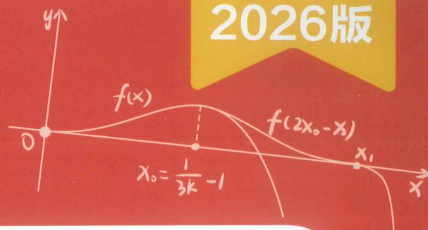

# 高中数学新思路

# 导数专题（下）

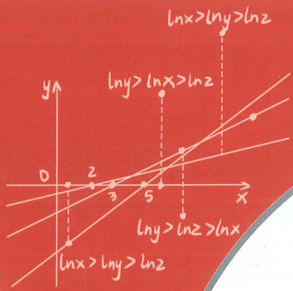

本册主编 李俊虎 张羊利

# 老唐说题团队教研产品

《高考数学满分突破—秒系列123》

《高中数学新思路—复习专题第一轮》

《高中数学新思路—复习专题第二轮》

《高中数学新思路—同步系列123》

《高中数学新思路 - 导数专题》

《高中数学新思路—圆锥曲线专题》

《MST新思路高中数学新定义 组合与概率统计专题》

《高中物理新思路 力学篇》

《高中物理新思路 电学篇》

《高中物理新思路 综合实验篇》

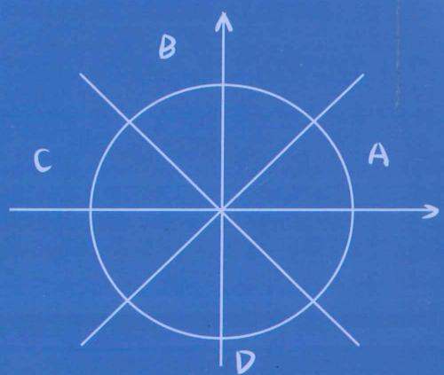

  
扫码报名陪跑课

  
官方微信
$\sin \alpha - \sin \beta = 2 \cos \frac {\alpha + \beta}{2} \sin \frac {\alpha - \beta}{2}$

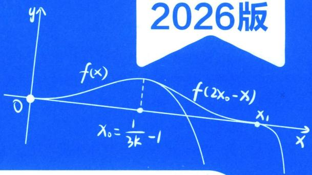

# 高中数学新思路 导数专题（下）

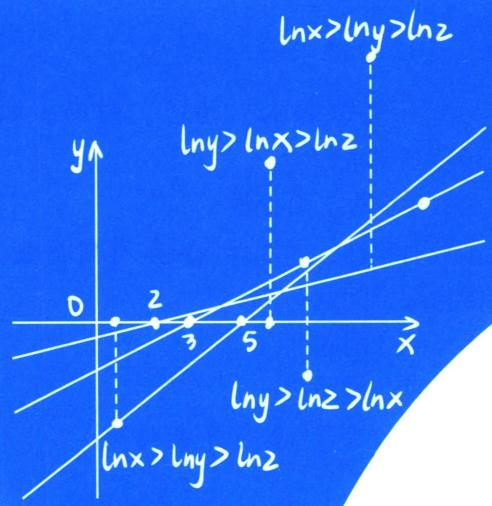

本册主编 李俊虎 张羊利

团队教研和灵感的设计源自 MST 创始人陪跑课答疑群，26 高考开启倒计时，MST 团队最新的教研成果都会第一时间在陪跑课体现，欢迎你与 MST 并肩陪跑。专属平板，专属答疑群，定制直播，把握最新考向，三位主讲老师及学霸助教陪你打造体系，直击本质，查漏补缺，突破瓶颈，系统提升，登上山顶。

MST 团队受邀参与讲座学校：（陪跑课由老唐、利哥、老魏，三位创始人主讲）

湖南长沙市一中，雅礼中学，郴州一中，衡阳八中，祁阳一中，湘潭县一中，攸县一中；浙江鲁迅中学，天台中学；河北衡水二中，正定中学，邢台一中；山东青岛二中，日照一中，烟台一中，莱芜一中，平度一中，昌乐二中，德州一中，菏泽一中，莘县一中；贵州遵义四中；河南省实验，郑州一中，郑州四中，洛阳一高，安阳一中，濮阳一中，郸城一高，沁阳一中；山西山大附中，太谷中学，康杰中学；云南昆明一中，云南师大附中，昭通一中；四川德阳五中；广西柳铁一高，北部湾高中，钦州二中；广东惠东高级中学，清远一中；安徽肥西实验学校，阜阳一中；福建南安一中，石狮中学；等全国重点高中开展高考压轴专题讲座，深受广大师生好评。

# MST 创始人 26 版陪跑课目录

(配专属平板，防盗版，保护学员权益)

### 一、函数专题  
（1） 内容篇

第1讲 必备不等式(糖水、均值、柯西、权方和)

第2讲 函数三要素

第 3 讲 函数单调性、奇偶性

第 4 讲 函数对称性、周期性(含类周期函数)

第 5 讲 图像综合问题

第6讲 零点综合问题

第 7 讲 不动点与桥函数

第 8 讲 抽象函数综合(含与导数结合)

  
（2）新定义篇

第 1 讲 函数不动点、稳定点、驻点、拐点、间断点

第 2 讲 高斯函数、黎曼函数、狄利克雷函数

第3讲 悬链线引发的双曲函数

第 4 讲 心形线、星形线、旋轮线

第 5 讲 平口单峰函数与切比雪夫最佳逼近

第 6 讲 曼哈顿距离

### 二、导数专题  
（1） 内容篇

第1讲 导数必备函数模型

第 2 讲 小题必备技巧补充

第3讲 同构体系

第4讲 切线体系

第5讲 放缩体系

第 6 讲 隐零点与找点

第 7 讲 显点效应(一)——端点效应

第 8 讲 显点效应(一)——极点效应

第 9 讲 隐点效应——特殊点效应本质

第 10 讲 导数与三角体系(恒成立)

第 11 讲 导数与三角体系(泰勒与放缩)

第 12 讲 导数与三角体系(零点与偏移)

第 13 讲 导数与三角体系(结合数列)

第 14 讲 偏移基础篇——对称化构造、比值换元、对均

第 15 讲 偏移加强篇——曲线拟合、单调性调整

第 16 讲 切割线夹与曲线夹

第 17 讲 导数与数列放缩  
（2）新定义篇

第 1 讲 泰勒展开与帕德逼近

第 2 讲 微分中值定理

第 3 讲 刘伟尔定理

第 4 讲 斯特林公式

第 5 讲 曲率与曲率半径的推导

第 6 讲 二元函数与偏导数

### 三、三角函数专题

第 1 讲 三角函数基础知识

第 2 讲 三角函数恒等变换

第 3 讲 三角函数图像问题

第 4 讲 必备追加模型

第 5 讲 卡根法

第 6 讲 万能 t 与正切恒等式

### 四、解三角形专题  
（1） 内容篇

第 1 讲 正弦定理及正切相关定理

第2讲 范围问题(含张角定理、倍角定理)

第 3 讲 应用问题(含嵌套三角形)

第 4 讲 解三角形二级结论  
（2）新定义篇

第 1 讲 海伦公式与外森比克不等式

第 2 讲 布洛卡点

### 五、向量专题  
（1） 内容篇

第 1 讲 三点共线与对面的女孩看过来

第 2 讲 向量等和线

第 3 讲 极化恒等式

第 4 讲 向量建系法

第 5 讲 向量四心  
（2）新定义篇

第 1 讲 向量三角与隐曲线

第 2 讲 莱洛三角形与费马点

### 六、立体几何专题  
（1） 内容篇

第 1 讲 静态立体几何

第 2 讲 常规动态立体几何

第 3 讲 外接球、内切球、棱切球

第 4 讲 空间中的平行垂直

第5讲 截面问题

第 6 讲 折叠与对角线向量定理

第 7 讲 三正弦与三余弦定理

第 8 讲 空间向量、距离、夹角、动态

第 9 讲 较难的动态与旋转问题  
（2）新定义篇

第1讲 特殊几何体(含勒洛四面体)

第 2 讲 特殊坐标系(含空间坐标系)

第3讲 空间解析几何

第 4 讲 九章算术下的空间几何体

第 5 讲 祖暅原理

### 七、数列专题  
（1） 基础篇

第1讲 数列基本定义与基本概念(含等差数列与等比数列性质)

第 2 讲 常规通项公式求法

第 3 讲 常规求和方法  
（2） 提升篇

第 1 讲 特征根法与不动点法求数列通项公式

第 2 讲 蛛网图体系基本原理

第3讲 斐波那契数列

第 4 讲 数学归纳法的基本应用

第5讲 二元数列的应用

第6讲 牛顿数列的递推

第 7 讲 周期数列与复数的关系  
（3） 拓展篇

第1讲 不动点的基本应用

第 2 讲 不动点的一级精度裂项

第 3 讲 不动点的二级精度调整

### 八、圆锥曲线专题  
（1） 基础篇

第 1 讲 直线方程与直线系方程

第2讲 圆的方程与圆系方程

第 3 讲 椭圆的第一二三定义

第 4 讲 双曲线的第一二三定义

第5讲 抛物线的基本定义

第6讲 离心率问题

第 7 讲 圆锥曲线中的圆的问题  
（2） 基本方法篇

第1讲 圆锥曲线的斜率体系

第2讲 圆锥曲线的方程体系

第 3 讲 圆锥曲线的坐标体系

第4讲 圆锥曲线的同构体系  
（3） 提升方法篇

第 1 讲 圆锥曲线下的伸缩旋转体系  
第 2 讲 圆锥曲线下的双射体系  
第 3 讲 圆锥曲线下的五点六点体系  
第 3 讲 圆锥曲线下的背景体系  
（4）新定义篇

第 1 讲 丹德林双球与截口曲线  
第 2 讲 双纽线与卵形线  
第 3 讲 曼哈顿距离下的解析几何  
第 4 讲 豪斯多夫距离下的解析几何  
第 5 讲 高次韦达定理与齐次化下的三次方程

### 九、统计概率篇  
（1） 概念篇

第 1 讲 独立事件，对立事件与互斥事件  
第 2 讲 独立性检验，相关系数与决定系数  
第 3 讲 条件概率，全概率与贝叶斯公式  
（2） 高考的概率分布列问题

第 1 讲 离散型随机变量  
第 2 讲 两点分布  
第 3 讲 二项分布的分布列，期望，方差，最值问题  
第 4 讲 超几何分布  
第 5 讲 几何分布的概念与无记忆性  
（3） 赛制问题与摸球问题

第 1 讲 摸球问题  
第2讲 乒乓球赛制  
第 3 讲 五局三胜制  
第 4 讲 连胜问题  
第 5 讲 点球大战  
（4） 基于函数最值的概率问题

第 1 讲 函数与概率最值  
第 2 讲 病毒药检  
（5）概率新定义

第1讲 概率与数列  
①简单递推   
②马尔科夫链与一阶线性游走   
③马尔科夫链赌徒原理  
④基于全概率下的概率递推

第 2 讲 几何分布与期望递推

第 3 讲 切比雪夫不等式与概率估计

第 4 讲 卡特兰数与极大似然估计

第 5 讲 二维离散型随机变量

第 6 讲 随机游走

第 7 讲 疯子坐飞机问题

第 8 讲 麦穗理论和 37 度法则

# 部分讲座学校展示

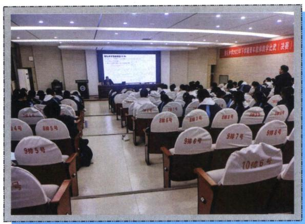

雅礼中学

长沙市一中

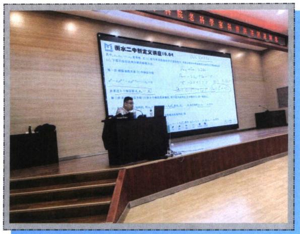

衡水二中

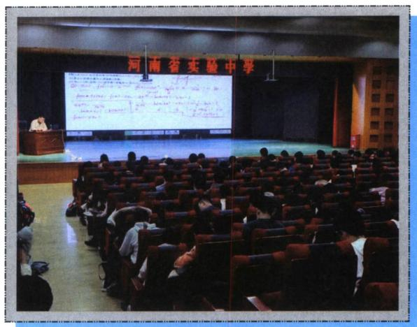

河南省实验

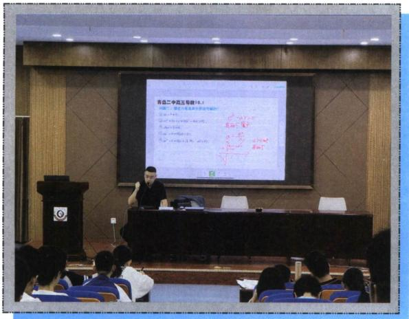

青岛二中

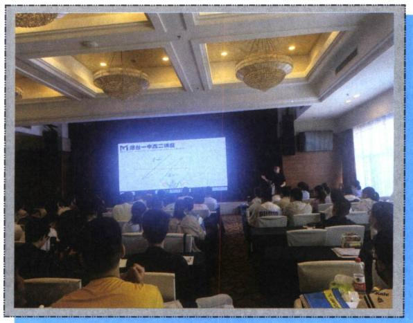

烟台一中

北京高途总部

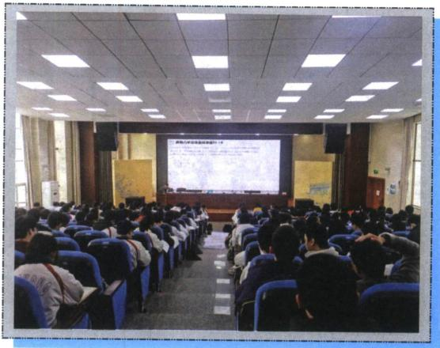

衡阳八中

祁阳一中

正定中学

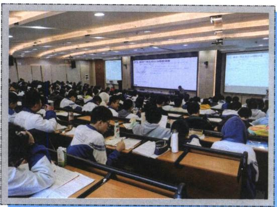

郴州一中

康杰中学

钦州二中

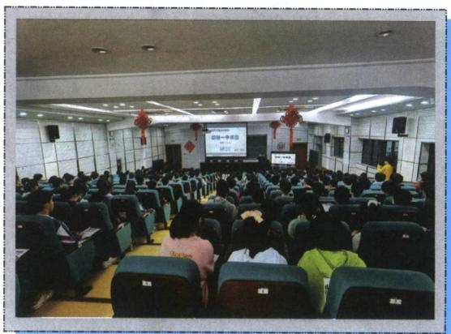

柳铁一中

河南郸城一高

菏泽一中

濮阳一高

石光中学

# 下册

# 第9章 导数与双变量

# 第一节 极值和差 …… 299

一、极值之和以参数为主元 …… 299

二、极值之差 …… 302

考点1：转化为 $x_{1}$ 为主元的构造 …… 302

1. $f(x_{1}) - f(x_{2})$ 型 303  
2. $f(x_{1}) - \lambda f(x_{2})$ 型 307  
3. $f(x_{1}) - \lambda x_{2}$ 型 307  
4. $\frac{f(x_1)}{x_2}$ 型 308

考点2：比值换元构造与差值换元构造 310

考点 3：放缩法构造极值之差 …… 314

三、六大同构函数的比值换元 …… 316

四、比值换元与不对称零点和积最值问题 321

# 第二节 极值点偏移 …… 326

一、对称化构造 …… 326

1. 极值点偏移显极值点和型构造
328

2. 极值点偏移隐极值点和型构造 ……
…… 330  
3. 极值点偏移积型构造…… 331

### 二、对数均值不等式与指数均值不等式 … 333

1. 常规 ALG 不等式 …… 333  
2. ALG 不等式符号反向用加法原理…
…… 336  
3. ALG 不等式常数项构造与调整……
…… 336  
4. 砍一半：根号 ALG 不等式与三角放缩交汇…… 337  
5. 两次使用 ALG 不等式 …… 339

### 三、零点偏移构造 …… 339

四、单调性调整与阿达玛积分不等式 … 341

1. 和型 $x_{1} + x_{2} > 2x_{0}$ 构造 $F(x) = x^{2} - 2x_{0}x + \lambda f(x)$ …… 341  
2. 阿达玛积分不等式…… 341

①代征式不含参，直接调整…… 342  
②代证式含参，消参调整…… 346   
3. 积型函数单调性调整…… 348

4. 积型乘除构造 $F(x) = \frac{f(x)}{x + \frac{m}{x}}$ 单调函

数 350

# 第三节 零点差直线拟合问题 …… 350

一、双零点处切线夹 $x_{2} - x_{1} <   x_{4} - x_{3}$ 构造

351

二、单零点处和拐点外切线夹构造与单零点

+切线探路 353

三、双零点割线夹 $x_{2} - x_{1} > x_{4} - x_{3}$ 构造

355

四、单零点和极值点形成曲线夹 $x_{2}-x_{1}>x_{4}$
$-x_{3}$ 构造 358

考点1： $f(x)$ 极小值模型 359

考点 2: $f(x)$ 极大值模型 …… 359

五、切线+割线夹构造 $x_{1} + x_{2} < x_{3} + x_{4}$ 与 $x_{1}$
$+x_{2}>x_{3}+x_{4}$ 问题 …… 362

# 第四节 拟合体系 …… 363

一、极值点和型偏移与二次函数构造 … 364

二、极值点积型偏移与对勾函数构造 … 366

三、涉及双零点偏移的 $x \ln x$ 同构函数拟合

368

四、指数对数函数的常见拟合函数 …… 370

考点1：常数的极值点 372

考点2：含参的极值点 373

五、合理有效利用帕德逼近拟合函数 … 376

六、对勾与二次的强制转换 …… 378

七、组合型偏移与三元偏移 …… 380

八、变量转化为单调函数的调整函数 … 389

# 第五节 拐点偏移 …… 390

# 第六节 浙江风格的双变量…… 395

一、高阶帕德逼近的应用 …… 395

二、泰勒展开与加强 …… 399

三、泰勒展开构造追加函数 …… 401

四、双变量恒成立探路 403

# 第七节 双元问题调整与主元法 …… 404

函数 Hölder（赫尔德）连续性 …… 404

# 第10章 导数不等式与数列综合

# 第一节 导数与数列递推…… 409

一、极值点与数列构造 …… 409

1. 由极值点隐零点代换构成的数列递推
…… 409

2. 由极值点方程构造的列项求和 ……
…… 410

3. 由三角极值点方程构造的多零点问题
…… 410

二、切线方程与数列构造 …… 412

1. 由过定点切线方程构造的数列 … 412

2. 牛顿法作切线与近似值计算…… 414

3. 分式平方递推与牛顿数列…… 418

4. 牛顿数列与面积计算…… 421

# 第二节 切线放缩型 422

一、切线放缩求和型 VS 和式代换 …… 422

1. $\frac{1}{n + 1} < \ln \left(1 + \frac{1}{n}\right) < \frac{1}{n}$ 型 …… 422

2. $\ln \sqrt{n + 1} > 1 - 2(\sqrt{n + 1} - \sqrt{n})$ 型 … 426

3. $\sin \frac{1}{n + 1} < \ln \left(1 + \frac{1}{n}\right) < \sin \frac{1}{n} < \frac{1}{n}$ 型 429

4. $\ln \frac{n + 1}{n} < \tan \frac{1}{n} < \ln \frac{n}{n - 1}$ 型 …… 433

5. $\frac{x}{e^x}$ 构造的切线放缩型 433

6. 以 $\sin x \geqslant \frac{2}{\pi} x$ 割线构造型 …… 434

### 二、构造裂项相消型 435

1. 接龙型 $\frac{1}{n} - \frac{2}{n^2} < \ln \left(1 + \frac{1}{n}\right) < \frac{1}{n}$ 435

2. 接龙型 $\frac{2}{2n - 1} - \frac{2}{(2n - 1)^2} < \ln \frac{2n + 1}{2n - 1}$ $< \frac{2}{2n - 1}$ 437

3. $\cos \frac{1}{n} > 1 - \frac{1}{2n(n-1)}$ 或 $\cos \frac{1}{n} > 1 - \frac{2}{4n^2 - 1}$ 型 438

4. 隔项相消 $\frac{1}{2e^n - 1} < \frac{1}{2}\left(\frac{1}{n} - \frac{1}{n + 2}\right)$ 型， $e^x < \frac{1}{1 - x}$ 型 440

### 三、构造等比数列放缩型 …… 441

1. 等比 $\ln\left(1+\frac{1}{q}\right)\left(1+\frac{1}{q^{2}}\right)\cdots\left(1+\frac{1}{q^{n}}\right)<$ $\frac{1}{q-1}(q>1)$ 型 441

5. $e^{1 - n}\geqslant \left(\frac{1}{n}\right)^n >\sin \left(\frac{1}{n}\right)^n >\ln \left[1+\right.$ $\left(\frac{1}{n}\right)^n ]$ 型 442

### 四、积式代换型 446

1. $|\sin^2 x\sin^2 2x\sin^2 4x\dots \sin^2 2^n x|$ 型 446

2. $\left(\frac{1}{n}\right) \cdot \left(\frac{2}{n}\right)^2 \cdot \left(\frac{3}{n}\right)^3 \cdots \cdot \left(\frac{n - 1}{n}\right)^{n - 1}$ 型
447

# 第三节 飘带函数型 …… 448

一、飘带函数 $\ln x < \frac{1}{2}\left(x - \frac{1}{x}\right)(x > 1)$ 常规型 448

1. 令 $x = n$ 型 448  
2. 令 $x = 1 + \frac{1}{n}$ 型 449  
3. 令 $x = n(n + 1)$ 型 452

二、飘带函数根式 $\ln x < \sqrt{x} - \frac{1}{\sqrt{x}} (x > 1)$ 型 452

1. 令 $x = 1 + \frac{1}{n}$ 接龙型 452  
2. 令 $x = 1 + \frac{2}{n}$ 隔项型 455  
3. 根式飘带放缩与帕德逼近数列放缩综合与估值问题…… 456

三、帕德逼近 $\ln x > \frac{2(x - 1)}{x + 1} (x > 1)$ 型 …… 457

1. 令 $x = \frac{2n + 1}{2n - 1}$ 457  
2. 构造 $\ln \frac{2n + 1}{2n - 1} > \frac{1}{n} > \frac{1}{\sqrt{n^2 + n}}$ 裂项相消型 459  
3. 令 $x = \frac{n}{n - 1}$ 型 460

四、斯特林公式与特殊的导数与数列类型 461

# 第四节 导数与数列迭代放缩与求和 … 462

一、基于琴生不等式下的数列迭代求和
…… 462二、基于隐零点放缩下的数列迭代求和体系
…… 463

三、不动点蛛网图下的单调性证明与伪等比探路体系 467

# 第11章 三角与导数综合

# 第一节 三角函数与零点综合 …… 471

考点1：三角混合 $x\sin x$ 与 $x\cos x$ 型 471

1. 三角零点证明分区间型…… 471  
2. 参变分离型 472  
3. 高精度第二周期见分晓型…… 473

考点 2：三角 VS 对数 …… 476

1. 关于 $\sin x$ 与 $\ln (x + 1)$ …… 476  
2. $x-\ln x-1$ 与三角函数分而治之 … 480  
3. $x\sin x$ 与 $\ln(x+1)$ …… 481

考点 3：三角 VS 指数 …… 483

1. 0 处泰勒展开型 …… 483  
2. 关于 $\frac{x}{e^x}, xe^x$ 与 $\sin x$ 零点 …… 485  
3. 关于指数和正切组合零点…… 489

# 第二节 三角函数恒成立问题 …… 490

一、基于25新一卷的，三角恒成立解读 490

二、三角恒成立与探路思想 …… 493

考点 1：端点效应模型 …… 493  
考点 2：极点效应模型 …… 498  
考点 3：原函数极点效应失效 …… 501  
考点 4：隐点效应模型 …… 502

三、三角恒成立与放缩思想 …… 503

# 第三节 三角函数与数列综合 …… 504

考点1：基于 $\sin x$ 与 $\ln (1 + x)$ ……504

考点2：基于 $\cos x\sim 1 - \frac{1}{2} x^2$ 的放缩…506

考点 3：基于弦切互化的数列综合放缩
…… 506

考点 4：三角＋数列与零点综合 …… 508

考点 5：三角泰勒展开与数列综合 … 511

考点 6：积式代换补充 …… 512

# 第四节 三角函数与双元杂谈 …… 513

考点1：三角偏移结合和差化积的放缩 513

考点2：三角与飘带结合，同一法的应用 514

# 第9章 导数与双变量

# 第一节 极值和差

### 一、极值之和以参数为主元

极值之和问题最早出现在2014年湖南高考自主命题卷中，解决问题的关键就是将 $f(x_{1}) + f(x_{2})$ 转化为统一参数 $a$ 后，构造新函数 $h(a)$ 求出极值之和取值范围.

> [!example]- 例1 (2014·湖南)已知常数 $a > 0$ ，函数 $f(x) = \ln (1 + ax) - \frac{2x}{x + 2}$ .  
（1） 讨论 $f(x)$ 在区间 $(0, +\infty)$ 上的单调性；  
（2） 若 $f(x)$ 存在两个极值点 $x_{1}$ ， $x_{2}$ ，且 $f(x_{1}) + f(x_{2}) > 0$ ，求 a 的取值范围.
解析 （1） 因为 $f(x) = \ln (1 + ax) - \frac{2x}{x + 2}$ . 所以 $f'(x) = \frac{a}{1 + ax} - \frac{4}{(x + 2)^2} = \frac{ax^2 - 4(1 - a)}{(1 + ax)(x + 2)^2}$ ,
又由 $(1+ax)(x+2)^{2}>0$ ，所以当 $1-a\leqslant0$ 时，即 $a\geqslant1$ 时， $f'(x)\geqslant0$ 恒成立，则 $f(x)$ 在 $(0,+\infty)$ 单调递增，当 $0<a\leqslant1$ 时，由 $f'(x)=0$ 得 $x=\pm\frac{2\sqrt{a(1-a)}}{a}$ ，则函数 $f(x)$ 在 $\left(0,\frac{2\sqrt{a(1-a)}}{a}\right)$ 单调递减，在 $\left(\frac{2\sqrt{a(1-a)}}{a},+\infty\right)$ 单调递增.  
（2）由（1）知，当 $a \geqslant 1$ 时， $f'(x) \geqslant 0$ ，此时 $f(x)$ 不存在极值点。因此要使 $f(x)$ 存在两个极值点 $x_1$ ， $x_2$ ，则必有 $0 < a < 1$ ，又 $f(x)$ 的极值点值是 $x_1 = \frac{2\sqrt{a(1 - a)}}{a}$ ， $x_2 = -\frac{2\sqrt{a(1 - a)}}{a} \begin{cases} x_1 + x_2 = 0 \\ x_1x_2 = \frac{4(a - 1)}{a} \end{cases}$ ， $x > -\frac{1}{a}$ 且 $x \neq -2$ ，所以 $f(x_1) + f(x_2) = \ln (1 + ax_1) - \frac{2x_1}{x_1 + 2} + \ln (1 + ax_2) - \frac{2x_2}{x_2 + 2} = \ln [1 + a(x_1 + x_2) + a^2x_1x_2] - \frac{4x_1x_2 + 4(x_1 + x_2)}{x_1x_2 + 2(x_1 + x_2) + 4} = \ln (2a - 1)^2 - \frac{4(a - 1)}{2a - 1} = \ln (2a - 1)^2 + \frac{2}{2a - 1} - 2.$
令 2a-1=t，由 0<a<1 且 $a\neq\frac{1}{2}$ 得，当 $0<a<\frac{1}{2}$ 时，-1<t<0；当 $\frac{1}{2}<a<1$ 时，0<t<1。令 $h(t)=\ln t^{2}+\frac{2}{t}-2$ 。

(i) 当 -1 < t < 0 时， $h(t) = 2 \ln(-t) + \frac{2}{t} - 2$ ， $h'(t) = \frac{2}{t} - \frac{2}{t^2} = \frac{2x - 2}{t^2} < 0$ ，故函数 $h(t)$ 在 $(-1, 0)$ 上单调递减，所以 $h(t)<h(-1)=-4<0$ ，即当 $0<a<\frac{1}{2}$ 时， $f(x_{1})+f(x_{2})<0$ ;

(Ⅱ) 当 0 < t < 1. $h(t) = 2 \ln t + \frac{2}{t} - 2$ , $h'(t) = \frac{2}{t} - \frac{2}{t^{2}} = \frac{2t - 2}{t^{2}} < 0$ , 故 $h(t)$ 在 $(0, 1)$ 上单调递减， $h(t)$
$>h(1)=0$ ，所以当 $\frac{1}{2}<a<1$ 时， $f(x_{1})+f(x_{2})>0$ ；综上所述，a的取值范围是 $\left(\frac{1}{2},1\right)$ .

> [!example]- 例2 (2023·北京海淀区三模)已知函数 $f(x) = \frac{1}{2} x^2 - x + a\ln x$ ， $(a > 0)$ .  
（1） 若 a=1，求 $f(x)$ 在 $(1, f(1))$ 处的切线方程；  
（2） 讨论 $f(x)$ 的单调性；  
（3）若 $f(x)$ 存在两个极值点 $x_{1}$ ， $x_{2}$ ，求证： $f(x_{1}) + f(x_{2}) > \frac{-3 - 2\ln 2}{4}$ .
解析 （1）a=1 时， $f(x)=\frac{1}{2}x^{2}-x+\ln x,\quad f'(x)=x-1+\frac{1}{x}(x>0)$ ，故 $f(1)=-\frac{1}{2},\quad f'（1）=1$ 故切线方程为： $y-\left(-\frac{1}{2}\right)=1\cdot(x-1)$ ，即 $y=x-\frac{3}{2}$ ;  
（2） $f'(x)=x-1+\frac{a}{x}=\frac{x^{2}-x+a}{x}(x>0)$ ， $\triangle=1-4a$ ，当 $a\geqslant\frac{1}{4}$ 时， $\triangle=1-4a\leqslant0$ ， $f'(x)\geqslant0$ ， $f(x)$ 在 $(0,+\infty)$ 单调递增，当 $0<a<\frac{1}{4}$ 时， $\triangle=1-4a>0$ ，令 $f'(x)=0$ ，解得： $x=\frac{1\pm\sqrt{1-4a}}{2}$ 且 $\frac{1\pm\sqrt{1-4a}}{2}>0,\quad x\in\left(0,\quad\frac{1-\sqrt{1-4a}}{2}\right)$ 时， $f'(x)>0,\quad f(x)$ 单调递增， $x\in\left(\frac{1-\sqrt{1-4a}}{2},\right.$ $\frac{1+\sqrt{1-4a}}{2}$ 时， $f'(x)<0,\quad f(x)$ 单调递减， $x\in\left(\frac{1+\sqrt{1-4a}}{2},+\infty\right)$ 时， $f'(x)>0,\quad f(x)$ 单调递增，综上： $a\geqslant\frac{1}{4}$ 时， $f(x)$ 在 $(0,+\infty)$ 单调递增， $0<a<\frac{1}{4}$ 时， $f(x)$ 在 $\left(0,\frac{1-\sqrt{1-4a}}{2}\right)$ 单调递增，
在 $\left(\frac{1-\sqrt{1-4a}}{2},\frac{1+\sqrt{1-4a}}{2}\right)$ 单调递减，在 $\left(\frac{1+\sqrt{1-4a}}{2},+\infty\right)$ 单调递增；  
（3）证明：因为 $f(x)=\frac{1}{2}x^{2}-x+a\ln x,\quad(a>0),\quad f'(x)=x-1+\frac{a}{x}=\frac{x^{2}-x+a}{x}(x>0)$ ，由题意知 $x^{2}-x+a=0$ 的两根为 $x_{1},x_{2}$ ，且1-4a>0，故 $\left\{\begin{aligned}x_{1}+x_{2}&=1\\ x_{1}x_{2}&=a\\ a&\in\left(0,\frac{1}{4}\right)\end{aligned}\right.$ ，所以 $f(x_{1})+f(x_{2})=\frac{1}{2}(x_{1}^{2}+x_{2}^{2})-$
$\begin{array}{l} (x _ {1} + x _ {2}) + a \ln x _ {1} x _ {2} = \frac {1}{2} [ (x _ {1} + x _ {2}) ^ {2} - 2 x _ {1} x _ {2} ] - (x _ {1} + x _ {2}) + a \ln x _ {1} x _ {2} = \frac {1}{2} (1 - 2 a) - 1 + a \ln a = - \frac {1}{2} - a \\ + a \ln a, \end{array}$
令 $g(a) = a\ln a - a - \frac{1}{2}\left(a\in \left(0,\frac{1}{4}\right)\right)$ ，则 $g'(a) = \ln a$ ， $a\in \left(0,\frac{1}{4}\right)$ 时， $g'(a) <   0$ ， $g(a)$ 在 $\left(0,\frac{1}{4}\right)$ 递减，所以 $f(x_{1}) + f(x_{2}) > g\left(\frac{1}{4}\right) = \frac{-3 - 2\ln 2}{4}$ ，所以 $f(x_{1}) + f(x_{2}) > \frac{-3 - 2\ln 2}{4}$ 成立.

> [!example]- 例3 (2025春·天津期中)已知函数 $f(x)=\ln x-ax$ ，其中a>0.  
（1） 当 a=2 时，求曲线 $y=f(x)$ 在点 $(1, f(1))$ 处的切线方程；  
（2）若 $f(x)$ 的最大值是 $a\ln a-a$ ，求a的值；  
（3）设函数 $g(x) = f(x) + \frac{a}{x}$ ，若 $g(x)$ 有两个极值点 $x_{1}, x_{2}$ ，证明： $g(x_{1}) + g(x_{2}) + g(x_{1} +$
$x _ {2}) > \ln 2 - \frac {3}{4}.$
解析 解：（1） 当 a=2 时，则 $f(x)=\ln x-2x$ ， $f'(x)=\frac{1}{x}-2$ ，
所以切线方程为 $y-f(1)=f'（1）(x-1)$ ，即 $x+y+1=0$ ;  
（2） $f(x)=\ln x-ax$ 的定义域为 $(0,+\infty)$ ，而 $f'(x)=\frac{1-ax}{x}$ ，当 $x\in\left(0,\frac{1}{a}\right)$ 时， $f'(x)>0$ ， $f(x)$ 单调递增，当 $x \in \left(\frac{1}{a}, +\infty\right)$ 时， $f'(x) < 0$ ， $f(x)$ 单调递减，
所以 $f(x)$ 的最大值为 $f\left(\frac{1}{a}\right)=\ln\frac{1}{a}-1=-1-\ln a$ ，故 $a\ln a-a=-1-\ln a$ ，整理得到 $\frac{a-1}{1+a}=\ln a$ ，其中a>0，设 $h(a)=\frac{a-1}{1+a}-\ln a$ ，a>0，则 $h'(a)=\frac{2}{(1+a)^{2}}-\frac{1}{a}=\frac{-a^{2}-1}{a(1+a)^{2}}<0$ ，
故 $h(a)$ 在 $(0, +\infty)$ 上递减， $h(1)=0$ ，故 a=1，
证明：（3）由题意得：函数 $g(x)=\ln x-ax+\frac{a}{x}$ 的定义域为 $(0,+\infty)$ ，且 a>0，
$g'(x)=\frac{1}{x}-a-\frac{a}{x^{2}}=\frac{-ax^{2}+x-a}{x^{2}}$ ，令 $m(x)=-ax^{2}+x-a$
因为函数 $g(x)$ 有两个极值点 $x_{1}$ ， $x_{2}$ ，则 $x_{1}$ ， $x_{2}$ 是方程 $m(x)=0$ 的两个根，
$\triangle > 0$ ，即 $0 < a < \frac{1}{2}$ ，且 $x_{1}x_{2} = 1$ ， $x_{1} + x_{2} = \frac{1}{a}$ ， $g(x_{1}) + g(x_{2}) + g(x_{1} + x_{2}) = g(x_{1}) + g\left(\frac{1}{x_{1}}\right) + g\left(\frac{1}{a}\right) = \ln x_{1} - a\left(x_{1} - \frac{1}{x_{1}}\right) + \ln \frac{1}{x_{1}} - a\left(\frac{1}{x_{1}} - x_{1}\right) + g\left(\frac{1}{a}\right) = g\left(\frac{1}{a}\right) = \ln \frac{1}{a} - a\left(\frac{1}{a} - a\right) = -\ln a - 1 + a^{2}$ ，
令 $n(x)=-\ln x-1+x^{2}$ ， $0<x<\frac{1}{2}$ ，则 $n'(x)=-\frac{1}{x}+2x=\frac{2x^{2}-1}{x}$ ，当 $0<x<\frac{1}{2}$ 时， $n'(x)<0$ ，则 $n(x)$ 在区间 $\left(0,\frac{1}{2}\right)$ 上单调递减，故 $n(x)>n\left(\frac{1}{2}\right)=\ln2-\frac{3}{4}$ ，
故 $g(x_{1}) + g(x_{2}) + g(x_{1} + x_{2}) > \ln 2 - \frac{3}{4}$

注意：本题考点为飘带函数性质， $g(x) + g\left(\frac{1}{x}\right) = 0$ ，故只需考虑， $g(x_{1} + x_{2})$ 即可.

> [!example]- 例4 (2025秋·天津模拟)已知函数 $f(x) = \frac{1}{2} x^2 - 4ax + a\ln x + a + \frac{1}{2}$ ，其中 $a \in \mathbb{R}$  
（1）当 $a = 1$ 时，求曲线 $y = f(x)$ 在点 $(1, f(1))$ 处的切线方程；  
（2）记 $f(x)$ 的导函数为 $f'(x)$ ，若不等式 $f(x)<xf'(x)$ 在区间 $(1,+\infty)$ 上恒成立，求a的取值范围；  
（3）设函数 $g(x) = f(x) + 2a$ ， $g'(x)$ 是函数 $g(x)$ 的导函数，若 $g(x)$ 存在两个极值点 $x_{1}$ ， $x_{2}$ 且满足 $g(x_{1}) + g(x_{2})\geqslant g'(x_{1}x_{2})$ ，求实数 $a$ 的取值范围.
解析 解：（1） 当 a=1 时， $f(x)=\frac{1}{2}x^{2}-4x+\ln x+\frac{3}{2}$ ， $f(1)=-2$ ， $f'(x)=x-4+\frac{1}{x}$ ，即 $f'（1）=-2$ 。所以曲线 $y=f(x)$ 在点 $(1, f(1))$ 处的切线方程为： $y+2=-2(x-1)$ ，化为： $2x+y=0$ 。  
（2） $f'(x)=x-4a+a\cdot\frac{1}{x},\quad x>1.\quad f(x)<xf'(x),\quad$ 即 $\frac{1}{2}x^{2}-4ax+a\ln x+a+\frac{1}{2}<$ $x(x-4a+a\cdot\frac{1}{x})$ ，即 $x^{2}-2a\ln x-1>0$ 。令 $u(x)=x^{2}-2a\ln x-1>0$ 在 $x\in(1,+\infty)$ 上恒成立， $u(1)=0$ 。
所以 $u'(x)=2x-\frac{2a}{x}>0$ 在 $x\in(1,+\infty)$ 上恒成立，故 $a<(x^{2})_{\min}=1$ 。所以 a 的取值范围是 $(-∞,1)$  
（3）设函数 $g(x)=f(x)+2a=\frac{1}{2}x^{2}-4ax+a\ln x+3a+\frac{1}{2}$ ， $g'(x)=x-4a+\frac{a}{x}$ ， $x\in(0,+\infty)$ .
因为 $g(x)$ 存在两个极值点 $x_{1}$ ， $x_{2}$ ，所以 $x^{2}-4ax+a=0$ 在 $x\in(0,+\infty)$ 上有两个不等实数根 $x_{1}$ ， $x_{2}$ 。因此 $16a^{2}-4a>0$ ，且 $x_{1}+x_{2}=4a>0$ ， $x_{1}x_{2}=a>0$ 。解得 $a>\frac{1}{4}$ 。
因为 $x_{1}$ ， $x_{2}$ ，满足 $g(x_{1}) + g(x_{2})\geqslant g'(x_{1}x_{2})$
所以 $\frac{1}{2} x_1^2 - 4ax_1 + a\ln x_1 + 3a + \frac{1}{2} + \frac{1}{2} x_2^2 - 4ax_2 + a\ln x_2 + 3a + \frac{1}{2} \geqslant x_1x_2 - 4a + \frac{a}{x_1x_2}$ .

化为： $\frac{1}{2} [(x_1 + x_2)^2 - 2x_1x_2] - 4a(x_1 + x_2) + 10a + a\ln (x_1x_2) + 1 \geqslant x_1x_2 + \frac{a}{x_1x_2}$ .
所以 $\frac{1}{2} (16a^2 - 2a) - 16a^2 + 10a + a\ln a + 1 \geqslant a + \frac{a}{a}$ , $a > \frac{1}{4}$ , 即 $8a - 8 - \ln a \leqslant 0$ ,
令 $h(a)=8a-8-\ln a,\quad a>\frac{1}{4},\quad h(1)=0.\quad h'(x)=8-\frac{1}{a}=\frac{8a-1}{a}>0,$
所以 $h(a)$ 在 $\left(\frac{1}{4}, +\infty\right)$ 上单调递增，所以 $\frac{1}{4} < a \leqslant 1$ 。所以实数 a 的取值范围是 $\left(\frac{1}{4}, 1\right]$ .

# 总结：极值之和，极值点和拐点共点取最值

拐点即为函数凹凸的分界点，即为函数二阶导的零点，类似于极值点偏移的本质源于三阶导正负(下一讲会提到)，我们以先凸后凹作为参照，当 $f'''(x) < 0$ 时，拐点左偏，同理， $f'''(x) > 0$ 时，拐点右偏.

# 极值之和最值定理：
当 $\frac{x_{1}+x_{2}}{2}=x_{0}$ 时，若 $f'(x_{1})=f'(x_{2})=0$ ，且 $f'''(x_{0})<0$ 时，一定有 $f(x_{1})+f(x_{2})<2f(x_{0})$ ，相反，若 $f'(x_{1})=f'(x_{2})=0$ ，且 $f'''(x_{0})>0$ 时，一定有 $f(x_{1})+f(x_{2})>2f(x_{0})$ 。

### 二、极值之差

# 考点1：转化为 $x_{1}$ 为主元的构造
若函数 $y = f(x)$ 的两个极值点为 $x_{1}$ ， $x_{2}$ ，则 $f(x_{1}) - f(x_{2})$ 称为极值之差。通常解决这类问题需要用到函数的内构造，一般求导后会构成二次函数，必有 $\left\{ \begin{array}{l} x_{1} + x_{2} = m \\ x_{1}x_{2} = n \end{array} \right.$ ，其中 $m$ 与 $n$ 中必有一个是常数，这样将参数和 $x_{2}$ 通过韦达定理替换成 $x_{1}$ ，最后构成一个在已知范围的新函数 $y = h(x_{1})$ ，然后求导即可求出最值。或者利用比值换元， $t = \frac{x_{2}}{x_{1}}$ ，这里通常 $n$ 为常数。在函数 $f(x) = \ln x + ax^{2} + bx$ 或者 $f(x) = \ln x + ax + \frac{b}{x}$ 中，经常出现 $f(x_{1}) - f(x_{2}) = m\left(2\ln nx_{1}^{2} + \frac{1}{nx_{1}^{2}} - nx_{1}^{2}\right)$ 这样的式子，单调性基本固定，只看端点值来求最值，此为经典考题，飘带函数放缩无处不在。

1. $f(x_{1}) - f(x_{2})$ 型

> [!example]- 例 5 (2023 · 四川模拟) 已知函数 $f(x)=x-\frac{1}{x}-a\ln x(a\in\mathbb{R})$ .  
（1）求曲线 $y=f(x)$ 在点 $\left(\mathrm{e}, -\frac{1}{\mathrm{e}}\right)$ 处的切线方程；  
（2）若函数 $g(x)=x^{2}\cdot f'(x)+2\ln x-ax$ (其中 $f'(x)$ 是 $f(x)$ 的导函数)有两个极值点 $x_{1}$ 、 $x_{2}$ ，且 $x_{1}<x_{2}<e$ ，求 $g(x_{1})-g(x_{2})$ 的取值范围.
解析 （1） 因为 $f(\mathrm{e}) = \mathrm{e} - \frac{1}{\mathrm{e}} - a = -\frac{1}{\mathrm{e}} \Rightarrow a = \mathrm{e}$ ，求导 $f'(x) = 1 + \frac{1}{x^2} - \frac{a}{x}$ ，即 $f'(x) = 1 + \frac{1}{x^2} - \frac{\mathrm{e}}{x}$ ，故所求切线的斜率为 $f'(\mathrm{e}) = 1 + \frac{1}{\mathrm{e}^2} - \frac{\mathrm{e}}{\mathrm{e}} = \frac{1}{\mathrm{e}^2}$ ，所以切线方程为 $y + \frac{1}{\mathrm{e}} = \frac{1}{\mathrm{e}^2}(x - \mathrm{e}) \Rightarrow y = \frac{x}{\mathrm{e}^2} - \frac{2}{\mathrm{e}} \Rightarrow x - \mathrm{e}^2y - 2\mathrm{e} = 0$ .  
（2）由 $g(x)=x^{2}\cdot f'(x)+2\ln x-ax=x^{2}-2ax+2\ln x+1$ ， $g'(x)=2x-2a+\frac{2}{x}=\frac{2(x^{2}-ax+1)}{x}$ ，若 $g(x)$ 有两个极值点 $x_{1}$ ， $x_{2}$ ，且 $x_{1}<x_{2}<e$ ，则方程 $x^{2}-ax+1=0$ 的判别式 $\Delta=a^{2}-4>0$ ，故 $x_{1}+x_{2}=a>0$ ， $x_{1}x_{2}=1$ ， $x_{2}=\frac{1}{x_{1}}<e$ ，得 a>2， $a=x_{1}+\frac{1}{x_{1}}$ ，且 $\frac{1}{e}<x_{1}<1$ 。所以 $g(x_{1})-g(x_{2})=x_{1}^{2}-2ax_{1}+2\ln x_{1}-x_{2}^{2}+2ax_{2}-2\ln x_{2}=(x_{1}+x_{2})(x_{1}-x_{2})-2a(x_{1}-x_{2})+4\ln x_{1}=-(x_{1}+x_{2})(x_{1}-x_{2})+4\ln x_{1}=\frac{1}{x_{1}^{2}}-x_{1}^{2}+4\ln x_{1}\left(\frac{1}{e}<x_{1}<1\right)$ ，构造函数 $h(t)=\frac{1}{t^{2}}-t^{2}+4\ln t\left(\frac{1}{e}<t<1\right)$ ，则 $h'(t)=-\frac{2}{t^{3}}-2t+\frac{4}{t}=-\frac{2(t^{2}-1)^{2}}{t^{3}}<0$ 在 $t\in\left(\frac{1}{e},1\right)$ 上恒成立，故 $h(t)$ 在 $t\in(0,1)$ 单调递减，从而 $h(t)>h(1)=0$ ， $h(t)<h\left(\frac{1}{e}\right)=e^{2}-\frac{1}{e^{2}}-4$ ，所以 $g(x_{1})-g(x_{2})$ 的取值范围是 $(0,e^{2}-\frac{1}{e^{2}}-4)$ 。

注意：将 $x_{2}$ 和 a 转化为 $x_{1}$ 成为解题关键，本题中，构造了一个单调的函数，其实这个函数来自飘带函数与对数的放缩式 $\frac{1}{2}\left(x-\frac{1}{x}\right)\leqslant\ln x$ 对 $x\in(0,1]$ 恒成立，同时 $\frac{1}{2}\left(x-\frac{1}{x}\right)\geqslant\ln x$ 对 $x\in[1,+\infty)$ 恒成立，从而得到当 $x\in(0,1]$ 时， $\frac{1}{2}\left(x^{2}-\frac{1}{x^{2}}\right)\leqslant\ln x^{2}\Leftrightarrow\frac{1}{x^{2}}-x^{2}+4\ln x\geqslant0$ 恒成立.

> [!example]- 例6 (24-25 高二下·广东湛江·期中) 设函数 $f(x) = x(\ln x)^{2} - (a + 2)x\ln x + (a + 3)x$ , $a > 0$ .  
（1）a=1 时，求曲线 $y=f(x)$ 在点(e, $f(e)$ )处的切线方程；  
（2）讨论 $f(x)$ 的单调性；  
（3）若 $f(x)$ 有两个极值点 $x_{1}$ ， $x_{2}$ 且 $x_{1}<x_{2}$ ，证明： $\frac{f(x_{1})}{x_{1}}-\frac{f(x_{2})}{x_{2}}<\frac{4(x_{2}-e)\ln x_{1}}{e}$ .
解析 （1） $f(x)$ 的定义域为 $(0, +\infty)$ , $f'(x) = (\ln x)^2 - a \ln x + 1$ . $a = 1$
所以 $f'(e)=1$ ， $f(e)=e-3e+4e=2e$ ， $y=f(x)$ 在点 $(e, f(e))$ 处的切线方程为 $y=x+e$ .  
（2） $f'(x)=\left(\ln x-\frac{a}{2}\right)^{2}+1-\frac{a^{2}}{4},\quad0<a\leqslant2$ 时， $f'(x)\geqslant0,\quad f(x)$ 在 $(0,+\infty)$ 单调递增．a>2时，令 $f'(x)=0$ ，则 $x_{1}=e^{\frac{a-\sqrt{a^{2}-4}}{2}}$ ， $x_{2}=e^{\frac{a+\sqrt{a^{2}-4}}{2}}$ ， $x\in(0,x_{1})\cup(x_{2},+\infty)$ ， $f'(x)>0$ 。 $x\in(x_{1},x_{2})$ ， $f'(x)<0$ 。则 $x\in(0,x_{1})$ ， $x\in(x_{2},+\infty)$ ， $f(x)$ 单调递增。 $x\in(x_{1},x_{2})$ ， $f(x)$ 单调递减。

综上所得，当 $0 < a \leqslant 2$ 时， $f(x)$ 在 $(0, +\infty)$ 上单调递增；当 a > 2 时， $f(x)$ 在 $(0, e^{\frac{a - \sqrt{a^{2} - 4}}{2}})$ 和 $(e^{\frac{a + \sqrt{a^{2} - 4}}{2}}, +\infty)$ 上单调递增，在 $(e^{\frac{a - \sqrt{a^{2} - 4}}{2}}, e^{\frac{a + \sqrt{a^{2} - 4}}{2}})$ 上单调递减.  
（3）由（2）知 $a > 2$ ，因为 $\ln x_{1}$ ， $\ln x_{2}$ 是方程 $t^2 - at + 1 = 0$ 的两根，所以 $\ln x_{1} + \ln x_{2} = a$ ， $\ln x_{1} \cdot \ln x_{2} = 1$ 。可得 $\ln x_{1} > 0$ ， $\ln x_{2} > 0$ 。
$\frac{f(x_1)}{x_1} - \frac{f(x_2)}{x_2} < \frac{4(x_2 - e)\ln x_1}{e} \Leftrightarrow (\ln x_1)^2 - (a + 2)\ln x_1 - (\ln x_2)^2 + (a + 2)\ln x_2 < \frac{4(x_2 - e)\ln x_1}{e}$ . 即 $\ln x_2 - \ln x_1 < \frac{2(x_2 - e)\ln x_1}{e}$ , 故 $\ln x_2 + \ln x_1 < \frac{2x_2\ln x_1}{e}$ , 即证 $\ln x_2 + \frac{1}{\ln x_2} < \frac{2x_2}{\mathrm{e}\ln x_2}$ , 等价于 $(\ln x_2)^2 - \frac{2x_2}{e} + 1 < 0$ , 由 $\ln x_1 \cdot \ln x_2 = 1$ 且 $x_1 < x_2$ 得 $x_2 > e$ , 记 $h(x) = (\ln x)^2 - \frac{2x}{e} + 1$ , $(x > e)$ ,
则 $h'(x)=\frac{2\ln x}{x}-\frac{2}{e}=\frac{2(\mathrm{e}\ln x-x)}{\mathrm{e}x}$ ，记 $\varphi(x)=\mathrm{e}\ln x-x$ ，则 $\varphi'(x)=\frac{e}{x}-1<0$ ，所以 $\varphi(x)$ 单调递减，所以 $\varphi(x)<\varphi(e)=0$ ，则 $h'(x)=\frac{2\varphi(x)}{ex}<0(x>e)$ ，所以 $h(x)$ 单调递减，所以 $h(x)<h(e)=0$ ，证毕.

> [!example]- 例7 (24-25高三下·山西晋中·阶段练习)已知函数 $f(x)=\ln x-mx,\quad g(x)=\frac{1}{2}x^{2}-\frac{1}{2}$  
（1） 讨论 $f(x)$ 的单调性；  
（2） 若 m=0，求曲线 $y=f(x)$ 与曲线 $y=g(x)$ 的公切线；  
（3）已知 $h(x)=f(x)+g(x)$ ，若 $h(x)$ 的两个极值点为 $x_{1}$ ， $x_{2}(x_{2}<x_{1}<\mathrm{e}^{2}x_{2})$ ，求 $h(x_{1})-h(x_{2})$ 的取值范围.
解析 （1） $f'(x)=\frac{1}{x}-m=\frac{1-mx}{x}(x>0)$ ,
当 $m \leqslant 0$ 时， $f'(x) > 0$ ， $f(x)$ 单调递增；当 m > 0 时，令 $f'(x) = 0 \Rightarrow x = \frac{1}{m}$ ，
当 $x \in \left(0, \frac{1}{m}\right)$ 时， $f'(x) > 0$ ， $f(x)$ 单调递增，当 $x \in \left(\frac{1}{m}, +\infty\right)$ 时， $f'(x) < 0$ ， $f(x)$ 单调递减，综上当 $m \leqslant 0$ 时， $f(x)$ 在 $(0, +\infty)$ 单调递增；当 $m > 0$ 时， $f(x)$ 在 $\left(0, \frac{1}{m}\right)$ 单调递增，在 $\left(\frac{1}{m}, +\infty\right)$ 单调递减；  
（2） $m=0\Rightarrow f(x)=\ln x$ ，此时 $f(x)=\ln x$ 与 $g(x)=\frac{1}{2}x^{2}-\frac{1}{2}$ 有唯一公共点(1,0)，结合凹凸性可知公切线方程为 $f(x)=\ln x$ 在(1,0)处切线y=x-1；  
（3） $h(x)=f(x)+g(x)=\ln x-mx+\frac{1}{2}x^{2}-\frac{1}{2},\quad h'(x)=\frac{1}{x}-m+x=\frac{x^{2}-mx+1}{x}=0$ ，即 $x^{2}-mx+1=0$ ，因为 $h(x)$ 的两个极值点为 $x_{1},\quad x_{2}(x_{2}<x_{1}<e^{2}x_{2})$ ，所以 $x^{2}-mx+1=0$ 有两个不同的正数解，所以 $x_{1}\cdot x_{2}=1$ 又 $0<x_{2}<x_{1}<e^{2}x_{2}$ ，即 $x_{1}\in(1,e),\quad h(x_{1})-h(x_{2})=\ln x_{1}-mx_{1}+\frac{1}{2}x_{1}^{2}-\frac{1}{2}-\ln x_{2}+mx_{2}-\frac{1}{2}x_{2}^{2}+\frac{1}{2}=\ln x_{1}-x_{1}^{2}-1+\frac{1}{2}x_{1}^{2}-\ln x_{2}+x_{2}^{2}+1-\frac{1}{2}x_{2}^{2}=2\ln x_{1}-\frac{1}{2}x_{1}^{2}+\frac{1}{2x_{1}^{2}},\quad x_{1}\in(1,e)$ ，令
$x_{1}^{2} = t\in (1,\mathrm{e}^{2}),g(t) = \ln t - \frac{1}{2}\left(t - \frac{1}{t}\right),g'(t) = \frac{1}{t} -\frac{1}{2}\left(1 + \frac{1}{t^{2}}\right) = \frac{-(t - 1)^{2}}{2t^{2}} < 0,g(t)$ 单调递减，
$g(t)\in(g(e^{2}),g(1))=\left(2-\frac{e^{2}}{2}+\frac{1}{2e^{2}},0\right)$ ，故答案为 $\left(2-\frac{e^{2}}{2}+\frac{1}{2e^{2}},0\right)$ .

> [!example]- 例8 (2023·徐汇区校级三模)已知函数 $f(x)=x-\ln x-2$ .  
（1）求曲线 $y=f(x)$ 在 x=1 处的切线方程；  
（2）函数 $f(x)$ 在区间 $(k, k+1)(k\in\mathbf{N})$ 上有零点，求k的值；  
（3）记函数 $g(x)=\frac{1}{2}x^{2}-bx-2-f(x)$ ，设 $x_{1}, x_{2}(x_{1}<x_{2})$ 是函数 $g(x)$ 的两个极值点，若 $b \geqslant \frac{3}{2}$ ，且 $g(x_{1})-g(x_{2}) \geqslant k$ 恒成立，求实数 k 的取值范围.
解析 解：（1） 因为 $f(x)=x-\ln x-2$ ，所以 $f'(x)=1-\frac{1}{x}$ ，所以切线斜率为 $f'（1）=0$ ，
又 $f(1) = -1$ ，切点为 $(1, -1)$ ，所以切线方程为 y = -1；  
（2） 因为 $f'(x)=\frac{x-1}{x}$ ， $x\in(0,+\infty)$ ，当 0<x<1 时， $f'(x)<0$ ，函数 $f(x)$ 单调递减；当 x>1 时， $f'(x)>0$ ，函数 $f(x)$ 单调递增，
所以 $f(x)$ 的极小值为 $f(1)=-1<0,\quad f(e^{-2})=e^{-2}-\ln e^{-2}-2=e^{-2}>0,$
所以 $f(x)$ 在区间 $(0,1)$ 上存在一个零点 $x_{1}$ ，此时k=0；
又 $f(3)=3-\ln3-2=1-\ln3<0,\quad f(4)=4-\ln4-2=2-2\ln2=2(1-\ln2)>0,$
所以 $f(x)$ 在区间(3, 4)上存在一个零点 $x_{2}$ ，此时k=3。综上，k的值为0或3；  
（3） 函数 $g(x)=\frac{1}{2}x^{2}-bx-2-f(x)=\ln x+\frac{1}{2}x^{2}-(b+1)x,\quad x\in(0,+\infty)$ ,
所以 $g'(x)=\frac{1}{x}+x-(b+1)=\frac{x^{2}-(b+1)x+1}{x}$ ,
由 $g'(x)=0$ 得 $x^{2}-(b+1)x+1=0$ ，依题意方程 $x^{2}-(b+1)x+1=0$ 有两不相等的正实根 $x_{1}$ 、 $x_{2}$ ，
所以 $x_{1} + x_{2} = b + 1$ , $x_{1}x_{2} = 1$ , 所以 $x_{2} = \frac{1}{x_{1}}$ ,
又 $b \geqslant \frac{3}{2}$ , $x_{1} + \frac{1}{x_{1}} = b + 1 \geqslant \frac{5}{2}$ , $0 < x_{1} < x_{2} = \frac{1}{x_{1}}$ , 解得 $0 < x_{1} \leqslant \frac{1}{2}$ ,
所以 $g(x_{1})-g(x_{2})=\ln\frac{x_{1}}{x_{2}}+\frac{1}{2}(x_{1}^{2}-x_{2}^{2})-(b+1)(x_{1}-x_{2})=2\ln x_{1}-\frac{1}{2}\left(x_{1}^{2}-\frac{1}{x_{1}^{2}}\right)$

构造函数 $F(x)=2\ln x-\frac{1}{2}\left(x^{2}-\frac{1}{x^{2}}\right)$ ， $x\in\left(0,\frac{1}{2}\right]$ ，所以 $F'(x)=\frac{2}{x}-x-\frac{1}{x^{3}}=\frac{-(x^{2}-1)^{2}}{x^{3}}<0$ ，
所以 $F(x)$ 在 $\left(0, \frac{1}{2}\right]$ 上单调递减；所以当 $x = \frac{1}{2}$ 时， $F(x)_{\min} = F\left(\frac{1}{2}\right) = \frac{15}{8} - 2\ln 2$ ，
所以 $\left\{k \mid k \leqslant \frac{15}{8} - 2\ln 2\right\}$ .

总结：虽然还是飘带函数和对数，但加入了新的参数元素，不到最后转化为只有 $x_{1}$ 或者 $x_{2}$ 的函数式，就不能罢休，以下例题虽然构造的不是飘带函数，但也换汤不换药.

以上的类型都是极值 $x_{1}x_{2}$ 为定值 m 时，直接构造 $x_{2}=\frac{m}{x_{1}}$ ，当 $x_{1}+x_{2}$ 为定值时，我们可以构造 $x_{1}$ 为主元全部替换，也可以半替换后进行函数求导求最值.

> [!example]- 例 9 (2023 · 济宁三模) 已知函数 $f(x) = a\ln x + x^2 - (a + 2)x (a > 0)$ .  
（1） 讨论函数 $f(x)$ 的单调性；  
（2）设 $x_{1}$ 、 $x_{2}(0<x_{1}<x_{2})$ 是函数 $g(x)=f(x)-\frac{1}{2}x^{2}+(a+1)x$ 的两个极值点．证明： $g(x_{1})-g(x_{2})<\frac{1}{2}$ .
解析 （1） 因为 $f(x) = a \ln x + x^2 - (a + 2)x (a > 0)$ ，该函数的定义域为 $(0, +\infty)$ ，
$f'(x)=\frac{a}{x}+2x-(a+2)=\frac{2x^{2}-(a+2)x+a}{x}=\frac{(2x-a)(x-1)}{x}.$ 因为 a>0，由 $f'(x)=0$ 得： $x=\frac{a}{2}$ 或 x=1.

①当 $\frac{a}{2}=1$ ，即a=2时， $f'(x)\geqslant0$ 对任意的x>0恒成立，且 $f'(x)$ 不恒为零，此时，函数 $f(x)$ 的增区间为 $(0,+\infty)$ ，无减区间；
②当 $\frac{a}{2}>1$ ，即a>2时，由 $f'(x)>0$ 得0<x<1或 $x>\frac{a}{2}$ ；由 $f'(x)<0$ 得 $1<x<\frac{a}{2}$ 。此时，函数 $f(x)$ 的增区间为(0,1)、 $\left(\frac{a}{2},+\infty\right)$ ，减区间为 $\left(1,\frac{a}{2}\right)$ ;

③当 $\frac{a}{2}<1$ ，即0<a<2时，由 $f'(x)>0$ 得 $0<x<\frac{a}{2}$ 或x>1；由 $f'(x)<0$ 得 $\frac{a}{2}<x<1$ 。此时函数 $f(x)$ 的增区间为 $\left(0,\frac{a}{2}\right)$ 、 $(1,+\infty)$ ，减区间为 $\left(\frac{a}{2},1\right)$ 。
综上所述：当 a=2 时，函数 $f(x)$ 的增区间为 $(0, +\infty)$ ，无减区间；当 a>2 时，函数 $f(x)$ 的增区间为 $(0, 1)$ 、 $\left(\frac{a}{2}, +\infty\right)$ ，减区间为 $\left(1, \frac{a}{2}\right)$ ；当 0<a<2 时，函数 $f(x)$ 的增区间为 $\left(0, \frac{a}{2}\right)$ 、 $(1, +\infty)$ ，减区间为 $\left(\frac{a}{2}, 1\right)$ .  
（2）证明：因为 $g(x)=a\ln x+x^{2}-(a+2)x-\frac{1}{2}x^{2}+(a+1)x=a\ln x+\frac{1}{2}x^{2}-x$ ，其中 x>0，
$g'(x)=\frac{a}{x}+x-1=\frac{x^{2}-x+a}{x}$ ，因为 $g(x)$ 有两个极值点 $x_{1}$ 、 $x_{2}(0<x_{1}<x_{2})$ ，所以方程 $x^{2}-x+a=0$ 在 $(0,+\infty)$ 上有两个不等的实根 $x_{1}$ 、 $x_{2}$ ，所以 $\left\{\begin{aligned}\triangle&=1-4a>0\\ x_{1}&+x_{2}=1>0\\ x_{1}&x_{2}=a>0\end{aligned}\right.$ ，解得 $0<a<\frac{1}{4}$ ， $0<x_{1}<\sqrt{a}<\frac{1}{2}$ .
即 $g(x_{1})-g(x_{2})=a\ln x_{1}+\frac{1}{2}x_{1}^{2}-x_{1}-(a\ln x_{2}+\frac{1}{2}x_{2}^{2}-x_{2})=a\ln\frac{x_{1}}{x_{2}}+\frac{1}{2}(x_{1}^{2}-x_{2}^{2})-(x_{1}-x_{2})=a\ln\frac{x_{1}^{2}}{a}+\frac{1}{2}(2x_{1}-1)-(2x_{1}-1)=a\ln\frac{x_{1}^{2}}{a}-\frac{1}{2}(2x_{1}-1)=2a\ln x_{1}-a\ln a-\frac{1}{2}(2x_{1}-1)$ ,
令 $h(x)=2a\ln x-a\ln a-\frac{1}{2}(2x-1)$ ，其中 $0<x<\sqrt{a}<\frac{1}{2}$ ，则 $h'(x)=\frac{2a}{x}-1=\frac{2a-x}{x}$ ，当 0<x<2a时， $h'(x)>0$ ；当 $2a<x<\sqrt{a}$ 时， $h'(x)<0$ ，所以 $h(x)$ 在 $(0,2a)$ 上单调递增，在 $(2a,\sqrt{a})$ 上递减。
所以 $h(x)_{\max}=h(2a)=2a\ln2a-a\ln a-\frac{1}{2}(4a-1)=a\ln4a-2a+\frac{1}{2}=a(\ln4a-2)+\frac{1}{2}<\frac{1}{2}$ ，所以 $g(x_{1})-g(x_{2})<\frac{1}{2}.$

#### 2. $f(x_{1}) - \lambda f(x_{2})$ 型
如果不是 $f(x_{1}) - f(x_{2})$ ，而是 $f(x_{1}) - \lambda f(x_{2})$ ，或者 $f(x_{1}) - \lambda x_{2}$ ，那么又会怎样呢？

> [!example]- 例10 (2023·长沙期末)已知 $f(x)=x^{2}-2ax+\ln x$ .  
（1） 当 a=1 时，求 $f(x)$ 的单调区间；  
（2） 若 $f'(x)$ 为 $f(x)$ 的导函数， $f(x)$ 有两个不相等的极值点 $x_{1}$ ， $x_{2}(x_{1}<x_{2})$ ，求 $2f(x_{1})-f(x_{2})$ 的最小值.
解析 （1） 当 $a = 1$ 时, $f(x) = x^{2} - 2x + \ln x (x > 0)$ , $f'(x) = \frac{(x - 1)^{2} + x^{2}}{x} > 0$ , 所以 $f(x)$ 在区间 $(0, +\infty)$ 上单调递增;  
（2）求导得 $f'(x)=2x-2a+\frac{1}{x}=\frac{2x^{2}-2ax+1}{x}$ ， $x_{1}$ 和 $x_{2}$ 是方程 $2x^{2}-2ax+1=0$ 的两个不相等的正实根，则 $x_{1}+x_{2}=a>0$ ， $x_{1}x_{2}=\frac{1}{2}$ ， $\Delta=4a^{2}-8>0$ ，解得： $a>\sqrt{2}$ ， $2ax_{1}=2x_{1}+1$ ， $2ax_{2}=2x_{2}^{2}+1$ ，由于 $\frac{a}{2}>\frac{\sqrt{2}}{2}$ ，故 $x_{1}\in\left(0,\frac{\sqrt{2}}{2}\right)$ ， $x_{2}\in\left(\frac{\sqrt{2}}{2},+\infty\right)$ ，故 $2f(x_{1})-f(x_{2})=-2x_{1}^{2}+x_{2}^{2}-\ln\frac{x_{2}}{x_{1}^{2}}-1=-\frac{1}{2x_{2}^{2}}+x_{2}^{2}-\frac{3}{2}\ln x_{2}^{2}-2\ln 2-1$ ，令 $t=x_{2}^{2}\left(t>\frac{1}{2}\right)$ ，则 $g(t)=-\frac{1}{2t}+t-\frac{3}{2}\ln t-2\ln 2-1$ ，求导 $g'(t)=\frac{(2t-1)(t-1)}{2t^{2}}$ ，当 $\frac{1}{2}<t<1$ 时， $g'(t)<0$ ；当 t>1 时， $g'(t)>0$ ，所以 $g(t)$ 在 $\left(\frac{1}{2},1\right)$ 上单调递减，在 $(1,+\infty)$ 上单调递增，则 $g(t)_{\min}=g(1)=-\frac{1+4\ln 2}{2}$ ，所以 $2f(x_{1})-f(x_{2})$ 的最小值为 $-\frac{1+4\ln 2}{2}$ .

#### 3. $f(x_{1}) - \lambda x_{2}$ 型

> [!example]- 例11 (2023·天津月考)已知函数 $f(x)=\frac{1}{2}x^{2}+a\ln(1-x)$ ，a为常数.  
（1） 讨论函数 $f(x)$ 的单调性；  
（2）若函数 $f(x)$ 有两个极值点 $x_{1}$ ， $x_{2}$ ，且 $x_{1}<x_{2}$ ，求证： $f(x_{2})-x_{1}>-\frac{3+\ln4}{8}$ .
解析 （1）函数的定义域为 $(- \infty, 1)$ , 由题意, $f'(x) = x - \frac{a}{1 - x} = \frac{-x^2 + x - a}{1 - x}$ , ①若 $a \geqslant \frac{1}{4}$ , 则 $-x^2 + x - a \leqslant 0$ , 于是 $f'(x) \leqslant 0$ , 当且仅当 $a = \frac{1}{4}$ , $x = \frac{1}{2}$ 时, $f'(x) = 0$ , 所以 $f(x)$ 在 $(- \infty, 1)$ 单调递减; ② 若 $0 < a < \frac{1}{4}$ 由 $f'(x) = 0$ , 得 $x = \frac{1 - \sqrt{1 - 4a}}{2}$ 或 $x = \frac{1 + \sqrt{1 - 4a}}{2}$ , 当 $x \in$
$\left(-\infty, \frac{1 - \sqrt{1 - 4a}}{2}\right) \cup \left(\frac{1 + \sqrt{1 - 4a}}{2}, 1\right)$ 时， $f'(x) < 0$ ；当 $x \in \left(\frac{1 - \sqrt{1 - 4a}}{2}, \frac{1 + \sqrt{1 - 4a}}{2}\right)$ 时， $f'(x) > 0$ ，所以 $f(x)$ 在 $\left(-\infty, \frac{1 - \sqrt{1 - 4a}}{2}\right), \left(\frac{1 + \sqrt{1 - 4a}}{2}, 1\right)$ 单调递减， $\left(\frac{1 - \sqrt{1 - 4a}}{2}, \frac{1 + \sqrt{1 - 4a}}{2}\right)$ 单调递增；③ 若 $a \leqslant 0$ ，则 $x = \frac{1 + \sqrt{1 - 4a}}{2} \geqslant 1$ ，当 $x \in \left(-\infty, \frac{1 - \sqrt{1 - 4a}}{2}\right)$ 时， $f'(x) < 0$ ；当 $x \in \left(\frac{1 - \sqrt{1 - 4a}}{2}, 1\right)$ 时， $f'(x) > 0$ ；所以 $f(x)$ 在 $\left(-\infty, \frac{1 - \sqrt{1 - 4a}}{2}\right)$ 单调递减， $\left(\frac{1 - \sqrt{1 - 4a}}{2}, 1\right)$ 单调递增.

综上，当 $a \geqslant \frac{1}{4}$ 时，函数 $f(x)$ 在 $(- \infty, 1)$ 上单调递减；当 $0 < a < \frac{1}{4}$ 时，函数 $f(x)$ 在 $\left(-\infty, \frac{1 - \sqrt{1 - 4a}}{2}\right), \left(\frac{1 + \sqrt{1 - 4a}}{2}, 1\right)$ 上单调递减， $\left(\frac{1 - \sqrt{1 - 4a}}{2}, \frac{1 + \sqrt{1 - 4a}}{2}\right)$ 上递增；当 $a \leqslant 0$ 时，函数 $f(x)$ 在 $\left(-\infty, \frac{1 - \sqrt{1 - 4a}}{2}\right)$ 上单调递减， $\left(\frac{1 - \sqrt{1 - 4a}}{2}, 1\right)$ 上单调递增.  
（2）由（1）知， $f(x)$ 有两个极值点，当且仅当 $0 < a < \frac{1}{4}$ ，由于 $f(x)$ 的两个极值点 $x_{1}$ ， $x_{2}$ 满足 $-x^{2} + x - a = 0$ ， $x_{1} + x_{2} = 1$ ， $x_{1}x_{2} = a = x_{1}(1 - x_{1})$ ，当 $0 < x_{1} < \frac{1}{2}$ 时，则 $f(x_{2}) - x_{1} = \frac{1}{2}x_{2}^{2} + a\ln(1 - x_{2}) - x_{1} = \frac{1}{2}(1 - x_{1})^{2} + x_{1}x_{2}\ln x_{1} - x_{1} = \frac{1}{2} + \frac{1}{2}x_{1}^{2} - 2x_{1} + x_{1}(1 - x_{1})\ln x_{1}$ ，
设 $g(x)=\frac{1}{2}+\frac{1}{2}x^{2}-2x+x(1-x)\ln x,\quad\left(0<x<\frac{1}{2}\right)$ ，得 $g'(x)=x-2+(1-2x)\ln x+x(1-x)\cdot\frac{1}{x}$ $=(1-2x)\ln x-1$ ，当 $x<\frac{1}{2}$ 时， $(1-2x)\ln x<0$ ，所以 $g'(x)<0$ ，所以 $g(x)$ 在 $\left(0,\frac{1}{2}\right)$ 上单调递减，
又 $g\left(\frac{1}{2}\right)=-\frac{3+\ln4}{8}$ ，所以 $g(x)>g\left(\frac{1}{2}\right)=-\frac{3+\ln4}{8}$ ，即 $f(x_{2})-x_{1}>-\frac{3+\ln4}{8}$ .

4. $\frac{f(x_1)}{x_2}$ 型

> [!example]- 例11 (2023·成都模拟)已知函数 $f(x)=\frac{1}{2}x^{2}+m\ln(1-x)$ ，其中 $m\in R$ .  
（1）求函数 $f(x)$ 的单调区间；  
（2）若函数 $f(x)$ 存在两个极值点 $x_{1}$ ， $x_{2}$ ，且 $x_{1}<x_{2}$ ，
证明： $\frac{1}{4}-\frac{1}{2}\ln2<\frac{f(x_{1})}{x_{2}}<0.$
解析 （1） 函数 $f(x) = \frac{1}{2} x^2 + m \ln(1 - x)$ ， $x < 1$ ，导数 $f'(x) = x + \frac{m}{x - 1} = \frac{x^2 - x + m}{x - 1}$ ，由 $y = x^2 - x + m$ 的判别式 $\triangle \leqslant 0$ ，即 $1 - 4m \leqslant 0$ ，可得 $m \geqslant \frac{1}{4}$ ，此时 $f'(x) \geqslant 0$ ， $f(x)$ 在 $(-\infty, 1)$ 递增；
当 $m < \frac{1}{4}$ 时，且 $0 < m < \frac{1}{4}$ 时，方程 $y = 0$ 的两根 $x_{1} = \frac{1}{2} -\frac{1}{2}\sqrt{1 - 4m} < 1$ ， $x_{2} = \frac{1}{2} +\frac{1}{2}\sqrt{1 - 4m} < 1$ 可得 $f(x)$ 在 $\left(\frac{1}{2} -\frac{1}{2}\sqrt{1 - 4m},\frac{1}{2} +\frac{1}{2}\sqrt{1 - 4m}\right)$ 递增；在 $\left(-\infty ,\frac{1}{2} -\frac{1}{2}\sqrt{1 - 4m}\right),\left(\frac{1}{2} +$ $\frac{1}{2}\sqrt{1 - 4m},1\right)$ 递减；
当 $m = 0$ 时， $f(x)$ 在 $(0,1)$ 递增；在 $(- \infty, 0)$ 递减；当 $m < 0$ 时， $f(x)$ 在 $\left(\frac{1}{2} - \frac{1}{2}\sqrt{1 - 4m}, 1\right)$ 递增，在 $\left(-\infty, \frac{1}{2} - \frac{1}{2}\sqrt{1 - 4m}\right)$ 递减；  
（2）证明：由 $f'(x) = x + \frac{m}{x - 1} = \frac{x^2 - x + m}{x - 1}$ ，函数 $f(x)$ 存在两个极值点 $x_1, x_2$ ，且 $x_1 < x_2$ ，

方程 $x^{2}-x+m=0$ 有两个小于 1 的根，可得 $0<m<\frac{1}{4}$ ，且 $0<x_{1}<\frac{1}{2}<x_{2}<1$ ， $x_{1}+x_{2}=1$ ， $x_{1}x_{2}=m$ ， $\frac{f(x_{1})}{x_{2}}=\frac{\frac{1}{2}x_{1}^{2}+m\ln(1-x_{1})}{x_{2}}=\frac{1}{2}\left(x_{2}+\frac{1}{x_{2}}-2\right)+(1-x_{2})\ln x_{2}$ ，可令 $g(t)=\frac{1}{2}\left(t+\frac{1}{t}-2\right)+(1-t)\ln t$ ， $\frac{1}{2}<t<1$ ，导数为 $g'(t)=\frac{1}{2}\left(1-\frac{1}{t^{2}}\right)-\ln t+\frac{1}{t}-1>\frac{1}{2}\left(1-\frac{1}{t^{2}}\right)-(t-1)+\frac{1}{t}-1=(1-t^{2})\cdot\frac{2t-1}{2t^{2}}>0$ ，则 $g(x)$ 在 $\left(\frac{1}{2},1\right)$ 递增，可得 $g(x)\in\left(\frac{1}{4}-\frac{1}{2}\ln2,0\right)$ ，则不等式 $\frac{1}{4}-\frac{1}{2}\ln2<\frac{f(x_{1})}{x_{2}}<0$ 成立.

> [!example]- 例12 (2024·郑州模拟)已知函数 $f(x)=x^{2}+a\ln(1-x)$ ， $a\in R$ .  
（1） 讨论函数 $f(x)$ 的单调性；  
（2）若函数 $f(x)$ 有两个极值点 $x_{1}$ ， $x_{2}$ ，且 $x_{1}<x_{2}$ ，求证： $f(x_{1})-ax_{2}>-a$ .
解析 （1） 函数 $f(x)$ 的定义域为 $(- \infty, 1)$ ， $f'(x) = 2x - \frac{a}{1 - x} = \frac{-2x^2 + 2x - a}{1 - x}$ ，
设 $g(x)=-2x^{2}+2x-a$ ，令 $g(x)=0,\quad\triangle=4-8a$ ，
当 $\triangle\leqslant0$ 时，即 $a\geqslant\frac{1}{2}$ ， $f'(x)\leqslant0$ ， $f(x)$ 在 $(-∞,1)$ 单调递减，
当 $\triangle > 0$ 时，即， $a < \frac{1}{2}$ ，令 $g(x) = 0$ ，得 $x_{1} = \frac{1 - \sqrt{1 - 2a}}{2}$ ， $x_{2} = \frac{1 + \sqrt{1 - 2a}}{2}$ ，
若 $a \leqslant 0, x_{1} < 1, x_{2} \geqslant 1$ ，由 $f'(x) < 0$ 即 $g(x) < 0$ ，得出 $x \in (-\infty, x_{1})$ .
由 $f'(x)>0$ 即 $g(x)>0$ ，得出 $x\in(x_{1},1)$ ，
当 $0 < a < \frac{1}{2}$ 时， $x_{2} < 1$ ，由 $f'(x) < 0$ 即 $g(x) < 0$ ，得出 $x \in (-\infty, x_{1}) \cup (x_{2}, 1)$ .
由 $f'(x)>0$ 即 $g(x)>0$ ，得出 $x\in(x_{1},x_{2})$ ，
综上所述：当 $a \geqslant \frac{1}{2}$ 时，函数 $f(x)$ 在 $(-∞, 1)$ 上单调递减，
当 $a \leqslant 0$ 时，函数 $f(x)$ 在 $\left(-\infty, \frac{1 - \sqrt{1 - 2a}}{2}\right)$ 上单调递减，在 $\left(\frac{1 - \sqrt{1 - 2a}}{2}, 1\right)$ 上单调递增，
当 $0 < a < \frac{1}{2}$ 时，函数 $f(x)$ 在 $\left(-\infty, \frac{1 - \sqrt{1 - 2a}}{2}\right)$ 上单调递减，
在 $\left(\frac{1-\sqrt{1-2a}}{2},\frac{1+\sqrt{1-2a}}{2}\right)$ 上单调递增；在 $\left(\frac{1+\sqrt{1-2a}}{2},1\right)$ 上单调递减.  
（2）由（1）可知：当 $0 < a < \frac{1}{2}$ 时， $x_{1} = \frac{1 - \sqrt{1 - 2a}}{2}$ ， $x_{2} = \frac{1 + \sqrt{1 - 2a}}{2}$ 是函数 $f(x)$ 两个极值点，

有 $x_{1}+x_{2}=1,\quad x_{1}x_{2}=\frac{a}{2}$ ，此时 $\frac{1}{2}<x_{2}<1$ ，要证明 $f(x_{1})-ax_{2}>-a$ ，只要证明 $\frac{1}{a}f(x_{1})-x_{2}>-1$ ，
$\frac {1}{a} f \left(x _ {1}\right) - x _ {2} = \frac {1}{a} \left[ x _ {1} ^ {2} + a \ln \left(1 - x _ {1}\right) \right] - x _ {2} = \frac {x _ {1} ^ {2}}{a} + \ln x _ {2} - x _ {2} = \frac {x _ {1}}{2 x _ {2}} + \ln x _ {2} - x _ {2} = \frac {1 - x _ {2}}{2 x _ {2}} + \ln x _ {2} - x _ {2} = \frac {1}{2 x _ {2}} -$
$\frac{1}{2} + \ln x_{2} - x_{2}$ ，设 $h(x) = \frac{1}{2x} - \frac{1}{2} + \ln x - x, \frac{1}{2} < x < 1, h'(x) = -\frac{1}{2x^2} + \frac{1}{x} - 1 = \frac{-2x^2 + 2x - 1}{2x^2}$ ，所

以当 $x \in \left(\frac{1}{2}, 1\right)$ 时， $h'(x) < 0$ ， $h(x)$ 单调递减，故 $h(x) > h(1) = -1$ ，即 $f(x_1) - ax_2 > -a$ 得证.

# 考点 2：比值换元构造与差值换元构造

极值之差，极值之和，都可以通过齐次化进行比值换元，比值换元就是齐次化思想在导数中的最佳使用说明书。我们通过例题来说明情况。

> [!example]- 例10 (24高三上·天津宁河·期末)已知函数 $f(x) = \ln x + \frac{a}{2} x^2, a \in \mathbb{R}$ .  
（1） 当 a=1 时，求曲线 $y=f(x)$ 在 $(1, f(1))$ 处的切线方程；  
（2） 求 $f(x)$ 的单调区间；  
（3）设 $x_{1}$ , $x_{2}(0 < x_{1} < x_{2})$ 是函数 $g(x) = f(x) - ax$ 的两个极值点, 证明: $g(x_{1}) - g(x_{2}) < \frac{a}{2} - \ln a$ .
解析 （1） 当 $a=1$ 时, $f(x)=\ln x+\frac{1}{2}x^{2}$ , 得 $f'(x)=\frac{1}{x}+x$ , 则 $f'（1）=2$ , $f(1)=\frac{1}{2}$ ,
所以切线方程为 $y=2(x-1)+\frac{1}{2}$ ，即 4x-2y-3=0；  
（2） $f'(x)=\frac{1}{x}+ax=\frac{1+ax^{2}}{x}$ ，当 $a\geqslant0$ 时， $f'(x)>0$ 恒成立， $f(x)$ 在 $(0,+\infty)$ 上单调递增，
当 $a \leqslant 0$ 时，令 $f'(x) > 0$ ，得 $0 < x < -\frac{\sqrt{-a}}{a}$ ， $f(x)$ 单调递增，令 $f'(x) < 0$ ，得 $x > -\frac{\sqrt{-a}}{a}$ ， $f(x)$ 单调递减，综合得：当 $a \geqslant 0$ 时， $f(x)$ 的单调递增区间为 $(0, +\infty)$ ，无减区间；
当 a<0 时， $f(x)$ 的单调递增区间为 $\left(0, -\frac{\sqrt{-a}}{a}\right)$ ， $f(x)$ 的单调递减区间为 $\left(-\frac{\sqrt{-a}}{a}, +\infty\right)$ ;  
（3） $g(x)=f(x)-ax=\ln x+\frac{a}{2}x^{2}-ax$ ，则 $g'(x)=\frac{1}{x}+ax-a=\frac{ax^{2}-ax+1}{x}$
因为 $x_{1}$ ， $x_{2}(0<x_{1}<x_{2})$ 是函数 $g(x)=f(x)-ax$ 的两个极值点，即 $x_{1}$ ， $x_{2}(0<x_{1}<x_{2})$ 是方程 $ax^{2}$
$-ax+1=0$ 的两不等正根，所以 $\left\{\begin{aligned}a^{2}-4a&>0\\ x_{1}+x_{2}&=1>0\\ x_{1}x_{2}&=\frac{1}{a}>0\end{aligned}\right.$ ，得a>4，令 $\frac{x_{2}}{x_{1}}=t,t>1$ ，则 $a=\frac{(x_{1}+x_{2})^{2}}{x_{1}x_{2}}=t+$
$\frac {1}{t} + 2, \text {即} g (x _ {1}) - g (x _ {2}) = \ln x _ {1} + \frac {a}{2} x _ {1} ^ {2} - a x _ {1} - \left(\ln x _ {2} + \frac {a}{2} x _ {2} ^ {2} - a x _ {2}\right) = \ln \frac {x _ {1}}{x _ {2}} + \frac {a}{2} (x _ {1} ^ {2} - x _ {2} ^ {2}) -$
$a \left(x _ {1} - x _ {2}\right) = \ln \frac {x _ {1}}{x _ {2}} + \frac {a}{2} \left(x _ {1} - x _ {2}\right) \left(x _ {1} + x _ {2}\right) - a \left(x _ {1} - x _ {2}\right) = \ln \frac {x _ {1}}{x _ {2}} - \frac {1}{2} \frac {\left(x _ {1} - x _ {2}\right) \left(x _ {1} + x _ {2}\right)}{x _ {1} x _ {2}} = \ln \frac {x _ {1}}{x _ {2}} +$
$\frac{1}{2}\left(\frac{x_2}{x_1}-\frac{x_1}{x_2}\right)=\frac{1}{2}\left(t-\frac{1}{t}\right)-\ln t$ ，则 $g(x_1)-g(x_2)-\frac{a}{2}+\ln a=-\frac{1}{t}-1+2\ln\left(1+\frac{1}{t}\right)$ ，令 $\frac{1}{t}=m$
则 $h(m)=2\ln(m+1)-m-1,\quad0<m<1$ ，则 $h'(m)=\frac{2}{m+1}-1>0$ ，所以 $h(m)$ 单调递增，
所以 $h(m)<h(1)=2\ln2-2=2(\ln2-1)<0$ ，所以 $g(x_{1})-g(x_{2})-\left(\frac{a}{2}-\ln a\right)<0$ ，即 $g(x_{1})-g(x_{2})<\frac{a}{2}-\ln a$ .

> [!example]- 例11 (2023·广东期末)已知函数 $f(x) = 2\ln x + x^2 - ax (a \in \mathbb{R})$ 有两个极值点 $x_1, x_2$ ，其中 $x_1 < x_2$ .  
（1）求实数 a 的取值范围;  
（2） 当 $a \geqslant 2\sqrt{\mathrm{e}} + \frac{2}{\sqrt{\mathrm{e}}}$ 时，求 $f(x_{1}) - f(x_{2})$ 的最小值.
解析 （1）依题意得 $f(x)$ 的定义域为 $(0, +\infty)$ ， $f'(x) = \frac{2x^2 - ax + 2}{x}$ ，因为函数 $f(x)$ 有两个极值点 $x_1, x_2, x_1 < x_2$ ，所以方程 $2x^2 - ax + 2 = 0$ 有两个不相等的正根 $x_1, x_2, x_1 < x_2$ ，所以 $-\frac{-a}{2} > 0$ ， $\triangle = a^2 - 16 > 0$ ，解得 $a > 4$ ，此时 $f(x)$ 在 $(0, x_1)$ 和 $(x_2, +\infty)$ 上单调递增，在 $(x_1, x_2)$ 上单调递减，所以实数 $a$ 的取值范围是 $(4, +\infty)$ .  
（2） 因为 $x_{1}, x_{2}$ 是方程 $2x^{2} - ax + 2 = 0$ 的两个根，所以 $x_{1} + x_{2} = \frac{a}{2}, x_{1}x_{2} = 1,$
因为 $2x_{1}^{2} - ax_{1} + 2 = 0$ ， $2x_{2}^{2} - ax_{2} + 2 = 0$ ，所以 $ax_{1} = 2x_{1}^{2} + 2$ ， $ax_{2} = 2x_{2}^{2} + 2$
$\begin{array}{r l} & {\text {所以} f (x _ {1}) - f (x _ {2}) = (2 \mathrm{ln} x _ {1} + x _ {1} ^ {2} - a x _ {1}) - (2 \mathrm{ln} x _ {2} + x _ {2} ^ {2} - a x _ {2}) = [ 2 \mathrm{ln} x _ {1} + x _ {1} ^ {2} - (2 x _ {1} ^ {2} + 2) ] - [ 2 \mathrm{ln} x _ {2} + x _ {2} ^ {2}} \\ & {- (2 x _ {2} ^ {2} + 2) ] = x _ {2} ^ {2} - x _ {1} ^ {2} + 2 \mathrm{ln} x _ {1} - 2 \mathrm{ln} x _ {2} = \frac {x _ {2} ^ {2} - x _ {1} ^ {2}}{x _ {1} x _ {2}} + 2 \mathrm{ln} \frac {x _ {1}}{x _ {2}} = \frac {x _ {2}}{x _ {1}} - \frac {x _ {1}}{x _ {2}} + 2 \mathrm{ln} \frac {x _ {1}}{x _ {2}},} \end{array}$
令 $t = \frac{x_1}{x_2} (0 < t < 1)$ , $h(t) = \frac{1}{t} - t + 2\ln t$ , 则 $h'(t) = -\frac{1}{t^2} - 1 + \frac{2}{t} = \frac{-t^2 + 2t - 1}{t^2} = \frac{-(t - 1)^2}{t^2} < 0$ , 即 $h(t)$ 在 $(0, 1)$ 上单调递减. 因为 $a \geqslant 2\sqrt{\mathrm{e}} + \frac{2}{\sqrt{\mathrm{e}}}$ , 所以 $x_1 + x_2 = \frac{a}{2} \geqslant \sqrt{\mathrm{e}} + \frac{1}{\sqrt{\mathrm{e}}}$ , 以 $\frac{(x_1 + x_2)^2}{x_1x_2} \geqslant (\sqrt{\mathrm{e}} + \frac{1}{\sqrt{\mathrm{e}}})^2$ , 即 $\frac{x_1^2 + x_2^2 + 2x_1x_2}{x_1x_2} \geqslant \mathrm{e} + \frac{1}{\mathrm{e}} + 2$ , 所以 $\frac{x_1}{x_2} + \frac{x_2}{x_1} \geqslant \mathrm{e} + \frac{1}{\mathrm{e}}$ , 即 $t + \frac{1}{t} \geqslant \mathrm{e} + \frac{1}{\mathrm{e}}$ , 所以 $(t - \mathrm{e})$ $(t - \frac{1}{\mathrm{e}}) \geqslant 0, 0 < t < 1$ , 所以 $0 < t \leqslant \frac{1}{\mathrm{e}}$ . 因为 $h(t)$ 在 $\left(0, \frac{1}{\mathrm{e}}\right]$ 上单调递减, 所以 $h(t)$ 的最小值为 $h\left(\frac{1}{\mathrm{e}}\right) = \mathrm{e} - \frac{1}{\mathrm{e}} - 2$ , 即 $f(x_1) - f(x_2)$ 的最小值为 $\mathrm{e} - \frac{1}{\mathrm{e}} - 2$ .

> [!example]- 例12 (24 高二下·山东德州·阶段练习)已知函数 $f(x) = 2\ln \sqrt{x} + \frac{1}{2}(a - x)^2$ ，其中 $a \in \mathbb{R}$ .  
（1） 讨论函数 $f(x)$ 的单调性;  
（2） 若 $f(x)$ 存在两个极值点 $x_{1}$ ， $x_{2}(x_{1}<x_{2})$ ， $|f(x_{2})-f(x_{1})|$ 的取值范围为 $\left(\frac{3}{4}-\ln2, \frac{15}{8}-2\ln2\right)$ ，求 a 的取值范围.
解析 （1） $f(x)$ 的定义域是 $(0, +\infty)$ ，因为 $f(x) = \ln x + \frac{1}{2} x^2 - ax + \frac{1}{2} a^2$ ，
所以 $f'(x)=\frac{1}{x}+x-a=\frac{x^{2}-ax+1}{x}$ ，令 $g(x)=x^{2}-ax+1$ ，则 $\Delta=a^{2}-4$ .

①当 $a \leqslant 0$ 或 $\Delta \leqslant 0$ ，即 $a \leqslant 2$ 时， $f'(x) \geqslant 0$ 恒成立，所以 $f(x)$ 在 $(0, +\infty)$ 上单调递增.

②当 $\left\{\begin{aligned}a&>0\\ \Delta&>0\end{aligned}\right.$ ，即a>2时，由 $f'(x)>0$ ，令 $f'(x)=\frac{x^{2}-ax+1}{x}=0\Rightarrow\left\{\begin{aligned}x_{1}&=\frac{a-\sqrt{a^{2}-4}}{2}\\ x_{2}&=\frac{a+\sqrt{a^{2}-4}}{2}\end{aligned}\right.$
所以 $f(x)$ 在 $(0, x_{1})$ 和 $(x_{2}, +\infty)$ 上单调递增，在 $(x_{1}, x_{2})$ 上单调递减.
综上所述，当 $a \leqslant 2$ 时， $f(x)$ 在 $(0, +\infty)$ 上单调递增；  
（2）由（1）知当 a>2 时， $f(x)$ 有两个极值点，即方程 $x^{2}-ax+1=0$ 有两个正根 $x_{1}$ ， $x_{2}$ ，所以 $x_{1} \cdot x_{2}=1$ ， $x_{1} + x_{2} = a$ ，则 $f(x)$ 在 $(x_{1}, x_{2})$ 上单调递减，所以 $f(x_{1}) > f(x_{2})$ ，
$\begin{array}{r l} & {f (x) = 2 \ln {\sqrt {x}} + \frac {1}{2} (a - x) ^ {2} = \ln x + \frac {1}{2} x ^ {2} - a x + \frac {1}{2} a ^ {2}, \text {则} | f (x _ {2}) - f (x _ {1}) | = f (x _ {1}) - f (x _ {2}) = \ln x _ {1} +} \\ & {\frac {1}{2} x _ {1} ^ {2} - a x _ {1} + \frac {1}{2} a ^ {2} - \left(\ln x _ {2} + \frac {1}{2} x _ {2} ^ {2} - a x _ {2} + \frac {1}{2} a ^ {2}\right) = \ln \frac {x _ {1}}{x _ {2}} + \frac {1}{2} (x _ {1} ^ {2} - x _ {2} ^ {2}) - a (x _ {1} - x _ {2}) = \ln \frac {x _ {1}}{x _ {2}} +} \\ & {\frac {1}{2} (x _ {1} ^ {2} - x _ {2} ^ {2}) - (x _ {1} + x _ {2}) (x _ {1} - x _ {2}) = \ln \frac {x _ {1}}{x _ {2}} - \frac {1}{2} (x _ {1} ^ {2} - x _ {2} ^ {2}) = \ln \frac {x _ {1}}{x _ {2}} - \frac {x _ {1} ^ {2} - x _ {2} ^ {2}}{2 x _ {1} x _ {2}} = \ln \frac {x _ {1}}{x _ {2}} - \frac {x _ {1}}{2 x _ {2}} + \frac {x _ {2}}{2 x _ {1}}, \text {令} t =} \\ & {\frac {x _ {1}}{x _ {2}} (0 <   t <   1), \text {则} f (x _ {1}) - f (x _ {2}) = h (t) = \ln t - \frac {1}{2} t + \frac {1}{2 t}, h ^ {'} (t) = \frac {1}{t} - \frac {1}{2} - \frac {1}{2 t ^ {2}} = \frac {- t ^ {2} + 2 t - 1}{2 t ^ {2}} =} \\ & {\frac {- (t - 1) ^ {2}}{2 t ^ {2}} <   0, \text {所以} h (t) \text {在(0,1)上单调递减},} \end{array}$
又 $h\left(\frac{1}{2}\right) = \frac{3}{4} -\ln 2,h\left(\frac{1}{4}\right) = \frac{15}{8} -2\ln 2$ ，且 $h\left(\frac{1}{2}\right) = \frac{3}{4} -\ln 2 <   h(t) <   \frac{15}{8} -2\ln 2 = h\left(\frac{1}{4}\right),$
所以 $\frac{1}{4}<t<\frac{1}{2}$ ，由 $a^{2}=\frac{(x_{1}+x_{2})^{2}}{x_{1}x_{2}}=t+\frac{1}{t}+2,\quad t\in\left(\frac{1}{4},\frac{1}{2}\right)$
又 $g(t) = t + \frac{1}{t} + 2$ 在 $\left(\frac{1}{4}, \frac{1}{2}\right)$ 上单调递减，所以 $\frac{9}{2} < a^2 < \frac{25}{4}$ 且 $a > 2$
所以实数 a 的取值范围为 $\left(\frac{3\sqrt{2}}{2}, \frac{5}{2}\right)$ .

注意: 当两极值点之和或者积有一个为定值时, 构造比值换元齐次化求极值之差通常会求出一个具体最值, 当极值点的和与积都含参数时, 求出的极值之差还是含参的, 操作手法类似.

> [!example]- 例13 (2024·山西·模拟预测)已知函数 $f(x)=\ln x+\frac{a}{2}x^{2}-x+2(a\in\mathbb{R})$ .  
（1）若函数 $f(x)$ 在定义域上单调递增，求a的取值范围；  
（2） 若 $a = 0$ ；求证： $f(x) < \frac{4\mathrm{e}^{x - 2}}{x^2}$ ；  
（3） 设 $x_{1}, x_{2} (x_{1} < x_{2})$ 是函数 $f(x)$ 的两个极值点，求证： $f(x_{1}) - f(x_{2}) < \left(a - \frac{1}{2}\right)(x_{1} - x_{2})$ .
解析 （1）由题意知函数 $f(x)$ 的定义域为 $(0, +\infty)$ ,$f'(x)=\frac{1}{x}+ax-1\geqslant0$ 在 $x\in(0,+\infty)$ 上恒成立，所以 $a\geqslant-\frac{1}{x^{2}}+\frac{1}{x}$ 在 $x\in(0,+\infty)$ 上恒成立，
又 $-\frac{1}{x^{2}}+\frac{1}{x}=-(\frac{1}{x}-\frac{1}{2})^{2}+\frac{1}{4}\leqslant\frac{1}{4}$ ，当且仅当x=2时，等号成立，所以 $a\geqslant\frac{1}{4}$ ，即a的取值范围是 $\left[\frac{1}{4},+\infty\right)$ .  
（2）证明：若 $a = 0$ ， $f(x) = \ln x - x + 2$ ，所以 $f'(x) = \frac{1}{x} -1 = \frac{1 - x}{x}$ ，令 $f'(x) = 0$ ，解得 $x = 1$ ，所以当 $0 <   x <   1$ 时， $f'(x) > 0$ ，当 $x > 1$ 时， $f'(x) <   0$ ，所以 $f(x)$ 在(0，1)上单调递增，在(1， $+\infty$ )上单调递减，所以 $f(x)\leqslant f(1) = 1$ ，当且仅当 $x = 1$ 时，等号成立.
令 $g(x) = \frac{4\mathrm{e}^{x - 2}}{x^2}$ ， $x > 0$ ，所以 $g'(x) = \frac{4(x^{2} - 2x)\mathrm{e}^{x - 2}}{x^{4}} = \frac{4(x - 2)\mathrm{e}^{x - 2}}{x^3},$
令 $g'(x)=0$ ，解得 x=2，所以当 0<x<2 时， $g'(x)<0$ ，当 x>2 时， $g'(x)>0$ ，
所以 $g(x)$ 在 $(0,2)$ 上单调递减，在 $(2,+\infty)$ 上单调递增，所以 $g(x)\geqslant g(2)=1$ ，当且仅当 x=2 时，等号成立，所以 $f(x)\leqslant1\leqslant g(x)$ ，又等号不同时成立，所以 $f(x)<\frac{4\mathrm{e}^{x-2}}{x^{2}}$ .  
（3）证明：由题意可知 $f'(x)=\frac{1}{x}+ax-1=\frac{ax^{2}-x+1}{x}$ ,
因为 $f(x)$ 有两个极值点 $x_{1}$ ， $x_{2}(x_{1}<x_{2})$ ，则 $0<a<\frac{1}{4}$ 且 $\left\{\begin{aligned}x_{1}+x_{2}&=\frac{1}{a},\\ x_{1}x_{2}&=\frac{1}{a},\end{aligned}\right.$
所以 $f(x_{1}) - f(x_{2}) = \left(\ln x_{1} + \frac{a}{2} x_{1}^{2} - x_{1} + 2\right) - \left(\ln x_{2} + \frac{a}{2} x_{2}^{2} - x_{2} + 2\right) = \ln \frac{x_{1}}{x_{2}} +\frac{a}{2}\left(x_{1}^{2} - x_{2}^{2}\right) -$ $(x_{1} - x_{2}) = \ln \frac{x_{1}}{x_{2}} +\frac{x_{1}^{2} - x_{2}^{2}}{2(x_{1} + x_{2})} -(x_{1} - x_{2}) = \ln \frac{x_{1}}{x_{2}} -\frac{x_{1} - x_{2}}{2},$
所以要证 $f(x_{1}) - f(x_{2}) < \left(a - \frac{1}{2}\right)(x_{1} - x_{2})$ ，即证 $\ln \frac{x_1}{x_2} - \frac{x_1 - x_2}{2} < \left(a - \frac{1}{2}\right)(x_1 - x_2)$ ，即证 $\ln \frac{x_1}{x_2} < a(x_1 - x_2)$ ，即证 $\ln \frac{x_1}{x_2} < \frac{x_1 - x_2}{x_1 + x_2}$ ，即证 $\ln \frac{x_1}{x_2} < \frac{\frac{x_1}{x_2} - 1}{\frac{x_1}{x_2} + 1}$ 。令 $t = \frac{x_1}{x_2} (0 < t < 1)$ ，则证明 $\ln t < \frac{t - 1}{t + 1}$ ，
令 $h(t)=\ln t-\frac{t-1}{t+1}$ ，则 $h'(t)=\frac{t^{2}+1}{t(t+1)^{2}}>0$ ，所以 $h(t)$ 在(0,1)上单调递增，则 $h(t)<h(1)=0$ ，即 $\ln t<\frac{t-1}{t+1}$ ，所以 $f(x_{1})-f(x_{2})<\left(a-\frac{1}{2}\right)(x_{1}-x_{2})$ 成立.

> [!example]- 例14 (2024·济南模拟)设函数 $f(x)=ae^{2x}-2e^{x}+2$ .  
（1）若 $f(x)$ 有两个不同的零点，求实数a的取值范围；  
（2）若函数 $g(x)=\frac{1}{2}a\mathrm{e}^{2x}+(a-2)\mathrm{e}^{x}-2\mathrm{e}^{-x}$ 有两个极值点 $x_{1}, x_{2}$ ，证明： $\frac{g(x_{2})-g(x_{1})}{x_{2}-x_{1}}>2-\frac{1}{a}.$
解析 解：（1）令 $t = \mathrm{e}^{x}$ , 则 $f(x)$ 有 2 个零点, 等价于 $at^{2} - 2t + 2 = 0$ 存在两个正根,
所以 $\left\{\begin{aligned}\triangle&>0\\\frac{2}{a}&>0\end{aligned}\right.$ ，解得 $0<a<\frac{1}{2}$ ，所以使得 $f(x)$ 有两个零点的a的取值范围是 $\left(0,\frac{1}{2}\right)$ ;
证明：（2） $g'(x)=ae^{2x}+(a-2)e^{x}+2e^{-x}=e^{-x}(e^{x}+1)(ae^{2x}-2e^{x}+2)$ ，因为 $e^{-x}>0,e^{x}+1>0$ ，且 $g(x)$ 有两个极值点 $x_{1},x_{2}$ ，所以 $x_{1},x_{2}$ 为 $ae^{2x}-2e^{x}+2=0$ 的两个不同解，由（1）知 $0<a<\frac{1}{2}$ ，且 $e^{x_{1}}+e^{x_{2}}=\frac{2}{a},e^{x_{1}}=$ $e^{x_{2}}=\frac{2}{a}$ ，不妨设 $x_{2}>x_{1},\frac{g(x_{2})-g(x_{1})}{x_{2}-x_{1}}=\frac{\frac{1}{2}a(e^{2x_{2}}-e^{2x_{1}})+(a-2)(e^{x_{2}}-e^{x_{1}})-2(e^{-x_{2}}-e^{-x_{1}})}{x_{2}-x_{1}}=\frac{\frac{1}{2}a(e^{x_{2}}-e^{x_{1}})(e^{x_{2}}+e^{x_{1}})+(a-2)(e^{x_{2}}-e^{x_{1}})-2\frac{(e^{x_{1}}-e^{x_{2}})}{e^{x_{2}}e^{x_{1}}}}{x_{2}-x_{1}}=\frac{(e^{x_{1}}-e^{x_{1}})\left[\frac{1}{2}a(e^{x_{2}}+e^{x_{1}})+(a-2)+\frac{2}{e^{x_{2}}e^{x_{1}}}\right]}{x_{2}-x_{1}}=\frac{(e^{x_{2}}-e^{x_{1}})\left[\frac{1}{2}a\cdot\frac{2}{a}+(a-2)+a\right]}{x_{2}-x_{1}}=\frac{e^{x_{2}}-e^{x_{1}}}{x_{2}-x_{1}}\cdot(2a-1)$ ，要证明 $\frac{g(x_{2})-g(x_{1})}{x_{2}-x_{1}}>2-\frac{1}{a}$ ，只需证 $\frac{e^{x_{2}}-e^{x_{1}}}{x_{2}-x_{1}}\cdot(2a-1)>\frac{2a-1}{a}$ ，因为0<a< $\frac{1}{2}$ ，所以2a-1<0，只需证 $\frac{e^{x_{2}}-e^{x_{1}}}{x_{2}-x_{1}}<\frac{1}{a}$ ，注意到 $e^{x_{1}}+e^{x_{2}}=\frac{2}{a}$ ，只需证 $\frac{e^{x_{2}}-e^{x_{1}}}{x_{2}-x_{1}}<\frac{e^{x_{2}}+e^{x_{1}}}{2}$ ，即 $\frac{e^{x_ {2}- x _ {1}}-1}{x _ { 2 } - x _ { 1 }}<\frac{e ^{ x _ { 2 } - x _ { 1 } } + 1 }{ 2 }$ ，设 $x_ { 2 } - x _ { 1 } = t ( t > 0 )$ ，令 $u(t) = t(e ^{t} + 1) - 2 e ^{t} + 2 ( t > 0 )$ ，则只需证u(t)>0即可，则 $u'(t)=e^{t}(t- 1)+1\geqslant u'（0）=0$ （同构函数，考场需证明），u(t)在(0，+∞)上单调递增，所以u(t)>u(0)=0，得证.

注意：本题最后的证明来源于指数均值不等式 $\sqrt{\mathrm{e}^{x_1 + x_2}} < \frac{\mathrm{e}^{x_2} - \mathrm{e}^{x_1}}{x_2 - x_1} < \frac{\mathrm{e}^{x_2} + \mathrm{e}^{x_1}}{2}$ ，常见证明方法为差值代换统一变量，上一题为对数均值不等式，在后面的极值点偏移中也会强调这几个换元的用法。

# 考点 3：放缩法构造极值之差
在遇到一些极值之差时，求导遇到一些困难，比如指对乘除型，这是我们高中阶段不涉及的，需要将其中的进行放缩，成为我们熟悉的函数模型.

> [!example]- 例15 (2023·重庆二模)已知函数 $f(x)=x\ln x-x+1$ ， $g(x)=m\ln x+e^{-x}(m\in\mathbb{R})$ .  
（1）求 $f(x)$ 的最小值；  
（2） 若 0 < a < 1，且 $be^{\frac{1-a}{a}} = 1$ ，求证： $\log_{a} b > 1$ ;  
（3） 若 $g(x)$ 有两个极值点 $x_{1}$ ， $x_{2}$ ，证明： $|g(x_{1})-g(x_{2})|<1$ .
解析 （1） 解: 函数 $f(x)$ 的定义域为 $(0, +\infty)$ , $f'(x) = \ln x$ , 当 $x \in (1, +\infty)$ 时, $f'(x) > 0$ , 所以 $f(x)$ 在 $(1, +\infty)$ 上单调递增, 当 $x \in (0, 1)$ 时, $f'(x) < 0$ , 所以 $f(x)$ 在 $(0, 1)$ 上单调递减, 所以 $f(x)$ 在 $x = 1$ 时取得最小值 0.  
（2）证明：由（1）知 $f(x)=x\ln x-x+1\geqslant0$ ，所以 $\ln x>1-\frac{1}{x}(x>0)$ ，由 $be^{\frac{1-a}{a}}=1$ ，得b>0且 $\ln b=1-\frac{1}{a}$ ，所以 $\ln b-\ln a=1-\frac{1}{a}-\ln a<0$ ，即 $\ln b<\ln a$ ，从而0<b<a<1，所以 $\log_{a}b>\log_{a}a=1$ 。  
（3）证明：依题意， $g'(x)=\frac{m}{x}-\frac{1}{e^{x}}=0$ 有两个不等正根 $x_{1}$ ， $x_{2}$ ，不妨设 $x_{1}<x_{2}$ ，由 $g'(x)=\frac{m}{x}-\frac{1}{e^{x}}$
$= 0$ ，得 $m = \frac{x}{\mathrm{e}^x}$ ，设 $\varphi (x) = \frac{x}{\mathrm{e}^x}$ ，由 $\varphi'(x) = \frac{1 - x}{\mathrm{e}^{x}}$ ，知 $\varphi (x)$ 在(0，1)上单调递增，在(1， $+\infty$ )上单调递减，且当 $x\in (0, + \infty)$ 时， $\varphi (x) > 0$ ，可得 $x_{1}\in (0,1)$ ， $x_{2}\in (1, + \infty)$ . $g(x_{1}) = m\ln x_{1} + \mathrm{e}^{-x_{1}} =$ $\frac{x_1\ln x_1 + 1}{\mathrm{e}^{x_1}}$ ， $g(x_{2}) = m\ln x_{2} + \mathrm{e}^{-x_{2}} = \frac{x_{2}\ln x_{2} + 1}{\mathrm{e}^{x_{2}}}$ ，令 $h(x) = \frac{x\ln x + 1}{\mathrm{e}^x}$ 则 $h^' (x) = \frac{(1 - x)\ln x}{\mathrm{e}^x}$ 当 $x\in$ $(0,1)$ 时， $(1 - x)\ln x <   0$ ，所以 $h^' (x) <   0$ ，当 $x\in (1, + \infty)$ 时， $(1 - x)\ln x <   0$ ，所以 $h^' (x) <   0$ ，所以 $h(x)$ 在 $(0, + \infty)$ 上单调递减．因为 $0 <   x_{1} <   1$ ， $x_{2} > 1$ ，所以 $h(x_{1}) > h(1) = \frac{1}{\mathrm{e}}$ ， $0 <   h(x_{2}) <   h(1)$ $= \frac{1}{\mathrm{e}}$ 由（2）当 $x > 0$ 时，有 $\ln x > 1 - \frac{1}{x}$ ，所以 $\ln \frac{1}{x} >1 - x$ ，即- $\ln x > 1 - x$ ，所以 $\ln x <   x - 1$ ，从而 $x\ln x + 1 <   x(x - 1) + 1.$ 令 $m(x) = \frac{x^2 - x + 1}{\mathrm{e}^x} (x\in (0,1))$ ， $m'(x) = \frac{-x^{2} + 3x - 2}{\mathrm{e}^{x}} <  0$ ，所以 $m(x)$ 在(0，1)上单调递减，所以 $m(x) <   m(0) = 1$ ，即 $x(x - 1) + 1 <   \mathrm{e}^{x}$ ，所以 $g(x_{1}) = \frac{x_{1}\ln x_{1} + 1}{\mathrm{e}^{x_1}} <$ $\frac{x_1^2 - x_1 + 1}{\mathrm{e}^{x_1}} <   1$ ，所以 $\frac{1}{\mathrm{e}} <  g(x_1) <   1$ ， $0 <   g(x_{2}) <   \frac{1}{\mathrm{e}}$ ，所以 $|g(x_1) - g(x_2)| <   1.$

> [!example]- 例16 (2023·青岛期中)已知函数 $f(x)=\mathrm{e}^{x}-ax^{2}-x$ .  
（1）若函数 $f(x)$ 在 $(-∞,+∞)$ 上单调递增，求a的值；  
（2） 当 $a > \frac{1}{2}$ 时，证明：函数 $f(x)$ 有两个极值点 $x_{1}, x_{2} (x_{1} < x_{2})$ ，且 $f(x_{2}) < 1 + \frac{\sin x_{2} - x_{2}}{2}$ .
解析 （1） 因为 $f'(x) = \mathrm{e}^x - 2ax - 1$ ，设 $g(x) = f'(x)$ ，则 $g'(x) = \mathrm{e}^x - 2a$ ，
当 a>0 时，令 $g'(x)=0$ ，解得 $x=\ln2a$ ，所以 $f'(x)$ 在 $(-∞, \ln2a)$ 上单调递减，在 $(\ln2a, +∞)$ 上单调递增，所以 $f'(x) \geqslant f'(\ln2a)=2a-2a\ln2a-1(a>0)$ 令 $h(x)=x-x\ln x-1(x>0)$ ，则 $h'(x)=-\ln x$ ；所以 $h(x)$ 在 $(0,1)$ 上单调递增，在 $(1,+\infty)$ 上单调递减，所以 $f'(x)_{\min}=f'(\ln2a) \leqslant h(1)=0$ ，即只有 $a=\frac{1}{2}$ ，满足 $f'(x) \geqslant 0$ ；当 $a \leqslant 0$ 时， $g'(x)>0$ ，所以 $f'(x)$ 在 $(-∞, +∞)$ 上单调递增且 $f'（0）=0$ ，所以若 x<0，则 $f'(x)<0$ ；不合题意，所以 a 的值为 $\frac{1}{2}$ .  
（2）证明：由题知， $a>\frac{1}{2}$ ， $\ln2a>0$ ，由（1）知， $f'(x)_{\min}=f'(\ln2a)<0$ 且 $f'（0）=0$ ，当 $x\in(-\infty,0)$ 时， $f'(x)>0$ ，所以 $f(x)$ 在 $(-∞,0)$ 上单调递增；当 $x\in(0,\ln2a)$ 时， $f'(x)<0$ ，所以 $f(x)$ 在 $(0,\ln2a)$ 上单调递减，所以 $x=x_{1}=0$ 为 $f(x)$ 的极大值点。由（1）知， $e^{x}\geqslant x+1>x$ ，所以 $e^{x}=(e^{\frac{x}{2}})^{2}>\frac{x^{2}}{4}$ ，所以 $f'(x)>\frac{x^{2}}{4}-2ax-1$ ，即当x>10a时， $f'(x)>5a^{2}-1>0$ ，所以存在 $x_{2}\in(\ln2a,10a)$ 使得 $f'(x_{2})=0$ ，当 $x\in(\ln a,x_{2})$ 时， $f'(x)<0$ ， $f(x)$ 在 $(\ln a,x_{2})$ 上单调递减；当 $x\in(x_{2},+\infty)$ 时， $f'(x)>0$ ， $f(x)$ 在 $(x_{2},+\infty)$ 上单调递增，所以 $x=x_{2}$ 为 $f(x)$ 的极小值点，即 $f(x)$ 有两个极值点。因为 $2a=\frac{e^{x_{2}}-1}{x_{2}}$ ，所以 $f(x_{2})=\left(1-\frac{x_{2}}{2}\right)e^{x_{2}}-\frac{x_{2}}{2}$ ，所以要证 $f(x_{2})<1+\frac{\sin x_{2}-x_{2}}{2}$ ，只需证 $\left(1-\frac{x_{2}}{2}\right)e^{x_{2}}<1+\frac{\sin x_{2}}{2}$ ，即证 $2-x_{2}-\frac{2+\sin x_{2}}{e^{x_{2}}}<0$ 。设 $n(x_{2})=2-x_{2}-\frac{2+\sin x_{2}}{e^{x_{2}}}$ ， $x_{2}>0$ ，则 $n'(x_{2})$
$= \frac{2 + \sin x_2 - \cos x_2}{\mathrm{e}^{x_2}} - 1$ ，再设 $\varphi (x_{2}) = n'(x_{2})$ ，则 $\varphi '(x_2) = \frac{2(\cos x_2 - 1)}{\mathrm{e}^{x_2}}\leqslant 0$ ，所以 $n'(x_{2})$ 在 $(0, + \infty)$ 上单调递减，所以 $n'(x_{2}) <   n'（0） = 0$ ，所以 $n(x_{2})$ 在 $(0, + \infty)$ 上单调递减，所以 $n(x_{2}) <   n(0) = 0$ 所以函数 $f(x)$ 有两个极值点 $x_{1}$ ， $x_{2}(x_{1} <   x_{2})$ ，且 $f(x_{2}) <   1 + \frac{\sin x_{2} - x_{2}}{2}$

### 三、六大同构函数的比值换元

最早的比值换元出现在2014天津卷，涉及 $x_{2} = tx_{1}(t > 1)$ ，有关 $x_{1} + x_{2}$ ，要转化为 $x_{1} + tx_{1}$ 来进行构造成 $h(t)$ 的函数，比值换元一般用在指数与对数函数里面，指数函数通常都需要转化为对数来进行构造，我们先看几个例题.

> [!example]- 例17 (2014·天津)设 $f(x)=x-a\mathrm{e}^{x}(a\in\mathbb{R})$ ， $x\in\mathbb{R}$ ，已知函数 $y=f(x)$ 有两个零点 $x_{1}$ ， $x_{2}$ ，且 $x_{1}<x_{2}$ .  
（1）求 a 的取值范围;  
（2）证明： $\frac{x_{2}}{x_{1}}$ 随着a的减小而增大；  
（3）证明 $x_{1}+x_{2}$ 随着 a 的减小而增大.
解析 （1） 法一因为 $f(x) = x - a\mathrm{e}^{x}$ ，所以 $f'(x) = 1 - a\mathrm{e}^{x}$ ；下面分两种情况讨论：

① $a \leqslant 0$ 时， $f'(x) > 0$ 在R上恒成立，所以 $f(x)$ 在R上是增函数，不合题意；  
②a>0 时，由 $f'(x)=0$ ，得 $x=-\ln a$ ，当 x 变化时， $f'(x)$ 、 $f(x)$ 的变化情况如下表：

<table><tr><td>x</td><td> $(-\infty, -\ln a)$ </td><td> $-\ln a$ </td><td> $(-\ln a, +\infty)$ </td></tr><tr><td> $f'(x)$ </td><td>+</td><td>0</td><td>-</td></tr><tr><td> $f(x)$ </td><td>递增</td><td>极大值 $-\ln a - 1$ </td><td>递减</td></tr></table>
所以 $f(x)$ 的单调增区间是 $(-∞, -lna)$ ，减区间是 $(-lna, +∞)$ ；即函数 $y = f(x)$ 有两个零点等价于如下条件同时成立：①由 $f(-lna) > 0$ ，即 $-lna - 1 > 0$ ，解得 $0 < a < e^{-1}$ ；②存在 $s_1 \in (-∞, -lna)$ ，满足 $f(s_1) < 0$ ；取 $s_1 = 0$ ， $f(0) = -a < 0$ ，③存在 $s_2 \in (-lna, +∞)$ ，满足 $f(s_2) < 0$ ，取 $s_2 = 2\ln \frac{1}{a}$ ，满足 $s_2 \in (-lna, +∞)$ ，且 $f(s_2) = 2\ln \frac{1}{a} - \frac{1}{a} < \mathrm{e}\ln \frac{1}{a} - \frac{1}{a} \leqslant 0$ （倍数放大）；或者 $f(x) = \mathrm{e}^{\frac{x}{2}}\left(\frac{x}{\mathrm{e}^{\frac{x}{2}}} - a\mathrm{e}^{\frac{x}{2}}\right) \leqslant \mathrm{e}^{\frac{x}{2}}\left(\frac{2}{\mathrm{e}} - a\mathrm{e}^{\frac{x}{2}}\right) = 0$ ，取 $s_2 = 2\ln \frac{2}{ae}$ （同构找点），所以 $a$ 的取值范围是 $(0, e^{-1})$ .

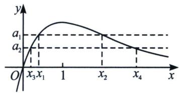  
（2）由 $f(x)=x-a\mathrm{e}^{x}=0$ ，得 $a=\frac{x}{\mathrm{e}^{x}}$ ，设 $g(x)=\frac{x}{\mathrm{e}^{x}}$ ，由 $g'(x)=\frac{1-x}{\mathrm{e}^{x}}$ ，得 $g(x)$ 在 $(-∞,1)$ 上单调递增，在 $(1,+∞)$ 上单调递减，并且当 $x∈(-∞,0)$ 时， $g(x)\leqslant0$ ，当 $x∈(0,+∞)$ 时， $g(x)\geqslant0$ ，如图所示， $x_{1}$ 、 $x_{2}$ 满足 $a=g(x_{1})$ ， $a=g(x_{2})$ ， $a∈(0,\mathrm{e}^{-1})$ 及 $g(x)$ 的单调性，可得 $x_{1}\in(0,1)$ ， $x_{2}\in(1,+∞)$ ；对于任意的 $a_{1}$ 、 $a_{2}\in(0,\mathrm{e}^{-1})$ ，设 $a_{1}>a_{2}$ ， $g(x_{1})=g(x_{2})=a_{1}$ ，其中 $0<x_{1}<1<x_{2}$ ； $g(x_{3})=g(x_{4})=a_{2}$ ，其中 $0<x_{3}<1<x_{4}$ ；因为 $g(x)$ 在 $(0,1)$ 上是增函数，由 $a_{1}>a_{2}$ ，得 $g(x_{1})>$ $g(x_{3})$ ，可得 $x_{1}>x_{3}$ ；类似可得 $x_{2}<x_{4}$ ；又由 $x_{1}$ 、 $x_{2}$ 、 $x_{3}$ 、 $x_{4}>0$ ，得 $\frac{x_{2}}{x_{1}}<\frac{x_{4}}{x_{1}}<\frac{x_{4}}{x_{3}}$ ；所以 $\frac{x_{2}}{x_{1}}$ 随着 a 的减小而增大；  
（3） 因为 $x_{1}=ae^{x_{1}}$ ， $x_{2}=ae^{x_{2}}$ ，所以 $\ln x_{1}=\ln a+x_{1}$ ， $\ln x_{2}=\ln a+x_{2}$ ；即 $x_{2}-x_{1}=\ln x_{2}-\ln x_{1}=\ln\frac{x_{2}}{x_{1}}$ ，设 $\frac{x_{2}}{x_{1}}=t$ ，则 t>1，所以 $\left\{\begin{aligned}x_{2}-x_{1}&=\ln t\\ x_{2}&=x_{1}t\end{aligned}\right.$ ，解得 $x_{1}=\frac{\ln t}{t-1}$ ， $x_{2}=\frac{t\ln t}{t-1}$ ，则 $x_{1}+x_{2}=\frac{(t+1)\ln t}{t-1}\cdots①$ ；
令 $h(x) = \frac{(x + 1)\ln x}{x - 1}, x \in (1, +\infty)$ ，则 $h'(x) = \frac{-2\ln x + x - \frac{1}{x}}{(x - 1)^2}$ ；令 $u(x) = -2\ln x + x - \frac{1}{x}$ ，得 $u'(x) = \left(\frac{x - 1}{x}\right)^2$ ，当 $x \in (1, +\infty)$ 时， $u'(x) > 0$ ，所以 $u(x)$ 在 $(1, +\infty)$ 上是增函数，即对任意的 $x \in (1, +\infty), u(x) > u(1) = 0$ ，所以 $h'(x) > 0$ ，即 $h(x)$ 在 $(1, +\infty)$ 上是增函数；则由①得 $x_1 + x_2$ 随着 $t$ 的增大而增大。由（2）知， $t$ 随着 $a$ 的减小而增大，所以 $x_1 + x_2$ 随着 $a$ 的减小而增大。

总结: 本题作为比值换元的模型题, 充分挖掘了六大函数当中 $y = \frac{x}{\mathrm{e}^{x}}$ 的性质, 并且在 $x_{1} + x_{2}$ 构造当中遇到了老朋友 $h'(x) = \frac{x - \frac{1}{x} - 2 \ln x}{(x - 1)^{2}}$ , 分子又是飘带函数遇上了对数函数, 这种经典搭配总在高考题反复出现.

关于 $x_{2} = tx_{1}$ ，我们得到 $x_{1} = \frac{\ln t}{t - 1}$ ， $x_{2} = \frac{t\ln t}{t - 1}$ 这类型换元操作成为解题的关键突破口.

下面我们来进行比值换元的数学建模：  
（1）已知 $f(x)=\frac{x}{\mathrm{e}^{x}}$ ，若 $f(x_{1})=f(x_{2})=a(x_{2}>x_{1})$ ，令 $x_{2}=tx_{1}$ ，则一定有 $x_{1}=\frac{\ln t}{t-1}$ ， $x_{2}=\frac{t\ln t}{t-1}$ ，a随着t的增大而减小， $x_{1}+x_{2}$ 随着t的增大而减小，参考例1图；  
（2）已知 $f(x)=\frac{\ln x}{x}$ ，若 $f(x_{1})=f(x_{2})=a(x_{2}>x_{1})$ ，令 $x_{2}=tx_{1}$ ，则一定有 $\ln x_{1}=\frac{\ln t}{t-1}$ ， $\ln x_{2}=\frac{t\ln t}{t-1}$ ，a随着t的增大而减小， $x_{1}+x_{2}$ 或者 $x_{1}x_{2}$ 随着t的增大而减小，参考左下图；
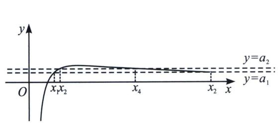

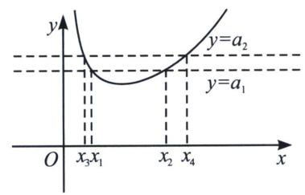  
（3）已知 $f(x)=\frac{\mathrm{e}^{x}}{x}$ ，若 $f(x_{1})=f(x_{2})=a(x_{2}>x_{1})$ ，令 $x_{2}=tx_{1}$ ，则一定有 $x_{1}=\frac{\ln t}{t-1}$ ， $x_{2}=\frac{t\ln t}{t-1}$ ，a随着t的增大而增大， $x_{1}+x_{2}$ 随着t的增大而增大，参考右上图；  
（4）已知 $f(x)=\frac{x}{\ln x}$ ，若 $f(x_{1})=f(x_{2})=a(x_{2}>x_{1})$ ，令 $x_{2}=tx_{1}$ ，则一定有 $\ln x_{1}=\frac{\ln t}{t-1}$ ， $\ln x_{2}=\frac{t\ln t}{t-1}$ ，a随着t的增大而增大， $x_{1}+x_{2}$ 或者 $x_{1}x_{2}$ 随着t的增大而增大；  
（5）已知 $f(x)=xe^{x}$ ，若 $f(x_{1})=f(x_{2})=a(x_{2}<-1<x_{1}<0)$ ，令 $x_{2}=tx_{1}$ ，则一定有 $x_{1}=\frac{\ln t}{1-t}$ ， $x_{2}=\frac{t\ln t}{1-t}$ ，a随着t的增大而增大， $x_{1}+x_{2}$ 随着t的增大而增大；  
（6）已知 $f(x)=x\ln x$ ，若 $f(x_{1})=f(x_{2})=a(0<x_{1}<\frac{1}{e}<x_{2}<1)$ ，令 $x_{2}=tx_{1}$ ，则一定有 $\ln x_{1}=\frac{\ln t}{1-t}$ ， $\ln x_{2}=\frac{t\ln t}{1-t}$ ，a随着t的增大而增大， $x_{1}+x_{2}$ 或者 $x_{1}x_{2}$ 随着t的增大而增大；

> [!example]- 例18 (2023·浙江模拟)若 $x_{1}, x_{2}$ 是函数 $f(x)=\frac{1}{2}ax^{2}-e^{x}+1(a \in \mathbb{R})$ 的两个极值点，且 $\frac{x_{2}}{x_{1}} \geqslant 2$ ，则实数 $a$ 的取值范围为 \_\_\_\_.
解析 因为 $f'(x)=ax-e^{x}$ ， $x_{1}$ ， $x_{2}$ 是 $f(x)$ 的两个极值点，所以 $x_{1}$ ， $x_{2}$ 是 $ax-e^{x}=0$ 的两根，
又当 x=0 时，方程不成立，所以 y=a 与 $y=\frac{e^{x}}{x}$ 有两个不同的交点；令 $g(x)=\frac{e^{x}}{x}$ ，易知 $g(x)$ 在 $(0,1)$ 上单调递减，在 $(1,+\infty)$ 上单调递增，则 $g(x)$ 图象如图所示，

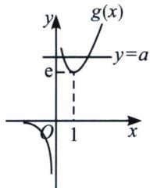
由图象可知： $0<x_{1}<1<x_{2}$ 且 a>e；因为 $\frac{x_{2}}{x_{1}}\geqslant2$ ，所以 $x_{2}\geqslant2x_{1}$ ；令 $x_{2}=tx_{1}, t\geqslant2$ ，
则 $\frac{\mathrm{e}^{x_1}}{x_1} = \frac{\mathrm{e}^{tx_1}}{tx_1}\Rightarrow t = \mathrm{e}^{tx_1 - x_1}\Rightarrow \ln t = (t - 1)x_1$ ，故 $x_{1} = \frac{\ln t}{t - 1},x_{2} = \frac{t\ln t}{t - 1},a = \frac{\mathrm{e}^{x_1}}{x_1}$ ，由于 $x_{1} < 1$ ，故 $a$ 随着 $x_{1}$ 的增大而减小，令 $g(t) = \frac{\ln t}{t - 1},g'(t) = \frac{1 - \frac{1}{t} - \ln t}{(t - 1)^2}$ ，由于 $\ln t > 1 - \frac{1}{t}$ ，所以 $g'(t) <   0$ ，所以 $g(t)_{\max}$ $= g(2) = \ln 2$ ，所以 $a\geqslant \frac{\mathrm{e}^{\ln 2}}{\ln 2} = \frac{2}{\ln 2}$ 故答案为： $\left[\frac{2}{\ln 2}, + \infty\right)$

> [!example]- 例19 (2023·河北模拟)已知函数 $f(x)=x^{2}-2ae^{x}+b(a,b\in\mathbb{R})$ ，若 $f(x)$ 有两个极值点 $x_{1},x_{2}(x_{1}<x_{2})$ ，且 $x_{2}<2x_{1}$ ，则a的取值范围是()
A. $\left(0, \frac{1}{\mathrm{e}}\right)$

B. $\left(-\infty,\frac{\ln2}{2}\right)$

C. $\left(\frac{\ln2}{2},\frac{1}{e}\right)$

D. $\left(0,\frac{\ln2}{2}\right)$
解析 因为函数 $f(x)$ 有两个极值点 $x_{1}$ ， $x_{2}$ ，所以 $f'(x)=2x-2ae^{x}=0$ 有两个零点 $x_{1}$ ， $x_{2}$ ，即 $ae^{x_{1}}=x_{1}$ ， $ae^{x_{2}}=x_{2}$ ， $a=\frac{x}{e^{x}}$ ，令 $g(x)=\frac{x}{e^{x}}$ ，则 $g'(x)=\frac{1-x}{e^{x}}$ ，可得 $g(x)$ 在 $(-∞,1)$ 递增，在 $(1,+∞)$ 递减，即 $0<a<\frac{1}{e}$ ， $x_{1}<x<x_{2}$ ，因为 $x_{2}<2x_{1}$ ，则 $\frac{x_{2}}{x_{1}}=e^{x_{2}-x_{1}}<2$ .

法一(差值换元)令 $x_{2}-x_{1}=t$ 。则 $e^{t}<2,\quad0<t<\ln2$ ，可得 $x_{1}=\frac{t}{e^{t}-1}$ ，令 $g(t)=\frac{t}{e^{t}-1}$ ， $(0<t<\ln2)$ 则 $g'(t)=\frac{e^{t}-1-te^{t}}{(e^{t}-1)^{2}}$ ，令 $h(t)=e^{t}-1-te^{t}$ ，则 $h'(t)=-te^{t}<0$ ，所以 $h(t)$ 单调递减，即 $h(t)<h(0)=$

0, 则 $g(t)$ 单调递减, 所以 $g(t) > g(\ln 2) = \ln 2$ , 即 $x_{1} > \ln 2$ , $a = \frac{x_{1}}{\mathrm{e}^{x_{1}}} > \frac{\ln 2}{2}$ , 所以 $a$ 的取值范围为 $\left(\frac{\ln 2}{2}, \frac{1}{\mathrm{e}}\right)$ , 故选 C.

法二(比值换元)令 $t=\frac{x_{2}}{x_{1}}\in(1,2)$ ， $x_{2}=tx_{1}$ ，即 $x_{1}=\frac{\ln t}{t-1}$ ，令 $h(t)=\frac{\ln t}{t-1}$ ， $h'(t)=\frac{1-\frac{1}{t}-\ln t}{(t-1)^{2}}<0$ （由于 $\ln t>1-\frac{1}{t}$ 恒成立），故 $x_{1}=h(t)\in(\ln2,1)$ ， $a\in\left(\frac{\ln2}{2},\frac{1}{e}\right)$ ，故选 C.

> [!example]- 例20 (24高三上·重庆渝中·期中)已知函数 $f(x) = x \ln x - ax^2 + x, a \in \mathbb{R}$ .  
（1）若函数 $f(x)$ 是减函数，求 a 的取值范围；  
（2） 若 $f(x)$ 有两个零点 $x_{1}$ ， $x_{2}$ ，且 $x_{2} > 2x_{1}$ ，证明： $x_{1}x_{2} > \frac{8}{e^{2}}$ .
解析 （1） $f(x)=x\ln x-ax^{2}+x,\ a\in\mathbb{R}$ 的定义域为 $(0,+\infty)$ ,
$f'(x)=\ln x+1-2ax+1=\ln x-2ax+2$ ，函数 $f(x)$ 是减函数，故 $f'(x)=\ln x-2ax+2\leqslant0$ 在 $(0,+\infty)$ 上恒成立，即 $2a\geqslant\frac{\ln x+2}{x}$ 在 $(0,+\infty)$ 上恒成立，令 $u(x)=\frac{\ln x+2}{x}, x\in(0,+\infty)$ $u'(x)=\frac{1-\ln x-2}{x^{2}}=\frac{-\ln x-1}{x^{2}}$ ，当 $x\in\left(0,\frac{1}{e}\right)$ 时， $u'(x)>0,\ u(x)=\frac{\ln x+2}{x}$ 单调递增，
当 $x \in \left(\frac{1}{\mathrm{e}}, +\infty\right)$ 时， $u'(x) < 0$ ， $u(x) = \frac{\ln x + 2}{x}$ 单调递减，故 $u(x)_{\max} = u\left(\frac{1}{\mathrm{e}}\right) = \mathrm{e}$ ，
故 $2a \geqslant e$ ，解得 $a \geqslant \frac{e}{2}$ ，故 a 的取值范围是 $\left[\frac{e}{2}, +\infty\right)$ ;  
（2） 若有两个零点 $x_{1}, x_{2}$ , 则 $x_{1} \ln x_{1} - ax_{1}^{2} + x_{1} = 0, x_{2} \ln x_{2} - ax_{2}^{2} + x_{2} = 0$ ,
得 $a=\frac{\ln x_{1}+1}{x_{1}}=\frac{\ln x_{2}+1}{x_{2}}=\frac{\ln x_{2}-\ln x_{1}}{x_{2}-x_{1}}$ ，令 $x_{2}=tx_{1}(t>2)$ ,
故 $a = \frac{\ln x_1 + 1}{x_1} = \frac{\ln t}{(t - 1)x_1} \Rightarrow \ln x_1 = \frac{\ln t}{(t - 1)} - 1, \ln x_2 = \ln t + \ln x_1 = \frac{t\ln t}{t - 1} - 1,$ 所以 $\ln (x_1x_2) =$ $\frac{(t + 1)\ln t}{t - 1} -2$ ，令 $h(t) = \frac{(t + 1)\ln t}{t - 1} -2(t > 2)$ ，则 $h'(t) = \frac{-2\ln t + t - \frac{1}{t}}{(t - 1)^{2}} >0$ （飘带函数），则 $h(t)$ 在 $(2, + \infty)$ 上单调递增，所以 $h(t) > h(2) = 3\ln 2 - 2 = \ln \frac{8}{\mathrm{e}^2}$ ，即 $\ln (x_1x_2) > \ln \frac{8}{\mathrm{e}^2}$ 故 $x_{1}x_{2} > \frac{8}{\mathrm{e}^{2}}.$

总结：比值代换总能处理成为单调函数，双变量零点处理之前必要先找点.

> [!example]- 例21 (2023·汉阳模拟)已知函数 $f(x)=\ln x+\frac{m}{\mathrm{e}^{x}}-1(m\in\mathbf{R})$ ，其中无理数 $e=2.718\cdots$  
（1）若函数 $f(x)$ 有两个极值点，求m的取值范围.  
（2）若函数 $g(x)=(x-2)\mathrm{e}^{x}-\frac{1}{3}mx^{3}+\frac{1}{2}mx^{2}$ 的极值点有三个，最小的记为 $x_{1}$ ，最大的记为 $x_{2}$ ，若 $\frac{x_{1}}{x_{2}}$ 的最大值为 $\frac{1}{e}$ ，求 $x_{1}+x_{2}$ 的最小值.
解析 （1） $f'(x)=\frac{1}{x}-\frac{m}{e^x}=\frac{e^x-mx}{xe^x}$ ，令 $\varphi(x)=e^x-mx,\quad x>0$ ，因为 $f(x)$ 有两个极值点，所以 $\varphi(x)$

=0有两个不等的正实根， $\varphi'(x)=\mathrm{e}^{x}-m$ ，当 $m\leqslant1$ 时， $\varphi'(x)>0$ ， $\varphi(x)$ 在 $(0,+\infty)$ 上单调递增，不符合题意.
当 $m > 1$ 时，当 $x \in (0, \ln m)$ 时， $\varphi'(x) < 0$ ，当 $x \in (\ln m, +\infty)$ 时， $\varphi'(x) > 0$ ，所以 $\varphi(x)$ 在 $(0, \ln m)$ 上单调递减，在 $(\ln m, +\infty)$ 上单调递增。 $\varphi(x)_{\min} = \varphi(\ln m) = m - m \ln m < 0$ ，可得 $m > e$ 。又 $\varphi(0) = 1$ ，所以 $\varphi(x)$ 在 $(0, \ln m)$ 有一个零点，即 $f(x)$ 有一个极值点， $\varphi(2 \ln m) = m^2 - 2m \ln m > 0$ ，所以 $\varphi(x)$ 在 $(\ln m, 2 \ln m)$ 有一个零点，即 $f(x)$ 有一个极值点，综上， $m$ 的取值范围是 $(e, +\infty)$ 。  
（2）由 $g'(x)=\mathrm{e}^{x}(x-1)-mx^{2}+mx=(x-1)(\mathrm{e}^{x}-mx)=(x-1)\varphi(x)$ 。因为 $g(x)$ 有三个极值点，所以 $g'(x)$ 有三个零点，1 为一个零点，其他两个则为 $\varphi(x)$ 的零点，由（1）知 m>e，因为 $\varphi(1)=\mathrm{e}-m<0$ ，所以 $\varphi(x)$ 的两个零点即为 $g(x)$ 的最小和最大极值点 $x_{1}, x_{2}$ ，即 $\left\{\begin{aligned}\mathrm{e}^{x_{1}}&=mx_{1}\\ \mathrm{e}^{x_{2}}&=mx_{2}\end{aligned}\right.$ ，即 $\frac{x_{1}}{x_{2}}=\mathrm{e}^{x_{1}-x_{2}}$ ，令 $\frac{x_{1}}{x_{2}}=t$ ，由题知 $0<t\leqslant\frac{1}{e}$ ，所以 $t=\mathrm{e}^{tx_{2}-x_{2}}=\mathrm{e}^{(t-1)x_{2}}$ ， $x_{2}=\frac{\ln t}{t-1}$ ， $x_{1}=\frac{t\ln t}{t-1}$ ，即 $x_{1}+x_{2}=\frac{(t+1)\ln t}{t-1}$ ，令 $h(t)=\frac{(t+1)\ln t}{t-1}$ ， $0<t\leqslant\frac{1}{e}$ ，则 $h'(t)=\frac{t-\frac{1}{t}-2\ln t}{(t-1)^{2}}$ ，令 $m(t)=t-\frac{1}{t}-2\ln t$ ，则 $m'(t)=1+\frac{1}{t^{2}}-\frac{2}{t}=\left(\frac{1}{t}-1\right)^{2}>0$ 。即 $m(t)$ 在 $\left(0,\frac{1}{e}\right]$ 上单调递增，则 $m(t)\leqslant m\left(\frac{1}{e}\right)=\frac{1}{e}-e+2<0$ ，即 $h(t)$ 在 $\left(0,\frac{1}{e}\right]$ 上单调递减，所以 $h(t)\geqslant h\left(\frac{1}{e}\right)=\frac{-\left(\frac{1}{e}+1\right)}{\frac{1}{e}-1}=\frac{e+1}{e-1}$ ，故 $x_{1}+x_{2}$ 的最小值为 $\frac{e+1}{e-1}$ 。

> [!example]- 例22 (24-25高三上·江苏常州·期末)已知函数 $f(x)=x\ln x$ .  
（1）若 $f(x)$ 在区间 $(a, +\infty)$ 上单调，求实数a的取值范围；  
（2）若函数 $g(x)=f(x)-bx^{2}$ 有两个不同的零点.

(i) 求实数 b 的取值范围;

(ii) 若 $(x\ln x-bx^{2})(x^{2}-cx+d)\leqslant0$ 恒成立，求证： $\frac{2}{c}<b<\frac{1}{\sqrt{d}}$ .
解析 （1）由题设 $f'(x) = \ln x + 1$ ，当 $0 < x < \frac{1}{\mathrm{e}}$ 时 $f'(x) < 0$ ，当 $x > \frac{1}{\mathrm{e}}$ 时 $f'(x) > 0$ ，所以 $f(x)$ 在 $\left(0, \frac{1}{\mathrm{e}}\right)$ 上单调递减，在 $\left(\frac{1}{\mathrm{e}}, +\infty\right)$ 上单调递增，所以 $a \geqslant \frac{1}{\mathrm{e}}$ ；  
（2）(i) $g(x)=x\ln x-bx^{2}=x(\ln x-bx)$ ，且 $x\in(0,+\infty)$ ，令 $h(x)=\ln x-bx$ 且 $x\in(0,+\infty)$ ，则 $h'(x)=\frac{1}{x}-b$ ，若 $b\leqslant0$ ， $h'(x)>0$ ，即 $h(x)$ 在定义域上递增，所以函数至多有1个零点，不合题意；当b>0时， $0<x<\frac{1}{b}$ 时 $h'(x)>0$ ， $x>\frac{1}{b}$ 时 $h'(x)<0$ ， $h(x)$ 在 $\left(0,\frac{1}{b}\right)$ 上单调递增，在 $\left(\frac{1}{b},+\infty\right)$ 上单调递减，则 $h\left(\frac{1}{b}\right)=-\ln b-1>0$ ，得 $b<\frac{1}{e}$ ，又 $h(1)=-b<0$ ， $h\left(\frac{1}{b^{2}}\right)=-2\ln b-\frac{1}{b}$ ，另 $s(b)=-2\ln b-\frac{1}{b}$ 且 $b<\frac{1}{e}$ ，则 $s'(b)=\frac{-2}{b}+\frac{1}{b^{2}}=\frac{1-2b}{b^{2}}>0$ ，所以 $s(b)$ 在 $\left(0,\frac{1}{e}\right)$ 上单调递

增，则 $s(b) < s\left(\frac{1}{\mathrm{e}}\right) = 2 - \mathrm{e} < 0$ ，即 $h\left(\frac{1}{b^2}\right) < 0$ ，即 $g(x)$ 在 $\left(1, \frac{1}{b}\right)$ 和 $\left(\frac{1}{b}, \frac{1}{b^2}\right)$ 各存在一个零点，所以 $0 < b < \frac{1}{\mathrm{e}}$ ；
(ii) 记两个零点为 $x_{1}, x_{2} (0 < x_{1} < x_{2})$ ，结合 $g(x)(x^{2} - cx + d) \leqslant 0$ 恒成立，则 $x_{1}, x_{2}$ 为 $x^{2} - cx + d$ 的两个零点，则 $x_{1} + x_{2} = c, x_{1}x_{2} = d$ ，且 $b = \frac{\ln x_{1}}{x_{1}} = \frac{\ln x_{2}}{x_{2}} = \frac{\ln x_{1} - \ln x_{2}}{x_{1} - x_{2}}$ ，要证 $\frac{2}{c} < b$ ，即证 $\frac{2}{x_{1} + x_{2}} < \frac{\ln x_{1} - \ln x_{2}}{x_{1} - x_{2}}$ ，即证 $\ln \frac{x_{1}}{x_{2}} - 2 \cdot \frac{x_{1} - x_{2}}{x_{1} + x_{2}} < 0$ ，令 $t = \frac{x_{1}}{x_{2}} < 1$ ，即证 $\ln t - \frac{2(t - 1)}{t + 1} < 0$ ，令 $\varphi(t) = \ln t - \frac{2(t - 1)}{t + 1}$ ，则 $\varphi'(t) = \frac{(t - 1)^2}{t(t + 1)^2} > 0$ ，所以 $\varphi(t) < \varphi(1) = 0$ ，得证；
要证 $b < \frac{1}{\sqrt{d}}$ ，即证 $\frac{\ln x_1 - \ln x_2}{x_1 - x_2} < \frac{1}{\sqrt{x_1x_2}} \Rightarrow \ln \frac{x_1}{x_2} > \sqrt{\frac{x_1}{x_2}} - \sqrt{\frac{x_2}{x_1}}$
令 $m=\sqrt{\frac{x_{1}}{x_{2}}}<1$ ，则 $n(m)=2\ln m-m+\frac{1}{m}$ ，则 $n'(m)=\frac{2}{m}-1-\frac{1}{m^{2}}=-\left(1-\frac{1}{m}\right)^{2}<0$ ，
所以 $n(m) > n(1) = 0$ ，得证．综上， $\frac{2}{c} < b < \frac{1}{\sqrt{d}}.$

### 四、比值换元与不对称零点和积最值问题
当我们遇到 $x_{1} + x_{2}$ 或者 $x_{1}x_{2}$ 最值时，这个属于对称零点最值，也通常指向极值点偏移方向，而 $x_{1} + kx_{2}$ 或者 $x_{1}^{k}x_{2}$ 之类的，属于不对成零点问题，通常也是利用比值换元来解决问题.

> [!example]- 例23 (2023·武汉模拟)已知关于 $x$ 的方程 $ax - \ln x = 0$ 有两个不相等的正实根 $x_{1}$ 和 $x_{2}$ ，且 $x_{1} < x_{2}$ .  
（1）求实数 a 的取值范围;  
（2）设 k 为常数，当 a 变化时，若 $x_{1}^{k}x_{2}$ 有最小值 $e^{e}$ ，求常数 k 的值.
解析 （1） 由 $f(x) = ax - \ln x$ ，且 $x > 0$ ， $f'(x) = a - \frac{1}{x}$ ，

①若 $a \leqslant 0$ ， $f'(x) < 0$ ， $f(x)$ 单调递减，不可能出现两个零点；  
②若 $a > 0$ 时， $f'(x) = 0$ 时， $x = \frac{1}{a}$ ， $f(x)$ 在区间 $\left(0, \frac{1}{a}\right)$ 单调递减，在区间 $\left(\frac{1}{a}, +\infty\right)$ 单调递增， $f(x)_{\min} = f\left(\frac{1}{a}\right) = 1 - \ln \frac{1}{a} < 0$ 时，即 $0 < a < \frac{1}{\mathrm{e}}$ 时，会有两个零点， $f(1) = a > 0$ ， $f\left(\frac{1}{a^2}\right) = \frac{1}{a} - 2\ln \frac{1}{a} > 0$ ，故存在 $x_1 \in \left(1, \frac{1}{a}\right)$ ， $x_2 \in \left(\frac{1}{a}, \frac{1}{a^2}\right)$ ，使得 $f(x) = 0$ ，故 $a$ 的取值范围是 $\left(0, \frac{1}{\mathrm{e}}\right)$ ；  
（2） 易得 $1 < x_{1} < e < x_{2}$ ，则 $a = \frac{\ln x_{1}}{x_{1}} = \frac{\ln x_{2}}{x_{2}}$ ， $\frac{x_{2}}{x_{1}} = \frac{\ln x_{2}}{\ln x_{1}}$ ，设 $\frac{x_{2}}{x_{1}} = t (t > 1)$ ，则 $t = \frac{\ln t + \ln x_{1}}{\ln x_{1}}$ ，即 $\ln x_{1} = \frac{\ln t}{t - 1}$ ， $\ln x_{2} = \frac{t \ln t}{t - 1}$ ，由 $x_{1}^{k} x_{2}$ 有最小值 $e^{c}$ ，即 $k \ln x_{1} + \ln x_{2} = \frac{(k + t) \ln t}{t - 1}$ 有最小值 e，即 $g(t) = (k + t) \ln t - e (t - 1) \geqslant 0$ 恒成立，类似于切线找点探路，我们先探 $\left\{\begin{aligned} g(t_{0}) &= 0 \\ g'(t_{0}) &= 0 \end{aligned}\right.$ ，即 $\left\{\begin{aligned} (k + t_{0}) \ln t_{0} - e(t_{0} - 1) &= 0 \\ \frac{k}{t_{0}} + \ln t_{0} + 1 - e &= 0 \end{aligned}\right.$ ，所以 $k = (e - 1)t_{0} - t_{0} \ln t_{0}$ ，代入 $(k + t_{0}) \ln t_{0} - e(t_{0} - 1) = 0$ 得： $(e - \ln t_{0}) t_{0} \ln t_{0} - e(t_{0} - 1) = 0$ ，显然 $t_{0}$
$= \mathrm{e}$ ，此时 $k = \mathrm{e}^2 -2\mathrm{e}$ ，下面我们证明 $g(t) = (\mathrm{e}^2 -2\mathrm{e} + t)\ln t - \mathrm{e}(t - 1)\geqslant 0$ ， $g'(t) = \ln t + \frac{\mathrm{e}^{2} - 2\mathrm{e}}{t} +1-$ e， $g''(t) = \frac{1}{t} -\frac{\mathrm{e}^2 - 2\mathrm{e}}{t^2}$ ，故 $g'(t)$ 在 $(1,\mathrm{e}^{2} - 2\mathrm{e})$ 单调递减，在区间 $(\mathrm{e}^2 -2\mathrm{e}, + \infty)$ 单调递增， $g'（1） =$ $\mathrm{e}^2 -3\mathrm{e} + 1 > 0$ ， $g'(\mathrm{e}^{2} - 2\mathrm{e}) = \ln (\mathrm{e} - 2) - (\mathrm{e} - 2) + 1 <   0$ ，故存在 $t_0\in (1,\mathrm{e}^2 -2\mathrm{e})$ ，使得 $g'(t_0) = 0$ ，此时 $g(t_{0})$ 为 $g(t)$ 的极大值，又 $g(1) = 0$ ，故 $g(t_0) > 0$ ，又因为 $g'(\mathrm{e}) = 0$ ，所以 $g(t)_{\text{极小}} = g(\mathrm{e}) = 0$ ，故当 $t\in (1,\mathrm{e})\cup (\mathrm{e}, + \infty)$ 时， $g(t) > 0$ ，得证．综上所述， $k = \mathrm{e}^2 -2\mathrm{e}$

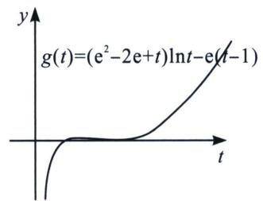

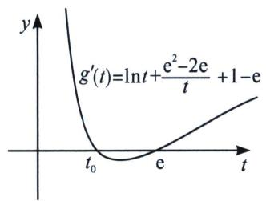

> [!example]- 例24 (2023 秋·雨城区校级月考)已知函数 $f(x) = x \ln x - ax^2$ .  
（1）若函数 $f(x)$ 有两个不同的零点，求实数a的取值范围；  
（2）若函数 $g(x)=f(x)-x+a$ 有两个不同的极值点 $x_{1}$ ， $x_{2}(x_{1}<x_{2})$ ，当 $\lambda\geqslant1$ 时，求证： $\frac{x_{1}}{e}>\left(\frac{e}{x_{2}}\right)^{\lambda}$ .
解析 （1） 解: 因为 $\ln x - ax = 0$ 在 $(0, +\infty)$ 上有两个不同根 $\Leftrightarrow a = \frac{\ln x}{x}$ 在 $(0, +\infty)$ 上有两个解, 令 $g(x) = \frac{\ln x}{x}$ , 则 $g'(x) = \frac{1 - \ln x}{x^2} > 0 \Rightarrow 0 < x < e$ , $g(x) = \frac{\ln x}{x}$ 在 $(0, e)$ 上单调递增, 在 $(e, +\infty)$ 上单调递减, $g(e) = \frac{1}{e}$ , $g(1) = 0$ ; 当 $x > 1$ 时, $g(x) > 0$ ; 当 $0 < x < 1$ 时, $g(x) < 0$ , 故 $a \in \left(0, \frac{1}{e}\right)$ .  
（2）证明：因为 $g(x)=f(x)-x+a$ 有两个不同的极值点 $x_{1}, x_{2}(x_{1}<x_{2})$ ,
$\Rightarrow g'(x) = f'(x) - 1 = \ln x - 2ax = 0$ 有两个根 $x_{1}$ ， $x_{2} \Rightarrow \ln x_{1} = 2ax_{1}$ 且 $\ln x_{2} = 2ax_{2}$ ， $x_{1} < e < x_{2}$ ，
所以 $\frac{x_1}{\mathrm{e}} >\left(\frac{\mathrm{e}}{x_2}\right)^\lambda \Leftrightarrow \mathrm{e}^{1 + \lambda} <   x_1\cdot x_2^\lambda \Leftrightarrow 1 + \lambda <  \ln x_1 + \lambda \ln x_2\Leftrightarrow \lambda (\ln x_2 - 1)\geqslant \ln x_2 - 1 > 1 - \ln x_1$ ，即 $x_{1}x_{2} > \mathrm{e}^{2},$ $2a = \frac{\ln x_1}{x_1} = \frac{\ln x_2}{x_2} = \frac{\ln x_2 + \ln x_1}{x_2 + x_1} = \frac{\ln x_2 - \ln x_1}{x_2 - x_1}$ ，令 $x_{2} = tx_{1},t > 1,\ln x_{1} = \frac{\ln t}{t - 1},\ln x_{2} = \frac{t\ln t}{t - 1}$ ，即证： $\ln x_{1} + \ln x_{2} = \frac{(t + 1)\ln t}{t - 1} >2,\ln t > \frac{2(t - 1)}{t + 1}$ （自证），所以原不等式成立．即 $\frac{x_1}{\mathrm{e}} >\left(\frac{\mathrm{e}}{x_2}\right)^\lambda .$

非对称多参数通常采用比值(差值)代换+主元思想

> [!example]- 例25 (2023·济南模拟)已知函数 $f(x)=x\ln x-a(x^{2}-1)+x$ .  
（1）若 $f(x)$ 单调递减，求a的取值范围；  
（2）若 $f(x)$ 有两个极值点 $x_{1}$ , $x_{2}$ , 且 $x_{2} \geqslant 2x_{1}$ , 证明: $e^{6}x_{1}x_{2}^{2} \geqslant 32$ .
解析 （1）由 $f(x)=x\ln x-a(x^{2}-1)+x$ 得 $f'(x)=\ln x-2ax+2(x>0)$ ，因为 $f(x)$ 单调递减，所以 $f'(x)=\ln x-2ax+2\leqslant0$ 在x>0时恒成立，即 $2a\geqslant\frac{\ln x+2}{x}$ ，令 $g(x)=\frac{\ln x+2}{x}(x>0)$ ，则 $g'(x)=$ $\frac{-\ln x-1}{x^{2}}$ ，可知 $0<x<\frac{1}{e}$ 时， $g'(x)>0$ ， $g(x)$ 单调递增； $x>\frac{1}{e}$ 时， $g'(x)<0$ ， $g(x)$ 单调递减，
则 $x=\frac{1}{e}$ 时 $g(x)$ 取最大值 $g\left(\frac{1}{e}\right)=e$ ，所以 $2a\geqslant e$ ，所以，a 的取值范围是 $\left[\frac{e}{2},+\infty\right)$ .  
（2）证明：由（1）知，当 $a \geqslant \frac{e}{2}$ 时， $f(x)$ 单调递减，不合题意；因为函数 $f(x)$ 有两个极值点 $x_1, x_2$ ，则 $f'(x) = \ln x - 2ax + 2 (x > 0)$ 有两个零点 $x_1, x_2$ ，令 $\varphi(x) = f'(x) = \ln x - 2ax + 2 (x > 0)$ ， $\varphi'(x) = \frac{1}{x} - 2a$ ，当 $a \leqslant 0$ 时， $\varphi'(x) > 0$ ， $\varphi(x)$ 单调递增，不合题意，可知 $0 < a < \frac{e}{2}$ ，且 $x_2 > 2x_1 > 0$ ，
要证明 $\mathrm{e}^6 x_1x_2^2 >32$ ，只需证明 $\ln x_{1} + 2\ln x_{2} = 5\ln 2 - 6.$ 由 $\left\{ \begin{array}{l}\ln x_1 - 2ax_1 + 2 = 0\\ \ln x_2 - 2ax_2 + 2 = 0 \end{array} \right.$ ，得 $\left\{ \begin{array}{l}\ln x_1 = 2ax_1 - 2\\ \ln x_2 = 2ax_2 - 2 \end{array} \right.$
则 $2a = \frac{\ln x_1 - \ln x_2}{x_1 - x_2}$ ，所以， $\ln x_1 + 2\ln x_2 = 2a(x_1 + 2x_2) - 6 = \frac{\ln x_1 - \ln x_2}{x_1 - x_2}(x_1 + 2x_2) - 6 = \frac{\ln \frac{x_1}{x_2}}{\frac{x_1}{x_2} - 1}$
$\left(\frac{x_{1}}{x_{2}}+2\right)-6.$ 令 $t=\frac{x_{1}}{x_{2}}$ ，则 $t\in\left(0,\frac{1}{2}\right)$ ，要证明 $\ln x_{1}+2\ln x_{2}>5\ln2-6$ ，需证明 $\frac{\ln t}{t-1}(t+2)>5\ln2.$
令 $h(t)=\frac{\ln t}{t-1}(t+2)$ ，且 $t\in\left(0,\frac{1}{2}\right)$ ，则 $h'(t)=\frac{t-3\ln t-\frac{2}{t}+1}{(t-1)^{2}}$ ，令 $u(t)=t-3\ln t-\frac{2}{t}+1$ ，且 $t\in\left(0,\frac{1}{2}\right)$ ，则 $u'(t)=1-\frac{3}{t}+\frac{2}{t^{2}}=\frac{(t-1)(t-2)}{t^{2}}>0$ ，则 $u(t)$ 在 $t\in\left(0,\frac{1}{2}\right)$ 时单调递增，故 $u(t)<u\left(\frac{1}{2}\right)=\frac{1}{2}+3\ln2-3<0$ ，故 $h'(t)<0$ ，则 $h(t)$ 在 $t\in\left(0,\frac{1}{2}\right)$ 时单调递减，所以， $h(t)>h\left(\frac{1}{2}\right)=5\ln2$ ，即 $\frac{\ln t}{t-1}(t+2)>5\ln2$ ，则有 $\ln x_{1}+2\ln x_{2}>5\ln2-6$ ，所以 $e^{6}x_{1}x_{2}^{2}>32$ ，即原不等式成立.

> [!example]- 例26 (2023·四川模拟)已知函数 $f(x)=x\ln x-a(x^{2}-1)+x$ .  
（1）若 $f(x)$ 单调递减，求a的取值范围；  
（2）若 $f(x)$ 有两个极值点 $x_{1}$ ， $x_{2}$ 且 $x_{2}>3x_{1}$ ，证明： $e^{10}x_{1}^{2}x_{2}^{3}>3^{\frac{11}{2}}$ .
解析 （1） $f(x)=x\ln x-a(x^{2}-1)+x,\quad f'(x)=\ln x-2ax+2(x>0)$ ，因为 $f(x)$ 单调递减，
所以 $f'(x)=\ln x-2ax+2\leqslant0$ 在 $(0,+\infty)$ 上恒成立，即 $2a\geqslant\frac{\ln x+2}{x}$ ，令 $g(x)=\frac{\ln x+2}{x}$ ，x>0， $g'(x)=\frac{-\ln x-1}{x^{2}}$ ，所以在 $\left(0,\frac{1}{e}\right)$ 上 $g'(x)>0$ ， $g(x)$ 单调递增，在 $\left(\frac{1}{e},+\infty\right)$ 上 $g'(x)<0$ ， $g(x)$ 单调递减，所以当 $x=\frac{1}{e}$ 时， $g(x)$ 取得极大值 $g\left(\frac{1}{e}\right)=e$ ，所以 $2a\geqslant e$ ，所以 $a\geqslant\frac{e}{2}$ ，所以a的取值范围为 $\left[\frac{e}{2},+\infty\right)$ .  
（2）证明: 由（1）可知 $f'(x)=\ln x-2ax+2$ ，因为函数 $f(x)$ 有两个极值点 $x_{1}, x_{2}$ ，所以 $f'(x)=\ln x-2ax+2$ 有两个零点 $x_{1}, x_{2}$ ，所以 $0<a<\frac{e}{2}$ 且 $x_{2}>3x_{1}>0$ ，要证明 $\mathrm{e}^{10}x_{1}^{2}x_{2}^{3}>3^{\frac{11}{2}}$ ，只需证明 $2\ln x_{1}+$
$3\ln x_{2}>\frac{11}{2}\ln3-10$ ，由 $\left\{\begin{aligned}\ln x_{1}-2ax_{1}+2&=0\\ \ln x_{2}-2ax_{2}+2&=0\end{aligned}\right.$ ，得 $\left\{\begin{aligned}\ln x_{1}&=2ax_{1}-2\\ \ln x_{2}&=2ax_{2}-2\end{aligned}\right.$ ，所以 $2a=\frac{\ln x_{1}-\ln x_{2}}{x_{1}-x_{2}}$
所以 $2\ln x_{1} + 3\ln x_{3} = 2a(2x_{1} + 3x_{2}) - 10 = \frac{\ln x_{1} - \ln x_{2}}{x_{1} - x_{2}} (2x_{1} + 3x_{2}) - 10 = \frac{\ln\frac{x_1}{x_2}}{\frac{x_1}{x_2} - 1}(2\cdot \frac{x_1}{x_2} +3) - 10$
令 $t = \frac{x_1}{x_2}$ ，则 $t \in \left(0, \frac{1}{3}\right)$ ，要证明 $2\ln x_1 + 3\ln x_2 > \frac{11}{2}\ln 3 - \ln 10$ ，即证明 $\frac{\ln t}{t - 1}(2t + 3) > \frac{11}{2}\ln 3$
令 $h(t)=\frac{\ln t}{t-1}(2t+3)$ ，且 $t\in\left(0,\frac{1}{3}\right)$ ，则 $h'(t)=\frac{2t-5\ln t-\frac{3}{t}+1}{(t-1)^{2}}$ ，令 $u(t)=2t-5\ln t-\frac{3}{t}+1$ ，且 $t\in\left(0,\frac{1}{3}\right)$ ，所以 $u'(t)=2-\frac{5}{t}+\frac{3}{t^{2}}=\frac{(2t-3)(t-1)}{t^{2}}>0$ ，所以 $u(t)$ 在 $\left(0,\frac{1}{3}\right)$ 上单调递增，所以 $u(t)<u\left(\frac{1}{3}\right)=\frac{2}{3}+5\ln3-8<0$ ，所以 $h'(t)<0$ ，所以 $h(t)$ 在 $\left(0,\frac{1}{3}\right)$ 上单调递减，所以 $h(t)>h\left(\frac{1}{3}\right)=\frac{11}{2}\ln3$ ，即 $\frac{\ln t}{t-1}(2t+3)>\frac{11}{2}\ln3$ ，所以 $2\ln x_{1}+3\ln x_{2}>\frac{11}{2}\ln3-10$ ，所以 $e^{10}x_{1}^{2}x_{2}^{2}>3^{\frac{11}{2}}$ ，即原不等式成立.

> [!example]- 例27 (2024高中数学联赛广州赛区) $\ln x+x(1-m)=0(m\in\mathbb{R})$ 有两个不同的零点a，b，且a<b  
（1）求实数 $m$ 的范围  
（2）若不等式 $t + 1 < \ln a + t\ln b$ 恒成立，求正数 $t$ 的范围
解析 （1） 因为 $\ln x + x(1 - m) = 0$ 有两个不同的零点 $a, b$ , 即 $f(x) = \ln x + x(1 - m)$ 有两个零点, $f'(x) = \frac{1}{x} + (1 - m)$ , 当 $m \leqslant 1$ , $f'(x) > 0$ , $f(x) \uparrow$ 至多一个零点, $m > 1$ , $x \in \left\{ \begin{array}{l} \left(0, \frac{1}{m-1}\right), f'(x) > 0, f(x) \uparrow \\ \left(\frac{1}{m-1}, +\infty\right), f'(x) < 0, f(x) \downarrow \end{array} \right.$ , $f(x)_{\max} = f\left(\frac{1}{m-1}\right) = \ln \frac{1}{m-1} - 1 > 0 \Rightarrow 1 < m < 1 + \frac{1}{e}$ ,
此时：若 $x < \frac{1}{m-1}$ ， $f(1) < 0$ ， $\exists a \in \left(1, \frac{1}{m-1}\right)$ 使得 $f(a) = 0$ ，
$x > \frac {1}{m - 1}, f (x) = \ln x + (1 - m) x = \sqrt {x} \left(\frac {\ln x}{\sqrt {x}} + (1 - m) \sqrt {x}\right) <   \sqrt {x} \left(\frac {2}{\mathrm{e}} + (1 - m) \sqrt {x}\right) = 0,$
解得 $x=\frac{4}{\mathrm{e}^{2}(m-1)^{2}}$ 也可取 $x=\frac{4}{(m-1)^{2}}$ ，存在 $\exists b\in\left(\frac{1}{m-1},\frac{1}{\mathrm{e}^{2}(m-1)^{2}}\right)$ 使得 $f(b)=0$ ，
所以 $f(x)=\ln x+x(1-m)$ 有两个零点；  
（2） $\left\{\begin{aligned}\frac{\ln a}{a}&=m-1\\\frac{\ln b}{b}&=m-1\end{aligned}\right.$ ，由合分比可得： $\left\{\begin{aligned}\frac{\ln a+\ln b}{a+b}&=m-1\\\frac{\ln b-\ln a}{b-a}&=m-1\end{aligned}\right.\Rightarrow\frac{\ln a+\ln b}{\ln\frac{b}{a}}=\frac{b+a}{b-a}\xrightarrow{\text{令}\frac{b}{a}=k>1}2\ln a+\ln k=\frac{k+1}{k-1}$
$\ln k$ ，所以 $\left\{ \begin{array}{l} \ln a = \frac{\ln k}{k - 1} \\ \ln b = \frac{k\ln k}{k - 1} \end{array} \right.$ ， $\exists b \in \left(\frac{1}{m - 1}, \frac{1}{\mathrm{e}^2(m - 1)^2}\right)$ ，即 $b > \frac{1}{m - 1} > \mathrm{e}$

法一： $t+1<\ln a+t\ln b\Leftrightarrow t(1-\ln b)<\ln a-1\Leftrightarrow t>\frac{\ln a-1}{1-\ln b}=\frac{k-1-\ln k}{k\ln k-k+1}=g(k)$ ， $\lim_{k\to1}g(k)=\lim_{k\to1}$
$\frac{k-1-\ln k}{k\ln k-k+1}=\lim_{k\to1}\frac{1-\frac{1}{k}}{\ln k}=\lim_{k\to1}\frac{\frac{1}{k^{2}}}{\frac{1}{k}}=1$ ，故 $t\geqslant1$ ；
法二： $t+1<\ln a+t\ln b\Leftrightarrow t(1-\ln b)<\ln a-1\Leftrightarrow t\left(\frac{k-1-k\ln k}{k-1}\right)<\frac{\ln k-k+1}{k-1}$ ， $g(k)=t(k\ln k-k+1)-k$
$+1+\ln k,\ g(1)=0,\ g'(k)=t\ln k-1+\frac{1}{k},\ g'（1）=0,\ g''(k)=\frac{t}{k}-\frac{1}{k^{2}},\ g''（1）\geqslant0\Rightarrow t\geqslant1$ ，当 $t\geqslant1$
$g^{' '}(k) > \frac{1}{k} -\frac{1}{k^{2}} >0$ ， $g'(k)\uparrow g'(k) > g'（1） = 0$ ， $g(k)\uparrow$ ， $g(k) > g(1) = 0$ 成立，
当 $t < 1, g''（1） < 0, g''\left(\frac{1}{t}\right) = 0, x \in \left(1, \frac{1}{t}\right), g''(t) < 0, g'(t) \downarrow, g'\left(\frac{1}{t}\right) < 0$ ，即 $x \in \left(1, \frac{1}{t}\right)$ ，
$g'(t)<0,\ g(t)\downarrow,\ g\left(\frac{1}{t}\right)<0,$ 矛盾，综上 $t\geqslant1.$

> [!example]- 例28 已知函数 $f(x) = \ln x$ ， $g(x) = \frac{1}{2} ax^2$  
（1）若方程 $f(x)=g(x)$ 有两个不同的实数根，求实数a的范围  
（2）若方程 $f(x)=g'(x)$ 有两个不同的实数根 $x_{1}$ ， $x_{2}(x_{1}<x_{2})$ ，且不等式 $e^{\lambda+k}<x_{1}^{k}x_{2}^{\lambda}$ 对任意 $k\in(0,2]$ 恒成立，求正数 $\lambda$ 的取值范围
解析 （1） 因为 $f(x) = g(x)$ 有两个不同的实数根
所以 $h(x)=\ln x-\frac{1}{2}ax^{2}$ 有两个零点， $h'(x)=\frac{1}{x}-ax$ ，若 $a\leqslant0,\ h'(x)>0,\ h(x)\uparrow$ ，至多一个零点
当 $a > 0$ ， $\left\{ \begin{array}{ll}x\in (0,\sqrt{\frac{1}{a}})h'(x) > 0,h(x)\uparrow \\ h(x)_{\max} = h(\sqrt{\frac{1}{a}}) = \ln \sqrt{\frac{1}{a}} -\frac{1}{2} >0\Rightarrow 0 <   a <   \frac{1}{\mathrm{e}},\\ x\in (\sqrt{\frac{1}{a}}, + \infty)h'(x) <   0,h(x)\downarrow \end{array} \right.$

后续取点自取；  
（2） 即 $\left\{\begin{aligned}\frac{\ln x_{1}}{x_{1}}&=a\quad\frac{x_{2}}{x_{1}}=t>1\\\frac{\ln x_{2}}{x_{2}}&=a\end{aligned}\right.$ $\xrightarrow{}$ $\ln x_{1}=\frac{\ln t}{t-1},\quad e^{\lambda+k}<x_{1}^{k}x_{2}^{\lambda}\Leftrightarrow\lambda+k<k\ln x_{1}+\lambda\ln x_{2},$ 即 $k(\ln t+1-t)>\lambda(t-1-$
$t\ln t)\Rightarrow2(\ln t+1-t)>\lambda(t-1-t\ln t)$ ，令 $h(t)=2(\ln t+1-t)-\lambda(t-1-t\ln t)$ ， $h(1)=0$ ， $h'(t)=2$
$\left(\frac{1}{t}-1\right)+\lambda\ln t,\ h'（1）=0,\ h^{''}（1）=\lambda-2\geqslant0\Rightarrow\lambda\geqslant2$ ，后续矛盾区间自证.

> [!example]- 例29 (2025·河南·二模)已知函数 $f(x) = \mathrm{e}^{x} - ax - 3 (a \in \mathbb{R})$ .  
（2） 若 $f(x)$ 有两个零点 $x_{1}$ ， $x_{2}$ ，且 $x_{1}<x_{2}$ .

(i) 求 a 的取值范围；
(ii) 证明： $3e^{x_{1}} + e^{x_{2}} > 3a.$
解析 （2）(i)由题意知， $f(x)$ 的定义域为 R， $f'(x)=\mathrm{e}^{x}-a$ .
当 $a \leqslant 0$ 时， $f'(x) > 0$ ，所以 $f(x)$ 在 $\mathbf{R}$ 上单调递增，从而 $f(x)$ 在 $\mathbf{R}$ 上至多有一个零点.
当 a>0 时，令 $f'(x)=0$ ，得 $x=\ln a$ .
当 $x < \ln a$ 时， $f'(x) < 0$ ， $f(x)$ 在 $(-∞, \ln a)$ 上单调递减；
当 $x > \ln a$ 时， $f'(x) > 0$ ， $f(x)$ 在 $(\ln a, +\infty)$ 上单调递增.
$f(x)_{\min}=f(\ln a)=a-3-a\ln a<0.$ 令 $g(a)=a-3-a\ln a(a>0)$ ，则 $g'(a)=-\ln a.$
当 0 < a < 1 时， $g'(a) > 0$ ， $g(a)$ 单调递增；a > 1 时， $g'(a) < 0$ ， $g(a)$ 在单调递减，
即 $g(a)_{\max}=g(1)=-2<0$ ，从而 $f(\ln a)<0$ 。 $f\left(-\frac{3}{a}\right)=\mathrm{e}^{-\frac{3}{a}}>0$ ， $-\frac{3}{a}-\ln a<\ln\frac{1}{a}-\frac{1}{a}<-1$
故存在唯一 $x_{1}\in\left(-\frac{3}{a},\ln a\right)$ 使得 $f(x_{1})=0$ ，右边， $f\left(2\ln a+\frac{3}{a}\right)=a^{2}\mathrm{e}^{\frac{3}{a}}-2a\ln a>a(a-2\ln a)>0$ (偏移找点)，故存在唯一 $x_{2} \in \left(\ln a, 2\ln a + \frac{3}{a}\right)$ 使得 $f(x_{2}) = 0$ ，所以 $f(x)$ 有两个零点，综上所述，a 的取值范围是 $(0, +\infty)$ .

(Ⅱ)证明：由 $f(x_{1})=f(x_{2})=0$ ，得 $e^{x_{1}}=ax_{1}+3$ ， $e^{x_{2}}=ax_{2}+3$ ，所以 $e^{x_{2}}-e^{x_{1}}=a(x_{2}-x_{1})$ ，即 $a=\frac{e^{x_{2}}-e^{x_{1}}}{x_{2}-x_{1}}$ 。要证 $3e^{x_{1}}+e^{x_{2}}>3a$ 成立，只需证 $3e^{x_{1}}+e^{x_{2}}>\frac{3(e^{x_{2}}-e^{x_{1}})}{x_{2}-x_{1}}$ ，即证 $\frac{3e^{x_{1}}+e^{x_{2}}}{e^{x_{2}}-e^{x_{1}}}>\frac{3}{x_{2}-x_{1}}$ ，即证 $\frac{e^{x_{2}-x_{1}}+3}{e^{x_{2}-x_{1}}-1}>\frac{3}{x_{2}-x_{1}}$ 。令 $x_{2}-x_{1}=t(t>0)$ ，则 $\frac{e^{t}+3}{e^{t}-1}>\frac{3}{t}$ 。
即证 $t\mathrm{e}^{t}+3t>3\mathrm{e}^{t}-3$ ，即证 $\frac{\mathrm{e}^{t}(t-3)}{t+1}+3>0$ 。设 $h(t)=\frac{\mathrm{e}^{t}(t-3)}{t+1}+3(t>0)$ ，则 $h'(t)=\frac{\mathrm{e}^{t}(t-1)^{2}}{(t+1)^{2}}\geqslant0$ ，所以 $h(t)$ 在区间上单调递增，所以 $h(t)>h(0)=0$ ，所以不等式 $3\mathrm{e}^{x_{1}}+\mathrm{e}^{x_{2}}>3a$ 成立。

# 第二节 极值点偏移

### 一、对称化构造

极值点偏移概念函数 $f(x)$ 满足定义域内任意自变量 x 都有 $f(x)=f(2m-x)$ ，则函数 $f(x)$ 关于直线 $x=x_{0}$ 对称；可以理解为函数 $f(x)$ 的对称轴两侧，函数值变化快慢相同，且若 $f(x)$ 为单峰函数，则 $x=x_{0}$ 必为 $f(x)$ 的极值点，如二次函数 $f(x)$ 的对称轴就是极值点 $x_{0}$ ，若 $f(x)=c$ 的两根的中点为 $\frac{x_{1}+x_{2}}{2}=x_{0}$ ，即极值点在两根的正中间，也就是极值点没有偏移.

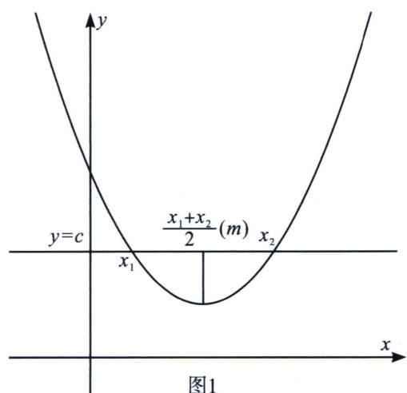
当相等变为不等，则极值点偏移：若单峰函数 $y = f(x)$ 的极值点为 $x_0, x_1 < x_0 < x_2$ ，且 $f(x_1) = f(x_2)$ ，对任意 $x_1$ 都有 $f(x_1) > f(2x_0 - x_1)$ （见图2-1）或 $f(x_1) < f(2x_0 - x_1)$ （见图3-1），由于 $2x_0 - x_1 > x_0$ ， $f(x)$ 在 $(x_0, +\infty)$ 上单调，则 $2x_0 - x_1 > x_2$ 或 $2x_0 - x_1 < x_2$ ，即 $\frac{x_1 + x_2}{2} < x_0$ （极值点右偏）或 $\frac{x_1 + x_2}{2} > x_0$ （极值点左偏）。
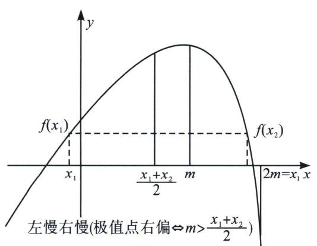

图1

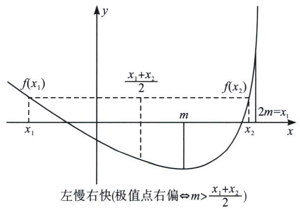

图2

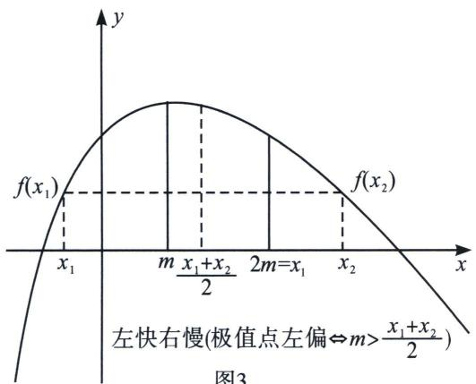

图3

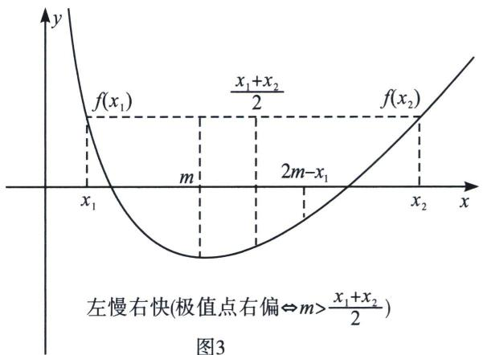

1)极值点偏移问题的一般题设形式(和型)

和型：（1）若函数 $f(x)$ 存在两个零点 $x_{1}$ ， $x_{2}$ 且 $x_{1} \neq x_{2}$ ，求证： $x_{1} + x_{2} > 2x_{0} (x_{0}$ 为函数 $f(x)$ 的极值点）；  
（2）若函数 $f(x)$ 存在 $x_{1}$ ， $x_{2}$ 且 $x_{1} \neq x_{2}$ 满足 $f(x_{1}) = f(x_{2})$ ，求证： $x_{1} + x_{2} > 2x_{0} (x_{0}$ 为函数 $f(x)$ 的极值点）；  
（3）若函数 $f(x)$ 存在两个零点 $x_{1}$ ， $x_{2}$ 且 $x_{1} \neq x_{2}$ ，令 $x_{0} = \frac{x_{1} + x_{2}}{2}$ ，求证： $f'(x_{0}) > 0$ ;  
（4）若函数 $f(x)$ 存在 $x_{1}$ ， $x_{2}$ 且 $x_{1} \neq x_{2}$ 满足 $f(x_{1}) = f(x_{2})$ ，令 $x_{0} = \frac{x_{1} + x_{2}}{2}$ ，求证： $f'(x_{0}) > 0$ .  
（5）若函数 $f(x)$ 存在两个极值点 $x_{1}$ ， $x_{2}$ ，且 $x_{1} \neq x_{2}$ ，求证： $x_{1} + x_{2} > 2x_{0}$

# 2)答题模板

先分清楚极值点 $x_0$ 是当前函数极值点还是代数变形后的极值点，如果是当前函数极值点，直接使用，如果不是，先代数变形再利用模板.

常见题设：若函数 $f(x)$ 存在两个零点，且满足 $f(x_{1}) = f(x_{2})$ ， $x_{0}$ 为函数 $f(x)$ 的极值点，求证 $x_{1} + x_{2} < 2x_{0}$ .  
（1）求导讨论 $f(x)$ 单调性，并求出极值点 $x_{0}$ 以及 $x_{1}$ ， $x_{2}$ 的范围；  
（2）构造函数 $F(x)=f(x)-f(2x_{0}-x)$ ; (左右构造)

注：有时需要根据题意构造 $F(x)=f(x_{0}+x)-f(x_{0}-x)$ (居中构造).  
（3）对 $F(x)$ 求导，讨论 $F(x)$ 单调性，从而判断 $F(x)$ 在极值点单侧的正负，得出 $f(x)$ 与 $f(2x_{0}-x)$ 的大小关系；
注：①后续代入哪侧的自变量证明， $F(x)$ 就求哪侧的正负，无需同时求极值点两侧；
②若 $F(x)$ 出现定号部分，可先去掉定号部分再求导.  
（4）代入 $x_{1}$ 或 $x_{2}$ ，得出 $f(x)$ 与 $f(2x_0 - x)$ 的大小关系，借助 $f(x_{1}) = f(x_{2})$ 将自变量统一到极值点同侧，再通过 $f(x)$ 单调性得出结论.  
（5）若要证明 $f'\left(\frac{x_1 + x_2}{2}\right) < 0$ ，还需要进一步讨论 $\frac{x_1 + x_2}{2}$ 与 $x_0$ 的大小，得出 $\frac{x_1 + x_2}{2}$ 的单调区间，从而得出该函数函数导函数值的正负，从而结论得证.
此处只需继续证明：因为 $x_{1} + x_{2} < 2x_{0}$ ，故 $\frac{x_1 + x_2}{2} < x_0$ ，由于 $f(x)$ 在 $(- \infty, x_0)$ 上单调递减，故 $f'\left(\frac{x_1 + x_2}{2}\right) < 0$ .

3) 积型: （1） 若函数 $f(x)$ 存在两个零点 $x_{1}, x_{2}$ 且 $x_{1} \neq x_{2}$ , 求证: $x_{1} x_{2} > x_{0}^{2} (x_{0}$ 为函数 $f(x)$ 的极值点);  
（2）若函数 $f(x)$ 存在 $x_{1}$ ， $x_{2}$ 且 $x_{1} \neq x_{2}$ 满足 $f(x_{1}) = f(x_{2})$ ，求证： $x_{1}x_{2} > x_{0}^{2}(x_{0}$ 为函数 $f(x)$ 的极值点）；  
（3）若函数 $f(x)$ 存在两个零点 $x_{1}$ ， $x_{2}$ 且 $x_{1} \neq x_{2}$ ，令 $x_{0} = \sqrt{x_{1}x_{2}}$ ，求证： $f'(x_{0}) > 0$ ；  
（4）若函数 $f(x)$ 存在 $x_{1}$ ， $x_{2}$ 且 $x_{1} \neq x_{2}$ 满足 $f(x_{1}) = f(x_{2})$ ，令 $x_{0} = \sqrt{x_{1}x_{2}}$ ，求证： $f'(x_{0}) > 0$ ；  
（5）若函数 $f(x)$ 存在两个极值点 $x_{1}$ ， $x_{2}$ ，且 $x_{1} \neq x_{2}$ ，求证： $x_{1}x_{2} > x_{0}^{2}$ .

4)答题模板  
（1）求导讨论 $f(x)$ 单调性，并求出极值点 $x_{0}$ 以及 $x_{1}$ ， $x_{2}$ 的范围；  
（2）构造函数 $F(x)=f(x)-f\left(\frac{x_{0}^{2}}{x}\right)$ ; (左右构造)  
（3）对 $F(x)$ 求导，讨论 $F(x)$ 单调性，从而判断 $F(x)$ 在极值点单侧的正负，得出 $f(x)$ 与 $f\left(\frac{2x_{0}^{2}}{x}\right)$ 的大小关系；
注：①后续代入哪侧的自变量证明， $F(x)$ 就求哪侧的正负，无需同时求极值点两侧；
②若 $F(x)$ 出现定号部分，可先去掉定号部分再求导.  
（4）代入 $x_{1}$ 或 $x_{2}$ , 得出 $f(x)$ 与 $f\left(\frac{2x_0^2}{x}\right)$ 的大小关系, 借助 $f(x_{1}) = f(x_{2})$ 将自变量统一到极值点同侧, 再通过 $f(x)$ 单调性得出结论.

对于极值点偏移高考题出现的历史比较久远，最早出现在2010年天津卷.

#### 1. 极值点偏移显极值点和型构造

> [!example]- 例1 (2010·天津)已知函数 $f(x)=xe^{-x}$ ， $x\in R$ ，如果 $x_{1}\neq x_{2}$ ，且 $f(x_{1})=f(x_{2})$ ，证明： $x_{1}+x_{2}$
>2
解析 $f(x) = \frac{x}{\mathrm{e}^x}$ , $f'(x) = \frac{1 - x}{\mathrm{e}^x}$ , $f'(x) > 0$ 时, $0 < x < 1$ , 所以 $f(x)$ 的递增区间是 $(0, 1)$ , 递减区间是 $(1, +\infty)$ , 所以 $x_1 < 1 < x_2$ , 令 $F(x) = f(x) - f(2 - x)$ , 知 $x_1 > 1$ , $F'(x) = \frac{1 - x}{\mathrm{e}^x} + \frac{x - 1}{\mathrm{e}^{2 - x}} = (x - 1)\left(\frac{1}{\mathrm{e}^{2 - x}} - \frac{1}{\mathrm{e}^x}\right) > 0$ , $F(x)$ 单调递增, $F(x_2) = f(x_2) - f(2 - x_2) = f(x_1) - f(2 - x_2) > F(1) = 0$ , $F(x_1) > F(2 - x_2)$ , 因为 $x_1 < 1$ , 所以 $2 - x_2 < 1$ , 即所以 $2 - x_2 < x_1$ , 所以 $x_1 + x_2 > 2$ .

> [!example]- 例2 (2016·全国I卷)已知函数 $f(x)=(x-2)\mathrm{e}^{x}+a(x-1)^{2}$ 有两个零点 $x_{1}, x_{2}$ .  
（1）求 a 的取值范围；  
（2）证明： $x_{1}+x_{2}<2.$
解析 （1） $a \in (0, +\infty)$
$x_{1}<1<x_{2}$ ，（请自行说明）， $F(x)=f(x)-f(2-x)$ ， $F'(x)=(x-1)e^{x}+(1-x)e^{2-x}=(x-1)(e^{x}-e^{2-x})$ ，x>1， $F'(x)>0$ ，F(x)单调递增， $F(x_{2})=f(x_{2})-f(2-x_{2})=f(x_{1})-f(2-x_{2})>F(1)=0$ ，结合 $2-x_{2}<1$ ，x<1，f(x)单调递减，故 $x_{1}<2-x_{2}$ ，故 $x_{1}+x_{2}<2$ 得证！

> [!example]- 例3 (2024·湖南郴州·模拟预测)已知函数 $f(x)=2a\ln x+\frac{1}{2}x^{2}-(a+2)x$ ，其中a为常数.  
（1）当a>0时，试讨论 $f(x)$ 的单调性；  
（2）若函数 $f(x)$ 有两个不相等的零点 $x_{1}$ , $x_{2}$ ,

(i) 求 a 的取值范围;

(ii) 证明： $x_{1}+x_{2}>4$ .
解析 （1） 由题设 $f'(x) = \frac{2a}{x} + x - (a + 2) = \frac{x^2 - (a + 2)x + 2a}{x} = \frac{(x - 2)(x - a)}{x}$ ，且 $x \in (0, +\infty)$ ，当 $0 < a < 2$ 时，在 $(0, a)$ 上 $f'(x) > 0$ ，在 $(a, 2)$ 上 $f'(x) < 0$ ，在 $(2, +\infty)$ 上 $f'(x) > 0$ ，所以，在 $(0, a)$ 、 $(2, +\infty)$ 上 $f(x)$ 单调递增，在 $(a, 2)$ 上 $f(x)$ 单调递减；
当 a=2 时，在 $(0, +\infty)$ 上 $f'(x) \geqslant 0$ 恒成立，故 $f(x)$ 在 $(0, +\infty)$ 上单调递增；当 a>2 时，在 $(0, 2)$ 上 $f'(x) > 0$ ，在 $(2, a)$ 上 $f'(x) < 0$ ，在 $(a, +\infty)$ 上 $f'(x) > 0$ ，所以，在 $(0, 2)$ 、 $(a, +\infty)$ 上 $f(x)$ 单调递增，在 $(2, a)$ 上 $f(x)$ 单调递减。  
（2）(i)由 $f(2)=2a\ln2+\frac{1}{2}\times2^{2}-(a+2)\times2=2(a\ln2-a-1)<0$ ，若 a>0 时， $f(a)=2a\ln a+\frac{1}{2}a^{2}-(a+2)a=\frac{a}{2}(4\ln a-a-4)$ ，令 $y=4\ln a-a-4$ 且 a>0，则 $y'=\frac{4}{a}-1=\frac{4-a}{a}$ ，所以 0<a<4 时 $y'>0$ ，a>4 时 $y'<0$ ，故 $y=4\ln a-a-4$ 在 $(0,4)$ 上递增，在 $(4,+\infty)$ 上递减，则 $y_{\max}=8\ln2-8<0$ ，所以 $f(a)<0$ ，结合（1）中 $f(x)$ 的单调性，易知 a>0 不可能出现两个不相等的零点，
又 a=0 时， $f(x)=\frac{1}{2}x^{2}-2x$ 在 $(0,+\infty)$ 上只有一个零点，不满足，
所以 a<0，此时，在 $(0,2)$ 上 $f'(x)<0$ ，在 $(2,+\infty)$ 上 $f'(x)>0$ ，
故在 $(0,2)$ 上 $f(x)$ 单调递减，在 $(2,+\infty)$ 上 $f(x)$ 单调递增，则 $f(x)_{\min}=f(2)=2(a\ln2-a-1)$ ，又x趋向于0或负无穷时， $f(x)$ 趋向正无穷，只需 $g(a)=a(\ln2-1)-1<0$ 成立，
显然 $g(a)$ 在 $(-∞, 0)$ 上递减，且当 $a=\frac{1}{\ln2-1}$ 时 $g(a)=0$ ，所以 $\frac{1}{\ln2-1}<a<0$ 时 $g(a)<0$ 恒成立，即所求范围为 $\frac{1}{\ln2-1}<a<0$ ;

(ii) 由(i)，在 $\frac{1}{\ln2-1}<a<0$ 时， $f(x)$ 存在两个不相等的零点 $x_{1}$ ， $x_{2}$ ，
不妨令 $0 < x_{1} < 2 < x_{2}$ ，要证 $x_{1} + x_{2} > 4$ ，即证 $x_{2} > 4 - x_{1}$ ，而 $4 - x_{1} \in (2, 4)$ ，
由(i)知：在 $(2,+\infty)$ 上 $f(x)$ 单调递增，只需证 $f(4-x_{1})<f(x_{2})=f(x_{1})=0$ ，
由 $2a\ln x_{1}+\frac{1}{2}x_{1}^{2}-(a+2)x_{1}=0$ ，则 $x_{1}^{2}-4x_{1}=2a(x_{1}-2\ln x_{1})$ ，令 $h(x)=f(4-x)-f(x)$ ，且 0<x<2，则 $h(x)=2a\ln(4-x)+\frac{1}{2}(4-x)^{2}-(a+2)(4-x)-2a\ln x-\frac{1}{2}x^{2}+(a+2)x=2a\ln(4-x)-2a\ln x-4a+2ax$ ，所以，在 $(0,2)$ 上 $h'(x)=-2a\cdot\frac{(x-2)^{2}}{x(4-x)}>0$ ，即 $h(x)$ 在 $(0,2)$ 上递增，所以 $h(x)<h(2)=2a\ln2-2a\ln2-4a+4a=0$ ，即 $f(4-x_{1})<f(x_{1})=f(x_{2})$ 成立，所以 $x_{1}+x_{2}>4$ ，得证.

#### 2. 极值点偏移隐极值点和型构造

> [!example]- 例 4 (2025 · 青海海南 · 模拟预测) 已知函数 $f(x)=\ln x-mx^{2}+\ln m,\quad m>0.$  
（1） 讨论函数 $f(x)$ 的单调性.  
（2） 假设存在正实数 $x_{1}, x_{2} (x_{1} \neq x_{2})$ ，满足 $f(x_{1}) = \frac{\mathrm{e}^{x_{1}}}{m} - mx_{1}^{2}$ ， $f(x_{2}) = \frac{\mathrm{e}^{x_{2}}}{m} - mx_{2}^{2}$ .

(i) 求实数 m 的取值范围；
(ii) 证明： $x_{1} + x_{2} > 2$ .
解析 （1）由题意知， $f'(x)=\frac{1}{x}-2mx$ ，令 $f'(x)>0$ ，解得 $0<x<\frac{\sqrt{2m}}{2m}$ ，
令 $f'(x)<0$ ，解得 $x>\frac{\sqrt{2m}}{2m}$ ，故 $f(x)$ 在 $\left(\frac{\sqrt{2m}}{2m},+\infty\right)$ 上单调递减，在 $\left(0,\frac{\sqrt{2m}}{2m}\right)$ 上单调递增.  
（2）(i)由题意知， $\ln x+\ln m=\frac{e^{x}}{m}$ 在 $(0,+\infty)$ 上有两个不相等的实数根，即 $mx\ln mx=xe^{x}$

两边取对数，可得 $\ln(\ln mx)+\ln mx=\ln x+x$ 。记 $g(x)=\ln x+x$ ，易知 $g(x)$ 在 $(0,+\infty)$ 上是增函数，故 $g(\ln mx)=g(x)$ 可等价于 $\ln mx=x$ ，即 $x-\ln x=\ln m$ 。

记 $F(x)=x-\ln x$ ，则 $F'(x)=1-\frac{1}{x}$ ，得 $F(x)$ 在 $(0,1)$ 上单调递减，在 $(1,+\infty)$ 上单调递增， $F(x)$ 有最小值 $F(1)=1$ ，故 $\ln m\geqslant1$ ，即 $m\in[e,+\infty)$ .

(ii) 根据题意得 $F(x_{1})=F(x_{2})=\ln m$ ，不妨设 $0<x_{1}<1<x_{2}$ .
令 $H(x)=F(x)-F(2-x)$ ， $H'(x)=F'(x)+F'(2-x)=1-\frac{1}{x}+1-\frac{1}{2-x}=(x-1)\left(\frac{1}{x}-\frac{1}{2-x}\right)$ .
当 0 < x < 1 时，x - 1 < 0， $\frac{1}{x} - \frac{1}{2 - x} > 0$ ，则 $H'(x) < 0$ ，得 $H(x)$ 在 $(0, 1)$ 上单调递减，

有 $H(x) > H(1) = 0$ ，即 $F(x) > F(2 - x) (0 < x < 1)$ 。 $F(x_{1}) > F(2 - x_{1})$ ，又 $F(x_{1}) = F(x_{2})$ ，故 $F(x_{2}) > F(2 - x_{1})$ ，又 $x_{2} > 1, 2 - x_{1} > 1$ ， $F(x)$ 在 $(1, +\infty)$ 上单调递增，
故 $x_{2}>2-x_{1}$ ，即 $x_{1}+x_{2}>2$ .

> [!example]- 例5 (2025·海南·模拟预测)已知函数 $f(x) = \mathrm{e}^{x} - mx^{2} (m \in \mathbb{R})$ .  
（2） 当 $x \in (0, +\infty)$ 时，若函数 $f(x)$ 有两个不同的零点 $x_{1}, x_{2}$ .

(i) 求 m 的取值范围；
(ii) 证明： $x_{1} + x_{2} > 4$ .
解析 （2）(i)令 $h(x)=\frac{\mathrm{e}^{x}}{x^{2}}(x>0)$ , 当 $x \in (0, 2)$ 时, $h'(x)<0$ , $h(x)$ 在 $(0, 2)$ 上单调递减;
当 $x \in (2, +\infty)$ 时， $h'(x) > 0$ ， $h(x)$ 在 $(2, +\infty)$ 上单调递增。 $m$ 的取值范围是 $\left(\frac{\mathrm{e}^2}{4}, +\infty\right)$ ；（自行说明）（ii）由（i）可知 $0 < x_1 < 2 < x_2$ ，要证明 $x_1 + x_2 > 4$ ，即证 $x_2 > 4 - x_1$ ，
$F (x) = h (x) - h (4 - x) = \frac {\mathrm{e} ^ {x}}{x ^ {2}} - \frac {\mathrm{e} ^ {4 - x}}{(4 - x) ^ {2}}, t (x) = \mathrm{e} ^ {x} (4 - x) ^ {2} - x ^ {2} \mathrm{e} ^ {4 - x} = \mathrm{e} ^ {4 - x} (4 - x) ^ {2} \left[ \mathrm{e} ^ {2 x - 4} - \frac {x ^ {2}}{(4 - x) ^ {2}} \right],$
令 0 < x < 2，令 $m(x) = \mathrm{e}^{x - 2}(4 - x) - x$ ， $m'(x) = (3 - x)\mathrm{e}^{x - 2} - 1$ ，
令 $m''(x)=(2-x)e^{x-2}>0$ ，所以 $m'(x)$ 在 $(0,2)$ 上单调递增， $m'(x)<m'（2）=0$ ，
$m(x)$ 在 $(0, 2)$ 上单调递减，所以 $m(x) > m(2) = 0$ ，即 $m(x_{1}) = e^{x_{1}-2}(4 - x_{1}) - x_{1} > 0$ ，
$t(x_{1})=\mathrm{e}^{4-x_{1}}(4-x_{1})^{2}\left[\mathrm{e}^{2x_{1}-4}-\frac{x_{1}^{2}}{(4-x_{1})^{2}}\right]>0$ ，即 $F(x_{1})=h(x_{1})-h(4-x_{1})>0$ ， $h(x_{1})>h(4-x_{1})$ ，
所以 $x_{1}+x_{2}>4$ .

#### 3. 极值点偏移积型构造

> [!example]- 例6 (24-25高三上·山东潍坊·期末)已知函数 $f(x) = \mathrm{e}^{x} + x^{2}$ , $g(x) = x\ln x + (a + 1)x$ .  
（2） 若 $f(x) \geqslant g(x)$ ，求 a 的取值范围；  
（3） 若 $f(x)=g(x)$ 有两个实数解 $x_{1}$ ， $x_{2}$ ，证明： $\ln x_{1}+\ln x_{2}<0$ .
解析 （2） 由 $f(x) \geqslant g(x)$ 可知, $\mathrm{e}^{x} + x^{2} \geqslant x \ln x + (a + 1)x$ , $x \in (0, +\infty)$ , 即 $\frac{\mathrm{e}^{x}}{x} - \ln x + x - (a + 1) \geqslant 0$ 在 $x \in (0, +\infty)$ 上恒成立, $F(x) = \frac{\mathrm{e}^{x}}{x} - \ln x + x - (a + 1) = \mathrm{e}^{x - \ln x} + x - \ln x - (a + 1)$ , 令 $x - \ln x = t \geqslant 1$ , $h(t) = \mathrm{e}^{t} + t - (a + 1) \uparrow$ , $h(t)_{\min} = \mathrm{e} - a \geqslant 0$ , $a \leqslant \mathrm{e}$ ;  
（3）方程 $e^{x} + x^{2} = x \ln x + (a + 1)x$ 有两实数解 $x_{1}, x_{2}$ ，即 $\frac{e^{x}}{x} - \ln x + x - (a + 1) = 0$ 有两实数解，不妨设 $x_{1} < x_{2}$ ，由（2）知方程 $f(x) = g(x)$ 要有两实数解，则 e - a < 0，即 a > e，

同时 $x_{1}\in(0,1)$ ， $x_{2}\in(1,+\infty)$ ， $\frac{1}{x_{2}}\in(0,1)$ ，
$F(x)=\frac{\mathrm{e}^{x}}{x}-\ln x+x-(a+1)=0$ 有两根，即 $x_{1}-\ln x_{1}=x_{2}-\ln x_{2}$ ，欲证 $\ln x_{1}+\ln x_{2}<0$ ，即证 $x_{1}x_{2}<1$ ， $x_{1}<\frac{1}{x_{2}}$ ，令 $G(x)=x-\ln x$ ， $H(x)=G(x)-G\left(\frac{1}{x}\right)$ ， $H'(x)=1+\frac{1}{x}+\frac{1}{x^{2}}(1+x)>0$ ，
$H(x)=G(x)-G\left(\frac{1}{x}\right)$ 单调递增， $H(x_{1})=G(x_{1})-G\left(\frac{1}{x_{1}}\right)<H(1)=0$ ，又 $x_{2}>1$ ， $h(x_{2})>h(1)=0$ ， $G(x_{2})=G(x_{1})<G\left(\frac{1}{x_{1}}\right)$ ，结合 $G(x)$ 在 $(1,+\infty)$ 单调递增， $x_{2}<\frac{1}{x_{1}}$ ，
所以 $x_{1}x_{2}<1$ ，则 $\ln x_{1}+\ln x_{2}<0$ .

> [!example]- 例7 (24-25 高二下·甘肃白银·期中)定义: 若函数 $f(x)$ 与 $g(x)$ 在公共定义域内存在 $x_0$ , 使得
$f(x_{0})+g(x_{0})=0$ ，则称 $f(x)$ 与为“契合函数”， $x_{0}$ 为“契合点”.  
（1） 若 $f(x) = -\ln x - 1$ 与 $g(x) = ax$ 为“契合函数”，且只有一个“契合点”，求实数 $a$ 的取值范围.  
（2） 若 $p(x)=\mathrm{e}^{x}-x\ln x$ 与 $q(x)=bx-1$ 为“契合函数”，且有两个不同的“契合点” $x_{1}, x_{2}$ .

①求 b 的取值范围； $g(x)$

②证明： $x_{1}x_{2}<1$ .
解析 （1）由 $f(x)=-\ln x-1$ 与 $g(x)=ax$ 为“契合函数”，得 $\exists x\in(0,+\infty)$ ，使 $f(x)+g(x)=0\Leftrightarrow$ $-\ln x-1+ax=0\Leftrightarrow a=\frac{\ln x+1}{x}$ ，令 $m(x)=\frac{\ln x+1}{x}$ ，依题意，方程 $a=m(x)$ 有唯一解，

求导得 $m'(x)=\frac{-\ln x}{x^{2}}$ ，当 0<x<1 时， $m'(x)>0$ ；当 x>1 时， $m'(x)<0$ ，

函数 $m(x)$ 在 $(0,1)$ 上单调递增，在 $(1,+\infty)$ 上单调递减，则 $m(x)_{\max}=m(1)=1$ ，
当 $x > \frac{1}{e}$ 时， $m(x) > 0$ ， $x < \frac{1}{e}$ 时， $m(x) < 0$ ， $m\left(\frac{1}{e}\right) = 0$ ，又 $f(x)$ 和 $g(x)$ 只有一个“契合点”，则直线 y = a 与函数 $y = m(x)$ 的图象只有 1 个交点，则 $a \leqslant 0$ 或 a = 1，所以实数 a 的取值范围是 $(-∞, 0] ∪ \{1\}$ .  
（2）①由 $p(x)=\mathrm{e}^{x}-x\ln x$ 与 $q(x)=bx-1$ 为“契合函数”，且有两个不同的“契合点” $x_{1}$ ， $x_{2}$ ，
得存在 $x_{1}, x_{2} \in (0, +\infty), x_{1} \neq x_{2}$ ，使 $\mathrm{e}^{x} - x \ln x + bx - 1 = 0$ ，即关于 $x$ 的方程 $b = \ln x + \frac{1}{x} - \frac{\mathrm{e}^{x}}{x}$ 有两个相异正根 $x_{1}, x_{2}$ ，令函数 $h(x) = \ln x + \frac{1}{x} - \frac{\mathrm{e}^{x}}{x}$ ，求导得 $h'(x) = \frac{x - 1}{x^2} - \frac{(x - 1)\mathrm{e}^x}{x^2} = \frac{(x - 1)(1 - \mathrm{e}^x)}{x^2}$ ，
由 x>0，得 $1-e^{x}<0$ ，得当 0<x<1 时， $h'(x)>0$ ；当 x>1 时， $h'(x)<0$ ，
则函数 $h(x)$ 在 $(0,1)$ 上递增，在 $(1,+\infty)$ 上递减，则 $h(x)_{\max}=h(1)=1-e$
当 x 从大于 0 的方向趋近于 0 时， $h(x) \rightarrow -\infty$ ; 当 $x \rightarrow +\infty$ 时， $h(x) \rightarrow -\infty$ ,
因此当 b<1-e 时，直线 y=b 与函数 $y=h(x)$ 的图象有两个不同交点，所以 b 的取值范围是 $(-∞, 1-e)$ .

②由（1）知，当 $x_{1} < x_{2}$ 时， $0 < x_{1} < 1 < x_{2}$ ，令 $F(x) = h(x) - h\left(\frac{1}{x}\right)$ ， $0 < x < 1$

求导得 $F'(x)=h'(x)+\frac{1}{x^{2}}h'\left(\frac{1}{x}\right)=\frac{(x-1)(1-\mathrm{e}^{x})}{x^{2}}+\frac{1}{x^{2}}\cdot\frac{\left(\frac{1}{x}-1\right)(1-\mathrm{e}^{\frac{1}{x}})}{\left(\frac{1}{x}\right)^{2}}=\frac{(x-1)(1-\mathrm{e}^{x}-x+x\mathrm{e}^{\frac{1}{x}})}{x^{2}}$
令 $\varphi(x)=1-\mathrm{e}^{x}-x+x\mathrm{e}^{\frac{1}{x}}$ ，0<x<1，求导得 $\varphi'(x)=-\mathrm{e}^{x}-1+\frac{x-1}{x}\mathrm{e}^{\frac{1}{x}}$
当 0 < x < 1 时， $\varphi'(x) < 0$ ，函数 $\varphi(x)$ 在 $(0, 1)$ 上单调递减， $\varphi(x) > \varphi(1) = 0$ ， $F'(x) < 0$ ，

函数 $F(x)$ 在 $(0,1)$ 上单调递减， $F(x)>F(1)=0$ ，因此当 0<x<1 时， $h(x)>h\left(\frac{1}{x}\right)$

而 $0 < x_{1} < 1$ ，则 $h(x_{1}) > h\left(\frac{1}{x_{1}}\right)$ ，又 $h(x_{1}) = h(x_{2})$ ，于是 $h(x_{2}) > h\left(\frac{1}{x_{1}}\right)$
又 $x_{2} > 1$ ， $\frac{1}{x_1} >1$ ，函数 $h(x)$ 在 $(1, + \infty)$ 上递减，则 $x_{2} <   \frac{1}{x_{1}}$ ，所以 $x_{1}x_{2} <   1.$

### 二、对数均值不等式与指数均值不等式

飘带和帕德逼近这个黄金组合催生了高中阶段非常重要得不等式，就是对数均值不等式，我们称之为 ALG 不等式.

两个正数 a 和 b 的对数平均定义： $L(a, b) = \begin{cases} \frac{a - b}{\ln a - \ln b} & (a \neq b) \\ a & (a = b). \end{cases}$ ，对数平均与算术平均、几何平均的大小关系： $\sqrt{ab} \leqslant L(a, b) \leqslant \frac{a + b}{2}$ （此式记为对数平均不等式）取等条件：当且仅当 a = b 时，等号成立.
证明：当 $a \neq b$ 时， $\sqrt{ab} < L(a, b) < \frac{a + b}{2}$ ，可设 $a > b$ 。（1）先证： $\sqrt{ab} < L(a, b)$ ……①

不等式① $\Leftrightarrow \ln a - \ln b <   \frac{a - b}{\sqrt{ab}}\Leftrightarrow \ln \frac{a}{b} <  \sqrt{\frac{a}{b}} -\sqrt{\frac{b}{a}}\Leftrightarrow 2\ln x <   x - \frac{1}{x}$ （其中 $x = \sqrt{\frac{a}{b}} >1)$

构造函数 $f(x)=2\ln x-\left(x-\frac{1}{x}\right)$ ， $(x>1)$ ，则 $f'(x)=\frac{2}{x}-1-\frac{1}{x^{2}}=-\left(1-\frac{1}{x}\right)^{2}$ .
因为 $x > 1$ 时， $f'(x) < 0$ ，所以函数 $f(x)$ 在 $(1, +\infty)$ 上单调递减，故 $f(x) < f(1) = 0$ ，从而不等式①成立；  
（2） 再证: $L(a, b) < \frac{a + b}{2}$ ② 不等式 ② $\Leftrightarrow \ln a - \ln b > \frac{2(a - b)}{a + b} \Leftrightarrow \ln \frac{a}{b} > \frac{2\left(\frac{a}{b} - 1\right)}{\left(\frac{a}{b} + 1\right)} \Leftrightarrow \ln x > \frac{2(x - 1)}{(x + 1)}$ (其中 $x = \sqrt{\frac{a}{b}} > 1$ )

构造函数 $g(x) = \ln x - \frac{2(x - 1)}{(x + 1)}$ ， $(x > 1)$ ，则 $g'(x) = \frac{1}{x} -\frac{4}{(x + 1)^{2}} = \frac{(x - 1)^{2}}{x(x + 1)^{2}}.$
因为 $x > 1$ 时， $g'(x) > 0$ ，所以函数 $g(x)$ 在 $(1, +\infty)$ 上单调递增，故 $g(x) < g(1) = 0$ ，从而不等式②成立；综合（1）（2）知，对 $\forall a, b \in \mathbf{R}^{+}$ ，都有对数平均不等式 $\sqrt{ab} \leqslant L(a, b) \leqslant \frac{a + b}{2}$ 成立，当且仅当 $a = b$ 时，等号成立.

对数均值不等式是极值点偏移最常见处理方法，也是思维相对最容易得方法之一，本讲例题提供解答没有给到证明 ALG 不等式得过程，大家考试时候记得要先证再用.
令 $a=e^{t_{1}}$ ， $b=e^{t_{2}}$ ，则 $\sqrt{e^{t_{1}+t_{2}}}<\frac{e^{t_{2}}-e^{t_{1}}}{t_{2}-t_{1}}<\frac{e^{t_{1}}+e^{t_{2}}}{2}$ ，这就是我们所讲的指数均值不等式.

#### 1. 常规 ALG 不等式

> [!example]- 例8 (2010·天津卷)已知函数 $f(x)=xe^{-x}$ ，如果 $x_{1}\neq x_{2}$ 且 $f(x_{1})=f(x_{2})$ ，证明： $x_{1}+x_{2}>2$ .
解析 法一：因为 $f(x_{1}) = f(x_{2})$ ，所以 $x_{1} > 0, x_{2} > 0, x_{1} \neq x_{2}$ ，（请读者自己证明）
所以 $x_{1}\mathrm{e}^{-x_{1}} = x_{2}\mathrm{e}^{-x_{2}}\Rightarrow \ln x_{1}\mathrm{e}^{-x_{1}} = \ln x_{2}\mathrm{e}^{-x_{2}}\Rightarrow \ln x_{1} - x_{1} = \ln x_{2} - x_{2}$ ，整理可得 $\frac{x_1 - x_2}{\ln x_1 - \ln x_2} = 1$
因为 $\frac{a-b}{\ln a-\ln b}<\frac{a+b}{2}$ ，所以 $\frac{x_{1}-x_{2}}{\ln x_{1}-\ln x_{2}}=1<\frac{x_{1}+x_{2}}{2}\Rightarrow$ 即 $x_{1}+x_{2}>2$ ;

法二： \( \left\{\begin{aligned}x\_{1}&=t\mathrm{e}^{x\_{1}}\\ x\_{2}&=t\mathrm{e}^{x\_{2}}\end{aligned}\right.\Rightarrow\frac{1}{t}=\frac{\mathrm{e}^{x\_{2}}-\mathrm{e}^{x\_{1}}}{x\_{2}-x\_{1}}=\frac{\mathrm{e}^{x\_{2}}+\mathrm{e}^{x\_{1}}}{x\_{2}+x\_{1}}<\frac{\mathrm{e}^{x\_{2}}+\mathrm{e}^{x\_{1}}}{2},\text{结合}x\_{1}>0,x\_{2}>0,\text{故}x\_{1}+x\_{2}>2\text{得证!}\]

> [!example]- 例9 (2022·甲卷理科)已知函数 $f(x)=\frac{\mathrm{e}^{x}}{x}-\ln x+x-a$ .  
（1）若 $f(x)\geqslant0$ ，求a的取值范围；  
（2）证明：若 $f(x)$ 有两个零点 $x_{1}$ ， $x_{2}$ ，则 $x_{1}x_{2}<1$ .
解析 （1） $\mathrm{e}^{x-\ln x}+x-\ln x-a\geqslant0,\ f(x)=\mathrm{e}^{x-\ln x}+x-\ln x-a=\frac{\mathrm{e}^{x}}{x}+\ln\frac{\mathrm{e}^{x}}{x}-a\geqslant0$ ，令 $t=\frac{\mathrm{e}^{x}}{x},\left(\frac{\mathrm{e}^{x}}{x}\right)'=\frac{(x-1)\mathrm{e}^{x}}{x^{2}}$ ， $\frac{\mathrm{e}^{x}}{x}$ 在(0,1)上单调递减，在(1,+∞)上单调递增， $t\geqslant\frac{\mathrm{e}^{1}}{1}=\mathrm{e},\ h(t)=f(x)=t+\ln t-a(t\geqslant\mathrm{e})$ ，易知 $h(t)$ 单调递增， $h(t)_{\min}=h(\mathrm{e})=\mathrm{e}+1-a\geqslant0$ ，所以 $a\leqslant e+1$ .  
（2） 设 $0 < x_{1} < x_{2}$ ，令 $t = x - \ln x$ ，则 $e^{t_{1}} + t_{1} - a = e^{t_{2}} + t_{2} - a = 0$ ，由于函数 $h(t) = e^{t} + t - a$ 单调递增，故 $t_{1} = t_{2}$ ，故 $x_{1} - \ln x_{1} = x_{2} - \ln x_{2}$ ，即 $x_{2} - x_{1} = \ln x_{2} - \ln x_{1}$ ，根据对数均值不等式（考试请自证） $\sqrt{x_{1}x_{2}} < \frac{x_{2} - x_{1}}{\ln x_{2} - \ln x_{1}}$ ，故 $\sqrt{x_{1}x_{2}} < 1$ ，即 $x_{1}x_{2} < 1$ 。

> [!example]- 例10 (24-25高三上·江苏无锡·阶段练习)已知函数 $f(x)=\frac{a}{x}+\ln x$ ， $g(x)=ax-\ln x-2$ .  
（1） 若 a > 0，当 $f(x)$ 与 $g(x)$ 的极小值之和为 0 时，求正实数 a 的值；  
（2） 若 $f(x_{1})=f(x_{2})=2(x_{1}\neq x_{2})$ ，求证： $\frac{1}{x_{1}}+\frac{1}{x_{2}}>\frac{2}{a}$ .
解析 （1） $f(x)$ , $g(x)$ 定义域均为 $(0, +\infty)$ , $f'(x) = -\frac{a}{x^2} + \frac{1}{x} = \frac{-a + x}{x^2}$ , 令 $f'(x) < 0$ , 解得: $0 < x < a$ , 令 $f'(x) > 0$ , 解得: $x > a$ , 所以 $f(x)$ 在 $(0, a)$ 上单调递减, 在 $(a, +\infty)$ 上单调递增, 所以在 $x = a$ 取极小值, 且 $f(a) = 1 + \ln a$ ;
又 $g'(x)=a-\frac{1}{x}$ ，令 $g'(x)<0$ ，解得： $0<x<\frac{1}{a}$ ，令 $g'(x)=0$ ，解得： $x=\frac{1}{a}$ ，所以 $g(x)$ 在 $\left(0,\frac{1}{a}\right)$ 上单调递减，在 $\left(\frac{1}{a},+\infty\right)$ 上单调递增，所以 $g(x)_{\text{极小值}}=g\left(\frac{1}{a}\right)=-1+\ln a$ ，所以 $1+\ln a-1+\ln a=0$ ，解得：a=1.  
（2） 令 $m = \frac{1}{x_1}$ , $n = \frac{1}{x_2}$ , 因为 $x_1 \neq x_2$ , 所以 $m \neq n$ , 由 $f(x_1) = f(x_2) = 2 (x_1 \neq x_2)$ 可得: $\left\{ \begin{array}{l} \frac{a}{x_1} + \ln x_1 = 2 \\ \frac{a}{x_2} + \ln x_2 = 2 \end{array} \Rightarrow \frac{\frac{1}{x_2} - \frac{1}{x_1}}{\ln \frac{1}{x_2} - \ln \frac{1}{x_1}} = \frac{1}{a} < \frac{\frac{1}{x_2} + \frac{1}{x_1}}{2}, \text{即} \frac{1}{x_1} + \frac{1}{x_2} > \frac{2}{a}\right.$ 成立.

> [!example]- 例 4 (2023 · 湖南月考) 已知 $a \in \mathbb{R}$ , 函数 $f(x) = x - a \mathrm{e}^{x} + 1$ 有两个零点 $x_{1}, x_{2} (x_{1} < x_{2})$ .  
（1）求实数a的取值范围；  
（2）证明： $e^{x_{1}}+e^{x_{2}}>2.$
解析 （1） $f'(x)=1-a\mathrm{e}^{x}$ ，① $a\leqslant0$ 时， $f'(x)>0$ ， $f(x)$ 在R上递增，不合题意，舍去，②当a>0时，令 $f'(x)>0$ ，解得 $x<-\ln a$ ；令 $f'(x)<0$ ，解得 $x>-\ln a$ ；
故 $f(x)$ 在 $(-∞, -lna)$ 单调递增，在 $(-lna, +∞)$ 上单调递减，
由函数 $y=f(x)$ 有两个零点 $x_{1}$ ， $x_{2}(x_{1}<x_{2})$ ， $f(-\ln a)=-\ln a>0$ ，即 0<a<1，
此时， $-1<-\ln a<2-2\ln a$ ，且 $f(-1)=-1-\frac{a}{e}+1=-\frac{a}{e}<0$
$f(1-2\ln a)=1-2\ln a-\frac{e^{2}}{a}+1=2-2\ln a-\frac{e^{2}}{a}=2+2\ln\frac{1}{a}-\frac{2}{a}-\frac{e^{2}-2}{a}<0$ （偏移找点），

存在唯一 $x_{1}\in(-1,-\ln a)$ ， $x_{2}\in(-\ln a,-2\ln a+1)$ 使得 $f(x_{1})=f(x_{2})=0$ ，
故 a 的取值范围是 $(0, 1)$ .  
（2） $\left\{\begin{aligned}f(x_{1})&=x_{1}-ae^{x_{1}}+1=0\\ f(x_{2})&=x_{2}-ae^{x_{2}}+1=0\end{aligned}\right.\Rightarrow\frac{e^{x_{2}}-e^{x_{1}}}{x_{2}-x_{1}}=\frac{1}{a}<\frac{e^{x_{2}}+e^{x_{1}}}{2}\Leftrightarrow e^{x_{2}}+e^{x_{1}}> \frac{2}{a}>2$ 得证!

> [!example]- 例5 (2024·安徽六安一中月考)已知函数 $f(x)=\frac{x^{2}-ax}{e^{x}}$ ， $a\in R$ .
当 $a = 1$ ， $x_{1}$ ， $x_{2}$ 是 $f(x) = \frac{\ln x + 1}{\mathrm{e}^{x}}$ 的两个根，求证： $x_{1} + x_{2} > 2$
解析 $\left\{ \begin{array}{l} x_{1}^{2} - x_{1} - \ln x_{1} - 1 = 0 \\ x_{2}^{2} - x_{2} - \ln x_{2} - 1 = 0 \end{array} \right.$ ，作差得 $x_{1}^{2} - x_{1} - \ln x_{1} - x_{2}^{2} + x_{2} + \ln x_{2} = 0$ ，即 $(x_{1} + x_{2} - 1)(x_{1} - x_{2}) = \ln x_{1} - \ln x_{2}$ ，即 $\frac{x_1 - x_2}{\ln x_1 - \ln x_2} = \frac{1}{(x_1 + x_2 - 1)} < \frac{x_1 + x_2}{2} \Rightarrow 2 < (x_1 + x_2)(x_1 + x_2 - 1)$ ，即 $0 < (x_1 + x_2)^2 - (x_1 + x_2) - 2 = (x_1 + x_2 + 1)(x_1 + x_2 - 2)$ ， $x_1 + x_2 < -1$ （舍）， $x_1 + x_2 > 2$ 得证！

> [!example]- 例6 (2025高三·辽宁模拟)已知函数 $f(x) = \ln x - ax$ ( $a$ 为常数).  
（1）求函数 $f(x)$ 的单调区间；  
（2）若存在两个不相等的整数 $x_{1}$ ， $x_{2}$ 满足 $f(x_{1}) = f(x_{2})$ ，求证： $x_{1} + x_{2} > \frac{2}{a}$ .  
（3）若 $f(x)$ 有两个零点 $x_{1}$ ， $x_{2}$ ，证明： $\frac{1}{\ln x_1} + \frac{1}{\ln x_2} > 2.$
解析 （1）由 $f(x) = \ln x - ax$ ，得函数的定义域为 $(0, + \infty)$
又 $f'(x)=\frac{1}{x}-a=\frac{1-ax}{x}$ ，当 $a\leqslant0$ 时， $f'(x)>0$ 恒成立，所以 $f(x)$ 在 $(0,+\infty)$ 上单调递增；
当 a>0 时，令 $f'(x)=\frac{1-ax}{x}>0$ ，得 $0<x<\frac{1}{a}$ ；令 $f'(x)=\frac{1-ax}{x}<0$ ，得 $x>\frac{1}{a}$ ;
所以， $f(x)$ 的单调递减区间为 $\left(\frac{1}{a}, +\infty\right)$ ，单调递增区间为 $\left(0, \frac{1}{a}\right)$ ;  
（2）由 $f(x) = \ln x - ax$ ，得 $\ln x_{1} - ax_{1} = \ln x_{2} - ax_{2}\Rightarrow \frac{1}{a} = \frac{x_2 - x_1}{\ln x_2 - \ln x_1},$
由对数均值不等式： $\frac{1}{a}=\frac{x_{2}-x_{1}}{\ln x_{2}-\ln x_{1}}<\frac{x_{1}+x_{2}}{2}$ ，故 $x_{1}+x_{2}>\frac{2}{a}$ 得证！  
（3） 函数 $f(x)$ 有两个零点 $x_{1}$ ， $x_{2}$ ，所以 $\ln x_{1}-ax_{1}=0$ ， $\ln x_{2}-ax_{2}=0$ ，
不妨设 $x_{1}<x_{2}$ ， $\ln x_{2}-\ln x_{1}=a(x_{2}-x_{1})$ ，即 $\frac{\ln x_{2}-\ln x_{1}}{x_{2}-x_{1}}=a$ ，要证： $\frac{1}{\ln x_{1}}+\frac{1}{\ln x_{2}}>2$ ，，需证： $\frac{1}{ax_{1}}+\frac{1}{ax_{2}}>2\Rightarrow\frac{1}{x_{1}}+\frac{1}{x_{2}}>2a$ ，只需证： $\frac{x_{1}+x_{2}}{2x_{1}x_{2}}>a$ ，只需证： $\frac{x_{1}+x_{2}}{2x_{1}x_{2}}>\frac{\ln x_{2}-\ln x_{1}}{x_{2}-x_{1}}$ ，只需证： $\frac{x_{2}^{2}-x_{1}^{2}}{2x_{1}x_{2}}>\ln\frac{x_{2}}{x_{1}}$ ，只需证： $\ln\frac{x_{2}}{x_{1}}<\frac{1}{2}\left(\frac{x_{2}}{x_{1}}-\frac{x_{1}}{x_{2}}\right)$ ，
令 $t = \frac{x_2}{x_1} > 1$ ，只需证： $\ln t < \frac{1}{2}\left(t - \frac{1}{t}\right)$ ，令 $m(t) = \ln t - \frac{1}{2}\left(t - \frac{1}{t}\right)$ ， $m'(t) = \frac{1}{t} - \frac{1}{2}\left(1 + \frac{1}{t^2}\right) = -\frac{(t-1)^2}{2t^2} < 0$ ，所以 $m(t)$ 在 $(1, +\infty)$ 上单调递减，所以 $m(t) < m(1) = 0$ ，即 $\ln t < \frac{1}{2}\left(t - \frac{1}{t}\right)$ ，故 $\frac{1}{\ln x_1} + \frac{1}{\ln x_2} > 2$ 。也可由对数均值不等式 $\sqrt{ab} < \frac{a-b}{\ln a-\ln b}(a > b > 0)$ ，即 $\ln \frac{a}{b} < \sqrt{\frac{a}{b}} - \sqrt{\frac{b}{a}}$ ，令 $\sqrt{\frac{a}{b}} = t (t > 1)$ ，则 $2\ln t - t + \frac{1}{t} < 0$ ，即 $\ln t < \frac{1}{2}\left(t - \frac{1}{t}\right)$ ，所以 $\frac{1}{\ln x_1} + \frac{1}{\ln x_2} > 2$ 。

#### 2. ALG 不等式符号反向用加法原理
若出现 $x_{1} + x_{2} > a$ 或者 $x_{1} \cdot x_{2} < b$ 时, 属于正常的作差代换, 构造出 $\sqrt{x_1 x_2} < \frac{x_1 - x_2}{\ln x_1 - \ln x_2} = m < \frac{x_1 + x_2}{2}$ , 由模型一即可秒杀, 遇到 $x_{1} + x_{2} < a$ 或者 $x_{1} \cdot x_{2} > b$ 时, 属于对数平均不等式反向, 这就需要将两式相减先构造对数平均不等式, 再相加实现和积互换, 从而达到证明反向不等式.

> [!example]- 例7 已知函数 $f(x) = \frac{\ln x}{x}$ ，如果 $x_{1} < x_{2}$ 且 $f(x_{1}) = f(x_{2})$ ，求证： $x_{1} \cdot x_{2} > e^{2}$ .
解析【证明】因为 $f(x_{1})=f(x_{2})$ ，所以可设 $\frac{\ln x_{1}}{x_{1}}=\frac{\ln x_{2}}{x_{2}}=m$ 所以 $\left\{\begin{aligned}\ln x_{1}&=mx_{1}\cdots\cdots(1)\\ \ln x_{1}&=mx_{2}\cdots\cdots(2)\end{aligned}\right.$  
（1） + （2） 得 $\ln x_{1} + \ln x_{2} = m(x_{1} + x_{2})$ …… （3）; （1） - （2） 得 $\ln x_{1} - \ln x_{2} = m(x_{1} - x_{2})$ , 所以 $m = \frac{\ln x_{1} - \ln x_{2}}{x_{1} - x_{2}}$ , 代入 （3） 得 $\frac{x_{1} - x_{2}}{\ln x_{1} - \ln x_{2}} = \frac{1}{m} < \frac{x_{1} + x_{2}}{2} = \frac{\ln x_{1} + \ln x_{2}}{2m}$ , 所以 $\frac{1}{m} < \frac{\ln x_{1} + \ln x_{2}}{2m}$ , 所以 $\ln x_{1}x_{2} > 2$ , 综上 $x_{1} \cdot x_{2} > e^{2}$ .

> [!example]- 例8 已知 $x_{1}, x_{2}$ 是函数 $f(x) = \mathrm{e}^{x} - ax$ 的两个零点，且 $x_{1} < x_{2}$ ，其极值点为 $x_{0}$ .  
（1）求 a 的取值范围;  
（2）求证： $x_{1}+x_{2}>2$ ;  
（3）求证： $x_{1}\cdot x_{2}<1$   
（4） 求证： $x_{1}+x_{2}<2x_{0}$ ;
解析 （1） 当 $a \leqslant 0$ 时, $f(x)$ 单调递增, 不可能出现两个零点;
当 $a > 0$ 时， $f'(x) = \mathrm{e}^x - a = 0 \Rightarrow x_0 = \ln a$ ，故 $f(x)$ 在区间 $(- \infty, \ln a)$ 单调递减，在区间 $(\ln a, +\infty)$ 单调递增，若 $f(x) = \mathrm{e}^x - ax$ 有两个零点，则 $f(\ln a) = \mathrm{e}^{\ln a} - a \ln a < 0 \Rightarrow \ln a > 1$ ，即 $a > \mathrm{e}, f(0) = 1 > 0$ ， $f(a) = \mathrm{e}^a - a^2 > a^2 + 1 - a^2 > 0$ ，此时 $\exists x_1 \in (0, \ln a)$ 使 $f(x_1) = 0$ ， $\exists x_2 \in (\ln a, a)$ ，使 $f(x_2) = 0$ 。  
（2）（3）: 又 $\left\{\begin{aligned}e^{x_{1}}-ax_{1}&=0\\ e^{x_{2}}-ax_{2}&=0\end{aligned}\right.$ 所以 $\left\{\begin{aligned}x_{1}&=\ln a+\ln x_{1}\\ x_{2}&=\ln a+\ln x_{2}\end{aligned}\right.$

两式作差得 $x_{1}-x_{2}=\ln x_{1}-\ln x_{2}$ ，由 ALG 不等式知： $\frac{x_{1}+x_{2}}{2}>\frac{x_{1}-x_{2}}{\ln x_{1}-\ln x_{2}}=1>\sqrt{x_{1}x_{2}}$ 所以 $x_{1}+x_{2}>2,\quad x_{1}x_{2}<1;$  
（4）这里出现了和式反向，故两式求和得： $x_{1}+x_{2}=2\ln a+\ln x_{1}x_{2}<2\ln a=2x_{0}$

#### 3. ALG 不等式常数项构造与调整

> [!example]- 例9 (2024·湖南金太阳节选)若 $f(x)=\mathrm{e}^{x-a}-\ln x-a$ 有两个零点 $x_{1}$ 和 $x_{2}$ .  
（1）求 a 的取值范围;  
（2）求证： $\frac{1}{x_{1}}+\frac{1}{x_{2}}>2a$
解析 若 $f(x)=0$ ，则有 $e^{x-a}-a=\ln x$ ，即 $e^{x-a}+x-a=x+\ln x$ ，令 $h(x)=x+\ln x$ ，显然 $h(x)$ 单调递增，故 $h(x-a)=h(\ln x)$ ，则 $f(x)$ 的零点个数等价于 $x-a=\ln x$ 的解的个数，令 $g(x)=x-\ln x-a$ ， $g'(x)=1-\frac{1}{x}=0$ 时， $x=1$ ， $g(x)$ 在(0,1)单调递减，在(1,+\infty)单调递增，故 $g(x)_{\min}=g(1)=1-a<0$ ， $a>1$ 时 $g(x)$ 有两个零点， $g(2a)=a-\ln 2a=a\left(1-\frac{\ln 2a}{a}\right)\geqslant a\left(1-\frac{2}{e}\right)>0$ ，当 $x<1$ 时， $g(x)=x-\ln x-a>-\ln x-a=0$ ，取 $x=e^{-a}$ ， $g(e^{-a})>0$ ，所以存在两个零点 $x_1\in(e^{-a},1)$ 和 $x_2\in(1,2a)$ ，使得 $g(x)=0$ .  
（2） $\left\{\begin{aligned}x_{1}-\ln x_{1}&=a\\ x_{2}-\ln x_{2}&=a\end{aligned}\right.$ ，两式相加相减得： $\left\{\begin{aligned}x_{1}-x_{2}&=\ln x_{1}-\ln x_{2}\\ x_{1}+x_{2}-2a&=\ln x_{1}+\ln x_{2}=\ln x_{1}x_{2}\end{aligned}\right.$
由 ALG 不等式得： $\sqrt{x_{1}x_{2}}<\frac{x_{1}-x_{2}}{\ln x_{1}-\ln x_{2}}=1<\frac{x_{1}+x_{2}}{2}$ ，则有 $\left\{\begin{aligned}x_{1}+x_{2}&>2\\ x_{1}x_{2}&<1\end{aligned}\right.$ ，要证明目标式 $\frac{1}{x_{1}}+\frac{1}{x_{2}}=\frac{x_{1}+x_{2}}{x_{1}x_{2}}>2a$ ，需要和积的变量统一，根据两式相加可知 $x_{1}x_{2}=e^{x_{1}+x_{2}-2a}$ ，则目标式调整为证明： $\frac{x_{1}+x_{2}}{e^{x_{1}+x_{2}-2a}}>2a$ ，故只需 $\frac{x_{1}+x_{2}}{e^{x_{1}+x_{2}}}>\frac{2a}{e^{2a}}$ ，由于函数 $t(x)=\frac{x}{e^{x}}$ 在区间 $(1,+\infty)$ 递减，故 $t(x_{1}+x_{2})>t(2a)$ 时，仅需 $x_{1}+x_{2}<2a$ ，显然在等式 $x_{1}x_{2}=e^{x_{1}+x_{2}-2a}$ 当中， $x_{1}x_{2}<1\Leftrightarrow x_{1}+x_{2}<2a$ ，命题得证.

关 ALG 不等式，在处理和式差式以及商式时，能相对容易处理出 $\frac{x_{1}-x_{2}}{\ln x_{1}-\ln x_{2}}$ 的值，从而进入 ALG 不等式构造，但是在处理积式，尤其是处理 $x \ln x$ 以及其相关同构函数时，对数平均数就比较难得出，这里我们需要一点同构的功底，计算变形就显得很重要.

#### 4. 砍一半：根号 ALG 不等式与三角放缩交汇

> [!example]- 例10 (2025·浙江·模拟预测)已知函数 $f(x)=(x+a)\ln(x+1)(a\in\mathbb{R})$ ， $g(x)=\ln x-bx(b>0)$ .  
（3）若存在 $x_{1}$ ， $x_{2} \in (0, +\infty)$ ，使得 $g(x_{1}) = g(x_{2})(x_{1} \neq x_{2})$ 。证明： $\sqrt{x_1} + \sqrt{x_2} > \frac{2}{\sqrt{b}}$ 。
解析 （3）由函数 $g(x) = \ln x - bx$ 。可得 $g'(x) = \frac{1}{x} - b$ ,
设 $x_{1} < x_{2}$ ，由 $g(x_{1}) = g(x_{2})$ ，可得 $\ln x_{1} - bx_{1} = \ln x_{2} - bx_{2}$
则 $\frac{(\sqrt{x_2} - \sqrt{x_1})(\sqrt{x_2} + \sqrt{x_1})}{2(\ln\sqrt{x_2} - \ln\sqrt{x_1})} = \frac{x_2 - x_1}{\ln x_2 - \ln x_1} = \frac{1}{b} < \frac{(\sqrt{x_2} + \sqrt{x_1})^2}{4}$ ，故 $\sqrt{x_2} + \sqrt{x_1} > \frac{2}{\sqrt{b}}$ 得证！

> [!example]- 例11 (24-25高三上·天津河西·期末)已知函数 $f(x) = \frac{1}{2} x^2 - a\cos x + bx\ln x - bx$ ， $f(x)$ 的导函数为 $f'(x)$ ， $(a, b \in \mathbb{R}, e$ 为自然对数的底数).  
（1）当 $a = b = 1$ 时, 求函数 $f(x)$ 在点 $(\pi, f(\pi))$ 处的切线的斜率;  
（2） 若 b=0 且函数 $f(x)$ 在 $\left(0, \frac{\pi}{2}\right)$ 上是单调递增函数，求 a 的取值范围；  
（3）若 $0 < a < 1$ ， $x_{1}$ ， $x_{2}$ 满足 $f'(x_1) = f'(x_{2})$ ，证明： $\sqrt{x_1} +\sqrt{x_2} >2\sqrt{\frac{-b}{1 + a}}.$
解析 （1） 当 $a = b = 1$ 时, $f'(x) = x + \sin x + \ln x$ , 所以 $f'(\pi) = \pi + \ln \pi$ , 所以函数 $f(x)$ 在点 $(\pi, f(\pi))$ 处的切线的斜率为 $\pi + \ln \pi$ .  
（2） 当 b=0 时， $f'(x)=x+a\sin x$ ，因为 $f(x)$ 在 $\left(0, \frac{\pi}{2}\right)$ 上是单调递增函数，所以 $f'(x)=x+a\sin x \geqslant 0$ 在 $\left(0, \frac{\pi}{2}\right)$ 上恒成立，令 $g(x)=x+a\sin x$ ，则 $g'(x)=1+a\cos x$ ，
当 $a \geqslant -1$ 时， $g(x) \geqslant x - \sin x \geqslant 0$ 在 $\left(0, \frac{\pi}{2}\right)$ 上恒成立（自证），符合题意；
当 a<-1 时， $g'（0）=1+a<0$ ， $g'\left(\frac{\pi}{2}\right)=1>0$ ，且 $g'(x)$ 在 $\left(0,\frac{\pi}{2}\right)$ 为单调递增函数，所以存在唯一 $x_{0}\in\left(0,\frac{\pi}{2}\right)$ 使得 $g'(x_{0})=0$ ，所以当 $x\in(0,x_{0})$ 时， $g'(x)<0$ ， $g(x)$ 在 $(0,x_{0})$ 递减，即 $\forall x\in(0,x_{0})$ ， $g(x)<g(0)=0$ ，不符合题意；综上所述 $a\geqslant-1$ 。  
（3）证明： $f'(x)=x+a\sin x+b\ln x,\ a\in(0,1)$ 时，由（2）可知 $y=x+a\sin x$ 是增函数，所以 b<0，设 $x_{1}<x_{2},\ x_{1}+a\sin x_{1}+b\ln x_{1}=x_{2}+a\sin x_{2}+b\ln x_{2},\ (x_{2}-x_{1})+a(\sin x_{2}-\sin x_{1})=(-b)(\ln x_{2}-\ln x_{1})$ ，由（2）知 $x_{2}-\sin x_{2}>x_{1}-\sin x_{1}$ ，即 $\sin x_{2}-\sin x_{1}<x_{2}-x_{1}$ ，所以 $(-b)(\ln x_{2}-\ln x_{1})<(a+1)(x_{2}-x_{1})$ ，
设 $\frac{-b}{a+1}<\frac{x_{2}-x_{1}}{\ln x_{2}-\ln x_{1}}=\frac{(\sqrt{x_{2}}-\sqrt{x_{1}})(\sqrt{x_{2}}+\sqrt{x_{1}})}{2(\ln\sqrt{x_{2}}-\ln\sqrt{x_{1}})}<\frac{(\sqrt{x_{2}}+\sqrt{x_{1}})^{2}}{4}$ （对数均值不等式），所以 $\sqrt{x_{1}}+\sqrt{x_{2}}>2\sqrt{\frac{-b}{a+1}}$ 得证！

> [!example]- 例12 (24-25高三下·江苏南京·开学考试)已知 $f(x) = 3x - 2\sin x - k \cdot \ln x$ .  
（1） 当 k=0 时，求曲线 $f(x)$ 在 $x=\frac{\pi}{2}$ 处的切线方程；  
（2） 当 k=1 时，讨论函数 $f(x)$ 的极值点个数；  
（3）若存在 $t_1, t_2 \in \mathbf{R}(t_1 < t_2)$ , $f(\mathrm{e}^{t_1}) = f(\mathrm{e}^{t_2})$ , 证明: $t_1 + t_2 < 2\ln k$ .
解析 （1） 当 $k = 0$ 时切线方程为 $y = 3x - 2$ ;  
（2） 当 k=1 时， $f(x)=3x-2\sin x-\ln x$ ，则 $f'(x)=3-2\cos x-\frac{1}{x}$ ,
当 $x \geqslant 1$ 时， $f'(x) \geqslant 2 - 2\cos x \geqslant 0$ ，故 $f(x)$ 在 $[1, +\infty)$ 上单调递增，不存在极值点；
当 0 < x < 1 时， $f'(x) = 3 - 2\cos x - \frac{1}{x}$ ，令 $p(x) = f'(x) = 3 - 2\cos x - \frac{1}{x}$ ,
则 $p'(x)=2\sin x+\frac{1}{x^{2}}>0$ ，故函数 $f'(x)$ 在 $(0,1)$ 上单调递增，且 $f'（1）=2-2\cos1>0$ ， $f'\left(\frac{1}{3}\right)=-2\cos\frac{1}{3}<0$ ，所以存在唯一 $x_{0}\in\left(\frac{1}{3},1\right)$ ，使得 $f'(x_{0})=0$ ，所以当 $0<x<x_{0}$ 时， $f'(x)<0$ ， $f(x)$ 单调递减；当 $x_{0}<x<1$ 时， $f'(x)>0$ ， $f(x)$ 单调递增；
故在(0,1)上存在唯一极小值点，综上，当 $k = 1$ 时，函数 $f(x)$ 的极值点有且仅有一个.  
（3）令 $e^{t_{1}}=x_{1}$ ， $e^{t_{2}}=x_{2}$ 。由 $f(x_{1})=f(x_{2})$ 知 $3x_{1}-2\sin x_{1}-k\ln x_{1}=3x_{2}-2\sin x_{2}-k\ln x_{2}$ ，整理得 $3(x_{1}-x_{2})-2(\sin x_{1}-\sin x_{2})=k(\ln x_{1}-\ln x_{2})$ ， $x_{1}-\sin x_{1}<x_{2}-\sin x_{2}$ （自证）

那么 $\sin x_{1}-\sin x_{2}>x_{1}-x_{2},3(x_{1}-x_{2})-2(\sin x_{1}-\sin x_{2})=k(\ln x_{1}-\ln x_{2})>x_{1}-x_{2}$
$k>\frac{x_{1}-x_{2}}{\ln x_{1}-\ln x_{2}}> \sqrt{x_{1}x_{2}}\Rightarrow x_{1}x_{2}<k^{2}$ ，所以 $e^{t_{1}+t_{2}}<k^{2}$ ，得证 $t_{1}+t_{2}<2\ln k$ .

#### 5. 两次使用 ALG 不等式

针对带证式含参且可构造 ALG 特征分式的我们可以通过与极值点构造两次对数均值不等式来提高精度.

> [!example]- 例13 (26 届高三陪跑课答疑) $\frac{\ln x}{x} = a$ 有两个解 $x_{1} < x_{2}$ , 求证: $x_{1} + x_{2} > \frac{3}{a} - e$ .
解析 $1 < x_{1} < \mathrm{e} < x_{2}$ (自证)，由对数均值不等式：
$\left\{ \begin{array}{l} \frac {x _ {1} - \mathrm{e}}{\ln x _ {1} - \mathrm{lne}} <   \frac {x _ {1} + \mathrm{e}}{2} \Rightarrow 2 (x _ {1} - \mathrm{e}) > (x _ {1} + \mathrm{e}) (\ln x _ {1} - 1) = (x _ {1} + \mathrm{e}) (a x _ {1} - 1) \\ \frac {x _ {2} - \mathrm{e}}{\ln x _ {2} - \mathrm{lne}} > \frac {x _ {2} + \mathrm{e}}{2} \Rightarrow 2 (x _ {2} - \mathrm{e}) <   (x _ {2} + \mathrm{e}) (\ln x _ {2} - 1) = (x _ {2} + \mathrm{e}) (a x _ {2} - 1) \end{array} , \right.$
即 $2(x_{1}-\mathrm{e})-(x_{1}+\mathrm{e})(ax_{1}-1)=0>2(x_{2}-\mathrm{e})-(x_{2}+\mathrm{e})(ax_{2}-1)\Leftrightarrow x_{1}+x_{2}>\frac{3}{a}-\mathrm{e}$ 得证！

本题的拟合思想我们在后续拟合篇给出!

> [!example]- 例14 (26届高三陪跑课答疑) $f(x)=\mathrm{e}^{x-1}-ax$ 有两个解 $x_{1}<x_{2}$ ，求证： $x_{1}x_{2}>\frac{1}{a}$ .
解析 即 $x - 1 - \ln a - \ln x = 0, x_1 < 1 < x_2, a \in \left(1, \frac{\mathrm{e}}{2}\right)$ （自证）， $x_1x_2 > \frac{1}{a} \Leftrightarrow \ln x_1 + \ln x_2 > -\ln a$

代换得 $x_{1}+x_{2}>2+\ln a$ ，由对数均值不等式： $\left\{\begin{aligned}\frac{x_{1}-1}{\ln x_{1}-\ln 1}<\frac{x_{1}+1}{2}\\ \frac{x_{2}-1}{\ln x_{2}-\ln 1}>\frac{x_{2}+1}{2}\end{aligned}\right.$
$\Rightarrow \left\{ \begin{array}{l l} (x _ {1} + 1) \ln x _ {1} = (x _ {1} + 1) (x _ {1} - 1 - \ln a) > 2 (x _ {1} - 1) \\ (x _ {2} + 1) \ln x _ {2} = (x _ {2} + 1) (x _ {2} - 1 - \ln a) <   2 (x _ {2} - 1) \end{array} \right., \text {即} x _ {1} ^ {2} - (2 + \ln a) x _ {1} <   x _ {2} ^ {2} - (2 + \ln a) x _ {2} \Rightarrow x _ {2} + x _ {1}$
$>2+\ln a$ 成立， $x_{1}x_{2}>\frac{1}{a}$ 得证！

### 三、零点偏移构造

①针对含有 $x \ln x$ 同构类型的零点偏移结构型，若 $f(x) = x \ln x = a$ 有两个零点，则一定有 $\frac{x_{2}}{x_{1}} = \frac{\ln x_{1}}{\ln x_{2}}$ ，通过同构换元后，令 $t = g(x)$ ，要证明 $t_{1} + t_{2} - m < 0$ 或者 $t_{1} + t_{2} - m > 0 (t_{1} < t_{2} < m)$ ，全部构造成 $\frac{t_{1}}{t_{2}} < \frac{m - t_{2}}{m - t_{1}}$ 或者 $\frac{t_{1}}{t_{2}} > \frac{m - t_{2}}{m - t_{1}}$ 形式，再构造单调函数直接转化为 $h(t_{1}) > h(t_{2})$ 或者 $h(t_{1}) < h(t_{2})$ .
在 $x_{2}+x_{1}<m$ 中，由于 $\frac{m}{2}$ 不是极值点，而是两个零点的中点，故不能用极值点偏移的调整函数 $F(x)=x^{2}-mx+\lambda f(x)$ 来进行调整，极值点偏移的调整函数需要 $(x^{2}-mx)'$ 与 $f'(x)$ 同时取得极值点，这才能进行和型调整，而 $\frac{t_{1}}{t_{2}}<\frac{m-t_{2}}{m-t_{1}}$ 源自于 $\frac{mt_{1}-t_{1}^{2}}{f(t_{1})}>\frac{mt_{2}-t_{2}^{2}}{f(t_{2})}$ ，通过商式调整单调性.

②零点偏移也可以通过二次函数双根式拟合，已知 $f(x)$ 零点 $x_{1}$ ， $x_{2}$ ，极值点为 $x_{0}$ ，
则可令 $g(x)=f(x)-a(x-x_{1})(x-x_{2})$ ，其中 $y=a(x-x_{1})(x-x_{2})$ 过极值点，可通过证明 $g(x)$ 的符号，从而确定 $y=a(x-x_{1})(x-x_{2})$ 与 $g(x)$ 的关系，本质就是利用 $y=a(x-x_{1})(x-x_{2})$

的对称性解题

> [!example]- 例1 (2021年新高考 [卷第22题)已知函数 $f(x)=x(1-\ln x)$ . 设a, b为两个不相等的正数，且 $b\ln a-a\ln b=a-b$ ，证明： $\frac{1}{a}+\frac{1}{b}<e$ .
解析 $b\ln a - a\ln b = a - b \Leftrightarrow \frac{1}{a}\left(1 - \ln \frac{1}{a}\right) = \frac{1}{b}\left(1 - \ln \frac{1}{b}\right)$ ，设 $t_1 = \frac{1}{a}$ ， $t_2 = \frac{1}{b}$ 。则问题转化为当 $f(t_1) = f(t_2) = s$ 时，证明 $t_1 + t_2 < e$ 。易知 $0 < t_1 < 1 < t_2 < e$ 。

法一：（除法构造单调性调整）：要证明 $t_1 + t_2 < \mathrm{e}$ ，只需 $t_1 + t_2 - \mathrm{e} < 0$ ，只需 $(t_2 - t_1)(t_1 + t_2 - \mathrm{e}) < 0$ ， $(t_2 - t_1)(t_1 + t_2 - \mathrm{e}) < 0 \Leftrightarrow t_2^2 - \mathrm{e}t_2 < t_1^2 - \mathrm{e}t_1 \Leftrightarrow \frac{t_1}{t_2} < \frac{\mathrm{e} - t_2}{\mathrm{e} - t_1}$ ，由于 $\frac{t_1}{t_2} = \frac{1 - \ln t_2}{1 - \ln t_1}$ ，故我们只需证明 $\frac{1 - \ln t_2}{1 - \ln t_1} < \frac{\mathrm{e} - t_2}{\mathrm{e} - t_1}$ ，即证 $\frac{1 - \ln t_2}{\mathrm{e} - t_2} < \frac{1 - \ln t_1}{\mathrm{e} - t_1}$ ，令 $h(x) = \frac{1 - \ln x}{\mathrm{e} - x}$ ， $h'(x) = -\frac{x\ln x - 2x + \mathrm{e}}{x(\mathrm{e} - x)^2}$ ，易证 $h'(x) \leqslant 0$ ，故 $h(x)$ 单调递减，所以 $h(t_2) < h(t_1)$ ，命题得证.

法二：二次函数双根式拟合：令 $x_{1} = \frac{1}{a}, x_{2} = \frac{1}{b}, x_{1} < x_{2}$
$f(x)=x(1-\ln x)$ ， $f(e)=0$ ， $\lim_{x\to0}f(x)\to0$ ，极值点为1， $f(1)=1$ ，
令 $g(x)=x(1-\ln x)-\frac{1}{1-\mathrm{e}}x(x-\mathrm{e})=x\left(-\ln x-\frac{x}{1-\mathrm{e}}+\frac{1}{1-\mathrm{e}}\right)$ ,
令 $h(x)=-\ln x-\frac{x}{1-\mathrm{e}}+\frac{1}{1-\mathrm{e}}$ ， $h'(x)=-\frac{1}{x}-\frac{1}{1-\mathrm{e}}<0$ ， $h(x)$ 单调递减， $h(1)=0$
所以 $x \in (0, 1)$ , $h(x) > 0$ , $g(x) > 0$ , $x \in (1, e)$ , $h(x) < 0$ , $g(x) < 0$ , 所以 $g(x_1) = x_1(1 - \ln x_1) - \frac{1}{1 - e} x_1(x_1 - e) > 0 \Rightarrow x_1(1 - \ln x_1) > \frac{1}{1 - e} x_1(x_1 - e)$ , $g(x_2) = x_2(1 - \ln x_2) - \frac{1}{1 - e} x_2(x_2 - e) < 0 \Rightarrow x_2(1 - \ln x_2) < \frac{1}{1 - e} x_2(x_2 - e)$ , 所以 $\frac{1}{1 - e} x_1(x_1 - e) < x_1(1 - \ln x_1) = x_2(1 - \ln x_2) < \frac{1}{1 - e} x_2(x_2 - e)$ , 所以 $x_1(x_1 - e) > x_2(x_2 - e) \Rightarrow e(x_2 - x_1) > (x_2 + x_1)(x_2 - x_1)$ , 所以 $\frac{1}{a} + \frac{1}{b} < e$ .

> [!example]- 例 2 (2022 · 武汉零诊) 已知 $f(x)=(2e-x)\ln x$ .
若 $x_{1}, x_{2} \in (0, 1), (x_{1} < x_{2})$ ，且 $x_{2} \ln x_{1} - x_{1} \ln x_{2} = 2 \mathrm{e} x_{1} x_{2} (\ln x_{1} - \ln x_{2})$ ，证明： $\frac{1}{x_1} + \frac{1}{x_2} < 2 \mathrm{e} + 1.$
解析 $x_{2}\ln x_{1} - x_{1}\ln x_{2} = 2\mathrm{e}x_{1}x_{2}(\ln x_{1} - \ln x_{2})\Leftrightarrow \frac{\ln x_1}{x_1} -\frac{\ln x_2}{x_2} = 2\mathrm{e}(\ln x_1 - \ln x_2)\Leftrightarrow \ln x_{(2\mathrm{e} - \frac{1}{x_1})} = \ln x_2$ $\left(2\mathrm{e} - \frac{1}{x_2}\right)$ ，即 $f\left(\frac{1}{x_1}\right) = f\left(\frac{1}{x_2}\right)$ ，令 $t_1 = \frac{1}{x_1}, t_2 = \frac{1}{x_2},\frac{1}{x_1} +\frac{1}{x_2} <  2\mathrm{e} + 1$ ，即证 $t_1 + t_2 <   2\mathrm{e} + 1$
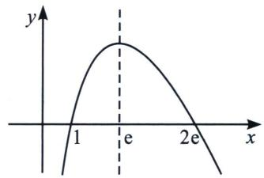

法一： $f(t_{1})=f(t_{2})=m(m\in(0,e))$ ，易知 $1<t_{1}<e<t_{2}<2e$ 。只需 $t_{1}+t_{2}-2e-1<0$ ，

相比于上一题，本题有一个区别就是 $f(t) = (2\mathrm{e} - t)\ln t$ ，主体不是 $t$ ，而是 $2\mathrm{e} - t$ ，要证 $t_1 + t_2 - 2\mathrm{e} - 1 < 0$ ，故需构造 $2\mathrm{e} - t_1 + 2\mathrm{e} - t_2 > 2\mathrm{e} - 1$ ， $(2\mathrm{e} - t_1 - 2\mathrm{e} + t_2)(2\mathrm{e} - t_1 + 2\mathrm{e} - t_2 - 2\mathrm{e} + 1) > 0$ ， $(2\mathrm{e} - t_2)^2 -$ $(2\mathrm{e} - 1)(2\mathrm{e} - t_2) < (2\mathrm{e} - t_1)^2 - (2\mathrm{e} - 1)(2\mathrm{e} - t_1)$ , $\frac{2\mathrm{e} - t_1}{2\mathrm{e} - t_2} < \frac{2\mathrm{e} - t_2 - 2\mathrm{e} + 1}{2\mathrm{e} - t_1 - 2\mathrm{e} + 1} = \frac{t_2 - 1}{t_1 - 1}$ , 由于 $\frac{2\mathrm{e} - t_1}{2\mathrm{e} - t_2} = \frac{\ln t_2}{\ln t_1}$ ,
故我们只需证明 $\frac{t_2 - 1}{\ln t_2} >\frac{t_1 - 1}{\ln t_1}$ ，构造 $h(t) = \frac{t - 1}{\ln t} (t > 1)$ 易证 $h(t)$ 单调递增，故 $h(t_{2}) > h(t_{1})$ 命题得证.

法二： $g(x)=(2e-x)\ln x-a(x-1)(x-2e)$ ， $y=a(x-1)(x-2e)$ 过(e，e)， $a=\frac{1}{1-e}$
$g (x) = (2 \mathrm{e} - x) \ln x - \frac {1}{1 - \mathrm{e}} (x - 1) (x - 2 \mathrm{e}) = (x - 2 \mathrm{e}) \left[ - \ln x + \frac {1}{1 - \mathrm{e}} (1 - x) \right],$
令 $h(x) = -\ln x - \frac{x}{1 - \mathrm{e}} +\frac{1}{1 - \mathrm{e}}, h'(x) = -\frac{1}{x} -\frac{1}{1 - \mathrm{e}} = 0,x = \mathrm{e} - 1,$
$x\in(1,\mathrm{e}-1)$ ， $h(x)$ 递增， $x\in(\mathrm{e}-1,2\mathrm{e})$ ， $h(x)$ 递减， $h(\mathrm{e})=0$ ， $x\in(1,\mathrm{e})$ ， $h(x)>0$ ， $g(x)>0$
$h (\mathrm{e}) = 0, x \in (\mathrm{e}, \mathrm{e} + 1), h (x) <   0, g (x) <   0, g \left(x _ {1}\right) > 0, g \left(x _ {2}\right) <   0, \frac {1}{1 - \mathrm{e}} \left(x _ {1} - 1\right) \left(x _ {1} - 2 \mathrm{e}\right) <   (2 \mathrm{e}$
$-x_{1})\ln x_{1}=(2e-x_{2})\ln x_{2}<\frac{1}{1-e}(x_{2}-1)(x_{2}-2e)$ ，所以 $(x_{1}-1)(x_{1}-2e)>(x_{2}-1)(x_{2}-2e)\Rightarrow x_{1}+x_{2}<2e+1.$

### 四、单调性调整与阿达玛积分不等式

1. 和型 $x_{1} + x_{2} > 2x_{0}$ 构造 $F(x) = x^{2} - 2x_{0}x + \lambda f(x)$

极值点偏移构造 $x_{2}^{2} - 2x_{0}x_{2} > x_{1}^{2} - 2x_{0}x_{1}$ 单调调整函数 $F(x) = x^{2} - 2x_{0}x + \lambda f(x)$
若要证明 $x_{2}^{2} - 2x_{0}x_{2} > x_{1}^{2} - 2x_{0}x_{1}$ ，则需要在 $f(x) = 0$ 为前提的条件下，构造含有 $x^{2} - 2x_{0}x$ 的单调增函数，不妨令 $F(x) = x^{2} - 2x_{0}x + \lambda f(x)$ ，通过 $\left\{ \begin{array}{l} F'(x_0) = 0 \\ F''(x_0) = 0 \end{array} \right.$ 来锁定系数 $\lambda$ ，从而证明 $F'(x) \geqslant 0$ 恒成立，也可以构造 $F(x) = x^{2} - 2x_{0}x + \lambda \mathrm{e}^{f(x)}$ 或者 $F(x) = x^{2} - 2x_{0}x + \lambda \ln [f(x) + 1]$ 等一系列待证调整式.

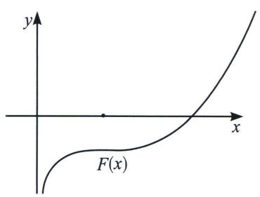

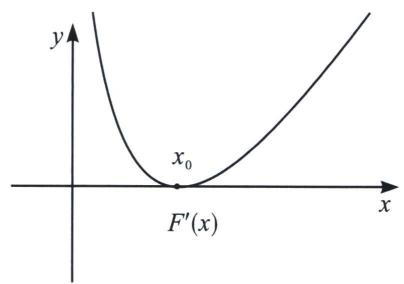

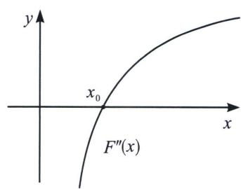

积型 $x_{1}x_{2} < m$ 构造 $F(x) = x + \frac{m}{x} +\lambda f(x)$ 单调减函数
$x_{1}x_{2}<m\Leftrightarrow x_{1}+\frac{m}{x_{1}}>x_{2}+\frac{m}{x_{2}}$ ，这也是前面我们介绍对勾拟合的时候介绍到的，我们需要构造处于同一极值点的函数 $f(x)$ ，即此函数满足条件 $f'(\sqrt{m})=0$ ，此时我们构造 $F(x)=x+\frac{m}{x}+\lambda f(x)$ ，利用导函数极点效应构造单调递减函数 $F(x)=x+\frac{m}{x}+\lambda f(x)$ ，锁定 $\lambda$ .

#### 2. 阿达玛积分不等式
如果一个函数 $y=f(x)$ 是凸函数，即： $f''(x)<0$ ，则在区间 $(a,b)$ 上，不等式
$f \left(\frac {a + b}{2}\right) \geqslant \frac {1}{b - a} \int_ {a} ^ {b} f (x) d x = \frac {f (b) - f (a)}{b - a} \geqslant \frac {f (a) + f (b)}{2};$
如果一个函数 $y=f(x)$ 是凹函数，即： $f''(x)>0$ ，则在区间 $(a,b)$ 上，不等式
$f \left(\frac {a + b}{2}\right) \leqslant \frac {1}{b - a} \int_ {a} ^ {b} f (x) d x = \frac {f (b) - f (a)}{b - a} \leqslant \frac {f (a) + f (b)}{2};$

注意: 证明极值点偏移时需要把导函数当做原函数, 求三阶导判断导函数凹凸性, 阿达玛积分不等式一般应用在待证式不含参的标准偏移中.

单调性调整的思想本质为拟合思想，以下题为例。

①代征式不含参，直接调整

> [!example]- 例1 (2024·安徽六安一中月考)已知函数 $f(x)=\frac{x^{2}-ax}{e^{x}}$ ， $a\in R$ .  
（2） 当 $a = 1, x_{1}, x_{2}$ 是 $f(x) = \frac{\ln x + 1}{\mathrm{e}^{x}}$ 的两个根，求证： $x_{1} + x_{2} > 2$

本题我们在写对均的时候写了单调性调整，那么到底是怎么来的呢？为什么能通过极值点二阶导为0锁定参数，理解了下图，单调性调整就融会贯通了。
解析 因为 $a = 1, x_{1}, x_{2}$ 是 $f(x) = \frac{\ln x + 1}{\mathrm{e}^{x}}$ 的解，即 $x_{1}, x_{2}$ 是方程 $x^{2} - x - \ln x - 1 = 0$ 的两根，设 $x_{1} < x_{2}$ ，要证 $x_{1} + x_{2} > 2$ ，即 $x_{2}^{2} - 2x_{2} > x_{1}^{2} - 2x_{1}$ ，令 $g(x) = x^{2} - 2x + \lambda (x^{2} - x - \ln x), g'(x) = 2x - 2 + \lambda (2x - 1 - \frac{1}{x}), g'（1） = 0, g''(x) = 2 + \lambda (2 + \frac{1}{x^2}), g''（1） = 0$ ，所以 $\lambda = -\frac{2}{3}$ 所以 $g(x) = x^{2} - 2x - \frac{2}{3}(x^{2} - x - \ln x), g'(x) = 2x - 2 - \frac{2}{3}(2x - 1 - \frac{1}{x}) = \frac{2}{3}(x + \frac{1}{x}) - \frac{4}{3} \geqslant 0$ 所以 $g(x)$ 单调递增，所以 $g(x_{2}) > g(x_{1})$ ，即 $x_{2}^{2} - 2x_{2} - \frac{2}{3}(x_{2}^{2} - x_{2} - \ln x_{2}) > x_{1}^{2} - 2x_{1} - \frac{2}{3}(x_{1}^{2} - x_{1} - \ln x_{1})$ ，所以 $x_{2}^{2} - 2x_{2} > x_{1}^{2} - 2x_{1}$ ，即 $x_{1} + x_{2} > 2$ 得证！
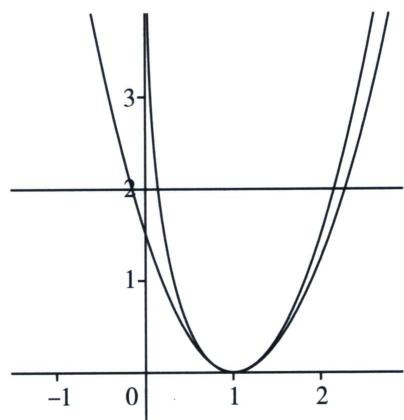

我们的本意是得到 $x_{1} + x_{2} > x_{1}' + x_{2}' = 2$ ，故需要拟合一个比原函数(绿色)先小后大的共极值点二次函数(红色)，但是倍数该如何调整呢？我们发现做差之后， $h(x) = m(x) - \lambda (x^{2} - 2x + 1)$ 是越来越小的，即 $h(x)$ 单调递减，由共极值点可知 $h'（1） = 0$ ，故1不为函数极值点，而是拐点的横坐标，即 $h''（1） = 0$ 从而锁定参数.

法二：令 $h(x)=x^{2}-x-\ln x-1,\quad h'(x)=2x-1-\frac{1}{x}h''(x)=2+\frac{1}{x^{2}},\quad h'''(x)=-\frac{2}{x^{3}}<0$
所以 $h'(x)$ 为凸函数，由阿达玛积分不等式： $h'\left(\frac{x_1 + x_2}{2}\right) \geqslant \frac{1}{x_2 - x_1} \int_{x_1}^{x_2} h'(x) dx = \frac{h(x_2) - h(x_1)}{x_2 - x_1} = 0 =$
$h'（1）$ ，所以 $\frac{x_{1}+x_{2}}{2}>1$ ，所以 $x_{1}+x_{2}>2$ 得证！

法三： $x^{2}-x-\ln x=x^{2}-2x+x-\ln x$ ，拟合先小后大在1处取等，即 $\ln x$ 的先大后小，尝试：
$x _ {1} ^ {2} - x _ {1} - \frac {2 (x _ {1} - 1)}{x _ {1} + 1} <   x _ {1} ^ {2} - x _ {1} - \ln x _ {1} = x _ {2} ^ {2} - x _ {2} - \ln x _ {2} <   x _ {2} ^ {2} - x _ {2} - \frac {2 (x _ {2} - 1)}{x _ {2} + 1},$

结构比较丑，考虑泰勒展开： $\left\{\begin{aligned}\ln(x+1)&<x-\frac{1}{2}x^{2},\quad x<0\\ \ln(x+1)&>x-\frac{1}{2}x^{2},\quad x>0\end{aligned}\right.\Rightarrow\left\{\begin{aligned}\ln x&<x-1-\frac{1}{2}(x-1)^{2},\quad x<0\\ \ln x&>x-1-\frac{1}{2}(x-1)^{2},\quad x>0\end{aligned}\right.$
$x _ {1} ^ {2} - x _ {1} - \left[ x _ {1} - 1 - \frac {1}{2} (x _ {1} - 1) ^ {2} \right] <   x _ {1} ^ {2} - x _ {1} - \ln x _ {1} = x _ {2} ^ {2} - x _ {2} - \ln x _ {2} <   x _ {2} ^ {2} - x _ {2} - \left[ x _ {2} - 1 - \frac {1}{2} (x _ {2} - 1) ^ {2} \right],$
即 $\frac{3}{2} (x_1^2 - 2x_1) < \frac{3}{2} (x_2^2 - 2x_2) \Rightarrow x_1 + x_2 > 2$ 得证！

> [!example]- 例2 (24-25高三下·河南驻马店·开学考试)已知函数 $f(x)=x\ln x-ax+1$ .  
（1） 若函数 $g(x)=xf(x)$ 单调递增，求实数 a 的取值范围；  
（2）若函数 $f(x)$ 有两个零点 $x_{1}$ ， $x_{2}$ .

①求实数 a 的取值范围；
②证明： $x_{1}+x_{2}>2x_{1}x_{2}$
解析 （1） 由 $g(x) = x^{2} \ln x - ax^{2} + x$ ，有 $g'(x) = 2x \ln x + x - 2ax + 1$
若函数 $g(x)$ 单调递增，必有 $2x\ln x + x - 2ax + 1 \geqslant 0$ 恒成立，不等式可化为 $2a \leqslant 2\ln x + \frac{1}{x} + 1$ ，
令 $h(x)=2\ln x+\frac{1}{x}+1$ ，有 $h'(x)=\frac{2}{x}-\frac{1}{x^{2}}=\frac{2x-1}{x^{2}}$ ，可得函数 $h(x)$ 的减区间为 $\left(0,\frac{1}{2}\right)$ ，增区间为 $\left(\frac{1}{2},+\infty\right)$ ，可得 $h(x)_{\min}=h\left(\frac{1}{2}\right)=3-2\ln2$ ，有 $2a\leqslant3-2\ln2$ ，可得 $a\leqslant\frac{3}{2}-\ln2$ ，
故实数 a 的取值范围为 $\left(-\infty, \frac{3}{2}-\ln2\right]$ ;  
（2）(i)由 $f'(x)=\ln x+1-a$ 令 $f'(x)>0$ ，可得 $x>\mathrm{e}^{a-1}$ ，可得函数 $f(x)$ 的减区间为 $(0,\mathrm{e}^{a-1})$ ，

增区间为 $\left(\mathrm{e}^{a-1},+\infty\right)$ ，可得 $f(x)_{\min}=f\left(\mathrm{e}^{a-1}\right)=\mathrm{e}^{a-1}\ln\mathrm{e}^{a-1}-a\mathrm{e}^{a-1}+1=1-\mathrm{e}^{a-1}$
若函数 $f(x)$ 有两个零点 $x_{1}$ ， $x_{2}$ ，必有 $f(x)_{\min}=1-\mathrm{e}^{a-1}<0$ ，可得 a>1，又由 $f(\mathrm{e}^{a})=\mathrm{e}^{a}\ln\mathrm{e}^{a}-a\mathrm{e}^{a}+1=1>0$ ，
$f(e^{-a})=e^{-a}\ln e^{-a}-ae^{-a}+1=1-2ae^{-a}=\frac{e^{a}-2a}{e^{a}}>\frac{ea-2a}{e^{a}}=\frac{(e-2)a}{e^{a}}>0$ （利用不等式 $e^{x}\geqslant ex$ （当且仅当x=1时取等号）），
又由 $e^{-a}<e^{a-1}<e^{a}$ ，故若函数 $f(x)$ 有两个零点 $x_{1}$ ， $x_{2}$ ，则实数 a 的取值范围为 $(1,+\infty)$ ;

(ii) 法一：(对均)由函数 $f(x)$ 有两个零点 $x_{1}$ ， $x_{2}$ ，有 $\left\{\begin{aligned}x_{1}\ln x_{1}-ax_{1}+1=0\\ x_{2}\ln x_{2}-ax_{2}+1=0\end{aligned}\right.$

有 $\left\{\begin{aligned}\ln x_{1}+\frac{1}{x_{1}}&=a,\\\ln x_{2}+\frac{1}{x_{2}}&=a,\end{aligned}\right.\Rightarrow\frac{\frac{1}{x_{2}}-\frac{1}{x_{1}}}{\ln\frac{1}{x_{2}}-\ln\frac{1}{x_{2}}}=1<\frac{\frac{1}{x_{2}}+\frac{1}{x_{1}}}{2}\Rightarrow x_{1}+x_{2}>2x_{1}x_{2}$ 得证！

法二：(单调性调整)令 $\frac{1}{x}=t$ ，则 $a=t-\ln t,\quad g(t)=t^{2}-2t+\lambda(t-\ln t),\quad g'(t)=2t-2+\lambda\left(1-\frac{1}{t}\right)$ ， $g''(t)=2+\frac{\lambda}{t^{2}},\quad g''（1）=2+\lambda=0\Rightarrow\lambda=-2$ ，此时 $g'(t)=2t-4+\frac{2}{t}\geqslant0$ 恒成立， $g(t)$ 单调递增，
故 $g(t_{2})>g(t_{1})\Leftrightarrow t_{2}^{2}-2t_{2}>t_{1}^{2}-2t_{1}\Rightarrow t_{1}+t_{2}>2$ ，故 $x_{1}+x_{2}>2x_{1}x_{2}$ 得证！

> [!example]- 例3 (24-25高三上·广东·期末)已知函数 $f(x)=\ln x-a\left(x-\frac{1}{x}\right)$ ， $g(x)=\frac{2\ln x}{x+1}-x-m.$  
（1）若函数 $f(x)$ 在其定义域上单调递减，求实数a的最小值.  
（2）若函数 $g(x)$ 存在两个零点 $x_{1}$ ， $x_{2}$ ，设 $x_{1}<x_{2}$

(j)求实数m的取值范围；
(ii)证明： $2<x_{1}+x_{2}<1-m.$
解析 （1） 函数 $f(x) = \ln x - a\left(x - \frac{1}{x}\right)$ 的定义域为 $(0, +\infty)$ ，由 $f(x)$ 在 $(0, +\infty)$ 上单调递减，得 $\forall x \in (0, +\infty)$ ， $f'(x) = \frac{1}{x} - a\left(1 + \frac{1}{x^2}\right) \leqslant 0$ 恒成立，即 $a \geqslant \frac{x}{x^2 + 1}$ 恒成立，

而当 x>0 时， $\frac{x}{x^{2}+1}\leqslant\frac{x}{2x}=\frac{1}{2}$ ，当且仅当 x=1 时取等号，因此 $a\geqslant\frac{1}{2}$ ，所以 a 的最小值为 $\frac{1}{2}$ .  
（2）(i)函数 $g(x) = \frac{2\ln x}{x + 1} -x - m$ 的定义域为 $(0, + \infty)$ ， $g'(x) = \frac{1 + \frac{2}{x} - 2x - x^{2} - 2\ln x}{(x + 1)^{2}}$
令 $h(x)=1+\frac{2}{x}-2x-x^{2}-2\ln x$ ，求导得 $h'(x)=-\frac{2(1+x+x^{2}+x^{3})}{x^{2}}<0$ ，函数 $h(x)$ 在 $(0,+\infty)$ 上单调递减，而 $h(1)=0$ ，则当 0<x<1 时， $h(x)>0$ ，即 $g'(x)>0$ ；当 x>1 时， $h(x)<0$ ，即 $g'(x)<0$ ，
因此函数 $g(x)$ 在 $(0,1)$ 上单调递增，在 $(1,+\infty)$ 上单调递减， $g(x)_{\max}=g(1)=-1-m$ ，而当 $x\to0^{+}$ 时， $g(x)\to-\infty$ ，当 $x\to+\infty$ 时， $g(x)\to-\infty$ ，函数 $g(x)$ 存在两个零点，
故-1-m>0，解得m<-1，所以实数m的取值范围是m<-1.

(ii) 法一：由（1）知当 $x \in (0, 1)$ 时， $\ln x > \frac{1}{2}\left(x - \frac{1}{x}\right)$ ，当 $x \in (1, +\infty)$ 时， $\ln x < \frac{1}{2}\left(x - \frac{1}{x}\right)$ ，
由(i)知 $0 < x_{1} < 1 < x_{2}$ ，则 $\ln x_{1} > \frac{1}{2}\left(x_{1} - \frac{1}{x_{1}}\right)$ ， $\ln x_{2} < \frac{1}{2}\left(x_{2} - \frac{1}{x_{2}}\right)$ ，
由 $g(x_{1})=g(x_{2})=0$ ，得 $\ln x_{1}=\frac{(x_{1}+m)(x_{1}+1)}{2}>\frac{1}{2}\left(x_{1}-\frac{1}{x_{1}}\right)$ ,
$\ln x_{2} = \frac{(x_{2} + m)(x_{2} + 1)}{2} <  \frac{1}{2}\left(x_{2} - \frac{1}{x_{2}}\right)$ 整理得 $x_{1}^{2} + mx_{1} > x_{1} - 1$ ， $x_{2}^{2} + mx_{2} <   x_{2} - 1$

两式相减得 $(x_{2}-x_{1})(x_{1}+x_{2}+m)<x_{2}-x_{1}$ ，因此 $x_{1}+x_{2}<1-m$ ;

记 $\frac{x_{2}}{x_{1}}=t,\quad t>1$ ，令 $\varphi(t)=\ln t-\frac{2(t-1)}{t+1}$ ，求导得 $\varphi'(t)=\frac{(t-1)^{2}}{t(t+1)}>0$ ，

函数 $\varphi(t)$ 在 $(1, +\infty)$ 上单调递增， $\varphi(t) > \varphi(1) = 0$ ，即 $\ln \frac{x_{2}}{x_{1}} - \frac{2\left(\frac{x_{2}}{x_{1}} - 1\right)}{\frac{x_{2}}{x_{1}} + 1} > 0$ ，
整理得 $\frac{2(\ln x_2 - \ln x_1)}{x_2 - x_1} >\frac{4}{x_1 + x_2}$ 而 $\ln x_{2} - \ln x_{1} = \frac{(x_{2} + m)(x_{2} + 1)}{2} -\frac{(x_{1} + m)(x_{1} + 1)}{2} =$
$\frac {(x _ {2} - x _ {1}) (x _ {2} + x _ {1} + m + 1)}{2}, \text {即} \frac {2 (\ln x _ {2} - \ln x _ {1})}{x _ {2} - x _ {1}} = x _ {1} + x _ {2} + m + 1 <   1 - m + m + 1 = 2,$
因此 $\frac{4}{x_{1}+x_{2}}<2$ ，即 $x_{1}+x_{2}>2$ ，所以 $2<x_{1}+x_{2}<1-m$ 。

右侧法二：单调性调整： $\frac{2\ln x_{1}}{x_{1}+1}-x_{1}=m,\quad\frac{2\ln x_{2}}{x_{2}+1}-x_{2}=m$ ，即证 $x_{1}^{2}+(m-1)x_{1}>x_{2}^{2}+(m-1)x_{2}\Leftrightarrow h(x)=\frac{2x\ln x}{x+1}-x$ 单调递减（消参）， $h'(x)=\frac{2(1+\ln x)(x+1)-x\ln x}{(x+1)^{2}}-1=\frac{1+\ln x^{2}-x^{2}}{(x+1)^{2}}<0$ ，（放缩自证），故 $h(x)=\frac{2x\ln x}{x+1}-x$ 递减， $x_{1}^{2}+(m-1)x_{1}>x_{2}^{2}+(m-1)x_{2}\Rightarrow x_{1}+x_{2}<1-m$ 得证！

左侧法二： $x_{1}^{2}-2x_{1}<x_{2}^{2}-2x_{2}$ ， $g(x)=x^{2}-2x+\lambda\left(\frac{2\ln x}{x+1}-x\right)$ ， $g''（1）=0\Rightarrow\lambda=\frac{8}{7}$ ，（后续自行说明单调性）.

本题右侧属于含参型，后面重点解读.

> [!example]- 例4 (2024·湖南郴州·模拟预测)已知函数 $f(x)=2a\ln x+\frac{1}{2}x^{2}-(a+2)x$ ，其中a为常数.  
（1） 当 a > 0 时，试讨论 $f(x)$ 的单调性；  
（2）若函数 $f(x)$ 有两个不相等的零点 $x_{1}$ ， $x_{2}$ ，

(i) 求 a 的取值范围；
(ii) 证明： $x_{1} + x_{2} > 4$ .
解析 （1）由题设 $f'(x) = \frac{2a}{x} + x - (a + 2) = \frac{x^2 - (a + 2)x + 2a}{x} = \frac{(x - 2)(x - a)}{x}$ ，且 $x \in (0, +\infty)$ ，当 $0 < a < 2$ 时，在 $(0, a)$ 上 $f'(x) > 0$ ，在 $(a, 2)$ 上 $f'(x) < 0$ ，在 $(2, +\infty)$ 上 $f'(x) > 0$ ，所以在 $(0, a)$ 、 $(2, +\infty)$ 上 $f(x)$ 单调递增，在 $(a, 2)$ 上 $f(x)$ 单调递减；
当 a=2 时，在 $(0, +\infty)$ 上 $f'(x) \geqslant 0$ 恒成立，故 $f(x)$ 在 $(0, +\infty)$ 上单调递增；
当 a>2 时，在 $(0,2)$ 上 $f'(x)>0$ ，在 $(2,a)$ 上 $f'(x)<0$ ，在 $(a,+\infty)$ 上 $f'(x)>0$ ，所以在 $(0,2)$ 、 $(a,+\infty)$ 上 $f(x)$ 单调递增，在 $(2,a)$ 上 $f(x)$ 单调递减。  
（2）(i)由 $f(2)=2a\ln2+\frac{1}{2}\times2^{2}-(a+2)\times2=2(a\ln2-a-1)<0,$
若 a>0 时， $f(a)=2a\ln a+\frac{1}{2}a^{2}-(a+2)a=\frac{a}{2}(4\ln a-a-4)$ ,
令 $y=4\ln a-a-4$ 且 a>0，则 $y'=\frac{4}{a}-1=\frac{4-a}{a}$ ，所以 0<a<4 时 $y'>0$ ，a>4 时 $y'<0$ ，
故 $y=4\ln a-a-4$ 在 $(0,4)$ 上递增，在 $(4,+\infty)$ 上递减，则 $y_{\max}=8\ln2-8<0$ ，所以 $f(a)<0$ ，结合（1）中 $f(x)$ 的单调性，易知 a>0 不可能出现两个不相等的零点，
又 a=0 时， $f(x)=\frac{1}{2}x^{2}-2x$ 在 $(0,+\infty)$ 上只有一个零点，不满足，所以 a<0，此时，在 $(0,2)$ 上 $f'(x)<0$ ，在 $(2,+\infty)$ 上 $f'(x)>0$ ，
故在(0, 2)上 $f(x)$ 单调递减，在(2, +∞)上 $f(x)$ 单调递增，则 $f(x)_{\min}=f(2)=2(a\ln2-a-1)$ ，又x趋向于0或负无穷时， $f(x)$ 趋向正无穷，只需 $g(a)=a(\ln2-1)-1<0$ 成立，
显然 $g(a)$ 在 $(-∞, 0)$ 上递减，且当 $a=\frac{1}{\ln2-1}$ 时 $g(a)=0$ ，所以， $\frac{1}{\ln2-1}<a<0$ 时 $g(a)<0$ 恒成

立，即所求范围为 $\frac{1}{\ln2-1}<a<0;$

(ii) 由 (i)，在 $\frac{1}{\ln 2 - 1} < a < 0$ 时， $f(x)$ 存在两个不相等的零点 $x_{1}, x_{2}$ ，
不妨令 $0 < x_{1} < 2 < x_{2}$ ，要证 $x_{1} + x_{2} > 4$ ，即证 $x_{2} > 4 - x_{1}$ ，而 $4 - x_{1} \in (2, 4)$ ，

法一：由(i)知：在 $(2,+\infty)$ 上 $f(x)$ 单调递增，只需证 $f(4-x_{1})<f(x_{2})=f(x_{1})=0$ ，
由 $2a\ln x_{1} + \frac{1}{2} x_{1}^{2} - (a + 2)x_{1} = 0$ ，则 $x_{1}^{2} - 4x_{1} = 2a(x_{1} - 2\ln x_{1})$
令 $h(x)=f(4-x)-f(x)$ ，且 0<x<2，
则 $h(x)=2a\ln(4-x)+\frac{1}{2}(4-x)^{2}-(a+2)(4-x)-2a\ln x-\frac{1}{2}x^{2}+(a+2)x=2a\ln(4-x)-2a\ln x-4a+2ax,\quad x\in(0,2)$ 上 $h'(x)=-2a\cdot\frac{(x-2)^{2}}{x(4-x)}>0$ ，即 $h(x)$ 在 $(0,2)$ 上递增，所以 $h(x)<h(2)=2a\ln2-2a\ln2-4a+4a=0$ ，即 $f(4-x_{1})<f(x_{1})=f(x_{2})$ 成立，所以 $x_{1}+x_{2}>4$ ，得证.

法二：单调性调整：令 $F(x)=x^{2}-4x+\lambda(2a\ln x-ax)$ ， $\left(\frac{x^{2}}{2}-2x\right.$ 不偏移，不需要考虑），
$F'(x)=2x-4+\lambda\left(\frac{2a}{x}-a\right)$ ， $F''(x)=2-\lambda\frac{2a}{x^{2}}$ ， $F''（2）=0\Rightarrow\lambda=\frac{4}{a}$ ，此时 $F'(x)=2x+\frac{8}{x}-8\geqslant0$ ， $F(x)=x^{2}-4x+\lambda(2a\ln x-ax)$ 单调递增，即 $F(x_{1})<F(x_{2})$ ，
$\left(1 - \frac {\lambda}{2}\right) \left(x _ {1} ^ {2} - 4 x _ {1}\right) + \lambda \left(x _ {1} ^ {2} - 2 x _ {1} + 2 a \ln x _ {1} - a x _ {1}\right) <   \left(1 - \frac {\lambda}{2}\right) \left(x _ {2} ^ {2} - 4 x _ {2}\right) + \lambda \left(\frac {1}{2} x _ {2} ^ {2} - 2 x _ {2} + 2 a \ln x _ {2} - a x\right),$
故 $\left(1-\frac{\lambda}{2}\right)(x_{1}^{2}-4x_{1})<\left(1-\frac{\lambda}{2}\right)(x_{2}^{2}-4x_{2})\Rightarrow x_{1}+x_{2}>4$ 得证!

本题的拟合方法在后续拟合篇给出.

②代证式含参，消参调整

对于此类题，如果精度一般，将参数消除就足够了，如精度较高，消参的过程相当于应用了一次精度调整，可能需要调到二次精度或者指数精度，当然高精度不是我们高考的考试内容.

> [!example]- 例 5 (2025·山西临汾·二模)已知函数 $f(x)=\ln(1+ax)-x$ ，其中 a>0.
当 a>1 时，设 $f(x)$ 的两个零点为 $x_{1}$ ， $x_{2}$ ，求证： $x_{1}+x_{2}>2-\frac{2}{a}$ .
解析 $x_{1} + x_{2} > 2 - \frac{2}{a}\Rightarrow x_{2}^{2} - \left(2 - \frac{2}{a}\right)x_{2} > x_{1}^{2} - \left(2 - \frac{2}{a}\right)x_{1},\ln (1 + ax) - x = 0\Leftrightarrow a = \frac{\mathrm{e}^{x} - 1}{x},$ 故 $x_{1} = 0$ ， $x_{2} > 0$ （自证）代入得：令 $g(x) = x^2 -\left(2 - \frac{2}{a}\right)x = x^2 -\left(2 - \frac{2x}{\mathrm{e}^x - 1}\right)x,$ $g'(x) = 2(x - 1)+$ $\frac{4x(\mathrm{e}^x - 1) - 2x^2\mathrm{e}^x}{(\mathrm{e}^x - 1)^2} = \frac{2(x - 1)\mathrm{e}^{2x} + 4\mathrm{e}^x - 2x - 2}{(\mathrm{e}^x - 1)^2} >0,$ （ $x > 0$ ， $h(x) = 2(x - 1)\mathrm{e}^{2x} + 4\mathrm{e}^x -2x - x\uparrow ,$ $h(x) > h(0) = 0)$ ，故 $x_{2}^{2} - \left(2 - \frac{2}{a}\right)x_{2} > x_{1}^{2} - \left(2 - \frac{2}{a}\right)x_{1},$ $x_{1} + x_{2} > 2 - \frac{2}{a}$ 得证！

> [!example]- 例6 (2023·MST虎哥)已知函数 $f(x) = \mathrm{e}^{2\sqrt{x}} - a^2 x (x > 0, a > 0)$ .
若函数 $f(x)$ 有两个零点 $x_{1}$ ， $x_{2}$ 证明： $4-4\ln a<\ln x_{1}+\ln x_{2}<1-\ln a$
解析 因为 $f(x) = \mathrm{e}^{2\sqrt{x}} - a^2 x$ ，有两个零点 $x_1, x_2$ ， $\begin{cases} \mathrm{e}^{2\sqrt{x_1}} - a^2 x_1 = 0 \\ \mathrm{e}^{2\sqrt{x_2}} - a^2 x_2 = 0 \end{cases} \Rightarrow \begin{cases} 2\sqrt{x_1} = 2\ln a + 2\ln \sqrt{x_1} \\ 2\sqrt{x_2} = 2\ln a + 2\ln \sqrt{x_2} \end{cases}$ ，令 $\sqrt{x}=t$ ，则 $\left\{\begin{aligned}t_{1}&=\ln a+\ln t_{1}\\ t_{2}&=\ln a+\ln t_{2}\end{aligned}\right.$ ，即证明 $2-2\ln a<\ln t_{1}+\ln t_{2}=t_{1}+t_{2}-2\ln a<\frac{1-\ln a}{2}$ ，即证 $2<t_{1}+t_{2}<\frac{1+3\ln a}{2}$ ，令 $g(t)=t-\ln t$ ， $g'(t)=1-\frac{1}{t}$ ， $g''(t)=\frac{1}{t^{2}}$ ， $g'''(t)=-\frac{2}{t^{3}}$ ，所以 $g'(t)=1-\frac{1}{t}$ 为凸函数，且 $g'(t)\uparrow$ ，先证 $t_{1}+t_{2}>2$ ，设 $t_{1}<t_{2}$ ，由阿达玛积分不等式 $g'\left(\frac{t_{1}+t_{2}}{2}\right)\geqslant\frac{1}{t_{2}-t_{1}}\int_{t_{1}}^{t_{2}}g'(t)dt=\frac{g(t_{2})-g(t_{1})}{t_{2}-t_{1}}=0=g'（1）$ ，所以 $\frac{t_{1}+t_{2}}{2}>1$ ， $t_{1}+t_{2}>2$ 得证，即 $4-4\ln a<\ln x_{1}+\ln x_{2}$ ；
右边： $(t_{2}+t_{1})(t_{2}-t_{1})<\frac{1+3\ln a}{2}(t_{2}-t_{1}),\quad t=\ln a+\ln t,\quad a=\frac{e^{t}}{t},\quad$ 即 $t_{2}^{2}-\frac{1+3\ln a}{2}t_{2}<t_{1}^{2}-\frac{1+3\ln a}{2}t_{1},$ 即 $t_{2}^{2}-\frac{1+3(t_{2}-\ln t_{2})}{2}t_{2}+\frac{\lambda}{\frac{e^{t_{2}}}{t_{2}}}<t_{1}^{2}-\frac{1+3(t_{1}-\ln t_{1})}{2}t_{1}+\frac{\lambda}{\frac{e^{t_{1}}}{t_{1}}}$ ，令 $g'(t)=-t+\frac{3(1+\ln t)}{2}-\frac{1}{2}+\frac{\lambda t}{e^{t}}$
$g ^ {'} (t) = - t + \frac {3 \ln t}{2} + 1 + \frac {\lambda (1 - t)}{\mathrm{e} ^ {t}}, g ^ {' '} (t) = - 1 + \frac {3}{2 t} + \frac {\lambda (- 2 + t)}{\mathrm{e} ^ {t}}, g ^ {' '} （1） = \frac {1}{2} - \frac {\lambda}{\mathrm{e}} = 0,$
$\lambda = \frac {1}{2} \mathrm{e}, g ^ {'} (t) = - t + \frac {3 \ln t}{2} + 1 + \frac {\mathrm{e} (1 - t)}{2 \mathrm{e} ^ {t}}, g ^ {' '} (t) = - 1 + \frac {3}{2 t} + \frac {\mathrm{e} (- 2 + t)}{2 \mathrm{e} ^ {t}} = \frac {\mathrm{e} (- 2 + t) t + 3 \mathrm{e} ^ {t} - 2 t \mathrm{e} ^ {t}}{2 t \mathrm{e} ^ {t}},$
令 $F(t) = -2e t + e t^{2} + 3e^{t} - 2te^{t}$ ， $F'(t) = -2e + 2e t + e^{t} - 2te^{t}$ ， $F''(t) = 2e - e^{t} - 2te^{t}$ 单调递减， $F''（0） = 2e - 1 > 0$ ， $F''（1） = -e < 0$ ， $\exists t_{0} \in (0, 1)$ 使得 $F''(t_{0}) = 2e - e^{t_{0}} - 2t_{0}e^{t_{0}} = 0$ ，所以 $F'(t)_{\max} = F'(t_{0}) = -2e + 2e t_{0} + 2e^{t_{0}} - 2e < 0$ ， $F(t)$ 单调递减， $t \in (0, 1)$ ， $F(t) > 0$ ， $g''(t) > 0$ ， $g'(t)$ 单调递增， $t \in (1, +\infty)$ ， $F(t) < 0$ ， $g''(t) < 0$ ， $g'(t)$ 单调递减， $g'(t)_{\max} = g'$ （1） $= -1 + \frac{3\ln1}{2} + 1 + \frac{e(1-1)}{2e^{1}} = 0$ ， $g'(t) \leqslant 0$ ， $g(t)$ 单调递减，所以 $g(t_{1}) > g(t_{2})$ ，即 $t_{2}^{2} - \frac{1 + 3\ln a}{2} t_{2} < t_{1}^{2} - \frac{1 + 3\ln a}{2} t_{1} \Rightarrow t_{1} + t_{2} < \frac{1 + 3\ln a}{2}$ ，即 $4 - 4\ln a < \ln x_{1} + \ln x_{2} < 1 - \ln a$ 得证！

> [!example]- 例7 (2024·湖南金太阳月考)已知函数 $f(x)=\mathrm{e}^{\frac{1}{x}-a}+\ln x-a$ 有两个零点 $x_{1}, x_{2}$ .  
（1）求 a 的取值范围;  
（2）证明： $x_{1}+x_{2}>2a.$
解析 解：（1）不妨令 $f(x)=0$ ，可得 $e^{\frac{1}{x}-a}+\ln x-a=0$ ，即 $e^{\frac{1}{x}-a}+\left(\frac{1}{x}-a\right)=e^{\ln\frac{1}{x}}+\ln\frac{1}{x}$
不妨设 $g(x)=\mathrm{e}^{x}+x$ ，此时 $g\left(\frac{1}{x}-a\right)=g\left(\ln\frac{1}{x}\right)$ ，易知函数 $g(x)$ 在 R 上单调递增，所以 $\frac{1}{x}-a=\ln\frac{1}{x}$ ，即 $a=\ln x+\frac{1}{x}$ ，不妨设 $h(x)=\ln x+\frac{1}{x}$ ，函数定义域为 $(0,+\infty)$ ，可得 $h'(x)=\frac{x-1}{x^{2}}$ ，
当 0 < x < 1 时， $h'(x) < 0$ ， $h(x)$ 单调递减；当 x > 1 时， $h'(x) > 0$ ， $h(x)$ 单调递增，所以 $h(x)_{\min} = h(1) = 1$ ，当 $x \to 0$ 时， $\ln x + \frac{1}{x} = \frac{x \ln x + 1}{x} \to +\infty$ ；当 $x \to +\infty$ 时， $\ln x + \frac{1}{x} \to +\infty$ ，
因为方程 $a=\ln x+\frac{1}{x}$ 有两个不相等的正根，所以 a>1，则 a 的取值范围是 $(1, +\infty)$ ;  
（2）证明：(单调调整)令 $F(x)=x^{2}-2ax=x^{2}-2x\left(\ln x+\frac{1}{x}\right)$ ， $F'(x)=2(x-1-\ln x)>0$ ， $F(x)$ 单调递增，所以 $F(x_{2})=x_{2}^{2}-2ax_{2}<x^{2}-2ax_{1}$ ，所以 $x_{1}+x_{2}>2a$ 。得证！

本题的拟合方法在后续拟合篇给出.

> [!example]- 例8 (24-25高三下·江西·开学考试)已知函数 $f(x) = \frac{1}{2} ax^2 - x\ln x$ .  
（1） 若 $f(x) \geqslant 0$ 恒成立，求实数 a 的取值范围；  
（2） 若 $f(x)$ 有 $x_{1}$ ， $x_{2}(x_{1}<x_{2})$ 两个极值点

①求实数 a 的取值范围；
②证明： $x_{1}+x_{2}>\frac{2-\ln a}{a}.$
解析 （1） $f(x)=\frac{1}{2}ax^{2}-x\ln x\geqslant0$ 恒成立，则 $\frac{a}{2}\geqslant\left(\frac{\ln x}{x}\right)_{\max}$ ，令 $\varphi(x)=\frac{\ln x}{x}$ ，则 $\varphi'(x)=\frac{1-\ln x}{x^{2}}>0$ ，得0<x<e； $\varphi'(x)=\frac{1-\ln x}{x^{2}}<0$ ，得x>e。所以 $\varphi(x)$ 在(0，e)上单调递增，在(e，+∞)单调递减，故 $\varphi(x)_{\max}=\varphi(e)=\frac{1}{e}$ ，所以 $\frac{a}{2}\geqslant\frac{1}{e}$ ，即 $a\geqslant\frac{2}{e}$ 。  
（2）① $f(x)$ 有 $x_{1}$ ， $x_{2}(x_{1}<x_{2})$ 两个极值点，则 $f'(x)=ax-\ln x-1=0$ ，即 $a=\frac{1+\ln x}{x}$ 有两个不同根，令 $g(x)=\frac{1+\ln x}{x}$ ，则 $g'(x)=-\frac{\ln x}{x^{2}}$ ， $g'(x)=-\frac{\ln x}{x^{2}}>0$ ，则 $0<x<1$ ； $g'(x)=-\frac{\ln x}{x^{2}}<0$ ，则 $x>1$ ，所以 $g(x)=\frac{1+\ln x}{x}$ 在 $(0,1)$ 上单调递增，在 $(1,+\infty)$ 上单调递减。
$g(x)_{\max}=g(1)=1$ ，当 $x\to0^{+}$ 时， $g(x)\to-\infty$ ；当 $x\to+\infty$ 时， $g(x)\to0$ ，如图所以 $a\in(0,1)$ .

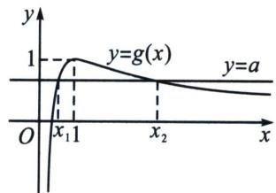

②由 $\left\{\begin{aligned}f'(x_{1})&=0\\ f'(x_{2})&=0\end{aligned}\right.\Rightarrow\left\{\begin{aligned}ax_{1}&=\ln x_{1}+1\\ ax_{2}&=\ln x_{2}+1\end{aligned}\right.\Rightarrow\frac{1}{a}=\frac{x_{1}-x_{2}}{\ln x_{1}-\ln x_{2}},\quad a(x_{1}+x_{2})=\ln(x_{1}x_{2})+2,$
要证 $x_{1}+x_{2}>\frac{2-\ln a}{a}$ ，即证 $a(x_{1}+x_{2})>2-\ln a$ ，即 $\ln(x_{1}x_{2})+2>2-\ln a$ ，即证 $x_{1}x_{2}>\frac{1}{a}$ ，

只需证 $x_{1}x_{2} > \frac{x_{1} - x_{2}}{\ln x_{1} - \ln x_{2}} (0 < x_{1} < 1 < x_{2})$ ，即证 $\ln x_{2} + \frac{1}{x_{2}} > \ln x_{1} + \frac{1}{x_{1}}$ ，由于 $a = \frac{1 + \ln x_{1}}{x_{1}} = \frac{1 + \ln x_{2}}{x_{2}}$ ，即证 $\frac{1 + \ln x_{2}}{x_{2}} + \ln x_{2} + \frac{1}{x_{2}} > \frac{1 + \ln x_{1}}{x_{1}} + \ln x_{1} + \frac{1}{x_{1}}$ ，令 $h(x) = \frac{2 + \ln x}{x} + \ln x, x > 0$ ，则 $h'(x) = \frac{x - 1 - \ln x}{x^{2}}$ ，令 $H(x) = x - 1 - \ln x, H'(x) = 1 - \frac{1}{x} = \frac{x - 1}{x}$ ，
当 $x \in (0, 1)$ 时， $H'(x) < 0$ ，当 $x \in (1, +\infty)$ 时， $H'(x) > 0$ ，则 $H(x) \geqslant H(1) = 0$ ，则 $h'(x) = \frac{x - 1 - \ln x}{x^2} \geqslant 0$ 在 $(0, +\infty)$ 上恒成立，所以 $h(x)$ 在 $(0, +\infty)$ 上单调递增，
因为 $0 < x_{1} < 1 < x_{2}$ ，所以 $h(x_{2}) > h(x_{1})$ ，即 $\frac{1 + \ln x_{2}}{x_{2}} + \ln x_{2} + \frac{1}{x_{2}} > \frac{1 + \ln x_{1}}{x_{1}} + \ln x_{1} + \frac{1}{x_{1}}$ 成立.

本题拟合方法在后续小节解读.

#### 3. 积型函数单调性调整

积型 $x_{1}x_{2} < m$ 构造 $F(x) = x + \frac{m}{x} +\lambda f(x)$ 单调减函数

① $x_{1}x_{2}<m\Leftrightarrow x_{1}+\frac{m}{x_{1}}>x_{2}+\frac{m}{x_{2}}$ ，我们需要构造处于同一极值点的函数 $f(x)$ ，即此函数满足条件 $f'(\sqrt{m})=0$ ，此时我们构造 $F(x)=x+\frac{m}{x}+\lambda f(x)$ ，利用导函数的极点效应构造单调递减的函数 $F(x)=x+\frac{m}{x}+\lambda f(x)$ ，锁定 $\lambda$ .

②当 $x_{2}>x_{1}>0$ 时，要证 $x_{1}x_{2}>m$ ，只需证 $x_{1}^{2}x_{2}^{2}>m^{2}$ ，此类型方法就是处理一些积型偏移，原函数含参，但是偏移乘积型的不含参，所以要想办法把参数消除，所以通过参变分离，这样求导以后参数就变成常数的导数消除了，当然，ALG 构造消除参数也可以.

> [!example]- 例9 (2022·甲卷)已知函数 $f(x)=\frac{\mathrm{e}^{x}}{x}-\ln x+x-a$ .  
（1）证明：若 $f(x)$ 有两个零点 $x_{1}$ ， $x_{2}$ ，则 $x_{1}x_{2}<1$ .
解析 $f(x) = \frac{\mathrm{e}^x}{x} -\ln x + x - a = \mathrm{e}^{x - \ln x} - (x - \ln x) - a$ ，令 $x - \ln x = t\geqslant 1$ ，即 $\mathrm{e}^{t_1} - t_1 - a = \mathrm{e}^{t_2} - t_2 - a,$ 因为 $t > 1$ ， $y = \mathrm{e}^t -t$ 单调递增，所以 $x_{1} - \ln x_{1} = t_{1} = x_{2} - \ln x_{2} = t_{2}$ ，令 $h(x) = x - \ln x$ ， $h(x_{1}) = h(x_{2})$ $= m$ ， $x_{1} <   x_{2}$ ， $x_{1}x_{2} <   1\Rightarrow \frac{x_{2} - x_{1}}{x_{1}x_{2}} >x_{2} - x_{1}\Rightarrow \frac{1}{x_{1}} +x_{1} > \frac{1}{x_{2}} +x_{2}$ ，令 $F(x) = \frac{1}{x} +x + \lambda m = \frac{1}{x} +x + \lambda (x-$ $\ln x)$ ， $F'(x) = -\frac{1}{x^{2}} +1 + \lambda \left(1 - \frac{1}{x}\right)$ ， $F^{' '}(x) = \frac{2}{x^{3}} +\frac{\lambda}{x^{2}}$ ， $F^{' '}（1） = 2 + \lambda = 0\Rightarrow \lambda = -2$ ，所以 $F(x) = \frac{1}{x}+$ $x + - m = \frac{1}{x} +x - 2(x - \ln x)$ ，所以 $F'(x) = -\frac{1}{x^{2}} -1 + \frac{2}{x} = -\left(\frac{1}{x} -1\right)^{2} <   0$ ， $F(x)$ 单调递减，所以 $F(x_{1}) = \frac{1}{x_{1}} +x_{1} + \lambda m > \frac{1}{x_{2}} +x_{2} + \lambda m = F(x_{2})$ ，所以 $\frac{1}{x_1} +x_1 > \frac{1}{x_2} +x_2$ ，命题得证！

本题对数均值不等式更加简单，同学们可以自行尝试.

> [!example]- 例10 (2022·湖南联考)已知函数 $f(x)=2\ln x-ax-\frac{1}{x}$ ，若函数 $f(x)$ 有两个零点 $x_{1}$ ， $x_{2}$ ，
求证： $x_{1}x_{2}>e.$
解析 即转化为 $\frac{1}{x_{1}^{2}}=\frac{\ln x_{1}}{x_{1}}-a,\quad\frac{1}{x_{2}^{2}}=\frac{\ln x_{2}}{x_{2}}-a,$

(参变分离消参): 由已知 $x_{1} x_{2} > 2 \mathrm{e}^{2} \Leftrightarrow x_{1}^{2} x_{2}^{2} > 4 \mathrm{e}^{4} \Leftrightarrow x_{2}^{2} + \frac{4 \mathrm{e}^{4}}{x_{2}^{2}} > x_{1}^{2} + \frac{4 \mathrm{e}^{4}}{x_{1}^{2}}$ ,
故只需证 $x_{2}^{2} + 4\mathrm{e}^{4}\left(\frac{\ln x_{2}}{x_{2}} -a\right) > x_{1}^{2} + 4\mathrm{e}^{4}\left(\frac{\ln x_{1}}{x_{1}} -a\right)$ ，即证 $x_{2}^{2} + 4\mathrm{e}^{4}\frac{\ln x_{2}}{x_{2}} >x_{1}^{2} + 4\mathrm{e}^{4}\frac{\ln x_{1}}{x_{1}}.$
$F(x)=x^{2}+4e^{4}\frac{\ln x}{x}$ （如下图），则 $F'(x)=2x+4e^{4}\frac{1-\ln x}{x^{2}}=\frac{2}{x^{2}}(x^{3}-2e^{4}\ln x+2e^{4})$ ，令 $h(x)=x^{3}-2e^{4}\ln x+2e^{4}$ ， $h'(x)=\frac{3x^{3}-2e^{4}}{x}$ ， $h(x)$ 在 $(0,\sqrt[3]{\frac{2}{3}}e^{4})$ 单调递减，在 $\sqrt[3]{\frac{2}{3}}e^{4},+\infty)$ 单调递增，
$h(x)\geqslant h(\sqrt[3]{\frac{2}{3}e^{4}})=-\frac{2}{3}e^{4}\ln\frac{2}{3}>0$ ，即 $F'(x)>0$ ， $F(x)$ 单调递增，命题得证.

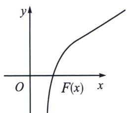

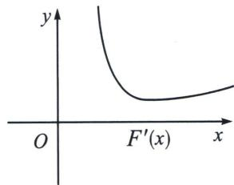

4. 积型乘除构造 $F(x) = \frac{f(x)}{x + \frac{m}{x}}$ 单调函数
当 $f(x_{1}) = f(x_{2}) > 0$ 时， $x_{1}x_{2} < m \Leftrightarrow x_{1} + \frac{m}{x_{1}} > x_{2} + \frac{m}{x_{2}} \Leftrightarrow \frac{f(x_{1})}{x_{1} + \frac{m}{x_{1}}} < \frac{f(x_{2})}{x_{2} + \frac{m}{x_{2}}}$ ，故我们可以构造单调函数 $F(x) = \frac{f(x)}{x + \frac{m}{x}}$ .

> [!example]- 例11 已知函数 $f(x) = x + \frac{3}{x} + 2\ln x - a (a \in \mathbb{R})$ 有两个不同的零点 $x_{1}, x_{2}$ . 求证: $x_{1}x_{2} > 1$ .
解析 构造 $F(x) = \frac{x + \frac{3}{x} + 2\ln x}{x + \frac{1}{x}} = \frac{x^2 + 2x\ln x + 3}{x^2 + 1} = 1 + \frac{2 + 2x\ln x}{x^2 + 1}$ ，则 $F'(x) = \frac{2(x^2 - 1)(1 - \frac{2}{x + 1} - \ln x)}{(x^2 + 1)^2}$ ，令 $\varphi(x) = 1 - \frac{2}{x + 1} - \ln x$ ， $\varphi'(x) = -\frac{x^2 + 1}{x(x + 1)^2} < 0$ 。所以 $\varphi(x)$ 单调递减。
所以 0 < x < 1， $\varphi(x) > 0$ ；x > 1， $\varphi(x) < 0$ 。所以 $F'(x) \leqslant 0$ 恒成立。所以 $F(x)$ 在 $(0, +\infty)$ 单调递减。
所以 $\frac{x_1 + \frac{3}{x_1} + 2\ln x_1}{x_1 + \frac{1}{x_1}} > \frac{x_2 + \frac{3}{x_2} + 2\ln x_2}{x_2 + \frac{1}{x_2}}$ ，所以 $x_1x_2 > 1$ .

> [!example]- 例12 (2018·全国卷1理科)已知函数 $f(x) = \frac{1}{x} - x + a\ln x$ . 若 $f(x)$ 存在两个极值点 $x_{1}, x_{2}$ ，证明： $\frac{f(x_{1}) - f(x_{2})}{x_{1} - x_{2}} < a - 2$
解析 $f'(x) = -\frac{1}{x^{2}} - 1 + \frac{a}{x} = \frac{-x^{2} + ax - 1}{x^{2}} = 0$ ，故 $x_{1} + x_{2} = a, x_{1}x_{2} = 1$ ；
$x_{1} + \frac{1}{x_{1}} = x_{2} + \frac{1}{x_{2}}$ 要证 $\frac{f(x_1) - f(x_2)}{x_1 - x_2} < a - 2$ ，只需证 $\frac{\frac{1}{x_1} - x_1 + a\ln x_1 - \frac{1}{x_2} + x_2 - a\ln x_2}{x_1 - x_2} < a - 2,$

只需证 $\frac{\frac{1}{x_1} - \frac{1}{x_2}}{x_1 - x_2} - 1 + \frac{a\ln x_1 - a\ln x_2}{x_1 - x_2} < a - 2$ ，只需证 $-\frac{1}{x_1x_2} - 1 + \frac{a(\ln x_1 - \ln x_2)}{x_1 - x_2} < a - 2,$

只需证 $\frac{\ln x_1 - \ln x_2}{x_1 - x_2} < 1$ ，只需 $x_2 - x_1 > \ln x_2 - \ln x_1$ ，只需证 $x_2 - \ln x_2 > x_1 - \ln x_1$ ，令 $F(x) = \frac{x - \ln x}{x + \frac{1}{x}}$ ， $F'(x) = \frac{(x^2 - 1)\left(\ln x - \frac{x - 1}{x + 1}\right)}{x^2\left(x + \frac{1}{x}\right)^2} > 0$ ，所以 $F(x_2) > F(x_1)$ ， $\frac{f(x_1) - f(x_2)}{x_1 - x_2} < a - 2$ 得证！

# 第三节 零点差直线拟合问题

# 切割线夹问题
在遇到零点差问题，我们通常的做法就是切割线夹或者曲线拟合，如果待证式为关于参数的一

次式，此时考虑切割线，如果带有根式，则考虑二次，对勾等拟合手段.

### 一、双零点处切线夹 $x_{2} - x_{1} <   x_{4} - x_{3}$ 构造

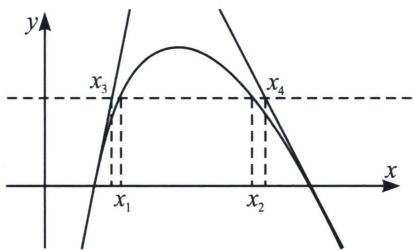
若 $f(x) = m$ 有两根，满足 $x_{2} - x_{1} < g(m) = x_{4} - x_{3}$ ，通常在双零点处进行切线夹构造，如图，分别找出两个零点处切线与 $y = m$ 的交点， $(x_{3}, m)$ 和 $(x_{4}, m)$ ，即可证明。最早出现切线夹放缩在2015年天津高考卷。

> [!example]- 例1 (2015·天津)已知函数 $f(x)=4x-x^{4}$ ， $x\in R$ .  
（1）求 $f(x)$ 的单调区间；  
（2）设曲线 $y=f(x)$ 与 x 轴正半轴的交点为 P，曲线在点 P 处的切线方程为 $y=g(x)$ ，求证：对于任意的实数 x，都有 $f(x)\leqslant g(x)$ ;  
（3）若方程 $f(x)=a$ (a为实数)有两个实数根 $x_{1}$ ， $x_{2}$ ，且 $x_{1}<x_{2}$ ，求证： $x_{2}-x_{1}\leqslant-\frac{a}{3}+4^{\frac{1}{3}}$
解析 （1）由 $f(x)=4x-x^{4}$ ，可得 $f'(x)=4-4x^{3}$ 。当 $f'(x)>0$ ，即x<1时，函数 $f(x)$ 单调递增；当 $f'(x)<0$ ，即x>1时，函数 $f(x)$ 单调递减。所以 $f(x)$ 的单调递增区间为 $(-∞,1)$ ，单调递减区间为 $(1,+∞)$ 。  
（2）证明：设点 P 的坐标为 $(x_{0}, 0)$ ，则 $x_{0}=4^{\frac{1}{3}}$ ， $f'(x_{0})=-12$ ，

曲线 $y=f(x)$ 在点 P 处的切线方程为 $y=f'(x_{0})(x-x_{0})$ ，即 $g(x)=f'(x_{0})(x-x_{0})$ ，令函数 $F(x)=f(x)-g(x)$ ，即 $F(x)=f(x)-f'(x_{0})(x-x_{0})$ ，则 $F'(x)=f'(x)-f'(x_{0})$ 。
因为 $F'(x_{0})=0$ ，所以当 $x\in(-\infty,x_{0})$ 时， $F'(x)>0$ ；当 $x\in(x_{0},+\infty)$ 时， $F'(x)<0$ ，所以 $F(x)$ 在 $(-∞,x_{0})$ 上单调递增，在 $(x_{0},+\infty)$ 上单调递减，则对于任意实数 x， $F(x)\leqslant F(x_{0})=0$ ，即对任意实数 x，都有 $f(x)\leqslant g(x)$ ；
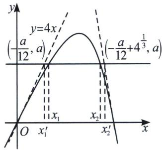  
（3）证明：由（2）知， $g(x)=-12(x-4^{\frac{1}{3}})$ ，设方程 $g(x)=a$ 的根为 $x_{2}'$ ，可得 $x_{2}'=-\frac{a}{12}+4^{\frac{1}{3}}$ .
因为 $g(x)$ 在 $(-∞, +∞)$ 上单调递减，又由（2）知 $g(x_{2}) \geqslant f(x_{2}) = a = g(x_{2}^{'})$ ，因此 $x_{2} \leqslant x_{2}^{'}$ .

类似地，设曲线 $y=f(x)$ 在原点处的切线方程为 $y=h(x)$ ，可得 $h(x)=4x$ ，

对于任意的 $x \in (-\infty, +\infty)$ ，有 $f(x) - h(x) = -x^{4} \leqslant 0$ ，即 $f(x) \leqslant h(x)$ .
设方程 $h(x)=a$ 的根为 $x_{1}'$ ，可得 $x_{1}'=\frac{a}{4}$ ，因为 $h(x)=4x$ 在 $(-∞,+∞)$ 上单调递增，且 $h(x_{1}')=a=f(x_{1})\leqslant h(x_{1})$ ，因此 $x_{1}'\leqslant x_{1}$ ，如图所示，由此可得 $x_{2}-x_{1}\leqslant x_{2}'-x_{1}'=-\frac{a}{3}+4^{\frac{1}{3}}$ .

> [!example]- 例2 已知函数 $f(x) = ax - 1$ ， $g(x) = \ln x - 1 (a \in \mathbb{R})$ .  
（1）设函数 $F(x)=f(x)-g(x)$ ，若在定义域内 $F(x)\geqslant0$ 恒成立，求 a 的取值范围；  
（2）当 $a = 1$ 时方程 $f(x)\cdot g(x) - m = 0(0\leqslant m\leqslant 1)$ 有两个实数根 $x_{1}$ ， $x_{2}$ 且 $x_{1} <   x_{2}$ 证明： $\frac{x_2}{x_1}$ $\leqslant \frac{\mathrm{e}}{1 - m}\Big(1 + \frac{m}{\mathrm{e} - 1}\Big).$
解析 （1） $F(x)=f(x)-g(x)=ax-1-(\ln x-1)=ax-\ln x\geqslant0$ 恒成立，因为定义域为 $(0,+\infty)$ ，所以 $a\geqslant\frac{\ln x}{x}$ 恒成立，令 $t(x)=\frac{\ln x}{x}$ ，原问题转化为求函数 $t(x)$ 在 $(0,+\infty)$ 的最大值，则 $t'(x)=\frac{1-\ln x}{x^2}$ ，令 $t'(x)>0$ ，则0<x<e，所以函数 $t(x)$ 在 $(0,e)$ 上单调递增；令 $t'(x)<0$ ，则x>e，所以函数 $t(x)$ 在 $(e,+\infty)$ 上单调递减，所以 $t(x)_{\max}=t(e)=\frac{1}{e}$ ，所以 $a\geqslant\frac{1}{e}$ ，故a的取值范围为 $\left[\frac{1}{e},+\infty\right)$ .
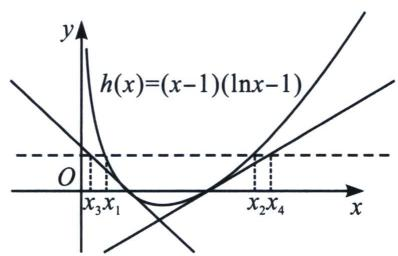  
（2）当 $a = 1$ 时, 令 $h(x) = f(x) \cdot g(x) = (x - 1)(\ln x - 1)$ , 则 $h'(x) = \ln x - \frac{1}{x}$ , 显然该函数在定义域内单调递增, 而 $h'（1） = -1 < 0$ , $h'(e) = 1 - \frac{1}{e} > 0$ , 所以存在 $x_0 \in (1, e)$ , 使 $h'(x_0) = 0$ , 因此当 $x \in (0, x_0)$ 时, $h'(x) < 0$ , $h(x)$ 单调递减; 当 $x \in (x_0, +\infty)$ 时, $h'(x) > 0$ , $h(x)$ 单调递增. 令 $h(x) = 0$ , 解得 $x = 1$ 或 $e$ . 设函数 $h(x)$ 在两个零点处的切线方程与直线 $y = m$ 的交点的横坐标分别为 $x_3$ 和 $x_4$ , 则 $x_1 \geqslant x_3$ , $x_2 \leqslant x_4$ , 易计算函数 $h(x)$ 在 $(1, 0)$ 处的切线方程为 $y_1 = -x + 1$ ; 在 $(e, 0)$ 处的切线方程为 $y_2 = \left(1 - \frac{1}{e}\right)(x - e)$ , 令 $y_1 = m$ , 得 $x_3 = 1 - m$ ; 令 $y_2 = m$ 得 $x_4 = \frac{em}{e-1} + e = e\left(\frac{m}{e-1} + 1\right)$ , 因为 $x_1 \geqslant x_3$ , $x_2 \leqslant x_4$ , 所以 $\frac{x_2}{x_1} \leqslant \frac{x_4}{x_3} = \frac{e\left(\frac{m}{e-1} + 1\right)}{1 - m} = \frac{e}{1 - m}\left(\frac{m}{e-1} + 1\right)$ , 故命题得证.

> [!example]- 例3 已知函数 $f(x) = 2x - \mathrm{e}^x$ .  
（1）求函数 $f(x)$ 在 x=1 处的切线方程；  
（2）求函数 $f(x)$ 的极值;  
（3）若关于 $x$ 的方程 $f(x) = a (a \in \mathbf{R})$ 有两个根 $x_{1}$ 和 $x_{2}$ ，求证： $|x_{1} - x_{2}| < \frac{\mathrm{e} - 1}{2 - \mathrm{e}} a - 1$ .
解析 （1） 因为 $f(x) = 2x - \mathrm{e}^x$ ，所以 $f'(x) = 2 - \mathrm{e}^x$ ，则 $f'（1） = 2 - \mathrm{e}$ ， $f(1) = 2 - \mathrm{e}$ ，
故 $f(x)$ 在 x=1 处的切线方程为 $y-(2-\mathrm{e})=(2-\mathrm{e})(x-1)$ ，即 $(2-\mathrm{e})x-y=0$ .  
（2） 函数 $f(x)=2x-\mathrm{e}^{x}$ 的定义域为 R，又 $f'(x)=2-\mathrm{e}^{x}=0,\quad x=\ln2$
$x\in(-\infty,\ln2)$ ， $f'(x)>0$ ， $f(x)$ 单调递增， $x\in(\ln2,+\infty)$ ， $f'(x)<0$ ， $f(x)$ 单调递增单调递减，所以 $f(x)$ 的极大值为 $f(\ln2)=2\ln2-e^{\ln2}=2\ln2-2$ ，无极小值.  
（3）由（2）不妨令 $x_{1}\in (-\infty ,\ln 2),x_{2}\in (\ln 2, + \infty),f(x_{1}) = f(x_{2}) = a,$

构造 $g(x)=f(x)-(2-\mathrm{e})x=\mathrm{e}x-\mathrm{e}^{x}<0$ (自证)，则 $g(x_{2})=f(x_{2})-(2-\mathrm{e})x_{2}\leqslant0$ ，所以 $x_{2}\leqslant\frac{a}{2-\mathrm{e}}$ ，当且仅当 $x_{2}=1$ 时等号成立，构造 $2x-\mathrm{e}^{x}>2x-(x+1)=x-1=a,\quad x\in(-\infty,\ln2)$ ，所以 $x_{1}\geqslant a+1$ ，当且仅当 $x_{1}=0$ 时等号成立，所以 $\left|x_{1}-x_{2}\right|=x_{2}-x_{1}\leqslant\frac{a}{2-\mathrm{e}}-(a+1)=\frac{\mathrm{e}-1}{2-\mathrm{e}}a-1$ ，又等号不同时成立，所以 $\left|x_{1}-x_{2}\right|<\frac{\mathrm{e}-1}{2-\mathrm{e}}a-1$ 。

### 二、单零点处和拐点外切线夹构造与单零点+切线探路

> [!example]- 例4 (2023·安徽模拟)已知函数 $f(x)=\frac{1-x^{2}}{\mathrm{e}^{x}}$ (e为自然对数的底数).  
（1）求函数 $f(x)$ 的零点 $x_{0}$ ，以及曲线 $y=f(x)$ 在 $x=x_{0}$ 处的切线方程；  
（2）设方程 $f(x)=m(m>0)$ 有两个实数根 $x_{1}$ ， $x_{2}$ ，求证： $\left|x_{1}-x_{2}\right|<2-m\left(1+\frac{1}{2e}\right)$ .
解析 （1）由 $f(x)=\frac{1-x^{2}}{\mathrm{e}^{x}}=0$ ，得 $x=\pm1$ ，所以函数的零点 $x_{0}=\pm1$ ， $f'(x)=\frac{x^{2}-2x-1}{\mathrm{e}^{x}}$ ， $f'(-1)=2\mathrm{e}$ ， $f(-1)=0$ 。曲线 $y=f(x)$ 在x=-1处的切线方程为 $y=2\mathrm{e}(x+1)$ ， $f'（1）=-\frac{2}{\mathrm{e}}$ ， $f(1)=0$ ，所以曲线 $y=f(x)$ 在x=1处的切线方程为 $y=-\frac{2}{\mathrm{e}}(x-1)$ ；
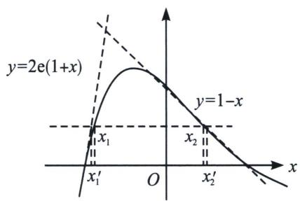  
（2）由 $f'(x)=\frac{x^{2}-2x-1}{e^{x}}$ ，当 $x\in(-\infty,1-\sqrt{2})\cup(1+\sqrt{2},+\infty)$ 时， $f'(x)>0$ ；当 $x\in(1-\sqrt{2},1+\sqrt{2})$ 时， $f'(x)<0$ 。所以 $f(x)$ 的单调递增区间为 $(-∞,1-\sqrt{2}),(1+\sqrt{2},+\infty)$ ，单调递减区间为 $(1-\sqrt{2},1+\sqrt{2})$ 。由（1）知，当x<-1或x>1时， $f(x)<0$ ；当-1<x<1时， $f(x)>0$ 。

下面证明：当 $x \in (-1, 1)$ 时， $2\mathrm{e}(x+1) > f(x)$ .
当 $x \in (-1, 1)$ 时， $2\mathrm{e}(x+1) > f(x) \Leftrightarrow 2\mathrm{e}(x+1) + \frac{x^{2}-1}{\mathrm{e}^{x}} > 0 \Leftrightarrow \mathrm{e}^{x+1} + \frac{x-1}{2} > 0.$ 易知， $g(x) = \mathrm{e}^{x+1} + \frac{x-1}{2}$ 在 $x \in [-1, 1]$ 上单调递增，而 $g(-1) = 0$ ，即 $g(x) > g(-1) = 0$ 对 $\forall x \in (-1, 1)$ 恒成立，所

以当 $x \in (-1, 1)$ 时， $2\mathrm{e}(x + 1) > f(x)$ . 由 $\left\{ \begin{array}{l} y = 2\mathrm{e}(x + 1) \\ y = m \end{array} \right.$ 得 $x = \frac{m}{2\mathrm{e}} - 1$ . 记 $x_1' = \frac{m}{2\mathrm{e}} - 1$ . 不妨设 $x_1 < x_2$ ，则 $-1 < x_1 < 1 - \sqrt{2} < x_2 < 1$ ，即 $|x_1 - x_2| < |x_1' - x_2| = x_2 - x_1' = x_2 - \left(\frac{m}{2\mathrm{e}} - 1\right)$ . 要证 $|x_1 - x_2| < 2 - m\left(1 + \frac{1}{2\mathrm{e}}\right)$ ，只要证 $x_2 - \left(\frac{m}{2\mathrm{e}} - 1\right) \leqslant 2 - m\left(1 + \frac{1}{2\mathrm{e}}\right)$ ，即证 $x_2 \leqslant 1 - m$ . 又因为 $m = \frac{1 - x_2^2}{\mathrm{e}^{x_2}}$ ，所以只要证 $x_2 \leqslant 1 - \frac{1 - x_2^2}{\mathrm{e}^{x_2}}$ ，即 $(x_2 - 1) \cdot (\mathrm{e}^{x_2} - (x_2 + 1)) \leqslant 0$ .
因为 $x_{2} \in (1 - \sqrt{2}, 1)$ ，即证 $\mathrm{e}^{x_2} - (x_2 + 1) \geqslant 0$ 。令 $\varphi(x) = \mathrm{e}^x - (x + 1)$ ， $\varphi'(x) = \mathrm{e}^x - 1$ 。当 $x \in (1 - \sqrt{2}, 0)$ 时， $\varphi'(x) < 0$ ， $\varphi(x)$ 为单调递减函数；当 $x \in (0, 1)$ 时， $\varphi'(x) > 0$ ， $\varphi(x)$ 为单调递增函数。所以 $\varphi(x) \geqslant \varphi(0) = 0$ ，则 $\mathrm{e}^{x_2} - (x_2 + 1) \geqslant 0$ ，故 $|x_1 - x_2| < 2 - m\left(1 + \frac{1}{2\mathrm{e}}\right)$ 。

注意：切线夹放缩，拐点是关键

> [!example]- 例4虽然是根据执果索因得出要证明当 $1 - \sqrt{2} < x_{2} < 1$ 时， $f(x) \leqslant 1 - x$ ，但是再解完题反思的过程中，我们发现 $f'(x) = \frac{x^2 - 2x - 1}{\mathrm{e}^x}$ ， $f''(x) = \frac{-x^2 + 4x - 1}{\mathrm{e}^x} = 0 \Leftrightarrow x = 2 \pm \sqrt{3}$ ，显然 $x = 2 - \sqrt{3} \in (1 - \sqrt{2}, 1)$ ，也就是说在 $x_1 \in (-1, 1 - \sqrt{2})$ 这个区间，没有拐点，函数的切线斜率一直递减，故在 $x = -1$ 处取得的切线就一定恒在函数 $f(x)$ 上方；但 $x_2 \in (1 - \sqrt{2}, 1)$ 这个区间有了一个拐点，斜率先减后增，所以在 $x = 1$ 处的切线方程不满足恒在函数 $f(x)$ 上方，所以转化为函数 $f(x)$ 过点 $(1, 0)$ 处的切线方程，即构造切线不等式 $f(x) \leqslant 1 - x$ 。

> [!example]- 例5 (2025·湖南长沙·一模)已知函数 $f(x) = (x - a)\ln x - x, a \in \mathbf{R}$ .  
（1）若函数 $f(x)$ 在定义域上单调递增，求实数 a 的取值范围；  
（2）设 $x_{1}$ ， $x_{2}(x_{1}<x_{2})$ 是 $f(x)$ 的两个极值点，证明：

(i) $\ln x_{1} + \ln x_{2} < -2;$

(ii) $x_{2}-x_{1}<e^{-2}+2a+1.$
解析 （1） $f(x)$ 的定义域为 $(0, +\infty)$ , $f'(x) = \ln x - \frac{a}{x}$ ,

依题可知 $f'(x) \geqslant 0$ 对 $x \in (0, +\infty)$ 恒成立，即 $a \leqslant (x \ln x)_{\min} = -\frac{1}{e}$ ,  
（2）(i)令 $f'(x)=0$ ，即 $x\ln x=a$ ，由题知 $x_{1}$ ， $x_{2}$ 是方程 $x\ln x=a$ 的两根，
又 $x \in \left(0, \frac{1}{\mathrm{e}}\right)$ 时， $y = x \ln x < 0$ ，由（1）得，a < 0，
此时 $-\frac{1}{e} < a < 0$ ， $x_{1}\ln x_{1} = x_{2}\ln x_{2} = a$ ， $-\ln \frac{1}{x_{1}} = -\frac{a}{x_{1}}$ ， $-\ln \frac{1}{x_{2}} = \frac{a}{x_{2}} \Rightarrow \frac{\frac{1}{x_{2}} - \frac{1}{x_{1}}}{\ln \frac{1}{x_{2}} - \ln \frac{1}{x_{1}}} = -2 > \frac{a}{x_{2}} + \frac{a}{x_{1}}$ 所以 $\ln x_{1} + \ln x_{2} < -2$ 得证！

(ii) 易求得 $g(x)=x\ln x$ 的图象在 $(1,0)$ 处的切线方程为 y=x-1，
$g(x)$ 的图象在 $\left(\frac{1}{\mathrm{e}^{2}}, -\frac{2}{\mathrm{e}^{2}}\right)$ 处的切线方程为 $y = -x - \frac{1}{\mathrm{e}^{2}}$ ，先证 $x \ln x \geqslant x - 1$ （自证），
再证 $x\ln x \geqslant -x - \frac{1}{e^2}$ ，即证 $-\ln \frac{1}{ex} + \frac{1}{e} \frac{1}{ex} \geqslant 0$ ，（同构函数自证）.

易知直线 y=a 与曲线 $y=g(x)$ 的交点横坐标为 $x_{1}$ ， $x_{2}$ ，令 y=a 与 y=x-1 的交点横坐标为 $x_{3}=a+1$ ，则 $x_{2}<a+1$ ，令 y=a 与 $y=-x-\frac{1}{e^{2}}$ 的交点横坐标为 $x_{4}=-a-\frac{1}{e^{2}}$ ，则 $x_{1}\geqslant-a-\frac{1}{e^{2}}$ ，
故 $x_{2}-x_{1}<x_{3}-x_{4}=2a+1+\frac{1}{e^{2}}.$

左边为什么是 $y = -x - \frac{1}{e^{2}}$ ？通过探路 $x_{3} = a + 1$ ， $x_{3} - x_{4} = 2a + 1 + \frac{1}{e^{2}} \Rightarrow x_{4} = -\frac{1}{e^{2}} - a$ ，
$y = k \left(- \frac {1}{\mathrm{e} ^ {2}} - a\right) + b = a \Rightarrow k = - 1, b = - \frac {1}{\mathrm{e} ^ {2}}.$

### 三、双零点割线夹 $x_{2} - x_{1} > x_{4} - x_{3}$ 构造

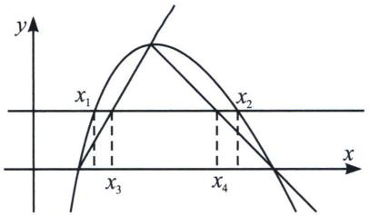
若 $f(x)=m$ 有两根，满足 $x_{2}-x_{1}>g(m)=x_{4}-x_{3}$ ，通常在双零点和极值点连线进行割线夹构造，如图，分别找出两个零点处切线与y=m的交点， $(x_{3},m)$ 和 $(x_{4},m)$ ，即可证明.

> [!example]- 例6 (2024·汉中一模)已知函数 $f(x)=x\ln x$ ， $g(x)=\frac{2f(x)}{x}-x+\frac{1}{x}$ .  
（1）求函数 $g(x)$ 的单调区间；  
（2）若方程 $f(x)=m$ 的根为 $x_{1}$ 、 $x_{2}$ ，且 $x_{2}>x_{1}$ ，求证： $x_{2}-x_{1}>1+em$ .
解析 （1） 因为 $f(x) = x \ln x$ , $g(x) = \frac{2f(x)}{x} - x + \frac{1}{x}$ , 所以 $g(x) = 2 \ln x - x + \frac{1}{x}$ 定义域为 $(0, +\infty)$ , $g'(x) = \frac{2}{x} - 1 - \frac{1}{x^2} = \frac{-x^2 + 2x - 1}{x^2} = -\frac{-(x - 1)^2}{x^2} \leqslant 0$ ，所以 $g(x)$ 在 $(0, +\infty)$ 上单调递减，即 $g(x)$ 的单调递减区间为 $(0, +\infty)$ ，无单调递增区间；
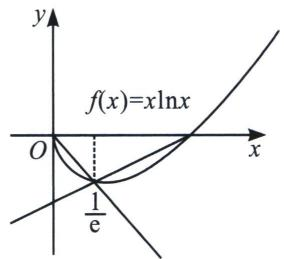  
（2）证明： $f(x)=x\ln x,\quad f'(x)=1+\ln x$ ，当 $0<x<\frac{1}{e}$ 时， $f'(x)<0$ ，当 $x>\frac{1}{e}$ 时， $f'(x)>0$ ，所以 $f(x)$ 在 $\left(0,\frac{1}{e}\right)$ 上是单调递减，在 $\left(\frac{1}{e},+\infty\right)$ 上单调递增，则 $f(x)_{\min}=f\left(\frac{1}{e}\right)=-\frac{1}{e}$
当 0 < x < 1 时， $f(x) = x \ln x < 0$ ，所以 $0 < x_{1} < \frac{1}{e} < x_{2} < 1$ ，且 $-\frac{1}{e} < m < 0$ ，当 $x \in \left(0, \frac{1}{e}\right)$ 时， $\ln x < -1$ ，所以 $x \ln x < -x$ ，即 $f(x) < -x$ ，设直线 y = -x 与 y = m 的交点的横坐标为 $x_{3}$ ，则 $x_{1} < x_{3}$ $=-m=-x_{1}\ln x_{1}$ ，下面证明当 $x\in\left(\frac{1}{e},1\right)$ 时， $f(x)<\frac{1}{e-1}(x-1)$ ，设 $h(x)=x\ln x-\frac{1}{e-1}(x-1)=x\left(\ln x-\frac{1}{e-1}+\frac{1}{(e-1)x}\right)$ ，令 $m(x)=\ln x-\frac{1}{e-1}+\frac{1}{(e-1)x}$ ，则 $m'(x)=\frac{1}{x}-\frac{1}{(e-1)x^{2}}=\frac{(e-1)x-1}{(e-1)x^{2}}$ ，当 $\frac{1}{e}<x<\frac{1}{e-1}$ 时， $m'(x)<0$ ，当 $\frac{1}{e-1}<x<1$ 时， $m'(x)>0$ ，所以 $m(x)$ 在 $\left(\frac{1}{e},\frac{1}{e-1}\right)$ 上是减函数，在 $\left(\frac{1}{e-1},1\right)$ 上增函数，又因为 $m\left(\frac{1}{e}\right)=0,\quad m(1)=0$ ，所以当 $\frac{1}{e}<x<1$ 时， $m(x)<0,\quad h(x)<0$ ，故当 $x\in\left(\frac{1}{e},1\right)$ 时， $f(x)<\frac{1}{e-1}(x-1)$ ，设直线 $y=\frac{1}{e-1}(x-1)$ 与y=m的交点的横坐标为 $x_{4}$ ，则 $x_{2}>x_{4}=1+(e-1)m$ ，所以 $x_{2}-x_{1}>x_{4}-x_{3}=1+em$ ，得证.

> [!example]- 例7 (2023·龙凤区期中)已知函数 $f(x)=x\ln x$ .  
（1） 若 $a \leqslant -2$ ，证明： $f(x) \geqslant ax - e^{-3}$ 在 $(0, +\infty)$ 上恒成立；  
（2）若方程. $f(x) = b$ 有两个实数根 $x_{1}$ , $x_{2}$ , 且 $x_{1} < x_{2}$ , 求证: $b\mathrm{e} + 1 < x_{2} - x_{1} < \frac{\mathrm{e}^{-3} + 2 + 3b}{2}$ .
解析 证明：（1）由 $f'(x)=\ln x+1$ ，则 $x\in\left(0,\frac{1}{e}\right)$ 时， $f'(x)<0$ ， $f(x)$ 单调递减，
$x\in\left(\frac{1}{e},+\infty\right)$ 时， $f'(x)>0,\;f(x)$ 单调递增，所以 $f(x)$ 的递减区间为 $\left(0,\frac{1}{e}\right)$ ，递增区间为 $\left(\frac{1}{e},+\infty\right)$ ;
因为 $a \leqslant -2, x \in (0, +\infty)$ ，令 $g(a) = ax - e^{-3}$ ，所以 $g(a) = ax - e^{-3} \leqslant g(-2) = -2x - e^{-3}$ ，

下证 $-2x-\mathrm{e}^{-3}\leqslant x\ln x$ ，令 $h(x)=x\ln x+2x+\mathrm{e}^{-3}$ ，则 $h'(x)=\ln x+3$ ，当 $0<x<\mathrm{e}^{-3}$ 时， $h'(x)<0$ ，当 $x>\mathrm{e}^{-3}$ ， $H'(x)>0$ ，所以 $h(x)$ 在 $(0,\mathrm{e}^{-3})$ 上单调递减，在 $(\mathrm{e}^{-3},+\infty)$ 上单调递增，所以 $h(x)=x\ln x+2x+\mathrm{e}^{-3}\geqslant h(\mathrm{e}^{-3})=0$ ，所以 $f(x)\geqslant ax-\mathrm{e}^{-3}$ 在 $(0,+\infty)$ 上恒成立；  
（2）先证右半部分不等式: $x_{2} - x_{1} < \frac{\mathrm{e}^{-3} + 2 + 3b}{2}$ , 因为 $f(x) = x\ln x$ , $f'(x) = \ln x + 1$ , 所以 $f(1) = 0$ , $f(\mathrm{e}^{-3}) = -3\mathrm{e}^{-3}$ , $f'（1） = 1$ , $f'(\mathrm{e}^{-3}) = -2$ , 可求曲线 $y = f(x)$ 在 $x = \mathrm{e}^{-3}$ 和 $x = 1$ 处的切线分别为 $l_{1}: y = -2x - \mathrm{e}^{-3}$ 和 $l_{2}: y = x - 1$ ; 设直线 $y = b$ 与直线 $l_{1}$ , 函数 $f(x)$ 的图象和直线 $l_{2}$ 交点的横坐标分别为 $x_{1}'$ , $x_{1}$ , $x_{2}$ , $x_{2}'$ , 则 $x_{1}' = -\frac{\mathrm{e}^{-3} + b}{2}$ , $x_{2}' = b + 1$ , 则 $x_{2} - x_{1} = x_{2}' - x_{1}' = (b + 1) - (-\frac{\mathrm{e}^{-3} + b}{2}) = \frac{\mathrm{e}^{-3} + 2 + 3b}{2}$ , 因此 $x_{2} - x_{1} < \frac{\mathrm{e}^{-3} + 2 + 3b}{2}$ ,

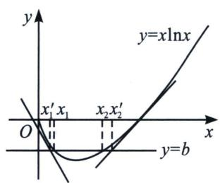

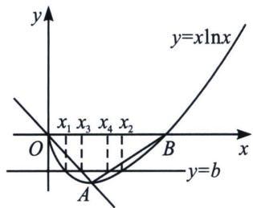
再证左半部分不等式： $x_{2}-x_{1}>be+1$ ，设取曲线上两点 $A\left(\frac{1}{e}, -\frac{1}{e}\right)$ ， $B(1,0)$ ，用割线 OA: y=

-x, AB: $y=\frac{1}{e-1}(x-1)$ 来限制 $x_{2}-x_{1}$ ，设直线 y=b 与直线 y=-x， $y-\frac{1}{e-1}(x-1)$ 的交点的横坐标分别为 $x_{3}$ ， $x_{4}$ ，则 $x_{1}<x_{3}<x_{4}<x_{2}$ ，且 $x_{3}=-b$ ， $x_{4}=(e-1)b+1$ ，所以 $x_{2}-x_{1}>x_{4}-x_{3}=(e-1)b+1-(-b)=be+1$ ，综上可得 $be+1<x_{2}-x_{1}<\frac{e^{-3}+2+3b}{2}$ 成立.

> [!example]- 例8 (24-25 高二下·山东·期中)已知函数 $f(x) = x - \ln x + a$ 有两个不同零点 $x_{1}, x_{2} (x_{1} < x_{2})$ .  
（1） 求 a 的取值范围;  
（2）证明： $x_{1}+x_{2}>2;$  
（3）证明： $2+\frac{2ae}{e-1}<x_{2}-x_{1}<\frac{-ae-a-2}{e-1}$
解析 （1）由题意可知: $f(x)$ 的定义域为 $(0, +\infty)$ , 且 $f'(x)=1-\frac{1}{x}=\frac{x-1}{x}$ , 令 $f'(x)>0$ , 解得 $x>1$ ; 令 $f'(x)<0$ , 解得 $0<x<1$ ; 可知 $f(x)$ 在 $(0, 1)$ 内单调递减, 在 $(1, +\infty)$ 内单调递增, 可知 $f(x)_{\min}=f(1)$ , 且当趋近于 0 或 $+\infty$ 时, $f(x)$ 趋近于 $+\infty$ , 若函数 $f(x)$ 有两个不同零点, 则 $f(1)=1+a<0$ , 即 $a<-1$ , 所以 $a$ 的取值范围为 $(- \infty, -1)$ .  
（2） 构建 $g(x)=f(1-x)-f(1+x)=\ln(1+x)-\ln(1-x)-2x,\quad0<x<1$ ，（居中构造）
则 $g'(x)=\frac{1}{1+x}+\frac{1}{1-x}-2=\frac{2x^{2}}{1-x^{2}}>0$ ，可知 $g(x)$ 在 $(0,1)$ 内单调递增，
可得 $g(x) > g(0) = 0$ ，即 $f(1 - x) > f(1 + x)$ ，0 < x < 1，可得 $f(x) > f(2 - x)$ ，0 < x < 1，
由题意可知： $0<x_{1}<1<x_{2}$ ，则 $f(x_{2})=f(x_{1})>f(2-x_{1})$
又因为 $2 - x_{1} > 1$ ， $x_{2} > 1$ ，且 $f(x)$ 在 $(1, + \infty)$ 内单调递增，则 $x_{2} > 2 - x_{1}$ ，所以 $x_{1} + x_{2} > 2.$  
（3）由（2）可得 $x_{1} + x_{2} > 2$ ，即 $x_{2} > 2 - x_{1}$ ，则 $x_{2} - x_{1} > 2 - 2x_{1}$
若证 $x_{2}-x_{1}>2+\frac{2ae}{e-1}$ ，等价于 $2-2x_{1}>2+\frac{2ae}{e-1}$ ，即 $x_{1}<\frac{-ae}{e-1}$
因为 $x_{1}-\ln x_{1}+a=0$ ，即 $x_{1}-\ln x_{1}=-a$ ，可得 $x_{1}<\frac{(x_{1}-\ln x_{1})e}{e-1}$ ，整理可得 $x_{1}-\mathrm{e}\ln x_{1}\geqslant0$ ，
令 $F(x)=x-\mathrm{e}\ln x,\quad x\in(0,1)$ ，则 $F'(x)=1-\frac{\mathrm{e}}{x}=\frac{x-\mathrm{e}}{x}>0$ ，令 $F'(x)>0$ ，解得 x>e；
令 $F'(x) < 0$ ，解得 0 < x < e；
可知 $F(x)$ 在 $(0, e)$ 内单调递减，在 $(e, +\infty)$ 内单调递增，则 $F(x) \geqslant F(e) = 0$ ，注意到 $x_{1} \in (0, 1)$ ，则 $F(x_{1}) = x_{1} - \mathrm{e}\ln x_{1} > 0$ ，即 $x_{2} - x_{1} > 2 + \frac{2ae}{e-1}$ ;
因为 $f\left(\frac{1}{e}\right)=\frac{1}{e}+1+a,\quad f'\left(\frac{1}{e}\right)=1-e$ ，即切点坐标为 $\left(\frac{1}{e},\frac{1}{e}+1+a\right)$ ，切线斜率 k=1-e，
则 $f(x)$ 在 $x=\frac{1}{e}$ 处切线方程为 $y-\left(\frac{1}{e}+1+a\right)=(1-e)\left(x-\frac{1}{e}\right)$ ，即 $y=(1-e)x+2+a$ ，
令 y=0，可得 $x_{3}=\frac{2+a}{e-1}$ ，构建 $m(x)=(1-e)x+2+a$ ， $G(x)=f(x)-m(x)=ex-\ln x-2$ ，
则 $G'(x)=\mathrm{e}-\frac{1}{x}=\frac{\mathrm{e}x-1}{x}$ ，令 $G'(x)>0$ ，可得 $x>\frac{1}{e}$ ；令 $G'(x)<0$ ，可得 $0<x<\frac{1}{e}$ ;
可知 $G(x)$ 在 $\left(\frac{1}{\mathrm{e}}, +\infty\right)$ 内单调递增，在 $\left(0, \frac{1}{\mathrm{e}}\right)$ 内单调递减，则 $G(x) \geqslant G\left(\frac{1}{\mathrm{e}}\right) = 0$ ，即 $f(x) \geqslant m(x)$ ，则 $m(x_{1}) \leqslant f(x_{1}) = 0 = m(x_{3})$ ，且 $m(x)$ 在定义域 R 内单调递减，所以 $x_{1} \geqslant x_{3}$ ;
因为 $f(e)=e-1+a$ ， $f'(e)=1-\frac{1}{e}$ ，即切点坐标为 $(e, e-1+a)$ ，切线斜率 $k=1-\frac{1}{e}$ ，则 $f(x)$ 在 x=e 处切线方程为 $y-(e-1+a)=(1-\frac{1}{e})(x-e)$ ，即 $y=\left(1-\frac{1}{e}\right)x+a$ ，令 y=0，可得 $x_{4}=-\frac{ae}{e-1}$ ，构建 $n(x)=\left(1-\frac{1}{e}\right)x+a$ ， $H(x)=f(x)-n(x)=\frac{1}{e}(x-\mathrm{e}\ln x)\geqslant0$ ，即 $f(x)\geqslant n(x)$ ，则 $n(x_{2})\leqslant f(x_{2})=0=n(x_{4})$ ，且 $n(x)$ 在定义域 R 内单调递增，所以 $x_{2}\leqslant x_{4}$ ；
注意到等号不能同时成立，所以 $x_{2}-x_{1}<x_{4}-x_{3}=\frac{-ae-a-2}{e-1}$ ;
综上所述： $2+\frac{2ae}{e-1}<x_{2}-x_{1}<\frac{-ae-a-2}{e-1}$

### 四、单零点和极值点形成曲线夹 $x_{2} - x_{1} > x_{4} - x_{3}$ 构造
如果 $f(x)$ 只有一个零点，另一边有渐近线，则我们可以构造零点和极值点形成的二次拟合函数，形成内部封闭构造出 $x_{2}-x_{1}>x_{4}-x_{3}$ .

> [!example]- 例 9 (2022 · 盐城期末) 已知函数 $f(x)=\frac{x+1}{e^{x}}$ .  
（1） 当 x > -1 时，求函数 $g(x) = f(x) + x^{2} - 1$ 的最小值；  
（2）已知 $x_{1} \neq x_{2}$ , $f(x_{1}) = f(x_{2}) = t$ , 求证: $|x_{1} - x_{2}| > 2\sqrt{1 - t}$ .
解析 （1）由题意可得 $g'(x) = \frac{-x}{\mathrm{e}^{x}} + 2x = \frac{x(2\mathrm{e}^{x} - 1)}{\mathrm{e}^{x}}$ ，令 $f'(x) = 0$ ，则 $x = 0$ 或 $x = -\ln 2$

列表如下：

<table><tr><td>x</td><td>(-1,-ln2)</td><td>-ln2</td><td>(-ln2,0)</td><td>0</td><td>(0,+∞)</td></tr><tr><td>g&#x27;(x)</td><td>+</td><td>0</td><td>-</td><td>0</td><td>+</td></tr><tr><td>g(x)</td><td>单调递增</td><td>极大值</td><td>单调递减</td><td>极小值</td><td>单调递增</td></tr></table>
当 x 趋近于 -1 时， $g(x)$ 趋近于 $g(-1)=0$ ， $g(0)=0$ ，所以 $g(x)_{\min}=g(0)=0$ .

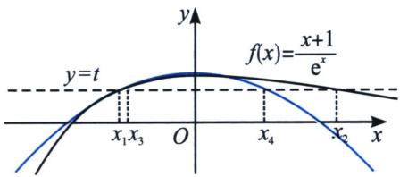  
（2）证明：由题意可得 $f'(x)=\frac{-x}{e^{x}}$ ，所以当 x<0 时， $f'(x)>0$ ，即 $f(x)$ 在 $(-∞,0)$ 上单调递增，当 x>0 时， $f'(x)<0$ ，即 $f(x)$ 在 $(0,+\infty)$ 上单调递减，所以 $f(x)_{\max}=f(0)=1$ ，因为 $f(x_{1})=f(x_{2})$ ，不妨设 $x_{1}<0<x_{2}$ ，因为 $x_{2}>0$ 时， $f(x_{2})>0$ ， $t=f(x_{2})\in(0,1)$ ，所以 $f(x_{1})=f(x_{2})>0$ ，所以 $x_{1}>-1$ ，由（1）知 x>-1，且 $x\neq0$ 时， $g(x)=f(x)+x^{2}-1>0$ ，所以 $f(x)>1-x^{2}$ ，则 $t=f(x_{1})>1-x_{1}^{2}$ ，解得 $x_{1}<x_{3}=-\sqrt{1-t}$ ， $t=f(x_{2})>1-x_{2}^{2}$ ，解得 $x_{2}>x_{4}=\sqrt{1-t}$ ，所以 $|x_{1}-x_{2}|=$
$x _ {2} - x _ {1} > x _ {4} - x _ {3} = 2 \sqrt {1 - t}.$

很多问题到了这里，通过前面的例题发现，关于 $x_{2} - x_{1} > x_{4} - x_{3}$ 的逻辑就很清晰了，如果讲参数引入函数，形成参变混合的 $f(x)$ 与 $g(x)$ ，我们进行以下分析：

考点 1: $f(x)$ 极小值模型

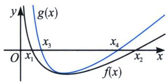
如果我们需要构造 $x_{2} - x_{1} > x_{4} - x_{3}$ ，我们需要找到 $f(x)$ 的恒大的极值点处拟合函数 $g(x)$ 如图；
考点2： $f(x)$ 极大值模型

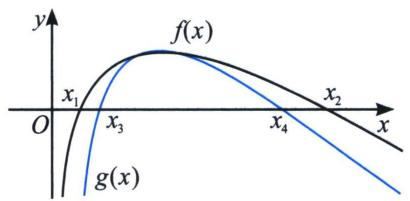
如果我们需要构造 $x_{2} - x_{1} > x_{4} - x_{3}$ ，我们需要找到 $f(x)$ 的恒小的极值点处拟合函数 $g(x)$ 如图；

> [!example]- 例10 (2021·湖北十一校联考)已知函数 $f(x)=\ln x-ax$ .  
（1） 讨论 $f(x)$ 的单调性；  
（2）若 $x_{1}$ , $x_{2}$ , $(x_{1} < x_{2})$ 是 $f(x)$ 的两个零点; 证明: ① $x_{1} + x_{2} > \frac{2}{a}$ ; ② $x_{2} - x_{1} > \frac{2\sqrt{1 - e a}}{a}$ .
解析 （1） 由 $f'(x) = \frac{1}{x} - a = \frac{1 - ax}{x}$ ，当 $a \leqslant 0$ 时， $f'(x) > 0$ 恒成立，故 $f(x)$ 在 $(0, +\infty)$ 单调递增；当 $a > 0$ 时， $f'(x) = 0$ 时， $x = \frac{1}{a}$ ，故 $x \in \left(0, \frac{1}{a}\right)$ 时， $f'(x) > 0$ ， $f(x)$ 单调递增， $x \in \left(\frac{1}{e}, +\infty\right)$ 时， $f'(x) < 0$ ， $f(x)$ 单调递减；  
（2）①根据题意可知 $\left\{ \begin{array}{l} \ln x_{1} = ax_{1} \\ \ln x_{2} = ax_{2} \end{array} \right. \Rightarrow \frac{x_{2} - x_{1}}{\ln x_{2} - \ln x_{1}} = \frac{1}{a}$ ，易求得 $0 < a < \frac{1}{\mathrm{e}}$ （省略了过程，读者可以自证）构造函数 $g(x) = \ln x - \frac{2(x - 1)}{x + 1}$ ， $(x > 1)$ ，则 $g'(x) = \frac{1}{x} - \frac{4}{(x + 1)^2} = \frac{(x - 1)^2}{x(x + 1)^2}$ ，
因为 x>1 时， $g'(x)>0$ ，所以函数 $g(x)$ 在 $(1,+\infty)$ 上单调递增，故 $g(x)>g(1)=0$ ；故 $x_{2}>x_{1}$ 时， $\ln\frac{x_{2}}{x_{1}}>\frac{2\left(\frac{x_{2}}{x_{1}}-1\right)}{\frac{x_{2}}{x_{1}}+1}$ ，即 $\ln x_{2}-\ln x_{1}>\frac{2(x_{2}-x_{1})}{x_{2}+x_{1}}$ ，即 $\frac{x_{2}+x_{1}}{2}>\frac{x_{2}-x_{1}}{\ln x_{2}-\ln x_{1}}=\frac{1}{a}$ ，故 $x_{1}+x_{2}>\frac{2}{a}$ .

②法一(参变分离极值点放缩): 先根据条件探路, 由 $x_{1} + x_{2} > \frac{2}{a}$ 得, $x_{2} > \frac{2}{a} - x_{1}$ 要证 $x_{2} - x_{1} > \frac{2\sqrt{1 - e a}}{a}$ , 只需 $x_{2} > \frac{2}{a} - x_{1} > \frac{2\sqrt{1 - e a}}{a} + x_{1}$ , 故只需 $x_{1} < \frac{1}{a} - \frac{\sqrt{1 - e a}}{a}$ , 由于 $\frac{1}{e} > a > 0$ , 故只需
$ax_{1}<1-\sqrt{1-ea}$ ，只需 $a^{2}x_{1}^{2}-2ax_{1}+1>1-ea$ ，只需 $ax_{1}^{2}-2x_{1}+e>0$ ，此时由于 $\ln x_{1}=ax_{1}$ ，故只需证 $x_{1}\ln x_{1}>2x_{1}-e$ ，显然求导即可证明，或者根据不等式 $x\ln x\geqslant x-1$ ，得： $\frac{x}{e}\ln\frac{x}{e}\geqslant\frac{x}{e}-1\Leftrightarrow x\ln x-x\geqslant x-e\Leftrightarrow x\ln x\geqslant2x-e$ （当且仅当x=e时等号成立，）由于 $0<x_{1}<e<x_{2}$ ，故命题得证。此方案虽然得到探路的不等式，但是总感觉不是那么通透，为什么会构造出 $ax_{1}^{2}-2x_{1}+e>0$ ？命题逻辑是什么？能有什么样得几何背景？
由题意 $x_{2} - x_{1} > x_{4} - x_{3} = \frac{2\sqrt{1 - e a}}{a}$ , 参变分离后 $g(x) = \frac{\ln x}{x}$ 需要构造极值点 $x = e$ 处的先小后小的放缩函数, 即 $a = \frac{\ln x}{x} = g(x)$ , 由于 $\ln x \geqslant 1 - \frac{1}{x}$ , 所以 $\ln \frac{x}{e} \geqslant 1 - \frac{e}{x} \Rightarrow \ln x \geqslant 2 - \frac{e}{x}$ , 故 $g(x) = \frac{\ln x}{x} \geqslant \frac{2x - e}{x^{2}}$ , 如图,

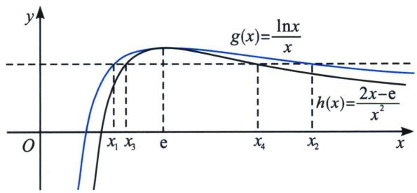

书写过程：令 $ax^{2}-2x+e=0$ 两根为 $x_{3}$ ， $x_{4}\left(x_{3}<x_{4},0<a<\frac{1}{e}\right)$ ，则 $x_{4}-x_{3}=\frac{2\sqrt{1-ea}}{a}$ ；由于 $\ln x\leqslant x-1$ （请自证），故 $\ln\frac{1}{x}\leqslant\frac{1}{x}-1\Rightarrow\ln x\geqslant1-\frac{1}{x}$ ，当且仅当 x=1 时等号成立，则 $\ln\frac{x}{e}\geqslant1-\frac{e}{x}\Rightarrow\ln x\geqslant2-\frac{e}{x}$ ，当且仅当 x=e 时等号成立，构造 $g(x)=\frac{\ln x}{x}=a$ ，则 $g(x)\geqslant\frac{2-\frac{e}{x}}{x}=\frac{2x-e}{x^{2}}$ ，当且仅当 x=e 时等号成立，故当 1<x<e 时， $a=\frac{\ln x_{1}}{x_{1}}=\frac{2x_{3}-e}{x_{3}^{2}}<\frac{\ln x_{3}}{x_{3}}$ ，由于在此区间单调递增，故一定有 $x_{1}<x_{3}$ ，同理，当 x>e 时， $a=\frac{\ln x_{2}}{x_{2}}=\frac{2x_{4}-e}{x_{4}^{2}}<\frac{\ln x_{4}}{x_{4}}$ ，此区间单调递减，故一定有 $x_{2}>x_{4}$ ，所以 $x_{2}-x_{1}>x_{4}-x_{3}=\frac{2\sqrt{1-ea}}{a}$ 。

法三(参变不分离极值点放缩): 构造差型需要 $x_{2} - x_{1} > x_{6} - x_{5} \geqslant \frac{2\sqrt{1 - \mathrm{e}a}}{a}$ , 根据 $f(x)$ 先增后减的性质, 需要找恒小于 $f(x)$ 函数, 根据 $\ln x \geqslant 1 - \frac{1}{x}$ 来构造, 由于极值点是 $\frac{1}{a}$ , $\ln ax \geqslant 1 - \frac{1}{ax} \Rightarrow \ln x \geqslant 1 - \frac{1}{ax} - \ln a$ ,

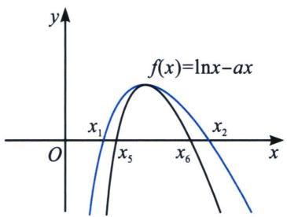
$f(x)>1-\frac{1}{ax}-\ln a-ax=0$ ，取 $\left\{\begin{aligned}x_{5}&=\frac{1-\ln a-\sqrt{\ln^{2}a-2\ln a-3}}{2a}\\ x_{6}&=\frac{1-\ln a+\sqrt{\ln^{2}a-2\ln a-3}}{2a}\end{aligned}\right.$ ，所以存在 $x_{1}\in(x_{3},x_{5})$ ，存在 $x_{2}$
$\in (x_{6}, + \infty)$ ，使 $f(x_{1}) = f(x_{2}) = 0$ ，只需证 $x_{6} - x_{5} = \frac{\sqrt{\ln^{2}a - 2\ln a - 3}}{a} >\frac{2\sqrt{1 - ea}}{a}$ ，即证 $g(a) =$ $\ln^{2}a-2\ln a-7+4ea>0$ ，由于 $g'(a)=\frac{2\ln a}{a}-\frac{2}{a}+4e=\frac{2}{e}\frac{\ln\frac{a}{e}}{\frac{a}{e}}+4e<0$ 对 $0<a<\frac{1}{e}$ 恒成立，所以$g(a)_{\min}=g\left(\frac{1}{e}\right)=0$ 成立，综上， $x_{2}-x_{1}>x_{6}-x_{5}=\frac{\sqrt{\ln^{2}a-2\ln a-3}}{a}>\frac{2\sqrt{1-ea}}{a}$

> [!example]- 例11 (2022·湖北新协作考试)已知函数 $f(x)=x\ln x$ ，已知函数 $h(x)=|f(x)|-b$ 有3个不同的零点 $x_{1}, x_{2}, x_{3}(x_{1}<x_{2}<x_{3})$
(i) 求证： $x_{1}^{2} + x_{2}^{2} > \frac{2}{e^{2}}$ ;

(ii) 求证： $\sqrt{1+2b}-\sqrt{1-2b}<x_{3}-x_{2}<be(e=2.71828\cdots$ 是自然对数的底数).
解析（i）易得 $h(x) = \begin{cases} -x\ln x - b(\text{当 } 0 < x \leqslant 1) \\ x\ln x - b(\text{当 } x > 1) \end{cases}$ ，我们需要构造 $-x\ln x - b$ 先大后小的拟合函数，
即构造 $\ln x$ 的先小后大的拟合函数，只有飘带函数 $\left\{\begin{aligned}\ln x&>\frac{1}{2}\left(x-\frac{1}{x}\right)\text{(当 }0<x<1)\end{aligned}\right.$ $\ln x < \frac{1}{2} \left( x - \frac{1}{x} \right)$ (当 x > 1)，由于极值点在 x
$= \frac{1}{\mathrm{e}}$ 处，故我们按照 $\left\{ \begin{array}{l} \ln x > \frac{1}{2}\left(\mathrm{e}x - \frac{1}{\mathrm{e}x}\right)\left(\text{当 } 0 < x < \frac{1}{\mathrm{e}}\right) \\ \ln x < \frac{1}{2}\left(\mathrm{e}x - \frac{1}{\mathrm{e}x}\right)\left(\text{当 } x > \frac{1}{\mathrm{e}}\right) \end{array} \right.$ ，即 $\left\{ \begin{array}{l} -x\ln x - b < -\frac{\mathrm{e}}{2}x^2 + x + \frac{1}{2\mathrm{e}} - b \\ -x\ln x - b > -\frac{\mathrm{e}}{2}x^2 + x + \frac{1}{2\mathrm{e}} - b \end{array} \right.,$
故取 $\left\{\begin{aligned}x_{4}&=\frac{1-\sqrt{2-2eb}}{e}\\ x_{5}&=\frac{1+\sqrt{2-2eb}}{e}\end{aligned}\right.$ ，所以存在 $x_{1}\in\left(x_{4},\frac{1}{e}\right)$ 使 $h(x_{1})=0$ ，存在 $x_{2}\in(x_{5},+\infty)$ 使 $h(x_{2})=0$ ，
故 $x_{1} + x_{2} > x_{4} + x_{5} = \frac{2}{\mathrm{e}}$ ，所以 $x_{1}^{2} + x_{2}^{2} > \frac{(x_{1} + x_{2})^{2}}{2} >\frac{2}{\mathrm{e}^{2}}$ 成立.

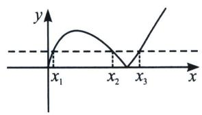

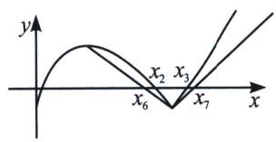

(ii) 令 $\sqrt{1 - 2b} = x_4$ ，易证 $h(\sqrt{1 - 2b}) = -(\sqrt{1 - 2b})\ln (\sqrt{1 - 2b}) - b = -x_4\ln x_4 - \frac{1 - x_4^2}{2} < 0 (x_4 < 1)$ ，令 $\sqrt{1 + 2b} = x_5$ ，易证 $h(\sqrt{1 + 2b}) = (\sqrt{1 + 2b})\ln (\sqrt{1 + 2b}) - b = x_5\ln x_5 - \frac{x_5^2 - 1}{2} < 0 (x_5 > 1)$ ，
如图，连接 $h(x)$ 顶点 $\left(\frac{1}{\mathrm{e}}, \frac{1}{\mathrm{e}} - b\right)$ 和分段点 $(1, -b)$ ，易证 $h(x) = -x\ln x - b > \frac{1}{1 - \mathrm{e}}(x - 1) - b$ ，当 $\frac{1}{\mathrm{e}} < x < 1$ 成立，再构造 $h(x)$ 在 $x = 1$ 处的切线，即 $y = x - 1 - b$ ，当 $y = 0$ 时，分别取 $x_6 = 1 + b - \mathrm{eb}$ ， $x_7 = 1 + b$ ， $h(x_6) > 0$ ， $h(x_7) > 0$ ，故存在 $x_2 \in (x_6, x_4)$ ，使 $h(x_2) = 0$ ， $x_3 \in (x_7, x_5)$ ，使 $h(x_3) = 0$ ，所以 $x_7 - x_6 = be > x_3 - x_2 > x_5 - x_4 = \sqrt{1 + 2b} - \sqrt{1 - 2b}$ .

### 五、切线+割线夹构造 $x_{1} + x_{2} < x_{3} + x_{4}$ 与 $x_{1} + x_{2} > x_{3} + x_{4}$ 问题

关于和式构造，与差式的不同就是需要构造先小后大或者先大后小的极值点函数，这里可以时切线+割线夹的组合，也可以是整个函数的拟合，此类型也会涉及极值点偏移，我们下一节会重点解读.

> [!example]- 例12 (2023·盐城期中)已知 $f(x)=\mathrm{e}^{x}(1-x)$ .  
（1） 求函数 $g(x)=f(x)+\mathrm{e}x-\mathrm{e}$ 的最大值；  
（2） 设 $f(x_{1}) = f(x_{2}) = t$ , $x_{1} \neq x_{2}$ ，求证： $x_{1} + x_{2} < 2t - \frac{t}{e} - 1$ .
解析 （1） 易知 $g(x) = f(x) + \mathrm{e}x - \mathrm{e} = (1 - x)\mathrm{e}^x + \mathrm{e}x - \mathrm{e}$ ，函数定义域为 R，可得 $g'(x) = \mathrm{e} - x\mathrm{e}^x$ ，不妨设 $h(x) = \mathrm{e} - x\mathrm{e}^x$ ，函数定义域为 R，可得 $h'(x) = -\mathrm{e}^x (x + 1)$ ，当 $x < -1$ 时， $h'(x) > 0$ ， $h(x)$ 单调递增；
当 x > -1 时， $h'(x) < 0$ ， $h(x)$ 单调递减，因为 x < 0 时， $h(x) > 0$ ，且 $h(1) = 0$ ，所以当 x < 1 时， $g'(x) > 0$ ， $g(x)$ 单调递增；当 x > 1 时， $g'(x) < 0$ ， $g(x)$ 单调递减，所以当 x = 1 时，函数 $g(x)$ 取得极大值也是最大值，最大值 $g(1) = 0$ ；
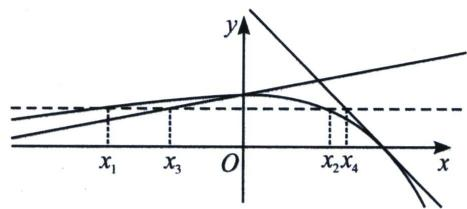  
（2）证明：易知 $f'(x)=\mathrm{e}^{x}(1-x)-\mathrm{e}^{x}=-x\mathrm{e}^{x}$ ，当 x<0 时， $f'(x)>0$ ， $f(x)$ 单调递增；
当 $x > 0$ 时， $f'(x) < 0$ ， $f(x)$ 单调递减，所以当 $x = 0$ 时，函数 $f(x)$ 取得极大值也是最大值，最大值 $f(0) = 1$ ，当 $x \to -\infty$ 时， $f(x) \to 0$ ；当 $x \to +\infty$ 时， $f(x) \to -\infty$ ，因为 $f(x_1) = f(x_2) = t$ ，所以 $x_1$ ， $x_2$ 异号，不妨设 $x_1 < 0 < x_2$ 且 $t \in (0, 1)$ ，由（1）知 $f(x) + \mathrm{e}x - \mathrm{e} \leqslant 0$ 恒成立，所以 $f(x_2) + \mathrm{e}x_2 - \mathrm{e} \leqslant 0$ ，即 $t + \mathrm{e}x_2 - \mathrm{e} \leqslant 0$ ，所以 $x_2 \leqslant 1 - \frac{t}{\mathrm{e}}$ ，要证 $x_1 + x_2 < 2t - \frac{t}{\mathrm{e}} - 1$ ，即证 $x_1 < 2t - 2$ ，因为 $x_1 \in (-\infty, 0)$ ，所以 $2t - 2 \in (-\infty, 0)$ ，又函数 $f(x)$ 在 $(- \infty, 0)$ 上单调递增，此时需证 $f(x_1) < f(2t - 2)$ ，要证 $t < \mathrm{e}^{2t - 2}(3 - 2t)$ ，即证 $\frac{\mathrm{e}^{2t - 2}(3 - 2t)}{t} > 1$ ，不妨设 $k(t) = \frac{\mathrm{e}^{2t - 2}(3 - 2t)}{t}$ ，函数定义域为 $(0, 1)$ ，可得 $k'(t) = \frac{\mathrm{e}^{2t - 2}(-4t^2 + 6t - 3)}{t^2} < 0$ ，所以函数 $k(t)$ 在 $(0, 1)$ 上单调递减，则 $k(t) > k(1) = 1$ ，故 $x_1 + x_2 < 2t - \frac{t}{\mathrm{e}} - 1$ 。

> [!example]- 例13 (2024·广东月考)已知函数 $f(x)=x(t-\ln x)$ ， $t\in R$ .  
（1） 讨论函数 $f(x)$ 的单调区间；  
（2） 当 t=1 时，设 $x_{1}$ ， $x_{2}$ 为两个不相等的正数，且 $f(x_{1})=f(x_{2})=a$ ，证明： $x_{1}+x_{2}>a(2-\mathrm{e})+\mathrm{e}-\frac{1}{\mathrm{e}}$ .
解析 （1） 因为 $f(x) = x(t - \ln x)$ ，所以 $f'(x) = t - \ln x + x\left(-\frac{1}{x}\right) = t - 1 - \ln x$ ，令 $f'(x) > 0 \Leftrightarrow 0 < x < e^{t-1}$ ，令 $f'(x) < 0 \Leftrightarrow x > e^{t-1}$ ，所以 $f(x)$ 在 $(0, e^{t-1})$ 上单调递增，在 $(e^{t-1}, +\infty)$ 上单调递减；  
（2）证明： $f(x)=x(1-\ln x)$ ， $f'(x)=-\ln x$ ， $f(x)=x(1-\ln x)$ 在 $(0,1)$ 上单调递增， $(1,+\infty)$ 上单调递减， $f(1)=f(\mathrm{e})=0$ ，函数 $f(x)$ 在区间 $(0,\mathrm{e}]$ 的图象如图所示．不妨设 $x_{1}<x_{2}$ ，则 $0<x_{1}<1<x_{2}<e$ .

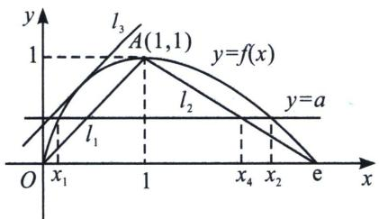

连接 $A(1, 1)$ 和点 $(e, 0)$ 的直线 $l_{2}$ 的方程为: $y = \frac{1}{1 - e} (x - e)$ , 当 $y = a$ 时, $x_{4} = (1 - e)a + e$ , 由图可知 $x_{2} > x_{4}$ , 所以要证明 $x_{1} + x_{2} > a(2 - e) + e - \frac{1}{e}$ , 只需证明 $x_{1} + x_{4} > a(2 - e) + e - \frac{1}{e}$ , 即只需证明 $x_{1} > a(2 - e) + e - \frac{1}{e} - x_{4} = a - \frac{1}{e}$ , 连接 $OA$ 的直线 $l_{1}$ 的方程为 $y = x$ , 设函数 $f(x)$ 的图象的与 $OA$ 平行的切线是直线 $l_{3}$ , 令 $f'(x) = -\ln x = 1$ , 可得 $x = \frac{1}{e}$ , 又 $f\left(\frac{1}{e}\right) = \frac{1}{e}\left(1 - \ln \frac{1}{e}\right) = \frac{2}{e}$ , 所以切线 $l_{3}$ 的方程为 $y - \frac{2}{e} = x - \frac{1}{e}$ , 即 $y = x + \frac{1}{e}$ , 令 $y = a$ , 得直线 $y = a$ 与直线 $l_{3}$ 的交点横坐标为 $a - \frac{1}{e}$ , 由图可知 $x_{1} > a - \frac{1}{e}$ , 故得证!

# 第四节 拟合体系

我们在解决极值点偏移问题时，通常是单个极值点，两个零点的模型，我们通过极大值和极小值类型来分类，如下：

考点1： $f(x)$ 极小值模型

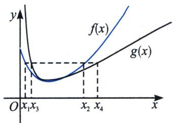

如果我们需要构造 $x_{1} + x_{2} < 2x_{0}$ 以及 $x_{1}x_{2} < x_{0}^{2}$ , 我们需要找到 $f(x)$ 极值点处的先大后小的拟合函数 $g(x)$ , 如左图, 且 $g(x_{3}) = g(x_{4})$ 时, 一定有 $x_{3} + x_{4} \leqslant 2x_{0}$ 或者 $x_{3}x_{4} \leqslant x_{0}^{2}$ ;
如果我们需要构造 $x_{1} + x_{2} > 2x_{0}$ 以及 $x_{1}x_{2} > x_{0}^{2}$ , 我们需要找到 $f(x)$ 极值点处的先小后大的拟合函数 $g(x)$ , 如右图, 且 $g(x_{3}) = g(x_{4})$ 时, 一定有 $x_{3} + x_{4} \geqslant 2x_{0}$ 或者 $x_{3}x_{4} \geqslant x_{0}^{2}$ ;

考点 2: $f(x)$ 极大值模型

如果我们需要构造 $x_{1} + x_{2} < 2x_{0}$ 以及 $x_{1}x_{2} < x_{0}^{2}$ ，我们需要找到 $f(x)$ 的先小后大的拟合函数 $g(x)$ ，如左图，且 $g(x_{3}) = g(x_{4})$ 时，一定有 $x_{3} + x_{4} \leqslant 2x_{0}$ 或者 $x_{3}x_{4} \leqslant x_{0}^{2}$ ；
如果我们需要构造 $x_{1} + x_{2} > 2x_{0}$ 以及 $x_{1}x_{2} > x_{0}^{2}$ ，我们需要找到 $f(x)$ 的先大后小的拟合函数 $g(x)$ ，如右图，且 $g(x_{3}) = g(x_{4})$ 时，一定有 $x_{3} + x_{4} \geqslant 2x_{0}$ 或者 $x_{3}x_{4} \geqslant x_{0}^{2}$ ；
如果我们回看高考，就会发现很多高考题都能按照不偏移函数拟合原函数，比如和型不偏移函数就是二次函数 $g(x) = a(x - x_0)^2 + y_0((x_0, y_0)$ 为极值点），因为极值点所在直线就是对称轴，而积型不偏移函数就是对勾函数 $g(x) = a\left(\frac{x}{x_0} + \frac{x_0}{x}\right) + y_0 - 2a((x_0, y_0)$ 为极值点），我们分别通过高考题来解读.

### 一、极值点和型偏移与二次函数构造
若 $y = f(x) = m$ 有两个零点 $x_{1}$ 和 $x_{2}$ ，其极值点为 $(x_0, y_0)$ ，要证明 $x_{1} + x_{2} > 2x_{0}$ 或者 $x_{1} + x_{2} < 2x_{0}$ ，我们进行以下操作：

①构建二次函数 $g(x)=a(x-x_{0})^{2}+y_{0}$ ;  
②设 $h(x)=f(x)-g(x)$ ，利用 $h''(x_{0})=0$ 求出 $a=\frac{1}{2}f''(x_{0})$ ;  
③根据 $h(x)$ 的正负，并通过 $g(x_{3})=m$ 和 $g(x_{4})=m$ 解出 $x_{3}$ 和 $x_{4}$ ;  
④判断并证明得出 $x_{1}+x_{2}>2x_{0}=x_{3}+x_{4}$ 或 $x_{1}+x_{2}<2x_{0}=x_{3}+x_{4}$ .

注意：如果不找点，则根据 $h(x)$ 的正负和 $f(x_{1}) = f(x_{2})$ 得到 $g(x_{1}) - g(x_{2}) > 0$ 或 $g(x_{1}) - g(x_{2}) < 0$ ，二次函数因式分解可得： $x_{1} + x_{2} > 2x_{0}$ 或 $x_{1} + x_{2} < 2x_{0}$ .

> [!example]- 例1 (2010·天津卷)已知函数 $f(x)=xe^{-x}$ ，如果 $x_{1}\neq x_{2}$ 且 $f(x_{1})=f(x_{2})$ ，证明： $x_{1}+x_{2}>2$ .
解析 令 $f(x_1) = f(x_2) = a$ ，易证 $0 < a < \frac{1}{\mathrm{e}}$ （考试请自证），构造函数 $h(x) = \frac{x}{\mathrm{e}^x} + \frac{(x - 1)^2}{2\mathrm{e}} - \frac{1}{\mathrm{e}}$ ， $h(1) = 0$ ， $h'(x) = \frac{1 - x}{\mathrm{e}^x} + \frac{x - 1}{\mathrm{e}} = \mathrm{e}^x (x - 1)(\mathrm{e}^{x - 1} - 1) \geqslant 0$ ， $h'（1） = 0$ ， $h(x)$ 单调递增，故我们可得知 $\left\{\begin{aligned}\frac{x}{\mathrm{e}^{x}}&>-\frac{(x-1)^2}{2\mathrm{e}}+\frac{1}{\mathrm{e}}(x>1)\\ \frac{x}{\mathrm{e}^{x}}&<-\frac{(x-1)^2}{2\mathrm{e}}+\frac{1}{\mathrm{e}}(x<1)\end{aligned}\right.$ ，即 $\left\{\begin{aligned}\frac{x_{2}}{\mathrm{e}^{x_{2}}}&>-\frac{(x_{2}-1)^{2}}{2\mathrm{e}}+\frac{1}{\mathrm{e}}\\ \frac{x_{1}}{\mathrm{e}^{x_{1}}}&<-\frac{(x_{1}-1)^{2}}{2\mathrm{e}}+\frac{1}{\mathrm{e}}\end{aligned}\right.\Rightarrow (x_{2}-1)^{2}>(x_{1}-1)^{2}, x_{1}+x_{2}>2$ 得证！

> [!example]- 例2 (2016·新课标I理)已知函数 $f(x) = (x - 2)\mathrm{e}^x + a(x - 1)^2$ 有两个零点.  
（1）求 a 的取值范围;  
（2）设 $x_{1}$ , $x_{2}$ 是 $f(x)$ 的两个零点, 证明: $x_{1} + x_{2} < 2$ .
解析 （1） 由 $f(x) = (x - 2)e^x + a(x - 1)^2$ ，可得 $f'(x) = (x - 1)e^x + 2a(x - 1) = (x - 1)(e^x + 2a)$ ，当 $a \geqslant 0$ 时，由 $f'(x) > 0$ ，得 $x > 1$ ；由 $f'(x) < 0$ ，得 $x < 1$ ，即有 $f(x)$ 在 $(-\infty, 1)$ 递减；在 $(1, +\infty)$ 递增
当 a<0 时， $f'(x)=(x-1)(e^{x}+2a)=0$ ，x=1 或 $x=\ln(-2a)$ ;

i：若 $\ln(-2a)=1$ ，即 $a=-\frac{e}{2}$ ， $f'(x)\geqslant0$ 恒成立，即有 $f(x)$ 在 R 上递增；
ii：若 $a < -\frac{\mathrm{e}}{2}$ 时，由 $f'(x) > 0$ ，得 $x < 1$ 或 $x > \ln (-2a)$ ；由 $f'(x) < 0$ ，得 $1 < x < \ln (-2a)$ 。即有 $f(x)$ 在 $(- \infty ,1)$ ， $(\ln (-2a), + \infty)$ 单调递增；在 $(1,\ln (-2a))$ 单调递减；  
iii：若 $-\frac{e}{2}<a<0$ ，由 $f'(x)>0$ ，得 $x<\ln(-2a)$ 或x>1；由 $f'(x)<0$ ，得 $\ln(-2a)<x<1$ 。即有 $f(x)$ 在 $(-∞, ∠(-2a))$ ， $(1, +∞)$ 递增；在 $(\ln(-2a), 1)$ 递减；

①当 a>0 时，由于 x<1，由于 $(x-2)\mathrm{e}^{x}\in(-\mathrm{e},0)$ ，故 $f(x)=(x-2)\mathrm{e}^{x}+a(x-1)^{2}>-\mathrm{e}+a(x-1)^{2}=0$ ，取 $x=1-\sqrt{\frac{e}{a}}$ ，一定有 $f(1-\sqrt{\frac{e}{a}})>0$ ，且 $f(1)=-\mathrm{e}<0$ ，故 $\exists x_{1}\in(1-\sqrt{\frac{e}{a}},1)$ ，使 $f(x_{1})=0$ ； $f(2)=a>0$ ，故 $\exists x_{2}\in(1,2)$ 使 $f(x_{2})=0$ ；故 $f(x)$ 有两个零点；
②当 a=0 时， $f(x)=(x-2)e^{x}$ ，所以 $f(x)$ 只有一个零点 $x_{1}=2$ ，不符合题意；
③当 a<0 时， $f(\ln(-2a))=a[\ln^{2}(-2a)-4\ln(-2a)+5]<0$ ， $f(1)=-e<0$ ，由于极大值和极小值均小于零，故最多只有一个零点，不符合题意。综上可得，a 的取值范围为 $(0,+\infty)$ .
证明：（2）构造函数令 $h(x) = (x - 2)\mathrm{e}^{x} - \frac{\mathrm{e}}{2} (x - 1)^{2} + \mathrm{e}$ ，易知 $h(1) = 0$ ， $h'(x) = (x - 1)(\mathrm{e}^x - \mathrm{e})$ ， $h'（1） = 0$ ， $h'(x) \geqslant 0$ 恒成立， $h(x)$ 单调递增，所以 $x < 1$ 时， $h(x) < 0$ ，此时有 $(x_{1} - 2)\mathrm{e}^{x_{1}} + a(x_{1} - 1)^{2} < \left(\frac{\mathrm{e}}{2} + a\right)(x_{1} - 1)^{2} - \mathrm{e}$ ， $x > 1$ 时，此时有 $(x_{2} - 2)\mathrm{e}^{x_{2}} + a(x_{2} - 1)^{2} > \left(\frac{\mathrm{e}}{2} + a\right)(x_{2} - 1)^{2} - \mathrm{e}$ ，即 $\left(\frac{\mathrm{e}}{2} + a\right)(x_{1} - 1)^{2} > \left(\frac{\mathrm{e}}{2} + a\right)(x_{2} - 1)^{2}$ ，即 $x_{1} + x_{2} < 2$ ，因此原命题得证.

注意: $f(x) = (x - 1)\mathrm{e}^{x}$ 的二次切线函数 $g(x) = \frac{1}{2} x^{2} - 1$ , 在近几年的高考当中考查甚广, 本题

我们可以通过构造求二阶导，也可以利用 $(x - 2)\mathrm{e}^{x} = \mathrm{e}(x - 2)\mathrm{e}^{x - 1}$ ，其拟合二次函数为 $\frac{\mathrm{e}}{2} (x - 1)^2 -\mathrm{e},$

我们可以根据这个二次切线不等式来进行一系列同构不等式构造，如下：

① $x\mathrm{e}^{x}=\frac{1}{\mathrm{e}}\cdot x\mathrm{e}^{x+1}\geqslant\frac{1}{2\mathrm{e}}[(x+1)^{2}-2]=\frac{(x+1)^{2}}{2\mathrm{e}}-\frac{1}{\mathrm{e}}$ 对 $x\geqslant-1$ 恒成立，同理 $x\mathrm{e}^{x}\leqslant\frac{(x+1)^{2}}{2\mathrm{e}}-\frac{1}{\mathrm{e}}$ 对 $x\leqslant-1$ 恒成立（如图）；
② $\frac{x}{e^{x}}=-(-xe^{-x})\geqslant-\frac{1}{2e}\left[(x-1)^{2}+2\right]=-\frac{(x-1)^{2}}{2e}+\frac{1}{e}$ 对 $x\geqslant1$ 恒成立，同理 $\frac{x}{e^{x}}\leqslant-\frac{(x-1)^{2}}{2e}+\frac{1}{e}$ 对 $x\leqslant1$ 恒成立(如图);

> [!example]- 例3 (2024·湖南郴州·模拟预测)已知函数 $f(x)=2a\ln x+\frac{1}{2}x^{2}-(a+2)x$ ，其中a为常数.
证明： $x_{1}+x_{2}>4.$ (a<0)
解析 极值点 x=2，在 $(0,2)$ 上 $f(x)$ 单调递减，在 $(2,+\infty)$ 上 $f(x)$ 单调递增，（参考第二节例三）故考虑构造原函数的先小后大，即 $\ln x$ 的先大后小，在 x=2 取等， $\ln x\sim\frac{2(x-1)}{x+1}(x=1)$ ，
故 $\ln \frac{x}{2} +\ln 2\sim \frac{2\left(\frac{x}{2} - 1\right)}{\frac{x}{2} + 1} +\ln 2,2a\ln x + \frac{1}{2} x^2 -(a + 2)x <   \frac{4a(x - 2)}{x + 2} +2a\ln 2 - ax + \frac{1}{2} x^{2} - 2x$ （显然不

是我们的目标，考虑泰勒展开）， $\ln x\sim x-1-\frac{1}{2}(x-1)^{2}(x=1)$ ， $\ln\frac{x}{2}\sim\frac{x}{2}-1-\frac{1}{2}\left(\frac{x}{2}-1\right)^{2}(x=2)$ $\Rightarrow\ln x\sim\frac{1}{2}\left(x-2-\frac{(x-2)^{2}}{4}\right)+\ln2,$
$\left\{ \begin{array}{l} 0 = 2 a \ln x _ {1} + \frac {1}{2} x _ {1} ^ {2} - (a + 2) x _ {1} > a \left[ x _ {1} - 2 - \frac {1}{4} (x _ {1} - 2) ^ {2} \right] + \frac {1}{2} x _ {1} ^ {2} - (a + 2) x _ {1} + 2 a \ln 2 \\ 0 = 2 a \ln x _ {2} + \frac {1}{2} x _ {2} ^ {2} - (a + 2) x _ {2} <   a \left[ x _ {2} - 2 - \frac {1}{4} (x _ {2} - 2) ^ {2} \right] + \frac {1}{2} x _ {2} ^ {2} - (a + 2) x _ {2} + 2 a \ln 2 \end{array} , \right.$

做差得： $x_{1}+x_{2}>4$ 得证！

### 二、极值点积型偏移与对勾函数构造
若 $y = f(x) = m$ 有两个零点 $x_{1}$ 和 $x_{2}$ ，其极值点为 $(x_0, y_0)$ ，要证明 $x_{1}x_{2} > x_{0}^{2}$ 或者 $x_{1}x_{2} < x_{0}^{2}$ ，我们进行以下操作：

①构建对勾函数 $g(x)=a\left(\frac{x}{x_{0}}+\frac{x_{0}}{x}\right)+y_{0}-2a;$   
②设 $h(x)=f(x)-g(x)$ ，利用 $h''(x_{0})=0$ 求出 $a=x_{0}^{2}f''(x_{0})$ ;

③根据 $h(x)$ 的正负，并通过 $g(x_{3})=m$ 和 $g(x_{4})=m$ 解出 $x_{3}$ 和 $x_{4}$ ;

④判断并证明得出 $x_{1}x_{2}>x_{0}^{2}=x_{3}x_{4}$ 或 $x_{1}x_{2}<x_{0}^{2}=x_{3}x_{4}$ .

> [!example]- 例4 (2021年新高考Ⅰ卷改编)已知函数 $f(x)=x(\ln x-1)$ 。设a，b为两个不相等的正数，且 $b\ln a-a\ln b=a-b$ ，证明：ab>1。
解析 由题得 $f'(x) = \ln x$ ，当 $f'(x) < 0$ 时， $x \in (0,1)$ ，故 $f(x)$ 在 $x \in (0,1)$ 单调递减，当 $f'(x) > 0$ 时， $x \in (1,+\infty)$ ，故 $f(x)$ 在 $(1,+\infty)$ 单调递增； $f(x) \geqslant f(1) = -1$ ，则 $x \ln x \geqslant x - 1$ ，且 $f(e) = 0$ ，故 $0 < x < 1$ 时， $f(x) \in (-1,0)$ ， $1 < x < e$ 时， $f(x) \in (-1,0)$ ，若 $b \ln a - a \ln b = a - b$ ，则 $\frac{1}{b} (\ln \frac{1}{b} - 1) = \frac{1}{a} (\ln \frac{1}{a} - 1) \Rightarrow f(\frac{1}{a}) = f(\frac{1}{b})$ ，令 $t_1 = \frac{1}{a}$ ， $t_2 = \frac{1}{b}$ ，则证 $t_1 t_2 < 1$ 即可， $f(t_1) = f(t_2) = m$ ，易知 $0 < t_1 < 1 < t_2 < e$ .
分析过程：以(1，-1)为顶点， $g(x)=a\left(x+\frac{1}{x}\right)-1-2a,\ h(x)=f(x)-g(x)=x\cdot\ln x-x-a$ $\left(x+\frac{1}{x}\right)+1+2a$ ，（如图）， $h'(x)=\ln x-a+\frac{a}{x^{2}}$ ， $h'（1）=0$ ， $h''(x)=\frac{1}{x}-\frac{2a}{x^{3}}$ ， $h''（1）=1-2a=0\Rightarrow a=\frac{1}{2}$

解答过程：令 $g(x)=\frac{1}{2}\left(x+\frac{1}{x}\right)-2,\quad h(x)=f(x)-g(x)=x\cdot\ln x-x-\frac{1}{2}\left(x+\frac{1}{x}\right)+2,\quad h'(x)=$ $\ln x-\frac{1}{2}+\frac{1}{2x^{2}},\quad h'（1）=0,\quad h''(x)=\frac{1}{x}-\frac{1}{x^{3}}$ ，当 0<x<1 时， $h''(x)<0,\quad h'(x)$ 单调递减，当 x>1 时， $h''(x)>0,\quad h'(x)$ 单调递增， $h'(x)\geqslant h'（1）=0,\quad h(x)$ 在 $(0,+\infty)$ 单调递增， $h(1)=0$ ，当 0<x<1 时 $h(x)<0$ ，当 x>1 时， $h(x)>0$ ，即 $\left\{\begin{aligned}t_{1}&\cdot\ln t_{1}-t_{1}-m<\frac{1}{2}\left(t_{1}+\frac{1}{t_{1}}\right)-2-m\\ t_{2}&\cdot\ln t_{2}-t_{2}-m>\frac{1}{2}\left(t_{2}+\frac{1}{t_{2}}\right)-2-m\end{aligned}\right.$ ，作差得 ab>1。

> [!example]- 例5 (清华中学生学术能力标准测试节选)已知函数 $f(x) = x^{2} + \frac{1 - \ln x}{x} - a$ 有两个零点 $x_{1} < x_{2}$  
（1）求实数a的范围   
（2） 求证 $x_{2} - x_{1} < \sqrt{a^{2} - 4} < x_{2}^{2} - x_{1}^{2}$   
（3）a>2 自证， $0<x_{1}<1<x_{2}$
解析 证明：先证 $\sqrt{a^2 - 4} < x_2^2 - x_1^2$ ，考虑 $f(x) = x^2 + \frac{1 - \ln x}{x} - a$ 极值点 1，过 $(1, -a + 2)$ ，故构造共极值点且主体为 $x^2$ 的对勾函数 $g(x) = x^2 + \frac{1}{x^2} - a$ ，令 $F(x) = f(x) - g(x) = \frac{x - 1 - x\ln x}{x^2}$ ，令 $y = x - 1 - x\ln x$ ， $y' = -\ln x$ ， $\left\{ \begin{array}{l} x \in (0, 1), y' > 0, y \uparrow \\ x \in (1, +\infty), y' < 0, y \downarrow \end{array} \right. \Rightarrow y_{\max} = 0$
即 $y = x - 1 - x\ln x \leqslant 0$ ，故 $f(x) \leqslant g(x)$ ，令 $g(x) = x^2 + \frac{1}{x^2} - a = 0$
解得 $x=x'_{1}$ ， $x=x'_{2}$ ， $x'_{2}-x'_{1}=\sqrt{a^{2}-4}$ （韦达定理），即 $\sqrt{a^{2}-4}=x'_{2}-x'_{1}<x_{2}^{2}-x_{1}^{2}$ ;
再证： $x_{2}-x_{1}<\sqrt{a^{2}-4}$ ，令 $h(x)=x+\frac{1}{x}-a$ ， $G(x)=f(x)-h(x)$ ， $G'(x)=\frac{2x^{3}-x^{2}-1+\ln x}{x^{2}}$
$T (x) = 2 x ^ {3} - x ^ {2} - 1 + \ln x \Rightarrow T ^ {'} (x) = 6 x ^ {2} - 2 x + \frac {1}{x}, \left\{ \begin{array}{l l} x <   \frac {1}{2}, & T ^ {'} (x) > - 2 x + \frac {1}{x} > 0 \\ x > \frac {1}{2}, & T ^ {'} (x) = 6 x ^ {2} - 2 x + \frac {1}{x} > 6 \frac {1}{4} - 1 > 0 \end{array} ; \right.$
即 $T'(x)=6x^{2}-2x+\frac{1}{x}>0,\quad T(x)\uparrow,\quad T(1)=0\Rightarrow\left\{\begin{aligned}x\in(0,1),&T(x)<0\Rightarrow G'(x)<0,G(x)\downarrow\\ x\in(1,+\infty),&T(x)>0\Rightarrow G'(x)>0,G(x)\uparrow\end{aligned}\right.$ $G(x)_{\min}=G(1)=0,\quad G(x)\geqslant0$ 恒成立， $f(x)\geqslant h(x)$
则令 $h(x) = x + \frac{1}{x} - a = 0$ ，解得 $x_{4} - x_{3} = \sqrt{a^{2} - 4}$ ，故 $x_{2} - x_{1} < x_{4} - x_{3} = \sqrt{a^{2} - 4}$

### 三、涉及双零点偏移的 $x \ln x$ 同构函数拟合

关于 $f(x)=x\ln x$ ，有两个零点，分别为x=0或x=1，这类型题除了极值点偏移问题外，还涉及与两个零点的中点，即 $\frac{1}{2}$ 的偏移问题，极值点偏移可以在极值点处构造拟合的二次函数，零点的偏移则需要通过两个零点和极值点进行三点的二次函数拟合构造.

零点和型偏移与二次函数构造：

①构建二次函数 $g(x)=n(x-a)(x-b)$ ;  
②带入点 $(x_{0}, f(x_{0}))$ ，求出n；  
③设 $h(x)=f(x)-g(x)$ ，证明 $h(x)$ 的正负；  
④通过 $g(x_{3})=m$ 和 $g(x_{4})=m$ 解出 $x_{3}$ 和 $x_{4}$ ;  
⑤判断并证明得出 $x_{1}+x_{2}>a+b=x_{3}+x_{4}$ 或 $x_{1}+x_{2}<a+b=x_{3}+x_{4}$ .

注意：如果不找点，则根据 $h(x)$ 的正负和 $f(x_{1}) = f(x_{2})$ 得到 $g(x_{1}) - g(x_{2}) > 0$ 或 $g(x_{1}) - g(x_{2}) < 0$ ，二次函数因式分解可得： $x_{1} + x_{2} > 2x_{0}$ 或 $x_{1} + x_{2} < 2x_{0}$ .

> [!example]- 例6 (2023·河北模拟)已知函数 $f(x)=x\ln x$ 与直线y=m交于 $A(x_{1},y_{1})$ ， $B(x_{2},y_{2})$ 两点.  
（1）求证： $0<x_{1}x_{2}<\frac{1}{e^{2}}$ ;  
（2）证明： $\frac{2}{e}<x_{1}+x_{2}<1.$
解析 （1） 由 $x_{1} \ln x_{1} = m, x_{2} \ln x_{2} = m$ ，可得 $x_{1} = \frac{m}{\ln x_{1}}$ ①， $x_{2} = \frac{m}{\ln x_{2}}$ ②，① - ② 得 $x_{1} - x_{2} = m$ $\left(\frac{\ln x_{2} - \ln x_{1}}{\ln x_{1} \ln x_{2}}\right) \Rightarrow \frac{x_{1} - x_{2}}{\ln x_{1} - \ln x_{2}} = \frac{-m}{\ln x_{1} \ln x_{2}}$ ③，① + ② 得 $x_{1} + x_{2} = \frac{m(\ln x_{2} + \ln x_{1})}{\ln x_{1} \ln x_{2}}$ ④，根据对数均值不等式（请自证）： $\frac{x_{1} + x_{2}}{2} > \frac{-m}{\ln x_{1} \ln x_{2}} (x_{1} \neq x_{2})$ ，即 $\frac{m(\ln x_{2} + \ln x_{1})}{2 \ln x_{1} \ln x_{2}} > \frac{-m}{\ln x_{1} \ln x_{2}}$ ，由于 $y = m$ 与 $y = x \ln x$ 交于

不同两点，易得 $m < 0$ ，故上式简化为 $\ln (x_{1} \cdot x_{2}) < -2 = \mathrm{lne}^{-2}$ ，所以 $0 < x_{1} \cdot x_{2} < \frac{1}{\mathrm{e}^{2}}$ 。（本题还有对勾拟合构造法，参考例4）  
（2）分析：先构左边： $g_{1}(x)=a_{1}\left(x-\frac{1}{\mathrm{e}}\right)^{2}-\frac{1}{\mathrm{e}}$ ，令 $h(x)=f(x)-g_{1}(x)$ ，极值点处二阶导 $h''\left(\frac{1}{\mathrm{e}}\right)=0$ ，得出 $a_{1}=\frac{\mathrm{e}}{2}$ ，所以构造 $h(x)=f(x)-g_{1}(x)=x\ln x-\frac{\mathrm{e}}{2}\left(x-\frac{1}{\mathrm{e}}\right)^{2}+\frac{1}{\mathrm{e}}$ ，如下左图；
再构右边： $g_{2}(x)=a_{2}x(x-1)$ ，代入点 $\left(\frac{1}{\mathrm{e}},-\frac{1}{\mathrm{e}}\right)$ 得： $a_{2}=\frac{e}{e-1}$ ，构造 $m(x)=f(x)-g_{2}(x)=x\ln x-\frac{e}{e-1}x(x-1)$ ，如下右图.

解答：设顶点为 $\left(\frac{1}{\mathrm{e}}, -\frac{1}{\mathrm{e}}\right)$ 的二次函数为 $g_{1}(x) = \frac{\mathrm{e}}{2}\left(x - \frac{1}{\mathrm{e}}\right)^{2} - \frac{1}{\mathrm{e}}$ ， $h(x) = f(x) - g_{1}(x) = x\ln x - \frac{\mathrm{e}}{2}\left(x - \frac{1}{\mathrm{e}}\right)^{2} + \frac{1}{\mathrm{e}}$ ， $h'(x) = \ln x - \mathrm{e}\left(x - \frac{1}{\mathrm{e}}\right)$ ， $h''(x) = \frac{1}{x} - \mathrm{e}$ ， $h''\left(\frac{1}{\mathrm{e}}\right) = 0$ ， $h''(x)$ 在 $\left(0, \frac{1}{\mathrm{e}}\right)$ 恒正， $h'(x)$ 单调递增， $h''(x)$ 在 $\left(\frac{1}{\mathrm{e}}, +\infty\right)$ 恒负， $h'(x)$ 单调递减；故 $h'(x) \leqslant h'（1） = 0$ ，则 $h(x)$ 在 $(0, +\infty)$ 单调递减，由于 $h\left(\frac{1}{\mathrm{e}}\right) = 0$ ，故 $x \in \left(0, \frac{1}{\mathrm{e}}\right)$ 时， $h(x) > 0$ ，即 $x\ln x > \frac{\mathrm{e}}{2}\left(x - \frac{1}{\mathrm{e}}\right)^{2} - \frac{1}{\mathrm{e}}$ ； $x \in \left(\frac{1}{\mathrm{e}}, +\infty\right)$ 时， $h(x) < 0$ ，即 $x\ln x < \frac{\mathrm{e}}{2}\left(x - \frac{1}{\mathrm{e}}\right)^{2} - \frac{1}{\mathrm{e}}$ ；
由于 $f(x_{1}) - m = f(x_{2}) - m = 0$ ， $0 < x_{1} < \frac{1}{\mathrm{e}} < x_{2} < 1$ ，故有 $\left\{ \begin{array}{l}x\ln x - m > \frac{\mathrm{e}}{2}\left(x - \frac{1}{\mathrm{e}}\right)^2 -\frac{1}{\mathrm{e}} -m = 0\left(0 <   x <   \frac{1}{\mathrm{e}}\right)\\ x\ln x - m <   \frac{\mathrm{e}}{2}\left(x - \frac{1}{\mathrm{e}}\right)^2 -\frac{1}{\mathrm{e}} -m = 0\left(x > \frac{1}{\mathrm{e}}\right) \end{array} \right.$
$\frac{e}{2}\left(x_{2}-\frac{1}{e}\right)^{2}>\frac{e}{2}\left(x_{1}-\frac{1}{e}\right)^{2}\Rightarrow x_{1}+x_{2}>\frac{2}{e}$ 得证，令 $g_{2}(x)=\frac{e}{e-1}x(x-1)$ ， $h(x)=f(x)-g_{2}(x)=x\ln x-\frac{e}{e-1}x(x-1)=x\left[\ln x-\frac{e}{e-1}(x-1)\right]$ ， $m(x)=\ln x-\frac{e}{e-1}(x-1)$ ， $m'(x)=\frac{1}{x}-\frac{e}{e-1}$ ，易知 $m'(x)$ 单调递减，当 $x\in\left(0,\frac{e-1}{e}\right)$ 时， $m'(x)>0$ ，此时 $m(x)$ 单调递增，当 $x\in\left(\frac{e-1}{e},1\right)$ 时， $m'(x)<0$ ， $m(x)$ 单调递减，由于 $x\to0$ 时， $m(x)\to-\infty$ ， $h(x)\to0$ ， $h(1)=0$ ， $h(1)=0$ ， $m\left(\frac{1}{e}\right)=0$ ，故当 $x\in\left(0,\frac{1}{e}\right)$ 时， $h(x)<0$ ；当 $x\in(1,e)$ 时， $h(x)<0$ ，
即 $\left\{\begin{aligned}x\ln x-m<\frac{e}{e-1}x(x-1)-m=0\left(0<x<\frac{1}{e}\right)\\x\ln x-m>\frac{e}{e-1}x(x-1)-m=0\left(\frac{1}{e}<x<1\right)\end{aligned}\right.$ ，分别取 $\left\{\begin{aligned}x_{3}&=\frac{1}{2}-\frac{\sqrt{e^{2}-4me(e-1)}}{2e}\\x_{4}&=\frac{1}{2}+\frac{\sqrt{e^{2}-4me(e-1)}}{2e}\end{aligned}\right.$ （做差也可），
所以 $x_{1}<x_{3}<\frac{1}{e}<x_{2}<x_{4}$ ，即 $x_{1}+x_{2}<x_{3}+x_{4}=1$ .

注意: 本题我们给了找点的模式, 虽然求出的 $x_{3} 、 x_{4}$ 比较丑, 但是能客观卡点, 其实在拟合的二次函数构造出来的那一刻, 本类型题就已经大结局了. 如果本题不找点, 我们可以尝试一下操作:

左边：由 $0 < x_{1} < \frac{1}{\mathrm{e}} < x_{2} < 1$ ， $g_{1}(x_{1}) < f(x_{1}) = f(x_{2}) < g_{1}(x_{2})$ ，故 $g_{1}(x_{2}) - g_{1}(x_{1}) > 0$
即 $\frac{\mathrm{e}}{2}\left(x_2 - \frac{1}{\mathrm{e}}\right)^2 - \frac{\mathrm{e}}{2}\left(x_1 - \frac{1}{\mathrm{e}}\right)^2 > 0$ ，即 $(x_2 - x_1)\left(x_1 + x_2 - \frac{2}{\mathrm{e}}\right) > 0$ ，又 $x_2 > x_1 > 0$ ，即 $x_1 + x_2 > \frac{2}{\mathrm{e}}$ 。原式得证。

右边：由于 $f(x_{1}) = f(x_{2})$ ， $0 < x_{1} < \frac{1}{\mathrm{e}} < x_{2} < 1$ ，故有 $g_{2}(x_{1}) > f(x_{1}) = f(x_{2}) > g_{2}(x_{2})$ ， $\frac{\mathrm{e}}{\mathrm{e} - 1} x_{1}$ $(x_{1} - 1) > \frac{\mathrm{e}}{\mathrm{e} - 1} x_{2}(x_{2} - 1) \Leftrightarrow \left(x_{1} - \frac{1}{2}\right)^{2} - \left(x_{2} - \frac{1}{2}\right)^{2} = (x_{1} - x_{2})(x_{1} + x_{2} - 1) > 0$ 又 $x_{2} > x_{1}$ 故 $x_{1} + x_{2}$ $< 1$ 原式得证.

本题右边不等式还能构造绝对值函数进行切割线拟合，本章已经介绍了，我们尝试一下操作.
$\left\{ \begin{array}{l} x \ln x - m < -x - m = 0 \left(0 < x < \frac{1}{\mathrm{e}}\right) \\ x \ln x - m > x - 1 - m = 0 \left(\frac{1}{\mathrm{e}} < x < 1\right) \end{array} \right.$ ，分别取 $\left\{ \begin{array}{l} x_{3} = -m \\ x_{4} = 1 + m \end{array} \right.$ ，所以 $x_{1} < x_{3} < \frac{1}{\mathrm{e}} < x_{2} < x_{4}$ ，即 $x_{1} + x_{2} < x_{3} + x_{4} = 1$ ；

凡是能用绝对值函数(割线)拟合的, 用二次函数一定能拟合, 但是能用二次函数拟合的, 用绝对值函数(割线)就不一定能拟合, 因为二次函数是一个比绝对值函数更紧密更精细的拟合函数.

### 四、指数对数函数的常见拟合函数

我们都熟知的 $\left\{ \begin{array}{l} \frac{2(x - 1)}{x + 1} < \ln x < \frac{1}{2}\left(x - \frac{1}{x}\right)(x > 1) \\ \frac{1}{2}\left(x - \frac{1}{x}\right) < \ln x < \frac{2(x - 1)}{x + 1} (0 < x < 1) \end{array} \right.$ ，即把对数函数分别拟合为飘带函数 $\frac{1}{2}\left(x - \frac{1}{x}\right)$ 和帕德逼近 $R_{1,1}(x) = \frac{2(x - 1)}{x + 1}$ ，本文给予这两个式子的来龙去脉，虽然这两个式子都很好证明.

我们根据泰勒展开， $\mathrm{e}^{x}=1+x+\frac{x^{2}}{2}+\cdots$ ，同理 $e^{-x}=1-x+\frac{x^{2}}{2}+\cdots$ ，我们可得 $\left\{\begin{aligned}\mathrm{e}^{x}>1+x+\frac{x^{2}}{2}(x>0)\textcircled{①}\\ \mathrm{e}^{-x}<1-x+\frac{x^{2}}{2}(x>0)\textcircled{②}\end{aligned}\right.$ 两式相减，可得，当 x>0 时， $e^{x}-e^{-x}>2x$ ，令 $e^{x}=t$ ，故 $\frac{1}{2}\left(t-\frac{1}{t}\right)>\ln t$
$(t > 1)$ , 同理, 我们也可以推出 $\left\{ \begin{array}{l} \mathrm{e}^{x} < 1 + x + \frac{x^{2}}{2} (x < 0) \\ \mathrm{e}^{-x} > 1 - x + \frac{x^{2}}{2} (x < 0) \end{array} \right.$ , 所以 $\mathrm{e}^{x} - \mathrm{e}^{-x} < 2x$ , 令 $\mathrm{e}^{x} = t$ , 故 $\frac{1}{2}$ $\left(t - \frac{1}{t}\right) < \ln t (0 < t < 1)$ , 飘带拟合推导成功, 其实很多时候会以 $\left\{ \begin{array}{l} \mathrm{e}^{2x} - 2x\mathrm{e}^{x} - 1 > 0 (x > 0) \\ \mathrm{e}^{2x} - 2x\mathrm{e}^{x} - 1 < 0 (x < 0) \end{array} \right.$ 或者 $\left\{ \begin{array}{l} \mathrm{e}^{x} - x\mathrm{e}^{\frac{x}{2}} - 1 > 0 (x > 0) \\ \mathrm{e}^{x} - x\mathrm{e}^{\frac{x}{2}} - 1 < 0 (x < 0) \end{array} \right.$ 形式出现, 一切殊途同归.
利用对数的泰勒展开 $\ln(1+x)=x-\frac{x^{2}}{2}+\frac{x^{3}}{3}+\cdots$ ，同理 $\ln(1-x)=-x-\frac{x^{2}}{2}-\frac{x^{3}}{3}+\cdots$
即 $\left\{ \begin{array}{l} \ln (1 + x) > x - \frac{x^2}{2} (x > 0) \\ \ln (1 - x) < -x - \frac{x^2}{2} (x > 0) \end{array} \right.$ ，两式相减得： $\ln \frac{1 + x}{1 - x} > 2x (x > 0)$ ，令 $\frac{1 + x}{1 - x} = t (t > 1)$ ，则有 $x = \frac{t - 1}{t + 1}$ ，故 $\ln t > \frac{2(t - 1)}{t + 1} (t > 1)$ ，同理也能证明 $\ln t < \frac{2(t - 1)}{t + 1} (0 < t < 1)$ .

我们得到 $\left\{ \begin{array}{l} \frac{2(t - 1)}{t + 1} < \ln t (t > 1) \\ \ln t < \frac{2(t - 1)}{t + 1} (0 < t < 1) \end{array} \right.$ ，不妨令 $x = \ln t$ ，则可得 $\left\{ \begin{array}{l} \frac{2 + x}{2 - x} > e^x (x > 0) \\ \frac{2 + x}{2 - x} < e^x (x < 0) \end{array} \right.$ （ $e^x$ 帕德逼近 $R_{1,1}(x)$ ）

关于极值点偏移, 我们通常会出现两种不同极值点, 考点 1 是参变分离后的极值点, 考点 2 是含参的极值点, 在极值点处构造先小后大或者先大后小的拟合函数, 可以整体函数构造, 也可以局部的 $\mathrm{e}^{x}$ 和 $\ln x$ 构造, 我们通过模特函数 $f(x)=\frac{\ln x}{x}$ 为例来阐述拟合函数构造.

> [!example]- 例7 已知函数 $f(x) = \frac{\ln x}{x}$ ，若 $f(x) = a$ 有两个不同的零点 $x_{1}, x_{2}$ ，且 $x_{1} < x_{2}$ ，
求 a 的取值范围.
解析 如图，易知 $0 < a < \frac{1}{e}$ （图形不能作为证明依据，必须要找点）.
证明：由 $f(x)=\frac{\ln x}{x}=a$ 得： $ax=\ln x$ ，令 $g(x)=ax-\ln x$ ， $g'(x)=a-\frac{1}{x}$

i) 当 $a \leqslant 0$ 时, $g'(x) \leqslant 0$ , $g(x)$ 单调递减, 不可能出现两个零点;  
ii) 当 $a > 0$ 时, 易知 $g'\left(\frac{1}{a}\right) = 0$ , 当 $0 < x < \frac{1}{a}$ 时, $g'(x) < 0$ , 则 $g(x)$ 单调递减, 当 $x > \frac{1}{a}$ 时, $g'(x)$

>0，则 $g(x)$ 单调递增， $g(x)_{\min}=g\left(\frac{1}{a}\right)=1-\ln\frac{1}{a}<0$ ，所以 $0<a<\frac{1}{e}$ ;
当 $x < \frac{1}{a}$ 时，由于 $g(x) = ax - \ln x > \ln x = 0$ ，故取 x = 1， $g(1) = a > 0$ ，所以 $\exists x_{1} \in \left(1, \frac{1}{a}\right)$ ，使 $g(x_{1}) = 0$ ；当 $x > \frac{1}{a}$ 时，由于 $g(x) = \sqrt{x} \left(a\sqrt{x} - \frac{\ln x}{\sqrt{x}}\right) > \sqrt{x} \left(a\sqrt{x} - \frac{2}{e}\right) = 0$ ，故取 $x = \frac{4}{a^{2}e^{2}}$ ，所以 $\exists x_{2} \in \left(\frac{1}{a}, \frac{4}{a^{2}e^{2}}\right)$ ，使 $g(x_{2}) = 0$ ；综上，当 $f(x) = a$ 有两个不同的零点时， $0 < a < \frac{1}{e}$ .

考点1：常数的极值点  
（2） $x_{1}+x_{2}>2e;$  
（3） $x_{1}x_{2} > \mathrm{e}^{2}$ ;  
（4） $\frac{3}{a}-e<x_{1}+x_{2};$  
（5） $x_{1}x_{2} > \frac{\mathrm{e}}{a}$
解析：由于 $f(x)=\frac{\ln x}{x}$ 的极值点是x=e，在证明 $x_{1}+x_{2}>x_{3}+x_{4}=2e$ 和 $x_{1}x_{2}>x_{3}x_{4}=e^{2}$ ，故我们需要构造 $f(x)$ 的先大后小的拟合函数(如图)，即构造 $\ln x$ 的先大后小函数 $\frac{2(x-1)}{x+1}$ ，拟合需要在极值点两侧进行

构造，故我们由于利用 $\left\{\begin{aligned}\frac{2(x-1)}{x+1}<\ln x(x>1)\\\ln x<\frac{2(x-1)}{x+1}(0<x<1)\end{aligned}\right.$ 得： $\left\{\begin{aligned}\ln\frac{x}{e}<\frac{2\left(\frac{x}{e}-1\right)}{\frac{x}{e}+1}(0<x<e)\\\frac{2\left(\frac{x}{e}-1\right)}{\frac{x}{e}+1}<\ln\frac{x}{e}(x>e)\end{aligned}\right.\Rightarrow\left\{\begin{aligned}\ln x<\frac{3x-e}{x+e}(0<x<e)\\\ln x>\frac{3x-e}{x+e}(x>e)\end{aligned}\right.$

当 $1 < x < \mathrm{e}$ 时， $f(x) = \frac{\ln x}{x} = a \Rightarrow ax - \frac{3x - \mathrm{e}}{x + \mathrm{e}} < 0$ ，取 $x_{3} = \frac{3 - ae - \sqrt{a^{2}e^{2} - 10ae + 9}}{2a}$ ，故 $\exists x_{1} \in (x_{3}, e)$ 使 $f(x_{1}) = a$ ；当 $x > \mathrm{e}$ 时， $f(x) = \frac{\ln x}{x} = a \Rightarrow ax - \frac{3x - \mathrm{e}}{x + \mathrm{e}} > 0$ ，取 $x_{4} = \frac{3 - ae + \sqrt{a^{2}e^{2} - 10ae + 9}}{2a}$ ，故 $\exists x_{2} \in (x_{4}, +\infty)$ 使 $f(x_{2}) = a$ ；
所以 $x_{1}+x_{2}>x_{3}+x_{4}=\frac{3}{a}-e>2e,\quad x_{1}x_{2}>x_{3}x_{4}=\frac{e}{a}>e^{2}.$

注意：这四个问题可以通过一个拟合函数的零点： $ax - \frac{3x - e}{x + e} = 0$ ，即转化为二次方程： $ax^{2} +$
$(ae - 3)x + e = 0$ 。一个加强的偏移不等式可以证明弱化型的不等式，不过关于（2）和（3）这类减弱型的偏移问题，直接用对数均值不等式或者二次(对勾)拟合均可。

考点 2：含参的极值点  
（6） $x_{1}+x_{2}>\frac{1-\ln a}{a};$ （7） $x_{1}x_{2}>\frac{2+\ln a}{a^{2}}$
解析：参变不分离的函数 $g(x)=ax-\ln x$ 的极值点是 $x=\frac{1}{a}$ ，通过前面的二次拟合以及对勾拟合后发现，构造 $x=\frac{1}{a}$ 的函数更为紧密（因为 $\frac{1}{a}>e$ ），
由于 $1 < x_{1} < \frac{1}{a} < x_{2}$ 利用 $\left\{ \begin{array}{l} \frac{2(x - 1)}{x + 1} < \ln x (x > 1) \\ \ln x < \frac{2(x - 1)}{x + 1} (0 < x < 1) \end{array} \right.$ 得： $\left\{ \begin{array}{l} \ln ax < \frac{2(ax - 1)}{ax + 1} (0 < x < \frac{1}{a}) \\ \frac{2(ax - 1)}{ax + 1} < \ln ax (x > \frac{1}{a}) \end{array} \right.$ ，化简后
得： $\left\{ \begin{array}{l} \ln x <   \frac{2(ax - 1)}{ax + 1} -\ln a\left(0 <   x <   \frac{1}{a}\right)\\  \frac{2(ax - 1)}{ax + 1} -\ln a <   \ln x\left(x > \frac{1}{a}\right) \end{array} \right.\Rightarrow \left\{ \begin{array}{l} ax - \ln x > ax - \frac{2(ax - 1)}{ax + 1} +\ln a = 0\left(0 <   x <   \frac{1}{a}\right)\\ ax - \ln x <   ax - \frac{2(ax - 1)}{ax + 1} +\ln a = 0\left(x > \frac{1}{a}\right) \end{array} \right.$ 当 $1 <   x <   \frac{1}{a}$

时，取 $x_{3} = \frac{1 - \ln a - \sqrt{\ln^{2}a - 6\ln a - 7}}{2a}$ ，故 $\exists x_{1} \in \left(x_{3}, \frac{1}{a}\right)$ 使 $g(x_{1}) = 0$ ；当 $x > \frac{1}{a}$ 时，取 $x_{4} = \frac{1 - \ln a + \sqrt{\ln^{2}a - 6\ln a - 7}}{2a}$ ，故 $\exists x_{2} \in (x_{4}, +\infty)$ 使 $g(x_{2}) = 0$ ；
所以 $x_{1} + x_{2} > x_{3} + x_{4} = \frac{1 - \ln a}{a}, x_{1}x_{2} > x_{3}x_{4} = \frac{2 + \ln a}{a^{2}}.$  
（8） $x_{1} + x_{2} < \frac{-2\ln a}{a}$ ; （9） $x_{1}x_{2} < \frac{1}{a^{2}}$
解析：参变不分离，利用飘带不等式另一半， $\left\{\begin{aligned}\frac{1}{2}\left(x-\frac{1}{x}\right) & < \ln x(0 < x < 1)\\ \ln x & < \frac{1}{2}\left(x-\frac{1}{x}\right)(x > 1)\end{aligned}\right.$
$\Rightarrow \left\{ \begin{array}{l} \frac{1}{2}\left(ax - \frac{1}{ax}\right) < \ln ax\left(0 < x < \frac{1}{a}\right) \\ \ln ax < \frac{1}{2}\left(ax - \frac{1}{ax}\right)\left(x > \frac{1}{a}\right) \end{array} \right.$ ，则 $\left\{ \begin{array}{l} ax - \ln x < ax - \frac{1}{2}\left(ax - \frac{1}{ax}\right) + \ln a = 0\left(0 < x < \frac{1}{a}\right) \\ ax - \ln x > ax - \frac{1}{2}\left(ax - \frac{1}{ax}\right) + \ln a = 0\left(x > \frac{1}{a}\right) \end{array} \right.\Rightarrow$
$\left\{ \begin{array}{l} ax_{1}^{2} + 2x_{1}\ln a + \frac{1}{a} < 0 \\ ax_{2}^{2} + 2x_{2}\ln a + \frac{1}{a} > 0 \end{array} \right.$ 当 $1 < x < \frac{1}{a}$ 时，取 $x_{3} = \frac{-\ln a - \sqrt{\ln^{2}a - 1}}{a}$ ，故 $\exists x_{1} \in (1, x_{3})$ 使 $g(x_{1}) = 0$ ；当 $x > \frac{1}{a}$ 时，取 $x_{4} = \frac{-\ln a + \sqrt{\ln^{2}a - 1}}{a}$ ，故 $\exists x_{2} \in \left(\frac{1}{a}, x_{4}\right)$ 使 $g(x_{2}) = 0$ ；
所以 $x_{1} + x_{2} <   x_{3} + x_{4} = \frac{-2\ln a}{a},  x_{1}x_{2} <   x_{3}x_{4} = \frac{1}{a^{2}}.$

> [!example]- 例8 (2025·黑龙江哈尔滨·一模节选)已知函数 $f(x) = (x - a)\ln x - x$ .
①求证： $x_{1}+x_{2}>\frac{2}{e}$ ;  
②求证： $\frac{2\sqrt{1+ae}}{e}<x_{2}-x_{1}.$
解析 ①依题意 $f'(x) = \ln x - \frac{a}{x} = 0$ 的两根为 $x_1, x_2$ ，即 $a = x\ln x$ 的两根为 $x_1, x_2$ 。令 $g(x) = x\ln x$ ， $g'(x) = 1 + \ln x = 0$ ，得 $x = \frac{1}{e}$ ，且 $x \in \left(0, \frac{1}{e}\right)$ ， $g'(x) < 0$ ， $x \in \left(\frac{1}{e}, +\infty\right)$ ， $g'(x) > 0$ ，则 $g(x)$ 在 $\left(0, \frac{1}{e}\right)$ 单调递减，在 $\left(\frac{1}{e}, +\infty\right)$ 单调递增，则 $0 < x_1 < \frac{1}{e} < x_2 < 1$ ，令 $h(x) = g\left(\frac{2}{e} - x\right) - g(x)$ ， $\left(0 < x < \frac{1}{e}\right)$ ，则 $h'(x) = -\ln\left(-x^2 + \frac{2}{e}x\right) - 2 > 0$ ，所以 $h(x)$ 在 $\left(0, \frac{1}{e}\right)$ 单调递增，所以 $h(x) < h\left(\frac{1}{e}\right) = 0$ ，所以 $g\left(\frac{2}{e} - x_1\right) < g(x_1) = g(x_2)$ ，又 $\frac{2}{e} - x_1 > \frac{1}{e}$ ， $x_2 > \frac{1}{e}$ ， $g(x)$ 在 $\left(\frac{1}{e}, +\infty\right)$ 单调递增。所以 $\frac{2}{e} - x_1 < x_2$ ，即 $x_1 + x_2 > \frac{2}{e}$ 。

②法一: 由 $x_{2} > \frac{2}{\mathrm{e}} - x_{1}$ , 要证明 $x_{2} - x_{1} > \frac{2 \sqrt{1 + a \mathrm{e}}}{\mathrm{e}}$ , 只需证 $\frac{2}{\mathrm{e}} - 2x_{1} > \frac{2 \sqrt{1 + a \mathrm{e}}}{\mathrm{e}}$ , 即证明 $1 - \mathrm{e} x_{1} > \sqrt{1 + a \mathrm{e}}$ , 即证明 $\mathrm{e} x_{1}^{2} - 2x_{1} > a = x_{1} \ln x_{1}$ , 即证明 $\mathrm{e} x_{1} - 2 > \ln x_{1}$ 即证明 $\mathrm{e} x_{1} - 1 > \ln \mathrm{e} x_{1}$ , 设 $F(x) = x - \ln x - 1, x \in (0, 1)$ , 则 $F'(x) = \frac{x - 1}{x}$ , 则当 $x \in (0, 1)$ 时, $F'(x) < 0$ , 则 $F(x)$ 在 $(0, 1)$ 单调递减, 则 $F(x) > F(1) = 0$ , 则 $x - \ln x - 1 > 0$ 在 $(0, 1)$ 上恒成立, 得证!

法二：拟合由图像可知，只需构造 $\ln x$ 的先大后大，在 $x=\frac{1}{e}$ 取等；即 $\ln x\leqslant x-1,\quad\ln x\leqslant ex-1\Rightarrow$ $\ln x\leqslant ex-2$ ，故 $x\ln x-a\leqslant x(ex-2)-a=0\Rightarrow x'_{2}-x'_{1}=\frac{2\sqrt{1+ae}}{e}$ ;

法三：令 $\frac{2\sqrt{1+ae}}{e}=\frac{\sqrt{B^{2}-4AC}}{|A|}$ ，故A=e(开口方向)， $B=\pm2$ （舍正，共极值点），C=-a，即构造二次函数 $y=ex^{2}-2x-a$ ，判断与原函数大小关系，后续自证！

> [!example]- 例9 (2022·甲卷)已知函数 $f(x)=\frac{\mathrm{e}^{x}}{x}-\ln x+x-a$ .  
（1）证明：若 $f(x)$ 有两个零点 $x_{1}$ ， $x_{2}$ ，则 $x_{1}x_{2}<1$ .
解析 在(0,1)上 $f(x)$ 单调递减，在 $(1,+\infty)$ 上 $f(x)$ 单调递增，由题，构造 $f(x)$ 的先大后小，即 $e^{x}$ 的先大后小，lnx 先小后大，在1处取等， $e^{x}\sim1+x+\frac{1}{2}x^{2}(x=1)\Rightarrow e^{x}\sim ex+\frac{e}{2}(x-1)^{2}$ ， $\ln x\sim\frac{1}{2}\left(x-\frac{1}{x}\right)$ ，
$\left\{ \begin{array}{l} f (x _ {1}) = 0 = \frac {\mathrm{e} ^ {x _ {1}}}{x _ {1}} - \ln x _ {1} + x _ {1} - a <   \mathrm{e} + \frac {\mathrm{e}}{2} \frac {(x _ {1} - 1) ^ {2}}{x _ {1}} - \frac {1}{2} \left(x _ {1} - \frac {1}{x _ {1}}\right) + x _ {1} - a = \frac {\mathrm{e} + 1}{2} \left(x _ {1} + \frac {1}{x _ {1}}\right) - a \\ f (x _ {2}) = 0 = \frac {\mathrm{e} ^ {x _ {2}}}{x _ {2}} - \ln x _ {2} + x _ {2} - a > \mathrm{e} + \frac {\mathrm{e}}{2} \frac {(x _ {2} - 1) ^ {2}}{x _ {2}} - \frac {1}{2} \left(x _ {2} - \frac {1}{x _ {2}}\right) + x _ {2} - a = \frac {\mathrm{e} + 1}{2} \left(x _ {2} + \frac {1}{x _ {2}}\right) - a \end{array} \Rightarrow x _ {1} x _ {2} <   1. \right.$

> [!example]- 例10 (2024·湖南金太阳月考)已知函数 $f(x) = \mathrm{e}^{\frac{1}{x} - a} + \ln x - a$ 有两个零点 $x_{1}, x_{2}$ .
证明： $x_{1}+x_{2}>2a.$
解析 $a = \ln x + \frac{1}{x} = g(x)$ , 在 $(0, 1)$ 上 $f(x)$ 单调递减, 在 $(1, +\infty)$ 上 $f(x)$ 单调递增, 构造 $f(x)$ 的先小后大, 即 $\ln x$ 先小后大, 在 1 处取等, $\ln x \sim \frac{1}{2}\left(x - \frac{1}{x}\right)$ , 故
$\left\{ \begin{array}{l l} a = g (x _ {1}) = \ln x _ {1} + \frac {1}{x _ {1}} > \frac {1}{2} \left(x _ {1} - \frac {1}{x _ {1}}\right) + \frac {1}{x _ {1}} \\ & \Rightarrow 2 a x _ {2} - x _ {2} ^ {2} - 1 <   2 a x _ {1} - x _ {1} ^ {2} - 1, \text {故} x _ {1} + x _ {2} > 2 a \text {得证!} \\ a = g (x _ {2}) = \ln x _ {2} + \frac {1}{x _ {2}} <   \frac {1}{2} \left(x _ {2} - \frac {1}{x _ {2}}\right) + \frac {1}{x _ {2}} \end{array} \right.$

> [!example]- 例11 (24-25 高三上·广东深圳·阶段练习)已知函数 $f(x) = x\ln x - a$ 有两个零点 $x_{1}$ ， $x_{2}(x_{1} < x_{2})$ ，  
（1）求 $f(x)$ 的单调区间和极值;  
（2） 当 $x \in (0, 1]$ 时， $f(x) \geqslant k(x^{2} - 1) - a$ 恒成立，求实数 k 的最小值；  
（3） 证明： $x_{2}-x_{1}<\sqrt{1+2a}-\frac{a^{2}e^{2}}{4}.$
解析 （1） $f'(x)=\ln x+1$ 令 $f'(x)=0$ ，得 $x=\frac{1}{e}$ ，所以 $x\in\left(0,\frac{1}{e}\right)$ 时， $f'(x)<0$ ， $f(x)$ 单调递减， $x\in\left(\frac{1}{e},+\infty\right)$ 时， $f'(x)>0$ ， $f(x)$ 单调递增， $f(x)$ 的极小值为 $f\left(\frac{1}{e}\right)=-\frac{1}{e}-a$ ，无极大值.  
（2） $f(x)\geqslant k(x^{2}-1)-a$ ，即 $x\ln x-k(x^{2}-1)\geqslant0$ ，令 $g(x)=x\ln x-k(x^{2}-1)$ ， $g(1)=0$ ，
$k \leqslant 0$ 时， $x \in (0,1)$ 时， $k(x^{2}-1) > 0$ ，而 $x \ln x < 0$ ，不合题意；
k>0 时， $g'(x)=\ln x+1-2kx$ ， $g'（1）=1-2k$ ，令 $h(x)=g'(x)$ ，
$h'(x)=\frac{1}{x}-2k$ ，显然 $h'(x)$ 为减函数，当 $k=\frac{1}{2}$ ，即 $h'（1）=1-2k=0$ 时，则 $x\in(0,1]$ ， $h'(x)\geqslant0$ ， $g'(x)$ 单调递增且 $g'（1）=1-2k=0$ ，所以 $x\in(0,1]$ 时， $g'(x)\leqslant0$ ， $g(x)$ 单调递减，所以 $g(x)\geqslant g(1)=0$ ，当 $0<k<\frac{1}{2}$ 时， $h'（1）=1-2k>0$ ，所以 $x\in(0,1]$ 时， $h'(x)>0$ ， $g'(x)$ 单调递增且 $g'（1）=1-2k>0$ ， $g'\left(\frac{1}{e}\right)=-\frac{2k}{e}<0$ ，所以 $\exists x_{0}\in\left(\frac{1}{e},1\right)$ 使得 $g'(x_{0})=0$ ，且 $x\in(0,x_{0})$ 时， $g'(x)<0$ ， $g(x)$ 单调递减，
$x \in (x_{0}, 1)$ 时， $g'(x) > 0$ ， $g(x)$ 单调递增，所以 $x \in (x_{0}, 1)$ ， $g(x) < g(1) = 0$ ，不合题意。综上，k 的最小值为 $\frac{1}{2}$ .  
（3）当 $x \in (0, 1)$ 时， $x \ln x < 0$ ，若 $a \geqslant 0$ ，则 $f(x) < 0$ ，则 $f(x)$ 在 $(0, 1)$ 没有零点，又 $f(x)$ 在 $[1, +\infty)$ 上单调递增，所以 $f(x)$ 最多只有 1 个零点，不合题意，所以 $a < 0$ ，极小值 $f\left(\frac{1}{e}\right) = -\frac{1}{e} - a < 0$ ，所以 $-\frac{1}{e} < a < 0$ ，因为 $f(1) = -a > 0$ ， $f\left(\frac{1}{e}\right) < 0$ ，所以 $\frac{1}{e} < x_2 < 1$ ，则 $0 <$
$x_{1} < \frac{1}{\mathrm{e}}$ ，由（2）可知 $0 = f(x_{2}) > \frac{1}{2} (x_{2}^{2} - 1) - a$ ，解得 $x_{2} < \sqrt{1 + 2a}$
欲证 $x_{2} - x_{1} < \sqrt{1 + 2a} -\frac{a^{2}\mathrm{e}^{2}}{4}$ ，即证 $x_{1}\geqslant \frac{a^{2}\mathrm{e}^{2}}{4}$ ，即证 $a\geqslant -\sqrt{\frac{4x_1}{\mathrm{e}^2}} = -\frac{2}{\mathrm{e}}\sqrt{x_1}$
因为 $f(x_{1})=0$ ，所以 $a=x_{1}\ln x_{1}$ ，所以即证 $x_{1}\ln x_{1}\geqslant-\frac{2}{\mathrm{e}}\sqrt{x_{1}}$ ，即证 $\ln x_{1}+\frac{2}{\mathrm{e}\sqrt{x_{1}}}\geqslant0$ ，
令 $\varphi(x)=\ln x+\frac{2}{\mathrm{e}\sqrt{x}}$ ， $\varphi'(x)=\frac{1}{x}-\frac{1}{\mathrm{e}x^{\frac{3}{2}}}=\frac{\mathrm{e}x^{\frac{1}{2}}-1}{\mathrm{e}x^{\frac{3}{2}}}$ ，当 $x\in\left(0,\frac{1}{\mathrm{e}^{2}}\right)$ 时， $\varphi'(x)<0$ ，则 $\varphi(x)$ 单调递减，
当 $x\in\left(\frac{1}{\mathrm{e}^{2}},+\infty\right)$ 时， $\varphi'(x)>0$ ，则 $\varphi(x)$ 单调递增，得 $\varphi(x)$ 的最小值为 $\varphi\left(\frac{1}{\mathrm{e}^{2}}\right)=0$ ，即 $\varphi(x)\geqslant0$ ，
所以 $x_{1}\ln x_{1}\geqslant-\frac{2}{\mathrm{e}}\sqrt{x_{1}}$ ，所以 $x_{1}\geqslant\frac{a^{2}\mathrm{e}^{2}}{4}$ ，综上 $x_{2}-x_{1}<\sqrt{1+2a}-\frac{a^{2}\mathrm{e}^{2}}{4}$ .

### 五、合理有效利用帕德逼近拟合函数

我们列举一些常见的帕德逼近，先看指数的：

<table><tr><td> $f(x)=\mathrm{e}^{x}$ </td><td>0</td><td>1</td><td>2</td></tr><tr><td>0</td><td>1(先大后小)</td><td> $x+1$ (恒小于)</td><td> $\frac{x^{2}+2x+2}{2}$ (先大后小)</td></tr><tr><td>1</td><td> $\frac{1}{1-x}$ (恒大于)</td><td> $\frac{2+x}{2-x}$ (先小后大)</td><td> $\frac{x^{2}+4x+6}{-2x+6}$ (恒大于)</td></tr><tr><td>2</td><td> $\frac{2}{x^{2}-2x+2}$ (先大后小)</td><td> $\frac{2x+6}{x^{2}-4x+6}$ (恒小于)</td><td> $\frac{x^{2}+6x+12}{x^{2}-6x+12}$ (先大后小)</td></tr></table>
将 $\ln (x + 1)$ 向右平移一个单位后，得到 $\ln x$ ，我们列举一下常见的帕德逼近：

<table><tr><td> $f(x)=\ln x$ </td><td>0</td><td>1</td><td>2</td></tr><tr><td>0</td><td></td><td> $x-1$ (恒大于)</td><td> $\frac{-x^{2}+4x-3}{2}$ (先大后小)</td></tr><tr><td>1</td><td></td><td> $\frac{2(x-1)}{x+1}$ (先大后小)</td><td> $\frac{x^{2}+4x-5}{4x+2}$ (恒大于)</td></tr><tr><td>2</td><td></td><td> $\frac{12(x-1)}{-x^{2}+8x+5}$ (恒大于)</td><td> $\frac{3x^{2}-3}{x^{2}+4x+1}$ (先大后小)</td></tr></table>

帕德逼近出现在指对跨阶类型时，注意三点：

第1，极值点统一，则指数平移构造，即 $\mathrm{e}^{x - x_0}$ 的帕德逼近，对数倍缩构造，即 $\ln \frac{x}{x_0}$ 的帕德

逼近；
第2，帕德的阶位要统一，通常 $R_{1,1}(x)$ 和 $R_{2,0}(x)$ （泰勒展开二阶）最多，最重要构造二次或者分式的可解方程.

第3，共零点问题则构造一阶恒大或者恒小的不等式，比如含有 $(x - 1)\mathrm{e}^{x}$ 或者 $(x - 1)\ln x$ ，涉及它们在 $x = 1$ 处的极值点构造，即 $\mathrm{e}^x$ 和 $\ln x$ 只能构造切线这类恒成立的不等式.

> [!example]- 例12 (2023·河北模拟) $f(x) = x \ln x - ax + 1$ 有两不同的零点 $x_{1}$ ， $x_{2} (x_{1} < x_{2})$ ，证明： $x_{1} + x_{2} < 3e^{a - 1} - 1$ .
解析 $f'(x) = \ln x + 1 - a = 0$ ，所以 $x = \mathrm{e}^{a - 1}$ ，当 $x\in (0,\mathrm{e}^{a - 1})$ 时， $f'(x) <   0$ ， $f(x)$ 单调递减，当 $x$ $\in (\mathrm{e}^{a - 1}, + \infty)$ 时， $f'(x) > 0$ ， $f(x)$ 单调递增，故 $f(x)_{\min} = f(\mathrm{e}^{a - 1}) = (a - 1)\mathrm{e}^{a - 1} - ae^{a - 1} + 1 <   0,$ 即 $a > 1$ ，当 $x\to 0$ 时， $f(x)\rightarrow 1 > 0$ ，当 $x\rightarrow +\infty$ 时， $f(\mathrm{e}^a) > 0$ ，所以 $f(x)$ 有两不同的零点 $x_{1}$ ， $x_{2}$ 我们发现要证明 $x_{1} + x_{2} <   3\mathrm{e}^{a - 1} - 1$

一个跟极值点有关的式子，故我们要构造先大后小的函数，且得到两个零点分别为 $x_{3} > x_{1}$ ， $x_{4} > x_{2}$ ，且 $x_{3} + x_{4} = 3\mathrm{e}^{a - 1} - 1$ ，我们发现 $\ln x$ 的帕德逼近符合条件的有 $R_{2,0}(x) = \frac{-x^2 + 4x - 3}{2}$ （泰勒展开），以及 $R_{1,1}(x) = \frac{2(x - 1)}{x + 1}$ ，但是由于 $R_{2,0}(x) = \frac{-x^2 + 4x - 3}{2}$ 会导致 $x\ln x = \frac{-x^3 + 4x^2 - 3x}{2}$ ，三次函数显然不符合拟合最佳选择，故我们选择 $R_{1,1}(x) = \frac{2(x - 1)}{x + 1}$ ，又因为 $\ln x$ 的帕德逼近是在 $x = 1$ 处，故
将 $\left\{\begin{aligned}\ln x>\frac{2(x-1)}{x+1}(x>1)\\ \ln x<\frac{2(x-1)}{x+1}(0<x<1)\end{aligned}\right.$ 替换为 $\left\{\begin{aligned}\ln\frac{x}{\mathrm{e}^{a-1}}>\frac{2\left(\frac{x}{\mathrm{e}^{a-1}}-1\right)}{\frac{x}{\mathrm{e}^{a-1}}+1}(x>\mathrm{e}^{a-1})\\ \ln\frac{x}{\mathrm{e}^{a-1}}<\frac{2\left(\frac{x}{\mathrm{e}^{a-1}}-1\right)}{\frac{x}{\mathrm{e}^{a-1}}+1}(0<x<\mathrm{e}^{a-1})\end{aligned}\right.$ 所以我们将 $f(x)=0$ 拟合

成 $\left\{\begin{aligned}f(x)&<\frac{2x(x-\mathrm{e}^{a-1})}{x+\mathrm{e}^{a-1}}-x+1=0(x<\mathrm{e}^{a-1})\\ f(x)&>\frac{2x(x-\mathrm{e}^{a-1})}{x+\mathrm{e}^{a-1}}-x+1=0(x>\mathrm{e}^{a-1})\end{aligned}\right.$

取 $\left\{\begin{aligned}x_{3}&=\frac{3\mathrm{e}^{a-1}-1-\sqrt{9\mathrm{e}^{2a-2}-10\mathrm{e}^{a-1}+1}}{2}\\ x_{4}&=\frac{3\mathrm{e}^{a-1}-1+\sqrt{9\mathrm{e}^{2a-2}-10\mathrm{e}^{a-1}+1}}{2}\end{aligned}\right.$ ，故 $\exists x_{1}\in(0,x_{3})$ ，使 $f(x_{1})=0,\exists x_{2}\in(\mathrm{e}^{a-1},x_{4})$ ，使
$f(x_{2})=0$ （如图），所以 $x_{1}+x_{2}<x_{3}+x_{4}=3e^{a-1}-1$ .

### 六、对勾与二次的强制转换

对于 $x+\frac{m^{2}}{x}\sim x^{2}+2mx$ 同样可以通过单调性调整强行转换，其它函数同样可以强制对勾.

> [!example]- 例13 (2023·浙江模拟)已知函数 $f(x)=(x-1)\ln x+(a-1)(x^{2}-2x)$ 有两个零点  
（1）求 a 的取值范围；（2）记 $x_{1}$ ， $x_{2}$ 为 $f(x)$ 的两个零点，证明： $2 < x_{1} + x_{2} < 3 - \frac{1}{a}$
解析 （1） $f'(x)=\ln x+1-\frac{1}{x}+2(a-1)(x-1)$ ， $f'（1）=0$ ， $f''(x)=\frac{1}{x}+\frac{1}{x^2}+2(a-1)$ ，当a>1时， $f''(x)>0$ ， $f'(x)$ 单调递增，由于 $f'（1）=0$ ，故 $x\in(0,1)$ 时， $f'(x)<0$ ， $f(x)$ 单调递减， $x\in(1,+\infty)$ 时， $f'(x)>0$ ， $f(x)$ 单调递增， $f(x)_{\min}=f(1)=1-a<0$ ，当0<x<1时， $f(x)=(x-1)\ln x+(a-1)(x^2-2x)>-\ln x-(a-1)-\frac{1}{e}=0$ ，取 $x=e^{-a-\frac{1}{e}+1}$ ，当x>1时， $f(2)=\ln2>0$ ，所以存在 $x_1\in(e^{-a-\frac{1}{e}+1},1)$ ，使 $f(x_1)=0,x_2\in(1,2)$ ，使 $f(x_2)=0$ 。当 $a\leqslant1$ 时，当0<x<2时， $(x-1)\ln x>0,(a-1)(x^2-2x)>0$ ，不存在零点， $f'（2）=2a+\ln2-\frac{3}{2}$ ，当 $f'（2）>0$ 时，由于 $x\to+\infty$ 时， $f'(x)<0$ ，所以 $f(x)$ 先增后减，不可能出现两个零点，当 $f'（2）<0$ 时， $f(x)$ 一直递减，也不可能出现两个零点，矛盾，综上，a>1。  
（2）分析: 由于 $(a - 1)(x^{2} - 2x)$ 是对称轴为 1 的不偏移函数, 所以我们仅仅需要构造 $(x - 1)\ln x$ 部分, 此题类似于 2016 年全国你一卷那道题逻辑, 我们先分析左边, 如图, 我们需要构造先小后大的函数, 由于 $(x - 1)\ln x$ 是 $(x - 1)$ 与 $\ln x$ 共零点 $x = 1$ , 也就意味着这里的 $\ln x$ 必须要构造恒大于的式子, 这里就找到帕德逼近的 $R_{1,0}(x) = x - 1$ , $R_{1,2}(x) = \frac{12(x - 1)}{-x^2 + 8x + 5}$ (导致四次方, 排除), $R_{2,1}(x) = \frac{x^2 + 4x - 5}{4x + 2}$ (导致三次方, 排除), 所以选择 $\ln x \leqslant x - 1$ , 同理, 右边需要构造先大后小的函数, 即需要构造恒小于 $\ln x$ 的式子, 我们根据 $\ln x \leqslant x - 1 \Rightarrow \ln \frac{1}{x} \leqslant \frac{1}{x} - 1 \Rightarrow \ln x \geqslant 1 - \frac{1}{x}$ , 则有将 $(x - 1)\ln x$ 拟合成 $(x - 1)\left(1 - \frac{1}{x}\right) = \frac{(x - 1)^2}{x}$ , 这是一个对勾函数, 所以我们要构造齐次式, 才能解出我们需要的点, 故我们将二次函数部分 $(a - 1)(x^2 - 2x)$ 也进行对勾拟合, 根据我们上一讲提到的方法, 在最值相等处且二阶导相等， $\left\{\begin{aligned}x^{2}-2x<m\left(x+\frac{1}{x}-3\right) & \text{(当 }0<x<1)\\ x^{2}-2x>m\left(x+\frac{1}{x}-3\right) & \text{(当 }x>1)\end{aligned}\right.$ ，求得m=1

解析：左边由于 $\ln x\leqslant x - 1$ ，故 $\left\{ \begin{array}{l}f(x) > a(x - 1)^2 -(a - 1),\\ f(x) <   a(x - 1)^2 -(a - 1), \end{array} \right.$ （当 $0 <   x <   1)$ 故取 $\left\{ \begin{array}{l}x_3 = 1 - \sqrt{\frac{a - 1}{a}}\\ x_4 = 1 + \sqrt{\frac{a - 1}{a}} \end{array} \right.,$

右边由于 $\ln x \geqslant 1 - \frac{1}{x}$ ，且 $\left\{ \begin{array}{l} x^2 - 2x < x + \frac{1}{x} - 3, \\ x^2 - 2x > x + \frac{1}{x} - 3, \end{array} \right.$ （当 $0 < x < 1$ ），
所以 $\left\{\begin{aligned}f(x)<(x-1)\left(1-\frac{1}{x}\right)+(a-1)\left(x+\frac{1}{x}-3\right),&(\text{当 }0<x<1)\\ f(x)>(x-1)\left(1-\frac{1}{x}\right)+(a-1)\left(x+\frac{1}{x}\right),&(\text{当 }x>1)\end{aligned}\right.$
故取 $\left\{\begin{aligned}x_{5}&=\frac{3a-1-\sqrt{5a^{2}-6a+1}}{2a}\\ x_{6}&=\frac{3a-1+\sqrt{5a^{2}-6a+1}}{2a}\end{aligned}\right.$ ，所以 $\exists x_{1}\in(x_{3},x_{5})$ ，使 $f(x_{1})=0$ ， $\exists x_{2}\in(x_{4},x_{6})$ ，使 $f(x_{2})$

=0，且 $x_{3}+x_{4}=2$ ， $x_{5}+x_{6}=\frac{3a-1}{a}$ ，所以 $2<x_{1}+x_{2}<3-\frac{1}{a}$ 。当然：这一类采用找点思路的都可以采用做差的思想。

> [!example]- 例14 (2024 秋·安徽月考)已知函数 $f(x)=\frac{\mathrm{e}^{x}}{x}-m\ln x-\frac{m}{x}, m\in\mathbb{R}$ .  
（1） 讨论 $f(x)$ 的单调性.  
（2） 当 $m = 1$ 时.

(i) 证明：当 $x \geqslant 2$ 时， $f(x) > x$ ;

(ii) 若方程 $f(x)=a$ 有两个不同的实数根 $x_{1}$ ， $x_{2}$ ，证明 $x_{1}+x_{2}>2$ .

附：当 $x \to 0$ 时， $\frac{\mathrm{e}^x - 1}{x} \to 1, \mathrm{e}^2 \approx 7.4, \ln 2 = 0.7.$
解析 解: （1）由已知, 得 $f'(x) = \frac{x\mathrm{e}^x - \mathrm{e}^x}{x^2} - \frac{m}{x} + \frac{m}{x^2} = \frac{(x-1)(\mathrm{e}^x - m)}{x^2}, x > 0$ . 当 $m \leqslant 1$ 时, 令 $f'(x) < 0$ , 得 $0 < x < 1$ , 令 $f'(x) > 0$ , 得 $x > 1$ , 所以 $f(x)$ 在 (0, 1) 上单调递减, 在 (1, $+\infty$ ) 上单调递增; 当 $1 < m < \mathrm{e}$ 时, 令 $f'(x) < 0$ , 得 $\ln m < x < 1$ , 令 $f'(x) > 0$ , 得 $x > 1$ 或 $0 < x < \ln m$ , 所以 $f(x)$ 在 (lnm, 1) 上单调递减, 在 (0, lnm) 和 (1, $+\infty$ ) 上单调递增; 当 $m = \mathrm{e}$ 时, $f'(x) \geqslant 0$ 在 (0, $+\infty$ ) 上恒成立, 所以 $f(x)$ 在 (0, $+\infty$ ) 上单调递增; 当 $m > \mathrm{e}$ 时, 令 $f'(x) < 0$ , 得 $1 < x < \ln m$ , 令 $f'(x) > 0$ , 得 $x > \ln m$ 或 $0 < x < 1$ , 所以 $f(x)$ 在 (1, lnm) 上单调递减, 在 (0, 1) 和 (lnm, $+\infty$ ) 上单调递增. 综上, 当 $m \leqslant 1$ 时, $f(x)$ 在 (0, 1) 上单调递减, 在 (1, $+\infty$ ) 上单调递增; 当 $1 < m < \mathrm{e}$ 时, $f(x)$ 在 (lnm, 1) 上单调递减, 在 (0, lnm) 和 (1, $+\infty$ ) 上单调递增; 当 $m = \mathrm{e}$ 时, $f(x)$ 在 (0, $+\infty$ ) 上单调递增; 当 $m > \mathrm{e}$ 时, $f(x)$ 在 (1, lnm) 上单调递减, 在 (0, 1) 和 (lnm, $+\infty$ ) 上单调递增.  
（2）证明: (i)由题可知, 即证当 $x \geqslant 2$ 时, $\frac{\mathrm{e}^x}{x} - \ln x - \frac{1}{x} - x > 0$ , 令 $s(x) = \frac{\mathrm{e}^x}{x} - \ln x - \frac{1}{x} - x$ , $x \geqslant 2$ , 则 $s'(x) = \frac{\mathrm{e}^x(x-1)-(x^2+x-1)}{x^2}$ , 令 $t(x) = \mathrm{e}^x(x-1)-(x^2+x-1)$ , $x \geqslant 2$ , 则 $t'(x) = x\mathrm{e}^x - 2x - 1$ , 令 $n(x) = x\mathrm{e}^x - 2x - 1$ , $x \geqslant 2$ , 则 $n'(x) = (x+1)\mathrm{e}^x - 2$ , 易知 $n'(x)$ 在 $[2, +\infty)$ 上单调递增, 所以 $n'(x) \geqslant n'（2） = 3\mathrm{e}^2 - 2 > 0$ , 则 $n(x)$ 在 $[2, +\infty)$ 上单调递增, 所以 $n(x) \geqslant n(2) = 2\mathrm{e}^2 - 5 > 0$ , 则 $t(x)$ 在 $[2, +\infty)$ 上单调递增, 所以 $t(x) \geqslant t(2) = \mathrm{e}^2 - 5 > 0$ , 则 $s'(x) > 0$ , $s(x)$ 在 $[2, +\infty)$ 上单调递增.

调递增，所以 $s(x)\geqslant s(2) = \frac{\mathrm{e}^2}{2} -\ln 2 - \frac{5}{2}\approx \frac{7.4}{2} -0.7 - 2.5 = 0.5 > 0$ ，原不等式得证

(ii) 当 $m = 1$ 时, $f(x) = \frac{\mathrm{e}^x}{x} - \ln x - \frac{1}{x}$ , 由（1）知 $f(x)$ 在 $(0, 1)$ 上单调递减, $(1, +\infty)$ 上单调递增, 所以 $f(x)_{\min} = f(1) = \mathrm{e} - 1$ , 当 $x > 0$ 且 $x \to 0$ 时, $f(x) \to +\infty$ , 由 (i) 可知当 $x \to +\infty$ 时, $f(x) \to +\infty$ , 由方程 $f(x) = a$ 有两个不同的实数根 $x_1, x_2$ , 得 $a > \mathrm{e} - 1$ .
$f(x)=\frac{\mathrm{e}^{x}}{x}-\ln x-\frac{1}{x}=\frac{\mathrm{e}^{x}}{x}-\ln x+x-\left(x+\frac{1}{x}\right)$ ，先将保留对勾，将余下部分强制转对勾，构造函数的先小后大，即 $f(x)=\frac{\mathrm{e}^{x}}{x}-\ln x+x\sim\mathrm{e}+\frac{\mathrm{e}(x-1)^{2}}{2x}+\frac{1}{2}\left(\frac{1}{x}-x\right)+x$
故 $\left\{\begin{aligned}f(x_{1})&=\frac{\mathrm{e}^{x_{1}}}{x_{1}}-\ln x_{1}+x_{1}-\left(x_{1}+\frac{1}{x_{1}}\right)>\frac{\mathrm{e}-1}{2}\left(x_{1}+\frac{1}{x_{1}}\right)\\ f(x_{2})&=\frac{\mathrm{e}^{x_{2}}}{x_{2}}-\ln x_{2}+x_{2}-\left(x_{2}+\frac{1}{x_{2}}\right)<\frac{\mathrm{e}-1}{2}\left(x_{2}+\frac{1}{x_{2}}\right)\end{aligned}\right.$ ，即 $\left(x_{2}+\frac{1}{x_{2}}\right)>\left(x_{1}+\frac{1}{x_{1}}\right)\Rightarrow x_{1}x_{2}>1,$
故 $x_{1} + x_{2} > 2$ 得证！ $(x_{1} + x_{2} > 2\sqrt{x_{1}x_{2}} > 2)$

### 七、组合型偏移与三元偏移

新高考的难度越来越偏向于组合型的零点和差问题，对于此类问题我们的手段就是找各个分量的关系，最后汇总到一起，就是理解了常见思想后，此类题就是纸老虎而已.

> [!example]- 例1 (2025·清远期中)已知函数 $f(x)=\ln x-x^{2}+x$ .  
（1）求函数的单调区间；  
（2）是否存在 x 使得 $f(f(x)+1)\geqslant0$ 成立？若存在，求 x 的取值范围，若不存在，请说明理由；  
（3）若方程 $f(x)=(m-1)x^{2}+x(m\in\mathbb{R})$ 有两个不同的实数解 $x_{1}, x_{2}(x_{1}<x_{2})$ ，证明： $(x_{1}^{2}+x_{2}^{2})(1+\frac{1}{x_{2}}-\frac{1}{x_{1}})>e+1.$
解析 （1） $f'(x)=\frac{1}{x}-2x+1=-\frac{(2x+1)(x-1)}{x}$ ，x>0，当 $x\in(0,1)$ 时， $f'(x)>0$ ，当 $x\in(1,+\infty)$ 时， $f'(x)<0$ ，所以 $f(x)$ 的单调递增区间为(0,1)，单调递减区间为(1, $+\infty$ ).  
（2）由（1）知， $f(x)$ 的最大值为 $f(1)=0$ ，要使 $f(f(x)+1)\geqslant0$ 成立，则只可能是 $f(f(x)+1)=0$ 成立，由（1）知，此时需要 $f(x)+1=1$ ，所以 $f(x)=0$ ，所以x=1，即x的取值范围是 $\{1\}$ 。前两问已经属于送分，第三问就是 $\ln x=mx^{2}(m\in\mathbb{R})$ 两个解满足 $(x_{1}^{2}+x_{2}^{2})\left(1+\frac{1}{x_{2}}-\frac{1}{x_{1}}\right)>e+1$ ，本题结论部分没有参数m，并且由和式 $(x_{1}^{2}+x_{2}^{2})$ 与差式 $\left(1+\frac{1}{x_{2}}-\frac{1}{x_{1}}\right)$ 两部分构成，显然需要分开处理，和式部分乐意考虑ALG不等式，即 $\ln x_{2}-\ln x_{1}=m(x_{2}^{2}-x_{1}^{2})\Leftrightarrow\frac{(x_{2}^{2}-x_{1}^{2})}{\ln x_{2}^{2}-\ln x_{1}^{2}}=\frac{1}{2m}<\frac{x_{1}^{2}+x_{2}^{2}}{2}\Rightarrow x_{1}^{2}+x_{2}^{2}>\frac{1}{m}$ ;
根据题意，只需证明 $1 + \frac{1}{x_2} - \frac{1}{x_1} > (\mathrm{e} + 1)m$ ，一看是大于的形式，就容易想到割线夹，实则不然，因为 $\frac{1}{x_2} - \frac{1}{x_1} < 0$ ，故本题应该转化为 $\frac{1}{x_1} - \frac{1}{x_2} < 1 - (\mathrm{e} + 1)m$ ，这就转化为一个关于参数 $m(y$ 的值)的一次线性函数，这就很明显的切线夹特征（两个交点被两条切线卡在中间），不妨换元，令 $t_1 = \frac{1}{x_2}$ ， $t_2 =$
$\frac{1}{x_{1}}$ ，构造 $t^{2}\ln t=-m\left(0<m<\frac{1}{2e}\right)$ 两根满足 $t_{1}-t_{2}<1-(e+1)m;$
$f(t)=t^{2}\ln t,\quad f'(t)=2t\ln t+t,\quad f^{''}(t)=2\ln t+3$ ，显然，当 $t=e^{-\frac{3}{2}}$ 时 $f^{''}(t)=0$ ，本题出现了拐点，显然在 $t<e^{-\frac{3}{2}}$ ， $f^{''}(t)<0$ ，切点位于此区间的切线位于函数 $f(t)=t^{2}\ln t$ 上方，当 $t>e^{-\frac{3}{2}}$ ， $f^{''}(t)>0$ ，切点位于此区间的切线位于函数 $f(t)=t^{2}\ln t$ 下方，所以本题就需要根据右边零点t=1处的切线y=t-1，即构造 $t^{2}\ln t\geqslant t-1$ ，当 $t_{3}-1=-m\Rightarrow t_{3}=1-m$ ，根据 $t_{1}-t_{2}<t_{3}-t_{4}=1-(e+1)m$ ，则 $t_{4}=em$ ，所以另外一条切线夹为 $-m=y=-\frac{t}{e}$ ，即需证明 $t^{2}\ln t\geqslant-\frac{t}{e}\Leftrightarrow t\ln t\geqslant-\frac{1}{e}$ ，显然成立；
接下来就是千篇一律的书学过程：  
（3）由 $f(x)=(m-1)x^{2}+x$ ，得 $\ln x=mx^{2}(m\in\mathbb{R})$ ，若 $f(x)=(m-1)x^{2}+x$ 有两个不同的实数解 $x_{1}$ ， $x_{2}(x_{1}<x_{2})$ ，则 $\ln x_{1}=mx_{1}^{2}$ ， $\ln x_{2}=mx_{2}^{2}$ ，两式相减得 $\ln x_{2}-\ln x_{1}=m(x_{2}^{2}-x_{1}^{2})$ ，所以 $\frac{2(x_{2}^{2}-x_{1}^{2})}{\ln x_{2}^{2}-\ln x_{1}^{2}}=\frac{1}{m}$ ，不妨设 $g(x)=\ln x-\frac{2(x-1)}{x+1}$ ， $x\in(1,+\infty)$ ，则 $g'(x)=\frac{1}{x}-\frac{4}{(x+1)^{2}}=\frac{(x-1)^{2}}{x(x+1)^{2}}>0$ ，所以 $g(x)$ 在 $(1,+\infty)$ 上单调递增，此时 $g(x)>g(1)=0$ ，所以 $\ln x>\frac{2(x-1)}{x+1}$ ，所以 $\ln\frac{x_{2}^{2}}{x_{1}^{2}}>\frac{2\left(\frac{x_{2}^{2}}{x_{1}^{2}}-1\right)}{\frac{x_{2}^{2}}{x_{1}^{2}}+1}$ ，即 $x_{2}^{2}+x_{1}^{2}>\frac{2(x_{2}^{2}-x_{1}^{2})}{\ln x_{2}^{2}-\ln x_{1}^{2}}$ ，所以 $x_{2}^{2}+x_{1}^{2}>\frac{1}{m}\textcircled{①}$ ，由 $f(x)=(m-1)x^{2}+x$ ，得 $\frac{\ln x}{x^{2}}=m(m\in\mathbb{R})$ 有两个不同的实数解 $x_{1},x_{2}(x_{1}<x_{2})$ ，令 $\varphi(x)=\frac{\ln x}{x^{2}},\varphi'(x)=\frac{1-2\ln x}{x^{3}}$ ，当 $0<x<e^{\frac{1}{2}}$ 时， $\varphi'(x)>0,\varphi(x)$ 单调递增，当 $x>e^{\frac{1}{2}}$ 时， $\varphi'(x)<0,\varphi(x)$ 单调递减且恒大于0，由 $\varphi(e^{\frac{1}{2}})=\frac{1}{2e},\varphi(1)=0$ ，所以 $1<x_{1}<e^{\frac{1}{2}}<x_{2},0<m<\frac{1}{2e}$ 。令 $t=\frac{1}{x}$ ，则方程 $t^{2}\ln t=-m$ 有两个不同的实数解 $t_{1}=\frac{1}{x_{2}},t_{2}=\frac{1}{x_{1}}$ ，由（2）知 $f(x)=\ln x-x^{2}+x\leqslant0$ ，则有 $t^{2}\ln t\leqslant t-1$ 。
设 $h(t)=t\ln t,\quad t\in(0,+\infty)$ ，则 $h'(t)=\ln t+1$ ，当 $0<t<\frac{1}{e}$ 时， $h'(t)<0,\quad h(t)$ 单调递减，当 $t>\frac{1}{e}$ 时， $h'(t)>0,\quad h(t)$ 单调递增，此时 $h(t)\geqslant h\left(\frac{1}{e}\right)=-\frac{1}{e}$ ，即 $t\ln t\geqslant-\frac{1}{e}$ ，故 $t^{2}\ln t\geqslant-\frac{1}{e}t$ ，当且仅当 $t=\frac{1}{e}$ 时等号成立。不妨设直线y=-m与直线 $y=-\frac{1}{e}t,\quad y=t-1$ 交点的横坐标分别为 $t_{1}'$ ， $t_{2}'$ ，则 $t_{2}-t_{1}<t_{2}'-t_{1}'=1-m-em=1-(e+1)m$ ，所以 $1+\frac{1}{x_{2}}-\frac{1}{x_{1}}>(e+1)m②$ 。综上，结合①②可得： $(x_{1}^{2}+x_{2}^{2})(1+\frac{1}{x_{2}}-\frac{1}{x_{1}})>\frac{1}{m}\cdot(e+1)m=e+1.$

> [!example]- 例 2 (2024 · 上饶一模) 已知函数 $f(x)=\frac{\ln x+1}{x}$ ，若 a 为实数，且方程 $f(x)=a$ 有两个不同的实数根 $x_{1}, x_{2}$ .  
（1）求 a 的取值范围;  
（2）(i)证明：对任意的 $x \in \left(\frac{1}{\mathrm{e}}, 1\right)$ 都有 $f(x) > \frac{\mathrm{e}x - 1}{\mathrm{e} - 1}$ ;  
(ii) 求证： $\left|x_{1}-x_{2}\right|>\sqrt{2(1-a)}+(1-a)\left(1-\frac{1}{e}\right)$ .
解析 （1） 因为已知函数 $f(x) = \frac{\ln x + 1}{x}$ ， $x > 0$ ，所以 $f'(x) = -\frac{\ln x}{x^2}$ ， $x > 0$ ，所以 $f(x)$ 在 (0, 1) 上单调递增，在 $(1, +\infty)$ 上单调递减，
因为 $f\left(\frac{1}{e}\right)=0,\quad f(1)=1$ ，且当 $x\to+\infty$ 时， $f(x)\to0$ ，所以函数 $f(x)$ 的图像如下所示：

因为方程 $f(x)=a$ 有 $x_{1}$ ， $x_{2}$ ，所以 $a\in(0,1)$ 。故a的取值范围为 $(0,1)$ 。  
（2）证明：(i)记 $g(x)=f(x)-\frac{\mathrm{e}x-1}{\mathrm{e}-1}=\frac{\ln x+1}{x}-\frac{\mathrm{e}x-1}{\mathrm{e}-1}, x\in\left(\frac{1}{\mathrm{e}},1\right)$ ，则 $g'(x)=-\frac{\ln x}{x^{2}}-\frac{\mathrm{e}}{\mathrm{e}-1}, x\in\left(\frac{1}{\mathrm{e}},1\right)$ ，设 $t(x)=-\frac{\ln x}{x^{2}}-\frac{\mathrm{e}}{\mathrm{e}-1}, x\in\left(\frac{1}{\mathrm{e}},1\right)$ ，则 $t'(x)=\frac{2\ln x-1}{x^{3}}<0$ ，所以 $g'(x)$ 在 $x\in\left(\frac{1}{\mathrm{e}},1\right)$ 上为减函数，因为 $g'\left(\frac{1}{\mathrm{e}}\right)=\mathrm{e}^{2}-\frac{\mathrm{e}}{\mathrm{e}-1}>0, g'（1）=-\frac{\mathrm{e}}{\mathrm{e}-1}<0$ ，所以存在 $x_{0}\in\left(\frac{1}{\mathrm{e}},1\right)$ ，使得 $g'(x_{0})=0$ ，所以当 $x\in\left(\frac{1}{\mathrm{e}},x_{0}\right)$ 时， $g'(x)>0$ ；当 $x\in(x_{0},1)$ 时， $g'(x)<0$ ，又因为 $g\left(\frac{1}{\mathrm{e}}\right)=0, g(1)=0$ ，所以 $g(x)>0$ ，即对任意的 $x\in\left(\frac{1}{\mathrm{e}},1\right)$ 都有 $f(x)>\frac{\mathrm{e}x-1}{\mathrm{e}-1}$ .

(ii) 不妨设 $x_{1}<x_{2}$ ，则 $\frac{1}{e}<x_{1}<1<x_{2}$ ，由（1）知： $f(x_{1})>\frac{ex_{1}-1}{e-1}$
又因为 $f(x_{1})=a$ ，所以 $a>\frac{ex_{1}-1}{e-1}$ ，所以 $x_{1}<\frac{1}{e}+a\left(1-\frac{1}{e}\right)$
要证： $\left|x_{1}-x_{2}\right|>\sqrt{2(1-a)}+(1-a)\left(1-\frac{1}{e}\right)$ ，即证： $x_{2}-x_{1}>\sqrt{2(1-a)}+(1-a)\left(1-\frac{1}{e}\right)$

需证： $x_{2}-\frac{1}{e}-a\left(1-\frac{1}{e}\right)>\sqrt{2(1-a)}+(1-a)\left(1-\frac{1}{e}\right)$

需证： $x_{2}>\sqrt{2(1-a)}+1$ ，需证： $(x_{2}-1)^{2}>2(1-a)$ ，即 $a>-\frac{(x_{2}-1)^{2}}{2}+1$

需证： $f(x_{2})>-\frac{(x_{2}-1)^{2}}{2}+1$ ，需证： $\frac{\ln x_{2}+1}{x_{2}}>-\frac{(x_{2}-1)^{2}}{2}+1$

需证： $\ln x_{2}+1>-\frac{(x_{2}-1)^{2}}{2}x_{2}+x_{2}$ ，需证： $\ln x_{2}+\frac{1}{2}x_{2}^{3}-x_{2}^{2}-\frac{1}{2}x_{2}+1>0.$
于是构造函数 $h(x)=\ln x+\frac{1}{2}x^{3}-x^{2}-\frac{1}{2}x+1,\quad x>1$ ，所以 $h'(x)=\frac{1}{x}+\frac{3}{2}x^{2}-2x-\frac{1}{2}=$ $\frac{(x-1)^{2}(3x+2)}{2x}>0$ ，所以 $h(x)$ 在 $(1,+\infty)$ 上为增函数，所以 $h(x)>h(1)=0$ ，所以 $h(x_{2})>0$ 成

立，所以 $\left|x_{1}-x_{2}\right|>\sqrt{2(1-a)}+(1-a)\left(1-\frac{1}{e}\right)$ 成立.

本题一侧用直线拟合, 一侧用曲线拟合, 完全打破了我们对于切割线夹的认知, 但是兵来将挡水来土掩, 看出了关于参数的结构的次数, 对于此类题也能迎刃而解.

> [!example]- 例3 (2025 春·福建期中·河南讲座答疑)已知函数 $f(x) = (x - \mathrm{e} - 1)\mathrm{e}^x - \frac{1}{2}\mathrm{e}x^2 + \mathrm{e}^2 x$ .  
（1）求函数 $f(x)$ 的单调区间与极值；  
（2） 若 $f(x_{1}) = f(x_{2}) = f(x_{3})(x_{1} < x_{2} < x_{3})$ ，求证： $\frac{x_3 - x_1}{2} < e - 1$ .
解析 （1） 因为函数 $f(x)$ 定义域为 $\mathbb{R}$ ，导函数 $f'(x) = (x - \mathrm{e})\mathrm{e}^x - \mathrm{e}x + \mathrm{e}^2 = (x - \mathrm{e})(\mathrm{e}^x - \mathrm{e})$ ，令 $f'(x) = 0$ ，解得 $x = \mathrm{e}$ 或 $x = 1$ ，所以当 $x \in (1, \mathrm{e})$ 时，导函数 $f'(x) < 0$ ；当 $x \in (-\infty, 1) \cup (\mathrm{e}, +\infty)$ 时，导函数 $f'(x) > 0$ ，函数 $f(x)$ 的单调递减区间为 $(1, \mathrm{e})$ ，

单调递增区间为 $(-∞,1)$ 和 $(e,+∞)$ ，所以函数 $f(x)$ 的极小值为 $f(e)=-e^{e}+\frac{1}{2}e^{3}$ ，极大值为 $f(1)=-\frac{1}{2}e$ （2）证明：根据第一问知（2）证明：根据第一问知 $x_{1}<1$ ， $1<x_{2}<e$ ， $x_{3}>e$ 。
令 $F(x)=f(x)-f(2-x)$ ，1<x<e，那么导函数 $F'(x)=f'(x)-[f(2-x)]'=(x-e)(e^{x}-e)+(2-x-e)(e^{2-x}-e)=\frac{e^{x}-e}{e^{x-1}}[(x-e)e^{x-1}+x+e-2]$ ，令 $G(x)=(x-e)e^{x-1}+x+e-2$ ，那么导函数 $G'(x)=(x-e+1)e^{x-1}+1$ ，令 $H(x)=G'(x)$ ，那么导函数 $H'(x)=(x-e+2)e^{x-1}$ ，因为 $H'(x)>0$ 在 (1, e) 上恒成立，所以函数 $H(x)$ 在 (1, e) 上单调递增，所以 $H(x)>H(1)=3-e>0$ ，所以导函数 $G'(x)>0$ 在 (1, e) 上恒成立，所以 $G(x)$ 在 (1, e) 上单调递增，所以 $G(x)>G(1)=0$ ，所以 $F'(x)>0$ 在 (1, e) 上恒成立，所以函数 $F(x)$ 在 (1, e) 上单调递增，所以 $F(x)>F(1)=0$ ，所以 $f(x)>f(2-x)$ 对任意 $x\in(1,e)$ 恒成立，因为 $x_{2}\in(1,e)$ ，所以 $f(x_{2})>f(2-x_{2})$ ，又 $f(x_{1})=f(x_{2})$ ，所以 $f(x_{1})>f(2-x_{2})$ ，因为函数 $f(x)$ 在 $(-∞,1)$ 上单调递增， $x_{1},2-x_{2}\in(-∞,1)$ ，所以 $x_{1}>2-x_{2}$ ，即 $x_{1}+x_{2}>2$ 。
令 $m(x)=f(x)-f(2e-x)$ ，1<x<e，那么导函数 $m'(x)=f'(x)+[f(2e-x)]'=(x-e)(e^{x}-e)+(2e-x-e)(e^{2e-x}-e)=(x-e)(e^{x}-e^{2e-x})$ ，因为 $y=e^{x}-e^{2e-x}$ 在 $(1,e)$ 上单调递增，所以 $e^{x}-e^{2e-x}<e^{x}-e^{e}=0$ ，所以 $m'(x)>0$ 在 $(1,e)$ 上恒成立，所以 $m(x)$ 在 $(1,e)$ 上单调递增，所以 $m(x)<m(e)=0$ ，所以 $f(x)<f(2e-x)$ 对 $x\in(1,e)$ 恒成立，因为 $x_{2}\in(1,e)$ ，所以 $f(x_{2})<f(2e-x_{2})$ 。又 $f(x_{2})=f(x_{3})$ ，所以 $f(x_{3})<f(2e-x_{2})$ 。
因为 $f(x)$ 在 $(e, +\infty)$ 上递增，且 $x_3, 2e - x_2 \in (e, +\infty)$ ，所以 $x_3 < 2e - x_2, x_2 + x_3 < 2e$ 。由 $x_1 + x_2 > 2$ ，得 $-x_1 - x_2 < -2$ ，所以 $x_3 - x_1 = (x_2 + x_3) + (-x_1 - x_2) < 2e - 2$ ，所以 $\frac{x_3 - x_1}{2} < e - 1$ 。

> [!example]- 例4 (2025天津卷压轴题)已知函数 $f(x)=ax-(\ln x)^{2}$ .  
（2） $f(x)$ 有3个零点 $x_{1}x_{2}x_{3}$ ，且 $(x_{1}<x_{2}<x_{3})$ .

(i) 求 a 的取值范围；  
(ii) 证明： $(\ln x_{2}-\ln x_{1})\cdot\ln x_{3}<\frac{4e}{e-1}.$
解析（i）令 $\ln x = t$ ， $g(t) = ae^{t} - t^{2}$ ， $a\in \left(0,\frac{4}{\mathrm{e}^2}\right)$  
（2）(ii)本题即证 $(t_{2} - t_{1})t_{3} <   \frac{4\mathrm{e}}{\mathrm{e} - 1}, t_{1} <   0 <   t_{2} <   t_{3}$ ；由题意： $g(t) = ae^{t} - t^{2} = 0$ ，即 $\ln a + t_2 - 2\ln t_2 =$ $\ln a + t_3 - 2\ln t_3$ ，利用ALG不等式（考试需自证）： $\frac{t_3 - t_2}{\ln t_3 - \ln t_2} = 2 > \sqrt{t_3t_2}\Rightarrow t_3t_2 <   4,\left\{ \begin{array}{ll}\sqrt{a}\mathrm{e}^{\frac{t_1}{2}} + t_1 = 0\\ \sqrt{a}\mathrm{e}^{\frac{t_3}{2}} - t_3 = 0 \end{array} \right.\Rightarrow$ $-\mathit{t}_1\mathit{t}_3 = a\mathrm{e}^{\frac{t_1 + t_3}{2}} <   a\mathrm{e}^{\frac{t_3}{2}} = \frac{t_3^2}{\mathrm{e}^{\frac{t_3}{2}}} = 16\frac{\left(\frac{t_3}{4}\right)^2}{(\mathrm{e}^{\frac{t_3}{4}})^2}\leqslant \frac{16}{\mathrm{e}^2}$ ，所以 $(t_{2} - t_{1})t_{3} <   4 + \frac{16}{\mathrm{e}^{2}} <  \frac{4\mathrm{e}}{\mathrm{e} - 1}.$

注意：对于多零点偏移问题，常用的思路是放缩取点，拟合，以及找到各变量之间的关系，其中找点的精度比较难控制，可能也涉及到中间零点为定值的问题，故此类题一般是部分偏移或拟合，部分放缩的思路.

> [!example]- 例5 (2024·天津模拟)已知函数 $f(x)=a^{x}-\mathrm{e}x^{2}$ ， $a>0$ 且 $a\neq1$ .  
（2） 若 $a > 1$ ，且 $f(x)$ 存在三个零点 $x_{1}, x_{2}, x_{3}$ .

(i) 求实数 a 的取值范围；  
(ii) 设 $x_{1}<x_{2}<x_{3}$ ，求证： $x_{1}+3x_{2}+x_{3}>\frac{2e+1}{\sqrt{e}}$ .
解析 （2）(i) 因为 $f(x) = a^{x} - \mathrm{e}x^{2}$ ， $a > 1$ 且 $f(x)$ 存在三个零点 $x_{1}, x_{2}, x_{3}$ ，所以 $a^{x} - \mathrm{e}x^{2} = 0$ 有 3 个根，法一：当 $x < 0$ 时， $f(-1) = a^{-1} - \mathrm{e} < 0$ ， $f(0) = a^{0} > 0$ ，
此时 $f'(x)=a^{x}\ln a-2ex>0$ ，所以函数 $f(x)$ 在 $(-∞,0)$ 上是单调递增，可知方程必有一个负根，当 x>0， $x\ln a=1+2\ln x$ ，即 $\ln a=\frac{1+2\ln x}{x}$ 有两个根，不妨设 $t(x)=\frac{1+2\ln x}{x}$ ，
此时直线 $y=\ln a$ 与函数 $t(x)=\frac{1+2\ln x}{x}$ 有两个交点，可得 $t'(x)=\frac{2-(1+2\ln x)}{x^{2}}=\frac{1-2\ln x}{x^{2}}$ ，当 $x\in(0,\sqrt{\mathrm{e}})$ 时， $t'(x)>0$ ， $t(x)$ 单调递增；当 $x\in(\sqrt{\mathrm{e}},+\infty)$ 时， $t'(x)<0$ ， $t(x)$ 单调递减，
又 $t\left(\frac{1}{\sqrt{\mathrm{e}}}\right)=0$ ，当 $x>\sqrt{\mathrm{e}}$ 时， $t(x)>0$ ，所以 $t(x)_{\max}=t(\sqrt{\mathrm{e}})=\frac{2}{\sqrt{\mathrm{e}}}$ ，则 $0<\ln a<\frac{2}{\sqrt{\mathrm{e}}}$ ，解得 $1<a<\mathrm{e}^{\frac{2}{\mathrm{e}}}$ ;

(ii) 证明：因为 $f(x) = a^{x} - \mathrm{e}x^{2}$ ， $a > 1$ 且 $f(x)$ 存在三个零点 $x_{1}, x_{2}, x_{3}$ ，
不妨设 $x_{1}<x_{2}<x_{3}$ ， $a^{x_{1}}=ex_{1}^{2}$ ， $a^{x_{2}}=ex_{2}^{2}$ ， $a^{x_{3}}=ex_{3}^{2}$ ， $x_{1}<0$ ， $0<x_{2}<x_{3}$ ，
$a ^ {x _ {2}} - a ^ {x _ {1}} = \mathrm{e} x _ {2} ^ {2} - \mathrm{e} x _ {1} ^ {2} = \mathrm{e} (x _ {2} - x _ {1}) (x _ {2} + x _ {1}) > 0 \Rightarrow x _ {2} + x _ {1} > 0,$
由(i)知直线 $y=\ln a$ 与函数 $t(x)=\frac{1+2\ln x}{x}$ 有两个交点 $x_{2}<x_{3}$ ，当 $x\in(0,\sqrt{\mathrm{e}})$ 时， $t(x)$ 单调递增，所以当 $x_{2}\in(0,\sqrt{\mathrm{e}})$ 时， $t(x_{2})=\ln a>0$ ，又 $t\left(\frac{1}{\sqrt{\mathrm{e}}}\right)=0$ ，所以 $x_{2}>\frac{1}{\sqrt{\mathrm{e}}}$ 即 $\sqrt{\mathrm{e}}>x_{2}>\frac{1}{\sqrt{\mathrm{e}}}$ ， $x_{3}>\sqrt{\mathrm{e}}$ ， $x_{2}\ln a-2\ln x_{2}-1=x_{3}\ln a-2\ln x_{3}-1\Rightarrow\frac{x_{3}-x_{2}}{\ln x_{3}-\ln x_{2}}=\frac{2}{\ln a}>\sqrt{\mathrm{e}}$ ，
由对数均值不等式： $\frac{x_3 + x_2}{2} >\frac{x_3 - x_2}{\ln x_3 - \ln x_2} = \frac{2}{\ln a} >\sqrt{\mathrm{e}}$ ，所以 $x_{1} + 3x_{2} + x_{3} > 0 + \frac{1}{\sqrt{\mathrm{e}}} +2\sqrt{\mathrm{e}} = \frac{2\mathrm{e} + 1}{\sqrt{\mathrm{e}}}$ 得证.

> [!example]- 例6 (2025·株洲模拟)已知函数 $f(x)=\mathrm{e}^{x}-ax^{2}(a>0)$ .  
（1） 当 $a=\frac{e^{2}}{4}$ 时，判断 $f(x)$ 在区间 $(1,+\infty)$ 内的单调性；  
（2） 若 $f(x)$ 有三个零点 $x_{1}$ ， $x_{2}$ ， $x_{3}$ ，且 $x_{1}<x_{2}<x_{3}$ .

(i) 求 a 的取值范围；
(ii) 证明： $x_{1} + x_{2} + x_{3} > 3.$
解析 （1） 当 $a = \frac{\mathrm{e}^2}{4}$ 时, $f(x) = \mathrm{e}^x -\frac{\mathrm{e}^2}{4} x^2$ ， $f'(x) = \mathrm{e}^{x} - \frac{\mathrm{e}^{2}}{2} x$ ，令 $g(x) = f'(x) = \mathrm{e}^x -\frac{\mathrm{e}^2}{2} x$ ， $g'(x) = \mathrm{e}^{x}-\frac{\mathrm{e}^{2}}{2}$ ，令 $g'(x) = \mathrm{e}^{x} - \frac{\mathrm{e}^{2}}{2} = 0$ ，可得 $x = \ln \frac{\mathrm{e}^{2}}{2} = 2 - \ln 2$ ，则当 $x\in (1,2 - \ln 2)$ 时， $g'(x) < 0$ ，当 $x\in (2-\ln 2, + \infty)$ 时， $g'(x) > 0$ ，即 $g(x)$ 在 $(1,2 - \ln 2)$ 上单调递减，在 $(2 - \ln 2, + \infty)$ 上单调递增，又 $g(1) = f'（1） = \mathrm{e} - \frac{\mathrm{e}^2}{2} < 0$ ， $g(2) = f'（2） = \mathrm{e}^2 -\mathrm{e}^2 = 0$ ，故当 $x\in (1,2)$ 时， $f'(x) < 0$ ，当 $x\in (2,+\infty)$ 时， $f'(x) > 0$ ，故 $f(x)$ 在 $(1,2)$ 上单调递减，在 $(2,+\infty)$ 上单调递增；
(i) $f(x)$ 有三个零点，即 $e^{x}-ax^{2}=0$ 有三个根，

法一：由 $x = 0$ 不是该方程的根，故 $a = \frac{\mathrm{e}^x}{x^2}$ 有三个根 $x_{1}, x_{2}, x_{3}$ ，且 $x_{1} < x_{2} < x_{3}$ ，令 $h(x) = \frac{\mathrm{e}^x}{x^2}$ ， $h'(x) = \frac{(x - 2)\mathrm{e}^x}{x^3}$ ，故当 $x \in (-\infty, 0) \cup (2, +\infty)$ 时， $h'(x) > 0$ ，当 $x \in (0, 2)$ 时， $h'(x) < 0$ ，即 $h(x)$ 在 $(- \infty, 0), (2, +\infty)$ 上单调递增，在 $(0, 2)$ 上单调递减，
$h(2)=\frac{\mathrm{e}^{2}}{2^{2}}=\frac{\mathrm{e}^{2}}{4}$ ，当 $x\to-\infty$ 时， $h(x)\to0,\quad x\to0^{-}$ 时， $h(x)\to+\infty$ ，当 $x\to0^{+}$ 时， $h(x)\to+\infty$ ， $x\to+\infty$ 时， $h(x)\to+\infty$ ，故 $a\in\left(\frac{\mathrm{e}^{2}}{4},+\infty\right)$ 时， $a=\frac{\mathrm{e}^{x}}{x^{2}}$ 有三个根；
法二： $f(x)=\mathrm{e}^{x}-ax^{2}$ 有两个零点则，a>0，即 $\left(\mathrm{e}^{\frac{x}{2}}-\sqrt{ax}\right)\left(\mathrm{e}^{\frac{x}{2}}+\sqrt{ax}\right)=0$ 有三个根，
令 $g(x)=\mathrm{e}^{\frac{x}{2}}+\sqrt{ax}\uparrow$ , $g(0)=1>0$ , x<0, $g(x)<1+\sqrt{ax}=0$ , $x=-\frac{1}{\sqrt{a}}$ , $\exists x_{1}\in\left(-\frac{1}{\sqrt{a}},0\right)$ 使 $g(x_{1})=\mathrm{e}^{\frac{x_{1}}{2}}+\sqrt{ax}_{1}=0$ ，令 x>0, $h(x)=\mathrm{e}^{\frac{x}{2}}-\sqrt{ax}$ , $h'(x)=\frac{1}{2}\mathrm{e}^{\frac{x}{2}}-\sqrt{a}=0\Rightarrow x=2\ln(2\sqrt{a})$ ，当 $x=2\ln(2\sqrt{a})<0\Rightarrow a<\frac{1}{4}$ , $h'(x)>0$ , $h(x)\uparrow$ ，至多两个零点，故 $a>\frac{1}{4}$ , $\left\{\begin{aligned}&0<x<2\ln(2\sqrt{a}),h'(x)<0,h(x)\downarrow\\&x>2\ln(2\sqrt{a}),h'(x)>0,h(x)\uparrow\end{aligned}\right.$ , $h(x)_{\min}=h(2\ln(2\sqrt{a}))=2\sqrt{a}-2\sqrt{a}\ln(2\sqrt{a})<0\Rightarrow a>\frac{\mathrm{e}^{2}}{4}$ ，当 $a>\frac{\mathrm{e}^{2}}{4}$ , $2\ln(2\sqrt{a})>x>0$ , $h(x)=\mathrm{e}^{\frac{x}{2}}-\sqrt{ax}>1$ $-\sqrt{ax}=0\Rightarrow x=\frac{1}{\sqrt{a}}$ , $\exists x_{2}\in\left(\frac{1}{\sqrt{a}},2\ln(2\sqrt{a})\right)$ 使 $h(x_{2})=0$ ，当 $x>2\ln(2\sqrt{a})$ 时， $h(x)=\mathrm{e}^{\frac{x}{2}}-\sqrt{ax}=\mathrm{e}^{\frac{x}{4}}$ $\left(\mathrm{e}^{\frac{x}{4}}-4\sqrt{a}\frac{\frac{x}{4}}{\mathrm{e}^{\frac{x}{4}}}\right)>\mathrm{e}^{\frac{x}{4}}\left(\mathrm{e}^{\frac{x}{4}}-\frac{4\sqrt{a}}{\mathrm{e}}\right)=0\Rightarrow x=4\ln\frac{4\sqrt{a}}{\mathrm{e}}$ , $\exists x_{3}\in\left(2\ln(2\sqrt{a}),4\ln\frac{4\sqrt{a}}{\mathrm{e}}\right)$ 使得 $h(x_{3})=0$ ，故
$f(x)$ 有三个零点 $x_{1} < x_{2} < x_{3}$ ，且 $-\frac{2}{\mathrm{e}} < -\frac{1}{\sqrt{a}} < x_{1} < 0 < x_{2} < x_{3}$ ，
证明：（ii）：由（i）可得 $\frac{\mathrm{e}^{x_2}}{x_2^2} = \frac{\mathrm{e}^{x_3}}{x_3^2} = a$

且 $\left\{\begin{aligned}x_{2}&=\ln a+2\ln x_{2}\\ x_{3}&=\ln a+2\ln x_{3}\end{aligned}\right.\Rightarrow\frac{x_{3}-x_{2}}{\ln x_{3}-\ln x_{2}}=2<\frac{x_{3}+x_{2}}{2}\Rightarrow x_{3}+x_{2}>4$ ，故 $x_{1}+x_{2}+x_{3}>4-\frac{1}{\sqrt{a}}>4-\frac{2}{e}>3.$

> [!example]- 例7 (2024·石家庄期末)已知函数 $f(x)=\frac{\mathrm{e}^{x}}{x^{2}}-k\left(\frac{2}{x}+\ln x\right)$ 有三个极值点 $x_{1}$ ， $x_{2}$ ， $x_{3}$ ，且 $x_{1}<x_{2}<x_{3}$ .  
（1）求实数 k 的取值范围;  
（2） 若 2 是 $f(x)$ 的一个极大值点，证明： $\frac{f(x_3) - f(x_1)}{x_3 - x_1} < \frac{k^2}{\mathrm{e}} - k.$
解析 （1） 根据题意可知, 函数 $f(x)$ 的定义域为 $(0, +\infty)$ , 则 $f'(x) = \frac{\mathrm{e}^x \cdot x^2 - \mathrm{e}^x \cdot 2x}{x^4} - k$ $\left(-\frac{2}{x^2} + \frac{1}{x}\right) = \frac{\mathrm{e}^x (x - 2)}{x^3} - k \cdot \frac{x - 2}{x^2} = (x - 2) \cdot \frac{\mathrm{e}^x - kx}{x^3}$ , 由函数 $f(x)$ 有三个极值点 $x_1, x_2, x_3$ 可知, $f'(x) = (x - 2) \cdot \frac{\mathrm{e}^x - kx}{x^3} = 0$ 在 $(0, +\infty)$ 上至少有三个实数根, 显然 $f'（2） = 0$ , 则需方程 $\frac{\mathrm{e}^x - kx}{x^3} = 0$ , 也即 $\mathrm{e}^x - kx = 0$ 有两个不等于 2 的不相等的实数根.
由 $e^{x}-kx=0$ ，可得 $k=\frac{e^{x}}{x}$ ， $x\in(0,+\infty)$ ，令 $g(x)=\frac{e^{x}}{x}$ ， $x\in(0,+\infty)$ ，则 $g'(x)=\frac{e^{x}(x-1)}{x^{2}}$ ， $x\in(0,+\infty)$ ，显然当 $x\in(0,1)$ 时， $g'(x)<0$ ，即 $g(x)$ 在 $(0,1)$ 上单调递减；当 $x\in(1,+\infty)$ 时， $g'(x)>0$ ，即 $g(x)$ 在 $(1,+\infty)$ 上单调递增；所以 $g(x)\geqslant g(1)=e$ ，画出函数 $g(x)=\frac{e^{x}}{x}$ ， $x\in(0,+\infty)$ 与函数 y=k 在同一坐标系下的图象，如下图所示：

由图，可得 $k > \mathrm{e}$ 且 $k \neq \frac{\mathrm{e}^2}{2}$ 时， $k = \frac{\mathrm{e}^x}{x}$ 在 $(0, +\infty)$ 上有两个不等于2的相异的实数根，
经检验可知，当 $k \in \left(\mathrm{e}, \frac{\mathrm{e}^2}{2}\right) \cup \left(\frac{\mathrm{e}^2}{2}, +\infty\right)$ 时，导函数 $f'(x) = (x - 2) \cdot \frac{\mathrm{e}^x - kx}{x^3}$ 在 $x_1, x_2, x_3$ 左右符号不同，即 $x_1, x_2, x_3$ 均是 $f'(x) = 0$ 的变号零点，满足题意；因此实数 $k$ 的取值范围时 $\left(\mathrm{e}, \frac{\mathrm{e}^2}{2}\right) \cup \left(\frac{\mathrm{e}^2}{2}, +\infty\right)$ .  
（2）证明：根据题意结合（1）中的图象，由 $x_{1} < x_{2} < x_{3}$ 可知， $x_{1} \neq 2$ ，若2是 $f(x)$ 的一个极大值点，易知函数 $f(x)$ 在 $(0, x_1)$ 上单调递减，则 $x_2 = 2$ ，因此 $x_1, x_3$ 是方程 $e^x = kx$ 的两个不相等的实数根，即 $e^{x_1} = kx_1, e^{x_3} = kx_3$ ，所以 $f(x_3) = \frac{e^{x_3}}{x_3^2} - k\left(\frac{2}{x_3} + \ln x_3\right) = \frac{k}{x_3} - \frac{2k}{x_3} - k\ln x_3 = -k\left(\frac{1}{x_3} + \ln x_3\right)$ ，同理 $f(x_1) = -k\left(\frac{1}{x_1} + \ln x_1\right)$ ，
所以 $\frac{f(x_3) - f(x_1)}{x_3 - x_1} = \frac{-k\left(\frac{1}{x_3} + \ln x_3\right) + k\left(\frac{1}{x_1} + \ln x_1\right)}{x_3 - x_1} = \frac{-k\left(\frac{1}{x_3} + \ln x_3 - \frac{1}{x_1} - \ln x_1\right)}{x_3 - x_1} = \frac{-k\left(\frac{x_1 - x_3}{x_1x_3} + \ln \frac{x_3}{x_1}\right)}{x_3 - x_1},$
由 $\mathrm{e}^{x_1} = kx_1$ ， $\mathrm{e}^{x_3} = kx_3$ 可知， $\ln \frac{x_3}{x_1} = \ln \frac{\frac{\mathrm{e}^{x_3}}{k}}{\frac{\mathrm{e}^{x_1}}{k}} = \ln \frac{\mathrm{e}^{x_3}}{\mathrm{e}^{x_1}} = \ln \mathrm{e}^{x_3 - x_1} = x_3 - x_1$ ，所以 $\frac{f(x_3) - f(x_1)}{x_3 - x_1} =$ $\frac{-k\left(\frac{x_1 - x_3}{x_1x_3} + \ln \frac{x_3}{x_1}\right)}{x_3 - x_1} = \frac{-k\left(\frac{x_1 - x_3}{x_1x_3} + x_3 - x_1\right)}{x_3 - x_1} = k\left(\frac{1}{x_1x_3} - 1\right)$ ，又 $k\in \left(\mathrm{e},\frac{\mathrm{e}^2}{2}\right)\cup \left(\frac{\mathrm{e}^2}{2}, + \infty\right)$ ，要证 $\frac{f(x_3) - f(x_1)}{x_3 - x_1} <   \frac{k^2}{\mathrm{e}} -k$ ，即证 $k\left(\frac{1}{x_1x_3} -1\right) <   \frac{k^2}{\mathrm{e}} -k$ ，所以 $\frac{1}{x_1x_3} <  \frac{k}{\mathrm{e}}$ ，只需证 $x_{1}x_{3} > \frac{\mathrm{e}}{k}$ ，属于经典的反向构造型，正向是 $x_{1}x_{3} <   1$ (ALG可以证明，这里不详细说明）
要证 $x_{1}x_{3} > \frac{\mathrm{e}}{k}$ ，只需 $\ln x_{1} + \ln x_{3} > 1 - \ln k$ ，只需证 $(\ln x_{1})^{2} - (1 - \ln k)\ln x_{1} < (\ln x_{3})^{2} - (1 - \ln k)\ln x_{3}$ ， $k = \frac{\mathrm{e}^{x_1}}{x_1} = \frac{\mathrm{e}^{x_2}}{x_2} \Leftrightarrow \ln k = x_{1} - \ln x_{1} = x_{3} - \ln x_{3}$ ，所以 $(\ln x_{1})^{2} - (1 - x_{1} + \ln x_{1})\ln x_{1} < (\ln x_{3})^{2} - (1 - x_{3} + \ln x_{3})\ln x_{3}$ ，只需证 $x_{3}\ln x_{3} - \ln x_{3} > x_{1}\ln x_{1} - \ln x_{1}$ ，显然 $h(x) = (x - 1)\ln x$ ， $h'(x) = \ln x + 1 - \frac{1}{x}$ ， $h'（1） = 0$ ，故构造 $F(x) = (x - 1)\ln x + \lambda (x - \ln x)$ ， $F''（1） = 0$ ， $\lambda = -2$ ，所以 $F(x) = x\ln x + \ln x - 2$ ， $F'(x) = \ln x + 1 - \frac{1}{x} \geqslant 0$ ，所以 $F(x_{3}) > F(x_{1})$ ，命题得证。

> [!example]- 例8 (24高三上·辽宁·开学考试)设方程 $(x - 2)^{2}\mathrm{e}^{x} = a$ 有三个实数根 $x_{1}, x_{2}, x_{3} (x_{1} < x_{2} < x_{3})$ .  
（1）求 a 的取值范围;  
（2）请在以下两个问题中任选一个进行作答, 注意选的序号不同, 该题得分不同. 若选①则该小问满分4分, 若选②则该小问满分9分.

①证明： $(x_{1}-2)(x_{2}-2)<4;$

②证明： $x_{1}+x_{2}+x_{3}+\frac{1}{x_{1}}+\frac{1}{x_{2}}+\frac{1}{x_{3}}<\frac{3e}{2}.$
解析 （1）由题意设 $f(x) = (x - 2)^2 \mathrm{e}^x (x \in \mathbb{R})$ ，则 $f'(x) = x(x - 2) \mathrm{e}^x, x \in \mathbb{R}$ ，令 $f'(x) = 0$ ，得 $x = 0$ 或 $x = 2$ ，当 $x < 0$ 或 $x > 2$ 时， $f'(x) > 0$ ，所以 $f(x)$ 在 $(- \infty, 0)$ ， $(2, +\infty)$ 上单调递增；当 $0 < x < 2$ 时， $f'(x) < 0$ ，所以 $f(x)$ 在 $(0, 2)$ 上单调递减；
又 $f(2)=0,\quad f(0)=4,\quad f(3)=\mathrm{e}^{3}>4$ ，且 $f(x)=(x-2)^{2}\mathrm{e}^{x}\geqslant0$ ，当 x 趋向于 $+\infty$ 时， $f(x)$ 也趋向于 $+\infty$ ，又方程 $(x-2)^{2}\mathrm{e}^{x}=a$ 有三个实数根 $x_{1},\quad x_{2},\quad x_{3}(x_{1}<x_{2}<x_{3})$

等价于直线 y=a 与 $y=f(x)$ 有三个交点，即 0<a<4，所以 a 的取值范围为 $(0,4)$ .  
（2）选①，证明如下：由（1）得： $x_{1}<0<x_{2}<2$ ，则 $x_{1}-2<-2<x_{2}-2<0$ ，设 $t_{1}=x_{1}-2$ ， $t_{2}=x_{2}-$

2, 则 $t_1 < -2 < t_2 < 0$ ，不妨设 $k = \frac{t_1}{t_2} > 1$ ，则 $t_1 = kt_2 (k > 1)$ ，又 $(x_1 - 2)^2 e^{x_1} = (x_2 - 2)^2 e^{x_2} = a$ ，即 $t_1^2 e^{t_1 + 2} = t_2^2 e^{t_2 + 2} = a$ ，故 $k^2 t_2^2 e^{kt_2} = t_2^2 e^{t_2} = \frac{a}{e^2} > 0$ ，即 $k^2 e^{kt_2} = e^{t_2}$ ，所以 $t_2 = \frac{2\ln k}{1 - k}$ ， $t_1 = kt^2 = \frac{2k\ln k}{1 - k}$ ， $k > 1$ ，则 $(x_1 - 2)(x_2 - 2) = t_1 t_2 = k \cdot \left(\frac{2\ln k}{1 - k}\right)^2 = \left(\frac{\sqrt{k} \cdot 2\ln (\sqrt{k})^2}{1 - (\sqrt{k})^2}\right)^2 = \left(\frac{4\ln \sqrt{k}}{\sqrt{k} - \frac{1}{\sqrt{k}}}\right)^2$
设 $g(x) = 2\ln x - x + \frac{1}{x}, x > 1$ ，则 $g'(x) = \frac{2}{x} - 1 - \frac{1}{x^2} = -\frac{(x - 1)^2}{x^2} \leqslant 0$ ，所以 $g(x)$ 在 $(1, +\infty)$ 上单调递减，即 $g(x) < g(1) = 0$ ，因为 $\sqrt{k} > 1$ ，则 $2\ln \sqrt{k} - \sqrt{k} + \frac{1}{\sqrt{k}} < 0$ ，即 $2\ln \sqrt{k} < \sqrt{k} - \frac{1}{\sqrt{k}}$
又 $\sqrt{k} -\frac{1}{\sqrt{k}} >0$ ，则 $\frac{4\ln\sqrt{k}}{\sqrt{k} - \frac{1}{\sqrt{k}}} < 2$ ，故 $(x_{1} - 2)(x_{2} - 2) = t_{1}t_{2} = \left(\frac{4\ln\sqrt{k}}{\sqrt{k} - \frac{1}{\sqrt{k}}}\right)^{2} <   4.$

选②，证明如下：由（1）得： $x_{1}<0<x_{2}<2$ ，则 $x_{1}-2<-2<x_{2}-2<0$ ，设 $t_{1}=x_{1}-2,\quad t_{2}=x_{2}-2$ ，
则 $t_{1} < -2 < t_{2} < 0$ ，不妨设 $k = \frac{t_{1}}{t_{2}} > 1$ ，则 $t_{1} = kt_{2} (k > 1)$ ，
又 $(x_{1} - 2)^{2}\mathrm{e}^{x_{1}} = (x_{2} - 2)^{2}\mathrm{e}^{x_{2}} = a$ ，即 $t_1^2\mathrm{e}^{t_1 + 2} = t_2^2\mathrm{e}^{t_2 + 2} = a$ ，故 $k^2 t_2^2\mathrm{e}^{kt_2} = t_2^2\mathrm{e}^{t_2} = \frac{a}{\mathrm{e}^2} >0$ ，即 $k^2\mathrm{e}^{kt_2} = \mathrm{e}^{t_2}$ 所以 $t_2 = \frac{2\ln k}{1 - k}, t_1 = kt^2 = \frac{2k\ln k}{1 - k}(k > 1)$ ，则 $(x_{1} - 2)(x_{2} - 2) = t_{1}t_{2} = k\cdot \left(\frac{2\ln k}{1 - k}\right)^{2} = \left[\frac{\sqrt{k}\cdot 2\ln (\sqrt{k})^{2}}{1 - (\sqrt{k})^{2}}\right]^{2}$ $= \left[\frac{4\ln\sqrt{k}}{\sqrt{k} - \frac{1}{\sqrt{k}}}\right]^2 (\sqrt{k} >1),$
设 $g(x)=2\ln x-x+\frac{1}{x}$ ，x>1，则 $g'(x)=\frac{2}{x}-1-\frac{1}{x^{2}}=-\frac{(x-1)^{2}}{x^{2}}\leqslant0$ ，所以 $g(x)$ 在 $(1,+\infty)$ 上单调递减，即 $g(x)<g(1)=0$ ，因为 $\sqrt{k}>1$ ，则 $2\ln\sqrt{k}-\sqrt{k}+\frac{1}{\sqrt{k}}<0$ ，即 $2\ln\sqrt{k}<\sqrt{k}-\frac{1}{\sqrt{k}}$ ，
又 $\sqrt{k} -\frac{1}{\sqrt{k}} >0$ ，则 $\frac{4\ln\sqrt{k}}{\sqrt{k} - \frac{1}{\sqrt{k}}} < 2$ ，故 $(x_{1} - 2)(x_{2} - 2) = t_{1}t_{2} = \left(\frac{4\ln\sqrt{k}}{\sqrt{k} - \frac{1}{\sqrt{k}}}\right)^{2} <   4.$
所以 $(x_{1} - 2)(x_{2} - 2) = x_{1}x_{2} - 2(x_{1} + x_{2}) + 4 <   4$ ，则 $x_{1}x_{2} <   2(x_{1} + x_{2})$
又因为 $x_{1} < 0 < x_{2} < 2$ ，所以 $x_{1}x_{2} < 0$ ，从而 $\frac{2(x_1 + x_2)}{x_1x_2} = 2\left(\frac{1}{x_1} + \frac{1}{x_2}\right) < 1$ ，故 $\frac{1}{x_1} + \frac{1}{x_2} < \frac{1}{2}$ ①，

下证 $x_{1} + x_{2} < 0$ ，有 $x_{1} + x_{2} = t_{1} + t_{2} + 4 = \frac{2\ln k}{1 - k} + \frac{2k\ln k}{1 - k} + 4 < 0 (k > 1)$ ，即证 $k > 1$ 时， $(k + 1)\ln k > 2 (k - 1)$ ，即 $\ln k > \frac{2(k - 1)}{k + 1} = 2 - \frac{4}{k + 1}$ ，即证 $\ln k + \frac{4}{k + 1} > 2 (k > 1)$ ，设 $h(x) = \ln x + \frac{4}{x + 1} (x > 1)$ ，则 $h'(x) = \frac{1}{x} - \frac{4}{(x + 1)^2} = \frac{(x - 1)^2}{x(x + 1)^2}$ ，当 $x > 1$ 时， $h'(x) > 0$ ，所以 $h(x)$ 在 $(1, +\infty)$ 上单调递增，则 $h(x) > h(1) = 2$ ，所以 $x_{1} + x_{2} < 0$ ②，又 $f(3) = e^{3} > f(0)$ ，所以得 $2 < x_{3} < 3$ ，
设 $\varphi(x)=x+\frac{1}{x}$ ，(2<x<3)，则 $\varphi'(x)=1-\frac{1}{x^{2}}$ ，当 2<x<3 时， $\varphi'(x)>0$ ，所以 $\varphi(x)$ 在

(2, 3)上单调递增，则 $x_{3} + \frac{1}{x_{3}} < \frac{10}{3}$ ③，联立①②③得： $\frac{1}{x_1} + \frac{1}{x_2} + x_1 + x_2 + x_3 + \frac{1}{x_3} < \frac{1}{2} + 0 + \frac{10}{3} = \frac{23}{6} < 4 < \frac{3e}{2}$ ，故 $x_{1} + x_{2} + x_{3} + \frac{1}{x_{1}} + \frac{1}{x_{2}} + \frac{1}{x_{3}} < \frac{3e}{2}$ .

### 八、变量转化为单调函数的调整函数

> [!example]- 例 8 (2024 · 天津卷压轴) 设函数 $f(x)=x\ln x$ .  
（3） 若 $x_{1}, x_{2} \in (0, 1)$ ，证明 $\left|f(x_{1}) - f(x_{2})\right| \leqslant \left|x_{1} - x_{2}\right|^{\frac{1}{2}}$
解析 由 $|f(x_1) - f(x_2)| \leqslant |x_1 - x_2|^{\frac{1}{2}}$ 可得： $-\sqrt{x_2 - x_1} \leqslant |f(x_1) - f(x_2)| \leqslant \sqrt{x_2 - x_1}$ ( $1 > x_2 > x_1 > 0$ )，展开可得： $-\sqrt{x_2 - x_1} \leqslant x_1 \ln x_1 - x_2 \ln x_2 \leqslant \sqrt{x_2 - x_1}$ ，显然不能直接构造同构函数进行单调性调整，需要先放缩，拆分为单独含有 $x_1$ 和 $x_2$ 的项，再进行单调性构造调整。
由于 $1 > x_{2} > x_{1} > 0$ ，需要构造 $\sqrt{x_2 - x_1}\geqslant |\sqrt{x_2} -\sqrt{x_1} |$ ，或者 $\sqrt{x_2 - x_1}\geqslant |x_2 - x_1|$ 显然符合题意条件的有：①- $\sqrt{x_2 - x_1} < -(x_2 - x_1) <   x_1\ln x_1 - x_2\ln x_2 <   (x_2 - x_1) <   \sqrt{x_2 - x_1}$
$② - \sqrt {x _ {2} - x _ {1}} <   - (\sqrt {x _ {2}} - \sqrt {x _ {1}}) <   x _ {1} \ln x _ {1} - x _ {2} \ln x _ {2} <   \sqrt {x _ {2}} - \sqrt {x _ {1}} <   \sqrt {x _ {2} - x _ {1}};$

对于①， $x_{2}\ln x_{2}+x_{2}>x_{1}\ln x_{1}+x_{1}$ ， $F_{1}(x)=x\ln x+x$ 或者 $x_{2}\ln x_{2}-x_{2}<x_{1}\ln x_{1}-x_{1}$ ， $F_{2}(x)=x\ln x-x$ ，由于 $F_{1}'(x)=\ln x+2$ 不单调，不符合题意； $F_{2}'(x)=\ln x<0$ ， $F_{2}(x_{2})<F_{2}(x_{1})$ ；
对于②， $x_{2}\ln x_{2}+\sqrt{x_{2}}>x_{1}\ln x_{1}+\sqrt{x_{1}}$ ， $G_{1}(x)=x\ln x+\sqrt{x}$ 或者 $x_{2}\ln x_{2}-\sqrt{x_{2}}<x_{1}\ln x_{1}-\sqrt{x_{1}}$ $G_{2}(x)=x\ln x-\sqrt{x}$ ，由于 $G_{1}'(x)=\ln x+1+\frac{1}{2\sqrt{x}}=\frac{1}{\sqrt{x}}\left[\sqrt{x}(\ln x+1)+\frac{1}{2}\right]=$ $\frac{1}{\sqrt{x}}\left(\frac{1}{2\sqrt{\mathrm{e}}}\sqrt{\mathrm{e}x}\ln\sqrt{\mathrm{e}x}+\frac{1}{2}\right)\geqslant\frac{1}{\sqrt{x}}\left(-\frac{1}{2\mathrm{e}\sqrt{\mathrm{e}}}+\frac{1}{2}\right)>0$ ，故 $G_{1}(x_{1})<G_{1}(x_{2})$ 符合题意；
$G_{2}'(x)=\ln x+1-\frac{1}{2\sqrt{x}}$ ，不单调，不符合题意；
①先看不等式左边，当 $x_{2}>x_{1}$ ，构造 $x_{2}\ln x_{2}-x_{1}\ln x_{1}\leqslant x_{2}-x_{1}\leqslant\sqrt{x_{2}-x_{1}}$ ，即证 $x_{2}\ln x_{2}-x_{2}<x_{1}\ln x_{1}-x_{1}$ ，令 $F(x)=x\ln x-x$ ， $F'(x)=\ln x<0$ ，易得 $F(x)$ 在区间 $(0,1)$ 单调递减，则 $F(x_{1})>F(x_{2})$ .

②再看右边不等式，当 $x_{2} > x_{1}$ ， $\sqrt{x_2} -\sqrt{x_1} <  \sqrt{x_2 - x_1}$ ，只需证 $x_{1}\ln x_{1} - x_{2}\ln x_{2} <   \sqrt{x_{2}} -\sqrt{x_{1}}$ ，即证 $x_{2}\ln x_{2} + \sqrt{x_{2}} >x_{1}\ln x_{1} + \sqrt{x_{1}}$ ，令 $G(x) = x\ln x + \sqrt{x},G'(x) = \ln x + 1 + \frac{1}{2\sqrt{x}} = \frac{1}{2\sqrt{x}}$ $\left(\frac{4}{\mathrm{e}}\mathrm{e}\sqrt{x}\mathrm{lne}\sqrt{x} +1\right)\geqslant \frac{1}{2\sqrt{x}}\left(-\frac{4}{\mathrm{e}^2} +1\right) > 0$ ，所以 $G(x_{2}) > G(x_{1})$

③当 $x_{1} = x_{2}$ 时， $|f(x_{1}) - f(x_{2})| = |x_{1} - x_{2}|^{\frac{1}{2}} = 0$ ，且 $f(x_{1}) = f(x_{2})$ 时， $|f(x_{1}) - f(x_{2})| = 0 = |x_{1} - x_{2}|^{\frac{1}{2}}$ ；综上，当 $x_{1}, x_{2} \in (0, 1)$ ， $|f(x_{1}) - f(x_{2})| \leqslant |x_{1} - x_{2}|^{\frac{1}{2}}$ 恒成立.

# 第五节 拐点偏移

拐点偏移定义: 若函数 $f(x)$ 在定义域内连续且二阶可导, 且 $f''(x_0) = 0$ , $f'''(x_0) \neq 0$ 则 $(x_0, f(x_0))$ 是函数
$f(x)$ 的一个拐点．极值点是一阶导数 $f'(x_0)=0$ 的零点；拐点是二阶导数 $f''(x)$ 的零点；拐点是一阶导数 $f'(x)=0$ 的极值点．若 $f(x_1)+f(x_2)=2f(x_0)$ ，有 $x_0=\frac{x_1+x_2}{2}$ ，则拐点不偏移；若 $f(x_1)+f(x_2)=2f(x_0)$ ，有 $x_0>\frac{x_1+x_2}{2}$ ，则称拐点右偏；若 $f(x_1)+f(x_2)=2f(x_0)$ ，有 $x_0<\frac{x_1+x_2}{2}$ ，则称拐点左偏.

如我们熟悉的三次函数 $f(x)=x^{3}$ 的拐点为坐标原点.

作直线 $y=f(x_{0})+h$ 与函数 $y=f(x_{0})-h$ 分别交于 $A(x_{1}, f(x_{0})+h)$ ， $B(x_{2}, f(x_{0})-h)$ ，则 AB 的中点坐标为 $M\left(\frac{x_{1}+x_{2}}{2}\right)$ ， $f(x_{0})$ 。对于三次函数 $f(x)=x^{3}$ ，拐点的横坐标为 $x_{0}=\frac{x_{1}+x_{2}}{2}$ ，此时认为拐点居中，没有偏离中点。同样，我们可以发现对于三次函数，若其在定义域内单调，其拐点也居中，没有偏离中点。

然而很多含拐点的单调函数，由于拐点左、右的“增减速度”不同，函数图象不具有中心对称的性质，常常会有拐点 $x_0 \neq \frac{x_1 + x_2}{2}$ 的情况，这样就出现了拐点向左或向右偏移的情况。如右图所示：

无偏移

偏移之后

思路如下：如果需要判断 $x_{1} + x_{2}$ 与 $2x_{0}$ 的大小关系，则就需要判断 $x_{2}$ 与 $2x_{0} - x_{1}$ 的大小关系，也就需要判断 $f(x_{2})$ 与 $f(2x_{0} - x_{1})$ 的大小关系。而 $f(x_{1}) + f(x_{2}) = 2f(x_{0})$ ，因此就需要判断 $2f(x_{0}) - f(x_{1})(f(x_{2}) = f(x_{0}) - f(x_{1}))$ 与 $f(2x_0 - x_1)$ 的大小关系，也就需要判断 $f(x_{1}) + f(2x_{0} - x_{1})$ 与 $2f(x_0)$ 的大小关系，于是就构建函数 $g(x) = f(x) + f(2x_0 - x)$ 进行分析，或者利用三次函数拟合。仅以上右图为例，此时拐点左偏，在拐点处呈上升趋势， $x_{1} + x_{2} > 2x_{0} \Rightarrow x_{1} + x_{2} > x'_{1} + x'_{2} = 2x_{0}$ ，故可在拐点处拟合先大后大的三次函数，在拐点处取等即可，通常的方法有泰勒展开与待定系数法.

> [!example]- 例1 (2025·四川攀枝花·三模)已知函数 $f(x)=\frac{x^{2}}{2}+\ln x-2ax(a>0)$ .  
（1）若曲线 $y=f(x)$ 在点 $(1, f(1))$ 处的切线在 x 轴上的截距为 $\frac{3}{2}$ ，求实数 a 的值；  
（2）设数列 $\{a_{n}\}$ 的前 n 项和为 $S_{n}$ ，若对任意的正整数 n，当 $a=\frac{a_{n}+2}{2}$ 时，函数 $f(x)$ 均存在两个极值点 $x_{n1}$ ， $x_{n2}$ ，且满足 $\left|x_{n2}-x_{n1}\right|=(n+1)a_{n}$ ，求 $S_{n}$ ;  
（3）当 0 < a < 1 时，如果存在两个不同的正实数 m，n，满足 $f(m) + f(n) = 1 - 4a$ ，
证明： $m+n>2.$
解析 （1） $y = f(x)$ 在(1, $f(1)$ )处的切线为： $y - \left(\frac{1}{2} - 2a\right) = (2 - 2a)(x - 1)$ ，令 $y = 0$ 可得： $x = 1 - \frac{\frac{1}{2} - 2a}{2 - 2a} = \frac{3}{2}$ ，则 $a = \frac{1}{2}$ ，  
（2）由 $f'(x)=x+\frac{1}{x}-2a=\frac{x^{2}-2ax+1}{x}$ ，因为当 $a=\frac{a_{n}+2}{2}$ 时，函数 $f(x)$ 均存在两个极值点 $x_{n1}, x_{n2}$ ，则有 $f'(x)=\frac{x^{2}-(a_{n}+2)x+1}{x}=0$ 有两个根 $x_{n1}, x_{n2}$ ，即 $\left|x_{n2}-x_{n1}\right|=\sqrt{(a_{n}+2)^{2}-4}=(n+1)a_{n}$ ，则 $(a_{n}+2)^{2}-4=(n+1)^{2}a_{n}^{2}$ ，因式分解得： $a_{n}\left[(n^{2}+2n)a_{n}-4\right]=0$ ，当 $a_{n}=0$ 时， $a=\frac{a_{n}+2}{2}=1$ ，此时 $f'(x)=\frac{x^{2}-2x+1}{x}=0$ 没有两个不等实根，故舍去，则 $(n^{2}+2n)a_{n}-4=0\Rightarrow a_{n}=\frac{4}{n^{2}+2n}=\frac{4}{n(n+2)}=2\left(\frac{1}{n}-\frac{1}{n+2}\right)$ ，所以 $S_{n}=a_{1}+a_{2}+a_{3}+a_{4}+\cdots+a_{n-1}+a_{n}=2\left(\frac{1}{1}-\frac{1}{3}\right)+2\left(\frac{1}{2}-\frac{1}{4}\right)+2\left(\frac{1}{3}-\frac{1}{5}\right)+2\left(\frac{1}{4}-\frac{1}{6}\right)+\cdots+2\left(\frac{1}{n-1}-\frac{1}{n+1}\right)+2\left(\frac{1}{n}-\frac{1}{n+2}\right)=2+2\times\frac{1}{2}+2\left(-\frac{1}{n+1}\right)+2\left(-\frac{1}{n+2}\right)=3-\frac{2}{n+1}-\frac{2}{n+2}$  
（3）因为 $f(1)=\frac{1}{2}-2a$ ，所以 $f(m)+f(n)=1-4a=2f(1)$ ，由 $f'(x)=x+\frac{1}{x}-2a=\frac{x^{2}-2ax+1}{x}$ ，因为 0<a<1，满足 $\Delta=4a^{2}-4<0$ ，所以 $f'(x)=\frac{x^{2}-2ax+1}{x}>0$ ，即此时 $f(x)=\frac{x^{2}}{2}+\ln x-2ax$ 在 $(0,+\infty)$ 上单调递增，根据 $f(m)+f(n)=2f(1)$ ，因为存在两个不同的正实数 m，n，所以不妨设 0<m<1<n，则要证明 $m+n>2$ ，即证 n>2-m>1，因为 $f(x)=\frac{x^{2}}{2}+\ln x-2ax$ 在 $(0,+\infty)$ 上单调递增，所以只需要证 $f(n)>f(2-m)$ ，
又因为 $f(m)+f(n)=1-4a$ ，所以只需要证： $1-4a-f(m)>f(2-m)$ ，即证明 $f(m)+f(2-m)<1-4a(0<m<1)$ ，记 $F(x)=f(x)+f(2-x)$ ， $x\in(0,1)$ ，则 $F'(x)=f'(x)+f'(2-x)=x+\frac{1}{x}-2a-\left(2-x+\frac{1}{2-x}-2a\right)=2x-2+\frac{1}{x}-\frac{1}{2-x}=2(x-1)+\frac{2-2x}{x(2-x)}=2(x-1)\left[1-\frac{1}{x(2-x)}\right]=$
$-2\frac{(x-1)^{3}}{x(2-x)}$ ，所以当 $x\in(0,1)$ 时， $F'(x)>0$ ，即 $F(x)$ 在 $x\in(0,1)$ 时单调递增，即 $F(x)<F(1)=2f(1)=1-4a$ ，所以 $f(m)+f(2-m)<1-4a(0<m<1)$ 恒成立，即 $m+n>2$ 得证！

法二：三次函数拟合，结合图像，构造与 $f(x)=\frac{x^{2}}{2}+\ln x-2ax$ 共拐点(1, $f(1)$ )的恒大函数，即 $f(x)=\frac{x^{2}}{2}+\ln x-2ax<x-1-\frac{(x-1)^{2}}{2}+\frac{1}{3}(x-1)^{3}+\frac{x^{2}}{2}-2ax=g(x)$ ，(自证单调性)，设 $f(m)=g(m_{1})$ ， $f(n)=g(n_{1})$ ，则 $f(m)+f(n)=g(m_{1})+g(n_{1})=2g(1)$ ， $m+n>m_{1}+n_{1}=2$ 得证！

> [!example]- 例2 (2025·江苏南通·三模)已知函数 $f(x) = 2x\ln x - x^2 + 1$ .  
（1）证明： $f(x)<1$ ;  
（2）证明： $f(x)$ 在上 $(0,+\infty)$ 单调递减；  
（3）若 $0 < x_{1} < x_{2}$ , 且 $f(x_{1}) + f(x_{2}) = 0$ , 证明: $x_{1} + x_{2} > 2$ .
解析 （1）要证 $f(x) < 1$ ，只要证 $2x \ln x - x^2 < 0$ ，因为 $x > 0$ ，所以要证 $2 \ln x - x < 0$ ，

记 $g(x)=2\ln x-x(x>0)$ ， $g'(x)=\frac{2}{x}-1=\frac{2-x}{x}=0$ ，得 x=2，

且 $x \in (0, 2)$ 时， $g'(x) > 0$ ， $x \in (2, +\infty)$ 时， $g'(x) < 0$ ，所以 $g(x)$ 在 $(0, 2)$ 上单调递增，在 $(2, +\infty)$ 上单调递减，所以 $g(x) \leqslant g(2) = 2\ln 2 - 2 = 2(\ln 2 - 1) < 0$ ，从而得证.  
（2）由题意, 知 $f'(x)=2\ln x+2-2x$ , 设 $g(x)=f'(x)$ , 则 $g'(x)=\frac{2}{x}-2=\frac{2(1-x)}{x}$ , 令 $g'(x)>0$ , 得 $0<x<1$ ; 令 $g'(x)<0$ , 得 $x>1$ , 所以 $g(x)$ , 即 $f'(x)$ 在 (0, 1) 上单调递增, 在 (1, +∞) 上单调递减, 故 $f'(x)\leqslant f'（1）=0$ , 所以 $f(x)$ 在 (0, +∞) 上单调递减, 且 $f(1)=0$ .  
（3）由（2）可知，若 $0 < x_{1} < x_{2} \leqslant 1$ ，则 $f(x_{1}) + f(x_{2}) > 0$ ，不合题意，若 $1 \leqslant x_{1} < x_{2}$ ，则 $f(x_{1}) + f(x_{2}) < 0$ ，不合题意，所以 $0 < x_{1} < 1 < x_{2}$ ，要证 $x_{1} + x_{2} > 2$ ，只需证 $x_{2} > 2 - x_{1}$ ，

结合 $f(x)$ 在 $(0, +\infty)$ 上单调递减，只需证 $f(x_{2}) < f(2 - x_{1})$ ，由 $f(x_{1}) + f(x_{2}) = 0$ ，得 $f(x_{2}) = -f(x_{1})$ ，故只需证 $-f(x_{1}) < f(2 - x_{1})$ ，即证 $f(x_{1}) + f(2 - x_{1}) > 0$ ①.
设 $F(x)=f(x)+f(2-x)$ ，0<x<1，则 $F'(x)=f'(x)-f'(2-x)=2\ln x+2-2x-\left[2\ln(2-x)+2-2(2-x)\right]=2\ln x-2\ln(2-x)+4-4x.$
设 $h(x)=F'(x)=2\ln x-2\ln(2-x)+4-4x,\quad0<x<1$ ，则 $h'(x)=\frac{2}{x}-\frac{2}{x-2}-4=\frac{4}{x(2-x)}-4>\frac{4}{\left(\frac{x+2-x}{2}\right)^{2}}-4=0$ ，所以 $h(x)$ ，即 $F'(x)$ 在 $(0,1)$ 上单调递增，又 $F'（1）=0$ ，所以 $F'(x)<0$
从而 $F(x)$ 在 $(0,1)$ 上单调递减，因为 $F(1)=2f(1)=0$ ，所以 $F(x)>0$ ，因为 $0<x_{1}<1$ ，所以 $F(x_{1})=f(x_{1})+f(2-x_{1})>0$ ，即不等式①成立，故 $x_{1}+x_{2}>2$ 。

法二：三次函数拟合，结合图像，构造与 $f(x)=2x\ln x-x^{2}+1$ 共拐点(1, $f(1)$ )的恒小函数，即 $f(x)=2x\ln x-x^{2}+1>2x(x-1-\frac{1}{2}(x-1)^{2})-x^{2}-1=-(x-1)^{3}=g(x)$ ，(自证单调性)，设 $f(x_{1})=g(x_{1}')$ ， $f(x_{2})=g(x_{2}')$ ， $f(x_{1})+f(x_{2})=g(x_{1}')+g(x_{2}')=2f(1)$ ， $x_{1}+x_{2}>x_{1}'+x_{2}'=2$ 得证！

> [!example]- 例 3 已知函数 $f(x)=e^{x}+\cos x-ax(a\in\mathbb{R})$ .  
（1）若 $f(x)$ 在 $(0, +\infty)$ 上单调递增，求实数a的取值范围；  
（2） 当 a = -1 时，若实数 $x_{1}$ ， $x_{2}(x_{1} < x_{2})$ 满足 $f(x_{1}) + f(x_{2}) = 4$ ，求证 $x_{1} + x_{2} < 0$ .
解析 解：（1）已知函数 $f(x)=e^{x}+\cos x-ax(a\in\mathbb{R})$ 。所以 $f'(x)=e^{x}-\sin x-a$ ，
由 $f(x)$ 在 $(0, +\infty)$ 上单调递增，故当x>0时， $e^{x}-\sin x-a\geqslant0$ 恒成立，即 $a\leqslant e^{x}-\sin x$ 恒成立，设 $h(x)=e^{x}-\sin x(x>0)$ ， $h'(x)=e^{x}-\cos x$ ，因为x>0，所以 $e^{x}>1,\cos x\leqslant1$ ，所以 $e^{x}-\cos x>0$ ，即 $h'(x)>0$ ，故 $h(x)$ 在 $(0, +\infty)$ 上单调递增，所以 $h(x)>h(0)=1$ ，故 $a\leqslant1$ ；  
（2） 当 a = -1 时， $f(x) = e^{x} + \cos x + x$ ， $f'(x) = e^{x} - \sin x + 1 > 0$
故 $f(x)$ 在R上单调递增，又因为 $f(0)=2$ 且 $f(x_{1})+f(x_{2})=4$ ，
故 $x_{1} < 0 < x_{2}$ , 要证 $x_{1} + x_{2} < 0$ , 只需证 $x_{2} < -x_{1}$ .
因为 $f(x)$ 在 R 上单调递增，故只需证 $f(x_{2})<f(-x_{1})$ ，即只需证 $4-f(x_{1})<f(-x_{1})$ ，即只需证 $f(-x_{1})+f(x_{1})-4>0$ ，令 $g(x)=f(-x)+f(x)-4,(x<0)$ ， $g'(x)=f'(x)-f'(x)=e^{x}-\sin x+1-e^{-x}-\sin x-1=e^{x}-e^{-x}-2\sin x$ ，令 $\varphi(x)=e^{x}-e^{-x}-2\sin x$ ，则 $\varphi'(x)=e^{x}+e^{-x}-2\cos x>2-2\cos x\geqslant0$ ，所以 $\varphi(x)=e^{x}-e^{-x}-2\sin x$ 在 $(-∞,0)$ 上单调递增，所以 $\varphi(x)<\varphi(0)=0$ ，故 $g(x)$ 在 $(-∞,0)$ 上单调递减，故 $g(x)>g(0)=2f(0)-4=0$ ，故原不等式成立。得证。

法二：三次函数拟合，结合图像，构造与 $f(x)=e^{x}+\cos x+x(a\in\mathbb{R})$ 共拐点(0, $f(0)$ )的恒小函数，即 $f(x)>1+x+\frac{1}{2}x^{2}+\frac{1}{6}x^{3}+1-\frac{x^{2}}{2}+x=\frac{1}{6}x^{3}+2x+2=g(x)$ ，(自证单调性)，设 $f(x_{1})=g(x'_{1})$ ， $f(x_{2})=g(x'_{2})$ ， $f(x_{1})+f(x_{2})=g(x'_{1})+g(x'_{2})=2f(0)$ ， $x_{1}+x_{2}>x'_{1}+x'_{2}=0$ 得证！

> [!example]- 例4 已知函数 $f(x) = e^{x + 1} + \cos (x + 1) - ax (a \in \mathbb{R})$ .  
（1）若 $f(x)$ 在 $(-1, +\infty)$ 上单调递增，求实数a的取值范围；  
（2）当 $a = -1$ 时，若实数 $x_{1}, x_{2} (x_{1} < x_{2})$ 满足 $f(x_{1}) + f(x_{2}) = 2$ ，求证： $x_{1} + x_{2} < 0$ .
解析 解：（1） ${f}^{' }\left( x\right)  = {e}^{x + 1} - \sin \left( {x + 1}\right)  - a$ 由 $f\left( x\right)$ 在 $\left( {-1, + \infty }\right)$ 上单调递增,
故当 $x > -1$ 时， $e^{x + 1} - \sin (x + 1) - a \geqslant 0$ 恒成立即 $a \leqslant e^{x + 1} - \sin (x + 1)$
设 $g(x)=e^{x+1}-\sin(x+1)(x>-1)$ ， $g'(x)=e^{x+1}-\cos(x+1)$ 。
因为 x > -1，所以 $e^{x+1} > 1$ ， $\cos(x+1) \leqslant 1$ 所以 $g'(x) > 0$ ，即 $g(x)$ 在 $(-1, +\infty)$ 上单调递增，故 $g(x) > g(-1) = 1$ ，所以 $a \leqslant 1$ 。  
（2）证明：当 a = -1 时， $f(x) = e^{x+1} + \cos(x+1) + x$
$f'(x)=e^{x+1}-\sin(x+1)+1>0$ 所以 $f(x)$ 在 R 上单调递增，
又因为 $f(-1)=1$ 且 $f(x_{1})+f(x_{2})=2$ ，故 $x_{1}<-1<x_{2}$ 要证 $x_{1}+x_{2}<0$ ，只需证 $x_{2}<-x_{1}$ ，即证 $f(x_{2})<f(-x_{1})$ ，只需证 $2-f(x_{1})<f(-x_{1})$ 即证 $f(x_{1})+f(-x_{1})-2>0$
令 $h(x)=f(x)+f(-x)-2,\quad h'(x)=(e^{x+1}-\sin(x+1)+1)+(-e^{1-x}+\sin(1-x)-1)=e^{x+1}-e^{1-x}-2\cos1\cdot\sin x$ 令 $\varphi(x)=e^{x+1}-e^{1-x}-2\cos1\cdot\sin x,$
$\varphi'(x) = e^{x + 1} + e^{1 - x} - 2\cos 1\cdot \cos x\geqslant 2e - 2\cos 1\cdot \cos x > 0$ ，所以 $\varphi (x)$ 在 $(-\infty , - 1)$ 上单调递增
所以 $\varphi(x)<\varphi(-1)=1-e^{2}-\sin2<0$ ，故 $h(x)$ 在 $(-∞,-1)$ 上单调递减，所以 $h(x)>h(-1)=f(-1)+f(1)-2=1+\cos0-1+e^{2}+\cos2+1-2=e^{2}+\cos2>0$ 。故原不等式成立。

> [!example]- 例5 设函数 $f(x) = \ln \left(x + \frac{1}{a}\right) - 2ax$ ， $g(x) = f\left(x - \frac{1}{a}\right) + \frac{1}{2} a^2 x^2 + b - 2$ .  
（1） 若 $f(x) < 0$ 对 $x \in \left(-\frac{1}{a}, +\infty\right)$ 恒成立，求 a 的取值范围；  
（2） 若 $a > \frac{1}{\sqrt{e^3}}$ ，当 $g(x_1) + g(x_2) = 2b$ 时，求证： $a(x_1 + x_2) > 2$ .
解析 （1） 解: $f'(x) = \frac{1}{x + \frac{1}{a}} - 2a = \frac{-2a(x + \frac{1}{2a})}{x + \frac{1}{a}} (x > -\frac{1}{a})$ , 当 $a > 0$ 时, $-\frac{1}{a} < -\frac{1}{2a}$ , 令 $f'(x) > 0$ 得: $-\frac{1}{a} < x < -\frac{1}{2a}$ , 所以 $f(x)$ 在区间 $(-\frac{1}{a}, -\frac{1}{2a})$ 上单调递增, 在区间 $(-\frac{1}{2a}, +\infty)$ 上单调递减. 所以 $f(x)_{\max} = f(-\frac{1}{2a}) = 1 - \ln(2a)$ , 由 $1 - \ln(2a) < 0$ , 得: $a > \frac{e}{2}$ , 当 $a < 0$ 时, $-\frac{1}{a} > -\frac{1}{2a}$ , 则 $f'(x) > 0$ 对 $x \in (-\frac{1}{a}, +\infty)$ 恒成立, 所以 $f(x)$ 在区间 $(-\frac{1}{a}, +\infty)$ 上单调递增, 且 $f(-\frac{1}{a} + e) = \frac{3}{2} - 2ae > 0$ , 所以不符合. 故: $a$ 的取值范围为 $(\frac{e}{2}, +\infty)$ .  
（2）证明：因为 $g(x)=\ln x+\frac{1}{2}a^{2}x^{2}-2ax+b(x>0)$ ，所以 $g(x_{1})+g(x_{2})=2b$ ，得： $\ln x_{1}+\frac{1}{2}a^{2}x_{1}^{2}-2ax_{1}=-(\ln x_{2}+\frac{1}{2}a^{2}x_{2}^{2}-2ax_{2})$ ，若 $x_{1}>\frac{2}{a}$ 或 $x_{2}>\frac{2}{a}$ ，则结论显然成立。当 $x_{1}, x_{2}\in(0, \frac{2}{a})$ 时，证： $a(x_{1}+x_{2})>2\Leftrightarrow$ 证： $x_{2}>\frac{2}{a}-x_{1}$ ，令： $h(x)=\ln x+\frac{1}{2}a^{2}x^{2}-2ax, x\in(0, \frac{2}{a}), h'(x)=\frac{1}{x}+a^{2}x-2a=\frac{(ax-1)^{2}}{x}\geqslant0$ ，所以 $h(x)$ 为单调递增函数，则，证： $x_{2}>\frac{2}{a}-x_{1}\Leftrightarrow$ 证： $h(x_{2})>h\left(\frac{2}{a}-x_{1}\right)$ ，而 $h(x_{2})=-h(x_{1})$ ，所以等价于证： $-h(x_{1})>h\left(\frac{2}{a}-x_{1}\right)$ ，即证： $h(x_{1})+h\left(\frac{2}{a}-x_{1}\right)<0, h(x_{1})+h\left(\frac{2}{a}-x_{1}\right)=\ln x_{1}+\ln\left(\frac{2}{a}-x_{1}\right)+a^{2}x_{1}^{2}-2ax_{1}-2$ ，令： $F(x)=\ln x+\ln\left(\frac{2}{a}-x\right)+a^{2}x^{2}-2ax-2, F'(x)=\frac{1}{x}+\frac{1}{x-\frac{2}{a}}+2a^{2}x-2a=\frac{2a^{2}\left(x-\frac{1}{a}\right)^{3}}{x\left(x-\frac{2}{a}\right)}$ ，得： $F(x)$ 在区间 $(0, \frac{1}{a})$ 上递增，在区间 $\left(\frac{1}{a}, \frac{2}{a}\right)$ 上递减，所以 $F(x)\leqslant F\left(\frac{1}{a}\right)=\ln\frac{1}{a^{2}}-3$ ，因为 $a>\frac{1}{\sqrt{e^{3}}}$ ，所以 $\frac{1}{a^{2}}<e^{3}$ ，所以 $F(x)<0$ ，故：得证。

> [!example]- 例6 设函数 $f(x) = e^{x} - \frac{1}{2} x^{2} - ax, a \in \mathbb{R}.$  
（1） 讨论 $f(x)$ 的单调性;  
（2） $a \leqslant 1$ 时，若 $x_{1} \neq x_{2}$ ， $f(x_{1}) + f(x_{2}) = 2$ ，求证： $x_{1} + x_{2} < 0$ .
解析 要证 $x_{1} + x_{2} < 0$ ，只需证 $x_{1} < -x_{2}$ ，解：（1） $f'(x) = e^{x} - x - a$ ，令 $g(x) = e^{x} - x - a$ ，所以 $g'(x) = e^{x} - 1$ ，当 $x < 0$ 时， $g'(x) < 0$ ，函数 $g(x)$ 单调性递减，当 $x > 0$ 时， $g'(x) > 0$ ，函数 $g(x)$ 单调性递增，所以 $g(x)_{\min} = g(0) = 1 - a$ ，当 $1 - a \geqslant 0$ 时，即 $a \leqslant 1$ 时， $f'(x) = g(x) \geqslant 0$ ，所以函数 $f(x)$ 在 $\mathbf{R}$ 上单调递增，当 $a > 1$ 时， $g(x)_{\min} = 1 - a < 0$ ，易知当 $x \to -\infty$ 时， $g(x) \to +\infty$ ，当 $x \to$ $+\infty$ 时， $g(x)\rightarrow+\infty$ ，由零点存在性定理知，存在 $x_{1}$ ， $x_{2}$ ，不妨设 $x_{1}<x_{2}$ ，使得 $g(x_{1})=g(x_{2})=0$ ，当 $x\in(-\infty,x_{1})$ ， $(x_{2},+\infty)$ ， $g(x)=f'(x)>0$ ，当 $x\in(x_{1},x_{2})$ ， $g(x)=f'(x)<0$ ，所以函数 $f(x)$ 在 $(-∞,x_{1})$ ， $(x_{2},+\infty)$ 上单调递增，在 $(x_{1},x_{2})$ 上单调递减.  
（2）证明：构造函数 $g(x)=f(x)+f(-x)-2,\quad x\geqslant0$ ，所以 $g(x)=e^{x}-\frac{1}{2}x^{2}-ax+e^{-x}-\frac{1}{2}x^{2}+ax-2=e^{x}+e^{-x}-x^{2}-2$ ，所以 $g'(x)=e^{x}-e^{-x}-2x$ ，所以 $g''(x)=e^{x}+e^{-x}-2\geqslant2\sqrt{e^{x}e^{-x}}-2=0$ ，当 x=0 时取等号，所以 $g'(x)$ 在 $[0,+\infty)$ 上单调递增，则 $g'(x)\geqslant g'（0）=0$ ，所以 $g(x)$ 在 $[0,+\infty)$ 上单调递增，所以 $g(x)\geqslant g(0)=0$ ，不妨设 $x_{2}>0$ ，由（1）知 $a\leqslant1$ 时， $f(x)$ 在 R 上单调递增，则有 $f(x_{1})<f(-x_{2})$ ，由 $f(x_{1})+f(x_{2})=2$ ，有 $f(x_{1})=2-f(x_{2})$ ，只需证 $2-f(x_{2})<f(-x_{2})$ ，即证 $f(x_{2})+f(-x_{2})-2>0$ ，由 $g(x)=f(x)+f(-x)-2$ 在 $[0,+\infty)$ 上单调递增，且 $x_{2}>0$ 时，有 $g(x_{2})=f(x_{2})+f(-x_{2})-2>0$ ，故 $x_{1}+x_{2}<0$ ，问题得以证明.

后面几道的拐点偏移就交给同学们自行完成了，拐点偏移优先泰勒展开到三次.

# 第六节 浙江风格的双变量

### 一、高阶帕德逼近的应用

通常帕德逼近都是到了 $R_{2,0}(x)$ ， $R_{1,1}(x)$ ，现在考题越来越不讲“武德”，一步一步往高阶上靠近，我们接下来分析一下高阶的帕德逼近考题.

> [!example]- 例1 (2023·柳州二模)已知 $f(x)=x^{2}+2ax-2(ax+1)\ln x$ ，记 $f(x)$ 的导函数为 $g(x)$ .  
（1） 讨论 $g(x)$ 的单调性；  
（2） 若 $g(x)$ 有三个零点 $x_{1}$ ， $x_{2}$ ， $x_{3}$ ，且 $x_{1}<x_{2}<x_{3}$ ，证明： $x_{1}+x_{2}+x_{3}>3(a-1)$ .
解析 （1）由题意知： $f(x)$ 定义域为 $(0, +\infty)$ ， $f'(x) = 2x - 2a\ln x - \frac{2}{x}$ ，即 $g(x) = 2x - 2a\ln x - \frac{2}{x}$ ( $x > 0$ )，所以 $g'(x) = 2 - \frac{2a}{x} + \frac{2}{x^2} = \frac{2(x^2 - ax + 1)}{x^2}$ ；令 $\varphi(x) = x^2 - ax + 1$ ，则 $\triangle = a^2 - 4$ ；
①当 $\triangle \leqslant 0$ ，即 $-2 \leqslant a \leqslant 2$ 时， $\varphi(x) \geqslant 0$ 恒成立，即 $g'(x) \geqslant 0$ 恒成立，所以 $g(x)$ 在 $(0, +\infty)$ 上单调递增；
②当 $\triangle>0$ ，即 $a<-2$ 或 $a>2$ 时，令 $\varphi(x)=0$ ，解得： $m=\frac{a-\sqrt{a^{2}-4}}{2}$ ， $n=\frac{a+\sqrt{a^{2}-4}}{2}$ ；当 $a<-2$ 时， $m<n<0$ ，所以 $\varphi(x)>0$ 在 $(0,+\infty)$ 上恒成立，即 $g'(x)>0$ 恒成立，所以 $g(x)$ 在 $(0,+\infty)$ 上单调递增；当 $a>2$ 时， $0<m<n$ ，所以当 $x\in(0,m)\cup(n,+\infty)$ 时， $\varphi(x)>0$ ，即 $g'(x)>0$ ；当 $x\in(m,n)$ 时， $\varphi(x)<0$ ，即 $g'(x)<0$ ；所以 $g(x)$ 在 $(0,m)$ ， $(n,+\infty)$ 上单调递增，在 $(m,n)$ 上单调递减；综上所述：当 $a\in(-\infty,2]$ 时， $g(x)$ 在 $(0,+\infty)$ 上单调递增；当 $a\in(2,+\infty)$ 时， $g(x)$ 在 $\left(0,\frac{a-\sqrt{a^{2}-4}}{2}\right),\left(\frac{a+\sqrt{a^{2}-4}}{2},+\infty\right)$ 上单调递增，在 $\left(\frac{a-\sqrt{a^{2}-4}}{2},\frac{a+\sqrt{a^{2}-4}}{2}\right)$ 上单调递减.  
（2）证明：若 $g(x)$ 有三个零点，则由（1）知：a>2，又 $g(1)=0,1\in(m,n)$ ，所以 $g(m)>0,g(n)$

<0，所以 $0 < x_{1} < m < x_{2} = 1 < n < x_{3}$ ; 因为 $g\left(\frac{1}{x}\right) = \frac{2}{x} + 2a \ln x - 2x = -g(x)$ ，所以 $g\left(\frac{1}{x_{3}}\right) = -g(x_{3}) = 0 = g(x_{1})$ ，又 $\frac{1}{x_{3}} \in \left(0, \frac{a - \sqrt{a^{2} - 4}}{2}\right)$ ，所以 $x_{1} = \frac{1}{x_{3}}$ ; 要证 $x_{1} + x_{2} + x_{3} > 3(a - 1)$ ，只需证 $x_{1} + x_{3} > 3a - 4$ ，即证 $\frac{1}{x_{3}} + x_{3} > 3a - 4$ ; 由 $g(x_{3}) = 0$ 得： $x_{3} - \frac{1}{x_{3}} - a \ln x_{3} = 0$ ，即 $a = \frac{x_{3} - \frac{1}{x_{3}}}{\ln x_{3}}$ ，即证 $\frac{1}{x_{3}} + x_{3} > \frac{3x_{3} - \frac{3}{x_{3}}}{\ln x_{3}} - 4$ ，又 $\ln x_{3} > 0$ ，所以只需证 $\ln x_{3} > \frac{3(x_{3}^{2} - 1)}{x_{3}^{2} + 4x_{3} + 1}$ （帕德逼近 $R_{2,2}(x) = \frac{3x^{2} - 3}{x^{2} + 4x + 1}$ ）；令 $h(x) = \ln x - \frac{3(x^{2} - 1)}{x^{2} + 4x + 1}(x > 1)$ ，则 $h'(x) = \frac{1}{x} - \frac{12(x^{2} + x + 1)}{(x^{2} + 4x + 1)^{2}} = \frac{(x - 1)^{4}}{x(x^{2} + 4x + 1)^{2}} > 0$ ，所以 $h(x)$ 在 $(1, +\infty)$ 上单调递增，所以 $h(x) > h(1) = 0$ ，即当 x > 1 时， $\ln x > \frac{3(x^{2} - 1)}{x^{2} + 4x + 1}$ 恒成立，因为 $x_{3} > 1$ ，所以 $\ln x_{3} > \frac{3(x_{3}^{2} - 1)}{x_{3}^{2} + 4x_{3} + 1}$ ，则原不等式得证.

注意：本题仅仅是探路探出 $R_{2,2}(x)$ ，并没对这一阶有什么过分要求，不过也印证了我们需要了解更高阶帕德逼近.

> [!example]- 例 2 (2023 · 扬州期末) 已知函数 $f(x) = x - (a + b)\ln x - \frac{ab}{x}$ , $a, b \in \mathbb{R}$ .  
（1） 若 b = -1，求 $f(x)$ 的单调区间；  
（2） 若 $f(x)$ 不单调，且 $f(1) < 0$ .

(i) 证明： $f(a)+f(b)<-2\ln ab;$

(ii) 若 $f(x_{1})=f(x_{2})=f(x_{3})$ ，且 $x_{1}<x_{2}<x_{3}$ ，
证明： $x_{1}+x_{3}+ab\left(\frac{1}{x_{1}}+\frac{1}{x_{3}}\right)>3(a+b)-\frac{6ab(a+b)}{b^{2}+2ab+3a^{2}}.$
解析 （1） 若 $b = -1$ ，即 $f(x) = x - (a + b)\ln x - \frac{ab}{x} = x - (a - 1)\ln x - \frac{a}{x}$ ，定义域为 $(0, +\infty)$ ，
因为 $f'(x)=1-\frac{a-1}{x}-\frac{a}{x^{2}}=\frac{x^{2}+(1-a)x-a}{x^{2}}=\frac{(x-a)(x+1)}{x^{2}}$ ，当 $a\leqslant0$ 时，又因为 x>0，所以 $f'(x)=\frac{(x-a)(x+1)}{x^{2}}>0$ ，所以 $f(x)$ 在 $(0,+\infty)$ 上单调递增；当 a>0 时， $f'(x)=\frac{(x-a)(x+1)}{x^{2}}>0$ ，所以 $x\in(a,+\infty)$ ， $f'(x)=\frac{(x-a)(x+1)}{x^{2}}<0$ ，所以 $x\in(0,a)$ ，所以 $f(x)$ 在 $(0,a)$ 单调递减，在 $(a,+\infty)$ 上单调递增。综上： $a\leqslant0$ 时， $f(x)$ 在 $(0,+\infty)$ 上单调递增，a>0 时， $f(x)$ 在 $(0,a)$ 单调递减，在 $(a,+\infty)$ 上单调递增。  
（2）证明: (i) 因为 $f(1) < 0$ , 所以 $1 - ab < 0$ , 即 $ab > 1$ , 又因为 $f(x)$ 不单调, 即 $f'(x) = \frac{(x - a)(x + 1)}{x^2}$ 在 $(0, \infty)$ 上有零点, 又 $ab > 1 > 0$ , 所以 $a > 0$ 且 $b > 0$ , 所以 $ab > 1$ , 所以 $a > \frac{1}{b}$ , 所以 $a + b > \frac{1}{b} + b \geqslant 2\sqrt{\frac{1}{b} \cdot b} = 2$ , 即 $a + b > 2$ , 又因为 $f(a) = a - (a + b)\ln a - b$ , $f(b) = b - (a + b)\ln b - a$ , 所以 $f(a) + f(b) = -(a + b)\ln ab$ ,
又因为 $a+b>2$ ，所以 $-(a+b)\ln ab<-2\ln ab$ ，即 $f(a)+f(b)<-2\ln ab$ 。

(ii) 证明：设 $a < b$ ，则 $x_{1} < a < b < x_{3}$ ，故 $\frac{x_{3}}{x_{1}} > \frac{b}{a} > 1$ ，由 $f(x_{1}) = f(x_{3})$ ，即 $x_{1} - (a + b)\ln x_{1} - \frac{ab}{x_{1}} = x_{3} - (a + b)\ln x_{3} - \frac{ab}{x_{3}}$ ，即 $(x_{1} - x_{3}) - (a + b)(\ln x_{1} - \ln x_{3}) = \frac{ab}{x_{1}} - \frac{ab}{x_{3}} = \frac{ab(x_{3} - x_{1})}{x_{1}x_{3}}$ ，可知 $(x_{1} - x_{3}) - (a + b)\ln \frac{x_{1}}{x_{3}} = \frac{ab(x_{3} - x_{1})}{x_{1}x_{3}}$ ，则 $1 + \frac{ab}{x_{1}x_{3}} = \frac{a + b}{x_{3} - x_{1}}\ln \frac{x_{3}}{x_{1}}$ 。
要证 $x_{1} + x_{3} + ab\left(\frac{1}{x_{1}} + \frac{1}{x_{3}}\right) > 3(a + b) - \frac{6ab(a + b)}{b^{2} + 2ab + 3a^{2}}$ ，也就是证明 $x_{1} + x_{3} + ab\left(\frac{x_{1} + x_{3}}{x_{1}x_{3}}\right) > 3(a + b) - \frac{6ab(a + b)}{b^{2} + 2ab + 3a^{2}}$ 成立，即证 $(x_{1} + x_{3})\left(1 + \frac{ab}{x_{1}x_{3}}\right) > 3(a + b) - \frac{6ab(a + b)}{b^{2} + 2ab + 3a^{2}}$ ，把 $1 + \frac{ab}{x_1x_3} = \frac{a + b}{x_3 - x_1}\ln \frac{x_3}{x_1}$ 代入，即证明： $(a + b)\left(\frac{x_1 + x_3}{x_1x_3}\right) \cdot \ln \frac{x_3}{x_1} > 3(a + b) - \frac{6ab(a + b)}{b^2 + 2ab + 3a^2}$ 即可.
设 $g(x)=\frac{x+1}{x-1}\cdot\ln x,\quad g'(x)=\frac{x-\frac{1}{x}-2\ln x}{(x-1)^{2}}$ . 即 $h(x)=x-\frac{1}{x}-2\ln x,\quad h'(x)=1+\frac{1}{x^{2}}-\frac{2}{x}\geqslant0$ ，所以 $h(x)=x-\frac{1}{x}-2\ln x$ 在 $(0,+\infty)$ 上单调递增，又 $h(1)=0$ ，故 $g(x)$ 在 $(1,+\infty)$ 上单调递增，又因为 $\frac{x_{3}}{x_{1}}>\frac{b}{a}>1$ ，故 $g\left(\frac{x_{3}}{x_{1}}\right)>g\left(\frac{b}{a}\right)$ ，即 $\frac{\frac{x_{3}}{x_{1}}+1}{\frac{x_{3}}{x_{1}}-1}\cdot\ln\frac{x_{3}}{x_{1}}>\frac{\frac{b}{a}+1}{\frac{b}{a}-1}\cdot\ln\frac{b}{a}$ ，也就是证明 $\frac{x_{1}+x_{3}}{x_{3}-x_{1}}\cdot\ln\frac{x_{3}}{x_{1}}>$ $\frac{a+b}{b-a}\cdot\ln\frac{b}{a}>3-\frac{6ab}{b^{2}+2ab+3a^{2}}$ ，令 $\frac{b}{a}=t(t>1)$ ，即证： $\frac{t+1}{t-1}\cdot\ln t>3-\frac{6t}{t^{2}+2t+3}$ （\*），易知 $t\geqslant1$ ， $t^{2}+2t+3\leqslant t^{2}+4t+1$ ，（\*）原不等式等价于先证明：当 t>1， $\frac{t+1}{t-1}\cdot\ln t>3-\frac{6t}{t^{2}+4t+1}$ 。即 $\frac{t+1}{t-1}\cdot\ln t>\frac{3(t+1)^{2}}{t^{2}+4t+1}$ ，等价于 $\ln t>\frac{3t^{2}-3}{t^{2}+4t+1}$ ，即 $h(t)=\ln t-\frac{3t^{2}-3}{t^{2}+4t+1}$ ，则 $h'(t)=\frac{(t-1)^{4}}{t(t^{2}+4t+1)}\geqslant0$ ，故 $h(t)>h(1)=0$ ，所以不等式 $\ln t>\frac{3t^{2}-3}{t^{2}+4t+1}$ 成立，故 (\*) 成立，原不等式得证。

类比于此题，虽然此题时按照 22 浙江卷模板命制，我们还是利用帕德高阶来解答浙江 22 年高考题.

> [!example]- 例3 (2022·浙江)设函数 $f(x)=\frac{e}{2x}+\ln x(x>0)$ .  
（1）求 $f(x)$ 的单调区间；  
（2）已知 $a, b \in \mathbb{R}$ , 曲线 $y = f(x)$ 上不同的三点 $(x_1, f(x_1)), (x_2, f(x_2)), (x_3, f(x_3))$ 处的切线都经过点 $(a, b)$ . 证明:

(i) 若 a > e，则 $0 < b - f(a) < \frac{1}{2}\left(\frac{a}{e} - 1\right)$ ;

(ii) 若 0 < a < e, $x_{1} < x_{2} < x_{3}$ ，则 $\frac{2}{e} + \frac{e - a}{6e^{2}} < \frac{1}{x_{1}} + \frac{1}{x_{3}} < \frac{2}{a} - \frac{e - a}{6e^{2}}$ .

(注： $e=2.71828\cdots$ 是自然对数的底数)
解析 （1） 因为函数 $f(x) = \frac{e}{2x} + \ln x (x > 0)$ ，所以 $f'(x) = -\frac{e}{2x^2} + \frac{1}{x} = \frac{2x - e}{2x^2}$ ， $(x > 0)$ ，由 $f'(x) = \frac{2x - e}{2x^2} > 0$ ，得 $x > \frac{e}{2}$ ，所以 $f(x)$ 在 $(\frac{e}{2}, +\infty)$ 上单调递增；由 $f'(x) = \frac{2x - e}{2x^2} < 0$ ，得 $0 < x < \frac{e}{2}$ ，所

以 $f(x)$ 在 $\left(0, \frac{e}{2}\right)$ 上单调递减.  
（2）(i)思路分析: 本题考查了切线界定, 根据《秒二》提到的拐点切线界定, 由 $y = f(x)$ 拐点 $\left(e, \frac{3}{2}\right)$ 处切线和 $y = f(x)$ 将平面划分为 I、II、III、IV 四个区域, 如图, 当 $x > e$ 时, 位于区域 III 内的任意一点能作 $y = f(x)$ 三条切线, 所以满足 $f(a) < b < \frac{a}{2e} + 1 < \frac{a}{2e} - \frac{1}{2} + f(a)_{\min} = \frac{a}{2e} + 1 + \frac{1}{2} \ln \frac{4}{e}$ .

证明：因为过 $(a, b)$ 有三条不同的切线，设切点分别为 $(x_{1}, f(x_{1}))$ ， $(x_{2}, f(x_{2}))$ ， $(x_{3}, f(x_{3}))$ ，所以 $f(x_{i}) - b = f'(x_{i})(x_{i} - a)$ ， $(i = 1, 2, 3)$ ，所以方程 $f(x) - b = f'(x)(x - a)$ 有 3 个不同的根，该方程整理为 $\left(\frac{1}{x} - \frac{e}{2x^{2}}\right)(x - a) - \frac{e}{2x} - \ln x + b = 0$ ，设 $g(x) = \left(\frac{1}{x} - \frac{e}{2x^{2}}\right)(x - a) - \frac{e}{2x} - \ln x + b$ ，则 $g'(x) = \frac{1}{x} - \frac{e}{2x^{2}} + \left(-\frac{1}{x^{2}} + \frac{e}{x^{3}}\right)(x - a) - \frac{1}{x} + \frac{e}{2x^{2}} = -\frac{1}{x^{3}}(x - e)(x - a)$ ，当 $0 < x < e$ 或 $x > a$ 时， $g'(x) < 0$ ；当 $e < x < a$ 时， $g'(x) > 0$ ，所以 $g(x)$ 在 $(0, e)$ ， $(a, +\infty)$ 上为减函数，在 $(e, a)$ 上为增函数，因为 $g(x)$ 有 3 个不同的零点，所以 $g(e) < 0$ 且 $g(a) > 0$ ，所以 $\left(\frac{1}{e} - \frac{e}{2e^2}\right)(e - a) - \frac{e}{2e} - \ln e + b < 0$ ，且 $\left(\frac{1}{a} - \frac{e}{2a^2}\right)(a - a) - \frac{e}{2a} - \ln a + b > 0$ ，整理得到 $b < \frac{a}{2e} + 1$ 且 $b > \frac{e}{2a} + \ln a = f(a)$ ，即 $b < \frac{a}{2e} + 1$ ，且 $b > \frac{e}{2a} + \ln a = f(a)$ ， $b - f(a) - \frac{1}{2}\left(\frac{a}{e} - 1\right) < \frac{a}{2e} + 1 - \left(\frac{e}{2a} + \ln a\right) - \frac{e}{2a} - \ln a + b > 0$ ，
整理得 $b < \frac{a}{2e} + 1$ ，且 $b > \frac{e}{2a} + \ln a = f(a)$ ， $b - f(a) - \frac{1}{2}\left(\frac{a}{e} - 1\right) < \frac{a}{2e} + 1 - \left(\frac{e}{2a} + \ln a\right) - \frac{a}{2e} + \frac{1}{2} = \frac{3}{2} - \frac{e}{2a} - \ln a$ ，设 $\mu(a)$ 为 $(e, +\infty)$ 上的减函数，所以 $\mu(a) < \frac{3}{2} - \frac{e}{2e} - \ln e = 0$ ，所以 $0 < b - f(a) < \frac{1}{2}\left(\frac{a}{e} - 1\right)$ .

(ii) 当 $0 < a < e$ 时，同 (i) 讨论，得： $g(x)$ 在 $(0, a), (e, +\infty)$ 上为减函数，在 $(a, e)$ 上为增函数，不妨设 $x_{1} < x_{2} < x_{3}$ ，则 $0 < x_{1} < a < x_{2} < e < x_{3}$ （如图），因为 $x_{1} < x_{2} < x_{3}$ ，所以 $0 < x_{1} < a < x_{2} < e < x_{3}$ ，

因为 $g(x)=1-\frac{a+e}{x}+\frac{ea}{2x^{2}}-\ln x+b$ ，设 $t=\frac{1}{x}$ ，则 $1-\frac{a+e}{x}+\frac{ea}{2x^{2}}-\ln x+b=0$ ，即： $\frac{ea}{2}t^{2}-(a+e)t+1+\ln t+b=0$ ，记 $t_{1}=\frac{1}{x_{1}}$ ， $t_{2}=\frac{1}{x_{2}}$ ， $t_{3}=\frac{1}{x_{3}}\left(\frac{t_{1}}{t_{3}}=\frac{x_{3}}{x_{1}}> \frac{e}{a}\right)$ ，
要证： $\frac{2}{e} +\frac{e - a}{6e^2} <  \frac{1}{x_1} +\frac{1}{x_3} <  \frac{2}{a} -\frac{e - a}{6e^2}$ ，即证 $\frac{2}{e} +\frac{e - a}{6e^2} <  t_1 + t_3 <   \frac{2}{a} -\frac{e - a}{6e^2},$
$\left\{ \begin{array}{l} \frac{ea}{2} t_1^2 - (a + e) t_1 + \ln t_1 + b + 1 = 0① \\ \frac{ea}{2} t_3^2 - (a + e) t_3 + \ln t_3 + b + 1 = 0② \end{array} \right.$ ，作差得： $\frac{ea}{2}(t_1^2 - t_3^2) - (a + e)(t_1 - t_3) + \ln \frac{t_1}{t_3} = 0③$ ，要构造 $t_1 +$
$t_{3}$ 的二次不等式，则必须齐次化构造，同乘以 $\frac{t_{1}+t_{3}}{t_{1}-t_{3}}$ ，得： $\frac{ea}{2}(t_{1}+t_{3})^{2}-(a+e)(t_{1}+t_{3})+\frac{t_{1}+t_{3}}{t_{1}-t_{3}}\ln\frac{t_{1}}{t_{3}}=0$ ，即 $(t_{1}+t_{3})^{2}-\left(\frac{2}{a}+\frac{2}{e}\right)(t_{1}+t_{3})+\frac{2}{a}t_{1}-t_{3}\ln\frac{t_{1}}{t_{3}}=0$ ;

要满足 $\frac{2}{e} +\frac{e - a}{6e^2} <  t_1 + t_3 <   \frac{2}{a} -\frac{e - a}{6e^2}$ ，则需 $\left(t_{1} + t_{3} - \frac{2}{e} -\frac{e - a}{6e^{2}}\right)\left(t_{1} + t_{3} - \frac{2}{a} +\frac{e - a}{6e^{2}}\right) <   0$ ，展开得：
$(t _ {1} + t _ {3}) ^ {2} - \left(\frac {2}{a} + \frac {2}{e}\right) (t _ {1} + t _ {3}) + \frac {4}{a e} + \frac {e - a}{6 e ^ {2}} \left(\frac {2}{a} - \frac {2}{e}\right) - \frac {(e - a) ^ {2}}{3 6 e ^ {4}} <   0;$
故只需证 $2 + \frac{(e - a)^2}{6e^2} -\frac{(e - a)^2}{36e^4}\cdot \frac{ae}{2} <  \frac{t_1 + t_3}{t_1 - t_3}\ln \frac{t_1}{t_3} = \frac{\frac{t_1}{t_3} + 1}{\frac{t_1}{t_3} - 1}\ln \frac{t_1}{t_3}$ ，令 $s = \frac{t_1}{t_3}$
根据帕德逼近 $R_{2,2}(x)=\frac{3(x^{2}-1)}{x^{2}+4x+1}$ ，且 x>1 时， $\ln x>\frac{3(x^{2}-1)}{x^{2}+4x+1}$ ，所以 $\frac{s+1}{s-1}\ln s>\frac{3(s+1)^{2}}{s^{2}+4s+1}=3\left(1-\frac{2s}{s^{2}+4s+1}\right)$ ，由于 $s>\frac{e}{a}=s_{0}$ ，由于 $g(x)=\frac{x+1}{x-1}\ln x$ 单调递增（证明参考上题），
故只需证 $3\left(1 - \frac{2s_0}{s_0^2 + 4s_0 + 1}\right) > 2 + \frac{(s_0 - 1)^2}{6s_0^2} - \frac{(s_0 - 1)^2}{72s_0^3}$ ，只需证 $72s_0^3 > (s_0^2 + 4s_0 + 1)(12s_0 - 1)$ ，即证 $60s_0^3 - 47s_0^2 - 8s_0 + 1 > 0$ ，当 $s_0 = \frac{e}{a} > 1$ 时，显然成立，命题得证.

注意: $60s_{0}^{3}-47s_{0}^{2}-8s_{0}+1>0$ , 可令 $r=\frac{1}{s_{0}}$ , 即 $r^{3}>8r^{2}+47r-60$ 对 $r \in(0,1)$ 恒成立, 所以根据简单的二次三次函数图像即可判断, 这样缩小范围来判断恒成立问题也是处理三次函数的常见手段. 关于构造函数 $g(x)=\frac{x+1}{x-1} \cdot \ln x$ , 本题省略了, 大家可以参考例 2 补齐步骤.

### 二、泰勒展开与加强

我们根据泰勒展开， $e^{x}=1+x+\frac{x^{2}}{2}+\frac{x^{3}}{6}+\frac{x^{4}}{4!}+\cdots$ ，同理， $e^{-x}=1-x+\frac{x^{2}}{2}-\frac{x^{3}}{6}+\frac{x^{4}}{4!}\cdots$ ，我们可得 $\left\{\begin{aligned}e^{x}>1+x+\frac{x^{2}}{2}+\frac{x^{3}}{6}+\frac{x^{4}}{4!}(x>0)\textcircled{①}\\ e^{-x}<1-x+\frac{x^{2}}{2}-\frac{x^{3}}{6}+\frac{x^{4}}{4!}(x>0)\textcircled{②}\end{aligned}\right.$ 两式相减，可得，当x>0时， $e^{x}-e^{-x}>2x+\frac{x^{3}}{3}$ ，令 $e^{x}=t$ ，故
$t - \frac{1}{t} > 2\ln t + \frac{(\ln t)^3}{3} (t > 1)$ ，同理，我们也可以推出 $t - \frac{1}{t} < 2\ln t + \frac{(\ln t)^3}{3} (0 < t < 1)$ .
利用对数的泰勒展开 $\ln(1+x)=x-\frac{x^{2}}{2}+\frac{x^{3}}{3}-\frac{x^{4}}{4}+\frac{x^{5}}{5}\cdots$ ，同理 $\ln(1-x)=-x-\frac{x^{2}}{2}-\frac{x^{3}}{3}-\frac{x^{4}}{4}-\frac{x^{5}}{5}\cdots$
即 $\left\{\begin{aligned}\ln(1+x)>x-\frac{x^{2}}{2}+\frac{x^{3}}{3}-\frac{x^{4}}{4}(x>0)\textcircled{①}\\ \ln(1-x)<-x-\frac{x^{2}}{2}-\frac{x^{3}}{3}-\frac{x^{4}}{4}(x>0)\textcircled{②}\end{aligned}\right.$ ，两式相减得： $\ln\frac{1+x}{1-x}>2x+\frac{2x^{3}}{3}(x>0)$ ，令 $\frac{1+x}{1-x}=t(t>$

1)，则有 $x = \frac{t - 1}{t + 1}$ ，故 $\ln t > \frac{2(t - 1)}{t + 1} +\frac{2(t - 1)^3}{3(t + 1)^3} (t > 1)$ ，同理也能证明 $\ln t <   \frac{2(t - 1)}{t + 1} +\frac{2(t - 1)^3}{3(t + 1)^3} (0 <   t$ $<  1)$

这类型加强的不等式，继帕德逼近之后，也能用来解答22年浙江卷压轴题的压轴问.

> [!example]- 例 4 (2022 · 浙江) 设函数 $f(x)=\frac{e}{2x}+\ln x(x>0)$ .  
（1）求 $f(x)$ 的单调区间；  
（2）已知 $a, b \in \mathbb{R}$ , 曲线 $y = f(x)$ 上不同的三点 $(x_1, f(x_1)), (x_2, f(x_2)), (x_3, f(x_3))$ 处的切线都经过点 $(a, b)$ . 证明:

(i) 若 $a > e$ ，则 $0 < b - f(a) < \frac{1}{2}\left(\frac{a}{e} - 1\right)$ ;

(ii) 若 $0 < a < e, x_{1} < x_{2} < x_{3}$ , 则 $\frac{2}{e} + \frac{e - a}{6e^{2}} < \frac{1}{x_{1}} + \frac{1}{x_{3}} < \frac{2}{a} - \frac{e - a}{6e^{2}}$ .

(注： $e=2.71828\cdots$ 是自然对数的底数)
解析 （1）略；（2）(i)略；
(ii) 当 $0 < a < e$ 时，同 (i) 讨论，得： $g(x)$ 在 $(0, a), (e, +\infty)$ 上为减函数，在 $(a, e)$ 上为增函数，不妨设 $x_{1} < x_{2} < x_{3}$ ，则 $0 < x_{1} < a < x_{2} < e < x_{3}$ ，因为 $x_{1} < x_{2} < x_{3}$ ，所以 $0 < x_{1} < a < x_{2} < e < x_{3}$ ，因为 $g(x) = 1 - \frac{a + e}{x} + \frac{ea}{2x^{2}} - \ln x + b$ ，设 $t = \frac{1}{x}$ ，则 $1 - \frac{a + e}{x} + \frac{ea}{2x^{2}} - \ln x + b = 0$ ，即： $\frac{ea}{2} t^{2} - (a + e)t + 1 - \ln t + b = 0$ ，记 $t_{1} = \frac{1}{x_{1}}, t_{2} = \frac{1}{x_{2}}, t_{3} = \frac{1}{x_{3}} \left( \frac{t_{1}}{t_{3}} = \frac{x_{3}}{x_{1}} > \frac{e}{a} \right)$ ，
要证： $\frac{2}{e} +\frac{e - a}{6e^2} <  \frac{1}{x_1} +\frac{1}{x_3} <  \frac{2}{a} -\frac{e - a}{6e^2}$ ，即证 $\frac{2}{e} +\frac{e - a}{6e^2} <  t_1 + t_3 <   \frac{2}{a} -\frac{e - a}{6e^2},$
利用 $b = -\frac{1}{2} a e t_{1}^{2} + (e + a)t_{1} - 1 - \ln t_{1}$ ①， $b = -\frac{1}{2} a e t_{3}^{2} + (a + e)t_{3} - 1 - \ln t_{3}$ ②，

②-①有： $\frac{1}{2}ae(t_{1}^{2}-t_{3}^{2})-(e+a)(t_{1}-t_{3})+(\ln t_{1}-\ln t_{3})=0$ （令 $\frac{t_{1}}{t_{3}}=t$ ），两边要同时乘以 $\frac{t_{1}+t_{3}}{t_{1}-t_{3}}$ ， $\frac{ea}{2}(t_{1}+t_{3})^{2}-(a+e)(t_{1}+t_{3})+\frac{t_{1}+t_{3}}{t_{1}-t_{3}}\ln\frac{t_{1}}{t_{3}}=0$ ，即 $(t_{1}+t_{3})^{2}-\left(\frac{2}{a}+\frac{2}{e}\right)(t_{1}+t_{3})+\frac{2}{a}e\frac{t_{1}+t_{3}}{t_{1}-t_{3}}\ln\frac{t_{1}}{t_{3}}=0$ ③；
根据二次方程与二次不等式的原理，若 $x^{2}-ax+b=0(a>0, b>0)$ ，若要满足不等式 $x^{2}-ax+c<0$ ，则一定有 b>c，回到本题，要满足 $\frac{2}{e}+\frac{e-a}{6e^{2}}<t_{1}+t_{3}<\frac{2}{a}-\frac{e-a}{6e^{2}}$ ，则需 $\left(t_{1}+t_{3}-\frac{2}{e}-\frac{e-a}{6e^{2}}\right)\left(t_{1}+t_{3}-\frac{2}{a}+\frac{e-a}{6e^{2}}\right)<0$ ，展开得： $(t_{1}+t_{3})^{2}-\left(\frac{2}{a}+\frac{2}{e}\right)(t_{1}+t_{3})+\frac{4}{ae}+\frac{e-a}{6e^{2}}\left(\frac{2}{a}-\frac{2}{e}\right)-\frac{(e-a)^{2}}{36e^{4}}<0$ ；
只需证： $2+\frac{(e-a)^{2}}{6e^{2}}-\frac{(e-a)^{2}}{36e^{4}}\cdot\frac{ae}{2}<\frac{t_{1}+t_{3}}{t_{1}-t_{3}}\ln\frac{t_{1}}{t_{3}}$ ，令 $t=\frac{t_{1}}{t_{3}}> \frac{e}{a}>1$ ，构造 $\ln t=\ln\frac{t_{1}}{t_{3}}> \frac{2(t_{1}-t_{3})}{t_{1}+t_{3}}+\frac{2}{3}$
$\left(\frac{t_1 - t_3}{t_1 + t_3}\right)^3$ （不等式考试需自证），只需证 $2 + \frac{(e - a)^2}{6e^2} -\frac{(e - a)^2}{36e^4}\cdot \frac{ae}{2} <  2 + \frac{2}{3}\frac{(t_1 - t_3)^2}{(t_1 + t_3)^2},$

只需证 $\frac{(e - a)^2}{6e^2} -\frac{(e - a)^2}{36e^4}\cdot \frac{ae}{2} <  \frac{2}{3}\left(\frac{e - a}{e + a}\right)^2 <  \frac{2}{3}\frac{(t - 1)^2}{(t + 1)^2}$ 只需证 $\frac{1}{2e^2} -\frac{a}{24e^3} <  2\left(\frac{1}{e + a}\right)^2$

只需证 $\left(1+\frac{a}{e}\right)^{2}\left(12-\frac{a}{e}\right)-48<0$ ，即证 $\left(\frac{a}{e}\right)^{3}-10\left(\frac{a}{e}\right)^{2}-23\frac{a}{e}+36>0$ 恒成立，由于 $0<\frac{a}{e}<1$ ，故命题得证.

注意：关于泰勒加强的函数 $p(t) = \ln t - \frac{2(t-1)}{t+1} - \frac{2(t-1)^3}{3(t+1)^3}$ 证明，当 $t > 1$ 时， $p'(t) = \frac{1}{t} - \frac{8(t^2 + 1)}{(t + 1)^4} = \frac{(t - 1)^4}{t(t + 1)^4} > 0$ ，故 $p(t) > p(1) = 0$ ，所以 $\ln t > \frac{2(t-1)}{t+1} + \frac{2}{3}\frac{(t-1)^3}{(t+1)^3}\left(t > \frac{e}{a} > 1\right)$ ，即 $\ln \frac{t_1}{t_3} > \frac{2(t_1 - t_3)}{t_1 + t_3} + \frac{2}{3}\frac{(t_1 - t_3)^3}{(t_1 + t_3)^3}(t_1 > \frac{1}{a} > \frac{1}{e} > t_3)$ 恒成立；
### 三、泰勒展开构造追加函数

我们通过之前推导飘带函数 $\ln x \sim \frac{1}{2}\left(x - \frac{1}{x}\right)$ , $e^x - e^{-x} \sim 2x$ , 帕德逼近 $\ln x \sim \frac{2(x - 1)}{x + 1}$ , $e^x \sim \frac{2 + x}{2 - x}$ , 甚至加强型的 $\ln x \sim \frac{2(x - 1)}{x + 1} + \frac{2(x - 1)^3}{3(x + 1)^3}$ 。我们都发现一个特点, 这种拟合函数是单调的, 具体说来, 就是将泰勒展开的偶次幂抵消了, 这样才构造单调拟合函数, 且一边大一边小的拟合原理. 一切追本溯源, 极值点偏移, 我们需要构造同型的 $h(x_1) > h(x_2)$ 或者 $h(x_2) > h(x_1)$ , 这样才能证明 $x_1 + x_2 > g(a)$ 或者 $x_1 + x_2 < g(a)$ 。在这个大框架下, 我们对变量 $e^x$ 或者 $\ln x$ 在极值处进行泰勒展开, 并对新构造的函数进行函数追加, 以达到抵消偶次幂, 最终构造单调函数的目的.

> [!example]- 例5 (2024·河南月考)若函数 $g(x) = \ln x - x + k (k \in \mathbb{R})$ 有两个零点 $x_{1}, x_{2}$ , 证明: $x_{1} + x_{2} > k + 1$ .
解析【分析】若函数 $g(x) = \ln x - x + k (k \in \mathbb{R})$ 有两个零点 $x_{1}, x_{2}$ ，证明： $x_{1} + x_{2} > k + 1$ .
要证 $x_{1} + x_{2} > k + 1$ ，故需要 $x_{1}^{2} - (k + 1)x_{1} <   x_{2}^{2} - (k + 1)x_{2}$ ，由于 $k = x - \ln x$

只需 $x_{1}^{2} - (x_{1} - \ln x_{1} + 1)x_{1} <   x_{2}^{2} - (x_{2} - \ln x_{2} + 1)x_{2}$ ，即证 $x_{1}\ln x_{1} - x_{1} <   x_{2}\ln x_{2} - x_{2}$

构造 $g(x)=x\ln x-x$ ，显然 $g(x)$ 为非单调函数，故需要进行泰勒追加，
令 $g_{1}(x)=x\ln x-x+m$ ，即 $g_{1}(x)=[(x-1)+1]\ln x-x+m$ ，利用 $\ln x$ 在 x=1 处的泰勒展开，我们可以得到： $g(x)\sim(x-1)^{2}+(x-1)-\frac{(x-1)^{2}}{2}-x=\frac{1}{2}(x-1)^{2}-1$ ， $g(x)$ 的二阶泰勒展开为 $\frac{1}{2}(x-1)^{2}$ ，而 $k=x-\ln x\sim x-\left((x-1)-\frac{(x-1)^{2}}{2}\right)=1+\frac{(x-1)^{2}}{2}$ ，所以 $\frac{(x-1)^{2}}{2}\sim k-1$ ，故 $m=-(k-1)$ 时能抵消二阶系数.
故泰勒追加抵消掉二阶 $\frac{1}{2}(x-1)^{2}$ 的函数为： $g_{1}(x)=x\ln x-x-(k-1)=x\ln x-2x+\ln x,\quad g'_{1}(x)=\ln x-1+\frac{1}{x}>0$ ，此函数单调，故 $g_{1}(x)=x^{2}-(k+1)x-(k-1)$ 所以 $x_{1}^{2}-(k+1)x_{1}-(k-1)<x_{2}^{2}-(k+1)x_{2}-(k-1)$ ，即 $x_{1}+x_{2}>k+1$ 。

注意：本题由于上一讲已经解答，这里仅仅作为模型分析

> [!example]- 例6 (2023·浙江模拟)已知函数 $f(x)=x-\ln x-a$ 有两个相异零点 $x_{1}$ ， $x_{2}(x_{1}<x_{2})$ .  
（1） 求 a 的取值范围;  
（2）求证： $x_{1}+x_{2}<\frac{4a+2}{3}.$
解析 （1） $f'(x)=\frac{x-1}{x}(x>0)$ ，当 0<x<1 时， $f'(x)<0$ ， $f(x)$ 单调递减，当 x>1 时， $f'(x)>0$ ， $f(x)$ 单调递增；要使函数 $f(x)=x-\ln x-a$ 有两个相异零点，必有 $f(1)=1-a<0$ ，故 a>1，当 a>1 时， $f(x)>-\ln x-a=0$ ，取 $x=e^{-a}$ ，且 $e^{-a}<1$ ，得函数 $f(x)$ 在 $(e^{-a},1)$ 有一个零点，又由于 $f(2a)=a-\ln 2a>0$ ，得函数 $f(x)$ 在 $(1,2a)$ 有一个零点，故 a 的取值范围为 $(1,+\infty)$ .  
（2）要证 $x_{1}+x_{2}<\frac{4a+2}{3}$ ，故需要 $x_{1}^{2}-\frac{4a+2}{3}x_{1}>x_{2}^{2}-\frac{4a+2}{3}x_{2}$ ，只需 $3x_{1}^{2}-(4a+2)x_{1}>3x_{2}^{2}-(4a+2)x_{2}$ ，
由于 $a=x-\ln x,\quad3x_{1}^{2}-(4x_{1}-4\ln x_{1}+2)x_{1}>3x_{2}^{2}-(4x_{2}-4\ln x_{2}+2)x_{2}$

构造 $g(x)=3x^{2}-(4x-4\ln x+2)x$ ，显然 $g(x)$ 为非单调函数，故需要进行泰勒追加，令 $g_{1}(x)=-x^{2}+4x\ln x-2x+m$ ，即 $g_{1}(x)=-[(x-1)+1]^{2}+4[(x-1)+1]\ln x-2(x-1)-2+m$ ，所以 $g(x)\sim-(x-1)^{2}+4(x-1)^{2}-4\frac{(x-1)^{2}}{2}=(x-1)^{2}$ ， $g(x)$ 的二阶泰勒展开为 $(x-1)^{2}$ ，

而 $a = x - \ln x\sim x - \left((x - 1) - \frac{(x - 1)^2}{2}\right) = 1 + \frac{(x - 1)^2}{2}$ 所以 $(x - 1)^{2}\sim 2(x - \ln x - 1) = 2(a - 1),$
故泰勒追加抵消掉二阶 $(x-1)^{2}$ 的函数为：
$g_{1}(x)=3x^{2}-(4x-4\ln x+2)x-2(a-1)=-x^{2}+4x\ln x-4x+2\ln x+2$ ，此函数还是不单调，故需要在 $g_{1}(x)$ 的基础下继续追加， $g_{1}(x)$ 的泰勒展开二阶系数已经在刚才的追加下变为0。
$g_{1}(x)=-x^{2}+4x\ln x-2x-2a+2=-x^{2}-4x+2+(4x+2)\ln x$ ，我们分析泰勒四阶含 $(x-1)^{4}$ 部分，能产生四阶的变量就是 $(4x+2)\ln x=(4x-4)\ln x+6\ln x=4(x-1)\frac{(x-1)^{3}}{3}-6\frac{(x-1)^{4}}{4}$ ，故 $g(x)$ 泰勒展开的 $(x-1)^{4}$ 系数为 $-\frac{1}{6}$ ，由于 $(x-1)^{2}\sim2(a-1)$ ，故 $4(a-1)^{2}\sim(x-1)^{4}$ ，即 $-\frac{2}{3}(a-1)^{2}\sim-\frac{1}{6}(x-1)^{4}$ ，于是追加： $g_{2}(x)=g_{1}(x)+\frac{2}{3}(a-1)^{2}$ ， $g_{2}(x)=-x^{2}+4x\ln x-2x-2(a-1)+\frac{2}{3}(a-1)^{2}$ ，展开得： $g_{2}(x)=-x^{2}+4x\ln x-2x-2(x-\ln x-1)+\frac{2}{3}(x-\ln x-1)^{2}$ ，如图，此时单调。所以 $3x_{1}^{2}-(4a+2)x_{1}-2(a+1)+\frac{2}{3}(a-1)^{2}>3x_{2}^{2}-(4a+2)x_{2}-2(a+1)+\frac{2}{3}(a-1)^{2}$ ，即 $x_{1}+x_{2}<\frac{4a+2}{3}$ 。

注意: 单调的判定依据是: 追加后的连续三阶泰勒求导后提取的二次函数因式的 $\Delta < 0$ , 则单

调．一般单峰函数泰勒追加到二阶即可，双峰函数，则要追加到四阶.

本题上一节介绍了单调性调整，无论是泰勒追加，还是单调性调整，我们发现构造的函数是一致的(除了常数项不同，但不影响单调性)到最后比拼的就是算力，高考中不会以高精度的极值点偏移作为命题主导方向，高考重视思维逻辑，并非机械算力。所以参加高考的同学们没必要沉迷于高精度极值点偏移。

### 四、双变量恒成立探路

> [!example]- 例6 (2019·浙江卷)已知实数 $a \neq 0$ ，函数 $f(x) = a \ln x + \sqrt{x + 1}$ ， $x > 0$ .  
（1） $a=-\frac{3}{4}$ ，求 $f(x)$ 的单调性；  
（2）如果对任意 $x \in \left[\frac{1}{e^2}, +\infty\right)$ 均有 $f(x) \leqslant \frac{\sqrt{x}}{2a}$ ，求 $a$ 的取值范围.
解析 （1） 当 $a = -\frac{3}{4}$ 时, $f(x) = -\frac{3}{4} \ln x + \sqrt{1 + x}, x > 0, f'(x) = -\frac{3}{4x} + \frac{1}{2\sqrt{1 + x}} = \frac{(\sqrt{1 + x} - 2)(2\sqrt{1 + x} + 1)}{4x\sqrt{1 + x}}$ , 所以函数 $f(x)$ 的单调递减区间为 $(0, 3)$ , 单调递增区间为 $(3, +\infty)$ ;  
（2）本题只有对数和根式, 故考虑 $x = 1$ 的探路, 这是最常见的探路法, 但题目给到一个端点 $\frac{1}{e^2}$ , 这里又意味着什么呢?
如果对任意 $x \in \left[\frac{1}{e^2}, +\infty\right)$ 均有 $f(x) \leqslant \frac{\sqrt{x}}{2a}$ , 则一定有 $f(1) \leqslant \frac{1}{2a} \Leftrightarrow \sqrt{2} \leqslant \frac{1}{2a}$ , 故 $0 < a \leqslant \frac{\sqrt{2}}{4}$ , 这样探路, 其实答案也八九不离十, 那么端点 $\frac{1}{e^2}$ 能给我们什么呢? 我们再次尝试: $2a + \frac{1}{2ae} \geqslant \sqrt{1 + \frac{1}{e^2}}$ , 这个数据算下去就很难操作了, 答案肯定不是这个, 但是我们可以利用基本不等式, $2a + \frac{1}{2ae} \geqslant 2\sqrt{\frac{1}{e}} \geqslant \sqrt{1 + \frac{1}{e^2}}$ , 这个依然成立, 所以我们将都能用基本不等式放缩的定义域区间进行分段, 当 $\frac{\sqrt{x}}{2a} - a\ln x \geqslant 2\sqrt{-\frac{\sqrt{x}}{2} \cdot \ln x} > \sqrt{x + 1}$ 时, 即 $2\sqrt{-\frac{\sqrt{x}}{2}\ln x} > \sqrt{x + 1} \Leftrightarrow -2\sqrt{x}\ln x > x + 1 \Leftrightarrow \ln x + \frac{1}{2}\left(\sqrt{x} + \frac{1}{\sqrt{x}}\right) < 0$ , 令 $t = \sqrt{x}$ , 则 $g(t) = 2\ln t + \frac{1}{2}\left(t + \frac{1}{t}\right) < 0$ ,
$g'(t)=\frac{2}{t}+\frac{1}{2}-\frac{1}{2t^{2}}=\frac{t^{2}+4t-1}{2t^{2}}$ ， $g'(t)>0$ 对 $t>\frac{1}{e}$ 恒成立，所以 $g(t)$ 单调递增， $g\left(\frac{1}{2}\right)=\ln\frac{1}{4}+\frac{5}{4}=-2\ln2+\frac{5}{4}<0$ ，参考数据( $\ln2=0.693$ )，故 $\frac{1}{e}<t<\frac{1}{2}$ ，即 $\frac{1}{e^{2}}<x<\frac{1}{4}$ 时， $a\ln x+\sqrt{1+x}-\frac{\sqrt{x}}{2a}\leqslant0$ 成立；接下来分析不能用基本不等式的区间，由于 $a\ln x + \sqrt{1 + x} - \frac{\sqrt{x}}{2a} \leqslant 0$ ，属于对数三项的不等式，
故我们可以考虑保值性的异构方法，构造 $a\ln x + \sqrt{1 + x} - \frac{\sqrt{x}}{2a} = (\sqrt{2} - 4a)m(x) + n(x)$ 形式，只要 $m(x)>0,\ n(x)\geqslant0$ 既能满足题意，本题利用 $\sqrt{2}\times\left(-\frac{\sqrt{x}}{2\sqrt{2}a}\right)=-\frac{\sqrt{x}}{2a},(-4a)\times\left(-\frac{\ln x}{4}\right)=a\ln x,$ 我

们来看看具体分析过程：当 $0 < a \leqslant \frac{\sqrt{2}}{4}$ 时， $a \ln x + \sqrt{1 + x} - \frac{\sqrt{x}}{2a} \leqslant 0 \Leftrightarrow (\sqrt{2} - 4a) \left(\frac{\sqrt{x}}{2\sqrt{2}a} + \frac{\ln x}{4}\right) + \sqrt{2x} - \sqrt{x + 1} - \frac{\sqrt{2} \ln x}{4} \geqslant 0$ ，当 $x \geqslant \frac{1}{4}$ 时， $\sqrt{2} - 4a \geqslant 0$ ， $\frac{\sqrt{x}}{2\sqrt{2}a} + \frac{\ln x}{4} \geqslant \sqrt{x} + \frac{1}{2} \ln \sqrt{x} \geqslant \sqrt{\frac{1}{4}} + \frac{1}{2} \ln \frac{1}{2} > 0$ ，故本题只需证明 $\sqrt{2x} - \sqrt{x + 1} - \frac{\ln x}{2\sqrt{2}} \geqslant 0$ ，即证 $\ln x \leqslant \frac{2\sqrt{2}(x - 1)}{\sqrt{2x} + \sqrt{x + 1}}$ 此时利用飘带函数，
$\left\{ \begin{array}{l} \ln x \leqslant \frac {1}{2} \left(x - \frac {1}{x}\right), x \geqslant 1 \\ \ln x \leqslant \frac {2 (x - 1)}{x + 1}, 0 <   x \leqslant 1 \end{array} \Leftrightarrow \left\{ \begin{array}{l} \frac {1}{2} \ln x \leqslant \frac {1}{2} \left(\sqrt {x} - \frac {1}{\sqrt {x}}\right), x \geqslant 1 \\ \frac {1}{2} \ln x \leqslant 2 \frac {\sqrt {x} - 1}{\sqrt {x} + 1}, \frac {1}{4} \leqslant x \leqslant 1 \end{array} \right. \right.$

① $x \geqslant 1$ 时， $\ln x \leqslant \sqrt{x} - \frac{1}{\sqrt{x}} = \frac{x - 1}{\sqrt{x}} = \frac{2\sqrt{2}(x - 1)}{2\sqrt{2}\sqrt{x}} = \frac{2\sqrt{2}(x - 1)}{\sqrt{2x} + \sqrt{2x}} \leqslant \frac{2\sqrt{2}(x - 1)}{\sqrt{2x} + \sqrt{x + 1}};$

② $\frac{1}{4}\leqslant x<1$ 时， $\ln x\leqslant4\frac{\sqrt{x}-1}{\sqrt{x}+1}=\frac{4(x-1)}{(\sqrt{x}+1)^{2}}=\frac{4(x-1)}{x+2\sqrt{x}+1}<\frac{4(x-1)}{2\sqrt{x}+\sqrt{2}\sqrt{x+1}}=\frac{2\sqrt{2}(x-1)}{\sqrt{2x}+\sqrt{x+1}}$ 当 $a>\frac{\sqrt{2}}{4}$ 时，显然代入 x=1 矛盾；综上， $0<a\leqslant\frac{\sqrt{2}}{4}$ .

注意: 本题综合性很强, 虽然大家有不同的解读, 但是本题我们把探路用到了极致, 通过端点的特点发现了基本不等式放缩, 再将不能放缩的部分进行保值性分析, $a \ln x + \sqrt{1 + x} - \frac{\sqrt{x}}{2 a} = (\sqrt{2} - 4 a) m(x) + n(x)$ 成为了本题关键.

# 第七节 双元问题调整与主元法

基于 24 年天津卷的主元思想与调整问题

常规偏移与双元问题中的两个变量通常可以拆分开来，那么对于无法拆分的我们又该怎么处理呢？整体思想与放缩思想在应对这类题更能得心应手.

函数赫尔德连续与李普希兹条件

# 函数 Hölder(赫尔德)连续性
设 $f(x)$ 是定义在区间 $(a, b)$ 上的函数，如果存在常数 $M > 0$ 和 $\alpha \in (0, 1]$ ，使得对任意的 $x_{1}, x_{2} \in (a, b)$ ，都有 $\left|f(x_{1}) - f(x_{2})\right| \leqslant M \left|x_{1} - x_{2}\right|^{\alpha}$
则称 $f(x)$ 是 Hölder- $\alpha$ 连续函数。特别地，如果 $\alpha = 1$ ，即 $|f(x_1) - f(x_2)| \leqslant M|x_1 - x_2|$ 则称 $f(x)$ 是 Lipschitz(李普希兹)连续函数.

> [!example]- 例1 (2025·桃城区月考)若存在常数 $k(k > 0)$ , 使得对定义域 $D$ 内的任意 $x_{1}, x_{2} (x_{1} \neq x_{2})$ , 都有 $|f(x_{1}) - f(x_{2})| \leqslant k |x_{1} - x_{2}|$ 成立, 则称函数 $f(x)$ 在其定义域 $D$ 上是“ $k-$ 利普希兹条件函数”.  
（1） 判断函数 $f(x) = \frac{1}{x}$ 是否是区间 $[1, +\infty)$ 上的“1-利普希兹条件函数”？并说明理由；  
（2）已知函数 $f(x)=x^{3}$ 是区间 $[0,a](a>0)$ 上的“3—利普希兹条件函数”，求实数a的取值范围；  
（3）若函数 $f(x)$ 为连续函数，其导函数为 $f'(x)$ ，若 $f'(x) \in (-K, K)$ ，其中 $0 < K < 1$ ，且 $f(0) = 1$ 。定义数列 $\{x_n\}$ : $x_1 = 0$ ， $x_n = f(x_{n-1})$ ，证明： $|f(x_n)| < \frac{1}{1 - K}$ 。
解析 （1）依题意， $\forall x_{1}, x_{2} \in [1, +\infty)$ ， $|f(x_{1}) - f(x_{2})| = \left|\frac{1}{x_{1}} - \frac{1}{x_{2}}\right| = \frac{1}{x_{1}x_{2}} |x_{1} - x_{2}|$ ，注意到 $x_{1}, x_{2} \in [1, +\infty)$ ，因此 $x_{1}x_{2} \geqslant 1$ ，从而 $\frac{1}{x_{1}x_{2}} \leqslant 1$ ，故 $|f(x_{1}) - f(x_{2})| = \frac{1}{x_{1}x_{2}} |x_{1} - x_{2}| \leqslant |x_{1} - x_{2}|$ ，即 $f(x)$ 是区间 $[1, +\infty)$ 上的“1一利普希兹条件函数”。  
（2）依题意， $\forall x_{1}, x_{2} \in [0, a]$ ，均有 $|f(x_{1}) - f(x_{2})| \leqslant 3 |x_{1} - x_{2}|$ ，不妨设 $x_{2} > x_{1}$ ，则 $f(x_{2}) - f(x_{1}) \leqslant 3x_{2} - 3x_{1}$ ，即 $f(x_{2}) - 3x_{2} \leqslant f(x_{1}) - 3x_{1}$ ，设 $p(x) = f(x) - 3x = x^{3} - 3x$ ，则 $p(x)$ 单调递减，故 $p'(x) = 3x^{2} - 3 \leqslant 0$ ， $\forall x \in [0, a]$ 恒成立，即 $0 < 3a^{2} \leqslant 3$ ，因此 $a \in (0, 1]$ .  
（3）证明：因为 $f'(x)\in (-K,K)$ ，设 $g(x) = f(x) + Kx$ ，则 $g'(x) = f'(x) + K > 0$ ，故 $g(x)$ 为单调递增函数，则 $\forall x_{1} <   x_{2}$ ，恒有 $g(x_{1}) <   g(x_{2})$ ，即 $f(x_{1}) + Kx_{1} <   f(x_{2}) + Kx_{2}\Leftrightarrow f(x_{1}) - f(x_{2})< K(x_{2} - x_{1})$ ，设 $h(x) = f(x) - Kx$ ，则 $h^' (x) = f^' (x) - K <   0$ ，故 $h(x)$ 为递减函数，则 $\forall x_1 <   x_2$ ，恒有 $h(x_{1}) > h(x_{2})$ ，即 $f(x_{1}) - Kx_{1} > f(x_{2}) - Kx_{2}\Leftrightarrow K(x_{2} - x_{1}) > f(x_{2}) - f(x_{1})$ ，综上可知， $|f(x_1) - f(x_2)| <   K|x_1 - x_2|$ ，则 $|f(x_2) - f(x_1)| <   K|x_2 - x_1| = K|x_2| = K|f(x_1)| = K$ ，当 $n$ $\geqslant 2$ 时， $|f(x_n) - f(x_{n - 1})| <   K|x_n - x_{n - 1}| = K|f(x_{n - 1}) - f(x_{n - 2})| <   K^2 |x_{n - 1} - x_{n - 2}| = \dots = K^{n - 2}$ $|f(x_2) - f(x_1)| <   K^{n - 1}|x_2 - x_1| = K^{n - 1}$ ，则 $|f(x_n)| = |f(x_n) - f(x_{n - 1}) + f(x_{n - 1}) - f(x_{n - 2}) + \dots +f(x_2) - f(x_1) + f(x_1)|\leqslant |f(x_n) - f(x_{n - 1})| + |f(x_{n - 1}) - f(x_{n - 2})| + \dots +|f(x_2) - f(x_1)|+$ $|f(x_1)| <   K^{n - 1} + K^{n - 2} + \dots +K + 1 = \frac{1 - K^n}{1 - K} <\frac{1}{1 - K}$ ，综上可知， $|f(x_n)| <   \frac{1}{1 - K}$

> [!example]- 例 2 (2024 · 天津卷) 设函数 $f(x)=x\ln x$ .  
（1）求 $f(x)$ 图象上点(1, $f(1)$ )处的切线方程；  
（2） 若 $f(x) \geqslant a (x - \sqrt{x})$ 在 $x \in (0, +\infty)$ 时恒成立，求 $a$ 的取值范围；  
（3） 若 $x_{1}, x_{2} \in (0, 1)$ ，证明 $\left|f(x_{1}) - f(x_{2})\right| \leqslant \left|x_{1} - x_{2}\right|^{\frac{1}{2}}$
解析 （1）由于 $f(x) = x\ln x$ ，故 $f'(x) = \ln x + 1$ 。所以 $f(1) = 0$ ， $f'（1） = 1$ ，所以所求的切线经过 (1, 0)，且斜率为 1，故其方程为 $y = x - 1$ 。  
（2） 分析：构造 $g(x)=x\ln x-a(x-\sqrt{x})$ ， $g(1)=0$ ， $g(x)\geqslant g(1)=0$ .

法一(极点效应): 令 $g(x) = x \ln x - a (x - \sqrt{x})$ , 由于 $g(1) = 0$ , 故 $g(x) \geqslant g(1) = 0$ , 则 $g'(x) = \ln x + 1 - a + \frac{a}{2 \sqrt{x}}$ , $g(1)$ 为函数的最小值, 一定是 $g(x)$ 在开区间 $x \in (0, +\infty)$ 极小值, 则 $g'（1） = 0$ , 即 $a = 2$ . 下面证明当 $a = 2$ 时, $g(x) = x \ln x - 2 (x - \sqrt{x}) = x \left( \ln x - 2 + \frac{2}{\sqrt{x}} \right) \geqslant 0$ 恒成立,
故只需证 $h(x)=\ln x-2+\frac{2}{\sqrt{x}}=2\left(\ln\sqrt{x}-1+\frac{1}{\sqrt{x}}\right)\geqslant0$ 恒成立（显然根据 $\ln x\geqslant1-\frac{1}{x}$ 可知 $\ln\sqrt{x}-1+\frac{1}{\sqrt{x}}\geqslant0$ ）， $h'(x)=\frac{1}{x}-\frac{1}{\sqrt{x^{3}}}=\frac{1}{x}\left(1-\frac{1}{\sqrt{x}}\right)$ ， $h'（1）=0,\quad x\in(0,1)$ 时， $h'(x)<0,\quad h(x)$ 单调递减，
$x\in(1,+\infty)$ 时， $h'(x)>0$ ， $h(x)$ 递增，故 $h(x)\geqslant h(1)=0$ 恒成立，即a=2时 $g(x)\geqslant0$ 恒成立；
法二：(分类讨论)令 $\sqrt{x}=t(t>0)$ ，即有 $t^{2}\ln t^{2}\geqslant a(t^{2}-t)\Leftrightarrow2t^{2}\ln t-a(t^{2}-t)\geqslant0\Leftrightarrow2t\ln t-at+a\geqslant0$
令 $g(t)=2t\ln t-at+a$ ， $g'(t)=2\ln t+2-a$ ，即有 $g(t)$ 在 $(0, e^{\frac{a-2}{2}})\downarrow$ ，在 $(e^{\frac{a-2}{2}}, +\infty)\uparrow$ 当 a>2 时，令 $g'(t)<0$ ，得 $1<t<e^{\frac{a-2}{2}}$ ， $g(t)$ 在 $(1, e^{\frac{a-2}{2}})\downarrow$ ， $g(t)<g(1)=0$ ，不合题意！当 a=2 时，令 $g'(t)<0$ ，解得 0<x<1，令 $g'(t)>0$ 解得 1<t，故 $g(t)$ 在 $(0, 1)\downarrow(1, +\infty)\uparrow$ ，
故 $\varphi(t)\geqslant\varphi(1)=0$ ，满足题意！当 a<2 时，令 $g'(t)>0$ 解得 $e^{\frac{a-2}{2}}<t<1$ ， $g(t)$ 在 $(e^{\frac{a-2}{2}},1)\uparrow$ ， $\varphi(t)<\varphi(1)=0$ ，不合题意！综上：a=2；  
（3） 法一：由 $\left|f(x_{1})-f(x_{2})\right|\leqslant\left|x_{1}-x_{2}\right|^{\frac{1}{2}}$ 可得： $-\sqrt{x_{2}-x_{1}}\leqslant\left|f(x_{1})-f(x_{2})\right|\leqslant\sqrt{x_{2}-x_{1}}(1>x_{2}>x_{1}>0)$ ，展开可得： $-\sqrt{x_{2}-x_{1}}\leqslant x_{1}\ln x_{1}-x_{2}\ln x_{2}\leqslant\sqrt{x_{2}-x_{1}}$ ，显然不能直接构造同构函数进行单调性调整，需要先放缩，拆分为单独含有 $x_{1}$ 和 $x_{2}$ 的项，再进行单调性构造调整.
由于 $1 > x_{2} > x_{1} > 0$ ，需要构造 $\sqrt{x_{2} - x_{1}} \geqslant \left| \sqrt{x_{2}} - \sqrt{x_{1}} \right|$ ，或者 $\sqrt{x_{2} - x_{1}} \geqslant |x_{2} - x_{1}|$ 显然符合题意条件的有：① $-\sqrt{x_{2} - x_{1}} < -(x_{2} - x_{1}) < x_{1} \ln x_{1} - x_{2} \ln x_{2} < (x_{2} - x_{1}) < \sqrt{x_{2} - x_{1}}$ ;

② $-\sqrt{x_2 - x_1} < -(\sqrt{x_2} - \sqrt{x_1}) < x_1 \ln x_1 - x_2 \ln x_2 < \sqrt{x_2} - \sqrt{x_1} < \sqrt{x_2 - x_1}$ ;

对于①， $x_{2}\ln x_{2}+x_{2}>x_{1}\ln x_{1}+x_{1}$ ， $F_{1}(x)=x\ln x+x$ 或者 $x_{2}\ln x_{2}-x_{2}<x_{1}\ln x_{1}-x_{1}$ ， $F_{2}(x)=x\ln x-x$ ，由于 $F_{1}'(x)=\ln x+2$ 不单调，不符合题意； $F_{2}'(x)=\ln x<0$ ， $F_{2}(x_{2})<F_{2}(x_{1})$ ；
对于②， $x_{2}\ln x_{2}+\sqrt{x_{2}}>x_{1}\ln x_{1}+\sqrt{x_{1}}$ ， $G_{1}(x)=x\ln x+\sqrt{x}$ 或者 $x_{2}\ln x_{2}-\sqrt{x_{2}}<x_{1}\ln x_{1}-\sqrt{x_{1}}$ $G_{2}(x)=x\ln x-\sqrt{x}$ ，由于 $G_{1}'(x)=\ln x+1+\frac{1}{2\sqrt{x}}=\frac{1}{\sqrt{x}}\left[\sqrt{x}(\ln x+1)+\frac{1}{2}\right]=$ $\frac{1}{\sqrt{x}}\left(\frac{1}{2\sqrt{e}}\sqrt{ex}\ln\sqrt{ex}+\frac{1}{2}\right)\geqslant\frac{1}{\sqrt{x}}\left(-\frac{1}{2e\sqrt{e}}+\frac{1}{2}\right)>0$ ，故 $G_{1}(x_{1})<G_{1}(x_{2})$ 符合题意；
$G_{2}'(x)=\ln x+1-\frac{1}{2\sqrt{x}}$ ，不单调，不符合题意；
法一解答过程：①先看不等式左边，显然 $f(x_{1})<f(x_{2})$ ，当 $\frac{1}{e}<x_{1}<x_{2}<1$ 时， $f(x)$ 单调递增，由于 $x_{2}-x_{1}<1$ ，故 $\sqrt{x_{2}-x_{1}}>x_{2}-x_{1}$ ，即 $-\sqrt{x_{2}-x_{1}}<-(x_{2}-x_{1})$ ， $x_{1}\ln x_{1}-x_{2}\ln x_{2}>-(x_{2}-x_{1})\Rightarrow x_{1}\ln x_{1}-x_{1}>x_{2}\ln x_{2}-x_{2}$ ，可以理解为 $y=f(x)=x\ln x$ 与 $y=g(x)=x$ 的差值关系，如左图构造割线，当 $y_{A}<y_{B}$ 时，只需证 $y_{C}-y_{A}<y_{D}-y_{B}$ ，即 $x_{1}-x_{1}\ln x_{1}<x_{2}-x_{2}\ln x_{2}$ ，令 $F(x)=x\ln x-x$ ， $F'(x)=\ln x<0$ ，易得 $F(x)$ 在区间 $(0,1)$ 单调递减，则 $F(x_{1})>F(x_{2})$ 。

当 $0 < x_{1} < \frac{1}{e} < x_{2}$ 时，且 $y_{A} < y_{B}$ ，令 $E\left(\frac{1}{e}, -\frac{1}{e}\right)$ ， $F\left(\frac{1}{e}, \frac{1}{e}\right)$ 如中图，
由于 $y_{D}-y_{B}>y_{F}-y_{E}>y_{C}-y_{A}$ ， $x_{1}\ln x_{1}-x_{2}\ln x_{2}>-(x_{2}-x_{1})$ 依然成立；
②再看右边不等式，显然 $f(x_{1}) > f(x_{2})$ ，即 $-f(x_{1}) < -f(x_{2})$ ，结合完全平方式可得， $\sqrt{x_{2}} - \sqrt{x_{1}} < \sqrt{x_{2} - x_{1}}$ ，只需证 $x_{1} \ln x_{1} - x_{2} \ln x_{2} < \sqrt{x_{2}} - \sqrt{x_{1}}$ ，即证 $x_{2} \ln x_{2} + \sqrt{x_{2}} > x_{1} \ln x_{1} + \sqrt{x_{1}}$ ，如图所示，构造 $y = h(x) = \sqrt{x}$ 与 $y = -f(x) = -x \ln x$ 的差值，当 $y_{A} < y_{B}$ 时，需要证明 $y_{D} - y_{B} > y_{C} - y_{A}$ ，当 $0 < x_{1} < x_{2} < \frac{1}{e}$ 时，令 $G(x) = x \ln x + \sqrt{x}$ ， $G'(x) = \ln x + 1 + \frac{1}{2\sqrt{x}} = \frac{1}{2\sqrt{x}} \left( \frac{4}{e} e^{\sqrt{x}} \ln e^{\sqrt{x}} + 1 \right) \geqslant \frac{1}{2\sqrt{x}} \left( -\frac{4}{e^{2}} + 1 \right) > 0$ ，所以 $G(x_{2}) > G(x_{1})$ ，

当 $0 < x_{1} < \frac{1}{e} < x_{2}$ 时，且 $y_{A} < y_{B}$ ，令 $E\left(\frac{1}{e}, \frac{1}{e}\right)$ ， $F\left(\frac{1}{e}, \frac{1}{\sqrt{e}}\right)$ 如中图，
由于 $y_{D}-y_{B}>y_{F}-y_{E}>y_{C}-y_{A}$ ， $x_{2}\ln x_{2}+\sqrt{x_{2}}>x_{1}\ln x_{1}+\sqrt{x_{1}}$ 依然成立；
③当 $x_{1}=x_{2}$ 时， $\left|f(x_{1})-f(x_{2})\right|=\left|x_{1}-x_{2}\right|^{\frac{1}{2}}=0$ ，或者 $0<x_{1}<\frac{1}{e}<x_{2}$ ，且 $f(x_{1})=f(x_{2})$ 时， $\left|f(x_{1})-f(x_{2})\right|=0<\left|x_{1}-x_{2}\right|^{\frac{1}{2}}$ ；综上，当 $x_{1}, x_{2}\in(0,1)$ ， $\left|f(x_{1})-f(x_{2})\right|\leqslant\left|x_{1}-x_{2}\right|^{\frac{1}{2}}$ 恒成立.

注：在证明 $0 < x_{1} < \frac{1}{e} < x_{2}$ 时可以这么来理解： $|f(x_{1}) - f(x_{2})| \leqslant |x_{1} - x_{2}|^{\frac{1}{2}} \Leftrightarrow \frac{|f(x_{1}) - f(x_{2})|}{|x_{1} - x_{2}|}$ $\leqslant \frac{1}{e} < 1 < \frac{|x_{1} - x_{2}|^{\frac{1}{2}}}{|x_{1} - x_{2}|}$ ，左边成立的原因是此时割线斜率绝对值恒小于原点与极值点连线斜率绝对值，右边由于在 $x_{1}, x_{2} \in (0, 1), |x_{1} - x_{2}| \leqslant |x_{1} - x_{2}|^{\frac{1}{2}}$ ，故满足；
法二：主元法：当 $x_{1}=x_{2}$ 时， $\left|f(x_{1})-f(x_{2})\right|=\left|x_{1}-x_{2}\right|^{\frac{1}{2}}=0$ 成立，当 $x_{1}\neq x_{2}$ 时，由于 $x_{1}, x_{2}$ 轮换对称，不妨设 $0<x_{1}<x_{2}<1$ ，设 $t=x_{2}-x_{1}\in(0,1)$ ，则 $x_{1}=x_{2}-t$ ，
因此 $|f(x_1) - f(x_2)| \leqslant |x_1 - x_2|^{\frac{1}{2}} \Leftrightarrow |f(x_2 - t) - f(x_2)| \leqslant t^{\frac{1}{2}} \Leftrightarrow -t^{\frac{1}{2}} \leqslant f(x_2) - f(x_2 - t) \leqslant t^{\frac{1}{2}}$

只需证 $-t^{\frac{1}{2}}\leqslant x_{2}\ln x_{2}-(x_{2}-t)\ln(x_{2}-t)\leqslant t^{\frac{1}{2}}$ ，以 $x_{2}$ 为主元，当 $x\in(t,1)$ 设 $F(x)=x\ln x-(x-t)\ln(x-t)$ ，所以 $F'(x)=\ln x-\ln(x-t)>0$ ，所以 $F(x)$ 在 $(t,1)$ 上单调递增，所以 $F(t)<F(x)<F(1)$ ，所以 $t\ln t<F(x)<-(1-t)\ln(1-t)$ ，

只需证 $-t^{\frac{1}{2}}\leqslant t\ln t<F(x)<-(1-t)\ln(1-t)\leqslant t^{\frac{1}{2}}$ ，即证 $\left\{\begin{aligned}-t^{\frac{1}{2}}&\leqslant t\ln t\\-(1-t)\ln(1-t)&\leqslant t^{\frac{1}{2}}\end{aligned}\right.$
要证 $-t^{\frac{1}{2}}\leqslant t\ln t$ ，只需证 $\sqrt{t}\ln t\geqslant-1$ ，由于 $\sqrt{t}\ln t=\frac{1}{2}\sqrt{t}\ln\sqrt{t}\geqslant-\frac{1}{2e}>-1$ ，所以 $-t^{\frac{1}{2}}\leqslant t\ln t$ 成立；
对于 $-(1-t)\ln(1-t)\leqslant t^{\frac{1}{2}}$ ，可以发现函数 $y=-(1-t)\ln(1-t)$ 与函数 $y=-t\ln t$ 关于 $x=\frac{1}{2}$ 对称，由函数图像可知当 $x \in \left(0, \frac{1}{2}\right]$ 时， $-(1 - t)\ln (1 - t) < -t\ln t \leqslant t^{\frac{1}{2}}$ ，当 $x \in \left(\frac{1}{2}, 1\right)$ 时， $-(1 - t)\ln (1 - t) \leqslant \frac{1}{e} < \frac{1}{2} < t^{\frac{1}{2}}$ ，即 $-(1 - t)\ln (1 - t) \leqslant t^{\frac{1}{2}}$ ，综上， $|f(x_1) - f(x_2)| \leqslant |x_1 - x_2|^{\frac{1}{2}}$ 。

注意：单调函数构造的法一需要先放缩，再进行同构，属于双变量的一种构造通法，前提是指数幂简单，主元法属于 Hölder- $\alpha$ 连续函数的一种通法.

> [!example]- 例3 (成都七中25届高三开学考T19)已知函数 $f(x) = x \ln x$ .  
（1） 判断 $g(x)=f\left(x+\frac{1}{2}\right)-f(x)$ 的单调性；  
（2） 求函数 $h(x)=x^{1-\frac{1}{e}}+(1-x)\ln(1-x)$ ， $x\in[0,1)$ 的值域；  
（3）证明： $|f(y)-f(x)|\leqslant|y-x|^{1-\frac{1}{e}}$ ，0<x<y≤1.
解析 （1）由题意 $g(x) = f\left(x + \frac{1}{2}\right) - f(x) = \left(x + \frac{1}{2}\right)\ln \left(x + \frac{1}{2}\right) - x\ln x$ ，其定义域为 $(0, +\infty)$ ，则 $g'(x) = \ln \left(x + \frac{1}{2}\right) + 1 - (\ln x + 1) = \ln \left(1 + \frac{1}{2x}\right)$ ，因 $x > 0$ ，故 $g'(x) = \ln \left(1 + \frac{1}{2x}\right) > 0$ ，故 $g(x)$ 在 $(0, +\infty)$ 上单调递增；  
（2） 考虑 $h'(x) = \left(1 - \frac{1}{e}\right)x^{-\frac{1}{e}} - \ln(1 - x) - 1$ ，令 $u(x) = \ln(1 - x) + x$ ，得 $u'(x) = 1 - \frac{1}{1 - x}$ ，当 $x \in [0, 1)$ 时， $u'(x) = 1 - \frac{1}{1 - x} < 0$ ，故 $u(x)$ 在 $[0, 1)$ 上单调递减， $u(x) \leqslant u(0) = 0$ ，从而 $\ln(1 - x) \leqslant -x$ ，故 $h'(x) \geqslant \left(1 - \frac{1}{e}\right)x^{-\frac{1}{e}} + x - 1 \geqslant \frac{1}{2}x^{-\frac{1}{3}} + x - 1$ 。令 $m(x) = \frac{1}{2}x^{-\frac{1}{3}} + x - 1$ ， $m'(x) = -\frac{1}{6}x^{-\frac{4}{3}} + 1$ ，当 $x \in (0, 6^{-\frac{3}{4}})$ 时， $m'(x) < 0$ ， $m(x)$ 在区间 $(0, 6^{-\frac{3}{4}})$ 上单调递减，当 $x \in (6^{-\frac{3}{4}}, 1)$ 时， $m'(x) > 0$ ， $m(x)$ 在区间 $(6^{-\frac{3}{4}}, 1)$ 上单调递增， $m(x) \geqslant m(6^{-\frac{3}{4}}) = \frac{2}{3} \times 6^{\frac{1}{4}} - 1 > 0$ 。所以 $h'(x) > 0$ ， $h(x)$ 在 $(0, 1)$ 上单调递增， $h(x) \geqslant h(0) = 0$ ，当 $x \to 1$ ， $h(x) \to 1$ ，故值域为 $[0, 1)$ .  
（3）证明： $|f(y) - f(x)|\leqslant |y - x|^{1 - \frac{1}{e}},0 <   x <   y\leqslant 1$ ，令 $t = y - x,t\in (0,1),x\in (0,1 - t]$ 考虑函数 $p(x) = (x + t)\ln (x + t) - x\ln x,p'(x) = \ln \left(1 + \frac{t}{x}\right) > 0.$ 只需证明：当 $x\to 0^{+}$ $|p(x)|\rightarrow -t\ln t\leqslant t^{1 - \frac{1}{e}}$ ，②当- $(1 - t)\ln (1 - t) = |p(x)|\leqslant t^{1 - \frac{1}{e}}$
其中②在第二问中已经说明，只需考虑①，令 $r(t)=t^{-\frac{1}{e}}+\ln t$ ，则 $r'(t)=\frac{-\frac{1}{e}t^{-\frac{1}{e}}+1}{t}$ ，故 $r(t)$ 在 $(0,e^{-e})$ 单调递减，在 $(e^{-e},1)$ 上单调递增，故 $r(t)\geqslant r(e^{-e})=0$ ，即证.

# 第 10 章 导数不等式与数列综合
如果说导数是不等式的狂欢，那么一定要拿上数列，因为可以从单挑变成求和，可以体现放缩和裂项相消的独特隐藏，高考就是在一些不复杂的数据下隐藏命题逻辑，其体现函数方程不等式三位一体的思想，不妨我们一起来解读导数与数列的综合。

# 第一节 导数与数列递推

导数和数列关联的方程主要在两个角度，一是通过求导构造极值，二是求导构造切线方程，我们逐一分解.

### 一、极值点与数列构造

#### 1. 由极值点隐零点代换构成的数列递推

> [!example]- 例1 (2024·成都青羊区模拟)已知数列 $\{a_{n}\}$ 满足 $\ln a_{n+1} = a_{n} + 1$ ，函数 $f(x) = \frac{\ln x}{x + 1}$ 在 $x = x_{0}$ 处取得最大值，若 $\ln a_{4} = (1 + a_{2})x_{0}$ ，则 $a_{1} + a_{2} =$ \_\_\_\_.
解析 因为 $f'(x) = \frac{\frac{x+1}{x} - \ln x}{(x+1)^2}$ ，令 $u(x) = \frac{x+1}{x} - \ln x = 1 + \frac{1}{x} - \ln x$ ，则 $u(x)$ 在 $(0, +\infty)$ 上单减， $u(2) = \frac{3}{2} - \ln 2 > 0$ ， $u(e^2) = \frac{1}{e^2} - 1 < 0$ ，由零点存在定理知，存在唯一的 $x_0 \in (2, e^2)$ 使得 $u(x_0) = 0$ ，即 $\frac{x_0 + 1}{x_0} = \ln x_0 \Rightarrow \frac{1}{x_0} = \frac{\ln x_0}{x_0 + 1}$ ①，所以 $f(x)$ 在 $(0, x_0)$ 上单增， $(x_0, +\infty)$ 上递减，
由 $\ln a_{n + 1} = a_n + 1\Rightarrow \ln a_4 = a_3 + 1$ ， $\ln a_3 = a_2 + 1$ ，而 $\ln a_4 = (1 + a_2)x_0\Rightarrow \frac{1}{x_0} = \frac{1 + a_2}{1 + a_3} = \frac{\ln a_3}{1 + a_3} = f(a_3)$ ②，由 $①②$ 知 $\frac{1}{x_0} = f(x_0) = f(a_3)\Rightarrow a_3 = x_0$ ，所以 $a_2 + 1 = \ln a_3 = \ln x_0\Rightarrow a_2 = \ln x_0 - 1 = \frac{1}{x_0}\Rightarrow a_1 + 1 = \ln a_2 = -$ $\ln x_0$ ，从而 $(a_{2} + 1) + (a_{1} + 1) = 0\Rightarrow a_{2} + a_{1} = -2.$ 故答案为：-2.

> [!example]- 例2 (2024·安源区开学)设函数 $f(x)=\frac{x}{e^{x}+1}$ 的极值点为 $x_{0}$ ，数列 $\{a_{n}\}$ 满足 $a_{n+1}=e^{a_{n}}+1$ ，若 $e^{x_{0}+a_{2}}+e^{x_{0}}=a_{4}$ ，则 $e^{a_{1}}+e^{a_{2}}=$ \_\_\_\_.
解析 $f'(x) = \frac{e^{x} + 1 - xe^{x}}{(e^{x} + 1)^{2}}, x < 0$ 时， $f'(x) > 0$ ，设 $g(x) = e^{x} + 1 - xe^{x}, g'(x) = -xe^{x}, g'(x) < 0, g(x)$ 单调递减， $g(0) = 2$ ，因此存在极值点 $x_{0}$ ，使 $e^{x_0} + 1 = x_0e^{x_0}$ ，因此 $e^{x_0} = \frac{e^{x_0} + 1}{x_0}$ ，又因为 $e^{x_0}(e^{a_2})$
$+1)=a_{4}$ ，即 $e^{x_{0}}=\frac{a_{4}}{e^{a_{2}}+1}=\frac{e^{a_{3}}+1}{a_{3}}$ ，所以 $\frac{e^{x_{0}}+1}{x_{0}}=\frac{e^{a_{3}}+1}{a_{3}}$ ，又因为 $f(x_{0})\geqslant f(x)$ ，说明 $x_{0}=a_{3}$ ，
因此 $e^{a_{3}}+1-a_{3}e^{a_{3}}=a_{4}-(e^{a_{2}}+1)(a_{4}-1)=0$ ，因此 $e^{a_{2}}(1-a_{4})=-1$ ，因此 $e^{a_{2}+a_{3}}=1$ ， $a_{2}+a_{3}=0$ ，
因此 $e^{a_{1}} + e^{a_{2}} = a_{2} - 1 + a_{3} - 1 = -2$ 。故答案为：-2。

#### 2. 由极值点方程构造的列项求和

关于列项求和，是我们必须知道的一个总体代换式： $\frac{a_{n+1}-a_{n}}{a_{n+1}a_{n}}=\frac{1}{a_{n}}-\frac{1}{a_{n+1}}$ ，这里 $\{a_{n}\}$ 可以为任意的数列，本章节重心在于导数极值点提供的等式来构造，更多的裂项技巧会在下一节和《数列新定义》数中详细介绍.

> [!example]- 例3 (2024·德州模拟)数列 $\{a_{n}\}$ 中, $a_{1} = 1$ , $a_{2} = 2$ , 设 $x = 0$ 是函数 $f(x) = a_{n-1}e^{2x} + (a_n - a_{n+1})x - 2(n \geqslant 2$ 且 $n \in \mathbf{N}^*)$ 的极值点, 则 $\sum_{i=1}^{11} \frac{a_{11}a_i}{(a_i + 1)(2a_i + 1)}$ 的整数部分为 \_\_\_\_.
解析 $f'(x) = 2a_{n - 1}e^{2x} + a_n - a_{n + 1}$ ，又 $x = 0$ 是 $f(x)$ 的极值点，所以 $f'（0） = 2a_{n - 1} + a_n - a_{n + 1} = 0$ ，即 $a_{n + 1} - 2a_{n} = -(a_{n} - 2a_{n - 1})$ ，又 $a_2 - 2a_1 = 2 - 2 = 0$ ，所以 $a_{n} - 2a_{n - 1} = 0$ ，即 $a_{n} = 2a_{n - 1}(n\geqslant 2)$

数列 $\{a_{n}\}$ 是以 1 为首项，2 为公比的等比数列，故 $a_{n}=2^{n-1}$ ，所以 $\frac{a_{11}a_{n}}{(a_{n}+1)(2a_{n}+1)}=\frac{2^{10}\cdot2^{n-1}}{(2^{n-1}+1)(2^{n}+1)}=2^{10}\left(\frac{1}{2^{n-1}+1}-\frac{1}{2^{n}+1}\right)$ ，所以 $\sum_{i=1}^{11}\frac{a_{11}a_{i}}{(a_{i}+1)(2a_{i}+1)}=2^{10}\left(\frac{1}{2^{0}+1}-\frac{1}{2^{1}+1}+\frac{1}{2^{1}+1}-\frac{1}{2^{2}+1}+\cdots+\frac{1}{2^{10}+1}-\frac{1}{2^{11}+1}\right)=2^{10}\left(\frac{1}{2}-\frac{1}{2^{11}+1}\right)=2^{9}-\frac{2^{10}}{2^{11}+1}$
因为 $2^{9}-1<2^{9}-\frac{2^{10}}{2^{11}+1}<2^{9}$ ，所以 $\sum_{i=1}^{11}\frac{a_{11}a_{i}}{(a_{i}+1)(2a_{i}+1)}$ 的整数部分为 $2^{9}-1=511$ 。故答案为：511。

> [!example]- 例4 (2024·深圳期中)若 $x = 1$ 是函数 $f(x) = a_{n+1}x^4 - a_n x^3 - a_{n+2}x + 1 (n \in \mathbb{N}^*)$ 的极值点, 数列 $\{a_n\}$ 满足 $a_1 = 1, a_2 = 3$ , 设 $b_n = \log_3 a_{n+1}$ , 则 $b_n = \_\_\_\_$ , 记 $[x]$ 表示不超过 $x$ 的最大整数. 设 $S_n = \left[\frac{2022}{b_1 b_2} + \frac{2022}{b_2 b_3} + \cdots + \frac{2022}{b_n b_{n+1}}\right]$ , 对 $\forall n \in \mathbb{N}^*$ , 不等式 $S_n \geqslant t$ 恒成立, 则实数 $t$ 的最大值为 \_\_\_\_.
解析 $f'(x)=4a_{n+1}x^{3}-3a_{n}x^{2}-a_{n+2}$ ，因为 x=1 是函数 $f(x)$ 的极值点，所以 $f'（1）=4a_{n+1}-3a_{n}-a_{n+2}=0$ ，化为： $a_{n+2}-3a_{n+1}=a_{n+1}-3a_{n}$ ，所以 $a_{n+1}-3a_{n}=a_{2}-3a_{1}=0$ ，所以 $a_{n+1}=3a_{n}$ ，所以数列 $\{a_{n}\}$ 是等比数列，公比为 3，首项为 1。所以 $a_{n}=3^{n-1}$ ，所以 $b_{n}=\log_{3}a_{n+1}=n$ 。所以 $\frac{1}{b_{n}b_{n+1}}=\frac{1}{n(n+1)}=\frac{1}{n}-\frac{1}{n+1}$ ，设 $S_{n}=\left[\frac{2022}{b_{1}b_{2}}+\frac{2022}{b_{2}b_{3}}+\cdots+\frac{2022}{b_{n}b_{n+1}}\right]=\left[2022\left(1-\frac{1}{2}+\frac{1}{2}-\frac{1}{3}+\cdots+\frac{1}{n}-\frac{1}{n+1}\right)\right]=\left[2022\left(1-\frac{1}{n+1}\right)\right]=\left[\frac{2022n}{n+1}\right]$ ，因为 $g(n)=\frac{2022n}{n+1}$ 单调递增，所以 $g(n)\geqslant g(1)=1011$ ， $S_{n}=\left[\frac{2022n}{n+1}\right]\geqslant1011$ ，对 $\forall n\in N^{*}$ ，不等式 $S_{n}\geqslant t$ 恒成立，则实数 t 的最大值为 1011。故答案为：n，1011。

#### 3. 由三角极值点方程构造的多零点问题

> [!example]- 例5 (2024·资阳月考)将函数 $f(x) = \cos x - \frac{x + 2}{e^x}$ 在 $(0, +\infty)$ 上的所有极值点按照由小到大的顺序
排列，得到数列 $\{x_{n}\}$ （其中 $n\in \mathbf{N}^{*}$ ），则

( )

A. $\left(n - \frac{1}{2}\right)\pi < x_{n} < \left(n + \frac{1}{2}\right)\pi$

B. $x_{n + 1} - x_n <   \pi$

C. $x_{n}+x_{n+1}>(2n-1)\pi$

D. $\{\mid x_{n} - (n - 1)\pi \mid \}$ 为递减数列
解析 依题意有， $f'(x)=-\sin x+\frac{x+1}{e^{x}}$ ， $f(x)$ 在 $(0,+\infty)$ 上的所有极值点，即函数 $f'(x)$ 在 $(0,+\infty)$ 上的零点，亦即函数 $g(x)=\frac{x+1}{e^{x}}$ 与 $h(x)=\sin x$ 图象交点横坐标，当x>0时， $g'(x)=-\frac{x}{e^{x}}<0$ ，函数 $g(x)=\frac{x+1}{e^{x}}$ 在 $(0,+\infty)$ 上单调递减，且恒有 $0<g(x)<1$ ，作出函数 $y=g(x)$ ， $y=h(x)$ 的图象，

观察图象知， $0<x_{1}<\frac{\pi}{2}$ ，显然不等式 $\frac{\pi}{2}<x_{1}<\frac{3\pi}{2}$ 不成立，A错误；
显然 $x_{2}-x_{1}<\pi,\quad x_{3}-x_{2}>\pi$ ，B 错误；
$\left|x_{n}-(n-1)\pi\right|$ 在数轴上表示 $f'(x)$ 的第 n 个零点 $x_{n}$ 与 $(n-1)\pi$ 的距离，由于 $g(x)=\frac{x+1}{e^{x}}$ 在 $(0,+\infty)$ 上单调递减，因此随着 n 的增大， $\left|x_{n}-(n-1)\pi\right|$ 逐渐减小，即 $\left\{\left|x_{n}-(n-1)\pi\right|\right\}$ 为递减数列，D 正确；显然 $x_{1}-0>\pi-x_{2}>x_{3}-2\pi$ ，即有 $x_{1}+x_{2}>\pi$ ， $x_{2}+x_{3}<3\pi$ ，C 错误。故选：D.

> [!example]- 例6 (2024·多选·重庆月考)已知定义在 R 上的函数 $f(x)=x\sin x-\lambda\cos x(\lambda>-1)$ ，记 $f(x)$ 在 $[-k\pi, k\pi](k\in\mathbf{N.})$ 上的极值点为 $x_{1}, x_{2}, \cdots, x_{n}(x_{1}<x_{2}<\cdots<x_{n})$ 共 n 个，则下列说法正确的是 ()
A. $n=2(k+1)$   
B. $x_{k+1}=0$

C. 当 k=1 时，对任意 $\lambda>-1$ ， $x_{1}$ ， $x_{2}$ ， $x_{n}$ 均为等差数列

D. 当 k=2 时，存在 $\lambda>-1$ ，使得 $x_{1}, x_{2}, \cdots, x_{n}$ 为等差数列
解析 因为 $f'(x)=(\lambda+1)\sin x+x\cos x$ ，令 $f'(x)=0$ ，则 $(\lambda+1)\sin x=-x\cos x$ ，当 $\cos x=0$ 时， $\sin x=\pm1$ ，则 $(\lambda+1)\sin x=-x\cos x$ 无解，此时 $f(x)$ 无极值点；当 $\cos x\neq0$ 时， $\tan x=-\frac{1}{\lambda+1}x(\lambda> -1)$ ，则函数 $y=\tan x$ 与 $y=-\frac{1}{\lambda+1}(\lambda>-1)$ 在 $x\in[-k\pi, k\pi](k\in\mathbf{N}_{+})$ 上有 $n=2k+1$ 个交点，对应 $f(x)$ 在 $[-k\pi, k\pi](k\in\mathbf{N}_{+})$ 上的极值点为 $x_{1}, x_{2}, \cdots, x_{2k+1}(x_{1}<x_{2}<\cdots<x_{2k+1})$ ，

且 $x_{1}+x_{2k+1}=x_{2}+x_{2k}=x_{3}+x_{2k-1}=\cdots=x_{k}+x_{k+2}=0,\quad x_{k+1}=0$ ，所以选项 A 错误，选项 B 正确；当 k=1 时，n=3，并且 $x_{1}+x_{3}=2x_{2}=0$ ，所以 $x_{1}, x_{2}, x_{3}$ 为等差数列，选项 C 正确；当 k=2 时，n=5，并且 $x_{1}+x_{5}=x_{2}+x_{4}=2x_{3}=0,\quad x_{1}\in\left(-2\pi,-\frac{3\pi}{2}\right),\quad x_{2}\in\left(-\pi,-\frac{\pi}{2}\right)$

要使 $x_{1}, x_{2} \cdots, x_{5}$ 为等差数列，只需 $x_{1}, x_{2}, x_{3} (=0)$ 为等差数列，即等价于 $x_{1} = 2x_{2}$ 成立即可，
所以 $\left\{\begin{aligned}\tan x_{1}&=-\frac{x_{1}}{\lambda+1}\\ \tan x_{2}&=-\frac{x_{2}}{\lambda+1}\end{aligned}\right.$ ，所以 $\tan2x_{2}=-\frac{2}{\lambda+1}x_{2}$ ，即 $\tan2x_{2}=2\tan x_{2}$
由二倍角公式 $\tan2x_{2}=\frac{2\tan x_{2}}{1-\tan^{2}x_{2}}=2\tan x_{2}$ ，所以 $\tan x_{2}=0$ 在 $x_{2}\in\left(-\pi,-\frac{\pi}{2}\right)$ 时无解，所以当 k=2 时，不存在 $\lambda>-1$ 使得 $x_{1},x_{2},\cdots,x_{5}$ 为等差数列，选项 D 错误。故选：BC.

> [!example]- 例7 (2024·长宁区月考)已知函数 $f(x)=\sin2x-2\sin x+x+1,\quad x\in[-π,\pi]$ 的极值点从小到大依次为 $x_{1},\quad x_{2},\cdots,x_{n}$ ，则 $\frac{x_{n}-x_{1}}{x_{n-1}-x_{2}}=$ \_\_\_\_.
解析 由 $f(x)=\sin2x-2\sin x+x+1$ ，可得 $f'(x)=2\cos2x-2\cos x+1$ ，因为函数 $f(x)$ 的极值点从小到大依次为 $x_{1}, x_{2}, \cdots, x_{n}$ ，所以方程 $2\cos2x-2\cos x+1=0$ ，即 $4\cos^{2}x-2\cos x-1=0$ 的根从小到大依次为 $x_{1}, x_{2}, \cdots, x_{n}$ ，解方程，可得 $\cos x=\frac{1-\sqrt{5}}{4}$ 或 $\cos x=\frac{1+\sqrt{5}}{4}(-\pi\leqslant x\leqslant\pi)$ 。如图，在等腰 $\triangle ABC$ 中，AB=AC， $A=\frac{\pi}{5}$ ，CB=CD=AD=1，F，G分别为AC，BD的中点，

令 $BD = t$ ，由 $\Delta ABC \sim \Delta CBD$ ，得 $\frac{AB}{CB} = \frac{BC}{BD}$ ，即 $\frac{1 + t}{1} = \frac{1}{t}$ ，由 $t > 0$ ，解得 $t = \frac{\sqrt{5} - 1}{2}$ ，所以在 $\Delta AFD$ 中， $\cos \frac{\pi}{5} = \frac{AF}{AD} = \frac{\frac{1}{2}AC}{AD} = \frac{\frac{1}{2}(1 + t)}{t} = \frac{1 + \sqrt{5}}{4}$ ，在 $\Delta BCG$ 中， $\sin \frac{\pi}{10} = \frac{BG}{BC} = \frac{\frac{1}{2}BD}{BC} = \frac{\frac{1}{2}t}{1} = \frac{\sqrt{5} - 1}{4}$ ，则 $\cos \frac{3\pi}{5} = -\cos \frac{2\pi}{5} = -\sin \frac{\pi}{10} = \frac{1 - \sqrt{5}}{4}$ ，所以 $\cos \left(-\frac{3\pi}{5}\right) = \cos \frac{3\pi}{5} = \frac{1 - \sqrt{5}}{4}$ ， $\cos \left(-\frac{\pi}{5}\right) = \cos \frac{\pi}{5} = \frac{1 + \sqrt{5}}{4}$ ，即 $x_{1} = -\frac{3\pi}{5}$ ， $x_{2} = -\frac{\pi}{5}$ ， $x_{3} = \frac{\pi}{5}$ ， $x_{4} = \frac{3\pi}{5}$ ，所以 $\frac{x_{n} - x_{1}}{x_{n-1} - x_{2}} = \frac{x_{4} - x_{1}}{x_{3} - x_{2}} = \frac{\frac{3\pi}{5} - \left(-\frac{3\pi}{5}\right)}{\frac{\pi}{5} - \left(-\frac{\pi}{5}\right)} = 3.$ 故
答案为：3.

### 二、切线方程与数列构造

#### 1. 由过定点切线方程构造的数列

> [!example]- 例8 (2024·碑林区月考)设曲线 $y = x^{n+1} (n \in \mathbb{N}^*)$ 在点(1, 1)处的切线与 $x$ 轴的交点的横坐标为 $x_n$ . 则 $x_1 \cdot x_2 \cdot x_3 \cdots \cdot x_{2023} =$ \_\_\_\_.
解析 因为 $f'(x) = (n + 1)x^n$ ，所以 $f'（1） = n + 1$ ，所以 $f(x)$ 在点(1, 1)处的切线方程为： $y - 1 =$
$(n+1)(x-1)$ ，令 y=0 得： $x_{n}=-\frac{1}{n+1}+1=\frac{n}{n+1}$ ， $x_{1}\cdot x_{2}\cdot x_{3}\cdot\cdots\cdot x_{2023}=\frac{1}{2}\times\frac{2}{3}\times\frac{3}{4}\times\cdots\times\frac{2023}{2024}=\frac{1}{2024}$ 。故答案为： $\frac{1}{2024}$ 。

> [!example]- 例9 (2023·河南月考)已知曲线 $y = x^{n}\ln x (n \in \mathbb{N}^{*})$ 与曲线 $y = 2e\ln x$ 在 $x = x_{n}$ 处的切线互相平行，记 $S_{n} = x_{1} + x_{2} + \dots + x_{n}$ ， $T_{n} = x_{1} \cdot x_{2} \dots x_{n}$ ，则 （）
A. $T_{n}>n+1$ , $S_{n}>T_{n}+\ln T_{n}+1$

B. $T_{n}>n+1$ , $S_{n}<T_{n}+\ln T_{n}+1$

C. $T_{n}<n+1,\ S_{n}>T_{n}+\ln T_{n}+1$

D. $T_{n} <   n + 1$ ， $S_{n} <   T_{n} + \ln T_{n} + 1$
解析 由题意知， $y_{1}'=nx^{n-1}\ln x+x^{n-1}=x^{n-1}(\ln x^{n}+1)$ ， $y_{2}'=\frac{2e}{x}$ ，由于两曲线在 $x=x_{n}$ 处的切线互相平行，因此 $\frac{2e}{x_{n}}=x_{n}^{n-1}(\ln x_{n}^{n}+1)$ ，所以 $2e=x_{n}^{n}(\ln x_{n}^{n}+1)$ ，记 $g(x)=x(\ln x+1)$ ， $g'(x)=\ln x+2$ ，所以当 $x>e^{-2}$ 时， $g'(x)>0$ ，此时 $g(x)$ 单调递增，当 $0<x<e^{-2}$ 时， $g'(x)<0$ ，此时 $g(x)$ 单调递减，且 $g(x)<0$ ，当 $x=e^{-2}$ 时， $g(e^{-2})=-e^{-2}<0$ ，所以 $g(x)=2e$ 在 $x>e^{-2}$ 至多一个根，而 $g(e)=2e$ ，所以x=e，因此 $2e=x_{n}^{n}\ln(x_{n}^{n}+1)$ 的根满足 $x_{n}^{n}=e$ ，解得 $x_{n}=e^{\frac{1}{n}}$ ，所以 $\ln T_{n}=\ln(x_{1}\cdot x_{2}\cdot x_{3}\cdot\cdots\cdot x_{n})=\ln x_{1}+\ln x_{2}+\ln x_{3}+\cdots+\ln x_{n}=1+\frac{1}{2}+\frac{1}{3}+\cdots+\frac{1}{n}$
设 $h(x)=e^{x}-x-1,\quad x>0$ ，则 $h'(x)=e^{x}-1>0$ ，因此 $h(x)$ 在 $(0,+\infty)$ 上单调递增，所以 $e^{x}>x+1$ ，所以 $e^{\frac{1}{n}}>\frac{1}{n}+1=\frac{n+1}{n}$ ，所以 $\ln T_{n}=\ln(x_{1}\cdot x_{2}\cdot x_{3}\cdot\cdots\cdot x_{n})=\ln(e^{1}\cdot e^{\frac{1}{2}}\cdot e^{\frac{1}{3}}\cdot\cdots\cdot e^{\frac{1}{n}})>\ln\left(\frac{2}{1}\times\frac{3}{2}\times\frac{4}{3}\times\cdots\times\frac{n+1}{n}\right)=\ln(n+1)>0$ ，所以 $T_{n}>n+1$ 。设 $m(x)=e^{x}-x^{2}-x-1,\quad1>x>0$ ，则 $m'(x)=e^{x}-2x-1$
设 $n(x)=m'(x)$ ，则 $n'(x)=e^{x}-2$ ，当 0<x<1n2 时， $n'(x)<0$ ，当 1>x>ln2 时， $n'(x)>0$ ，
因此当 $x=\ln2$ 时， $m'(x)$ 取最小值为 $1-2\ln2=1-\ln4<0$ ，
又 $m'（1）=e-3<0,\quad m'（0）=0$ ，因此当 0<x<1 时， $m'(x)<0$ ，因此 $m(x)$ 在 0<x<1 时单调递减，
所以 $m(x)=e^{x}-x^{2}-x-1<m(0)=0$ ，即 $e^{x}<x^{2}+x+1$ ，因而 $e^{\frac{1}{n}}<\frac{1}{n^{2}}+\frac{1}{n}+1$
因此 $S_{n}=x_{1}+x_{2}+\cdots+x_{n}=e+e^{\frac{1}{2}}+e^{\frac{1}{3}}+\cdots+e^{\frac{1}{n}}<n+\left(1+\frac{1}{2^{2}}+\frac{1}{3^{2}}+\cdots+\frac{1}{n^{2}}\right)+\left(1+\frac{1}{2}+\frac{1}{3}+\cdots+\frac{1}{n}\right)$ ,
由 $\frac{1}{n^{2}}<\frac{1}{n-1}-\frac{1}{n}$ ， $n\geqslant2$ ，得 $1+\frac{1}{2^{2}}+\frac{1}{3^{2}}+\cdots+\frac{1}{n^{2}}<1+(1-\frac{1}{2})+(\frac{1}{2}-\frac{1}{3})+\cdots+(\frac{1}{n-1}-\frac{1}{n})=2-\frac{1}{n}<2$ ， $n\geqslant2$ ，由 $\ln T_{n}=1+\frac{1}{2}+\frac{1}{3}+\cdots+\frac{1}{n}$ ，因此 $S_{n}<n+2+\ln T_{n}<T_{n}+1+\ln T_{n}$ 。故选：B.

> [!example]- 例10 (2023·多选·北林区期末)已知函数 $f(x)=\sin x-\cos x,\quad x\in[0,+\infty)$ ，动直线l过原点且与曲线 $y=f(x)$ 相切，切点的横坐标从小到大依次为 $x_{1},x_{2},x_{3},\cdots,x_{n}\cdots$ ，则下列说法错误的是()
A. $|f(x_n)| = 1$

B. 数列 $\{x_{n}\}$ 为等差数列

C. $x_{n}=\tan\left(x_{n}+\frac{\pi}{4}\right)$

D. $[f(x_{n})]^{2} = \frac{2x_{n}^{2}}{x_{n}^{2} + 1}$
解析 $f(x) = \sin x - \cos x, x \in [0, +\infty)$ ，则 $f'(x) = \cos x + \sin x, x \in [0, +\infty)$ ，
设切点坐标 $(x_{n}, f(x_{n}))$ ，则切线斜率 $k=f'(x_{n})=\cos x_{n}+\sin x_{n}$ ，则 $\frac{\sin x_{n}-\cos x_{n}-0}{x_{n}-0}=\cos x_{n}+\sin x_{n}$ ，整理得 $x_{n}=\frac{\sin x_{n}-\cos x_{n}}{\cos x_{n}+\sin x_{n}}=\frac{\tan x_{n}-1}{1+\tan x_{n}}=\tan\left(x_{n}-\frac{\pi}{4}\right)$ ，则选项BC错误；
$\text { 由 } [ f (x _ {n}) ] ^ {2} = (\sin x _ {n} - \cos x _ {n}) ^ {2} = 2 \sin^ {2} \left(x _ {n} - \frac {\pi}{4}\right) = \frac {2 \sin^ {2} \left(x _ {n} - \frac {\pi}{4}\right)}{\sin^ {2} \left(x _ {n} - \frac {\pi}{4}\right) + \cos^ {2} \left(x _ {n} - \frac {\pi}{4}\right)} = \frac {2 \tan^ {2} \left(x _ {n} - \frac {\pi}{4}\right)}{1 + \tan^ {2} \left(x _ {n} - \frac {\pi}{4}\right)} =$
$\frac{2x_n^2}{1 + x_n^2}$ ，则选项 $D$ 判断正确；若 $|f(x_n)| = 1$ ，则 $\frac{2x_n^2}{1 + x_n^2} = 1$ ，则 $x_n = 1$ ，这与题意矛盾，故选项 $A$ 判断错误。故选：ABC.

#### 2. 牛顿法作切线与近似值计算

牛顿迭代法(也称牛顿法)是牛顿在17世纪提出的一种求解方程 $f(x)$ 零点近似值的方法，多数 $f(x)$ 不含求根公式，导致求零点的精度很困难，牛顿利用切线原理来设计迭代法。它的基本思想是从一个初始的近似解出发，过该点作曲线的切线，以切线与x轴交点的横坐标作为下一个更精确的近似解。这样连续不断地做下去，得到一个近似解序列 $\{x_{k}\}$ ，
$x _ {k + 1} = x _ {k} - \frac {f (x _ {k})}{f ^ {'} (x _ {k})}, k = 0, 1, 2, \dots$
证明：曲线 $y=f(x)$ 在点 $(x_{k}, f(x_{k}))$ 处的切线为 $y-f(x_{k})=f'(x_{k})(x-x_{k})$ ，令 y=0，则 $x=x_{k}-\frac{f(x_{k})}{f'(x_{k})}$ ，所以 $x_{k+1}=x_{k}-\frac{f(x_{k})}{f'(x_{k})}(f'(x_{k})\neq0)$ .

> [!example]- 例11 (2024·海淀区期中)牛顿和拉弗森在17世纪提出了“牛顿迭代法”，相比二分法可以更快速的给出近似值，至今仍在计算机等学科中被广泛应用。如图，设 $r$ 是方程 $f(x)=0$ 的根，选取 $x_0$ 作为 $r$ 初始近似值。
过点 $(x_{0}, f(x_{0}))$ 作曲线 $y=f(x)$ 在 $(x_{0}, f(x_{0}))$ 处的切线，切线方程为 $l_{1}$ ，当 $f'(x_{0})\neq0$ 时，称 $l_{1}$ 与 x 轴的交点的横坐标 $x_{1}$ 是 r 的 1 次近似值；
过点 $(x_{1}, f(x_{1}))$ 作曲线 $y=f(x)$ 在 $(x_{1}, f(x_{1}))$ 处的切线，切线方程为 $l_{2}$ ，当 $f'(x_{1})\neq0$ 时，称 $l_{2}$ 与 x 轴的交点的横坐标 $x_{2}$ 是 r 的 2 次近似值；重复以上过程，得到 r 的近似值序列 $\{x_{n}\}$ 。这就是所谓的“牛顿迭代法”。  
（1）当 $f'(x_{n})\neq 0$ ， $n\in \mathbf{N}^{*}$ 时， $r$ 的 $n + 1$ 次近似值 $x_{n + 1}$ 与 $n$ 次近似值 $x_{n}$ 可建立等式关系： $x_{n + 1}$

=\_\_\_\_;  
（2）若取 $x_0 = 2$ 作为 $r$ 的初始近似值, 根据牛顿迭代法, 计算 $\sqrt{3}$ 的 2 次近似值为 (用分数表示).

解析 （1） 由 $y - f(x_0) = f'(x_0)(x - x)$ ，令 $y = 0$ ，解得 $x_1 = x_0 - \frac{f(x_0)}{f'(x_0)}$ ，同理可得 $x_2 = x_1 - \frac{f(x_1)}{f'(x_1)}$ ，推得 $r$ 的 $n + 1$ 次近似值与 $r$ 的 $n$ 次近似值的关系式为 $x_{n+1} = x_n - \frac{f(x_n)}{f'(x_n)}$ ;  
（2） 可设 $f(x)=x^{2}-3$ ，则 $\sqrt{3}$ 是 $f(x)=0$ 的正根， $f'(x)=2x$ ， $x_{n+1}=x_{n}-\frac{f(x_{n})}{f'(x_{n})}=x_{n}-\frac{x_{n}^{2}-3}{2x_{n}}=\frac{1}{2}x_{n}+\frac{3}{2x_{n}}$ ， $x_{0}=2$ 时， $x_{1}=\frac{1}{2}x_{0}+\frac{3}{2x_{0}}=1+\frac{3}{4}=\frac{7}{4}$ ， $x_{2}=\frac{1}{2}x_{1}+\frac{3}{2x_{1}}=\frac{1}{2}\times\frac{7}{4}+\frac{6}{7}=\frac{97}{56}$ ，故答案为： $x_{n}-\frac{f(x_{n})}{f'(x_{n})};\frac{97}{56}.$

> [!example]- 例12 (2023·山东期末)英国物理学家牛顿用“作切线”的方法求函数的零点时, 给出的“牛顿数列”在航空航天中应用广泛. 若数列 $\{x_{n}\}$ 满足 $x_{n+1} = x_{n} - \frac{f(x_{n})}{f'(x_{n})}$ , 则称数列 $\{x_{n}\}$ 为牛顿数列. 若 $f(x) = \frac{1}{x}$ , 数列 $\{x_{n}\}$ 为牛顿数列, 且 $x_{1} = 1$ , $x_{n} \neq 0$ , 数列 $\{x_{n}\}$ 的前 $n$ 项和为 $S_{n}$ , 则满足 $S_{n} \leqslant 2024$ 的最大正整数 $n$ 的值为 ( )
A. 10

B. 11

C. 12

D. 13
解析 因为 $f(x) = \frac{1}{x}$ ，所以 $f'(x) = -\frac{1}{x^2}$ ，则 $x_{n+1} = x_n - \frac{f(x_n)}{f'(x_n)} = x_n - \frac{\frac{1}{x_n}}{-\frac{1}{x_n^2}} = 2x_n$
又 $x_{1}=1,\quad x_{n}\neq0$ ，所以 $\{x_{n}\}$ 是首项为 $x_{1}=1$ ，公比 q=2 的等比数列，则 $S_{n}=\frac{1-2^{n}}{1-2}=2^{n}-1$ ，令 $S_{n}=2^{n}-1\leqslant2024$ ，则 $2^{n}\leqslant2025$ ，又因为 $y=2^{x}$ 在定义域内单调递增
$2^{10}=1024<2025,\quad2^{11}=2048>2025$ ，所以 $n\leqslant10$ ，所以最大正整数n的值为10。故选：A.

> [!example]- 例13 (2023·芜湖模拟·多选)牛顿在《流数法》一书中, 给出了高次代数方程根的一种解法. 具体步骤如下: 设 $r$ 是函数 $y = f(x)$ 的一个零点, 任意选取 $x_0$ 作为 $r$ 的初始近似值, 过点 $(x_0, f(x_0))$ 作曲线 $y = f(x)$ 的切线 $l_1$ , 设 $l_1$ 与 $x$ 轴交点的横坐标为 $x_1$ , 并称 $x_1$ 为 $r$ 的 1 次近似值; 过点 $(x_1, f(x_1))$ 作曲线 $y = f(x)$ 的切线 $l_2$ , 设 $l_2$ 与 $x$ 轴交点的横坐标为 $x_2$ , 称 $x_2$ 为 $r$ 的 2 次近似值. 一般地, 过点 $(x_n, f(x_n))(n \in \mathbf{N}^*)$ 作曲线 $y = f(x)$ 的切线 $l_{n+1}$ , 记 $l_{n+1}$ 与 $x$ 轴交点的横坐标为 $x_{n + 1}$ ，并称 $x_{n + 1}$ 为 $r$ 的 $n + 1$ 次近似值．对于方程 $x^{3} - x + 1 = 0$ ，记方程的根为 $r$ ，取初始近似值为 $x_0 = -1$ ，下列说法正确的是 （）
A. $r \in (-2, -1)$

B. 切线 $l_{2}: 23x - 4y + 31 = 0$

C. $\left|x_{3}-x_{2}\right|>\frac{1}{8}$

D. $x_{n + 1} = \frac{2x_n^3 - 1}{3x_n^2 - 1}$
解析 函数 $f(x)=x^{3}-x+1,\quad f'(x)=3x^{2}-1$ ，因为当 $x\in\left(-\infty,-\frac{\sqrt{3}}{3}\right)\cup\left(\frac{\sqrt{3}}{3},+\infty\right)$ 时， $f'(x)>0$ ，当 $x\in\left(-\frac{\sqrt{3}}{3},\frac{\sqrt{3}}{3}\right)$ 时， $f'(x)<0$ ，所以 $f(x)$ 的增区间为 $\left(-\infty,-\frac{\sqrt{3}}{3}\right),\left(\frac{\sqrt{3}}{3},+\infty\right)$ ，减区间为 $\left(-\frac{\sqrt{3}}{3},\frac{\sqrt{3}}{3}\right)$ 。因为 $f(-2)=-5<0,\quad f(-1)=1>0,\quad f\left(\frac{\sqrt{3}}{3}\right)=\frac{\sqrt{3}}{9}-\frac{\sqrt{3}}{3}+1>0$ ，所以 $r\in(-2,-1)$ ，故A正确；
所以 $f(-1)=1,\quad f'(-1)=2$ ，所以曲线 $y=f(x)$ 在点 $(x_{0},f(x_{0}))$ 处的切线为 $y=2(x+1)+1$ ，即 $y=2x+3$ ，令 y=0 ，得 $x_{1}=-\frac{3}{2}$ ， $f'\left(-\frac{3}{2}\right)=\frac{23}{4}$ ， $f\left(-\frac{3}{2}\right)=-\frac{7}{8}$ ，所以曲线 $y=f(x)$ 在点 $\left(-\frac{3}{2},f\left(-\frac{3}{2}\right)\right)$ 处的切线为 $y=\frac{23}{4}\left(x+\frac{3}{2}\right)-\frac{7}{8}$ ，即 $23x-4y+31=0$ ，故 B 正确；
令 $y = 0$ ，得 $x_{2} = -\frac{31}{23}$ ， $f'\left(-\frac{31}{23}\right) = \frac{2354}{529}$ ， $f\left(-\frac{31}{23}\right) = -\frac{1225}{12167}$ ，所以曲线 $y = f(x)$ 在点 $\left(-\frac{31}{23},f\left(-\frac{31}{23}\right)\right)$ 处的切线为 $y = \frac{2325}{529}\left(x + \frac{31}{23}\right) - \frac{1225}{12167}$ .令 $y = 0$ ，得 $x_{3} = -\frac{2834}{2139}$ 所以 $|x_3 - x_2| = \left| - \frac{2834}{2139} +\frac{31}{23}\right| = \frac{49}{2139} <  \frac{1}{8}$ ，故C错误；
设切点为 $(x_{n}, x_{n}^{3} - x_{n} + 1)$ ，则切线斜率 $k = 3x_{n}^{2} - 1$ ，所以切线方程为 $y = (3x_{n}^{2} - 1)(x - x_{n}) + x_{n}^{3} - x_{n} + 1$ ，令 $y = 0$ ，可得 $x_{n+1} = \frac{2x_{n}^{3} - 1}{3x_{n}^{2} - 1}$ ，故D正确。故选：ABD.

> [!example]- 例14 (2024·沈河区四模)人们很早以前就开始探索高次方程的数值求解问题。牛顿(IssacNewton, 1643-1727)在《流数法》一书中给出了牛顿法: 用“作切线”的方法求方程的近似解。具体步骤如下: 设 $r$ 是函数 $y = f(x)$ 的一个零点, 任意选取 $x_0$ 作为 $r$ 的初始近似值, 过点 $(x_0, f(x_0))$ 作曲线 $y = f(x)$ 的切线 $l_1$ , 设 $l_1$ 与 $x$ 轴交点的横坐标为 $x_1$ , 并称 $x_1$ 为 $r$ 的 1 次近似值; 过点 $(x_1, f(x_1))$ 作曲线 $y = f(x)$ 的切线 $l_2$ , 设 $l_2$ 与 $x$ 轴交点的横坐标为 $x_2$ , 称 $x_2$ 为 $r$ 的 2 次近似值。一般地, 过点 $(x_n, f(x_n))(n \in \mathbb{N}^*)$ 作曲线 $y = f(x)$ 的切线 $l_{n+1}$ , 记 $l_{n+1}$ 与 $x$ 轴交点的横坐标为 $x_{n+1}$ , 并称 $x_{n+1}$ 为 $r$ 的 $n+1$ 次近似值。若 $f(x) = x^2 - 3$ , 取 $x_0 = 2$ 作为 $r$ 的初始近似值, 则 $f(x) = 0$ 的正根的二次近似值为 \_\_\_\_。若 $f(x) = x^3 + 3x - 2$ , $x_1 = 1$ , 设 $a_n = \frac{3x_n^3 + 3x_n}{2x_n^3 + 2}$ , $n \in \mathbb{N}^*$ , 数列 $\{a_n\}$ 的前 $n$ 项积为 $T_n$ 。若任意 $n \in \mathbb{N}^*$ , $T_n < \lambda$ 恒成立, 则整数 $\lambda$ 的最小值为 \_\_\_\_。
解析 $f'(x) = 2x$ ，切线方程为 $y = 2x_{n}(x - x_{n}) + f(x_{n})$ ，故 $x_{n + 1} = x_n - \frac{f(x_n)}{f'(x_n)} = x_n - \frac{x_n^3 - 3}{2x_n} = \frac{1}{2} x_n$
$+\frac{3}{2x_{n}}$ ，当 $x_{0}=2$ 时， $x_{1}=\frac{1}{2}x_{0}+\frac{3}{2x_{0}}=1+\frac{3}{4}=\frac{7}{4}$ ， $x_{2}=\frac{1}{2}x_{1}+\frac{3}{2x_{1}}=\frac{1}{2}\times\frac{7}{4}+\frac{6}{7}=\frac{97}{56}$ ，因为 $f(x_{n})=x_{n}^{3}+3x_{n}-2$ ， $f'(x_{n})=3x_{n}^{2}+3$ ，所以切线方程为 $y=f'(x_{n})(x-x_{n})+f(x_{n})$ ，则 $x_{n+1}=\frac{2x_{n}^{3}+2}{3x_{n}^{2}+3}$ ， $\frac{x_{n+1}}{x_{n}}=\frac{2x_{n}^{3}+2}{3x_{n}^{3}+3x_{n}}=\frac{1}{a_{n}}$ ，故 $T_{n}=a_{n}\cdot a_{n-1}\cdot\cdots\cdot a_{1}=\frac{x_{n}}{x_{n+1}}\cdot\frac{x_{n-1}}{x_{n}}\cdot\cdots\cdot\frac{x_{2}}{x_{3}}\cdot\frac{x_{1}}{x_{2}}=\frac{1}{x_{n+1}}<\lambda$ ，函数 $f(x)=x^{3}+3x-2$ 为增函数， $f\left(\frac{1}{2}\right)=-\frac{3}{8}<0$ ， $f(1)=1>0$ ，故 $r\in\left(\frac{1}{2},1\right)$ ，故 $\frac{1}{2}<x_{n+1}<1$ ，即 $1<\frac{1}{x_{n+1}}<2$ ， $\lambda$ 为整数， $\lambda_{\min}=2$ 。故答案为： $\frac{97}{56}$ ; 2。

> [!example]- 例15
(2024·广州月考)牛顿法(Newton'smethod)是牛顿在17世纪提出的一种用导数求方程近似解的方法, 其过程如下: 如图, 设 $r$ 是 $f(x)=0$ 的根, 选取 $x$ . 作为 $r$ 的初始近似值, 过点 $(x_0, f(x_0))$ 作曲线 $y=f(x)$ 的切线 $L$ , $L$ 的方程为 $y=f(x_0)+f'(x_0)(x-x_0)$ . 如果 $f'(x_0)\neq0$ , 则 $L$ 与 $x$ 轴的交点的横坐标记为 $x_1$ , 称 $x_1$ 为 $r$ 的一阶近似值. 再过点 $(x_1, f(x_1))$ 作曲线 $y=f(x)$ 的切线, 并求出切线与 $x$ 轴的交点横坐标记为 $x_2$ , 称 $x_2$ 为 $r$ 的二阶近似值. 重复以上过程, 得 $r$ 的近似值序列: $x_1, x_2, \cdots, x_n$ , 根据已有精确度 $\varepsilon$ , 当 $|x_n-r|<\varepsilon$ 时, 给出近似解. 对于函数 $f(x)=x+\ln x$ , 已知 $f(r)=0$ .  
（1）若给定 $x_{0}=1$ ，求r的二阶近似值 $x_{2}$ ;  
（2） 设 $x_{n+1} = g(x_n)$ , $h(x) = -(x + 1)g(x) - \ln x + e^x - e^{-x}$

①试探求函数 $h(x)$ 的最小值 m 与 r 的关系；②证明： $m < \sqrt{e} - \frac{3}{4}$ .

解析 （1） 函数 $f(x) = x + \ln x$ ，求导得 $f'(x) = 1 + \frac{1}{x}$ ，依题意， $x_1 = x_0 - \frac{f(x_0)}{f'(x_0)} = x_0 - \frac{x_0 + \ln x_0}{1 + \frac{1}{x_0}} = \frac{x_0(1 - \ln x_0)}{x_0 + 1}$ ，当 $x_0 = 1$ 时， $x_1 = \frac{1}{2}$ ，同理 $x_2 = \frac{x_1(1 - \ln x_1)}{x_1 + 1}$ ，而 $x_1 = \frac{1}{2}$ ，所以 $x_2 = \frac{1 + \ln 2}{3}$ .  
（2）①由（1）知， $x_{n+1}=\frac{x_{n}(1-\ln x_{n})}{x_{n}+1}=g(x_{n})$ ，则 $g(x)=\frac{x(1-\ln x)}{x+1}$ ，x>0，
$h(x)=x(\ln x-1)-\ln x+e^{x}-e^{-x}$ ，求导得 $h'(x)=\ln x-\frac{1}{x}+e^{x}+e^{-x}$ ，令 $\varphi(x)=\ln x-\frac{1}{x}+e^{x}+e^{-x}$ ，
x>0，求导得 $\varphi'(x)=\frac{1}{x}+\frac{1}{x^{2}}+e^{x}-e^{-x}>0,\quad h'(x)$ 在 $(0,+\infty)$ 上单调递增，函数 $f(x)$ 在 $(0,+\infty)$ 上单调递增， $f\left(\frac{1}{2}\right)=\frac{1}{2}-\ln2<0,\quad f(1)=1>0$ ，由 $f(r)=0$ ，得 $\frac{1}{2}<r<1$ ，且 $r=-\ln r=\ln\frac{1}{r}$ ，则
$e^{r}=\frac{1}{r},\quad e^{-r}=r,\quad h'(r)=\ln r-\frac{1}{r}+e^{r}+e^{-r}=0$ ，当0<x<r时， $h'(r)<0$ ，当x>r时， $h'(r)>0$ ，于是函数 $h(x)$ 在 $(0,r)$ 上单调递减，在 $(r,+\infty)$ 上单调递增，函数 $h(x)$ 在x=r处取得最小值 $m=h(r)=r\ln r-r-\ln r+e^{r}-e^{-r}=e^{r}-r^{2}-r$ .

②证明：由①知， $m = e^{r} - r^{2} - r$ ， $\frac{1}{2} < r < 1$ ，令 $u(x) = e^{x} - x^{2} - x$ ， $x > 0$ ，求导得 $u'(x) = e^{x} - 2x - 1$ ，令 $y = e^{x} - 2x - 1$ ， $x > 0$ ，求导得 $y' = e^{x} - 2$ ，当 $0 < x < \ln 2$ 时， $y' < 0$ ，当 $x > \ln 2$ 时， $y' > 0$ ，则函数 $u'(x)$ 在 $(0, \ln 2)$ 上单调递减，在 $(\ln 2, +\infty)$ 上单调递增，而 $u'（0） = 0$ ， $u'（1） = e - 3 < 0$ ，则当 $0 < x < 1$ 时， $u'(x) < 0$ 恒成立，即函数 $u(x)$ 在 $(0, 1)$ 上单调递减，

而 $\frac{1}{2} < r < 1$ ，因此 $u(r) < u\left(\frac{1}{2}\right) = \sqrt{e} - \frac{3}{4}$ ，所以 $m < \sqrt{e} - \frac{3}{4}$ .

#### 3. 分式平方递推与牛顿数列

平方式的递推 $a_{n + 1} = \frac{a_n^2 + p}{2a_n + q} (q^2 +4p\neq 0)$
将 $a_{n + 1} = \frac{a_n^2 + p}{2a_n + q}$ 变成 $\frac{a_{n + 1} - \alpha}{a_{n + 1} - \beta} = \left(\frac{a_n - \alpha}{a_n - \beta}\right)^2$ 因为 $\frac{a_{n + 1} - \alpha}{a_{n + 1} - \beta} = \frac{\frac{a_n^2 + p}{2a_n + q} - \alpha}{\frac{a_n^2 + p}{2a_n + q} - \beta} = \frac{a_n^2 - 2\alpha a_n + p - \alpha q}{a_n^2 - 2\beta a_n + p - \beta q} = \left(\frac{a_n - \alpha}{a_n - \beta}\right)^2$ 则有 $\left\{\begin{aligned}p-\alpha q&=\alpha^{2}\\ p-\beta q&=\beta^{2}\end{aligned}\right.$ 所以 $\alpha,\beta$ 是方程 $x^{2}+qx-p=0$ 的两根，所以 $\alpha,\beta$ 是方程 $x=\frac{x^{2}+p}{2x+q}$ 的两根.  
（1） 迭代法，先求出 $\alpha, \beta, \frac{a_n - \alpha}{a_n - \beta} = \left(\frac{a_{n-1} - \alpha}{a_{n-1} - \beta}\right)^2 = \left[\left(\frac{a_{n-1} - \alpha}{a_{n-1} - \beta}\right)^2\right]^2 = \cdots = \left(\frac{a_1 - \alpha}{a_1 - \beta}\right)^{2^{n-1}}$ 所以 $a_n = \frac{\alpha - \beta\left(\frac{a_1 - \alpha}{a_1 - \beta}\right)^{2^{n-1}}}{1 - \left(\frac{a_1 - \alpha}{a_1 - \beta}\right)^{2^{n-1}}}$  
（2）对数代换法： $\ln \frac{a_{n + 1} - \alpha}{a_{n + 1} - \beta} = 2\ln \frac{a_n - \alpha}{a_n - \beta}$ 所以 $\left\{\ln \frac{a_n - \alpha}{a_n - \beta}\right\}$ 是以 $\ln \frac{a_1 - \alpha}{a_1 - \beta}$ 为首项，2为公比的等比数列 $\ln \frac{a_n - \alpha}{a_n - \beta} = 2^{n - 1}\ln \frac{a_1 - \alpha}{a_1 - \beta} = \ln \left(\frac{a_1 - \alpha}{a_1 - \beta}\right)^{2^{n - 1}}$ 所以 $\frac{a_n - \alpha}{a_n - \beta} = \left(\frac{a_1 - \alpha}{a_1 - \beta}\right)^{2^{n - 1}}$ 所以 $a_{n} = \frac{\alpha - \beta\left(\frac{a_{1} - \alpha}{a_{1} - \beta}\right)^{2^{n - 1}}}{1 - \left(\frac{a_{1} - \alpha}{a_{1} - \beta}\right)^{2^{n - 1}}}$

> [!example]- 例16 (2023·北京海淀区三模)给定函数 $f(x)$ ，若数列 $\{x_{n}\}$ 满足 $x_{n+1}=x_{n}-\frac{f(x_{n})}{f'(x_{n})}$ ，则称数列 $\{x_{n}\}$ 为函数 $f(x)$ 的牛顿数列。已知 $\{x_{n}\}$ 为 $f(x)=x^{2}-x-2$ 的牛顿数列， $a_{n}=\ln\frac{x_{n}-2}{x_{n}+1}$ ，且 $a_{1}=1$ ， $x_{n}>2(n\in\mathbb{N}_{+})$ ，数列 $\{a_{n}\}$ 的前 n 项和为 $S_{n}$ 。则 $S_{2023}=$
A. $2^{2023} - 1$

B. $2^{2024} - 1$

C. $\left(\frac{1}{2}\right)^{2022}-1$

D. $\left(\frac{1}{2}\right)^{2023}-1$
解析 由 $f$ 题意得 $f'(x) = 2x - 1$ ，则 $x_{n + 1} = x_n - \frac{x_n^2 - x_n - 2}{2x_n - 1} = \frac{x_n^2 + 2}{2x_n - 1},\frac{x_{n + 1} - 2}{x_{n + 1} + 1} = \frac{\frac{x_n^2 + 2}{2x_n - 1} - 2}{\frac{x_n^2 + 2}{2x_n - 1} + 1} =$
$\left(\frac{x_n - 2}{x_n + 1}\right)^2$ ，则两边取对数可得 $\ln \frac{x_{n+1} - 2}{x_{n+1} + 1} = 2\ln \frac{x_n - 2}{x_n + 1}$ . 即 $a_{n+1} = 2a_n$ ，所以数列 $\{a_n\}$ 是以 1 为首项，2 为公比的等比数列.
所以 $S_{2023} = \frac{1\times(1 - 2^{2023})}{1 - 2} = 2^{2023} - 1.$ 故选：A.

> [!example]- 例17
(2024·多选·广东模拟)牛顿迭代法是求函数零点近似值的一种方法, 它的原理是利用曲线一系列切线与 $x$ 轴交点的横坐标来通近函数的零点. 已知 $f(x)=x^{2}-x-1$ , 设 $\alpha, \beta$ 为 $f(x)$ 的两个零点 $(\alpha<\beta)$ , 令 $a_{1}=-1$ , 在点 $(a_{1}, f(a_{1}))$ 处作函数 $f(x)$ 的切线, 设切线与 $x$ 轴的交点为 $a_{2}$ , 继续在点 $(a_{2}, f(a_{2}))$ 处作 $f(x)$ 的切线, 切线与 $x$ 轴的交点为 $a_{3}, \cdots$ 如此重复, 得到一系列切线, 它们与 $x$ 轴的交点的横坐标形成数列 $\{a_{n}\}$ , 易得 $a_{n}<0 (n \in \mathbf{N}^{*})$ . 设 $b_{n}=\ln \frac{a_{n}-\alpha}{a_{n}-\beta} (n \in \mathbf{N}^{*}), \{b_{n}\}$ 的前 $n$ 项和为 $T_{n}$ , 则下列说法中, 正确的是 ( )

A. $a_{2} = -\frac{3}{5}$

B. $a_{n} < \alpha$

C. $\{a_{n}\}$ 是单调递增数列

D. $T_{4} = 15b_{1}$
解析 由 $f(x)=x^{2}-x-1$ ，设 $\alpha,\beta$ 为 $f(x)$ 的两个零点 $(\alpha<\beta)$ ，令 $f(x)=0$
可得 $\alpha=\frac{1-\sqrt{5}}{2}$ ， $\beta=\frac{1+\sqrt{5}}{2}$ ，又 $f'(x)=2x-1$ ， $f(x)$ 在 $(a_{n},f(a_{n}))$ 处的切线 l 为： $y-f(a_{n})=f'(a_{n})(x-a_{n})$ ，由题意，l 经过点 $(a_{n+1},0)$ ，即 $0-f(a_{n})=f'(a_{n})(a_{n+1}-a_{n})$ ，即 $a_{n+1}=a_{n}-\frac{f'(a_{n})}{f(a_{n})}=a_{n}-\frac{a_{n}^{2}-a_{n}-1}{2a_{n}-1}=\frac{a_{n}^{2}+1}{2a_{n}-1}$ ，则 $a_{2}=\frac{a_{1}^{2}+1}{2a_{1}-1}=\frac{1+1}{-2-1}=-\frac{2}{3}$ ，故 A 错误；又 $a_{n+1}=\frac{a_{n}^{2}+1}{2a_{n}-1}=\frac{1}{4}\left[(2a_{n}-1)+\frac{5}{2a_{n}-1}\right]+\frac{1}{2}$ ，而 $a_{n}<0$ ，故 $2a_{n}-1<0$ ，则 $a_{n+1}=\frac{-1}{4}\left[-(2a_{n}-1)+\frac{-5}{2a_{n}-1}\right]+\frac{1}{2}\leqslant\frac{1-\sqrt{5}}{2}$ ，当且仅当 $-(2a_{n}-1)=\frac{-5}{2a_{n}-1}$ 即 $a_{n}=\frac{1-\sqrt{5}}{2}$ 时，“=”成立，又 $a_{1}\neq\frac{1-\sqrt{5}}{2}$ ，则 $a_{2}\neq\frac{1-\sqrt{5}}{2}$ ，则 $a_{3}\neq\frac{1-\sqrt{5}}{2}$ ，…，所以 $a_{n}<\frac{1-\sqrt{5}}{2}=\alpha$ 恒成立，B 正确；又 $a_{n+1}-a_{n}=-\frac{a_{n}^{2}-a_{n}-1}{2a_{n}-1}=$ $\frac{(a_{n}-\frac{1}{2})^{2}-\frac{5}{4}}{1-2a_{n}}$ ，由 $a_{n}<\frac{1-\sqrt{5}}{2}$ 可得 $a_{n+1}>a_{n}$ ，所以数列 $\{a_{n}\}$ 为单调递增列，C 正确；
因为 $\alpha$ ， $\beta$ 为 $f(x)$ 的两个零点，所以 $f(x) = x^2 - x - 1 = (x - \alpha)(x - \beta)$ ，则 $a_{n+1} - \alpha = a_n - \frac{a_n^2 - a_n - 1}{2a_n - 1} - \alpha = a_n - \alpha - \frac{(a_n - \alpha)(a_n - \beta)}{2a_n - 1} = (a_n - \alpha)\left(1 - \frac{a_n - \beta}{2a_n - 1}\right) = (a_n - \alpha)\left(\frac{a_n - 1 + \beta}{2a_n - 1}\right)$ ，由韦达定理可得 $\alpha + \beta = 1$ ，则 $a_{n+1} - \alpha = \frac{(a_n - \alpha)^2}{2a_n - 1}$ ，同理可得 $a_{n+1} - \beta = \frac{(a_n - \beta)^2}{2a_n - 1}$ ，所以 $b_{n+1} = \ln \frac{a_{n+1} - \alpha}{a_{n+1} - \beta} = \ln \frac{(a_n - \alpha)^2}{(a_n - \beta)^2} = 2\ln \frac{a_n - \alpha}{a_n - \beta} = 2b_n$ ，则 $\{b_n\}$ 为公比为 2 等比数列，所以 $T_4 = \frac{b_1(1 - 2^4)}{1 - 2} = 15b_1$ ，故 D 正确。故选：BCD.

> [!example]- 例18
(2024·市南区期末)牛顿(1643-1727)给出了牛顿切线法求方程的近似解: 如图设 $r$ 是 $y = f(x)$ 的一个零点, 任意选取 $x_0$ 作为 $r$ 的初始近似值, 过点 $(x_0, f(x_0))$ 作曲线 $y = f(x)$ 的切线 $l_{1}, l_{1}$ 与 $x$ 轴的交点为横坐标为 $x_{1}$ ，称 $x_{1}$ 为 $r$ 的 1 次近似值，过点 $(x_{1}, f(x_{1}))$ 作曲线 $y = f(x)$ 的切线 $l_{2}, l_{2}$ 与 $x$ 轴的交点为横坐标为 $x_{2}$ ，称 $x_{2}$ 为 $r$ 的 2 次近似值。一般地，过点 $(x_{n}, f(x_{n}))$ 作曲线 $y = f(x)$ 的切线 $l_{n+1}, l_{n+1}$ 与 $x$ 轴的交点为横坐标为 $x_{n+1}$ ，就称 $x_{n+1}$ 为 $r$ 的 $n+1$ 次近似值，称数列 $\{x_{n}\}$ 为牛顿数列。  
（1） 若 $f(x)=x^{3}+x-1$ 的零点为 r， $x_{0}=0$ ，请用牛顿切线法求 r 的 2 次近似值；  
（2）已知二次函数 $g(x)$ 有两个不相等的实数根 b, c (c > b)，数列 $\{x_{n}\}$ 为 $g(x)$ 的牛顿数列，数列 $\{c_{n}\}$ 满足 $c_{n} = \frac{x_{n} - b}{x_{n} - c} (n \in \mathbb{N}^{*})$ ，且 $x_{n} > c$ .

(i) 设 $x_{n+1}=h(x_{n})$ ，求 $h(x_{n})$ 的解析式；
(ii) 证明： $\frac{1}{c_{1}}+\frac{1}{c_{2}}+\cdots+\frac{1}{c_{n}}<\frac{2}{\ln c_{1}}.$

解析 （1） $f(x)=x^{3}+x-1$ , $f'(x)=3x^{2}+1$ , $x_{0}=0$ , $f(x_{0})=-1$ , $f'（0）=1$ , 所以 $l_{1}: y-(-1)=x\Rightarrow y=x-1$ , 当 $y=0\Rightarrow x_{1}=1$ . $f(1)=1$ , $f'（1）=4$ , 所以 $l_{2}: y-1=4(x-1)\Rightarrow y=4x-3$ . 当 $y=0\Rightarrow x_{2}=\frac{3}{4}$ , 所以 r 的 2 次近似值为 $\frac{3}{4}$ .  
（2）(i)因为二次函数 $f(x)$ 有两个不等实根b，c，所以不妨设 $f(x)=a(x-b)(x-c)$ ，则 $f(x)=a(x_{n}-b)(x_{n}-c)=ax_{n}^{2}-(ab+ac)x_{n}+abc$ ，因为 $f'(x)=a(2x-b-c)$ 所以 $f'(x_{n})=a(2x_{n}-b-c)$ ，所以在横坐标为 $x_{n}$ 的点处的切线方程为 $y-f(x_{n})=a(2x_{n}-b-c)(x-x_{n})$ ，令y=0，则 $x=\frac{a\cdot x_{n}(2x_{n}-b-c)-f(x_{n})}{a(2x_{n}-b-c)}=\frac{ax_{n}^{2}-abc}{a(2x_{n}-b-c)}=\frac{x_{n}^{2}-bc}{2x_{n}-b-c}$ ，即 $x_{n+1}=\frac{x_{n}^{2}-bc}{2x_{n}-b-c}$ ，所以 $h(x_{n})=\frac{x_{n}^{2}-bc}{2x_{n}-b-c}$ .

(ii) 由（1）知， $\frac{x_{n+1}-b}{x_{n+1}-c}=\frac{x_{n}^{2}-bc-b(2x_{n}-b-c)}{x_{n}^{2}-bc-c(2x_{n}-b-c)}=\frac{x_{n}^{2}-2bx_{n}+b^{2}}{x_{n}^{2}-2cx_{n}+c^{2}}=\frac{(x_{n}-b)^{2}}{(x_{n}-c)^{2}}$ ，所以 $c_{n+1}=c_{n}^{2}$ .
因为 $x_{n}>c,\quad c>b$ ，所以 $c_{n}>1$ ，所以 $\ln c_{n+1}=\ln(c_{n})^{2}=2\ln c_{n}>0$ 。令 $d_{n}=\ln c_{n}$ ，则 $d_{n+1}=2d_{n}$ ，又 $d_{1}=\ln c_{1}>0$ ，所以 $\frac{d_{n+1}}{d_{n}}=2$ ，所以数列 $\{d_{n}\}$ 是公比为 2 的等比数列。 $d_{n}=(\ln c_{1})\cdot2^{n-1}$ 。
令 $g(x)=\ln x-x+1(x>1)$ ，则 $g'(x)=\frac{1}{x}-1=\frac{1-x}{x}$ ，所以 $g(x)<g(1)=\ln1-1+1=0$ ，即 $\ln x<x-1(x>1)$ ，因为 $c_{n}>1$ ，所以 $0<\ln c_{n}<c_{n}-1<c_{n}$ ，即 $\frac{1}{d_{n}}>\frac{1}{c_{n}}>0$ ，
$\frac {1}{c _ {1}} + \frac {1}{c _ {2}} + \dots + \frac {1}{C _ {n}} <   \frac {1}{d _ {1}} + \frac {1}{d _ {2}} + \dots + \frac {1}{d _ {n}} = \frac {1}{\ln c _ {1}} \left(1 + \frac {1}{2} + \dots + \frac {1}{2 ^ {n - 1}}\right) = \frac {1}{\ln c _ {1}} \left[ \frac {1 - \left(\frac {1}{2}\right) ^ {n}}{1 - \frac {1}{2}} \right] = \frac {2}{\ln c _ {1}} \left[ 1 - \left(\frac {1}{2}\right) ^ {n} \right] <   \frac {2}{\ln c _ {1}}.$

#### 4. 牛顿数列与面积计算

> [!example]- 例19
(2024·大理州期末)对函数 $f(x)=3^{x}$ 做如下操作: 先在 x 轴找初始点 $P_{1}(x_{1},0)$ , 然后作 $f(x)$ 在点 $Q_{1}(x_{1},f(x_{1}))$ 处切线, 切线与 x 轴交于点 $P_{2}(x_{2},0)$ , 再作 $f(x)$ 在点 $Q_{2}(x_{2},f(x_{2}))$ 处切线, 切线与 x 轴交于点 $P_{3}(x_{3},0)$ , 再作 $f(x)$ 在点 $Q_{3}(x_{3},f(x_{3}))$ 处切线, 依次类推. 现已知初始点为 $P_{1}(0,0)$ , 若按上述过程操作, 则 $x_{3}=$ ，所得 $\triangle P_{n}Q_{n}P_{n+1}$ 的面积为 \_\_\_\_. (用含有 n 的代数式表示)
解析 因为 $P_{1}(0,0)$ ，所以 $Q_{1}(0,1)$ ， $f'(x)=3^{x}\ln 3$ ，故 $f'（0）=3^{0}\ln 3=\ln 3$ ， $f(x)=3^{x}$ 在 $Q_{1}(0,1)$ 处的切线方程为 $y-1=\ln 3 \cdot (x-0)$ ，令 $y=0$ 得 $x=-\frac{1}{\ln 3}$ ，故 $P_{2}\left(-\frac{1}{\ln 3},0\right)$ ，则 $f\left(-\frac{1}{\ln 3}\right)=3^{-\frac{1}{\ln 3}}$ ，故 $Q_{2}\left(-\frac{1}{\ln 3},3^{-\frac{1}{\ln 3}}\right)$ ，故 $f'\left(-\frac{1}{\ln 3}\right)=3^{-\frac{1}{\ln 3}}\ln 3$ ，故 $f(x)=3^{x}$ 在 $Q_{2}\left(-\frac{1}{\ln 3},3^{-\frac{1}{\ln 3}}\right)$ 处的切线方程为 $y-3^{-\frac{1}{\ln 3}}=3^{-\frac{1}{\ln 3}}\ln 3 \cdot \left(x+\frac{1}{\ln 3}\right)$ ，令 $y=0$ 得 $x=-\frac{2}{\ln 3}$ ，即 $x_{3}=-\frac{2}{\ln 3}$ ，依次类推， $x_{n}=-\frac{n-1}{\ln 3}$ ， $x_{n+1}=-\frac{n}{\ln 3}$ ，又 $f(x_{n})=3^{-\frac{n-1}{\ln 3}}$ ，故 $\triangle P_{n}Q_{n}P_{n+1}$ 的面积为 $\frac{1}{2}(x_{n}-x_{n+1}) \cdot f(x_{n})=\frac{1}{2} \cdot \frac{1}{\ln 3} \cdot 3^{-\frac{n-1}{\ln 3}}=\frac{1}{2\ln 3} \cdot 3^{\frac{\ln e^{1-n}}{\ln 3}}=\frac{1}{2\ln 3} \cdot 3^{\log_ {3}e^{1-n}}=\frac{1}{2\ln 3 \cdot e^{n-1}}$ 。故答案为： $-\frac{2}{\ln 3}, \frac{1}{2\ln 3 \cdot e^{n-1}}$ 。

> [!example]- 例20
(2024·郑州期末)从函数的观点看, 方程的根就是函数的零点, 设函数的零点为 $r$ . 牛顿在《流数法》一书中, 给出了高次代数方程的一种数值解法——牛顿法. 具体做法如下: 先在 $x$ 轴找初始点 $P_{0}(x_{0}, 0)$ , 然后作 $y = f(x)$ 在点 $Q_{0}(x_{0}, f(x_{0}))$ 处切线, 切线与 $x$ 轴交于点 $P_{1}(x_{1}, 0)$ , 再作 $y = f(x)$ 在点 $Q_{1}(x_{1}, f(x_{1}))$ 处切线 ( $Q_{1}P_{1} \perp x$ 轴, 以下同), 切线与 $x$ 轴交于点 $P_{2}(x_{2}, 0)$ , 再作 $y = f(x)$ 在点 $Q_{2}(x_{2}, f(x_{2}))$ 处切线, 一直重复, 可得到一列数: $x_{0}, x_{1}, x_{2}, \cdots, x_{n}$ . 显然, 它们会越来越逼近 $r$ . 于是, 求 $r$ 近似解的过程转化为求 $x_{n}$ , 若设精度为 $\epsilon$ , 则把首次满足 $|x_{n} - x_{n-1}| < \epsilon$ 的 $x_{n}$ . 称为 $r$ 的近似以解.

图1

图2
  
（1）设 $f(x)=x^{3}+x^{2}+1$ ，试用牛顿法求方程 $f(x)=0$ 满足精度 $\epsilon=0.5$ 的近似解（取 $x_{0}=-1$ ，且结果保留小数点后第二位）；  
（2）如图，设函数 $g(x)=2^{x}$ ;

(i)由以前所学知识，我们知道函数 $g(x) = 2^{x}$ 没有零点，你能否用上述材料中的牛顿法加以解释？

(ii) 若设初始点为 $P_{0}(0,0)$ ，类比上述算法，求所得前 n 个 $\triangle P_{0}Q_{0}P_{1}, \triangle P_{1}Q_{1}P_{2}, \cdots, \triangle P_{n-1}Q_{n-1}P_{n}$ 的面积和.
解析 （1）由函数 $f(x)=x^{3}+x^{2}+1$ ，得 $f'(x)=3x^{2}+2x$ ，切线斜率 $k_{1}=f'(-1)=1$ ， $f(-1)=1$ ，那么在 $x_{0}=-1$ 点处的切线方程为 $y-1=x+1$ ，所以 $x_{1}=-2$ ，且 $|x_{1}-x_{0}|\geqslant0.5$ ， $k_{2}=f'(-2)=8$ ， $f(-2)=-3$ ，

那么在 $x_{1} = -2$ 点处的切线方程为 $y + 3 = 8(x + 2)$ ，所以 $x_{2} = -\frac{13}{8} \approx -1.63$ ，且 $|x_{2} - x_{1}| < 0.5$ 故用牛顿法求方程 $f(x) = 0$ 满足精度 $\epsilon = 0.5$ 的近似解为-1.63；  
（2）(i)证明：设 $P_{n-1}(x_{n-1}, 0)$ ，则 $Q_{n-1}(x_{n-1}, g(x_{n-1}))$ ，因为 $g(x)=2^{x}$ ，所以 $g'(x)=2^{x} \ln 2$ ，则 $Q_{n-1}(x_{n-1}, g(x_{n-1}))$ 处的切线为 $y=2^{x_{n-l}} \ln 2 \cdot (x-x_{n-1})+2^{x_{n-1}}$ ，切线与 $x$ 轴相交得 $P_{n}(x_{n}, 0)$ ， $x_{n}-x_{n-1}=-\frac{1}{\ln 2}$ ，即 $|x_{n}-x_{n-1}|=\frac{1}{\ln 2}$ 为定值，根据牛顿法，此函数没有零点；
(ii) 因为 $x_{0}=0$ 得 $x_{n-1}=-\frac{n-1}{\ln2}$ ，所以 $\left|P_{0}P_{1}\right|=\left|P_{1}P_{2}\right|=\left|P_{2}P_{3}\right|=\cdots=\left|P_{n-1}P_{n}\right|=\frac{1}{\ln2}$ ， $g(x_{n-1})=2^{-\frac{n-1}{\ln2}}=(2^{-\log_{2}e})^{n-1}=\frac{1}{e^{n-1}}$ ，所以 $S_{\triangle P_{0}Q_{0}P_{1}}+S_{\triangle P_{1}Q_{1}P_{2}}+\cdots+S_{\triangle P_{n-1}Q_{n-1}P_{n}}=\frac{1}{2}\cdot\frac{1}{\ln2}\left(1+\frac{1}{e}+\frac{1}{e^{2}}+\frac{1}{e^{3}}+\cdots+\frac{1}{e^{n-1}}\right)=\frac{1}{2\ln2}\left(1+\frac{1}{e}+\frac{1}{e^{2}}+\frac{1}{e^{3}}+\cdots+\frac{1}{e^{n-1}}\right)=\frac{1}{2\ln2}\cdot\frac{1-\frac{1}{e^{n}}}{1-\frac{1}{e}}=\frac{1}{2\ln2}\cdot\frac{e^{n}-1}{e^{n}-e^{n-1}}=\frac{e^{n}-1}{e^{n}-e^{n-1}}\log_{4}e$ ，故所得前 n 个 $\triangle P_{0}Q_{0}P_{1}, \triangle P_{1}Q_{1}P_{2}, \cdots, \triangle P_{n-1}Q_{n-1}P_{n}$ 的面积和为 $\frac{e^{n}-1}{e^{n}-e^{n-1}}\log_{4}e$ .

# 第二节 切线放缩型

### 一、切线放缩求和型 VS 和式代换
利用数列的和式代换，将 $S_{n} < f(n) \Leftrightarrow \left\{ \begin{array}{l} S_{1} < f(1) \\ S_{n} - S_{n-1} < f(n) - f(n-1) \end{array} \right.$ 形式.

1. $\frac{1}{n + 1} < \ln \left(1 + \frac{1}{n}\right) < \frac{1}{n}$ 型
由于 $1 - \frac{1}{x} < \ln x < x - 1 (x \neq 1)$ , 令 $x = 1 + \frac{1}{n}$ , 故 $\frac{1}{n+1} < \ln \left(1 + \frac{1}{n}\right) < \frac{1}{n}$ . 令 $\frac{1}{n} + 1 = e^t \Rightarrow t < e^t - 1$ , 当然, 对于左右两侧都是含 $n$ 的待证式, 通常也可以考虑利用和式代换, 构造通项公式比大小.

> [!example]- 例1 (2026届成都零诊)已知函数 $f(x) = \frac{x}{e^x}$ .  
（1） 求 $f(x)$ 的极值;  
（2） 若 $f(x) \leqslant 2kx + k$ 恒成立，求 k 的取值范围；  
（3）证明： $\sum_{i=1}^{n}\frac{i!}{(i+1)^{i+2}}<\frac{e}{8(e-1)}(n\in\mathbf{N}^{*})$ .
解析 （1）略 （2）略  
（3） $\frac{e}{8(e - 1)} = \frac{1}{8\left(1 - \frac{1}{e}\right)} > \frac{\left(1 - \frac{1}{e^n}\right)}{8\left(1 - \frac{1}{e}\right)} = \sum_{i=1}^{n} \frac{1}{8e^{i-1}}$ ,
$\sum_{i=1}^{n}\frac{i!}{(i+1)^{i+2}}<\sum_{i=1}^{n}\frac{1}{8e^{i-1}}(n\in\mathbf{N}^{*})$ ，即证： $\ln\frac{i!}{(i+1)^{i+2}}<\ln\frac{1}{8e^{i-1}}$ ，即证： $\ln i!-(i+2)\ln(i+1)<-3\ln 2-i+1$ ，即 $\ln(i+1)!-(i+3)\ln(i+2)<-3\ln 2-i$ ，可证 $\ln(i+1)<(i+3)\ln(i+2)-(i+2)\ln(i+1)-1$ ，
即 $(i+3)\ln\frac{i+2}{i+1}>1$ ，由 $\ln\left(1+\frac{1}{i+1}\right)=-\ln\left(1-\frac{1}{i+2}\right)>\frac{1}{i+2}>\frac{1}{(i+3)}$ ，故命题成立，得证！

总结：常见的类似于此题最后一步的调整，如调和级数中 $\frac{1}{i}>\ln\left(1+\frac{1}{i}\right)>\frac{1}{i+1}$ ，类似的调整法在23天津卷泰勒展开加强也有出现，同学们可以多加注意！

> [!example]- 例 2 (2025 · 湖南岳阳 · 模拟预测) 已知函数 $f(x)=a(x-1)-x\ln x$ ，且 $f(x)\leqslant0$ .  
（1） 求 a;   
（2） 已知 $f'(x)$ 为函数 $f(x)$ 的导函数，证明：对任意的 $0 < x_{1} < x_{2}$ ，均有 $f'(x_{1}) > \frac{f(x_{2}) - f(x_{1})}{x_{2} - x_{1}}$ ;  
（3）证明：对任意的 $n \in N^{*}$ ，均有 $\frac{1}{n+2} + \frac{1}{n+3} + \cdots + \frac{1}{2n+1} < \ln 2.$
解析 （1） $a = 1$ .  
（2）由（1）知 $f(x)=x-1-x\ln x,\quad f'(x)=-\ln x,$
要证 $f'(x_{1}) > \frac{f(x_{2}) - f(x_{1})}{x_{2} - x_{1}}$ ，即证 $-\ln x_1 > \frac{x_2 - x_1 + x_1\ln x_1 - x_2\ln x_2}{x_2 - x_1}$

进一步变形为证 $\frac{x_{2}\ln x_{2}-x_{2}\ln x_{1}-x_{2}+x_{1}}{x_{2}-x_{1}}>0$ ，即证 $\frac{x_{2}\ln\frac{x_{2}}{x_{1}}-(x_{2}-x_{1})}{x_{2}-x_{1}}>0.$
因为 $0 < x_{1} < x_{2}$ ，令 $t = \frac{x_{2}}{x_{1}} > 1$ ，则需证 $\frac{t \ln t - (t - 1)}{t - 1} > 0 (t > 1)$ ，即证 $t \ln t - (t - 1) > 0 (t > 1)$
设 $g(t)=t\ln t-(t-1)$ ，t>1， $g'(t)=\ln t+1-1=\ln t$ ，当 t>1 时， $g'(t)>0$ ， $g(t)$ 在 $(1,+\infty)$ 单调递增，所以 $g(t)>g(1)=0$ ，得证.  
（3）由（1）知 $f(x)=x-1-x\ln x$ ，且 $f(x)\leqslant0$ ，当 x>0 时， $x-1-x\ln x<0$ ，即 $\ln x>\frac{x-1}{x}$ ;
令 $x = \frac{k + 1}{k} (k\in \mathbf{N}^{*})$ ，则 $\ln \frac{k + 1}{k} >\frac{\frac{k + 1}{k} - 1}{\frac{k + 1}{k}} = \frac{1}{k + 1}.$
要证 $\frac{1}{n+2}+\frac{1}{n+3}+\cdots+\frac{1}{2n+1}<\ln2$ ，即证 $\sum_{k=n+1}^{2n}\frac{1}{k+1}<\ln2$
因为 $\ln\frac{k+1}{k}>\frac{1}{k+1}$ ，所以 $\sum_{k=n+1}^{2n}\frac{1}{k+1}<\sum_{k=n+1}^{2n}\ln\frac{k+1}{k}$

而 $\sum_{k=n+1}^{2n}\ln\frac{k+1}{k}=\ln\frac{n+2}{n+1}+\ln\frac{n+3}{n+2}+\cdots+\ln\frac{2n+1}{2n}=\ln\frac{2n+1}{n+1}=\ln\left(2-\frac{1}{n+1}\right)<\ln 2$ ，得证.

> [!example]- 例 3 (2023 · 厦门期中) 已知函数 $f(x)=x-\ln x-1$ .  
（1）求 $f(x)$ 的最小值；  
（2）设 $g(x)=f(x)+x\ln x-2x$ ，证明： $g(x)$ 有且仅有两个零点 $x_{1}$ ， $x_{2}$ ，且 $x_{1}x_{2}=1$ ;  
（3）证明不等式： $\sqrt[n]{n!}>\frac{n+1}{e}$ ，其中 $n\in N^{*}$ ， $e=2.718\cdots$
解析 （1）已知 $f(x)=x-\ln x-1$ ，函数定义域为 $(0,+\infty)$ ，可得 $f'(x)=1-\frac{1}{x}=\frac{x-1}{x}$ ，当0<x<1时， $f'(x)<0$ ， $f(x)$ 单调递减；当x>1时， $f'(x)>0$ ， $f(x)$ 单调递增，所以当x=1时， $f(x)_{\min}=f(1)=0$ ；  
（2）证明：已知 $g(x)=f(x)+x\ln x-2x=x-\ln x-1+x\ln x-2x=(x-1)\ln x-x-1$ ，函数定义域为 $(0,+\infty)$ ，可得 $g'(x)=\ln x-\frac{1}{x}>0$ ，所以函数 $g(x)$ 在定义域上单调递增，又 $g'（1）=-1<0$ ， $g'（2）=\frac{\ln 4-1}{2}>0$ ，所以在区间 $(1,2)$ 上存在一点 $x_{0}$ ，使得 $g'(x_{0})=0$ ，当 $0<x<x_{0}$ 时， $g'(x)<0$ ， $g(x)$ 单调递减；当 $x>x_{0}$ 时， $g'(x)>0$ ， $g(x)$ 单调递增，若 $g(x)$ 有且仅有两个零点 $x_{1}$ ， $x_{2}$ ，此时 $x_{1}\in(0,x_{0})$ ， $x_{2}\in(x_{0},+\infty)$ ，因为 $g(2)=\ln 2-3<0$ ， $g(e^{2})=e^{2}-3>0$ ，所以 $2<x_{2}<e^{2}$ ，即 $\frac{1}{e^{2}}<\frac{1}{x_{2}}<\frac{1}{2}$ ，易知 $f\left(\frac{1}{x_{2}}\right)=\left(\frac{1}{x_{2}}-1\right)\ln\frac{1}{x_{2}}-\frac{1}{x_{2}}-1=\frac{g(x_{2})}{x_{2}}=0$ 。
又函数 $g(x)$ 在 $(x_{0}, +\infty)$ 上单调递减，所以当 $x=\frac{1}{x_{2}}$ 时，函数 $g(x)=0$ 是在 $(0, x_{0})$ 上的唯一实数根，则 $\frac{1}{x_{2}}=x_{1}$ ，故 $x_{1}x_{2}=1$ ;  
（3）证明：要证 $\sqrt[n]{n!} > \frac{n+1}{e}$ ，即证 $n! > \left(\frac{n+1}{e}\right)^n$ ，对等式两边同时取对数，得 $\ln n! > n\ln^{\frac{n+1}{e}} = n[\ln(n+1)-1]$ ，整理得 $\ln n! > n\ln n - n+1$ ， $\ln(n+1)! > (n+1)\ln(n+1) - n$ ，作差得：即证 $\ln n + \frac{1}{n} > \ln(n+1)$ ，所以 $\frac{1}{n} > \ln\left(1 + \frac{1}{n}\right)$ ，不妨设 $h(x) = \ln(1+x) - x$ ，函数定义域为 $(0, +\infty)$ ，可得 $h'(x) = \frac{1}{1+x} - 1 = \frac{-x}{1+x} < 0$ ，所以函数 $h(x)$ 在定义域上单调递减，此时 $h(x) < h(0) = 0$ ，则 $f\left(\frac{1}{n}\right) = \ln\left(1 + \frac{1}{n}\right) - \frac{1}{n} < 0$ ，故 $\sqrt[n]{n!} > \frac{n+1}{e}$ .

> [!example]- 例 4 (2025 · 陕西西安 · 模拟预测) 已知函数 $f(x)=e^{x}-x+a$ .  
（1） 若 x 轴是曲线 $y = f(x)$ 的一条切线，求实数 a 的值；  
（2） 若 $f(x) \geqslant 0$ 在 $x \in R$ 上恒成立，求 a 的最小值；  
（3）证明： $(1+1)\left(1+\frac{1}{4}\right)\cdots\left(1+\frac{1}{n^{2}}\right)<e^{2}(n\in\mathbf{N}^{*}$ 且 $n\geqslant2)$ .
解析 （1） 解得 $a = -1$ .  
（2）a 的最小值为 -1.  
（3）由（2）可知 $e^{x}-x-1\geqslant0$ ，当 x=0 时取等号，则 $e^{x}\geqslant x+1$ ，令 $x=\frac{1}{n^{2}}$ ， $n\in N^{*}$ 且 $n\geqslant2$ ，得 $e^{\frac{1}{n^{2}}>\frac{1}{n^{2}}}$ +1， $(1+1)\left(1+\frac{1}{4}\right)\cdots\left(1+\frac{1}{n^{2}}\right)<e^{1}\cdot e^{\frac{1}{4}}\cdot\cdots\cdot e^{\frac{1}{n^{2}}}$ ，令 $y=e^{1}\cdot e^{\frac{1}{4}}\cdot\cdots\cdot e^{\frac{1}{n^{2}}}=e^{1+\frac{1}{4}+\cdots+\frac{1}{n^{2}}}$
由 $\frac{1}{n^{2}}<\frac{1}{n(n-1)}=\frac{1}{n-1}-\frac{1}{n}$ ，可知 $1+\frac{1}{4}+\cdots+\frac{1}{n^{2}}<1+\left(1-\frac{1}{2}\right)+\left(\frac{1}{2}-\frac{1}{3}\right)+\cdots+\left(\frac{1}{n-1}-\frac{1}{n}\right)$
化简得 $1+\frac{1}{4}+\cdots+\frac{1}{n^{2}}<2-\frac{1}{n}<2$ ，所以 $y<e^{2}$ ，即得 $(1+1)\left(1+\frac{1}{4}\right)\cdots\left(1+\frac{1}{n^{2}}\right)<e^{2}$ ，原命题得证.

> [!example]- 例 5 (2025 · 天津和平 · 一模) 已知函数 $f(x)=e^{ax}$ ， $g(x)=x+b$ ， $(a, b \in \mathbb{R})$ .  
（1） 若 a = -1，函数 $F(x) = f(x) \cdot g(x)$ 在点 $(1, F(1))$ 处的切线斜率为 $-\frac{1}{e}$ ，求函数 $F(x)$ 的单调区间和极值；  
（2）试利用（1）结论，证明： $\sum_{i=2}^{n}\left(\frac{1}{2i}\right)^{i}<\frac{1}{\sqrt{e}(e-1)}$ ， $(n\in\mathbf{N}^{*})$ ;  
（3） 若 $b = 0, a > 0$ ，且 $x \in (0, +\infty)$ ，不等式 $\left(\frac{f(x)}{g(x)}\right)^{2a} \geqslant \frac{\ln x}{\ln f(x)}$ 恒成立，求 $a$ 的取值范围.
解析 （1） 当 $a = -1$ 时， $f(x) = e^{-x}$ ， $F(x) = e^{-x}(x + b) = \frac{x + b}{e^x}$ ，
$F'(x)=\left(\frac{x+b}{e^{x}}\right)'=\frac{1-x-b}{e^{x}}$ ，由已知 $F'（1）=-\frac{1}{e}$ ，所以b=1，即 $F(x)=\frac{x+1}{e^{x}}$ ， $F'(x)=-\frac{x}{e^{x}}$ ，因为 $e^{x}>0$ ，所以，当x>0时， $F'(x)<0$ ，当x<0时， $F'(x)>0$ ，
因此， $F(x)$ 的单调递增区间为 $(-∞, 0)$ ，函数 $F(x)$ 的单调递减区间为 $(0, +∞)$ 。当 x=0 时，函数 $F(x)$ 取得极大值 $F(0)=1$ ，无极小值。  
（2）证明：由（1）可得当 a=-1, b=1 时， $F(x)=\frac{x+1}{e^{x}}\leqslant F(0)=1$ ，即 $x+1\leqslant e^{x}$ ，令 $x=\frac{1}{2k}-1$ ， $k\in N^{*}$ ，可得 $\frac{1}{2k}<\left(\frac{1}{e}\right)^{(1-\frac{1}{2k})}$ ，所以 $\left(\frac{1}{2k}\right)^{k}<\left(\frac{1}{e}\right)^{k-\frac{1}{2}}=\sqrt{e}\left(\frac{1}{e}\right)^{k}$ ，所以， $\sum_{i=2}^{n}\left(\frac{1}{2i}\right)^{i}=\left(\frac{1}{4}\right)^{2}+\left(\frac{1}{6}\right)^{3}+\cdots+\left(\frac{1}{2n}\right)^{n}<\sqrt{e}\left[\left(\frac{1}{e}\right)^{2}+\left(\frac{1}{e}\right)^{3}+\cdots+\left(\frac{1}{e}\right)^{n}\right]=\frac{\sqrt{e}\left(1-\frac{1}{e^{n-1}}\right)}{e^{2}-e}=\frac{1-\frac{1}{e^{n-1}}}{\sqrt{e}(e-1)}<\frac{1}{\sqrt{e}(e-1)}$ ，原式得证.  
（3）已知 a>0, x>0, b=0，则 $g(x)=x$ ，不等式为 $\left(\frac{e^{ax}}{x}\right)^{2a}>\frac{\ln x}{\ln e^{ax}}=\frac{\ln x}{ax}$ ，即 $\left(\frac{e^{ax}}{x}\right)^{2a}>\frac{\ln x}{ax}$ 桓成立，  
（1） 当 0 < x < 1 时，任意 a > 0， $\left(\frac{e^{ax}}{x}\right)^{2a} > 0 > \frac{\ln x}{ax}$ ，成立；
(ii) 当 $x > 1$ 时, $\left(\frac{e^{ax}}{x}\right)^{2a} > \frac{\ln x}{ax}$ , 故 $2a \ln e^{ax} - 2a \ln x > \ln (\ln x) - \ln (ax)$ , 即 $2a \ln e^{ax} + \ln (\ln e^{ax}) > 2a \ln x + \ln (\ln x)$ , 令 $h(t) = 2at + \ln t (t > 0)$ , 单调递增, 故 $h(\ln e^{ax}) \geqslant h(\ln x)$ 恒成立, 即 $\ln e^{ax} > \ln x \Leftrightarrow ax \geqslant \ln x$ , 即 $a > \left(\frac{\ln x}{x}\right)_{\max} = \frac{1}{e}$ (同构函数自证) 综上, 正实数 $a$ 的取值范围为 $\left[\frac{1}{e}, +\infty\right)$ .

> [!example]- 例6 (2024·黑龙江大庆·模拟预测)已知函数 $f(x) = 2e^{x} + x\sin x + \cos x - ax - 3 (a \in \mathbb{R})$ .  
（1） 若 a=1，求曲线 $y=f(x)$ 在点 $(0, f(0))$ 处的切线方程；  
（2） 若 $f(x) \geqslant 0$ 对任意的 $x \in \lceil 0, +\infty \rceil$ 恒成立，求 a 的取值范围.  
（3）证明： $\sum_{k = 1}^{n}\frac{1}{k + 1} <  \ln (n + 1) <   \sum_{k = 1}^{n}\frac{1}{k},(n\in \mathbf{N}^{*})$
解析 （1） 解: $a=1$ , $f(x)=2e^{x}+x\sin x+\cos x-x-3$ , $f'(x)=2e^{x}+x\cos x-1$ , 所以 $f(0)=0$ , $f'（0）=1$ , 所以切线方程为 $y=x$ .  
（2）解： $f'(x)=2e^{x}+x\cos x-a$ ，因为 $f(0)=0,\quad f(x)\geqslant0$ 对任意的 $x\in[0,+\infty)$ 恒成立，所以 $f'（0）\geqslant0$ ，即 $2-a\geqslant0$ ，所以 $a\leqslant2$ 。下证：当 $a\leqslant2$ 时， $f(x)\geqslant0$ 对任意的 $x\in[0,+\infty)$ 恒成立。因为 $x\in[0,+\infty)$ ，所以 $-x\in(-\infty,0]$ ，所以 $f(x)=-x\cdot a+2e^{x}+x\sin x+\cos x-3\geqslant2e^{x}+x\sin x+\cos x-2x-3$ ，令 $\varphi(x)=e^{x}-x-1,\quad\varphi'(x)=e^{x}-1$ ，令 $\varphi'(x)=0$ 得 x=0，所以 $\varphi(x)$ 在 $(-∞,0)$ 上单调递减， $(0,+∞)$ 上单调递增，所以 $\varphi(x)\geqslant\varphi(0)=0$ ，即 $e^{x}\geqslant x+1$ 。
令 $g(x)=2e^{x}+x\sin x+\cos x-2x-3,\quad x\in\left[0,+\infty\right)$ ，因为 $\cos x\geqslant-1$
$g'(x)=2e^{x}+x\cos x-2\geqslant2(x+1)-x-2=0$ ，所以 $g(x)$ 在 $[0,+\infty)$ 上单调递增，所以 $g(x)\geqslant g(0)=0$ ，从而当 $a\leqslant2$ 时， $f(x)\geqslant0$ 对任意的 $x\in[0,+\infty)$ 恒成立。综上， $a\leqslant2$ 。  
（3） 解：令 $F(x)=\ln x-x+1$ ， $F'(x)=\frac{1-x}{x}$ ，所以 $F(x)$ 在 $(0,1)$ 上单调递增， $(1,+\infty)$ 上单调递减，所以 $F(x)\leqslant F(1)=0$ ，即 $\ln x\leqslant x-1$ 。
因为 $k \in N^{*}$ ，所以 $\frac{k+1}{k} > 1$ ，所以 $\ln\left(\frac{k+1}{k}\right) < \frac{k+1}{k} - 1 = \frac{1}{k}$ ，所以 $\sum_{k=1}^{n} \frac{1}{k} > \sum_{k=1}^{n} \left( \ln\left(\frac{k+1}{k}\right) \right) = \ln\left(\frac{2}{1} \times \frac{3}{2} \times \cdots \times \frac{n+1}{n}\right) = \ln(n+1)$ ，又令 $G(x) = \ln x - 1 + \frac{1}{x}$ ， $G'(x) = \frac{x - 1}{x^2}$ ，所以 $G(x)$ 在 $(0, 1)$ 上单调递减， $(1, +\infty)$ 上单调递增，所以 $G(x) \geqslant G(1) = 0$ ，即 $\ln x \geqslant 1 - \frac{1}{x}$ 。因为 $k \in N^{*}$ ，所以 $\frac{k+1}{k} > 1$ ，所以 $\ln\left(\frac{k+1}{k}\right) > 1 - \frac{k}{k+1} = \frac{1}{k+1}$ ，所以 $\sum_{k=1}^{n} \frac{1}{k+1} < \sum_{k=1}^{n} \left( \ln\left(\frac{k+1}{k}\right) \right) = \ln\left(\frac{2}{1} \times \frac{3}{2} \times \cdots \times \frac{n+1}{n}\right) = \ln(n+1)$ 。综上， $\sum_{k=1}^{n} \frac{1}{k+1} < \ln(n+1) < \sum_{k=1}^{n} \frac{1}{k}$ ， $(n \in N^{*})$ ，得证。

2. $\ln\sqrt{n+1}>1-2(\sqrt{n+1}-\sqrt{n})$ 型
由于 $\ln x > 1 - \frac{1}{x}$ ，令 $x = \sqrt{n + 1}$ ， $\ln \sqrt{n + 1} > 1 - \frac{2}{2\sqrt{n + 1}} > 1 - \frac{2}{\sqrt{n + 1} + \sqrt{n}} = 1 - 2(\sqrt{n + 1} - \sqrt{n})$ 。

> [!example]- 例7 (2023·哈尔滨开学)已知函数 $f(x)=1+ax-\frac{1}{x}-(a+1)\ln x$ .  
（1） 讨论函数 $f(x)$ 的单调性;  
（2） 求证： $\forall n\in N^{*}$ ， $\ln\sqrt{2}+\ln\sqrt{3}+\ln\sqrt{4}+\cdots+\ln\sqrt{n}+\ln\sqrt{n+1}>(\sqrt{n+1}-1)^{2}$
解析 （1） $f(x)=1+ax-\frac{1}{x}-(a+1)\ln x,\quad x\in(0,+\infty),\quad f'(x)=a+\frac{1}{x^{2}}-\frac{a+1}{x}=\frac{(ax-1)(x-1)}{x^{2}},$
$a \leqslant 0$ 时， $x \in (0, 1)$ 时， $f'(x) > 0$ ，函数 $f(x)$ 单调递增； $x \in (1, +\infty)$ 时， $f'(x) < 0$ ，函数 $f(x)$ 单调递减.

0<a<1 时， $\frac{1}{a}>1$ ，所以函数 $f(x)$ 在 $x\in(0,1)$ 上单调递增； $f(x)$ 在 $x\in\left(1,\frac{1}{a}\right)$ 上单调递减； $f(x)$ 在 $x\in\left(\frac{1}{a},+\infty\right)$ 上单调递增。a=1 时， $f'(x)\geqslant0$ ，函数 $f(x)$ 在 $x\in(0,+\infty)$ 上单调递增。a>1 时， $0<\frac{1}{a}<1$ ，所以函数 $f(x)$ 在 $x\in\left(0,\frac{1}{a}\right)$ 上单调递增； $f(x)$ 在 $x\in\left(\frac{1}{a},1\right)$ 上单调递减； $f(x)$ 在 $x\in(1,+\infty)$ 上单调递增。综上可得： $a\leqslant0$ 时， $x\in(0,1)$ 时，函数 $f(x)$ 单调递增； $x\in(1,+\infty)$ 时，函数 $f(x)$ 单调递减。0<a<1 时，函数 $f(x)$ 在 $x\in(0,1)$ 上单调递增； $f(x)$ 在 $x\in\left(1,\frac{1}{a}\right)$ 上单调递减； $f(x)$ 在 $x\in\left(\frac{1}{a},+\infty\right)$ 上单调递增。a>1 时，函数 $f(x)$ 在 $x\in(0,+\infty)$ 上单调递增。a>1 时， $0<\frac{1}{a}<1$ ，所以函数 $f(x)$ 在 $x\in\left(0,\frac{1}{a}\right)$ 上单调递增； $f(x)$ 在 $x\notin\left(\frac{1}{a},1\right)$ 上单调递减； $f(x)$ 在 $x\in(1,+\infty)$ 上单调递增。  
（2）法一: 证明: 由（1）可知: 当 $a = 0$ 时, $f(x) = 1 - \frac{1}{x} - \ln x \leqslant f(1) = 0$ , 当且仅当 $x = 1$ 时取等号. 令 $x = \sqrt{n + 1} > 1$ , $n \in \mathbb{N}^*$ , 则 $\ln \sqrt{n + 1} > 1 - \frac{1}{\sqrt{n + 1}} > 1 - \frac{2}{\sqrt{n} + \sqrt{n + 1}} = 1 - 2 (\sqrt{n + 1} - \sqrt{n})$ , 所以 $\ln \sqrt{2} + \ln \sqrt{3} + \cdots + \ln \sqrt{n + 1} > n - 2 (\sqrt{2} - 1 + \sqrt{3} - \sqrt{2} + \cdots + \sqrt{n + 1} - \sqrt{n}) = n + 2 - 2 \sqrt{n + 1} = (\sqrt{n + 1} - 1)^2$ , 所以 $\forall n \in \mathbb{N}^*$ , $\ln \sqrt{2} + \ln \sqrt{3} + \ln \sqrt{4} + \cdots + \ln \sqrt{n} + \ln \sqrt{n + 1} > (\sqrt{n + 1} - 1)^2$ .

法二：和式代换 $\ln\sqrt{2}+\ln\sqrt{3}+\ln\sqrt{4}+\cdots+\ln\sqrt{n}+\ln\sqrt{n+1}>(\sqrt{n+1}-1)^{2}$
即 $\ln\sqrt{2}+\ln\sqrt{3}+\ln\sqrt{4}+\cdots+\ln\sqrt{n>(\sqrt{n}-1)^{2}}$ ，作差得可证： $\ln\sqrt{n+1}>1+2(\sqrt{n+1}-\sqrt{n})$
由（1）可知：当 $a = 0$ 时， $f(x) = 1 - \frac{1}{x} - \ln x \leqslant f(1) = 0$ ， $\ln \sqrt{n + 1} > 1 - \frac{1}{\sqrt{n + 1}} > 1 - \frac{2}{(\sqrt{n + 1} + \sqrt{n})}$ ，故命题成立，得证！

注意: 本题思路 $\left\{ \begin{array}{l} 2 \ln \sqrt{2} > (\sqrt{2} - 1)^{2} \\ \ln \sqrt{n + 1} > (\sqrt{n + 1} - 1)^{2} - (\sqrt{n} - 1)^{2} = 1 - 2 \sqrt{n + 1} + 2 \sqrt{n} \end{array} \right.$ , 反向根据题意 $1 - \frac{1}{x} \leqslant \ln x$ 证明, 当然也可以通过数列求和思想转化为通项公式比大小的问题.

> [!example]- 例8 (2023·安徽月考)已知函数 $f(x)=e^{x-1}-\frac{1}{2}x^{2}$ .  
（1）求函数 $f(x)$ 的零点个数；  
（2） 若 $n \in N$ ，且 $n \geqslant 2$ ，求证： $1 + \frac{1}{\sqrt{2}} + \frac{1}{\sqrt{3}} + \cdots + \frac{1}{\sqrt{n}} \leqslant n + \ln \frac{n+1}{2^n}$ .
解析 （1）已知 $f(x)=e^{x-1}-\frac{1}{2}x^{2}$ ，函数定义域为R，可得 $f'(x)=e^{x-1}-x$ ，不妨设 $g(x)=f'(x)=e^{x-1}-x$ ，函数定义域为R，可得 $g'(x)=e^{x-1}-1$ ，当x<1时， $g'(x)<0$ ， $g(x)$ 单调递减；当x>1时， $g'(x) > 0$ ， $g(x)$ 单调递增，所以 $g(x) \geqslant g(1) = 0$ ，即 $f'(x)z \geqslant 0$ ，仅当 $x = 1$ 时等号成立，所以函数 $f(x) = e^{x - 1} - \frac{1}{2} x^2$ 在 $\mathbf{R}$ 上单调递增，又 $f(-1) = \frac{1}{e^2} - \frac{1}{2} < 0$ ， $f(0) = \frac{1}{e} > 0$ ，所以在区间 $(-1, 0)$ 上存在唯一一点 $x_0$ ，使得 $f(x_0) = 0$ ，则函数 $f(x)$ 在定义域上共有 1 个零点；  
（2）证明：若 $n \in \mathbb{N}$ ，且 $n \geqslant 2$ ，因为 $n + \ln \frac{n + 1}{2^n} = n (1 - \ln 2) + \ln (n + 1) = n (1 - \ln 2) + \ln \frac{2}{1} + \ln \frac{3}{2} + \cdots + \ln \frac{n + 1}{n}$ ，要证 $1 + \frac{1}{\sqrt{2}} + \frac{1}{\sqrt{3}} + \cdots + \frac{1}{\sqrt{n}} \leqslant n + \ln \frac{n + 1}{2^n}$ ， $n \geqslant 2$ ，需证 $1 + \frac{1}{\sqrt{2}} + \frac{1}{\sqrt{3}} + \cdots + \frac{1}{\sqrt{n}} \leqslant n (1 - \ln 2) + \ln \frac{2}{1} + \ln \frac{3}{2} + \cdots + \ln \frac{n + 1}{n}$ ， $n \geqslant 2$ ，要证 $\frac{1}{\sqrt{n}} - \ln \frac{n + 1}{n} \leqslant 1 - \ln 2$ ，即证 $\frac{1}{\sqrt{n}} - \ln \left(1 + \frac{1}{n}\right) \leqslant 1 - \ln 2$ ，由（1）知函数 $f(x)$ 在 $\mathbb{R}$ 上单调递增，则当 $0 < x \leqslant 1$ 时， $f(x) \leqslant f(1)$ ，可得 $e^{x - 1} - \frac{1}{2} x^2 \leqslant \frac{1}{2}$ ，即 $e^{x - 1} \leqslant \frac{1}{2} (1 + x^2)$ ，整理得 $x - 1 \leqslant \ln (1 + x^2) - \ln 2$ ，即 $x - \ln (1 + x^2) \leqslant 1 - \ln 2$ ，令 $x = \frac{1}{\sqrt{n}}$ ， $x > 0$ ，此时 $\frac{1}{\sqrt{n}} - \ln \left(1 + \frac{1}{n}\right) \leqslant 1 - \ln 2$ ，故 $1 + \frac{1}{\sqrt{2}} + \frac{1}{\sqrt{3}} + \cdots + \frac{1}{\sqrt{n}} \leqslant n + \ln \frac{n + 1}{2^n}$ 成立。（本题的和式代换自行完成）

> [!example]- 例9 (2025·湖北黄冈·模拟预测)已知函数 $f(x) = e^{x} - 1$ , $g(x) = \frac{\ln x + 1}{x}$ .  
（1）证明 $f(x) \geqslant g(x)$ ;  
（2） 若 $x_{1}$ ， $x_{2}(x_{1}<x_{2})$ 是方程 $f(x)+1=a(x+2)(a\in\mathbb{R})$ 的两个相异实根，当 $x_{1}+x_{2}\in\left[3\ln2-4,\frac{3\ln5}{2}-4\right]$ 时，求 $\frac{x_{2}+2}{x_{1}+2}$ 的取值范围；  
（3） 当 $n \geqslant 2$ 且 $n \in N^{*}$ 时，试比较 $n!$ 与 $e^{2n-4\sqrt{n}}$ 的大小，并说明理由.
解析 （1） 设 $h(x) = f(x) - g(x) = (e^x - 1) - \frac{\ln x + 1}{x}$ , $x \in (0, +\infty)$ ,
设 $m(x)=e^{x}-x-1,\quad m'(x)=e^{x}-1$ 单调递增，所以 $x\in(-\infty,0)$ ， $m'(x)<0$ ， $m(x)$ 单调递减； $x\in(0,+\infty)$ ， $m'(x)>0$ ， $m(x)$ 单调递增；
$\begin{array}{l} \text {所以} m (x) \geqslant m （0） = 1 - 0 - 1 = 0, \text {即得} e ^ {x} \geqslant x + 1 (\text {当且仅当} x = 0 \text {时取等号}), \text {所以} h (x) = (e ^ {x} - 1) - \\ \frac {\ln x + 1}{x} = \frac {1}{x} [ x e ^ {x} - (x + \ln x + 1) ] = \frac {1}{x} [ e ^ {x + \ln x} - (x + \ln x + 1) ] \geqslant \frac {1}{x} [ x + \ln x + 1 - (x + \ln x + 1) ] = 0, \end{array}$
当且仅当 $x + \ln x = 0$ 时取等号，所以 $f(x) \geqslant g(x)$ . （当且仅当 $x + \ln x = 0$ 时等号成立）  
（2） 设 $h(x)=f(x)+1-a(x+2)=e^{x}-a(x+2)$ ，对函数 $\varphi(x)=e^{x}$ ， $\varphi'(x)=e^{x}$ ，设 $\varphi(x)$ 上一点为 $(x_{0}, e^{x_{0}})$ ，过点 $(x_{0}, e^{x_{0}})$ 的切线方程为 $y-e^{x_{0}}=e^{x_{0}}(x-x_{0})$ ，
将 $(-2,0)$ 代入上式得 $-e^{x_{0}}=e^{x_{0}}(-2-x_{0})\Rightarrow x_{0}=-1$ ，所以过 $(-2,0)$ 的 $\varphi(x)$ 的切线方程为 $y-\frac{1}{e}=\frac{1}{e}(x+1)$ ，整理得 $y=\frac{1}{e}x+\frac{2}{e}$ ，所以要使 $y=e^{x}$ 与 $y=a(x+2)$ 有两个交点，则 $a>\frac{1}{e}$ .
由题意可知 $-2 < x_{1} < -1 < x_{2}$ ，由 $\left\{ \begin{array}{l} e^{x_1} - ax_1 - 2a = 0 \\ e^{x_2} - ax_2 - 2a = 0 \end{array} \right.$ ， $\left\{ \begin{array}{l} e^{x_1} = ax_1 + 2a \\ e^{x_2} = ax_2 + 2a \end{array} \right. \Rightarrow \frac{x_2 + 2}{x_1 + 2} = e^{x_2 - x_1}$ ，令 $t = \frac{x_2 + 2}{x_1 + 2}$ ，
则 $t \in (1, +\infty)$ ，所以 $e^{tx_1 - x_1 + 2t - 2} = t$ ，所以 $tx_1 - x_1 + 2t - 2 = \ln t$ ，即 $x_1 + 2 = \frac{\ln t}{t - 1}$ ， $x_2 + 2 = \frac{t\ln t}{t - 1}$
所以 $x_{1}+x_{2}=\frac{(t+1)\ln t}{t-1}-4$ ，令 $m(t)=\frac{(t+1)\ln t}{t-1}-4$ ， $m'(t)=\frac{t-2\ln t-\frac{1}{t}}{(t-1)^{2}}$ ，令 $n(t)=t-2\ln t-\frac{1}{t}$ ， $n'(t)=1-\frac{2}{t}+\frac{1}{t^{2}}=\frac{(t-1)^{2}}{t^{2}}>0$ ，所以 $n(t)$ 在 $(1,+\infty)$ 上递增，因为 $n(1)=0$ ，所以 $n(t)>0$ 在 $(1,+\infty)$ 上恒成立。所以 $m'(t)>0$ 在 $(1,+\infty)$ 上恒成立。
所以 $m(t)$ 在 $(1, +\infty)$ 上递增，又 $m(2) = 3\ln2 - 4$ ， $m(5) = \frac{3\ln5}{2} - 4$ ，所以当 $m(t) \in [3\ln2 - 4, \frac{3\ln5}{2} - 4]$ 时， $t \in [2, 5]$ ，所以 $\frac{x_{2} + 2}{x_{1} + 2}$ 的取值范围是 [2, 5].  
（3）设 $n(x)=x-\ln x-1$ , $n'(x)=1-\frac{1}{x}=\frac{x-1}{x}$ 单调递增，所以 $x\in(0,1)$ , $n'(x)<0$ , $n(x)$ 单调递减； $x\in(1,+\infty)$ , $n'(x)>0$ , $n(x)$ 单调递增；
所以 $n(x) \geqslant n(1) = 1 - 0 - 1 = 0$ ，即得 $x - \ln x - 1 \geqslant 0$ （当且仅当 x = 1 时取等号），

取 $x = \frac{1}{\sqrt{t + 1}}$ （其中 $t\in \mathbf{N}$ ，有 $\frac{1}{\sqrt{t + 1}} -\ln \frac{1}{\sqrt{t + 1}} -1\geqslant 0$ ，有 $\frac{1}{2}\ln (t + 1)\geqslant 1 - \frac{1}{\sqrt{t + 1}}$
又由 $4t^{2}+4t+1>4t^{2}+4t$ ，有 $(2t+1)^{2}>4t(t+1)$ ，有 $2t+1>2\sqrt{t(t+1)}$ ，

有 $2(t+1)>2\sqrt{t(t+1)}+1$ ，有 $2\sqrt{t+1}>2\sqrt{t}+\frac{1}{\sqrt{t+1}}$

有 $-\frac{1}{\sqrt{t+1}}>-2(\sqrt{t+1}-\sqrt{t})$ ，可得 $\frac{1}{2}\ln(t+1)\geqslant1-\frac{1}{\sqrt{t+1}}>1-2(\sqrt{t+1}-\sqrt{t})$

有 $\frac{1}{2}\sum_{i=0}^{n-1}\ln(i+1)>n-2\sum_{i=0}^{n-1}(\sqrt{i+1}-\sqrt{i})=n-2\sqrt{n}$ ,

有 $\frac{1}{2}(\ln1+\ln2+\cdots+\ln n)>n-2\sqrt{n}$ ，有 $\ln n!>2n-4\sqrt{n}$ ，所以当 $n\geqslant2$ 且 $n\in N^{*}$ 时， $n!>e^{2n-4\sqrt{n}}$ .

3. $\sin \frac{1}{n + 1} < \ln \left(1 + \frac{1}{n}\right) < \sin \frac{1}{n} < \frac{1}{n}$ 型
利用 $x > \sin x > \ln(1 + x) > \frac{x}{1 + x} > \sin \frac{x}{1 + x}$ ，令 $x = \frac{1}{n}$ ，即可获取此不等式链.

> [!example]- 例10 (2025·湖北十堰·模拟预测)已知函数 $f(x)=2ax+ax\cos x-\sin x(a\in\mathbb{R})$ .  
（1） 当 a=1 时，求 $f(x)$ 在点 $(0, f(0))$ 处的切线方程；  
（2）若对任意 $x \geqslant 0$ ，都有 $f(x) \geqslant 0$ ，求实数 a 的取值范围；  
（3）证明： $\sum_{k=1}^{n}\sin\frac{1}{k+1}<\ln(n+1),\quad n\in\mathbf{N}^{*}.$
解析 （1）2x-y=0.  
（2） 因为 $f(0)=0$ ， $f'(x)=2a+a\cos x-ax\sin x-\cos x$ ，要使 $f(x)\geqslant0$ 对任意 $x\geqslant0$ 恒成立，必有 $f'（0）\geqslant0$ ，即 $a\geqslant\frac{1}{3}$ ，令 $h(x)=\frac{\sin x}{2+\cos x}-\frac{1}{3}x$ ，则 $h'(x)=-\frac{(\cos x-1)^{2}}{3(2+\cos x)^{2}}\leqslant0$ ，故 $h(x)$ 在 $[0,+\infty)$ 内单调递减，所以 $h(x)\leqslant h(0)=0$ ，即 $\frac{\sin x}{2+\cos x}-\frac{1}{3}x\leqslant0$ ，即 $\frac{1}{3}x(2+\cos x)-\sin x\geqslant0$ ，
此时， $f(x)=ax(2+\cos x)-\sin x\geqslant\frac{1}{3}x(2+\cos x)-\sin x\geqslant0$ ，符合题意，当 $a<\frac{1}{3}$ 时， $f'（0）<0$ ，必存在 $x_{0}>0$ ，使得当 $x\in(0,x_{0})$ 时， $f'(x)<0$ ，所以 $f(x)$ 在 $(0,x_{0})$ 上单调递减， $f(x)<f(0)=0$ ，不合题意，所以实数a的取值范围为 $\left[\frac{1}{3},+\infty\right)$ ;  
（3） 法一：由（2）知，当 x > 0 时， $\sin x < x \Rightarrow \sin \frac{1}{k+1} < \frac{1}{k+1}$ ，所以 $\sum_{k=1}^{n} \sin \frac{1}{k+1} < \sum_{k=1}^{n} \frac{1}{k+1}$ ，
$\ln (n + 1) = \ln \left(\frac {2}{1} \times \frac {3}{2} \times \frac {4}{3} \times \dots \times \frac {n + 1}{n}\right) = \ln \frac {2}{1} + \ln \frac {3}{2} + \ln \frac {4}{3} + \dots + \ln \frac {n + 1}{n} = \sum_ {k = 1} ^ {n} \ln \frac {k + 1}{k},$
要证 $\sum_{k=1}^{n} \sin \frac{1}{k+1} < \ln(n+1)$ ，需证 $\sum_{k=1}^{n} \frac{1}{k+1} < \sum_{k=1}^{n} \ln \frac{k+1}{k}$ ，需证 $\frac{1}{k+1} < \ln \frac{k+1}{k}$ ，令 $F(x) = \ln x + \frac{1}{x} - 1 (x > 1)$ ， $F'(x) = \frac{1}{x} - \frac{1}{x^2} = \frac{x-1}{x^2} > 0$ ，所以 $F(x)$ 在 $(1, +\infty)$ 上单调递增， $F(x) > F(1) = 0$ ，所以 $\ln x > 1 - \frac{1}{x}$ ，令 $x = \frac{k+1}{k}$ ，代入得 $\frac{1}{k+1} < \ln \frac{k+1}{k}$ 成立，所以 $\sum_{k=1}^{n} \sin \frac{1}{k+1} < \ln(n+1), n \in \mathbb{N}^*$ ，证毕.

法二： $T_{n}=\ln(n+1)=\sum_{k=1}^{n}a_{k}$ ，即 $a_{n}=\ln\frac{n+1}{n}$ ，只需 $\sin\frac{1}{n+1}\sim\ln\frac{n+1}{n}=-\ln\frac{n}{n+1}=-\ln\left(1-\frac{1}{n+1}\right)$ ，
由切线方式 $\sin\frac{1}{n+1}<\frac{1}{n+1}<-\ln\left(1-\frac{1}{n+1}\right)$ 成立，得证！

和式代换应用的条件一般为两侧含 $n$ ，精度高的时候需要留项，留项越多，精度越高。

> [!example]- 例11 (24-25高三下·湖北·开学考试)已知函数 $f(x) = \cos x + \ln (1 + x), g(x) = ax + 1$ .  
（1）求 $f(x)$ 在 x=0 处的瞬时变化率；  
（2） 若 $f(x) \leqslant g(x)$ 恒成立，求 a 的值；  
（3）求证： $\sum_{k = n + 1}^{2n}f\left(\sin \frac{1}{k} -1\right) <   \ln 2$ ， $n\in \mathbf{N}^*$
解析 （1） $f'(x) = -\sin x + \frac{1}{1 + x}$ ，则 $f'（0） = -\sin 0 + \frac{1}{1 + 0} = 1$ ，
故 $f(x)$ 在x=0处的瞬时变化率为 $f'（0）=1$  
（2） 设 $h(x)=f(x)-g(x)=\cos x+\ln(1+x)-ax-1,\quad x>-1.$
由条件可知 $h(x) \leqslant 0$ 恒成立，
由于 $h(0)=0$ ，且 $h(x)$ 的图象在定义域内是连续不间断的，所以 x=0 是 $h(x)$ 的一个极大值点，则 $h'（0）=0$ ，又 $h'(x)=-\sin x+\frac{1}{1+x}-a$ ，所以 $h'（0）=1-a=0$ ，解得 a=1，

下证当 $a = 1$ 时， $h(x) \leqslant 0$ 对任意的 $x \in (-1, +\infty)$ 恒成立，令 $\varphi(x) = \ln(1+x) - x$ ，则 $\varphi'(x) = \frac{1}{1+x} - 1 = \frac{-x}{1+x}$ ，由 $\varphi'(x) > 0 \Rightarrow -1 < x < 0$ ， $\varphi'(x) < 0 \Rightarrow x > 0$ ，
故函数 $\varphi(x)$ 在 $(-1,0)$ 单调递增，在 $(0,+\infty)$ 单调递减，所以 $\varphi(x)\leqslant\varphi(0)=0$ ，即 $\ln(x+1)-x\leqslant0$ ，而 $\cos x-1\leqslant0$ ，所以当 $x\in[0,+\infty)$ 时， $h(x)=(\cos x-1)+[\ln(1+x)-x]\leqslant0$ ，综上，若 $f(x)\leqslant g(x)$ 恒成立，则 a=1，  
（3）由（2）可知 $f(x)\leqslant x+1$ ，所以 $f\left(\sin\frac{1}{k}-1\right)\leqslant\sin\frac{1}{k}$ ，所以 $\sum_{i=n+1}^{2n}f\left(\sin\frac{1}{k}-1\right)=f\left(\sin\frac{1}{n+1}-1\right)+f\left(\sin\frac{1}{n+2}-1\right)+\cdots+f\left(\sin\frac{1}{2n}-1\right)\leqslant\sin\frac{1}{n+1}+\sin\frac{1}{n+2}+\cdots+\sin\frac{1}{2n}\frac{1}{n+1}+\frac{1}{n+2}+\cdots+\frac{1}{2n}$ ，
由 $\ln x \leqslant x - 1$ ，故令 $x = \frac{n}{n + 1}$ ，则 $\ln \frac{n}{n + 1} < \frac{n}{n + 1} - 1$ ，故 $\frac{1}{n + 1} < \ln \frac{n + 1}{n} = \ln (n + 1) - \ln n$
因此 $\frac{1}{n+1}<\ln(n+1)-\ln n$ ，故 $\frac{1}{n+1}+\frac{1}{n+2}+\cdots+\frac{1}{2n}<\ln(n+1)-\ln n+\ln(n+2)-\ln(n+1)+\cdots+$ $\ln2n-\ln(2n-1)=\ln2n-\ln n=\ln2$ ，综上可知： $\sum_{k=n+1}^{2n}f\left(\sin\frac{1}{k}-1\right)<\ln2,\quad n\in\mathbf{N}^{*}$

注：常见的放缩交给同学们自行证明.

> [!example]- 例12 (2023·福田区模拟)已知 $f(x)=a\sin x-x+\frac{1}{x+1}(x>-1)$ ，且0为 $f(x)$ 的一个极值点.  
（1）求实数 a 的值;  
（2）证明：①函数 $f(x)$ 在区间 $(-1, +\infty)$ 上存在唯一零点；
② $\frac{1}{2}-\frac{1}{n+1}<\sum_{k=2}^{n}\sin\frac{1}{k^{2}}<1$ ，其中 $n\in N^{*}$ 且 $n\geqslant2$ .
解析 （1） $f'(x)=a\cos x-1-\frac{1}{(x+1)^2}$ ，因为0为 $f(x)$ 的一个极值点，所以 $f'（0）=a-2=0$ ，解得a=2.  
（2）证明：①当 $-1 < x \leqslant 0$ 时， $f'(x) \leqslant 2 - 1 - 1 = 0$ ，所以 $f(x)$ 在 $(-1, 0)$ 上单调递减，所以对任意 $x \in (-1, 0]$ ，有 $f(x) \geqslant f(0) = 1$ ，此时函数 $f(x)$ 无零点，当 $0 < x < \frac{\pi}{2}$ 时， $f''(x) = -2\sin x + \frac{2}{(x + 1)^3}$ ， $f''(x)$ 在 $\left(0, \frac{\pi}{2}\right)$ 上单调递减，又 $f''（0） = 2 > 0$ ， $f''\left(\frac{\pi}{2}\right) = -2 + \frac{2}{\left(\frac{\pi}{2} + 1\right)^2} < 0$ ，由零点的存在定理，存在 $x_0 \in \left(0, \frac{\pi}{2}\right)$ ，使得 $f''(x) = 0$ ，所以在 $(0, x_0)$ 时， $f''(x) > 0$ ，即 $f'(x)$ 单调递增，在 $\left(x_0, \frac{\pi}{2}\right)$ 时， $f''(x) < 0$ ，即 $f'(x)$ 单调递减，
又因为 $f'（0）=0$ ，所以任意 $x\in(0,x_{0})$ 时， $f'(x)>0$ ， $f(x)$ 单调递增，因为 $f'(x_{0})>0$ ， $f'\left(\frac{\pi}{2}\right)=-1-\frac{1}{\left(\frac{\pi}{2}+1\right)^{2}}<0$ ，所以存在 $x_{1}\in\left(x_{0},\frac{\pi}{2}\right)$ ，当 $x\in(x_{0},x_{1})$ 时， $f'(x)>0$ ， $f(x)$ 单调递增，当 $x\in\left(x_{1},\frac{\pi}{2}\right)$ 时， $f'(x)<0$ ， $f(x)$ 单调递减，所以当 $x\in(0,x_{1})$ 时， $f(x)$ 单调递增， $f(x)>f(0)=1$ ，当 $x\in\left(x_{1},\frac{\pi}{2}\right)$ 时， $f(x)$ 单调递减， $f(x)>f\left(\frac{\pi}{2}\right)=2-\frac{\pi}{2}+\frac{1}{\frac{\pi}{2}+1}>0$ ，所以 $f(x)$ 在 $\left(0,\frac{\pi}{2}\right)$ 上无零点，当 $x\in\left(\frac{\pi}{2},\pi\right)$ 时， $f'(x)=2\cos x-1-\frac{1}{(x+1)^{2}}<0$ ，所以 $f(x)$ 在 $\left(\frac{\pi}{2},\pi\right)$ 上单调递减，又 $f\left(\frac{\pi}{2}\right)>0$ ， $f(\pi)=0-\pi+\frac{1}{\pi+1}<0$ ，由零点的存在定理可得函数 $f(x)$ 在 $\left(\frac{\pi}{2},\pi\right)$ 上存在唯一零点，当 $x \geqslant \pi$ 时, $f(x) = 2 \sin x - x + \frac{1}{x + 1} < 2 - \pi + 1 < 0$ , 此时函数无零点, 综上所述, $f(x)$ 在区间 $(-1, +\infty)$ 上存在唯一零点.

②因为 $f'\left(\frac{\pi}{4}\right)=\sqrt{2}-1-\frac{1}{\left(\frac{\pi}{4}+1\right)^{2}}>0$ ，由（1）知， $f(x)$ 在 $\left(0,\frac{\pi}{2}\right)$ 上单调性分析知 $x_{1}>\frac{\pi}{4}$ ，所以 $f(x)$ 在 $\left(0,\frac{\pi}{4}\right)$ 上单调递增，所以对任意 $x\in\left(0,\frac{\pi}{4}\right)$ ，有 $f(x)>f(0)=1$ ，即 $2\sin x-x+\frac{1}{x+1}>1$ ，所以 $\sin x>\frac{1}{2}\left(x+1-\frac{1}{x+1}\right)$ ，令 $x=\frac{1}{k^{2}}(k\geqslant2)$ ，则 $\sin\frac{1}{k^{2}}>\frac{1}{2}\left(\frac{1}{k^{2}}+\frac{1}{k^{2}+1}\right)>\frac{1}{k^{2}+1}>\frac{1}{k^{2}+k}=\frac{1}{k}-\frac{1}{k+1}$ ，所以 $\sum_{k=2}^{n}\sin\frac{1}{k^{2}}>\left(\frac{1}{2}-\frac{1}{3}\right)+\left(\frac{1}{3}-\frac{1}{4}\right)+\cdots+\left(\frac{1}{n}-\frac{1}{n+1}\right)=\frac{1}{2}-\frac{1}{n+1}$ ，因为 $\sin x<x,\quad x\in\left(0,\frac{1}{4}\right]$ ，所以 $\sin\frac{1}{k^{2}}<\frac{1}{k^{2}}<\frac{1}{k-1}-\frac{1}{k}$ ，所以 $\sum_{k=2}^{n}\sin\frac{1}{k^{2}}<\left(1-\frac{1}{2}\right)+\left(\frac{1}{2}-\frac{1}{3}\right)+\cdots+\left(\frac{1}{n-1}-\frac{1}{n}\right)<1$ ，所以 $\frac{1}{2}-\frac{1}{n+1}<\sum_{k=2}^{n}\sin\frac{1}{k^{2}}<1$ 。

> [!example]- 例13 (2023·大连期中)已知函数 $f(x)=a\sin x-\ln(1+x)$ .  
（1）若对 $\forall x\in(-1,0]$ 时， $f(x)\geqslant0$ ，求正实数 a 的最大值；  
（2）证明： $\sum_{k=2}^{n}\sin\frac{1}{k^{2}}<\ln2.$
解析 （1）由 $f(x)=a\sin x-\ln(1+x)$ ，可得 $f'(x)=a\cos x-\frac{1}{1+x}$ ，令 $h(x)=a\cos x-\frac{1}{1+x}$ ，所以 $h'(x)=-a\sin x+\frac{1}{(1+x)^2}$ ，又因为 $x\in(-1,0]$ 时， $\sin x\leqslant0$ ，a为正实数，故 $h'(x)>0$ 在区间 $(-1,0]$ 恒成立，所以函数 $f'(x)$ 在区间 $(-1,0]$ 上单调递增，且 $f'（0）=a-1$ 。当a>1时， $f'（0）=a-1>0$ ， $f'\left(\frac{1}{a}-1\right)=a\cos\left(\frac{1}{a}-1\right)-a<a-a=0$ ，由零点存在定理， $\exists x_{0}\in\left(\frac{1}{a}-1,0\right)$ 时，有 $f'(x_{0})=0$ ，即函数 $f(x)$ 在区间 $(-1,x_{0})$ 上单调递减，在区间 $(x_{0},0)$ 上单调递增，所以当 $x\in(x_{0},0)$ 时，有 $f(x)<f(0)=0$ ，此时不符合；当 $0<a\leqslant1$ 时， $f'(x)\leqslant f'（0）\leqslant0$ 在区间 $(-1,0]$ 上恒成立，函数 $f(x)$ 在 $(-1,0]$ 上单调递减，此时 $f(x)\geqslant f(0)=0$ ，符合题意。综上，正实数a的最大值为1。  
（2）证明：由（1）知，当 $a = 1$ ， $x\in (-1,0)$ 时， $\sin x > \ln (1 + x)$ ，令 $x = -\frac{1}{k^2} (k > 1,k\in \mathbf{N})$ ，则 $\sin \left(-\frac{1}{k^2}\right) > \ln \left(1 - \frac{1}{k^2}\right) = \ln \frac{k^2 - 1}{k^2}$ ，所以 $\sin \frac{1}{k^2} <  \ln \frac{k^2}{k^2 - 1} = \ln \frac{k\cdot k}{(k - 1)(k + 1)}$ ，所以 $\sin \frac{1}{2^2} <  \ln \frac{2\times 2}{1\times 3},$ $\sin \frac{1}{3^2} <  \ln \frac{3\times 3}{2\times 4},\dots ,\sin \frac{1}{n^2} <  \ln \frac{n\cdot n}{(n - 1)(n + 1)},$

累加，得 $\sin\frac{1}{2^{2}}+\sin\frac{1}{3^{2}}+\cdots+\sin\frac{1}{k^{2}}<\ln\frac{2\times2}{1\times3}+\ln\frac{3\times3}{2\times4}+\cdots+\ln\frac{n\times n}{(n-1)(n+1)}$ ，即 $\sum_{k=2}^{n}\sin\frac{1}{k^{2}}<\ln\left[\left(\frac{2}{1}\times\frac{2}{3}\right)\times\left(\frac{3}{2}\times\frac{3}{4}\right)\times\cdots\times\left(\frac{n}{n-1}\times\frac{n}{n+1}\right)\right]=\ln\frac{2n}{n+1}=\ln2+\ln\frac{n}{n+1}<\ln2+\ln1=\ln2$ ，所以 $\sum_{k=2}^{n}\sin\frac{1}{k^{2}}<$
$\frac {1}{k ^ {2}} <   \ln 2.$

4. $\ln\frac{n+1}{n}<\tan\frac{1}{n}<\ln\frac{n}{n-1}$ 型
在比大小当中，关于 $\tan x$ 的上下界锁定，我们想到了 $\ln (1 + x) < x < \tan x < \ln \frac{1}{1 - x}$ ，令 $x = \frac{1}{n}$ ，即可得到此放缩的不等式链.

> [!example]- 例14 (2023·无锡三模)已知函数 $f(x)=\tan x+\ln(1-x)$ ， $x\in\left(-\frac{\pi}{2},1\right)$ .  
（1）求 $f(x)$ 的极值；  
（2）求证： $\ln\frac{n+1}{2}<\tan\frac{1}{2}+\tan\frac{1}{3}+\cdots+\tan\frac{1}{n}<\ln n(n\geqslant2,\ n\in\mathbf{N}^{*})$
解析 （1） $f'(x)=\frac{1}{\cos^2 x}+\frac{-1}{1-x}=\frac{1}{\cos^2 x}+\frac{1}{x-1}=\frac{x-1+\cos^2 x}{(x-1)\cos^2 x}$ ，设 $h(x)=x-1+\cos^2 x$ ， $h'(x)=1-2\cos x\sin x=1-\sin 2x\geqslant0$ ，所以 $h(x)$ 在 $\left(-\frac{\pi}{2},1\right)$ 上单调递增。又 $h(0)=0$ ，所以当 $x\in\left(-\frac{\pi}{2},0\right)$ 时， $h(x)<0$ ；当 $x\in(0,1)$ 时， $h(x)>0$ 。又因为 $(x-1)\cos^2 x<0$ 对 $x\in\left(-\frac{\pi}{2},1\right)$ 恒成立，所以当 $x\in\left(-\frac{\pi}{2},0\right)$ 时， $f'(x)>0$ ；当 $x\in(0,1)$ 时， $f'(x)<0$ ，即 $f(x)$ 在区间 $\left(-\frac{\pi}{2},0\right)$ 上单调递增，在区间 $(0,1)$ 上单调递减，故 $f(x)_{极大值}=f(0)=0$ ， $f(x)$ 没有极小值。  
（2）证明：由（1）可知 $f(x)=\tan x+\ln(1-x)\leqslant0$ ，所以 $\left\{\begin{aligned}\tan x&\leqslant-\ln(1-x)\textcircled{①}\\ \ln(1-x)&\leqslant-\tan x=\tan(-x)\textcircled{②}\end{aligned}\right.$ ，当且仅当x=0时，取“=”，由①得 $\tan\frac{1}{2}<-\ln\frac{1}{2}$ ， $\tan\frac{1}{3}<-\ln\frac{2}{3}$ ， $\cdots$ ， $\tan\frac{1}{n}<-\ln\frac{n-1}{n}$

累加得 $\tan\frac{1}{2}+\tan\frac{1}{3}+\cdots+\tan\frac{1}{n}<-\ln\left(\frac{1}{2}\times\frac{2}{3}\times\cdots\times\frac{n-1}{n}\right)=-\ln\frac{1}{n}=\ln n;$
由②得 $\ln\frac{3}{2}<\tan\frac{1}{2}$ ， $\ln\frac{4}{3}<\tan\frac{1}{3}$ ， $\ln\frac{n+1}{n}<\tan\frac{1}{n}$ ，

累加得 $\tan\frac{1}{2}+\tan\frac{1}{3}+\cdots+\tan\frac{1}{n}>\ln\left(\frac{3}{2}\times\frac{4}{3}\times\cdots\times\frac{n+1}{n}\right)=\ln\frac{n+1}{2}$ . 综上所述， $\ln\frac{n+1}{2}<\tan\frac{1}{2}+\tan\frac{1}{3}+\cdots\tan\frac{1}{n}<\ln n(n\geqslant2,\ n\in\mathbf{N}^{*})$ .

5. $\frac{x}{e^{x}}$ 构造的切线放缩型
$f(x)=\frac{x}{e^{x}}$ 在 $(0,1)$ 单调递增，且在区间 $(0,1)$ 上任意一点的切线方程 $g(x)\geqslant f(x)$ 恒成立.

> [!example]- 例15 (2023·日照期中)已知函数 $f(x)=xe^{a-x}(x\in\mathbf{R})$ .  
（1）求函数 $f(x)$ 的单调区间；  
（2）若方程 $e^{2}f(x+2)-x+2=0$ 的两根互为相反数.

①求实数 a 的值；②若 $x_{i}>0$ ，且 $\sum_{i=1}^{n}x_{i}=1(n\geqslant2)$ ，证明： $\sum_{i=1}^{n}f(x_{i})\leqslant\frac{1}{\sqrt[n]{e}}$ .
解析 （1） $f(x)=xe^{a-x}$ ， $f'(x)=(1-x)\cdot e^{a-x}(x\in\mathbb{R})$ ，令 $f'(x)>0$ ，得 $x\in(-\infty,1)$ ，令 $f'(x)<0$ ，得 $x\in(1,+\infty)$ ，故函数 $f(x)$ 的增区间是 $(-∞,1)$ ，减区间是 $(1,+∞)$ 。  
（2）① $e^{2}f(x+2)-x+2=0\Rightarrow e^{2}(x+2)e^{a-x-2}-x+2=0\Rightarrow(x+2)e^{a-x}-x+2=0\Rightarrow e^{a}(x+2)-e^{x}(x-2)=0$ ，设方程 $e^{a}(x+2)-e^{x}(x-2)=0$ 的两根分别是 $x_{0}$ 和 $-x_{0}$ ，故 $e^{a}(x_{0}+2)-e^{x_{0}}(x_{0}-2)=0(1)$ ， $e^{a}(-x_{0}+2)-e^{-x_{0}}(-x_{0}-2)=0$ ，即 $e^{a}e^{x_{0}}(-x_{0}+2)+(x_{0}+2)=0(2)$  
（1）一（2）可得： $(e^{a} - 1)[x_{0} + 2 + (x_{0} - 2)e^{x_{0}}] = 0(3)$ ，令 $g(x) = x + 2 + (x - 2)e^x$ ，则 $g'(x) = 1 + e^{x}$ $+(x - 2)e^{x} = (x - 1)e^{x} + 1$ ，易证 $g'(x)\geqslant 0$ ，所以 $g(x)$ 单调递增，又 $g(0) = 0$ ，所以当且仅当 $x = 0$ 时， $g(x) = 0$ ，所以，若 $x_0 = 0$ 时，由（1）式可知： $e^a = -1$ ，不可能成立，故 $x_0\neq 0$ ，即 $g(x_0)\neq 0$ 由（3）式可知： $e^{a} - 1 = 0$ ，可得 $a = 0$

②证明：因为 a=0，可得 $f(x)=\frac{x}{e^{x}}$ ，则 $f'(x)=\frac{1-x}{e^{x}}$ ，设 $f(x)$ 在 $x=m(0<m<1)$ 处的切线斜率为 k，则 $k=f'(m)=\frac{1-m}{e^{m}}$ ，又 $f(m)=\frac{m}{e^{m}}$ ，则 $f(x)$ 在 x=m 处的切线方程为 $y=\frac{1-m}{e^{m}}x+\frac{m^{2}}{e^{m}}$ ，
设 $p(x)=\frac{1-m}{e^{m}}x+\frac{m^{2}}{e^{m}}-\frac{x}{e^{x}}(0<x\leqslant1)$ ，则 $p'(x)=\frac{1-m}{e^{m}}-\frac{1-x}{e^{x}}$ ，且 $p'(m)=0$ ，设 $q(x)=\frac{1-m}{e^{m}}-\frac{1-x}{e^{x}}$ ，则 $q'(x)=\frac{2-x}{e^{x}}$ ，又 $0<x\leqslant1$ ，则 $q(x)>0$ ，所以 $q(x)$ 在 $(0,1]$ 上单调递增，且 $q(m)=0$ ，则当 0<x<m 时， $p'(x)=q(x)<0$ ；当 $m<x\leqslant1$ 时， $p'(x)=q(x)>0$ ，则 $p(x)\geqslant p(m)=0$ ，即 $\frac{1-m}{e^{m}}x+\frac{m^{2}}{e^{m}}\geqslant\frac{x}{e^{x}}(0<x\leqslant1)$ ，若 $x_{i}>0$ ，且 $\sum_{i=1}^{n}x_{i}=1(n\geqslant2)$ ，则 $\sum_{i=1}^{n}f(x_{i})=\frac{x_{1}}{e^{x_{1}}}+\frac{x_{2}}{e^{x_{2}}}+\cdots+\frac{x_{n}}{e^{x_{n}}}\leqslant\frac{1-m}{e^{m}}(x_{1}+x_{2}+\cdots+x_{n})+\frac{nm^{2}}{e^{m}}=\frac{(1-m)}{e^{m}}+\frac{nm^{2}}{e^{m}}$ ，令 $m=\frac{1}{n}$ 得： $\sum_{i=1}^{n}f(x_{i})\leqslant\frac{1}{\sqrt[n]{e}}$ .

6. 以 $\sin x \geqslant \frac{2}{\pi} x$ 割线构造型

> [!example]- 例16 (2023·重庆模拟)已知函数 $f(x)=\sin2x+2\sin^{2}x$ .  
（1） 若 $f(x) \geqslant 2ax$ 在 $\left[0, \frac{\pi}{2}\right]$ 上恒成立，求实数 $a$ 的取值范围；  
（2）证明： $\sin\left(\frac{\pi}{2n+1}\right)+\sin\left(\frac{2\pi}{2n+1}\right)+\cdots+\sin\left[\frac{(n+1)\pi}{2n+1}\right]>\frac{3\sqrt{2}}{8}.$
解析 （1） 解：根据题意得： $\sin2x+2\sin^{2}x\geqslant2ax$ 在 $\left[0,\frac{\pi}{2}\right]$ 上恒成立，即 $\sin2x+(1-\cos2x)\geqslant2ax$ 在 $\left[0,\frac{\pi}{2}\right]$ 上恒成立，令 $t=2x$ ，则 $t\in[0,\pi]$ ，问题化归为 $\sin t+1\geqslant at+\cos t$ 在 $[0,\pi]$ 上恒成立，当 t=0 时， $a\in\mathbb{R}$ ；当 $t\in(0,\pi]$ 时， $a\leqslant\frac{\sin t-\cos t+1}{t}$ ，设 $g(t)=\frac{\sin t-\cos t+1}{t}$ ，
$g ^ {'} (t) = \frac {(\cos t + \sin t) t - (\sin t - \cos t + 1)}{t ^ {2}} = \frac {t \cos t + t \sin t - \sin t + \cos t - 1}{t ^ {2}},$
设 $h(t)=t\cos t+t\sin t-\sin t+\cos t-1,\quad h'(t)=t(\cos t-\sin t)$ ，则 $t\in\left(0,\frac{\pi}{4}\right)$ 时， $h'(t)>0,\quad h(t)$ 单调递增； $t\in\left(\frac{\pi}{4},\pi\right]$ 时， $h'(t)<0,\;h(t)$ 单调递减，而 $h(0)=0,\;h\left(\frac{\pi}{4}\right)>0,\;h(\pi)<0$ ，所以 $h(t)$ 在 $\left(\frac{\pi}{4},\pi\right]$ 上存在唯一零点，设为 $t_{0}$ ，则 $t\in(0,t_{0})$ 时， $h(t)>0,\;g'(t)>0;\;t\in(t_{0},\pi]$ 时， $h(t)<0,\;g'(t)<0$ ，所以 $g(t)$ 在 $t_{0}$ 处取得最大值，在 $t=\pi$ 处取得最小值，所以 $a\leqslant g(\pi)=\frac{2}{\pi}$ ，综上所述：实数a的取值范围为 $\left(-\infty,\frac{2}{\pi}\right]$ ;  
（2）证明：由（1）知： $x\in[0,\pi]$ 时， $\sin x+1\geqslant\frac{2}{\pi}x+\cos x$ ，所以 $\sin x-\cos x\geqslant\frac{2}{\pi}x-1$ ，所以 $\sqrt{2}\sin\left(x-\frac{\pi}{4}\right)\geqslant\frac{2}{\pi}x-1$ ，令 $s(x)=\sin x$ ，即 $\sqrt{2}\sin\frac{k\pi}{2n+1}=\sqrt{2}\sin\left(\frac{k\pi}{2n+1}+\frac{\pi}{4}-\frac{\pi}{4}\right)\geqslant\frac{2}{\pi}\left(\frac{k\pi}{2n+1}+\frac{\pi}{4}\right)-1=$ $\frac{2k}{2n+1}-\frac{1}{2}$ ，所以 $\sqrt{2}\left[s\left(\frac{\pi}{2n+1}\right)+s\left(\frac{2\pi}{2n+1}\right)+\cdots+s\left(\frac{(n+1)\pi}{2n+1}\right)\right]\geqslant\left(\frac{2}{2n+1}-\frac{1}{2}\right)+\cdots+$ $\left[\frac{2(n+1)}{2n+1}-\frac{1}{2}\right]=\frac{2}{2n+1}\cdot\frac{(n+1)(n+2)}{2}-\frac{n+1}{2}=\frac{3(n+1)}{2(2n+1)}$ ，所以 $s\left(\frac{\pi}{2n+1}\right)+s\left(\frac{2\pi}{2n+1}\right)+\cdots+s$ $\left(\frac{(n+1)\pi}{2n+1}\right)\geqslant\frac{3\sqrt{2}(n+1)}{4(2n+1)}=\frac{3\sqrt{2}(2n+2)}{8(2n+1)}=\frac{3\sqrt{2}}{8}\left(1+\frac{1}{2n+1}\right)>\frac{3\sqrt{2}}{8}.$

### 二、构造裂项相消型

前面类型，我们已经涉及了裂项相消求和，通常在令 $x = \frac{n + 1}{n}$ 时就能构成裂项相消，但有一些隐藏起来的裂项相消，比如平方式，就需要我们去仔细建模.

裂项相消，关键在于把握好常数， $\frac{1}{n(n+1)}<\frac{1}{n^{2}}<\frac{1}{n(n-1)}$ ，则 $\frac{3}{2}-\frac{1}{n+1}\leqslant\sum_{i=1}^{n}\frac{1}{i^{2}}\leqslant2-\frac{1}{n}$ ; $\frac{1}{n^{2}}<\frac{1}{n^{2}-\frac{1}{4}}$ ，则 $\sum_{i=1}^{n}\frac{1}{i^{2}}\leqslant1+\frac{1}{\left(2-\frac{1}{2}\right)\left(2+\frac{1}{2}\right)}+\cdots+\frac{1}{\left(n-\frac{1}{2}\right)\left(n+\frac{1}{2}\right)}=\frac{5}{3}-\frac{1}{n+\frac{1}{2}}<\frac{5}{3}$ .

1. 接龙型 $\frac{1}{n} - \frac{2}{n^2} < \ln \left(1 + \frac{1}{n}\right) < \frac{1}{n}$
利用 $x - \frac{x^2}{2} < \ln (1 + x) < x$ ，我们采用不同赋值，令 $x = \frac{1}{n}$ ，则 $\frac{1}{n} - \frac{2}{n^2} < \ln \left(1 + \frac{1}{n}\right) < \frac{1}{n}$ ，

> [!example]- 例17 (2023·浙江模拟)已知 $\lambda$ 为正实数，函数 $f(x) = \ln (\lambda x + 1) - \lambda x + \frac{x^2}{2} (x > 0)$ .  
（1）若 $f(x)>0$ 恒成立，求 $\lambda$ 的取值范围；  
（2）求证： $2\ln(n+1)-\frac{5}{3}<\sum_{i=1}^{n}\left(\frac{2}{i}-\frac{1}{i^{2}}\right)<2\ln(n+1)(i=1,2,3,\cdots).$
解析 （1） $f'(x)=\frac{\lambda}{\lambda x+1}-\lambda+x=\frac{-\lambda^{2}x+\lambda x^{2}+x}{\lambda x+1}=\frac{\lambda x\left[x-\left(\lambda-\frac{1}{\lambda}\right)\right]}{\lambda x+1}$

①若 $\lambda - \frac{1}{\lambda} \leqslant 0$ ，即 $0 < \lambda \leqslant 1$ ， $f'(x) > 0$ ，函数 $f(x)$ 在区间 $(0, +\infty)$ 单调递增，故 $f(x) > f(0) = 0$ ，满足条件；
②若 $\lambda - \frac{1}{\lambda} > 0$ ，即 $\lambda > 1$ ，当 $x \in \left(0, \lambda - \frac{1}{\lambda}\right)$ 时， $f'(x) < 0$ ，函数 $f(x)$ 单调递减，故 $f(x) < f(0) = 0$ ，矛盾，不符合题意；综上： $0 < \lambda \leqslant 1$ .  
（2）先证右侧不等式，由（1）可得：当 $\lambda=1$ 时，有 $f(x)=\ln(x+1)-x+\frac{x^{2}}{2}>0$ ，则 $2\ln\left(1+\frac{1}{n}\right)>\frac{2}{n}-\frac{1}{n^{2}}$ ，则有 $2\ln(n+1)-2\ln n+2\ln n-2lm(n-1)+\cdots+2\ln 2-2\ln 1>\frac{2}{n}-\frac{1}{n^{2}}+\frac{2}{n-1}-\frac{1}{(n-1)^{2}}+\cdots+\frac{2}{1}-\frac{1}{1^{2}}=\sum_{i=1}^{n}\left(\frac{2}{i}-\frac{1}{i^{2}}\right)$ ，即 $2\ln(n+1)>\sum_{i=1}^{n}\left(\frac{2}{i}-\frac{1}{i^{2}}\right)$ ，右侧不等式得证.

下面证左侧不等式，易知 $\ln(x+1)<x(x>0)$ ，可得 $\ln\left(\frac{1}{n}+1\right)<\frac{1}{n}$ ，则有 $\ln(n+1)-\ln n+\ln n-\ln(n-1)+\cdots+\ln2-\ln1<\frac{1}{n}+\frac{1}{n-1}+\cdots+\frac{1}{1}$ ，即 $\ln(n+1)<\frac{1}{n}+\frac{1}{n-1}+\cdots+\frac{1}{1}$ ， $\frac{1}{n^{2}}=\frac{4}{4n^{2}}<\frac{4}{4n^{2}-1}=2\left(\frac{1}{2n-1}-\frac{1}{2n+1}\right)$ ，则 $\frac{1}{1^{2}}+\frac{1}{2^{2}}+\cdots+\frac{1}{n^{2}}<1+2\left(\frac{1}{3}-\frac{1}{5}+\frac{1}{5}-\frac{1}{7}\right)+\cdots+\frac{1}{2n-1}-\frac{1}{2n+1}<\frac{5}{3}$
故 $2\ln(n+1)-\frac{5}{3}<2\left(\frac{1}{n}+\frac{1}{n-1}+\cdots+\frac{1}{1}\right)-\left(\frac{1}{1^{2}}+\frac{1}{2^{2}}+\frac{1}{n^{2}}\right)=\sum_{i=1}^{n}\left(\frac{2}{i}-\frac{1}{i^{2}}\right)$ ，综上： $2\ln(n+1)-\frac{5}{3}<$ $\sum_{i=1}^{n}\left(\frac{2}{i}-\frac{1}{i^{2}}\right)<2\ln(n+1)(i=1,2,3,\cdots)$ .

> [!example]- 例18 (2023·广州期末)已知函数 $f(x)=\ln x+ax^{2}$ ， $a\in R$ .  
（1） 讨论 $f(x)$ 的单调性；  
（2）求证: 对任意的 $n \in \mathbb{N}^*$ 且 $n \geqslant 2$ , 都有: $\left(1 + \frac{1}{2^2}\right)\left(1 + \frac{1}{3^2}\right)\left(1 + \frac{1}{4^2}\right) \cdots \left(1 + \frac{1}{n^2}\right) < \sqrt[3]{e^2}$ . (其中 $e \approx 2.718$ 为自然对数的底数)
解析 （1） 函数 $f(x)$ 的定义域为 $(0, +\infty)$ , $f'(x) = \frac{1}{x} + 2ax = \frac{2ax^2 + 1}{x}$ , 当 $a \geqslant 0$ 时, 在 $(0, +\infty)$ 上, $f'(x) > 0$ , $f(x)$ 单调递增, 当 $a < 0$ 时, 令 $f'(x) = 0$ , 得 $x = \sqrt{-\frac{1}{2a}}$ 或 $-\sqrt{-\frac{1}{2a}}$ (舍), 所以在 $(0, \sqrt{-\frac{1}{2a}})$ 上, $f'(x) > 0$ , $f(x)$ 单调递增, 在 $\left(\sqrt{-\frac{1}{2a}}, +\infty\right)$ 上 $f'(x) < 0$ , $f(x)$ 单调递减, 综上所述, 当 $a \geqslant 0$ 时, $f(x)$ 在 $(0, +\infty)$ 上单调递增, 当 $a < 0$ 时, $f(x)$ 在 $\left(0, \sqrt{-\frac{1}{2a}}\right)$ 上单调递增, 在 $\left(\sqrt{-\frac{1}{2a}}, +\infty\right)$ 上单调递减.  
（2）证明：由 $\ln x \leqslant x - 1$ （当且仅当 x = 1 时等号成立），令 $x = 1 + \frac{1}{n^{2}}$ ， $n = 1, 2, 3, \cdots$ ，则 $\ln\left(1 + \frac{1}{2^{2}}\right) < \frac{1}{n^{2}} < \frac{1}{n^{2} - \frac{1}{4}} = \frac{1}{n - \frac{1}{2}} - \frac{1}{n + \frac{1}{2}}$ ，故 $\ln\left(1 + \frac{1}{2^{2}}\right) + \ln\left(1 + \frac{1}{3^{2}}\right) + \cdots + \ln\left(1 + \frac{1}{n^{2}}\right)$
$<   \frac {1}{2 - \frac {1}{2}} - \frac {1}{2 + \frac {1}{2}} + \frac {1}{3 - \frac {1}{2}} - \frac {1}{3 + \frac {1}{2}} + \dots + \frac {1}{n - \frac {1}{2}} - \frac {1}{n + \frac {1}{2}} = \frac {2}{3} - \frac {1}{n + \frac {1}{2}} <   \frac {2}{3}, \text {即} \ln$
$[ \left(1 + \frac {1}{2 ^ {2}}\right) \left(1 + \frac {1}{3 ^ {2}}\right) \left(1 + \frac {1}{4 ^ {2}}\right) \dots \left(1 + \frac {1}{n ^ {2}}\right) ] <   \frac {2}{3} = \ln \sqrt [ 3 ]{e ^ {2}}, \text {故} \left(1 + \frac {1}{2 ^ {2}}\right) \left(1 + \frac {1}{3 ^ {2}}\right) \left(1 + \frac {1}{4 ^ {2}}\right) \dots \left(1 + \frac {1}{n ^ {2}}\right) <   \sqrt [ 3 ]{e ^ {2}}.$

> [!example]- 例19 (2023·新华区月考)已知函数 $f(x)=\frac{a\ln x+a-1}{x}$ .  
（1） 若 $xf(x) \leqslant x - 1$ 恒成立，求 a 的取值范围；  
（2）当 $a = 1$ 时，证明： $\frac{f(2)}{2} +\frac{f(3)}{3} +\dots +\frac{f(n)}{n} <  \frac{n}{2} +\frac{1}{2n + 2} -\frac{19}{24}.$
解析 （1）函数的定义域为 $(0, +\infty)$ , 由 $xf(x) = a\ln x + a - 1 \leqslant x - 1$ , 可得 $a\ln x - x + a \leqslant 0$ , 令 $h(x) = a\ln x - x + a$ , 其中 $x > 0$ , 则 $h'(x) = \frac{a}{x} - 1 = \frac{a - x}{x}$ ,

①当 a=0 时， $h(x)=-x<0$ ，符合题意；  
②当 a<0 时， $h'(x)<0$ 恒成立，则 $h(x)$ 在 $(0,+\infty)$ 上单调递减， $x\to0$ 时， $h(x)\to+\infty$ ，则 a<0 不符合题意；  
③当 a > 0 时，当 $x \in (0, a)$ 时， $h'(x) > 0$ ， $h(x)$ 单调递增，当 $x \in (a, +\infty)$ 时， $h'(x) < 0$ ， $h(x)$ 单调递减，所以 $h(x)_{\max} = h(a) = a \ln a \leqslant 0$ ，解得 $0 < a \leqslant 1$ ；综上，实数 a 的取值范围为 [0, 1]；  
（2） 证明：当 a=1 时， $f(x)=\frac{\ln x}{x}$ ，所以 $\frac{f(n)}{n}=\frac{\ln n}{n^{2}}$ .
由（1）知: $xf(x) \leqslant x - 1$ , 即 $\ln x \leqslant x - 1$ , 所以 $\frac{\ln x}{x} \leqslant 1 - \frac{1}{x}$ . 令 $x = n^2$ , 得 $\frac{\ln n^2}{n^2} \leqslant 1 - \frac{1}{n^2}$ , 即 $\frac{2\ln n}{n^2} \leqslant 1 - \frac{1}{n^2}$ , 所以 $\frac{\ln n}{n^2} \leqslant \frac{1}{2}\left(1 - \frac{1}{n^2}\right)$ , 当 $n = 2$ 时, $\frac{f(2)}{2} = \frac{\ln 2}{4}$ , 则 $\frac{n}{2} + \frac{1}{2n + 2} - \frac{19}{24} = \frac{3}{8}$ , 显然 $\frac{\ln 2}{4} < \frac{1}{4} < \frac{3}{8}$ , 结论成立; 当 $n \geqslant 3$ 时, $\frac{f(2)}{2} + \frac{f(3)}{3} + \cdots + \frac{f(n)}{n} = \frac{\ln 2}{2^2} + \frac{\ln 3}{3^2} + \cdots + \frac{\ln n}{n^2} \leqslant \frac{1}{2}$
$\left(1 - \frac {1}{2 ^ {2}} + 1 - \frac {1}{3 ^ {2}} + \dots + 1 - \frac {1}{n ^ {2}}\right) = \frac {1}{2} [ (n - 1) - \left(\frac {1}{2 ^ {2}} + \frac {1}{3 ^ {2}} + \dots + \frac {1}{n ^ {2}}\right) ] <   \frac {1}{2} [ (n - 1) -$
$\left(\frac {1}{4} + \frac {1}{3 \times 4} + \frac {1}{4 \times 5} + \dots + \frac {1}{n \times (n + 1)}\right) ] = \frac {1}{2} [ (n - 1) - \left(\frac {1}{4} + \frac {1}{3} - \frac {1}{4} + \frac {1}{4} - \frac {1}{5} + \dots + \frac {1}{n} - \frac {1}{n + 1}\right) ] = \frac {1}{2}$
$\begin{array}{l} {\left[ (n - 1) - \left(\frac {7}{1 2} - \frac {1}{n + 1}\right) \right] = \frac {1}{2} \left(n + \frac {1}{n + 1} - \frac {1 9}{1 2}\right) = \frac {n}{2} + \frac {1}{2 n + 2} - \frac {1 9}{2 4}; \text {综上,} \frac {f （2）}{2} + \frac {f （3）}{3} + \dots + \frac {f (n)}{n} <   \frac {n}{2}} \\ {+ \frac {1}{2 n + 2} - \frac {1 9}{2 4}.} \end{array}$

2. 接龙型 $\frac{2}{2n - 1} - \frac{2}{(2n - 1)^2} < \ln \frac{2n + 1}{2n - 1} < \frac{2}{2n - 1}$
利用 $x - \frac{x^2}{2} < \ln (1 + x) < x$ ，令 $x = \frac{2}{2n - 1}$ ， $\frac{2}{2n - 1} - \frac{2}{(2n - 1)^2} < \ln \frac{2n + 1}{2n - 1} < \frac{2}{2n - 1}$ ，

> [!example]- 例20 (2023·北辰区期中)已知函数 $f(x)=x-\ln(x+a)$ 的最小值为0，其中a>0.  
（1）求 a 的值;  
（2）若对任意的 $x \in [0, +\infty)$ ，有 $f(x) \leqslant kx^2$ 成立，求实数 $k$ 的最小值；  
（3） 证明： $\sum_{i=1}^{n}\frac{2}{2i-1}-\frac{5}{2}<\ln(2n+1)<2\sum_{i=1}^{n}\frac{1}{i}(n\in\mathbf{N}^{*})$ .
解析 （1）已知 $f(x)=x-\ln(x+a)$ ，函数定义域为 $(-a,+\infty)$ ，可得 $f'(x)=1-\frac{1}{x+a}$ ，当-a<x<1-a时， $f'(x)<0$ ， $f(x)$ 单调递减；当x>1-a时， $f'(x)>0$ ， $f(x)$ 单调递增，所以 $f(x)_{\min}=f(1-a)=0$ ，解得a=1；  
（2）不妨设 $g(x)=kx^{2}-x+\ln(x+1)$ ，函数定义域为 $[0, +\infty)$ ，此时 $g(x)\geqslant0$ 在 $[0, +\infty)$ 恒成立，所以 $g(x)_{\min}\geqslant0$ 恒成立，又 $g(0)=0$ ， $g(1)=k-1+\ln2\geqslant0$ ，解得 k>0，
可得 $g'(x)=\frac{x(2kx+2k-1)}{x+1}$ ，当 $2k-1<0\left(k<\frac{1}{2}\right)$ 时，当 $0\leqslant x<\frac{1-2k}{2k}$ 时， $g'(x)<0$ ， $g(x)$ 单调递减；当 $x>\frac{1-2k}{2k}$ 时， $g'(x)>0$ ， $g(x)$ 单调递增，此时不满足 $g(x)_{\min}\geqslant0$ ；当 $k\geqslant\frac{1}{2}$ 时， $g'(x)\geqslant0$ 在 $[0,+\infty)$ 上恒成立，所以 $g(x)\geqslant g(0)=0$ ，符合条件，综上得， $k\geqslant\frac{1}{2}$ ，则 k 的最小值为 $\frac{1}{2}$ ;  
（3）证明：左侧：由（2）知，不妨令 $k=\frac{1}{2}$ ，此时 $x-\frac{1}{2}x^{2}\leqslant\ln(x+1)$ ，不妨令 $x=\frac{2}{2i-1}(i=1,2,\cdots,n)$ ，
可得 $\frac{2}{2i-1}-\frac{2}{(2i-1)^{2}}<\ln\frac{2i+1}{2i-1},\left\{\begin{aligned}\ln\frac{2n+1}{2n-1}&>\frac{2}{2n-1}-\frac{2}{(2n-1)^{2}}\\ \ln\frac{2n-1}{2n-3}&>\frac{2}{2n-3}-\frac{2}{(2n-3)^{2}}\\ \cdots\\ \ln3&>2-2\end{aligned}\right.$ ，当i=1时，0<ln3成立；当 $i\geqslant2$

时，由于 $\frac{2}{2\mathrm{i} - 1} -\frac{1}{2i(\mathrm{i} - 1)} <   \frac{2}{2\mathrm{i} - 1} -\frac{2}{(2\mathrm{i} - 1)^2} <  \ln \frac{2\mathrm{i} + 1}{2\mathrm{i} - 1}$ ，全部累加得：
$\sum_ {i = 1} ^ {n} \frac {2}{2 i - 1} - \frac {5}{2} <   \sum_ {i = 1} ^ {n} \frac {2}{2 i - 1} - 2 - \frac {1}{2} \left(1 - \frac {1}{n}\right) <   \ln \frac {2 n + 1}{2 n - 1} + \ln \frac {2 n - 1}{2 n - 3} + \dots + \ln \frac {3}{1} = \ln (2 n + 1)$

右侧：因为 $\ln(2n+1)=\left[\ln(2n+1)-\ln(2n-1)\right]+\cdots+(\ln5-\ln3)+(\ln3-\ln1)$ ，即证 $\ln(2n+1)<2\sum_{i=1}^{n}\frac{1}{i}$ ，即证 $\ln(2n+1)-\ln(2n-1)<\frac{2}{n}$ ， $\ln\frac{2n+1}{2n-1}<\frac{2}{n}$ ， $\ln\frac{2n-1+2}{2n-1}<\frac{2}{n}$ ， $\ln\left(1+\frac{2}{2n-1}\right)<\frac{2}{n}$ ，根据 $\ln(x+1)<x, 2n-1\geqslant n$ ，所以 $\ln\left(1+\frac{2}{2n-1}\right)<\frac{2}{2n-1}\leqslant\frac{2}{n}$ ，故可证右侧不等式成立.

3. $\cos \frac{1}{n} > 1 - \frac{1}{2n(n - 1)}$ 或 $\cos \frac{1}{n} > 1 - \frac{2}{4n^2 - 1}$ 型
利用 $\cos x > 1 - \frac{x^2}{2}$ ，令 $x = \frac{1}{n}$ ，则可以有 $\cos \frac{1}{n} > 1 - \frac{1}{2n^2} > 1 - \frac{1}{2n(n-1)} (n > 1)$ ，或者 $\cos \frac{1}{n} > 1 - \frac{2}{4n^2} > 1 - \frac{2}{4n^2 - 1} (n \geqslant 1)$ .

> [!example]- 例21 (2023·海珠区期中)设 $f(x)=ax^{2}+\cos x-1,\ a\in\mathbf{R}.$  
（1） 当 $a=\frac{1}{\pi}$ 时，求函数 $f(x)$ 的最小值；  
（2） 当 $a \geqslant \frac{1}{2}$ 时. 证明: $f(x) \geqslant 0$ ;  
（3）证明： $\cos\frac{1}{2}+\cos\frac{1}{3}+\cdots+\cos\frac{1}{n}>n-\frac{4}{3}(n\in\mathbf{N}^{*}, n>1).$
解析 （1）由 $f(x)=ax^{2}+\cos x-1$ ， $a\in R$ 可知， $f(x)$ 的定义域为R，

且 $f(-x) = a(-x)^2 + \cos (-x) - 1 = ax^2 + \cos x - 1 = f(x)$ ，所以 $f(x)$ 为偶函数，下取 $x \geqslant 0$ ，当 $a = \frac{1}{\pi}$ 时， $f(x) = \frac{1}{\pi} x^2 + \cos x - 1$ ，则 $f'(x) = \frac{2}{\pi} x - \sin x$ ，当 $x > \frac{\pi}{2}$ 时，则 $f'(x) = \frac{2}{\pi} x - \sin x > 1 - \sin x \geqslant 0$ ，此时 $f(x)$ 在 $\left(\frac{\pi}{2}, +\infty\right)$ 内单调递增，当 $0 \leqslant x \leqslant \frac{\pi}{2}$ 时，令 $g(x) = f'(x)$ ，则 $g'(x) = \frac{2}{\pi} - \cos x$ ，显然 $g'(x)$ 在 $[0, \frac{\pi}{2}]$ 内单调递增，因为 $0 < \frac{2}{\pi} < 1$ ，所以 $\exists x_0 \in (0, \frac{\pi}{2})$ ，使得 $\cos x_0 = \frac{2}{\pi}$ ，当 $x \in [0, x_0)$ 时， $g'(x) < 0$ ；当 $x \in (x_0, \frac{\pi}{2}]$ 时， $g'(x) > 0$ ；所以 $g(x)$ 在 $[0, x_0)$ 上单调递减，在 $(x_0, \frac{\pi}{2}]$ 上单调递增，且 $g(0) = g\left(\frac{\pi}{2}\right) = 0$ ，则 $f'(x) = g(x) \leqslant 0$ 在 $[0, \frac{\pi}{2}]$ 内恒成立，所以 $f(x)$ 在 $[0, \frac{\pi}{2}]$ 内单调递减；综上， $f(x)$ 在 $[0, \frac{\pi}{2}]$ 内单调递减，在 $\left(\frac{\pi}{2}, +\infty\right)$ 内单调递增，所以 $f(x)$ 在 $[0, +\infty)$ 内的最小值为 $f\left(\frac{\pi}{2}\right) = \frac{\pi}{4} - 1$ ，又因为 $f(x)$ 为偶函数，所以 $f(x)$ 在 $R$ 内的最小值为 $\frac{\pi}{4} - 1$ .  
（2）证明: 由（1）可知, $f(x)$ 为定义在 $\mathbf{R}$ 上的偶函数, 下取 $x \geqslant 0$ , 由 $f'(x) = 2ax - \sin x$ , 令 $\varphi(x) = f'(x) = 2ax - \sin x$ , 因为 $a \geqslant \frac{1}{2}$ , 则 $\varphi'(x) = 2a - \cos x \geqslant 1 - \cos x \geqslant 0$ , 所以 $\varphi(x)$ 在 $[0, +\infty)$ 内单调递增, 所以 $\varphi(x) \geqslant \varphi(0) = 0$ , 即 $f'(x) \geqslant 0$ 在 $[0, +\infty)$ 内恒成立, 所以 $f(x)$ 在 $[0, +\infty)$ 内单调递增, 所以 $f(x)$ 在 $[0, +\infty)$ 内的最小值为 $f(0) = 0$ , 结合偶函数性质可知, $f(x) \geqslant 0$ .  
（3）证明：由（2）可知，当 $a = 1$ 时， $f(x) = x^2 + \cos x - 1 \geqslant 0$ ，当且仅当 $x = 0$ 时，等号成立，即 $\cos x \geqslant 1 - x^2$ ，令 $x = \frac{1}{n}$ ， $n \geqslant 2$ ， $n \in \mathbb{N}^*$ ，则 $\cos \frac{1}{n} > 1 - \frac{1}{n^2}$ ，当 $n = 2$ 时， $\cos \frac{1}{2} > 1 - \frac{1}{2^2} = \frac{3}{4} > \frac{2}{3} = 2 - \frac{4}{3}$ ，不等式成立；当 $n \geqslant 3$ 时， $\cos \frac{1}{n} > 1 - \frac{1}{n^2} = 1 - \frac{4}{4n^2} > 1 - \frac{4}{4n^2 - 1} = 1 - 2\left(\frac{1}{2n - 1} - \frac{1}{2n + 1}\right)$ ，即 $\cos \frac{1}{n} > 1 - 2\left(\frac{1}{2n - 1} - \frac{1}{2n + 1}\right)$ ，则 $\cos \frac{1}{2} > 1 - 2\left(\frac{1}{3} - \frac{1}{5}\right)$ ， $\cos \frac{1}{3} > 1 - 2\left(\frac{1}{5} - \frac{1}{7}\right)$ ，…， $\cos \frac{1}{n} > 1 - 2\left(\frac{1}{2n - 1} - \frac{1}{2n + 1}\right)$ ，相加得 $\cos \frac{1}{2} + \cos \frac{1}{3} + \dots + \cos \frac{1}{n} > (n - 1) - 2\left(\frac{1}{3} - \frac{1}{2n + 1}\right) = n - \frac{4}{3} - \frac{2n - 5}{3(2n + 1)}$ ，因为 $n \geqslant 3$ ，所以 $\frac{2n - 5}{3(2n + 1)} > 0$ ，所以 $\cos \frac{1}{2} + \cos \frac{1}{3} + \dots + \cos \frac{1}{n} > n - \frac{4}{3}$ ，综上， $\cos \frac{1}{2} + \cos \frac{1}{3} + \dots + \cos \frac{1}{n} > n - \frac{4}{3}(n \in \mathbb{N}^*, n > 1)$ .

> [!example]- 例22 (2025·河南·三模)已知函数 $f(x) = m(2 - x^2) - \cos x (m \in \mathbb{R})$  
（1） 当 m=1 时，求 $f(x)$ 的零点个数；  
（2） 若 $\forall x \in \mathbf{R}$ , $f(x) \leqslant 0$ , 求 $m$ 的最大值;  
（3） 证明： $\forall n\in N^{*}$ ， $n-1<\sum_{i=1}^{n}\cos\frac{1}{i}$ .
解析 （1） 当 $m = 1$ 时, $f(x) = 2 - x^2 - \cos x$ , 所以 $f'(x) = \sin x - 2x$ , 令 $h(x) = \sin x - 2x$ , 则 $h'(x) = \cos x - 2 < 0$ , 所以 $h(x)$ 在 $\mathbf{R}$ 上单调递减, 即 $f'(x)$ 在 $\mathbf{R}$ 上单调递减, 又 $f'（0） = 0$ , 则 $f'(x) < 0$ 的解集为 $(0, +\infty)$ , 则 $f'(x) > 0$ 的解集为 $(- \infty, 0)$ , 所以 $f(x)$ 在区间 $(0, +\infty)$ 上单

调递减，在区间 $(-\infty, 0)$ 上单调递增，
又因为 $f(0)=1>0$ ， $f(2)=f(-2)=-2-\cos2<0$ ，所以存在 $x_{1}\in(-2,0)$ ， $x_{2}\in(0,2)$ ，使得 $f(x_{1})=f(x_{2})=0$ ，所以 $f(x)$ 有两个零点.  
（2）由 $f(0)=2m-1\leqslant0$ ，得 $m\leqslant\frac{1}{2}$ ，下证当 $m=\frac{1}{2}$ 时， $\forall x\in\mathbb{R},f(x)\leqslant0$ ，令 $g(x)=\frac{1}{2}(2-x^{2})-\cos x$ ，则 $g'(x)=\sin x-x$ ，令 $\varphi(x)=\sin x-x$ ，则 $\varphi'(x)=\cos x-1\leqslant0$ ，所以 $\varphi(x)$ 在 R 上单调递减，又 $\varphi(0)=\sin 0-0=0$ ，则 $g'(x)<0$ 的解集为 $(0,+\infty)$ ，则 $g'(x)>0$ 的解集为 $(-∞,0)$ ，所以 $g(x)$ 在 $(-∞,0)$ 递增，在 $(0,+\infty)$ 递减，所以 $g(x)\leqslant g(0)=\frac{1}{2}\times(2-0)-\cos 0=0$ ，即 $f(x)\leqslant0$ ，所以 m 的最大值为 $\frac{1}{2}$ .  
（3）证明：由（2）可得 $\cos x \geqslant 1 - \frac{1}{2}x^{2}$ ，当且仅当 x = 0 时取等号，所以 $\cos \frac{1}{i} > 1 - \frac{1}{2}\left(\frac{1}{i}\right)^{2}$ ，所以 $2\sum_{i=1}^{n}\cos \frac{1}{i} > 2n - \sum_{i=1}^{n}\left(\frac{1}{i}\right)^{2}$ ，且因为当 $i \geqslant 2$ 时， $\left(\frac{1}{i}\right)^{2} < \frac{1}{(i-1)i} = \frac{1}{i-1} - \frac{1}{i}$ ，所以 $\sum_{i=1}^{n}\left(\frac{1}{i}\right)^{2} = 1 + \frac{1}{2^{2}} + \frac{1}{3^{2}} + \cdots + \frac{1}{n^{2}} < 1 + 1 - \frac{1}{2} + \frac{1}{2} - \frac{1}{3} + \cdots + \frac{1}{n-1} - \frac{1}{n} = 2 - \frac{1}{n} < 2$ ，所以 $2\sum_{i=1}^{n}\cos \frac{1}{i} > 2n - \sum_{i=1}^{n}\left(\frac{1}{i}\right)^{2} > 2n - 2$ ，即 $\forall n \in N^{*}, n - 1 < \sum_{i=1}^{n}\cos \frac{1}{i}$ .

我们发现待证式为关于 n 一次也很难和式代换，需要注意.

4. 隔项相消 $\frac{1}{2e^n - 1} < \frac{1}{2}\left(\frac{1}{n} - \frac{1}{n + 2}\right)$ 型， $e^x < \frac{1}{1 - x}$ 型

> [!example]- 例23 (23届绵阳一诊理科导数)已知函数 $f(x)=2e^{x}-x^{2}-ax-2$ ，当 $x\geqslant0,\ f(x)\geqslant0.$  
（1）求 a 的取值范围;  
（2）求证： $\left(1 + \frac{2}{2e - 1}\right)\left(1 + \frac{2}{2e^2 - 1}\right)\left(1 + \frac{2}{2e^3 - 1}\right)\dots \left(1 + \frac{2}{2e^n - 1}\right) <   5,$ $n\in \mathbf{N}^{*}$
解析 （1） $f(0)=0$ ， $f'(x)=2e^{x}-2x-a$ ， $f'（0）=2-a$ ，当 $a\leqslant2$ 时， $f'（0）\geqslant0$ ， $f''(x)=2e^{x}-2\geqslant0$ 恒成立，故 $f'(x)$ 单调递增， $f'(x)\geqslant f'（0）\geqslant0$ 恒成立，故 $f(x)$ 单调递增， $f(x)\geqslant f(0)$ 恒成立；当 $a>2$ 时， $f'（0）<0$ ， $f'(a)=2e^{a}-3a>0$ ，故存在 $x_{0}\in(0,a)$ ，使得 $f'(x_{0})=0$ ，此时 $f(x)$ 在 $(0,x_{0})$ 单调递减， $f(x)<f(0)=0$ 恒成立，矛盾；综上 $a\leqslant2$ （端点效应）；  
（2） 由 （1） 知 $2e^{x} - 1 \geqslant x^{2} + 2x + 1 > x^{2} + 2x$ ，故 $\frac{2}{2e^{n} - 1} < \frac{2}{n^{2} + 2n} = \frac{1}{n} - \frac{1}{n + 2}$ ，得 $(1 + \frac{2}{2e - 1})(1 + \frac{2}{2e^{2} - 1})(1 + \frac{2}{2e^{3} - 1})\cdots (1 + \frac{2}{2e^{n} - 1}) < (1 + 1 - \frac{1}{3})(1 + \frac{1}{2} - \frac{1}{4})\cdots (1 + \frac{1}{n} - \frac{1}{n + 2})$
转化为证 $\ln\left[\left(1+1-\frac{1}{3}\right)\left(1+\frac{1}{2}-\frac{1}{4}\right)\cdots\left(1+\frac{1}{n}-\frac{1}{n+2}\right)\right]<\ln5$ ，即 $\ln\left(1+1-\frac{1}{3}\right)+\ln\left(1+\frac{1}{2}-\frac{1}{4}\right)+\cdots+\ln\left(1+\frac{1}{n}-\frac{1}{n+2}\right)<\ln5$ ，再由 $\ln(n+1)<n,\ n\in\mathbf{N}^{*}$
得 $1-\frac{1}{3}+\frac{1}{2}-\frac{1}{4}+\frac{1}{3}-\frac{1}{5}+\cdots+\frac{1}{n-1}-\frac{1}{n+1}+\frac{1}{n}-\frac{1}{n+2}=\frac{3}{2}-\frac{1}{n+1}-\frac{1}{n+2}<\frac{3}{2}<\ln5.$

> [!example]- 例24 已知函数 $f(x) = e^{x} + 2mx^{2} - x$ .  
（1） 若 $x = 0$ 是 $f(x)$ 的极小值点, 求 $m$ 的取值范围;  
（2）当x>0时， $f(x)>1$ 恒成立，求m的取值范围；  
（3） 当 $n \in \mathbb{N}^*$ 时，求证： $n + \frac{1}{2} \leqslant \sum_{i=1}^{n} e^{\frac{1}{1+i^2}} \leqslant n + \frac{7}{4}$ .
解析 左边： $\sum_{i = 1}^{n}e^{\frac{1}{1 + i^2}}\geqslant \sum_{i = 1}^{n}\left(1 + \frac{1}{1 + i^2}\right) = n + \sum_{i = 1}^{n}\frac{1}{1 + i^2}\geqslant n + \frac{1}{2}$

右边： $\sum_{i = 1}^{n}e^{\frac{1}{1 + i^2}}\leqslant \sum_{i = 1}^{n}\frac{1}{1 - \frac{1}{1 + i^2}} = \sum_{i = 1}^{n}\left(\frac{1}{i^2} +1\right) = n + \sum_{i = 2}^{n}\frac{1}{i^2} +1 <   n + 1 + \sum_{i = 2}^{n}\frac{1}{(i^2 - 1)} = n + 1 + \frac{1}{3}\left(\frac{1}{3} -\frac{1}{n + 1}\right) = n$ $+ \frac{7}{6} -\frac{1}{2(n + 1)} <  n + \frac{7}{4}.$

注：常见将 $e^x$ 放大 $\left\{ \begin{array}{ll} e^{x} \leqslant \frac{1}{1 - x} & x \in (0, 1) \\ e^{x} \leqslant \frac{2 + x}{2 - x} & x \in (0, 2) \end{array} \right.$

左边法二： $\sum_{i=1}^{n}e^{\frac{1}{1+i^{2}}}<n+1+\sum_{i=2}^{n}\frac{1}{i^{2}}<n+1+\sum_{i=1}^{n}\frac{1}{\left(i^{2}-\frac{1}{4}\right)}=n+1+2\sum_{i=2}^{n}\frac{2}{(2i-1)(2i+1)}=n+1+2\left(\frac{1}{3}-\frac{1}{5}+\cdots+\frac{1}{2n-1}+\frac{1}{2n+1}\right)=n+\frac{5}{3}-\frac{2}{2n+1}<n+\frac{7}{4}.$

### 三、构造等比数列放缩型

1. 等比 $\ln \left(1 + \frac{1}{q}\right)\left(1 + \frac{1}{q^2}\right) \cdots \left(1 + \frac{1}{q^n}\right) < \frac{1}{q - 1} (q > 1)$ 型

> [!example]- 例24 (2025·江苏泰州·模拟预测)已知函数 $f(x) = ax - 1 - \ln x$ .  
（1） 当 $a = \frac{1}{2}$ 时，求函数 $f(x)$ 的极值；  
（2）对于任意的正整数n.   
(i) 不等式 $\left(1 + \frac{1}{3}\right)\left(1 + \frac{1}{3^2}\right) \cdots \left(1 + \frac{1}{3^n}\right) < M$ 恒成立，求整数 $M$ 的最小值；  
(ii) 证明： $\left(1+\frac{1}{n}\right)^{n}<e<\left(1+\frac{1}{n}\right)^{n+1}$ （e为自然对数的底数）.
解析 （1） 当 $x = 2$ 时, $f(x)$ 有极小值 $f(2) = -\ln 2$ , $f(x)$ 无极大值.  
（2）(i) 当 a=1 时， $f(x)=x-1-\ln x$ ，x>0，则 $f'(x)=1-\frac{1}{x}=\frac{x-1}{x}$ ，由 $f'(x)=0$ 得 x=1，当 x>1 时， $f'(x)>0$ ，所以 $f(x)$ 在 $(1,+\infty)$ 上单调递增；当 0<x<1 时， $f'(x)<0$ ，所以 $f(x)$ 在 $(0,1)$ 上单调递减；
所以 $f(x) \geqslant f(0) = 0$ 。即 $\ln x \leqslant x - 1, x > 0$ 。当且仅当 x = 1 时取等号。
所以 $\ln\left(1+\frac{1}{3^{n}}\right)<\frac{1}{3^{n}}$ ，所以 $\ln\left(1+\frac{1}{3}\right)\left(1+\frac{1}{3^{2}}\right)\cdots\left(1+\frac{1}{3^{n}}\right)<\frac{1}{3}+\frac{1}{3^{2}}+\cdots+\frac{1}{3^{n}}=\frac{1}{2}\left(1-\frac{1}{3^{n}}\right)<\frac{1}{2}$ ，所以 $\left(1+\frac{1}{3}\right)\left(1+\frac{1}{3^{2}}\right)\cdots\left(1+\frac{1}{3^{n}}\right)<e^{\frac{1}{2}}$ ，当 n=1 时， $\left(1+\frac{1}{3}\right)=\frac{4}{3}>1$ ，所以 $1<\left(1+\frac{1}{3}\right)\left(1+\frac{1}{3^{2}}\right)\cdots\left(1+\frac{1}{3^{n}}\right)<\sqrt{e}$ ，所以整数 M 的最小值为 2.

(ii) 设 $H(x) = \ln x - \left(1 - \frac{1}{x}\right) > 0, x \in (1,2]$ , 则 $H'(x) = \frac{1}{x} - \frac{1}{x^2} = \frac{x - 1}{x^2} > 0$ , 所以 $H(x)$ 在 $(1,2]$ 上单调递增, 所以 $H(x) > H(1) = 0$ , 即 $\ln x > 1 - \frac{1}{x}, x \in (1,2]$ , 所以 $1 - \frac{1}{x} < \ln x < x - 1, 1 < x \leqslant 2$ , 令 $x = 1 + \frac{1}{n}$ , 得 $\frac{1}{n + 1} < \ln \left(1 + \frac{1}{n}\right) < \frac{1}{n}$ , 所以 $n \ln \left(1 + \frac{1}{n}\right) < 1 < (n + 1) \ln \left(1 + \frac{1}{n}\right)$ , 所以 $\left(1 + \frac{1}{n}\right)^n < e < \left(1 + \frac{1}{n}\right)^{n + 1}$ .

> [!example]- 例25 (2023·吉林模拟)已知函数 $f(x)=x\ln x-m(x-1)$ ，且 $f(x)\geqslant0$ .  
（1）求实数 m 的取值范围；  
（2）设 k 为整数，且对任意正整数 n，不等式 $\left(1+\frac{1}{3}\right)\left(1+\frac{1}{3^{2}}\right)\cdots\left(1+\frac{1}{3^{n}}\right)<k$ 恒成立，求 k 的最小值；  
（3）证明： $\left(\frac{2023}{2024}\right)^{2024}<\frac{1}{e}<\left(\frac{2023}{2024}\right)^{2023}.$
解析 （1） 因为 $f(1) = 0$ , $f(x) \geqslant 0$ 在 $(0, +\infty)$ 上恒成立, 所以 $f(1)$ 是 $f(x)$ 的最小值, 也是极小值, 又 $f'(x) = \ln x + 1 - m$ , 所以 $f'（1） = 1 - m = 0$ , 即 $m = 1$ , 当 $m = 1$ 时, $f(x) = x \ln x - x + 1$ , $f'(x) = \ln x$ , 令 $f'(x) > 0$ , 则 $x > 1$ ; 令 $f'(x) < 0$ , 则 $0 < x < 1$ , 所以 $f(x)$ 在 $(0, 1)$ 上单调递减, 在 $(1, +\infty)$ 上单调递增, 即 $f(x)_{\min} = f(1) = 0$ , 满足 $f(x) \geqslant 0$ 在 $(0, +\infty)$ 上恒成立, 所以 $m = 1$ , 即实数 $m$ 的取值范围为 $\{1\}$ .  
（2）由（1）知， $\ln x\leqslant x-1$ 在 $(0,+\infty)$ 上恒成立（当且仅当x=1时取等），令 $x=1+\frac{1}{3^{n}}$ ，则 $\ln\left(1+\frac{1}{3^{n}}\right)<\frac{1}{3^{n}}$ ，所以 $\ln\left(1+\frac{1}{3^{1}}\right)+\ln\left(1+\frac{1}{3^{2}}\right)+\cdots+\ln\left(1+\frac{1}{3^{n}}\right)<\frac{1}{3^{1}}+\frac{1}{3^{2}}+\cdots+\frac{1}{3^{n}}=\frac{\frac{1}{3}\left(1-\frac{1}{3^{n}}\right)}{1-\frac{1}{3}}=\frac{1}{2}$ $\left(1-\frac{1}{3^{n}}\right)<\frac{1}{2}$ ，即 $\left(1+\frac{1}{3^{1}}\right)\left(1+\frac{1}{3^{2}}\right)\cdots\left(1+\frac{1}{3^{n}}\right)<\sqrt{e}$ ， $k\geqslant\sqrt{e}$ ，又因为 $1+\frac{1}{3^{1}}>1$ 且 $k\in Z$ ，所以k的最小值为2.  
（3）证明：因为不等式 $\ln x \leqslant x - 1$ 在 $(0, +\infty)$ 上恒成立（当且仅当 $x = 1$ 时取等），令 $x = 1 + \frac{1}{2023}$ ，则 $\ln \left(1 + \frac{1}{2023}\right) < \frac{1}{2023}$ ，即 $\left(\frac{2023}{2024}\right)^{2023} > \frac{1}{e}$ ，令 $x = 1 - \frac{1}{2024}$ ，则 $\ln \left(1 - \frac{1}{2024}\right) < -\frac{1}{2024}$ ，即 $\left(\frac{2023}{2024}\right)^{2024} < \frac{1}{e}$ ，故 $\left(\frac{2023}{2024}\right)^{2024} < \frac{1}{e} < \left(\frac{2023}{2024}\right)^{2023}$ .

2. $e^{1 - n}\geqslant \left(\frac{1}{n}\right)^n >\sin \left(\frac{1}{n}\right)^n >\ln \left[1 + \left(\frac{1}{n}\right)^n\right]$ 型

本质就是构造公比为 $\frac{1}{e}$ 的等比数列求和，甚至是 $\frac{1}{\sqrt{e}}$

> [!example]- 例26 (2023·松江区期中). 已知函数 $f(x) = \ln x - x + 1, x \in (0, +\infty), g(x) = \sin x - ax (a \in \mathbb{R})$ .  
（1）求 $f(x)$ 的最大值；  
（2）若对 $\forall x_{1}\in(0,+\infty)$ ，总存在 $x_{2}\in\left(0,\frac{\pi}{2}\right)$ ，使得 $f(x_{1})<g(x_{2})$ 成立，求实数 a 的取值

范围；  
（3）证明不等式 $\sin\left(\frac{1}{n}\right)^{n}+\sin\left(\frac{2}{n}\right)^{n}+\cdots+\sin\left(\frac{n}{n}\right)^{n}<\frac{e}{e-1}$ (其中 e 是自然对数的底数).
解析 （1）由 $f(x)=\ln x-x+1,\quad x\in(0,+\infty)$ ，得 $f'(x)=\frac{1}{x}-1=\frac{1-x}{x}(x>0)$ ，当0<x<1时， $f'(x)>0$ ，当x>1时， $f'(x)<0$ ，所以 $f(x)$ 在(0,1)上单调递增，在 $(1,+\infty)$ 上单调递减， $f(x)$ 取得最大值为 $f(1)=0$ ；  
（2）对 $\forall x_{1} \in (0, +\infty)$ , 总存在 $x_{2} \in \left(0, \frac{\pi}{2}\right)$ , 使得 $f(x_{1}) < g(x_{2})$ 成立, 等价于存在 $x_{2} \in \left(0, \frac{\pi}{2}\right)$ , 使得 $f(x)_{\max} < g(x_{2})$ 成立, 由（1）知, $f(x)_{\max} = 0$ , 问题转化为存在 $x_{2} \in \left(0, \frac{\pi}{2}\right)$ , 使得 $g(x_{2}) > 0$ , $g(x) = \sin x - ax$ , $g'(x) = \cos x - a$ , 当 $x \in \left(0, \frac{\pi}{2}\right)$ 时, $\cos x \in (0, 1)$ , ①当 $a \geqslant 1$ 时, 若 $x \in \left(0, \frac{\pi}{2}\right)$ , $g'(x) < 0$ , $g(x)$ 单调递减, $g(x) < g(0) = 0$ , 不合题意; ②当 $0 < a < 1$ 时, $\exists x_{0} \in \left(0, \frac{\pi}{2}\right)$ , 使得 $g'(x_{0}) = 0$ , 若 $x \in (0, x_{0})$ , $g'(x) > 0$ , 若 $x \in \left(x_{0}, \frac{\pi}{2}\right)$ 时, $g'(x) < 0$ , 即当 $g(x)_{\max} = g(x_{0}) > g(0) = 0$ , 则 $\exists x_{2} \in \left(0, \frac{\pi}{2}\right)$ , 使得 $g(x_{2}) > 0$ , 符合题意; ③当 $a \leqslant 0$ 时, 若 $x \in \left(0, \frac{\pi}{2}\right)$ , $g'(x) > 0$ , $g(x)$ 单调递增, $g(x) > g(0) = 0$ , 则 $\exists x_{2} \in \left(0, \frac{\pi}{2}\right)$ , 使得 $g(x_{2}) > 0$ , 符合题意. 综上可知, 所求实数 $a$ 的范围是 $(- \infty, 1)$ ;  
（3）证明：由（2）可知，当 $a = 1$ 时，若 $x \in (0, 1]$ ， $\sin x < x$ ，令 $x = \frac{k}{n} (k \leqslant n, k, n \in \mathbb{N}^*)$ ， $\left(\frac{k}{n}\right)^n \in (0, 1]$ . 有 $\sin \left(\frac{k}{n}\right)^n < \left(\frac{k}{n}\right)^n$ ，再由（1）可得， $\ln x < x - 1$ ，则 $\ln \frac{k}{n} \leqslant \frac{k}{n} - 1 = \frac{k - n}{n}$ ，即 $n \cdot \ln \frac{k}{n} \leqslant k - n$ ，也即 $\ln \left(\frac{k}{n}\right)^n \leqslant k - n$ ，所以 $\left(\frac{k}{n}\right)^n \leqslant e^{k - n}$ ， $e^{k - n} > 0$ ， $\left(\frac{1}{n}\right)^n + \left(\frac{2}{n}\right)^n + \cdots + \left(\frac{n}{n}\right)^n \leqslant e^{1 - n} + e^{2 - n} + \cdots + e^{n - n} = \frac{e^{1 - n}(1 - e^n)}{1 - e} = \frac{e - e^{1 - n}}{e - 1} < \frac{e}{e - 1}$ .
则 $\sin\left(\frac{1}{n}\right)^{n}+\sin\left(\frac{2}{n}\right)^{n}+\cdots+\sin\left(\frac{n}{n}\right)^{n}<\left(\frac{1}{n}\right)^{n}+\left(\frac{2}{n}\right)^{n}+\cdots+\left(\frac{n}{n}\right)^{n}<\frac{e}{e-1}.$

> [!example]- 例27 (2023·和平区一模)已知函数 $f(x)=e^{x}-ax$ ， $g(x)=\ln(x+2)-a$ ，其中e为自然对数的底数， $a\in R$ .  
（1） 当 a > 0 时，函数 $f(x)$ 有极小值 $f(1)$ ，求 a；  
（2）证明： $f'(x)>g(x)$ 恒成立；  
（3）证明： $\ln2+\left(\ln\frac{3}{2}\right)^{2}+\left(\ln\frac{4}{3}\right)^{3}+\cdots+\left(\ln\frac{n+1}{n}\right)^{n}<\frac{e}{e-1}.$
解析 （1） $f'(x)=e^{x}-a(a>0)$ ，令 $f'(x)=0$ 得 $x=\ln a$ ，所以当 $x>\ln a$ 时， $f'(x)>0$ ，当 $x<\ln a$ 时， $f'(x)<0$ ，所以 $f(x)$ 有极小值 $f(\ln a)$ ，所以 $\ln a=1$ ，即a=e.  
（2）证明：不等式 $f'(x) > g(x)$ 恒成立，即 $e^{x} - \ln(x + 2) > 0$ 恒成立，易证 $h(x) = e^{x} - x - 1 \geqslant 0$ 恒成立，当且仅当 x = 0 时取等，设 $F(x) = e^{x} - \ln(x + 2) = e^{x} - x - 1 + x + 2 - \ln(x + 2) - 1 = h(x) + h(\ln x)$
$(x+2))\geqslant0$ ，由于 $h(x)\geqslant0$ ，且 $h(\ln(x+2))\geqslant0$ 恒成立，当且仅当x=-1时取等，两式取等条件不一致，故 $e^{x}-\ln(x+2)>0$ 恒成立.  
（3）证明：由（2）知， $e^{x}>\ln(x+2)$ ，令 $x=\frac{-t+1}{t}$ ，则 $e^{\frac{-t+1}{t}}>\ln\left(\frac{-t+1}{t}+2\right)=\ln\frac{t+1}{t}$ ，所以 $e^{-t+1}>\left(\ln\frac{t+1}{t}\right)^{t}$ ，由此可知，当t=1时， $e^{0}>\ln2$ ，当t=2时， $e^{-1}>\left(\ln\frac{3}{2}\right)^{2}$ ，当t=3时， $e^{-2}>\left(\ln\frac{4}{3}\right)^{3}$ ，…当t=n时， $e^{-n+1}>\left(\ln\frac{n+1}{n}\right)^{n}$ ，累加得 $e^{0}+e^{-1}+e^{-2}+\cdots+e^{-n+1}>\ln2+\left(\ln\frac{3}{2}\right)^{2}+\left(\ln\frac{4}{3}\right)^{3}+\cdots+\left(\ln\frac{n+1}{n}\right)^{n}$ ，又 $e^{0}+e^{-1}+e^{-2}+\cdots+e^{-n+1}=\frac{1-\left(\frac{1}{e}\right)^{n}}{1-\frac{1}{e}}<\frac{1}{1-\frac{1}{e}}=\frac{e}{e-1}$ ，所以 $\ln2+\left(\ln\frac{3}{2}\right)^{2}+\left(\ln\frac{4}{3}\right)^{3}+\cdots+\left(\ln\frac{n+1}{n}\right)^{n}<\frac{e}{e-1}$ .

> [!example]- 例28 (2023·湖北月考)已知函数 $f(x)=e^{x}-2ax-1(a\in\mathbb{R})$ .  
（1）若 $f(x)\geqslant0$ 恒成立，求实数a的取值集合；  
（2） 求证：对 $\forall n \geqslant N^{*}$ ，都有 $\sin \left(\frac{1}{n+1}\right)^{n+1} + \sin \left(\frac{2}{n+1}\right)^{n+1} + \sin \left(\frac{3}{n+1}\right)^{n+1} + \cdots + \sin \left(\frac{n}{n+1}\right)^{n+1} < \frac{1}{e-1}$ .
解析 （1）由 $f'(x)=e^x-2a$ 且 $f(0)=0$ ，令 $f'（0）=0\Rightarrow a=\frac{1}{2}$ ，当 $a=\frac{1}{2}$ 时，则 $f(x)=e^x-x-1$ ， $f'(x)=e^x-1$ ，当 $f'(x)>0$ ，有 $x>0$ ，即 $f(x)$ 在 $(0,+\infty)$ 上递增；当 $f'(x)<0$ ，有 $x<0$ ，即 $f(x)$ 在 $(-∞,0)$ 上递减；
所以 $f(x)\geqslant f(0)=0$ ，满足题设；当 $a>\frac{1}{2}$ 时， $f(x)=e^{x}-2ax-1<e^{x}-x-1$ ，则 $f(0)<e^{0}-0-1=0$ ，显然不合要求，舍去；当 $a<\frac{1}{2}$ 时，则 $f'(x)=e^{x}-2a$ ，
若 $a \leqslant 0$ 时 $f'(x) > 0$ ，即 $f(x)$ 在 R 上递增，故 $(-∞, 0)$ 上 $f(x) < 0$ ，不合要求：
若 $0 < a < \frac{1}{2}$ 时，令 $f'(x) > 0$ 得： $x > \ln 2a$ ，令 $f'(x) = e^{x} - 2a < 0$ 得： $x < \ln 2a$ ，且 $\ln 2a < 0$ ，则 $f(x)$ 在 $(-\infty, \ln 2a)$ 上单调递减，在 $(\ln 2a, +\infty)$ 上单调递增，又 $f(0) = 0$ 。
故当 $x \in (\ln 2a, 0)$ 时， $f(x) < 0$ ，不合题意，舍去；综上：实数 a 取值集合为 $\left\{\frac{1}{2}\right\}$ .  
（2）证明：设 $g(x)=x-\sin x$ 且 x>0，则 $g'(x)=1-\cos x\geqslant0,\quad g(x)$ 在 $x\in(0,+\infty)$ 上单调递增，所以 $g(x)_{\min}=g(0)=0$ 。即 $x>\sin x$ 在 $x\in(0,+\infty)$ 上恒成立，所以 $\sin\left(\frac{k}{n+1}\right)^{n+1}<\left(\frac{k}{n+1}\right)^{n+1},\quad k\in\mathbf{N}^{*},\quad n\in\mathbf{N}^{*}$ ，则 $\sin\left(\frac{1}{n+1}\right)^{n+1}+\sin\left(\frac{2}{n+1}\right)^{n+1}+\cdots+\sin\left(\frac{n}{n+1}\right)^{n+1}<\left(\frac{1}{n+1}\right)^{n+1}+\left(\frac{2}{n+1}\right)^{n+1}+\cdots+\left(\frac{n}{n+1}\right)^{n+1}$ ，故只需证明： $\left(\frac{1}{n+1}\right)^{n+1}+\left(\frac{2}{n+1}\right)^{n+1}+\left(\frac{3}{n+1}\right)^{n+1}+\cdots+\left(\frac{n}{n+1}\right)^{n+1}<\frac{1}{e-1}$ 即可，
由（1）知， $f(x)=e^{x}-x-1>0$ 在 $(0,+\infty)$ 恒成立，则 $x+1<e^{x}$ ，故 $(x+1)^{n+1}<e^{(n+1)}x$ ，令 $x+1=\frac{k}{n+1}(k=1,2,3,\cdots,n)$ ，则 $\left(\frac{k}{n+1}\right)^{n+1}<\frac{e^{k}}{e^{n+1}}(k=1,2,3,\cdots,n)$ ，所以 $\left(\frac{1}{n+1}\right)^{n+1}+\left(\frac{2}{n+1}\right)^{n+1}$
$\begin{array}{r l} & {+ \left(\frac {3}{n + 1}\right) ^ {n + 1} + \dots + \left(\frac {n}{n + 1}\right) ^ {n + 1} <   \frac {1}{e ^ {n + 1}} (e + e ^ {2} + e ^ {3} + \dots + e ^ {n}) = \frac {1}{e ^ {n + 1}} \cdot \frac {e (1 - e ^ {n})}{1 - e} = \frac {e ^ {n + 1} - e}{e ^ {n + 1} (e - 1)} = \frac {1 - \frac {1}{e ^ {n}}}{e - 1} <  } \\ & {\frac {1}{e - 1}, \text {所以} \sin \left(\frac {1}{n + 1}\right) ^ {n + 1} + \sin \left(\frac {2}{n + 1}\right) ^ {n + 1} + \sin \left(\frac {3}{n + 1}\right) ^ {n + 1} + \dots + \sin \left(\frac {n}{n + 1}\right) ^ {n + 1} <   \frac {1}{e - 1}.} \end{array}$

> [!example]- 例29 (2023·浙江模拟)已知函数 $f(x)=e^{ax}$ ， $a\in R$ .  
（1）令 $g(x)=\frac{f(x)}{x+1}$ ，讨论 $g(x)$ 的单调性；  
（2）证明： $\left(\frac{1}{4}\right)^2 +\left(\frac{1}{6}\right)^3 +\dots +\left(\frac{1}{2n}\right)^n <   \frac{1}{\sqrt{e(e - 1)}},n\in \mathbf{N}^{*};$  
（3）若 $a = 1$ ，对于任意的 $m$ ， $n\in \mathbf{R}$ ，不等式 $\frac{2f(2m)}{f(n)} + bf(\ln n)\cdot f(m) + 2\geqslant 0$ 恒成立，求实数 $b$ 的取值范围.
解析 （1） $g(x)=\frac{f(x)}{x+1}=\frac{e^{ax}}{x+1}(x\neq0)$ ， $g'(x)=\frac{e^{ax}[a(x+1)-1]}{(x+1)^2}$ ，所以当a=0时， $f(x)$ 在 $(-∞,-1)$ 上单调递减，在 $(-1,+∞)$ 上单调递减，当a>0时， $f(x)$ 在 $(-∞,-1)$ 上单调递减，在 $(-1,\frac{1}{a}-1)$ 上单调递减，在 $(\frac{1}{a}-1,+\infty)$ 上单调递增，当a<0时， $f(x)$ 在 $(-∞,\frac{1}{a}-1)$ 上单调递增，在 $(\frac{1}{a}-1,-1)$ 上单调递减，在 $(-1,+\infty)$ 上单调递减.  
（2）证明：当 $a = 1$ 时，当 $x > -1$ ， $\frac{f(x)}{x + 1} \geqslant 1$ ，此时 $e^x \geqslant x + 1$ ，又当 $x \leqslant -1$ ， $e^x > x + 1$ ，所以 $e^x \geqslant x + 1$ ，令 $x = \frac{1}{2n} - 1$ ，得到 $e^{\frac{1}{2n} - 1} \geqslant \frac{1}{2n}$ ，所以 $\frac{1}{2n} < \left(\frac{1}{e}\right)^{(1 - \frac{1}{2n})}$ ，所以 $\left(\frac{1}{2n}\right)^n < \left(\frac{1}{e}\right)^{n - \frac{1}{2}}$ ，所以 $\left(\frac{1}{4}\right)^2 + \left(\frac{1}{6}\right)^3 + \cdots + \left(\frac{1}{2n}\right)^n < \sqrt{e} \left[\left(\frac{1}{e}\right)^2 + \left(\frac{1}{e}\right)^3 + \cdots + \left(\frac{1}{e}\right)^n\right] = \sqrt{e} \left(\frac{1}{e}\right)^2 \cdot \frac{1 - \left(\frac{1}{e}\right)^{n - 1}}{1 - \frac{1}{e}} < \frac{1}{\sqrt{e}(e - 1)}.$  
（3） $\frac{2f(2m)}{f(n)}+bf(\ln n)\cdot f(m)+2\geqslant0$ ，所以 $2e^{2m-n}+bne^{m}+2\geqslant0$ ，当b<0时，当 $x\to+\infty$ ， $m\to0$ 时，不等式小于零，不成立，当b=0时，不等式成立，当b>0时，令 $g(n)=2e^{2m}\cdot e^{-n}+be^{m}\cdot n+2$ ， $g'(n)=-2e^{2m}\cdot e^{-n}+be^{m}=0$ ，则 $b=2e^{m}\cdot e^{-n}$ ，所以 $e^{n}=\frac{2e^{m}}{b}$ ，所以 $n=\ln\frac{2e^{m}}{b}$ ，所以 $g(n)_{\min}=g\left(\ln\frac{2e^{m}}{b}\right)=be^{m}bme^{m}-be^{m}\ln\frac{b}{2}+2$ ，令 $e^{m}=t(t>0)$ ，则 $h(t)=bt+bt\ln t-bt\ln\left(\frac{b}{2}\right)+2$ ， $h'(t)=b+b(1+\ln t)-b\ln\left(\frac{b}{2}\right)=0$ ，即 $1+1+\ln t-\ln\frac{b}{2}=0$ ，则 $t=\frac{b}{2e^{2}}$ ，则 $h(t)\geqslant\frac{b^{2}}{2e^{2}}+\frac{b^{2}}{2e^{2}}\left(\ln\frac{b}{2}-2\right)-b\ln\frac{b}{2}\cdot\frac{b}{2e^{2}}+2=-\frac{b^{2}}{2e^{2}}+2$ ，所以 $b\leqslant2e$ ，综上所述，b的取值范围为[0,2e].

> [!example]- 例30 (2025·辽宁鞍山·模拟预测)已知 $f(x)=(x-1)^{2}e^{mx}$  
（1） 当 m > 0 时，求函数 $f(x)$ 的单调区间；  
（2） $\forall x \geqslant 0, a f(x) \leqslant (x - 2)e^{(m + 1)x} + e^{mx + 1}$ 恒成立，求 $a$ 的取值范围；  
（3） $\forall n \in \mathbb{N}^*$ , $\left(\frac{1}{n}\right)^n + \left(\frac{2}{n}\right)^n + \left(\frac{3}{n}\right)^n + \cdots + \left(\frac{n}{n}\right)^n < t$ 恒成立，求正整整 $t$ 的最小值.
解析 （1） 若 $m > 0$ ，则 $f'(x) = (x - 1)(mx + 2 - m)e^{mx} = m(x - 1)\left(x - \frac{m - 2}{m}\right)e^{mx}$ ，令 $f'(x) = m(x - 1)\left(x - \frac{m - 2}{m}\right)e^{mx} = 0$ ，得 $x = 1$ 或 $x = \frac{m - 2}{m} = 1 - \frac{2}{m} < 1$ ，所以 $f'(x) > 0$ 得 $x > 1$ 或 $x < 1 - \frac{2}{m}$ ， $f'(x) < 0$ 得 $1 > x > 1 - \frac{2}{m}$ ，所以函数 $f(x)$ 的增区间为 $(1, +\infty)$ 和 $\left(-\infty, 1 - \frac{2}{m}\right)$ ，减区间为 $\left(1 - \frac{2}{m}, 1\right)$ .  
（2） 因为 $a f(x) \leqslant (x - 2)e^{(m + 1)x} + e^{mx + 1}$ , 所以 $a(x - 1)^{2}e^{mx} \leqslant (x - 2)e^{(m + 1)x} + e^{mx + 1}$ , 即 $a(x - 1)^{2}e^{mx} \leqslant (x - 2)e^{x} \cdot e^{mx} + e \cdot e^{mx}$ , 因为 $e^{mx} > 0$ , 所以 $a(x - 1)^{2} \leqslant (x - 2)e^{x} + e$ 对任何 $x \geqslant 0$ 均恒成立. 设函数 $g(x) = (x - 2)e^{x} - a(x - 1)^{2} + e$ , 则 $x \geqslant 0$ 时 $g(x) \geqslant 0$ .
因为 $g(1)=(1-2)e^{1}-a(1-1)^{2}+e=0$ 所以 $g(0)\geqslant g(1)=0$ ，故 $a\leqslant e-2$ .
又 $g'(x)=(x-1)(e^{x}-2a)$ ，若 $a\leqslant0$ ，则 $e^{x}-2a>0$ ，所以 $g'(x)>0$ 得x>1， $g'(x)<0$ 得x<1，所以函数 $g(x)$ 在 $(-∞,1)$ 递减， $(1,+∞)$ 递增，所以 $x≥0$ 时 $g(x)\geqslant g(1)=0$ 成立。若 $e-2≥a>0$ ，则 $x≥0$ 时 $g'(x)=(x-1)(e^{x}-2a)$ ， $g'(x)=0$ 得x=1或 $x=\ln(2a)$
因为 $0 < a \leqslant e - 2 < \frac{e}{2}$ ，因为 0 < 2a < e，即 $\ln(2a) < 1$ 。所以 $g'(x) > 0$ 得 x > 1 或 $x < \ln(2a)$ ， $g'(x) < 0$ 得 $\ln(2a) < x < 1$ ，所以函数 $g(x)$ 在 $(-\infty, \ln(2a))$ 递增， $(1, +\infty)$ 递增， $(\ln(2a), 1)$ 递减，所以函数的最小值在 x = 0 或 x = 1 处取得，因为 $g(0) = e - 2 - a \geqslant 0$ ， $g(1) = 0$ ，所以 $x \geqslant 0$ 时 $g(x) \geqslant g(1) = 0$ 成立。综上，a 的取值范围 $(-\infty, e - 2]$ 。  
（3）由 $\ln x\leqslant x - 1$ ，所以 $\ln \left(\frac{k}{n}\right)^n = n\ln \left(\frac{k}{n}\right)\leqslant n\left(\frac{k}{n} -1\right) = k - n$ ，故 $\left(\frac{k}{n}\right)^n\leqslant e^{k - n},$
所以 $\left(\frac{1}{n}\right)^{n}+\left(\frac{2}{n}\right)^{n}+\left(\frac{3}{n}\right)^{n}+\cdots+\left(\frac{n}{n}\right)^{n}\leqslant e^{1-n}+e^{2-n}+\cdots-e^{-1}+e^{0}=\frac{1-\left(\frac{1}{e}\right)^{n}}{1-\frac{1}{e}}$
故 $\left(\frac{1}{n}\right)^{n}+\left(\frac{2}{n}\right)^{n}+\left(\frac{3}{n}\right)^{n}+\cdots+\left(\frac{n}{n}\right)^{n}\leqslant\frac{1-\left(\frac{1}{e}\right)^{n}}{e-1}e<\frac{e}{e-1}$ ，因为 $1<\frac{e}{e-1}<2$ ，所以正整整t满足 $t\geqslant2$ 成立.
又因为 n=2 时， $\left(\frac{1}{2}\right)^{2}+\left(\frac{2}{2}\right)^{2}=\frac{5}{4}>1$ ，所以正整整 t 最小值为 2.

### 四、积式代换型

1. $\left|\sin^{2}x\sin^{2}2x\sin^{2}4x\cdots\sin^{2}2^{n}x\right|$ 型

> [!example]- 例31 (2020·新课标Ⅱ)已知函数 $f(x)=\sin^{2}x\sin2x$ .  
（1） 讨论 $f(x)$ 在区间 $(0, \pi)$ 的单调性；  
（2）证明： $|f(x)| \leqslant \frac{3\sqrt{3}}{8}$ ;  
（3）设 $n \in N^{*}$ ，证明： $\sin^{2}x \sin^{2}2x \sin^{2}4x \cdots \sin^{2}2^{n}x \leqslant \frac{3^{n}}{4^{n}}$ .
解析 （1） $f(x)=\sin^{2}x\sin2x=2\sin^{3}x\cos x$ ，所以 $f'(x)=2\sin^{2}x(3\cos^{2}x-\sin^{2}x)=2\sin^{2}x(3-4\sin^{2}x)=2\sin^{2}x[3-2(1-\cos 2x)]=2\sin^{2}x(1+2\cos 2x)$ ，令 $f'(x)=0$ ，解得， $x=\frac{\pi}{3}$ ，或 $x=\frac{2\pi}{3}$ ，当$x\in\left(0,\frac{\pi}{3}\right)$ 或 $\left(\frac{2\pi}{3},\pi\right)$ 时， $f'(x)>0$ ，当 $x\in\left(\frac{\pi}{3},\frac{2\pi}{3}\right)$ 时， $f'(x)<0$ ，所以 $f(x)$ 在 $\left(0,\frac{\pi}{3}\right)$ ， $\left(\frac{2\pi}{3},\pi\right)$ 上单调递增，在 $\left(\frac{\pi}{3},\frac{2\pi}{3}\right)$ 上单调递减.
证明：（2） 因为 $f(0)=f(\pi)=0$ ，由（1） 可知 $f(x)_{\text{极小值}}=f\left(\frac{2}{3}\pi\right)=-\frac{3\sqrt{3}}{8}$ ， $f(x)_{\text{极大值}}=f\left(\frac{\pi}{3}\right)=\frac{3\sqrt{3}}{8}$ ，所以 $f(x)_{\max}=\frac{3\sqrt{3}}{8}$ ， $f(x)_{\min}=-\frac{3\sqrt{3}}{8}$ ，因为 $f(x)$ 为周期函数且周期为 $\pi$ ，所以 $|f(x)|\leqslant\frac{3\sqrt{3}}{8}$ ;  
（3） 由 $(\sin^{2}x \sin^{2}2x \sin^{2}4x \cdots \sin^{2}2^{n}x)^{\frac{3}{2}} = |\sin^{3}x \sin^{3}2x \sin^{3}4x \cdots \sin^{3}2^{n-1}x \sin^{3}2^{n}x|$ , $= |\sin x| \cdot |\sin^{2}x \sin^{3}2x \sin^{3}4x \cdots \sin^{3}2^{n-1}x \sin 2^{n}x| \cdot |\sin^{2}2^{n}x| = |\sin x| \cdot |f(x)f(2x) \cdots f(2^{n-1}x)| \cdot |\sin^{2}2^{n}x| \leqslant |f(x)f(2x) \cdots f(2^{n-1}x)|$ . 所以 $\sin^{2}x \sin^{2}2x \sin^{2}4x \cdots \sin^{2}2^{n}x \leqslant \left[\left(\frac{3\sqrt{3}}{8}\right)^{n}\right]^{\frac{2}{3}} = \frac{3^{n}}{4^{n}}$ .

注意: 本题我们来理顺一下积式代换的思路, 根据第（2）问的数据, $|f(x)| = |\sin^2 x \sin 2x| \leqslant$
$\frac {3 \sqrt {3}}{8} \Rightarrow \left\{ \begin{array}{l l} | \sin^ {2} x \sin 2 x | \leqslant \frac {3 \sqrt {3}}{8} \\ | \sin^ {2} 2 x \sin 4 x | \leqslant \frac {3 \sqrt {3}}{8} \\ \dots \\ | \sin^ {2} 2 ^ {n - 1} x \sin 2 ^ {n} x | \leqslant \frac {3 \sqrt {3}}{8} \end{array} \right. \Rightarrow | \sin^ {2} x \sin^ {3} 2 x \dots \sin^ {3} 2 ^ {n - 1} x \sin 2 ^ {n} x | \leqslant \left(\frac {3 \sqrt {3}}{8}\right) ^ {n},$

补齐对称化数据得： $|\sin x| \cdot |\sin^2 x \sin^3 2x \cdots \sin^3 2^{n-1} x \sin 2^n x| \cdot |\sin^2 2^n x| \leqslant \left(\frac{3\sqrt{3}}{8}\right)^n |\sin x| \cdot |\sin^2 2^n x| \leqslant \left(\frac{3\sqrt{3}}{8}\right)^n$ ，所以每一道和式代换和积式代换题目的背后都需要一个必要性探路的分析过程，我们需要掌握一些重要的不等式，也需要考试中不断用必要性探路进行逆向思维破解。

2. $\left(\frac{1}{n}\right) \cdot \left(\frac{2}{n}\right)^2 \cdot \left(\frac{3}{n}\right)^3 \cdots \cdot \left(\frac{n - 1}{n}\right)^{n - 1}$ 型

> [!example]- 例32 (24·浙江, 25·内蒙古月考)设函数 $f(x)=\ln(x+1)-a\ln x-b$ , $a>0$ , $b\in\mathbb{R}$ .  
（1） 讨论函数 $f(x)$ 的单调区间；  
（2）若对任意 $0 < a < 1$ ，函数 $f(x)$ 均有 2 个零点，求 $b$ 的取值范围；  
（3）设 $n\in \mathbf{N}^*$ 且 $n\geqslant 2$ ，证明： $\left(\frac{1}{n}\right)\cdot \left(\frac{2}{n}\right)^2\cdot \left(\frac{3}{n}\right)^3\dots \cdot \left(\frac{n - 1}{n}\right)^{n - 1} > 2^{-\frac{n^2}{2}}.$
解析 （1）由题： $f'(x)=\frac{1}{x+1}-\frac{a}{x}=\frac{1}{x}\left(1-\frac{1}{x+1}-a\right)$ ，x>0，

(i) 当 $a \geqslant 1$ 时， $f'(x) < 0$ ，函数在 $(0, +\infty)$ 上单调递减；
(ii) 当 0 < a < 1 时， $f'(x) = 0$ 解为 $x = \frac{a}{1 - a}$ ，且 $x \in \left(0, \frac{a}{1 - a}\right)$ ， $f'(x) < 0$ ； $x \in \left(\frac{a}{1 - a}, +\infty\right)$ ， $f'(x) > 0$ ，所以函数 $f(x)$ 的减区间为 $\left(0, \frac{a}{1 - a}\right)$ ，增区间为 $\left(\frac{a}{1 - a}, +\infty\right)$ .  
（2）由（1）知当 0 < a < 1 时， $f(x)$ 有减区间为 $\left(0, \frac{a}{1-a}\right)$ ，增区间为 $\left(\frac{a}{1-a}, +\infty\right)$ ，由题可知：对任意 0 < a < 1，均有 $f\left(\frac{a}{1-a}\right) = -\ln(1-a) - a\ln a + a\ln(1-a) - b < 0$ 成立，等价于 $b > -\ln(1-a) - a\ln a + a\ln(1-a)$ 恒成立，令 $g(a) = (a-1)\ln(1-a) - a\ln a, \quad 0 < a < 1$ ，则 $g'(a) = \ln\left(\frac{1}{a} - 1\right) = 0$ ，得 $a = \frac{1}{2}$ ，

且 $a \in \left(0, \frac{1}{2}\right)$ , $g'(a) > 0$ ; $a \in \left(\frac{1}{2}, 1\right)$ , $g'(a) < 0$ , 所以 $g(a)$ 在 $\left(0, \frac{1}{2}\right)$ 上递增, 在 $\left(\frac{1}{2}, 1\right)$ 上递减, 所以 $g(a)_{\max} = g\left(\frac{1}{2}\right) = \ln 2$ , 所以 $b > \ln 2$ ; 所以当 $b > \ln 2$ 时, $f\left(\frac{a}{1 - a}\right) < 0$ ,
注意到 $f(x)=\ln(x+1)-a\ln x-b=\ln\left(x^{1-a}+\frac{1}{x^{a}}\right)-b,\quad0<1-a<1,\quad0<a<1$ ，当 $0<x<\frac{a}{1-a}$ 时， $f(x)=\ln(x+1)-a\ln x-b>-a\ln x-b=0$ ，取 $x=e^{-\frac{b}{a}}$ ， $\exists x_{1}\in\left(e^{-\frac{b}{a}},\frac{a}{1-a}\right)$ ，使 $f(x_{1})=0$ 当 $x>\frac{a}{1-a}$ 时， $f(x)=\ln\left(x^{1-a}+\frac{1}{x^{a}}\right)-b>(1-a)\ln x-b=0$ ，取 $x=e^{\frac{b}{1-a}}$ ， $\exists x_{2}\in\left(\frac{a}{1-a},e^{\frac{b}{1-a}}\right)$ ，使 $f(x_{2})=0$ ，所以b的取值范围为 $(\ln2,+\infty)$ .  
（3）证明：由题意 $\left(\frac{1}{n}\right) \cdot \left(\frac{2}{n}\right)^2 \cdot \left(\frac{3}{n}\right)^3 \cdots \cdot \left(\frac{n - 1}{n}\right)^{n - 1} > 2^{-\frac{n^2}{2}}$ ，其中 $n \in \mathbb{N}^*$ 且 $n \geqslant 2$ ， $\Leftrightarrow \sum_{k=1}^{n-1} k \ln \left(\frac{k}{n}\right) > -\frac{n^2}{2} \cdot \ln 2 \Leftrightarrow \sum_{k=1}^{n-1} \frac{k}{n} \ln \left(\frac{k}{n}\right) > -\frac{n}{2} \cdot \ln 2$ ，因为 $2 \sum_{k=1}^{n-1} \frac{k}{n} \ln \left(\frac{k}{n}\right) = \sum_{k=1}^{n-1} \frac{k}{n} \ln \left(\frac{k}{n}\right) + \sum_{k=1}^{n-1} \left(1 - \frac{k}{n}\right) \ln \left(\frac{n-k}{n}\right) = \sum_{k=1}^{n-1} \left[\frac{k}{n} \ln \left(\frac{k}{n}\right) + \left(1 - \frac{k}{n}\right) \ln \left(1 - \frac{k}{n}\right)\right]$ ，由（2）可知： $a \in (0, 1)$ ， $a \ln a + (1 - a) \ln (1 - a) \geqslant -\ln 2$ ，

取 $a = \frac{k}{n}$ , $k = 1, 2, \cdots, n - 1$ , 代入得: $\frac{k}{n} \ln \left(\frac{k}{n}\right) + \left(1 - \frac{k}{n}\right) \ln \left(1 - \frac{k}{n}\right) \geqslant -\ln 2, k = 1, 2, \cdots, n - 1$ , $\sum_{k=1}^{n-1} \left[\frac{k}{n} \ln \left(\frac{k}{n}\right) + \left(1 - \frac{k}{n}\right) \ln \left(1 - \frac{k}{n}\right)\right] \geqslant -(n - 1) \ln 2 > -n \ln 2$ , 所以 $\sum_{k=1}^{n-1} \frac{k}{n} \ln \left(\frac{k}{n}\right) > -\frac{n}{2} \cdot \ln 2$ , 得证.

# 第三节 飘带函数型

### 一、飘带函数 $\ln x < \frac{1}{2}\left(x - \frac{1}{x}\right)(x > 1)$ 常规型

#### 1. 令 $x = n$ 型

> [!example]- 例1 (2023·和平区月考)已知函数 $f(x)=x-\frac{1}{x}-a\ln x$ .  
（1）若不等式 $f(x)\geqslant0$ 在 $(1,+\infty)$ 上恒成立，求实数a的取值范围；  
（2） 证明： $\sum_{i=2}^{n}\left(\frac{1}{i^{2}\ln i}\right)>\frac{(n+2)(n-1)}{2n(n+1)}.$
解析 （1） $f(x)=x-\frac{1}{x}-a\ln x,\quad x\in(1,+\infty),\quad a\in\mathbb{R},\quad f(1)=0.\quad f'(x)=1+\frac{1}{x^{2}}-\frac{a}{x}=\frac{x^{2}-ax+1}{x},$ $a \leqslant 2$ 时， $x^{2}-ax+1 \geqslant x^{2}-2x+1=(x-1)^{2} \geqslant 0$ ，所以 $f'(x) \geqslant 0$ ，函数 $f(x)$ 在 $x \in (1, +\infty)$ 上单调

递增，所以 $f(x) > f(1) = 0$ 恒成立，满足条件.

a>2 时，对于方程 $x^{2}-ax+1=0$ ，其 $\triangle=a^{2}-4>0$ ，方程有两个不相等的实数根 $x_{1}$ ， $x_{2}$ ，
因为 $x_{1}+x_{2}=a>2,\quad x_{1}x_{2}=1$ ，所以 $0<x_{1}<x_{1}<1<x_{2}$
$x\in(1,x_{2})$ 时， $f'(x)<0$ ，此时函数 $f(x)$ 单调递减， $\forall x\in(1,x_{2})$ ，则 $f(x)<f(1)=0$ ，不满足条件，舍去。综上可得：实数a的取值范围是 $(-∞,2]$ 。  
（2）证明：由（1）可知：取 a=2 时，函数 $f(x)$ 在 $x\in(0,+\infty)$ 上单调递增，所以 $x-\frac{1}{x}-2\ln x>0$ 在 $x\in(0,+\infty)$ 上恒成立，令 $x=n\geqslant2$ ，则 $2\ln n<n-\frac{1}{n}=\frac{n^{2}-1}{n}$ ，所以 $\frac{1}{n^{2}\ln n}>\frac{2}{n(n^{2}-1)}=\frac{1}{n(n-1)}-\frac{1}{n(n+1)}$ ，所以 $\sum_{i=2}^{n}\left(\frac{1}{i^{2}\ln i}\right)>\frac{1}{2}-\frac{1}{6}+\frac{1}{6}-\frac{1}{12}+\cdots+\frac{1}{n(n-1)}-\frac{1}{n(n+1)}]=\frac{1}{2}-\frac{1}{n(n+1)}=\frac{(n+2)(n-1)}{2n(n+1)}$ ，所以 $\sum_{i=2}^{n}\left(\frac{1}{i^{2}\ln i}\right)>\frac{(n+2)(n-1)}{2n(n+1)}$ .

2. 令 $x = 1 + \frac{1}{n}$ 型
令 $x = 1 + \frac{1}{n}$ , 这是最常见的构造, 根据 $x > 1$ 时, $\ln x < \frac{1}{2} \left(x - \frac{1}{x}\right)$ , 则 $\ln \frac{n+1}{n} < \frac{1}{2} \left(\frac{n+1}{n} - \frac{n}{n+1}\right)$ ,
即 $\ln (n + 1) - \ln n < \frac{1}{2}\left[\frac{(n + 1)^2 - n^2}{n(n + 1)}\right] = \frac{1}{2}\left(\frac{1}{n} +\frac{1}{n + 1}\right)$ ，故我们能得到： $\sum_{i = 1}^{n}\ln \frac{i + 1}{i} = \ln (n + 1) <$ $\sum_{i = 1}^{n}\frac{1}{i} -\frac{1}{2} +\frac{1}{2}\cdot \frac{1}{n + 1},$

这样的式子太大，且没有一个好的裂项相消的隐藏，所以此类型题命题点在于向后累加，
$\text {即} \left\{ \begin{array}{l} {\ln (n + 1) - \ln n <   \frac {1}{2} \left(\frac {1}{n} + \frac {1}{n + 1}\right)} \\ {\ln (n + 2) - \ln (n + 1) <   \frac {1}{2} \left(\frac {1}{n + 1} + \frac {1}{n + 2}\right) \Rightarrow \ln 2 <   \frac {3}{4 n} + \frac {1}{n + 1} + \frac {1}{n + 2} + \dots + \frac {1}{2 n - 1},} \\ {\dots} \\ {\ln 2 n - \ln (2 n - 1) <   \frac {1}{2} \left(\frac {1}{2 n - 1} + \frac {1}{2 n}\right)} \end{array} \right.$

或者 $\ln3<\frac{2}{3n}+\frac{1}{n+1}+\frac{1}{n+2}+\cdots+\frac{1}{3n-1}$ ， $\ln4<\frac{5}{8n}+\frac{1}{n+1}+\frac{1}{n+2}+\cdots+\frac{1}{4n-1}$ ，以此类推.

> [!example]- 例2 (2025·四川自贡·三模)函数 $f(x) = 2\ln x - x + \frac{1}{x}$  
（1）求 $f(x)$ 的单调区间；  
（2）设 $n \in N^{*}$ ，证明： $\ln2 < \frac{1}{n} + \frac{1}{n+1} + \cdots + \frac{1}{2n-1}$ ;  
（3） 若 $x_{2} > x_{1} > 0$ , $\ln x_{1} + \frac{1}{x_{1}^{2}x_{2}} = \ln x_{2} + \frac{1}{x_{2}^{2}x_{1}}$ , 比较 $x_{1}^{3} + x_{2}^{3}$ 与 2 的大小, 并说明理由.
解析 （1） 函数 $f(x) = 2\ln x - x + \frac{1}{x} (x > 0)$ ， $f'(x) = \frac{2}{x} - 1 - \frac{1}{x^2} = \frac{-(x-1)^2}{x^2} \leqslant 0$ ，所以 $f(x)$ 的单调递减区间为 $(0, +\infty)$ ，无增区间。  
（2）由（1）知 $x > 1$ ， $f(x) <   f(1) = 0$ ， $2\ln x <   x - \frac{1}{x}$ ， $\ln x <   \frac{1}{2}\left(x - \frac{1}{x}\right)$
$\begin{array}{l} \ln \frac {2 n}{2 n - 1} <   \frac {1}{2} \left(\frac {1}{n} + \frac {1}{n + 1}\right) + \frac {1}{2} \left(\frac {1}{n + 1} + \frac {1}{n + 2}\right) + \dots + \frac {1}{2} \left(\frac {1}{2 n - 1} + \frac {1}{2 n}\right) = \frac {1}{2 n} + \frac {1}{n + 1} + \dots + \frac {1}{2 n - 1} + \frac {1}{4 n} = \\ \frac {3}{4 n} + \frac {1}{n + 1} + \dots + \frac {1}{2 n - 1} <   \frac {1}{n} + \frac {1}{n + 1} + \dots + \frac {1}{2 n - 1}, \\ \end{array}$
不妨令 $x=\frac{k+1}{k}$ ， $k\in N^{*}$ ，所以 $\ln\frac{k+1}{k}<\frac{2k+1}{2k(k+1)}=\frac{1}{2}\left(\frac{1}{k}+\frac{1}{k+1}\right)$ ，所以 $\ln\frac{n+1}{n}+\ln\frac{n+2}{n+1}+\cdots+$
$\ln 2 = \ln \frac {2 n}{n} = \ln \left(\frac {n + 1}{n} \times \frac {n + 2}{n + 1} \times \dots \times \frac {2 n}{2 n - 1}\right) = \ln \frac {n + 1}{n} + \ln \frac {n + 2}{n + 1} + \dots + \ln \frac {2 n}{2 n - 1} <   \frac {1}{n} + \frac {1}{n + 1} + \dots +$
$\frac{1}{2n-1}$ ，所以 $\ln2<\frac{1}{n}+\frac{1}{n+1}+\cdots+\frac{1}{2n-1}$ .  
（3） $x_{1}^{3}+x_{2}^{3}>2,$
由 $x_{2} > x_{1} > 0$ ， $\ln x_{1} + \frac{1}{x_{1}^{2}x_{2}} = \ln x_{2} + \frac{1}{x_{2}^{2}x_{1}}$ ，所以 $\ln x_2 - \ln x_1 = \ln \frac{x_2}{x_1} = \frac{x_2 - x_1}{x_1^2x_2^2} >0$ ，由 $x > 1$ ， $2\ln x <   x-$ $\frac{1}{x}$ ， $x = \sqrt{\frac{x_2}{x_1}}$ ，所以 $2\ln \sqrt{\frac{x_2}{x_1}} = \ln \frac{x_2}{x_1} <  \sqrt{\frac{x_2}{x_1}} -\sqrt{\frac{x_1}{x_2}} = \frac{x_2 - x_1}{\sqrt{x_1x_2}}$ ，所以 $\ln \frac{x_2}{x_1} = \frac{x_2 - x_1}{x_1^2x_2^2} <  \frac{x_2 - x_1}{\sqrt{x_1x_2}}$ ，所以 $x_{1}x_{2} > 1.$ 所以 $x_{1}^{3} + x_{2}^{3} > 2\sqrt{(x_{1}x_{2})^{3}} >2.$

> [!example]- 例3 (23届鄂东南联盟)已知函数 $f(x)=a\sin(1-x)+\ln x,\ a\in\mathbb{R}$  
（1） 讨论函数 $f(x)$ 在 $x \in (0, 1)$ 上的单调性；  
（2）证明： $\sin\frac{1}{2^{2}}+\sin\frac{1}{3^{2}}+\sin\frac{1}{4^{2}}+\cdots+\sin\frac{1}{(1+n)^{2}}<\ln2+\frac{1}{2}\left(\frac{1}{n+1}+\frac{1}{n}\right).$
解析 （1） $f'(x) = -a\cos(1 - x) + \frac{1}{x} = \frac{1 - ax\cos(1 - x)}{x}, 0 < x < 1,$
因为 0 < x < 1，所以 $\cos(1 - x) > 0$ ，当 $a \leqslant 0$ 时，因为 0 < x < 1，所以 $f'(x) > 0$ ，此时 $f(x)$ 在 $(0, 1)$ 内单调递增；当 $0 < a \leqslant 1$ 时，因为 0 < x < 1，所以 $0 < \cos(1 - x) < 1$ ， $f'(x) > 0$ ，此时 $f(x)$ 在 $(0, 1)$ 内单调递增；当 a > 1 时，令 $h(x) = 1 - ax\cos(1 - x)$ ，0 < x < 1， $h'(x) = -a[\cos(1 - x) + x\sin(1 - x)]$ ，因为 a > 1， $\cos(1 - x) > 0$ ， $\sin(1 - x) > 0$ ，所以 $h'(x) < 0$ ，所以 $h(x)$ 在 $(0, 1)$ 上为减函数。
又因为 $h(0)=1>0,\quad h(1)=1-a<0$ ，所以 $h(x)$ 在 $(0,1)$ 上存在唯一零点，使得 $h(x_{0})=1-ax_{0}\cos(1-x_{0})=0$ ，所以当 $x\in(0,x_{0})$ ， $h(x)>0,\quad f'(x)<0,\quad f(x)$ 递增；当时 $h(x)<0,\quad f'(x)<0$ ， $f(x)$ 递减，综上：当 $a\leqslant1$ 时，此时 $f(x)$ 在 $(0,1)$ 内单调递增；当 a>1 时，当 $x\in(0,x_{0})$ 时， $h(x)>0,\quad f'(x)>0,\quad f(x)$ 递增；当 $x\in(x_{0},1)$ 时， $h(x)>0.\quad f'(x)<0,\quad f(x)$ 递减，其中为方程 $ax_{0}\cos(1-x_{0})=1$ 的根；  
（2）证明：由（1）知当 $a = 1$ 时， $f(x) = \sin (1 - x) + \ln x$ 在区间 $(0, 1)$ 上单调递增，则 $f(x) < f(1) = 0$ ，即 $\sin (1 - x) < -\ln x = \ln \frac{1}{x} (0 < x < 1)$ ，所以 $\sin \frac{1}{(1 + n)^2} = \sin \left[1 - \frac{n^2 + 2n}{(1 + n)^2}\right] < \ln \frac{(1 + n)^2}{n(n + 2)}$ ， $n \in \mathbf{N}^*$ ，因此 $\sin \frac{1}{2^2} + \sin \frac{1}{3^2} + \sin \frac{1}{4^2} + \cdots + \sin \frac{1}{(1 + n)^2} < \ln \left[\frac{2^2}{1 \times 3} \times \frac{3^2}{2 \times 4} \times \frac{4^2}{3 \times 5} \times \cdots \times \frac{(n + 1)^2}{n(n + 2)}\right] = \ln \left(\frac{n + 1}{n + 2} \times 2\right) = \ln 2 + \ln \frac{n + 1}{n + 2} < \ln 2 + \ln \frac{n + 1}{n}$ ，令 $g(x) = \ln x - \frac{1}{2} (x - \frac{1}{x})$ ， $x > 1$ ，则 $g'(x) = \frac{1}{x} - \frac{1}{2} (1 + \frac{1}{x^2})$ ，因为 $g'(x) = \frac{2x - x^2 - 1}{2x^2} = -\frac{(x^2 - 2x + 1)}{2x^2} = -\frac{(x - 1)^2}{2x^2} < 0$ ，所以 $g(x)$ 在 $x > 0$ 上为减函数，因为 $x > 1$ 所以 $g(x) < g(1) = 0$ ，即 $\ln x < \frac{1}{2} (x - \frac{1}{x})$ ， $x \in (1, +\infty)$ 上恒成立，所以 $\ln 2 +$
$\ln \frac{n + 1}{n + 2} < \ln 2 + \ln \frac{n + 1}{n} < \ln 2 + \frac{1}{2}\left(\frac{n + 1}{n} -\frac{n}{n + 1}\right) = \ln 2 + \frac{1}{2}\left(\frac{1}{n} +\frac{1}{n + 1}\right)$ 故得证.

注意: 本题根据 $\sin (1 - x) < \ln \frac{1}{x} (0 < x < 1)$ , 根据题意, 用 $x = \frac{n^2 + 2n}{(n + 1)^2}$ , 得 $\sin \frac{1}{(1 + n)^2} < \ln \frac{(1 + n)^2}{n(n + 2)}$ , 然后累加得到 $\sin \frac{1}{2^2} + \sin \frac{1}{3^2} + \cdots + \sin \frac{1}{(1 + n)^2} < \ln \left(\frac{2^2}{1 \times 3} \cdot \frac{3^2}{2 \times 4} \cdot \frac{4^2}{3 \times 5} \cdot \cdots \cdot \frac{(n + 1)^2}{n(n + 2)}\right) = \ln \left(\frac{n + 1}{n + 2} \times 2\right) = \ln 2 + \ln \frac{n + 1}{n + 2}$ , 根据飘带函数的重要不等式 $\ln (n + 1) - \ln n < \frac{1}{2} \left[\frac{(n + 1)^2 - n^2}{n(n + 1)}\right] = \frac{1}{2} \left(\frac{1}{n} + \frac{1}{n + 1}\right)$ , 只需证糖水不等式放缩式 $\ln \frac{n + 1}{n + 2} < \ln \frac{n + 1}{n}$ 即可, 本题说明, 一些重要的不等式得出的和式代换型不等式, 必须要反复推导并且记忆.

> [!example]- 例4 (24-25高三上·山西运城·期末)在数列 $\{a_{n}\}$ 中， $a_{1} = 0$ ， $a_{2} = 4$ ，且 $a_{n+2} = 2a_{n+1} - a_{n} + 2$ .  
（1）证明： $\{a_{n+1}-a_{n}\}$ 是等差数列；  
（2）求数列 $\left\{\frac{1}{a_{n}+2}\right\}$ 的前n项和 $b_{n}$ ;  
（3）求证： $\sum_{k=1}^{n}\frac{1}{k}>\frac{1}{2}b_{n}-\sum_{k=1}^{n}\ln b_{k}.$
解析 （1） 因为在数列 $\{a_{n}\}$ 中, $a_{1} = 0$ , $a_{2} = 4$ , 且 $a_{n+2} = 2a_{n+1} - a_{n} + 2$ , 所以 $a_{n+2} - a_{n+1} - (a_{n+1} - a_{n}) = 2a_{n+1} - a_{n} + 2 - a_{n+1} - (a_{n+1} - a_{n}) = 2$ , 所以 $\{a_{n+1} - a_{n}\}$ 是首项为 $a_{2} - a_{1} = 4$ , 公差为 2 的等差数列.  
（2）由（1）得 $a_{n+1}-a_n=4+2(n-1)=2n+2$ ，则 $a_{n+1}-a_n+a_n-a_{n-1}+\cdots+a_2-a_1=2n+2+2n+\cdots+4=\frac{n(2n+2+4)}{2}=n(n+3)$ ，所以 $a_{n+1}=n(n+3)$ ，即 $a_n=(n-1)(n+2)(n>1)$ ，
又 $a_{1}=0$ 符合 $a_{n}=(n-1)(n+2)$ ，所以 $a_{n}=(n-1)(n+2)$ （或 $a_{n}=n^{2}+n-2$ ），
故 $\frac{1}{a_{n}+2}=\frac{1}{n^{2}+n}=\frac{1}{n(n+1)}=\frac{1}{n}-\frac{1}{n+1}$ ，所以 $b_{n}=1-\frac{1}{2}+\frac{1}{2}-\frac{1}{3}+\cdots+\frac{1}{n}-\frac{1}{n+1}=1-\frac{1}{n+1}=\frac{n}{n+1}$  
（3）由（2）可得 $b_{n}=\frac{n}{n+1}$ ,
欲证： $\sum_{k=1}^{n}\frac{1}{k}>\frac{1}{2}b_{n}-\sum_{k=1}^{n}\ln b_{k}$ 即证： $1+\frac{1}{2}+\frac{1}{3}+\cdots+\frac{1}{n}>\frac{n}{2(n+1)}-\sum_{k=1}^{n}\ln\frac{n}{(n+1)}$
即证： $\sum_{k=1}^{n}\ln\frac{n+1}{n}<1+\frac{1}{2}+\frac{1}{3}+\cdots+\frac{1}{n}-\frac{n}{2(n+1)}=1+\frac{1}{2}+\frac{1}{3}+\cdots+\frac{1}{n}-\frac{1}{2}\left(1-\frac{1}{n+1}\right)=1+\frac{1}{2}+\frac{1}{3}+\cdots+\frac{1}{n}-\frac{1}{2}\left(1-\frac{1}{2}+\frac{1}{3}+\cdots+\frac{1}{n}-\frac{1}{n+1}\right)$ ，即证： $\ln\frac{n+1}{n}<\frac{1}{n}-\frac{1}{2}\left(\frac{1}{n}-\frac{1}{n+1}\right)$ ，令 $x=\frac{n+1}{n}>1,\quad x\geqslant1$ 时， $\ln x\leqslant\frac{1}{2}\left(x-\frac{1}{x}\right),\quad x=\frac{n+1}{n}>1$ ，所以 $\ln\frac{n+1}{n}<\frac{1}{2}\left(\frac{n+1}{n}-\frac{n}{n+1}\right)=\frac{1}{n}-\frac{1}{2}\left(\frac{1}{n}-\frac{1}{n+1}\right)$ 成立.

法二: 和式代换: 左边为 $\frac{1}{n}$ 的和, 右边为 $\frac{n}{2 (n + 1)} - \frac{n - 1}{2 n} + \ln \frac{n + 1}{n}$ 的和, 即证 $\frac{1}{n} > \frac{n}{2 (n + 1)} - \frac{n - 1}{2 n} + \ln \frac{n + 1}{n} \Leftrightarrow 2 \ln \frac{n + 1}{n} < \frac{n + 1}{n} - \frac{1}{\frac{n + 1}{n}}$ , 由飘带函数, 显然成立, 得证!

#### 3. 令 $x = n(n + 1)$ 型

> [!example]- 例4 (2023·四川月考)已知函数 $f(x)=2a\ln x-x+\frac{1}{x}$ .  
（1） 若 $\forall x \in [1, +\infty)$ ， $f(x) \leqslant 0$ ，求 a 的取值范围；  
（2）证明： $\forall n\in \mathbf{N}_{+}$ ， $3n + 6(n + 1)\sum_{i = 1}^{n}\ln [i(i + 1)] <   n(n + 1)^{2}(n + 2).$
解析 （1） $f(x)=2a\ln x-x+\frac{1}{x}$ ， $f'(x)=\frac{2a}{x}-1-\frac{1}{x^{2}}=\frac{-x^{2}+2ax-1}{x^{2}}$
设 $g(x)=-x^{2}+2ax-1,\quad\triangle=4a^{2}-4$ 。当 $\triangle\leqslant0$ 时，即 $-1\leqslant a\leqslant1$ ，此时 $g(x)\leqslant0$ ，则 $f'(x)\leqslant0$ ， $f(x)$ 在 $[1,+\infty)$ 上单调递减，所以 $f(x)\leqslant f(1)=0$ 。当 $\triangle>0$ 时，即 a>1 或 a<-1 ，
若 $a < -1$ ， $g(x)$ 有两个零点 $x_1$ ， $x_2$ ，则 $x_1 + x_2 = 2a < 0$ ， $x_1x_2 = 1 > 0$ ，则 $x_1$ ， $x_2$ 均小于零，所以 $f'(x) < 0$ 在 $[1, +\infty)$ 上恒成立，即 $f(x)$ 在 $[1, +\infty)$ 上单调递减，则 $f(x) \leqslant f(1) = 0$ ；
若 a>1，则 $x_{1}+x_{2}=2a>2$ ， $x_{1}x_{2}=1>0$ ，可设 $0<x_{1}<1<x_{2}$ ，当 $x\in(1,x_{2})$ 时 $f'(x)>0$ ， $f(x)$ 单调递增，则 $f(x)>f(1)=0$ ，不符合题意。综上，a 的取值范围是 $(-∞,1]$ 。
证明：（2）当 $a = 1$ 时， $\forall x\in [1, + \infty)$ ， $f(x)\leqslant 0$ ，即 $\ln x\leqslant \frac{1}{2}\left(x - \frac{1}{x}\right)$ ，当且仅当 $x = 1$ 时取等号，令 $x = n(n + 1)$ ，其中 $n\in \mathbf{N}_{+}$ ，则 $x > 1$ ，则 $\ln [n(n + 1)] <   \frac{1}{2}\Big[n(n + 1) - \frac{1}{n(n + 1)}\Big]$

记 $a_{n} = \ln (n(n + 1))$ ， $b_{n} = n(n + 1)$ ， $c_{n} = \frac{1}{n(n + 1)}$ ，则 $a_{n} <   \frac{1}{2} (b_{n} - c_{n})$ ，即 $\sum_{i = 1}^{n}a_{i} <   \frac{1}{2} (\sum_{i = 1}^{n}b_{i} - \sum_{i = 1}^{n}c_{i})$
$\sum_ {\mathrm{i} = 1} ^ {n} c _ {\mathrm{i}} = \sum_ {\mathrm{i} = 1} ^ {n} \frac {1}{i (\mathrm{i} + 1)} = \sum_ {\mathrm{i} = 1} ^ {n} \left(\frac {1}{\mathrm{i}} - \frac {1}{\mathrm{i} + 1}\right) = 1 - \frac {1}{n + 1} = \frac {n}{n + 1},$
$\sum_ {\mathrm{i} = 1} ^ {n} b _ {\mathrm{i}} = \sum_ {\mathrm{i} = 1} ^ {n} i (\mathrm{i} + 1) = \sum_ {\mathrm{i} = 1} ^ {n} \frac {1}{3} [ (\mathrm{i} + 2) (\mathrm{i} + 1) i - (\mathrm{i} + 1) i (\mathrm{i} - 1) ] = \frac {n (n + 1) (n + 2)}{3}, \text {所以} \sum_ {\mathrm{i} = 1} ^ {n} \ln [ i (\mathrm{i} + 1) ] <   \frac {1}{2}$
$\left[ \frac {n (n + 1) (n + 2)}{3} - \frac {n}{n + 1} \right], \text {   故   } 3 n + 6 (n + 1) \sum_ {\mathrm{i} = 1} ^ {n} \ln [ i (\mathrm{i} + 1) ] <   n (n + 1) ^ {2} (n + 2).$

### 二、飘带函数根式 $\ln x < \sqrt{x} - \frac{1}{\sqrt{x}} (x > 1)$ 型

1. 令 $x = 1 + \frac{1}{n}$ 接龙型

> [!example]- 例 5 (2022 · 新高考Ⅱ) 已知函数 $f(x)=xe^{ax}-e^{x}$ .  
（1） 当 a=1 时，讨论 $f(x)$ 的单调性；  
（2） 当 x > 0 时， $f(x) < -1$ ，求 a 的取值范围；  
（3）设 $n \in \mathbb{N}^*$ ，证明： $\frac{1}{\sqrt{1^2 + 1}} + \frac{1}{\sqrt{2^2 + 2}} + \dots + \frac{1}{\sqrt{n^2 + n}} > \ln (n + 1)$ .
解析 （1） 当 $a = 1$ 时, $f(x) = xe^{x} - e^{x} = e^{x}(x - 1)$ , $f'(x) = e^{x}(x - 1) + e^{x} = xe^{x}$ ,
因为 $e^{x}>0$ ，所以当 $x\in(0,+\infty)$ 时， $f'(x)>0$ ， $f(x)$ 单调递增；当 $x\in(-\infty,0)$ 时， $f'(x)<0$ ， $f(x)$ 单调递减.  
（2）分析：令 $g(x)=-f(x)-1=-xe^{ax}+e^{x}-1(x>0)$ ，因为 $f(x)<-1,-f(x)-1>0$ ，所以 $g(x)>g(0)=0$ 在 x>0 上恒成立，又 $g'(x)=-e^{ax}-xa e^{ax}+e^{x}$ ，则 $g''(x)=-a(2e^{ax}+axe^{ax})+e^{x}$ ，所以 $g''（0）=2a-1$ ，本题属于典型的端点效应，我们需要分 $a\leqslant\frac{1}{2}$ 证明恒成立，和 $a>\frac{1}{2}$ 推导矛盾（先探

路再证明），不妨设 $h(x)=e^{(1-a)x}-e^{-ax}-x$ ，
解答：①当 $a=\frac{1}{2}$ 时，要证 $f(x)<-1$ ，即证 $h(x)=e^{\frac{x}{2}}-e^{-\frac{x}{2}}-x>0$ （符合双曲正弦函数模型），由于 $h'(x)=\frac{1}{2}e^{\frac{x}{2}}+\frac{1}{2}e^{-\frac{x}{2}}-1>0$ ，故 $h(x)$ 单调递增，所以 $h(x)>h(0)=0$ 恒成立，

② 当 $a < \frac{1}{2}$ 时， $e^{(1-a)x} - e^{-ax} - e^{\frac{x}{2}} + e^{-\frac{x}{2}} = e^{\frac{x}{2}} (e^{\left(\frac{1}{2}-a\right)x}-1) - e^{-\frac{x}{2}} (e^{\left(\frac{1}{2}-a\right)x}-1) =$ $(e^{\frac{x}{2}}-e^{-\frac{x}{2}})(e^{\left(\frac{1}{2}-a\right)x}-1)>0$ ，故 $h(x)=e^{(1-a)x}-e^{-ax}-x>e^{\frac{x}{2}}-e^{-\frac{x}{2}}-x$ ，符合题意.

③当 $a > \frac{1}{2}$ ， $h'(x) = (1 - a)e^{(1 - a)x} + ae^{-ax} - 1$ ， $h''(x) = (1 - a)^{2}e^{(1 - a)x} - a^{2}e^{-ax}$ ， $h''（0） = 1 - 2a < 0$ ，当 $\frac{1}{2} < a < 1$ 时， $h''(x)$ 由两个增函数相加得来，故 $h''(x)$ 单调递增， $h''(x) = e^{-ax}(1 - a)^{2}$ $\left[e^{x} - \left(\frac{a}{1 - a}\right)^{2}\right] = 0$ ，取 $x = 2\ln \frac{a}{1 - a}$ ，故 $\exists x_{0} \in \left(0, 2\ln \frac{a}{1 - a}\right)$ ，使得 $h''(x_{0}) = 0$ ，使得当 $x \in (0, x_{0})$ ，有 $h''(x) < 0$ ，所以 $h'(x) < h'（0） = 0$ ，所以 $h(x)$ 单调递减，所以 $h(x_{0}) < h(0) = 0$ ，矛盾；当 $a \geqslant 1$ 时， $h(1) = e^{1 - a} - e^{-a} - 1 < 0$ ，矛盾。综上所述，实数 a 的取值范围是 $a \leqslant \frac{1}{2}$ 。  
（3）法一：由（2）可知，当 $a = \frac{1}{2}$ 时， $h(x) = e^{\frac{x}{2}} - e^{-\frac{x}{2}} - x > 0$ ，令 $x = \ln \left(1 + \frac{1}{n}\right)(n \in \mathbb{N}^*)$ 得， $\frac{\frac{1}{n}}{\sqrt{1 + \frac{1}{n}}} > \ln \left(1 + \frac{1}{n}\right)$ ，所以 $\frac{1}{\sqrt{n^2 + n}} > \ln \left(\frac{n + 1}{n}\right)$ ，所以 $\sum_{k=1}^{n} \frac{1}{\sqrt{k^2 + k}} > \sum_{k=1}^{n} \ln \left(\frac{k + 1}{k}\right) = \ln \left(\frac{2}{1} \times \frac{3}{2} \times \dots \times \frac{n + 1}{n}\right) = \ln (n + 1)$ ，即 $\frac{1}{\sqrt{1^2 + 1}} + \frac{1}{\sqrt{2^2 + 2}} + \dots + \frac{1}{\sqrt{n^2 + n}} > \ln (n + 1)$ .

法二(和式代换): 要证 $\frac{1}{\sqrt{1^2 + 1}} + \frac{1}{\sqrt{2^2 + 2}} + \cdots + \frac{1}{\sqrt{n^2 + n}} > \ln (n + 1)$ , 即证 $\frac{1}{\sqrt{1^2 + 1}} + \frac{1}{\sqrt{2^2 + 2}} + \cdots + \frac{1}{\sqrt{(n - 1)^2 + n - 1}} > \ln n$ , 只需证 $\frac{1}{\sqrt{n^2 + n}} > \ln \left(\frac{n + 1}{n}\right)$ , 由于 $h(x) = e^{\frac{x}{2}} - e^{-\frac{x}{2}} - x > 0$ , 令 $x = \ln \left(1 + \frac{1}{n}\right) (n \in \mathbb{N}^*)$
$h(x)=e^{\frac{1}{2}\ln\left(1+\frac{1}{n}\right)}-e^{-\frac{1}{2}\ln\left(1+\frac{1}{n}\right)}-\ln\left(1+\frac{1}{n}\right)>0$ ，即 $\frac{\frac{1}{n}}{\sqrt{1+\frac{1}{n}}}<\ln\left(1+\frac{1}{n}\right)$ ，故 $\frac{1}{\sqrt{n^{2}+n}}>\ln\left(\frac{n+1}{n}\right)$ ，命题得证.

注意: 按照第（2）问的条件直接构造, 这需要相对比较强的数感, 如果按照和式代换来逆推, 则相对好把握数据, 选择哪一种方法, 看个人习惯, 个人建议按照和式代换得出数据后直接构造。关于第（2）问的双曲正弦函数, $h(x)=e^{x}-e^{-x}-2x$ , 当 $x=0$ 时取“=”, $x \geqslant 0$ 时 $h(x) \geqslant 0$ 恒成立, $x \leqslant 0$ 时 $h(x) \leqslant 0$ , 其本质是泰勒展开, 即 $e^{x} \geqslant \frac{1}{2} x^{2}+x+1$ , $e^{-x} \leqslant \frac{1}{2} x^{2}-x+1$ , 两式相减即得. 我们用 $e^{x}$ 替换原来的 $x$ , 就能得到最经典的飘带函数, 即当 $x \geqslant 1$ 时, $\ln x \leqslant \frac{1}{2}\left(x-\frac{1}{x}\right)$ 恒成立, 当 $0 < x \leqslant 1$

时， $\ln x\geqslant \frac{1}{2}\left(x - \frac{1}{x}\right)$ 恒成立.

> [!example]- 例6 (2023·靖江市期中)已知函数 $f(x)=\ln x$ 和 $g(x)=\frac{x+a}{x}$ 的图象在x=1处的切线互相垂直.  
（1）求实数 a 的值;  
（2）当 $x > 1$ 时，不等式 $\frac{m}{x - 1} f(x) < g(x)$ 恒成立，求实数 $m$ 的取值范围；  
（3）设 $n \in N^{*}$ ，证明： $\ln(n+1) < \frac{1}{\sqrt{1 \times 2}} + \frac{1}{\sqrt{2 \times 3}} + \cdots + \frac{1}{\sqrt{n(n+1)}}.$
解析 （1）已知 $f(x)=\ln x$ ， $g(x)=\frac{x+a}{x}$ ，可得 $f'(x)=\frac{1}{x}$ ， $g'(x)=-\frac{a}{x^{2}}$ ，因为函数 $f(x)$ 和 $g(x)$ 的图象在x=1处的切线互相垂直，所以 $f'（1）\cdot g'（1）=1\times(-a)=-1$ ，解得a=1；  
（2）因为当 x>1 时，不等式 $\frac{m}{x-1}f(x)<g(x)$ 恒成立，所以当 x>1 时，不等式 $\frac{m\ln x}{x-1}<\frac{x+1}{x}$ 恒成立，则当 x>1 时， $x-\frac{1}{x}-m\ln x>0$ 恒成立，不妨设 $h(x)=x-\frac{1}{x}-m\ln x$ ，函数定义域为 $(1,+\infty)$ ，
可得 $h'(x)=1+\frac{1}{x^{2}}-\frac{m}{x}=\frac{x^{2}-mx+1}{x^{2}}$ ，当 $m\leqslant0$ 时， $h'(x)>0$ ， $h(x)$ 单调递增，此时 $h(x)=x-\frac{1}{x}-m\ln x>h(1)=0$ ，符合题意；当 $\triangle=m^{2}-4\leqslant0$ 且 m>0，即 $0<m\leqslant2$ 时， $x^{2}-mx+1\geqslant0$ ，可得 $h'(x)\geqslant0$ ， $h(x)$ 单调递增，
此时 $h(x)=x-\frac{1}{x}-m\ln x>h(1)=0$ ，符合题意；当 $\triangle=m^{2}-4>0$ 且 m>2，即 m>2 时，
不妨设 $h'(x)=0$ ，记得 $x_{1}=\frac{m-\sqrt{m^{2}-4}}{2}=\frac{2}{m+\sqrt{m^{2}-4}}$ ， $x_{2}=\frac{m+\sqrt{m^{2}-4}}{2}$ ，此时 $0<x_{1}<1<x_{2}$ ，当 $x\in\left(\frac{m+\sqrt{m^{2}-4}}{2},+\infty\right)$ 时， $h'(x)>0$ ， $h(x)$ 单调递增，当 $x\in\left(1,\frac{m+\sqrt{m^{2}-4}}{2}\right)$ 时， $h'(x)<0$ ，所以当 $x\in\left(1,\frac{m+\sqrt{m^{2}-4}}{2}\right)$ 时， $h(x)$ 单调递减，则 $h\left(\frac{m+\sqrt{m^{2}-4}}{2}\right)<h(1)=0$ ，其与 $x-\frac{1}{x}-m\ln x>0$ ， $(x>1)$ 恒成立相矛盾，不符合题意；综上所述：符合条件的实数 m 的取值范围为 $(-∞,2]$ ;  
（3）证明：因为 $\ln(n+1)=\ln\left(\frac{2}{1}\times\frac{3}{2}\times\frac{4}{3}\cdots\times\frac{n+1}{n}\right)=\ln2+\ln\frac{3}{2}+\ln\frac{4}{3}+\cdots+\ln\left(1+\frac{1}{n}\right)$
要证 $\ln(n+1)<\frac{1}{\sqrt{1\times2}}+\frac{1}{\sqrt{2\times3}}+\cdots+\frac{1}{\sqrt{n(n+1)}}$ ，需证 $\ln\left(1+\frac{1}{n}\right)<\frac{1}{\sqrt{n(n+1)}}$ ， $n\in N^{*}$ ，不妨令 $t=1+\frac{1}{n}>1$ ，由（2）知，当 $m\in(-\infty,2]$ 时， $\forall x>1$ ，使得 $x-\frac{1}{x}-m\ln x>0$ 恒成立，所以当 m=2 时， $\forall x>1$ ，使得 $\ln x^{2}=2\ln x<x-\frac{1}{x}$ 恒成立，不妨令 $x=\sqrt{t}>1$ ，可得 $t=x^{2}>1$ ，所以 $\ln t<\sqrt{t}-\frac{1}{\sqrt{t}}$ ，故 $\ln(n+1)<\frac{1}{\sqrt{1\times2}}+\frac{1}{\sqrt{2\times3}}+\cdots+\frac{1}{\sqrt{n(n+1)}}$ .

法二：和式代换：左边 $\ln(n+1)-\ln n=\ln\frac{n+1}{n}=2\ln\sqrt{\frac{n+1}{n}}$ ，右边 $\frac{1}{\sqrt{n(n+1)}}=\frac{n+1-n}{\sqrt{n(n+1)}}=\sqrt{\frac{n+1}{n}}-\sqrt{\frac{n}{n+1}}$ ，利用飘带比大小，成立！

#### 2. 令 $x = 1 + \frac{2}{n}$ 隔项型

> [!example]- 例7 (成都七中 2023 届高三上期中)已知函数 $f(x) = a(e^{x} - 1)^{2} - x^{2}e^{x}$ .  
（1）求函数 $f(x)$ 在x=0处的切线方程；  
（2） 当 $x \geqslant 0$ 时， $f(x) \geqslant 0$ 恒成立，求实数 a 的取值范围；  
（3）设 $n\in \mathbf{N}^*$ ，证明： $\sum_{k = 1}^{n}\frac{2}{\sqrt{k^2 + 2k}} +\ln 2 > \ln (n^2 +3n + 2).$
解析 （1） $y = 0$  
（2） 分析：注意 $f(0) = 0$ ， $f(x) \geqslant 0$ 成立，只需考虑 $x > 0$ 时的情形。 $f(x) \geqslant 0 \Leftrightarrow a \geqslant \frac{x^2 e^x}{(e^x - 1)^2}$ ，
$\lim_{x\to0}=\frac{x^{2}e^{x}}{(e^{x}-1)^{2}}=\lim_{x\to0}\frac{(2x+x^{2})e^{x}}{2e^{x}(e^{x}-1)}=\lim_{x\to0}\frac{2x+x^{2}}{2(e^{x}-1)}=\lim_{x\to0}\frac{2+2x}{2e^{x}}=1.\Rightarrow a\geqslant1$ ，类似22年新课标二卷，又是端点效应.
$f'(x)=2a(e^{x}-1)-2x+x^{2}e^{x}=e^{x}[2a(e^{x}-1)-2x-x^{2}]$ ， $f''(x)=\cdots$ （结构复杂），影响 $f'(x)$ 正负的是 $2a(e^{x}-1)-2x-x^{2}$ ，所以我们记 $g(x)=2a(e^{x}-1)-2x-x^{2}$ ， $g'(x)=2ae^{x}-2x-2$ ， $g''(x)=2ae^{x}-2$ ，解答：由于 $f'(x)=2a(e^{x}-1)-2x+x^{2}e^{x}=e^{x}[2a(e^{x}-1)-2x-x^{2}]$ ，令 $g(x)=2a(e^{x}-1)-2x-x^{2}$ ， $g'(x)=2ae^{x}-2x-2$ ， $g''(x)=2ae^{x}-2$ ，当 $a\leqslant0$ 时，与题意不符，故a>0， $g''(x)$ 单调递增， $g''（0）=2a-2$ ，

①当 $a \geqslant 1$ 时， $g''(x) \geqslant g''（0） = 2a - 2 \geqslant 0$ ，于是 $g'(x)$ 单调递增，则 $g'(x) \geqslant g'（0） = 2a - 2 \geqslant 0$ ， $g(x)$ 单调递增， $g(x) \geqslant g(0) = 0$ 。此时 $f'(x) \geqslant 0$ ， $f(x)$ 单调递增， $f(x) \geqslant f(0) = 0$ ，符合题意。  
②当 a<1 时， $g''（0）=2a-2<0$ ，又 $g''(x)$ 单调递增， $g''(x)=2ae^{x}-2=0$ 时， $x=\ln a$ ，当 $x\in(0,\ln a)$ ， $g''(x)<0$ ， $g'(x)$ 单调递减， $g'(x)<g'（0）=2a-2<0$ 。 $g(x)$ 单调递减， $g(x)<g(0)=0$ ，此时 $f'(x)<0$ ， $f(x)$ 单调递减， $f(x)<f(0)=0$ ，矛盾。综上： $a\in[1,+\infty)$ ;  
（1）分析: 由（2）知 $(e^{x} - 1)^{2} \geqslant x^{2} e^{x}$ , 令 $e^{x} = t \in [1, +\infty)$ , 则 $(t - 1)^{2} \geqslant (\ln t)^{2} \cdot t \Rightarrow \sqrt{t} - \frac{1}{\sqrt{t}} \geqslant \ln t$ , $t \in (1, +\infty)$ , 又是飘带函数, 要跟本题建立关联, $\sum_{k=1}^{n} \frac{2}{\sqrt{k^2 + 2k}} + \ln 2 > \ln (n^2 + 3n + 2)$ , 不等式左边通项为 $\frac{2}{\sqrt{n^2 + 2n}}$ , 若要利用上述不等式, 需对 $\sqrt{t}$ 进行赋值, 使得 $\sqrt{t} - \frac{1}{\sqrt{t}} = \frac{2}{\sqrt{n^2 + 2n}}$ , 解得: $\sqrt{t} = \sqrt{\frac{n + 2}{n}}$ (这是本题最核心的探路步骤), 令 $\sqrt{t} = \sqrt{\frac{n + 2}{n}}$ , 得 $\sqrt{\frac{n + 2}{n}} - \sqrt{\frac{n}{n + 2}} = \frac{2}{\sqrt{n(n + 2)}} > \ln \frac{n + 2}{n}$ , 下面我们来写一下解答步骤,
解答：令 $a = 1$ ，得 $(e^{x} - 1)^{2}\geqslant x^{2}e^{x}$ ，令 $e^x = t\in [1, + \infty)$ ，则 $(t - 1)^{2}\geqslant (\ln t)^{2}\cdot t\Rightarrow \sqrt{t} -\frac{1}{\sqrt{t}}\geqslant \ln t$ ， $t\in$ $(1, + \infty)$ ，令 $\sqrt{t} = \sqrt{\frac{n + 2}{n}}$ ，得 $\sqrt{t} -\sqrt{\frac{1}{t}} = \frac{2}{\sqrt{n(n + 2)}} >\ln \frac{n + 2}{n}$
$\frac {2}{\sqrt {1 \times 3}} > \ln \frac {3}{1}$
于是有： $\frac{2}{\sqrt{2\times4}}>\ln\frac{4}{2}$
$\frac {2}{\sqrt {n (n + 2)}} > \ln \frac {n + 2}{n}$

累加得： $\sum_{k=1}^{n}\frac{2}{\sqrt{k^{2}+2k}}>\ln\frac{3\times4\times\cdots\times(n+2)}{1\times2\times\cdots\times n}=\ln\frac{(n+1)(n+2)}{2}(n^{2}+3n+2)$ ，证毕.
当然：此类题最快解法还是和式代换，做差替换即可证明.

#### 3. 根式飘带放缩与帕德逼近数列放缩综合与估值问题

> [!example]- 例8 (2025·河北·模拟预测)函数(或级数)逼近论是函数(或级数)论的一个重要组成部分, 涉及的基本问题是函数(或级数)的近似表示问题. 将一函数用较简单的函数(或级数)来找到最佳逼近, 且所产生的误差可以有量化的表征——这种处理复杂函数(或级数)的方法, 我们称之为函数(或级数)逼近. 用函数 $\varphi(x)$ 去逼近 $f(x)$ , 在 $x_0$ 处 $\left|\varphi(x_0)-f(x_0)\right|$ 的值称为逼近估差. 法国数学家亨利·帕德用有理函数 $\varphi(x)=\frac{a_0+a_1x+\cdots+a_mx^m}{b_0+b_1x+\cdots+b_nx^n}$ 去逼近一些常见函数, 有较高的精确度. 比如对数函数 $y=\ln x$ 两个常见的逼近函数为: $y=\frac{2(x-1)}{x+1}$ , $y=\frac{1}{2}\left(x-\frac{1}{x}\right)$  
（1）证明：x>1 时， $\frac{2(x-1)}{x+1}<\ln x<\frac{1}{2}\left(x-\frac{1}{x}\right)$ ;  
（2） 对 $n \geqslant 2$ 时，用 $\ln(2n+1) - \ln 3$ 分别去逼近 $\frac{1}{2} + \frac{1}{3} + \frac{1}{4} + \cdots + \frac{1}{n}$ 和 $\frac{2}{\sqrt{4 \times 2^{2}} - 1} + \frac{2}{\sqrt{4 \times 3^{2}} - 1} + \frac{2}{\sqrt{4 \times 4^{2}} - 1} + \cdots + \frac{2}{\sqrt{4 \times n^{2}} - 1}$ 的逼近估差分别为 $S_{n}$ ， $T_{n}$ 。证明：

① $\frac{2}{\sqrt{4\times2^{2}-1}}+\frac{2}{\sqrt{4\times3^{2}-1}}+\frac{2}{\sqrt{4\times4^{2}-1}}+\cdots+\frac{2}{\sqrt{4\times n^{2}-1}}>\ln(2n+1)-\ln3;$

② $S_{n}$ ， $T_{n}$ 必有一数小于 0.02.
解析 （1） 令 $f(x) = \frac{2(x - 1)}{x + 1} - \ln x$ , $g(x) = \ln x - \frac{1}{2}\left(x - \frac{1}{x}\right)(x > 1)$ ，则 $f'(x) = \frac{4}{(x + 1)^2} - \frac{1}{x} = \frac{-(x - 1)^2}{x(x + 1)^2} < 0$ ，故 $f(x)$ 为减函数，又 $f(x) < f(1) = 0$ ，故 $\frac{2(x - 1)}{x + 1} < \ln x$ ;
$g'(x) = \frac{1}{x} -\frac{1}{2}\left(1 + \frac{1}{x^{2}}\right) = \frac{-(x - 1)^{2}}{2x^{2}} < 0$ ，故 $g(x)$ 为减函数，又 $g(x) <   g(1) = 0$
故有 $\ln x < \frac{1}{2}\left(x - \frac{1}{x}\right)$ ，故原式得证.  
（2）①由（1）知：当 x>1 时， $\ln x<\frac{1}{2}\left(x-\frac{1}{x}\right)$ ，而 x>1 时， $\sqrt{x}>1$ ，故 $\ln\sqrt{x}<\frac{1}{2}\left(\sqrt{x}-\frac{1}{\sqrt{x}}\right)$ ，故有 $\ln x<\sqrt{x}-\frac{1}{\sqrt{x}}$

对 $n \geqslant 2, \frac{2n + 1}{2n - 1} > 1$ ，故 $\ln \frac{2n + 1}{2n - 1} < \sqrt{\frac{2n + 1}{2n - 1}} - \sqrt{\frac{2n - 1}{2n + 1}} = \frac{2}{\sqrt{4n^2 - 1}}$
故 $\frac{2}{\sqrt{4\times 2^2 - 1}} +\frac{2}{\sqrt{4\times 3^2 - 1}} +\dots +\frac{2}{\sqrt{4\times n^2 - 1}} >\ln \frac{5}{3} +\ln \frac{7}{5} +\dots +\ln \frac{2n + 1}{2n - 1} = \ln$
$\left(\frac{5}{3}\times\frac{7}{5}\times\cdots\times\frac{2n+1}{2n-1}\right)=\ln(2n+1)-\ln3$ ，故①得证

②由 x>1 时， $\ln x>\frac{2(x-1)}{x+1}$ 得：x>2 时， $\ln\frac{2n+1}{2n-1}>\frac{2\left(\frac{2n+1}{2n-1}-1\right)}{\frac{2n+1}{2n-1}+1}=\frac{1}{n}$
所以 $\frac{1}{2} +\frac{1}{3} +\dots +\frac{1}{n} <  \ln \frac{5}{3} +\ln \frac{7}{5} +\dots +\ln \frac{2n + 1}{2n - 1} = \ln (2n + 1) - \ln 3$
$S _ {n} = \ln (2 n + 1) - \ln 3 - \left(\frac {1}{2} + \frac {1}{3} + \frac {1}{4} + \dots + \frac {1}{n}\right)$
$S _ {n} + T _ {n} = \ln (2 n + 1) - \ln 3 - \left(\frac {1}{2} + \frac {1}{3} + \dots + \frac {1}{n}\right) + \frac {2}{\sqrt {4 \times 2 ^ {2} - 1}} + \frac {2}{\sqrt {4 \times 3 ^ {2} - 1}} + \dots + \frac {2}{\sqrt {4 \times n ^ {2} - 1}} -$
$[ \ln (2 n + 1) - \ln 3 ] = \left(\frac {2}{\sqrt {4 \times 2 ^ {2} - 1}} - \frac {1}{2}\right) + \left(\frac {2}{\sqrt {4 \times 3 ^ {2} - 1}} - \frac {1}{3}\right) + \dots + \left(\frac {2}{\sqrt {4 n ^ {2} - 1}} - \frac {1}{n}\right)$
令 $a_{n} = \frac{2}{\sqrt{4n^{2} - 1}} -\frac{1}{n}, a_{n} = \frac{2n - \sqrt{4n^{2} - 1}}{n\sqrt{4n^{2} - 1}} = \frac{1}{n\sqrt{4n^{2} - 1}(2n + \sqrt{4n^{2} - 1})} = \frac{1}{2n^{2}\sqrt{4n^{2} - 1} + n(4n^{2} - 1)}$
因为 $2n^{2} = \sqrt{4n^{2}}\cdot n > \sqrt{4n^{2} - 1}\cdot (n - 3)(n\geqslant 3)$
所以 $2n^{2}\sqrt{4n^{2} - 1} + n(4n^{2} - 1) > \sqrt{4n^{2} - 1}\cdot (n - 3)\cdot \sqrt{4n^{2} - 1} + n(4n^{2} - 1) = (2n - 3)(2n - 1)(2n + 1)(n\geqslant 3)$
所以 $a_{n} < \frac{1}{(2n - 3)(2n - 1)(2n + 1)} = \frac{1}{4}\times \left[\frac{1}{(2n - 3)(2n - 1)} -\frac{1}{(2n - 1)(2n + 1)}\right]$
$S _ {n} + T _ {n} = a _ {2} + a _ {3} + \dots + a _ {n} <   \left(\frac {2}{\sqrt {1 5}} - \frac {1}{2}\right) + \frac {1}{4} \left[ \frac {1}{3 \times 5} - \frac {1}{5 \times 7} + \frac {1}{5 \times 7} - \frac {1}{7 \times 9} + \dots + \frac {1}{(2 n - 3) (2 n - 1)} - \right.$
$\left. \frac {1}{(2 n - 1) (2 n + 1)} \right] = \left(\frac {2}{\sqrt {1 5}} - \frac {1}{2}\right) + \frac {1}{6 0} - \frac {1}{4 (2 n - 1) (2 n + 1)} <   \frac {2 \sqrt {1 5}}{1 5} - \frac {1}{2} + \frac {1}{6 0} = \frac {2 \sqrt {1 5}}{1 5} - \frac {2 9}{6 0}$

而 $3.9^{2}=15.21>15$ ，所以 $\sqrt{15}<3.9$ ，故
$S _ {n} + T _ {n} = \frac {2 \sqrt {1 5}}{1 5} - \frac {2 9}{6 0} <   \frac {2 \times 3 . 9}{1 5} - \frac {2 9}{6 0} = \frac {1 1}{3 0 0} <   0. 0 4 = 2 \times 0. 0 2,$
故 $S_{n}$ 、 $T_{n}$ 中至少有1个小于0.02.

### 三、帕德逼近 $\ln x > \frac{2(x - 1)}{x + 1} (x > 1)$ 型

1. 令 $x = \frac{2n + 1}{2n - 1}$

我们先看一个经典的和式证明： $\frac{1}{n+1}+\frac{1}{n+2}+\frac{1}{n+3}+\cdots+\frac{1}{2n}<\ln2.$
证明：法一：利用 $\ln x > 1 - \frac{1}{x}$ ，令 $x = 1 + \frac{1}{n}$ ，所以 $\ln\left(1 + \frac{1}{n}\right) > \frac{\frac{1}{n}}{\frac{n+1}{n}} = \frac{1}{n+1}$ ，所以 $\frac{1}{n+1} < \ln(n + 1) - \ln n$ ，所以 $\frac{1}{n+1} + \frac{1}{n+2} + \frac{1}{n+3} + \cdots + \frac{1}{2n} < [\ln(n+1) - \ln n] + [\ln(n+2) - \ln(n+1)] + \cdots + [\ln(2n) - \ln(2n-1)] = \ln 2n - \ln n = \ln 2$ ，
所以 $\frac{1}{n+1}+\frac{1}{n+2}+\frac{1}{n+3}+\cdots+\frac{1}{2n}<\ln2.$

法二(帕德逼近): $\ln x > \frac{2(x - 1)}{x + 1}$ 对 $x > 1$ 时恒成立. 令 $x = \frac{2n + 1}{2n - 1}$ , 故 $\frac{2(x - 1)}{x + 1} = \frac{1}{n}$ , 则有 $\ln \frac{2n + 1}{2n - 1} > \frac{1}{n}$ . 有 $\ln \frac{2n + 3}{2n + 1} + \ln \frac{2n + 5}{2n + 3} + \ln \frac{2n + 7}{2n + 5} + \cdots + \ln \frac{4n + 1}{4n - 1} > \frac{1}{n + 1} + \frac{1}{n + 2} + \frac{1}{n + 3} + \cdots + \frac{1}{2n}$ ,
即 $\frac{1}{n+1}+\frac{1}{n+2}+\frac{1}{n+3}+\cdots+\frac{1}{2n}<\ln\frac{4n+1}{2n+1}<\ln2.$

我们发现，帕德逼近 $\ln x > \frac{2(x - 1)}{x + 1}$ 相对切线放缩式 $\ln x > 1 - \frac{1}{x}$ ，是一个精度更高的式子，所以导数数列综合，本质就是换元和精度的综合，结合前面飘带的放缩式，我们可以得到 $\ln 2$ 的两个和式放缩式：
$\frac {1}{n + 1} + \frac {1}{n + 2} + \dots + \frac {1}{2 n} <   \ln 2 <   \frac {1}{n + 1} + \frac {1}{n + 2} + \dots + \frac {1}{2 n} + \frac {1}{4 n}$

> [!example]- 例8 (2023·五莲县期中)已知函数 $f(x)=\ln x-\frac{k(x-1)}{x+1}$ .  
（1） 若 k=2，判断函数 $f(x)$ 的单调性，并说明理由；  
（2）若 x>1 时， $f(x)>0$ 恒成立.

(i) 求实数 k 的取值范围；
(ii) 证明： $\forall n\in N^{*}$ ， $\frac{1}{n+1}+\frac{1}{n+2}+\frac{1}{n+3}+\cdots+\frac{1}{2n}<\ln2.$
解析 （1） 当 $k=2$ 时, $f(x)=\ln x-\frac{2(x-1)}{x+1}$ , $f'(x)=\frac{1}{x}-\frac{4}{(x+1)^2}=\frac{(x-1)^2}{x(x+1)^2}\geqslant0$ . 所以函数 $f(x)$ 在定义域 $(0,+\infty)$ 上单调递增;  
（2）(i)解: 由 $f(x)=\ln x-\frac{k(x-1)}{x+1}$ , 得 $f'(x)=\frac{1}{x}-\frac{2k}{(x+1)^2}=\frac{(x+1)^2-2kx}{x(x+1)^2}$ . 当 $k\leqslant2$ 时, $f'(x)\geqslant0$ , 所以 $f(x)>f(1)=0$ , 满足题意; 当 $k>2$ 时, 令 $h(x)=(x+1)^2-2kx=x^2+(2-2k)x+1$ , 则 $h(1)=4-2k<0$ , $h(x)$ 在 $(1,k-1)$ 上单调递减, 所以当 $x\in(1,k-1)$ 时, $h(x)<0$ , 即 $f'(x)<0$ , $f(x)$ 单调递减, 所以 $f(k-1)<f(1)=0$ , 不符合题意. 综上, 实数 $k$ 的取值范围是 $(-∞,2]$ ;

(ii) 证明：由 (i) 可知 $\ln x > \frac{2(x - 1)}{x + 1}$ 对 $x > 1$ 时恒成立。令 $\frac{1}{m} = \frac{2(x - 1)}{x + 1}$ ，则 $x = \frac{2m + 1}{2m - 1} > 1$ ，则有 $\ln \frac{2m + 1}{2m - 1} > \frac{1}{m}$ 。取 $m = n + 1, n + 2, n + 3, \dots, 2n$ ，

有 $\ln\frac{2n+3}{2n+1}+\ln\frac{2n+5}{2n+3}+\ln\frac{2n+7}{2n+5}+\cdots+\ln\frac{4n+1}{4n-1}>\frac{1}{n+1}+\frac{1}{n+2}+\frac{1}{n+3}+\cdots+\frac{1}{2n}$ ，即 $\frac{1}{n+1}+\frac{1}{n+2}+\frac{1}{n+3}+\cdots+\frac{1}{2n}<\ln\frac{4n+1}{2n+1}<\ln2.$

> [!example]- 例 9 (2023·齐齐哈尔二模) 设函数 $f(x) = x e^{x} - 2 a e^{x}$ , $g(x) = -2 - ax$ , $a \in \mathbb{R}$ .  
（1）求 $f(x)$ 在 $x\in[0,+\infty)$ 上的单调区间；  
（2）若在 y 轴右侧，函数 $f(x)$ 图象恒不在函数 $g(x)$ 的图象下方，求实数 a 的取值范围；  
（3）证明：当 $n \in \mathbf{N}^*$ 时， $1 + \frac{1}{2} + \frac{1}{3} + \dots + \frac{1}{n} < \ln(2n+1)$ .
解析 （1） 函数 $f(x) = xe^{x} - 2ae^{x}$ ， $x \in [0, +\infty)$ ，可得 $f'(x) = (x + 1 - 2a)e^{x}$ ，当 $1 - 2a \geqslant 0$ ，即 $a \leqslant -\frac{1}{2}$ 时， $f'(x) \geqslant 0$ ， $f(x)$ 在 $[0, +\infty)$ 上当递增，当 $1 - 2a < 0$ ，即 $a > \frac{1}{2}$ 时，令 $f'(x) > 0$ ，解得 $x > 2a - 1$ ，令 $f'(x) < 0$ ，解得 $0 \leqslant x < 2a - 1$ ，所以函数 $f(x)$ 在 $(2a - 1, +\infty)$ 上单调递增，在 $[0, 2a$ +1)上单调递减，综上所述，当 $a \leqslant \frac{1}{2}$ 时， $f(x)$ 单调递增区间为 $[0, +\infty)$ ，当 $a > \frac{1}{2}$ 时， $f(x)$ 单调递增区间为 $(2a - 1, +\infty)$ ，单调递减区间为 $[0, 2a - 1)$ .  
（2）设函数 $h(x)=f(x)-g(x)=xe^{x}-2ae^{x}+ax+2$ ，则 $h'(x)=(x+1-2a)e^{x}+a$ ，令 $\varphi(x)=(x+1-2a)e^{x}+a$ ， $\varphi'(x)=(x+2-2a)e^{x}$ ，当 $2-2a\geqslant0$ ，即 $a\leqslant1$ 时， $\varphi'(x)\geqslant0$ ，即 $\varphi(x)=(x+1-2a)e^{x}+2a\geqslant\varphi(0)=1-a\geqslant0$ ，所以 $h'(x)=(x+1-2a)e^{x}+a\geqslant0$ ，所以 $h(x)=xe^{x}-2ae^{x}+ax+2\geqslant h(0)=2-2a\geqslant0$ 成立，符合题意，当 2-2a<0 时，即 a<1 时，令 $\varphi'(x)<0$ ，解得 x<2-2a，所以 $\varphi(x)$ 在区间 $[0,2-2a)$ 上单调递减，又由 $\varphi(0)=1-a<0$ ，此时 $h(x)$ 在 $[0,2-2a)$ 上单调递减，所以 $h(x)<h(0)=2-2a<0$ ，不满足题意，综上所述，实数 a 的取值范围为 $(-∞,1]$ .  
（3）证明：取 a=1 时，由（2）知 $xe^{x}-2e^{x}+x+2\geqslant0$ ，因为 $x\geqslant0$ ，令 $x=\ln t(t\geqslant1)$ ，代入得到 $t\ln t-2t+\ln t+2\geqslant0$ ，即 $\ln t\geqslant\frac{2t-2}{1+t}$ ①，又 $\frac{2t-2}{1+t}=2-\frac{4}{t+1}\in[0,2)$ ，令 $\frac{2t-2}{1+t}=\frac{1}{n}$ ， $n\in N*$ ，即 $t=\frac{2n+1}{2n-1}$ ，代入①可得 $\frac{1}{n}<\ln\frac{2n+1}{2n-1}=\ln(2n+1)-\ln(2n-1)$ ，所以 $1+\frac{1}{2}+\frac{1}{3}+\cdots+\frac{1}{n}<(\ln3-\ln1)+(\ln5-\ln3)+\cdots+\left[\ln(2n+1)-\ln(2n-1)\right]=\ln(2n+1)$ 成立.

法二：左边为 $\frac{1}{n}$ 的和，右边为 $\ln (2n + 1) - \ln (2n - 1)$ 的和，即证： $\frac{1}{n} < \ln \frac{2n + 1}{2n - 1}$ ，令 $\frac{2n + 1}{2n - 1} = x$ 即可.

2. 构造 $\ln \frac{2n + 1}{2n - 1} > \frac{1}{n} > \frac{1}{\sqrt{n^2 + n}}$ 裂项相消型

> [!example]- 例10 (2023·浦东新区三模)已知实数 $p \in (0, 1)$ , $f(x) = \frac{x}{\sqrt{1 + x}}$ , $g(x) = \ln(1 + px) - \ln(1 - px)$ .  
（1） 求 $f'（0）$ ;   
（2） 若 $g(x) > x$ 对一切 $x \in \left(0, \frac{1}{p}\right)$ 成立，求 $p$ 的最小值；  
（3）证明：当正整数 $n \geqslant 2$ 时， $\sum_{k=1}^{n} \frac{1}{\sqrt{k^2 + k}} < \ln \frac{3n + 1}{2}$ .
解析 （1） 函数的导数为 $f'(x) = \frac{(x)'\sqrt{1 + x} - x \cdot (\sqrt{1 + x})' \sqrt{1 + x^2} = \frac{\sqrt{1 + x} - \frac{x}{2\sqrt{1 + x}}}{1 + x} = \frac{2 + x}{2\sqrt{1 + x^3}}$ ，所以 $f'（0） = 1$ .  
（2）设 $h(x)=g(x)-x$ 。则 $h'(x)=\frac{p}{1+px}+\frac{p}{1-px}-1=\frac{2p}{1-p^{2}x^{2}}-1$ ，当 $p=\frac{1}{2}$ 时，对一切 $x\in(-2,2)$ ， $h'(x)=\frac{1}{1-4x^{2}}-1>0$ ，所以函数 $y=h(x)$ 在区间 $(-2,2)$ 上单调递增，从而由 $h(0)=0$ 知对一切 $x\in(0,2)$ ， $h(x)>0$ ，所以 $g(x)>x$ 对一切 $x\in(0,2)$ 成立，当 $0<p<\frac{1}{2}$ 时，取 $x_{0}=\frac{\sqrt{1-2p}}{p}\in(0,\frac{1}{p})$ ，得 $h(x_{0})=\ln(1-x_{0}^{2})-x_{0}=\ln(2p)-\frac{\sqrt{1-2p}}{p}<0$ ，所以 $g(x_{0})>x_{0}$ 不成立，综上所述，p

的最小值是 $\frac{1}{2}$ .  
（3）证明：当 $n = 2$ 时， $\frac{1}{\sqrt{2}} +\frac{1}{\sqrt{6}} <  \ln \frac{7}{2}$ ，由（2）得，对一切 $x\in (0,2)$ 成立 $\ln \left(1 + \frac{1}{2} x\right) - \ln \left(1 - \frac{1}{2} x\right)$ $>x$ ，即 $\ln \frac{2 + x}{2 - x} >x$ ，在不等式 $\frac{x}{\sqrt{1 + x}} <  x <   \ln \frac{2 + x}{2 - x}$ 中，取 $x = \frac{1}{k}$ 得 $\frac{1}{\sqrt{k^2 + k}} <  \frac{1}{k} <  \ln \frac{2k + 1}{2k - 1}(k$ 为正整数)，故 $n\geqslant 3$ 时， $\sum_{k = 1}^{n}\frac{1}{\sqrt{k^2 + k}} = \frac{1}{\sqrt{2}} +\frac{1}{\sqrt{6}} +\sum_{k = 3}^{n}\frac{1}{\sqrt{k^2 + k}} <  \ln \frac{7}{2} +\sum_{k = 3}^{n}\ln \frac{2k + 1}{2k - 1} = \ln \frac{7}{2} +\ln \frac{2n + 1}{5}$ 而当 $n\geqslant$ 2时， $\ln \frac{7}{2} +\ln \frac{2n + 1}{5} = \ln (1.4n + 0.7)\leqslant \ln (1.\quad 5n + 0.5) = \ln \frac{3n + 1}{2}$ ，证毕.

#### 3. 令 $x = \frac{n}{n - 1}$ 型

> [!example]- 例11 (24-25 高二上·湖南长沙·期末) 设函数 $f(x) = x^{2} - ax - a^{2}\ln x (a \in \mathbb{R})$ .  
（1） 当 a=2 时，讨论函数 $y=f(x)$ 的单调性；  
（2） 当 $a \neq 0$ 时, 曲线 $y = f(x)$ 与直线 $y = m$ 交于 $A(x_{1}, m), B(x_{2}, m)$ 两点, 求证:
$f ^ {'} \left(\frac {x _ {1} + x _ {2}}{2}\right) > 0;$  
（3）证明： $\frac{1}{3}+\frac{1}{5}+\cdots+\frac{1}{2n-1}<\frac{1}{2}\ln n(n\geqslant2,\ n\in\mathbf{N}^{*})$ .
解析 （1） 当 $a = 2$ 时, $f(x) = x^2 - 2x - 4\ln x$ , $(x > 0)$ , $f'(x) = 2x - 2 - \frac{4}{x} = \frac{2(x + 1)(x - 2)}{x}$ , $x \in (0, 2)$ 时, $f'(x) < 0$ , $f(x)$ 单调递减; $x \in (2, +\infty)$ 时, $f'(x) > 0$ , $f(x)$ 单调递增.  
（2） $f(x)=-a^{2}\ln x+x^{2}-ax$ ，则 $f'(x)=-\frac{a^{2}}{x}+2x-a$ ，由题意，知 $f(x)=m$ 有两解 $x_{1},x_{2}$ ，不妨设 $x_{1}<x_{2}$ ，要证 $f'\left(\frac{x_{1}+x_{2}}{2}\right)>0$ ，即证 $-\frac{2a^{2}}{x_{1}+x_{2}}+x_{1}+x_{2}-a>0$ ，

①若 a<0，则 $x_{1}+x_{2}-a>0$ ；②若 a>0，由 $f'(x)=-\frac{a^{2}}{x}+2x-a=\frac{(2x+a)(x-a)}{x}$ 知，
$f(x)$ 在 $(0, a)$ 上单调递减，在 $(a, +\infty)$ 上单调递增，也有 $x_{1} + x_{2} > a$
综合①②知， $x_{1}+x_{2}>a$ ，所以只需证 $\frac{a^{2}}{x_{1}+x_{2}-a}<\frac{x_{1}+x_{2}}{2}$
又 $-a^{2}\ln x_{1}+x_{1}^{2}-ax_{1}=m,\quad-a^{2}\ln x_{2}+x_{2}^{2}-ax_{2}=m$ ，所以两式相减，整理得 $\frac{a^{2}}{x_{1}+x_{2}-a}=\frac{x_{1}-x_{2}}{\ln x_{1}-\ln x_{2}}$ 故即证 $\frac{x_{1}-x_{2}}{\ln x_{1}-\ln x_{2}}<\frac{x_{1}+x_{2}}{2}$ （对均自证），所以 $f'\left(\frac{x_1+x_2}{2}\right)>0$ 成立，  
（3）由（2）知， $\frac{x_{1}-x_{2}}{\ln x_{1}-\ln x_{2}}<\frac{x_{1}+x_{2}}{2}$ ，故x>1， $\ln x>\frac{2(x-1)}{x+1}$
故令 $x=\frac{n}{n-1}$ ，所以 $\frac{\ln n-\ln(n-1)}{2}>\frac{1}{2n-1}(n\geqslant2)$ ，即 $\frac{1}{3}+\frac{1}{5}+\cdots+\frac{1}{2n-1}<\frac{1}{2}\ln n$ 成立！

法二: 和式代换左边 $\frac{1}{2 n - 1}$ , 右边 $\frac{1}{2} \ln \frac{n}{n - 1}$ , 令 $\frac{n}{n - 1} = x$ , 结合帕德逼近就行了, 书写过程交给同学

们自行完成了.

### 四、斯特林公式与特殊的导数与数列类型

所有的倒数和数列综合，只要难度上升，就一定是精度和裂项相消的不等式构造问题，2023天津卷就完美阐述了这类型问题的本质，我们就通过此题来解读高精度的导数数列综合问题.

> [!example]- 例11 (2023 天津卷)已知函数 $f(x)=\left(\frac{1}{x}+\frac{1}{2}\right)\ln(x+1)$ ;  
（1） 求函数 $y = f(x)$ 在 x = 2 处的切线；  
（2）求证：当x>0时， $f(x)>1$ ;  
（3）求证： $\frac{5}{6} <  \ln (n!) - \left(n + \frac{1}{2}\right)\ln n + n\leqslant 1(n\in \mathbf{N}^{*})$
解析 （1） 对函数 $f(x)$ 求导，可得 $f'(x) = \frac{x + 2}{2x(x + 1)} - \frac{1}{x^2} \ln (x + 1)$ ，则曲线 $y = f(x)$ 在 $x = 2$ 处的切线斜率为 $f'（2） = \frac{1}{3} - \frac{\ln 3}{4}$ ;  
（2）证明：当 $x > 0$ 时， $f(x) > 1$ ，即 $\frac{x + 2}{2x}\ln (x + 1) > 1$ ，即 $g(x) = \ln (x + 1) - \frac{2x}{x + 2} > 0$

而 $g'(x)=\frac{x^{2}}{(x+1)(x+2)^{2}}>0,\quad g(x)$ 在 $(0,+\infty)$ 上递增， $g(x)>g(0)=0$ ，原不等式得证；  
（3） 证明：

【法1：Stirling公式】由Stirling公式知： $n!=\sqrt{2\pi n}\cdot\left(\frac{n}{e}\right)^{n}\cdot e^{\delta_{n}}$ ，且 $0<\delta_{n}<\frac{1}{12n}$ ，故：
$\ln (n!) = \frac {1}{2} \ln n + \frac {1}{2} \ln 2 \pi + n (\ln n - 1) + \delta_ {n} = \left(n + \frac {1}{2}\right) \ln n - n + \frac {1}{2} \ln 2 \pi + \delta_ {n}$
所以 $\ln (n!) - \left(n + \frac{1}{2}\right)\ln n + n = \frac{1}{2}\ln 2\pi +\delta_n\approx 0.$ 9，故 $\frac{5}{6} <  \ln (n!) - \left(n + \frac{1}{2}\right)\ln n + n\leqslant 1$ 得证！

注意：Stirling 公式考试不能直接使用，虽然是解决本题的最佳方法，

【法 2: pade 逼近】由 pade 逼近知 $\ln x \leqslant \frac{(x+5)(x-1)}{2(2x+1)}$ (自证); 令 $f(x) = \ln(x!) - \left(x + \frac{1}{2}\right)\ln x + x$ , 则: $f(x+1) - f(x) = \ln(x+1) - \left(x + \frac{3}{2}\right)\ln(x+1) + \left(x + \frac{1}{2}\right)\ln x + 1 = 1 - \left(x + \frac{1}{2}\right)\ln\left(x + \frac{1}{2}\right) < 0$ , 可得 $f(x) \downarrow$ , 且有 $f(x) \leqslant f(1) = 1$ ;
即有 $f(x) - f(x + 1) = \left(x + \frac{1}{2}\right) \ln \left(x + \frac{1}{2}\right) - 1 \leqslant \left(x + \frac{1}{2}\right) \cdot \frac{\left(6 + \frac{1}{x}\right) \frac{1}{x}}{2\left(3 + \frac{2}{x}\right)} = \frac{1}{4x(3x + 2)} < \frac{1}{12}$ $\left(\frac{1}{x-1}-\frac{1}{x}\right)$ ，当 $x \geqslant 2$ 时：
$f(1)-f(n)<\frac{3}{2}\ln2-1+\frac{1}{12}\left(1-\frac{1}{n-1}\right)<\frac{3}{2}\ln2-1+\frac{1}{12}<\frac{1}{6}$ ，故 $f(n)>\frac{5}{6}$ ，即原式得证！

【法3：飘带放缩】根据飘带函数 $\frac{1}{2}\left(x-\frac{1}{x}\right)<\ln x<\frac{2(x-1)}{x+1},\quad x\in(0,1)$ ；令 $S_{n}=\ln(n!)-(n+\frac{1}{2})\ln n+n(n\in\mathbf{N}^{*})$
则 $a_{n} = S_{n} - S_{n - 1} = \left(n - \frac{1}{2}\right)\ln \frac{n - 1}{n} +1$ ，根据右侧不等式 $a_{n} <   \left(n - \frac{1}{2}\right)\cdot \frac{2\left(1 - \frac{1}{n} -1\right)}{1 - \frac{1}{n} + 1} +1$ ，故 $S_{n} = \sum_{i = 1}^{n}$ $a_{i} = a_{1} = 1$ 得证！

下证左侧：根据左侧不等式 $a_{n} > \left(n - \frac{1}{2}\right) \frac{1}{2} \left(1 - \frac{1}{n} - \frac{1}{1 - \frac{1}{n}}\right) + 1 = -\frac{1}{4} \left(\frac{1}{n-1} - \frac{1}{n}\right) (n \geqslant 2)$ 当 $n \geqslant 4$ 时， $S_{n}=a_{1}+a_{2}+\cdots+\sum_{i=4}^{n}a_{i}>1+\left(1-\frac{3}{2}\ln2\right)+\left(1-\frac{5}{2}\ln\frac{3}{2}\right)+\cdots-\sum_{i=4}^{n}\frac{1}{4}\left(\frac{1}{i-1}-\frac{1}{i}\right)=3-\frac{3}{2}\ln2-\frac{5}{2}$ $\ln3+\frac{5}{2}\ln2-\frac{1}{4}\left(\frac{1}{3}-\frac{1}{n}\right)>\frac{35}{13}+\ln2-\frac{5}{2}\ln3>\frac{5}{6}$
又 $S_{n + 1} - S_n = a_{n + 1} < 0$ ，故 $\{S_n\}$ 单调递减，然 $S_{n}\geqslant S_{4} > \frac{5}{6}$ ，故 $\forall n\geqslant 1$ ， $S_{n} > \frac{5}{6}$ ，即原式得证！

【法 4：Taylor 放缩】 $\ln(x+1)=x-\frac{x^{2}}{2}+\frac{x^{3}}{3}-\frac{x^{4}}{4}+\cdots\cdots①$ ; $\ln(1-x)=-x-\frac{x^{2}}{2}-\frac{x^{3}}{3}-\frac{x^{4}}{4}+\cdots\cdots②$ ;
由①÷②得 $\ln\frac{x+1}{1-x}=2x+\frac{2}{3}x^{3}+\frac{2}{5}x^{5}+\cdots\cdots\frac{2}{2n-1}x^{2n-1}$ ，令 $\frac{1+x}{1-x}=1+\frac{1}{n}\Rightarrow x=\frac{1}{2n+1}$ ，即：
$\ln\left(1+\frac{1}{n}\right)=2\cdot\frac{1}{2n+1}+\frac{2}{3}\left(\frac{1}{2n+1}\right)^{3}+\frac{2}{5}\left(\frac{1}{2n+1}\right)^{5}+\cdots\cdots$ ，除以 $\frac{2}{2n+1}$ 可得到：
$\left(n+\frac{1}{2}\right)\ln\left(1+\frac{1}{n}\right)=1+\frac{1}{3}\left(\frac{1}{2n+1}\right)^{2}+\frac{1}{5}\left(\frac{1}{2n+1}\right)^{4}+\cdots\cdots$ ，对其放缩可得：
$\left(n + \frac{1}{2}\right)\ln \left(1 + \frac{1}{n}\right) <   \frac{1}{12n(n + 1)} +1 = 1 + \frac{1}{12}\left(\frac{1}{n} -\frac{1}{n + 1}\right)$ ；当 $n\geqslant 1$ 时，令 $S_{n} = \ln (n!) - \left(n + \frac{1}{n}\right)\ln n+$ $n$ ，则 $S_{n} - S_{n - 1} = 1 - \left(n - \frac{1}{2}\right)\ln \frac{n}{n - 1} = a_{n}$ ；
由（2）得， $a_{n+1}=1-\left(n+\frac{1}{2}\right)\ln\left(1+\frac{1}{n}\right)<0$ ，取 $x=\frac{1}{n}$ ，即有 $S_{n}<1$ ;
又 $S_{n}-S_{n+1}=S_{1}-S_{2}+S_{2}-S_{3}+\cdots\cdots S_{n-1}-S_{n}<\frac{1}{12}\left[\left(1-\frac{1}{2}\right)+\left(\frac{1}{2}-\frac{1}{3}\right)+\cdots+\left(\frac{1}{n-1}-\frac{1}{n}\right)\right]=\frac{1}{12}$ $\left(1-\frac{1}{n}\right)<\frac{1}{12};$
故 $S_{n} > S_{1} - \frac{1}{12} = \frac{11}{12} >\frac{5}{6}$ ，得证！综上： $\frac{5}{6} <  \ln (n!) - \left(n + \frac{1}{2}\right)\ln n + n\leqslant 1;$

# 第四节 导数与数列迭代放缩与求和

### 一、基于琴生不等式下的数列迭代求和

琴生不等式常见形式: $\frac{\sum f(x_i)}{n} \sim f\left(\frac{\sum x_i}{n}\right)$ , 当然也有 $f(a + b) \sim f(a) + f(b) \Rightarrow \frac{f(a + b) - f(a)}{a + b - a} \sim \frac{f(b)}{b}$ 两种形式.

> [!example]- 例1 (2025·湖南长沙·一模)已知函数 $f(x) = e^{ax}\sin x$ .  
（1）求 $f(x)$ 的图象在 x=0 处的切线方程；  
（2） 若 $x \leqslant \frac{\pi}{2}$ 时， $f(x) \geqslant x$ 恒成立，求正实数 a 的取值范围；  
（3）当 a=1 时，若正实数 $x_{1}$ ， $x_{2}$ ， $\cdots$ ， $x_{n}(n\geqslant3)$ 满足 $\sum_{i=1}^{n}x_{i}=\frac{\pi}{2}$ ，求证： $\frac{\pi}{2}<\sum_{i=1}^{n}f(x_{i})<e^{\frac{\pi}{2}}$ .
解析 （1） 由 $f(x) = e^{ax} \sin x$ 得 $f(0) = 0$ ，又 $f'(x) = e^{ax} (a \sin x + \cos x)$ ，则 $k = f'（0） = 1$ ，故切线方程为 $y = x$ .  
（2）由 $a > 0$ ，当 $x \leqslant -\frac{\pi}{2}$ 时，则 $e^{ax} \sin x > -1 > -\frac{\pi}{2} \geqslant x$ ；当 $-\frac{\pi}{2} \leqslant x \leqslant 0$ 时，此时 $\sin x \leqslant 0, e^{ax} \leqslant 1$ 故 $e^{ax} \sin x \geqslant \sin x \geqslant x$ ；当 $0 < x \leqslant \frac{\pi}{2}$ 时，设 $g(x) = e^{ax} \sin x - x, g'(x) = e^{ax} (a \sin x + \cos x) - 1$ ，令 $\varphi(x) = e^{ax} (a \sin x + \cos x) - 1$ ，则 $\varphi'(x) = e^{ax} (2a \cos x + (a^2 - 1) \sin x)$ ，
若 $a \geqslant 1$ ，则 $\varphi'(x) > 0$ ， $g'(x)$ 单调递增， $g'(x) \geqslant g'（0） = 0$ ，因此 $g(x)$ 单调递增，故 $g(x) \geqslant g(0) = 0$ ，符合题意；
若 $0 < a < 1$ ， $\varphi'(x) = (1 - a^{2})\cos x\left(\frac{2a}{1 - a^{2}} -\tan x\right)e^{ax}$ ，令 $\varphi'(x_0) = 0$ ，即 $\tan x_0 = \frac{2a}{1 - a^2},$
此时， $g'(x)$ 在 $(0, x_{0})$ 上单调递增，在 $\left(x_{0}, \frac{\pi}{2}\right)$ 上单调递减，因此 $g'(x_{0}) > g'（0） = 0$ .

而 $g'\left(\frac{\pi}{2}\right)=ae^{\frac{\pi}{2}a}-1$ ，设 $a_{0}$ 为 $h(a)=ae^{\frac{\pi}{2}a}-1$ 的零点，注意到 $h(a)$ 单调递增，当 $a\geqslant a_{0}$ 时，此时 $g'\left(\frac{\pi}{2}\right)>0$ ，故 $g'(x)>0$ ，从而 $g(x)$ 单调递增，故 $g(x)\geqslant g(0)=0$ ，符合题意；当 $0<a<a_{0}$ 时，则存在 $x_{1}\in\left(x_{0},\frac{\pi}{2}\right)$ ，使得 $g'(x_{1})=0$ ，且 $g(x)$ 在 $(0,x_{1})$ 上单调递增，在 $\left(x_{1},\frac{\pi}{2}\right)$ 上单调递减，故 $g\left(\frac{\pi}{2}\right)\geqslant0$ ，即 $e^{\frac{\pi}{2}a}\geqslant\frac{\pi}{2}$ ，解得 $a\geqslant\frac{2}{\pi}\ln\frac{\pi}{2}$ ，此时 $h\left(\frac{2}{\pi}\ln\frac{\pi}{2}\right)=\ln\frac{\pi}{2}-1<0$ ，即 $\frac{2}{\pi}\ln\frac{\pi}{2}<a_{0}$ ，因此 $\frac{2}{\pi}\ln\frac{\pi}{2}\leqslant a<a_{0}$ ，综上可知， $a\geqslant\frac{2}{\pi}\ln\frac{\pi}{2}$ .  
（3）由（2）可知，当 $a = 1$ 且 $x \in \left(0, \frac{\pi}{2}\right)$ 时， $f(x) > x$ ，故 $\sum_{i=1}^{n} f(x_i) > \sum_{i=1}^{n} x_i = \frac{\pi}{2}$ ，当 $a = 1$ 时， $f'(x) = e^x (\sin x + \cos x)$ ，令 $m(x) = e^x (\sin x + \cos x)$ ，则 $m'(x) = 2e^x \cos x > 0$ ，其中 $x \in \left(0, \frac{\pi}{2}\right)$ ，故 $f'(x)$ 单调递增，设 $F(x) = f(x + y) - f(x) - f(y)$ ，其中 $x, y \in \left(0, \frac{\pi}{2}\right)$ ，且 $x + y < \frac{\pi}{2}$ ，
$F'(x)=f'(x+y)-f'(x)>0$ ，因此 $F(x)$ 单调递增，
从而 $F(x) > F(0) = f(y) - f(0) - f(y) = 0$ ，从而可得 $f(x + y) > f(x) + f(y)$ ，
进而可知 $\sum_{i=1}^{n} f(x_i) < f\left(\sum_{i=1}^{n} x_i\right) = f\left(\frac{\pi}{2}\right) = e^{\frac{\pi}{2}}$ ，故 $\frac{\pi}{2} < \sum_{i=1}^{n} f(x_i) < e^{\frac{\pi}{2}}$ .

### 二、基于隐零点放缩下的数列迭代求和体系

> [!example]- 例2 (2025·江苏宿迁·二模)已知函数 $f(x) = e^{x - 1} - \frac{n}{x}, n \in \mathbb{N}^*$ .  
（1）证明： $f(x)$ 有唯一零点；  
（2）记 $f(x)$ 的零点为 $a_{n}$ .

(i) 数列 $\{a_{n}\}$ 中是否存在连续三项按某顺序构成等比数列，并说明理由；
(ii) 证明： $2(\sqrt{n+1}-1)<\sum_{i=1}^{n}\frac{1}{a_{i}}\leqslant\frac{n+1+\ln n}{2}.$
解析 （1） 当 $x < 0$ 时, $f(x) > 0$ , 所以 $f(x)$ 在 $(- \infty, 0)$ 上无零点,
因为 $f'(x)=e^{x-1}+\frac{n}{x^{2}}>0$ ，所以 $f(x)$ 在 $(0,+\infty)$ 上单调递增，所以 $f(x)$ 在 $(0,+\infty)$ 上至多一个零点，当 n=1 时， $f(x)$ 有唯一零点 1。当 $n\geqslant2$ 时，因为 $f(1)=1-n<0$ ， $f(n)=e^{n-1}-1\geqslant e-1>0$ ，所以函数 $f(x)$ 有唯一零点，得证，  
（2）(i)由（1）知， $e^{a_{n}-1}=\frac{n}{a_{n}}$ ，且 $a_{n}>0$ ，两边取自然对数，得 $a_{n}+\ln a_{n}=\ln n+1$ ， $(*)$ ，所以 $a_{n+1}+\ln a_{n+1}=$ $\ln(n+1)+1$ ，两式相减，得 $a_{n+1}-a_{n}+\ln a_{n+1}-\ln a_{n}=\ln\frac{n+1}{n}>0$ ，所以 $a_{n+1}+\ln a_{n+1}>a_{n}+\ln a_{n}$ 。
因为函数 $y=x+\ln x$ 在 $(0,+\infty)$ 上单调递增，所以 $a_{n+1}>a_{n}$ ，所以数列 $\{a_{n}\}$ 单调递增.
假设数列 $\{a_{n}\}$ 中存在 $a_{m}, a_{m+1}, a_{m+2}$ 成等比数列，则 $a_{m+1}^{2}=a_{m}a_{m+2}$ ，所以 $2\ln a_{m+1}=\ln a_{m}+\ln a_{m+2}$ 。由（\*）式得， $\ln a_{m}=\ln m+1-a_{m}$ ，代入上式，得 $2\ln(m+1)-2a_{m+1}=\ln m-a_{m}+\ln(m+2)-a_{m+2}$ ， $2a_{m+1}-(a_{m}+a_{m+2})=\ln\frac{(m+1)^{2}}{m(m+2)}$ 。（\*\*）， $a_{n}>0$ ，所 $2a_{m+1}-(a_{m}+a_{m+2})\leqslant 2a_{m+1}-2\sqrt{a_{m}a_{m+2}}=0$ ，
又 $\ln\frac{(m+1)^{2}}{m(m+2)}=\ln\frac{m^{2}+2m+1}{m^{2}+2m}>\ln1=0$ ，所以方程（\*\*）无解。所以数列 $\{a_{n}\}$ 中不存在连续三项按某顺序构成等比数列。（ii）先证明：x>0 时， $x-1\geqslant\ln x$ ，（\*\*\*）
设 $g(x)=x-1-\ln x$ ，则 $g'(x)=\frac{x-1}{x}$ ，所以当 $x\in(0,1)$ 时， $g'(x)<0$ ， $g(x)$ 单调递减：当 $x\in(1,+\infty)$ 时， $g'(x)>0$ ， $g(x)$ 单调递增，所以 $g(x)\geqslant g(1)=0$ ，当且仅当 x=1 时，等号成立。由（\*\*）式知， $\ln n=a_{n}+\ln a_{n}-1\geqslant2\ln a_{n}$ ，所以 $a_{n}\leqslant\sqrt{n}<\frac{\sqrt{n}+\sqrt{n+1}}{2}$ ，所以 $\frac{1}{a_{n}}>\frac{2}{\sqrt{n}+\sqrt{n+1}}=2(\sqrt{n+1}-\sqrt{n})$ ，所以 $\sum_{i=1}^{n}\frac{1}{a_{i}}>2\left[(\sqrt{n+1}-\sqrt{n})+(\sqrt{n}-\sqrt{n-1})+\cdots+(\sqrt{2}-1)\right]=2(\sqrt{n+1}-1)$ 。
在 $(\ast\ast\ast)$ 式中，令 $x=\frac{a_{n}}{n}$ ，得 $\frac{a_{n}}{n}-1\geqslant\ln\frac{a_{n}}{n}=\ln a_{n}-\ln n$ ，当且仅当 $a_{n}=n$ ，即n=1时等号成立，所以 $0=a_{n}+\ln a_{n}-\ln n-1\leqslant a_{n}+\frac{a_{n}}{n}-2$ ，所以 $a_{n}\geqslant\frac{2n}{n+1}$ ， $\frac{1}{a_{n}}\leqslant\frac{1}{2}\left(1+\frac{1}{n}\right)$ ，当且仅当n=1时等号成立。当 $n\geqslant2$ 时，在 $(\ast\ast\ast)$ 式中，令 $x=\frac{n-1}{n}$ ，得 $\frac{1}{n}<\ln n-\ln(n-1)$ ，所以 $n\geqslant2$ 时， $\sum_{k=1}^{n}\frac{1}{a_{k}}=1+\sum_{i=2}^{n}\frac{1}{a_{k}}<1+\frac{n-1}{2}+\frac{1}{2}\sum_{i=2}^{n}\frac{1}{k}<\frac{n+1}{2}+\frac{1}{2}\left[(\ln2-\ln1)+\cdots+(\ln n-\ln(n-1))\right]=\frac{n+1+\ln n}{2}$ 。
当 n=1 时， $\sum_{i=1}^{n}\frac{1}{a_{i}}\leqslant\frac{n+1+\ln n}{2}$ 成立.
所以 $2(\sqrt{n + 1} - 1) < \sum_{i=1}^{n} \frac{1}{a_i} \leqslant \frac{n + 1 + \ln n}{2}$ ，得证。当然此类题最好的思路为和式代换

左边 $b_{n} = 2(\sqrt{n + 1} -1) - 2(\sqrt{n} -1)$ ，当然右边我们发现第一项与中间第一项都为一，故须从第二项

开始留项放缩 $\frac{n + 1 + \ln n}{2} -\frac{n + \ln(n - 1)}{2}$ ，即比较 $2(\sqrt{n + 1} -1) - 2(\sqrt{n} -1)\sim \frac{1}{a_n}\sim \frac{n + 1 + \ln n}{2}-$ $\frac{n + \ln(n - 1)}{2}$ 的大小关系，对式子变形处理带入原函数卡根就可以了.

> [!example]- 例3 (2025·安徽安庆·模拟预测)已知函数 $f(x) = \ln (x + 1) + \frac{a^2}{x + a} - a (a \geqslant 2)$ .  
（1） 当 a=2 时，求曲线 $y=f(x)$ 在 x=0 处的切线方程；  
（2） 讨论函数 $y=f(x)$ 极值点的个数；  
（3）设 $a_1 = 1$ ， $a_{n} = e^{a_{n + 1}} - 1$ ，求证： $\frac{2}{n + 2} < a_n\leqslant \frac{3}{n + 2}.$
解析 （1） 当 $a = 2$ 时, $f(x) = \ln (x + 1) + \frac{4}{x + 2} - 2$ , 则 $f'(x) = \frac{1}{x + 1} - \frac{4}{(x + 2)^2}$ ,
又 $f(0)=0,\quad f'（0）=1-1=0$ ，则曲线 $y=f(x)$ 在 x=0 处的切线方程 y=0；  
（2） $f(x)=\ln(x+1)+\frac{a^{2}}{x+a}-a$ 的定义域为 $(-1,+\infty)$ ，则 $f'(x)=\frac{1}{x+1}-\frac{a^{2}}{(x+a)^{2}}=\frac{x(x+2a-a^{2})}{(x+1)(x+a)^{2}}$ ，因 $a\geqslant2$ ，故 $(x+1)(x+a)^{2}>0$ ，
由 $f'(x)=0$ 可得 x=0 或 $x=a^{2}-2a=(a-1)^{2}-1\geqslant0$ ，当 a=2 时， $f'(x)=\frac{x^{2}}{(x+1)(x+2)^{2}}\geqslant0$ ，则 $f(x)$ 在 $(-1,+\infty)$ 上单调递增，故函数 $f(x)$ 无极值点；当 a>2 时， $a^{2}-2a>0$ ，
由 $f'(x)>0$ 可得 -1<x<0 或 $x>a^{2}-2a$ ；由 $f'(x)<0$ 可得 $0<x<a^{2}-2a$ ，即函数 $f(x)$ 在 $(-1,0)$ ， $(a^{2}-2a,+\infty)$ 上单调递增；在 $(0,a^{2}-2a)$ 上单调递减.
故当 x=0 时，函数 $f(x)$ 取得极大值 $f(0)=0$ ，当 $x=a^{2}-2a$ 时，函数 $f(x)$ 取得极小值 $f(a^{2}-2a)=\ln(a^{2}-2a+1)+\frac{2a^{2}-a^{3}}{a^{2}-a}$ 。综上，当 a=2 时，函数 $f(x)$ 无极值点；当 a>2 时，函数 $f(x)$ 有 2 个极值点。  
（3） 法一：由 $a_{n} = e^{a_{n + 1}} - 1$ 可得 $a_{n} + 1 = e^{a_{n + 1}}$ ，两边取对数， $\ln (a_{n} + 1) = a_{n + 1}$
即 $a_{1}=1,\quad a_{n+1}=\ln(a_{n}+1)$ 。由（2）知，当 a=2 时，函数 $f(x)$ 在 $(-1,+\infty)$ 上递增，且 $f(0)=0$ ，故当 x>0 时， $f(x)>f(0)=0$ ，即 $\ln(x+1)+\frac{4}{x+2}-2>0$ ，也即 $\ln(x+1)>\frac{2x}{x+2}$ ；当 a=3 时，函数 $f(x)$ 在 $(0,3)$ 上单调递减，故当 0<x<3 时， $f(x)<f(0)=0$ ，即 $\ln(x+1)+\frac{9}{x+3}-3<0$ ，也即 $\ln(x+1)<\frac{3x}{x+3}$

下面用数学归纳法证明： $\frac{2}{n + 2} < a_{n}\leqslant \frac{3}{n + 2}.$

①当 n=1 时， $\frac{2}{3}<a_{1}=1$ ，结论成立；
②假设当 $n=k,\quad(k\in\mathbb{N}^{*},\quad k\geqslant2)$ 时，结论成立，即 $\frac{2}{k+2}<a_{k}\leqslant\frac{3}{k+2}$ .
则当 $n = k + 1$ 时， $a_{k + 1} = \ln (a_k + 1) > \ln \left(\frac{2}{k + 2} + 1\right) > \frac{2 \times \frac{2}{k + 2}}{\frac{2}{k + 2} + 2} = \frac{2}{k + 3}$ ;
又 $a_{k + 1} = \ln (a_k + 1)\leqslant \ln \left(\frac{3}{k + 2} +1\right) <   \frac{3\times\frac{3}{k + 2}}{\frac{3}{k + 2} + 3} = \frac{3}{k + 3}$ ，即当 $n = k + 1$ 时，有 $\frac{2}{k + 3} < a_{k + 1}\leqslant \frac{3}{k + 3}$ ，结论成立．由①②可得，对 $\forall n\in \mathbf{N}^*$ ， $\frac{2}{n + 2} < a_n\leqslant \frac{3}{n + 2}$ 都成立.

法二：即证 $\frac{n + 2}{2} >\frac{1}{a_n} >\frac{n + 2}{3}\Leftrightarrow \frac{1}{3}\leqslant \frac{1}{a_{n + 1}} -\frac{1}{a_n} < \frac{1}{2}$ ，即 $\frac{n + 2}{2} >\frac{1}{a_n} >\frac{n + 2}{3}\Leftrightarrow \frac{1}{3}\leqslant \frac{1}{\ln(a_n + 1)} -\frac{1}{a_n} < \frac{1}{2}$ ，即 $\frac{3a_n}{a_n + 3}\geqslant \ln (a_n + 1) > \frac{2a_n}{a_n + 2}, a_n <   1$ ，令 $a_{n} = x$ 构造函数证明即可.
令 $a_{n}=x,\quad g(x)=\ln(x+1)-\frac{3x}{x+3},\quad h(x)=\ln(x+1)-\frac{2x}{x+2}$ ，同法一证明单调性.

此类题技巧性偏强，常规做法考试很难写出来，所以对于和式代换的掌握很重要。

> [!example]- 例 4 (2025·永州三模)已知函数 $f_{n}(x)=\ln x-\frac{n}{x}+1(n\in\mathbf{N}^{*})$ ，且 $f_{n}(x)$ 有唯一零点 $a_{n}$ .  
（1） 证明： $f_{1}(x) \geqslant 2 - \frac{2}{x}$ ;  
（2） 证明： $2\ln\frac{n+2}{2}<\sum_{i=1}^{n}\frac{1}{a_{i}}\leqslant2\sqrt{n}-1;$   
（3） 判断数列 $\{a_{n}\}$ 中是否存在连续三项按某顺序构成等比数列，并说明理由.
解析 解；（1）证明：要证 $f_{1}(x)\geqslant2-\frac{2}{x}$ ，即证 $\ln x+\frac{1}{x}-1\geqslant0$ 。设 $g(x)=\ln x+\frac{1}{x}-1$ ，

对 $g(x)$ 求导得 $g'(x)=\frac{x-1}{x^{2}}$ ，当 0<x<1， $g'(x)<0$ ， $g(x)$ 递减；当 x>1， $g'(x)>0$ ， $g(x)$ 递增.
所以 $g(x)$ 在 x=1 取最小值， $g(1)=\ln1+\frac{1}{1}-1=0$ ，即 $g(x)\geqslant0$ ，原不等式得证.  
（2）证明：先证 $\sum_{i=1}^{n} \frac{1}{a_i} \leqslant 2\sqrt{n}-1$ ；由（1）知 $\ln x \geqslant 1 - \frac{1}{x}$ ，则 $\ln \frac{1}{a_n} \geqslant 1 - a_n$ ，即 $\ln a_n \leqslant a_n - 1$ 。因为 $\ln a_n - \frac{n}{a_n} + 1 = 0$ ，所以 $\frac{n}{a_n} - 1 \leqslant a_n - 1$ ，可得 $a_n \geqslant \sqrt{n}$ 。当 $n \geqslant 2$ ， $\frac{1}{a_n} \leqslant \frac{2}{\sqrt{n} + \sqrt{n-1}} = 2(\sqrt{n} - \sqrt{n-1})$ 。
$\sum_{i=1}^{n}\frac{1}{a_i}<1+2(\sqrt{2}-\sqrt{1}+\cdots+\sqrt{n}-\sqrt{n-1})=2\sqrt{n}-1,\ a_1=1$ 时也满足，所以 $\sum_{i=1}^{n}\frac{1}{a_i}\leqslant2\sqrt{n}-1$ ，再证 $\sum_{i=1}^{n}\frac{1}{a_i}>2\ln\frac{n+2}{2}$ ，由（1） $\ln x\geqslant 1-\frac{1}{x}$ ，得 $\ln a_n\geqslant 1-\frac{1}{a_n}$ ，又 $\ln a_n=\frac{n}{a_n}-1$ ，所以 $\frac{n}{a_n}-1\geqslant 1-\frac{1}{a_n}$ ，即 $\frac{1}{a_n}\geqslant\frac{2}{n+1}$ 因为 $\ln x\leqslant x-1$ ，所以 $\ln\frac{n+2}{n+1}<\frac{1}{n+1}$ ，则 $\frac{1}{a_n}\geqslant\frac{2}{n+1}>2\ln\frac{n+2}{n+1}.\sum_{i=1}^{n}\frac{1}{a_i}>2[\ln 3-\ln 2+\cdots+\ln(n+2)-\ln(n+1)]=2\ln\frac{n+2}{2}$ ，综上， $2\ln\frac{n+2}{2}<\sum_{i=1}^{n}\frac{1}{a_i}\leqslant 2\sqrt{n}-1.$  
（3）对函数求导，导数 $f_{n}'(x)=\frac{1}{x}+\frac{n}{x^{2}}$ ，在x>0时大于0，函数递增. $f_{n}（1）=1-n\leqslant0$
$f_{n}(n + 1) = \ln (n + 1) + \frac{1}{n + 1} >0$ ，所以函数有唯一零点 $a_{n}$ 在 $[1,n + 1)$

且 $\ln a_{n} - \frac{n}{a_{n}} + 1 = 0$ ，可化为 $a_{n}\ln a_{n} + a_{n} = n$ 。设 $h(x) = x\ln x + x$

其导数 $h(x)=2+\ln x$ ，当 $x\geqslant1$ 时， $h'(x)>0$ ， $h(x)$ 递增.
因为 $a_{n}\ln a_{n}+a_{n}<a_{n+1}\ln a_{n+1}+a_{n+1}$ ，即 $h(a_{n})<h(a_{n+1})$ ，所以 $a_{n}<a_{n+1}$ ，所以 $a_{n}<a_{n+1}<a_{n+2}$ 。假设 $a_{n}, a_{n+1}, a_{n+2}$ 成等比，公比 q>1 且 $a_{n}a_{n+2}=a_{n+1}^{2}$ 。
所以 $\ln a_{n} + \ln a_{n + 2} = 2\ln a_{n + 1}$ ，可得 $\ln (a_n a_{n + 2}) = \ln (a_{n + 1}^2)$ ，那么 $a_{n}a_{n + 2} = a_{n + 1}^{2}$
又因为 $\ln a_{n}=\frac{n}{a_{n}}-1,\quad\ln a_{n+1}=\frac{n+1}{a_{n+1}}-1,\quad\ln a_{n+2}=\frac{n+2}{a_{n+2}}-1$ ，所以 $\frac{n}{a_{n}}-1+\frac{n+2}{a_{n+2}}-1=2\left(\frac{n+1}{a_{n+1}}-1\right)$

进行通分整理： $\frac{n}{a_{n}}+\frac{n+2}{a_{n+2}}=\frac{2(n+1)}{a_{n+1}}$ ，通分得到 $\frac{na_{n+2}+(n+2)a_{n}}{a_{n}a_{n+2}}=\frac{2(n+1)a_{n+1}}{a_{n+1}^{2}}$ ，由于 $a_{n}a_{n+2}=a_{n+1}^{2}$ ，
所以 $na_{n+2}+(n+2)a_{n}=2(n+1)a_{n+1}$ . 设数列 $\{a_{n}\}$ 的公比为 q，则 $a_{n+1}=a_{n}q,\quad a_{n+2}=a_{n}q^{2}$
代入 $na_{n+2}+(n+2)a_{n}=2(n+1)a_{n+1}$ 可得： $n\cdot a_{n}q^{2}+(n+2)a_{n}=2(n+1)a_{n}q$
因为 $a_{n} \neq 0$ 两边同时除以 $a_{n}$ ，得到 $nq^{2} - 2(n+1)q + n + 2 = 0$ 。对于一元二次方程 $nq^{2} - 2(n+1)q + n + 2 = 0$ ，解得 $q = \frac{n + 2}{n}$ ，由 $\ln a_{n} = \frac{n}{a_{n}} - 1$ ， $\ln a_{n+1} = \frac{n + 1}{a_{n+1}} - 1$ 相减，得： $\ln \frac{a_{n+1}}{a_{n}} = \frac{a_{n}(n+1) - na_{n+1}}{a_{n}a_{n+1}}$ ，
因为 $\ln q=\ln\frac{a_{n+1}}{a_{n}}>0$ ，对数函数 $y=\ln x$ 在 $(0,+\infty)$ 上单调递增，所以 $\frac{a_{n}(n+1)-na_{n+1}}{a_{n}a_{n+1}}>0$ ，又因为 $a_{n}a_{n+1}>0$ ，所以 $a_{n}(n+1)-na_{n+1}>0$ 。所以 $q=\frac{a_{n+1}}{a_{n}}<\frac{n+1}{n}$ ，

与 $q = \frac{n + 2}{n}$ 矛盾．故数列 $\{a_{n}\}$ 中不存在连续三项按某顺序构成等比数列.

本题的和式代换就交给同学们自行完成了.

### 三、不动点蛛网图下的单调性证明与伪等比探路体系

不动点定号原理
若要证明连续项与不动点 $(x_{0}, x_{0})$ 的位置关系，可采用 $\frac{a_{n+1}-x_{0}}{a_{n}-x_{0}}$ 在 $a_{n}<x_{0}$ ， $a_{n}>x_{0}$ 两种情况分别讨论，当然积式也可以，但是商式是有斜率的几何意义的，所以更契合此类题型.

不动点蛛网图一级精度与导数综合大题

此类题的思考方向为构造递推关系式，结合与不动点连线斜率与渐近线连线斜率，构造诸如 $\frac{a_{2}-1}{a_{1}-1}<\frac{a_{3}-1}{a_{2}-1}<\cdots<\frac{a_{n+1}-1}{a_{n}-1}$ 之类的关系式，结合蛛网图分析它的单调情况，以及它的界限.

此类数列放缩证明题分为两类，考点 $1a_{n} - a_{n - 1}\leqslant (a_{2} - a_{1})q^{n - 1}$ ，考虑转化为为等比探路放缩，证明 $\frac{a_n - a_{n - 1}}{a_{n - 1} - a_{n - 2}}\leqslant q$ ，考点 $2\sum_{i = 1}^{n}(a_i - x)\leqslant (a_1 - x)\frac{1}{A},x$ 为不动点，

考虑 $\sum_{i=1}^{n}(a_i - x) \leqslant (a_1 - x)\frac{1 - q^n}{1 - q} \leqslant (a_1 - x)\frac{1}{1 - q} = (a_1 - x)\frac{1}{A}$ ，证明 $\frac{a_{n+1} - x}{a_n - x} \leqslant q \leqslant 1 - A$ .

> [!example]- 例 5 (25 安徽模拟) 定义数列 $\{a_{n}\}$ 为“阶梯数列”： $a_{1}=\frac{1}{1}$ ， $a_{2}=\frac{1}{1+\frac{1}{1}}$ ， $a_{3}=\frac{1}{1+\frac{1}{1+\frac{1}{1}}}$ …… $a_{n}$
$= \frac {1}{1 + \frac {1}{1 + \frac {1}{\frac {\cdots}{1 + \frac {1}{1}}}}}.$  
（1）求“阶梯数列”中， $a_{n+1}$ 与 $a_{n}$ 的递推关系；  
（2） 证明：对 $k \in \mathbf{N}^*$ ，数列 $\{a_{2k-1}\}$ 为递减数列；  
（3）证明： $\left|a_{k+1}-a_{k}\right|\leqslant\frac{1}{2}\cdot\left(\frac{4}{9}\right)^{k-1}$
解析 （1） $a_{n+1}=\frac{1}{1+a_{n}}$ ;

背景分析：显然 $a_{n+1}=\frac{1}{1+a_{n}}$ 的特征函数单调递减，令 $x=\frac{1}{1+x}$ 可得不动点为 $x=\frac{\sqrt{5}-1}{2}$

本题作为螺旋形不动点，必有奇偶项位于不动点两侧，由蛛网图可知奇数项大于不动点，偶数项小于不动点.
$a _ {2 n + 1} - a _ {2 n - 1} = \frac {1}{1 + a _ {2 n}} - \frac {1}{a _ {2 n}} + 1 = \frac {a _ {2 n} ^ {2} + a _ {2 n} - 1}{a _ {2 n} (1 + a _ {2 n})}, \frac {a _ {n + 1} - \frac {\sqrt {5} - 1}{2}}{a _ {n} - \frac {\sqrt {5} - 1}{2}} = \frac {\frac {1}{1 + a _ {n}} - \frac {\sqrt {5} - 1}{2}}{a _ {n} - \frac {\sqrt {5} - 1}{2}}, \text {当} a _ {n} > \frac {\sqrt {5} - 1}{2}, a _ {n + 1} <$
$\frac{\sqrt{5} - 1}{2}$ ，易得 $0 < a_{2n} < \frac{\sqrt{5} - 1}{2}$ ，即 $a_{2n + 1} - a_{2n - 1} = \frac{a_{2n}^2 + a_{2n} - 1}{a_{2n}(1 + a_{2n})} < 0$ ，所以 $\{a_{2k - 1}\}$ 单调递减  
（3）由（2）得 $\{a_{2k-1}\}$ 单调递减， $\{a_{2k}\}$ 单调递增，当 $n\geqslant2$ 时 $a_{2}\leqslant a_{n}\leqslant a_{3}$ ，即 $\frac{1}{2}\leqslant a_{n}\leqslant\frac{2}{3}$
$\left| \frac {a _ {n + 1} - a _ {n}}{a _ {n} - a _ {n - 1}} \right| = \left| \frac {\frac {1}{1 + a _ {n}} - a _ {n}}{a _ {n} - \frac {1}{a _ {n}} + 1} \right| = \frac {a _ {n}}{1 + a _ {n}} \in \left(\frac {1}{3}, \frac {2}{5}\right) <   \frac {4}{9} \text {, 即} | a _ {n + 1} - a _ {n} | = \left| \frac {a _ {n + 1} - a _ {n}}{a _ {n} - a _ {n - 1}} \right| \dots$
$\left| \frac {a _ {3} - a _ {2}}{a _ {2} - a _ {1}} \right| | a _ {2} - a _ {1} | \leqslant \frac {1}{2} \cdot \left(\frac {2}{5}\right) ^ {k - 1} <   \frac {1}{2} \cdot \left(\frac {4}{9}\right) ^ {k - 1}.$

> [!example]- 例6 (2025·绵阳一诊压轴)已知函数 $f(x)=\ln x+x^{2}-3x+a$ ， $f(x)$ 在(0,1]上的最大值为 $\frac{3}{4}-\ln2$ .  
（1）求实数a的值;   
（2）若数列 $\{a_{n}\}$ 满足 $2a_{n}a_{n+1}=f(a_{n})+3a_{n}-1$ ，且 $a_{1}=\frac{4}{3}$ .   
（1） 当 $n \geqslant 2$ ， $n \in Z$ 时，比较 $a_{n}$ 与 1 的大小，并说明理由；  
（2）求证： $3\sum_{i=1}^{n}|1-a_{i}|<2.$
解析 （1） 因为 $f(x) = \ln x + x^2 - 3x + a$ ，所以 $f'(x) = \frac{1}{x} + 2x - 3 = \frac{(x-1)(2x-1)}{x}$ ， $x \in (0, 1]$ ，当 $0 < x < \frac{1}{2}$ 时， $x - 1 < 0$ ， $2x - 1 < 0$ ，所以 $f'(x) > 0$ ，则 $f(x)$ 在 $\left(0, \frac{1}{2}\right)$ 上单调递增，当 $\frac{1}{2} \leqslant x \leqslant 1$ 时， $x - 1 \leqslant 0$ ， $2x - 1 \geqslant 0$ ，所以 $f'(x) \leqslant 0$ ，则 $f(x)$ 在 $\left[\frac{1}{2}, 1\right]$ 上单调递减，所以 $f(x)_{\max} = f\left(\frac{1}{2}\right) = \ln \frac{1}{2} + \frac{1}{4} - \frac{3}{2} + a = \frac{3}{4} - \ln 2$ ，解得 $a = 2$ 。所以实数 $a$ 的值为 2。  
（2）(i)由（1）知， $f(x)=\ln x+x^{2}-3x+2$ ，所以 $2a_{n}a_{n+1}=\ln a_{n}+a_{n}^{2}-3a_{n}+2+3a_{n}-1$ ，即 $a_{n+1}=\frac{\ln a_{n}+a_{n}^{2}+1}{2a_{n}}$ ，因为 $a_{n}^{2}+1\geqslant2a_{n}$ ，所以 $a_{n+1}\geqslant\frac{\ln a_{n}}{2a_{n}}+1$ ，由定号原理 $\frac{a_{n+1}-1}{a_{n}-1}=\frac{\frac{\ln a_{n}+a_{n}^{2}+1}{2a_{n}}-1}{a_{n}-1}$
当 $a_{n} > 1$ ，易得 $a_{n + 1} > 1$ ，故 $a_{n} > 1$ 恒成立

(ii) 探路分析得 $\frac{|1-a_{1}|}{1-q} \leqslant \frac{2}{3} \Rightarrow q \leqslant \frac{1}{2}$ ,
证明：即证 $\frac{a_{n + 1} - 1}{a_n - 1} < \frac{1}{2},\frac{a_{n + 1} - 1}{a_n - 1} = \frac{\frac{\ln a_n + a_n^2 + 1}{2a_n} - 1}{a_n - 1}\leqslant \frac{1}{2}\Rightarrow \ln a_n\leqslant a_n - 1$ ，显然成立.
所以 $3\sum_{i=1}^{n}|1-a_{i}|=3[(a_{1}-1)+(a_{2}-1)+\cdots+(a_{n}-1)]<3[(a_{1}-1)\left(1+\frac{1}{2}+\frac{1}{2^{2}}+\cdots+\frac{1}{2^{n-1}}\right)]=3\times$
$\frac{1}{3}\times\frac{1-\frac{1}{2^{n}}}{\frac{1}{2}}=2\left(1-\frac{1}{2^{n}}\right)<2$ ，即 $3\sum_{i=1}^{n}|1-a_{i}|<2$ ，得证！

> [!example]- 例7 (2025·长郡中学第三套模拟)对于函数 $f(x)$ ，若实数 $x_0$ 满足 $f(x_0) = x_0$ ，则称 $x_0$ 为 $f(x)$ 的不动点。已知 $a \geqslant 0$ ，且 $f(x) = \frac{1}{2} \ln x + ax^2 + 1 - a$ 的不动点的集合为 $A$ 。以 $\min M$ ， $\max M$ 分别表示集合 $M$ 中的最小元素和最大元素，  
（1）若 $a = 0$ ，求 $A$ 的元素个数及 $\max A$ （2）当 $A$ 中只有一个元素时， $a$ 的取值集合记为 $B$

(i) 求 B;

(ii) 若 $a = \min B$ ，数列 $a_{n}$ 满足 $a_{1} = 2$ ， $a_{n+1} = \frac{f(a_{n})}{a_{n}}$ ，集合 $C_{n} = \left\{\sum_{k=1}^{n}|a_{k} - 1|\right.$ ， $\frac{4}{3}$

求证： $\forall n\in \mathbf{N}^{*}$ ， $\max C_n = \frac{4}{3}$
解析 （1） 当 $a = 0$ 时, $f(x) = \frac{1}{2} \ln x + 1$ , 其定义域为 $(0, +\infty)$ . 由 $f(x) = x$ 得, $\frac{1}{2} \ln x - x + 1 = 0$ , 设 $g(x) = \frac{1}{2} \ln x - x + 1$ , 则 $g'(x) = \frac{1 - 2x}{2x}$ , 当 $x \in \left(0, \frac{1}{2}\right)$ 时, $g'(x) > 0$ ; 当 $x \in \left(\frac{1}{2}, +\infty\right)$ 时, $g'(x) < 0$ , 所以 $g(x)$ 在 $\left(0, \frac{1}{2}\right)$ 单调递增, 在 $\left(\frac{1}{2}, +\infty\right)$ 单调递减,
注意到 $g(1)=0$ ，所以 $g(x)$ 在 $\left[\frac{1}{2}, +\infty\right)$ 恰有一个零点 x=1，且 $g\left(\frac{1}{2}\right)>g(1)=0$ ，
又因为 $g(e^{-2})=-e^{-2}<0$ ，所以 $g(e^{-2})g\left(\frac{1}{2}\right)<0$ ，所以 $g(x)$ 在 $\left(0,\frac{1}{2}\right)$ 恰有一个零点 $x_{0}$ ，即 $f(x)$ 在 $\left[\frac{1}{2},+\infty\right)$ 恰有一个不动点 x=1，在 $\left(0,\frac{1}{2}\right)$ 恰有一个不动点 $x=x_{0}$ ，所以 $A=\{x_{0},1\}$ ，所以 A 的元素个数为 2，又因为 $x_{0}<1$ ，所以 maxA=1；  
（2）(i)当 a=0 时，由（1）知，A 有两个元素，不符合题意，当 a>0 时， $f(x)=\frac{1}{2}\ln x+ax^{2}+1-a$ ，其定义域为 $(0,+\infty)$ ，由 $f(x)=x$ 得， $\frac{1}{2}\ln x+ax^{2}-x+1-a=0$ ，
设 $h(x)=\frac{1}{2}\ln x+ax^{2}-x+1-a$ ，则 $h'(x)=\frac{1}{2x}+2ax-1=\frac{4ax^{2}-2x+1}{2x}$ ，设 $F(x)=4ax^{2}-2x+1$ ，则 $\triangle=4-16a$ ，

①当 $a \geqslant \frac{1}{4}$ 时， $\triangle \leqslant 0$ ， $F(x) \geqslant 0$ ， $h'(x) \geqslant 0$ ，所以 $h(x)$ 在 $(0, +\infty)$ 单调递增，又 $h(1) = 0$ ，所以 $h(x)$ 在 $(0, +\infty)$ 恰有一个零点 $x = 1$ ，即 $f(x)$ 在 $(0, +\infty)$ 恰有一个不动点 $x = 1$ 符合题意；
②当 $0 < a < \frac{1}{4}$ , $\triangle > 0$ , 故 $F(x)$ 恰有两个零点 $x_{1}$ , $x_{2}(x_{1} < x_{2})$ ,
又因为 $F(0)=1>0$ ， $F(1)=4a-1<0$ ，所以 $0<x_{1}<1<x_{2}$ ，当 $x\in(0,x_{1})$ 时， $F(x)>0$ ， $h'(x)>0$ ；当 $x\in(x_{1},x_{2})$ 时， $F(x)<0$ ， $h'(x)<0$ ；当 $x\in(x_{2},+\infty)$ 时， $F(x)>0$ ， $h'(x)>0$ ，所以 $h(x)$ 在 $(0,x_{1})$ 单调递增，在 $(x_{1},x_{2})$ 单调递减，在 $(x_{2},+\infty)$ 单调递增， $h(1)=0$ ，所以 $h(x)$ 在 $(x_{1},x_{2})$ 恰有一个零点 x=1，且 $h(x_{1})>h(1)=0$ ， $h(x_{2})<h(1)=0$ ，
又 $x \to 0$ 时， $h(x) \to -\infty$ ，所以 $h(x)$ 在 $(0, x_1)$ 恰有一个零点 $x_0'$ ，
从而 $f(x)$ 至少有两个不动点，不符合题意，所以 a 的取值范围为 $\left[\frac{1}{4}, +\infty\right)$ ，即集合 $B=\left[\frac{1}{4}, +\infty\right)$ ;

(ii) 证明：由(i)知， $B=\left[\frac{1}{4},+\infty\right)$ ，所以 $a=\min B=\frac{1}{4}$ ，此时 $f(x)=\frac{1}{2}\ln x+\frac{1}{4}x^{2}+\frac{3}{4}$ ，探路得： $\frac{|1-a_{1}|}{1-q}\leqslant\frac{4}{3}\Rightarrow q\leqslant\frac{1}{4}$ ，故即证 $\left|a_{n+1}-1\right|<\frac{1}{4}\left|a_{n}-1\right|$ ，即 $\frac{\frac{1}{2}\ln a_{n}+\frac{1}{4}a_{n}^{2}+\frac{3}{4}}{a_{n}}-1<\frac{1}{4}(a_{n}-1)$ ，且 $a_{n}>1$ （请自证），即 $\frac{1}{2}\ln a_{n}+\frac{3}{4}<\frac{3}{4}a_{n}$ ，显然成立，得证！

发现有了探路思想，整个第三问就很简单了，不只是蛛网图，数列求和，零点，恒成立，都少不了探路，无探路，不导数。

# 第 11 章 三角与导数综合

# 第一节 三角函数与零点综合

关于三角函数出现零点问题，由于没有解三角函数的方程，高中不涉及反三角函数，故三角函数的零点问题基本上都会有明确的界限，由于 $\sin x \in [-1, 1]$ ， $\cos x \in [-1, 1]$ ，当三角函数和指数在一起，通常从选取 $-\frac{\pi}{2}$ 、0、 $\frac{\pi}{2}$ ，和对数 $\ln(1+x)$ 在一起，通常选取 0、 $\frac{\pi}{2}$ .

考点1：三角混合 $x \sin x$ 与 $x \cos x$ 型

#### 1. 三角零点证明分区间型

> [!example]- 例1 (2024·斗门区月考)已知函数 $f(x)=2\sin x-x\cos x-x$ ， $y=f'(x)$ 为 $y=f(x)$ 的导数.  
（1）求曲线 $y=f(x)$ 在 $\left(\frac{\pi}{2}, f\left(\frac{\pi}{2}\right)\right)$ 处的切线方程；  
（2）证明： $y=f'(x)$ 在区间 $(0,\pi)$ 存在唯一零点.
解析 （1） 因为 $f\left(\frac{\pi}{2}\right) = 2\sin \frac{\pi}{2} - \frac{\pi}{2}\cos \frac{\pi}{2} - \frac{\pi}{2} = 2 - \frac{\pi}{2}$ ，所以切点为 $\left(\frac{\pi}{2}, 2 - \frac{\pi}{2}\right)$ ，
又 $f'(x) = 2\cos x - \cos x + x\sin x - 1 = \cos x + x\sin x - 1$ ，所以 $k = f'\left(\frac{\pi}{2}\right) = \cos \frac{\pi}{2} +\frac{\pi}{2}\sin \frac{\pi}{2} -1 =$ $\frac{\pi}{2} -1$ ，所以切线方程为 $y - \left(2 - \frac{\pi}{2}\right) = \left(\frac{\pi}{2} -1\right)\left(x - \frac{\pi}{2}\right)$ ，即 $y = \left(\frac{\pi}{2} -1\right)x + 2 - \frac{\pi^2}{4};$  
（2）证明：由（1）知 $f'(x)=\cos x+x\sin x-1$ ，令 $g(x)=f'(x)=\cos x+x\sin x-1$ ，则 $g'(x)=-\sin x+\sin x+x\cos x=x\cos x$ ，令 $g'(x)>0$ ，解得 $x\in\left(0,\frac{\pi}{2}\right)$ ，此时 $g(x)$ 单调递增，令 $g'(x)<0$ ，解得 $x\in\left(\frac{\pi}{2},\pi\right)$ ，此时 $g(x)$ 单调递减，所以 $g(x)_{\max}=g\left(\frac{\pi}{2}\right)=\frac{\pi}{2}-1>0$ ，
又 $g(0)=1-1=0$ ，所以在区间 $\left(0,\frac{\pi}{2}\right)$ 上 $g(x)>0$ 恒成立， $g(\pi)=-1-1=-2<0$ ，所以存在 $x_{0}\in\left(\frac{\pi}{2},\pi\right)$ 使得 $g(x_{0})=0$ ，所以 $g(x)$ 在 $(0,\pi)$ 上存在唯一的零点 $x_{0}$ ，即 $y=f'(x)$ 在区间 $(0,\pi)$ 存在唯一零点，得证.

> [!example]- 例2 (2025 春·高邮市期中)已知函数 $f(x) = \sin x - x\cos x + ax, x \in (0, \pi)$ .
若 $a = -1$ ，证明： $f(x)$ 在 $(0,\pi)$ 上有且只有一个零点.
解析 证明：当 $a = -1$ 时， $f(x) = \sin x - x\cos x - x$ ，当 $x \in \left(0, \frac{\pi}{2}\right]$ 时，显然 $f(x) = \sin x - x\cos x$ $-x<0, f(x)$ 在 $\left(0, \frac{\pi}{2}\right]$ 上没有零点，故只需证明在 $\left(\frac{\pi}{2}, \pi\right)$ 上有且只有一个零点，令 $f'(x)=x\sin x-1, f''(x)=\sin x+x\cos x, f'''(x)=\cos x+\cos x-x\sin x<0, f''(x)=\sin x+x\cos x$ 单调递减， $f''\left(\frac{\pi}{2}\right)=1>0, f''(\pi)=-\pi<0$ ，所以存在 $x_1 \in \left(\frac{\pi}{2}, \pi\right)$ ，使得 $f''(x_1)=0$ ，在 $\left(\frac{\pi}{2}, x_1\right)$ 上 $f''(x)>0$ ，在 $(x_1, \pi)$ 上， $f''(x)<0; f'(x)$ 在 $\left(\frac{\pi}{2}, x_1\right)$ 上递增，在 $(x_1, \pi)$ 递减， $f'(x_1)>f'\left(\frac{\pi}{2}\right)=\frac{\pi}{2}-1>0, f'(\pi)=-1<0$ ；存在 $x_2 \in (x_1, \pi)$ ，使得 $f'(x_2)=0$ ，在 $\left(\frac{\pi}{2}, x_2\right)$ 上， $f'(x)>0, f(x)$ 单调递增，在 $(x_2, \pi)$ 上， $f'(x)<0$ ；故 $f(x)$ 单调递增，且 $f\left(\frac{\pi}{2}\right)=1-\frac{\pi}{2}<0, f(x_2)>f(\pi)=0$ ，所以在区间 $\left(\frac{\pi}{2}, x_2\right)$ ，存在唯一的 $x_0$ ，使得 $f(x_0)=0$ ，综上所述， $a=-1$ 时，函数 $f(x)$ 在 $(0, \pi)$ 上有且只有一个零点。

#### 2. 参变分离型

> [!example]- 例3 (2023·云南月考)已知函数 $f(x)=\sin x+\frac{1}{x}, x\in(0,\pi)$ .  
（1）求曲线 $y=f(x)$ 在 $x=\frac{\pi}{2}$ 处的切线方程；  
（2） 若函数 $g(x)=f(x)-ax$ 在 $(0,\pi)$ 上有且仅有一个零点，求 a 的取值范围.
解析 （1） 已知 $f(x) = \sin x + \frac{1}{x}$ ，可得 $f'(x) = \cos x - \frac{1}{x^2}$ ，此时 $f'\left(\frac{\pi}{2}\right) = -\frac{4}{\pi^2}$ ，又 $f\left(\frac{\pi}{2}\right) = 1 + \frac{2}{\pi}$ ，则曲线 $y = f(x)$ 在 $x = \frac{\pi}{2}$ 处的切线方程为 $y - \left(1 + \frac{2}{\pi}\right) = -\frac{4}{\pi^2}\left(x - \frac{\pi}{2}\right)$ ，即 $4x + \pi^2y - \pi^2 - 4\pi = 0$ ；  
（2） 若 $g(x)$ 在 $(0, \pi)$ 上有且仅有一个零点，此时方程 $a = \frac{\sin x}{x} + \frac{1}{x^{2}}$ 在 $(0, \pi)$ 上有且仅有一个实数根，不妨设 $h(x) = \frac{\sin x}{x} + \frac{1}{x^{2}}$ ，函数定义域为 $(0, \pi)$ ，可得 $h'(x) = \frac{x \cos x - \sin x}{x^{2}} - \frac{2}{x^{3}} = \frac{x (x \cos x - \sin x) - 2}{x^{3}}$ ，不妨设 $k(x) = x \cos x - \sin x$ ，函数定义域为 $(0, \pi)$ ，可得 $k'(x) = -x \sin x < 0$ 。在 $(0, \pi)$ 上恒成立，所以函数 $k(x)$ 在 $(0, \pi)$ 上单调递减，此时 $k(x) < k(0) = 0$ ，则 $h'(x) < 0$ 在 $(0, \pi)$ 上恒成立，所以函数 $h(x)$ 在 $(0, \pi)$ 上单调递减，当 $x \to 0$ 时， $h(x) \to +\infty$ ，又 $h(\pi) = \frac{1}{\pi^{2}}$ ，所以函数 $h(x)$ 的值域为 $\left(\frac{1}{\pi^{2}}, +\infty\right)$ ，故 a 的取值范围为 $\left(\frac{1}{\pi^{2}}, +\infty\right)$ 。

> [!example]- 例 4 (2025 春·菏泽期中)已知函数 $f(x)=e^{x}+a\cos x$ .  
（1）若函数 $f(x)$ 在区间 $\left(0, \frac{\pi}{2}\right)$ 上恰有两个极值点，求实数a的取值范围；  
（2） 当 $a \geqslant 1$ 时. 证明:  
(i) 若 $x \in \left(0, \frac{\pi}{2}\right)$ ，则 $f(x) > 2 + x$ 恒成立；  
(ii) 若 $a \leqslant e^{\frac{\pi}{2}} - 2 - \frac{\pi}{2}, x \in (0, +\infty)$ ，则 $f(x) > 2 + x$ 恒成立.
解析 （1）由已知可得， $f'(x)=e^{x}-a\sin x$ ，
由 $f'(x)=e^{x}-a\sin x=0$ ，可得 $a=\frac{e^{x}}{\sin x}$ ，令 $g(x)=\frac{e^{x}}{\sin x}$ ，则 $g'(x)=\frac{e^{x}(\sin x-\cos x)}{\sin^{2}x}$ ，当 $0<x<\frac{\pi}{4}$ 时， $g'(x)<0$ ，所以 $g(x)$ 单调递减。又 $g\left(\frac{\pi}{4}\right)=\frac{e^{\frac{\pi}{4}}}{\sin\frac{\pi}{4}}=\sqrt{2}e^{\frac{\pi}{4}}$ ，所以 $g(x)$ 在 $\left(0,\frac{\pi}{4}\right)$ 上的值域为 $(\sqrt{2}e^{\frac{\pi}{4}},+\infty)$ ，当 $\frac{\pi}{4}<x<\frac{\pi}{2}$ 时，有 $g'(x)>0$ ，所以 $g(x)$ 单调递增。又 $g\left(\frac{\pi}{2}\right)=\frac{e^{\frac{\pi}{2}}}{\sin\frac{\pi}{2}}=e^{\frac{\pi}{2}}$ ，所以 $g(x)$ 在 $\left(\frac{\pi}{4},\frac{\pi}{2}\right)$ 上的值域为 $(\sqrt{2}e^{\frac{\pi}{4}},e^{\frac{\pi}{2}})$ 。作出函数 $g(x)=\frac{e^{x}}{\sin x}$ 在 $\left(0,\frac{\pi}{2}\right)$ 的图象如下图所示，

由图象可知，当 $\sqrt{2} e^{\frac{\pi}{4}} < a < e^{\frac{\pi}{2}}$ 时， $a = g(x)$ 有两解，
设为 $x_{1}, x_{2}$ , 且 $0 < x_{1} < \frac{\pi}{4}, \frac{\pi}{4} < x_{2} < \frac{\pi}{2}$ , 由图象可知, 当 $0 < x < x_{1}$ 时, 有 $g(x) > a$ , 即 $f'(x) > 0$ ; 当 $x_{1} < x < x_{2}$ 时, 有 $g(x) < a$ , 即 $f'(x) < 0$ ; 当 $x_{2} < x < \frac{\pi}{2}$ 时, 有 $g(x) > a$ , 即 $f'(x) > 0$ , 所以, $f(x)$ 在 $x = x_{1}$ 处取得极大值, 在 $x = x_{2}$ 处取得极小值. 综上所述, $a$ 的取值范围为 $(\sqrt{2} e^{\frac{\pi}{4}}, e^{\frac{\pi}{2}})$ .  
（2） 证明：(i) $f(x) = e^{x} + a\cos x > 2 + x, \quad 0 < x \leqslant \frac{\pi}{2}, \quad f(x) = e^{x} + a\cos x > e^{x} + \cos x,$
令 $h(x)=e^{x}+\cos x-2-x,\quad h'(x)=e^{x}-\sin x-1\geqslant x-\sin x\geqslant0,\quad h(x)$ 单调递增， $h(x)>h(0)=0$ 即 $f(x)=e^{x}+a\cos x>e^{x}+\cos x>2+x$ 得证！所以当 $0<x\leqslant\frac{\pi}{2}$ 时，有 $f(x)>x+2$ ;

(ii) 在 (i) 的条件下，只需讨论 $x \in \left(\frac{\pi}{2}, +\infty\right)$ 上成立，
因为 $1 \leqslant a \leqslant e^{\frac{\pi}{2}} - 2 - \frac{\pi}{2}$ , $\cos x \geqslant -1$ , 所以 $e^{x} + a \cos x \geqslant e^{x} - a \geqslant e^{x} - e^{\frac{\pi}{2}} + 2 + \frac{\pi}{2}$ .
令 $n(x)=e^{x}-x-e^{\frac{\pi}{2}}+\frac{\pi}{2}$ ， $n'(x)=e^{x}-1>0$ 在 $\left(\frac{\pi}{2},+\infty\right)$ 上恒成立，所以 $n(x)$ 在 $\left(\frac{\pi}{2},+\infty\right)$ 上单调递增，所以 $n(x)>n\left(\frac{\pi}{2}\right)=0$ ，所以当 $x>\frac{\pi}{2}$ 时，有 $e^{x}-e^{\frac{\pi}{2}}+\frac{\pi}{2}>x$ 。所以 $e^{x}-e^{\frac{\pi}{2}}+\frac{\pi}{2}+2>x+2$ 。又 $e^{x}+a\cos x\geqslant e^{x}-e^{\frac{\pi}{2}}+2+\frac{\pi}{2}$ ，所以 $e^{x}+a\cos x>x+2$ 。综上所述，在 $(0,+\infty)$ 上， $f(x)>2+x$ 恒成立。

#### 3. 高精度第二周期见分晓型
如果是在第一个周期，通常是 $x \in (-\pi, \pi)$ 时，甚至是 $x \in \left(-\frac{\pi}{2}, \frac{\pi}{2}\right)$ ，我们常见的 $\frac{2}{\pi} x < \sin x$
$<x$ 切割线放缩，但是到了第二个周期，我们通常会使用一个高精度的放缩 $x \in (\pi, +\infty)$ 时， $\left(\frac{2}{\pi} - \frac{1}{2}\right)x > \sin x$ （如图）.

证明：由于 $x \in \left(0, \frac{\pi}{2}\right]$ 时， $\sin x \geqslant \frac{2x}{\pi}$ ，故 $x \in \left(\frac{\pi}{2}, \pi\right)$ 时， $f\left(\frac{\pi}{2}\right) - g\left(\frac{\pi}{2}\right) > 0$ ， $f(\pi) - g(\pi) < 0$ ， $f(x)$ 与 $g(x)$ 有唯一交点；当 $x \in [\pi, 2\pi]$ 时， $f(x) \leqslant 0 < g(x)$ ， $x \in \left(2\pi, \frac{5\pi}{2}\right)$ 时，两个函数比较靠近，我们将 $f(x)$ 在 $\left(2\pi + \frac{5\pi}{12}, \frac{\sqrt{6} + \sqrt{2}}{4}\right)$ 的切线方程作为中间变量，即 $y - \frac{\sqrt{6} + \sqrt{2}}{4} = \cos \frac{29}{12}\pi$ $\left(x - \frac{29}{12}\pi\right) = \frac{\sqrt{6} - \sqrt{2}}{4}\left(x - \frac{29}{12}\pi\right)$ ，
$x \in \left(2\pi, \frac{5\pi}{2}\right)$ 时，令 $h(x) = \frac{\sqrt{6} - \sqrt{2}}{4} x - \frac{29 \times (\sqrt{6} - \sqrt{2})\pi}{4} + \frac{\sqrt{6} + \sqrt{2}}{4} - \sin x$ ，我们证明切线在函数上方，
$h'(x) = \frac{\sqrt{6} - \sqrt{2}}{4} -\cos x = \cos \frac{29\pi}{12} -\cos x, x\in \left(2\pi ,\frac{29\pi}{12}\right), h'(x) <   0,h(x)$ 单调递减，
$x \in \left(\frac{29\pi}{12}, \frac{5\pi}{2}\right), h'(x) > 0, h(x)$ 单调递增，所以 $x \in \left(2\pi, \frac{5\pi}{2}\right)$ 时， $\frac{\sqrt{6} - \sqrt{2}}{4} x - \frac{29(\sqrt{6} - \sqrt{2})\pi}{48} + \frac{\sqrt{6} + \sqrt{2}}{4} \geqslant \sin x,$
$m(x) = \left(\frac{2}{\pi} - \frac{1}{2}\right)x - \frac{\sqrt{6} - \sqrt{2}}{4} x + \frac{29 \times (\sqrt{6} - \sqrt{2})\pi}{4} - \frac{\sqrt{6} + \sqrt{2}}{4} = \left(\frac{2}{\pi} - \frac{1}{2} - \frac{\sqrt{6} - \sqrt{2}}{4}\right)x + \frac{29 \times (\sqrt{6} - \sqrt{2})\pi}{4} - \frac{\sqrt{6} + \sqrt{2}}{4} x \in \left(2\pi, \frac{5\pi}{2}\right)$ 时， $g(x) > g\left(\frac{5\pi}{2}\right) > g(8) > 0$ ，综上所述： $x \in \left(2\pi, \frac{5\pi}{2}\right)$ 时， $\left(\frac{2}{\pi} - \frac{1}{2}\right)x > \sin x.$

> [!example]- 例 5 (2023 · 福建期中) 已知函数 $f(x)=x\sin x+\cos x$ .  
（1）求 $f(x)$ 在 $x\in[-\pi,\pi]$ 的单调区间与最值；  
（2）当 $a > \frac{1}{3}$ 时，若 $g(x) = f(x) - \frac{1}{2} ax^2$ ，证明： $g(x)$ 有且仅有两个零点.
解析 （1） 由 $f(x) = x \sin x + \cos x, x \in [-\pi, \pi]$ ，得 $f'(x) = x \cos x, x \in [-\pi, \pi]$ ，令 $f'(x) = 0$ ，则 $x = 0$ 或 $x = \pm \frac{\pi}{2}$ ，所以当 $-\pi < x < \frac{\pi}{2}$ 或 $0 < x < \frac{\pi}{2}$ 时， $f'(x) > 0$ ；当 $-\frac{\pi}{2} < x < 0$ 或 $\frac{\pi}{2} < x < \pi$ 时， $f'(x) < 0$ ，所以 $f(x)$ 的单调递增区间为 $\left[-\pi, \frac{\pi}{2}\right]$ 和 $\left(0, \frac{\pi}{2}\right]$ ，单调递减区间为 $\left[-\frac{\pi}{2}, 0\right]$ 和 $\left[\frac{\pi}{2}, \pi\right]$ ，所以 $f(x)_{\max} = f\left(-\frac{\pi}{2}\right) = f\left(\frac{\pi}{2}\right) = \frac{\pi}{2}, f(x)_{\min} = f(-\pi) = f(\pi) = -1.$  
（2） 证明： $g(x)=f(x)-\frac{1}{2}ax^{2}$ ，则 $g(x)$ 的定义域为 $(-∞,+∞)$ ，
因为 $g(-x)=-x\sin(-x)+\cos(-x)-\frac{1}{2}a(-x)^{2}=x\sin x+\cos x-\frac{1}{2}ax^{2}=g(x)$ ，所以 $g(x)$ 为偶函数，因为 $g(0)=1>0$ ，所以当 $a>\frac{1}{3}$ 时， $g(x)$ 有且仅有两个零点等价于当 $a>\frac{1}{3}$ 时， $g(x)$ 在 $(0,+\infty)$ 上有且仅有一个零点。由 $g(x)=x\sin x+\cos x-\frac{1}{2}ax^{2}$ ，得 $g'(x)=x(\cos x-a)$ ，

法一(隐零点讨论):

①当 $a \geqslant 1$ 时，若 $x > 0$ ，则 $g'(x) < 0$ ，所以 $g(x)$ 在 $(0, +\infty)$ 上单调递减，因为 $g(\pi) = -1 - \frac{1}{2} a\pi^2 < 0$ ，所以 $g(x)$ 在 $(0, +\infty)$ 上有且仅有一个零点，

②当 $\frac{1}{3}<a<1$ 时，存在 $\theta\in\left(0,\frac{\pi}{2}\right)$ ，使得 $\cos\theta=a$ ，如图，当0<x< $\theta$ 时， $\cos x<a$ ， $g'(x)>0$ ，当 $\theta<x<2\pi-\theta$ ， $g'(x)<0$ ，当 $2\pi-\theta<x<2\pi+\theta$ 时， $g'(x)>0$ ；
i．当 $0 < x \leqslant \frac{\pi}{2}$ ，由 $\tan\theta = \sqrt{\frac{1}{a^{2}} - 1}$ ， $\frac{1}{3} < a < 1$ ，可得 $0 < \tan\theta < 2\sqrt{2}$ ，
在区间 $0 < x \leqslant \frac{\pi}{2}$ 时， $g(0) = 1 > 0$ ， $g(\theta) > g(0) > 0$ ， $g\left(\frac{\pi}{2}\right) = \frac{\pi}{2}\left(1 - \frac{a}{2} \cdot \frac{\pi}{2}\right) > 0$ ， $g(x)$ 无零点；
ii．当 $\frac{\pi}{2}<x<\pi$ 时， $g'(x)<0,\quad g\left(\frac{\pi}{2}\right)>0,\quad g(\pi)<0$ ，故 $\exists x_{1}\in\left(\frac{\pi}{2},\pi\right)$ ，使得 $g(x_{1})=0;$

iii．当 $\pi\leqslant x\leqslant\frac{5\pi}{2}$ 时， $g(x)$ 在 $(\pi,2\pi+\theta)$ 上单调递增，在 $\left(2\pi+\theta,\frac{5\pi}{2}\right)$ 上单调递减，
$g (2 \pi + \theta) = (2 \pi + \theta) \sin (2 \pi + \theta) + \cos (2 \pi + \theta) - \frac {1}{2} a (2 \pi + \theta) ^ {2} = \frac {1}{2} \cos (2 \pi + \theta) [ 2 (2 \pi + \theta) \tan (2 \pi + \theta) + 2$
$- (2 \pi + \theta) ^ {2} ] = \frac {1}{2} a [ - (2 \pi + \theta - \tan \theta) ^ {2} + \tan^ {2} \theta + 2 ] <   \frac {1}{2} a [ - (2 \pi + \theta - \tan \theta) ^ {2} + 1 0 ] <   0,$
判断依据： $\cos\theta=a$ ，当 $a\to\frac{1}{3}$ ，由于 $\sqrt{3}<\tan\theta<2+\sqrt{3}=\tan\left(\frac{5\pi}{12}\right)$ ，所以 $\frac{\pi}{3}<\theta<\frac{5\pi}{12}$ ， $2\pi-\tan\theta+\theta\in\left(\frac{29\pi}{12}-2-\sqrt{3},\frac{28\pi}{12}-\sqrt{3}\right)$ ，故 $-(2\pi-\tan\theta+\theta)^{2}>-3.856^{2}=-14.869;$

IV：当 $x > \frac{5\pi}{2}$ 时，当 $x \in \left(\frac{5}{2}\pi, \frac{7}{2}\pi\right)x\sin x + \cos x < x < \frac{1}{6}x^2 < \frac{1}{2}ax^2$ ， $x \in \left[\frac{7}{2}\pi, +\infty\right)$ ， $x\sin x + \cos x < x + 1 < \frac{1}{6}x^2 < \frac{1}{2}ax^2$ ，因此 $g(x)$ 在 $(0, +\infty)$ 上有且仅有一个零点.

法二(分区间放缩):

①当 $a \geqslant 1$ 时，若 x > 0，则 $g'(x) < 0$ ，所以 $g(x)$ 在 $(0, +\infty)$ 上单调递减，因为 $g(\pi) = -1 - \frac{1}{2} a \pi^{2} < 0$ ，所以 $g(x)$ 在 $(0, +\infty)$ 上有且仅有一个零点，

②当 $\frac{1}{3}<a<1$ 时，存在 $\theta\in\left(0,\frac{\pi}{2}\right)$ ，使得 $\cos\theta=a$ ，当0<x< $\theta$ 时， $\cos x<a$ ， $g'(x)>0$ ，当 $\theta<x<$
$2\pi-\theta,\ g'(x)<0$ ，当 $2\pi-\theta<x<2\pi+\theta$ 时， $g'(x)>0$ ;

i．当 $0 < x \leqslant \frac{\pi}{2}$ ，由于 $\sin x \geqslant \frac{2}{\pi}x$ ， $\cos x \geqslant 1 - \frac{x^{2}}{2}$ ，所以 $x \sin x + \cos x > \left(\frac{2}{\pi} - \frac{1}{2}\right)x^{2} + 1 > \frac{1}{2}x^{2} > \frac{ax^{2}}{2}$ ，所以在区间 $0 < x \leqslant \frac{\pi}{2}$ 时， $g(x)$ 无零点；

ii．当 $\frac{\pi}{2}<x<\pi$ 时， $g'(x)<0,\quad g\left(\frac{\pi}{2}\right)>0,\quad g(\pi)<0$ ，故 $\exists x_{1}\in\left(\frac{\pi}{2},\pi\right)$ ，使得 $g(x_{1})=0;$

iii. 当 $\pi \leqslant x \leqslant 2\pi$ 时， $x \sin x + \cos x < 1 < \frac{1}{6} \pi^2 < \frac{ax^2}{2}$ ，所以在区间 $\pi \leqslant x \leqslant 2\pi$ 时， $g(x)$ 无零点；
iv. 当 $x > 2\pi$ 时, 构造中间函数 $h(x) = \left(\frac{2}{\pi} - \frac{1}{2}\right)x^2 + 1$ , 当 $\left(\frac{2}{\pi} - \frac{1}{2}\right)x^2 + 1 = \frac{1}{6}x^2$ 时, $x \approx 5.8 < 2\pi$ , 所以 $x > 2\pi$ 时, 需证 $x \sin x + \cos x < \left(\frac{2}{\pi} - \frac{1}{2}\right)x^2 + 1 < \frac{1}{6}x^2 < \frac{1}{2}ax^2$ , 只需证 $x \sin x < \left(\frac{2}{\pi} - \frac{1}{2}\right)x^2$ , 只需证 $\sin x < \left(\frac{2}{\pi} - \frac{1}{2}\right)x$ 恒成立, 参考本讲见的模型, 构造 $\sin x$ 在 $\left(\frac{29\pi}{12}, \frac{\sqrt{6} + \sqrt{2}}{4}\right)$ 处的切线, $p(x) = \frac{\sqrt{6} - \sqrt{2}}{4}x - \frac{29 \times (\sqrt{6} - \sqrt{2})\pi}{4} + \frac{\sqrt{6} + \sqrt{2}}{4}$ , 再证 $\sin x < p(x) < \left(\frac{2}{\pi} - \frac{1}{2}\right)x$ (具体过程参考本例题前的模型), 因此 $g(x)$ 在 $(0, +\infty)$ 上有且仅有一个零点. 所以 $g(x)$ 有且仅有两个零点.

注意：三角的零点问题难度更多在于不等式恒成立，所以更多篇章我们会在下一章节展开.

# 考点 2：三角 VS 对数

#### 1. 关于 $\sin x$ 与 $\ln (x + 1)$
在比大小章节中，我们给到了一个常见的不等式，当 $x \in (0, 1)$ 时， $\sin x > \ln(1 + x)$ ，其实它们之间满足① $\left\{ \begin{array}{l} \sin x > \ln(1 + x) (-1 < x < 0) \\ \sin x > \ln(1 + x) \left(0 < x \leqslant \frac{\pi}{2}\right) \end{array} \right.$ ，

②当 $x \in \left(\frac{\pi}{2}, e - 1\right)$ 时， $f(x) = \sin x$ 与 $g(x) = \ln (x + 1)$ 有唯一交点；

③当 $x \geqslant e - 1$ 时， $f(x) = \sin x \leqslant 1 < \ln(x + 1)$ ;
证明过程我们参考例 4.

> [!example]- 例6 (2025·谷城县校级模拟)已知函数 $f(x)=a\ln(x+1)-\sin kx,\quad k\in\mathbf{N}^{*},\quad a\in\mathbf{R}.$
若 a=1, k=2，求函数 $f(x)$ 在 $\left[-\frac{\pi}{4}, \frac{\pi}{4}\right]$ 上的零点个数.
解析 当 $a = 1, k = 2$ 时， $f(x) = \ln (x + 1) - \sin 2x$ ，可得 $f(0) = 0$ ， $f'(x) = \frac{1}{x + 1} - 2\cos 2x$ ，设 $h(x) = \frac{1}{x + 1} - 2\cos 2x$ ，则 $h'(x) = -\frac{1}{(x + 1)^2} + 4\sin 2x$ ，易知 $h'(x)$ 在 $\left(-\frac{\pi}{4}, \frac{\pi}{4}\right)$ 上单调递增，又 $h'（0） = -1 < 0$ ， $h'\left(\frac{\pi}{4}\right) = 4 - \frac{1}{\left(\frac{\pi}{4} + 1\right)^2} > 0$ ，所以 $\exists x_0 \in \left(0, \frac{\pi}{4}\right)$ ， $f'(x_0) = 0$ ，使得 $h'(x_0) = 0$ ，在 $\left(-\frac{\pi}{4}, x_0\right)$ 上 $h'(x) < 0$ ，在 $\left(x_0, \frac{\pi}{4}\right)$ 上 $h'(x) > 0$ ，所以 $f'(x)$ 在 $\left(-\frac{\pi}{4}, x_0\right)$ 上单调递减，在 $\left(x_0, \frac{\pi}{4}\right)$ 上单调递增，又 $f'（0） = -1 < 0$ ， $f' \left(-\frac{\pi}{4}\right) = \frac{1}{-\frac{\pi}{4} + 1} > 0$ ， $f'\left(\frac{\pi}{4}\right) = \frac{1}{\frac{\pi}{4} + 1} > 0$ ，所以 $\exists x_1 \in \left(-\frac{\pi}{4}, x_0\right)$ ， $\exists x_2 \in \left(x_0, \frac{\pi}{4}\right)$ ，使得 $f'(x_1) = f'(x_2) = 0$ ，故 $f(x)$ 在 $\left(-\frac{\pi}{4}, x_1\right)$ 上单调递增，在 $(x_1, x_2)$ 上单调递减，在 $\left(x_2, \frac{\pi}{4}\right)$ 上单调递增，又 $f\left(\frac{\pi}{4}\right) = \ln \left(1 + \frac{\pi}{4}\right) - 1 < 0$ ，由 $f(0) = 0$ 得 $f(x_2) < 0$ ， $f(x_1) > 0$ ，又因为 $f\left(-\frac{\pi}{4}\right) = \ln \left(1 - \frac{\pi}{4}\right) + 1 = \ln \left(e - \frac{e\pi}{4}\right)$ ，易知 $e - \frac{e\pi}{4} < 1$ ，所以 $f\left(-\frac{\pi}{4}\right) < 0$ ，所以 $\exists x_3 \in \left(-\frac{\pi}{4}, x_1\right)$ ，使得 $f(x_3) = 0$ ，综上，函数 $f(x)$ 在 $\left[-\frac{\pi}{4}, \frac{\pi}{4}\right]$ 上有 $x_3$ ，0两个零点。

> [!example]- 例7 (2025·岳麓区校级二模)已知函数 $f(x)=\sin x+\ln(x+1)-ax$ ，且 $y=f(x)$ 与x轴相切于坐标原点.  
（1）求实数 a 的值及 $f(x)$ 的最大值；  
（2）证明：当 $x\in\left[\frac{\pi}{6},\pi\right]$ 时， $f(x)+2x>\frac{1}{2}$ ;  
（3） 判断关于 x 的方程 $f(x) + x = 0$ 实数根的个数，并证明.
解析 （1）由题意知， $f(0)=0$ 且 $f'（0）=0$ ， $x>-1$ ，
因为 $f'(x)=\cos x+\frac{1}{x+1}-a$ ，所以 $f'（0）=2-a=0$ ，解得 a=2，所以 $f(x)=\sin x+\ln(x+1)-2x=\sin x-x+\ln(x+1)-x\leqslant0$ ，即 x=0 时取等，综上，a=2， $f(x)$ 的最大值为 0；
证明：（2）要证 $f(x)+2x>\frac{1}{2}$ ，即证 $\sin x+\ln(x+1)>\frac{1}{2}$

记 $m(x) = \sin x + \ln (x + 1) - \frac{1}{2}, m'(x) = \cos x + \frac{1}{x + 1}$ , 当 $x \in \left[\frac{\pi}{6}, \frac{5\pi}{6}\right]$ 时, $\frac{1}{2} \leqslant \sin x \leqslant 1, \ln (x + 1) > 0, m(x) = \sin x + \ln (x + 1) - \frac{1}{2} > 0$ , 当 $x \in \left(\frac{5\pi}{6}, \pi\right]$ 时, 记 $n(x) = m'(x) = \cos x + \frac{1}{x + 1}$ , 则 $n'(x) = -\sin x - \frac{1}{(x + 1)^2} < 0$ , 所以 $m'(x)$ 在区间 $\left(\frac{5\pi}{6}, \pi\right]$ 上单调递减, 则 $m'(x) < m'\left(\frac{5\pi}{6}\right) = -\frac{\sqrt{3}}{2} + \frac{6}{5\pi + 6} < 0, m(x)$ 在区间 $\left(\frac{5\pi}{6}, \pi\right]$ 上单调递减, 所以 $m(x) \geqslant m(\pi) = \sin \pi + \ln (\pi + 1) - \frac{1}{2} = \ln (\pi + 1) - \frac{1}{2}$ , 综上所述, 当 $x \in \left[\frac{\pi}{6}, \pi\right]$ 时, $f(x) + 2x > \frac{1}{2}$ ;  
（3） $f(x)+x=0$ 有2个不相等的实数根，证明如下：
设 $h(x)=f(x)+x=\sin x+\ln(x+1)-x$ ，所以 $h'(x)=\cos x+\frac{1}{x+1}-1$ ，当 $x\in(-1,0)$ 时，由（1）知 $f(x)<f(0)=0$ ，故 $f(x)+x<f(x)<0$ ，
故 $f(x)+x=0$ 在区间 $(-1,0)$ 上无实数根。当 x=0 时， $h(0)=0$ ，因此 0 为 $f(x)+x=0$ 的一个实数根。当 $x\in(0,\pi)$ 时， $h'(x)=\cos x+\frac{1}{x+1}-1$ 单调递减，又 $h'（0）=1>0$ ， $h'(\pi)=\frac{1}{\pi+1}-2<0$ ，所以存在 $x_{0}\in(0,\pi)$ ，使得 $h'(x_{0})=0$ ，所以 $h(x)$ 在区间 $(0,x_{0})$ 上单调递增，在区间 $(x_{0},\pi)$ 上单调递减，所以 $h(x_{0})>h(0)=0$ ，又 $h(\pi)=\ln(\pi+1)-\pi<2-\pi<0$ ，所以 $f(x)+x=0$ 在区间 $(x_{0},\pi)$ 上有且只有一个实数根，在区间 $(0,x_{0}]$ 上无实数根。当 $x\in[\pi,+\infty)$ 时， $h(x)\leqslant1+\ln(x+1)-x$ ，令 $l(x)=1+\ln(x+1)-x(x\geqslant\pi)$ ，所以 $l'(x)=\frac{1}{x+1}-1=\frac{-x}{x+1}<0$ 。
故 $l(x)$ 在区间 $\left[\pi, +\infty\right)$ 上单调递减， $l(x) \leqslant l(\pi) = \ln(1 + \pi) - \pi + 1 < 3 - \pi < 0$
于是 $f(x)+x<0$ 恒成立，故 $f(x)+x=0$ 在区间 $[\pi,+\infty)$ 上无实数根，综上所述， $f(x)+x=0$ 有2个不相等的实数根.

> [!example]- 例 8 (2023 · 潍坊二模) 已知函数 $f(x)=\lambda\ln(x+1)-\sin x$ .  
（1） 若 $f(x)$ 在 $(0, +\infty)$ 上周期为 $2\pi$ ，求 $\lambda$ 的值；  
（2）当 $\lambda=1$ 时，判断函数 $f(x)$ 在 $\left[\frac{\pi}{2},+\infty\right)$ 上零点的个数：  
（3）已知 $f(x)\geqslant2(1-e^{x})$ 在 $x\in[0,\pi]$ 上恒成立，求实数 $\lambda$ 的取值范围.
解析 （1）由题意, 在 $x \in (0, +\infty)$ 上, $f(x) = f(x + 2\pi)$ , 所以 $\lambda \ln (x + 1) - \sin x = \lambda \ln (x + 1 + 2\pi) - \sin (x + 2\pi)$ , 即 $\lambda [\ln (x + 1) - \ln (x + 1 + 2\pi)] = 0$ 在 $x \in (0, +\infty)$ 上恒成立, 又 $\ln (x + 1) < \ln (x + 1 + 2\pi)$ , 故 $\lambda = 0$ .  
（2）当 $\lambda=1$ 时， $f(x)=\ln(x+1)-\sin x$ ，则 $f'(x)=\frac{1}{x+1}-\cos x$ ，当 $x\in\left[\frac{\pi}{2},\pi\right)$ 时， $-\cos x\geqslant0$ ， $\frac{1}{x+1}>0$ ，所以 $f'(x)>0$ ，即 $f(x)$ 在 $\left[\frac{\pi}{2},\pi\right)$ 上单调递增。又 $f\left(\frac{\pi}{2}\right)=\ln\left(\frac{\pi}{2}+1\right)-1<0$ ， $f(e-1)=1-\sin(e-1)>0$ ，所以在 $\left[\frac{\pi}{2},e-1\right)$ 上有且仅有一个零点；当 $x\in[e-1,+\infty)$ 时， $f(x)=\ln(x+1)-\sin x>1-\sin x\geqslant0$ ，所以在 $[e-1,+\infty)$ 上无零点。综上， $f(x)$ 在 $\left[\frac{\pi}{2},+\infty\right)$ 上有且仅有一个零点。  
（3）由 $f(x)\geqslant2(1-e^{x})$ ，即 $\lambda\ln(x+1)-\sin x\geqslant2(1-e^{x})$ ，整理得 $2e^{x}-\sin x+\lambda\ln(x+1)-2\geqslant0$

法一：令 $g(x)=2e^{x}-\sin x+\lambda\ln(x+1)-2$ ，则 $g'(x)=2e^{x}-\cos x+\frac{\lambda}{x+1}$ ，当 $\lambda\geqslant0$ 时，对任意 $x\in[0,\pi]$ 有 $\cos x\in[-1,1]$ ，又 $2e^{x}\geqslant2,\frac{\lambda}{x+1}\geqslant0$ ，所以 $g'(x)>0$ ，此时 $g(x)$ 在 $[0,\pi]$ 上单调递增，故 $g(x)\geqslant g(0)=0$ ，符合题意；当 $\lambda<0$ 时，令 $h(x)=g'(x)$ ，则 $h'(x)=2e^{x}+\sin x-\frac{\lambda}{(x+1)^{2}}$ ，所以在 $x\in[0,\pi]$ 上， $h'(x)>0$ 恒成立，即 $h(x)=g'(x)$ 在 $[0,\pi]$ 上单调递增，又 $g'（0）=\lambda+1$ ， $g'(\pi)$
$= 2e^{\pi} + 1 + \frac{\lambda}{\pi + 1}$ , 当 $\lambda + 1 \geqslant 0$ , 即 $-1 \leqslant \lambda < 0$ 时, 在 $[0, \pi]$ 上, 有 $g'(x) \geqslant 0$ , 此时 $g(x)$ 在 $[0, \pi]$ 上单调递增, $g(x) \geqslant g(0) = 0$ , 符合题意. 当 $\lambda + 1 < 0$ , 即 $\lambda < -1$ 时, 若 $g'(\pi) > 0$ , 即 $-( \pi + 1)(2e^{\pi} + 1) < \lambda < -1$ , 由零点存在定理, 存在 $x_0 \in (0, \pi)$ , 使 $g'(x_0) = 0$ , 故 $x \in (0, x_0)$ 上, $g'(x) < 0$ , 所以 $g(x)$ 在 $x \in (0, x_0)$ 上单调递减, 此时 $g(x_0) < g(0) = 0$ , 不合题意;
若 $g'(\pi) \leqslant 0$ ，即 $\lambda \leqslant (\pi + 1)(2e^{\pi} + 1)$ ，此时对 $\forall x \in [0, \pi]$ ，恒有 $g'(x) \leqslant 0$ 且不恒为 0，即 $g(x)$ 在 $[0, \pi]$ 上单调递减，所以 $g(\pi) < g(0) = 0$ ，不合题意。综上， $\lambda$ 的取值范围是 $[-1, +\infty)$ 。

法二(保值性): $2e^{x} - \sin x + \lambda \ln (x + 1) - 2 = 2(e^{x} - x - 1) + [x - \ln (x + 1)] + (x - \sin x) + (\lambda + 1)\ln (x + 1) \geqslant 0$ ,

易证 $e^{x} - x - 1 \geqslant 0, x - \ln (x + 1) \geqslant 0, x - \sin x \geqslant 0$ ，当且仅当 $x = 0$ 时取等，故 $\lambda + 1 \geqslant 0$ 时，符合题意；当 $\lambda < -1$ ，令 $g(x) = 2e^{x} - \sin x + \lambda \ln (x + 1) - 2, g(0) = 0$ ，则 $g'(x) = 2e^{x} - \cos x + \frac{\lambda}{x + 1}, g'（0） = 1 + \lambda < 0$ ，则 $g''(x) = 2e^{x} + \sin x - \frac{\lambda}{(x + 1)^{2}} > 0, g'(x)$ 在 $[0, \pi]$ 上单调递增， $g'(\pi) = 2e^{\pi} + 1 + \frac{\lambda}{\pi + 1}$ ，当 $g'(\pi) \leqslant 0, g(x)$ 在 $[0, \pi]$ 上单调递减，所以 $g(\pi) < g(0) = 0$ ，不合题意；当 $g'(\pi) > 0$ ，存在 $x_0 \in (0, \pi)$ ，使 $g'(x_0) = 0$ ，故 $x \in (0, x_0)$ 上， $g'(x) < 0$ ，所以 $g(x)$ 在 $x \in (0, x_0)$ 上单调递减，此时 $g(x_0) < g(0) = 0$ ，不合题意；

> [!example]- 例9 (2024·新县校级模拟)已知函数 $f(x) = \sin x + \ln (1 + x) - ax, a \in \mathbb{R}$ .  
（1） 当 a=0 时，求 $f(x)$ 在区间 $(-1, 2\pi)$ 内极值点的个数；  
（2）若 $f(x)\leqslant0$ 恒成立，求a的值；
解析 （1） $a = 0$ 时， $f(x) = \sin x + \ln (1 + x)$ ， $x$ 在 $\left(-1, \frac{\pi}{2}\right)$ 和 $\left(\frac{3\pi}{2}, 2\pi\right)$ 显然单调递增，

下面来探讨函数 $f(x)$ 在 $\left(\frac{\pi}{2},\frac{3\pi}{2}\right)$ 上的单调性.

①由 $f'(x)=\cos x+\frac{1}{1+x}$ ，当 $x\in\left(\frac{\pi}{2},\pi\right)$ 时， $y=f'(x)$ 是减函数，
又 $f'\left(\frac{\pi}{2}\right) = \frac{1}{1 + \frac{\pi}{2}} >0$ ， $f'(\pi) = -1 + \frac{1}{1 + \pi} < 0,$
由零点存在定理： $\exists x_0 \in \left(\frac{\pi}{2}, \pi\right)$ ，使得 $f'(x_0) = 0$ 。当 $x \in \left(\frac{\pi}{2}, x_0\right)$ 时， $f'(x) > 0$ ，即 $f(x)$ 在 $\left(\frac{\pi}{2}, x_0\right)$ 上单调递增；当 $x \in (x_0, \pi)$ 时， $f'(x) < 0$ ，即 $f(x)$ 在 $(x_0, \pi)$ 上单调递减；
②设 $g(x)=\cos x+\frac{1}{1+x}$ ，则 $g'(x)=-\sin x-\frac{1}{(1+x)^{2}}$ ，当 $x\in\left(\pi,\frac{3\pi}{2}\right)$ 时， $y=g'(x)$ 单调递增，
又 $g'(\pi)=-\frac{1}{(1+\pi)^{2}}<0,\quad g'\left(\frac{3\pi}{2}\right)=1-\frac{1}{\left(1+\frac{3\pi}{2}\right)^{2}}>0$ ，故 $\exists x_{1}\in\left(\pi,\frac{3\pi}{2}\right)$ ，使得 $g'(x_{1})=0$ 。当 $x\in$ $(\pi, x_{1})$ 时， $g'(x)<0$ ，即 $g(x)$ 在 $(\pi, x_{1})$ 上单调递减；当 $x\in\left(x_{1},\frac{3\pi}{2}\right)$ 时， $g'(x)>0$ ，即 $g(x)$ 在
$\left(x_{1}, \frac{3\pi}{2}\right)$ 上单调递增；又 $g(\pi) = f'(\pi) < 0$ ， $g\left(\frac{3\pi}{2}\right) = f'\left(\frac{3\pi}{2}\right) = \frac{1}{1 + \frac{3\pi}{2}} > 0$ ，故 $\exists x_{2} \in \left(\pi, \frac{3\pi}{2}\right)$ ，使得 $f'(x_{2}) = 0$ 。当 $x \in (\pi, x_{2})$ 时， $f'(x) < 0$ ，即 $f(x)$ 在 $(\pi, x_{2})$ 上单调递减；当 $x \in \left(x_{2}, \frac{3\pi}{2}\right)$ 时， $f'(x) > 0$ ，即 $f(x)$ 在 $\left(x_{2}, \frac{3\pi}{2}\right)$ 上单调递增。综上，函数 $f(x)$ 在区间 $(-1, x_{0})$ 上递增，在 $(x_{0}, x_{2})$ 上递减，在 $(x_{2}, 2\pi)$ 上递增，故函数 $f(x)$ 在 $(-1, 2\pi)$ 上共有 2 个极值点。  
（2）因 $f(0)=0$ ，而 $f(x)\leqslant0$ ，则 $f'（0）=2-a=0$ ，解得a=2。当a=2时， $f(x)=\sin x+\ln(1+x)-2x=\sin x-x+\ln(1+x)-x\leqslant0$ 恒成立，得证！

#### 2. $x - \ln x - 1$ 与三角函数分而治之

含有 $x-\ln x$ 与三角的综合，可以考虑分而治之构造区域内零点.

> [!example]- 例10 (2022·苏州三模)函数 $f(x)=x-\sin x-\cos x$ .  
（1）求函数 $f(x)$ 在 $\left(-\pi, \frac{\pi}{2}\right)$ 上的极值；  
（2）证明： $F(x)=f(x)-\ln x$ 有两个零点.
解析 （1） 因为 $f(x) = x - \sin x - \cos x$ ，所以 $f'(x) = 1 - \cos x + \sin x = 1 - \sqrt{2} \cos \left( x + \frac{\pi}{4} \right)$ ， $x \in \left( -\pi, \frac{\pi}{2} \right)$ ，由 $f'(x) = 0$ ，可得 $x = -\frac{\pi}{2}$ ，或 $x = 0$ ，所以 $x \in \left( -\pi, \frac{\pi}{2} \right)$ ， $f'(x) > 0$ ， $f(x)$ 递增， $x \in \left( -\frac{\pi}{2}, 0 \right)$ ， $f'(x) < 0$ ， $f(x)$ 递减， $x \in \left( 0, \frac{\pi}{2} \right)$ ， $f'(x) > 0$ ， $f(x)$ 单调递增，所以 $x = -\frac{\pi}{2}$ 时，函数 $f(x)$ 有极大值 $f\left( -\frac{\pi}{2} \right) = 1 - \frac{\pi}{2}$ ， $x = 0$ 时，函数 $f(x)$ 有极小值 $f(0) = -1$ ；  
（2）法一(直接讨论): 因为 $F(x) = f(x) - \ln x = x - \sin x - \cos x - \ln x, x > 0$ , 所以 $h(x) = F'(x) = 1 - \cos x + \sin x - \frac{1}{x}, x > 0$ , 所以 $h'(x) = \sin x + \cos x + \frac{1}{x^2} = \sqrt{2} \sin \left( x + \frac{\pi}{4} \right) + \frac{1}{x^2}$ , 由于 $\sin \left( x + \frac{\pi}{4} \right)$ 的正负性在 $\frac{3\pi}{4}$ 处发生反转, 故当 $x \in \left(0, \frac{3\pi}{4}\right)$ 时, $h'(x) > 0$ , $h(x)$ 单调递增, 即 $F'(x)$ 单调递增, 又 $F'\left( \frac{\pi}{4} \right) = 1 - \frac{4}{\pi} < 0$ , $F'\left( \frac{\pi}{2} \right) = 2 - \frac{2}{\pi} > 0$ , 故存在 $x_0 \in \left( \frac{\pi}{4}, \frac{\pi}{2} \right)$ , $F'(x_0) = 0$ , 所以 $x \in (0, x_0)$ , $F'(x) < 0$ , $F(x)$ 单调递减, $x \in \left( x_0, \frac{3\pi}{4} \right)$ , $F'(x) > 0$ , $F(x)$ 单调递增, 所以 $x \in \left(0, \frac{3\pi}{4} \right)$ 时, 函数 $F(x)_{\min} = F(x_0) < F(1) = 1 - \sin 1 - \cos 1 < 0$ , $F(e^{-2}) = e^{-2} - \sin^{-2} - \cos e^{-2} + 2 > 0$ , $F\left( \frac{3\pi}{4} \right) = \frac{3\pi}{4} - \ln \frac{3\pi}{4} > 0$ , 故 $x \in \left(0, \frac{3\pi}{4} \right)$ 时, $F(x) = f(x) - \ln x$ 有两个零点, 当 $x \in \left[ \frac{3\pi}{4}, \frac{7\pi}{4} \right)$ 时, $\sqrt{2} \sin \left( x + \frac{\pi}{4} \right) \leqslant 0$ , $F(x) = x - \sin x - \cos x - \ln x = x - \sqrt{2} \sin \left( x + \frac{\pi}{4} \right) - \ln x \geqslant x - \ln x$ , 对于函数 $\varphi(x) = x - \ln x$ , 则 $\varphi'(x) = 1 - \frac{1}{x} = \frac{x-1}{x} > 0$ , 又 $\varphi(1) = 1$ , 所以 $x \in \left[ \frac{3\pi}{4}, \frac{7\pi}{4} \right)$ , $\varphi(x) > \varphi(1) = 1$ , 即 $F(x) > 1$ , 此时函数 $F(x) = f(x) - \ln x$ 没有零点, 当 $x \in \left[ \frac{7\pi}{4}, +\infty \right)$ 时,
$F (x) = x - \sin x - \cos x - \ln x = x - \sqrt {2} \sin \left(x + \frac {\pi}{4}\right) - \ln x \geqslant x - \sqrt {2} - \ln x,$
由上可知 $F(x) \geqslant \frac{7\pi}{4} - \sqrt{2} - \ln \frac{7\pi}{4} > 0$ ，故当 $x \in \left[\frac{7\pi}{4}, +\infty\right)$ 时，函数 $F(x) = f(x) - \ln x$ 没有零点，综上，函数 $F(x) = f(x) - \ln x$ 有两个零点.

法二(分而治之): 要证 $F(x) = f(x) - \ln x$ 有两个零点, 只需证 $g(x) = x - \ln x - 1$ 与 $h(x) = \sin x + \cos x - 1$ 有两个交点, $g'(x) = 1 - \frac{1}{x}$ , 故 $g(x)$ 在 $(0, 1)$ 单调递减, 在 $(1, +\infty)$ 单调递增, $g(x)_{\min} = g(1) = 0$ , $h(x) = \sqrt{2} \sin \left(x + \frac{\pi}{4}\right) - 1$ , $h(x)$ 在 $\left(0, \frac{\pi}{4}\right)$ 单调递增, 在 $\left(\frac{\pi}{4}, \frac{5}{4}\pi\right)$ 单调递减, $h(0) = 0$ ;

当 $x \to 0$ 时， $g(x) = x - \ln x - 1 \to +\infty$ ， $h(1) = \sqrt{2} \sin \left(1 + \frac{\pi}{4}\right) - 1 > \sqrt{2} \sin \left(\frac{\pi}{2} + \frac{\pi}{4}\right) - 1 = 0$ ，所以 $\exists x_1 \in (0, 1)$ ，使得 $g(x_1) = h(x_1)$ ；由于 $h\left(\frac{\pi}{2}\right) = \sqrt{2} \sin \left(\frac{\pi}{2} + \frac{\pi}{4}\right) - 1 = 0$ ， $g\left(\frac{\pi}{2}\right) > g(1) = 0$ ，所以 $\exists x_2 \in \left(1, \frac{\pi}{2}\right)$ ，使得 $g(x_2) = h(x_2)$ ；当 $x \geqslant \frac{\pi}{2}$ 时，当 $x \in \left[\frac{\pi}{2}, 2\pi\right]$ ， $g(x) > 0 \geqslant h(x)$ 恒成立，当 $x \in (2\pi, +\infty)$ ， $g(x) > \sqrt{2} - 1 \geqslant h(x)$ ，综上，函数 $F(x) = f(x) - \ln x$ 有两个零点。

3. $x \sin x$ 与 $\ln (x + 1)$

此类型题除了 $x = 0$ 是零点以外，在区间 $(0, \pi)$ 有两个零点，在任意 $\left(2k\pi, 2k\pi + \frac{\pi}{2}\right)$ 和 $\left(2k\pi \frac{\pi}{2}, 2k\pi + \pi\right)$ 各有一个零点，我们转化为 $g(x) = \frac{\ln(x + 1)}{x}$ 与 $h(x) = \sin x$ 交点，通过数形结合即可理解.

> [!example]- 例11 (2023·重庆模拟)设函数 $f(x)=\sin x-x\cos x$ .  
（1） 当 $x \in [-\pi, \pi]$ 时，求函数 $f(x)$ 的最值；  
（2）函数 $g(x)=\ln(x+1)-f'(x)$ ，其中 $f'(x)$ 为函数 $f(x)$ 的导函数，试讨论函数 $g(x)$ 在 $(-1,2\pi)$ 的零点个数.
解析 （1） $f(x)=\sin x-x\cos x,\ f'(x)=\cos x-(\cos x-x\sin x)=x\sin x.$ 当 $x\in[-π,0)$ 时， $\sin x\leqslant0$ ，所以 $f'(x)\geqslant0$ ，所以 $f(x)$ 单调递增；当 $x\in(0,\pi]$ 时， $\sin x\geqslant0$ ，所以 $f'(x)\geqslant0$ ，所以 $f(x)$ 单调递增；所以 $f(x)[-π,\pi]$ 上单调递增；所以 $f(x)_{\min}=f(-π)=-π,\ f(x)_{\max}=f(π)=π.$  
（2） $g(x)=\ln(x+1)-f'(x)=\ln(x+1)-x\sin x,\quad g(0)=0,$
$g ^ {'} (x) = \frac {1}{x + 1} - \sin x - x \cos x, g ^ {' '} (x) = \frac {- 1}{(x + 1) ^ {2}} + x \sin x - 2 \cos x, g ^ {' ' '} (x) = \frac {2}{(x + 1) ^ {3}} + 3 \sin x + x \cos x,$

①当 $x \in (-1, 0]$ 时，注意到，当 $x \in (-1, 0)$ 时， $\ln(x + 1) < 0$ ， $x \sin x > 0$ ，故 $g(x) < 0$ ，又 $g(0) = 0$ ，所以 $g(x)$ 在 $x \in (-1, 0]$ 仅有一个零点；
法一(直译): ②当 $x \in \left(0, \frac{\pi}{2}\right)$ 时, $g'''(x) > 0$ , 所以 $g''(x)$ 单调递增, 又 $g''（0） = -3 < 0$ , $g''\left(\frac{\pi}{2}\right) = \frac{-1}{\left(\frac{\pi}{2} + 1\right)^2} + \frac{\pi}{2} > 0$ , 由零点存在性定理可知, 存在唯一 $t_1 \in \left(0, \frac{\pi}{2}\right)$ , 使得 $g''(t_1) = 0$ , 当 $x \in (0, t_1)$ 时, $g''(x) < 0$ , 当 $x \in \left(t_1, \frac{\pi}{2}\right)$ 时, $g''(x) > 0$ , 所以 $g'(x)$ 在 $(0, t_1)$ 单调递减, 在 $\left(t_1, \frac{\pi}{2}\right)$ 单调递增; 注意到 $g'（0） = 1 > 0$ , $g'\left(\frac{\pi}{2}\right) = \frac{1}{1 + \frac{\pi}{2}} - \frac{\pi}{2} < 0$ ,
由零点存在性定理可知，存在唯一 $x_{1} \in (0, t_{1})$ ，使得 $g'(x_{1}) = 0$ ，所以 $g(x)$ 在 $(0, t_{1})$ 上单调递增，在 $\left(t_{1}, \frac{\pi}{2}\right)$ 上单调递增，所以 $g(t_{1}) > g(0) = 0$ ，又 $g\left(\frac{\pi}{2}\right) = \ln\left(1 + \frac{\pi}{2}\right) - \frac{\pi}{2} < 0$ ， $g(x)$ 在 $\left(0, \frac{\pi}{2}\right)$ 上仅有一个零点；
③当 $x \in \left(\frac{\pi}{2}, \pi\right)$ 时， $y = x \cos x$ 递减，所以 $g'''(x)$ 单调递减，又 $g'''\left(\frac{\pi}{2}\right) > 0$ ， $g'''(x) = \frac{2}{(1 + \pi)^3} - \pi < 0$ ，所以存在唯一 $t_2 \in \left(\frac{\pi}{2}, \pi\right)$ ，使得 $g'''(t_2) = 0$ ，所以 $g''(x)$ 在 $\left(\frac{\pi}{2}, t_2\right)$ 单调递增，在 $(t_2, \pi)$ 单调递减，又因为 $g''\left(\frac{\pi}{2}\right) > 0$ ， $g''(\pi) = \frac{-1}{(\pi + 1)^2} + 2 > 0$ ，所以 $g''(x) > 0$ ， $g'(x)$ 在 $\left(\frac{\pi}{2}, \pi\right)$ 单调递增，又 $g'\left(\frac{\pi}{2}\right) < 0$ ， $g'(\pi) = \frac{1}{\pi + 1} + \pi > 0$ ，存在唯一 $x_2 \in \left(\frac{\pi}{2}, \pi\right)$ ，使得 $g'(x_2) = 0$ ，所以 $g(x)$ 在 $\left(\frac{\pi}{2}, x_2\right)$ 单调递减， $g(x)$ 在 $(x_2, \pi)$ 单调递增；所以 $g(x_2) < g\left(\frac{\pi}{2}\right) < 0$ ，又 $g(\pi) = \ln (\pi + 1) > 0$ ， $g(x)$ 在 $\left(\frac{\pi}{2}, \pi\right)$ 仅有一个零点；
④当 $x \in [\pi, 2\pi)$ 时， $\ln(x+1) > 0$ ， $x \sin x \leqslant 0$ ，故 $g(x) > 0$ ，所以 $g(x)$ 在 $[\pi, 2\pi)$ 无零点；综上，函数 $g(x)$ 在 $(-1, 2\pi)$ 上恰有 3 个零点.

法二(分而治之):

②构造 $h(x)=\frac{\ln(x+1)}{x}$ ， $h'(x)=\frac{\frac{x}{x+1}-\ln(x+1)}{x^{2}}$ ，令 $m(x)=\frac{x}{x+1}-\ln(x+1)$ ， $m'(x)=\frac{-x}{(x+1)^{2}}<0$ ，所以 $m'(x)<0$ ，所以 $m(x)<m(0)=0$ ，所以 $h(x)$ 在 $(0,+\infty)$ 单调递减，当 $x\to0$ 时，根据 $x\geqslant\ln(x+1)$ ，当且仅当 x=0 时取等，所以 $h(0)=1$ ，所以 $h(x)<1$ ， $g(x)$ 在 $(0,2\pi)$ 的零点个数即为 $h(x)=\sin x$ 的交点个数.
由于 $\sin x$ 在 $\left(0, \frac{\pi}{2}\right)$ 单调递增，在 $\left(\frac{\pi}{2}, \pi\right)$ 单调递减， $\sin 0 = 0$ ， $\sin \frac{\pi}{2} = 1$ ， $\sin \pi = 0$ ， $h(0) = 1 > \sin 0 = 0$ ， $h\left(\frac{\pi}{2}\right) < h(0) = 1 = \sin \frac{\pi}{2}$ ，故存在 $x_2 \in \left(0, \frac{\pi}{2}\right)$ ，使 $h(x_2) = \sin x_2$ ； $h(\pi) > \sin \pi = 0$ ，
故存在 $x_{3} \in \left(\frac{\pi}{2}, \pi\right)$ ，使 $h(x_{3}) = \sin x_{3}$ ；
③当 $x \in [\pi, 2\pi)$ 时， $h(x) = \frac{\ln(x + 1)}{x} > 0$ ， $\sin x \leqslant 0$ ，故 $g(x) > 0$ ，所以 $g(x)$ 在 $[\pi, 2\pi)$ 无零点；综上，函数 $g(x)$ 在 $(-1, 2\pi)$ 上恰有 3 个零点.

注意: 三角的重难点在恒成立, 在探路, 零点问题由于有了分而治之被大大降维, 所以零点问题难度大在指对, 恒成立难度大的会在三角.

# 考点3：三角VS指数

#### 1. 0 处泰勒展开型
由于泰勒展开 $e^{x}=1+x+\frac{x^{2}}{2}+\frac{x^{3}}{6}+\cdots+o(x^{3})$ ， $\sin x=x-\frac{x^{3}}{6}+\cdots+o(x^{3})$ ，指数和三角函数混合经常在 x=0 处作为突破口.

> [!example]- 例12 (2022·淮坊月考)已知函数 $f(x)=e^{x}-x-1-\frac{a}{2}x\sin x,\quad x\in[0,\pi],\quad a\in\mathbb{R}.$  
（1） 当 a=1 时，求 $f(x)$ 的最小值；  
（2）若函数 $f(x)$ 有两个不同的零点，求实数a的取值范围.
解析 （1） 当 $a = 1$ 时, $f(x) = e^{x} - x - 1 - \frac{1}{2} x \sin x$ , $x \in [0, \pi]$ , 令 $f'(x) = e^{x} - 1 - \frac{1}{2} (\sin x + x \cos x)$ , $x \in (0, \pi)$ , $f''(x) = e^{x} + \frac{1}{2} (x \sin x - 2 \cos x) = e^{x} - \cos x + \frac{1}{2} x \sin x$ ,
因为 $e^{x}-\cos x \geqslant e^{0}-\cos 0 = 0,\quad \frac{1}{2}x \sin x \geqslant 0,\quad f''(x) \geqslant 0$ ，当且仅当 x = 0 时， $f''（0） = 0$ ，所以 $f'(x)$ 在 $(0, \pi]$ 上是增函数，且 $f'（0） = 0$ ，所以 $f'(x) \geqslant 0,\quad f(x)$ 在 $(0, \pi]$ 上是增函数，所以 $f(x)_{\min} = f(0) = 0$ ;  
（2）由于 $f(0)=0$ ，问题转化为求 $f(x)=0$ 在区间 $(0,\pi]$ 有一根时，实数 a 的取值范围，当 $1-a\geqslant0$ ，即 $a\leqslant1$ 时，由（1）可知， $f(x)=e^{x}-x-1-\frac{a}{2}x\sin x\geqslant e^{x}-x-1-\frac{1}{2}x\sin x>0$ ，即 $f(x)$ 在区间 $(0,\pi]$ 无零点，不满足题意，当 1 - a < 0，即 a > 1 时，令 $g(x) = f'(x) = e^x - 1 - \frac{a}{2} (\sin x + x \cos x)$ 令 $m(x)=g'(x)=e^{x}-\frac{a}{2}(2\cos x-x\sin x)$ ;

①当 $x \in \left(0, \frac{\pi}{2}\right)$ 时， $m'(x) = e^{x} + \frac{a}{2}(3\sin x + x\cos x) > 0$ ，所以 $g'(x) = m(x) = e^{x} - \frac{a}{2}(2\cos x - x\sin x)$ 在 $\left(0, \frac{\pi}{2}\right)$ 上为增函数， $m(0) = 1 - a < 0$ ， $m\left(\frac{\pi}{2}\right) = e^{\frac{\pi}{2}} + \frac{\pi a}{4} > 0$ ，所以存在唯一一个实数 $x_{0} \in \left(0, \frac{\pi}{2}\right)$ ，使 $g'(x_{0}) = m(x_{0}) = 0$ 。②当 $x \in \left(\frac{\pi}{2}, \pi\right)$ 时， $(2\cos x - x\sin x) < 0$ ，
$g ^ {'} (x) = m (x) = e ^ {x} - \frac {a}{2} (2 \cos x - x \sin x) > 0.$
由①②知，当 $x \in (0, x_{0})$ 时， $g'(x) < 0$ ， $g(x)$ 单调递减，当 $x \in (x_{0}, \pi)$ 时， $g'(x) > 0$ ， $g(x)$ 单调递增，因为 $f'（0） = 0$ ， $f'(x_{0}) < 0$ ， $f'(\pi) = e^{\pi} - 1 + \frac{\pi a}{2} > 0$ ，所以存在唯一实数 $x_{1} \in (x_{0}, \pi)$ ，使$f'(x_1)=0$ ，所以当 $x\in(0,x_1)$ 时， $f'(x)<0$ ， $f'(x)$ 单调递减，当 $x\in(x_1,\pi)$ 时， $f'(x)>0$ ， $f'(x)$ 单调递增，因为 $f(0)=0$ ， $f'(x_1)<0$ ， $f(\pi)=e^{\pi}-\pi-1>0$ ，所以存在唯一实数 $x_2\in(x_1,\pi]$ ，使 $f(x_2)=0$ ，即 $f(x)$ 在区间 $(0,\pi]$ 有唯一零点 $x_2$ ，综上所得，函数 $f(x)$ 两个不同的零点时，实数 a 的取值范围是 $(1,+\infty)$ .

> [!example]- 例13 (2023·沈阳期中)已知函数 $f(x) = e^{x} + \cos 2x + 2x^{2} + x - 2$ .  
（1）求 $f(x)$ 在x=0处的切线方程；  
（2）求证： $f(x)\geqslant\ln(2x+1)$ ;  
（3）求证： $f(x)$ 有且仅有两个零点.
解析 （1） 因为 $f(x) = e^{x} + \cos 2x + 2x^{2} + x - 2$ ，所以 $f'(x) = e^{x} - 2\sin 2x + 4x + 1$ ，所以 $f'（0） = 2$ ， $f(0) = 0$ ，所以 $f(x)$ 在 $x = 0$ 处的切线方程为 $y = 2x$ ，即 $2x - y = 0$ ；  
（2）证明：先证 $f(x)\geqslant2x$ 。令 $F(x)=f(x)-2x=e^{x}+\cos2x+2x^{2}-x-2$ ，则 $F'(x)=e^{x}-2\sin2x+4x-1$ ，设 $h(x)=e^{x}-2\sin2x+4x-1$ ，则 $h'(x)=e^{x}-4\cos2x+4>0$ ，故 $F'(x)$ 在R上单调递增，又 $F'（0）=0$ ，故 $F(x)$ 在 $(-∞,0)$ 上单调递减，在 $(0,+∞)$ 上单调递增，所以 $F(0)$ 为 $F(x)$ 的极小值也是最小值，所以 $F(x)\geqslant F(0)=0$ ，所以 $f(x)\geqslant2x$ 成立；再证 $2x\geqslant\ln(2x+1)$ 。令 $G(x)=2x-\ln(2x+1)$ ，则 $G'(x)=2-\frac{2}{2x+1}=\frac{4x}{2x+1}$ ，令 $G'(x)=0$ ，得x=0，故 $G(x)$ 在 $\left(-\frac{1}{2},0\right)$ 上单调递减，在 $(0,+∞)$ 上单调递增，故 $G(x)\geqslant G(0)=0$ ，故 $2x\geqslant\ln(2x+1)$ 成立。综上知 $f(x)\geqslant\ln(2x+1)$ 成立；  
（3）证明：因为 $f'(x)=e^{x}-2\sin2x+4x+1$ ，设 $u(x)=f'(x)=e^{x}-2\sin2x+4x+1$ ，所以 $u'(x)=e^{x}-4\cos2x+4=e^{x}+4(1-\cos2x)>0$ ，所以 $f'(x)$ 在 R 上单调递增，又 $f'（0）=2$ ，
$f'(-1)=\frac{1}{e}+2\sin2-3<0$ ，所以存在唯一的 $x_{0}\in(-1,0)$ ，使得 $f'(x_{0})=0$ ，所以 $f(x)$ 在 $(-∞,x_{0})$ 上单调递减，在 $(x_{0},+\infty)$ 上单调递增，又 $f(0)=0$ ，故在 $(x_{0},+\infty)$ 上存在一个零点0，且 $f(x_{0})<0$ ，又 $f(-2)=\frac{1}{e^{2}}+\cos4+8-4=\frac{1}{e^{2}}+\cos4+4>0$ ，所以存在唯一 $c∈(-2,x_{0})$ ，使得 $f(c)=0$ ，故 $f(x)$ 有且仅有两个零点.

> [!example]- 例14 (2024 秋·滨海新区校级月考)已知函数 $f(x) = e^{x} + \cos 2x + 2x^{2} + x - 2$ , $g(x) = a\ln x + x^{2} - (a + 2)x$ , 其中 $a \in \mathbb{R}$ .  
（1）求 $f(x)$ 在x=0处的切线方程，并判断 $f(x)$ 零点个数.  
（2） 讨论函数 $g(x)$ 的单调性；  
（3）求证： $f(x)\geqslant\ln(2x+1)$ .
解析 （1）由题意, $f'(x) = e^{x} - 2\sin 2x + 4x + 1, f'（0） = 2, f(0) = 0$ , 切线方程为 $y = 2x$ ,
设 $u(x)=f'(x)$ ，则 $u'(x)=e^{x}-4\cos2x+4=e^{x}+4(1-\cos2x)>0$ ，
故 $f'(x)$ 在 R 上单调递增，因为 $f'（0）=2,\quad f'(-1)=\frac{1}{e}+2\sin2-3<0,$
故根据函数零点存在性定理知，存在唯一得 $x_0 \in (-1, 0)$ ，使得 $f(x_0) = 0$
故 $f(x)$ 在 $(-∞, x_{0})$ 上单调递减，在 $(x_{0}, +∞)$ 上单调递增，
又因为 $f(0)=0$ ，故在 $(x_{0},+\infty)$ 上存在一个零点，且 $f(x_{0})<0$ .
又因为 $f(-2)=\frac{1}{e^{2}}+\cos4+8-4=\frac{1}{e^{2}}+\cos4+4>0$ ,
故存在唯一 $c \in (-2, x_{0})$ 使得 $f(c) = 0$ ，综上， $f(x)$ 有且仅有两个零点.  
（2） 因为 $g(x)=a\ln x+x^{2}-(a+2)x(a\in\mathbb{R})$ ，所以 $g(x)=\frac{a}{x}+2x-(a+2)=\frac{2x^{2}-(a+2)x+a}{x}=$ $\frac{2\left(x-\frac{a}{2}\right)(x-1)}{x}(x>0)$ ,

①当 $\frac{a}{2}>1$ ，即a>2时， $g(x)$ 在 $(0,1)$ ， $\left(\frac{a}{2},+\infty\right)$ 上单调递增，在 $\left(1,\frac{a}{2}\right)$ 上单调递减；
②当 $\frac{a}{2}=1$ ，即a=2时， $g(x)$ 在 $(0,+\infty)$ 上单调递增；
③当 $0 < \frac{a}{2} < 1$ ，即 0 < a < 2 时， $g(x)$ 在 $\left(0, \frac{a}{2}\right)(1, +\infty)$ 上单调递增，在 $\left(\frac{a}{2}, 1\right)$ 上单调递减；
④当 $\frac{a}{2}\leqslant0$ 时，即 $a\leqslant0$ 时， $g(x)$ 在(0,1)上单调递增，在 $(1,+\infty)$ 上单调递减。综上所述，当a>2时， $g(x)$ 在(0,1)， $(，+\infty)$ 上单调递增，在 $\left(1,\frac{a}{2}\right)$ 上单调递减；当a=2时， $g(x)$ 在 $(0,+\infty)$ 上单调递增；当0<a<2时， $g(x)$ 在 $\left(0,\frac{a}{2}\right)$ ， $(1,+\infty)$ 上单调递增，在 $\left(\frac{a}{2},1\right)$ 上单调递减；当 $a\leqslant0$ 时， $g(x)$ 在(0,1)上单调递增，在 $(1,+\infty)$ 上单调递减。  
（3）证明：先证 $f(x)\geqslant2x$ ，令 $F(x)=f(x)-2x=e^{x}+\cos2x+2x^{2}-x-2$
$F ^ {'} (x) = e ^ {x} - 2 \sin 2 x + 4 x - 1, F ^ {' '} (x) = e ^ {x} - 4 \cos 2 x + 4 > 0,$
故 $F'(x)$ 在 R 上单调递增，因为 $F'（0）=0$ ，故 $F(x)$ 在 $(-∞,0)$ 上单调递减，在 $(0,+∞)$ 上单调递增，故 $F(x)≥F(0)=0$ ，故 $f(x)≥2x$ 成立；再证 $2x≥\ln(2x+1)$ .
令 $t=2x+1,\quad g(t)=t-1-\ln t(t>0)$ ，则 $g'(t)=1-\frac{1}{t}=\frac{t-1}{t}$ ,

①当 $t \in (0, 1)$ 时， $g'(t) < 0$ ，则 $g(t)$ 单调递减；②当 $t \in (1, +\infty)$ 时， $g'(t) > 0$ ，则 $g(t)$ 单调递增，故 $g(t) \geqslant g(1) = 0$ ，所以 $t - 1 \geqslant \ln t$ ，即 $f(x) \geqslant \ln(2x + 1)$ 成立.

2. 关于 $\frac{x}{e^x}$ 、 $xe^{x}$ 与 $\sin x$ 零点

由于 y=x 是 $\sin x$ 与 $\frac{x}{e^{x}}$ 以及 $xe^{x}$ 在原点处的公切线，故 $x\in\left(-\frac{\pi}{2},\frac{\pi}{2}\right)$ 时， $xe^{x}\geqslant\sin x\geqslant\frac{x}{e^{x}}$ ;

类似于极点效应，当 $a \neq 1$ 时， $\sin x$ 与 $\frac{ax}{e^x} ax e^x$ 会在 $x \in \left(-\frac{\pi}{2}, \frac{\pi}{2}\right)$ 产生两个交点，临界条件进行端点探路.

> [!example]- 例15 (2023·六安月考)已知函数 $f(x)=a\frac{x}{e^{x}}+\sin x$ 的图象在点 $(0,f(0))$ 处的切线与y轴垂直.  
（1）求实数 a 的值.  
（2） 讨论 $f(x)$ 在区间 $(-π, π)$ 上的零点个数.
解析 （1） 因为 $f(x) = a \frac{x}{e^x} + \sin x$ ，则 $f'(x) = a \cdot \frac{1 - x}{e^x} + \cos x$ ，由题意得，函数 $f(x)$ 的图象在点(0, f(0))处的切线斜率为 0，则 $f'（0） = a + 1 = 0$ ，解得 $a = -1$ .  
（2）由（1）知 $f(x)=-\frac{x}{e^{x}}+\sin x$ ， $f(0)=0$ ， $f'(x)=\frac{x-1}{e^{x}}+\cos x$ ，令 $m(x)=f'(x)=\frac{x-1}{e^{x}}+\cos x$ ，则 $m'(x)=\frac{2-x}{e^{x}}-\sin x$ 。当 $x\in(-\pi,0)$ 时， $\frac{2-x}{e^{x}}>0$ ， $\sin x<0$ ，此时 $m'(x)>0$ ， $f'(x)$ 单调递增， $f'(x)<f'（0）=-1+1=0$ ，故函数 $f(x)$ 单调递减，所以 $f(x)>f(0)=0$ ，故函数 $f(x)$ 在 $(-π,0)$ 上无零点。当 $x\in(0,\pi)$ 时，将 $f(x)$ 变形得 $f(x)=-\frac{x}{e^{x}}+\sin x=\frac{1}{e^{x}}(e^{x}\sin x-x)$ ，设 $F(x)=e^{x}\sin x-x$ ，则 $F'(x)=e^{x}(\sin x+\cos x)-1$ ，设 $k(x)=e^{x}(\sin x+\cos x)-1$ ，则 $k'(x)=2e^{x}\cos x$ ，

易知当 $x \in \left(0, \frac{\pi}{2}\right)$ 时， $k'(x) > 0$ ，当 $x \in \left(\frac{\pi}{2}, \pi\right)$ 时， $k'(x) < 0$ ，故 $k(x)$ 在 $\left(0, \frac{\pi}{2}\right)$ 上单调递增，在 $\left(\frac{\pi}{2}, \pi\right)$ 上单调递减，又 $k(0) = 0$ ， $k\left(\frac{\pi}{2}\right) = e^{\frac{\pi}{2}} - 1 > 0$ ， $k(\pi) = -e^{\pi} - 1 < 0$ ，故存在 $x_0 \in \left(\frac{\pi}{2}, \pi\right)$ ，使 $k(x_0) = 0$ ，当 $x \in (0, x_0)$ 时， $k(x) > 0$ ， $F(x)$ 单调递增；当 $x \in (x_0, \pi)$ 时， $k(x) < 0$ ， $F(x)$ 单调递减，又 $F(0) = 0$ ， $F(\pi) = -\pi < 0$ ，故函数 $f(x)$ 在 $(0, x_0)$ 上没有零点，在 $(x_0, \pi)$ 上有 1 个零点。综上所述， $f(x)$ 在区间 $(-π, π)$ 上的零点个数为 2.

> [!example]- 例16 (2023·广东月考)已知 $a \in \mathbb{R}$ , 函数 $f(x) = \frac{\sin x}{e^x} + ax$ , $x \in [0, 2\pi]$ .  
（1） 记 $f(x)$ 的导函数为 $g(x)$ ，求 $g(x)$ 在 $[0, 2\pi]$ 上的单调区间；  
（2） 若 $f(x)$ 在 $(0, 2\pi)$ 上的极大值、极小值恰好各有一个，求 a 的取值范围.
解析 （1） 因为 $f(x) = \frac{\sin x}{e^x} + ax$ ，所以 $f'(x) = \frac{\cos x \cdot e^x - e^x \cdot \sin x}{(e^x)^2} + a = \frac{\cos x - \sin x}{e^x} + a$ ，所以 $g(x) = \frac{\cos x - \sin x}{e^x} + a$ ，所以 $g'(x) = \frac{-2\cos x}{e^x}$ ，令 $g'(x) = 0$ ，得 $x = \frac{\pi}{2}$ 或 $x = \frac{3\pi}{2}$ ，令 $g'(x) < 0$ ，解得 $0 < x < \frac{\pi}{2}$ 或 $\frac{3\pi}{2} < x < 2\pi$ ，令 $g'(x) > 0$ ，解得 $\frac{\pi}{2} < x < \frac{3\pi}{2}$ ，所以函数 $g(x)$ 在 $[0, 2\pi]$ 上的单调递增区间为 $\left[\frac{\pi}{2}, \frac{3\pi}{2}\right]$ ，单调递减区间为 $[0, \frac{\pi}{2}]$ ， $\left[\frac{3\pi}{2}, 2\pi\right]$ .  
（2） 由 （1） 知， $g(x)$ 在 $x = \frac{\pi}{2}$ 处取得极小值，在 $x = \frac{3\pi}{2}$ 处取得极大值，又 $g(0) = a + 1$ ， $g\left(\frac{\pi}{2}\right)=a-e^{-\frac{\pi}{2}}$ , $g\left(\frac{3\pi}{2}\right)=a+e^{-\frac{3\pi}{2}}$ , $g(2\pi)=a+e^{-2\pi}$ ，所以 $g(0)>g\left(\frac{3\pi}{2}\right)>g(2\pi)>g\left(\frac{\pi}{2}\right)$ ,

①若 $g\left(\frac{\pi}{2}\right) \geqslant 0$ ，则 $f'(x) \geqslant 0$ ，故 $f(x)$ 在 $(0, 2\pi)$ 内单调递增，所以 $f(x)$ 在 $(0, 2\pi)$ 内无极值，

不合题意，所以 $g\left(\frac{\pi}{2}\right)<0$ ，

②若 $g(2\pi) < 0$ ，当 $g\left(\frac{3\pi}{2}\right) \leqslant 0$ 时， $f(x)$ 在 $(0, 2\pi)$ 内至多有一个极值点，不合题意，当 $g\left(\frac{3\pi}{2}\right) > 0$ 时， $f(x)$ 在 $(0, 2\pi)$ 内有三个极值点，不合题意，所以 $g(2\pi) \geqslant 0$ ，所以 $\left\{\begin{aligned} g\left(\frac{\pi}{2}\right) &= a - e^{-\frac{\pi}{2}} < 0 \\ g(2\pi) &= a + e^{-2\pi} \geqslant 0 \end{aligned}\right.$ ，得一 $e^{-2\pi} \leqslant a < e^{-\frac{\pi}{2}}$ ，所以 $g(0) > g\left(\frac{3\pi}{2}\right) > g(2\pi) \geqslant 0 > g\left(\frac{\pi}{2}\right)$ ，所以存在唯一 $x_1 \in \left(0, \frac{\pi}{2}\right)$ ，使得 $f'(x_1) = 0$ ，当 $x \in (0, x_1)$ 时， $f'(x) > 0$ ，则 $f(x)$ 在 $(0, x_1)$ 上单调递增，当 $x \in \left(x_1, \frac{\pi}{2}\right)$ 时， $f'(x) < 0$ ，则 $f(x)$ 在 $\left(x_1, \frac{\pi}{2}\right)$ 上单调递减，所以 $f(x)$ 在 $x = x_1$ 取得极大值，所以存在唯一 $x_2 \in \left(\frac{\pi}{2}, 2\pi\right)$ ，使得 $f'(x_2) = 0$ ，当 $x \in \left(\frac{\pi}{2}, x_2\right)$ 时， $f'(x) < 0$ ，则 $f(x)$ 在 $\left(\frac{\pi}{2}, x_1\right)$ 上单调递减，当 $x \in (x_2, 2\pi)$ 时， $f'(x) > 0$ ，则 $f(x)$ 在 $(x_2, 2\pi)$ 单调递增，所以 $f(x)$ 在 $x = x_2$ 取得极小值，综上所述，所求 a 的取值范围是 $\left[-e^{-2\pi}, e^{-\frac{\pi}{2}}\right)$ .

> [!example]- 例17 (2023·青岛月考)已知函数 $f(x)=xe^{x}-a\sin x(a\in\mathbb{R})$ .  
（1） 当 a=0 时，求函数 $f(x)$ 的极值；  
（2） 若 $\forall x \in [0, \pi]$ ， $f(x) \geqslant 0$ ，求 a 的取值范围；  
（3） 当 $a \geqslant -3e^{3}$ 时，试讨论 $f(x)$ 在 $(0, 2\pi)$ 内零点的个数，并说明理由.
解析 （1） 当 $a = 0$ 时, $f(x) = xe^{x}$ , 由 $f'(x) = (x + 1)e^{x} = 0$ , 得 $x = -1$ ,
由 $f'(x)<0$ ，可得 $x\in(-\infty,-1)$ ， $f(x)$ 在 $(-∞,-1)$ 上单调递减，由 $f'(x)>0$ ，可得 $x\in(-1,+∞)$ ， $f(x)$ 在 $(-1,+∞)$ 上单调递增，所以 $f(x)_{\text{极小值}}=f(-1)=-\frac{1}{e}$ ，无极大值；  
（2）由题可知 $f'(x)=(x+1)e^{x}-a\cos x$ ,

①若 $a \leqslant 0$ ，当 $x \in [0, \pi]$ 时， $-a \geqslant 0$ ， $\sin x \geqslant 0$ ， $f(x) = xe^{x} + (-a)\sin x \geqslant 0$ ，当且仅当 x = 0 时取等号，所以 $a \leqslant 0$ 符合题意；
②若 $0 < a \leqslant 1$ ，当 $x \in \left[0, \frac{\pi}{2}\right]$ 时， $f'(x) \geqslant (x + 1)e^{0} - a\cos x \geqslant 1 - a \geqslant 0$ ；当 $x \in \left(\frac{\pi}{2}, \pi\right]$ 时， $\cos x < 0$ ， $f'(x) = (x + 1)e^{x} + a(-\cos x) > 0$ ，所以当 $x \in [0, \pi]$ 时， $f'(x) \geqslant 0$ ，当且仅当 a = 1，且 x = 0 时取等号，所以 $f(x)$ 在 $[0, \pi]$ 上单调递增， $f(x) \geqslant f(0) = 0$ ，所以 $0 < a \leqslant 1$ 符合题意；
③若 a>1，由（1）可得 $y=(x+1)e^{x}=xe^{x}+e^{x}$ 在 $[0,\pi]$ 上单调递增， $y=-a\cos x$ 在 $[0,\pi]$ 上单调递增，所以 $f'(x)=(x+1)e^{x}-a\cos x$ 在 $[0,\pi]$ 上单调递增，又 $f'（0）=1-a<0$ ， $f'\left(\frac{\pi}{2}\right)=\left(\frac{\pi}{2}+1\right)e^{\frac{\pi}{2}}>0$ ，由零点存在定理及 $f'(x)$ 的单调性，存在唯一的 $x_{0}\in\left(0,\frac{\pi}{2}\right)$ ，使得 $f'(x_{0})=0$ ，当 $x\in(0,x_{0})$ 时， $f'(x)<0$ ， $f(x)$ 单调递减，所以 $f(x)<f(0)=0$ 。可见，a>1 不符合题意；综上，a 的取值范围是 $(-∞,1]$ ;  
（3）①若 $-3e^{3}\leqslant a\leqslant0$ ，由（2）可得 $x\in(0,\pi]$ 时， $f(x)>0$ ， $f(x)$ 在 $(0,\pi]$ 内无零点，当 $x\in(\pi,2\pi)$

时， $-1 \leqslant \sin x < 0, 0 < -\sin x \leqslant 1, -a \sin x \geqslant a$ ，又由 $y = xe^{x}$ 单调递增，则 $f(x) = xe^{x} - a \sin x > \pi e^{\pi} + a > 3e^{3} + a > 0$ ，所以若 $-3e^{3} \leqslant a \leqslant 0, f(x)$ 在 $(0, 2\pi)$ 内无零点；
②若 $0 < a \leqslant 1$ ，由（2）可得 $x \in (0, \pi]$ 时， $f(x) > 0$ ， $f(x)$ 在 $(0, \pi]$ 内无零点。当 $x \in (\pi, 2\pi)$ 时， $-\sin x > 0$ ， $f(x) = xe^{x} + a(-\sin x) > xe^{x} > 0$ 。可见，若 $0 < a \leqslant 1$ ， $f(x)$ 在 $(0, 2\pi)$ 内无零点；
③若 a>1，由（2）可得存在唯一的 $x_{0}\in\left(0,\frac{\pi}{2}\right)$ ，当 $x\in(0,x_{0})$ 时， $f'(x)<0$ ， $f(x)$ 单调递减，当 $x\in(x_{0},\pi)$ 时， $f'(x)>0$ ， $f(x)$ 单调递增。又 $f(0)=0$ ，所以 $f(x_{0})<f(0)=0$ ，又 $f(\pi)=\pi e^{\pi}>0$ ，由零点存在定理及 $f(x)$ 的单调性，存在唯一的 $x_{1}\in(x_{0},\pi)$ ，使得 $f(x_{1})=0$ ，所以 $f(x)$ 在 $(0,\pi]$ 内存在唯一的零点；当 $x\in(\pi,2\pi)$ 时， $\sin x<0,-a\sin x>0$ ，所以 $f(x)=xe^{x}-a\sin x>xe^{x}>0$ ，所以 $f(x)$ 在 $(\pi,2\pi)$ 内没有零点；所以 $f(x)$ 在 $(0,2\pi)$ 有且仅有 1 个零点。综上所述：若 $-3e^{3}\leqslant a\leqslant0$ ， $f(x)$ 在 $(0,2\pi)$ 内无零点；若 a>1， $f(x)$ 在 $(0,2\pi)$ 内有且仅有 1 个零点。

> [!example]- 例18 (2025·鄢陵县三模)设 $a \in \mathbb{R}$ , 已知函数 $f(x) = e^{x} - a\sin x$ , $g(x) = \ln x + a\cos x$ .  
（1） 若 a=1，判断 $f(x)$ 在区间 $(0, +\infty)$ 上的单调性；  
（2） 若 $0 < a < \frac{1}{2}$ ，判断 $g(x)$ 的零点个数，并给出证明；  
（3）若 $f(x)\geqslant g(x)$ ，求正整数a的值.
解析 （1） 当 $a = 1$ 时, $f(x) = e^{x} - \sin x$ , $f'(x) = e^{x} - \cos x > 0$ 在 $(0, +\infty)$ 上恒成立, 所以 $f(x)$ 在 $(0, +\infty)$ 上单调递增.  
（2） $g(x)=\ln x+a\cos x,\quad g'(x)=\frac{1}{x}-a\sin x$ ，当0<x<2， $\frac{1}{x}>\frac{1}{2}$ ，故 $g'(x)=\frac{1}{x}-a\sin x>\frac{1}{2}-a>0$ ，
g(x)单调递增，x<2， $g\left(\frac{\pi}{2}\right)=\ln\frac{\pi}{2}>0,\quad x<1,\quad g(x)=\ln x+a\cos x<\ln x+a=0$ ，取 $x=e^{-a}$ ，存在 $x_{0}\in\left(e^{-a},\frac{\pi}{2}\right)$ 使 $g(x_{0})=0$ ，当x>2， $g(x)=\ln x+a\cos x>\ln2-\frac{1}{2}>0$ ，故x>2， $g(x)$ 无零点；故
g(x)有唯一零点.  
（3） $f(x)\geqslant g(x)$ ，即 $e^{x}-a\sin x\geqslant\ln x+a\cos x$ ，所以 $e^{x}-\ln x\geqslant a(\sin x+\cos x)$ ，令 $h(x)=e^{x}-\ln x$ ，x>0，则 $h'(x)=e^{x}-\frac{1}{x}$ ，因为 $h'(x)$ 在 $(0,+\infty)$ 上单调递增，且 $h'\left(\frac{1}{2}\right)=\sqrt{e}-2<0$ ， $h'（1）=e-1>0$ ，存在 $x_{0}\in\left(\frac{1}{2},1\right)$ ，使得 $h'(x_{0})=e^{x_{0}}-\frac{1}{x_{0}}=0$ ，即 $e^{x_{0}}=\frac{1}{x_{0}}$ ，所以 $x_{0}=-\ln x_{0}$ ，所以 $h(x)$ 在 $(0,x_{0})$ 上单调递减，在 $(x_{0},+\infty)$ 上单调递增，所以 $h(x)$ 的最小值 $h(x_{0})=e^{x_{0}}-\ln x_{0}=x_{0}+\frac{1}{x_{0}}$ ，因为 $x_{0}\in\left(\frac{1}{2},2\right)$ ，所以 $h(x_{0})\in(2,\frac{5}{2})$ ，
因为 $y=\sin x+\cos x=\sqrt{2}\sin\left(x+\frac{\pi}{4}\right)$ 的值域为 $[- \sqrt{2}, \sqrt{2}]$ ，当 a=1 时， $a(\sin x+\cos x)$ 的最大值为 $\sqrt{2}$ ，而 $h(x)$ 的最小值 $h(x_{0})>\sqrt{2}$ ，满足题意；当 $a\geqslant2$ 时， $a(\sin x+\cos x)$ 的最大值为 $\sqrt{2}a$ ，大于 $h(x)$ 的最小值 $h(x_{0})$ ，不满足 $e^{x}-\ln x\geqslant a(\sin x+\cos x)$ ，不合题意；所以正整数 a=1。

> [!example]- 例19 (2025·道里区四模)已知 $f(x)=a\sin x+x^{2}\ln x-ax-ax\sin x\ln x.$  
（1）若 $f(x)$ 有两个零点时，求a的取值范围；  
（2）若 $\frac{2f(x)}{x - \sin x}\leqslant ae^{ax} - \frac{2\ln x}{x} -a$ 恒成立，求实数 $a$ 的最小值；  
（3） $a<-\frac{1}{e}$ 时，设 $g(x)=\frac{f(x)}{x\ln x-a}$ ，判断 $g(x)=\frac{x\sin x}{3}$ 在 $(0,+\infty)$ 上解的个数.
解析 解：（1） $f(x)=(x-\sin x)(x\ln x-a)=0,\quad x\in(0,+\infty)$ ,
显然 $x=\sin x$ 在定义域内无零点，即 $y=\frac{a}{x}-\ln x=at+\ln t(t>0)$ 有两个非零实数解，
若 $a > 0$ ， $y = at + \ln t$ ，至多一个零点， $a <   0$ ， $y' = a + \frac{1}{t} = 0\Rightarrow t = -\frac{1}{a},\left\{ \begin{array}{ll}t <   - \frac{1}{a}, & y' > 0, y\uparrow \\ t > - \frac{1}{a}, & y' <   0, y\downarrow \end{array} \right.$ $y_{\mathrm{max}}$ $= y|_{t = -\frac{1}{a}} = -1 + \ln \left(-\frac{1}{a}\right) > 0\Rightarrow -\frac{1}{e} <  a <   0$ ，当 $-\frac{1}{e} <  a <   0$ ， $t <   - \frac{1}{a}$ ， $y|_{t = 1} = a <   0$ ， $t > - \frac{1}{a}$ ， $y=$ $\frac{a}{x} -\ln x = at + \ln t = \sqrt{t}\left(a\sqrt{t} +\frac{\ln t}{\sqrt{t}}\right) <   \sqrt{t}\left(a\sqrt{t} +\frac{2}{e}\right) <   \sqrt{t}(a\sqrt{t} +1) = 0$ ， $t = \frac{1}{a^2}$ ，存在 $t_2\in \left(-\frac{1}{a},\frac{1}{a^2}\right)$ 使得 $y|_{t = t_2} = 0$ ，即 $y = \frac{a}{x} -\ln x = at + \ln t$ 有两个非零实数解， $f(x)$ 有两个零点.  
（2） $2x\ln x-2a\leqslant ae^{ax}-\frac{2\ln x}{x}-a$ ，即 $2\left(x+\frac{1}{x}\right)\ln x\leqslant ae^{ax}+a$ ，即 $\frac{x^{2}+1}{x}\ln x^{2}\leqslant ae^{ax}+a$ ，即 $(x^{2}+1)\ln x^{2}\leqslant axe^{ax}+ax=ax(e^{ax}+1)=(e^{ax}+1)\ln e^{ax}$
设 $h(t)=(t+1)\ln t,\quad h'(t)=\ln t+\frac{1}{t}+1=\frac{1}{t}-\ln\frac{1}{t}+1\geqslant2>0,\quad h(t)$ 在 $(0,+\infty)$ 单调递增，即 $e^{ax}\geqslant x^{2},\quad a\geqslant\left(\frac{\ln x^{2}}{x}\right)_{\max }=\left(\frac{2\ln x}{x}\right)_{\max }=\frac{2}{e};$  
（3） $a<-\frac{1}{e}$ 时， $x\ln x-a>0$ 恒成立， $g(x)=x-\sin x=\frac{x\sin x}{3}$ 的解的个数，即 $v(x)=\frac{3x}{x+3}-\sin x=0$ (x>0)根的个数， $0<x<\frac{\pi}{2}$ 时， $v'(x)=\frac{9}{(x+3)^{2}}-\cos x$ ， $v''(x)=\frac{-18}{(x+3)^{3}}+\sin x$ 单调递增，
$v''（0）=-\frac{2}{3},v''\left(\frac{\pi}{2}\right)>0$ ，存在 $x_{0}\in\left(0,\frac{\pi}{2}\right),v''(x_{0})=0$ ，所以 $x\in(0,x_{0}),v'(x)$ 单调递减； $x\in\left(x_{0},\frac{\pi}{2}\right),v'(x)$ 递增；则 $x\in(0,x_{0})$ 时， $v'(x)<v'（0）=0,v'\left(\frac{\pi}{2}\right)>0$ ，存在 $x_{1}\in\left(x_{0},\frac{\pi}{2}\right),v'(x_{1})=0$ ，
$v(x)$ 在 $(0, x_{1})$ 单调递减， $\left(x_{1}, \frac{\pi}{2}\right)$ 单调递增，即 $v(x) < v(0) = 0$ ， $v\left(\frac{\pi}{2}\right) > 0$ ， $v(x)$ 在 $\left(0, \frac{\pi}{2}\right)$ 上有一个零点， $x \geqslant \frac{\pi}{2}$ 时， $v(x) = 3 - \frac{9}{x + 3} - \sin x \geqslant 3 - \frac{9}{\frac{\pi}{2} + 3} - \sin x > 1 - \sin x > 0$ ，此时无零点， $v(x)$ 有唯一零点， $g(x) = x - \sin x = \frac{x \sin x}{3}$ 有唯一解.

#### 3. 关于指数和正切组合零点

> [!example]- 例20 (2025·景德镇模拟)（1）证明： $\cos2x+2x<\frac{\pi}{2}$ 在 $\left(0,\frac{\pi}{4}\right)$ 上恒成立.  
（2） 若 $n > 2$ ，证明：函数 $f(x) = \frac{2}{\cos 2x} - n$ 在 $\left(0, \frac{\pi}{4}\right)$ 上恰有 1 个零点.  
（3）试讨论函数 $g(x)=e^{ax}-\tan\left(x+\frac{\pi}{4}\right)$ 在 $\left(-\frac{\pi}{4},\frac{\pi}{4}\right)$ 上的零点个数.
解析 （1） 证明：令 $h(x) = \cos 2x + 2x, x \in \left(0, \frac{\pi}{4}\right)$ ，则 $h'(x) = -2\sin 2x + 2 > 0$ ，所以 $h(x)$ 在 $\left(0, \frac{\pi}{4}\right)$ 上单调递增，则 $h(x) < h\left(\frac{\pi}{4}\right) = \frac{\pi}{2}$ ，即 $\cos 2x + 2x < \frac{\pi}{2}$ 在 $\left(0, \frac{\pi}{4}\right)$ 上恒成立.  
（2）证明：由题意 $f(x)$ 在 $\left(0, \frac{\pi}{4}\right)$ 上单调递增. $f(0)=2-n<0,\ x>0$ ,
$f(x)=\frac{2}{\cos2x}-n=0,\quad f(x)=\frac{2}{\cos2x}-n=0\Rightarrow x=\arccos\frac{2}{n}$ ，所以 $f(x)$ 在 $\left(0,\frac{\pi}{4}\right)$ 上恰有1个零点.  
（3） 解：令 $g(x)=e^{ax}-\tan\left(x+\frac{\pi}{4}\right)=0$ ，即 $e^{ax}=\tan\left(x+\frac{\pi}{4}\right)$ ，等价于 $\ln\frac{1+\tan x}{1-\tan x}=ax$ .

记 $F(x)=\ln\frac{1+\tan x}{1-\tan x}-ax,\quad x\in\left(-\frac{\pi}{4},\frac{\pi}{4}\right)$ ， $g(x)$ 在 $\left(-\frac{\pi}{4},\frac{\pi}{4}\right)$ 上的零点个数，即 $F(x)$ 在 $\left(-\frac{\pi}{4},\frac{\pi}{4}\right)$ 上的零点个数，x=0 是 $F(x)$ 的 1 个零点.
因为 $F(-x)=\ln\frac{1+\tan(-x)}{1-\tan(-x)}+ax=-\ln\frac{1+\tan x}{1-\tan x}+ax=-F(x)$ ，所以 $F(x)$ 是奇函数，则 $F(x)$ 在 $\left(-\frac{\pi}{4},0\right)$ 和 $\left(0,\frac{\pi}{4}\right)$ 上的零点个数相同， $F'(x)=\frac{2(\tan^{2}x+1)}{1-\tan^{2}x}-a=\frac{2}{\cos2x}-a$ ， $F'(x)$ 在 $\left(0,\frac{\pi}{4}\right)$ 上单调递增。当 $a\leqslant2$ 时， $F'(x)>2-a\geqslant0$ ， $F(x)$ 在 $\left(0,\frac{\pi}{4}\right)$ 上单调递增，因为 $F(0)=0$ ，所以 $F(x)>0$ 在 $\left(0,\frac{\pi}{4}\right)$ 上恒成立，即 $F(x)$ 在 $\left(0,\frac{\pi}{4}\right)$ 上没有零点，所以 $F(x)$ 在 $\left(-\frac{\pi}{4},\frac{\pi}{4}\right)$ 上只有 1 个零点。当 a>2 时，由 （2） 可得 $F'(x)$ 在 $\left(0,\frac{\pi}{4}\right)$ 上恰有 1 个零点，记该零点为 $x_{1}$ ，当 $x\in(0,x_{1})$ 时， $F'(x)<0$ ，当 $x\in\left(x_{1},\frac{\pi}{4}\right)$ 时， $F'(x)>0$ ，所以 $F(x)$ 在 $(0,x_{1})$ 上单调递减，在 $\left(x_{1},\frac{\pi}{4}\right)$ 上单调递增， $F(x)=\ln\frac{1+\tan x}{1-\tan x}-ax>\ln\frac{1+\tan x}{1-\tan x}-\frac{\pi a}{4}$ ，令 $\ln\frac{1+\tan x}{1-\tan x}-\frac{\pi a}{4}=0$ ，解得 $\tan x=\frac{e^{\frac{m}{4}}-1}{e^{\frac{m}{4}}+1}=1-\frac{2}{e^{\frac{m}{4}}+1}$ 。
因为 $0 < 1 - \frac{2}{e^{\frac{m}{4}} + 1} < 1$ ，所以存在 $x_{2} \in \left(0, \frac{\pi}{4}\right)$ ，使得 $\tan x_{2} = 1 - \frac{2}{e^{\frac{m}{4}} + 1}$ ，即 $\ln \frac{1 + \tan x_{2}}{1 - \tan x_{2}} - \frac{\pi a}{4} = 0$ ， $F(x_{2}) > 0$ ，因为 $F(0) = 0$ ，所以 $x \in (0, x_{1})$ ， $F(x) < 0$ ，所以 $x_{2} \in \left(x_{1}, \frac{\pi}{4}\right)$ ，所以 $F(x)$ 在 $(x_{1}, x_{2})$ 上有 1 个零点，即 $F(x)$ 在 $\left(0, \frac{\pi}{4}\right)$ 上有 1 个零点，所以 $F(x)$ 在 $\left(-\frac{\pi}{4}, \frac{\pi}{4}\right)$ 上有 3 个零点。综上，当 $a \leqslant 2$ 时， $g(x)$ 在 $\left(-\frac{\pi}{4}, \frac{\pi}{4}\right)$ 上只有 1 个零点；当 $a > 2$ 时， $g(x)$ 在 $\left(-\frac{\pi}{4}, \frac{\pi}{4}\right)$ 上有 3 个零点。

# 第二节 三角函数恒成立问题

### 一、基于25新一卷的，三角恒成立解读

> [!example]- 例1 (2025·新高考一卷19)设函数 $f(x) = 5\cos x - \cos 5x$ .  
（1） 求 $f(x)$ 在 $\left(0, \frac{\pi}{4}\right)$ 的最大值；  
（2） 给定 $\theta \in (0, \pi)$ ，a 为给定实数，证明：存在 $y \in [a - \theta, a + \theta]$ ，使得 $\cos y \leqslant \cos \theta$ ;  
（3）若存在 $\varphi$ ，使得对任意 x，都有 $5\cos x - \cos(5x + \varphi) \leqslant b$ ，求 b 的最小值.
解析 （1） $f'(x) = -5\sin x + 5\sin 5x = 5 (\sin 5x - \sin x) = 5 [\sin (3x + 2x) - \sin (3x + 2x)] = 10\cos 3x\sin 2x$ ，又 $x \in \left(0, \frac{\pi}{4}\right)$ ，故 $\sin 2x > 0$ ，且 $f'\left(\frac{\pi}{6}\right) = 0$ ，又 $\cos 3x$ 在 $\left(0, \frac{\pi}{4}\right)$ 时单调递减，故 $\left(0, \frac{\pi}{6}\right)$ 内 $f'(x) > 0$ ， $f(x)$ 单调递增； $\left(\frac{\pi}{6}, \frac{\pi}{4}\right)$ 内 $f'(x) < 0$ ， $f(x)$ 单调递减，故 $f(x)$ 在 $\left(0, \frac{\pi}{4}\right)$ 的最大值为 $f\left(\frac{\pi}{6}\right) = \frac{5\sqrt{3}}{2} + \frac{\sqrt{3}}{2} = 3\sqrt{3}$ ;  
（2） $g(x)=\cos x,\quad x\in[a-\theta,\quad a+\theta]$ ，由周期性，改 $a\in[0,2\pi]$ ，则 $-\pi<a-\theta<a+\theta<3\pi,\quad g'(x)=-\sin x$ ，考虑在区间内有无极值．即0， $\pi$ ， $2\pi$ 是不在区间内.

无极值分四类： $-\pi<a-\theta<a+\theta<0$ （舍）， $0<a-\theta<a+\theta<\pi$ ，此时， $g'(x)<0$ ， $g(x)\downarrow$ ， $g(x)_{\min}=g(a+\theta)=\cos(a+\theta)<\cos\theta$

此时， $g'(x)>0,\quad g(x)\uparrow,\quad g(x)_{\min}=g(a-\theta)=\cos(a-\theta)<\cos(2\pi-\theta)=\cos\theta.$

$2\pi < a - \theta < a + \theta < 3\pi$ (舍)

有极值：①当 $-\pi < a - \theta < 0 < a + \theta$ 时，此时0作为极大值，此时 $a - \theta < \theta < a + \theta$ 。由连续性， $\min \{\cos (a - \theta), \cos (a + \theta)\} < \cos \theta$ 。② $a < a - \theta < \pi < a + \theta$ 。此时 $g(x)_{\min} = g(\pi) = -1 \leqslant g(\theta) = \cos \theta$ 。

综上：得证！

  
（3）结合余弦函数的周期可知 $\varphi \in [0, 2\pi)$ 可表示所有 $\varphi$ 的情况，结合 $5\cos x$ 周期为 $2\pi$ ， $\cos (5x + \varphi)$ 周期为 $\frac{2\pi}{5}$ 可知 $5\cos x - \cos (5x + \varphi)$ 周期为 $2\pi$ 。当 $\varphi = 0$ 时， $5\cos x - \cos (5x + \varphi) = 5\cos x - \cos 5x = f(x)$ ，由（1）可知 $f(x)$ 在 $\left(0, \frac{\pi}{4}\right)$ 的最大值为 $3\sqrt{3}$ ；
法一：先猜后证，考虑 $\varphi = 0$ 时候 $b$ 的最小值为 $3\sqrt{3}$ ，猜测 $3\sqrt{3}$ 为所求，
$g(x)=5\cos x-\cos(5x+t)$ ，下证 $b=3\sqrt{3}$ 为所求，

①若 $b<3\sqrt{3}$ ，不妨设 $t\in[-\pi,\pi)$ ，则 $\left|g(x)\right|<3\sqrt{3}$ ， $\forall x\in R$

有 $g\left(\frac{\pi - t}{6}\right) = 5\cos \frac{\pi - t}{6} - \cos \left(\frac{5\pi - 5t}{6} + t\right) = 5\cos \frac{t - \pi}{6} + \cos \frac{t - \pi}{6} = 6\cos \frac{t - \pi}{6} < 3\sqrt{3}$

同理， $g\left(\frac{-\pi-t}{6}\right)=5\cos\frac{t+\pi}{6}-\cos\left(\frac{-5\pi-5t}{6}+t\right)=6\cos\frac{t+\pi}{6}<3\sqrt{3}$
因此有 $\cos \frac{t - \pi}{6} < \frac{\sqrt{3}}{2}$ , $\cos \frac{t + \pi}{6} < \frac{\sqrt{3}}{2}$ , $t \in [-\pi, \pi)$ , 则 $\frac{t - \pi}{6} \in \left[-\frac{\pi}{3}, 0\right)$ , $\frac{t + \pi}{6} \in \left[0, \frac{\pi}{3}\right)$
则 $\left\{\begin{aligned}\frac{t-\pi}{6}&<-\frac{\pi}{6}\\ \frac{t+\pi}{6}&>\frac{\pi}{6}\end{aligned}\right.\Rightarrow\left\{\begin{aligned}t&<0\\ t&>0\end{aligned}\right.$ 矛盾.

②若 $b=3\sqrt{3}$ ，则取 t=0， $f(x)=5\cos x-\cos 5x=5\cos x-(16\cos^{5}x-20\cos^{3}x+5\cos x)=20t^{3}-16t^{5}$ ， $t=\cos x$ ，证明 $\forall t\in[-1,1]$ 有 $20t^{3}-16t^{5}\leqslant3\sqrt{3}$ ， $t=\frac{\sqrt{3}}{2}$ 时取等，

下证 $t^6 (20 - 16t^2)^2\leqslant 27\Leftrightarrow x^3 (20 - 16x)^2\leqslant 27$ ， $\forall x\in [0,1]$

均值： $\left(\frac{32}{3} x\right)^3 (20 - 16x)^2\leqslant \left(\frac{40}{5}\right)^5 = 8^5\Rightarrow x^3 (20 - 16x)^2\leqslant 27$ ，得证

法二：赋值当 $\varphi=0$ 时，前面已求 b 的最小值为 $3\sqrt{3}$ ，当 $\varphi\in(0,2\pi)$ 时，取 $x=\frac{\pi-\varphi}{6}\in\left(-\frac{\pi}{6},\frac{\pi}{6}\right)$ ，则 $5\cos x-\cos\left(\frac{5\pi+\varphi}{6}\right)=5\cos x-\cos\left[\pi-\left(\frac{\pi-\varphi}{6}\right)\right]=5\cos x-\cos(\pi-x)=6\cos x\geqslant3\sqrt{3}$ ，得 b 的最小值为 $3\sqrt{3}$ .

法三：必要性+充分性

必要性：当 $\varphi = 0$ 时，同法二，可得 $b \geqslant 3\sqrt{3}$

充分性：当 $\varphi\neq0$ 时，结合（2）的结论，取 $\theta=\frac{5\pi}{6}$ ， $a=\varphi$ ，则存在 $y\in\left[\varphi-\frac{5\pi}{6},\varphi+\frac{5\pi}{6}\right]$ ，使得 $\cos y\leqslant\cos\frac{5\pi}{6}$ ，取 $x=\frac{y-\varphi}{5}\in\left[-\frac{\pi}{6},\frac{\pi}{6}\right]$ ，则 $\cos x\geqslant\cos\frac{\pi}{6}$ ，且 $\cos(5x+\varphi)=\cos y\leqslant\cos\frac{5\pi}{6}$
故 $5\cos x - \cos (5x + \varphi)\geqslant 5\cos \frac{\pi}{6} -\cos \frac{5\pi}{6}\geqslant 3\sqrt{3}$
解法四.
令 $g(x)=5\cos x-\cos(5x+t)$ 当 $t=2k\pi$ 时， $g(x)_{\max}=3\sqrt{3}$ ，即证 t 取其他值时， $[5\cos x-\cos(5x+t)]_{\max}\geqslant3\sqrt{3}$ ，对 $g(x)$ 求导则有， $g'(x)=-5\sin x+5\sin(5x+t)$ ，令 $g'(x)=0\Rightarrow\sin x=\sin(5x+t)$ ， $15x+t=x+2k\pi$ ，则 $x_{1}=-\frac{t}{4}+\frac{k\pi}{2}$ ，
因此 $g(x_{1}) = 5\cos x_{1} - \cos (5x_{1} + t) = 4\cos x_{1}$ ， $25x + t = \pi -x + 2k\pi$ ，则 $x_{2} = -\frac{t}{6} +\frac{k\pi}{3} +\frac{\pi}{6},$

同理 $g(x_{2})=5\cos x_{2}-\cos(\pi-x_{2}+2k\pi)=6\cos x_{2}$

如下图所示：

$x_{1}$ 在单位圆上有 4 种取法， $\frac{k\pi}{2}$ 的 k=0, 1, 2, 3，因此一定有 $x_{1}$ 落在 A 部分中，则 $(\cos x_{1})_{\max} \geqslant \frac{\sqrt{2}}{2}$ ，所以一定存在 $g(x) \geqslant g(x_{1}) = 2\sqrt{2}$ .

同理 $x_{2}$ 在单位圆上有 6 种取法， $\frac{k\pi}{3}$ 一定有一个 $x_{2}$ 落在 $\left(-\frac{\pi}{6}, \frac{\pi}{6}\right)$ 里，则 $(\cos x_{2})\max \geqslant \frac{\sqrt{3}}{2}$ ，所以一定存在 $g(x) \geqslant g(x_{2}) = 3\sqrt{3}$ ，综上所示存在 b 的最小值为 $3\sqrt{3}$ .

> [!example]- 例2 (2025·内蒙古呼和浩特·模拟预测)已知函数 $f(x) = \cos x + m\left(x + \frac{\pi}{2}\right)\sin x$ ，其中 $m \leqslant 1$ .  
（1）证明：曲线 $y=f(x)$ 是中心对称图形；  
（2） 讨论函数 $f(x)$ 在 $(-π, 0)$ 内零点的个数；  
（3）若存在 t>0，当 $x\in\left(-\frac{\pi}{2}-t,-\frac{\pi}{2}\right)$ 时，总有 $\left|f(x)\right|<-2x-\pi$ 成立，求符合条件的 m 的最小值.
解析 （1） 因为 $f(x) = \cos x + m\left(x + \frac{\pi}{2}\right)\sin x$ ，所以 $f\left(x - \frac{\pi}{2}\right) = \cos \left(x - \frac{\pi}{2}\right) + m\left(x - \frac{\pi}{2} + \frac{\pi}{2}\right)\sin \left(x - \frac{\pi}{2}\right) = \sin x - mx\cos x$ ，因为 $y = \sin x - mx\cos x$ 是奇函数，其图象关于原点对称，所以 $f\left(x - \frac{\pi}{2}\right)$ 关于点(0, 0)中心对称，所以 $y = f(x)$ 是关于点 $\left(-\frac{\pi}{2}, 0\right)$ 中心对称.  
（2） 据题意 $f'(x)=(m-1)\sin x+m\left(x+\frac{\pi}{2}\right)\cos x=F(x)$ ，当 $0 \leqslant m \leqslant 1$ 时， $f'(x)>0$ ，故函数 $f(x)$ 在 $(-π,0)$ 上单调递增，且 $f(-π)f(1)<0$ ，
故存在唯一的零点 $x = -\frac{\pi}{2}$ . 当 m < 0 时， $F'(x) = (2m - 1)\cos x - m\left(x + \frac{\pi}{2}\right)\sin x$ ，当 $x \in \left(-\pi, -\frac{\pi}{2}\right)$ 时， $F'(x) > 0$ ，函数 $f'(x)$ 单调递增；当 $x \in \left(-\frac{\pi}{2}, 0\right)$ 时， $F'(x) < 0$ ，函数 $f'(x)$ 单调递减；由 $f'(-\pi) < 0$ ， $f'\left(-\frac{\pi}{2}\right) > 0$ ， $f'(x) < 0$ ，可知，存在唯一的 $x_1 \in \left(-\pi, -\frac{\pi}{2}\right)$ ，使得 $f'(x_1) = 0$ ，存在唯一的 $x_2 \in \left(-\frac{\pi}{2}, 0\right)$ ，使得 $f'(x_2) = 0$ .
因此，函数 $f(x)$ 在 $(-π, x_{1})$ 和 $(x_{2}, 0)$ 单调递减，在 $(x_{1}, x_{2})$ 单调递增.
由 $f(-\pi) < 0$ ， $f\left(-\frac{\pi}{2}\right) = 0$ ， $f(0) > 0$ ，可知函数 $f(x)$ 有唯一零点。综上，函数 $f(x)$ 在 $(- \pi, 0)$ 内有且仅有一个零点。  
（3）令 $g(x)=-2x-\pi-|f(x)|$ ，当 m<0 时，由（1）可知，当 $x\in\left(x_{1},-\frac{\pi}{2}\right)$ 时， $f(x)<0$ ，

问题等价于存在 t>0，当 $x\in\left(-\frac{\pi}{2}-t,-\frac{\pi}{2}\right)$ 时，总有 $g(x)=-2x-\pi+f(x)>0$ 成立.
由 $g'(x)=-2+f'(x)$ ， $g'(x)=f''(x)>0$ ，可得函数 $g'(x)$ 在 $\left(x_{1},-\frac{\pi}{2}\right)$ 上单调递增。当 m<-1 时， $g'\left(-\frac{\pi}{2}\right)>0$ ， $g'(x_{1})<0$ ，故存在唯一的 $t_{0}\in\left(x_{1},-\frac{\pi}{2}\right)$ ，满足 $g'(t_{0})=0$ ，
因此，当 $x \in \left(t_0, -\frac{\pi}{2}\right)$ 时，函数 $g(x)$ 单调递增，故 $g(x) < g\left(-\frac{\pi}{2}\right) = 0$ ，不合题意。当 $m = -1$ 时， $g'\left(-\frac{\pi}{2}\right) = 0$ ，当 $x \in \left(x_1, -\frac{\pi}{2}\right)$ 时， $g'(x) < 0$ ，函数 $g(x)$ 单调递减，故 $g(x) > g\left(-\frac{\pi}{2}\right) = 0$ 合题意。综上，取 $t = -\frac{\pi}{2} - x_1$ ，当 $x \in \left(-\frac{\pi}{2} - t, -\frac{\pi}{2}\right)$ 时，总有 $|f(x)| < -2x - \pi$ 成立，此时 $m$ 的最小值为-1。

### 二、三角恒成立与探路思想

考点1：端点效应模型

> [!example]- 例1 (2023·甲卷)已知函数 $f(x)=ax-\frac{\sin x}{\cos^{2}x},\quad x\in\left(0,\frac{\pi}{2}\right).$  
（1） 当 a=1 时，讨论 $f(x)$ 的单调性；  
（2） 若 $f(x)+\sin x<0$ ，求 a 的取值范围.
解析 （1） 当 $a = 1$ 时, $f(x) = x - \frac{\sin x}{\cos^2 x}$ , $x \in \left(0, \frac{\pi}{2}\right)$ ,
所以 $f'(x)=1-\frac{\cos x\cos^{2}x-2\cos x(-\sin x)\sin x}{\cos^{4}x}=1-\frac{\cos^{2}x+2\sin^{2}x}{\cos^{3}x}=\frac{\cos^{3}x+\cos^{2}x-2}{\cos^{3}x}$ ，令 $t=\cos x$ ，
因为 $x \in \left(0, \frac{\pi}{2}\right)$ ，所以 $t \in (0, 1)$ ，所以 $\cos^{3}x + \cos^{2}x - 2 = t^{3} + t^{2} - 2 = (t - 1)(t^{2} + 2t + 2) = (t - 1)$ $[(t+1)^{2}+1]<0$ ，又 $\cos^{3}x=t^{3}>0$ ，所以 $f'(x)=\frac{\cos^{3}x+\cos^{2}x-2}{\cos^{3}x}=\frac{(t-1)(t^{2}+2t+2)}{t^{3}}<0$ ，所以 $f(x)$ 在 $\left(0,\frac{\pi}{2}\right)$ 上单调递减；  
（2） 设 $g(x)=f(x)+\sin x=ax-\frac{\sin x}{\cos^{2}x}+\sin x,\quad x\in\left(0,\frac{\pi}{2}\right)$ ，则 $g'(x)=a-\frac{1+\sin^{2}x}{\cos^{3}x}+\cos x,\quad x\in\left(0,\frac{\pi}{2}\right)$ ， $g''(x)=-\frac{2\sin x\cos^{4}x+3(1+\sin^{2}x)\cos^{2}x\sin x}{\cos^{6}x}-\sin x<0$ ，所以 $g'(x)$ 在 $\left(0,\frac{\pi}{2}\right)$ 上单调递减，若 $g(x)=f(x)+\sin x<0$ ，又 $g(0)=0$ ，则 $g'（0）=a-1+1\leqslant0$ ，所以 $a\leqslant0$ ，当 a=0 时，因为 $\sin x-\frac{\sin x}{\cos^{2}x}=\sin x\left(1-\frac{1}{\cos^{2}x}\right)$ ，又 $x\in\left(0,\frac{\pi}{2}\right)$ ，所以 $0<\sin x<1,0<\cos x<1$ ，所以 $\frac{1}{\cos^{2}x}>1$ ，所以 $f(x)+\sin x=\sin x-\frac{\sin x}{\cos^{2}x}<0$ ，满足题意；当 a<0 时，因为 $x\in\left(0,\frac{\pi}{2}\right)$ ，所以 ax<0，所以 $f(x)+\sin x=ax-\frac{\sin x}{\cos^{2}x}+\sin x<\sin x-\frac{\sin x}{\cos^{2}x}<0$ ，满足题意；
综合可得：若 $f(x)+\sin x<0$ ，则 $a\leqslant0$ ，所以a的取值范围为 $(-∞,0]$ .

> [!example]- 例 2 (2024 · 黑龙江大庆 · 一模) 已知函数 $f(x)=e^{x}-a\ln(x+1)$ ， $g(x)=\sin x-x$ ，其中 $a \in R$ .  
（1）证明：当 $x\in[0,+\infty)$ 时， $g(x)\leqslant0$ ;  
（2） 若 x > 0 时， $f(x)$ 有极小值，求实数 a 的取值范围；  
（3）对任意的 $x \in [0, \pi]$ ， $2[f(x)-1] \geqslant g'(x)$ 恒成立，求实数 a 的取值范围.
解析 （1） 因为 $g(x)=\sin x-x$ ，则 $g'(x)=\cos x-1 \leqslant 0$ 对任意 $x \in [0, +\infty)$ 恒成立，
可知 $g(x)$ 在 $[0, +\infty)$ 内单调递减，则 $g(x) \leqslant g(0) = 0$ ，所以当 $x \in [0, +\infty)$ 时， $g(x) \leqslant 0$ .  
（2） 因为 $f(x)=e^{x}-a\ln(x+1)$ ，x>0，则 $f'(x)=e^{x}-\frac{a}{x+1}=\frac{(x+1)e^{x}-a}{x+1}$ ，令 $h(x)=(x+1)e^{x}-a$ ，x>0，则 $h'(x)=(x+2)e^{x}>0$ 对任意 x>0 恒成立，可知 $h(x)$ 在 $(0,+\infty)$ 内单调递增，则 $h(x)>h(0)=1-a$ ，当 $1-a\geqslant0$ ，即 $a\leqslant1$ 时，则 $h(x)>0$ 对任意 x>0 恒成立，即 $f'(x)>0$ ，可知 $f(x)$ 在 $(0,+\infty)$ 内单调递增，无极值，不合题意；当 1-a<0，即 a>1 时，则 $h(x)$ 在 $(0,+\infty)$ 内存在唯一零点 $x_{0}>0$ ，当 $0<x<x_{0}$ 时， $h(x)<0$ ，即 $f'(x)<0$ ；当 $x>x_{0}$ 时， $h(x)>0$ ，即 $f'(x)>0$ ；可知 $f(x)$ 在 $(0,x_{0})$ 内单调递减，在 $(x_{0},+\infty)$ 内单调递增，
可知 $f(x)$ 存在极小值 $f(x_{0})$ ，符合题意；综上所述：实数 a 的取值范围为 $(1, +\infty)$ .  
（3）令 $F(x)=2f(x)-g'(x)-2=2e^{x}-2a\ln(x+1)-\cos x-1,\quad x\in[0,\pi]$ ，则 $F'(x)=2e^{x}-\frac{2a}{x+1}+\sin x$ ，原题意等价于 $F(x)\geqslant0$ 对任意 $x\in[0,\pi]$ 恒成立，

且 $F(0)=0$ ，则 $F'（0）=2-2a\geqslant0$ ，解得 $a\leqslant1$ ，若 $a\leqslant1$ ，因为 $x\in[0,\pi]$ ，则 $2e^{x}\geqslant2$ ， $-\frac{2a}{x+1}\geqslant-2$ ， $\sin x\geqslant0$ ，则 $F'(x)=2e^{x}-\frac{2a}{x+1}+\sin x\geqslant0$ ，可知 $F(x)$ 在 $[0,\pi]$ 内单调递增，则 $F(x)\geqslant F(0)=0$ ，即 $a\leqslant1$ 符合题意；当 a>1， $F'（0）=2-2a<0$ ，x>0， $F'(x)>2e^{x}-2a-1\geqslant2e^{x}-e^{2a}>2e^{x}-2e^{2a}=0$ ，存在 $x\in(0,2a)$ 使得 $F'(x)=0$ ，即 $x\in(0,2a)$ ， $F'(x)<0$ ， $F(x)$ 单调递减， $F(x)<F(0)=0$ ，矛盾！综上所述：实数 a 的取值范围为 $(-∞,1]$ .

> [!example]- 例3 (2025·资阳模拟)已知函数 $f(x)=(x-1)e^{x}+ax+1$ .  
（1） 若 $f(x)$ 有两个极值点，求 a 的取值范围；  
（2） 若 $x \geqslant 0$ ， $f(x) \geqslant 2\sin x$ ，求 a 的取值范围.
解析 （1） 由 $f(x) = (x - 1)e^x + ax + 1$ ，得 $f'(x) = xe^x + a$ ，
因为 $f(x)$ 有两个极值点，则 $f'(x)=0$ ，即方程 $-a=xe^{x}$ 有两个不等实数根，令 $g(x)=xe^{x}$ ，则 $g'(x)=(x+1)e^{x}$ ，知x<-1时， $g'(x)<0$ ， $g(x)$ 单调递减，

x>-1 时， $g'(x)>0$ ，g(x)单调递增，则 x=-1 时， $g(x)$ 取得极小值 $g(-1)=-\frac{1}{e}$ ，也即为最小值，且 x<0 时， $g(x)<0$ ， $x\to-\infty$ 时， $g(x)\to0$ ，x>0 时， $g(x)>0$ ， $x\to\infty$ 时， $g(x)\to+\infty$ ，故 $-\frac{1}{e}<-a<0$ ，即 $0<a<\frac{1}{e}$ 时，方程 $-a=xe^{x}$ 有两个实数根，不妨设为 $x_{1}$ ， $x_{2}(x_{1}<x_{2})$ 。
可知 $x < x_{1}$ 时， $f'(x) > 0$ ， $x_{1} < x < x_{2}$ 时， $f'(x) < 0$ ， $x > x_{2}$ 时， $f'(x) > 0$ ，即 $x_{1}$ ， $x_{2}$ 分别为 $f(x)$ 的极大值和极小值点。所以 a 的取值范围是 $\left(0, \frac{1}{e}\right)$ 。  
（2） 令 $h(x)=(x-1)e^{x}+ax-2\sin x+1$ ，原不等式即为 $h(x)\geqslant0$ ， $h'(x)=xe^{x}+a-2\cos x$ ，
$h(0)=0,\ h'（0）=a-2\geqslant0$ ，即 $a\geqslant2,\ h''(x)=(x+1)e^{x}+2\sin x>0,\left(\text{分段自证},\left(0,\frac{\pi}{2}\right),\left(\frac{\pi}{2},+\infty\right)\right)$ ， $a\geqslant2$ 时， $h'(x)\geqslant h'（0）\geqslant0$ ，则 $h(x)$ 单调递增， $h(x)\geqslant h(0)=0$ 恒成立，则 $a\geqslant2$ 符合题意.

②当 a<2 时， $h'（0）<0$ ， $h'(3-a)=(3-a)e^{(3-a)}+a-2\cos(3-a)\geqslant3-a+a-2\cos(2-a)>0$

存在 $x_{0}\in(0,3-a)$ ，使得 $h'(x_{0})=0$ ，当 $0<x<x_{0}$ 时， $h'(x)<0$ ，则 $h(x)$ 单调递减，所以 $h(x)<h(0)=0$ ，矛盾，综上所述，a 的取值范围是 $[2,+\infty)$ .

> [!example]- 例 4 (2025 · 江苏模拟) 已知函数 $f(x)=\sin x$ ， $g(x)=e^{ax}$ ， $a \in R$ .  
（1）若曲线 $y=f(x)$ 在点 $O(0,0)$ 的切线也是曲线 $y=g(x)$ 的切线，求 a 的值；  
（2） 讨论函数 $h(x)=\frac{x-1}{g(x)}$ 在区间 $(0, +\infty)$ 上的单调性；  
（3） 若 $f(x)g(x) < x$ 对任意 $x \in (0, +\infty)$ 恒成立，求 a 的取值范围.
解析 （1） 函数 $f(x) = \sin x$ ，则 $f'(x) = \cos x$ ，则 $k = f'（0） = 1$ ，所以 $f(x)$ 在点 $O(0,0)$ 处的切线方程为 $y = x$ .
设与 $y=g(x)$ 切于 $P(x_{0}, e^{ax_{0}})$ ， $g'(x)=ae^{ax}$ ， $k=ae^{ax_{0}}$ ，则 $y=g(x)$ 过该点的切线方程为 $y-e^{ax_{0}}=ae^{ax_{0}}(x-x_{0})$ ，即 $y=ae^{ax_{0}}x-ae^{ax_{0}}x_{0}+e^{ax_{0}}$ ，由于该切线与 y=x 重合，所以 $\left\{\begin{aligned}ae^{ax_{0}}&=1\\ -ae^{ax_{0}}&x_{0}+e^{ax_{0}}=0\end{aligned}\right.\Rightarrow\left\{\begin{aligned}a&=\frac{1}{e}\\ x_{0}&=e\end{aligned}\right.$  
（2）由 $h(x) = \frac{x - 1}{e^{ax}}$ ，得 $h'(x) = \frac{e^{ax} - ae^{ax}(x - 1)}{(e^{ax})^{2}} = \frac{a + 1 - ax}{e^{ax}}$

①当 $-1 \leqslant a \leqslant 0$ 时，因为x>0，所以 $h'(x)>0$ ， $h(x)$ 在 $(0,+\infty)$ 上单调递增；
②当 a<-1 时，令 $h'(x)=0 \Rightarrow x=\frac{a+1}{a}$ 当 $0 < x < \frac{a+1}{a}$ 时， $h'(x) < 0$ ， $h(x)$ 在区间 $\left(0, \frac{a+1}{a}\right)$ 上单调递减，当 $x > \frac{a+1}{a}$ 时， $h'(x) > 0$ ， $h(x)$ 在区间 $\left(\frac{a+1}{a}, +\infty\right)$ 上单调递增；
③当 $a > 0$ 时, 令 $h'(x) = 0 \Rightarrow x = \frac{a + 1}{a}$ , 当 $0 < x < \frac{a + 1}{a}$ 时, $h'(x) > 0$ , $h(x)$ 在区间 $\left(0, \frac{a + 1}{a}\right)$ 上单调递增, 当 $x > \frac{a + 1}{a}$ 时, $h'(x) < 0$ , $h(x)$ 在区间 $\left(\frac{a + 1}{a}, +\infty\right)$ 上单调递减. 综上, 当 $-1 \leqslant a \leqslant 0$ 时, $h(x)$ 在 $(0, +\infty)$ 上单调递增; 当 $a < -1$ 时, $h(x)$ 在区间 $\left(0, \frac{a + 1}{a}\right)$ 上单调递减, 在区间 $\left(\frac{a + 1}{a}, +\infty\right)$ 上单调递增; 当 $a > 0$ 时, $h(x)$ 在区间 $\left(0, \frac{a + 1}{a}\right)$ 上单调递增, 在区间 $\left(\frac{a + 1}{a}, +\infty\right)$ 上单调递减.  
（3）由题意得 $e^{ax}\sin x < x$ ，即 $e^{ax}\sin x - x < 0$ 对 $\forall x \in (0, +\infty)$ 恒成立.
令 $F(x)=e^{ax}\sin x-x,\quad F'(x)=ae^{ax}\sin x+e^{ax}\cos x-1=e^{ax}(a\sin x+\cos x-e^{-ax})$
因为 $F(0)=e^{0}\sin0-0=0,\quad F'（0）=0,\quad F''(x)=e^{ax}(a^{2}\sin x+a\cos x-ae^{-ax}+a\cos x-\sin x+ae^{-ax})$ $F''(x)=2a\leqslant0$ ，即 $a\leqslant0$ ;

下证充分性，当 $a \leqslant 0, x > 0$ 时，则 $e^{ax} < e^{0} = 1$ ，即有 $\frac{x}{e^{ax}} > x \geqslant \sin x$ （自证），成立！当 a > 0， $h(x) = a \sin x + \cos x - e^{-ax}$ ， $h(0) = 0$ ， $h'(x) = a \cos x - \sin x + e^{-ax}$ ， $h'（0） = a + 1 > 0$ ，
$h'\left(\frac{\pi}{2}\right)=e^{-\frac{\pi}{2}}a-1<\frac{a}{e^{a}}-1<0$ ，存在 $x_{0}\in\left(0,\frac{\pi}{2}\right)$ 使得 $h'（0）=0,\quad x\in(0,x_{0}),\quad h(x)>0,\quad F'(x)>0,\quad F(x)$ 递增， $F(x_{0})>F(0)=0$ 矛盾！综上：a的取值范围为 $(-∞,0]$ .

> [!example]- 例 5 (2008 · 全国卷Ⅱ) 设函数 $f(x)=\frac{\sin x}{2+\cos x}$ .  
（1）求 $f(x)$ 的单调区间；  
（2）如果对任何 $x \geqslant 0$ ，都有 $f(x) \leqslant ax$ ，求 a 的取值范围.
解析 （1） $f'(x)=\frac{(2+\cos x)\cos x-\sin x(-\sin x)}{(2+\cos x)^2}=\frac{2\cos x+1}{(2+\cos x)^2}$ . 当 $2k\pi-\frac{2\pi}{3}<x<2k\pi+\frac{2\pi}{3}(k\in\mathbf{Z})$ 时， $\cos x > -\frac{1}{2}$ ，即 $f'(x) > 0$ ；当 $2k\pi + \frac{2\pi}{3} < x < 2k\pi + \frac{4\pi}{3} (k \in \mathbf{Z})$ 时， $\cos x < -\frac{1}{2}$ ，即 $f'(x) < 0$ 。
因此 $f(x)$ 在每一个区间 $\left(2k\pi-\frac{2\pi}{3},2k\pi+\frac{2\pi}{3}\right)(k\in\mathbf{Z})$ 是增函数， $f(x)$ 在每一个区间 $\left(2k\pi+\frac{2\pi}{3},2k\pi+\frac{4\pi}{3}\right)(k\in\mathbf{Z})$ 是减函数.  
（2）令 $g(x)=ax-f(x)$ ，则 $g'(x)=a-\frac{2\cos x+1}{(2+\cos x)^{2}}=a-\frac{2}{2+\cos x}+\frac{3}{(2+\cos x)^{2}}=3\left(\frac{1}{2+\cos x}-\frac{1}{3}\right)^{2}+a-\frac{1}{3}$ ，故当 $a\geqslant\frac{1}{3}$ 时， $g'(x)\geqslant0$ 。又 $g(0)=0$ ，所以当 $x\geqslant0$ 时， $g(x)\geqslant g(0)=0$ ，即 $f(x)\leqslant ax$ ，当 $0 < a < \frac{1}{3}$ 时，令 $h(x) = \sin x - 3ax$ ，则 $h'(x) = \cos x - 3a$ ，故当 $x \in [0, \arccos 3a)$ 时， $h'(x) > 0$ ，因此 $h(x)$ 在 $[0, \arccos 3a)$ 上单调递增，
故当 $x \in (0, \arccos 3a)$ 时， $h(x) > h(0) = 0$ ，即 $\sin x > 3ax$ 。于是，当 $x \in (0, \arccos 3a)$ 时， $f(x) = \frac{\sin x}{2 + \cos x} > \frac{\sin x}{3} > ax$ 。当 $a \leqslant 0$ 时，有 $f\left(\frac{\pi}{2}\right) = \frac{1}{2} > 0 \geqslant a \cdot \frac{\pi}{2}$ ，因此，a 的取值范围是 $\left[\frac{1}{3}, +\infty\right)$ 。

> [!example]- 例6 (2025·辽宁沈阳·模拟预测)已知函数 $f(x)=\lambda x-e^{x}$ .  
（1） 当 $\lambda=2$ 时，曲线 $y=f(x)$ 与 $y=g(x)$ 关于点 (2, 3) 中心对称，求函数 $g(x)$ 的解析式；  
（2） 讨论 $f(x)$ 在 $[2, 6]$ 上的单调性；  
（3）若关于 $x$ 的不等式 $f(x) + e^{x}\leqslant \frac{1}{6} x^{3} + \sin x$ 在 $[0, + \infty)$ 上恒成立，求实数 $\lambda$ 的取值范围
解析 （1） 当 $\lambda = 2$ 时, $f(x) = 2x - e^{x}$ , 设点 $P(x, y)$ 为 $g(x)$ 图象上任一点, 则点 $P$ 关于点 (2, 3) 的对称点为 $Q(4 - x, 6 - y)$ 在 $y = f(x)$ 的图象上, 所以 $6 - y = 2(4 - x) - e^{4 - x}$ , 即 $y = 2x - 2 + e^{4 - x}$ , 所以 $g(x) = 2x - 2 + e^{4 - x}$ ;  
（2） 因为 $f(x)=\lambda x-e^{x}$ ，所以 $f'(x)=\lambda-e^{x}$ ;

①当 $\lambda\leqslant e^{2}$ 时， $f'(x)\leqslant0$ 在 $[2,6]$ 上恒成立，所以 $f(x)$ 在 $[2,6]$ 上单调递减：

②当 $\lambda \geqslant e^{6}$ 时， $f'(x) \geqslant 0$ 在 $\lceil 2, 6 \rceil$ 上恒成立，所以 $f(x)$ 在 $\lceil 2, 6 \rceil$ 上单调递增；
③当 $e^{2}<\lambda<e^{6}$ 时，令 $f'(x)=0$ ，解得 $x=\ln\lambda$ ，所以当 $x\in[2,\ln\lambda)$ 时， $f'(x)>0$ ， $f(x)$ 单调递增；当 $x\in(\ln\lambda,6]$ 时， $f'(x)<0$ ， $f(x)$ 单调递减；综上，当 $\lambda\leqslant e^{2}$ 时， $f(x)$ 在 [2,6] 上单调递减；当 $\lambda\geqslant e^{6}$ 时， $f(x)$ 在 [2,6] 上单调递增；当 $e^{2}<\lambda<e^{6}$ 时， $f(x)$ 在 [2, $\ln\lambda$ ) 上单调递增，在 $(\ln\lambda,6]$ 上单调递减；  
（3）不等式 $f(x)+e^{x}\leqslant\frac{1}{6}x^{3}+\sin x$ 在 $[0,+\infty)$ 上恒成立，则 $\lambda x\leqslant\frac{1}{6}x^{3}+\sin x$ 恒成立，所以 $\frac{1}{6}x^{3}+\sin x-\lambda x\geqslant0$ 恒成立，设 $h(x)=\frac{1}{6}x^{3}+\sin x-\lambda x,\quad x\in[0,+\infty)$ ，则 $h'(x)=\frac{1}{2}x^{2}+\cos x-\lambda,\quad h(0)=0,\quad h'（0）=1-\lambda\geqslant0$ ，即 $\lambda\leqslant1$ ，当 $\lambda\leqslant1$ 时， $h''(x)=x-\sin x\geqslant0$
$h'(x)=\frac{1}{2}x^{2}+\cos x-\lambda$ 单调递增， $h'(x)=\frac{1}{2}x^{2}+\cos x-\lambda\geqslant h'（0）>0,\;h(x)$ 单调递增， $h(x)\geqslant h(0)=0$ 成立！ $\lambda>1,\;h'（0）=1-\lambda<0,\;h'(\sqrt[3]{6(1+\lambda)})>0$ （自行放缩）， $\exists x_{0}\in(0,\sqrt[3]{6(1+\lambda)})$ 使得 $h'(x_{0})=0,\;\exists x\in(0,x_{0}),\;h'(x)<0,\;h(x)$ 单调递减， $h(x)\leqslant h(0)=0$ 矛盾，故 $\lambda\in(-\infty,1]$ .
本题的命题背景还是泰勒展开，在高中阶段掌握一些泰勒展开式还是很有必要的.

> [!example]- 例7 (2025·江西赣州·二模)已知函数 $f(x)=e^{x}$ ， $g(x)=\sin x+\cos x$ .  
（1） 求函数 $y=\frac{g(x)-1}{f(x)}$ ， $x\in[0,2\pi]$ 的最小值；  
（2） 当 $x \geqslant 0$ 时， $f(x) + g(x) - 2 - ax \geqslant 0$ ，求 a 的取值范围.
解析 （1） 令 $h(x) = \frac{g(x) - 1}{f(x)} = \frac{\sin x + \cos x - 1}{e^x}$ , $x \in [0, 2\pi]$ , 则 $h'(x) = \frac{1 - 2\sin x}{e^x}$ , $x \in [0, 2\pi]$ , 由 $\left\{ \begin{array}{l} h'(x) = \frac{1 - 2\sin x}{e^x} = 0 \\ x \in [0, 2\pi] \end{array} \right.$ , 解得 $x = \frac{\pi}{6}$ 或 $\frac{5\pi}{6}$ , 可得当 $x \in [0, \frac{\pi}{6}]$ 和 $x \in [\frac{5\pi}{6}, 2\pi]$ 时, $h'(x) > 0$ , 当
$x \in \left[\frac{\pi}{6}, \frac{5\pi}{6}\right]$ 时， $h'(x) < 0$ ，所以 $h(x)$ 在 $\left[\frac{\pi}{6}, \frac{5\pi}{6}\right]$ 单调递减， $\left[0, \frac{\pi}{6}\right]$ 和 $\left[\frac{5\pi}{6}, 2\pi\right]$ 单调递增.
又 $h(0) = 0$ ， $h\left(\frac{5\pi}{6}\right) = \frac{-\frac{1}{2} - \frac{\sqrt{3}}{2}}{e^{\frac{5\pi}{6}}} = -\frac{1 + \sqrt{3}}{2e^{\frac{5\pi}{6}}} < 0$ ， $h(2\pi) = 0$ ，所以函数 $y = \frac{g(x) - 1}{f(x)}$ 在 $x\in [0,2\pi ]$ 上的最小值为 $-\frac{1 + \sqrt{3}}{2e^{\frac{5\pi}{6}}}$  
（2）设 $\varphi (x) = f(x) + g(x) - 2 - ax = e^{x} + \sin x + \cos x - 2 - ax, x\geqslant 0$ ，则 $\varphi'(x) = e^{x} + \cos x - \sin x - a,$ 令 $u(x) = e^{x} + \cos x - \sin x - a$ ，则 $u'(x) = e^{x} - \sin x - \cos x$ ，令 $m(x) = x - \sin x$ ，则 $m'(x) = 1 - \cos x$ $\geqslant 0$ ，所以 $m(x)$ 在[0， $+\infty)$ 上单调递增，所以 $m(x)\geqslant m(0) = 0$ ，即 $x\geqslant \sin x$ ， $-\cos x\geqslant -1$ ，所以 $u'(x) = e^{x} - \sin x - \cos x\geqslant e^{x} - (x + 1)$ ，又设 $n(x) = e^{x} - x - 1$ ， $n'(x) = e^{x} - 1$ ， $n'（0） = 0$ ，当 $x\in$ （一∞，0）时， $n'(x) <   0$ ， $n(x)$ 为减函数，当 $x\in (0, + \infty)$ 时， $n'(x) > 0$ ， $n(x)$ 为增函数，所以 $n$ $(x)_{\min} = n(0) = 0$ ，即 $e^x\geqslant x + 1$ 恒成立，所以 $u'(x) = e^{x} - \sin x - \cos x\geqslant e^{x} - (x + 1)\geqslant 0$ ，所以 $u(x)$ 在[0， $+\infty)$ 上单调递增，则 $u(x)\geqslant u(0) = 2 - a$ ，当 $2 - a\geqslant 0$ ，即 $a\leqslant 2$ 时， $u(x)\geqslant 0$ ， $\varphi'(x)\geqslant 0,$ 所以 $\varphi (x)$ 在[0， $+\infty)$ 上单调递增，所以 $\varphi (x)\geqslant \varphi （0） = 0$ ，当 $2 - a <   0$ ，即 $a > 2$ 时，存在 $x_0\in$ $(0, + \infty)$ ，使得 $u(x_0) = 0$ ，即 $\varphi '(x) = 0$ ，由于对任意的 $x\in (0,x_0)$ ，都有 $u(x) <   0$ ，即 $\varphi '(x)<$ 0，此时 $\varphi (x) <   \varphi （0） = 0$ ，不符题意，综上所述， $a\leqslant 2.$

# 考点2：极点效应模型

> [!example]- 例1 (八省联考)已知函数 $f(x)=e^{x}-\sin x-\cos x,\quad g(x)=e^{x}+\sin x+\cos x.$  
（1）证明：当 $x>-\frac{5\pi}{4}$ 时， $f(x)\geqslant0$ ;  
（2）若 $g(x)\geqslant2+ax$ ，求 a.
解析 证明： $f(x)=e^{x}-\sin x-\cos x=e^{x}-\sqrt{2}\sin\left(x+\frac{\pi}{4}\right)$ ， $f'(x)=e^{x}-\cos x+\sin x=e^{x}+\sqrt{2}\sin\left(x-\frac{\pi}{4}\right)$ ， $f''(x)=g(x)=e^{x}+\sin x+\cos x=e^{x}+\sqrt{2}\sin\left(x+\frac{\pi}{4}\right)$ ，考虑到 $f(0)=0$ ， $f'（0）=0$ ，所以①当 $x\in\left(-\frac{5\pi}{4},-\frac{\pi}{4}\right)$ 时， $\sqrt{2}\sin\left(x+\frac{\pi}{4}\right)<0$ ，此时 $f(x)>0$ ，

②当 $x \in \left[-\frac{\pi}{4}, 0\right]$ 时， $f''(x) > 0$ ，所以 $f'(x)$ 单调递增，所以 $f'(x) \leqslant f'（0） = 0$ ，所以函数 $f(x)$ 单调递减， $f(x) \geqslant f(0) = 0$ ，  
③当 $x \in [0, +\infty)$ ， $f(x) = e^x - x - 1 + x - \sin x + 1 - \cos x > 0$ ，综上，当 $x > -\frac{5\pi}{4}$ 时， $f(x) \geqslant 0$ .  
（2）构造函数 $F(x) = g(x) - 2 - ax = e^{x} + \sin x + \cos x - 2 - ax, F(0) = 0,$
$F'(x) = e^{x} + \cos x - \sin x - a, F'（0） = 2 - a = 0,$ 即 $a = 2$
$F ^ {' '} (x) = e ^ {x} - \sin x - \cos x = f (x),$
由（1）可知： $F''(x)=f(x)$ 在 $x>-\frac{5\pi}{4}$ 时恒成立，所以 $F'(x)=e^{x}+\cos x-\sin x-a$ 在 $\left(-\frac{5\pi}{4},+\infty\right)$ 上单调递增，

①若 a=2，则 $F'(x)$ 在 $\left(-\frac{5\pi}{4},0\right)$ 为负， $(0,+\infty)$ 为正，
$F(x)$ 在 $\left(-\frac{5\pi}{4}, 0\right)$ 单调递减， $(0, +\infty)$ 递增，所以 $F(x) \geqslant 0$ ，

而当 $x \leqslant -\frac{5\pi}{4}$ 时， $F(x) = e^x + \sin x + \cos x - 2 - 2x \geqslant e^x + \sin x + \cos x - 2 + \frac{5\pi}{2} \geqslant \frac{5\pi}{2} - 2 - \sqrt{2} > 0$
故 a=2 满足题意。综上所述，a=2。

> [!example]- 例 2 (2025 · 黑龙江大庆 · 模拟预测) 已知函数 $f(x)=e^{x}-ax$ , $g(x)=x^{2}$  
（1） 讨论函数 $f(x)$ 的单调性；  
（2）若函数 $h(x)=m[f(x)+ax]$ 与函数 $g(x)$ 存在公切线，求 m 的取值范围；  
（3）若当 $x \in \left[-\frac{\pi}{2}, +\infty\right)$ 时，函数 $f(x) + \sin x - 1 \geqslant 0$ 恒成立，求 $a$ 的取值范围.
解析 （1） $f'(x)=e^{x}-a$ ，当 $a\leqslant0$ 时， $f'(x)=e^{x}-a>0$ ， $f(x)$ 在R上单调递增，当a>0时，令 $f'(x)=0$ ，解得 $x=\ln a$ ，所以当 $x\in(-\infty,\ln a)$ 时， $f'(x)<0$ ， $f(x)$ 单调递减，所以当 $x\in(\ln a,+\infty)$ 时， $f'(x)>0$ ， $f(x)$ 单调递增，综上，当 $a\leqslant0$ 时， $f(x)$ 在R上单调递增，  
（2）设公切线与 $g(x)$ 的切点 $(x_{1}, x_{1}^{2})$ ，与 $h(x)$ 的切点为 $(x_{2}, me^{x_{2}})$ ，
由 $g(x)=x^{2}$ ，得 $g'(x)=2x$ ，则公切线方程为 $y=2x_{1}(x-x_{1})+x_{1}^{2}$ ;
由 $h(x)=me^{x}$ 得 $h'(x)=me^{x}$ ，则公切线方程为 $y=me^{x_{2}}(x-x_{2})+me^{x_{2}}$
对应斜率与截距相等，得 $2x_{1}=me^{x_{2}}$ ， $-x_{1}^{2}=me^{x_{2}}(1-x_{2})$ ，所以 $x_{1}=2x_{2}-2$ ，所以 $me^{x_{2}}=4x_{2}-4$ ，即 $m=\frac{4(x_{2}-1)}{e^{x_{2}}}$ 。设 $F(x)=\frac{4(x-1)}{e^{x}}=\frac{4(x-1)}{e\cdot e^{x-1}}\leqslant\frac{4}{e^{2}}$ 。即 $m\in\left(-\infty,\frac{4}{e^{2}}\right]$ 。  
（3）设 $H(x)=f(x)+\sin x-1=e^{x}-ax+\sin x-1$ ， $H'(x)=e^{x}-a+\cos x$ ，令 $H(0)=0$ ，则 $H'（0）=2-a=0$ ，a=2，a=2 时， $H'(x)=e^{x}-2+\cos x$ ， $H''(x)=e^{x}-\sin x$ ， $x\in\left[-\frac{\pi}{2},+\infty\right)$ ， $H''(x)=e^{x}-\sin x>0$ ， $H'(x)=e^{x}-\sin x$ 单调递增，当 $-\frac{\pi}{2}\leqslant x<0$ 时， $H'(x)<0$ ， $H(x)$ 单调递减， $T(x)=H'(x)$ 单调递增，当 $x\in(0,+\infty)$ 时， $H'(x)>0$ ， $H(x)$ 单调递增，所以 $H(x)\geqslant H(0)=0$ ，成立，所以 a 的取值范围为 $\{2\}$

> [!example]- 例 3 (2024 · 佛山模拟) 已知函数 $f(x)=axe^{x}$ ，其中 $a \neq 0$ .  
（1）求函数 $f(x)$ 的极值;  
（2） 当 $x \in \left[-\frac{5}{4}\pi, +\infty\right)$ 时， $f(x) \geqslant \sin x + \cos x - 1$ 恒成立，求实数 $a$ 的范围.
解析 （1） $f'(x)=ae^{x}+axe^{x}=a(x+1)e^{x}$ ，当 a>0 时，令 $f'(x)>0$ ，得 x>-1；令 $f'(x)<0$ ，得 x<-1；所以 $f(x)$ 在 $(-∞,-1)$ 上单调递减，在 $(-1,+∞)$ 上单调递增，所以 $f(x)_{\text{极小值}}=f(-1)=-\frac{a}{e}$ 。当 a<0 时，令 $f'(x)>0$ 得 x<-1；令 $f'(x)<0$ 得 x>-1，所以 $f(x)$ 在 $(-∞,-1)$ 上单调递增，在 $(-1,+∞)$ 上单调递减，所以 $f(x)_{\text{极大值}}=f(-1)=-\frac{a}{e}$ 。  
（2） 记 $g(x)=f(x)-\sin x-\cos x+1=axe^{x}-\sin x-\cos x+1$ ，即 $g(x)\geqslant0$ 在 $\left(-\frac{\pi}{4},+\infty\right)$ 上恒成立， $g'(x)=a(x+1)e^{x}-\cos x+\sin x,\quad g(0)=0$ ，又 $g(x)\geqslant0$ 恒成立，故 $g'（0）=0$ ，得 a=1，

充分性：下面证 $a = 1$ 时原式恒成立，即证 $g(x) = xe^{x} + 1 - (\sin x + \cos x) \geqslant 0$ $g'(x)=(x+1)e^{x}-\cos x+\sin x,\quad g'（0）=0,\quad g''(x)=(x+2)e^{x}+\cos x+\sin x$ ，当 $x\geqslant0$ 时， $g''(x)=(x+2)e^{x}+\cos x+\sin x\geqslant2+\cos x+\sin x>0$ ，所以 $g'(x)$ 单调递增，所以 $g'(x)\geqslant g'（0）=0$ ，所以 $g(x)$ 在 $[0,+\infty)$ 上单调递增，所以 $g(x)\geqslant g(0)=0$ 成立；当 $x\in\left(-\frac{\pi}{4},0\right)$ 时， $g''(x)=(x+2)e^{x}+\sqrt{2}\sin\left(x+\frac{\pi}{4}\right)>0$ ，所以 $g'(x)$ 在 $x\in\left(-\frac{\pi}{4},0\right)$ 上单调递增，所以 $g'(x)<g'(x)=0$ ，所以 $g(x)$ 在 $\left(-\frac{\pi}{4},0\right)$ 上单调递减，所以 $g(x)>g(0)=0$ 成立，综上：当a=1时 $g(x)=xe^{x}+1-(\sin x+\cos x)\geqslant0$ 成立．所以a的取值范围为 $\{1\}$ .

> [!example]- 例 4 (2025 · 云南昆明 · 二模) 已知函数 $f(x)=\sin x-ax$ .  
（1） 当 a=1，求 $f(x)$ 的单调区间；  
（2） 直线 l 是曲线 $y = f(x)$ 的一条切线，且 l 与曲线有无穷多个切点.  
(i)已知 O 为坐标原点，直线 l 与 y 轴交于点 T，求 $\left|OT\right|$ 的值；  
(ii) 是否存在常数 $a$ 使得直线 $l$ 也是曲线 $g(x) = e^{(a + 1)x} - \ln (x + 1)$ 的切线，若存在，写出直线 $l$ 的一个方程并证明，若不存在，说明理由.
解析 （1） 函数 $f(x)$ 的定义域为 $\mathbf{R}$ , 当 $a = 1$ 时, $f(x) = \sin x - x$ , 则 $f'(x) = \cos x - 1 \leqslant 0$ , 所以 $f(x)$ 的单调递减区间为 $R$ , 无单调递增区间.  
（2）法一：(i)因为直线 l 与曲线 $y=f(x)$ 相切，且有无穷多个切点，
不妨设其中任意两个切点横坐标为 $x_{1}$ ， $x_{2}$ ，其中 $x_{1} \neq x_{2}$ ，
故两个切点坐标分别为 $M(x_{1}, \sin x_{1}-ax_{1})$ ， $N(x_{2}, \sin x_{2}-ax_{2})$ ，
由 $f'(x)=\cos x-a$ ，所以点 M，N 的切线分别为： $y=(\cos x_{1}-a)x+\sin x_{1}-x_{1}\cos x_{1}$ ， $y=(\cos x_{2}-a)x+\sin x_{2}-x_{2}\cos x_{2}$ ，因为是同一条直线 l，所以 $\cos x_{1}=\cos x_{2}$ 且 $\sin x_{1}-x_{1}\cos x_{1}=\sin x_{2}-x_{2}\cos x_{2}$ ，所以 $x_{1}=x_{2}+2k\pi(k\in\mathbf{Z})$ 或 $x_{1}+x_{2}=2k\pi(k\in\mathbf{Z})$ ，

①当 $x_{1}=x_{2}+2k\pi$ 时， $\sin x_{1}=\sin x_{2}$
又因为 $\sin x_{1}-x_{1}\cos x_{1}=\sin x_{2}-x_{2}\cos x_{2}$ ，所以 $(x_{2}-x_{1})\cos x_{1}=0$ ，
又 $x_{2} - x_{1}\neq 0$ ，所以 $\cos x_1 = 0$ ；②当 $x_{1} + x_{2} = 2k\pi$ 时， $\sin x_{1} = -\sin x_{2}$

取异于 M，N 的另一切点 $E(x_{3}, \sin x_{3} - ax_{3})$ ，则有 $\cos x_{1} = \cos x_{2} = \cos x_{3}$ ， $\sin x_{1} - x_{1} \cos x_{1} = \sin x_{2} - x_{2} \cos x_{2} = \sin x_{3} - x_{3} \cos x_{3}$ ，如果 $\sin x_{1} = \sin x_{3}$ ，由于 $x_{1} \neq x_{3}$ ，同①可得 $\cos x_{1} = 0$ ，
如果 $\sin x_{1}=-\sin x_{3}$ ，则 $\sin x_{2}=\sin x_{3}$ ，同理可得 $\cos x_{2}=0$ ，则 $\cos x_{1}=0$ ；综上， $\cos x_{1}=0$ 恒成立，
所以 $x_{1}=\frac{\pi}{2}+k\pi(k\in\mathbf{Z})$ ，此时直线 l 的方程为 $y=-ax+\sin x_{1}$ ，故 $|OT|=|\sin x_{1}|=1$ .

法二：切线极点效应：设切线为 $y=kx+b$ ， $F(x)=f(x)-kx-b=\sin x-ax-kx-b$ ，由于有无数个切点，即 $F(x)=\sin x-ax-kx-b=0$ ，等价于 $y=ax+kx+b$ 是 $y=\sin x$ 的切线，且有无数个切点，故 $a+k=0$ ， $b=\pm1$ ，即 $|OT|=1$ ；
(ii) 当直线 l 为 $y = -ax + 1$ 时，设直线 l 和曲线 $g(x)$ 相切于点 $Q(x_{0}, g(x_{0})) (x_{0} > -1)$ ,

因 $g'(x)=(a+1)e^{(a+1)x}-\frac{1}{x+1}$ ，则 $\left\{\begin{aligned}g'(x_{0})=(a+1)e^{(a+1)x_{0}}-\frac{1}{x_{0}+1}&=-a\\ g(x_{0})=e^{(a+1)x_{0}}-\ln(x_{0}+1)&=-ax_{0}+1\end{aligned}\right.$
则 $\left\{\begin{aligned}(a+1)x_{0}e^{(a+1)x_{0}}-\frac{x_{0}}{x_{0}+1}&=-ax_{0}\\ e^{(a+1)x_{0}}+(a+1)x_{0}&=\ln(x_{0}+1)+x_{0}+1=e^{\ln(x_{0}+1)}+\ln(x_{0}+1)\end{aligned}\right.$

构造函数 $\varphi (x) = e^{x} + x$ ，因为 $\varphi (x)$ 在 $\mathbf{R}$ 上单调递增，且 $\varphi ((a + 1)x_0) = \varphi (\ln (x_0 + 1))$
故 $(a + 1)x_0 = \ln (x_0 + 1)$ ，代入 $(a + 1)x_0e^{(a + 1)x_0} - \frac{x_0}{x_0 + 1} = -ax_0$ 中得，
$\ln(x_{0}+1)e^{\ln(x_{0}+1)}-\frac{x_{0}}{x_{0}+1}=x_{0}-\ln(x_{0}+1)$ ，即 $\ln(x_{0}+1)-\frac{x_{0}}{x_{0}+1}=0$

构造函数 $F(x)=\ln(x+1)-\frac{x}{x+1}$ ，则 $F'(x)=\frac{1}{x+1}-\frac{1}{(x+1)^2}=\frac{x}{(x+1)^2}$ ，当 $x\in(-1,0)$ 时， $F'(x)<0$ ，当 $x\in(0,+\infty)$ 时， $F'(x)>0$ ，所以 $F(x)$ 在 $(-1,0)$ 单调递减，在 $(0,+\infty)$ 单调递增，故 $F(x)\geqslant F(0)=0$ ，故由 $F(x_{0})=0$ 可知， $x_{0}=0$ ，所以 a=0，

存在常数 a=0 使得直线 l 也是曲线 $g(x)=e^{(a+1)x}-\ln(x+1)$ 的切线，此时直线 l 的方程为 y=1.

# 考点3：原函数极点效应失效

> [!example]- 例1 (2025·湖南邵阳·模拟预测)已知函数 $f(x) = e^{x} - (a - 1)x^{3} - x - \sin x (a \in \mathbb{R})$ .  
（1） 当 a=1 时，证明： $f(x)\geqslant0$ 恒成立；  
（2）若对任意的 $x \in R$ ， $f(x) + \sqrt{2} \sin\left(x + \frac{\pi}{4}\right) - 2 \geqslant 0$ 恒成立，求实数 a 的取值范围.
解析 （1） 当 $a = 1$ 时, $f(x) = e^{x} - x - \sin x = e^{x} - x - 1 + 1 - \sin x$ , $x \in \mathbb{R}$ .
$e^{x}-x-1\geqslant0,\quad1-\sin x\geqslant0$ ，当且仅当x=0时等号成立，得证！  
（2） 法一：令 $\varphi(x)=f(x)+\sqrt{2}\sin\left(x+\frac{\pi}{4}\right)-2,\quad x\in\mathbb{R}$ ，则 $\varphi(x)=e^{x}-(a-1)x^{3}-x-\sin x+\sin x+\cos x-2=e^{x}+\cos x-(a-1)x^{3}-x-2,\quad\varphi(0)=0$ ，令 $\varphi'(x)=e^{x}-\sin x-3(a-1)x^{2}-1,\quad\varphi'（0）=0$ ，（故本题原函数极点效应失效）
$\varphi^ {' '} (x) = e ^ {x} - \cos x - 6 (a - 1) x, \varphi^ {' ' '} (x) = e ^ {x} + \sin x - 6 (a - 1). \varphi^ {' '} （0） = 0,$

本题属于二阶导极点效应：在0的邻域内， $\varphi'(x)$ 先负后正， $\varphi^{''}(x)\geqslant0$ ，若 $\varphi^{''}（0）=0$ ，则 $\varphi^{'''}（0）=0$ ，故 $\varphi^{'''}（0）=1-6(a-1)=0\Rightarrow a=\frac{7}{6}$ .

①当 $a > \frac{7}{6}$ 时， $\varphi''（0） = 1 - 6(a - 1) < 0$ 。当 $x \in \left(-\frac{\pi}{2}, +\infty\right)$ 时， $\varphi'''(x)$ 单调递增；
$x > 0$ ， $\varphi^{' '}(x) = e^{x} + \sin x - 6(a - 1) > e^{x} - 1 - 6(a - 1) = 0\Rightarrow x = \ln (6a - 5)$ ，当然利用 $e^x -x - 1\geqslant 0$ 放缩也可以： $\varphi^{' '}(e^{6(a - 1)}) > e^{6(a - 1)} + 1 + \sin e^{6(a - 1)} - 6(a - 1) > 6(a - 1) + 2 + \sin e^{6(a - 1)} - 6(a - 1) = 2$ $+\sin e^{6(a - 1)} > 0$ ，所以存在 $x_0\in (0,e^{6(a - 1)})$ ，使得 $\varphi^{' '}(x_0) = 0$ 当 $0 <   x <   x_0$ 时， $\varphi^{' '}(x) <   0$ ，则 $\varphi^{' '}(x)$ 在 $(0,x_0)$ 上单调递减； $\varphi^{' '}(x) <   \varphi^{' '}（0） = 0$ ，则 $\varphi'(x)$ 在 $(0,x_0)$ 上单调递减；故当 $0 <   x <   x_0$ 时， $\varphi'(x) <   \varphi'（0） = 0$ ， $\varphi (x)\downarrow ,\varphi (x) <   \varphi （0） = 0$ 不合题意.

②当 $a=\frac{7}{6}$ 时， $\varphi''(x)=e^{x}-\cos x-x\geqslant0,\varphi'(x)$ 单调递增， $\left\{\begin{aligned}&x<0,&\varphi'(x)<\varphi'（0）=0,&\varphi(x)\downarrow\\&x>0,&\varphi'(x)>\varphi'（0）=0,&\varphi(x)\uparrow\end{aligned}\right.$ ，所以 $\varphi(x)\geqslant\varphi(0)=0$ ，符合题意.

③当 $a<\frac{7}{6}$ 时， $\varphi''（0）=7-6a>0$ ，当 $x\in\left(-\frac{\pi}{2},+\infty\right)$ 时， $\varphi''(x)$ 单调递增.
则存在 $x_{1}\in\left(-\frac{\pi}{2},0\right)$ ，使得 $\varphi''(x)$ 单调递增， $\varphi''(x)<\varphi''（0）=0$ ， $\varphi'(x)$ 单调递减， $\varphi'(x)>\varphi'（0）=0$ ， $\varphi(x)$ 在 $(x,0)$ 上单调递增； $\varphi(x)<\varphi(0)=0$ 矛盾！
所以实数 a 的取值范围为 $\left\{\frac{7}{6}\right\}$ . 本题 $a < \frac{7}{6}$ 时最好严格说明一下 $\varphi''\left(-\frac{\pi}{2}\right)$ 的符号，以它作为分类依据.

法二：保值性+泰勒展开 $e^{x}-(a-1)x^{3}-x-2+\cos x=e^{x}-1-\frac{1}{2}x^{2}-\frac{1}{6}x^{3}+\cos x-1+\frac{1}{2}x^{2}+\left(\frac{7}{6}-a\right)x^{3}\geqslant0,\quad a=\frac{7}{6}$ 显然成立，矛盾区间同法一自证！

# 考点 4：隐点效应模型

> [!example]- 例1 (2024·福建月考)已知函数 $f(x)=e^{x-a}-\sqrt{2}\cos x(a>0)$ .  
（1）证明： $f(x)$ 在区间 $\left(0, \frac{\pi}{2}\right)$ 内有唯一零点 $x_{0}$ ，且 $f(x_{0}) \leqslant 2$ ;  
（2） 当 $x \geqslant -\pi$ 时， $f(x) \geqslant 2\sin\left(x - \frac{\pi}{4}\right)$ ，求实数 a 的取值范围.
解析 （1） 证明: $f'(x)=e^{x-a}+\sqrt{2}\sin x(a>0)$ , 当 $0<x<\frac{\pi}{2}$ 时, $\sqrt{2}\sin x>0$ , $e^{x-a}>0$ , 所以 $f'(x)>0$ , 此时 $f(x)$ 单调递增;
又 $f(0) = e^{-a} - \sqrt{2} < 0$ ， $f\left(\frac{\pi}{2}\right) = e^{\frac{\pi}{2}} - a > 0$ ，所以 $f(x)$ 在 $\left(0, \frac{\pi}{2}\right)$ 有唯一零点 $x_0$
因为 $e^{x_{0}-a}=\sqrt{2}\cos x_{0}$ ，所以 $f'(x_{0})=e^{x_{0}-a}+\sqrt{2}\sin x_{0}=\sqrt{2}\cos x_{0}+\sqrt{2}\sin x_{0}=2\sin\left(x_{0}+\frac{\pi}{4}\right)$
因为 $x_{0}\in\left(0,\frac{\pi}{2}\right)$ ，所以 $2\sin\left(x_{0}+\frac{\pi}{4}\right)\leqslant2$ ，当 $x_{0}=\frac{\pi}{4}$ 时，等号成立，综上， $f(x)$ 在 $\left(0,\frac{\pi}{2}\right)$ 有唯一零点 $x_{0}$ ，且 $f'(x_{0})\leqslant2$ .  
（2） $a > 0$ 由 $f(x)\geqslant 2\sin \left(x - \frac{\pi}{4}\right)$ 得： $g(x) = e^{x - a} - \sqrt{2}\sin x\geqslant 0,$

隐点效应： $\left\{\begin{aligned}e^{x_{0}-a}-\sqrt{2}\sin x_{0}&=0\\ e^{x_{0}-a}-\sqrt{2}\cos x_{0}&=0\end{aligned}\right.\Rightarrow x_{0}=\frac{\pi}{4}+k\pi$ ，那么到底找哪个隐点呢，要保证各个位置成立，一定取范围最小的子集才行，故 $g(x_{0})=e^{x_{0}-a}-1\geqslant0\Rightarrow a\leqslant\frac{\pi}{4}+k\pi$ ，即 $0<a\leqslant\frac{\pi}{4}$ ，故此时 $g(x)=e^{x-a}-\sqrt{2}\sin x\geqslant e^{x-\frac{\pi}{4}}-\sqrt{2}\sin x=h(x)$ ， $x\leqslant0$ 显然成立；
$x > 0, h'(x) = e^{x - \frac{\pi}{4}} - \sqrt{2}\cos x$ （熟悉的分段处理） $x \in (0, \pi), h'(x) = e^{x - \frac{\pi}{4}} - \sqrt{2}\cos x$ 单调递增， $h'\left(\frac{\pi}{4}\right) = 0, \left\{ \begin{array}{l} x \in \left(0, \frac{\pi}{4}\right), h'(x) < 0, h(x) \downarrow \\ x \in \left(\frac{\pi}{4}, \pi\right), h'(x) > 0, h(x) \uparrow \end{array} , x \in (0, \pi), h(x) \geqslant h\left(\frac{\pi}{4}\right) = 0$ 成立，当 $x > \pi, e^{\frac{\pi}{4}} - \sqrt{2} > 0$ ，故 $g(x) \geqslant h(x) \geqslant 0$ 恒成立，命题得证！

> [!example]- 例2 (2025·河南·三模)已知函数 $f(x) = m(2 - x^2) - \cos x (m \in \mathbb{R})$
若 $\forall x\in R,\ f(x)\leqslant0$ ，求 m 的最大值；
解析 由隐点效应， $f(x_{0})=m(2-x_{0}^{2})-\cos x_{0}=0,\quad f'(x_{0})=-2mx_{0}+\sin x_{0}=0$ ，故 $x_{0}=0$ .

书写过程： $f(0)=2m-1\leqslant0,\quad m\leqslant\frac{1}{2}$ ，当 $m=\frac{1}{2}$ ， $f(x)=\frac{1}{2}(2-x^{2})-\cos x\leqslant0$ 恒成立（泰勒展开）故 m 最大值为 $\frac{1}{2}$ .

### 三、三角恒成立与放缩思想

> [!example]- 例1 (2025·山东日照·一模)已知函数 $f(x) = ax\ln x$ .  
（1） 当 a > 0 时，讨论函数 $f(x)$ 的单调性；  
（2） 当 0 < a < 2 时，若曲线 $f(x)$ 上的动点 P 到直线 2x - y - 11e = 0 距离的最小值为 $2\sqrt{5}e$ (e 为自然对数的底数).

①求实数 a 的值;

②求证： $f(x)<e^{x}+\cos x-2.$
解析 （1） 函数 $f(x)$ 的定义域为 $(0, +\infty)$ , $f'(x) = a(\ln x + 1)$ ,
因为 a>0，令 $f'(x)>0$ ，得： $x>\frac{1}{e}$ ，令 $f'(x)<0$ ，得： $0<x<\frac{1}{e}$ ，所以函数 $f(x)$ 的单调递增区间为 $\left(\frac{1}{e},+\infty\right)$ ，单调递减区间为 $\left(0,\frac{1}{e}\right)$ .  
（2）①由（1）知： $f'(x)=a(\ln x+1)$ . 由 $f'(x_0)=2\Rightarrow a(\ln x_0+1)=2\Rightarrow\ln x_0=\frac{2}{a}-1\Rightarrow x_0=e^{\frac{2}{a}-1}$
又 $f(x_0) = ax_0\ln x_0 = ae^{\frac{2}{a} -1}\times \left(\frac{2}{a} -1\right) = (2 - a)e^{\frac{2}{a} -1}$ ，所以切点 $(e^{\frac{2}{a} -1},(2 - a)e^{\frac{2}{a} -1})$
由（1）可知，切点在直线 $2x - y - 11e = 0$ 的上方，所以 $\frac{-2e^{\frac{2}{a} - 1} + (2 - a)e^{\frac{2}{a} - 1} + 11e}{\sqrt{2^2 + 1}} = 2\sqrt{5} e$ ，整理得 $ae^{\frac{2}{a} -1} = e$ ，设 $\frac{2}{a} -1 = x$ ，则 $a = \frac{2}{x + 1}$ ，因为 $0 <   a <   2$ ，所以 $x > 0$ ，（也可构造 $H(a) = ae^{\frac{2}{a} -1})$
设 $H(x)=\frac{2e^{x}}{x+1}$ ，x>0，则 $H'(x)=\frac{2xe^{x}}{(x+1)^{2}}>0$ 在 $(0,+\infty)$ 上恒成立，所以 $H(x)=\frac{2e^{x}}{x+1}$ 在 $(0,+\infty)$ 递增.
又因为 $H(1)=e$ ，又因为 $\frac{2}{a}-1=1$ ，所以 a=1，方程 $ae^{\frac{2}{a}-1}=e$ 只有 1 解：a=1.

②依题意：要证 $x \ln x < e^{x} + \cos x - 2$ ，当 $0 < x \leqslant 1$ 时， $x \ln x \leqslant 0$ ， $m(x) = e^{x} + \cos x - 2 \geqslant x + \frac{1}{2} x^{2} + \frac{1}{6} x^{3} - \frac{1}{2} x^{2} \geqslant 0$ （泰勒自证），所以不等式成立；当 x > 1 时，要证 $x \ln x < e^{x} + \cos x - 2$ ，即 $x \ln x - e^{x} - \cos x + 2 < 0$ ，设 $h(x) = x \ln x - e^{x} - \cos x + 2$ ，则 $h'(x) = \ln x - e^{x} + \sin x + 1$ 。
设 $\varphi(x)=\ln x-e^{x}+\sin x+1$ 。则 $\varphi'(x)=\frac{1}{x}-e^{x}+\cos x$ 。当 x>1 时， $e^{x}>e,\quad\frac{1}{x}<1,\quad\cos x\leqslant1$ ，所以 $\varphi'(x)=\frac{1}{x}-e^{x}+\cos x<0.$
所以 $\varphi(x)$ 在 $(1, +\infty)$ 上单调递减. 所以 $\varphi(x) < \varphi(1) = 1 - e + \sin 1 < 0$ ，即 $h'(x) < 0$ ，x > 1.
所以 $h(x)$ 在 $(1, +\infty)$ 上单调递减， $h(x) < h(1) = 2 - e - \cos 1 < 0$ ，即当 x > 1 时， $x \ln x < e^{x} + \cos x - 2$ 成立。综上：当 a = 1 时， $f(x) < e^{x} + \cos x - 2$ 在 $(0, +\infty)$ 上恒成立。

> [!example]- 例2 (2025·江苏宿迁·模拟预测)已知 $f(x) = \sin x + \tan x - 2x, x \in \left(0, \frac{\pi}{2}\right)$ .  
（1） 判断 $f(x)$ 的单调性；  
（2） 若函数 $y = f(x)$ 图象在 $x = x_{0}$ 处切线斜率为 $\frac{\sqrt{2}}{2}$ ，求 $x_{0}$ ;  
（3）求证： $\sqrt{\sin x}+\sqrt{\tan x}>2\sqrt{x}.$
解析 （1） $f'(x)=\cos x+\frac{1}{\cos^{2}x}-2=\frac{\cos^{3}x-2\cos^{2}x+1}{\cos^{2}x}=\frac{(\cos x-1)(\cos^{2}x-\cos x-1)}{\cos^{2}x}$
由 $x \in \left(0, \frac{\pi}{2}\right)$ ，则 $\cos x \in (0, 1)$ ，故 $\cos^{2}x - \cos x - 1 = \left(\cos x - \frac{1}{2}\right)^{2} - \frac{5}{4} \in \left[-\frac{5}{4}, -1\right)$ ， $\cos x - 1 < 0$ ，故 $f'(x) > 0$ 在 $x \in \left(0, \frac{\pi}{2}\right)$ 上恒成立，故 $f(x)$ 在 $\left(0, \frac{\pi}{2}\right)$ 上单调递增；  
（2） 由题意知 $f'(x_0) = \frac{\cos^3 x_0 - 2\cos^2 x_0 + 1}{\cos^2 x_0} = \frac{\sqrt{2}}{2}$ ，则 $\cos^3 x_0 - \left(2 + \frac{\sqrt{2}}{2}\right)\cos^2 x_0 + 1 = \left(\cos x_0 - \frac{\sqrt{2}}{2}\right)(\cos^2 x_0 - 2\cos x_0 - \sqrt{2}) = 0$ ，故 $\cos x_0 - \frac{\sqrt{2}}{2} = 0$ 或 $\cos^2 x_0 - 2\cos x_0 - \sqrt{2} = 0$ ，
由 $\cos^{2}x_{0}-2\cos x_{0}-\sqrt{2}=(\cos x_{0}-1)^{2}-\sqrt{2}-1\in(-\sqrt{2}-1,-\sqrt{2})$ ，故 $\cos^{2}x_{0}-2\cos x_{0}-\sqrt{2}=0$ 无解；
则 $\cos x_{0}-\frac{\sqrt{2}}{2}=0$ ，即 $\cos x_{0}=\frac{\sqrt{2}}{2}$ ，又 $x\in\left(0,\frac{\pi}{2}\right)$ ，故 $x_{0}=\frac{\pi}{4}$ ;  
（3）由 $x \in \left(0, \frac{\pi}{2}\right)$ , 则 $\sin x \in (0, 1)$ , $\tan x > 0$ , 要证 $\sqrt{\sin x} + \sqrt{\tan x} > 2\sqrt{x}$ ,

只需证 $\left(\sqrt{\sin x}+\sqrt{\tan x}\right)^{2}>\left(2\sqrt{x}\right)^{2}$ ，即只需证 $\sin x+\tan x+2\sqrt{\sin x\cdot\tan x}>4x$
由（1）知 $f(x)$ 在 $\left(0, \frac{\pi}{2}\right)$ 上单调递增，故 $f(x) > f(0) = \sin 0 + \tan 0 - 2 \times 0 = 0$ ，即 $\sin x + \tan x > 2x$ ，故只需证 $2\sqrt{\sin x \cdot \tan x} > 2x$ ，即只需证 $2\sqrt{\sin x \cdot \tan x} > 2x$ ，即只需证 $\sin x \cdot \tan x - x^2 > 0$ ，令 $g(x) = \sin x \cdot \tan x - x^2$ ， $x \in \left(0, \frac{\pi}{2}\right)$ ，则 $g'(x) = \cos x \cdot \tan x + \sin x \cdot \frac{1}{\cos^2 x} - 2x = \sin x + \frac{\sin x}{\cos^2 x} - 2x$ ，由 $\sin x + \frac{\sin x}{\cos^2 x} \geqslant 2\sqrt{\sin x \cdot \frac{\sin x}{\cos^2 x}} = 2\tan x$ ，当且仅当 $\cos^2 x = 1$ 时等号成立，
由 $\cos x \in (0, 1)$ ，故不能取等，即有 $\sin x + \frac{\sin x}{\cos^{2}x} > 2\tan x$ ，则 $g'(x) = \sin x + \frac{\sin x}{\cos^{2}x} - 2x > 2\tan x - 2x = 2(\tan x - x)$ ，令 $h(x) = \tan x - x, x \in \left(0, \frac{\pi}{2}\right)$ ，则 $h'(x) = \frac{1}{\cos^{2}x} - 1 = \frac{1 - \cos^{2}x}{\cos^{2}x} > 0$ ，
故 $h(x)$ 在 $\left(0, \frac{\pi}{2}\right)$ 上单调递增，则 $h(x) > h(0) = 0$ ，即 $g'(x) > 0$ ，故 $g(x)$ 在 $\left(0, \frac{\pi}{2}\right)$ 上单调递增，则 $g(x) > g(0) = 0$ ，即有 $\sin x \cdot \tan x - x^{2} > 0$ ，即得证.

# 第三节 三角函数与数列综合

考点1：基于 $\sin x$ 与 $\ln (1 + x)$

> [!example]- 例1 (2025·驻马店校级模拟)已知函数 $f(x)=e^{x}\sin x$ (e为自然对数的底数)， $g(x)=2\ln(x+1)-ax$ ，其中a为实数.  
（1）求函数 $f(x)$ 在点 $(0, f(0))$ 处的切线方程；  
（2）若对 $\forall x\in \left[0,\frac{\pi}{2}\right]$ ，有 $f(x)\geqslant e^{x}g(x)$ ，求 $a$ 的取值范围；  
（3）证明： $\frac{1}{2}\ln(n+1)<\sin\frac{1}{2}+\sin\frac{1}{4}+\cdots+\sin\frac{1}{2n}<\frac{1}{2}\times\left(1+\frac{1}{2}+\cdots+\frac{1}{n}\right)(n\in\mathbf{N}^{*})$
解析 （1） $x - y = 0$  
（2）如果对 $\forall x\in\left[0,\frac{\pi}{2}\right]$ ，有 $f(x)\geqslant e^{x}g(x)$ ，转化为 $\sin x\geqslant g(x)$ ，所以 $\sin x\geqslant2\ln(x+1)-ax$ 对 $\forall x\in\left[0,\frac{\pi}{2}\right]$ 都成立，设函数 $h(x)=\sin x+ax-2\ln(x+1)$ ，那么导函数 $h'(x)=\cos x+a-\frac{2}{x+1}$ ，
由于 $h(0)=0$ ，因此要使函数 $h(x)=\sin x+ax-2\ln(x+1)\geqslant0$ ，
必须满足 $h'（0） \geqslant 0$ ，所以 $h'（0） = \cos 0 + a - 2 = a - 1 \geqslant 0$ ，因此 $a \geqslant 1$ ，

下面证明 $a \geqslant 1$ 时满足题意：由于 $a \geqslant 1, x \in \left[0, \frac{\pi}{2}\right]$ ，因此可得 $\sin x + ax - 2\ln(x + 1) \geqslant \sin x + x - 2\ln(x + 1)$ ，那么只需要证明 $\sin x + x - 2\ln(x + 1) \geqslant 0$ 即可.

先证明 $\sin x > \ln(x + 1)$ ，其中 $x \in \left(0, \frac{\pi}{2}\right)$ ，设函数 $n(x) = m'(x)$ ，那么导函数 $n'(x) = -\sin x + \frac{1}{(x + 1)^2}$ ，设函数 $m(x) = \sin x - \ln(x + 1)$ ，导函数 $m'(x) = \cos x - \frac{1}{x + 1}$ ，
由于 $y=\frac{1}{(x+1)^{2}}$ ， $y=-\sin x$ 在区间 $\left(0,\frac{\pi}{2}\right)$ 上均为单调递减，

那么导函数 $n'(x) = -\sin x + \frac{1}{(x+1)^2}$ 在 $\left(0, \frac{\pi}{2}\right)$ 内单调递减，由于 $n'（0） = 1 > 0$ ， $n'\left(\frac{\pi}{2}\right) = -1 + \frac{1}{\left(\frac{\pi}{2} + 1\right)^2} < 0$ ，因此 $\exists x_1 \in \left(0, \frac{\pi}{2}\right)$ ，使得导函数 $n'(x_1) = 0$ ，当 $x_1 < x < \frac{\pi}{2}$ 时，导函数 $n'(x) < 0$ ；当 $0 < x < x_1$ 时，导函数 $n'(x) > 0$ ，因此导函数 $m'(x)$ 在区间 $\left(x_1, \frac{\pi}{2}\right)$ 内单调递减，在区间 $(0, x_1)$ 内单调递增，
又由于 $m'（0）=0,\quad m'\left(\frac{\pi}{2}\right)=-\frac{1}{\frac{\pi}{2}+1}<0,\quad m'(x_{1})>0,\quad \exists x_{2}\in\left(x_{1},\frac{\pi}{2}\right)$ ，使得导函数 $m'(x_{2})=0$ ，
当 $x_{2}<x<\frac{\pi}{2}$ 时，导函数 $m'(x)<0$ ；当 $0<x<x_{2}$ 时，导函数 $m'(x)>0$ ，
因此函数 $m(x)$ 在区间 $\left(x_{2}, \frac{\pi}{2}\right)$ 内单调递减，在区间 $(0, x_{2})$ 内单调递增，
由于 $m(0)=0,\quad m\left(\frac{\pi}{2}\right)=1-\ln\left(\frac{\pi}{2}+1\right)>0$ ，因此 $\sin x>\ln(x+1)$ 在 $\left(0,\frac{\pi}{2}\right)$ 内恒成立．综上，当 $x\in\left[0,\frac{\pi}{2}\right]$ 时， $\sin x\geqslant2\ln(x+1)-x$ ，因此 $f(x)\geqslant e^{x}g(x)$ 得证：  
（3）证明：根据题意需要分析 $\sin x, \ln(x+1), x$ 在区间 $\left(0, \frac{\pi}{2}\right)$ 上的大小关系.
$\sin x < x.$ 令 $x = \frac{1}{2n}$ , $\sin \frac{1}{2n} < \frac{1}{2n}$ , 因此 $\sin \frac{1}{4} < \frac{1}{4}$ , $\sin \frac{1}{2} < \frac{1}{2}$ , 因此 $\sin \frac{1}{6} < \frac{1}{6}$ , $\cdots$ , $\sin \frac{1}{2n} < \frac{1}{2n}$ , 因此 $\sin \frac{1}{2} + \sin \frac{1}{4} + \cdots + \sin \frac{1}{2n} < \frac{1}{2} (1 + \frac{1}{2} + \frac{1}{3} + \cdots + \frac{1}{n})$ , 令 $x = \frac{1}{2n}$ , 因此 $\sin \frac{1}{2n} > \ln (\frac{1}{2n} + 1) = \ln \frac{2n+1}{2n}$ , 因此可得 $\sin \frac{1}{2} + \sin \frac{1}{4} + \cdots + \sin \frac{1}{2n} > \ln \frac{3}{2} + \ln \frac{5}{4} + \cdots + \ln \frac{2n+1}{2n}.$

对 $\forall n\in N^{*}$ ， $\frac{2n+1}{2n}-\frac{2n+2}{2n+1}=\frac{1}{2n(2n+1)}>0$ ，所以 $\ln\frac{2n+1}{2n}>\ln\frac{2n+2}{2n+1}$ ，所以 $2\left(\sin\frac{1}{2}+\sin\frac{1}{4}+\cdots+\sin\frac{1}{2n}\right)>2\left(\ln\frac{3}{2}+\ln\frac{5}{4}+\cdots+\ln\frac{2n+1}{2n}\right)>\ln\frac{3}{2}+\ln\frac{4}{3}+\ln\frac{5}{4}+\ln\frac{6}{5}+\cdots+\ln\frac{2n+1}{2n}+\ln\frac{2n+2}{2n+1}=$ $\ln3-\ln2+\ln4-\ln3+\cdots+\ln(2n+2)-\ln(2n+1)=\ln(n+1)$ ，所以 $\sin\frac{1}{2}+\sin\frac{1}{4}+\cdots+\sin\frac{1}{2n}>\frac{1}{2}\ln(n+1)$ 得证。综上， $\frac{1}{2}\ln(n+1)<\sin\frac{1}{2}+\sin\frac{1}{4}+\cdots+\sin\frac{1}{2n}<\frac{1}{2}\times\left(1+\frac{1}{2}+\frac{1}{3}+\cdots+\frac{1}{n}\right)(n\in\mathbf{N}^{*})$ 。当然本题右侧和式代换就可以秒杀，具体的过程同学们自行补充。

考点2：基于 $\cos x\sim 1 - \frac{1}{2} x^2$ 的放缩

> [!example]- 例1 (2025·河南·三模)已知函数 $f(x) = m(2 - x^2) - \cos x (m \in \mathbb{R})$  
（1） 当 m=1 时，求 $f(x)$ 的零点个数；  
（2） 若 $\forall x \in R, f(x) \leqslant 0$ ，求 m 的最大值；  
（3）证明： $\forall n\in \mathbf{N}^*$ ， $n - 1 <   \sum_{i = 1}^{n}\cos {\frac{1}{i}}.$
解析 （1） $f(x)$ 有两个零点.  
（2）由 $f(0)=2m-1\leqslant0$ ，得 $m\leqslant\frac{1}{2}$ ，下证当 $m=\frac{1}{2}$ 时， $\forall x\in\mathbb{R},f(x)\leqslant0$ ，令 $g(x)=\frac{1}{2}(2-x^{2})-\cos x$ ，则 $g'(x)=\sin x-x$ ，令 $\varphi(x)=\sin x-x$ ，则 $\varphi'(x)=\cos x-1\leqslant0$ ，所以 $\varphi(x)$ 在 R 上单调递减，又 $\varphi(0)=\sin 0-0=0$ ，则 $g'(x)<0$ 的解集为 $(0,+\infty)$ ，则 $g'(x)>0$ 的解集为 $(-∞,0)$ ，所以 $g(x)$ 在区间 $(-∞,0)$ 上单调递增，在区间 $(0,+\infty)$ 上单调递减，所以 $g(x)\leqslant g(0)=\frac{1}{2}\times(2-0)-\cos 0=0$ ，即 $f(x)\leqslant0$ ，所以 m 的最大值为 $\frac{1}{2}$ .  
（3）证明：由（2）可得 $\cos x \geqslant 1 - \frac{1}{2}x^{2}$ ，当且仅当 x = 0 时取等号，所以 $\cos \frac{1}{i} > 1 - \frac{1}{2}\left(\frac{1}{i}\right)^{2}$ ，所以 $2\sum_{i=1}^{n}\cos \frac{1}{i} > 2n - \sum_{i=1}^{n}\left(\frac{1}{i}\right)^{2}$ ，且因为当 $i \geqslant 2$ 时， $\left(\frac{1}{i}\right)^{2} < \frac{1}{(i-1)i} = \frac{1}{i-1} - \frac{1}{i}$ ， $\sum_{i=1}^{n}\left(\frac{1}{i}\right)^{2} = 1 + \frac{1}{2^{2}} + \frac{1}{3^{2}} + \cdots + \frac{1}{n^{2}} < 1 + 1 - \frac{1}{2} + \frac{1}{2} - \frac{1}{3} + \cdots + \frac{1}{n-1} - \frac{1}{n} = 2 - \frac{1}{n} < 2$ ，所以 $2\sum_{i=1}^{n}\cos \frac{1}{i} > 2n - \sum_{i=1}^{n}\left(\frac{1}{i}\right)^{2} > 2n - 2$ ，即 $\forall n \in N^{*}$ ， $n - 1 < \sum_{i=1}^{n}\cos \frac{1}{i}$ .

考点 3：基于弦切互化的数列综合放缩

> [!example]- 例1 (2025·湖南长沙·三模)若存在正实数 $a$ ，对任意 $x \in D$ ，使得 $ax^2 \leqslant f(x) \leqslant 2ax^2$ ，则称函数 $f(x)$ 在 $D$ 上是一个“ $T(a)$ 函数”.  
（1）已知函数 $f(x)=x$ 在区间 $[1,2]$ 上是一个“ $T(a)$ 函数”，求 a;  
（2）证明：函数 $g(x)=1-\cos x$ 在区间 $\sin\left(2A+\frac{\pi}{3}\right)=\frac{1}{2}$ 上是一个“ $T\left(\frac{1}{4}\right)$ 函数”；  
（3）证明： $\frac{1}{\tan1}+\frac{1}{2\tan\frac{1}{2}}+\frac{1}{3\tan\frac{1}{3}}+\cdots+\frac{1}{n\tan\frac{1}{n}}>\frac{2n^{2}-n}{2n+1}(n\in\mathbf{N}^{*})$ .
解析 （1）由 $f(x)=x$ 在区间 $[1,2]$ 上是一个“ $T(a)$ 函数”，则任意 $x\in[1,2]$ ， $ax^{2}\leqslant x\leqslant2ax^{2}$ 恒成

立，即 $a \leqslant \frac{1}{x} \leqslant 2a$ 恒成立，而当 $x \in [1, 2]$ 时， $\frac{1}{2} \leqslant \frac{1}{x} \leqslant 1$ ，因此 $\left\{ \begin{array}{l} a \leqslant \frac{1}{2}, \\ 2a \geqslant 1 \end{array} \right.$ ，解得 $a = \frac{1}{2}$ ，所以 $a = \frac{1}{2}$ .  
（2）要证 $g(x)=1-\cos x$ 在区间 $\sin\left(2A+\frac{\pi}{3}\right)=\frac{1}{2}$ 上是一个“ $T\left(\frac{1}{4}\right)$ 函数”，

需证 $x \in \left(-\frac{\pi}{2}, \frac{\pi}{2}\right)$ 时， $\frac{1}{4} x^2 \leqslant 1 - \cos x \leqslant \frac{1}{2} x^2$ ，证明如下：
令 $h(x) = \frac{1}{2} x^2 +\cos x - 1$ ， $x\in \left(-\frac{\pi}{2},\frac{\pi}{2}\right)$ ，求导得 $h^' (x) = x - \sin x$ ，令 $\varphi (x) = h'(x)$ ，求导得 $\varphi'(x) = 1 - \cos x\geqslant 0$ ，即 $h^' (x)$ 上单调递增，且 $h^' （0） = 0$ ，当 $-\frac{\pi}{2} < x < 0$ 时， $h^' (x) <   0$ ， $h(x)$ 在 $\left(-\frac{\pi}{2},0\right)$ 上单调递减，当 $0 <   x <   \frac{\pi}{2}$ 时， $h^' (x) > 0$ ， $h(x)$ 在 $\left(0,\frac{\pi}{2}\right)$ 上单调递增，
因此 $h(x) \geqslant h(0) = 0$ ，即 $\frac{1}{2} x^2 \geqslant 1 - \cos x$ ；令 $k(x) = \frac{1}{4} x^2 + \cos x - 1, x \in \left(-\frac{\pi}{2}, \frac{\pi}{2}\right)$ ，

求导得 $k'(x)=\frac{x}{2}-\sin x$ ，令 $u(x)=k'(x)$ ，求导得 $u'(x)=\frac{1}{2}-\cos x$ ，当 $-\frac{\pi}{2}<x<-\frac{\pi}{3}$ 或 $\frac{\pi}{3}<x<\frac{\pi}{2}$ 时， $u'(x)>0$ ，则 $k'(x)$ 在 $\left(-\frac{\pi}{2}, -\frac{\pi}{3}\right)$ ， $\left(\frac{\pi}{3}, \frac{\pi}{2}\right)$ 上单调递增；
$-\frac{\pi}{3}<x<\frac{\pi}{3}$ 时， $u'(x)<0$ ，则 $k'(x)$ 在 $\left(-\frac{\pi}{3},\frac{\pi}{3}\right)$ 上单调递减，
又 $k'\left(-\frac{\pi}{2}\right) = 1 - \frac{\pi}{4} >0$ ， $k'（0） = 0$ ， $k'\left(\frac{\pi}{2}\right) = \frac{\pi}{4} -1 <   0$ ，当 $-\frac{\pi}{2} < x <   0$ 时， $k'(x) > 0$ ， $k(x)$ 在 $\left(-\frac{\pi}{2},0\right)$ 上单调递增，当 $0 <   x <   \frac{\pi}{2}$ 时， $k'(x) <   0$ ， $k(x)$ 在 $\left(0,\frac{\pi}{2}\right)$ 上单调递减，因此 $k(x)\leqslant k(0)$ $= 0$ ，即 $\frac{1}{4} x^2\leqslant 1 - \cos x$ ，所以 $\frac{1}{4} x^2\leqslant 1 - \cos x\leqslant \frac{1}{2} x^2$ ，即函数 $g(x)$ 在区间 $\sin \left(2A + \frac{\pi}{3}\right) = \frac{1}{2}$ 上是一个“ $T\left(\frac{1}{4}\right)$ 函数”.  
（3） 当 $x \in (0, \sqrt{2})$ ，则 $1 - \frac{x^2}{2} > 0$ ，由（2）知 $\cos x > 1 - \frac{x^2}{2} > 0$ 且 $0 < \sin x < x$ ，则 $\frac{1}{\sin x} > \frac{1}{x} > 0$
因此 $\frac{1}{\tan x} > \frac{1 - \frac{x^2}{2}}{x}$ ，即当 $x \in (0, \sqrt{2})$ 时， $\frac{x}{\tan x} > 1 - \frac{x^2}{2}$ ，令 $x = \frac{1}{n}$ ， $n \in \mathbb{N}^*$ ， $\frac{1}{n} \in (0, \sqrt{2})$ ，则 $\frac{1}{n \tan \frac{1}{n}} > 1 - \frac{1}{2n^2} = 1 - \frac{2}{4n^2} > 1 - \frac{2}{4n^2 - 1} = 1 - \frac{2}{(2n - 1)(2n + 1)} = 1 - \left(\frac{1}{2n - 1} - \frac{1}{2n + 1}\right)$ ，所以 $\frac{1}{\tan 1} +$
$\frac {1}{2 \tan \frac {1}{2}} + \frac {1}{3 \tan \frac {1}{3}} + \dots + \frac {1}{n \tan \frac {1}{n}} > n - \left(1 - \frac {1}{3} + \frac {1}{3} - \frac {1}{5} + \dots + \frac {1}{n - 1} - \frac {1}{n + 1}\right) = n - \left(1 - \frac {1}{2 n + 1}\right) = n -$
$\frac {2 n}{2 n + 1} = \frac {2 n ^ {2} - n}{2 n + 1}.$

> [!example]- 例2 (2025·固始县二模)英国数学家泰勒发现的泰勒公式有如下特殊形式: 当 $f(x)$ 在 $x=0$ 处的 $n(n \in \mathbf{N}^{*})$ 阶导数都存在时, $f(x)=f(0)+f'（0）x+\frac{f''（0）}{2!}x^{2}+\frac{f^{（3）}（0）}{3!}x^{3}+\cdots+\frac{f^{(n)}（0）}{n!}x^{n}+\cdots$ . 注: $f''(x)$ 表示 $f(x)$ 的 2 阶导数, 即为 $f'(x)$ 的导数, $f^{(n)}(x)(n \geqslant 3)$ 表示 $f(x)$ 的 $n$ 阶导数, 该公式也称麦克劳林公式.  
（1）根据该公式估算 $\sin \frac{1}{2}$ 的值，精确到小数点后两位；  
（2）由该公式可得： $\cos x=1-\frac{x^{2}}{2!}+\frac{x^{4}}{4!}-\frac{x^{6}}{6!}+\cdots$ 。当 $x\geqslant0$ 时，试比较 $\cos x$ 与 $1-\frac{x^{2}}{2}$ 的大小，并给出证明；  
（3）设 $n\in \mathbf{N}^*$ ，证明： $\sum_{k = 1}^{n}\frac{1}{(n + k)\tan\frac{1}{n + k}} >n - \frac{1}{4n + 2}.$
解析 令 $f(x)=\sin x$ ， $f'(x)=\cos x$ ， $f''(x)=-\sin x$ ， $f^{（3）}(x)=-\cos x$ 。 $f^{（4）}(x)=\sin x$ ，…，故 $f(0)=0$ ， $f'（0）=1$ ， $f''（0）=0$ ， $f^{（3）}(x)=-1$ ，…，
由麦克劳林公式公式得： $\sin x=x-\frac{x^{3}}{3!}+\frac{x^{5}}{5!}-\frac{x^{7}}{7!}+\cdots$ ，所以 $\sin\frac{1}{2}=\frac{1}{2}-\frac{1}{48}+\cdots\approx0.$ 48.  
（2） 当 $x \geqslant 0$ 时, $\cos x \geqslant 1 - \frac{x^2}{2}$ . 证明: 令 $g(x) = \cos x - 1 + \frac{x^2}{2}, x \geqslant 0$ ,
$g'(x)=-\sin x+x,\quad g''(x)=-\cos x+1\geqslant0$ 恒成立，所以 $g'(x)$ 在 $(0,+\infty)$ 上单调递增，且 $g'（0）=0$ ，所以 $g'(x)\geqslant0$ 恒成立，所以 $g(x)$ 在 $(0,+\infty)$ 上单调递增，且 $g(0)=0$ ，所以 $\cos x\geqslant1-\frac{x^{2}}{2}$ .  
（3）证明：由（2）知， $\cos x\geqslant1-\frac{x^{2}}{2}$ ， $\sin x\leqslant x$ ，当且仅当x=0时取等号，
故当 x>0 时， $\cos x>1-\frac{x^{2}}{2}$ ， $\sin x<x$ ，
$\frac {1}{(n + k) \tan \frac {1}{n + k}} = \frac {\cos \frac {1}{n + k}}{(n + k) \sin \frac {1}{n + k}} > \frac {\cos \frac {1}{n + k}}{(n + k) \cdot \frac {1}{n + k}} = \cos \frac {1}{n + k} > 1 - \frac {1}{2 (n + k) ^ {2}},$

而 $\frac{1}{2(n + k)^2} = \frac{2}{(2n + 2k)^2} < \frac{2}{(2n + 2k)^2 - 1} = \frac{2}{(2n + 2k - 1)(2n + 2k + 1)} = \frac{1}{2n + 2k - 1} -\frac{1}{2n + 2k + 1}$ ，所以 $\frac{1}{(n + k)\tan\frac{1}{n + k}} >1 - \left(\frac{1}{2n + 2k - 1} -\frac{1}{2n + 2k + 1}\right),$
故 $\sum_{k=1}^{n}\frac{1}{(n+k)\tan\frac{1}{n+k}}>n-\left(\frac{1}{2n+1}-\frac{1}{2n+3}+\frac{1}{2n+3}-\frac{1}{2n+5}+\cdots+\frac{1}{4n-1}-\frac{1}{4n+1}\right)=n-\frac{1}{2n+1}+$
$\frac{1}{4n+1}$ ，而 $n-\frac{1}{2n+1}+\frac{1}{4n+1}-n+\frac{1}{4n+2}=\frac{1}{4n+1}-\frac{1}{4n+2}>0$ ，所以： $\sum_{k=1}^{n}\frac{1}{(n+k)\tan\frac{1}{n+k}}>n-\frac{1}{4n+2}.$

# 考点4：三角十数列与零点综合

> [!example]- 例1 (2015·湖南)已知 $a > 0$ ，函数 $f(x) = ae^{x}\cos x (x \in [0, +\infty))$ ，记 $x_{n}$ 为 $f(x)$ 的从小到大的第 $n (n \in \mathbb{N}^{*})$ 个极值点.  
（1）证明：数列 $\{f(x_{n})\}$ 是等比数列；  
（2）若对一切 $n \in \mathbf{N}^*$ , $x_n \leqslant |f(x_n)|$ 恒成立, 求 $a$ 的取值范围.
解析 （1） 证明：函数 $f(x) = ae^{x}\cos x$ 的导数为 $f'(x) = ae^{x}(\cos x - \sin x)$ ， $a > 0, x \geqslant 0$ ，则 $e^{x} \geqslant 1$ ，由 $f'(x) = 0$ ，可得 $\cos x = \sin x$ ，即 $\tan x = 1$ ，解得 $x = k\pi + \frac{\pi}{4}, k = 0, 1, 2, \cdots$ ，当 $k$ 为奇数时， $f'(x)$ 在 $k\pi + \frac{\pi}{4}$ 附近左负右正，当 $k$ 为偶数， $f'(x)$ 在 $k\pi + \frac{\pi}{4}$ 附近左正右负。
故 $x=k\pi+\frac{\pi}{4}$ ， $k=0,1,2,\cdots$ ，均为极值点， $x_{n}=(n-1)\pi+\frac{\pi}{4}=n\pi-\frac{3\pi}{4}$
$f(x_{n})=ae^{n\pi-\frac{3\pi}{4}}\cos\left(n\pi-\frac{3\pi}{4}\right)$ ， $f(x_{n+1})=ae^{n\pi+\frac{\pi}{4}}\cos\left(n\pi+\frac{\pi}{4}\right)$ ，当n为偶数时， $f(x_{n+1})=-e^{\pi}f(x_{n})$ ，
当 n 为奇数时， $f(x_{n+1})=-e^{\pi}f(x_{n})$ ，即有数列 $\{f(x_{n})\}$ 是等比数列；  
（2）解: 由于 $x_{1} \leqslant |f(x_{1})|$ , 则 $\frac{\pi}{4} \leqslant \frac{\sqrt{2}}{2} a e^{\frac{\pi}{4}}$ , 解得 $a \geqslant \frac{\sqrt{2}}{4} \pi e^{-\frac{\pi}{4}}$ , 下面证明 $8^{n} > 4 n + 3$ . 当 $n = 1$ 时, $8 > 7$ 显然成立, 假设 $n = k$ 时, $8^{k} > 4 k + 3$ , 当 $n = k + 1$ 时, $8^{k + 1} = 8 \cdot 8^{k} > 8 (4 k + 3) = 32 k + 24 = 4 (k + 1) + 28 k + 20 > 4 (k + 1) + 3$ , 即有 $n = k + 1$ 时, 不等式成立. 综上可得 $8^{n} > 4 n + 3 (n \in \mathbb {N}^{+})$ ,
由 $e^{\pi} > 8$ ，当 $a \geqslant \frac{\sqrt{2}}{4}\pi e^{-\frac{\pi}{4}}$ 时，由（1）可得 $\left|f(x_{n+1})\right| = \left|(-e^{\pi})\right|^n\left|f(x_1)\right| > 8^n\left|f(x_1)\right| = 8^n f(x_1) > (4n + 3)x_1 > x_{n+1}, n \in \mathbb{N}^+$ ，综上可得 $a \geqslant \frac{\sqrt{2}}{4}\pi e^{-\frac{\pi}{4}}$ 成立.

> [!example]- 例 2 (2020 · 天心区校级模拟) 设函数 $f(x)=e^{x}\cos x$ ， $g(x)$ 为 $f(x)$ 的导函数.  
（1）求 $f(x)$ 的单调区间；  
（2） 当 $x \in \left[\frac{\pi}{4}, \frac{\pi}{2}\right]$ 时，证明 $f(x) + g(x)\left(\frac{\pi}{2} - x\right) \geqslant 0$  
（3）设 $x_{n}$ 为函数 $u(x) = f(x) - 1$ 在区间 $\left(2n\pi +\frac{\pi}{4},2n\pi +\frac{\pi}{2}\right)$ 内的零点，其中 $n\in \mathbf{N}$ ，证明：
$2 n \pi + \frac {\pi}{2} - x _ {n} <   \frac {e ^ {- 2 n \pi}}{\sin x _ {0} - \cos x _ {0}}.$
解析 （1） $f'(x)=e^{x}(\cos x-\sin x)$ ，因此，当 $x\in\left(2k\pi+\frac{\pi}{4},2k\pi+\frac{5\pi}{4}\right)(k\in\mathbf{Z})$ 时，有 $\sin x>\cos x$ ，得 $f'(x)<0$ ， $f(x)$ 单调递减；当 $x\in\left(2k\pi-\frac{3\pi}{4},2k\pi+\frac{\pi}{4}\right)(k\in\mathbf{Z})$ 时，有 $\sin x<\cos x$ ，得 $f'(x)>0$ ， $f(x)$ 单调递增。所以 $f(x)$ 的增区间为 $\left[2k\pi-\frac{3\pi}{4},2k\pi+\frac{\pi}{4}\right](k\in\mathbf{Z})$ ，减区间为 $\left[2k\pi+\frac{\pi}{4},2k\pi+\frac{5\pi}{4}\right](k\in\mathbf{Z})$ ;  
（2） 证明：记 $h(x) = f(x) + g(x)\left(\frac{\pi}{2} - x\right)$ ，由（1）可得，

有 $g(x)=e^{x}(\cos x-\sin x)$ ，从而 $h'(x)=f'(x)+g'(x)\cdot\left(\frac{\pi}{2}-x\right)+g(x)\cdot(-1)=g'(x)\left(\frac{\pi}{2}-x\right)<0$ ，因此， $h(x)$ 在区间 $\left[\frac{\pi}{4},\frac{\pi}{2}\right]$ 上单调递减，有 $h(x)\geqslant h\left(\frac{\pi}{2}\right)=f\left(\frac{\pi}{2}\right)=0.$
所以当 $x \in \left[\frac{\pi}{4}, \frac{\pi}{2}\right]$ 时， $f(x) + g(x)\left(\frac{\pi}{2} - x\right) \geqslant 0$ ；  
（3）证明：依题意， $u(x_{n})=f(x_{n})-1=0$ ，即 $e^{x_{n}}\cos x_{n}=1$ ，记 $y_{n}=x_{n}-2n\pi$ ，则 $y_{n}\in\left(\frac{\pi}{4},\frac{\pi}{2}\right)$

且 $f(y_{n}) = e^{y_{n}}\cos y_{n} = e^{x_{n} - 2n\pi}\cos (x_{n} - 2n\pi) = e^{-2n\pi}(x\in \mathbf{N}).$
由 $f(y_{n})=e^{-2n\pi}\leqslant1=f(y_{0})$ 及（1），得 $y_{n}\geqslant y_{0}$
由（2）知，当 $x \in \left(\frac{\pi}{4}, \frac{\pi}{2}\right)$ 时， $g'(x) < 0$ ， $g(x)$ 在 $\left[\frac{\pi}{4}, \frac{\pi}{2}\right]$ 上为减函数，因此， $g(y_n) \leqslant g(y_0) < g\left(\frac{\pi}{4}\right) = 0$ ，
又由（2）知， $f(y_{n})+g(y_{n})\left(\frac{\pi}{2}-y_{n}\right)\geqslant0,$
故 $\frac{\pi}{2} - y_n \leqslant -\frac{f(y_n)}{g(y_n)} = -\frac{e^{-2n\pi}}{g(y_n)} \leqslant -\frac{e^{-2n\pi}}{g(y_0)} = \frac{e^{-2n\pi}}{e^{y_0} (\sin y_0 - \cos y_0)} < \frac{e^{-2n\pi}}{\sin x_0 - \cos x_0}$ .
所以 $2n\pi + \frac{\pi}{2} - x_n < \frac{e^{-2n\pi}}{\sin x_0 - \cos x_0}$ .

> [!example]- 例 3 (2025 春·岳麓区校级月考)已知函数 $f(x)=e^{2}\cdot\cos x$ , $g(x)=\sin x+1$ .  
（1） 当 $x \in \left[-\frac{\pi}{2}, 0\right]$ 时，若 $f(x) \geqslant mg(x)$ 恒成立，求 $m$ 的取值范围；  
（2）当 $x \in [0, +\infty)$ 时，设 $a_{n}$ 为 $f(x)$ 的从小到大的第 $n (n \in \mathbb{N}^{*})$ 个极值点。证明：数列 $\{f(a_{n})\}$ 是等比数列；  
（3）设函数 $\varphi(x)=f(x)-g(x)$ 在区间 $\left(2n\pi+\frac{\pi}{3},2n\pi+\frac{\pi}{2}\right)$ ， $n\in N^{*}$ 内的零点依次为 $x_{1}$ ， $x_{2}$ ， $\cdots,\quad x_{n},\cdots,$ 求证： $e^{x_{n}-2n\pi-\frac{\pi}{2}}-\frac{x_{n}}{2}+n\pi>\frac{2\sqrt{3}-\pi}{6}.$
解析 解：（1） 当 $x = -\frac{\pi}{2}$ 时， $f(x) = mg(x) = 0$ 恒成立，当 $x \in \left(-\frac{\pi}{2}, 0\right]$ 时， $g(x) > 0$ ，故 $f(x) \geqslant mg(x)$ 可转化为 $m \leqslant \frac{f(x)}{g(x)} = \frac{e^{x} \cdot \cos x}{\sin x + 1}$ 恒成立，令 $w(x) = \frac{e^{x} \cdot \cos x}{\sin x + 1}$ ， $x \in \left(-\frac{\pi}{2}, 0\right]$ ，则 $w'(x) = \frac{e^{x} (\cos x - 1)}{\sin x + 1} \leqslant 0$ ，所以 $w(x)$ 在 $\left(-\frac{\pi}{2}, 0\right]$ 上单调递减，则 $w(x) \geqslant w(0) = 1$ ，所以 $m \leqslant 1$ ，即 m 的取值范围是 $(-∞, 1]$ .  
（2）证明： $f'(x)=e^{x}\cos x-e^{x}\sin x=\sqrt{2}e^{x}\cos\left(x+\frac{\pi}{4}\right)$ ， $x\geqslant0$ ，令 $f'(x)=0$ ，得 $x+\frac{\pi}{4}=\frac{\pi}{2}+k\pi$ ，即 $x=\frac{\pi}{4}+k\pi$ ， $k\in N$ ，对 $k\in N$ ，若 $2k\pi-\frac{3\pi}{4}<x<2k\pi+\frac{\pi}{4}$ ，则 $f'(x)>0$ ；若 $2k\pi+\frac{\pi}{4}<x<2k\pi+\frac{5\pi}{4}$ ，则 $f'(x)<0$ ，
因此， $f'(x)$ 在区间 $\left(2k\pi-\frac{3\pi}{4}, 2k\pi+\frac{\pi}{4}\right)$ ，与 $\left(2k\pi+\frac{\pi}{4}, 2k\pi+\frac{5\pi}{4}\right)$ ， $k \in N$ 上符号总是相反，
于是，当 $x = \frac{\pi}{4} + k\pi, k \in \mathbb{N}$ 时， $f(x)$ 取得极值，所以 $a_{n} = \frac{\pi}{4} + (n - 1)\pi (n \in \mathbb{N}^{*})$
此时， $f(a_{n})=e^{\frac{\pi}{4}+(n-1)\pi}\cos\left(\frac{\pi}{4}+(n-1)\pi\right)=(-1)^{n+1}\frac{\sqrt{2}}{2}e^{\frac{\pi}{4}+(n-1)\pi}$ ，易知 $f(a_{n})\neq0$

而 $\frac{f(a_{n + 1})}{f(a_n)} = \frac{(-1)^{n + 2\sqrt{2}}}{(-1)^{n + 1\sqrt{2}}}\frac{e^{\frac{\pi}{4} + n\pi}}{e^{\frac{\pi}{4} + (n - 1)\pi}} = -e^{\pi}$ 是常数，
故数列 $\{f(a_{n})\}$ 是首项为 $f(a_{1})=\frac{\sqrt{2}}{2}e^{\frac{\pi}{4}}$ ，公比为 $-e^{\pi}$ 的等比数列.  
（3）证明：由 $\varphi(x)=f(x)-g(x)=e^{x}\cos x-\sin x-1$ ，则 $\varphi'(x)=e^{x}(\cos x-\sin x)-\cos x$
因为 $x \in \left(2n\pi + \frac{\pi}{3}, 2n\pi + \frac{\pi}{2}\right)$ ，所以 $\cos x < \sin x, \cos x > 0$ ，所以 $\varphi'(x) < 0, \varphi(x)$ 在区间 $\left(2n\pi + \frac{\pi}{3}, 2n\pi + \frac{\pi}{2}\right) (n \in \mathbb{N}^{*})$ 上单调递减，
$\begin{array}{r l} & {\varphi \Big (2 n \pi + \frac {\pi}{3} \Big) = e ^ {2 n \pi + \frac {\pi}{3}} \cos \Big (2 n \pi + \frac {\pi}{3} \Big) - \sin \Big (2 n \pi + \frac {\pi}{3} \Big) - 1 = e ^ {2 n \pi + \frac {\pi}{3}} \cdot \frac {1}{2} - \frac {\sqrt {3}}{2} - 1 > 2 ^ {2 \cdot 3 + 1} \cdot \frac {1}{2} - \frac {\sqrt {3}}{2} - 1 > 0,} \\ & {\varphi \Big (2 n \pi + \frac {\pi}{2} \Big) = - 2 <   0, \text {所以当} x \in \Big (2 n \pi + \frac {\pi}{3}, 2 n \pi + \frac {\pi}{2} \Big) \text {时, 存在唯一} x _ {n}, \text {使得} \varphi (x _ {n}) = 0,} \end{array}$

记 $t = x_{n} - 2n\pi - \frac{\pi}{2}$ , 则 $-\frac{\pi}{6} < t < 0$ , 由（1）知, $m = 1$ 时, $\varphi(x) \geqslant 0$ 在 $\left[-\frac{\pi}{2}, 0\right]$ 上恒成立, 故 $\varphi(t) > 0$ , 即 $e^{t}\cos t - \sin t - 1 > 0$ , 整理得 $e^{t} > \frac{1 + \sin t}{\cos t}$ , 要证 $e^{x_{n} - 2n\pi - \frac{\pi}{2}} - \frac{x_{n}}{2} + n\pi > \frac{2\sqrt{3} - \pi}{6}$ , 等价于证 $e^{t} - \frac{t}{2} - \frac{4\sqrt{3} + \pi}{12} > 0$ , 只需证 $\frac{1 + \sin t}{\cos t} - \frac{t}{2} - \frac{4\sqrt{3} + \pi}{12} > 0$ , 设 $h(t) = \frac{1 + \sin t}{\cos t} - \frac{t}{2} - \frac{4\sqrt{3} + \pi}{12}(t \in (-\frac{\pi}{6}, 0))$ , 则 $h'(t) = \frac{(1 + \sin t)^2}{2\cos^2 t} > 0$ , 所以 $h(t)$ 单调递增, 则 $h(t) > h(-\frac{\pi}{6}) = 0$ , 原命题得证.

# 考点5：三角泰勒展开与数列综合

> [!example]- 例1 (2024 秋·胶州市期中)已知函数 $f(x)=\ln a \cdot xe^{-x}+a\sin x, a>0.$  
（1） 若 x=0 恰为 $f(x)$ 的极小值点.

(i) 证明： $\frac{1}{2}<a<1;$   
(ii) 求 $f(x)$ 在区间 $(-∞, π)$ 上的零点个数；  
（2） 若 $a = 1$ , $\frac{f(x)}{x} = \left(1 - \frac{x}{\pi}\right)\left(1 + \frac{x}{\pi}\right)\left(1 - \frac{x}{2\pi}\right)\left(1 + \frac{x}{2\pi}\right)\left(1 - \frac{x}{3\pi}\right)\left(1 + \frac{x}{3\pi}\right) \cdots \left(1 - \frac{x}{n\pi}\right)\left(1 + \frac{x}{n\pi}\right) \cdots,$
又由泰勒级数知： $\cos x=1-\frac{x^{2}}{2!}+\frac{x^{4}}{4!}-\frac{x^{6}}{6!}+\cdots+\frac{(-1)^{n}x^{2n}}{(2n)!}+\cdots,\quad n\in\mathbf{N}^{*}$ ．证明： $\frac{1}{1^{2}}+\frac{1}{2^{2}}+\frac{1}{3^{2}}+\cdots+\frac{1}{n^{2}}+\cdots=\frac{\pi^{2}}{6}$
解析 （1） 证明: (i) 由题意得: $f'(x)=\ln a(1-x)e^{-x}+a\cos x(a>0)$ ,
因为 x=0 为函数 $f(x)$ 的极值点，所以 $f'（0）=\ln a+a=0$ ，令 $g(x)=\ln x+x(x>0)$ ，则 $g'(x)=\frac{1}{x}+1>0$ ， $g(x)$ 在 $(0,+\infty)$ 上单调递增，因为 $g(1)>0$ ， $g\left(\frac{1}{2}\right)=\ln\frac{1}{2}+\frac{1}{2}=\ln\frac{\sqrt{e}}{2}<0$ ，所以 $g(x)=\ln x+x(x>0)$ 在 $\left(\frac{1}{2},1\right)$ 上有唯一的零点 a，所以 $\frac{1}{2}<a<1$ ;

(ii) 由 (i) 知: $\ln a = -a$ , $f(x) = a (\sin x - x e^{-x})$ , $f'(x) = a [\cos x - (1 - x)e^{-x}]$ ,

①当 $x \in (-\infty, 0)$ 时，由 a > 0， $-1 \leqslant \cos x \leqslant 1, 1 - x > 1, e^{-x} > 1$ 得： $f'(x) < 0$ ，所以 $f(x)$ 在 $(-∞, 0)$ 上单调递减， $f(x) > f(0) = 0$ ，所以 $f(x)$ 在区间 $(-∞, 0)$ 上不存在零点；  
②当 $x \in (0, \pi)$ 时，设 $h(x) = \cos x - (1 - x)e^{-x}$ ，则 $h'(x) = (2 - x)e^{-x} - \sin x$
$1^{\circ}$ 若 $x \in \left(0, \frac{\pi}{2}\right]$ ，令 $m(x) = (2 - x)e^{-x} - \sin x$ ，则 $m'(x) = (x - 3)e^{-x} - \cos x < 0$ ，所以 $m(x)$ 在 $\left(0, \frac{\pi}{2}\right]$ 上单调递减，因为 $m(0) = 2 > 0$ ， $m\left(\frac{\pi}{2}\right) = \left(2 - \frac{\pi}{2}\right)e^{-\frac{\pi}{2}} - 1 < 0$ ；
所以存在 $\alpha\in\left(0,\frac{\pi}{2}\right)$ ，满足 $m(\alpha)=0$ ，当 $x\in(0,\alpha)$ 时， $m(x)=h'(x)>0$ ， $h(x)$ 在 $(0,\alpha)$ 上单调递增；当 $x\in\left(\alpha,\frac{\pi}{2}\right]$ 时， $m(x)=h'(x)<0$ ， $h(x)$ 在 $\left(\alpha,\frac{\pi}{2}\right]$ 上单调递减；
$2^{\circ}$ 若 $x \in \left(\frac{\pi}{2}, 2\right]$ , 令 $\varphi(x) = (2 - x)e^{-x}$ , $x \in \left(\frac{\pi}{2}, 2\right]$ , 则 $\varphi'(x) = (x - 3)e^{-x} < 0$ , 所以 $\varphi(x)$ 在区间 $\left(\frac{\pi}{2}, 2\right]$ 上单调递减, 所以 $\varphi(x) < \varphi\left(\frac{\pi}{2}\right) = \left(2 - \frac{\pi}{2}\right)e^{-\frac{\pi}{2}} < \frac{1}{e}$ ,
又因为 $\sin x \geqslant \sin 2 = \sin (\pi - 2) > \sin \frac{\pi}{6} = \frac{1}{2}$ ，所以 $h'(x) = (2 - x)e^{-x} - \sin x < 0$ ， $h(x)$ 在 $\left(\frac{\pi}{2}, 2\right]$ 上单调递减；
$3^{\circ}$ 若 $x\in(2,\pi)$ ，则 $h'(x)=(2-x)e^{-x}-\sin x<0$ ， $h(x)$ 在 $(2,\pi)$ 上单调递减；
由 $1^{\circ}, 2^{\circ}, 3^{\circ}$ 得， $h(x)$ 在 $(0, \alpha)$ 上单调递增， $h(x)$ 在 $(\alpha, \pi)$ 单调递减，
因为 $h(\alpha) > h(0) = 0$ ， $h(\pi) = (\pi - 1)e^{-\pi} - 1 < 0$ ，所以存在 $\beta \in (\alpha, \pi)$ 使得 $h(\beta) = 0$ ，所以当 $x \in (0, \beta)$ 时， $f'(x) = h(x) > 0$ ， $f(x)$ 在 $(0, \beta)$ 上单调递增， $f(x) > f(0) = 0$ ，当 $x \in (\beta, \pi)$ 时，
$f'(x)=h(x)<0,\ f(x)$ 在 $(\beta,\pi)$ 上单调递减，
因为 $f(\beta) > f(0) = 0$ ， $f(\pi) < 0$ ，所以 $f(x)$ 在区间 $(\beta, \pi)$ 上有且只有一个零点；综上， $f(x)$ 在区间 $(-\infty, \pi)$ 上的零点个数为 2 个；  
（2） 因为 $\frac{\sin x}{x} = \left(1 - \frac{x^{2}}{\pi^{2}}\right)\left(1 - \frac{x^{2}}{4\pi^{2}}\right)\left(1 - \frac{x^{2}}{3^{2}\pi^{2}}\right) \cdots \left(1 - \frac{x^{2}}{n^{2}\pi^{2}}\right) \cdots$ ①

对 $\cos x=1-\frac{x^{2}}{2!}+\frac{x^{4}}{4!}-\frac{x^{6}}{6!}+\cdots+\frac{(-1)^{n}x^{2n}}{(2n)!}+\cdots$ ，求导 $-\sin x=-\frac{x}{1!}+\frac{x^{3}}{3!}-\frac{x^{5}}{5!}+\cdots+\frac{(-1)^{n}x^{2n-1}}{(2n-1)!}+\cdots$
$\sin x=\frac{x}{1!}-\frac{x^{3}}{3!}+\frac{x^{5}}{5!}+\cdots+\frac{(-1)^{n-1}x^{2n-1}}{(2n-1)!}+\cdots$ ，所以 $\frac{\sin x}{x}=1-\frac{x^{2}}{3!}+\frac{x^{4}}{5!}+\cdots+\frac{(-1)^{n-1}x^{2n-2}}{(2n-1)!}+\cdots$ ②
比较①②式中 $x^{2}$ 的系数，得： $-\frac{1}{3!}=-\frac{1}{\pi^{2}}\left(\frac{1}{1^{2}}+\frac{1}{2^{2}}+\frac{1}{3^{2}}+\cdots+\frac{1}{n^{2}}+\cdots\right)$
所以 $\frac{1}{1^{2}}+\frac{1}{2^{2}}+\frac{1}{3^{2}}+\cdots+\frac{1}{n^{2}}+\cdots=\frac{\pi^{2}}{6}.$

本题命题背景为巴塞尔问题，所有自然数的平方的倒数和为 $\frac{\pi^{2}}{6}$ ，即有理数的累加最后得到了无理数.

# 考点 6：积式代换补充

> [!example]- 例1 (2024 秋·上月考)已知函数 $f(x)=\cos^{2}x\cos2x$ .  
（1） 讨论 $f(x)$ 在区间 $(0, \pi)$ 上的单调性；  
（2）求 $f(x)$ 的最大值和最小值；  
（3）设 $n > 10$ ， $n\in \mathbf{N}^*$ ，证明： $\cos x\sin^3 3xf(x)f(2x)f(4x)\dots f(2^n x)\leqslant \frac{27}{2^{3n + 3}}.$
解析 （1）由题可得 $f'(x) = -2\cos x \sin x \cdot \cos 2x + \cos^2 x \cdot (-2\sin 2x) = -2\sin x \cos x \cdot (4\cos^2 x - 1) = -2\sin x \cos x (2\cos x - 1)(2\cos x + 1)$ ，令 $f'(x) = 0$ ，则 $\sin x \cos x = 0$ 或 $2\cos x - 1 = 0$ 或 $2\cos x + 1 = 0$ ，即 $\sin x \cos x = 0$ 或 $\cos x = \frac{1}{2}$ 或 $\cos x = -\frac{1}{2}$ ，所以在 $x \in (0, \pi)$ 上的根为 $x_1 = \frac{\pi}{3}$ ， $x_2 = \frac{\pi}{2}$ ， $x_3 = \frac{2\pi}{3}$ ，当 $x \in \left(0, \frac{\pi}{3}\right)$ 时， $f'(x) < 0$ ， $f(x)$ 单调递减；当 $x \in \left(\frac{\pi}{3}, \frac{\pi}{2}\right)$ 时， $f'(x) > 0$ ， $f(x)$ 单调递增；当 $x \in \left(\frac{\pi}{2}, \frac{2\pi}{3}\right)$ 时， $f'(x) < 0$ ， $f(x)$ 单调递减；当 $x \in \left(\frac{2\pi}{3}, \pi\right)$ 时， $f'(x) > 0$ ， $f(x)$ 单调递增，综上， $f(x)$ 在 $\left(0, \frac{\pi}{3}\right)$ 和 $\left(\frac{\pi}{2}, \frac{2\pi}{3}\right)$ 上单调递减，在 $\left(\frac{\pi}{3}, \frac{\pi}{2}\right)$ 和 $\left(\frac{2\pi}{3}, \pi\right)$ 上单调递增.  
（2） 因为 $f(x + \pi) = \cos^2 (x + \pi)\cos 2(x + \pi) = \cos^2 x\cos 2x = f(x)$ ，所以 $f(x)$ 的一个正周期为 $\pi$ ，
故函数 $f(x)$ 在 $[0, \pi]$ 的最大与最小值即 $f(x)$ 的最大值和最小值，
根据（1）中结论，又 $f(0)=1$ ， $f\left(\frac{\pi}{3}\right)=-\frac{1}{8}$ ， $f\left(\frac{\pi}{2}\right)=0$ ， $f\left(\frac{2\pi}{3}\right)=-\frac{1}{8}$ ， $f(\pi)=1$ ，所以 $f(x)$ 在 $[0, \pi]$ 的最大值为 1，最小值为 $-\frac{1}{8}$ ，故 $f(x)$ 的最大值为 1，最小值为 $-\frac{1}{8}$ .  
（3）证明： $\cos x\sin^{3}3xf(x)f(2x)f(4x)\cdots f(2^{n}x)=\sin^{3}3x\cos^{3}x\cos^{3}2x\cos^{3}4x\cdots\cos^{3}2^{n}x\cdot\cos2^{n+1}x\leqslant|\sin^{3}3x\cos^{3}x\cos^{3}2x\cos^{3}4x\cdots\cos^{3}2^{n}x|$
又 $\sin3x=\sin x\cos2x+\cos x\sin2x=\sin x(1-2\sin^{2}x)+2\sin x(1-\sin^{2}x)=3\sin x-4\sin^{3}x$ ，所以 $\left|\sin3x\right|\left|\cos x\cos2x\cos4x\cos8x\cdots\cos2^{n}x\right|=\left|3-4\sin^{2}x\right|\left|\sin x\right|\left|\cos x\cos2x\cos2^{2}x\cdots\cos2^{n}x\right|\leqslant3\left|\sin x\right|$ $\left|\cos x\cos2x\cos4x\cdots\cos2^{n}x\right|\leqslant3\cdot\frac{\left|\sin2^{n+1}x\right|}{2^{n+1}}\leqslant\frac{3}{2^{n+1}}$ ，所以 $\cos x\sin^{3}3xf(x)f(2x)f(4x)\cdots f(2^{n}x)\leqslant\frac{27}{2^{3n+3}}$ ，得证.

# 第四节 三角函数与双元杂谈

# 考点1：三角偏移结合和差化积的放缩

> [!example]- 例1 (24-25高三下·重庆·阶段练习)已知函数 $h(x) = 2x + \cos x, g(x) = e^{x} - ax^{2} + 1.$  
（1）当 $a = \frac{1}{3}$ 时，判断函数 $g(x)$ 的单调性；  
（2）对任意的 $x \geqslant 0$ 时， $g'(x) \geqslant h(x)$ 恒成立，求实数 a 的取值范围；  
（3） 记 $f(x) = h(x) - \frac{1}{\pi} x^2$ ，若 $f(x_1) = f(x_2)$ ，且 $0 < x_1 < x_2 < \pi$ ，求证： $f'\left(\frac{x_1 + x_2}{2}\right) < 0$ .
解析 （1） 当 $a = \frac{1}{3}$ 时, $g(x) = e^{x} - \frac{1}{3} x^{2} + 1$ , 则 $g'(x) = e^{x} - \frac{2}{3} x$ , 令 $m(x) = e^{x} - \frac{2}{3} x$ , 可得 $m'(x) = e^{x} - \frac{2}{3}$ , 由 $m'(x) = 0$ 可得 $x = \ln \frac{2}{3}$ , 当 $x \in (-\infty, \ln \frac{2}{3})$ 时, $m'(x) < 0$ , 此时 $m(x)$ 在 $\left(-\infty, \ln \frac{2}{3}\right)$ 上单调递减, 当 $x \in \left(\ln \frac{2}{3}, +\infty\right)$ 时, $m'(x) > 0$ , 此时 $m(x)$ 在 $\left(\ln \frac{2}{3}, +\infty\right)$ 上单调递增, 所以 $m(x) \geqslant m\left(\ln \frac{2}{3}\right) = \frac{2}{3} - \frac{2}{3} \ln \frac{2}{3} > 0$ , 即 $g'(x) > 0$ 恒成立, 所以 $g(x)$ 在 $\mathbb{R}$ 上为增函数.  
（2） 因为 $g(x)=e^{x}-ax^{2}+1$ ，所以 $g'(x)=e^{x}-2ax$ ，设 $F(x)=g'(x)-h(x)=e^{x}-2ax-2x-\cos x$ ， $x\geqslant0$ ， $F(0)=0$ ，则 $F'(x)=e^{x}-2a-2+\sin x$ ， $x\geqslant0$ ， $F'（0）=1-2a-2\geqslant0\Rightarrow a\leqslant-\frac{1}{2}$ ，当 $a\leqslant-\frac{1}{2}$ 时， $F'(x)\geqslant F'（0）=-2a-1\geqslant0$ ，此时 $F(x)$ 在 $[0,+\infty)$ 单调递增，故 $F(x)\geqslant F(0)=0$ ，即 $F(x)=g'(x)-h(x)\geqslant0$ ，所以 $g'(x)\geqslant h(x)$ ，符合题意。当 $a>-\frac{1}{2}$ 时， $F'（0）=-2a-1<0$ ，因为 $F'(x)$ 在 $[0,+\infty)$ 上为增函数， $F'(x)\geqslant e^{x}-2a-3=0\Rightarrow x=\ln(2a+3)$ ，故存在 $x_{0}\in(0,\ln(2a+3))$ 满足 $F'(x_{0})=0$ ，则 $F(x)$ 在 $(0,x_{0})$ 上单调递减，在 $(x_{0},+\infty)$ 上单调递增，因此当 $x\in[0,x_{0})$ 时， $F(x)\leqslant F(0)=0$ ，不合题意。综上所述，实数 a 的取值范围为 $a\leqslant-\frac{1}{2}$ 。  
（3）由题意得， $f(x)=2x+\cos x-\frac{1}{\pi}x^{2}$ ，所以 $f'(x)=2-\sin x-\frac{2}{\pi}x$
由 $f(x_{1})=f(x_{2})$ 可得 $2x_{1}+\cos x_{1}-\frac{1}{\pi}x_{1}^{2}=2x_{2}+\cos x_{2}-\frac{1}{\pi}x_{2}^{2}$ ，所以 $2(x_{1}-x_{2})-\frac{1}{\pi}(x_{1}-x_{2})(x_{1}+x_{2})+\cos x_{1}-\cos x_{2}=0$ ，又 $0<x_{1}<x_{2}<\pi$ ，两边同时除以 $x_{1}-x_{2}$ ，
得 $2 - \frac{1}{\pi} (x_1 + x_2) + \frac{\cos x_1 - \cos x_2}{x_1 - x_2} = 0$ ，所以 $2 - \frac{1}{\pi} (x_1 + x_2) + \frac{-2\sin \frac{x_1 + x_2}{2}\sin \frac{x_1 - x_2}{2}}{x_1 - x_2} = 0$ ，令 $x_3 = \frac{x_1 + x_2}{2}$ ，得 $2 - \frac{2}{\pi} x_3 - \frac{2\sin x_3\sin \frac{x_1 - x_2}{2}}{x_1 - x_2} = 0$ ，
因此 $f'(x_{3})=2-\sin x_{3}-\frac{2}{\pi}x_{3}=\frac{2\sin x_{3}\sin\frac{x_{1}-x_{2}}{2}}{x_{1}-x_{2}}-\sin x_{3}=\sin x_{3}\left(\frac{\sin\frac{x_{1}-x_{2}}{2}}{\frac{x_{1}-x_{2}}{2}}-1\right)$ ，令 $\varphi(x)=\sin x-x, x\in\left(0,\frac{\pi}{2}\right)$ ，则 $\varphi'(x)=\cos x-1<0$ ，所以 $\varphi(x)$ 在 $\left(0,\frac{\pi}{2}\right)$ 上为减函数，故 $\varphi(x)<\varphi(0)=0$ ，即 $x\in\left(0,\frac{\pi}{2}\right)$ 时， $\sin x<x$ ，因为 $\frac{\sin\frac{x_{1}-x_{2}}{2}}{\frac{x_{1}-x_{2}}{2}}=\frac{\sin\frac{x_{2}-x_{1}}{2}}{\frac{x_{2}-x_{1}}{2}},\quad\frac{x_{2}-x_{1}}{2}\in\left(0,\frac{\pi}{2}\right)$ ，
所以 $0 < \sin \frac{x_2 - x_1}{2} < \frac{x_2 - x_1}{2}$ ，所以 $\frac{\sin \frac{x_1 - x_2}{2}}{\frac{x_1 - x_2}{2}} - 1 < 0$ ，又因为 $x_3 \in (0, \pi)$ ，所以 $\sin x_3 > 0$ ，故 $f'(x_3) < 0$ ，得 $f'\left(\frac{x_1 + x_2}{2}\right) < 0$ .

> [!example]- 例 2 (2024 重庆中学生数学奥林匹克竞赛一试第 9 题) 已知函数 $f(x) = \ln x - \sin x$ ，若两不相等的实数 $x_1, x_2 \in (0, \pi)$ 满足曲线 $y = f(x)$ 在点 $(x_1, f(x_1))$ 和点 $(x_2, f(x_2))$ 处的切线斜率相等，求证： $f(x_1) + f(x_2) > -2$ .
解析 因为 $f(x)=\ln x-\sin x,\quad f'(x)=\frac{1}{x}-\cos x$ ，由题知 $f'(x_{1})=f'(x_{2})$ .
不妨 $x_{1}>x_{2}$ ，则 $\frac{x_{1}-x_{2}}{2}\in\left(0,\frac{\pi}{2}\right)$ ，于是由 $f'(x_{1})=f'(x_{2})$ ，即 $\frac{x_{1}-x_{2}}{x_{1}x_{2}}=\cos x_{2}-\cos x_{1}=2\sin$ $\frac{x_{1}+x_{2}}{2}\sin\frac{x_{1}-x_{2}}{2}\leqslant2\sin\frac{x_{1}-x_{2}}{2}<2\times\frac{x_{1}-x_{2}}{2}=x_{1}-x_{2}$ ，因此 $x_{1}x_{2}>1$ .
所以 $f(x_{1})+f(x_{2})=\ln x_{1}x_{2}-\sin x_{1}-\sin x_{2}>-\sin x_{1}-\sin x_{2}\geqslant-2.$
在三角的偏移中，经常涉及到 $\sin x \sim x$ 的放缩，在我们前面三角结合对均的处理就已经介绍过了，此类题只是需要利用到和差化积，这也是今年高考的考察重点.

考点 2：三角与飘带结合，同一法的应用

同一法：恒成立问题的万能方法，消元，将变量统一

> [!example]- 例1 (2025·山东济宁·模拟预测)已知函数 $f(x)=\ln x+ax^{2}-x-\frac{3}{2}$ 的图象在点(1, $f(1)$ )处的切线与直线 l: $x+y=0$ 垂直，记 $g(x)=e^{x}f(x)$ .  
（1）求实数 a 的值;  
（2）证明： $g(x)$ 有两个极值点；  
（3）证明：当 $f(x_{1}) = -f(x_{2}), t \in \left(0, \frac{\pi}{4}\right)$ 时， $\tan t \cdot \ln (\tan t) - \frac{1}{2\cos^2 t} + \frac{x_1 + x_2}{4} > 0$
解析 （1） 因为 $f'(x) = \frac{1}{x} + 2ax - 1$ ，且曲线 $f(x)$ 的图象在点(1, $f(1)$ )处的切线与直线 $x + y = 0$ 垂直，所以 $f'（1） = 2a = 1$ ，解得 $a = \frac{1}{2}$ .  
（2） 因为 $f(x) = \ln x + \frac{1}{2} x^2 - x - \frac{3}{2}$ ，所以 $g(x) = e^x f(x) = \left(\ln x + \frac{1}{2} x^2 - x - \frac{3}{2}\right)e^x$ ，所以 $f'(x) = \left(\ln x + \frac{1}{2} x^2 + \frac{1}{x} - \frac{5}{2}\right)e^x$ . 令 $h(x) = \ln x + \frac{1}{2} x^2 + \frac{1}{x} - \frac{5}{2}$ , $h'(x) = \frac{x^3 + x - 1}{x^2}$ ，令 $p(x) = x^3 + x - 1$ , $p'(x) = 3x^2 + 1 > 0$ ，所以 $p(x)$ 单调递增，又因为 $p(1) = 1$ , $p\left(\frac{1}{2}\right) = -\frac{3}{8}$ ，所以 $\exists x_0 \in \left(\frac{1}{2}, 1\right)$ , $p(x_0) = 0$ ，当 $x \in (0, x_0)$ 时， $p(x) < 0$ , $h'(x) < 0$ , $h(x)$ 单调递减，当 $x \in (x_0, +\infty)$ 时， $p(x) > 0$ , $h'(x) > 0$ , $h(x)$ 单调递增，
又因为 $h(1) = -1$ ， $h(2) = \ln 2 > 0$ ， $h\left(\frac{1}{8}\right) = \frac{11}{2} +\frac{1}{128} -3\ln 2 > 0$ ，所以 $\exists x_1\in (0,x_0)$ ， $x_{2}\in$ $(x_0, + \infty)$ ，使得 $h(x_{1}) = h(x_{2}) = 0$ ，此时 $h(x)$ 有两个变号零点，所以 $g(x)$ 有两个极值点.  
（3） 因为 $f(x_1) = -f(x_2)$ ，所以 $f(x_1) + f(x_2) = \ln x_1 + \frac{1}{2} x_1^2 - x_1 - \frac{3}{2} + \ln x_2 + \frac{1}{2} x_2^2 - x_2 - \frac{3}{2} = \ln (x_1x_2) + \frac{1}{2}(x_1 + x_2)^2 - x_1x_2 - (x_1 + x_2) - 3 = 0$ ，所以 $\frac{1}{2}(x_1 + x_2)^2 - (x_1 + x_2) - 3 = x_1x_2 - \ln (x_1x_2) \geqslant 1$ .
所以 $\frac{1}{2} (x_1 + x_2)^2 -(x_1 + x_2) - 3 = x_1x_2 - \ln (x_1x_2)\geqslant 1$ ，解得 $x_{1} + x_{2}\geqslant 4$
要证 $\tan t \cdot \ln (\tan t) - \frac{1}{2\cos^2 t} + \frac{x_1 + x_2}{4} > 0$ 成立，只需证 $\tan t \cdot \ln (\tan t) - \frac{1}{2\cos^2 t} + 1 > 0$ ，令 $x = \tan t \in (0, 1)$ ，所以 $\cos^2 t = \frac{1}{\tan^2 t + 1} = \frac{1}{x^2 + 1}$ ，只需证 $x \ln x - \frac{x^2 + 1}{2} + 1 = x \ln x - \frac{x^2 - 1}{2} > 0$
即证 $m(x)=\ln x-\frac{1}{2}\left(x-\frac{1}{x}\right)>0$ 在 $(0,1)$ 内恒成立，（飘带自证）
所以 $x \ln x - \frac{x^{2} + 1}{2} + 1 = x \ln x - \frac{x^{2} - 1}{2} > 0$ ，故 $\tan t \cdot \ln (\tan t) - \frac{1}{2 \cos^{2} t} + \frac{x_{1} + x_{2}}{4} > 0$

> [!example]- 例2 (2025 春·广东月考)已知函数 $f(x)$ 的导函数为 $f'(x)$ ，我们称函数 $f'(x)$ 的导函数 $f''(x)$ 为函数 $f(x)$ 的二阶导函数，若一个连续函数 $f(x)$ 在区间 I 上的二阶导函数 $f''(x) \geqslant 0$ ，则称 $f(x)$ 为 I 上的凹函数，若二阶导函数 $f''(x) \leqslant 0$ ，则称 $f(x)$ 为 I 上的凸函数.  
（1）证明：函数 $f(x)=-\frac{1}{3}x^{3}+\frac{1}{2}x^{2}+x-x\ln x$ 是凸函数.  
（2）已知函数 $f(x)=\frac{e^{x}}{a}+\sin x,\quad x\in(0,\pi).$

①若 $f(x)$ 是 $(0, \pi)$ 上的凹函数，求实数a的取值范围；
② $f(x)$ 在 $(0, \pi)$ 内有两个不同的零点 $x_{1}, x_{2}$ ，证明： $\frac{\pi}{2} < x_{1} + x_{2} < \pi$ .
解析 （1） 证明：因为 $f'(x) = -x^2 + x - \ln x$ ， $f''(x) = -2x + 1 - \frac{1}{x} = \frac{-(2x^2 - x + 1)}{x} < 0$ ，所以 $f(x)$ 是 $(0, +\infty)$ 上的凸函数.  
（2）①因为 $f'(x)=\frac{e^{x}}{a}+\cos x$ ， $f''(x)=\frac{e^{x}}{a}-\sin x$ ，若 $f(x)$ 是 $(0,\pi)$ 上的凹函数，则 $\forall x\in(0,\pi)$ ， $\frac{e^{x}}{a}$
$-\sin x \geqslant 0$ 恒成立 $\Leftrightarrow \forall x \in (0, \pi) \frac{1}{a} \geqslant \frac{\sin x}{e^x}$ 恒成立，令 $g(x) = \frac{\sin x}{e^x}$ ，则 $g'(x) = \frac{\cos x - \sin x}{e^x} = \frac{\sqrt{2} \sin \left( x + \frac{3\pi}{4} \right)}{e^x}$ . 当 $x \in \left( \frac{\pi}{4}, \pi \right)$ 时， $\pi < x + \frac{3\pi}{4} < \frac{7\pi}{4}$ ，则 $g'(x) < 0$ ， $g(x)$ 单调递减。当 $x \in \left( 0, \frac{\pi}{4} \right)$ 时， $\frac{3\pi}{4} < x + \frac{3\pi}{4} < \pi$ ，则 $g'(x) > 0$ ， $g(x)$ 单调递增； $g(x)_{\max} = g\left( \frac{\pi}{4} \right) = \frac{\sqrt{2}}{2e^{\frac{\pi}{4}}}$ ，所以 $\frac{1}{a} \geqslant \frac{\sqrt{2}}{2e^{\frac{\pi}{4}}}$ ，解得 $0 < a \leqslant \sqrt{2} e^{\frac{\pi}{4}}$ ，所以实数 $a$ 的取值范围是 $(0, \sqrt{2} e^{\frac{\pi}{4}}]$ .

②由①知，因为 $f(x)$ 在 $(0, \pi)$ 内有两个不同的零点 $x_{1}, x_{2}$ ，所以方程 $g(x) = -\frac{1}{a}$ 在 $(0, \pi)$ 内有两个根 $x_{1}, x_{2}$ ，即 $g(x_{1}) = g(x_{2}) = -\frac{1}{a}$ ，因为 $g(x)$ 在 $\left(0, \frac{\pi}{4}\right)$ 上单调递增，在 $\left(\frac{\pi}{4}, \pi\right)$ 上单调递减，所以 $0 < x_{1} < \frac{\pi}{4} < x_{2} < \pi$ .
欲证 $x_{1} + x_{2} <   \pi$ ，即证 $x_{2} <   \pi -x_{1}$
因为 $\left\{ \begin{array}{l} x_{2} > \frac{\pi}{4}, \\ \pi - x_{1} > \frac{\pi}{4}, \end{array} \right.$ 且 $g(x)$ 在 $\left(\frac{\pi}{4}, \pi\right)$ 上单调递减，所以只需证明 $g(x_{2}) > g(\pi - x_{1})$ ，即证 $g(x_{1}) > g(\pi - x_{1})$ 。欲证 $g(x_{1}) > g(\pi - x_{1})$ ，即证 $\frac{\sin x_1}{e^{x_1}} > \frac{\sin(\pi - x_1)}{e^{\pi - x_1}}$ ，即 $\frac{1}{e^{x_1}} > \frac{1}{e^{x - x_1}}$

只需证 $e^{\pi - x_1} > e^{x_1}$ ，即证 $x_1 < \frac{\pi}{2}$ ，而该式显然成立.
欲证 $x_{1} + x_{2} > \frac{\pi}{2}$ ，即证 $x_{2} > \frac{\pi}{2} - x_{1}$ 因为 $\frac{\pi}{2} - x_{1} \in \left(\frac{\pi}{4}, \frac{\pi}{2}\right)$ ，所以只需证 $g(x_{2}) < g\left(\frac{\pi}{2} - x_{1}\right)$ 即证 $g(x_{1}) = \frac{\sin x_{1}}{e^{x_{1}}} < g\left(\frac{\pi}{2} - x_{1}\right) = \frac{\sin\left(\frac{\pi}{2} - x_{1}\right)}{e^{\frac{\pi}{2} - x_{1}}}$ 即需证 $\tan x_{1} < e^{2x_{1} - \frac{\pi}{2}}$
令 $h(x) = \frac{\tan x}{e^{2x - \frac{\pi}{2}}}, x \in \left(0, \frac{\pi}{4}\right)$ ，则 $h'(x) = \frac{\frac{1}{\cos^2 x} - 2\tan x}{e^{2x - \frac{\pi}{2}}} = \frac{1 - \sin 2x}{e^{2x - \frac{\pi}{2}}\cos^2 x} > 0$ ，所以 $h(x)$ 在 $\left(0, \frac{\pi}{4}\right)$ 上单调递增，所以 $h(x) < h\left(\frac{\pi}{4}\right) = 1$ ，则原不等式得证。故 $\frac{\pi}{2} < x_1 + x_2 < \pi$ 。

> [!example]- 例3 (2025·雨花区校级模拟)已知函数 $f(x) = \frac{1}{x} - \sin x$ .  
（1） 当 $x \in \left(0, \frac{\pi}{2}\right)$ 时，判断 $f(x)$ 的零点个数，并说明理由；  
（2） 设 $x_{n+1}$ 为 $f(x)$ 在区间 $\left(2n\pi, 2n\pi + \frac{\pi}{2}\right)$ ， $n \in N$ 内的零点，令 $x_{1}' = x_{n+1} + 2\pi, x_{2}' = x_{n+2}$ ， $x_{3}' = x_{n+3} - 2\pi.$

(i) 求证： $\sin x_{1}' > \sin x_{2}' > \sin x_{3}'$ ;

(ii) 求证： $\sin\frac{x_{1}^{'}+x_{3}^{'}}{2}>\frac{2\sin x_{3}^{'}}{1+x_{2}^{'}\sin x_{3}^{'}}.$
解析 当 $x \in \left(0, \frac{\pi}{2}\right)$ 时， $f(x)$ 有且仅有一个零点，理由如下：
$f'(x)=-\frac{1}{x^{2}}-\cos x<0,\quad x\in\left(0,\frac{\pi}{2}\right)$ ，则 $f(x)$ 在区间 $\left(0,\frac{\pi}{2}\right)$ 内单调递减，又 $f\left(\frac{\pi}{4}\right)=\frac{4}{\pi}-\frac{\sqrt{2}}{2}>0$ ， $f\left(\frac{\pi}{2}\right)=\frac{2}{\pi}-1<0$ ，故 $\exists x_{0}\in\left(0,\frac{\pi}{2}\right)$ ，使得 $f(x_{0})=0$ ，所以当 $x\in\left(0,\frac{\pi}{2}\right)$ 时， $f(x)$ 有且仅有一个零点.  
（2）证明：（i）因为 $\frac{1}{x_{n + 1}} = \sin x_{n + 1} = \sin (x_{n + 1} + 2\pi) = \sin x_1'$
$\frac {1}{x _ {n + 3}} = \sin x _ {n + 3} = \sin (x _ {n + 3} - 2 \pi) = \sin x _ {3} ^ {'}, \frac {1}{x _ {n + 2}} = \sin x _ {n + 2} = \sin x _ {2} ^ {'},$
因为 $x_{n+3}>x_{n+2}>x_{n+1}$ ，则 $\frac{1}{x_{n+3}}<\frac{1}{x_{n+2}}<\frac{1}{x_{n+1}}$ ，则 $\sin x_{1}'>\sin x_{2}'>\sin x_{3}'$ .

(ii) 因为 $\frac{2\sin x_{3}}{1+x_{2}'\sin x_{3}'}=\frac{2\sin x_{2}'\sin x_{3}'}{\sin x_{2}'+x_{2}'\sin x_{2}'\sin x_{3}'}=\frac{2\sin x_{2}'\sin x_{3}'}{\sin x_{2}'+\sin x_{3}'}$
故要证 $\sin\frac{x_{1}'+x_{3}'}{2}>\frac{2\sin x_{3}'}{1+x_{2}'\sin x_{3}}$ ，即证 $\sin\frac{x_{1}'+x_{3}'}{2}>\frac{2\sin x_{2}'\sin x_{3}'}{\sin x_{2}'+\sin x_{3}'}$ ，因为 $\sin x_{1}'>\sin x_{2}'>\sin x_{3}'$ ，又 $\frac{2}{\frac{1}{\sin x_{2}'}+\frac{1}{\sin x_{3}'}}=\frac{2\sin x_{2}'\sin x_{3}'}{\sin x_{2}'+\sin x_{3}'}<\sqrt{\sin x_{2}'\sin x_{3}'}<\frac{\sin x_{2}'+\sin x_{3}'}{2}<\frac{\sin x_{1}'+\sin x_{3}'}{2}$ ，则只需证：

① $\sin\frac{x_{1}'+x_{3}'}{2}>\frac{\sin x_{1}'+\sin x_{3}'}{2}$ ，设函数 $g(x)=\sin\frac{x+x_{3}'}{2}-\frac{\sin x+\sin x_{3}'}{2}$ ， $x\in\left(x_{3}',2(n+1)\pi+\frac{\pi}{2}\right)$ ，
则 $g'(x)=\frac{1}{2}\cos\frac{x+x_{3}'}{2}-\frac{1}{2}\cos x=\frac{1}{2}\left(\cos\frac{x+x_{3}'}{2}-\cos x\right)$ ,
因为 $x \in \left(x_{3}', 2(n + 1)\pi + \frac{\pi}{2}\right), \frac{x + x_{3}'}{2} \in \left(x_{3}', 2(n + 1)\pi + \frac{\pi}{2}\right), x > \frac{x + x_{3}'}{2}$ ,

而 $y=\cos x$ 在区间 $\left(x_{3}',2(n+1)\pi+\frac{\pi}{2}\right)$ 上单调递减，故 $\cos\frac{x+x_{3}'}{2}>\cos x$ ，故 $g'(x)>0$ ，故 $g(x)$ 在区间 $\left(x_{3}',2(n+1)\pi+\frac{\pi}{2}\right)$ 上单调递增，又 $g(x_{3}')=0$ ，则 $g(x)>0$ ，
从而 $\sin\frac{x_{1}'+x_{3}'}{2}>\frac{\sin x_{1}'+\sin x_{3}'}{2}$ ，故 $\sin\frac{x_{1}'+x_{3}'}{2}>\frac{2\sin x_{2}'\sin x_{3}'}{\sin x_{2}'+\sin x_{3}}$ ，故 $\sin\frac{x_{1}'+x_{3}'}{2}>\frac{2\sin x_{3}'}{1+x_{2}'\sin x_{3}}$ .

