# 创于2003

# 试题调研

# 专练热点题型

# 突破提分瓶颈

畅销23年

配: 40节重难题名师视频课

选择题、填空题

解答题（Ⅰ、Ⅱ册）

# 高考选择题、填空题

2套全新题型小卷 ▶ 专项练，瞄准高考新考向   
8套创新考法小卷 ▶ 强化练，熟知高考新考法   
16套疑难压轴小卷 ▶ 重点练，挑战高考压轴题   
38套精编模拟小卷 ▶ 限时练，提高解题精准度

练小题，就是练速度！

本书80%的试题解析给出了速解、巧解技法

natural_image

Cartoon star character wearing a blue patterned outfit with yellow stars, standing against a yellow background (no text or symbols)

数学

2026高考

# 第一部分 >> 创新考法趋势练 10卷

# 近3年高考创新考法

创新考法 1 真实情境建模题…… 创新情境视频讲解 001

创新考法 2 接轨高等数学题 …… 疑难压轴视频讲解 003

创新考法 3 图表化载体创新题 …… 005

创新考法 4 动态图形探究题 …… 创新考法视频讲解 007

创新考法 5 创新设问开放题 …… 创新考法视频讲解 009

创新考法6 跨学科交叉题 …… 创新考法视频讲解 011

创新考法 7 “多想少算” 创新思维题 …… 创新考法视频讲解 013

创新考法 8 新定义图形题 …… 创新考法视频讲解 015

# 2026 年高考全新预测

全新题型 1 逻辑推理题 …… 疑难压轴视频讲解 017

全新题型 2 数据分析题 …… 019

# 第二部分 >> 提分专项突破练 16卷

# 热考易错

热考易错 1 相近名词混淆不清致误 …… 021

跳出误区：牢记名词本质

热考易错 2 分类讨论不全面或分类标准不当致误 …… 022

跳出误区：紧抓关键变量

热考易错 3 数形结合时作图不准致误 …… 023

跳出误区：注意特殊位置、特殊点

热考易错 4 解函数不等式问题时函数构造不当 …… 024

跳出误区：紧抓已知条件结构特征

热考易错 5 忽视三角函数的有界性或角的范围 …… 025

跳出误区：圈出约束条件、标出临界值

热考易错6 忽视基本不等式的使用条件致误 …… 快解技法视频讲解 026

跳出误区：牢记限制条件

热考易错 7 忽视圆锥曲线中的隐含条件产生增解 …… 快解技法视频讲解 027

跳出误区：解后验证合理性

热考易错 8 解多选题时选项关联因素逻辑不清致误 …… 029

跳出误区：辨析关联选项

# 疑难压轴

疑难压轴 1 指、对数式比较大小问题 …… 快解技法 & 疑难压轴视频讲解 030

疑难压轴 2 抽象函数性质探索问题 …… 快解技法视频讲解 032

疑难压轴 3 函数不等式与函数零点问题 …… 疑难压轴视频讲解 034

疑难压轴 4 以数列为载体的创新交汇问题 …… 疑难压轴 & 创新考法视频讲解 036

疑难压轴 5 立体几何中的动态探究题 …… 疑难压轴视频讲解 038

疑难压轴 6 以创新情境为载体的统计概率问题 …… 创新情境视频讲解 040

疑难压轴 7 圆锥曲线与解三角形、向量、数列等的交汇问题 …… 疑难压轴视频讲解 042

疑难压轴 8 跨模块知识交汇的新定义问题 …… 疑难压轴视频讲解 044

# 第三部分 >> 模拟小卷综合练

# 38卷

# 巩固小卷

# 巩固知识·夯实基础 整体难度略低于高考

第一组 巩固小卷 1—3 …… 创新情境视频讲解 046/048/050

创新交汇：Dandelin 双球模型, 圆柱与椭圆交汇 P047T10

创新定义：新定义复数的“大小”P049T9

数学文化：以牵星板为背景考查角的三角函数值问题 P050T6

第二组 巩固小卷 4—6 快解技法视频讲解 052/054/056

创新题型：搭载等差、等比数列的结论开放题 P053T12

社会热点：融合亚冬会命题情境考查独立性检验问题 P056T3

创新视角：圆锥中的动点探究问题 P057T11

第三组 巩固小卷7—9 快解技法视频讲解 058/060/062

社会热点: 以纯电动汽车为背景,考查指、对数函数应用问题 P060T4

创新交汇：抛物线与代数式最值问题交汇 P061T10

创新题型：搭载解三角形的条件开放题 P063T13

第四组 巩固小卷 10—12 064/066/068

创新定义: 新定义 I 型单向加密, 考查样本数字特征 P064T5

数学文化：从风筝中抽象出的多面体体积问题 P064T7

学科融合: 与物理融合, 弹簧运动中的三角函数问题 P067T10

# 进阶小卷

# 综合应用·提升能力 整体难度略高于高考

# 第五组 进阶小卷 1—3 快解技法视频讲解 070/072/074

创新交汇：函数与数列交汇的综合问题 P071T11

创新定义: 新定义曲线的性质分析 P073T11

数学文化：融合“中国剩余定理”的数列求项数与求和问题 P073T13

# 第六组 进阶小卷 4—6 快解技法视频讲解 076/078/080

数学文化: 以阿基米德螺线形成过程为载体命题 P076T7

创新定义：新定义最小覆盖圆 P079T13

社会热点: 以新能源汽车为背景,考查回归分析 P081T10

# 第七组 进阶小卷 7—9 …… 快解技法 & 创新情境视频讲解 082/084/086

创新视角：融合积木结构设置图形推理题 P083T9

学科融合: 融合计算机科学中的信号传输,考查数列的通项问题 P083T14

创新定义：类比一阶等差数列新定义一阶等比数列 P087T14

# 第八组 进阶小卷 10—12 …… 快解技法 & 创新考法视频讲解 088/090/092

创新视角：搭载实际操作过程“将平面图形卷成立体图形”命题 P088T6

数学文化：以中国古代“六艺”为背景考查概率计算问题 P091T10

学科融合: 融合化学学科中的六氟化硫分子结构考查面面角 P092T5

# 第九组 进阶小卷 13—15 …… 创新情境 & 快解技法视频讲解 094/096/098

创新交汇: 折叠函数图象, 创新性地将函数与立体几何交汇 P095T11

学科融合: 融合物理中的光学性质考查椭圆的综合问题 P097T8

数学文化：以祖暅原理为背景考查旋转体的体积问题 P099T11

# 第十组 进阶小卷 16—18 …… 100/102/104

创新交汇: 三角函数与立体几何交汇 P100T7

创新视角：图表化载体命题,考查数列与概率交汇的综合问题 P104T8

创新定义：新定义回归数列 P105T11

# 原创检测

# 仿真预测·过关检测 整体难度等同于高考

# 第十一组 原创检测 1—4 …… 疑难压轴视频讲解 106/108/110/112

数学文化: 鬼工球中的等差数列问题 P106T4

创新视角：密码传递中的逻辑推理问题 P107T14

创新定义：数列与分布列融合的新定义问题 P109T11

# 第十二组 原创检测 5—8 …… 快解技法视频讲解 114/116/118/120

数学文化：冰雹猜想中的数列递推问题 P114T4

社会热点：“大语言模型”中的正态分布问题 P117T9

创新视角：正方体中的多球相切问题 P118T8

# 近 3 年高考创新考法

# 创新考法 1 真实情境建模题

本卷总分：36 分

建议用时：45分钟

答案链接: P001

本卷共7小题，第1\~4题每小题5分，第5题6分，第6\~7题每小题5分，共36分.

1.[《劝学》中的函数模型▶高考溯源题]荀子《劝学》中说:“不积跬步,无以至千里;不积小流,无以成江海.”所以说学习是日积月累的过程,每天进步一点点,前进不止一小点.我们可以把 $(1+1\%)^{365}$ 看作是每天的“进步率”都是1%的模型,一年后得到 $1.01^{365}\approx37.7834$ ;而把 $(1-1\%)^{365}$ 看作是每天的“退步率”都是1%的模型,一年后得到 $0.99^{365}\approx0.0255$ .这样,一年后的“进步值”是“退步值”的 $\frac{1.01^{365}}{0.99^{365}}\approx1482$ 倍.按以上假设,当“进步值”是“退步值”的5倍时,大约经过(参考数据:lg $101\approx2.0043$ ,lg $99\approx1.9956$ ,lg $2\approx0.3010$ )()

A. 70 天

B. 80 天

C. 90 天

D. 100 天

2.[帆船比赛中的平面向量模型▶2025全国一卷]帆船比赛中,运动员可借助风力计测定风速的大小与方向,测出的结果在航海学中称为视风风速.视风风速对应的向量是真风风速对应的向量与船行风风速对应的向量之和,其中船行风风速对应的向量与船速对应的向量大小相等、方向相反.图1给出了部分风力等级、名称与风速大小的对应关系.已知某帆船运动员在某时刻测得的视风风速对应的向量与船速对应的向量如图2所示(线段长度代表速度大小,单位:m/s),则该时刻的真风为()

<table><tr><td>级数</td><td>名称</td><td>风速大小(单位:m/s)</td></tr><tr><td>2</td><td>轻风</td><td>1.6~3.3</td></tr><tr><td>3</td><td>微风</td><td>3.4~5.4</td></tr><tr><td>4</td><td>和风</td><td>5.5~7.9</td></tr><tr><td>5</td><td>劲风</td><td>8.0~10.7</td></tr></table>

图1

A. 轻风

B. 微风

C. 和风

D. 劲风

3.[有关 DeepSeek 的统计模型▶ 2025 天津河东区二模]2024 年 12 月 26 日,DeepSeek-V3 首个版本正式上线,截至 2025 年 2 月 9 日,DeepSeek App 的累计下载量已超 1.1 亿次,AI 成为当下的热门话题.某高中数学社团以 16 至 40 岁的人群使用 DeepSeek 的频率为课题,分小组自主选题进行调查研究,下列说法正确的是 ( )

A. 甲小组开展了 DeepSeek 每周使用频次与年龄的相关性研究, 经计算, 样本相关系数 $r \approx 0.97$ , 可以推断两个变量正线性相关, 但相关程度很弱  
B. 乙小组利用最小二乘法得到 DeepSeek 每周使用频次 y 关于年龄 x 的经验回归方程为 $\hat{y}=0.3x+8$ ，可以推断年龄为 30 岁的人每周使用频次一定为 17 次  
C. 丙小组用决定系数 $R^{2}$ 来比较模型的拟合效果, 经验回归方程①和②的 $R^{2}$ 分别约为 0.733 和 0.998 , 因此经验回归方程②的刻画效果比经验回归方程①的好很多

# 考法解读

以真实情境为载体命制数学问题是高考命题的热点趋势，将数学文化、社会热点、经济发展、生态文明等情境融入试题，体现数学的应用性。

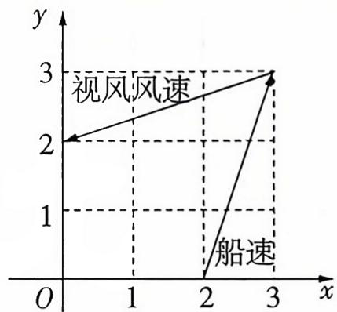

line

| x | y |
|---|---|
| 0 | 2 |
| 2 | 0 |
| 3 | 3 |

图2

# 析题涂鸦

  
抓住光学性质本质破解双曲线创新情境题

D. 丁小组研究性别因素是否影响 DeepSeek 使用频次, 根据小概率值 $\alpha = 0.1$ 的 $\chi^{2}$ 独立性检验, 计算得到 $\chi^{2} = 3.837 > 2.706 = x_{0.1}$ , 可以认为不同性别人群的 DeepSeek 使用频次没有差异

4.[新情境·北京四面钟景观中的立体几何模型▶2025 中国人大附中模拟]北京天桥艺术中心旁边的四面钟是天桥附近颇有意趣的传统景观之一.这个主体建筑可以近似看作正四棱柱,每一个侧面上都有一块相同的时钟.当四面钟均正常显示北京时间时,相邻两面钟的时针所在直线所成角最大为()

A. $\frac{\pi}{6}$

B. $\frac{\pi}{4}$

C. $\frac{\pi}{2}$

D. $\frac{3 \pi}{4}$

5.[新情境·以电瓶新闻灯为载体的双曲线模型▶教材溯源题, 多选]“双曲线电瓶新闻灯”是记者常用的一种电瓶新闻灯, 具有体积小、光线柔和等特点. 这种灯利用了双曲线的光学性质: 从双曲线的一个焦点发出的光线, 经双曲线反射后, 反射光线的反向延长线经过双曲线的另一个焦点 (如图 1). 双曲线还具有性质: 过双曲线上任意一点的切线平分该点与两焦点连线的夹角 (如图 2).

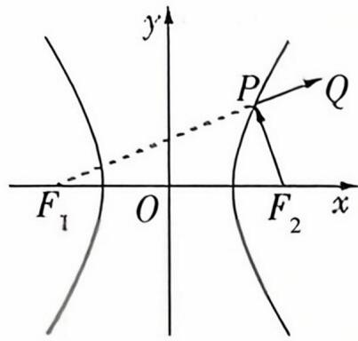

text_image

y
P
Q
F₁ O F₂ x

图1

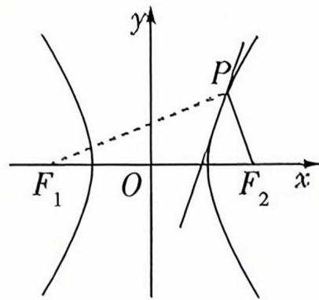

text_image

y
P
F₁ O F₂ x

图2

已知左、右焦点分别为 $F_{1}, F_{2}$ 的双曲线 $C$ 的离心率为 $\sqrt{3}$ , 并且过点 $A(3, 2\sqrt{3})$ , 坐标原点 $O$ 为双曲线 $C$ 的对称中心, 点 $M$ 的坐标为 $(1, 0)$ , 则下列结论正确的是 ( )

A. 双曲线的方程为 $\frac{x^{2}}{3} - \frac{y^{2}}{6} = 1$

B. 若从 $F_{2}$ 射出一道光线, 经双曲线反射, 则其反射光线所在直线的斜率的取值范围为 $(- \sqrt{3}, \sqrt{3})$

C. $\angle F_{1}AM = \angle F_{2}AM$

D. 过点 $F_{1}$ 作 $F_{1}H$ 垂直 $AM$ 的延长线于点 $H$ , 则 $|OH| = \sqrt{3}$

6.[新情境·《九章算术》中的外接球模型▶试题调研原创]《九章算术》是我国古代内容极为丰富的数学名著,书中有如下问题:“今有阳马,广五尺,袤七尺,高八尺,问积几何?”其意思为:“现在有底面为矩形、一条侧棱垂直于底面的四棱锥,它底面的长、宽分别为7尺和5尺,高为8尺,问它的体积是多少?”若以上的条件不变,则这个四棱锥的外接球的表面积为\_\_\_\_平方尺.

7.[新情境·国家重大科技项目为载体的数列模型▶试题调研原创]2024年11月17日,我国自主设计建造的大洋科考钻探船“梦想”号在广州正式入列,标志着我国深海探测关键技术装备取得重大突破.假设在“梦想”号的某次试钻中钻探深度需达11 000米,钻探进度如下:第1天钻探深度为600米,受海底地质条件的影响,之后每天的钻探深度较前一天都有所减少,且每5天的日钻探深度的减少量增加4米.具体为:第1\~5天每天钻探深度比前一天减少5米,第6\~10天每天钻探深度比前一天减少9米,…,依次类推,则要完成钻探任务至少需要的天数为\_\_\_\_.

# 创新考法2 接轨高等数学题

本卷总分：49 分

建议用时：45分钟

答案链接: P002

本卷共9小题，第1\~5题每小题5分，第6\~9题每小题6分，共49分.

1.[梅森素数▶2025广东中山一中二模]马林·梅森是17世纪法国著名的数学家,他在欧几里得、费马等人研究的基础上对形如 $2^{p}-1$ (p是素数)的素数做了大量的计算、验证工作,人们为纪念梅森在数论方面的这一贡献,将形如 $2^{p}-1$ (其中p是素数)的素数称为梅森素数.在不超过40的素数中,随机选取两个不同的数,至少有一个为梅森素数的概率是()

A. $\frac{5}{11}$

B. $\frac{1}{6}$

C. $\frac{9}{22}$

D. $\frac{1}{22}$

2.[中值定理▶试题调研原创]以罗尔中值定理、拉格朗日中值定理、柯西中值定理为主体的“中值定理”反映了函数与导数之间的重要联系,是微积分学重要的理论基础,其中拉格朗日中值定理如下:如果函数 $f(x)$ 在闭区间 $[a,b]$ 上的图象不间断,在开区间 $(a,b)$ 内可导,则在区间 $(a,b)$ 内至少存在一个点 $\xi \in (a,b)$ ,使得 $f(b)-f(a)=f'(\xi)(b-a)$ ,其中 $\xi$ 称为函数 $y=f(x)$ 在闭区间 $[a,b]$ 上的中值点.则函数 $f(x)=\tan x$ 在区间 $[- \frac{\pi}{3}, \frac{\pi}{3}]$ 上的中值点的个数为()

A. 1

B. 2

C. 3

D. 4

3.[麦克劳林公式 ▶ 教材溯源题]当 $n \to +\infty$ 时, $\cos x = \sum_{i=1}^{n} \frac{(-1)^{i-1} \cdot x^{2i-2}}{(2i-2)!}$ , 这是麦克劳林公式在三角函数上的一个经典应用. 根据上述公式, $\cos \left( \frac{2025\pi}{2} - 0.4 \right)$ 的值约为 ( )

A. 0.36

B. 0.37

C. 0.38

D. 0.39

4.[极点和极线▶高考溯源题]射影几何是几何学的一个重要分支,主要研究射影变换下的性质,极点和极线是射影几何的重要概念.已知椭圆 $C:\frac{x^{2}}{a^{2}}+\frac{y^{2}}{b^{2}}=1$ ,称点 $P(x_{0},y_{0})$ 和直线 $l:\frac{x_{0}x}{a^{2}}+\frac{y_{0}y}{b^{2}}=1$ 是椭圆 C 的一对极点和极线,极点与极线是一一对应关系.当点 P 在椭圆外时,其极线 l 是椭圆 C 从点 P 所引两条切线的切点所确定的直线(即切点弦所在直线).已知 P 是直线 $y=-\frac{1}{2}x+4$ 上的一个动点,过点 P 向椭圆 $C:\frac{x^{2}}{16}+\frac{y^{2}}{4}=1$ 引两条切线,切点分别为 M,N,直线 MN 恒过定点 T,当 $\overrightarrow{MT}=\overrightarrow{TN}$ 时,直线 MN 的方程为()

A. $x + 2y - 4 = 0$

B. $x + 2y + 4 = 0$

C. ${2x} - y - 4 = 0$

D. $2x + y - 4 = 0$

5.[费马小定理▶试题调研原创]设 a, b 为非负整数, m 为正整数, 若 a 和 b 被 m 除得的余数相同, 则称 a 和 b 对模 m 同余, 记为 $a \equiv b \pmod{m}$ . 若 p 为质数, n 为不能被 p 整除的正整数, 则 $n^{p-1} \equiv 1 \pmod{p}$ , 这个定理是费马在 1636 年提出的费马小定理, 它是数论中的一个重要定理. 现有以下 4 个命题: ① $2^{30} + 1 \equiv 65 \pmod{7}$ ; ② 对于任意正整数 $x, x^{13} - x \equiv 0 \pmod{13}$ ; ③ 对于任意正整数 $x, x^{13} - x \equiv 0 \pmod{7}$ ; ④ 对于任意正整数 x, $x^{12} - 1 \equiv 1 \pmod{5}$ . 则所有的真命题为 ( )

A. ①③④

B. ②③④

C.①②③

D.①②④

# 考法解读

近几年高考出现与高等数学紧密衔接的问题，以知识内容和思想方法两种形式呈现，主要表现为以高等数学的数学符号、概念直接出现，或以高等数学的地理、公式作为依托进行创新，或体现高等数学常用的数学思想方法和推理方法等，结合高中数学知识考查考生的逻辑推理能力，是高考命题的一大新趋势。

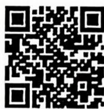  
抓住定理本质,巧破
费马小定理选择题

# 析题涂鸦

6.[群论▶2025 河南郑州三模, 多选] 群论, 是代数学的分支学科, 群的定义如下: 设 $G$ 是一个非空集合, “·”是 $G$ 上的一个代数运算, 如果该运算满足以下条件: ①对任意的 $a, b \in G$ , 有 $a \cdot b \in G$ ; ②对任意的 $a, b, c \in G$ , 有 $(a \cdot b) \cdot c = a \cdot (b \cdot c)$ ; ③存在 $e \in G$ , 使得对任意的 $a \in G$ , 有 $e \cdot a = a \cdot e = a, e$ 称为单位元; ④对任意的 $a \in G$ , 存在 $b \in G$ , 使 $a \cdot b = b \cdot a = e$ , 称 $a$ 与 $b$ 互为逆元. 则称 $G$ 关于“·”构成一个群. 则下列说法正确的有 ( )

A. $G = \{-1, 1, -\mathrm{i}, \mathrm{i}\}$ (i为虚数单位)关于数的乘法构成群  
B. 有理数集 $\mathbf{Q}$ 关于数的加法构成群  
C. $G = \{m + \sqrt{2} n \mid m, n \in \mathbf{Z}\}$ 关于数的除法构成群  
D. 正实数集 $\mathbf{R}^{+}$ 关于数的乘法构成群

7.[欧拉线▶试题调研原创, 多选]瑞士著名数学家欧拉在1765年提出定理:三角形的外心、重心、垂心位于同一直线上,这条直线被后人称为三角形的“欧拉线”. 若 $\triangle ABC$ 满足 $AC=BC$ , 顶点 $A(0,1), B(2,-1)$ , 且其“欧拉线”与圆 $M:(x-4)^{2}+y^{2}=r^{2}$ 相切,则下列结论正确的是 ( )

A. $\triangle ABC$ 的“欧拉线”方程为 $x - y - 1 = 0$   
B. 圆 $M$ 上的点到直线 $x - y = 0$ 的最小距离为 $\frac{\sqrt{2}}{2}$   
C. 若圆 $M$ 与圆 $x^{2} + (y - a)^{2} = 8$ 有公共点, 则 $a \in [-4, 4]$   
D. 若点 $(x,y)$ 在圆M上，则y的值.

$$
\text {一} _ {i} (x) = x \mathrm{e} ^ {x}, \forall x _ {i} \in (0, + \infty), i = 1, 2, \dots , n, \text {有} f (\frac {\sum_ {i = 1} ^ {n} x _ {i}}{n}) \geqslant \frac {\sum_ {i = 1} ^ {n} f (x _ {i})}{n}
$$

C. 若 $\forall x_{i} \in (0,1)$ , $i = 1, 2, \cdots, 5$ , $\sum_{i=1}^{5} x_{i} = 1$ , 则 $\sum_{i=1}^{5} \frac{x_{i}}{1 - x_{i}} \geqslant \frac{5}{4}$   
D. 若 $\forall x_{i} \in (0, \frac{\pi}{2}), i = 1, 2, 3, \sum_{i=1}^{3} x_{i} = \pi$ , 则 $\sum_{i=1}^{3} \sin x_{i} \leqslant \frac{3\sqrt{3}}{2}$

9.[高次代数方程根▶教材溯源题, 多选]牛顿在《流数法》一书中, 给出了高次代数方程根的一种解法——牛顿法. 具体步骤如下: 设 $r$ 是函数 $y = f(x)$ 的一个零点, 任意选取 $x_0$ 作为 $r$ 的初始近似值, 在横坐标为 $x_0$ 的点处作曲线 $y = f(x)$ 的切线 $l_1, l_1$ 与 $x$ 轴交点的横坐标为 $x_1$ ; 用 $x_1$ 代替 $x_0$ , 重复上面过程得到 $x_2$ ; 一直进行下去, 得到 $x_0, x_1, \cdots, x_n$ , 当 $n$ 很大时, $|x_n - r|$ 很小, 我们可以把 $x_n$ 的值作为 $r$ 的近似值. 已知函数 $f(x) = x^3 + x - 1$ , $r$ 是函数 $y = f(x)$ 的一个零点, 取 $x_0 = 1$ , 则下列说法正确的是 ( )

A. 切线 $l_{1}$ 的方程为 $4x - y - 3 = 0$

B. $x_{2} = \frac{49}{86}$

C. $x_{n} = \frac{2x_{n - 1}^{3} + 1}{3x_{n - 1}^{2} + 1} (n\in \mathbf{N}^{*})$

D. 若 $x_{n-1} > \frac{2}{3}$ , 则 $|x_n - r| < |x_{n-1} - r|^2 (n \in \mathbf{N}^*)$

# 创新考法3 图表化载体创新题

本卷总分：33 分

建议用时：20 分钟

答案链接：P004

本卷共6小题，第1\~2题每小题5分，第3\~5题每小题6分，第6题5分，共33分.

1.[双面团牌涂色▶教材溯源题]树人中学的科学社团设计了一块如图所示的正反面内容相同的双面团牌,给团牌的正反两面6个区域涂色,有3种不同颜色可选,要求同面有公共边的区域不同色,同一区域的两面也不同色,则不同的涂色方法的种数为()

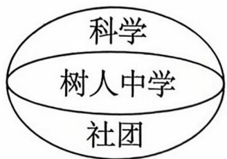

A. 36

B. 48

C. 54

D. 56

2.[方块游戏图▶2025 浙江杭州一模]现有一排方块,其中某些方块间有间隔.从中拿出一个方块或紧贴的两个方块,而不改变其余方块的位置,称为一次操作.如图所示,状态为(3,2)的方块,可以通过一次操作变成以下状态中的任何一种:(3,1),(3),(2,2),(1,2),(1,1,2).游戏规定由甲开始,甲、乙轮流对方块进行操作,拿出最后一个(或两个)方块的人获胜.对于以下选项中的开局状态,乙有策略可以保证自己获得游戏胜利的是()

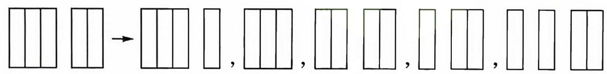

text_image

Diagram showing transformation of a grid pattern into rectangular blocks, likely illustrating a mathematical or logical concept.

A. (3,2,1)

B. (4,2)

C. $(2,1,1)$

D. $(5,3)$

3.[雷达图▶试题调研原创, 多选]某校秋季运动会中 $A, B$ 两班的各个单项得分 (满分5分) 的雷达图如图所示, 则下列说法正确的是 ( )

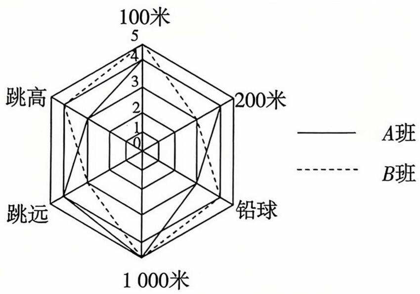

radar

| 路径 (米) | A班 | B班 |
| :--- | :--- | :--- |
| 100 | 4.5 | 4.3 |
| 200 | 3.8 | 3.6 |
| 铅球 | 3.2 | 3.0 |
| 1000 | 4.0 | 3.8 |
| 跳远 | 3.5 | 3.2 |
| 跳高 | 3.0 | 2.8 |

A. 在 200 米项目中, A 班的得分比 B 班的得分高  
B. 在铅球项目中, $A$ 班的得分比 $B$ 班的得分高  
C. 在跳高项目中, $B$ 班的得分比 $A$ 班的得分高  
D. $B$ 班的总分比 $A$ 班的总分高

# 考法解读

图表化载体创新题是近年来高考命题改革的重要方向，主要考查排列组合、概率求解、数据分析、逻辑推理相关知识，强化创新思维，强调数学的应用性。

# 析题涂鸦

4.[折线图▶高考溯源题, 多选]北京时间2024年7月27日, 中国双人组合在巴黎奥运会中夺得射击混合团体10米气步枪冠军, 这是2024巴黎奥运会产生的首枚金牌, 也是中国代表团在本届奥运会获得的首枚金牌. 中国队的两名运动员在决赛中的14次射击环数如图所示, 则 ( )

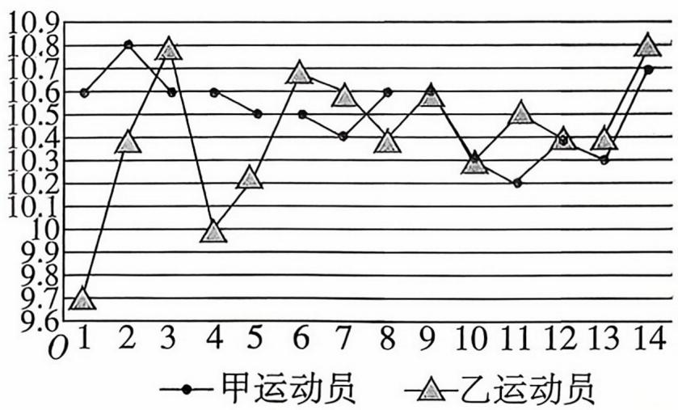

line

| Time Point | 甲运动员 | 乙运动员 |
| ---------- | -------- | -------- |
| 1          | 10.6     | 9.7      |
| 2          | 10.8     | 10.4     |
| 3          | 10.6     | 10.8     |
| 4          | 10.6     | 10.0     |
| 5          | 10.5     | 10.2     |
| 6          | 10.5     | 10.7     |
| 7          | 10.4     | 10.6     |
| 8          | 10.6     | 10.4     |
| 9          | 10.6     | 10.6     |
| 10         | 10.3     | 10.3     |
| 11         | 10.2     | 10.5     |
| 12         | 10.4     | 10.4     |
| 13         | 10.3     | 10.4     |
| 14         | 10.7     | 10.8     |

A. 乙运动员的平均射击环数约为 10.4  
B. 甲运动员射击环数的第75百分位数为10.6  
C. 乙运动员射击环数的方差小于甲运动员射击环数的方差  
D. 甲运动员射击环数的极差小于乙运动员射击环数的极差

5.[用矩形覆盖方格图▶2025山东枣庄二模, 多选]在如图所示 $8 \times 8$ 的方格图中, 去掉某一个方格, 剩下的方格图能用总共21个 $3 \times 1$ 或 $1 \times 3$ 的矩形方格图(如图)完全覆盖, 则去掉的方格可以为 ( )

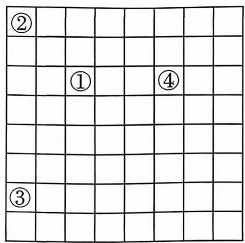

text_image

②
①
④

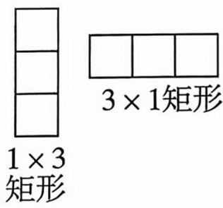

text_image

1 × 3
矩形
3 × 1矩形

A. ①

B. ②

C. ③

D. ④

6.[表格中数的选取▶高考溯源题] 甲、乙、丙、丁、戊五人完成 A, B, C, D, E 五项任务所获得的效益如下表:

<table><tr><td></td><td>A</td><td>B</td><td>C</td><td>D</td><td>E</td></tr><tr><td>甲</td><td>10</td><td>12</td><td>9</td><td>12</td><td>10</td></tr><tr><td>乙</td><td>24</td><td>25</td><td>23</td><td>22</td><td>22</td></tr><tr><td>丙</td><td>9</td><td>13</td><td>14</td><td>12</td><td>10</td></tr><tr><td>丁</td><td>6</td><td>8</td><td>10</td><td>8</td><td>10</td></tr><tr><td>戊</td><td>13</td><td>15</td><td>14</td><td>15</td><td>11</td></tr></table>

现每项任务指派一人完成,其中甲不承担 C 任务,丁不承担 A 任务的指派方法数有\_\_\_\_种;效益之和的最大值是\_\_\_\_.

# 创新考法4 动态图形探究题

本卷总分：45分

建议用时：30 分钟

答案链接: P004

# 本卷共9小题，每小题5分，共45分.

1.[与平面向量相关的动点▶高考溯源题]如图所示,弧 BD 是以 O 为圆心,OB 为半径的圆的一部分,OB = 2, ∠BOD = $\frac{5\pi}{6}$ , C 是 OB 的中点,A 在弧 BD 上运动,则 $\overrightarrow{OA} \cdot \overrightarrow{OC}$ 的最小值为 ( )

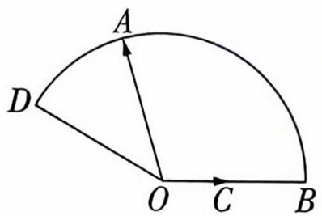

text_image

A
D
O C B

A. 2

B. -2

C. $- \sqrt{3}$

D. 1

2.[椭圆上的动点▶教材溯源题]已知动点 P 在椭圆 $\frac{x^{2}}{4}+\frac{y^{2}}{3}=1$ 上, $F(1,0)$ , $D(3,3)$ , 则 $|PD|-|PF|$ 的最小值为 ( )

A. 5

B. $\sqrt{13}$

C. 2

D. 1

3.[弧上的动点▶教材溯源题]如图,在扇形 OAB 中,半径 $\left|OA\right| = \left|OB\right| = 2$ , 弧长为 $\frac{2\pi}{3}$ , 点 P 是弧 AB 上的动点, 点 M, N 分别是半径 OA, OB 上的动点, 则 $\triangle PMN$ 周长的最小值是 ( )

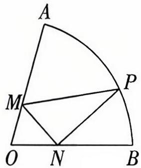

text_image

A
M
P
O N B

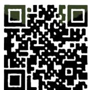

妙取对称点速解与动点相关的最小值问题

A. 12

B. 8

C. $2 \sqrt{3}$

D. $2\sqrt{2}$

4.[匀速圆周运动中的相遇问题▶2025 福建福州模拟]如图所示,两动点 P, Q 在以坐标原点 O 为圆心,1 为半径的圆上,从点 A(1,0) 处同时出发做匀速圆周运动.已知点 P 按逆时针方向每秒钟转 $\alpha$ 弧度,点 Q 按顺时针方向每秒钟转 $\beta$ 弧度 ( $0 < \alpha < \beta < \pi$ ),且 P, Q 两点在第 2 秒末第一次相遇于点 ( $-\frac{1}{2}, \frac{\sqrt{3}}{2}$ ) 处,则它们从出发后到第 2 次相遇时,点 P 走过的总路程为 ()

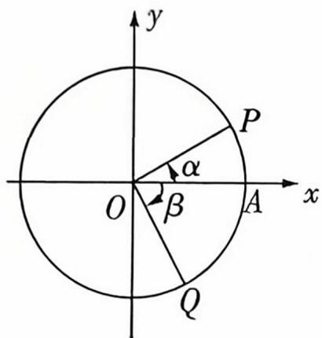

text_image

y
P
α
O
β
A
x
Q

A. $\frac{\pi}{3}$

B. $\frac{2 \pi}{3}$

C. $\frac{4 \pi}{3}$

D. $\frac{8\pi}{3}$

# 考法解读

动态图形探究题主要考查空间想象、逻辑推理及模型构建能力，其命题设计强调“动中寻静、变中求是”的数学思想，命题方向主要是动点轨迹、图形变换与动态最值与范围问题，是高考命题的热点趋势。

# 析题涂鸦

5.[图形的翻折▶2025江西九江检测]如图,在矩形ABCD中, $AB=3AD=3\sqrt{2}$ ,E在AB上且 $AE=\sqrt{2}$ ,将△ADE沿DE折起到△FDE的位置,构成四棱锥F-BCDE,点G在线段CF上,若BG//平面FDE,则 $\frac{CG}{CF}$ 的值等于()

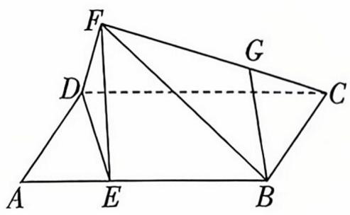

text_image

Geometric diagram of a polyhedron with labeled vertices and internal points, including dashed lines for hidden edges.

A. $\frac{1}{2}$

B. $\frac{\sqrt{2}}{2}$

C. $\frac{1}{3}$

D. $\frac{\sqrt{3}}{3}$

6.[两动直线的交点轨迹▶2025 湖北襄阳模拟]已知直线 $l_{1}:nx+my-3m-n=0$ 与 $l_{2}:mx-ny-3m+n=0$ 相交于点 $M, N$ 是圆 $C: (x+1)^{2}+(y+1)^{2}=4$ 上的一个动点, 则 |MN|的最大值为 ( )

A. $2 + 8\sqrt{2}$

B. $2 + 6\sqrt{2}$

C. $2 + 4\sqrt{2}$

D. $2 + 2\sqrt{2}$

7.[太极图中的动点▶2025上海浦东新区检测]“太极图”因其形如对称的阴阳两鱼互抱在一起,故也被称为“阴阳鱼太极图”.如图所示,这是放在平面直角坐标系中的“太极图”,图中曲线为圆或半圆,已知点 $P(x,y)$ 是阴影部分(包括边界)的动点,则 $\frac{y}{x-4}$ 的最小值为\_\_\_\_.

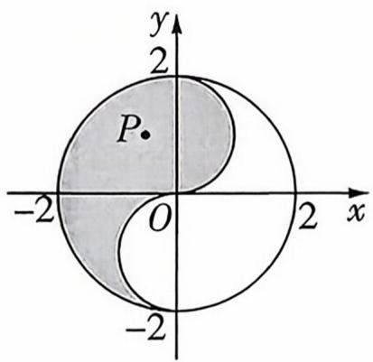

text_image

y
2
P
-2 O 2 x
-2

8.[立体图形中的动点轨迹▶试题调研原创]如图,正三棱柱 $ABC-A_{1}B_{1}C_{1}$ 的底面边长是2,侧棱长是 $2\sqrt{3}$ ,M为 $A_{1}C_{1}$ 的中点,N是侧面 $BCC_{1}B_{1}$ 内的动点(包含边界),且 $MN//$ 平面 $ABC_{1}$ ,则点N的轨迹的长度为\_\_\_\_.

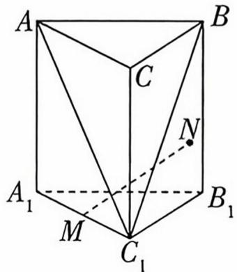

text_image

A
B
C
N
A₁
M
C₁
B₁

9.[抛物线上的动点▶2025重庆沙坪坝区阶段检测] 设 $A(x_{1},y_{1}), B(x_{2},y_{2})$ 为平面上两点, 定义 $d(A,B)=|x_{1}-x_{2}|+|y_{1}-y_{2}|$ . 已知点 P 为抛物线 $C:x^{2}=\frac{1}{2}y$ 上一动点, 点 Q 是直线 $l:y=2(x-4)$ 上一动点, 则 $d(P,Q)$ 的最小值为 \_\_\_\_.

# 创新考法5 创新设问开放题

本卷总分：65分

建议用时：50 分钟

答案链接: P006

本卷共 13 小题，每小题 5 分，共 65 分.

1.[试题调研原创]写出一个同时满足条件①②的复数z:

① $|z|=1$ ; ② $z^{2}$ 的实部小于0.

2.[教材溯源题]观察下列等式:(1) $\frac{\cos3^{\circ}}{\sin48^{\circ}}+\frac{\cos87^{\circ}}{\sin132^{\circ}}=\sqrt{2}$ ;(2) $\frac{\cos(-13^{\circ})}{\sin32^{\circ}}+\frac{\cos103^{\circ}}{\sin148^{\circ}}=$ $\sqrt{2}$ ;(3) $\frac{\cos13^{\circ}}{\sin58^{\circ}}+\frac{\cos77^{\circ}}{\sin122^{\circ}}=\sqrt{2}$ ;(4) $\frac{\cos121^{\circ}}{\sin166^{\circ}}+\frac{\cos(-31^{\circ})}{\sin14^{\circ}}=\sqrt{2}$ .根据给定等式的共同特征,写出一个具有这个共同特征的等式(要求与已知等式不重复),这个等式可以是\_\_\_\_.

3.[试题调研原创]已知A,B是抛物线 $y^{2}=4x$ 上两点,若线段AB的中点到抛物线的准线的距离为3,则直线AB的方程可能是\_\_\_\_.(写出一个符合题意的答案即可)

4.[2025 北京市中国人民大学附属中学模考] 已知函数 $f(x) = \sin (2x - \frac{\pi}{3})$ , 将 $f(x)$ 的图象向左移动 $\varphi (\varphi > 0)$ 个单位长度后得到的图象对应的函数为 $g(x)$ , 若函数 $F(x) = f(x) + g(x)$ 的最大值是一个小于 1 的正数, 写出一个符合条件的 $\varphi$ 值: \_\_\_\_.

5.[试题调研原创]已知直线 $l: x - y + 2 = 0$ 与 $\odot C: (x - \cos \theta)^{2} + (y - \sin \theta)^{2} = 4$ 交于 $A$ , $B$ 两点, 则 $\triangle ABC$ 面积最大时 $\theta$ 的一个值为 \_\_\_\_. (写出一个符合题意的答案即可)

6.[教材溯源题]设等比数列 $\{a_{n}\}$ 的公比为 $q (n \geqslant 1, n \in \mathbf{N})$ , 则“ $12a_{2}, a_{4}, 2a_{3}$ 成等差数列”的一个充分非必要条件是 \_\_\_\_. (写出一个符合题意的答案即可)

7.[试题调研原创]定义在 $\mathbf{R}$ 上的非常数函数 $f(x)$ 满足: ① $f(x+y)=f(x)f(1-y)+ f(1-x)f(y)$ ; ② $f(x)$ 为奇函数. 请写出符合上述条件的一个函数解析式: $f(x)=$ \_\_\_\_.

8.[试题调研原创]已知数列 $\{a_{n}\}$ 为 2,0,2,0,…,写出一个该数列的通项公式: $a_{n}=$ \_\_\_\_. (不可写为分段形式)

# 考法解读

开放性真空题到设新题的设问方式，考查考生的发散性思维和创新意识，要求考生对题中所给的信息进行组合、探究，找到它们之间的本质联系，从而转化为常规的问题。

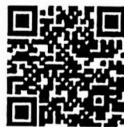  
通过三角换元妙破
创新结论开放题

# 析题涂鸦

  
逐项计算破解以立体几何为载体的开放性填空题

9.[试题调研原创]在 $\triangle ABC$ 中,内角 $A,B,C$ 所对的边分别为 $a,b,c$ .若角 $A$ 为锐角, $b=$ 3, $c=4$ ,则 $\triangle ABC$ 的周长可能为\_\_\_\_.(写出一个符合题意的答案即可)

10. [试题调研原创]已知函数 $f(x)$ 的定义域为 R，且 $f(x+y)+f(x-y)=2f(x)\cdot f(y)$ ， $f(0)=1$ ，写出满足条件的一个 $f(x)$ 的解析式： $f(x)=$ \_\_\_\_。（写出一个符合题意的答案即可）

11.[试题调研原创]已知函数 $f(x)=2\sin(\omega x+\varphi)(\varphi>0)$ 的图象相邻两条对称轴之间的距离为 $\frac{\pi}{4}$ ，且图象经过点 $(\frac{\pi}{12},\sqrt{2})$ ，则 $\varphi$ 的值为\_\_\_\_。（写出一个满足条件的答案即可）

12.[试题调研原创]已知:①棱长为16的正方体;②底面边长为24,高为 $24\sqrt{3}$ 的正三棱锥;③上底面边长为20,下底面边长为24,高为6的正四棱台;④底面半径为20,高为 $\frac{24}{\pi}$ 的圆锥;⑤上底面半径为20,下底面半径为24,高为 $\frac{6}{\pi}$ 的圆台;⑥半径为 $\frac{12}{\sqrt[3]{\pi}}$ 的球.从上面的六个几何体中选取两个几何体,使得两个几何体的体积之差小于600,则这两个几何体的序号为\_\_\_\_.(写出一个符合题意的答案即可)

13.[教材溯源题]如图,平面 $\alpha$ 与圆柱相交,而且平面 $\alpha$ 与圆柱的轴不垂直,点 $P$ 为平面 $\alpha$ 与圆柱表面交线上的任意一点,则点 $P$ 的轨迹 $\Gamma$ 为 (从“圆”“椭圆”“双曲线”“抛物线”中选择一个填写).在圆柱内部放置两个半径与圆柱底面半径相同的球,平面 $\alpha$ 分别与两球切于 $E, F$ 两点,过点 $P$ 作圆柱的母线,分别与两球切于 $B, C$ 两点,记线段 $EF$ 的长度为 $m$ ,线段 $BC$ 的长度为 $n$ ,且 $n > m$ .在平面 $\alpha$ 内 $\Gamma$ 的任意两条互相垂直的切线的交点为 $A$ ,建立适当的坐标系,则动点 $A$ 的轨迹方程为 (用含 $m, n$ 的式子表示,写出一个符合题意的答案即可).

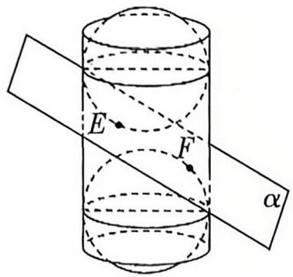

text_image

E
F
α

# 创新考法6 跨学科交叉题

本卷总分: 41 分

建议用时：30 分钟

答案链接: P007

本卷共 8 小题, 第 1\~4 题每小题 5 分, 第 5 题 6 分, 第 6\~8 题每小题 5 分, 共 41 分.

1.[融合天文▶高考溯源题]在天文学中,天体的明暗程度可以用星等或亮度来描述.以织女星的亮度 $I_{0}$ 为标准,天体的星等 $m$ 与亮度 $I$ 满足 $m = -\frac{5}{2} \lg \frac{I}{I_{0}}$ ,假设北极星的星等为 2 ,牛郎星的星等为 0 . 8 ,则北极星与牛郎星的亮度的比值为 ( )

A. ${10}^{\frac{5}{2}}$

B. ${10}^{-\frac{5}{2}}$

C. ${10}^{\frac{12}{25}}$

D. ${10}^{-\frac{12}{25}}$

2.[融合体育▶试题调研原创]“50米跑”是《国家学生体质健康标准》测试项目中的一项.某地区高三男生的“50米跑”测试成绩ξ(单位:秒)服从正态分布 $N(8,\sigma^{2})$ ，且 $P(\xi\leqslant7)=0.2$ .从该地区高三男生的“50米跑”测试成绩中随机抽取3个,其中成绩在(7,9)之间的个数记为X,则()

A. $P(7 < \xi < 9) = 0.8$

B. $E(X) = 1.2$

C. $E(\xi) > E(5X)$

D. $P(X \geqslant 1) > 0.9$

3.[融合物理 ▶ 2025 湖南三湘名校教育联盟联考]光束是由一粒一粒运动着的粒子流组成的,这种粒子被称为光量子,简称光子.已知在某次光学实验中,实验组相关人员用感光设备捕获了从同一光源发射出来的两个光子A,B,通过数学建模与数据分析得知,在平面直角坐标系中它们的位移所对应的向量分别为 $s_{A}=(4,3)$ , $s_{B}=(2,10)$ ,设光子B相对光子A的位移为s,则s在 $s_{A}$ 上的投影向量的坐标表示为()

A. $(\frac{4}{5}, \frac{3}{5})$

B. $(-2,7)$

C. $(\frac{52}{25}, \frac{39}{25})$

D. $(\frac{4}{25}, \frac{3}{25})$

4.[融合物理▶试题调研原创]在平面直角坐标系 $xOy$ 中, 已知射线 $l_{1}: y = x (x \geqslant 0)$ , $l_{2}: y = 0 (x \geqslant 0)$ , 半圆 $C: y = \sqrt{1 - (x - 4)^{2}}$ , 现从点 $A(1,0)$ 向 $x$ 轴上方区域的某方向发射一束光线, 光线沿直线传播, 但遇到射线 $l_{1}, l_{2}$ 时会发生镜面反射. 设光线在发生反射前所在直线的斜率为 $k$ , 若光线始终与半圆 $C$ 没有交点, 则 $k$ 的取值范围为 ( )

A. $(- \frac{15}{8}, -\frac{\sqrt{6}}{12}) \cup (\frac{\sqrt{2}}{4}, +\infty)$

B. $(-\infty, -\frac{15}{8}) \cup (\frac{\sqrt{2}}{4}, +\infty)$

C. $(\frac{\sqrt{2}}{4}, +\infty)$

D. $(- \frac{15}{8}, \frac{\sqrt{2}}{4})$

5.[融合艺术▶试题调研原创, 多选]黄金分割比例 $\frac{\sqrt{5} - 1}{2}$ 在作图中蕴含着丰富的美学价值, 这一比值是建筑和艺术中最理想、协调的比例之一, 我们把离心率 $e = \frac{\sqrt{5} - 1}{2}$ 的椭圆称为“黄金椭圆”, 则以下说法正确的是 ( )

# 考法解读

在数学学科知识网络的交汇点和跨学科知识的融合处设计试题，体现数学与其他学科知识的联系，考查考生综合运用知识和方法解决数学问题的能力，是近年高考的一大新特点。此类命题打破传统的学科限制，体现数学应用的广泛性，有利于考查考生的综合素质、核心素养和创新应用能力。

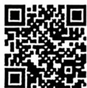  
紧抓光的反射特征巧解直线斜率问题

# 析题涂鸦

A. 与双曲线 $\frac{x^{2}}{-1} + \frac{y^{2}}{\sqrt{5} - 2} = 1$ 共焦点且短半轴长为 $\sqrt{2}$ 的椭圆是“黄金椭圆”  
B. 若椭圆 $\frac{x^2}{a^2} + \frac{y^2}{b^2} = 1 (a > b > 0)$ 的右焦点为 $F(c, 0)$ , 且满足 $b^2 = ac$ , 则该椭圆为“黄金椭圆”  
C. 设椭圆 $\frac{x^2}{a^2} + \frac{y^2}{b^2} = 1 (a > b > 0)$ 的左焦点为 $F$ , 上顶点为 $B$ , 右顶点为 $A$ , 若 $\angle ABF = 90^\circ$ , 则该椭圆为“黄金椭圆”  
D. 设椭圆 $\frac{x^2}{a^2} + \frac{y^2}{b^2} = 1 (a > b > 0)$ 的左、右顶点分别是 $A, B$ , 左、右焦点分别是 $F_1, F_2$ , 若 $|F_1F_2|^2 = |AF_1| \cdot |F_1B|$ , 则该椭圆为“黄金椭圆”

6.[融合语文▶试题调研原创]有这样一首诗:挑水砍柴不堪苦,请归但求穿墙术.得诀自诩无所阻,额上坟起终不悟.数学里也有“穿墙术”,我们称具有以下形式的等式具有“穿墙术”: $2\sqrt{\frac{2}{3}}=\sqrt{2\frac{2}{3}},3\sqrt{\frac{3}{8}}=\sqrt{3\frac{3}{8}},4\sqrt{\frac{4}{15}}=\sqrt{4\frac{4}{15}},5\sqrt{\frac{5}{24}}=\sqrt{5\frac{5}{24}},\cdots$ .按照以上规律,若甲 $\sqrt{\frac{甲}{120}}=\sqrt{甲\frac{甲}{120}}$ 具有“穿墙术”,则数字甲= \_\_\_\_.

7.[融合经济学▶试题调研原创]本福特定律,也称为本福特法则,指的是在b进位制中,以数n起头的多位数出现的概率为 $\log_{b}\frac{n+1}{n}$ .本福特定律可以用于检查各种数据是否存在造假,例如在会计审计中,可以利用本福特定律来检测财务报表数据的真实性.在从实际生活得出的一组十进制数据中,以1为首位数字的多位数出现的概率约为\_\_\_\_;首位数字为2的多位数出现的概率与首位数字为5的多位数出现的概率的比值约为\_\_\_\_.(结果均保留两位有效数字,参考数据: $\lg3\approx0.477,\lg5\approx0.699$ )

8.[融合物理▶教材溯源题]“双曲线电瓶新闻灯”是我国首先研制成功的,利用了双曲线的光学性质:从双曲线的一个焦点发出的光线经过双曲线镜面反射,其反射光线的反向延长线经过双曲线的另一个焦点.这种灯的轴截面是双曲线的一部分(如图),从双曲线的右焦点 $F_{2}$ 发出的互为反向的光线,经双曲线上的点P,Q反射,反射光线的反向延长线交于点M,且 $\sin\angle MPQ=\frac{3}{5}\sin\angle MQP,\sin\angle PMF_{2}=\frac{9}{5}\sin\angle QMF_{2}$ .制作时,通过控制双曲线的离心率控制该新闻灯的开口大小,则该新闻灯轴截面双曲线的离心率为\_\_\_\_.

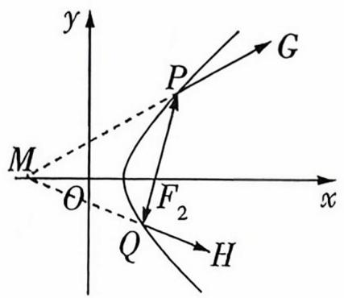

text_image

y
P
G
M
O
F₂
x
Q
H

# 创新考法 7 “多想少算” 创新思维题

本卷总分：62分

建议用时：45分钟

答案链接: P009

本卷共 12 小题，第 1～6 题每小题 5 分，第 7～8 题每小题 6 分，第 9～12 题每小题 5 分，共 62 分.

1.[高考溯源题]已知函数 $f(x)=x\ln x$ ，若对于任意的 $x\geqslant0,f(x+1)\geqslant ax$ 恒成立，则实数a的取值范围为()

A. $(-\infty, 1)$

B. $(-\infty, 1]$

C. $(-\infty, \frac{1}{\mathrm{e}})$

D. $(-∞, \frac{1}{e}]$

2.[教材溯源题]已知正实数 $x, y$ 满足 $\frac{x}{2} + 2y - 2 = \ln x + \ln y$ , 则 $y^{x} =$ ( )

A. 2

B. $\sqrt{2}$

C. $\frac{1}{4}$

D. $\frac{\sqrt{2}}{2}$

3.[试题调研原创]设 $a=\frac{1}{5}$ , $b=\ln\left(1+\sin\frac{1}{5}\right)$ , $c=e^{-\frac{4}{5}}$ , 则 a, b, c 的大小关系是（）

A. $a < b < c$

B. $b < a < c$

C. $b < c < a$

D. $c < a < b$

4.[教材溯源题]过点 $M(0,1)$ 作圆 $O_{1}:(x-2)^{2}+(y-2)^{2}=1$ 的两条切线, 切点分别为 A, B, 则原点 O 到直线 AB 的距离为 ( )

A. $\sqrt{5}$

B. $\sqrt{2}$

C. $\sqrt{3}$

D. $2 \sqrt{2}$

5.[试题调研原创]已知抛物线 $y=\frac{1}{4}x^{2}$ 与 $y=-\frac{1}{16}x^{2}+5$ 围成的封闭曲线如图所示,若在此封闭曲线上恰有三对不同的点,满足每一对点关于点 $A(0,a)(0<a<5)$ 对称,则实数 a 的取值范围是()

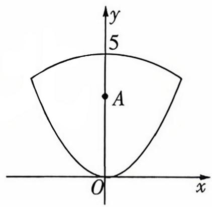

text_image

y
5
A
O
x

A. (1,4]

B. $\left(\frac{5}{2},4\right)$

C. $\left[\frac{5}{2},3\right)$

D. (2,3]

6.[2025 福建厦门二模]已知正方体 $ABCD-A_{1}B_{1}C_{1}D_{1}$ 的棱长为 1, 点 P 在正方体的内切球表面上运动, 且满足 $D_{1}P \parallel$ 平面 $A_{1}BC_{1}$ , 则 AP 的最小值为 ( )

A. $\frac{\sqrt{6}}{6}$

B. $\frac{\sqrt{3}}{6}$

C. $\frac{\sqrt{3}}{2}$

D. $\frac{\sqrt{6}}{2}$

# 考法解读

“多想少算”创新思维题是近年高考改革的核心方向，体现高考对创新思维、高阶思维的考查，凸显高考选拔功能。

# 析题涂鸦

7.[2025全国一卷, 多选]已知抛物线 $C: y^{2} = 6x$ 的焦点为 $F$ , 过 $F$ 的一条直线交 $C$ 于 $A$ , $B$ 两点, 过 $A$ 作直线 $l: x = -\frac{3}{2}$ 的垂线, 垂足为 $D$ , 过 $F$ 且与直线 $AB$ 垂直的直线交 $l$ 于点 $E$ , 则 ( )

A. $\left| {AD}\right|  = \left| {AF}\right|$

B. $\left| {AE}\right|  = \left| {AB}\right|$

C. $\left| {AB}\right|  \geq  6$

D. $\left| {AE}\right|  \cdot  \left| {BE}\right|  \geq  {18}$

8.[试题调研原创, 多选]已知 $a, b$ 均为单位向量, 且 $\langle a, b \rangle = \frac{2 \pi}{3}$ , 则下列结论正确的有 ( )

A. 若向量 $c$ 满足 $|c| = 1$ , 则 $|a + b + c|$ 的最大值为 $1 + \sqrt{3}$

B. 若向量 c 满足 $(c - a) \cdot (c - b) = 0$ ，则 $|c|$ 的最大值为 $\frac{1 + \sqrt{3}}{2}$

C. 若向量 $c$ 满足 $|c - a + b| = 1$ , 则 $a \cdot b - b \cdot c$ 的最小值为 $\frac{1 - \sqrt{3}}{2}$

D. 若向量 c 满足 $\left|c-2(a+b)\right|=1$ ，则 c 与 $a+b$ 夹角的最大值为 $\frac{\pi}{6}$

9.[2025江西南昌模拟]若正实数 $a, b$ 满足条件: $\mathrm{e}^{a + b} = \mathrm{e}(a + b)$ (e是自然对数的底数), 则 $ab$ 的最大值是\_.

10.[2025 江苏南通中学模拟]设双曲线 $C: \frac{x^{2}}{a^{2}} - \frac{y^{2}}{b^{2}} = 1 (a > 0, b > 0)$ 的左、右焦点分别为 $F_{1}, F_{2}$ , 离心率为 $2, P$ 是 $C$ 上一点, 且 $F_{1}P \perp F_{2}P$ . 若 $\triangle PF_{1}F_{2}$ 的面积为 $3$ , 则双曲线 $C$ 的方程为 \_\_\_\_.

11.[2025 江苏南京、盐城一模]已知椭圆 $C: \frac{x^{2}}{2} + y^{2} = 1$ 的上顶点为 $A$ , 直线 $l: y = kx + m$ 交椭圆 $C$ 于 $M, N$ 两点. 若 $\triangle AMN$ 的重心为点 $(\frac{1}{2}, 0)$ , 则实数 $k$ 的值是 \_\_\_\_.

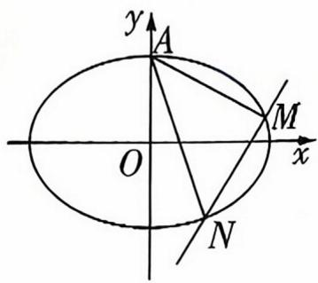

text_image

y
A
O
x
M
N

12.[试题调研原创]在平面直角坐标系 $xOy$ 中, 点 $A(2,0), B$ 为曲线 $y = \sqrt{1 - x^2}$ 上的动点, $C$ 为第一象限内的点. 已知 $AB \perp AC$ , $|AB| = |AC|$ , 则 $|OC|$ 的最大值是 \_\_\_\_.

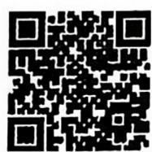

妙用复数乘法的几何意义速解双动点问题

# 创新考法8 新定义图形题

本卷总分: 43 分

建议用时：40 分钟

答案链接: P011

本卷共 8 小题, 第 $1 \sim 2$ 题每小题 5 分, 第 $3 \sim 5$ 题每小题 6 分, 第 $6 \sim 8$ 题每小题 5 分, 共 43 分.

1. [“心形”曲线 ▶ 2025 广东深圳中学模拟] 数学中有许多形状优美、寓意美好的曲线, “心形”曲线 $C: x^{2} + y^{2} = 1 + |x|y$ 就是其中之一 (如图). 曲线与 $y$ 轴交于 $A, B$ 两点, $P$ 为曲线上一动点, 给出下列四个结论, 其中错误的结论是 ( )

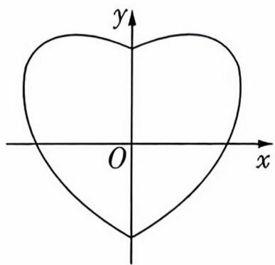

text_image

y
O
x

A. 图形关于 $y$ 轴对称  
B. 点 $P$ 的纵坐标的最大值为 $\frac{2\sqrt{3}}{3}$

C. $\left| {OP}\right|  \leq  \sqrt{2}$

D. $\left| {PA}\right| ^{2} + \left| {PB}\right| ^{2} \geq  4$

2.[四叶回旋镖▶2025 湖南邵阳二模]“四叶回旋镖”可看作是由四个相同的直角梯形围成的图形,如图所示,AB=2,CD=1, $\angle A=45^{\circ}$ .点P在线段AB与线段BL上运动,则 $\overrightarrow{EH}\cdot\overrightarrow{FP}$ 的取值范围为()

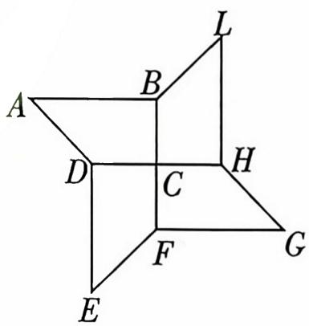

text_image

A
B
L
D
C
H
F
G
E

A. $[-4, 6]$

B. $[0,6]$

C. $[0,8]$

D. $[4,8]$

3.[欧拉回路图形▶2025 山东泰安模拟, 多选]瑞士数学家欧拉在解决七桥问题时提出了欧拉回路的定义, 即: 在一个图中, 经过图中每一条边且每条边仅经过一次, 并最终回到起始顶点的闭合路径. 通俗地讲, 欧拉回路图形就是一笔画图形, 在图中选一个点作为起点, 笔尖不离开图形可以完全不重复地走完图形所有边回到起点. 下列图形存在欧拉回路的是 ( )

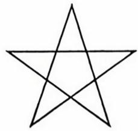  
A

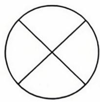  
B

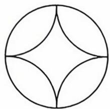  
C

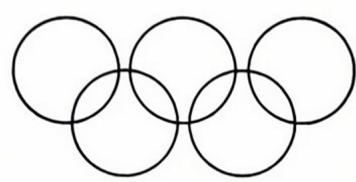  
D

4.[双纽线▶教材溯源题, 多选]定义: 在平面直角坐标系 $xOy$ 中, 把到定点 $F_{1}(-a,0)$ , $F_{2}(a,0)$ 的距离之积等于 $a^{2}(a>0)$ 的点的轨迹称为双纽线 $C$ . 已知 $P(x_{0},y_{0})$ 是双纽线 $C$ 上的一点, 下列说法正确的是 ( )

A. 双纽线 $C$ 关于原点 $O$ 成中心对称

B. $-\frac{a}{2} \leqslant y_0 \leqslant \frac{a}{2}$

C. 双纽线 $C$ 上满足 $|PF_{1}| = |PF_{2}|$ 的点 $P$ 有两个

D. $|OP|$ 的最大值为 $\sqrt{2} a$

# 考法解读

以优美的图案为背景设题，新颖独特，体现高考对考生创新思维的考查，解题的关键是抓住图形的本质特征，联想学过的知识，建立合适的数学模型求解。

# 析题涂鸦

5.[“脸谱”图形▶2025云南师大附中模拟, 多选]“脸谱”是中国戏剧中特有的化妆艺术. “脸谱”图形可近似看作如图所示的由半圆和半椭圆组成的曲线 C. 若半圆 $C_{1}$ 的方程为 $x^{2} + y^{2} = 36 (y \geqslant 0)$ , 半椭圆 $C_{2}$ 的方程为 $\frac{y^{2}}{100} + \frac{x^{2}}{36} = 1 (y \leqslant 0)$ , 则下列说法正确的是 ( )

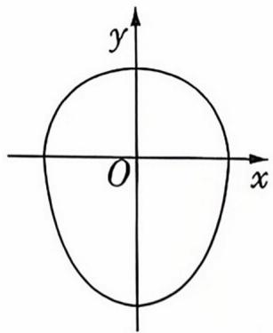

text_image

y
O
x

A. 若点 $A$ 在半圆 $C_{1}$ 上, 点 $B$ 在半椭圆 $C_{2}$ 上, 且 $OA \perp OB$ , 则 $\triangle AOB$ 面积的最大值为 30

B. 若 $M(0, -8)$ , $N(0, 8)$ , D 是半椭圆 $C_{2}$ 上的一个动点, 则 $\cos \angle MDN$ 的最小值是 $\frac{7}{25}$

C. 若 $P, Q$ 是半椭圆 $C_{2}$ 上的动点, $H$ (异于坐标原点 $O$ ) 是线段 $PQ$ 的中点, 则 $k_{PQ} \cdot$

$$
k _ {O H} = - \frac {2 5}{9}
$$

D. 若曲线 C 在点 $E(\frac{24}{5}, -6)$ 处的切线为 l, 半椭圆 $C_{2}$ 的下焦点为 F, 过点 F 作直线 l 的垂线, 垂足为 T, 则 $|OT| = 10$

6.[太极图▶2025 辽宁沈阳检测]太极图被称为“中华第一图”,其形状如阴阳两鱼互抱在一起,因而又被称为“阴阳鱼太极图”.如图所示的图形由太极图简化而来,是由半径为2的大圆O和两个对称的半圆弧组成的,线段MN过点O且两端点M,N分别在两个半圆弧上,P是大圆上一动点,则 $\overrightarrow{PM} \cdot \overrightarrow{PN}$ 的最小值为\_\_\_\_.

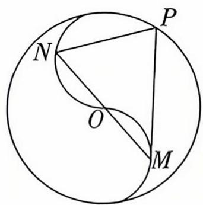

text_image

N
O
M
P

7. [“等差椭圆”▶2025江西师大附中模拟] 若椭圆的长半轴长、短半轴长、半焦距成等差数列,则称其为“等差椭圆”,则“等差椭圆”的离心率为\_\_\_\_。

8.[蝴蝶曲线▶高考溯源题]蝴蝶曲线是一种优美的数学曲线,因其形状而得名,它是数学与美学结合的经典案例,在许多领域展现了跨学科的应用潜力.已知某种蝴蝶曲线M,如图所示,在平面直角坐标系中,曲线M的方程为 $(x^{2}+y^{2})^{2}-y(13x^{2}+y^{2})=0$ ,若点P在M上运动,O为坐标原点,则|OP|的最大值为\_\_\_\_.

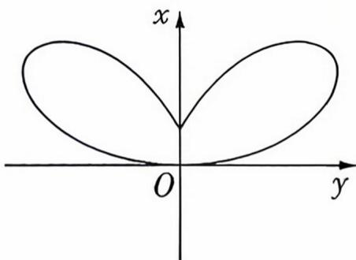

text_image

x
O
y

  
引入角 $\theta$ , 构造函数妙解 “蝴蝶曲线” 中的最值问题

# 2026 年高考全新预测

# 全新题型 1 逻辑推理题

本卷总分：48分

建议用时: 40 分钟

Q 答案链接: P013

本卷共9小题，第1\~2题每小题5分，第3\~5题每小题6分，第6\~9题每小题5分，共48分.

1.[2025 广东广州模拟]已知小明和小王从 5 张编号为 $1 \sim 5$ 的卡牌中依次不放回各抽取 2 张卡牌,设甲为“小明手中的两张卡牌编号和为 3”,乙为“小王手中的两张卡牌编号均不小于 3”,则 ( )

A. 甲是乙的充分条件但不是必要条件  
B. 甲是乙的必要条件但不是充分条件  
C. 甲是乙的充要条件  
D. 甲既不是乙的充分条件也不是乙的必要条件

2.[2025 福建福州质检]如图,正方形 $A_{1}B_{1}C_{1}D_{1}$ 的边长为 1 ,取正方形各边的四等分点 $A_{2}, B_{2}, C_{2}, D_{2}$ , 得到第 2 个正方形 $A_{2}B_{2}C_{2}D_{2}$ , 再取正方形 $A_{2}B_{2}C_{2}D_{2}$ 各边的四等分点 $A_{3}, B_{3}, C_{3}, D_{3}$ , 得到第 3 个正方形 $A_{3}B_{3}C_{3}D_{3}$ , 依此方法一直进行下去. 若从第 $k$ 个正方形开始, 它的面积小于第 1 个正方形面积的 $\frac{1}{50}$ , 则 $k = (\text{参考数据: } \lg 2 \approx$

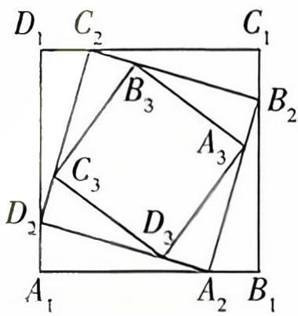

text_image

D₁ C₂ C₁
B₃ B₂
A₃
C₃
D₂ D₃ A₁ A₂ B₁

0.3)

( )

A. 8

B. 9

C. 10

D. 11

3.[学科融合·融合生物▶教材溯源题, 多选]人类的四种常见血型与基因类型的对应关系为: O 型的基因类型为 ii, A 型的基因类型为 ai 或 aa, B 型的基因类型为 bi 或 bb, AB 型的基因类型为 ab, 其中, a 和 b 是显性基因, i 是隐性基因. 则下列说法正确的是 ( )

A. 若父亲的血型为 AB 型, 则孩子的血型可能为 O 型  
B. 若父母的血型不相同, 则父母血型的基因类型组合有 26 种  
C. 若孩子的爷爷、奶奶、母亲的血型均为 AB 型, 孩子与父亲血型相同的概率为 $\frac{1}{2}$   
D. 若孩子的爷爷、奶奶、母亲的血型均为 AB 型, 则孩子的血型也是 AB 型的概率为 $\frac{1}{4}$

4.[高考溯源题, 多选]数列 $\{a_{n}\}$ 满足 $a_{1} = m + \frac{1}{m}, a_{2} = m + \frac{1}{m + \frac{1}{m}}, a_{3} = m + \frac{1}{m + \frac{1}{m + \frac{1}{m}}}, \cdots$ ,

$m \in N^{*}$ ，依此类推，则下列结论正确的是（）

# 考法解读

逻辑题要求考生在合理逻辑推理后进行判断、主要考查对信息的理解、分析和判断能力，是教育部教育考试院任子朝指出的4大创新题型之一，是高考的创新命题趋势。

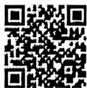  
聚焦分类讨论,巧解
概率求解问题

# 析题涂鸦

A. $a_{4}$ 的最小值为 $\frac{8}{5}$   
B. $a_{1} > a_{3} > a_{2} > a_{4}$   
C. 若 $m = 1$ ，则 $\left|a_{n+1} - a_n\right| \leqslant \frac{1}{2}$   
D. 若 $m = 1$ ，则 $\frac{a_{n+1}}{a_n} \geqslant \frac{3}{4}$

5.[2025 重庆巴蜀中学三诊, 多选]下图都是由 3 个独立的线圈缠绕在一起, 现若剪断任意一个线圈, 则剩余两个线圈能分开的是 ( )

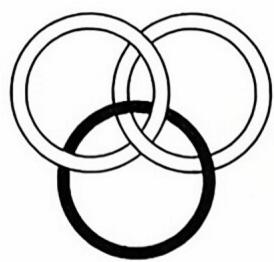  
A

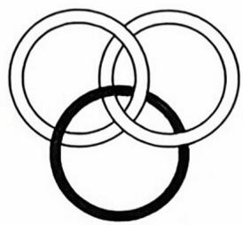  
B

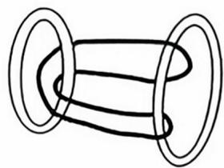  
C

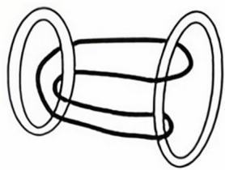  
D

6.[2025 北京大学附属中学阶段检测] 地铁某换乘站设有编号 A, B, C, D, E 一开口, 五个出口疏散乘客速度互不影响。若同时乘客所需的时间

进入机构

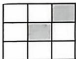

( ) 从式知下:如图所示,信号旗的旗面为九
小方格可以在白色和黑色之间变换,则一共有\_\_\_\_种不同的颜色组合来传递不同的信息. 若要求最多出现 3 个黑色格子, 那么一共可以传递\_\_\_\_种不同的信息.

9.[2025 江苏南京阶段测试]数阵是由幻方演化出来的一种数字图,有圆、多边形、星形、花瓣形、十字形,甚至多种图形的组合,变幻多端.由若干个互不相同的数构成等腰直角三角形数阵,如图,其中第一行1个数,第二行2个数,第三行3个数,…,以此类推,一共10行.设 $x_{k}$ 是从上往下数第k行中的最大数,则 $x_{1}<x_{2}<\cdots<x_{10}$ 的概率为\_\_\_\_.

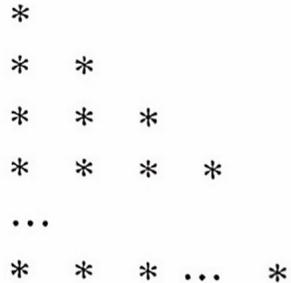

# 全新题型2 数据分析题

本卷总分: 45 分

建议用时：30 分钟

答案链接: P014

本卷共 8 小题, 第 $1 \sim 3$ 题每小题 5 分, 第 $4 \sim 8$ 题每小题 6 分, 共 45 分.

1.[新情境·居民消费价格指数分析▶2025四川成都二模]居民消费价格指数是度量一定时期内居民消费商品和服务价格水平总体变动情况的相对数,综合反映居民消费商品和服务价格水平的变动趋势和变动程度.下图是2024年国家统计局公布的2024年10月各类商品及服务价格同比和环比涨跌幅情况(同比= $\frac{本期数-去年同期数}{去年同期数}\times100\%$ , 环比= $\frac{本期数-上期数}{上期数}\times100\%$ ),下列结论正确的是()

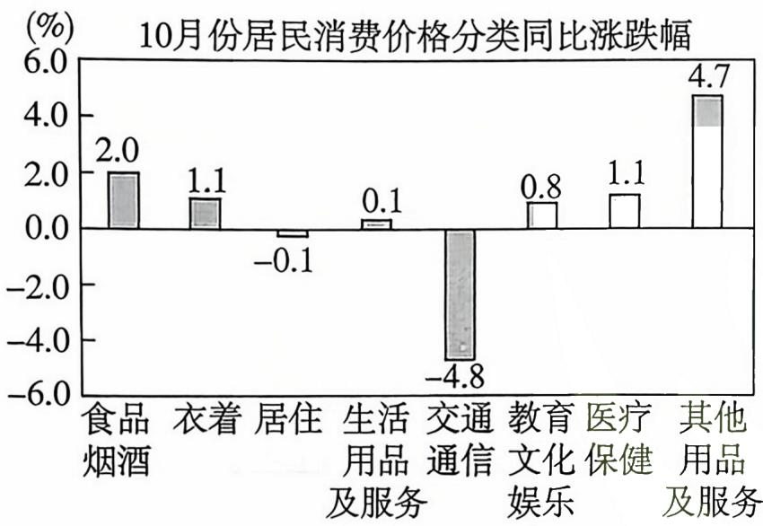

bar

10月份居民消费价格分类同比涨跌幅
| 消费类型 | 同比涨跌幅 (%) |
| :--- | :--- |
| 食品烟酒 | 2.0 |
| 衣着 | 1.1 |
| 居住 | -0.1 |
| 生活用品及服务 | 0.1 |
| 交通通信 | -4.8 |
| 教育文化娱乐 | 0.8 |
| 医疗保健 | 1.1 |
| 其他用品及服务 | 4.7 |

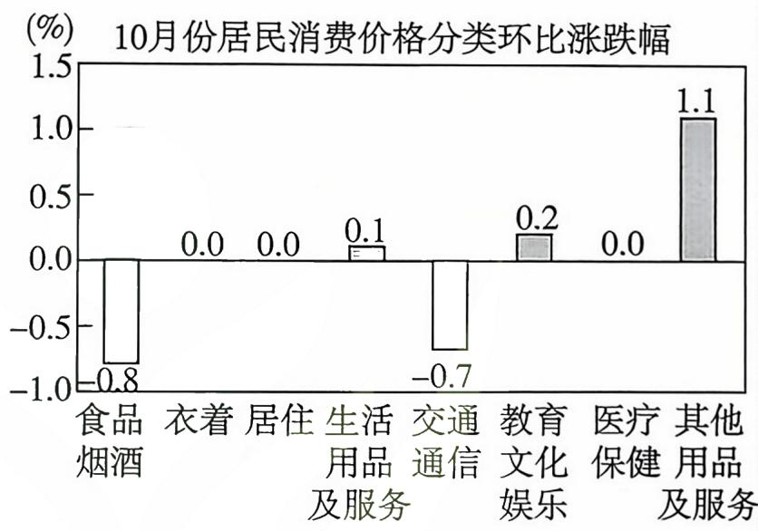

bar

10月份居民消费价格分类环比涨跌幅
| 消费价格分类 | 环比 (%) |
| :--- | :--- |
| 食品烟酒 | -0.8 |
| 衣着 | 0.0 |
| 居住 | 0.0 |
| 生活用品及服务 | 0.1 |
| 交通通信 | -0.7 |
| 教育文化娱乐 | 0.2 |
| 医疗保健 | 0.0 |
| 其他用品及服务 | 1.1 |

A. 2024 年 10 月份食品烟酒类价格低于 2023 年 10 月份食品烟酒类价格  
B. 2024 年 10 月份教育文化娱乐类价格低于 2024 年 9 月份教育文化娱乐类价格  
C. 2024 年 9 月份医疗保健类价格高于 2023 年 10 月份医疗保健类价格  
D. 2024 年 9 月份居住类价格高于 2023 年 10 月份居住类价格

2.[2025 南宁阶段检测]在研究变量 x 与 y 之间的关系时,进行实验后得到了一组样本数据 $(x_{1},y_{1}),(x_{2},y_{2}),\cdots,(x_{5},y_{5}),(6,28),(0,28)$ ,利用此样本数据求得的经验回归方程为 $\hat{y}=\frac{10}{7}x+\frac{166}{7}$ ,现发现数据(6,28)和(0,28)误差较大,剔除这两对数据后,求得的经验回归方程为 $\hat{y}=4x+m$ ,且 $\sum_{i=1}^{5}y_{i}=140$ ,则 m=()

A. 8

B. 12

C. 16

D. 20

3.[新情境·3D 打印设备调试▶2025 长沙适应性测试]现用甲、乙、丙、丁四台 3D 打印设备打印一批对内径有较高精度要求的零件. 已知这四台 3D 打印设备在正常工作的状态下, 打印出的零件内径尺寸 $Z$ (单位: mm) 近似服从正态分布 $N(\mu, 2.25)$ , 且 $P(Z < 28) = P(Z > 32)$ . 根据要求, 正式打印前需要对设备进行调试, 调试时, 四台设备各试打 5 个零件, 打印出的零件内径尺寸 (单位: mm) 如下, 根据 $3 \sigma$ 原则判断, 下列设备不需要调试的是 ( )

A. 甲:27.3,29.2,30.5,36.7,39.3

B. 乙:25.1,27.2,29.5,31.2,33.3

C. 丙:25.9,27.3,28.8,31.1,34.4

D. 丁:25.6,30.4,32.7,33.9,36.3

4.[2025 山东青岛阶段检测, 多选]对某地区某次数学考试成绩的数据进行分析, 男生的成绩 $X$ 近似服从正态分布 $N(72,8^{2})$ , 女生的成绩 $Y$ 近似服从正态分布 $N(74,6^{2})$ , 则 ( )

A. $P(X \leqslant 86) < P(Y \leqslant 86)$

B. $P(X \leqslant 80) > P(Y \leqslant 80)$

C. $P(X \leqslant 74) > P(Y \leqslant 74)$

D. $P(X \leqslant 64) = P(Y \geqslant 80)$

# 考法解读

数据分析题，要求考生根据试题给出的情境和数据，应用所学知识，自主分析数据，得出相应结论并解决问题。主要考查考生对信息的获取与加工、数据处理能力和问题分析解决能力。

# 析题涂鸦

5. [2025 湖北黄冈、天门等八市联考, 多选] 根据变量 $Y_{1}$ 和 $x$ 的成对样本数据, 由一元线性回归模型① $\left\{ \begin{array}{l} Y_{1} = b_{1} x + a_{1} + e_{1}, \\ E(e_{1}) = 0, D(e_{1}) = \sigma_{1}^{2}, \end{array} \right.$ 得到经验回归模型 $\hat{y} = \hat{b}_{1} x + \hat{a}_{1}$ , 对应的残差如图 1 所示. 根据变量 $Y_{2}$ 和 $x$ 的成对样本数据, 由一元线性回归模型② $\left\{ \begin{array}{l} Y_{2} = b_{2} x + a_{2} + e_{2}, \\ E(e_{2}) = 0, D(e_{2}) = \sigma_{2}^{2}, \end{array} \right.$ 得到经验回归模型 $\hat{y} = \hat{b}_{2} x + \hat{a}_{2}$ , 对应的残差如图 2 所示, 则 ( )

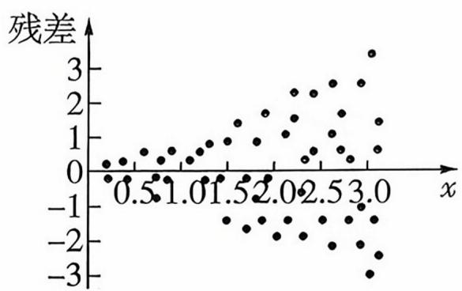

scatter

| x    | 残差 |
| ---- | ---- |
| 0.5  | 0.0  |
| 1.0  | 0.5  |
| 1.5  | 1.0  |
| 2.0  | 1.5  |
| 2.5  | 2.0  |
| 3.0  | 2.5  |

图 1

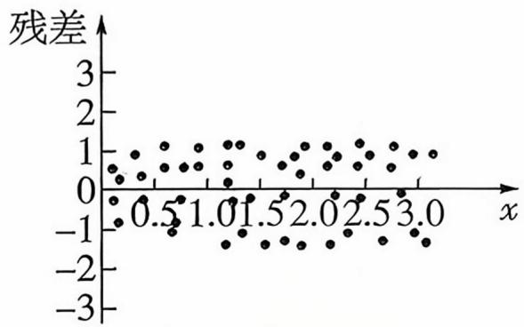

scatter

| x    | 残差 |
| ---- | ---- |
| 0.5  | -1   |
| 1.0  | 0    |
| 1.5  | 1    |
| 2.0  | 0    |
| 2.5  | 1    |
| 3.0  | 0    |

图2

A. 模型①的误差满足一元线性回归模型的 $E(e_{1}) = 0$ 的假设, 不满足 $D(e_{1}) = \sigma_{1}^{2}$ 的假设  
B. 模型①的误差不满足一元线性回归模型的 $E(e_{1}) = 0$ 的假设, 满足 $D(e_{1}) = \sigma_{1}^{2}$ 的假设  
C. 模型②的误差满足一元线性回归模型的 $E(e_{2}) = 0$ 的假设, 不满足 $D(e_{2}) = \sigma_{2}^{2}$ 的假设  
D. 模型②的误差满足一元线性回归模型的 $E(e_{2}) = 0$ 的假设, 满足 $D(e_{2}) = \sigma_{2}^{2}$ 的假设

6.[2025 浙江镇海中学、学军中学等校联考，多选]下列说法正确的是 ( )

A. 有一组数 $1, 2, 3, 5$ , 这组数的第 75 百分位数是 3  
B. 在 $\alpha = 0.05$ 的独立性检验中, 若 $\chi^2$ 不小于 $\alpha$ 对应的临界值 $x_{0.05}$ , 可以推断两变量不独立, 该推断犯错误的概率不超过 0.05  
C. 随机变量 $X \sim B(n, p)$ , 若 $E(X) = 30$ , $D(X) = 10$ , 则 $n = 90$   
D. 用 $y = c{\mathrm{e}}^{kx}$ 拟合一组数据时, 经 $z = \ln y$ 代换后得到的回归直线方程为 $z = {0.3x} + 4$ ,则 $c = {\mathrm{e}}^{4},k = {0.3}$

7.[新情境·观影年龄分析▶ 2025 山东滨州模拟,多选]截至 2025 年 5 月,电影《哪吒之魔童闹海》总票房(含点映、预售及海外票房)已超 150 亿元,成为首部进入全球票房榜前五的亚洲电影.一团队随机抽取观看该电影的某场观众中的 100 人为样本,统计他们的年龄并绘制了如图所示的频率分布直方图,则()

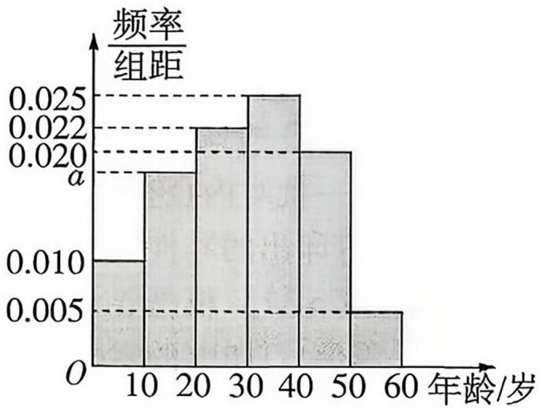

histogram

| 年龄/岁 | 频率/组距 |
| :--- | :--- |
| 10 | 0.010 |
| 20 | 0.022 |
| 30 | 0.025 |
| 40 | 0.020 |
| 50 | 0.005 |
年龄/岁: 60
年龄/岁: 40
年龄/岁: 30
年龄/岁: 20
年龄/岁: 10

A. $a = 0.018$   
B. 该场观众年龄平均数的估计值为 30  
C. 该场观众年龄众数的估计值为 35   
D. 该场观众年龄的 $60 \%$ 分位数的估计值为 34

8.[新考法·圆柱体积与表面积对应关系分析▶2025江苏宿迁检测, 多选]一个圆柱的表面积为 $S$ , 体积为 $V$ , 则下列四组数对中, 可作为数对 $(S, V)$ 的有 ( )

A. (6,1)

B. $(5,1)$

C. $(5\pi, \pi)$

D. $(4\pi, \pi)$

# 热考易错

# 热考易错 1

# 相近名词混淆不清致误

牢记名词本质

本卷总分：32 分

建议用时：20 分钟

答案链接: P015

本卷共6小题，第1\~2题每小题5分，第3\~4题每小题6分，第5\~6题每小题5分，共32分.

1.[混淆充分必要条件和充分不必要条件 ▶ 2025 安徽安庆一中检测] 复数 $z = a^{2} - a - 2 + \mathrm{i}(a \in \mathbf{R})$ 为纯虚数的一个充分不必要条件是 ( )

A. $a = 0$

B. $a = -1$

C. a = -1 或 a = 2

D. $a = 1$ 或 $a = -2$

2.[混淆均匀分组与不均匀分组▶ 2025 江苏连云港模拟]某市为了更好地保障社区居民的日常生活,选派6名志愿者到甲、乙、丙三个社区进行服务,每人只能去一个地方,每地至少派一人,则不同的选派方案共有()

A. 540 种

B. 180 种

C. 360 种

D. 630 种

3.[混淆任意与存在▶教材溯源题, 多选]已知函数 $f(x)=ax+\frac{b}{x}(ab\neq0)$ , 则下列说法正确的有 ( )

A. $\forall ab \neq 0$ , 函数 $f(x)$ 是奇函数  
B. $\exists ab \neq 0$ , 使得过原点 $O$ 至少可以作 $f(x)$ 图象的一条切线  
C. $\forall ab \neq 0$ , 方程 $f(\sin x) = f(\sin x + 2)$ 一定有实根  
D. $\exists ab \neq 0$ ，使得方程 $\sin [f(x)] = \cos [f(x)]$ 有实根

4. [混淆通项、前 $n$ 项和、前 $n$ 项积 $\triangleright$ 2025重庆市巴蜀中学阶段检测, 多选]数列 $\{a_{n}\}$ 满足 $a_{n} + a_{n+1} = (-1)^{n+1}(n \in \mathbf{N}^{*})$ , 且 $a_{1} = -3$ , 数列 $\{a_{n}\}$ 的前 $n$ 项和为 $S_{n}$ , 从 $\{a_{n}\}$ 的前 $2n$ 项中任取两项, 它们的和为奇数的概率为 $P_{n}$ , 数列 $\{P_{n}\}$ 的前 $n$ 项积为 $T_{n}$ , 则 ( )

A. $a_{10} = 12$

B. $S_{12} = -6$

C. $P_{n} < \frac{1}{2} (n > 1)$

D. $T_{n} \leqslant \frac{n}{2^{n - 1}}$

5.[混淆项的系数和二项式系数▶高考溯源题] $(x-2y)^{7}$ 的展开式中系数最大的项为\_\_\_\_.  
6.[混淆极值和极值点▶教材溯源题]函数 $f(x)=\frac{3}{2}x^{2}-\ln x$ 的极值点为\_\_\_\_.

# 热考易错 2

# 分类讨论不全面或分类标准不当致误

紧抓关键变量

本卷总分：30 分

建议用时：20 分钟

答案链接: P016

# 析题涂鸦

# 本卷共6小题，每小题5分，共30分.

1.[直线斜率分类不全▶教材溯源题]已知抛物线 $C: y^{2} = 4x$ 的焦点为 F, 过点 A(0,2) 且与抛物线 C 有唯一公共点的直线有 ( )

A. 1 条

B. 2 条

C. 3 条

D. 4 条

2.[分配方法分类不当 ▶ 2025 广东中山模拟]在党的二十大报告中,习近平总书记提出要发展“高质量教育”,促进城乡教育均衡发展.某地区教育行政部门积极响应党中央号召,安排甲、乙、丙、丁4名教育专家前往某省教育相对落后的三个地区指导教育教学工作,则每个地区至少安排1名专家的概率为 ( )

A. $\frac{1}{9}$

B. $\frac{4}{9}$

C. $\frac{1}{3}$

D. $\frac{8}{27}$

3. [点的位置分类不全 ▶ 2025 北师大实验中学模拟] 对直线系 $M: x \cos \theta + (y - 2) \sin \theta = 1$ $(0 \leqslant \theta < 2 \pi)$ , 有下列四个命题:

(1) $M$ 中所有直线均经过同一个定点;  
(2) 存在定点 $P$ , 其不在 $M$ 中的任一条直线上;  
(3)对于任意整数 $n (n \geqslant 3)$ , 存在正 $n$ 边形, 其所有边均在 $M$ 中的直线上;  
(4) $M$ 中的直线所能围成的正三角形面积都相等.

其中真命题的个数为 （）

A. 1

B. 2

C. 3

D. 4

4.[参数分类讨论不全面▶高考溯源题]已知函数 $f(x)=1+\cos 4x+2\sin 2x$ ( $x\in[0,a]$ )的值域为 $[2,\frac{5}{2}]$ ，则实数a的取值范围为()

A. $\left[\frac{\pi}{6},\frac{\pi}{2}\right]$

B. $\left[\frac{\pi}{12}, \frac{\pi}{2}\right]$

C. $\left[\frac{\pi}{12}, \frac{\pi}{6}\right]$

D. $\left[\frac{5\pi}{12}, \pi\right]$

5.[参数分类标准不当 ▶ 2025 辽宁沈阳诊断测试]已知函数 $f(x) = x(x - a)^{2}$ 的极大值为 $\frac{1}{16}$ , 则 $a =$ ( )

A. $-\frac{3}{2}$

B. $-\frac{2}{3}$

C. $\frac{2}{3}$

D. $\frac{3}{4}$

6.[参数之间关系讨论不足▶高考溯源题]设函数 $f(x)=(x-2)^{2}(x-a)\ln(x+2b)$ ，若 $f(x) \geqslant 0$ 恒成立，则 $\frac{1}{a} + \frac{a}{2b}$ 的取值范围为()

A. $(-1,3]$

B. $[-1, 3)$

C. $(- \infty, -1) \cup [3, +\infty)$

D. $(-\infty, -1] \cup (3, +\infty)$

# 热考易错 3

# 数形结合时作图不准致误

注意特殊位置、特殊点

本卷总分：30 分

建议用时：20 分钟

答案链接：P017

# 本卷共6小题，每小题5分，共30分.

1. [忽视函数图象的凹凸性 ▶ 2025 哈尔滨九中二模] 已知函数 $f(x) = \left\{ \begin{array}{l} \left(\frac{1}{2}\right)^x, x \geqslant 1, \\ \log_4(x + 1), -1 < x < 1, \end{array} \right.$ 则 $f(x) \leqslant \frac{1}{2} x$ 的解集为 ( )

A. $(-\infty, 0]$

B. $(-1,0]$

C. $(-1,0] \cup [1, +\infty)$

D. $[1, +\infty)$

2.[忽视函数图象的渐近线▶教材溯源题]若函数 $f(x)=(\frac{1}{3})^{|x|}+m-1$ 至少有一个零点,则()

A. $m < 1$

B. $m \geq  1$

C. $0 \leqslant m < 1$

D. $0 \leqslant m \leqslant 1$

3.[忽视特殊函数值对应点的坐标▶高考溯源题]函数 $f(x)=2\sin(2x+\frac{\pi}{6})$ 与函数 $g(x)=\log_{2}x$ 的图象交点个数为 ( )

A. 3

B. 5

C. 6

D. 7

4.[忽视函数图象在特殊点处切线的情况 ▶ 2025 北京景山学校阶段检测]已知函数 $f(x) = \begin{cases} \ln(2 - x), & x \leqslant 1, \\ -x^2 + 1, & x > 1, \end{cases}$ 设 $g(x) = |f(x)| - ax + a$ ，若函数 $g(x)$ 仅有一个零点，则实数
a 的取值范围是 ( )

A. $[-1, +\infty)$

B. $[0, +\infty)$

C. $(- \infty, -1] \cup [0, 2]$

D. $(-1,0]\cup(2,+\infty)$

5.[忽视直线与双曲线交点的位置▶试题调研原创]已知 $F_{1},F_{2}$ 分别为双曲线 $C:\frac{x^{2}}{3}-\frac{y^{2}}{9}=1$ 的左、右焦点,过 $F_{2}$ 作倾斜角为 $30^{\circ}$ 的直线交双曲线于A,B两点,则 $|AF_{1}|+|BF_{1}|=$ \_\_\_\_.

6.[忽视三角形滚动的实际意义▶2025西北工业大学附属中学检测]如图,在平面直角坐标系xOy中放置着一个边长为1的等边三角形PAB,PB与x轴平行,点A在x轴上.现将三角形PAB沿x轴在平面直角坐标系xOy内滚动,设顶点 $P(x,y)$ 的轨迹方程是 $y=f(x)$ ,则 $f(x)$ 的最小正周期为\_\_\_\_; $y=f(x)$ 在其两个相邻零点间的图象与x轴所围区域的面积为\_\_\_\_.

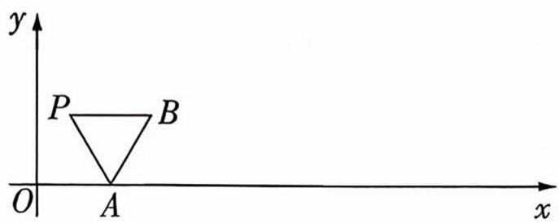

text_image

y
P B
O A x

# 析题涂鸦

# 热考易错 4

# 解函数不等式问题时函数构造不当

紧抓已知条件结构特征

本卷总分：31 分

建议用时：20 分钟

答案链接: P017

# 析题涂鸦

本卷共6小题，第1\~4题每小题5分，第5题6分，第6题5分，共31分.

1.[无法根据指数函数求导公式构造出函数▶2025湖南师大附中适应性演练]已知定义域为 R 的函数 $f(x)$ 满足 $f(1)=\frac{1}{e}$ ，且 $f(x)+f'(x)<0$ ，则不等式 $f(x+1)>\frac{1}{e^{x+1}}$ 的解集是()

A. $(2, +\infty)$

B. $(- \infty, 2)$

C. $(0, +\infty)$

D. $(- \infty, 0)$

2.[无法正确移项构造函数▶ 2025 上海行知中学阶段练习]已知 $f(x)$ 是定义在 R 上的偶函数,若对任意 $x_{1},x_{2}\in[0,+\infty)$ ,当 $x_{1}>x_{2}$ 时, $\frac{f(x_{1})-f(x_{2})}{x_{1}-x_{2}}>x_{1}+x_{2}$ 恒成立,且 $f(3)=0$ ,则满足 $f(m+3)\leqslant m^{2}+6m$ 的实数 m 的取值范围为 ( )

A. $[-6,0]$

B. $[0,1]$

C. $[-3, 2]$

D. $[-2, 2]$

3.[无法利用换底公式变形找到代数式的共同结构构造函数▶教材溯源题]若 $a = \log_{9}14, b = \lg 15, c = 2\log_{11}4$ ，则()

A. $a > c > b$

B. $c > a > b$

C. $a > b > c$

D. $c > b > a$

4. [无法利用指对同构构造函数 ▶ 2025 哈尔滨九中二模] 已知函数 $f(x) = x^{x - 1}, g(x) = a \ln x$ , 当 $x > 0$ 时, 函数 $f(x)$ 的图象始终在函数 $g(x)$ 图象的上方, 则实数 $a$ 的取值范围为 ( )

A. $(1, \mathrm{e}^{\frac{1}{\circ}})$

B. $(1, e^{\frac{1}{c}}]$

C. $(-e^{1 - \frac{1}{\circ}}, 1)$

D. $(-e^{1 - \frac{1}{e}}, e)$

5.[无法利用对数变形构造函数▶高考溯源题, 多选]已知 $a > 0, b > 0$ 且满足 $ab - 2b + b \ln (ab) = e$ , 则下列结论一定正确的是 ( )

A. ${ab} > \mathrm{e}$

B. ${ab} < \mathrm{e}$

C. $ab > \mathrm{e}^{2}$

D. ${ab} < {\mathrm{e}}^{2}$

6. [无法利用导数的乘法法则和指对同构构造函数 ▶ 2025 浙江台州阶段检测] 已知 $f(x)$ 是定义域为 $(0, +\infty)$ 的函数, 且满足 $f(x) + xf'(x) = e^x$ , $f'(1) = 1$ , 则不等式 $f(x) \leqslant \log_2 e$ 的解集是 \_\_\_\_.

# 热考易错 5

# 忽视三角函数的有界性或角的范围

圈出约束条件、标出临界值

本卷总分: 31 分

建议用时：20 分钟

答案链接: P018

本卷共6小题，第1\~3题每小题5分，第4题6分，第5\~6题每小题5分，共31分.

1. [忽视两角终边关于 $y$ 轴对称 ▶ 2025 上海阶段检测]已知 $\alpha, \beta \in \mathbf{R}$ , 则“ $\sin (\alpha + \beta) = \sin 2\alpha$ ”是“ $\beta = \alpha + 2k\pi (k \in \mathbf{Z})$ ”的 ( )

A. 充分不必要条件

B. 必要不充分条件

C. 充要条件

D. 既不充分也不必要条件

2.[忽视题干中已知角的范围 ▶ 2025 湖南株洲调研]已知 $0 < \beta < \alpha < \frac{\pi}{2}, \cos (\alpha - \beta) = \frac{4}{5}, \cos \alpha \cos \beta = \frac{1}{2}$ , 则 $\frac{1}{\tan \alpha} - \frac{1}{\tan \beta} =$ ( )

A. $\frac{3}{10}$

B. $- \frac{3}{10}$

C. 2

D. -2

3.[忽视锐角三角形中 3 个内角的范围 ▶ 试题调研原创]在锐角三角形 ABC 中, 内角 A, B, C 的对边分别为 a, b, c, c - 2bcos A = b, 角 A 的平分线交 BC 边于 D, AD = 2, 则 b 的取值范围为 ( )

A. $(\frac{4}{3}, 2\sqrt{2})$

B. $(\sqrt{3}, 2\sqrt{2})$

C. $(\frac{4}{3}, +\infty)$

D. $(\frac{4}{3}, \sqrt{3})$

4.[忽视三角形中内角2倍的范围 ▶ 试题调研原创，多选]下列说法正确的是（）

A. 在 $\triangle ABC$ 中, $A > B$ , 则 $\sin A > \sin B$   
B. 在锐角三角形 $ABC$ 中, 不等式 $\sin A > \cos B$ 恒成立  
C. 在 $\triangle ABC$ 中, 若 $a \cos A = b \cos B$ , 则 $\triangle ABC$ 必是等腰直角三角形  
D. 在 $\triangle ABC$ 中, 若 $B = \frac{\pi}{3}, b^2 = ac$ , 则 $\triangle ABC$ 必是等边三角形

5.[忽视正弦函数的有界性▶2025 河北石家庄模拟]已知 $0 < x < \frac{\pi}{2}$ , $\sin 2x - 2\cos^{2}2x + 8 \geqslant m\sin x\cos x$ , m 的取值范围为 \_\_\_\_.

6.[忽视题干中自变量的范围▶教材溯源题]设函数 $f(x)=\sqrt{3}\sin(\omega x-\frac{\pi}{3})$ ，其中0＜ $\omega<3$ ，且 $f(\frac{\pi}{6})=0$ ，将 $y=f(x)$ 图象上各点的横坐标伸长为原来的2倍(纵坐标不变)，再将得到的图象向左平移 $\frac{\pi}{4}$ 个单位长度，得到 $y=g(x)$ 的图象，则 $y=g(x)$ 在区间 $[- \frac{\pi}{4}, \frac{3\pi}{4}]$ 上的最小值为\_\_\_\_.

# 热考易错 6

# 忽视基本不等式的使用条件致误

牢记限制条件

本卷总分：32 分

建议用时：20 分钟

答案链接: P019

# 析题涂鸦

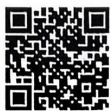

“万能‘k’法”妙解
双元代数式最值问题

本卷共6小题，第1\~4题每小题5分，第5\~6题每小题6分，共32分.

1.[忽视 “一正” 致误▶ 教材溯源题]已知 x > -1, y > -1, xy + x + y = 0, 则 x + y 的最小值是 ( )

A. 0

B. -1

C. $- \frac{1}{2}$

D. 1

2.[忽视“二定”致误▶2025 哈尔滨三中二模]正项等差数列 $\{a_{n}\}$ 中, $a_{4}=1$ ,则 $\frac{3}{a_{2}}+\frac{2}{a_{7}}$ 的最小值为
()

A. $\frac{9}{2}$

B. 5

C. $5\sqrt{2}$

D. 6

3.[不会合理拆分已知式与待求式致误▶2025 东北育才学校六模]若 a > 0, b > 0, 3a + 5b = 1 ,则 $\frac{11a+13b}{2a^{2}+6ab+4b^{2}}$ 的最小值为 ( )

A. 16

B. 18

C. 20

D. 22

4.[不会降次、整体代换致误▶高考溯源题]已知 x > 0, y > 0, $x + 3y = x^{3}y^{2}$ ，则 $\frac{3}{x} + \frac{2}{y}$ 的最小值为 ( )

A. $2\sqrt{2}$

B. $\sqrt{13}$

C. $2\sqrt{6}$

D. $2\sqrt{3}$

5.[忽视 “三相等” 致误▶ 2025 深圳中学适应性测试, 多选]下列说法中正确的有 ( )

A. 若 $a < b < 0$ , 则 $ab > b^2$

B. 若 $a > b > 0$ ，则 $\frac{b}{a} > \frac{a}{b}$

C. $\forall x\in(0,+\infty)$ , “ $x+\frac{1}{x}\geqslant m$ 恒成立”是“ $m\leqslant2$ ”的充分不必要条件

D. 若 $a > 0, b > 0, a + b = 1$ , 则 $\frac{1}{a} + \frac{1}{b}$ 的最小值为 4

6.[忽视基本不等式的变形形式致误▶2025 河北唐山模拟, 多选]已知函数 $f(x)=\left|\ln(x-2)\right|$ , 对于 $a,b(a>b),f(a)=f(b)$ , 则下列结论正确的是 ( )

A. $2 < b < 3$

B. $(a - 2)(b - 2) = e$

C. ${ab} > 9$

D. $a + 4b$ 最小值为 14

# 热考易错 7

# 忽视圆锥曲线中的隐含条件产生增解

解后验证合理性

本卷总分：63 分

建议用时：40 分钟

答案链接: P020

本卷共12 小题，第1\~6 题每小题5 分，第7\~9 题每小题6 分，第10\~12 题每小题5 分，共63 分.

1. [转化双曲线标准方程忽视焦点在 $y$ 轴上 $\triangleright$ 2025 广东广州质检]已知双曲线 $C: mx^{2} + ny^{2} = 1$ 的焦点在 $y$ 轴上, 且 $C$ 的离心率为 2 , 则 ( )

A. ${3m} - n = 0$

B. $m - 3n = 0$

C. ${3m} + n = 0$

D. $m + {3n} = 0$

2.[忽视点的位置的限制▶高考溯源题]抛物线 $y^{2}=2px(p>0)$ 的焦点为 F, O 为坐标原点, M 为抛物线上一点, 且 $|MF|=3|OF|$ , $\triangle MFO$ 的面积为 $16\sqrt{2}$ , 则抛物线的方程为 ( )

A. $y^{2}=6x$

B. $y^{2} = 8x$

C. $y^{2}=16x$

D. $y^{2} = 20x$

3.[忽视双曲线定义中的限制条件▶试题调研原创]已知平面直角坐标系中两定点 $F_{1}(-2,0)$ , $F_{2}(2,0)$ ，下列条件中使动点P的轨迹为双曲线的限制条件是()

A. $\left|PF_{1}\right| - \left|PF_{2}\right| = \pm 5$

B. $\left|PF_{1}\right| - \left|PF_{2}\right| = \pm 4$

C. $\left|PF_{1}\right|-\left|PF_{2}\right|=\pm3$

D. $\left|PF_{1}\right|^{2}-\left|PF_{2}\right|^{2}=\pm4$

4.[忽视椭圆定义中 a 与 c 的限制条件 ▶ 试题调研原创]已知曲线 $M: \sqrt{x^{2} + (y - \sqrt{3})^{2}} + \sqrt{x^{2} + (y + \sqrt{3})^{2}} = 4$ , 圆 $N: (x - 5)^{2} + y^{2} = 1$ , 若 A, B 分别是 M, N 上的动点, 则 $|AB|$ 的最小值是 ()

A. 2

B. $2\sqrt{2}$

C. 3

D. $2 + \sqrt{3}$

5.[忽视椭圆上点的坐标的限制▶试题调研原创]已知A,B是椭圆 $\frac{x^{2}}{a^{2}}+\frac{\gamma^{2}}{b^{2}}=1(a>b>0)$ 长轴的两端点,P,Q是椭圆上关于x轴对称的两点,直线AP,BQ的斜率分别为 $k_{1},k_{2}$ $(k_{1}k_{2}\neq0)$ . 若椭圆的离心率 $e=\frac{3}{5}$ ，则 $|k_{1}+k_{2}|$ 的最小值为()

A. 2

B. $\sqrt{3}$

C. $\frac{6}{5}$

D. $\frac{8}{5}$

6.[忽视点的位置的多种可能▶2025北京景山学校模拟]已知⊙O的半径为1,直线PA与⊙O相切于点A,直线PB与⊙O交于B,C两点,D为BC的中点,若 $|PO|=\sqrt{2}$ ,则 $\overrightarrow{PA}\cdot\overrightarrow{PD}$ 的最大值为()

A. $\frac{1 + \sqrt{2}}{2}$

B. $\frac{1+2\sqrt{2}}{2}$

C. 1

D. $2 + \sqrt{2}$

# 析题涂鸦

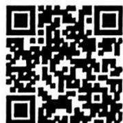  
“二级结论法”快解椭圆中的斜率和最值问题

# 析题涂鸦

7. [忽视两组双曲线互相影响 ▶ 2025 陕西西安模拟, 多选] 已知点 $E(-2,0), F(2,0)$ , $A(-3,0), B(3,0), M(4,0), N(-4,0)$ , 点 $P$ 在曲线 $C: \left(\frac{x^2}{4} - \frac{y^2}{5} - 1\right) \left(\frac{x^2}{4} - \frac{y^2}{12} - 1\right) = 0$ 上, 则 ( )

A. 曲线 $C$ 由虚轴长相等的两组双曲线组成  
B. 存在无数个点 $P$ , 使得 $|PA| - |PB| = 4$   
C. 存在无数个点 $P$ , 使得 $|PM| - |PN| = -4$   
D. 存在 8 个点 $P$ , 使得 $|PE| + |PF| = 4\sqrt{2}$

8.[忽视“直曲”相交交点的位置情况▶试题调研原创, 多选]已知双曲线 $\Gamma: \frac{x^{2}}{a^{2}} - \frac{y^{2}}{b^{2}} = 1 (a > 0, b > 0)$ 的离心率为 $e$ , 过其右焦点 $F$ 的直线 $l$ 与 $\Gamma$ 交于点 $A, B$ , 则下列结论正确的是 ( )

A. 若 $a = b$ , 则 $e = \sqrt{2}$   
B. $|AB|$ 的最小值为 $2a$   
C. 若满足 $|AB|=2a$ 的直线 l 恰有一条, 则 $e>\sqrt{2}$   
D. 若满足 $|AB|=2a$ 的直线 l 恰有三条, 则 $1<e<\sqrt{2}$

9.[忽视直线与双曲线有唯一交点的特殊情况▶2025江苏南京模考, 多选]已知双曲线 $C: \frac{x^{2}}{4} - \frac{y^{2}}{b^{2}} = 1 (b > 0)$ 的右焦点为 $F$ , 直线 $l: x + by = 0$ 是 $C$ 的一条渐近线, $P$ 是 $l$ 上一点, 则下列说法正确的是 ( )

A. $C$ 的虚轴长为 $2 \sqrt{2}$   
B. $C$ 的离心率为 $\sqrt{6}$   
C. $|PF|$ 的最小值为 $\sqrt{2}$   
D. 过点(2,2)能作4条与 $C$ 仅有1个交点的直线

10.[忽视双曲线定义的限制条件出错▶试题调研原创]已知以点 M 为圆心的动圆经过点 $F_{1}(-3,0)$ ，且与圆心为 $F_{2}$ 的圆 $(x-3)^{2}+y^{2}=12$ 相切，记点 M 的轨迹为曲线 C，则曲线 C 的方程为 \_\_\_\_.

11.[混淆双曲线的实轴长与实半轴长▶高考溯源题]若双曲线 $E:\frac{x^{2}}{a^{2}+a-2}-\frac{y^{2}}{2a-1}=1$ 的实轴长为4,则 a= \_\_\_\_.

12.[忽视“直曲”相交交点个数的限制条件▶试题调研原创]已知抛物线 $C: x^{2} = 2py (p > 0)$ 的焦点 $F$ 到准线的距离为 2 , 直线 $l: y = k(x - 4)$ 与抛物线 $C$ 交于 $P, Q$ 两点, 过点 $P, Q$ 分别作抛物线 $C$ 的切线 $l_{1}, l_{2}$ , 若 $l_{1}, l_{2}$ 交于点 $M$ , 则点 $M$ 的轨迹方程为 \_\_\_\_.

# 热考易错 8

# 解多选题时选项关联因素逻辑不清致误

辨析关联选项

本卷总分：42分

建议用时：30 分钟

答案链接: P022

# 本卷共 7 小题，每小题 6 分，共 42 分.

1.[近似选项干扰 ▶ 2025 湖南长沙一中模考]已知双曲线 $C_{1}: \frac{x^{2}}{a^{2}} - \frac{y^{2}}{b^{2}} = 1$ 和 $C_{2}: \frac{y^{2}}{b^{2}} - \frac{x^{2}}{a^{2}} = 1$ , 其中 $a > 0, b > 0$ , 且 $a \neq b$ , 则 ( )

A. $C_{1}$ 与 $C_{2}$ 有相同的实轴

B. $C_{1}$ 与 $C_{2}$ 有相同的焦距

C. $C_{1}$ 与 $C_{2}$ 有相同的渐近线

D. $C_{1}$ 与 $C_{2}$ 有相同的离心率

2.[概念分析不清▶ 2025 福建福州阶段性检测]设样本空间 $\Omega = \{5,6,7,8\}$ , 且每个样本点是等可能的, 已知事件 $A = \{5,6\}, B = \{5,7\}, C = \{5,8\}$ , 则下列结论正确的是 ( )

A. 事件 $A$ 与 $B$ 为互斥事件

B. 事件 $A, B, C$ 两两独立

C. $P(ABC) = P(A)P(B)P(C)$

D. $P(A|C) = P(C|A)$

3.[相近选项读题不慎▶2025 浙江宁波二模]若平面向量 a, b, c 满足 $\left|a\right|=1,\left|b\right|=1$ $|c|=3$ ，且 $a \cdot c = b \cdot c$ ，则（）

A. $|a + b + c|$ 的最小值为 1

B. $|a + b + c|$ 的最大值为 5

C. $|a - b + c|$ 的最小值为 2

D. $|a - b + c|$ 的最大值为 $\sqrt{13}$

4.[概念混淆▶试题调研原创]已知 a, b > 0 , 则使得“a > b”成立的一个充分条件可以是 ( )

A. $\frac{1}{a} < \frac{1}{b}$

B. $a > b - 2$

C. $b^{2} < a^{2}(1 + b^{2})$

D. $\ln (a^2 + 1) > \ln (b^2 + 1)$

5.[推理混乱 ▶ 试题调研原创]在数列 $\{a_{n}\}$ 中, $\forall n \geqslant 2, n \in \mathbf{N}^{*}, a_{n+1} + a_{n-1} = a_{1}a_{n}$ , 记 $\{a_{n}\}$ 的前 $n$ 项和为 $S_{n}$ , 则下列说法正确的是 ( )

A. 若 $a_{1} = 1, a_{2} = 2$ , 则 $a_{3} = 1$

B. 若 $a_1 = 1$ ，则 $a_n = a_{n+6}$

C. 若 $a_1 = 2, a_2 = 3$ ，则 $a_n = n$

D. 若 $a_{1} = 2, a_{2} = 3$ ，则 $S_{20} = 230$

6.[思维定式▶教材溯源题]某次演唱比赛结束后,10个评委为选手评分,恰好原始评分为9.1到10.0(构成公差为0.1的等差数列),按照规则要求去掉最高分和最低分,那么()

A. 去掉最高分和最低分之前, 评分的第 80 百分位数为 9.8  
B. 去掉最高分和最低分之前, 评分的第 80 百分位数为 9.3  
C. 去掉最高分和最低分之后, 方差相比原先减小  
D. 去掉最高分和最低分之后, 极差相比原先减小

7.[题干与选项表示函数混淆 ▶ 2025 河南郑州质检]已知对于任意非零实数 x, 函数 $f(x)$ 均满足 $f(x)=f(\frac{2}{x})$ , $f(x)=2-f(\frac{1}{x})$ , 下列结论正确的有 ( )

A. $f(1)=1$

B. $f(2^{x})$ 的图象关于点 $(0,1)$ 中心对称

C. $f(2^{x})$ 的图象关于直线 $x = 1$ 对称

D. $f(2)+f(2^{2})+f(2^{3})+\cdots+f(2^{10})=10$

# 析题涂鸦

# 疑难压轴

# 疑难压轴 1 指、对数式比较大小问题

本卷总分：88分

建议用时：60 分钟

答案链接: P023

# 析题涂鸦

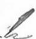

本卷共 17 小题，第 1～14 题每小题 5 分，第 15～17 题每小题 6 分，共 88 分.

1. [试题调研原创] 已知 $a = \mathrm{e}^{0.5}, b = \frac{8}{5}, c = \frac{\pi}{1.8}$ , 则 ( )

A. $b < a < c$

B. $c < a < b$

C. $c < b < a$

D. $b < c < a$

2. [教材溯源题] 已知 $a = \log_ {2} 3, b = \log_ {4} 5, c = \log_ {6} 7$ , 则 $a, b, c$ 的大小关系是 ( )

A. $c > a > b$

B. $a > c > b$

C. $b > c > a$

D. $a > b > c$

3.[试题调研原创]已知 $a = 0.25, b = \sin 0.25, c = e^{-0.75}$ , 则 ( )

A. $a < b < c$

B. $a < c < b$

C. $b < c < a$

D. $b < a < c$

4. [2025 天津模拟] 设 $a = \ln 0.9, b = -\frac{1}{9}, c = e^{0.9}$ ，则 ( )

A. $c > a > b$

B. $c > b > a$

C. $b > c > a$

D. $a > c > b$

5.[高考溯源题]已知实数 a, b 分别满足 $e^{a}=1.02,\ln(b+1)=0.02$ , 且 $c=\frac{1}{51}$ , 则（）

A. $a < b < c$

B. $b < a < c$

C. $b < c < a$

D. $c < a < b$

6.[试题调研原创] $a = \sin \frac{\pi}{5}, b = \ln \frac{3}{2}, c = \frac{1}{2}$ , 则 ( )

A. $a > b > c$

B. $c > a > b$

C. $c > b > a$

D. $a > c > b$

7.[试题调研原创]已知 $a=e^{\tan0.2}-1$ , $b=\sqrt{1.4}-1$ , $c=2\ln1.1$ , 则()

A. $a > b > c$

B. $c > a > b$

C. $a > c > b$

D. $c > b > a$

8.[试题调研原创] $a=1.01+\sin0.01,b=1+\ln1.01,c=e^{0.01}$ ，则()

A. $b > c > a$

B. $a > c > b$

C. $c > b > a$

D. $c > a > b$

  
利用泰勒展开式速解指对比大小问题

9.[指对同构模型 ▶ 试题调研原创] 已知 $2005^{m} = 2025, 2004^{n} = 2024, a = 2004^{m} - 2024, b = 2005^{n} - 2025$ , 则 $a, b$ 的大小关系是 ( )

A. $b > a > 0$

B. $0 > b > a$

C. $a > 0 > b$

D. $b > 0 > a$

10.[2025 四川成都模考]已知 a, b, c 满足 $a = \log_{5}(2^{b} + 3^{b})$ , $c = \log_{3}(5^{b} - 2^{b})$ , 则 ( )

A. $|a - c| \geqslant |b - c|, |a - b| \geqslant |b - c|$

B. $|a - c| \geqslant |b - c|, |a - b| \leqslant |b - c|$

C. $|a - c| \leqslant |b - c|, |a - b| \geqslant |b - c|$

D. $|a - c| \leqslant |b - c|, |a - b| \leqslant |b - c|$

11.[2025 安徽合肥检测]已知正实数 a, b, c，且 a > b，若 $2^{a} \cdot 3^{a-b} + 3^{c-b} = 1 + 2^{b}$ ，则（）

A. $b > c, 2b > a + c$

B. $b < c, 2b < a + c$

C. $b > c, 2b < a + c$

D. $b <   c,2b > a + c$

12.[教材溯源题]设 $a = \left(\frac{1012}{1011}\right)^{2023}, b = \left(\frac{1013}{1012}\right)^{2025}$ , 则下列关系正确的是 ( )

A. ${\mathrm{e}}^{2} < a < b$

B. $e^{2}<b<a$

C. $a < b < \mathrm{e}^{2}$

D. $b < a < \mathrm{e}^{2}$

13.[2025 哈尔滨六中模拟]已知实数 $x, y, z$ 满足 $\mathrm{e}^{x} - \mathrm{e}^{2} = \mathrm{e}(x - 2) \neq 0, \mathrm{e}^{y} - \mathrm{e}^{3} = \mathrm{e}(y - 3) \neq 0$ , $\mathrm{e}^{z} - \mathrm{e}^{5} = \mathrm{e}(z - 5) \neq 0$ , 其中 $\mathbf{e}$ 为自然对数的底数. 则 $x, y, z$ 的大小关系是 ( )

A. $x <   y <   z$

B. $y <   x <   z$

C. $z <   x <   y$

D. $z <   y <   x$

14.[2025 全国一卷]已知 $2 + \log_{2} x = 3 + \log_{3} y = 5 + \log_{5} z$ , 则 $x, y, z$ 的大小关系不可能为 ( )

A. $x > y > z$

B. $x > z > y$

C. $y > x > z$

D. $y > z > x$

15.[试题调研原创, 多选]设 $a = \mathrm{e}^{0.02} - 1$ , $b = \ln 1.02$ , $c = \frac{1}{51}$ , $d = \sqrt{1.02} - 1$ , 则下列结论正确的是 ( )

A. $b < a$

B. $b < c$

C. $d < b$

D. $d < c$

16.[试题调研原创, 多选]若 $4^{m} - 4^{n} < 5^{-m} - 5^{-n}$ , 则下列关系正确的是 ( )

A. $m <   n$

B. $n^{-3} > m^{-3}$

C. $\sqrt[3]{m} < \sqrt[3]{n}$

D. $3^{-n} < 3^{-m}$

17.[试题调研原创, 多选]已知 $a = \ln 1.5, b = e^{-0.5}, c = \sin 0.5, d = 0.3$ , 则 ( )

A. $c > a > d$

B. $a > c > d$

C. $b > c > a$

D. $b > a > d$

# 疑难压轴2 抽象函数性质探索问题

本卷总分：64 分

建议用时：45分钟

答案链接：P025

# 析题涂鸦

本卷共12 小题, 第 $1 \sim 6$ 题每小题5分, 第 $7 \sim 10$ 题每小题6分, 第 $11 \sim 12$ 题每小题5分, 共64分.

1. [2025 福建福州模拟] 已知定义在 $\mathbf{R}$ 上的函数 $f(x)$ 满足 $f(x + 2) = f(-x)$ , 且在区间 $(1, +\infty)$ 上单调递增, 则满足 $f(1 - x) > f(x + 3)$ 的 $x$ 的取值范围为 ( )

A. $(-1, +\infty)$

B. $(-\infty, -1)$

C. $(-1,1)$

D. $(-\infty, 1)$

2. [高考溯源题] 已知函数 $f(x)$ 的定义域为 $\mathbf{R}$ , 且 $f(x + y) + f(x - y) = f(x)f(y), f(1) = 1$ , 则 $\sum_{k=1}^{2025} f(k) =$ ( )

A. -3

B. -2

C. 0

D. 1

3.[2025 山东烟台模拟]已知函数 $f(x)$ 的定义域为 $(0, +\infty)$ ，且 $(x + y)f(x + y) = xyf(x)f(y)$ ， $f(1) = e$ ，记 $a = f(\frac{1}{2})$ ， $b = f(2)$ ， $c = f(3)$ ，则（）

A. $a < b < c$

B. $b < a < c$

C. $a < c < b$

D. $c < b < a$

4.[2025 浙江杭州阶段检测]已知函数 $f(x)$ , $g(x)$ 的定义域均为 $\mathbf{R}$ , $f(x+1)$ 为奇函数,且 $f(1-x)+g(x)=2$ , $f(x)+g(x-3)=2$ ,则()

A. $f(x)$ 不为偶函数

B. $g(x)$ 为奇函数

C. $\sum_{k=1}^{20} f(k) = 40$

D. $\sum_{k=1}^{20} g(k) = 40$

5.[高考溯源题]定义域为 $\mathbf{R}$ 的函数 $y = f(x)$ 满足对任意 $x \in \mathbf{R}$ , 都有 $f(x + 2)f(x) = -1$ , 且当 $x \in (0,4]$ 时, $xf'(x) - f(x) > 0$ , 则 $4f(2025), 2f(2026), f(2024)$ 的大小关系是 ( )

A. $4f(2025) < 2f(2026) < f(2024)$

B. $2f(2026) < 4f(2025) < f(2024)$

C. $f(2024) < 2f(2026) < 4f(2025)$

D. $4f(2025) < f(2024) < 2f(2026)$

6.[试题调研原创]已知 $f(x)$ 是定义在R上的偶函数,且 $f(0) = -1$ , $g(x) = f(x-1)$ 是奇函数,则 $f(2026) =$ ()

A. -1

B. 0

C. 1

D. 2

7.[高考溯源题, 多选]已知函数 $f(x)$ 的定义域为 R, $f(\frac{1}{2}) \neq 0$ , 若 $f(x+y)+f(x)f(y)=4xy$ , 则下列选项正确的有 ( )

A. $f(-\frac{1}{2}) = 0$   
B. $f\left( \frac{1}{2}\right)  =  - 2$   
C. 函数 $f(x + \frac{1}{2})$ 是增函数  
D. 函数 $f(x - \frac{1}{2})$ 是奇函数

8.[试题调研原创, 多选]已知 $f(x)$ 是定义域为 $\{x \mid x \neq 0\}$ 的非常数函数, 若对定义域内的任意实数 $x, y$ 均有 $f(x)f(y) = f(xy) + f(\frac{x}{y})$ , 则下列结论正确的是 ( )

A. $f(1)=2$

B. $f(x)$ 的值域为 $[2, +\infty)$

C. $f(x)=f(\frac{1}{x})$

D. $f(x)$ 是奇函数

9.[试题调研原创, 多选]已知函数 $f(x)$ 的定义域为 $\{x \mid x \neq 4k + 2, k \in Z\}$ , 且 $f(x + y) = \frac{f(x) + f(y)}{1 - f(x)f(y)}, f(1) = 1$ , 则 ( )

A. $f(0)=0$   
B. $f(x)$ 为偶函数  
C. $f(x)$ 为周期函数,且4为 $f(x)$ 的周期  
D. $f(2023) = -1$

10.[2025 辽宁省名校联考, 多选]已知函数 $f(x)$ 及其导函数 $f'(x)$ 的定义域均为 $\mathbf{R}$ , 若 $f(x+1)$ 与 $f'(x)$ 均为偶函数, 且 $f(-1)+f(1)=2$ , 则下列结论正确的是 ( )

A. $f'(1)=0$

B. 4 是 $f(x)$ 的一个周期

C. $f(1012) = 0$

D. $f(x)$ 的图象关于点 $(6,1)$ 对称

11. [2025 河南郑州模考] 已知定义在 $\mathbf{R}$ 上的函数 $f(x)$ 满足: $\forall x, y \in \mathbf{R}, f(xy) + f(x)f(y) = 0, f(x)$ 在 $[0, +\infty)$ 上单调递减, $f(-1) = 1$ , 则满足 $|f(x)| < 1$ 的 $x$ 的取值范围为 \_\_\_\_.  
12.[试题调研原创]已知函数 $f(x)$ 满足对任意的实数a,b,都有 $f(a+b)=f(a)+f(b)$ ,且当x>0时, $f(x)>0,f(2)=1$ .若 $f(x)\leqslant m^{2}-2km+1$ 对所有的 $x\in[-2,2],k\in[-1,1]$ 恒成立,则实数m的取值范围为\_\_\_\_.

# 析题涂鸦

  
“赋值法”秒杀抽象函数问题

# 疑难压轴3 函数不等式与函数零点问题

本卷总分：54 分

建议用时：45分钟

答案链接: P027

# 析题涂鸦

本卷共 10 小题，第 1～4 题每小题 5 分，第 5～8 题每小题 6 分，第 9～10 题每小题 5 分，共 54 分.

1.[2025 河南师大附中模拟]若函数 $f(x)=2x^{3}-3x^{2}-a$ 在区间(1,2)内仅有一个零点,则实数a的取值范围为()

A. (2,3)

B. $(0,1)$

C. $(-1,4)$

D. $(-1,0)$

主元变换,妙解绝对值
函数不等式问题

2.[2025 “八省联考”]已知函数 $f(x)=x|x-a|-2a^{2}$ . 若当x>2时, $f(x)>0$ ,则实数a的取值范围是 ( )

A. $(-\infty, 1]$

B. $[-2, 1]$

C. 「 1 2 7

国家任点 $P(0, f(0))$ 处的切线与坐标轴围成的三角形的面积为 $= 1$

C. 当 $a = 1$ 时, 关于 $x$ 的方程 $f(x) = m$ 可能有三个实根

D. 当 a = 1 时, 函数的极小值大于极大值

5.[教材溯源题, 多选]已知函数 $f(x) = a(e^{x} + 1) \ln \frac{1 + x}{1 - x} - e^{\dot{x}} + 1$ 恰有三个零点, 设其由小到大分别为 $x_{1}, x_{2}, x_{3}$ , 则 ( )

A. 实数 $a$ 的取值范围是 $(0, \frac{1}{\mathrm{e}})$

B. $x_{1} + x_{2} + x_{3} = 0$

C. 函数 $g(x) = f(x) + kf(-x)$ 可能有四个零点  
D. $\frac{f'(x_3)}{f'(x_1)} = \mathrm{e}^{x_3}$

6.[2025 河北保定一模, 多选]已知函数 $f(x)=x^{3}+bx^{2}+cx+d(d\neq0)$ 在 $(-∞,0]$ 上单调递增, 在[0,2]上单调递减, 且方程 $f(x)=0$ 有3个不等实根, 它们分别为m,n,2,则()

A. 实数 $c$ 为0

B. $\frac{1}{m} + \frac{1}{n}$ 为定值

C. $f(1) < 2$

D. $\left| {m - n}\right|  > 3$

7.[2025 重庆三诊,多选]已知函数 $f(x)=mx^{3}-2x+2a$ 有两个极值点a,b(a<b)，则下列结论正确的是()

A. ${ab} < 0$   
B. $a + b > 0$   
C. $f(a) + f(b) < 0$   
D. 若 $\exists c \in \mathbf{R}$ , 使得 $f(c + 1) - f(c) < 1$ , 则实数 $m$ 的取值范围为 $(0, 12)$

8.[试题调研原创, 乡选]设函数 $f(x) = \mathrm{e}^{x} - \mathrm{e}x$ 和 $g(x) = \ln x - kx^{2} + (1 - 2k) \cdot x + \frac{1}{2}$ ( $k \in \mathbf{R}$ ), 其中 e 是自然对数的底数 (e = 2.71828…), 则下列结论正确的为 ( )

A. $f(x)$ 的图象与 $x$ 轴相切  
B. 存在实数 $k < 0$ , 使得 $g(x)$ 的图象与 $x$ 轴相切  
C. 若 $k = \frac{1}{2}$ , 则方程 $f(x) = g(x)$ 有唯一实数解  
D. 若 $g(x)$ 有两个零点, 则 $k$ 的取值范围为 $(0, \frac{1}{2})$

9.[教材溯源题]已知函数 $f(x)=\left\{\begin{aligned}&\frac{\mathrm{e}^{x}}{x-1},&x>0\text{且}x\neq1,\\&-f(-x),&x<0\text{且}x\neq-1,\end{aligned}\right.$ 若函数 $g(x)=[f(x)]^{2}-$ $mf(x)-e^{4}$ 有4个零点，则实数m的取值范围是\_\_\_\_。  
10.[2025江西南昌检测]已知函数 $f(x)=ax(e^{x}+1)+e^{x}-1$ 恰好有3个零点,则实数a的取值范围是\_\_\_\_.

# 疑难压轴4 以数列为载体的创新交汇问题

本卷总分：55 分

建议用时：45分钟

答案链接: P030

# 析题涂鸦

本卷共 10 小题，第 1～2 题每小题 5 分，第 3～7 题每小题 6 分，第 8～10 题每小题 5 分，共 55 分.

1. [数列与椭圆交汇▶试题调研原创] 已知椭圆 $E: \frac{x^{2}}{a^{2}} + \frac{y^{2}}{b^{2}} = 1 (a > b > 0)$ 的左、右焦点分别为 $F_{1}, F_{2}$ , 直线 $l$ 过 $F_{2}$ 与 $E$ 交于 $A, B$ 两点, $\triangle ABF_{1}$ 为直角三角形, 且 $|AF_{1}|$ , $|AB|$ , $|BF_{1}|$ 成等差数列, 则椭圆 $E$ 的离心率为 ( )

A. $\frac{1}{2}$

B. $\frac{\sqrt{2}}{2}$

C. $\frac{\sqrt{3}}{2}$

D. $\frac{3}{4}$

2.[数列与直线、圆交汇▶2025 大庆实验中学模拟]已知数列 $\{a_{n}\}$ 为等差数列,且公差 $d \neq 0$ , 直线 $l: a_{n}x + a_{n+2}y + a_{n+5} = 0 (n \in \mathbf{N}^{*})$ 与圆 $C: (x - 1)^{2} + (y + 2)^{2} = 1$ 交于 A, B 两点, 则 $\angle ACB$ 的最小值为 ()

A. $\frac{2 \pi}{3}$

B. $\frac{\pi}{2}$

C. $\frac{\pi}{3}$

D. $\frac{\pi}{4}$

3.[数列与平面几何、三角函数交汇▶2025 浙江宁波模拟, 多选]在直角 $\triangle ABC$ 中, $AB \perp AC, D$ 为线段 $BC$ 上一点, 则 ( )

A. 若 AB = 3, AC = 4, D 是 $\triangle ABC$ 的内切圆在 BC 上的切点，则 $AD = \frac{\sqrt{145}}{5}$

B. 若 ${BD} = {CD}$ ,则存在直角 $\bigtriangleup  {ABC}$ ,使得 ${AD}$ 是 ${AB},{AC}$ 的等比中项

C. 若 $AD \perp BC$ , 则存在直角 $\triangle ABC$ , 使得 $AD$ 是 $AB, AC$ 的等比中项

D. 若 $\angle BAD = \angle CAD$ , 则存在直角 $\triangle ABC$ , 使得 $AD$ 是 $AB, AC$ 的等比中项

4.[数列与二项式定理交汇▶教材溯源题, 多选]在二项式 $\left(\frac{1}{\sqrt{x}} + \frac{\sqrt{x}}{2}\right)^n$ 的展开式中, 前3项的系数成等差数列, 则下列结论中正确的是 ( )

A. $n = 8$

B. 展开式中所有奇数项的二项式系数和为 128

C. 展开式中的常数项为 $\frac{1}{16}$

D. 展开式中系数最大项为第 3 项和第 4 项

5.[数列与抽象函数交汇▶2025 河北石家庄一中模拟, 多选]设函数 $f(x)$ 的定义域为 $\mathbf{R}, f(f(x-y)) = f(x) - f(y)$ , 且 $f(1) = 1$ , 则 ( )

A. $f(2025) = 2025$

B. $f(f(2025)) = 2025$

C. $f(x)$ 是奇函数

D. $\sum_{i=1}^{2025} f(f(-i)) = -2025$

6.[数列与立体几何交汇▶2025 浙江衢州、丽水、湖州二模, 多选]如图, 多面体 $PABCQ$ 由正四面体 $P-ABC$ 和正四面体 $Q-ABC$ 拼接而成, 一只蚂蚁从顶点 $P$ 出发, 沿着多面体的各条棱爬行, 每次等概率地爬行到相邻顶点中的一个, 记 $n$ 次爬行后, 该蚂蚁落在点 $P$ 的概率为 $p_n$ , 落在点 $Q$ 的概率为 $q_n$ , 则

text_image

P
A
B
C
Q

A. $p_{2} = \frac{1}{4}$

B. $p_{3} > q_{4}$

C. $p_n = q_n$

D. $p_{2n + 1} < \frac{1}{6}$

7.[数列与新定义集合、古典概型交汇▶教材溯源题,多选]已知数列 $\{a_{n}\}$ 满足 $0 \leqslant a_{1} < a_{2} < \cdots < a_{n} (n \geqslant 3)$ , 定义: 集合 $M = \{(a_{e}, a_{f}) \mid e < f, \exists p, q\}$ , 使得 $a_{f} - a_{e} = \frac{1}{2}(a_{q} - a_{p})\}$ , 并记该集合的元素个数为 $|M|$ . 则以下说法正确的是 ( )

A. 若 $a_{n} = 2^{n - 1}(1\leqslant n\leqslant 3)$ ，则 $|M| = 2$   
B. 若 $a_{n} = 2n - 1(1 \leqslant n \leqslant 4)$ , 则 $|M| = 3$   
C. 存在数列 $\{a_{n}\}$ , 其中有一项 $a_{i} (2 \leqslant i \leqslant n - 1)$ 能使得 $(a_{1}, a_{i}) \in M$ 且 $(a_{i}, a_{n}) \in M$   
D. 若 $a_{1} = 0$ , 任取数列 $\{a_{n}\}$ 的两项 $a_{i}, a_{j} (i < j), (a_{i}, a_{j})$ 恰好是 $M$ 中元素的概率大于 $\frac{4}{5}$ , 则 $n > 8$

8.[数列与新定义函数交汇▶2025 浙江省温州三模]对于给定的数列 $\{a_{n}\}$ ， $\{b_{n}\}$ 和正整数m，若函数 $f(x)=\sum_{i=1}^{m}(a_{i}-b_{i})x$ 中x的系数为正数，则称 $f(x)$ 为正比例近似函数。已知数列 $\{a_{n}\}$ ， $\{b_{n}\}$ 满足 $a_{1}=1,a_{n}=2a_{n-1}+1,b_{n}=\log_{2}(a_{n}+1)$ ，若 $f(x)$ 为正比例近似函数，则m的取值范围为\_\_\_\_。  
9.[数列与平面向量交汇▶2025上海嘉定区二模]在平面直角坐标系中,一质点P从原点O出发,第一次从点O移动到点 $P_{1}$ ,第二次从点 $P_{1}$ 移动到点 $P_{2}$ ,…,第k次从点 $P_{k-1}$ (规定 $P_{0}=O$ )移动到点 $P_{k}(k\in\mathbf{N}^{*})$ .向量 $\overrightarrow{P_{k-1}P_{k}}$ 的模为k,方向与x轴正方向成(90k)°角,设 $s_{n}=\overrightarrow{OP_{n}}$ ,则当 $|s_{n}|=\sqrt{85}$ 时,n的值为\_\_\_\_.  
10. [数列与抛物线交汇▶高考溯源题] 已知抛物线 $C: y^{2} = 2px (p > 0)$ 的焦点 $F$ 到其准线的距离为 $\frac{3}{2}$ , 若等边三角形 $A_{n-1}A_{n}B_{n}(n \in \mathbf{N}^{*})$ 的边 $A_{n-1}A_{n}$ 在 $x$ 轴的非负半轴上, $A_{0}$ 与原点 $O$ 重合, 点 $A_{n}$ 的横坐标大于点 $A_{n-1}$ 的横坐标, 位于第一象限的点 $B_{n}$ 在抛物线 $C$ 上, 则 $|A_{n-1}A_{n}| =$ \_\_\_\_. (用含 $n$ 的式子表示)

析题涂鸦

瞄准新定义特征，速破数列概率交汇题

瞄准动点约束条件
巧破隐含数列问题

# 疑难压轴5 立体几何中的动态探究题

本卷总分：45分

建议用时：40 分钟

答案链接: P032

# 析题涂鸦

本卷共 8 小题, 第 1\~2 题每小题 5 分, 第 3\~7 题每小题 6 分, 第 8 题 5 分, 共 45 分.

1. [2025 重庆模拟] 已知正方体 $ABCD - A_{1}B_{1}C_{1}D_{1}$ 的棱长为 $1, M$ 是棱 $AB$ 的中点, $N$ 是侧面 $BB_{1}C_{1}C$ 上一点 (包含边界), 且 $MN \parallel$ 平面 $AA_{1}C_{1}C$ , 则 $MN$ 长度的取值范围是 ( )

A. $[1, \sqrt{2}]$

B. $[1, \frac{\sqrt{6}}{2}]$

C. $\left[\frac{\sqrt{2}}{2}, \frac{\sqrt{6}}{2}\right]$

D. $\left[\frac{\sqrt{2}}{2},\sqrt{2}\right]$

2.[2025 上海长宁二模] 如图, 等腰直角三角形 $ABC$ 中, $\angle A =$

$\frac{\pi}{2}$ , 点 E 是边 AC 的中点, 点 D 是边 BC 上一点 (不与 C 重合),将三角形 $DCE$ 沿 $DE$ 翻折, 点 $C$ 的对应点是 $C_{1}$ , 连接 $CC_{1}$ , 设二面角 $C_{1} - DE - C$ 为 $\theta, \theta \in (0, \pi)$ . 在翻折过程中, 下列说法中不正确的是 ( )

A. 存在点 $D$ 和 $\theta$ , 使得 $DC_{1} \perp AC$

B. 存在点 $D$ 和 $\theta$ , 使得 $BC_{1} \perp AC$

C. 存在点 $D$ 和 $\theta$ , 使得 $BC_{1} \perp DE$

D. 存在点 $D$ 和 $\theta$ , 使得 $CC_{1} \perp DE$

text_image

C₁
D
E
B
A
C

3.[教材溯源题, 多选]在矩形 $ABCD$ 中, $AB = 1$ , $BC = \sqrt{3}$ , 以对角线 $BD$ 为折痕将 $\triangle ABD$ 进行翻折, 折后为 $\triangle A'BD$ , 连接 $A'C$ 得到三棱锥 $A' - BCD$ , 在翻折过程中, 下列说法正确的是 ( )

A. 三棱锥 $A' - BCD$ 体积的最大值为 $\frac{1}{4}$   
B. 三棱锥 $A' - BCD$ 外接球的半径为 1  
C. 存在点 $A'$ 使得 $BD \perp A'C$   
D. 当 $A'B \perp DC$ 时, $A'C = \sqrt{2}$

4. [试题调研原创, 多选] 已知如图所示的正方体 $ABCD - A_{1}B_{1}C_{1}D_{1}$ 的外接球表面积为 $12 \pi$ , 点 $P$ 在正方体的对角面 $BDD_{1}B_{1}$ 内 (包括边界), 则下列说法正确的是 ( )

  
定义与性质齐下,巧破
动点轨迹探究问题

text_image

D₁
C₁
A₁
B₁
D
P
C
A
B

A. 若 $B_{1}P \parallel$ 平面 $A_{1}C_{1}D$ , 则 $P$ 的轨迹长度为 $\sqrt{6}$   
B. 若 $BP \perp$ 平面 $A_{1}C_{1}D$ ，则 P 的轨迹长度为 $2\sqrt{3}$   
C. 若点 $P$ 到平面 $A_{1}B_{1}C_{1}D_{1}$ 的距离与到点 $B$ 的距离相等, 则 $P$ 的轨迹是椭圆的一段  
D. $PA + PA_{1}$ 的最小值为 $2 \sqrt{3}$

5.[高考溯源题, 乡选]如图, 正三棱柱 $ABC - A_{1}B_{1}C_{1}$ 的所有棱长均为 4 , 点 $P$ 在棱 $CC_{1}$ 上运动, 点 $Q$ 在正三棱柱的表面运动, 则下列结论正确的是 ( )

A. 三棱锥 $B - A P B_{1}$ 的体积为 $16 \sqrt{3}$   
B. 若 P 为 $CC_{1}$ 的中点, 则 B 到平面 $APB_{1}$ 的距离为 $2\sqrt{2}$   
C. $\triangle APB_{1}$ 的周长的最小值为 $4(\sqrt{5} + \sqrt{2})$   
D. 若 $BQ = 4$ , 则点 $Q$ 的轨迹的长度为 $6 \pi$

text_image

C
A
B
P
Q
C₁
A₁
B₁

6.[2025江西南昌检测, 多选]如图所示立体图形为正八面体, 各棱长均为 $1, H$ 为线段 $E C$ 上的动点 (包括端点), 则 ( )

A. $V_{正八面体} = \frac{\sqrt{3}}{3}$

B. $(BH + HD)_{\min} = \sqrt{3}$

C. 当 $AH \perp DF$ 时, 直线 AH 与直线 BC 所成角为 $\frac{\pi}{4}$

D. $\overrightarrow{AH} \cdot \overrightarrow{DF} \leqslant \overrightarrow{AE} \cdot \overrightarrow{DF}$

text_image

Geometric diagram of a polyhedron with labeled vertices A, B, C, D, E, F, H and solid/dashed edges indicating spatial relationships.

7.[教材溯源题, 乡选]在棱长为2的正方体 $ABCD - A_{1}B_{1}C_{1}D_{1}$ 中, $E$ 为 $AB$ 的中点, $F$ 是侧面 $BB_{1}C_{1}C$ 内的一点(包含边界), 则以下结论正确的是 ( )

A. 若 $AF = \sqrt{5}$ ，则 F 的轨迹长度为 $\frac{\pi}{2}$

B. EF 与 $A_{1}D$ 所成角的最大值为 $\frac{\pi}{3}$

C. 若 $F$ 在线段 $BC$ 上, 则 $EF \perp BD_{1}$

D. 若 $F$ 在线段 $CC_{1}$ 上, 则三棱锥 $A - BB_{1}F$ 的外接球表面积的取值范围是 $\left[\frac{41\pi}{4}, 12\pi\right]$

8.[2025 江苏宿迁二模]如图,在三棱锥 S-ABC 中,平面 $SAB \perp$ 平面 ABC, $\angle SAB = \frac{2\pi}{3}$ , AC = AB = BC = SA = 2, 点 E 在棱 AC 上,且 CE = 3AE,侧面 SAB 内一动点 P(包含边界)满足 CP = 2PE,则点 P 的轨迹长度为 \_\_\_\_;直线 CP 与直线 AB 所成角的余弦值的取值范围为 \_\_\_\_.

text_image

S
A
E
B
C

# 疑难压轴6 以创新情境为载体的统计概率问题

本卷总分：43分

建议用时：25 分钟

答案链接: P034

# 析题涂鸦

  
巧用泊松分布特征，速解概率求解问题

本卷共 8 小题，第 1～3 题每小题 5 分，第 4～6 题每小题 6 分，第 7～8 题每小题 5 分，共 43 分.

1.[同余除法▶2025 山西太原模拟]中国南北朝时期的著作《孙子算经》中,对同余除法有较深的研究.设 a,b,m(m>0) 均为整数,若 a 和 b 被 m 除得的余数相同,则称 a 和 b 对模 m 同余,记为 $a \equiv b \pmod{m}$ ,如 8 和 23 被 5 除得的余数都是 3,则记 $8 \equiv 23 \pmod{5}$ .若 $a \equiv b \pmod{10}$ ,且 $a = C_{20}^{0} + C_{20}^{1} \cdot 2 + C_{20}^{2} \cdot 2^{2} + \cdots + C_{20}^{20} \cdot 2^{20}$ ,则 b 的值可以是()

A. 4 021

B. 4 022

C. 4 023

D. 4 024

2.[数字通信▶高考溯源题]在数字通信中,信号是由数字0和1组成的序列.由于随机因素的干扰,发送的信号有可能被错误地接收.已知发送信号0时,接收的信号为0和1的概率分别为0.9和0.1,发送信号1时,接收的信号为1和0的概率分别为0.95和0.05.假设发送信号0和1是等可能的,已知接收的信号为0,则发送的信号是1的概率为()

A. $\frac{1}{20}$

B. $\frac{1}{19}$

C. $\frac{19}{20}$

D. $\frac{18}{19}$

3. $[n\text{阶导数} \triangleright 2025\text{河北石家庄一模}]$ 已知函数 $y = f(x)$ 的 $n$ 阶导数常表示为 $y = f^{(n)}(x)$ . 例如对 $f(x) = \sin x$ , 则 $f^{(1)}(x) = f'(x) = \cos x, f^{(2)}(x) = f''(x) = -\sin x$ , $f^{(3)}(x) = -\cos x, f^{(4)}(x) = \sin x, f^{(5)}(x) = \cos x, \cdots$ , 若 $f(x) = g(x)h(x)$ , 则 $f^{(10)}(x)$ 的展开式中 $g^{(4)}(x)h^{(6)}(x)$ 的系数是 ( )

A. 360

B. 280

C. 255

D. 210

4.[泊松分布▶2025四川成都二模, 多选]泊松分布是一种离散型概率分布, 常用于描述单位时间(或空间)内随机事件发生的次数, 其概率分布列为 $P(X=k)=\frac{\lambda^{k}}{k!}\mathrm{e}^{-\lambda}(k=0,1,2,\cdots)$ , 其中 e 为自然对数的底数, $\lambda$ 是泊松分布的均值. 当二项分布 $B(n,p)$ 的 $n$ 很大 ( $n \geqslant 2000$ ), 而 $p$ 很小 ( $p \leqslant 0.05$ ) 时, 泊松分布可作为二项分布的近似, 且 $\lambda$ 取二项分布的期望. 假设每个大肠杆菌基因组含有 10000 个核苷酸对, 用某种紫外线照射大肠杆菌时, 每个核苷酸对产生嘧啶二聚体的概率均为 0.0005 , 设大肠杆菌的基因组产生的嘧啶二聚体的个数为 $Y, P(Y=k)$ 表示经该种紫外线照射后产生 $k$ 个嘧啶二聚体的概率. 已知 $Y$ 近似服从泊松分布, 当产生的嘧啶二聚体个数不小于 1 时, 大肠杆菌就会死亡, 则下列说法正确的有 ( )

A. $\lambda = 5$

B. $P(Y \geqslant 2) = 1 - 5\mathrm{e}^{-5}$

C. 大肠杆菌经该种紫外线照射后,存活的概率为 $\mathrm{e}^{-5}$

D. 大肠杆菌经该种紫外线照射后,产生 10 个嘧啶二聚体的概率最大

5.[广义孪生素数猜想▶2025河南郑州检测, 多选]素数分布是数论研究的核心领域之一, 含有众多著名的猜想. 19世纪中叶, 法国数学家波利尼亚克提出了“广义孪生素数猜想”: 对所有自然数 $k$ , 存在无穷多个素数对 $(p, p + 2k)$ . 其中当 $k = 1$ 时, 称 $(p, p + 2)$ 为“孪生素数”, 当 $k = 2$ 时, 称 $(p, p + 4)$ 为“表兄弟素数”. 在不超过 $10n (n \in \mathbf{N}^{*})$ 的素数中, 任选两个不同的素数 $p, q (p < q)$ , 令事件 $A_{n} = “(p, q)$ 为孪生素数”, $B_{n} = “(p, q)$ 为表兄弟素数”, $C_{n} = “q - p \leqslant 4$ ”, 记事件 $A_{n}, B_{n}, C_{n}$ 发生的概率分别为 $P(A_{n}), P(B_{n}), P(C_{n})$ , 则下列结论中不成立的是 ( )

A. $P(A_{3}) = P(B_{3}) = P(C_{3})$   
B. $P(C_{3}) > P(A_{3}) > P(B_{3})$   
C. $P(A_{n}) + P(B_{n}) > P(C_{n})$   
D. $P(A_{n}) + P(B_{n}) <   P(C_{n})$

6.[光信号▶2025广东广州检测,多选]在光纤通信中,用光信号的不同强度或状态来代表二进制中的1和0,因此常用0和1组成的有序数组 $s=(a_{1},a_{2},a_{3},\cdots,a_{n})(n\in\mathbf{N}^{*},a_{i}=0$ 或 $1,i=1,2,3,\cdots,n)$ 的形式表示信息,s被称为一个长为n的字.设 $u=(a_{1},a_{2},a_{3},\cdots,a_{n}),v=(b_{1},b_{2},b_{3},\cdots,b_{n})$ 都是长为n的字,令 $d(u,v)$ 表示使 $a_{i}\neq b_{i}$ 的 $i(i=1,2,3,\cdots,n)$ 的个数,例如对于 $u=(0,1,0),v=(1,1,0),w=(1,1,1),d(u,v)=1,d(u,w)=2.$ 则()

A. 若 $u = (0,1,0,1), v = (1,1,1,0)$ , 则 $d(u,v) = 3$   
B. 若 $u = (0,1,0,0,1)$ , 则满足 $d(u, v) = 2$ 、字长为 5 的字 $v$ 的个数为 5  
C. 若 $u = (1, 0, 1, 0, 0, 1)$ , 则满足 $d(u, v) = 3$ 、字长为 6 的字 $v$ 中, 有且仅有 3 个 1 相邻的概率为 $\frac{1}{5}$   
D. 若 $w = (\underbrace{1, 1, 1, \cdots, 1}_{n \neq 1})$ , $u = (a_{1}, a_{2}, a_{3}, \cdots, a_{n})$ , $v = (b_{1}, b_{2}, b_{3}, \cdots, b_{n})$ , 则 $d(u, v) \geqslant d(u, w) + d(v, w)$

7.[整数的各位数字之和▶教材溯源题]一个整数 m 的各位数字之和记为 $T(m)$ ，例如 $T(99\ 952)=9+9+9+5+2=34$ 。用 0,1,4,6,7,8 组成的无重复数字的四位数按照从小到大的顺序排列为 $a_{1},a_{2},a_{3},\cdots,a_{n}$ ，则 $a_{299}=$ \_\_\_\_， $T(a_{1}),T(a_{2}),T(a_{3}),\cdots,T(a_{n})$ 的平均数为 \_\_\_\_.

8.[n 维空间 ▶ 2025 河北秦皇岛一模] 在 n 维空间中 ( $n \geqslant 2, n \in N$ ), 以单位长度为边长的“立方体”的顶点坐标可表示为 n 维坐标 ( $a_{1}, a_{2}, \cdots, a_{n}$ ), 其中 $a_{i} \in \{0, 1\} (1 \leqslant i \leqslant n, i \in \mathbb{N})$ , 则 6 维空间 “立方体” 的顶点数为 \_\_\_\_. 定义: 在 n 维空间中的两点 ( $a_{1}, a_{2}, \cdots, a_{n}$ ) 与 ( $b_{1}, b_{2}, \cdots, b_{n}$ ) 的曼哈顿距离为 $|a_{1} - b_{1}| + |a_{2} - b_{2}| + \cdots + |a_{n} - b_{n}|$ . 若在 6 维空间 “立方体” 中任取两个不同的顶点, 记随机变量 X 为所取两点间的曼哈顿距离, 则 $E(X) =$ \_\_\_\_.

析题涂鸦

# 疑难压轴 7 圆锥曲线与解三角形、向量、数列等的交汇问题

本卷总分：49 分

建议用时：40 分钟

答案链接: P035

# 析题涂鸦

本卷共9小题，第1\~4题每小题5分，第5\~8题每小题6分，第9题5分，共49分.

1.[抛物线与三角函数交汇▶2025广东茂名二模]已知抛物线 $C: y^{2} = 2px (p > 0)$ 的焦点为 F, C 的准线与 x 轴的交点为 M, 点 P 是 C 上一点, 且点 P 在第一象限. 设 $\angle PMF = \alpha, \angle PFM = \beta$ , 则 ( )

A. $\tan \alpha = \sin \beta$

B. $\tan \alpha = -\cos \beta$

C. $\tan \beta = -\sin \alpha$

D. $\tan \beta = -\cos \alpha$

2.[双曲线与平面向量交汇▶2025 湖北武汉一模]已知双曲线 $C:\frac{x^{2}}{a^{2}}-\frac{y^{2}}{b^{2}}=1(a>0,b>0)$ 的左、右焦点分别为 $F_{1},F_{2}$ ，点 P 在双曲线上，且 $\left|PF_{1}\right|>\left|PF_{2}\right|$ ，若 $\triangle PF_{1}F_{2}$ 的内心为 $Q(x_{Q},a)$ ，且 $\overrightarrow{PQ}+3\overrightarrow{OQ}$ 与 $\overrightarrow{F_{1}F_{2}}$ 共线，则双曲线 C 的渐近线方程为

A. $y = \pm x$

C. $v = \sqrt{n}$

$a^2$ $b^{2} = 1(a > 0,b > 0)$ 的

$_{1},_{2}$ ，过点 $F_{2}$ 的直线与双曲线E的右支交于A,B两点，若 $|AB|=$

$\vert AF_{1}\vert$ ，且双曲线 $E$ 的离心率为 $\sqrt{2}$ ，则 $\cos \angle BAF_{1} =$ （ ）

A. $- \frac{3\sqrt{7}}{8}$

B. $-\frac{3}{4}$

C. $\frac{1}{8}$

D. $- \frac{1}{8}$

5.[圆与平面向量交汇▶高考溯源题, 多选]已知点 $A, B$ 是圆 $C: (x - 2)^{2} + y^{2} = 1$ 上的两个动点, 圆 $C_{1}: x^{2} + y^{2} = 1$ , 点 $P$ 是直线 $l: x + y = 0$ 上的动点, 且 $\overrightarrow{PA} \cdot \overrightarrow{CA} = 0$ , $\overrightarrow{PB} \cdot \overrightarrow{CB} = 0$ , 下列说法正确的是 ( )

A. 直线 $x = 1$ 是圆 $C$ 与圆 $C_{1}$ 的公切线

B. $|PA|$ 的最小值为 $\sqrt{2} - 1$

C. 四边形 $ACBP$ 面积的最小值为 2

D. 直线 ${AB}$ 恒过定点 $\left( {\frac{3}{2}, - \frac{1}{2}}\right)$

6.[双曲线与解三角形交汇▶试题调研原创, 多选]已知双曲线 $C: \frac{x^{2}}{a^{2}} - \frac{y^{2}}{b^{2}} = 1 (a > 0, b > 0)$ 的左、右焦点分别为 $F_{1}, F_{2}$ , 过 $F_{2}$ 作斜率为 $\sqrt{7}$ 的直线与双曲线的右支交于 $A, B$ 两点 ( $A$ 在第一象限), $|AB| = |BF_{1}|$ , $P$ 为线段 $AB$ 的中点, $O$ 为坐标原点, 则下列说法正确的是 ( )

A. $\left| {AF}_{1}\right|  = 2\left| {AF}_{2}\right|$   
B. 双曲线 C 的离心率 e = 2  
C. $\triangle AF_{1}F_{2}$ 的面积为 $\frac{\sqrt{7}a^2}{2}$   
D. 直线 OP 的斜率为 $\frac{\sqrt{7}}{7}$

7.[曲线与函数交汇▶2025山东淄博一模, 多选]过点 $P(-1,0)$ 向曲线 $C_{n}: x^{2} - 2nx + 2y^{2} = 0 (n \in \mathbb{N}^{*})$ 引斜率为 $k_{n}(k_{n} > 0)$ 的切线 $l_{n}$ , 切点为 $P_{n}(x_{n}, y_{n})$ , 则下列结论正确的是

A. $k_{n} = \frac{n}{\sqrt{4n + 2}}$   
B. $\sum_{i=1}^{2025} \ln x_i = -\ln 2026$   
C. 数列 $\left\{\frac{y_n^2}{x_n^2}\right\}$ 的前 $n$ 项和为 $S_{n} = n + n^{2}$   
D. $\frac{x_{n}}{\sqrt{2}y_{n}} +\cos \sqrt{\frac{1 - x_{n}}{1 + x_{n}}} >1$

8.[圆、抛物线与三角函数交汇▶2025辽宁省重点高中模拟, 多选]已知点 $Q$ 在圆 $F$ : $(x - 2)^{2} + y^{2} = 1$ 上, $A(-2,0)$ , 动点 $P$ (纵坐标不为0)满足 $\tan \angle PAF = \sin \angle PFA$ , 则 ( )

A. 点 $P$ 的轨迹方程为 $y^{2} = 8x (x \neq 0)$   
B. $\angle PAF$ 的最大值为 $\frac{\pi}{3}$   
C. $\frac{|PF|}{|PA|}$ 的最小值是 $\frac{\sqrt{2}}{2}$   
D. $|AQ| + 4|OQ|$ (点 $O$ 为坐标原点) 的最小值为 7

9.[椭圆与解三角形交汇▶2025重庆八中调研]设椭圆 $\frac{x^{2}}{9}+\frac{y^{2}}{5}=1$ 的左、右焦点分别为 $F_{1},F_{2}$ ，过点 $F_{2}$ 的直线与该椭圆交于A,B两点，若线段 $AF_{2}$ 的中垂线过点 $F_{1}$ ，则 $|BF_{2}|=$ \_\_\_\_.

析题涂鸦

  
利用函数工具,巧破曲线中的不等式问题

# 疑难压轴8 跨模块知识交汇的新定义问题

本卷总分：38 分

建议用时：30 分钟

答案链接: P037

# 析题涂鸦

本卷共7小题，第1\~3题每小题5分，第4\~6题每小题6分，第7题5分，共38分.

1. [函数性质 $P_{x_0} \triangleright 2025$ 北京市海淀区模拟] 设函数 $f(x)$ 的定义域为 $D$ , 对于函数 $f(x)$ 图象上一点 $(x_0, y_0)$ , 若集合 $\{k \in \mathbf{R} \mid k (x - x_0) + y_0 \leqslant f(x), \forall x \in D\}$ 只有 1 个元素, 则称函数 $f(x)$ 具有性质 $P_{x_0}$ . 下列函数中具有性质 $P_1$ 的是 ( )

A. $f(x) = |x - 1|$

B. $f(x)=\lg x$

C. $f(x) = x^{3}$

D. $f(x) = -\sin \frac{\pi}{2} x$

2.[新定义曲线方程▶高考溯源题]已知 P 是平面直角坐标系 xOy 内一点,我们以 x 轴非负半轴为始边,射线 OP 为终边构成角 $\theta \in [0,2\pi]$ , OP 的长度为 r, 若 $r = |2\sin 2\theta| + |\sin 4\theta|$ , 则 P 的轨迹可能为 ( )

text_image

y
O
x

A

text_image

y
O
x

B

text_image

y
O
x

C

text_image

y
O
x

D

3.[拉梅曲线▶试题调研原创]在计算机图形学中,拉梅曲线方程可以用来绘制复杂的曲线.已知平面中拉梅曲线的方程为 $\left|\frac{x}{a}\right|^{n}+\left|\frac{y}{b}\right|^{n}=1(a,b,n\in(0,+\infty))$ ,则下列说法正确的是()

A. 当 a = b, n = 2 时, 拉梅曲线 $\left|\frac{x}{a}\right|^{n} + \left|\frac{y}{b}\right|^{n} = 1$ 围成的封闭区域的面积为 $2\pi ab$   
B. 当 a=b 时, 若拉梅曲线 $\left|\frac{x}{a}\right|^{n} + \left|\frac{y}{b}\right|^{n} = 1$ 与曲线 $|xy| = 1$ 有 4 个交点, 则 $n = \frac{1}{2}$   
C. 当 $a + b = 1, n = 1$ 时, 拉梅曲线 $\left|\frac{x}{a}\right|^{n} + \left|\frac{y}{b}\right|^{n} = 1$ 围成的封闭区域面积的取值范围为 $(0,\frac{1}{4}]$   
D. 当 a = b, 0 < n < 1 时, 拉梅曲线 $\left|\frac{x}{a}\right|^{n} + \left|\frac{y}{b}\right|^{n} = 1$ 围成的封闭区域的面积小于 $2a^{2}$

4. [柏拉图多面体▶ 教材溯源题,多选] 柏拉图实体,也称为柏拉图多面体,是一组具有高度对称性的几何体. 它们的特点是每个面都是相同的正多边形,每个顶点处的面的排列也完全相同. 正八面体就是柏拉图实体的一种. 如图是一个棱长为 2 的正八面体 $A B C D E F$ . 甲、乙二人用它做游戏:甲任选三个顶点,乙任选三个面的中心点,构成三角形.甲、乙选择互不影响,下列说法正确的是()

text_image

E
D
A
B
C
F

  
紧抓拉梅曲线方程，
求解图形面积问题

A. 该正八面体的外接球的体积为 $\frac{8\sqrt{2}\pi}{3}$

B. 平面 $ABE$ 截该正八面体的外接球所得截面的面积为 $\frac{4\pi}{3}$

C. 甲能构成正三角形的概率为 $\frac{3}{5}$

D. 甲与乙均能构成正三角形的概率为 $\frac{2}{35}$

5.[复变函数与收敛点▶2025 浙江宁波模拟, 多选]定义域是复数集的子集的函数称为复变函数, $f(z)=z^{2}(z\in\mathbf{C})$ 就是一个复变函数. 给定复变函数 $f(z)$ 之后, 对任意一个复数 $z_{0}$ , 通过计算公式 $z_{n+1}=f(z_{n}), n\in\mathbf{N}$ 可以得到一系列值 $z_{0}, z_{1}, z_{2}, \cdots, z_{n}, \cdots$ . 如果存在一个正数 M, 使得 $|z_{n}|<M$ 对任意 $n\in\mathbf{N}$ 都成立, 则称 $z_{0}$ 为 $f(z)$ 的收敛点. 则下列选项中是 $f(z)=z^{2}$ 的收敛点的是 ( )

A. $\sqrt{2}$

B. -i

C. $1 - \mathrm{i}$

D. $\frac{1}{2} - \frac{\sqrt{3}}{2}\mathrm{i}$

6.[旋轮线▶2025广东梅州模拟, 多选]“最速曲线”是一段旋轮线上下翻转而成. 旋轮线 C 的参数方程为 $\left\{ \begin{array}{l} x = R(\theta - \sin \theta), \\ y = R(1 - \cos \theta), \end{array} \right.$ 其中 $\theta$ 为参数, $R$ 为常数 ( $R > 0$ ), 旋轮线 C 也可看作某一个函数 $y = f(x)$ 的图象. 下列说法正确的有 ( )

A. 点 $P(\pi R, 2R)$ 在旋轮线 $C$ 上  
B. 函数 $f(x)$ 是偶函数  
C. 函数 $f(x)$ 不是周期函数  
D. 当 $R = 1$ 时, 函数 $f(x)$ 在 $(1 - \frac{\pi}{2}, 0)$ 上单调递减

7.[曼哈顿距离▶试题调研原创]“曼哈顿距离”是人脸识别中一种重要的测距方式. 其定义如下: 设 $A(x_{1}, y_{1}), B(x_{2}, y_{2})$ 是坐标平面内的两点, 则 $A, B$ 两点间的曼哈顿距离为 $d(A, B) = |x_{1} - x_{2}| + |y_{1} - y_{2}|$ . 在平面直角坐标系 $xOy$ 中, 下列说法中正确的为 \_\_\_\_. (填序号)

①若 $A(2,3), B(-3,2)$ , 则 $d(A,B)=6$ ; ②若动点 $P$ 满足 $d(O,P)=1$ , 则 $P$ 的轨迹长度为 $4 \sqrt{2}$ ; ③设 $M(a,b)$ 是坐标平面内的定点, 动点 $N$ 满足 $d(M,N)=2$ , 则 $N$ 的轨迹是以点 $(a+2,b),(a-2,b),(a,b+2),(a,b-2)$ 为顶点的正方形; ④设 $R(x,y), Q(1,2), e^{-6} \leqslant x \leqslant e^{2}$ , 点 $R$ 在曲线 $y=\ln x$ 上, 则 $d(R,Q)$ 的最大值为 $e^{2}-1$ .

析题涂鸦

# 巩固小卷 ▶ 巩固知识 · 夯实基础 ⚪整体难度略低于高考

# 巩固小卷1

本卷总分：73 分

建议用时: 40 分钟

答案链接: P039

<table><tr><td>题号</td><td>1</td><td>2</td><td>3</td><td>4</td><td>5</td><td>6</td><td>7</td><td>8</td><td>9</td><td>10</td><td>11</td><td>得分</td><td>用时</td></tr><tr><td>答案</td><td></td><td></td><td></td><td></td><td></td><td></td><td></td><td></td><td></td><td></td><td></td><td></td><td></td></tr></table>

# 一、选择题.本题共8小题，每小题5分，共40分.在每小题给出的四个选项中，只有一项是符合题目要求的.

1.[教材溯源题]集合 $A=\{x\mid x+2\geqslant0\}$ ， $B=\{x\mid x^{2}-3x-4<0\}$ ，则 $A\cup B=$

A. $\{x \mid -2 \leqslant x \leqslant 4\}$

B. $\{x \mid -2 < x < 4\}$

C. $\{x \mid x \geqslant -2\}$

D. $\{x \mid -2 < x \leqslant 4\}$

2 [教材溯源题]已知公差不为0的等差数列 $\{a_{n}\}$ 的前 $n$ 项和为 $S_{n}$ , 若 $S_{15} = 5(a_{5} + a_{7} + a_{k})$ , 则正整数 $k$ 的值为 ( )

A. 11

B. 12

C. 13

D. 14

3.[2025 北京顺义区统考]已知 $A(1,0)$ , $B(0,1)$ , $C(0,3)$ , 点 M 满足 $\overrightarrow{MB} \cdot \overrightarrow{MC} = 0$ , 则 $|AM|$ 的可能取值是 ( )

A. 4

B. $\sqrt{2}$

C. 1

D. $\frac{1}{2}$

4.[试题调研原创]如图是某旅游景点2024年1月至9月每月最低气温与最高气温（单位:℃）的折线图,有下述四个结论,则所有正确结论的编号是 ( )

①1月到9月中,最高气温与最低气温相差最大的是4月;②1月到9月的最高气温与月份具有比较好的线性相关关系;③1月到9月的最高气温与最低气温的差逐步减小;④1月到9月的最低气温的极差比最高气温的极差大.

A. ①②

B. ③④

C. ②④

D.①③④

line

| 月份 | 最高气温 (°C) | 最低气温 (°C) |
| ---- | ------------- | ------------- |
| 1月  | 5             | -10           |
| 2月  | 10            | -5            |
| 3月  | 15            | 0             |
| 4月  | 20            | -5            |
| 5月  | 25            | 10            |
| 6月  | 30            | 15            |
| 7月  | 32            | 20            |
| 8月  | 33            | 25            |
| 9月  | 34            | 25            |

5.[试题调研原创]已知 $\sin\alpha+\cos\alpha=-\frac{1}{5}$ ，则 $\frac{\tan(\pi+\alpha)+1}{2\sin^{2}\alpha+\sin2\alpha}=$ ()

A. $- \frac{175}{24}$

B. $\frac{175}{24}$

C. $- \frac{25}{24}$

D. $\frac{25}{24}$

6.[2025 黑龙江哈尔滨第三中学模考]已知一个圆锥的母线长为 $\sqrt{3}$ , 则当其体积最大时, 该圆锥的内切球半径为 ( )

A. $\sqrt{6} - 2$

B. $\frac{1}{2}$

C. $\sqrt{3}-\sqrt{2}$

D. 1

7.[试题调研原创]已知复数z满足 $|z+1|+|z-1|=4$ ,则下列说法错误的是()

A. $\left| z\right|  \leq  2$

B. $\left| z - 1 \right| \geqslant 1$

C. 若 $z \in \mathbf{R}$ , 则 $|z| = 2$

D. 若 $z^2 \in \mathbf{R}$ , 则 $|z| = 2$

8.[教材溯源题]已知 $\alpha, \beta$ 是函数 $f(x)=3\sin(2x+\frac{\pi}{6})-2$ 在 $(0,\frac{\pi}{2})$ 上的两个零点，则 $\cos(\alpha-\beta)=$

A. $\frac{2}{3}$

B. $\frac{\sqrt{5}}{3}$

C. $\frac{\sqrt{15} - 2}{6}$

D. $\frac{2\sqrt{3} + \sqrt{5}}{6}$

# 二、多项选择题.本题共3小题, 每小题6分, 共18分.在每小题给出的选项中, 有多项符合题目要求.全部选对的得6分, 部分选对的得部分分, 有选错的得0分.

9.[2025 福建福州检测]英国数学家贝叶斯在概率论研究方面成就显著,根据贝叶斯统计理论,随机事件A,B存在如下关系: $P(A \mid B) = \frac{P(A)P(B \mid A)}{P(B)}$ . 2025 贺岁档电影精彩纷呈,小明同学家附近有甲、乙两家影院,小明第一天去甲、乙两家影院观影的概率分别为0.4和0.6. 如果他第一天去甲影院,那么第二天去甲影院的概率为0.6;如果第一天去乙影院,那么第二天去甲影院的概率为0.5,则小明同学()

A. 第二天去甲影院的概率为 0.54  
B. 第二天去乙影院的概率为 0.44  
C. 若第二天去了甲影院, 则第一天去乙影院的概率为 $\frac{4}{9}$   
D. 若第二天去了乙影院, 则第一天去甲影院的概率为 $\frac{8}{23}$

10.[试题调研原创]用平面 $\alpha$ 截圆柱面, 圆柱的轴与平面 $\alpha$ 所成的角记为 $\theta$ , 当 $\theta$ 不为直角时, 圆柱面的截口曲线是一个椭圆, 数学家 Dandelin 创立的双球模型证明了上述结论. 如图所示, 将两个大小相同的球嵌入圆柱内, 使它们分别位于平面 $\alpha$ 的上方和下方, 并且与圆柱面和平面 $\alpha$ 均相切, 切点分别为 $F_{1}, F_{2}$ . 下列关于截口曲线的椭圆的结论中正确的有 ( )

text_image

A
O₁
B
α
G₁
F₁
F₂
G₂
D
O₂
C

A. 椭圆的短轴长与嵌入圆柱的球的直径相等  
B. 椭圆的长轴长与嵌入圆柱的两球的球心距 $|O_{1}O_{2}|$ 相等  
C. 所得椭圆的离心率 $e = \cos \theta$   
D. $G_{1}G_{2}$ 为椭圆长轴， $R$ 为球 $O_{1}$ 的半径，有 $R = |AG_{1}| \tan \frac{\theta}{2}$

11.[2025 湖南长沙模考]如图,在棱长为 2 的正方体 $ABCD - A_{1}B_{1}C_{1}D_{1}$ 中,空间中的点 $P$ 满足 $\overrightarrow{AP} = \overrightarrow{AD} + \lambda \overrightarrow{AB} + \mu \overrightarrow{AA_{1}}$ ,且 $\lambda \in [0,1], \mu \in [0,1]$ ,则下列说法正确的是 ( )

A. 若 $\mu = 1$ , 则 $BP \perp A_{1}D$   
B. 若 $AP = \sqrt{5}$ , 则 $\lambda + 2\mu$ 的最大值为 $\frac{\sqrt{5}}{2}$   
C. 若 $\lambda = 1$ , 则平面 $BPD_{1}$ 截该正方体的截面面积的最小值为 $\sqrt{6}$   
D. 若 $\lambda + \mu = 1$ , 则平面 $ACD_{1}$ 与平面 $AB_{1}P$ 夹角的正切值的最小值为 $2 \sqrt{2}$

# 三、填空题.本题共3小题，每小题5分，共15分.

text_image

D₁
C₁
A₁
B₁
D
C
A
B

12. [教材溯源题] $(x+y+2z)^{5}$ 的展开式中, $xy^{2}z^{2}$ 的系数是  
13.[高考溯源题]已知坐标平面 $xOy$ 中, 点 $F_{1}, F_{2}$ 分别为双曲线 $C: \frac{x^{2}}{a^{2}} - y^{2} = 1 (a > 0)$ 的左、右焦点, 点 $M$ 在 $C$ 的左支上, $MF_{2}$ 与 $C$ 的一条渐近线交于点 $D$ , 且 $D$ 为 $MF_{2}$ 的中点, 点 $I$ 为 $\triangle OMF_{2}$ 的外心, 若 $O, I, D$ 三点共线, 则 $C$ 的离心率为 \_\_\_\_.  
14.[2025 河南开封二模]已知直线 $y = -x + b$ 与函数 $y = \ln x - 2, y = \mathrm{e}^{x + 2}$ 的图象分别交于 $A,B$ 两点,则 $|AB|$ 取最小值时, $b =$ \_\_\_\_, 最小值为 \_\_\_\_.

# 巩固小卷2

本卷总分：73 分

建议用时：40 分钟

答案链接：P041

<table><tr><td>题号</td><td>1</td><td>2</td><td>3</td><td>4</td><td>5</td><td>6</td><td>7</td><td>8</td><td>9</td><td>10</td><td>11</td><td>得分</td><td>用时</td></tr><tr><td>答案</td><td></td><td></td><td></td><td></td><td></td><td></td><td></td><td></td><td></td><td></td><td></td><td></td><td></td></tr></table>

# 一、选择题.本题共8小题，每小题5分，共40分.在每小题给出的四个选项中，只有一项是符合题目要求的.

1 2025 辽宁省名校联盟模考]“x > 1”是“ $\frac{1}{x} \leqslant 1$ ”的 ( )

A. 充分不必要条件

B. 必要不充分条件

C. 充要条件

D. 既不充分也不必要条件

2. 教材溯源题]已知 $a > 0, b > 0$ , 则 $\frac{1}{a} + \frac{a}{4b^2} + b$ 的最小值为 ( )

A. $4\sqrt{2}$

B. $2\sqrt{2}$

C. 4

D. 2

3.[试题调研原创]已知向量 a, b 满足 $\left|a\right| = \left|b\right| = \left|a + b\right| = 2$ ，则 $a \cdot b =$ （）

A. 0

B. 2

C. -2

D. $2\sqrt{3}$

4.[2025 江苏省四市联考]已知 $S_{n}$ 为等比数列 $\{a_{n}\}$ 的前 n 项和, 若 $a_{4}=4a_{3}-4a_{2}$ , 则 $\frac{S_{4}}{a_{1}+a_{2}}=$

A. 5

B. 9

C. -9

D. -5

5.[试题调研原创]如图所示的扇形统计图统计了某地2013年和2023年小学生参加课外兴趣班的情况,已知2023年当地小学生参加课外兴趣班的总人数是2013年当地小学生参加课外兴趣班的总人数的4倍,下面说法不正确的是

pie

| 年份 | Category 1 (%) | Category 2 (%) | Category 3 (%) | Category 4 (%) |
|---|---|---|---|---|
| 2013年 | 5 | 14 | 21 | 60 |
| 2023年 | 32 | 27 | 21 | 20 |

美术

音乐

语言表演

□编程

A. 2023 年当地参加音乐兴趣班的小学生人数是 2013 年当地参加音乐兴趣班的小学生人数的 4 倍

B. 这 11 年间当地参加编程兴趣班的小学生人数变化量最大

C. 2023 年当地参加美术兴趣班的小学生人数少于 2013 年当地参加美术兴趣班的小学生人数

D. 相对于 2013 年,2023 年参加不同课外兴趣班的小学生人数更平均

6.[试题调研原创]已知定义在 $\mathbf{R}$ 上的函数 $f(x)$ 满足 $f(x) = f(2 - x)$ , 且在区间 $(1, +\infty)$ 上单调递增, 则满足 $f(2 - x) > f(x + 4)$ 的 $x$ 的取值范围为 ( )

A. $(-1, +\infty)$

B. $(-∞,-1)$

C. $(-1,1)$

D. $(-\infty, 1)$

7.[高考溯源题]已知 O 为坐标原点, 直线 $l: x = my + 3$ 与圆 $C: x^{2} + y^{2} - 6x + 8 = 0$ 相交于 A, B 两点, 则 $\overrightarrow{OA} \cdot \overrightarrow{OB} =$ ( )

A. 4

B. 6

C. 8

D. 10

8. [试题调研原创] 已知函数 $f(x) = A \sin^{2}(\omega x + \varphi) + 1 (A > 0, \omega > 0, 0 < \varphi < \frac{\pi}{2})$ 的最大值与最小值的差为 2，其图象与 $y$ 轴的交点坐标为 (0,2)，且其图象的两个相邻的对称中心间的距离为 2，则 $f(2025) =$ ( )

A. 1

B. 2

C. 3

D. $\sqrt{3}$

# 二、多项选择题.本题共3小题, 每小题6分, 共18分.在每小题给出的选项中, 有多项符合题目要求.全部选对的得6分, 部分选对的得部分分, 有选错的得0分.

9.[新定义·复数的“大小”▶2025湖南教学教研联盟模考]在复数域内,大小成了没有意义的量,那么我们能否赋予它一个定义呢?在实数域内,我们通常用绝对值来描

述大小,而复数域中也相应有复数的模来代替绝对值,于是,我们只需定义复数的正负即可,我们规定复数的“长度”即为模,规定在复平面 $x$ 轴上方的复数为正,在 $x$ 轴下方的复

逐项代入计算,破解与复数“大小”有关的情境题

数为负,在 $x$ 轴上的复数即为实数大小. “大小”用符号 + “长度”表示,我们用 $[z]$ 来表示复数的“大小”,例如: $[1+2\mathrm{i}]=\sqrt{5},[1-2\mathrm{i}]=-\sqrt{5},[1]=1,[-3]=-3,[-1-2\mathrm{i}]=-\sqrt{5}$ ,则下列说法正确的是 ( )

A. $[z] = 1$ 在复平面内表示一个圆  
B. 若 $z \in \mathbf{C}$ , 则方程 $[z]^2 = -1$ 无解  
C. 若 $z_{1}, z_{2}$ 为纯虚数, 且 $z_{1} = \bar{z}_{2}$ , 则 $[z_{1}] + [z_{2}] = 0$   
D. 复平面内, 复数 $z$ 对应的点在直线 $y = -x + 4$ 上, 则 $\vert [z] \vert$ 的最小值为 $2\sqrt{2}$

10.[2025 安徽芜湖调研]如图,正方体 $ABCD-A_{1}B_{1}C_{1}D_{1}$ 的棱长为 1 ,点 E,F,G 分别在棱上(与端点不重合),过点 $A_{1}$ 作 $A_{1}H \perp$ 平面 EFG,垂足为 H,则下列说法正确的是()

A. $\triangle EFG$ 可能为直角三角形  
B. 若 $H$ 为 $\triangle EFG$ 的外接圆的圆心, 则三棱锥 $A_{1} - EFG$ 为正三棱锥  
C. 若 $A_{1} E = A_{1} F = A_{1} G$ , 则四面体 $A_{1} E F G$ 的棱与面所成角的正弦值的集合是 $\{0, \frac{\sqrt{3}}{3}, \frac{\sqrt{2}}{2}, 1\}$   
D. $\frac{1}{A_1E^2} +\frac{1}{A_1F^2} +\frac{1}{A_1G^2} = \frac{1}{A_1H^2}$

text_image

A
B
C
D
E
A₁
H
F
G
B₁
C₁
D₁

11.[新趋势·抽象函数性质的研究▶试题调研原创]已知定义域为 R 的函数 $f(x)$ 满足 $f(m+n)=f(m)+f(n)+mn(m+n),f(1)=\frac{1}{3},f'(x)$ 为函数 $f(x)$ 的导函数,则下列结论正确的是()

A. $f(x)$ 为奇函数

B. $f(3) = 9$

C. $f'(1)=3$

D. $\forall x, y \in (0, +\infty)(x \neq y), f'\left(\frac{x+y}{2}\right) > \frac{f'(x) + f'(y)}{2}$

# 三、填空题.本题共3小题，每小题5分，共15分.

12.[教材溯源题]小明想利用四天时间游玩峨眉山、黄龙、九寨沟和都江堰四个景区,每天游玩一个景区,且

黄龙和九寨沟两个不同景区不在相邻两天游玩, 则小明的不同游玩方法种数为 \_\_\_\_.

text_image

y
A
E
O
F
x
B

13.[2025江西南昌模拟]如图,已知抛物线 $C: y^{2} = 2px (p > 0)$ 的焦点为 $F, A, B$ 为 $C$ 上两点, $\overrightarrow{BE} = \lambda \overrightarrow{EF}, AE \parallel x$ 轴, $\triangle AEF$ 为正三角形, 则 $\lambda =$ \_\_\_\_.

14.[2025 四川攀枝花诊断]如图,在 $\triangle ABC$ 所在平面内,分别以 $AB,BC$ 为边向外作正方形 $ABEF$ 和正方形 $BCHG$ . 记 $\triangle ABC$ 的内角 $A,B,C$ 的对边分别为 $a,b,c$ . 已知 $\triangle ABC$ 的面积 $S=\frac{3}{4}$ ,且 $asin A+csin C=4asin Csin B$ ,则 $FH=$ \_\_\_\_.

# 巩固小卷3

本卷总分：73分

建议用时：40 分钟

答案链接: P043

<table><tr><td>题号</td><td>1</td><td>2</td><td>3</td><td>4</td><td>5</td><td>6</td><td>7</td><td>8</td><td>9</td><td>10</td><td>11</td><td>得分</td><td>用时</td></tr><tr><td>答案</td><td></td><td></td><td></td><td></td><td></td><td></td><td></td><td></td><td></td><td></td><td></td><td></td><td></td></tr></table>

# 一、选择题.本题共8小题，每小题5分，共40分.在每小题给出的四个选项中，只有一项是符合题目要求的。

【试题调研原创】已知集合 $A = \{x \mid x > 1\}$ , $B = \{x \mid \frac{x - 2}{x - 1} \leqslant 0\}$ , 则 $\complement_A B =$ （）

A. $\{x \mid 1 < x < 2\}$

B. $\{x \mid 1 < x \leqslant 2\}$

C. $\{x \mid x > 2\}$

D. $\{x \mid x \geqslant 2\}$

2 数材溯源题]在 $\triangle ABC$ 中, $\overrightarrow{BD}=\frac{1}{3}\overrightarrow{BC}$ ,若 $\overrightarrow{AB}=a, \overrightarrow{AC}=b$ ,则 $\overrightarrow{AD}=$ ( )

A. $\frac{2}{3} a + \frac{1}{3} b$

B. $\frac{1}{3} a + \frac{2}{3} b$

C. $\frac{1}{3} a - \frac{2}{3} b$

D. $\frac{2}{3} a - \frac{1}{3} b$

3.[试题调研原创]已知数列 $\{a_{n}\}$ 的前n项和为 $S_{n},a_{n}\neq0,a_{n}a_{n+2}=a_{n+1}^{2}$ 且 $a_{6}a_{9}=2a_{4}a_{10}$ ，则 $\frac{S_{4}}{S_{8}}=$ （）

A. $\frac{1}{17}$

B. $\frac{16}{17}$

C. $\frac{17}{16}$

D. 17

4.[教材溯源题]如图,桌面上放置着两个底面半径和高都是R的几何体,左边是圆柱挖去一个倒立的圆锥(以圆柱的上底面为底面,下底面圆心为顶点)剩余的部分,右边是半球,用平行于桌面的平面截这两个几何体,截得左边几何体的截面面积为 $S_{1}$ ,截得半球的截面面积为 $S_{2}$ ,则

A. $S_{1} <   S_{2}$

B. $S_{1} = S_{2}$

C. $S_{1} > S_{2}$

D. $S_{1}$ 与 $S_{2}$ 的大小关系不确定

5.[2025 安徽合肥质检]已知点 $A(-2\sqrt{3},0)$ ，C, D 是 $\odot O: x^{2} + y^{2} = 16$ 与 x 轴的交点. 点 B 满足: 以 AB 为直径的圆与 $\odot O$ 相切, 则 $\triangle BCD$ 面积的最大值为 ( )

A. $4\sqrt{3}$

B. 8

C. 12

D. 16

6.[教材溯源题]牵星术是古代的航海发明之一,如图所示,牵星术仪器主要是由牵星板(正方形木板),辅以一条细绳贯穿在木板的中心牵引组成的.要确定航船在海上的位置,观察员一手持一块竖直的牵星板,手臂向前伸直,另一手持着绳端置于眼前,眼睛瞄准牵星板

text_image

北极星
牵星板
水平线

上、下边缘,将下边缘与水平线持平,上边缘恰好与北极星重合,通过测出眼睛与北极星的连线所在直线和水平线的夹角来确定航船在海上的位置(纬度).某航海观察

员手持边长为 $20 \mathrm{~cm}$ 的牵星板, 绳长 $70 \mathrm{~cm}$ , 观察北极星, 眼睛与北极星的连线所在直线恰好通过牵星板上边缘, 记航船所处的纬度为 $\theta^{\circ}$ , 则 $\theta$ 所在的区间为 (参考数据

利用三角函数定义破解解三角形创新情境题: $\tan 10^{\circ} \approx$

0.1763, $\tan 15^{\circ} \approx 0.2679$ , $\tan 20^{\circ} \approx 0.3640$ , $\tan 25^{\circ} \approx 0.4663$

( )

A. $[0,10]$

B. (10, 15]

C. (15,20)

D. (20,25]

7.[试题调研原创]将编号为 1,2,3,4 的 4 个小球随机放入编号为 1,2,3,4 的 4 个凹槽中,每个凹槽放一个小球,则至少有 2 个凹槽与其放入小球编号相同的概率是 ( )

A. $\frac{1}{4}$

B. $\frac{7}{24}$

C. $\frac{7}{12}$

D. $\frac{17}{24}$

8.[新定义·罗尔中值定理▶2025 湖北名校联考]罗尔中值定理是微分学中的一个重要定理,与拉格朗日中值定理和柯西中值定理一起并称微分学三大中值定理. 罗尔中值定理:若定义域为 $\mathbf{R}$ 的函数 $f(x)$ 的导函数为 $f'(x)$ ,且函数 $f(x)$ 满足条件①在闭区间 $[a,b]$ 上连续;②在开区间 $(a,b)$ 内可导;③ $f(a)=f(b)$ . 那么至少存在一个 $\xi\in(a,b)$ 使得 $f'(\xi)=0$ . 已知函数 $f(x)=\mathrm{e}^{x}-ax^{2}-(\mathrm{e}-a-1)x-1,a\in\mathbf{R}$ 在区间(0,1)内有零点,其中, $\mathrm{e}=2.718\cdots$ 是自然对数的底数,则实数 $a$ 的取值范围为 ( )

A. $(\frac{1}{2}, 1)$

B. $\left(\frac{1}{2},\frac{\mathrm{e}}{2}\right)$

C. $\left(\frac{1}{2},e-2\right)$

D. (e - 2, 1)

# 二、多项选择题.本题共3小题, 每小题6分, 共18分.在每小题给出的选项中, 有多项符合题目要求.全部选对的得6分, 部分选对的得部分分, 有选错的得0分.

9.[试题调研原创]若 $z_{1},z_{2}$ 为复数,则下列选项一定正确的是()

A. $|\overline{z}_1 + \overline{z}_2| = |\overline{z}_1| + |\overline{z}_2|$

B. $\overline{z_1 + z_2} = \overline{z}_1 + \overline{z}_2$

C. $z_{1}^{n} = |z_{1}|^{n}(n\in \mathbf{N}^{*})$

D. $z_{1} \cdot \overline{z}_{1} = |z_{1}| \cdot |\overline{z}_{1}|$

10.[试题调研原创]已知函数 $f(x)=\sqrt{3}\sin2x+\sin^{4}x-\cos^{4}x,x\in\mathbf{R}$ ，则()

A. $f(\frac{\pi}{6} + x) + f(-x) = 0$

B. $\left| f(x) \right| \leqslant f\left( \frac{\pi}{3} \right)$

C. $f(x)$ 在 $\left[-\frac{\pi}{4}, \frac{\pi}{4}\right]$ 上单调递增

D. 若 $f(x + \varphi)$ 为偶函数, 则 $|\varphi|$ 的最小值为 $\frac{\pi}{6}$

11.[2025 山东淄博模考]如图,在棱长为 2 的正方体 $ABCD-A_{1}B_{1}C_{1}D_{1}$ 中, $P$ 为侧面 $ADD_{1}A_{1}$ 上一点, $Q$ 为 $B_{1}C_{1}$ 的中点,则下列说法正确的有 ( )

A. 若点 $P$ 为 $AD$ 的中点, 则过 $P, Q, D_{1}$ 三点的截面为四边形

B. 若点 $P$ 为 $A_{1} D$ 的中点, 则 $P Q$ 与平面 $B D D_{1} B_{1}$ 所成角的正弦值为 $\frac {\sqrt {10}}{5}$

C. 不存在点 $P$ , 使 $PQ \perp A_{1} C$

D. PQ 与平面 $ADD_{1}A_{1}$ 所成角的正切值最小为 $\frac{\sqrt{5}}{5}$

text_image

D₁
C₁
A₁
P
B₁
Q
D
C
A
B

# 三、填空题.本题共3小题，每小题5分，共15分.

12.[2025 浙江丽水模拟]若 n 是数据 1,3,2,2,9,3,3,10 的第 75 百分位数,则 $(x+y)(2x-y)^{n}$ 展开式中 $x^{4}y^{3}$ 的系数为 \_\_\_\_.

13.[新情境·大衍数列 ▶ 试题调研原创]大衍数列来源于《乾坤谱》中对“大衍之数五十”的推论,已知该数列 $\{a_{n}\}$ 的前10项依次是0,2,4,8,12,18,24,32,40,50,记 $b_{n}=(-1)^{n}\cdot a_{n},n\in\mathbf{N}^{*}$ ,则数列 $\{b_{n}\}$ 的前2024项和是\_\_\_\_.

14.[2025 黑龙江哈尔滨模考]已知双曲线 $C: \frac{x^{2}}{a^{2}} - \frac{y^{2}}{b^{2}} = 1 (a > 0, b > 0)$ 的左、右焦点分别为 $F_{1}, F_{2}$ , 过 $F_{1}$ 且斜率存在的直线 $l$ 与双曲线 $C$ 的渐近线相交于 $M, N$ 两点, $MN$ 中点的纵坐标为 $\frac{\sqrt{3}}{2} c$ , 若 $|MF_{2}| = |NF_{2}|$ , 则双曲线的渐近线方程为 \_\_\_\_.

# 巩固小卷4

本卷总分：73 分

建议用时：40 分钟

答案链接: P044

<table><tr><td>题号</td><td>1</td><td>2</td><td>3</td><td>4</td><td>5</td><td>6</td><td>7</td><td>8</td><td>9</td><td>10</td><td>11</td><td>得分</td><td>用时</td></tr><tr><td>答案</td><td></td><td></td><td></td><td></td><td></td><td></td><td></td><td></td><td></td><td></td><td></td><td></td><td></td></tr></table>

# 一、选择题.本题共 8 小题, 每小题 5 分, 共 40 分.在每小题给出的四个选项中, 只有一项是符合题目要求的.

1 试题调研原创]已知集合 $A = \{x \mid x^2 + 2x - 8 < 0\}$ , $B = \{x \mid x = 2n - 1, n \in \mathbf{Z}\}$ , 则 $A \cap B =$ ( )

A. $\{-3, -1, 1\}$

B. $\{-1,1,3\}$

C. $(-4,2)$

D. $(-2,4)$

2.[教材溯源题]已知 $\tan\left(\frac{\pi}{4}-\alpha\right)=-3$ , 则 $\cos2\alpha+1=$

$\lambda_{1}$ $\frac{2}{7}$

B. $\frac{3}{10}$

C. $\frac{2}{5}$

D. $\frac{4}{7}$

3.[试题调研原创]a>b的一个充要条件是 ( )

A. $\frac{1}{a} < \frac{1}{b}$

B. $a{c}^{2} > b{c}^{2}$

C. $\log_2 a > \log_2 b$

D. ${1.7}^{a} > {1.7}^{b}$

4.[2025 河南教研联盟质检]已知向量 $\boldsymbol{a}=(1,0)$ , $\boldsymbol{b}=(0,1)$ , $c=a+t\boldsymbol{b}$ , 若 $|c|=2$ , 则正实数 t 的值为 ( )

A. 1

B. $\sqrt{3}$

C. 2

D. 3

5.[试题调研原创]函数 $f(x)=\cos(\omega x+\varphi)(\omega>0,|\varphi|<\frac{\pi}{2})$ 的部分图象如图所示,则 $2f(x)>1$ 在区间 $(-π,0)$ 上的解集是()

line

| x       | y        |
| ------- | -------- |
| 0       | 0        |
| π/3     | π/3      |
| ∞       | -1       |
| 7π/12   | 7π/12    |

A. $(- \frac{\pi}{12}, 0)$

B. $(- \frac{3\pi}{4}, 0)$

C. $(- \frac{3\pi}{4}, - \frac{\pi}{12})$

D. $(- \pi, -\frac{3\pi}{4}) \cup (-\frac{\pi}{12}, 0)$

6.[2025 辽宁沈阳模考]如图,三棱柱 $ABC-A_{1}B_{1}C_{1}$ 的所有棱长都为 2,且 $\angle A_{1}AC=60^{\circ}$ , D,E,F 分别为 $A_{1}C_{1},A_{1}B_{1},BC$ 的中点,则异面直线 AD 和 EF 所成角的余弦值为

text_image

A₁ D C₁
E
B₁
A B F C

A. $\frac{\sqrt{3}}{3}$

B. $\frac{\sqrt{3}}{2}$

C. $\frac{\sqrt{7}}{7}$

D. $\frac{\sqrt{21}}{7}$

7.[2025 江苏无锡调研]为备战乒乓球赛,某体校甲、乙两名主力进行训练,规则如下:两人每轮分别与老师打2局,当两人获胜局数不少于3局时,则认为此轮训练过关;否则不过关.若甲、乙两人每局获胜的概率分别为 $p_{1},p_{2}$ ,且满足 $p_{1}+p_{2}=\frac{4}{3}$ ,每局之间相互独立.记甲、乙在n轮训练中训练过关的轮数为X,若 $E(X)=16$ ,则从期望的角度来看,甲、乙两人训练的轮数至少为()

A. 28

B. 24

C. 32

D. 27

8.[高考溯源题]已知 $a=3\ln1.5, b=e^{\frac{1}{3}}, c=\frac{5}{3}$ ，则 ( )

A. $b > a > c$

B. $b > c > a$

C. $c > a > b$

D. $c > b > a$

# 二、多项选择题.本题共3小题, 每小题6分, 共18分.在每小题给出的选项中, 有多项符合题目要求.全部选对的得6分, 部分选对的得部分分, 有选错的得0分.

9.[2025 湖北荆州模拟]已知复数 z, 下列说法正确的是 ( )

A. 若 $z - \bar{z} = 0$ ,则 $z$ 为实数  
B. 若 $z^{2} - \bar{z}^{2} = 0$ , 则 $z = \bar{z} = 0$   
C. 若 $|z - i| = 1$ ，则 $|z|$ 的最大值为2  
D. 若 $|z - \mathrm{i}| = |z| + 1$ ，则 $z$ 为纯虚数

10.[教材溯源题]已知抛物线 $C: y^{2} = 2px$ 的焦点为 $F$ , 点 $P(9,6)$ 在 $C$ 上, 直线 $PF$ 交 $C$ 于另一点 $Q$ , 则 ( )

A. $C$ 的准线方程为 $x = 1$   
B. 直线 PQ 的斜率为 $\frac{3}{4}$   
C. $\left|FO\right|=2$   
D. 线段 PQ 的中点的横坐标为 $\frac{41}{9}$

11.[2025 山东济南调研]如图,正方体 $ABCD-A_{1}B_{1}C_{1}D_{1}$ 的棱长为 1,E 是棱 CD 上的动点(含端点),则()

A. 三棱锥 $A_{1} - AB_{1}E$ 的体积为定值  
B. ${EB}_{1} \perp  {AD}_{1}$   
C. 二面角 $E - A_{1}B_{1} - A$ 的平面角的大小为 $\frac{\pi}{4}$   
D. 存在某个点 E, 使直线 $A_{1}E$ 与平面 ABCD 所成角为 $\frac{\pi}{3}$

text_image

D₁
A₁
B₁
C₁
D
E
A
B

# 三、填空题.本题共3小题，每小题5分，共15分.

12.[新题型·结论开放题▶试题调研原创]已知等差数列 $\{a_{n}\}$ 和等比数列 $\{b_{n}\}$ ，且 $a_{n}=2n$ ，写出使得无穷数列 $\{a_{n}b_{n}\}$ 既有最大项又有最小项的 $\{b_{n}\}$ 的一组首项和公比，依次为\_\_\_\_。  
13.[试题调研原创]某班举办联欢会,甲、乙两名同学组队参加“成语猜猜猜”比赛,每轮比赛由甲、乙两人各猜一个成语,已知甲每轮猜对的概率为 $\frac{4}{5}$ ,乙每轮猜对的概率为 $\frac{3}{4}$ .在每轮比赛中,甲和乙猜对与否互不影响,则甲、乙二人在一轮比赛中至少猜对一个成语的概率为  
14.[2025 重庆适应性考试]在平面直角坐标系 $xOy$ 中, 定义 $d(A,B)=|x_{1}-x_{2}|+|y_{1}-y_{2}|$ 为 $A(x_{1},y_{1})$ , $B(x_{2},y_{2})$ 两点间的“曼哈顿距离”. 已知椭圆 $C:\frac{x^{2}}{2}+y^{2}=1$ , 点 $P,Q,R$ 在椭圆 $C$ 上, $PQ \perp x$ 轴. 点 $M,N$ 满足 $\overrightarrow{RM}=\overrightarrow{MP}, \overrightarrow{PN}=2\overrightarrow{NQ}$ . 若直线 $MQ$ 与 $NR$ 的交点在 $x$ 轴上, 则 $d(R,Q)$ 的最大值为 \_\_\_\_.

# 巩固小卷5

本卷总分：73 分

建议用时：40 分钟

答案链接: P046

<table><tr><td>题号</td><td>1</td><td>2</td><td>3</td><td>4</td><td>5</td><td>6</td><td>7</td><td>8</td><td>9</td><td>10</td><td>11</td><td>得分</td><td>用时</td></tr><tr><td>答案</td><td></td><td></td><td></td><td></td><td></td><td></td><td></td><td></td><td></td><td></td><td></td><td></td><td></td></tr></table>

# 一、选择题.本题共8小题，每小题5分，共40分.在每小题给出的四个选项中，只有一项是符合题目要求的.

1.[2025 浙江杭州二模]已知 i 为虚数单位, 复数 $z = a^{2} - 4 + (a - 2) \mathrm{i} (a \in \mathbf{R})$ 是纯虚数, 则 a = ()

A. 2 或 -2

B. 2

C. 0

D. -2

2.[教材溯源题]若 $\cos\left(\frac{\pi}{4}-\alpha\right)=\frac{3}{5}$ ，则 $\sin2\alpha=$

A. $-\frac{7}{25}$

B. $-\frac{9}{25}$

C. $-\frac{14}{25}$

D. $-\frac{18}{25}$

3.[2025 湖北武汉模拟]M 是△ABC 内的一点, 若 $\overrightarrow{BM} = \frac{1}{3} \overrightarrow{BA} + \lambda \overrightarrow{BC}, \overrightarrow{AM} = \frac{1}{2} \overrightarrow{AB} + \mu \overrightarrow{AC}$ , 则 $\lambda + \mu =$ ()

A. $\frac{7}{6}$

B. 1

C. $\frac{5}{6}$

D. $\frac{1}{3}$

4.[试题调研原创]设 $a=\log_{4}5, b=\log_{3}4, c=\log_{2}3$ ，则 ( )

A. $a < b < c$

B. c < b < a

C. $b < a < c$

D. $a < c < b$

5.[试题调研原创]在6道题中有3道单选题和3道多选题,若不放回地依次抽取2道题,则在第1次抽到单选题的条件下,第2次抽到多选题的概率为 ( )

A. $\frac{1}{2}$

B. $\frac{1}{3}$

C. $\frac{2}{5}$

D. $\frac{3}{5}$

6.[2025 山东济南一模]在正三棱柱 $ABC-A_{1}B_{1}C_{1}$ 中, $AB=AA_{1}=2$ , E 为 $A_{1}B_{1}$ 的中点, 若三棱锥 $E-BCC_{1}$ 的四个顶点均在球 O 上, 过 $BB_{1}$ 作球 O 的截面, 则所得截面圆面积的最小值为 ( )

A. $\frac{1}{2}\pi$

B. $\pi$

C. $\frac{3}{2}\pi$

D. $2 \pi$

7.[2025 安徽黄山二模]如图1,为了测量两山顶M,N间的距离,飞机沿水平方向在空中利用A,B两点进行测量(A,B,M,N在同一个铅垂面内),平面图形如图2所示.已知 $\angle ABM=30^{\circ},\angle BAN=45^{\circ},\angle MAN=60^{\circ},\angle MBN=90^{\circ},AB=2\sqrt{5}$ ,则MN=()

text_image

A B
M N

图1

text_image

A
B
M
N

图2

A. $5(\sqrt{3} - 1)$

B. $5\sqrt{2}$

C. $5(\sqrt{3} + 1)$

D. 10

8.[2025 北京丰台区模拟]已知函数 $f(x) = (x - 1)e^x - \frac{1}{2} x^2 + 1, g(x) = \sin x - ax$ . 用 $\max \{m, n\}$ 表示 $m, n$ 中的较大者, 记 $F(x) = \max \{f(x), g(x)\}$ . 若对任意 $x \in \mathbf{R}, F(x) \geqslant 0$ 恒成立, 则实数 $a$ 的取值范围为 ( )

A. $(-\infty, 0]$

B. $(0,1)$

C. $(1, +\infty)$

D. $[1, +\infty)$

# 二、多项选择题.本题共3小题, 每小题6分, 共18分.在每小题给出的选项中, 有多项符合题目要求.全部选对的得6分, 部分选对的得部分分, 有选错的得0分.

9.[高考溯源题]下列说法正确的有 ( )

A. 数据 5,7,9,11,13,14,15,22 的平均数为 12  
B. 数据 6,7,7,8,10,12,14,16,19,21 的第 30 百分位数为 7  
C. 若随机变量 $X \sim B(10, p)$ , 且 $E(X) = 8$ , 则 $D(X) = 1.6$   
D. 若随机变量 $Y \sim N(10, \sigma^2)$ , 且 $P(Y < 6) = 0.3$ , 则 $P(6 < Y < 14) = 0.4$

10.[2025 重庆二诊]已知 O 为坐标原点, 曲线 $C: y^{2} = 4x$ 的焦点为 F, P 是 C 的准线上一点, 过点 P 的直线 l 与 C 有且仅有一个交点 M, 则 ( )

A. 若 $l$ 与 $x$ 轴平行, 则 $\angle MPF = \angle MFP$   
B. 若 $l$ 与 $x$ 轴平行, 则 $\overrightarrow{FM} \cdot \overrightarrow{FP} = \overrightarrow{OM} \cdot \overrightarrow{OP}$   
C. 若 $l$ 与 $y$ 轴不垂直, 则 $\angle PFM = \frac{\pi}{2}$   
D. 若 $l$ 与 $\gamma$ 轴不垂直, 则 $|PM| \geqslant \frac{3\sqrt{3}}{2}$

11.[2025 广东珠海模拟]若函数 $f(x)$ 的定义域为 R, 且 $f(x+y)+f(x-y)=2f(x)f(y)$ , $f(2)=-1$ , 则 ( )

A. $f(0)=0$

B. $f(x)$ 为偶函数

C. $f(x)$ 的图象关于点 $(1,0)$ 对称

D. $\sum_{i=1}^{30} f(i) = -1$

  
“构造法”速解抽象
函数性质问题

# 三、填空题.本题共3小题，每小题5分，共15分.

12.[2025辽宁沈阳二模]已知命题 $p: \text{“} \exists x \in [-1,3], x^2 - 2x - m \leqslant 0$ 是假命题, 则 $m$ 的取值范围是 \_\_\_\_.

13. [教材溯源题]已知在数列 $\{a_{n}\}$ 中, $a_{1}, a_{11} \in \mathbf{N}^{*}$ , 数列 $\{a_{n}\}$ 的前 $n$ 项和为 $S_{n}, \{\frac{S_{n}}{n}\}$ 为等差数列, $S_{14} = 77$ , 则 $S_{100} =$ \_\_\_\_.

14.[新题型·双空题▶2025 山东济南联考]如图,过双曲线 $x^{2}-y^{2}=1$ 的左、右焦点 $F_{1}, F_{2}$ 作两条相互平行的直线 AB, CD, 其中点 A, B 在双曲线的左支上, 点 C, D 在双曲线的右支上, 且点 A, C 在 x 轴上方, 则 $\left|AF_{1}\right| \cdot \left|CF_{2}\right|$ 的最小值为 \_\_\_\_.当 AB 的倾斜角为 $\frac{\pi}{3}$ 时, 四边形 $AF_{1}F_{2}C$ 的面积为 \_\_\_\_.

text_image

y
F₁ A C
O D F₂ x
B

# 巩固小卷6

本卷总分：73 分

建议用时：40 分钟

Q 答案链接: P048

<table><tr><td>题号</td><td>1</td><td>2</td><td>3</td><td>4</td><td>5</td><td>6</td><td>7</td><td>8</td><td>9</td><td>10</td><td>11</td><td>得分</td><td>用时</td></tr><tr><td>答案</td><td></td><td></td><td></td><td></td><td></td><td></td><td></td><td></td><td></td><td></td><td></td><td></td><td></td></tr></table>

# 一、选择题.本题共8小题，每小题5分，共40分.在每小题给出的四个选项中，只有一项是符合题目要求的.

1 2025 山东济南一模]设复数 z 满足 $\frac{1+z}{2-i}=i$ (i 为虚数单位), 则 z=

A. $2\mathrm{i}$

B. $- 2\mathrm{i}$

C. $-2 + 2\mathrm{i}$

D. $- 2 - {2i}$

2.[教材溯源题]若角 $\alpha$ 的终边过点 $P(-8m, -6\cos 60^{\circ})$ ，且 $\cos \alpha = -\frac{4}{5}$ ，则实数 m 的值为 ( )

$-\frac{1}{2}$

B. $- \frac{\sqrt{3}}{2}$

C. $\frac{1}{2}$

D. $\frac{\sqrt{3}}{2}$

3.[教材溯源题]2025年第九届亚冬会在哈尔滨举办,校团委对“是否喜欢冰雪运动与学生性别的关系”进行了一次调查,其中被调查的男、女生人数相同,男生中喜欢冰雪运动的人数占男生人数的 $\frac{5}{6}$ ,女生中喜欢冰雪运动的人数占女生人数的 $\frac{2}{3}$ ,若依据 $\alpha = 0.05$ 的独立性检验,认为是否喜欢冰雪运动与学生性别有关,则被调查的学生中男生的人数不可能为 ( )

附: $\chi^{2}=\frac{n(ad-bc)^{2}}{(a+b)(c+d)(a+c)(b+d)},n=a+b+c+d.$

<table><tr><td> $\alpha$ </td><td>0.1</td><td>0.05</td><td>0.01</td><td>0.005</td><td>0.001</td></tr><tr><td> $x_{\alpha}$ </td><td>2.706</td><td>3.841</td><td>6.635</td><td>7.879</td><td>10.828</td></tr></table>

A. 48

B. 54

C. 60

D. 66

4.[新定义·高阶等差数列▶2025福建厦门联考]数学家杨辉在其专著中提出了一些新的高阶等差数列, 其中二阶等差数列是一种常见的高阶等差数列, 如数列 2,4,7,11,16, 从第二项起, 每一项与前一项的差组成新数列 2,3,4,5, 新数列 2,3,4,5 为等差数列, 则称数列 2,4,7,11,16 为二阶等差数列. 现有二阶等差数列 $\{a_{n}\}$ , 其中前几项分别为 2,5,9,14,20,27, 记该数列的后一项与前一项之差组成新数列 $\{b_{n}\}$ , 则 $b_{6} =$ ( )

A. 5

B. 6

C. 7

D. 8

5.[2025云南师大附中模拟]函数 $y = \frac{1}{x^4 - 1}$ 的大致图象为 ( )

text_image

y
O
x

A

text_image

y
O
x

B

text_image

y
O
x

C

text_image

y
O
x

D

6.[2025 江苏南京模拟]已知双曲线 $C: \frac{x^{2}}{a^{2}} - \frac{y^{2}}{b^{2}} = 1 (a > 0, b > 0)$ 的左、右焦点分别为 $F_{1}, F_{2}$ , 过点 $F_{2}$ 且斜率

为 $\sqrt{7}$ 的直线 l 与 C 的右支交于 A, B 两点，且 $\left|BF_{2}\right|=3\left|AF_{2}\right|$ ，则双曲线 C 的离心率 e 为（）

A. $\sqrt{3}$

B. $\sqrt{2}$

C. $\sqrt{6}$

D. 2

7.[2025 安徽池州二模]已知函数 $f(x)=\left\{\begin{aligned} &e^{x}+2,x \leqslant 0, \\ &x+\frac{1}{x},x>0,\end{aligned}\right.$ 若关于 x 的方程 $[f(x)]^{2}-(a+2)f(x)+2a=0$ 有 4 个互不相同的根,则实数 a 的取值范围为 ( )

A. (2,3)

B. $(2,3]$

C. $(3, +\infty)$

D. $[3, +\infty)$

8.[2025 湖南长沙模拟]在 $\triangle ABC$ 中,内角 $A,B,C$ 所对的边分别是 $a,b,c$ ,若 $c\cos A+a\cos C=2,AC$ 边上的高为 $\sqrt{3}$ ,则 $\angle ABC$ 的最大值为()

A. $\frac{\pi}{6}$

B. $\frac{\pi}{3}$

C. $\frac{\pi}{2}$

D. $\frac{2 \pi}{3}$

# 二、多项选择题.本题共3小题, 每小题6分, 共18分.在每小题给出的选项中, 有多项符合题目要求.全部选对的得6分, 部分选对的得部分分, 有选错的得0分.

9.[2025 浙江杭州模拟]已知函数 $f(x)=\tan x-\frac{1}{\tan x}$ ，则()

A. $f(x)$ 的最小正周期为 $\pi$

B. $f(x)$ 的图象关于原点对称

C. $f(x)$ 有最小值

D. $f(x)$ 在 $(\frac{\pi}{4}, \frac{\pi}{2})$ 上为增函数

10.[2025 北京人大附中统练]现有一个抽奖活动,主持人将奖品放在编号为 1,2,3 的箱子中,甲从中选择了 1 号箱子,但暂时未打开箱子,主持人此时打开了另一个箱子(主持人知道奖品在哪个箱子,他只打开甲选择之外的一个空箱子).记 $A_{i} (i = 1,2,3)$ 表示第 $i$ 号箱子有奖品, $B_{j} (j = 2,3)$ 表示主持人打开第 $j$ 号箱子.则下列说法正确的有 ()

A. $P(B_{3}|A_{2}) = \frac{1}{2}$

B. $P(A_{1}|B_{3}) = \frac{1}{3}$

C. 若再给甲一次选择的机会,则甲换号后中奖概率增大  
D. 若再给甲一次选择的机会, 则甲换号后中奖概率不变

11.[试题调研原创]如图所示,圆锥 $PO$ 中, $PO$ 为高, $AB$ 为底面圆的直径,圆锥的轴截面是面积等于2的等腰直角三角形, $C$ 为母线 $PA$ 的中点. 点 $M$ 为底面上的动点,且 $OM \perp AM$ , 点 $O$ 在直线 $PM$ 上的射影为 $H$ . 当点 $M$ 运动时, ( )

A. 三棱锥 $M - ABC$ 体积的最大值为 $\frac{\sqrt{2}}{6}$   
B. 直线 $CH$ 与直线 $PA$ 垂直不可能成立  
C. $H$ 点的轨迹长度为 $\pi$   
D. ${AH} + {HO}$ 的值小于 2

# 三、填空题.本题共3小题，每小题5分，共15分.

12.[2025 四川成都模拟]已知向量 a, b 的夹角为 $\frac{\pi}{4}$ ，且 $|a| = 2, b = (1, 1)$ ，则 $|a + b| =$ \_\_\_\_.  
13.[新题型·开放性填空题▶2025辽宁名校联考]已知 M, N 为抛物线 $C: y^{2} = 4x$ 上不关于 x 轴对称的两点, 线段 MN 的中点到 C 的准线的距离为 3 , 则直线 MN 的方程可能是 \_\_\_\_. (写出满足条件的一个方程即可)  
14.[试题调研原创]已知 a > 0, b > 0, 且 $\frac{1}{a} + \frac{2}{b} = 2$ , 则 $ab + 2a + b$ 的最小值是 \_\_\_\_.

# 巩固小卷7

本卷总分：73 分

建议用时：40 分钟

答案链接: P050

<table><tr><td>题号</td><td>1</td><td>2</td><td>3</td><td>4</td><td>5</td><td>6</td><td>7</td><td>8</td><td>9</td><td>10</td><td>11</td><td>得分</td><td>用时</td></tr><tr><td>答案</td><td></td><td></td><td></td><td></td><td></td><td></td><td></td><td></td><td></td><td></td><td></td><td></td><td></td></tr></table>

# 一、选择题.本题共8小题，每小题5分，共40分.在每小题给出的四个选项中，只有一项是符合题目要求的.

1.[2025 广东广州模拟]设全集 $U=\{1,2,3,4,5,6,7\}$ ，集合 $A=\{1,2,4,5\}$ ， $B=\{2,3,6\}$ ，则如图所示的 Venn 图中阴影部分表示的集合为（）

A. $\{2,5\}$

B. $\{2,6\}$

C. $\{ 3,6\}$

D. $\{2,3,6\}$

2.[2025 上海徐汇区二模]在研究线性回归模型时,若样本数据 $(x_{i},y_{i})(i=1,2,3,\cdots,n)$ 所对应的点都在直线 $y=-\frac{1}{3}x+2$ 上,则两组数据 $x_{i}$ 和 $y_{i}(i=1,2,3,\cdots,n)$ 的样本相关系数为()

A. -1

B. 1

C. $- \frac{1}{2}$

3.[2025 北京海淀区一档]

( )

C. 3 150 年

D. 3 856 年

( ) 《小例》弟十五届中国国际航空航天博览会于2024年11月12日\~17日在广东珠海举办,此次航展上,作为我国新一代中型隐身多用途战斗机的歼-35A首次公开亮相,并在进行飞行表演时飞出了“马赫环”,假设歼-35A在某次飞行过程中,飞行速度v(单位:马赫)服从正态分布N(1.1,0.1 $^{2}$ ),且飞出“马赫环”的概率与飞行速度v满足以下关系:当v≥1.2时,概率为0.9;当1.0≤v<1.2时,概率为0.5;当v<1.0时,概率为0.1.若歼-35A在一次飞行过程中飞出了“马赫环”,则它飞行速度不低于1.2马赫的概率约为(若X\~N(μ,σ $^{2}$ ),则P(μ-σ≤X≤μ+σ)≈0.6827)

A. 0.2856

B. 0.1428

C. 0.158 7

D. 0.5

7.[2025 江苏苏州、南通等市联考]设函数 $f(x)=2\sin(\omega x+\varphi)(\omega\in\mathbf{N}^{*},|\varphi|<\frac{\pi}{2})$ 的最小正周期为 T, 将 $f(x)$ 的图象向左平移 $\frac{T}{8}$ 个单位长度后关于原点对称, 且 $f(x)$ 在区间 $(0,\frac{\pi}{2})$ 内的零点与极值点恰好共有 4 个, 则 $\omega=(\quad)$

A. 2

B. 3

C. 4

D. 5

8.[2025 河南郑州模拟]已知 $F_{1}, F_{2}$ 分别为椭圆 $C: \frac{x^{2}}{a^{2}} + \frac{y^{2}}{b^{2}} = 1 (a > b > 0)$ 的左、右焦点, A 为椭圆 C 的上顶点, M 为椭圆 C 的右顶点, 连接 $AF_{2}$ 交椭圆 C 于另一点 B, 若 $AF_{1} \parallel BM$ , 则椭圆 C 的离心率 e = ()

A. $\frac{\sqrt{2}}{2}$

B. $\sqrt{2} - 1$

C. $\frac{\sqrt{3}}{2}$

D. $\sqrt{3} - 1$

# 二、多项选择题.本题共3小题, 每小题6分, 共18分.在每小题给出的选项中, 有多项符合题目要求.全部选对的得6分, 部分选对的得部分分, 有选错的得0分.

9.[试题调研原创]已知 $\{a_{n}\}$ 为等差数列且满足 $2a_{3}-a_{4}=7,\{b_{n}\}$ 为等比数列且满足 $b_{1}=a_{1}-1,b_{2}=a_{2}-1$ , $b_{3}=a_{3}$ ,则下列说法正确的是()

A. ${a}_{2} = 7$

B. 数列 $\{a_{n}\}$ 的公差为 2

C. $b_{5} > 1$

D. 数列 $\{b_{n}\}$ 的公比为 $\frac{2}{3}$

10.[试题调研原创]已知 P, Q 是双曲线 $\Gamma:\frac{x^{2}}{a^{2}}-\frac{y^{2}}{b^{2}}=1(a>0,b>0)$ 上关于原点对称的两点, 过点 P 作 $PM\perp x$ 轴于点 M(异于点 P), MQ 交 $\Gamma$ 于点 N. 设直线 PQ 的斜率为 k, 则 ( )

A. k 的取值范围是 $\left(-\frac{b}{a}, \frac{b}{a}\right)$   
B. 直线 $MN$ 的斜率为 $\frac{k}{2}$   
C. 直线 $PN$ 的斜率为 $\frac{2b^2}{ka^2}$   
D. $k > 0$ 时, 直线 $PN$ 与直线 $QN$ 的斜率之和的最小值为 $\frac{2b}{a}$

11.[高考溯源题]已知函数 $f(x)$ 的导函数 $f'(x)$ 和函数 $g(x)$ 都是R上的偶函数,且 $f(0)=0,f(x)-g(1-x)=2$ ,则()

A. $g(x)$ 的图象关于点 $(1, -2)$ 对称

B. $f(x)$ 是周期函数

C. $f(2026) = -1$

D. $\sum_{i=1}^{19} g\left(\frac{i}{10}\right) = -38$

# 三、填空题.本题共3小题，每小题5分，共15分.

12.[教材溯源题]在 $(\sqrt[3]{x}-\frac{3}{x})^{n}$ 的展开式中,所有的二项式系数之和为256,则常数项等于\_\_\_\_.

13.[2025 浙江杭州模拟]如图,在正四棱台 ABCD-EFGH 中, $AB=4\sqrt{3}$ , $EF=9\sqrt{3}$ ,且四棱锥 E-ABCD 的体积为 48,则该四棱台的体积为 \_\_\_\_.

  
“补形法”速解四棱台体积问题

14.[2025 湖南长沙长郡中学模拟]一副二色牌共有纸牌 22 张,其中红、蓝两种颜色各 11 张,编号分别为 0, $1,2,\cdots,10$ ,从这副牌中任取若干张牌,然后按照如下规则计算分值:每张编号为 $k$ 的牌记为 $2^{k}$ 分,若它们的分值之和为 2025 ,就称这些牌为一个“好牌组”,则“好牌组”的个数为 \_\_\_\_.

# 巩固小卷8

本卷总分：73 分

建议用时：40 分钟

答案链接: P052

<table><tr><td>题号</td><td>1</td><td>2</td><td>3</td><td>4</td><td>5</td><td>6</td><td>7</td><td>8</td><td>9</td><td>10</td><td>11</td><td>得分</td><td>用时</td></tr><tr><td>答案</td><td></td><td></td><td></td><td></td><td></td><td></td><td></td><td></td><td></td><td></td><td></td><td></td><td></td></tr></table>

# 一、选择题.本题共8小题，每小题5分，共40分.在每小题给出的四个选项中，只有一项是符合题目要求的.

1 教材溯源题]已知集合 $A = \{x \mid -1 < x < 2\}$ , $B = \{x \mid \ln x > 0\}$ , 则 $A \cup B =$ ( )

A. $(-1, 1)$

B. $(1,2)$

C. $(-1, +\infty)$

D. $(1, +\infty)$

2.「教材溯源题」设复数 $z = \frac{\mathrm{i}}{1 - \mathrm{i}}$ ，则 $z$ 的共轭复数 $\bar{z}$ 的虚部为 ( )

∴ $\frac{1}{2}i$

B. $- \frac{1}{2}\mathrm{i}$

C. $\frac{1}{2}$

D. $- \frac{1}{2}$

3.[2025 江苏徐州调研]在平面直角坐标系 $xOy$ 中, 若圆 $C_{1}: (x + 4)^{2} + (y - 1)^{2} = r^{2} (r > 0)$ 上存在点 $P$ , 且点 $P$ 关于直线 $y = x + 1$ 的对称点 $Q$ 在圆 $C_{2}: (x - 4)^{2} + y^{2} = 4$ 上, 则 $r$ 的取值范围是 ( )

A. (3,7)

B. $[3,7]$

C. $(3, +\infty)$

D. $[3, +\infty)$

4.[新情境·纯电动汽车▶高考溯源题]纯电动汽车是以车载电源为动力,用电机驱动车轮行驶,符合道路交通、安全法规各项要求的车辆,它使用存储在电池中的电来发动.因其对环境影响较小,逐渐成为当今世界的乘用车的发展方向.研究发现电池的容量随放电电流的大小而改变,1898年Peukert提出铅酸蓄电池的容量C、放电时间t和放电电流I之间关系的经验公式: $C=I^{\lambda}t$ ,其中 $\lambda$ 为与蓄电池结构有关的常数(称为Peukert常数).在电池容量不变的条件下,当放电电流为15A时,放电时间为30h;当放电电流为50A时,放电时间为7.5h.则该蓄电池的Peukert常数 $\lambda$ 约为(参考数据: $\lg 2\approx0.301$ , $\lg 3\approx0.477$ )
()

A. 1. 12

B. 1. 13

C. 1. 14

D. 1.15

5.[教材溯源题]某班级有30名男生和20名女生,现调查学生周末在家学习时长(单位:时),得到男生样本数据的平均数为8,方差为2,女生样本数据的平均数为10.5,方差为0.75,则该班级全体学生周末在家学习时长的平均数 $\bar{x}$ 和方差 $s^{2}$ 的值分别是()

A. $\bar{x} = 9.5, s^{2} = 1.5$

B. $\bar{x} = 9, s^2 = 1.5$

C. $\bar{x}=9.5, s^{2}=3$

D. $\bar{x} = 9, s^2 = 3$

6.[新情境·微信点赞▶2025 浙江名校联盟联考]某校教工食堂为更好地服务教师,在教师微信群中发起“是否喜欢菜品 A”的点赞活动,参与活动的男、女教师总人数比例为 2:3,男教师点赞人数占(参与活动的)男教师总人数的 $\frac{4}{5}$ ,女教师点赞人数占(参与活动的)女教师总人数的 $\frac{3}{5}$ ,若从点赞教师中选择一人,则该教师为女教师的概率为 ( )

A. $\frac{9}{25}$

B. $\frac{17}{25}$

C. $\frac{9}{17}$

D. $\frac{8}{17}$

7.[试题调研原创]若函数 $f(x)=\sin x\cos x-\frac{1}{2}\cos(2x-\frac{\pi}{6})$ 的图象在 $(\frac{\pi}{4},\theta)$ 内恰有2条对称轴,则 $\theta$ 的值可能为()

A. $\frac{5 \pi}{12}$

B. $\frac{11\pi}{12}$

C. $\frac{17\pi}{12}$

D. $\frac{3 \pi}{2}$

8.[试题调研原创]已知三棱锥 P-ABC 的所有棱长均为 3, 球 O 与棱 PA, PB, PC 都相切,且平面 ABC 被球 O 截得的截面面积为 $2\pi$ , 则球 O 的半径为 ( )

A. 1

B. $\sqrt{2}$

C. $2\sqrt{2}$

D. $\sqrt{2}$ 或 $2 \sqrt{2}$

# 二、多项选择题.本题共3小题, 每小题6分, 共18分.在每小题给出的选项中, 有多项符合题目要求.全部选对的得6分, 部分选对的得部分分, 有选错的得0分.

9.[2025 广州华南师大附中模拟]已知等差数列 $\{a_{n}\}$ 的首项为 $a_{1}$ ，公差为 d，前 n 项和为 $S_{n}$ ，若 $S_{25} < S_{23} < S_{24}$ ，则下列说法正确的是 ( )

A. 当 $n = 24, S_{n}$ 最大

B. 使得 $S_{n} < 0$ 成立的最小自然数 $n = 48$

C. $\left| {a}_{23} + {a}_{24}\right|  > \left| {{a}_{25} + {a}_{26}}\right|$

D. $\{\frac{S_n}{a_n}\}$ 中的最小项为 $\frac{S_{25}}{a_{25}}$

10.[2025 八省（T8）联考]已知 a, b 均为正实数, 且过点 $M(a, b)$ 的直线与抛物线 $y^{2} = -2px (p > 0)$ 相切于点 $N(-2, \frac{4}{3})$ , 下列说法正确的是 ()

A. $a + 3b = 2$

B. $a^2 + b^2$ 的最小值为 $\frac{1}{2}$

C. $\frac{2}{a} + \frac{a}{3b}$ 的最小值为 3

D. $\frac{1}{a + 1} +\frac{3}{b + 2}$ 的最小值为 $\frac{16}{9}$

11.[试题调研原创]设定义在 $\mathbf{R}$ 上的可导函数 $f(x)$ 与 $g(x)$ 的导函数分别为 $f'(x)$ 和 $g'(x)$ , 若 $f(x) = g(2x - 1) + 2x$ , $f(x + 1)$ 与 $g(x)$ 均为偶函数, 则 ( )

A. $g^{\prime}(1) = 1$

B. $g^{\prime}(2025) = -2025$

C. $f'(2)=4$

D. $\sum_{i=1}^{99} f' \left( \frac{i}{100} \right) = 198$

# 三、填空题.本题共3小题，每小题5分，共15分.

12.[教材溯源题]如图所示,现用4种颜色标注6个区域,相邻区域颜色不相同,则共有\_\_\_\_种涂色方式.

13.[高考溯源题]如图,平面内有三个向量 $\overrightarrow{OA},\overrightarrow{OB},\overrightarrow{OC}$ ,其中 $\overrightarrow{OA}$ 与 $\overrightarrow{OB}$ 的夹角为 $120^{\circ},\overrightarrow{OA}$ 与 $\overrightarrow{OC}$ 的夹角为 $30^{\circ}$ ,且 $|\overrightarrow{OA}|=|\overrightarrow{OB}|=1,|\overrightarrow{OC}|=2\sqrt{3}$ .若 $\overrightarrow{OC}=\lambda\overrightarrow{OA}+\mu\overrightarrow{OB}(\lambda,\mu\in\mathbf{R})$ ,则 $\lambda+\mu$ 的值为

text_image

B
O
A
C

14.[2025 福建部分高中质检]已知 a, b, c 分别为锐角 $\triangle ABC$ 三个内角 A, B, C 的对边, $\triangle ABC$ 的面积 S = $\frac{a^{2} - (b - c)^{2}}{2}$ , 则 $\frac{b + 2c}{a}$ 的取值范围是 \_\_\_\_.

# 巩固小卷9

本卷总分：73 分

建议用时：40 分钟

答案链接: P054

<table><tr><td>题号</td><td>1</td><td>2</td><td>3</td><td>4</td><td>5</td><td>6</td><td>7</td><td>8</td><td>9</td><td>10</td><td>11</td><td>得分</td><td>用时</td></tr><tr><td>答案</td><td></td><td></td><td></td><td></td><td></td><td></td><td></td><td></td><td></td><td></td><td></td><td></td><td></td></tr></table>

、选择题.本题共8小题，每小题5分，共40分.在每小题给出的四个选项中，只有一项是符合题目要求的.

1 2025 江苏苏州调研]若 $(1 - 2\mathrm{i})(z - \mathrm{i}) = 5$ ，则 $|z| =$ （）

A. $\sqrt{2}$

B. $2\sqrt{2}$

C. $\sqrt{5}$

D. $\sqrt{10}$

2「教材溯源题」已知向量 $a$ 与 $b$ 的夹角为 $60^{\circ}, |a| = 2, |b| = 1$ , 则 $|a + 2b| =$ ( )

$\sqrt{3}$

B. 2

C. $2\sqrt{3}$

D. $3\sqrt{2}$

3.「教材溯源题」已知 $\alpha \in (0, \pi)$ , 若 $\sin \alpha + \cos \alpha = -\frac{1}{2}$ , 则 $\cos 2\alpha =$ ( )

A. $-\frac{3}{8}$

B. $-\frac{3}{4}$

C. $\frac{\sqrt{7}}{4}$

D. $\frac{\sqrt{55}}{8}$

4.[教材溯源题]为了解高中学生的体质健康水平,某市教育局分别从身体形态、身体机能、身体素质等方面对该市高中学生的体质健康水平进行综合测评.经过统计,甲校有 $30 \%$ 的学生的等级为良好,乙校有 $60 \%$ 的学生的等级为良好,丙校有 $50 \%$ 的学生的等级为良好,且甲、乙、丙这三所学校参加测评的学生人数之比为 5:8:7.从甲、乙、丙这三所学校参加测评的学生中随机抽取1名学生,则该学生的等级为良好的概率为 ( )

A. 0.40

B. 0.47

C. 0.49

D. 0.55

5.[2025 浙江金华十校模拟] 函数 $f(x)=\frac{\cos 2x}{e^{x}+e^{-x}}$ 的部分图象是 ( )

text_image

A.
y
O
x

text_image

B.
O
x
y

text_image

C.
y
O
x

text_image

D.
y
O
x

6.[2025 湖南雅礼中学一模]已知数列 $\{a_{n}\}$ 的前 n 项和 $S_{n}=n^{2}$ ，数列 $\{b_{n}\}$ 的前 n 项和为 $T_{n}$ ，且 $b_{n}=(-1)^{n}\frac{n}{a_{n}a_{n+1}}$ ，若不等式 $T_{n}\leqslant\lambda(n\in\mathbf{N}^{*})$ 恒成立，则实数 $\lambda$ 的最小值为 ( )

A. $-\frac{4}{5}$

B. - 1

C. $- \frac{1}{4}$

D. $- \frac{1}{5}$

7.[高考溯源题]设双曲线 $C:\frac{x^{2}}{a^{2}}-\frac{y^{2}}{b^{2}}=1(a>0,b>0)$ 的左、右顶点分别是 $A_{1},A_{2}$ ，点 P 是 C 的一条渐近线上一点，O 为坐标原点，若 $\left|OP\right|=\sqrt{a^{2}+b^{2}}$ ， $\angle A_{1}PA_{2}=\frac{\pi}{6}$ ，则 C 的离心率 e 为（）

A. $\frac{\sqrt{6}}{2}$

B. $\frac{\sqrt{21}}{3}$

C. $\sqrt{13}$

D. 4

8.[2025 重庆第八中学模拟]如图所示,正三棱柱 $ABC - A_{1}B_{1}C_{1}$ 的所有棱长均为 2 ,点 $P,M,N$ 分别为棱 $AA_{1},AB,A_{1}B_{1}$ 的中点,点 $Q$ 为线段 $MN$ 上的动点,则下列选项中不正确的是 ( )

text_image

C₁
A₁ N B₁
P Q C
A M B

A. 直线 $C_{1} Q$ 与直线 $C P$ 始终异面

B. 直线 $C_{1} Q$ 与直线 $C P$ 可能垂直

C. 直线 $C_{1} Q$ 与直线 $B P$ 可能垂直

D. 直线 $C_{1} Q$ 与直线 $P Q$ 可能垂直

# 二、多项选择题.本题共3小题, 每小题6分, 共18分.在每小题给出的选项中, 有多项符合题目要求.全部选对的得6分, 部分选对的得部分分, 有选错的得0分.

9.[试题调研原创]已知首项为-1的等差数列 $\{a_{n}\}$ 的前n项和为 $S_{n}$ ，公差为d，且 $S_{7}>S_{8},S_{8}<S_{9}$ ，则()

A. $\frac{1}{8} < d < \frac{1}{7}$

B. $S_{10} > S_5$

C. $(S_{n})_{\min} = S_{8}$

D. $S_{15} > 0$

10.[2025 山东济南模拟]已知变量 x, y 的样本数据如下表, 根据最小二乘法, 得经验回归方程为 $\hat{y} = \hat{b}x + 3.4$ , 则 ( )

<table><tr><td>x</td><td>1</td><td>2</td><td>3</td><td>4</td><td>5</td></tr><tr><td>y</td><td>5</td><td>9</td><td>10</td><td>11</td><td>15</td></tr></table>

附:样本相关系数 $r=\frac{\sum_{i=1}^{n}\left(x_{i}-\bar{x}\right)\left(y_{i}-\bar{y}\right)}{\sqrt{\sum_{i=1}^{n}\left(x_{i}-\bar{x}\right)^{2}}\cdot\sqrt{\sum_{i=1}^{n}\left(y_{i}-\bar{y}\right)^{2}}}$ ，经验回归直线的斜率 $\hat{b}=\frac{\sum_{i=1}^{n}\left(x_{i}-\bar{x}\right)\left(y_{i}-\bar{y}\right)}{\sum_{i=1}^{n}\left(x_{i}-\bar{x}\right)^{2}}$ ，截距 $\hat{a}=\bar{y}-\hat{b}\bar{x}$ .

A. $\hat{b} = 2.3$   
B. 当 $x = 5$ 时, 对应样本点的残差为 0.6  
C. 表中 $y$ 的所有样本数据的第 70 百分位数是 11  
D. 去掉样本点(3,10)后,y与x的样本相关系数不变

11.[高考溯源题]已知点 P 为抛物线 $C: x^{2} = 2py (p > 0)$ 上的动点, F 为抛物线 C 的焦点, 若 $|PF|$ 的最小值为 1, 点 $A(0, -1)$ , 则下列结论正确的是 ()

A. 抛物线 C 的方程为 $x^{2}=4y$   
B. $\frac{|PF|}{|PA|}$ 的最小值为 $\frac{1}{2}$   
C. 点 $Q$ 在抛物线 $C$ 上, 且满足 $\overrightarrow{PF} = 2\overrightarrow{FQ}$ , 则 $|PQ| = \frac{9}{2}$   
D. 过 $R(-2,1)$ 作两条直线 $l_{1}, l_{2}$ 分别交 $C$ 于点 $M, N$ (异于点 $R$ ), 若点 $F$ 到 $l_{1}, l_{2}$ 的距离均为 $\frac{1}{2}$ , 则直线 $MN$ 的方程为 $15x - 15y + 11 = 0$

# 三、填空题.本题共3小题，每小题5分，共15分.

12.[2025 湖北七地调研] $(1+x)(1-x)^{8}$ 的展开式中 $x^{2}$ 的系数为 \_\_\_\_.  
13.[开放性问题▶试题调研原创]在△ABC中, $\angle B=45^{\circ},c=4$ . 只需添加一个条件,即可使△ABC存在且唯一. 在“① $a=3\sqrt{2}$ ,② $b=2\sqrt{5}$ ,③ $\cos C=-\frac{4}{5}$ ”三个条件中,所有可以选择的条件的序号为 \_\_\_\_.  
14.[试题调研原创]已知 $f(x)$ 是定义在 R 上的函数,且函数 $g(x)=f(x+1)-1$ 是奇函数,当 $x<\frac{1}{2}$ 时, $f(x)=\ln[e(1-2x)]-1$ ,则曲线 $y=f(x)$ 在点 $(2,f(2))$ 处的切线方程是 \_\_\_\_.

# 巩固小卷10

本卷总分：73 分

建议用时：40 分钟

答案链接：P056

<table><tr><td>题号</td><td>1</td><td>2</td><td>3</td><td>4</td><td>5</td><td>6</td><td>7</td><td>8</td><td>9</td><td>10</td><td>11</td><td>得分</td><td>用时</td></tr><tr><td>答案</td><td></td><td></td><td></td><td></td><td></td><td></td><td></td><td></td><td></td><td></td><td></td><td></td><td></td></tr></table>

# 一、选择题.本题共8小题，每小题5分，共40分.在每小题给出的四个选项中，只有一项是符合题目要求的。

1 高考溯源题]已知集合 $A = \{x \mid 3 \leqslant x < 5\}$ , $B = \{x \mid x > 4\}$ , 则 $A \cap (\complement_{\mathbb{R}} B) =$ ( )

A. $\{x \mid x \geqslant 3\}$

B. $\{x \mid x \leqslant 4\}$

C. $\{x \mid 3 < x < 4\}$

D. $\{x \mid 3 \leqslant x \leqslant 4\}$

2.[试题调研原创]已知复数z满足 $|z-3+4i|=1$ ,则z在复平面内对应的点位于()

A. 第一象限

B. 第二象限

C. 第三象限

D. 第四象限

【文材溯源题】已知向量 $e_{1}=(1,0)$ ， $e_{2}=(1,\sqrt{3})$ ，设 $a=4e_{1}+e_{2}$ ， $b=3e_{1}-e_{2}$ ，则a与b的夹角为（）

A. $\frac{\pi}{6}$

B. $\frac{\pi}{4}$

C. $\frac{\pi}{3}$

D. $\frac{2 \pi}{3}$

4.[2025 西南师大附中二诊]已知 $\cos(\alpha-\frac{\pi}{6})-\sin\alpha=\frac{4}{5}$ ，则 $\cos(2\alpha+\frac{\pi}{3})=$

A. $\frac{18}{25}$

B. $\frac{7}{25}$

C. $- \frac{7}{25}$

D. $- \frac{18}{25}$

5.[新定义·I型单向加密▶2025广东部分学校联考]加密运算在信息传输中具有重大作用.对于一组数据 $a_{1},a_{2},\cdots,a_{n}$ ，其密钥 $s=\frac{1}{n}\sum_{i=1}^{n}a_{i}$ ，定义算法 $b_{i}=a_{i}\oplus s=\left\{\begin{array}{l}a_{i}+s,a_{i}\leqslant s,\\a_{i}-s,a_{i}>s,\end{array}\right.$ 其中 $i=1,2,\cdots,n$ .将数据 $a_{1},a_{2},\cdots,a_{n}$ 加密为 $b_{1},b_{2},\cdots,b_{n}$ 的过程称为I型单向加密.现将一组数据4,1,6,8,4,7进行I型单向加密,则加密后的新数据的第60百分位数为()

A. 2

B. 3

C. 6

D. 9

6.[高考溯源题]某市安排5名医生分赴4所医院进行调研,要求每名医生只能去一所医院,每所医院至少安排一名医生.由于工作需要,甲、乙两名医生必须安排在不同的医院,则不同的安排方法种数是( )

A. 90

B. 216

C. 144

D. 240

7.[新情境·风筝模型▶2025天津十二区重点学校联考]风筝又被称为“纸鸢”,起源于春秋时期,距今已2000多年.如图是某中学学生制作的一个风筝模型的多面体ABCEF,D为边AB的中点,四边形EFDC为矩形,且DF⊥AB,AC=BC=3,∠ACB=120°,当AE⊥BE时,多面体ABCEF的体积为()

text_image

Geometric diagram of a tetrahedron with labeled vertices A, B, C, D, E, and F

A. $\frac{9 \sqrt{6}}{4}$

B. $\frac{9 \sqrt{3}}{8}$

C. $\frac{9 \sqrt{6}}{8}$

D. $\frac{9 \sqrt{3}}{4}$

8.[试题调研原创]已知函数 $f(x)=\frac{\sin x}{e^{x}},x\in[0,+\infty)$ ，记 $x_{n}$ 为 $f(x)$ 从小到大的第n个极值点，数列 $\{a_{n}\}$ 满足 $a_{n}=f(x_{n})$ ，其前n项和为 $S_{n}$ ，则 $S_{2026}=$

A. $\frac{\sqrt{2}(\mathrm{e}^{\pi}-\mathrm{e}^{-2025\pi})}{2\mathrm{e}^{\frac{\pi}{4}}(1-\mathrm{e}^{\pi})}$

B. $\frac{\sqrt{2}(1 - \mathrm{e}^{2026\pi})}{2\mathrm{e}^{\frac{\pi}{4}}(1 - \mathrm{e}^{\pi})}$

C. $\frac{\sqrt{2}(\mathrm{e}^{\pi}-\mathrm{e}^{-2025\pi})}{2\mathrm{e}^{\frac{\pi}{4}}(\mathrm{e}^{\pi}+1)}$

D. $\frac{\sqrt{2}(1 - \mathrm{e}^{2026\pi})}{2\mathrm{e}^{\frac{\pi}{4}}(\mathrm{e}^{\pi} + 1)}$

# 二、多项选择题.本题共3小题, 每小题6分, 共18分.在每小题给出的选项中, 有多项符合题目要求.全部选对的得6分, 部分选对的得部分分, 有选错的得0分.

9.[高考溯源题]已知直线 a, b, c 两两异面, 且 $a \perp c, b \perp c$ , 下列说法正确的是 ( )

A. 存在平面 $\alpha, \beta$ , 使 $a \subset \alpha, b \subset \beta$ , 且 $c \perp \alpha, c \perp \beta$   
B. 存在平面 $\alpha, \beta$ , 使 $a \subset \alpha, b \subset \beta$ , 且 $c \parallel \alpha, c \parallel \beta$   
C. 存在平面 $\gamma$ , 使 $a \parallel \gamma, b \parallel \gamma$ , 且 $c \perp \gamma$   
D. 存在唯一的平面 $\gamma$ , 使 $c \subset \gamma$ , 且 $a, b$ 与 $\gamma$ 所成角相等

10.[教材溯源题]从某校高一和高二年级分别随机抽取100名学生进行知识竞赛,按得分(满分100分)绘制如图所示的频率分布直方图,根据频率分布直方图,并用频率估计概率,记高一年级学生得分平均数的估计值为x,高二年级学生得分中位数与平均数的估计值分别为y,z.从高一和高二年级各随机抽取一名学生,记事件M=“高一年级学生得分不低于60分,高二年级学生得分不低于80分”,事件N=“高一年级学生得分不低于80分,高二年级学生得分不低于60分”,则()

histogram

| 高一年级学生得分 | 频率/组距 |
| :--- | :--- |
| 30-40 | 0.010 |
| 40-50 | 0.020 |
| 50-60 | 0.030 |
| 60-70 | 0.020 |
| 70-80 | 0.010 |
| 80-90 | 0.005 |
| 90-100 | 0.005 |

A. $x <   z$

C. 事件 $M, N$ 互斥

histogram

| 高二年级学生得分 | 频率/组距 |
| :--- | :--- |
| 30-40 | 0.005 |
| 40-50 | 0.010 |
| 50-60 | 0.015 |
| 60-70 | 0.020 |
| 70-80 | 0.030 |
| 80-90 | 0.015 |
| 90-100 | 0.005 |

B. $y > z$

D. $P(M) = P(N)$

11.[2025长沙雅礼中学一模]已知曲线 C 的方程为 $x^{2} + y^{2} - xy = 1$ ，下列说法正确的有 ( )

A. 曲线 C 关于直线 y = x 对称  
B. $-1 \leqslant x \leqslant 1, -1 \leqslant \gamma \leqslant 1$   
C. 曲线 $C$ 被直线 $y = x + \frac{1}{2}$ 截得的弦长为 $\frac{\sqrt{26}}{2}$   
D. 曲线 C 上任意两点距离的最大值为 $2\sqrt{2}$

# 三、填空题.本题共3小题，每小题5分，共15分.

12.[试题调研原创]已知等比数列 $\{a_{n}\}$ 的公比为 $\frac{1}{2}$ ，若 $a_{1}+a_{3}=\frac{5}{2}$ ，则 $a_{3}+a_{5}=$ \_\_\_\_.  
13.[高考溯源题]已知函数 $f(x)=\sin(2\omega x-\frac{\pi}{6})-1(\omega>0)$ 在区间 $[0,\pi]$ 上恰有两个零点,则 $\omega$ 的取值范围是\_\_\_\_.  
14.[2025 湖北十一校第二次联考]已知点(2,1)在抛物线 $C: y = ax^{2}$ 上, $T$ 为直线 $y = x - 2$ 上的一动点, 过点 $T$ 作 $C$ 的 2 条切线, 切点分别为 $M, N$ , 直线 $TM, TN$ 分别交 $x$ 轴于点 $A, B$ , 则 $|AB|$ 的最小值为 \_\_\_\_, $\triangle TAB$ 的外接圆半径的最小值为 \_\_\_\_.

# 巩固小卷11

本卷总分：73 分

建议用时：40 分钟

答案链接: P058

<table><tr><td>题号</td><td>1</td><td>2</td><td>3</td><td>4</td><td>5</td><td>6</td><td>7</td><td>8</td><td>9</td><td>10</td><td>11</td><td>得分</td><td>用时</td></tr><tr><td>答案</td><td></td><td></td><td></td><td></td><td></td><td></td><td></td><td></td><td></td><td></td><td></td><td></td><td></td></tr></table>

# 一、选择题.本题共8小题，每小题5分，共40分.在每小题给出的四个选项中，只有一项是符合题目要求的.

1.[2025 浙江镇海中学模考]已知集合 $A = \{x \mid x \geqslant -1\}$ , $B = \{-3, -2, -1, 0, 1, 2\}$ , 则 $(C_R A) \cap B =$ ( )

A. $\{-3, -2\}$

B. $\{-3, -2, -1\}$

C. $\{0,1,2\}$

D. $\{-1,0,1,2\}$

2.[试题调研原创]已知复数 i-2 是关于 x 的实系数方程 $x^{2} + px + q = 0$ 的一个根, 则 $|pi - q| =$ ( )

A. 25

B. 5

C. $\sqrt{41}$

D. 41

3.[2025 湖北十一校联考]函数 $f(x)$ 为定义在 R 上的奇函数, 当 x > 0 时, $f(x) = \log_{3}(2x + 1)$ , 则 $f(-4)$ 的值为 ( )

A. -2

B. $- \frac{1}{2}$

C. $\frac{1}{2}$

D. 2

4.[教材溯源题]现有一种检验方法,对患 X 疾病的人检验结果 99% 呈阳性,对未患 X 疾病的人检验结果 99.9% 呈阴性.我们称检验结果为阳性的人中未患 X 疾病的人数占比为误诊率.已知一地区 X 疾病的患病率为 0.0004 ,则这种检验方法在该地区对 X 疾病的误诊率为 ( )

A. 0.716

B. 0.618

C. 0.112

D. 0.067

5.[2025 山西太原模拟]设非零复数 $z_{1}$ 和 $z_{2}$ 在复平面内对应的向量分别为 $\overrightarrow{OP}$ 和 $\overrightarrow{OQ}$ ，其中 O 为原点，若 w = $\frac{z_{1}}{z_{2}}$ 为纯虚数，则 ( )

A. $\overrightarrow{OP}//\overrightarrow{OQ}$

B. $|\overrightarrow{OP}| = |\overrightarrow{OQ}|$

C. $(\overrightarrow{OP} +\overrightarrow{OQ})\perp (\overrightarrow{OP} -\overrightarrow{OQ})$

D. $\left| {\overrightarrow{OP} + \overrightarrow{OQ}}\right|  = \left| {\overrightarrow{OP} - \overrightarrow{OQ}}\right|$

6.[教材溯源题]如图,为了测量某铁塔的高度,测量人员选取了与该塔底 B 在同一平面内的两个观测点 C 与 D,现测得 $\angle CDB = 37^{\circ}, \angle BCD = 68^{\circ}, CD = 40$ 米,在点 C 处测得塔顶 A 的仰角为 $64^{\circ}$ ,则该铁塔的高度约为( ) (参考数据: $\sqrt{2} \approx 1.4$ , $\sqrt{6} \approx 2.4$ , $\tan 64^{\circ} \approx 2.1$ , $\cos 37^{\circ} \approx 0.8$ )

text_image

A
B
C
D

A. 40 米

B. 42 米

C. 53 米

D. 60 米

7.[2025 上海大学附属中学检测]已知双曲线 $C: \frac{x^{2}}{a^{2}} - \frac{y^{2}}{b^{2}} = 1 (a > 0, b > 0)$ 的左、右焦点分别是 $F_{1}, F_{2}, O$ 为坐标原点, 以 $F_{1} F_{2}$ 为直径的圆与双曲线 $C$ 的一个交点为点 $P$ , 且 $\overrightarrow{OP}$ 在 $\overrightarrow{OF_{1}}$ 上的投影向量为 $\frac{3}{5} \overrightarrow{OF_{1}}$ , 则 $C$ 的离心率 $e$ 为 ( )

A. 2

B. 3

C. 4

D. $\sqrt{5}$

8.[2025 四川成都模考]在递增数列 $\{a_{n}\}$ 中, $a_{n+1}^{2}=a_{n}\cdot a_{n+2}$ , 若 $a_{1}+a_{m}=130$ , $a_{2}\cdot a_{m-1}=256$ , 且 $\{a_{n}\}$ 的前 m 项和 $S_{m}=170$ , 则 m=

A. 3

B. 4

C. 5

D. 6

# 二、多项选择题.本题共3小题，每小题6分，共18分.在每小题给出的选项中，有多项符合题目要求.全部选对的得6分，部分选对的得部分分，有选错的得0分.

9.[教材溯源题]十项全能的比赛成绩是按照国际田径联合会制定的专门田径运动会全能评分表将各个单项成绩所得的评分加起来计算的,总分多者为优胜者.如图,这是某次十项全能比赛中甲、乙两名运动员的各个单项得分的雷达图,则下列说法正确的是()

radar

| 项目 | 甲的得分 (分) | 乙的得分 (分) |
|---|---|---|
| 跳远 | 100 | 800 |
| 铅球 | 600 | 400 |
| 跳高 | 700 | 500 |
| 400米 | 650 | 450 |
| 110米跨栏 | 750 | 600 |
| 铁饼 | 600 | 350 |
| 撑竿跳高 | 700 | 550 |
| 标枪 | 650 | 450 |
| 1500米 | 750 | 600 |
图例：甲的得分、乙的得分

A. 在 400 米跑项目中, 甲的得分比乙的得分低

B. 在跳高和标枪项目中, 甲、乙水平相当

C. 甲的各项得分比乙的各项得分更均衡

D. 甲的各项得分的极差比乙的各项得分的极差大

10.[教材溯源题]如图,弹簧挂着的小球做上下运动,它在t s时相对于平衡位置的高度h(单位:cm)由关系式h=Asin(ωt+φ), $t\in[0,+\infty)$ 确定,其中A>0, $\omega>0,\varphi\in(0,\pi]$ .小球从最高点出发,经过2 s后,第一次回到最高点,则()

A. $\varphi = \frac{\pi}{4}$

B. $\omega = \pi$

C. $t = 3.75$ 与 $t = 10$ 时小球相对于平衡位置的高度的比值为 $\frac{\sqrt{2}}{2}$

D. $t = 3.75$ 与 $t = 10$ 时小球相对于平衡位置的高度的比值为 $\frac{1}{2}$

text_image

h>0
h=0
h<0

11. [试题调研原创]已知函数 $f(x)$ 的定义域为 $D = \{x \mid x \neq 0\}$ , $\forall x, y \in D, f(xy) + 1 = f(x) + f(y)$ , 且当 $x - 1 > 0$ 时, $f(x) - 1 > 0$ , 则 ( )

A. $f(-1) = -f(1)$

B. $f(x)$ 为偶函数

C. $f(\frac{1}{3}) + f(\frac{2}{3}) + f(1) + f(\frac{3}{2}) + f(3) = 5$

D. 不等式 $f(3) + f(x) > f(x - 1) + 1$ 的解集为 $(- \infty, -\frac{1}{2}) \cup (\frac{1}{4}, 1) \cup (1, +\infty)$

# 三、填空题.本题共3小题，每小题5分，共15分.

12.[试题调研原创]已知直线 l 与圆 $O: x^{2} + y^{2} = 20$ 相交于 A, B 两点, 以线段 AB 为直径的圆经过定点 $P(2, 0)$ , 则 AB 的中点 Q 的轨迹方程为 \_\_\_\_.

13.[高考溯源题]若 $(x-2)^{4}=a_{4}x^{4}+a_{3}x^{3}+a_{2}x^{2}+a_{1}x+a_{0}$ ，则 $a_{0}=$ \_\_\_\_； $\frac{a_{1}+a_{3}}{a_{0}+a_{2}+a_{4}}=$ \_\_\_\_.

14.[试题调研原创]在三棱锥 $P - ABC$ 中, $\angle PCB = \angle ABC = 90^{\circ}, PC = 2, AB = 3, BC = 4, AP = \sqrt{29}$ , 则该三棱锥外接球的表面积为 \_\_\_\_.

# 巩固小卷12

本卷总分：73 分

建议用时：40 分钟

答案链接：P059

<table><tr><td>题号</td><td>1</td><td>2</td><td>3</td><td>4</td><td>5</td><td>6</td><td>7</td><td>8</td><td>9</td><td>10</td><td>11</td><td>得分</td><td>用时</td></tr><tr><td>答案</td><td></td><td></td><td></td><td></td><td></td><td></td><td></td><td></td><td></td><td></td><td></td><td></td><td></td></tr></table>

# 一、选择题.本题共 8 小题, 每小题 5 分, 共 40 分.在每小题给出的四个选项中, 只有一项是符合题目要求的.

1.[2025山东省联考]设全集 U=R,集合 $A=\{y \mid y=x^{2},x\in R\}$ , $B=\{x\mid-1<x<1\}$ , 则 $\{x\mid-1<x<0\}=$ ()

A. $A \cup  B$

B. $(\complement_{U}A)\cap B$

C. $A \cap (\complement_{U} B)$

D. $\complement_{U}(A \cap B)$

2.[试题调研原创]已知 $\tan\theta=\sqrt{3}$ ，且 $\theta\in(\pi,\frac{3\pi}{2})$ ，复数 $z=\cos\left(\frac{5\pi}{2}+\theta\right)+\mathrm{i}\sin(3\pi-\theta)$ ，则 $\frac{z}{z}$ 的值为（）

A. i

B. $1 + \mathrm{i}$

C. -i

D. $1 - \mathrm{i}$

3.[2025 福建福州质检]某科技公司在人工智能领域逐年加大投入,根据近年来该公司对产品研发年投入额 x(单位:百万元)与其年销售量 y(单位:千件)的数据统计,得到散点图如图.用线性回归和指数型回归模型拟合 y 与 x 关系的决定系数分别为 $R_{1}^{2}=0.891$ 和 $R_{2}^{2}=0.994$ ,则根据参考数据,下列表达式中最适宜描述 y 与 x 之间关系的函数为 ( )

scatter

| x (百万元) | y (千件) |
| :--- | :--- |
| 1 | 1 |
| 2 | 1.5 |
| 3 | 2 |
| 4 | 3.5 |
| 5 | 6 |

参考公式:用最小二乘法求经验回归直线方程 $\hat{v} = \hat{b}u + \hat{a}$ 的系数公式为 $\hat{b} = \frac{\sum_{i=1}^{n}(u_i - \bar{u})(v_i - \bar{v})}{\sum_{i=1}^{n}(u_i - \bar{u})^2}, \hat{a} = \bar{v} - \hat{b}\bar{u}.$ 参考数据(其中 $\omega_{i}=\ln y_{i}$ ):

<table><tr><td> $\overline{x}$ </td><td> $\overline{y}$ </td><td> $\overline{\omega}$ </td><td> $\sum_{i=1}^{5}\left(x_i - \overline{x}\right)^2$ </td><td> $\sum_{i=1}^{5}\left(x_i - \overline{x}\right)\left(y_i - \overline{y}\right)$ </td><td> $\sum_{i=1}^{5}\left(x_i - \overline{x}\right)\left(\omega_i - \overline{\omega}\right)$ </td></tr><tr><td>3</td><td>2.5</td><td>0.5</td><td>10</td><td>12</td><td>6</td></tr></table>

A. $y = 1.2x - 1.1$

B. $y = {0.6x} - {1.3}$

C. $y = \mathrm{e}^{1.2x - 1.1}$

D. $y = \mathrm{e}^{0.6x - 1.3}$

4.[2025 浙江杭州模拟]若函数 $f(x)=\frac{m\cos x}{1+e^{x}}-\cos x$ 为奇函数,则实数 m=

A. -1

B. 0

C. 1

D. 2

5.[教材溯源题]若 $\alpha, \beta$ 满足 $\sin \alpha = -\frac{1}{2}, \cos (\alpha - \beta) = \frac{1}{2}$ , 则 $\beta$ 可以是 ( )

A. $\frac{\pi}{3}$

B. $\frac{\pi}{2}$

C. $\frac{5 \pi}{6}$

D. $\pi$

6.[2025 河北石家庄质检]已知椭圆 $C: \frac{x^{2}}{a^{2}} + \frac{y^{2}}{b^{2}} = 1 (a > b > 0)$ 的左、右焦点分别为 $F_{1}, F_{2}$ , 过 $F_{1}$ 作垂直于 $x$ 轴的直线交椭圆于 $A, B$ 两点, 若 $\triangle ABF_{2}$ 的内切圆半径为 $\frac{3}{8} a$ , 则椭圆 $C$ 的离心率 $e =$ ()

A. $\frac{1}{2}$

B. $\frac{1}{2}$ 或 $\frac{\sqrt{13}-1}{4}$

C. $\frac{\sqrt{5} - 1}{2}$

D. $\frac{\sqrt{13} - 1}{4}$

7.[2025 安徽合肥质检]已知 $P$ 为圆 $O: x^{2} + y^{2} = 1$ 上的动点 (不在坐标轴上), 过 $P$ 作 $PQ \perp x$ 轴, 垂足为 $Q$ , 将 $\triangle OPQ$ 绕 $y$ 轴旋转一周, 所得几何体的体积最大时, 线段 $OQ$ 的长度为 ( )

A. $\frac{1}{3}$

B. $\frac{\sqrt{3}}{3}$

C. $\frac{\sqrt{6}}{3}$

D. $\frac{2\sqrt{2}}{3}$

8.[2025 江苏常州模考]已知点 E 是 $\triangle ABC$ 的中线 BD 上的一点(不包括端点)，若 $\overrightarrow{AE} = x \overrightarrow{AB} + y \overrightarrow{AC}$ ，则 $\frac{2}{x} + \frac{1}{y}$ 的最小值为（）

A. 4

B. 6

C. 8

D. 9

# 二、多项选择题.本题共3小题, 每小题6分, 共18分.在每小题给出的选项中, 有多项符合题目要求.全部选对的得6分, 部分选对的得部分分, 有选错的得0分.

9.[教材溯源题]已知实数 a > 0 , 则下列条件中, 是“ $a^{a} > \frac{\sqrt{2}}{2}$ ”的充分不必要条件的是 ( )

A. $a > \frac{1}{2}$

B. $0 < a < \frac{1}{2}$

C. $\frac{1}{4} < a < \frac{1}{2}$

D. $0 < a < \frac{1}{4}$

10.[试题调研原创]下列函数最小值为4的是 ( )

A. $y = x + \frac{9}{x + 2}$

B. $y = 2^{x} + 2^{2 - x}$

C. $y = \frac{1}{\sin^2 x} + \frac{1}{\cos^2 x}$

D. $y = 2\log_2a + \log_a4(a > 1)$

11.[2025 湖南长沙一中模考]如图,矩形 BDEF 所在平面与正方形 ABCD 所在平面垂直,BD = 2,DE = 1,点 P 在线段 EF 上(包含端点).下列说法正确的是 ( )

A. 存在点 $P$ , 使得直线 $DP \parallel$ 平面 $ACF$

B. 存在点 $P$ , 使得直线 $DP \perp$ 平面 $ACF$

C. 直线 DP 与平面 ABCD 所成角的正弦值的取值范围是 $\left[\frac{\sqrt{5}}{5},1\right]$

D. 三棱锥 A - CDE 的外接球被平面 ACF 所截得的截面面积是 $\frac{9\pi}{8}$

text_image

E
P
F
D
C
A
B

# 三、填空题.本题共3小题，每小题5分，共15分.

12.[试题调研原创]已知双曲线 $E$ 的一条渐近线方程为 $2x - y = 0$ , 且 $E$ 经过抛物线 $y = \frac{1}{4} x^{2}$ 的焦点, 则 $E$ 的标准方程为 \_\_\_\_.

13.[新情境·乡村振兴▶2025广东汕头模考]为助力乡村振兴,某地计划选派5名教师前往5个乡村A,B,C,D,E开展“五育”支教进乡村活动,每个乡村有且只有1名教师,且甲不派往乡村A,则不同的选派方法共有\_\_\_\_种.

14.[试题调研原创]已知函数 $f(x) = a \ln x - x (a \in \mathbb{R})$ 在定义域内有两个零点,则实数 $a$ 的取值范围是\_\_\_\_.

# 进阶小卷 ▶ 综合应用 · 提升能力 曾整体难度略高于高考

# 进阶小卷1

本卷总分：73 分

建议用时：50 分钟

答案链接: P061

<table><tr><td>题号</td><td>1</td><td>2</td><td>3</td><td>4</td><td>5</td><td>6</td><td>7</td><td>8</td><td>9</td><td>10</td><td>11</td><td>得分</td><td>用时</td></tr><tr><td>答案</td><td></td><td></td><td></td><td></td><td></td><td></td><td></td><td></td><td></td><td></td><td></td><td></td><td></td></tr></table>

# 一、选择题.本题共8小题，每小题5分，共40分.在每小题给出的四个选项中，只有一项是符合题目要求的.

1.[2025 山东青岛检测]已知样本数据 1,3,5,7,9,11,13,15,则该组数据的中位数是 ( )

A. 6

B. 7

C. 8

D. 9

2.[试题调研原创]已知集合 $A = \{x \mid (x + 1)(x - 4) < 0\}$ , $B = \{x \in \mathbf{Z} \mid x^2 \leqslant ax\}$ , 若集合 $A \cap B$ 恰有三个元素, 则实数 $a$ 的取值范围是 ( )

A. $[1,2)$

B. $(1,2]$

C. $[2,3)$

D. $(2,3]$

3.[教材溯源题]已知直线 $l_{1}: ax + 2y - 4 = 0, l_{2}: x - (a - 3)y - 2 = 0$ , 则“ $l_{1} // l_{2}$ ”是“ $a = 1$ ”的 ( )

A. 充要条件

B. 充分不必要条件

C. 必要不充分条件

D. 既不充分也不必要条件

4.[2025 安徽合肥第一次质检]记 $S_{n}$ 为等差数列 $\{a_{n}\}$ 的前 n 项和. 若 $a_{4}+a_{5}+a_{6}=9$ , 则 $S_{9}=$ ( )

A. 9

B. 18

C. 27

D. 36

5.[高考溯源题]已知 $\sin\alpha\sin\beta=\frac{1}{3},\cos(\alpha+\beta)=\frac{1}{6}$ ，则 $\sin^{2}\alpha-\cos^{2}\beta=$

A. $-\frac{5}{36}$

B. $-\frac{5}{18}$

C. $\frac{5}{36}$

D. $\frac{5}{18}$

6.[2025 天津检测]从包含甲、乙两人的7人中选出3人分别担任班长、团支书、学习委员,则甲、乙至多有1人被选中的不同选法有 ( )

A. 60 种

B. 120 种

C. 180 种

D. 210 种

7.[试题调研原创]函数 $f(x)=\mathrm{e}^{x}-2ax-\mathrm{e}+b\geqslant0$ 对任意 $x\in\mathbb{R}$ 成立,则 $\frac{b}{a}$ 的最小值为()

A. 4

B. 3

C. $\frac{5}{2}$

D. 2

8.[2025 河南郑州一模]如图,在直四棱柱 $ABCD - A_{1}B_{1}C_{1}D_{1}$ 中,点 M, N, P 分别为 $A_{1}B_{1}$ , BC 和 AD 的中点,底面 ABCD 为菱形, $\angle DAB = 60^{\circ}$ 且 $AB = \sqrt{2}AA_{1}$ . 记 MN 与 $AA_{1}$ 所成的角为 $\alpha$ , MN 与平面 ABCD 所成的角为 $\beta$ , 二面角 M - PN - B 的平面角为 $\gamma$ , 则 ( )

A. $\alpha >\beta >\gamma$

B. $\beta > \gamma > \alpha$

C. $\gamma > \alpha > \beta$

D. $\alpha >\gamma >\beta$

  
“特值法”速排选择题错误项

text_image

D₁
C₁
M
A₁
B₁
P
D
C
A
B
N

# 二、多项选择题.本题共3小题, 每小题6分, 共18分.在每小题给出的选项中, 有多项符合题目要求.全部选对的得6分, 部分选对的得部分分, 有选错的得0分.

9.[教材溯源题]已知复数 $z_{1},z_{2}$ ，且 $z_{1}$ 是非零复数，则下列结论正确的是()

A. 若 $|\frac{z_2}{z_1}| = 1$ ，则 $z_1 = \pm z_2$

B. 若 $\frac{\overline{z}_2}{z_1} = 1$ ，则 $|z_1z_2| = |z_1|^2$

C. 若 $z_{1}^{2} = z_{1}z_{2}$ , 则 $z_{1} = z_{2}$

D. $z_{1} + \frac{1}{z_{1}}\neq 0$

10.[高考溯源题]已知函数 $f(x)=\sin 2x$ , 若将 $f(x)$ 的图象向右平移 $\frac{\pi}{12}$ 个单位长度后, 再把所得曲线上所有点的横坐标伸长为原来的2倍(纵坐标不变), 得到函数 $g(x)$ 的图象, 则下列说法正确的是 ( )

A. $g(x) = \sin (x - \frac{\pi}{12})$

B. $g(x)$ 的图象关于点 $(\frac{\pi}{6}, 0)$ 对称

C. $g(x)$ 的图象关于直线 $x = \frac{\pi}{3}$ 对称

D. $g(x)$ 的图象与 $f(x)$ 的图象在 $[0, 2\pi]$ 内有 4 个交点

11.[新交汇·函数与数列交汇 ▶ 2025 湖南长沙适应性考试]已知定义在 $(0, +\infty)$ 上的函数 $f(x)$ 满足 $f(x+1)=2f(x)+[x]$ ，其中 $[x]$ 表示不超过 x 的最大整数，如 $[1.9]=1,[3]=3$ 。当 $0<x\leqslant1$ 时， $f(x)=x\ln x$ ，设 $x_{n}$ 为 $f(x)$ 从小到大的第 n 个极小值点，则()

A. $f(2)=2$

B. $f(n) = 2^{n} - n - 1 (n \in \mathbf{N}^{*})$

C. 数列 $\{x_{n}\}$ 是等差数列

D. $f(x_{n}) < 0$

# 三、填空题.本题共3小题，每小题5分，共15分.

12.[2025 山东日照联考]在 $\triangle ABC$ 中,内角 $A,B,C$ 的对边分别为 $a,b,c$ ,且 $B=\frac{\pi}{3}$ ,若点 $M$ 是 $BC$ 的中点, $AM=\frac{1}{2}AC$ ,则 $\frac{a}{c}=$ \_\_\_\_.  
13.[教材溯源题]从集合 $U = \{1,2,3,4\}$ 的所有非空子集中任选两个,则选中的两个子集的交集为空集的概率为 \_\_\_\_.  
14.[2025 重庆巴蜀中学调研]已知抛物线 $C: y^{2} = 2px (p > 0)$ 的焦点为 $F$ , 准线为 $l$ . 过 $F$ 的直线交 $C$ 于 $A, B$ 两点, 过 $A, B$ 分别作 $l$ 的垂线, 垂足分别为 $M, N$ , 若 $\overrightarrow{AF} = \sqrt{2}\overrightarrow{FB}$ , 则 $\triangle MNF$ 的面积是 $\triangle NBF$ 面积的\_\_\_\_倍.

# 进阶小卷2

本卷总分: 73 分

建议用时: 50 分钟

答案链接: P063

<table><tr><td>题号</td><td>1</td><td>2</td><td>3</td><td>4</td><td>5</td><td>6</td><td>7</td><td>8</td><td>9</td><td>10</td><td>11</td><td>得分</td><td>用时</td></tr><tr><td>答案</td><td></td><td></td><td></td><td></td><td></td><td></td><td></td><td></td><td></td><td></td><td></td><td></td><td></td></tr></table>

# 一、选择题.本题共8小题，每小题5分，共40分.在每小题给出的四个选项中，只有一项是符合题目要求的.

1.[2025 北京第一六一中学模拟]若集合 $A = \{3, 4, 5\}$ , $A \cap B = \{3, 4\}$ , 则集合 B 可能为 ( )

A. $\{2,3,4\}$

B. $\{ 2,3,5\}$

C. $\{3,5,6\}$

D. $\{4,5,6\}$

2.「2025湘豫名校联考」已知 $z = 1 - \mathrm{i}$ , 则在复平面内, 复数 $z\mathrm{i} + \frac{2}{z}$ 对应的点位于 ( )

A. 实轴上

B. 虚轴上

C. 直线 $y = x$ 上

D. 直线 $y =  - x$ 上

3.[2025 浙江衢州质检]已知向量 $a = (1, 1)$ , $b = (-1, 1)$ , 则向量 $a + b$ 在向量 $b$ 上的投影向量为 ( )

A. (1,1)

B. $(-1,1)$

C. (0,1)

D. $(0,0)$

4.[试题调研原创]若函数 $f(x)=b\ln(ex)+\frac{a}{2}x^{2}-b$ 的图象在点 $M(1,1)$ 处的切线与直线 $2x-y+6=0$ 垂直,则 $b^{a}=$

A. $-\frac{25}{4}$

B. 0

C. $\frac{25}{4}$

D. $\frac{25}{2}$

5.[试题调研原创]民以食为天,中国人喝汤、喝粥用碗,饮酒、饮茶也用碗,于是碗里盛着的不仅是食物,更是文化.碗的起源目前不可考,不过可追溯到新石器时代泥质陶制的碗,其形状与当今无多大区别.如图所示的一个碗口直径为9.4 cm,碗底直径为4 cm,高5 cm,它的形状可以近似看作圆台,则其侧面积约为(参考数据: $\sqrt{32.29} \approx 5.7$ )

A. ${27\pi cm}^{2}$

B. ${30\pi }{\mathrm{{cm}}}^{2}$

C. ${32\pi }{\mathrm{{cm}}}^{2}$

D. ${38\pi }{\mathrm{{cm}}}^{2}$

6.[2025 重庆育才中学三诊]已知双曲线 $C: \frac{x^{2}}{a^{2}} - \frac{y^{2}}{b^{2}} = 1 (a > 0, b > 0)$ 的左、右焦点分别为 $F_{1}, F_{2}$ , 离心率 $e = \frac{\sqrt{6}}{2}$ , 点 $P$ 在 $C$ 上, $\angle F_{1}PF_{2} = \frac{\pi}{3}$ , 则 $\triangle F_{1}PF_{2}$ 的外接圆与内切圆的半径的比值为 ( )

A. $2\sqrt{2} - 1$

B. $1 + 2\sqrt{2}$

C. $2 + \sqrt{2}$

D. $2 + 2\sqrt{2}$

7. [2025 江苏南京模拟] 在 $\triangle ABC$ 中, 内角 $A, B, C$ 所对的边分别为 $a, b, c$ . 若 $a \cos C = 2c \cos A$ , 则 $\frac{bc}{a^2}$ 的最大值为 ( )

A. $\sqrt{3}$

B. $\frac{3}{2}$

C. $\frac{\sqrt{3}}{2}$

D. 3

8.[高考溯源题]设 $f(x)$ 为定义在R上的函数, $f(1)=1,f(2)=0,f(-1)<0$ ,对任意的整数x,y均有 $f(x+y)=f(x)f(1-y)+f(1-x)f(y)$ ，则 $\sum_{i=1}^{2024}f(i^{2})=$

A. 0

B. 1 012

C. 2 024

D. 4 048

# 二、多项选择题.本题共3小题, 每小题6分, 共18分.在每小题给出的选项中, 有多项符合题目要求.全部选对的得6分, 部分选对的得部分分, 有选错的得0分.

9.[2025 湖南长沙长郡中学模拟]下列结论正确的有 ( )

A. 若随机变量 $X \sim B(64, \frac{3}{4})$ , 则 $D(4X + 1) = 48$

B. 若测量重力加速度大小实验中所测 g 的值服从正态分布 $N(9.9, \sigma^{2})$ ，则 $\sigma$ 越大，测得的 g 在区间 (9.8, 10.0) 内的概率越大

C. 某次考试中有三道题, 小黄同学做对每道题的概率均为 $\frac{2}{3}$ , 且互不影响, 则他做对题数的期望为 $2$

D. 若某 10 个数据的平均值为 7, 方差为 1.1, 则再加入一个数据 7 后方差变为 1

10.[试题调研原创]已知函数 $f(x)=a\sin\pi x+b\cos\pi x(b>0)$ 的图象关于点 $(\frac{1}{6},0)$ 对称,若 $|f(x_{1})-f(x_{2})|=|f(x_{3})-f(x_{4})|=|f(x_{5})-f(x_{6})|=4b(0<x_{1}<x_{2}<x_{3}<x_{4}<x_{5}<x_{6})$ ,则下列说法中正确的有

A. $a = -\sqrt{3} b$

B. 函数 $f(x)$ 的最大值为 $4b$

C. $|x_{1} - x_{2}|$ 的最小值为 1

D. $\sum_{i=1}^{6} x_{i}$ 的最小值为 10

“作图观察法”巧解
正弦曲线多交点问题

11.[新定义·曲线 C ▶ 高考溯源题]数学中有许多形状优美的曲线,曲线 $C:\frac{y^{2}}{2}+\sin x=1$ 就是其中之一,下列关于曲线 C 的说法正确的有 ( )

A. 当 $x \in [-8, 8]$ 时, 曲线 $C$ 与 $x$ 轴有 4 个交点

B. 曲线 $C$ 关于直线 $x = \frac{\pi}{2}$ 对称

C. 当 $x \in [0, \frac{\pi}{2}]$ 时, 曲线 $C$ 上的一点 $P$ 到原点距离的最小值小于 $\frac{\sqrt{7}}{2}$

D. 当 $x \in [0, \frac{\pi}{2}]$ 时, 曲线 C 上的一点 P 到原点距离的最小值大于 $\frac{1}{2}$

# 三、填空题.本题共3小题，每小题5分，共15分.

12.[教材溯源题] $\left(\sqrt{x}+\frac{1}{2\sqrt{x}}+y\right)^{5}$ 的展开式中y的系数为\_\_\_\_。

13.[新情境·中国剩余定理▶试题调研原创]1852年《孙子算经》中“物不知其数”问题的解法传至欧洲,在西方的数学史上,“物不知其数”问题的解法被称为“中国剩余定理”. 现有一个剩余问题:在[1,2025]的整数中,把被4除余数为1,被5除余数也为1的数,按照由小到大的顺序排列,得到数列 $\{a_{n}\}$ ,则 $\{a_{n}\}$ 的项数k为\_\_\_\_, $\{a_{n}\}$ 的前k项和为\_\_\_\_.

14.[2025 辽宁大连一模]2025 年春晚的机器人舞蹈表演令人印象深刻. 现在编排一个动作, 在平面直角坐标系中, 机器人从原点 O 出发, 每一次等可能地向左、向右、向上或向下移动一个单位, 共移动 3 次, 则该机器人在有且仅有一次经过 (含到达) 点 M(-1,0) 位置的条件下, 水平方向移动 2 次的概率为 \_\_\_\_.

# 进阶小卷3

本卷总分：73 分

建议用时：50 分钟

答案链接: P065

<table><tr><td>题号</td><td>1</td><td>2</td><td>3</td><td>4</td><td>5</td><td>6</td><td>7</td><td>8</td><td>9</td><td>10</td><td>11</td><td>得分</td><td>用时</td></tr><tr><td>答案</td><td></td><td></td><td></td><td></td><td></td><td></td><td></td><td></td><td></td><td></td><td></td><td></td><td></td></tr></table>

# 一、选择题.本题共8小题，每小题5分，共40分.在每小题给出的四个选项中，只有一项是符合题目要求的.

1. [2025 江苏常州模拟] 已知 $z(2 + \mathrm{i}) = 1 - \mathrm{i}$ , 则 $|z| =$ ( )

A. $\frac{\sqrt{10}}{2}$

B. $\frac{\sqrt{10}}{5}$

C. $\frac{\sqrt{5}}{2}$

D. $\frac{\sqrt{5}}{5}$

2. 2025 浙江金华十校模拟]一组不全相等的数据 $x_{1}, x_{2}, \cdots, x_{n} (n \geqslant 4)$ , 去掉一个最大值, 则下列数字特征一定改变的是 ( )

A. 极差

B. 中位数

C. 平均数

D. 众数

3.[2025 湖南湘一名校联盟模拟]如图,在平行四边形 $A B C D$

$$
\frac {1}{A} B C. C F \text {   与   } n \text {   为   }
$$

的距离为1的点有且仅有两个,则r()

B. $(1,3)$

C. $(3, +\infty)$

D. $(0, +\infty)$

6.[试题调研原创]定义在 $\mathbf{R}$ 上的可导函数 $f(x)$ 满足 $f(x) - f(-x) = x(e^{x} + e^{-x})$ , 且在 $(0, +\infty)$ 上有 $f'(x) + \frac{x - 1}{e^{x}} < 0$ , 若实数 $a$ 满足 $f(2a) - \frac{2a}{e^{2a}} \geqslant f(a + 2) - \frac{a + 2}{e^{a + 2}}$ , 则 $a$ 的最小值为 ( )

A. -2

B. $- \frac{2}{3}$

C. $\frac{2}{3}$

D. 2

7.[新情境·太阳能电池板▶试题调研原创]如图,水平地面上有一正六边形地块 ABCDEF (边长为 10 m),设计师规划在正六边形的顶点处矗立六根与地面垂直的柱子,用以固定一块平板式太阳能电池板 $A_{1}B_{1}C_{1}D_{1}E_{1}F_{1}$ . 若其中三根柱子 $AA_{1}, BB_{1}, CC_{1}$ 的高度依次为 12 m,9 m,10 m,则该几何体的侧面积为 ( )

A. $780 \mathrm{~m}^{2}$

B. ${790}{\mathrm{\;m}}^{2}$

C. $800 \mathrm{~m}^{2}$

D. ${810}{\mathrm{\;m}}^{2}$

text_image

F₁
E₁
A₁
D₁
B₁
C₁
E
A
B
C
D

8.[高考溯源题]已知函数 $f(x)=-|x-a|+a$ , $g(x)=x^{2}-4x+3$ , 若方程 $f(x)=|g(x)|$ 恰有2个不同的实数根, 则实数a的取值范围为 ( )

A. $\left[\frac{1}{2}, \frac{3}{2}\right]$

B. $(\frac{1}{2}, \frac{3}{2})$

C. $\left[\frac{1}{2},\frac{3}{2}\right]\cup \left[\frac{13}{8}, + \infty\right)$

D. $(\frac{1}{2}, \frac{3}{2}) \cup (\frac{13}{8}, +\infty)$

# 二、多项选择题.本题共3小题, 每小题6分, 共18分.在每小题给出的选项中, 有多项符合题目要求.全部选对的得6分, 部分选对的得部分分, 有选错的得0分.

9.[教材溯源题]已知集合 $A = \{x\mid \frac{12}{x + 1}\in \mathbf{N},x\in \mathbf{N}\} ,B = \{x\mid x^2 -6x <   7\}$ ，则 （）

A. $A \cap B = \{1, 2, 3, 5\}$

B. $A \cup B = (-1, 7) \cup \{11\}$

C. $12 \notin \{x - y \mid x \in A, y \in B\}$

D. $\exists a \in A$ , 使得 $\{y \mid y = \lg (x^2 - ax + 9)\} = \mathbf{R}$

10.[学科融合·融合化学▶教材溯源题]已知放射性物质质量随时间 t 的衰变公式 $N(t)=N_{0}e^{-\frac{t}{\tau}}$ , $N_{0}$ 表示物质的初始质量, $\tau$ 是一个具有时间量纲的数. 半衰期 T 指的是放射性物质质量从初始质量到衰变成一半所需的时间, 已知铀 234、铀 235、铀 238 对应的 $\tau$ 的取值分别为 35.58 万年, 10.2 亿年, 64.75 亿年. 若铀 234、铀 235 和铀 238 的半衰期分别为 $T_{1}, T_{2}, T_{3}$ , 则 (取 $\ln 2=0.7$ ) ()

A. $T = \tau \ln 0.5$

B. $T$ 与 $\tau$ 成正比例关系

C. $T_{1} > T_{2}$

D. $T_{3} > 10000T_{1}$

11.[2025广东深圳一模]已知 $O(0,0),A(a,0),B(a,1),C(0,1),D(0,-1)$ ，其中 $a \neq 0$ .点 $M,N$ 分别满足 $\overrightarrow{AM} = \lambda \overrightarrow{AB},\overrightarrow{ON} = (1 - \lambda)\overrightarrow{OA}$ ，其中 $0 < \lambda < 1$ ，直线 $CM$ 与直线 $DN$ 交于点 $P$ ，则 （）

A. 直线 CM 与直线 DN 的斜率之积为 $-\frac{1}{a^{2}}$   
B. 当 $a = -1$ 时, 存在点 $P$ , 使得 $DP = 2$   
C. 当 $a = 2$ 时, $\triangle PAC$ 面积的最大值为 $\frac{\sqrt{2} - 1}{2}$   
D. 若存在 $\lambda$ , 使得 $DP > 2$ , 则 $a \in (-\infty, -\sqrt{2}) \cup (\sqrt{2}, +\infty)$

# 三、填空题.本题共3小题，每小题5分，共15分.

12.[试题调研原创]在如图所示的标有不同号码的5格餐具盒里面放入5种馅料的烧饼(肉、糖、什锦、腊肠、火腿)各1个,每个格子只能放1个,若要求糖、什锦馅的烧饼相邻摆放,且肉馅和腊肠馅的烧饼不能相邻摆放,则不同的摆放方法共有\_

<table><tr><td>1</td><td>2</td><td>3</td><td>4</td><td>5</td></tr></table>

13.[2025 福建福州联考]已知抛物线 $x^{2}=4y$ 的准线与对称轴的交点为 $T$ , 过点 $T$ 的直线 $l_{1}$ 与抛物线相交于不同的两点 $A, B$ , 直线 $l_{2}$ 经过抛物线的焦点 $F$ 与抛物线相交于 $D, E$ 两点, 且 $l_{1} \parallel l_{2}$ . 则 $\frac{|TA||TB|}{|DF||EF|}$ 的值为 \_\_\_\_.  
14.[2025 山东青岛一检]已知△ABC 的内角 A, B, C 所对的边分别为 a, b, c, BC 边上的高为 h，且 $h = b + c - a$ ，则 $\sin \angle BAC$ 的最小值为 \_\_\_\_.

# 进阶小卷4

本卷总分：73 分

建议用时：50 分钟

答案链接：P067

<table><tr><td>题号</td><td>1</td><td>2</td><td>3</td><td>4</td><td>5</td><td>6</td><td>7</td><td>8</td><td>9</td><td>10</td><td>11</td><td>得分</td><td>用时</td></tr><tr><td>答案</td><td></td><td></td><td></td><td></td><td></td><td></td><td></td><td></td><td></td><td></td><td></td><td></td><td></td></tr></table>

# 一、选择题.本题共8小题，每小题5分，共40分.在每小题给出的四个选项中，只有一项是符合题目要求的.

1.[2025 山东济南模拟] 已知向量 a, b，且 $\left|a\right|=1,\left(a+b\right)\cdot a=2$ ，则 b 在 a 上的投影向量为（）

A. 1

B. - 1

C. -a

D. $\mathbf{a}$

2.[高考溯源题]已知 $a, b \in \mathbf{R}$ , 则“ $a^{2} + b^{2} > 2$ ”是“ $a + b > 2$ ”的 ( )

A. 充分不必要条件

B. 必要不充分条件

C. 既不充分也不必要条件

D. 充要条件

3.[试题调研原创]已知非空集合 $A, B, C$ 满足 $(A \cap B) \subseteq C, (A \cap C) \subseteq B$ , 则 ( )

A. $B = C$

B. $A \subseteq  \left( {B \cup  C}\right)$

C. $(B \cap C) \subseteq A$

D. $A \cap  B = A \cap  C$

4.[高考溯源题]已知 $(x-1)(x+2)^{n}=a_{0}+a_{1}x+a_{2}x^{2}+\cdots+a_{n}x^{n},a_{2}=-48$ ，则n=()

A. 5

B. 6

C. 7

D. 8

5.[2025 辽宁沈阳模拟]已知椭圆 $C:\frac{x^{2}}{a^{2}}+\frac{y^{2}}{2}=1(a>\sqrt{2})$ 的离心率为 $\frac{\sqrt{6}}{3}$ ，过点 $P(\frac{3}{2},\frac{1}{2})$ 的直线与椭圆 C 交于 A, B 两点，且满足 $|PA|=|PB|$ ，则直线 AB 的方程为 ( )

A. $3x + y - 5 = 0$

B. ${3x} - y - 4 = 0$

C. $x + y - 2 = 0$

D. $x - y - 1 = 0$

6.[2025 南宁联考]函数 $f(x)=\ln|1-x|+\mathrm{e}^{x^{2}-2x}$ . 若 $a=f(\frac{2}{3})$ , $b=f(\frac{3}{2})$ , $c=f(\log_{2}3)$ , 则 a, b, c 的大小关系是 ()

A. $c > b > a$

B. $b > c > a$

C. $a > b > c$

D. $b > a > c$

7.[教材溯源题]阿基米德螺线是一个点匀速离开一个固定点的同时又以固定的角速度绕该固定点转动而产生的轨迹. 如图, 在平面直角坐标系 $xOy$ 中, 螺线与坐标轴依次交于点 $A_{1}(-1,0), A_{2}(0,-2), A_{3}(3,0), A_{4}(0,4), A_{5}(-5,0), A_{6}(0,-6), A_{7}(7,0), A_{8}(0,8) \cdots\cdots$ 按这样的规律继续下去. 若四边形 $A_{n}A_{n+1}A_{n+2}A_{n+3}$ 的面积为 760 , 则 $n$ 的值为 ( )

A. 18

B. 19

C. 21

D. 22

text_image

y
A₈
A₄
A₅
A₁
O
A₃
x
A₂
A₇
A₆

8.[教材溯源题]若不等式 $\ln x \leqslant \frac{a}{x} + b \leqslant e^{x} (a, b \in \mathbf{R})$ 对任意的 $x \in [1, \frac{3}{2}]$ 恒成立, 则 a 的最小值为 ( )

A. $-3\mathrm{e}^{\frac{3}{2}}$

B. $-\frac{5}{2}\mathrm{e}^{\frac{3}{2}}$

C. $\frac{3}{2} \ln \frac{3}{2}$

D. $3 \mathrm{e} - 3 \ln \frac{3}{2}$

  
“数形结合法”速解双变量不等式恒成立问题

# 二、多项选择题.本题共3小题, 每小题6分, 共18分.在每小题给出的选项中, 有多项符合题目要求.全部选对的得6分, 部分选对的得部分分, 有选错的得0分.

9.[2025 湖南邵阳第二次联考]下列说法正确的是 ( )

A. 一组数 $5, 7, 9, 11, 3, 13, 15$ 的第 $60$ 百分位数是 $11$

B. 若随机变量 $\xi, \eta$ 满足 $\eta = 3\xi - 2, D(\xi) = 3$ , 则 $D(\eta) = 9$

C. 一组数据 $(x_{i}, y_{i}) (1 \leqslant i \leqslant 15, i \in \mathbf{N}^{*})$ 的经验回归方程为 $\hat{\gamma} = 3x + 2$ , 若 $\bar{x} = 2$ , 则 $\bar{\gamma} = 8$

D. 某学校要从 12 名候选人(其中 7 名男生,5 名女生)中,随机选取 5 名候选人组成学生会,记选取的男生人数为 $X$ ,则 $X$ 服从超几何分布

10.[2025湘豫名校联考二模]已知数列 $\{a_{n}\}$ 的通项公式为 $a_{n}=n^{2}-8n$ ，则()

A. $a_{1} + a_{3} = a_{5} + a_{7}$

B. $\{a_{n}\}$ 中的最小项为 -16

C. 从第三项起, $\{a_{p}\}$ 的每一项都大于它的前一项

D. 数列 $\{a_{n+2} - a_n\}$ 为等差数列

11.[试题调研原创]已知双曲线 $C: \frac{x^2}{a^2} - \frac{y^2}{b^2} = 1 (a > 0, b > 0)$ 的左、右焦点分别为 $F_1, F_2, |F_1F_2| = 4$ , 点 $F_1$ 到双曲线 $C$ 的渐近线的距离为 $\sqrt{3}$ , 直线 $l$ 与双曲线 $C$ 交于 $A(x_1, y_1), B(x_2, y_2)$ 两点, 则 ( )

A. 双曲线 C 的标准方程为 $x^{2}-\frac{y^{2}}{3}=1$

B. 若直线 l 过点 $(2,0)$ ，且 A, B 两点都在双曲线 C 的右支上，则 $|AB| \geqslant 6$

C. 若直线 l 过原点, $P(x_{0}, y_{0}) (x_{0} \neq \pm x_{1})$ 为双曲线 C 上的一点, 则直线 PA, PB 的斜率之积为 $\frac{1}{3}$

D. 若点 $M(-1,0)$ , 直线 $l$ 的斜率存在且过点 $F_{2}$ , 则 $MA \perp MB$

# 三、填空题.本题共3小题, 每小题5分, 共15分.

12.[试题调研原创]已知复数 $1 - \mathrm{i}$ 是关于 $x$ 的二次方程 $x^{2} + ax + 2 = 0$ 的一个解, 则实数 $a =$ \_\_\_\_.

13.[2025 山东济南检测]在 $\triangle ABC$ 中,内角 $A,B,C$ 所对的边分别为 $a,b,c,\sin 2B=\frac{1}{5}b\cos B$ ,且角 $B$ 为锐角, $b=8,\sin A=\frac{1}{3}$ ,则 $\sin(2B+C)$ 的值为\_\_\_\_.

14.[教材溯源题]如图,在正方体 $ABCD-A_{1}B_{1}C_{1}D_{1}$ 中,点 M 为棱 $AA_{1}$ 的中点,若 N 为底面 $A_{1}B_{1}C_{1}D_{1}$ 内一点(不包含边界),且满足 $MN \parallel$ 平面 $BDC_{1}$ .设直线 MN 与直线 $CC_{1}$ 所成的角为 $\alpha$ ,则 $\tan \alpha$ 的最小值为 \_\_\_\_.

text_image

B₁
A₁
M
D₁
C₁
B
A
C
D

# 进阶小卷5

本卷总分：73 分

建议用时：50 分钟

答案链接: P069

<table><tr><td>题号</td><td>1</td><td>2</td><td>3</td><td>4</td><td>5</td><td>6</td><td>7</td><td>8</td><td>9</td><td>10</td><td>11</td><td>得分</td><td>用时</td></tr><tr><td>答案</td><td></td><td></td><td></td><td></td><td></td><td></td><td></td><td></td><td></td><td></td><td></td><td></td><td></td></tr></table>

# 一、选择题.本题共8小题，每小题5分，共40分.在每小题给出的四个选项中，只有一项是符合题目要求的.

1 [教材溯源题]若 $a \in (-3, 1)$ , 则复数 $z = a + 3 + (a - 1)\mathrm{i}$ 在复平面内对应的点位于 ( )

A. 第一象限

B. 第二象限

C. 第三象限

D. 第四象限

2.[2025 河北保定一模]设集合 $A=\{x \mid x^{2}<10\}$ , $B=\{x \mid x=3n-1, n \in Z\}$ , 则 $A \cap B=$

A. $\{-1,4\}$

B. $\{-2, 1\}$

C. $\{-1\}$

D. $\{-1, 2\}$

新情境·香农公式▶高考溯源题]为加强环境保护,治理空气污染,某部门对某工厂产生的废气进行了监测,发现该厂产生的废气经过过滤后排放,过滤过程中废气的污染物含量p与时间 $t(h)$ 满足 $p=p_{0}e^{-kt}$ ( $p_{0}$ 为初始污染物含量,k为参数).若污染物含量不超过初始含量的12.5%就表示达到排放标准,且在过滤的前15个小时消除了50%的污染物,则达到排放标准至少需要()

A. 44 小时

B. 45 小时

C. 46 小时

D. 47 小时

4.[新设问·进位制 ▶ 试题调研原创]如图是第14届国际数学教育大会的会标,会标中“ICME-14”的下方展示的是八卦中的四卦——3,7,4,4,这是中国古代八进制计数符号,换算成现代十进制数是 $3 \times 8^{3} + 7 \times 8^{2} + 4 \times 8^{1} + 4 \times 8^{0} = 2020$ ,正是会议最初计划召开的年份,那么八进制数 $\underbrace{77\cdots7}_{10个7}$ 换算成十进制数,换算后十进制数的末尾数字是

A. 1

B. 3

C. 5

D. 7

5.[2025 昆明调研]已知函数 $y=f(x)$ 与 $y=g(x)$ 的图象如图所示,则函数 $y=f(x)g(x)$ 的图象可能是 ( )

text_image

y
O
x

A

text_image

y
O
x

B

text_image

y
O
x

C

text_image

y
O
x

D

6.[高考溯源题]将函数 $f(x)=2\sin(\omega x+\frac{\pi}{6})(\omega>0)$ 的图象向左平移 $\frac{\pi}{3}$ 个单位长度,得到函数 $y=g(x)$ 的图象,若函数 $y=g(x)$ 的一个极值点是 $\frac{\pi}{6}$ ,且在 $[- \frac{\pi}{3}, \frac{\pi}{6}]$ 上单调递增,则 $\omega$ 的值为()

A. $\frac{2}{3}$

B. $\frac{4}{3}$

C. $\frac{8}{3}$

D. $\frac{16}{3}$

7.[2025 江苏南京、盐城一模]已知双曲线 $C: \frac{x^{2}}{a^{2}} - \frac{y^{2}}{b^{2}} = 1 (a > 0, b > 0)$ 的左焦点、右顶点分别为 $F, A$ , 过点 $F$ 的倾斜角为 $\frac{\pi}{6}$ 的直线交 $C$ 的两条渐近线分别于点 $M, N$ . 若 $\triangle AMN$ 为等边三角形, 则 $C$ 的渐近线方程是 ( )

A. $y = \pm \frac{\sqrt{3}}{3} x$

B. $y = \pm \frac{2\sqrt{3}}{3} x$

C. $y =  \pm  \sqrt{3}x$

D. $y = \pm \frac{4\sqrt{3}}{3} x$

8.[教材溯源题]设 $a = \log_62, b = \log_{12}3, c = \log_{40}5$ ，则 （）

A. $a < b < c$

B. $b < a < c$

C. $c < a < b$

D. $a < c < b$

# 二、多项选择题.本题共3小题, 每小题6分, 共18分.在每小题给出的选项中, 有多项符合题目要求.全部选对的得6分, 部分选对的得部分分, 有选错的得0分.

9.[2025 山东泰安检测]已知向量 $\boldsymbol{a}=(3,-1)$ , $\boldsymbol{b}=(1,2)$ ，则下列选项正确的是()

A. $a \perp b$

B. $|\pmb {a} + \pmb{b}| = \sqrt{17}$

C. 已知 $c = (t, 1)$ , 若 $a \parallel c$ , 则 $t = -3$

D. $a$ 与 $\pmb{b}$ 夹角的余弦值为 $\frac{\sqrt{2}}{5}$

10.[试题调研原创]有 $n(n \in \mathbf{N}^{*}, n \geqslant 10)$ 个编号分别为 $1,2,3,\cdots,n$ 的盒子, 1号盒子中有2个白球和1个黑球, 其余盒子中均有1个白球和1个黑球. 现从1号盒子中任取一球放入2号盒子; 再从2号盒子中任取一球放入3号盒子……最后从 $n - 1$ 号盒子中任取一球放入 $n$ 号盒子. 记“从 $i$ 号盒子中取出的球是白球”为事件 $A_{i}(i = 1,2,3,\cdots,n - 1)$ , 则 ( )

A. $P(A_{1}A_{2}) = \frac{1}{3}$

B. $P(A_{1}|A_{2}) = \frac{4}{5}$

C. $P(A_{1} + A_{2}) = \frac{7}{9}$

D. $P(A_{10}) = \frac{1}{2}$

11.[2025 福建福州模拟]如图,在四棱锥 P-ABCD 中,底面 ABCD 是边长为 2 的正方形,PA⊥底面 ABCD,PA=AB,E 为线段 PB 的中点,F 为线段 BC 上的动点,则()

text_image

Geometric diagram of a triangular pyramid with labeled vertices and internal points

A. 平面 $AEF \perp$ 平面 $PBC$   
B. $AE \parallel$ 平面 $PCD$   
C. 当 $PC \parallel$ 平面 AEF 时, 三棱锥 E - ABF 的体积为 $\frac{1}{3}$   
D. 当 $F$ 是 $BC$ 的中点时, 三棱锥 $E - ABF$ 外接球的表面积为 $5 \pi$

# 三、填空题.本题共3小题, 每小题5分, 共15分.

12.[高考溯源题]已知等比数列 $\{a_{n}\}$ 的各项为正数,前n项和为 $S_{n}$ ,若 $S_{3}=13,a_{3}=9$ ,则 $\{a_{n}\}$ 的公比q= \_\_\_\_.  
13.[新定义·最小覆盖圆▶高考溯源题]对于一个平面图形,如果存在一个圆能完全覆盖住这个平面图形,则称此圆是这个图形的完全覆盖圆,其中能覆盖平面图形的最小圆称为最小覆盖圆.则曲线 $x^{4}+y^{4}-x^{2}y^{2}-x^{2}-y^{2}=0$ 的最小覆盖圆的半径为\_\_\_\_.  
14.[教材溯源题]某圆锥的底面半径为 1, 高为 $2 \sqrt{2}$ , 若该圆锥内部有一个圆柱, 且其一个底面落在圆锥的底面上, 则当圆柱的体积最大时, 圆柱的高为 \_\_\_\_.

# 进阶小卷6

本卷总分：73 分

建议用时：50 分钟

答案链接: P071

<table><tr><td>题号</td><td>1</td><td>2</td><td>3</td><td>4</td><td>5</td><td>6</td><td>7</td><td>8</td><td>9</td><td>10</td><td>11</td><td>得分</td><td>用时</td></tr><tr><td>答案</td><td></td><td></td><td></td><td></td><td></td><td></td><td></td><td></td><td></td><td></td><td></td><td></td><td></td></tr></table>

# 一、选择题.本题共8小题，每小题5分，共40分.在每小题给出的四个选项中，只有一项是符合题目要求的.

1.[教材溯源题]若命题 $p:\forall x>0,x^{2}-3x+2\leqslant0$ ，则命题p的否定为()

A. $\exists x > 0, x^2 - 3x + 2 \leqslant 0$

B. $\exists x \leqslant 0, x^{2} - 3x + 2 \leqslant 0$

C. $\exists x > 0, x^2 - 3x + 2 > 0$

D. $\forall x \leqslant 0, x^2 - 3x + 2 > 0$

2.[教材溯源题]已知集合 $A=\left\{x\mid\frac{x+2}{x-3}\leqslant0\right\}$ ， $B=\left\{x\mid2^{x}<4\right\}$ ，则 $C_{R}(A\cap B)=$

A. $(- \infty, -2) \cup (2, +\infty)$

B. $[-2, 2)$

C. $(-2,2]$

D. $(- \infty, -2) \cup [2, +\infty)$

3.[高考溯源题]记i是虚数单位,复数z满足 $z\cdot\bar{z}-3iz=4-6i$ ,则z=()

A. -2 或 2 -3i

B. $2 + 3\mathrm{i}$ 或 $2 - 3\mathrm{i}$

C. $2 + 3 \mathrm{i}$ 或 2

D. $2 - 3 \mathrm{i}$ 或 2

4.[教材溯源题]已知一个圆柱与一个圆锥的高相等,它们的体积的比值等于侧面积的比值的平方,则该圆柱与该圆锥的母线长的比值为 ( )

A. $\frac{\sqrt{3}}{2}$

B. $\frac{\sqrt{6}}{4}$

C. $\frac{\sqrt{3}}{3}$

D. $\frac{1}{2}$

5.[高考溯源题]在五一小长假期间,要从5人中选若干人在3天假期值班(每天只需1人值班),不出现同一人连续值班2天,则不同的安排方法共有()

A. 40 种

B. 60 种

C. 80 种

D. 100 种

6.[试题调研原创]已知函数 $f(x)=\frac{\cos x}{x}$ ,A,B是锐角三角形ABC的两个内角,则下列结论一定正确的是()

A. $f(\sin A) > f(\sin B)$

B. $f(\cos A) > f(\cos B)$

C. $f(\sin A) > f(\cos B)$

D. $f(\cos A) > f(\sin B)$

7.[高考溯源题]已知函数 $f(x)=|x^{3}-m|+(x-1)x^{2}$ 有三个零点,则实数m的取值范围为()

A. $(- \frac{1}{27}, 0) \cup (0, 1)$

B. $\left(-\frac{1}{27},0\right)\cup(0,1)\cup(1,+\infty)$

C. $(- \frac{1}{27}, 1)$

D. $\left(-\frac{1}{27},+\infty\right)$

8.[试题调研原创]已知双曲线 $\frac{x^{2}}{a^{2}}-\frac{y^{2}}{b^{2}}=1(a>0,b>0)$ 的左、右焦点分别为 $F_{1},F_{2}$ ，直线l过 $F_{2}$ 且与该双曲线的一条渐近线平行，l与双曲线的交点为P，若所得 $\triangle PF_{1}F_{2}$ 的内切圆半径恰为 $\frac{b}{3}$ ，则该双曲线的离心率e为()

A. 2

B. $\frac{5}{3}$

C. $\sqrt{3}$

D. $\frac{\sqrt{11}}{2}$

# 二、多项选择题.本题共3小题, 每小题6分, 共18分.在每小题给出的选项中, 有多项符合题目要求.全部选对的得6分, 部分选对的得部分分, 有选错的得0分.

9.[高考溯源题]若 x, y 满足 $(x + y)^{2} - \frac{8}{3}xy = 2$ ，则 ( )

A. $y - x \geqslant -\sqrt{3}$

B. $y - x \leqslant \sqrt{3}$

C. ${xy} > \frac{3}{2}$

D. $xy \geqslant -\frac{3}{4}$

10.[新情境・新能源汽车▶2025河南南阳六校联考]2025年,我国大力推进新能源汽车行业发展.某研究机构对10个城市的“公共充电桩密度”x(单位:个/km²)和“新能源汽车通勤效率提升率”y%进行统计分析,计算得到线性回归方程为 $\hat{y}=0.8x+0.5$ ,样本相关系数r=0.92.则下列说法正确的是()

A. 公共充电桩密度每增加 1 个/ $\mathrm{km}^{2}$ , 新能源汽车通勤效率提升率大约增加 $0.8\%$   
B. 公共充电桩密度与新能源汽车通勤效率提升率具有高度正线性相关关系  
C. 若某区域的公共充电桩密度为 5 个/ $\mathrm{km}^{2}$ , 可预测其新能源汽车通勤效率提升率为 4.5%  
D. 因为 $r = 0.92$ , 所以可认为新能源汽车通勤效率提升率由公共充电桩密度决定

11.[新定义 • “n 笔画多面体” ▶ 2025 浙江嘉兴教学测试]用笔从空间多面体的一个顶点出发,沿棱画线,不间断、不重复,最终回到起点或到达另一个顶点的过程称为“1 笔”.现定义:如果遍历一个空间多面体所有的顶点和棱至少需要 n 笔,则该多面体称为 n 笔画多面体.那么下列说法正确的是 ( )

A. 五棱锥是 3 笔画多面体

B. 正方体是 4 笔画多面体

C. $n$ 棱锥是 $n - 2$ 笔画多面体

D. $n$ 棱柱是 $n$ 笔画多面体

# 三、填空题.本题共3小题，每小题5分，共15分.

12.[新情境·定滑轮▶2025 陕西西安检测]如图,一滑轮组中有两个定滑轮 A,B,在从连接点 O 出发的三根绳的端点处挂着三个重物,它们所受的重力分别为 4 N,4 N,7 N,此时整个系统处于平衡状态,则 $\cos\angle AOB=$ \_\_\_\_.

text_image

A
B
4 N
O
4 N
7 N

13.[试题调研原创]已知抛物线 $y^{2}=2px(p>0)$ 的焦点为F,准线与x轴的交点为E,过点E的直线与抛物线交于点 $A(x_{1},y_{1}),B(x_{2},y_{2}),x_{1}>x_{2},y_{1}>0$ ,且 $\angle AFB=60^{\circ}$ ,则 $\frac{|AE|}{|AB|}=$ \_\_\_\_.  
14.[2025江西南昌模拟]设函数 $f(x)=(x-1)(e^{x}-e)$ ， $g(x)=x-\ln x+a$ ，若 $\forall x_{2}\in(0,+\infty)$ ， $\exists x_{1}\in\mathbb{R}$ ，使得 $f(x_{1})\leqslant g(x_{2})$ ，则实数a的取值范围是\_\_\_\_。

# 进阶小卷7

本卷总分：73分

建议用时：50 分钟

答案链接：P072

<table><tr><td>题号</td><td>1</td><td>2</td><td>3</td><td>4</td><td>5</td><td>6</td><td>7</td><td>8</td><td>9</td><td>10</td><td>11</td><td>得分</td><td>用时</td></tr><tr><td>答案</td><td></td><td></td><td></td><td></td><td></td><td></td><td></td><td></td><td></td><td></td><td></td><td></td><td></td></tr></table>

# 一、选择题.本题共8小题，每小题5分，共40分.在每小题给出的四个选项中，只有一项是符合题目要求的.

1. 高考溯源题]已知 $(1 - \mathrm{i})(2 + a\mathrm{i})$ 是纯虚数, 则实数 $a =$ ( )

A. -4

B. -2

C. 1

D. 2

2.「教材溯源题」已知等比数列 $\{a_{n}\}$ 的前 $n$ 项积为 $T_{n}, a_{1} = 16$ , 公比 $q = \frac{1}{2}$ , 则 $T_{n}$ 取最大值时 $n$ 的值为 ( )

A. 3

B. 6

C. 4 或 5

D. 6 或 7

3.[教材溯源题]已知集合 $U = \mathbf{R}$ , 集合 $A = \{x \mid x^{2} + 2x - 3 < 0\}$ , $B = \{x \mid 0 \leqslant x \leqslant 2\}$ , 则图中阴影部分表示的集合为 ( )

A. $(-3,0)$

B. $(-1,0)$

C. $(0,1)$

D. $(2,3)$

4.[试题调研原创]已知将函数 $f(x)=\cos(\omega x+\varphi)(\omega>0,0<\varphi<\frac{\pi}{2})$ 的图象向右平移 $\frac{\pi}{12}$ 个
单位长度后,所得图象关于y轴对称,且 $f(0)=\frac{\sqrt{2}}{2}$ ,则当 $\omega$ 取最小值时,函数 $f(x)$ 的解析式为()

A. $f(x) = \cos (5x + \frac{\pi}{4})$

B. $f(x) = \sin (9x - \frac{\pi}{4})$

C. $f(x) = \cos (3x + \frac{\pi}{4})$

D. $f(x) = \cos \left(\frac{1}{3} x + \frac{\pi}{4}\right)$

5.[新情境·宋代瓷器▶教材溯源题]宋代瓷器的烧制水平极高,图1为宋代的影青瓷花口盏及盏托,我们不妨将该花口盏及盏托看作是两个圆台与一个圆柱的组合体,三个部分的高相同,均为6 cm,上面的花口盏是底面直径分别为8 cm和10 cm的圆台,下面的盏托由底面直径为8 cm的圆柱和底面直径分别为12 cm和8 cm的圆台组合构成,示意图如图2,则该花口盏及盏托构成的组合体的体积为 ( )

natural_image

Black-and-white photo of a ceramic cup with a lid, placed on a dark surface (no visible text or symbols)

图1

text_image

10
8
12

图2

A. $248 \pi \mathrm{~cm}^{3}$

B. $274 \pi \mathrm{~cm}^{3}$

C. $354 \pi \mathrm{~cm}^{3}$

D. ${370\pi }{\mathrm{{cm}}}^{3}$

6.[试题调研原创]已知 $f(x)$ 为R上的奇函数, $f'(x)$ 为 $f(x)$ 的导函数,若 $f(x)=f(2-x)+4x-4$ ,则 $f'(2025)=$

A. 1

B. -2 025

C. 2

D. 2 025

7.[高考溯源题]已知 $F_{1}, F_{2}$ 是椭圆 $C$ 的两个焦点, $P$ 为 $C$ 上一点, 且 $\angle F_{1}PF_{2}=120^{\circ}, |\PF_{1}|=3|\PF_{2}|$ , 则 $C$ 的离心率 $e=$ ( )

A. $\frac{\sqrt{13}}{4}$

B. $\frac{\sqrt{13}}{8}$

C. $\frac{\sqrt{7}}{4}$

D. $\frac{\sqrt{7}}{8}$

8. [试题调研原创]已知 $6 \ln m = m + a, 6n = e^{n} + a$ , 其中 $m \neq e^{n}$ , 则 $m + e^{n}$ 的取值范围为 ( )

“对数均值不等式放缩法”速解代数式取值范围问题

A. $(0,6\ln 2)$

B. $(0,12)$

C. $(6\ln 2, +\infty)$

D. $(12, +\infty)$

# 二、多项选择题.本题共3小题, 每小题6分, 共18分.在每小题给出的选项中, 有多项符合题目要求.全部选对的得6分, 部分选对的得部分分, 有选错的得0分.

9.[新情境·积木穿孔洞▶2025 山东齐鲁名校联考]某种积木的玩法是用不同形状的积木穿过对应的孔洞,从而锻炼手眼协调能力.一块积木的形状如图所示,该积木由9个棱长为1 cm的正方体构成,在边长为5 cm的正方形木板上挖出下列四种形状的孔洞(空白部分),则能使该积木从中穿过的为()

natural_image

3D isometric diagram of stacked cubes forming a stepped structure (no text or symbols)

A.

natural_image

Abstract geometric pattern with a central white H shape surrounded by gray squares and dashed lines (no text or symbols)

B.

natural_image

Abstract geometric pattern with dashed and solid lines forming a T-shape (no text or symbols)

C.

natural_image

Abstract geometric pattern with nested squares and a central L-shaped cutout (no text or symbols)

D.

natural_image

Abstract geometric pattern with a central white cross surrounded by gray squares and dashed lines (no text or symbols)

10.[2025 湖北省十一校第二次联考]下列说法正确的是 ( )

A. 在经验回归方程 $\hat{y} = -0.85x + 2.3$ 中, 当解释变量 x 每增加 1 时, 响应变量 y 平均增加 2.3  
B. 若 $P(A) > 0, P(B) > 0$ , 则事件 $A, B$ 相互独立与 $A, B$ 互斥不可能同时成立  
C. 对高三某班学生物理成绩做分层随机抽样调查,抽取男生 12 人,其成绩的平均数为 75 ,方差为 $\frac{89}{3}$ ; 抽取女生 8 人,其成绩的平均数为 70 ,方差为 23 ,则这 20 名学生物理成绩的方差为 33  
D. 对于独立性检验,随机变量 $\chi^2$ 的值越小,判定“两变量有关系”犯错误的概率越大

11.[2025 贵阳适应性测试]在 $\triangle ABC$ 中, $(\overrightarrow{BC}+2\overrightarrow{AC})\cdot\overrightarrow{AB}=0,A=\frac{\pi}{3}$ ,则()

A. $\cos B = \frac{AC}{BC}$

B. $\tan B = \frac{\sqrt{3}}{2}$

C. $\cos C = \frac{\sqrt{7}}{14}$

D. $\overrightarrow{AC}$ 在 $\overrightarrow{AB}$ 上的投影向量为 $\frac{1}{2} \overrightarrow{AB}$

# 三、填空题.本题共3小题, 每小题5分, 共15分.

12.[试题调研原创]某体育局计划从某高校的4名男志愿者和4名女志愿者中选派6人参加志愿者培训,事件A表示选派的6人中至少有3名男志愿者,事件B表示选派的6人中恰好有3名女志愿者,则 $P(B|A)=$ \_\_\_\_.

13.[高考溯源题]若双曲线 $\frac{y^{2}}{a^{2}}-\frac{x^{2}}{b^{2}}=1(a>0,b>0)$ 的一条渐近线的斜率大于 $\frac{\sqrt{3}}{3}$ ，则该双曲线离心率的取值范围是\_\_\_\_。

14.[新情境·信号处理器▶2025 河北保定一模]现有 n 个串联的信号处理器单向传输信号,处理器的工作流程为:接收信号——处理并产生新信号——发射新信号.当处理器接收到一个 A 类信号时,会产生一个 A 类信号和一个 B 类信号并全部发射至

  
析透信号发射规则

下一个处理器;当处理器接收到一个 B 类信号时,会产生一个 A 类信号和两个 B 类速破递推数列通项问题信号,产生的 B 类信号全部发射至下一个处理器,但由接收 B 类信号直接产生的所有 A 类信号只发射一个至下一个处理器.第一个处理器只发射一个 A 类信号至第二个处理器,按上述规则依次类推,若第 n 个处理器发射的 B 类信号数量为 $b_{n}, b_{1} = 0$ , 则 $b_{4} =$ \_\_\_\_ , 数列 $\{b_{n}\}$ 的通项公式为 $b_{n} =$ \_\_\_\_.

# 进阶小卷8

本卷总分：73 分

建议用时：50 分钟

答案链接: P074

<table><tr><td>题号</td><td>1</td><td>2</td><td>3</td><td>4</td><td>5</td><td>6</td><td>7</td><td>8</td><td>9</td><td>10</td><td>11</td><td>得分</td><td>用时</td></tr><tr><td>答案</td><td></td><td></td><td></td><td></td><td></td><td></td><td></td><td></td><td></td><td></td><td></td><td></td><td></td></tr></table>

# 一、选择题.本题共8小题，每小题5分，共40分.在每小题给出的四个选项中，只有一项是符合题目要求的.

1.[教材溯源题] “ $(2x + a)^{5}$ 的展开式中 $x^{3}$ 的系数为 80”是“ $a = 1$ ”的 ( )

A. 充分不必要条件

B. 必要不充分条件

C. 充要条件

D. 既不充分也不必要条件

2.[2025 辽宁沈阳质检]设全集 $U=M\cup N=\{1,2,3,4,5,6\}$ ，若 $M\cap C_{U}N=\{1,3,5\}$ ，则 N=()

A. $\{1,3,5\}$

B. $\{2,4,6\}$

C. $\{2,3,6\}$

D. $\varnothing$

3.[高考溯源题]曲线 $f(x)=4\sin(\frac{\pi}{2}-x)\cos(x+\frac{\pi}{2})$ 与直线x-y-1=0的交点个数为()

A. 3

B. 4

C. 5

D. 6

4.[2025 湖北黄石二中模拟]已知非零平面向量 m, n, m = (-1, 1), |n| = $\sqrt{2}$ |m|，向量 n 在向量 m 方向上的投影向量的坐标表示为 (1, -1)，则向量 m, n 的夹角 $\theta$ 为 （）

A. $\frac{\pi}{4}$

B. $\frac{2 \pi}{3}$

C. $\frac{3 \pi}{4}$

D. $\frac{5\pi}{6}$

5.[学科融合·融合物理▶2025福建厦门适应性练习]在一定条件下,大气压强 $p$ (单位:百帕)随海拔高度 $h$ (单位:米)的变化满足函数关系式: $p = p_{0} \mathrm{e}^{-kh}$ ,其中 $k$ 为正常数, $p_{0}$ 为海拔高度 0 米处的大气压强,约为 1 000 百帕.已知海拔高度 10 000 米处的大气压强约为 250 百帕,此时要使大气压强增加 1 倍,则海拔高度应降低 ( )

A. 100 米

B. $2500$ 米

C. 5 000 米

D. 7 500 米

6.[试题调研原创]如图,在三棱锥 M-EFG 中, $ME=MG=EG=2\sqrt{3}$ ,EF=FG=2,平面 $MEG \perp$ 平面 EFG,则异面直线 ME 与 FG 所成角的余弦值为

(

text_image

M
E
G
F

  
“三余弦定理法”速求空间线线角

A. $\frac{\sqrt{141}}{12}$

B. $\frac{\sqrt{3}}{12}$

C. $\frac{\sqrt{13}}{4}$

D. $\frac{\sqrt{3}}{4}$

7,[2025 辽宁东北育才中学校检]已知曲线 $f(x) = 2ax^3 + 3ax^2 + 6x$ ( $a$ 为常数, $a \neq 0$ )在点 $A(x_1, y_1)$ 与 $B(x_2, y_2) (x_1 \neq x_2)$ 处的切线 $l_1, l_2$ 平行,则直线 $AB$ 恒过点()

A. $(0,0)$

B. $\left(-\frac{1}{2},\frac{a-6}{2}\right)$

C. $\left(\frac{1}{2},\frac{2a-3}{2}\right)$

D. $(1, a - 3)$

8.[新角度·共焦点的椭圆和双曲线▶2025 山东青岛市联考]已知 $F_{1}, F_{2}$ 分别为椭圆与双曲线的公共左、右焦点, P 为它们的一个公共点, 且 $|PO| = |F_{2}O|$ , O 为坐标原点, $e_{1}, e_{2}$ 分别为椭圆和双曲线的离心率, 则 $\frac{2}{e_{1}} + \frac{1}{e_{2}}$ 的最大值为 ( )

A. $2\sqrt{2}$

B. $\sqrt{10}$

C. $2\sqrt{3}$

D. $\frac{\sqrt{10}}{2}$

# 二、多项选择题.本题共3小题, 每小题6分, 共18分.在每小题给出的选项中, 有多项符合题目要求.全部选对的得6分, 部分选对的得部分分, 有选错的得0分.

9.[2025 河南郑州检测]已知 $z_{1}, z_{2}$ 为复数, 则下列说法正确的是 ( )

A. 若 $z_{1}^{2} = 0$ ，则 $z_{1} = 0$

B. 若 $z_{1}^{2} = -z_{2}^{2}$ , 则 $z_{1} = z_{2} = 0$

C. 若 $|z_1| = |z_2|$ , 则 $z_1^2 = z_2^2$

D. $|z_{1} - \mathrm{i}z_{1}| = |z_{1} + \mathrm{i}z_{1}|$

10.[试题调研原创]已知 x > 0, y > 0, 且 $x + 2y = xy$ , 则下列选项正确的是 ( )

A. $x + y$ 的最小值为 $3 + 2\sqrt{2}$

B. $\frac{4}{x^2} + \frac{1}{y^2}$ 的最小值为 1

C. $\log_2 x + \log_2 (2y) \geqslant 5$

D. $\mathrm{e}^{\gamma} - \frac{8}{x} >\mathrm{e} - 1$

11.[试题调研原创]如图,在正方体 $ABCD - A_{1}B_{1}C_{1}D_{1}$ 中, $\overrightarrow{A_{1}P} = \lambda \overrightarrow{A_{1}D} (0 \leqslant \lambda \leqslant 1)$ , $\overrightarrow{AG} = \mu \overrightarrow{AB} (0 \leqslant \mu \leqslant 1)$ , 点 M, N 分别为 AD, $BB_{1}$ 的中点, 且该正方体的内切球为球 O, 则下列说法正确的有 ()

text_image

D₁
C₁
A₁
B₁
P
O
M
D
N
A
G
B
C

A. $A{C}_{1} \bot  {BP}$

B. 平面 $A_{1}PB \parallel$ 平面 $B_{1}D_{1}C$

C. 存在 $\mu$ , 使得 $OC \perp$ 平面 $MNG$

D. 若球 O 的半径 R = 1, 则过直线 MN 的平面截球 O 所得的所有截面圆中, 半径最小的圆的面积为 $\frac{\pi}{3}$

# 三、填空题.本题共3小题，每小题5分，共15分.

12.[教材溯源题]已知平面直角坐标系中,以 O 为顶点,x 轴正半轴为始边的角 $\alpha,\beta$ 的终边关于直线 y=x

对称,且 $\sin(\alpha-\beta)=\frac{1}{2}$ , 则 $\alpha,\beta$ 的一组取值可以是 $\alpha=$ \_\_\_\_ , $\beta=$ \_\_\_\_.

13.[高考溯源题]x>0,y>0,若2是 $4^{x}$ 与 $4^{y}$ 的等比中项,则 $\frac{1}{x}+\frac{x}{y}$ 的最小值是\_\_\_\_.

14.[试题调研原创]已知 O 为坐标原点, 抛物线 $C: y^{2} = 8x$ 的焦点为 F, 过 F 的直线与 C 交于 A, B 两点 (A 位于第一象限), 且 $\frac{|AF|}{|BF|} = 4$ , 则直线 OA 的斜率为 \_\_\_\_.

# 进阶小卷9

本卷总分：73 分

建议用时：50 分钟

答案链接: P076

<table><tr><td>题号</td><td>1</td><td>2</td><td>3</td><td>4</td><td>5</td><td>6</td><td>7</td><td>8</td><td>9</td><td>10</td><td>11</td><td>得分</td><td>用时</td></tr><tr><td>答案</td><td></td><td></td><td></td><td></td><td></td><td></td><td></td><td></td><td></td><td></td><td></td><td></td><td></td></tr></table>

# 一、选择题.本题共8小题，每小题5分，共40分.在每小题给出的四个选项中，只有一项是符合题目要求的.

1.[2024 江苏南京、盐城一模]复数 z 满足 $(1 - \mathrm{i})^{2}z = 1 + \mathrm{i}$ (i 为虚数单位), 则 $|z| =$ ()

A. $\frac{1}{4}$

B. $\frac{1}{2}$

C. $\frac{\sqrt{2}}{2}$

D. 1

2.[2025 河北保定质检]已知焦点在 $x$ 轴上的双曲线 $\frac{x^{2}}{3m}-\frac{y^{2}}{4-m^{2}}=1$ 的两条渐近线互相垂直, 则 $m=$ ( )

A. 1

B. $\frac{1}{2}$

C. -4

D. 1 或 -4

3.[2025 湖北新八校协作体联考]已知向量 $\boldsymbol{a}=(2,0)$ , $\boldsymbol{b}=(-3,\sqrt{3})$ , 则 $\cos\left\langle\boldsymbol{a}+\boldsymbol{b},\boldsymbol{a}\right\rangle=$

A. $\frac{\sqrt{3}}{2}$

B. $-\frac{\sqrt{3}}{2}$

C. $\frac{1}{2}$

D. $- \frac{1}{2}$

4.[教材溯源题]已知集合 $M=\{x\mid\log_{3}x<0\}$ ， $N=\{x\mid y=\sqrt{x}+\frac{1}{x-1}\}$ ，则 $M\cup(\complement_{\mathbb{R}}N)=$ （）

A. $(-\infty, 1)$

B. $(-∞,1]$

C. $(-\infty, 0) \cup (0, 1)$

D. $(-\infty, 0) \cup (0, 1]$

5.[高考溯源题]已知 $\theta$ 为第一象限角, $\sin \theta - \cos \theta = \frac{\sqrt{3}}{3}$ , 则 $\tan 2\theta =$ ( )

A. $\frac{2 \sqrt{2}}{3}$

B. $\frac{2 \sqrt{5}}{5}$

C. $-\frac{2\sqrt{2}}{3}$

D. $-\frac{2\sqrt{5}}{5}$

6.[试题调研原创]在普通高中新课程改革中,某地实施“3+1+2”选科方案,该方案中的“2”指的是从思想政治、地理、化学、生物4门学科中任选2门,假设每门学科被选中的可能性相等,那么思想政治和地理至少有一门被选中的概率是 ( )

A. $\frac{1}{6}$

B. $\frac{1}{2}$

C. $\frac{2}{3}$

D. $\frac{5}{6}$

7.[高考溯源题]如图,三棱柱 $ABC-A_{1}B_{1}C_{1}$ 中,E是AB上靠近A的三等分点,平面 $EC_{1}B_{1}$ 将三棱柱分成体积分别为 $V_{1},V_{2}(V_{1}>V_{2})$ 的两部分,则 $V_{1}:V_{2}=$ ( )

A. $5 : 3$

B. $7 : 5$

C. ${14} : {13}$

D. ${28} : {27}$

8. [2025 沈阳二中模拟] 已知函数 $f(x) = \ln x + x, g(x) = ax + b$ , 若不等式 $f(x) \leqslant g(x)$ 在 $x \in (0, +\infty)$ 上恒成立, 则 $\frac{b+2}{a-1}$ 的最小值是

A. 1

B. $-\frac{1}{e^{2}}$

C. -1

D. $- \frac{1}{\mathrm{e}}$

“正难则反法”速解
“至少”型概率求解问题

text_image

A₁
B₁
C₁
A
E
B
C

# 二、多项选择题.本题共3小题, 每小题6分, 共18分.在每小题给出的选项中, 有多项符合题目要求.全部选对的得6分, 部分选对的得部分分, 有选错的得0分.

9.[教材溯源题]某市为修订用水政策,随机抽取100户居民,得到他们的月均用水量,并整理得到频率分布直方图,如图,根据直方图的数据信息,下列结论中正确的是()

A. 100 户居民的月均用水量的第 70 百分位数约为 10.8 t

histogram

| 月均用水量/t | 频率/组距 |
| :--- | :--- |
| 1.2 | 0.077 |
| 4.2 | 0.107 |
| 7.2 | 0.043 |
| 10.2 | 0.030 |
| 13.2 | 0.030 |
| 16.2 | 0.017 |
| 19.2 | 0.010 |
| 22.2 | 0.013 |
| 25.2 | 19 / 3000 |

B. 100 户居民的月均用水量低于 $16.2 \mathrm{t}$ 的用户占比超过 $90 \%$   
C. 100 户居民的月均用水量的极差介于 $21 \mathrm{t}$ 与 $27 \mathrm{t}$ 之间  
D. 100 户居民的月均用水量的平均数小于中位数

10.[试题调研原创]已知函数 $f(x)=\sin^{n}x+\cos^{n}x(n\in\mathbf{N}^{*})$ ，则下列说法正确的是()

A. 对任意正奇数 $n, f(x)$ 为奇函数  
B. 对任意正整数 $n, f(x)$ 的图象都关于直线 $x = \frac{\pi}{4}$ 对称  
C. 当 $n = 3$ 时, $f(x)$ 在 $[0, \frac{\pi}{2}]$ 上的最小值为 $\frac{\sqrt{2}}{2}$ .  
D. 当 $n = 4$ 时, $f(x)$ 的单调递增区间是 $\left[-\frac{\pi}{4} + k\pi, k\pi\right] (k \in \mathbf{Z})$

11.[2025 南宁联考]已知抛物线 $E: x = \frac{1}{4} y^{2}$ 的焦点为 F, 准线为 l, l 与 x 轴的交点为 M, 过 F 的直线与 E 分别交于 A, B 两点, 则以下选项正确的是 ( )

A. $F$ 的坐标为 $(1,0)$   
B. 当 $MA \perp MB$ 时, $|AB| = 4$   
C. 若 $|AF| \cdot |BF| = 16$ , 则 $S_{\triangle MAB} = 8\sqrt{2}$   
D. 过点 $F$ 作与 $AB$ 垂直的直线与 $E$ 交于 $C, D$ 两点, 则四边形 $ACBD$ 面积的最小值为 32

# 三、填空题.本题共3小题, 每小题5分, 共15分.

12.[高考溯源题] $(x+1)^{2}(x+\frac{1}{x})^{5}$ 的展开式中, $x^{3}$ 的系数是\_\_\_\_.  
13.[试题调研原创]已知函数 $f(x)$ 的定义域 $D=(-\infty,0)\cup(0,+\infty)$ , $f(x)$ 在 $(-\infty,0)$ 上单调递减,且对任意的 $x_{1},x_{2}\in D$ ,有 $f(x_{1}x_{2})=f(x_{1})+f(x_{2})-1$ ,若对任意的 $x\in(0,+\infty)$ ,不等式 $f(e^{x+a})-f(x)>f(1)-1$ 恒成立,则实数a的取值范围是\_\_\_\_.  
14.[新定义·一阶等比数列 ▶ 2025 哈尔滨检测]南宋数学家杨辉在《详解九章算法》中提出了关于一阶等差数列的问题,如果一个数列 $\{a_{n}\}$ 从第二项开始,每一项与前一项的差构成等差数列,则称 $\{a_{n}\}$ 为一阶等差数列.类比一阶等差数列的定义,我们亦可定义一阶等比数列,即一阶等比数列 $\{a_{n}\}$ 满足从第二项开始,每一项与前一项的比值构成等比数列.设数列 $\{a_{n}\}:1,1,2,8,64,\cdots$ 是一阶等比数列, $b_{n}=\frac{a_{n+1}}{a_{n}}$ , 则 $b_{6}=$ \_\_\_\_; $\sum_{i=3}^{n}\frac{1}{\log_{2}a_{i}}=$ \_\_\_\_.

# 进阶小卷 10

本卷总分：73 分

建议用时：50 分钟

答案链接: P078

<table><tr><td>题号</td><td>1</td><td>2</td><td>3</td><td>4</td><td>5</td><td>6</td><td>7</td><td>8</td><td>9</td><td>10</td><td>11</td><td>得分</td><td>用时</td></tr><tr><td>答案</td><td></td><td></td><td></td><td></td><td></td><td></td><td></td><td></td><td></td><td></td><td></td><td></td><td></td></tr></table>

# 一、选择题.本题共8小题，每小题5分，共40分.在每小题给出的四个选项中，只有一项是符合题目要求的.

1. [2025 安徽合肥二模] i 是虚数单位, 复数 $\frac{2 \mathrm{i}}{1 - \mathrm{i}}$ 在复平面内所对应的点位于 ( )

A. 第一象限

B. 第二象限

C. 第三象限

D. 第四象限

2.[2025 河南郑州质检]已知集合 $A = \{x \mid |x - 1| < 1\}$ , $B = \{x \mid x^2 - x - 2 \leqslant 0\}$ , 则 $A \cup B =$ ( )

A. $\{x \mid 0 < x < 2\}$

B. $\{x \mid -1 \leqslant x \leqslant 2\}$

C. $\{x \mid 0 \leqslant x < 2\}$

D. $\{x \mid -1 \leqslant x < 2\}$

3.[试题调研原创]已知非零向量 $a, b$ 满足 $|a| = |b| = |a - b|$ , 则 $a \cdot (a + b) =$ ( )

A. $\frac{1}{2} a^{2}$

B. $\frac{1}{2} b^{2}$

C. $\frac{1}{2} (\pmb {a} + \pmb {b})^2$

n 1 ,

4.[2025 浙江宁波塘口]

\- 小海淀区模考]已知 A4 纸的长宽比约为 $\sqrt{2}: 1$ . 现将一张 A4

当该圆柱的侧面(无重叠部分). 当该圆柱的高等于 A4 纸的长时, 设其体积为 $V_{1}$ , 轴截面的面积为 $S_{1}$ ; 当该圆柱的高等于 A4 纸的宽时, 设其体积为 $V_{2}$ , 轴截面的面积为 $S_{2}$ , 则 ( )

A. $V_{1} = V_{2}, S_{1} = S_{2}$

B. $V_{1} \neq V_{2}, S_{1} = S_{2}$

C. $V_{1}=V_{2}, S_{1}\neq S_{2}$

D. $V_{1} \neq V_{2}, S_{1} \neq S_{2}$

7.[高考溯源题]已知 $a=\ln2, b=e-\frac{1}{a}, c=2^{a}-a$ ，则 ( )

A. $b > c > a$

B. $b > a > c$

C. $c > a > b$

D. $c > b > a$

8.[新定义·飘带函数▶试题调研原创]函数 $f(x)=ax+\frac{b}{x}(ab<0)$ 的图象犹如两条飘逸的绸带,因而被称为飘带函数.若在数列 $\{c_{n}\}$ 中, $c_{1}=1,\frac{1}{c_{n}}=f(n)(n\in\mathbf{N},n\geqslant2)$ ,且a=1,b=-1,记 $\{c_{n}\}$ 的前n项积为 $T_{n}$ ,数列 $\{T_{n}\}$ 的前n项和为 $S_{n}$ ,其中 $n\in\mathbf{N},n\geqslant2$ ,则 $S_{n}$ 的取值范围为()

A. $\left[\frac{5}{3}, 2\right)$

B. $(1, \frac{5}{3}]$

C. $\left[\frac{5}{3}, \frac{7}{4}\right]$

D. $\left[\frac{7}{4}, 2\right)$

# 二、多项选择题.本题共3小题, 每小题6分, 共18分.在每小题给出的选项中, 有多项符合题目要求.全部选对的得6分, 部分选对的得部分分, 有选错的得0分.

9.[学科融合·融合生物▶教材溯源题]为了判断某种牛的毛色(黑色、红色)和角(有角、无角)这两对相对性状是否相关,某学院进行了一次数据统计,并根据形成的 $2 \times 2$ 列联表,计算得到 $\chi^{2} \approx 2.727$ ,根据小概率值为 $\alpha$ 的独立性检验,则 ( )

附：

<table><tr><td> $\alpha$ </td><td>0.100</td><td>0.050</td><td>0.010</td></tr><tr><td> $x_{\alpha}$ </td><td>2.706</td><td>3.841</td><td>6.635</td></tr></table>

A. 若 $\alpha = 0.100$ , 则认为“毛色”和“角”无关  
B. 若 $\alpha = 0.100$ , 则认为“毛色”和“角”有关, 此推断犯错误的概率不超过 $10 \%$   
C. 若 $\alpha = 0.010$ , 则认为“毛色”和“角”无关  
D. 若 $\alpha = 0.010$ , 则认为“毛色”和“角”有关, 此推断犯错误的概率不超过 $1 \%$

10.[2025 江苏百校联考]已知函数 $f(x) = \begin{cases} |4^x - 1|, & x < \frac{1}{2}, \\ |\log_2 x|, & x \geqslant \frac{1}{2}, \end{cases}$ 若存在实数 $m$ 使得关于 $x$ 的方程 $f(x) = m$ 有四个不同的实数解 $x_1, x_2, x_3, x_4$ ，且 $x_1 < x_2 < x_3 < x_4$ ，则 ( )

A. $f(x_{3}x_{4}) = 0$

B. $x_{1} + x_{2} < 0$

C. $x_{2} + f(x_{3}) > 1$

D. $x_{3} + f(x_{2}) > 1$

11.[试题调研原创]在正四面体ABCD中,R为CD的中点,点P满足 $\overrightarrow{AP}=\lambda\overrightarrow{PB}(\lambda>0)$ ,则下列结论正确的是()

A. 若 $AB \perp$ 平面 $PCD$ , 则 $\lambda = 1$   
B. 若 $\lambda = 1$ , 则二面角 $A - CD - P$ 的余弦值为 $\frac{\sqrt{3}}{3}$   
C. 若 $\lambda = \frac{1}{2}$ , 则异面直线 $CP$ 与 $AR$ 所成角的正切值为 $\frac{\sqrt{35}}{7}$   
D. 若 $\lambda = 2$ , 点 $A$ 到平面 $PCD$ 的距离为 $d$ , 则 $\frac{d}{AB} = \frac{2\sqrt{38}}{19}$

# 三、填空题.本题共3小题, 每小题5分, 共15分.

12.[高考溯源题]若 $(x+\frac{a}{\sqrt[3]{x}})^{6}$ 的展开式中 $x^{2}$ 的系数为160,则实数a的值为\_\_\_\_.  
13.[试题调研原创]小周、小汤两人做游戏,游戏规则:用0,1两个数字从左往右排成一个五位数串,每个数位是0或1的机会均等,若五位数串中的1的个数比0的个数多,则小周胜,反之,小汤胜,胜方得2分,另一方得-1分,重复20次这样的游戏,小周得分的数学期望为  
14.[试题调研原创]如图1,正三角形ABD与以BD为直径的半圆拼在一起,C是弧BD的中点,O为△ABD的中心.现将△ABD沿BD翻折为△A $_{1}$ BD,记△A $_{1}$ BD的中心为O $_{1}$ ,如图2.设直线CO $_{1}$ 与平面BCD所成的角为θ,则sinθ的最大值为\_\_\_\_.

text_image

A
O
B
D
C

图1

text_image

A₁
O₁
D
B
C

图2

# 进阶小卷11

本卷总分：73 分

建议用时: 50 分钟

答案链接: P081

<table><tr><td>题号</td><td>1</td><td>2</td><td>3</td><td>4</td><td>5</td><td>6</td><td>7</td><td>8</td><td>9</td><td>10</td><td>11</td><td>得分</td><td>用时</td></tr><tr><td>答案</td><td></td><td></td><td></td><td></td><td></td><td></td><td></td><td></td><td></td><td></td><td></td><td></td><td></td></tr></table>

# 一、选择题.本题共 8 小题, 每小题 5 分, 共 40 分.在每小题给出的四个选项中, 只有一项是符合题目要求的.

1.[试题调研原创]已知点 $F(0,1)$ ，动点 M 在直线 l: y = -1 上，过点 M 且垂直于 x 轴的直线与线段 MF 的垂直平分线交于点 P，记点 P 的轨迹为曲线 C。则曲线 C 的方程为 ( )

A. ${x}^{2} =  - {4y}$

B. ${x}^{2} = {4y}$

C. $x^{2} = -2y$

D. $x^{2} = 2y$

2.[教材溯源题]已知复数 $z=(x+i)(1+2i)(x\in\mathbf{R})$ ，则“ $|z|>2\sqrt{5}$ ”是“x>2”的()

A. 充要条件

B. 充分不必要条件

C. 必要不充分条件

D. 既不充分也不必要条件

3.[2025 重庆调研]设 a, b, c 为非零实数, 且 $\left|a - c\right| < \left|b\right|$ , 则 ( )

A. $a - c < b$

B. $a + b > c$

C. $\left| a\right|  < \left| b\right|  + \left| c\right|$

D. $\left| a\right|  + \left| c\right|  < \left| b\right|$

4.[高考溯源题]已知正四棱台 $ABCD-A_{1}B_{1}C_{1}D_{1}$ 的上、下底面边长分别为 1 和 2,且 $BB_{1}\perp DD_{1}$ ,则该棱台的体积为 ( )

A. $\frac{7\sqrt{2}}{2}$

B. $\frac{7\sqrt{2}}{6}$

C. $\frac{7}{6}$

D. $\frac{7}{2}$

5.[2025江西南昌模拟]已知函数 $f(x)=\sin\omega x-\sqrt{3}\cos\omega x(\omega>0)$ ，若 $f(x)$ 的图象在区间 $(0,\pi)$ 上有且只有1个最低点，则实数 $\omega$ 的取值范围为()

A. $(\frac{13}{6}, \frac{7}{2}]$

B. $(\frac{7}{2}, \frac{25}{6}]$

C. $\left[\frac{11}{6}, +\infty\right)$

D. $(\frac{11}{6}, \frac{23}{6}]$

6.[教材溯源题]已知 $\left(1+\frac{1}{x^{4}}\right)\left(x^{2}+a\right)^{4}$ 的展开式中的常数项为40,则a=()

A. 2

B. ±2

C. $\pm \sqrt{10}$

D. -2

7.[2025 江苏扬州中学阶段检测]若圆 $M: (x - \cos \theta)^{2} + (y - \sin \theta)^{2} = 1 (0 \leqslant \theta < 2\pi)$ 与圆 $N: x^{2} + y^{2} - 2x - 4y = 0$ 相交于 $A, B$ 两点, 则 $\tan \angle ANB$ 的最大值为

A. $\frac{1}{2}$

B. $\frac{3}{4}$

C. $\frac{4}{5}$

D. $\frac{4}{3}$

8.[高考溯源题]已知 0 < x < 1, y > 1, 且 $\frac{1}{e^{x}} = \ln \frac{e^{x + \frac{1}{y}}}{y^{2}}$ , 则 ( )

A. $x < 2 \ln y$

B. $x < \ln y$

C. $2x < \ln y$

D. $2 \ln y < x$

# 二、多项选择题.本题共3小题, 每小题6分, 共18分.在每小题给出的选项中, 有多项符合题目要求.全部选对的得6分, 部分选对的得部分分, 有选错的得0分.

9.[2025 辽宁沈阳二模]已知数列 $\{a_{n}\}$ 满足 $a_{n+1} + a_{n} = f(n), n \in \mathbf{N}^{*}$ , 则下列说法中正确的是 ( )

A. 若 $a_{1} = 2, f(n) = 2n$ , 则 $\{a_{n}\}$ 是等差数列

B. 若 $a_{1}=1, f(n)=2n+1$ ，则 $\{a_{n}\}$ 是等差数列

C. 若 $a_{1} = 2, f(n) = 4$ , 则 $\{a_{n}\}$ 是等比数列

D. 若 $a_{1} = 1, f(n) = 3 \times 2^{n - 1}$ , 则 $\{a_{n}\}$ 是等比数列

10.[新情境·六艺▶2025贵阳一中模拟]中国古代的“四书五经六艺”中的“六艺”是指礼、乐、射、御、书、数这六种基本才能.若甲、乙两人玩射箭游戏,规则如下:每次由其中一人射箭,若中靶,则此人继续射箭;若未中靶,则换对方射箭.已知甲每次射箭命中的概率均为 $\frac{3}{4}$ ,乙每次射箭命中的概率均为 $\frac{1}{2}$ .由抽签确定第1次射箭的人,甲、乙抽中的机会均等,则下列选项正确的是()

A. 第3次射箭的人是甲的概率为 $\frac{21}{32}$

B. 在第 3 次射箭的人是甲的条件下, 第 1 次射箭的人是乙的概率为 $\frac{5}{14}$

C. 在前 4 次射箭中, 甲只射箭 1 次的概率为 $\frac{5}{32}$

D. 若第 $i$ 次射箭的人是甲的概率为 $P_{i}$ , 则 $\sum_{i=1}^{10} P_{i} = \frac{58}{9} + \frac{1}{9} \cdot \left( \frac{1}{2} \right)^{19}$

11.[2025 浙江杭州调研]已知二次曲线 $\Gamma:\frac{x^{2}}{a^{2}}+\frac{y}{b}=1(a>0)$ ，O 为坐标原点，下列说法正确的是（）

A. 曲线 $\Gamma$ 关于 $\gamma$ 轴对称

B. 若 $b > \frac{1}{2} a^2$ , 则存在实数 $m$ , 使得圆 $x^2 + (y - m)^2 = 1$ 与 $\Gamma$ 恰好有 3 个公共点

C. 若 $a + b = 4 (b > 0)$ , 则 $\Gamma$ 在点 $(-a, 0)$ 处的切线 $l$ 与坐标轴围成的三角形的面积最大值为 8

D. 点 $Q(0, \frac{4b^2 - a^2}{4b})$ , $P$ 为 $\Gamma$ 上动点, 则 $|PO| + |PQ|$ 的最小值为 $\frac{a^2 + 4b^2}{4|\dot{b}|}$

# 三、填空题.本题共3小题，每小题5分，共15分.

12.[教材溯源题]已知向量 $a = (1, 2), b = (x, -1)$ , 若 $(a + b) // (a - 2b)$ , 则 $a \cdot b =$ \_\_\_\_.

13.[新题型·双空题▶2025江苏新高考基地学校大联考]记△ABC的内角A,B,C的对边分别为a,b,c,D为AB的中点,E为AC边上一点,CE=2AE.设∠ADE=α,且 $a\cos(B-\alpha)=c\cos\alpha$ ,则∠AED=\_\_\_\_; $\frac{1}{\tan A}+\frac{1}{\tan B}$ 的最小值为\_\_\_\_.

14.[2025 江苏徐州诊断]已知顶点为 $P$ 的圆锥有且仅有一条母线 $PA$ 在平面 $\alpha$ 内, $B$ 是母线 $PA$ 的中点, 点 $C \in \alpha$ . 若 $PA$ 与圆锥底面所成的角为 $\frac{\pi}{3}$ , 圆锥外接球的表面积为 $\frac{256\pi}{3}$ , 且圆锥底面圆心 $O$ 到直线 $BC$ 的距离为 $\sqrt{13}$ , 则 $BC$ 与圆锥底面所成角的正弦值为 \_\_\_\_.

# 进阶小卷12

本卷总分：73 分

建议用时：50 分钟

答案链接: P083

<table><tr><td>题号</td><td>1</td><td>2</td><td>3</td><td>4</td><td>5</td><td>6</td><td>7</td><td>8</td><td>9</td><td>10</td><td>11</td><td>得分</td><td>用时</td></tr><tr><td>答案</td><td></td><td></td><td></td><td></td><td></td><td></td><td></td><td></td><td></td><td></td><td></td><td></td><td></td></tr></table>

# 一、选择题.本题共8小题，每小题5分，共40分.在每小题给出的四个选项中，只有一项是符合题目要求的.

1. [2025 广东广州模拟] 已知全集 $U = A \cup B = \{x \in \mathbf{N} \mid 0 \leqslant x \leqslant 3\}$ , $A \cap (\complement_U B) = \{1, 3\}$ , 则集合 $B =$ ( )

A. $\{0\}$

B. $\{2\}$

C. $\{0,2\}$

D. $\{0,1,2,3\}$

2 学科融合·融合天文学▶ 高考溯源题]在天文学中,天体的明暗程度可以用视星等和绝对星等来描述.视星等 m 是在地球上看到的星体亮度等级,视星等受恒星之间距离影响. 绝对星等 M 是假设把恒星放在距离地球 10 秒差距(10 秒差距≈32.6 光年)时的视星等,这样能比较不同恒星本身的亮度. 视星等 m 和绝对星等 M 满足 $m - M = 5 \lg \frac{d}{10}$ , 其中 d 是与地球的距离,单位为秒差距. 若恒星 A 距离地球约 32.6 光年,恒星 B 距离地球约 326 光年,恒星 A,B 的视星等满足 $m_{B} - m_{A} = 4$ , 则 ( )

A. $M_{B} = M_{A} + 4$

B. $M_{B} = M_{A} + 6$

C. $M_{A} = M_{B} + 1$

D. $M_{A} = M_{B} + 6$

3.[2025 河北石家庄质检]甲、乙、丙、丁、戊 5 名志愿者参加三月份学雷锋活动,现有 A, B, C 三个小区可供选择,每个志愿者只能选其中一个小区. 则每个小区至少有一名志愿者,且甲不在 A 小区的概率为( )

A. $\frac{193}{243}$

B. $\frac{100}{243}$

C. $\frac{2}{3}$

D. $\frac{5}{9}$

4.[教材溯源题]若 $16^{2026}+m$ 能被7整除,则正整数m的最小值为()

A. 3

B. 4

C. 5

D. 6

5.[学科融合·融合化学▶教材溯源题]六氟化硫是一种无机化合物, 化学式为 $\mathrm{SF}_{6}$ , 在其分子结构中, 硫原子位于中心, 六个氟原子均匀分布在其周围, 形成一个八面体的结构 (如图 1). 如图 2 所示, 该分子结构可看作正八面体, 记为 $P - ABCD - Q$ , 则平面 $PAB$ 与平面 $QAB$ 的夹角的余弦值是 ( )

chemical

Molecular structure of sulfur (S2F4) showing its central atom bonded to six surrounding atoms labeled F and IR.

text_image

P
D
A
B
C
Q

图 1  
图2

A. $\frac{\sqrt{2}}{2}$

B. $\frac{\sqrt{2}}{3}$

C. $\frac{1}{2}$

D. $\frac{1}{3}$

6.[2025 陕西西安高新一中二模]已知椭圆 $C: \frac{x^{2}}{a^{2}} + \frac{y^{2}}{b^{2}} = 1 (a > b > 0)$ , 直线 $l_{1}: y = \frac{\sqrt{2}}{2} x, l_{2}: y = -\frac{\sqrt{2}}{2} x$ , 点 $P$ 在 $C$ 上, 过 $P$ 作 $PM$ 平行于 $l_{1}$ 交 $l_{2}$ 于点 $M$ , 作 $PN$ 平行于 $l_{2}$ 交 $l_{1}$ 于点 $N$ , 若 $MN$ 的长度为定值, 则 $C$ 的离心率 $e =$

A. $\frac{\sqrt{2}}{4}$

B. $\frac{1}{2}$

C. $\frac{\sqrt{2}}{2}$

D. $\frac{\sqrt{3}}{2}$

7.[2025 湖南长沙检测]已知 $\triangle ABC$ 内角 A, B, C 的对边分别为 a, b, c, c = 2, $\tan A + \tan B + \sqrt{3} = \tan A \tan B \tan C$ , 则 $\triangle ABC$ 周长的最大值为 ( )

A. 4

B. 6

C. 8

D. 10

8.[试题调研原创]已知函数 $f(x)=me^{x}-x\ln x+3$ 有且仅有一个极值点,则实数m的取值范围是()

A. $(-\infty, 0]$

B. $(0, \frac{1}{\mathrm{e}^2}]$

C. $(\frac{1}{\mathrm{e}^2}, +\infty)$

D. $\{\frac{1}{\mathrm{e}}\} \cup (-\infty, 0]$

# 二、多项选择题.本题共3小题, 每小题6分, 共18分.在每小题给出的选项中, 有多项符合题目要求.全部选对的得6分, 部分选对的得部分分, 有选错的得0分.

9.[教材溯源题]某校高三年级在某次联考中有600名学生的数学及格(90分及以上),从数学及格的学生中随机抽取100名学生的数学成绩进行分析,其频率分布直方图如图所示,则下列说法正确的是()

A. $a = 0.024$

B. 估计该校有 96 名学生数学成绩不低于 120 分

C. 用频率估计概率, 已知某学生数学成绩不低于 100 分, 则该生数学成绩不低于 130 的概率为 0.2

D. 成绩在 $[110, 120)$ 和 $[120, 130)$ 内学生的男、女生人数比分别为 $7: 3$ 和 $3: 2$ , 从成绩在 $[110, 130)$ 的学生中随机抽取 1 名学生, 该生是女生的概率为 $\frac{1}{3}$

histogram

| 分数 | 频率/组距 |
| :--- | :--- |
| 90-100 | 0.040 |
| 100-110 | 0.025 |
| 110-120 | 0.020 |
| 120-130 | 0.010 |
| 130-140 | 0.005 |
| 140-150 | 0.001 |

10.[2025 山西晋城二模]设 $f(x)$ , $g(x)$ 均是定义在 $\mathbf{R}$ 上的函数, 且 $f(1 - 3x) + g(x) = 1$ , 则下列说法正确的是 ( )

A. 若 $g(x)$ 是偶函数, 则 $f(x)$ 的图象关于直线 $x = 1$ 对称

B. 若 $g(x)$ 是最小正周期为 1 的函数, 则 $f(x)$ 是最小正周期为 3 的函数

C. 若 $f(x)$ 是偶函数, 则 $g(x)$ 的图象关于直线 $x = \frac{1}{3}$ 对称

D. 若 $f(x)$ 是奇函数, 则 $\sum_{i=1}^{9} g\left(\frac{i}{15}\right) = 5$

11.[2025 山东枣庄检测]在棱长为 1 的正方体 $ABCD - A_{1}B_{1}C_{1}D_{1}$ 中, 点 $P$ 满足 $\overrightarrow{AP} = \overrightarrow{AB} + x\overrightarrow{AA_{1}} + y\overrightarrow{AD}, x \in [0, 1], y \in [0, 1]$ , 则 ( )

A. 当 $x = 1$ 时, $D_{1}P + BP$ 的最小值为 $\sqrt{5}$

B. 当 $x = y$ 时, 有且仅有一点 $P$ 满足 $DB_{1} \perp A_{1}P$

C. 当 $x + y = 1$ 时, 有且仅有一点 $P$ 满足 $P$ 到直线 $A_{1}B_{1}$ 的距离与到平面 $ABCD$ 的距离相等

D. 当 $x^{2} + y^{2} = 1$ 时, 直线 $AP$ 与 $C_{1}D_{1}$ 所成角的大小为定值

# 二、填空题.本题共3小题，每小题5分，共15分.

12.[试题调研原创]已知平面向量 a, b 满足 $\left|a\right|=3\left|b\right|$ ，且 $\left|a-b\right|=4$ ，则 a 与 a-b 夹角的正弦值的最大值为 \_\_\_\_.

13.[高考溯源题]把数列 $\{3n + 2\}$ 与 $\{4n\}$ 的所有公共项去掉 $(n \in \mathbf{N}^{\circ})$ , 剩余的项从小到大排序得到数列 $\{a_{n}\}$ , 则数列 $\{a_{n}\}$ 的前 202 项和为 \_\_\_\_.

14.[2025 福建福州模拟]已知抛物线 C 的方程为 $y^{2}=4x$ ，直线 l 与 C 交于 A, B 两点，A, B 两点分别位于 x 轴的上、下两侧，且 $\overrightarrow{OA} \cdot \overrightarrow{OB} = 5$ ，其中 O 为坐标原点。过抛物线 C 的焦点 F 向 l 作垂线交 l 于点 H，动点 H 的轨迹为 L，则 L 的方程为 \_\_\_\_；直线 OH 斜率的最大值为 \_\_\_\_.

  
妙用点的坐标,逐步破解递进型双空题

# 进阶小卷13

本卷总分：73分

建议用时：50 分钟

答案链接：P085

<table><tr><td>题号</td><td>1</td><td>2</td><td>3</td><td>4</td><td>5</td><td>6</td><td>7</td><td>8</td><td>9</td><td>10</td><td>11</td><td>得分</td><td>用时</td></tr><tr><td>答案</td><td></td><td></td><td></td><td></td><td></td><td></td><td></td><td></td><td></td><td></td><td></td><td></td><td></td></tr></table>

# 一、选择题.本题共8小题，每小题5分，共40分.在每小题给出的四个选项中，只有一项是符合题目要求的.

1.[教材溯源题]已知 $z = (1 + \mathrm{i})^{2025} \div 2^{\frac{2025}{2}}$ ，则 $z =$ （）

A. $\frac{\sqrt{2}}{2} + \frac{\sqrt{2}}{2}\mathrm{i}$

B. -i

C. $\frac{\sqrt{2}}{2} - \frac{\sqrt{2}}{2}\mathrm{i}$

D. i

2. 试题调研原创]已知等差数列 $\{a_{n}\}$ 的第5项是 $(\sqrt{x} - \frac{1}{3x})^{6}$ 的展开式中的常数项, 则该数列的前9项和 $S_{9} =$ ( )

A. -30

B. - 15

C. 15

D. 30

3.[教材溯源题]某学生为测量某塔的高度,选取了与该塔底部 $D$ 在同一水平面上的 $A, B$ 两点,如图,测得 $AB = 30 \sqrt{7} \mathrm{~m}$ ,在 $A, B$ 两点观察塔顶 $C$ 点,仰角分别为 $45^{\circ}$ 和 $30^{\circ}$ , $\angle ADB = 150^{\circ}$ ,则塔的高度 $CD$ 为 ( )

text_image

C
D
A
B

A. $25 \mathrm{~m}$

B. $25 \sqrt{7} \mathrm{~m}$

C. $30 \mathrm{~m}$

D. $30 \sqrt{7} \mathrm{~m}$

4. [2025 四川南充三模] 函数 $f(x)$ 的图象如图所示, 则 $f(x)$ 的解析式可能为 ( )

A. $f(x) = \frac{10\cos x}{x^2 + 1}$

B. $f(x)=\frac{10\sin x}{x^{2}+1}$

C. $f(x) = \frac{10(\mathrm{e}^x + \mathrm{e}^{-x})}{x^2 + 2}$

D. $f(x) = \frac{10(\mathrm{e}^x - \mathrm{e}^{-x})}{x^2 + 2}$

text_image

y
O
x

5.[2025 山西太原模拟]已知 10 个样本数据的平均值为 10, 方差为 6, 则这 10 个数据的 $65 \%$ 分位数的最大值为 ( )

A. 11

B. 12

C. 13

D. 14

6.[试题调研原创]已知 $F_{1}, F_{2}$ 分别是双曲线 $C: \frac{x^{2}}{a^{2}} - \frac{y^{2}}{b^{2}} = 1 (a > 0, b > 0)$ 的左、右焦点, 经过 $F_{1}$ 的直线 l 与双曲线 C 的左支交于 A, B 两点, 若 $|AF_{2}| = 3, |AB| = 4, |BF_{2}| = 5$ , 则双曲线 C 的离心率为 ( )

A. $\frac{\sqrt{10}}{2}$

B. $\sqrt{10}$

C. $2\sqrt{2}$

D. $\sqrt{2}$

7.[2025 福建泉州检测]如图,直角梯形 $ABCD$ 中, $AB = 3CD$ , $\angle ABC = 30^{\circ}$ , $BC = 4$ , 梯形 $ABCD$ 绕 $AD$ 所在直线旋转一周,所得几何体的外接球的表面积为 ( )

A. $\frac{112\pi}{3}$

B. ${48\pi }$

C. ${128\pi }$

D. ${208\pi }$

8.[高考溯源题]函数 $f(x)$ 的定义域为R, $\forall x,y\in R,f(x+1)\cdot f(y+1)=f(x+y)-f(x-y)$ ,若 $f(0)\neq0$ ,则 $f(2026)=$

A. -2

B. -4

C. 2

D. 4

# 二、多项选择题.本题共3小题, 每小题6分, 共18分.在每小题给出的选项中, 有多项符合题目要求.全部选对的得6分, 部分选对的得部分分, 有选错的得0分.

9.[2025广东广州检测]已知 $b > a > 1 > c > 0$ ，则 （）

A. $c^a > c^b$

B. $b^{0} > a^{0}$

C. $\frac{a}{b} >\frac{a - \ln c}{b - \ln c}$

D. $b + \frac{c}{b} > a + \frac{c}{a}$

10.[新交汇·圆与平面向量交汇▶高考溯源题]点 $P$ 是半径为2的圆 $O$ 内一定点,且 $\vert OP\vert = 1$ ,过点 $P$ 作圆 $O$ 的两条互相垂直的弦 $AB,CD$ ,则 ( )

A. $\overrightarrow{PA} \cdot \overrightarrow{PB}$ 为定值

B. $\overrightarrow{OA} \cdot \overrightarrow{OB}$ 的取值范围是 $[-4, -2]$

C. $\overrightarrow{AC} \cdot \overrightarrow{BD}$ 为定值

D. 四边形 $ACBD$ 面积的最大值为 $4 \sqrt{3}$

11.[新交汇·函数与立体几何交汇▶2025湖南长沙雅礼中学测试]飘带函数 $f(x)=x-\frac{1}{x}$ 的图象如图所示,已知图象上两个点A,C关于原点对称(点A的横坐标 $x_{0}>0$ ),过点A,C分别作两坐标轴的垂线得到矩形ABCD,矩形与坐标轴的交点分别记为 $A_{1},A_{2},C_{1},C_{2}$ .将图象沿x轴折叠,得到一个 $60^{\circ}$ 的二面角 $A-A_{1}C_{1}-C$ ,此时 $|AC|^{2}$ 的最小值记作 $m_{x}$ ;将图象沿y轴折叠,得到一个 $60^{\circ}$ 的二面角 $A-A_{2}C_{2}-C$ ,此时 $|AC|^{2}$ 的最小值记作 $m_{y}$ .则下列结论正确的是

text_image

y
B
A₂
A
C₁
O
A₁
x
C
C₂
D

A. $m_{x} = 2\sqrt{5} + 2$

B. 若 $x_0 = \sqrt{2}$ , 当图象沿 $x$ 轴折叠时, $|AC|^2 = \frac{17}{2}$

C. $m_{y} = 2\sqrt{5} + 2$

D. 若 $x_0 = \sqrt{2}$ , 当图象沿 $y$ 轴折叠时, $|AC|^2 = 4$

# 二、填空题.本题共3小题，每小题5分，共15分.

12.[教材溯源题]已知 $\min\{a,b\}=\begin{cases}a,a\leqslant b,\\b,a>b,\end{cases}$ 函数 $f(x)=\min\left\{x^{2},\frac{1}{x+1}\right\}(x\neq-1)$ ，若 $\exists x\in[1,3]$ ，使得关于 x 的不等式 $f(x)\leqslant f(t)$ 成立，则实数 t 的取值范围是 \_\_\_\_.

13.[2025 山东青岛阶段检测] 袋中有 4 个红球, m 个黄球, n 个绿球. 现从中任取两个球, 记取出的红球数为 $\xi$ , 若取出的两个球都是红球的概率为 $\frac{1}{6}$ , 则 $E(\xi) =$ \_\_\_\_.

14.[新情境·游乐设施▶2025北京海淀区一模]如图所示,某游乐场有一款游乐设施,该设施由转轮A和转轮B组成,B的圆心固定在转轮A上的点Q处,某个座椅固定在转轮B上的点M处.转轮A的半径为10米,转轮B的半径为5米,A的圆心P距离地面竖直高度为20米.游乐设施运行过程中,A与B分别绕各自的圆心逆时针方向匀速旋转,A旋转一周用时π分钟,B旋转一周用时 $\frac{\pi}{2}$ 分钟.当Q在P正下方且M在Q正下方时,开始计时,设在第t分钟时M距离地面的竖直高度为h(t)

米. 给出下列四个结论: ① $h(\frac{\pi}{4})=25$ ; ② $h(t)$ 的最大值是35; ③M在竖直方向上的

速度不大于 40 米/分;④存在 $t_{0} \in (0, \pi)$ , 使得 $t = t_{0}$ 时, $M$ 到 $P$ 的距离等于 15 米. 其中所有正确结论的序号为 \_\_\_\_.

text_image

转轮A
P
Q
M
转轮B
h(t)

  
抓住转轮旋转规律,巧破三角函数实际应用题

# 进阶小卷14

本卷总分：73 分

建议用时：50 分钟

答案链接：P087

<table><tr><td>题号</td><td>1</td><td>2</td><td>3</td><td>4</td><td>5</td><td>6</td><td>7</td><td>8</td><td>9</td><td>10</td><td>11</td><td>得分</td><td>用时</td></tr><tr><td>答案</td><td></td><td></td><td></td><td></td><td></td><td></td><td></td><td></td><td></td><td></td><td></td><td></td><td></td></tr></table>

# 一、选择题.本题共8小题，每小题5分，共40分.在每小题给出的四个选项中，只有一项是符合题目要求的.

1.[新定义·行列式▶试题调研原创]定义二阶行列式 $\begin{vmatrix} a & b \\ c & d \end{vmatrix} = ad - bc$ ，则“ $\begin{vmatrix} x & 1 \\ 2x & x \end{vmatrix} > |x|$ ”是“ $x^{2} - 4x > 0$ ”的 （）

A. 充要条件

B. 充分不必要条件

C. 必要不充分条件

D. 既不充分也不必要条件

2. 教材溯源题]图中阴影部分用集合符号可以表示为 ( )

A. $B \cap (A \cup C)$

B. $B \cap  \left( {A \cap  C}\right)$

C. $B \cap \complement_{U}(A \cup C)$

D. $(A \cup B) \cap (B \cup C)$

3.[试题调研原创]已知数列 $\{a_{n}\}$ 的前n项和为 $S_{n}$ .若 $a_{n}+a_{n+1}=2n+3,a_{1}=1$ ,则 $S_{12}=$

A. 80

B. 85

C. 90

D. 95

4.[2025 江苏南通二模]将函数 $f(x)=\sin\left(\omega x+\frac{\pi}{12}\right)(\omega>0)$ 的图象向左平移 $\frac{\pi}{6}$ 个单位长度后可得到函数 $g(x)=\cos(\omega x+\frac{\pi}{12})$ 的图象,则 $\omega$ 的最小值为 ( )

A. 2

B. 3

C. 6

D. 9

5.[新情境·古代建筑▶高考溯源题]中国古建筑屋顶形式比较多元化,十字歇山顶就是经典样式之一.图1角楼的顶部即十字歇山顶,其上部可视为由两个相同的直三棱柱交叠而成的几何体(如图2),这两个三棱柱有一个公共侧面ABCD,且四边形ABCD为正方形.若BE=CE=2,∠BEC=60°,则该几何体的体积为()

  
图1

text_image

Geometric diagram of a polyhedron with labeled vertices and internal points, used in spatial geometry problems.

图2

A. ${10}\sqrt{3}$

B. $\frac{10\sqrt{3}}{3}$

C. $8\sqrt{3}$

D. $\frac{8 \sqrt{3}}{3}$

6.〔2025 安徽合肥模拟〕已知 $F_{1}, F_{2}$ 分别是双曲线 $\frac{x^{2}}{4}-\frac{y^{2}}{b^{2}}=1(b>0)$ 的左、右焦点，P 为双曲线右支上一点，且点 P 在以 $F_{1}F_{2}$ 为直径的圆上，若 $\left|PF_{1}\right|\cdot\left|PF_{2}\right|=12, O$ 为坐标原点，则 $\tan\angle POF_{2}=$

A. $\frac{3}{4}$

B. $\frac{4}{3}$

C. $\frac{3}{5}$

D. $\frac{4}{5}$

7. 2025 上海模拟]已知函数 $f(x) = (x + m)e^{x} - n(\ln x + x)$ 的图象在点(1, $f(1)$ )处的切线方程为 $y = (2e - 2)x + 1 - e$ , 若不等式 $f(x) \geqslant a$ 恒成立, 则 $a$ 的最大值为 ( )

A. 1

B. - 1

C. 2

D. e

  
“指对同构法”速解函数最值问题

8.[学科融合·椭圆的光学性质▶教材溯源题]椭圆具有如下光学性质:如图, $F_{1}(-c,0)$ , $F_{2}(c,0)$ 分别是椭圆 $\frac{x^{2}}{a^{2}}+\frac{y^{2}}{b^{2}}=1(a>b>0)$ 的左、右焦点,从点 $F_{1}$ 发出的光线在到达椭圆上的点P后,经过该点的切线反射后经过点 $F_{2}$ .有以下两个命题:①若P是椭圆上除长轴端点外的一点,P处切线的法线与x轴的交点为 $M(t,0)$ ,则 $t\in(-\frac{c^{2}}{a},\frac{c^{2}}{a})$ ;②若从 $F_{1}$ 发出的光线,经椭圆上点的切线连续反射两次后,第一次回到 $F_{1}$

text_image

y
P
F₁ M O F₂ x

所经过的路程为 $8c$ , 则该椭圆的离心率为 $\frac{1}{2}$ . 则以下说法正确的是 ( )

A. ①是真命题,②是真命题

B. ①是真命题, ②是假命题

C. ①是假命题,②是真命题

D. ①是假命题, ②是假命题

# 二、多项选择题.本题共3小题, 每小题6分, 共18分.在每小题给出的选项中, 有多项符合题目要求.全部选对的得6分, 部分选对的得部分分, 有选错的得0分.

9.[高考溯源题]某地区为提升农民亩收入(单位:万元),引进了新型的种植技术,通过抽样调查后发现引进新型种植技术之前农民每亩地的年收入X近似服从正态分布 $N(1.4,s_{1}^{2})$ ,引进之后每亩地的年收入Y近似服从正态分布 $N(2.3,s_{2}^{2})$ ,已知Y的正态密度曲线的峰值高于X的正态密度曲线的峰值(如图),则()

line

| x    | X的密度曲线 | Y的密度曲线 |
| ---- | ------------ | ------------ |
| 1.4  | Peak         | -            |
| 2.3  | -            | Peak         |

A. $P(X \geqslant 1.4) < P(Y \geqslant 1.4)$

B. $P(X \geqslant 1.4) < P(X \geqslant 2.3)$

C. $P(Y \leqslant s_{2}) < P(Y \leqslant s_{1})$

D. $\forall n\in \mathbf{N},P(Y\leqslant n) <   P(X\leqslant n)$

10.[新交汇·导数与数列交汇▶2025 浙江温州调研]▶设曲线 $f(x)=x^{n+1}(n\in\mathbf{N}^{*})$ 在点(1,1)处的切线与x轴交点的横坐标为 $x_{n}$ ，则()

A. $\{x_{n}\}$ 的通项公式为 $x_{n} = \frac{n}{n + 1}$

B. $\{x_{n}\}$ 是递增数列

C. $\{x_{n}\}$ 的最大项为 1

D. $x_{1}x_{2}x_{3}\dots x_{2025} = \frac{1}{2026}$

11.[2025 陕西西安适应性测试]在棱长为3的正方体 $ABCD - A_{1}B_{1}C_{1}D_{1}$ 中, 动点 $M, N$ 分别在棱 $AD, CC_{1}$ 上 (包含端点), $MN \perp BD_{1}$ . 以下对 $MN$ 运动过程的描述, 正确的是 ( )

A. 存在 $MN$ , 使 $MN \perp D_{1} A_{1}$

B. 存在 $MN$ , 使 $MN$ 与 $A_{1} B_{1}$ 所成角的余弦值为 $\frac{\sqrt{6}}{3}$

C. 点 $C$ 到平面 $MND_{1}$ 的距离为定值

D. 四面体 $MND_{1}A_{1}$ 的体积为定值 $\frac{9}{2}$

# 三、填空题.本题共3小题，每小题5分，共15分.

12.[教材溯源题]如图,一个质点从原点 O 出发,每隔一秒随机、等可能地向左或向右移动 1 个单位长度,则移动 10 次后,质点位于 2 的位置的概率为 \_\_\_\_.

$$
- 6 \quad - 5 \quad - 4 \quad - 3 \quad - 2 \quad - 1 \quad 0 \quad 1 \quad 2 \quad 3 \quad 4 \quad 5 \quad 6
$$

13. [试题调研原创]已知抛物线 $C: y^{2} = 2px (p > 0)$ 的准线与以 $D(2,0), E(2,6)$ 为直径两端点的圆相切, 过抛物线 $C$ 的焦点 $F$ 的动直线 $l$ 与抛物线交于 $A, B$ 两点, 则 $|AF| - \frac{9}{|BF|}$ 的最小值为 \_\_\_\_.

14.[2025 辽宁沈阳二中、大连育明中学等校联考]有一个密码锁,它的密码是由三个数字组成. 只有当我们正确输入每个位置的数字时,这个密码锁才能够打开. 现在我们并不知道密码是多少,当输入 249 时,提示 1 个数字正确,并且位置正确;当输入 235 时,提示 1 个数字正确,但位置错误;当输入 962 时,提示 2 个数字正确,但位置全错. 则正确的密码为 \_\_\_\_.

# 进阶小卷15

本卷总分：73分

建议用时: 50 分钟

答案链接：P089

<table><tr><td>题号</td><td>1</td><td>2</td><td>3</td><td>4</td><td>5</td><td>6</td><td>7</td><td>8</td><td>9</td><td>10</td><td>11</td><td>得分</td><td>用时</td></tr><tr><td>答案</td><td></td><td></td><td></td><td></td><td></td><td></td><td></td><td></td><td></td><td></td><td></td><td></td><td></td></tr></table>

# 一、选择题.本题共8小题，每小题5分，共40分.在每小题给出的四个选项中，只有一项是符合题目要求的.

1.[教材溯源题]已知 $\tan \frac{\alpha}{2} = \frac{4}{3}$ , 则 $\sin \alpha =$ ( )

A. $-\frac{24}{25}$

B. $-\frac{12}{25}$

C. $\frac{24}{25}$

D. $\frac{12}{25}$

2.[2025 北京东城区一模]在 $(ax-\sqrt{x})^{5}$ 的展开式中, $x^{3}$ 的系数为10,则a的值为()

A. -1

B. 1

C. -2

D. 2

3 「高考溯源题」“百日冲刺”是学校针对高三学生进行的高考前的激情教育,某班主任根据历年学生经历 “百日冲刺”之后的成绩变化,构造了一个关于经过时间 $t(30 \leqslant t \leqslant 100)$ (单位:天)与增加总分数 $f(t)$ (单位:分)的函数模型 $f(t) = \frac{kP}{1 + \lg(t + 1)}$ , $k$ 为增分转化系数, $P$ 为“百日冲刺”前的最后一次模考总分, $f(60) = \frac{1}{6}P$ . 已知某学生在“百日冲刺”前的最后一次模考总分为 400 分,依据此模型估计此学生在高考中可能取得的总分为 $(\lg 61 \approx 1.79)$ ()

A. 442

B. 452

C. 462

D. 472

4.[试题调研原创]某单位计划今明两年购买某物品,现有甲、乙两种不同的购买方案,甲方案:每年购买的数量相等;乙方案:每年购买的金额相等,假设今明两年该物品的价格分别为 $p_{1}, p_{2} (p_{1} \neq p_{2})$ ,则这两种方案中平均价格比较低的是

A. 甲

B. 乙

C. 甲、乙一样

D. 无法确定

5.[新情境·蜂巢▶2025江苏苏州阶段检测]蜂巢的精密结构是通过进化自然形成的. 若不计蜂巢壁的厚度,蜂巢的横截面可以看成正六边形网格图,如图所示. 设 $P$ 为图中 7 个正六边形(边长为 4)的某一个顶点, $A, B$ 为两个固定顶点,则 $\overrightarrow{PA} \cdot \overrightarrow{PB}$ 的最大值为 ( )

text_image

A
B

A. 44

B. 48

C. 72

D. 76

6.[2025 重庆调研]已知甲同学从学校的 2 个科技类社团、4 个艺术类社团、3 个体育类社团中等可能地选择报名参加两个社团,则在仅有一个是艺术类社团的条件下,另一个是体育类社团的概率为 ( )

A. $\frac{3}{5}$

B. $\frac{6}{13}$

C. $\frac{1}{2}$

D. $\frac{3}{4}$

7.[教材溯源题]将函数 $f(x)=\sin x$ 的图象向左平移 $\frac{5\pi}{6}$ 个单位长度后得到函数 $g(x)$ 的图象,再将 $g(x)$ 的图象上各点的纵坐标不变、横坐标变为原来的 $\frac{1}{\omega}(\omega>0)$ 倍,得到函数 $h(x)$ 的图象,且 $h(x)$ 在区间 $(0,\pi)$ 上恰有两个极值点、两个零点,则 $\omega$ 的取值范围为()

A. $(\frac{7}{6}, \frac{8}{3}]$

B. $\left[\frac{5}{3}, \frac{13}{6}\right]$

C. $(\frac{5}{3}, \frac{13}{6}]$

D. $(\frac{7}{6}, \frac{8}{3})$

8.[2025 四川成都模拟预测]设复平面上的 $\triangle ABC$ 的三个顶点 $A, B, C$ 依次对应三个复数 $z_{1}, z_{2}, z_{3}$ , 且 $z_{1}z_{2}z_{3}=0, z_{1}+z_{2}+z_{3}=8+2\mathrm{i}, z_{1}z_{2}+z_{2}z_{3}+z_{1}z_{3}=15+10\mathrm{i}$ , 则 $\triangle ABC$ 的内心对应的复数 $z$ 的虚部的取值范围是 ( )

A. (0.5,1)

B. $(0, 0.5)$

C. (1,2)

D. 前三个选项都不对

# 二、多项选择题.本题共3小题, 每小题6分, 共18分.在每小题给出的选项中, 有多项符合题目要求.全部选对的得6分, 部分选对的得部分分, 有选错的得0分.

9.[2025 河北衡水检测]等差数列 $\{a_{n}\}$ 的前 $n$ 项和为 $S_{n}, a_{2} + a_{4} = 10, S_{7} = 49$ , 则下列说法正确的是 ( )

A. $a_{3} = 5$

B. $a_{n} = 3n - 3$

C. $S_{n} = n^{2}$

D. 若 $b_{n}=(-1)^{n}a_{n}$ ，则 $\{b_{n}\}$ 的前20项和 $T_{20}=20$

10.[试题调研原创]已知 O 为坐标原点, 点 F 为抛物线 $C: y^{2} = 4x$ 的焦点, 点 $P(4, 4)$ , 直线 $l: x = my + 1$ 交抛物线 C 于 A, B 两点 (不与 P 点重合), 则以下说法正确的是 ( )

A. $|FA| \geqslant 1$   
B. 设 $Q(3,2)$ , 则 $\triangle QAF$ 周长的最小值为 4  
C. 若 $\overrightarrow{AF} = 2\overrightarrow{FB}$ , 则 $m = \pm \frac{\sqrt{2}}{4}$   
D. 若直线 $PA$ 与 $PB$ 的倾斜角互补, 则 $m = -2$

11.[教材溯源题]祖暅原理:夹在两个平行平面之间的两个几何体,被平行于这两个平面的任意平面所截,如果截得的两个截面的面积总相等,则两个几何体体积相等.由此原理可知有限平面区域绕与其不相交的轴(可为其边界)旋转所得旋转体体积 = 旋转区域面积 × 重心旋转的圆形轨迹周长.如图1,记圆面 $(x-1)^{2}+(y-$

text_image

y
1
O 1 x
y
y=1
y=x²
O 1 x

图1

text_image

巧用祖暅原理,速破与
体积有关的创新情境题

图2

1) $^{2}$ ≤ 1 绕 x 轴旋转形成的几何体体积为 $V_{1}$ ，记半圆面 $(x-1)^{2}+(y-1)^{2}\leqslant1(y\leqslant1)$ 重心坐标为 $(x_{0},y_{0})$ 。如图2，阴影部分为函数 $y=x^{2}$ 与 y=1 的图象围成的区域，记该区域绕 x 轴，y 轴旋转形成的几何体体积分别为 $V_{2},V_{3}$ 。则（）

A. $V_{1} = \frac{4}{3}\pi$

B. $y_{0} = 1 - \frac{4}{3\pi}$

C. $V_{2}<\pi^{2}- \frac{4}{3}\pi$

D. $V_{3} = \frac{\pi}{2}$

# 三、填空题.本题共3小题，每小题5分，共15分.

12.[试题调研原创]设集合 $A = \{-1,0,1\}$ , $B = \{x \in \mathbf{N} \mid -1 \leqslant x \leqslant 2\}$ , 则 $A \cup B =$ \_\_\_\_.  
13.[高考溯源题]已知过双曲线 $C: \frac{x^{2}}{a^{2}} - \frac{y^{2}}{b^{2}} = 1 (a > 0, b > 0)$ 左焦点 $F_{1}$ 且倾斜角为 $60^{\circ}$ 的直线 $l$ 与 $y$ 轴交于点 $B, l$ 与 $C$ 的一个交点 $A$ 是 $BF_{1}$ 的中点, 则 $C$ 的离心率 $e = \_$ .  
14.[2025 安徽合肥调研]已知 k > 0, 若对于任意的 $x \in \left[\frac{1}{\mathrm{e}}, +\infty\right)$ ，不等式 $\mathrm{e}^{kx}(kx - \ln 2) - 2x \ln x \geqslant 0$ 恒成立，则实数 k 的最小值为 \_\_\_\_.

# 进阶小卷 16

本卷总分：73 分

建议用时：50 分钟

答案链接: P091

<table><tr><td>题号</td><td>1</td><td>2</td><td>3</td><td>4</td><td>5</td><td>6</td><td>7</td><td>8</td><td>9</td><td>10</td><td>11</td><td>得分</td><td>用时</td></tr><tr><td>答案</td><td></td><td></td><td></td><td></td><td></td><td></td><td></td><td></td><td></td><td></td><td></td><td></td><td></td></tr></table>

# 一、选择题.本题共8小题，每小题5分，共40分.在每小题给出的四个选项中，只有一项是符合题目要求的.

1.[教材溯源题]数据6.0,7.4,8.0,8.4,8.6,8.7,8.9,9.1的第75百分位数为()

A. 8.5

B. 8.6

C. 8.7

D. 8.8

2.[2025 吉林长春二中诊断]已知等差数列 $\{a_{n}\}$ 的首项为 1 ,且 $a_{2}, a_{3}, a_{6}$ 成等比数列,则 $a_{4} =$ ( )

A. -5 或 1

B. -5

C. -3

D. -3 或 1

3.[教材溯源题]已知 $p,q\in\mathbf{R}$ ，虚数 $1+i$ 是关于x的方程 $x^{2}+px+q=0$ 的根，则 $p+q=$

A. -2

B. 0

C. 1

D. 2

4.[2025 安徽合肥质检]某公司现有员工 120 人,在荣获“优秀员工”称号的 85 人中,有 75 人是高级工程师,既没有荣获“优秀员工”称号又不是高级工程师的员工共有 14 人,公司将随机选择一名员工接受电视新闻节目的采访,被选中的员工是高级工程师的概率为 ( )

A. $\frac{3}{8}$

B. $\frac{17}{24}$

C. $\frac{4}{5}$

D. $\frac{33}{40}$

5.[试题调研原创]当函数 $y=3\sin x+4\cos x$ 取得最小值时, $\sin(2x+\frac{\pi}{6})=$

A. $\frac{7 + 24\sqrt{3}}{50}$

B. $-\frac{7+24\sqrt{3}}{50}$

C. $-\frac{24+7\sqrt{3}}{50}$

D. $\frac{24+7\sqrt{3}}{50}$

6.[2025 长沙长郡中学阶段检测]空间内有五点 A, P, Q, S, T, 则“ $|\overrightarrow{AQ}| = \frac{1}{3} |\overrightarrow{AP} + \overrightarrow{AS} + \overrightarrow{AT}|$ ”是“Q 为△PST 的重心”的

A. 充要条件

B. 充分不必要条件

C. 既不充分也不必要条件

D. 必要不充分条件

7.[新交汇·三角函数与立体几何交汇▶2025 哈尔滨六中检测]如图所示,将绘有函数 $f(x)=M\sin(\frac{\pi}{3}x+\varphi)(M>0,0<\varphi<\pi)$ 部分图象的纸片沿x轴折成钝二面角,此二面角的平面角为 $\frac{2\pi}{3}$ ,此时A,B之间的距离为 $3\sqrt{2}$ ,则 $\varphi=$

text_image

y
A
√6
2
M
O
x
-M
B
→
y
A
O
x
B

A. $\frac{\pi}{4}$

B. $\frac{3 \pi}{4}$

C. $\frac{\pi}{3}$

D. $\frac{2\pi}{3}$

8.[2025 重庆二调]设等差数列 $\{a_{n}\}$ 的前 $n$ 项和为 $S_{n}$ , 且 $a_{n} > 0, 4S_{n} = a_{n+1}^{2} - 2a_{n+1} + 1$ , 将数列 $\{a_{n}\}$ 与数列 $\{n^{2} - 1\}$ 的公共项从小到大排列得到新数列 $\{c_{n}\}$ , 则 $\sum_{i=1}^{20} \frac{2}{c_{i}} =$ ( )

A. $\frac{20}{41}$

B. $\frac{40}{41}$

C. $\frac{20}{21}$

D. $\frac{40}{21}$

# 二、多项选择题.本题共3小题, 每小题6分, 共18分.在每小题给出的选项中, 有多项符合题目要求.全部选对的得6分, 部分选对的得部分分, 有选错的得0分.

9.[2025 广东深圳检测]已知函数 $f(x)=x^{a}-\log_{b}x(a>0,b>0,b\neq1)$ ，若 $f(x)\geqslant1$ 恒成立，则 a,b 的可能取值为 ( )

A. $a = 1, b = \mathrm{e}$

B. $a = \ln 2, b = \mathrm{e}$

C. $a = \frac{1}{\ln 2}, b = 2$

D. $a = \mathrm{e}, b = 2$

10.[2025 福建福州诊断]如图,在棱长为 1 的正方体 $ABCD - A_{1}B_{1}C_{1}D_{1}$ 中, $M, N$ 分别是 $AB, AD$ 的中点, $P$ 为线段 $C_{1}D_{1}$ 上的动点 (包含端点), 则下列说法正确的是 ( )

text_image

D₁
P
C₁
A₁
B₁
N
D
A
M
B
C

A. $PM, B_{1}C$ 一定是异面直线

B. 存在点 $P$ , 使得 $MN \perp PM$

C. 直线 NP 与平面 $BCC_{1}B_{1}$ 所成角的正切值的最大值为 $\sqrt{5}$

D. 过 $M, N, P$ 三点的平面截正方体所得截面面积的最大值为 $\frac{3\sqrt{3}}{4}$

11.[新定义·曲线 $E \triangleright$ 高考溯源题]数学中有许多形状优美、寓意美好的曲线, 曲线 $E: x^{2} + (y - |x|)^{2} = 1$ 就是其中之一. 设曲线 $E$ 与 $x$ 轴交于 $A, B$ 两点, 与 $y$ 轴交于 $C, D$ 两点, 点 $P$ 是 $E$ 上一个动点, 以下说法正确的是 ( )

A. 曲线 $E$ 关于 $y$ 轴对称

B. 曲线 $E$ 恰好经过 2 个整点 (即横、纵坐标均为整数的点)

C. $\triangle PAB$ 面积的最大值为 1

D. $|OP|\leqslant \frac{\sqrt{5} + 1}{2} (O$ 为坐标原点）

# 三、填空题.本题共3小题，每小题5分，共15分.

12.[教材溯源题]若 $(1-2x)^{5}=a_{0}+a_{1}x+a_{2}x^{2}+a_{3}x^{3}+a_{4}x^{4}+a_{5}x^{5}$ ，则 $a_{1}+a_{3}+a_{5}=$ \_\_\_\_.  
13.[高考溯源题]已知函数 $f(x) = \begin{cases} \frac{1}{3}x^3 - \frac{3}{2}ax^2 + (2a + 1)x - \frac{5}{6}, & x \leqslant 1, \\ 2^{2 + (a + 1)x} + x, & x > 1, \end{cases}$ 若对任意 $x_1 < x_2$ ，都有 $f(x_1) - f(x_2) < x_1 - x_2$ ，则实数 $a$ 的取值范围是 \_\_\_\_.  
14.[教材溯源题]已知双曲线 $C:\frac{x^{2}}{a^{2}}-\frac{y^{2}}{b^{2}}=1(a>0,b>0)$ 的左焦点为 F, 过 F 的直线 l 交圆 $x^{2}+y^{2}=a^{2}$ 于 A, B 两点, 交 C 的右支于点 P. 若 $|AF|=|BP|$ , $|PF|=2|AB|$ , 则 C 的离心率 e= \_\_\_\_.

# 进阶小卷17

本卷总分：73分

建议用时：50 分钟

答案链接：P093

<table><tr><td>题号</td><td>1</td><td>2</td><td>3</td><td>4</td><td>5</td><td>6</td><td>7</td><td>8</td><td>9</td><td>10</td><td>11</td><td>得分</td><td>用时</td></tr><tr><td>答案</td><td></td><td></td><td></td><td></td><td></td><td></td><td></td><td></td><td></td><td></td><td></td><td></td><td></td></tr></table>

# 一、选择题.本题共 8 小题, 每小题 5 分, 共 40 分.在每小题给出的四个选项中, 只有一项是符合题目要求的.

1.[2025 浙江台州协作体联考]已知复数 $z=\frac{a+i^{2025}}{3-i}$ 在复平面内对应的点在第一象限,则实数 a 的取值范围是 ( )

A. $(-\infty, -\frac{1}{3})$

B. $(0, \frac{1}{3})$

C. $(\frac{1}{3}, +\infty)$

D. $\left(-\frac{1}{3},+\infty\right)$

2.[2025 北京海淀区一模]已知抛物线 $C: y^{2} = 2px (p > 0)$ 的焦点为 $F$ , 点 $M(\frac{3}{2}, y_{0})$ 在 $C$ 上, $|MF| = 2$ , 则 $|y_{0}| =$

A. 1

B. $\sqrt{2}$

C. $\sqrt{3}$

D. 2

3.[新情境·糖块溶解▶教材溯源题]经研究表明,糖块的溶解过程可以用指数型函数 $S = ae^{-kt}$ (a, k 为常数)来描述,其中 S(单位:克)代表 t 分钟末未溶解糖块的质量.现将一块质量为 7 克的糖块放入到一定量的水中,在第 5 分钟末测得未溶解糖块的质量为 3.5 克,则 k = ()

A. $\frac{\ln 2}{5}$

B. $\frac{\ln 3}{5}$

C. $\ln 2$

D. $\ln 3$

4.[教材溯源题]已知三条不重合的直线 l, m, n 和两个不重合的平面 $\alpha, \beta$ , 则下列说法错误的是 ( )

A. 若 $l \parallel m, m \parallel n$ , 则 $l \parallel n$   
B. 若 $l \parallel \alpha, \alpha \parallel \beta$ , 则 $l \parallel \beta$   
C. 若 $m \subset \alpha, n \subset \beta, m \parallel \beta, n \parallel \alpha$ ，且直线 m, n 异面，则 $\alpha \parallel \beta$   
D. 若 $\alpha \perp \beta, \alpha \cap \beta = l, m \subset \alpha, m \perp l$ , 则 $m \perp \beta$

5.[教材溯源题]已知 $\sin(\alpha+\beta)=-\frac{1}{2},\tan\alpha+3\tan\beta=0,\alpha,\beta\in(0,\pi)$ ，则 $\alpha-\beta=$

A. $-\frac{\pi}{2}$

B. $\frac{\pi}{2}$

C. $-\frac{\pi}{6}$

D. $\frac{\pi}{6}$

6.[2025 北京顺义区阶段检测]在平面直角坐标系 $xOy$ 中, 已知 $A(1,0), B(0,3)$ , 动点 $P$ 满足 $\overrightarrow{OP} = m\overrightarrow{OA} + n\overrightarrow{OB}$ , 且 $|m| + |n| = 1$ , 则下列说法正确的是 ( )

A. $P$ 点的轨迹为菱形

B. $P$ 到原点的距离最小值为 1

C. $P$ 点的轨迹不与坐标轴相交

D. $P$ 点的轨迹所围成的图形面积为 4

7.[教材溯源题]已知 $a=e^{\sin1-1}$ , $b=\sin1$ , 则 ( )

A. $\frac{1}{2} < b < 1 < a$

B. $\frac{1}{2} < a < b < 1$

C. $\frac{1}{2} < b < a < 1$

D. $b < \frac{1}{2} < a < 1$

8.[2025 河北石家庄质检]数列 $\{a_{n}\}$ 的前 n 项和与前 n 项积分别为 $S_{n}, T_{n}$ ，已知 $a_{1} = a, a_{2} = \frac{1 + a}{1 - a}, S_{n+1} = \frac{T_{n-1} + T_{n}}{T_{n-1} - T_{n}} + S_{n} (n \geqslant 2, n \in \mathbf{N}^{\circ})$ ，若 $T_{2023} = 3$ ，则 $S_{2025} =$ （）

A. $-\frac{7}{6}$

B. $-\frac{1771}{3}$

C. $-\frac{2024}{3}$

D. $-\frac{1765}{3}$

# 二、多项选择题.本题共3小题, 每小题6分, 共18分.在每小题给出的选项中, 有多项符合题目要求.全部选对的得6分, 部分选对的得部分分, 有选错的得0分.

9.[新情境·汽车销量▶2025江苏盐城三模]已知某品牌汽车某年销量记录如下表所示：

<table><tr><td>月份x</td><td>1</td><td>2</td><td>3</td><td>4</td><td>5</td><td>6</td></tr><tr><td>销量y(万辆)</td><td>11.7</td><td>12.4</td><td>13.8</td><td>13.2</td><td>14.6</td><td>15.3</td></tr></table>

针对上表数据,下列说法正确的有 ( )

A. 销量的极差为 3.6  
B. 销量的 60% 分位数是 13.2  
C. 销量的平均数与中位数相等  
D. 若销量关于月份的回归方程为 $\hat{y}=0.7x+b$ ，则 b=11.05

10.[2025 江苏南通第三次调研]已知双曲线 $C: \frac{x^{2}}{6} - \frac{y^{2}}{3} = 1$ 的左、右焦点分别为 $F_{1}, F_{2}$ , 直线 $l: y = kx$ 交 $C$ 于 $A, B$ 两点, 则 ( )

A. $|k| < \frac{\sqrt{2}}{2}$

B. $||AF_{1}| - |BF_{1}|| = 2\sqrt{3}$

C. $\overrightarrow{AF_1} \cdot \overrightarrow{AF_2}$ 的最小值为 -3

D. $F_{2}$ 到 $l$ 的距离的最大值为 $\sqrt{3}$

11.[高考溯源题]信道是信号的传输媒质,可分为有线信道和无线信道两类.在信道内传输M,N,P信号,信号的传输相互独立,发送某一信号时,收到的信号字母不变的概率为 $\alpha(0<\alpha<1)$ ,收到其他两个信号的概率均为 $\frac{1-\alpha}{2}$ .若输入四个相同的信号MMMM,NNNN,PPPP的概率分别为 $p_{1},p_{2},p_{3}$ ,且 $p_{1}+p_{2}+p_{3}=1$ .记事件 $M_{1},N_{1},P_{1}$ 分别表示“输入MMMM”“输入NNNN”“输入PPPP”,事件D表示“依次输出MNPM”,则()

A. 若输入信号 $MMMM$ , 则输出的信号中有两个 $M$ 的概率为 $\alpha^{2}(1 - \alpha)^{2}$   
B. $P(D|M_1) = \alpha \left(\frac{1 - \alpha}{2}\right)^2$   
C. $P(D|P_{1}) = \alpha \left(\frac{1 - \alpha}{2}\right)^{3}$   
D. $P(M_{1}|D) = \frac{2\alpha p_{1}}{(3\alpha - 1)p_{1} + 1 - \alpha}$

# 三、填空题.本题共3小题，每小题5分，共15分.

12.[2025 吉林一中模拟]已知非空集合 $A, B, A = \{x \mid x - \lambda < 0\}$ , $B = \{x \mid y = \lg(2x - 3)\}$ , 若 $A \cap B = \varnothing$ , 则实数 $\lambda$ 的取值范围为 \_\_\_\_.  
13.[高考溯源题]在 $\triangle ABC$ 中,内角 $A,B,C$ 所对的边分别为 $a,b,c$ ,若 $B=\frac{\pi}{3}$ , $\triangle ABC$ 为锐角三角形, $c=2$ ,则 $\triangle ABC$ 周长的取值范围是\_\_\_\_.   
14.[创新设问。由二面角求外接球表面积▶2025河南郑州模拟]在四棱锥P-ABCD中,已知平面PAD⊥平面ABCD, $AB=BD=2\sqrt{2}$ ,AD=4,PA=PD, $\angle BCD=\frac{3\pi}{4}$ ,若二面角P-AB-D的正切值为 $\frac{\sqrt{6}}{3}$ ,则四棱锥P-ABCD外接球的表面积为\_\_\_\_.

# 进阶小卷18

本卷总分：73 分

建议用时：50 分钟

答案链接: P096

<table><tr><td>题号</td><td>1</td><td>2</td><td>3</td><td>4</td><td>5</td><td>6</td><td>7</td><td>8</td><td>9</td><td>10</td><td>11</td><td>得分</td><td>用时</td></tr><tr><td>答案</td><td></td><td></td><td></td><td></td><td></td><td></td><td></td><td></td><td></td><td></td><td></td><td></td><td></td></tr></table>

# 一、选择题.本题共8小题，每小题5分，共40分.在每小题给出的四个选项中，只有一项是符合题目要求的.

1.[2025 东北三省四市教研联合体二模]命题“ $\forall x > 0, e^{x} + 1 \leqslant 3x$ ”的否定是 ( )

A. $\exists x \leqslant 0, e^{x} + 1 > 3x$

B. $\exists x > 0, \mathrm{e}^{x} + 1 \leqslant 3x$

C. $\exists x > 0, \mathrm{e}^{x} + 1 > 3x$

D. $\forall x > 0, e^{x} + 1 > 3x$

2.[教材溯源题]已知点 $P(\frac{3}{5}, - \frac{4}{5})$ 是角 $\alpha$ 终边上的一点,则 $\sin \alpha + 2\cos \alpha =$ ( )

A. -1

B. 1

C. $-\frac{2}{5}$

D. $\frac{2}{5}$

3.[2025 湖北黄冈二模]已知函数 $f(x)=x^{2}$ 的中心

A. 1 个

由十四弧AB上运动,且 $\angle COD=120^{\circ}$ ,点P是半

则 $PC \cdot PD$ 的取值范围为 ( )

A. $[- \frac{1}{2}, 1]$

B. $[-1, 1]$

C. $\left[-\frac{1}{2}, \frac{1}{2}\right]$

D. $[-1, \frac{1}{2}]$

7.[2025 湖北宜昌阶段检测]与直线 $x - 2y - 8 = 0$ 平行的某直线是曲线 $f(x) = \cos x (x \in [\pi, 2\pi])$ 的切线, 当切线与已知直线距离最大时, 切点的横坐标为

A. $\frac{7 \pi}{6}$

B. $\frac{4 \pi}{3}$

C. $\frac{5 \pi}{3}$

D. $\frac{11\pi}{6}$

8.[新情境·以图表为背景命题▶2025江苏盐城模拟]如图,A,B,C三个区域有通道口两两相通,一质点从C区域随机选择一个通道口进入相邻的区域,设经过n次随机选择后质点到达C区域的概率为 $x_{n}$ ,则 $x_{20}=$

A. $\frac{2^{21} - 1}{3 \times 2^{21}}$

B. $\frac{2^{19} - 1}{3 \times 2^{19}}$

C. $\frac{2^{20} + 1}{3 \times 2^{20}}$

D. $\frac{2^{19} + 1}{3 \times 2^{19}}$

<table><tr><td rowspan="2">C</td><td>A</td></tr><tr><td>B</td></tr></table>

# 二、多项选择题.本题共3小题, 每小题6分, 共18分.在每小题给出的选项中, 有多项符合题目要求.全部选对的得6分, 部分选对的得部分分, 有选错的得0分.

9.[试题调研原创]复数 $\frac{2i}{z-1}$ 的共轭复数为1-i,则下列结论正确的有()

A. $z \cdot \overline{z} = \sqrt{5}$

B. $z + \bar{z} = 4$

C. $|z| = \sqrt{5}$

D. 复数 $z$ 在复平面内对应的点坐标为 $(2,1)$

10.〔2025 北京朝阳区模拟〕四棱锥 P-ABCD 的底面为正方形, $PD \perp$ 底面 ABCD, $PD = AD = 1$ , $\overrightarrow{PE} = \frac{1}{2} \overrightarrow{PB}$ , $\overrightarrow{PF} = \frac{3}{4} \overrightarrow{PA}$ , 平面 ADE ∩ 平面 PBC = l, PC ∩ 平面 DEF = G, 则 ( )

A. 直线 $l$ 与平面 PAD 有一个交点

B. $PC \perp DE$

C. $\overrightarrow{PG} = \frac{2}{5}\overrightarrow{PC}$

D. 三棱锥 $P - EFG$ 的体积为 $\frac{3}{80}$

11.[新定义·回归数列 ▶ 2025 湖南岳阳二模]已知数列 $\{a_{n}\}$ 的前 $n$ 项和为 $S_{n}$ , 若对任意的 $n \in \mathbf{N}^{*}$ , 总存在 $m \in \mathbf{N}^{*}$ , 使得 $S_{n} = a_{m}$ , 则称 $\{a_{n}\}$ 为“回归数列”. 以下结论正确的是 ( )

A. 若 $a_{n} = n$ , 则 $\{a_{n}\}$ 为“回归数列”  
B. 若 $\{a_{n}\}$ 为等比数列, 则 $\{a_{n}\}$ 为“回归数列”  
C. 设 $\{a_{n}\}$ 为等差数列, 当 $a_{1} = 1$ , 公差 $d < 0$ 时, 若 $\{a_{n}\}$ 为“回归数列”, 则 $d = -1$   
D. 对任意的等差数列 $\{a_{n}\}$ , 总存在两个“回归数列” $\{b_{n}\}$ 和 $\{c_{n}\}$ , 使得 $a_{n} = b_{n} + c_{n} (n \in \mathbf{N}^{*})$

# 三、填空题.本题共3小题，每小题5分，共15分.

12.[高考溯源题]如图,已知双曲线 $E:\frac{x^{2}}{a^{2}}-\frac{y^{2}}{b^{2}}=1(a>0,b>0)$ ，长方形 ABCD 的顶点 A,B

分别为双曲线 E 的左, 右焦点, 且点 C, D 在双曲线 E 上, 若 $\left|AB\right|=6, \left|BC\right|=\frac{5}{2}$ , 则此双曲线的离心率为 \_\_\_\_.

text_image

y
D	C
A	O	B	x

13.[2025 山西太原检测]数列 $\{a_{n}\}$ 的前 n 项和为 $S_{n}$ ，若 $a_{1}=2$ ，当 $a_{n}$ 为偶数时， $a_{n+1}=\frac{a_{n}}{2}$ ，当 $a_{n}$ 为奇数时， $a_{n+1}=a_{n}+3$ ，则 $S_{13}=$ \_\_\_\_.  
14.[2025 浙江宁波测试]关于 $x$ 的方程 $\mathrm{e}^{x} + b^{x} = 2 (b > 0$ 且 $b \neq 1$ ) 有唯一实数解, 其中 $\mathbf{e}$ 为自然对数的底数, 则实数 $b$ 的取值范围是 \_\_\_\_.

# 原创检测 ▶ 仿真预测 · 过关检测 维体难度等同于高考

# 原创检测1

本卷总分：73分

建议用时：45分钟

答案链接：P098

<table><tr><td>题号</td><td>1</td><td>2</td><td>3</td><td>4</td><td>5</td><td>6</td><td>7</td><td>8</td><td>9</td><td>10</td><td>11</td><td>得分</td><td>用时</td></tr><tr><td>答案</td><td></td><td></td><td></td><td></td><td></td><td></td><td></td><td></td><td></td><td></td><td></td><td></td><td></td></tr></table>

# 一、选择题.本题共8小题，每小题5分，共40分.在每小题给出的四个选项中，只有一项是符合题目要求的.

1. 已知集合 $A = \{x \mid x^3 < 1\}$ , $B = \{x \mid 2^x > \frac{1}{2}\}$ , 则 ( )

A. $A \cap B = \{x \mid x > -1\}$

B. $A \cap B = \{x \mid -1 < x < 1\}$

C. $A \cup B = \{x \mid x < -1\}$

D. $A \cup B = \{x \mid x < 1\}$

2. 若 $3(z + \bar{z}) + 4(z - \bar{z}) = 6 + 8\mathrm{i}$ , 则 $z =$ （）

A. $1 + \mathrm{i}$

B. $2 + \mathrm{i}$

C. $1 + \sqrt{2}\mathrm{i}$

D. $\sqrt{2} + \mathrm{i}$

3. 某体育赛事组委会需从甲、乙、丙、丁 4 位志愿者中选 3 位安排到物资分发、路线指引、医疗协助三个不同服务点, 每个服务点 1 人. 已知甲不能安排在物资分发服务点, 且乙不能在路线指引服务点, 则不同的安排方法共有 ( )

A. 8 种

B. 10 种

C. 12 种

D. 14 种

4.[新情境·鬼工球▶教材溯源题]鬼工球,又称同心球,要求制作者使用一整块完整的材料,将其雕成每层均同球心的数层空心球.若鬼工球最内层的空心球上有2个雕孔,且从内向外每层雕孔依次增加d个(d为常数).现制作3个层数分别为2,3,6的鬼工球,其中6层的鬼工球比3层的鬼工球共多出30个雕孔,三个鬼工球之间的雕孔数差的最大值为()

A. 32

B. 36

C. 42

D. 44

5.[新交汇·抛物线与平面向量交汇]在平面直角坐标系 $xOy$ 中, 抛物线 $C: y^{2} = -4x$ , 点 $M(-2,0), N(1, 4)$ , 动点 $G$ 满足 $\overrightarrow{OG} = \lambda \overrightarrow{OM} + \mu \overrightarrow{ON}$ , 且 $6\lambda + \mu - 12 = 0$ , 则动点 $G$ 在抛物线上及其内部的轨迹长度为 ( )

A. $\frac{3}{10}$

B. $\frac{10\sqrt{370}}{9}$

C. $\frac{4\sqrt{370}}{9}$

D. $\frac{9}{10}$

6. 已知正实数 $a, b$ 满足 $a - 2 \ln a = 2 \ln b - 4b + 4$ , 则 $b^{a} =$ ( )

A. $\frac{1}{2}$

B. $\frac{\sqrt{2}}{2}$

C. $\frac{1}{4}$

D. $\frac{1}{8}$

7.[高考溯源题]已知函数 $f(x)=\sin \omega x-\sqrt{3}\cos \omega x+\sqrt{3}(\omega>0)$ 在区间 $[0,\frac{\pi}{2}]$ 上有且仅有3个零点,则实数 $\omega$ 的取值范围是 ( )

A. $\left[\frac{14}{3},\frac{20}{3}\right)$

B. $[4, \frac{16}{3})$

C. $[4, \frac{22}{3}]$

D. $[4, \frac{22}{3})$

8.[高考溯源题]在正三棱柱 $ABC-A_{1}B_{1}C_{1}$ 中, $AB=AA_{1}=6$ , E 为线段 $CC_{1}$ 上的动点, D 为 BC 上靠近点 B 的三等分点, 则三棱锥 A-BDE 的外接球体积的最小值为 ( )

A. $32 \sqrt{3} \pi$

B. $\frac{4000\sqrt{3}\pi}{27}$

C. $\frac{500\sqrt{3}}{27}$

D. ${108}\sqrt{3}\pi$

# 二、多项选择题.本题共3小题，每小题6分，共18分.在每小题给出的选项中，有多项符合题目要求.全部选对的得6分，部分选对的得部分分，有选错的得0分.

9. 已知向量 $a = (m - 1, 1), b = (2, m)$ , 则下列选项错误的有 ( )

A. 若 $m = -1$ ，则 $|a| = |b|$

B. 若 $m = 1$ , 则 $\pmb{a}, \pmb{b}$ 的夹角为 $60^{\circ}$

C. 若 $a \perp b$ , 则 $m = \frac{2}{3}$

D. 若 $a, b$ 共线, 则 $m = 2$

10.如图,在直棱柱 $ABCD - A_{1}B_{1}C_{1}D_{1}$ 中,底面 $ABCD$ 是边长为 2 的菱形, $\angle BAD = \frac{\pi}{3}, AA_{1} = 2$ ,点 $P$ 为 $CC_{1}$ 的中点,点 $Q$ 为侧面 $DCC_{1}D_{1}$ 内(包含边界)一动点,则下列结论正确的是 ( )

A. 平面 $A_{1} B P$ 截四棱柱 $A B C D - A_{1} B_{1} C_{1} D_{1}$ 所得的截面是五边形  
B. ${BD}\bot {A}_{1}P$   
C. 平面 $A_{1}BP$ 与平面 $ABCD$ 所成角的余弦值为 $\frac{\sqrt{30}}{10}$   
D. 若 $D_{1} Q \parallel$ 平面 $A_{1} B P$ , 则点 $Q$ 轨迹的长度为 $2 \sqrt{2}$

11.已知函数 $f(x) = \mathrm{e}^{x} - x - 1, g(x) = \ln x - x + 1, h(x) = f(x) - g(x)$ ，则 （）

A. $f(x)$ 和 $g(x)$ 的图象有且只有两条公切线  
B. 若 $h(x) > a$ 恒成立, 则整数 $a$ 可以为 0  
C. 若 $s, t$ 均大于 1 , 则 $h(s + t) > h(s) + h(t)$   
D. 关于 $x$ 的方程 $f(x) + mg(x) = 0 (m < 0)$ 在区间 $(1, \mathrm{e})$ 内有解

# 三、填空题.本题共3小题，每小题5分，共15分.

12.[教材溯源题]若 $P$ 为等边 $\triangle ABC$ 内一点, $\angle BPC = 90^{\circ}$ , $\angle APC = 120^{\circ}$ , $\angle PAC = \alpha$ , 则 $\cos 2\alpha =$ \_\_\_\_.

13.[高考溯源题]已知 $F_{1}, F_{2}$ 是椭圆 C 的两个焦点, 过 $F_{1}$ 的直线交 C 于 A, B 两点, 若 $|AB| = |AF_{2}|$ , $|F_{1}F_{2}| = |BF_{2}|$ , 则椭圆 C 的离心率 e 为 \_\_\_\_.

14.[新情境·密码传递] 某种密码的传递常用手指敲击硬物传递声响的方式进行,三短(即连续敲击三下)表示“0”,三短一长(即连续敲击三下后短暂停顿再敲一

下)表示“1”,若用手指敲击“三短”“三短”“三短一长”,则对方收到的密码指示为“001”. 现某人尝试用 5 个 “0” 和 5 个 “1” 传递密码, 则每个 “0” 之前 “1” 的个数多于 “0” 的个数的概率为 \_\_\_\_.

text_image

D₁
C₁
A₁
B₁
P
D
C
A
B

搭建节点,图形化思维妙破密码传递中的概率问题

# 原创检测2

本卷总分：73 分

建议用时：45分钟

答案链接: P100

<table><tr><td>题号</td><td>1</td><td>2</td><td>3</td><td>4</td><td>5</td><td>6</td><td>7</td><td>8</td><td>9</td><td>10</td><td>11</td><td>得分</td><td>用时</td></tr><tr><td>答案</td><td></td><td></td><td></td><td></td><td></td><td></td><td></td><td></td><td></td><td></td><td></td><td></td><td></td></tr></table>

# 一、选择题.本题共8小题，每小题5分，共40分.在每小题给出的四个选项中，只有一项是符合题目要求的.

1. [高考溯源题]已知命题 $p: \forall x \in \mathbf{R}, |1 - x| \leqslant 1$ , 命题 $q: \exists x > 0, x^2 > 2^x$ , 则 ( )

A. $p$ 和 $q$ 都是真命题

B. $\neg p$ 和 $q$ 都是真命题

C. $p$ 和 $\neg q$ 都是真命题

D. $\neg p$ 和 $\neg q$ 都是真命题

2 教材溯源题]已知复数 $z$ 满足 $z \cdot \bar{z} = 2(z - i)$ , 则 $\bar{z}$ 在复平面内所对应的点位于 ( )

A. 第一象限

B. 第二象限

C. 第三象限

D. 第四象限

3. 已知角 $\alpha$ 的始边与 $x$ 轴非负半轴重合, 终边经过点 $M(\sin \beta, 2\sqrt{2} \cos \beta)$ , 且 $\cos \alpha = \frac{\sqrt{3}}{3}$ , 则 $\cos 2\beta = (\quad)$

A. $-\frac{4}{5}$

B. $-\frac{2}{5}$

C. $-\frac{3}{5}$

D. $\frac{4}{5}$

4.某家电公司生产了A,B两种不同型号的空调,该公司统计了某地区6个月内这两种型号空调的销售情况,得到销售量的折线统计图如图所示,分析这6个月的销售数据,下列说法不正确的是()

A. A 型号空调月销售量的极差为 25, B 型号空调月销售量的极差为 23

B. $A$ 型号空调月平均销售量比 $B$ 型号空调月平均销售量大

C. A 型号空调月销售量的上四分位数比 B 型号空调销售量的上四分位数大

D. A 型号空调月销售量的方差为 156

line

| 月份   | A型号 | B型号 |
| ------ | ----- | ----- |
| 一月   | 25    | 22    |
| 二月   | 28    | 25    |
| 三月   | 30    | 27    |
| 四月   | 42    | 37    |
| 五月   | 40    | 38    |
| 六月   | 50    | 45    |

5. 已知等差数列 $\{a_{n}\}$ ， $\{b_{n}\}$ 的前 n 项和分别为 $S_{n}, T_{n}$ ，若 $\frac{S_{n}}{T_{n}} = \frac{n}{2n + 3}$ ，则满足 $\frac{a_{n}}{b_{n}} \leqslant \frac{1}{3}$ 的正整数 n 有（）

A. 4 个

B. 3 个

C. 2 个

D. 1 个

6.[新交汇·双曲线与向量交汇]已知双曲线 $C: \frac{x^{2}}{a^{2}} - \frac{y^{2}}{b^{2}} = 1 (a > 0, b > 0)$ 的左、右焦点分别为 $F_{1}, F_{2}$ , 过 $F_{2}$ 的直线 $l: y = 3\sqrt{7}x + m (m < 0)$ 与双曲线 $C$ 在第一象限交于点 $M$ , 若 $(\overrightarrow{F_{2}M} + \overrightarrow{F_{2}F_{1}}) \cdot \overrightarrow{F_{1}M} = 0$ , 则双曲线的离心率为

A. $\sqrt{2}$

B. 2

C. $2\sqrt{2}$

D. 4

7.[高考溯源题]在 $\triangle ABC$ 中,内角 $A,B,C$ 的对边分别为 $a,b,c,\cos B=\frac{1}{3},\frac{b}{a}=\frac{4c}{b}$ ,则 $\sin A+\sin C=$

A. $\frac{\sqrt{10}}{3}$

B. $\frac{2\sqrt{30}}{9}$

C. $\frac{2\sqrt{10}}{3}$

D. $\frac{\sqrt{10}}{9}$

8.[教材溯源题]已知 $a=\ln1.02, b=\sin0.12, c=e^{-2}$ ，则

A. $b > a > c$

B. $b > c > a$

C. $c > a > b$

D. $c > b > a$

# 二、多项选择题.本题共3小题, 每小题6分, 共18分.在每小题给出的选项中, 有多项符合题目要求.全部选对的得6分, 部分选对的得部分分, 有选错的得0分.

9.[教材溯源题]若圆 $O_{1}: x^{2} + y^{2} + 2x - 3 = 0$ 与圆 $O_{2}: x^{2} + y^{2} - 2y - 1 = 0$ 交于 A, B 两点, 则下列结论正确的是 ( )

A. 点(1,1)在圆 $O_{2}$ 内  
B. 直线 $AB$ 的方程为 $x + y + 1 = 0$   
C. 圆 $O_{1}$ 上的点到直线 $AB$ 距离的最大值为 $2 + \sqrt{2}$   
D. 圆 $O_{2}$ 上存在两点 $P, Q$ , 使得 $|PQ| > |AB|$

10. 已知函数 $f(x) = m \ln x + x^2 - 2mx, m \in \mathbb{R}$ , 若 $f(x)$ 在 $(0, +\infty)$ 上有两个不同的极值点 $x_1, x_2$ , 则 $f(x_1) + f(x_2)$ 的值可能为 ( )

A. -6

B. - e

C. -3e

D. -8

11.[新定义·数列与分布列融合的新定义问题]已知互不相等的正实数 $a_{i} \in \{1,2,3,4\}$ ( $i=1,2,3,4$ ), $a_{i_{1}}$ , $a_{i_{2}}$ , $a_{i_{3}}$ , $a_{i_{4}}$ 是 $a_{1}$ , $a_{2}$ , $a_{3}$ , $a_{4}$ 的任意顺序的一个排列, 定义随机变量 $X$ , $Y$ 满足 $\left\{\begin{aligned}&X=\max\left\{\min\left\{a_{i_{1}}, a_{i_{2}}\right\}, \min\left\{a_{i_{3}}, a_{i_{4}}\right\}\right\},\\&Y=\min\left\{\max\left\{a_{i_{1}}, a_{i_{2}}\right\}, \max\left\{a_{i_{3}}, a_{i_{4}}\right\}\right\},\end{aligned}\right.$ 则 ( )

A. $P(X > Y) = \frac{1}{3}$

B. $P(X = 2, Y = 3) = \frac{1}{4}$

C. $P(X <   Y) = \frac{2}{3}$

D. $P(|X - Y| = 1) = 1$

# 三、填空题.本题共3小题，每小题5分，共15分.

12. 已知向量 $a = (4, 3)$ , $|b| = 2$ , 且 $|2a - b| = 10$ , 则 $a \cdot b =$ \_\_\_\_.  
13. 正三棱柱 $ABC - A_{1}B_{1}C_{1}$ 中, $AB = AA_{1}$ , 若其六个顶点均在半径为 $\sqrt{7}$ 的球面上, 则此三棱柱的侧面积为 \_\_\_\_.  
14.[新情境·蒙日圆]法国著名数学家蒙日发现椭圆 $\frac{x^{2}}{a^{2}}+\frac{y^{2}}{b^{2}}=1(a>b>0)$ 的两条相互垂直的切线的交点的轨迹是圆,且方程为 $x^{2}+y^{2}=a^{2}+b^{2}$ ,这个圆被称为“蒙日圆”.已知椭圆 $C:\frac{x^{2}}{m}+\frac{y^{2}}{4}=1$ 的焦点在x轴上,A,B为椭圆C上任意两点,动点P在直线 $x-\sqrt{3}y-4\sqrt{3}=0$ 上.若 $\angle APB$ 恒为锐角,则椭圆C的离心率的取值范围为\_\_\_\_.

# 原创检测3

本卷总分：73分

建议用时：45分钟

答案链接: P101

<table><tr><td>题号</td><td>1</td><td>2</td><td>3</td><td>4</td><td>5</td><td>6</td><td>7</td><td>8</td><td>9</td><td>10</td><td>11</td><td>得分</td><td>用时</td></tr><tr><td>答案</td><td></td><td></td><td></td><td></td><td></td><td></td><td></td><td></td><td></td><td></td><td></td><td></td><td></td></tr></table>

# 一、选择题.本题共8小题，每小题5分，共40分.在每小题给出的四个选项中，只有一项是符合题目要求的.

教材溯源题]已知集合 $A = \{1, |a - 1|, a + 2\}$ , 且 $2 \in A$ , 则实数 $a$ 的值为 ( )

A. -1

B. 0

C. 3

D. -1 或 3

2.[教材溯源题]某同学测得某地区连续7天的最低气温(均为整数,单位:℃)分别为-6,1,-2,t,2,1,5,若这组数据的平均数与中位数相等,则t=

A. 5

B. 6

C. 10

D. 11

3. 已知正方形 $ABCD$ 的边长为 2, MN 是它的内切圆的一条弦, 点 $P$ 为正方形四条边上的动点, 当弦 $MN$ 的长度最大时, $\overrightarrow{PM} \cdot \overrightarrow{PN}$ 的取值范围是 ( )

A. $[0,1]$

B. $[0, \sqrt{2}]$

C. $[1,2]$

D. $[-1, 1]$

4.[教材溯源题]已知圆 $O_{1}:(x+1)^{2}+(y-1)^{2}=1$ ，圆 $O_{2}:(x-1)^{2}+(y-1)^{2}=2$ ，A，B 分别是圆 $O_{1}$ 和圆 $O_{2}$ 上的动点，则由坐标原点 O 和点 A，B 构成的三角形的面积的最大值为（）

A. $2 + \sqrt{2}$

B. $1 + \sqrt{2}$

C. $2\sqrt{2} - 1$

D. $1 + 2\sqrt{2}$

5. 设 O 为坐标原点, 若点 A 在曲线 $y = x^{2} + 1$ 上, 点 B 在曲线 $y = \mathrm{e}\ln x$ 上, 则当 $\angle AOB$ 最小时, $\tan \angle AOB =$ ( )

A. $\frac{1}{3}$

B. 1

C. 2

D. 3

6.[教材溯源题]点 $P$ 是正四棱柱 $ABCD - A_{1}B_{1}C_{1}D_{1}$ 表面上的一个动点, $AA_{1} = 2AD = 4$ , 当直线 $AP$ 与正四棱柱六个面所成角的大小相等时, $AP$ 与 $AC_{1}$ 所成角的余弦值为 ( )

A. $\frac{2 \sqrt{2}}{3}$

B. $\frac{\sqrt{2}}{3}$

C. $\frac{1}{3}$

D. $\frac{\sqrt{6}}{6}$

7.[高考溯源题]将编号为1,2,3,4,5的5个球放到3个不同的盒子中,每个球只能放到1个盒子中,每个盒子至少放入1个球,则编号为1,2,3的3个球所放盒子各不相同的概率为 ( )

A. $\frac{5}{18}$

B. $\frac{6}{25}$

C. $\frac{9}{25}$

D. $\frac{8}{9}$

8.[高考溯源题]已知双曲线 $C:\frac{x^{2}}{a^{2}}-\frac{y^{2}}{b^{2}}=1(a>0,b>0)$ 的左、右焦点分别为 $F_{1},F_{2}$ ，渐近线方程为 $y=\pm\sqrt{3}x$ ，过 $F_{1}$ 且斜率为 1 的直线 l 与 C 在第一象限的交点为 P， $\angle PF_{1}F_{2}$ 的平分线与线段 $PF_{2}$ 交于点 Q，若 $\overrightarrow{PQ}=\lambda\overrightarrow{QF_{2}}$ ，则 $\lambda$ 的值是 ( )

A. $\frac{4\sqrt{2} - 4}{3}$

B. $\frac{\sqrt{2} + 1}{2}$

C. $2\sqrt{2} - 2$

D. $\frac{3\sqrt{2} + 3}{4}$

# 二、多项选择题.本题共3小题, 每小题6分, 共18分.在每小题给出的选项中, 有多项符合题目要求.全部选对的得6分, 部分选对的得部分分, 有选错的得0分.

9.已知函数 $f(x)=2\cos(\omega x+\varphi)(\omega>0,-\frac{\pi}{2}<\varphi<0)$ 的部分图象如图所示,则()

line

| x       | y     |
| ------- | ----- |
| 0       | -π/3  |
| 0.5     | 2     |
| 1       | 1     |

A. $f(x) = f(\frac{2}{3}\pi -x)$   
B. $f(x)$ 图象在点(0,1)处的切线方程为 $y=\frac{\sqrt{3}}{2}x+1$   
C. 直线 $y = 1$ 与 $y = f(x) (0 \leqslant x \leqslant 5\pi)$ 图象的所有交点的横坐标之和为 $\frac{16\pi}{3}$   
D. 将函数 $y = 2 \sin \frac{1}{2} x$ 的图象向左平移 $\frac{\pi}{3}$ 个单位长度后可得 $f(x)$ 的图象

10. 若 $z_{1}, z_{2}$ 均为复数, 则下列说法正确的是 ( )

A. $|z_1||z_2| = |z_1z_2|$   
B. 设 $z_{1}, z_{2}$ 均为模是 1 的复数, 则 $\left|z_{1} z_{2}\right| + \left|z_{1} \bar{z}_{2}\right| = 2$   
C. 若 $z_{1} + \bar{z}_{1} = 2z_{2}$ , 则 $z_{2} \in \mathbf{R}$   
D. 复数 $z_{1}, z_{2} (z_{1} z_{2} \neq 0)$ 在复平面内对应的向量分别为 $\overrightarrow{OZ_1}, \overrightarrow{OZ_2}$ (其中 $O$ 为原点), 若 $(\overrightarrow{OZ_1} + \overrightarrow{OZ_2}) \perp (\overrightarrow{OZ_1} - \overrightarrow{OZ_2})$ , 则 $z_{1} = z_{2}$

11. 已知函数 $f(x) (x \in \mathbb{R})$ ，对任意 $a, b \in \mathbb{R}$ ，均有 $f(a + b) - f(a - b) = 2f(1 - a)f(b)$ ，且 $f(1) = 1, f'(x)$ 为 $f(x)$ 的导函数，则 （）

A. $f(-x)=f(x)$

B. $f'(1)=0$

C. $f(1) + f(2) + \cdots + f(2025) = 0$

D. $[f(x)]^2 + [f(1 - x)]^2 = 1$

# 二、填空题.本题共3小题，每小题5分，共15分.

12.[教材溯源题]已知椭圆 $C: \frac{x^{2}}{a^{2}} + \frac{y^{2}}{b^{2}} = 1 (a > b > 0)$ 的左顶点与左焦点分别为点 $A, F$ , 下顶点为点 $B$ , 且 $\triangle ABF$ 的面积等于 $\frac{\sqrt{3}}{4} b^{2}$ , 则椭圆 $C$ 的离心率为 \_\_\_\_.

13.[高考溯源题]已知正项数列 $\{a_{n}\}$ 中, $a_{1}=4$ 且 $\sqrt{S_{n}}+\sqrt{S_{n-1}}=\frac{a_{n}}{2}(n\geqslant2)$ ，其中 $S_{n}$ 为数列 $\{a_{n}\}$ 的前n项和，则数列 $\{a_{n}\}$ 的通项公式为\_\_\_\_.

14.[教材溯源题]若将半径分别为 1,6,9 的三个球放入同一个正方体的密闭容器中,则该容器的棱长的最小值为 \_\_\_\_.

  
降维分析,妙解
正方体容球问题

# 原创检测4

本卷总分：73 分

建议用时：45分钟

答案链接: P104

<table><tr><td>题号</td><td>1</td><td>2</td><td>3</td><td>4</td><td>5</td><td>6</td><td>7</td><td>8</td><td>9</td><td>10</td><td>11</td><td>得分</td><td>用时</td></tr><tr><td>答案</td><td></td><td></td><td></td><td></td><td></td><td></td><td></td><td></td><td></td><td></td><td></td><td></td><td></td></tr></table>

# 一、选择题.本题共 8 小题, 每小题 5 分, 共 40 分.在每小题给出的四个选项中, 只有一项是符合题目要求的.

教材溯源题]已知集合 $A = \{x\mid -1 <   x\leqslant 3\}$ ， $B = \{x|\log_2(x + 2) <   2\}$ ，则 $A\cap B =$ （

A. $\{x\mid -1 <   x\leqslant 1\}$

B. $\{x \mid -1 < x < 1\}$

C. $\{x \mid -1 < x \leqslant 2\}$

D. $\{x \mid -1 < x < 2\}$

2.[高考溯源题]复数 $z$ 满足 $\frac{z}{3 + i} = i$ , 其中 $i$ 为虚数单位, 则 $z$ 在复平面内对应的点位于 ( )

A. 第一象限

B. 第二象限

C. 第三象限

D. 第四象限

3.[教材溯源题]如图,椭圆 $\frac{x^{2}}{a^{2}}+\frac{y^{2}}{b^{2}}=1(a>b>0)$ 与双曲线 $\frac{x^{2}}{m^{2}}-\frac{y^{2}}{n^{2}}=1(m>0,n>0)$ 有共同的右焦点F,这两条曲线在第一、三象限的交点分别为A,B,直线AF与双曲线右支的另一个交点为C, $\triangle BFC$ 是以BC为斜边的等腰直角三角形,则该椭圆的离心率为()

text_image

y
A
O
F
x
B
C

A. $\frac{\sqrt{5} - 1}{2}$

B. $\frac{\sqrt{2}}{2}$

C. $\frac{\sqrt{10}}{4}$

D. $\frac{\sqrt{3}}{2}$

4. 已知多项式 $(2x-1)^{5}-5(2x-1)^{4}+10(2x-1)^{3}-10(2x-1)^{2}+5(2x-1)-1$ 可以写成 $a_{0}+a_{1}x+a_{2}x^{2}+a_{3}x^{3}+a_{4}x^{4}+a_{5}x^{5}$ ，则 $a_{1}+2a_{2}+3a_{3}+4a_{4}+5a_{5}=$

A. 0

B. 1

C. 256

D. 2 560

5. 已知 a > 1, b > 0, 且 $a^{2} - 3a + 2b = 0$ , 则 $\frac{2}{a - 1} + \frac{a}{4b}$ 的最小值为 ( )

A. $\frac{3}{2}$

B. $\frac{9}{4}$

C. $\frac{\sqrt{6}}{3}$

D. $\frac{\sqrt{3}}{4}$

6.[高考溯源题]已知正四棱锥 P-ABCD 中, PA=AB=2 , 若此正四棱锥的外接球为球 O , 则侧面 PCD 所在平面被球 O 所截的面积为 ( )

A. $\pi$

B. $\frac{4}{3} \pi$

C. $\frac{5}{3}\pi$

D. $2 \pi$

7.[高考溯源题]如图,圆 $O: x^{2} + y^{2} = 4$ 与 $x$ 轴交于 $A, B$ 两点, $l_{1}, l_{2}$ 是分别过 $A, B$ 的圆 $O$ 的切线, 过圆 $O$ 上任意一点 $P$ (异于点 $A, B$ ) 作圆 $O$ 的切线, 分别交 $l_{1}, l_{2}$ 于 $C, D$ 两点, 记直线 $AD$ 与 $BC$ 交于点 $M$ , 则点 $M$ 的轨迹方程为 ( )

text_image

y
C
P
D
M
A
O
B
x
l₁
l₂

A. $x^{2} + y^{2} = 1(y\neq 0)$

B. $\frac{x^2}{4} + y^2 = 1 (y \neq 0)$

C. $x^{2} + y^{2} = 2(y\neq 0)$

D. $\frac{x^2}{4} +\frac{y^2}{2} = 1(y\neq 0)$

8.[高考溯源题]已知 $0 < a \leqslant \frac{1}{2\mathrm{e}}$ ，函数 $f(x) = (\ln x - ax^2)(x^2 - bx + c)$ ，若 $f(x) \leqslant 0$ ，则 $\frac{c}{a(b^2 - 2c)}$ 的最小值为（）

A. $\frac{1}{\mathrm{e}}$

B. $\sqrt{e}$

C. e

D. ${\mathrm{e}}^{2}$

# 二、多项选择题.本题共3小题, 每小题6分, 共18分.在每小题给出的选项中, 有多项符合题目要求.全部选对的得6分, 部分选对的得部分分, 有选错的得0分.

9. 在等差数列 $\{a_{n}\}$ 中, $a_{2} + a_{3} = -12$ , $a_{5} + a_{7} = 2$ . 记数列 $\{a_{n}\}$ 的前 n 项和为 $S_{n}$ , 下列选项正确的是 ( )

A. $a_{1} = -9$

B. $S_{n}$ 取最小值时, $n = 6$

C. 数列 $\{\frac{S_n}{n}\}$ 是递增数列

D. 数列 $\{|a_{n}|\}$ 的前 10 项和为 50

10.甲箱中有2个红球和2个黑球,乙箱中有1个红球和3个黑球.先从甲箱中等可能地取出2个球放入乙箱,再从乙箱中等可能地取出1个球,记事件“从甲箱中取出的球恰有i个红球”为 $A_{i}(i=0,1,2)$ ,“从乙箱中取出的球是黑球”为B,则()

A. $P(A_{0}) = \frac{1}{6}$

B. $P(B|A_{1}) = \frac{5}{6}$

C. $P(B) = \frac{2}{3}$

D. $P(A_{2}|B) = \frac{1}{8}$

11.[新情境·抛物线的光学性质]用于加热水和食物的太阳灶应用了抛物线的光学性质:一束平行于抛物线对称轴的光线,经过抛物面(抛物线绕它的对称轴旋转所得到的曲面叫抛物面)反射后,集中于抛物线的焦点.若抛物线 $C: y^{2} = 4x$ 的焦点为 $F, O$ 为坐标原点,一条平行于 $x$ 轴的光线 $l_{1}$ 从点 $M$ 射入,经过 $C$ 上的点 $A(x_{1}, y_{1})$ 反射,再经过 $C$ 上另一点 $B(x_{2}, y_{2})$ 反射后,沿直线 $l_{2}$ 射出,则 ( )

A. 若点 $M(2,1)$ , 则 $|AB| = \frac{11}{2}$

B. $\angle AOB$ 可以为 $\frac{\pi}{2}$

C. $\left| {AF}\right|  + 4\left| {BF}\right|  \geq  9$

D. 设直线 $OA$ 与 $C$ 的准线的交点为 $N$ , 则点 $N$ 在直线 $l_{2}$ 上

# 三、填空题.本题共3小题, 每小题5分, 共15分.

12. 已知奇函数 $f(x)$ 的定义域为 $\mathbf{R}$ , 且当 $x \geqslant 0$ 时, $f(x) = -3^x + m$ , 则 $f(-3) =$ \_\_\_\_.

13.[教材溯源题]在如图所示的试验装置中,两个正方形框架 ABCD,ABEF 的边长都是 1 ,且它们所在的平面互相垂直. 活动弹子 M,N 分别在正方形对角线 AC 和 BF 上移动,且 CM 和 BN 的长度保持相等,记 $CM = BN = a (0 < a < \sqrt{2})$ , 则当 MN 的长最小时, 异面直线 MN 与 AF 所成角的余弦值为 \_\_\_\_.

text_image

Geometric diagram with labeled points A, B, C, D, E, F, M, N and intersecting lines forming triangles and quadrilaterals

14.[教材溯源题]已知△ABC中,角A,B,C所对的边分别为a,b,c, $\sin(B-\angle BAC)=\sin B-\sin C$ ,点D,E
在边BC上, $\overrightarrow{AD}=\overrightarrow{AB}+\frac{1}{2}\overrightarrow{BC},\overrightarrow{AE}$ 与 $\frac{\overrightarrow{AB}}{|\overrightarrow{AB}|}+\frac{\overrightarrow{AC}}{|\overrightarrow{AC}|}$ 共线,且 $|\overrightarrow{AD}|=\sqrt{7},|\overrightarrow{AE}|=\frac{4\sqrt{3}}{3}$ ,则a= \_\_\_\_.

# 原创检测5

本卷总分：73 分

建议用时：45分钟

Q 答案链接: P106

<table><tr><td>题号</td><td>1</td><td>2</td><td>3</td><td>4</td><td>5</td><td>6</td><td>7</td><td>8</td><td>9</td><td>10</td><td>11</td><td>得分</td><td>用时</td></tr><tr><td>答案</td><td></td><td></td><td></td><td></td><td></td><td></td><td></td><td></td><td></td><td></td><td></td><td></td><td></td></tr></table>

# 一、选择题.本题共8小题，每小题5分，共40分.在每小题给出的四个选项中，只有一项是符合题目要求的.

1. 已知复数 $z$ 满足 $\mathrm{i}(z - 1) = \sqrt{3}$ , 则 $|z| =$ ( )

A. $\sqrt{2}$

B. $\sqrt{3}$

C. 2

D. 4

2. 已知集合 $A = \{x \mid -2 < x < 3\}$ , $B = \{x \mid ax^2 - 5x + 4 < 0\}$ , 若 $A \cap B = (1, 3)$ , 则 $A \cup B =$ ( )

A. $(-2, +\infty)$

B. $(-2,4)$

C. $(-\infty, 3)$

D. $(-2,3)$

3 教材溯源题]若 $\tan \alpha = 2\tan \beta, \sin (\alpha +\beta) = \frac{1}{3}$ , 则 $\sin (\alpha -\beta) =$ ( )

A. $-\frac{1}{9}$

B. $\frac{1}{9}$

C. $\frac{2}{9}$

D. $-\frac{2}{9}$

4.[新情境·数学文化“冰雹猜想”▶教材溯源题]任取一个正整数,若是奇数,就将该数乘3再加上1;若是偶数,就将该数除以2.反复进行上述两种运算,经过有限次步骤后,必进入循环圈 $1 \rightarrow 4 \rightarrow 2 \rightarrow 1$ .这就是数学史上著名的“冰雹猜想”(又称“角谷猜想”).已知数列 $\{a_{n}\}$ 满足 $a_{1}=1,a_{n+1}=$ $\left\{\begin{aligned}&\frac{a_{n}}{2}, 当 a_{n} 为偶数时, \\&3a_{n}+1, 当 a_{n} 为奇数时, \end{aligned}\right.$ 则 $a_{2025}=$ ()

A. 1

B. 2

C. 4

D. 8

5.[高考溯源题]设平面向量 $a=(1,0)$ , $b=(-1,\sqrt{3})$ , 若 $\langle a,c\rangle=\langle b,c\rangle$ , 则平面向量 c 可能是 ( )

A. $\sqrt{3} a + b$

B. $a + b$

C. ${2a} - b$

D. ${2a} + b$

6. 已知函数 $f(x), g(x)$ 是定义在 $\mathbf{R}$ 上的函数, 其中 $f(x)$ 是奇函数, $g(x)$ 是偶函数, 且 $f(x) - g(x) = -ax^{2} + 3x - 1$ . 若对任意 $1 < x_{1} < x_{2} < 2$ , 都有 $\frac{g(x_{1}) - g(x_{2})}{x_{1} - x_{2}} > -4$ , 则实数 $a$ 的取值范围是 ( )

A. $(-\infty, -1] \cup [0, +\infty)$

B. $(0, +\infty)$

C. $[-1, +\infty)$

D. $[-1,0)$

7. 已知三棱锥 A - BCD 中, AB = AD, BC = CD = BD = 2, 二面角 A - BD - C 为直二面角, 三棱锥 A - BCD 的各个顶点都在球 M 上, 球 M 的表面积为 $\frac{112\pi}{9}$ , 则三棱锥 A - BCD 的体积为 ( )

A. $\sqrt{2}$

B. $\sqrt{3}$

C. $\frac{\sqrt{5}}{3}$

D. $\frac{\sqrt{3}}{3}$

8.[高考溯源题] 已知双曲线 $C: \frac{x^{2}}{a^{2}} - \frac{y^{2}}{b^{2}} = 1 (a > 0, b > 0)$ 的左、右焦点分别为 $F_{1}, F_{2}$ ，过点 $F_{1}$ 作倾斜角为 $30^{\circ}$ 的直线 l 与 C 的左、右两支分别交于点 P, Q，若 $\left(\frac{\overrightarrow{F_{2}P}}{|\overrightarrow{F_{2}P}|} + \frac{\overrightarrow{F_{2}Q}}{|\overrightarrow{F_{2}Q}|}\right) \cdot (\overrightarrow{F_{2}P} - \overrightarrow{F_{2}Q}) = 0$ ，则 C 的离心率为（）

A. $\sqrt{2}$

B. $\sqrt{3}$

C. 2

D. $\sqrt{5}$

# 二、多项选择题.本题共3小题,每小题6分,共18分.在每小题给出的选项中,有多项符合题目要求.全部选对的得6分,部分选对的得部分分,有选错的得0分.

9.如图是2024年11月27日国家统计局发布的2023年 $1 \sim 10$ 月到2024年 $1 \sim 10$ 月的各月累计营业收入与利润总额同比增速的折线图,则下列说法错误的是 ( )

line

| 时间 | 累计营业收入同比增速 (%) | 累计利润总额同比增速 (%) |
| :--- | :--- | :--- |
| 2023年1~10月 | 0.3 | -7.8 |
| 1~11月 | 1.0 | -4.4 |
| 1~12月 | 1.1 | -2.3 |
| 2024年1~2月 | 4.5 | 10.2 |
| 1~3月 | 2.3 | 4.3 |
| 1~4月 | 2.6 | 4.3 |
| 1~5月 | 2.9 | 3.4 |
| 1~6月 | 2.9 | 3.5 |
| 1~7月 | 2.9 | 3.6 |
| 1~8月 | 0.5 | 2.4 |
| 1~9月 | -3.5 | -3.5 |
| 1~10月 | 1.9 | -4.3 |

A. 累计营业收入同比增速的方差大于累计利润总额同比增速的方差  
B. 累计利润总额同比增速的极差为 $18\%$   
C. 累计营业收入同比增速的众数为 $2.9\%$   
D. 累计利润总额同比增速的 $40 \%$ 分位数为 $-3.5 \%$

10.已知函数 $f(x) = x^{3} + 3x^{2} + ax - 3$ ，则 （）

A. 当 $a = 4$ 时, $f(x)$ 在 $\mathbf{R}$ 上单调递减  
B. 当 a < 3 时, $f(x)$ 有两个极值  
C. 若 $f(x)$ 有三个不同零点 $x_{1}, x_{2}, x_{3}$ ，则 $x_{1}x_{2}x_{3}=3$   
D. 过点(0,1)且与曲线 $y = f(x)$ 相切的直线恰有两条

11.[新定义·“四叶玫瑰线”]数学中有许多寓意美好的曲线,曲线 $C: (x^{2} + y^{2})^{3} = 16x^{2}y^{2}$ 被称为“四叶玫瑰线”(如图所示), $P(x_{0}, y_{0})$ 是 $C$ 上在第一象限内的一点. 下列结论中错误的有 ( )

A. 曲线 $C$ 上任意一点到原点的距离都不超过 2  
B. 曲线 C 经过 5 个整点 (即横、纵坐标均为整数的点)  
C. 存在一个以原点为中心、边长为 $2 \sqrt{2}$ 的正方形, 使曲线 $C$ 在此正方形区域内 (含边界)  
D. $y_{0}$ 的最大值为 $\frac{8\sqrt{3}}{9}$

text_image

y
O
x

# 三、填空题.本题共3小题，每小题5分，共15分.

12.[高考溯源题]读万卷书、行万里路,旅行是一件很浪漫的事情.有10个不同的景点可供选择,其中有4个在南方区域,其余在北方区域.从中选择5个景点建立一个旅行计划,其中至少包含2个南方区域景点的情况共有\_\_\_\_种.(用数字作答)

13. 函数 $u(x)=\sqrt{3}\sin2x+\cos2x-2\log_{4}x$ 的零点个数为 \_\_\_\_.

14.[新定义·星形十二面体]图1所示几何体是一个星形正多面体,称为星形十二面体,是由6对(12个)平行五角星面组成的,每对平行五角星面角度关系如图2所示.一个星形十二面体有\_\_\_\_个星芒(凸起的正五棱锥),将所有的星芒沿其底面削去后所得几何体和星形十二面体的表面积的比值是\_\_\_\_.

(参考数据: $\tan^{2}18^{\circ}=1-\frac{2\sqrt{5}}{5}$ )

natural_image

Black five-pointed star shape with geometric facets (no text or symbols)

图 1

natural_image

Geometric star-like pattern formed by intersecting lines forming a symmetric star-like structure (no text or symbols)

图 2

# 原创检测6

本卷总分：73 分

建议用时：45分钟

答案链接: P107

<table><tr><td>题号</td><td>1</td><td>2</td><td>3</td><td>4</td><td>5</td><td>6</td><td>7</td><td>8</td><td>9</td><td>10</td><td>11</td><td>得分</td><td>用时</td></tr><tr><td>答案</td><td></td><td></td><td></td><td></td><td></td><td></td><td></td><td></td><td></td><td></td><td></td><td></td><td></td></tr></table>

# 一、选择题.本题共8小题，每小题5分，共40分.在每小题给出的四个选项中，只有一项是符合题目要求的.

1. [教材溯源题]已知复数 $z_{1} = 1 - \sqrt{3} \mathrm{i}$ 与 $z_{2} = a + b \mathrm{i} (a, b \in \mathbf{R})$ 在复平面内对应的点关于直线 $x + y = 0$ 对称, 则 $\overline{z}_{2}$ 对应的点位于

A. 第一象限

B. 第二象限

C. 第三象限

D. 第四象限

2.集合 $M = \{x\in \mathbf{N}|f(x) = \sqrt{2 - \log_2x}\}$ 的子集个数为 （ ）

A. 15

B. 16

C. 31

D. 32

3. 已知平面向量 $a, b$ 是两个单位向量, $a$ 在 $b$ 上的投影向量为 $\frac{1}{2} b$ , 则 $a \cdot (a - b) =$ ()

A. 1

B. $\frac{1}{2}$

C. $-\frac{1}{2}$

D. $\frac{3}{2}$

4.“ $a = 1$ ”是“函数 $f(x) = x + 1 + \frac{2a}{2^x - a}$ 为奇函数”的 （）

A. 充分不必要条件

B. 必要不充分条件

C. 充要条件

D. 既不充分也不必要条件

5. 已知圆 $O: x^{2} + y^{2} = 8$ 上一点 $P(2, 2)$ 关于 $x$ 轴的对称点为 $Q, M$ 是圆 $O$ 上异于 $P, Q$ 的任意一点, 若直线 $MP, MQ$ 分别交 $x$ 轴于点 $R, S$ , 则 $|OR| \cdot |OS| =$ ( )

A. $4\sqrt{2}$

B. 8

C. $8\sqrt{2}$

D. 16

6. 已知 $0 < \theta < \pi$ , 则 $\frac{(1 + \sin \theta + \cos \theta)(\sin \frac{\theta}{2} - \cos \frac{\theta}{2})}{\sqrt{2 + 2 \cos \theta}} =$ ( )

A. $\sin \frac{\theta}{2}$

B. $- \cos \frac{\theta }{2}$

C. $\sin \theta$

D. $- \cos \theta$

7.[新交汇·圆柱容球与椭圆交汇]如图,在高为32的圆柱形筒中,放置两个半径均为6的小球,两个小球均与筒壁相切,且分别与两底面相切,已知平面 $\alpha$ 与两个小球也相切,平面 $\alpha$ 被圆筒所截得到的截面为椭圆,则该椭圆的离心

text_image

O₁
O₂

率为

A. $\frac{1}{3}$

B. $\frac{1}{2}$

C. $\frac{3}{4}$

D. $\frac{4}{5}$

8. 已知数列 $\{a_{n}\}$ 满足 $a_{1}>0, a_{n+1}a_{n}-a_{n}^{2}=1(n\in\mathbf{N}^{*})$ ，若 $\frac{1}{a_{1}}+\frac{1}{a_{2}}+\cdots+\frac{1}{a_{2024}}=2024$ ，则（）

A. $2024 < a_{2025} < 2024 \frac{2}{2025}$

B. $2024 < a_{2025} < 2024 \frac{1}{2025}$

C. 2023 $< a_{2025} < 2023 \frac{1}{2024}$

D. $2023 < a_{2025} < 2024 \frac{2}{2023}$

# 二、多项选择题.本题共3小题, 每小题6分, 共18分.在每小题给出的选项中, 有多项符合题目要求.全部选对的得6分, 部分选对的得部分分, 有选错的得0分.

9.[新情境·DeepSeek ▶ 高考溯源题]2024年12月,DeepSeek正式上线全新系列大语言模型 DeepSeek-V3,其具备多语言对话、实时信息检索、复杂逻辑推理和创意内容生成等能力,该大语言模型算法降低了应用门槛,预测未来AI应用上限将更高.某校科技兴趣小组设计调查问卷调查本校学生对“大语言模型”的了解程度,被调查学生所得分数X可近似看作服从正态分布N(76,225),则(附:若随机变量X\~N(μ,σ²),则P(μ-σ≤X≤μ+σ)≈0.6827,P(μ-2σ≤X≤μ+2σ)≈0.9545,P(μ-3σ≤X≤μ+3σ)≈0.9973)

A. $P(X <   20) = P(X > 132)$

B. $P(X > 30) > P(X <   120)$

C. $P(46 \leqslant X \leqslant 106) \approx 0.8186$

D. $P(31 \leqslant X \leqslant 91) \approx 0.84$

0.[新情境·地震震级▶高考溯源题]震级是以地震仪测定的每次地震活动释放的能量多少来确定的,我国目前使用的震级标准是国际上通用的里氏分级表,共分9个等级,其中能量E(单位:焦耳)与里氏震级M的对应关系为 $\lg E=4.8+1.5M$ ,则()

A. 若某次地震的震级不超过2级,则产生的能量低于 $10^{8}$ 焦耳  
B. 若某次地震的震级超过 4 级, 则产生的能量高于 $10^{10}$ 焦耳  
C. 5 级地震的能量是 4 级地震的能量的 100 倍  
D. 3 级地震的能量是 7 级地震的能量的 $\frac{1}{10^{6}}$

11. 已知 $\triangle ABC$ 的三边长分别为 $AB = \sqrt{2}, BC = 1, AC = 1, P$ 是平面 $ABC$ 外一点。下列说法正确的是 ( )

A. 若 $PB \perp$ 平面 $ABC$ , 且 $PB = 2$ , 则三棱锥 $P - ABC$ 的外接球体积为 $6 \pi$   
B. 若 $PC \perp$ 平面 ABC, 且 PC = 1, 则三棱锥 P - ABC 的外接球球心到平面 PAB 的距离为 $\frac{\sqrt{3}}{6}$   
C. 若 $PA = PB = \sqrt{2}$ , M 为 AC 中点, $PM \perp BC$ , 则三棱锥 P - ABC 的外接球表面积为 $\frac{3}{4}\pi$   
D. 若 $BC \perp PC$ , 且点 $P$ 在以 $AB$ 为直径的球面上, $\angle ACP = 30^{\circ}$ , 则 $CP = \frac{\sqrt{3}}{2}$

# 三、填空题.本题共3小题，每小题5分，共15分.

12.[新情境·智能网联汽车技术]近些年,智能网联汽车逐步进入大众视野,调研数据显示,中国消费者关注度最高的前6名智能网联汽车技术分别为V2X(车与人、车、路、云平台)的信息交互技术、车联网通信技术、环境感知技术、云计算技术、整车通信技术、物联网技术,某科技自媒体博主准备连续6天分别对这6项技术进行科普,每天只科普一项技术,每项技术只科普1天,则车联网通信技术与云计算技术在相邻两天进行科普,且信息交互技术不在最后一天科普的安排方法种数为\_\_\_\_。(用数字作答)  
13. 若直线 $AB$ 与曲线 $C: x^{2} - \frac{y^{2}}{3} = 1 (x \geqslant 1)$ 交于 $A, B$ 两点, 过 $A, B$ 分别作 $C$ 的切线, 两切线交于点 $M$ , 若直线 $AB$ 经过定点 $P(4,0)$ , 则点 $M$ 在定直线 \_\_\_\_ 上.  
14. 已知边长为 $2 \sqrt{2}$ 的正方形 $PQRS$ 所在平面上有两个动点 $A, B$ , 线段 $AB$ 的中垂线为 $PR$ , 且点 $P$ 与线段 $AB$ 分别在直线 $QS$ 的左、右两侧, 且 $AP \perp BR$ , $\triangle APS$ , $\triangle BPQ$ 的面积分别为 $S_{1}, S_{2}$ , 则 $S_{1} + S_{2}$ 的取值范围是 \_\_\_\_.

# 原创检测7

本卷总分：73 分

建议用时：45分钟

Q 答案链接: P109

<table><tr><td>题号</td><td>1</td><td>2</td><td>3</td><td>4</td><td>5</td><td>6</td><td>7</td><td>8</td><td>9</td><td>10</td><td>11</td><td>得分</td><td>用时</td></tr><tr><td>答案</td><td></td><td></td><td></td><td></td><td></td><td></td><td></td><td></td><td></td><td></td><td></td><td></td><td></td></tr></table>

# 一、选择题.本题共8小题，每小题5分，共40分.在每小题给出的四个选项中，只有一项是符合题目要求的.

1. 已知复数 $z$ 满足 $z - \frac{1}{z} = 2\mathrm{i}$ , 则 $z \cdot \bar{z} =$ （）

A. 1

B. 2

C. 3

D. 4

2. 已知集合 $A = \{x \mid \frac{x - 2}{x + 1} \leqslant 0\}$ , $B = \{x \mid -1 \leqslant x^3 \leqslant 8\}$ , 则 ( )

A. $A = B$

B. $A \subsetneqq B$

C. $B \subsetneqq A$

D. $\varnothing \notin A$

3.[新情境·“美丽乡村”节目表演]为了抒写乡村发展故事,展望乡村振兴图景.演出

出百姓幸福心声,某地组织了“美丽乡村”节目表演。

目,若要求歌曲和戏曲艺术

. 出示, 则 $g(x)$ 图象的对称

( )

$$
\mathrm{a.} x = \frac {\pi}{2} + \frac {\pi}{1 2}, k \in \mathbf {Z}
$$

B. $x = \frac{k\pi}{2} +\frac{\pi}{3},k\in \mathbf{Z}$

$$
\mathrm{C.} x = \frac {k \pi}{4} - \frac {\pi}{6}, k \in \mathbf {Z}
$$

D. $x = \frac{k\pi}{4} -\frac{\pi}{12},k\in \mathbf{Z}$

“对称轴平移法”速解三角函数图象变换问题

( )

7.[教材溯源题] $(x+y+2z)^{5}$ 的展开式中, $xy^{2}z^{2}$ 的系数为

A. 4

B. 32

C. 60

D. 120

8.[新情境·多球相切问题] 如图,在棱长为 1 的正方体内部有 8 个以正方体顶点为球心且半径相等的八分之一球体 $O_{i} (i = 1,2,\cdots,8)$ 和 1 个以正方体中心为球心的球体 $O_{0}, O_{0}$ 与 $O_{i} (i = 1,2,\cdots,8)$ 均相切,则这九部分的体积和的最大值为

( )

A. $\frac{\sqrt{3} \pi}{4}$

B. $(2\sqrt{3} - 3)\pi$

C. $(\sqrt{3} - \frac{3}{2})\pi$

D. $\frac{\sqrt{3} \pi}{8}$

text_image

O₁
O₂
O₃
O₄
O₀
O₆
O₈
O₇

# 二、多项选择题.本题共3小题, 每小题6分, 共18分.在每小题给出的选项中, 有多项符合题目要求.全部选对的得6分, 部分选对的得部分分, 有选错的得0分.

9.[学科融合·融合化学] 化学课上,老师带同学们进行酸碱平衡测量实验,由于物质的量浓度差异,测量溶液的 $\mathrm{pH}$ 时会存在一定的误差,甲小组进行的实验数据的误差 $X$ 和乙小组进行的实验数据的误差 $Y$ 均符合正态分布,其中 $X \sim N(0.3, 0.0001), Y \sim N(0.28, 0.0004)$ ,已知正态分布密度函数 $f(x) = \frac{1}{\sigma \sqrt{2\pi}} \cdot e^{-\frac{(x - \mu)^2}{2\sigma^2}}$ ,记 $X$ 和 $Y$ 所对应的正态分布密度函数分别为 $f_1(x), f_2(x)$ ,则 ( )

A. $f_{1}(0.3)>f_{2}(0.28)$

B. 乙小组的实验数据误差相对于甲小组更集中

C. $P(X < 0.28) + P(X \leqslant 0.32) = 1$

D. $P(Y < 0.31) < P(X < 0.31)$

设函数 $f(x)=x^{3}-3ax+3$ ，则

( )

A. 存在 $a \in \mathbf{R}$ , 使得 $f(x)$ 仅有一个极值点

B. 曲线 $y = f(x)$ 关于点(0,3)对称

C. 当 $a = 1$ 时, 直线 $9x - y - 13 = 0$ 是曲线 $y = f(x)$ 的切线

D. 当 $a > 1$ 时, $f(x)$ 有唯一零点

11.[新情境·创新曲线▶高考溯源题]数学中有许多美丽的曲线,图中美丽的眼睛图案便是由两条曲线构成,其中曲线 $C_{1}:\frac{x^{2}}{3}+\frac{y^{2}}{4}=1$ , 上顶点为 E, 右顶点为 G, 曲线 $C_{2}$ 上的点满足到 $F(0,-1)$ 和到直线 y=1 的距离之和为定值 4. 已知两条曲线具有公共的上、下顶点, 过 F 作斜率小于 0 的直线 l 与两曲线从左到右依次交于 A, B, C, D 且 $y_{A}\geqslant1$ , 则

text_image

y
E
A
B
G
x
O
F
C
D

A. 曲线 $C_{2}$ 由两条抛物线的一部分组成

B. 线段 $AF$ 的长度与点 $A$ 到直线 $y = 5$ 的距离相等

C. 若线段 $AB$ 的长度为 $\frac{5}{6}$ , 则 $l$ 的斜率为 $-\frac{3}{4}$

D. 若 $S_{\triangle APE} = 3S_{\triangle DFG}$ , 则 $l$ 的斜率为 $-\frac{2\sqrt{3}}{3}$

# 三、填空题.本题共3小题，每小题5分，共15分.

12.[高考溯源题]曲线 $f(x)=\frac{e^{x}-x^{2}}{x}+x\ln(ex)$ 在点 $(1,f(1))$ 处的切线方程为 \_\_\_\_.

13. 已知抛物线 $C_{1}: x^{2} = 4y, C_{2}: x^{2} = -8y$ 的焦点分别为 $F_{1}, F_{2}$ , 一条平行于 $y$ 轴的直线分别与 $C_{1}, C_{2}$ 交于 $A$ , $B$ 两点. 若 $|AF_{1}| = |BF_{2}|$ , 则四边形 $AF_{1}F_{2}B$ 的周长为 \_\_\_\_.

14.[高考溯源题]甲口袋中装有2个黑球和1个白球,乙口袋中装有3个白球.现从甲、乙两口袋中各取一个球交换放入另一口袋,重复n次这样的操作.记操作完毕后甲口袋中黑球的个数为 $X_{n}$ ,恰有2个黑球的概率为 $p_{n}$ ,恰有1个黑球的概率为 $q_{n}$ ,则 $p_{2}=$ \_\_\_\_, $X_{n}$ 的数学期望 $E(X_{n})=$ \_\_\_\_. (用n表示)

# 原创检测8

本卷总分：73分

建议用时：45分钟

答案链接: P111

<table><tr><td>题号</td><td>1</td><td>2</td><td>3</td><td>4</td><td>5</td><td>6</td><td>7</td><td>8</td><td>9</td><td>10</td><td>11</td><td>得分</td><td>用时</td></tr><tr><td>答案</td><td></td><td></td><td></td><td></td><td></td><td></td><td></td><td></td><td></td><td></td><td></td><td></td><td></td></tr></table>

# 一、选择题.本题共8小题，每小题5分，共40分.在每小题给出的四个选项中，只有一项是符合题目要求的.

1. 已知集合 $A = \{x \mid 2^x > 4\}$ , 集合 $B = \{1, 2, 3, 4\}$ , 则 $A \cap B =$ ( )

A. $\{3\}$

B. $\{3,4\}$

C. $\{2,3,4\}$

D. $\{ 1,2,3,4\}$

2. 若 $(m^{2} - 1) + (m^{2} - 2m - 3)\mathrm{i} > 0$ , 则实数 $m$ 的值为

A. 3

B. - 1

C. -1 或 3

D. $\pm 1$

3. 已知函数 $f(x)=2\sin\frac{x}{2}\cos\frac{x}{2}+x^{2}+(1+a)x+a$ ，若 $\exists x\in(-2,0)$ ， $f(-x)+f(x)=0$ ，则 a 的值可以是（）

A. -4

B. -3

C. 0

D. 3

4. 已知正项等比数列 $\{a_{n}\}$ 的前 n 项和为 $S_{n}, a_{1} = 2, S_{4} = 10S_{2}$ ，设 $T_{n} = \lambda + a_{n}$ ，若 $T_{n}$ 为某一等比数列的前 n 项和，则实数 $\lambda$ 的值为（）

A. $\frac{2}{3}$

B. $-\frac{2}{3}$

C. 2

D. -2

5.[教材溯源题]已知△ABC 满足 $\left|\overrightarrow{BC}\right|(\overrightarrow{BA} \cdot \overrightarrow{AC}) = \left|\overrightarrow{BA}\right|(\overrightarrow{BC} \cdot \overrightarrow{CA})$ ，则 △ABC 的形状一定是 ( )

A. 等腰三角形

B. 等边三角形

C. 直角三角形

D. 锐角三角形

6.[教材溯源题]把函数 $y=f(x)$ 的图象向右平移 $\frac{2}{3}\pi$ 个单位长度,再把图象上所有点的横坐标伸长到原来的 2 倍,纵坐标不变,可以得到函数 $y=\sin\left(\frac{1}{2}x+\frac{\pi}{3}\right)$ 的图象,则函数 $y=f(x)+x$ 的零点个数为 ( )

A. 0

B. 1

C. 2

D. 3

7. 在长方体 $ABCD - A_{1}B_{1}C_{1}D_{1}$ 中, AB = BC = 2, $BB_{1} = 1$ , 点 M 是平面 $B_{1}CDA_{1}$ 内的动点, 且 $MA \perp MC$ , 则 MC 的最大值为 ( )

A. $\frac{2 \sqrt{5}}{5}$

B. $\frac{3\sqrt{5}}{5}$

C. $\frac{4 \sqrt{5}}{5}$

D. $\frac{6\sqrt{5}}{5}$

8. 高考溯源题]设函数 $f(x) = (x^{2} - a)(\ln x - b)$ ，若 $f(x) \geqslant 0$ ，则 $ab$ 的最小值为（）

A. $-\frac{1}{2e}$

B. $-\frac{1}{e^{2}}$

C. $-\frac{2}{\mathrm{e}^{4}}$

D. 0

二、多项选择题.本题共3小题，每小题6分，共18分.在每小题给出的选项中，有多项符合题目要求.全部选对的得6分，部分选对的得部分分，有选错的得0分.

9.[学科融合·融合体育]坐位体前屈是一种体育锻炼项目,通常使用电动测试仪进行测试.已知某地区进行的体育达标测试中,统计得到高三女生坐位体前屈的成绩 $\xi$ (单位:cm) 服从正态分布 $N(20,\sigma^{2})$ ,且 $P(\xi\geqslant22)=0.1$ . 现从该地区高三女生中随机抽取 3 人,记 $\xi$ 在区间 (18,22) 内的人数为 X,则下列说法正确的有 ()

A. $P(18 < \xi < 22) = 0.8$

B. $E(3X + 1) = 8.2$

C. $D(2X) = 0.96$

D. $P(X \geqslant 1) = 0.488$

10. 已知双曲线 $C: \frac{x^{2}}{4} - \frac{y^{2}}{5} = 1$ 的左、右焦点分别为 $F_{1}, F_{2}$ , 过 $F_{2}$ 的直线与 $C$ 的右支交于 $A, B$ 两点, 则 ( )

A. 直线 $y = \frac{\sqrt{5}}{2} x - 1$ 与 $C$ 恰有两个公共点  
B. 双曲线 C 的离心率为 $\frac{3}{2}$   
C. 当 $\angle F_{1}AF_{2}=60^{\circ}$ 时, $\triangle AF_{1}F_{2}$ 的面积为 $5\sqrt{3}$   
D. 记直线 $AB$ 的斜率为 $k_{1}$ , 过线段 $AB$ 的中点和原点的直线的斜率为 $k_{2}$ , 则 $k_{1} k_{2} = \frac{4}{5}$

11.[新定义·高等数学]对于任意两个正数 u, v, 当 u < v 时, 记曲线 $y = \frac{1}{x}$ 与直线 x = u, 直线 x = v 以及 x 轴围成的曲边梯形的面积为 $L(u, v)$ , 当 u > v 时, 约定 $L(u, v) = -L(v, u)$ , 并约定 $L(u, u) = 0$ . 德国数学家莱布尼茨最早发现 $L(1, x) = \ln x$ , 则关于 $L(u, v) (u \neq v)$ , 下列说法正确的是 ( )

A. $L(1,6) = L(1,2) + L(1,3)$

B. $2L(u,v) > \frac{v}{u} -\frac{u}{v}$

C. $L(u^{u}, v^{u}) > v - u$

D. 对正数 $u, h$ , 有 $\frac{h}{u + h} < L(u, u + h) < \frac{h}{u}$

# 三、填空题.本题共3小题，每小题5分，共15分.

12. 已知 $\alpha, \beta$ 均为锐角, 且 $\sin \alpha = \lambda \sin \beta$ , $\tan \frac{\alpha + \beta}{2} = (\lambda + 2) \tan \frac{\alpha - \beta}{2}$ , 则 $\lambda =$ \_\_\_\_.  
13. 已知某校数学竞赛小组 6 名同学在某次模拟考试中的成绩分别为 65,72,58,82,90,69,设这 6 名同学考试成绩的第 60 百分位数为 $m$ , 则从 6 名同学中随机抽取 2 名, 这两名同学的成绩均不高于 $m$ 的概率为 .  
14.[教材溯源题]双曲线的光学性质:从双曲线的一个焦点发出的光线,经双曲线反射后,反射光线的反向延长线经过双曲线的另一个焦点. 由此可得,过双曲线上任意一点的切线平分该点与两焦点连线的夹角. 已知 $F_{1}, F_{2}$ 分别为双曲线 $C: \frac{x^{2}}{a^{2}} - \frac{y^{2}}{b^{2}} = 1 (a > 0, b > 0)$ 的左、右焦点, 过其右支上一点 $A$ 作双曲线 $C$ 的切线, 且交 $x$ 轴于点 $P$ , 设 $I$ 为 $\triangle AF_{1}F_{2}$ 的内心, 且 $3|PF_{1}| = 5|PF_{2}|, \angle F_{1}AF_{2} = \frac{2\pi}{3}$ , 则 $\frac{|AF_{1}|}{|AF_{2}|} = \_\_\_\_$ , $\frac{|AI|}{|IP|} = \_\_\_\_$ .

