# 提分快招

# 小题要巧做

# 快招巧突破

畅销23年

natural_image

Blue rocket illustration on yellow background (no text or symbols)

3 大考场0思路速破快招

8大高妙技法巧解快招

2大超级结论速解快招

小题，就要快速解，快提分！

natural_image

Cartoon star character wearing a blue and yellow outfit with '100' on the head, standing against a textured wall (no readable text or symbols)

数学

2026高考 选择题、填空题

# 目录

# CONTENTS

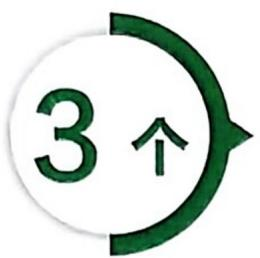

# 考场 0 思路速破快招

快招 1 “定性分析法”速得单选题正确项 …… 01

快招 2 “选项关联法”速排多选题错误项 …… 03

快招 3 “析、寻、验”三步法速解开放性填空题 …… 05

# 高妙技法巧解快招

快招4 投机取“巧”找特值……07

快招 5 特征归纳探规律 …… 09

快招6 数形结合妙转化 …… 11

快招7 极限分析找临界 14

快招 8 巧妙估算锁范围 …… 17

快招 9 另辟蹊径巧构造 …… 19

快招 10 放缩有“度”化繁为简 …… 22

快招 11 逆向思维正难则反 …… 25

# 超级结论速解快招

快招 12 巧用二级结论，缩短解题路径 …… 27

快招 13 利用高数知识，妙解函数问题 …… 30

# 快招1 “定性分析法”速得单选题正确项

# 提分快招

定性分析法是指不依赖准确计算,通过逻辑推理、图形特征、数学性质等非数值手段解决问题的方法,其本质是通过挖掘问题内在规律规避复杂运算,体现数学思维的深刻性.解题关键为:

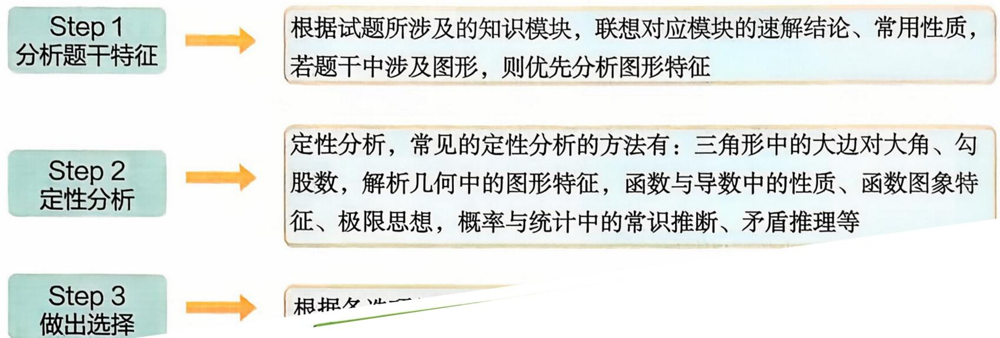

flowchart

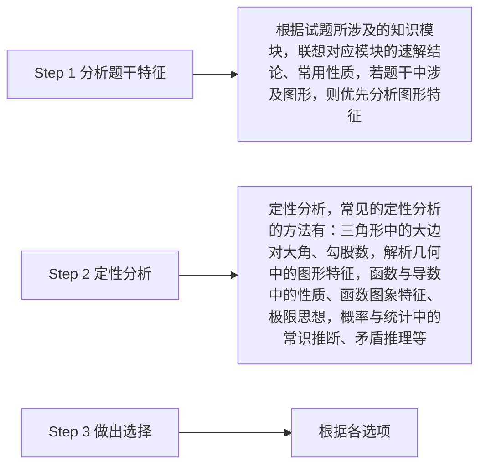
```mermaid
graph LR
    A["Step 1 分析题干特征"] --> B["根据试题所涉及的知识模块，联想对应模块的速解结论、常用性质，若题干中涉及图形，则优先分析图形特征"]
    C["Step 2 定性分析"] --> D["定性分析，常见的定性分析的方法有：三角形中的大边对大角、勾股数，解析几何中的图形特征，函数与导数中的性质、函数图象特征、极限思想，概率与统计中的常识推断、矛盾推理等"]
    E["Step 3 做出选择"] --> F["根据各选项"]
```

$$
\therefore \because a <   6 0 ^ {\circ}.
$$

由上述分析知,选 A.

真题 ②(2025 天津卷)已知函数 $y = f(x)$ 的图象如图所示,则 $f(x)$ 的解析式可能为 ( )

小, 即可求解. 也可以将 “ $1 + \sqrt{3}$ ”拆为“1”与“ $\sqrt{3}$ ”, 由“ $1, \sqrt{3}, 2$ ”联想直角三角形三边长快速求解.

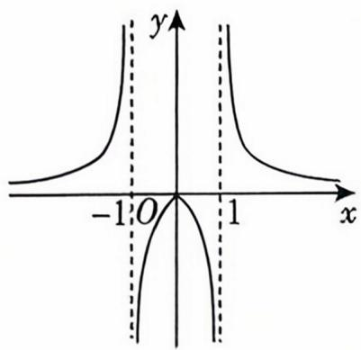

text_image

-1 O
y
x
1

A. $f(x)=\frac{x}{1-|x|}$

B. $f(x)=\frac{x}{|x|-1}$

C. $f(x)=\frac{|x|}{1-x^{2}}$

D. $f(x)=\frac{|x|}{x^{2}-1}$

# 巧思考

函数图象识别问题难度一般不大, 解题时往往先从函数奇偶性、周期性与图象对称性等特征明显的性质入手分析, 然后考虑极限思想, 若仍不能做出选择, 再考虑函数单调性.

# 巧思考

联想全概率的特征,列出不等式,结合各选项秒选答案.若定量计算,则需根据概率的乘法公式(P(AB)=P(B|A)P(A))与全概率公式(P(B)=P(B $\overline{A}$ )+P(BA))求解.

# 点技巧

从双曲线的渐近线入手,无须过多计算求解 k 的所有值,即可判断结果.

# 快招解题

# Step 1 分析题干特征

本题为根据函数图象匹配解析式问题,联想奇、偶函数图象特征及极限思想.

# Step 2 定性分析

由题图可知函数 $y=f(x)$ 为偶函数,且当 $x\to+\infty$ 时, $f(x)>0$ .

# Step 3 做出选择

4个选项中,只有D项符合上述两个条件,选D.

# 模拟练招

模拟 1 (2025 湖北武汉模拟) 已知随机事件 $A, B$ , 若 $P(A) = \frac{1}{3}, P(B \mid \overline{A}) = \frac{3}{4}$ , $P(B \mid A) = \frac{1}{2}$ , 则 $P(B) =$ ()

A. $\frac{1}{2}$

B. $\frac{2}{3}$

C. $\frac{3}{4}$

D. $\frac{4}{5}$

# 快招解题

# Sic 1 分析题干特征

本题为条件概率与全概率的应用问题,联想两者的关系“全概率实际上是条件概率的加权平均”.

Step 2

则有 $P(B|A)<P(B)<P(B|\overline{A})$ 或 $P(B|\overline{A})<P(B)<P(B|A)$ ，由题意可知 $\frac{1}{2}<P(B)<\frac{3}{4}$ .

# S 做出选择

结合各选项可知选B.

模拟 ②(2025 北京北师大附中三模)“ $k = \frac{1}{2}$ ”是“直线 $y = k(x - 4)$ 与双曲线 $\frac{x^2}{4} - y^2 = 1$ 只有一个公共点”的 ( )

A. 充分不必要条件

B. 必要不充分条件

C. 充要条件

D. 既不充分也不必要条件

# 快招解题

直线与双曲线有一个公共点包含两种情况：

直线与双曲线的渐近线平行, 直线与双曲线相切.

双曲线 $\frac{x^2}{4} - y^2 = 1$ 的渐近线方程为 $y = \pm \frac{1}{2} x$ ,

所以“ $k=\frac{1}{2}$ ”是“直线 $y=k(x-4)$ 与双曲线 $\frac{x^{2}}{4}-y^{2}=1$ 只有一个公共点”的充分不必要条件,选A.

# 实战链接

习题册第5页第2题;习题册第7页第4题;习题册第54页第6题;习题册第58页第7题;习题册第68页第1题.

# 快招2 “选项关联法”速排多选题错误项

# 提分快招

多选题是一种正确选项有 2 个或 2 个以上的选择题,解题时若能先分析已知条件及各选项的关系,从容易的选项入手判断,再结合各选项的关联关系快速排除错误项,会大大节省答题时间.解决此类问题的关键如下:

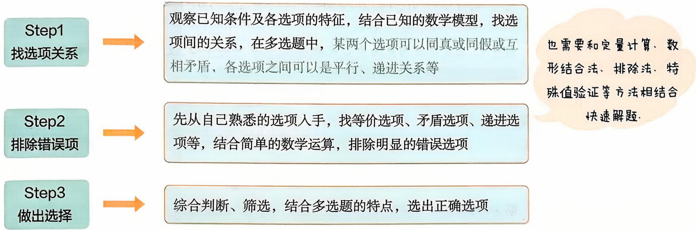

flowchart

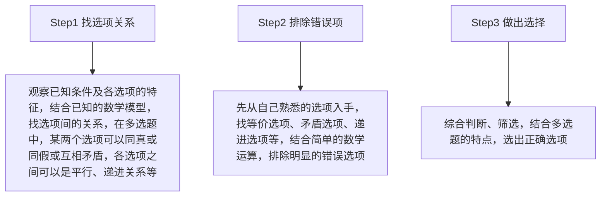
```mermaid
graph TD
    A["Step1 找选项关系"] --> B["观察已知条件及各选项的特征，结合已知的数学模型，找选项间的关系，在多选题中，某两个选项可以同真或同假或互相矛盾，各选项之间可以是平行、递进关系等"]
    C["Step2 排除错误项"] --> D["先从自己熟悉的选项入手，找等价选项、矛盾选项、递进选项等，结合简单的数学运算，排除明显的错误选项"]
    E["Step3 做出选择"] --> F["综合判断、筛选，结合多选题的特点，选出正确选项"]
```

# 真题接招

真题 1(2025 全国二卷)记 $S_{n}$ 为等比数列 $\{a_{n}\}$ 的前 $n$ 项和, $q$ 为 $\{a_{n}\}$ 的公比, $q > 0$ .

若 $S_{3} = 7, a_{3} = 1$ ，则 （）

A. $q = \frac{1}{2}$

B. $a_{s} = \frac{1}{9}$

C. $S_{5} = 8$

D. $a_{n} + S_{n} = 8$

# 快招解题

# Step 1, 2 找选项关系，排除错误项

由题意知, AB 矛盾, AC 矛盾, 则若 A 正确, 则 BC 错误, 结合多选题特征可知, 必有 D 正确, 由此先判断 A 项.

# Step 3 做出选择

若 $q=\frac{1}{2}$ ，则 $a_{2}=2, a_{1}=4$ ，从而有 $S_{3}=4+2+1=7$ ，满足题意，由题可知 $1+\frac{1}{q}+\frac{1}{q^{2}}=$ 7, 解得 $q = \frac{1}{2}$ , A 正确, 选 AD.

真题 ②(2024 新课标Ⅱ卷)设函数 $f(x)=2x^{3}-3ax^{2}+1$ ，则()

A. 当 $a > 1$ 时, $f(x)$ 有三个零点

B. 当 a < 0 时, x = 0 是 $f(x)$ 的极大值点

C. 存在 $a, b$ , 使得 $x = b$ 为曲线 $y = f(x)$ 的对称轴

D. 存在 $a$ , 使得点 $(1, f(1))$ 为曲线 $y = f(x)$ 的对称中心

# !教审题

ABC 各项为等比数列的基本量, 可以互相推证, 故从各项的关联关系入手判断.

# 点技巧

从最简单的 A 选项开始分析, 利用代入验证法判断, A 正确, 则 BC 错误, 从而 D 正确.

# 点技巧

三次函数图象是常见的无“上、下界”的图象,在小题中,要判断其零点个数,只需判断其极值的符号,若两极值异号,则必有三个零点.

# 巧思考

多选题中至少有2个正确选项,由BC错误可知AD一定正确.

# 点技巧

由三角函数的图象知函数图象与 $x$ 轴的交点到其对称轴的距离为 $\frac{(2k + 1)T}{4} (k\in$ N),由此直接写出 $f(x)$ 在区间 $(0,\frac{5\pi}{6})$ 内的零点.

# 快招解题

# Step 1, 2 定性分析, 排除错项

$$
f ^ {\prime} (x) = 6 x ^ {2} - 6 a x = 6 x (x - a).
$$

对于 A, a > 1 , 令 $f'(x) > 0$ , 则 x < 0 或 x > a , 故 $f(x)$ 在 $(-∞, 0)$ , $(a, +∞)$ 上单调递增，令 $f'(x) < 0$ , 则 0 < x < a , 故 $f(x)$ 在 $(0, a)$ 上单调递减，则 $f(x)$ 在 x = 0 处取到极大值，在 x = a 处取到极小值，由 $f(0) = 1 > 0$ , $f(a) = 1 - a^{3} < 0$ , 根据三次函数性质可知 $f(x)$ 有三个零点，A 正确.

对于 B, 当 a < 0 时, $f(x)$ 在 $(a, 0)$ 上单调递减, 在 $(0, +\infty)$ 上单调递增, 此时 $f(x)$ 在 x = 0 处取到极小值, B 错误.

对于 C, 三次函数图象为中心对称图形, 只有对称中心, 没有对称轴, C 错误.

# Step 3 做出选择

本题为多选题,BC 错误,则 D 一定正确,故选 AD.

模拟 (2025 四川成都检测) 已知函数 $f(x) = \frac{1}{2} \sin \omega x + \frac{\sqrt{3}}{2} \cos \omega x (\omega > 0)$ 的最小正周期为 $\pi$ , 则 ( )

A. $\omega = 2$   
B. 直线 $x = -\frac{\pi}{6}$ 是曲线 $y = f(x)$ 的一条对称轴  
C. 点 $(- \frac{\pi}{6}, 0)$ 是曲线 $y = f(x)$ 的一个对称中心  
D. $f(x)$ 在区间 $(0, \frac{5\pi}{6})$ 内只有一个零点

# 快招解题

$$
f (x) = \frac {1}{2} \sin \omega x + \frac {\sqrt {3}}{2} \cos \omega x = \sin \left(\omega x + \frac {\pi}{3}\right) (\omega > 0).
$$

Step 1, 2 定性分析 排除错项

对于 A, 由函数 $f(x)$ 的最小正周期 $T = \frac{2\pi}{\omega} = \pi$ , 得 $\omega = 2$ , A 正确.

对于 BC, 由三角函数的性质可知, 其图象的对称中心不可能在对称轴上, 则 BC 选项是矛盾的.

对于 CD, 若点 $(- \frac{\pi}{6}, 0)$ 是曲线 $y = f(x)$ 的一个对称中心, 则由 $-\frac{\pi}{6} + \frac{\pi}{2} = \frac{\pi}{3}$ , 得 $f(x)$ 在区间 $(0, \frac{5\pi}{6})$ 内只有一个零点, 所以 CD 等价.

对于 C, 由 $f(-\frac{\pi}{6}) = \sin(-\frac{\pi}{3} + \frac{\pi}{3}) = 0$ 得点 $(- \frac{\pi}{6}, 0)$ 是曲线 $y = f(x)$ 的一个对称中心, C 正确, 则 B 错误, D 正确.

# Step 3 做出选择

故选 ACD.

# 实战链接

习题册第57页第10题;习题册第69页第9题;习题册第73页第9题.

# 快招3 “析、寻、验”三步法速解开放性填空题

# 提分快招

开放性填空题,就是指题目的条件或结论中有一个或多个不确定的问题,这类题目的答案不唯一,在解答时要看清楚是要求写出所有的答案还是只要求写出一个答案.解决此类问题的关键点如下:

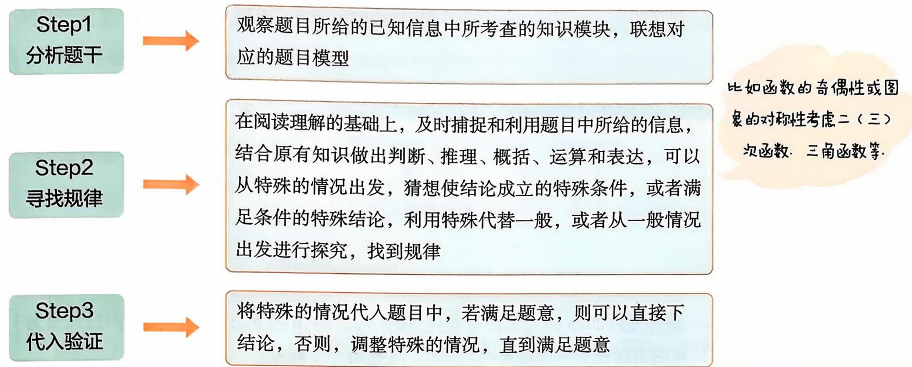

flowchart

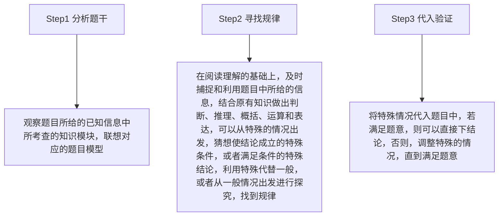
```mermaid
graph TD
    A["Step1 分析题干"] --> B["观察题目所给的已知信息中所考查的知识模块，联想对应的题目模型"]
    C["Step2 寻找规律"] --> D["在阅读理解的基础上，及时捕捉和利用题目中所给的信息，结合原有知识做出判断、推理、概括、运算和表达，可以从特殊的情况出发，猜想使结论成立的特殊条件，或者满足条件的特殊结论，利用特殊代替一般，或者从一般情况出发进行探究，找到规律"]
    E["Step3 代入验证"] --> F["将特殊情况代入题目中，若满足题意，则可以直接下结论，否则，调整特殊的情况，直到满足题意"]
```

# 真题接招

真题 1 (2025 北京卷)已知 $\alpha, \beta \in [0, 2\pi]$ , 且 $\sin (\alpha + \beta) = \sin (\alpha - \beta), \cos (\alpha + \beta) \neq \cos (\alpha - \beta)$ , 写出满足条件的一组 $\alpha =$ \_\_\_\_, $\beta =$ \_\_\_\_.

# 快招解题

Step 1 “析”——分析题干

$$
\sin (\alpha + \beta) = \sin (\alpha - \beta), \cos (\alpha + \beta) \neq \cos (\alpha - \beta).
$$

Step 2 “寻”——寻找规律

$\alpha+\beta\neq\alpha-\beta,$ 可取 $\alpha+\beta=\pi-(\alpha-\beta)$ ，得 $\alpha=\frac{\pi}{2}$ ，从而 $\sin\beta\neq0$ ，所以可取 $\beta=\frac{\pi}{6}$ .

Step 3 “验”——代入验证

将 $\alpha = \frac{\pi}{2},\beta = \frac{\pi}{6}$ 代入验证，满足题意.

真题 ②(2023 新课标Ⅱ卷)已知直线 $x - my + 1 = 0$ 与 $\odot C: (x - 1)^{2} + y^{2} = 4$ 交于 $A, B$ 两点, 写出满足“ $\triangle ABC$ 面积为 $\frac{8}{5}$ ”的 $m$ 的一个值 \_\_\_\_.

# 快招解题

Step 1 “析”——分析题干

直线 $x - my + 1 = 0$ 过定点 $A(-1,0), \odot C$ 的圆心为 $C(1,0)$ , 半径为 2 , 画出简图, 如图.

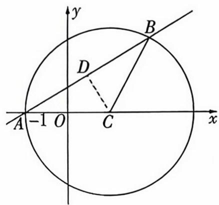

text_image

y
B
D
A -1 O C x

# 点技巧

两角正弦值相等,则两角差为 $2k\pi(k\in\mathbf{Z})$ ,或两角和为 $\pi+2k\pi(k\in\mathbf{Z})$ .

# 点技巧

作出图形,观察图形中的位置、长度关系,解题更直观.

# 点技巧

设 $\angle DAC = \theta$ ，则 $\sin \theta \cdot \cos \theta = \frac{2}{5}$ ，联想到 $\frac{2}{5} = \frac{2}{\sqrt{5}} \times \frac{1}{\sqrt{5}}, (\frac{2}{\sqrt{5}})^2 + (\frac{1}{\sqrt{5}})^2 = 1$ ，所以可取 $\sin \theta = \frac{2}{\sqrt{5}}, \cos \theta = \frac{1}{\sqrt{5}}$ ，此时 $\tan \theta = 2$ ，所以 $m = \frac{1}{2}$ 满足题意。

# 拓思维

过点 B 作 x 轴的垂线, 垂足为 E, 要使得 $\triangle ABC$ 的面积为 $\frac{8}{5}$ , 只要 $BE = \frac{8}{5}$ . 因为 BC = 2, 所以 $CE = \frac{6}{5}$ , 所以 $AE = \frac{4}{5}$ 或 $AE = \frac{16}{5}$ , 所以直线 AB 的斜率为 $\pm 2$ 或 $\pm \frac{1}{2}$ , 所以 m 的值为 $\pm \frac{1}{2}$ 或 $\pm 2$ .

# 点技巧

“若 $\frac{1}{a}>\frac{1}{b}$ ，则a<b”是假命题，等价于“若 $\frac{1}{a}>\frac{1}{b}$ ，则 $a\geqslant b$ ”是真命题。从而给出a是正整数，b是负整数即可。

# Step 2 “寻”——寻找规律

设弦AB的中点为D,连接CD,则 $CD\perp AB$ ,所以 $\triangle ABC$ 的面积为 $\frac{1}{2}AB\times CD=AD\times CD=\frac{8}{5}$ .
又 $CD^{2} + AD^{2} = 4$ ，解得 $CD = \frac{2}{\sqrt{5}}$ 或 $CD = \frac{4}{\sqrt{5}}$ .

因为点 $C(1,0)$ 到直线 $x - my + 1 = 0$ 的距离为 $d = \frac{|1 + 1|}{\sqrt{1 + m^2}} = \frac{2}{\sqrt{1 + m^2}}$

所以由 $\frac{2}{\sqrt{1 + m^2}} = \frac{2}{\sqrt{5}}$ ，得 $m = \pm 2$ ；由 $\frac{2}{\sqrt{1 + m^2}} = \frac{4}{\sqrt{5}}$ ，得 $m = \pm \frac{1}{2}$

# Step 3 “验”——代入验证

当 $m = \pm 2$ 时, $d = \frac{2}{\sqrt{5}}$ , 此时 $AD = \frac{4}{\sqrt{5}}$ , $\triangle ABC$ 的面积为 $\frac{2}{\sqrt{5}} \times \frac{4}{\sqrt{5}} = \frac{8}{5}$ , 符合题意;
当 $m = \pm \frac{1}{2}$ 时, $d = \frac{4}{\sqrt{5}}$ , 此时 $AD = \frac{2}{\sqrt{5}}$ , $\triangle ABC$ 的面积为 $\frac{2}{\sqrt{5}} \times \frac{4}{\sqrt{5}} = \frac{8}{5}$ , 符合题意.

所以答案为 $2, -2, \frac{1}{2}, -\frac{1}{2}$ 中的任何一个值都可以.

# 模拟练招

模拟 1 (2025 浙江杭州联考)已知 $b = (2, 2)$ , $a$ 在 $b$ 方向上的投影向量的模为 1 ,则 $a$ 的坐标表示可以是 $a =$ \_\_\_\_. (写出一个即可)

# 快招解题

Step 1 分析 分析题干

求解 a 的坐标表示,考查平面向量相关知识,a 在 b 方向上的投影向量的模为 1.

Step 2 “寻”——特殊情况

直接考虑 $a = (m,0)$ 的特殊情况，易得 $m = \sqrt{2}$ .

Step 3 “验”——代入验证

检验可得 $a=(\sqrt{2},0)$ 满足题意, 故可填 $(\sqrt{2},0)$ .

模拟 ②(2025 山东菏泽检测)能够说明“若 $\frac{1}{a}>\frac{1}{b}$ ,则 $a<b$ ”是假命题的一组整数 $a$ , $b$ 的值依次为 \_\_\_\_. (写出一组即可)

# 快招解题

# Step 1, 2 分析题干，寻找规律

需要应用不等式的性质去掉分母,故需要讨论分母a,b的符号.

若 $a > 0, b < 0$ ，满足题设 $\frac{1}{a} > \frac{1}{b}$ ，此时 $a > b$ ，符合题意。

# Step 3 代入验证

取 a 为正整数, b 为负整数, 如 a = 1, b = -1, 符合题意. 故可填 1, -1 (答案不唯一, a, b 分别取大于 0、小于 0 的整数即可).

# 实战链接

习题册第9页第3题;习题册第9页第8题;习题册第85页第12题.

# 8 个高妙技法巧解快招

# 快招4 投机取“巧”找特值

# 提分快招

特值法就是用符合条件的特例,如特殊自变量、特殊函数值、特殊函数、特殊点、特殊图形、特殊数列等来检验各选项,从而直接得到正确选项或排除干扰项.其基本步骤为:

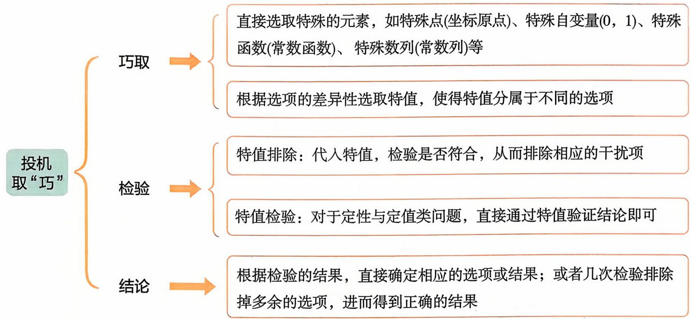

flowchart

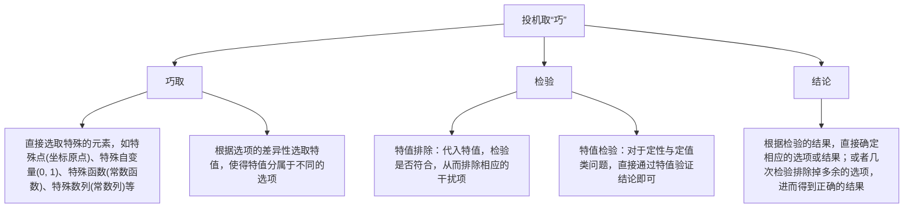
```mermaid
graph TD
    A["投机取“巧”"] --> B["巧取"]
    B --> C1["直接选取特殊的元素，如特殊点(坐标原点)、特殊自变量(0, 1)、特殊函数(常数函数)、特殊数列(常数列)等"]
    B --> C2["根据选项的差异性选取特值，使得特值分属于不同的选项"]
    A --> D["检验"]
    D --> E1["特值排除：代入特值，检验是否符合，从而排除相应的干扰项"]
    D --> E2["特值检验：对于定性与定值类问题，直接通过特值验证结论即可"]
    A --> F["结论"]
    F --> G1["根据检验的结果，直接确定相应的选项或结果；或者几次检验排除掉多余的选项，进而得到正确的结果"]
```

# 真题接招

真题 1 (2025 全国一卷) 已知 $2 + \log_{2} x = 3 + \log_{3} y = 5 + \log_{5} z$ , 则 $x, y, z$ 的大小关系不可能为 ( )

A. $x > y > z$

B. $x > z > y$

C. $y > x > z$

D. $y > z > x$

# 快招解题

设 $2 + \log_2x = 3 + \log_3y = 5 + \log_5z = m.$

巧取 $m = 2$ ，则 $x = 1, y = 3^{-1} = \frac{1}{3}, z = 5^{-3} = \frac{1}{125}$ ，此时 $x > y > z$ ，A项满足.

巧取 $m = 5$ ，则 $x = 8, y = 9, z = 1$ ，此时 $y > x > z$ ，C项满足.

巧取 $m=8$ ，则 $x=2^{6}=64, y=3^{5}=243, z=5^{3}=125$ ，此时 y>z>x，D 项满足.

选B.

真题 ②(2023 新课标 I 卷) 设函数 $f(x) = 2^{x(x - a)}$ 在区间 (0,1) 单调递减, 则 $a$ 的取值 $\rightarrow$ 范围是 ( )

A. $(-\infty, -2]$

B. $[-2,0)$

C. $(0,2]$

D. $[2, +\infty)$

# 点技巧

根据计算难易程度取特值，

当 $m = 3$ 时，满足 $x > y > z$

不能有效排除, 故取了 2,5

之后考虑再取 $m = 8$ .

# !教审题

特“数”排除,选项 A,B 都是

负值;选项 C,D 都是正值,

故先令 $a = 2$ 或 $a = -2$ ，通

过检验排除两个选项.

# 巧思考

C, D 两个选项以 2 为分界线, 故取 a = 1, 代入验证即可确定参数取值范围.

# 点技巧

赋“值”检验:该题中的等差数列 $\{a_{n}\}$ 没有其他约束条件,故可取特殊的常数列来检验选项.

# 巧思考

特“值”排除:根据选项的差异性,可先检验a=0是否满足条件,若满足,可以排除选项A,D;再令a=2,满足条件,排除C.另外,本题还可以设切点,利用导数几何意义求切线方程,再根据点到直线的距离求解即可.

# 快招解题

排除选项 A,B 巧取 a=2

$f(x)=2^{x(x-2)}=2^{x^{2}-2x}$ ，令 $t(x)=x^{2}-2x$ ，显然函数 $t(x)$ 在(0,1)上单调递减，而 $y=2^{x}$ 为R上的增函数，所以 $f(x)$ 在(0,1)上单调递减，故a=2符合题意，故排除A,B两个选项.

排除选项 C 巧取 a = 1

$f(x)=2^{x(x-1)}=2^{x^{2}-x}$ ，令 $g(x)=x^{2}-x$ ，显然函数 $g(x)$ 在 $(0,\frac{1}{2})$ 上单调递减，在 $(\frac{1}{2},1)$ 上单调递增，而 $y=2^{x}$ 为R上的增函数，所以 $f(x)$ 在 $(0,\frac{1}{2})$ 上单调递减，在 $(\frac{1}{2},1)$ 上单调递增。显然不合题意，故a=1不满足，故排除选项C。故选D。

# 模拟练招

模拟 1 (2025 辽宁沈阳检测) 等差数列 $\{a_{n}\}$ 中, $a_{2} + a_{4} + a_{10} + a_{12} = 40$ , 则前 13 项和 $S_{13} =$

A. 133

B. 130

C. 125

D. 120

# [手写签名]

不妨取 $\{a_{n}\}$ 为特殊的常数列,令 $a_{n}=t(t$ 为常数),则由已知可得 $4a_{n}=40$ ,解得 $a_{n}=10$ .故 $S_{13}=13a_{1}=13\times10=130$ .故选B.

模拟 ②(2025 江苏无锡调研)若斜率为 1 的直线 $l$ 与曲线 $y = \ln (x + a)$ 和圆 $O: x^{2} + y^{2} = \frac{1}{2}$ 都相切, 则实数 $a$ 的值为 ( )

A. -1 或 2

B. 0 或 2

C. 0

D. 2

# 快招解题

排除选项 A, D 巧取 a = 0

曲线为 $y = \ln x$ ，故 $(\ln x)' = \frac{1}{x}$ 。设直线 l 与曲线相切的切点为 $P(x_{0}, \ln x_{0})$ ，由已知可得 $\frac{1}{x_{0}} = 1$ ，解得 $x_{0} = 1$ ，故切点为 $P(1,0)$ ，切线方程为 y = x - 1。此时圆心 O 到直线 l 的距离 $d = \frac{1}{\sqrt{2}} = \frac{\sqrt{2}}{2}$ ，故直线 l 和圆 O 相切，符合题意。故排除 A, D 两项。

排除选项 C 巧取 a = 2

曲线为 $y=\ln(x+2)$ ，故 $\left[\ln(x+2)\right]'=\frac{1}{x+2}$ 。设直线 l 与曲线相切的切点为 $M(x_{0},\ln(x_{0}+2))$ ，由已知可得 $\frac{1}{x_{0}+2}=1$ ，解得 $x_{0}=-1$ ，故切点为 $M(-1,0)$ ，切线方程为 $y=x+1$ 。此时圆心 O 到直线 l 的距离 $d_{1}=\frac{1}{\sqrt{2}}=\frac{\sqrt{2}}{2}$ ，故直线 l 和圆 O 相切，符合题意。故排除 C 项。选 B。

# 实战链接

习题册第2页第4题;习题册第52页第5题;习题册第60页第6题;习题册第67页第13题;习题册第74页第4题;习题册第88页第8题.

# 快招5 特征归纳探规律

# 提分快招

特征归纳法是指通过观察题目结构特征(如周期、递推关系等)归纳出一般规律,快速锁定答案的解题方法,适用于选项具有明显共性的选择题、填空题,主要用于解决求数列通项、找操作规则、探几何图形规律等问题,关键如下:

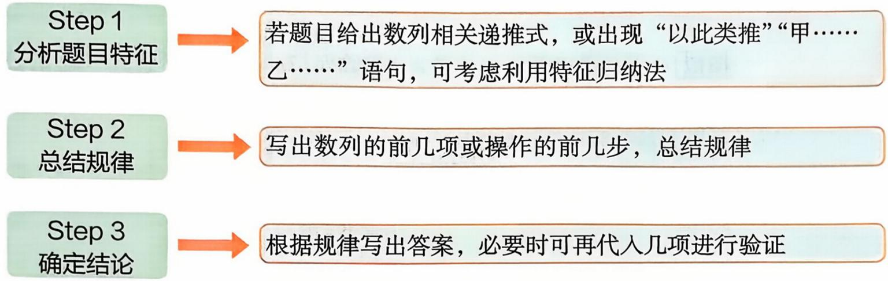

flowchart

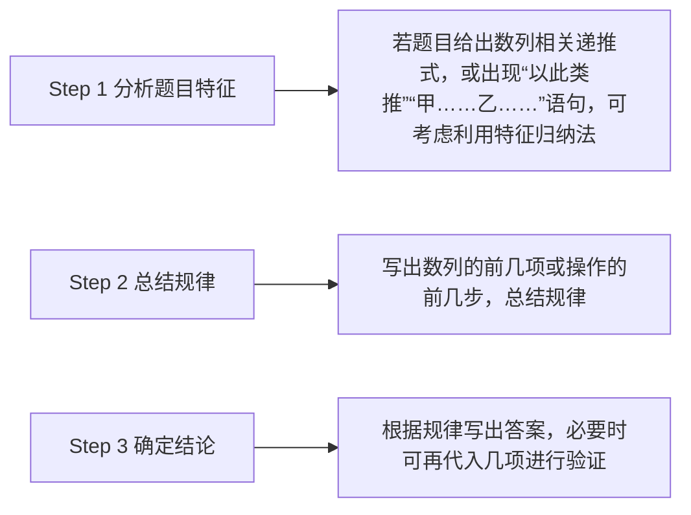
```mermaid
graph LR
    A["Step 1 分析题目特征"] --> B["若题目给出数列相关递推式，或出现“以此类推”“甲……乙……”语句，可考虑利用特征归纳法"]
    C["Step 2 总结规律"] --> D["写出数列的前几项或操作的前几步，总结规律"]
    E["Step 3 确定结论"] --> F["根据规律写出答案，必要时可再代入几项进行验证"]
```

# 真题接招

真题(2024 新课标 I 卷)甲、乙两人各有四张卡片,每张卡片上标有一个数字,甲的卡片上分别标有数字 1,3,5,7,乙的卡片上分别标有数字 2,4,6,8. 两人进行四轮比赛. 在每轮比赛中,两人各自从自己持有的卡片中随机选一张,并比较所选卡片上数字的大小,数字大的人得 1 分,数字小的人得 0 分,然后各自弃置此轮所选的卡片(弃置的卡片在此后的轮次中不能使用). 则四轮比赛后,甲的总得分不小于 2 的概率为 \_\_\_\_.

# 快招解题

# Step 1, 2 分析题目特征，总结规律

设甲得 $i$ 分的概率为 $P_{i}$ .

根据操作的对称性,不妨固定甲四轮选卡的顺序为 1,3,5,7,则四轮比赛的所有可能情况共 $4 \times 3 \times 2 \times 1 = 24$ (种).

若甲得0分,则乙四轮选卡的顺序一定是2,4,6,8,所以 $P_{0}=\frac{1}{24}$ .

若甲得1分,那么乙的选卡顺序,相比2,4,6,8,有且仅有1个数字后移,其余数字不动或者前移.若2往后移,如下表所示,共有 $1+2+4=7$ (种)情况.

<table><tr><td rowspan="2"></td><td rowspan="2">甲</td><td colspan="7">乙</td></tr><tr><td>2移到4</td><td>2移到6</td><td colspan="5">2移到8</td></tr><tr><td>第一轮</td><td>1</td><td>4</td><td>6</td><td>4</td><td>8</td><td>4</td><td>4</td><td>6</td></tr><tr><td>第二轮</td><td>3</td><td>2</td><td>4</td><td>6</td><td>4</td><td>6</td><td>8</td><td>4</td></tr><tr><td>第三轮</td><td>5</td><td>6</td><td>2</td><td>2</td><td>6</td><td>8</td><td>6</td><td>8</td></tr><tr><td>第四轮</td><td>7</td><td>8</td><td>8</td><td>8</td><td>2</td><td>2</td><td>2</td><td>2</td></tr></table>

# 巧思考

甲、乙两人选卡顺序均不确定,即涉及两个变量,此时可根据游戏的操作规则先固定一方,解题时仅讨论另一方即可.

# 点技巧

列表找规律,分析出2往后移的情况后,根据规律即可立即写出4往后移、6往后移的情况.

# 点技巧

正难则反,题目中出现“不少于”,即“≥”,正向运算稍麻烦,故采用间接法求解.

同理可知,若4往后移,共有 $1+2=3$ (种)情况,若6往后移,共1种情况.

# Step 3 确定结论

所以 $P_{1} = \frac{7 + 3 + 1}{24} = \frac{11}{24}$

所以甲的总得分不小于2的概率为 $1-P_{0}-P_{1}=1-\frac{1}{24}-\frac{11}{24}=\frac{1}{2}$ .

# 模拟练招

模拟 (2025 福建厦门一中检测) 将数列 $\{2n - 1\}$ 与数列 $\{3n - 2\}$ 的公共项从小到大排列得到新数列 $\{a_{n}\}$ , 则 $\sum_{k=1}^{10} \frac{1}{a_{k} a_{k+1}} =$ ()

A. $\frac{10}{61}$

B. $\frac{60}{61}$

C. $\frac{1}{6}$

D. $\frac{5}{6}$

# 快招解题

# Step 1, 2 分析题目特征，总结规律

数列 $\{2n-1\}$ 是以 1 为首项的奇数列，即 1,3,5,7,9,11,13, $\cdots$ ,

数列 $\{3n-2\}$ 是以 1 为首项, 公差为 3 的奇偶交错的等差数列, 即 1, 4, 7, 10, 13, 16, 19, …,

# Step 3 确定结论

故数列 $\{2n - 1\}$ 与 $\{3n - 2\}$ 的公共项所构成的新数列 $\{a_{n}\}$ 是首项为1,公差为6的等差数列，

所以 $a_{n} = 6n - 5$

所以 $\sum_{k=1}^{10} \frac{1}{a_k a_{k+1}} = \sum_{k=1}^{10} \frac{1}{(6k-5)(6k+1)} = \frac{1}{6} \sum_{k=1}^{10} \left( \frac{1}{6k-5} - \frac{1}{6k+1} \right) = \frac{1}{6} (1 - \frac{1}{61}) = \frac{10}{61}$ . 故选 A.

# 实战链接

习题册第2页第7题;习题册第12页第6题;习题册第18页第5题;习题册第41页第7题.

# 点技巧

列出数列 $\{2n - 1\}$ 与数列 $\{3n - 2\}$ 的前几项, 找规律得到 $\{a_{n}\}$ 的通项公式, 实际上也可以直接写出 $\{a_{n}\}$ 的前11项, 再求和.

# 快招6 数形结合妙转化

# 提分快招

数形结合法是通过将抽象的数学语言与直观图形结合,帮助理解和解决问题的方法.对于函数与导数、解析几何等问题,数形结合法可以有效简化烦琐的运算,实现快速答题,解题关键如下:

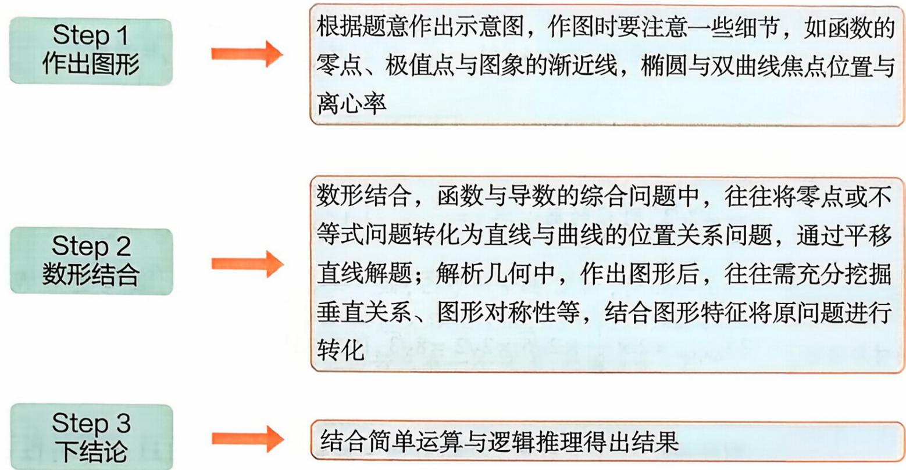

flowchart

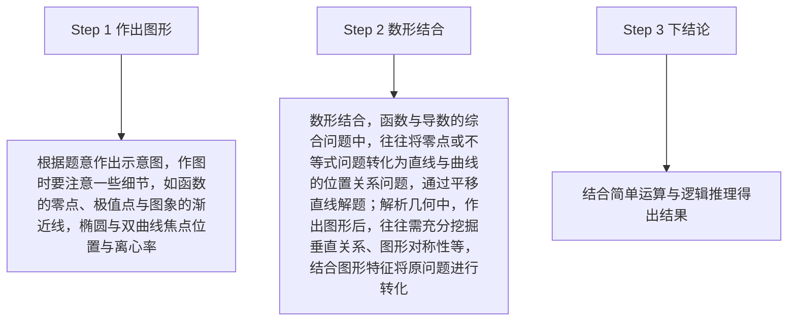
```mermaid
graph TD
    A["Step 1 作出图形"] --> B["根据题意作出示意图，作图时要注意一些细节，如函数的零点、极值点与图象的渐近线，椭圆与双曲线焦点位置与离心率"]
    C["Step 2 数形结合"] --> D["数形结合，函数与导数的综合问题中，往往将零点或不等式问题转化为直线与曲线的位置关系问题，通过平移直线解题；解析几何中，作出图形后，往往需充分挖掘垂直关系、图形对称性等，结合图形特征将原问题进行转化"]
    E["Step 3 下结论"] --> F["结合简单运算与逻辑推理得出结果"]
```

# 真题接招

真题 1 (2025 全国二卷) (多选) 双曲线 $C: \frac{x^{2}}{a^{2}} - \frac{y^{2}}{b^{2}} = 1 (a > 0, b > 0)$ 的左、右焦点分别为 $F_{1}, F_{2}$ , 左、右顶点分别为 $A_{1}, A_{2}$ , 以 $F_{1} F_{2}$ 为直径的圆与 $C$ 的一条渐近线交于 $M, N \to$ 两点, 且 $\angle N A_{1} M = \frac{5 \pi}{6}$ , 则 ( )

A. $\angle A_{1}MA_{2} = \frac{\pi}{6}$   
B. $\left| {M{A}_{1}}\right|  = 2\left| {M{A}_{2}}\right|$   
C. $C$ 的离心率为 $\sqrt{13}$   
D. 当 $a = \sqrt{2}$ 时, 四边形 $NA_{1}MA_{2}$ 的面积为 $8\sqrt{3}$

# 快招解题

# Step 1 作出图形

如图,记 O 为坐标原点,不妨取双曲线的一条渐近线为直线 $y=\frac{b}{a}x$ , 设 M 在第一象限,N 在第三象限.

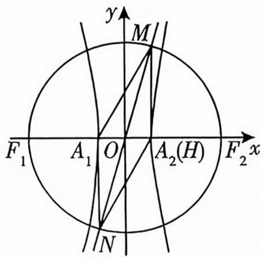

text_image

y
M
F₁ A₁ O A₂(H) F₂ x
N

# !教审题

双曲线、直线与圆的交汇问题,需先作出图形,帮助理解题意,根据图形的对称性简化问题,结合平面几何的性质即可求解.

# 巧思考

利用直线的斜率与角的正切值转化,从而找到直角三角形,利用直角三角形的特征快速求解,简化运算过程.

# 点技巧

在直角三角形中,利用角的正切值建立关于 a, b 的等式,转化求解.

# 目巧转化

根据平行四边形的对称性将所求面积转化为 $\triangle A_{1}A_{2}M$ 的面积的 2 倍.

# 点技巧

与复数模相关的最值问题可联想复数的几何意义, 数形结合, 转化为平面内两点间的距离问题.

# Step 2, 3 数形结合, 下结论

由图形的对称性可得四边形 $A_{1}MA_{2}N$ 为平行四边形, 故 $\angle A_{1}MA_{2} = \pi - \angle NA_{1}M = \pi - \frac{5\pi}{6} = \frac{\pi}{6}$ , A 正确.

$\tan \angle MOA_{2} = \frac{b}{a}, c^{2} = a^{2} + b^{2}$ , 则 $\cos \angle MOA_{2} = \frac{a}{c}$ , 易知 $OM = c$ , 若过点 $M$ 向 $x$ 轴作垂线, 垂足为 $H$ , 则 $|OH| = c \cdot \frac{a}{c} = a = |OA_{2}|$ , 则点 $H$ 与 $A_{2}$ 重合, 则 $MA_{2} \perp x$ 轴, $\triangle A_{1}A_{2}M$ 为直角三角形, 又 $\angle A_{1}MA_{2} = \frac{\pi}{6}$ , 则 $2|MA_{2}| = \sqrt{3}|MA_{1}|$ , B 错误.

在 $\triangle A_{1}A_{2}M$ 中， $|MA_{2}| = \sqrt{|OM|^{2} - |OA_{2}|^{2}} = \sqrt{c^{2} - a^{2}} = b$ ，从而 $\frac{|MA_{2}|}{|A_{1}A_{2}|} = \frac{b}{2a} = \sqrt{3}$ ，即 $\frac{b}{a} = 2\sqrt{3}$ ，则 $C$ 的离心率 $e = \frac{c}{a} = \sqrt{1 + \frac{b^2}{a^2}} = \sqrt{13}$ ，C 正确。

当 $a = \sqrt{2}$ 时，由C知 $e = \sqrt{13}$ ，故 $c = \sqrt{26}, b = 2\sqrt{6}$ ，故四边形 $NA_{1}MA_{2}$ 的面积为 $2S_{\triangle A_1A_2M} = 2 \times \frac{1}{2} \times 2\sqrt{6} \times 2\sqrt{2} = 8\sqrt{3}$ ，D正确.

故选 ACD.

真题 ②(2025 上海卷)已知复数 $z$ 满足 $z^{2} = (\bar{z})^{2}, |z| \leqslant 1$ , 则 $|z - 2 - 3i|$ 的最小值是 \_\_\_\_.

# [无法识别的图像]

设 $z = a + b\mathrm{i}(a,b\in \mathbf{R})$ ，则 $\overline{z} = a - b\mathrm{i}$ ，由 $z^2 = (\overline{z})^2$ ，可得 $(a + b\mathrm{i})^2 = (a - b\mathrm{i})^2$ ，即 $a^2 -b^2+$ $2ab\mathrm{i} = a^{2} - b^{2} - 2ab\mathrm{i}$ ，故 $ab = 0$

由 $|z|\leqslant 1$ 可得 $\sqrt{a^2 + b^2}\leqslant 1$ ，即 $a^2 +b^2\leqslant 1.$

# Step 1, 2 作出图形，数形结合

则复数 $z$ 在复平面内对应的点的轨迹为 $x = 0 (-1 \leqslant y \leqslant 1)$ 和 $y = 0 (-1 \leqslant x \leqslant 1)$ 两条线段. $|z - 2 - 3|$ 表示 $z$ 在复平面内对应的点与点 $(2,3)$ 之间的距离, 作出图形如图所示.

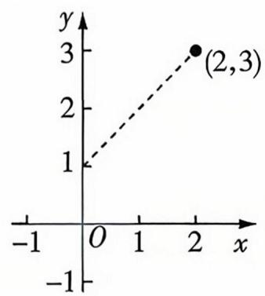

scatter

| Point | x | y |
|---|---|---|
| (2,3) | 2 | 3 |

# Step 3 下结论

结合图知, 当 z 在复平面内对应的点为 $(0,1)$ 时, $|z-2-3i|$ 取到最小值, 为 $\sqrt{(0-2)^{2}+(1-3)^{2}}=2\sqrt{2}$ .

# 模拟练招

模拟 1 (2025 陕西西安模拟) 曲线 $y = x^{3} - 3x$ 与 $y = -(x - 1)^{2} + a$ 在 $(0, +\infty)$ 上有两个不同的交点, 则 $a$ 的取值范围为 \_\_\_\_.

# 快招解题

# Step 1 作出图形

作出曲线 $y = x^{3} - 3x$ 与曲线 $y = -(x - 1)^{2}$ ，如图.

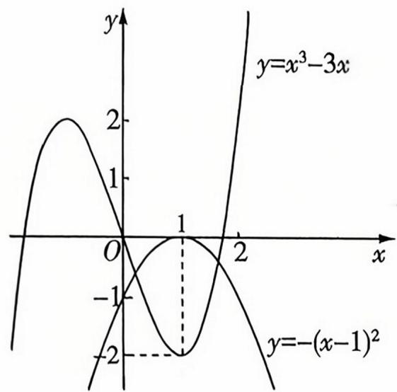

line

| x    | y = x³ - 3x | y = -(x-1)² |
| ---- | ----------- | ----------- |
| 0    | 0           | 0           |
| 1    | 0           | -2          |
| 2    | √(x - 1)²   | √(x - 1)²   |

# Step 2 数形结合

当曲线 $y = -(x - 1)^{2}$ 向上平移 $a (a > 0)$ 个单位长度后经过原点时，曲线 $y = x^{3} - 3x$ 与曲线 $y = -(x - 1)^{2} + a$ 在 $(0, +\infty)$ 上恰好只有一个交点，此时 a = 1.

当曲线 $y = -(x - 1)^{2}$ 向下平移 $-a (a < 0)$ 个单位长度后经过点 $(1, -2)$ 时，曲线 $y = x^{3} - 3x$ 与曲线 $y = -(x - 1)^{2} + a$ 在 $(0, +\infty)$ 上恰好只有一个交点，此时 a = -2。

# Step 3 下结论

结合图象可知,若满足题立

# ! 明思路

将曲线 $y = -(x - 1)^{2}$ 上、下平移即可得到曲线 $y = -(x - 1)^{2} + a$ ，则直接作出曲线 $y = x^{3} - 3x$ 与曲线 $y = -(x - 1)^{2}$ ，分析图象即可解题。

# 点技巧

好..

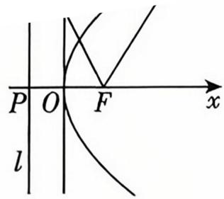

text_image

P O F x
l

# Step 2, 3 数形结合, 下结论

因为 $\angle AFB = 60^{\circ}$ ，所以 $\triangle ABF$ 为等边三角形，故 $|AF| = |AB| = |BF|$ ， $\angle BAF = 60^{\circ}$ ，所以 $\angle AFO = 60^{\circ}$ .

设准线 l 与 x 轴的交点为 P，则 $\left|PF\right|=2$ ，

故 $|AF|=\frac{|PF|}{\cos60^{\circ}}=4$ ，所以 $|AB|=4$ 。故选D。

# 实战链接

习题册第2页第5题;习题册第62页第2题;习题册第76页第8题;习题册第104页第7题.

点点弦长,根据等边三角形的特征转化求解即可.

# 快招7 极限分析找临界

# 提分快招

临界是指在解决数学问题时,捕捉和巧妙利用“临界条件”(具有一定制约关系的相关的变量,当其中的某变量变化到某一个状态时出现极限或某种转折,就把这个状态当成临界状态,此时该变量对应的条件就称为临界条件),把动态问题或不定问题转化为静态问题和有型可寻的问题,使解题思路清晰的一种模型.解决此类问题的关键点如下:

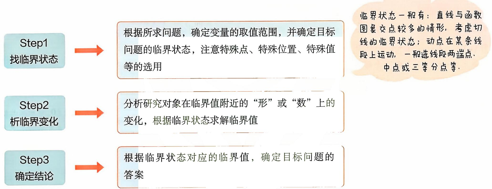

flowchart

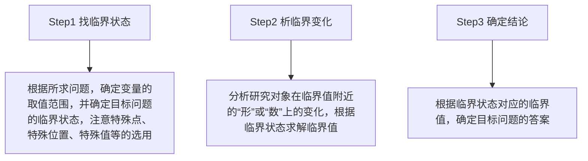
```mermaid
graph TD
    A["Step1 找临界状态"] --> B["根据所求问题，确定变量的取值范围，并确定目标问题的临界状态，注意特殊点、特殊位置、特殊值等的选用"]
    C["Step2 析临界变化"] --> D["分析研究对象在临界值附近的“形”或“数”上的变化，根据临界状态求解临界值"]
    E["Step3 确定结论"] --> F["根据临界状态对应的临界值，确定目标问题的答案"]
```

# 真题接招

# !明思路

△ABC 中, 边 AB 的长为定值, 要判断 △ABC 的面积是否有最大值或最小值, 只需判断边 AB 上的高即点 C 到 AB 的距离是否有最大值或最小值, 数形结合判断即可.

# 点技巧

计算发现直线 AB 恰与双曲线的一条渐近线平行, 故将点 C 到直线 AB 的距离转化为点 C 到渐近线的距离, 显然当点 C 在点 $(1,0)$ 时, 距离最大, 点 C 只能无限趋近于渐近线, 故没有最小距离.

真题 ①(2025 上海卷)已知 $A(0,1), B(1,2), C$ 在 $\Gamma: x^{2} - y^{2} = 1 (x \geqslant 1, y \geqslant 0)$ 上, 则 $\triangle ABC$ 的面积 ( )

A. 有最大值,但没有最小值  
B. 没有最大值,但有最小值  
C. 既有最大值,也有最小值  
D. 既没有最大值,也没有最小值

# 快招解题

双曲线 $x^{2}-y^{2}=1$ 的渐近线方程为 $y=\pm x$ ，直线 AB: $y=x+1$ ，所以直线 AB 与渐近线 y=x 平行。

# Step 1, 2 找到两个临界状态，析临界变化

【临界状态1】如图, 当点 $C$ 无限趋近于渐近线 $y = x$ 时, 点 $C$ 到 $AB$ 的距离越来越小, 无限趋近于直线 $AB$ 与渐近线 $y = x$ 之间的距离, 故 $S_{\triangle ABC} = \frac{1}{2} |AB| d (d$ 为点 $C$ 到 $AB$ 的距离)没有最小值;

【临界状态2】易知当 C 位于 $(1,0)$ 时，d 取得最大值，即 $S_{\triangle ABC} = \frac{1}{2} |AB| d$ 取得最大值.

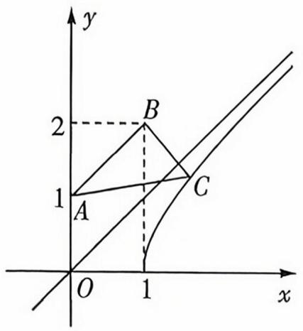

text_image

y
2
1
A
B
C
O
1
x

# Step 3 确定结论

综上,选A.

真题 ②(2023 全国甲卷)在正方体 $ABCD - A_{1}B_{1}C_{1}D_{1}$ 中, $AB = 4$ , $O$ 为 $AC_{1}$ 的中点, 若 $\rightarrow$ 该正方体的棱与球 $O$ 的球面有公共点, 则球 $O$ 的半径的取值范围是

# 快招解题

设球 O 的半径为 R.

# Step 1, 2 找两个临界状态，析临界变化

【临界状态1】 当球 $O$ 与正方体的棱相切时, 球面恰好和每条棱都有一个公共点, 所求的球的半径最小. 若球的半径变小, 则球面和棱没有公共点.

如图,分别取侧棱 $AA_{1},BB_{1},CC_{1},DD_{1}$ 的中点 $M,H,G,N$ ,连接 $MN,NG,GH,MH,$

显然四边形 MNGH 是边长为 4 的正方形, 且 O 为正方形 MNGH 的对角线的交点.

连接 $MG$ , 则 $MG = 4 \sqrt{2}$ , 正方体的棱切球的一个大圆恰好是四边形 MNGH 的外接圆, 则 $R_{\min} = 2 \sqrt{2}$ .

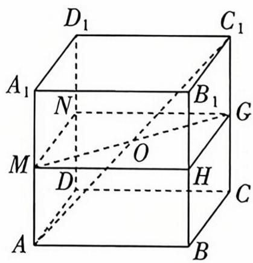

text_image

D₁
C₁
A₁
N
B₁
G
M
O
H
D
C
A
B

【临界状态2】 当球 O 为正方体的外接球时, 球面恰好经过正方体的每个顶点, 所求的球的半径最大. 若半径变得更大, 球会包含正方体, 导致球面和棱没有公共点.

正方体的外接球的直径 $2R'$ 为体对角线长 $AC_{1} = \sqrt{4^{2} + 4^{2} + 4^{2}} = 4\sqrt{3}$ , 即 $2R' = 4\sqrt{3}$ , $R' = 2\sqrt{3}$ , 故 $R_{\max} = 2\sqrt{3}$ .

# Step 3 确定范围，由两个临界状态确定半径的取值范围

综上, $R\in[2\sqrt{2},2\sqrt{3}]$ .

# ! 明思路

找正方体的棱与球面关系的两个临界状态——棱切球（半径最小）和棱为球的一条弦，即外接球（半径最大）。析临界变化——公共点个数的变化。

# ！破瓶颈

正方体棱切球的直径等于其
面对角线长,外接球的直径
等于正方体的体对角线长.

# 拓思维

若题目的结论不变,条件改为正方体的表面与球O的球面有公共点,则两个临界状态为:正方体的内切球(半径最小)和正方体的外接球(半径最大).

# !明思路

找点 M 的临界位置, 即点 M 与点 B 重合, 此时 N 为 AC 的中点, 或者找点 N 的临界位置, 即点 N 与点 C 重合, 此时 M 为 AB 的中点.

# !用结论

因为点 G 是 $\triangle ABC$ 的重心，
所以 BN 为 $\triangle ABC$ 的中线.

# 巧转化

将函数 $g(x)=f(x)-b$ 有四个不同的零点, 转化为函数 $y=f(x)$ 与 y=b 的图象有四个交点, 再数形结合即可解答.

# 点技巧

作出 $y=f(x)$ 与 y=b 的大致图象, 找出两个临界值. 由图象可知, 两个临界值为 0, 1, 注意区间端点值的取舍.

# 模拟练招

模拟 1 (2025 江苏徐州检测) 如图, 已知点 $G$ 是 $\triangle ABC$ 的重心, 过点 $G$ 作直线分别与 $AB, AC$ 两边交于 $M, N$ 两点, 设 $\overrightarrow{AB} = x\overrightarrow{AM}, \overrightarrow{AC} = y\overrightarrow{AN}$ , 则 $x + y$ 的值为 ( )

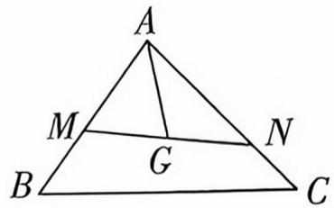

A. 2

B. 3

C. 4

D. 5

# 快招解题

# Step 1, 2 找临界状态，析临界变化

由题意知点 A, B, M 共线.

【临界状态】取点 M 与点 B 重合, 则 x = 1,

此时 N 为 AC 的中点, 所以 y = 2.

# Step 3 确定 $x + y$ 的值

所以 $x + y = 1 + 2 = 3$ ，故选 B.

模拟 ②(2025 福建福州模拟)已知函数 $f(x) = \begin{cases} (x+1)^{2}, & x \leqslant 0, \\ |\lg x|, & x > 0, \end{cases}$ 若函数 $g(x) = f(x) - b$ 有四个不同的零点,则实数 $b$ 的取值范围为 ( )

A. $(0,1]$

B. $[0,1]$

C. $(0,1)$

D. $(1, +\infty)$

# 快招解题

# Step 1, 2 找两个临界状态，析临界变化

依题意, 函数 $g(x) = f(x) - b$ 有四个不同的零点, 即关于 $x$ 的方程 $f(x) = b$ 有四个解, 转化为函数 $y = f(x)$ 的图象与直线 $y = b$ 有四个交点.

如图,作出函数 $y=f(x)$ 的图象和直线 y=b,由图可知,

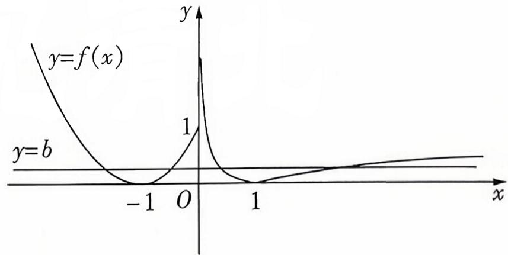

line

| x    | y=f(x) | y=b |
| ---- | ------ | --- |
| -1   | 0      | b   |
| 0    | 1      | b   |
| 1    | 0      | b   |

【临界状态1】当 $b = 1$ 时，有四个交点；

【析临界变化】当 $b > 1$ 时，有三个交点；

【临界状态2】当 $b = 0$ 时，有两个交点；

【析临界变化】当 0 < b < 1 时,有四个交点;当 b < 0 时,没有交点.

# Step 3 根据两个临界值确定范围

故实数 b 的取值范围为 $(0,1]$ . 故选 A.

# 实战链接

习题册第13页第5题;习题册第25页第3题;习题册第88页第5题;习题册第103页第13题.

# 快招8 巧妙估算锁范围

# 提分快招

估算法是一种快速解题的技巧,适用于计算复杂、选项数据差距大或需要快速验证的情况.估算能将待求问题的范围缩小,进而结合各选项的特征,借助排除法即可求解.常见的估算法有:

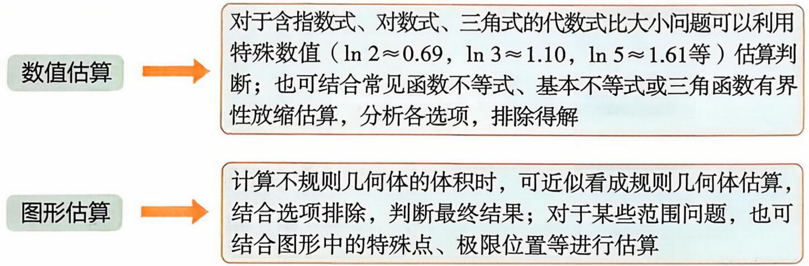

flowchart

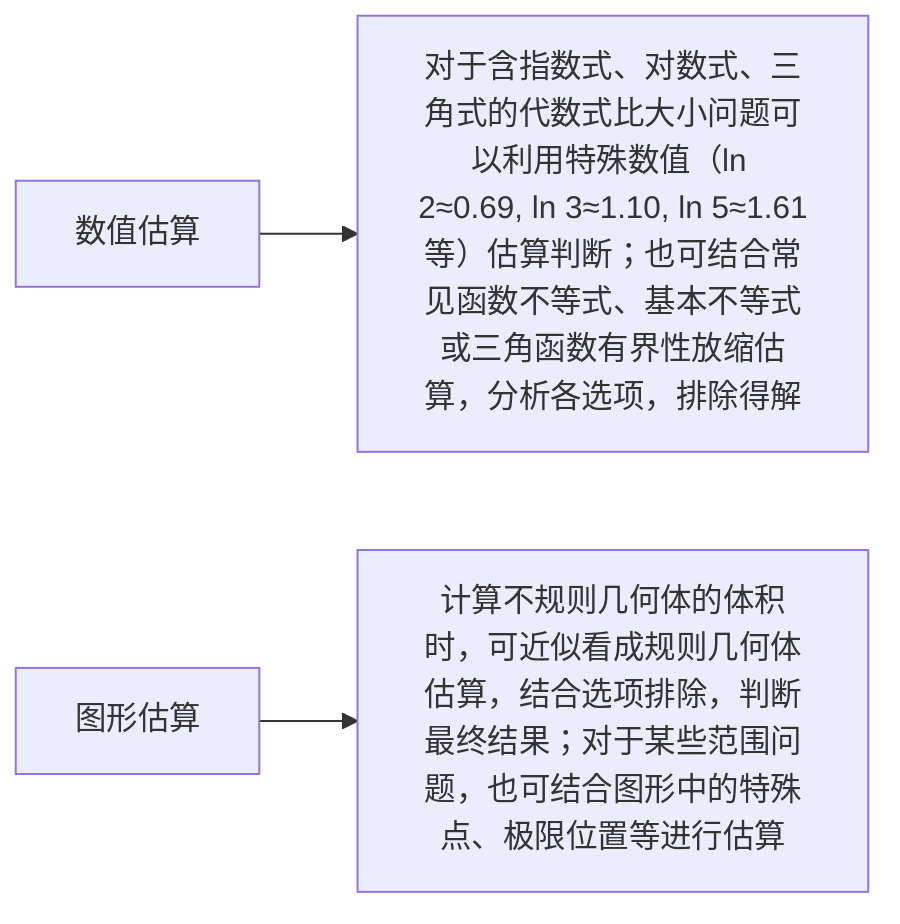
```mermaid
graph LR
    A["数值估算"] --> B["对于含指数式、对数式、三角式的代数式比大小问题可以利用特殊数值（ln 2≈0.69, ln 3≈1.10, ln 5≈1.61等）估算判断；也可结合常见函数不等式、基本不等式或三角函数有界性放缩估算，分析各选项，排除得解"]
    C["图形估算"] --> D["计算不规则几何体的体积时，可近似看成规则几何体估算，结合选项排除，判断最终结果；对于某些范围问题，也可结合图形中的特殊点、极限位置等进行估算"]
```

# 真题接招

真题 (2024 全国甲卷) 在 $\triangle ABC$ 中, 内角 $A, B, C$ 所对的边分别为 $a, b, c$ , 若 $B = \frac{\pi}{3}$ ,

$b^{2}=\frac{9}{4}ac$ ，则 $\sin A+\sin C=$

( )

A. $\frac{2 \sqrt{39}}{13}$

B. $\frac{\sqrt{39}}{13}$

C. $\frac{\sqrt{7}}{2}$

D. $\frac{3\sqrt{13}}{13}$

# 快招解题 数值估算！

由 $b^{2} = \frac{9}{4} ac$ 得 $\sin^2 B = \frac{9}{4}\sin A\sin C$ ，则 $\sin A\sin C = \frac{1}{3},$

所以 $\sin A + \sin C = \sin A + \frac{1}{3\sin A} \geqslant 2\sqrt{\frac{1}{3}} = \sqrt{\frac{4}{3}}$ ，当且仅当 $\sin A = \frac{\sqrt{3}}{3}$ ， $\sin C = \frac{\sqrt{3}}{3}$ 时，等 $\rightarrow$ 号成立，

所以 $\sin A + \sin C$ 的最小值为 $\sqrt{\frac{4}{3}}$

由于 $\frac{2\sqrt{39}}{13}=\sqrt{\frac{12}{13}}<\sqrt{\frac{4}{3}},\frac{\sqrt{39}}{13}=\sqrt{\frac{3}{13}}<\sqrt{\frac{4}{3}},\frac{3\sqrt{13}}{13}=\sqrt{\frac{9}{13}}<\sqrt{\frac{4}{3}}$ ，而 $\frac{\sqrt{7}}{2}>\sqrt{\frac{4}{3}}$

估值分析可排除 ABD 选项,选 C.

# !教审题

已知关于边的齐次式与一个内角,求两角正弦值的和,先用正弦定理边化角,再结合基本不等式估算即可求解.

# 点技巧

此处结合基本不等式对待求式放缩估算, 将待求式的值锁定在 $\left[\sqrt{\frac{4}{3}}, +\infty\right)$ 上, 结合排除法即可求解.

# !教审题

题中没有明确的线面垂直关系,考虑估算法, $\triangle ABC$ 面积易求,估算点S到平面ABC的距离.

# 巧思考

根据三棱锥外接球的直径估算三棱锥的高,进而将其体积锁定在 $(0,\frac{\sqrt{3}}{6})$ 上.

# 点技巧

根据双曲线的对称性,不妨设P在右支上,考虑两种临界情况,结合各选项对应的范围即可求解.

# 模拟练招

模拟 1 (2025 福建泉州检测) 已知三棱锥 $S - ABC$ 的所有顶点都在球 $O$ 的球面上, $\triangle ABC$ 是边长为 1 的正三角形, $SC$ 为球 $O$ 的直径, 且 $SC = 2$ , 则此棱锥的体积为 ( )

A. $\frac{\sqrt{2}}{6}$

B. $\frac{\sqrt{3}}{6}$

C. $\frac{\sqrt{2}}{3}$

D. $\frac{\sqrt{2}}{2}$

# 快招解题

# 图形估算!

由题意知 $\triangle ABC$ 的面积为 $\frac{1}{2} \times 1 \times 1 \times \frac{\sqrt{3}}{2} = \frac{\sqrt{3}}{4}$ ,

三棱锥 $S - ABC$ 的底面 $ABC$ 上的高一定小于球 $O$ 的直径 2,

所以三棱锥 $S - ABC$ 的体积 $V < \frac{1}{3} \times \frac{\sqrt{3}}{4} \times 2 = \frac{\sqrt{3}}{6}$ ,

结合各选项中的数值知,仅有 A 项满足,选 A.

模拟 ②(2025 陕西西安模拟)已知 $F_{1}, F_{2}$ 分别为双曲线 $C: \frac{x^{2}}{8} - \frac{y^{2}}{4} = 1$ 的左、右焦点, 点 $P$ 是 $C$ 上一动点, $O$ 为坐标原点, 则 $\frac{|PF_{1}| + |PF_{2}|}{|OP|}$ 的取值范围是 ( )

A. $[0,6]$

B. $(2,\sqrt{6}]$

C. $(\frac{1}{2}, \frac{\sqrt{6}}{2})$

D. $[0, \frac{\sqrt{6}}{2}]$

# 快招解题

# 图形估算!

双曲线 $C: \frac{x^2}{8} - \frac{y^2}{4} = 1, a = 2\sqrt{2}, b = 2, c = \sqrt{8 + 4} = 2\sqrt{3}$ .

当 $P$ 趋于 $C$ 右支上的无穷远时, $\left|PF_{1}\right| \approx \left|PF_{2}\right| \approx \left|OP\right|$ , 则 $\frac{\left|PF_{1}\right| + \left|PF_{2}\right|}{\left|OP\right|} \approx 2$ .

当 $P$ 为 $C$ 右支的顶点时, $|PF_{1}| + |PF_{2}| = 2c = 4\sqrt{3}, |OP| = a = 2\sqrt{2}$ , 则 $\frac{|PF_{1}| + |PF_{2}|}{|OP|} = \sqrt{6}$ .

由上述两种情况可排除 CD, 又 $\frac{|PF_{1}| + |PF_{2}|}{|OP|}$ 不可能为 0, 从而排除 A, 选 B.

# 实战链接

习题册第30页第8题;习题册第60页第4题;习题册第95页第9题.

# 快招9 另辟蹊径巧构造

# 提分快招

构造模型是指根据题目的具体情况,构造一个合适的数学模型,把未知的问题转化为已学知识范围内易于解决问题的一种模型,如构造平面图形、几何体模型,构造相关函数、不等式、数列等模型,把不熟悉、不规范、复杂的问题转化为熟悉、规范、简单的问题.解决此类问题的关键点如下:

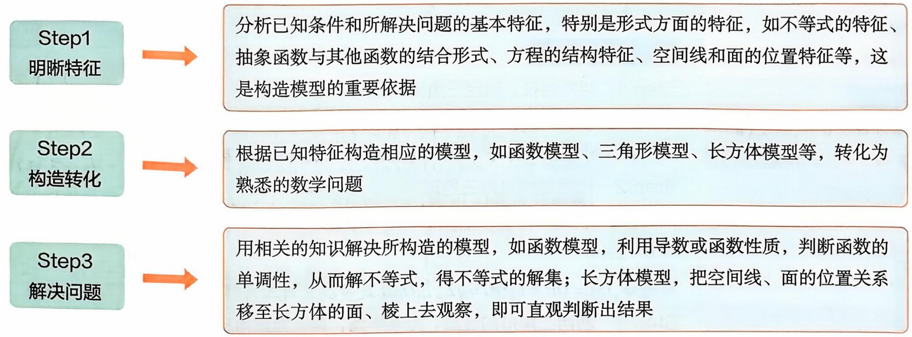

flowchart

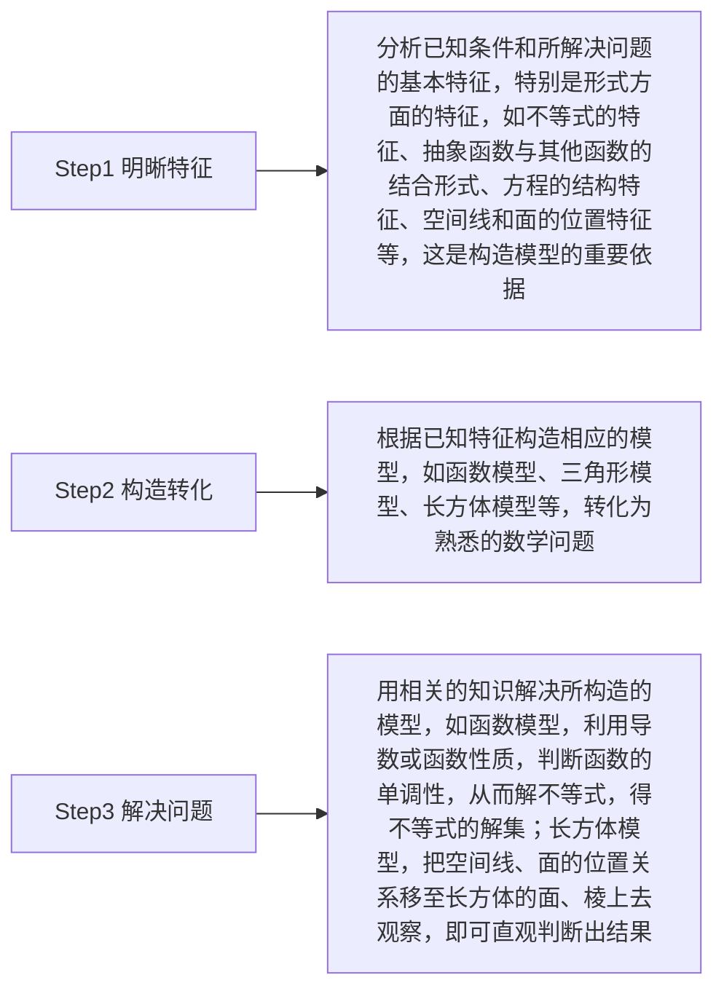
```mermaid
graph LR
    A["Step1 明晰特征"] --> B["分析已知条件和所解决问题的基本特征，特别是形式方面的特征，如不等式的特征、抽象函数与其他函数的结合形式、方程的结构特征、空间线和面的位置特征等，这是构造模型的重要依据"]
    C["Step2 构造转化"] --> D["根据已知特征构造相应的模型，如函数模型、三角形模型、长方体模型等，转化为熟悉的数学问题"]
    E["Step3 解决问题"] --> F["用相关的知识解决所构造的模型，如函数模型，利用导数或函数性质，判断函数的单调性，从而解不等式，得不等式的解集；长方体模型，把空间线、面的位置关系移至长方体的面、棱上去观察，即可直观判断出结果"]
```

8 类常考的构造函数的模型

<table><tr><td>符号</td><td>构造函数</td><td rowspan="5"></td><td>符号</td><td>构造函数</td></tr><tr><td> $xf'(x) + f(x)$ </td><td> $g(x) = xf(x)$ </td><td> $f'(x) + f(x)$ </td><td> $g(x) = e^xf(x)$ </td></tr><tr><td> $xf'(x) - f(x)$ </td><td> $g(x) = \frac{f(x)}{x}$ </td><td> $f'(x) - f(x)$ </td><td> $g(x) = \frac{f(x)}{e^x}$ </td></tr><tr><td> $xf'(x) + nf(x)$ </td><td> $g(x) = x^n f(x)$ </td><td> $f'(x) + nf(x)$ </td><td> $g(x) = e^{nx} f(x)$ </td></tr><tr><td> $xf'(x) - nf(x)$ </td><td> $g(x) = \frac{f(x)}{x^n}$ </td><td> $f'(x) - nf(x)$ </td><td> $g(x) = \frac{f(x)}{e^{nx}}$ </td></tr></table>

# 真题接招

真题 1 (2025 天津卷) 若 $a, b \in \mathbb{R}, \forall x \in [-2, 2]$ , 均有 $(2a + b)x^{2} + bx - a - 1 \leqslant 0$ 恒成立, 则 $2a + b$ 的最小值为 \_\_\_\_.

# 快招解题

# Step 1, 2 明晰特征，整体换元，构造函数

设 $t = 2a + b$ ，记 $f(x) = tx^2 + bx - a - 1$ ，则 $f(x)$ 需满足 $\forall x \in [-2, 2]$ ， $f(x) \leqslant 0$ 恒成立。

# Step 3 分析特殊点, 得 $\iota$ 的范围

$f(-\frac{1}{2}) = \frac{1}{4} t + (-\frac{1}{2})b - a - 1$ ，由 $t = 2a + b$ ，得 $b = t - 2a$

所以 $f(-\frac{1}{2}) = \frac{t}{4} -\frac{t - 2a}{2} -a - 1 = -\frac{t}{4} -1\leqslant 0$ ，解得 $t\geqslant -4.$

当 t = -4 时, $2a + b = -4$ , 即 b = -4 - 2a, 所以 $f(x) = -4x^{2} + (-4 - 2a)x - a - 1$ .

为使 $f(x)\leqslant0$ 对所有x成立,可尝试令 $f(x)=-(mx+n)^{2}(m>0)$ ,

# ！破瓶颈

把 $a, b$ 看成变量, $x$ 看成系数, 则有 $(2x^{2} - 1)a + (x^{2} + x)b \leqslant 1$ , 要求 $2a + b$ 的最小值, 则让 $a, b$ 的系数比为 2: 1, 可得 $2x^{2} - 1 = 2(x^{2} + x)$ , 解得 $x = -\frac{1}{2}$ , 故此处代入 $x = -\frac{1}{2}$ .

# 巧思考

$a+b+c=0$ ，三个向量所在的有向线段可以构成一个三角形，从而确定三角形的形状，将已知和所求转化为三角形中的问题求解。

# 点技巧

构造等腰三角形, 确定 $\langle a - c, b - c \rangle = \angle ACB$ , 转化为三角形内角求解.

# ！破瓶颈

构造等腰直角三角形 ABC，作辅助线，分别作出 a-c, b-c，确定 $\langle a-c, b-c \rangle = \pi - \angle DAE$ ，找到夹角与 $\angle DAE$ 的关系，转化为三角形内角求解，然后解 $\triangle ADE$ 即可.

对比系数得 $\left\{ \begin{array}{l} -m^2 = -4, \\ -2mn = -4 - 2a, \\ -n^2 = -a - 1, \end{array} \right.$ 解得 $\left\{ \begin{array}{l} m = 2, \\ n = 1, \text{进而得} b = -4, \\ a = 0, \end{array} \right.$ 此时 $f(x) = -(2x + 1)^2$

显然 $\forall x\in [-2,2],f(x)\leqslant 0$ 恒成立.

综上, $2a+b$ 的最小值为-4.

真题 ②(2023 全国甲卷)已知向量 $a, b, c$ 满足 $|a| = |b| = 1, |c| = \sqrt{2}$ , 且 $a + b + c = 0$ , 则 $\cos \langle a - c, b - c \rangle =$ ( )

A. $-\frac{4}{5}$

B. $-\frac{2}{5}$

C. $\frac{2}{5}$

D. $\frac{4}{5}$

# 快招解题1

# Step 1 明晰特征，确定三角形的形状

因为 $a + b + c = 0$ ，所以 $a + b = -c$ ，

所以 $a^{2}+b^{2}+2a\cdot b=c^{2}$ ，即 $1+1+2a\cdot b=2$ ，所以 $a\cdot b=0$ 。

Step 2 构造等腰直角三角形

如图, 设 $\overrightarrow{OA} = a, \overrightarrow{OB} = b, \overrightarrow{OC} = c$ , 连接 AB, 延长 CO 交 AB 于点 D, 易知 $OC \perp AB$ .

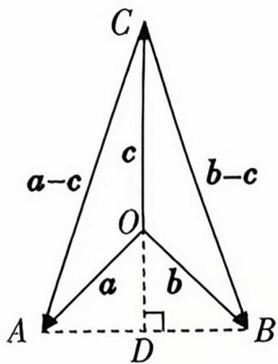

text_image

C
a-c
c
b-c
O
a
b
A
D
B

由题知, $OA = OB = 1, OC = \sqrt{2}, \triangle OAB$ 是等腰直角三角形.

Step 3 利用三角形的性质，先求半角，转化为直角三角形的内角进行求解

所以 $OD$ 是 $\triangle AOB$ 中 $AB$ 边上的高, $OD = \frac{\sqrt{2}}{2}, AD = \frac{\sqrt{2}}{2}$ , 所以 $CD = CO + OD = \sqrt{2} + \frac{\sqrt{2}}{2} = \frac{3\sqrt{2}}{2}, \tan \angle ACD = \frac{AD}{CD} = \frac{1}{3}, \cos \angle ACD = \frac{3}{\sqrt{10}}$ ,

所以 $\cos\left\langle a-c,b-c\right\rangle=\cos\angle ACB=\cos2\angle ACD=2\cos^{2}\angle ACD-1=2\times\left(\frac{3}{\sqrt{10}}\right)^{2}-1=\frac{4}{5}$ . 故选 D.

# 快招解题2

Step 1 明晰特征，三个向量首尾连接，可构造三角形

因为 $a + b + c = 0$ ，所以 $a + b = -c$ ，即 $a^{2} + b^{2} + 2a \cdot b = c^{2}$ ，即 $1 + 1 + 2a \cdot b = 2$ ，所以 $a \cdot b = 0$ 。

Step 2, 3 构造三角形, 作辅助线, 结合余弦定理求解

如图, 设 $\overrightarrow{AB} = a, \overrightarrow{BC} = c, \overrightarrow{CA} = b$ , 则 $AB \perp AC$ ,

且 $\angle ABC = \angle ACB = \frac{\pi}{4}$

分别作 $\overrightarrow{BD}=-c,\overrightarrow{CE}=c,$

则 $\overrightarrow{AD} = a - c, \overrightarrow{EA} = b - c, \langle a - c, b - c \rangle = \pi - \angle DAE.$

取 $BC$ 的中点 $H$ , 连接 $AH$ , 则 $AH \perp BC$ , 且 $AH = BH = CH = \frac{\sqrt{2}}{2}$ .

在 Rt△ADH 中, $AD = \sqrt{AH^{2} + DH^{2}} = \sqrt{\left(\frac{\sqrt{2}}{2}\right)^{2} + \left(\frac{3\sqrt{2}}{2}\right)^{2}} = \sqrt{5}$ .

同理 $AE = \sqrt{5}$ . 在 $\triangle ADE$ 中, 由余弦定理可得 $\cos \angle DAE = \frac{AD^2 + AE^2 - DE^\tau}{2AD \cdot AE} =$

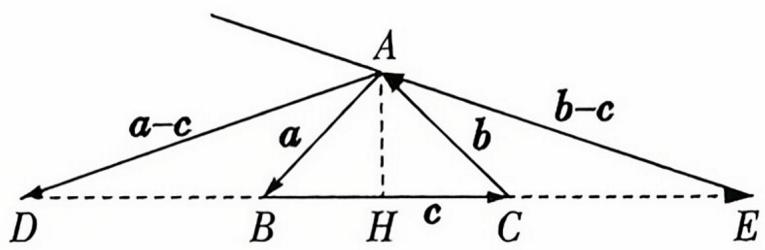

text_image

a-c
a
b
b-c
D
B
H
c
C
E

$$
\frac {(\sqrt {5}) ^ {2} + (\sqrt {5}) ^ {2} - (3 \sqrt {2}) ^ {2}}{2 \sqrt {5} \times \sqrt {5}} = - \frac {4}{5}.
$$

所以 $\cos \langle \pmb{a} - \pmb{c},\pmb{b} - \pmb{c}\rangle = \cos (\pi -\angle DAE) = -\cos \angle DAE = \frac{4}{5}.$ 故选D.

# 模拟练招

模拟 1 (2025 广州模拟)已知 $f(x)$ 是定义在 $\mathbb{R}$ 上的函数,且 $f(-x) - f(x) = 0$ ,其导函数为 $f'(x)$ . 若 $x > 0$ 时, $f'(x) < 2x$ ,则不等式 $f(2x) - f(x-1) > 3x^2 + 2x - 1$ 的解集是 \_\_\_\_.

# 快招解题

# Step 1 明晰特征，构造函数

由 $f'(x) < 2x (x > 0)$ 得 $f'(x) - 2x < 0 (x > 0)$ .

$$
f (2 x) - f (x - 1) > 3 x ^ {2} + 2 x - 1 \text {即} f (2 x) - (2 x) ^ {2} > f (x - 1) - (x - 1) ^ {2}.
$$

令 $g(x)=f(x)-x^{2}$ ，则 $g'(x)<0(x>0)$ ，所以 $g(x)$ 在 $(0,+\infty)$ 上单调递减。
易知 $f(x)$ 为偶函数，所以 $f(-x)-(-x)^{2}=f(x)-x^{2}$ ，故 $g(x)$ 也为偶函数，

# Step 2, 3 利用函数的单调性、奇偶性化简不等式，进而得解集

由 $g(2x)>g(x-1)$ 可得 $|2x|<|x-1|$ ，解得 $-1<\infty>1$

故后丁然

$$
- \Delta C = D B = D C = 2, A D = B C = \sqrt {2}.
$$

# Step 2, 3 构造长方体模型，把三棱锥的外接球转化为长方体的外接球，进而求其体积

将三棱锥 D-ABC 放入长方体中, 设长方体共顶点的三条棱的长分别为 a, b, c, 三棱锥 D-ABC 外接球的半径为 R, 则不妨令 $a^{2} + b^{2} = 4$ , $b^{2} + c^{2} = 4$ , $a^{2} + c^{2} = 2$ , 所以 $a^{2} + b^{2} + c^{2} = 5$ , 所以 $R = \frac{1}{2}\sqrt{a^{2} + b^{2} + c^{2}} = \frac{\sqrt{5}}{2}$ , 从而三棱锥 D-ABC 外接球的体积 $V = \frac{4}{3}\pi R^{3} = \frac{5\sqrt{5}}{6}\pi$ .

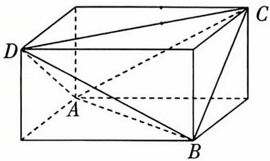

natural_image

Geometric diagram of a rectangular prism with labeled vertices A, B, C, D and internal diagonals (no text or symbols)

# 实战链接

习题册第32页第5题;习题册第33页第10题;习题册第59页第11题;习题册第65页第9题;习题册第96页第7题.

# ！破瓶颈

由 $f'(x) < 2x$ 联想函数 $y = f(x) - x^2$ ，将不等式 $f(2x) - f(x - 1) > 3x^2 + 2x - 1$ 变形为 $f(2x) - (2x)^2 > f(x - 1) - (x - 1)^2$ ，“双管齐下”，构造函数 $g(x) = f(x) - x^2$ .

# 点技巧

注意挖掘题中所有条件,由 $f(-r)$ 、 $f'(r)$

该题本质是一个构造长方体求解棱锥外接球体积的问题,一般出现对棱相等的三棱锥,会考虑构造长方体,若三棱锥中某个面是等边三角形,某条棱与某个面垂直等,也可以考虑构造正方体或长方体.

# 快招10 放缩有“度”化繁为简

# 提分快招

放缩法是指利用放大或缩小的方法来解决大小比较、边界范围确定、不等式证明等问题的一种方法. 放缩法证明此类题的关键点如下:

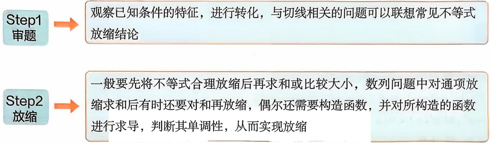

flowchart

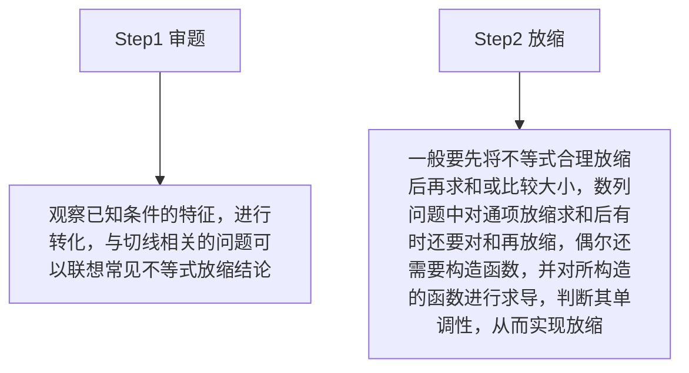
```mermaid
graph TD
    A["Step1 审题"] --> B["观察已知条件的特征，进行转化，与切线相关的问题可以联想常见不等式放缩结论"]
    C["Step2 放缩"] --> D["一般要先将不等式合理放缩后再求和或比较大小，数列问题中对通项放缩求和后有时还要对和再放缩，偶尔还需要构造函数，并对所构造的函数进行求导，判断其单调性，从而实现放缩"]
```

高分必会的 3 大放缩技巧

<table><tr><td>指数型放缩</td><td> $e^x \geqslant x + 1$ (当且仅当  $x = 0$  时取等号), $e^{x-1} \geqslant x$ (当且仅当  $x = 1$  时取等号), $e^x \leqslant \frac{1}{1-x} (x < 1)$ (当且仅当  $x = 0$  时取等号)</td></tr><tr><td>对数型放缩</td><td> $\ln(x+1) \leqslant x(x > -1)$ (当且仅当  $x = 0$  时取等号), $1 - \frac{1}{x} \leqslant \ln x \leqslant x - 1 (x > 0)$ (当且仅当  $x = 1$  时取等号)</td></tr><tr><td>三角型放缩</td><td> $\sin x \leqslant x \leqslant \tan x (0 \leqslant x < \frac{\pi}{2})$ (当且仅当  $x = 0$  时取等号), $\sin x \geqslant x \geqslant \tan x (-\frac{\pi}{2} < x \leqslant 0)$ (当且仅当  $x = 0$  时取等号)</td></tr></table>

# 巧思考

实际上直线 $y = x + 1$ 是曲线 $y=e^{x}$ 的切线, 利用此不等式
可得曲线 $y=e^{x}+x+a$ 的切线方程, 根据对应项相等即可求参数的值.

# 真题接招

真题 1 (2025 全国一卷) 若直线 $y = {2x} + 5$ 是曲线 $y = {\mathrm{e}}^{x} + x + a$ 的切线,则 $a =$ \_\_\_\_.

# 快招解题

Step 1 审题，选取合适的不等式转化

由 $y=e^{x}+x+a$ 联想指数型放缩不等式 $e^{x}\geqslant x+1$ ，当且仅当 x=0 时取等号.

Step 2 适度放缩，求参数

$$
\mathrm{e} ^ {x} + x + a \geqslant x + 1 + x + a = 2 x + (1 + a),
$$

直线 $y = 2x + 5$ 是曲线 $y = \mathrm{e}^{x} + x + a$ 的切线，则 $a + 1 = 5$

所以 a = 4.

真题 ②(2022 新高考 I 卷) 设 $a = 0.1 \mathrm{e}^{0.1}, b = \frac{1}{9}, c = -\ln 0.9$ , 则

( )

A. $a < b < c$

B. $c < b < a$

C. $c < a < b$

D. $a < c < b$

# 快招解题

# Step 1 审题，选取不等式转化

由 $\ln x \leqslant x - 1 (x > 0$ , 当且仅当 $x = 1$ 时等号成立),

# Step 2 适度放缩，比较大小

可得 $-\ln 0.9 = \ln \frac{1}{0.9} = \ln \frac{10}{9} < \frac{10}{9} - 1 = \frac{1}{9}$ ，所以 c < b.

而当 $x = 0.9$ 时，有 $\ln 0.9 < 0.9 - 1$ ，即 $\ln 0.9 < -0.1$

所以 $0.9 < \mathrm{e}^{-0.1}$ , 即 $\mathrm{e}^{0.1} < \frac{1}{0.9} = \frac{10}{9}$ , 故 $0.1\mathrm{e}^{0.1} < 0.1 \times \frac{10}{9} = \frac{1}{9}$ , 即 $a < b$ .

设 $g(x) = x\mathrm{e}^{x} + \ln (1 - x)(0 <   x <   1)$

则 $g^{\prime}(x) = (x + 1)\mathrm{e}^{x} + \frac{1}{x - 1} = \frac{(x^{2} - 1)\mathrm{e}^{x} + 1}{x - 1},$

令 $h(x) = \mathrm{e}^{x}(x^{2} - 1) + 1$ ，则 $h^{\prime}(x) = \mathrm{e}^{x}(x^{2} + 2x - 1)$

当 $0 < x < \sqrt{2} - 1$ 时， $h'(x) < 0$ ，函数 $h(x) = \mathrm{e}^x (x^2 - 1) + 1$ 单调递减，

又 $h(0) = 0$ ，所以当 $0 < x < \sqrt{2} - 1$ 时， $h(x) < 0$

所以当 $0 < x < \sqrt{2} - 1$ 时， $g'(x) > 0$ ，函数 $g(x) = x\mathrm{e}^x + \ln (1 - x)$ 单调递增，所以 $g(0.1) > 0 \times \mathrm{e}^0 + \ln (1 - 0) = 0$ ，即 $0.1\mathrm{e}^{0.1} > -\ln 0.9$ ，所以 $a > c$ .

综上,c<a<b.故选C.

# 模拟练招

模拟 1 (2025 重庆模拟) 设 $a = \sin \frac{1}{4}, b = \sqrt[4]{e} - 1, c = \ln \frac{5}{4}$ , 则 $a, b, c$ 的大小关系为 ( )

A. $a > b > c$

B. $b > a > c$

C. $b > c > a$

D. $c > b > a$

# 快招解题

比较 $a, b$ 的大小.

# Step 1, 2 审题，将已知条件转化，适度放缩

【放缩1:三角放缩】当 $x \in (0,1)$ 时, $\sin x < x$ , 故 $a < \frac{1}{4}$ .

【放缩2:指数放缩】由指数放缩得, $e^{x}>x+1(0<x<1)$ ，故 $e^{\frac{1}{4}}>1+\frac{1}{4}$

所以 $e^{\frac{1}{4}} - 1 > \frac{1}{4}$ ，即 $b > \frac{1}{4}$ ，所以 a < b.

【放缩3:对数放缩】由对数放缩得, $\ln(1+x)<x(0<x<1)$ ,得 $\ln(1+\frac{1}{4})<\frac{1}{4}$ ,即c< $\frac{1}{4}$ ,所以c<b.

# !教审题

三个函数值都可以化为与0.1有关的数, 从而比较大小.

# 点技巧

放缩: 注意 $\frac{1}{9}$ 与 0.1, 0.9 与 0.1 的关系, 借助切线不等式进行放缩, 比较大小.

# 拓思维

还可以构造函数 $u(x) = x\mathrm{e}^x$ $(0 <   x\leqslant 0.1),v(x) = \frac{x}{1 - x}$ $(0 <   x\leqslant 0.1)$ ，作差比较.

# !找规律

除了这三种放缩,还有指对
放缩 $e^{x}-\ln x>(x+1)-(x-1)=2$ ,以及其他放缩
技巧 $e^{x} \geqslant ex, e^{x} < -\frac{1}{x}(x < 0), \ln x < \frac{1}{2}(x - \frac{1}{x})(x > 1), \ln x > \frac{1}{2}(x - \frac{1}{x})(0 < x < 1)$ 等.

# ！破瓶颈

设隐零点: 如果导函数存在零点, 由导函数值为 0 列方程时, 式子非常频琐或无法求解, 可以虚设零点.

# 点技巧

由本题还可以拓展一些数列放缩技巧：

$$
\frac {1}{(n + 1) ^ {2}} <   \frac {1}{n (n + 1)} = \frac {1}{n} -
$$

$$
\frac {1}{n + 1}, \frac {1}{n ^ {2}} > \frac {1}{n (n + 1)} = \frac {1}{n} -
$$

$$
\frac {1}{n + 1}, 2 \sqrt {n} > \sqrt {n} + \sqrt {n - 1},
$$

$$
\sqrt {n (n + 1)} > \sqrt {n ^ {2}} = n, 1 +
$$

$$
\frac {1}{2 !} + \frac {1}{3 !} + \dots + \frac {1}{n !} \leqslant 1 +
$$

$$
\frac {1}{2} + \frac {1}{2 ^ {2}} + \dots + \frac {1}{2 ^ {n - 1}} (n \in \mathbf {N} ^ {*}).
$$

# 巧思考

利用极限思想放缩:根据 $T_{a}$ 表达式的特征,确定其极限,从而进行放缩,得到 a 所满足的条件.

再比较 $a, c$ 的大小.

设 $f(x)=\sin x-\ln(x+1)$ ，其中 $x\in(0,1)$ ，则 $f'(x)=\cos x-\frac{1}{x+1}$

令 $g(x) = \cos x - \frac{1}{x + 1}$ , 则 $g'(x) = -\sin x + \frac{1}{(x + 1)^2}$ ,

易知 $g'(x)$ 在 $(0,1)$ 上单调递减，且 $g'(0)=1>0, g'(1)=\frac{1}{4}-\sin1<0,$

所以 $\exists x_0\in (0,1)$ ，使得 $g^{\prime}(x_0) = 0$

当 $x \in (0, x_0)$ 时, $g'(x) > 0$ , $f'(x)$ 单调递增; 当 $x \in (x_0, 1)$ 时, $g'(x) < 0$ , $f'(x)$ 单调递减. 又当 $x \to 0$ 时, $f'(x) \to 0$ 且 $f'(x) > 0$ , 当 $x \to 1$ 时 $f'(x) \to \cos 1 - \frac{1}{2} > 0$ ,

所以 $f'(x)>0$ ，所以 $f(x)$ 在 $(0,1)$ 上单调递增，

所以 $f(x) > \sin 0 - \ln (0 + 1) = 0$ ，即 $\sin x > \ln (x + 1)$ ，所以 $a > c$

综上, $b > a > c$ . 故选 B.

模拟 ②(2025 湖北黄冈模拟)已知数列 $\left\{\frac{1}{4n^{2}+4n-3}\right\}$ 的前 $n$ 项和为 $T_{n}$ , 若对任意的 $n \in \mathbf{N}^{*}$ , 不等式 $6T_{n}<3a^{2}-a$ 恒成立, 则实数 $a$ 的取值范围是 ( )

A. $(-\infty, -\frac{2}{3}] \cup [1, +\infty)$

B. $(-\infty, -1] \cup \left[\frac{2}{3}, +\infty\right)$

C. $\left[-\frac{2}{3}, 1\right]$

D. $(- \infty, -\frac{2}{3}) \cup (1, +\infty)$

# 快悟解题

Step 1 一图，通过裂项求和表示 7 转化不等式

$$
\frac {1}{4 n ^ {2} + 4 n - 3} = \frac {1}{4} \left(\frac {1}{2 n - 1} - \frac {1}{2 n + 3}\right),
$$

则 $T_{n}=\frac{1}{4}\left(1-\frac{1}{5}+\frac{1}{3}-\frac{1}{7}+\cdots+\frac{1}{2n-1}-\frac{1}{2n+3}\right)=\frac{1}{4}\left(1+\frac{1}{3}-\frac{1}{2n+1}-\frac{1}{2n+3}\right)=$ $\frac{1}{3}-\frac{1}{4}\left(\frac{1}{2n+1}+\frac{1}{2n+3}\right)$ ,

因为对任意的 $n \in \mathbf{N}^*$ , 不等式 $6T_{n} < 3a^{2} - a$ 恒成立,

即 $6\left[\frac{1}{3} - \frac{1}{4}\left(\frac{1}{2n + 1} + \frac{1}{2n + 3}\right)\right] < 3a^2 - a$ 恒成立.

Step 2 利用极限思想进行放缩，确定参数所满足的条件求参数的取值范围

因为 $\frac{1}{4} (\frac{1}{2n + 1} +\frac{1}{2n + 3}) > 0$ ，且当 $n\to +\infty$ 时，该式 $\rightarrow 0$ ，所以 $\frac{1}{3} -\frac{1}{4} (\frac{1}{2n + 1} +$ $\frac{1}{2n + 3}) <   \frac{1}{3}$ ，所以 $6\times \frac{1}{3}\leqslant 3a^2 -a$ ，解得 $a\geqslant 1$ 或 $a\leqslant -\frac{2}{3}$ 故选A.

# 实战链接

习题册第13页第3题;习题册第30页第3题;习题册第88页第7题.

# 快招11 逆向思维正难则反

# 提分快招

逆向思维是指朝着一个固定的思维方向思考问题时,思路受阻或繁杂,不易直接求出,此时,就朝相反的方向思索,让思维向对立面的方向发展,从问题的相反面入手,使问题简单化的一种模型.解决此类问题的关键点如下:

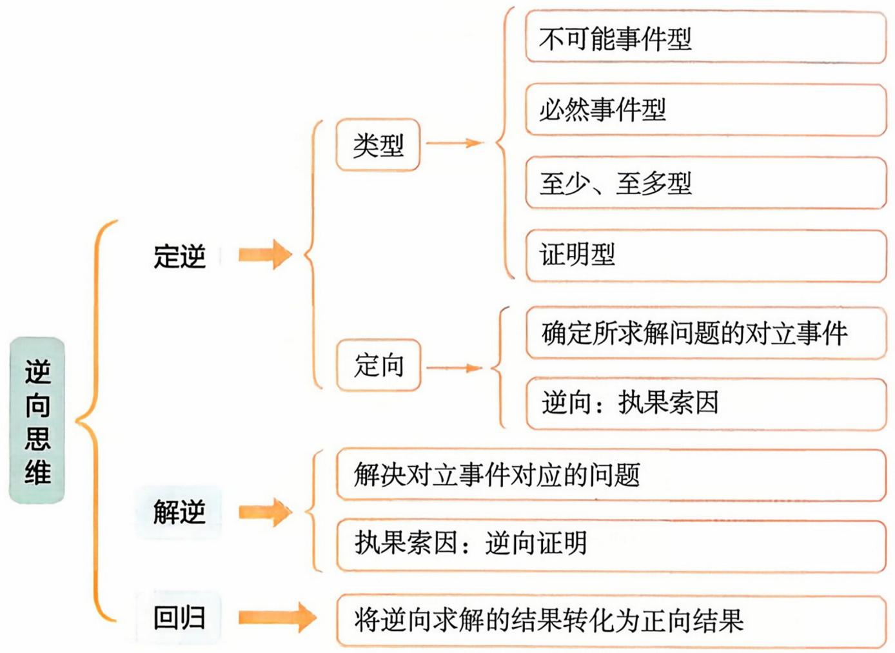

flowchart

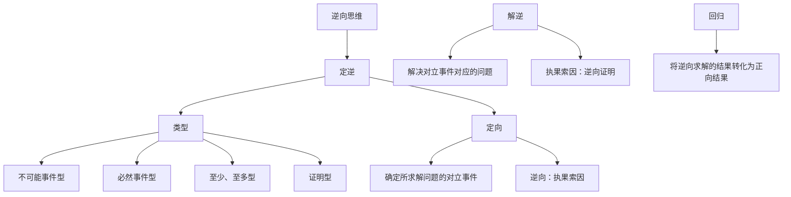
```mermaid
graph TD
    A["逆向思维"] --> B["定逆"]
    B --> C["类型"]
    C --> D["不可能事件型"]
    C --> E["必然事件型"]
    C --> F["至少、至多型"]
    C --> G["证明型"]
    B --> H["定向"]
    H --> I["确定所求解问题的对立事件"]
    H --> J["逆向：执果索因"]
    K["解逆"] --> L["解决对立事件对应的问题"]
    K --> M["执果索因：逆向证明"]
    N["回归"] --> O["将逆向求解的结果转化为正向结果"]
```

# 真题接招

真题(2023 新课标 I 卷)某学校开设了 4 门体育类选修课和 4 门艺术类选修课,学生需从这 8 门课中选修 2 门或 3 门课,并且每类选修课至少选修 1 门,则不同的选课方案共有\_\_\_\_种(用数字作答).

# 快招解题

# Step 1 定逆，确定所求事件的对立事件

记事件“每类选修课至少选修1门”为事件A,则 $\overline{A}$ :不选艺术类或不选体育类.

# Step 2 解逆，将对立事件分类——不选艺术类或不选体育类

(1)不选艺术类:即只从体育类选修2门或3门,不同的选课方案有 $C_{4}^{2}+C_{4}^{3}=6+4=$ 10(种).  
(2)不选体育类:即只从艺术类选修2门或3门,不同的选课方案有 $C_{4}^{2}+C_{4}^{3}=6+4=10$ (种).  
所以事件 $\overline{A}$ 的不同选课方案有 $10 + 10 = 20$ (种).

# Step 3 回归，利用对立事件概率计算公式转化为所求

从艺术类或体育类共8门中选修2门或3门,不同的选课方案有 $C_{8}^{2}+C_{8}^{3}=28+56=$ 84(种).

故事件 $A$ 的不同选课方案有 $84 - 20 = 64$ (种).

# 巧思考

分类讨论不选艺术类或不选体育类的前提下,选修2门或3门课,具体选课的分配方案,结合组合数运算求解.

# 点技巧

定逆：“至少”“至多”类型，从正面分析，分类较多，可以转化为其对立事件求解。

# 拓思维

函数 $f(x)$ 在区间 $(m,m+\frac{1}{3})$ 上不单调，考虑利用不等式
组 $\left\{\begin{aligned}m&\geqslant0,\\ m&<1<m+\frac{1}{3}\end{aligned}\right.$ 求解.

# 良巧转化

不单调转化为单调后应注意两点: (1) 单调有两种情况——单调递增或单调递减; (2) 可导函数在指定区间保持单调, 则导函数值在该区间内符号不发生正负变化, 但导函数值在某些点处可能为 0.

# 巧思考

“至少型”问题,从问题的反面出发,“至少有一人去此地”可以分为三类,甲或乙其中一人去,甲和乙都去,其反面为“两人都没去此地”.

# 模拟练招

模拟 ①(2025 安徽合肥模拟)若函数 $f(x)=\frac{x^{2}}{2}-\ln x$ 在区间 $(m,m+\frac{1}{3})$ 上不单调,则实数 m 的取值范围为 ( )

A. $0 < m < \frac{2}{3}$

B. $\frac{2}{3} < m < 1$

C. $\frac{2}{3} \leqslant m \leqslant 1$

D. $m > 1$

# 快招解题

Step 1 定逆，不单调的条件不好确定，确定“不单调”的“逆”——“单调”

函数 $f(x)=\frac{x^{2}}{2}-\ln x$ 的定义域为 $(0,+\infty)$ ,
且 $f'(x)=x-\frac{1}{x}=\frac{x^{2}-1}{x}$ ，由题意可得 $m\geqslant0$ .

记“函数 $f(x)$ 在区间 $(m,m+\frac{1}{3})$ 上不单调”为事件A,则 $\overline{A}$ 为“函数 $f(x)$ 在区间 $(m,m+\frac{1}{3})$ 上单调”,即函数在该区间上单调递增或单调递减.

Step 2-1 解逆，“增”——导函数值在指定区间内保持“非负”

若函数在区间 $(m, m + \frac{1}{3})$ 上单调递增，则 $f'(x) \geqslant 0$ 恒成立，即 $\frac{x^2 - 1}{x} \geqslant 0$ ，得 $x \geqslant 1$ ，故 $m \geqslant 1$ ；

Step-2-2 解逆，“减”——导函数值在指定区间内保持“非正”

若函数在区间 $(m, m + \frac{1}{3})$ 上单调递减，则 $f'(x) \leqslant 0$ 恒成立，即 $\frac{x^2 - 1}{x} \leqslant 0$ ，得 $0 < x \leqslant 1$ 故 $m + \frac{1}{3} \leqslant 1$ ，又 $m \geqslant 0$ ，得 $0 \leqslant m \leqslant \frac{2}{3}$ .

综上,若函数在区间 $(m,m+\frac{1}{3})$ 上单调,则 $m\geqslant1$ 或 $0\leqslant m\leqslant\frac{2}{3}$ .

Step 3 回归，利用补集求参数范围

所以若函数在区间 $(m, m + \frac{1}{3})$ 上不单调, 则 $\frac{2}{3} < m < 1$ . 故选 B.

模拟 ②(2025 湖北武汉检测)在一段时间内,甲去某地的概率是 $\frac{1}{4}$ ,乙去此地的概率是 $\frac{2}{5}$ ,假定两人的行动相互之间没有影响,那么在这段时间内至少有一人去此地的概率是 ( )

A. $\frac{1}{10}$

B. $\frac{9}{20}$

C. $\frac{11}{20}$

D. $\frac{9}{10}$

# 快招解题

Step 1 定逆，确定所求事件的对立事件

记“甲去某地”为事件A,“乙去此地”为事件B,“至少有一人去此地”为事件M,则 $\overline{M}$ 为两人都没有去此地,即 $\overline{A}\overline{B}$ .

Step 2 解逆, $A, B$ 相互独立, $\overline{A}, \overline{B}$ 也相互独立

由已知, $P(A)=\frac{1}{4},P(B)=\frac{2}{5}$ ，甲、乙两人的行动相互之间没有影响，

故 $P(\overline{M}) = P(\overline{A}\overline{B}) = P(\overline{A})P(\overline{B}) = (1 - \frac{1}{4})\times (1 - \frac{2}{5}) = \frac{9}{20}.$

Step 3 回归，利用对立事件的概率公式进行转化

所求事件的概率 $P(M)=1-P(\overline{M})=1-\frac{9}{20}=\frac{11}{20}$ . 故选 C.

# 实战链接

习题册第3页第1题;习题册第53页第13题;习题册第75页第12题;习题册第100页第4题.

# 快招12 巧用二级结论，缩短解题路径

# 提分快招

我们在解题过程中积累了许多的二级结论,由于选择题、填空题的阅卷评分标准是只看答案是否正确,不管过程是否详细,所以在解答选择题、填空题的过程中应用这些二级结论,可以缩短解题路径,大大节省我们的解题时间,事半功倍.解决此类问题的关键点如下:

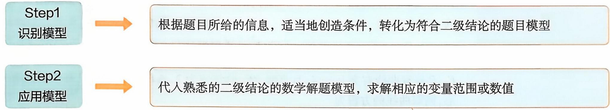

flowchart

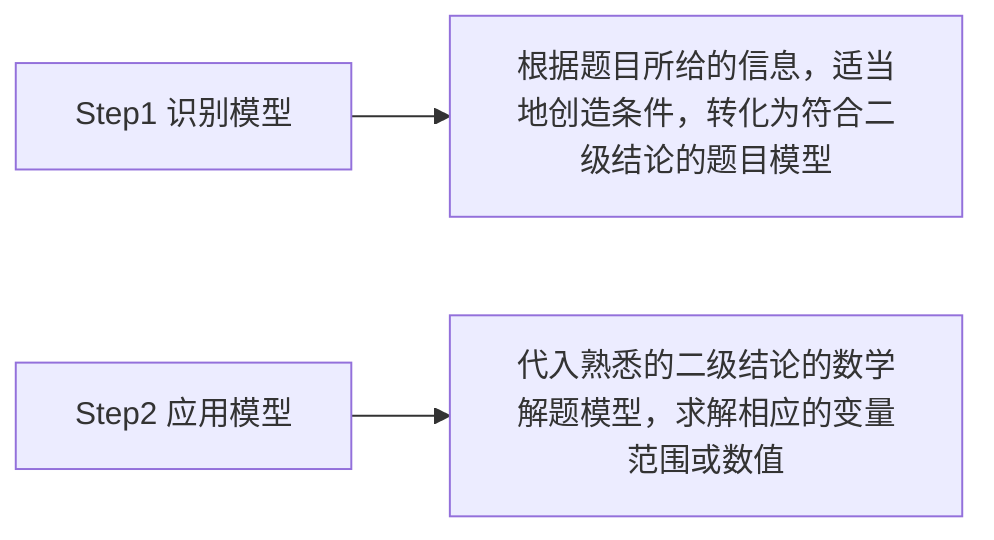
```mermaid
graph LR
    A["Step1 识别模型"] --> B["根据题目所给的信息，适当地创造条件，转化为符合二级结论的题目模型"]
    C["Step2 应用模型"] --> D["代入熟悉的二级结论的数学解题模型，求解相应的变量范围或数值"]
```

# 常用的二级结论

<table><tr><td>焦点三角形</td><td>若椭圆 $\frac{x^{2}}{a^{2}}+\frac{y^{2}}{b^{2}}=1(a>b>0)$ 的左、右焦点分别为 $F_{1},F_{2},P$ 是椭圆上的任意一点(长轴端点除外),则 $\triangle PF_{1}F_{2}$ 称为焦点三角形,它的周长为 $2a+2c$ ,面积 $S_{\triangle PF_{1}F_{3}}=b^{2}\tan\frac{\angle F_{1}PF_{2}}{2}$ </td></tr><tr><td>极化恒等式</td><td>(1) $a\cdot b=\frac{1}{4}\left[(a+b)^{2}-(a-b)^{2}\right]$ ;(2)在 $\triangle ABC$ 中, $BC$ 的中点为 $D$ ,则 $\overrightarrow{AB}\cdot\overrightarrow{AC}=\overrightarrow{AD^{2}}-\overrightarrow{DB^{2}}$ </td></tr><tr><td>射影定理</td><td>在 $\triangle ABC$ 中,内角 $A,B,C$ 的对边分别为 $a,b,c$ ,则 $acos B+bcos A=c,acos C+ccos A=b,ccos B+bcos C=a$ </td></tr><tr><td>等比数列性质</td><td>(1)在等比数列 $\{a_{n}\}$ (公比为 $q$ ,且 $q\neq0$ )中, $S_{n}$ 为数列 $\{a_{n}\}$ 的前 $n$ 项和,若 $S_{n}\neq0$ ,则 $S_{n},S_{2n}-S_{n},S_{3n}-S_{2n},S_{4n}-S_{3n},\cdots$ 构成公比为 $q^{n}$ 的等比数列;(2)在公比 $q\neq\pm1$ 的等比数列 $\{a_{n}\}$ 中, $S_{n}$ 为数列 $\{a_{n}\}$ 的前 $n$ 项和, $则\frac{S_{n}}{S_{m}}=\frac{1-q^{n}}{1-q^{m}}$ </td></tr><tr><td>角平分线定理</td><td>在 $\triangle ABC$ 中,若 $AD$ 是 $\angle BAC$ 的平分线,则有 $\frac{S_{\triangle ABD}}{S_{\triangle ACD}}=\frac{AB}{AC}=\frac{BD}{CD}$ </td></tr></table>

# 真题接招

真题 1 (2025 全国一卷)(多选)已知抛物线 $C: y^{2} = 6x$ 的焦点为 $F$ , 过 $F$ 的一条直线交 $C$ 于 $A, B$ 两点, 过 $A$ 作直线 $l: x = -\frac{3}{2}$ 的垂线, 垂足为 $D$ , 过 $F$ 且与直线 $AB$ 垂直的直线交 $l$ 于点 $E$ , 则 ( )

A. $\left| {AD}\right|  = \left| {AF}\right|$

B. $\left| {AE}\right|  = \left| {AB}\right|$

C. $\left| {AB}\right|  \geq  6$

D. $|AE| \cdot |BE| \geqslant 18$

# 快招解题

# Step 1 识别模型

由题可知本题是抛物线的过焦点的阿基米德三角形模型.

# !教审题

与抛物线焦点弦相关的性质问题,联想二级结论,利用结论实现速解.

# 拓思维

圆锥曲线的弦与过弦的端点的两条切线所围成的三角形为阿基米德三角形, 本题中的 $\triangle ABE$ 实际上就是抛物线过焦点的阿基米德三角形, 从而有 $AE \perp BE$ . 实际上根据以抛物线焦点弦为直径的圆与准线相切也可得到 $AE \perp BE$ .

# Step 2 应用模型

如图,由抛物线 $C: y^{2} = 6x$ , 可得其准线方程为 $x = -\frac{3}{2}$ , 由抛物线定义可知 $|AD| = |AF|$ , A 正确.

由抛物线的过焦点的阿基米德三角形性质知, $AE \perp BE$ ,所以 $\triangle ABE$ 为直角三角形,则直角边AE与斜边AB不会相等,B错误.

抛物线焦点弦中通径最短, 通径长为 $2 \times \frac{3}{2} \times 2 = 6$ , 所以 $|AB| \geqslant 6, C$ 正确.

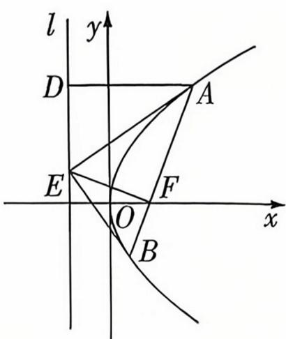

text_image

l
y
D
A
E
O
F
B
x

△AEB 为直角三角形,由面积法得 $\left|AE\right| \cdot \left|EB\right| = \left|AB\right| \cdot \left|EF\right|$ , 而 $\left|AB\right|$ 最小值为 6, $\left|EF\right|$ 最小值为 3, 二者可以同时取得, 故 $\left|AE\right| \cdot \left|EB\right| = \left|AB\right| \cdot \left|EF\right| \geqslant 18$ , D 正确. 故选 ACD.

真题 ②(2024 天津卷)已知双曲线 $\frac{x^{2}}{a^{2}} - \frac{y^{2}}{b^{2}} = 1 (a > 0, b > 0)$ 的左、右焦点分别为 $F_{1}$ , $F_{2}, P$ 是双曲线右支上一点, 且直线 $PF_{2}$ 的斜率为 2 , $\triangle PF_{1}F_{2}$ 是面积为 8 的直角三角形, 则双曲线的方程为

A. $\frac{x^2}{8} - \frac{y^2}{2} = 1$

B. $\frac{x^{2}}{8} -\frac{y^{2}}{4} = 1$

C. $\frac{x^{2}}{2} -\frac{y^{2}}{8} = 1$

D. $\frac{x^{2}}{4} -\frac{y^{2}}{8} = 1$

# 快招解题

Step：识别

观察题目信息,可得 $\triangle PF_{1}F_{2}$ 是双曲线的焦点三角形.

Step 2 应用模型

如图,由题可知,点 P 必落在第四象限,由双曲线焦点三角形面公式知 $S_{\triangle PF_{1}F_{2}}=\frac{b^{2}}{\tan\frac{\angle F_{1}PF_{2}}{2}}=8$ , 则 $b^{2}=8$ .

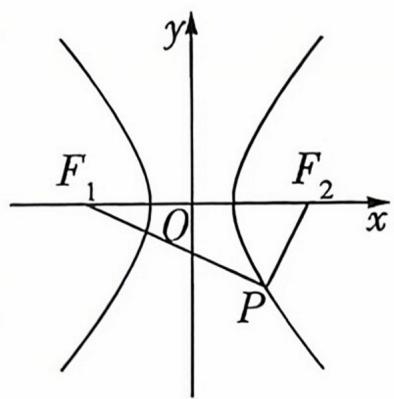

text_image

F₁
O
F₂
x
y
P

# ! 用结论

椭圆与双曲线的焦点三角形面积公式有区别,不要弄混.

在 Rt $\triangle PF_{1}F_{2}$ 中， $\tan \angle F_{1}F_{2}P = 2$ ，则 $\cos \angle F_{1}F_{2}P = \frac{1}{\sqrt{5}}$ ，设 $|PF_{2}| = m$ ，则 $|PF_{1}| = 2m$ ，又 $|PF_{1}| - |PF_{2}| = 2a$ ，所以 $m = 2a$ ，则

$\cos \angle F_{1}F_{2}P = \frac{2a}{2c} = \frac{1}{\sqrt{5}}$ 所以 $\frac{c^2}{a^2} = 1 + \frac{b^2}{a^2} = 5$ ，则 $\frac{b^2}{a^2} = 4$ ，得 $a^2 = 2$ ，所以双曲线的方程为 $\frac{x^2}{2} -\frac{y^2}{8} = 1.$ 故选C.

# 点技巧

由 $a\cos B - b\cos A = c$ 联想到射影定理, 可以增添一个条件, 与题目已知的条件结合消元求得 A 的余弦值.

真题 ③(2023 全国乙卷)在 $\triangle ABC$ 中,内角 $A,B,C$ 的对边分别是 $a,b,c$ ,若 $a\cos B - b\cos A = c$ ,且 $C = \frac{\pi}{5}$ ,则 $B =$ ( )

A. $\frac{\pi}{10}$

B. $\frac{\pi}{5}$

C. $\frac{3 \pi}{10}$

D. $\frac{2 \pi}{5}$

# 快招解题

Step 1 识别模型

$a\cos B - b\cos A = c,$

Step 2 应用模型

# 拓思维

两个式子相加得到 $a \cos B = c$ ，也可以得到 $A = \frac{\pi}{2}$ .

$a\cos B + b\cos A = c$ ，两个式子相减，得到 $b\cos A = 0$ ，所以 $\cos A = 0$ ，所以 $A = \frac{\pi}{2}$

因为 $C=\frac{\pi}{5}$ ，所以 $B=\pi-\frac{\pi}{2}-\frac{\pi}{5}=\frac{3\pi}{10}$ 。故选 C.

# 模拟练招

模拟 1 (2025 江苏无锡检测)已知点 $P$ 在单位圆 $x^{2} + y^{2} = 1$ 上, 点 $A(2,0)$ , 点 $B(0,2)$ , 则 $\overrightarrow{PA} \cdot \overrightarrow{PB}$ 的取值范围是

A. $[-1,3]$

B. $[1,3]$

C. $[-2\sqrt{2} + 1, 2\sqrt{2} + 1]$

D. $[1, 2\sqrt{2} + 1]$

# 快招解题

Step 1 识别模型

连接 $AB$ , 设 $AB$ 的中点为 $D(1,1)$ , 连接 $PD, OD$ ( $O$ 为坐标原点), 则由极化恒等式得 $\overrightarrow{PA} \cdot \overrightarrow{PB} = \overrightarrow{PD^2} - \overrightarrow{DA^2} = \overrightarrow{PD^2} - 2$ .

Step 2 应用模型

因为 $|OD| = \sqrt{2}$ ，则 $\sqrt{2} - 1 \leqslant |\overrightarrow{PD}| \leqslant \sqrt{2} + 1$ ，所以 $1 - 2\sqrt{2} \leqslant \overrightarrow{PD}^2 - 2 \leqslant 1 + 2\sqrt{2}$ ，所以 $\overrightarrow{PA} \cdot \overrightarrow{PB}$ 的取值范围是 $[-2\sqrt{2} + 1, 2\sqrt{2} + 1]$ . 故选 C.

模拟 ②(2025 天津河东区模拟)设等比数列 $\{a_{n}\}$ 的前 $n$ 项和为 $S_{n}$ . 若 $a_{n} > 0, S_{3} = 5$ , $a_{7} + a_{8} + a_{9} = 20$ , 则 $S_{15} =$ \_\_\_\_.

# 快招解题

Step 1 识别模型

由等比数列的性质可知 $S_{3}, S_{6} - S_{3}, S_{9} - S_{6}, S_{12} - S_{9}, S_{15} - S_{12}$ 是等比数列 $q_{1}(q_{1} \neq 0)$ ,

Step 2 应用模型

# 国巧转化

见到 $\overrightarrow{PA}\cdot\overrightarrow{PB}$ ，联想到极化恒等式 $\overrightarrow{PA}\cdot\overrightarrow{PB}=\overrightarrow{PD^{2}}-\overrightarrow{DA^{2}}=\overrightarrow{PD^{2}}-2$ ，使问题转化为求圆上的一个动点到圆外一个定点的距离的范围问题。还可以用坐标法求解。

# 点技巧

取 ${AB}$ 的中点 $D$ ,构造极化恒等式的图形模型.

$\therefore$ 用十分线定理得 $\frac{S_{\triangle BDC}}{S_{\triangle ADC}}=\frac{BC}{AC}=\frac{BD}{AD}=\frac{12}{9}=\frac{4}{3}$ ，即 $BD=\frac{4}{7}AB.$

由正弦定理可知，

$$
\frac {B C}{\sin \angle A} = \frac {A C}{\sin \angle B} \Rightarrow \frac {1 2}{\sin 2 \angle B} = \frac {9}{\sin \angle B} \Rightarrow \frac {1 2}{2 \sin \angle B \cdot \cos \angle B} = \frac {9}{\sin \angle B} \Rightarrow \cos \angle B = \frac {2}{3}.
$$

由余弦定理可知 $AC^{2}=AB^{2}+BC^{2}-2AB\times BC\times\cos\angle B$ ，即 $81=AB^{2}+144-2\times AB\times12\times\frac{2}{3}$ ，解得 AB=7 或 AB=9.

当 AB = 7 时, BD = 4; 当 AB = 9 时, 因为 AC = 9, 所以 AC = AB, 因此 $\angle B = \angle ACB, \angle A + \angle B + \angle ACB = \pi \Rightarrow 2\angle B + \angle B + \angle B = \pi \Rightarrow \angle B = \frac{\pi}{4}, \cos \angle B = \frac{\sqrt{2}}{2} \neq \frac{2}{3}$ , 所以 AB = 9 不成立. 故 BD = 4.

# 实战链接

习题册第14页第10题;习题册第27页第5题;习题册第56页第6题;习题册第61页第10题;习题册第80页第8题;习题册第107页第10题.

线定理速得 $BD = \frac{4}{7} AB$ ，但在解答题中使用该定理需进行简单的证明，本题还可以利用正弦定理求解。

# 点技巧

若是给出三角形两边及两边中一边的对角,可以利用余弦定理建立一元二次方程,解方程求出第三边.切记要注意验根.

# 快招13 利用高数知识，妙解函数问题

# 提分快招

# 1. 泰勒公式的应用

高考题目中常常利用泰勒公式解决指数函数 $y = \mathrm{e}^{x}$ ，对数型函数 $y = \ln (1 + x)$ ，三角函数 $y = \sin x, y = \cos x, y = \tan x$ 等与一元高次函数之间的放缩、近似计算、比较大小等问题。解决此类问题的关键点如下：

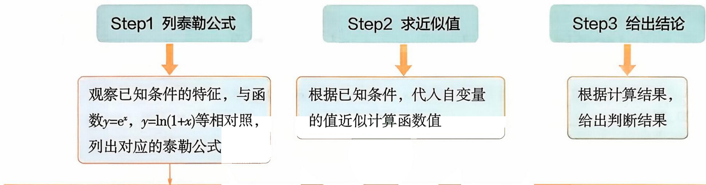

flowchart

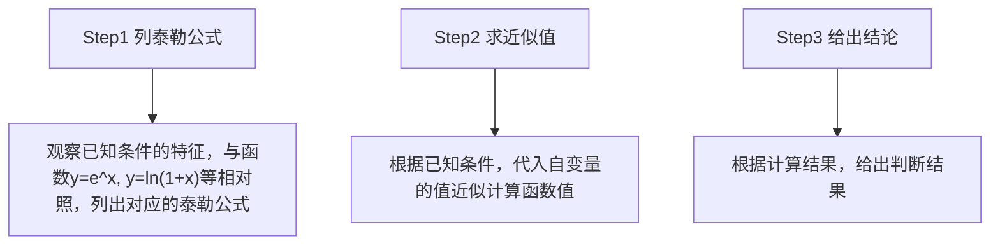
```mermaid
graph TD
    A["Step1 列泰勒公式"] --> B["观察已知条件的特征，与函数y=e^x, y=ln(1+x)等相对照，列出对应的泰勒公式"]
    C["Step2 求近似值"] --> D["根据已知条件，代入自变量的值近似计算函数值"]
    E["Step3 给出结论"] --> F["根据计算结果，给出判断结果"]
```

# 常见泰勒公式展开式

$$
\begin{array}{l} {\mathrm{e} ^ {x} \approx 1 + x + \frac {x ^ {2}}{2 !}, \sin x \approx x - \frac {x ^ {3}}{3 !} + \frac {x ^ {5}}{5 !}, \cos x \approx 1 - \frac {x ^ {2}}{2 !} + \frac {x ^ {4}}{4 !}, \tan x \approx x + \frac {1}{3} x ^ {3} +} \\ {\frac {2}{1 5} x ^ {5}, \frac {1}{1 + x} \approx 1 - x + x ^ {2}, \frac {1}{1 - x} \approx 1 + x + x ^ {2}, \ln (1 + x) \approx x - \frac {x ^ {2}}{2} + \frac {x ^ {3}}{3}, \ln (1 - x) \approx - x - \frac {x ^ {2}}{2} - \frac {x ^ {3}}{3}} \\ {x) \approx - x - \frac {x ^ {2}}{2} - \frac {x ^ {3}}{3}} \end{array}
$$

# 技巧点拨

计算中取泰勒公式的前几项,要看题目需要,一般取前两项或前三项(如 $e^{x}$ 常取前三项, $\ln(1+x)$ 常取前两项)

# 2. 洛必达法则的应用

洛必达法则 若函数 $f(x), g(x)$ 满足下列条件: (1) $\lim_{x \to a} f(x) = 0$ 及 $\lim_{x \to a} g(x) = 0$ ; (2) 在点 $a$ 的去心邻域内, $f(x), g(x)$ 都可导, 且 $g'(x) \neq 0$ ; (3) $\lim_{x \to a} \frac{f'(x)}{g'(x)} = l$ . 则 $\lim_{x \to a} \frac{f(x)}{g(x)} = \lim_{x \to a} \frac{f'(x)}{g'(x)} = l$ . 一般地, 当遇到求分式函数的范围或最值问题时, 若出现 $\frac{0}{0}$ 或 $\frac{\infty}{\infty}$ 的情况, 则要应用洛必达法则. 解决此类问题的关键点如下:

点a的去心邻域可以理解为集合 $\{x\vert a-\delta<x<a或a<x<a+\delta\}$ ， $\delta$ 是较小的正实数.

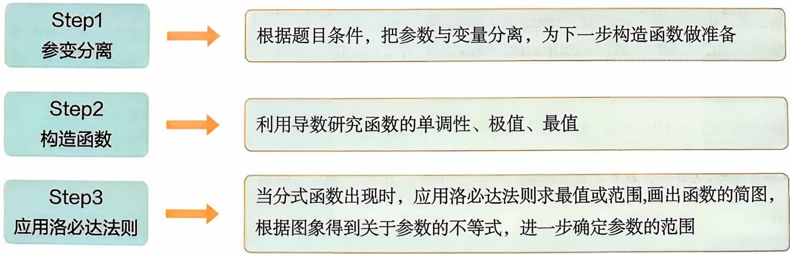

flowchart

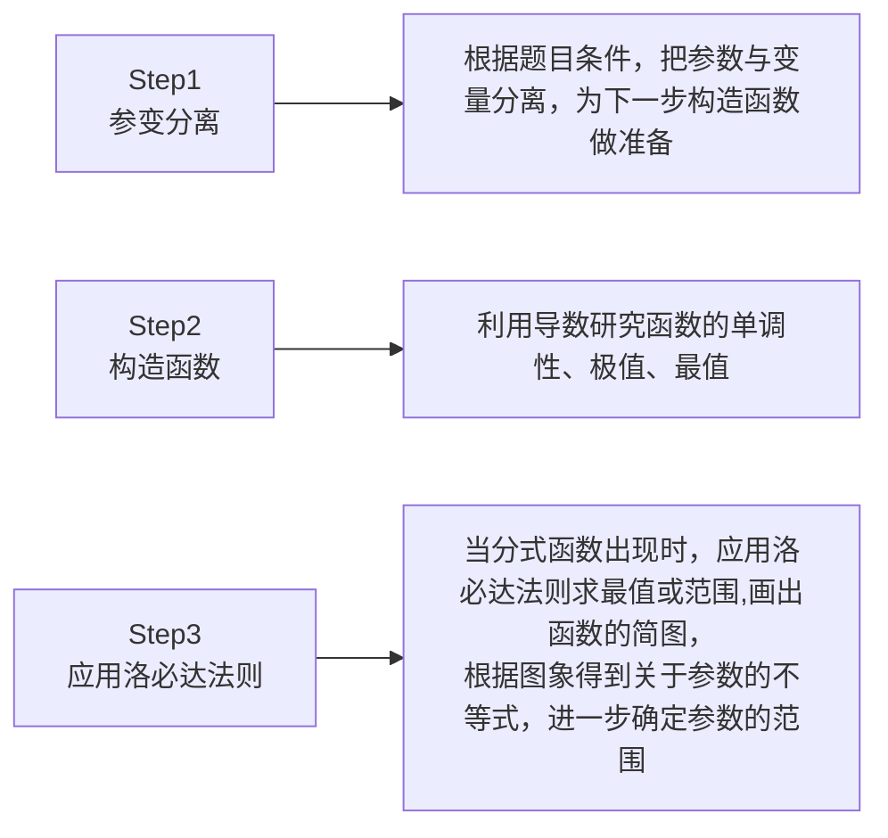
```mermaid
graph LR
    A["Step1<br>参变分离"] --> B["根据题目条件，把参数与变量分离，为下一步构造函数做准备"]
    C["Step2<br>构造函数"] --> D["利用导数研究函数的单调性、极值、最值"]
    E["Step3<br>应用洛必达法则"] --> F["当分式函数出现时，应用洛必达法则求最值或范围,画出函数的简图，<br>根据图象得到关于参数的不等式，进一步确定参数的范围"]
```

# 真题接招

真题 (2022 新高考 I 卷) 设 $a = 0.1 \mathrm{e}^{0.1}, b = \frac{1}{9}, c = -\ln 0.9$ , 则 ( )

A. $a < b < c$

B. $c < b < a$

C. $c < a < b$

D. $a < c < b$

# 快招解题

Step 1 变形找合适的泰勒公式

见到 $e^{0.1}$ ，联想 $e^{x} \approx 1 + x + \frac{x^{2}}{2!}$ ，由 $c = -\ln 0.9 = -\ln(1 - 0.1)$ ，联→
想 $\ln(1-x)\approx-x-\frac{x^{2}}{2}.$

Step 2 求近似值

$$
a = 0. 1 \mathrm{e} ^ {0. 1} \approx 0. 1 \times (1 + 0. 1 + \frac {0 . 1 ^ {2}}{2}) = 0. 1 1 0 5,
$$

$$
b = \frac {1}{9} \approx 0. 1 1 1,
$$

$$
c = - \ln 0. 9 = - \ln (1 - 0. 1) \approx 0. 1 + \frac {0 . 1 ^ {2}}{2} = 0. 1 0 5.
$$

Step 3 比较大小，给出结论

所以 c < a < b，故选 C.

# 模拟练招

模拟 1 (2025 湖南长沙模拟) 已知 $a = 1 + \sin 0.1, b = \mathrm{e}^{0.1}, c = 1.01^{10}, d = \frac{10\pi + 3}{10\pi}$ , 则 $a, b, c, d$ 的大小关系为

A. $b > c > d > a$

B. $b > c > a > d$

C. $c > b > d > a$

D. $b > a > c > d$

# 快招解题

Step 1, 2 观察各选项，通过变形，找合适的泰勒公式

观察4个选项,先比较b,c的大小.

$b=e^{0.1}\approx1+0.1+\frac{0.1^{2}}{2}=1.105,c=1.01^{10}\approx1+C_{10}^{1}\times0.01^{1}+C_{10}^{2}\times0.01^{2}=1.1045$ , 所→
以 b>c ，排除 C.

观察余下的3个选项A,B,D,再比较a,c的大小.

因为 $a = 1 + \sin 0.1 \approx 1 + 0.1 - \frac{0.1^3}{6} \approx 1.0998$ ，所以 $a < c$ ，排除 D.

最后比较 a, d 的大小,

$d=\frac{10\pi+3}{10\pi}=1+\frac{3}{10\pi}\approx1.095$ ,所以a>d,排除A.

Step 3 给出结论

综上所述，b>c>a>d，故选B.

模拟 ②(2025 四川绵阳诊断)已知函数 $f(x) = \mathrm{e}^{x} - a(x+1)$ ，若 $f(x)$ 有两个零点，则实数 $a$ 的取值范围是 \_\_\_\_.

# 良巧转化

将 $e^{0.1}$ , In 0.9 写成与同一个数 0.1 有关的形式, 从而联想到更具一般性的函数的泰勒公式, 然后转化为比较近似值的大小问题.

# 点技巧

要比较 $0.1\mathrm{e}^{0.1}$ 与 $-\ln 0.9$ 的大小, 可取 $\mathbf{e}^x$ 的泰勒公式中的前三项, $\ln (1 - x)$ 的泰勒公式中的前两项.

# 巧思考

比较 $b = \mathrm{e}^{0.1}, c = 1.01^{10}$ 的大小, 需寻找合适的泰勒公式和二项展开式. 两个式子都取前三项即可.

# 拓思维

除了用泰勒公式求解, 还可以构造函数 $f(x)=x-\sin x$ ,
可得 a < c.

# !避陷阱

注意函数 $g(x)=\frac{\mathrm{e}^{x}}{x+1}$ 的定义域是 $(-∞,-1)∪(-1,+∞)$ ， $g(x)$ 在区间 $(-∞,-1)$ 及区间 $(-1,0)$ 上都单调递减。

# 析图象

根据函数 $g(x)$ 的图象与直线 y=a 有两个交点的充要条件是 a>1，判断 $f(x)$ 有两个零点的充要条件是 a>1，体现数形结合思想。

# 点技巧

构造函数 $g(x)=\frac{x+1}{e^{x}}$ ，与头脑中储存的知识点 $h(x)=\frac{x}{e^{x}}$ 的图象和性质相近，研究方法相同。也可以由图象变换得到，把函数 $h(x)=\frac{x}{e^{x}}$ 的图象向左平移 1 个单位长度，得到函数 $h(x+1)=\frac{x+1}{e^{x+1}}$ 的图象，再把所得图象上的每一个点的纵坐标变为原来的 e 倍，横坐标不变，得到函数 $g(x)=\frac{x+1}{e^{x}}$ 的图象。

# 快招解题1 极限思想！

# Step 1 参变分离

$x = -1$ 不是函数 $f(x)$ 的零点，

当 $x \neq -1$ 时, $f(x) = \mathrm{e}^{x} - a(x + 1) = 0$ 等价于 $a = \frac{\mathrm{e}^x}{x + 1}$ .

# Step 2 构造函数，判断单调性

令 $g(x)=\frac{\mathrm{e}^{x}}{x+1}$ ，则 $g'(x)=\frac{x\mathrm{e}^{x}}{(x+1)^{2}}$ ，当 x<-1 或 -1<x<0 时， $g'(x)<0$ ， $g(x)$ 单调递减；当 x>0 时， $g'(x)>0$ ， $g(x)$ 单调递增。故 $g(0)=1$ 是函数 $g(x)$ 的极小值。

# Step 3 利用极限求“边界”值

$\lim_{x \to -1^{-}} g(x) = -\infty, \lim_{x \to -1^{+}} g(x) = +\infty, \lim_{x \to +\infty} g(x) = +\infty, \lim_{x \to -\infty} g(x) = 0$ ，作出函数 $g(x)$ 的大致图象，如图，

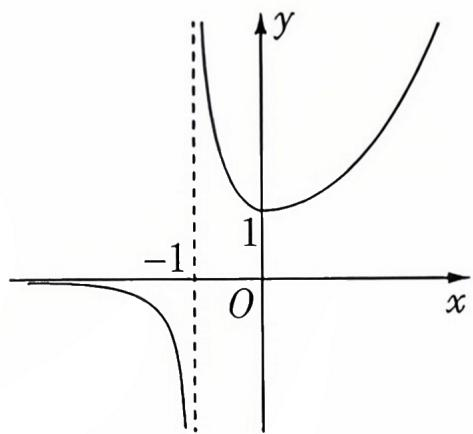

text_image

-1
O
x
y
1

由图可知当且仅当 a > 1 时, 函数 y = a 的图象与函数 $g(x)$ 的图象有两个交点, 所以函数 $f(x)$ 有两个零点的充要条件是 a > 1. 故填 $(1, +\infty)$ .

# 目快招解题2

S

当 $a = 0$ 时, $f(x) = \mathrm{e}^{x}$ 没有零点, 不满足题意, 故 $a \neq 0$ .

$f(x) = \mathrm{e}^{x} - a(x + 1) = 0$ 等价于 $\frac{1}{a} = \frac{x + 1}{\mathrm{e}^x}$ .

# Step 2 构造函数，判断单调性

令 $g(x)=\frac{x+1}{e^{x}}$ ，则 $g'(x)=\frac{-x}{e^{x}}$ ，当x<0时， $g'(x)>0$ ， $g(x)$ 单调递增；

当 $x > 0$ 时, $g'(x) < 0$ , $g(x)$ 单调递减. 故 $g(0) = 1$ 是函数 $g(x)$ 的极大值.

# Step 3 利用洛必达法则求“边界”值

$\lim_{x \to +\infty} g(x) = \lim_{x \to +\infty} \frac{(x+1)'}{(e^x)'} = \lim_{x \to +\infty} \frac{1}{e^x} = 0, \lim_{x \to -\infty} g(x) = -\infty$ ，作出函数 $g(x)$ 的大致图象，如图，

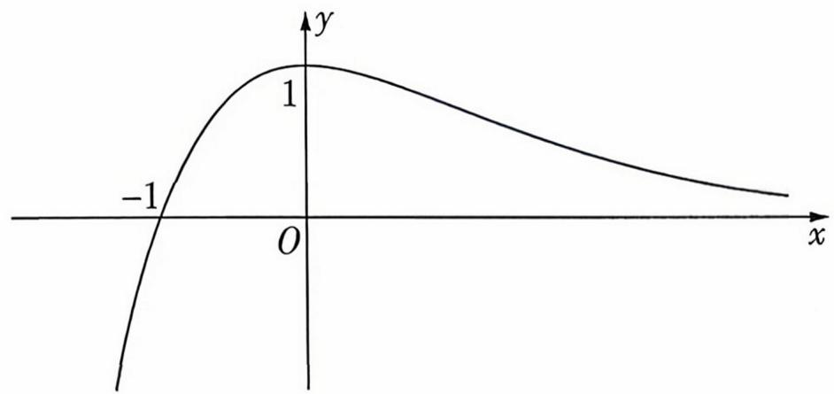

line

| x    | y    |
| ---- | ---- |
| -1   | -1   |
| 0    | 1    |
| >0   | <1   |

由图可知当且仅当 $0 < \frac{1}{a} < 1$ , 即 $a > 1$ 时, 函数 $y = \frac{1}{a}$ 的图象与函数 $g(x)$ 的图象有两个交点, 所以函数 $f(x)$ 有两个零点的充要条件是 $a > 1$ . 故填 $(1, +\infty)$ .

# 实战链接

习题册第30页第4,5,7题;习题册第49页第11题;习题册第82页第7题.

