# 参考答案与

# 深度解析

# 解析足够细

# 刷题有意义

畅销23年

深度解析，

带着学霸思维去学习

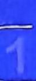

思维
建模

解题思路足够细

构建思维模板，疏通解题线路，快破解题关键，秒通解题思路。

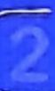

关键分析

试题分析足够细

析流程、用原理、辨图象、破疑难，详析解题要点，构建解题能力。

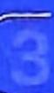

多维解法

解题方法足够细

速解、巧解、图解、优解、多解，360°全方位解法，解题又快又准。

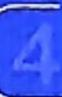

规范解答

解题步骤足够细

规范答题步骤，点明得分要点，步骤不遗漏，每一分都抓住。

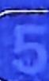

超详批注

拓展批注足够细

批要点、点关键、避误区、破瓶颈，多维超详批注，全方位拓宽视野。

natural_image

Cartoon star character wearing a red eye glasses and blue patterned outfit with yellow stars, standing against a solid blue background (no text or symbols)

数学

2026高考 选择题、填空题

# 第一部分 >> 创新考法趋势练

# 近 3 年高考创新考法

创新考法 1 真实情境建模题…… 001

创新考法 2 接轨高等数学题 …… 002

创新考法 3 图表化载体创新题 …… 004

创新考法 4 动态图形探究题 …… 004

创新考法 5 创新设问开放题 …… 006

创新考法 6 跨学科交叉题 …… 007

创新考法 7 “多想少算” 创新思维题 …… 009

创新考法 8 新定义图形题 …… 011

# 2026 年高考全新预测

全新题型1 逻辑推理题……013

全新题型 2 数据分析题 …… 014

# 第二部分 >> 提分专项突破练

# 热考易错

热考易错1 相近名词混淆不清致误……015

热考易错 2 分类讨论不全面或分类标准不当致误
016

热考易错3 数形结合时作图不准致误 017

热考易错 4 解函数不等式问题时函数构造不当
017

热考易错 5 忽视三角函数的有界性或角的范围
018

热考易错6 忽视基本不等式的使用条件致误 … 019

热考易错 7 忽视圆锥曲线中的隐含条件产生增解
020

热考易错 8 解多选题时选项关联因素逻辑不清致误
022

# 疑难压轴

疑难压轴 1 指、对数式比较大小问题…… 023

疑难压轴 2 抽象函数性质探索问题 …… 025

疑难压轴 3 函数不等式与函数零点问题 …… 027

疑难压轴 4 以数列为载体的创新交汇问题 …… 030

疑难压轴 5 立体几何中的动态探究题 …… 032

疑难压轴 6 以创新情境为载体的统计概率问题
034

疑难压轴 7 圆锥曲线与解三角形、向量、数列等的交汇问题 …… 035

疑难压轴 8 跨模块知识交汇的新定义问题 …… 037

# (第一部分) >> 模拟小卷综合练

# 巩固小卷

第一组 巩固小卷 1—3 …… 039/041/043

第二组 巩固小卷4—6 044/046/048

第三组 巩固小卷7—9 050/052/054

第四组 巩固小卷 10—12 056/058/059

# 进阶小卷

第五组 进阶小卷 1—3 …… 061/063/065

第六组 进阶小卷 4—6 …… 067/069/071

第七组 进阶小卷7—9 …… 072/074/076

第八组 进阶小卷 10—12 078/081/083

第九组 进阶小卷 13—15 …… 085/087/089

第十组 进阶小卷 16—18 …… 091/093/096

# 原创检测

第十一组 原创检测 1—4 …… 098/100/101/104

第十二组 原创检测 5—8 …… 106/107/109/111

# 创新考法 1 真实情境建模题

1. B 链接 2024 北京卷 T7 真实情境中指、对函数模型的应用设 $x$ 天后的“进步值”是“退步值”的 5 倍, 则 $\frac{1.01^{x}}{0.99^{x}} = 5$ , 即 $(\frac{101}{99})^{x} = 5$ , 两边同时取对数得 $\lg (\frac{101}{99})^{x} = \lg 5$ , 化简得 $\lg (\frac{101}{99})^{x} = x \lg \frac{101}{99} = x (\lg 101 - \lg 99) = \lg 5$ , 所以 $x = \frac{\lg 5}{\lg 101 - \lg 99} = \frac{1 - \lg 2}{\lg 101 - \lg 99} \approx \frac{1 - 0.3010}{2.0043 - 1.9956} \approx 80$ . 故选 B.

2. A 真风风速对应的向量 = 视风风速对应的向量 - 船行风风速对应的向量 = 视风风速对应的向量 + 船速对应的向量 = $\overrightarrow{AB}$ ，如图， $|\overrightarrow{AB}| = 2\sqrt{2} \in (1.6, 3.3)$ ，故选 A.

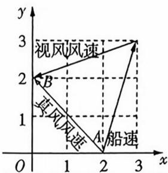

3. C 对于 A, 由 r 的绝对值越接近 1, 相关性越强可得 A 错误; 对于 B, 回归方程为 $\hat{y} = 0.3x + 8$ , 给出的是预测值, 实际值会有随机误差, 故 B 错误; 对于 C, $R^{2}$ 表示模型对因变量的解释比例, 0.998 > 0.733, 说明经验回归方程 (①). 果比经验回归方程 (①) 的比较

A, 由离心率 $e = \frac{c}{a} = \sqrt{1 + \frac{b^2}{a^2}} = \sqrt{3}$ ，可得 $b^2 = 2a^2$ ，于是 C 的方程为 $\frac{x^2}{a^2} - \frac{y^2}{2a^2} = 1$ ，将 $(3, 2\sqrt{3})$ 代入，得 $a^2 = 3, b^2 = 6$ ，所以双曲线 C 的方程为 $\frac{x^2}{3} - \frac{y^2}{6} = 1$ ，故 A 正确。对于 B，根据题中条件分析可知，反射光线所在直线与双曲线有两个交点，且过点 $F_1$ ，则其斜率介于双曲线的两条渐近线斜率之间，而双曲线渐近线的斜率 $k = \pm \frac{b}{a} = \pm \sqrt{2}$ ，故 B 错误。对于 C，易得 $l_{AM}: y = \sqrt{3}(x - 1)$ ，与双曲线方程联立，得到 $(x - 3)^2 = 0$ ，可知该直线与双曲线只有一个交点，即直线 AM 为双曲线在 A 点处的切线，根据题中条件“过双曲线上任意一点的切线平分该点与两焦点连线的夹角”可知， $\angle F_1AM = \angle F_2AM$ ，故 C 正确。对于 D，由 C 选项知 $k_{AM} = \sqrt{3}$ ，因为直线 $F_1H$ 垂直于直线 AM，所以 $k_{F,H} = -\frac{\sqrt{3}}{3} = 0$ 。

$\frac{a}{b^{2}}+1$ 一为 $\overline{b^{2}}\in[0,+\infty)$ ，所以 $\frac{1}{\frac{a^{2}}{b^{2}}+1}\in(0,1]$ ，即 $\cos\theta\in(0,1]$ ，则 $\theta\in[0,\frac{\pi}{2})$ .

综上所述, $\theta\in[0,\frac{\pi}{2}]$ ,则 $\theta$ 的最大值为 $\frac{\pi}{2}$ .

# 巧解

正四棱柱相邻侧面的夹角为 $\frac{\pi}{2}$ ，因为钟面上时针每12小时转一圈，即 $2\pi$ ，所以每小时转 $\frac{2\pi}{12}=\frac{\pi}{6}$ ，当时间为3点或9点时，相邻两面钟的时针所在直线所成角为 $\frac{\pi}{2}$ ，而直线所成角最大为 $\frac{\pi}{2}$ ，故选C.

5. ACD 链接教材人教 A 版《选择性必修第一册》P140 阅读与思考 设双曲线 C 的方程为 $\frac{x^{2}}{a^{2}} - \frac{y^{2}}{b^{2}} = 1 (a > 0, b > 0)$ . 对于

$-2\Delta MH = \frac{\pi}{6}$ ，故 C 正确。对于 D，在 Rt $\triangle HMF_{1}$ 中， $\angle F_{1}MH = \angle AMF_{2} = \frac{\pi}{2} - \angle F_{2}AM = \frac{\pi}{3}$ ，则 $|MH| = |MF_{1}| \cos \frac{\pi}{3} = 4 \times \frac{1}{2} = 2$ ，在 $\triangle HMO$ 中，由余弦定理得 $|OH|^{2} = |OM|^{2} + |MH|^{2} - 2 |OM||MH| \cdot \cos \frac{\pi}{3} = 3$ ，则 $|OH| = \sqrt{3}$ ，故 D 正确。

6. $138\pi$ 根据该几何体的特点可知, 此阳马的外接球半径等于长、宽、高分别为7尺、5尺、8尺的长方体的外接球半径, 则外接球半径 $r = \frac{\sqrt{7^{2} + 5^{2} + 8^{2}}}{2} = \frac{\sqrt{138}}{2}$ (尺), 所以外接球的表面积为 $S = 4\pi r^{2} = 4\pi \cdot \frac{138}{4} = 138\pi$ (平方尺).

7.23 设每天的钻探深度构成数列 $\{a_{n}\}, \{a_{n}\}$ 的前 $n$ 项和为 $S_{n}$ , 第 $5k - 4$ 至 $5k$ 天为第 $k$ 个阶段, 第 $k$ 个阶段的钻探深度和为 $T_{k}$ , 则 $a_{1} = 600$ , 第 $k$ 个阶段每天钻探深度比前一天减少的量为 $b_{k} = 5 + 4(k - 1) = 4k + 1$ . 由题意知 $a_{5k - 4}, a_{5k - 3}, a_{5k - 2}, a_{5k - 1}, a_{5k}$ 是公差为 $-(4k + 1)$ 的等差数列, 所以 $T_{k} = a_{5k-4} + a_{5k-3} + a_{5k-2} + a_{5k-1} + a_{5k} = 5a_{5k-2}$ .

【障碍迷邁】实际上，本题是一个“分段等差数列”求和的问题，故只需找到每段等差数列的中项，分析“相邻中项”的递推关系即可

当 $k \geqslant 2$ 时, $a_{5k - 2} = a_{5(k - 1) - 2} - \{2[4(k - 1) + 1] + 3(4k + 1)\} = a_{5k - 7} - (20k - 3)$ .

当 $k = 1$ 时， $a_{5k - 2} = a_3 = 600 - 2 \times 5 = 590, S_5 = T_1 = 5 \times 590 = 2950;$

当 $k = 2$ 时， $a_{sk - 2} = a_8 = 590 - (40 - 3) = 553, T_2 = 5 \times 553 = 2765, S_{10} = S_5 + T_2 = 5715;$

同理可得, 当 k=3 时, $a_{13}=496$ , $S_{15}=S_{10}+5a_{13}=8195$ ;

当 k=4 时, $a_{18}=419$ , $S_{20}=S_{15}+5a_{18}=10\ 290$ ;

当 $k = 5$ 时， $a_{23} = 322, S_{25} = S_{20} + 5a_{23} > 11000.$

因为 $a_{21} = a_{23} + 2 \times 21 = 364, a_{22} = a_{23} + 21 = 343,$

所以 $S_{22} = S_{20} + a_{21} + a_{22} = 10997 < 11000, S_{23} = S_{22} + a_{23} >$

11 000. 所以要完成任务, 至少需要钻探 23 天.

# 巧解

# 列举法!

设每天的钻探深度构成数列 $\{a_{n}\}$ ，每5项为一个阶段，第k个阶段的钻探深度和为 $T_{k}, k=1,2,3,\cdots$ ，列表如下.

<table><tr><td> $a_{1} = 600$ </td><td> $a_{2} = 595$ </td><td> $a_{3} = 590$ </td><td> $a_{4} = 585$ </td><td> $a_{5} = 580$ </td><td> $T_{1} = 2\ 950$ </td></tr><tr><td> $a_{6} = 571$ </td><td> $a_{7} = 562$ </td><td> $a_{8} = 553$ </td><td> $a_{9} = 544$ </td><td> $a_{10} = 535$ </td><td> $T_{2} = 2\ 765$ </td></tr><tr><td> $a_{11} = 522$ </td><td> $a_{12} = 509$ </td><td> $a_{13} = 496$ </td><td> $a_{14} = 483$ </td><td> $a_{15} = 470$ </td><td> $T_{3} = 2\ 480$ </td></tr><tr><td> $a_{16} = 453$ </td><td> $a_{17} = 436$ </td><td> $a_{18} = 419$ </td><td> $a_{19} = 402$ </td><td> $a_{20} = 385$ </td><td> $T_{4} = 2\ 095$ </td></tr><tr><td> $a_{21} = 364$ </td><td> $a_{22} = 343$ </td><td> $a_{23} = 322$ </td><td> $a_{24} = 301$ </td><td> $a_{25} = 280$ </td><td> $T_{5} = 1\ 610$ </td></tr></table>

$T_{1}+T_{2}+T_{3}+T_{4}+T_{5}=2\ 950+2\ 765+2\ 480+2\ 095+$ 1 610 > 11 000, $T_{1} + T_{2} + T_{3} + T_{4} + a_{21} + a_{22} + a_{23} > 11\ 000$ , $T_{1} + T_{2} + T_{3} + T_{4} + a_{21} + a_{22} < 11\ 000$ , 所以要完成钻探任务, 至少需要 23 天.

# 创新考法2 接轨高等数学题

1. A 易知不超过40的素数有2,3,5,7,11,13,17,19,23,29,31,37,共12个,其中梅森素数有3,7,31,共3个,则在不超过40的素数中,随机选取两个不同的数,共有 $C_{12}^{2}=66$ (种)情况,其中至少有一个为梅森素数的情况有 $C_{3}^{1}C_{9}^{1}+C_{3}^{2}=30$ (种),所以至少有一个为梅森素数的概率是 $P=\frac{30}{66}=\frac{5}{11}$ .故选A.

# 巧解

# 逆向思维!

在不超过40的素数中,随机选取两个不同的数,共有 $C_{12}^{2}=66$ (种)情况,其中没有梅森素数的情况有 $C_{9}^{2}=36$ (种),所以至少有一个为梅森素数的概率是P=1- $\frac{36}{66}=\frac{5}{11}$ .故选A.

2. B 由题意, 函数 $f(x) = \tan x, x \in \left[-\frac{\pi}{3}, \frac{\pi}{3}\right]$ , 所以 $f\left(-\frac{\pi}{3}\right) = -\sqrt{3}, f\left(\frac{\pi}{3}\right) = \sqrt{3}, f'(x) = \left(\frac{\sin x}{\cos x}\right)' = \frac{1}{\cos^2 x}$ , 所以 $f\left(\frac{\pi}{3}\right) - f\left(-\frac{\pi}{3}\right) = 2\sqrt{3}, f'(\xi) = \frac{1}{\cos^2\xi}$ , 所以由拉格朗日中值定理得 $2\sqrt{3} = \frac{1}{\cos^2\xi} \cdot \frac{2\pi}{3}$ , 即 $\cos^2\xi = \frac{\sqrt{3}\pi}{9} < \frac{3}{4}$ , 所以 $\cos \xi = \pm \frac{(\sqrt{3}\pi)^{\frac{1}{2}}}{3}$ , 当 $x \in \left[-\frac{\pi}{3}, \frac{\pi}{3}\right]$ 时, $\cos x \in \left[\frac{1}{2}, 1\right]$ , 所以 $\cos \xi = -\frac{(\sqrt{3}\pi)^{\frac{1}{2}}}{3}$ 在 $x \in \left[-\frac{\pi}{3}, \frac{\pi}{3}\right]$ 上无解, $\cos \xi = \frac{(\sqrt{3}\pi)^{\frac{1}{2}}}{3}$ 在 $x \in \left[-\frac{\pi}{3}, \frac{\pi}{3}\right]$ 上有 2 个解. 所以函数 $f(x) = \tan x$ 在区间 $\left[-\frac{\pi}{3}, \frac{\pi}{3}\right]$ 上的中值点的个数为 2. 故选 B.

# 巧解

$\frac{f(b)-f(a)}{b-a}=f'(\xi)$ ，即函数图象在区间上两端点连线所在直线的斜率等于 $\xi$ 处的切线斜率，结合草图可知 $f(x)=\tan x$ 在 $\left[-\frac{\pi}{3},\frac{\pi}{3}\right]$ 上的图象有两个点处的切线与两端点连线所在直线斜率相同，因此中值点的个数为2，故选B.

3. D 链接教材人教 A 版《必修第一册》P256 复习参考题 5T26

由已知得 $\cos x = 1 - \frac{x^{2}}{2!} + \frac{x^{4}}{4!} - \frac{x^{6}}{6!} + \cdots$ ，两边同时求导可得 $-\sin x=-x+\frac{x^{3}}{3!}-\frac{x^{5}}{5!}+\cdots$ ，即 $\sin x=x-\frac{x^{3}}{3!}+\frac{x^{5}}{5!}-\frac{x^{7}}{7!}+\cdots$ 故 $\cos(\frac{2025\pi}{2}-0.4)=\sin0.4=0.4-\frac{0.4^{3}}{6}+\frac{0.4^{5}}{120}-\cdots\approx0.39$ . 故选 D.

4. A 链接 2024 全国甲卷 T20 以高等几何中的射影几何为背景命题 设 $P(x_0, -\frac{1}{2} x_0 + 4)$ , 则直线 $MN$ 的方程为 $\frac{x_0x}{16} + \frac{(-\frac{1}{2}x_0 + 4)y}{4} = 1$ , 整理得 $x_0(x - 2y) + 16y - 16 = 0$ , 由 $\left\{ \begin{array}{l} x - 2y = 0, \\ 16y - 16 = 0, \end{array} \right.$ 解得 $\left\{ \begin{array}{l} x = 2, \\ y = 1, \end{array} \right.$ 所以 $T(2,1)$ .

因为 $\overrightarrow{MT} = \overrightarrow{TN}$ , 所以 $T$ 为 $MN$ 的中点, 且直线 $MN$ 斜率存在, 连接 $OT$ ( $O$ 为坐标原点), 则 $k_{MN} \cdot k_{OT} = -\frac{1}{4}$ , 所以 $k_{MN} = -\frac{1}{2}, MN$ 的方程为 $y - 1 = -\frac{1}{2}(x - 2)$ , 即 $x + 2y - 4 = 0$ . 故选 A.

5. C 对于①, 因为 $2^{30} = 8^{10} = (7 + 1)^{10} = \mathrm{C}_{10}^{10}7^{10} + \mathrm{C}_{10}^{9}7^{9} + \cdots + \mathrm{C}_{10}^{1}7 + 1$ , 所以 $2^{30}$ 被 7 除所得余数为 1, 所以 $2^{30} + 1$ 被 7 除所得余数为 2, 65 被 7 除所得余数也为 2, 所以 $2^{30} + 1 \equiv 65 (\bmod 7)$ . ① 正确. 对于②, 若正整数 $x$ 能被 13 整除, 则 $x^{13} - x = x(x^{12} - 1)$ 能被 13 整除, 所以 $x^{13} - x \equiv 0 (\bmod 13)$ ; 若正整数 $x$ 不能被 13 整除, 由费马小定理得, $x^{12} \equiv 1 (\bmod 13)$ , 则 $x^{13} - x \equiv 0 (\bmod 13)$ . ② 正确. 对于③, 若正整数 $x$ 能被 7 整除, 则 $x^{13} - x = x(x^{12} - 1)$ 能被 7 整除, 所以 $x^{13} - x \equiv 0 (\bmod 7)$ ; 若正整数 $x$ 不能被 7 整除, 由费马小定理得 $x^6 \equiv 1 (\bmod 7)$ , 即 $x^6 - 1 \equiv 0 (\bmod 7)$ , 又 $x^{13} - x = x(x^{12} - 1) = x(x^6 - 1) \cdot (x^6 + 1)$ , 所以 $x^{13} - x \equiv 0 (\bmod 7)$ . ③ 正确. 对于④, 当 $x$ 不能被 5 整除时, 由费马小定理得 $x^4 \equiv 1 (\bmod 5)$ , 即 $x^4 - 1 \equiv 0 (\bmod 5)$ , 又 $x^{12} - 1 = (x^4 - 1)(x^8 + x^4 + 1)$ , 所以 $x^{12} - 1 \equiv 0 (\bmod 5)$ . ④ 错误. 故选 C.

6. ABD 对于 A 选项, $G = \{-1, 1, -i, i\}$ , 可以计算里面任意两个元素的乘积结果都属于集合 G 数的乘法满足结合律,对于复数也不例外. 存在 $e = 1 \in G, \forall a \in G, 1 \times a = a \times 1 = a$ , 且存在 $b \in G$ , 使 $a \cdot b = b \cdot a = 1$ , 所以 $G$ 关于数的乘法能够构成群, 所以 A 选项正确.

对于 B 选项, 对于任意两个有理数, 它们的和仍为有理数. 有理数的加法也满足结合律. 存在 $e = 0 \in \mathbf{Q}, \forall a \in \mathbf{Q}$ , 有 $0 + a = a + 0 = a$ . 对于任意的 $a \in \mathbf{Q}$ , 存在 $b = -a \in \mathbf{Q}$ , 使得 $a + (-a) = (-a) + a = 0$ . 所以有理数集 $\mathbf{Q}$ 关于数的加法构成群. B 选项正确.

对于 C 选项, 取 $0, \sqrt{2} \in G, \frac{\sqrt{2}}{0}$ 无意义, 不满足对任意的 $a, b \in G, a \div b \in G$ , C 选项错误.

对于 D 选项, 任意两个正实数的乘积仍然是正实数. 实数的乘法满足结合律. 取 e=1, 则对于任意的 $a \in R^{+}, 1 \cdot a = a \cdot 1 = 1$ , 且存在 $b = \frac{1}{a} \in R^{+}$ , 使得 $a \cdot \frac{1}{a} = \frac{1}{a} \cdot a = 1$ . 所以 D 选项正确. 故选 ABD.

7. ABD 由题意, $\triangle ABC$ 的“欧拉线”即 $AB$ 的垂直平分线, $\because A(0,1), B(2,-1), \therefore AB$ 的中点坐标为 $(1,0), k_{AB} = \frac{-1-1}{2-0} = -1$ , 则 $AB$ 的垂直平分线方程为 $y = x-1$ , 即 $x-y-1=0$ , 故 A 正确. $\because$ “欧拉线”与圆 $M: (x-4)^{2}+y^{2}=r^{2}$ 相切, 且圆心 $M(4,0)$ 到直线 $x-y-1=0$ 的距离为 $\frac{|4-0-1|}{\sqrt{1+1}} = \frac{3\sqrt{2}}{2}$ , $\therefore r = \frac{3\sqrt{2}}{2}$ , 则圆 $M$ 的方程为 $(x-4)^{2}+y^{2} = \frac{9}{2}$ , 圆心 $M(4,0)$ 到直线 $x-y=0$ 的距离为 $d = \frac{|4-0|}{\sqrt{1+1}} = 2\sqrt{2}$ , 则圆 $M$ 上的点到直线 $x-y=0$ 的最小距离为 $d-r=2\sqrt{2}-\frac{3\sqrt{2}}{2}=\frac{\sqrt{2}}{2}$ , 故 B 正确. 若圆 $M: (x-4)^{2}+y^{2}=\frac{9}{2}$ 与圆 $x^{2}+(y-a)^{2}=8$ 有公共点, 则 $2\sqrt{2}-\frac{3\sqrt{2}}{2} \leqslant \sqrt{(4-0)^{2}+(0-a)^{2}} \leqslant 2\sqrt{2}+\frac{3\sqrt{2}}{2}$ , 解得 $-\frac{\sqrt{34}}{2} \leqslant a \leqslant \frac{\sqrt{34}}{2}$ , 故 C 错误. $\frac{y}{x+1}$ 的几何意义为圆 $M$ 上的点 $(x,y)$ 与定点 $P(-1,0)$ 连线的斜率, 当过 $P(-1,0)$ 的直线与圆 $M$ 相切, 且直线的斜率为正时, $\frac{y}{x+1}$ 取得最大值. 设过点 $P(-1,0)$ 与圆 $M$ 相切的直线方程为 $y=k(x+1)$ , 即 $kx-y+k=0$ , 由 $\frac{|4k+k|}{\sqrt{k^2+1}} = \frac{3\sqrt{2}}{2}$ , 解得 $k = \pm \frac{3\sqrt{41}}{41}, \therefore \frac{y}{x+1}$ 的最大值是 $\frac{3\sqrt{41}}{41}$ , 故 D 正确. 故选 ABD.

8. ACD 对于 $A, x \in (0, +\infty), f'(x) = \frac{1}{x}, f''(x) = -\frac{1}{x^2} < 0$ 则 $f(x)$ 在 $(0, +\infty)$ 上是“凸函数”， $\forall x_i \in (0, +\infty), i = 1$ ， $2, \cdots, n$ ，有 $f(\frac{\sum_{i=1}^{n} x_i}{n}) \geqslant \frac{\sum_{i=1}^{n} f(x_i)}{n}$ ，A 正确.

对于 B, $x \in (0, +\infty)$ , $f'(x) = (x + 1)e^{x}$ , $f''(x) = (x + 2)e^{x} > 0$ , 则 $f(x)$ 在 $(0, +\infty)$ 上是“凹函数”， $\forall x_{i} \in (0, +\infty)$ , i = 1, 2, $\cdots$ , n, 有 $f(\frac{\sum_{i=1}^{n} x_{i}}{n}) \leqslant \frac{\sum_{i=1}^{n} f(x_{i})}{n}$ , B 错误.

对于 C, 设函数 $f(x)=\frac{x}{1-x}=\frac{1}{1-x}-1,0<x<1$ , 则 $f'(x)=\frac{1}{(1-x)^{2}}, f''(x)=\frac{2}{(1-x)^{3}}>0$ , 则函数 $f(x)$ 在 $(0,1)$ 上是“四函数”， $\forall x_{i}\in(0,1), i=1,2,\cdots,5, \sum_{i=1}^{5}x_{i}=1, f(\frac{\sum_{i=1}^{5}x_{i}}{5})\leqslant$

$\frac{\sum_{i=1}^{5} f(x_i)}{5}$ , 因此 $\sum_{i=1}^{5} \frac{x_i}{1 - x_i} \geqslant 5f\left(\frac{1}{5}\right) = \frac{5}{4}$ , C 正确.

对于 D, 设函数 $f(x) = \sin x, 0 < x < \frac{\pi}{2}$ ，则 $f'(x) = \cos x$ ， $f''(x) = -\sin x < 0$ ，则 $f(x)$ 在 $(0, \frac{\pi}{2})$ 上是“凸函数”， $\forall x_i \in (0, \frac{\pi}{2}), i = 1, 2, 3, \sum_{i=1}^{3} x_i = \pi, f(\frac{\sum_{i=1}^{3} x_i}{3}) \geqslant \frac{\sum_{i=1}^{3} f(x_i)}{3}$ ，因此 $\sum_{i=1}^{3} \sin x_i \leqslant 3 \sin \frac{\pi}{3} = \frac{3\sqrt{3}}{2}$ ，D 正确.

# 多解

对于 A, 由函数 $f(x) = \ln x$ 的图象可知函数在定义域上为“凸函数”, 满足 $f\left(\frac{\sum_{i=1}^{n}x_i}{n}\right) \geqslant \frac{\sum_{i=1}^{n}f(x_i)}{n}$ , A 正确; 对于 B, 由函数 $f(x) = xe^x$ 的图象可知函数在 $(0, +\infty)$ 上为“凹函数”, B 错误; 对于 C, 令函数 $f(x) = \frac{x}{1 - x} = \frac{1}{1 - x} - 1, 0 < x < 1$ , 可知函数 $f(x)$ 的图象可由 $y = -\frac{1}{x}, -1 < x < 0$ 向右平移一个单位长度, 再向下平移一个单位长度得到, 而 $y = -\frac{1}{x}, -1 < x < 0$ 是一个“凹函数”, 故其左右平移或上下平移后, 图象的凹凸性不变, 故 $f(x)$ 是一个“凹函数”, $\forall x_i \in (0, 1), i = 1, 2, \cdots, 5, \sum_{i=1}^{5}x_i = 1$ , $f\left(\frac{\sum_{i=1}^{5}x_i}{5}\right) \leqslant \frac{\sum_{i=1}^{5}f(x_i)}{5}$ , 因此 $\sum_{i=1}^{5}\frac{x_i}{1 - x_i} \geqslant 5f\left(\frac{1}{5}\right) = \frac{5}{4}$ , C 正确.

9. ACD 链接教材人教 A 版《选择性必修第二册》P82 探究与发现 $f(x)=x^{3}+x-1, f'(x)=3x^{2}+1, f(1)=1, f'(1)=4, y-1=4(x-1)$ ，所以切线 $l_{1}$ 的方程为 4x-y-3=0，故 A 正确。令 y=0，得 $x_{1}=\frac{3}{4}, f(\frac{3}{4})=\frac{11}{64}, f'(\frac{3}{4})=\frac{43}{16}$ ，可得 $y-\frac{11}{64}=\frac{43}{16}(x-\frac{3}{4})$ ，令 y=0，得 $x_{2}=\frac{59}{86}$ ，故 B 错误。曲线 $y=f(x)$ 在横坐标为 $x_{n-1}$ 的点处的切线斜率为 $3x_{n-1}^{2}+1$ ，所以曲线 $y=f(x)$ 在横坐标为 $x_{n-1}$ 的点处的切线方程为 $y-(x_{n-1}^{3}+x_{n-1}-1)=(3x_{n-1}^{2}+1)(x-x_{n-1})$ ，令 y=0，得 $x_{n}=\frac{2x_{n-1}^{3}+1}{3x_{n-1}^{2}+1}$ ，故 C 正确。

因为 $f'(x)=3x^{2}+1>0$ 在R上恒成立,所以 $f(x)$ 在R上单调递增. $f(\frac{2}{3})=-\frac{1}{27},f(1)=1$ ,则 $f(\frac{2}{3})f(1)<0$ .由函数零点存在定理可知, $f(x)$ 在R上存在唯一零点r,且 $r\in(\frac{2}{3},1)$ .

$f(r) = r^3 + r - 1 = 0$ ，则 $1 - r = r^3$ . $|x_n - r| = \left|\frac{2x_{n-1}^3 + 1}{3x_{n-1}^2 + 1} - r\right| = \left|\frac{2x_{n-1}^3 + 1 - 3rx_{n-1}^2 - r}{3x_{n-1}^2 + 1}\right| = \left|\frac{(x_{n-1} - r)^2(2x_{n-1} + r)}{3x_{n-1}^2 + 1}\right|$ .

要证 $|x_{n}-r|<|x_{n-1}-r|^{2}$ ，只需证 $2x_{n-1}+r<3x_{n-1}^{2}+1$ ，只需证 $r<3x_{n-1}^{2}-2x_{n-1}+1$ ，即证 $r<x_{n-1}(3x_{n-1}-2)+1$ ，由 $x_{n-1}>\frac{2}{3}$ ，得 $x_{n-1}(3x_{n-1}-2)+1>1$ ，因为 $\frac{2}{3}<r<1$ ，所以 $r<x_{n-1}(3x_{n-1}-2)+1$ 成立，故D正确。故选ACD。

# 创新考法3 图表化载体创新题

1. C 链接教材人教 A 版《选择性必修第三册》P27 习题 6.2T17 若只用 2 种不同的颜色, 则正反面的上下区域同色, 中间区域涂剩下的一种颜色即可, 有 $C_{3}^{2} \times A_{2}^{2} = 6$ (种) 涂色方法.

若用3种不同的颜色,当正反面都只用2种颜色时,有 $C_{3}^{2}\times A_{2}^{2}\times C_{2}^{1}=12$ (种)涂色方法;当正面用2种颜色,反面用3种颜色时,则在正面未用的颜色不能涂在反面的中间,所以有 $C_{3}^{2}\times A_{2}^{2}\times C_{2}^{1}=12$ (种)涂色方法;同理,当正面用3种颜色,反面用2种颜色时,也有 $C_{3}^{2}\times A_{2}^{2}\times C_{2}^{1}=12$ (种)涂色方法;当正反两面都用3种颜色时,有 $A_{3}^{3}\times2=12$ (种)涂色方法.综上,共有 $6+12+12+12+12=54$ (种)不同的涂色方法.故选C.

2. A 对于A,(3,2,1)经过甲操作可以变为(3,2),(3,1),(3,1,1),(2,2,1),(1,2,1),(1,1,2,1).对于(3,2),乙操作变成(2,2);对于(3,1),乙操作变成(1,1);对于(3,1,1),乙操作变成(1,1,1,1);对于(2,2,1),乙操作变成(2,2);对于(1,2,1),乙操作变成(1,1);对于(1,1,2,1),乙操作变成(1,1,1,1).则甲再次操作后,乙都可以采取对应策略,保证自己能拿到最后一个(或两个)方块,无论如何乙都能赢,故A正确.

对于 B, 甲将(4,2)操作变成(2,2), 此时乙无论如何操作, 甲都必胜, 故 B 错误.

对于 C, 甲将 $(2,1,1)$ 操作变成 $(1,1)$ , 甲必胜, 故 C 错误.

对于 D, 甲将(5,3)操作变成(1,2,3), 由选项 A 知甲能保证自己必胜, 故 D 错误. 故选 A.

# 速解

围绕操作规则逐步分析甲、乙两人的前两次操作即可判断出乙是否能保证自己获胜. 本题为单选题, 确定 A 正确之后, 可以不必再浪费时间分析 BCD.

3. ACD 对于 A, 在 200 米项目中, A 班的得分为 4 分, B 班的得分为 3 分, A 正确; 对于 B, 在铅球项目中, A 班的得分为 3 分, B 班的得分为 4 分, A 班得分比 B 班低, B 错误; 对于 C, 在跳高项目中, B 班的得分为 4 分, A 班的得分为 3 分, C 正确; 对于 D, B 班的总分为 $5 + 3 + 4 + 5 + 3 + 4 = 24$ (分), A 班的总分为 $4 + 4 + 3 + 5 + 4 + 3 = 23$ (分), 即 B 班的总分比 A 班的总分高, D 正确, 故选 ACD.

# 多解

对于 D, B 班有三项得分每项比 A 班高 1 分, 有两项得分每项比 A 班低 1 分, 有一项得分和 A 班一样, 总分比 A 班高 1 分, D 正确.

4. ABD 链接 2022 全国甲卷 T2 给出统计图, 求平均数、两者之间极差的大小等 对于 A, 乙运动员的平均射击环数为 $\frac{1}{14} \times (9.7 + 10.4 + 10.8 + 10 + 10.2 + 10.7 + 10.6 + 10.4 + 10.6 + 10.3 + 10.5 + 10.4 + 10.4 + 10.8) \approx 10.4$ , 故 A 正确. 对于 B, 将甲运动员的射击环数从小到大排列为 10.2, 10.3,

10.3, 10.4, 10.4, 10.5, 10.5, 10.6, 10.6, 10.6, 10.6, 10.7, 10.8, $14 \times 0.75 = 10.5$ , 则甲运动员射击环数的第75百分位数是从小到大排列的第11个数, 即10.6, 故B正确.

【技法速递】计算一组 $n$ 个数据的第 $p$ 百分位数的步骤: ① 设从小到大排列原始数据; ② 计算 $i = n \times p\%$ ; ③ 若 $i$ 不是整数, 而大于 $i$ 的比邻整数为 $j$ , 则第 $p$ 百分位数为第 $j$ 项数据, 若 $i$ 是整数, 则第 $p$ 百分位数为第 $i$ 项与第 $i + 1$ 项数据的平均数

对于 C, 乙运动员的射击环数更分散, 故方差更大, 故 C 错误.

对于 D, 甲运动员的射击环数极差为 10.8 - 10.2 = 0.6, 乙运动员的射击环数极差为 10.8 - 9.7 = 1.1, 故 D 正确. 故选 ABD.

5. AD 去掉①后, 可用如图 1 所示的方法来进行覆盖, A 正确; 同理, 去掉④后, 可以用如图 2 所示的方法来进行覆盖, D 正确;

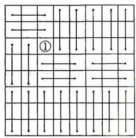  
图1

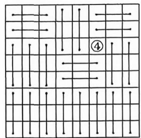  
图2

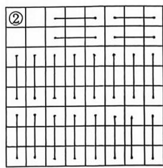  
图3

当去掉②时,除去②和②周围的3个表格外,共用去20个 $3 \times 1$ 或 $1 \times 3$ 的矩形方格进行覆盖,如图3,②周围的三个表格无法用 $3 \times 1$ 或 $1 \times 3$ 的矩形方格来覆盖,利用其他方式进行覆盖,最后始终会有“ $\square$ ”形的结构出现,从而无法用总共21个 $3 \times 1$ 或 $1 \times 3$ 的矩形方格图完全覆盖,B错误;同理可得去掉③后,无法用总共21个 $3 \times 1$ 或 $1 \times 3$ 的矩形方格图完全覆盖,C错误.故选AD.

# 巧解

方格图中①和④是对称位置,去掉①可行,那么去掉④也必然可行,推出A正确后,可直接得到D正确.

6.78 75 链接2024新课标Ⅱ卷T14从表格中每行每列各选取一个数,求所选数之和的最大值问题 甲不承担C任务,丁不承担A任务的选派方法有 $A_{5}^{5}-2A_{4}^{4}+A_{3}^{3}=78$ (种).完成五项任务后获得的效益值总和最大为 $12+25+14+10+15=76$ ,但不能同时取得,故完成五项任务后获得的效益值总和最大值小于76,当乙承担A任务,甲承担B任务,丙承担C任务,丁承担E任务,戊承担D任务时,此时效益值总和最大,为 $24+12+14+15+10=75$ .

# 多解

同上解求得完成五项任务后获得的效益值总和最大值小于76,当乙承担A任务,甲承担D任务,丙承担C任务,丁承担E任务,戊承担B任务时,此时效益值总和最大,为 $24+15+14+12+10=75$ .

# 创新考法4 动态图形探究题

1. C 链接 2020 北京卷 T13 结合平面图形中线段中点求向量的数量积 由题意可知, $\left| {\overrightarrow{OC}}\right|  = 1,\left| {\overrightarrow{OA}}\right|  = 2$ ,则 $\overrightarrow{OA} \cdot  \overrightarrow{OC} =$

$|\overrightarrow{OA}||\overrightarrow{OC}|\cos\angle COA=2\cos\angle COA.$ 因为点 A 在弧 BD 上运动, 所以 $\angle COA\in[0,\frac{5\pi}{6}]$ , 而余弦函数 $y=\cos x$ 在 $[0,\pi]$ 上单调递减,所以当 $\angle COA=\frac{5\pi}{6}$ 时, $\overrightarrow{OA}\cdot\overrightarrow{OC}$ 取得最小值,为 $2\times\cos\frac{5\pi}{6}=-\sqrt{3}$ .故选C.

# 巧解

$\angle COA \in [0, \frac{5\pi}{6}]$ , 当 $\angle COA \geqslant \frac{\pi}{2}$ 时, $\overrightarrow{OA} \cdot \overrightarrow{OC} = |\overrightarrow{OA}| |\overrightarrow{OC}| \cos \angle COA \leqslant 0$ , 排除 A, D, 当 $\angle COA = \pi$ 时, $\overrightarrow{OA} \cdot \overrightarrow{OC} = |\overrightarrow{OA}| |\overrightarrow{OC}| \cos \angle COA = -2$ , 排除 B, 故选 C.

2. D 链接教材人教 A 版《选择性必修第一册》P116 习题3.1T13 由题意知点 F 是椭圆 $\frac{x^{2}}{4} + \frac{y^{2}}{3} = 1$ 的右焦点，记 $F'(-1,0)$ 是该椭圆的左焦点，连接 $PF'$ ，如图。由 $\frac{9}{4} + \frac{9}{3} > 1$ ，知点 $D(3,3)$

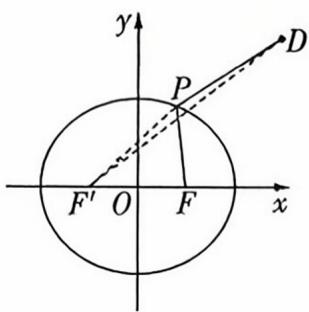

text_image

y
P
D
F'
O
F
x

在椭圆外, 又 $|PF'| + |PF| = 2 \times \sqrt{4} = 4$ , 所以 $|PF| = 4 - |PF'|$ , 则 $|PD| - |PF| = |PD| + |PF'| - 4$ , 要使 $|PD| - |PF|$ 最小, 只需 $|PD| + |PF'|$ 最小,

连接 $DF'$ , 则 $|PD| - |PF| = |PD| + |PF'| - 4 \geqslant |DF'| - 4 = 5 - 4 = 1$ , 当且仅当点 $P$ 为线段 $DF'$ 与椭圆的交点时, 等号成立, 所以 $|PD| - |PF|$ 的最小值为 1. 故选 D.

3. C 链接教材人教 A 版《必修第二册》P53 习题 6.4T11 如图, 连接 OP, 作点 P 关于直线 OA 的对称点 $P_{1}$ , 关于直线 OB 的对称点 $P_{2}$ , 连接 $P_{1}P_{2}$ , 分别交 OA, OB 于点 M, N, 连接 PM, PN, $OP_{1}$ , $OP_{2}$ , 如图所示, 则 $|PM| = |P_{1}M|$ , $|PN| =$

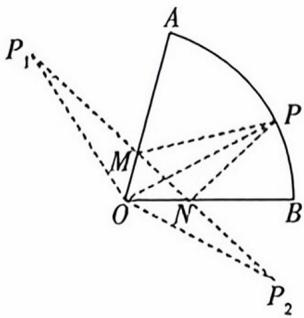

text_image

P₁
A
M
O
N
B
P₂

$|P_{2}N|$ , $|OP|=|OP_{1}|=|OP_{2}|=2$ , 此时 $\triangle PMN$ 的周长取得最小值, 其最小值为 $|P_{1}P_{2}|$ 的长度.

因为扇形 OAB 的弧长为 $\frac{2\pi}{3}$ ，半径为 2，所以 $2\angle AOB = \frac{2\pi}{3}$ ，解得 $\angle AOB_{0} = \frac{\pi}{3}$ ，根据对称性可知 $\angle P_{1}OP_{2} = \frac{2\pi}{3}$ ，在 $\triangle P_{1}OP_{2}$ 中，由余弦定理可得 $\left|P_{1}P_{2}\right|^{2} = \left|OP_{1}\right|^{2} + \left|OP_{2}\right|^{2} - 2\left|OP_{1}\right| \cdot \left|OP_{2}\right| \cdot \cos \angle P_{1}OP_{2} = 4 + 4 - 2 \times 2 \times 2 \times \cos \frac{2\pi}{3} = 12$ ，所以 $\left|P_{1}P_{2}\right| = 2\sqrt{3}$ ，即 $\triangle PMN$ 周长的最小值是 $2\sqrt{3}$ 。故选 C.

# 多解

以 O 为原点, $\overrightarrow{OB}$ 的方向为 x 轴正方向, 与 OB 垂直且向上的方向为 y 轴正方向, 建立平面直角坐标系(图略), 因为扇形 OAB 的弧长为 $\frac{2\pi}{3}$ , 半径为 2, 所以 $2\angle AOB = \frac{2\pi}{3}$ , 解得 $\angle AOB = \frac{\pi}{3}$ , 可得 OA 所在直线的方程为 $y = \sqrt{3}x$ . 因为动点 P 在圆弧上运动, 可设 $P(2\cos \theta, 2\sin \theta) (0 \leqslant \theta \leqslant \frac{\pi}{3})$ , 则点 P 关于 x 轴的对称点为 $P_{1}(2\cos \theta, -2\sin \theta)$ , 关于直线 $y = \sqrt{3}x$ 的对称点为 $P_{2}(2\cos (\frac{2\pi}{3} - \theta), 2\sin (\frac{2\pi}{3} - \theta))$ , 即 $P_{2}(\sqrt{3}\sin \theta - \cos \theta, \sin \theta + \sqrt{3}\cos \theta)$ , 连接 $P_{1}P_{2}$ , 分别交 OA, OB 于点 M, N (图略), 则 $\triangle PMN$ 周长的最小值即 $|P_{1}P_{2}|, |P_{1}P_{2}| = \sqrt{(\sqrt{3}\sin \theta - 3\cos \theta)^{2} + (3\sin \theta + \sqrt{3}\cos \theta)^{2}} = \sqrt{12} = 2\sqrt{3}$ , 即 $\triangle PMN$ 周长的最小值是 $2\sqrt{3}$ . 故选 C.

4. C 根据题意, 设经过 $t$ 秒, 第二次相遇. 点 $(- \frac{1}{2}, \frac{\sqrt{3}}{2})$ 对应的圆心角为 $\frac{2\pi}{3}$ , 则 $\left\{ \begin{array}{l} 2\alpha + 2\beta = 2\pi, \\ 2\alpha = \frac{2}{3}\pi, \end{array} \right.$ 得 $\alpha = \frac{\pi}{3}, \beta = \frac{2}{3}\pi$ . 根据题意得 $\frac{\pi}{3} \times t + \frac{2}{3}\pi \times t = 4\pi$ , 解得 $t = 4$ , 所以第二次相遇时, $P$ 走过的总路程为 $4 \times \frac{\pi}{3} \times 1 = \frac{4\pi}{3}$ . 故选 C.

# 巧解

因为 $0 < \alpha < \beta < \pi$ ，且 $P, Q$ 两点在第2秒末第一次相遇于点 $(- \frac{1}{2}, \frac{\sqrt{3}}{2})$ 处，在第二象限，那么点 $P$ 的速度比较慢，第二次相遇时不可能转过一圈，但超过三分之一圈，故选C.

5. C 如图, 作 $BM \parallel DE$ , 交 $CD$ 于 $M$ , 连接 $MG$ , 则四边形 $BEDM$ 是平行四边形, $DM = BE = AB - AE = 2\sqrt{2}$ , $CM = CD - DM = \sqrt{2}$ , 由 $BM \parallel DE, BM$

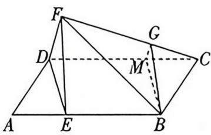

不在平面 FDE 内, DE 在平面 FDE 内, 可得 $BM \parallel$ 平面 FDE. 又 $BG \parallel$ 平面 FDE, $BM \cap BG = B$ , BM, $BG \subset$ 平面 BGM, 所以平面 $FDE \parallel$ 平面 BMG. 又平面 $FDE \cap$ 平面 FDC = FD, 平面 $BMG \cap$ 平面 FDC = MG, 所以 $MG \parallel FD$ , 因此 $\frac{CG}{CF} = \frac{CM}{CD} = \frac{1}{3}$ .

6. C 对于直线 $l_{1}:nx + my - 3m - n = 0$ ，可变形为 $n(x - 1) + m(y - 3) = 0.$ 令 $\left\{ \begin{array}{l}x - 1 = 0,\\ y - 3 = 0, \end{array} \right.$ 解得 $\left\{ \begin{array}{l}x = 1,\\ y = 3, \end{array} \right.$ 所以直线 $l_{1}$ 过定点 $A(1,3)$ .对于直线 $l_{2}:mx - ny - 3m + n = 0$ ，可变形为 $m(x-$ $3) - n(y - 1) = 0.$ 令 $\left\{ \begin{array}{l}x - 3 = 0,\\ y - 1 = 0, \end{array} \right.$ 解得 $\left\{ \begin{array}{l}x = 3,\\ y = 1, \end{array} \right.$ 所以直线 $l_{2}$ 过定点 $B(3,1)$

因为 $mn - mn = 0$ ，所以 $l_1 \perp l_2$ ，连接 $AB$ ，那么点 $M$ 的轨迹是以 $AB$ 为直径的圆。 $AB$ 的中点坐标为 $(\frac{1 + 3}{2}, \frac{3 + 1}{2})$ ，即 $(2, 2)$ ， $|AB| = \sqrt{(3 - 1)^2 + (1 - 3)^2} = \sqrt{4 + 4} = 2\sqrt{2}$ ，则点 $M$ 所在圆的半径 $r_1 = \frac{1}{2} |AB| = \sqrt{2}$ 。圆 $C: (x + 1)^2 + (y + 1)^2 = 4$ ，其圆心为 $C(-1, -1)$ ，半径 $r_2 = 2$ 。圆心 $C(-1, -1)$ 到点 $(2, 2)$ 的距离 $d = \sqrt{(2 + 1)^2 + (2 + 1)^2} = \sqrt{9 + 9} = 3\sqrt{2}$ 。所以 $|MN|_{\max} = d + r_1 + r_2 = 3\sqrt{2} + \sqrt{2} + 2 = 2 + 4\sqrt{2}$ 。故选 C.

7. $-\frac{8}{15}$ 记 $A(4,0)$ ，连接 AP，依题意知， $\frac{y}{x-4}$ 表示直线 AP 的斜率 k，即 $\frac{y}{x-4}=k$ ，得直线 AP 的方程为 $kx-y-4k=0$ ，观察题中图形知，当 AP 与半圆 $x^{2}+(y-1)^{2}=1(x\geqslant0)$ 相切于第一象限时，k 最小，此时 $k<0,\frac{|-1-4k|}{\sqrt{k^{2}+1}}=1$ ，解得 $k=-\frac{8}{15}$ ，所以 $\frac{y}{x-4}$ 的最小值为 $-\frac{8}{15}$ .

# 多解

记 $A(4,0), O_1(0,1)$ , 连接 $O_1A, AP$ , 如图, 依题意知, $\frac{y}{x - 4}$ 表示直线 $AP$ 的斜率 $k$ , 当 $AP$ 与半圆 $O_1: x^2 +$

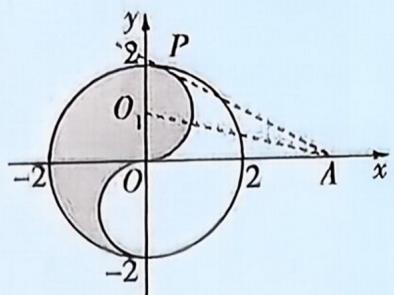

text_image

y
2
P
O₁
-2
O
2
A
x
-2

$(y - 1)^{2} = 1 (x \geqslant 0)$ 相切于第一象限时, $k$ 最小, 此时 $\angle OAO_{1} = \frac{1}{2} \angle OAP$ , 易知 $\tan \angle OAO_{1} = \frac{|OO_{1}|}{|OA|} = \frac{1}{4}$ , 所以 $\tan \angle OAP = \tan 2 \angle OAO_{1} = \frac{2\tan\angle OAO_{1}}{1 - \tan^{2}\angle OAO_{1}} = \frac{2\times\frac{1}{4}}{1 - (\frac{1}{4})^{2}} = \frac{8}{15}$ , 所以 $k_{\min} = \tan (\pi - \angle OAP) = -\tan \angle OAP = -\frac{8}{15}$ , 所以 $\frac{y}{x - 4}$ 的最小值为 $-\frac{8}{15}$ .

8.2 如图, 取 $B_{1}C_{1}$ 的中点 $D, BB_{1}$ 的中点 $E$ , 连接 $MD, DE, ME$ , 则 $DE \parallel BC_{1}, \because DE \not\subset$ 平面 $ABC_{1}, BC_{1} \subset$ 平面 $ABC_{1}, \therefore DE \parallel$

平面 $ABC_{1}, \because M$ 为 $A_{1}C_{1}$ 的中点, $\therefore MD \parallel A_{1}B_{1} \parallel AB$ , $\because MD \not\subset$ 平面 $ABC_{1}, AB \subset$ 平面 $ABC_{1}, \therefore MD \parallel$ 平面 $ABC_{1}$ . $\because DE \cap MD = D$ , $DE \subset$ 平面 $DEM, MD \subset$ 平面 $DEM$ , $\therefore$ 平面 $DEM \parallel$ 平面 $ABC_{1}, \because N$ 是侧面 $BCC_{1}B_{1}$ 上一

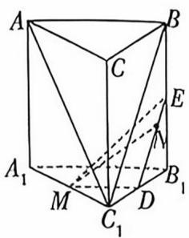

点, 且 $MN \parallel$ 平面 $ABC_{1}, \therefore N$ 的轨迹为线段 $DE$ , 由 $DE = \frac{1}{2} BC_{1} = \frac{1}{2}\sqrt{2^{2} + (2\sqrt{3})^{2}} = 2$ , 得点 $N$ 的轨迹的长度为 2.

9. $\frac{15}{4}$ 由 $\left\{ \begin{array}{l} x^2 = \frac{1}{2} y, \\ y = 2(x - 4), \end{array} \right.$ 得 $x^{2} - x + 4 = 0, \Delta = (-1)^{2} - 16 < 0,$

则 l 与 C 无交点, 过 P 作 $PN \parallel x$ 轴交 l 于 N, 过 Q 作 $QE \perp PN$ 交 PN 于 E, 则 $d(P, Q) = |PE| + |EQ| \geqslant |PE| + |EN| = |PN|$ , 设 $P(n, 2n^{2})$ , $N(n^{2} + 4, 2n^{2})$ , 则 $|PN| = n^{2} - n + 4 = (n - \frac{1}{2})^{2} + \frac{15}{4} \geqslant \frac{15}{4}$ , 当且仅当 $n = \frac{1}{2}$ 时取等号, 所以 $d(P, Q)$ 的最小值为 $\frac{15}{4}$ .

# 创新考法5 创新设问开放题

1. $\frac{1}{2} + \frac{\sqrt{3}}{2}\mathrm{i}$ (答案不唯一) 设 $z = a + b\mathrm{i}(a, b \in \mathbf{R})$ ，则 $|z| = \sqrt{a^2 + b^2} = 1$ ，所以 $a^2 + b^2 = 1$ . $z^2 = (a + b\mathrm{i})^2 = a^2 - b^2 + 2ab\mathrm{i}$ ，由题意知 $a^2 - b^2 < 0$ ，则 $a^2 < b^2$ 。不妨取 $a^2 = \frac{1}{4}, b^2 = \frac{3}{4}$ ，则可取 $a = \frac{1}{2}, b = \frac{\sqrt{3}}{2}$ ，所以满足条件的一个复数 $z$ 为 $\frac{1}{2} + \frac{\sqrt{3}}{2}\mathrm{i}$ 。

2. $\frac{\cos 30^{\circ}}{\sin 75^{\circ}} + \frac{\cos 60^{\circ}}{\sin 105^{\circ}} = \sqrt{2}$ (答案不唯一) 链接教材人教 A 版《必修第一册》P230 习题 5.5T18 观察式子规律可总结出一般规律: $\frac{\cos \alpha}{\sin \beta} + \frac{\cos (90^{\circ} - \alpha)}{\sin (180^{\circ} - \beta)} = \sqrt{2}$ , 且 $\beta - \alpha = 45^{\circ}$ , 可赋值 $\alpha = 30^{\circ}, \beta = 75^{\circ}$ , 故可填 $\frac{\cos 30^{\circ}}{\sin 75^{\circ}} + \frac{\cos 60^{\circ}}{\sin 105^{\circ}} = \sqrt{2}$ .

3. $y = x$ (答案不唯一) 由题知, 抛物线 $y^{2} = 4x$ 的准线为 $l: x = -1$ , 因为线段 $AB$ 的中点到抛物线的准线的距离为 3 , 所以可设线段 $AB$ 的中点为 $M(2, y_{0})$ . 易知直线 $AB$ 的斜率不为 0 , 设直线 $AB$ 的方程为 $x = ky + b (k \neq 0)$ , 代入 $y^{2} = 4x$ , 整理得 $y^{2} - 4ky - 4b = 0, \Delta = 16k^{2} + 16b > 0$ , 所以 $4k = 2y_{0} = \frac{2(2 - b)}{k}$ , 所以 $b = 2 - 2k^{2}$ , 所以直线 $AB$ 的方程为 $x = ky + 2 - 2k^{2} (k \neq 0)$ , 令 $k = 1$ , 得直线 $AB$ 的方程为 $x = y$ , 满足题意. 故可填 $y = x$ .

# 速解

易知当直线 AB 的斜率不存在时, x = 2 符合题意, 故可填 x = 2.

4 $\frac{5\pi}{12}$ (答案不唯一) $f(x) = \sin (2x - \frac{\pi}{3})$ ，根据题意得 $g(x) = \sin [2(x + \varphi) - \frac{\pi}{3}] = \sin (2x + 2\varphi - \frac{\pi}{3})$ ，所以 $F(x) = \sin (2x - \frac{\pi}{3}) + \sin (2x + 2\varphi - \frac{\pi}{3}) = \sin (2x - \frac{\pi}{3} + \varphi - \varphi) + \sin (2x - \frac{\pi}{3} + \varphi + \varphi) = 2\sin (2x - \frac{\pi}{3} + \varphi)\cos \varphi$ ，函数 $F(x)$ 的

最大值是一个小于1的正数,则当 $0<2|\cos\varphi|<1$ 时,满足题意.故可填 $\varphi=\frac{5\pi}{12}$ .

5. $\frac{\pi}{4}$ (答案不唯一) 由题知 $C$ 的圆心坐标为 $(\cos \theta, \sin \theta)$ , 半径为 $r = 2$ . 易知 $\triangle ABC$ 是等腰三角形, 所以其面积 $S = \frac{1}{2} \times 2^2 \times \sin \angle ACB = 2\sin \angle ACB$ , 则当且仅当 $\angle ACB = \frac{\pi}{2}$ 时, $\triangle ABC$ 面积最大, 此时圆心 $C$ 到直线 $l$ 的距离为 $\sqrt{2}$ , 即 $\frac{|\cos \theta - \sin \theta + 2|}{\sqrt{1^2 + (-1)^2}} = \frac{|\cos \theta - \sin \theta + 2|}{\sqrt{2}} = \sqrt{2}$ , 即 $\cos \theta - \sin \theta = 0$ , 得 $\theta = \frac{\pi}{4} + k\pi (k \in \mathbf{Z})$ , 任选一个值填写即可, 如 $\theta = \frac{\pi}{4}$ .

6. $q = 3$ (或 $q = -2$ , 答案不唯一) 链接教材人教 A 版《选择性必修第二册》P41 习题 4.3T5 $12a_{2}, a_{4}, 2a_{3}$ 成等差数列, 则 $2a_{4} = 12a_{2} + 2a_{3}$ , 即 $q^{2} = 6 + q$ , 解得 $q = 3$ 或 $q = -2$ , 故 “ $12a_{2}, a_{4}, 2a_{3}$ 成等差数列”的一个充分非必要条件是 $q = 3$ .

7. $\sin \frac{\pi x}{2}$ (答案不唯一) 根据题意, 不妨取 $f(x) = \sin \frac{\pi x}{2}$ , 易知其定义域为 $\mathbf{R}$ .

$$
\begin{array}{r l} & {f (x + y) = \sin {\frac {\pi (x + y)}{2}} = \sin {\left({\frac {\pi x}{2}} + {\frac {\pi y}{2}}\right)} = \sin {\frac {\pi x}{2}} \cos {\frac {\pi y}{2}} +} \\ & {\cos {\frac {\pi x}{2}} \sin {\frac {\pi y}{2}} = \sin {\frac {\pi x}{2}} \sin {\left({\frac {\pi}{2}} - {\frac {\pi y}{2}}\right)} + \sin {\left({\frac {\pi}{2}} - {\frac {\pi x}{2}}\right)} \sin {\frac {\pi y}{2}} =} \\ & {f (x) f (1 - y) + f (1 - x) f (y), \text {满足} ①.} \end{array}
$$

$f(-x)=\sin(-\frac{\pi}{2}x)=-\sin\frac{\pi x}{2}=-f(x)$ ，所以 $f(x)$ 为奇函数，满足②.

8. $(-1)^{n+1}+1$ (答案不唯一) 假设 $a_{n}=(-1)^{n}+1$ , 则 $a_{1}=0$ , $a_{2}=2$ , 不符合题意, 假设 $a_{n}=(-1)^{n+1}+1$ , 则 $a_{1}=2$ , $a_{2}=0$ , …, 符合题意, 故可填 $(-1)^{n+1}+1$ .

# 多解

# 考虑通项含三角函数!

考虑正弦函数, 假设 $a_{n} = \sin \left(n \pi + \frac{\pi}{2}\right) + 1$ , 则 $a_{1} = 0, a_{2} = 2$ , 不符合题意, 假设 $a_{n} = \sin \left[(n + 1) \pi + \frac{\pi}{2}\right] + 1$ , 则 $a_{1} = 2, a_{2} = 0, \cdots$ , 符合题意, 又 $\sin \left[(n + 1) \pi + \frac{\pi}{2}\right] + 1 = \sin \left(n \pi + \frac{3 \pi}{2}\right) + 1 = \cos (n + 1) \pi + 1$ , 所以可填 $\sin \left(n \pi + \frac{3 \pi}{2}\right) + 1$ 或 $\cos (n + 1) \pi + 1$ .

9.9(答案不唯一) 由余弦定理可得 $a = \sqrt{b^2 + c^2 - 2bc\cos A} = \sqrt{25 - 24\cos A}$ , 角 $A$ 为锐角, 则 $\cos A \in (0,1)$ , 可得 $a = \sqrt{25 - 24\cos A} \in (1,5)$ , 所以 $\triangle ABC$ 的周长为 $a + b + c = a + 7 \in (8,12)$ . 故可填9(答案不唯一, (8,12)内的任何一个值均可).

# 速解

取 $\triangle ABC$ 为直角三角形, 其中 $\angle C = 90^{\circ}$ , 则 $a = \sqrt{c^{2} - b^{2}} = \sqrt{7}$ , 所以周长为 $7 + \sqrt{7}$ .

10. $\cos x$ (答案不唯一) 令 $x = 0$ , 则 $f(y) + f(-y) = 2f(0) \cdot f(y)$ , 因为 $f(0) = 1$ , 所以 $f(y) + f(-y) = 2f(y)$ , 即 $f(-y) = f(y)$ , 所以函数 $f(x)$ 为偶函数, 取 $f(x) = \cos x$ , 则 $\cos (x + y) + \cos (x - y) = 2\cos x\cos y, f(0) = 1$ , 满足题意.

# 速解

由 $\varphi > 0$ 可知 $\varphi$ 的值可以为 $\frac{5\pi}{12}$ (答案不唯一, 写出一个满足条件的值即可).

12. ②③(答案不唯一) ①体积为 $V_{1} = 16^{3} = 4096$ , ②体积为 $V_{2} = \frac{1}{3} \times \frac{\sqrt{3}}{4} \times 24^{2} \times 24\sqrt{3} = 3456$ , 所以 $V_{1} - V_{2} = 640 > 600$ , 不满足要求. ③体积为 $V_{3} = \frac{1}{3}(20^{2} + 24^{2} + 20 \times 24) \times 6 = 2912$ , 所以 $V_{2} - V_{3} = 544 < 600$ , 满足要求. 故填②③.

# 多解

$$
V _ {4} = \frac {\pi}{3} \times 2 0 ^ {2} \times \frac {2 4}{\pi} = 3 2 0 0, V _ {5} = \frac {\pi}{3} (2 0 ^ {2} + 2 4 ^ {2} +
$$

$$
2 0 \times 2 4) \times \frac {6}{\pi} = 2 9 1 2, V _ {6} = \frac {4 \pi}{3} \times (\frac {1 2}{\sqrt [ 3 ]{\pi}}) ^ {3} = 2 3 0 4, V _ {3} -
$$

$$
V _ {6} = 6 0 8 > 6 0 0, V _ {4} - V _ {3} = 2 8 8 <   6 0 0, V _ {2} - V _ {4} = 2 5 6 <   6 0 0,
$$

$$
\begin{array}{r l} & {V _ {1} - V _ {2} = 6 4 0 > 6 0 0, \text {进而可得满足条件的组合为} ③ ⑤,} \\ & {③ ④, ④ ⑤, ② ③, ② ④, ② ⑤.} \end{array}
$$

13. 椭圆 $x^{2} + y^{2} = \frac{2n^{2} - m^{2}}{4}$ (答案不唯一)

链接教材人教 B 版《选择性必修第一册》P134 拓展阅读 平面 $\alpha$ 与圆柱相交,且平面 $\alpha$ 与圆柱的轴不垂直,则截面为椭圆,所以点 P 的轨迹.

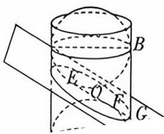

$\varphi = \frac{2\pi\pi}{4} + \frac{\pi}{4}(k \in \mathbf{Z})$ , 得 $\varphi = \frac{\pi}{12} + 2k\pi (k \in \mathbf{Z})$ 或 $\varphi = 2k\pi - \frac{\pi}{12} (k \in \mathbf{Z})$ .

当 $\omega = -4$ 时， $\sin \left[\frac{\pi}{12} \times (-4) + \varphi\right] = \sin \left(-\frac{\pi}{3} + \varphi\right) = \frac{\sqrt{2}}{2}$ ，则 $-\frac{\pi}{3} + \varphi = 2k\pi + \frac{3\pi}{4} (k \in \mathbf{Z})$ 或 $-\frac{\pi}{3} + \varphi = 2k\pi + \frac{\pi}{4} (k \in \mathbf{Z})$ ，得 $\varphi = \frac{13\pi}{12} + 2k\pi (k \in \mathbf{Z})$ 或 $\varphi = 2k\pi + \frac{7\pi}{12} (k \in \mathbf{Z})$ 。

$$
\frac {1}{4} =
$$

$$
\left. \text {、} \mathcal {J} _ {0} - x _ {0} k\right) \rfloor^ {2} - 4 \cdot \left(n ^ {2} - m ^ {2} + k ^ {2} n ^ {2}\right) \left[ n ^ {2} \left(k x _ {0} - \right. \right.
$$

$y_{0})^{2}-\frac{n^{2}(n^{2}-m^{2})}{4}$ ]=0,化简得关于k的方程 $(4x_{0}^{2}-n^{2})k^{2}-8x_{0}y_{0}k+4y_{0}^{2}-n^{2}+m^{2}=0$ ,故 $k_{AM},k_{AN}$ 是方程的两个根,所以 $k_{AM}k_{AN}=\frac{4y_{0}^{2}-n^{2}+m^{2}}{4x_{0}^{2}-n^{2}}=-1$ ,则 $x_{0}^{2}+y_{0}^{2}=\frac{2n^{2}-m^{2}}{4}$ .
当一条切线斜率不存在,一条切线斜率为0时,易知点A的坐标也满足 $x_{0}^{2}+y_{0}^{2}=\frac{2n^{2}-m^{2}}{4}$ .所以动点A的轨迹方程为 $x^{2}+y^{2}=\frac{2n^{2}-m^{2}}{4}$ .

# 创新考法6

# 跨学科交叉题

1. D 链接2024北京卷T7对数函数模型求比例关系 令北极星与牛郎星的亮度分别为 $I_{1}, I_{2}$ , 依题意, $\left\{ \begin{array}{l} 2 = -\frac{5}{2} \lg \frac{I_{1}}{I_{0}}, \\ 0.8 = -\frac{5}{2} \lg \frac{I_{2}}{I_{0}}, \end{array} \right.$ 两式相减得 $-\frac{5}{2} \lg \frac{I_{1}}{I_{2}} = \frac{6}{5}$ , 得 $\frac{I_{1}}{I_{2}} = 10^{-\frac{12}{25}}$ . 故选D.

2. D A 选项, 由正态分布曲线的对称性可知 $P(\xi \leqslant 7) = P(\xi \geqslant 9) = 0.2$ , 故 $P(7 < \xi < 9) = 1 - 0.2 \times 2 = 0.6$ , A 错误. B 选项, $X \sim B(3,0.6)$ , 故 $E(X) = 3 \times 0.6 = 1.8$ , B 错误. C 选项, $E(\xi) = 8$ , $E(5X) = 5E(X) = 5 \times 1.8 = 9$ , 故 $E(\xi) < E(5X)$ , C 错误. D 选项, 因为 $X \sim B(3,0.6)$ , 所以 $P(X \geqslant 1) = C_3^1 \times 0.6 \times 0.4^2 + C_3^2 \times 0.6^2 \times 0.4 + C_3^3 \times 0.6^3 = 0.936 > 0.9$ , D 正确. 故选 D.

3. C 由向量 $s_A = (4,3), s_B = (2,10)$ , 可得 $s = \overrightarrow{AB} = s_B - s_A = (2,10) - (4,3) = (-2,7), s$ 在 $s_A$ 上的投影向量为 $\frac{s \cdot s_A}{|s_A|} \cdot \frac{s_A}{|s_A|}$ , 其坐标表示为 $(\frac{52}{25}, \frac{39}{25})$ . 故选 C.

4. A 由题意知半圆 C 的圆心为 $(4,0)$ ，半径为 1，反射前光线所在直线方程为 $y = k(x - 1)$ .

①当光线不发生反射时,光线所在直线的斜率 $k \in (0,1]$ , 若此时光线与半圆 C 无交点, 则半圆圆心 $(4,0)$ 到光线所在直线的距离 $d = \frac{|4k - k|}{\sqrt{k^{2} + 1}} > 1$ , 解得 $k > \frac{\sqrt{2}}{4}$ , 即 $k \in (\frac{\sqrt{2}}{4}, 1]$ .

②当光线只发生一次反射时,反射光线不与 x 轴非负半轴相交,由 $\left\{\begin{aligned}y&=k(x-1),\\ y&=x\end{aligned}\right.$ 得 $\left\{\begin{aligned}x&=\frac{k}{k-1},\\ y&=\frac{k}{k-1},\end{aligned}\right.$ 则反射光线所在直线方程

为 $y-\frac{k}{k-1}=\frac{1}{k}(x-\frac{k}{k-1})$ ，即 $y=\frac{1}{k}x+1$ ，所以 $0<\frac{1}{k}<1$ ，解得k>1.

令半圆圆心(4,0)到反射光线所在直线的距离 $d_{1} = \frac{|4 + k|}{\sqrt{1 + k^{2}}} >$

1, 解得 $k > -\frac{15}{8}$ ，又 k > 1，所以此时要使光线与半圆 C 没有交点，则 $k \in (1, +\infty)$ .

③当光线发生两次反射时, 讨论如下. 当 $k \neq -1$ 时, 第一次反射后光线所在直线与 $x$ 轴非负半轴有交点, 交点为 $(-k, 0)$ , 则第二次反射后光线所在直线方程为 $y = -\frac{1}{k} (x + k) = -\frac{1}{k} x - 1$ , 所以 $0 < -\frac{1}{k} < 1$ , 解得 $k < -1$ . 令半圆圆心 $(4, 0)$ 到第二次反射光线的距离 $d_{2} = \frac{|4 + k|}{\sqrt{1 + k^{2}}} > 1$ , 得 $k > -\frac{15}{8}$ , 故此时要使光线与半圆 $C$ 无交点, 则 $k \in (-\frac{15}{8}, -1)$ .

当 k = -1 时, 易知第一次反射后光线过点 A, 第二次反射后光线所在直线方程为 y = x - 1, 与半圆 C 没有交点.

综上, $k\in(-\frac{15}{8},-1]$ .

④当光线发生三次反射时，由 $\left\{\begin{aligned}y&=-\frac{1}{k}x-1,\\ y&=x,\end{aligned}\right.$ 得

$\left\{ \begin{array}{l} x = -\frac{k}{k + 1}, \\ y = -\frac{k}{k + 1}, \end{array} \right.$ 则第三次反射光线所在直线方程为 $y + \frac{k}{k + 1} = -k(x + \frac{k}{k + 1})$ ，即 $y = -kx - k$ ，所以 $0 < -k < 1$ ，即 $-1 < k < 0$ .

令半圆圆心(4,0)到第三次反射光线的距离 $d_{3}=\frac{|4k+k|}{\sqrt{1+k^{2}}}>1$ ，得 $k<-\frac{\sqrt{6}}{12}$ ，故此时要使光线与半圆C无交点，则 $k\in(-1,-\frac{\sqrt{6}}{12})$ .

综上， $k$ 的取值范围为 $(- \frac{15}{8}, -\frac{\sqrt{6}}{12}) \cup (\frac{\sqrt{2}}{4}, +\infty)$ . 故选A.

# 多解

由物理中的光学性质,可将原问题等效处理为光线进入了“镜子后的空间”,因此问题就转化为光线如何与镜子内外

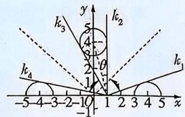

text_image

k₃
y
k₂
5
4
θ
2
1
k₁
k₄
-5 4 -3 -2 -10 1 2 3 4 5 x

的圆没有交点，“镜子后”的半圆方程依次为 $x^{2}+(y-4)^{2}=1(x\geqslant0)$ , $x^{2}+(y-4)^{2}=1(x<0)$ , $(x+4)^{2}+y^{2}=1(y\geqslant0)$ ，如图，由此根据光线未发生反射前所在直线与上述半圆相切时 k 的临界值即可求解.

5. ABC 对于 A, 由题意得双曲线中的 $a^2 = \sqrt{5} - 2, b^2 = 1$ , 则 $c^2 = a^2 + b^2 = \sqrt{5} - 1$ , 由于椭圆与双曲线共焦点, 则椭圆的焦点在 $y$ 轴上, 又短半轴长为 $\sqrt{2}$ , 记椭圆离心率为 $e$ , 所以 $e^2 = \frac{\sqrt{5} - 1}{\sqrt{5} - 1 + (\sqrt{2})^2} = \frac{(\sqrt{5} - 1)^2}{4}$ , 又 $0 < e < 1$ , 所以 $e = \frac{\sqrt{5} - 1}{2}$ , 故椭圆是“黄金椭圆”, 故 A 正确; 对于 B, $b^2 = ac$ , 即 $a^2 - c^2 = ac$ , 故 $e^2 + e - 1 = 0$ , 解得 $e = \frac{\sqrt{5} - 1}{2}$ 或 $e = \frac{-\sqrt{5} - 1}{2}$ (舍去), 故该椭圆是“黄金椭圆”, 故 B 正确; 对于 C, 由 $\angle ABF = 90^\circ$ , 得 $(a + c)^2 = a^2 + b^2 + b^2 + c^2$ , 化简可知 $e^2 + e - 1 = 0$ , 解得 $e = \frac{\sqrt{5} - 1}{2}$ 或 $e = \frac{-\sqrt{5} - 1}{2}$ (舍去), 故该椭圆是“黄金椭圆”, 故 C 正确; 对于 D, 由 $|F_1 F_2|^2 = |AF_1| \cdot |F_1 B|$ , 得 $(2c)^2 = (a - c)(a + c)$ , 则 $e = \frac{\sqrt{5}}{5}$ (负值舍去), 故该椭圆不是“黄金椭圆”, 故 D 错误.

# [无法识别]

对于 A, 由于椭圆与双曲线共焦点, 则椭圆的焦点在 y 轴上, 且椭圆方程可以表示为 $\frac{x^{2}}{-1+\lambda} + \frac{y^{2}}{\sqrt{5}-2+\lambda} = 1$ , 其中 $\lambda > 1$ , 由于椭圆的短半轴长为 $\sqrt{2}$ , 所以 $-1 + \lambda = 2$ , 即 $\lambda = 3$ , 所以椭圆方程为 $\frac{x^{2}}{2} + \frac{y^{2}}{\sqrt{5} + 1} = 1$ , 则 $e = \frac{\sqrt{5} - 1}{2}$ , 故 A 正确.

6.11 因为 $2\sqrt{\frac{2}{3}} = \sqrt{2\frac{2}{3}}, 3\sqrt{\frac{3}{8}} = \sqrt{3\frac{3}{8}}, 4\sqrt{\frac{4}{15}} = \sqrt{4\frac{4}{15}}, 5\sqrt{\frac{5}{24}} = \sqrt{5\frac{5}{24}}, \cdots$ ，所以按照以上规律可得，甲 $\sqrt{\frac{甲}{甲^{2}-1}} = \sqrt{甲\frac{甲}{甲^{2}-1}}$ （甲 $\geqslant 2, 甲 \in N^{*}$ ），令甲 $^{2} = 121$ ，可得甲 = 11，故填 11.

7.0.30 2.2 由本福特定律知,在一组十进制数据中,一个多位数的首位数字是1的概率为 $\log_{10}\frac{1+1}{1}=\lg 2=1-\lg 5\approx0.30$ .十进制中,一个多位数的首位数字是2的概率为 $\lg \frac{3}{2}=\lg 3-\lg 2=\lg 3-(1-\lg 5)\approx0.176$ ,一个多位数的首位数字是5的概率为 $\lg \frac{6}{5}=\lg 3+1-2\lg 5\approx0.079$ ,则 $\frac{0.176}{0.079}\approx2.2$ .

8. $\frac{\sqrt{10}}{2}$ 链接教材人教 A 版《选择性必修第一册》P140 阅读与思考 由双曲线的光学性质可知, 直线 $PG, HG$ 的交点 $M$ 为双曲线的左焦点, 在 $\triangle PQM$ 中, 由正弦定理得 $\frac{|MP|}{\sin \angle MQP} =$

$\frac{|MQ|}{\sin\angle MPQ}$ , 则 $\frac{|MP|}{|MQ|} = \frac{\sin\angle MQP}{\sin\angle MPQ} = \frac{5}{3}$ , 设 $|MP| = 5m$ , 则 $|MQ| = 3m$ , 在 $\triangle MPF_2$ 中, 由正弦定理得 $\frac{|PF_2|}{\sin\angle PMF_2} = \frac{|MF_2|}{\sin\angle MPF_2}$ , 在 $\triangle MQF_2$ 中, 由正弦定理得 $\frac{|QF_2|}{\sin\angle QMF_2} = \frac{|MF_2|}{\sin\angle MQF_2}$ , 两式作商得 $\frac{|PF_2|}{|QF_2|} = \frac{\sin\angle PMF_2}{\sin\angle MPF_2} \cdot \frac{\sin\angle MQF_2}{\sin\angle QMF_2} = \frac{9}{5} \times \frac{5}{3} = 3$ , 设 $|PF_2| = 3n$ , 则 $|QF_2| = n$ , 由双曲线的定义可知, $|MP| = -$

$|PF_{2}|=5m-3n=2a,|MQ|-|QF_{2}|=3m-n=2a$ , 解得 m=n=a, 则 $|QF_{2}|=a,|PF_{2}|=3a,|MP|=5a,|MQ|=3a$ , 所以 $|PQ|=4a$ , 则 $|MP|^{2}=|MQ|^{2}+|PQ|^{2}$ , 即 $PQ\perp MQ$ .

在 Rt△QMF₂ 中，|MQ|² + |QF₂|² = |MF₂|²，则(3a)² + a² = (2c)²，则5a² = 2c²，即 $\frac{c^2}{a^2} = \frac{5}{2}$ ，所以双曲线的离心率为 e = $\frac{c}{a} = \frac{\sqrt{10}}{2}$ .

# 创新考法7 “多想少算”创新思维题

1. B 链接2024全国甲卷T21通过必要性探路,以猜促解直接得参数范围 切线法 $f(x) = x \ln x$ , 则 $f'(x) = \ln x + 1$ , 令 $f'(x) = 0$ , 解得 $x = \frac{1}{e}$ , 所以在 $(0, \frac{1}{e})$ 上, $f'(x) < 0$ , $f(x)$ 单调递减, 在 $(\frac{1}{e}, +\infty)$ 上, $f'(x) > 0$ , $f(x)$ 单调递增.

把 $y=f(x)$ 的图象向左平移 1 个单位长度后得到函数 $y=f(x+1)$ 的图象, 如图, 因为函数 $y=f(x+1)$ 的图象在 $(0,0)$ 处的切线方程为 y=x, 所以 $a \leqslant 1$ , 所以实数 a 的取值范围为 $(-∞,1]$ .

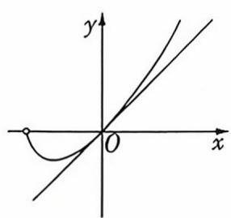

# 巧解

# 端点效应法!

令 $g(x) = f(x + 1) - ax = (x + 1)\ln (x + 1) - ax(x\geqslant 0)$ ，则 $g^{\prime}(x) = \ln (x + 1) + 1 - a,$ 因为 $g(0) = 0$ 所以必有 $g^{\prime}(0) = 1 - a\geqslant 0$ ，所以 $a\leqslant 1$

当 $a \leqslant 1$ 时, $g'(x) = \ln (x + 1) + 1 - a \geqslant 0$ , 所以 $g(x)$ 在 $[0, +\infty)$ 上单调递增, 所以 $g(x) \geqslant g(0) = 0$ , 综上所述, 实数 $a$ 的取值范围为 $(- \infty, 1]$ . 故选 B.

2. C 链接教材人教 A 版《必修第一册》P58 复习参考题 2T5

由题设可得 $\ln (xy) = \frac{x}{2} + 2y - 2 \geqslant 2\sqrt{xy} - 2$ （当且仅当 $x = 4y$ 时取等号），即 $\ln (xy) \geqslant 2\sqrt{xy} - 2$ ，由于 $x, y$ 均为正实数，所以 $\ln \sqrt{xy} \geqslant \sqrt{xy} - 1$ ，设 $m(x) = \ln x - x + 1$ ，则当 $x > 1$ 时， $m'(x) = \frac{1}{x} - 1 < 0, m(x)$ 在 $(1, +\infty)$ 上单调递减，当 $0 < x < 1$ 时， $m'(x) > 0, m(x)$ 在 $(0, 1)$ 上单调递增，故 $m(x) \leqslant m(1) = 0$ ，即 $\ln x \leqslant x - 1$ ，当且仅当 $x = 1$ 时取等号，因此 $\ln \sqrt{xy} \leqslant \sqrt{xy} - 1$ ，故 $\ln \sqrt{xy} = \sqrt{xy} - 1$ ，则 $\sqrt{xy} = 1$ ，故 $\left\{ \begin{array}{l} x = 4y, \\ \sqrt{xy} = 1, \end{array} \right.$ 解得 $\left\{ \begin{array}{l} x = 2, \\ y = \frac{1}{2}, \end{array} \right.$ 所以 $y^x = \frac{1}{4}$ ，故选C.

# 巧解

# 以猜促解法!

由 $\frac{x}{2} + 2y - 2 = \ln x + \ln y$ ，得 $\frac{x}{2} + 2y - 2 = \ln (xy)$ ，观察结论可以猜想 $xy = 1$ 或 $xy = e^n$ ，若 $xy = 1$ ，则有 $\left\{ \begin{array}{l} xy = 1, \\ \frac{x}{2} + 2y - 2 = 0, \end{array} \right.$ 可得 $\left\{ \begin{array}{l} x = 2, \\ y = \frac{1}{2}, \end{array} \right.$ 所以 $y^x = \frac{1}{4}$ ，故选 C.

3. B 设 $f(x) = x - \sin x, x \in (0,1)$ ，则 $f'(x) = 1 - \cos x > 0$ ，所以 $f(x)$ 在 $(0,1)$ 上单调递增，所以 $f(\frac{1}{5}) > 0 - \sin 0 = 0$ ，即 $\frac{1}{5} > \sin \frac{1}{5}$ ，所以 $b = \ln(1 + \sin \frac{1}{5}) < \ln(1 + \frac{1}{5})$ .

设 $g(x) = x - \ln (x + 1), x \in (0,1)$ ，则 $g'(x) = 1 - \frac{1}{x + 1} = \frac{x}{x + 1} > 0$ ，所以 $g(x) = x - \ln (x + 1)$ 在 $(0,1)$ 上单调递增，所以 $g(\frac{1}{5}) > 0 - \ln (0 + 1) = 0$ ，即 $\frac{1}{5} > \ln (1 + \frac{1}{5}) > \ln (1 + \sin \frac{1}{5})$ ，所以 $a > b$ .

设 $h(x) = \mathrm{e}^{x - 1} - x(x > 0)$ , 则 $h'(x) = \mathrm{e}^{x - 1} - 1 < 0$ 在 $(0,1)$ 上恒成立, 故 $h(x)$ 在 $(0,1)$ 上单调递减, 所以 $h(\frac{1}{5}) > \mathrm{e}^{1 - 1} - 1 = 0$ , 即 $\mathrm{e}^{-\frac{4}{5}} > \frac{1}{5}$ , 所以 $c = \mathrm{e}^{-\frac{4}{5}} > a$ . 故 $c > a > b$ . 故选 B.

# 巧解

# 利用超越不等式结论!

由指数型超越不等式 $e^x \geqslant x + 1$ 可得 $c = e^{-\frac{4}{5}} > -\frac{4}{5} + 1 = \frac{1}{5}$ . 由三角型超越不等式 $\sin x < x (0 < x < \frac{\pi}{2})$ 可得 $\ln (1 + \sin \frac{1}{5}) < \ln (1 + \frac{1}{5})$ , 由对数型超越不等式 $\ln (x + 1) \leqslant x$ 可得 $\ln (1 + \frac{1}{5}) < \frac{1}{5}$ , 所以 $b < \frac{1}{5}$ . 又 $a = \frac{1}{5}$ , 所以 $b < a < c$ . 故选 B.

4. A 链接教材人教 A 版《选择性必修第一册》P88 习题 2.4T5 连接 $O_{1}M, O_{1}A, O_{1}B$ , 如图, 则 $O_{1}A \perp MA, O_{1}B \perp MB$ , 则 $M, A, O_{1}, B$ 四点共圆, 圆的直径是 $MO_{1}, M(0, 1)$ , $O_{1}(2, 2)$ , $|MO_{1}| =$

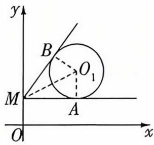

text_image

y
B
O₁
M
A
O
x

$\sqrt{2^{2}+(2-1)^{2}}=\sqrt{5},MO_{1}$ 的中点坐标为 $(1,\frac{3}{2})$ ，所以四边形 $MAO_{1}B$ 的外接圆的方程为 $(x-1)^{2}+(y-\frac{3}{2})^{2}=\frac{5}{4}$ ，即 $x^{2}+y^{2}-2x-3y+2=0$ ，又圆 $O_{1}:x^{2}+y^{2}-4x-4y+7=0$ ，两式相减得直线 AB 的方程为 $2x+y-5=0$ ，则原点到直线 $2x+y-5=0$ 的距离 $d=\frac{|-5|}{\sqrt{2^{2}+1^{2}}}=\sqrt{5}$ 。故选 A.

# 巧解

过点 $M(0,1)$ 作圆 $O_{1}:(x-2)^{2}+(y-2)^{2}=1$ 的两条切线，切点分别为 $A(x_{1},y_{1}), B(x_{2},y_{2})$ ，则圆的切线方程分别为 $(x-2)(x_{1}-2)+(y-2)(y_{1}-2)=1$ 与 $(x-2)\cdot(x_{2}-2)+(y-2)(y_{2}-2)=1$ ，又切线过点 $M(0,1)$ ，则有 $(-2)(x_{1}-2)+(1-2)(y_{1}-2)=1$ 与 $(-2)(x_{2}-2)+(1-2)(y_{2}-2)=1$ ，整理得 $\left\{\begin{aligned}&2x_{1}+y_{1}-5=0,\\ &2x_{2}+y_{2}-5=0,\end{aligned}\right.$ 则弦 AB 所在的直线方程为 $2x+y-5=0$ ，则原点到直线 $2x+y-5=0$ 的距离 $d=\frac{|-5|}{\sqrt{2^{2}+1^{2}}}=\sqrt{5}$ 。故选 A.

5. B 由 $\frac{1}{4} x^{2} = -\frac{1}{16} x^{2} + 5$ , 得 $x = \pm 4$ . 先考虑与坐标轴平行或垂直的特殊情况. 易知过点 $A$ 与 $x$ 轴平行的直线与封闭曲线的两个交点一定是关于点 $A$ 对称的. 当对称的两个点分属两段曲线时, 设其中一个点的坐标为 $(x_{1}, y_{1})$ , 其中 $y_{1} = \frac{x_{1}^{2}}{4}$ , 且 $-4 \leqslant x_{1} \leqslant 4$ , 则其关于点 $A$ 的对称点的坐标为 $(-x_{1}, 2a - y_{1})$ , 由题可知点 $(-x_{1}, 2a - y_{1})$ 在曲线 $y = -\frac{1}{16} x^{2} + 5$ 上, 所以 $2a - y_{1} = -\frac{1}{16} x_{1}^{2} + 5$ , 即 $2a - \frac{x_{1}^{2}}{4} = -\frac{1}{16} x_{1}^{2} + 5$ , 即 $\frac{3}{16} x_{1}^{2} + 5 - 2a = 0$ . 要想满足题意, 则此关于 $x_{1}$ 的方程的解必须有且只有两个, 且 $x_{1} \neq \pm 4$ . 又 $x_{1} \neq 0$ , 所以 $2a = \frac{3}{16} x_{1}^{2} + 5 \in (5, 8)$ , 即 $\frac{5}{2} < a < 4$ , 故选 B.

# 巧解

# 极限思想法!

如图, $B(-4,4)$ , $C(4,4)$ , $D(0,5)$ , 记三对满足题意的对称点分别为“M,N”“E,F”“P,Q”, 则当 $E \rightarrow D$ , $P \rightarrow D$ 时, $F \rightarrow O$ , $Q \rightarrow O$ , 点 A 的坐标 $\rightarrow (0, \frac{5}{2})$ , $a \rightarrow \frac{5}{2}$ ; 当 $E \rightarrow$

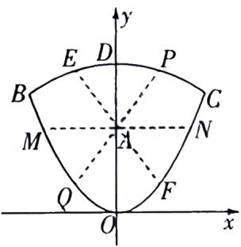

text_image

y
E D P
B C
M A N
Q F
O x

$B, P \to C$ 时, $F \to C, Q \to B$ , 点 $A$ 的坐标 $\rightarrow (0,4), a \to 4$ . 据此选 B.

6. A 由题意得,正方体内切球的球心为正方体的中心,记为

点 O, 内切球半径 $r = \frac{1}{2}$ . 连接 $AD_{1}, AC$ , $CD_{1}$ , 如图, $\because AD_{1} \parallel BC_{1}, AD_{1} \not\subset$ 平面 $A_{1}BC_{1}, BC_{1} \subset$ 平面 $A_{1}BC_{1}, \therefore AD_{1} \parallel$ 平面 $A_{1}BC_{1}$ , 同理可得 $AC \parallel$ 平面 $A_{1}BC_{1}, \because AD_{1}, AC \subset$ 平面 $D_{1}AC, AD_{1} \cap AC = A$ ,

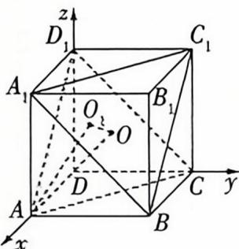

text_image

z
D₁
C₁
A₁
O
B₁
O
D
C
y
A
B
x

∴ 平面 $D_{1}AC \parallel$ 平面 $A_{1}BC_{1}$ . ∵ $D_{1}P \parallel$ 平面 $A_{1}BC_{1}$ , ∴ $D_{1}P \subset$ 平面 $D_{1}AC$ , 故点 P 的轨迹是平面 $D_{1}AC$ 与正方体内切球的交线, 此交线为圆, 记圆心为 $O_{1}$ , 连接 $OO_{1}, AO_{1}$ .

如图,以 D 为原点建立空间直角坐标系,连接 AO,则 A(1,0,0),C(0,1,0),D₁(0,0,1),O(1/2,1/2,1/2),∴ $\overrightarrow{AC}=(-1,1,0)$ , $\overrightarrow{AD_{1}}=(-1,0,1)$ , $\overrightarrow{AO}=(-\frac{1}{2},\frac{1}{2},\frac{1}{2})$ .

设平面 $D_{1}AC$ 的法向量为 $\pmb{n} = (x, y, z)$ ，则 $\left\{ \begin{array}{l} \overrightarrow{AC} \cdot \pmb{n} = -x + y = 0, \\ \overrightarrow{AD_1} \cdot \pmb{n} = -x + z = 0, \end{array} \right.$ 令 $x = 1$ ，则 $y = z = 1$ ，故 $\pmb{n} = (1, 1, 1)$ ，

∴ 点 O 到平面 $D_{1}AC$ 的距离 $d=\frac{|\overrightarrow{AO}\cdot n|}{|n|}=\frac{\frac{1}{2}}{\sqrt{3}}=\frac{\sqrt{3}}{6}$ ,

∴ 圆 $O_{1}$ 的半径 $r_{1} = \sqrt{r^{2} - d^{2}} = \sqrt{\left(\frac{1}{2}\right)^{2} - \left(\frac{\sqrt{3}}{6}\right)^{2}} = \frac{\sqrt{6}}{6}$ ,
由 $\overrightarrow{AO} = (-\frac{1}{2}, \frac{1}{2}, \frac{1}{2})$ ，得 AO = $\sqrt{(-\frac{1}{2})^{2}+(\frac{1}{2})^{2}+(\frac{1}{2})^{2}}=\frac{\sqrt{3}}{2},\therefore AO_{1}=\sqrt{AO^{2}-d^{2}}=$ $\sqrt{(\frac{\sqrt{3}}{2})^{2}-(\frac{\sqrt{3}}{6})^{2}}=\frac{\sqrt{6}}{3},\therefore AP$ 的最小值为 $AO_{1}-r_{1}=\frac{\sqrt{6}}{3}-$ $\frac{\sqrt{6}}{6}=\frac{\sqrt{6}}{6}$ . 故选 A.

7. ACD A(√) 由抛物线定义知 $|AD| = |AF|$ . B(×) 以焦点弦为直径的圆与准线相切, AB 为直径, AE 为弦, 所以 $|AB| > |AE|$ . C(√) 抛物线的焦点弦中通径最短, p = 3, 则 $|AB| \geqslant 2p = 6$ . D(√) 由选项 B 可知 $AE \perp BE$ , 如图, 设 $\angle AFx = \theta$ , 由 $S_{\triangle AEB} = \frac{1}{2} |AE| \cdot |BE| = \frac{1}{2} |AB| \cdot$

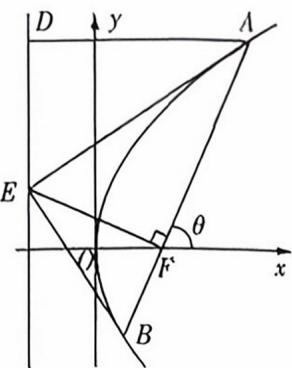

text_image

D
y
A
E
θ
F'
x
B

$|EF|$ , 可得 $|AE| \cdot |BE| = |AB| \cdot |EF| = \frac{2p}{\sin^{2}\theta} \cdot \frac{p}{\cos(\frac{\pi}{2} - \theta)} = \frac{2p^{2}}{\sin^{3}\theta} \geqslant 2p^{2} = 18$ . 故选 ACD.

8. BD 对于 A, $a \cdot b = -\frac{1}{2}$ , 所以 $|a + b| = \sqrt{a^{2} + 2a \cdot b + b^{2}} = 1$ , 所以 $|a + b + c| \leqslant |a + b| + |c| = 2$ , 所以 $|a + b + c|$ 的最大值为 2, 故 A 错误.

对于 B, 如图 1, 令 $\overrightarrow{OA} = a$ , $\overrightarrow{OB} = b$ , $\overrightarrow{OC} = c$ , 则 $\overrightarrow{BC} \cdot \overrightarrow{AC} = 0$ , 所以 $\overrightarrow{BC} \perp \overrightarrow{AC}$ , 连接 $AB$ , 动点 $C$ 在以 $AB = \sqrt{3}$ 为直径的圆上. 取 $AB$ 的中点 $E$ , 连接 $OE$ , 并延长交圆于 $D$ , 当且仅当点 $C$ 运动到 $D$ 时,OC 的长度最大,为 $\frac{\sqrt{3}+1}{2}$ ,故 B 正确.

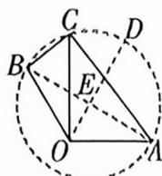  
图1

对于 C, 如图 2, $\overrightarrow{OA} = a$ , $\overrightarrow{OB} = b$ , $\overrightarrow{OC} = c$ , 连接 BA, 令 $\overrightarrow{OF} = \overrightarrow{BA} = a - b$ , 连接 FC, 则 $\overrightarrow{FC} = \overrightarrow{OC} - \overrightarrow{OF} = c - a + b$ , 所以动点 C 在以 F 为圆心, 1 为半径的圆上. 作直径 AG 在直线 BO 上的射影 IH, 则 $OI = OA\cos\angle AOI = \frac{1}{2}$ , $OH = OI +$ $HI = OI + AG = \frac{5}{2}$ , 所以 $-b \cdot c$ 的最大值为 $\frac{5}{2}$ , 最小值为 $\frac{1}{2}$ , 又 $a \cdot b = -\frac{1}{2}$ , 所以 $a \cdot b - b \cdot c$ 的最小值为 0, C 错误.

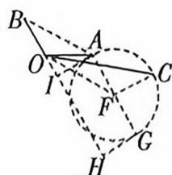  
图2

对于 D, 如图 3, $\overrightarrow{OA} = a$ , $\overrightarrow{OB} = b$ , $\overrightarrow{OC} = c$ , 令 $\overrightarrow{OK} = 2a + 2b$ , 连接 KC, 则 $\overrightarrow{KC} = c - (2a + 2b)$ , 所以动点 C 在以 K 为圆心, 1 为半径的圆上, 当且仅当直线 OC 与圆 K 相切于点 $L(M)$ 时, 向量 c 与 $a + b$ 的夹角最大, 最大为 $\angle KOL$ , 在 $\triangle KOL$ 中, $\angle KLO = \frac{\pi}{2}$ , KL = 1, OK = 2, 所以 $\angle KOL = \frac{\pi}{6}$ , D 正确. 故选 BD.

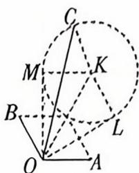  
图3

9. $\frac{1}{4}$ 构造函数 $y = \mathrm{e}^x$ ，求曲线 $y = \mathrm{e}^x$ 在 $x = 1$ 处的切线方程，由 $y' = \mathrm{e}^x$ ，得此时切线斜率为 $\mathbf{e}$ ，切线方程为 $y - \mathrm{e} = \mathrm{e}(x - 1)$ ，即 $y = \mathrm{e}x$ ，画出图象，如图，则由 $\mathrm{e}^{a + b} = \mathrm{e}(a + b)$ ，可得 $a + b =$

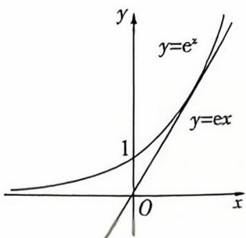

text_image

y
y=e^x
y=ex
1
O
x

1, 所以 $a + b = 1 \geqslant 2\sqrt{ab}$ , 即 $ab \leqslant \frac{1}{4}$ , 当且仅当 $a = b = \frac{1}{2}$ 时取等号, 所以 $ab$ 的最大值是 $\frac{1}{4}$ .

10. $x^{2} - \frac{y^{2}}{3} = 1$ 不妨令 $P$ 在双曲线 $C$ 的左支上，如图，设 $|PF_{1}| = m$ ，则 $|PF_{2}| = m + 2a.$

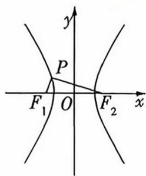

因为 $F_{1}P \perp F_{2}P$ ，所以 $S_{\triangle PF_1F_2} = \frac{m(m + 2a)}{2} = 3$ ，且 $m^2 + (m + 2a)^2 = (2c)^2$

又双曲线 C 的离心率为 2, 所以 $\frac{c}{a}=2$ , 解得 a=1, c=2, 则 $b=\sqrt{3}$ , 所以双曲线 C 的方程为 $x^{2}-\frac{y^{2}}{3}=1$ .

# 巧解

# 二级结论法!

由双曲线的焦点三角形面积结论可知 $S_{\triangle PF_1F_2} = \frac{b^2}{\tan 45^\circ} = b^2 = 3$ ，又双曲线 $C$ 的离心率为 2，所以 $\frac{c^2}{a^2} = \frac{a^2 + b^2}{a^2} = 4$ ，所以 $a^2 = 1$ ，所以双曲线 $C$ 的方程为 $x^2 - \frac{y^2}{3} = 1$ .

11. $\frac{3}{4}$ 上顶点 $A$ 的坐标为 $(0,1)$ , 设 $M(x_{1},y_{1}), N(x_{2},y_{2})$ , 因为 $\triangle AMN$ 的重心为 $(\frac{1}{2},0)$ , 所以 $\frac{0 + x_{1} + x_{2}}{3} = \frac{1}{2}$ , $\frac{1 + y_{1} + y_{2}}{3} = 0$ , 所以 $x_{1} + x_{2} = \frac{3}{2}, y_{1} + y_{2} = -1$ .

联立 $y = kx + m$ 与 $\frac{x^2}{2} + y^2 = 1$ ，整理得 $(1 + 2k^2)x^2 + 4kmx + 2m^2 - 2 = 0, \Delta = 8(2k^2 + 1 - m^2) > 0$ ，则 $x_1 + x_2 = -\frac{4km}{1 + 2k^2}$ ，

$$
y _ {1} + y _ {2} = k \left(x _ {1} + x _ {2}\right) + 2 m = k \times \left(- \frac {4 k m}{1 + 2 k ^ {2}}\right) + 2 m = \frac {2 m}{1 + 2 k ^ {2}}.
$$

所以 $-\frac{4km}{1 + 2k^2} = \frac{3}{2}, \frac{2m}{1 + 2k^2} = -1.$ 所以 $-\frac{4k \times (-\frac{1 + 2k^2}{2})}{1 + 2k^2} = \frac{3}{2}$ , 得 $k = \frac{3}{4}$ .

当 $k=\frac{3}{4}$ 时, $m=-\frac{17}{16}$ , 此时直线 $l: y=\frac{3}{4}x-\frac{17}{16}$ 与椭圆 $\frac{x^{2}}{2}+y^{2}=1$ 有两个交点, 满足题意.

12. $1 + 2\sqrt{2}$ 由题可知点 $B$ 的轨迹为以 $O$ 为圆心, 1 为半径的半圆. 设 $B(\cos \theta, \sin \theta)(0 \leqslant \theta \leqslant \pi), C(m, n)(m, n > 0)$ , 则 $\overrightarrow{AB} = (\cos \theta - 2, \sin \theta), \overrightarrow{AC} = (m - 2, n)$ . 由 $AB \perp AC$ , 可得 $(m - 2)(\cos \theta - 2) + n\sin \theta = 0$ , 由 $|AB| = |AC|$ , 可得 $\sqrt{(\cos \theta - 2)^2 + \sin^2 \theta} = \sqrt{(m - 2)^2 + n^2}$ , 得 $m = 2 + \sin \theta$ , $n = 2 - \cos \theta$ .

所以 $|OC| = \sqrt{(2 + \sin\theta)^2 + (2 - \cos\theta)^2} = \sqrt{9 + 4\sqrt{2}\sin(\theta - \frac{\pi}{4})}$ , 当 $\theta - \frac{\pi}{4} = \frac{\pi}{2}$ , 即 $\theta = \frac{3\pi}{4}$ 时, $|OC|$ 取得最大值, 为 $\sqrt{9 + 4\sqrt{2}} = 1 + 2\sqrt{2}$ .

# 巧解

# 复数乘法的几何意义法!

设 $B(\cos \theta, \sin \theta) (0 \leqslant \theta \leqslant \pi), C(m, n) (m, n > 0)$ ，则 $\overrightarrow{AB}, \overrightarrow{AC}$ 在复平面内对应的复数分别为 $z_{1} = \cos \theta - 2 + \mathrm{i}\sin \theta, z_{2} = m - 2 + ni$

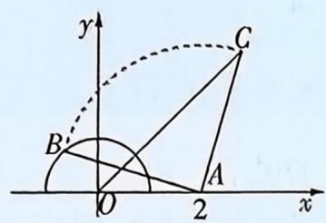

text_image

y
C
B
O
A
2
x

如图, 可知 $z_{1}=z_{2}\cdot(\cos90^{\circ}+\mathrm{i}\sin90^{\circ})=z_{2}\cdot\mathrm{i}$ ,
所以 $m=2+\sin\theta,n=2-\cos\theta.$ 后同上解.

# 创新考法8 新定义图形题

1. D 对于 A 选项, 在曲线 C 上任取一点 $P(x, y)$ , 则 $x^{2} + y^{2} = 1 + |x|y$ , 点 P 关于 y 轴的对称点为 $Q(-x, y)$ , 则 $(-x)^{2} + y^{2} = 1 + |-x|y$ , 所以曲线 C 关于 y 轴对称, 故 A 正确.

对于 B, 当 x > 0 时, 方程变换为 $x^{2} - yx + y^{2} - 1 = 0$ , 由题意可知, 关于 x 的方程 $x^{2} - yx + y^{2} - 1 = 0$ 有解, 由 $\Delta = y^{2} - 4(y^{2} - 1) = 4 - 3y^{2} \geqslant 0$ , 得 $y^{2} \leqslant \frac{4}{3}$ , 所以 y 的最大值为 $\frac{2\sqrt{3}}{3}$ , 故 B 正确. 对于 C 选项, 当 x > 0 时, 由 $x^{2} + y^{2} = 1 + xy$ 可得 $x^{2} + y^{2} - 1 = xy \leqslant \frac{x^{2} + y^{2}}{2}$ (当 x = y 时取等号), 所以 $x^{2} + y^{2} \leqslant 2$ , $|OP| = \sqrt{x^{2} + y^{2}} \leqslant \sqrt{2}$ , 故 C 正确.

对于D选项,令x=0,解得 $y=\pm1$ ,记 $A(0,-1)$ , $B(0,1)$ ,当x<0时,由 $x^{2}+y^{2}=1-xy$ 可得 $x^{2}+y^{2}-1=(-x)y\geqslant-\frac{x^{2}+y^{2}}{2}$ (当x=y时取等号),所以 $x^{2}+y^{2}\geqslant\frac{2}{3}$ ,则 $|PA|^{2}+|PB|^{2}=x^{2}+(y+1)^{2}+x^{2}+(y-1)^{2}=2(x^{2}+y^{2}+1)\geqslant\frac{10}{3}$ ,故D错误.故选D.

2. C 如图, 以 $C$ 为原点建立平面直角坐标系, 易知 $A(-2, 1), B(0,1), F(0,-1), E(-1,-2), H(1,0), L(1,2)$ . 当点 $P$ 在线段 $AB$ 上运动时, 设 $P(x,1)$ , 其中 $-2 \leqslant x \leqslant 0$ , 所以 $\overrightarrow{EH} = (2,2), \overrightarrow{FP} = (x,2)$ , 则 $\overrightarrow{EH} \cdot \overrightarrow{FP} = 2x + 4$ , 因为 $-2 \leqslant x \leqslant 0$ , 所以 $\overrightarrow{EH} \cdot \overrightarrow{FP} \in [0,4]$ .

当点 $P$ 在线段 $BL$ 上运动时，设 $P(x, y)$ $(0 \leqslant x \leqslant 1)$ ，则 $\overrightarrow{BP} = (x, y - 1), \overrightarrow{BL} = (1, 1)$ ，且 $\overrightarrow{BP} // \overrightarrow{BL}$ ，则 $x = y - 1$ ，故 $P(x, x + 1)$ $(0 \leqslant x \leqslant 1), \overrightarrow{FP} = (x, x + 2)$ ，则 $\overrightarrow{EH} \cdot \overrightarrow{FP} = 4x + 4$ ，因为 $0 \leqslant x \leqslant 1$ ，所以 $\overrightarrow{EH} \cdot \overrightarrow{FP} \in [4, 8]$ . 综上， $\overrightarrow{EH} \cdot \overrightarrow{FP}$ 的取值范围为 $[0, 8]$ .

故选C.

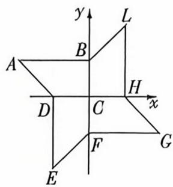

text_image

y
L
B
A
H
x
D
C
F
G
E

# 多解

当 P 点与 A 点重合时, 此时 $EH \perp PF, \overrightarrow{EH} \cdot \overrightarrow{FP} = 0$ , 为数量积的最小值; 点 P 在 BL 上的运动是一个连续变化的过程, 则比较 P 在 B 点或在 L 点时的数量积的大小即可知数量积的最大值, 当 P 点与 B 点重合时, 此时 EH 与 FB 的夹角为 $45^{\circ}$ , 则有 $\overrightarrow{EH} \cdot \overrightarrow{FP} = \overrightarrow{EH} \cdot \overrightarrow{FB} = |\overrightarrow{EH}| |\overrightarrow{FB}| \cos 45^{\circ} = 2\sqrt{2} \times 2 \times \frac{\sqrt{2}}{2} = 4$ , 而当 P 点与 L 点重合时, 设 EH 与 FL 的夹角为 $\theta$ , 则 $|FL| = \sqrt{1^{2} + 3^{2}} = \sqrt{10}, |FH| = \sqrt{2}$ , $\cos \theta = \frac{(\sqrt{10})^{2} + (\sqrt{2})^{2} - 2^{2}}{2\sqrt{10} \times \sqrt{2}} = \frac{2}{\sqrt{5}}$ , 所以 $\overrightarrow{EH} \cdot \overrightarrow{FP} = \overrightarrow{EH} \cdot$

$\overrightarrow{FL}=|\overrightarrow{EH}||\overrightarrow{FL}|\cos\theta=2\sqrt{2}\times\sqrt{10}\times\frac{2}{\sqrt{5}}=8$ ，为数量积的最大值，故选C.

3. ACD 对于 A, 可以一笔画, 如图 1, 具体方法为 $1 \rightarrow 2 \rightarrow 3 \rightarrow 4 \rightarrow 5 \rightarrow 1$ , 故 A 正确.

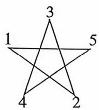  
图1

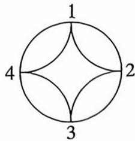  
图2

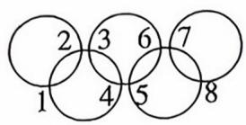  
图3

对于 B, 无论以哪个点为起点, 都不能一笔完成, 故 B 错误. 对于 C, 可以一笔画, 如图 2, 具体方法为 $1 \rightarrow 2 \rightarrow 3 \rightarrow 4 \rightarrow 3 \rightarrow 2 \rightarrow 1 \rightarrow 4 \rightarrow 1$ , 故 C 正确.

对于 D, 可以一笔画, 如图 3, 具体方法为 $1 \rightarrow 2 \rightarrow 1 \rightarrow 2 \rightarrow 3 \rightarrow 6 \rightarrow 5 \rightarrow 6 \rightarrow 7 \rightarrow 8 \rightarrow 7 \rightarrow 8 \rightarrow 5 \rightarrow 4 \rightarrow 3 \rightarrow 4 \rightarrow 1$ , 故 D 正确.

4. ABD 链接教材人教 A 版《选择性必修第一册》P103 复习参考题 2T18 对于 A, 因为在平面直角坐标系 $xOy$ 中, 把到定点 $F_{1}(-a,0), F_{2}(a,0)$ 的距离之积等于 $a^{2}(a > 0)$ 的点的轨迹称为双纽线 C, 所以 $\sqrt{(x + a)^{2} + y^{2}} \times \sqrt{(x - a)^{2} + y^{2}} = a^{2}$ , 用 $(-x, -y)$ 替换方程中的 $(x,y)$ , 方程不变, 所以双纽线 C 关于原点 O 成中心对称, 所以 A 正确. 对于 B, 根据三角形的等面积法, 可知 $\frac{1}{2} \times |PF_{1}| \times |PF_{2}| \sin \angle F_{1}PF_{2} = \frac{1}{2} \times 2a \times |y_{0}|$ , 即 $|y_{0}| = \frac{a}{2} \sin \angle F_{1}PF_{2} \leqslant \frac{a}{2}$ , 所以 $-\frac{a}{2} \leqslant y_{0} \leqslant \frac{a}{2}$ , 所以 B 正确. 对于 C, 若双纽线 C 上的点 P 满足 $|PF_{1}| = |PF_{2}|$ , 则点 P 在 $y$ 轴上, 即 $x_{0} = 0$ , 所以 $\sqrt{a^{2} + y_{0}^{2}} \times \sqrt{a^{2} + y_{0}^{2}} = a^{2}$ , 解得 $y_{0} = 0$ , 所以这样的点 P 只有一个, 所以 C 错误. 对于 D, 因为 $\overrightarrow{PO} = \frac{1}{2} (\overrightarrow{PF_{1}} + \overrightarrow{PF_{2}})$ , 所以 $|\overrightarrow{PO}|^{2} = \frac{1}{4} (|\overrightarrow{PF_{1}}|^{2} + 2|\overrightarrow{PF_{1}}| \cdot |\overrightarrow{PF_{2}}| \cos \angle F_{1}PF_{2} + |\overrightarrow{PF_{2}}|^{2})$ , 由余弦定理得 $4a^{2} = |\overrightarrow{PF_{1}}|^{2} - 2|\overrightarrow{PF_{1}}| \cdot |\overrightarrow{PF_{2}}| \cos \angle F_{1}PF_{2} + |\overrightarrow{PF_{2}}|^{2}$ , 所以 $|\overrightarrow{PO}|^{2} = a^{2} + |\overrightarrow{PF_{1}}| \cdot |\overrightarrow{PF_{2}}| \cos \angle F_{1}PF_{2} = a^{2} + a^{2} \cos \angle F_{1}PF_{2} \leqslant 2a^{2}$ , 所以 $|PO|$ 的最大值为 $\sqrt{2}a$ , 所以 D 正确.

5. ACD 对于 A, 因为点 A 在半圆上, 点 B 在半椭圆上, O 为坐标原点, $OA \perp OB$ , 所以 $|OA| = 6, |OB| \leqslant 10$ , 所以 $S_{\triangle OAB} = \frac{1}{2} |OA||OB| \leqslant \frac{1}{2} \times 6 \times 10 = 30$ , 当点 B 在长轴的端点时, $\triangle OAB$ 的面积最大, 最大值为 30, 故 A 正确; 对于 B, 因为 D 是半椭圆 $C_{2}$ 上一点, 所以 $|DM| + |DN| = 20$ , 所以 $\cos \angle MDN = \frac{|DM|^{2} + |DN|^{2} - |MN|^{2}}{2|DM||DN|} = \frac{(|DM| + |DN|)^{2} - 2|DM||DN| - |MN|^{2}}{2|DM||DN|} = \frac{400 - 2|DM||DN| - 256}{2|DM||DN|} = \frac{144 - 2|DM||DN|}{2|DM||DN|} = \frac{72}{|DM||DN|} - 1 \geqslant \frac{72}{\left(\frac{|DM| + |DN|}{2}\right)^{2}} - 1 = -\frac{7}{25}$ , 当且仅当 $|DM| = |DN|$ , 即点 D 在短轴顶点时取等号, 故 B 错误;

对于 C, 设 $P(x_{1}, y_{1})$ , $Q(x_{2}, y_{2})$ , $H(x_{0}, y_{0})$ , 则 $x_{1} + x_{2} = 2x_{0}$ , $y_{1} + y_{2} = 2y_{0}$ ,

又 $\left\{\begin{aligned}\frac{y_{1}^{2}}{100}+\frac{x_{1}^{2}}{36}&=1,\\ \frac{y_{2}^{2}}{100}+\frac{x_{2}^{2}}{36}&=1,\end{aligned}\right.$ 两式相减得 $\frac{(y_{1}-y_{2})(y_{1}+y_{2})}{100}$ +

$\frac{(x_{1}-x_{2})(x_{1}+x_{2})}{36}=0$ , 所以 $\frac{y_{1}-y_{2}}{x_{1}-x_{2}}\cdot\frac{y_{1}+y_{2}}{x_{1}+x_{2}}=-\frac{100}{36}=-\frac{25}{9}$ ,
即 $k_{PQ} \cdot k_{OH} = -\frac{25}{9}$ . 故 C 正确；

对于 D, 由椭圆 $\frac{y^2}{a^2} + \frac{x^2}{b^2} = 1$ 在点 $(x_0, y_0)$ 处的切线方程为 $\frac{yy_0}{a^2} + \frac{xx_0}{b^2} = 1$ , 得曲线 $C$ 在点 $E(\frac{24}{5}, -6)$ 处的切线方程为 $\frac{-6y}{100} + \frac{24}{5}x = 1$ , 即 $y = \frac{20}{9}x - \frac{50}{3}$ , 则切线 $l$ 的斜率为 $k = \frac{20}{9}$ , 点 $F(0, -8)$ , 所以直线 $FT$ 的斜率为 $-\frac{9}{20}$ , 直线 $FT$ 的方程为 $y = -\frac{9}{20}x - 8$ , 由 $\left\{ \begin{array}{l} y = \frac{20}{9}x - \frac{50}{3}, \\ y = -\frac{9}{20}x - 8, \end{array} \right.$ 解得 $\left\{ \begin{array}{l} x = \frac{120}{37}, \\ y = -\frac{350}{37}, \end{array} \right.$ 即 $T(\frac{120}{37}, -\frac{350}{37})$ , 所以 $|OT| = \sqrt{(\frac{120}{37})^2 + (-\frac{350}{37})^2} = 10$ , 故 D 正确. 故选 ACD.

6.0 连接 $PO$ (图略), 可得 $\overrightarrow{PM} \cdot \overrightarrow{PN} = (\overrightarrow{PO} + \overrightarrow{OM}) \cdot (\overrightarrow{PO} - \overrightarrow{OM}) = \overrightarrow{PO}^2 - \overrightarrow{OM}^2 = 4 - \overrightarrow{OM}^2$ , 显然当 $\overrightarrow{OM}^2$ 最大, 即 $|\overrightarrow{OM}|$ 取得最大值 2 时, $\overrightarrow{PM} \cdot \overrightarrow{PN}$ 取得最小值, 为 0.

# 巧解

# 极端取值法!

$\overrightarrow{PM} \cdot \overrightarrow{PN} = |\overrightarrow{PM}| |\overrightarrow{PN}| \cos \angle MPN$ ，易知 $\overrightarrow{PM} \cdot \overrightarrow{PN}$ 的取值为非负，当点 $M, N$ 分别为大圆直径的两个端点时， $\angle MPN = \frac{\pi}{2}$ ，则 $\overrightarrow{PM} \cdot \overrightarrow{PN} = 0$ ，所以 $\overrightarrow{PM} \cdot \overrightarrow{PN}$ 的最小值为 0.

7. $\frac{3}{5}$ 设椭圆 $\frac{x^2}{a^2} + \frac{y^2}{b^2} = 1$ 的半焦距为 $c$ , 离心率为 $e$ , 因为长半轴长、短半轴长、半焦距成等差数列, 所以 $2b = a + c$ , 又 $a^2 = b^2 + c^2$ , 所以 $a^2 = (\frac{a + c}{2})^2 + c^2$ , 则 $5c^2 + 2ac - 3a^2 = 0$ , 两边同时除以 $a^2$ , 得 $5e^2 + 2e - 3 = 0$ , 解得 $e = \frac{3}{5} (e = -1$ 舍去). 所以“等差椭圆”的离心率为 $\frac{3}{5}$ .

8. $\frac{13\sqrt{13}}{9}$ 链接2024新课标I卷T11, 涉及新定义曲线, 并将数学与美学结合 记 $|OP|=r$ , 以 $x$ 轴非负半轴为始边, 射线 $OP$ 为终边对应的角为 $\theta, \theta \in[0, \pi]$ , 则 $P(r\cos\theta, r\sin\theta)$ , 所以 $(x^{2}+y^{2})^{2}-y(13x^{2}+y^{2})=0 \Rightarrow (r^{2}\cos^{2}\theta+r^{2}\sin^{2}\theta)^{2}-r\sin\theta(13r^{2}\cos^{2}\theta+r^{2}\sin^{2}\theta)=0 \Rightarrow r=\sin\theta[13(1-\sin^{2}\theta)+\sin^{2}\theta]=-12\sin^{3}\theta+13\sin\theta,$

记 $t = \sin \theta$ ，则 $t\in [0,1]\Rightarrow r = -12t^3 +13t,t\in [0,1].$

记 $f(x)=-12x^{3}+13x$ ，则 $f'(x)=-36x^{2}+13$ ，则 $f'(\frac{\sqrt{13}}{6})=0$ ，
当 $x \in [0, \frac{\sqrt{13}}{6})$ 时， $f'(x) > 0$ ，当 $x \in (\frac{\sqrt{13}}{6}, 1]$ 时， $f'(x) < 0$ ，
所以 $f(x)$ 在 $[0, \frac{\sqrt{13}}{6})$ 上单调递增，在 $(\frac{\sqrt{13}}{6}, 1]$ 上单调递减，故 $|OP|_{\max}=r_{\max}=f(\frac{\sqrt{13}}{6})=\frac{13\sqrt{13}}{9}$ .

# 全新题型 1 逻辑推理题

1. A 由小明手中的两张卡牌编号和为3, 可知小明手中的两张卡牌编号分别为1,2, 根据题意, 此时小王手中的两张卡牌编号可能为3,4,5中的两个, 均满足编号不小于3, 充分性成立; 若小王手中的两张卡牌编号均不小于3, 例如3,4, 此时小明手中的卡牌编号可能有5, 不满足小明手中的两张卡牌编号和为3, 故必要性不成立. 故甲是乙的充分条件但不是必要条件. 故选A.

2. C 由已知得正方形的边长成等比数列,第二个正方形的边长为 $\sqrt{\left(\frac{3}{4}\right)^2 + \left(\frac{1}{4}\right)^2} = \frac{\sqrt{10}}{4}$ , 所以公比为 $\frac{\sqrt{10}}{4}$ . 设第 $n$ 个正方形的面积为 $a_n$ , 则 $\frac{a_n}{a_{n-1}} = \left(\frac{\sqrt{10}}{4}\right)^2 = \frac{5}{8} (n \geqslant 2)$ , 当 $n = 1$ 时, $a_1 = 1$ , 所以 $a_n = \left(\frac{5}{8}\right)^{n-1}$ , 由 $a_n < \frac{1}{50} a_1$ , 得 $(\frac{5}{8})^{n-1} < \frac{1}{50}$ , 所以 $(n - 1) \lg \frac{5}{8} < \lg \frac{1}{50}$ , 即 $n - 1 > \frac{-\lg 50}{\lg 5 - \lg 8} = \frac{-\lg 5 - 1}{\lg 5 - 3\lg 2} = \frac{-(1 - \lg 2) - 1}{1 - \lg 2 - 3\lg 2} = \frac{\lg 2 - 2}{1 - 4\lg 2} \approx \frac{0.3 - 2}{1 - 4 \times 0.3} = 8.5$ , 所以 $n > 9.5$ , 所以 $k = 10$ .

3. BC 链接教材人教 A 版《选择性必修第三册》P53 习题 7.1 T8 若父亲的血型为 AB 型, 则基因类型为 ab, 则孩子的血型的基因类型一定会有 a 或 b, 不会为 ii, 即孩子的血型不可能为 O 型, 故 A 错误.
对于 B, 若父亲与母亲基因类型不同, 则共有 $A_{6}^{2}=30$ (种) 情况, 基因类型不同血型相同, 共有 $C_{2}^{1}C_{2}^{1}=4$ (种) 情况, 所以基因类型不同共有 30 - 4 = 26 (种) 情况.

若孩子的爷爷、奶奶、母亲的血型均为 AB 型, 即基因类型均为 ab, 则父亲血型的基因类型可能是 aa, ab, bb, 其对应的概率分别为 $\frac{1}{4}, \frac{1}{2}, \frac{1}{4}$ . 当父亲血型的基因类型是 aa 时, 孩子的可能是 aa, ab, 对应的概率分别为 $\frac{1}{2}, \frac{1}{2}$ , 此时孩子与父亲血型相同的概率为 $\frac{1}{4} \times \frac{1}{2} = \frac{1}{8}$ ; 当父亲血型的基因类型是 ab 时, 孩子的可能是 aa, ab, bb, 对应的概率分别为 $\frac{1}{4}, \frac{1}{2}, \frac{1}{4}$ , 此时孩子与父亲血型相同的概率为 $\frac{1}{2} \times \frac{1}{2} = \frac{1}{4}$ ; 当父亲血型的基因类型是 bb 时, 孩子的可能是 bb, ab, 对应的概率分别为 $\frac{1}{2}, \frac{1}{2}$ , 此时孩子与父亲血型相同的概率为 $\frac{1}{4} \times \frac{1}{2} = \frac{1}{8}$ . 综上, 孩子与父亲血型相同的概率为 $\frac{1}{8} + \frac{1}{4} + \frac{1}{8} = \frac{1}{2}$ , 孩子的血型是 AB 型的概率为 $\frac{1}{2} \times (\frac{1}{4} + \frac{1}{2} + \frac{1}{4}) = \frac{1}{2}$ , 故 C 正确, D 错误. 故选 BC.

4. ACD 链接 2022 全国乙卷 T4 聚焦分母变化的数列递推问题 根据规律可得 $a_{4} = m + \frac{1}{a_{3}}, m \in \mathbf{N}^{*}, \frac{1}{a_{3}} \in (0,1)$ , 当 $m$ 的值每增加 1 时, $\frac{1}{a_{3}}$ 在 $(0,1)$ 内变化, 所以 $m + \frac{1}{a_{3}}$ 随 $m$ 的增加而增加, 故当 $m = 1$ 时, $a_{4}$ 取最小值, 为 $\frac{8}{5}, A$ 正确.

易得 $a_1 > a_3 > a_2$ ，所以 $m + \frac{1}{a_2} > m + \frac{1}{a_3} > m + \frac{1}{a_1}$ ，即 $a_3 > a_4 > a_2$ ，所以 $a_1 > a_3 > a_4 > a_2$ ，B 错误.

若 m=1，则 $a_{1}=\frac{2}{1}, a_{2}=\frac{3}{2}, a_{3}=\frac{5}{3}, a_{4}=\frac{8}{5}, \cdots$ ，记数列 $\{b_{n}\}$ 为 1,2,3,5,8, $\cdots$ , $b_{n+2}=b_{n}+b_{n+1}$ ，则 $a_{n}=\frac{b_{n+1}}{b_{n}}$ ，记 $c_{n}=b_{n}b_{n+2}-b_{n+1}^{2}$ ，则 $c_{n+1}=b_{n+1}b_{n+3}-b_{n+2}^{2}=b_{n+1}(b_{n+1}+b_{n+2})-b_{n+2}^{2}=b_{n+1}^{2}-b_{n+2}(b_{n+2}-b_{n+1})=b_{n+1}^{2}-b_{n+2}b_{n}=-c_{n}, c_{1}=-1$ ，所以数列 $\{c_{n}\}$ 是以 -1 为首项，-1 为公比的等比数列，所以 $c_{n}=b_{n}b_{n+2}-b_{n+1}^{2}=(-1)^{n}. |a_{n+1}-a_{n}|=|\frac{b_{n+2}}{b_{n+1}}-\frac{b_{n+1}}{b_{n}}|=|\frac{b_{n}b_{n+2}-b_{n+1}^{2}}{b_{n}b_{n+1}}|=|\frac{(-1)^{n}}{b_{n}b_{n+1}}|=|\frac{1}{b_{n}b_{n+1}}|\leqslant\frac{1}{2}$ ，C 正确.

$\frac{a_{n+1}}{a_{n}}=\frac{b_{n+2}b_{n}}{b_{n+1}^{2}}=\frac{b_{n+1}^{2}+(-1)^{n}}{b_{n+1}^{2}}=1+\frac{(-1)^{n}}{b_{n+1}^{2}}$ ，要使得 $\frac{a_{n+1}}{a_{n}}$ 取最小值，则n为奇数，此时 $1+\frac{(-1)^{n}}{b_{n+1}^{2}}=1-\frac{1}{b_{n+1}^{2}}\geqslant1-\frac{1}{b_{2}^{2}}=\frac{3}{4}$ ，D正确.

# 巧解

# 取特值法!

对于 B, 当 m=1 时, $a_{1}=2$ , $a_{2}=\frac{3}{2}$ , $a_{3}=\frac{5}{3}$ , $a_{4}=\frac{8}{5}$ , $a_{1}>a_{3}>a_{4}>a_{2}$ , B 错误.

5. AC 观察图形可知, A 正确, B 不正确; C 选项图形可由 A 选项图中两个白色线圈拉伸所得, 故 C 正确; 对比 C 选项, D 选项错误, 故选 AC.

6. E 同时开放 AB, 需 160 s, 同时开放 BC, 需 140 s, 可知 C 疏散比 A 快, 同理可得 B 比 D 快, E 比 C 快, A 比 D 快, 则 E 比 C, A, D 快, 又同时开放 AB, 需 160 s, 同时开放 AE, 需 120 s, 则 E 比 B 快. 所以疏散乘客最快的安全出口的编号是 E.

7. $n \cdot 2^{n-1}$ 链接教材人教 A 版《选择性必修第三册》P34 练习
T1 令 $C_{n}^{1} + 2C_{n}^{2} + 3C_{n}^{3} + \cdots + nC_{n}^{n} = S_{n}$ ，则 $C_{n}^{1} + 2C_{n}^{2} + 3C_{n}^{3} + \cdots + (n-1)C_{n}^{n-1} + n = S_{n}$ ，结合 $C_{n}^{r} = C_{n}^{n-r}$ 有 $C_{n}^{n-1} + 2C_{n}^{n-2} + 3C_{n}^{n-3} + \cdots + (n-1)C_{n}^{1} + n = S_{n}$ ，由倒序相加法得 $n(C_{n}^{1} + C_{n}^{2} + C_{n}^{3} + \cdots + C_{n}^{n-1}) + 2n = 2S_{n}, n(2^{n}-2) + 2n = 2S_{n}$ ，故 $S_{n} = n \cdot 2^{n-1}$

# 速解

$(1+x)^{n}=C_{n}^{0}x^{0}+C_{n}^{1}x^{1}+C_{n}^{2}x^{2}+C_{n}^{3}x^{3}+\cdots+C_{n}^{n}x^{n}$ ，等式左右两边同时对x求导可得 $n(1+x)^{n-1}=C_{n}^{1}+2C_{n}^{2}x^{1}+3C_{n}^{3}x^{2}+\cdots+nC_{n}^{n}x^{n-1}$ ，令x=1，可得 $n\cdot2^{n-1}=C_{n}^{1}+2C_{n}^{2}+3C_{n}^{3}+\cdots+nC_{n}^{n}$ ，故填 $n\cdot2^{n-1}$ .

8.512 130 信号旗的旗面为九宫格,每个小方格可以在白色和黑色之间变换,则一共有 $2^{9} = 512$ (种)不同颜色组合来传递不同的信息.

若一个黑色格子也没出现,可以传递1种信息;若出现1个黑色格子,可以传递9种不同信息;若出现2个黑色格子,可以传递 $C_{9}^{2}=36$ (种)不同信息;若出现3个黑色格子,可以传递 $C_{9}^{3}=84$ (种)不同信息.所以若最多出现3个黑色格子,可以传递 $1+9+36+84=130$ (种)不同信息.

9. $\frac{2^{10}}{11!}$ 一共10行,第10行需要10个数,则最大数在第10

行的概率为 $\frac{10}{\frac{10(1+10)}{2}}=\frac{2}{11}$ ，第9行需要9个数，则剩余数中的最大数在第9行的概率为 $\frac{9}{\frac{9(1+9)}{2}}=\frac{2}{10}=\frac{1}{5},\cdots$ ，第n行需要n个数，则剩余数中的最大数在第n行的概率为

$\frac{n}{\frac{n(n+1)}{2}}=\frac{2}{n+1}$ ，所以 $x_{1}<x_{2}<\cdots<x_{10}$ 的概率为 $\frac{2}{11}\times\frac{2}{10}\times\frac{2}{9}\times\cdots\times\frac{2}{3}\times\frac{2}{2}=\frac{2^{10}}{11!}$ .

# 全新题型 2 数据分析题

1. C 对于 A,2024 年 10 月份食品烟酒类价格同比涨幅为 2%,所以 2024 年 10 月份食品烟酒类价格高于 2023 年 10 月份食品烟酒类价格,故 A 错误;

对于 B,2024 年 10 月份教育文化娱乐类价格环比涨幅为 0.2%,所以 2024 年 10 月份教育文化娱乐类价格高于 2024 年 9 月份教育文化娱乐类价格,故 B 错误;

对于 C,2024 年 10 月份医疗保健类价格环比涨幅为 0.0%, 即 2024 年 10 月份医疗保健类价格等于 2024 年 9 月份医疗保健类价格, 又 2024 年 10 月份医疗保健类价格同比涨幅为 1.1%, 所以 2024 年 9 月份医疗保健类价格高于 2023 年 10 月份医疗保健类价格, 故 C 正确;

对于 D,2024 年 10 月份居住类价格环比涨幅为 0.0%, 即 2024 年 10 月份居住类价格等于 2024 年 9 月份居住类价格, 又 2024 年 10 月份居住类价格同比涨幅为 -0.1%, 所以 2024 年 9 月份居住类价格低于 2023 年 10 月份居住类价格, 故 D 错误.

2. C 设没剔除两对数据前 $x, y$ 的平均数分别为 $\overline{x}, \overline{y}$ , 剔除两对数据后 $x, y$ 的平均数分别为 $\overline{x}', \overline{y}'$ . 因为 $\sum_{i=1}^{5} y_i = 140$ , 所以 $\overline{y} = \frac{1}{7} (140 + 28 + 28) = 28, \overline{y}' = \frac{1}{5} \sum_{i=1}^{5} y_i = 28$ , 则 $\overline{x} = \frac{1}{10} (7 \times \overline{y} - 166) = 3$ , 所以 $\overline{x}' = \frac{7\overline{x} - 6 - 0}{5} = 3$ , 又 $\overline{x}' = \frac{1}{4} (\overline{y}' - m)$ , 所以 $\frac{28 - m}{4} = 3$ , 得 $m = 16$ .

3. C 依题意, $\mu = \frac{32 + 28}{2} = 30, \sigma = \sqrt{2.25} = 1.5$ , 所以 $\mu - 3\sigma = 25.5, \mu + 3\sigma = 34.5$ . 所以打印出来的零件内径尺寸应满足 $25.5 \leqslant Z \leqslant 34.5$ , 结合选项可知, 不需要调试的为丙.

4. ACD $X \sim N(72, 8^2)$ , 记 $\mu_1 = 72, \sigma_1 = 8; Y \sim N(74, 6^2)$ , 记 $\mu_2 = 74, \sigma_2 = 6$ . $P(X \leqslant 80) = P(X \leqslant \mu_1 + \sigma_1), P(Y \leqslant 80) = P(Y \leqslant \mu_2 + \sigma_2), P(X \leqslant 80) = P(Y \leqslant 80), P(X \leqslant 88) = P(X \leqslant \mu_1 + 2\sigma_1), P(Y \leqslant 86) = P(Y \leqslant \mu_2 + 2\sigma_2), P(X \leqslant 88) = P(Y \leqslant 86)$ . $P(X \leqslant 86) < P(X \leqslant 88) = P(Y \leqslant 86)$ , A 正确; $P(X \leqslant 80) = P(Y \leqslant 80)$ , B 错误; $P(X \leqslant 74) > P(X \leqslant 72) = \frac{1}{2} = P(Y \leqslant 74)$ , C 正确; $P(X \leqslant 64) = P(X \geqslant 80) = P(Y \geqslant 80)$ , D 正确.

5. AD 对于模型①对应的散点,随机误差满足 $E(e_{1})=0$ 的假设,但是方差 $\sigma_{1}^{2}$ 随着 x 的变化而变化,不满足 $D(e_{1})=\sigma_{1}^{2}$ 的假设;对模型②对应的散点,均匀分布在水平带状区域内,随机误差满足 $E(e_{2})=0$ 的假设,方差 $\sigma_{2}^{2}$ 不随 x 的变化而变化,满足 $D(e_{2})=\sigma_{2}^{2}$ 的假设.

6. BD 对于 A, 因为 $4 \times 0.75 = 3$ , 所以第 75 百分位数是 $\frac{3 + 5}{2} = 4$ , 故 A 错误; 对于 B, 在 $\alpha = 0.05$ 的独立性检验中, 若 $\chi^{2}$ 不小于 $\alpha$ 对应的临界值 $x_{0.05}$ , 可以推断两变量不独立, 该推断犯错误的概率不超过 0.05, 故 B 正确; 对于 C, 随机变量 $X \sim$

$B(n,p)$ ，若 $E(X)=30, D(X)=10$ ，则 np=30, $np(1-p)=10$ ，得 n=45，故 C 错误；对于 D，用 $y=ce^{kx}$ 拟合一组数据时，经 $z=\ln y$ 代换后得 $\ln y=kx+\ln c$ ，因为代换后得到的回归直线方程为 $z=0.3x+4$ ，所以 $c=e^{4}, k=0.3$ ，故 D 正确。

7. ACD $\because (0.01 + a + 0.022 + 0.025 + 0.02 + 0.005) \times (20 - 10) = 1, \therefore a = 0.018$ , A 正确;

$$
\begin{array}{r l} & {\overline {{{x}}} = 1 0 \times (5 \times 0. 0 1 + 1 5 \times 0. 0 1 8 + 2 5 \times 0. 0 2 2 + 3 5 \times 0. 0 2 5 +} \\ & {4 5 \times 0. 0 2 + 5 5 \times 0. 0 0 5) = 2 9. 2 \approx 2 9, B \text {错误};} \end{array}
$$

由频率分布直方图可知该场观众年龄众数的估计值为 35, C 正确;

$(0.01 + 0.018 + 0.022) \times 10 = 0.5 < 60\%$ ， $(0.01 + 0.018 + 0.022 + 0.025) \times 10 = 0.75 > 60\%$ ，记该场观众年龄的 $60\%$ 分位数的估计值为 $b(30 < b < 40)$ ，则 $(0.01 + 0.018 + 0.022) \times 10 + 0.025(b - 30) = 0.6, \therefore b = 34, D$ 正确.

8. ACD 设圆柱的底面圆半径为 $r$ , 高为 $h$ , 则 $\left\{ \begin{array}{l} \pi r^2 h = V, \\ 2 \pi r^2 + 2 \pi r h = S, \end{array} \right.$ 即 $\left\{ \begin{array}{l} r h = \frac{V}{\pi r}, \\ r^2 + r h = \frac{S}{2 \pi}, \end{array} \right.$ 因此 $r^2 + \frac{V}{\pi r} = \frac{S}{2 \pi}$ , 令 $f(r) = r^2 + \frac{V}{\pi r}, r > 0$ , 则 $f'(r) = 2 r - \frac{V}{\pi r^2}$ .

对于 AB, 当 V=1 时, $f(r)=r^{2}+\frac{1}{\pi r}, f'(r)=2r-\frac{1}{\pi r^{2}}$ , 当 0<r< $\sqrt[3]{\frac{1}{2\pi}}$ 时, $f'(r)<0$ ,

当 $r > \sqrt[3]{\frac{1}{2\pi}}$ 时， $f'(r) > 0$ ，函数 $f(r)$ 在 $(0, \sqrt[3]{\frac{1}{2\pi}})$ 上单调递减，在 $(\sqrt[3]{\frac{1}{2\pi}}, +\infty)$ 上单调递增， $f(r)_{\min} = \frac{3\sqrt[3]{2\pi}}{2\pi}$ ，于是 $\frac{S}{2\pi} \geqslant \frac{3\sqrt[3]{2\pi}}{2\pi}, S^3 \geqslant 54\pi$ ，而 $5^3 < 54\pi < 6^3$ ，因此 $S = 6$ 有解， $S = 5$ 无解，A 正确，B 错误。

对于 CD, 当 $V = \pi$ 时, $f(r) = r^{2} + \frac{1}{r}$ , $f'(r) = 2r - \frac{1}{r^{2}}$ , 当 $0 < r < \sqrt[3]{\frac{1}{2}}$ 时, $f'(r) < 0$ , 当 $r > \sqrt[3]{\frac{1}{2}}$ 时, $f'(r) > 0$ , 函数 $f(r)$ 在 $(0, \sqrt[3]{\frac{1}{2}})$ 上单调递减, 在 $(\sqrt[3]{\frac{1}{2}}, +\infty)$ 上单调递增, $f(r)_{\min} = \frac{3\sqrt[3]{2}}{2}$ , 则 $\frac{S}{2\pi} \geqslant \frac{3\sqrt[3]{2}}{2}$ , 即 $(\frac{S}{\pi})^{3} \geqslant 54$ , 而 $(\frac{5\pi}{\pi})^{3} > (\frac{4\pi}{\pi})^{3} \geqslant 54$ , 因此 $S = 5\pi, S = 4\pi$ 都有解, CD 正确.

# 多解

由上解得 $r^2 + \frac{V}{\pi r} = \frac{S}{2\pi}$ , 则 $r^2 + \frac{V}{\pi r} = r^2 + \frac{V}{2\pi r} + \frac{V}{2\pi r} \geqslant 3\sqrt[3]{r^2 \cdot \frac{V}{2\pi r} \cdot \frac{V}{2\pi r}} = 3\sqrt[3]{\frac{V^2}{4\pi^2}}$ , 所以 $\frac{S}{2\pi} \geqslant 3\sqrt[3]{\frac{V^2}{4\pi^2}}$ , 即 $S^3 \geqslant 54\pi V^2$ . 检验可得 ACD 正确.

# 热考易错 1 相近名词混淆不清致误

1. B 复数 $z = a^{2} - a - 2 + i$ 为纯虚数, 等价于 $a^{2} - a - 2 = 0$ , 即 a = -1 或 a = 2, 由选项知, 只有选项 B 中, a = -1 是复数 z 为纯虚数的充分不必要条件, 其他选项均不符合. 故选 B.

【易错速攻】正确理解充分必要和充分不必要的含义，避免混淆概念使得所求范围扩大，充分不必要条件的“范围”是充分必要条件“范围”的真子集

2. A 首先将6名志愿者分成3组,再分配到3个社区,可分为3种情况.第一种,6名志愿者分成3组的人数分别为1,2,3,则共有 $C_{6}^{1}C_{5}^{2}C_{3}^{3}A_{3}^{3}=360$ (种)选派方案.第二种,6名志愿者分成3组的人数分别为1,1,4,则共有 $\frac{C_{6}^{1}C_{5}^{1}C_{4}^{4}}{A_{2}^{2}}A_{3}^{3}=90$ (种)

【易错速改】注意区分均匀分组与不均匀分组，此处是“局部均匀分组”，要注意“局部消序”，即由于其中的两组人数相等，为均匀分组，所以要除以 $A_{2}^{2}$

选派方案. 第三种, 6 名志愿者分成 3 组的人数均为 2 , 则共有 $\frac{C_{6}^{2} C_{4}^{2} C_{2}^{2}}{A_{3}^{3}} A_{3}^{3}=90$ (种) 选派方案. 所以共有 $360 + 90 + 90 = 540$ (种) 选派方案, 故选 A.

3. AD 链接教材人教 A 版《必修第一册》P84 例 6(3) 函数 $f(x)=ax+\frac{b}{x}(ab\neq0)$ 的定义域为 $(-∞,0)∪(0,+∞)$ ，因为 $f(-x)=-f(x)$ ，所以 $\forall ab\neq0$ ，函数 $f(x)$ 是奇函数，A 选

【易错速欢】注意区分任意与存在的含义，此处表示函数 $f(x)$ 是奇函数 $\forall ab \neq 0$ 恒成立，对于存在性问题，只有在某些情况下满足条件

项正确;假设 B 正确,设切点为 $P(x_{0}, ax_{0} + \frac{b}{x_{0}})$ , $f'(x) = a -$

$\frac{b}{x^2}, f'(x_0) = a - \frac{b}{x_0^2}$ , 若切线过原点, 则 $\frac{ax_0 + \frac{b}{x_0}}{x_0} = a - \frac{b}{x_0^2}$ , 解得 $b = 0$ , 不符合题意, B 选项错误; 若 $f(x_1) = f(x_2), x_1 \neq x_2$ , 则 $ax_1 + \frac{b}{x_1} = ax_2 + \frac{b}{x_2}$ , 得 $x_1x_2 = \frac{b}{a}$ , 即 $\sin x(\sin x + 2) = \frac{b}{a}$ ,

由 $y = \sin x$ 的有界性, 知 $\sin x (\sin x + 2) = \frac{b}{a}$ 不一定有解, C 选项错误; 当 $f(x) = k\pi + \frac{\pi}{4}, k \in \mathbb{Z}$ 时, 方程 $\sin [f(x)] = \cos [f(x)]$ 有解, D 选项正确. 故选 AD.

# 速解

# 导数法!

过原点 O 作 $f(x)$ 图象的切线, 设切点为 $(x_{0}, y_{0})$ , 则 $f'(x_{0}) = a - \frac{b}{x_{0}^{2}}$ , 所以切线方程为 $y = (a - \frac{b}{x_{0}^{2}})x$ , 所以 $ax_{0} + \frac{b}{x_{0}} = (a - \frac{b}{x_{0}^{2}})x_{0}$ , 即 $\frac{2b}{x_{0}} = 0$ , 当 $b \neq 0$ 时, 无解, 故 B 选项错误.

4. AD 对于 A, 当 n=1 时, $a_{1} + a_{2} = 1$ , 又 $a_{1} = -3$ , $\therefore a_{2} = 4$ ,
又 $a_{n} + a_{n+1} = (-1)^{n+1}(n \in \mathbb{N}^{*})$ , $\therefore a_{n+1} + a_{n+2} = (-1)^{n+2}$ , $\therefore a_{n+2}-a_{n}=(-1)^{n+2}-(-1)^{n+1}=-2\times(-1)^{n+1}$ $\therefore \{a_{n}\}$ 的奇数项所成的数列是首项为 -3，公差为 -2 的等差数列，偶数项所成的数列是首项为 4，公差为 2 的等差数列，

$\therefore a_{10}=a_{2}+4\times2=12$ , 故 A 正确; 对于 B, $S_{12}=(a_{1}+a_{3}+\cdots+a_{11})+(a_{2}+a_{4}+\cdots+a_{12})=-3\times6+\frac{6\times5}{2}\times(-2)+4\times$

$6+\frac{6\times5}{2}\times2=-48+54=6$ , 故 B 错误; 对于 C, $P_{n}=\frac{C_{n}^{1}\cdot C_{n}^{1}}{C_{2n}^{2}}=$ $\frac{n^{2}}{n(2n-1)}=\frac{n}{2n-1}=\frac{1}{2-\frac{1}{n}}>\frac{1}{2}$ ，故 C 错误；对于 D，当 $n\geqslant$

$2, n \in \mathbf{N}^{\bullet}$ 时， $T_{n} = \frac{1}{1} \cdot \frac{2}{3} \cdot \frac{3}{5} \cdot \cdots \cdot \frac{n}{2n - 1} < \frac{1}{1} \cdot \frac{2}{2} \cdot \frac{3}{4} \cdot \cdots \cdot \frac{n}{2n - 2} = \frac{n!}{2^{n - 1} \cdot (n - 1)!} = \frac{n}{2^{n - 1}}$

【易错速欢】 $T_{n}$ 为前 n 项积，不要与前 n 项和混淆

又 $T_{1}=1=\frac{1}{2^{1-1}}$ ，∴ $T_{n}\leqslant\frac{n}{2^{n-1}}$ ，故 D 正确。故选 AD.

# 多解

对于 B, 当 n 为奇数时, $a_{n} + a_{n+1} = (-1)^{n+1} = 1$ , $\therefore S_{12} = (a_{1} + a_{2}) + (a_{3} + a_{4}) + \cdots + (a_{11} + a_{12}) = 1 \times 6 = 6$ , 故 B 错误. 对于 C, 易知 $a_{1} = -3, a_{2} = 4, a_{3} = -5, a_{4} = 6$ , 则 $P_{2} = \frac{C_{2}^{1}C_{2}^{1}}{C_{4}^{2}} = \frac{2}{3} > \frac{1}{2}$ , 故 C 错误.

5. $560x^{3}y^{4}$ 链接2024全国甲卷T13,两题均考查二项展开式中系数的最大值的求解 $(x - 2y)^{7}$ 的展开式的通项为 $T_{r + 1} = \mathrm{C}_7^r\cdot x^{7 - r}\cdot (-2y)^r = (-2)^r\cdot \mathrm{C}_7^r\cdot x^{7 - r}\cdot y^r$ ，所以项的系数为 $(-2)^{r}\cdot \mathrm{C}_{7}^{r}$ ，其中 $r = 0,1,2,3,4,5,6,7$ ，当 $r$ 为奇

【易错速效】注意二项式系数与项的系数的区别，本题中 $C_{7}^{r}$ 为二项式系数， $(-2)^{r} \cdot C_{7}^{r}$ 为项的系数，所求为系数最大的项，不要漏乘 $(-2)^{r}$

数时, $(-2)^{r}\cdot C_{7}^{r}$ 为负数,系数不是最大, $(-2)^{0}\cdot C_{7}^{0}=1$ , $(-2)^{2}\cdot C_{7}^{2}=84$ , $(-2)^{4}\cdot C_{7}^{4}=560$ , $(-2)^{6}\cdot C_{7}^{6}=448$ ,所以系数最大的项为 $T_{4+1}=(-2)^{4}\cdot C_{7}^{4}\cdot x^{7-4}\cdot y^{4}=560x^{3}y^{4}$ .

6. $\frac{\sqrt{3}}{3}$ 链接教材人教 A 版《选择性必修第二册》P92 练习 T1 由题意知函数 $f(x)$ 的定义域为 $(0, +\infty), f'(x) = 3x - \frac{1}{x} =$

$\frac{3x^2 - 1}{x} = \frac{3(x + \frac{\sqrt{3}}{3})(x - \frac{\sqrt{3}}{3})}{x}$ . 当 $x \in (0, \frac{\sqrt{3}}{3})$ 时, $f'(x) < 0$ , $f(x)$ 单调递减; 当 $x \in (\frac{\sqrt{3}}{3}, +\infty)$ 时, $f'(x) > 0$ , $f(x)$ 单调递

增. 所以 $\frac{\sqrt{3}}{3}$ 是函数 $f(x)$ 的极小值点, 没有其他极值点.

【易错速欢】函数 $f(x)$ 的极小值点为 $\frac{\sqrt{3}}{3}$ ，极小值为 $f(\frac{\sqrt{3}}{3})$ ，要注意所求为极值点，而不是极值

# 多解

由题意知函数 $f(x)$ 的定义域为 $(0, +\infty)$ , $f'(x) = 3x - \frac{1}{x}$ , 令 $f'(x) = 0$ , 得 $x = \frac{\sqrt{3}}{3}$ , 易知函数 $f(x)$ 的极值点为 $\frac{\sqrt{3}}{3}$ .

# 热考易错2 分类讨论不全面或分类标准不当致误

1. C 链接教材人教 A 版《选择性必修第一册》P139 习题
3.3T12 由抛物线的方程为 $y^{2}=4x$ 知 $F(1,0)$ .

当过点 A 的直线斜率不存在, 即直线与 y 轴重合时, 满足直线与抛物线 C 有唯一公共点.

当过点 A 的直线斜率为 0 时, 直线方程为 y=2, 满足直线与抛物线 C 有唯一公共点.

当过点 A 的直线斜率存在且不为 0 时, 设直线方程为 $y = kx +$

2, 由 $\left\{ \begin{array}{l} y = kx + 2, \\ y^2 = 4x, \end{array} \right.$ 得关于 $x$ 的方程 $k^2 x^2 + (4k - 4)x + 4 = 0$ , 令

$\Delta=(4k-4)^{2}-4\times4\times k^{2}=0$ , 解得 $k=\frac{1}{2}$ , 此时满足条件的直线有 1 条.

综上, 过点 A 且与抛物线 C 有唯一公共点的直线有 3 条, 故选 C.

2. B 甲、乙、丙、丁4名教育专家到三个地区指导教育教学工作的安排方法共有 $3^{4} = 81$ （种），每个地区至少安排1名专家的安排方法有 $\mathrm{C}_{4}^{2}\mathrm{A}_{3}^{3} = 36$ （种），所以每个地区至少安排

【易错速欢】人员分配问题要注意先分组再排列

1 名专家的概率为 $\frac{36}{81} = \frac{4}{9}$ . 故选 B.

3. B 易知点(0,2)到直线系 $M: x \cos \theta + (y - 2) \sin \theta = 1 (0 \leqslant \theta < 2\pi)$ 中每条直线的距离 $d = \frac{1}{\sqrt{\cos^2 \theta + \sin^2 \theta}} = 1$ ，直线系 $M$ :

$x\cos \theta + (y - 2)\sin \theta = 1 (0 \leqslant \theta < 2\pi)$ 表示圆 $x^{2} + (y - 2)^{2} = 1$ 的切线的集合.

对于(1),由于直线系表示圆 $x^{2} + (y - 2)^{2} = 1$ 的所有切线,其中存在两条切线平行, $M$ 中所有直线均经过同一个定点不可能,故(1)为假命题;

对于(2),由(1)得 $M$ 中的任一条直线不过圆心 $(0,2)$ , 所以存在定点 $P$ , 其不在 $M$ 中的任一条直线上, 故(2)为真命题; 对于(3), 由于圆的所有外切正多边形的边都在圆的切线上, 所以对于任意整数 $n (n \geqslant 3)$ , 存在正 $n$ 边形, 其所有边均在 $M$ 中的直线上, 故(3)为真命题;

对于(4),如图所示, $M$ 中的直线所能围成的正三角形有两类,第一类,如 $\triangle ABB'$ ,此类正三角形面积都相等,第二

【易错速改】这里画示意图要留心可能会出现两种满足题意的情况，但是它们面积不等

类,如 $\triangle BDC$ ,此类正三角形面积相等,但两类之间面积不等,故(4)为假命题.故选B.

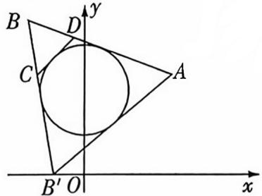

text_image

B
D
y
C
A
B' O
x

4. B 链接 2025 天津卷 T8, 两题均考查正弦函数在闭区间上的最值问题 由题设可得 $a > 0$ , $f(x) = 1 + \cos 4x + 2\sin 2x =$

$$
2 - 2 \sin^ {2} 2 x + 2 \sin 2 x = - 2 (\sin 2 x - \frac {1}{2}) ^ {2} + \frac {5}{2},
$$

令 $t = \sin 2x$ ，设 $g(t) = -2\left(t - \frac{1}{2}\right)^2 +\frac{5}{2},$

【堵误区】进行三角换元，转化为二次函数问题，注意新元的取值范围

易知 $g(0)=2, g(\frac{1}{2})=\frac{5}{2}, g(1)=2.$

当 $0 < a < \frac{\pi}{12}$ 时， $t \in [0, \sin 2a]$ ，其中 $\sin 2a < \frac{1}{2}$ ，此时 $g(t)$

的值域不是 $[2, \frac{5}{2}]$ ; 当 $\frac{\pi}{12} \leqslant a \leqslant \frac{\pi}{2}$ 时, $0 \leqslant \sin 2a \leqslant 1$ , 此时

$g(t)$ 的值域是 $\left[2, \frac{5}{2}\right]$ ; 当 $a > \frac{\pi}{2}$ 时, 存在 $a_{0} \in \left(\frac{\pi}{2}, +\infty\right)$ , 使

得当 $x = a_0$ 时， $\sin 2a_0 < 0, g(t) < 2$ ，此时 $g(t)$ 的值域不是

$[2, \frac{5}{2}]$ . 综上, $\frac{\pi}{12} \leqslant a \leqslant \frac{\pi}{2}$ . 故选 B.

# 巧解

同上解得 $f(x) = -2\left(\sin 2x - \frac{1}{2}\right)^2 + \frac{5}{2}$ , 令 $t = \sin 2x$ , 设 $g(t) = -2\left(t - \frac{1}{2}\right)^2 + \frac{5}{2}$ , 易知 $g(0) = 2$ , $g\left(\frac{1}{2}\right) = \frac{5}{2}, g(1) = 2$ , 因为 $f(x)$ 在 $[0, a]$ 上的值域为 $[2, \frac{5}{2}]$ , 结合 $y = \sin 2x$ 的图象可得 $\frac{\pi}{6} \leqslant 2a \leqslant \pi$ , 所以 $\frac{\pi}{12} \leqslant a \leqslant \frac{\pi}{2}$ . 故选 B.

5. D 由 $f(x) = x(x - a)^2 = x^3 - 2ax^2 + a^2x$ ，得 $f'(x) = 3x^2 - 4ax + a^2 = (3x - a)(x - a)$ ，令 $f'(x) = 0$ ，解得 $x = \frac{a}{3}$ 或 $x = a$ .

【易错速欢】注意讨论 $\frac{a}{3}$ 和a的大小，也就是讨论a的正负，从而确定 $f(x)$ 的极大值点

当 $a > 0$ 时, 在 $(- \infty, \frac{a}{3}), (a, +\infty)$ 上, $f'(x) > 0$ , $f(x)$ 单调递增, 在 $(\frac{a}{3}, a)$ 上, $f'(x) < 0$ , $f(x)$ 单调递减, 所以 $f(x)$ 在 $x = \frac{a}{3}$ 处取得极大值, 所以 $f(\frac{a}{3}) = \frac{a}{3} (\frac{a}{3} - a)^2 = \frac{4a^3}{27} = \frac{1}{16}$ , 解得 $a = \frac{3}{4}$ . 当 $a < 0$ 时, 在 $(- \infty, a), (\frac{a}{3}, +\infty)$ 上, $f'(x) > 0$ , $f(x)$ 单调递增, 在 $(a, \frac{a}{3})$ 上, $f'(x) < 0$ , $f(x)$ 单调递减, 所以 $f(x)$ 在 $x = a$ 处取得极大值, 而 $f(a) = 0 \neq \frac{1}{16}$ , 不符合题意. 当 $a = 0$ 时, $f'(x) = 3x^2 \geqslant 0$ , $f(x)$ 在 $\mathbf{R}$ 上单调递增, 无极值, 不符合题意. 综上所述, $a = \frac{3}{4}$ . 故选 D.

# 速解

由 $f(x) = x(x - a)^2$ ，得 $f^{\prime}(x) = (x - a)^{2} + 2x(x - a) = (3x - a)(x - a)$ ，令 $f^{\prime}(x) = 0$ ，解得 $x = \frac{a}{3}$ 或 $x = a$

而 $f(a) = 0, f(\frac{a}{3}) = \frac{a}{3} (\frac{a}{3} - a)^2 = \frac{4a^3}{27}$ , 且函数 $f(x)$ 的极大值为 $\frac{1}{16}$ , 所以 $\frac{4a^3}{27} = \frac{1}{16}$ , 解得 $a = \frac{3}{4}$ , 经检验, 符合题意. 故选 D.

6. C 链接 2024 新课标 II 卷 T8 根据函数的单调性和函数值不小于 0, 得到两个参数的关系式, 再求得关于两个参数的代数式的范围 由题可得函数 $f(x)$ 的定义域为 $(-2b, +\infty)$ , 因为 $f(x) \geqslant 0$ 恒成立, 且 $(x - 2)^{2} \geqslant 0$ , 所以 $(x - a) \ln (x + 2b) \geqslant 0$ , 则 $\left\{ \begin{array}{l} x - a \geqslant 0, \\ \ln (x + 2b) \geqslant 0 \end{array} \right.$ 或 $\left\{ \begin{array}{l} x - a \leqslant 0, \\ \ln (x + 2b) \leqslant 0, \end{array} \right.$ 解得 $\left\{ \begin{array}{l} x \geqslant a, \\ x \geqslant 1 - 2b \end{array} \right.$ 或 $\left\{ \begin{array}{l} -2b < x \leqslant a, \\ -2b < x \leqslant 1 - 2b. \end{array} \right.$ 若 $a > 1 - 2b$ , 可得不等式的解集为 $(-2b, 1 - 2b] \cup [a, +\infty)$ , 则 $\exists x \in (1 - 2b, a)$ , 使得 $(x - a) \ln (x + 2b) < 0$ , 不满足题意;

若 $-2b < a < 1 - 2b$ ，可得不等式的解集为 $(-2b, a] \cup [1 - 2b, +\infty)$ ，则 $\exists x \in (a, 1 - 2b)$ ，使得 $(x - a) \ln (x + 2b) < 0$ ，不满足题意；若 $a \leqslant -2b$ ，可得不等式的解集为 $[1 - 2b, +\infty)$ ，则 $\exists x \in (-2b, 1 - 2b)$ ，使得 $(x - a) \ln (x + 2b) < 0$ ，不满足题意；若 $a = 1 - 2b$ ，可得不等式的解集为 $(-2b, +\infty)$ ，【易错速改】分类讨论要全面，不重不漏

满足题意.

综上所述， $a = 1 - 2b$ ，所以 $\frac{1}{a} +\frac{a}{2b} = \frac{1}{a} +\frac{a}{1 - a} = \frac{1}{a} +$ $\frac{-(1 - a) + 1}{1 - a} = \frac{1}{a} +\frac{1}{1 - a} -1 = \frac{1}{a(1 - a)} -1$ ，因为 $a(1-$ $a) = -(a - \frac{1}{2})^2 +\frac{1}{4}\leqslant \frac{1}{4}$ 且 $a(1 - a)\neq 0$ ，即 $a(1 - a)\in$

$(-\infty,0)\cup(0,\frac{1}{4}]$ , 所以 $\frac{1}{a(1-a)}-1$ 的取值范围为 $(-∞,-1)\cup[3,+∞)$ , 所以 $\frac{1}{a}+\frac{a}{2b}$ 的取值范围为 $(-∞,-1)\cup[3,+∞)$ . 故选 C.

# 热考易错3 数形结合时作图不准致误

1. C 作出函数 $y=f(x)$ 与 $y=\frac{1}{2}x$ 的大致图象,如图,由图可知,【易错速改】作图时注意指对函数图象的凹凸性,并对比它们和直线 $y=\frac{1}{2}x$ 的关系

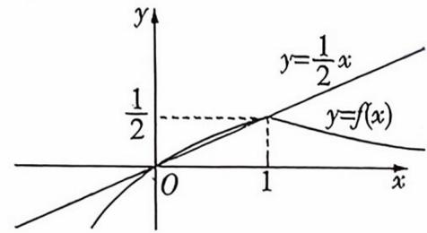

text_image

y
y=1/2 x
1/2
y=f(x)
O
1
x

当 $x \geqslant 1$ 时, $(\frac{1}{2})^x \leqslant \frac{1}{2} x$ 恒成立, 满足题意; 当 $-1 < x < 1$ 时, 函数 $y = \log_4(x + 1)$ 与 $y = \frac{1}{2} x$ 图象的交点坐标为 $(0,0)$ , 若 $\log_4(x + 1) \leqslant \frac{1}{2} x$ , 则 $x \in (-1,0]$ . 所以不等式 $f(x) \leqslant \frac{1}{2} x$ 的解集为 $(-1,0] \cup [1, +\infty)$ , 故选 C.

2. C 链接教材人教 A 版《必修第一册》

P118 练习 T1 令 $f(x) = \left(\frac{1}{3}\right)^{|x|} + m - 1 = 0$ ，则 $\left(\frac{1}{3}\right)^{|x|} = 1 - m$ ，由指数

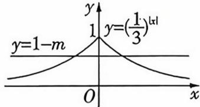

函数的性质知 $0 < \left(\frac{1}{3}\right)^{|x|} \leqslant 1$ ，要满足题意，需使 $0 < 1 - m \leqslant 1$ ，则 $0 \leqslant m < 1$ 。故选 C.

3. A 链接 2024 新课标 I 卷 T7 与正弦型函数图象的交点个数问题 通过五点法作出点 $(\frac{\pi}{6}, 2), (\frac{5\pi}{12}, 0), (\frac{2\pi}{3}, -2), (\frac{11\pi}{12}, 0), (\frac{7\pi}{6}, 2)$ , 进而作出周

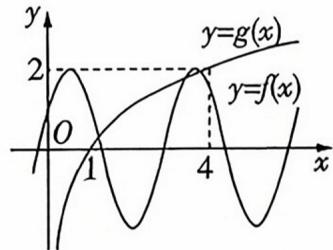

期函数 $f(x)$ 的大致图象,再作出点(1,0),(4,2),进而作出单调函数 $g(x)=\log_{2}x$ 的图象,如图, $4\in(\frac{7\pi}{6},\frac{17\pi}{12})$ ,由图可知它们有3个交点,故选A.

【易错速攻】作图时需注意确定对数函数值为2的点的坐标位置的比较准确的范围，以便和三角函数图象进行对比

4. C 因为函数 $g(x)=|f(x)|-ax+a$ 仅有一个零点, 所以函数 $y=|f(x)|$ 的图象与函数 y=ax-a 的图象只有一个交点. $|f(x)|=\left\{\begin{aligned}\ln(2-x),&x\leqslant1,\\ x^{2}-1,&x>1,\end{aligned}\right.$ 曲线 $y=|f(x)|$ 与直线 y=ax-a 都恒过定点 (1,0), 在同一坐标系内作出它们的大致图象, 如图.

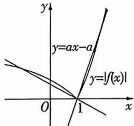

【易错迷攻】正确作出函数图象后，还需注意在特殊点处图象的凹凸性和割线逼近切线的情况

当 x > 1 时， $y = |f(x)| = x^{2} - 1, y' = 2x$ ，若直线 y = ax - a 与曲线 $y = |f(x)| = x^{2} - 1$ 在 $(1,0)$ 处相切，则 a = 2，由图可知，

当 $0 \leqslant a \leqslant 2$ 时, 两函数图象有 1 个交点. 当 $x \leqslant 1$ 时, $y = |f(x)| = \ln (2 - x), y' = -\frac{1}{2 - x}$ , 若直线 $y = ax - a$ 与曲线 $y = |f(x)| = \ln (2 - x)$ 在 $(1,0)$ 处相切, 则 $a = -\frac{1}{2 - 1} = -1$ , 由图可知, 当 $a \leqslant -1$ 时, 两函数图象有 1 个交点.

综上,要使函数 $g(x)$ 仅有一个零点,则实数 a 的取值范围是 $(-∞,-1]∪[0,2]$ . 故选 C.

5.9 双曲线 C 中, $a=\sqrt{3}$ , b=3, c=2√3, 渐近线的斜率为 $\pm\frac{3}{\sqrt{3}}=\pm\sqrt{3}$ , 由题意, 不妨设 A 在 B 右侧, 作出示意图, 如图. 设 $\left|AF_{1}\right|=m$ , $\left|BF_{1}\right|=n$ , 则 $\left|AF_{2}\right|=m-2\sqrt{3}$ , $\left|BF_{2}\right|=n+2\sqrt{3}$ , $\angle F_{1}F_{2}B=30^{\circ}$ ,

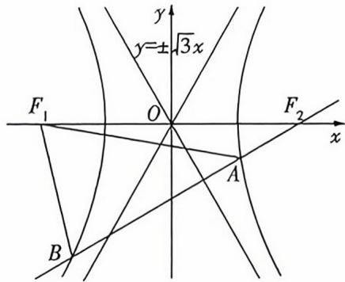

text_image

y
y=±√3x
F₁ O F₂ x
A
B

在 $\triangle F_{1}F_{2}B$ 中，由余弦定理得 $n^2 = (4\sqrt{3})^2 +(n + 2\sqrt{3})^2 -2\times$ $4\sqrt{3}\times (n + 2\sqrt{3})\times \frac{\sqrt{3}}{2}$ ，化简得 $n = \frac{9 - \sqrt{3}}{2}$ ，同理可得 $m =$ $\frac{9 + \sqrt{3}}{2}$ 所以 $|AF_1| + |BF_1| = 9.$

6.3 $\frac{2 \pi}{3} + \frac{\sqrt{3}}{4}$ 设 $P(p, \frac{\sqrt{3}}{2})$ , 如图, 三角形 $PAB$ 沿 $x$ 轴在平面直角坐标系 $xOy$ 内滚动, 开始时, $P$ 先绕 $A$ 旋转, 当 $B$ 旋转到 【易错速攻】此题画函数图时需要注意仔细区分三角形旋转的不同阶段, 另外, 以图形旋转为背景的函数问题, 应该通过前几次的旋转得到周期性, 再在一个周期内讨论对应的函数性质即可

$B_{1}$ 时，P 旋转到 $P_{1}$ ，此时 $P_{1}(p+1,\frac{\sqrt{3}}{2})$ ，然后再以 $B_{1}$ 为圆心旋转，旋转后 P 旋转到 $P_{2}$ ，此时 $P_{2}(p+\frac{5}{2},0)$ ，当三角形再旋转时，P 不旋转，此时 A 旋转到 $A_{2}$ ，当三角形再旋转后，以 $A_{2}$ 为圆心旋转，旋转后 P 旋转到 $P_{3}$ ，点 P 从开始到 $B_{2}$ 时是一个周期，故 $y=f(x)$ 的最小正周期为 3.

如图, $x_{P_{2}},x_{P_{4}}$ 为 $y=f(x)$ 相邻两个零点, $y=f(x)$ 在 $[x_{P_{2}},x_{P_{4}}]$ 上的图象与x轴围成的图形的面积为 $2\times\frac{1}{2}\times\frac{2\pi}{3}\times1^{2}+\frac{\sqrt{3}}{4}\times1^{2}=\frac{2\pi}{3}+\frac{\sqrt{3}}{4}.$

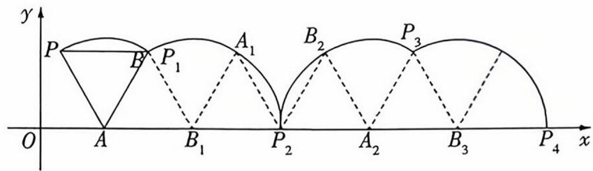

text_image

y
P
B
P₁
A₁
B₂
P₃
O
A
B₁
P₂
A₂
B₃
P₄
x

# 热考易错4 解函数不等式问题时函数构造不当

1. D 令 $g(x) = \mathrm{e}^{x} f(x)$ ，则 $g'(x) = \mathrm{e}^{x}[f(x) + f'(x)] < 0$ ，所以
【易错速效】本题若无法根据题目中的导函数和原函数的关系式选取合适的复合函数进行构造，则无法正确求解不等式。对于此类会导数的不等式问题，往往要结合导数的运算法则与基本初等函数的求导公式构造原函数 $g(x)$ 在 R 上单调递减，因为 $g(1) = \mathrm{e}^{1} f(1) = 1$ ，所以不等式

$f(x + 1) > \frac{1}{\mathrm{e}^{x + 1}}$ 可变为 $\mathrm{e}^{x + 1}f(x + 1) > 1$ ，即 $g(x + 1) > g(1)$ 所以 $x + 1 <   1$ ，即 $x <   0$ ，所以不等式 $f(x + 1) > \frac{1}{\mathrm{e}^{x + 1}}$ 的解集为 $(-\infty ,0)$ .故选D.

2. A 由 $\frac{f(x_{1})-f(x_{2})}{x_{1}-x_{2}}>x_{1}+x_{2}$ 可得 $f(x_{1})-f(x_{2})>x_{1}^{2}-x_{2}^{2}$ ，即 $f(x_{1})-x_{1}^{2}>f(x_{2})-x_{2}^{2}$ ，令 $g(x)=f(x)-x^{2}$ ，则有 $g(x_{1})>$ 【易错逆欢】本题通过多项构造出单调性已知的函数 $g(x)$ 是关键，利用 $g(x)$ 的单调性与奇偶性转化目标不等式，即可求解

$g(x_{2})$ ，又 $x_{1}>x_{2}$ ，所以 $g(x)$ 在 $[0,+\infty)$ 上单调递增，又 $f(x)$ 是定义在R上的偶函数，所以 $g(-x)=f(-x)-(-x)^{2}=f(x)-x^{2}=g(x)$ ，故 $g(x)$ 为R上的偶函数。由 $f(m+3)\leqslant m^{2}+6m$ 可得 $f(m+3)-(m+3)^{2}\leqslant-9$ ，而 $g(3)=f(3)-9=-9$ ，则 $g(m+3)\leqslant g(3)$ ，由函数 $g(x)$ 的单调性和奇偶性，可得 $|m+3|\leqslant3$ ，解得 $-6\leqslant m\leqslant0$ 。故选A.

3. C 链接教材人教 A 版《必修第一册》P141 习题 4.4T13(2)

$$
a = \frac {\ln 1 4}{\ln 9}, b = \frac {\ln 1 5}{\ln 1 0}, c = \log_ {1 1} 1 6 = \frac {\ln 1 6}{\ln 1 1}, \text {令} f (x) = \frac {\ln (x + 5)}{\ln x}
$$

【易错速文】本题若元法利用换底公式将题目中的数字转化到统一的对数运算式，找到三个等式的相同点，构造函数，则元法顺刊求解

$(x \geqslant 9)$ , 则 $f'(x) = \frac{x \ln x - (x + 5) \ln(x + 5)}{x(x + 5)(\ln x)^2}$ , 易证函数 $y = x \ln x (x \geqslant 9)$ 为增函数, 所以 $x \ln x - (x + 5) \ln(x + 5) < 0 (x \geqslant 9)$ , 所以 $f'(x) < 0$ , 所以 $f(9) > f(10) > f(11)$ , 即 $a > b > c$ . 故选 C.

4. D 由题意可知,对任意的 $x > 0$ , $f(x) > g(x)$ , 即 $x^{x-1} > a \ln x$ , 即 $x^x > ax \ln x$ , 即 $\mathrm{e}^{x \ln x} > ax \ln x$ , 令 $\varphi(x) = x \ln x$ , 则 $\varphi'(x) =$ 【易错速改】本题指时同时出现, 若无法利用指对恒等式将已知等量关系转化到形式相同的函数关系上, 则无法整体代换, 成功构造出函数求解

$\ln x+1$ , 由 $\varphi'(x)<0$ 可得 $0<x<\frac{1}{e}$ ，由 $\varphi'(x)>0$ 可得 $x>\frac{1}{e}$ ，所以 $\varphi(x)\geqslant\frac{1}{e}\ln\frac{1}{e}=-\frac{1}{e}$ ，令 $t=x\ln x$ ，则 $t\geqslant-\frac{1}{e}$ ，且 $e^{t}>at(t\geqslant-\frac{1}{e})$ 恒成立。当 t=0 时，上述不等式恒成立，此时 $a\in R$ ; 令 $h(t)=\frac{e^{t}}{t}$ ，当 t>0 时， $a<\frac{e^{t}}{t}, h'(t)=\frac{e^{t}(t-1)}{t^{2}}$ ，由 $h'(t)<0$ 可得 0<t<1，由 $h'(t)>0$ 可得 t>1，所以函数 $h(t)$ 在 $(0,1)$ 上单调递减，在 $(1,+\infty)$ 上单调递增，所以 $a<h(1)=e$ ; 当 $-\frac{1}{e}\leqslant t<0$ 时， $a>\frac{e^{t}}{t}, h'(t)=\frac{e^{t}(t-1)}{t^{2}}<0$ ，【易错速攻】分离参数构造函数时，注意讨论除数的正负，不可想当然地默认 t>0

所以函数 $h(t)$ 在 $[- \frac{1}{\mathrm{e}}, 0)$ 上单调递减, 则 $a > h(-\frac{1}{\mathrm{e}}) = \frac{\mathrm{e}^{-\frac{1}{\mathrm{e}}}}{-\frac{1}{\mathrm{e}}} = -\mathrm{e}^{1 - \frac{1}{\mathrm{e}}}$ . 综上所述, $a$ 的取值范围是 $(- \mathrm{e}^{1 - \frac{1}{\mathrm{e}}}, \mathrm{e})$ . 故选 D.

# 多解

# 选项代入法!

若 $a = 1$ ，则 $g(x) = \ln x$ ，当 $0 < x \leqslant 1$ 时， $g(x) \leqslant 0$ ， $f(x) > 0$ ，符合题意。当 $x > 1$ 时， $\ln f(x) = (x - 1)\ln x$ ， $\ln g(x) = \ln (\ln x)$ ，令 $\ln x = t$ ，则 $x = e^t, t > 0$ ，令 $h(t) = (e^t - 1)t - \ln t, t > 0$ ，则 $h'(t) = (t + 1)(e^t - \frac{1}{t})$ ，存在唯一的 $t_0 \in (0, +\infty)$ 使得 $h'(t_0) = 0$ ，即 $e^{t_0} = \frac{1}{t_0}$ ，即 $t_0 = -\ln t_0$ ， $h(t)$ 在 $(0, t_0)$ 上单调递减，在 $(t_0, +\infty)$ 上单调递增，则 $h(t) \geqslant h(t_0) = (\frac{1}{t_0} - 1)t_0 + t_0 = 1 > 0$ ，所以 $\ln f(x) > \ln g(x)$ ，从而 $f(x) > g(x)$ ，符合题意。故 $a = 1$ 满足题意，故选 D.

5. AD 链接2020全国Ⅱ卷T12已知2个变量的等式关系比较与2个变量相关的代数式的大小 由 $ab - 2b + b\ln (ab) = e$ , 得 $a - 2 + \ln (ab) = \frac{e}{b}$ , 所以 $a + \ln a = \frac{e}{b} - \ln b + 2$ , 所以 $a + \ln a = \frac{e}{b} + (1 - \ln b) + 1$ , 所以 $a + \ln a = \frac{e}{b} + \ln \frac{e}{b} + 1$ , 令 【易错速改】本题给出双变量等式, 得相同的变量移至等式一边, 结合对数的运算变形, 找到等式两边结构相同的 “部分”成功构造出函数式是解题的关键

$f(x)=x+\ln x$ ，则 $f(a)=f(\frac{e}{b})+1$ ，易知函数 $f(x)=x+\ln x$ 在定义域 $(0, +\infty)$ 上是增函数，所以 $a > \frac{e}{b}$ ，即ab > e，又 $ab - e = b[2 - \ln(ab)]$ ，所以 $2 - \ln(ab) > 0$ ，故 $ab < e^{2}$ ，故选AD.

6. (0, ln 2] 设 $g(x) = xf(x)$ ，则 $g'(x) = f(x) + xf'(x) = e^x$ ，【易错速效】本题若无法顺利构造出函数 $g(x) = xf(x)$ ，则无法求出 $f(x)$ 的解析式，进而无法解函数不等式。联想幂函数的求导公式与导数“和”的运算法则是成功构造出函数的关键

所以 $g(x)=\mathrm{e}^{x}+C$ (C 为常数)，所以 $xf(x)=\mathrm{e}^{x}+C$ ，则 $f(x)=\frac{\mathrm{e}^{x}+C}{x},f'(x)=\frac{\mathrm{e}^{x}\cdot x-(\mathrm{e}^{x}+C)}{x^{2}},f'(1)=\frac{\mathrm{e}^{1}\cdot1-(\mathrm{e}^{1}+C)}{1^{2}}=-C=1$ ，所以 C=-1，所以 $f(x)=\frac{\mathrm{e}^{x}-1}{x},f(x)\leqslant\log_{2}\mathrm{e}$ ，即 $\frac{\mathrm{e}^{x}-1}{x}\leqslant\log_{2}\mathrm{e}=\frac{\mathrm{e}^{\ln2}-1}{\ln2}$ 。当 x>0 时， $e^{x}-1>0,f'(x)=\frac{\mathrm{e}^{x}\cdot x-(\mathrm{e}^{x}-1)}{x^{2}}=\frac{\mathrm{e}^{x}(x-1)+1}{x^{2}}$ ，令 $m(x)=\mathrm{e}^{x}(x-1)+1$ ，则

【易错速改】若一次构造元法解决最终问题，则需根据解题过程中出现的代数式的结构形式多次构造函数，直到能够利用函数的单调性解出不等式 $m'(x)=\mathrm{e}^{x}(x-1)+\mathrm{e}^{x}=xe^{x}$ . 当 x>0 时, $m'(x)=xe^{x}>0$ , 所以 $m(x)$ 在 $(0,+\infty)$ 上单调递增, 则 $m(x)>\mathrm{e}^{0}(0-1)+1=0$ . 所以 $f'(x)>0$ , 即 $f(x)$ 在 $(0,+\infty)$ 上单调递增. 又 $f(\ln2)=\frac{\mathrm{e}^{\ln2}-1}{\ln2}=\frac{2-1}{\ln2}=\frac{1}{\ln2}$ , 所以由 $\frac{e^{x}-1}{x}\leqslant\frac{1}{\ln2}$ 可得 $0<x\leqslant\ln2$ . 故不等式 $f(x)\leqslant\log_{2}\mathrm{e}$ 的解集是 $(0,\ln2]$ .

# 热考易错5 忽视三角函数的有界性或角的范围

1. B 由 $\sin (\alpha + \beta) = \sin 2\alpha$ ，可得 $\alpha + \beta = 2\alpha + 2k\pi (k \in \mathbf{Z})$ 或 $\alpha + \beta = \pi - 2\alpha + 2k\pi (k \in \mathbf{Z})$ ，即 $\beta = \alpha + 2k\pi (k \in \mathbf{Z})$ 或 $\beta = 2k\pi + \pi - 3\alpha (k \in \mathbf{Z})$ ，所以由“ $\sin (\alpha + \beta) = \sin 2\alpha$ ”推不出“ $\beta = \alpha + [\text{易销速改}]$ 只考虑终边相同的三角函数值相等，会漏解，需注意角的终边关于 $y$ 轴时称，其正弦值也是相等的 $2k\pi (k \in \mathbf{Z})$ ”。若 $\beta = \alpha + 2k\pi (k \in \mathbf{Z})$ ，则 $\sin (\alpha + \beta) = \sin (2\alpha + 2k\pi) = \sin 2\alpha (k \in \mathbf{Z})$ ，所以由“ $\beta = \alpha + 2k\pi (k \in \mathbf{Z})$ ”可推出“ $\sin (\alpha + \beta) = \sin 2\alpha$ ”，所以“ $\sin (\alpha + \beta) = \sin 2\alpha$ ”是“ $\beta = \alpha +$

$2k\pi(k\in\mathbf{Z})$ ”的必要不充分条件. 故选 B.

# 多解

取 $\alpha = \frac{\pi}{6}, \beta = \frac{\pi}{2}$ , 则 $\sin (\alpha + \beta) = \sin \frac{2\pi}{3} = \sin \frac{\pi}{3} = \sin 2\alpha$ , 但 $\beta \neq \alpha + 2k\pi (k \in \mathbf{Z})$ , 故由“ $\sin (\alpha + \beta) = \sin 2\alpha$ ”推不出“ $\beta = \alpha + 2k\pi (k \in \mathbf{Z})$ ”。后同上解。

2. D 因为 $0 < \beta < \alpha < \frac{\pi}{2}$ , 所以 $0 < \alpha - \beta < \frac{\pi}{2}$ , 所以 $\sin (\alpha - \beta)$ 在求解三角函数值时, 首先要根据已知条件准确确定角的范围 $\beta) > 0$ , 又 $\cos (\alpha - \beta) = \frac{4}{5}$ , 故 $\sin (\alpha - \beta) = \frac{3}{5}$ . 因为 $\cos (\alpha - \beta) = \cos \alpha \cos \beta + \sin \alpha \sin \beta = \frac{4}{5}, \cos \alpha \cos \beta = \frac{1}{2}$ , 所以 $\sin \alpha \sin \beta = \frac{3}{10}$ . 故 $\frac{1}{\tan \alpha} - \frac{1}{\tan \beta} = \frac{\cos \alpha}{\sin \alpha} - \frac{\cos \beta}{\sin \beta} = \frac{\cos \alpha \sin \beta - \cos \beta \sin \alpha}{\sin \alpha \sin \beta} = \frac{\sin (\beta - \alpha)}{\sin \alpha \sin \beta} = \frac{-\frac{3}{5}}{\frac{3}{10}} = -2$ . 故选 D.

3. B 由正弦定理得 $\sin C - 2\sin B\cos \angle BAC = \sin B$ ，即 $\sin \angle BAC\cos B - \sin B\cos \angle BAC = \sin B$ ，即 $\sin (\angle BAC - B) = \sin B$ ，在锐角三角形 $ABC$ 中， $0 < \angle BAC < \frac{\pi}{2}, 0 < B < \frac{\pi}{2}$ ，所以 $-\frac{\pi}{2} < \angle BAC - B < \frac{\pi}{2}$ ，所以 $\angle BAC - B = B$ ，从而 $\angle BAC =$ 易错速改。切勿忽视 $\angle BAC - B$ 的取值范围，由此确定 $\angle BAC - B$ 与 $B$ 的关系，否则容易产生增解。 $2B$ ，所以 $C = \pi - 3B, \angle BAD = \angle CAD = B$ ，则 $\angle ADC = 2B$ ，在 $\triangle ACD$ 中，由正弦定理得 $\frac{2}{\sin C} = \frac{b}{\sin \angle ADC}$ ，即 $b = \frac{2\sin 2B}{\sin 3B}$ ，化简得 $b = \frac{4}{4\cos B - \frac{1}{\cos B}}$ ，由 $0 < \angle BAC = 2B < \frac{\pi}{2}, 0 < B < \frac{\pi}{2}$ ， $0 < C = \pi - 3B < \frac{\pi}{2}$ ，知 $\frac{\pi}{2} < n$ ， $\sqrt{5}$

4. ABD 对于 A, 由 A > B, 可得 a > b, 利用正弦定理可得 $\sin A > \sin B$ , 故 A 正确; 对于 B, 在锐角三角形 ABC 中, A, $B \in (0, \frac{\pi}{2})$ , $\because A + B > \frac{\pi}{2}$ , $\therefore \frac{\pi}{2} > A > \frac{\pi}{2} - B > 0$ , $\therefore \sin A > \sin(\frac{\pi}{2} - B) = \cos B$ , 因此不等式 $\sin A > \cos B$ 恒成立, 故 B 正确; 对于 C, 在 $\triangle ABC$ 中, 由 $a \cos A = b \cos B$ , 利用正弦定理可得 $\sin A \cos A = \sin B \cos B$ , $\therefore \sin 2A = \sin 2B$ , $\because A, B \in (0, \pi)$ , $\therefore 2A = 2B$ 或 $2A = \pi - 2B$ , $\therefore A = B$ 或 $A + B = \frac{\pi}{2}$ , $\therefore \triangle ABC$ 是 [易错速欢] 这里容易想当然地认为 2A = 2B, 由于 2A, 2B 的范围扩大了, 因此存在两种可能, 即 2A = 2B 或 2A = $\pi - 2B$ 等腰三角形或直角三角形, C 错误; 对于 D, $B = \frac{\pi}{3}$ , $b^{2} = ac$ ,
由余弦定理可得 $b^{2}=ac=a^{2}+c^{2}-ac$ , 可得 $(a-c)^{2}=0$ , 解得 a=c, 可得 $A=C=B=\frac{\pi}{3}$ , 故 D 正确. 故选 ABD.

5. $(-∞,18]$ 由题意得 $\frac{\sin 2x-2(1-\sin^{2}2x)+8}{\sin 2x}\geqslant\frac{m}{2}$ ,化简得 $2\sin 2x+\frac{6}{\sin 2x}+1\geqslant\frac{m}{2}$ ,当 $0<x<\frac{\pi}{2}$ 时, $0<\sin 2x\leqslant1$ ,则 $2\sin 2x+\frac{6}{\sin 2x}+1\geqslant2+\frac{6}{1}+1=9$ ,则 $\frac{m}{2}\leqslant9$ ,所以 $m\leqslant18$ .

6. $-\frac{3}{2}$ 链接教材人教 A 版《必修第一册》P214 可溯。因为 f/π、

# 热考易错6

# 忽视基本不等式的使用条件致误

1. A 链接教材人教 A 版《必修第一册》P58 复习参考题 2T5
由题意知 $(x+1)(y+1)=1$ ，则 $y+1=\frac{1}{x+1}$ ，由 x>-1，y>-1，知 $x+1>0$ ，所以 $x+y=x+1+\frac{1}{x+1}-2\geqslant$ 【易错速攻】此题x和y未必是正值，不能直接用基本不等式，需进行一些构造或变形才行 $2\sqrt{(x+1)\cdot\frac{1}{x+1}}-2=0$ ，当且仅当x=y=0时取等号，所以 $x+y$ 的最小值是0. 故选A.

# 巧解

万能“k”法!

设 $x + y = k$ ，则 $k > -2, x(k - x) + k = 0$ ，则关于 $x$ 的方程 $x^{2} - kx - k = 0$ 在 $(-1, +\infty)$ 上有实数解， $\Delta = k^2 + 4k \geqslant 0$ ，则 $k \leqslant -4$ （舍去）或 $k \geqslant 0$ ，经验证 $k \geqslant 0$ 满足题意，则 $x + y \geqslant 0$ ，故选A.

2. B 正项等差数列 $\{a_{n}\}$ 中, 设公差为 $d(d \geqslant 0)$ , 因为 $a_{4} =$

$a_{1}+3d=1$ , 所以 $a_{1}=1-3d$ , 因为 $a_{n}>0$ , 所以 $0\leqslant d<\frac{1}{3}$ , 易知 $\frac{3}{5}(1-2d)+\frac{2}{5}(1+3d)=1$ , 所以 $\frac{3}{a_{2}}+\frac{2}{a_{7}}=\frac{3}{1-2d}+\frac{2}{1+3d}=$ 【易错速改】此题若直接套用基本不等式总会出错. 此处结合待求式的特征, 构造关于 d 的等式, 再借助基本不等式求解 $\left(\frac{3}{1-2d}+\frac{2}{1+3d}\right)\left[\frac{3}{5}(1-2d)+\frac{2}{5}(1+3d)\right]=\frac{6(1+3d)}{5(1-2d)}+$ $\frac{6(1-2d)}{5(1+3d)}+\frac{9}{5}+\frac{4}{5}\geqslant2\sqrt{\frac{6(1+3d)}{5(1-2d)}\cdot\frac{6(1-2d)}{5(1+3d)}}+\frac{13}{5}=5$ ,

当且仅当 $\frac{6(1+3d)}{5(1-2d)}=\frac{6(1-2d)}{5(1+3d)}$ , 即 d=0 时取等号. 故选 B.

3. A $3a + 5b = 1$ , 则 $(a + b) + (2a + 4b) = 1$ , $\frac{11a + 13b}{2a^{2} + 6ab + 4b^{2}} =$ 【易错速改】本题不能直接用基本不等式，需要拆分，找到和条件关系式的关联，再利用“1”的代换求解 $\frac{9(a + b) + (2a + 4b)}{(a + b)(2a + 4b)} = [(a + b) + (2a + 4b)]\left(\frac{9}{2a + 4b} + \right.$

$\frac{1}{a + b}) = 10 + \frac{9(a + b)}{2a + 4b} + \frac{2a + 4b}{a + b} \geqslant 10 + 2\sqrt{9} = 16$ ，当且仅当 $\frac{9(a + b)}{2a + 4b} = \frac{2a + 4b}{a + b}$ ，即 $a = b = \frac{1}{8}$ 时取等号，所以所求最小值为16.故选A.

4. D 链接2022新高考Ⅱ卷T12已知双变量满足的高次等式求代数式的最值 已知 $x > 0, y > 0, x + 3y = x^3y^2$ ，所以 $\frac{3}{x} + \frac{1}{y} = x^2y$ ，则 $(\frac{3}{x} + \frac{2}{y})^2 = \frac{9}{x^2} + \frac{4}{y^2} + \frac{12}{xy} = \frac{9}{x^2} + \frac{4}{y} (\frac{1}{y} + \frac{3}{x}) =$ 易错速改】本题所给条件关系式比较复杂，不能直接化成齐次式，需要逐步阶次、平方整体代换，再套用基本不等式求解 $\frac{9}{x^2} + \frac{4}{y} \cdot x^2y = \frac{9}{x^2} + 4x^2 \geqslant 2\sqrt{36} = 12$ ，所以 $\frac{3}{x} + \frac{2}{y} \geqslant 2\sqrt{3}$ ，当且仅当 $\frac{9}{x^2} = 4x^2$ ，即 $x = \frac{\sqrt{6}}{2}, y = \frac{\sqrt{6} + 2\sqrt{3}}{3}$ 时等号成立，所以 $\frac{3}{x} + \frac{2}{y}$ 的最小值为 $2\sqrt{3}$ . 故选D.

5. AD 对于 A, 因为 a < b < 0, 所以 a - b < 0, 所以 $ab - b^{2} = b (a - b) > 0$ , 即 $ab > b^{2}$ , 故 A 正确. 对于 B, 因为 a > b > 0, 所以 ab > 0, $b + a > 0$ , b - a < 0, 所以 $\frac{b}{a} - \frac{a}{b} = \frac{b^{2} - a^{2}}{ab} = \frac{(b + a)(b - a)}{ab} < 0$ , 即 $\frac{b}{a} < \frac{a}{b}$ , 故 B 错误. 对于 C, $\forall x \in (0, +\infty)$ , $x + \frac{1}{x} \geqslant m$ , 恒成立等价于 $(x + \frac{1}{x})_{\min} \geqslant m$ , 因为 x > 0, 所以 $\frac{1}{x} > 0$ , 所以 $x + \frac{1}{x} \geqslant 2\sqrt{x \cdot \frac{1}{x}} = 2$ , 当且仅当 $x = \frac{1}{x}$ , 即 x = 1 时, 等号成立, 所以当 x = 1 时, $x + \frac{1}{x}$ 取得最小值 2, 即 $m \leqslant 2$ , 所以 $\forall x \in \overbrace{\text{易错速改}}$ . 此处注意取等条件的判断和参数范围的转化, 注意区分充分条件、必要条件和充要条件. 若此处将 x 的范围改为 $\{x | x \geqslant 2\}$ , 则利用基本不等式无法求最值, 可转换思路, 利用对勾函数求解

$(0, +\infty)$ , “ $x + \frac{1}{x} \geqslant m$ 恒成立”是“ $m \leqslant 2$ ”的充要条件, 故 C 错误. 对于 D, 因为 $a > 0, b > 0, a + b = 1$ , 所以 $\frac{b}{a} > 0, \frac{a}{b} > 0$ , $\frac{1}{a} + \frac{1}{b} = (a + b) \cdot (\frac{1}{a} + \frac{1}{b}) = 2 + \frac{b}{a} + \frac{a}{b} \geqslant 2 + 2\sqrt{\frac{b}{a} \cdot \frac{a}{b}} = 4$ , 当且仅当 $\frac{b}{a} = \frac{a}{b}$ , 即 $a = b = \frac{1}{2}$ 时, 等号成立, 所以当 $a = b = \frac{1}{2}$ 时, $\frac{1}{a} + \frac{1}{b}$ 取得最小值 4, 故 D 正确.

6. ACD 对于 $A, f(x) = |\ln (x - 2)|$ 的图象可以由 $y = |\ln x|$ 的图象向右平移 2 个单位长度而得到, 如图, 由图可知, A 正确.

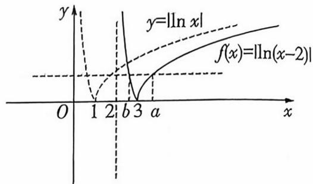

text_image

y
y=|ln x|
f(x)=|ln(x-2)|
O 1 2 b 3 a x

对于 $\mathrm{B}, f(a) = \ln (a - 2) = f(b) = -\ln (b - 2)$ , 所以 $\ln (a - 2) + \ln (b - 2) = 0$ , 即 $(a - 2)(b - 2) = 1, \mathrm{B}$ 错误.

对于 C, 由 $(a-2)(b-2)=1$ , 知 $ab+3=2(a+b)\geqslant4\sqrt{ab}$ ,
【易错速效】此题 CD 两个选项形式和由函数化简出来的关系式不能完全匹配，不能直接用基本不等式，需要进行适当变形才能使用基本不等式

得 $\sqrt{ab} \geqslant 3$ ，当且仅当 $a = b$ 时取等号，因为 $a > b$ ，所以 $ab > 9$ ，C 正确.

对于 D, $a + 4b = a - 2 + 4(b - 2) + 10 \geqslant 10 + 2\sqrt{4(a - 2)(b - 2)} = 14$ , 当且仅当 $a - 2 = 4(b - 2)$ , 即 a = 4, $b = \frac{5}{2}$ 时取等号, D 正确.

# 热考易错7 忽视圆锥曲线中的隐含条件产生增解

1. C 由 $mx^{2} + ny^{2} = 1$ 可得 $\frac{y^2}{\frac{1}{n}} - \frac{x^2}{-\frac{1}{m}} = 1$ ，因为双曲线 $C$ 的焦点在 $y$ 轴上，所以 $a^2 = \frac{1}{n}, b^2 = -\frac{1}{m}$ ，所以 $C$ 的离心率 $e =$ 【易错速改】转化双曲线的标准方程时注意焦点在 $y$ 轴上这一条件以及分母中参数的符号 $\frac{c}{a} = \sqrt{1 + \frac{b^2}{a^2}} = \sqrt{1 - \frac{n}{m}} = 2$ ，则 $-\frac{n}{m} = 3$ ，所以 $3m + n = 0$ 。故选 C.

2. C 链接 2024 天津卷 T8, 已知焦点三角形面积求圆锥曲线方程 设 $M(x_0, y_0)$ , 由 $|MF| = 3 |OF|$ 可得 $(x_0 - \frac{p}{2})^2 + y_0^2 = (\frac{3p}{2})^2$ , 因为 $y_0^2 = 2px_0$ , 所以 $(x_0 - \frac{p}{2})^2 + 2px_0 = (\frac{3p}{2})^2$ , 即 $x_0^2 + px_0 - 2p^2 = 0$ , 解得 $x_0 = p$ 或 $x_0 = -2p$ (舍去), 所以 $M(p$ , 【易错逐次】不要忽视抛物线上的点的坐标的限制, 即隐蔽条件 “ $x_0 \geqslant 0$ ” $\pm \sqrt{2}p$ ), 所以 $S_{\triangle MFO} = \frac{1}{2} \times \frac{p}{2} \times \sqrt{2}p = 16\sqrt{2}$ , 所以 $p = 8$ . 故选 C.

# 速解

设 $M(x_0, y_0) (x_0 > 0)$ , 则抛物线 $y^2 = 2px (p > 0)$ 的准线为直线 $x_0 = -\frac{p}{2}$ , 由 $|MF| = 3|OF|$ 可得 $x_0 + \frac{p}{2} = \frac{p}{2} \times 3$ , 所以 $x_0 = p$ , 所以 $M(p, \pm \sqrt{2}p)$ , 所以 $S_{\triangle MFO} = \frac{1}{2} \times \frac{p}{2} \times \sqrt{2}p = 16\sqrt{2}$ , 所以 $p = 8$ . 故选 C.

3. C $\because F_{1}(-2,0), F_{2}(2,0), \therefore |F_{1}F_{2}|=4$ , 由双曲线的定义得点P应满足 $\left|\left|PF_{1}\right|-\left|PF_{2}\right|\right|=2a\in(0,4)$ . 故选C.

【易错速效】不要忽视双曲线定义中的限制条件 $\left|\left|PF_{1}\right|-\right|PF_{2}|\left|\right|<\left|F_{1}F_{2}\right|$

4. C 曲线 $M: \sqrt{x^2 + (y - \sqrt{3})^2} + \sqrt{x^2 + (y + \sqrt{3})^2} = 4$ , 则曲线 $M$ 上的点到点 $(0, \sqrt{3})$ 和 $(0, -\sqrt{3})$ 的距离之和为 4 , 而 $4 > 2\sqrt{3}$ , 根据椭圆定义知曲线 $M$ 是以 $(0, \sqrt{3})$ 和 $(0, -\sqrt{3})$ 为焦 【易错速改】不要忽视对椭圆定义中限制条件的验证, 如果此处得出的距离之和不大于 $2\sqrt{3}$ , 则曲线 $M$ 为线段或不存在 点的椭圆, 可设椭圆方程为 $\frac{y^2}{a^2} + \frac{x^2}{b^2} = 1 (a > b > 0)$ , 则 $c = \sqrt{3}$ , $a = 2$ , $b = \sqrt{a^2 - c^2} = 1$ , 所以曲线 $M$ 的方程为 $\frac{y^2}{4} + x^2 = 1$ . 设点 $A(x_0, y_0)$ 在曲线 $M$ 上, 则 $\frac{y_0^2}{4} + x_0^2 = 1$ 且 $x_0 \in [-1, 1]$ , 可得 $y_0^2 = 4(1 - x_0^2)$ ，易知 $N(5,0)$ ，连接 $AN$ ，则 $|AN| = \sqrt{(x_0 - 5)^2 + (y_0 - 0)^2} = \sqrt{-3x_0^2 - 10x_0 + 29}$ ，因为函数 $y = \sqrt{-3x^2 - 10x + 29}$ 在 $x \in [-1,1]$ 上单调递减，所以 $|AN|_{\min} = \sqrt{-3 - 10 + 29} = 4$ ，所以 $|AB|$ 的最小值是 $|AN|_{\min} - 1 = 3$ . 故选 C.

5. D 由已知可得 $\frac{b^2}{a^2} = \frac{a^2 - c^2}{a^2} = 1 - e^2 = \frac{16}{25}$ , 则 $\frac{b}{a} = \frac{4}{5}$ . 设点 $P(x_0, y_0) (y_0 \neq 0)$ , 则 $Q(x_0, -y_0)$ , 由 $\frac{x_0^2}{a^2} + \frac{y_0^2}{b^2} = 1$ , 可得 $x_0^2 =$ 【易错速效】不要忽视题设条件中的椭圆上点的条件限制, 注意此处点 $P$ 不在 $x$ 轴上, 并且在椭圆上 $a^2 (1 - \frac{y_0^2}{b^2})$ . 不妨设点 $A(-a, 0), B(a, 0)$ , 则 $|k_1 + k_2| = |\frac{y_0}{x_0 + a} + \frac{-y_0}{x_0 - a}| = |\frac{y_0(x_0 - a) - y_0(x_0 + a)}{(x_0 + a)(x_0 - a)}| = |\frac{y_0x_0 - ay_0 - y_0x_0 - ay_0}{(x_0 + a)(x_0 - a)}| = |\frac{-2ay_0}{x_0^2 - a^2}| = |\frac{-2ay_0}{a^2(1 - \frac{y_0^2}{b^2}) - a^2}| = |\frac{2ab^2}{a^2y_0}| = |\frac{32a}{25y_0}|$ . 因为点 $P(x_0, y_0)$ 在椭圆上, 所以 $y_0 \in [-b, 0) \cup (0, b]$ , 所以当 $y_0 = \pm b$ 时, $|\frac{32a}{25y_0}|$ 取得最小值, 最小值为 $\frac{32}{25} \times \frac{a}{b} = \frac{32}{25} \times \frac{5}{4} = \frac{8}{5}$ . 故选 D.

# 速解

# 二级结论法!

根据椭圆第三定义易知 $k_{1}(-k_{2}) = e^{2} - 1 = \frac{9}{25} - 1 = -\frac{16}{25}$ , 则 $k_{2} = \frac{16}{25k_{1}}$ , 所以 $|k_{1} + k_{2}| = |k_{1} + \frac{16}{25k_{1}}| = |k_{1}| + |\frac{16}{25k_{1}}| \geqslant 2\sqrt{|k_{1}| \times |\frac{16}{25k_{1}}|} = 2 \times \frac{4}{5} = \frac{8}{5}$ , 当且仅当 $k_{1} = \pm \frac{4}{5}$ 时取等号, 故选 D.

6. A 根据题意作出图形与坐标系, 如图, 因为 $\left|PO\right| = \sqrt{2}$ , 所以可设 $P(\sqrt{2}, 0)$ , 连接 OA, 因为 $\left|OA\right| = 1$ , 直线 PA 与 $\odot O$ 相切, 所以 $\left|PA\right| = 1$ , $\angle OPA = \frac{\pi}{4}$ , 连接 OD, 因为 D 为 BC 的中点, 所以 $OD \perp DP$ , 设 $\angle OPD = \alpha$ , 则 $\alpha \in [0, \frac{\pi}{4})$ , $\left|PD\right| = \sqrt{2}\cos$

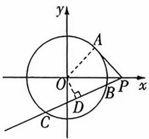

当点A和点D在x轴同侧时, $\overrightarrow{PA}\cdot\overrightarrow{PD}=|\overrightarrow{PA}||\overrightarrow{PD}|\cos(\frac{\pi}{4}-$ 【易错速改】注意点A和点D可能在x轴同侧也可能在x轴导侧,做题时不可考虑片面,忽视其他可能出现的情况 $\alpha)=1\cdot\sqrt{2}\cos\alpha\cdot\cos(\frac{\pi}{4}-\alpha)=\frac{\sqrt{2}}{2}[\cos\frac{\pi}{4}+\cos(2\alpha-\frac{\pi}{4})]=\frac{1}{2}+\frac{\sqrt{2}}{2}\cos(2\alpha-\frac{\pi}{4})$ ,又 $\alpha\in[0,\frac{\pi}{4})$ ,所以 $2\alpha-\frac{\pi}{4}\in[-\frac{\pi}{4},\frac{\pi}{4})$ ,当 $\alpha=\frac{\pi}{8}$ 时, $\frac{\sqrt{2}}{2}\cos(2\alpha-\frac{\pi}{4})$ 取得最大值 $\frac{\sqrt{2}}{2}$ ,所以 $\overrightarrow{PA}\cdot\overrightarrow{PD}$ 的最大值为 $\frac{1}{2}+\frac{\sqrt{2}}{2}$ ;当点A和点D在x轴异侧时, $\overrightarrow{PA}\cdot\overrightarrow{PD}=|\overrightarrow{PA}||\overrightarrow{PD}|\cos(\frac{\pi}{4}+\alpha)=1\cdot\sqrt{2}\cos\alpha\cdot\cos(\frac{\pi}{4}+\alpha)=\frac{\sqrt{2}}{2}[\cos(-\frac{\pi}{4})+\cos(2\alpha+\frac{\pi}{4})]=\frac{1}{2}+\frac{\sqrt{2}}{2}\cos(2\alpha+\frac{\pi}{4})$ ,又 $\alpha\in[0,\frac{\pi}{4})$ ,所以 $2\alpha+\frac{\pi}{4}\in[\frac{\pi}{4},\frac{3\pi}{4})$ ,当 $\alpha=0$ 时, $\frac{\sqrt{2}}{2}\cos(2\alpha+\frac{\pi}{4})$ 取得最大值 $\frac{1}{2}$ ,所以 $\overrightarrow{PA}\cdot\overrightarrow{PD}$ 的

最大值为1.综上可知, $\overrightarrow{PA}\cdot\overrightarrow{PD}$ 的最大值为 $\frac{1+\sqrt{2}}{2}$ .故选A.

7. BCD 由 $\left(\frac{x^{2}}{4}-\frac{y^{2}}{5}-1\right)\left(\frac{x^{2}}{4}-\frac{y^{2}}{12}-1\right)=0$ ，得 $\frac{x^{2}}{4}-\frac{y^{2}}{5}=1$ 或 $\frac{x^{2}}{4}-\frac{y^{2}}{12}=1$ ，则曲线C由双曲线 $\frac{x^{2}}{4}-\frac{y^{2}}{5}=1$ 与双曲线 $\frac{x^{2}}{4}-\frac{y^{2}}{12}=1$ 组成。对于A，双曲线 $\frac{x^{2}}{4}-\frac{y^{2}}{5}=1$ 与双曲线 $\frac{x^{2}}{4}-\frac{y^{2}}{12}=$ 【易错速欢】本题曲线是由两组共顶点的双曲线组成的，分析选项时两组双曲线都要考虑

1 的实轴长都为4，虚轴长不相等，A错误；

对于 B, 点 $A(-3,0)$ , $B(3,0)$ 是双曲线 $\frac{x^{2}}{4}-\frac{y^{2}}{5}=1$ 的两个焦点, 则存在无数个点 P, 使得 $|PA|-|PB|=4$ , B 正确; 对于 C, 点 $N(-4,0)$ , $M(4,0)$ 是双曲线 $\frac{x^{2}}{4}-$

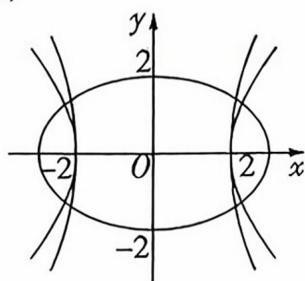

$\frac{y^2}{12} = 1$ 的两个焦点, 则存在无数个点 $P$ , 使得 $|PM| - |PN| = -4$ , C 正确; 对于 D, 由 $|PE| + |PF| = 4\sqrt{2} > 4 = |EF|$ , 得点 $P$ 在以 $E, F$ 为焦点, $4\sqrt{2}$ 为长轴长的椭圆上, 作出图形, 如图, 由图知, 该椭圆与曲线 $C$ 共有 8 个交点, 因此存在 8 个点 $P$ , 使得 $|PE| + |PF| = 4\sqrt{2}$ , D 正确. 故选 BCD.

8. ACD 对于 A, 当 a = b 时, 因为 $c^{2} = a^{2} + b^{2}$ , 所以 $e = \frac{c}{a} = \sqrt{\frac{a^{2} + b^{2}}{a^{2}}} = \sqrt{2}$ , 故 A 正确. 对于 B, 当过双曲线右焦点 F 的直线 l 与 $\Gamma$ 交于左、右两支时, $|AB|$ 的最小值为 2a (此时 A, B 为双曲线的两顶点); 当过双曲线右焦点 F 的直线 l 与 $\Gamma$ 交于同一支时, 最短弦长为通径, 即交点的横坐标为 c, 代入 【易错速改】切勿想当然地以为直线与圆锥曲线交于两点时, 这两点分别在左、右两支上, 也可能在同一支, 注意分类讨论

双曲线方程为 $\frac{c^{2}}{a^{2}} - \frac{y^{2}}{b^{2}} = 1$ , 解得 $y = \pm \frac{b^{2}}{a}$ , 此时弦长为 $\frac{2b^{2}}{a}$ , 由于 a 不一定等于 b, 故 B 错误. 对于 C, 若满足 $|AB| = 2a$ 的直线 l 恰有一条, 由选项 B 可知 $2a < \frac{2b^{2}}{a} \Rightarrow b^{2} > a^{2}$ , 此时 $e = \frac{c}{a} = \sqrt{\frac{a^{2} + b^{2}}{a^{2}}} = \sqrt{1 + \frac{b^{2}}{a^{2}}} > \sqrt{2}$ , 故 C 正确. 对于 D, 若满足 $|AB| = 2a$ 的直线 l 恰有三条, 则 $2a > \frac{2b^{2}}{a} \Rightarrow b^{2} < a^{2}$ , 所以 $e = \frac{c}{a} = \sqrt{\frac{a^{2} + b^{2}}{a^{2}}} = \sqrt{1 + \frac{b^{2}}{a^{2}}} < \sqrt{2}$ , 又 e > 1, 所以 $1 < e < \sqrt{2}$ , 故 D 正确.

9. ACD 双曲线 $C: \frac{x^{2}}{4} - \frac{y^{2}}{b^{2}} = 1$ 的渐近线方程为 $bx \pm 2y = 0$ ，依题意， $-\frac{1}{b} = -\frac{b}{2}$ ，解得 $b = \sqrt{2}$ （舍负），所以双曲线 $C: \frac{x^{2}}{4} - \frac{y^{2}}{2} = 1$ 。对于 A, C 的虚轴长 $2b = 2\sqrt{2}$ ，A 正确；对于 B, C 的离心率 $e = \frac{c}{a} = \frac{\sqrt{a^{2} + b^{2}}}{a} = \frac{\sqrt{6}}{2}$ ，B 错误；对于 C，点 $F(\sqrt{6}, 0)$ 到直线 $l: x + \sqrt{2}y = 0$ 的距离为 $\frac{\sqrt{6}}{\sqrt{1^{2} + (\sqrt{2})^{2}}} = \sqrt{2}$ ，即 $|PF|$ 的最小值为 $\sqrt{2}$ ，C 正确；对于 D，过点 (2, 2) 且垂直于 x 轴的直线为 x = 2，此直线与双曲线 $C: \frac{x^{2}}{4} - \frac{y^{2}}{2} = 1$ 相切于顶点，符合题意，设过点 (2, 2) 且斜率存在的直线为 $y - 2 = k(x - 2)$ ，由 $\left\{\begin{aligned}y - 2 &= k(x - 2), \\ \frac{x^{2}}{4} &= \frac{y^{2}}{2} = 1\end{aligned}\right.$ 得 $(1 - 2k^{2})x^{2} + 8k(k - 1)x - 8k^{2} + 16k -$

12 = 0, 当 $1 - 2k^{2} = 0$ , 即 $k = \pm \frac{\sqrt{2}}{2}$ 时, 直线平行于渐近线, 与双曲线只有一个交点, 符合题意. 当 $1 - 2k^{2} \neq 0$ 时, $\Delta =$ 【易错迷戏】直线与双曲线有唯一交点的情况有相切和平行于渐近线两种, 相切的情况还需要考虑斜率不存在的情形 $64k^{2}(k - 1)^{2} - 4(1 - 2k^{2})(-8k^{2} + 16k - 12) = 0$ , 解得 $k = \frac{3}{4}$ , 此时直线与双曲线相切, 故过点 $P(2,2)$ 能作 4 条与 $C$ 仅有 1 个交点的直线, D 正确. 故选 ACD.

10. $\frac{x^{2}}{3}-\frac{y^{2}}{6}=1$ 圆 $(x-3)^{2}+y^{2}=12$ 的圆心为 $F_{2}(3,0)$ , 半径 $r=2\sqrt{3}$ . 动圆 $M$ 与圆 $F_{2}$ 相切有两种情况, 即内切或外切, 连接 $MF_{1}, MF_{2}$ , 所以 $\vert\vert MF_{1}\vert -\vert MF_{2}\vert\vert = 2\sqrt{3} <\vert F_{1}F_{2}\vert = 6$ , 所以 [易错速改] 不要忽视对双曲线定义中限制条件的验证, 距离之差不小于 $|F_{1}F_{2}|$ 时, 点 $M$ 的轨迹为两条射线或不存在

点 $M$ 在以 $F_{1}, F_{2}$ 为焦点的双曲线上, 可设双曲线方程为 $\frac{x^{2}}{a^{2}}-\frac{y^{2}}{b^{2}}=1 (a>0, b>0)$ , 则 $2a=2\sqrt{3}, 2c=6$ , 所以 $b^{2}=c^{2}-a^{2}=6$ , 所以曲线 $C$ 的方程是 $\frac{x^{2}}{3}-\frac{y^{2}}{6}=1$ .

11.2 或 $-\frac{3}{2}$ 链接2025上海春季卷T10,根据双曲线的几何性质求双曲线的方程 当 $\left\{\begin{array}{l}\frac{a^{2}+a-2>0}{2a-1>0},\\ \end{array}\right.$ 即 a>1 时,双曲线 E 的焦点 【易错速攻】根据实轴长求参数，必须先确定双曲线的焦点位置，此外需注意双曲线 $\frac{x^{2}}{a^{2}}-\frac{y^{2}}{b^{2}}=1$ 的实轴长是 “2a” 而不是 “a” 不要混淆

在 $x$ 轴上, 则 $a^2 + a - 2 = 2^2$ , 得 $a = 2$ . 当 $\left\{ \begin{array}{l} a^2 + a - 2 < 0, \\ 2a - 1 < 0, \end{array} \right.$ 即 $-2 < a < \frac{1}{2}$ 时, 双曲线 $E$ 的焦点在 $y$ 轴上, 则 $-(2a - 1) = 2^2$ , 解得 $a = -\frac{3}{2}$ . 故填 2 或 $-\frac{3}{2}$ .

12. $y = 2x (x > 8 \text{ 或 } x < 0)$ 由焦点 $F$ 到准线的距离为 2, 可得 $p = 2$ , 所以抛物线 $C$ 的方程为 $x^2 = 4y$ . 设 $P(x_1, y_1), Q(x_2, y_2)$ , 由 $x^2 = 4y$ 可得 $y = \frac{x^2}{4}$ , 故 $y' = \frac{x}{2}$ , 故曲线在点 $P(x_1, \frac{x_1^2}{4})$ 处的切线方程为 $y - \frac{x_1^2}{4} = \frac{x_1}{2}(x - x_1)$ , 即 $y = \frac{x_1x}{2} - \frac{x_1^2}{4}$ , 同理, 曲线在点 $Q(x_2, \frac{x_2^2}{4})$ 处的切线方程为 $y = \frac{x_2x}{2} - \frac{x_2^2}{4}$ , 由 $\left\{\begin{aligned}&y=\frac{x_1x}{2}-\frac{x_1^2}{4},\\&y=\frac{x_2x}{2}-\frac{x_2^2}{4},\end{aligned}\right.$ 得 $\left\{\begin{aligned}&x=\frac{x_1+x_2}{2},\\&y=\frac{x_1x_2}{4},\end{aligned}\right.$ 即 $M (\frac{x_1+x_2}{2}, \frac{x_1x_2}{4})$ . 由 $\left\{\begin{aligned}&x^2=4y,\\&y=k(x-4),\end{aligned}\right.$ 消去 $y$ 得关于 $x$ 的方程 $x^2 - 4kx + 16k = 0$ , 则 $\Delta = 16k^2 - 64k > 0$ , 所以 $k > 4$ 或 $k < 0$ . 所以 $x_1 + x_2 = 4k$ ,
【易错速文】上文求点 $M$ 的坐标时用到了与“点差法”类似的步骤, 那就会和点差法产生类似的漏洞, 即忽视直线与抛物线有两个交点的限制条件, 因此利用 $\Delta > 0$ “查漏” $x_1x_2 = 16k$ , 则 $M(2k, 4k)$ , 其中 $k > 4$ 或 $k < 0$ , 故点 $M$ 的轨迹方程为 $y = 2x (x > 8$ 或 $x < 0)$ .

# 热考易错 8 解多选题时选项关联因素逻辑不清致误

1. BC 对于 A, 双曲线 $C_{1}:\frac{x^{2}}{a^{2}}-\frac{y^{2}}{b^{2}}=1$ 的实轴在 x 轴上, 实轴 [易错速欢] 本题各个选项相近但没有关联, 富逐个分析判断, 区分焦点在 x 轴和焦点在 y 轴上的双曲线相同和不同的性质

长为 2a, 双曲线 $C_{2}:\frac{y^{2}}{b^{2}}-\frac{x^{2}}{a^{2}}=1$ 的实轴在 y 轴上, 实轴长为 2b, 所以 A 错误; 对于 B, 双曲线 $C_{1}:\frac{x^{2}}{a^{2}}-\frac{y^{2}}{b^{2}}=1$ 和 $C_{2}:\frac{y^{2}}{b^{2}}-\frac{x^{2}}{a^{2}}=1$ 焦距均为 $2c=2\sqrt{a^{2}+b^{2}}$ , 所以 B 正确; 对于 C, 双曲线 $C_{1}:\frac{x^{2}}{a^{2}}-\frac{y^{2}}{b^{2}}=1$ 的渐近线为 $y=\pm\frac{b}{a}x$ , 双曲线 $C_{2}:\frac{y^{2}}{b^{2}}-\frac{x^{2}}{a^{2}}=1$ 的渐近线为 $y=\pm\frac{b}{a}x$ , 所以 C 正确; 对于 D, 双曲线 $C_{1}:\frac{x^{2}}{a^{2}}-\frac{y^{2}}{b^{2}}=1$ 的离心率 $e=\frac{c}{a}=\frac{\sqrt{a^{2}+b^{2}}}{a}$ , 双曲线 $C_{2}:\frac{y^{2}}{b^{2}}-\frac{x^{2}}{a^{2}}=1$ 的离心率 $e=\frac{c}{b}=\frac{\sqrt{a^{2}+b^{2}}}{b}$ , 所以 D 错误, 故选 BC.

2. BD 对于A,因为 $A \cap B = \{ 5\}$ ,所以事件 $A$ 与 $B$ 不互斥,故 【易错速改】本题选项之间有逻辑关联,切不可把前面的选项当成后面选项的分析条件；另外需定区分 “五斥事件” “对立事件” “相互独立” “两两独立” 等概念和相应关系式 A 错误;对于 $\mathrm{B},P\left( {AC}\right)  = P\left( {BC}\right)  = P\left( {AB}\right)  = \frac{1}{4},P\left( A\right)  =$

$P(B)=P(C)=\frac{1}{2},P(AB)=P(A)P(B),P(AC)=P(A)P(C),$ $P(BC)=P(B)P(C)$ ，故 B 正确；对于 C, A, B, C 的交集为 $\{5\}$ ，则 $P(ABC)=\frac{1}{4}, P(A)P(B)P(C)=\frac{1}{8}$ ，故 C 错误；对于 D, $P(A|C)=\frac{P(AC)}{P(C)}=\frac{1}{2}, P(C|A)=\frac{P(AC)}{P(A)}=\frac{1}{2}$ ，故 D 正确。故选 BD.

3. ABD 由 $a \cdot c = b \cdot c$ , $|a| = 1$ , $|b| = 1$ , 得 $\cos \langle a, c \rangle = \cos \langle b, c \rangle$ , 则当向量 $a, b$ 方向相同, 且与 $c$ 方向相反时, $|a + b + c|$ 有最小值, 为 $|c| - (|a| + |b|) = 1$ ; 当向量 $a, b, c$ 方向相同时, $|a + b + c|$ 有最大值, 为 $|a| + |b| + |c| = 5$ . A, B 正确.

【易错速改】对于 A, B, 下一看是对立的, 其实不然, 一个判断最大值一个判断最小值, 故需判断两次, C, D 也是一样的, 读题要仔细

由 $a \cdot c = b \cdot c$ , 得 $(a - b) \cdot c = 0$ , 所以 $|a - b + c| = \sqrt{|a - b|^2 + |c|^2}$ , 所以 $a, b$ 方向相同时, $|a - b|$ 取最小值 $0, |a - b + c|$ 取最小值 3; 当 $a, b$ 方向相反时, $|a - b|$ 取最大值 $2, |a - b + c|$ 取最大值 $\sqrt{13}$ . C 错误, D 正确.

# 巧解

# 坐标法!

设 $c = (3,0), a = (\cos \theta, \sin \theta)$ , 则由 $a \cdot c = b \cdot c$ 得 $(a - b) \cdot c = 0$ , 所以可取 $b = (\cos \theta, -\sin \theta)$ , 则 $|a + b + c| = |3 + 2\cos \theta| \in [1,5], |a - b + c| = \sqrt{9 + 4\sin^2\theta} \in [3, \sqrt{13}]$ , 所以 C 错误, A, B, D 正确.

4. AD 对于 A, 因为 a, b > 0 , 所以由 $\frac{1}{a} < \frac{1}{b}$ 得 $\frac{b}{ab} < \frac{a}{ab}$ , 故 a > b,

【易错速攻】此类问题一定要分清是“谁推谁”题眼

“……的一个充分条件可以是”则“选项⇒题干”切勿与必要条件弄混，否则容易错选 B，C

故 A 正确; 对于 B, 取 a = 1, b = 2, 此时满足 a > 0, b > 0, a > b - 2, 但 a < b, 故 B 错误; 对于 C, 由 $b^{2} < a^{2}(1 + b^{2})$ 可得 $\frac{1}{a^{2}} < \frac{1}{b^{2}} + 1$ , 即 $\frac{1}{a^{2}} - \frac{1}{b^{2}} < 1$ , 当 a, b > 0 时, $a > b \Leftrightarrow \frac{1}{a^{2}} - \frac{1}{b^{2}} < 0$ , $\frac{1}{a^{2}} - \frac{1}{b^{2}} < 0 \Rightarrow \frac{1}{a^{2}} - \frac{1}{b^{2}} < 1$ , 而 $\frac{1}{a^{2}} - \frac{1}{b^{2}} < 1 \Rightarrow \frac{1}{a^{2}} - \frac{1}{b^{2}} < 0$ , 故 C 错误; 对于 D, 由 $\ln(a^{2} + 1) > \ln(b^{2} + 1)$ 可知, $a^{2} > b^{2}$ , 因为 a, b > 0, 所以 a > b, 故 D 正确.

5. ABD 由题意知 $a_{3} + a_{1} = a_{1}a_{2}$ , 若 $a_{1} = 1, a_{2} = 2$ , 则 $a_{3} = 1$ , A 正确. 若 $a_{1} = 1$ , 则当 $n \geqslant 2$ 时, $a_{n+1} + a_{n-1} = a_{n}$ , 所以 $a_{n+2} + a_{n} = a_{n+1}$ , 两式相加可得 $a_{n+2} = -a_{n-1}$ , 所以 $a_{n+5} = -a_{n+2}$ , 进而 $a_{n+5} = a_{n-1}$ , 所以 $a_{n+6} = a_{n}$ , B 正确. 若 $a_{1} = 2, a_{2} = 3$ , 则 $\forall n \geqslant 2, n \in \mathbb{N}^{*}, a_{n+1} + a_{n-1} = 2a_{n}$ , 可得 $a_{n+1} - a_{n} = a_{n} - a_{n-1}$ , 所以数列 $\{a_{n}\}$ 为等差数列, 且公差 $d = a_{2} - a_{1} = 1$ , 所以 $a_{n} = n + 1$ , C 错误. 由 C 知, $S_{20} = 20 \times 2 + \frac{20 \times 19}{2} \times 1 = 230$ , D 正确.

【易错速攻】A, B, C项的前提条件不一致，则各选项所推导出的结论不能通用，需对选项逐个分析，但C,D选项的前提条件一致，故分析D选项时可直接使用C选项的结论。在多选题中务必要注意各选项的前提条件是否一致

6. CD 链接教材人教 A 版《必修第二册》P209 练习 T3 原始评分为 9.1, 9.2, 9.3, 9.4, 9.5, 9.6, 9.7, 9.8, 9.9, 10.0, 由 $10 \times 0.8 = 8$ , 得第 80 百分位数为 $\frac{9.8 + 9.9}{2} = 9.85$ , A, B 错误; 去 [易错速改] 本题 A, B 选项算的是同一个数据, 但是两个都是错的, 切不可因为思维定式认为一对一错掉最高分和最低分之前, 平均数 $\overline{x_1} = \frac{1}{10} \times (9.1 + 9.2 + 9.3 +$

$9.4+9.5+9.6+9.7+9.8+9.9+10.0)=9.55$ ，方差 $s_{1}^{2}=\frac{1}{10}\times\left[(9.1-9.55)^{2}+(9.2-9.55)^{2}+\cdots+(10.0-9.55)^{2}\right]=0.0825$

去掉最高分和最低分之后,平均数 $\overline{x_{2}}=\frac{1}{8}\times(9.2+9.3+9.4+9.5+9.6+9.7+9.8+9.9)=9.55$ ,方差 $s_{2}^{2}=\frac{1}{8}\times[(9.2-9.55)^{2}+(9.3-9.55)^{2}+\cdots+(9.9-9.55)^{2}]=0.0525$ ,所以方差减小,C正确;去掉最高分和最低分之前,极差为10-9.1=0.9,去掉最高分和最低分之后,极差为9.9-9.2=0.7,所以极差减小,D正确.故选CD.

7. ABD 对于 A, 由 $f(x) = 2 - f\left(\frac{1}{x}\right)$ 可得 $f(1) = 2 - f(1) \Rightarrow f(1) = 1$ , 故 A 正确; 对于 B, 由 $f(x) = 2 - f\left(\frac{1}{x}\right)$ 可得 $f(x) + f\left(\frac{1}{x}\right) = 2$ , 即 $f\left(2^{x}\right) + f\left(2^{-x}\right) = 2$ , 所以 $f\left(2^{x}\right)$ 的图象关于点 (0,1) 中心对称, 故 B 正确; 对于 C, 由 $f(x) = f\left(\frac{2}{x}\right)$ 可得 【易错速攻】注意从 B 选项开始, 各选项都在分析复合函数的性质, 切不可再用原函数的关系分析 $f\left(2^{x}\right) = f\left(2^{1-x}\right)$ , 所以 $f\left(2^{x}\right)$ 的图象关于直线 $x = \frac{1}{2}$ 对称, 故 C 错误; 对于 D, 在 $f(x) = f\left(\frac{2}{x}\right)$ 中, 令 $x = 1$ , 可得 $f(1) = f(2) = 1$ , 设 $g(x) = f\left(2^{x}\right) = f\left(\frac{2}{2^{x}}\right) = g(1 - x)$ ①, 又 $g(x) = f\left(2^{x}\right) = 2 - f\left(\frac{1}{2^{x}}\right) = 2 - g(-x)$ ②, 由①②可得 $g(1 - x) = 2 - g(-x)$ , 所以 $g(1 + x) = 2 - g(x)$ , 即 $g(x) + g(x + 1) = 2$ , $f\left(2^{x}\right) + f\left(2^{x+1}\right) = 2$ , 所以 $f(2) + f\left(2^{2}\right) + f\left(2^{3}\right) + \cdots + f\left(2^{10}\right) = 10$ , 故 D 正确. 故选 ABD.

# 疑难压轴 1 指、对数式比较大小问题

1. A 因为 $2.71 < e < 2.72$ , 所以 $\sqrt{2.71} < a = e^{0.5} < \sqrt{2.72}$ , 而 $b = \frac{8}{5} = 1.6 = \sqrt{2.56}, c = \frac{\pi}{1.8} > \frac{3.14}{1.8} > 1.7 = \sqrt{2.89}$ , 所以 【变思路】开报号不容易计算, 逆向思维, 直接比较报号内的数值, 就很容易了 $c > a > b$ . 故选 A.

2. D 链接教材人教 A 版《必修第一册》P141 习题 4.4T13 $a = \log_{2}3 = \frac{\ln 3}{\ln 2}, b = \log_{4}5 = \frac{\ln 5}{\ln 4}, c = \log_{6}7 = \frac{\ln 7}{\ln 6}$ , 令 $f(x) = \frac{\ln (x + 1)}{\ln x} (x \geqslant 2)$ , 则 $f'(x) = \frac{\frac{\ln x}{x + 1} - \frac{\ln (x + 1)}{x}}{(\ln x)^{2}} = \frac{x \ln x - (x + 1) \ln (x + 1)}{x(x + 1)(\ln x)^{2}}$ , 因为 $x \geqslant 2$ , 所以 $x(x + 1)(\ln x)^{2} > 0$ , 令 $g(x) = x \ln x, x \geqslant 2$ , 则 $g'(x) = \ln x + 1 > 0$ 在 $[2, +\infty)$ 上恒成立, 故 $g(x)$ 在 $[2, +\infty)$ 上单调递增, 故 $x \ln x - (x + 1) \ln (x + 1) < 0$ , 所以 $f'(x) = \frac{x \ln x - (x + 1) \ln (x + 1)}{x(x + 1)(\ln x)^{2}} < 0$ 在 $[2, +\infty)$ 上恒成立, 故 $f(x) = \frac{\ln (x + 1)}{\ln x}$ 在 $[2, +\infty)$ 上单调递减, 所以 $\frac{\ln 3}{\ln 2} > \frac{\ln 5}{\ln 4} > \frac{\ln 7}{\ln 6}$ , 即 $a > b > c$ , 故选 D.

巧解

$a=\log_{2}3=1+\log_{2}\frac{3}{2},b=\log_{4}5=1+\log_{4}\frac{5}{4},c=\log_{6}7=1+\log_{6}\frac{7}{6},\frac{3}{2}>\frac{5}{4}>\frac{7}{6}$ ，结合对数函数的图象可得a>b>c，故选D.

3. D 令 $f(x) = \sin x - x (0 < x < \frac{\pi}{2})$ ，则 $f'(x) = \cos x - 1 < 0$ ，所以 $f(x)$ 在 $(0, \frac{\pi}{2})$ 上单调递减，所以 $f(x) < \sin 0 - 0 = 0$ ，则 $\sin x < x (0 < x < \frac{\pi}{2})$ ，所以 $\sin 0.25 < 0.25$ ，即 $b < a$ . 令 $g(x) = e^x - x - 1$ ，则 $g'(x) = e^x - 1$ ，当 $x < 0$ 时， $g'(x) < 0$ ，所以 $g(x)$ 在区间 $(-\infty, 0)$ 上单调递减， $g(x) > e^0 - 0 - 1 = 0$ ，则 $e^x > x + 1 (x < 0)$ ，则 $e^{-0.75} > -0.75 + 1 = 0.25$ ，即 $c > a$ . 综上， $b < a < c$ . 故选 D.

速解

# 切线不等式法!

因为 $\mathrm{e}^x\geqslant x + 1$ （当且仅当 $x = 0$ 时，等号成立），所以 $\mathrm{e}^{-0.75} > - 0.75 + 1 = 0.25$ ，即 $c > a.$ 当 $x\in (0,\frac{\pi}{2})$ 时，因为 $\sin x <   x$ ，所以 $\sin 0.25 <   0.25$ ，即 $b <   a.$ 综上， $b< a < c.$ 故选D.

4. A 记 $f(x) = \ln x - x + 1$ ，则 $f'(x) = \frac{1}{x} - 1 = \frac{1 - x}{x}$ ，当 $0 < x < 1$ 时， $f'(x) = \frac{1 - x}{x} > 0$ ，故 $f(x)$ 在 $(0,1)$ 上单调递增，当 $x > 1$ 时， $f'(x) = \frac{1 - x}{x} < 0$ ，故 $f(x)$ 在 $(1, +\infty)$ 上单调递减，故 $f(x) = \ln x - x + 1 \leqslant f(1) = 0$ ，因此对任意的 $x > 0$ ，都有 $\ln x \leqslant x - 1$ ，当且仅当 $x = 1$ 时取到等号，故 $\ln \frac{10}{9} < \frac{1}{9}$ ，即 $-\ln \frac{9}{10} < \frac{1}{9}$ ，即 $\ln 0.9 > -\frac{1}{9}$ ，故 $a > b$ . 又 $a = \ln 0.9 < 0, b = -\frac{1}{9} < 0, c = e^{0.9} > 0$ ，所以 $c > a > b$ ，故选 A.

# 速解

# 泰勒展开式法!

$$
\begin{array}{l} \ln (1 + x) = x - \frac {x ^ {2}}{2} + \frac {x ^ {3}}{3} - \dots , \ln 0. 9 = \ln (1 - 0. 1) \approx \\ - 0. 1 - \frac {0 . 0 1}{2} - \frac {0 . 0 0 1}{3} \approx - 0. 1 0 5 > - \frac {1}{9}, \text {   又   } c = e ^ {0. 9} > 0, \\ \end{array}
$$

所以 c > a > b，故选 A.

5. D 链接2022新高考I卷T7,指数、对数、分数混合比大小 已知 $e^{a}=1.02$ ,则 $a=\ln 1.02$ ,令 $f(x)=\ln x-\frac{2(x-1)}{x+1}$ ,x>1, 则 $f'(x)=\frac{1}{x}-\frac{2\times(x+1)-2(x-1)}{(x+1)^{2}}=\frac{(x-1)^{2}}{x(x+1)^{2}}$ ,则当x>1时, $f'(x)>0$ ,故 $f(x)$ 在 $(1,+\infty)$ 上单调递增,故 $f(1.02)=\ln 1.02-\frac{2\times(1.02-1)}{1.02+1}=\ln 1.02-\frac{2}{101}>\ln 1-0=0$ ,即a= $\ln 1.02>\frac{2}{101}>\frac{2}{102}=\frac{1}{51}=c$ ,即a>c.已知 $\ln(b+1)=0.02$ , 则 $b=e^{0.02}-1$ ,令 $g(x)=e^{x}-\ln(1+x)-1$ ,x>0,则 $g'(x)=e^{x}-\frac{1}{x+1}$ ,令 $h(x)=e^{x}-\frac{1}{x+1}$ ,则当x>0时, $h'(x)=e^{x}+\frac{1}{(x+1)^{2}}>0$ 恒成立,故 $g'(x)$ 在 $(0,+\infty)$ 上单调递增,又 $e^{0}-\frac{1}{1}=0$ ,故 $g'(x)>0$ 恒成立,则 $g(x)$ 在 $(0,+\infty)$ 上单调递增,故 $g(0.02)=e^{0.02}-\ln(1+0.02)-1>e^{0}-\ln 1-1=0$ ,即 $e^{0.02}-1>\ln 1.02$ ,即b>a.故c<a<b.故选D.

# 速解

# 泰勒展开式法!

$$
\begin{array}{l} \ln (1 + x) = x - \frac {x ^ {2}}{2} + \frac {x ^ {3}}{3} - \frac {x ^ {4}}{4} + \dots , e ^ {\alpha} = 1. 0 2, \text {则} a = \\ \ln 1. 0 2 \approx 0. 0 2 - \frac {0 . 0 2 ^ {2}}{2} + \frac {0 . 0 2 ^ {3}}{3} \approx 0. 0 1 9 8, e ^ {x} = 1 + x + \\ \frac {x ^ {2}}{2 !} + \frac {x ^ {3}}{3 !} + \dots , \ln (b + 1) = 0. 0 2, \text {则} b = \mathrm{e} ^ {0. 0 2} - 1 \approx 1 + 0. 0 2 + \\ \frac {0 . 0 2 ^ {2}}{2 !} - 1 = 0. 0 2 0 2, c = \frac {1}{5 1} \approx 0. 0 1 9 6, \text {   故   } c <   a <   b, \text {   故选   } D. \\ \end{array}
$$

6. D $a = \sin \frac{\pi}{5} > \sin \frac{\pi}{6} = \frac{1}{2} = c$ ，由 $\frac{x}{x + 1} \leqslant \ln(x + 1) \leqslant x (x > -1$ ，当 x = 0 时取等）可得 $b = \ln(1 + \frac{1}{2}) < \frac{1}{2} = c$ ，故 a > c > b，故选 D.  
7. C 令 $f(x) = \tan x - x, x \in (0, \frac{\pi}{2})$ ，则 $f'(x) = \frac{1}{\cos^2 x} - 1 > 0$ ，即函数 $f(x)$ 在 $(0, \frac{\pi}{2})$ 上单调递增，所以 $f(x) > \tan 0 - 0 = 0$ ，即当 $x \in (0, \frac{\pi}{2})$ 时， $\tan x > x$ . 又 $y = e^x$ 是增函数，所以 $a > e^{0.2} - 1$ . 令 $g(x) = e^x - \sqrt{1 + 2x}, x \in [0, 0.2]$ ，则 $g'(x) = e^x - \frac{1}{\sqrt{1 + 2x}} \geqslant 0$ ，即函数 $g(x)$ 在 $[0, 0.2]$ 上单调递增，所以

$g(0.2)>g(0)=0$ , 则 $e^{0.2}>\sqrt{1.4}$ ，即 $e^{0.2}-1>\sqrt{1.4}-1$ ，所以 a>b。令 $h(x)=2\ln(1+x)-(\sqrt{1+4x}-1)$ ， $x\in[0,0.1]$ ，则 $h'(x)=\frac{2}{1+x}-\frac{2}{\sqrt{1+4x}}=\frac{2(\sqrt{1+4x}-x-1)}{(1+x)\sqrt{1+4x}}\geqslant0$ ，即函数 $h(x)$ 在 $[0,0.1]$ 上单调递增，所以 $h(0.1)>h(0)=0$ ，即 $2\ln1.1>\sqrt{1.4}-1$ ，即 c>b。令 $t(x)=\mathrm{e}^{2x}-1-2\ln(1+x)$ ， $x\in[0,0.1]$ ，则 $t'(x)=2\mathrm{e}^{2x}-\frac{2}{1+x}$ ，显然 $t'(x)$ 在 $[0,0.1]$ 上单调递增，且 $t'(0)=0$ ，所以当 $x\in[0,0.1]$ 时， $t'(x)\geqslant0$ ，即 $t(x)$ 在 $[0,0.1]$ 上单调递增，所以 $t(0.1)>t(0)=0$ ，即 $e^{0.2}-1>2\ln1.1$ ，所以 a>c。

综上可知， $a > c > b$ ，故选C.

# 多解

# 利用高等数学知识!

$$
\begin{array}{l} \ln (1 + x) = x - \frac {x ^ {2}}{2} + \frac {x ^ {3}}{3} - \frac {x ^ {4}}{4} + \dots , | x | <   1, \text {   则当   } x = \\ 0. 1 \text {   时,   有   } 2 \ln 1. 1 = 2 \ln (1 + 0. 1) > 2 \times (0. 1 - \frac {0 . 1 ^ {2}}{2}) = \\ \begin{array}{l} {0. 1 9, \text {   又   } (0. 1 9 + 1) ^ {2} = 1. 4 1 6 1 > 1. 4, \text {   即   } 0. 1 9 > \sqrt {1 . 4} -} \\ {1, \text {   所以   } c > b. \text {   后同上解 }.} \end{array} \\ \end{array}
$$

8. B 由 $\frac{x}{x + 1} \leqslant \ln (x + 1) \leqslant x (x > -1$ , 当 $x = 0$ 时取等) 可得 $1 + \frac{0.01}{1.01} < b = 1 + \ln 1.01 < 1 + 0.01$ , 即 $\frac{1.02}{1.01} < b < 1.01$ , 由 $\mathrm{e}^x \geqslant x + 1$ (当 $x = 0$ 时取等) 可得 $c = \mathrm{e}^{0.01} > 1.01$ , 所以 $c > 1.01 > b$ . 令 $f(x) = 1 + x + \sin x - \mathrm{e}^x$ , 则 $f'(x) = 1 + \cos x - \mathrm{e}^x$ , 令 $h(x) = 1 + \cos x - \mathrm{e}^x$ , 则 $h'(x) = -\sin x - \mathrm{e}^x < 0$ 在区间 $(0, \frac{1}{2})$ 上恒成立, 所以 $f'(x)$ 在区间 $(0, \frac{1}{2})$ 上单调递减, 又 $f'(\frac{1}{2}) = 1 + \cos \frac{1}{2} - \mathrm{e}^{\frac{1}{2}} > 1 + \cos \frac{\pi}{6} - \mathrm{e}^{\frac{1}{2}} = 1 + \frac{\sqrt{3}}{2} - \mathrm{e}^{\frac{1}{2}}, (1 + \frac{\sqrt{3}}{2})^2 = 1 + \frac{3}{4} + \sqrt{3} > \mathrm{e}$ , 所以 $f'(\frac{1}{2}) > 0$ , 即 $f(x)$ 在区间 $(0, \frac{1}{2})$ 上单调递增, 所以 $f(0.01) = 1.01 + \sin 0.01 - \mathrm{e}^{0.01} > f(0) = 0$ , 所以 $1.01 + \sin 0.01 > \mathrm{e}^{0.01}$ , 即 $c < a$ . 综上, $a > c > b$ , 故选 B.

# 多解

# 放缩估算法!

由上可得 $c > b$ . 由 $\sin x > x - \frac{1}{6} x^3 (x > 0)$ 可得 $a = 1.01 + \sin 0.01 > 1.01 + 0.01 - \frac{0.01^3}{6} > \frac{611}{600}$ , 由 $\mathrm{e}^x \leqslant \frac{1}{1 - x} (x < 1$ , 当 $x = 0$ 时取等) 可得 $c = \mathrm{e}^{0.01} < \frac{1}{0.99} = \frac{100}{99}$ , 所以 $c < \frac{100}{99} < \frac{611}{600} < a$ . 综上, $a > c > b$ , 故选 B.

9. D 因为 $2005^{m} = 2025, 2004^{n} = 2024$ ，所以 $m = \log_{2005} 2025, n = \log_{2004} 2024$ ，所以 $a = 2004^{m} - 2024 = 2004^{\log_{2005} 2025} - 2024, b = 2005^{\log_{2004} 2024} - 2025.$ 因为 $2004^{\log_{2004} 2024} - 2024 = 0, 2005^{\log_{2005} 2025} - 2025 = 0$ ，所以要比较 $a, b$ 与 $0$ 的大小关系，只需比较 $\log_{2005} 2025, \log_{2004} 2024$ 的大小关系，构造 $f(x) = \frac{\ln x}{\ln(x - 20)} (x > 21)$ .

$$
f ^ {\prime} (x) = \frac {\frac {\ln (x - 2 0)}{x} - \frac {\ln x}{x - 2 0}}{\ln^ {2} (x - 2 0)} <   \frac {\frac {\ln (x - 2 0)}{x - 2 0} - \frac {\ln x}{x - 2 0}}{\ln^ {2} (x - 2 0)} =
$$

$\frac{\ln(x-20)-\ln x}{(x-20)\ln^{2}(x-20)}<0,$ 所以 $f(x)$ 是减函数，

所以 $\log_{2005}2025 = \frac{\ln 2025}{\ln 2005} = f(2025) < f(2024) = \frac{\ln 2024}{\ln 2004} =$ $\log_{2004}2024$ ，所以 $a <   0 <   b$ ，故选D.

10, B 若取 $b = 1$ , 那么 $a = c = 1$ . 取 $b = 2$ , 则 $a = \log_5 13 < 2$ , $c = \log_3 21 > 2$ , 从而 $c > b > a$ , 那么 $|a - c| > |b - c|$ , 排除 C, D; 当 $b = 2$ 时, 因为 $b - a = 2 - \log_5 13 = \log_5 \frac{25}{13}$ , $c - b = \log_3 21 - 2 = \log_3 \frac{21}{9}$ , 且 $\frac{25}{13} < 2 < \frac{21}{9}$ , 所以 $\log_5 \frac{25}{13} < \log_5 2 < \log_3 2 < \log_3 \frac{21}{9}$ , 所以 $|a - b| < |b - c|$ , 排除 A. 故选 B.

# 速解

# 临界法!

利用极限思想, 当 $b \to 0 (b > 0)$ 时, $a \to \log_5 2 > 0$ , 而 $c \to -\infty$ , 此时 $|a - b|$ 会远远小于 $|b - c|$ , 而且 $|a - c| > |b - c|$ , 从而选 B.

11. A 因为 $2^{a} \cdot 3^{a - b} + 3^{c - b} = 1 + 2^{b}$ , 所以 $6^{a} + 3^{c} = 3^{b} + 6^{b}$ , 即 $6^{a} - 6^{b} = 3^{b} - 3^{c}$ , 因为 $a > b$ , 所以 $6^{a} - 6^{b} > 0$ , 所以 $3^{b} - 3^{c} > 0$ , 所以 $b > c$ ; 又 $\frac{6^{a - b} - 1}{3^{b - c} - 1} = \frac{3^{c}}{6^{b}}$ , 结合 $b > c > 0$ , 可得 $\frac{6^{a - b} - 1}{3^{b - c} - 1} = \frac{3^{c}}{6^{b}} < \frac{3^{c}}{6^{c}} < 1$ , 而 $6^{a - b} - 1 > 0, 3^{b - c} - 1 > 0$ , 所以 $6^{a - b} - 1 < 3^{b - c} - 1$ , 即 $6^{a - b} < 3^{b - c}$ , 则必有 $a - b < b - c$ , 所以 $2b > a + c$ . 故选 A.

12. B 链接教材人教 B 版《必修第二册》P13 练习 BT1 $\ln a=2\ 023\ln\frac{1\ 012}{1\ 011}=(2\times1\ 011+1)\ln(1+\frac{1}{1\ 011}),\ln b=$ $2\ 025\ln\frac{1\ 013}{1\ 012}=(2\times1\ 012+1)\ln(1+\frac{1}{1\ 012})$ ，设函数 $f(x)=(2x+1)\ln(1+\frac{1}{x})=(2x+1)[\ln(x+1)-\ln x](x>1)$ ，则

$$
\begin{array}{r l} & {f ^ {\prime} (x) = 2 \mathrm{ln}   (  x + 1  )   -   2 \mathrm{ln}   x   +   (  2 x   +   1  )   (\frac {1}{x + 1}   -   \frac {1}{x})   =  } \\ & {2 \mathrm{ln}   (  1 + \frac {1}{x}  )   - \frac {1}{1 + \frac {1}{x}} \cdot (\frac {2}{x} + \frac {1}{x ^ {2}})  , \text {设}   g (x) = 2 \mathrm{ln}   (  1 + x  )   -  } \end{array}
$$

$\frac{x^2 + 2x}{1 + x} (0 < x < 1)$ , 则 $g'(x) = -\frac{x^2}{(1 + x)^2} < 0$ , 所以 $g(x)$ 在 $(0,1)$ 上单调递减, 且 $g(x) < 2\ln 1 - 0 = 0$ , 即 $f'(x) < 0$ , 所以 $f(x)$ 在 $(1, +\infty)$ 上单调递减, 则 $f(1011) > f(1012)$ , 即 $\ln a > \ln b$ , 所以 $a > b$ . 设 $h(x) = \ln (x + 1) - \frac{2x}{x + 2} (x > 0)$ , 则 $h'(x) = \frac{1}{x + 1} - \frac{4}{(x + 2)^2} = \frac{x^2}{(x + 1)(x + 2)^2} > 0$ , 所以 $h(x)$ 在 $(0, +\infty)$ 上单调递增, 且 $h(\frac{1}{x}) > \ln 1 - 0 = 0$ , 即 $\ln (1 +$

$$
\left. \frac {1}{x}\right) - \frac {\frac {2}{x}}{\frac {1}{x} + 2} = \ln \left(1 + \frac {1}{x}\right) - \frac {2}{2 x + 1} = \frac {(2 x + 1) \ln \left(1 + \frac {1}{x}\right) - 2}{2 x + 1} =
$$

$\frac{f(x) - 2}{2x + 1} >0$ ，得 $f(x) > 2$ ，所以 $f(1012) > 2$ ，即 $\ln b > 2$ ，解得 $b>$ $\mathrm{e}^2.$ 综上， $\mathrm{e}^2 < b < a.$ 故选B.

13. D 设 $f(t) = e^{t} - et$ , 可知函数 $f(t)$ 的定义域为 $\mathbf{R}$ , 则 $f'(t) = e^{t} - e$ , 易知 $f'(t)$ 在定义域上单调递增, 且 $f'(1) = 0$ . 若 $t > 1$ , 则 $f'(t) > 0$ ; 若 $t < 1$ , 则 $f'(t) < 0$ . 可得 $f(t)$ 在 $(1, +\infty)$ 上单调递增, 在 $(-\infty, 1)$ 上单调递减, 又因为 $e^x - e^2 = e(x - 2) \neq 0, e^y - e^3 = e(y - 3) \neq 0, e^z - e^5 = e(z - 5) \neq 0$ , 可得 $e^x - ex = e^2 - 2e, e^y - ey = e^3 - 3e, e^z - ez = e^5 - 5e$ , 即 $f(x) = f(2), f(y) = f(3), f(z) = f(5)$ , 且 $x \neq 2, y \neq 3, z \neq 5$ , 可知 $f(x) < f(y) < f(z)$ , 且 $x < 1, y < 1, z < 1$ , 所以 $z < y < x$ . 故选 D.

14. B 令 $2 + \log_2 x = 3 + \log_3 y = 5 + \log_5 z = 0$ ，得 $x = \frac{1}{4}, y = \frac{1}{27}$ ， $z = \frac{1}{5^5}$ ，此时 $x > y > z$ ；令 $2 + \log_2 x = 3 + \log_3 y = 5 + \log_5 z = 5$ ，得 $x = 8, y = 9, z = 1$ ，此时 $y > x > z$ ；令 $2 + \log_2 x = 3 + \log_3 y = 5 + \log_5 z = 8$ ，得 $x = 2^6 = 64, y = 3^5 = 243, z = 5^3 = 125$ ，此时 $y > z > x$ 。故选 B.

15. ACD $a = \mathrm{e}^{0.02} - 1, b = \ln 1.02 = \ln (1 + 0.02), c = \frac{1}{51} = \frac{2}{102}, d = \sqrt{1.02} - 1 = \sqrt{1 + 0.02} - 1.$

对于 A, 设 $f(x) = \mathrm{e}^{x} - \ln(x + 1) - 1, x \in (0, +\infty)$ ，则 $f'(x) = \mathrm{e}^{x} - \frac{1}{x + 1}$ ，令 $g(x) = f'(x) = \mathrm{e}^{x} - \frac{1}{x + 1}$ ，则 $g'(x) = \mathrm{e}^{x} + \frac{1}{(x + 1)^{2}} > 0$ 恒成立，所以 $f'(x)$ 在 $(0, +\infty)$ 上单调递增，则 $f'(x) > \mathrm{e}^{0} - \frac{1}{0 + 1} = 0$ 恒成立，所以 $f(x)$ 在 $(0, +\infty)$ 上单调递增，则 $f(0.02) = \mathrm{e}^{0.02} - \ln 1.02 - 1 > \mathrm{e}^{0} - \ln(0 + 1) - 1 = 0$ ，即 $\ln 1.02 < \mathrm{e}^{0.02} - 1$ ，所以 b < a。对于 B，设 $h(x) = x \ln x - x, x \in (1, +\infty)$ ，则 $h'(x) = \ln x > 0$ ，故 $h(x)$ 在 $(1, +\infty)$ 上单调

【疑难逐级】b = ln 1.02, c = $\frac{1}{51} = \frac{2}{102}$ ，发现均与 1.02 有关，由

此构造函数

递增, 则 $h(1.02) = 1.02 \ln 1.02 - 1.02 > 1 \times \ln 1 - 1 = -1$ , 则 $\ln 1.02 > \frac{2}{102} = \frac{1}{51}$ , 所以 $b > c$ . 对于 C, 由前面分析可知 $d < c, c < b$ , 所以 $d < b$ . 对于 D, 设 $m(x) = (2x + 1)^2 - (1 + x)^3, x \in (0,1)$ , 则 $m'(x) = 4(2x + 1) - 3(1 + x)^2 = -3x^2 + 2x + 1 = -(3x + 1)(x - 1)$ , 当 $x \in (0,1)$ 时, $m'(x) > 0$ , 所以 $m(x)$ 在 $(0,1)$ 上单调递增, 所以 $m(0.02) = (1 + 0.04)^2 - (1 + 0.02)^3 > 0$ , 即 $(\frac{1 + 0.04}{1 + 0.02})^2 > 1 + 0.02$ , 所以 $\frac{1}{51} > \sqrt{1.02} - 1$ , 则 $d < c$ . 对于 C, 由 $d < c, c < b$ , 得 $d < b$ .

16. ACD 由 $4^{m} - 4^{n} < 5^{-m} - 5^{-n}$ 得 $4^{m} - 5^{-m} < 4^{n} - 5^{-n}$ , 令 $f(x) = 4^{x} - 5^{-x}$ , 则 $f(m) < f(n)$ . 因为函数 $y = 4^{x}, y = -5^{-x}$ 在 $\mathbf{R}$ 上都是增函数, 所以 $f(x)$ 在 $\mathbf{R}$ 上是增函数, 所以 $m < n$ , 故 $\mathrm{A}$ 正确. 当 $m = 1, n = 2$ 时, $\frac{1}{8} = n^{-3} < m^{-3} = 1$ , 故 $\mathrm{B}$ 错误. 因为函数 $y = x^{\frac{1}{3}}$ 在 $\mathbf{R}$ 上单调递增, 所以由 $m < n$ 得 $\sqrt[3]{m} < \sqrt[3]{n}$ , 故 $\mathrm{C}$ 正确. 因为函数 $y = 3^{-x}$ 在 $\mathbf{R}$ 上单调递减, 所以由 $m < n$ 得 $3^{-n} < 3^{-m}$ , 故 $\mathrm{D}$ 正确. 故选 ACD.

17. ACD 由 $1 - \frac{1}{x} \leqslant \ln x \leqslant x - 1 (x > 0$ , 当 $x = 1$ 时取等) 可得 $\frac{1}{3} < a = \ln 1.5 < 0.5$ , 由 $\mathrm{e}^x \geqslant x + 1$ (当 $x = 0$ 时取等) 可得 $b = \mathrm{e}^{-0.5} > 0.5$ , 由 $\sin x \leqslant x \leqslant \tan x (0 \leqslant x < \frac{\pi}{2}$ , 当 $x = 0$ 时取等) 可得 $c = \sin 0.5 < 0.5$ , 所以 $b > a, b > c, a > d$ . 由 $\ln (x + 1) = x - \frac{x^2}{2} + \frac{x^3}{3} - \frac{x^4}{4} + \cdots, \sin x = x - \frac{x^3}{3!} + \frac{x^5}{5!} - \frac{x^7}{7!} + \cdots$ 得 $\ln 1.5 \approx 0.5 - \frac{0.5^2}{2} + \frac{0.5^3}{3} = \frac{5}{12}, \sin 0.5 \approx 0.5 - \frac{0.5^3}{6} = \frac{23}{48}$ , 因为 $\frac{5}{12} < \frac{23}{48}$ , 所以 $\ln 1.5 < \sin 0.5$ , 即 $a < c$ . 综上, $d < a < c < b$ . 故选 ACD.

# 疑难压轴2 抽象函数性质探索问题

1. B 因为函数 $f(x)$ 满足 $f(x + 2) = f(-x)$ ，所以 $f(x)$ 的图象关于直线 $x = 1$ 对称，又 $f(x)$ 在区间 $(1, +\infty)$ 上单调递增，所以 $f(x)$ 在 $(-\infty, 1)$ 上单调递减，因为 $f(1 - x) > f(x + 3)$ ，

所以 $|(1-x)-1|>|(x+3)-1|$ ，即 $|-x|>|x+2|$ ，两边平方后解得x<-1。所以x的取值范围为 $(-∞,-1)$ 。故选B。

# 巧解

# 构造法!

构造函数 $g(x) = |x - 1|$ ，满足题意，将 $f(1 - x) > f(x + 3)$ 转化为 $|(1 - x) - 1| > |(x + 3) - 1|$ ，化简可得 $x < -1$ ，故选B.

2. B 链接 2022 新高考Ⅱ卷 T8, 抽象函数所满足的条件相同 因为 $f(x + y) + f(x - y) = f(x)f(y)$ , 令 $x = 1, y = 0$ 可得, $2f(1) = f(1)f(0)$ , 所以 $f(0) = 2$ , 令 $x = 0$ 可得, $f(y) + f(-y) = 2f(y)$ , 即 $f(y) = f(-y)$ , 所以函数 $f(x)$ 为偶函数, 令 $y = 1$ 得, $f(x + 1) + f(x - 1) = f(x)f(1) = f(x)$ , 即有 $f(x + 2) + f(x) = f(x + 1)$ , 从而可知 $f(x + 2) = -f(x - 1)$ , $f(x - 1) = -f(x - 4)$ , 故 $f(x + 2) = f(x - 4)$ , 即 $f(x) = f(x + 6)$ , 所以函数 $f(x)$ 的一个周期为 6. 因为 $f(2) = f(1) - f(0) = 1 - 2 = -1$ , $f(3) = f(2) - f(1) = -1 - 1 = -2$ , $f(4) = f(-2) = f(2) = -1$ , $f(5) = f(-1) = f(1) = 1$ , $f(6) = f(0) = 2$ , 所以 $f(1) + f(2) + \cdots + f(6) = 0$ . 因为 2025 除以 6 余 3, 所以 $\sum_{k=1}^{2025}f(k) = f(1) + f(2) + f(3) = 1 - 1 - 2 = -2$ . 故选 B.

3. A 已知 $(x + y)f(x + y) = xyf(x)f(y)$ , $f(1) = e$ , 令 $x = y = \frac{1}{2}$ , 代入可得 $f(1) = \frac{1}{2} \times \frac{1}{2}f^2(\frac{1}{2}) = e$ , 即 $a = f(\frac{1}{2}) = \pm 2\sqrt{e}$ ; 令 $x = y = 1$ , 代入可得 $2f(2) = f^2(1) = e^2$ , 即 $b = f(2) = \frac{e^2}{2}$ ; 令 $x = 1, y = 2$ , 代入可得 $3f(3) = 2f(1)f(2) = 2e \times \frac{e^2}{2} = e^3$ , 即 $c = f(3) = \frac{e^3}{3}$ . 由 $e \approx 2.7$ 估算可得 $\pm 2\sqrt{e} < \frac{e^2}{2} < \frac{e^3}{3}$ , 显然可得 $a < b < c$ . 故选 A.

# 速解

# 逻辑分析法!

由单选题的特征可知 a 最小, 排除 BD, 只需比较 b, c 的大小, $b - c = \frac{e^{2}}{2} - \frac{e^{3}}{3} = \frac{e^{2}(3 - 2e)}{6} < 0$ , 故选 A.

4. D 因为 $f(x) + g(x - 3) = 2$ ，所以 $f(x + 3) + g(x) = 2$ ，结合 $f(1 - x) + g(x) = 2$ 可得 $f(x + 3) = f(1 - x)$ ，即 $f(x)$ 的图象关于直线 $x = 2$ 对称，又 $f(x + 1)$ 为奇函数，则 $f(x + 1) + f(1 - x) = 0$ ，所以 $f(x + 3) = -f(x + 1)$ ，即 $f(x + 2) = -f(x)$ ，所以 $f(x + 4) = -f(x + 2) = f(x)$ ，所以 $f(x)$ 是周期为4的周期函数。因为 $f(1 - x) + g(x) = 2$ ，所以 $g(x) = 2 - f(1 - x)$ 也是周期为4的周期函数，因为 $f(x + 2) = f(2 - x), f(x + 2) = f(x - 2)$ ，所以 $f(2 - x) = f(x - 2)$ ，即 $f(x) = f(-x)$ ，从而 $f(x)$ 为偶函数，故A错误。又 $f(x + 1)$ 为奇函数，则 $f(0 + 1) = 0$ ，即 $f(1) = 0$ ，所以 $f(2) + f(4) = -f(0) + f(0) = 0, f(3) = 0$ ，故 $\sum_{k=1}^{20} f(k) = 5 [f(1) + f(2) + f(3) + f(4)] = 0$ ，故C错误。由 $f(1) = 0$ ，得 $g(0) = 2 \neq 0$ ，则 $g(x)$ 不可能为奇函数，故B错误。 $g(2) = 2 - f(-1) = 2 - f(1) = 2, g(4) = 2 - f(-3) = 2 - f(3) = 2, g(1) + g(3) = [2 - f(0)] + [2 - f(-2)] = 4 - f(0) + f(2)] = 4$ ，所以 $\sum_{k=1}^{20} g(k) = 5 [g(1) + g(2) + g(3) + g(4)] = 40$ ，故D正确。故选D。

# 优解

对于 D, 已知 $f(x+1)$ 为奇函数, 则 $f(x+1)+f(1-x)=0$ , 因为 $f(x)+g(x-3)=2$ , 所以 $f(x+1)+g(x-2)=2$ , 与 $f(1-x)+g(x)=2$ 结合可得 $g(x-2)+g(x)=4$ , 即 $g(x)$ 是周期为 4 的周期函数, 因为 $f(x)+g(x-3)=2$ , 且 $f(x+1)$ 为奇函数, 则 $f(0+1)=0$ , 即 $f(1)=0$ , 所以 $g(-2)=2=g(2)$ , 由 $f(1-x)+g(x)=2$ 可知 $g(0)=g(4)=2$ , 由 $g(x-2)+g(x)=4$ 可知 $g(1)+g(3)=4$ , 所以 $\sum_{k=1}^{20}g(k)=5[g(1)+g(2)+g(3)+g(4)]=40$ , 故 D 正确.

5. A 链接2024新课标I卷T8,利用抽象函数性质比较大小依题意知,对任意 $x \in \mathbb{R}$ ,都有 $f(x+2)f(x) = -1$ ,可得 $f(x+2) = -\frac{1}{f(x)}$ ,则 $f(x+4) = f(x)$ ,所以 $f(x)$ 是周期为4的周期函数.所以 $f'(2025) = f(1); \frac{f(2026)}{2} = \frac{f(2)}{2}, \frac{f(2024)}{4} = \frac{f(4)}{4}$ .构造函数 $F(x) = \frac{f(x)}{x} (0 < x \leqslant 4)$ ,则 $f'(x) = \frac{xf'(x) - f(x)}{x^2} > 0$ , [refundable]如果题目中出现 $nf(x) + xf'(x) > 0 (< 0)$ 的形式,可构造函数 $F(x) = x''f'(x)$ ; 如果题目中出现 $xf'(x) - nf(x) > 0 (< 0)$ 的形式,可构造函数 $F(x) = \frac{f(x)}{x^n} (x \neq 0)$ 所以 $F(x)$ 在区间(0,4]上单调递增,所以 $F(1) < F(2) < F(4)$ ,即 $\frac{f(1)}{1} < \frac{f(2)}{2} < \frac{f(4)}{4}$ ,即 $f(2025) < \frac{f(2026)}{2} < \frac{f(2024)}{4}$ ,所以 $4f(2025) < 2f(2026) < f(2024)$ ,故选A.

6. C 因为 $g(x)=f(x-1)$ 是奇函数, 所以 $f(x-1)+f(-x-1)=0$ , 所以 $f(x)$ 的图象关于点 $(-1,0)$ 对称.

又 $f(x)$ 是偶函数，则 $f(x) = -f(-2 - x) = -f(x + 2), f(x + 2) = -f(x + 4)$ ，所以 $f(x) = f(x + 4)$ ，

所以 $f(x)$ 是周期函数,4 是它的一个周期.

$f(0) = -1$ ，则 $f(-2) = -f(0) = 1 = f(2), f(2026) = f(4 \times 506 + 2) = f(2) = 1$ ，故选C.

# 巧解

# 构造法!

构造函数 $f(x) = -\cos \frac{\pi x}{2}$ ，则 $f(x)$ 为定义在 $\mathbf{R}$ 上的【疑难试题】联想函数 $y = A \cos (\omega x + \varphi) + b$ （如果是奇函数变成偶函数要联想 $y = A \sin (\omega x + \varphi) + b$ ），再根据四分之一周期是1推出 $x$ 的条数是 $\frac{\pi}{2}$ ，最后根据 $f(0) = -1$ 调整 $A$ 和 $b$ 即可找到具体函数

偶函数,且 $f(0)=-1$ , $g(x)=f(x-1)=-\sin\frac{\pi x}{2}$ 是奇
函数,满足题意,所以 $f(2026)=-\cos\frac{2026\pi}{2}=-\cos\pi=$ 1,故选 C.

7. ABD 链接 2023 新课标 I 卷 T11, 抽象函数求值, 判断抽象函数性质 在 $f(x + y) + f(x)f(y) = 4xy$ 中,

令 $x = \frac{1}{2}, y = 0$ ，则 $f\left(\frac{1}{2}\right) + f\left(\frac{1}{2}\right) \times f(0) = f\left(\frac{1}{2}\right) \times [1 + f(0)] = 0$ ，又 $f\left(\frac{1}{2}\right) \neq 0$ ，所以 $f(0) = -1$ .

令 $x = \frac{1}{2}, y = -\frac{1}{2}$ , 则 $f(0) + f(\frac{1}{2}) \times f(-\frac{1}{2}) = -1$ , 所以 $f(-\frac{1}{2}) = 0$ , 故 A 正确. 令 $y = -\frac{1}{2}$ , 则 $f(x - \frac{1}{2}) = -2x$ , 则 $f(x) = -2x - 1$ , 符合题意. $f(\frac{1}{2}) = -2, \mathrm{B}$ 正确. $f(x + \frac{1}{2}) = -2x - 2, f(x + \frac{1}{2})$ 是减函数, C 错误. $f(-x - \frac{1}{2}) = 2x = -f(x - \frac{1}{2}), f(x - \frac{1}{2})$ 是奇函数, D 正确. 故选 ABD.

8. AC 对于 A, 令 y=1 , 可得 $f(1)f(x)=2f(x)$ , 因为 $f(x)$ 是非常数函数, 所以 $f(x)$ 不恒为 0 , 所以 $f(1)=2$ , 故 A 正确. 对于 C, 令 x=1 , 则 $f(y)f(1)=f(y)+f(\frac{1}{y})$ , 可得 $f(y)=f(\frac{1}{y})$ , 即 $f(x)=f(\frac{1}{x})$ , 故 C 正确. 对于 B, 根据 $f(x)=$ $f(\frac{1}{x})$ ，可取 $f(x)=x+\frac{1}{x}$ ，可知 $f(x)$ 是定义域为 $\{x\mid x\neq0\}$ 的非常数函数，且 $f(x)f(y)=(x+\frac{1}{x})(y+\frac{1}{y})=(xy+\frac{1}{xy})+(\frac{x}{y}+\frac{y}{x})=f(xy)+f(\frac{x}{y})$ ，可知 $f(x)=x+\frac{1}{x}$ 符合题意，但 $f(-1)=-2<0$ ，故B错误。对于D，例如 $f(x)=|x+\frac{1}{x}|$ ，可知 $f(x)$ 是定义域为 $\{x\mid x\neq0\}$ 的非常数函数，且 $f(x)f(y)=|x+\frac{1}{x}||y+\frac{1}{y}|=|(xy+\frac{1}{xy})+(\frac{x}{y}+\frac{y}{x})|$ ，注意到 $xy,\frac{1}{xy},\frac{x}{y},\frac{y}{x}$ 同号，可得 $f(x)f(y)=|(xy+\frac{1}{xy})+(\frac{x}{y}+\frac{y}{x})|=|xy+\frac{1}{xy}|+|\frac{x}{y}+\frac{y}{x}|=f(xy)+f(\frac{x}{y})$ ，可知 $f(x)=|x+\frac{1}{x}|$ 符合题意，但 $f(-x)=|-x+\frac{1}{-x}|=|x+\frac{1}{x}|=f(x)$ ，即 $f(x)$ 为偶函数，故D错误。故选AC。

9. ACD 已知 $f(x + y) = \frac{f(x) + f(y)}{1 - f(x)f(y)}$ ，对于 A，令 x = y = 0，得 $f(0) = 0$ ，故 A 正确。对于 B，令 y = -x，则 $f(0) = \frac{f(x) + f(-x)}{1 - f(x)f(-x)} = 0$ ，因此 $f(-x) = -f(x)$ ，又 $f(x)$ 的定义域为 $\{x \mid x \neq 4k + 2, k \in \mathbf{Z}\}$ ，所以 $f(x)$ 为奇函数，故 B 错误。对于 C，令 y = 1，则 $f(x + 1) = \frac{f(x) + f(1)}{1 - f(x)f(1)} = \frac{f(x) + 1}{1 - f(x)} = -1 + \frac{2}{1 - f(x)}$ ，所以 $f(x + 2) = -1 + \frac{2}{1 - f(x + 1)} = -\frac{1}{f(x)}$ ，因此 $f(x + 4) = -\frac{1}{f(x + 2)} = f(x)$ ，所以 $f(x)$ 为周期函数，且周期为 4，故 C 正确。对于 D， $f(2023) = f(3) = f(-1) = -f(1) = -1$ ，故 D 正确。故选 ACD。

10. ABD $f(x + 1)$ 为偶函数 $\rightarrow f(-x + 1) = f(x + 1)$ , 对 $f(-x + 1) = f(x + 1)$ 两边同时求导 $\rightarrow -f'(1 - x) = f'(x + 1)$ , 令 $x = 0$ , 得 $-f'(1) = f'(1)$ , 解得 $f'(1) = 0$ , A 正确. $f'(x)$ 为偶函数 $\rightarrow f'(-x) = f'(x)$ , 即 $-f(-x) = f(x) + c(c$ 为常数), $f(-1) + f(1) = 2 \rightarrow c = -2 \rightarrow f(x) + f(-x) = 2 \rightarrow f(x + 1) + f(x - 1) = 2 \rightarrow f(x + 4) = f(x)$ , B 正确.  
由 B 知 $f(x) + f(-x) = 2$ , 所以 $f(0) = 1$ , 所以 $f(1012) = f(4 \times 253) = f(0) = 1$ , C 错误.  
因为 $f(x) + f(-x) = 2, f(x) = f(2 - x)$ , 所以 $f(2 - x) + f(2 +$

$x) = 2$ , 故 $f(x)$ 的图象关于点 $(2,1)$ 对称, 由于 4 是 $f(x)$ 的周期, 故 $f(x)$ 的图象关于点 $(6,1)$ 对称, D 正确. 故选 ABD.

# 巧解

# 构造特殊函数!

根据题目条件猜测三角函数可能满足题意,故令 $f(x)=\sin\frac{\pi x}{2}+1$ ,则 $f(x+1)=\sin\frac{\pi(x+1)}{2}+1=\cos\frac{\pi x}{2}+1$ ,为偶函数,易知 $f'(x)=\frac{\pi}{2}\cos\frac{\pi x}{2}$ 为偶函数, $f(-1)+f(1)=2$ ,满足题意,则 $f'(1)=\frac{\pi}{2}\cos\frac{\pi}{2}=0$ . $f(x)$ 的最小正周期为4, $f(1012)=\sin506\pi+1=1$ , $f(x)$ 的图象关于点(6,1)对称.故选ABD.

11. $(-1,1)$ 因为 $\forall x,y\in\mathbf{R},f(xy)+f(x)f(y)=0$ ,且 $f(-1)=1$ ,令 $y=-1$ ,可得 $f(-x)+f(x)f(-1)=0$ ,则 $f(-x)+f(x)=0$ ,即 $f(x)=-f(-x)$ ,则函数 $f(x)$ 为定义在 $\mathbf{R}$ 上的奇函数,且 $f(x)$ 在 $[0,+\infty)$ 上单调递减,则 $f(x)$ 在 $(-∞,0]$ 上单调递减,所以 $f(x)$ 在定义域 $\mathbf{R}$ 上单调递减,又因为 $|f(x)|<1$ ,即 $-1<f(x)<1$ ,即 $f(1)<f(x)<f(-1)$ ,由单调性可得 $-1<x<1$ ,所以满足 $|f(x)|<1$ 的 $x$ 的取值范围为 $(-1,1)$ .

12. $(- \infty, -2] \cup \{0\} \cup [2, +\infty)$ 设 $x_{1}, x_{2} \in \mathbb{R}$ 且 $x_{1} > x_{2}$ , 则 $f(x_{1}) = f(x_{1} - x_{2}) + f(x_{2})$ , 即 $f(x_{1}) - f(x_{2}) = f(x_{1} - x_{2})$ , 因为 $x_{1} - x_{2} > 0$ , 当 $x > 0$ 时, $f(x) > 0$ , 所以 $f(x_{1} - x_{2}) > 0$ , 即 $f(x_{1}) - f(x_{2}) = f(x_{1} - x_{2}) > 0$ , 所以 $f(x_{1}) > f(x_{2})$ , 故 $f(x)$ 在 $\mathbb{R}$ 上单调递增, 则 $f(x)$ 在 $[-2, 2]$ 上的最大值为 $f(2) = 1$ .

因为 $f(x) \leqslant m^{2} - 2km + 1$ 对所有的 $x \in [-2, 2]$ , $k \in [-1, 1]$ 恒成立, 所以 $m^{2} - 2km + 1 \geqslant 1$ 对所有的 $k \in [-1, 1]$ 恒成立, 即 $m^{2} - 2km \geqslant 0$ 对所有的 $k \in [-1, 1]$ 恒成立.

【疑难速破】已知函数 $f(x)$ 的值域为 $[A, B]$ ，则 $f(x) \geqslant a$ 恒成立 $\Rightarrow f(x)_{\min} \geqslant a$ ，即 $A \geqslant a$ ; $f(x) \leqslant a$ 恒成立 $\Rightarrow f(x)_{\max} \leqslant a$ ，即 $B \leqslant a$

令 $g(k) = -2mk + m^2$ ，由 $g(k)\geqslant 0$ 对 $k\in [-1,1]$ 恒成立，得 $\left\{ \begin{array}{l}g(-1)\geqslant 0,\\ g(1)\geqslant 0, \end{array} \right.$ 即 $\left\{ \begin{array}{l}2m + m^2\geqslant 0,\\ -2m + m^2\geqslant 0, \end{array} \right.$ 解得 $m\leqslant -2$ 或 $m = 0$ 或 $m\geqslant 2.$ 所以实数 $m$ 的取值范围为 $(-\infty , - 2 ]\cup \{0\} \cup$ $[2, + \infty)$

# 疑难压轴3 函数不等式与函数零点问题

1. C $f'(x)=6x(x-1)$ ，令 $f'(x)>0$ ，解得 x<0 或 x>1；令 $f'(x)<0$ ，解得 0<x<1，所以 $f(x)$ 在 $(1,2)$ 上单调递增，要满足函数 $f(x)=2x^{3}-3x^{2}-a$ 在区间 $(1,2)$ 内仅有一个零点，则 $f(1)=-1-a<0$ ， $f(2)=4-a>0$ ，解得 -1<a<4。故选 C.

2.B 由题意知 $f(x) = \begin{cases} x^2 - ax - 2a^2, & x \geqslant a, \\ -x^2 + ax - 2a^2, & x < a, \end{cases}$ 即 $f(x) = \begin{cases} (x - \frac{a}{2})^2 - \frac{9}{4}a^2, & x \geqslant a, \\ -\left(x - \frac{a}{2}\right)^2 - \frac{7}{4}a^2, & x < a, \end{cases}$ 作出函数 $f(x)$ 的大致

图象,如图,由图知,要满足题意,只需使 $2^{2}-2a-2a^{2}\geqslant0$ ,即 $a^{2}+a-2\leqslant0$ ,所以 $-2\leqslant a\leqslant1$ .故选B.

# 巧解

# 主元变换法!

当 $x > 2$ 时, $f(x) > 0$ , 等价于 $x^{2} - ax - 2a^{2} > 0, -x^{2} + ax - 2a^{2} > 0$ , 将 $a$ 看作主元, $x$ 看作参数, 通过因式分解、配方, 两式分别变形为 $(a + x)(a - \frac{x}{2}) < 0$ 与 $(a - \frac{x}{4})^{2} + \frac{7}{16} x^{2} < 0$ , 所以 $-x < a < \frac{x}{2}$ , 由 $-x < -2$ 且 $\frac{x}{2} > 1$ , 得 $-2 \leqslant a \leqslant 1$ , 故选 B.

3. A 若 $a \leqslant 0$ , 当 $x > 1$ 时, $f(x) = a \mid x - \frac{1}{a} \mid -\ln x < 0$ , 不符合题意, 舍去. 若 $0 < a < 1$ , 则 $\frac{1}{a} > 1$ , 曲线 $y = a \mid x - \frac{1}{a} \mid$ 是将曲线 $y = a \mid x$ 向右平移 $\frac{1}{a}$ 个单位长度得到的,作出函数 $y=a|x-\frac{1}{a}|$ 与 $y=\ln x$ 的大致图象,如图1,由图可知,当 x>1 时, $a|x-\frac{1}{a}|>\ln x$ 不恒成立,不符

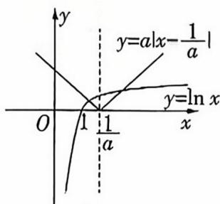

text_image

y
y=a|x-\frac{1}{a}
O
1/1a
x
y=ln x

图1

合题意,舍去.

若 a=1，作出函数 $y=|x-1|$ 及 $y=\ln x$ 的大致图象，如图 2，当 x>1 时， $\ln x<x-1$ 恒成立，则 $f(x)>0$ 恒成立，符合题意.

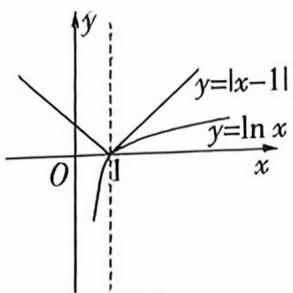  
图2

【疑难速破】在试题题中可直接刊用不等式 $\ln x \leqslant x - 1$ 比大小。在解答题中注意需先证明再用。证明过程：设 $g(x) =$

$\ln x - x + 1$ ，则 $g^{\prime}(x) = \frac{1}{x} -1$ ，当 $x\in (0,1)$ 时， $g(x)$ 单调递增，当 $x\in (1, + \infty)$ 时， $g(x)$ 单调递减，所以 $g(x)_{\max} = g(1) = 0$ ，从而 $g(x)\leqslant 0$ ，即 $\ln x\leqslant x - 1$ ，当且仅当 $x = 1$ 时等号成立

若 $a > 1$ ，则 $0 < \frac{1}{a} < 1$ ，作出函数 $y = a|x - \frac{1}{a} |$ 与 $y = \ln x$ 的

大致图象,如图3,当x>1时, $\ln x<x-1<a(x-\frac{1}{a})$ 恒成立,即 $f(x)>0$ 恒成立,

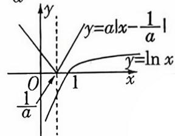  
图3

符合题意.

综上, $a\in[1,+\infty)$ ,故选A.

# 巧解

# 特值 + 排除法!

显然 $a = 0$ 不符合题意, 排除 C; 当 $a = 1, x > 1$ 时, $f(x) = |x - 1| - \ln x > 0$ 恒成立, 符合题意, 排除 D; 当 $a = 2, x > 1$ 时, $f(x) = 2|x - \frac{1}{2}| - \ln x$ , 因为 $2x - 1 > x - 1 > \ln x$ , 所以 $2x - 1 > \ln x$ , 即 $f(x) > 0$ , 符合题意, 排除 B. 选 A.

4. D 链接教材人教 B 版《选择性必修第三册》P114C 组 T1

令 $g(x)=x+e^{x}$ ，则 $g'(x)=1+e^{x}>0$ ，所以 $g(x)$ 为单调递增函数， $g(-1)=-1+\frac{1}{e}=\frac{1-e}{e}<0, g(0)=1>0$ ，所以函数 $g(x)$ 有唯一零点 $n\in(-1,0)$ ，若 $f(x)$ 有意义，需使 $x+e^{x}\neq0$ ，所以函数 $f(x)$ 的定义域为 $\{x|x\neq n\}$ ，A 错误；因为 $f'(x)=\frac{a(1-x)}{e^{x}}+\frac{(x-1)e^{x+1}}{(x+e^{x})^{2}}=(x-1)\left[\frac{e^{x+1}}{(x+e^{x})^{2}}-\frac{a}{e^{x}}\right],f'(0)=a-e, f(0)=e$ ，所以函数 $f(x)$ 的图象在点 $P(0,f(0))$ 处的切线方程为 $y-e=(a-e)x, a\neq e$ ，此直线与 x 轴、y 轴的交点分别为 $(\frac{e}{e-a},0),(0,e)$ ，由三角形的面积公式得 $\frac{1}{2}\cdot|\frac{e}{e-a}| \cdot e=\frac{e^{2}}{2e-2}$ ，解得 a=1 或 a=2e-1，B 错误；当 a=1 时， $f'(x)=x-1$ $\cdot\frac{e^{2x+1}-(x+e^{x})^{2}}{e^{x}\cdot(x+e^{x})^{2}}=(x-1)$

$\frac{(\sqrt{\mathrm{e}^{2x + 1}} - x - \mathrm{e}^x)(\sqrt{\mathrm{e}^{2x + 1}} + x + \mathrm{e}^x)}{\mathrm{e}^x\cdot (\mathrm{x} + \mathrm{e}^x)^2}$ ，当 $x > n$ 时，记 $h(x) =$ $\sqrt{\mathrm{e}^{2x + 1}} -x - \mathrm{e}^x = (\sqrt{\mathrm{e}} -1)\cdot \mathrm{e}^x -x,$ 则 $h^{\prime}(x) = (\sqrt{\mathrm{e}} -1)\mathrm{e}^{x}-$ 1，易知 $h^\prime (x)$ 单调递增，又 $h^\prime (0) = \sqrt{\mathrm{e}} -2 <   0,h^\prime (1) = (\sqrt{\mathrm{e}} -$ 1)e-1>0,由零点存在定理知存在 $0 <   x_{1} <   1$ ，使得 $h^\prime (x_1) =$ $(\sqrt{\mathrm{e}} -1)\mathrm{e}^{x_1} - 1 = 0$ ，即 $(\sqrt{\mathrm{e}} -1)\mathrm{e}^{x_1} = 1,h(x)$ 在 $(n,x_1)$ 上单调递减，在 $(x_{1}, + \infty)$ 上单调递增，所以 $h(x)_{\min} = h(x_{1}) =$ $(\sqrt{\mathrm{e}} -1)\mathrm{e}^{x_1} - x_1 = 1 - x_1 > 0$ ，即当 $x > n$ 时， $h(x) > 0$ ，所以 $\mathrm{e}^{2x + 1} > (x + \mathrm{e}^x)^2$ ，所以 $f(x)$ 在 $(n,1)$ 上单调递减，在（1， $+\infty)$ 上单调递增，其中 $-1 <   n <   0,\mathrm{e}^n +n = 0$ ，当 $x <   n$ 时，记 $L(x) = \sqrt{\mathrm{e}}\cdot \mathrm{e}^{x} + \mathrm{e}^{x} + x,L^{\prime}(x) = \sqrt{\mathrm{e}}\cdot \mathrm{e}^{x} + \mathrm{e}^{x} + 1 > 0,$ 所以 $L(x)$ 在 $(- \infty ,n)$ 上单调递增， $L(-1) = \frac{\sqrt{\mathrm{e}} + 1}{\mathrm{e}} -1 = \frac{\sqrt{\mathrm{e}} + 1 - \mathrm{e}}{\mathrm{e}} <$

$\frac{\sqrt{2.89} + 1 - \mathrm{e}}{\mathrm{e}} = \frac{2.7 - \mathrm{e}}{\mathrm{e}} < 0, L(n) = \sqrt{\mathrm{e}} \cdot \mathrm{e}^n + \mathrm{e}^n + n = \sqrt{\mathrm{e}} \cdot$ $\mathrm{e}^n > 0$ ，由零点存在定理知存在 $x_2 \in (-1, n)$ ，使得 $L(x_2) = (\sqrt{\mathrm{e}} + 1) \cdot \mathrm{e}^{x_2} + x_2 = 0$ ，即当 $x \in (-\infty, x_2)$ 时， $L(x) < 0 \Leftrightarrow \mathrm{e}^{2x + 1} - (x + \mathrm{e}^x)^2 < 0$ ，从而有 $f'(x) = (x - 1)$ $\frac{\mathrm{e}^{2x + 1} - (x + \mathrm{e}^x)^2}{\mathrm{e}^x \cdot (x + \mathrm{e}^x)^2} > 0$ ，当 $x \in (x_2, n)$ 时， $L(x) > 0 \Leftrightarrow \mathrm{e}^{2x + 1} - (x + \mathrm{e}^x)^2 > 0$ ，从而有 $f'(x) = (x - 1) \cdot \frac{\mathrm{e}^{2x + 1} - (x + \mathrm{e}^x)^2}{\mathrm{e}^x \cdot (x + \mathrm{e}^x)^2} < 0$ ，综上可知 $f(x)$ 在 $(- \infty, x_2)$ 上单调递增，在 $(x_2, n)$ 上单调递减，在 $(n, 1)$ 上单调递减，在 $(1, +\infty)$ 上单调递增，其中 $-1 < x_2 < n < 0$ ，且 $(\sqrt{\mathrm{e}} + 1) \cdot \mathrm{e}^{x_2} + x_2 = 0, \mathrm{e}^n + n = 0$ ，所以 $f(x)$ 极大值 $= f(x_2), f(x)$ 极小值 $= f(1)$ ，又 $f(x_2) = \frac{x_2}{\mathrm{e}^{x_2}} + \frac{\mathrm{e}^{x_2 + 1}}{x_2 + \mathrm{e}^{x_2}} = -(\sqrt{\mathrm{e}} + 1) + \frac{\mathrm{e}^{x_2 + 1}}{-\sqrt{\mathrm{e}}\mathrm{e}^{x_2}} < 0, f(1) = \frac{1}{\mathrm{e}} + \frac{\mathrm{e}^2}{1 + \mathrm{e}} > 0$ ，所以当 $x \in (-\infty, n)$ 时， $f(x) < 0$ ，当 $x \in (n, +\infty)$ 时， $f(x) > 0$ ，且 $f(x_2) < f(1)$ ，所以 $f(x) = m$ 最多只有两个实根，C 错误，D 正确。故选 D.

5. BCD 链接教材人教 A 版《选择性必修第二册》P104 复习参考题 5T18 对于 A, 令 $f(x) = 0$ , 得 $a\ln \frac{1 + x}{1 - x} = -\frac{1 - e^x}{e^x + 1}$ , 设 $p(x) = a\ln \frac{1 + x}{1 - x}, m(x) = -\frac{1 - e^x}{e^x + 1}$ , 则 $p'(x) = \frac{2a}{1 - x^2}, m'(x) =$

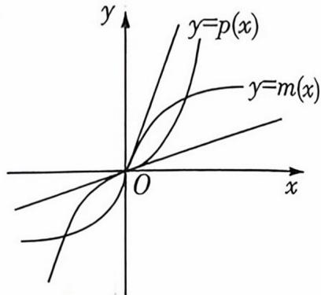

text_image

y
y=p(x)
y=m(x)
O
x

$\frac{2e^{x}}{(e^{x} + 1)^{2}}$ ，所以 $p(0) = m(0) = 0, p'(0) = 2a, m'(0) = \frac{1}{2}$ ，如图，若 $p(x)$ 与 $m(x)$ 的图象有三个交点，则 $0 < 2a < \frac{1}{2}, 0 < a < \frac{1}{4}$ ，故 A 错误。对于 B， $f(x) = 0 \Leftrightarrow a \ln \frac{1 + x}{1 - x} + \frac{1 - e^{x}}{e^{x} + 1} = 0$ ，设 $h(x) = a \ln \frac{1 + x}{1 - x} + \frac{1 - e^{x}}{e^{x} + 1}$ ，易得定义域为 $(-1, 1)$ ，关于原点对称，且 $h(-x) = a \ln \frac{1 - x}{1 + x} + \frac{1 - e^{-x}}{e^{-x} + 1} = -(a \ln \frac{1 + x}{1 - x} + \frac{1 - e^{x}}{e^{x} + 1}) = -h(x)$ ，所以 $h(x)$ 是奇函数，由题意知 $h(x) = 0$ 有三个根 $x_{1}, x_{2}, x_{3}$ ，则 $x_{1} + x_{2} + x_{3} = 0$ ，B 正确。对于 C，由 $f(x) + kf(-x) = 0$ 可得， $a(e^{x} + 1) \ln \frac{1 + x}{1 - x} - e^{x} + 1 + k[a(e^{-x} + 1) \ln \frac{1 - x}{1 + x} - e^{-x} + 1] = 0$ ，所以 $a \ln \left(\frac{1 + x}{1 - x}\right) + \frac{1 - e^{x}}{e^{x} + 1} + k(a \frac{\ln \frac{1 - x}{1 + x}}{e^{x}} - \frac{1 - e^{x}}{e^{x}(1 + e^{x})}) = 0$ ，所以 $a \ln \frac{1 + x}{1 - x} + \frac{1 - e^{x}}{e^{x} + 1} = \frac{k}{e^{x}} (a \ln \frac{1 + x}{1 - x} + \frac{1 - e^{x}}{e^{x} + 1})$ ，即 $(a \ln \frac{1 + x}{1 - x} + \frac{1 - e^{x}}{e^{x} + 1}) \cdot (1 - \frac{k}{e^{x}}) = 0$ 有 3 个实根 $x_{1}, x_{2}, x_{3}$ ，当 $k > 0$ 时，令 $1 - \frac{k}{e^{x}} = 0$ ，则 $x = \ln k$ ，只需保证 $\ln k \neq x_{1}, x_{2}, x_{3}$ ，即可使得方程有 4 个实根，C 正确。由 B 可知， $x_{1} = -x_{3}$ ，而 $\frac{f'(x_3)}{f'(x_1)} = e^{x_3} \Leftrightarrow f'(x_3) = e^{x_3} f'(-x_3)$ ，又 $f'(x) = ae^x \ln \frac{1 + x}{1 - x} + a(e^x + 1) \frac{2}{1 - x^2} - e^x, e^{x_3} f'(-x_3) = a \ln \frac{1 - x_3}{1 + x_3} + a(e^{x_3} + 1) \frac{2}{1 - x_3^2} - 1$ ，所以 $f'(x_3) = ae^{x_3} \ln \frac{1 + x_3}{1 - x_3} + a(e^{x_3} + 1) \frac{2}{1 - x_3^2} - e^{x_3} = a \ln \frac{1 - x_3}{1 + x_3} + a(e^{x_3} + 1) \cdot a(e^{x_3} + 1) \cdot a(e^{x_3} + 1) = a e^{x_3} f'(x_3) + a(e^{x_3} + 1) = a e^{x_3} f'(x_3) + a(e^{x_3} + 1) = a e^{x_3} f'(x_3) + a(e^{x_3} + 1) = a e^{x_3} f'(x_3) + a(e^{x_3} + 1) = a e^{x_3} f'(z,x) = a e^{z,x} f(z,x) + a(e^{z,x} + z,x) = a e^{z,x} f(z,x) + a(e^{z,x} + z,x) = a e^{z,x} f(z,x) + a(e^{z,x} + z,x) = a e^{z,x} f(z,x) + a(e^{z,x} + z,x) = a e^{z,x} f(z,x) + a(e^{z,x} + z,x) = a e^{z,x} f(z,y,z) = a e^{z,x} f(z,y,z) + a(e^{z,x} + z,y,z) = a e^{z,x} f(z,y,z) + a(e^{z,x} + z,y,z) = a e^{z,x} f(z,y,z) + a(e^{z,x} + z,y,z) = a e^{z,x} f(z,y,z) + a(e^{z,x} + z,y,z) = a e^{z,x} f(z,y,z) + a(e^{z,x} + z,y,z) + a(e^{z,x} + z,y,z) = a e^{z,x} f(z,y,z) + a(e^{z,x} + z,y,z) = a e^{z,x} f(z,y,z) + a(e^{z,x} + z,y,z) = a e^{z,x} f(z,y,z) + a(e^{z,x} + z,y,z) = a e^{z,x} f(z,y,z) = a e^{z,x} f(z,y,z) + a(e^{z,x} + z,y,z) = a e^{z,x} f(z,y,z) + a(e^{z,x} + z,y,z) = a e^{z,x} f(z,y,z) + a(e^{z,x} + z,y,z) = a e^{z,x} f(z,y,z) + a.e^{-x^2}$ .

6. ABD 因为 $f(x) = x^3 + bx^2 + cx + d$ ，所以 $f'(x) = 3x^2 + 2bx +$ c. 因为函数 $f(x)$ 在 $(- \infty, 0]$ 上单调递增，在 $[0, 2]$ 上单调递减，所以方程 $f'(x) = 0$ 有两个解，其中一个根为 0，即 $f'(0) = 0 \Rightarrow c = 0$ ，另一根满足 $3x + 2b = 0 \Rightarrow x = -\frac{2b}{3} \geqslant 2 \Rightarrow b \leqslant -3$ ，故 A 正确.

$f(x)=x^{3}+bx^{2}+d$ ，又方程 $f(x)=0$ 有3个不等实根，它们分别为m,n,2.所以 $f(x)=(x-2)(x-m)(x-n)=x^{3}-(m+n+2)x^{2}+(2m+2n+mn)x-2mn,2m+2n+mn=0\Rightarrow\frac{1}{m}+\frac{1}{n}=-\frac{1}{2}$ ，为定值，故B正确.

$f(2)=0\Rightarrow8+4b+d=0\Rightarrow d=-8-4b.$ 当 b=-3 时， $d=-8+12=4$ ，此时 $f(x)=x^{3}-3x^{2}+4=(x-2)^{2}(x+1)$ ，此时 $f(x)=0$ 只有两个根，与 $f(x)=0$ 有 3 个不等实根矛盾，所以 b<-3。 $f(1)=1+b+d=1+b-8-4b=-3b-7$ ，因为 b<-3，所以 $f(1)>2$ ，故 C 错误。

$$
\left\{ \begin{array}{l} - b = m + n + 2, \\ d = - 2 m n, \end{array} \right. (m - n) ^ {2} = (m + n) ^ {2} - 4 m n = (- b - 2) ^ {2} +
$$

$2d=(-b-2)^{2}+2(-8-4b)=(b-2)^{2}-16$ , 因为 b<-3, 所以 $(b-2)^{2}-16>(-3-2)^{2}-16=9$ , 所以 $|m-n|>3$ , 故 D 正确. 故选 ABD.

7. ACD 对于选项 AB, 因为 $f'(x) = 3mx^2 - 2$ , 可知 $f'(x) = 3mx^2 - 2 = 0$ 有 2 个不同实根 $a, b (a < b)$ , 则 $m > 0$ , 且 $a + b = 0, ab = -\frac{2}{3m} < 0$ , 即 $b = -a, a < 0$ , 故 A 正确, B 错误. 对于选项 C, 可得 $f(a) + f(b) = f(a) + f(-a) = ma^3 - 2a + 2a - ma^3 + 2a + 2a = 4a < 0$ , 故 C 正确.

对于选项 D, 因为 $f(c+1)-f(c)=\left[m(c+1)^{3}-2(c+1)+2a\right]-(mc^{3}-2c+2a)=m(3c^{2}+3c+1)-2$ ,

设 $g(c)=m(3c^{2}+3c+1)-2$ ，则 $f(c+1)-f(c)<1$ ，即 $g(c)<1$ ，又m>0，则 $g(c)\geqslant g(-\frac{1}{2})=\frac{1}{4}m-2$ ，可得 $\frac{1}{4}m-2<1$ ，解得0<m<12，所以实数m的取值范围为(0,12)，故D正确。故选ACD.

8. ACD 易知 $f'(x) = e^x - e, g'(x) = -\frac{2kx^2 + (2k-1)x - 1}{x} = \frac{(2kx - 1)(x + 1)}{x} (x > 0)$ . 对于选项 A, 由 $f'(x) = 0$ 得 $x = 1$ . 当 $x > 1$ 时, $f'(x) > 0, f(x)$ 单调递增, 当 $x < 1$ 时, $f'(x) < 0, f(x)$ 单调递减, 所以 $f(x)$ 在 $x = 1$ 处取得极小值, 极小值为 $f(1) = 0$ , 因此 $f(x)$ 的图象与 $x$ 轴相切, 故 A 正确. 对于选项 B, 当 $k < 0$ 时, $g'(x) > 0, g(x)$ 在 $(0, +\infty)$ 上单调递增, $g(x)$ 在 $(0, +\infty)$ 上无极值点, $g(x)$ 的图象与 $x$ 轴不相切, 故 B 错误. 对于选项 C, 由上述分析可知 $f(x)$ 在 $x = 1$ 处取得极小值, 同时也为最小值, 最小值为 $f(1) = 0$ . 当 $k = \frac{1}{2}$ 时, $g'(x) = -\frac{(x - 1)(x + 1)}{x} (x > 0)$ , 所以 $g(x)$ 在 $(0, 1)$ 上单调递增, 在 $(1, +\infty)$ 上单调递减, 所以 $g(x)$ 在 $x = 1$ 处取得最大值, 最大值为 $g(1) = \ln 1 - \frac{1}{2} + (1 - 2 \times \frac{1}{2}) \times 1 + \frac{1}{2} = 0$ , 所以当 $k = \frac{1}{2}$ 时, 方程 $f(x) = g(x)$ 有唯一实数解, 故 C 正确. 对于选项 D, 当 $k > 0$ 时, $x = \frac{1}{2k}$ 是 $g(x)$ 的极大值点, $g(x)$ 在 $(0, \frac{1}{2k})$ 上单调递增, 在 $(\frac{1}{2k}, +\infty)$ 上单调递减. 若 $g(x)$ 有两个零点, 则需 $g(\frac{1}{2k}) > 0$ , 即 $\ln \frac{1}{2k} - k \cdot (\frac{1}{2k})^2 + (1 - 2k) \cdot$

$\frac{1}{2k} + \frac{1}{2} > 0$ ，化简得 $\frac{1}{4k} - \frac{1}{2} > \ln(2k)$ 。因为 $2k - 1 \geqslant \ln(2k)$ ，所以只需 $\frac{1}{4k} - \frac{1}{2} > 2k - 1$ ，解得 $0 < k < \frac{1}{2}$ 。当 $k \geqslant \frac{1}{2}$ 时， $\frac{1}{4k} - \frac{1}{2} > \ln(2k)$ 不成立。当 $0 < k < \frac{1}{2}$ 时，当 $x > 0$ 且 $x \to 0$ 时， $g(x) \to -\infty, \frac{1}{k^2} > \frac{1}{2k}, g(\frac{1}{k^2}) = \ln \frac{1}{k^2} - k \cdot (\frac{1}{k^2})^2 + (1 - 2k) \cdot \frac{1}{k^2} + \frac{1}{2} \leqslant \frac{1}{k^2} - 1 - \frac{1}{k^3} + \frac{1}{k^2} - \frac{2}{k} + \frac{1}{2} = -\frac{1}{k^3} + \frac{2}{k^2} - \frac{2}{k} - \frac{1}{2} = \frac{1}{k^2}(2 - \frac{1}{k}) - (\frac{2}{k} + \frac{1}{2})$ ，当 $0 < k < \frac{1}{2}$ 时， $g(\frac{1}{k^2}) < 0$ ， $g(x)$ 有两个零点。当 $k \leqslant 0$ 时， $g(x)$ 在 $(0, +\infty)$ 上单调递增，故不可能有两个零点。故 $k$ 的取值范围为 $(0, \frac{1}{2})$ ，故 D 正确。故选 ACD。

# 多解

# 等价转化 + 构造函数!

对于选项 D, $\ln x - kx^{2} + (1 - 2k)x + \frac{1}{2} = 0$ 等价于 $\frac{\ln x + \frac{1}{2}}{x} = kx + 2k - 1$ ，等价于 $\frac{\ln x}{x} + \frac{1}{2x} = kx + 2k - 1$ 。设 $u(x) = \frac{\ln x}{x} + \frac{1}{2x}(x > 0)$ ， $v(x) = kx + 2k - 1 (x > 0)$ ，则 $u'(x) = \frac{1 - 2\ln x}{2x^{2}}$ 。令 $u'(x) = 0$ ，可得 $x = \sqrt{e}$ ，当 $0 < x < \sqrt{e}$ 时， $u'(x) > 0$ ， $u(x)$ 单调递增，当 $x > \sqrt{e}$ 时， $u'(x) < 0$ ， $u(x)$ 单调递减，所以函数 $u(x)$ 的最大值为 $u(\sqrt{e}) = \frac{1}{\sqrt{e}}$ 。函数 $v(x) = kx + 2k - 1$ 的图象在过定点 $(-2, -1)$ 的直线上。易知 $k \leqslant 0$ 不满足题意，当 k > 0 时，设 $y + 1 = k(x + 2)$ 与 $u(x)$ 的图象切于点 $(x_{0}, u(x_{0}))$ ，则 $u'(x_{0}) = \frac{u(x_{0}) + 1}{x_{0} + 2} = \frac{1 - 2\ln x_{0}}{2x_{0}^{2}}$ ，即 $\frac{\ln x_{0}}{x_{0}} + \frac{1}{2x_{0}} + 1 = \frac{1 - 2\ln x_{0}}{2x_{0}^{2}}$ ，化简得 $1 - x_{0} = 2\ln x_{0}$ ，解得 $x_{0} = 1$ ，此时 $k = u'(1) = \frac{1 - 2\ln 1}{2} = \frac{1}{2}$ ，所以 k 的取值范围为 $(0, \frac{1}{2})$ ，故 D 正确。

9. $(1-e^{4},e^{4}-1)$ 链接教材人教 A 版《必修第一册》P160 复习参考题 4T4 当 x>0 且 $x\neq1$ 时, $f'(x)=\frac{(x-2)e^{x}}{(x-1)^{2}}$ , $f'(2)=0$ , 当 0<x<2 且 $x\neq1$ 时, $f'(x)<0$ , 当 x>2 时, $f'(x)>0$ . 故 $f(x)$ 在 $(0,1)$ , $(1,2)$ 上单调递减, 在 $(2,+\infty)$ 上单调递增,

当 $x = 2$ 时， $f(x)$ 取得极小值，为 $f(2) = \mathrm{e}^2$ ，当 $0 < x < 1$ 时， $f(x) < 0$ ，当 $x > 1$ 时， $f(x) > 0$ .

由 $f(x)$ 的解析式可知, $f(x)$ 为奇函数.画出 $f(x)$ 的大致图象如图.

令 $t = f(x), t^2 - mt - e^4 = 0$ （\*），则 $\Delta > 0$ ，设（\*）式有两个不等实根 $t_1, t_2(t_1 < t_2)$ ，则 $t_1t_2 = -e^4 < 0$ ，当 $t_1 = -e^2, t_2 = e^2$ 时，即 $m = 0$ ，满足题意，当 $\left\{ \begin{array}{l} -e^2 < t_1 < -1, \\ t_2 > e^2 \end{array} \right.$ 或 $\left\{ \begin{array}{l} t_1 < -e^2, \\ 1 < t_2 < e^2 \end{array} \right.$ 时满足

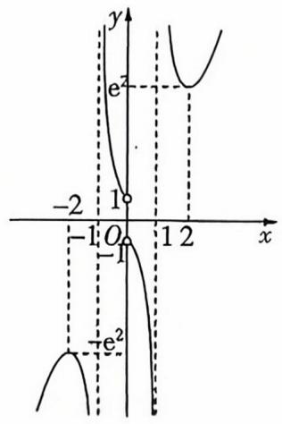

text_image

y
e²
-2
1
O
-1
1 2
x
-e²

题意.

令 $h(t) = t^2 - mt - e^4$ ，则 $\left\{ \begin{array}{l} h(-e^2) > 0, \\ h(-1) < 0, \\ h(e^2) < 0 \end{array} \right.$ 或 $\left\{ \begin{array}{l} h(-e^2) < 0, \\ h(1) < 0, \\ h(e^2) > 0, \end{array} \right.$ 故 $0 < m < e^4 - 1$ 或 $1 - e^4 < m < 0$ .

综上,实数 m 的取值范围是 $(1-e^{4},e^{4}-1)$ .

10. $(- \frac{1}{2}, 0) \quad f(0) = 0$ , 当 $x \neq 0$ 时, 令 $f(x) = 0$ , 得 $-ax = \frac{\mathrm{e}^{x} - 1}{\mathrm{e}^{x} + 1}$ , 设 $g(x) = -ax, h(x) = \frac{\mathrm{e}^{x} - 1}{\mathrm{e}^{x} + 1}$ .

$\therefore$ 函数 $g(x)$ 的定义域为 $\mathbf{R}$ , 且 $g(-x) = ax = -g(x)$ , 函数 $h(x)$ 的定义域为 $\mathbf{R}$ , 且 $h(-x) = \frac{\mathrm{e}^{-x} - 1}{\mathrm{e}^{-x} + 1} = -\frac{\mathrm{e}^x - 1}{\mathrm{e}^x + 1} = -h(x), \therefore g(x)$ 与 $h(x)$ 都是 $\mathbf{R}$ 上的奇函数, 则问题转化为函数 $g(x)$ 与 $h(x)$ 的图象在 $(0, +\infty)$ 上恰有一个交点.

易知当 $x > 0$ 时，函数 $h(x) = \frac{\mathrm{e}^x - 1}{\mathrm{e}^x + 1} = 1 - \frac{2}{\mathrm{e}^x + 1}$ 单调递增，且 $h(x) \in (0,1)$ ，

$h'(x)=\frac{2e^{x}}{(e^{x}+1)^{2}},h''(x)=\frac{2e^{x}(1-e^{x})}{(e^{x}+1)^{3}}<0,\therefore h'(x)$ 在 $(0,+\infty)$ 上单调递减，

又 $h^{\prime}(0) = \frac{1}{2}$ , 作出函数 $g(x)$ , $h(x)$ 与 $y = \frac{1}{2} x$ 的图象, 如图,

$\therefore 0 < -a < \frac{1}{2}$ , 即 $-\frac{1}{2} < a < 0$ , 故

实数 a 的取值范围是 $(- \frac{1}{2}, 0)$ .

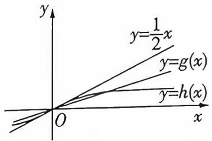

# 多解

# 极限法!

$\because f(0) = 0, \therefore x = 0$ 是 $f(x)$ 的一个零点. 当 $x \neq 0$ 时, 由 $f(x) = 0$ , 得 $-a = \frac{e^x - 1}{x(e^x + 1)}$ , 令 $t(x) = \frac{e^x - 1}{x(e^x + 1)}$ , $x \neq 0$ . $\because$ 函数 $t(x)$ 的定义域为 $(- \infty, 0) \cup (0, +\infty)$ , $t(-x) = \frac{e^{-x} - 1}{-x(e^{-x} + 1)} = \frac{e^x - 1}{x(e^x + 1)} = t(x), \therefore t(x)$ 为 $(- \infty, 0) \cup (0, +\infty)$ 上的偶函数.

则问题转化为直线 y = -a 与函数 $t(x) = \frac{e^{x} - 1}{x(e^{x} + 1)}$ 的图象在 $(0, +\infty)$ 上有一个交点.

由 $t(x) = \frac{\mathrm{e}^x - 1}{x(\mathrm{e}^x + 1)}$ ，可得 $t'(x) = -\frac{\mathrm{e}^{2x} - 2xe^x - 1}{x^2(e^x + 1)^2},$

设 $u(x) = \mathrm{e}^{2x} - 2xe^x -1,x > 0$ ，则 $u^{\prime}(x) = 2\mathrm{e}^{2x} - 2(x+$ $1)\mathrm{e}^{x} = 2\mathrm{e}^{x}(\mathrm{e}^{x} - x - 1) > 0,\therefore u(x)$ 在 $(0, + \infty)$ 上单调递增，则 $u(x) > \mathrm{e}^0 -0 - 1 = 0$ ，即当 $x\in (0, + \infty)$ 时， $t^{\prime}(x) <   0$

$\therefore t(x)$ 在 $(0, +\infty)$ 上单调递减.

又 $\lim_{x\to +\infty}t(x) = 0^{+},\lim_{x\to 0^{+}}t(x) = \frac{1}{2},\therefore t(x)$ 在 $(0, + \infty)$ 上的值域为 $(0,\frac{1}{2})$ ，故 $0 < - a < \frac{1}{2}$ 即 $-\frac{1}{2} < a < 0$ ，故实数 $a$ 的取值范围是 $(- \frac{1}{2},0)$

# 疑难压轴4 以数列为载体的创新交汇问题

1. B 由 $\triangle ABF_{1}$ 为直角三角形, 且 $|AF_{1}|, |AB|, |BF_{1}|$ 成等差数列, 可知 $AB$ 不是最长的边, 故为直角边. 结合椭圆的对称性, 不妨设 $BF_{1} \perp AB$ , 如图, 由椭圆的定义可知 $\triangle ABF_{1}$ 的周长为 $|AF_{1}| +$

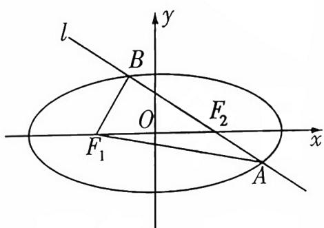

text_image

l
B
O
F₂
F₁
A
x
y

$|BF_{1}|+|AB|=4a$ , 又 $|AF_{1}|+|BF_{1}|=2|AB|$ , 所以 $|AB|=\frac{4}{3}a$ , 进而可得 $|AF_{1}|+|BF_{1}|=4a-|AB|=\frac{8}{3}a$ , 又 $|AF_{1}|^{2}=|AB|^{2}+|BF_{1}|^{2}$ , 解得 $|AF_{1}|=\frac{5}{3}a, |BF_{1}|=a$ , 所以点 B 是椭圆的短轴端点, 所以 b=c, 离心率 $e=\frac{\sqrt{2}}{2}$ . 故选 B.

2. B 由题意可知, 圆 $C: (x - 1)^{2} + (y + 2)^{2} = 1$ 的圆心为 $C(1, -2)$ , 半径 $r = 1$ .

数列 $\{a_{n}\}$ 的公差为 $d$ ，则直线 $a_{n}x + a_{n + 2}y + a_{n + 5} = 0$ 可化为 $a_{n}x + (a_{n} + 2d)y + a_{n} + 5d = 0,$

即 $(x+y+1)a_{n}+(2y+5)d=0.$ 令 $\left\{\begin{aligned}x+y+1&=0,\\ 2y+5&=0,\end{aligned}\right.$ 解得 $\left\{\begin{aligned}x=\frac{3}{2},\\ y=-\frac{5}{2},\end{aligned}\right.$ 可知直线过定点 $D(\frac{3}{2},-\frac{5}{2})$ ,

根据题意作图,如图,连接 CD. 当 $CD \perp AB$ 时,弦长 $|AB|$ 最小,此时 $\angle ACB$ 最小,又 $|CD| = \frac{\sqrt{2}}{2}$ ,则此时 $|AB| = 2\sqrt{r^{2} - |CD|^{2}} = \sqrt{2}$ , 可知 $|CA|^{2} + |CB|^{2} = |AB|^{2}$ , 则

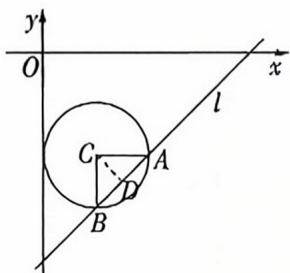

$\angle ACB = \frac{\pi}{2}$ . 故选 B.

3. AB 对于 A, 设 Rt△ABC 内切圆半径为 r, 则 $S_{\triangle ABC} = \frac{1}{2} \times 3 \times 4 = \frac{1}{2} r (3 + 4 + 5)$ , 解得 r = 1, 由几何关系可得 BD = 2, CD = 3, $\overrightarrow{AD} = \frac{3}{5} \overrightarrow{AB} + \frac{2}{5} \overrightarrow{AC}$ , 所以 $|\overrightarrow{AD}|^{2} = (\frac{3}{5} \overrightarrow{AB} + \frac{2}{5} \overrightarrow{AC})^{2} = \frac{9}{25} \overrightarrow{AB}^{2} + \frac{4}{25} \overrightarrow{AC}^{2} = \frac{29}{5}$ , 则 $AD = \frac{\sqrt{145}}{5}$ , 故 A 正确.

对于 B, 取 $AB = 1, AC = 2 + \sqrt{3}$ ，则 $BC^{2} = 8 + 4\sqrt{3}$ ，所以 $AD^{2} = \frac{1}{4}BC^{2} = 2 + \sqrt{3}$ ，则 $AD^{2} = AB \cdot AC$ ，即存在直角 $\triangle ABC$ ，使得 AD 是 AB, AC 的等比中项，故 B 正确.

对于 C, 若 $AD \perp BC$ , 则 $AD \cdot BC = AB \cdot AC$ , 若 AD 是 AB, AC 的等比中项, 则 $AD^{2} = AB \cdot AC$ , 故有 AD = BC, 显然不成立, 故不存在 $\triangle ABC$ , 使得 AD 是 AB, AC 的等比中项, 故 C 错误.

对于 D, 若 $\angle BAD = CAD = \frac{\pi}{4}$ ，由正弦定理可得 $\frac{AD}{\sin B} = \frac{BD}{\sin \angle BAD} = \sqrt{2} BD, \frac{AD}{\sin C} = \frac{CD}{\sin \angle CAD} = \sqrt{2} CD,$

即 $AD = \sqrt{2} BD\sin B = \frac{\sqrt{2} BD \cdot AC}{BC}, AD = \sqrt{2} CD\sin C = \frac{\sqrt{2} CD \cdot AB}{BC}$ , 可得 $AD^2 = \frac{\sqrt{2} BD \cdot AC}{BC} \cdot \frac{\sqrt{2} CD \cdot AB}{BC}$ ,

若 $AD^{2}=AB\cdot AC$ 成立,则 $\frac{\sqrt{2}BD\cdot AC}{BC}\cdot\frac{\sqrt{2}CD\cdot AB}{BC}=AB\cdot AC$ ,所以 $2BD\cdot CD=BC^{2}=(BD+CD)^{2}$ ,即BD=CD=0,显然不成立,故不存在△ABC,使得AD是AB,AC的等比中项,故D错误.故选AB.

4. ABD 链接教材人教 A 版《选择性必修第三册》P38 复习参考题 6T5 (3) $\left(\frac{1}{\sqrt{x}} + \frac{\sqrt{x}}{2}\right)^n$ 展开式的通项为 $T_{k+1} = C_n^k \left(\frac{1}{\sqrt{x}}\right)^{n-k} \cdot \left(\frac{\sqrt{x}}{2}\right)^k = \frac{1}{2^k} \cdot C_n^k x^{k - \frac{n}{2}}, k \in \mathbb{N}$ 且 $k \leqslant n$ , 则前 3 项的系数分别为 $C_n^0, \frac{1}{2} C_n^1, \frac{1}{4} C_n^2$ .

对于 A, 由题意可得 $2 \times \frac{1}{2} \mathrm{C}_n^1 = \mathrm{C}_n^0 + \frac{1}{4} \mathrm{C}_n^2$ , 即 $n = 1 + \frac{n(n - 1)}{8}$ , 解得 $n = 8$ 或 $n = 1$ (舍去), 所以 $n = 8$ , 故 A 正确.

对于 B, $\left(\frac{1}{\sqrt{x}}+\frac{\sqrt{x}}{2}\right)^{8}$ 的展开式中所有奇数项的二项式系数和为 $\frac{2^{8}}{2}=128$ ，故 B 正确。对于 C，令 k-4=0，则 k=4，所以 $\left(\frac{1}{\sqrt{x}}+\right.$

$\frac{\sqrt{x}}{2}$ ) $^{8}$ 的展开式中常数项为 $\frac{1}{2^{4}}\cdot C_{8}^{4}=\frac{35}{8}$ ，故C错误.对于D，设展开式中第 $r+1$ 项的系数最大，则有 $\left\{\begin{aligned}\frac{1}{2^{r}}\cdot C_{8}^{r}&\geqslant\frac{1}{2^{r-1}}\cdot C_{8}^{r-1},\\ \frac{1}{2^{r}}\cdot C_{8}^{r}&\geqslant\frac{1}{2^{r+1}}\cdot C_{8}^{r+1},\end{aligned}\right.$ 解

【疑难速破】此处是求系数最大项，注意展开式某项的系数与二项式系数的区别

得 r=2 或 r=3，所以展开式中系数最大项为第 3 项和第 4 项，故 D 正确。故选 ABD。

5. ABC 函数 $f(x)$ 的定义域为 $\mathbf{R}, f(f(x - y)) = f(x) - f(y)$ ，且 $f(1) = 1$ .

对于 AB, 取 $x = n + 1, y = n, n \in N^{*}$ ，则 $f(1) = f(f(n + 1 - n)) = f(n + 1) - f(n) = 1$ ，因此数列 $\{f(n)\}$ 是以 $f(1) = 1$ 为首项，1 为公差的等差数列， $f(n) = f(1) + (n - 1) \cdot 1 = n$ ，则 $f(2025) = 2025, f(f(2025)) = f(2025) = 2025$ ，AB 正确.

对于 C, 由 $f(1)=f(f(1))=f(1)-f(0)$ ，得 $f(0)=0$ ，取 y=0，得 $f(f(x))=f(x)$ ，取 x=0，得 $f(f(-y))=-f(y)$ ，即 $f(f(x))=-f(-x)$ ，因此 $f(x)=-f(-x)$ ， $f(x)$ 是奇函数，C 正确。对于 D， $\sum_{i=1}^{2025}f(f(-i))=\sum_{i=1}^{2025}f(-i)=-\sum_{i=1}^{2025}f(i)=-\frac{2025\times(1+2025)}{2}$ ，D 错误。故选 ABC。

6. ACD 设 $n$ 次爬行后, 该蚂蚁落在点 $A$ 或 $B$ 或 $C$ 的概率为

$r_n$ ，则 $\left\{ \begin{array}{l}p_{n + 1} = \frac{1}{4} r_n,\\ r_{n + 1} = p_n + \frac{1}{2} r_n + q_n,\text{其中} p_1 = 0,r_1 = 1,q_1 = 0,\text{计算易}\\ q_{n + 1} = \frac{1}{4} r_n, \end{array} \right.$

得 $p_2 = \frac{1}{4}, r_2 = \frac{1}{2}, q_2 = \frac{1}{4}, p_3 = \frac{1}{8}, r_3 = \frac{3}{4}, q_3 = \frac{1}{8}, q_4 =$

$\frac{3}{16}$ , 故 A, C 正确, B 错误. 由原方程组可得 $r_{n+2} = \frac{1}{2} r_{n+1} + \frac{1}{2} r_n$ , 则 $r_{n+2} + \frac{1}{2} r_{n+1} = r_{n+1} + \frac{1}{2} r_n$ , 所以 $\{r_{n+1} + \frac{1}{2} r_n\}$ 为常数

列, 且 $r_{n+1} + \frac{1}{2} r_n = 1$ ①. 同理可得 $r_{n+2} - r_{n+1} = -\frac{1}{2}(r_{n+1} - r_n)$ , 且 $r_2 - r_1 = -\frac{1}{2}$ , 所以 $r_{n+1} - r_n = (-\frac{1}{2})^n$ ②. 由①②

可知, $r_{n}=\frac{2}{3}-\frac{2}{3}\left(-\frac{1}{2}\right)^{n}$ ，所以 $p_{2n+1}=\frac{1}{4}r_{2n}=\frac{1}{6}-\frac{1}{6}\cdot\frac{1}{4^{n}}<\frac{1}{6}$ ，故D正确.故选ACD.

7. BCD 链接教材人教 A 版《选择性必修第二册》P24 练习 T4 A 项: $a_{1} = 1, a_{2} = 2, a_{3} = 4$ , 则 $M = \{(a_{1}, a_{2})\}$ , $|M| = 1$ , 故错误.

B 项: $a_{1} = 1, a_{2} = 3, a_{3} = 5, a_{4} = 7$ , 则 $M = \{(a_{1}, a_{2}), (a_{2}, a_{3}), (a_{3}, a_{4})\}$ , $|M| = 3$ , 故正确.

C 项: 如 $a_{n} = n, n \in \{1,2,3\}$ , 则 $a_{2} - a_{1} = a_{3} - a_{2} = \frac{1}{2}(a_{3} - a_{1})$ , 即 $(a_{1}, a_{2}) \in M$ 且 $(a_{2}, a_{3}) \in M$ , 故正确.

D 项: 注意到 $\forall 2 \leqslant i \leqslant n - 1$ , 由于 $a_{n} = (a_{n} - a_{i}) + (a_{i} - a_{1})$ , 所以至多存在一个 $i$ 使得 $(a_{1}, a_{i}) \in M$ , 且 $(a_{i}, a_{n}) \in M$ , 对于其余的 $i, (a_{1}, a_{i})$ 和 $(a_{i}, a_{n})$ 中, 至多只有一个属于 $M$ , 且 $(a_{1}, a_{n}) \notin M$ , 则至少需剔除 $(n - 2)$ 个元素, 所以 $\frac{\mathrm{C}_{n}^{2} - (n - 2)}{\mathrm{C}_{n}^{2}} = \frac{n^{2} - 3n + 4}{n^{2} - n} > \frac{4}{5} \Rightarrow n^{2} - 11n + 20 > 0$ , 又 $n \in \mathbf{N}'$ , 解得 $n \geqslant 9$ , 故正确. 故选 BCD.

8. $\{m \mid m \geqslant 2, m \in N^{*}\}$ 由 $a_{n} = 2a_{n-1} + 1$ 得 $a_{n} + 1 = 2(a_{n-1} +$ 【疑难速破】对于形如 $a_{n} = pa_{n-1} + q$ 的递推式，可通过等式两边同加常数 $\lambda$ 构造等比数列求通项

1), $a_{1}+1=2$ ,则数列 $\{a_{n}+1\}$ 是以2为首项、2为公比的等比数列,所以 $a_{n}+1=2^{n}$ ,则 $a_{n}=2^{n}-1,b_{n}=\log_{2}(2^{n}-1+1)=n.$

令 $c_{n} = a_{n} - b_{n}$ ，则 $c_{n + 1} - c_n = 2^{n + 1} - 1 - (n + 1) - (2^n - 1 - n) = 2^n - 1 > 0$ ，所以 $c_{n} \geqslant c_{1} = 0$ ，所以当 $n > 1$ 时， $a_{n} - b_{n} > 0$ 则当 $m > 1$ 时， $\sum_{i=1}^{m}(a_i - b_i) > 0$ ，故 $m$ 的取值范围为 $\{m \mid m \geqslant 2, m \in \mathbf{N}^*\}$ .

# 巧解

设 $c_{n} = a_{n} + 1$ ，则 $a_{n} = c_{n} - 1$ ，由 $a_{n} = 2a_{n - 1} + 1$ ，得 $c_{n} - 1 = 2(c_{n - 1} - 1) + 1$ ，即 $c_{n} = 2c_{n - 1}$ ，所以 $c_{n} = 2^{n}, b_{n} = \log_2c_n = \log_22^n = n.$ 下同上解.

9.13 根据题意可知 $\overrightarrow{P_{k-1}P_k}$ 的模为 $k$ , 方向与 $x$ 轴正方向成 $(90k)^{\circ}$ 角, $\therefore \overrightarrow{P_{k-1}P_k} = (k\cos(90k)^{\circ}, k\sin(90k)^{\circ}), \therefore s_n = \overrightarrow{OP_n} = (1 \times \cos 90^{\circ} + 2\cos 180^{\circ} + 3\cos 270^{\circ} + \cdots + n\cos(90n)^{\circ}, 1 \times \sin 90^{\circ} + 2\sin 180^{\circ} + 3\sin 270^{\circ} + \cdots + n\sin(90n)^{\circ}), \therefore s_4 = \overrightarrow{OP_4} = (-2 + 4, 1 - 3) = (2, -2), |s_4| = 2\sqrt{2}; s_8 = \overrightarrow{OP_8} = (-2 + 4 - 6 + 8, 1 - 3 + 5 - 7) = (4, -4), |s_8| = 4\sqrt{2}; s_{12} = \overrightarrow{OP_{12}} = (-2 + 4 - 6 + 8 - 10 + 12, 1 - 3 + 5 - 7 + 9 - 11) = (6, -6), |s_{12}| = 6\sqrt{2}; s_{13} = \overrightarrow{OP_{13}} = (-2 + 4 - 6 + 8 - 10 + 12, 1 - 3 + 5 - 7 + 9 - 11 + 13) = (6, 7), |s_{13}| = \sqrt{85}$ .

易知所求 $n$ 值唯一. 故 $n = 13$ .

10.2n 链接 2024 新课标Ⅱ卷 T11, 涉及数列与解析几何交汇 由题意作出图形, 如图, 易得 $p = \frac{3}{2}$ , 则 $C: y^2 = 3x$ , $B_n$ 在抛物线 $C$ 上, 等边三角形 $A_{n-1}A_nB_n (n \in \mathbf{N}^*)$ 的边 $A_{n-1}A_n$ 在 $x$ 轴的非负半轴上, $A_0$ 与原点 $O$ 重合. 设 $|A_{n-1}A_n| = a_n > 0$ , 则当

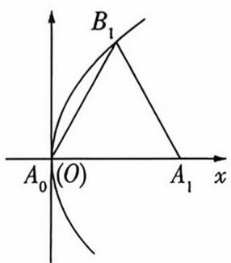

text_image

B₁
A₀(O)
A₁ x

$n = 1$ 时， $A_{1}(a_{1},0)$ ，故 $B_{1}\left(\frac{a_{1}}{2},\frac{\sqrt{3}a_{1}}{2}\right)$ ，所以 $\frac{3a_1^2}{4} = \frac{3a_1}{2}\Rightarrow a_1 =$

2, 当 $n \geqslant 2$ 时, $B_{n}(a_{1} + a_{2} + \cdots + a_{n-1} + \frac{a_{n}}{2}, \frac{\sqrt{3}a_{n}}{2})$ , 则 $\frac{3}{4}a_{n}^{2} =$

$3(a_{1}+a_{2}+\cdots+a_{n-1}+\frac{a_{n}}{2})$ . 设 $S_{n}$ 是 $\{a_{n}\}$ 的前 n 项和，则 $\frac{a_{n}^{2}}{4}=S_{n}-\frac{a_{n}}{2}$ ，故 $S_{n}=\frac{a_{n}^{2}}{4}+\frac{a_{n}}{2}$ ，显然 $S_{1}=2$ 满足上式. 当 $n\geqslant$

2 时, $a_{n}=S_{n}-S_{n-1}=\left(\frac{a_{n}^{2}}{4}+\frac{a_{n}}{2}\right)-\left(\frac{a_{n-1}^{2}}{4}+\frac{a_{n-1}}{2}\right)$ ，整理得 $\frac{a_{n}^{2}-a_{n-1}^{2}}{4}=\frac{a_{n}+a_{n-1}}{2}$ ，又 $a_{n}+a_{n-1}>0$ ，则 $a_{n}-a_{n-1}=2$ ，故 $\{a_{n}\}$ 是首项、公差都为 2 的等差数列，所以 $a_{n}=2+2(n-1)=2n.$

# 疑难压轴5 立体几何中的动态探究题

1. C 取 $BC, B_{1}C_{1}$ 的中点分别为 $G, H$ , 连接 $MG, GH, HM$ , 如图, 由中位线易知 $MG \parallel AC, HG \parallel CC_{1}$ , 又 $AC, CC_{1}$ 在平面 $AA_{1}C_{1}C$ 内, $MG, HG$ 不在平面 $AA_{1}C_{1}C$ 内, 所以 $MG \parallel$ 平面 $AA_{1}C_{1}C, HG \parallel$ 平面 $AA_{1}C_{1}C$ , 又 $MG, HG$ 是平面 $MGH$ 内的两条相交直线, 所以平面 $MGH \parallel$ 平面 $AA_{1}C_{1}C$ .

text_image

D₁
C₁
A₁
B₁
H
D
N
C
A
M
B
G

又 $MN \parallel$ 平面 $AA_{1}C_{1}C$ , 所以 $N$ 在平面 $MGH$ 内, 又 $N$ 是侧面 $BB_{1}C_{1}C$ 上一点, 所以 $N$ 的轨迹是线段 $HG$ . 易知 $MG =$ 【疑难逐级】根据线面平行、面面平行找到点 $N$ 的运动轨迹为线段 $HG$ , 再结合线段之间的关系即可轻松破解

$\frac{1}{2} AC = \frac{\sqrt{2}}{2}, MH = \sqrt{\left(\frac{\sqrt{2}}{2}\right)^2 + 1} = \frac{\sqrt{6}}{2}, MG \leqslant MN \leqslant MH$ ，所以 $MN$ 长度的取值范围是 $[\frac{\sqrt{2}}{2}, \frac{\sqrt{6}}{2}]$ . 故选 C.

2. B 对于 AD, 取 D 为 BC 的中点, $\theta = \frac{\pi}{2}$ , 则 $ED \parallel AB$ , 而 $AB \perp AC$ , 故 $DE \perp AC, DE \perp C_{1}E$ , 而 $CE \perp DE$ , 故 $\angle CEC_{1}$ 为二面角 $C_{1} - DE - C$ 的平面角, 故 $C_{1}E \perp AC$ , 而 $C_{1}E \cap DE = E, C_{1}E, DE \subset$ 平面 $DEC_{1}$ , 故 $AC \perp$ 平面 $DEC_{1}$ , 而 $DC_{1} \subset$ 平面 $DEC_{1}$ , 故 $AC \perp DC_{1}$ , 故 A 正确. 因为 $DE \perp AC, DE \perp C_{1}E, AC \cap C_{1}E = E, AC, C_{1}E \subset$ 平面 $ECC_{1}$ , 故 $DE \perp$ 平面 $ECC_{1}$ , 而 $CC_{1} \subset$ 平面 $ECC_{1}$ , 故 $DE \perp CC_{1}$ , 故 D 正确.

对于 C, 设 $DE \perp BC, \theta = \frac{\pi}{2}$ , 易证 $DE \perp$ 平面 $BCC_{1}$ , 而 $BC_{1} \subset$ 平面 $BCC_{1}$ , 故 $DE \perp BC_{1}$ , 故 C 正确.

对于 B, 假设存在点 D 和 $\theta$ , 使得 $BC_{1} \perp AC$ , 连接 $AC_{1}$ , 因为 【疑难迷破】当所给说法不易直接判断正误时, 可利用反证法得出结论

$AB \perp AC, BC_{1} \cap AB = B, BC_{1} \subset$ 平面 $ABC_{1}, AB \subset$ 平面 $ABC_{1}$ , 所以 $AC \perp$ 平面 $ABC_{1}$ , 又 $AC_{1} \subset$ 平面 $ABC_{1}$ , 所以 $AC \perp AC_{1}$ , 所以 $C_{1}E > AE$ , 由翻折的性质知 $C_{1}E = CE$ , 又点 $E$ 是边 $AC$ 的中点, 所以 $AE = CE = C_{1}E$ , 产生矛盾, 所以假设不成立, 故 $BC_{1} \perp AC$ 不成立, 故 B 不正确. 故选 B.

3. ABD 链接教材人教 A 版《选择性必修第一册》P49 复习参考题 1T13 如图所示, 连接 AC 交 BD 于 O, 分别过 A, C 作 $AM \perp BD, CN \perp BD$ . 对于 A, 当平面 $A'BD \perp$ 平面 BCD 时, 三棱锥

$A^{\prime}-BCD$ 的高最大,为 $A^{\prime}M=AM=\frac{1\times\sqrt{3}}{2}\rightarrow$ 三棱锥 $A^{\prime}-BCD$ 体积的最大值为 $\frac{1}{3}\times\frac{1}{2}\times1\times\sqrt{3}\times\frac{\sqrt{3}}{2}=\frac{1}{4}\rightarrow A$ 正确.

对于 B, $\angle BA'D = \angle BCD = 90^{\circ}$ , BD 的中点为 $O \rightarrow OB = OD = OC = OA' \rightarrow O$ 为三棱锥 $A' - BCD$ 的外接球球心 $\rightarrow BD$ 为直径 $\rightarrow$ 所求半径为 $1 \rightarrow B$ 正确.

对于 C, 假设存在点 $A'$ 使得 $BD \perp A'C$ , 连接 $A'N$ , 则 $BD \perp A'C$ , $CN \perp BD$ , $A'C \cap CN = C \rightarrow BD \perp$ 平面 $A'CN \rightarrow A'N \perp BD \rightarrow$ 与 $A'M \perp BD$ 相矛盾 (M, N 不重合) → 假设错误 → C 错误.

对于 D, $A'B \perp DC$ , $BC \perp DC$ , $A'B \cap BC = B \rightarrow DC \perp$ 平面 $A'BC \rightarrow DC \perp A'C$ , 又 $A'D = \sqrt{3}$ , $CD = 1 \rightarrow A'C = \sqrt{3 - 1} = \sqrt{2} \rightarrow D$ 正确.

4. ABD 正方体 $ABCD - A_{1}B_{1}C_{1}D_{1}$ 的外接球表面积为 $12\pi$ ，故外接球半径 $R = \sqrt{3}$ ，所以正方体的棱长为 2。对于 A 项，若 $B_{1}P \parallel$ 平面 $A_{1}C_{1}D$ ，因为 $B_{1}P \subset$ 平面 $BDD_{1}B_{1}$ ，记 $A_{1}C_{1}$ 交 $B_{1}D_{1}$ 于点 $O_{1}$ ，连接 $DO_{1}$ ，如图 1 所示，则平面 $A_{1}C_{1}D \cap$ 平面

$BDD_{1}B_{1}=DO_{1}$ ，所以 $B_{1}P\parallel DO_{1}$ 。记线段BD的中点为O，连接 $B_{1}O$ 。显然在矩形 $BDD_{1}B_{1}$ 中， $B_{1}O\parallel DO_{1}$ ，则点P的轨迹就是线段 $B_{1}O$ （除去点 $B_{1}$ ），其长度为 $\sqrt{BO^{2}+BB_{1}^{2}}=\sqrt{(\sqrt{2})^{2}+2^{2}}=\sqrt{6}$ ，故A正确。对于B项，连接 $BD_{1}$ ，如图2所示，显然在正方体中，有 $BD_{1}\perp$ 平面 $A_{1}C_{1}D$ ，而过一点有且只有一条直线和已知平面垂直，所以若 $BP\perp$ 平面 $A_{1}C_{1}D$ ，则P的轨迹就是线段 $BD_{1}$ （除去点B），其长度为 $BD_{1}=\sqrt{3}AB=2\sqrt{3}$ ，

故 B 正确. 对于 C 项, 过点 P 作 $B_{1}D_{1}$ 图 3 所示. 由正方体的性质可得 $A_{1}C_{1} \perp$ 平面 $BDD_{1}B_{1}$ , 所以 $A_{1}C_{1} \perp PH$ . 因为 $PH \perp B_{1}D_{1}$ , $A_{1}C_{1}$ , $B_{1}D_{1} \subset$ 平面 $A_{1}B_{1}C_{1}D_{1}$ , $A_{1}C_{1} \cap B_{1}D_{1} = O_{1}$ , 所以 $PH \perp$ 平面 $A_{1}B_{1}C_{1}D_{1}$ . 故点 P 到平面 $A_{1}B_{1}C_{1}D_{1}$ 的距离就是点 P 到直线 $B_{1}D_{1}$ 的距离, 所以点 P 到直线 $B_{1}D_{1}$

text_image

D₁
O₁
A₁
B₁
C₁
D
O
A
B
C
图 1

图 1

text_image

D₁
A₁
B₁
C₁
D
A
B
C

图 2

的垂线,垂足为 H,如  

text_image

D₁
O
C₁
A₁
H
B₁
P
D
A
B
C

图 3

的距离与到点 B 的距离相等,由抛物线的定义可知 P 的轨迹是以 B 为焦点,直线 $B_{1}D_{1}$ 为准线的抛物线的一段(在四边形 $BDD_{1}B_{1}$ 内,包含边界),故 C 错误.对于 D 项,由正方体的性质可得 $A_{1}C_{1}\perp$ 平面 $BDD_{1}B_{1}$ ,连接 $PC_{1},AC_{1}$ (图略),因为 $P\in$ 平面 $BDD_{1}B_{1}$ ,所以 $PA_{1}=PC_{1}$ ,所以 $PA+PA_{1}=PA+PC_{1}\geqslant AC_{1}=2\sqrt{3}$ ,当且仅当 A,P,C₁三点共线时,等号成立,故 D 正确.故选 ABD.

5. BCD 链接 2021 新高考 I 卷 T12, 以正三棱柱上的动点为依托, 考查三角形的周长、三棱锥的体积的求解等 正三棱柱 $ABC - A_{1}B_{1}C_{1}$ 的所有棱长均为 4,

对于 A, 易知点 A 到平面 $BCC_{1}B_{1}$ 的距离为 $2\sqrt{3}$ ，则 $V_{B-APB_{1}} = V_{A-BPB_{1}} = \frac{1}{3} \times \frac{1}{2} \times 4 \times 4 \times 2\sqrt{3} = \frac{16\sqrt{3}}{3}$ ，故 A 错误.

对于 B, 在 $\triangle APB_{1}$ 中, $AB_{1}=4\sqrt{2}$ , 由 P 为 $CC_{1}$ 的中点, 得 $AP=B_{1}P=2\sqrt{5}$ , $\triangle APB_{1}$ 的面积为 $\frac{1}{2}\times4\sqrt{2}\times\sqrt{(2\sqrt{5})^{2}-(\frac{4\sqrt{2}}{2})^{2}}=4\sqrt{6}$ , 由选项 A 得三棱锥 $B-APB_{1}$ 的体积为 $\frac{16\sqrt{3}}{3}$ , 设点 B 到平面 $APB_{1}$ 的距离为 d, 则 $\frac{1}{3}\times d\times4\sqrt{6}=\frac{16\sqrt{3}}{3}$ , 解得 $d=2\sqrt{2}$ , 故 B 正确.

对于 C, 将正三棱柱的侧面 $ACC_{1}A_{1}$ 和侧面 $BB_{1}C_{1}C$ 沿 $CC_{1}$ 展开到一个平面内, 如图 1, 则当且仅当 A, P, $B_{1}$ 三点共线时, $AP + PB_{1}$ 取得最小值, $(AP + PB_{1})_{\min} = \sqrt{8^{2} + 4^{2}} = 4\sqrt{5}$ , 又在空间中 $AB_{1} = 4\sqrt{2}$ , 因此 $\triangle APB_{1}$ 的周长的最小值为 $4(\sqrt{5} + \sqrt{2})$ , 故 C 正确.

  
图1

  
图2

对于 D, 如图 2, 取 AC 的中点 D, 连接 BD, 由三棱柱 ABC - $A_{1}B_{1}C_{1}$ 是正三棱柱, 得 $BD \perp$ 侧面 $ACC_{1}A_{1}, BD = 2\sqrt{3}$ , 当 Q 在平面 $ACC_{1}A_{1}$ 上时，连接 $DQ$ ，由 $BQ = 4$ ，得 $DQ = \sqrt{4^2 - (2\sqrt{3})^2} = 2$ ，因此点 $Q$ 在平面 $ACC_{1}A_{1}$ 的轨迹是以 $D$ 为圆心，2为半径的半圆弧，点 $Q$ 的轨迹的长度为 $2\pi$ ，点 $Q$ 在平面 $ABB_{1}A_{1}, BB_{1}C_{1}C$ 的轨迹都是半径为4的四分之一圆弧，长度为 $2\pi$ ，所以点 $Q$ 的轨迹的长度为 $6\pi$ ，故D正确.故选BCD.

# 多解

对于 A, 因为正三棱柱 $ABC-A_{1}B_{1}C_{1}$ 的所有棱长均为 4, 所以正三棱柱 $ABC-A_{1}B_{1}C_{1}$ 的体积为 $V_{1}=\frac{\sqrt{3}}{4}\times4^{2}\times4=16\sqrt{3}$ , 则三棱锥 $B-APB_{1}$ 的体积一定小于 $16\sqrt{3}$ , 故 A 错误.

6. BC 对于 A, 由题意知, 该正八面体由两个正四棱锥组成, 易知 [疑难速破] 根据正八面体的对称性可将正八面体的体积转化为正四棱锥体积的 2 倍

正四棱锥的高为 $\sqrt{1^2 - (\frac{\sqrt{1^2 + 1^2}}{2})^2} = \frac{\sqrt{2}}{2}$ , 所以该正四棱锥的体积为 $\frac{1}{3} \times 1^2 \times \frac{\sqrt{2}}{2} = \frac{\sqrt{2}}{6}$ , 所以该正八面体的体积为 $2 \times \frac{\sqrt{2}}{6} = \frac{\sqrt{2}}{3}$ , 故 A 错误.

对于 B, 将 $\triangle CDE, \triangle CEB$ 展开铺成一个平面, 如图 1, 当 D, H, B 三点共线时, $DH + BH$ 取到最小值, 此时在 $\triangle CDB$ 中, CD = CB = 1, $\angle BCD = \frac{2\pi}{3}$ , 由余弦定理得 BD = $\sqrt{CD^{2} + CB^{2} - 2CD \cdot GB \cos \angle BCD} = \sqrt{3}$ , 即 $(DH + BH)_{\min} = \sqrt{3}$ , 故 B 正确.

  
图1

  
图2

对于 C, 连接 AC, BD 交于 O, 连接 OE, 易知 AC, BD, OE 两两垂直, 建立如图 2 所示的空间直角坐标系 O - xyz,

则 $A(\frac{\sqrt{2}}{2},0,0),B(0,\frac{\sqrt{2}}{2},0),C(-\frac{\sqrt{2}}{2},0,0),D(0,-\frac{\sqrt{2}}{2},0)$ ， $E(0,0,\frac{\sqrt{2}}{2}),F(0,0,-\frac{\sqrt{2}}{2})$ ，设 $H(a,b,c),\overrightarrow{EH} = \lambda \overrightarrow{EC}(0\leqslant \lambda \leqslant 1)$ ，得 $\overrightarrow{EC} = (-\frac{\sqrt{2}}{2},0, - \frac{\sqrt{2}}{2}),\overrightarrow{EH} = (a,b,c - \frac{\sqrt{2}}{2})$ ，则 $H(-\frac{\sqrt{2}}{2}\lambda ,0,\frac{\sqrt{2}}{2} (1 - \lambda))$

所以 $\overrightarrow{DF} = (0, \frac{\sqrt{2}}{2}, -\frac{\sqrt{2}}{2}), \overrightarrow{AH} = (-\frac{\sqrt{2}}{2}\lambda - \frac{\sqrt{2}}{2}, 0, \frac{\sqrt{2}}{2}(1 - \lambda))$ ，由 $AH \perp DF$ ，得 $\overrightarrow{AH} \cdot \overrightarrow{DF} = (-\frac{\sqrt{2}}{2}) \times \frac{\sqrt{2}}{2}(1 - \lambda) = 0$ ，解得 $\lambda = 1$ ，即点 $H$ 与点 $C$ 重合，易知在平面 $ABCD$ 中 $AC$ 与 $BC$ 所成角为 $\frac{\pi}{4}$ ，故直线 $AH$ 与 $BC$ 的夹角为 $\frac{\pi}{4}$ ，故 $C$ 正确.

对于 D, 由选项 C 知, $\overrightarrow{AE} = (-\frac{\sqrt{2}}{2}, 0, \frac{\sqrt{2}}{2})$ , $\overrightarrow{DF} = (0, \frac{\sqrt{2}}{2}, -\frac{\sqrt{2}}{2})$ , $\overrightarrow{AH} = (-\frac{\sqrt{2}}{2}\lambda - \frac{\sqrt{2}}{2}, 0, \frac{\sqrt{2}}{2}(1 - \lambda))$ , 所以 $\overrightarrow{AE} \cdot \overrightarrow{DF} = -\frac{1}{2}$ , $\overrightarrow{AH} \cdot \overrightarrow{DF} = -\frac{1 - \lambda}{2}$ , 由 $0 \leqslant \lambda \leqslant 1$ , 知 $-\frac{1 - \lambda}{2} \geqslant -\frac{1}{2}$ , 即

$\overrightarrow{AH} \cdot \overrightarrow{DF} \geqslant \overrightarrow{AE} \cdot \overrightarrow{DF}$ , 故 D 错误. 故选 BC.

# 速解

对于 C, 设 $\overrightarrow{EH} = \lambda \overrightarrow{EC} (0 \leqslant \lambda \leqslant 1)$ ，易知正八面体的 8 个面均为正三角形，且对角面为正方形，所以四边形 ABCD、四边形 BEDF 均为正方形，所以 $\overrightarrow{DF} = \overrightarrow{EB}$ ，当 $AH \perp DF$ 时，可得 $\overrightarrow{AH} \cdot \overrightarrow{DF} = (\overrightarrow{AE} + \overrightarrow{EH}) \cdot \overrightarrow{EB} = (\overrightarrow{AE} + \lambda \overrightarrow{EC}) \cdot \overrightarrow{EB} = \overrightarrow{AE} \cdot \overrightarrow{EB} + \lambda \overrightarrow{EC} \cdot \overrightarrow{EB} = -\frac{1}{2} + \frac{1}{2} \lambda = 0$ ，所以 $\lambda = 1$ ，此时点 H 与点 C 重合，则 $\angle ACB$ 即直线 AH 与直线 BC 所成角，易知 $\angle ACB = \frac{\pi}{4}$ ，故 C 正确。

对于 D, 当点 H 与点 C 重合时, $\overrightarrow{AH} \cdot \overrightarrow{DF} = \overrightarrow{AC} \cdot \overrightarrow{DF} = 0$ , $\overrightarrow{AE} \cdot \overrightarrow{DF} = \overrightarrow{AE} \cdot \overrightarrow{EB} = -\frac{1}{2}$ , 此时 $\overrightarrow{AH} \cdot \overrightarrow{DF} > \overrightarrow{AE} \cdot \overrightarrow{DF}$ , 故 D 错误.

7. AD 链接教材人教 A 版《选择性必修第一册》P49 复习参考题 1T16 对于 A, 取 F 为 BC 的中点, 如图 1, 此时满足 $AF = \sqrt{5}$ , 因为点 F 在侧面 $BB_{1}C_{1}C$ 内, 所以 F 的轨迹为以 A 为球心, $\sqrt{5}$ 为半径的球面与侧面 $BB_{1}C_{1}C$ 的交线, 为四分之一圆弧, 长度为 $\frac{1}{4} \times 2\pi \times 1 = \frac{\pi}{2}$ , 故 A 正确.

  
图1

  
图2

对于 B, 如图 2 所示, 连接 $B_{1}C, EB_{1}, EC$ , 在 Rt $\triangle BEB_{1}$ 中, $EB_{1} = \sqrt{EB^{2} + BB_{1}^{2}} = \sqrt{5}$ , 同理可求得 $EC = \sqrt{5}$ , 所以 $\triangle ECB_{1}$ 为等腰三角形, 当点 $F$ 为 $B_{1}C$ 的中点时, $EF \perp B_{1}C$ , 易知 $B_{1}C // A_{1}D$ , 故 $EF \perp A_{1}D$ , 此时 $EF$ 与 $A_{1}D$ 所成角为 $\frac{\pi}{2}$ , 故 B 错误. 对于 C, 当点 $F$ 与点 $B$ 重合时, $EF \perp$ 平面 $BCC_{1}B_{1}, BD_{1} \not\subset$ 平面 $BCC_{1}B_{1}$ , 所以 $EF$ 与 $BD_{1}$ 不垂直, 故 C 错误. 对于 D, 如图 3, 设 $\angle BFB_{1} = \theta$ , 当点 $F$ 为 $CC_{1}$ 的中点时, $\theta$ 最大, 取 $BB_{1}$ 的中点 $P$ , 连接 $PF$ , 如图 4, 则 $\sin \angle B_{1}FP = \sin \frac{\theta}{2} = \frac{B_{1}P}{B_{1}F} = \frac{1}{\sqrt{5}}, \cos \angle B_{1}FP = \cos \frac{\theta}{2} = \frac{PF}{B_{1}F} = \frac{2}{\sqrt{5}}$ , 所以 $\sin \theta = 2\sin \frac{\theta}{2}\cos \frac{\theta}{2} = \frac{4}{5}$ ; 当点 $F$ 与点 $C$ 或点 $C_{1}$ 重合时, $\theta$ 最小, 此时 $\sin \theta = \frac{\sqrt{2}}{2}$ , 所以 $\sin \theta \in [\frac{\sqrt{2}}{2}, \frac{4}{5}]$ .

  
图3

  
图4

因为 $B, B_{1}, F$ 在球面上, 所以 $\triangle BB_{1}F$ 的外接圆直径 $2R = \frac{BB_{1}}{\sin \theta} = \frac{2}{\sin \theta} \in [\frac{5}{2}, 2\sqrt{2}]$ , 所以三棱锥 $A - BB_{1}F$ 的外接球的直径为 $2r = \sqrt{AB^{2} + (2R)^{2}} = \sqrt{4 + 4R^{2}} \in [\frac{\sqrt{41}}{2}, 2\sqrt{3}]$ , 所以三棱锥 $A - BB_{1}F$ 的外接球的半径 $r \in [\frac{\sqrt{41}}{4}, \sqrt{3}]$ , 所以三棱锥 $A - BB_{1}F$ 的外接球的表面积 $S = 4\pi r^{2} \in [\frac{41\pi}{4}, 12\pi]$ , 故 D 正确. 故选 AD.

8. $\frac{2\pi}{3} [0, \frac{\sqrt{6}}{4}]$ 由 $CP = 2PE$ 易知点 $P$ 在以 $A$ 为球心, 1 为半径的球面上, 又点 $P$ 在平面 $SAB$ 内, $\therefore$ 点 $P$ 在以 $A$ 为圆心, 1 为半径, $\frac{2\pi}{3}$ 为圆心角的圆弧上, 故点 $P$ 的轨迹长度为 $\frac{2\pi}{3}$ . 建系如图 1, 设 $P(\cos \theta, 0, \sin \theta)(\theta \in [0, \frac{2\pi}{3}])$ , 则 $\overrightarrow{AB} = (2, 0, 0), C(1,$

text_image

z
S
A
E
B
C
y
x

图1

$$
\sqrt {3}, 0) \overrightarrow {C P} = (\cos \theta - 1, - \sqrt {3}, \sin \theta). | \cos \langle \overrightarrow {A B}, \overrightarrow {C P} \rangle | = \frac {| \overrightarrow {A B} \cdot \overrightarrow {C P} |}{| \overrightarrow {A B} | | \overrightarrow {C P} |} =
$$

$$
\frac {| 2 (\cos \theta - 1) |}{2 \sqrt {(\cos \theta - 1) ^ {2} + 3 + \sin^ {2} \theta}} = \frac {| \cos \theta - 1 |}{\sqrt {5 - 2 \cos \theta}}.
$$

令 $t = \sqrt{5 - 2\cos\theta}$ ，则 $t\in [\sqrt{3},\sqrt{6} ],\cos \theta = \frac{5 - t^2}{2},$

$$
\left| \cos \langle \overrightarrow {A B}, \overrightarrow {C P} \rangle \right| = \frac {\left| 3 - t ^ {2} \right|}{2 t} = \frac {\left| \frac {3}{t} - t \right|}{2} \in [ 0, \frac {\sqrt {6}}{4} ].
$$

故直线 CP 与直线 AB 所成角的余弦值的取值范围为 $[0, \frac{\sqrt{6}}{4}]$ .

# 巧解

取 $AB$ 的中点 $M$ , 当 $P$ 异于 $M$ 时, 连接 $PM, CM$ , 如图2, 设直线 $CP$ 与直线 $AB$ 所成角为 $\theta$ , 设 $\angle CPM = \theta_1, \angle PMA = \theta_2$ , 根据三余弦定理可知, $\cos \theta = \cos \theta_1 \cos \theta_2$ , 易知 $P$ 从点 $M$ 运动至 $N$ 处, $\cos \theta_1$ 逐渐增大, $P$ 从点 $M$ 运动至 $N$ 处 $\cos \theta_2$ 逐渐增大. $P$ 在点 $M$ 处时, $\cos \theta = 0$ . $P$ 在点 $N$ 处

  
图2

时, $\cos\theta$ 取得最大值,此时 $\cos\theta=\cos\theta_{1}\cos\theta_{2}=\frac{\sqrt{2}}{2}\times\frac{\sqrt{3}}{2}=\frac{\sqrt{6}}{4}$ ,故直线CP与直线AB所成角的余弦值的取值范围为 $[0,\frac{\sqrt{6}}{4}]$ .

# 疑难压轴6 以创新情境为载体的统计概率问题

1. A $a = C_{20}^{0} + C_{20}^{1} \cdot 2 + C_{20}^{2} \cdot 2^{2} + \cdots + C_{20}^{20} \cdot 2^{20} = (1 + 2)^{20} =$

$$
3 ^ {2 0} = 9 ^ {1 0} = (1 0 - 1) ^ {1 0} = \mathrm{C} _ {1 0} ^ {0} \cdot 1 0 ^ {1 0} + \mathrm{C} _ {1 0} ^ {1} \cdot 1 0 ^ {9} \cdot (- 1) + \mathrm{C} _ {1 0} ^ {2} \cdot
$$

$$
1 0 ^ {8} \cdot (- 1) ^ {2} + \dots + C _ {1 0} ^ {1 0} \cdot (- 1) ^ {1 0} = 1 0 \left[ C _ {1 0} ^ {0} \cdot 1 0 ^ {9} + C _ {1 0} ^ {1} \cdot \right.
$$

$$
1 0 ^ {8} \cdot (- 1) + C _ {1 0} ^ {2} \cdot 1 0 ^ {7} \cdot (- 1) ^ {2} + \dots + C _ {1 0} ^ {9} \cdot (- 1) ^ {9} ] + 1,
$$

【疑难速破】准确理解 $a \equiv b (\bmod 10)$ 表达的含义, 再利用二项展开式将 $a$ 表示为某个代数式的 10 倍与某个数 (该数为 0.1.2, …, 9) 的和, 即可轻松破解

即 a 被 10 除得的余数为 1, 结合选项可知只有 4021 被 10 除得的余数为 1. 故选 A.

2. B 链接 2023 新课标 II 卷 T12, 以信号 0, 1 的发送和接收为背景考查概率求解问题 设 $A =$ “发送的信号为 0”, $B =$ “接收到的信号为 0”, 则 $\overline{A} =$ “发送的信号为 1”, $\overline{B} =$ “接收到的信号为 1”. 由题意得 $P(A) = P(\overline{A}) = 0.5$ , $P(B|A) = 0.9$ , $P(\overline{B}|A) = 0.1$ , $P(B|\overline{A}) = 0.05$ , $P(\overline{B}|\overline{A}) = 0.95$ , $P(B) = P(A)P(B|A) + P(\overline{A})P(B|\overline{A}) = 0.5 \times 0.9 + 0.5 \times 0.05 = 0.475$ , $P(\overline{A}|B) = \frac{P(\overline{A})P(B|\overline{A})}{P(B)} = \frac{0.5 \times 0.05}{0.475} = \frac{1}{19}$ , 故选 B.

3. D 因为 $f(x) = g(x)h(x)$ ，所以 $f^{(1)}(x) = g^{(1)}(x)h(x) + g(x)h^{(1)}(x)$ ，

$$
\begin{array}{l} f ^ {(2)} (x) = g ^ {(2)} (x) h (x) + g ^ {(1)} (x) h ^ {(1)} (x) + g ^ {(1)} (x) h ^ {(1)} (x) + \\ g (x) h ^ {(2)} (x) = g ^ {(2)} (x) h (x) + 2 g ^ {(1)} (x) h ^ {(1)} (x) + g (x) h ^ {(2)} (x), \end{array}
$$

$$
\begin{array}{l} f ^ {(3)} (x) = g ^ {(3)} (x) h (x) + g ^ {(2)} (x) h ^ {(1)} (x) + 2 g ^ {(2)} (x) h ^ {(1)} (x) + \\ 2 g ^ {(1)} (x) h ^ {(2)} (x) + g ^ {(1)} (x) h ^ {(2)} (x) + g (x) h ^ {(3)} (x) = \\ g ^ {(3)} (x) h (x) + 3 g ^ {(2)} (x) h ^ {(1)} (x) + 3 g ^ {(1)} (x) h ^ {(2)} (x) + g (x) h ^ {(3)} (x), \dots . \end{array}
$$

所以 $f^{(10)}(x)=C_{10}^{0}\cdot g^{(10)}(x)h(x)+C_{10}^{1}\cdot g^{(9)}(x)h^{(1)}(x)+\cdots+C_{10}^{10}\cdot g(x)h^{(10)}(x).$

所以 $g^{(4)}(x)h^{(6)}(x)$ 的系数为 $C_{10}^{6}=C_{10}^{4}=\frac{10\times9\times8\times7}{4\times3\times2\times1}=$ 210. 故选 D.

4. AC 对于 A, 因为 $n = 10\ 000 \geqslant 2\ 000, p = 0.0005 \leqslant 0.05$ , 所以此时泊松分布满足二项分布的近似的条件, $\lambda = 10\ 000 \times 0.0005 = 5$ , 故 A 正确.

对于 B, $P(Y \geqslant 2) = 1 - P(Y = 0) - P(Y = 1) = 1 - \frac{5^{0}}{0!} e^{-5} - \frac{5^{1}}{1!} e^{-5} = 1 - 6e^{-5}$ ，故 B 错误.

【疑难迷破】巧用概率和为1，借助对立事件的概率即可解决问题

对于 C, $P(Y=0)=\frac{5^{0}}{0!}e^{-5}=e^{-5}$ ，故 C 正确.

对于 D, $P(Y=k+1)-P(Y=k)=\frac{5^{k+1}}{(k+1)!}e^{-5}-\frac{5^k}{k!}e^{-5}=\left[\frac{5^{k+1}}{(k+1)!}-\frac{5^k}{k!}\right]e^{-5}=\left(\frac{5}{k+1}-1\right)\frac{e^{-5}5^k}{k!},$

当 $k = 4$ 时, $P(Y = k + 1) - P(Y = k) = 0$ , 当 $k < 4$ 时, $P(Y = k + 1) - P(Y = k) > 0$ , 当 $k > 4$ 时, $P(Y = k + 1) - P(Y = k) < 0$ . 故当 $k = 4$ 或5时, $P(Y = k)$ 取最大值, 故D错误. 故选AC.

# 多

对于 D, 由题意知 $P(Y = 10) = \frac{5^{10}}{10!} \mathrm{e}^{-5} \approx 2.69 \mathrm{e}^{-5}$ , $P(Y = 1) = \frac{5^1}{1!} \mathrm{e}^{-5} = 5 \mathrm{e}^{-5}$ , 所以 $P(Y = 10) < P(Y = 1)$ , 故 D 错误.

5. ABC 不妨取 n=3, 不超过 30 的素数有 2, 3, 5, 7, 11, 13, 17, 19, 23, 29, 共 10 个, 从中任意取两个不同的素数 p, q (p < q), 共有 $C_{10}^{2} = 45$ (个) 样本点.

$A_{3}=\{(3,5),(5,7),(11,13),(17,19)\}$ ，共4个样本点； $B_{3}=\{(3,7),(7,11),(13,17),(19,23)\}$ ，共4个样本点； $C_{3}=\{(2,3),(2,5),(3,5),(3,7),(5,7),(7,11),(11,13),(13,17),(17,19),(19,23)\}$ ，共10个样本点.

所以 $P(A_{3})=P(B_{3})=\frac{4}{45}, P(C_{3})=\frac{2}{9}$ ，显然 $P(A_{3})=P(B_{3})<P(C_{3})$ ，从而选项 A, B 均不成立； $A_{n}, B_{n}$ 互斥，且都含于 $C_{n}, C_{n}$ 中始终包含 $A_{n}, B_{n}$ 不包含的样本点 (2,3)，(2,5)，所以 $P(A_{n})+P(B_{n})<P(C_{n})$ ，故选项 C 不成立，D 成立，故选 ABC.

6. AC 对于 A, $u = (0,1,0,1)$ , $v = (1,1,1,0)$ ，则 $d(u,v) = 3$ ，故 A 正确；对于 B，若 $u = (0,1,0,0,1)$ ，则满足 $d(u,v) = 2$ 、字长为 5 的字 v 的个数为 $C_{5}^{2} = 10$ ，故 B 不正确；对于 C，若 $u = (1,0,1,0,0,1)$ ，则满足 $d(u,v) = 3$ 、字长为 6 的字 v 的个数为 $C_{6}^{3} = 20$ ，其中有且仅有 3 个 1 相邻的字 v 分别为 $(1,1,1,0,1,0)$ ， $(0,1,1,1,0,1)$ ， $(1,0,1,1,1,0)$ ， $(1,0,0,1,1,1)$ ，共 4 个，故所求概率 $P = \frac{4}{20} = \frac{1}{5}$ ，故 C 正确；对于 D，可举反例，不妨令 n = 6， $w = (1,1,1,1,1,1)$ ， $u = (0,0,1,1)$ ，【疑难速被】要判断一个说法错误，只需举出一个反例即可 1,1)， $v = (0,1,0,1,0,0)$ ，于是 $d(u,w) = 2$ ， $d(v,w) = 4$ ，$d(u,v)=4$ , 此时 $d(u,v)<d(u,w)+d(v,w)$ , 故 D 不正确.
故选 AC.

7.8 761 $\frac{442}{25}$ 链接教材人教 A 版《选择性必修第三册》P27习题 6.2T12 用 0,1,4,6,7,8 组成的无重复数字的四位数的总个数为 $C_{5}^{1}A_{5}^{3}=300$ , 其中最大的四位数为 8 764, 所以 $a_{299}=8 761$ . 四位数中含 0 时, 后三位选一位填 0 , 有 $C_{3}^{1}$ 种情况, 再选一位填 1 (填 4,6,7,8 同理), 有 $C_{3}^{1}$ 种情况, 最后从余下的 4 个数字选 2 个填余下的两位, 有 $A_{4}^{2}$ 种情况, 所以 1,4,6,7,8 出现的次数均为 $C_{3}^{1}C_{3}^{1}A_{4}^{2}$ .

四位数中不含0时,四位选一位填1(填4,6,7,8同理),有【疑难逐破】因为四位数的最高位不能为0,所以要根据四位数是否含0进行分类讨论

$C_{4}^{1}$ 种情况,从余下的 4 个数选 3 个填余下的三位,有 $A_{4}^{3}$ 种情况,所以 1,4,6,7,8 出现的次数均为 $C_{4}^{1}A_{4}^{3}$ .

综上,1,4,6,7,8 出现的次数均为 $C_{3}^{1}C_{3}^{1}A_{4}^{2} + C_{4}^{1}A_{4}^{3} = 204$ ,

所以 $T(a_{1})$ , $T(a_{2})$ , $T(a_{3})$ , $\cdots$ , $T(a_{n})$ 的平均数为 $\frac{204\times(1+4+6+7+8)}{300}=\frac{442}{25}.$

8.64 $\frac{64}{21}$ 对于6维坐标 $(a_{1},a_{2},a_{3},\cdots,a_{6})(a_{i}\in\{0,1\},1\leqslant i\leqslant6,i\in\mathbf{N})$ 表示 $2^{6}$ 个不同的点，即6维空间“立方体”共有 $2^{6}=64$ （个）顶点.

对于 $X = k (1 \leqslant k \leqslant 6, k \in \mathbb{N})$ ，在坐标 $(a_{1}, a_{2}, a_{3}, \cdots, a_{6})$ 与 $(b_{1}, b_{2}, b_{3}, \cdots, b_{6})$ 中，有 k 个坐标值不同，剩下 $(6 - k)$ 个坐标相同，此时对应情况数有 $C_{6}^{k} \cdot 2^{5}$ （种），所以 $P(X = k) = \frac{C_{6}^{k} \cdot 2^{5}}{C_{26}^{2}} = \frac{C_{6}^{k}}{2^{6} - 1}$ ，所以 $E(X) = \frac{1 \cdot C_{6}^{1}}{2^{6} - 1} + \frac{2 \cdot C_{6}^{2}}{2^{6} - 1} + \cdots + \frac{6 \cdot C_{6}^{6}}{2^{6} - 1}$ ，又

$$
k \mathrm{C} _ {6} ^ {k} = k \cdot \frac {6 !}{k ! (6 - k) !} = 6 \cdot \frac {5 !}{(k - 1) ! (6 - k) !} = 6 \mathrm{C} _ {5} ^ {k - 1},
$$

所以 $E(X)=\frac{6}{2^{6}-1}(C_{5}^{0}+C_{5}^{1}+C_{5}^{2}+\cdots+C_{5}^{5})=\frac{6\times2^{5}}{2^{6}-1}=\frac{64}{21}.$

# 疑难压轴 7 圆锥曲线与解三角形、向量、数列等的交汇问题

1. A 如图, 过 $P$ 作 $PP_{1}$ 垂直准线于点 $P_{1}$ , 在 $\triangle PFM$ 中, 由正弦定理可得

【疑难速破】与三角函数值交汇的问题最好的解决方法就是构造直角三角形、两抛物线作为曲线，哪里来的直角？最优解就是向准线作垂线

text_image

P₁
P
M
α
β
O
F
x

$$
\frac {| P F |}{\sin \angle P M} = - | P M |
$$

在以A,B为焦点的双曲线上,设双曲线方程为 $\frac{x^{2}}{a^{2}}-\frac{y^{2}}{b^{2}}=$

【疑难速破】与动点相关的轨迹方程求解问题首选定义法，而定义法的解题关键在于找到“定值”

大概率是椭圆，差为正弦

估

解析：采用方程思想，先
以定义表示出 $|PF_{1}|$ ，再利用两点间距离的坐
标公式重复表示出 $|PF_{1}|$ 即可，注意其间用到了双曲线的
方程转化

所以 $P(3a,4a)$ ，将其代入双曲线方程中可得 $\frac{(3a)^{2}}{a^{2}} - \frac{(4a)^{2}}{b^{2}} = 1$ ，得 $\frac{b}{a} = \sqrt{2}$ ，故所求渐近线的方程为 $y = \pm \sqrt{2}x$ .

3. A 链接教材人教 A 版《必修第二册》P52 习题 6.4T1 由 $\overrightarrow{QP} \cdot \overrightarrow{PB} = 0$ ，可得 $QP \perp PB$ ，而 $\overrightarrow{QP} = \lambda \left( \frac{\overrightarrow{QA}}{|\overrightarrow{QA}|} + \right.$

$\frac{\overrightarrow{QB}}{|\overrightarrow{QB}|}$ ), 可知点 P 在 $\angle BQA$ 的平分线上. 圆 $x^{2} + y^{2} = 1$ 的圆心为原点

O, 半径 r=1, 如图, 设 Q 在第一象限, 延长 BP 交 AQ 于点 C, 连接 OP, 因为 $\angle PQB = \angle PQC$ 且 $PQ \perp BC$ , 所以 $|QB| = |QC|$ , 且 P 为 BC 中点, 所以 $OP \parallel AC, |OP| = \frac{1}{2} |AC|$ , 因此 $|QA| - |QB| = |QA| - |QC| = |AC| = 2 |OP| = 2$ , 结合对称性可知点 Q

text_image

y
Q
C
P
A
O
B
x

$$
\ldots , \text {则} | A F _ {1} | = m + 2 a, \text {由}
$$

$|AF_{1}|^{2}=|F_{1}F_{2}|^{2}+|AF_{2}|^{2}-2|F_{1}F_{2}||AF_{2}|\cos\angle F_{1}F_{2}A$ 得 $(2a+m)^{2}=(2\sqrt{2}a)^{2}+m^{2}-2\cdot2\sqrt{2}a\cdot m\cdot\frac{\sqrt{2}}{4}$ ，解得 $m=\frac{2}{3}a$ ，所以 $|AF_{1}|=\frac{8a}{3}$ ，所以 $\cos\angle BAF_{1}=$ $\frac{|AF_{1}|^{2}+|AB|^{2}-|BF_{1}|^{2}}{2|AF_{1}|\cdot|AB|}=\frac{\frac{64a^{2}}{9}+\frac{64a^{2}}{9}-16a^{2}}{2\times\frac{8a}{3}\times\frac{8a}{3}}=-\frac{1}{8}.$ 故选 D.

5. AD 链接 2023 全国乙卷 T12 平面向量与圆交汇 对于 A, 连接 $C_{1} C$ , 因为 $|C_{1} C| = 2$ , 圆 $C_{1}$ , 圆 $C$ 的半径均为 1 , 所以圆 $C_{1}$ , 圆 $C$ 外切, 结合草图可知, 圆 $C_{1}$ , 圆 $C$ 的公切线方程为 $y = 1, y = -1, x = 1, A$ 正确.

对于 B, 如图, 因为 $\overrightarrow{PA} \cdot \overrightarrow{CA} = 0$ , $\overrightarrow{PB} \cdot \overrightarrow{CB} = 0$ , 所以 $PA \perp CA, PB \perp CB$ , 连接 CP, 则 $|PA| =$

$$
\sqrt {| C P | ^ {2} - | C A | ^ {2}} = \sqrt {| C P | ^ {2} - 1},
$$

所以当 $|CP|$ 最小时, $|PA|$ 最小.

当 $CP \perp l$ , 即 $|CP|$ 为圆心 $C(2,0)$

text_image

y
l
P
O
A
C
x
B

到直线 l 的距离时， $|CP|$ 最小， $|CP|_{\min} = \sqrt{2}$ ，所以 $|PA|_{\min} = \sqrt{2 - 1} = 1$ ，B 错误.

对于 C, 由题意得, $\left|PA\right| = \left|PB\right|$ , 所以四边形 ACBP 的面积 S =

$S_{\triangle ACP} + S_{\triangle BCP} = 2 \cdot \frac{1}{2} \cdot |AP| \cdot |AC| = |AP|$ ，由选项 B 可知 $S_{\min}=1, C$ 错误.

对于 D, 设 $P(t, -t)$ , 因为 PA, PB 是圆 C 的切线, 所以点 A, B 在以 PC 为直径的圆上.

因为 $C(2,0)$ ，所以以 PC 为直径的圆的方程为 $(x-t)(x-2)+(y+t)(y-0)=0$ ，

整理得 $x^{2} + y^{2} - (t + 2)x + ty + 2t = 0$ ，与圆 C 的方程 $(x - 2)^{2} + y^{2} = 1$ 相减得直线 AB 的方程为 $2x - 3 - t(x - y - 2) = 0$ ，

【疑难迷破】若两圆相交，将两圆方程相减可得两圆公共弦所在直线方程

由 $\left\{\begin{aligned}2x-3=0,\\ x-y-2=0\end{aligned}\right.$ 得 $\left\{\begin{aligned}x=\frac{3}{2},\\ y=-\frac{1}{2},\end{aligned}\right.$ 即直线 AB 恒过定点 $\left(\frac{3}{2},-\frac{1}{2}\right)$ ，D 正确。故选 AD。

# 速解

对于 D, 设 $P(t, -t)$ , 因为 PA, PB 是圆 C 的切线, A, B 是切点, 所以直线 AB 的方程为 $(x - 2)(t - 2) + y(-t) = 1$ , 化简得 $2x - 3 - t(x - y - 2) = 0$ ,

由 $\left\{ \begin{array}{l} 2x - 3 = 0, \\ x - y - 2 = 0 \end{array} \right.$ 得 $\left\{ \begin{array}{l} x = \frac{3}{2}, \\ y = -\frac{1}{2}, \end{array} \right.$ 即直线 $AB$ 恒过定点 $(\frac{3}{2}, -\frac{1}{2})$ , D 正确.

6. AD 如图 1 所示, 对于 A 选项, 因为 $|AB| = |BF_1|$ , 所以 $|AF_2| = |AB| - |BF_2| = |BF_1| - |BF_2| = 2a$ , 由双曲线的定义可得 $|AF_1| - |AF_2| = |AF_1| - 2a = 2a$ , 所以 $|AF_1| = 4a = 2|AF_2|$ , A 正确. 对于 B 选项, 已知直线 $AB$ 的斜率为 $\sqrt{7}$ , 设直线 $AB$ 的倾斜角为 $\alpha$ , 则 $\alpha$ 为锐角且 $\tan \alpha = \sqrt{7}$ , 可得 $\cos \alpha = \frac{\sqrt{2}}{4}$ , 则 $\cos \angle AF_2F_1 = \cos (\pi -$

text_image

y
A
O
P
F₁
B
x

图1

$\alpha) = -\cos \alpha = -\frac{\sqrt{2}}{4}$ , 在 $\triangle AF_1F_2$ 中, 由余弦定理得 $\cos \angle AF_2F_1 = \frac{|AF_2|^2 + |F_1F_2|^2 - |AF_1|^2}{2|AF_2| \cdot |F_1F_2|} = -\frac{\sqrt{2}}{4}$ , 即 $2c^2 + \sqrt{2}ac - 6a^2 = 0$ , 所以 $2e^2 + \sqrt{2}e - 6 = 0$ , 又 $e > 1$ , 解得 $e = \sqrt{2}$ , B 错误. 对于 C 选项, 因为 $\cos \angle AF_2F_1 = -\frac{\sqrt{2}}{4}$ , $\angle AF_2F_1$ 为钝角, 则 $\sin \angle AF_2F_1 = \sqrt{1 - \cos^2 \angle AF_2F_1} = \sqrt{1 - (-\frac{\sqrt{2}}{4})^2} = \frac{\sqrt{14}}{4}$ , $S_{\triangle AF_1F_2} =$

$\frac{1}{2} |AF_2| \cdot |F_1F_2| \cdot \sin \angle AF_2F_1 = \frac{1}{2} \times 2a \times 2c \times \frac{\sqrt{14}}{4} = \sqrt{7} a^2, C$ 错误. 对于 D 选项, 设 $A(x_1, y_1), B(x_2, y_2)$ , 则 $P(\frac{x_1 + x_2}{2}, \frac{y_1 + y_2}{2})$ , 可得 $k_{OP} = \frac{\frac{y_1 + y_2}{2} - 0}{\frac{x_1 + x_2}{2} - 0} = \frac{y_1 + y_2}{x_1 + x_2}$ , 因为 $c =$

$\sqrt{2}a$ , 则 $b = \sqrt{c^{2} - a^{2}} = a$ , 由 $\left\{\begin{aligned}\frac{x_{1}^{2}}{a^{2}} - \frac{y_{1}^{2}}{b^{2}} &= 1, \\ \frac{x_{2}^{2}}{a^{2}} - \frac{y_{2}^{2}}{b^{2}} &= 1,\end{aligned}\right.$ 得 $\frac{x_{1}^{2} - x_{2}^{2}}{a^{2}} - \frac{y_{1}^{2} - y_{2}^{2}}{b^{2}} =$

0, 所以 $\frac{y_1^2 - y_2^2}{x_1^2 - x_2^2} = \frac{y_1 - y_2}{x_1 - x_2} \cdot \frac{y_1 + y_2}{x_1 + x_2} = k_{AB} k_{OP} = \sqrt{7} k_{OP} = \frac{b^2}{a^2} = 1$ ，则

$k_{OP}=\frac{\sqrt{7}}{7}$ , D 正确.

# 多解

# 巧用斜率的几何特征!

对于 B, C 选项, 直线 AB 的斜率为 $\sqrt{7}$ , 设直线 AB 的倾斜角为 $\alpha$ , 则 $\alpha$ 为锐角且 $\tan \alpha = \sqrt{7}$ . 如图 2, 过 A 作 $AH \perp x$ 轴于 H, 因为 $|AF_{1}| = 4a = 2|AF_{2}|$ , $\tan \alpha = \sqrt{7}$ , 则 $|AH| = \frac{\sqrt{7}a}{\sqrt{2}}$ , $|F_{2}H| = \frac{a}{\sqrt{2}}$ . 在 Rt $\triangle AHF_{1}$ 中, 由勾股定理

得 $(2c + \frac{a}{\sqrt{2}})^2 + (\frac{\sqrt{7}a}{\sqrt{2}})^2 = (4a)^2$ ，化简可得 $2c^2 + \sqrt{2}ac - 6a^2 = 0$ ，又 $e > 1$ ，解得 $e = \sqrt{2}$ ，B 错。 $S_{\triangle AF_1F_2} = \frac{1}{2}|F_1F_2| \cdot |AH| = c \cdot \frac{\sqrt{7}a}{\sqrt{2}} = \sqrt{7}a^2$ ，C 错。由于是多选

text_image

y
A
O
F₁
B
F₂ H
x

图2

题,选 AD.

7. ABD 对于 A, 设直线 $l_n: y = k_n(x + 1)$ , 与 $x^2 - 2nx + 2y^2 = 0$ 联立, 消去 $y$ 可得 $(1 + 2k_n^2)x^2 + (4k_n^2 - 2n)x + 2k_n^2 = 0$ , 则由 $\Delta = (4k_n^2 - 2n)^2 - 8k_n^2(1 + 2k_n^2) = 0$ , 解得 $k_n = \frac{n}{\sqrt{4n + 2}}$ (负值舍去), 故 A 正确. 对于 B, 由 A 可得 $x_n = \frac{n - 2k_n^2}{1 + 2k_n^2} = \frac{n}{n + 1}$ , 所以 $\sum_{i=1}^{2025} \ln x_i = \sum_{i=1}^{2025} \ln \frac{i}{i + 1} = \ln \frac{1}{2} + \ln \frac{2}{3} + \cdots + \ln \frac{2025}{2026} = \ln \frac{1}{2026} = -\ln 2026$ , 故 B 正确. 对于 C, $y_n = k_n(1 + x_n) = \frac{n\sqrt{2n + 1}}{\sqrt{2}(n + 1)}$ , 因为 $\frac{y_n^2}{x_n^2} = \frac{2n + 1}{2} = n + \frac{1}{2}$ , 所以 $S_n = \frac{n(\frac{3}{2} + n + \frac{1}{2})}{2} = \frac{n^2}{2} + n$ , C 错误. 对于 D, 因为 $\frac{x_n}{\sqrt{2}y_n} = \frac{1}{\sqrt{2n + 1}}, \sqrt{\frac{1 - x_n}{1 + x_n}} = \frac{1}{\sqrt{2n + 1}}$ , 所以 $\frac{x_n}{\sqrt{2}y_n} + \cos \sqrt{\frac{1 - x_n}{1 + x_n}} = \frac{1}{\sqrt{2n + 1}} + \cos \frac{1}{\sqrt{2n + 1}}$ . 设 $f(x) = x + \cos x$ , 则 $f'(x) = 1 - \sin x \geqslant 0$ , 可得 $f(x)$ 在 R 上单调递增, 则当 $x \in (0, +\infty)$ 时, $f(x) = x + \cos x > f(0) = 1$ , 又 $\sqrt{\frac{1}{2n + 1}} > 0$ , 所以 $\frac{x_n}{\sqrt{2}y_n} +$ 【疑难速破】利用函数工具研究不等式恒成立问题, 注意将 $\sqrt{\frac{1}{2n + 1}}$ 整体视作自变量, 而不是把 $n$ 视作自变量, 简化函数结构 $\cos \sqrt{\frac{1 - x_n}{1 + x_n}} = \frac{1}{\sqrt{2n + 1}} + \cos \frac{1}{\sqrt{2n + 1}} > 1$ , 故 D 正确. 故选 ABD.

8. ACD 由题意可知 $F(2,0)$ , 设 $P(x,y) (y \neq 0)$ , 如图, 过点 $P$ 作 $PN \perp x$ 轴于点 $N$ , 则

$\tan \angle PAF = \frac{|PN|}{|AN|} = \frac{|y|}{|x + 2|}, \sin \angle PFA = \frac{|PN|}{|PF|} = \frac{|y|}{\sqrt{y^2 + (x - 2)^2}}$ 所以 $\frac{|y|}{|x + 2|} =$

$\frac{|y|}{\sqrt{y^2 + (x - 2)^2}}$ ，即 $(x + 2)^2 = y^2 + (x - 2)^2$ ，所以 $y^2 = 8x (x \neq 0)$ ，A 正确。由对称性可假设点 $P$ 在一象限，则 $\tan \angle PAF = \frac{y}{x + 2} = \frac{2\sqrt{2x}}{x + 2} = \frac{2\sqrt{2}}{\sqrt{x} + \frac{2}{\sqrt{x}}}$ ，因为 $\sqrt{x} + \frac{2}{\sqrt{x}} \geqslant 2\sqrt{\sqrt{x} \times \frac{2}{\sqrt{x}}} = 2\sqrt{2}$ ，当且

仅当 $\sqrt{x} = \frac{2}{\sqrt{x}}$ ，即 $x = 2$ 时取等号，所以 $\tan \angle PAF = \frac{2\sqrt{2}}{\sqrt{x} + \frac{2}{\sqrt{x}}} \leqslant 1$

所以 $\angle PAF \leqslant \frac{\pi}{4}$ , B 错误. $\frac{|PF|}{|PA|} = \frac{|AN|}{|PA|} = \cos \angle PAN$ , 所以 $\frac{|PF|}{|PA|} = \cos \angle PAN \geqslant \cos \frac{\pi}{4} = \frac{\sqrt{2}}{2}$ , C 正确.

当 Q 在圆 F 与 x 轴的左交点处时， $|AQ|$ ， $|OQ|$ 同时取最小值，此时 $|AQ| + 4|OQ| = 3 + 4 = 7$ ，所以 $|AQ| + 4|OQ|$ 的最小值为 7，D 正确，故选 ACD.

9. $\frac{10}{7}$ 如图, 连接 $AF_{1}, BF_{1}$ , 设线段 $AF_{2}$ 的中垂线与 $AF_{2}$ 相交于点 $M$ , 由椭圆方程 $\frac{x^{2}}{9} + \frac{y^{2}}{5} = 1$ 可知, $a = 3, b = \sqrt{5}$ ,

text_image

y
A
M
F₁ O F₂ x
B

$c = 2$ ；由已知有 $|AF_1| = |F_1F_2| =$

2c=4, 因为点 A 在椭圆上, 根据椭圆定义有 $\left|AF_{1}\right| + \left|AF_{2}\right| = 2a = 6$ , 所以 $\left|AF_{2}\right| = 2$ , $\left|AM\right| = \left|MF_{2}\right| = 1$ , 在 Rt $\triangle F_{1}F_{2}M$ 中, $\cos\angle F_{1}F_{2}M = \frac{\left|F_{2}M\right|}{\left|F_{1}F_{2}\right|} = \frac{1}{4}$ , $\angle F_{1}F_{2}M + \angle F_{1}F_{2}B = \pi$ , 所以 $\cos\angle F_{1}F_{2}B = -\frac{1}{4}$ , 因为点 B 在椭圆上, 根据椭圆定义有 $\left|BF_{1}\right| + \left|BF_{2}\right| = 2a = 6$ , 设 $\left|BF_{2}\right| = m$ , 则 $\left|BF_{1}\right| = 6 - m$ , 在 $\triangle F_{1}F_{2}B$ 中, 由余弦定理有 $\cos\angle F_{1}F_{2}B = \frac{\left|F_{1}F_{2}\right|^{2} + \left|BF_{2}\right|^{2} - \left|BF_{1}\right|^{2}}{2\left|F_{1}F_{2}\right| \cdot \left|BF_{2}\right|} = \frac{16 + m^{2} - (6 - m)^{2}}{8m} = -\frac{1}{4}$ , 解得 $m = \frac{10}{7}$ , 即 $\left|BF_{2}\right| = \frac{10}{7}$ .

# 疑难压轴8 跨模块知识交汇的新定义问题

1. D 根据题意,要满足性质 $P_{1}$ , 则 $f(x)$ 的图象在过点 (1, $f(1)$ ) 的直线的上方, 且这样的直线只有一条.

【疑难速破】题干给出的新定义非常复杂，因为给出的条件是广义的，但我们不必跟着题干走，直接读问题，发现是找性质 $P_{1}$ ，那么把 $x_{0}=1$ 代入原定义之后的题干才是解题所需要的

对 A, 作出 $f(x) = |x - 1|$ 的大致图象, 以及过点 (1,0) 的直线, 如图 1 所示, 数形结合可知, 过点 (1,0) 的直线有无数条都满足题意, 故 A 错误.

  
图1

  
图2

对 B, 作出 $f(x) = \lg x$ 的大致图象, 以及过点 (1,0) 的直线, 如图 2 所示, 数形结合可知, 不存在过点 (1,0) 的直线, 使得 $f(x)$ 的图象都在该直线的上方, 故 B 错误.

对 C, 作出 $f(x)=x^{3}$ 的大致图象, 以及过点 (1,1) 的直线, 如图 3 所示, 数形结合可知, 不存在过点 (1,1) 的直线, 使得 $f(x)$ 的图象都在该直线的上方, 故 C 错误.

  
图3

text_image

y=-sin π/2 x
O
x
(1,-1)

图 4

对 D, 作出 $f(x) = -\sin \frac{\pi}{2} x$ 的大致图象, 以及过点 $(1, -1)$ 的直线, 如图 4 所示, 数形结合可知, 存在唯一的一条过点 $(1, -1)$ 的直线 y = -1, 即 k = 0, 满足题意, 故 D 正确.

2. B 链接2024新课标Ⅰ卷T11创新曲线的性质研究 记 $r = f(\theta) = |2\sin 2\theta| + |\sin 4\theta|$ ，则 $f(\theta + \frac{\pi}{2}) = |2\sin 2(\theta + \frac{\pi}{2})| + |\sin 4(\theta + \frac{\pi}{2})| = |2\sin 2\theta| + |\sin 4\theta| = f(\theta)$ ，所以 $f(\theta)$ 是以

$\frac{\pi}{2}$ 为周期的周期函数,排除CD.

【疑难速彼】如果对周期性不敏感，可以先简单代入几个值验证，如 $\frac{\pi}{6}$ ， $\frac{\pi}{4}$ ， $\frac{\pi}{3}$ ， $\frac{2\pi}{3}$ ， $\frac{3\pi}{4}$ 等，能帮助理解 $f(\theta)$ 的表达式

AB 选项中的轨迹均关于直线 $y = x$ 对称, 所以仅研究 $f(\theta)$ , $\theta \in [0, \frac{\pi}{4}]$ 即可. 此时, $f(\theta) = 2\sin 2\theta + \sin 4\theta$ , 则 $f'(\theta) = 4(\cos 2\theta + \cos 4\theta)$ , 令 $\cos 2\theta = t$ , 则 $t \in [0,1]$ , 令 $f'(\theta) = 4(2t^2 + t - 1) = 0$ , 解得 $t = \frac{1}{2}$ (负值舍去), 此时 $\theta = \frac{\pi}{6}$ , 则当 $\theta \in [0, \frac{\pi}{4}]$ 时, 随着 $\theta$ 增大, $OP$ 不会一直增大, 故选 B.

# 速解

# 取特值法!

排除 CD 后, 由 $f(\frac{\pi}{8}) > f(\frac{\pi}{4})$ , 排除 A, 故选 B.

3. D 由 $|\frac{-x}{a}|^n + |\frac{y}{b}|^n = |\frac{x}{a}|^n + |\frac{-y}{b}|^n = |\frac{x}{a}|^n + |\frac{y}{b}|^n = 1$ 知拉梅曲线关于坐标轴对称.

对于 A, 当 a = b, n = 2 时, 拉梅曲线的方程为 $\frac{x^{2}}{a^{2}} + \frac{y^{2}}{a^{2}} = 1$ , 即 $x^{2} + y^{2} = a^{2}$ , 此时拉梅曲线为以 $(0,0)$ 为圆心, a 为半径的圆, 所以它围成的封闭区域的面积为 $\pi a^{2} = \pi ab$ , 故 A 错误.

对于 B, 由拉梅曲线 $|\frac{x}{a}|^n + |\frac{y}{a}|^n = 1$ 与曲线 $|xy| = 1$ 的对称性可知, 要满足题意, 只需使两条曲线在第一象限只有 1 个交点即可, 即关于 $x$ 的方程 $\frac{x^n}{a^n} + \frac{1}{a^n x^n} = 1 (x > 0)$ 只有 1 个解, 令 $x^n = t$ , 则关于 $t$ 的方程 $t^2 - a^n t + 1 = 0 (t > 0)$ 有且只有

1 个解, 所以 $\Delta = (a^n)^2 - 4 = 0$ , 则 $a^n = 2$ , 从而 $n = \log_a 2$ , 故 B 错误.

对于 C, 当 n=1 时, 结合拉梅曲线的对称性, 作出拉梅曲线 $\left|\frac{x}{a}\right| + \left|\frac{y}{b}\right| =$

  
图1

1, 如图 1, 由图可知, 此时拉梅曲线围成的封闭图形的面积 $S = 2ab$ , 因为 $a + b = 1$ , 所以 $S = 2ab \leqslant 2 \cdot \left(\frac{a + b}{2}\right)^2 = \frac{1}{2}$ , 则 $S \in (0, \frac{1}{2}]$ , 故 C 错误.

对于D, 当 $a = b, x > 0, y > 0$ 时, 拉梅曲线方程为 $(\frac{x}{a})^n + (\frac{y}{a})^n = 1$ , 则 $0 < x < a$ , 即 $y = (a^n - x^n)^{\frac{1}{n}}, 0 < x < a$ , 则 $y' = \frac{1}{n} (a^n - x^n)^{\frac{1}{n} - 1} (-n)x^{n-1} = -(a^n - x^n)^{\frac{1-n}{n}} (\frac{1}{x^n})^{\frac{1-n}{n}} = -[(\frac{a}{x})^n - 1]^{\frac{1-n}{n}} < 0$ ,

text_image

(0,a)
(a,0)
O
x
y

图2

且 $y' = -\left[\left(\frac{a}{x}\right)^n - 1\right]^{\frac{1-n}{n}}$ 在 $(0, a)$ 上单调递增，所以随着 x 增大，曲线 $y = (a^n - x^n)^{\frac{1}{n}}$ 的切线的斜率越来越大，作出曲线

【疑难逐级】结合 C 选项的分析，注意到曲线 $\left|\frac{x}{a}\right| + \left|\frac{y}{a}\right| = 1$ 图成的封闭图形面积为 $2a^2$ ，故可数形结合判断曲线 $y = (a^n - x^n)^{\frac{1}{n}} (0 \leqslant x \leqslant a)$ 与直线 $y = -x + a$ 的位置关系求解。作图时要注意只判断曲线对应函数的单调性是不够的，还需判断曲线“下降”的速度

$y=(a^{n}-x^{n})^{\frac{1}{n}}(0\leqslant x\leqslant a)$ 与直线 $y=-x+a$ 的大致图象，如图2，由图可知，拉梅曲线在第一象限与坐标轴围成的封闭图形的面积 $S_{0}$ 小于直线 $y=-x+a$ 在第一象限与坐标轴围成的封闭图形的面积 $S_{1}$ ，即 $S_{0}<S_{1}=\frac{1}{2}a^{2}$ ，故 $4S_{0}<2a^{2}$ ，故 D 正确。故选 D.

4. ABD 链接教材人教 A 版《必修第二册》P119 习题 8.3T1 对于 A, 如图, 设四边形 ABCD 的中心为 O, 过点 E 作 $EG \perp BC$ 于 G, 过 O 作 $OH \perp EG$ 于 H, 连接 OG, 由棱长为 2, 得正八面体上半部分的斜高为 $EG = \sqrt{2^{2} - 1^{2}} = \sqrt{3}$ , 高为 $EO = \sqrt{3 - 1} = \sqrt{2}$ . 易知正八面体的外

text_image

Geometric diagram of a polyhedron with labeled vertices and internal points, used in spatial geometry problems.

接球的球心为 O，半径为 $EO = \sqrt{2}$ ，所以外接球的体积为 $V_{\text{球}} = \frac{4}{3}\pi \cdot (\sqrt{2})^3 = \frac{8\sqrt{2}\pi}{3}$ ，故 A 正确。对于 B, O 到平面 ABE 的距离等于 O 到平面 BCE 的距离，在 Rt $\triangle OEG$ 中， $OH = \frac{EO \cdot OG}{EG} = \frac{\sqrt{6}}{3}$ ，平面 ABE 截正八面体的外接球所得截面是圆，半径 $r = \sqrt{EO^{2} - OH^{2}} = \sqrt{2 - \frac{2}{3}} = \frac{2\sqrt{3}}{3}$ ，所以所得截面的面积为 $\pi r^{2} = \frac{4\pi}{3}$ ，故 B 正确。对于 C，甲随机选择的情况有 $C_{6}^{3} = 20$ （种），甲选择的三个点构成正三角形，则甲从上、下两个点中选一个，从中间四个点中选相邻两个，共有 $C_{2}^{1}C_{4}^{1} = 8$ （种）情况，故甲能构成正三角形的概率为 $\frac{8}{20} = \frac{2}{5}$ ，故 C 错误。对于 D，乙随机选择的情况有 $C_{8}^{3} = 56$ （种），乙构成正三角形，则上面四个面的中心中选一个点且从下面四个面的中心选相对的两个点，或下面四个面的中心中选一个点且从上面四个面的中心选相对的两个点，共有 $2 \times 4 = 8$ （种）情况，概率为 $\frac{8}{56} = \frac{1}{7}$ 。又甲能构成正三角形的概率为 $\frac{2}{5}$ ，所以甲与乙均能构成正三角形的概率为 $\frac{2}{5} \times \frac{1}{7} = \frac{2}{35}$ ，故 D 正确。

# 速解

对于 A, 由正八面体的对称性可知, 其外接球的大圆即正方形 ABCD 的外接圆, 该外接圆半径为 $\frac{\sqrt{2}}{2} \times 2 = \sqrt{2}$ , 故所求外接球体积为 $V_{\text{球}} = \frac{4}{3} \pi \cdot (\sqrt{2})^{3} = \frac{8 \sqrt{2} \pi}{3}$ , A 正确.

5. BD 对于 A, 由 $z_{n+1} = z_n^2$ 可得数列 $\sqrt{2}, 2, 4, 16, \cdots, z_n$ 随 $n$ 的增大不断增大, A 错误. 对于 B, 由 $z_{n+1} = z_n^2$ 可得数列 -i, -1, 1, 1, $\cdots$ , 当 $n \geqslant 2$ 时, $z_n = 1$ , 则 $|z_n| = 1$ 恒成立, 存在一个正数 $M = 2$ , 使得 $|z_n| < M$ 对任意 $n \in \mathbb{N}$ 都成立, B 正确. 对于 C, 由 $z_{n+1} = z_n^2$ 可得数列 1 - i, -2i, -4, 16, $\cdots$ , 不满足题意, C 错误. 对于 D, 由 $z_{n+1} = z_n^2$ 可得数列 $\frac{1}{2} - \frac{\sqrt{3}}{2} i$ , $-\frac{1}{2} - \frac{\sqrt{3}}{2} i$ , $-\frac{1}{2} + \frac{\sqrt{3}}{2} i$ , $-\frac{1}{2} - \frac{\sqrt{3}}{2} i$ , $\cdots$ , 从第二项起为周期数列, 周期为 2, 因为 $|\frac{1}{2} - \frac{\sqrt{3}}{2} i| = |-\frac{1}{2} - \frac{\sqrt{3}}{2} i| = |- \frac{1}{2} + \frac{\sqrt{3}}{2} i| = |- \frac{1}{2} - \frac{\sqrt{3}}{2} i| = 1$ , 所以存在一个正数 $M = 2$ , 使得 $|z_n| < M$ 对任意 $n \in \mathbb{N}$ 都成立, D 正确.

6. ABD 对于 A, 当 $\theta = \pi$ 时, $x = \pi R, y = 2R$ , A 正确. 对于 B, 因为 $-x = -R(\theta - \sin \theta) = R[(-\theta) - \sin(-\theta)]$ , $y = R(1 - \cos \theta) = R[1 - \cos(-\theta)]$ , 所以当 $x$ 变为 $-x$ 时, $\theta$ 变为 $-\theta$ , 此时 $y$ 不变, 即 $f(x) = f(-x)$ , 故 $f(x)$ 是偶函数, B 正确. 对于 C, 因为 $x + 2\pi R = R(\theta + 2\pi - \sin \theta) = R[(\theta + 2\pi) - \sin(\theta + 2\pi)]$ , $y = R(1 - \cos \theta) = R[1 - \cos(\theta + 2\pi)]$ , 故当 $x$ 变为 $x + 2\pi R$ 时, $\theta$ 变为 $\theta + 2\pi$ , 此时 $y$ 不变, 即 $f(x) = f(x + 2\pi R)$ , 故函数 $f(x)$ 是周期为 $2\pi R$ 的周期函数, C 不正确. 对于 D, 当 $R = 1$ 时, $x(\theta) = \theta - \sin \theta$ , 则 $x'(\theta) = 1 - \cos \theta \geqslant 0$ , 故函数 $x(\theta)$ 单调递增, 当 $x = 1 - \frac{\pi}{2}$ 时, $\theta = -\frac{\pi}{2}$ , 当 $x = 0$ 时, $\theta = 0$ . 易知 $y(\theta) = 1 - \cos \theta$ 在 $(- \frac{\pi}{2}, 0)$ 上单调递减, 则当 $x \in (1 - \frac{\pi}{2}, 0)$ 时, $\theta$ 随 $x$ 的增加在 $(- \frac{\pi}{2}, 0)$ 上增加, $y$ 随着 $\theta$ 的增加而减小, 故 $f(x)$ 在 $(1 - \frac{\pi}{2}, 0)$ 上单调递减

【疑难迷破】含有参数θ的方程应该怎样分析单调性？常规的方法是消去参数θ，但在本题行不通，会涉及反三角函数，既然如此，我们就回到单调性本身——看y随着x的变化怎么变化，所以把θ当作中间量，光研究θ随着x的变化怎么变化，再研究y随着θ的变化怎么变化即可减，D正确.

7. ①②③ 对于①, $d(A, B) = |2 + 3| + |3 - 2| = 6$ , ①正确. 对于②, 设 $P(x, y)$ , 因为 $d(O, P) = 1$ , 所以 $|x| + |y| = 1$ . 当 $x \geqslant 0, y \geqslant 0$ 时, $|x| + |y| = x + y = 1$ ; 当 $x \geqslant 0, y < 0$ 时, $|x| + |y| = x - y = 1$ ; 当 $x < 0, y \geqslant 0$ 时, $|x| + |y| = -x + y = 1$ ; 当 $x < 0, y < 0$ 时, $|x| + |y| = -x - y = 1$ . 作出点 $P$ 的轨迹, 如图

中正方形, 则 $P$ 的轨迹长度为 $4\sqrt{2}$ , ②正确. 对于 ③, 设 $N(x, y)$ , 因为 $d(M, N) = 2$ , 所以 $|x - a| + |y - b| = 2$ . 当 $x > a, y \geqslant b$ 时, 可得直线 $x + y - a - b = 2$ , 当 $x > a, y < b$ 时, 可得直线 $x - y - a + b = 2$ , 显然两直线垂直, 且交点为 $(a + 2, b)$ . 当 $x \leqslant a, y \geqslant b$ 时, 可

text_image

y
1
-1 O 1 x
-1

得直线 $-x + y + a - b = 2$ ，与直线 $x + y - a - b = 2$ 垂直，交点为 $(a, b + 2)$ 。当 $x \leqslant a, y < b$ 时，可得直线 $-x - y + a + b = 2$ ，与直线 $x - y - a + b = 2$ 垂直，交点为 $(a, b - 2)$ 。直线 $-x - y + a + b = 2$ 与直线 $-x + y + a - b = 2$ 垂直，交点为 $(a - 2, b)$ 。因为这些交点围成的四边形的各邻边相互垂直，所以 N 的轨迹是以点 $(a + 2, b), (a - 2, b), (a, b + 2), (a, b - 2)$ 为顶点的正方形，③正确。对于④，由题意知 $d(R, Q) = |x - 1| + |y - 2| = |x - 1| + |\ln x - 2|, e^{-6} \leqslant x \leqslant e^{2}$ 。记 $f(x) = |x - 1| + |\ln x - 2|, e^{-6} \leqslant x \leqslant e^{2}$ ，则当 $e^{-6} \leqslant x < 1$ 时， $f(x) = 3 - x - \ln x$ ，此时 $f(x)$ 单调递减，则 $2 < f(x) \leqslant 9 - e^{-6}$ ，此时 $f(x)_{\max} = 9 - e^{-6}$ ；当 $1 \leqslant x \leqslant e^{2}$ 时， $f(x) = 1 + x - \ln x$ ， $f'(x) = 1 - \frac{1}{x} \geqslant 0$ ，此时 $f(x)$ 单调递增，则 $2 \leqslant f(x) \leqslant e^{2} - 1$ ，此时 $f(x)_{\max} = e^{2} - 1$ 。因为 $(9 - e^{-6}) - (e^{2} - 1) = 10 - e^{-6} - e^{2} > 9 - e^{2} > 0$ ，所以 $f(x)_{\max} = 9 - e^{-6}$ ，④错误。

# 巩固小卷 1

1. C 链接教材人教 A 版《必修第一册》P14 习题 1.3T1

$$
\begin{array}{r l} & {A = \{x | x + 2 \geqslant 0 \} = \{x | x \geqslant - 2 \}, B = \{x | x ^ {2} - 3 x - 4 <   0 \} =} \\ & {\{x | - 1 <   x <   4 \}, \text {所以} A \cup B = \{x | x \geqslant - 2 \}. \text {故选} C.} \end{array}
$$

# 速解

# 特值法!

因为 $5 \in A$ ，所以 $5 \in A \cup B$ ，故选 C.

2. B 链接教材人教 A 版《选择性必修第二册》P23 练习 T4 设等差数列 $\{a_{n}\}$ 的公差为 d，由 $S_{15}=5(a_{5}+a_{7}+a_{k})$ ，得 $15a_{1}+\frac{15\times14}{2}d=5\left[a_{1}+4d+a_{1}+6d+a_{1}+(k-1)d\right]$ ，所以 $(k-1)d=11d$ ，又 $d\neq0$ ，所以 k=12。故选 B.

# 多解

由等差数列性质知 $S_{15} = 15a_{8} = 5(a_{5} + a_{7} + a_{k})$ ，所以 $3a_{8} = a_{5} + a_{7} + a_{k}$

又在等差数列 $\{a_{n}\}$ 中，若 $h + l + p = m + n + q$ ，且 $h,l,p$ $m,n,q\in \mathbf{N}^{*}$ ，则有 $a_{h} + a_{l} + a_{p} = a_{m} + a_{n} + a_{q}$ ，故由 $3a_{8} = a_{5} + a_{7} + a_{k}$ 可得 $8 + 8 + 8 = 5 + 7 + k$ ，所以 $k = 12$

3. B 设点 $M(x,y)$ ，由 $\overrightarrow{MB} \cdot \overrightarrow{MC} = (-x,1-y) \cdot (-x,3-y) = 0$ ，整理得 $x^{2} + (y - 2)^{2} = 1$ ，即点 M 的轨迹为圆心为 $E(0,2)$ ，半径为 1 的圆，连接 AE，又 $|AE| = \sqrt{1^{2} + (-2)^{2}} = \sqrt{5} > 1$ ，即点 A(1,0) 在圆外，则 $|AM|$ 表示圆外的点 A(1,0) 到圆 E 上的点的距离，易知 $\sqrt{5} - 1 \leqslant |AM| \leqslant \sqrt{5} + 1$ 。故选 B.

# 多解

设点 $M(x, y)$ , 由 $\overrightarrow{MB} \cdot \overrightarrow{MC} = (-x, 1 - y) \cdot (-x, 3 - y) = 0$ , 整理得 $x^2 + (y - 2)^2 = 1$ , 令 $x = \cos \theta, y = \sin \theta + 2, \theta \in \mathbb{R}$ , 则 $|AM| = \sqrt{(x - 1)^2 + y^2} = \sqrt{(\cos \theta - 1)^2 + (\sin \theta + 2)^2} = \sqrt{6 - 2\cos \theta + 4\sin \theta} = \sqrt{6 + 2\sqrt{5}\sin(\theta - \varphi)} \in [\sqrt{6 - 2\sqrt{5}}, \sqrt{6 + 2\sqrt{5}}]$ , 其中 $\tan \varphi = \frac{1}{2}(0 < \varphi < \frac{\pi}{2})$ , 所以 $\sqrt{5} - 1 \leqslant |AM| \leqslant \sqrt{5} + 1$ .

4. C 1月到9月中,最高气温与最低气温相差最大的是1月,故①错误;1月到9月的最高气温与月份具有比较好的线性相关关系,故②正确;最高气温与最低气温的差不稳定,故③错误;最低气温的极差超过35℃,最高气温的极差不超过30℃,故④正确. 故选C.

5. C 由 $\left\{ \begin{array}{l} \sin^2\alpha + \cos^2\alpha = 1, \\ \sin \alpha + \cos \alpha = -\frac{1}{5}, \end{array} \right.$ 得 $\left\{ \begin{array}{l} \sin \alpha = \frac{3}{5}, \\ \cos \alpha = -\frac{4}{5} \end{array} \right.$ 或 $\left\{ \begin{array}{l} \cos \alpha = \frac{3}{5}, \\ \sin \alpha = -\frac{4}{5}, \end{array} \right.$ 所

$$
\text { 以 } \frac {\tan (\pi + \alpha) + 1}{2 \sin^ {2} \alpha + \sin 2 \alpha} = \frac {\tan \alpha + 1}{2 \sin \alpha (\sin \alpha + \cos \alpha)} = \frac {\sin \alpha + \cos \alpha}{\cos \alpha} \times
$$

$$
\frac {1}{2 \sin \alpha (\sin \alpha + \cos \alpha)} = \frac {1}{2 \sin \alpha \cos \alpha} = - \frac {2 5}{2 4}. \text {   故选   C.   }
$$

# 多解

已知 $\sin \alpha +\cos \alpha = -\frac{1}{5}$ ，则 $\sin \alpha \cos \alpha = -\frac{12}{25}$ 故

$$
\frac {\tan (\pi + \alpha) + 1}{2 \sin^ {2} \alpha + \sin 2 \alpha} = \frac {1}{2 \sin \alpha \cos \alpha} = - \frac {2 5}{2 4}, \text {   故选   } C.
$$

6. A 设圆锥的底面半径为 $r$ , 高为 $h$ , 则 $h^2 + r^2 = 3$ , 令 $V = f(h) = \frac{1}{3} \pi r^2 h = -\frac{\pi}{3} h^3 + \pi h, h \in (0, \sqrt{3})$ , 则 $f'(h) = \pi (1 - h)(1 + h)$ , 当 $0 < h < 1$ 时, $f'(h) > 0$ , 当 $1 < h < \sqrt{3}$ 时, $f'(h) < 0$ , 所以 $f(h)$ 在 $(0, 1)$ 上单调递增, 在 $(1, \sqrt{3})$ 上单调递减, 故当圆锥体积取得最大值时, $h = 1, r = \sqrt{2}$ , 设圆锥内切球的半径为 $R$ , 则结合圆锥轴截面面积可得 $\frac{1}{2} \cdot 2rh = \frac{1}{2}(2r + 2\sqrt{3})R$ , 解得 $R = \sqrt{6} - 2$ . 故选 A.

7. D 设 $z = m + n\mathrm{i}$ , 复数 $z$ 在复平面内对应点 $P(m, n)$ , $F_{1}(-1,0), F_{2}(1,0)$ , 连接 $PF_{1}, PF_{2}$ , 则 $|z + 1| = |m + 1 + n\mathrm{i}| = \sqrt{(m + 1)^{2} + n^{2}} = |PF_{1}|$ , 同理 $|z - 1| = |PF_{2}|$ , $\therefore |z + 1| + |z - 1| = |PF_{1}| + |PF_{2}| = 4 > 2$ , 即点 $P$ 的轨迹为椭圆, 且椭圆长半轴长 $a = 2$ , 半焦距 $c = 1$ , $\therefore$ 短半轴长 $b = \sqrt{a^{2} - c^{2}} = \sqrt{3}$ , $\therefore$ 点 $P$ 的轨迹方程为 $\frac{m^{2}}{4} + \frac{n^{2}}{3} = 1$ . 对于 A, $|z| \leqslant a = 2$ , A 正确. 对于 B, $|z - 1| = |PF_{2}| \geqslant a - c = 1$ , B 正确. 对于 C, 若 $z \in \mathbb{R}$ , 即 $n = 0$ , 则 $m = \pm 2$ , $\therefore |z| = 2$ , C 正确. 对于 D, $z^{2} = m^{2} - n^{2} + 2mni$ , 若 $z^{2} \in \mathbb{R}$ , 则 $m = 0$ 或 $n = 0$ , 当 $m = 0$ 时, $n = \pm \sqrt{3}$ , 此时 $|z| = \sqrt{3}$ ; 当 $n = 0$ 时, $|z| = 2$ , D 错误. 故选 D.

8. A 链接教材人教 A 版《必修第一册》P255 复习参考题 5T22
因为当 $f(x)=0$ 时, $3\sin(2x+\frac{\pi}{6})=2$ ,所以 $\sin(2x+\frac{\pi}{6})=\frac{2}{3}$ , $0 < x < \frac{\pi}{2}$ ，则 $\frac{\pi}{6} < 2x + \frac{\pi}{6} < \frac{7\pi}{6}$ ，所以 $2\alpha + \frac{\pi}{6} + 2\beta + \frac{\pi}{6} = \pi$ ,
所以 $\alpha + \beta = \frac{\pi}{3}, \beta = \frac{\pi}{3} - \alpha, \cos(\alpha - \beta) = \cos[\alpha - (\frac{\pi}{3} - \alpha)] = \cos(2\alpha - \frac{\pi}{3}) = \cos(2\alpha + \frac{\pi}{6} - \frac{\pi}{2}) = \sin(2\alpha + \frac{\pi}{6}) = \frac{2}{3}$ . 故选 A.

# 多解

令 $f(x)=0$ , 得 $\sin(2x+\frac{\pi}{6})=\frac{2}{3}$ ，易知 $y=\sin(2x+\frac{\pi}{6})$ 图象的其中一条对称轴为直线 $x=\frac{\pi}{6}$ ，又 $\alpha,\beta\in(0,\frac{\pi}{2})$ ，所以 $\frac{\alpha+\beta}{2}=\frac{\pi}{6}$ ，即 $\alpha+\beta=\frac{\pi}{3}$ 。所以 $\cos(\alpha-\beta)=\cos(\alpha+\beta-2\beta)=\cos(\alpha+\beta)\cos2\beta+\sin(\alpha+\beta)\sin2\beta=\frac{1}{2}\cos2\beta+\frac{\sqrt{3}}{2}\sin2\beta=\sin(2\beta+\frac{\pi}{6})=\frac{2}{3}$ 。故选 A.

9. AD 设 $A_{1}$ : 第一天去甲影院, $A_{2}$ : 第二天去甲影院, $B_{1}$ : 第一天去乙影院, $B_{2}$ : 第二天去乙影院, 所以 $P(A_{1}) = 0.4$ , $P(B_{1}) = 0.6$ , $P(A_{2} \mid A_{1}) = 0.6$ , $P(A_{2} \mid B_{1}) = 0.5$ , 所以 $P(A_{2}) = P(A_{1}) \times P(A_{2} \mid A_{1}) + P(B_{1})P(A_{2} \mid B_{1}) = 0.4 \times 0.6 + 0.6 \times 0.5 = 0.54$ , 所以 A 正确. $P(B_{2}) = 1 - P(A_{2}) = 0.46$ , 所以 B 不正确.

$P(B_{1}|A_{2})=\frac{P(B_{1})P(A_{2}|B_{1})}{P(A_{2})}=\frac{0.6\times0.5}{0.54}=\frac{5}{9}$ ，所以C不正确.

$$
P \left(A _ {1} \mid B _ {2}\right) = \frac {P (A _ {1}) P (B _ {2} \mid A _ {1})}{P (B _ {2})} = \frac {P (A _ {1}) [ 1 - P (A _ {2} \mid A _ {1}) ]}{P (B _ {2})} =
$$

$$
\frac {0 . 4 \times (1 - 0 . 6)}{0 . 4 6} = \frac {8}{2 3}, \text { 所以 } D \text { 正确. }
$$

10. ABC 设 P 为截口曲线的椭圆上的一点, 如图, 过点 P 作与圆柱底面垂直的线段 EF, EF 分别与球 $O_{1}, O_{2}$ 切于点 F, E, 连接 $PF_{1}, PF_{2}$ , 则有 $\left|PF_{1}\right| + \left|PF_{2}\right| = \left|PF\right| + \left|PE\right| = \left|EF\right| = \left|O_{1}O_{2}\right|$ , 由椭圆定义可知, 该椭圆以 $F_{1}, F_{2}$ 为焦点, $\left|O_{1}O_{2}\right|$ 为长轴长, 故 B 正确.

text_image

A
α
G₁
F
O
1
B
F
O
P
E
2
G₂
D
O
C
E

设椭圆长半轴长为 $a$ ，半焦距为 $c$ ，设 $O$ 为 $O_{1}O_{2}$ 的中点，连接 $O_{1}F_{1}, O_{2}F_{2}, PF_{1}$ 与球 $O_{1}$ 切于点 $F_{1}, O_{1}F_{1} \perp \alpha, OF_{1} \subset \alpha$ ，故 $O_{1}F_{1} \perp OF_{1}$ ，有 $|O_{1}F_{1}|^{2} = |OO_{1}|^{2} - |OF_{1}|^{2} = a^{2} - c^{2} = b^{2}$ ，则 $2b = 2|O_{1}F_{1}|$ ，即椭圆的短轴长与嵌入圆柱的球的直径相等，故 A 正确.

由题意可得 $\theta = \angle O_{1}OF_{1}$ ，则 $e = \frac{c}{a} = \frac{|OF_1|}{|OO_1|} = \cos \theta$ ，故C正确.由题意知 $|AG_{1}| = |F_{1}G_{1}|$ ， $\angle O_{1}OF_{1} + \angle OO_{1}F_{1} =$ $\angle AO_{1}F_{1} + \angle OO_{1}F_{1} = \frac{\pi}{2}$ ，则 $\theta = \angle O_{1}OF_{1} = \angle AO_{1}F_{1}$ ，连接 $O_{1}G_{1}$ ，则 $\frac{\theta}{2} = \frac{1}{2}\angle AO_1F_1 = \angle G_1O_1F_1$ ，故 $\tan \frac{\theta}{2} = \frac{|F_1G_1|}{R} =$ $\frac{|AG_1|}{R}$ 即 $R = \frac{|AG_1|}{\tan\frac{\theta}{2}}$ 故D错误，故选ABC.

11. ABD 在棱长为 2 的正方体 ABCD - $A_{1}B_{1}C_{1}D_{1}$ 中, 建立如图 1 所示的空间直角坐标系, 则 $A(0,0,0)$ , $B(2,0,0)$ , $D(0,2,0)$ , $A_{1}(0,0,2)$ , $B_{1}(2,0,2)$ , $C(2,2,0)$ , $D_{1}(0,2,2)$ , 由 $\overrightarrow{AP} = \overrightarrow{AD} + \lambda \overrightarrow{AB} + \mu \overrightarrow{AA_{1}}$ , 得 $\overrightarrow{AP} = (2\lambda, 2, 2\mu)$ , 所以 $P(2\lambda, 2, 2\mu)$ .

text_image

z
D₁
C₁
A₁
B₁
y
D
C
A
B
x

图1

对于 A, $\mu = 1$ , 则 $P(2\lambda, 2, 2)$ , $\overrightarrow{A_{1}D} = (0, 2, -2)$ , $\overrightarrow{BP} = (2\lambda - 2, 2, 2)$ , $\overrightarrow{BP} \cdot \overrightarrow{A_{1}D} = 0 \times (2\lambda - 2) + 2 \times 2 - 2 \times 2 = 0$ , 因此 $BP \perp A_{1}D$ , A 正确.

对于 B, $AP = \sqrt{5}$ ，则 $4(\lambda^{2} + 1 + \mu^{2}) = 5$ ，即 $\lambda^{2} + \mu^{2} = \frac{1}{4}$ ，令 $\lambda = \frac{1}{2}\cos\theta, \mu = \frac{1}{2}\sin\theta (0 \leqslant \theta \leqslant \frac{\pi}{2})$ ，则 $\lambda + 2\mu = \frac{1}{2}\cos\theta + \sin\theta = \frac{\sqrt{5}}{2}\sin(\theta + \varphi)$ ，其中锐角 $\varphi$ 由 $\tan\varphi = \frac{1}{2}$ 确定，则当 $\theta +$

text_image

D₁
C₁
A₁
B₁
Q
P
D
C
A
B

图2

$\varphi=\frac{\pi}{2}$ 时, $\lambda+2\mu$ 取最大值,为 $\frac{\sqrt{5}}{2}$ ,B正确.

对于 C, $\lambda = 1$ , $P(2, 2, 2\mu)$ 在边 $CC_{1}$ 上, 如图 2 所示, 则 $\overrightarrow{BP} = (0, 2, 2\mu)$ , $\overrightarrow{BD_{1}} = (-2, 2, 2)$ , 平面 $BPD_{1} \cap$ 平面 $CDD_{1}C_{1} = D_{1}P$ , 设平面 $BPD_{1} \cap$ 平面 $ABB_{1}A_{1} = BQ$ , 而平面 $CDD_{1}C_{1} //$ 平面 $ABB_{1}A_{1}$ , 则 $D_{1}P // BQ$ , 连接 $D_{1}Q$ , 同理 $BP // D_{1}Q$ , 因此 $\square BPD_{1}Q$ 是平面 $BPD_{1}$ 截该正方体的截面, 点 P 到直线

$BD_{1}$ 的距离 $d = \sqrt{(\overrightarrow{BP})^{2} - (\frac{\overrightarrow{BP} \cdot \overrightarrow{BD_{1}}}{|\overrightarrow{BD_{1}}|})^{2}} = \sqrt{4 + 4\mu^{2} - \frac{4}{3}(1 + \mu)^{2}} = \frac{2\sqrt{6}}{3} \times \sqrt{(\mu - \frac{1}{2})^{2} + \frac{3}{4}} \geqslant \sqrt{2}$ ，当且仅当 $\mu = \frac{1}{2}$ 时取等号， $S_{\square BPD_{1}Q} = 2S_{\triangle BPD_{1}} = BD_{1} \cdot d \geqslant 2\sqrt{3} \cdot \sqrt{2} = 2\sqrt{6}$ ，C 错误.

对于 D, 易知 $\overrightarrow{AC} = (2, 2, 0)$ , $\overrightarrow{AD_{1}} = (0, 2, 2)$ , 设平面 $ACD_{1}$ 的法向量为 $n = (x, y, z)$ , 则 $\left\{\begin{aligned} &n \cdot \overrightarrow{AC} = 2x + 2y = 0, \\ &n \cdot \overrightarrow{AD_{1}} = 2y + 2z = 0,\end{aligned}\right.$ 令 x = 1, 得 $n = (1, -1, 1)$ ; 又 $\overrightarrow{AB_{1}} = (2, 0, 2)$ , $\lambda + \mu = 1$ , 则 $\overrightarrow{AP} =$

(2λ,2,2-2λ), 设平面 $AB_{1}P$ 的法向量为 $m=(a,b,c)$ ，则 $\left\{\begin{aligned}&m\cdot\overrightarrow{AB_{1}}=2a+2c=0,\\ &m\cdot\overrightarrow{AP}=2\lambda a+2b+(2-2\lambda)c=0,\end{aligned}\right.$ 令 a=1，得 $m=(1,1-2\lambda,-1)$ . 设平面 $ACD_{1}$ 与平面 $AB_{1}P$ 的夹角为 $\alpha$ ，则 $\cos\alpha=|\cos\langle m,n\rangle|=\frac{|m\cdot n|}{|m||n|}=\frac{\sqrt{3}}{3}\times\frac{|2\lambda-1|}{\sqrt{2+(2\lambda-1)^{2}}},0\leqslant |2\lambda-1|\leqslant1$ , 当 $\lambda=\frac{1}{2}$ 时, $\cos\alpha=0$ , 当 $0\leqslant\lambda\leqslant1,\lambda\neq\frac{1}{2}$ 时, $\cos\alpha=\frac{\sqrt{3}}{3}\times\frac{1}{\sqrt{\frac{2}{(2\lambda-1)^{2}}+1}}\leqslant\frac{1}{3}$ ，当且仅当 $\lambda=0$ 或 $\lambda=1$

时取等号,结合 $0 \leqslant \alpha \leqslant \frac{\pi}{2}$ , 可知此时 $\alpha$ 最小, $\sin \alpha = \frac{2\sqrt{2}}{3}$ , $\tan \alpha = 2\sqrt{2}$ , 因此平面 $ACD_{1}$ 与平面 $AB_{1}P$ 夹角的正切值的最小值为 $2\sqrt{2}$ , D 正确.

12. 120 链接教材人教 A 版《选择性必修第三册》P38T5(5) $(x+y+2z)^{5}$ 可以看作 5 个 $(x+y+2z)$ 相乘, 要得到 $xy^{2}z^{2}$ , 则需从 5 个 $(x+y+2z)$ 中选 1 个 x, 有 $C_{5}^{1}$ 种方法, 从 4 个 $(x+y+2z)$ 中选 2 个 y, 有 $C_{4}^{2}$ 种方法, 余下 2 个 $(x+y+2z)$ 均选 2z, 所以 $xy^{2}z^{2}$ 的系数为 $C_{5}^{1}C_{4}^{2}\times2^{2}=5\times6\times4=120$ .

13. $\sqrt{5}$ 链接2024新课标I卷T12同源载体与设问变条件由题意知， $C$ 的渐近线方程为 $y = \pm \frac{1}{a} x, F_2(c,0)$ ，不妨设点 $M(m,n)$ 在第二象限，则 $k_{MF_2} = \frac{n}{m - c}$ . 由 $D$ 为 $MF_2$ 的中点， $I$ 为 $\triangle OMF_2$ 的外心， $O,I,D$ 三点共线知直线 $OD$ 垂直平分线段 $MF_2$ ，所以直线 $OD$ 的方程为 $y = \frac{1}{a} x$ ，则有 $\frac{n}{m - c} = -a$ ，且 $\frac{n}{2} = \frac{1}{a} \cdot \frac{m + c}{2}$ ，解得 $m = \frac{a^2 - 1}{c}, n = \frac{2a}{c}$ ，所以 $M\left(\frac{a^2 - 1}{c}, \frac{2a}{c}\right)$ ，将 $M$ 的坐标代入 $C$ 的方程，得 $\frac{(a^2 - 1)^2}{a^2c^2} - \frac{4a^2}{c^2} = 1$ ①，又 $c^2 - a^2 = b^2 = 1$ ②，联立①②，解得 $\left\{ \begin{array}{l} a = \frac{1}{2}, \\ c = \frac{\sqrt{5}}{2}, \end{array} \right.$ 所以离心率 $e = \frac{c}{a} = \sqrt{5}$ .

14. -1 3√2 由 $y = \ln x - 2$ 可得 $x = e^{y + 2}$ , 所以函数 $y = \ln x - 2$ 与 $y = e^{x + 2}$ 互为反函数, 图象关于直线 $y = x$ 对称, 因为直线 $y = x, y = -x + b$ 互相垂直, 所以 $|AB|$ 可转化为 $y = \ln x - 2$ 上的点 $A(x_0, \ln x_0 - 2)$ 到直线 $y = x$ 距离的最小值的 2 倍, 即 $|AB| = \frac{2|x_0 - \ln x_0 + 2|}{\sqrt{2}} = \sqrt{2}(x_0 - \ln x_0 + 2)$ , 令 $f(x_0) = x_0 - \ln x_0 + 2, x_0 > 0$ , 则 $f'(x_0) = 1 - \frac{1}{x_0} = \frac{x_0 - 1}{x_0}$ , 当 $0 < x_0 < 1$ 时, $f'(x_0) < 0$ , 当 $x_0 > 1$ 时, $f'(x_0) > 0$ , 所以函数 $f(x_0)$ 在 (0,1) 上单调递减, 在 (1, +∞) 上单调递增, 故当 $x_0 = 1$ 时, $f(x_0)$ 有最小值 3, 此时 $b = x_0 + \ln x_0 - 2 = -1$ , $|AB|_{\min} = 3\sqrt{2}$ .

# 多解

易知当曲线 $y=\ln x-2$ 在点 $A(x_{0},\ln x_{0}-2)$ 处的切线与直线 y=x 平行时，点 A 到直线 y=x 的距离最小，令 $\frac{1}{x_{0}}=1$ ，得 $x_{0}=1$ ，则 $A(1,-2)$ ，b=1-2=-1，点 A 到直线 y=x 的距离为 $d=\frac{3}{\sqrt{2}}$ ， $|AB|_{\min}=2d=3\sqrt{2}$ .

# 巩固小卷2

1. A 由 $\frac{1}{x} \leqslant 1$ 得 $x \geqslant 1$ 或 $x < 0$ , 故“ $x > 1$ ”是“ $\frac{1}{x} \leqslant 1$ ”的充分不必要条件, 故选 A.

# 多解

# 特值法!

当 $x > 1$ 时，易知 $\frac{1}{x} \leqslant 1$ 恒成立；当 $\frac{1}{x} \leqslant 1$ 时，取 $x = -1$ ，则 $x > 1$ 不成立，故“ $x > 1$ ”是“ $\frac{1}{x} \leqslant 1$ ”的充分不必要条件，故选A正确.

2. D 链接教材人教 A 版《必修第一册》P48 习题 2.2T1(1) 因为 a > 0, b > 0, 所以 $\frac{1}{a} + \frac{a}{4b^{2}} + b \geqslant 2\sqrt{\frac{1}{a} \cdot \frac{a}{4b^{2}}} + b = b + \frac{1}{b} \geqslant 2\sqrt{b \cdot \frac{1}{b}} = 2$ , 当且仅当 $\frac{1}{a} = \frac{a}{4b^{2}}$ , 且 $b = \frac{1}{b}$ , 即 a = 2, b = 1 时取等号, 所以 $\frac{1}{a} + \frac{a}{4b^{2}} + b$ 的最小值为 2. 故选 D.

# 多解

# 特值法!

令 $a = b$ ，则 $\frac{1}{a} + \frac{a}{4b^2} + b = \frac{1}{a} + \frac{1}{4a} + a = \frac{5}{4a} + a \geqslant 2\sqrt{\frac{5}{4a} \cdot a} = \sqrt{5}$ ，当且仅当 $a = b = \frac{\sqrt{5}}{2}$ 时等号成立，又 $\sqrt{5} < 2\sqrt{2} < 4 < 4\sqrt{2}$ ，故排除 ABC，选 D.

3. C 由 $|a + b| = 2$ ，得 $a^2 + 2a \cdot b + b^2 = 4, \because |a| = |b| = 2, \therefore 4 + 2a \cdot b + 4 = 4$ ，即 $a \cdot b = -2$ . 故选 C.

# 多解

# 图解法!

如图, 在平行四边形 OADB 中, 设 $\overrightarrow{OA} = a, \overrightarrow{OB} = b$ , 则 $a + b = \overrightarrow{OD}$ , 由 $|a| = |b| = |a + b| = 2$ , 可知平行四边形 OADB 为菱形, 且 $\angle OAD = 60^{\circ}$ , 所以 $\angle AOB = 120^{\circ}$ , 即向量 a, b 的夹角为 $\angle AOB = 120^{\circ}$ , 所

4. A 设等比数列 $\{a_{n}\}$ 的公比为 q，显然 $a_{n} \neq 0, a_{4} = 4a_{3} - 4a_{2}$ ，即 $a_{2}q^{2} = 4a_{2}q - 4a_{2}$ ，则 $q^{2} = 4q - 4$ ，解得 q = 2，所以 $\frac{S_{4}}{a_{1} + a_{2}} = \frac{a_{1}(1 - 2^{4})}{\frac{1 - 2}{a_{1} + 2a_{1}}} = 5$ 。故选 A.

5. C 设 2013 年当地参加课外兴趣班的小学生总人数为 $a (a > 0)$ , 则 2023 年当地参加课外兴趣班的小学生总人数是 $4a$ . 由统计图可知, 2013 年当地参加音乐兴趣班的小学生人数是 $a \times 21\% = 0.21a$ , 2023 年当地参加音乐兴趣班的小学生人数是 $4a \times 21\% = 0.84a$ , 故 A 正确; 这 11 年间当地参加编程兴趣班的小学生人数变化量为 $4a \times 32\% - a \times 5\% = 1.23a$ , 这 11 年间当地参加语言表演兴趣班的小学生人数变化量为 $4a \times 20\% - a \times 14\% = 0.66a$ , 这 11 年间当地参加音乐兴趣班的小学生人数变化量为 $4a \times 21\% - a \times 21\% = 0.63a$ , 这 11 年间当地参加美术兴趣班的小学生人数变化量为 $4a \times 27\% - a \times 60\% = 0.48a$ , 所以这 11 年间当地参加编程兴趣班的小学生人数变化量最大, 故 B 正确; 2023 年当地参加美术兴趣班的小学生人数为 $4a \times 27\% = 1.08a$ , 2013 年当地参加美术兴趣班的小学生人数为 $a \times 60\% = 0.6a$ ,

1.08a>0.6a, 故 C 不正确; 根据扇形统计图中的比例分布, 可知 D 正确. 故选 C.

# 速解

对于 A,2023 年当地小学生参加课外兴趣班的总人数是 2013 年当地小学生参加课外兴趣班的总人数的 4 倍,而两图中参加音乐兴趣班的小学生人数的占比一样,显然 A 正确.

6. B 因为函数 $f(x)$ 满足 $f(x) = f(2 - x)$ ，所以 $f(x)$ 的图象关于直线 $x = 1$ 对称，又 $f(x)$ 在区间 $(1, +\infty)$ 上单调递增，所以 $f(x)$ 在区间 $(- \infty, 1)$ 上单调递减。因为 $f(2 - x) > f(x + 4)$ ，所以 $|(2 - x) - 1| > |(x + 4) - 1|$ ，即 $|1 - x| > |x + 3|$ ，平方后解得 $x < -1$ ，所以 $x$ 的取值范围为 $(- \infty, -1)$ 。故选 B.

# 速解

构造函数 $f(x) = |x - 1|$ ，将 $f(2 - x) > f(x + 4)$ 转化为 $|(2 - x) - 1| > |(x + 4) - 1|$ ，化简可得 $x < -1$ .

7. C 链接2023全国乙卷T12直线与圆中的数量积求解问题 圆 $C: x^{2} + y^{2} - 6x + 8 = 0$ , 即 $(x - 3)^{2} + y^{2} = 1$ , 圆心为 $C(3,0)$ , 半径 $r = 1$ , 又直线 $l: x = my + 3$ , 令 $y = 0$ , 则 $x = 3$ , 即直线 $l$ 恒过点 $C(3,0)$ , 即直线恒过圆心. 又直线 $l: x = my + 3$ 与圆 $C: x^{2} + y^{2} - 6x + 8 = 0$ 相交于 $A, B$ 两点, 所以 $\overrightarrow{CA} = -\overrightarrow{CB}$ , 所以 $\overrightarrow{OA} \cdot \overrightarrow{OB} = (\overrightarrow{OC} + \overrightarrow{CA}) \cdot (\overrightarrow{OC} + \overrightarrow{CB}) = (\overrightarrow{OC} + \overrightarrow{CA}) \cdot (\overrightarrow{OC} - \overrightarrow{CA}) = \overrightarrow{OC}^{2} - \overrightarrow{CA}^{2} = 3^{2} - 1^{2} = 8$ . 故选 C.

8. C 因为 $f(x)=A\sin^{2}(\omega x+\varphi)+1=\frac{A}{2}+1-\frac{A}{2}\cos(2\omega x+2\varphi)$ ，所以 $(A+1)-1=2$ ，解得 A=2，又 $\frac{T}{2}=2$ （T 为 $f(x)$ 的最小正周期），即 $T=4=\frac{2\pi}{2\omega}$ ，解得 $\omega=\frac{\pi}{4}$ ，所以 $f(x)=2-\cos(\frac{\pi}{2}x+2\varphi)$ ，又 $f(0)=2$ ，即 $\cos2\varphi=0$ ，而 $0<\varphi<\frac{\pi}{2}$ ，所以 $\varphi=\frac{\pi}{4}$ ，故 $f(x)=2-\cos(\frac{\pi}{2}x+\frac{\pi}{2})=2+\sin\frac{\pi}{2}x$ ， $f(2025)=2+\sin\frac{\pi}{2}=2+1=3$ 。故选 C.

# 速解

本题中对于 A 的值的求解, 还有以下速解. 根据正弦函数的有界性与 A > 0 知, $f(x)$ 的最大值和最小值分别为 $A + 1$ 和 1, 所以 $(A + 1) - 1 = 2$ , 解得 A = 2.

9. BCD 根据已知条件, $[z] = 1$ 表示模为 1, 在复平面位于 $x$ 轴上方的复数, 所以并不是一个圆, A 错误; 若 $z \in \mathbf{C}$ , 则 $[z]$ 为一个实数, 所以 $[z]^2 = -1$ 无解, B 正确; 若 $z_1, z_2$ 为纯虚数, 且 $z_1 = \bar{z}_2$ , 设 $z_1 = b\mathrm{i}$ , 则 $z_2 = -b\mathrm{i}, [z_1] = b, [z_2] = -b$ , 所以 $[z_1] + [z_2] = 0, C$ 正确; 复数 $z$ 对应的点在直线 $y = -x + 4$ 上, 则 $|[z]|$ 的最小值为点 $(0,0)$ 到直线 $y = -x + 4$ 的距离, 所以 $|[z]|$ 的最小值为 $\frac{|4|}{\sqrt{2}} = 2\sqrt{2}$ , D 正确. 故选 BCD.

10. BCD 对于 A, 设 $A_{1}E = a, A_{1}F = b, A_{1}G = c$ , 其中 $a, b, c \in (0,1)$ , 所以 $EF^{2} = a^{2} + b^{2}, EG^{2} = a^{2} + c^{2}, GF^{2} = c^{2} + b^{2}$ , 由余弦定理得 $\cos \angle EFG = \frac{EF^{2} + GF^{2} - EG^{2}}{2EF \cdot GF} > 0$ , 所以 $\angle EFG$ 为锐角, 同理 $\angle EGF, \angle FEG$ 也是锐角, 故 A 错误.

对于 B, 如图 1, 连接 EH, FH, GH, 因为 H 为 $\triangle EFG$ 的外心, 所以 HE = HF = HG, 又 $A_{1}H \perp$ 平面 EFG, 结合勾股定理易知 $A_{1}E = A_{1}F = A_{1}G$ , 又三个侧面都是直角三角形, 易证全等,所以 $EF = EG = GF$ ，故三棱锥 $A_{1} - EFG$ 为正三棱锥，B正确.

对于 C, 若棱在面内, 则棱与面所成的角为 0, 正弦值为 0; 若棱不在面内, 如图 1, 以 $A_{1}E$ 为例, 设 $A_{1}E = a$ , 则 EF =

$EG = GF = \sqrt{2} a$ ，则 $\triangle EFG$ 的面积为

$\frac{1}{2} \times (\sqrt{2} a)^2 \times \frac{\sqrt{3}}{2} = \frac{\sqrt{3}}{2} a^2$ ，由等体积法

得,三棱锥 $A_{1}-EFG$ 的体积 $V=\frac{1}{6}a^{3}=$

$\frac{1}{3} \times \frac{\sqrt{3}}{2} a^2 \times A_1H$ ，所以 $A_1H = \frac{\sqrt{3}}{3} a$ ，所以

$\sin \angle A_{1}EH = \frac{A_{1}H}{A_{1}E} = \frac{\sqrt{3}}{3}$ , 即以 $A_{1}$ 为顶点, $\triangle EFG$ 为底面的三棱锥的侧棱与底面所成角的正弦值为 $\frac{\sqrt{3}}{3}$ ; 求以 $E$ 或 $F$ 或 $G$ 为顶点的三棱锥的侧棱与底面所成角, 以 $E$ 点为例, 如图2, 因为 $A_{1}E \perp$ 平面 $A_{1}FG$ , 所

text_image

A₁
E
H
G
F
图 1

  
图2

以 $A_{1}E$ 与平面 $A_{1}FG$ 所成角为 $\frac{\pi}{2}$ , 正弦值为 1, 由线面角的定义可知 $\angle EFA_{1}$ 为 $EF$ 与平面 $A_{1}FG$ 所成角, 易知 $\angle EFA_{1} = \frac{\pi}{4}$ , 正弦值为 $\frac{\sqrt{2}}{2}$ , 所以四面体 $A_{1}EFG$ 的棱与面所成角的正弦值的集合是 $\{0, \frac{\sqrt{3}}{3}, \frac{\sqrt{2}}{2}, 1\}$ , 故 C 正确.

对于D, 若 $a = A_{1}E, b = A_{1}F, c = A_{1}G, h = A_{1}H$ , 则 $V_{A_1 - EFG} = V_{E - A_1FG}$ , 即 $A_{1}E \cdot A_{1}F \cdot A_{1}G = A_{1}H \cdot GE \cdot GF\sin \angle EGF$ , 所以

$$
a b c = h \sqrt {\left(a ^ {2} + c ^ {2}\right) \left(b ^ {2} + c ^ {2}\right)} \cdot \sqrt {1 - \left[ \frac {a ^ {2} + c ^ {2} + b ^ {2} + c ^ {2} - a ^ {2} - b ^ {2}}{2 \sqrt {\left(a ^ {2} + c ^ {2}\right) \left(b ^ {2} + c ^ {2}\right)}} \right] ^ {2}},
$$

则 $abc = h\sqrt{a^2b^2 + a^2c^2 + b^2c^2}$ ，即 $a^2b^2c^2 = h^2(a^2b^2 + a^2c^2 + b^2c^2)$ ，所以 $\frac{1}{h^2} = \frac{1}{a^2} + \frac{1}{b^2} + \frac{1}{c^2}$ ，即 $\frac{1}{A_1E^2} + \frac{1}{A_1F^2} + \frac{1}{A_1G^2} = \frac{1}{A_1H^2}$ ，D 正确。故选 BCD.

# 多解

对于 A, 若 $\triangle EFG$ 为直角三角形, 假设 $EF \perp FG$ , 易知 $AA_{1} \perp FG, EF \cap AA_{1} = E, EF, AA_{1} \subset$ 平面 $AA_{1}B_{1}B$ , 故 $FG \perp$ 平面 $AA_{1}B_{1}B$ , 又 $A_{1}D_{1} \perp$ 平面 $AA_{1}B_{1}B$ , 则 $FG \parallel A_{1}D_{1}$ , 显然不成立, 同理可得 EG 不垂直于 FG, EF 不垂直于 EG, 故 $\triangle EFG$ 不是直角三角形.

11. AB 对于 A, 取 $m=0 \rightarrow f(n) = f(0) + f(n) + 0 \rightarrow f(0) = 0$ ,
取 $m=x, n=-x \rightarrow f(0)=f(x)+f(-x)-x^{2}(x-x) \rightarrow f(-x)=-f(x) \rightarrow f(x)$ 为奇函数，A 正确。对于 B，取 $m=n=1 \rightarrow f(2)=2f(1)+2=\frac{8}{3}$ ，取 $m=2, n=1 \rightarrow f(3)=f(2)+f(1)+6=9$ ，B 正确。对于 C，取 $m=n=x \rightarrow f(2x)=2f(x)+2x^{3}$ ，设 $f(x)=ax^{3}+bx^{2}+cx+d \rightarrow f(2x)=8ax^{3}+4bx^{2}+2cx+d, 2f(x)+2x^{3}=(2a+2)x^{3}+2bx^{2}+2cx+2d \rightarrow 2a+2=8a, 4b=2b, 2c=2c, 2d=d \rightarrow a=\frac{1}{3}, b=d=0 \rightarrow \text{结合}$ $f(1)=\frac{1}{3}$ 得 $c=0 \rightarrow f(x)=\frac{1}{3}x^{3}$ 满足题意 $\rightarrow f'(x)=x^{2} \rightarrow f'(1)=1$ ，C 错误。对于 D，由 C 知可取 $f(x)=\frac{1}{3}x^{3} \rightarrow f'\left(\frac{x+y}{2}\right)=\left(\frac{x+y}{2}\right)^{2} \rightarrow \frac{f'(x)+f'(y)}{2}=\frac{x^{2}+y^{2}}{2},$ $\frac{f'(x)+f'(y)}{2}-f'(\frac{x+y}{2})=\frac{x^{2}+y^{2}}{2}-\left(\frac{x+y}{2}\right)^{2}=$ $\frac{2x^{2}+2y^{2}-x^{2}-2xy-y^{2}}{4}=\frac{(x-y)^{2}}{4}>0\rightarrow\frac{f'(x)+f'(y)}{2}>$ $f'\left(\frac{x+y}{2}\right)$ ，D 错误。

# 秒解

对于 D, ①利用柯西不等式: $\frac{f'(x) + f'(y)}{2} = \frac{x^2 + y^2}{2} = (\frac{x^2}{2^2} + \frac{y^2}{2^2})(1^2 + 1^2) \geqslant (\frac{x + y}{2})^2 = f'(\frac{x + y}{2})$ , 又 $x \neq y$ , 所以等号不成立, 所以 $\frac{f'(x) + f'(y)}{2} > f'(\frac{x + y}{2})$ . ②利用琴生不等式: 在 $(0, +\infty)$ 上函数 $f'(x)$ 的图象下凸, 所以 $f'(\frac{x + y}{2}) < \frac{f'(x) + f'(y)}{2} (x \neq y)$ . D 错误.

12.12 链接教材人教 A 版《选择性必修第三册》P17 练习 T2 可分两类,第一类:第一天选黄龙或九寨沟游玩,每天游玩一个景区,且黄龙和九寨沟两个不同景区不在相邻两天游玩,有 $A_{2}^{1}A_{2}^{2}A_{2}^{1}=8$ (种) 不同方法.第二类:第一天不选黄龙或九寨沟游玩,则黄龙或九寨沟只能选在第二、四天游玩,则共有 $A_{2}^{1}A_{2}^{2}=4$ (种) 不同方法.由分类加法计数原理知,小明的不同游玩方法种数为 $8+4=12$ .

13.2 如图,延长 BF 交抛物线 C 于点 A′.
由题意得 $F(\frac{p}{2},0)$ , $\angle BFx = 60^{\circ}$ , 则直线 $l_{BF}: y = \sqrt{3} (x - \frac{p}{2})$ ，由$\left\{ \begin{array}{l} y = \sqrt{3} \left( x - \frac{p}{2} \right), \\ y^{2} = 2px, \end{array} \right.$ 整理得 $12x^{2} - 20px +$

$3p^{2} = 0$ ，解得 $x_{B} = \frac{3}{2} p, x_{A'} = \frac{1}{6} p. \therefore |FB| = \frac{3}{2} p + \frac{p}{2} = 2p,$

$$
\mid F A ^ {\prime} \mid = \mid F A \mid = \mid E F \mid = \frac {1}{6} p + \frac {p}{2} = \frac {2}{3} p, \therefore \frac {\mid F B \mid}{\mid F A ^ {\prime} \mid} = \frac {2 p}{\frac {2}{3} p} = 3,
$$

$$
\therefore \lambda = 2.
$$

# 多解

text_image

y
A
B
E
O
F
x
A'
A

$\angle A'FO = \angle BFx = \angle AFO = 60^{\circ}$ ，由抛物线的对称性得 $|FA| = |FA'|, \because |FB| = p + |FB| \cos 60^{\circ},$

$$
\therefore | F B | = \frac {p}{1 - \cos 6 0 ^ {\circ}} = 2 p; \because | F A ^ {\prime} | = p - | F A ^ {\prime} | \cos 6 0 ^ {\circ},
$$

$$
\therefore | F A ^ {\prime} | = \frac {p}{1 + \cos 6 0 ^ {\circ}} = \frac {2 p}{3}. \therefore \frac {| F B |}{| F A ^ {\prime} |} = \frac {2 p}{\frac {2}{3} p} = 3, \therefore \lambda = 2.
$$

14. $3\sqrt{2}$ 由题意, 在 $\triangle ABC$ 中, $S = \frac{3}{4}, a\sin A + c\sin C = 4a\sin C\sin B,$

由正弦定理, 得 $\frac{a}{\sin A} = \frac{b}{\sin B} = \frac{c}{\sin C}$ , 因为 $S = \frac{1}{2} a c \sin B = \frac{3}{4}$ , 所

text_image

F
E
c
G
a
H
A
B
C

以 $a^{2}+c^{2}=4ac\sin B=6$ , 连接 BF, BH, 如图所示,

在 $\triangle BFH$ 中， $\angle FBH = \frac{3\pi}{2} - B$ ，由余弦定理得 $FH^2 = FB^2 +$

$$
H B ^ {2} - 2 F B \cdot H B \cdot \cos \left(\frac {3 \pi}{2} - B\right) = 2 \left(c ^ {2} + a ^ {2}\right) + 4 a c \sin B =
$$

18, 所以 $FH = 3\sqrt{2}$ .

# 多解

以 AC 中点为坐标原点, AC 所在直线为 x 轴(向右为正方向), 线段 AC 的垂直平分线为 y 轴(向上为正方向)建立平面直角坐标系, 则 $F(-\frac{b}{2}-c\sin A, c\cos A)$ ,$H\left(\frac{b}{2}+a\sin C,a\cos C\right)$ ，所以 $FH^{2}=(b+a\sin C+c\sin A)^{2}+(a\cos C-c\cos A)^{2}=2(a^{2}+c^{2})+8S=18$ ∴ $FH = 3\sqrt{2}$ .

# 巩固小卷 3

1. C 因为 $A = \{x \mid x > 1\}$ , $B = \{x \mid \frac{x - 2}{x - 1} \leqslant 0\} = \{x \mid (x - 1)(x - 2) \leqslant 0$ 且 $x \neq 1\} = \{x \mid 1 < x \leqslant 2\}$ , 所以 $\complement_A B = \{x \mid x > 2\}$ . 故选 C.

# 速解

# 特值排除法!

取 $x = 2$ ，则 $2 \in A, 2 \in B$ ，所以 $2 \notin \complement_{A} B$ ，排除B，D. 取 $x = 4$ ，因为 $4 \in A, 4 \notin B$ ，所以 $4 \in \complement_{A} B$ ，排除A. 故选C.

2. A 链接教材人教 A 版《必修第二册》

P23 习题 6.2T14 如图, 过点 D 分别作 AC, AB 的平行线交 AB, AC 于点 E, F, 则四边形 AEDF 为平行四边形, 所以 $\overrightarrow{AD} = \overrightarrow{AE} + \overrightarrow{AF}$ . 因为 $\overrightarrow{BD} = \frac{1}{3} \overrightarrow{BC}$ , 所以 $\overrightarrow{AE} =$

$\frac{2}{3}\overrightarrow{AB},\overrightarrow{AF} = \frac{1}{3}\overrightarrow{AC}$ 所以 $\overrightarrow{AD} = \frac{2}{3}\overrightarrow{AB} +\frac{1}{3}\overrightarrow{AC} = \frac{2}{3}\pmb {a} + \frac{1}{3}\pmb {b}.$ 故选A.

# 多解

$$
\overrightarrow {A D} = \overrightarrow {A B} + \overrightarrow {B D} = \overrightarrow {A B} + \frac {1}{3} \overrightarrow {B C} = \overrightarrow {A B} + \frac {1}{3} (\overrightarrow {A C} - \overrightarrow {A B}) =
$$

$$
\frac {2}{3} \overrightarrow {A B} + \frac {1}{3} \overrightarrow {A C} = \frac {2}{3} a + \frac {1}{3} b. \text {   故选   } A.
$$

3. A 因为 $a_{n}a_{n + 2} = a_{n + 1}^{2}$ , 且 $a_{n} \neq 0$ ,

所以 $\frac{a_{n+2}}{a_{n+1}}=\frac{a_{n+1}}{a_{n}}=\cdots=\frac{a_{2}}{a_{1}}$ ，所以 $\{a_{n}\}$ 为等比数列.

因为 $a_6a_9 = 2a_4a_{10}$ ，所以 $a_5a_{10} = 2a_4a_{10}$

因为 $a_{10} \neq 0$ ，所以 $a_5 = 2a_4$ ，即 $\{a_n\}$ 的公比 $q = \frac{a_5}{a_4} = 2$ .

所以 $\frac{S_{4}}{S_{8}}=\frac{S_{4}}{(1+q^{4})S_{4}}=\frac{1}{1+q^{4}}=\frac{1}{1+2^{4}}=\frac{1}{17}$ . 故选 A.

4. B 链接教材人教 B 版《必修第四册》P85 尝试与发现(2)

设截面与圆柱下底面的距离为 h，则该平面截半球所得圆面的半径为 $\sqrt{R^{2}-h^{2}}$ ，圆面的面积为 $S_{2}=\pi(R^{2}-h^{2})$ 。因为圆锥的底面半径与高相等，所以圆环的内圆半径为 h，所以圆环的面积为 $S_{1}=\pi(R^{2}-h^{2})$ ，故 $S_{1}=S_{2}$ ，故选 B.

5. B 如图, 设以 AB 为直径的圆的

圆心为 $E, F(2\sqrt{3}, 0)$ , 连接 $BF$ , $OE$ , 显然两圆内切, 所以 $|OE| = 4 - \frac{1}{2} |BA|$ , 又 $OE$ 为 $\triangle ABF$ 的中位线,所以 $\left|OE\right|=\frac{1}{2}\left|BF\right|$ ,所以

$$
\frac {1}{2} | B F | = 4 - \frac {1}{2} | B A | \Rightarrow | B A | +
$$

text_image

y
E
A
B
C
O
F
D
x

$|BF|=8>4\sqrt{3}$ ，所以B在以A,F为焦点，8为长轴长的椭圆上， $2a=8\Rightarrow a=4,c=2\sqrt{3}\Rightarrow b=\sqrt{a^{2}-c^{2}}=\sqrt{16-12}=2$ ，显然当B为椭圆短轴顶点时， $S_{\triangle BCD}$ 的面积最大，最大值为 $\frac{1}{2}|BO|\times|CD|=\frac{1}{2}\times2\times8=8$ ，故选B.

6. C 链接教材人教 A 版《必修第二册》P51 练习 T2 由题意可得, 眼睛距离牵星板的距离为 $d = \sqrt{70^{2} - (\frac{20}{2})^{2}} = 40\sqrt{3}$ (cm),

则 $\tan \theta^{\circ} = \frac{20}{d} = \frac{20}{40\sqrt{3}} = \frac{\sqrt{3}}{6}\approx 0.2887$ ，又 $0.2679 <   0.2887 <   0.3640,\tan 15^{\circ}\approx 0.2679,\tan 20^{\circ}\approx 0.3640$ ，所以 $15 <   \theta <   20.$ 故选C.

7. B 将编号为 1,2,3,4 的 4 个小球随机放入编号为 1,2,3,4

的4个凹槽中,共有 $A_{4}^{4}=24$ (种)放法,恰有2个凹槽与其放入小球编号相同的有 $C_{4}^{2}=6$ (种)放法,4个凹槽与其放入小球编号相同的有1种放法,所以至少有2个凹槽与其放入小球编号相同的概率 $P=\frac{C_{4}^{2}+1}{A_{4}^{4}}=\frac{7}{24}$ . 故选 B.

# 多解

至少有2个凹槽与其放入小球编号相同的情况的对立面是只有一个凹槽与其放入小球编号相同和所有凹槽与其放入小球编号都不相同,有 $C_{4}^{1}C_{2}^{1}+C_{3}^{1}C_{3}^{1}=17$ (种)放法,所以至少有2个凹槽与其放入小球编号相同的概率 $P=1-\frac{17}{24}=\frac{7}{24}$ .故选B.

8. D 依题意设 $f(x)$ 在区间(0,1)内的零点为 $x_{1}$ ，则有 $f(x_{1}) = f(0) = 0$ ，由罗尔中值定理可知，存在 $x_{2} \in (0, x_{1})$ ，使 $f'(x_{2}) = 0$ ，同理，由 $f(x_{1}) = f(1) = 0$ 及罗尔中值定理可知，存在 $x_{3} \in (x_{1}, 1)$ ，使 $f'(x_{3}) = 0$ ，故 $f'(x) = 0$ 在(0,1)上至少有两个不等实根，令 $g(x) = f'(x) = e^{x} - 2ax - (e - a - 1)$ ，则 $g'(x) = e^{x} - 2a$ ，显然 $g'(x) = e^{x} - 2a$ 在(0,1)上单调递增，当 $a \leqslant \frac{1}{2}, x \in (0,1)$ 时， $g'(x) > 0$ ，此时 $g(x)$ 在(0,1)上单调递增，故 $f'(x) = 0$ 在(0,1)上至多只有一个实根；同理可知，当 $a \geqslant \frac{e}{2}, x \in (0,1)$ 时， $g'(x) < 0$ ，此时 $g(x)$ 在(0,1)上单调递减，故 $f'(x) = 0$ 在(0,1)上至多只有一个实根；当 $\frac{1}{2} < a < \frac{e}{2}$ 时，令 $g'(x) = 0$ ，可得 $x = \ln 2a$ ，易知 $\ln 2a \in (0,1)$ ，且 $g(x)$ 在(0, $\ln 2a$ )上单调递减，在( $\ln 2a, 1$ )单调递增，故当 $\frac{1}{2} < a < \frac{e}{2}$ 且 $x \in (0,1)$ 时， $g(x)_{\min} = g(\ln 2a) \leqslant g(\frac{1}{2}) < 0$ ，则由函数零点存在定理知 $\left\{\begin{aligned}&g(0)=2+a-e>0,\\&g(1)=1-a>0,\end{aligned}\right.$ 故 e-2<a<1. 故选 D.

9. BD 对于 A, 取 $z_{1} = 1 - \mathrm{i}, z_{2} = 1 + \mathrm{i}$ , 则 $|\bar{z}_{1}| + |\bar{z}_{2}| = 2\sqrt{2}, |\bar{z}_{1} + \bar{z}_{2}| = 2$ , 所以 $|\bar{z}_{1} + \bar{z}_{2}| \neq |\bar{z}_{1}| + |\bar{z}_{2}|$ , 故 A 错误. 对于 B, 设 $z_{1} = a + \mathrm{i}, z_{2} = c + \mathrm{d}\mathrm{i}(a, b, c, d \in \mathbf{R})$ , 则 $z_{1} + z_{2} = (a + c) + (b + d)\mathrm{i}, \overline{z_{1} + z_{2}} = (a + c) - (b + d)\mathrm{i}, \bar{z}_{1} = a - \mathrm{b}\mathrm{i}, \bar{z}_{2} = c - \mathrm{d}\mathrm{i}$ , 则 $\bar{z}_{1} + \bar{z}_{2} = (a + c) - (b + d)\mathrm{i}$ , 所以 $\overline{z_{1} + z_{2}} = \overline{z_{1}} + \overline{z_{2}}$ , 故 B 正确. 对于 C, 不妨取 $z_{1} = 1 + \mathrm{i}, n = 2$ , 则 $z_{1}^{2} = (1 + \mathrm{i})^{2} = 2\mathrm{i}, |z_{1}| = \sqrt{2}, |z_{1}|^{2} = 2$ , 所以 $z_{1}^{2} \neq |z_{1}|^{2}$ , 故 $z_{1}^{n} = |z_{1}|^{n}(n \in \mathbf{N}^{\circ})$ 不恒成立, 故 C 错误. 对于 D, 设 $z_{1} = a + \mathrm{b}\mathrm{i}(a, b \in \mathbf{R})$ , 则 $\bar{z}_{1} = a - \mathrm{b}\mathrm{i}$ , 所以 $|z_{1}| = |\bar{z}_{1}| = \sqrt{a^{2} + b^{2}}$ , 所以 $z_{1} \cdot \bar{z}_{1} = (a + \mathrm{b}\mathrm{i})(a - \mathrm{b}\mathrm{i}) = a^{2} + b^{2} = |z_{1}| \cdot |\bar{z}_{1}|$ , 故 D 正确. 故选 BD.

# 速解

对于 A, 令 $z_{1} = i, z_{2} = -i$ , 则 $\left|\bar{z}_{1} + \bar{z}_{2}\right| = 0, \left|\bar{z}_{1}\right| + \left|\bar{z}_{2}\right| = 2$ , 所以 $\left|\bar{z}_{1} + \bar{z}_{2}\right| \neq \left|\bar{z}_{1}\right| + \left|\bar{z}_{2}\right|$ , 故 A 错误.

对于 C, 取 $n=1, z_{1}=i$ , 则 $z_{1} \neq |z_{1}|$ , 故 C 错误. 故选 BD.

10. ABD $f(x) = \sqrt{3} \sin 2x + \sin^4 x - \cos^4 x = \sqrt{3} \sin 2x + (\sin^2 x + \cos^2 x) (\sin^2 x - \cos^2 x) = \sqrt{3} \sin 2x - \cos 2x = 2\sin (2x - \frac{\pi}{6})$ .

对于 A, 若 $f(\frac{\pi}{6} + x) + f(-x) = 0$ , 则函数 $f(x)$ 的图象关于点 $(\frac{\pi}{12}, 0)$ 对称,

$f(\frac{\pi}{12}) = 2\sin (2 \times \frac{\pi}{12} - \frac{\pi}{6}) = 0$ ，满足对称条件.

对于 B, 因为 $f(\frac{\pi}{3}) = 2\sin(2 \times \frac{\pi}{3} - \frac{\pi}{6}) = 2$ , 即函数 $f(x)$ 在 $x = \frac{\pi}{3}$ 处取得最大值, 所以 $|f(x)| \leqslant f(\frac{\pi}{3})$ 恒成立.

对于 C, 由 $x \in \left[-\frac{\pi}{4}, \frac{\pi}{4}\right]$ ，得 $2x - \frac{\pi}{6} \in \left[-\frac{2\pi}{3}, \frac{\pi}{3}\right]$ ，所以函数 $f(x)$ 在 $\left[-\frac{\pi}{4}, \frac{\pi}{4}\right]$ 上不单调.

对于 $\mathrm{D}, f(x + \varphi) = 2\sin [2(x + \varphi) - \frac{\pi}{6}] = 2\sin (2x + 2\varphi - \frac{\pi}{6})$ ，若其为偶函数，则 $2\varphi - \frac{\pi}{6} = k\pi + \frac{\pi}{2}(k \in \mathbf{Z})$ ，则 $\varphi = \frac{k\pi}{2} + \frac{\pi}{3}(k \in \mathbf{Z})$ ，所以 $|\varphi|_{\min} = \frac{\pi}{6}$ .

11. AB 如图 1,2,以 $DA, DC, DD_{1}$ 所在直线分别为 $x, y, z$ 轴, 建立空间直角坐标系 $D - xyz$ . 对于 A, 如图 1, 连接 $P, B, Q, D_{1}$ 四点, 当 $P$ 为 $AD$ 的中点时, $P(1,0,0), D_{1}(0,0,2), B(2,2,0), Q(1,2,2), \overrightarrow{PB} = (1,2,0), \overrightarrow{D_{1}Q} = (1,2,0), \overrightarrow{PB} = \overrightarrow{D_{1}Q}$ , 所以四边形 $PBQD_{1}$ 为平行四边形, 故 A 正确.

text_image

z
D₁
C₁
A₁
B₁
Q
D
P
A
B
C
y
z

图1

对于 B, 如图 2, 当点 P 为 $A_{1}D$ 的中点时, $P(1,0,1)$ , $\overrightarrow{DB} = (2,2,0)$ , $\overrightarrow{DD_{1}} = (0,0,2)$ , $\overrightarrow{PQ} = (0,2,1)$ , 设平面 $BDD_{1}B_{1}$ 的法向量为 $\boldsymbol{n} = (x,y,z)$ , 则 $\left\{\begin{aligned}\boldsymbol{n} \cdot \overrightarrow{DB} &= 0, \\ \boldsymbol{n} \cdot \overrightarrow{DD_{1}} &= 0,\end{aligned}\right.$ 即 $\left\{\begin{aligned}x + y &= 0, \\ z &= 0,\end{aligned}\right.$ 令 x = -1, 则 $y = 1, n = (-1,1,0)$ , 则 PQ 与平面$BDD_{1}B_{1}$ 所成角的正弦值为 $\left|\cos\langle\overrightarrow{PQ},n\rangle\right|=\left|\frac{\overrightarrow{PQ}\cdot n}{\left|\overrightarrow{PQ}\right|\cdot\left|n\right|}\right|=$ $\frac{2}{\sqrt{5}\times\sqrt{2}}=\frac{\sqrt{10}}{5}$ ，故 B 正确。对于 C，可设 $P(x_{1},0,z_{1}),x_{1},z_{1}\in[0,2]$ ，则 $\overrightarrow{PQ}=(1-x_{1},2,2-z_{1}),A_{1}(2,0,2),C(0,2,0),\overrightarrow{A_{1}C}=(-2,2,-2)$ ，则 $\overrightarrow{PQ}\cdot\overrightarrow{A_{1}C}=-2(1-x_{1})+4-2(2-z_{1})=2x_{1}+2z_{1}-2$ ，令 $2x_{1}+2z_{1}-2=0$ ，即 $x_{1}+z_{1}=1$ ，显然能取到，故 C 错误。对于 D，当 PQ 与平面 $ADD_{1}A_{1}$ 所成角的正切值最小时，PQ 与平面 $ADD_{1}A_{1}$ 所成角的正弦值也最小，设此时 $P(x_{2},0,z_{2}),x_{2},z_{2}\in[0,2],\overrightarrow{PQ}=(1-x_{2},2,2-z_{2})$ ，易知平面 $ADD_{1}A_{1}$ 的一个法向量为 $m=(0,1,0)$ ，则 PQ 与平面 $ADD_{1}A_{1}$ 所成角的正弦值为 $\left|\cos\langle\overrightarrow{PQ},m\rangle\right|=\left|\frac{\overrightarrow{PQ}\cdot m}{\left|\overrightarrow{PQ}\right|\cdot\left|m\right|}\right|=\frac{2}{\sqrt{(1-x_{2})^{2}+2^{2}+(2-z_{2})^{2}}}$ ，令 $x_{2}=0$ 或 2， $z_{2}=0$ ，得 $\left|\cos\langle\overrightarrow{PQ},m\rangle\right|_{\min}=\frac{2}{\sqrt{1^{2}+2^{2}+2^{2}}}=\frac{2}{3}$ ，可得 PQ 与平面 $ADD_{1}A_{1}$ 所成角的正切值最小为 $\frac{2\sqrt{5}}{5}$ ，故 D 错误。故选 AB。

text_image

z
D₁
C₁
A₁
B₁
Q
P
D
C
y
A
B
x

图2

12.80 将数据从小到大排列为: 1, 2, 2, 3, 3, 3, 9, 10, 共 8 个数据, $8 \times 75\% = 6$ , 第 6 个数是 3, 第 7 个数是 $9, \frac{3 + 9}{2} = 6$ , 所以 $n = 6, (x + y)(2x - y)^6$ 展开式中 $x^4 y^3$ 的系数为 $2^3 C_6^3 \times (-1)^3 + 2^4 C_6^2 \times (-1)^2 = 80$ .

13.1025 156 观察数列 $\{a_{n}\}$ 可知, 当 $n$ 为偶数时, $a_{n} = \frac{n^{2}}{2}$ , 当 $n$ 为奇数时, $a_{n} = \frac{n^{2} - 1}{2}$ , 因为 $b_{n} = (-1)^{n} \cdot a_{n} = \left\{ \begin{array}{l} -\frac{n^{2} - 1}{2}, n \text{为奇数,} \\ \frac{n^{2}}{2}, n \text{为偶数,} \end{array} \right.$ 所以数列 $\{b_{n}\}$ 的前 2024 项和为 (0 +

$$
\begin{array}{l} 2) + (- 4 + 8) + (- 1 2 + 1 8) + \dots + (- \frac {2 0 2 3 ^ {2} - 1}{2} + \\ \left. \frac {2 0 2 4 ^ {2}}{2}\right) = 2 + 4 + 6 + \dots + 2 0 2 4 = \frac {1 0 1 2 \times (2 + 2 0 2 4)}{2} = \\ 1 0 2 5 1 5 6. \\ \end{array}
$$

# 多解

已知该数列 $\{a_{n}\}$ 的前 10 项依次是 0,2,4,8,12,18,24,32,40,50，则数列 $\{b_{n}\}$ 的前 10 项依次是 0,2,-4,8,-12,18,-24,32,-40,50，所以 $b_{1}+b_{2}=2$ , $b_{3}+b_{4}=4$ , $b_{5}+b_{6}=6$ , $b_{7}+b_{8}=8$ , $b_{9}+b_{10}=10$ , $\cdots$ , $b_{2023}+b_{2024}=2024$ ，可得数列 $\{b_{n}\}$ 的前 2024 项和为 $2+4+6+\cdots+2024=\frac{1012\times(2+2024)}{2}=1025156.$

14. $y = \pm x$ 易知直线 $l$ 的斜率不为 0, 设方程为 $x = my - c$ , 双曲线的渐近线方程为 $y = \pm \frac{b}{a}x$ , 不妨设 $M$ 在直线 $y = -\frac{b}{a}x$ 上, $N$ 在直线 $y = \frac{b}{a}x$ 上, 由 $\begin{cases} x = my - c, \\ y = -\frac{b}{a}x, \end{cases}$ 解得 $y_M = \frac{bc}{bm + a}$ , 由 $\begin{cases} x = my - c, \\ y = \frac{b}{a}x, \end{cases}$ 解得 $y_N = \frac{bc}{bm - a}$ , 由题知, $y_M + y_N = \sqrt{3}c$ , 即 $\frac{bc}{bm + a} + \frac{bc}{bm - a} = \sqrt{3}c$ , 整理得 $\sqrt{3}b^2m^2 - 2b^2m - \sqrt{3}a^2 = 0$ ①, 因为 $|MF_2| = |NF_2|$ , 记 $MN$ 的中点为 $H$ , 连接 $HF_2$ , 则 $HF_2 \perp l$ , $y_H = \frac{\sqrt{3}}{2}c, x_H = my_H - c = \frac{\sqrt{3}}{2}cm - c$ , 所以 $k_{HF_2} = \frac{\frac{\sqrt{3}}{2}c}{\frac{\sqrt{3}}{2}cm - 2c} = -m$ , 整理得 $\sqrt{3}m^2 = 4m - \sqrt{3}$ ②, ②代入①得 $b^2(4m - \sqrt{3}) = 2b^2m + \sqrt{3}a^2$ , 整理得 $m = \frac{\sqrt{3}c^2}{2b^2}$ ③, ③代入②, 整理得 $3c^4 - 8b^2c^2 + 4b^4 = 0$ , 即 $(3c^2 - 2b^2)(c^2 - 2b^2) = 0$ . 因为 $c > b$ , 所以 $3c^2 - 2b^2 > 0$ , 所以 $c^2 = 2b^2$ , 又 $c^2 = a^2 + b^2$ , 所以 $a^2 = b^2$ , 即 $a = b$ , 所以渐近线方程为 $y = \pm \frac{b}{a}x = \pm x$ .

# 巩固小卷4

1. A 由题意得 $A = \{x \mid -4 < x < 2\}$ , $B = \{x \mid x = 2n - 1, n \in \mathbf{Z}\}$ , $\therefore A \cap B = \{-3, -1, 1\}$ . 故选 A.

# 多解

$B=\{x\mid x=2n-1,n\in\mathbf{Z}\}$ ，则集合B中的元素为奇数，排除CD，又x=3时， $x^{2}+2x-8=7>0$ ，故排除B，选A.

2. C 链接教材人教 A 版《必修第一册》P223 练习 T2 由 $\tan\left(\frac{\pi}{4}-\alpha\right)=-3$ , 有 $\frac{1-\tan\alpha}{1+\tan\alpha}=-3$ , 得 $\tan\alpha=-2$ , 则 $\cos 2\alpha + 1 = 2\cos^{2}\alpha = \frac{2\cos^{2}\alpha}{\sin^{2}\alpha + \cos^{2}\alpha} = \frac{2}{\tan^{2}\alpha + 1} = \frac{2}{5}$ . 故选 C.

# 多解

由上解得 $\tan \alpha = -2$ ，即 $\sin \alpha = -2\cos \alpha$ 。由 $\sin^2\alpha + \cos^2\alpha = 1$ ，可得 $\cos^2\alpha = \frac{1}{5}$ ，可得 $\cos 2\alpha + 1 = 2\cos^2\alpha = \frac{2}{5}$ 。

3. D 对于 A, 若 a > b, 取 a = 1, b = -1, 则 $\frac{1}{a} < \frac{1}{b}$ 不成立, 故 A 不符合题意. 对于 B, 若 a > b, 取 c = 0, 则 $ac^{2} > bc^{2}$ 不成立, 故 B 不符合题意. 对于 C, 函数 $y = \log_{2}x$ 在 $(0, +\infty)$ 上单调递增, 由 $\log_{2}a > \log_{2}b$ , 得 a > b > 0, 故 C 不符合题意. 对于 D, 函数 $y = 1.7^{x}$ 在 R 上单调递增, 由 $1.7^{a} > 1.7^{b}$ , 得 a > b; 由 a > b, 得 $1.7^{a} > 1.7^{b}$ , 所以 “ $1.7^{a} > 1.7^{b}$ ” 是 “a > b” 的充要条件, 故 D 符合题意. 故选 D.

# 速解

对于 C, 若 0 > a > b, 则 $\log_{2}a, \log_{2}b$ 无意义, 所以 C 不符合题意.

4. B 因为 $a=(1,0)$ , $b=(0,1)$ , $c=a+tb$ , 所以 $c=(1,t)$ , 又 $|c|=2$ , 所以 $\sqrt{1^{2}+t^{2}}=2$ , 解得 $t=\pm\sqrt{3}$ , 所以正实数 t 的值为 $\sqrt{3}$ . 故选 B.

# 多解

因为 $\boldsymbol{a}=(1,0)$ , $\boldsymbol{b}=(0,1)$ ，所以 $a\perp b$ ，又 $c=a+tb$ , $|c|=2, t>0$ ，所以 $t=\sqrt{2^{2}-1^{2}}=\sqrt{3}$ .

5. D 由图象可知, $\frac{T}{4} = \frac{7\pi}{12} - \frac{\pi}{3} = \frac{\pi}{4}$ ( $T$ 为最小正周期), 所以 $T = \pi$ , 即 $\frac{2\pi}{\omega} = \pi$ , 所以 $\omega = 2$ , 则 $2 \times \frac{\pi}{3} + \varphi = \frac{\pi}{2} + 2k\pi, k \in \mathbf{Z}$ . 又 $|\varphi| < \frac{\pi}{2}$ , 所以 $\varphi = -\frac{\pi}{6}$ , 所以 $f(x) = \cos(2x - \frac{\pi}{6})$ , 又 $2f(x) > 1$ , 即 $f(x) > \frac{1}{2}$ , 所以 $-\frac{\pi}{3} + 2k\pi < 2x - \frac{\pi}{6} < \frac{\pi}{3} + 2k\pi, k \in \mathbf{Z}$ , 所以 $-\frac{\pi}{12} + k\pi < x < \frac{\pi}{4} + k\pi, k \in \mathbf{Z}$ , 又 $x \in (-\pi, 0)$ , 所以 $-\pi < x < -\frac{3\pi}{4}$ 或 $-\frac{\pi}{12} < x < 0$ . 故选 D.

# 速解

求出 $f(x) = \cos \left(2x - \frac{\pi}{6}\right)$ 后，取 $x = -\frac{\pi}{6}$ ，得 $2f\left(-\frac{\pi}{6}\right) = 2\cos \left[2 \times \left(-\frac{\pi}{6}\right) - \frac{\pi}{6}\right] = 0 < 1$ ，排除BC；取 $x = \frac{-11\pi}{12}$ ，得 $2f\left(\frac{-11\pi}{12}\right) = 2\cos \left[2 \times \left(-\frac{11\pi}{12}\right) - \frac{\pi}{6}\right] = 2\cos (-2\pi) = 2 > 1$ ，排除A.选D.

6. D 连接 CD, DE, 如图所示. 因为 D, E 分别为 $A_{1}C_{1}, A_{1}B_{1}$ 的中点, 所以 $DE \parallel B_{1}C_{1}$ 且 $DE = \frac{1}{2}B_{1}C_{1}$ , 因为四边形 $BB_{1}C_{1}C$ 为平行四边形, 所以 $BC \parallel B_{1}C_{1}$ 且 $BC = B_{1}C_{1}$ , 因为 F 为

text_image

A₁
D
C₁
E
B
A
F
C
B

$BC$ 的中点, 所以 $CF \parallel DE$ 且 $CF = \frac{1}{2} BC = \frac{1}{2} B_1 C_1 = DE$ , 所以四边形 $CDEF$ 为平行四边形, 则 $EF \parallel CD$ , 故异面直线 $AD$ 和 $EF$ 所成角等于 $\angle ADC$ 或其补角, 在 $\triangle CC_1 D$ 中, $CC_1 = 2$ , $C_1 D = 1$ , $\angle CC_1 D = 60^\circ$ , 由余弦定理可得 $CD = \sqrt{CC_1^2 + C_1 D^2 - 2CC_1 \cdot C_1 D \cos 60^\circ} = \sqrt{4 + 1 - 2 \times 2 \times 1 \times \frac{1}{2}} = \sqrt{3}$ , 所以 $C_1 D^2 + CD^2 = C_1 C^2$ , 所以 $CD \perp C_1 D$ , 所以 $AD = \sqrt{AC^2 + CD^2} = \sqrt{7}$ , 在 $\triangle ACD$ 中, $CD = \sqrt{3}$ , $AD = \sqrt{7}$ , $AC \perp CD$ ,

所以 $\cos\angle ADC=\frac{CD}{AD}=\frac{\sqrt{3}}{\sqrt{7}}=\frac{\sqrt{21}}{7}$ . 因此异面直线 AD 和 EF 所成角的余弦值为 $\frac{\sqrt{21}}{7}$ . 故选 D.

7. D 由题可得, 甲、乙两人每轮训练过关的概率为 $p = \mathrm{C}_{2}^{1} p_{1}(1 - p_{1}) p_{2}^{2} + \mathrm{C}_{2}^{1} p_{2}(1 - p_{2}) p_{1}^{2} + p_{1}^{2} p_{2}^{2} = -3 p_{1}^{2} p_{2}^{2} + \frac{8}{3} p_{1} p_{2}$ , 又 $p_{1}, p_{2} > 0$ , 由基本不等式得 $p_{1} p_{2} \leqslant \frac{(p_{1} + p_{2})^{2}}{4} = \frac{4}{9}$ , 当且仅当 $p_{1} = p_{2} = \frac{2}{3}$ 时取等号. 则 $-3 p_{1}^{2} p_{2}^{2} + \frac{8}{3} p_{1} p_{2} = -3 (p_{1}^{2} p_{2}^{2} - \frac{8}{9} p_{1} p_{2} + \frac{16}{81}) + \frac{16}{27} = -3 (p_{1} p_{2} - \frac{4}{9})^{2} + \frac{16}{27} \leqslant \frac{16}{27}$ .

易知甲、乙在 $n$ 轮训练中训练过关的轮数 $X$ 满足二项分布，所以期望为 $np = 16$ ，结合 $p \leqslant \frac{16}{27}$ ，可得 $n \geqslant 16 \times \frac{27}{16} = 27$ . 故选D.

8. D 链接2022新高考I卷T7指数式、对数式与分式的比大小问题 $b - a = \mathrm{e}^{\frac{1}{3}} - 3\ln 1.5 = 3(\frac{1}{3}\mathrm{e}^{\frac{1}{3}} - \ln \frac{3}{2}) = 3[\frac{1}{3}\mathrm{e}^{\frac{1}{3}} + \ln (1 - \frac{1}{3})]$ , 设 $f(x) = x\mathrm{e}^{x} + \ln (1 - x), 0 \leqslant x < 1$ , 则 $f'(x) = (x + 1)\mathrm{e}^{x} + \frac{1}{x - 1} = \frac{(x^{2} - 1)\mathrm{e}^{x} + 1}{x - 1}$ , 设 $h(x) = (x^{2} - 1)\mathrm{e}^{x} + 1, 0 \leqslant x < 1$ , 则 $h'(x) = (x^{2} + 2x - 1)\mathrm{e}^{x}$ , 令 $h'(x) < 0$ , 得 $0 < x < \sqrt{2} - 1$ , 所以函数 $h(x)$ 在 $(0, \sqrt{2} - 1)$ 上单调递减, 又 $h(0) = 0$ , 所以当 $x \in (0, \sqrt{2} - 1)$ 时, $h(x) < 0$ , 则 $f'(x) > 0$ , 故函数 $f(x)$ 在 $(0, \sqrt{2} - 1)$ 上单调递增, 又 $f(0) = 0$ , 所以 $f(\frac{1}{3}) > 0$ , 则 $b - a = 3[\frac{1}{3}\mathrm{e}^{\frac{1}{3}} + \ln (1 - \frac{1}{3})] > 0$ , 即 $b > a$ ; 又 $b^{3} = \mathrm{e} < 3$ , $c^{3} = (\frac{5}{3})^{3} = \frac{125}{27} > 3$ , 则 $c > b$ , 所以 $c > b > a$ . 故选D.

# 速解

$$
a = 3 \ln 1. 5 \approx 3 \times (0. 5 - \frac {0 . 5 ^ {2}}{2} + \frac {0 . 5 ^ {3}}{3}) = \frac {5}{4}, b =
$$

$e^{\frac{1}{3}}\approx1+\frac{1}{3}+\frac{\left(\frac{1}{3}\right)^{2}}{2!}=\frac{25}{18}$ ，则c>b>a。故选D.

9. AC 设 $z = a + bi$ , 则 $\bar{z} = a - bi$ . 对于 $A, z - \bar{z} = 2bi = 0$ , 则 $b = 0, z$ 为实数, A 正确. 对于 $B, z^2 - \bar{z}^2 = (a + bi)^2 - (a - bi)^2 = 4abi = 0$ , 则 $a, b$ 中至少有一个为 0 即可, B 错误. 对于 C, 由 $|z - i| = 1$ , 得 $\sqrt{a^2 + (b - 1)^2} = 1$ , 即 $a^2 + (b - 1)^2 = 1$ , 则 $0 \leqslant b \leqslant 2$ , $|z| = \sqrt{a^2 + b^2} = \sqrt{1 - (b - 1)^2 + b^2} = \sqrt{2b} \leqslant \sqrt{4} = 2$ , C 正确. 对于 D, 由 $|z - i| = |z| + 1$ , 可得 $\sqrt{a^2 + (b - 1)^2} = \sqrt{a^2 + b^2} + 1$ , 两边平方可得 $-b = \sqrt{a^2 + b^2}$ , 当 $a = b = 0$ 时, 显然成立, D 错误.

10. BD 链接教材人教 A 版《选择性必修第一册》P138 习题
3.3T5 对于 A, ∵ 点 P(9,6) 在抛物线 C 上, ∴ 18p = 36, 解得 p = 2, 故 C 的方程为 $y^{2} = 4x$ , 焦点为 F(1,0), 准线方程为 x = -1, A 错误; 对于 B, 直线 PQ 的斜率 $k = \frac{6 - 0}{9 - 1} = \frac{3}{4}$ , B 正确; 对于 C, 直线 PQ 的方程为 $y = \frac{3}{4}(x - 1)$ , 与抛物线方程联立得 $\left\{\begin{aligned}y &= \frac{3}{4}(x - 1), \\ y &= 4x,\end{aligned}\right.$ , 解得 $\left\{\begin{aligned}x &= 9, \\ y &= 6\end{aligned}\right.$ , 或 $\left\{\begin{aligned}x &= \frac{1}{9}, \\ y &= -\frac{2}{3},\end{aligned}\right.$ 即 $Q(\frac{1}{9}, -\frac{2}{3})$ , 故 $|FQ| = \frac{1}{9} + \frac{p}{2} = \frac{1}{9} + 1 = \frac{10}{9}$ , C 错误; 对于 D, 线

段 PQ 的中点的横坐标为 $\frac{9 + \frac{1}{9}}{2} = \frac{41}{9}$ ，D 正确。故选 BD.

11. ABC 对于 A, 在正方体 $ABCD - A_{1}B_{1}C_{1}D_{1}$ 中, $DC \parallel$ 平面 $ABB_{1}A_{1}$ , 所以 E 到平面 $A_{1}AB_{1}$ 的距离为定值, 即 $V_{A_{1}-AB_{1}E} = V_{E-A_{1}AB_{1}}$ , 为定值, 故 A 正确.

对于 B, 连接 $A_{1} D$ , $B_{1} C$ , 在正方体 $ABCD - A_{1} B_{1} C_{1} D_{1}$ 中, $AD_{1} \perp$ 平面 $A_{1} D C B_{1}, E B_{1} \subset$ 平面 $A_{1} D C B_{1}$ , 所以 $E B_{1} \perp A D_{1}$ , 故 B 正确.

对于 C, 结合 B 选项可知平面 $EA_{1}B_{1}$ 即平面 $A_{1}DCB_{1}$ ，则二面角 $E-A_{1}B_{1}-A$ 的平面角的大小即二面角 $D-A_{1}B_{1}-A$ 的平面角的大小，在正方体 $ABCD-A_{1}B_{1}C_{1}D_{1}$ 中，二面角 $D-A_{1}B_{1}-A$ 的平面角为 $\angle DA_{1}A$ ，为 $\frac{\pi}{4}$ ，C 正确.

对于 D, 直线 $A_{1}E$ 与平面 ABCD 所成角即 $\angle A_{1}EA, \tan\angle A_{1}EA = \frac{A_{1}A}{AE} = \frac{1}{AE}$ ，在正方体 $ABCD - A_{1}B_{1}C_{1}D_{1}$ 中，连接 AC，则 AC = $\sqrt{2}, 1 \leqslant AE \leqslant \sqrt{2}$ ，所以 $\frac{\sqrt{2}}{2} \leqslant \tan\angle A_{1}EA \leqslant 1 < \sqrt{3}$ ，所以直线 $A_{1}E$ 与平面 ABCD 所成角不可能为 $\frac{\pi}{3}$ ，D 错误。故选 ABC.

12.1, $-\frac{1}{2}$ (答案不唯一) 不妨设等比数列的首项为 1, 公比为 $q$ . 若 $|q| \geqslant 1$ , 则当 $n \to +\infty$ 时, $|a_{n}b_{n}| \to +\infty$ , 不符合题意; 若 $0 < q < 1$ , 则当 $n \to +\infty$ 时, $a_{n}b_{n} \to 0$ 且 $a_{n}b_{n} > 0$ , 所以 $\{a_{n}b_{n}\}$ 没有最小项, 不符合题意; 若 $-1 < q < 0$ , 则 $\{a_{n}b_{n}\}$ 的奇数项为正, 偶数项为负, 当 $n$ 为奇数时, $a_{n}b_{n}$ 随 $n$ 的增大而变小或先变大再变小, 有最大值, 且 $a_{n}b_{n} > 0$ , 当 $n$ 为偶数时, $a_{n}b_{n}$ 随 $n$ 的增大而变大或先变小再变大, 有最小值, 且 $a_{n}b_{n} < 0$ , 符合题意. 故首项可取 1, 公比取区间 $(-1,0)$ 内的任意值即可, 如填 $1, -\frac{1}{2}$ .

13. $\frac{19}{20}$ 设事件 $A =$ “甲猜对”, $B =$ “乙猜对”, $C =$ “甲、乙二人至少猜对一个成语”, 所以 $P(A) = \frac{4}{5}, P(B) = \frac{3}{4}$ , 则 $P(\overline{A}) = \frac{1}{5}, P(\overline{B}) = \frac{1}{4}$ . 由题意知, 事件 $A, B$ 相互独立, 则

$$
\begin{array}{l} P (C) = P (\overline {{{A}}} B) + P (A \overline {{{B}}}) + P (A B) = P (\overline {{{A}}}) P (B) + P (A) P (\overline {{{B}}}) + \\ P (A) P (B) = \frac {1}{5} \times \frac {3}{4} + \frac {4}{5} \times \frac {1}{4} + \frac {4}{5} \times \frac {3}{4} = \frac {1 9}{2 0}. \end{array}
$$

# 多解

事件 C 的对立事件 $\overline{C}$ = “甲、乙二人一个成语也没有猜对”，即 $\overline{C} = \overline{A} \overline{B}$ ，则 $P(C) = 1 - P(\overline{C}) = 1 - P(\overline{A} \overline{B}) = 1 - P(\overline{A})P(\overline{B}) = 1 - \frac{1}{5} \times \frac{1}{4} = \frac{19}{20}$ .

14. $2 \sqrt{3}$ 设 $P(x_{1}, y_{1}), R(x_{2}, y_{2})$ , 由题意 $Q(x_{1}, -y_{1})$ , $M(\frac{x_{1} + x_{2}}{2}, \frac{y_{1} + y_{2}}{2})$ . 不妨设点 $P$ 位于第一象限, 由 $\overrightarrow{PN} = 2 \overrightarrow{NQ}$ 可得 $N(x_{1}, -\frac{y_{1}}{3})$ . 设直线 $MQ$ 与 $NR$ 的交点为 $T(t, 0)$ , 则有 $\overrightarrow{QT} // \overrightarrow{MQ}, \overrightarrow{RT} // \overrightarrow{RN}$ . $\overrightarrow{QT} = (t - x_{1}, y_{1}), \overrightarrow{MQ} = (\frac{x_{1} - x_{2}}{2}, -\frac{3y_{1} + y_{2}}{2})$ . 由 $\overrightarrow{QT} // \overrightarrow{MQ}$ 可得 $(t - x_{1}) (-\frac{3y_{1} + y_{2}}{2}) = y_{1} (\frac{x_{1} - x_{2}}{2})$ , 整理得 $t = \frac{2x_{1}y_{1} + x_{1}y_{2} + x_{2}y_{1}}{3y_{1} + y_{2}}$ ①; $\overrightarrow{RT} = (t - x_{2}, -y_{2}), \overrightarrow{RN} = (x_{1} - x_{2}, -\frac{y_{1}}{3} - y_{2})$ , 由 $\overrightarrow{RT} // \overrightarrow{RN}$ 可得 $(t - x_{2})(-\frac{y_{1}}{3} - y_{2}) = -y_{2}(x_{1} - x_{2})$ , 整理得 $t = \frac{x_{2}y_{1} + 3x_{1}y_{2}}{y_{1} + 3y_{2}}$ ②. 联立①②可得 $y_{1}^{2}(x_{1} - x_{2}) = y_{1}y_{2}(x_{1} - x_{2})$ , 由题意 $x_{1} \neq x_{2}$ , $y_{1} \neq 0$ , 所以 $y_{1} = y_{2}$ , 由椭圆的对称性可知 $x_{1} = -x_{2}$ , $d(R, Q) = |x_{1} - x_{2}| + |-y_{1} - y_{2}| = 2|x_{1}| + 2|y_{1}|$ .

因为 $\frac{x_1^2}{2} + y_1^2 = 1$ ，所以不妨设 $x_1 = \sqrt{2}\cos \alpha, y_1 = \sin \alpha, \alpha \in (0, \frac{\pi}{2})$ ，则 $d(R, Q) = 2|x_1| + 2|y_1| = 2\sqrt{2}\cos \alpha + 2\sin \alpha = 2\sqrt{3}\sin (\alpha + \theta)$ ，其中 $\tan \theta = \sqrt{2}(0 < \theta < \frac{\pi}{2})$ 。所以当 $\alpha + \theta = \frac{\pi}{2}$ 时， $d(R, Q)$ 取最大值 $2\sqrt{3}$ 。

# 巩固小卷5

1. D 因为复数 $z = a^2 - 4 + (a - 2)\mathrm{i}(a \in \mathbf{R})$ 是纯虚数, 所以 $\left\{ \begin{array}{l} a^2 - 4 = 0, \\ a - 2 \neq 0. \end{array} \right.$ 由 $a^2 - 4 = 0$ , 得 $a = 2$ 或 $a = -2$ , 由 $a - 2 \neq 0$ , 得 $a \neq 2$ , 所以 $a = -2$ . 故选 D.

# 速解

# 代入验证法!

分别将 a=2,0,-2 代入, 当 a=2 时, z=0, 是实数, 排除 AB; 当 a=0 时, z=-4-2i, 不是纯虚数, 排除 C. 选 D.

2. A 链接教材人教 A 版《必修第一册》P223 练习 T2

$$
\begin{array}{l} \because \cos (\frac {\pi}{4} - \alpha) = \frac {3}{5}, \therefore \sin 2 \alpha = \cos (\frac {\pi}{2} - 2 \alpha) = \cos [ 2 (\frac {\pi}{4} - \\ \alpha) ] = 2 \cos^ {2} \left(\frac {\pi}{4} - \alpha\right) - 1 = 2 \times \frac {9}{2 5} - 1 = - \frac {7}{2 5}. \\ \end{array}
$$

3. D 由 $\overrightarrow{AM} - \overrightarrow{BM} = \overrightarrow{AB}$ , 得 $\overrightarrow{AB} = \frac{1}{2}\overrightarrow{AB} + \mu\overrightarrow{AC} - \frac{1}{3}\overrightarrow{BA} - \lambda\overrightarrow{BC}$ , 所以 $\frac{1}{6}\overrightarrow{AB} = \mu\overrightarrow{AC} - \lambda\overrightarrow{BC}$ , 即 $\overrightarrow{AB} = 6(\mu\overrightarrow{AC} - \lambda\overrightarrow{BC}) = 6(\mu\overrightarrow{AC} + \lambda\overrightarrow{CB})$ , 又 $\overrightarrow{AB} = \overrightarrow{AC} + \overrightarrow{CB}$ , 故 $\mu = \lambda = \frac{1}{6}$ , 故 $\lambda + \mu = \frac{1}{3}$ . 故选 D.

4. A 因为 $c = \log_2 3 = \log_4 9$ ，而 $\log_4 9 > \log_4 5$ ，所以 $c > a$ .

作差比较法 先比较 $a, b, a - b = \log_4 5 - \log_3 4 = \frac{\ln 5}{\ln 4} - \frac{\ln 4}{\ln 3} =$

$$
\frac {\ln 5 \times \ln 3 - (\ln 4) ^ {2}}{\ln 4 \times \ln 3} <   \frac {(\frac {\ln 5 + \ln 3}{2}) ^ {2} - (\ln 4) ^ {2}}{\ln 4 \times \ln 3} =
$$

$\frac{(\ln 15)^2 - (\ln 4)^2}{\ln 4 \times \ln 3} < \frac{(\frac{2\ln 4}{2})^2 - (\ln 4)^2}{\ln 4 \times \ln 3} = 0$ ，所以 $a < b$ 。再比较

$$
b, c, c - b = \log_ {2} 3 - \log_ {3} 4 = \frac {\ln 3}{\ln 2} - \frac {\ln 4}{\ln 3} = \frac {(\ln 3) ^ {2} - \ln 2 \times \ln 4}{\ln 2 \times \ln 3} >
$$

$$
\frac {(\ln 3) ^ {2} - \left(\frac {\ln 2 + \ln 4}{2}\right) ^ {2}}{\ln 2 \times \ln 3} = \frac {(\ln 3) ^ {2} - \left(\frac {\ln 8}{2}\right) ^ {2}}{\ln 2 \times \ln 3} >
$$

$\frac{(\ln 3)^2 - (\frac{2\ln 3}{2})^2}{\ln 2 \times \ln 3} = 0$ ，所以 $b < c$ . 故 $a < b < c$ .

5. D 不放回地依次抽取 2 道题, 第 1 次抽到单选题共有 $C_{3}^{1}C_{5}^{1}=15$ (种) 抽法, 其中第 2 次抽到多选题的情况共有 $C_{3}^{1}C_{3}^{1}=9$ (种), 因此, 所求概率 $P=\frac{9}{15}=\frac{3}{5}$ . 故选 D.

# 多解

第1次抽到单选题的概率 $P(A) = \frac{A_3^1 A_5^1}{\Lambda_6^2} = \frac{1}{2}$ , 第1次抽到单选题且第2次抽到多选题的概率 $P(AB) = \frac{A_3^1 A_3^1}{A_6^2} = \frac{3}{10}$ , 所以 $P(B|A) = \frac{P(AB)}{P(A)} = \frac{\frac{3}{10}}{\frac{1}{2}} = \frac{3}{5}$ .

6. B 因为 $\angle BCC_{1} = \angle BB_{1}C_{1} = \frac{\pi}{2}$ ，所以点 $B_{1}$ 在 $\triangle BCC_{1}$ 的外接圆上。因为三棱锥 $E - BCC_{1}$ 的四个顶点均在球 O 上，所以球 O 同时也是四棱锥 $E - B_{1}BCC_{1}$ 的外接球，故球心 O 在正方形 $B_{1}C_{1}CB$ 的中心处，且球 O 的半径为 $\sqrt{2}$ 。过 $BB_{1}$ 作球 O 的截面，当所得截面圆面积最小时，截面圆的圆心为 $BB_{1}$ 的中点（即过 O 作截面的垂线，垂足所在之处就是截面圆圆心），此时截面圆半径为 1，面积为 $\pi$ 。故选 B。

# 速解

因为 $\angle BCC_{1} = \angle BB_{1}C_{1} = \frac{\pi}{2}$ , 所以点 $B_{1}$ 在 $\triangle BCC_{1}$ 的外接圆上, 故 $B, B_{1}$ 两点均在球 $O$ 上, 那么最小截面圆就是以 $BB_{1}$ 为直径的圆, 半径为 1 , 面积为 $\pi$ . 故选 B.

7. C 由题可知 $\angle BAM = 105^{\circ}, \angle ABM = 30^{\circ}$ , 则 $\angle AMB = 45^{\circ}$ . 在 $\triangle ABM$ 中, $AB = 2\sqrt{5}, \frac{AB}{\sin \angle AMB} = \frac{AM}{\sin \angle ARM}$ , 所以 $AM - \frac{AB \sin \angle ABM}{\sin \angle AMB} = \sqrt{10}$ .

确. 对于 B, 由 $10 \times 30\% = 3$ , 可知这 10 个数据的第 30 百分位数为 $\frac{7 + 8}{2} = 7.5$ , 故 B 错误. 对于 C, $X \sim B(10, p)$ , 则 $E(X) = 10p = 8 \Rightarrow p = 0.8$ , 所以 $D(X) = 10 \times 0.8 \times (1 - 0.8) = 1.6$ , 故 C 正确. 对于 D, 因为 $Y \sim N(10, \sigma^2)$ , $P(Y < 6) = 0.3$ , 所以 $P(6 < Y < 10) = 0.5 - 0.3 = 0.2$ , 所以 $P(6 < Y < 14) = 2P(6 < Y < 10) = 0.4$ , 故 D 正确. 故选 ACD.

10. ACD 抛物线 $C: y^{2} = 4x$ 的焦点为 $F(1,0)$ , 准线方程为 $x = -1$ . 对于 A, 若 $l$ 与 $x$ 轴平行, 如图 1, 由抛物线的定义可得 $|MP| = |MF|$ , 所以 $\angle MPF = \angle MFP$ , A 正确. 对于 B, 不妨设 $M(b^{2}, 2b)$ , 则 $P(-1, 2b)$ , 又 $F(1, 0)$ , 则 $\overrightarrow{FM} \cdot \overrightarrow{FP} = (b^{2} - 1, 2b) \cdot (-2, 2b) = 2b^{2} + 2$ , $\overrightarrow{OM} \cdot \overrightarrow{OP} = (b^{2}, 2b) \cdot (-1, 2b) = 3b^{2}$ , 所以 $\overrightarrow{FM} \cdot \overrightarrow{FP} = \overrightarrow{OM} \cdot \overrightarrow{OP}$ 不一定成立,

  
图1

故 B 错误. 对于 C, 若 l 与 y 轴不垂直, 直线 l 与 C 有且仅有

一个交点 M, 则直线 l 是 C 的切线, 如图 2. 若点 M 在 x 轴上方, 设 $M(a^{2}, 2a) (a > 0)$ ,则 $P(-1, a - \frac{1}{a})$ ，则 $\overrightarrow{MF} \cdot \overrightarrow{PF} = (1 - a^2, -2a) \cdot (2, \frac{1}{a} - a) = 0$ ，所以 $MF \perp PF$ ，则$\angle PFM = \frac{\pi}{2}$ . 若点 $M$ 在 $x$ 轴下方, 由对称性可得同样有 $\angle PFM = \frac{\pi}{2}$ 故 $C = -\infty$ .

  
图2

$y(y)=2f(y)$ ，即

$\sin\angle BAM$ ，则 BM = $(\sqrt{3} + 1)$ 。在 $\triangle ABN$ 中， $\frac{AB}{\sin\angle ANB} = \frac{BN}{\sin\angle BAN}$ ，则 $BN = 2\sqrt{5}(\sqrt{3} + 1)$ 。在 $\triangle MBN$ 中，因为 $\angle MBN = 90^{\circ}$ ，所以 $MN = \sqrt{BM^{2} + BN^{2}} = 5(\sqrt{3} + 1)$ 。故选 C。

8. D 由题可知 $f'(x) = x \cdot e^x - x = x (e^x - 1) \geqslant 0$ ，所以 $f(x)$ 在 $\mathbf{R}$ 上单调递增。 $g(x) = \sin x - ax$ ，则 $g'(x) = \cos x - a$ 。若 $a \geqslant 1$ ，则 $g'(x) = \cos x - a \leqslant \cos x - 1 \leqslant 0$ ，且等号只对 $x = 2k\pi (k \in \mathbb{Z})$ 成立，此时 $g(x)$ 在 $\mathbf{R}$ 上单调递减，这就意味着对 $x \geqslant 0$ 有 $f(x) \geqslant f(0) = 0$ ，对 $x < 0$ 有 $g(x) > g(0) = 0$ ，从而始终有 $F(x) = \max \{f(x), g(x)\} \geqslant 0$ 成立，满足题意。若 $a < 1$ ，取 $t \in (0, \frac{\pi}{2})$ ，使得 $\cos t > a$ ，则对 $-t < x < 0$ 有 $g'(x) = \cos x - a > \cos t - a > 0$ ，从而 $g(x)$ 在 $[-t, 0]$ 上单调递增，此时 $g(-t) < g(0) = 0, f(-t) < f(0) = 0, F(-t) = \max \{f(-t), g(-t)\} < 0$ ，不满足题意。综上，实数 $a$ 的取值范围为 $[1, +\infty)$ 。故选 D。

9. ACD 链接 2024 新课标 I 卷 T9 正态分布概率的计算与 2023 新课标 I 卷 T9 样本数据特征的求解 对于 A, 这 8 个数的平均数为 $\frac{5 + 7 + 9 + 11 + 13 + 14 + 15 + 22}{8} = 12$ , 故 A 正

则 C, 令 x = y = 1 得, $f(2) + f(0) = 2[f(1)]^{2} = 0$ , 所以 $f(1) = 0$ , 令 x = 1 得, $f(1 + y) + f(1 - y) = 2f(1)f(y) = 0$ , 则 $f(x)$ 的图象关于点 $(1,0)$ 对称, 故 C 正确.

对于 D, 由 $f(1+x)+f(1-x)=0$ 得 $f(x)=-f(2-x)$ , 又 $f(x)=f(-x)$ , 所以 $f(-x)=-f(2-x)$ , 则 $f(x)=-f(2+x), f(2+x)=-f(4+x)$ , 所以 $f(x)=f(4+x)$ , 则函数 $f(x)$ 的周期为 4. 又 $f(1)=0, f(2)=-1$ , 则 $f(3)=f(-3)=f(1)=0, f(4)=f(0)=1$ , 则 $f(1)+f(2)+f(3)+f(4)=0$ , 所以 $\sum_{i=1}^{30}f(i)=7\times0+f(1)+f(2)=-1$ , 故 D 正确.

# 速解

根据题意, $f(x)=\cos\frac{\pi}{2}x$ 符合题目要求,因此可以代入验证.对于A,当x=0时, $f(0)=\cos0=1$ ,A错误;对于B, $f(-x)=f(x)$ ,故 $f(x)$ 为偶函数,B正确;对于C,代入x=1,得 $f(1)=\cos\frac{\pi}{2}=0$ ,则函数 $f(x)$ 的图象关于点(1,0)对称,C正确;对于D, $\sum_{i=1}^{30}f(i)=\cos\frac{\pi}{2}+\cos\pi+\cos\frac{3\pi}{2}+\cos2\pi+\cdots+\cos15\pi=7\times0+f(1)+f(2)=-1$ ,D正确.

12. $(-∞,-1)$ 由题可知, $\neg p:∀x∈[-1,3],x^{2}-2x-m>0$ 为真命题,所以 $m<x^{2}-2x$ 在 $x∈[-1,3]$ 上恒成立.又 $y=x^{2}-2x$ 在 $x∈[-1,3]$ 上的最小值为-1,所以m<-1,即实数m的取值范围为 $(-∞,-1)$ .

13. -3 750 链接教材人教 A 版《选择性必修第二册》P25 习题 4.2T7 $\because \left\{\frac{S_n}{n}\right\}$ 为等差数列, $\therefore$ 可设 $\frac{S_n}{n} = An + B, A, B$ 为常数, $\therefore S_n = An^2 + Bn, \therefore a_1 = A + B$ ; 当 $n \geqslant 2$ 时, $a_n = S_n - S_{n-1} = An^2 + Bn - A(n-1)^2 - B(n-1) = 2An - A + B$ , 当 $n = 1$ 时, $a_1 = A + B$ 也满足上式, $\therefore a_n = 2An - A + B, n \in \mathbb{N}^*$ . 则 $a_{n+1} - a_n = 2A$ , 为常数, $\therefore$ 数列 $\{a_n\}$ 为等差数列. $\because S_{14} = 77, \therefore 7(a_1 + a_{14}) = 7(a_4 + a_{11}) = 77, \therefore \begin{cases} a_{14} = 11 - a_1, \\ a_4 = 11 - a_{11}, \end{cases}$ 即 $\begin{cases} a_{14} - a_1 = 11 - 2a_1, \\ a_{11} - a_4 = 2a_{11} - 11, \end{cases}$ 即 $\begin{cases} 13d = 11 - 2a_1, \\ 7d = 2a_{11} - 11, \end{cases}$ 则 $d = \frac{11 - 2a_1}{13} = \frac{2a_{11} - 11}{7}, \therefore 7a_1 + 13a_{11} = 110, \because a_1, a_{11} \in \mathbb{N}^*, \therefore a_{11} \leqslant \frac{103}{13}$ , 经检验可得 $a_1 = 12, a_{11} = 2$ , 则 $d = \frac{a_{11} - a_1}{10} = -1, \therefore a_n = 13 - n, \therefore S_n = \frac{(25-n) \cdot n}{2}, \therefore S_{100} = -3\ 750.$

14.1 $2\sqrt{6}$ 由双曲线 $x^{2}-y^{2}=1$ ，可得 a=b=1, $c=\sqrt{1^{2}+1^{2}}=\sqrt{2}$ ，则 $F_{1}(-\sqrt{2},0)$ , $F_{2}(\sqrt{2},0)$ ，设直线 $CD: x=my+\sqrt{2}$ ， $C(x_{1},y_{1})$ , $D(x_{2},y_{2})$ ，联立方程得 $\left\{\begin{aligned}x&=my+\sqrt{2}\\ x^{2}&-y^{2}=1\end{aligned}\right.$ ，消去 x，得 $(m^{2}-1)y^{2}+2\sqrt{2}my+1=0$ ，则 $\Delta=(2\sqrt{2}m)^{2}-4(m^{2}-1)\times1=4(m^{2}+1)>0$ , $y_{1}+y_{2}=-\frac{2\sqrt{2}m}{m^{2}-1}$ , $y_{1}y_{2}=\frac{1}{m^{2}-1}$ ，由题意

可得 $y_1y_2 = \frac{1}{m^2 - 1} < 0$ ，解得 $0 \leqslant m^2 < 1$ 。根据对称性可知 $|AF_1| = |DF_2|$ ，则 $|AF_1| \cdot |CF_2| = |DF_2| \cdot |CF_2| = (\sqrt{1 + m^2} |y_2|) \cdot (\sqrt{1 + m^2} |y_1|) = (1 + m^2)|y_1y_2| = (1 + m^2)|\frac{1}{m^2 - 1}| = |\frac{m^2 + 1}{m^2 - 1}| = |1 + \frac{2}{m^2 - 1}|, \because 0 \leqslant m^2 < 1$ ，则 $-1 \leqslant m^2 - 1 < 0$ ，可得 $\frac{1}{m^2 - 1} \leqslant -1, \therefore 1 + \frac{2}{m^2 - 1} \leqslant -1$ ，可得 $|AF_1| \cdot |CF_2| = |1 + \frac{2}{m^2 - 1}| \geqslant 1$ ，当且仅当 $m = 0$ 时取等

号. 故 $|AF_1| \cdot |CF_2|$ 的最小值为 1. 如图, 连接 $BD, AD, BC$ , 根据题意可知四边形 $ABDC$ 为平行四边形, 且 $AD \cap BC = O$ , 则点 $O(0,0)$ 到直线 $CD: x - my - \sqrt{2} = 0$ 的距离 $d = \frac{\sqrt{2}}{\sqrt{1 + m^2}}$ , 且 $|CD| = \sqrt{1 + m^2}$ .

text_image

y
A
O
F₁
B
C
F₂
D
x

$\sqrt{(-\frac{2\sqrt{2}m}{m^2 - 1})^2 - 4 \times \frac{1}{m^2 - 1}} = \frac{2(m^2 + 1)}{1 - m^2}$ , 当 $AB$ 的倾斜角为 $\frac{\pi}{3}$ 时, $m = \frac{\sqrt{3}}{3}$ , 即 $m^2 = \frac{1}{3}$ , 可得 $d = \frac{\sqrt{2}}{\sqrt{1 + \frac{1}{3}}} = \frac{\sqrt{6}}{2}, |CD| = \frac{2(\frac{1}{3} + 1)}{1 - \frac{1}{3}} = 4$ , 故四边形 $AF_1F_2C$ 的面积 $S = \frac{1}{2} S_{\text{四边形}ABDC} = \frac{1}{2} \times 4S_{\triangle OCD} = 2 \times \frac{1}{2} \times d \times |CD| = 2\sqrt{6}$ .

# 明百六卷6

1. A $z = \mathrm{i}(2 - \mathrm{i}) - 1 = 2\mathrm{i}$ . 故选 A.

2. C 链接教材人教 B 版《必修第三册》P18 练习 BT4 $-6\cos60^{\circ}=-3$ ，则点 P 的坐标为 $P(-8m,-3)$ 。因为 $\cos\alpha=-\frac{4}{5}$ ，所以角 $\alpha$ 的终边在第三象限，故 m>0。所以 $\frac{-8m}{\sqrt{64m^{2}+9}}=-\frac{4}{5}$ ，解得 $m=-\frac{1}{2}$ （舍去）或 $m=\frac{1}{2}$ 。

# 多解

由 $\cos\alpha=-\frac{4}{5}$ ，可知 -8m<0， $\frac{x}{y}=\frac{-4}{-3}=\frac{-8m}{-3}$ ，
解得 $m=\frac{1}{2}$ .

3. A 链接教材人教 A 版《选择性必修第三册》P135 习题 8.3T7 设男生人数为 $6n (n \in \mathbf{N}^{*})$ , 因为被调查的男、女生人数相同, 所以女生人数也为 $6n (n \in \mathbf{N}^{*})$ , 根据题意列出列联表:

<table><tr><td></td><td>男生</td><td>女生</td><td>合计</td></tr><tr><td>喜欢冰雪运动</td><td>5n</td><td>4n</td><td>9n</td></tr><tr><td>不喜欢冰雪运动</td><td>n</td><td>2n</td><td>3n</td></tr><tr><td>合计</td><td>6n</td><td>6n</td><td>12n</td></tr></table>

则 $\chi^2 = \frac{12n(5n\cdot 2n - n\cdot 4n)^2}{6n\cdot 6n\cdot 9n\cdot 3n} = \frac{432n^5}{972n^4} = \frac{4n}{9}$ ，由题意得 $\chi^2\geqslant$ 3.841，即 $\frac{4n}{9}\geqslant 3.841$ ，解得 $6n\geqslant 51.8535$ ，又 $n\in \mathbf{N}^{*}$ ，所以B，C,D正确，A错误.故选A.

4. D 根据题意知, 数列 $\{a_{n}\}$ 为 2, 5, 9, 14, 20, 27, $\cdots$ , $b_{n-1} = a_{n} - a_{n-1} = n + 1 (n \geqslant 2)$ , 所以 $b_{6} = a_{7} - a_{6} = 8$ . 故选 D.

5. C 当 0 < x < 1 时, y < 0, 故 B, D 不正确; 当 0 < x < 1 时, $y = \frac{1}{x^{4} - 1} < 0$ , 且 $y = x^{4} - 1$ 单调递增, 所以 $y = \frac{1}{x^{4} - 1}$ 单调递减, 故 A 不正确. 故选 C.

# 速解

记 $f(x)=\frac{1}{x^{4}-1}$ ，则 $f(0)=-1$ ，排除B,D；当x=0.01时， $f(0.01)=\frac{1}{0.01^{4}-1}<-1=f(0)$ ，排除A.选C.

6. B 如图, 连接 $AF_{1}, BF_{1}$ , 因为直线 $AB$ 的斜率为 $\sqrt{7}$ , 所以 $\tan \angle AF_{2}F_{1} = \sqrt{7}$ , 所以 $\cos \angle AF_{2}F_{1} = \frac{1}{\sqrt{7 + 1}} = \frac{\sqrt{2}}{4}$ , $\cos \angle BF_{2}F_{1} = -\frac{\sqrt{2}}{4}$ . 设 $|AF_{2}| = m$ , 则 $|BF_{2}| = 3m$ , 因为 $|BF_{1}| - |BF_{2}| = 2a$ ,

text_image

y
B
O
F₁
F₂
x
A

$|AF_{1}|-|AF_{2}|=2a$ , 所以 $|BF_{1}|=2a+3m, |AF_{1}|=2a+m$ , 在 $\triangle BF_{1}F_{2}$ 中, 由余弦定理得 $|BF_{1}|^{2}=|BF_{2}|^{2}+|F_{1}F_{2}|^{2}-2|BF_{2}|\cdot|F_{1}F_{2}|\cos\angle BF_{2}F_{1}$ , 即 $(2a+3m)^{2}=(3m)^{2}+(2c)^{2}-2\cdot3m\cdot2c\cdot(-\frac{\sqrt{2}}{4})$ , 整理得 $-4b^{2}+12am=3\sqrt{2}mc$ ①.

在 $\triangle AF_{1}F_{2}$ 中，由余弦定理得 $|AF_{1}|^{2} = |AF_{2}|^{2} + |F_{1}F_{2}|^{2} - 2|AF_{2}|\cdot |F_{1}F_{2}|\cos \angle AF_{2}F_{1}$ ，即 $(2a + m)^{2} = m^{2} + (2c)^{2} - 2\cdot m\cdot 2c\cdot \frac{\sqrt{2}}{4}$ 整理得 $-4b^{2} + 4am = -\sqrt{2} mc$ ②.

由①②可得 $8am = 4\sqrt{2}mc$ ，即 $c = \sqrt{2}a$ ，所以 C 的离心率为 $\sqrt{2}$ 。故选 B.

# 多解

# 双曲线的第二定义法!

过A,B两点分别向右准线(直线 $x=\frac{a^{2}}{c}$ )作垂线,垂足分别为M,N,过点A向BN作垂线,垂足为H,则由双曲线的第二定义可知 $\frac{|AF_{2}|}{|AM|}=\frac{|BF_{2}|}{|BN|}=e.$ 设 $|AF_{2}|=m$ ,则 $|BF_{2}|=3m$ ,则 $|AM|=\frac{m}{e},|BN|=\frac{3m}{e}.$ 因为直线AB的斜率为 $\sqrt{7}$ ,所以 $\tan\angle ABH=\sqrt{7},\cos\angle ABH=\frac{1}{2\sqrt{2}}$ ,在Rt△ABH中, $\cos\angle ABH=\frac{|BH|}{|AB|}=\frac{|BN|-|AM|}{|AF_{2}|+|BF_{2}|}=\frac{\frac{3m}{e}-\frac{m}{e}}{m+3m}=\frac{1}{2e}=\frac{1}{2\sqrt{2}}$ ,解得 $e=\sqrt{2}$ ,故C的离心率为 $\sqrt{2}$ .

7. B 令 $t = f(x)$ , 则方程 $[f(x)]^2 - (a + 2)f(x) + 2a = 0$ 可转化为 $t^2 - (a + 2)t + 2a = 0$ , 即 $(t - 2)(t - a) = 0$ , 解得 $t = 2$ 或 $t = a$ , 即 $f(x) = 2$ 或 $f(x) = a$ .

当 $x \leqslant 0$ 时, $f(x) = \mathrm{e}^{x} + 2$ , 因为指数函数 $y = \mathrm{e}^{x}$ 在 $(- \infty, 0]$ 上单调递增, 所以 $f(x) = \mathrm{e}^{x} + 2$ 在 $(- \infty, 0]$ 上单调递增, 且 $f(x) \in (2,3]$ . 当 $x > 0$ 时, $f(x) = x + \frac{1}{x}$ , 求导得 $f'(x) = 1 -$

text_image

y
y=a
y=f(x)
3
2
O
x

$\frac{1}{x^{2}}=\frac{(x+1)(x-1)}{x^{2}}.$ 令 $f'(x)=0(x>0)$ ，解得 x=1，所以当 0<x<1 时， $f'(x)<0, f(x)$ 单调递减；当 x>1 时， $f'(x)>0, f(x)$ 单调递增。所以 $f(x)$ 在 x=1 处取得极小值，也是最小值， $f(1)=1+\frac{1}{1}=2.$ 据此作出函数 $f(x)$ 的大致图象，如图所示。
由图可知，当 $f(x)=2$ 时，x=1，只有 1 个根，要使原方程有 4 个互不相同的根，则 $f(x)=a$ 需要有 3 个不同的根，而当 $2<a\leqslant3$ 时，曲线 $y=f(x)$ 与直线 y=a 有 3 个不同的交点，即 $f(x)=a$ 有 3 个不同的根，所以实数 a 的取值范围为 (2,3]。故选 B.

8. B $\because c\cos A + a\cos C = 2$ , 由余弦定理可得 $c \cdot \frac{b^{2} + c^{2} - a^{2}}{2bc} + a \cdot \frac{a^{2} + b^{2} - c^{2}}{2ab} = 2$ , 整理可得 b = 2. 又 AC 边上的高为 $\sqrt{3}$ , 设 $\angle ABC = \theta, \therefore \frac{1}{2} \times 2 \times \sqrt{3} = \frac{1}{2} ac \sin \theta$ , 即 $ac = \frac{2\sqrt{3}}{\sin \theta}, \because \cos \theta = \frac{a^{2} + c^{2} - b^{2}}{2ac} \geqslant \frac{2ac - b^{2}}{2ac} = 1 - \frac{2}{ac}$ , 当且仅当 a = c 时取等号, $\therefore \cos \theta \geqslant 1 - \frac{\sqrt{3}}{3} \sin \theta$ , 即 $\sqrt{3} \sin \theta + 3 \cos \theta \geqslant 3$ , 即 $\sin (\theta + \frac{\pi}{3}) \geqslant \frac{\sqrt{3}}{2}.$ $\because \theta \in (0, \pi), \therefore \theta + \frac{\pi}{3} \in (\frac{\pi}{3}, \frac{4\pi}{3})$ , 则 $\theta + \frac{\pi}{3} \in (\frac{\pi}{3}, \frac{2\pi}{3}]$ , $\therefore \theta \in (0, \frac{\pi}{3}]$ , 故 $\angle ABC$ 的最大值为 $\frac{\pi}{3}$ . 故选 B.

9. BD 当 $x = \frac{\pi}{4} + \frac{k\pi}{2} (k \in \mathbb{Z})$ 时, $f(x) = 0$ , 当 $x \neq \frac{\pi}{4} + \frac{k\pi}{2} (k \in \mathbb{Z})$ 时, $f(x) = \tan x - \frac{1}{\tan x} = \frac{\sin x}{\cos x} - \frac{\cos x}{\sin x} = \frac{\sin^{2}x - \cos^{2}x}{\sin x \cos x} = -\frac{2}{\tan 2x}$ . 对于 A, 由 $f(x + \frac{\pi}{2}) = f(x)$ , 所以 $f(x)$ 的最小正周期为 $\frac{\pi}{2}$ , A 错误; 对于 B, 由 $f(x)$ 的定义域关于原点对称, 且 $f(-x) = -\frac{2}{\tan(-2x)} = \frac{2}{\tan 2x} = -f(x)$ , 所以 $f(x)$ 的图象关于原点对称, B 正确; 对于 C, 由函数 $y = \tan 2x$ 的值域为 R,

可得 $f(x)=-\frac{2}{\tan 2x}\in\mathbf{R},C$ 错误;对于D,由 $x\in(\frac{\pi}{4},\frac{\pi}{2})$ ,可得 $2x\in(\frac{\pi}{2},\pi)$ ,则函数 $y=\tan 2x$ 单调递增,所以 $f(x)$ 在 $(\frac{\pi}{4},\frac{\pi}{2})$ 上也单调递增,D正确.故选BD.

10. BC 对于 A, $P(B_{3} \mid A_{2}) = 1$ , A 错误. 对于 B, $P(A_{1}) = P(A_{2}) = P(A_{3}) = \frac{1}{3}$ , $P(B_{3} \mid A_{1}) = \frac{1}{2}$ , $P(B_{3} \mid A_{2}) = 1$ , $P(B_{3} \mid A_{3}) = 0$ , 则 $P(B_{3}) = P(A_{1})P(B_{3} \mid A_{1}) + P(A_{2})P(B_{3} \mid A_{2}) + P(A_{3})P(B_{3} \mid A_{3}) = \frac{1}{3} \times (\frac{1}{2} + 1 + 0) = \frac{1}{2}$ . 所以 $P(A_{1} \mid B_{3}) = \frac{P(A_{1}B_{3})}{P(B_{3})} = \frac{P(A_{1})P(B_{3} \mid A_{1})}{P(B_{3})} = \frac{\frac{1}{3} \times \frac{1}{2}}{\frac{1}{2}} = \frac{1}{3}$ , B 正确. 对于 CD, 奖品在 1 号箱的概率为 $\frac{1}{3}$ , 不在 1 号箱的概率为 $\frac{2}{3}$ , 若继续选择 1 号箱, 获得奖品的概率为 $\frac{1}{3}$ ; 若换号, 选择剩下的那个箱子, 获得奖品的概率为 $\frac{2}{3}$ . 所以甲换号后中奖概率增大, C 正确, D 错误. 故选 BC.

# 速解

# 逻辑分析法!

CD 是矛盾选项, 只选其一或一个不选, 因此先计算 CD, 即换号后中奖概率, 由此排除 D. 接下来判断 A 选项, A 选项是错误的, 那就排除了 AD 选项, 直接选 BC.

11. ACD 设圆锥 $PO$ 的底面半径为 $R$ , 高为 $h$ , 母线长为 $l$ . 由已知, 圆锥的轴截面为面积等于 2 的等腰直角三角形, 则其面积 $S = \frac{1}{2} PA \cdot PB = \frac{1}{2} l^2 = 2$ , 解得 $l = 2$ , 所以 $R = h = \frac{\sqrt{2}}{2} l = \sqrt{2}$ . 对于 A 项, 由 $OM \perp AM$ 可知, 点 $M$ 在以 $OA$ 为直径的圆上. 因为 $OA = R = \sqrt{2}$ , 所以点 $M$ 到平面 $PAB$ 距离的最大值为 $\frac{1}{2} OA = \frac{\sqrt{2}}{2}$ . 易知 $S_{\triangle ABC} = \frac{1}{2} S_{\triangle PAB} = \frac{1}{2} \times 2 = 1$ , 故三

棱锥 $M - ABC$ 体积的最大值为 $\frac{1}{3} \times 1 \times \frac{\sqrt{2}}{2} = \frac{\sqrt{2}}{6}$ , 故 A 项正确.

对于 B 项, 易知 $PO \perp$ 平面 $AMB$ , $AM \subset$ 平面 $AMB$ , 所以 $AM \perp PO$ , 又 $AM \perp OM$ , $OM \cap PO = O$ ,

text_image

P
C
H
O
A
M
B

$OM \subset$ 平面 $POM, PO \subset$ 平面 $POM$ , 所以 $AM \perp$ 平面 $POM$ , 又 $OH \subset$ 平面 $POM$ , 则 $AM \perp OH$ , 又 $OH \perp PM, PM \cap AM = M$ , $AM \subset$ 平面 $PAM, PM \subset$ 平面 $PAM$ , 则 $OH \perp$ 平面 $PAM$ , 又 $PA \subset$ 平面 $PAM$ , 则 $OH \perp PA$ , 由 $\triangle PAB$ 是等腰直角三角形, 可得 $PO = OA$ , 即 $\triangle POA$ 为等腰直角三角形, 连接 $OC$ , 如图, 又 $C$ 为 $PA$ 的中点, 故 $PA \perp OC$ , 又 $OH \cap OC = O, OH \subset$ 平面 $OHC, OC \subset$ 平面 $OHC$ , 则 $PA \perp$ 平面 $OHC$ , 所以 $PA \perp CH$ 恒成立, 故 B 项错误. 对于 C 项, 由 B 项可知 $PA \perp$ 平面 $OHC$ , 又 $OH \perp$ 平面 $PAM, HC \subset$ 平面 $PAM$ , 所以 $OH \perp HC$ , 过点 $C$ 且与 $PA$ 垂直的平面仅有一个, 则 $H$ 点的轨迹为以 $OC$ 为直径的圆 (除去 $O, C$ 两点). 又 $OC = \frac{1}{2} PA = 1$ , 则 $H$ 点形成的轨迹长度为 $\pi$ , 故 C 项正确. 对于 D 项, 设 $OH = x, x \in (0, 1)$ , 由 B 项可知 $CH \perp PA, CH \perp OH$ , 则 $CH = \sqrt{1 - x^2}, AH = \sqrt{2 - x^2}$ . 所以 $AH + HO = x + \sqrt{2 - x^2} < \sqrt{2} \times \sqrt{x^2 + 2 - x^2} = 2$ , 则 $AH + HO$ 的值小于 2, D 项正确. 故选 ACD.

12. $\sqrt{10}$ 依题意， $|b| = \sqrt{1^2 + 1^2} = \sqrt{2}$ ，

所以 $|\mathbf{a} + \mathbf{b}| = \sqrt{(\mathbf{a} + \mathbf{b})^2} = \sqrt{\mathbf{a}^2 + 2\mathbf{a}\cdot\mathbf{b} + \mathbf{b}^2} =$ $\sqrt{4 + 2\times 2\times\sqrt{2}\times\frac{\sqrt{2}}{2} + 2} = \sqrt{10}.$

# 速解

# 坐标化法!

$\frac{\pi}{4}$ 是一个特殊角, 根据 $b = (1, 1)$ 容易联想到取 $a = (0, 2)$ , 则 $a + b = (1, 3)$ , 所以 $|a + b| = \sqrt{1^2 + 3^2} = \sqrt{10}$ .$y = x$ （答案不唯一） 设 $M(x_{1},y_{1}),N(x_{2},y_{2})$ ，直线MN: $x = my + n,m\neq 0$ ，联立得 $\left\{ \begin{array}{l}x = my + n,\\ y^2 = 4x, \end{array} \right.$ 消去 $x$ 得关于 $y$ 的一元二次方程 $y^{2} - 4my - 4n = 0,\Delta = 16m^{2} + 16n > 0,y_{1} + y_{2} =$ $4m,y_1y_2 = -4n,x_1 + x_2 = m(y_1 + y_2) + 2n = 4m^2 +2n.$ 因为线段MN的中点到C的准线的距离为3，抛物线的准线方程为 $x = -1$ ，所以 $\frac{x_1 + x_2}{2} +1 = 3$ ，所以 $2m^{2} + n = 2.$ 令 $m = 1$

得 n=0 ，直线 MN 的方程可能是 y=x（答案不唯一）.

# 速解

易知抛物线的准线方程为 $x = -1$ ，因为线段 $MN$ 的中点到 $C$ 的准线的距离为 3，所以点 $M, N$ 的横坐标之和为 4。又点 $M, N$ 在抛物线上，不妨令 $M(0,0)$ ，可得 $N(4,4)$ 或 $N(4,-4)$ ，则直线 $MN$ 的方程可能是 $y = \pm x$ 。

14.6 因为 $\frac{1}{a} + \frac{2}{b} = 2$ , 所以 $2a + b = 2ab$ . 所以 $ab + 2a + b = \frac{2a + b}{2} + 2a + b = \frac{3(2a + b)}{2}, 2a + b = \frac{1}{2}\left(\frac{1}{a} + \frac{2}{b}\right)(2a + b) = \frac{1}{2}(2 + 2 + \frac{b}{a} + \frac{4a}{b}) \geqslant \frac{1}{2}(4 + 2\sqrt{\frac{b}{a} \cdot \frac{4a}{b}}) = 4$ , 当且仅当 $\frac{b}{a} = \frac{4a}{b}$ , 即 $a = 1, b = 2$ 时, 等号成立. 故 $ab + 2a + b$ 的最小值是 6.

# 固小卷

1. C 由题意得 $\complement_U A = \{3,6,7\}, B = \{2,3,6\}$ , 阴影部分表示的集合为 $(\complement_U A) \cap B = \{3,6\}$ . 故选 C.

2. A 若样本数据 $(x_{i},y_{i})(i=1,2,3,\cdots,n)$ 所对应的点都在直线 $y=-\frac{1}{3}x+2$ 上，则两组数据 $x_{i}$ 和 $y_{i}(i=1,2,3,\cdots,n)$ 满足线性关系，所以样本相关系数为-1。故选A.

3. B $x^{2} + y^{2} + 2x = 0$ 可化为 $(x + 1)^{2} + y^{2} = 1$ ，故圆心为 $(-1, 0)$ ，因为直线 $y = ax + b$ 经过圆心，所以 b = a，设函数 $y = a^{2} + b = a^{2} + a$ ，此二次函数的图象开口向上，对称轴方程为 $a = -\frac{1}{2}$ ，故其最小值为 $(- \frac{1}{2})^{2} - \frac{1}{2} = -\frac{1}{4}$ 。故选 B.

4. C $\overrightarrow{OB} = \overrightarrow{OA} + \overrightarrow{AB} = (1 + m, 2)$ , $\overrightarrow{AB} \cdot \overrightarrow{OB} = (m, -1) \cdot (1 + m, 2) = m^{2} + m - 2 = 0$ , 则 m = 1 或 m = -2, 故选 C.

# 多解

$\overrightarrow{AB} \cdot \overrightarrow{OB} = \overrightarrow{AB} \cdot (\overrightarrow{OA} + \overrightarrow{AB}) = \overrightarrow{AB} \cdot \overrightarrow{OA} + |\overrightarrow{AB}|^2 = m - 3 + m^2 + 1 = 0$ ，即 $m^2 + m - 2 = 0$ ，解得 $m = 1$ 或 $m = -2$ ，故选C.

5.C 链接教材人教A版《必修第一册》P115阅读与思考

由题意可知 $\frac{m}{5} = m\left(\frac{1}{2}\right)^{\frac{t}{1350}}$ ，两边取对数得 $-\lg 5 = \frac{t}{1350} (-\lg 2) \Rightarrow t = \frac{1350\lg 5}{\lg 2} = \frac{1350(1 - \lg 2)}{\lg 2} = \frac{1350}{\lg 2} - 1350 \approx 3150.$ 故选 C.

由题意知 $P(v \geqslant 1.2) = P(v \geqslant 1.1 + 0.1) \approx \frac{1 - 0.6827}{2} = 0.15865,$

$$
P (1. 0 \leqslant v <   1. 2) = P (1. 1 - 0. 1 \leqslant v <   1. 1 + 0. 1) \approx 0. 6 8 2 7,
$$

$$
P (v <   1. 0) = P (v <   1. 1 - 0. 1) \approx \frac {1 - 0 . 6 8 2 7}{2} = 0. 1 5 8 6 5.
$$

设歼 -35A 飞出“马赫环”为事件 A, 飞行速度不低于 1.2 马赫为事件 B,

则 $P(A) = 0.15865 \times 0.9 + 0.6827 \times 0.5 + 0.15865 \times 0.1 = 0.5$

$$
P (A B) = P (B) P (A \mid B) = 0. 1 5 8 6 5 \times 0. 9 = 0. 1 4 2 7 8 5,
$$

所以 $P(B|A)=\frac{P(AB)}{P(A)}=\frac{0.142785}{0.5}=0.28557\approx0.2856$ . 故选 A.

7. C 由题可知 $T = \frac{2\pi}{\omega}$ , 则将 $f(x)$ 的图象向左平移 $\frac{T}{8} = \frac{\pi}{4\omega}$ 个单位长度, 可得 $g(x) = 2\sin \left[\omega \left(x + \frac{\pi}{4\omega}\right) + \varphi\right] = 2\sin \left(\omega x + \frac{\pi}{4} + \varphi\right)$ 的图象, 此图象关于原点对称, 所以 $g(-x) = -g(x)$ , 即 $\sin (-\omega x + \frac{\pi}{4} + \varphi) = -\sin (\omega x + \frac{\pi}{4} + \varphi)$ , 展开整理得 $\sin \left(\frac{\pi}{4} + \varphi\right) = 0$ , 所以 $\frac{\pi}{4} + \varphi = k\pi, k \in \mathbf{Z}$ , 解得 $\varphi = k\pi - \frac{\pi}{4}, k \in \mathbf{Z}$ , 又 $-\frac{\pi}{2} < \varphi < \frac{\pi}{2}$ , 所以 $\varphi = -\frac{\pi}{4}$ , 所以 $f(x) = 2\sin (\omega x - \frac{\pi}{4})$ . 当 $x \in (0, \frac{\pi}{2})$ 时, $\omega x - \frac{\pi}{4} \in (-\frac{\pi}{4}, \frac{\pi}{2}\omega - \frac{\pi}{4})$ , 由题意可得 $\frac{3}{2}\pi < \frac{\pi}{2}\omega - \frac{\pi}{4} \leqslant 2\pi$ , 所以 $\frac{7}{2} < \omega \leqslant \frac{9}{2}$ . 因为 $\omega \in \mathbf{N}^*$ , 所以 $\omega = 4$ . 故选 C.

# 速解

因为函数图象的左、右平移不影响周期,所以当 $f(x)$ 在区间 $(0,\frac{\pi}{2})$ 内恰好有4个零点与极值点时,由于区间 $(0,\frac{\pi}{2})$ 的长度是 $\frac{\pi}{2}$ ,说明 $\frac{3T}{4}<\frac{\pi}{2}\leqslant T$ ,即 $\frac{3\pi}{2\omega}<\frac{\pi}{2}\leqslant\frac{2\pi}{\omega}$ ,解得 $3<\omega\leqslant4$ ,故选C.

8. B 如图, 连接 $BF_{1}$ , 因为 $A$ 为椭圆 $C$ 的上顶点, 所以 $|AF_{1}| = |AF_{2}| = a$ . 因为 $AF_{1} \parallel BM$ , 所以 $\triangle AF_{2}F_{1} \sim \triangle BF_{2}M$ , 所以 $\frac{a}{|BF_{2}|} = \frac{a}{|BM|} = \frac{|F_{1}F_{2}|}{|MF_{2}|} = \frac{2c}{a - c}$ , 解

text_image

y
A
F₂
M
x
F₁
O
B

得 $|BF_{2}|=\frac{a(a-c)}{2c}$ . 设 $|BF_{2}|=m,\angle AF_{2}F_{1}=\theta$ , 则 $\cos\theta=\frac{c}{a}$ , $|BF_{1}|=2a-m$ , 由余弦定理有 $|BF_{1}|^{2}=|F_{1}F_{2}|^{2}+|BF_{2}|^{2}-2|BF_{2}|\cdot|F_{1}F_{2}|\cos(\pi-\theta)$ , 即 $(2a-m)^{2}=4c^{2}+m^{2}+2m\times$

$2c \times \frac{c}{a}$ ，解得 $m = \frac{ab^{2}}{a^{2} + c^{2}}$ 。因为 $\left|BF_{2}\right| = m = \frac{a(a - c)}{2c}$ ，所以 $\frac{ab^{2}}{a^{2} + c^{2}} = \frac{a(a - c)}{2c}$ ，化简得 $\frac{a^{2} - c^{2}}{a^{2} + c^{2}} = \frac{a - c}{2c}$ ，即 $\frac{a + c}{a^{2} + c^{2}} = \frac{1}{2c}$ ，整理得 $e^{2} + 2e - 1 = 0$ ，解得 $e = \sqrt{2} - 1$ 。故选 B.

9. AC 设 $\{a_{n}\}$ 的公差为 d, $\{b_{n}\}$ 的公比为 q. $2a_{3}-a_{4}=2(a_{1}+2d)-(a_{1}+3d)=a_{1}+d=a_{2}=7$ , 故 A 正确; 因为 $b_{1}, b_{2}, b_{3}$ 成等比数列, 所以 $b_{2}^{2}=b_{1}b_{3}$ , 即 $(a_{2}-1)^{2}=(a_{1}-1)a_{3}$ , 得 $(6-d)(7+d)=36$ , 解得 d=2 或 d=-3, 故 B 错误; 当 d=2 时, $b_{1}=4, b_{2}=6$ , 公比 $q=\frac{3}{2}, b_{5}=4\times\left(\frac{3}{2}\right)^{4}>1$ , 当 d=-3 时, $b_{1}=9, b_{2}=6$ , 公比 $q=\frac{2}{3}, b_{5}=9\times\left(\frac{2}{3}\right)^{4}>1$ , 故 C 正确, D 错误. 故选 AC.

10. BC 对于 A 选项, ∵ P, Q 是双曲线上关于原点对称的两点, ∴ 直线 PQ 与双曲线两支各有一个交点, ∴ 直线 PQ 的斜率 k 在两条渐近线斜率之间, 即 $-\frac{b}{a} < k < \frac{b}{a}$ , 由题意知 P, M 不重合, ∴ $k \neq 0$ , ∴ k 的取值范围为 $-\frac{b}{a} < k < \frac{b}{a}$ 且 $k \neq 0$ , A 错误; 对于 B 选项, 设 $P(x_{0}, y_{0})$ , 则 $Q(-x_{0}, -y_{0})$ , $M(x_{0}, 0)$ , ∵ $k = \frac{y_{0}}{x_{0}}$ , ∴ $k_{MN} = k_{MQ} = \frac{y_{0}}{2x_{0}} = \frac{k}{2}$ , B 正确; 对于 C 选项, 设 $N(s, t)$ , 则 $t^{2} = b^{2}\left(\frac{s^{2}}{a^{2}} - 1\right)$ , 又 $y_{0}^{2} = b^{2}\left(\frac{x_{0}^{2}}{a^{2}} - 1\right)$ ,

∴ $k_{NP} \cdot k_{NQ} = \frac{y_{0} - t}{x_{0} - s} \cdot \frac{-y_{0} - t}{-x_{0} - s} = \frac{y_{0}^{2} - t^{2}}{x_{0}^{2} - s^{2}} = \frac{b^{2}\left(\frac{x_{0}^{2}}{a^{2}} - \frac{s^{2}}{a^{2}}\right)}{x_{0}^{2} - s^{2}} = \frac{b^{2}}{a^{2}}$ ,

由 B 选项可知 $k_{NQ} = k_{MN} = \frac{k}{2}$ , ∴ $k_{NP} = \frac{2b^{2}}{ka^{2}}$ , C 正确; 对于 D 选项, 当 k > 0 时, $k_{NP} + k_{NQ} = \frac{2b^{2}}{ka^{2}} + \frac{k}{2} \geqslant 2\sqrt{\frac{2b^{2}}{ka^{2}} \cdot \frac{k}{2}} = \frac{2b}{a}$ ,

当且仅当 $\frac{2b^{2}}{ka^{2}} = \frac{k}{2}$ , 即 $k = \frac{2b}{a}$ 时等号成立, 由 A 选项可知等号不能取到, ∴ $k_{NP} + k_{NQ} > \frac{2b}{a}$ , D 错误.

11. ABD 链接2022新高考I卷T12与导数性质相关的抽象函数求值问题 因为 $f'(x)$ 是偶函数,所以 $-f'(-x)+f'(x)=0$ ,即 $[f(-x)+f(x)]'=0$ ,则 $f(-x)+f(x)=C(C$ 为常数),由于 $f(0)=0$ ,取x=0,得C=0,于是 $f(-x)=-f(x)$ .

对于 A, 因为函数 $g(x)$ 是 R 上的偶函数, 所以 $g(x) = g(-x)$ , 由 $f(x) - g(1 - x) = 2$ , 得 $f(-x) - g(1 + x) = 2$ , 即 $-f(x) - g(1 + x) = 2$ , 于是 $g(1 - x) + g(1 + x) = -4$ , 函数 $g(x)$ 的图象关于点 $(1, -2)$ 对称, A 正确. 对于 B, 由 $f(x) - g(1 - x) = 2$ , 得 $f(x + 1) - g(-x) = 2$ , 即 $f(x + 1) - g(x) = 2$ , 由 $-f(x) - g(1 + x) = 2$ , 得 $-f(x - 1) - g(x) = 2$ , 于是 $f(x + 1) = -f(x - 1)$ , 即 $f(x + 2) = -f(x)$ , 因此 $f(x + 4) = -f(x + 2) = f(x)$ , 函数 $f(x)$ 是周期为 4 的周期函数, B 正确. 对于 C, 由 $f(0) = 0$ , $f(x) - g(1 - x) = 2$ , 得 $g(1) = f(0) - 2 = -2$ , 则 $g(-1) = g(1) = -2$ , 所以 $f(2) = 2 + g(-1) = 2 - 2 = 0$ , 因此 $f(2026) = f(2) = 0$ , C 错误. 对于 D, 由 $g(1 - x) + g(1 + x) = -4$ , 得 $g(\frac{1}{10}) + g(\frac{19}{10}) = -4$ , $g(\frac{2}{10}) + g(\frac{18}{10}) = -4$ , $\cdots$ , $g(\frac{9}{10}) + g(\frac{11}{10}) = -4$ , 因此 $\sum_{i=1}^{19} g\left(\frac{i}{10}\right) = -4 \times 9 + g\left(\frac{10}{10}\right) = -36 + g(1) = -38$ , D 正确. 故选 ABD.

# 速解

# 特殊函数法!

根据题意联想三角函数,取 $f(x)=\sin\frac{\pi}{2}x$ , $g(x)=\sin(-\frac{\pi}{2}x+\frac{\pi}{2})-2$ ,完全满足题意,则 $g(x)$ 的图象是由 $y=\sin(-\frac{\pi}{2}x)$ 的图象向右平移1个单位长度、再向下平移2个单位长度得到的,所以 $g(x)$ 的图象关于点(1,-2)对称,A正确; $f(x)=\sin\frac{\pi}{2}x$ 是周期为4的周期函数,B正确; $f(2026)=\sin(\frac{\pi}{2}\times2026)=\sin1013\pi=0$ ,C错误;因为 $g(x)$ 的图象关于点(1,-2)对称,所以 $g(1-x)+g(1+x)=-4$ ,所以 $g(\frac{1}{10})+g(\frac{19}{10})=-4$ , $g(\frac{2}{10})+g(\frac{18}{10})=-4,\cdots$ , $g(\frac{9}{10})+g(\frac{11}{10})=-4$ ,因此 $\sum_{i=1}^{19}g(\frac{i}{10})=-4\times9+g(\frac{10}{10})=-36+g(1)=-38$ ,D正确.故选ABD.

12.252 链接教材人教 A 版《选择性必修第三册》P38 复习参考题 6T5(2) 由题可知, 在 $(\sqrt[3]{x} - \frac{3}{x})^n$ 的展开式中, 所有的二项式系数之和为 256, 故 $2^n = 256$ , 解得 $n = 8$ . 则在 $(\sqrt[3]{x} - \frac{3}{x})^8$ 中, $T_{r+1} = C_8^r (\sqrt[3]{x})^{8-r} (-\frac{3}{x})^r = (-3)^r C_8^r x^{\frac{8-4r}{3}}$ , $r = 0, 1, 2, \cdots, 8$ , 令 $\frac{8-4r}{3} = 0$ , 得 $r = 2$ , 常数项为 $T_3 = (-3)^2 C_8^2 = 252$ .

13.399 设点 $E$ 到平面 $ABCD$ 的距离为 $h$ , 正方形 $ABCD$ 的面积为 $S_{\text{四边形}ABCD} = (4\sqrt{3})^2 = 48$ , 四棱锥 $E - ABCD$ 的体积为 $V_{E - ABCD} = \frac{1}{3} h S_{\text{四边形}ABCD} = \frac{1}{3} \times 48h = 48$ , 解得 $h = 3$ . 所以该四棱台的体积为 $V_{ABCD - EFGH} = \frac{1}{3} h (S_{\text{四边形}ABCD} + \sqrt{S_{\text{四边形}ABCD} \times S_{\text{四边形}EFGH}} + S_{\text{四边形}EFGH}) = \frac{1}{3} \times 3 \times (48 + \sqrt{48 \times 243} + 243) = 399$ .

# 多解

设点 E 到平面 ABCD 的距离为 h，由上解知 h=3。由棱台定义知，分别延长 EA, FB, GC, HD 交于一点，记为点 P，如图所示，设四棱锥 P-ABCD 的高为 x，则四棱锥 P-EFGH 的高为 $x+3$ ，由三角

text_image

P
A
D
B
C
H
E
F
G

形相似可得 $\frac{x}{x + 3} = \frac{AB}{EF} = \frac{4}{9}$ ，解得 $x = \frac{12}{5}$ 故正四棱台的体积 $V_{ABCD - EFGH} = V_{P - EFGH} - V_{P - ABCD} = \frac{1}{3} (x + 3)S_{\text{四边形}EFGH} - \frac{1}{3} xS_{\text{四边形}ABCD} = \frac{1}{3}\times \frac{27}{5}\times 243 - \frac{1}{3}\times \frac{12}{5}\times 48 = 399.$

14.2026 $2025=2^{10}+2^{9}+2^{8}+2^{7}+2^{6}+2^{5}+2^{3}+2^{0}$ ，设 x 为一个“好牌组”中未出现的牌编号的最大值 ( $x \in N$ 且 $0 \leqslant x \leqslant 10$ )，由 $2^{0}+2^{1}+\cdots+2^{10}=2047>2025$ 知“好牌组”中不可能每种编号的牌都有，所以 x 必然存在。

当 $x \geqslant 5$ 时，由于 $2025 - 2^{x + 1} - 2^{x + 2} - \dots - 2^{10} < 2^{x + 1}$ ，则编号为 $x+1, x+2, \cdots, 10$ 的牌各恰有一张，此时剩余要取出的分值为 $2025 - 2^{x+1} - 2^{x+2} - \cdots - 2^{10} = 2^{x+1} - 23$ ，且此时只能从编号为 $0, 1, 2, \cdots, x-1$ 的牌中取。编号为 $0, 1, 2, \cdots, x-1$ 的所有牌的分值总和为 $2 \times (2^{0} + 2^{1} + \cdots + 2^{x-1}) = 2^{x+1} - 2$ ，因此只需从编号为 $0, 1, 2, \cdots, x-1$ 的牌中去除 21 分即可。由于 $2^{5} = 32 > 23$ ，则只能从编号为 0, 1, 2, 3, 4 的牌中取出 21 分，每张牌至多 2 次使用机会。因为 $21 = 2^{4} + 2^{2} + 2^{0} = 2 \times 2^{3} + 2^{2} + 2^{0} = 2^{4} + 2 \times 2^{1} + 2^{0} = 2 \times 2^{3} + 2 \times 2^{1} + 2^{0} = 2^{3} + 2 \times 2^{2} + 2 \times 2^{1} + 2^{0}$ ，所以 21 分共 $2^{3} + 2^{2} + 2^{2} + 2^{1} +$

$2^{2}=22$ (种)取法.接下来对x=5,6,7,8,9,10进行计数,总共有 $22\times(2^{5}+2^{4}+2^{3}+2^{2}+2^{1}+2^{0})=1386$ (种)取法.当 $x\leqslant4$ 时,则编号为5,6,7,8,9,10的牌各恰有一张,此时剩余要取出的分值为 $2025-2^{10}-2^{9}-2^{8}-2^{7}-2^{6}-2^{5}=9$ .因为 $9=2^{3}+2^{0}=2\times2^{2}+2^{0}=2^{2}+2\times2^{1}+2^{0}$ ,所以9分共 $2^{2}+2^{1}+2^{2}=10$ (种)取法,以上取法均满足 $x\leqslant4$ ,那么总共有 $2^{6}\times10=640$ (种)取法.

综上所述,共有 $640 + 1386 = 2026$ (个)“好牌组”.

# 巩固小卷8

1. C 链接教材人教 A 版《必修第一册》P14 习题 1.3T1 由 $\ln x > 0$ , 得 $\ln x > \ln 1$ , 解得 $x > 1$ , 所以 $B = \{x \mid x > 1\}$ , 所以 $A \cup B = \{x \mid x > -1\} = (-1, +\infty)$ . 故选 C.

2. D 链接教材人教 A 版《必修第二册》P94 复习参考题 7 T1(2) 因为 $z = \frac{\mathrm{i}}{1 - \mathrm{i}} = \frac{\mathrm{i}(1 + \mathrm{i})}{(1 - \mathrm{i})(1 + \mathrm{i})} = \frac{\mathrm{i} + \mathrm{i}^2}{2} = -\frac{1}{2} + \frac{1}{2}\mathrm{i}$ , 所以 $\bar{z} = -\frac{1}{2} - \frac{1}{2}\mathrm{i}$ , 所以 $z$ 的共轭复数 $\bar{z}$ 的虚部为 $-\frac{1}{2}$ . 故选 D.

3. B 圆 $C_{1}: (x + 4)^{2} + (y - 1)^{2} = r^{2} (r > 0)$ 的圆心为 $C_{1}(-4, 1)$ , 圆 $C_{2}: (x - 4)^{2} + y^{2} = 4$ 的圆心为 $C_{2}(4, 0)$ , 设 $C_{1}(-4, 1)$ 关于直线 $y = x + 1$ 的对称点为 $C_{3}(a, b)$ , 所以 $\left\{ \begin{array}{l} \frac{1 + b}{2} = \frac{-4 + a}{2} + 1, \\ \frac{b - 1}{a + 4} \times 1 = -1, \end{array} \right.$ 解得 $\left\{ \begin{array}{l} a = 0, \\ b = -3, \end{array} \right.$ 所以 $C_{3}(0, -3)$ , 由题意得, 以 $C_{3}$ 为圆心, $r$ 为半径的圆与圆 $C_{2}$ 有公共点, 连接 $C_{2}C_{3}$ , 所以 $|r - 2| \leqslant |C_{2}C_{3}| \leqslant r + 2$ , 且 $|C_{2}C_{3}| = 5$ , 解得 $3 \leqslant r \leqslant 7$ . 故选 B.

# 多解

圆 $C_1: (x + 4)^2 + (y - 1)^2 = r^2 (r > 0)$ 的圆心为 $C_1(-4,1)$ , 圆 $C_2: (x - 4)^2 + y^2 = 4$ 的圆心为 $C_2(4,0)$ , 设 $C_2(4,0)$ 关于直线 $y = x + 1$ 的对称点为 $C_3(m,n)$ , 所以 $\left\{ \begin{array}{l} \frac{0 + n}{2} = \frac{4 + m}{2} + 1, \\ \frac{n - 0}{m - 4} \times 1 = -1, \end{array} \right.$ 解得 $\left\{ \begin{array}{l} m = -1, \\ n = 5, \end{array} \right.$ 所以 $C_3(-1,5)$ ,

由题意得, 以 $C_3$ 为圆心, 2 为半径的圆与圆 $C_1$ 有公共点, 连接 $C_1 C_3$ , 所以 $|r - 2| \leqslant |C_1 C_3| \leqslant r + 2$ , 且 $|C_1 C_3| = 5$ , 解得 $3 \leqslant r \leqslant 7$ . 故选 B.

4. D 链接 2024 北京卷 T7 以生态环保为背景考查对数的运算 由题意知 $C = 15^{\lambda} \times 30 = 50^{\lambda} \times 7.5$ , 所以 $\left(\frac{50}{15}\right)^{\lambda} = \frac{30}{7.5} = 4$ , 等式两边取以 10 为底的对数, 得 $\lambda \lg \frac{10}{3} = 2 \lg 2$ , 所以 $\lambda = \frac{2 \lg 2}{1 - \lg 3} \approx \frac{2 \times 0.301}{1 - 0.477} \approx 1.15$ . 故选 D.

# 速解

$$
(\frac {5 0}{1 5}) ^ {\lambda} = (\frac {1 0}{3}) ^ {\lambda} = 4, \lambda = \log_ {\frac {1 0}{3}} 4 = \frac {\lg 4}{\lg \frac {1 0}{3}} = \frac {2 \lg 2}{1 - \lg 3} \approx
$$

$$
\frac {2 \times 0 . 3 0 1}{1 - 0 . 4 7 7} \approx 1. 1 5. \text {   故选   } D.
$$

5. D 链接教材人教 A 版《必修第二册》P213 例 6 由题意知 $\bar{x}=\frac{30}{30+20}\times8+\frac{20}{30+20}\times\frac{21}{2}=\frac{24}{5}+\frac{21}{5}=9,\quad s^{2}=\frac{30}{30+20}\times$

$[2 + (9 - 8)^{2}] + \frac{20}{30 + 20} \times [0.75 + (9 - 10.5)^{2}] = 3.$ 故选D.

6. C 设事件 $A =$ “该教师为男教师”, 事件 $B =$ “该教师为女教师”, 事件 $C =$ “该教师为点赞教师”, 则 $P(BC) = P(B)P(C|B) = \frac{3}{5} \times \frac{3}{5} = \frac{9}{25}, P(AC) = P(A)P(C|A) = \frac{2}{5} \times \frac{4}{5} = \frac{8}{25}$ , 又 $P(C) = P(AC) + P(BC) = \frac{17}{25}, \therefore P(B|C) = \frac{P(BC)}{P(C)} = \frac{9}{17}$ . 故选 C.

# 巧解

# 特值法!

根据题意,不妨设参与活动的男、女教师总人数分别为20,30,则男教师点赞人数为 $20\times\frac{4}{5}=16$ ,女教师点赞人数为 $30\times\frac{3}{5}=18$ ,所以从点赞教师中选择一人,则该教师为女教师的概率为 $\frac{18}{16+18}=\frac{9}{17}$ .

7. C $f(x) = \sin x \cos x - \frac{1}{2} \cos \left(2x - \frac{\pi}{6}\right) = \frac{1}{2} \sin 2x - \frac{1}{2} \left(\frac{\sqrt{3}}{2} \cos 2x + \frac{1}{2} \sin 2x\right) = \frac{1}{4} \sin 2x - \frac{\sqrt{3}}{4} \cos 2x = \frac{1}{2} \sin \left(2x - \frac{\pi}{3}\right)$ . 当 $x \in \left(\frac{\pi}{4}, \theta\right)$ 时, $\frac{\pi}{6} < 2x - \frac{\pi}{3} < 2\theta - \frac{\pi}{3}$ , 因为函数 $f(x)$ 的图象在 $\left(\frac{\pi}{4}, \theta\right)$ 内恰有 2 条对称轴, 所以 $\frac{3\pi}{2} < 2\theta - \frac{\pi}{3} \leqslant \frac{5\pi}{2}$ , 解得 $\frac{11\pi}{12} < \theta \leqslant \frac{17\pi}{12}$ , 结合选项可知选 C.

8. B 过点 $P$ 向底面 $ABC$ 作垂线, 垂足为 $O_{1}$ , 连接 $AO_{1}$ , 则球心 $O$ 在线段 $PO_{1}$ 或其延长线上, $AO_{1} = \sqrt{3}, PO_{1} = \sqrt{6}$ . 设球 $O$ 的半径为 $R$ , 因为球 $O$ 截平面 $ABC$ 所得的截面面积为 $2 \pi$ , 所以截面圆的半径为 $\sqrt{2}$ , 所以 $OO_{1} = \sqrt{R^{2} - 2}$ . 过 $O$ 作 $PA$ 的垂线, 垂足为 $D$ , 则 $OD = R, \triangle PAO_{1} \sim \triangle POD$ , 所以 $\frac{PO}{PA} = \frac{OD}{AO_{1}}$ . 当点 $O$ 在线段 $PO_{1}$ 上时, $\frac{\sqrt{6} - \sqrt{R^{2} - 2}}{3} = \frac{R}{\sqrt{3}}$ , 得 $R = \sqrt{2}$ ; 当点 $O$ 在线段 $PO_{1}$ 的延长线上时, $\frac{\sqrt{6} + \sqrt{R^{2} - 2}}{3} = \frac{R}{\sqrt{3}}$ , 解得 $R = 2\sqrt{2}$ 或 $R = \sqrt{2}$ , 而当 $R = 2\sqrt{2}$ 时, 切点 $D$ 不在棱 $PA$ 上, 不符合题意. 综上, $R = \sqrt{2}$ . 故选 B.

9. ABD 因为 $S_{25} < S_{23}$ , 所以 $S_{25} - S_{23} = a_{24} + a_{25} < 0$ , 因为 $S_{23} < S_{24}$ , 所以 $S_{24} - S_{23} = a_{24} > 0$ , 所以 $a_{25} < 0$ , 所以 $d = a_{25} - a_{24} < 0$ , 所以当 $n = 24$ 时, $S_{n}$ 最大, 故 A 正确. 由 $S_{47} = \frac{47(a_{1} + a_{47})}{2} = \frac{47 \times 2a_{24}}{2} = 47a_{24} > 0$ , $S_{48} = \frac{48(a_{1} + a_{48})}{2} = \frac{48(a_{24} + a_{25})}{2} < 0$ , 所

以使得 $S_{n}<0$ 成立的最小自然数 $n=48$ , 故 B 正确. 因为 $a_{23}>a_{24}>0>a_{25}>a_{26}$ , 且 $a_{23}+a_{24}+a_{25}+a_{26}=2(a_{24}+a_{25})<0$ , 所以 $a_{23}+a_{24}<-a_{25}-a_{26}=|a_{25}+a_{26}|$ , 即 $|a_{23}+a_{24}|<|a_{25}+a_{26}|$ , 故 C 错误. 当 $n\leqslant24$ 时, $a_{n}>0, S_{n}>0$ , 所以 $\frac{S_{n}}{a_{n}}>0$ ; 当 $n\geqslant48$ 时, $a_{n}<0, S_{n}<0$ , 所以 $\frac{S_{n}}{a_{n}}>0$ ; 当 $25\leqslant n\leqslant47$ 时, $a_{n}<0, S_{n}>0$ , 所以 $\frac{S_{n}}{a_{n}}<0$ . 又 $0>a_{25}>a_{26}>\cdots>a_{47}, S_{25}>S_{26}>\cdots>S_{47}>0$ , 所以 $\left\{\frac{S_{n}}{a_{n}}\right\}$ 中的最小项为 $\frac{S_{25}}{a_{25}}$ , 故 D 正确. 故选 ABD.

# 多解》

对于 C, 由 $a_{23} > a_{24} > 0 > a_{25} > a_{26}, a_{24} + a_{25} < 0$ , 得 $\left|a_{23} + a_{24}\right| - \left|a_{25} + a_{26}\right| = a_{23} + a_{24} + a_{25} + a_{26} = 2\left(a_{24} + a_{25}\right) < 0$ , 所以 $\left|a_{23} + a_{24}\right| < \left|a_{25} + a_{26}\right|$ , 故 C 错误.

10. ACD 由 $N(-2, \frac{4}{3})$ 在抛物线上, 可得 $4p = \frac{16}{9}$ , 得 $p = \frac{4}{9}$ , 由抛物线方程 $y^{2} = -\frac{8}{9}x$ , 得 $y = \pm \sqrt{-\frac{8}{9}x}$ , 当 $y \geqslant 0$ 时, $y = \sqrt{-\frac{8}{9}x}$ , 求导得 $y' = \frac{1}{2} \times (-\frac{8}{9}) \times (-\frac{8}{9}x)^{-\frac{1}{2}} = -\frac{4}{9} \times (-\frac{8}{9}x)^{-\frac{1}{2}}$ , 当 $x = -2$ 时, 可得以点 $N(-2, \frac{4}{3})$ 为切点的切线斜率为 $-\frac{1}{3}$ , $\therefore$ 切线方程为 $y - \frac{4}{3} = -\frac{1}{3}(x + 2)$ , 即 $x + 3y - 2 = 0$ . 又切线过点 $(a, b)$ , 故 $a + 3b = 2$ , $\therefore$ 选项 A 正确. $\because a + 3b = 2$ , $\therefore a = 2 - 3b$ , 又 $a, b$ 均为正实数, $\therefore 0 < b < \frac{2}{3}$ . $a^{2} + b^{2} = (2 - 3b)^{2} + b^{2} = 10b^{2} - 12b + 4 = 10(b - \frac{3}{5})^{2} + \frac{2}{5}$ , 当 $b = \frac{3}{5}$ 时, $a^{2} + b^{2}$ 取得最小值, 最小值为 $\frac{2}{5}$ , $\therefore$ 选项 B 错误. $\frac{2}{a} + \frac{a}{3b} = \frac{a + 3b}{a} + \frac{a}{3b} = 1 + \frac{3b}{a} + \frac{a}{3b} \geqslant 1 + 2\sqrt{\frac{3b}{a} \cdot \frac{a}{3b}} = 3$ , 当且仅当 $\frac{3b}{a} = \frac{a}{3b}$ , 即 $a = 3b = 1$ 时取等号, $\therefore$ 选项 C 正确. $\because a + 3b = 2$ , $\therefore (a + 1) + 3(b + 2) = 9$ , $\frac{1}{a + 1} + \frac{3}{b + 2} = \frac{1}{a + 1} + \frac{9}{3(b + 2)} = \frac{1}{9}[ (a + 1) + 3(b + 2)] \cdot [\frac{1}{a + 1} + \frac{9}{3(b + 2)}] = \frac{1}{9}[ 10 + \frac{3(b + 2)}{a + 1} + \frac{9(a + 1)}{3(b + 2)}] \geqslant \frac{1}{9}(10 + 2\sqrt{9}) = \frac{16}{9}$ , 当且仅当 $\frac{3(b + 2)}{a + 1} = \frac{9(a + 1)}{3(b + 2)}$ , 即 $a + 1 = b + 2 = \frac{9}{4}$ 时取等号, $\therefore$ 选项 D 正确. 故选 ACD.

# 速解

由二级结论知, 抛物线 $y^{2} = -2px (p > 0)$ 上点 $N(-2, \frac{4}{3})$ 处的切线方程为 $\frac{4}{3}y = -p[x + (-2)]$ , 由 $N(-2, \frac{4}{3})$ 在抛物线上, 可得 $4p = \frac{16}{9}$ , 得 $p = \frac{4}{9}$ , 所以切线方程为 $\frac{4}{3}y = -\frac{4}{9}[x + (-2)]$ , 即 $x + 3y - 2 = 0$ . 下同上解.

11. BD $\because f(x)=g(2x-1)+2x,\therefore f'(x)=2g'(2x-1)+2,$ $\because f(x+1)$ 与 $g(x)$ 均为偶函数， $\therefore f(x)=f(2-x),g(x)=$ $g(-x),\therefore f'(x)+f'(2-x)=0,g'(x)+g'(-x)=0$ ①， $\therefore f'(1)=0,g'(0)=0,\therefore f'(1)=2g'(1)+2=0,$ $g'(1)=-1,A$ 错误. $\because f'(x)=2g'(2x-1)+2$ ②， $\therefore f'(2-x)=2g'(3-2x)+2,$ 将①代入得 $-f'(x)=-2g'(2x-3)+2,$ 即 $f'(x)=2g'(2x-3)-2$ ③，由②③得 $g'(2x-3)-g'(2x-1)=2.\because g'(1)=-1,$

$\therefore g'(2025) = -1 + 1012 \times (-2) = -2025, \mathrm{B}$ 正确. $\because g'(3) = g'(1) - 2 = -3, \therefore f'(2) = 2g'(3) + 2 = 2 \times (-3) + 2 = -4, \mathrm{C}$ 错误. $\because f'(x) + f'(1 - x) = 2g'(2x - 1) + 2 + 2g'(1 - 2x) + 2 = 4$ ，且 $f'(\frac{1}{2}) = 2g'(0) + 2 = 2,$ $\therefore \sum_{i=1}^{99} f'(\frac{i}{100}) = [f'(\frac{1}{100}) + f'(\frac{99}{100})] + [f'(\frac{2}{100}) + f'(\frac{98}{100})] + \cdots + [f'(\frac{49}{100}) + f'(\frac{51}{100})] + f'(\frac{50}{100}) = 4 \times 49 + 2 = 198, \mathrm{D}$ 正确. 故选BD.

# 巧解

# 构造法!

依题意,取 $g(x) = -\frac{1}{2}x^{2}, \therefore f(x) = g(2x - 1) + 2x = -\frac{1}{2}(2x - 1)^{2} + 2x, \therefore f(x + 1) = -\frac{1}{2}[2(x + 1) - 1]^{2} + 2(x + 1) = -2x^{2} + \frac{3}{2}$ ，为偶函数，符合题意. $g'(x) = -x, \therefore g'(1) = -1$ ，排除 A. $\therefore f'(x) = -2(2x - 1) + 2 = -4x + 4, \therefore f'(2) = -4 \times 2 + 4 = -4$ ，排除 C. 由于本题是多选题，故选 BD.

12. 120 链接教材人教 A 版《选择性必修第三册》P27 习题 6.2T17 根据题意,用 4 种颜色标注 6 个区域,相邻区域颜色不相同,则其中必有两组不相邻的区域涂同一种颜色.包含 $\{CE + DF\} 、 \{CE + BD\} 、 \{CF + BD\} 、 \{CF + BE\} 、 \{DF + BE\}$ ,共有 5 种情况,所以不同的涂色方式共有 $5 \times A_{4}^{4} = 120$ (种).

13.6 链接2024天津卷T14根据平面向量的线性运算、数量

积求两参数的和 如图所示, 过点 C 分别作 OA 和 OB 的平行线, 与直线 OB, OA 相交, 可得平行四边形. ∵ $\overrightarrow{OA}$ 与 $\overrightarrow{OB}$ 的夹角为 $120^{\circ}$ , $\overrightarrow{OA}$ 与 $\overrightarrow{OC}$ 的夹角为 $30^{\circ}$ , ∴

text_image

Geometric diagram showing a parallelogram with labeled vertices O, A, B, C, D and directional arrows indicating vector relationships.

$\angle BOC = 90^{\circ}, \therefore \angle OCD = 90^{\circ}$ . 在 Rt $\triangle OCD$ 中, $|\overrightarrow{CD}| = |\overrightarrow{OC}|\tan 30^{\circ} = 2\sqrt{3} \times \frac{\sqrt{3}}{3} = 2, |\overrightarrow{OD}| = 2|\overrightarrow{CD}| = 4$ , 又 $\overrightarrow{OC} = \lambda \overrightarrow{OA} + \mu \overrightarrow{OB} = \overrightarrow{OD} + \overrightarrow{DC}, \therefore \overrightarrow{OD} = \lambda \overrightarrow{OA}, \overrightarrow{DC} = \mu \overrightarrow{OB}, \therefore |\overrightarrow{OD}| = \lambda |\overrightarrow{OA}|, |\overrightarrow{DC}| = \mu |\overrightarrow{OB}|, \therefore \lambda = 4, \mu = 2, \therefore \lambda + \mu = 6.$

14. $\left(\frac{11}{4},\frac{\sqrt{185}}{4}\right]$ 在 $\triangle ABC$ 中,由 $S=\frac{a^{2}-(b-c)^{2}}{2}$ 及三角形面积公式,得 $a^{2}-b^{2}-c^{2}+2bc=2S=bc\sin A$ ,

由余弦定理得 $2bc(1 - \cos A) = bc\sin A$ ，则 $4(1 - \cos A)^{2} = \sin^{2}A = 1 - \cos^{2}A$ ，

由 A 为锐角, 知 $0 < \cos A < 1$ , 解得 $\cos A = \frac{3}{5}$ , 则 $\sin A = \frac{4}{5}$ ,
由正弦定理得 $\frac{b+2c}{a}=\frac{\sin B+2\sin C}{\sin A}=\frac{\sin(A+C)+2\sin C}{\sin A}=$ $\frac{\frac{4}{5}\cos C+\frac{3}{5}\sin C+2\sin C}{\frac{4}{5}}=\frac{13\sin C+4\cos C}{4}=\frac{\sqrt{185}}{4}\sin(C+$

$\varphi)$ , 锐角 $\varphi$ 由 $\sin \varphi = \frac{4}{\sqrt{185}}, \cos \varphi = \frac{13}{\sqrt{185}}$ 确定,

而 $\triangle ABC$ 为锐角三角形, 则 $\left\{ \begin{array}{l} 0 < C < \frac{\pi}{2}, \\ \frac{\pi}{2} < A + C < \pi, \end{array} \right.$ 即 $\frac{\pi}{2} - A < C < \frac{\pi}{2}, \frac{\pi}{2} - A + \varphi < C + \varphi < \frac{\pi}{2} + \varphi$ , 显然 $\sin (C + \varphi) \leqslant 1$ , 而 $\sin (\frac{\pi}{2} + \varphi) = \cos \varphi = \frac{13}{\sqrt{185}}, \sin (\frac{\pi}{2} - A + \varphi) = \cos (A - \varphi) = \frac{3}{5} \times \frac{13}{\sqrt{185}} + \frac{4}{5} \times \frac{4}{\sqrt{185}} = \frac{11}{\sqrt{185}} < \frac{13}{\sqrt{185}}$ , 因此 $\frac{11}{\sqrt{185}} <$ $\sin (C + \varphi) \leqslant 1, \frac{11}{4} < \frac{b + 2c}{a} \leqslant \frac{\sqrt{185}}{4}$ , 所以 $\frac{b + 2c}{a}$ 的取值范围

是 $(\frac{11}{4}, \frac{\sqrt{185}}{4}]$ .

# 巩固小卷9

1. D 由 $(1 - 2\mathrm{i})(z - \mathrm{i}) = 5$ 可知 $(1 - 2\mathrm{i})z + (-\mathrm{i} - 2) = 5$ ，则 $z = \frac{\mathrm{i} + 7}{1 - 2\mathrm{i}} = 1 + 3\mathrm{i}$ 所以 $|z| = \sqrt{1^2 + 3^2} = \sqrt{10}$ 故选D.

2. C 链接教材人教 A 版《必修第二册》P23 习题 6.2T11(1)

$$
\begin{array}{r l} {| \textbf {a} + 2 \textbf {b} |} & {= \sqrt {\left(\textbf {a} + 2 \textbf {b}\right) ^ {2}} = \sqrt {\textbf {a} ^ {2} + 4 \textbf {a} \cdot \textbf {b} + 4 \textbf {b} ^ {2}} =} \\ {\sqrt {4 + 4 \times 2 \cos 6 0 ^ {\circ} + 4} = 2 \sqrt {3}. \text {故选C}.} \end{array}
$$

# 多解

# 数形结合法!

由 $|a|=2|b|=2$ 知，以a与2b为邻边可作出边长为2的菱形OACB，如图，连接OC，则 $|a+2b|=|\overrightarrow{OC}|$ 。又 $\angle AOB=60^{\circ}$ ，所以 $|a+2b|=2\sqrt{3}$ 。

3. C 链接教材人教 A 版《必修第一册》P255 复习参考题 5T17

$\because \sin \alpha + \cos \alpha = -\frac{1}{2}, \therefore (\sin \alpha + \cos \alpha)^2 = \frac{1}{4}$ , 即 $1 + 2\sin \alpha \cos \alpha = \frac{1}{4}, \therefore 2\sin \alpha \cos \alpha = -\frac{3}{4}, \sin \alpha \cos \alpha = -\frac{3}{8} < 0,$

$\because \alpha \in (0, \pi), \therefore \sin \alpha > 0, \therefore \cos \alpha < 0$ ，故 $\cos \alpha - \sin \alpha < 0$ ， $\because (\cos \alpha - \sin \alpha)^2 = 1 - 2\sin \alpha \cos \alpha = 1 + \frac{3}{4} = \frac{7}{4}, \therefore \cos \alpha - \sin \alpha = -\frac{\sqrt{7}}{2}, \therefore \cos 2\alpha = \cos^2 \alpha - \sin^2 \alpha = (\sin \alpha + \cos \alpha) (\cos \alpha - \sin \alpha) = (-\frac{1}{2}) \times (-\frac{\sqrt{7}}{2}) = \frac{\sqrt{7}}{4}$ . 故选 C.

4.C 链接教材人教A版《选择性必修第三册》P50例5(1)

从甲、乙、丙这三所学校参加测评的学生中随机抽取1名学生,记“该学生来自甲校”为事件 $A_{1}$ ,“该学生来自乙校”为事件 $A_{2}$ ,“该学生来自丙校”为事件 $A_{3}$ ,则 $P(A_{1})=\frac{5}{5+8+7}=0.25,P(A_{2})=\frac{8}{5+8+7}=0.4,P(A_{3})=\frac{7}{5+8+7}=0.35$ .记“该学生的等级为良好”为事件B,则 $P(B|A_{1})=0.3,P(B|A_{2})=0.6,P(B|A_{3})=0.5$ ,所以 $P(B)=P(A_{1})P(B|A_{1})+P(A_{2})P(B|A_{2})+P(A_{3})P(B|A_{3})=0.25\times0.3+0.4\times0.6+0.35\times0.5=0.49$ .故选C.

# 速解

不妨设甲、乙、丙这三所学校参加测评的人数分别为 50,80,70，则甲、乙、丙这三所学校中测评等级为良好的人数分别为 15,48,35，则所求概率 $P = \frac{15 + 48 + 35}{50 + 80 + 70} = 0.49$ .

5. D $f(x)$ 的定义域为 R, $f(-x) = \frac{\cos(-2x)}{e^{-x} + e^{x}} = \frac{\cos 2x}{e^{x} + e^{-x}} = f(x)$ ，则 $f(x)$ 为偶函数，图象关于 y 轴对称，故排除 AC，又 $f(0) = \frac{\cos 0}{2} = \frac{1}{2} > 0$ ，排除 B. 选 D.

6. D 当 $n = 1$ 时, $a_{1} = S_{1} = 1^{2} = 1$ , 当 $n \geqslant 2$ 时, $a_{n} = S_{n} - S_{n-1} = n^{2} - (n - 1)^{2} = 2n - 1$ , 当 $n = 1$ 时, $a_{1} = 1$ 适合上式, 所以 $\{a_{n}\}$ 的通项公式为 $a_{n} = 2n - 1$ , 所以 $b_{n} = (-1)^{n} \frac{n}{a_{n} a_{n+1}} = (-1)^{n} \frac{n}{(2n - 1)(2n + 1)} =$

$$
(- 1) ^ {n} \cdot \frac {1}{4} \left(\frac {1}{2 n - 1} + \frac {1}{2 n + 1}\right).
$$

当 n 为偶数时, $T_{n}=-\frac{1}{4}\left(\frac{1}{1}+\frac{1}{3}\right)+\frac{1}{4}\left(\frac{1}{3}+\frac{1}{5}\right)-\frac{1}{4}\times\left(\frac{1}{5}+\frac{1}{7}\right)+\cdots+\frac{1}{4}\left(\frac{1}{2n-1}+\frac{1}{2n+1}\right)$ ,

所以 $T_{n} = -\frac{1}{4} +\frac{1}{4(2n + 1)}\leqslant -\frac{1}{4} +\frac{1}{4\times 5} = -\frac{1}{5},$

当 n 为奇数时, $T_{n} = -\frac{1}{4}\left(\frac{1}{1} + \frac{1}{3}\right) + \frac{1}{4}\left(\frac{1}{3} + \frac{1}{5}\right) - \frac{1}{4}\left(\frac{1}{5} + \frac{1}{7}\right) + \cdots - \frac{1}{4}\left(\frac{1}{2n-1} + \frac{1}{2n+1}\right)$ ,

所以 $T_{n} = -\frac{1}{4} -\frac{1}{4(2n + 1)} < -\frac{1}{4}.$

因为不等式 $T_{n} \leqslant \lambda (n \in \mathbf{N}^{\circ})$ 恒成立, 所以 $(T_{n})_{\max} \leqslant \lambda$ , 所以 $\lambda \geqslant -\frac{1}{5}$ , 所以实数 $\lambda$ 的最小值为 $-\frac{1}{5}$ . 故选 D.

# 速解

求出 $a_{n} = 2n - 1$ 后，因为 $b_{n} = (-1)^{n}\frac{n}{a_{n}a_{n + 1}}$ ，所以 $b_{1} = -\frac{1}{a_{1}a_{2}} = -\frac{1}{1\times 3} = -\frac{1}{3},b_{2} = \frac{2}{a_{2}a_{3}} = \frac{2}{3\times 5} = \frac{2}{15}$ ，所以 $T_{2} = b_{1} + b_{2} = -\frac{1}{3} +\frac{2}{15} = -\frac{1}{5}$ ，因为不等式 $T_{n}\leqslant$ $\lambda (n\in \mathbf{N}^{\bullet})$ 恒成立，所以 $T_{2}\leqslant \lambda$ ，所以 $\lambda \geqslant -\frac{1}{5}$ ，结合选项知，选D.

7. C 链接 2025 全国二卷 T11 结合双曲线、圆、角的大小, 求双曲线的离心率 如图所示, 设点 P 在第一象限, $|OP| =$

$\sqrt{a^2 + b^2} = c, \angle A_1 PA_2 = \frac{\pi}{6}$ , 所以点 $P$ 在以原点为圆心, $c$ 为半径的圆 $x^2 + y^2 = c^2$ 上. 由 $\left\{ \begin{array}{l} x^2 + y^2 = c^2, \\ y = \frac{b}{a} x \end{array} \right.$ 得 $P(a, b)$ . 又 $A_2(a, 0)$ , 所以

$$
\angle P A _ {2} A _ {1} = \frac {\pi}{2}.
$$

在 Rt△PA₁A₂ 中，|PA₂| = b, |A₁A₂| = 2a, ∠A₁PA₂ = π/6，所以 $\tan\angle A_{1}PA_{2}=\frac{2a}{b}=\frac{\sqrt{3}}{3}$ ，即 $2a=\frac{\sqrt{3}}{3}b$ 。所以 $4a^{2}=\frac{1}{3}b^{2},4a^{2}=\frac{1}{3}(c^{2}-a^{2})$ ， $13a^{2}=c^{2}$ ，即 $e^{2}=\frac{c^{2}}{a^{2}}=13$ ，所以 $e=\sqrt{13}$ 。故选 C.

8. B 连接 CM, ∵ △ABC 为等边三角形, M 为 AB 的中点, ∴ CM⊥AB, 又 AA₁⊥平面 ABC, ∴ MN⊥平面 ABC, ∴ MB, MC, MN 三线两两垂直, 以 M 为坐标原点, $\overrightarrow{MB}, \overrightarrow{MC}, \overrightarrow{MN}$ 的方向分别为 x, y, z 轴的正方向建立如图 1 所示的空间直角坐标系, 则 M(0,0,0), A(-1,0,0), B(1,0,0), A₁(-1,0,2), N(0,0,2), C(0, $\sqrt{3}$ , 0), C₁(0, $\sqrt{3}$ , 2), P(-1,0,1), 设 Q(0,0,h) (0≤h≤2),

text_image

z
C₁
A₁
N
B₁
y
Q
P
C
A
M
B
x

图1

对于 A, $\overrightarrow{MN} = (0, 0, 2) = \overrightarrow{AA_{1}}$ , $\therefore MN \parallel AA_{1}$ , $\because MN \not\subset$ 平面 $AA_{1}C_{1}C, AA_{1} \subset$ 平面 $AA_{1}C_{1}C$ , $\therefore MN \parallel$ 平面 $AA_{1}C_{1}C$ , $\therefore C_{1}, P, C, Q$ 四点不共面, $\therefore$ 直线 $C_{1}Q$ 与 CP 始终异面, 故 A 正确.

对于 B, $\because \overrightarrow{C_1Q} = (0, -\sqrt{3}, h - 2), \overrightarrow{CP} = (-1, -\sqrt{3}, 1)$ , 若 $C_1Q \perp CP$ , 则 $\overrightarrow{C_1Q} \cdot \overrightarrow{CP} = 0, \therefore 3 + h - 2 = 0, \therefore h = -1, \because 0 \leqslant h \leqslant 2, \therefore$ 不存在点 $Q$ 使得直线 $C_1Q$ 与直线 $CP$ 垂直, 故 B 错误.

对于 C, ∵ $\overrightarrow{C_{1}Q} = (0, -\sqrt{3}, h - 2)$ , $\overrightarrow{BP} = (-2, 0, 1)$ , 若 $C_{1}Q \perp BP$ , 则 $\overrightarrow{C_{1}Q} \cdot \overrightarrow{BP} = 0$ , ∴ h - 2 = 0, ∴ h = 2, 故当点 Q 在 N 的位置时, 直线 $C_{1}Q$ 与直线 BP 垂直, 故 C 正确.

对于 D, ∵ $\overrightarrow{C_{1}Q} = (0, -\sqrt{3}, h - 2)$ , $\overrightarrow{PQ} = (1, 0, h - 1)$ , 若 $C_{1}Q \perp PQ$ , 则 $\overrightarrow{C_{1}Q} \cdot \overrightarrow{PQ} = 0$ , ∴ $(h - 2)(h - 1) = 0$ , ∴ h = 1 或 2, 故当点 Q 在 N 的位置或 Q 为 MN 的中点时, 直线 $C_{1}Q$ 与直线 PQ 垂直, 故 D 正确. 故选 B.

9. AC 对于 A 选项, 因为 $S_{7} > S_{8}, S_{8} < S_{9}$ , 所以 $a_{8} = S_{8} - S_{7} < 0, a_{9} = S_{9} - S_{8} > 0$ , 所以 $\left\{ \begin{array}{l} a_{8} = -1 + 7d < 0, \\ a_{9} = -1 + 8d > 0, \end{array} \right.$ 解得 $\frac{1}{8} < d < \frac{1}{7}$ , 故 A 正确. 对于 B 选项, 因为 $S_{10} - S_{5} = a_{6} + a_{7} + a_{8} + a_{9} + a_{10} = 5a_{8} < 0$ , 所以 $S_{10} < S_{5}$ , 故 B 错误. 对于 C 选项, 由 $a_{8} < 0, a_{9} > 0$ , 得 $(S_{n})_{\min} = S_{8}$ , 故 C 正确. 对于 D 选项, 因为 $a_{8} < 0$ , 所以 $S_{15} = \frac{15(a_{1} + a_{15})}{2} = 15a_{8} < 0$ , 故 D 错误. 故选 AC.

10. BCD 由表中数据可得 $\bar{x} = \frac{1 + 2 + 3 + 4 + 5}{5} = 3, \bar{y} = \frac{5 + 9 + 10 + 11 + 15}{5} = 10$ , 因为经验回归直线 $\hat{y} = \hat{b}x + 3.4$ 经过点(3,10), 则 $10 = 3\hat{b} + 3.4$ , 解得 $\hat{b} = 2.2$ , 故 A 错误; 当 $x = 5$ 时, $\hat{y} = 2.2 \times 5 + 3.4 = 14.4$ , 残差为 $15 - 14.4 = 0.6$ , 故 B 正确; 因为 $5 \times 70\% = 3.5$ , 所以表中 $y$ 的所有样本数据的第 70 百分位数是从小到大排列的第 4 个数, 为 11, 故 C 正确; 因为 $\bar{x} = 3, \bar{y} = 10$ , 所以去掉样本点 (3,10) 后, $y$ 与 $x$ 的样本相关系数计算公式中的分子、分母都不发生变化, 所以相关系数的值不变, 故 D 正确. 故选 BCD.

11. ACD 链接2023新课标Ⅱ卷T10结合过抛物线焦点的直线与抛物线的性质,求抛物线方程、弦长等问题 对于A,设抛物线上任一点 $P(x_{0},y_{0}),y_{0}\geqslant0$ ,则 $|PF|=y_{0}+\frac{p}{2}\geqslant\frac{p}{2}$ ,当且仅当 $y_{0}=0$ 时取等号,则 $\frac{p}{2}=1$ ,得p=2,所以C的方程为 $x^{2}=4y$ ,A正确.对于B,由题意得 $F(0,1)\rightarrow|PF|=y_{0}+1,|PA|=\sqrt{x_{0}^{2}+(y_{0}+1)^{2}}$ ,则 $\frac{|PF|}{|PA|}=\frac{y_{0}+1}{\sqrt{x_{0}^{2}+(y_{0}+1)^{2}}}=\frac{y_{0}+1}{\sqrt{4y_{0}+(y_{0}+1)^{2}}}$ 当 $y_{0}=0$ 时, $\frac{|PF|}{|PA|}=\frac{0+1}{\sqrt{0+(0+1)^{2}}}=1$ ;当 $y_{0}\neq0$ 时, $\frac{|PF|}{|PA|}=\frac{y_{0}+1}{\sqrt{4y_{0}+(y_{0}+1)^{2}}}=\frac{1}{\sqrt{1+\frac{4}{y_{0}+\frac{1}{y_{0}}+2}}}\geqslant\frac{\sqrt{2}}{2}$

(当且仅当 $y_{0}=\frac{1}{y_{0}}$ ，即 $y_{0}=1$ 时，等号成立). 故 $\frac{|PF|}{|PA|}$ 的最小

值为 $\frac{\sqrt{2}}{2}$ ，B错误。对于C，如图所示，不妨设PQ的斜率为正，分别过点P,Q作PC,QB垂直准线于点C，B，过Q作 $QD\perp PC$ 于点D。由抛物线定义可得 $|PF|=|PC|,|QF|=$

text_image

y
P
Q F
O D
x
B A C

$|QB|$ , 不妨设 $|QF|=|QB|=m, |PF|=|PC|=2m$ , 则在直角三角形 PQD 中, $|PQ|=3m, |PD|=m$ , 由勾股定理得 $|DQ|=\sqrt{|PQ|^{2}-|PD|^{2}}=\sqrt{(3m)^{2}-m^{2}}=2\sqrt{2}m$ , 所以直线 PQ 的斜

率为 $k = \frac{|PD|}{|QD|} = \frac{m}{2\sqrt{2}m} = \frac{1}{2\sqrt{2}}$ ，则直线 $PQ$ 的方程为 $y = \frac{1}{2\sqrt{2}}x + 1$ ，与抛物线方程联立，消去 $x$ 得 $2y^{2} - 5y + 2 = 0$ ，由焦点弦的弦长公式可得 $|PQ| = \frac{5}{2} + 2 = \frac{9}{2}$ ，C 正确。对于 D，设 $M(x_{1}, y_{1}), N(x_{2}, y_{2})$ ，则直线 $RM: 4y - (x_{1} - 2)x - 2x_{1} = 0$ ，则 $\frac{|4 - 2x_{1}|}{\sqrt{16 + (x_{1} - 2)^{2}}} = \frac{1}{2}$ ，整理得 $15x_{1}^{2} - 60x_{1} + 44 = 0$ ，又 $x_{1}^{2} = 4y_{1}$ ，即 $60y_{1} - 60x_{1} + 44 = 0$ ，即 $15y_{1} - 15x_{1} + 11 = 0$ 。则 $M(x_{1}, y_{1})$ 满足方程 $15y - 15x + 11 = 0$ ，同理可得 $N(x_{2}, y_{2})$ 也满足方程 $15y - 15x + 11 = 0$ ，故直线 $MN$ 的方程为 $15x - 15y + 11 = 0$ ，D 正确。

# 多解

对于 B, 从点 P 向准线 y = -1 作垂线, 垂足为 E, 则 $\frac{|PF|}{|PA|} = \frac{|PE|}{|PA|} = \sin \angle PAE$ , 显然, 当 AP 与抛物线相切时, $\sin \angle PAE$ 最小. 设直线 AP 的方程为 y = kx - 1, 由 $\left\{\begin{aligned}y &= kx - 1, \\ y &= \frac{x^{2}}{4},\end{aligned}\right.$ 得 $\frac{x^{2}}{4} - kx + 1 = 0$ , 由 $\Delta = 0$ , 解得 $k = \pm 1$ , 所以 $\sin \angle PAE = \frac{\sqrt{2}}{2}$ , 故 B 错误. 对于 C, 由圆锥曲线统一的焦半径公式得 $|PF| = \frac{p}{1 - |\cos \theta|} = \frac{2}{1 - |\cos \theta|}$ , $|QF| = \frac{p}{1 + |\cos \theta|} = \frac{2}{1 + |\cos \theta|}$ (其中 $\theta$ 为直线 PQ 的倾斜角), $|PF| = 2|QF| \Rightarrow \frac{2}{1 - |\cos \theta|} = 2 \times \frac{2}{1 + |\cos \theta|}$ , 解得 $|\cos \theta| = \frac{1}{3}$ , 所以 $|PQ| = \frac{2p}{\sin^{2} \theta} = \frac{4}{1 - (\frac{1}{3})^{2}} = \frac{9}{2}$ , 故 C 正确.

12.20 链接 2023 天津卷 TII 求二项展开式中 $x^{2}$ 的系数 (1 - x) $^{8}$ 展开式的通项是 $T_{r+1} = \mathrm{C}_{8}^{r}(-x)^{r}, r=0,1,2,\cdots,8$ , 分别令 $r=1,2$ 得 $T_{2}=\mathrm{C}_{8}^{1}(-x)^{1}=-8x,T_{3}=\mathrm{C}_{8}^{2}(-x)^{2}=28x^{2}$ , 所以 $(1+x)(1-x)^{8}$ 的展开式中 $x^{2}$ 项为 $-8x^{2}+28x^{2}=20x^{2}$ , 所以展开式中 $x^{2}$ 的系数为 20.

13. ①② 对于①, $c = 4$ , $\angle B = 45^{\circ}$ , $a = 3\sqrt{2}$ , 由 $b^{2} = a^{2} + c^{2} - 2ac\cos B = 10$ , 解得 $b = \sqrt{10}$ , 此时 $\triangle ABC$ 存在且唯一, 符合题意. 对于②, $c = 4$ , $\angle B = 45^{\circ}$ , $b = 2\sqrt{5}$ , 由 $\frac{c}{\sin C} = \frac{b}{\sin B}$ , 解得 $\sin C = \frac{c\sin B}{b} = \frac{\sqrt{10}}{5}$ , 因为 $c < b$ , 所以 $\angle C < \angle B$ , 所以 $\angle C$ 为锐角, 此时 $\triangle ABC$ 存在且唯一, 符合题意. 对于③, $c = 4$ , $\angle B = 45^{\circ}$ , $\cos C = -\frac{4}{5}$ , 由 $90^{\circ} < C < 180^{\circ}$ , 得 $\sin C = \frac{3}{5}$ , 进而由 $\frac{c}{\sin C} = \frac{b}{\sin B}$ , 可得 $b = \frac{c\sin B}{\sin C} = \frac{2\sqrt{2}}{\frac{3}{5}} = \frac{10\sqrt{2}}{3}$ , 明显可见 $c = 4 < \frac{10\sqrt{2}}{3} = b$ , 与 $\angle C > \angle B$ 矛盾, 故③不符合题意. 故填①②.

# 速解

对于③, 因为 $-1 < -\frac{4}{5} < -\frac{\sqrt{2}}{2}$ , 所以 $135^{\circ} < \angle C < 180^{\circ}$ , 又 $\angle B = 45^{\circ}$ , 所以 $\triangle ABC$ 不存在, 故③不符合题意.

14. $y = -2x + 6$ 因为函数 $g(x) = f(x + 1) - 1$ 是奇函数, 所以 $g(x) = f(x + 1) - 1$ 的图象关于原点中心对称. 将函数 $g(x) =$ $f(x+1)-1$ 的图象向右平移 1 个单位长度, 再向上平移 1 个单位长度, 可得函数 $y=f(x)$ 的图象, 因此函数 $y=f(x)$ 的图象关于点 (1,1) 对称. 由图象的对称性知, $f'(2)=f'(0), f(2)=2-f(0)$ . 设曲线 $y=f(x)$ 在 x=2 处的切线斜率为 k, 切点为 (2, $f(2)$ ), 当 $x<\frac{1}{2}$ 时, $f(x)=\ln(1-2x)$ , $f'(x)=\frac{2}{2x-1}$ , 所以 $f(0)=0, f'(0)=-2$ , 所以 $k=f'(2)=f'(0)=-2, f(2)=2-f(0)=2$ , 故曲线 $y=f(x)$ 在点 (2, $f(2)$ ) 处的切线方程为 $y=-2x+6$ .

# 速解

因为函数 $g(x)=f(x+1)-1$ 是奇函数, 所以 $g(x)=-g(-x)$ , 即 $f(x+1)-1=-f(-x+1)+1$ , 则 $f(x)=-f(2-x)+2$ . 当 $x>\frac{3}{2}$ 时, $2-x<\frac{1}{2}$ , 所以 $f(x)=-f(2-x)+2=-\ln[1-2(2-x)]+2=2-\ln(2x-3)$ , $f'(x)=-\frac{2}{2x-3}$ , 所以 $f(2)=2$ , $f'(2)=-2$ , 故曲线 $y=f(x)$ 在点 $(2,f(2))$ 处的切线方程为 $y=-2x+6$ .

# 巩固小卷10

1. D 链接 2022 天津卷 T1 考查集合的交集、补集运算 $\because B = \{x \mid x > 4\}, \therefore \complement_{R} B = \{x \mid x \leqslant 4\}, \because A = \{x \mid 3 \leqslant x < 5\}, \therefore A \cap (\complement_{R} B) = \{x \mid 3 \leqslant x \leqslant 4\}$ . 故选 D.

2. D 令 $z = x + yi (x, y \in \mathbf{R})$ , 由 $|z - 3 + 4i| = 1$ , 得 $(x - 3)^{2} + (y + 4)^{2} = 1$ , 所以在复平面内点 $(x, y)$ 在以 $(3, -4)$ 为圆心、1为半径的圆上, 位于第四象限. 故选 D.

3. C 链接教材人教 A 版《必修第二册》P61 复习参考题 6T13(4) 因为 $e_1 = (1,0), e_2 = (1,\sqrt{3})$ ，所以 $a = 4e_1 + e_2 = (4,0) + (1,\sqrt{3}) = (5,\sqrt{3}), b = 3e_1 - e_2 = (3,0) - (1,\sqrt{3}) = (2, -\sqrt{3})$ ，所以 $a \cdot b = 5 \times 2 + \sqrt{3} \times (-\sqrt{3}) = 7, |a| = \sqrt{5^2 + (\sqrt{3})^2} = 2\sqrt{7}, |b| = \sqrt{2^2 + (-\sqrt{3})^2} = \sqrt{7}$ ，设 $a$ 与 $b$ 的夹角为 $\theta$ ，则 $\cos \theta = \frac{a \cdot b}{|a||b|} = \frac{7}{2\sqrt{7} \times \sqrt{7}} = \frac{1}{2}$ ，又 $\theta \in [0, \pi]$ ，所以 $\theta = \frac{\pi}{3}$ ，即 $a$ 与 $b$ 的夹角为 $\frac{\pi}{3}$ . 故选 C.

4. B 因为 $\cos\left(\alpha-\frac{\pi}{6}\right)-\sin\alpha=\cos\alpha\cos\frac{\pi}{6}+\sin\alpha\sin\frac{\pi}{6}-$ $\sin\alpha=\frac{\sqrt{3}}{2}\cos\alpha-\frac{1}{2}\sin\alpha=\cos\left(\alpha+\frac{\pi}{6}\right)=\frac{4}{5}$ ，所以 $\cos(2\alpha+\frac{\pi}{3})=2\cos^{2}\left(\alpha+\frac{\pi}{6}\right)-1=2\times\left(\frac{4}{5}\right)^{2}-1=\frac{7}{25}$ 。故选 B.

5. C 依题意,密钥 $s = \frac{4 + 1 + 6 + 8 + 4 + 7}{6} = 5$ ,则加密后的新数据依次为9,6,1,3,9,2,将加密后的新数据按从小到大的顺序排列为1,2,3,6,9,9,由 $6 \times 60\% = 3.6$ ,得加密后的新数据的第60百分位数为6.故选C.

6. B 链接 2021 全国乙卷 T6, 两题考查角度和解题思路基本一致, 本题比高考题多了一个限制条件, 提高了难度可以分两步完成. 第一步, 先将 5 名医生分为四组, 且甲、乙两名医生不在同一组, 共有 $C_{5}^{2} - 1 = 9$ (种) 方案; 第二步, 再将这四组医生分配到 4 所医院, 共有 $A_{4}^{4} = 24$ (种) 方案. 根据分步统计数原理可得, 共有 $24 \times 9 = 216$ (种) 安排方法. 故选

# 多解

5 名医生分赴 4 所医院, 要求每名医生只能去一所医院, 每所医院至少安排一名医生, 共有 $\frac{C_{5}^{2} C_{3}^{1} C_{2}^{1}}{A_{3}^{3}} \times A_{4}^{4}$ 种元, 在上述情况中, 甲、乙两名医生安排在同一所医院有 $A_{4}^{4}$ 种情况, 所以满足题意的情况有 $\frac{C_{5}^{2} C_{3}^{1} C_{2}^{1}}{A_{3}^{3}} \times A_{4}^{4} - A_{4}^{4} = 216$ (种). 故选 B.

7. A 在矩形 CEFD 中, $FD \perp CD$ , $CE \parallel FD$ , 因为 $DF \perp AB$ , $AB \cap CD = D$ , $AB$ , $CD \subset$ 平面 $ABC$ , 所以 $FD \perp$ 平面 $ABC$ , 则 $CE \perp$ 平面 $ABC$ , 因为 $AC$ , $BC \subset$ 平面 $ABC$ , 所以 $CE \perp AC$ , $CE \perp BC$ . 由 $AC = BC = 3$ , $\angle ACB = 120^{\circ}$ , $D$ 为 $AB$ 的中点, 得 $CD \perp AB$ ,

$CD = AC \cdot \cos 60^{\circ} = \frac{3}{2}, AB = 2AD = 2 \times AC \sin 60^{\circ} = 3\sqrt{3}$ ，易知 $\triangle ECA \cong \triangle ECB$ ，则 AE = BE，又 $AE \perp BE$ ，则 AE = AB。 $\sin 45^{\circ}=\frac{3\sqrt{6}}{2}$ ，在 Rt△ACE 中， $CE=\sqrt{AE^{2}-AC^{2}}=\frac{3\sqrt{2}}{2}$

则矩形 CDFE 的面积 $S = CD \cdot CE = \frac{3}{2} \times \frac{3\sqrt{2}}{2} = \frac{9\sqrt{2}}{4}$ .

因为 $DF \perp AB, CD \perp AB, CD \cap DF = D, CD, DF \subset$ 平面 CDFE，
所以 $AB \perp$ 平面 CDFE，多面体 ABCEF 的体积 $V = \frac{1}{3} \cdot AB \cdot S = \frac{1}{3} \times 3\sqrt{3} \times \frac{9\sqrt{2}}{4} = \frac{9\sqrt{6}}{4}$ . 故选 A.

8. C 由题意 $f(x) = \frac{\sin x}{\mathrm{e}^x}, f'(x) = \frac{\mathrm{e}^x \cos x - \mathrm{e}^x \sin x}{\mathrm{e}^{2x}} = \frac{\cos x - \sin x}{\mathrm{e}^x} = \frac{\sqrt{2} \cos (x + \frac{\pi}{4})}{\mathrm{e}^x}$ , 令 $f'(x) = 0$ , 则 $\cos (x + \frac{\pi}{4}) = 0$ , 即 $x + \frac{\pi}{4} = \frac{\pi}{2} + k\pi (k \in \mathbf{Z})$ , 所以 $x = \frac{\pi}{4} + k\pi (k \in \mathbf{Z})$ . 又 $x \in [0, +\infty)$ , 所以 $\{x_n\}$ 是以 $\frac{\pi}{4}$ 为首项、 $\pi$ 为公差的等差数列, 即 $x_n = -\frac{3\pi}{4} + n\pi (n \in \mathbf{N}^*)$ , 当 $n = 2k - 1, k \in \mathbf{N}^*$ 时, 设 $a_n = f(x_n) = \frac{\sqrt{2}}{2\mathrm{e}^{-\frac{3\pi}{4} + n\pi}} = \frac{\sqrt{2}}{2\mathrm{e}^{-\frac{3\pi}{4} + (2k - 1)\pi}} = b_k (k \in \mathbf{N}^*)$ , 当 $n = 2k, k \in \mathbf{N}^*$ 时, 设 $a_n = f(x_n) = -\frac{\sqrt{2}}{2\mathrm{e}^{-\frac{3\pi}{4} + n\pi}} = -\frac{\sqrt{2}}{2\mathrm{e}^{-\frac{3\pi}{4} + 2k\pi}} = c_k (k \in \mathbf{N}^*)$ , 从而 $S_{2026} = (a_1 + a_3 + \dots + a_{2025}) + (a_2 + a_4 + \dots + a_{2026}) = (b_1 + b_2 + \dots + b_{1013}) + (c_1 + c_2 + \dots + c_{1013}) = \frac{\sqrt{2}}{2\mathrm{e}^{\frac{\pi}{4}}} [1 - (\mathrm{e}^{-2\pi})^{1013}] + \frac{-\frac{\sqrt{2}}{2\mathrm{e}^{\frac{5\pi}{4}}} [1 - (\mathrm{e}^{-2\pi})^{1013}]}{1 - \mathrm{e}^{-2\pi}} = \frac{\sqrt{2}(1 - \mathrm{e}^{-\pi})(1 - (\mathrm{e}^{-2\pi})^{1013})}{2\mathrm{e}^{\frac{\pi}{4}}(1 - \mathrm{e}^{-2\pi})} = \frac{\sqrt{2}(1 - \mathrm{e}^{-\pi})(1 - (\mathrm{e}^{-2\pi})^{1013})}{2\mathrm{e}^{\frac{\pi}{4}}(1 - \mathrm{e}^{-2\pi})} = \frac{\sqrt{2}(1 - \mathrm{e}^{-\pi})(1 - (\mathrm{e}^{-2\pi})^{1}\cdot 1013)}{2\mathrm{e}^{\frac{\pi}{4}}(1 - \mathrm{e}^{-2\pi})}.$ 故选 C.

9. ABC 链接 2024 全国甲卷理 T10 无图空间线面位置关系的判断问题 对于 A, 平移直线 b 到与直线 a 相交, 设平移后的直线为 $b'$ , 因为 $b \perp c$ , 所以 $b' \perp c$ , 设直线 $a, b'$ 确定的平面为 $\alpha$ , 则 $a \perp c, b' \perp c$ , 直线 $b'$ 和 a 相交, 所以 $c \perp \alpha$ , 同理可得 $c \perp \beta$ , 故 A 正确; 对于 B, 平移直线 c 到与直线 a 相交, 设平移后的直线为 $c'$ , 设直线 $a, c'$ 确定的平面为 $\alpha$ , 因为 $c \parallel c'$ , 且 $c \not\subset \alpha$ , 所以 $c \parallel \alpha$ , 同理可得 $c \parallel \beta$ , 故 B 正确; 对于 C, 同时平移直线 b 和直线 a, 令平移后的直线相交, 设平移后的直线为 $a'', b''$ , 因为 $a \perp c, b \perp c$ , 所以 $a'' \perp c, b'' \perp c$ , 设直线 $a'', b''$ 确定的平面为 $\gamma$ , 则 $a \parallel \gamma, b \parallel \gamma$ , 且 $c \perp \gamma$ , 故 C 正确; 对于 D, 由对称性可知, 存在两个平面 $\gamma$ , 使 $c \subset \gamma$ , 且 a, b 与 $\gamma$ 所成角相等, 故 D 错误. 故选 ABC.

# 速解

# 构造正方体!

如图, 构造正方体 $ABCD - A_1B_1C_1D_1$ , 若 $a = AA_1, b = B_1C_1, c = CD$ , 当 $\alpha$ 为平面 $AD_1, \beta$ 为平面 $BC_1$ 时, A 正确; 当 $\alpha$ 为平面 $AB_1, \beta$ 为平面 $A_1C_1$ 时, B 正确; 当 $\gamma //$ 平面 $AD_1$ , 平面 $BC_1$ , 且不重合时, C 正确; 显然 D 不正确. 故选 ABC.

text_image

D₁
C₁
A₁
B₁
D
C
A
B

10. AB 链接教材人教 A 版《必修第二册》P204 探究 $x=(35 \times 0.01 + 45 \times 0.02 + 55 \times 0.03 + 65 \times 0.02 + 75 \times 0.01 + 85 \times 0.005 + 95 \times 0.005) \times 10 = 58.5$ , $z=(35\times0.005+45\times0.01+55\times0.015+65\times0.02+75\times0.03+85\times0.015+95\times0.005)\times10=67.5,$ $\because 0.05 + 0.1 + 0.15 + 0.2 = 0.5, \therefore y = 70, \therefore x < z, A$ 选项正确. y > z, B 选项正确. $\because M \cap N = “高一年级学生得分不低于80分, 高二年级学生得分不低于80分” \neq \varnothing, C$ 选项错误.
由频率估计概率得 $P(M)=(0.2+0.1+0.05+0.05)\times(0.15+0.05)=0.08,$ $P(N)=(0.05+0.05)\times(0.2+0.3+0.15+0.05)=0.07,$ D 选项错误. 故选 AB.

# 速解

对于 A, 结合频率分布直方图可知, 高一年级学生得分低于 60 分的占大多数, 高二年级学生得分高于 60 分的占大多数, 则 $x < z$ , 故 A 正确. 对于 C, 事件“高一年级学生得分为 90 分, 高二年级学生得分为 90 分” $\in M \cap N$ , 则事件 $M, N$ 可以同时发生, 故 C 错误.

11. ACD 对于 A, 将方程中的 $x$ 和 $y$ 互换, 得到 $y^{2} + x^{2} - yx = 1$ , 与原方程一致, 因此曲线关于直线 $y = x$ 对称, A 正确. 对于 B, 把方程 $x^{2} + y^{2} - xy = 1$ 中的 $x$ 看作参数, 解关于 $y$ 的一元二次方程, 则判别式为 $-3x^{2} + 4 \geqslant 0$ , 得 $|x| \leqslant \frac{2}{\sqrt{3}}$ , 即 $-\frac{2}{\sqrt{3}} \leqslant x \leqslant \frac{2}{\sqrt{3}}$ , 超出 $[-1, 1]$ , 同理 $y$ 的取值范围也超过 $[-1, 1]$ , B 错误.

对于 C, 将 $y = x + \frac{1}{2}$ 代入曲线方程, 解得交点为 $\left(\frac{-1 + \sqrt{13}}{4}, \frac{1 + \sqrt{13}}{4}\right)$ 和 $\left(\frac{-1 - \sqrt{13}}{4}, \frac{1 - \sqrt{13}}{4}\right)$ , 故所求弦长为 $\sqrt{\left(\frac{\sqrt{13}}{2}\right)^{2} + \left(\frac{\sqrt{13}}{2}\right)^{2}} = \frac{\sqrt{26}}{2}$ , C 正确.

对于 D, $\because x^{2} + y^{2} - xy = 1$ 即 $(x + y)^{2} + 3(x - y)^{2} = 4$ , $\therefore (x+y)^{2}\leqslant4$ , 即 $-2\leqslant x+y\leqslant2$ ,

又 $x^{2} + y^{2} - xy = 1$ ，即 $xy = \frac{(x + y)^{2} - 1}{3}$ ，则

$$
\begin{array}{l} \sqrt {(x - \frac {\sqrt {6}}{3}) ^ {2} + (y - \frac {\sqrt {6}}{3}) ^ {2}} = \sqrt {x ^ {2} + y ^ {2} - \frac {2 \sqrt {6}}{3} (x + y) + \frac {4}{3}} = \\ \sqrt {(x + y) ^ {2} - 2 x y - \frac {2 \sqrt {6}}{3} (x + y) + \frac {4}{3}} = \\ \end{array}
$$

$$
\sqrt {(x + y) ^ {2} - 2 \times \frac {(x + y) ^ {2} - 1}{3} - \frac {2 \sqrt {6}}{3} (x + y) + \frac {4}{3}} =
$$

$$
\sqrt {\frac {(x + y) ^ {2} - 2 \sqrt {6} (x + y) + 6}{3}} = \sqrt {\frac {[ (x + y) - \sqrt {6} ] ^ {2}}{3}} = \frac {\sqrt {3}}{3} [ \sqrt {6} -
$$

$(x + y)]$ ，同理可得 $\sqrt{(x + \frac{\sqrt{6}}{3})^2 + (y + \frac{\sqrt{6}}{3})^2} = \frac{\sqrt{3}}{3} [\sqrt{6} + (x +$

y)], 则曲线 C 的上任一点 $P(x, y)$ 到 $M(-\frac{\sqrt{6}}{3}, -\frac{\sqrt{6}}{3})$ ， $N(\frac{\sqrt{6}}{3}, \frac{\sqrt{6}}{3})$ 的距离之和为 $\frac{\sqrt{3}}{3}[\sqrt{6} + (x + y)] + \frac{\sqrt{3}}{3}[\sqrt{6} - (x + y)] = 2\sqrt{2} > \frac{4\sqrt{3}}{3}$ ，∴ 曲线 C 表示以 M, N 为焦点，且长半轴长 $a = \sqrt{2}$ ，半焦距 $c = \frac{2\sqrt{3}}{3}$ 的椭圆，则所求最大值为 $2a = 2\sqrt{2}$ ，D 正确。故选 ACD.

# 速解

对于 D, 曲线上任一点 $P(x, y)$ 到原点距离的平方满足 $x^{2} + y^{2} = xy + 1 \leqslant \frac{x^{2} + y^{2}}{2} + 1$ , 即 $x^{2} + y^{2} \leqslant 2$ , 连接 OP, 则 $|OP| \leqslant \sqrt{2}$ , 而考虑到曲线关于原点对称, 所以任两点的距离不大于 $2|OP|$ , 即不大于 $2\sqrt{2}$ , 而曲线上的点 $(1, 1)$ , $(-1, -1)$ 之间的距离为 $2\sqrt{2}$ , 所以曲线 C 上任意两点距离的最大值为 $2\sqrt{2}$ , D 正确.

12. $\frac{5}{8}$ 设等比数列 $\{a_{n}\}$ 的公比为 $q$ ，由 $q = \frac{1}{2}$ ，且 $a_{1} + a_{3} = \frac{5}{2}$ ，得 $\left\{ \begin{array}{l} a_{1} + a_{1}q^{2} = \frac{5}{2}, \\ q = \frac{1}{2}, \end{array} \right.$ 得 $a_{1} = 2$ ，则 $a_{3} + a_{5} = a_{1}q^{2} + a_{1}q^{4} = \frac{5}{8}$ .

13. $\left[\frac{4}{3}, \frac{7}{3}\right)$ 链接2023新课标I卷T15根据三角函数在闭区间上的零点个数, 求 $\omega$ 的取值范围 由 $0 \leqslant x \leqslant \pi$ 得 $-\frac{\pi}{6} \leqslant 2\omega x - \frac{\pi}{6} \leqslant 2\pi \omega - \frac{\pi}{6}$ . 令 $f(x) = 0$ , 则 $\sin(2\omega x - \frac{\pi}{6}) = 1$ . 令 $t = 2\omega x - \frac{\pi}{6}$ , 则 $\sin t = 1$ 在区间 $\left[-\frac{\pi}{6}, 2\pi \omega - \frac{\pi}{6}\right]$ 上恰有两个实数根. 结合正弦函数的图象(如图)与性质, 可得 $\frac{5\pi}{2} \leqslant 2\pi \omega - \frac{\pi}{6} < \frac{9\pi}{2}$ , 解得 $\frac{4}{3} \leqslant \omega < \frac{7}{3}$ .

line

| t         | y     |
| --------- | ----- |
| 0         | -π/6  |
| π/2       | 0     |
| 5π/2      | π/6   |
| 9π/2      | 0     |
| ∞         | -π/6  |

14.2 $\frac{3\sqrt{2}}{4}$ 由题意知, $1 = 4a$ , 所以 $a = \frac{1}{4}$ , 所以抛物线 $C: x^2 = 4y$ . 设 $M(x_1, \frac{x_1^2}{4}), N(x_2, \frac{x_2^2}{4})$ , 则 $x_1, x_2 \neq 0$ , 因为 $y = \frac{x^2}{4}$ ; 所以 $y' = \frac{x}{2}$ , 故 $k_{TA} = \frac{x_1}{2}, k_{TB} = \frac{x_2}{2}$ ,

直线 $TA:y = \frac{x_1}{2} (x - x_1) + \frac{x_1^2}{4} = \frac{x_1}{2} x - \frac{x_1^2}{4}$ 直线 $TB:y = \frac{x_2}{2} x - \frac{x_2^2}{4}$ 令 $y = 0$ ，得 $A(\frac{x_1}{2},0),B(\frac{x_2}{2},0)$

由 $\left\{\begin{aligned}y&=\frac{x_{1}}{2}x-\frac{x_{1}^{2}}{4},\\ y&=\frac{x_{2}}{2}x-\frac{x_{2}^{2}}{4},\end{aligned}\right.$ 可得 $\left\{\begin{aligned}x&=\frac{x_{1}+x_{2}}{2},\\ y&=\frac{x_{1}x_{2}}{4},\end{aligned}\right.$ 故 $T(\frac{x_{1}+x_{2}}{2},\frac{x_{1}x_{2}}{4}).$

所以 $\frac{x_1x_2}{4} = \frac{x_1 + x_2}{2} - 2$ ，即 $x_{1}x_{2} = 2(x_{1} + x_{2}) - 8.$

$$
\begin{array}{l} \mid A B \mid = \mid \frac {x _ {1} - x _ {2}}{2} \mid = \frac {1}{2} \sqrt {\left(x _ {1} + x _ {2}\right) ^ {2} - 4 x _ {1} x _ {2}} = \\ \frac {1}{2} \sqrt {\left(x _ {1} + x _ {2}\right) ^ {2} - 8 \left(x _ {1} + x _ {2}\right) + 3 2} = \frac {1}{2} \sqrt {\left(x _ {1} + x _ {2} - 4\right) ^ {2} + 1 6}, \\ \end{array}
$$

所以当 $x_{1} + x_{2} = 4$ 时， $|AB|$ 取最小值，为 2.

由题意可知 C 的焦点 $F(0,1)$ ，连接 FA, FB, FT，故 $\overrightarrow{TA} = \left(-\frac{x_{2}}{2}, -\frac{x_{1}x_{2}}{4}\right)$ ， $\overrightarrow{FA} = \left(\frac{x_{1}}{2}, -1\right)$ ， $\overrightarrow{TA} \cdot \overrightarrow{FA} = -\frac{x_{1}x_{2}}{4} + \frac{x_{1}x_{2}}{4} = 0$ ，同理 $\overrightarrow{TB} \cdot \overrightarrow{FB} = 0$ ，故 $TA \perp FA, TB \perp FB$ ，所以 T, A, F, B 四点共圆，且 $\triangle TAB$ 的外接圆的直径为 TF，

$|TF|_{\min}$ 即为 F 到直线 x-y-2=0 的距离, 此距离为 $\frac{|0-1-2|}{\sqrt{2}}=\frac{3\sqrt{2}}{2}$ , 所以 $\triangle TAB$ 的外接圆的半径的最小值为 $\frac{3\sqrt{2}}{4}$ .

# 巩固小卷11

1. A 因为集合 $A = \{x \mid x \geqslant -1\}$ , $B = \{-3, -2, -1, 0, 1, 2\}$ , 则 $\complement_{\mathbb{R}} A = \{x \mid x < -1\}$ , 则 $(\complement_{\mathbb{R}} A) \cap B = \{-2, -3\}$ . 故选 A.

2. C 因为复数 i-2 是关于 x 的实系数方程 $x^{2} + px + q = 0$ 的一个根，所以 $(i - 2)^{2} + p(i - 2) + q = 0$ ，所以 $pi + q = 4i + 2p - 3$ ，所以 p = 4, q = 2p - 3 = 5，则 $|pi - q| = |4i - 5| = \sqrt{41}$ .

3. A 因为函数 $f(x)$ 为定义在 $\mathbf{R}$ 上的奇函数, 当 $x > 0$ 时, $f(x) = \log_3(2x + 1)$ , 则 $f(4) = \log_39 = 2$ , 故 $f(-4) = -f(4) = -2$ . 故选 A.

4. A 记事件 $A$ : 检查结果呈阳性, 事件 $B$ : 患 $X$ 疾病, 由题意可知, $P(B) = 0.0004$ , $P(\overline{B}) = 0.9996$ , $P(A|B) = 0.99$ , $P(A|\overline{B}) = 0.001$ , 所以 $P(A) = P(B)P(A|B) + P(\overline{B})P(A|\overline{B}) = 0.0004 \times 0.99 + 0.9996 \times 0.001 = 0.0013956$ , $P(A\overline{B}) = P(\overline{B})P(A|\overline{B}) = 0.9996 \times 0.001 = 0.0009996$ , 因此, 这种检验方法在该地区对 $X$ 疾病的误诊率为 $P(\overline{B}|A) = \frac{P(A\overline{B})}{P(A)} = \frac{0.0009996}{0.0013956} \approx 0.716$ , 故选 A.

5. D 设 $z_{1}=a+bi, z_{2}=c+di$ ，其中 a, b, c, $d \in R$ ，且 a, b 不同时为 0, c, d 不同时为 0，则由题意得 $(a+bi)(c-di)=ac+bd+(bc-ad)i$ 是纯虚数，所以 $ac+bd=0$ ，所以 $\overrightarrow{OP} \cdot \overrightarrow{OQ} = (a, b) \cdot (c, d) = 0$ ，所以 $|\overrightarrow{OP} + \overrightarrow{OQ}| = |\overrightarrow{OP} - \overrightarrow{OQ}|$ 。故选 D.

6. C 链接教材人教 A 版《必修第二册》P53 习题 6.4T8 在 $\triangle CDB$ 中, $\angle CBD = 180^{\circ} - \angle CDB - \angle BCD = 180^{\circ} - 37^{\circ} - 68^{\circ} = 75^{\circ}$ , 则 $\sin \angle CBD = \sin 75^{\circ} = \sin (45^{\circ} + 30^{\circ}) = \frac{\sqrt{6} + \sqrt{2}}{4}, \sin \angle CDB = \sin 37^{\circ} = \sqrt{1 - \cos^{2} 37^{\circ}} \approx 0.6$ , 由正弦定理得 $\frac{CD}{\sin \angle CBD} = \frac{BC}{\sin \angle CDB}$ , 可得 $BC = \frac{CD \cdot \sin \angle CDB}{\sin \angle CBD}$ , 在 Rt $\triangle ABC$ 中, 可得 $AB = BC \cdot \tan \angle ACB = \frac{CD \cdot \sin \angle CDB \cdot \tan \angle ACB}{\sin \angle CBD} \approx \frac{40 \times 0.6 \times 2.1}{\sqrt{6} + \sqrt{2}} \approx 53$ . 所以该铁塔的

高度约为 53 米. 故选 C.

7. D 不妨设点 $P$ 在第二象限, 如图, 因为 $\overrightarrow{OP}$ 在 $\overrightarrow{OF_1}$ 上的投影向量为 $\frac{3}{5} \overrightarrow{OF_1}$ , 所以可设 $P(-\frac{3}{5} c, y_0)$ . 又 $|PO|^2 = c^2$ , 所以 $y_0^2 = c^2 - (-\frac{3}{5} c)^2 = \frac{16}{25} c^2$ , 又点 $P$ 在双

text_image

y
P
F₁ O F₂ x
x

曲线上,所以 $\frac{9c^{2}}{25a^{2}}-\frac{16c^{2}}{25b^{2}}=1$ ,则 $25a^{2}b^{2}+16a^{2}c^{2}-9b^{2}c^{2}=0$ ,
即 $25a^{2}(c^{2}-a^{2})+16a^{2}c^{2}-9(c^{2}-a^{2})c^{2}=0$ ，整理得 $(9c^{2}-5a^{2})(c^{2}-5a^{2})=0$ ，所以 $(9e^{2}-5)(e^{2}-5)=0$ ，解得 $e^{2}=5$ 或 $e^{2}=\frac{5}{9}$ （舍去），所以 $e=\sqrt{5}$ . 故选 D.

# 多解

不妨设点 $P$ 在第二象限, 因为 $\overrightarrow{OP}$ 在 $\overrightarrow{OF_1}$ 上的投影向量为 $\frac{3}{5} \overrightarrow{OF_1}$ , 所以 $\cos \angle POF_1 = \frac{3}{5}$ , 又 $|OP| = c$ , 所以 $P(-c \cos \angle POF_1, c \sin \angle POF_1)$ , 即 $P(-\frac{3c}{5}, \frac{4c}{5})$ , 下同上解.

8. B 因为在递增数列 $\{a_{n}\}$ 中， $a_{n+1}^{2}=a_{n}\cdot a_{n+2}$ ，所以数列 $\{a_{n}\}$ 是递增的等比数列，设数列 $\{a_{n}\}$ 的公比为 $q(q>1)$ 。因为 $a_{2}\cdot a_{m-1}=256$ ，所以 $a_{1}\cdot a_{m}=256$ ，由 $\left\{\begin{aligned}a_{1}+a_{m}&=130,\\ a_{1}\cdot a_{m}&=256,\end{aligned}\right.$ 解得 $\left\{\begin{aligned}a_{1}&=2,\\ a_{m}&=128,\end{aligned}\right.$ 所以 $S_{m}=\frac{a_{1}(1-q^{m})}{1-q}=170$ ，即 $\frac{1-q^{m}}{1-q}=85$ ①，又 $a_{1}\cdot q^{m-1}=128$ ，即 $q^{m-1}=64$ ②，联立①②，解得 q=4，m=4。

# 多解

设数列 $\{a_{n}\}$ 的公比为 $q(q > 1)$ ，由已知得

$$
\left\{ \begin{array}{l l} {a _ {1} + a _ {1} q ^ {m - 1} = 1 3 0,} \\ {a _ {1} q \times a _ {1} q ^ {m - 2} = 2 5 6,} \\ {\frac {a _ {1} (1 - q ^ {m})}{1 - q} = 1 7 0,} \end{array} \right. \text {解得} \left\{ \begin{array}{l l} {a _ {1} = 2,} \\ {q = 4, \text {故选B}.} \\ {m = 4.} \end{array} \right.
$$

9. BD 链接教材人教 B 版《必修第二册》P2 习题 5-1CT2 对于 A 选项,由雷达图可知,400 米跑项目中,甲的得分比乙的得分高,A 错误;对于 B 选项,由雷达图可知,在跳高和标枪项目中,甲、乙水平相当,B 正确;对于 C 选项,甲各项得分的波动较大,乙的各项得分均在(600,800]内,波动较小,故乙的各项得分比甲的各项得分更均衡,C 错误;对于 D 选项,甲的各项得分的极差约为 $1000 - 470 = 530$ ,乙的各项得分的极差小于 200,D 正确.故选 BD.

10. BC 链接教材人教 A 版《必修第一册》P242 问题 1 对于 AB, 由题可知小球运动的最小正周期 $T = 2 \mathrm{~s}$ , 又 $\omega > 0$ , 所以 $\frac{2 \pi}{\omega} = 2$ . 解得 $\omega = \pi$ , 当 $t = 0$ 时, $A \sin \varphi = A$ , 又 $\varphi \in (0, \pi]$ , 所以 $\varphi = \frac{\pi}{2}$ , 故 A 错误, B 正确. 对于 CD, $h = A \sin \left( \pi t + \frac{\pi}{2} \right) = A \cos \pi t$ , 所以 $t = 3.75$ 与 $t = 10$ 时小球相对于平衡位置的高度的比值为 $\frac{A \cos (\pi \times 3.75)}{A \cos (\pi \times 10)} = \frac{\cos \frac{15 \pi}{4}}{\cos 10 \pi} = \frac{\cos \left( -\frac{\pi}{4} \right)}{\cos 0} = \frac{\sqrt{2}}{2}$ , 故 C 正确, D 错误. 故选 BC.

11. BCD 对于 A, 令 x = y = 1, 有 $f(1) + 1 = f(1) + f(1)$ , 所以 $f(1) = 1$ , 令 x = y = -1, 有 $f(1) + 1 = f(-1) + f(-1)$ , 所以 $f(1) = f(-1) = 1$ , 故 A 错误.

对于 B, 令 y = -1, 则 $f(-x) + 1 = f(x) + f(-1)$ , 即 $f(-x) = f(x)$ , 所以函数 $f(x)$ 为偶函数, 故 B 正确.

对于 C, 令 $y = \frac{1}{x}$ ，则 $f(x \cdot \frac{1}{x}) + 1 = f(x) + f(\frac{1}{x})$ ，即 $f(x) + f(\frac{1}{x}) = 2$ ，则 $f(\frac{1}{3}) + f(\frac{2}{3}) + f(1) + f(\frac{3}{2}) + f(3) = 5$ ，故 C 正确.

对于 D, 不等式 $f(3) + f(x) > f(x - 1) + 1$ 等价于 $f(3) + f(x) - 1 > f(x - 1)$ ，即 $f(3x) > f(x - 1)$ . $\forall x_{1}, x_{2} \in (0,$ $+\infty$ ），且 $x_{1}<x_{2},f(x_{1})-f(x_{2})=f(x_{1})-f(\frac{x_{2}}{x_{1}}\cdot x_{1})=$ $f(x_{1})-f(\frac{x_{2}}{x_{1}})-f(x_{1})+1=1-f(\frac{x_{2}}{x_{1}})$ ，又 $\frac{x_{2}}{x_{1}}>1$ ，所以 $f(\frac{x_{2}}{x_{1}})>1$ ，所以 $1-f(\frac{x_{2}}{x_{1}})<0$ ，所以 $f(x_{1})<f(x_{2})$ ，所以函数 $f(x)$ 在 $(0,+\infty)$ 上单调递增。因为 $f(x)$ 为偶函数，所以 $f(3x)>f(x-1)$ 等价于 $|3x|>|x-1|$ ，且 $x\neq0,1$ ，解得 $x\in(-\infty,-\frac{1}{2})\cup(\frac{1}{4},1)\cup(1,+\infty)$ ，故D正确。故选BCD。

12. $(x-1)^{2}+y^{2}=9$ 设 $Q(x,y)$ ，连接OQ,PQ，因为弦AB的中点为Q,O为圆心，圆O的半径为 $2\sqrt{5}$ ，所以 $|OQ|^{2}=20-|AQ|^{2}$ ，又以线段AB为直径的圆经过定点P(2,0)，则 $|PQ|=|AQ|$ ，所以 $|OQ|^{2}+|PQ|^{2}=20$ 。即 $x^{2}+y^{2}+(x-2)^{2}+y^{2}=20$ ，整理得 $(x-1)^{2}+y^{2}=9$ 。

# 多解

求出 $|OQ|^{2}+|PQ|^{2}=20$ 后, 取线段 OP 的中点 M(1,0), 连接 MQ, 则由中线长公式可得 $4|MQ|^{2}+|OP|^{2}=2(|OQ|^{2}+|PQ|^{2})=40$ , 所以 $|MQ|^{2}=9, |MQ|=3$ , 所以 Q 的轨迹是以 M(1,0) 为圆心、3 为半径的圆. 故点 Q 的轨迹方程为 $(x-1)^{2}+y^{2}=9$ .

13.16 $-\frac{40}{41}$ 链接2023上海春季卷T8给出二项式的展开式,求项的系数 $(x - 2)^{4} = \mathrm{C}_{4}^{0}x^{4}(-2)^{0} + \mathrm{C}_{4}^{1}x^{3}(-2)^{1} + \mathrm{C}_{4}^{2}x^{2}\cdot (-2)^{2} + \mathrm{C}_{4}^{3}x(-2)^{3} + \mathrm{C}_{4}^{4}x^{0}(-2)^{4} = x^{4} - 8x^{3} + 24x^{2} - 32x + 16$ ，所以 $a_0 = 16,\frac{a_1 + a_3}{a_0 + a_2 + a_4} = \frac{-32 - 8}{16 + 24 + 1} = -\frac{40}{41}.$

# 多解

# 赋值法!

令 $x = 0$ ，可得 $(0 - 2)^4 = a_0$ ，即 $a_0 = 2^4 = 16$ ，令 $x = 1$ ，可得 $(1 - 2)^4 = a_4 + a_3 + a_2 + a_1 + a_0$ ，即 $a_4 + a_3 + a_2 + a_1 + a_0 = (-1)^4 = 1$ ，令 $x = -1$ ，可得 $(-1 - 2)^4 = a_4 - a_3 + a_2 - a_1 + a_0$ ，即 $a_4 - a_3 + a_2 - a_1 + a_0 = (-3)^4 = 81$ ，则 $(a_4 + a_3 + a_2 + a_1 + a_0) + (a_4 - a_3 + a_2 - a_1 + a_0) = 2(a_4 + a_2 + a_0) = 1 + 81 = 82$ ，即 $a_4 + a_2 + a_0 = \frac{82}{2} = 41$ ，则 $a_1 + a_3 = 1 - (a_4 + a_2 + a_0) = 1 - 41 = -40$ ，故 $\frac{a_1 + a_3}{a_0 + a_2 + a_4} = -\frac{40}{41}$ .

14.29π 如图 1, 因为 $\angle PCB = \angle ABC =$ $90^{\circ}, PC = 2, AB = 3, BC = 4, AP = \sqrt{29}$ , 所以由勾股定理可得 $PB = \sqrt{PC^2 + BC^2} =$ $2\sqrt{5}, AC = \sqrt{AB^{2} + BC^{2}} = 5$ ，所以 $PB^{2} +$ $AB^{2}=PA^{2}=PC^{2}+AC^{2}$ ，所以 $\angle ABP=\angle ACP=90^{\circ}$ 。取PA的中点O，连接OB,OC，则 $OB=OC=OP=OA=\frac{1}{2}PA=\frac{\sqrt{29}}{2}$ ，所以点O为三棱锥P-ABC的外接球球心，且球O的半径 $R=\frac{\sqrt{29}}{2}$ ，因此，该三棱锥外接球的表面积为 $4\pi R^{2}=29\pi$ 。

  
图 1

# 速解

# 补形法!

由已知,该三棱锥可以看作长方体的一部分,如图2所示,所以长方体的体对角线为 $AP=\sqrt{29}$ ,所以外接球的半径 $R=\frac{\sqrt{29}}{2}$ ,所以该三棱锥外接球的表面积为 $4\pi R^{2}=29\pi$ .

  
图2

# 巩固小卷12

1. B 当 $x \in \mathbb{R}$ 时, $y = x^2 \geqslant 0$ , 即 $A = \{x \mid x \geqslant 0\}$ , 则 $\complement_U A = \{x \mid x < 0\}$ , 又 $B = \{x \mid -1 < x < 1\}$ , 故 $\{x \mid -1 < x < 0\} = (\complement_U A) \cap B$ . 故选 B.

# 多解

# 分析法!

$\{x\mid-1<x<0\}\subseteq\{x\mid-1<x<1\}$ ，故要选与集合B取交集的选项。观察选项容易判断ACD三个选项的结果明显不在范围内，故选B.

2. C 由 $\tan \theta = \sqrt{3}$ 且 $\theta$ 为第三象限角, 可得 $\sin \theta = -\frac{\sqrt{3}}{2}$ , $\cos \theta = -\frac{1}{2}$ , 所以 $z = \cos \left(\frac{5\pi}{2} + \theta\right) + \mathrm{i}\sin (3\pi - \theta) = \frac{\sqrt{3}}{2} - \frac{\sqrt{3}}{2}\mathrm{i}$ , 则 $\bar{z} = \frac{\sqrt{3}}{2} + \frac{\sqrt{3}}{2}\mathrm{i}$ , 所以 $\frac{z}{\bar{z}} = \frac{\frac{\sqrt{3}}{2} - \frac{\sqrt{3}}{2}\mathrm{i}}{\frac{\sqrt{3}}{2} + \frac{\sqrt{3}}{2}\mathrm{i}} = \frac{1 - \mathrm{i}}{1 + \mathrm{i}} = -\mathrm{i}$ .

3. D 线性回归和指数型回归模型拟合 $y$ 与 $x$ 关系的决定系数分别为 $R_{1}^{2} = 0.891$ 和 $R_{2}^{2} = 0.994, R_{1}^{2} < R_{2}^{2}$ , 则指数型回归模型更适宜拟合 $y$ 与 $x$ 的关系, 排除 AB. 设 $y$ 与 $x$ 之间关系的函数为 $\hat{y} = e^{\hat{b} x + \hat{a}}$ , 两边取对数得 $\ln \hat{y} = \hat{b} x + \hat{a}$ , 即 $\hat{\omega} = \hat{b} x + \hat{a}$ , 因

此 $\hat{b} = \frac{\sum_{i=1}^{5}(x_i - \bar{x})(\omega_i - \bar{\omega})}{\sum_{i=1}^{5}(x_i - \bar{x})^2} = \frac{6}{10} = 0.6, \hat{a} = \tilde{\omega} - \hat{b}\bar{x} = 0.5 - 0.6\times 3 = -1.3$ ，即 $\ln \hat{y} = 0.6x - 1.3, \hat{y} = e^{0.6x - 1.3}$ ，C错误，D正确。故选D。

# 速解

观察散点图可知用指数型回归模型拟合更符合，排除AB.对于CD,令x=2，则y的值接近1,可得D选项更接近,故选D.

4. D 令 $x = 0, \because f(0) = \frac{m}{2} - 1 = 0, \therefore m = 2$ ，此时 $f(-x) = \frac{2\cos(-x)}{1 + e^{-x}} - \cos(-x) = \frac{2e^x\cos x}{1 + e^x} - \cos x = -\frac{2\cos x}{1 + e^x} + \cos x = -f(x)$ ，满足题意。故选 D.

# 多解

由函数是奇函数, 得 $f(-x) = -f(x)$ , 即 $f(-x) = \frac{m\cos(-x)}{1 + e^{-x}} - \cos(-x) = -\frac{m\cos x}{1 + e^x} + \cos x$ , 所以 $\frac{m\cos x}{1 + e^{-x}} + \frac{m\cos x}{1 + e^x} = 2\cos x$ , 即 $\frac{me^x}{1 + e^x} + \frac{m}{1 + e^x} = 2$ , 解得 m = 2. 故选 D.

5. C 链接教材人教 A 版《必修第一册》P229 习题 5.5T2

由题意可得 $\alpha = 2k_{1}\pi -\frac{\pi}{6}$ 或 $\alpha = 2k_{1}\pi -\frac{5\pi}{6},\beta -\alpha = 2k_{2}\pi +\frac{\pi}{3}$ 或 $\beta -\alpha = 2k_{2}\pi -\frac{\pi}{3},k_{1},k_{2}\in \mathbf{Z}$ ，因为 $\beta = (\beta -\alpha) + \alpha$ ，所以 $\beta = 2(k_1 + k_2)\pi +\frac{\pi}{6}$ 或 $\beta = 2(k_1 + k_2)\pi -\frac{\pi}{2}$ 或 $\beta = 2(k_{1}+$ $k_{2})\pi -\frac{7\pi}{6},k_{1},k_{2}\in \mathbf{Z},$ 验证可知C正确，ABD错误.故选C.

6. B 链接 2024 新课标 I 卷 T12 由题意知 AB 是椭圆 C 的通径, 所以 $\left|AB\right|=\frac{2b^{2}}{a}$ , 根据椭圆的定义可知 $\triangle ABF_{2}$ 的周长为 $\left|AB\right|+\left|AF_{2}\right|+\left|BF_{2}\right|=4a$ . 由 $S_{\triangle ABF_{2}}=\frac{1}{2}\left|AB\right|\cdot\left|F_{1}F_{2}\right|=\frac{1}{2}\left(\left|AB\right|+\left|AF_{2}\right|+\left|BF_{2}\right|\right)\cdot\frac{3}{8}a$ , 得 $\frac{2b^{2}}{a}\cdot2c=4a\cdot\frac{3}{8}a$ , 所以 $8(a^{2}-c^{2})c=3a^{3}$ , 即 $8e^{3}-8e+3=0$ , 有 $(2e-1)(4e^{2}+2e-3)=0$ , 解得 $e=\frac{1}{2}$ 或 $e=\frac{\sqrt{13}-1}{4}$ , 所以椭圆的离心率 $e=\frac{1}{2}$ 或 $e=\frac{\sqrt{13}-1}{4}$ . 故选 B.

7. C 设 $P(x, y)$ , 不妨设 $y > 0$ , 则过 $P$ 作 $PQ \perp x$ 轴, 垂足为 $Q$ , 将 $\triangle OPQ$ 绕 $y$ 轴旋转一周, 所得几何体为挖去一个同底等高的圆锥的圆柱, 底面半径为 $|x|$ , 高为 $|y|$ , 则所得几何体的体积为 $V = \pi x^2 |y| - \frac{1}{3} \pi x^2 |y| = \frac{2}{3} \pi (1 - y^2)y$ , 令 $f(y) = (1 - y^2)y(y > 0)$ , 则 $f'(y) = 1 - 3y^2$ , 由 $f'(y) > 0$ , 可得 $0 < y < \frac{\sqrt{3}}{3}$ , 由 $f'(y) < 0$ , 可得 $y > \frac{\sqrt{3}}{3}$ , 所以 $f(y)$ 在 $(0, \frac{\sqrt{3}}{3})$ 上单调递增, 在 $(\frac{\sqrt{3}}{3}, +\infty)$ 上单调递减, 所以 $f(y)$ 在 $y = \frac{\sqrt{3}}{3}$ 时取得最大值, 即 $y = \frac{\sqrt{3}}{3}$ 时, $V$ 取得最大值, 此时 $|x| = \frac{\sqrt{6}}{3}$ , 所以线段 $OQ$ 的长度为 $\frac{\sqrt{6}}{3}$ . 故选 C.

8. C 由题意得, 点 $E$ 是 $\triangle ABC$ 的中线 $BD$ 上的一点 (不包括端点), 则可设 $\overrightarrow{BE} = \lambda \overrightarrow{BD} (0 < \lambda < 1)$ , $\because \overrightarrow{AE} = \overrightarrow{AB} + \overrightarrow{BE} = \overrightarrow{AB} + \lambda \overrightarrow{BD} = \overrightarrow{AB} + \lambda (\overrightarrow{AD} - \overrightarrow{AB}) = (1 - \lambda) \overrightarrow{AB} + \frac{\lambda}{2} \overrightarrow{AC}, \therefore x = 1 - \lambda, y = \frac{\lambda}{2} (x > 0, y > 0), \therefore \frac{2}{x} + \frac{1}{y} = \frac{2}{1 - \lambda} + \frac{2}{\lambda} = (\frac{2}{1 - \lambda} + \frac{2}{\lambda})[(1 - \lambda) + \lambda] = 4 + \frac{2\lambda}{1 - \lambda} + \frac{2(1 - \lambda)}{\lambda} \geqslant 4 + 2\sqrt{\frac{2\lambda}{1 - \lambda} \cdot \frac{2(1 - \lambda)}{\lambda}} = 8$ , 当且仅当 $\frac{2\lambda}{1 - \lambda} = \frac{2(1 - \lambda)}{\lambda}$ , 即 $\lambda = \frac{1}{2}$ 时取等号, 故 $\frac{2}{x} + \frac{1}{y}$ 的最小值为 8. 故选 C.

# 速解

$$
\begin{array}{r l} & {\text {由题意可设} \overrightarrow {B E} = \lambda   \overrightarrow {B D} (0 <   \lambda <   1)  , \text {由上述分析得}} \\ & {\frac {2}{x} + \frac {1}{y} = \frac {2}{1 - \lambda} + \frac {2}{\lambda} = \frac {2}{\lambda (1 - \lambda)} = \frac {2}{- (\lambda - \frac {1}{2}) ^ {2} + \frac {1}{4}} \geqslant} \end{array}
$$

8, 当 $\lambda = \frac{1}{2}$ 时取等号. 故 $\frac{2}{x} + \frac{1}{y}$ 的最小值为 8. 故选 C.

9. AD 链接教材人教 A 版《必修第一册》P18 例 1 由 a > 0 及 $a^{a} > \frac{\sqrt{2}}{2}$ 得 $a \ln a > \frac{1}{2} \ln \frac{1}{2}$ ，构造函数 $y = x \ln x$ ，则 $y' = \ln x + 1$ ，令 $\ln x + 1 > 0$ ，解得 $x > \frac{1}{e}$ ，因此函数 $y = x \ln x$ 在 $(\frac{1}{e}, +\infty)$ 上单调递增，同理可得函数 $y = x \ln x$ 在 $(0, \frac{1}{e})$ 上单调递减。易知 $\frac{1}{2} \ln \frac{1}{2} = \frac{1}{4} \ln \frac{1}{4}$ ，所以“ $a \ln a > \frac{1}{2} \ln \frac{1}{2}$ ”

的充要条件是“ $0 < a < \frac{1}{4}$ 或 $a > \frac{1}{2}$ ”，故“ $0 < a < \frac{1}{4}$ ”是“ $a^a > \frac{\sqrt{2}}{2}$ ”的充分不必要条件，“ $a > \frac{1}{2}$ ”是“ $a^a > \frac{\sqrt{2}}{2}$ ”的充分不必要条件。故选 AD。

# 优解

# 逻辑分析法!

易知函数 $y = x \ln x$ 在 $\left(\frac{1}{e}, +\infty\right)$ 上单调递增，则 $0.4 \ln 0.4 < 0.5 \ln 0.5$ ，即 $0.4^{0.4} < 0.5^{0.5} = \frac{\sqrt{2}}{2}$ ，所以选项 BC 不符合要求，由于是多选题，故选 AD.

10. BCD 当 $x > -2$ 时, $y = x + \frac{9}{x + 2} = x + 2 + \frac{9}{x + 2} - 2 \geqslant 2\sqrt{(x + 2) \cdot \frac{9}{x + 2}} - 2 = 4$ , 当且仅当 $x + 2 = \frac{9}{x + 2}$ , 即 $x = 1$ 时取等号; 当 $x < -2$ 时, $-x - 2 > 0$ , $y = -[(-x - 2) + \frac{9}{-x - 2}] - 2 \leqslant -2\sqrt{(-x - 2) \cdot \frac{9}{-x - 2}} - 2 = -8$ , 当且仅当 $-x - 2 = \frac{9}{-x - 2}$ , 即 $x = -5$ 时取等号. 综上, $y \in (-\infty, -8] \cup [4, +\infty)$ , A 错误. $y = 2^x + 2^{2 - x} \geqslant 2\sqrt{2^x \cdot 2^{2 - x}} = 4$ , 当且仅当 $2^x = 2^{2 - x}$ , 即 $x = 1$ 时等号成立, B 正确. $y = \frac{1}{\sin^2 x} + \frac{1}{\cos^2 x} = (\frac{1}{\sin^2 x} + \frac{1}{\cos^2 x})(\sin^2 x + \cos^2 x) = 2 + \frac{\cos^2 x}{\sin^2 x} + \frac{\sin^2 x}{\cos^2 x} \geqslant 2 + 2\sqrt{\frac{\cos^2 x}{\sin^2 x} \cdot \frac{\sin^2 x}{\cos^2 x}} = 4$ , 当且仅当 $\frac{\cos^2 x}{\sin^2 x} = \frac{\sin^2 x}{\cos^2 x}$ , 即 $\sin x = \pm \cos x$ 时等号成立, C 正确. $y = 2\log_2 a + \log_a 4 = 2(\log_2 a + \log_a 2)$ , 由于 $a > 1$ , 所以 $\log_2 a > 0$ , $\log_a 2 > 0$ , 从而 $\log_2 a + \log_a 2 \geqslant 2\sqrt{\log_2 a \cdot \log_a 2} = 2$ , 于是 $y \geqslant 4$ , 当且仅当 $\log_2 a = \log_a 2 = \frac{1}{\log_a 2}$ , 即 $\log_a 2 = 1$ , $a = 2$ 时等号成立, D 正确.

# 多解

对于 C, $y = \frac{1}{\sin^{2}x} + \frac{1}{\cos^{2}x} = \frac{1}{\sin^{2}x \cos^{2}x} = \frac{4}{\sin^{2}2x}$ , $\sin^{2}2x\in(0,1]$ ，故 $y\geqslant4$ ，C正确.

11. ACD 取 $EF$ 的中点 $G$ , 连接 $DG$ , 令 $AC \cap BD = O$ , 连接 $FO, FD$ , 如图, 在正方形 $ABCD$ 中, $O$ 为 $BD$ 的中点, $BDEF$ 是矩形, 则 $DO \parallel GF$ 且 $DO = GF$ , 故四边形 $DGFO$ 是平行四边形, 则 $DG \parallel FO$ , 又 $FO \subset$ 平面 $ACF$ ,

text_image

E
PG
F
D
C
A
O
B

$DG\not\subset$ 平面ACF,故 $DG\parallel$ 平面ACF,当点P与G重合时,直线 $DP\parallel$ 平面ACF,故A正确.假定存在点P,使得直线 $DP\perp$ 平面ACF,而 $FO\subset$ 平面ACF,则 $DP\perp FO$ ,又 $DG\parallel FO$ ,从而有 $DP\perp DG$ ,在Rt△DEF中, $\angle DEF=90^{\circ}$ ,DG是直角边EF上的中线,显然在线段EF上不存在点,使该点与D连线垂直于DG,因此,假设是错的,故B错误.平面 $BDEF\perp$ 平面ABCD,平面 $BDEF\cap$ 平面ABCD=BD,则P在平面ABCD上的射影在直线BD上,故 $\angle PDB$ 是直线DP与平面ABCD所成角,在矩形BDEF中,当P与E不重合时, $\angle PDB=\angle DPE$ , $\sin\angle PDB=\sin\angle DPE=\frac{DE}{DP}=\frac{1}{\sqrt{DE^{2}+EP^{2}}}=\frac{1}{\sqrt{1+EP^{2}}}$ ,而 $0<EP\leqslant2$ ,则 $\frac{\sqrt{5}}{5}\leqslant\sin\angle PDB<1$ ;当P与E重合时, $\angle PDB=\frac{\pi}{2}$ , $\sin\angle PDB=1$ ,因此, $\frac{\sqrt{5}}{5}\leqslant\sin\angle PDB\leqslant1$ ,

故 C 正确. 因为平面 $BDEF \perp$ 平面 $ABCD$ , 平面 $BDEF \cap$ 平面 $ABCD = BD, BF \perp BD, BF \subset$ 平面 $BDEF$ , 所以 $BF \perp$ 平面 $ABCD, BC = \sqrt{2}$ , 在 $\triangle ACF$ 中, $AF = CF = \sqrt{BC^2 + BF^2} = \sqrt{3}$ , 易知 $FO \perp AC$ , 则 $\sin \angle FAC = \frac{FO}{AF} = \frac{\sqrt{BO^2 + BF^2}}{AF} = \frac{\sqrt{2}}{\sqrt{3}}$ , 由正弦定理得 $\triangle ACF$ 的外接圆直径 $2R = \frac{CF}{\sin \angle FAC} = \frac{3}{\sqrt{2}}, R = \frac{3}{2\sqrt{2}}$ . 易知三棱锥 $A - CDE$ 的外接球被平面 $ACF$ 所截得的截面是 $\triangle ACF$ 的外接圆圆面, 其面积为 $\pi R^2 = \frac{9\pi}{8}$ , 故 D 正确. 故选 ACD.

12. $y^{2}-\frac{x^{2}}{\frac{1}{4}}=1$ 因为E的一条渐近线方程为2x-y=0,故可设E的方程为 $x^{2}-\frac{y^{2}}{4}=m(m\neq0)$ ，又E经过抛物线 $y=\frac{1}{4}x^{2}$ 的焦点，且抛物线 $y=\frac{1}{4}x^{2}$ 的焦点为(0,1)，所以 $0^{2}-\frac{1^{2}}{4}=m$ ，即 $m=-\frac{1}{4}$ ，所以 $x^{2}-\frac{y^{2}}{4}=-\frac{1}{4}$ ，所以E的标准方程为 $y^{2}-\frac{x^{2}}{\frac{1}{4}}=1$ .

13.96 可分两步:第一步,由于甲不派往乡村 A,则乡村 A 有 $C_{4}^{1}$ 种选派方法;第二步,其他 4 个乡村有 $A_{4}^{4}$ 种选派方法。所以共有 $C_{4}^{1}A_{4}^{4}=96$ (种)选派方法

动解

14. (e, +∞) 由 $f(x) = a \ln x - x$ ，得 $f(x)$ 的定义域为 (0, +∞), $f'(x) = \frac{a}{x} - 1 = \frac{a - x}{x}$ . ①当 $a \leqslant 0$ 时， $f'(x) < 0$ ， $f(x)$ 在 (0, +∞) 上单调递减， $f(x)$ 不可能有两个零点，不符合题意. ②当 $a > 0$ 时，令 $f'(x) = 0$ ，得 $x = a$ ，则当 $0 < x < a$ 时， $f'(x) > 0$ ， $f(x)$ 单调递增；当 $x > a$ 时， $f'(x) < 0$ ， $f(x)$ 单调递减. 要使 $f(x)$ 有两个零点，必有 $f(a) = a \ln a - a > 0$ ，得 $a > e$ . 当 $a > e$ 时， $f(1) = -1 < 0$ ， $f(a^2) = a \ln a^2 - a^2 = a(2 \ln a - a)$ ，令 $h(a) = 2 \ln a - a (a > e)$ ，则 $h'(a) = \frac{2}{a} - 1 = \frac{2 - a}{a} < 0$ ，所以 $h(a)$ 在 (e, +∞) 上单调递减，所以 $h(a) < 2 - e < 0$ ，所以 $f(a^2) < 0$ ，所以 $f(x)$ 在 (1, a) 和 (a, a²) 上各有一个零点，符合题意. 综上，实数 $a$ 的取值范围为 (e, +∞).

# 速解

显然 $f(1)=a\ln1-1=-1\neq0$ ，当 $x\neq1$ 时，由 $f(x)=a\ln x-x=0$ ，得 $a=\frac{x}{\ln x}$ 。令 $g(x)=\frac{x}{\ln x}(x>0,x\neq1)$ ，则 $g'(x)=\frac{\ln x-1}{(\ln x)^{2}}$ ，当 $x\in(0,1)\cup(1,e)$ 时， $g'(x)<0$ ，当 $x\in(e,+\infty)$ 时， $g'(x)>0$ 。

text_image

y
e
O 1 e x

入集合 $A \cap B$ 恰有三个元素 0,1 和 2, 所以 $2 \leqslant a < 3$ . 故选 C.

3. A 链接教材人教 A 版《选择性必修第一册》P102 复习参考题 2T2 若 $l_{1} \parallel l_{2}$ , 则 $\left\{ \begin{array}{l} -a(a-3)=2, \\ -2a \neq -4, \end{array} \right.$ 解得 $a=1$ . 若 $a=1$ , 则直线 $l_{1}$ 的斜率为 $-\frac{1}{2}$ , 直线 $l_{2}$ 的斜率为 $-\frac{1}{2}$ , 则 $l_{1} \parallel l_{2}$ . 所以“ $l_{1} \parallel l_{2}$ ”是“ $a=1$ ”的充要条件. 故选 A.

4. C $a_{4} + a_{5} + a_{6} = 9 = 3a_{5}$ , 得 $a_{5} = 3$ , 而 $S_{9} = 9a_{5} = 27$ , 故选 C.

5. A 链接 2024 新课标 I 卷 T4 基于和差公式的三角求值问题
因为 $\cos(\alpha+\beta)=\cos\alpha\cos\beta-\sin\alpha\sin\beta=\frac{1}{6},\sin\alpha\sin\beta=\frac{1}{3}$ ，所以 $\cos\alpha\cos\beta=\frac{1}{2},\cos(\alpha-\beta)=\cos\alpha\cos\beta+\sin\alpha\sin\beta=\frac{1}{2}+\frac{1}{3}=\frac{5}{6}$ ，又 $\sin^{2}\alpha-\cos^{2}\beta=\frac{1-\cos2\alpha}{2}-\frac{1+\cos2\beta}{2}=-\frac{1}{2}\cos2\alpha-\frac{1}{2}\cos2\beta=-\frac{1}{2}\cos[(\alpha+\beta)+(\alpha-\beta)]-\frac{1}{2}\cos[(\alpha+\beta)-(\alpha-\beta)]=-\cos(\alpha+\beta)\cos(\alpha-\beta)$ ，所以

1. 人中选出3人分别担任班长、团支节、学习委员,不同的选法种数为 $A_{7}^{3}=210$ ,其中甲、乙两人都被选中的选法种数为 $C_{5}^{1}A_{3}^{3}=30$ ,因此,甲、乙至多有1人被选中的不同选法有210-30=180(种).故选C.

# 多解

“甲、乙至多有1人被选中”可分为2种情况，即“甲、乙均未被选中”与“甲、乙有一人被选中”，不同选法共 $A_{5}^{3}+C_{2}^{1}C_{5}^{2}A_{3}^{3}=180$ （种）.故选C.

7. D $f'(x) = e^{x} - 2a$ , 依题意得 $a \neq 0$ .

当 a<0 时, 恒有 $f'(x)>0$ , 函数 $f(x)$ 单调递增, 当 x<0 时, $f(x)<-2ax-e+b+1$ , 而函数 $y=-2ax-e+b+1(a,b)$ 为参数, $x\in(-\infty,0)$ 单调递增, 值域为 $(-∞,-e+b+1)$ , 因此存在 $x_{0}\in R$ , 当 $x<x_{0}$ 时, $f(x)<0$ , 不符合题意. 所以 a>0.

令 $e^{x}-2a=0$ , 得 $x=\ln2a$ , 当 $x<\ln2a$ 时, $f'(x)<0$ , $f(x)$ 单调递减, 当 $x>\ln2a$ 时, $f'(x)>0$ , $f(x)$ 单调递增, 所以 $f(x)_{\min}=f(\ln2a)=2a-2a\ln2a-e+b$ , 所以 $2a-2a\ln2a-e+b\geqslant0$ . 又 $a\neq0$ , 则上式可变形为 $\frac{b}{a}\geqslant2\ln2a+\frac{e}{a}-2$ .

令 $g(a) = 2\ln 2a + \frac{e}{a} - 2, a > 0$ ，则 $g'(a) = \frac{2}{a} - \frac{e}{a^2} =$

$\frac{2a - e}{a^2}$ , 当 $0 < a < \frac{e}{2}$ 时, $g'(a) < 0$ , $g(a)$ 单调递减, 当 $a > \frac{e}{2}$ 时, $g'(a) > 0$ , $g(a)$ 单调递增, 所以 $g(a)_{\min} = g\left(\frac{e}{2}\right) = 2$ , 所以 $\frac{b}{a}$ 的最小值为 2. 故选 D.

8. C 如图, 连接 $PB, DB$ , 由底面 $ABCD$ 为菱形, $\angle DAB = 60^\circ$ , 得 $\triangle ABD$ 为等边三角形, 故 $PB \perp AD$ . 取 $A_1D_1$ 的中点 $P_1$ , 连接 $PP_1$ , 则 $PP_1 \perp$ 平面 $ABCD$ , 又 $AD, PB \subset$ 平面 $ABCD$ , 所以 $PP_1, AD, PB$ 三线两两互相垂直, 以 $P$

text_image

z
D₁
C₁
A₁
P M
B₁
D
P
C
N
x A B y

为原点, $PA,PB,PP_{1}$ 所在直线分别为x轴,y轴,z轴建立空间直角坐标系.

不妨设 $AA_{1} = \sqrt{2}$ ，则 $AB = 2$ ，故 $PA = 1, PB = \sqrt{3}$ ，则 $P(0,0,0), A(1,0,0), B(0,\sqrt{3},0), A_{1}(1,0,\sqrt{2}), M(\frac{1}{2},\frac{\sqrt{3}}{2},\sqrt{2})$

$$
\begin{array}{l} N (- 1, \sqrt {3}, 0), \overrightarrow {M N} = (- \frac {3}{2}, \frac {\sqrt {3}}{2}, - \sqrt {2}), \overrightarrow {P N} = (- 1, \sqrt {3}, 0), \\ \overrightarrow {A A _ {1}} = (0, 0, \sqrt {2}). \end{array}
$$

由题意知平面 ABCD 的法向量可取 $n_{1}=(0,0,1)$ ,

设平面 PMN 的法向量为 $\boldsymbol{n}_{2} = (x_{2}, y_{2}, z_{2})$ ，则 $\left\{\begin{aligned}\boldsymbol{n}_{2}\cdot\overrightarrow{MN}&=-\frac{3}{2}x_{2}+\frac{\sqrt{3}}{2}y_{2}-\sqrt{2}z_{2}=0,\\ \boldsymbol{n}_{2}\cdot\overrightarrow{PN}&=-x_{2}+\sqrt{3}y_{2}=0,\end{aligned}\right.$ 取 $x_{2}=2\sqrt{3}$ ，则 $y_{2}=2$ ，

$z_{2}=-\sqrt{6}$ ，故 $n_{2}=(2\sqrt{3},2,-\sqrt{6})$ 为平面PMN的一个法向量.
易知 $\alpha, \beta, \gamma \in (0, \frac{\pi}{2})$ ，则 $\cos \alpha = \frac{|\overrightarrow{MN} \cdot \overrightarrow{AA_{1}}|}{|\overrightarrow{MN}| \cdot |\overrightarrow{AA_{1}}|} = \frac{\sqrt{10}}{5}$ ,

$\sin \beta = \frac{|\overrightarrow{MN} \cdot \boldsymbol{n}_1|}{|\overrightarrow{MN}| \cdot |\boldsymbol{n}_1|} = \frac{\sqrt{10}}{5}$ , 所以 $\cos \beta = \sqrt{1 - \sin^2\beta} = \frac{\sqrt{15}}{5}$ ,

$$
\cos \gamma = \frac {\left| \boldsymbol {n} _ {1} \cdot \boldsymbol {n} _ {2} \right|}{\left| \boldsymbol {n} _ {1} \right| \cdot \left| \boldsymbol {n} _ {2} \right|} = \frac {\sqrt {3 3}}{1 1},
$$

因为 $y = \cos x$ 在 $(0, \frac{\pi}{2})$ 上单调递减，且 $\frac{\sqrt{15}}{5} > \frac{\sqrt{10}}{5} > \frac{\sqrt{33}}{11}$ ，所以 $\gamma > \alpha > \beta$ 。故选 C.

# 巧解

# 几何法!

不妨设 $AA_{1} = \sqrt{2}$ , 则 $AB = 2$ . 取 $AB$ 的中点 $Q$ , 连接 $MQ, NQ$ , 则 $\angle QMN = \alpha, \angle MNQ = \beta$ , 在 Rt $\triangle MNQ$ 中, $\tan \alpha = \frac{\sqrt{3}}{\sqrt{2}} = \frac{\sqrt{6}}{2}, \tan \beta = \frac{\sqrt{2}}{\sqrt{3}} = \frac{\sqrt{6}}{3}$ . 作 $QH \perp PN$ 于 $H$ , 连接 $MH$ , 则 $MH \perp PN$ , 从而 $\angle MHQ = \gamma$ , 在 Rt $\triangle MHQ$ 中, $\tan \gamma = \frac{MQ}{HQ} = \frac{2\sqrt{6}}{3}$ , 则 $\tan \gamma > \tan \alpha > \tan \beta$ , 所以 $\gamma > \alpha > \beta$ , 故选 C.

9. BC 链接教材人教 A 版《必修第二册》P95 复习参考题 7T3 设 $z_1 = a + bi (a, b \in \mathbb{R}), z_2 = c + di (c, d \in \mathbb{R})$ , 对于 A, $\left| \frac{z_2}{z_1} \right| = 1$ , 即 $\left| \frac{ac + bd}{a^2 + b^2} + \frac{(ad - bc)i}{a^2 + b^2} \right| = 1$ , 则 $(ac + bd)^2 + (ad - bc)^2 = (a^2 + b^2)^2$ , 整理得 $a^2 + b^2 = c^2 + d^2$ , 无法得出 $z_1 = \pm z_2$ , 故 A 错误. 对于 B, 易知 $z_2 = a - bi, z_1z_2 = (a + bi)(a - bi) = a^2 + b^2$ , 故 $|z_1z_2| = a^2 + b^2$ , 而 $|z_1|^2 = a^2 + b^2$ , 故 B 正确. 对于 C, 由 $z_1^2 = z_1z_2$ 可得 $z_1^2 - z_1z_2 = z_1(z_1 - z_2) = 0$ , 因为 $z_1$ 是非零复数, 所以 $z_1 - z_2 = 0$ , 即 $z_1 = z_2$ , 故 C 正确. 对于 D, $z_1 + \frac{1}{z_1} = a + bi + \frac{a - bi}{a^2 + b^2} = a + \frac{a}{a^2 + b^2} + (b - \frac{b}{a^2 + b^2})i$ , 当 $a = 0, b = \pm 1$ 时,

$z_{1}+\frac{1}{z_{1}}=0$ 成立,故D错误.故选BC.

# 速解

对于 A, 取 $z_{1}=1+i, z_{2}=\sqrt{2}i$ , 显然满足 $\left|\frac{z_{2}}{z_{1}}\right|=1$ , 但 $z_{1}\neq\pm z_{2}$ , 故 A 错误. 对于 D, 取 $z_{1}=i$ , 则 $z_{1}+\frac{1}{z_{1}}=i+\frac{1}{i}=i-i=0$ , 故 D 错误. 故选 BC.

10. BD 链接2022新高考Ⅱ卷T9多选题中的三角函数性质综合问题 对于A, $f(x-\frac{\pi}{12})=\sin 2(x-\frac{\pi}{12})=\sin(2x-\frac{\pi}{6})$ ，进而可得 $g(x)=\sin(x-\frac{\pi}{6})$ ，A错误.

对于 B, $g(\frac{\pi}{6}) = \sin(\frac{\pi}{6} - \frac{\pi}{6}) = 0$ , B 正确.

对于 C, $g\left(\frac{\pi}{3}\right)=\sin\left(\frac{\pi}{3}-\frac{\pi}{6}\right)=\sin\frac{\pi}{6}\neq\pm1$ , 故直线 x= $\frac{\pi}{3}$ 不是 $g(x)$ 图象的对称轴, C 错误.

对于 D, 令 $f(x)=g(x)$ ，则 $x-\frac{\pi}{6}=2x+2k\pi$ 或 $x-\frac{\pi}{6}+2x=\pi+2k\pi, k\in Z$ ，所以当 $x\in[0,2\pi]$ 时， $x=\frac{11\pi}{6}$ 或 $x=\frac{7\pi}{18}$ 或 $x=\frac{19\pi}{18}$ 或 $x=\frac{31\pi}{18}$ ，共 4 个解，D 正确.

11. BC $f(2)=2f(1)+1=1$ , 故 A 错误.

当 $n \in \mathbb{N}^{\circ}$ 时, $f(n + 1) = 2f(n) + n$ , 等式两边同时加 $n + 2$ , 得 $f(n + 1) + (n + 1) + 1 = 2[f(n) + n + 1]$ , 故 $f(n) + n + 1 = 2^{n - 1}[f(1) + 2] = 2^n, f(n) = 2^n - n - 1$ , 故 B 正确.

易知当 $n - 1 < x < n, n \in \mathbf{N}^*$ 时, $f(x)$ 的极小值点为 $x_{n}$ , 所以当 $n < x < n + 1$ 时, $f(x) = 2f(x - 1) + n - 1$ , 此时, $f(x)$ 的极小值点为 $x_{n} + 1$ , 即 $x_{n + 1} = x_{n} + 1$ , 所以 $x_{n + 1} - x_{n} = 1$ , 数列 $\{x_{n}\}$ 是等差数列, 故 C 正确.

设 $f(x_{n})=a_{n}$ ，则 $a_{1}=f(\frac{1}{\mathrm{e}})=-\frac{1}{\mathrm{e}},a_{n+1}=2a_{n}+n-1,$ $a_{n+1} + n + 1 = 2(a_n + n), \frac{a_{n+1} + n + 1}{a_n + n} = 2$ ,所以 $\{a_{n}+n\}$ 是首项为 $a_{1}+1=1-\frac{1}{\mathrm{e}}$ ,公比为2的等比数列,所以 $a_{n}=(1-\frac{1}{\mathrm{e}})2^{n-1}-n$ ,当 $n\to+\infty$ 时, $f(x_{n})\to+\infty$ ,故D错误.

12.3 在 $\triangle ABM$ 中, $BM = \frac{1}{2} a, B = \frac{\pi}{3}$ , 由余弦定理可得 $AM^2 = AB^2 + BM^2 - 2AB \cdot BM\cos B = c^2 + \frac{1}{4} a^2 - \frac{1}{2} ac$ . 在 $\triangle ABC$ 中, 由余弦定理可得 $AC^2 = AB^2 + BC^2 - 2AB \cdot BC\cos B = c^2 + a^2 - ac$ . 因为 $AM = \frac{1}{2} AC$ , 所以 $AC^2 = 4AM^2$ , 可得 $c^2 + a^2 - ac = 4(c^2 + \frac{1}{4} a^2 - \frac{1}{2} ac) = 4c^2 + a^2 - 2ac$ , 得 $\frac{a}{c} = 3$ .

13. $\frac{5}{21}$ 链接教材人教 A 版《选择性必修第三册》P12 探究与发现 设 $A \subseteq U, B \subseteq U$ , 且 $A \cap B = \varnothing$ , 集合 $U$ 的非空子集个数为 $2^{4} - 1 = 15$ , 任取两个集合 $A, B$ , 共有 $C_{15}^{2} = 105$ (种) 选法. ①当 $A$ 中有 1 个元素时, 集合 $B$ 有 $2^{3} - 1 = 7$ (种) 情况, 共有 $C_{4}^{1} \times 7 = 28$ (种) 情况; ②当 $A$ 中有 2 个元素时, 集合 $B$ 有 $2^{2} - 1 = 3$ (种) 情况, 共有 $C_{4}^{2} \times 3 = 18$ (种) 情况; ③当 $A$ 中有 3 个元素时, 集合 $B$ 有 $2^{1} - 1 = 1$ (种) 情况, 共有 $C_{4}^{3} \times 1 = 4$ (种) 情况. 共有 $\frac{1}{2} \times (28 + 18 + 4) = 25$ (种) 情况, 所以选中的两个子集的交集为空集的概率为 $P = \frac{25}{105} = \frac{5}{21}$ .

14. $2\sqrt{2}$ 设直线 $AB: x = my + \frac{p}{2}$ , 结合抛物线 $C$ 的方程, 可得关于 $y$ 的方程 $y^2 - 2pmy - p^2 = 0$ , 设 $A(x_1, y_1), B(x_2, y_2)$ , 则 $\Delta > 0, y_1y_2 = -p^2, y_1 + y_2 = 2pm$ , 由 $\overrightarrow{AF} = \sqrt{2}\overrightarrow{FB}$ , 得 $(\frac{p}{2} - x_1, -y_1) = \sqrt{2}(x_2 - \frac{p}{2}, y_2)$ , 则 $y_1 = -\sqrt{2}y_2$ .

因为 $S_{\triangle AMF} = \frac{1}{2}|AM| \times |y_1| = \frac{1}{2}|x_1 + \frac{p}{2}| \times |y_1| = \frac{1}{2}\left(\frac{y_1^2}{2p} + \frac{p}{2}\right)|y_1|$ , $S_{\triangle BNF} = \frac{1}{2}|BN| \times |y_2| = \frac{1}{2}|x_2 + \frac{p}{2}| \times |y_2| = \frac{1}{2}\left(\frac{y_2^2}{2p} + \frac{p}{2}\right)|y_2|$ , 所以 $S_{\triangle AMF} \cdot S_{\triangle BNF} = \frac{1}{4}\left[\frac{(y_1y_2)^2}{4p^2} + \frac{p^2}{4} + \frac{1}{4}(y_1^2 + y_2^2)\right] \times |y_1y_2| = \frac{1}{4}\left[\frac{p^4}{4p^2} + \frac{p^2}{4} + \frac{1}{4}(4p^2m^2 + 2p^2)\right] \times p^2 = \frac{p^4}{4}(m^2 + 1)$ .

由抛物线的定义得 $|AM| = |AF|$ ， $|BN| = |BF|$ ，则 $\frac{S_{\triangle AMF}}{S_{\triangle BNF}} = \frac{\frac{1}{2}|AM| \times |y_1|}{\frac{1}{2}|BN| \times |y_2|} = \frac{\frac{1}{2}|AF| \times |y_1|}{\frac{1}{2}|BF| \times |y_2|} = \frac{\frac{1}{2} \times \sqrt{2}|BF| \times \sqrt{2}|y_2|}{\frac{1}{2}|BF| \times |y_2|} =$

2, 得 $S_{\triangle AMF} = 2S_{\triangle BNF}$ .

所以 $2S_{\triangle BNF}^2 = \frac{p^4}{4}(m^2 + 1)$ ，即 $S_{\triangle BNF} = \frac{p^2\sqrt{m^2 + 1}}{2\sqrt{2}}$ ，又 $S_{\triangle MNF} = \frac{p}{2}|y_1 - y_2| = \frac{p}{2}\sqrt{(y_1 + y_2)^2 - 4y_1y_2} = p^2\sqrt{m^2 + 1}$ ，所以 $\frac{S_{\triangle MNF}}{S_{\triangle BNF}} = \frac{p^2\sqrt{m^2 + 1}}{\frac{p^2\sqrt{m^2 + 1}}{2\sqrt{2}}} = 2\sqrt{2}$ .

# 速解

由上述解法可知 $y_{1}y_{2} = -p^{2}$ ，且 $y_{1} = -\sqrt{2} y_{2}$ $S_{\triangle MNF} = \frac{1}{2}|y_1 - y_2|p,S_{\triangle BNF} = \frac{1}{2}(x_2 + \frac{p}{2})|y_2| =$ $\frac{1}{2} (\frac{y_2^2}{2p} +\frac{p}{2})|y_2| = |\frac{y_2^3 + p^2y_2}{4p} |,$ 所以 $\frac{S_{\triangle MNF}}{S_{\triangle BNF}} =$ $\frac{\frac{1}{2}|y_1 - y_2|p}{|\frac{y_2^3 + p^2y_2}{4p}|} = \frac{2|y_1 - y_2|p^2}{|y_2^3 + p^2y_2|} = \frac{2|y_1 - y_2||y_1y_2|}{|y_2^3 + p^2y_2|} =$ $\frac{2|y_1 - y_2||y_1|}{|y_2^2 + p^2|} = \frac{2|y_1 - y_2||y_1|}{|y_2^2 - y_1y_2|} = 2|\frac{y_1}{y_2}| = 2\sqrt{2}.$

# 进阶小卷2

1. A 因为集合 $A = \{3, 4, 5\}$ , $A \cap B = \{3, 4\}$ , 所以集合 $B$ 中的元素必含有 3, 4, 从选项可知仅有 A 选项满足题意, 故选 A.

2. C 因为 $z = 1 - \mathrm{i}$ , 所以 $z\mathrm{i} + \frac{2}{z} = \mathrm{i}(1 - \mathrm{i}) + \frac{2}{1 - \mathrm{i}} = \mathrm{i} + 1 + \frac{2(1 + \mathrm{i})}{(1 - \mathrm{i})(1 + \mathrm{i})} = \mathrm{i} + 1 + \frac{2(1 + \mathrm{i})}{2} = 2 + 2\mathrm{i}$ , 此复数对应的点的坐标为 (2,2), 位于直线 $y = x$ 上. 故选 C.

3. B 因为 $a=(1,1)$ , $b=(-1,1)$ ，所以 $a+b=(0,2)$ , $(a+b)\cdot b=0+2=2$ , $|b|=\sqrt{1+1}=\sqrt{2}$ ，所以向量 $a+b$ 在向量 b 上的投影向量为 $\frac{(a+b)\cdot b}{|b|^{2}}b=\frac{2}{2}b=(-1,1)$ . 故选 B.

# 速解

# 数形结合法!

如图,作出向量 b, 由题可知向量 $\boldsymbol{a} + \boldsymbol{b} = (0,2)$ , 从点 $(0,2)$ 处向 b 所在的直线作垂线, 垂足为 P, 则 $\overrightarrow{OP}$ 即所求向量, 易知 $\overrightarrow{OP} = (-1,1)$ , 故选 B.

4. C 由题意知 $f(x) = \frac{a}{2} x^2 + b\ln x$ ，所以 $f'(x) = ax + \frac{b}{x}$ ，

$\left\{ \begin{array}{l} f(1) = \frac{a}{2} + b \ln 1 = 1, \\ f'(1) = a + b = -\frac{1}{2}, \end{array} \right.$ 解得 $\left\{ \begin{array}{l} a = 2, \\ b = -\frac{5}{2}, \end{array} \right.$ 则 $b^a = (-\frac{5}{2})^2 = \frac{25}{4}$ .

5. D 由题意可知, 碗口半径为 $4.7 \mathrm{~cm}$ , 碗底半径为 $2 \mathrm{~cm}$ , 可知母线长为 $\sqrt{(4.7 - 2)^2 + 5^2} = \sqrt{32.29} \approx 5.7 (\mathrm{~cm})$ , 所以其侧面积约为 $\pi (4.7 + 2) \times 5.7 = 38.19 \pi \approx 38 \pi (\mathrm{~cm}^2)$ . 故选 D.

6. D 设 $\triangle F_{1}PF_{2}$ 的外接圆半径为 $R$ , 内切圆半径为 $r$ , $|PF_{1}| = m$ , $|PF_{2}| = n$ , 不妨设 $m > n$ , 则 $m - n = 2a$ . 在 $\triangle F_{1}PF_{2}$ 中, 由正弦定理得 $2R = \frac{|F_{1}F_{2}|}{\sin \angle F_{1}PF_{2}} = \frac{2c}{\frac{\sqrt{3}}{2}}$ , 可得 $R = \frac{2c}{\sqrt{3}}$ . 在 $\triangle F_{1}PF_{2}$

中，由余弦定理得 $4c^{2} = m^{2} + n^{2} - 2mn\cos \frac{\pi}{3} = m^{2} + n^{2} - mn = (m - n)^{2} + mn = 4a^{2} + mn$ ，所以 $mn = 4b^{2}$ ，且 $4c^{2} = m^{2} + n^{2} - mn = (m + n)^{2} - 3mn = (m + n)^{2} - 12b^{2}$ ，可得 $m + n = 2\sqrt{c^2 + 3b^2}$ .因为 $S_{\triangle F_1PF_2} = \frac{1}{2} mn\sin \frac{\pi}{3} = \frac{1}{2}(m + n + 2c)r$ ，所

以 $r = \frac{\frac{\sqrt{3}}{2}mn}{m + n + 2c}$ 所以 $\frac{R}{r} = \frac{\frac{2c}{\sqrt{3}}}{\frac{\frac{\sqrt{3}}{2}mn}{m + n + 2c}} = \frac{2(c\sqrt{c^2 + 3b^2} + c^2)}{3b^2} =$

$\frac{2}{3} \left[ \left( \frac{c}{b} \right)^2 + \sqrt{\left( \frac{c}{b} \right)^4 + 3 \left( \frac{c}{b} \right)^2} \right]$ . 因为 $e = \frac{\sqrt{6}}{2}$ , 所以 $\left( \frac{c}{b} \right)^2 = 3$ , 所以 $\frac{R}{r} = 2 + 2\sqrt{2}$ , 故选 D.

7. C 由余弦定理可知, $\cos C = \frac{a^2 + b^2 - c^2}{2ab}, \cos A = \frac{b^2 + c^2 - a^2}{2bc}$ , 由 $a\cos C = 2c\cos A$ 可得 $a \cdot \frac{a^2 + b^2 - c^2}{2ab} = 2c \cdot \frac{b^2 + c^2 - a^2}{2bc}$ , 化简可得 $a^2 + b^2 - c^2 = 2b^2 + 2c^2 - 2a^2$ , 所以 $3a^2 = b^2 + 3c^2$ , 即 $a^2 = \frac{b^2 + 3c^2}{3}$ , 即 $\frac{bc}{a^2} = \frac{3bc}{b^2 + 3c^2} = \frac{3}{\frac{b}{c} + \frac{3c}{b}} \leqslant \frac{3}{2\sqrt{\frac{b}{c} \cdot \frac{3c}{b}}} = \frac{\sqrt{3}}{2}$ , 当且仅当 $\frac{b}{c} = \frac{3c}{b}$ , 即 $b = \sqrt{3}c$ 时, 等号成立, 所以 $\frac{bc}{a^2}$ 的最大值为 $\frac{\sqrt{3}}{2}$ . 故选 C.

# 多解

由题意知 $\cos A > 0, \cos C > 0$ ，由正弦定理可知 $\sin A\cos C = 2\sin C\cos A$ ，则 $\frac{\sin A}{\cos A} = \frac{2\sin C}{\cos C}$ ，即 $\frac{1 - \cos^2 A}{\cos^2 A} = \frac{4(1 - \cos^2 C)}{\cos^2 C}$ ，所以 $\cos^2 C = \frac{4\cos^2 A}{1 + 3\cos^2 A}$ ，则 $\frac{bc}{a^2} = \frac{\sin(A + C)\sin C}{\sin^2 A} = \frac{3\sin C\cos A\sin C}{\sin^2 A} = \frac{3\cos A(1 - \cos^2 C)}{\sin^2 A} = \frac{3\cos A}{1 + 3\cos^2 A} = \frac{3}{\frac{1}{\cos A} + 3\cos A} \leqslant \frac{3}{2\sqrt{\frac{1}{\cos A} \cdot 3\cos A}} = \frac{\sqrt{3}}{2}$ ，当

且仅当 $\cos A = \frac{\sqrt{3}}{3}$ 时, 等号成立. 故选 C.

8. B 链接 2022 新高考Ⅱ卷 T8 抽象函数求和问题 令 $x = y = 1$ , 则 $f(2) = 2f(1)f(0) = 2f(0) = 0$ , $\therefore f(0) = 0$ .

令 $x = 2, y = -1$ ，则 $f(1) = [f(2)]^2 + [f(-1)]^2 = [f(-1)]^2 = 1$ ，又 $f(-1) < 0, \therefore f(-1) = -1$ .

令 y=1，则 $f(x+1)=f(-x+1)$ ，∴ 函数 $f(x)$ 的图象关于直线 x=1 对称.

令 y = -1，则 $f(x - 1) = f(x)f(2) + f(1 - x)f(-1) = -f(1 - x)$ ，则 $f(x) = -f(-x)$ ，∴ $f(x)$ 的图象关于点 $(0,0)$ 对称。∴ $f(x)$ 是周期 T = 4 的周期函数。又 $f(0) = 0, f(1) = 1$ ， $f(2) = 0, f(-1) = -1$ ，∴ 当 x 为偶数时， $f(x) = 0$ 。当 n 为偶数时， $n^{2}$ 也为偶数，此时 $f(n^{2}) = 0$ ；当 n 为奇数时，令 $n = 2k + 1, k \in Z$ ，则 $f(n^{2}) = f(4k^{2} + 4k + 1) = f(1) = 1$ 。∴ $f(1^{2}) + f(2^{2}) + \cdots + f(2024^{2}) = 1012$ 。故选 B.

# 速解

# 特殊函数法!

由 $f(x+y)=f(x)f(1-y)+f(1-x)f(y)$ 联想两角和的正弦公式,结合 $f(1)=1$ 取 $f(x)=\sin\frac{\pi}{2}x$ ,经检验,符合题意, $\therefore f(x)$ 是周期T=4的周期函数,且 $f(0)=0,f(1)=1,f(2)=0,f(3)=-1$ .下同上解.

9. CD 对于 A, $D(X) = 64 \times \frac{3}{4} \times (1 - \frac{3}{4}) = 12$ , $D(4X + 1) = 16D(X) = 192$ , A 错误; 对于 B, 当 $\mu$ 一定时, 正态密度曲线的峰值高度与 $\sigma$ 成反比, $\sigma$ 越大, 峰值高度越小, 测得的 g 越分散, 即在区间 (9.8, 10.0) 内的概率越小, B 错误; 对于 C, 记做对的题数为 X, 则 $X \sim B(3, \frac{2}{3})$ , 故 $E(X) = 3 \times \frac{2}{3} = 2$ , C 正确; 对于 D, 记加入数据前、后的方差分别为 $s_{前}^{2}, s_{后}^{2}$ , 则 $s_{后}^{2} = \frac{10 \times s_{前}^{2} + (7 - 7)^{2}}{11} = \frac{10 \times 1.1}{11} = 1$ , D 正确. 故选 CD.

# 速解

# 逻辑分析法!

选项 AB 较简单, 分析出 AB 错误后, 根据多选题至少有两个正确答案的特征, 直接选 CD, 节约做题时间.

10. AC 对于 A, $f(x)$ 的图象关于点 $\left(\frac{1}{6},0\right)$ 对称 $\rightarrow f\left(\frac{1}{6}\right)=0\rightarrow$ $\frac{1}{2}a+\frac{\sqrt{3}}{2}b=0\rightarrow a=-\sqrt{3}b$ , A 正确.

对于 B, $f(x) = -\sqrt{3}b \sin \pi x + b \cos \pi x = 2b \cos \left( \pi x + \frac{\pi}{3} \right) \xrightarrow{b > 0} f(x)$ 的最大值为 2b, 最小值为 -2b, B 错误.

对于 C, $\left|f(x_{1})-f(x_{2})\right|=4b\rightarrow f(x_{1})$ 与 $f(x_{2})$ 一个是最大值, 另一个是最小值 $\rightarrow|x_{1}-x_{2}|$ 的最小值为 $\frac{T}{2}=\frac{2\pi}{2\pi}=1(T$ 为 $f(x)$ 的最小正周期), C 正确.

对于 D, 作出 $f(x)$ 的大致图象, 如图所示 → 令 $\pi x + \frac{\pi}{3} = k\pi, k \in Z \to f(x)$ 图象的对称轴方程为 $x = k - \frac{1}{3}, k \in Z \to$ 结合 C 中分析

text_image

y
2b
x₁ x₂ x₃ x₄ x₅ x₆
O
-2b

与 $|f(x_{1})-f(x_{2})|=|f(x_{3})-f(x_{4})|=|f(x_{5})-f(x_{6})|=4b$ 得当 $\sum_{i=1}^{6}x_{i}$ 最小时， $f(x_{1})=f(x_{3})=f(x_{5})=-2b,f(x_{2})=$ $f(x_{4})=f(x_{6})=2b\rightarrow$ 对应的 $x_{1},x_{2},\cdots,x_{6}$ 如图所示 $\rightarrow\sum_{i=1}^{6}x_{i}$ 的最小值为 $(1-\frac{1}{3})+(2-\frac{1}{3})+\cdots+(6-\frac{1}{3})=19$ ,D错误.

11. BCD 链接 2024 新课标 I 卷 T11 新定义曲线的性质问题对于 A, 当 $x \in [-8, 8]$ 时, 在曲线 C 的方程中, 令 $y = 0$ , 可得 $\sin x = 1$ , 解得 $x \in \{-\frac{3\pi}{2}, \frac{\pi}{2}, \frac{5\pi}{2}\}$ , 所以当 $x \in [-8, 8]$

时, 曲线 $C$ 与 $x$ 轴有 3 个交点, A 错误. 对于 B, 在曲线 $C$ 上任取一点 $T(m, n)$ , 则点 $T(m, n)$ 关于直线 $x = \frac{\pi}{2}$ 的对称点为 $Q(\pi - m, n)$ , 因为 $\frac{n^2}{2} + \sin (\pi - m) = \frac{n^2}{2} + \sin m = 1$ , 所以点 $Q$ 也在曲线 $C$ 上, 所以曲线 $C$ 关于直线 $x = \frac{\pi}{2}$ 对称, B 正确.

对于 CD, 当 $x \in [0, \frac{\pi}{2}]$ 时, 对于曲线 C 上的任意一点 $P(x, y)$ , 有 $y^2 = 2 - 2\sin x$ , 连接 $OP$ (O 为坐标原点), 则 $OP^2 = x^2 + y^2 = x^2 - 2\sin x + 2, x \in [0, \frac{\pi}{2}]$ . 令 $f(x) = x^2 - 2\sin x + 2, x \in [0, \frac{\pi}{2}]$ , 则 $f'(x) = 2x - 2\cos x$ , 因为函数 $y = 2x, y = -2\cos x$ 在 $[0, \frac{\pi}{2}]$ 上均单调递增, 故函数 $f'(x)$ 在 $[0, \frac{\pi}{2}]$ 上单调递增. 又 $f'(\frac{\pi}{6}) = \frac{\pi}{3} - 2\cos \frac{\pi}{6} = \frac{\pi}{3} - \sqrt{3} < 0$ , $f'(\frac{\pi}{4}) = \frac{\pi}{2} - 2\cos \frac{\pi}{4} = \frac{\pi}{2} - \sqrt{2} > 0$ , 所以存在 $x_0 \in (\frac{\pi}{6}, \frac{\pi}{4})$ , 使得 $f'(x_0) = 0$ , 则 $\cos x_0 = x_0$ , 且当 $0 < x < x_0$ 时, $f'(x) < 0$ , 当 $x_0 < x < \frac{\pi}{2}$ 时, $f'(x) > f'(x_0) = 0$ , 所以函数 $f(x)$ 在 $[0, x_0)$ 上单调递减, 在 $(x_0, \frac{\pi}{2}]$ 上单调递增, 所以 $f(x)_{\min} = f(x_0) = x_0^2 - 2\sin x_0 + 2 = \cos^2 x_0 - 2\sin x_0 + 2 = -(\sin x_0 + 1)^2 + 4$ . 因为 $x_0 \in (\frac{\pi}{6}, \frac{\pi}{4})$ , 所以 $\frac{1}{2} < \sin x_0 < \frac{\sqrt{2}}{2}$ , 所以 $\frac{3}{2} < \sin x_0 + 1 < 1 + \frac{\sqrt{2}}{2}$ , 所以 $\frac{9}{4} < (\sin x_0 + 1)^2 < \frac{3}{2} + \sqrt{2}$ , 所以 $f(x_0) \in (\frac{5}{2} - \sqrt{2}, \frac{7}{4})$ . 因为 $(\frac{5}{2} - \sqrt{2}, \frac{7}{4}) \subseteq (\frac{1}{4}, \frac{7}{4})$ , 所以 $OP_{\min} = \sqrt{f(x_0)} \in (\frac{1}{2}, \frac{\sqrt{7}}{2})$ , CD 都对. 故选 BCD.

12. $\frac{15}{2}$ 链接教材人教 A 版《选择性必修第三册》P38 复习参考题 6T5(5) $(\sqrt{x} + \frac{1}{2\sqrt{x}} + y)^{5} = [(\sqrt{x} + \frac{1}{2\sqrt{x}}) + y]^{5}$ , 通项为 $T_{r+1} = C_{5}^{r}(\sqrt{x} + \frac{1}{2\sqrt{x}})^{5-r}y^{r}, r=0,1,2,\cdots,5$ . 由题意, 令 $r=1$ , 得 $C_{5}^{1}(\sqrt{x} + \frac{1}{2\sqrt{x}})^{4}y^{1}$ , 又 $(\sqrt{x} + \frac{1}{2\sqrt{x}})^{4}$ 的通项为 $T_{r_1+1} = C_{4}^{r_1}(x^{\frac{1}{2}})^{4-r_1} \cdot (\frac{1}{2}x^{-\frac{1}{2}})^{r_1}, r_1=0,1,2,3,4$ , 当 $\frac{1}{2} \times (4-r_1)-\frac{1}{2}r_1=0$ , 即 $r_1=2$ 时, 才能得到 $y$ , 所以展开式中 $y$ 的系数为 $C_{5}^{1}C_{4}^{2}(\frac{1}{2})^{2}=\frac{15}{2}$ .

# 快解

# 排列组合法!

$(\sqrt{x} + \frac{1}{2\sqrt{x}} + y)^5$ 可以看成 5 个相同的因式 $(\sqrt{x} + \frac{1}{2\sqrt{x}} + y)$ 相乘, 则从 5 个因式中任选一个因式, 从中选取 $y$ ; 再从余下 4 个因式中选 2 个因式, 从中都选 $\sqrt{x}$ ; 最后从余下 2 个因式中都选 $\frac{1}{2\sqrt{x}}$ . 所以展开式中 $y$ 的系数为 $\mathrm{C}_5^1\mathrm{C}_4^2\mathrm{C}_2^2\left(\frac{1}{2}\right)^2 = \frac{15}{2}$ .

13.102 103 122 依题意得, $a_{n}-1$ 既是4的倍数也是5的倍数,也就是20的倍数,所以 $a_{n}-1=20(n-1)$ ,即 $a_{n}=20n-19$ ,令 $1\leqslant20n-19\leqslant2025$ ,则 $1\leqslant n\leqslant102.2$ ,又 $n\in N^{*}$ ,所以 $n=1,2,3,\cdots,102$ ,共102项,即k=102.

因为 $a_{102} = 20 \times 102 - 19 = 2021$ ，所以 $\{a_n\}$ 的前 102 项和为 $\frac{102(a_1 + a_{102})}{2} = \frac{102 \times (1 + 2021)}{2} = 103122.$

14. $\frac{8}{17}$ 设事件 $A =$ “有且仅有一次经过 $M(-1,0)$ ”，事件 $B =$ “水平方向移动2次”，按首次到 $M(-1,0)$ 位置需要1步，3步分类讨论.记 $L =$ 向左， $R =$ 向右， $U =$ 向上， $D =$ 向下.记第1步首次到 $M$ 为事件 $A_{1}$ ，则事件 $A_{1}$ 包括的情况有 $L\to U\to L$ （或 $U$ 或 $R)$ ， $L\to L\to L$ （或 $U$ 或 $D)$ ， $L\to D\to L$ （或 $R$ 或

$D), L \to R \to U$ (或 $D$ 或 $R$ ), 所以 $P(A_{1}) = 4 \times 3 \times (\frac{1}{4})^{3} = \frac{12}{64} = \frac{3}{16}$ ; 记第 3 步首次到 $M$ 为事件 $A_{2}$ , 则事件 $A_{2}$ 包括的情况有 $U \to L \to D, D \to L \to U, R \to L \to L, U \to D \to L, D \to U \to L$ , 所以 $P(A_{2}) = 5 \times (\frac{1}{4})^{3} = \frac{5}{64}$ . 所以 $P(A) = P(A_{1}) + P(A_{2}) = \frac{17}{64}$ . 事件 $AB$ 同时发生的情况为 $L \to U \to L$ (或 $R$ ), $L \to D \to L$ (或 $R$ ), $L \to L \to U$ (或 $D$ ), $L \to R \to U$ (或 $D$ ), 所以 $P(AB) = \frac{8}{64} = \frac{1}{8}$ , 所以 $P(B|A) = \frac{P(AB)}{P(A)} = \frac{8}{17}$ .

# 进阶小卷 3

1. B 由 $z(2 + \mathrm{i}) = 1 - \mathrm{i}$ , 可得 $z = \frac{1 - \mathrm{i}}{2 + \mathrm{i}} = \frac{(1 - \mathrm{i})(2 - \mathrm{i})}{(2 + \mathrm{i})(2 - \mathrm{i})} = \frac{1 - 3\mathrm{i}}{5}$ , 所以 $|z| = \sqrt{\left(\frac{1}{5}\right)^2 + \left(-\frac{3}{5}\right)^2} = \frac{\sqrt{10}}{5}$ , 故选 B.

2. C 对于 A, 去掉一个最大值后, 剩下的数据中可能有数据等于原来的最大值, 此时极差不变, A 错误; 对于 B, 中位数不一定改变, 如原数据为 1, 2, 2, 3, 中位数为 2, 去掉 3 后, 数据为 1, 2, 2, 中位数还是 2, B 错误; 对于 C, 设原平均数为 $S = \frac{x_1 + x_2 + \cdots + x_n}{n}$ , 假设去掉最大值 $x_n$ 后平均数不变, 则 $\frac{x_1 + x_2 + \cdots + x_{n-1}}{n-1} = S$ , 所以 $S = \frac{Sn - x_n}{n-1}$ , 解得 $S = x_n$ , 由原数据不全相等, 可得 $S < x_n$ , 矛盾, 所以平均数一定改变, C 正确; 对于 D, 众数不一定改变, 如数据为 2, 2, 3, 4, 众数为 2, 去掉 4 后, 众数仍为 2, D 错误. 故选 C.

3. A 如图, 连接 $AF, AC, \because D, O, F$ 三点共线, $\therefore$ 可设 $\overrightarrow{AO} = x\overrightarrow{AD} + y\overrightarrow{AF}$ , 则 $x + y = 1, \therefore \overrightarrow{AO} = x\overrightarrow{AD} + y(\overrightarrow{AB} + \overrightarrow{BF}) = x\overrightarrow{AD} + y(\overrightarrow{AB} + \frac{1}{4})$

text_image

Geometric diagram of a parallelogram with labeled vertices and internal diagonals

$\overrightarrow{AD}) = (x + \frac{1}{4}\gamma)\boldsymbol {b} + y\boldsymbol {a}.\because E,O,C$ 三点共线，∴可设 $\overrightarrow{AO} = m\overrightarrow{AE} +n\overrightarrow{AC}$ ，则 $m + n = 1,\overrightarrow{AO} = \frac{\dot{m}}{3}\overrightarrow{AD} +n(\overrightarrow{AD} +\overrightarrow{AB}) = (\frac{m}{3} +$

$n) \pmb{b} + n\pmb{a}$ . $\therefore \left\{ \begin{array}{l} x + y = 1, \\ m + n = 1, \\ x + \frac{1}{4}y = \frac{m}{3} + n, \\ y = n, \end{array} \right.$ 解得 $\left\{ \begin{array}{l} x = \frac{9}{17}, \\ y = \frac{8}{17}, \end{array} \right.$ $\therefore \overrightarrow{AO} = \frac{8}{17}a + \frac{11}{17}\pmb{b}$ , 即 $\lambda + \mu = \frac{8}{17} + \frac{11}{17} = \frac{19}{17}$ . 故选 A.

4. C 链接 2023 新课标 I 卷 T8 三角恒等变换给值求值

设 $k \in \mathbf{Z}$ , ① 当 $n = 4k$ 时, $\sin\left(\frac{n\pi}{2} + \alpha\right) + \cos\left(\frac{n\pi}{2} - \alpha\right) =$

$$
\sin (2 k \pi + \alpha) + \cos (2 k \pi - \alpha) = \sin \alpha + \cos \alpha = \frac {1}{3}; ② \text {当} n =
$$

$4k + 1$ 时， $\sin \left(\frac{n\pi}{2} +\alpha\right) + \cos \left(\frac{n\pi}{2} -\alpha\right) = \sin \left(2k\pi +\frac{\pi}{2} +\alpha\right) +$

$\cos (2k\pi + \frac{\pi}{2} - \alpha) = \cos \alpha + \sin \alpha = \frac{1}{3}$ ; ③当 $n = 4k + 2$ 时，

$$
\sin \left(\frac {n \pi}{2} + \alpha\right) + \cos \left(\frac {n \pi}{2} - \alpha\right) = \sin (2 k \pi + \pi + \alpha) + \cos (2 k \pi +
$$

$\pi - \alpha) = -\sin \alpha - \cos \alpha = \frac{1}{3}$ , 此时 $\cos \alpha + \sin \alpha = -\frac{1}{3}$ ;

④当 $n = 4k + 3$ 时， $\sin \left(\frac{n\pi}{2} +\alpha\right) + \cos \left(\frac{n\pi}{2} -\alpha\right) = \sin (2k\pi +$

$\frac{3\pi}{2} + \alpha) + \cos (2k\pi + \frac{3\pi}{2} - \alpha) = -\sin \alpha - \cos \alpha = \frac{1}{3}$ , 此时

cos $\alpha +\sin \alpha = -\frac{1}{3}.$

综合①②③④, 可以排除 AB, $(\sin \alpha + \cos \alpha)^{2} = \sin^{2} \alpha + \cos^{2} \alpha + 2 \sin \alpha \cos \alpha = \sin^{2} \alpha + \cos^{2} \alpha + \sin 2\alpha = 1 + \sin 2\alpha = \frac{1}{9}$ ,
所以 $\sin 2\alpha = -\frac{8}{9}$ . 故选 C.

# 快解

# 特值排除法!

取 $n = 0$ ，得 $\cos \alpha +\sin \alpha = \frac{1}{3}$ ，排除B，由 $\cos \alpha+$ $\sin \alpha = \frac{1}{3}$ 可得 $\sin 2\alpha = -\frac{8}{9}$ ，排除D；取 $n = 2,\sin (\frac{2\pi}{2} +$ $\alpha) + \cos (\frac{2\pi}{2} -\alpha) = -\sin \alpha -\cos \alpha = \frac{1}{3},$ 所以 $\cos \alpha+$ $\sin \alpha = -\frac{1}{3}$ ，排除A.故选C.

5. B 易得圆心(0, -2)到直线 $y = \sqrt{3}x + 2$ 的距离 d = 2. 当 r = d - 1 = 1 时，圆 $x^{2} + (y + 2)^{2} = r^{2} (r > 0)$ 上到直线 $y = \sqrt{3}x + 2$ 的距离为 1 的点有且仅有一个，当 $r = d + 1 = 3$ 时，圆 $x^{2} + (y + 2)^{2} = r^{2} (r > 0)$ 上到直线 $y = \sqrt{3}x + 2$ 的距离为 1 的点有且仅有三个，故当 1 < r < 3 时，圆 $x^{2} + (y + 2)^{2} = r^{2} (r > 0)$ 上到直线 $y = \sqrt{3}x + 2$ 的距离为 1 的点有且仅有两个. 故选 B.

6. B 由 $f(x) - f(-x) = x(e^x + e^{-x})$ ，得 $f(x) - \frac{x}{e^x} = f(-x) - \frac{-x}{e^{-x}}$ . 令 $g(x) = f(x) - \frac{x}{e^x}$ ，则 $g(x) = g(-x)$ ，即 $g(x)$ 为偶函数。又当 $x \in (0, +\infty)$ 时， $g'(x) = f'(x) + \frac{x - 1}{e^x} < 0$ ，所以 $g(x)$ 在 $(0, +\infty)$ 上单调递减。

因为 $f(2a)-\frac{2a}{\mathrm{e}^{2a}}\geqslant f(a+2)-\frac{a+2}{\mathrm{e}^{a+2}}$ ，即 $g(2a)\geqslant g(a+2)$ ，又 $g(x)$ 为偶函数，所以 $g(|2a|)\geqslant g(|a+2|)$ ，所以 $|2a|\leqslant |a+2|$ ，即 $4a^{2}\leqslant a^{2}+4a+4$ ，解得 $-\frac{2}{3}\leqslant a\leqslant2$ ，所以a的取值范围为 $[- \frac{2}{3},2]$ .故选B.

7. A 依题意可知该几何体的侧面均为直角梯形,且高均为 $10 \mathrm{~m}$ . 设正六边形 $ABCDEF$ 的中心为 $O$ , 如图, 连接 $AD, BE, CF$ , 作 $OO_{1} \perp$ 平面 $ABCDEF$ 且 $O_{1} \in$ 平面 $A_{1}B_{1}C_{1}D_{1}E_{1}F_{1}$ , 连接 $A_{1}D_{1}, B_{1}E_{1}, C_{1}F_{1}$ , 依题意可知 $A_{1}D_{1}, B_{1}E_{1}, C_{1}F_{1}$ 相交于点 $O_{1}$ , 连接 $AC$ 交 $OB$ 于点 $G$ , 连接 $A_{1}C_{1}$ 交 $O_{1}B_{1}$ 于点 $G_{1}$ , 连接 $GG_{1}$ , 则 $GG_{1} \perp$ 平面 $ABC$ , 根据正六边形的性质可知四边形 $ABCO$ 是菱形, 所以 $AC, OB$ 相互平分, 则 $A_{1}C_{1}, O_{1}B_{1}$ 相互平分, 所以 $GG_{1} = \frac{AA_{1} + CC_{1}}{2} = \frac{BB_{1} + OO_{1}}{2}$ , 即 $\frac{12 + 10}{2} = \frac{9 + OO_{1}}{2}$ , 解得 $OO_{1} = 13$ . 在梯形 $BEE_{1}B_{1}$ 中, $O$ 是 $BE$ 的中点, 则 $O_{1}$ 是 $B_{1}E_{1}$ 的中点, 所以 $EE_{1} = 2OO_{1} - BB_{1} = 26 - 9 = 17$ , 同理可得 $DD_{1} = 26 - 12 = 14, FF_{1} = 26 - 10 = 16$ , 所以所求面积为 $(\frac{AA_{1} + BB_{1}}{2} + \frac{BB_{1} + CC_{1}}{2} + \frac{CC_{1} + DD_{1}}{2} + \frac{DD_{1} + EE_{1}}{2} + \frac{EE_{1} + FF_{1}}{2} + \frac{FF_{1} + AA_{1}}{2}) \times 10 = (12 + 9 + 10 + 14 + 17 + 16) \times 10 = 780(\mathrm{~m}^{2})$ . 故选 A.

text_image

F₁
E₁
O₁
A₁
G₁
D₁
B₁
C₁
E
F
O
A
G
D
B
C

8. D 链接 2023 天津卷 T15 根据函数零点个数确定参数

由 $f(x) = -|x - a| + a$ ，得

$$
f (x) = \left\{ \begin{array}{l} x, x <   a, \\ - x + 2 a, x \geqslant a, \end{array} \right.
$$

当直线 $y = -x + 2a$ 与曲线 $y = -x^{2} + 4x - 3 (x \in [1,3])$ 相切时，
由 $\left\{\begin{aligned}y&=-x+2a,\\ y&=-x^{2}+4x-3,\end{aligned}\right.$ 得 $x^{2}-5x+$

text_image

y
3
y=|g(x)|
O
1
3
x
y=f(x)

$3 + 2a = 0$ ，令 $\Delta = 25 - 4(2a + 3) = 0$ ，得 $a = \frac{13}{8}$

依题意作出 $y = \lg(x)$ 与 $y = f(x)$ 的图象, 如图所示.

由图可知,①当 $a < \frac{1}{2}$ 时, 函数 $y = f(x)$ 的图象与 $y = |g(x)|$ 的图象无交点, 不满足题意.

②当 $a = \frac{1}{2}$ 时, 函数 $y = f(x)$ 的图象与 $y = |g(x)|$ 的图象仅交于点 $(1,0)$ , 不满足题意.  
③当 $\frac{1}{2}<a<\frac{13}{8}$ 时,要使方程 $f(x)=|g(x)|$ 恰有2个不同的实数根,则 $f(x)=-x+2a$ 的图象与x轴的交点在点(3,0)左侧,只需2a<3,即 $a<\frac{3}{2}$ ,故 $\frac{1}{2}<a<\frac{3}{2}$ .  
④当 $a = \frac{13}{8}$ 时, 函数 $y = f(x)$ 的图象与 $y = |g(x)|$ 的图象有 3 个交点, 不满足题意.  
⑤当 $a > \frac{13}{8}$ 时, 函数 $y = f(x)$ 的图象与 $y = |g(x)|$ 的图象有 2 个交点, 满足题意.

综上, $a$ 的取值范围为 $(\frac{1}{2}, \frac{3}{2}) \cup (\frac{13}{8}, +\infty)$ .

9. BCD 链接教材人教 A 版《必修第一册》P55 习题 2.3T3

由题意得 $A = \{x \mid \frac{12}{x + 1} \in \mathbf{N}, x \in \mathbf{N}\} = \{0, 1, 2, 3, 5, 11\}$ , $B = \{x \mid x^2 - 6x < 7\} = (-1, 7)$ , 故 $A \cap B = \{0, 1, 2, 3, 5\}$ , $A \cup B = (-1, 7) \cup \{11\}$ , A 错误, B 正确; 由于 $x \in A, y \in B$ , 故 $x - y < 11 - (-1) = 12$ , 则 $12 \notin \{x - y \mid x \in A, y \in B\}$ , C 正确; 若 $\{y \mid y = \lg (x^2 - ax + 9)\} = \mathbf{R}$ , 则 $x^2 - ax + 9$ 能取到所有的正数, 即 $a^2 - 36 \geqslant 0$ , 则 $a \geqslant 6$ 或 $a \leqslant -6$ , 即 $\exists a \in A$ , 使得 $\{y \mid y = \lg (x^2 - ax + 9)\} = \mathbf{R}$ , D 正确. 故选 BCD.

10. BD 链接教材人教 A 版《必修第一册》P115 阅读与思考

对于 A, 由题意得 $\frac{1}{2} N_0 = N_0 e^{-\frac{T}{\tau}}$ , 故 $\ln \frac{1}{2} = -\frac{T}{\tau}$ , 所以 $T = \tau \ln 2$ , A 错误; 对于 B, 由 A 可知, $T$ 与 $\tau$ 成正比例关系, B 正确; 对于 C, 由 B 可知, $T$ 与 $\tau$ 成正比例关系, 由于铀 234 的 $\tau$ 值小于铀 235 的 $\tau$ 值, 故 $T_1 < T_2$ , C 错误; 对于 D, $T_3 = 6.475 \times 10^9 \ln 2$ , $T_1 = 3.558 \times 10^5 \ln 2$ , 故 $\frac{T_3}{10000T_1} = \frac{6.475 \times 10^9 \ln 2}{3.558 \times 10^9 \ln 2} > 1$ , D 正确. 故选 BD.

11. AD 对于 A, 由题可设 $M(a, \lambda), N(a(1 - \lambda), 0)$ , 则 $k_{CM} \cdot$

$k_{DN}=\frac{\lambda-1}{a}\times\frac{1}{a(1-\lambda)}=-\frac{1}{a^{2}}$ , A 正确. 对于 B, 由 A 可知, $k_{CP} \cdot k_{DP} = -1$ , 设 $P(x, y)$ , 则 $\frac{\gamma-1}{x} \cdot \frac{\gamma+1}{x} = -1$ , 所以 $x^{2} + y^{2} = 1 (x < 0, y > 0)$ , 即点 P 的轨迹方程为 $x^{2} + y^{2} = 1 (x < 0, y > 0)$ . 若 $|DP| = 2$ , 则点 P 与点 C 重合, 与 x < 0 矛盾, B 不正确. 对于 C, CM: $y = \frac{\lambda - 1}{a} x + 1$ , DN: $y = \frac{1}{a(1-\lambda)} x - 1$ , 联立可得 P ( $\frac{2a(1-\lambda)}{1+(1-\lambda)^{2}}$ , $\frac{1-(1-\lambda)^{2}}{1+(1-\lambda)^{2}}$ ), 即 $\left\{\begin{aligned}&x=\frac{2a(1-\lambda)}{1+(1-\lambda)^{2}},\\&y=\frac{1-(1-\lambda)^{2}}{1+(1-\lambda)^{2}},\end{aligned}\right.$ 因为 $0 < \lambda < 1$ , 所以 $\frac{x^{2}}{a^{2}} + y^{2} = 1, 0 < y < 1$ .

若 $a = 2$ ，则点 $P$ 的轨迹方程为 $\frac{x^2}{4} + y^2 = 1 (0 < y < 1, x > 0)$ 。设 $P(2\cos \theta, \sin \theta), \theta \in (0, \frac{\pi}{2})$ ，易知直线 $AC: x + 2y - 2 = 0, |AC| = \sqrt{5}$ ，则点 $P$ 到直线 $AC$ 的距离 $d = \frac{|2\cos \theta + 2\sin \theta - 2|}{\sqrt{5}} = \frac{|2\sqrt{2}\sin(\theta + \frac{\pi}{4}) - 2|}{\sqrt{5}}$ 。由于 $\frac{\sqrt{2}}{2} < \sin(\theta + \frac{\pi}{4}) \leqslant 1$ ，所以当 $\theta = \frac{\pi}{4}$ 时， $d$ 最大， $d_{\max} = \frac{2(\sqrt{2} - 1)}{\sqrt{5}}$ ，所以 $S_{\triangle PAC}$ 的最大值为 $\sqrt{2} - 1, C$ 不正确。对于 $D$ ，由 $C$ 可知，点 $P$ 在曲线 $\frac{x^2}{a^2} + y^2 = 1 (0 < y < 1)$ 上。设 $P(a\cos \theta, \sin \theta)$ ，由对称性，不妨设 $\theta \in (0, \frac{\pi}{2}) \cup (\frac{\pi}{2}, \pi)$ ，则 $a^2\cos^2\theta + \sin^2\theta + 1 + 2\sin \theta > 4$ 能成立，即 $a^2 > \frac{4 - (1 + \sin \theta)^2}{\cos^2\theta} = \frac{\cos^2\theta + \sin^2\theta + 3 - 1 - \sin^2\theta - 2\sin\theta}{\cos^2\theta} = 1 + \frac{2}{1 + \sin\theta}$ 能成立，于是 $a^2 > 2$ ，解得 $a \in (-\infty, -\sqrt{2}) \cup (\sqrt{2}, +\infty)$ ， $D$ 正确。故选 AD。

12.24 分三步:第一步,将糖、什锦馅的烧饼捆绑,有 $A_{2}^{2}$ 种不同的方法;第二步,将糖、什锦馅的烧饼相邻捆绑当成一个元素,与火腿馅的烧饼全排列,有 $A_{2}^{2}$ 种不同的方法;第三步,将肉馅和腊肠馅的烧饼插入到第二步中所形成的3个空中的2个,有 $A_{3}^{2}$ 种不同的方法.故一共有 $A_{2}^{2}A_{2}^{2}A_{3}^{2}=24$ (种)不同的方法.

# 快解

# 间接法!

把糖、什锦馅的烧饼捆绑当成一个元素，与余下的三个馅的烧饼，共4个元素进行全排列，有 $A_{2}^{2}A_{4}^{4}$ 种不同的方法；糖、什锦馅的烧饼相邻，且肉馅和腊肠馅的烧饼相邻摆放有 $A_{2}^{2}A_{2}^{2}A_{3}^{3}$ 种，所以所求摆放方法共有 $A_{2}^{2}A_{4}^{4}-A_{2}^{2}A_{2}^{2}A_{3}^{3}=48-24=24$ （种）.

13.1 由题意知 $T(0, -1), F(0, 1)$ . 设 $A(x_1, y_1), B(x_2, y_2), D(x_3, y_3), E(x_4, y_4)$ , 易知直线 $l_1, l_2$ 的斜率存在且不为 0, 设直线 $l_1$ 的方程为 $y = kx - 1$ , 与抛物线方程联立后消去 $x$ 整理得关于 $y$ 的方程 $y^2 + (2 - 4k^2)y + 1 = 0$ , 则 $\Delta_1 > 0, y_1 + y_2 = 4k^2 - 2, y_1y_2 = 1$ , 所以 $|TA||TB| = \sqrt{x_1^2 + (y_1 + 1)^2} \times \sqrt{x_2^2 + (y_2 + 1)^2} = \sqrt{y_1^2 + 6y_1 + 1} \times \sqrt{y_2^2 + 6y_2 + 1} = \sqrt{y_1^2y_2^2 + 6y_2^2y_1 + y_2^2 + 6y_1^2y_2 + 36y_1y_2 + 6y_2 + y_1^2 + 6y_1 + 1} = 4k^2 + 4$ . 设直线 $l_2$ 的方程为 $y = kx + 1$ , 与抛物线方程联立后消去 $x$ , 整理得关于 $y$ 的方程 $y^2 - (2 + 4k^2)y + 1 = 0$ , 则 $\Delta_2 > 0$ ,

$$
\begin{array}{r l} & {y _ {3} + y _ {4} = 4 k ^ {2} + 2, y _ {3} y _ {4} = 1, \text {所以} | F D | | F E | =} \\ & {\sqrt {x _ {3} ^ {2} + (y _ {3} - 1) ^ {2}} \times \sqrt {x _ {4} ^ {2} + (y _ {4} - 1) ^ {2}} = \sqrt {y _ {3} ^ {2} + 2 y _ {3} + 1} \times} \\ & {\sqrt {y _ {4} ^ {2} + 2 y _ {4} + 1} = 4 k ^ {2} + 4, \text {所以} \frac {| T A | | T B |}{| D F | | E F |} = 1.} \end{array}
$$

14. $\frac{24}{25}$ 在 $\triangle ABC$ 中, $b + c = a + h$ , 则 $\cos \angle BAC = \frac{b^2 + c^2 - a^2}{2bc} = \frac{(b + c)^2 - a^2 - 2bc}{2bc} = \frac{(a + h)^2 - a^2}{2bc} - 1 = \frac{h^2 + 2ah}{2bc} - 1$ , 即 $1 + \cos \angle BAC = \frac{h^2 + 2ah}{2bc}$ . 又 $\frac{1}{2} bc \sin \angle BAC = \frac{1}{2} ah$ , 所以 $bc = \frac{ah}{\sin \angle BAC}$ , 即 $\sin \angle BAC = \frac{ah}{bc}$ . 又 $\sin \angle BAC > 0$ , 所以 $\frac{1 + \cos \angle BAC}{\sin \angle BAC} = \frac{h^2 + 2ah}{2ah} = 1 + \frac{h}{2a} = \frac{2\cos^2 \frac{\angle BAC}{2}}{2\sin \frac{\angle BAC}{2}\cos \frac{\angle BAC}{2}} = \frac{1}{\tan \frac{\angle BAC}{2}} > 0.$

如图, 在 $\triangle ABC$ 中, 过 $B$ 作 $CB$ 的垂线 $EB$ , 且 $EB = 2h$ , 连接 $AE, CE$ , 则 $AE = AB = c$ , 因为 $b + c = a + h \geqslant CE$ , 所以 $(a + h)^{2} \geqslant a^{2} + (2h)^{2} = a^{2} + 4h^{2}$ , 可得 $0 < \frac{h}{2a} \leqslant \frac{1}{3}$ ,

所以 $1 < 1 + \frac{h}{2a} \leqslant \frac{4}{3}$ , 即 $1 < \frac{1}{\tan \frac{\angle BAC}{2}} \leqslant \frac{4}{3}$ , 所以 $\frac{3}{4} \leqslant$

$\tan \frac{\angle BAC}{2} < 1.$ 由二倍角公式可知 $\sin \angle BAC =$

$$
\frac {2 \sin \frac {\angle B A C}{2} \cos \frac {\angle B A C}{2}}{\sin^ {2} \frac {\angle B A C}{2} + \cos^ {2} \frac {\angle B A C}{2}} = \frac {2 \tan \frac {\angle B A C}{2}}{1 + \tan^ {2} \frac {\angle B A C}{2}} =
$$

$\frac{2}{\frac{1}{\tan \frac{\angle BAC}{2}} + \tan \frac{\angle BAC}{2}}$ 设 $\tan \frac{\angle BAC}{2} = t$ ，则 $t \in [\frac{3}{4}, 1)$ . 因

为 $y = t + \frac{1}{t}$ 在区间 $\left[\frac{3}{4}, 1\right)$ 上单调递减, 所以 $t + \frac{1}{t} \in (2, \frac{25}{12}]$ , 所以 $\frac{24}{25} \leqslant \sin \angle BAC < 1$ , 当且仅当 $\frac{h}{2a} = \frac{1}{3}$ , 即 A, C, E

三点共线时等号成立, 因此 $\sin \angle BAC$ 的最小值为 $\frac{24}{25}$ .

# 进阶小卷4

1. D 因为 $(a+b)\cdot a=a^{2}+a\cdot b=1+a\cdot b=2$ ，所以 $a\cdot b=1$ ，所以b在a上的投影向量为 $\frac{|a\cdot b|}{|a|^{2}}a=a$ ，故选D.

2. B 链接2021天津卷T2结合不等式判断充要关系 先判断充分性:取 $a=\sqrt{2}$ , $b=\frac{1}{2}$ ,此时 $a^{2}+b^{2}=\frac{9}{4}>2$ ,但 $a+b=\sqrt{2}+\frac{1}{2}<2$ ,所以充分性不成立.再判断必要性:若 $a+b>2$ ,由 $(a+b)^{2}\leqslant2(a^{2}+b^{2})$ ,知 $2(a^{2}+b^{2})>4$ ,即 $a^{2}+b^{2}>2$ ,所以必要性成立.所以“ $a^{2}+b^{2}>2$ ”是“ $a+b>2$ ”的必要不充分条件.故选B.

# 多解

# 数形结合法!

对于必要性, 设直线 $l: x + y = 2$ , 圆 $C: x^2 + y^2 = 2$ , 则圆心为 $C(0,0)$ , 半径为 $r = \sqrt{2}$ , 可得圆心 $C(0,0)$ 到 $l$ 的距离为 $d = \frac{|2|}{\sqrt{1^2 + 1^2}} = \sqrt{2} = r$ , 此时直线 $l$ 与圆 $C$ 相切, 所以 $x + y > 2$ 表示直线 $l$ 上方的区域, 与圆 $C$ 没有公共点, 即满足不等式 $a + b > 2$ 的点 $(a, b)$ , 使得 $a^2 + b^2 > 2$ 恒成立, 即必要性成立. 对于充分性, 满足不等式 $a^2 + b^2 > 2$ 且位于直线 $l$ 下方的点 $(a, b)$ 都不满足 $a + b > 2$ , 所以充分性不成立.

3. D 因为非空集合 $A, B, C$ 满足 $(A \cap B) \subseteq C, (A \cap C) \subseteq B$ , 作出符合题意的三个集合之间关系的 Venn 图, 如图所示, 所以 $A \cap B = A \cap C$ . 选 D.

text_image

A
B
C

4. B 链接 2022 浙江卷 T12 多项式乘二项式问题 $(x-1)(x+2)^{n}=x(x+2)^{n}-(x+2)^{n}$ ，而 $(x+2)^{n}$ 即 $(2+x)^{n}$ ，其展开式的通项公式为 $T_{r+1}=C_{n}^{r}2^{n-r}\cdot x^{r}, r=0,1,2,\cdots,n$ ，当 r=1 时，得到系数 $C_{n}^{1}2^{n-1}$ ，当 r=2 时，得到系数 $C_{n}^{2}2^{n-2}$ ，所以 $(x-1)(x+2)^{n}$ 展开式中 $x^{2}$ 项的系数为 $C_{n}^{1}2^{n-1}-$

$C_{n}^{2}2^{n-2}$ ，故有 $C_{n}^{1}2^{n-1}-C_{n}^{2}2^{n-2}=-48$ ，代入选项，n=6 满足题意，故选 B.

5. C 由题可知 $\frac{c}{a} = \frac{\sqrt{6}}{3}$ , 即 $\frac{c^2}{a^2} = 1 - \frac{b^2}{a^2} = 1 - \frac{2}{a^2} = \frac{2}{3}$ , 得 $a^2 = 6$ , 故椭圆 $C: \frac{x^2}{6} + \frac{y^2}{2} = 1$ .

设 $A(x_{A},y_{A}),B(x_{B},y_{B})$ ，因为过 $P(\frac{3}{2},\frac{1}{2})$ 的直线与椭圆 $C$ 交于 $A,B$ 两点且满足 $|PA| = |PB|$ ，所以 $P$ 为线段 $AB$ 的中点，所以 $x_{A} + x_{B} = 3,y_{A} + y_{B} = 1$ ，又 $\frac{x_A^2}{6} +\frac{y_A^2}{2} = 1,\frac{x_B^2}{6} +\frac{y_B^2}{2} = 1,$ 则 $\frac{x_A^2 - x_B^2}{6} +\frac{y_A^2 - y_B^2}{2} = 0$ ，所以 $\frac{y_A - y_B}{x_A - x_B} = -\frac{x_A + x_B}{3(y_A + y_B)} = -1,$

故直线 $AB$ 的方程为 $y - \frac{1}{2} = -(x - \frac{3}{2})$ ，即 $x + y - 2 = 0$ . 经检验，满足题意，故选 C.

# 速解

连接 OP, 由椭圆的中点弦斜率结论可知 $k_{OP}k_{AB} = -\frac{b^{2}}{a^{2}}$ , 即 $\frac{\frac{1}{2}-0}{\frac{3}{2}-0} \times k_{AB} = -\frac{a^{2}-c^{2}}{a^{2}} = -(1-\frac{c^{2}}{a^{2}}) = -\frac{1}{3}$ ,

所以 $k_{AB} = -1$ ，又直线 AB 过点 $P\left(\frac{3}{2}, \frac{1}{2}\right)$ ，所以直线 AB 的方程为 $y - \frac{1}{2} = -(x - \frac{3}{2})$ ，即 $x + y - 2 = 0$ 。故选 C.

6. A $f(x) = \ln |1 - x| + e^{x^{2} - 2x} = \ln |x - 1| + e^{(x - 1)^{2} - 1}$ ,

$\therefore f(2 - x) = \ln |2 - x - 1| + \mathrm{e}^{(2 - x - 1)^2 - 1} = \ln |x - 1| + \mathrm{e}^{(x - 1)^2 - 1} = f(x), \therefore f(x)$ 的图象关于直线 $x = 1$ 对称. 当 $x > 1$ 时, $y = \ln |1 - x|$ , $y = \mathrm{e}^{x^2 - 2x}$ 都单调递增, $\therefore f(x)$ 在 $(1, +\infty)$ 上单调递增, $\because \log_23 = \log_2\sqrt{9} > \log_2\sqrt{8} = \log_22^{\frac{3}{2}} = \frac{3}{2} > \frac{4}{3} > 1, \therefore f(\log_23) > f(\frac{3}{2}) > f(\frac{4}{3}) = f(\frac{2}{3})$ , 即 $c > b > a$ . 故选 A.

7. A 链接教材人教 A 版《选择性必修第二册》P10 阅读与思考 由题意可知 $A_{n}, A_{n+1}, A_{n+2}, A_{n+3}$ 正好分布在四个半轴上，四边形 $A_{n}A_{n+1}A_{n+2}A_{n+3}$ 的面积由四个直角三角形的面积构成，得 $\frac{1}{2} n(n+1) + \frac{1}{2}(n+1)(n+2) + \frac{1}{2}(n+$

2) $(n + 3) + \frac{1}{2} n(n + 3) = 760, n(n + 1 + n + 3) + (n +$   
2) $(n + 1 + n + 3) = 1520, (2n + 4)(2n + 2) = 1520$ ，即 $(n + 3)$   
2) $(n + 1) = 380, n \in \mathbf{N}^{\circ}$ , 解得 $n = 18$ . 故选 A.

8. A 链接教材人教 A 版《选择性必修第二册》P99 习题

5.3T12 因为 $\ln x \leqslant \frac{a}{x} + b \leqslant e^{x}, x \in [1, \frac{3}{2}]$ ，所以 $x \ln x \leqslant bx + a \leqslant xe^{x}$ ，所以问题可转化为求直线 $y = bx + a$ 的纵截距 a 的最小值。先考虑 $bx + a \leqslant xe^{x}$ ，设 $f(x) = xe^{x}$ ，则 $f'(x) = e^{x}(x + 1) > 0$ ，所以 $f(x)$ 在 $x \in [1, \frac{3}{2}]$ 上单调递增，所以 $f(x)$ 在 $x \in [1, \frac{3}{2}]$ 上的图象“上凹”，所以直线 $y = bx + a$ 与 $f(x)$ 的图象相切时，切点横坐标越大，纵截距越小，令切点横坐标为 $\frac{3}{2}$ ，则切点为 $(\frac{3}{2}, \frac{3}{2}e^{\frac{3}{2}})$ ，切线斜率为 $\frac{5}{2}e^{\frac{3}{2}}$ ，切线方程为 $y = e^{\frac{3}{2}}(\frac{5}{2}x - \frac{9}{4})$ 。下面考虑 $x \ln x \leqslant bx + a$ 。对于 $y = e^{\frac{3}{2}}(\frac{5}{2}x - \frac{9}{4})$ ，当 y = 0 时， $x = \frac{9}{10} < 1$ ，即这条切线与 $g(x) = x \ln x$ 的图象无交点。 $g'(x) = \ln x + 1, g(x)$ 的图象在 $(\frac{3}{2}, g(\frac{3}{2}))$ 处的切线斜率为 $\ln \frac{3}{2} + 1$ ，在 $(1, g(1))$ 处的切线斜率为 1，均小于直线 $y = e^{\frac{3}{2}}(\frac{5}{2}x - \frac{9}{4})$ 的斜率，所以可令直线 $y = bx + a$ 在 $(\frac{3}{2}, \frac{3}{2}b + a)$ 处与 $f(x)$ 的图象相交，在 $(1, b + a)$ 处与 $g(x)$ 的图象相交，此时 a 取最小值，此时直线方程为 $y = \frac{\frac{3}{2}e^{\frac{3}{2}} - 0}{\frac{3}{2} - 1}(x - 1) + 0 = 3e^{\frac{3}{2}}(x - 1)$ ，可得 $a = -3e^{\frac{3}{2}}$ 。故选 A。

# 速解

# 数形结合法!

$$
\ln x \leqslant \frac {a}{x} + b \leqslant \mathrm{e} ^ {x}, x \in [ 1,
$$

$\frac{3}{2}]$ , 所以 $x \ln x \leqslant bx + a \leqslant x e^{x}$ ,

$x \in [1, \frac{3}{2}]$ . 在同一平面直角坐标系中作出函数 $g(x) = x \ln x$

$$
(x \in [ 1, \frac {3}{2} ]), f (x) = x \mathrm{e} ^ {x} (x \in
$$

line

| x | y = f(x) |
|---|---|
| 0 | 0 |
| 1/3/2 | 0 |
| 3/2 | 3/2 e^(3/2) |
| 3/2 | 3/2 ln(3/2) |
| y = g(x) | y = f(x)

$[1, \frac{3}{2}]$ 的图象, 如图, 显然两个图象没有交点. 从端点 $(\frac{3}{2}, \frac{3}{2} e^{\frac{3}{2}})$ 处引曲线 $f(x) = x e^{x}$ 的切线, 发现其与 $x$ 轴的交点为 $(\frac{9}{10}, 0)$ , 与曲线 $y = x \ln x (x \in [1, \frac{3}{2}])$ 不相交. 观察图形可知, 当直线 $y = bx + a$ 同时过端点 $(\frac{3}{2}, \frac{3}{2} e^{\frac{3}{2}})$ 和 $(1, 0)$ 时, 直线最“陡峭”, 相应的 $a$ 值最小, 此时直线方程为 $y = \frac{\frac{3}{2} e^{\frac{3}{2}} - 0}{\frac{3}{2} - 1} (x - 1) + 0 = 3 e^{\frac{3}{2}} (x - 1)$ , 则 $a = -3 e^{\frac{3}{2}}$ . 故选 A.

9. ACD 选项 A, 将这组数由小到大排序后为 3, 5, 7, 9, 11, 13, 15, 又 $7 \times 60\% = 4.2$ , 所以第 60 百分位数对应第 5 个数, 即 11, 选项 A 正确;

选项 B, 随机变量 $\eta = 3\xi - 2$ , 已知 $D(\xi) = 3$ , 根据方差性质得 $D(\eta) = 3^{2} \times D(\xi) = 9 \times 3 = 27$ , 选项 B 错误;

选项 C, 经验回归直线 $\hat{y}=3x+2$ 必经过样本中心 $(\bar{x},\bar{y})$ , 当 $\bar{x}=2$ 时, 代入方程得 $\bar{y}=3\times2+2=8$ , 选项 C 正确;

选项 D,从 12 名候选人(7 男 5 女)中随机选取 5 人,可以看作从有限的总体中不放回抽取,因此选取的男生人数 X 服从超几何分布,选项 D 正确.故选 ACD.

10. ABD $a_{n} = n^{2} - 8n = (n - 4)^{2} - 16.$

对于 A, $a_{1}=a_{7}=-7$ , $a_{3}=a_{5}=-15$ , 则 $a_{1}+a_{3}=a_{5}+a_{7}$ , 故 A 正确;

对于 B, $\{a_{n}\}$ 中的最小项为 $a_{4} = -16$ , 故 B 正确;

对于 C, 由上计算得 $a_{3} = a_{5} = -15$ , 显然从第三项起, $\{a_{n}\}$ 的每一项不一定大于它的前一项, 故 C 错误;

对于 $\mathrm{D}, a_{n+2} - a_n = (n+2)^2 - 8(n+2) - n^2 + 8n = 4n - 12$ , 所以 $(a_{n+3} - a_{n+1}) - (a_{n+2} - a_n) = [4(n+1) - 12] - (4n - 12) = 4$ , 所以 $\{a_{n+2} - a_n\}$ 是公差为 4 的等差数列, 故 D 正确. 故选 ABD.

11. ABD A 选项, 由题意得 $2c = |F_1F_2| = 4$ , 得 $c = 2$ , 所以 $F_1(-2,0), a^2 + b^2 = c^2 = 4$ ①. 不妨取双曲线 $C$ 的一条渐近线 $y = \frac{b}{a}x$ , 即 $bx - ay = 0$ , 则由点 $F_1$ 到渐近线的距离为 $\sqrt{3}$ , 得 $\frac{|-2b|}{\sqrt{a^2 + b^2}} = \sqrt{3}$ ②. 由①②得 $a^2 = 1, b^2 = 3$ , 故双曲线 $C$ 的标准方程为 $x^2 - \frac{y^2}{3} = 1$ , 所以 A 正确. B 选项, 直线 $l$ 过 $F_2(2,0)$ , 易知当直线 $l$ 垂直于 $x$ 轴时, $|AB|$ 取得最小值, 将 $x = 2$ 代入双曲线 $C$ 的方程 $x^2 - \frac{y^2}{3} = 1$ , 得 $y = \pm 3$ , 所以 $|AB|_{\min} = 2 \times 3 = 6$ , 所以 B 正确. C 选项, 由题意知 $A, B$ 关于原点对称, 则 $B(-x_1, -y_1)$ . 由 $x_1^2 - \frac{y_1^2}{3} = 1, x_0^2 - \frac{y_0^2}{3} = 1$ , 两式作差得 $(x_1^2 - x_0^2) - \frac{y_1^2 - y_0^2}{3} = 0$ , 即 $y_1^2 - y_0^2 = 3 (x_1^2 - x_0^2)$ , 则 $k_{PA} \cdot k_{PB} = \frac{y_0 - y_1}{x_0 - x_1} \cdot \frac{y_0 + y_1}{x_0 + x_1} = \frac{y_1^2 - y_0^2}{x_1^2 - x_0^2} = 3$ , 所以 C 错误. D 选项, 由题意设直线 $l$ 的方程为 $y = k(x - 2) (k \neq \pm \sqrt{3})$ , 代入双曲线方程并化简, 得 $(k^2 - 3)x^2 - 4k^2x + 4k^2 + 3 = 0, \Delta > 0$ , 所以 $x_1 + x_2 = \frac{4k^2}{k^2 - 3}, x_1x_2 = \frac{4k^2 + 3}{k^2 - 3}$ , 所以 $\overrightarrow{MA} \cdot \overrightarrow{MB} = (x_1 + 1)(x_2 + 1) + y_1y_2 = (x_1 + 1)(x_2 + 1) + k^2(x_1 - 2) \cdot (x_2 - 2) = (k^2 + 1)x_1x_2 - (2k^2 - 1)(x_1 + x_2) + 1 + 4k^2 = \frac{(k^2 + 1)(4k^2 + 3)}{k^2 - 3} - \frac{4k^2(2k^2 - 1)}{k^2 - 3} + 1 + 4k^2 = 0$ , 故 $MA \perp MB$ , 所以 D 正确.

# 巧解

# 二级结论法!

对于 C, 由二级结论知 $k_{PA} \cdot k_{PB} = \frac{b^{2}}{a^{2}} = 3$ , 所以 C 错误.

12. -2 ∵ 复数 1 - i 是方程 $x^{2} + ax + 2 = 0$ 的一个解, ∴ $(1 - i)^{2} + a(1 - i) + 2 = 0$ , 可得 $a + 2 - (2 + a)i = 0$ , ∴ $a + 2 = 0$ , ∴ $a = -2$ .

13. $\frac{3 - 8\sqrt{2}}{15}$ $\because \sin 2B = \frac{1}{5} b\cos B, \therefore 2\sin B\cos B = \frac{1}{5} b\cos B.$

∵ B 为锐角, ∴ cos B ≠ 0, ∴ $2\sin B = \frac{1}{5}b.$ ∵ b = 8, ∴ $2\sin B =$

$\frac{1}{5}\times8,$ 解得 $\sin B=\frac{4}{5}.$

∵ B 为锐角, ∴ $\cos B = \sqrt{1 - \sin^{2}B} = \frac{3}{5}$ .

由正弦定理 $\frac{a}{\sin A} = \frac{b}{\sin B}$ , 得 $a = \frac{b \sin A}{\sin B} = \frac{8 \times \frac{1}{3}}{\frac{4}{5}} = \frac{10}{3}$ .

$$
\because a = \frac {1 0}{3} <   b = 8, \therefore \cos A = \sqrt {1 - \sin^ {2} A} = \sqrt {1 - (\frac {1}{3}) ^ {2}} = \frac {2 \sqrt {2}}{3}.
$$

$\because A + B + C = \pi, \therefore 2B + C = \pi + B - A$ ，则 $\sin (2B + C) = \sin (\pi + B - A) = -\sin (B - A) = -(\sin B \cos A - \cos B \sin A) = -\left(\frac{4}{5} \times \frac{2\sqrt{2}}{3} - \frac{3}{5} \times \frac{1}{3}\right) = \frac{3 - 8\sqrt{2}}{15}$ .

14. $\frac{\sqrt{2}}{2}$ 链接教材人教 A 版《必修第二册》P148 练习 T3 分别取线段 $A_{1}D_{1}, A_{1}B_{1}$ 的中点 $Q, P$ , 连接 $MQ, MP, PQ$ , 如图所示. 连接 $AB_{1}$ , 易知 $AB_{1} // DC_{1}, AB_{1} // MP$ , 所以 $MP // DC_{1}$ . 因为 $MP \not\subset$ 平面 $BDC_{1}, DC_{1} \subset$ 平面 $BDC_{1}$ , 所以 $MP //$ 平面 $BDC_{1}$ , 同理可得 $MQ //$ 平面 $BDC_{1}$ , 又 $MP \cap MQ = M, MP, MQ \subset$ 平面 $MPQ$ , 故平面 $MPQ //$ 平面 $BDC_{1}$ , 故点 $N$ 在线段 $PQ$ 上,

且不与 $P, Q$ 重合. 以点 $B$ 为坐标原点, $\overrightarrow{BA}, \overrightarrow{BC}, \overrightarrow{BB_1}$ 的方向分别为 $x$ 轴、 $y$ 轴、 $z$ 轴的正方向, 建立空间直角坐标系. 令正方体棱长为 2, 设 $\overrightarrow{PN} = \lambda \overrightarrow{PQ}$ , 则 $M(2,0,1), P(1,0,2), Q(2,1,2), C(0,2,0), C_1(0,2,2), \overrightarrow{MN} = \overrightarrow{MP} + \overrightarrow{PN} = \overrightarrow{MP} + \lambda \overrightarrow{PQ} = (-1,0,1) + (\lambda, \lambda,0) = (\lambda - 1, \lambda,1), \overrightarrow{CC_1} = (0,0,2)$ , 所以 $\cos \alpha = |\cos \langle \overrightarrow{MN}, \overrightarrow{CC_1} \rangle| = \frac{2}{2\sqrt{(\lambda - 1)^2 + \lambda^2 + 1}} = \frac{1}{\sqrt{2(\lambda - \frac{1}{2})^2 + \frac{3}{2}}}$ . 当 $\lambda = \frac{1}{2}$ 时, $\cos \alpha$ 取得最大值, 为 $\frac{\sqrt{6}}{3}$ , 此时 $\tan^2 \alpha = \frac{1}{\cos^2 \alpha} - 1$ 取得最小值 $\frac{1}{2}$ , 故 $\tan \alpha$ 的最小值为 $\frac{\sqrt{2}}{2}$ .

text_image

z
B₁
P
A₁
Q
C₁
M
B
C
y
x
D

# 进阶小卷 5

1. D 链接教材人教 A 版《必修第二册》P73 习题 7.1T6 因为 $a \in (-3, 1)$ , 所以 $a + 3 > 0$ 且 $a - 1 < 0$ , 所以复数 $z$ 在复平面内对应的点在第四象限. 故选 D.

# 巧解

# 特值法!

取 a=0, 得 z=3-i, 其在复平面内对应的点为 $(3,-1)$ , 该点位于第四象限. 故选 D.

2. D 由 $x^{2} < 10$ , 解得 $-\sqrt{10} < x < \sqrt{10}$ , 所以 $A = \{x \mid -\sqrt{10} < x < \sqrt{10}\}$ , 又 $B = \{x \mid x = 3n - 1, n \in \mathbf{Z}\}$ , 所以 $A \cap B = \{-1, 2\}$ . 故选 D.

3. B 链接 2020 新高考 I 卷 T6 结合实际生活背景考查指数模型的运算 由题意知当 t=0 时, 废气的污染物含量 $p=p_{0}$ , $(1-0.5)p_{0}=p_{0}e^{-15k}$ , 则 $k=\frac{\ln 2}{15}$ , 所以 $p=p_{0}e^{-\frac{\ln 2}{15}t}$ . 设达到排放标准至少所需的时间为 $t'$ , 则 $0.125p_{0}=p_{0}e^{-\frac{\ln 2}{15}t'}$ , 化简得 $\ln 8=\frac{t'}{15}\ln 2$ , 即 $3\ln 2=\frac{t'}{15}\ln 2$ , 所以 $\frac{t'}{15}=3$ , 解得 $t'=45$ . 故选 B.

4. B 由进位制的换算方法可知, 八进制数 $\underbrace{77\cdots7}_{10个7}$ 换算成十进制数为 $7 \times 8^{9} + 7 \times 8^{8} + \cdots + 7 \times 8^{1} + 7 \times 8^{0} = 7 \times \frac{1 - 8^{10}}{1 - 8} = 8^{10} - 1$ . 根据二项式定理, 可得 $8^{10} - 1 = (10 - 2)^{10} - 1 = C_{10}^{0}10^{10} + C_{10}^{1}10^{9} \times (-2) + \cdots + C_{10}^{9}10^{1} \times (-2)^{9} + C_{10}^{10}(-2)^{10} - 1$ , 因为 $C_{10}^{0}10^{10} + C_{10}^{1}10^{9} \times (-2) + \cdots + C_{10}^{9}10^{1} \times (-2)^{9}$ 是 10 的倍数, 所以换算后十进制数的末尾数字为 $C_{10}^{10}2^{10} - 1$ 的末尾数字, 由 $C_{10}^{10}2^{10} - 1 = 1023$ , 可得末尾数字为 3. 故选 B.

5. A 由题图可知函数 $y = f(x)g(x)$ 的定义域为函数 $y = f(x)$ 和函数 $y = g(x)$ 的定义域的交集, 为 $(- \infty, 0) \cup (0, +\infty)$ , 故函数 $y = f(x)g(x)$ 的图象不经过坐标原点, 排除选项 BC; 又函数 $y = f(x)$ 是偶函数, 函数 $y = g(x)$ 是奇函数, 所以函数 $y = f(x)g(x)$ 是奇函数, 排除选项 D. 故选 A.

# 速解

# 极限法!

当 $x > 0$ 且 $x \to 0$ 时, $f(x) \to f(0)$ , 且 $f(0) > 0$ , $g(x) \to -\infty$ , 则 $f(x)g(x) \to -\infty$ , 排除 BCD, 选 A.

6. A 链接2020江苏卷T10考查三角函数图象的平移变换和对称轴 由题意得 $g(x) = 2\sin \left[\omega \left(x + \frac{\pi}{3}\right) + \frac{\pi}{6}\right] = 2\sin \left(\omega x + \frac{\omega \pi}{3} + \frac{\pi}{6}\right)$ . 因为函数 $y = g(x)$ 的一个极值点是 $\frac{\pi}{6}$ , 即直线 $x = \frac{\pi}{6}$ 是函数 $g(x)$ 的图象的一条对称轴, 所以 $\frac{\omega \pi}{6} + \frac{\omega \pi}{3} + \frac{\pi}{6} = \frac{\pi}{2} + k\pi (k \in \mathbf{Z})$ , 则 $\omega = \frac{2}{3} + 2k (k \in \mathbf{Z})$ . 因为函数 $g(x)$ 在 $[-\frac{\pi}{3}, \frac{\pi}{6}]$ 上单调递增, 则函数 $g(x)$ 的最小正周期 $T = \frac{2\pi}{\omega} \geqslant 2\left[\frac{\pi}{6} - (-\frac{\pi}{3})\right]$ , 解得 $0 < \omega \leqslant 2$ , 则 $k = 0, \omega = \frac{2}{3}$ , 故选A.

7. C 易知 $a \neq \sqrt{3} b$ ，由 $\left\{ \begin{array}{l} y = \frac{\sqrt{3}}{3} (x + c), \\ y = \frac{b}{a} x, \end{array} \right.$ 得 $x_{M} = \frac{ac}{\sqrt{3}b - a}$ ，由

$$
\left\{ \begin{array}{l l} { y =  \frac {\sqrt {3}}{3} (x + c)  ,} \\ { y = -  \frac {b}{a} x  ,} \end{array} \right. \text {得}   x _ {N} =  \frac {- a c}{\sqrt {3}   b + a}.
$$

过点 A 与直线 MF 垂直的直线方程为 $y = -\sqrt{3}(x - a)$ ，由 $\left\{\begin{aligned}y&=\frac{\sqrt{3}}{3}(x+c),\\ y&=-\sqrt{3}(x-a)\end{aligned}\right.$ 得交点的横坐标为 $x=\frac{3a}{4}-\frac{c}{4}.$

$\because \triangle AMN$ 为等边三角形， $\therefore \frac{3a}{4} - \frac{c}{4} = \frac{x_M + x_N}{2} = \frac{ac}{2}\left(\frac{1}{\sqrt{3}b - a} - \frac{1}{\sqrt{3}b + a}\right), \therefore (3a - c)(3b^2 - a^2) = 4a^2c$ ，即 $c^3 - 3ac^2 + 4a^3 = 0$ .

设双曲线的离心率为 $e$ ，则 $e^3 - 3e^2 + 4 = 0, \therefore (e - 2)^2 (e + 1) = 0, \because e > 1, \therefore e = 2, \therefore c = 2a, \therefore b^2 = c^2 - a^2 = 3a^2, \therefore C$ 的渐近线方程是 $y = \pm \sqrt{3}x$ ，故选 C.

8. D 链接教材人教 A 版《必修第一册》P141 习题 4.4T13(2)

$$
\therefore \frac {1}{b} = \log_ {3} 1 2 = 1 + \log_ {3} 4 = 1 + \frac {\lg 4}{\lg 3} = 1 + \frac {2 \lg 2}{\lg 3}, \frac {1}{c} = \log_ {5} 4 0 =
$$

$$
1 + \log_ {5} 8 = 1 + \frac {\lg 8}{\lg 5} = 1 + \frac {3 \lg 2}{\lg 5}, \therefore \frac {1}{b} - \frac {1}{c} = \frac {2 \lg 2}{\lg 3} - \frac {3 \lg 2}{\lg 5} =
$$

$$
\frac {2 \lg 2 \times \lg 5 - 3 \lg 2 \times \lg 3}{\lg 3 \times \lg 5} = \frac {\lg 2 (2 \lg 5 - 3 \lg 3)}{\lg 3 \times \lg 5} =
$$

$$
\frac {\lg 2 (\lg 2 5 - \lg 2 7)}{\lg 3 \times \lg 5} <   0, \therefore \frac {1}{b} <   \frac {1}{c}. \text {又} b > 0, c > 0, \therefore b > c.
$$

$$
\because \frac {1}{c} = 1 + \log_ {5} 8 <   1 + \log_ {5} \sqrt {1 2 5} = 1 + \log_ {5} 5 ^ {\frac {3}{2}} = \frac {5}{2}, \therefore c > \frac {2}{5}.
$$

$$
\because \frac {1}{a} = \log_ {2} 6 = 1 + \log_ {2} 3 > 1 + \log_ {2} \sqrt {8} = 1 + \log_ {2} 2 ^ {\frac {3}{2}} = \frac {5}{2}, \therefore a <
$$

$\frac{2}{5}, \therefore a < c.$ 综上, $a < c < b.$ 故选 D.

# 多解

$$
2 \log_ {5} 8 = \log_ {5} 6 4 <   \log_ {5} 1 2 5 = 3, 2 \log_ {2} 3 = \log_ {2} 9 >
$$

$\log_28 = 3$ ，故 $\frac{1}{c} < \frac{1}{a}$ 又 $a, c > 0$ ，则 $a < c.$

9. BC 对于 A, $a \cdot b = 3 - 2 = 1 \neq 0$ , 所以 a, b 不垂直, 故 A 错误;

对于 $\mathrm{B},\pmb {a} + \pmb {b} = (3, - 1) + (1,2) = (4,1)$ ，可得 $|\pmb {a} + \pmb {b}| =$ $\sqrt{4^2 + 1^2} = \sqrt{17}$ ，故B正确；

对于 C, 由 $a \parallel c$ 可得 $3 \times 1 + t = 0$ , 解得 t = -3, 故 C 正确;

对于 D, 设 a 与 b 的夹角为 $\theta$ , 则 $\cos \theta = \frac{a \cdot b}{|a||b|} = \frac{1}{\sqrt{10} \times \sqrt{5}} = \frac{\sqrt{2}}{10}$ , 故 D 错误. 故选 BC.

10. BC 对于 A, $P(A_{1}A_{2}) = \frac{2}{3} \times \frac{2}{3} = \frac{4}{9}$ , A 错误. 对于 B,

$P(A_{2})=\frac{2}{3}\times\frac{2}{3}+\frac{1}{3}\times\frac{1}{3}=\frac{5}{9}$ ，故 $P(A_{1}|A_{2})=\frac{P(A_{1}A_{2})}{P(A_{2})}=\frac{4}{5}$ ，B正确.对于C, $P(A_{1}+A_{2})=P(A_{1})+P(A_{2})-$

$P(A_{1}A_{2}) = -\frac{5}{9} + \frac{4}{9} = \frac{7}{9}, C$ 正确. 对于 $D$ , 当 $n \geqslant 2$ 时, $P(A_{n}) = \frac{2}{3} P(A_{n-1}) + \frac{1}{3}[1 - P(A_{n-1})]$ , 所以 $P(A_{n}) -$

$$
\frac {1}{2} = \frac {1}{3} \left[ P (A _ {n - 1}) - \frac {1}{2} \right], P (A _ {1}) = \frac {2}{3}, P (A _ {1}) - \frac {1}{2} = \frac {2}{3} -
$$

$\frac{1}{2} = \frac{1}{6}$ , 所以 $\{P(A_n) - \frac{1}{2}\}$ 是首项为 $\frac{1}{6}$ , 公比为 $\frac{1}{3}$ 的等比数列, 所以 $P(A_n) - \frac{1}{2} = \frac{1}{6} \times (\frac{1}{3})^{n-1} = \frac{1}{2} \times (\frac{1}{3})^n$ , 所以

$P(A_{n})=\frac{1}{2}\cdot(1+\frac{1}{3^{n}})$ ，则 $P(A_{10})=\frac{1}{2}\cdot(1+\frac{1}{3^{10}})$ ，
D 错误.

# 速解

对于 D 选项, 因为起初的 n 个盒子中, 每个盒子中的白球数量都是不少于黑球数量的, 所以 $P(A_{i}) > \frac{1}{2}$ , D 错误.

11. ACD 因为 $PA = AB, E$ 为线段 $PB$ 的中点, 所以 $AE \perp PB$ , 因为 $PA \perp$ 底面 $ABCD$ , 又 $BC \subset$ 底面 $ABCD$ , 所以 $PA \perp BC$ , 因为底面 $ABCD$ 是正方形, 所以 $AB \perp BC$ , 又 $PA \cap AB = A, PA$ ,

$AB \subset$ 平面 $PAB$ , 所以 $BC \perp$ 平面 $PAB$ . 因为 $AE \subset$ 平面 $PAB$ , 所以 $BC \perp AE$ . 又 $PB \cap BC = B, PB, BC \subset$ 平面 $PBC$ , 所以 $AE \perp$ 平面 $PBC$ , 因为 $AE \subset$ 平面 $AEF$ , 所以平面 $AEF \perp$ 平面 $PBC$ , 故 A 正确.

当 F 为线段 BC 的中点时, 由 E 为线段 PB 的中点, 可得 $EF \parallel PC$ , 又 $EF \not\subset$ 平面 PCD, $PC \subset$ 平面 PCD, 所以 $EF \parallel$ 平面 PCD, 若 $AE \parallel$ 平面 PCD, 则由 $AE \cap EF = E$ , AE, $EF \subset$ 平面 AEF, 可得平面 $AEF \parallel$ 平面 PCD, 又 $AF \subset$ 平面 AEF, 所以 $AF \parallel$ 平面 PCD, 又 $AF \subset$ 平面 ABCD, 平面 ABCD $\cap$ 平面 PCD = CD, 所以 $AF \parallel CD$ , 显然 AF 与 CD 不平行, 所以此时 $AE \parallel$ 平面 PCD 不成立, 故 B 错误;

当 $PC \parallel$ 平面 $AEF$ 时, $EF \parallel PC$ , 因为 $E$ 为线段 $PB$ 的中点, 所以 $F$ 为线段 $BC$ 的中点, 所以 $BF = 1$ , 因为 $PA \perp$ 平面 $ABCD, AB \subset$ 平面 $ABCD$ , 所以 $PA \perp AB$ , 又 $PA = AB = 2, E$ 为 $PB$ 的中点, 所以 $AE = BE = \sqrt{2}$ , 因为 $BC \perp$ 平面 $PAB, PB \subset$ 平面 $PAB$ , 所以 $BC \perp PB$ , 所以三棱锥 $E - ABF$ 的体积 $V_{E - ABF} = V_{A - BEF} = \frac{1}{3} S_{\triangle BEF} \times AE = \frac{1}{3} \times \frac{1}{2} \times \sqrt{2} \times 1 \times \sqrt{2} = \frac{1}{3}$ , 故 C 正确.

因为 $AE \perp$ 平面 PBC, $BE \perp BF$ , 设三棱锥 E - ABF 外接球的半径为 R, 则 $4R^{2} = BE^{2} + BF^{2} + AE^{2} = 5$ , 所以三棱锥 E - ABF 外接球的表面积为 $5\pi$ , 故 D 正确. 故选 ACD.

12.3 链接 2022 全国乙卷 T8 给出等比数列前 3 项和与个别项, 求等比数列的基本量 依题意得 q > 0 且 $q \neq 1$ , 由 $\left\{\begin{aligned}S_{3}&=\frac{a_{1}\left(1-q^{3}\right)}{1-q}=13,\\ a_{3}&=a_{1}q^{2}=9,\end{aligned}\right.$ 解得 $\left\{\begin{aligned}a_{1}&=1,\\ q&=3.\end{aligned}\right.$

13.2 链接 2024 新课标 I 卷 T11, 本题所选曲线与高考题师出同源, 均是由卡西尼卵形线变化而来 对于 $x^{4} + y^{4} - x^{2}y^{2} - x^{2} - y^{2} = 0$ , 把 $x$ 换成 $-x$ , 同时把 $y$ 换成 $-y$ , 方程不变, 所以曲线关于坐标原点对称, 因此最小覆盖圆的圆心必在坐标原点.

最小覆盖圆的半径为曲线 $x^{4} + y^{4} - x^{2}y^{2} - x^{2} - y^{2} = 0 (x > 0, y > 0)$ 上的点到原点距离的最大值.

因为 $(x^{2}+y^{2})^{2}-(x^{2}+y^{2})=3x^{2}y^{2}\leqslant3\left(\frac{x^{2}+y^{2}}{2}\right)^{2}$ ，当且仅当 $x^{2}=y^{2}$ 时取等号,所以 $0 \leqslant x^{2} + y^{2} \leqslant 4, 0 \leqslant \sqrt{x^{2} + y^{2}} \leqslant 2$ ,所以最小覆盖圆的半径为2.

14. $\frac{2\sqrt{2}}{3}$ 链接教材人教A版《必修第二册》

P120 习题 8.3T4 如图, 设圆锥底面半径为 r=1, 高为 $h=2\sqrt{2}$ , 圆锥内切圆柱的底面半径为 $r_{1}$ , 高为 $h_{1}$ , 则 $r_{1}\in(0,1)$ ,

由三角形相似得 $\frac{r - r_1}{r} = \frac{h_1}{h}$ , 则 $h_1 = \frac{h(r - r_1)}{r} = 2\sqrt{2} - 2\sqrt{2}r_1$ , 所以圆柱体积为 $V_{\text{圆柱}} = \pi r_1^2 h_1 = \pi r_1^2 \cdot (2\sqrt{2} - 2\sqrt{2}r_1) = 2\sqrt{2}\pi (r_1^2 - r_1^3)$ .

设 $y=x^{2}-x^{3}(x\in(0,1))$ ，则 $y'=2x-3x^{2}=x(2-3x)(x\in(0,1))$ 。当 $x\in(0,\frac{2}{3})$ 时， $y'>0,y=x^{2}-x^{3}$ 单调递增；当 $x\in(\frac{2}{3},1)$ 时， $y'<0,y=x^{2}-x^{3}$ 单调递减。所以当 $x=\frac{2}{3}$ 时，y 取得最大值，即当 $r_{1}=\frac{2}{3}$ 时，圆柱体积最大，此时圆柱的高 $h_{1}=\frac{2\sqrt{2}}{3}$ 。

# 进阶小卷6

1. C 链接教材人教 A 版《必修第一册》P29 探究(3) 命题 p 的否定为 $\exists x > 0, x^{2} - 3x + 2 > 0$ , 故选 C.

2. D 链接教材人教 A 版《必修第一册》P14 习题 1.3T4 由题意可得 $A = \{x \mid -2 \leqslant x < 3\}$ , $B = \{x \mid x < 2\}$ , 所以 $A \cap B = [-2, 2)$ , 故 $\complement_{\mathbb{R}}(A \cap B) = (-\infty, -2) \cup [2, +\infty)$ , 故选 D.

3. D 链接 2021 全国乙卷 T1 已知复数 z 及其共轭复数 $\bar{z}$ 的关系式求复数 z 设 $z = a + bi$ 且 $a, b \in R$ ，则 $\bar{z} = a - bi$ ，因为 $z \cdot \bar{z} - 3iz = 4 - 6i$ ，所以 $a^{2} + b^{2} + 3b - 3ai = 4 - 6i$ ，即 $\left\{\begin{aligned}a^{2} + b^{2} + 3b &= 4, \\ -3a &= -6,\end{aligned}\right.$ 解得 $\left\{\begin{aligned}a &= 2, \\ b &= -3\end{aligned}\right.$ 或 $\left\{\begin{aligned}a &= 2, \\ b &= 0,\end{aligned}\right.$ 即 z = 2 - 3i 或 2. 故选 D.

# 速解

z=2 时显然符合题意, 排除 AB; 当 $z=2+3i$ 时, $z\cdot\bar{z}-3iz=22-6i$ , 不合题意, 故选 D.

4. A 链接教材人教 A 版《必修第二册》P119 例 4 设圆柱与圆锥的底面半径分别为 R, r, 母线长分别为 L, l, 高均为 h, 由题意可得 $\frac{\pi R^{2}h}{\frac{1}{3}\pi r^{2}h} = \left(\frac{2\pi RL}{\pi rl}\right)^{2}$ ，即 $\frac{R^{2}}{\frac{1}{3}r^{2}} = \frac{4R^{2}L^{2}}{r^{2}l^{2}}$ ，化简得 $\frac{L}{l} = \frac{\sqrt{3}}{2}$ ，故选 A.

5. C 链接2023全国甲卷T9从5人中选出几人参与有限制条件的排班问题 根据题意可知,值班的人数为2或3,若人数为2,则需要一个人值班首尾两天,一个人值中间的那一天,安排方法种数为 $C_{5}^{2}C_{2}^{1}=20$ ,若人数为3,则每人值一天班,安排方法种数为 $A_{5}^{3}=60$ .
由分类加法计数原理知不同的安排方法共有 $20 + 60 = 80$ (种). 故选 C.

6. D 由 $f(x) = \frac{\cos x}{x}$ ，得 $f'(x) = \frac{-x\sin x - \cos x}{x^2}$ ，当 $x \in (0, \frac{\pi}{2})$ 时， $\sin x > 0, \cos x > 0$ ，所以 $\frac{-x\sin x - \cos x}{x^2} < 0$ ，即 $f'(x) < 0$ ，所以 $f(x)$ 在 $(0, \frac{\pi}{2})$ 上单调递减。

因为 $A, B$ 是锐角 $\triangle ABC$ 的两个内角, 所以 $A + B > \frac{\pi}{2}, 0 < A < \frac{\pi}{2}, 0 < B < \frac{\pi}{2}$ , 则 $\frac{\pi}{2} > A > \frac{\pi}{2} - B > 0$ .

因为 $y = \cos x$ 在 $(0, \frac{\pi}{2})$ 上单调递减，所以 $0 < \cos A < \cos(\frac{\pi}{2} - B) = \sin B < 1 < \frac{\pi}{2}$ ，故 $f(\cos A) > f(\sin B)$ ，故 D 正确.

同理可得 $f(\cos B) > f(\sin A)$ , C 错误.

A,B 的大小不确定,故 $\sin A$ 与 $\sin B,\cos A$ 与 $\cos B$ 的大小关系均不确定,所以 $f(\sin A)$ 与 $f(\sin B),f(\cos A)$ 与 $f(\cos B)$ 的大小关系也均不确定,AB 无法判断.故选 D.

7. A 链接2023天津卷T15已知含绝对值函数的零点个数求参数的取值范围 令 $f(x)=0$ ，则 $|x^{3}-m|=(1-x)x^{2}\geqslant0$ ，可得 $x\leqslant1,(x^{3}-m)^{2}=(x^{2}-x^{3})^{2}$ ，即 $2x^{5}-x^{4}-2mx^{3}+m^{2}=0$ ，所以 $(2x^{3}-x^{2}-m)(x^{2}-m)=0$ 。
设 $g(x)=2x^{3}-x^{2},x\leqslant1$ ，则 $g'(x)=6x^{2}-2x=2x(3x-1)$ ，当 $x\in(-\infty,0)\cup(\frac{1}{3},1]$ 时， $g'(x)>0$ ，即 $g(x)$ 在 $(-∞,∞)$

0), $\left(\frac{1}{3},1\right]$ 上单调递增,

当 $x \in (0, \frac{1}{3})$ 时， $g'(x) < 0$ ，即 $g(x)$ 在 $(0, \frac{1}{3})$ 上单调递减，
又 $g(0)=0, g(\frac{1}{3})=\frac{2}{27}-\frac{1}{9}=-\frac{1}{27}, g(1)=1,$

所以当 $x \in (-\infty, 0)$ 时， $g(x) \in (-\infty, 0)$ ，当 $x \in (0, \frac{1}{3})$ 时， $g(x) \in (-\frac{1}{27}, 0)$ ，当 $x \in (\frac{1}{3}, 1]$ 时， $g(x) \in (-\frac{1}{27}, 1]$ . 当 $m < 0$ 时， $x^2 - m > 0$ ，则关于 $x$ 的方程 $m = 2x^3 - x^2 (x \leqslant 1)$ 有三个根，则 $-\frac{1}{27} < m < 0$ .

当 m=0 时, $x^{4}(2x-1)=0$ , 可得 x=0 或 $x=\frac{1}{2}$ , $f(x)$ 共有两个零点, 不合题意. 当 m>0 时, $x=\pm\sqrt{m}$ 或 $m=2x^{3}-x^{2}$ , $x\leqslant1$ ,

若 $0 < m < 1$ ，则 $-\sqrt{m} < 0 < \sqrt{m} < 1$ ，即 $x = \pm \sqrt{m}$ 为其中的两个根，此时，结合上述分析，关于 $x$ 的方程 $m = 2x^3 - x^2 (x \leqslant 1)$ 有且仅有一个根（异于 $\pm \sqrt{m}$ ），故 $f(x)$ 共有三个零点，满足题意。

若 $m = 1$ ，则 $x = \pm 1$ 为其中的两个根，而 $1 = 2x^{3} - x^{2} (x \leqslant 1)$ 有且仅有一个根，为 $x = 1$ ，故 $f(x)$ 一共只有 $x = \pm 1$ 两个零点，不合题意。若 $m > 1$ ，则 $-\sqrt{m} < 0 < 1 < \sqrt{m}$ ，此时 $x = -\sqrt{m}$ 为其中一个根，此时，结合上述分析，关于 $x$ 的方程 $m = 2x^{3} - x^{2} (x \leqslant 1)$ 无根，故 $f(x)$ 共有一个零点，不满足题意。

综上所述, $m$ 的取值范围为 $(- \frac{1}{27}, 0) \cup (0, 1)$ . 故选 A.

8. A 由题意可知 $F_{1}(-c,0), F_{2}(c,0)$ , 不妨设与直线 $l$ 平行的双曲线的渐近线方程为 $y = \frac{b}{a}x$ , 则直线 $PF_{2}$ 的方程为 $y = \frac{b}{a}(x - c)$ . 由 $\left\{ \begin{array}{l} \frac{x^2}{a^2} - \frac{y^2}{b^2} = 1, \\ y = \frac{b}{a}(x - c), \end{array} \right.$ 消去 $y$ , 可得 $2cx = a^2 + c^2$ , 解得 $x = \frac{a^2 + c^2}{2c}, \therefore y = \frac{-b^3}{2ac}, \therefore$ 点 $P$ 的坐标为 $(\frac{a^2 + c^2}{2c}, \frac{-b^3}{2ac})$ . 设 $|PF_{1}| = m, |PF_{2}| = n$ , 由三角形的面积公式可得, $\frac{1}{2} \times \frac{b}{3} \times (m + n + 2c) = \frac{1}{2} \times 2c \times \frac{b^3}{2ac}$ , 化简可得 $m + n = \frac{3b^2}{a} - 2c$ ①, 又 $m - n = 2a$ ②, 由①②得 $n = \frac{3b^2}{2a} - a - c$ . 设直线 $PF_{2}$ 的倾斜角为 $\theta$ , 过点 $P$ 作 $PA \perp x$ 轴, 垂足为 $A$ , 则 $\tan \theta = \frac{b}{a}$ , $\therefore \sin \theta = \frac{b}{c}$ , 在 Rt $\triangle PAF_{2}$ 中, $\sin \theta = \frac{\frac{b^3}{2ac}}{\frac{3b^2}{2a} - a - c}, \therefore \frac{b}{c} = \frac{\frac{b^3}{2ac}}{\frac{3b^2}{2a} - a - c}$ , 整理可得 $2a^2 + ac - c^2 = 0$ , 即 $e^2 - e - 2 = 0$ , 解得 $e = 2$ 或 $e = -1$ (舍去). 故选 A.

# 速解

# 二级结论法!

设 $A_{1}, A_{2}$ 分别为双曲线的左、右顶点， $F_{1}, F_{2}$ 分别为双曲线的左、右焦点， $P$ 为双曲线上异于顶点的任意一点，则 $\triangle PF_{1}F_{2}$ 的内切圆必与 $A_{1}A_{2}$ 所在的直线切于点 $A_{2}$ （或 $A_{1}$ ）。在本题中， $\triangle PF_{1}F_{2}$ 的内切圆必与 $x$ 轴切于双

曲线的右顶点 $A_{2}$ ，则 $\tan \frac{\angle F_1F_2P}{2} = \frac{\frac{b}{3}}{c - a} = \frac{b}{3(c - a)}$

$\therefore \tan \angle F_{1}F_{2}P = \frac{\frac{2b}{3(c - a)}}{1 - \left[\frac{b}{3(c - a)}\right]^{2}} = \frac{b}{a}$ , 整理得 $c^2 - 3ac +$

$2a^{2}=0$ , 即 $e^{2}-3e+2=0$ , 解得 e=2 或 e=1 (舍去). 故选 A.

9. ABD 链接 2022 新高考 II 卷 T12 给出关于 $x, y$ 的二次方程, 判断关于 $x, y$ 的不等式的正误 对于 AB 选项, 由 $(x + y)^{2} - \frac{8}{3}xy = 2$ 得 $(x - y)^{2} + \frac{4}{3}xy = 2$ , 即 $(x - y)^{2} + \frac{(x + y)^{2} - (x - y)^{2}}{3} = 2$ , 即 $\frac{2}{3}(x - y)^{2} + \frac{(x + y)^{2}}{3} = 2 \geqslant \frac{2}{3}(x - y)^{2}$ , 所以 $(x - y)^{2} \leqslant 3$ , 即 $-\sqrt{3} \leqslant y - x \leqslant \sqrt{3}$ , 所以 AB 正确. $(x + y)^{2} - \frac{8}{3}xy = 2$ 可变形为 $x^{2} + y^{2} = \frac{2}{3}xy + 2$ , 因为 $-\frac{x^{2} + y^{2}}{2} \leqslant xy \leqslant \frac{x^{2} + y^{2}}{2}$ , 所以 $-\frac{xy}{3} - 1 \leqslant xy \leqslant \frac{xy}{3} + 1$ , 可得 $-\frac{3}{4} \leqslant xy \leqslant \frac{3}{2}$ , 所以 C 不正确, D 正确. 故选 ABD.

10. ABC 对于 A, 回归方程 $\hat{y}=0.8x+0.5$ 中, 斜率 0.8 表示公共充电桩密度每增加 1 个/ $km^{2}$ , 新能源汽车通勤效率提升率大约增加 0.8%, 故 A 正确;

对于 B, 样本相关系数 r=0.92, 绝对值接近 1 且为正, 说明两者具有高度正线性相关关系, 故 B 正确;

对于 C, 将 x=5 代入回归方程, 得 $\hat{y}=0.8\times5+0.5=4.5$ , 即可预测其新能源汽车通勤效率提升率为 4.5%, 故 C 正确;

对于 D, 相关系数高说明相关性强, 不能推断新能源汽车通勤效率提升率由公共充电桩密度决定, 故 D 错误. 故选 ABC.

11. ABD 如果一个顶点有奇数条棱与之连接, 这样的顶点称为奇点, 下面证明: 如果一个空间多面体有 $2n$ 个奇点 $(n \in \mathbf{N}^{*})$ , 那么需要 $n$ 笔画.

证明:①易知空间多面体的奇点数一定是偶数,一个图形能够一笔画完成的必要条件是它必须连通,并且除了起点和终点两个点外,其余点均有偶数条棱与之连接;

如果一个图形有两个奇点,则把这两个奇点分别作为起点和终点,其余点均有偶数条棱与之连接.

②如果图形的奇点数大于2,根据上述条件,图形无法以一笔画完成,需要多笔画.每增加一对奇点,笔画数增加1.

因此,有 2n 个奇点的空间多面体需要 n 笔画完成.

对于 A, 五棱锥每个顶点都是奇顶点, 共有 6 个顶点, 所以是 3 笔画多面体, 故 A 正确;

对于 B, 正方体每个顶点都是奇顶点, 共有 8 个顶点, 所以是 4 笔画多面体, 故 B 正确;

对于 C, 三棱锥明显不满足结论, 故 C 不正确;

对于 D, 由于棱柱的每一个顶点都是奇顶点, n 棱柱有 2n 个顶点, 所以是 n 笔画多面体, 故 D 正确. 故选 ABD.

12. $\frac{17}{32}$ 依题意, 可设 $|\overrightarrow{OA}| = |\overrightarrow{OB}| = 4$ , 则 $|\overrightarrow{OA} + \overrightarrow{OB}| = 7$ , 则 $\overrightarrow{OA}^2 + 2\overrightarrow{OA} \cdot \overrightarrow{OB} + \overrightarrow{OB}^2 = 49$ , 即 $16 + 2\overrightarrow{OA} \cdot \overrightarrow{OB} + 16 = 49$ , 解得 $\overrightarrow{OA} \cdot \overrightarrow{OB} = \frac{17}{2}$ , 所以 $\cos \angle AOB = \frac{\overrightarrow{OA} \cdot \overrightarrow{OB}}{|\overrightarrow{OA}| |\overrightarrow{OB}|} = \frac{17}{32}$ .

13. $\frac{3}{2}$ 由题意知 $E(-\frac{p}{2},0)$ , 则可设直线 $AB$ 的方程为 $y = k(x + \frac{p}{2})(k \neq 0)$ , 由 $\left\{ \begin{array}{l} y = k(x + \frac{p}{2}), \\ y^2 = 2px, \end{array} \right.$ 可得 $k^2 x^2 + (pk^2 - 2p)x + \frac{k^2 p^2}{4} = 0$ ①, $\Delta > 0$ , 所以 $x_1 + x_2 = \frac{2p - pk^2}{k^2} = \frac{2p}{k^2} - p$ , $x_1 = x_2 = \frac{p^2}{4}$ , 所以 $|AB| = \sqrt{1 + k^2}$

$$
\sqrt {\left(x _ {1} + x _ {2}\right) ^ {2} - 4 x _ {1} \cdot x _ {2}} = \sqrt {1 + k ^ {2}} \cdot \sqrt {\left(\frac {2 p}{k ^ {2}} - p\right) ^ {2} - p ^ {2}} =
$$

$\frac{2p}{k^2}\sqrt{1 - k^4}$ . 因为 $|AF| = x_1 + \frac{p}{2}, |BF| = x_2 + \frac{p}{2}, \angle AFB = 60^\circ$ , 所以在 $\triangle ABF$ 中, 由余弦定理得 $|AB|^2 = |AF|^2 + |BF|^2 - 2|AF| \cdot |BF| \cos \angle AFB = (x_1 + \frac{p}{2})^2 + (x_2 + \frac{p}{2})^2 -$

$$
2 \left(x _ {1} + \frac {p}{2}\right) \cdot \left(x _ {2} + \frac {p}{2}\right) \cos 6 0 ^ {\circ} = \left(x _ {1} + x _ {2}\right) ^ {2} - 3 x _ {1} \cdot x _ {2} +
$$

$$
\frac {p}{2} \left(x _ {1} + x _ {2}\right) + \frac {p ^ {2}}{4} = \left(\frac {2 p}{k ^ {2}} - p\right) ^ {2} - \frac {3 p ^ {2}}{4} + \frac {p}{2} \left(\frac {2 p}{k ^ {2}} - p\right) + \frac {p ^ {2}}{4} =
$$

$\frac{4p^2}{k^4} - \frac{3p^2}{k^2}$ , 因此 $\frac{4p^2}{k^4} - \frac{3p^2}{k^2} = (\frac{2p\sqrt{1-k^4}}{k^2})^2$ , 解得 $k^2 = \frac{3}{4}$ , 代入①式得 $12x^2 - 20px + 3p^2 = 0$ , 得 $x_1 = \frac{3p}{2}, x_2 = \frac{p}{6}$ , 因此

$$
\frac {| A E |}{| A B |} = \frac {x _ {1} + \frac {p}{2}}{x _ {1} - x _ {2}} = \frac {3}{2}.
$$

14. $[-1, +\infty)$ $\forall x_{2} \in (0, +\infty)$ , $\exists x_{1} \in \mathbf{R}$ , 使得 $f(x_{1}) \leqslant g(x_{2})$ , 则 $f(x)_{\min} \leqslant g(x)_{\min}$ .

当 $x < 1$ 时， $x - 1 < 0, \mathrm{e}^{x} - \mathrm{e} < 0$ ，所以 $f(x) > 0$ ；当 $x \geqslant 1$ 时， $x - 1 \geqslant 0, \mathrm{e}^{x} \geqslant \mathrm{e}$ ，所以 $f(x) \geqslant 0$ ，当且仅当 $x = 1$ 时等号成立。故 $f(x)_{\min} = f(0) = 0$ 。

所以 $\forall x\in (0, + \infty),g(x)\geqslant 0$ ，即 $a\geqslant \ln x - x.$

令 $h(x) = \ln x - x$ ，则 $h'(x) = \frac{1}{x} - 1 = \frac{1 - x}{x} (x > 0)$

当 $0 < x < 1$ 时， $h'(x) > 0$ ，当 $x > 1$ 时， $h'(x) < 0$

所以 $h(x)$ 在 $(0,1)$ 上单调递增，在 $(1,+\infty)$ 上单调递减，
所以 $h(x)_{\max}=h(1)=-1$ ，所以 $a \geqslant -1$ .

# 进阶小卷

1. B 链接2020浙江卷T2根据复数的相关概念求参数的值

因为 $(1 - \mathrm{i})(2 + a\mathrm{i}) = 2 - 2\mathrm{i} + a\mathrm{i} - a\mathrm{i}^2 = 2 + a + (a - 2)\mathrm{i}$ ，所

以 $\left\{\begin{aligned}a+2&=0,\\ a-2&\neq0,\end{aligned}\right.$ 解得a=-2.故选B.

# 速解

# 选项验证法!

若 $a = -4$ ，则 $(1 - \mathrm{i})(2 - 4\mathrm{i}) = -2 - 6\mathrm{i}$ ，不为纯虚数，故排除A;若 $a = -2$ ，则 $(1 - \mathrm{i})(2 - 2\mathrm{i}) = -4\mathrm{i}$ ，为纯虚数，故选B.

2. C 链接教材人教 A 版《选择性必修第二册》P41 习题
4.3T10 $\{a_{n}\}$ 的前 n 项积 $T_{n}=a_{1}\cdot a_{2}\cdot a_{3}\cdot\cdots\cdot a_{n}=a_{1}^{n}\cdot q^{1+2+3+\cdots+(n-1)}=2^{4n}\cdot\left(\frac{1}{2}\right)^{\frac{n(n-1)}{2}}=2^{\frac{-n^{2}+9n}{2}}$ . 因为 $n\in N^{*}$ ，所以当 n=4 或 5 时 $T_{n}$ 取最大值. 故选 C.

# 多解

对于数列 $\{a_{n}\}, a_{1} = 16$ ，公比 $q = \frac{1}{2}$ ，是递减数列，显然当所有项均大于等于1时前 $n$ 项积 $T_{n}$ 最大。 $a_{4} = a_{1}q^{3} = 2$ ， $a_{5} = 1, a_{6} = \frac{1}{2}$ ，故 $T_{n}$ 取最大值时 $n$ 的值为4或5。故选C。

3. A 链接教材人教 A 版《必修第一册》P13 练习 T3 解不等式 $x^{2} + 2x - 3 < 0$ ，得 -3 < x < 1，即 $A = \{x \mid -3 < x < 1\}$ ，又 $B = \{x \mid 0 \leqslant x \leqslant 2\}$ ，得 $\complement_{U} B = (-\infty, 0) \cup (2, +\infty)$ ，所以图中阴影部分表示的集合为 $A \cap (\complement_{U} B) = (-3, 0)$ 。故选 A。

# 速解

阴影部分表示属于 A 但不属于 B 的元素. 因为 $-1 \in A, -1 \notin B$ , 所以 -1 是阴影部分中的元素, 直接选 A.

4. C 将函数 $f(x) = \cos (\omega x + \varphi)(\omega > 0, 0 < \varphi < \frac{\pi}{2})$ 的图象向右平移 $\frac{\pi}{12}$ 个单位长度后，可得 $\gamma = \cos (\omega x + \varphi)$

# 巧解

# 二级结论法!

因为 $|PF_{1}| = 3|PF_{2}|$ ，由椭圆的定义可得 $|PF_{1}| + |PF_{2}| = 4|PF_{2}| = 2a$ ，所以 $|PF_{2}| = \frac{a}{2}$ ， $|PF_{1}| = \frac{3a}{2}$ ，由二级结论知 $S_{\triangle PF_{1}\bar{F}_{2}} = \frac{1}{2}|PF_{1}| \cdot |PF_{2}| \cdot \sin \angle F_{1}PF_{2} = b^{2}\tan \frac{\angle F_{1}PF_{2}}{2}$ ，即 $\frac{1}{2} \cdot \frac{3a}{2} \cdot \frac{a}{2} \cdot \frac{\sqrt{3}}{2} = \sqrt{3}(a^{2} - c^{2})$ ，整理得 $\frac{c^{2}}{a^{2}} = \frac{13}{16}$ ，所以 $e = \frac{c}{a} = \frac{\sqrt{13}}{4}$ 。故选 A.

8. D 令 $f(x) = 6\ln x - x$ ，则 $f'(x) = \frac{6}{x} - 1 = \frac{6 - x}{x}$ ，故当 $x \in (0, 6)$ 时， $f'(x) > 0, f(x)$ 单调递增，当 $x \in (6, +\infty)$ 时， $f'(x) < 0, f(x)$ 单调递减，因为 $6\ln m = m + a, 6n = 6\ln e^n = e^n + a$ ，所以 $f(m) = f(e^n)$ ，又 $m \neq e^n$ ，不妨设 $0 < m < 6 < e^n$ ，记 $x_1 = m, x_2 = e^n$ ，设 $g(x) = f(12 - x) - f(x), x \in (0, 6)$ ，则 $g'(x) = -f'(12 - x) - f'(x) = \frac{x - 6}{x - 12} - \frac{6 - x}{x} = \frac{2(x - 6)^2}{x(x - 12)} < 0$ 在 $(0, 6)$ 上恒成立，所以 $g(x)$ 在 $(0, 6)$ 上单调递减，所以 $g(x) > f(12 - 6) - f(6) = 0$ ，则 $f(12 - x_1) > f(x_1) = f(x_2)$ ，又 $x_1, x_2 \in (6, +\infty)$ ，且 $f(x)$ 在 $(6, 6) < x_1 - x_2 < x_3$ .

$$
\text {、} \quad \text {、} \quad \text {、} \quad = - f ^ {\prime} (2 - x) +
$$

因为 $f(x)$ 为 R 上的奇函数, 则 $f(-x) = -f(x)$ , 求导得 $f'(x) = f'(-x)$ , 所以 $f'(x)$ 是 R 上的偶函数, 所以 $f'(2-x) = f'(x-2)$ , 结合①式可得, $f'(x) + f'(x-2) = 4$ , 所以 $f'(x-2) + f'(x-4) = 4$ , 两式相减得 $f'(x) = f'(x-4)$ , 所以 $f'(x)$ 是周期为 4 的周期函数, 所以 $f'(2025) = f'(1)$ . 由①式, 令 $x = 1$ , 得 $f'(1) = 2$ , 所以 $f'(2025) = f'(1) = 2$ . 故选 C.

7. A 链接2021全国甲卷T5给出焦点三角形中的两边的数量关系和夹角的大小求离心率 因为 $|PF_{1}|=3|PF_{2}|$ ，由椭圆的定义可得 $|PF_{1}|+|PF_{2}|=4|PF_{2}|=2a$ ，所以 $|PF_{2}|=\frac{a}{2}$ ， $|PF_{1}|=\frac{3a}{2}$ ，由余弦定理可得 $|F_{1}F_{2}|^{2}=|PF_{1}|^{2}+|PF_{2}|^{2}-2|PF_{1}||PF_{2}|\cos\angle F_{1}PF_{2}$ ，即 $4c^{2}=\frac{9}{4}a^{2}+\frac{1}{4}a^{2}+2\times\frac{3a}{2}\times\frac{a}{2}\times\frac{1}{2}$ ，整理得 $4c^{2}=\frac{13a^{2}}{4}$ ，所以 $e^{2}=\frac{c^{2}}{a^{2}}=\frac{13}{16}$ ，即 $e=\frac{\sqrt{13}}{4}$ 。故选A。

$$
- - 0. 8 5 x + 2. 3 -
$$

……又重 x 每增加 1 时,响应变量 y 平均减少0.85, 故 A 错误;

对于 B, 若 A, B 互斥, 则 $P(AB) = 0$ , 若 A, B 相互独立, 则 $P(AB) = P(A)P(B) > 0$ , 所以事件 A, B 相互独立与 A, B 互斥不可能同时成立, 故 B 正确;

对于 C, 这 20 名同学物理成绩的平均数为 $\frac{12 \times 75 + 8 \times 70}{20} = 73$ , 所以这 20 名同学物理成绩的方差为 $\frac{12}{20} \times \left[\frac{89}{3} + (75 - 73)^2\right] + \frac{8}{20} \times [23 + (70 - 73)^2] = 33$ , 故 C 正确;

对于 D, 对于独立性检验, 随机变量 $\chi^{2}$ 的值越小, 判定“两变量有关系”犯错误的概率越大, 故 D 项正确. 故选 BCD.

11. ABC 将 $\overrightarrow{BC} = \overrightarrow{AC} - \overrightarrow{AB}$ 代入 $(\overrightarrow{BC} + 2\overrightarrow{AC}) \cdot \overrightarrow{AB} = 0$ ，可得 $(3\overrightarrow{AC} - \overrightarrow{AB}) \cdot \overrightarrow{AB} = 0$ ，则 $3\overrightarrow{AC} \cdot \overrightarrow{AB} - \overrightarrow{AB}^{2} = 0$ ，可得 $3|\overrightarrow{AC}| |\overrightarrow{AB}| \cdot \cos A - |\overrightarrow{AB}|^{2} = 0$ ，因为 $A = \frac{\pi}{3}$ ，所以 $\frac{3}{2} |\overrightarrow{AC}| |\overrightarrow{AB}| - |\overrightarrow{AB}|^{2} = 0$ ，即 $|\overrightarrow{AB}| \left( \frac{3}{2} |\overrightarrow{AC}| - |\overrightarrow{AB}| \right) = 0$ 。因为 $|\overrightarrow{AB}| \neq 0$ ，所以 $|\overrightarrow{AB}| = \frac{3}{2} |\overrightarrow{AC}|$ 。根据正弦定理 $\frac{AC}{\sin B} = \frac{BC}{\sin A} = \frac{AB}{\sin C}$ ，可得 $\frac{\sin C}{\sin B} = \frac{AB}{AC} = \frac{3}{2}$ ， $\frac{AC}{BC} = \frac{\sin B}{\sin A}$ ，因为 $C = \pi - A -$

$B=\frac{2\pi}{3}-B$ , 所以 $\sin C=\sin(\frac{2\pi}{3}-B)=\frac{\sqrt{3}}{2}\cos B+\frac{1}{2}\sin B=\frac{3}{2}\sin B$ , 所以 $\sin B=\frac{\sqrt{3}}{2}\cos B$ .

对于 A, 因为 $A = \frac{\pi}{3}$ , 所以 $\sin A = \frac{\sqrt{3}}{2}$ , 所以 $\cos B = \frac{\sin B}{\frac{\sqrt{3}}{2}} = \frac{\sin B}{\sin A} = \frac{AC}{BC}$ , 故 A 正确.

对于 B, $\tan B = \frac{\sin B}{\cos B} = \frac{\sqrt{3}}{2}$ , 故 B 正确.

对于 C, 因为 $\tan B = \frac{\sqrt{3}}{2}$ , B 为三角形内角, 则 $\sin B = \frac{\sqrt{3}}{\sqrt{7}} = \frac{\sqrt{21}}{7}$ , $\cos B = \frac{2}{\sqrt{7}} = \frac{2\sqrt{7}}{7}$ , 所以 $\cos C = \cos \left( \frac{2\pi}{3} - B \right) = \cos \frac{2\pi}{3} \cos B + \sin \frac{2\pi}{3} \sin B = -\frac{1}{2} \times \frac{2\sqrt{7}}{7} + \frac{\sqrt{3}}{2} \times \frac{\sqrt{21}}{7} = \frac{\sqrt{7}}{14}$ , 故 C 正确.

对于 D, $\overrightarrow{AC}$ 在 $\overrightarrow{AB}$ 上的投影向量为 $|\overrightarrow{AC}| \cos A \frac{\overrightarrow{AB}}{|\overrightarrow{AB}|}$ ，因为 $|\overrightarrow{AB}| = \frac{3}{2} |\overrightarrow{AC}|$ , $\cos A = \frac{1}{2}$ ，所以所求投影向量为 $|\overrightarrow{AC}| \times \frac{1}{2} \times \frac{\overrightarrow{AB}}{\frac{3}{2} |\overrightarrow{AC}|} = \frac{1}{3} \overrightarrow{AB}$ ，故 D 错误。故选 ABC.

12. $\frac{8}{11}$ 从4名男志愿者和4名女志愿者中选派6人, 至少有3名男志愿者的概率 $P(A) = \frac{\mathrm{C}_4^3\mathrm{C}_4^3 + \mathrm{C}_4^4\mathrm{C}_4^2}{\mathrm{C}_8^6} = \frac{11}{14}$ . 又 $P(AB) = \frac{\mathrm{C}_4^3\mathrm{C}_4^3}{\mathrm{C}_8^6} = \frac{4}{7}$ , 根据条件概率的计算公式可知, $P(B|A) = \frac{P(AB)}{P(A)} = \frac{8}{11}$ .

# 多解

从4名男志愿者和4名女志愿者中选派6人,至少有3名男志愿者有 $C_{4}^{3}C_{4}^{3}+C_{4}^{4}C_{4}^{2}=22$ （种）情况,其中有3名女志愿者有 $C_{4}^{3}C_{4}^{3}=16$ （种）情况.根据古典概型的概率计算公式可知, $P(B|A)=\frac{16}{22}=\frac{8}{11}$ .

13.(1,2) 链接 2021 新高考 II 卷 T13 考查双曲线离心率与渐近线的转化 易知双曲线 $\frac{y^{2}}{a^{2}} - \frac{x^{2}}{b^{2}} = 1 (a > 0, b > 0)$ 的一条渐近线的斜率为 $\frac{a}{b}$ , 依题意可得 $\frac{a}{b} > \frac{\sqrt{3}}{3}$ , 所以 $0 < \frac{b}{a} < \sqrt{3}$ , 所以 $\frac{c}{a} = \sqrt{1 + (\frac{b}{a})^{2}} \in (1, 2)$ , 即该双曲线离心率的取值范围是 (1,2).

14.8 $\left\{ \begin{array}{l}0, n = 1, \\ 3 \cdot 2^{n - 2} - n, n \geqslant 2 \end{array} \right.$ 设第 $n$ 个处理器发射的 $A$ 类信号数量为 $a_{n}$ , 则 $a_{1} = 1, b_{1} = 0$ ,

由题意, 当 $n \geqslant 2$ 时, 第 n 个处理器发射的 A 类信号数量为 n - 1, 即当 $n \geqslant 2$ 时, $a_{n} = n - 1$ , 当 $n \geqslant 2$ 时, $b_{n} = a_{n-1} + 2b_{n-1}$ , 则 $b_{2} = a_{1} + 2b_{1} = 1$ , $b_{3} = a_{2} + 2b_{2} = 3$ , $b_{4} = a_{3} + 2b_{3} = 8$ .

故当 $n \geqslant 3$ 时, $b_{n} = n - 2 + 2b_{n-1}$ , 可得 $b_{n} + n = 2(b_{n-1} + n - 1)$ , 又 $b_{2} + 2 = 3$ , 所以 $\frac{b_{n} + n}{b_{n-1} + n - 1} = 2$ , 所以数列 $\{b_{n} + n\}$ 从第二项开始是以 3 为首项, 2 为公比的等比数列, 所以当 $n \geqslant 2$ 时, $b_{n} + n = 3 \cdot 2^{n-2}$ , 即 $b_{n} = 3 \cdot 2^{n-2} - n, b_{1} = 0$ 不满足上式, 所以 $b_{n} = \begin{cases} 0, & n = 1, \\ 3 \cdot 2^{n-2} - n, & n \geqslant 2. \end{cases}$ .

# 进阶小巷8

1. B 链接教材人教 B 版《选择性必修第二册》P38 复习题 T10 $(2x + a)^{5}$ 的展开式的通项为 $T_{r+1} = C_{5}^{r}(2x)^{5-r} \cdot a^{r}, r = 0, 1, 2, 3, 4, 5$ ，则含 $x^{3}$ 的项为 $T_{3} = C_{5}^{2}(2x)^{3} \cdot a^{2} = 80a^{2}x^{3}$ ，故 $80a^{2} = 80$ ，解得 $a = \pm 1$ ，所以 “ $(2x + a)^{5}$ 的展开式中 $x^{3}$ 的系数为 80” 是 “a = 1” 的必要不充分条件。故选 B.

2. B 因为全集 $U = M \cup N = \{1, 2, 3, 4, 5, 6\}$ , $M \cap \complement_U N = \{1, 3, 5\}$ , 所以 $1 \notin N, 3 \notin N, 5 \notin N$ , 所以 $N = \{2, 4, 6\}$ . 故选 B.

3. A 链接 2023 全国甲卷 T10 三角函数图象与直线交点个数

$$
\begin{array}{l} f (x) = 4 \sin \left(\frac {\pi}{2} - x\right) \cos (x + \\ \frac {\pi}{2}) = 4 \cos x (- \sin x) = \\ \end{array}
$$

$-2\sin 2x$ ，因为 $f(-\frac{3\pi}{4}) = -2\sin (-\frac{3\pi}{2}) = -2 > -\frac{3\pi}{4} -1,$

$$
f \left(\frac {3 \pi}{4}\right) = - 2 \sin \left(\frac {3 \pi}{2}\right) = 2 > \frac {3 \pi}{4} - 1, f \left(\frac {7 \pi}{4}\right) = - 2 \sin \left(\frac {7 \pi}{2}\right) = 2 <
$$

$\frac{7\pi}{4}-1$ ,如图,作出 $f(x)$ 与y=x-1的大致图象,易知二者共有3个交点.故选A.

4. C 由题意知 $|m| = \sqrt{2}$ , 则 $|n| = \sqrt{2} |m| = 2$ , 由 $\frac{m \cdot n}{|m|^2} m = (1, -1) = -m$ , 得 $\frac{m \cdot n}{|m|^2} = -1$ , 所以 $m \cdot n = -2$ , 则 $\cos \theta =$

$\frac{m \cdot n}{|m||n|} = \frac{-2}{\sqrt{2} \times 2} = -\frac{\sqrt{2}}{2}$ , 又 $0 \leqslant \theta \leqslant \pi$ , 则 $\theta = \frac{3\pi}{4}$ , 故选 C.

5. C 由题意可得 $p_0 = 1000, p_0 e^{-1000k} = 250$ , 所以 $e^{-1000k} = \frac{1}{4}, k = \frac{\ln 4}{10000} = \frac{\ln 2}{5000}$ , 设大气压强从 250 百帕增加 1 倍到 500 百帕, 海拔高度降低 $x$ 米, 则 $500 = p_0 e^{-k(10000 - x)} = 250 e^{kx}$ , 所以 $e^{kx} = 2$ , 即 $e^{\frac{x \ln 2}{5000}} = 2$ , 所以 $\frac{x \ln 2}{5000} = \ln 2$ , 所以 $x = 5000$ .

6. D 如图 1, 设 O, C, D 分别为线段 EG, MG, EF 的中点, 连接 MO, OC, OD, CD, 则 OC // ME, OC = $\frac{1}{2}$ ME = $\sqrt{3}$ , OD // FG, OD = $\frac{1}{2}$ FG = 1, ∴ $\angle COD$ 是异面直线 ME 与 FG 所成的角或其补角. ∵ ME = MG = EG = 2 $\sqrt{3}$ , O 为 EG 的中点, ∴ MO ⊥ EG, MO = 3.

∵ 平面 MEG ⊥ 平面 EFG, 平面 MEG ∩

text_image

Geometric diagram of a tetrahedron with labeled vertices and internal points, used for spatial geometry problems.

图1

平面 $EFG = EG, \therefore MO \perp$ 平面 $EFG$ . 设 $N$ 为 $OG$ 的中点, 连接 $CN, DN$ , 则 $NC \perp$ 平面 $EFG, NC \parallel MO, NC = \frac{1}{2} MO = \frac{3}{2}, EN = \frac{3\sqrt{3}}{2}, \therefore NC \perp ND$ , 连接 $OF$ , 易得 $OF \perp EO, \cos \angle FEO = \frac{EO}{EF} = \frac{\sqrt{3}}{2}, \therefore$ 在 $\triangle DEN$ 中, $DN^2 = ED^2 + EN^2 - 2ED \times EN \cos \angle DEN =$

$$
\begin{array}{l} 1 ^ {2} + \left(\frac {3 \sqrt {3}}{2}\right) ^ {2} - 2 \times 1 \times \frac {3 \sqrt {3}}{2} \times \frac {\sqrt {3}}{2} = \frac {1 3}{4}, \therefore C D ^ {2} = D N ^ {2} + N C ^ {2} = \frac {1 3}{4} + \\ \frac {9}{4} = \frac {1 1}{2}, \therefore \cos \angle C O D = \frac {O C ^ {2} + O D ^ {2} - C D ^ {2}}{2 O C \times O D} = \frac {(\sqrt {3}) ^ {2} + 1 ^ {2} - \frac {1 1}{2}}{2 \times 1 \times \sqrt {3}} = - \frac {\sqrt {3}}{4}, \\ \end{array}
$$

∴ 异面直线 ME 与 FG 所成角的余弦值为 $\frac{\sqrt{3}}{4}$ ，故选 D.

# 丐解

# 三余弦定理!

如图2, 设 O 为线段 EG 的中点, 连接 MO, FO, ∵ ME = MG = EG = $2\sqrt{3}$ , EF = FG = 2, ∴ MO ⊥ EG, FO ⊥ EG, MO = 3, FO = 1. ∵ 平面 MEG ⊥ 平面 EFG, 平面 MEG ∩ 平面 EFG = EG, ∴ MO ⊥ 平面 EFG, ∴ 直线 ME 与平面 EFG 所成角的余弦值为 $\frac{1}{2}$ , ME 在平面 EFG 内的射影为 EO, 且直线EO 与 FG 夹角的余弦值为 $\frac{\sqrt{3}}{2}$ ，∴ 异面直线 ME 与 FG 所成角的余弦值为 $\frac{1}{2} \times \frac{\sqrt{3}}{2} = \frac{\sqrt{3}}{4}$ ，故选 D.

text_image

M
E
O
G
F

图2

7. B 由题意可得 $f'(x) = 6ax^2 + 6ax + 6$ ，所以直线 $l_1, l_2$ 的斜率分别为 $k_1 = 6ax_1^2 + 6ax_1 + 6, k_2 = 6ax_2^2 + 6ax_2 + 6$ . 又直线 $l_1$ 与 $l_2$ 平行，所以 $k_1 = k_2$ ，即 $6ax_1^2 + 6ax_1 + 6 = 6ax_2^2 + 6ax_2 + 6$ ，即 $6ax_1^2 - 6ax_2^2 = 6ax_2 - 6ax_1$ . 因为 $a \neq 0, x_1 \neq x_2$ ，所以 $x_1 + x_2 = -1$ ，所以 $y_1 + y_2 = 2ax_1^3 + 3ax_1^2 + 6x_1 - 2a(x_1 + 1)^3 + 3a(x_1 + 1)^2 - 6(x_1 + 1) = a - 6$ . 由题意得，直线 $AB$ 的方程可以表示为 $y - y_1 = \frac{y_1 - y_2}{x_1 - x_2}(x - x_1) = \frac{2y_1 - a + 6}{2x_1 + 1}(x - x_1)$ ，将 $y_1 = 2ax_1^3 + 3ax_1^2 + 6x_1$ 代入上式，得 $y - 2ax_1^3 - 3ax_1^2 - 6x_1 = \frac{4ax_1^3 + 6ax_1^2 + 12x_1 - a + 6}{2x_1 + 1}(x - x_1), \frac{4ax_1^3 + 6ax_1^2 + 12x_1 - a + 6}{2x_1 + 1} = \frac{(4ax_1^3 + 2ax_1^2) + (4ax_1^2 - a) + (12x_1 + 6)}{2x_1 + 1} = 2ax_1^2 + 2ax_1 - a + 6$ ，所以原方程可以化简为 $y - 2ax_1^3 - 3ax_1^2 - 6x_1 = (2ax_1^2 + 2ax_1 - a + 6)(x - x_1) = (2ax_1^2 + 2ax_1 - a + 6)x - (2ax_1^3 + 2ax_1^2 - ax_1 + 6x_1)$ ，即 $y - ax_1^2 - ax_1 = (2ax_1^2 + 2ax_1 - a + 6)x$ ，即 $y - (6 - a)x = ax_1(x_1 + 1)(2x + 1)$ ，令 $\begin{cases} y - (6 - a)x = 0, \\ 2x + 1 = 0, \end{cases}$ 得 $\left\{\begin{aligned} & x=-\frac{1}{2}, \\ & y=\frac{a-6}{2}, \end{aligned}\right.$ 故直线 $AB$ 恒过点 $(-\frac{1}{2},\frac{a-6}{2})$ . 故选 B.

# 巧解

由上述解法得 $x_{1} + x_{2} = -1, y_{1} + y_{2} = a - 6$ ，所以线段 $AB$ 的中点坐标为 $(- \frac{1}{2}, \frac{a - 6}{2})$ ，所以直线 $AB$ 恒过点 $(- \frac{1}{2}, \frac{a - 6}{2})$ 。故选 B.

8. B 由题意可设椭圆和双曲线的方程分别为 $\frac{x^2}{a^2} + \frac{y^2}{b^2} = 1, \frac{x^2}{a'^2} - \frac{y^2}{b'^2} = 1$ ，因为二者共焦点，所以 $c^2 = a^2 - b^2 = a'^2 + b'^2$ ，如图，连接 $PF_1, PF_2$ ，设 $|PF_1| = m, |PF_2| = n$ ，由

text_image

F₁
O
P
F₂
x
y

椭圆和双曲线的定义可知 $m + n = 2a, m - n = 2a'$ ，所以 $m = a + a', n = a - a'$ ，由题意知 $|PO| = |F_{2}O| = |F_{1}O| = c$ ，所以 $\angle F_{1}PF_{2} = \angle F_{1}PO + \angle OPF_{2} = \frac{1}{2} (\angle F_{1}PO + \angle PF_{1}O) + \frac{1}{2} (\angle F_{2}PO + \angle PF_{2}O) = 90^{\circ}$ ，故在 Rt△ $PF_{1}F_{2}$ 中，由勾股定理可知 $m^{2} + n^{2} = 4c^{2}$ ，代入 m, n 的表达式可得 $a^{2} + a'^{2} = 2c^{2}$ ，由离心率的定义可得 $\frac{1}{e_{1}^{2}} + \frac{1}{e_{2}^{2}} = 2$ ，设 $x = \frac{1}{e_{1}}, y = \frac{1}{e_{2}}$ ，则 $x^{2} + y^{2} = 2$ ，问题转化为求 $2x + y$ 的最大值，设 $a = (x, y), b = (2, 1)$ ，由 $a \cdot b \leqslant |a| \cdot |b|$ 可得 $2x + y \leqslant \sqrt{2^{2} + 1^{2}} \cdot \sqrt{x^{2} + y^{2}} = \sqrt{10}$ ，当且仅当两向量同向共线，即 $x = 2y = \frac{2\sqrt{10}}{5}$ 时取等号，所以 $\frac{2}{e_{1}} + \frac{1}{e_{2}}$ 的最大值为 $\sqrt{10}$ 。故选 B.

9. AD 对于 A, 设 $z_{1}=a+bi$ , 当 $z_{1}^{2}=0$ 时, $(a+bi)^{2}=a^{2}-b^{2}+2ab\mathrm{i}=0$ , 由 $\left\{\begin{aligned}a^{2}-b^{2}&=0,\\ 2ab&=0\end{aligned}\right.$ 得 a=b=0, 即 $z_{1}=0$ , 故 A 正确; 对于 B, 令 $z_{1}=i, z_{2}=1$ , 可知 $z_{1}^{2}=-z_{2}^{2}=-1$ , 但 $z_{1}, z_{2}$ 不满足 $z_{1}=z_{2}=0$ , 故 B 错误;
对于 C, 令 $z_{1}=1-i, z_{2}=1+i$ , 可知 $\left|z_{1}\right|=\left|z_{2}\right|=\sqrt{2}, z_{1}^{2}=-2i, z_{2}^{2}=2i, z_{1}^{2}\neq z_{2}^{2}$ , 故 C 错误; 对于 D, $\left|z_{1}-iz_{1}\right|=\left|z_{1}\right|\left|1-i\right|=\sqrt{2}\left|z_{1}\right|, \left|z_{1}+iz_{1}\right|=\left|z_{1}\right|\left|1+i\right|=\sqrt{2}\left|z_{1}\right|$ , 故 D 正确. 故选 AD.

# 速解

判断出 BC 错误后,由于是多选题,可直接选 AD.

10. AD 因为 x > 0, y > 0, 且 $x + 2y = xy$ , 所以 $\frac{2}{x} + \frac{1}{y} = 1$ . 对 A, $x + y = (x + y)\left(\frac{2}{x} + \frac{1}{y}\right) = 3 + \frac{2y}{x} + \frac{x}{y} \geqslant 3 + 2\sqrt{2}$ , 当且仅当 $\frac{2y}{x} = \frac{x}{y}$ , 即 $x = 2 + \sqrt{2}, y = \sqrt{2} + 1$ 时取等号, 故 A 正确. 对 B, $\frac{4}{x^{2}} + \frac{1}{y^{2}} \geqslant \frac{1}{2}\left(\frac{2}{x} + \frac{1}{y}\right)^{2} = \frac{1}{2}$ , 当且仅当 x = 4, y = 2 时取等号, 故 B 错误. 对 C, 因为 x > 0, y > 0, 且 $x + 2y = xy$ , 所以 $xy = x + 2y \geqslant 2\sqrt{2xy}$ , 得 $xy \geqslant 8$ , 当且仅当 x = 4, y = 2 时取等号, 所以 $\log_{2}x + \log_{2}(2y) = \log_{2}(xy) + 1 \geqslant 4$ , 故 C 错误. 对 D, 因为 $\frac{2}{x} + \frac{1}{y} = 1$ , 所以 y > 1, $\frac{8}{x} = 4 - \frac{4}{y}$ , 所以 $e^{y} - \frac{8}{x} = e^{y} + \frac{4}{y} - 4$ , 令 $g(y) = e^{y} + \frac{4}{y} - 4, y > 1$ , 则 $g'(y) = e^{y} - \frac{4}{y^{2}}$ , 易知 $g'(y)$ 在 $(1, +\infty)$ 上单调递增, $e^{1} - \frac{4}{1^{2}} = e - 4 < 0$ , $g'(\frac{5}{4}) = e^{\frac{5}{4}} - \frac{64}{25} > 0$ , 所以存在 $y_{0} \in (1, \frac{5}{4})$ , 使得 $g'(y_{0}) = e^{y_{0}} - \frac{4}{y_{0}^{2}} = 0$ , 所以当 $y \in (1, y_{0})$ 时, $g'(y) < 0$ , $g(y)$ 单调递减, 当 $y \in (y_{0}, +\infty)$ 时, $g'(y) > 0$ , $g(y)$ 单调递增, 所以 $g(y)_{\min} = g(y_{0}) = e^{y_{0}} + \frac{4}{y_{0}} - 4 = \frac{4}{y_{0}^{2}} + \frac{4}{y_{0}} - 4, y_{0} \in (1, \frac{5}{4})$ , 令 $h(x) = \frac{4}{x^{2}} + \frac{4}{x} - 4, x \in (1, \frac{5}{4})'$ , 则 $h'(x) = -\frac{8}{x^{3}} - \frac{4}{x^{2}} < 0$ , 所以 $h(x)$ 在 $(1, \frac{5}{4})$ 上单调递减, 所以 $h(x) > \frac{4}{(\frac{5}{4})^{2}} + \frac{4}{\frac{5}{4}} - 4 = \frac{44}{25} = 1.76 > e - 1$ , 即 $e^{y} - \frac{8}{x} > e - 1$ , 故 D 正确.

# 多解

对 D, 由上述解法知 $y_{0} \in (1, \frac{5}{4})$ ，所以 $\frac{1}{y_{0}} \in (\frac{4}{5}, 1)$ ，所以 $g(y)_{\min} = g(y_{0}) = \frac{4}{y_{0}^{2}} + \frac{4}{y_{0}} - 4 = 4\left(\frac{1}{y_{0}} + \frac{1}{2}\right)^{2} - 5 > 4\left(\frac{4}{5} + \frac{1}{2}\right)^{2} - 5 = \frac{44}{25} = 1.76 > e - 1$ ，故 D 正确.

11. ABC 对于 A, 如图, 连接 AC, BD, 则 $AC \perp BD$ , 易知 $CC_{1} \perp$ 平面 ABCD, $BD \subset$ 平面 ABCD, 所以 $CC_{1} \perp BD$ , 又 $CC_{1} \cap AC = C, CC_{1}, AC \subset$ 平面 $AC_{1}C$ , 所以 $BD \perp$ 平面 $AC_{1}C$ , 而 $AC_{1} \subset$ 平面 $AC_{1}C$ , 所以 $BD \perp AC_{1}$ .

同理可得 $BA_{1} \perp AC_{1}$ , 又 $BD \cap BA_{1} = B, BD, BA_{1} \subset$ 平面 $A_{1}BD$ , 所以 $AC_{1} \perp$ 平面 $A_{1}BD$ , 又 $BP \subset$ 平面 $A_{1}BD$ , 所以 $AC_{1} \perp BP, A$ 正确.

对于 B, 在正方体中, 有平面 $A_{1}BD \parallel$ 平面 $B_{1}D_{1}C$ , 即平面 $A_{1}PB \parallel$ 平面 $B_{1}D_{1}C$ , B 正确.

text_image

D₁
C₁
A₁
B₁
P
O
M
D
N
A
G
B
C

对于 C, 当 $\mu = \frac{1}{2}$ 时, 点 G 为 AB 的中点, 所以 $MG \perp AC$ , 又 OC 在平面 ABCD 上的射影落在 AC 上, 所以 $MG \perp OC$ , 同理可得 $GN \perp OC$ . 又 $MG \cap GN = G, MG, GN \subset$ 平面 MGN, 所以 $OC \perp$ 平面 MNG, C 正确.

对于 D, 因为球 O 的半径 R=1, 所以正方体的棱长为 2, 设点 Q 是线段 MN 的中点, 连接 OQ, OM(图略), 易知 M, N 到点 O 的距离相等, 所以 $OQ \perp MN$ , 由勾股定理易知 $MN = \sqrt{1^{2} + 2^{2} + 1^{2}} = \sqrt{6}$ , $OM = \sqrt{2}$ , 则球心 O 到 MN 的距离为 $OQ = \sqrt{OM^{2} - QM^{2}} = \sqrt{(\sqrt{2})^{2} - (\frac{\sqrt{6}}{2})^{2}} = \frac{\sqrt{2}}{2}$ , 所以 MN 被球 O 截得的弦长 $l = 2\sqrt{R^{2} - OQ^{2}} = 2\sqrt{1 - (\frac{\sqrt{2}}{2})^{2}} = \sqrt{2}$ , 所以半径最小的截面圆的半径 $r = \frac{l}{2} = \frac{\sqrt{2}}{2}$ , 面积 $S = \pi r^{2} = \frac{1}{2}\pi$ , D 错误. 故选 ABC.

12. $\frac{\pi}{3}$ (答案不唯一, 符合题意即可) $\frac{\pi}{6}$ (答案不唯一, 符合题意即可) 链接教材人教 B 版《必修第三册》P28 角的旋转对称 角 $\alpha, \beta$ 的终边关于直线 $y = x$ 对称, 则 $\alpha + \beta = \frac{\pi}{2} + 2k\pi, k \in \mathbf{Z}$ , 则 $\alpha = \frac{\pi}{2} - \beta + 2k\pi, k \in \mathbf{Z}$ . 因为 $\sin (\alpha - \beta) = \frac{1}{2}$ , 所以 $\sin \left(\frac{\pi}{2} - \beta + 2k\pi - \beta\right) = \sin \left(\frac{\pi}{2} - 2\beta + 2k\pi\right) = \cos 2\beta = \frac{1}{2}$ , 则 $2\beta = \frac{\pi}{3} + 2k\pi$ 或 $2\beta = -\frac{\pi}{3} + 2k\pi, k \in \mathbf{Z}$ , 即

得 $\beta = \frac{\pi}{6} + k\pi$ 或 $\beta = -\frac{\pi}{6} + k\pi, k \in \mathbf{Z}$ , 取 $k = 0$ , 则 $\beta$ 的一个值可以为 $\frac{\pi}{6}, \alpha$ 的一个值可以为 $\frac{\pi}{3}$ .

# 速解

$\sin \frac{\pi}{6} = \frac{1}{2}$ , 可令 $\alpha - \beta = \frac{\pi}{6}$ , 又角 $\alpha, \beta$ 的终边关于直线 $y = x$ 对称, 则 $\alpha + \beta = \frac{\pi}{2} + 2k\pi$ , 令 $\alpha + \beta = \frac{\pi}{2}$ , 解得 $\alpha = \frac{\pi}{3}, \beta = \frac{\pi}{6}$ , 经检验, 符合题意.

13.3 链接2024全国甲卷T12,与数列交汇的不等式问题因为2是 $4^{x}$ 与 $4^{y}$ 的等比中项,所以 $4^{x}\cdot4^{y}=4^{x+y}=4$ ,则 $x+y=1$ ,则 $\frac{1}{x}+\frac{x}{y}=\frac{1}{x}+\frac{1-y}{y}=\frac{1}{x}+\frac{1}{y}-1$ ,又x>0,y>0,所以 $\frac{1}{x}+\frac{1}{y}=(\frac{1}{x}+\frac{1}{y})(x+y)=2+\frac{y}{x}+\frac{x}{y}\geqslant2+2\sqrt{\frac{y}{x}\cdot\frac{x}{y}}=4$ ,当且仅当 $\frac{y}{x}=\frac{x}{y}$ ,即 $x=y=\frac{1}{2}$ 时取等号,所以 $\frac{1}{x}+\frac{x}{y}=\frac{1}{x}+\frac{1}{y}-1\geqslant4-1=3$ .

14.1 由题知, $F(2,0)$ , 直线 $AB$ 的斜率存在且不为 0 , 所以可设直线 $AB$ 的方程为 $y = k(x - 2)(k \neq 0)$ , 与抛物线 $C$ 的方程联立, 得 $\begin{cases} y = k(x - 2), \\ y^2 = 8x, \end{cases}$ 整理得关于 $x$ 的方程 $k^2 x^2 - (4k^2 + 8)x + 4k^2 = 0$ , 则 $\Delta = (4k^2 + 8)^2 - 16k^4 = 64k^2 + 64 > 0$ . 设 $A(x_1, y_1)(x_1 > 0, y_1 > 0), B(x_2, y_2)$ , 所以 $x_1x_2 = 4$ , 即 $x_2 = \frac{4}{x_1}$ . 因为 $\frac{|AF|}{|BF|} = 4$ , 所以由抛物线的定义得 $\frac{x_1 + 2}{x_2 + 2} = 4$ , 则 $\frac{x_1 + 2}{\frac{4}{x_1} + 2} = 4$ , 整理得 $x_1^2 - 6x_1 - 16 = 0$ , 解得 $x_1 = 8$ 或 $x_1 = -2$ (舍去), 所以 $y_1 = 8$ , 故直线 $OA$ 的斜率为 $\frac{y_1}{x_1} = 1$ .

# 速解

# 二级结论法!

设 $A(x_{1},y_{1})$ ，直线 $AB$ 的倾斜角为 $\alpha$ ，则 $|AF| = \frac{4}{1 - \cos\alpha},|BF| = \frac{4}{1 + \cos\alpha}$ 由 $\frac{|AF|}{|BF|} = 4$ ，得 $\frac{1 + \cos\alpha}{1 - \cos\alpha} = 4,$ 解得 $\cos \alpha = \frac{3}{5}$ 所以 $|AF| = \frac{4}{1 - \frac{3}{5}} = 10$ ，则由抛物线的定义，得 $|AF| = x_{1} + 2 = 10$ ，得 $x_{1} = 8$ ，所以 $y_{1} = 8$ ，故直线 $OA$ 的斜率为 $\frac{y_1}{x_1} = 1.$

# 进阶小卷9

1. C 由已知得 $z = \frac{1 + \mathrm{i}}{(1 - \mathrm{i})^2} = \frac{1 + \mathrm{i}}{-2\mathrm{i}} = \frac{(1 + \mathrm{i})\mathrm{i}}{-2\mathrm{i}^2} = -\frac{1}{2} + \frac{1}{2}\mathrm{i}$ , 所以 $|z| = \sqrt{\left(-\frac{1}{2}\right)^2 + \left(\frac{1}{2}\right)^2} = \frac{\sqrt{2}}{2}$ . 故选 C.

2. A 因为双曲线 $\frac{x^2}{3m} - \frac{y^2}{4 - m^2} = 1$ 的焦点在 $x$ 轴上, 所以 $\left\{ \begin{array}{l} 3m > 0, \\ 4 - m^2 > 0, \end{array} \right.$ 即 $0 < m < 2$ . 又双曲线的两条渐近线互相垂直, 所以 $-\frac{\sqrt{4 - m^2}}{\sqrt{3m}} \times \frac{\sqrt{4 - m^2}}{\sqrt{3m}} = -1$ , 即 $(m - 1)(m + 4) = 0$ , 解

得 $m = 1$ 或 $m = -4$ （舍去）.故选A.

# 速解

由上解知 $0 < m < 2$ ，排除CD；观察AB，若 $m = 1$ ，则 $\frac{x^2}{3} - \frac{y^2}{3} = 1$ 的两渐近线为直线 $y = \pm x$ ，互相垂直，选A.

3. D $\boldsymbol{a}=(2,0)$ , $\boldsymbol{b}=(-3,\sqrt{3})$ , 则 $\boldsymbol{a}+\boldsymbol{b}=(-1,\sqrt{3})$ , 所以 $\cos\left\langle\boldsymbol{a}+\boldsymbol{b},\boldsymbol{a}\right\rangle=\frac{\left(\boldsymbol{a}+\boldsymbol{b}\right)\cdot\boldsymbol{a}}{\left|\boldsymbol{a}+\boldsymbol{b}\right|\left|\boldsymbol{a}\right|}=\frac{-2}{2\times2}=-\frac{1}{2}.$ 故选 D.

4. D 链接教材人教 A 版《必修第一册》P14 习题 1.3T4 由 $\log_3 x < 0$ ，可得 $\log_3 x < \log_3 1$ ，所以 $0 < x < 1$ ，即 $M = \{x \mid 0 < x < 1\}$ ，对于函数 $y = \sqrt{x} + \frac{1}{x - 1}$ ，有 $\left\{ \begin{array}{l} x \geqslant 0, \\ x - 1 \neq 0, \end{array} \right.$ 解得 $0 \leqslant x < 1$ 或 $x > 1$ ，所以 $N = [0, 1) \cup (1, +\infty)$ ，所以 $\complement_{\mathbb{R}} N = (-\infty, 0) \cup \{1\}$ ，所以 $M \cup (\complement_{\mathbb{R}} N) = (-\infty, 0) \cup (0, 1]$ . 故选 D.

# 巧解

观察四个选项, 可以分别将 $x = 1$ 和 $x = 0$ 代入验证, 易得 $0 \notin M, 1 \notin M, 0 \in N, 1 \notin N$ , 所以 $0 \notin \complement_R N, 1 \in \complement_R N$ , 所以 $0 \notin M \cup (\complement_R N), 1 \in M \cup (\complement_R N)$ , 故选 D.

5. D 链接 2023 全国乙卷(文) T14 考查三角函数弦切互化
由 $\sin \theta - \cos \theta = \frac{\sqrt{3}}{3}$ , 得 $1 - 2\sin \theta \cos \theta = \frac{1}{3}, \therefore \sin \theta \cos \theta = \frac{1}{3}, (\sin \theta + \cos \theta)^2 = 1 + 2\sin \theta \cos \theta = \frac{5}{3}, \because \theta$ 是第一象限角, $\therefore \sin \theta + \cos \theta = \frac{\sqrt{15}}{3}, \therefore \sin \theta = \frac{\sqrt{3} (\sqrt{5} + 1)}{6}, \cos \theta = \frac{\sqrt{3} (\sqrt{5} - 1)}{6}, \therefore \tan \theta = \frac{\sqrt{5} + 1}{\sqrt{5} - 1}, \therefore \tan 2\theta = 2 \times \frac{\sqrt{5} + 1}{\sqrt{5} - 1} \div [1 - (\frac{\sqrt{5} + 1}{\sqrt{5} - 1})^2] = -\frac{2\sqrt{5}}{5}$ , 故选 D.

# 巧解

弦化切!

由上述解法得 $\sin \theta + \cos \theta = \frac{\sqrt{15}}{3}$ , $\therefore \frac{\sin \theta + \cos \theta}{\sin \theta - \cos \theta} = \sqrt{5}, \therefore \frac{\tan \theta + 1}{\tan \theta - 1} = \sqrt{5}$ , 得 $\tan \theta = \frac{\sqrt{5} + 1}{\sqrt{5} - 1}$ , 后同上述解法.

6. D 从思想政治、地理、化学、生物4门学科中任选2门共有6种情况,分别为:思想政治+地理、思想政治+化学、思想政治+生物、地理+化学、地理+生物、化学+生物.其中思想政治和地理至少有一门被选中包含5种情况,分别为:思想政治+地理、思想政治+化学、思想政治+生物、地理+化学、地理+生物.故思想政治和地理至少有一门被选中的概率为 $P=\frac{5}{6}$ .故选D.

# 巧解

排除法!

4门学科任选2门,共 $C_{4}^{2}=6$ (种)情况,其中思想政治和地理都没被选中的情况只有1种,故思想政治和地理至少有一门被选中的概率为 $P=\frac{6-1}{6}=\frac{5}{6}$ ,故选D.

7. C 链接2022全国甲卷T9求不规则几何体的体积 取AC靠近A的三等分点F, 连接 $B_{1}C, B_{1}F, EF, C_{1}F, BF$ , 如图, 因为E,F分别是AB, AC上靠近A的三等分点, 所以EF//BC. 又BC// $B_{1}C_{1}$ , 所以EF// $B_{1}C_{1}$ , 所以E,F, $B_{1}, C_{1}$ 四点共面.

text_image

A₁
B₁
C₁
A
E
F
B
C

设三棱柱 $ABC - A_{1}B_{1}C_{1}$ 的高为 $h$ ，则该三棱柱的体积 $V = S_{\triangle ABC} \times h.$ 因为 $AE = \frac{1}{3} AB, AF = \frac{1}{3} AC$ ，所以 $V_{B_1 - EFCB} = \frac{1}{3} \times$

$S_{\text{四边形} EFCH} \times h = \frac{1}{3} \times (S_{\triangle ABC} - S_{\triangle AEF}) \times h = \frac{1}{3} \times (S_{\triangle ABC} - \frac{1}{3} \times \frac{1}{3} S_{\triangle ANC}) \times h = \frac{1}{3} \times \frac{8}{9} S_{\triangle ANC} \times h = \frac{8}{27} V,$

连接 $BC_{1}$ ，则 $V_{II_1 - GC_1F} = V_{B - CC_1F} = V_{C_1 - BCF} = \frac{1}{3}\times S_{\triangle IICF}\times h = \frac{1}{3}\times$ $\frac{2}{3} S_{\triangle ABC}\times h = \frac{2}{9} V,$ 所以 $V_{\text{几何体} B_1G_1CBEF} = V_{II_1 - EFCB} + V_{II_1 - CC_1F} =$ $\frac{8}{27} V + \frac{2}{9} V = \frac{14}{27} V > \frac{1}{2} V,$ 所以 $V_{1} = \frac{14}{27} V,V_{2} = V - \frac{14}{27} V = \frac{13}{27} V,$ 所以 $V_{1}:V_{2} = 14:13$ ，故选C.

8. B 由题意知 $\ln x + x \leqslant ax + b$ ，设 $h(x) = \ln x + x - ax - b$ ，则 $h'(x) = \frac{1}{x} + 1 - a$ ，若 $a \leqslant 1$ ，则 $h'(x) > 0, h(x)$ 单调递增， $h(x) \leqslant 0$ 不恒成立，舍去；若 $a > 1$ ，则当 $x \in (0, \frac{1}{a - 1})$ 时， $h'(x) > 0, h(x)$ 单调递增，当 $x \in (\frac{1}{a - 1}, +\infty)$ 时， $h'(x) < 0, h(x)$ 单调递减，所以当 $x = \frac{1}{a - 1}$ 时， $h(x)$ 最大，为 $h(\frac{1}{a - 1}) = \ln \frac{1}{a - 1} + \frac{1}{a - 1} - \frac{a}{a - 1} - b = -\ln (a - 1) - 1 - b$ ，则要满足题意，需使 $-\ln (a - 1) - 1 - b \leqslant 0$ ，即 $\frac{b + 2}{a - 1} \geqslant \frac{-\ln (a - 1) + 1}{a - 1} (a > 1)$ .

令 $F(t)=\frac{1-\ln t}{t}$ ，则 $F'(t)=\frac{\ln t-2}{t^{2}}$ ，令 $F'(t)=0$ ，得 $t=e^{2}$ ， $F(t)$ 在 $(0, e^{2})$ 上单调递减，在 $(e^{2}, +\infty)$ 上单调递增，故 $F(t)$ 的最小值为 $F(e^{2}) = -\frac{1}{e^{2}}$ ，所以 $\frac{b+2}{a-1}$ 的最小值是 $-\frac{1}{e^{2}}$ .

9. AC 链接教材人教 A 版《必修第二册》P193 问题 1 (0.077 + 0.107 + 0.043) × 3 = 0.681 < 0.7, 0.681 + 0.03 × 3 = 0.771 > 0.7, 设第 70 百分位数为 x, 则 $(x - 10.2) \times 0.03 + 0.681 = 0.7$ , 则 $x \approx 10.8$ , A 正确.

月均用水量低于 16.2 t 的用户频率为 $(0.077 + 0.107 + 0.043 + 0.030 + 0.030) \times 3 = 0.861 < 0.9$ , B 错误.

月均用水量的极差的最大值小于 28.2 - 1.2 = 27(t)，最小值大于 25.2 - 4.2 = 21(t)，C 正确.

观察频率分布直方图可知,直方图在右边“拖尾”,则中位数应小于平均数,D 错误.故选 AC.

10. BC 取 n=1，则 $f(x)=\sin x+\cos x$ ，从而 $f(0)=1\neq0$ ，此时 $f(x)$ 不是奇函数，则 A 错误。因为 $f(\frac{\pi}{2}-x)=\sin^{n}(\frac{\pi}{2}-x)+\cos^{n}(\frac{\pi}{2}-x)=\cos^{n}x+\sin^{n}x=f(x)$ ，所以 $f(x)$ 的图象关于直线 $x=\frac{\pi}{4}$ 对称，则 B 正确。当 n=3 时， $f'(x)=3\sin^{2}x\cos x-3\cos^{2}x\sin x=3\sin x\cos x(\sin x-\cos x)$ ，当 $x\in(0,\frac{\pi}{4})$ 时， $f'(x)<0$ ；当 $x\in(\frac{\pi}{4},\frac{\pi}{2})$ 时， $f'(x)>0$ ，所以 $f(x)$ 在 $(0,\frac{\pi}{4})$ 上单调递减，在 $(\frac{\pi}{4},\frac{\pi}{2})$ 上单调递增，所以 $f(x)$ 在 $[0,\frac{\pi}{2}]$ 上的最小值为 $f(\frac{\pi}{4})=(\frac{\sqrt{2}}{2})^{3}+(\frac{\sqrt{2}}{2})^{3}=\frac{\sqrt{2}}{2}$ ，故 C 正确。当 n=4 时， $f(x)=\sin^{4}x+\cos^{4}x=(\sin^{2}x+\cos^{2}x)^{2}-2\sin^{2}x\cos^{2}x=1-\frac{1}{2}\sin^{2}2x=1-\frac{1-\cos4x}{4}=\frac{1}{4}\cos4x+\frac{3}{4}$ ，则 $f(x)$ 的单调递增区间为 $\left[-\frac{\pi}{4}+\frac{k\pi}{2},\frac{k\pi}{2}\right](k\in\mathbf{Z})$ ，则 D 错误。故选 BC。

# 多解

对于 C, $f(x) = \sin^{3}x + \cos^{3}x = (\sin x + \cos x)(1 - \sin x\cos x)$ ，令 $\sin x + \cos x = \sqrt{2}\sin\left(x + \frac{\pi}{4}\right) = t$ ，且 $x \in [0, \frac{\pi}{2}]$ ，则 $\sin x\cos x = \frac{t^{2} - 1}{2}, t \in [1, \sqrt{2}]$ 。令 $g(t) = t\left(1 - \frac{t^{2} - 1}{2}\right) = -\frac{t^{3}}{2} + \frac{3t}{2}(t \in [1, \sqrt{2}])$ ，则 $g'(t) = \frac{3}{2}(1 - t^{2})$ ，易知 $g'(t) \leqslant 0$ 在 $[1, \sqrt{2}]$ 上恒成立，所以 $g(t)$ 在 $[1, \sqrt{2}]$ 上单调递减，则 $g(t)$ 在 $[1, \sqrt{2}]$ 上的最小值为 $g(\sqrt{2}) = \frac{\sqrt{2}}{2}$ ，所以 $f(x)$ 在 $[0, \frac{\pi}{2}]$ 上的最小值为 $\frac{\sqrt{2}}{2}$ ，故 C 正确。

11. ABD 对于 A, 抛物线 $E: x = \frac{1}{4} y^2$ , 所以抛物线 $E$ 为 $y^2 = 4x$ , 焦点坐标 $F(1,0), M(-1,0)$ , 故 A 正确. 对于 B, 设 $A(x_1, y_1), B(x_2, y_2)$ , 由题意知, 直线 $AB$ 斜率不存在或斜率存在但不为零, 设直线 $AB: x = my + 1$ , 由 $\left\{\begin{array}{l} x = my + 1, \\ y^2 = 4x, \end{array}\right.$ 消去 $x$ , 化简得 $y^2 - 4my - 4 = 0, \Delta > 0$ , 则 $\left\{\begin{array}{l} y_1 + y_2 = 4m, \\ y_1y_2 = -4, \end{array}\right.$ 则 $x_1 + x_2 = my + 1 + my_2 + 1 = 4m^2 + 2, x_1x_2 = \frac{y_1^2y_2^2}{16} = 1, MA \perp MB \Rightarrow \overrightarrow{MA} \cdot \overrightarrow{MB} = 0 \Rightarrow (x_1 + 1)(x_2 + 1) + y_1y_2 = 0$ , 所以 $1 + 4m^2 + 2 + 1 - 4 = 0$ , 解得 $m = 0$ , 所以 $|AB| = x_1 + x_2 + p = 2 + 2 = 4$ , 故 B 正确. 对于 C, $S_{\triangle MAB} = S_{\triangle MFB} + S_{\triangle MFA} = \frac{1}{2}|MF| \cdot |y_1 - y_2| = \sqrt{(y_1 + y_2)^2 - 4y_1y_2} = 4\sqrt{m^2 + 1}$ , 因为 $|AF| \cdot |BF| = (x_1 + 1)(x_2 + 1) = 4m^2 + 4 = 16$ , 所以 $m^2 + 1 = 4, S_{\triangle MAB} = 8$ , 故 C 错误. 对于 D, 设 $C(x_3, y_3), D(x_4, y_4)$ , 则直线 $CD: x = -\frac{1}{m}y + 1 (m \neq 0)$ , 同理推出 $x_3 + x_4 = \frac{4}{m^2} + 2$ , 所以 $S_{\text{四边形}ABCD} = \frac{1}{2}|AB||CD| = \frac{1}{2}(x_1 + x_2 + 2)(x_3 + x_4 + 2) = 8(m^2 + \frac{1}{m^2} + 2) \geqslant 32$ , 当且仅当 $m^2 = 1$ 时等号成立, 故 D 正确. 故选 ABD.

12.15 链接 2023 天津卷 T11 给出二项展开式求某一项的系数 $(x + \frac{1}{x})^{5}$ 的展开式的通项为 $T_{k+1} = C_{5}^{k} x^{5-k} \cdot \left( \frac{1}{x} \right)^{k} = C_{5}^{k} x^{5-2k}, k \in \mathbb{N}, k \leqslant 5, (x+1)^{2} = x^{2} + 2x + 1.$ 当在 $x^{2} + 2x + 1$

中取 $x^{2}$ 时, 令 $5 - 2k = 1$ , 解得 $k = 2$ , 则有 $x^{2} C_{5}^{2} x = 10 x^{3}$ ; 当在 $x^{2} + 2x + 1$ 中取 $2x$ 时, 令 $5 - 2k = 2$ , 无整数解; 当在 $x^{2} + 2x + 1$ 中取 1 时, 令 $5 - 2k = 3$ , 解得 $k = 1$ , 则有 $1 \times C_{5}^{1} x^{3} = 5 x^{3}$ . 所以 $(x + 1)^{2} (x + \frac{1}{x})^{5}$ 的展开式中, 含 $x^{3}$ 的项为 $10 x^{3} + 5 x^{3} = 15 x^{3}$ , 所以 $x^{3}$ 的系数是 15.

13. $(-1,+\infty)$ 令 $x_{1}=x_{2}=1$ ，得 $f(1)=1$ ；令 $x_{1}=x_{2}=-1$ ，得 $f(1)=2f(-1)-1$ ，则 $f(-1)=1$ 。令 $x_{1}=x(x\in D)$ ， $x_{2}=-1$ ，得 $f(-x)=f(x)$ ，所以 $f(x)$ 是偶函数。因为 $f(x)$ 在 $(-∞,0)$ 上单调递减，所以 $f(x)$ 在 $(0,+∞)$ 上单调递增。原不等式可化为 $f(e^{x+a})>f(x)(x>0)$ ，因为 $e^{x+a}>0,x>0$ ，且 $f(x)$ 在 $(0,+∞)$ 上单调递增，所以 $e^{x+a}>x(x>0)$ ，即 $x+a>\ln x$ ，即 $a>\ln x-x$ 。设 $h(x)=\ln x-x$ ，则 $h'(x)=\frac{1-x}{x}$ ，当 $x∈(0,1)$ 时， $h'(x)>0,h(x)$ 单调递增，当 $x∈(1,+∞)$ 时， $h'(x)<0,h(x)$ 单调递减，所以 $h(x)\leqslant h(1)=-1$ ，所以a>-1。

# 巧解

# 特值法!

易知函数 $f(x) = \ln |x| + 1$ 满足题意，则 $f(1) = 1$ ，当 $x \in (0, +\infty)$ 时， $f(\mathrm{e}^{x + a}) - f(x) > f(1) - 1$ 可化为 $\ln \mathrm{e}^{x + a} > \ln x$ ，即 $x + a > \ln x$ ，即 $a > \ln x - x$ 。设 $h(x) = \ln x - x$ ，则 $h'(x) = \frac{1 - x}{x}$ ，当 $x \in (0, 1)$ 时， $h'(x) > 0, h(x)$ 单调递增，当 $x \in (1, +\infty)$ 时， $h'(x) < 0, h(x)$ 单调递减，所以 $h(x) \leqslant h(1) = -1$ ，所以 $a > -1$ 。

14.32 $\frac{2n-4}{n-1}$ 由题意, 数列 $\{a_{n}\}:1,1,2,8,64,\cdots$ 是一阶等比数列, $b_{n}=\frac{a_{n+1}}{a_{n}}$ , 所以 $\{b_{n}\}$ 为等比数列, 其中 $b_{1}=\frac{a_{2}}{a_{1}}=1$ , $b_{2}=\frac{a_{3}}{a_{2}}=2$ , 公比为 $q=\frac{b_{2}}{b_{1}}=2$ , 所以 $b_{n}=2^{n-1}, b_{6}=2^{6-1}=$ 32. $a_{n}=\frac{a_{n}}{a_{n-1}}\cdot\frac{a_{n-1}}{a_{n-2}}\cdot\cdots\cdot\frac{a_{2}}{a_{1}}\cdot a_{1}=b_{n-1}\cdot b_{n-2}\cdot\cdots\cdot b_{1}\cdot$ $a_{1}=2^{1+2+\cdots+(n-2)}=2^{\frac{(n-1)(n-2)}{2}}, n\geqslant3$ , 所以 $\frac{1}{\log_{2}a_{n}}=\frac{1}{\log_{2}2^{\frac{(n-1)(n-2)}{2}}}=\frac{2}{(n-1)(n-2)}=2\left(\frac{1}{n-2}-\frac{1}{n-1}\right), n\geqslant3$ , 所以 $\sum_{i=3}^{n}\frac{1}{\log_{2}a_{i}}=\frac{1}{\log_{2}a_{3}}+\frac{1}{\log_{2}a_{4}}+\cdots+\frac{1}{\log_{2}a_{n}}=2\left[\left(\frac{1}{1}-\frac{1}{2}\right)+\left(\frac{1}{2}-\frac{1}{3}\right)+\cdots+\left(\frac{1}{n-2}-\frac{1}{n-1}\right)\right]=2\left(1-\frac{1}{n-1}\right)=\frac{2n-4}{n-1}.$

# 进阶小卷10

1. B 由题意得 $\frac{2\mathrm{i}}{1 - \mathrm{i}} = \frac{2\mathrm{i}(1 + \mathrm{i})}{(1 - \mathrm{i})(1 + \mathrm{i})} = -1 + \mathrm{i}$ , 所以在复平面内表示复数 $-1 + \mathrm{i}$ 的点为 $(-1, 1)$ , 在第二象限. 故选 B.  
2. B $\left|x-1\right|<1\Rightarrow-1<x-1<1\Rightarrow0<x<2$ , 故 $A=\{x\mid0<x<2\}, x^{2}-x-2\leqslant0\Rightarrow-1\leqslant x\leqslant2$ , 故 $B=\{x\mid-1\leqslant x\leqslant2\}$ . 所以 $A\cup B=B$ . 故选 B.  
3. C 由题知 $|a|^{2}=|b|^{2}=|a-b|^{2}$ ，所以 $|b|^{2}=|a|^{2}+|b|^{2}-2a\cdot b$ ，即 $a\cdot b=\frac{1}{2}|a|^{2}$ ，所以 $a\cdot(a+b)=a^{2}+a\cdot b=\frac{3}{2}|a|^{2}$ ，而 $\frac{1}{2}(a+b)^{2}=\frac{1}{2}a^{2}+\frac{1}{2}b^{2}+a\cdot b=\frac{3}{2}a^{2}=\frac{3}{2}|a|^{2}$ ，故选C.

# 巧解

# 数形结合!

作图可知, $a,b,a-b$ 三个向量组成一个等边三角形(如图),a与b的夹角为 $60^{\circ}$ ,a在 $a+b$ 上的投影向量为 $\frac{1}{2}(a+b)$ ,根据向量

数量积的几何意义知, $a\cdot(a+b)=|a+b|\cdot\frac{1}{2}|a+b|=$ $\frac{1}{2}|a+b|^{2}$ ，故选 C.

4. A 当 $x \in (0,2]$ 时, $f'(x) = 2x - 3$ , 所以 $f'(1) = -1$ , 当 $x \in$ (6,8]时 $f(x)=2f(x-2)=8f(x-6)$ ，则 $f'(x)=8f'(x-6)f'(7)=8f'(1)=-8$ ，又 $f(7)=8f(1)=-16$ ，则所求切线方程为 $y-(-16)=-8(x-7)$ ，即 $8x+y-40=0$ 。故选A.

# 速解

由上述解法知, 曲线 $y=f(x)$ 在点 $(7,f(7))$ 处的切线斜率为 -8, 排除 BCD, 故选 A.

5. C 链接教材人教 A 版《选择性必修第一册》P145 复习参考题 3T8 由题可知直线 l 斜率存在且不为 0，取 AP 的中点为 M，连接 GM，设点 $A(x_{1}, y_{1}), P(x_{2}, y_{2}), M(x_{M}, y_{M})$ ，由于 x 轴平分 PB，故可设外心 $G(x_{G}, 0)$ ，则 $\frac{x_{1}^{2}}{4} + \frac{y_{1}^{2}}{3} = 1, \frac{x_{2}^{2}}{4} + \frac{y_{2}^{2}}{3} = 1$ ，可知 $k_{PA} = \frac{y_{2} - y_{1}}{x_{2} - x_{1}} = -\frac{3(x_{1} + x_{2})}{4(y_{1} + y_{2})} = -\frac{3x_{M}}{4y_{M}}$ 。又 $k_{PA} k_{GM} = -1$ ，所以 $k_{GM} = -\frac{1}{k_{PA}} = \frac{4y_{M}}{3x_{M}}$ ，故直线 MG 的方程为 $y - y_{M} = \frac{4y_{M}}{3x_{M}} (x - x_{M})$ ，令 y = 0，得 $x_{G} = \frac{x_{M}}{4}, G(\frac{x_{M}}{4}, 0)$ ，又 $x_{M} > -2$ ，所以 $|GF_{1}| = |\frac{x_{M}}{4} + 1| = \frac{x_{M}}{4} + 1$ 。由椭圆的焦半径公式得 $|PA| = |AF_{1}| + |PF_{1}| = \frac{1}{2}x_{1} + 2 + \frac{1}{2}x_{2} + 2 = \frac{1}{2}(x_{1} + x_{2}) + 4 = x_{M} + 4$ ，所以 $\frac{|PA|}{|GF_{1}|} = 4$ 。故选 C。

# 秒解

# 极限思想秒杀!

利用极限思想, 点 P 趋近于椭圆右顶点时, $\left|PA\right|$ 趋近于 2a = 4, $\left|GF_{1}\right|$ 趋近于 $\left|OF_{1}\right| = 1$ , 故 $\frac{\left|PA\right|}{\left|GF_{1}\right|}$ 趋近于 4.

6. B 不妨设 A4 纸的长宽分别为 $\sqrt{2}$ ，1. 当圆柱的高等于 A4 纸的长，也即圆柱高为 $\sqrt{2}$ 时，设其底面圆半径为 $r_{1}$ ，则 $2\pi r_{1} = 1$ ，解得 $r_{1} = \frac{1}{2\pi}$ ，故 $V_{1} = \pi r_{1}^{2} \times h = \pi \times \left( \frac{1}{2\pi} \right)^{2} \times \sqrt{2} = \frac{\sqrt{2}}{4\pi}$ ，此时矩形轴截面面积 $S_{1} = 2r_{1}h = \frac{\sqrt{2}}{\pi}$ ；当圆柱的高等于 A4 纸的宽，也即圆柱高为 1 时，设其底面圆半径为 $r_{2}$ ，则 $2\pi r_{2} = \sqrt{2}$ ，解得 $r_{2} = \frac{\sqrt{2}}{2\pi}$ ，故 $V_{2} = \pi r_{2}^{2} \times h = \pi \times \left( \frac{\sqrt{2}}{2\pi} \right)^{2} \times 1 = \frac{1}{2\pi}$ ，此时矩形轴截面面积 $S_{2} = 2r_{2}h = \frac{\sqrt{2}}{\pi}$ 。综上所述， $V_{1} \neq V_{2}, S_{1} = S_{2}$ 。故选 B.

7. A 链接2024天津卷T5指、对数比大小 令 $f(x)=2^{x}-2x$ ，则 $f'(x)=2^{x}\ln2-2$ ，令 $g(x)=2^{x}\ln2-2$ ，则 $g'(x)=(\ln2)^{2}\cdot2^{x}>0$ 恒成立，所以 $f'(x)$ 在R上单调递增。又 $f'(1)=2\ln2-2<2-2=0$ ，所以当 $x\in(0,1)$ 时， $f'(x)<f'(1)<0$ 恒成立，所以 $f(x)$ 在 $(0,1)$ 上单调递减。又 $f(1)=2^{1}-2\times1=0,0<\ln2<1$ ，所以 $f(\ln2)>f(1)=0$ ，即 $2^{\ln2}-2\ln2>0$ ，即 $2^{a}-2a>0$ ，即 $2^{a}-a>a$ ，所以c>a。令 $h(x)=2^{x}-x$ ，则 $h'(x)=2^{x}\ln2-1$ ，令 $k(x)=2^{x}\ln2-1$ ，则 $k'(x)=2^{x}(\ln2)^{2}>0$ 恒成立，所以 $h'(x)$ 在R上单调递增。又 $h'(0)=\ln2-1<0,h'(1)=2\ln2-1=\ln\frac{4}{e}>0$ ，故存在 $x_{0}\in(0,1)$ 使得 $h'(x_{0})=0$ ，所以 $h(x)$ 在 $(0,x_{0})$ 上单调递减，在 $(x_{0},1)$ 上单调递增。 $h(0)=2^{0}-0=1,h(1)=2^{1}-1=1$ ，故当0<x<1时， $h(x)<1$ ，所以 $h(\ln2)=2^{\ln2}-\ln2<1$ ，即 $2^{a}-a<1$ 。设 $m(x)=\mathrm{e}-\frac{1}{x}(x>0)$ ，则 $m'(x)=\frac{1}{x^{2}}>0$ ，故 $m(x)$

在 $(0, +\infty)$ 上单调递增. 因为 $2^{8} > \mathrm{e}^{5}$ , 所以 $\ln 2 > \frac{5}{8}$ , 又 $m\left(\frac{5}{8}\right) = \mathrm{e} - \frac{8}{5} > 1$ , 所以 $m(\ln 2) > m\left(\frac{5}{8}\right) > 1$ , 即 $\mathrm{e} - \frac{1}{\ln 2} > 1$ , 即 $\mathrm{e} - \frac{1}{a} > 1$ , 所以 $b > c$ . 综上可得 $b > c > a$ .

# 速解

# 切线放缩法!

对于 $a$ 与 $c$ 的大小比较可快速解答如下: 由 $a = \ln 2$ , 得 $\mathrm{e}^a = 2$ , 所以 $c = 2^a - a = \mathrm{e}^{a^2} - a \geqslant a^2 + 1 - a$ (此处用到了不等式 $\mathrm{e}^x \geqslant x + 1$ , 当 $x = 0$ 时取等号), 由于 $a \neq 1$ , 所以 $c - a \geqslant a^2 + 1 - 2a = (a - 1)^2 > 0$ , 所以 $c > a$ .

8. A $\because f(x)=ax+\frac{b}{x}(ab<0)$ ，且 a=1, b=-1, $\therefore f(x)=x-\frac{1}{x}$ . $\because \frac{1}{c_{n}}=f(n)=n-\frac{1}{n}(n\geqslant2)$ , $\therefore c_{n}=\frac{n}{n^{2}-1}=\frac{n}{(n+1)(n-1)}(n\geqslant2)$ , $\therefore T_{n}=c_{1}\times c_{2}\times\cdots\times c_{n}=1\times\frac{2}{3\times1}\times\frac{3}{4\times2}\times\cdots\times\frac{n-1}{n\times(n-2)}\times\frac{n}{(n+1)\times(n-1)}=\frac{n}{3\times4\times5\times\cdots\times(n+1)}=2\left[\frac{1}{n!}-\frac{1}{(n+1)!}\right]$ , $n\geqslant2$ . 易知 $T_{1}$ 也满足上式, $\therefore S_{n}=T_{1}+T_{2}+\cdots+T_{n}=2\left[1-\frac{1}{2!}+\frac{1}{2!}-\frac{1}{3!}+\cdots+\frac{1}{n!}-\frac{1}{(n+1)!}\right]=2-\frac{2}{(n+1)!}<2$ , $\because T_{n}>0$ , $\therefore \{S_{n}\}$ 为递增数列, $\because S_{2}=2-\frac{2}{3!}=\frac{5}{3}$ , $\therefore$ 当 $n\geqslant2$ 时, $\frac{5}{3}\leqslant S_{n}<2$ . 故选 A.

# 速解

# 取特值法!

$$
\begin{array}{l} \because \frac {1}{c _ {2}} = f (2) = 2 - \frac {1}{2} = \frac {3}{2}, \therefore c _ {2} = \frac {2}{3}, \therefore T _ {2} = c _ {1} c _ {2} = \\ \frac {2}{3}, S _ {2} = 1 + \frac {2}{3} = \frac {5}{3} <   \frac {7}{4}, \text {排除D}; \because c _ {3} = \frac {1}{f (3)} = \frac {1}{3 - \frac {1}{3}} = \\ \frac {3}{8}, \therefore T _ {3} = c _ {1} c _ {2} c _ {3} = \frac {1}{4}, S _ {3} = S _ {2} + \frac {1}{4} = \frac {5}{3} + \frac {1}{4} = \frac {2 3}{1 2}, \\ \because \frac {2 3}{1 2} > \frac {2 0}{1 2} = \frac {5}{3}, \frac {2 3}{1 2} > \frac {2 1}{1 2} = \frac {7}{4}, \text { 排除 } B C, \text { 选 } A. \\ \end{array}
$$

9. BC 链接教材人教 A 版《选择性必修第三册》P139 复习参考题 8T3 对 AB, 若 $\alpha = 0.100$ , 因为 $2.706 < 2.727$ , 所以认为“毛色”和“角”有关, 此推断犯错误的概率不超过 $10\%$ , 故 A 错, B 对; 对 CD, 若 $\alpha = 0.010$ , 因为 $6.635 > 2.727$ , 所以认为“毛色”和“角”无关, 故 C 正确, D 错误. 故选 BC.

10. ABD 作出函数 $y = f(x)$ 的图象和直线 $y = m$ , 如图所示.

由关于 $x$ 的方程 $f(x) = m$ 有四个不同的实数解 $x_{1},x_{2},x_{3},x_{4}$ 知函数 $y = f(x)$ 的图象

line

| x       | y=f(x) |
| ------- | ------ |
| x₁      | 0      |
| x₂(1/2) | 1      |
| x₃(1)   | 0      |
| x₄      | 1      |

与直线 y=m 有 4 个交点, 即 $m \in (0,1)$ , 且 $x_{1} < 0 < x_{2} < \frac{1}{2} < x_{3} < 1 < x_{4} < 2$ .

$\left|\log_{2}x_{3}\right|=\left|\log_{2}x_{4}\right|$ ，则 $-\log_{2}x_{3}=\log_{2}x_{4},x_{3}x_{4}=1$ ，所以 $f(x_{3}x_{4})=f(1)=0,A$ 正确.

由 $|4^{x_{1}}-1|=|4^{x_{2}}-1|$ 得 $4^{x_{1}}+4^{x_{2}}=2$ ，又 $4^{x_{1}}+4^{x_{2}}\geqslant2\sqrt{4^{x_{1}+x_{2}}}$ ，当且仅当 $4^{x_{1}}=4^{x_{2}}$ ，即 $x_{1}=x_{2}$ 时取等号，故 $2\sqrt{4^{x_{1}+x_{2}}}<2$ ，即 $x_{1}+x_{2}<0$ ，B正确。因为 $f(x_{2})=f(x_{3})$ ，所以 $x_{2} + f(x_{3}) = x_{2} + f(x_{2}) = x_{2} + 4^{x_{2}} - 1, x_{3} + f(x_{2}) = x_{3} + f(x_{3}) = x_{3} - \log_{2}x_{3}$ .

设 $g(x) = x + 4^x - 1$ ，易知 $g(x) = x + 4^x - 1$ 在 $[0, \frac{1}{2}]$ 上单调递增，对于 $x \in (0, \frac{1}{2})$ ， $g(0) < g(x) < g(\frac{1}{2})$ ，即 $0 < g(x) < \frac{3}{2}$ ，则 $0 < x_2 + f(x_3) < \frac{3}{2}$ ， $\dot{C}$ 错误。

设 $h(x) = x - \log_2x, x \in (\frac{1}{2}, 1)$ , 则 $h'(x) = 1 - \frac{1}{x\ln 2}$ , 且 $h'(x)$ 在 $(\frac{1}{2}, 1)$ 上单调递增, 则 $h'(x) < 1 - \frac{1}{\ln 2} = \frac{\ln 2 - 1}{\ln 2} < 0$ , 所以 $h(x)$ 在 $(\frac{1}{2}, 1)$ 上单调递减, 所以 $h(x) = x - \log_2x > 1 - \log_21 = 1$ , 即 $x_3 + f(x_2) > 1$ , D 正确.

故选 ABD.

11. ACD 对于 A, 由 $AB \perp$ 平面 $PCD$ , $PC \subset$ 平面 $PCD$ , 得 $AB \perp PC$ , 因为 $\triangle ABC$ 是正三角形, 所以点 $P$ 为 $AB$ 的中点, 所以 $\lambda = 1$ , 故 A 正确. 对于 B, 若 $\lambda = 1$ , 则点 $P$ 为 $AB$ 的中点, 连接 $AR$ , $PR$ , 则 $AP \perp RP$ , $AR \perp CD$ , $PR \perp CD$ , 所以 $\angle ARP$ 是二面角 $A - CD - P$ 的平面角, 设正四面体 $ABCD$ 的棱长为 $a$ , 则 $AP = CR = \frac{1}{2} a$ , $AR = PC = \frac{\sqrt{3}}{2} a$ , $PR = \frac{\sqrt{2}}{2} a$ , 所以 $\cos \angle ARP = \frac{PR}{AR} = \frac{\sqrt{6}}{3}$ , 故 B 不正确. 对于 C, 连接 BR, 在 BR 上取点 E, 使得 $BE = 2ER$ , 连接 PE, 则 $PE \parallel AR$ 且 $PE \equiv \frac{2}{3} AR$ , 易知 $\angle CPE$ 为异面直线 CP 与 AR 所成的角或其补角, 设该正四面体的棱长为 $a$ , 连接 CE, 在 $\triangle CPE$ 中, $PE = \frac{\sqrt{3}}{3} a$ , $CP = \frac{\sqrt{7}}{3} a$ , $CE = \frac{\sqrt{3}}{3} a$ , 由余弦定理得 $\cos \angle CPE = \frac{\sqrt{21}}{6}$ , 所以 $\tan \angle CPE = \frac{\sqrt{35}}{7}$ , 故 C 正确. 对于 D, 若 $\lambda = 2$ , 过点 A 作 $AO \perp$ 平面 $PCD$ , 则易知垂足 O 在 PR 上, 设该正四面体的棱长为 $a$ , 易得 $AP = \frac{2}{3} a$ , $AR = \frac{\sqrt{3}}{2} a$ , $CP = \frac{\sqrt{7}}{3} a$ , $PR = \frac{\sqrt{19}}{6} a$ , 则 $\cos \angle APR = \frac{\frac{4}{9} a^2 + \frac{19}{36} a^2 - \frac{3}{4} a^2}{2 \times \frac{2}{3} a \times \frac{\sqrt{19}}{6} a} = \frac{1}{\sqrt{19}}$ , $\sin \angle APR = \frac{3\sqrt{38}}{19}$ ,

所以 $d = AO = AP \times \sin \angle APR = \frac{2}{3} a \times \frac{3\sqrt{38}}{19} = \frac{2\sqrt{38}}{19} a$ ，所以 $\frac{d}{AB} = \frac{2\sqrt{38}}{19}$ ，故D正确.

12.2 链接 2021 上海卷 T6 知二项展开式中某一项的系数求二项式中的参数 $(x + \frac{a}{\sqrt[3]{x}})^{6}$ 的展开式中第 $r + 1$ 项为 $T_{r+1} = C_{6}^{r} x^{6-r} \left( \frac{a}{\sqrt[3]{x}} \right)^{r} = C_{6}^{r} x^{6-r} a^{r} x^{-\frac{r}{3}} = C_{6}^{r} a^{r} x^{6-\frac{4}{3}r}, r = 0, 1, 2, \cdots, 6$ ，当 $6 - \frac{4}{3} r = 2$ 时，r = 3，则 $T_{4} = C_{6}^{3} a^{3} x^{2} = 20 a^{3} x^{2}, \therefore 20 a^{3} = 160, \therefore a = 2.$

13.10 根据题意,每个数位是“0”或“1”的机会均等,且事件“五位数中1的个数比0的个数多”与事件“五位数中0的个数比1的个数多”包含的样本点个数相同,因此小周胜的概率为 $\frac{1}{2}$ ,重复20次这样的游戏,则小周获胜的次数服从二项分布 $B(20,\frac{1}{2})$ ,则小周获胜的次数的数学期望为

$20 \times \frac{1}{2} = 10$ , 因此小周得分的数学期望为 $2 \times 10 + (-1) \times 10 = 10$ .

# 速解

记“一次游戏中,小周获胜”为事件A,因为每个数位是“0”或“1”的概率均为 $\frac{1}{2}$ ,所以 $P(A)=C_{5}^{3}\times(\frac{1}{2})^{3}\times(\frac{1}{2})^{2}+C_{5}^{4}\times(\frac{1}{2})^{4}\times\frac{1}{2}+C_{5}^{5}\times(\frac{1}{2})^{5}=\frac{1}{2}$ ,故一次游戏中小周得分的数学期望为 $2\times\frac{1}{2}+(-1)\times(1-\frac{1}{2})=\frac{1}{2}$ ,重复20次这样的游戏,小周得分的数学期望为 $20\times\frac{1}{2}=10$ .

14. $\frac{\sqrt{3}}{3}$ 易知 $\theta$ 为锐角. 取 $BD$ 的中点 $E$ , 连接 $CE, A_1E$ , 由三角形 $ABD$ 为正三角形, 得 $O_1$ 在线段 $A_1E$ 上, 且 $EO_1 = \frac{1}{3} A_1E = \frac{\sqrt{3}}{6} BD = \frac{\sqrt{3}}{3} EC$ , 即 $\frac{EO_1}{EC} = \frac{\sqrt{3}}{3}$ , 由题意可得 $BD \perp EC, BD \perp A_1E, A_1E, EC \subset$ 平面 $ECO_1, A_1E \cap EC = E$ , 故 $BD \perp$ 平面 $ECO_1$ , 又 $CO_1 \subset$ 平面 $ECO_1$ , 故直线 $CO_1$ 在平面 $BCD$ 上的射影为直线 $CE$ , 即 $\theta = \angle ECO_1$ , 则有 $\frac{EO_1}{EC} = \frac{\sin \theta}{\sin \angle CO_1E} = \frac{\sin \theta}{\sin (\pi - \theta - \angle O_1EC)} = \frac{\sqrt{3}}{3}$ , 整理可得 $\tan \theta = \frac{\sin \angle O_1EC}{\sqrt{3} - \cos \angle O_1EC}, \angle O_1EC \in (0, \pi)$ .

令 $f(x) = \frac{\sin x}{\sqrt{3} - \cos x}, x \in (0, \pi)$ , 则 $f'(x) = \frac{\cos x(\sqrt{3} - \cos x) - \sin^2 x}{(\sqrt{3} - \cos x)^2} = \frac{\sqrt{3} \cos x - 1}{(\sqrt{3} - \cos x)^2}$ , 故当 $\cos x \in (-1, \frac{\sqrt{3}}{3})$ 时, $f'(x) < 0$ , 当 $\cos x \in (\frac{\sqrt{3}}{3}, 1)$ 时, $f'(x) > 0$ , 令 $x_0 \in (0, \pi)$ , 且 $\cos x_0 = \frac{\sqrt{3}}{3}$ , 则 $\sin x_0 = \sqrt{1 - (\frac{\sqrt{3}}{3})^2} = \frac{\sqrt{6}}{3}$ , 则 $f(x)$ 在 $(0, x_0)$ 上单调递增, 在 $(x_0, \pi)$ 上单调递减, 即 $f(x)$ 有最大值 $f(x_0) = \frac{\sin x_0}{\sqrt{3} - \cos x_0} = \frac{\frac{\sqrt{6}}{3}}{\sqrt{3} - \frac{\sqrt{3}}{3}} = \frac{\sqrt{2}}{2}$ , 即 $\tan \theta$ 有最大值 $\frac{\sqrt{2}}{2}$ , 则 $\sin \theta$ 有最大值 $\frac{\sqrt{2}}{\sqrt{2^2 + (\sqrt{2})^2}} = \frac{\sqrt{3}}{3}$ .

# 巧解

由上解得 $\tan \theta = \frac{\sin\angle O_1EC}{\sqrt{3} - \cos\angle O_1EC},\angle O_1EC\in (0,$ $\pi)$ . 设 $y = \frac{\sin x}{\sqrt{3} - \cos x},x\in (0,\pi)$ , 得 $\sin x + y\cos x = \sqrt{3} y,$ 即 $\sin (x + \varphi) = \frac{\sqrt{3}y}{\sqrt{y^2 + 1}}$ ，其中 $\tan \varphi = y,0 < \varphi < \frac{\pi}{2}$ ，易知 $|\frac{\sqrt{3}y}{\sqrt{y^2 + 1}} |\leqslant 1$ ，解得 $y\leqslant \frac{\sqrt{2}}{2}$ ，即 $\tan \theta$ 有最大值 $\frac{\sqrt{2}}{2}$ ，则 $\sin \theta$ 有最大值 $\frac{\sqrt{2}}{\sqrt{2^2 + (\sqrt{2})^2}} = \frac{\sqrt{3}}{3}$ .

# 进阶小卷11

1. B 设点 $P(x, y)$ , 则点 $M(x, -1)$ . 连接 $PF$ , 由题意知 $|PF| = |PM|$ , 即 $\sqrt{x^2 + (y - 1)^2} = |y + 1|$ , 整理得 $x^2 = 4y$ , 则曲线 $C$ 的方程为 $x^2 = 4y$ . 故选 B.

# 优解

# 定义法!

由题意知, 点 P 到点 $F(0,1)$ 的距离等于其到直线 y = -1 的距离, 则点 P 的轨迹为以点 $F(0,1)$ 为焦点, 以 y = -1 为准线的抛物线, 则曲线 C 的方程为 $x^{2} = 4y$ . 故选 B.

2. C 链接教材人教 A 版《必修第二册》P94 复习参考题 7T1

$\because z = (x + \mathrm{i})(1 + 2\mathrm{i}) = x - 2 + (1 + 2x)\mathrm{i},\therefore |z| =$ $\sqrt{(x - 2)^2 + (1 + 2x)^2} = \sqrt{5}\times \sqrt{x^2 + 1}.\because |z| > 2\sqrt{5},\therefore x^2>$ $3,\therefore x <   - \sqrt{3}$ 或 $x > \sqrt{3},\therefore$ “ $|z| > 2\sqrt{5}$ ”是“ $x > 2$ ”的必要不充分条件.故选C.

3. C 由题意知 $-|b| < a - c < |b|$ . 对于 A, 当 $b < 0$ 时, $a - c > b$ , 故 A 错误; 对于 B, 当 $b < 0$ 时, $a + b < c$ , 故 B 错误; 对于 C, 因为 $|a - c| \geqslant |a| - |c|$ , 所以 $|b| > |a| - |c|$ , 即 $|a| < |b| + |c|$ , 故 C 正确; 对于 D, 取 $a = c = 2, b = 1$ , 满足条件, 但 $|2| + |2| > |1|$ , 故 D 错误. 故选 C.

4. B 链接2023新课标Ⅰ卷T14正四棱台的体积 如图1所示, 连接 $D_{1}B_{1}, DB$ , 取 $D_{1}B_{1}, DB$ 的中点分别为O,H, 连接OH, $D_{1}H$ , 因为ABCD- $A_{1}B_{1}C_{1}D_{1}$ 为正四棱台, 所以四边形ABCD, $A_{1}B_{1}C_{1}D_{1}$ 均为正方形, 且OH垂直于上、下底面, $DD_{1}=BB_{1}$ . 易知 $D_{1}B_{1}//BH, D_{1}B_{1}=BH=\sqrt{2}$ , 故四边形 $D_{1}B_{1}BH$ 为平行四边形, 则

text_image

D₁
C₁
O
A₁
B₁
D
C
H
A
B

图1

$BB_{1} // D_{1}H$ , 且 $BB_{1} = D_{1}H$ . 因为 $DD_{1} \perp BB_{1}$ , 所以 $DD_{1} \perp D_{1}H$ , 又 $DD_{1} = BB_{1} = D_{1}H$ , 且 $DH = \frac{1}{2}DB = \sqrt{2}$ , 所以 $D_{1}D^{2} + D_{1}H^{2} = DH^{2}$ , 得 $D_{1}H = 1$ ; 由 $OH \perp$ 平面 $A_{1}B_{1}C_{1}D_{1}, D_{1}O \subset$ 平面 $A_{1}B_{1}C_{1}D_{1}$ , 得 $OH \perp D_{1}O$ , 则 $OH = \sqrt{D_{1}H^{2} - D_{1}O^{2}} = \sqrt{1^{2} - (\frac{\sqrt{2}}{2})^{2}} = \frac{\sqrt{2}}{2}$ , 又正方形 $A_{1}B_{1}C_{1}D_{1}$ 的面积为 1, 正方形 ABCD 的面积为 4, 故正四棱台 ABCD - $A_{1}B_{1}C_{1}D_{1}$ 的体积 $V = \frac{1}{3}(1 + 4 + \sqrt{1 \times 4}) \times \frac{\sqrt{2}}{2} = \frac{7\sqrt{2}}{6}$ .

# 巧解

# 补形法!

如图2,将正四棱台补形为正四棱锥 $P - ABCD$ ，连接 $D_{1}B_{1},DB,$ 取 $D_{1}B_{1},DB$ 的中点分别为 $O,H,$ 连接 $PH,D_1H$ ，因为 $DD_{1}\bot BB_{1}$ ，则 $PB\bot PD$ ，所以 $\triangle PBD$ 和 $\triangle PB_1D_1$ 为等腰直角三角形， $P,O,H$ 三点共线，且 $OH$ 垂直于棱台的上、下底面， $PH = \frac{1}{2} BD = \sqrt{2},PO =$ $\frac{1}{2} PH = \frac{\sqrt{2}}{2}$ 所以 $V_{P - ABCD} = \frac{1}{3}\times$

text_image

P
D₁
O
C₁
A₁
B₁
D
C
H
A
B

图2

$S_{四边形ABCD} \times PH = \frac{4\sqrt{2}}{3}, V_{P-A_1B_1C_1D_1} = \frac{1}{3} \times S_{四边形A_1B_1C_1D_1} \times PO = \frac{\sqrt{2}}{6}$ , 所以正四棱台 $ABCD - A_1B_1C_1D_1$ 的体积 $V = V_{P-ABCD} - V_{P-A_1B_1C_1D_1} = \frac{4\sqrt{2}}{3} - \frac{\sqrt{2}}{6} = \frac{7\sqrt{2}}{6}$ , 故选 B.

5. D $f(x)=\sin\omega x-\sqrt{3}\cos\omega x=2\sin(\omega x-\frac{\pi}{3})$ . 由 $x\in(0,\pi)$ 得 $\omega x-\frac{\pi}{3}\in(-\frac{\pi}{3},\omega\pi-\frac{\pi}{3})$ . 因为 $f(x)$ 的图象在 $(0,\pi)$ 上有且只有 1 个最低点, 所以 $y=\sin t$ 的图象在 $(- \frac{\pi}{3},\omega\pi-\frac{\pi}{3})$ 上有且只有 1 个最低点, 所以 $\frac{3\pi}{2}<\omega\pi-\frac{\pi}{3}\leqslant\frac{7\pi}{2}$ , 解得 $\frac{11}{6}<\omega\leqslant\frac{23}{6}$ . 故选 D.

6. B 链接教材人教 A 版《选择性必修第三册》P38 复习参考题 6T5 $(x^{2}+a)^{4}$ 的展开式中第三项为 $\mathrm{C}_{4}^{2}(x^{2})^{2}a^{2}=6a^{2}x^{4}$ ，第五项为 $C_{4}^{4}a^{4}=a^{4}$ ，则 $\left(1+\frac{1}{x^{4}}\right)(x^{2}+a)^{4}$ 的展开式中的常数项为 $a^{4}+6a^{2}x^{4}\cdot\frac{1}{x^{4}}=a^{4}+6a^{2}=40$ ，即 $a^{4}+6a^{2}-40=0$ ，得 $a^{2}=4$ 或 $a^{2}=-10$ （舍去），所以 $a=\pm2$ 。故选 B.

7. D 方程 $x^{2} + y^{2} - 2x - 4y = 0$ 可化为 $(x - 1)^{2} + (y - 2)^{2} = 5$ , 故圆 $N$ 的圆心为 $(1,2)$ , 半径为 $\sqrt{5}$ . 连接 $AB$ , 由题意可知 $AB$ 为圆 $M$ 与圆 $N$ 的公共弦, 且圆 $M$ 的半径为 1 , 所以 $AB \leqslant 2$ 且 $AB \leqslant 2\sqrt{5}$ , 故 $AB \leqslant 2$ . 因为圆 $M$ 的圆心 $(\cos \theta, \sin \theta)$ 在圆 $x^{2} + y^{2} = 1$ 上, 所以当 $M(1,0)$ 时, $AB = 2$ . 在 $\triangle NAB$ 中, $\cos \angle ANB = \frac{NA^{2} + NB^{2} - AB^{2}}{2NA \cdot NB} = \frac{10 - AB^{2}}{10} \geqslant \frac{3}{5}$ , 又 $\angle ANB \in (0, \pi)$ , $y = \cos x$ 在 $[0, \pi]$ 上单调递减, 故 $\angle ANB$ 为锐角, 且当 $\cos \angle ANB = \frac{3}{5}$ 时, $\angle ANB$ 最大, $\tan \angle ANB$ 取最大值, 最大值为 $\frac{4}{3}$ . 故选 D.

# 多解

连接 $AB$ , 由已知得圆 $M$ 的半径为 1, 圆 $N$ 的半径为 $\sqrt{5}$ , $AB$ 为圆 $M$ 与圆 $N$ 的公共弦, 且 $AB \leqslant 2$ . 易知原点 $O$ 是圆 $M$ 与圆 $N$ 的一个交点, 不妨设点 $A$ 与 $O$ 重合. 由 $\sqrt{NA^2 + NB^2} = \sqrt{10} > 2$ , 得 $\angle ANB \in (0, \frac{\pi}{2})$ . 又 $y = \tan x$ 在 $(0, \frac{\pi}{2})$ 上单调递增, 所以若 $\tan \angle ANB$ 取最大值, 则 $\angle ANB$ 取最大值, 此时 $AB = 2$ , 为圆 $M$ 的直径, $M$ 为 $AB$ 的中点, 连接 $NM$ , 则 $NM \perp AB$ , 故 $\tan \angle ANM = \frac{1}{2}$ , 从而 $\tan \angle ANB = \tan 2\angle ANM = \frac{2\tan\angle ANM}{1 - \tan^2\angle ANM} = \frac{4}{3}$ , 即 $\tan \angle ANB$ 的最大值为 $\frac{4}{3}$ . 故选 D.

8. A 链接 2020 全国 I 卷 T12 双变量比大小问题 $\frac{1}{\mathrm{e}^x} = \ln \frac{\mathrm{e}^{x + \frac{1}{y}}}{y^2}$ , 得 $\frac{1}{\mathrm{e}^x} = x + \frac{1}{y} + \ln \frac{1}{y^2}$ , 即 $\mathrm{e}^{-x} + (-x) = \frac{1}{y} + \ln \frac{1}{y^2}$ . 因为 $0 < x < 1, y > 1$ , 所以 $0 < \frac{1}{y} < 1$ , 所以 $0 < \frac{1}{y^2} < \frac{1}{y}$ , 所以 $\frac{1}{y^2} + \ln \frac{1}{y^2} = \mathrm{e}^{\ln \frac{1}{y^2}} + \ln \frac{1}{y^2} < \frac{1}{y} + \ln \frac{1}{y^2} = \mathrm{e}^{-x} + (-x) < \frac{1}{y} + \ln \frac{1}{y} = \mathrm{e}^{\ln \frac{1}{y}} + \ln \frac{1}{y}$ , 易知函数 $f(x) = \mathrm{e}^x + x$ 在 R 上单调递增, 则 $f(\ln \frac{1}{y^2}) < f(-x) < f(\ln \frac{1}{y})$ , 所以 $\ln \frac{1}{y^2} < -x < \ln \frac{1}{y}$ , 即 $-2\ln y < -x < -\ln y$ , 故 $2\ln y > x > \ln y$ . 故选 A.

# 进阶小卷11

1. B 设点 $P(x, y)$ , 则点 $M(x, -1)$ . 连接 $PF$ , 由题意知 $|PF| = |PM|$ , 即 $\sqrt{x^2 + (y - 1)^2} = |y + 1|$ , 整理得 $x^2 = 4y$ , 则曲线 $C$ 的方程为 $x^2 = 4y$ . 故选 B.

# 优解

# 定义法!

由题意知, 点 P 到点 $F(0,1)$ 的距离等于其到直线 y = -1 的距离, 则点 P 的轨迹为以点 $F(0,1)$ 为焦点, 以 y = -1 为准线的抛物线, 则曲线 C 的方程为 $x^{2} = 4y$ . 故选 B.

2. C 链接教材人教 A 版《必修第二册》P94 复习参考题 7T1

$\because z = (x + \mathrm{i})(1 + 2\mathrm{i}) = x - 2 + (1 + 2x)\mathrm{i},\therefore |z| =$ $\sqrt{(x - 2)^2 + (1 + 2x)^2} = \sqrt{5}\times \sqrt{x^2 + 1}.\because |z| > 2\sqrt{5},\therefore x^2>$ $3,\therefore x <   - \sqrt{3}$ 或 $x > \sqrt{3},\therefore$ “ $|z| > 2\sqrt{5}$ ”是“ $x > 2$ ”的必要不充分条件.故选C.

3. C 由题意知 $-|b| < a - c < |b|$ . 对于 A, 当 $b < 0$ 时, $a - c > b$ , 故 A 错误; 对于 B, 当 $b < 0$ 时, $a + b < c$ , 故 B 错误; 对于 C, 因为 $|a - c| \geqslant |a| - |c|$ , 所以 $|b| > |a| - |c|$ , 即 $|a| < |b| + |c|$ , 故 C 正确; 对于 D, 取 $a = c = 2, b = 1$ , 满足条件, 但 $|2| + |2| > |1|$ , 故 D 错误. 故选 C.

4. B 链接 2023 新课标 I 卷 T14 正四棱台的体积 如图 1 所示, 连接 $D_{1}B_{1}, DB$ , 取 $D_{1}B_{1}, DB$ 的中点分别为 $O, H$ , 连接 $OH, D_{1}H$ , 因为 $ABCD - A_{1}B_{1}C_{1}D_{1}$ 为正四棱台, 所以四边形 $ABCD, A_{1}B_{1}C_{1}D_{1}$ 均为正方形, 且 $OH$ 垂直于上、下底面, $DD_{1} = BB_{1}$ . 易知 $D_{1}B_{1} // BH, D_{1}B_{1} = BH = \sqrt{2}$ , 故四边形 $D_{1}B_{1}BH$ 为平行四边形, 则

text_image

D₁
C₁
O
A₁
B₁
D
C
H
A
B

图1

$BB_{1} // D_{1}H$ , 且 $BB_{1} = D_{1}H$ . 因为 $DD_{1} \perp BB_{1}$ , 所以 $DD_{1} \perp D_{1}H$ , 又 $DD_{1} = BB_{1} = D_{1}H$ , 且 $DH = \frac{1}{2}DB = \sqrt{2}$ , 所以 $D_{1}D^{2} + D_{1}H^{2} = DH^{2}$ , 得 $D_{1}H = 1$ ; 由 $OH \perp$ 平面 $A_{1}B_{1}C_{1}D_{1}, D_{1}O \subset$ 平面 $A_{1}B_{1}C_{1}D_{1}$ , 得 $OH \perp D_{1}O$ , 则 $OH = \sqrt{D_{1}H^{2} - D_{1}O^{2}} = \sqrt{1^{2} - (\frac{\sqrt{2}}{2})^{2}} = \frac{\sqrt{2}}{2}$ , 又正方形 $A_{1}B_{1}C_{1}D_{1}$ 的面积为 1, 正方形 ABCD 的面积为 4, 故正四棱台 ABCD - $A_{1}B_{1}C_{1}D_{1}$ 的体积 $V = \frac{1}{3}(1 + 4 + \sqrt{1 \times 4}) \times \frac{\sqrt{2}}{2} = \frac{7\sqrt{2}}{6}$ .

# 巧解

# 补形法!

如图2,将正四棱台补形为正四棱锥 P-ABCD, 连接 $D_{1}B_{1}, DB$ , 取 $D_{1}B_{1}, DB$ 的中点分别为 O, H, 连接 PH, $D_{1}H$ , 因为 $DD_{1} \perp BB_{1}$ , 则 $PB \perp PD$ , 所以 $\triangle PBD$ 和 $\triangle PB_{1}D_{1}$ 为等腰直角三角形, P, O, H 三点共线, 且 OH 垂直于棱台的上、下底面, $PH = \frac{1}{2}BD = \sqrt{2}$ , PO = $\frac{1}{2}PH = \frac{\sqrt{2}}{2}$ , 所以 $V_{P-ABCD} = \frac{1}{3} \times$

text_image

P
D₁
O
C₁
A₁
B₁
D
H
A
B
C

图2

$S_{\text{四边形}ABCD} \times PH = \frac{4\sqrt{2}}{3}, V_{P - A_1B_1C_1D_1} = \frac{1}{3} \times S_{\text{四边形}A_1B_1C_1D_1} \times PO = \frac{\sqrt{2}}{6}$ , 所以正四棱台 $ABCD - A_1B_1C_1D_1$ 的体积 $V = V_{P - ABCD} - V_{P - A_1B_1C_1D_1} = \frac{4\sqrt{2}}{3} - \frac{\sqrt{2}}{6} = \frac{7\sqrt{2}}{6}$ . 故选 B.

5. D $f(x)=\sin\omega x-\sqrt{3}\cos\omega x=2\sin\left(\omega x-\frac{\pi}{3}\right)$ . 由 $x\in(0,\pi)$ 得 $\omega x-\frac{\pi}{3}\in\left(-\frac{\pi}{3},\omega\pi-\frac{\pi}{3}\right)$ . 因为 $f(x)$ 的图象在 $(0,\pi)$ 上有且只有 1 个最低点, 所以 $y=\sin t$ 的图象在 $\left(-\frac{\pi}{3},\omega\pi-\frac{\pi}{3}\right)$ 上有且只有 1 个最低点, 所以 $\frac{3\pi}{2}<\omega\pi-\frac{\pi}{3}\leqslant\frac{7\pi}{2}$ , 解得 $\frac{11}{6}<\omega\leqslant\frac{23}{6}$ . 故选 D.

6. B 链接教材人教 A 版《选择性必修第三册》P38 复习参考题 6T5 $(x^{2}+a)^{4}$ 的展开式中第三项为 $C_{4}^{2}(x^{2})^{2}a^{2}=6a^{2}x^{4}$ ，第五项为 $C_{4}^{4}a^{4}=a^{4}$ ，则 $(1+\frac{1}{x^{4}})(x^{2}+a)^{4}$ 的展开式中的常数项为 $a^{4}+6a^{2}x^{4}\cdot\frac{1}{x^{4}}=a^{4}+6a^{2}=40$ ，即 $a^{4}+6a^{2}-40=0$ ，得 $a^{2}=4$ 或 $a^{2}=-10$ （舍去），所以 $a=\pm2$ 。故选 B.

7. D 方程 $x^{2} + y^{2} - 2x - 4y = 0$ 可化为 $(x - 1)^{2} + (y - 2)^{2} = 5$ , 故圆 $N$ 的圆心为 $(1,2)$ , 半径为 $\sqrt{5}$ . 连接 $AB$ , 由题意可知 $AB$ 为圆 $M$ 与圆 $N$ 的公共弦, 且圆 $M$ 的半径为 1 , 所以 $AB \leqslant 2$ 且 $AB \leqslant 2\sqrt{5}$ , 故 $AB \leqslant 2$ . 因为圆 $M$ 的圆心 $(\cos \theta, \sin \theta)$ 在圆 $x^{2} + y^{2} = 1$ 上, 所以当 $M(1,0)$ 时, $AB = 2$ . 在 $\triangle NAB$ 中, $\cos \angle ANB = \frac{NA^{2} + NB^{2} - AB^{2}}{2NA \cdot NB} = \frac{10 - AB^{2}}{10} \geqslant \frac{3}{5}$ , 又 $\angle ANB \in (0, \pi)$ , $y = \cos x$ 在 $[0, \pi]$ 上单调递减, 故 $\angle ANB$ 为锐角, 且当 $\cos \angle ANB = \frac{3}{5}$ 时, $\angle ANB$ 最大, $\tan \angle ANB$ 取最大值, 最大值为 $\frac{4}{3}$ . 故选 D.

# 多解

连接 $AB$ ，由已知得圆 $M$ 的半径为 1，圆 $N$ 的半径为 $\sqrt{5}$ ， $AB$ 为圆 $M$ 与圆 $N$ 的公共弦，且 $AB \leqslant 2$ 。易知原点 $O$ 是圆 $M$ 与圆 $N$ 的一个交点，不妨设点 $A$ 与 $O$ 重合。由 $\sqrt{NA^2 + NB^2} = \sqrt{10} > 2$ ，得 $\angle ANB \in (0, \frac{\pi}{2})$ 。又 $y = \tan x$ 在 $(0, \frac{\pi}{2})$ 上单调递增，所以若 $\tan \angle ANB$ 取最大值，则 $\angle ANB$ 取最大值，此时 $AB = 2$ ，为圆 $M$ 的直径， $M$ 为 $AB$ 的中点，连接 $NM$ ，则 $NM \perp AB$ ，故 $\tan \angle ANM = \frac{1}{2}$ ，从而 $\tan \angle ANB = \tan 2\angle ANM = \frac{2\tan\angle ANM}{1 - \tan^2\angle ANM} = \frac{4}{3}$ ，即 $\tan \angle ANB$ 的最大值为 $\frac{4}{3}$ 。故选 D.

8. A 链接 2020 全国 I 卷 T12 双变量比大小问题 $\frac{1}{\mathrm{e}^x} = \ln \frac{\mathrm{e}^{x + \frac{1}{y}}}{y^2}$ , 得 $\frac{1}{\mathrm{e}^x} = x + \frac{1}{y} + \ln \frac{1}{y^2}$ , 即 $\mathrm{e}^{-x} + (-x) = \frac{1}{y} + \ln \frac{1}{y^2}$ . 因为 $0 < x < 1, y > 1$ , 所以 $0 < \frac{1}{y} < 1$ , 所以 $0 < \frac{1}{y^2} < \frac{1}{y}$ , 所以 $\frac{1}{y^2} + \ln \frac{1}{y^2} = \mathrm{e}^{\ln \frac{1}{y^2}} + \ln \frac{1}{y^2} < \frac{1}{y} + \ln \frac{1}{y^2} = \mathrm{e}^{-x} + (-x) < \frac{1}{y} + \ln \frac{1}{y} = \mathrm{e}^{\ln \frac{1}{y}} + \ln \frac{1}{y}$ , 易知函数 $f(x) = \mathrm{e}^x + x$ 在 R 上单调递增, 则 $f(\ln \frac{1}{y^2}) < f(-x) < f(\ln \frac{1}{y})$ , 所以 $\ln \frac{1}{y^2} < -x < \ln \frac{1}{y}$ , 即 $-2\ln y < -x < -\ln y$ , 故 $2\ln y > x > \ln y$ . 故选 A.

9. BCD 对于 A, 当 $a_{n+1} + a_n = f(n) = 2n$ 时, 若 $a_1 = 2$ , 则 $a_2 = 0, a_3 = 4$ , 所以 $\{a_n\}$ 不是等差数列, A 错误. 对于 B, 当 $a_{n+1} + a_n = f(n) = 2n + 1$ 时, $a_{n+1} - n - 1 = -(a_n - n)$ , 因为 $a_1 - 1 = 0$ , 所以 $a_n - n = 0$ , 即 $a_n = n$ , 因为 $a_{n+1} - a_n = n + 1 - n = 1$ , 所以 $\{a_n\}$ 是等差数列, B 正确. 对于 C, 当 $a_{n+1} + a_n = f(n) = 4$ 时, $(a_{n+1} - 2) = -(a_n - 2)$ , 因为 $a_1 - 2 = 0$ , 所以 $a_n - 2 = 0$ , 即 $a_n = 2$ , 所以 $\{a_n\}$ 是等比数列, C 正确. 对于 D, 当 $a_{n+1} + a_n = f(n) = 3 \times 2^{n-1}$ 时, $a_{n+1} - 2^n = -(a_n - 2^{n-1})$ , 因为 $a_1 - 2^0 = 0$ , 所以 $a_n - 2^{n-1} = 0$ , 即 $a_n = 2^{n-1}$ , 所以 $\{a_n\}$ 是等比数列, D 正确. 故选 BCD.

# 巧解

对于 AB, 由 $a_{n+1} + a_n = f(n)$ 得 $a_{n+2} + a_{n+1} = f(n+1)$ , 两式相减得 $a_{n+2} - a_n = f(n+1) - f(n) = 2$ , 即 $\{a_n\}$ 的奇数项与偶数项分别构成等差数列 (公差相同), 故只需验证 $a_2 - a_1$ 与 $a_3 - a_2$ 是否相等即可. A 项中, $a_2 - a_1 = 0 - 2 = -2$ , $a_3 - a_2 = 4 - 0 = 4$ , 不符合题意, B 项中, $a_2 - a_1 = 2 - 1 = 1$ , $a_3 - a_2 = 3 - 2 = 1$ , 符合题意, 故 A 错误, B 正确.

10. ACD 设第 $i$ 次射箭的人是甲且射中为事件 $A_{i}$ , 未射中为事件 $\overline{A_{i}}$ , 第 $i$ 次射箭的人是乙且射中为事件 $B_{i}$ , 未射中为事件 $\overline{B_{i}} (i \in \mathbf{N}^{*})$ .

对于 A, $P(A_{1}A_{2}) = \frac{1}{2} \times \frac{3}{4} \times \frac{3}{4} = \frac{9}{32}$ , $P(\overline{A_{1}} \overline{B_{2}}) = \frac{1}{2} \times (1 - \frac{3}{4}) \times (1 - \frac{1}{2}) = \frac{1}{16}$ , $P(\overline{B_{1}}A_{2}) = \frac{1}{2} \times (1 - \frac{1}{2}) \times \frac{3}{4} = \frac{3}{16}$ , $P(B_{1}\overline{B_{2}}) = \frac{1}{2} \times \frac{1}{2} \times (1 - \frac{1}{2}) = \frac{1}{8}$ , 所以所求概率为 $\frac{9}{32} + \frac{1}{16} + \frac{3}{16} + \frac{1}{8} = \frac{21}{32}$ , A 正确.

对于 B, 在第 3 次射箭的人是甲的条件下, 第 1 次射箭的人是乙包含了 $\overline{B_1} A_2$ , $B_1 \overline{B_2}$ 两种情况, 故所求概率为 $\frac{\frac{3}{16} + \frac{1}{8}}{\frac{21}{32}} = \frac{10}{21}$ , B 错误.

对于 C, $P(\overline{A_{1}}B_{2}B_{3})=\frac{1}{2}\times(1-\frac{3}{4})\times\frac{1}{2}\times\frac{1}{2}=\frac{1}{32}$ , $P(\overline{B_{1}}\overline{A_{2}}B_{3})=\frac{1}{2}\times(1-\frac{1}{2})\times(1-\frac{3}{4})\times\frac{1}{2}=\frac{1}{32},P(B_{1}\overline{B_{2}}\overline{A_{3}})=$ $\frac{1}{2}\times\frac{1}{2}\times(1-\frac{1}{2})\times(1-\frac{3}{4})=\frac{1}{32},P(B_{1}B_{2}\overline{B_{3}})=\frac{1}{2}\times$ $\frac{1}{2}\times\frac{1}{2}\times(1-\frac{1}{2})=\frac{1}{16}$ ，所以所求概率为 $\frac{1}{32}+\frac{1}{32}+\frac{1}{32}+\frac{1}{16}=\frac{5}{32}$ ，C正确.

对于 D, $P_{i}=P_{i-1}\times\frac{3}{4}+(1-P_{i-1})\times(1-\frac{1}{2})=\frac{1}{4}P_{i-1}+\frac{1}{2}(i\geqslant2)$ ，变形可得 $P_{i}-\frac{2}{3}=\frac{1}{4}(P_{i-1}-\frac{2}{3})(i\geqslant2)$ ，又 $P_{1}-\frac{2}{3}=-\frac{1}{6}\neq0$ ，所以 $P_{i}-\frac{2}{3}=-\frac{1}{6}\times(\frac{1}{4})^{i-1}$ ，所以 $P_{i}=\frac{2}{3}-\frac{1}{6}\times(\frac{1}{4})^{i-1}$ ，所以 $\sum_{i=1}^{10}P_{i}=\frac{20}{3}-\frac{1}{6}\times\frac{1-(\frac{1}{4})^{10}}{1-\frac{1}{4}}=\frac{58}{9}+\frac{1}{9}\cdot(\frac{1}{2})^{19}$ ，D 正确。故选 ACD.

11. ABD 对于 A, 设点 $(x, y)$ 为曲线 $\Gamma: \frac{x^{2}}{a^{2}} + \frac{y}{b} = 1 (a > 0)$ 上任一点, 则点 $(-x, y)$ 的坐标满足曲线 $\Gamma$ 的方程, 曲线 $\Gamma$ 关于 y 轴对称, A 正确.

对于 B, 由 $\frac{x^2}{a^2} + \frac{y}{b} = 1 (a > 0)$ , 得 $x^2 = a^2 \left(1 - \frac{y}{b}\right)$ , 由

$\left\{ \begin{array} { l } { x ^ { 2 } = a ^ { 2 } ( 1 - \frac { y } { b } ) , } \\ { \text { 得 } y ^ { 2 } - ( 2 m + \frac { a ^ { 2 } } { b } ) y + m ^ { 2 } + a ^ { 2 } - 1 = 0 , \text { 若 } } \\ { x ^ { 2 } + ( y - m ) ^ { 2 } = 1 , } \end{array} \right.$ 存在实数 $m$ ，使得圆 $x^{2} + (y - m)^{2} = 1$ 与 $\Gamma$ 恰好有3个公共点，则关于 $y$ 的方程 $y^{2} - (2m + \frac{a^{2}}{b})y + m^{2} + a^{2} - 1 = 0$ 必定有两个不同的根 $y_{1}, y_{2}$ ，从而 $\Delta = (2m + \frac{a^{2}}{b})^{2} - 4(m^{2} + a^{2} - 1) = 4a^{2}\left( \frac{m}{b} - 1 \right) + \frac{a^{4}}{b^{2}} + 4 > 0 .$ 不妨设这三个公共点的坐标分别为 $(x_{1}, y_{1}), (x_{3}, y_{1}), (x_{2}, y_{2})$ ，可知 $x_{1} = -x_{3}, x_{2} = 0, y_{2} = b$ ，从而有 $(b - m)^{2} = 1$ ，即 $m = b \pm 1$ ，因为 $b > \frac{1}{2} a^{2}$ , $a > 0$ ，所以 $b > 0, \frac{a^{2}}{b} \neq 2 .$ 若 $m = b + 1$ ，此时 $\Delta = \frac{4a^2}{b} + \frac{a^4}{b^2} + 4 > 0$ ，若 $m = b - 1$ ，此时 $\Delta = -\frac{4a^2}{b} + \frac{a^4}{b^2} + 4 = (\frac{a^2}{b} - 2)^{2} > 0$ 所以当 $b > \frac{1}{2} a^{2}$ 时，总存在实数 $m = b + 1$ 或 $m = b - 1$ ，使得圆 $x^{2} + (y - m)^{2} = 1$ 与 $\Gamma$ 恰好有3个公共点，B正确.

对于 C, 由 $\frac{x^2}{a^2} + \frac{y}{b} = 1 (a > 0)$ , 得 $y = -\frac{b}{a^2} x^2 + b$ , 则 $y' = -\frac{2bx}{a^2}$ , 所以 $\Gamma$ 在点 $(-a, 0)$ 处的切线 $l$ 斜率为 $\frac{2b}{a}$ , 方程为 $y = \frac{2b}{a} (x + a)$ , 它与坐标轴的两个交点分别为 $(0, 2b)$ , $(-a, 0)$ , 故所求面积为 $S = \frac{1}{2} \cdot 2b \cdot a = ab \leqslant \left(\frac{a + b}{2}\right)^2 = 4$ , C 错误.

对于 D, 易知曲线 $\Gamma$ 为抛物线, 当 b > 0 时, 设抛物线 $\Gamma: y = -\frac{b}{a^{2}} x^{2} + b$ 的焦点为 $(0, k)$ , 如图, 注意到抛物线顶点为 A(0, b), 故准线方程为 y = 2b - k, 从而有 $x^{2} + (y - k)^{2} = (y - 2b + k)^{2}$ , 整理得 $x^{2} + y^{2} - 2ky + k^{2} = y^{2} +$

text_image

y
M
A
y=2b-k
Q
P
O
x
y=\frac{b}{-a^2}x^2+b

$2(-2b+k)y+4b^{2}+k^{2}-4bk$ , 得 $y=\frac{x^{2}}{4(k-b)}+b$ , 对比 $y=-\frac{b}{a^{2}}x^{2}+b$ , 可得 $-\frac{b}{a^{2}}=\frac{1}{4(k-b)}$ , 得 $k=\frac{4b^{2}-a^{2}}{4b}$ , 所以点 Q 是抛物线 $y=-\frac{b}{a^{2}}x^{2}+b$ 的焦点, 过 P 作准线的垂线, 垂足为 M, 连接 OM, 故 $|PO|+|PQ|=|PO|+|PM|\geqslant|OM|\geqslant2b-k=\frac{4b^{2}+a^{2}}{4b}=\frac{4b^{2}+a^{2}}{4|b|}$ , 当且仅当 P, A 重合时取等号. 当 b<0 时, 同理可得 $|PO|+|PQ|=|PO|+|PM|\geqslant|2b-k|=\frac{4b^{2}+a^{2}}{-4b}=\frac{4b^{2}+a^{2}}{4|b|}$ , 当且仅当 P, A 重合时取等号. D 正确.

12. $-\frac{5}{2}$ 链接教材人教 A 版《必修第二册》P31 例 7 因为 $a=(1,2)$ , $b=(x,-1)$ , 所以 $a+b=(1+x,1)$ , $a-2b=(1-2x,4)$ , 因为 $(a+b)/(a-2b)$ , 所以 $4\times(1+x)-1+2x=0$ , 解得 $x=-\frac{1}{2}$ , 所以 $a\cdot b=x-2=-\frac{5}{2}$ .

# 速解

$(a+b)\parallel(a-2b)$ ，所以存在一个实数 $\lambda$ ，使得 $a+b=\lambda(a-2b)$ ，所以 $(1+2\lambda)b=(\lambda-1)a$ ，所以 $a\parallel b$ ，得 $x=-\frac{1}{2}$ ，所以 $a\cdot b=x-2=-\frac{5}{2}$ .

13. $\frac{\pi}{2} \frac{4}{3}$ 由正弦定理可得 $\sin A\cos(B - \alpha) = \sin C\cos \alpha$ ，则 $\sin A\cos B\cos \alpha + \sin A\sin B\sin \alpha = \sin A\cos B\cos \alpha + \cos A\sin B\cos \alpha$ ，可得 $\sin A\sin B\sin \alpha = \cos A\sin B\cos \alpha$ ，由 $B \in (0, \pi)$ ，知 $\sin B \neq 0$ ，可得 $\sin A\sin \alpha = \cos A\cos \alpha$ ，则$\cos \angle AED = -\cos (A + \alpha) = -\cos A\cos \alpha +\sin A\sin \alpha = 0$ ，又 $\angle AED\in (0,\pi)$ ，所以 $\angle AED = \frac{\pi}{2}.\frac{1}{\tan A} +\frac{1}{\tan B} = \frac{\cos A}{\sin A}+$ $\frac{\cos B}{\sin B} = \frac{\sin A\cos B + \cos A\sin B}{\sin A\sin B} = \frac{\sin(A + B)}{\sin A\sin B} = \frac{\sin C}{\sin A\sin B}$ ，由正弦定理可得 $\frac{1}{\tan A} +\frac{1}{\tan B} = \frac{c}{b\sin A}$ ，又 $c = 2AD,b = 3AE$ $\cos A = \frac{AE}{AD}$ 则 $\frac{1}{\tan A} +\frac{1}{\tan B} = \frac{2AD}{3AE\cdot\sin A} = \frac{2}{3\sin A\cdot\cos A} =$ $\frac{4}{3\sin 2A}\geqslant \frac{4}{3}$ 当且仅当 $2A = \frac{\pi}{2}$ 即 $A = \frac{\pi}{4}$ 时，等号成立，所以 $\frac{1}{\tan A} +\frac{1}{\tan B}$ 的最小值为 $\frac{4}{3}$

# 巧解

# 几何性质法!

取 $AC$ 靠近 $C$ 的三等分点 $F$ , 连接 $BF$ , 则 $BF \parallel DE$ 且 $BF = 2DE$ , 作 $AP \perp BF$ 于点 $P$ , 作 $CQ \perp BF$ 于点 $Q$ , 则 $\cos \alpha = BP, a \cos (\angle ABC - \alpha) = BQ$ , 由题意知 $BP = BQ$ , 所以 $P, Q$ 两点重合, 且在线段 $AC$ 上, 则 $P, Q, F$ 三点重合, 则 $AG \perp BF$ , 所以 $\angle AED = \frac{\pi}{2} \cdot \frac{1}{\tan A} = \tan \alpha = \frac{AE}{DE}$ , 设 $\angle CBF = \beta$ , 则 $0 < \beta < \frac{\pi}{2}, \tan \beta = \frac{CF}{BF} = \frac{1}{2} \tan \alpha$ , 所以 $\frac{1}{\tan \angle ABC} = \frac{1}{\tan (\alpha + \beta)} = \frac{1 - 2\tan^2\beta}{3\tan\beta} = \frac{1}{3\tan\beta} - \frac{2\tan\beta}{3}$ , 则 $\frac{1}{\tan A} + \frac{1}{\tan \angle ABC} = \frac{1}{3\tan\beta} + \frac{4\tan\beta}{3} \geqslant 2\sqrt{\frac{4}{9}} = \frac{4}{3}$ , 当且仅当 $\tan \beta = \frac{1}{2}$ 时取等号.

14. $\frac{3}{4}$ 由 $PA$ 与圆锥底面所成的角为 $\frac{\pi}{3}$ , 知圆锥的轴截面为正三角形, 连接 $OA$ , $OP$ , 如图. 设圆锥外接球的半径为 $R$ , 则圆锥的轴截面外接圆的半径为 $R$ , 由正弦定理得 $R = \frac{2OA}{2\sin \frac{\pi}{3}} = \frac{2OA}{\sqrt{3}}$ , 所以

text_image

P
l
Q
C
B
N
M
O
A

$$
4 \pi R ^ {2} = 4 \pi (\frac {2 O A}{\sqrt {3}}) ^ {2} = \frac {2 5 6 \pi}{3}, \text {得} O A = 4.
$$

过点 $P$ 作 $l \parallel BC$ , 由题意知平面 $POA \perp$ 平面 $\alpha$ , 设 $O$ 在 $\alpha$ 内的射影为 $M$ , 则 $M$ 为 $AB$ 的中点, 过点 $M$ 作 $BC$ 的垂线, 分别交 $BC, l$ 于点 $N, Q$ , 连接 $OM, ON, OQ, OM \perp$ 平面 $\alpha, BN \subset$ 平面 $\alpha$ , 则 $OM \perp BN$ , 因为 $OM \cap NM = M$ , 且 $OM, NM \subset$ 平面 $OMN$ , 则 $BN \perp$ 平面 $OMN$ , 又 $ON \subset$ 平面 $OMN$ , 所以 $BN \perp ON$ , 由题意得 $ON = \sqrt{13}$ , 又 $OM = 2\sqrt{3}$ , 所以 $MN = \sqrt{ON^2 - OM^2} = 1$ . 易知 $OQ \subset$ 平面 $OMN$ , 则 $BN \perp OQ$ , 即 $l \perp OQ, MP = 6, MB = 2$ , 由 $\frac{MN}{MQ} = \frac{MB}{MP} = \frac{1}{3}$ , 得 $MQ = 3$ , 所以 $OQ = \sqrt{OM^2 + MQ^2} = \sqrt{21}, PQ = \sqrt{MP^2 - MQ^2} = 3\sqrt{3}$ . 设 $BC$ 与圆锥底面所成的角为 $\theta$ , 因为 $OP$ 与圆锥底面垂直, $l \perp OQ$ , $OP = 4\sqrt{3}$ , 所以 $\sin \theta = \cos \angle OPQ = \frac{PQ}{OP} = \frac{3\sqrt{3}}{4\sqrt{3}} = \frac{3}{4}$ .

# 进阶卷12

1. C 由题意知 $A \cup B = \{0, 1, 2, 3\}, 1, 3 \in A, 1, 3 \in \complement_U B$ , 则 $1, 3 \notin B$ , 所以 $B$ 可能为 $\varnothing$ 或 $\{0\}$ 或 $\{2\}$ 或 $\{0, 2\}$ , 经检验, 只有 $B = \{0, 2\}$ 符合题意, 所以 $B = \{0, 2\}$ , 故选 C.

2. C 链接 2019 北京卷 T6 函数模型在星体亮度等级中的应用由题意知 $m_A - M_A = 5\lg \left(\frac{10}{10}\right), m_B - M_B = 5\lg \left(\frac{100}{10}\right)$ , 两式相减可得 $m_A - M_A - m_B + M_B = 5\lg \left(\frac{10}{10}\right) - 5\lg \left(\frac{100}{10}\right) = -5$ , 又 $m_B - m_A = 4$ , 所以 $M_B - M_A = -1$ , 所以 $M_A = M_B + 1$ , 故选 C.

3. B 首先求所有可能情况, 5 个人去 3 个地方, 共有 $3^{5} = 243$ (种) 情况, 再计算 5 个人去 3 个地方, 且每个地方至少有一个人去的情况, 5 人被分为 3, 1, 1 或 2, 2, 1. 当 5 人被分为 3, 1, 1 时, 情况数为 $\mathrm{C}_{5}^{3} \times \mathrm{A}_{3}^{3} = 60$ ; 当 5 人被分为 2, 2, 1 时, 情况数为 $\mathrm{C}_{5}^{1} \times \frac{\mathrm{C}_{4}^{2}}{\mathrm{A}_{2}^{2}} \times \mathrm{A}_{3}^{3} = 90$ , 所以共有 $60 + 90 = 150$ (种) 情况. 当 5 人被分为 3, 1, 1 时, 若甲去 $A$ , 共计 $\mathrm{C}_{4}^{3} \times \mathrm{A}_{2}^{2} + \mathrm{C}_{4}^{2} \times \mathrm{A}_{2}^{2} = 20$ (种) 情况; 当 5 人被分为 2, 2, 1 时, 若甲去 $A$ , 共计 $\frac{\mathrm{C}_{4}^{2}}{\mathrm{A}_{2}^{2}} \times \mathrm{A}_{2}^{2} + \mathrm{C}_{4}^{1} \times \mathrm{C}_{3}^{1} \times \mathrm{A}_{2}^{2} = 30$ (种) 情况, 所以所求概率为 $\frac{150 - (20 + 30)}{243} = \frac{100}{243}$ .

4. C 链接教材人教 A 版《选择性必修第三册》P35 习题 6.3T9 由题意得 $16^{2026} + m = (14 + 2)^{2026} + m = C_{2026}^{0}(2 \times 7)^{2026}2^{0} + C_{2026}^{1}(2 \times 7)^{2025}2^{1} + \cdots + C_{2026}^{2026}(2 \times 7)^{0}2^{2026} + m$ ，则要满足题意，只需 $C_{2026}^{2026}(2 \times 7)^{0}2^{2026} + m$ 能被 7 整除，而 $C_{2026}^{2026}(2 \times 7)^{0}2^{2026} + m = 2^{2026} + m = 2 \times 2^{2025} + m = 2 \times (2^{3})^{675} + m = 2 \times 8^{675} + m = 2 \times (7 + 1)^{675} + m = 2(C_{675}^{0}7^{675} + C_{675}^{1}7^{674} + \cdots + C_{675}^{675}7^{0}) + m = 2(C_{675}^{0}7^{675} + C_{675}^{1}7^{674} + \cdots + C_{675}^{674} \times 7^{1}) + 2 + m$ ，则只需 $2 + m$ 能被 7 整除即可，要使 $m$ 最小，则 $2 + m = 7$ ，解得

$m = 5$ ，故选C.

5. D 链接教材人教 A 版《必修第二册》P119 习题 8.3T1 设正八面体的棱长为 a，连接 AC, BD 相交于点 O，连接 OP，根据正八面体的性质，以 O 为坐标原点，以 OB, OC, OP 所在直线分别为 x 轴，y 轴，z 轴建立如图所示的空间直角坐标系， $A(0, -\frac{\sqrt{2}a}{2}, 0)$ ， $B(\frac{\sqrt{2}a}{2}, 0, 0)$ ， $P(0, 0,$

text_image

z
P
D
A
O
C y
B
x
Q

$\frac{\sqrt{2}a}{2}$ , $Q(0,0,-\frac{\sqrt{2}a}{2})$ , 所以 $\overrightarrow{AP} = (0, \frac{\sqrt{2}a}{2}, \frac{\sqrt{2}a}{2})$ , $\overrightarrow{BP} = (-\frac{\sqrt{2}a}{2}, 0, \frac{\sqrt{2}a}{2})$ , $\overrightarrow{AQ} = (0, \frac{\sqrt{2}a}{2}, -\frac{\sqrt{2}a}{2})$ , $\overrightarrow{BQ} = (-\frac{\sqrt{2}a}{2}, 0, -\frac{\sqrt{2}a}{2})$ .

设平面 $PAB$ 的法向量为 $\pmb{n}_{1} = (x_{1}, y_{1}, z_{1})$ ，则 $\left\{ \begin{array}{l} \overrightarrow{AP} \cdot \pmb{n}_{1} = \frac{\sqrt{2} a}{2} y_{1} + \frac{\sqrt{2} a}{2} z_{1} = 0, \\ \overrightarrow{BP} \cdot \pmb{n}_{1} = -\frac{\sqrt{2} a}{2} x_{1} + \frac{\sqrt{2} a}{2} z_{1} = 0, \end{array} \right.$ 令 $x_{1} = 1$ ，可得 $\pmb{n}_{1} = (1, -1,$

1), 设平面 $QAB$ 的法向量为 $\pmb{n}_{2} = (x_{2}, y_{2}, z_{2})$ ，则 $\left\{ \begin{array}{l} \overrightarrow{AQ} \cdot \pmb{n}_{2} = \frac{\sqrt{2}a}{2} y_{2} - \frac{\sqrt{2}a}{2} z_{2} = 0, \\ \overrightarrow{BQ} \cdot \pmb{n}_{2} = -\frac{\sqrt{2}a}{2} x_{2} - \frac{\sqrt{2}a}{2} z_{2} = 0, \end{array} \right.$ 令 $y_{2} = 1$ ，可得 $\pmb{n}_{2} = (-1, 1,$

1), 设平面 $PAB$ 与平面 $QAB$ 的夹角为 $\theta$ , 则 $\cos \theta = |\frac{n_1 \cdot n_2}{|n_1||n_2|}| = \frac{1}{3}$ , 即平面 $PAB$ 与平面 $QAB$ 夹角的余弦值为

$\frac{1}{3}$ . 故选 D.

# 速解

# 几何法!

取 $AB$ 的中点 $M$ , 连接 $PM, QM, PQ$ , 则 $\angle PMQ$ 或其补角即平面 $PAB$ 与平面 $QAB$ 的夹角. 设正八面体的棱长为 2, 则 $PM = QM = \sqrt{3}$ . 设 $PQ$ 的中点为 $O$ , 连接 $AO$ , 则 $AO = \sqrt{2}, PQ = 2\sqrt{PA^2 - AO^2} = 2\sqrt{2}$ , 在 $\triangle PQM$ 中, 由余弦定理得 $\cos \angle PMQ = \frac{3 + 3 - 8}{2 \times \sqrt{3} \times \sqrt{3}} = -\frac{1}{3}$ , 故平面 $PAB$ 与平面 $QAB$ 的夹角为 $\angle PMQ$ 的补角, 余弦值为 $\frac{1}{3}$ .

D 设 $P(x_0, y_0)$ ，则直线 $MP: y - y_0 = \frac{\sqrt{2}}{2} (x - x_0)$ ，由

$\left\{ \begin{array}{l} y = -\frac{\sqrt{2}}{2} x, \\ y - y_0 = \frac{\sqrt{2}}{2} (x - x_0), \end{array} \right.$ 得 $M\left(\frac{x_0 - \sqrt{2}y_0}{2}, \frac{-\sqrt{2}x_0 + 2y_0}{4}\right)$ ，同理得

$N(\frac{x_{0}+\sqrt{2}y_{0}}{2},\frac{\sqrt{2}x_{0}+2y_{0}}{4})$ ，又 $\frac{x_{0}^{2}}{a^{2}}+\frac{y_{0}^{2}}{b^{2}}=1$ ，所以 $y_{0}^{2}=b^{2}-\frac{b^{2}x_{0}^{2}}{a^{2}}$

所以 $MN =$

$$
\sqrt {\left(\frac {x _ {0} - \sqrt {2} y _ {0}}{2} - \frac {x _ {0} + \sqrt {2} y _ {0}}{2}\right) ^ {2} + \left(\frac {- \sqrt {2} x _ {0} + 2 y _ {0}}{4} - \frac {\sqrt {2} x _ {0} + 2 y _ {0}}{4}\right) ^ {2}} =
$$

$$
\sqrt {2 y _ {0} ^ {2} + \frac {1}{c} x _ {a} ^ {2}} = \sqrt {2 y _ {0} ^ {2} - 1 - c}
$$

$\frac{4}{\sqrt{3}}\sin B + 2 = 2\sqrt{3}\sin B + 2\cos B + 2 = 4\sin \left(B + \frac{\pi}{6}\right) + 2$ ，由于 $0 < B < \frac{2\pi}{3}$ ，则 $\frac{\pi}{6} < B + \frac{\pi}{6} < \frac{5\pi}{6}$ ，所以当 $B + \frac{\pi}{6} = \frac{\pi}{2}$ ，即 $B = \frac{\pi}{3}$ 时， $\triangle ABC$ 的周长取得最大值6. 故选B.

8. A 由题意知, 函数 $f(x)$ 的定义域为 $(0, +\infty), f'(x) = m e^x - \ln x - 1$ , 若函数 $f(x)$ 有且仅有一个极值点, 则 $f'(x)$ 在 $(0, +\infty)$ 上有且仅有一个变号零点. 令 $f'(x) = m e^x - \ln x - 1 = 0$ , 得 $m = \frac{\ln x + 1}{e^x}$ , 令 $g(x) = \frac{\ln x + 1}{e^x}$ , 则直线 $y = m$ 与函数

$g(x)$ 的图象有且仅有一个交点. $g'(x)=\frac{\frac{1}{x}-\ln x-1}{e^x}$ , 令 $h(x)=\frac{1}{x}-\ln x-1$ , 易知 $h(x)$ 在 $(0,+\infty)$ 上单调递减, 又 $h(1)=0$ , 所以当 $x\in(0,1)$ 时, $h(x)>0$ , 即 $g'(x)>0$ , 所以函数 $g(x)$ 在 $(0,1)$ 上单调递增; 当 $x\in(1,+\infty)$ 时, $h(x)<0$ , 即 $g'(x)<0$ , 所以函数 $g(x)$ 在 $(1,+\infty)$ 上单调递减. 所以 $g(x)_{\max}=g(1)=\frac{1}{e}$ . 又当 $x\to0$ 且 $x>0$ 时, $g(x)\to-\infty$ , 当 $x\to+\infty$ 时, $g(x)\to0$ 且 $g(x)>0$ , 故要使直线 $y=m$ 与 $g(x)$ 的图象有且仅有一个交点, 需 $m=\frac{1}{e}$ 或 $m\leqslant0$ . 当 $m=1$

$$
f ^ {\prime} (x) = \mathrm{e} ^ {x - 1}
$$

$$
\sqrt {2} \cdot 2 ^ {- 1}, \text {问理可得} N (\frac {b}{\sqrt {2}},
$$

$\frac{b}{2})$ ，则 $|MN| = \sqrt{2} b.$ 所以 $\sqrt{2} b = \sqrt{2}$ ，则 $b = 1$ ，从而椭圆离心率 $e = \frac{\sqrt{a^2 - b^2}}{a} = \frac{\sqrt{3}}{2}.$

7. B $\tan C = -\tan(A + B) = \frac{\tan A + \tan B}{\tan A \tan B - 1}$ , $\tan C(\tan A \tan B - 1) = \tan A + \tan B$ , 依题意 $\tan A + \tan B + \sqrt{3} = \tan A \tan B \cdot \tan C$ , 即 $\tan C(\tan A \tan B - 1) + \sqrt{3} = \tan A \tan B \tan C$ , 即 $\tan C = \sqrt{3} > 0$ , 所以 C 为锐角, $C = \frac{\pi}{3}$ . 由正弦定理得 $\frac{a}{\sin A} = \frac{b}{\sin B} = \frac{c}{\sin C} = \frac{2}{\frac{\sqrt{3}}{2}} = \frac{4}{\sqrt{3}}$ , 所以 $a = \frac{4}{\sqrt{3}} \sin A, b = \frac{4}{\sqrt{3}} \sin B$ , 所以

$\triangle ABC$ 的周长 $L = a + b + c = \frac{4}{\sqrt{3}}\sin A + \frac{4}{\sqrt{3}}\sin B + 2 = \frac{4}{\sqrt{3}}\sin \left(\frac{2\pi}{3} -B\right) + \frac{4}{\sqrt{3}}\sin B + 2 = \frac{4}{\sqrt{3}}\left(\frac{1}{2}\sin B + \frac{\sqrt{3}}{2}\cos B\right) +$

对于 A, 若 $g(x)$ 是偶函数, 则 $f(1+3x)+g(-x)=f(1+3x)+g(x)=1$ , 所以 $f(1+3x)=f(1-3x)$ , 即 $f(x)$ 的图象关于直线 x=1 对称, 故 A 正确; 对于 B, 若 $g(x)=g(x+1)$ , 则 $f(1-3x)=f(1-3(x+1))=f(-2-3x)$ , 即 $f(1-x)=f(-2-x)$ , 变形得 $f(x)=f(x-3)$ , 故 B 正确; 对于 C, 由 $f(1-3x)+g(x)=1$ , 得 $f(x)+g\left(\frac{1}{3}-\frac{1}{3}x\right)=1$ , 则 $f(-x)+g\left(\frac{1}{3}+\frac{1}{3}x\right)=1$ , 若 $f(x)$ 是偶函数, 则 $g\left(\frac{1}{3}-\frac{1}{3}x\right)=g\left(\frac{1}{3}+\frac{1}{3}x\right)$ , 则 $g(x)$ 的图象关于直线 $x=\frac{1}{3}$ 对称, 故 C 正确; 对于 D, $f(x)+g\left(\frac{1}{3}-\frac{1}{3}x\right)=1$ , 则 $f(-x)+g\left(\frac{1}{3}+\frac{1}{3}x\right)=1$ , 若 $f(x)$ 是奇函数, 则 $g\left(\frac{1}{3}+\frac{1}{3}x\right)-f(x)=1$ , 则 $g\left(\frac{1}{3}+\frac{1}{3}x\right)+g\left(\frac{1}{3}-\frac{1}{3}x\right)=2$ , 所以 $g(x)$ 的图象关于点 $(\frac{1}{3},1)$ 对称, 且 $g\left(\frac{1}{3}\right)=1$ , 所以 $\sum_{i=1}^{9}g\left(\frac{i}{15}\right)=\left[g\left(\frac{1}{15}\right)+g\left(\frac{9}{15}\right)\right]+\left[g\left(\frac{2}{15}\right)+g\left(\frac{8}{15}\right)\right]+\left[g\left(\frac{3}{15}\right)+g\left(\frac{7}{15}\right)\right]+\left[g\left(\frac{4}{15}\right)+g\left(\frac{6}{15}\right)\right]+g\left(\frac{5}{15}\right)=4\times2+1=9$ , 故 D 错误.

11. ACD 如图 1 所示, 以 $A$ 为原点建立空间直角坐标系, 则 $A(0,0,0)$ , $B(0,1,0)$ , $C(1,1,0)$ , $D(1,0,0)$ , $A_1(0,0,1)$ , $B_1(0,1,1)$ , $C_1(1,1,1)$ , $D_1(1,0,1)$ , 则 $\overrightarrow{AB} = (0,1,0)$ , $x\overrightarrow{AA_1} = (0,0,x)$ , $y\overrightarrow{AD} = (y,0,0)$ , 则 $\overrightarrow{AP} = \overrightarrow{AB} + x\overrightarrow{AA_1} + y\overrightarrow{AD} = (y,1,x)$ , 所以点 $P(y,1,x)$ . 对于选项 A,

text_image

A₁
z
B₁
D₁
C₁
A
B y
x
D
C

图1

当 $x = 1$ 时，点 $P(y,1,1)$ 为线段 $B_{1}C_{1}$ 上的点，将平面 $A_{1}B_{1}C_{1}D_{1}$ 和平面 $BCC_{1}B_{1}$ 沿 $B_{1}C_{1}$ 展开到同一个平面，如图2，连接 $D_{1}B$ ，则 $D_{1}P + BP$ 的最小值即为 $D_{1}B = \sqrt{D_{1}C^{2} + BC^{2}} = \sqrt{5}$ ，故A正确.对于选项B，当 $x = y$ 时， $P(x,1,x),\overrightarrow{DB_1} = (-1,1,1),\overrightarrow{A_1P} = (x,1,x - 1)$ ，则 $\overrightarrow{DB_1}\cdot$ $\overrightarrow{A_1P} = -x + 1 + x - 1 = 0$ ，即 $DB_{1}\bot A_{1}P$ ，即满足条件的 $P$ 点有无数个，故B错误.对于选项C，当 $x + y = 1$ 时， $y = 1 - x$ 则 $P(1 - x,1,x),\overrightarrow{A_1B_1} = (0,1,0),\overrightarrow{A_1P} = (1 - x,1,x - 1)$ ， $|\overrightarrow{A_1P}| = \sqrt{3 + 2x^2 - 4x}$ ，则 $\overrightarrow{A_1P}$ 在 $\overrightarrow{A_1B_1}$ 上的投影向量的长度为 $\frac{\overrightarrow{A_1P}\cdot\overrightarrow{A_1B_1}}{|\overrightarrow{A_1B_1}|} = \frac{1}{1} = 1$ ，则点 $P$ 到直线 $A_{1}B_{1}$ 的距离 $d =$ $\sqrt{|\overrightarrow{A_1P}|^2 - 1^2} = \sqrt{2x^2 - 4x + 2} = \sqrt{2}(1 - x)$ .易知点 $P$ 到平面ABCD的距离为 $x.$ 当点 $P$ 到直线 $A_{1}B_{1}$ 的距离与到平面ABCD的距离相等时， $\sqrt{2}(1 - x) = x,$ 解得 $x = 2 - \sqrt{2}$ ，则 $y =$ $\sqrt{2} -1$ ，即仅存在一个点 $P$ 满足条件，故C正确.对于D选项，当 $x^{2} + y^{2} = 1$ 时， $\overrightarrow{AP} = (y,1,x),\overrightarrow{C_1D_1} = (0, - 1,0)$ ，则 $\cos \langle \overrightarrow{AP},\overrightarrow{C_1D_1}\rangle = \frac{\overrightarrow{AP}\cdot\overrightarrow{C_1D_1}}{|\overrightarrow{AP}||\overrightarrow{C_1D_1}|} = \frac{-1}{\sqrt{y^2 + 1 + x^2}} = -\frac{\sqrt{2}}{2}$ 所以 $\langle \overrightarrow{AP},\overrightarrow{C_1D_1}\rangle = \frac{3\pi}{4}$ 故直线 $AP$ 与 $C_1D_1$ 所成角的大小为 $\pi -\frac{3\pi}{4} =$ $\frac{\pi}{4}$ ，为定值，故D正确故选ACD.

text_image

A₁ B₁ B
P
D₁ C₁ C

图2

12. $\frac{1}{3}$ 如图所示, 设 $a = \overrightarrow{OA}, b = \overrightarrow{OB}$ , 则 $a - b = \overrightarrow{BA}$ , 设 $|b| = m$ , 则 $|a| = 3m$ , 因为 $|a - b| = 4$ , 所以由三角形三边的关系得 $1 < m < 2$ , 由余弦定理得 $\cos \angle OAB = \frac{9m^2 + 16 - m^2}{24m} = \frac{m}{3} + \frac{2}{3m} \geqslant$

$2\sqrt{\frac{m}{3}\times\frac{2}{3m}}=\frac{2\sqrt{2}}{3}$ ，当且仅当 $\frac{m}{3}=\frac{2}{3m}$ ，即 $m=O\rightarrow B$ $\sqrt{2}$ 时等号成立，故 $\angle OAB\in(0,\frac{\pi}{2})$ ，当 $\cos\angle OAB$ 最小时， $\sin\angle OAB$ 最大，而a与a-b夹角的正弦值与 $\angle OAB$ 的正弦值相等，故其最大值为 $\sqrt{1-\frac{8}{9}}=\frac{1}{3}$ .

13.49 609 链接2020新高考I卷T14两个等差数列的公共项求和问题 $\{3n + 2\}$ 与 $\{4n\}$ 的第一个公共项为8， $\{3n + 2\}$ 是公差为3的等差数列， $\{4n\}$ 是公差为4的等差数列，则两数列的公共项构成首项为8，公差为12的等差数列，即数列 $\{12n - 4\}$ ，两数列去掉公共项后，剩余的项从小到大排序为4,5,11,12,14,16,17,23,24,26,28,29,35,…，且每两个被去掉的相邻的公共项之间有5项，分别求和， $11 + 12 + 14 + 16 + 17 = 70, 23 + 24 + 26 + 28 + 29 = 130, 35 + 36 + 38 + 40 + 41 = 190,\dots$ ，可以看到这5项的和依次构成首项为70，公差为60的等差数列。

因为 $(202-2)\div5=40$ ，所以 $\{a_{n}\}$ 的前202项和为 $4+5+40\times70+\frac{40\times39\times60}{2}=49\ 609.$

14. $(x - 3)^2 + y^2 = 4(x \neq 1) \frac{2\sqrt{5}}{5}$ 如图，设 $A\left(\frac{y_1^2}{4}, y_1\right), B\left(\frac{y_2^2}{4}, y_2\right)$ ，则 $\overrightarrow{OA} \cdot \overrightarrow{OB} = \frac{(y_1y_2)^2}{16} + y_1y_2 = 5$ 得 $y_1y_2 = -20$ 或者 $y_1y_2 = 4$ （舍）.

text_image

y
O
F
D
x
A
H
B

设直线 l 的方程为 $x = my + n$ ，与抛物线方程联立得 $y^{2} - 4my - 4n = 0, \Delta > 0$ ，所以 $y_{1}y_{2} = -4n = -20$ ，故 n = 5，故直线 l 的方程为 $x = my + 5$ ，所以直线 l 过定点 $D(5, 0)$ .

$FH \perp HD$ , 由圆的定义可知动点 H 的轨迹是以 FD 为直径的圆, 因为 $F(1,0)$ , $|FD|=4$ , FD 的中点坐标为 $(3,0)$ , 所以 H 点的轨迹方程为 $L:(x-3)^{2}+y^{2}=4(x\neq1)$ .

过原点的直线和 L 在第一象限内相切时, 斜率最大, 所以直线 OH 斜率的最大值为 $\frac{2}{\sqrt{3^{2}-2^{2}}}=\frac{2\sqrt{5}}{5}$ .

# 进阶小卷13

1. A 链接教材人教 A 版《必修第二册》P95 复习参考题 7T8 由题意知 $z = (1 + \mathrm{i})^{2025} \div 2^{\frac{2025}{2}} = (\frac{1 + \mathrm{i}}{\sqrt{2}})^{2025}, \because (\frac{1 + \mathrm{i}}{\sqrt{2}})^2 = \frac{1 + 2\mathrm{i} + \mathrm{i}^2}{2} = \mathrm{i},$ $\therefore (\frac{1 + \mathrm{i}}{\sqrt{2}})^4 = -1$ , 所以 $(\frac{1 + \mathrm{i}}{\sqrt{2}})^{2025} = (\frac{1 + \mathrm{i}}{\sqrt{2}})^{2024} \cdot \frac{1 + \mathrm{i}}{\sqrt{2}} = [(\frac{1 + \mathrm{i}}{\sqrt{2}})^4]^{506} \cdot \frac{1 + \mathrm{i}}{\sqrt{2}} = \frac{\sqrt{2}}{2} + \frac{\sqrt{2}}{2}\mathrm{i}$ . 故选 A.

2. C $(\sqrt{x}-\frac{1}{3x})^{6}$ 的展开式的通项为 $T_{r+1}=C_{6}^{r}x^{\frac{6-r}{2}}(-\frac{1}{3})^{r}x^{-r}=(-\frac{1}{3})^{r}C_{6}^{r}x^{\frac{6-3r}{2}}, r=0,1,2,\cdots,6$ ，令 6-3r=0，得 r=2，所以展开式中的常数项为 $T_{3}=C_{6}^{2}(-\frac{1}{3})^{2}=\frac{5}{3}$ ，即 $a_{5}=\frac{5}{3}$ 。由等差数列的性质得 $S_{9}=\frac{9(a_{1}+a_{9})}{2}=9a_{5}=15$ 。

# 巧解

# 降次法!

$(\sqrt{x} - \frac{1}{3x})^6 = (x + \frac{1}{9x^2} - \frac{2}{3\sqrt{x}})^3$ ，易得展开式的常数项为 $\frac{1}{9} \times C_3^1 + (-\frac{2}{3})^2 \times C_3^1 = \frac{5}{3}$ ，后同上解.

3. C 链接教材人教 A 版《必修第二册》P52 习题 6.4T8 在 Rt△ACD 中, ∠CAD = 45°, 所以 AD = CD, 在 Rt△CDB 中, ∠CBD = 30°, 所以 DB = $\sqrt{3}$ CD, 在 △ADB 中, 由余弦定理得 $AB^{2} = AD^{2} + DB^{2} - 2AD \cdot DB \cdot \cos \angle ADB$ , 即 $6300 = CD^{2} + 3CD^{2} + 2\sqrt{3}CD^{2} \times \frac{\sqrt{3}}{2}$ , 得 $CD = 30(m)$ .

4. B 由图可知 $f(x)$ 的图象关于原点对称, 则 $f(x)$ 为奇函数. 易知 AC 选项中的 $f(x)$ 为偶函数, BD 选项中的 $f(x)$ 为奇函数, 排除 AC. 对于 D, 当 $x > 0$ 时, $f(x) > 0$ 恒成立, 不符合题意, 选 B.

5. C 设这 10 个样本数据分别为 $x_{1}, x_{2}, \cdots, x_{10}$ , 且 $x_{1} \leqslant x_{2} \leqslant \cdots \leqslant x_{10}$ . 因为 $10 \times 65\% = 6.5$ , 所以这 10 个数据的 $65\%$ 分位数为 $x_{7}$ . 设 $x_{1}, x_{2}, x_{3}, x_{4}, x_{5}, x_{6}$ 的平均值为 $m$ , 方差为 $S$ , $x_{7}, x_{8}, x_{9}, x_{10}$ 的平均值为 $n$ , 方差为 $T$ , 则 $S \geqslant 0, T \geqslant 0$ . 由题意知 $\frac{6m + 4n}{10} = 10$ , 则 $m = \frac{50 - 2n}{3}$ .

所以当 $6 = \frac{6[S + (m - 10)^2] + 4[T + (n - 10)^2]}{10} \geqslant \frac{3(m - 10)^2 + 2(n - 10)^2}{5}$ , 当且仅当 $S = T = 0$ 时等号成立, 所以 $6 \geqslant \frac{3(\frac{50 - 2n}{3} - 10)^2 + 2(n - 10)^2}{5}$ , 整理得 $(n - 10)^2 \leqslant 9$ , 解得 $7 \leqslant n \leqslant 13$ , 所以 $x_7 \leqslant n \leqslant 13$ , 所以当 $x_1 = x_2 = x_3 = x_4 = x_5 = x_6 = 8, x_7 = x_8 = x_9 = x_{10} = 13$ 时, $x_7$ 取到最大值 13.

6. A 由双曲线的定义可知 $|AF_1| = 3 - 2a, |BF_1| = 5 - 2a$ ，又 $|AF_1| + |BF_1| = 3 - 2a + 5 - 2a = 4$ ，所以 $a = 1$ 。因为 $|AF_2|^2 + |AB|^2 = 9 + 16 = 25 = |BF_2|^2$ ，所以 $\angle BAF_2 = 90^\circ$ ，由 $|AF_2| = 3$ ，得 $|AF_1| = 3 - 2a = 1$ ，所以 $|F_1F_2|^2 = |AF_2|^2 + |AF_1|^2 = 10$ ，故 $2c = |F_1F_2| = \sqrt{10}$ ，因此双曲线 $C$ 的离心率 $e = \frac{2c}{2a} = \frac{\sqrt{10}}{2}$ 。故选 A.

7. D 由题意可知,旋转一周得到的几何体为圆台,球心 O 一定在线段 DA 或 DA 的延长线上. 易知 $AB = 3CD = 3\sqrt{3}$ , AD = 2, 设外接球半径为 R, 由题意知 $\sqrt{R^{2} - (3\sqrt{3})^{2}} = |2 - \sqrt{R^{2} - (\sqrt{3})^{2}}|$ , 可得 $R^{2} = 52$ , 所以圆台外接球的表面积为 $4\pi R^{2} = 208\pi$ . 故选 D.

8. C 链接2022新高考Ⅱ卷T8抽象函数求值问题 令 $x = y = 0$ , 则 $[f(1)]^2 = f(0) - f(0) = 0$ , 所以 $f(1) = 0$ . 令 $x = 0$ , $y = x$ , 则 $f(1)f(x + 1) = f(0 + x) - f(0 - x) = 0$ , 所以 $f(x) = f(-x)$ . 令 $y = -x$ , 则 $f(x + 1)f(1 - x) = f(0) - f(2x)$ . 令 $y = x$ , 则 $f(x + 1)f(x + 1) = f(2x) - f(0)$ . 所以 $f(x + 1)f(1 - x) = -f(x + 1)f(x + 1)$ , 若 $f(x + 1) = 0$ 恒成立, 则与题设条件 $f(0) \neq 0$ 矛盾, 所以 $f(x + 1)$ 不恒为 $0$ , 所以 $f(1 - x) = f(x - 1) = -f(x + 1)$ , 所以 $f(x) = -f(x + 2)$ , 所以 $f(x) = -f(x + 2) = -[-f(x + 4)] = f(x + 4)$ , 所以 $4$ 为 $f(x)$ 的一个周期, 所以 $f(2026) = f(2)$ . 令 $x = y = 1$ , 得 $f(2)f(2) = f(2) - f(0)$ , 又 $f(2) = -f(0) \neq 0$ , 所以 $f(2)f(2) = 2f(2)$ , $f(2) = 2$ , 所以 $f(2026) = 2$ , 故选C.

# 速解

令 $f(x)=-2\cos\frac{\pi x}{2}$ ，检验得 $\forall x,y\in\mathbf{R},f(x+1)f(y+1)=f(x+y)-f(x-y)$ ，且 $f(0)\neq0$ ，符合题意，所以 $f(2026)=-2\cos1013\pi=2$ ，故选C.

9. ABD 对于 A, 因为 $y = c^{x} (0 < c < 1)$ 是减函数, 而 b > a, 所以 $c^{a} > c^{b}$ , A 正确;

对于 B, 因为 $y = x^{c} (0 < c < 1)$ 在 $(0, +\infty)$ 上单调递增, 而 b > a > 0, 所以 $b^{c} > a^{c}$ , B 正确;

对于 $C, \frac{a}{b} - \frac{a - \ln c}{b - \ln c} = \frac{(b - a)\ln c}{b(b - \ln c)}$ ，因为 $b > 0, \ln c < 0, b - a > 0$ ，所以 $\frac{(b - a)\ln c}{b(b - \ln c)} < 0$ ，即 $\frac{a}{b} < \frac{a - \ln c}{b - \ln c}$ ， $C$ 不正确；

对于 D, $b + \frac{c}{b} - (a + \frac{c}{a}) = \frac{(b - a)(ab - c)}{ab}$ ，因为 b - a > 0，
ab - c > 0, ab > 0, 所以 $\frac{(b-a)(ab-c)}{ab} > 0$ , 即 $b + \frac{c}{b} > a + \frac{c}{a}$ , D 正确. 故选 ABD.

# 巧解

# 特值法 + 估值法!

对于 C, 取 $a = 2, b = 4, c = \frac{1}{2}$ , 则 $\frac{a}{b} = \frac{2}{4} = \frac{1}{2}$ , $\frac{a - \ln c}{b - \ln c} = \frac{2 + \ln 2}{4 + \ln 2} \approx \frac{2.69}{4.69} > \frac{1}{2}$ , C 错误.

10. ABC 链接 2023 全国乙卷 T12 与圆融合的数量积问题 对于 A, 如图, 取 AB 的中点 Q, 连接 OQ, OP, 则 $\overrightarrow{PA} \cdot \overrightarrow{PB} = (\overrightarrow{OA} - \overrightarrow{OP}) \cdot (\overrightarrow{OB} - \overrightarrow{OP}) = \overrightarrow{OA} \cdot \overrightarrow{OB} - 2\overrightarrow{OP} \cdot \overrightarrow{OQ} + \overrightarrow{OP}^{2} = \frac{(\overrightarrow{OA} + \overrightarrow{OB})^{2} - (\overrightarrow{OA} - \overrightarrow{OB})^{2}}{4} - 2(\overrightarrow{OQ} +$

text_image

Geometric diagram of a circle with inscribed points and chords, labeled with letters A through Q and M.

$\overrightarrow{QP})\cdot\overrightarrow{OQ}+1=\overrightarrow{OQ}^{2}-\overrightarrow{QA}^{2}-2\overrightarrow{OQ}^{2}+1=1-(\overrightarrow{OQ}^{2}+\overrightarrow{QA}^{2})=-3,A$ 正确.

对于 B, $\overrightarrow{OA} \cdot \overrightarrow{OB} = \frac{(\overrightarrow{OA} + \overrightarrow{OB})^{2} - (\overrightarrow{OA} - \overrightarrow{OB})^{2}}{4} = \overrightarrow{OQ}^{2} - (4 - \overrightarrow{OQ}^{2}) = 2 \overrightarrow{OQ}^{2} - 4$ , 易知 $\overrightarrow{OQ} \in [0,1]$ , 所以 $\overrightarrow{OA} \cdot \overrightarrow{OB} \in [-4, -2]$ , B 正确.

对于 C, $\overrightarrow{AC} \cdot \overrightarrow{BD} = (\overrightarrow{PC} - \overrightarrow{PA}) \cdot (\overrightarrow{PD} - \overrightarrow{PB}) = \overrightarrow{PC} \cdot \overrightarrow{PD} + \overrightarrow{PA} \cdot \overrightarrow{PB}$ ，由 A 项知 $\overrightarrow{PC} \cdot \overrightarrow{PD} = \overrightarrow{PA} \cdot \overrightarrow{PB} = -3$ ，则 $\overrightarrow{AC} \cdot \overrightarrow{BD} = -6$ ，C 正确.

对于 D, 四边形 ACBD 的面积为 $S = \frac{1}{2} |\overrightarrow{AB}| | \overrightarrow{CD}|$ ，如图，过 O 作 CD 的垂线，垂足为 M，则 $|\overrightarrow{AB}| = 2\sqrt{4 - |\overrightarrow{OQ}|^{2}}$ ， $|\overrightarrow{CD}| = 2\sqrt{4 - |\overrightarrow{OM}|^{2}}$ ，易知四边形 PQOM 为矩形，则 $|\overrightarrow{OM}|^{2} + |\overrightarrow{OQ}|^{2} = |\overrightarrow{OP}|^{2} = 1$ ，则 S = $2\sqrt{(4 - |\overrightarrow{OM}|^{2})(4 - |\overrightarrow{OQ}|^{2})} \leqslant 2\sqrt{\frac{(8 - |\overrightarrow{OM}|^{2} - |\overrightarrow{OQ}|^{2})^{2}}{4}} = 7$ ，

当且仅当 $|\overrightarrow{OM}|^2 = |\overrightarrow{OQ}|^2 = \frac{1}{2}$ 时取等号，D不正确，故选ABC.

# 多解

对于 A, 如图, 作过 P, O 两点的直线, 与圆 O 交于 E, F 两点, 则由相交弦定理可得 $\overrightarrow{PA} \cdot \overrightarrow{PB} = -|\overrightarrow{PA}| \cdot |\overrightarrow{PB}| = -|\overrightarrow{PE}| |\overrightarrow{PF}| = -3$ , A 正确.

11. BD 对于 AB, 将图象沿 x 轴折叠, 得到一个 $60^{\circ}$ 的二面角 $A - A_{1}C_{1} - C$ , 如图 1, 连接 AD, 易知 $A_{1}C_{1} \perp$ 平面 $AA_{1}D$ , 且 $\angle AA_{1}D$ 为二面角 $A - A_{1}C_{1} - C$ 的平面角, 即 $\angle AA_{1}D = 60^{\circ}$ , 由 $A(x_{0}, |x_{0} - \frac{1}{x_{0}}|)$ , 可知 $|AA_{1}| = |A_{1}D| = |AD| = |x_{0} - \frac{1}{x_{0}}|$ , $|A_{1}C_{1}| = |CD| = 2x_{0}$ , 由 CD //

text_image

A
A₁
D
B
C₁
C

图1

$A_{1}C_{1}$ ，易得 $CD \perp AD$ ，所以 $|AC|^{2} = |AD|^{2} + |CD|^{2} = (x_{0} - \frac{1}{x_{0}})^{2} + (2x_{0})^{2} = 5x_{0}^{2} + \frac{1}{x_{0}^{2}} - 2 \geqslant 2\sqrt{5x_{0}^{2} \cdot \frac{1}{x_{0}^{2}}} - 2 = 2\sqrt{5} - 2,$

当且仅当 $5x_{0}^{2}=\frac{1}{x_{0}^{2}}$ ，即 $x_{0}^{2}=\frac{\sqrt{5}}{5}$ 时等号成立，所以 $m_{x}=2\sqrt{5}-2$ ，A 错误，当 $x_{0}=\sqrt{2}$ 时， $|AC|^{2}=5\times2+\frac{1}{2}-2=\frac{17}{2}$ ，B 正确.

text_image

A
A₂
B
D
C₂
C

图2

对于 CD, 将图象沿 y 轴折叠, 得到一个 $60^{\circ}$ 的二面角 $A - A_{2}C_{2} - C$ , 如图 2, 连接

$AB$ ，易得 $A_{2}C_{2} \perp$ 平面 $AA_{2}B$ ，且 $\angle AA_{2}B$ 为二面角 $A - A_{2}C_{2} - C$ 的平面角，即 $\angle AA_{2}B = 60^{\circ}$ ，由 $A(x_{0}, |x_{0} - \frac{1}{x_{0}}|)$ ，得 $|AA_{2}| = |BA_{2}| = |AB| = x_{0}, |A_{2}C_{2}| = |BC| = 2|x_{0} - \frac{1}{x_{0}}|$ ，由 $BC \parallel A_{2}C_{2}$ ，易得 $BC \perp AB$ ，所以 $|AC|^2 = |AB|^2 + |BC|^2 = x_0^2 + 4(x_0 - \frac{1}{x_0})^2 = 5x_0^2 + \frac{4}{x_0^2} - 8 \geqslant 2\sqrt{5x_0^2 \cdot \frac{4}{x_0^2}} - 8 = 4\sqrt{5} - 8$ ，当且仅当 $5x_0^2 = \frac{4}{x_0^2}$ ，即 $x_0^2 = \frac{2\sqrt{5}}{5}$ 时等号成立，所以 $m_y = 4\sqrt{5} - 8$ ，C 错误，当 $x_0 = \sqrt{2}$ 时， $|AC|^2 = 5 \times 2 + \frac{4}{2} - 8 = 4$ ，D 正确。故选 BD。

12. $(-1,-\frac{1}{2}]\cup[\frac{1}{2},3]$ 链接
教材人教 A 版《必修第一册》
P69 练习 T3 因为 $f(x)=\min\{x^{2},\frac{1}{x+1}\}(x\neq-1)$ ，所以 $f(x)$ 的图象是取 $y=x^{2}$ 与 $y=\frac{1}{x+1}$ 二者的图象位于下方的部

text_image

Mathematical graph showing a parabola and a hyperbola intersecting at origin with labeled axes and points

分的组合,作出 $y=f(x)$ 的图象,如图(实线部分).

当 $x \in [1,3]$ 时， $x^2 - \frac{1}{x + 1} = \frac{x^3 + x^2 - 1}{x + 1} > 0$ ，所以此时 $f(x) = \frac{1}{x + 1}$ ，显然 $f(x)$ 在 $[1,3]$ 上单调递减，且 $f(x) \in [\frac{1}{4}, \frac{1}{2}]$ . 若 $\exists x \in [1,3]$ ，使得关于 $x$ 的不等式 $f(x) \leqslant f(t)$ 成立，则 $f(t) \geqslant \frac{1}{4}$ ，令 $x^2 = \frac{1}{4}$ ，解得 $x = \pm \frac{1}{2}$ ，又 $(\frac{1}{2})^2 - \frac{1}{\frac{1}{2} + 1} = \frac{1}{4} - \frac{2}{3} < 0$ ，所以结合图象可得 $f(t) \geqslant \frac{1}{4}$ 的解集为 $-1 <$

$x \leqslant -\frac{1}{2}$ 或 $\frac{1}{2} \leqslant x \leqslant 3$ ，即实数 $t$ 的取值范围是 $(-1, -\frac{1}{2}] \cup [\frac{1}{2}, 3]$ .

13. $\frac{8}{9}$ 由题意可知 $\frac{\mathrm{C}_4^2}{\mathrm{C}_{4 + m + n}^2} = \frac{1}{6}$ , 化简得 $(m + n + 4)(m + n + 3) = 72$ , 即 $(m + n)^2 + 7(m + n) - 60 = 0$ , 因为 $m + n > 0$ , 所以 $m + n = 5$ . 由题意可知 $\xi$ 服从超几何分布, 所以 $E(\xi) = \frac{4}{4 + 5} \times 2 = \frac{8}{9}$ .

14. ①③ 由题意可设第 $t$ 分钟 $Q$ 点距离地面的高度为 $f(t)$ 米, 则 $f(t) = 20 - 10 \cos \omega_A t, \omega_A = \frac{2 \pi}{\pi} = 2$ , 所以 $f(t) = 20 - 10 \cos 2t, h(t) = f(t) - 5 \cos \omega_B t, \omega_B = \frac{2 \pi}{\frac{\pi}{2}} = 4$ , 所以 $h(t) = 20 - 10 \cos 2t - 5 \cos 4t = -10 \cos^2 2t - 10 \cos 2t + 25 = -10 (\cos 2t + \frac{1}{2})^2 + \frac{55}{2}$ .

$h(\frac{\pi}{4})=-10\left[\cos(2\times\frac{\pi}{4})+\frac{1}{2}\right]^{2}+\frac{55}{2}=25$ ，①正确；当 $\cos 2t+\frac{1}{2}=0$ ，即 $\cos 2t=-\frac{1}{2}$ 时， $h(t)$ 取最大值，为 $\frac{55}{2}$ ，②不正确；因为A旋转一周用时 $\pi$ 分钟，B旋转一周用时 $\frac{\pi}{2}$ 分钟，所以点Q每分钟旋转 $\frac{20\pi}{\pi}=20$ （米），同理可得点M每分钟旋转 $\frac{10\pi}{\frac{\pi}{2}}=20$ （米），所以点M在竖直方向上的速度

不大于 40 米/分,③正确;若 M 到 P 的距离等于 15 米,则点 Q 在线段 PM 上,则需 $4t = 2t + 2k\pi, k \in N \Rightarrow t = k\pi, k \in N$ , 所以不存在 $t_{0} \in (0, \pi)$ , 使得 $t = t_{0}$ 时 M 到 P 的距离等于 15 米,④不正确. 故填①③.

# 逃阶小卷14

1. C 由 $\left|\begin{array}{cc}x & 1 \\ 2x & x\end{array}\right| > |x|$ ，得 $x^{2} - 2x > |x|$ ，当 $x \geqslant 0$ 时， $x^{2} - 2x > x$ ，解得 x > 3；当 x < 0 时， $x^{2} - 2x > -x$ ，解得 x < 0。所以 $\left|\begin{array}{cc}x & 1 \\ 2x & x\end{array}\right| > |x|$ 的解集为 $(-∞, 0) ∪ (3, +∞)$ 。由 $x^{2} - 4x > 0$ ，解得 x > 4 或 x < 0，即不等式 $x^{2} - 4x > 0$ 的解集为 $(-∞, 0) ∪ (4, +∞)$ 。所以“ $\left|\begin{array}{cc}x & 1 \\ 2x & x\end{array}\right| > |x|$ ”是“ $x^{2} - 4x > 0$ ”的必要不充分条件。故选 C。

2. A 链接教材人教 A 版《必修第一册》P13 练习 T3 在阴影部分区域内任取一个元素 $x$ , 则 $x \in A \cap B$ 或 $x \in B \cap C$ , 故阴影部分所表示的集合为 $(A \cap B) \cup (B \cap C)$ , 即 $B \cap (A \cup C)$ .

3. C $\because a_{n+1} + a_{n} = 2n + 3, \therefore$ 当 $n \geqslant 2$ 时, $a_{n} + a_{n-1} = 2 (n - 1) + 3$ , 两式相减, 得当 $n \geqslant 2$ 时, $a_{n+1} - a_{n-1} = 2, \therefore \{a_{n}\}$ 的奇数项、偶数项分别构成等差数列, 公差均为 2. $\because a_{1} = 1, \therefore$ 当 n 为奇数时, $a_{n} = a_{1} + \frac{n-1}{2} \times 2 = n$ ; 当 n 为偶数时, $a_{n} = 2n + 3 - a_{n+1} = n + 2. \therefore S_{12} = (a_{1} + a_{3} + a_{5} + a_{7} + a_{9} + a_{11}) + (a_{2} + a_{4} + a_{6} + a_{8} + a_{10} + a_{12}) = \frac{6 \times (1 + 11)}{2} + \frac{6 \times (4 + 14)}{2} = 90.$

# 速解

$\because a_{n} + a_{n+1} = 2n + 3, \therefore a_{n+2} + a_{n+3} = 2(n + 2) + 3, a_{1} + a_{2} = 5, \therefore$ 数列 $\{a_{2n-1} + a_{2n}\}$ 是以5为首项，4为公差的等差数列， $\therefore S_{12} = 6 \times 5 + \frac{6 \times 5}{2} \times 4 = 90.$

4. B 由题意得 $g(x) = \sin \left[\omega \left(x + \frac{\pi}{6}\right) + \frac{\pi}{12}\right] = \sin \left(\omega x + \frac{\pi}{12} + \right.$

$\frac{\pi\omega}{6}) = \cos (\omega x + \frac{\pi}{12})$ ，则 $\frac{\pi\omega}{6} = \frac{\pi}{2} + 2k\pi, k \in \mathbf{Z}$ ，所以 $\omega = 3 + 12k, k \in \mathbf{Z}$ ，又 $\omega > 0$ ，所以 $\omega$ 的最小值为3.故选B.

5. D 链接 2022 天津卷 T8 以十字歇山顶为背景的体积问题 如图所示,该几何体可视为直三柱 BCE-ADG 与两个三棱锥 F-MAB, F-NCD 拼接而成. 记直三棱柱 BCE-ADG 的底面 BCE 的面积为 S, 高为 h, 所求几何体的体积为 V, 则

$S=\frac{1}{2}BE\cdot CE\cdot\sin60^{\circ}=\frac{1}{2}\times2\times2\times\frac{\sqrt{3}}{2}=\sqrt{3}$ ，由于两个直三棱柱相同，所以 $S_{\triangle MAB}=S_{\triangle NCD}=S,h=CD=BC=2$ ，所以 $V=V_{三棱柱BCE-ADG}+V_{三棱锥F-MAB}+V_{三棱锥F-NCD}=Sh+\frac{1}{3}S\cdot\frac{1}{2}h+\frac{1}{3}S\cdot\frac{1}{2}h=\frac{4}{3}Sh=\frac{8\sqrt{3}}{3}.$

# 巧解

# 割补法!

由题意知 $BC = BE = CE = 2$ ，三棱柱 $BCE - ADG$ 的底面面积为 $\frac{1}{2} \times 2 \times 2 \times \frac{\sqrt{3}}{2} = \sqrt{3}$ ，高为2，四棱锥 $F - ABCD$ 的底面面积为 $2 \times 2 = 4$ ，高为 $2 \times \sin 60^{\circ} = \sqrt{3}$ ，则该几何体体积 $V = 2V_{\text{三棱柱} BCE - ADG} - V_{\text{四棱锥} F - ABCD} = 2 \times \sqrt{3} \times 2 - \frac{1}{3} \times 4 \times \sqrt{3} = \frac{8\sqrt{3}}{3}$ ，选D.

6. A 如图, 设 $|PF_1| = m$ , $|PF_2| = n$ , 则 $m > n > 0$ . 由双曲线定义知, $m - n = 4$ . 又 $mn = 12$ , 故 $m = 6, n = 2$ . 由于点 $P$ 在以 $F_1F_2$ 为直径的圆上, 所以 $PF_1 \perp PF_2$ , 故 $\tan \angle PF_1F_2 = \frac{1}{3}$ , 从而 $\tan \angle POF_2 = \tan 2\angle PF_1F_2 = \frac{2\tan\angle PF_1F_2}{1 - \tan^2\angle PF_1F_2} = \frac{3}{4}$ . 故选 A.

text_image

y
P
F₁ O F₂ x

# 速解

# 二级结论法!

$S_{\triangle F_1PF_2} = \frac{b^2}{\tan 45^\circ} = b^2 = \frac{1}{2} |PF_1| |PF_2| = 6.$ 又 $a^2 = 4$ , 所以 $c = \sqrt{a^2 + b^2} = \sqrt{10}$ . 在 $\triangle OPF_2$ 中, 易知 $|OP| = |OF_2| = \sqrt{10}, |PF_2| = 2$ , 所以 $\cos \angle POF_2 = (\sqrt{10})^2 + (\sqrt{10})^2 - 2^2 = \frac{4}{5}$ , 所以 $\sin \angle POF_2 = \frac{3}{5}$ , 故 $\tan \angle POF_2 = \frac{3}{4}$ . 故选 A.

7. A $f'(x) = (x + m + 1)e^x - n\left(\frac{1}{x} + 1\right)(x > 0)$ . 由题意知 $\left\{\begin{aligned}f'(1)&=(m+2)e-2n=2e-2,\\ f(1)&=(m+1)e-n=e-1,\end{aligned}\right.$ 解得 $\left\{\begin{aligned}m&=0,\\ n&=1,\end{aligned}\right.$ 所以 $f(x)=xe^{x}-\ln x-x$ ，则 $f'(x)=(x+1)e^{x}-\frac{1}{x}-1=(x+1)\left(e^{x}-\frac{1}{x}\right)$ . 令 $g(x)=e^{x}-\frac{1}{x}(x>0)$ ，则 $g'(x)=e^{x}+\frac{1}{x^{2}}>0(x>0)$ ，所以函数 $g(x)$ 在 $(0,+\infty)$ 上单调递增. 又 $g(\frac{1}{2})=\sqrt{e}-2<0, g(1)=e-1>0$ ，则存在 $x_{0}\in(\frac{1}{2},1)$ ，使得 $g(x_{0})=0$ ，即存在 $x_{0}\in(\frac{1}{2},1)$ ，使得 $f'(x_{0})=0$ ，则 $e^{x_{0}}=\frac{1}{x_{0}}$ ，故 $x_{0}=\ln\frac{1}{x_{0}}=-\ln x_{0}$ . 当 $0<x<x_{0}$ 时， $f'(x)<0$ ，当 $x>x_{0}$ 时， $f'(x)>0$ ，所以函数 $f(x)$ 在 $(0,x_{0})$ 上单调递减，在 $(x_{0},+\infty)$ 上单调递增，所以 $f(x)_{\min}=f(x_{0})=x_{0}e^{x_{0}}-\ln x_{0}-x_{0}=1$ . 又不等式 $f(x)\geqslant a$ 恒成立，所以 $a\leqslant1$ ，所以 a 的最大值为 1. 故选 A.

# 速解

# 同构法!

由上述解法知 $f(x) = \mathrm{e}^{\ln x + x} - (\ln x + x)$ ，设 $t = \ln x + x, g(t) = \mathrm{e}^t - t$ ，则 $t \in \mathbf{R}, f(x) = g(t) = \mathrm{e}^t - t, g'(t) = \mathrm{e}^t - 1, g(t)$ 在 $(- \infty, 0)$ 上单调递减，在 $(0, +\infty)$ 上单调递增，所以 $g(t)_{\min} = g(0) = 1$ 。又不等式 $f(x) \geqslant a$ 恒成立，所以 $a \leqslant 1$ ，所以 $a$ 的最大值为 1。

8. A 链接教材人教 A 版《选择性必修第一册》P140 阅读与思考 设 $P(x_{0}, y_{0})$ ，由 $\frac{x^{2}}{a^{2}} + \frac{y^{2}}{b^{2}} = 1$ ，得 $y = \pm \frac{b}{a} \sqrt{a^{2} - x^{2}}$ ，当 $y = \frac{b}{a} \sqrt{a^{2} - x^{2}}$ 时， $y' = \frac{-\frac{b}{a}x}{\sqrt{a^{2} - x^{2}}}$ ，所以椭圆在点 $P(x_{0}, y_{0})$ 处的切线的斜率为 $\frac{-\frac{b}{a}x_{0}}{\sqrt{a^{2} - x_{0}^{2}}} = \frac{-\frac{b}{a}x_{0}}{\sqrt{\frac{a^{2}y_{0}^{2}}{b^{2}}}} = -\frac{b^{2}x_{0}}{a^{2}y_{0}}$ ，同理可得当

$y = -\frac{b}{a}\sqrt{a^{2} - x^{2}}$ 时，在点 $P(x_{0},y_{0})$ 处的切线的斜率为 $-\frac{b^{2}x_{0}}{a^{2}y_{0}}$ ，所以椭圆在点 $P(x_{0},y_{0})$ 处的切线的斜率 $k = -\frac{b^{2}x_{0}}{a^{2}y_{0}}$ ，当 $x_{0} = 0$ 时，易知 $t = 0$ ，当 $x_{0} \neq 0$ 时，因为 $M(t,0)$ ，所以 $k_{PM} = \frac{y_{0}}{x_{0} - t}$ ，因为 $k_{PM} \cdot k = -1$ ，所以 $\frac{y_{0}}{x_{0} - t} \cdot (-\frac{b^{2}x_{0}}{a^{2}y_{0}}) = -1$ ，所以 $t = \frac{a^{2}x_{0} - b^{2}x_{0}}{a^{2}} = \frac{c^{2}x_{0}}{a^{2}}$ ，当 $x = 0$ 时，该式成立，因为 $x_{0} \in (-a, a)$ ，所以 $t \in (-\frac{c^{2}}{a}, \frac{c^{2}}{a})$ ，故①是真命题。因为从 $F_{1}$ 发出的光线在到达椭圆上的点 $P$ 后，经过该点的切线反射后经过点 $F_{2}$ ，所以连续反射两次后，第一次回到 $F_{1}$ 所经过的路程为 $4a$ ，所以 $4a = 8c$ ，所以离心率 $e = \frac{c}{a} = \frac{1}{2}$ ，故②是真命题。

# 速解

# 二级结论法!

设 $P(x_0, y_0)$ , 则椭圆在点 $P$ 处的切线方程为 $\frac{xx_0}{a^2} + \frac{yy_0}{b^2} = 1$ , 切线斜率 $k = -\frac{b^2x_0}{a^2y_0}$ . 后同上解.

9. AC 链接 2024 新课标 I 卷 T9 正态分布的实际应用问题
由正态密度曲线的对称性得 $P(X \geqslant 1.4) = \frac{1}{2}, P(Y \geqslant 1.4) > \frac{1}{2} = P(X \geqslant 2.3)$ , 故 A 正确, B 错误. 由正态密度曲线的峰值越高, 则方差越小, 得 $s_1 > s_2$ , 故 $P(Y \leqslant s_2) < P(Y \leqslant s_1)$ , 故 C 正确. 因为 Y 的方差更小, 所以其正态密度曲线右侧下降速度更快, 当 n 取足够大的正数时, 有 $P(Y > n) < P(X > n)$ , 则 $1 - P(Y > n) > 1 - P(X > n)$ , 即 $P(Y \leqslant n) > P(X \leqslant n)$ , 故 D 错误. 故选 AC.

10. ABD 由 $f(x) = x^{n+1}$ 得 $f'(x) = (n+1)x^n$ , 则曲线 $y = f(x)$ 在点 (1,1) 处的切线方程为 $y - 1 = (n+1)(x-1)$ , 令 $y = 0$ , 得 $x_n = \frac{n}{n+1}$ , A 正确; 由 $x_n = \frac{n}{n+1} = 1 - \frac{1}{n+1}$ , 得 $x_{n+1} - x_n = \frac{1}{n+1} - \frac{1}{n+2} > 0$ , 即 $x_{n+1} > x_n$ , B 正确; $x_n = 1 - \frac{1}{n+1} < 1$ 恒成立, C 错误; $x_1 x_2 x_3 x_4 \cdots x_{2025} = \frac{1}{2} \times \frac{2}{3} \times \cdots \times \frac{2025}{2026} = \frac{1}{2026}$ , D 正确.

11. ABD 如图, 以 $A$ 为坐标原点, $\overrightarrow{AB}$ , $\overrightarrow{AD}, \overrightarrow{AA_1}$ 的方向分别为 $x$ 轴, $y$ 轴, $z$ 轴的正方向建立空间直角坐标系, 则 $A(0,0,0), B(3,0,0), C(3,3,0), D(0,3,0), A_1(0,0,3), B_1(3,0,3), C_1(3,3,3), D_1(0,3,3)$ , 由题意可设 $M(0,t,0), 0 \leqslant t \leqslant 3, N(3,3,s), 0 \leqslant s \leqslant 3$ , 则 $\overrightarrow{BD_1} = (-3,3,3), \overrightarrow{MN} = (3,3$

text_image

z
D₁
C₁
A₁
B₁
y
N
D
M
A
B
x

因为 $MN \perp BD_{1}$ , 所以 $\overrightarrow{BD_{1}} \cdot \overrightarrow{MN} = -9 + 9 - 3t + 3s = 0$ , 得 $s = t$ . 对于 A, 若 $MN \perp D_{1}A_{1}$ , 则 $\overrightarrow{MN} \perp \overrightarrow{D_{1}A_{1}}$ , 故 $\overrightarrow{MN} \cdot \overrightarrow{D_{1}A_{1}} = 0$ , 又 $\overrightarrow{MN} = (3, 3 - t, t)$ , $\overrightarrow{D_{1}A_{1}} = (0, -3, 0)$ , 所以 $3 \times 0 + (3 - t) \times (-3) + t \times 0 = 0$ , 所以 $t = 3$ , 即存在 $MN$ , 使 $MN \perp D_{1}A_{1}$ , 故 A 正确. 对于 B, 因为 $\overrightarrow{MN} = (3, 3 - t, t)$ , $\overrightarrow{A_{1}B_{1}} = (3, 0, 0)$ , 所以 $\cos \langle \overrightarrow{MN}, \overrightarrow{A_{1}B_{1}} \rangle = \frac{\overrightarrow{MN} \cdot \overrightarrow{A_{1}B_{1}}}{|\overrightarrow{MN}| \cdot |\overrightarrow{A_{1}B_{1}}|} = \frac{3}{\sqrt{3^{2} + (3 - t)^{2} + t^{2}}}$ , 若 $MN$ 与 $A_{1}B_{1}$ 所成角的余弦值为 $\frac{\sqrt{6}}{3}$ , 则 $\frac{3}{\sqrt{3^{2} + (3 - t)^{2} + t^{2}}} =$ $\frac{\sqrt{6}}{3}$ , 化简可得 $4t^{2} - 12t + 9 = 0$ , 所以 $t = \frac{3}{2}$ , 所以存在 $MN$ 满足题意, 故 B 正确.

对于 C, 设平面 $MND_{1}$ 的法向量为 $\boldsymbol{n} = (x, y, z)$ ，则 $\left\{\begin{aligned}&n\cdot\overrightarrow{MD_{1}}=0,\\ &n\cdot\overrightarrow{MN}=0,\end{aligned}\right.$ 又 $\overrightarrow{MN}=(3,3-t,t),\overrightarrow{MD_{1}}=(0,3-t,3)$ ，所以 $\left\{\begin{aligned}&3x+(3-t)y+tz=0,\\ &(3-t)y+3z=0,\end{aligned}\right.$ 令 y=3，则 $z=t-3,x=-\frac{(3-t)^{2}}{3}$

所以 $n=(-\frac{(3-t)^{2}}{3},3,t-3)$ 为平面 $MND_{1}$ 的一个法向量，连接 $CD_{1}$ ，则 $\overrightarrow{CD_{1}}=(-3,0,3)$ ，所以点 C 到平面 $MND_{1}$ 的距离为 $d=\frac{|\overrightarrow{CD_{1}}\cdot n|}{|n|}=\frac{|(3-t)^{2}+3(t-3)|}{\sqrt{\frac{(3-t)^{4}}{9}+9+(t-3)^{2}}}$ ，当 t=0

或 t=3 时, d=0, 当 t=1 时, $d \neq 0$ , 故 d 不为定值, 故 C 错误.

对于 D, 四面体 $MND_{1}A_{1}$ , 即三棱锥 $N-A_{1}D_{1}M$ , $\triangle A_{1}D_{1}M$ 的面积是定值, 为 $\frac{1}{2} \times 3 \times 3 = \frac{9}{2}$ , 又 $CC_{1} \parallel$ 平面 $A_{1}D_{1}M$ , 所以点 N 到平面 $A_{1}D_{1}M$ 的距离等于点 C 到平面 $A_{1}D_{1}M$ 的距离, 为 3, 故三棱锥 $N-A_{1}D_{1}M$ 的体积是定值, 为 $\frac{1}{3} \times \frac{9}{2} \times 3 = \frac{9}{2}$ , 故 D 正确.

12. $\frac{105}{512}$ 链接教材人教 A 版《选择性必修第三册》P81 习题 7.4T3 由题意可得质点移动 10 次所有可能的结果有 $2^{10} = 1024$ (种), 若质点位于 2 的位置, 则质点向右移动 6 次、向左移动 4 次, 从质点移动的 10 次中选 4 次向左移动, 其他 6 次向右移动, 共有 $C_{10}^{4} = 210$ (种) 情况, 所以质点位于 2 的位置的概率为 $\frac{210}{1024} = \frac{105}{512}$ .

13. -3 抛物线 $C$ 的准线方程为 $x = -\frac{p}{2}$ , 由 $D(2,0), E(2,6)$ 知 $|DE| = 6, DE$ 的中点 $(2,3)$ 为圆心, 则以 $DE$ 为直径的

圆的方程为 $(x-2)^{2}+(y-3)^{2}=9$ 。由题意得 $2-(-\frac{p}{2})=3$ ，解得p=2，故 $C:y^{2}=4x$ ，且 $F(1,0)$ 。设直线l的方程为x=my+1，当m=0时，直线l方程为x=1，则 $|AF|=|BF|=2$ ，所以 $|AF|-\frac{9}{|BF|}=2-\frac{9}{2}=-\frac{5}{2}$ ；当 $m\neq0$ 时，将 $x=my+1$ 与抛物线方程联立并消去x可得 $y^{2}-4my-4=0$ 。设 $A(x_{1},y_{1}),B(x_{2},y_{2})$ ，则 $y_{1}+y_{2}=4m,y_{1}y_{2}=-4$ ，所以 $x_{1}+x_{2}=4m^{2}+2,x_{1}x_{2}=\frac{(y_{1}y_{2})^{2}}{16}=1$ 。从而 $\frac{1}{|AF|}+\frac{1}{|BF|}=\frac{|AF|+|BF|}{|AF||BF|}=\frac{x_{1}+x_{2}+2}{(x_{1}+1)(x_{2}+1)}=1$ ，故 $|AF|-\frac{9}{|BF|}=|AF|+\frac{9}{|AF|-9\geqslant6-9=-3}$ ，当且仅当 $|AF|=3$ 时取等号。综上， $|AF|-\frac{9}{|BF|}$ 的最小值为-3。

# 速解

# 二级结论法!

由教材结论(已知圆的直径的端点分别是 $A(x_{1},y_{1}),B(x_{2},y_{2})$ ，则此圆的方程是 $(x-x_{1})(x-x_{2})+(y-y_{1})(y-y_{2})=0$ )，可得以 $D(2,0),E(2,6)$ 为直径两端点的圆的方程是 $(x-2)(x-2)+(y-0)(y-6)=0$ ，即 $(x-2)^{2}+(y-3)^{2}=9$ 。由题意知 $2+\frac{p}{2}=3$ ，解得p=2，故抛物线 $C:y^{2}=4x,F(1,0)$ ，则 $\frac{1}{|AF|}+\frac{1}{|BF|}=\frac{2}{p}=1$ 。后同上解。

14.659 ①当输入249时,提示1个数字正确,并且位置正确; ②当输入235时,提示1个数字正确,但位置错误;③当输入962时,提示2个数字正确,但位置全错.

由①②知,密码中不含数字2;由③知,密码中含数字9和6,9不在百位,6不在十位;由①知,密码中也不含数字4,且9在个位数,6在百位;由②知,密码中含数字5,且5在十位.所以密码为659.

# 进阶小卷15

1. C 链接教材人教 A 版《必修第一册》P223 练习 T4 由 $\tan\frac{\alpha}{2}=\frac{\sin\frac{\alpha}{2}}{\cos\frac{\alpha}{2}}=\frac{4}{3},\sin^{2}\frac{\alpha}{2}+\cos^{2}\frac{\alpha}{2}=1,$ 得 $\sin\frac{\alpha}{2}=\pm\frac{4}{5},$ $\cos\frac{\alpha}{2}=\pm\frac{3}{5}$ ，所以 $\sin\alpha=2\sin\frac{\alpha}{2}\cos\frac{\alpha}{2}=\frac{24}{25}.$

2. D $(ax-\sqrt{x})^{5}$ 的展开式的通项为 $T_{k+1}=C_{5}^{k}(ax)^{5-k}(-\sqrt{x})^{k}=(-1)^{k}a^{5-k}C_{5}^{k}x^{5-\frac{k}{2}}(k=0,1,2,3,4,5)$ ，令 $5-\frac{k}{2}=3$ ，解得 k=4，
则 $(-1)^{4}\times C_{5}^{4}a=5a=10$ ，解得a=2。

3. C 链接 2020 全国Ⅲ卷 T4 分式函数模型应用问题 由题意得 $f(60) = \frac{kP}{1 + \lg 61} \approx \frac{kP}{2.79} = \frac{1}{6} P, \therefore k = \frac{2.79}{6} = 0.465$ ,

$$
\begin{array}{r l} & {\therefore f (1 0 0) = \frac {0 . 4 6 5 \times 4 0 0}{1 + \lg 1 0 1} = \frac {1 8 6}{1 + \lg 1 0 0 + \lg 1 . 0 1} \approx \frac {1 8 6}{3} = 6 2,} \\ & {\therefore \text {该学生在高考中可能取得的总分约为} 4 0 0 + 6 2 = 4 6 2. \text {故选} C.} \end{array}
$$

4. B 对于甲方案, 设每年购买的数量为 $x$ , 则两年的购买总金额为 $p_{1} x + p_{2} x$ , 平均价格为 $\frac{p_{1} x + p_{2} x}{2 x} = \frac{p_{1} + p_{2}}{2}$ ; 对于乙方案,

设每年购买的总金额为 y，则两年购买物品的总数量为 $\frac{y}{p_{1}} + \frac{y}{p_{2}}$ ，平均价格为 $\frac{2y}{\frac{y}{p_{1}} + \frac{y}{p_{2}}} = \frac{2p_{1}p_{2}}{p_{1} + p_{2}}$ 。因为 $\frac{p_{1} + p_{2}}{2} - \frac{2p_{1}p_{2}}{p_{1} + p_{2}} = \frac{(p_{1} + p_{2})^{2} - 4p_{1}p_{2}}{2(p_{1} + p_{2})} = \frac{(p_{1} - p_{2})^{2}}{2(p_{1} + p_{2})} > 0$ ，所以 $\frac{p_{1} + p_{2}}{2} > \frac{2p_{1}p_{2}}{p_{1} + p_{2}}$ 。因此，乙方案的平均价格较低。故选 B.

5. B 如图, 连接 $AB$ , 以 $AB$ 的中点 $O$ 为坐标原点建立平面直角坐标系, 设 $P(x, y)$ , 则 $A(-8, 0)$ , $B(8, 0)$ , 所以 $\overrightarrow{PA} = (-8 - x, -y)$ , $\overrightarrow{PB} = (8 - x, -y)$ , 所以 $\overrightarrow{PA} \cdot \overrightarrow{PB} = -(8 + x)(8 - x) + y^2 = x^2 + y^2 - 64$ , 设点 $P(x, y)$ 到原点的距离为 $d$ , 则 $\overrightarrow{PA} \cdot \overrightarrow{PB}$ 的最

text_image

y
A O B x

大值为 $d_{\max}^{2}-64$ ，由图可知，离原点距离最远的正六边形顶点为最外围的顶点，可取 $P(8,4\sqrt{3})$ ，所以 $d_{\max}^{2}-64=64+48-64=48$ ，即 $\overrightarrow{PA}\cdot\overrightarrow{PB}$ 的最大值为 48。故选 B.

# 速解

# 极化恒等式法!

连接 $AB$ ，取 $AB$ 的中点 $O$ ，连接 $PO$ ，则 $\overrightarrow{PA} \cdot \overrightarrow{PB} = \frac{(\overrightarrow{PA} + \overrightarrow{PB})^2 - (\overrightarrow{PA} - \overrightarrow{PB})^2}{4} = \overrightarrow{PO}^2 - \frac{\overrightarrow{AB}^2}{4} = \overrightarrow{PO}^2 - 64$ ，易知当 $P$ 为最外围顶点时， $\overrightarrow{PO}^2$ 最大，为 $(8 + 4\cos 60^\circ)^2 + (4\sin 60^\circ)^2 = 112$ ，则 $\overrightarrow{PA} \cdot \overrightarrow{PB}$ 的最大值为 $112 - 64 = 48.$

6. A 设事件 $A$ 为“仅有一个是艺术类社团”，事件 $B$ 为“有一个是体育类社团”，则 $P(A) = \frac{C_4^1 C_5^1}{C_9^2} = \frac{20}{36} = \frac{5}{9}, P(AB) = \frac{C_4^1 C_3^1}{C_9^2} = \frac{12}{36} = \frac{1}{3}, \therefore P(B|A) = \frac{P(AB)}{P(A)} = \frac{3}{5}$ . 故选 A.

# 速解

设事件 A 为“仅有一个是艺术类社团”，事件 B 为“有一个是体育类社团”，∴ $P(B|A)=\frac{n(AB)}{n(A)}=\frac{12}{20}=\frac{3}{5}$ .

7. C 链接教材人教 A 版《必修第一册》P254 复习参考题 5T8 由题意, 得 $g(x) = \sin \left( x + \frac{5\pi}{6} \right) = \sin \left( \frac{\pi}{2} + x + \frac{\pi}{3} \right) = \cos (x + \frac{\pi}{3})$ , 所以 $h(x) = \cos (\omega x + \frac{\pi}{3})$ . 令 $t = \omega x + \frac{\pi}{3}, x \in (0, \pi)$ , 则 $t \in (\frac{\pi}{3}, \omega \pi + \frac{\pi}{3})$ . 设 $m(t) = \cos t$ , 则 $m(t)$ 在 $t \in (\frac{\pi}{3}, \omega \pi + \frac{\pi}{3})$ 上恰有两个极值点和两个零点, 如图, $2\pi < \omega \pi + \frac{\pi}{3} \leqslant \frac{5\pi}{2}$ , 解得 $\frac{5}{3} < \omega \leqslant \frac{13}{6}$ .

8. A 由任意性及 $z_{1} z_{2} z_{3} = 0$ , 不妨设 $z_{3} = 0$ , 则 $z_{1} + z_{2} = 8 + 2 \mathrm{i}$ , $z_{1} z_{2} = 15 + 10 \mathrm{i}$ , 由根与系数的关系知 $z_{1}, z_{2}$ 是方程 $z^{2} - (8 + 2 \mathrm{i}) z + 15 + 10 \mathrm{i} = 0$ 的两个根, 方程 $z^{2} - (8 + 2 \mathrm{i}) z + 15 + 10 \mathrm{i} = 0$ 的两根分别为 $5, 3 + 2 \mathrm{i}$ , 不妨设 $z_{1} = 5, z_{2} = 3 + 2 \mathrm{i}$ , 则 $A(5,0), B(3,2), C(0,0)$ , 记 $a = B C = \sqrt{13}, b = A C = 5, c = A B = 2 \sqrt{2}$ . 设三角形的内心为 $I(x_{1}, y_{1})$ , 连接 $I A, I B, I C$ , 由内心的性质 $a \overrightarrow{I A} + b \overrightarrow{I B} + c \overrightarrow{I C} = 0$ 知 $\sqrt{13}(5 - x_{1}, -y_{1}) + 5(3 - x_{1}, 2 - y_{1}) + 2 \sqrt{2}(-x_{1}, -y_{1}) = (0,0)$ , 所以 $-\sqrt{13} y_{1} + 10 - 5 y_{1} - 2 \sqrt{2} y_{1} = 0$ , 解得 $y_{1} = \frac{10}{5 + 2 \sqrt{2} + \sqrt{13}}$ , 又 $10 = 5 + 2 + 3 < 5 + 2 \sqrt{2} + \sqrt{13} < 5 + 4 + 4 < 20$ , 所以 $y_{1} \in (0.5,1)$ .

9. ACD 根据题意,由等差数列的性质可得 $a_{2} + a_{4} = 2a_{3} = 10$ , 所以 $a_{3} = 5$ , A 正确.

$S_{7} = 49$ ，所以 $\frac{7\times(a_1 + a_7)}{2} = 49$ ，可得 $a_1 + a_7 = 14$

设数列 $\{a_{n}\}$ 的公差为 $d$ ，则 $2a_{1} + 6d = 14$ ，结合 $a_1 + 2d = 5$ ，可得 $a_1 = 1, d = 2$

所以 $a_{n} = a_{1} + (n - 1)d = 2n - 1$ ，B错误

$S_{n} = \frac{n(1 + 2n - 1)}{2} = n^{2},\mathrm{C}$ 正确.

因为 $b_{n}=(-1)^{n}a_{n}$ ，所以 $b_{n}=(-1)^{n}(2n-1)$ ，所以 $T_{20}=b_{1}+b_{2}+b_{3}+\cdots+b_{20}=-1+3-5+7-\cdots+39=(-1+3)+(-5+7)+\cdots+(-37+39)=2\times10=20$ ，D 正确.

# 速解

flowchart

10. ACD 由已知, 抛物线 $C: y^{2} = 4x$ , $\therefore p = 2, \frac{p}{2} = 1, F(1,0)$ , 设 $A(x_{1},y_{1}), B(x_{2},y_{2})$ ,

对于 A, 由标准方程知, 抛物线顶点在原点, 开口向右, $x_{1} \geqslant 0$ , 直线 $l: x = my + 1$ 过焦点 $F(1, 0)$ , ∴ 由抛物线的定义得 $\left|FA\right| = x_{1} + \frac{p}{2} = x_{1} + 1 \geqslant 1$ , 故选项 A 正确.

对于 B, 如图, 过点 A 作准线的垂线, 垂足为 C, 根据抛物线的定义可得 $\left|AF\right| = \left|AC\right|$ , ∴ $\triangle QAF$ 周长为 $\left|AF\right| + \left|AQ\right| + \left|QF\right| = \left|AC\right| + \left|AQ\right| + \sqrt{(3-1)^{2}+2^{2}} = \left|AC\right| + \left|AQ\right| + 2\sqrt{2}$ , 由图可知, 当 A, C 与点 Q 共线时, $\left|AC\right| + \left|AQ\right|$ 有最小值,

text_image

x=-1
y
C
A
D
Q
O
F
B
x

最小值为 Q 到准线 x = -1 的距离, 为 $3 - (-1) = 4$ , $\therefore (|AC| + |AQ|)_{\min} + 2\sqrt{2} = 4 + 2\sqrt{2}$ , $\therefore \triangle QAF$ 周长的最小值是 $4 + 2\sqrt{2}$ , 故 B 错误.

对于 C, $\overrightarrow{AF} = (1 - x_{1}, -y_{1})$ , $\overrightarrow{FB} = (x_{2} - 1, y_{2})$ , $\because \overrightarrow{AF} = 2\overrightarrow{FB}$ , $\therefore (1 - x_{1}, -y_{1}) = 2(x_{2} - 1, y_{2}) = (2x_{2} - 2, 2y_{2})$ , $\therefore -y_{1} = 2y_{2}$ , 由 $\left\{\begin{aligned} y^{2} &= 4x, \\ x &= my + 1, \end{aligned}\right.$ 消去 x, 化简得 $y^{2} - 4my - 4 = 0$ (显然 $\Delta > 0$ ), $y_{1} + y_{2} = 4m$ , $y_{1}y_{2} = -4$ , 解得 $y_{1} = 2\sqrt{2}$ , $y_{2} = -\sqrt{2}$ , $m = \frac{\sqrt{2}}{4}$ 或 $y_{1} = -2\sqrt{2}$ , $y_{2} = \sqrt{2}$ , $m = -\frac{\sqrt{2}}{4}$ , $\therefore$ 若 $\overrightarrow{AF} = 2\overrightarrow{FB}$ , 则 $m = \pm\frac{\sqrt{2}}{4}$ , 选项 C 正确.

# 速解

$\because \overrightarrow{AF} = 2\overrightarrow{FB},\therefore y_{1} = -2y_{2}$ ，解得 $y_{1} = 8m,y_{2} =$ $-4m,\therefore 32m^{2} = 4$ ，得 $m^2 = \frac{1}{8},m = \pm \frac{\sqrt{2}}{4}$ .选项C正确.

对于 D, 由题意, $x_{1} \neq 4$ , $x_{2} \neq 4$ , $y_{1} \neq 4$ , $y_{2} \neq 4$ , 直线 PA 与 PB 的倾斜角互补时, 斜率均存在, 且 $k_{PA} = -k_{PB}$ , $\therefore \frac{y_{1}-4}{x_{1}-4} = -\frac{y_{2}-4}{x_{2}-4}$ , 代入 $x_{1} = \frac{y_{1}^{2}}{4}$ , $x_{2} = \frac{y_{2}^{2}}{4}$ , 化简得 $y_{1} + y_{2} + 8 = 0$ ,

由选项 C 的判断知, $y_{1}+y_{2}=4m,\therefore 4m+8=0,\therefore m=-2$ ,
故选项 D 正确. 故选 ACD.

11. BCD 链接教材人教 A 版《必修第二册》P121 探究与发现对于 A, 易知圆的重心即圆心, 由题意可知 $V_{1} = \pi \times 1^{2} \times 2\pi \times 1 = 2\pi^{2}$ , 故 A 错误; 对于 B, 易知该半圆面绕直线 $y = 1$ 旋转所得的几何体为半径为 1 的球体, 其体积 $V = \frac{4}{3}\pi \times 1^{3} = \frac{1}{2}\pi \times 1^{2} \times 2\pi (1 - y_{0}) \Rightarrow y_{0} = 1 - \frac{4}{3\pi}$ , 故 B 正确;

对于 C, 抛物线 $y = x^{2}$ 在点 $(1,1)$ 处的切线方程为 y = 2x - 1, 切线与 x 轴的交点为 $\left(\frac{1}{2}, 0\right)$ , 则直线 y = 1, y = 2x - 1, y = 0 与 x = 0 围成的平面区域绕 x 轴旋转所形成的旋转体的体积为 $V = \pi \times 1^{2} \times 1 - \frac{1}{3} \times \pi \times 1^{2} \times \frac{1}{2} = \frac{5\pi}{6}$ , 则 $V_{2} <$

$2V = \frac{5\pi}{3}$ 而 $\frac{5\pi}{3} - (\pi^2 - \frac{4}{3}\pi) < 0$ 所以 $V_{2} < \pi^{2} - \frac{4}{3}\pi$ 故C

正确;对于 D,如图,图 1
阴影区域满足

text_image

y
图 1
y
图 2

$\left\{ \begin{array}{l} x^{2} \geqslant y, \\ -1 \leqslant x \leqslant 1, \\ y \geqslant 0, \end{array} \right.$ 记其绕 $y$ 轴

旋转形成的几何体体积为 $V_{4}$ ，图2阴影区域满足 $\left\{\begin{aligned}&x^{2}+y^{2}\leqslant1,\\&x^{2}+\left(y-\frac{1}{2}\right)^{2}\geqslant\frac{1}{4},\\&y\geqslant0,\end{aligned}\right.$ 记其绕 y 轴旋转形成的几何体体积

为 $V_{5}$ ，设用纵坐标为 $h(h \in [0,1])$ 的平面去截这两个几何体，由 $\left\{\begin{aligned} y &= h, \\ y &= x^{2}\end{aligned}\right.$ 得 $x_{1} = \pm \sqrt{h}$ ，则图 1 对应旋转体的截面面积为 $S_{1} = \pi \times 1^{2} - \pi \times (\sqrt{h})^{2} = (1 - h)\pi$ ，由 $y = h,$ $\left\{\begin{aligned} x^{2} + y^{2} &= 1, \\ x^{2} + (y - \frac{1}{2})^{2} &= \frac{1}{4}, \end{aligned}\right.$ 得 $\left\{\begin{aligned} x_{2} &= \pm \sqrt{1 - h^{2}}, \\ x_{3} &= \pm \sqrt{h - h^{2}}, \end{aligned}\right.$ 则图 2 对应旋转

体的截面面积为 $S_{2} = \pi \times (\sqrt{1 - h^{2}})^{2} - \pi \times (\sqrt{h - h^{2}})^{2} = (1 - h)\pi$ ，则 $V_{4} = V_{5}$ ，易知 $V_{5} = \frac{1}{2} \times \frac{4}{3}\pi \times 1^{3} - \frac{4}{3}\pi \times (\frac{1}{2})^{3} = \frac{\pi}{2}$ ，而 $V_{3} = \pi \times 1^{2} \times 1 - V_{4} = \pi - \frac{\pi}{2} = \frac{\pi}{2}$ ，故 D 正确.

# 速解

对于 D, 设题图 2 中的阴影部分绕 y 轴旋转而成的几何体为 $\Gamma$ , $Q(x_{1}, y_{1}) (0 \leqslant y_{1} \leqslant 1)$ 为 $y = x^{2}$ 上一点, 用过点 Q 且与 y 轴垂直的平面截几何体 $\Gamma$ , 所得截面面积为 $\pi x_{1}^{2} = \pi y_{1}$ . 如图 3, 直三棱柱 ABC - A\_{1}B\_{1}C\_{1} 的高为 $\pi$ , 底面为腰长为 1 的等腰直角三角形, 用过点$M(AM=y_{1})$ 且与平面 ABC 垂直的平面截该三棱柱, 所得截面面积为 $\pi y_{1}$ . 所以 $V_{3}=V_{ABC-A_{1}B_{1}C_{1}}=\frac{1}{2}\times1\times1\times\pi=\frac{\pi}{2}$ , D 正确.

text_image

B₁
C₁
A₁
B
C
M
A

图3

12. $\{-1,0,1,2\} \quad \because B = \{x \in \mathbf{N} \mid -1 \leqslant x \leqslant 2\} = \{0,1,2\},$ $\therefore A \cup B = \{-1,0,1,2\}$ .

13. $1 + \sqrt{3}$ 链接2021全国甲卷T5与角度及线段比例相关的双曲线离心率问题 易知 $F_{1}(-c,0)$ , 所以直线 $BF_{1}$ 的方程为 $y = \sqrt{3}(x + c)$ , 所以 $B(0, \sqrt{3}c)$ , 则 $A(-\frac{c}{2}, \frac{\sqrt{3}c}{2})$ .

因为点 $A(-\frac{c}{2}, \frac{\sqrt{3}c}{2})$ 在双曲线上，所以 $\frac{c^2}{4a^2} - \frac{3c^2}{4b^2} = 1$ ，又 $c^2 = a^2 + b^2$ ，即 $b^2 = c^2 - a^2$ ，所以 $c^4 - 8c^2a^2 + 4a^4 = 0$ ，即 $(\frac{c}{a})^4 - 8(\frac{c}{a})^2 + 4 = 0$ ，即 $e^4 - 8e^2 + 4 = 0$ ，解得 $e^2 = 4 + 2\sqrt{3}$ 或 $e^2 = 4 - 2\sqrt{3}$ （不满足 $e > 1$ ，舍去），所以 $e = 1 + \sqrt{3}$ .

# 多解

# 定义法!

易知 $F_{1}(-c,0), \angle BF_{1}O = 60^{\circ}$ ( $O$ 为坐标原点)，所以 $|BF_{1}| = 2c$ ，又点 $A$ 为线段 $BF_{1}$ 的中点，所以 $|AF_{1}| = c$ . 设双曲线右焦点为 $F_{2}$ ，则 $F_{2}(c,0), |F_{1}F_{2}| = 2c$ ，连接 $AF_{2}$ ，在 $\triangle AF_{1}F_{2}$ 中，由余弦定理 $|AF_{2}|^{2} = |AF_{1}|^{2} + |F_{1}F_{2}|^{2} - 2|AF_{1}||F_{1}F_{2}|\cos 60^{\circ}$ ，得 $|AF_{2}|^{2} = c^{2} + 4c^{2} - 2c^{2} = 3c^{2}$ ，则 $|AF_{2}| = \sqrt{3}c$ . 由双曲线的定义得 $2a = |AF_{2}| - |AF_{1}| = \sqrt{3}c - c = (\sqrt{3} - 1)c$ ，所以 $e = \frac{c}{a} = \frac{2}{\sqrt{3} - 1} = \sqrt{3} + 1$ .

14. $\frac{2}{\mathrm{e}}$ 因为 $\mathrm{e}^{kx}(kx - \ln 2) - 2x\ln x\geqslant 0$ ，所以 $\frac{\mathrm{e}^{kx}(kx - \ln 2)}{2}\geqslant$ $x\ln x$ ，因为 $2 = \mathrm{e}^{\ln 2},x = \mathrm{e}^{\ln x}$ ，所以 $\frac{\mathrm{e}^{kx}(kx - \ln 2)}{2}\geqslant x\ln x$ 可化为 $\frac{\mathrm{e}^{kx}(kx - \ln 2)}{\mathrm{e}^{\ln 2}}\geqslant \mathrm{e}^{\ln x}\ln x,$ 即 $\mathrm{e}^{kx - \ln 2}(kx - \ln 2)\geqslant \mathrm{e}^{\ln x}\ln x.$

令 $f(x) = \mathrm{e}^{x}x$ ，则上述不等式即为 $f(kx - \ln 2) \geqslant f(\ln x)$ . 易知 $f'(x) = \mathrm{e}^{x}(x + 1)$ ，令 $f'(x) = 0$ ，得 $x = -1$ . 当 $x < -1$ 时， $f'(x) < 0$ ，当 $x > -1$ 时， $f'(x) > 0$ ，所以函数 $f(x)$ 在 $(-\infty, -1)$ 上单调递减，在 $(-1, +\infty)$ 上单调递增.

因为 $x \in \left[\frac{1}{\mathrm{e}}, +\infty\right), k > 0$ ，所以 $kx - \ln 2 > 0 - \ln e = -1$ ， $\ln x \geqslant -1$ ，又 $f(x)$ 在 $[-1, +\infty)$ 上单调递增，所以 $kx - \ln 2 \geqslant \ln x$ 在 $x \in \left[\frac{1}{\mathrm{e}}, +\infty\right)$ 时恒成立，即 $k \geqslant \frac{\ln x}{x} + \frac{\ln 2}{x}$ 在 $x \in \left[\frac{1}{\mathrm{e}}, +\infty\right)$ 时恒成立.

令 $g(x) = \frac{\ln x}{x} +\frac{\ln 2}{x},x\in [\frac{1}{\mathrm{e}}, + \infty)$ ，则 $g^{\prime}(x) = \frac{1 - \ln x}{x^{2}} -$ $\frac{\ln 2}{x^2} = \frac{1 - \ln x - \ln 2}{x^2}$ .令 $g^{\prime}(x) = 0$ ，得 $x = \frac{\mathrm{e}}{2}$ 当 $\frac{1}{\mathrm{e}}\leqslant x <   \frac{\mathrm{e}}{2}$ 时， $g^{\prime}(x) > 0$ ，当 $x > \frac{\mathrm{e}}{2}$ 时， $g^{\prime}(x) <   0.$ 所以函数 $g(x)$ 在 $[\frac{1}{\mathrm{e}},\frac{\mathrm{e}}{2})$ 上单调递增，在 $(\frac{\mathrm{e}}{2}, + \infty)$ 上单调递减，当 $x = \frac{\mathrm{e}}{2}$ 时， $g(x)$ 取得最大值，且最大值为 $\frac{2}{\mathrm{e}}$ 所以 $k$ 的最小值为 $\frac{2}{\mathrm{e}}$

# 进阶小卷16

1. D 链接教材人教 A 版《必修第二册》P203 例 2 因为 $8 \times 0.75 = 6$ , 所以第 75 百分位数为 $\frac{8.7 + 8.9}{2} = 8.8$ .

2. A 设等差数列 $\{a_{n}\}$ 的公差为 d，因为 $a_{2}, a_{3}, a_{6}$ 成等比数列，所以 $a_{3}^{2} = a_{2} \cdot a_{6}$ ，所以 $(1 + 2d)^{2} = (1 + d) \cdot (1 + 5d)$ ，化简整理得 $d^{2} + 2d = 0$ ，解得 d = 0，或 d = -2，所以 $a_{4} = 1$ 或 $a_{4} = 1 + 3 \times (-2) = -5$ 。故选 A.

3. B 链接教材人教 A 版《必修第二册》P79 例 6 由题知(1 +

$\mathrm{i})^2 + p(1 + \mathrm{i}) + q = 0$ ，即 $p + q + (2 + p)\mathrm{i} = 0$ ，所以 $\left\{ \begin{array}{l} p + q = 0, \\ 2 + p = 0. \end{array} \right.$ 故选B.

# 多解

因为 $1 + \mathrm{i}$ 是方程的根, 所以 $1 - \mathrm{i}$ 也是方程的根, 则 $1 + \mathrm{i} + 1 - \mathrm{i} = 2 = -p, (1 + \mathrm{i})(1 - \mathrm{i}) = 2 = q$ , 所以 $p + q = 0$ .

4. C 由题知公司有 120 人, 荣获“优秀员工”称号的有 85 人,则未荣获“优秀员工”称号的 35 人中有 $35 - 14 = 21$ (人) 是高级工程师, 所以高级工程师共有 $75 + 21 = 96$ (人), 所以被选中的员工是高级工程师的概率为 $P = \frac{96}{120} = \frac{4}{5}$ , 故选 C.

# 多解

# 正难则反!

由题知荣获“优秀员工”称号的85人中有75人是高级工程师,则这85人中有85-75=10(人)不是高级工程师,所以不是高级工程师的员工共有 $10+14=24$ (人),所以所求概率为 $P=1-\frac{24}{120}=\frac{4}{5}$ .

5. A $y = 3\sin x + 4\cos x = 5\sin(x + \theta)$ ，其中 $\cos \theta = \frac{3}{5}$ ， $\sin \theta = \frac{4}{5}$ ，当 $x + \theta = -\frac{\pi}{2} + 2k\pi, k \in Z$ 时，y 取最小值，此时 $x = -\theta - \frac{\pi}{2} + 2k\pi, k \in Z$ ，故 $\cos x = -\sin \theta = -\frac{4}{5}, \sin x = -\cos \theta = -\frac{3}{5}$ ，所以 $\sin 2x = \frac{24}{25}, \cos 2x = \frac{7}{25}$ ，故 $\sin (2x + \frac{\pi}{6}) = \frac{\sqrt{3}}{2}\sin 2x + \frac{1}{2}\cos 2x = \frac{\sqrt{3}}{2} \times \frac{24}{25} + \frac{1}{2} \times \frac{7}{25} = \frac{7 + 24\sqrt{3}}{50}$ ，故选 A.

6. D 若 Q 为 $\triangle PST$ 的重心, 如图, 连接 QP, QS, QT, 则 $\overrightarrow{QP} + \overrightarrow{QS} + \overrightarrow{QT} = 0$ , 所以 $\overrightarrow{AP} - \overrightarrow{AQ} + \overrightarrow{AS} - \overrightarrow{AQ} + \overrightarrow{AT} - \overrightarrow{AQ} = 0$ , 所以 $3\overrightarrow{AQ} = \overrightarrow{AP} + \overrightarrow{AS} + \overrightarrow{AT}$ , 所以 $\overrightarrow{AQ} = \frac{1}{3} (\overrightarrow{AP} + \overrightarrow{AS} + \overrightarrow{AT})$ , 则有 $|\overrightarrow{AQ}| = \frac{1}{3} |\overrightarrow{AP} + \overrightarrow{AS} + \overrightarrow{AT}|$ 成立.

text_image

P
A
Q'
Q
S
T

若 $-\overrightarrow{AQ}=\frac{1}{3}(\overrightarrow{AP}+\overrightarrow{AS}+\overrightarrow{AT})$ ，满足 $\left|\overrightarrow{AQ}\right|=\frac{1}{3}\left|\overrightarrow{AP}+\overrightarrow{AS}+\overrightarrow{AT}\right|$ ，但此时 Q 可不为 $\triangle PST$ 的重心（如图中 $Q'$ ）.

所以“ $|\overrightarrow{AQ}|=\frac{1}{3}|\overrightarrow{AP}+\overrightarrow{AS}+\overrightarrow{AT}|$ ”是“Q为 $\triangle PST$ 的重心”的必要不充分条件.选D.

7. B 如图, 过 $A, B$ 分别作 $x$ 轴的垂线, 垂足分别为 $C, D$ , 在平面 $ACD$ 内作 $AE \parallel x$ 轴, $DE \perp AE$ 于点 $E$ , 连接 $AB$ , $BE$ , 则 $\angle BDE$ 是二面角的平面角, 即 $\angle BDE = \frac{2\pi}{3}, BD = DE = M$ , 则 $BE =$

text_image

y
A
E
D
C
O
x
B

$2BD\cos\frac{\pi}{6}=\sqrt{3}M$ , 由 x 轴垂直于 BD, DE, $BD\cap DE=D$ , BD, DE⊂平面 BDE, 得 x 轴垂直于平面 BDE, 又 $AE\parallel x$ 轴, 则 $AE\perp$ 平面 BDE, 而 $BE\subset$ 平面 BDE, 因此 $AE\perp BE$ , 又函数 $f(x)$ 的最小正周期 $T=\frac{2\pi}{\frac{\pi}{3}}=6$ , 则 AE=CD=3, 由勾股定理得 $BE^{2}+AE^{2}=AB^{2}$ , 即 $3M^{2}+9=18$ , 解得 $M=\sqrt{3}$ . 又 $f(x)$ 的图象过点 $(0,\frac{\sqrt{6}}{2})$ , 则 $f(0)=\sqrt{3}\sin\varphi=\frac{\sqrt{6}}{2}$ , 即 $\sin\varphi=\frac{\sqrt{2}}{2}$ , 因为 $0<\varphi<\pi$ , 且 x=0 在 $f(x)$ 的单调递减区间内, 所以 $\varphi=\frac{3\pi}{4}$ . 故选 B.

# 多解

由上解得 $AE = CD = 3$ 后，由 $\overrightarrow{AB} = \overrightarrow{AC} +\overrightarrow{CD} +\overrightarrow{DB}$ ，得 $\overrightarrow{AB^2} = (\overrightarrow{AC} +\overrightarrow{CD} +\overrightarrow{DB})^2 = \overrightarrow{AC^2} +\overrightarrow{CD^2} +\overrightarrow{DB^2} +2\overrightarrow{AC}\cdot$ $\overrightarrow{CD} +2\overrightarrow{CD}\cdot \overrightarrow{DB} +2\overrightarrow{AC}\cdot \overrightarrow{DB} = M^2 +3^2 +M^2 +0 + 0+$ $2M^{2}\times \cos {\frac{\pi}{3}} = 18$ ，即 $3M^{2} = 9$ ，解得 $M = \sqrt{3}$ .下同上解.

8. B $4S_{n}=a_{n+1}^{2}-2a_{n+1}+1$ , 当 $n\geqslant2$ 时, $4S_{n-1}=a_{n}^{2}-2a_{n}+1$ , 两式相减得 $4a_{n}=a_{n+1}^{2}-a_{n}^{2}-2a_{n+1}+2a_{n}$ , 整理可得 $(a_{n+1}+a_{n})(a_{n+1}-a_{n}-2)=0, n\geqslant2$ , 又 $a_{n}>0$ , 则 $a_{n+1}+a_{n}>0$ , 可得 $a_{n+1}-a_{n}-2=0$ , 即 $a_{n+1}-a_{n}=2, n\geqslant2$ , 可知等差数列 $\{a_{n}\}$ 的公差 d=2, 当 n=1 时, 可得 $a_{1}=1$ , 则 $a_{n}=2n-1$ , 可知 $a_{n}$ 为正奇数.

对于数列 $\{n^{2}-1\}$ ，当 $n=2k-1(k\in\mathbf{N}^{*})$ 时，可得 $n^{2}-1=(2k-1)^{2}-1=4k(k-1)$ ，为偶数；当 $n=2k(k\in\mathbf{N}^{*})$ 时，可得 $n^{2}-1=4k^{2}-1$ ，为奇数；所以数列 $\{c_{n}\}$ 的通项公式为 $c_{n}=4n^{2}-1$ ，则 $\frac{2}{c_{n}}=\frac{2}{4n^{2}-1}=\frac{2}{(2n-1)(2n+1)}=\frac{1}{2n-1}-\frac{1}{2n+1}$ ，所以 $\sum_{i=1}^{20}\frac{2}{c_{n}}=1-\frac{1}{3}+\frac{1}{3}-\frac{1}{5}+\cdots+\frac{1}{39}-\frac{1}{41}=1-\frac{1}{41}=\frac{40}{41}$ .

9. AC 对于 A, $f(x) = x - \ln x$ , $f'(x) = 1 - \frac{1}{x}$ , $f(x)$ 在区间 $(0, 1)$ 上单调递减，在区间 $(1, +\infty)$ 上单调递增， $f(1) = 1$ ，可以得到不等式成立。对于 B, $f(x) = x^{\ln 2} - \ln x$ ，则 $f(\sqrt{e}) = e^{\frac{1}{2}\ln 2} - \ln \sqrt{e} = \sqrt{2} - \frac{1}{2} < 1$ ，所以 B 不符合题意。对于 C, $f(x) = x^{\frac{1}{\ln 2}} - \log_2 x$ ，则 $f'(x) = \frac{1}{\ln 2} x^{\log_2 \frac{e}{2}} - \frac{1}{x \ln 2}$ ，易得 $f'(x)$ 在定义域上单调递增，又 $f'(1) = 0$ ，故 $f(x)$ 在 $(0, 1)$ 上单调递减，在 $(1, +\infty)$ 上单调递增，故 $f(x) \geqslant f(1) = 1$ ，因此不等式成立。对于 D, $f(x) = x^e - \log_2 x$ ，则 $f(\sqrt{\frac{1}{2}}) = (\frac{1}{2})^{\frac{e}{2}} + \frac{1}{2} < \frac{1}{2} + \frac{1}{2} = 1$ ，所以 D 不符合题意。故选 AC。

10. AD 以 $D$ 为坐标原点建立如图1所示的空间直角坐标系, 则 $B_{1}(1, 1, 1), C(0, 1, 0), M(1, \frac{1}{2}, 0)$ , $N(\frac{1}{2}, 0, 0)$ , 设 $D_{1}P = m, m \in [0, 1]$ , 则 $P$ 点坐标为 $(0, m, 1)$ .

text_image

z
D₁ P C₁
A₁ B₁
N D C y
A M B C
x

图1

对于 A: 连接 $MC, MB_{1}$ ，设平面 $MB_{1}C$

的法向量为 $\boldsymbol{n}=(x,y,z)$ ，由 $\overrightarrow{CM}=(1,-\frac{1}{2},0)$ ， $\overrightarrow{CB_{1}}=(1,0,1)$ ，
得 $\left\{\begin{aligned}\boldsymbol{n}\cdot\overrightarrow{CM}&=0,\\ \boldsymbol{n}\cdot\overrightarrow{CB_{1}}&=0,\end{aligned}\right.$ 即 $\left\{\begin{aligned}x-\frac{1}{2}y&=0,\\ x+z&=0,\end{aligned}\right.$ 取 y=2，得 x=1,z=-1，

故 $n = (1,2, - 1)$ .又 $\overrightarrow{MP} = (-1,m - \frac{1}{2},1),\overrightarrow{MP}\cdot n =$ $-1 + 2(m - \frac{1}{2}) - 1 = 2m - 3$ ，考虑到 $m\in [0,1]$ ，则 $\overrightarrow{MP}\cdot$ $n\in [-3, - 1]$ ，故 $\overrightarrow{MP}\cdot n\neq 0$ ，故 $PM,B_{1}C$ 一定是异面直线，A正确.

对于 B: $\overrightarrow{MP}=(-1,m-\frac{1}{2},1)$ , $\overrightarrow{MN}=(-\frac{1}{2},-\frac{1}{2},0)$ , 若 $MN \perp PM$ , 则 $\overrightarrow{MP} \cdot \overrightarrow{MN}=0$ , 即 $\frac{1}{2}-\frac{1}{2}(m-\frac{1}{2})=0$ , 解得 $m=\frac{3}{2}$ , 又 $m \in [0,1]$ , 故不存在点 P, 使得 $MN \perp PM$ , B 错误.

对于 C: $\overrightarrow{NP}=(-\frac{1}{2},m,1)$ ，取平面 $BCC_{1}B_{1}$ 的一个法向量为 $m=(0,1,0)$ ，则 $\cos\langle\overrightarrow{NP},m\rangle=\frac{\boldsymbol{m}\cdot\overrightarrow{NP}}{|\boldsymbol{m}||\overrightarrow{NP}|}=\frac{m}{\sqrt{\frac{5}{4}+m^{2}}}$ ,

设直线 NP 与平面 $BCC_{1}B_{1}$ 的夹角为 $\theta$ ，则 $\theta \in [0, \frac{\pi}{2}]$ ，

$$
\sin \theta = \frac {m}{\sqrt {m ^ {2} + \frac {5}{4}}}, \text {则} \cos \theta = \sqrt {1 - \sin^ {2} \theta} = \sqrt {1 - \frac {m ^ {2}}{m ^ {2} + \frac {5}{4}}} =
$$

$\frac{\frac{\sqrt{5}}{2}}{\sqrt{m^2 + \frac{5}{4}}}, \tan \theta = \frac{\sin \theta}{\cos \theta} = \frac{2\sqrt{5}}{5} m,$ 又 $m \in [0,1]$ , 故 $\tan \theta \in$

$[0, \frac{2\sqrt{5}}{5}]$ , 即直线 $NP$ 与平面 $BCC_{1}B_{1}$ 所成角的正切值的最大值为 $\frac{2\sqrt{5}}{5}$ , C 错误.

text_image

D
P
C₁
A₁
B₁
F
E
G
N
D
C
A
M
B

图 2

对于 D: 在正方体中, 过 M, N 的截面为六边形且六边形为正六边形时, 截面面积最大. 此时过 MN 的截面分别交$DD_{1},B_{1}C_{1},BB_{1}$ 于各自的中点 E,F,G,P 也为中点,连接 NE,EP,PF,FG,GM,如图 2 所示.故此时截面为正六边形 MNEPFG,其面积 $S=6\times\frac{\sqrt{3}}{4}MN^{2}=6\times\frac{\sqrt{3}}{4}\times\frac{1}{2}=\frac{3\sqrt{3}}{4}$ ,故 D 正确.故选 AD.

11. ACD 链接2024新课标Ⅱ卷T11新定义曲线问题 对于A,设曲线E上的任意一点 $P(x,y)$ ，则其关于y轴的对称点为 $(-x,y),(-x)^{2}+(y-|-x|)^{2}=x^{2}+(y-|x|)^{2}=1$ ，即点 $(-x,y)$ 也在曲线上，所以曲线E关于y轴对称，故A正确.

对于 B, 易知点 $(0, \pm1)$ , $(\pm1,1)$ 均在曲线 E 上, 曲线至少经过 4 个整点, 故 B 错误.

对于 C, 由曲线的对称性, 只考虑 $x \geqslant 0$ 的情况即可, 此时 $(y - x)^2 = 1 - x^2 \in [0,1]$ , 则 $0 \leqslant x \leqslant 1$ , $y = x \pm \sqrt{1 - x^2}$ . $y = x + \sqrt{1 - x^2} \leqslant \sqrt{2(x^2 + 1 - x^2)} = \sqrt{2}$ , 当且仅当 $x = \frac{\sqrt{2}}{2}$ 时取等号, $y = x - \sqrt{1 - x^2}$ 在 $[0,1]$ 上单调递增, 则 $y \in [-1,1]$ . 令 $y = 0$ , 得 $x = \frac{1}{\sqrt{2}}$ , 结合曲线的对称性有 $|AB| = \sqrt{2}$ , 所以所求三角形面积最大值为 $S_{\triangle PAB} = \frac{1}{2} \times \sqrt{2} \times \sqrt{2} = 1$ , 故 C 正确.

对于D,当 $0\leqslant x\leqslant1$ 时, $y=x+\sqrt{1-x^{2}}$ ,才能保证 $|OP|=$ $\sqrt{x^{2}+y^{2}}$ 最大.令 $x=\cos\theta,\theta\in[0,\frac{\pi}{2}]$ ，此时 $y=\sin\theta+$ $\cos\theta$ ，所以 $|OP|=\sqrt{\cos^{2}\theta+(\sin\theta+\cos\theta)^{2}}=$ $\sqrt{\cos^{2}\theta+1+2\sin\theta\cos\theta}=\sqrt{\sin2\theta+\frac{1}{2}\cos2\theta+\frac{3}{2}}=$

$\sqrt{\frac{\sqrt{5}}{2}\sin(2\theta + \varphi) + \frac{3}{2}}$ ，且 $\tan \varphi = \frac{1}{2}, 0 < \varphi < \pi$ ，所以 $|OP| \leqslant \sqrt{\frac{\sqrt{5} + 3}{2}} = \sqrt{\frac{2\sqrt{5} + 6}{4}} = \frac{\sqrt{5} + 1}{2}$ ，当且仅当 $\sin (2\theta + \varphi) = 1$ 时取等号，故 D 正确.

12. - 122 链接教材人教 A 版《选择性必修第三册》P38 复习参考题 6T3(5) 令 $x = 0$ , 得 $1^{5} = a_{0}$ , 所以 $a_{0} = 1$ ; 令 $x = 1$ ,

得 $a_0 + a_1 + a_2 + a_3 + a_4 + a_5 = (1 - 2)^5 = -1$ ①，令 $x = -1$ ，得 $a_0 - a_1 + a_2 - a_3 + a_4 - a_5 = (1 + 2)^5 = 243$ ②， $① - ②$ 得 $2(a_{1} + a_{3} + a_{5}) = -244$ ，则 $a_1 + a_3 + a_5 = -122.$

# 多解

$(1 - 2x)^{5}$ 的展开式中， $x$ 项的系数为 $\mathrm{C}_5^1 (-2)^1 = -10, x^3$ 项的系数为 $\mathrm{C}_5^3 (-2)^3 = -80, x^5$ 项的系数为 $\mathrm{C}_5^5 (-2)^5 = -32$ ，则 $a_1 + a_3 + a_5 = -10 - 80 - 32 = -122$ .

13. [0,1] 链接 2024 新课标 I 卷 T6 知函数单调性求参问题由对任意 $x_{1} < x_{2}, f(x_{1}) - f(x_{2}) < x_{1} - x_{2}$ , 得 $f(x_{1}) - x_{1} < f(x_{2}) - x_{2}$ , 设 $g(x) = f(x) - x$ , 则 $g(x_{1}) < g(x_{2})$ 对于 $x_{1} < x_{2}$ 恒成立, 所以 $g(x)$ 在 $\mathbf{R}$ 上单调递增.

由题意知 $g(x) = \left\{ \begin{array}{l} \frac{1}{3} x^3 - \frac{3}{2} ax^2 + 2ax - \frac{5}{6}, x \leqslant 1, \\ 2^{2 + (a + 1)x}, x > 1, \end{array} \right.$

当 $x \leqslant 1$ 时, $g(x) = \frac{1}{3} x^3 - \frac{3}{2} ax^2 + 2ax - \frac{5}{6}$ 单调递增, 即 $g'(x) = x^2 - 3ax + 2a \geqslant 0$ 在 $x \in (-\infty, 1]$ 上恒成立, 得 $\left\{ \begin{array}{l} \frac{3a}{2} < 1, \\ g'(\frac{3a}{2}) \geqslant 0 \end{array} \right.$ 或 $\left\{ \begin{array}{l} \frac{3a}{2} \geqslant 1, \\ g'(1) \geqslant 0, \end{array} \right.$ 解得 $0 \leqslant a < \frac{2}{3}$ 或 $\frac{2}{3} \leqslant a \leqslant 1$ , 即

$$
0 \leqslant a \leqslant 1.
$$

当 $x > 1$ 时, $g(x) = 2^{2 + (a + 1)x}$ 单调递增, 由复合函数的单调性知 $y = 2 + (a + 1)x$ 在 $(1, +\infty)$ 上单调递增, 即 $a + 1 > 0$ , 得 $a > -1$ .

当 $0 \leqslant a \leqslant 1$ 时, $2^{2 + (a + 1)} > \frac{1}{3} - \frac{3}{2} a + 2a - \frac{5}{6}$ 恒成立.

综上, $a$ 的取值范围为 $[0,1]$ .

14. $\frac{\sqrt{73}}{5}$ 链接教材人教A版《选择性必修第一册》P128习题3.2T14如图，设双曲线的右焦点为 $F_{1}$ ，连接 $PF_{1}$ ，取 $AB$ 的中点 $N$ ，连接 $ON, O\dot{B}$ ，则 $ON \perp AB$ ，因为 $|AF| = |BP|$ ， $|PF| = 2|AB|$ ，所以 $|PB| = |BN| = |$

text_image

y
B P
F
AN
O
F₁ x

$AN| = |AF|$ , 则 $|FN| = |PN|$ , 因为 $O$ 为 $F_1F_2$ 的中点, $ON \perp PF$ , 所以 $|PF_1| = 2|ON|$ , $PF \perp PF_1$ , 由勾股定理得 $|PF_1|^2 + |PF|^2 = |FF_1|^2$ , 即 $|PF_1|^2 + |PF|^2 = 4c^2$ ①, 由垂径定理得 $(\frac{|AB|}{2})^2 + |ON|^2 = |BO|^2$ , 即 $(\frac{|PF|}{4})^2 + (\frac{|PF_1|}{2})^2 = a^2$ , 即 $\frac{|PF|^2}{16} + \frac{|PF_1|^2}{4} = a^2$ ②, 联立①②得 $|PF_1|^2 = \frac{16a^2 - 4c^2}{3}$ , $|PF|^2 = \frac{16c^2 - 16a^2}{3}$ . 由双曲线定义可得 $|PF| - |PF_1| = 2a$ , 即 $\sqrt{\frac{16c^2 - 16a^2}{3}} - \sqrt{\frac{16a^2 - 4c^2}{3}} = 2a$ , 化简得 $25c^4 - 98a^2c^2 + 73a^4 = 0$ , 方程两边同除以 $a^4$ 得, $25e^4 - 98e^2 + 73 = 0$ , 解得 $e^2 = \frac{73}{25}$ 或 $e^2 = 1$ (舍去), 故离心率 $e = \frac{\sqrt{73}}{5}$ .

# 进阶小卷17

1. C $z=\frac{a+i^{2024}\cdot i}{3-i}=\frac{a+i}{3-i}=\frac{(a+i)(3+i)}{10}=\frac{3a-1}{10}+\frac{a+3}{10}i,$ 由题意可得 $\left\{\begin{aligned}\frac{3a-1}{10}>0,\\ \frac{a+3}{10}>0,\end{aligned}\right.$ 得 $a>\frac{1}{3}$ ，故实数a的取值范围为

$$
(\frac {1}{3}, + \infty).
$$

2. C 由抛物线定义知 $|MF| = \frac{3}{2} + \frac{p}{2} = 2$ ，得 $p = 1$ ，故抛物线 $C: y^2 = 2x$ ，又点 $M\left(\frac{3}{2}, y_0\right)$ 在 $C$ 上，则 $y_0^2 = 2 \times \frac{3}{2} = 3, |y_0| = \sqrt{3}$ ，故选 C.

3. A 链接教材人教 A 版《必修第一册》P148 例 3 由题意, 当 t=0 时, S=a=7, 当 t=5 时, $S=7e^{-5k}=3.5$ , 则 $o^{-5k}=\frac{1}{2}$ , 则 $-5k=\ln\frac{1}{2}=-\ln2$ , 即 $k=\frac{\ln2}{5}$ . 故选 A.

4. B 链接教材人教 A 版《必修第二册》P171 复习参考题 8T16 若 $l \parallel m, m \parallel n$ , 由平行的传递性可得 $l \parallel n$ , 故 A 正确; 若 $l \parallel \alpha, \alpha \parallel \beta$ , 则 $l \parallel \beta$ 或 $l \subset \beta$ , 故 B 错误; 若 $m \subset \alpha, m \parallel \beta$ , 必存在直线 $a \subset \beta$ , 且 $a \parallel m, a \not\subset \alpha$ , 即有 $a \parallel \alpha$ , 由 $n \subset \beta$ , 直线 $m, n$ 异面, 故 $a \cap n \neq \emptyset$ , 又 $n \parallel \alpha$ , 故 $\alpha \parallel \beta$ , 故 C 正确; 若 $\alpha \perp \beta, \alpha \cap \beta = l, m \subset \alpha, m \perp l$ , 由面面垂直的性质定理可得 $m \perp \beta$ , 故 D 正确. 故选 B.

5. A 链接教材人教 A 版《必修第一册》P229 习题 5.5T9 依题意, $\sin (\alpha + \beta) = \sin \alpha \cos \beta + \cos \alpha \sin \beta = -\frac{1}{2}$ ①, 由 $\tan \alpha + 3 \tan \beta = \frac{\sin \alpha}{\cos \alpha} + 3 \frac{\sin \beta}{\cos \beta} = 0$ , 得 $\sin \alpha \cos \beta = -3 \sin \beta \cos \alpha$ , 代入①得 $\cos \alpha \sin \beta = \frac{1}{4} > 0$ , 所以 $\sin \alpha \cos \beta = \frac{3}{4} < 0$ , 又 $\alpha, \beta \in (0, \pi)$ , 所以 $0 < \alpha < \frac{\pi}{2}, \frac{\pi}{2} < \beta < \pi$ , 所以 $\pi < \alpha - \beta < 0$ , 因为 $\sin (\alpha - \beta) = \sin \alpha \cos \beta - \cos \alpha \sin \beta = \frac{5}{4} - \frac{1}{4} = -1$ , 所以 $\alpha - \beta = -\frac{\pi}{2}$ . 故选 A.

# 巧解

# 猜想验证法!

由 $\tan \alpha + 3\tan \beta = 0$ 得 $\tan \alpha = -3\tan \beta, \alpha, \beta \in (0, 2)$ , 则可猜想 $\tan \alpha = \sqrt{3}, \tan \beta = -\frac{\sqrt{3}}{3}$ 或 $\tan \alpha = -\sqrt{3}, \tan \beta = \frac{\sqrt{3}}{3}$ , 从而 $\alpha = \frac{\pi}{3}, \beta = \frac{5\pi}{6}$ 或 $\alpha = \frac{2\pi}{3}, \beta = \frac{\pi}{6}$ . 当 $\alpha = \frac{\pi}{3}, \beta = \frac{5\pi}{6}$ 时, $\sin (\alpha + \beta) = \sin \frac{7\pi}{6} = -\frac{1}{2}$ , 满足题意; 当 $\alpha = \frac{2\pi}{3}, \beta = \frac{\pi}{6}$ 时, $\sin (\alpha + \beta) = \sin \frac{5\pi}{6} \neq -\frac{1}{2}$ , 不满足题意. 所以 $\alpha - \beta = -\frac{\pi}{2}$ , 选 A.

6. A 设 $P$ 点坐标为 $(a, b)$ , 则由已知条件 $\overrightarrow{OP} = m\overrightarrow{OA} + n\overrightarrow{OB}$ , 可得 $\left\{\begin{array}{l} a = m, \\ b = 3n, \end{array}\right.$ 又 $|m| + |n| = 1$ , 所以 $|3a| + |b| = 3$ , 所以 $P$ 点的轨迹方程为 $|3x| + |y| = 3$ . 当 $x \geqslant 0$ , 且 $y \geqslant 0$ 时, 方程为 $3x + y = 3$ ; 当 $x \geqslant 0$ , 且 $y < 0$ 时, 方程为 $y = 3x - 3$ ; 当 $x < 0$ , 且 $y \geqslant 0$ 时, 方程为 $y = 3x + 3$ ; 当 $x < 0$ , 且 $y < 0$ 时, 方程为 $3x + y = -3$ . 所以 $P$ 点对应的轨迹如图所示, 其中 $|AB| = |BC| = |CD| = |DA| = \sqrt{10}$ , 所以 $P$ 点的轨迹为菱形, A 正确. $P$ 点的轨迹与 $x$ 轴, $y$ 轴相交, C 错误. 原点到直线 $AB: 3x + y - 3 = 0$ 的距离为 $\frac{3}{\sqrt{3^2 + 1^2}} = \frac{3\sqrt{10}}{10} < 1$ , B 错误. 由 A 选项分析可知 $P$ 点的轨迹所围成的图形的面积为 $2 \times \frac{1}{2} \times 2 \times 3 = 6$ , D 错误.

# 速解

动点 P 满足 $\overrightarrow{OP}=m\overrightarrow{OA}+n\overrightarrow{OB}$ ，且 $|m|+|n|=1$ ，当 m>0, n>0 时， $x+y=1$ ，此时， $\overrightarrow{OP}=m\overrightarrow{OA}+(1-m)\overrightarrow{OB}$ ， $\overrightarrow{OP}-\overrightarrow{OB}=m(\overrightarrow{OA}-\overrightarrow{OB})$ ，所以 $\overrightarrow{BP}=m\overrightarrow{BA}$ ，所以 P 在线段 AB 上，利用对称性，可得点 P 的轨迹为菱形。A 正确。

7. C 链接教材人教 A 版《选择性必修第二册》P99 习题
5.3T12 令 $f(x) = e^{x} - x - 1$ ，则 $f'(x) = e^{x} - 1$ ，令 $f'(x) < 0$ ，得 $x < 0$ ，令 $f'(x) > 0$ ，得 $x > 0$ ，可知 $f(x)$ 在 $(-\infty, 0)$ 上单调递减，在 $(0, +\infty)$ 上单调递增，则 $f(x) \geqslant f(0) = 0$ ，可得 $c^x \geqslant x + 1$ ，当且仅当 $x = 0$ 时取等号，则 $a = e^{\sin 1 - 1} > (\sin 1 - 1) + 1 = \sin 1 = b$ ，由正弦函数的有界性可知 $\sin 1 < 1$ ，则 $a = e^{\sin 1 - 1} < e^0 = 1, 1 \in (\frac{\pi}{6}, \frac{\pi}{2})$ ，则 $b = \sin 1 > \frac{1}{2}$ ，所以 $\frac{1}{2} < b < a < 1$ . 故选 C.

8. D 由 $S_{n+1} = \frac{T_{n-1} + T_n}{T_{n-1} - T_n} + S_n (n \geqslant 2, n \in \mathbf{N}^\circ)$ , 得 $a_n \neq 0, a_n \neq 1$ , $S_{n+1} - S_n = a_{n+1} = \frac{T_{n-1} + T_n}{T_{n-1} - T_n}$ , 又 $a_n = \frac{T_n}{T_{n-1}} (n \geqslant 2)$ , 则 $T_n = a_n T_{n-1} (n \geqslant 2)$ , 所以 $a_{n+1} = \frac{T_{n-1} + a_n T_{n-1}}{T_{n-1} - a_n T_{n-1}} = \frac{1 + a_n}{1 - a_n} (n \geqslant 2)$ , 则 $a_3 = \frac{1 + a_2}{1 - a_2} = \frac{1 + \frac{1 + a}{1 - a}}{1 - \frac{1 + a}{1 - a}} = -\frac{1}{a}, a_4 = \frac{1 + a_3}{1 - a_3} = \frac{1 - \frac{1}{a}}{1 + \frac{1}{a}} = \frac{a - 1}{a + 1},$ $a_5 = \frac{1 + a_4}{1 - a_4} = \frac{1 + \frac{a - 1}{a + 1}}{1 - \frac{a - 1}{a + 1}} = a = a_1, \cdots$ , 可得数列 $\{a_n\}$ 是以 4 为周

期的周期数列,则 $T_{1}=a_{1}=a,T_{2}=a_{1}a_{2}=a\cdot\frac{1+a}{1-a},T_{3}=T_{2}a_{3}=a\cdot\frac{1+a}{1-a}\cdot(-\frac{1}{a})=-\frac{1+a}{1-a},T_{4}=T_{3}a_{4}=-\frac{1+a}{1-a}\cdot\frac{a-1}{a+1}=1,T_{5}=T_{4}a_{5}=1\cdot a=a=T_{1}$ ，所以数列 $\{T_{n}\}$ 是以 4 为周期的周期数列，则 $T_{2023}=T_{4\times505+3}=T_{3}=-\frac{1+a}{1-a}=3$ ，解得 a=2，则 $a_{1}=2,a_{2}=-3,a_{3}=-\frac{1}{2},a_{4}=\frac{1}{3}$ ，则 $a_{1}+a_{2}+a_{3}+a_{4}=2-3-\frac{1}{2}+\frac{1}{3}=-\frac{7}{6}$ ，所以 $S_{2025}=506\times(a_{1}+a_{2}+a_{3}+a_{4})+a_{1}=506\times(-\frac{7}{6})+2=-\frac{1765}{3}$ 。故选 D.

9. ACD 对于 A, 销量的极差为 15.3 - 11.7 = 3.6, A 正确; 对于 B, 将销量按照从小到大排列为: 11.7, 12.4, 13.2, 13.8, 14.6, 15.3, 由 $6 \times 0.6 = 3.6$ , 可知销量的 $60\%$ 分位数是 13.8, B 错误; 对于 C, 销量的平均数为 $\bar{y} = \frac{1}{6} \times (11.7 + 12.4 + 13.2 + 13.8 + 14.6 + 15.3) = 13.5$ , 中位数为 $\frac{13.2 + 13.8}{2} = 13.5$ , C 正确; 对于 D, $\bar{x} = \frac{1}{6} \times (1 + 2 + 3 + 4 + 5 + 6) = 3.5$ , $\bar{y} = 13.5$ , 样本中心点 (3.5, 13.5) 在回归直线 $\hat{y} = 0.7x + b$ 上, 故 $13.5 = 0.7 \times 3.5 + b$ , 得 $b = 11.05$ , D 正确.

10. AC 双曲线 $C: \frac{x^{2}}{6} - \frac{y^{2}}{3} = 1$ 的渐近线方程为 $y = \pm \frac{\sqrt{2}}{2}x$ ，直线 l: y = kx 过原点，要使直线 l 与双曲线 C 交于 A, B 两点，应有 $-\frac{\sqrt{2}}{2} < k < \frac{\sqrt{2}}{2}$ ，即 $|k| < \frac{\sqrt{2}}{2}$ ，故 A 正确.

如图,由对称性可知点 A, B 关于原点对称,连接 $BF_{2}$ , 则四边形 $AF_{1}BF_{2}$ 为平行四边形, $\left|BF_{1}\right| = \left|AF_{2}\right|$ , 则 $\left|\left|AF_{1}\right| - \left|BF_{1}\right|\right| = \left|\left|AF_{1}\right| - \left|AF_{2}\right|\right| = 2\sqrt{6}$ , 故 B 错误.

text_image

y
F₁
O
A
x
B
F₂

设 $A(x_0, y_0)$ , 则 $x_0^2 = 6 + 2y_0^2$ , 由题可知 $F_1(-3, 0), F_2(3, 0)$ , 则 $\overrightarrow{AF_1} = (-3 - x_0, -y_0), \overrightarrow{AF_2} = (3 - x_0, -y_0)$ , 则 $\overrightarrow{AF_1} \cdot \overrightarrow{AF_2} = x_0^2 - 9 + y_0^2 = 3y_0^2 - 3 \geqslant -3$ , 当且仅当 $y_0 = 0$ 时取等号,

即 $\overrightarrow{AF_{1}}\cdot\overrightarrow{AF_{2}}$ 的最小值为-3,故C正确.

点 $F_{2}$ 到 $l$ 的距离为 $d = \frac{|3k|}{\sqrt{1 + k^2}}$ ，当 $k = 0$ 时， $d = 0$ ；当 $0 < |k| < \frac{\sqrt{2}}{2}$ 时， $d = \frac{3}{\sqrt{1 + \frac{1}{k^2}}}$ ，此时 $0 < k^2 < \frac{1}{2}$ ，则 $1 + \frac{1}{k^2} > 3$ ，可得 $d < \sqrt{3}$ ，所以 $0 \leqslant d < \sqrt{3}$ ，故 D 错误.

# 巧解

对于 C, 由极化恒等式可知 $\overrightarrow{AF_1} \cdot \overrightarrow{AF_2} = \overrightarrow{AO^2} - \overrightarrow{OF_1^2} = \overrightarrow{AO^2} - 9$ , 易知 $|\overrightarrow{AO}|_{\min} = \sqrt{6}$ , 所以 $\overrightarrow{AF_1} \cdot \overrightarrow{AF_2}$ 的最小值为 $6 - 9 = -3$ , C 正确. 对于 D, 由“双曲线的焦点到渐近线的距离为 $b$ ”得点 $F_2$ 到渐近线 $y = \pm \frac{\sqrt{2}}{2} x$ 的距离为 $\sqrt{3}$ , 所以点 $F_2$ 到 $l$ 的距离小于 $\sqrt{3}$ , D 错误.

11. CD 链接 2023 新课标 II 卷 T12 信号传输中的概率问题
对于 A, 发送某一信号时, 收到的信号字母不变的概率为 $\alpha(0 < \alpha < 1)$ , 收到的信号字母变的概率为 $1 - \alpha$ , 且信号的传输相互独立→输入信号 MMMM→输出的信号中有两个 M 的概率为 $C_{4}^{2}\alpha^{2}(1-\alpha)^{2}=6\alpha^{2}(1-\alpha)^{2}$ , A 错误. 对于 B,$P(D|M_1) = \frac{P(DM_1)}{P(M_1)} = \frac{\alpha^2\left(\frac{1 - \alpha}{2}\right)^2p_1}{p_1} = \alpha^2\left(\frac{1 - \alpha}{2}\right)^2,$ B错误.对于 C, $P(D|P_{1})=\frac{P(DP_{1})}{P(P_{1})}=\frac{\alpha(\frac{1-\alpha}{2})^{3}p_{3}}{p_{3}}=\alpha(\frac{1-\alpha}{2})^{3}$ , C 正确. 对于 D, $P(D|N_{1})=\frac{P(DN_{1})}{P(N_{1})}=\frac{\alpha(\frac{1-\alpha}{2})^{3}p_{2}}{p_{2}}=\alpha(\frac{1-\alpha}{2})^{3}\rightarrow$

$$
\begin{array}{l} P (D) = \alpha^ {2} (\frac {1 - \alpha}{2}) ^ {2} p _ {1} + \alpha (\frac {1 - \alpha}{2}) ^ {3} p _ {2} + \alpha (\frac {1 - \alpha}{2}) ^ {3} p _ {3} = \\ \alpha^ {2} \left(\frac {1 - \alpha}{2}\right) ^ {2} p _ {1} + \alpha \left(\frac {1 - \alpha}{2}\right) ^ {3} (1 - p _ {1}) = \alpha \left(\frac {1 - \alpha}{2}\right) ^ {2} (\alpha p _ {1} + \frac {1}{2} - \\ \frac {\alpha}{2} - \frac {p _ {1}}{2} + \frac {\alpha p _ {1}}{2}) = \alpha (\frac {1 - \alpha}{2}) ^ {2} \cdot \frac {3 \alpha p _ {1} - p _ {1} + 1 - \alpha}{2} = \alpha (\frac {1 - \alpha}{2}) ^ {2}. \\ \frac {(3 \alpha - 1) p _ {1} + 1 - \alpha}{2} \rightarrow P (M _ {1} | D) = \frac {P (M _ {1} D)}{P (D)} = \\ \frac {P (D \mid M _ {1}) \cdot P (M _ {1})}{P (D)} = \frac {\alpha^ {2} \left(\frac {1 - \alpha}{2}\right) ^ {2} \cdot p _ {1}}{P (D)} = \\ \frac {\alpha^ {2} \left(\frac {1 - \alpha}{2}\right) ^ {2} \cdot p _ {1}}{\alpha \left(\frac {1 - \alpha}{2}\right) ^ {2} \cdot \frac {(3 \alpha - 1) p _ {1} + 1 - \alpha}{2}} = \frac {2 \alpha p _ {1}}{(3 \alpha - 1) p _ {1} + 1 - \alpha}, \quad D \\ \end{array}
$$

正确.

12. $(-∞, \frac{3}{2}]$ 由题意可知 $A = \{x | x < λ\}$ , $B = \{x | 2x - 3 > 0\} = \{x | x > \frac{3}{2}\}$ , 因为 $A ∩ B = ∅$ , 则 $λ ≤ \frac{3}{2}$ , 所以实数 $λ$ 的取值范围为 $(-∞, \frac{3}{2}]$ .

13. $(3 + \sqrt{3}, 6 + 2\sqrt{3})$ 链接2024新课标Ⅱ卷T15利用正弦定理边化角解三角形周长问题 由正弦定理得 $a = \frac{\sin A}{\sin C}$ .

$$
c = \frac {2 \sin A}{\sin C}, b = \frac {\sin B}{\sin C} \cdot c = \frac {2 \sin \frac {\pi}{3}}{\sin C} = \frac {\sqrt {3}}{\sin C}, \text {则} a + b + c = a +
$$

$$
b + 2 = \frac {2 \sin A + \sqrt {3}}{\sin C} + 2 = \frac {2 \sin (B + C) + \sqrt {3}}{\sin C} + 2 =
$$

$$
\begin{array}{r l} & \frac {\sqrt {3} \cos C + \sin C + \sqrt {3}}{\sin C} + 2 = 3 + \frac {\sqrt {3} \cos C + \sqrt {3}}{\sin C} = 3 + \\ & \frac {\sqrt {3} (\cos^ {2} \frac {C}{2} - \sin^ {2} \frac {C}{2}) + \sqrt {3} (\cos^ {2} \frac {C}{2} + \sin^ {2} \frac {C}{2})}{2 \sin \frac {C}{2} \cos \frac {C}{2}} = 3 + \end{array}
$$

$\frac{2\sqrt{3}\cos^{2}\frac{C}{2}}{2\sin\frac{C}{2}\cos\frac{C}{2}}=3+\frac{\sqrt{3}}{\tan\frac{C}{2}}.$ 因为 $\triangle ABC$ 为锐角三角形, B=$\frac{\pi}{3}$ , 所以 $0 < C < \frac{\pi}{2}, 0 < \pi - \frac{\pi}{3} - C < \frac{\pi}{2}$ , 解得 $\frac{\pi}{6} < C < \frac{\pi}{2}$ , 则 $\frac{C}{2} \in (\frac{\pi}{12}, \frac{\pi}{4})$ , 又 $y = \tan x$ 在 $(\frac{\pi}{12}, \frac{\pi}{4})$ 上单调递增, 故 $\tan \frac{C}{2} \in (\tan \frac{\pi}{12}, \tan \frac{\pi}{4})$ , 又 $\tan \frac{\pi}{12} = \tan (\frac{\pi}{4} - \frac{\pi}{6}) = \frac{\tan \frac{\pi}{4} - \tan \frac{\pi}{6}}{1 + \tan \frac{\pi}{4} \cdot \tan \frac{\pi}{6}} = \frac{1 - \frac{\sqrt{3}}{3}}{1 + \frac{\sqrt{3}}{3}} = 2 - \sqrt{3}, \tan \frac{\pi}{4} = 1$ , 故 $\tan \frac{C}{2} \in$

$(2 - \sqrt{3}, 1)$ , 故 $a + b + c = 3 + \frac{\sqrt{3}}{\tan \frac{C}{2}} \in (3 + \sqrt{3}, 6 + 2\sqrt{3})$

即 $\triangle ABC$ 周长的取值范围为 $(3 + \sqrt{3}, 6 + 2\sqrt{3})$ .

# 巧解

# 极限法!

若 $C = \frac{\pi}{2}$ , 则 $b = 2\sin \frac{\pi}{3} = \sqrt{3}, a = 2\cos \frac{\pi}{3} = 1$ , 从而三角形 $ABC$ 的周长为 $a + b + c = 3 + \sqrt{3}$ . 若 $A = \frac{\pi}{2}$ , 则 $b = 2\tan \frac{\pi}{3} = 2\sqrt{3}, a = \frac{2}{\cos \frac{\pi}{3}} = 4$ , 从而三角形 $ABC$ 的周长为 $a + b + c = 6 + 2\sqrt{3}$ . 所以三角形 $ABC$ 周长的取值范围为 $(3 + \sqrt{3}, 6 + 2\sqrt{3})$ .

14. $\frac{64\pi}{3}$ 因为 $AB = BD = 2\sqrt{2}, AD = 4$ , 所以 $AB^2 + BD^2 = AD^2$ , 所以 $AB \perp BD, \angle BAD = \frac{\pi}{4}$ , 又 $\angle BCD = \frac{3\pi}{4}$ , 即 $\angle BAD + \angle BCD = \pi$ , 所以 $A, B, C, D$ 四点共圆, 所以 Rt $\triangle ABD$ 的外接圆即四边形 $ABCD$ 的外接圆, 则三棱锥 $P - ABD$ 的外接球即四棱锥 $P - ABCD$ 的外接球.

如图,分别取AD,AB的中点Q,R,连接PQ,PR,QR.因为PA=PD,所以PQ⊥AD,因为平面PAD⊥平面ABCD,平面PAD∩平面ABCD=AD,PQ⊂平面PAD,所以PQ⊥平面ABCD,又

text_image

P
Q
A
R
O
B
C
D

$RQ, AB \subset$ 平面 $ABCD$ , 所以 $PQ \perp RQ, PQ \perp AB$ . 因为 $Q, R$ 分别为 $AD, AB$ 的中点, 所以 $QR \parallel BD$ , 所以 $AB \perp QR$ , 又 $PQ \cap QR = Q, PQ, QR \subset$ 平面 $PQR$ , 所以 $AB \perp$ 平面 $PQR$ , 又 $PR \subset$ 平面 $PQR$ , 所以 $AB \perp PR$ , 所以 $\angle PRQ$ 为二面角 $P - AB - D$ 的平面角, 所以 $\tan \angle PRQ = \frac{PQ}{RQ} = \frac{\sqrt{6}}{3}$ , 因为 $RQ = \frac{1}{2}BD = \sqrt{2}$ , 所以 $PQ = \frac{2\sqrt{3}}{3}$ .

易知三棱锥 P-ABD 外接球的球心 O 在直线 PQ 上, 由 $\frac{2\sqrt{3}}{3}<2$ 知 O 在线段 PQ 的延长线上, 连接 OD. 设 OQ=d,

则 $PQ + d = \sqrt{d^2 + QD^2}$ , 即 $\frac{2\sqrt{3}}{3} + d = \sqrt{d^2 + 2^2}$ , 所以 $d = \frac{2\sqrt{3}}{3}$ , 所以三棱锥 $P - ABD$ 外接球的半径为 $PQ + d = \frac{4\sqrt{3}}{3}$ ,

表面积为 $4\pi \times (\frac{4\sqrt{3}}{3})^2 = \frac{64}{3}\pi$ ，故四棱锥 $P - ABCD$ 外接球的表面积为 $\frac{64}{3}\pi$ .

# 进阶小卷18

1. C “ $\forall x > 0, e^{x} + 1 \leqslant 3x$ ”为全称量词命题，其否定为 $\exists x > 0, e^{x} + 1 > 3x$ . 选 C.  
2. D 链接教材人教 A 版《必修第一册》P184 习题 5.2T2

$(\frac{3}{5})^2 + (-\frac{4}{5})^2 = 1$ ，由题意得 $\sin \alpha = \frac{-\frac{4}{5}}{1} = -\frac{4}{5}, \cos \alpha = \frac{\frac{3}{5}}{1} = \frac{3}{5}$ ，则 $\sin \alpha + 2\cos \alpha = -\frac{4}{5} + 2 \times \frac{3}{5} = \frac{2}{5}$ .

3. C 令 $f(x) = x^{2} = 9$ ，则 $x = \pm 3$ ，则满足条件的 $A$ 有 $\{3\}$ ， $\{-3\}, \{-3, 3\}$ ，共 3 个。故选 C.  
4. B 链接教材人教 A 版《选择性必修第一册》P87 例 5 因为四边形 APBM 为正方形, 且 MA = MB = 1 , 所以 $MP = \sqrt{2}$ , 故动点 P 的轨迹是以 M 为圆心, $\sqrt{2}$ 为半径的圆, 其方程为 $(x + 2)^{2} + (y + 3)^{2} = 2$ . 故选 B.  
5. B 链接教材人教 A 版《选择性必修第三册》P38 复习参考题 6T5(2) 二项式 $(x^{2} - \frac{1}{x})^{6}$ 展开式的第 $r + 1$ 项为 $T_{r+1} =$

$$
\mathrm{C} _ {6} ^ {r} \left(x ^ {2}\right) ^ {6 - r} (- \frac {1}{-}) ^ {r} - 7
$$

$\frac{7\pi}{6}$ 或 $t = \frac{11\pi}{6}$ , 则切点坐标为 $(\frac{7\pi}{6}, -\frac{\sqrt{3}}{2})$ 或 $(\frac{11\pi}{6}, \frac{\sqrt{3}}{2})$ , 切线与直线 $x - 2y - 8 = 0$ 的距离即切点到该直线的距离 $d$ , 当切点为 $(\frac{7\pi}{6}, -\frac{\sqrt{3}}{2})$ 时, $d = \frac{|\frac{7\pi}{6} + \sqrt{3} - 8|}{\sqrt{5}} = \frac{8 - \sqrt{3} - \frac{7\pi}{6}}{\sqrt{5}}$ , 当切点为 $(\frac{11\pi}{6}, \frac{\sqrt{3}}{2})$ 时, $d = \frac{|\frac{11\pi}{6} - \sqrt{3} - 8|}{\sqrt{5}} = \frac{8 + \sqrt{3} - \frac{11\pi}{6}}{\sqrt{5}}$ , 由 $8 - \sqrt{3} - \frac{7\pi}{6} - (8 + \sqrt{3} - \frac{11\pi}{6}) = \frac{2\pi}{3} - 2\sqrt{3} < 0$ , 得点 $(\frac{11\pi}{6}, \frac{\sqrt{3}}{2})$ 到直线 $x - 2y - 8 = 0$ 的距离更大. 故选 D.

# 速解

# 数形结合法!

由上述分析知切点 $\uparrow y$ 横坐标为 $7\pi + 11\pi$

$$
\therefore \alpha - \beta -
$$

2≤PC·PD≤1.

# 巧解

# 极化恒等式法!

连接 $CD$ , 取 $CD$ 的中点 $M$ , 连接 $PM$ , 则 $\overrightarrow{PC} \cdot \overrightarrow{PD} = \overrightarrow{PM^2} - \overrightarrow{MC^2} = \overrightarrow{PM^2} - \frac{3}{4}$ , 易知点 $M$ 的轨迹是以 $O$ 为圆心, $\frac{1}{2}$ 为半径的圆的一段, 又点 $P$ 在半圆弧 $\widehat{AB}$ 上运动, 所以 $|\overrightarrow{PM}|_{\min} = \frac{1}{2}$ . 当 $D$ 在 $A$ 点, $P$ 在 $B$ 点 (或 $C$ 在 $B$ 点, $P$ 在 $A$ 点) 时, $|\overrightarrow{PM}|$ 最大, $|\overrightarrow{PM}|_{\max} = \sqrt{\frac{3}{4} + 4 - 2 \times 2 \times \frac{\sqrt{3}}{2} \times \cos 30^\circ} = \frac{\sqrt{7}}{2}$ , 所以 $-\frac{1}{2} \leqslant \overrightarrow{PC} \cdot \overrightarrow{PD} \leqslant 1$ .

7. D 设切点坐标为 $(t, \cos t) (t \in [\pi, 2\pi])$ ，求导得 $f'(x) = -\sin x$ ，依题意， $f'(t) = -\sin t = \frac{1}{2}$ ，即 $\sin t = -\frac{1}{2}$ ，解得 $t =$

3'

5, 公比为 $-\frac{1}{2}$ 的等比数列, 所以 $x_{n}-\frac{1}{3}=-\frac{1}{3}\cdot(-\frac{1}{2})^{n-1}$ , 即 $x_{n}=\frac{1}{3}-\frac{1}{3}\cdot(-\frac{1}{2})^{n-1}$ , 故 $x_{20}=\frac{1}{3}-\frac{1}{3}\cdot(-\frac{1}{2})^{19}=\frac{2^{19}+1}{3\times2^{19}}$ . 故选 D.

9. BCD

<table><tr><td>选项</td><td>分析过程</td><td>正误</td></tr><tr><td>A</td><td> $\frac{2\mathrm{i}}{z-1}$ 的共轭复数为 $1-\mathrm{i}\rightarrow\frac{2\mathrm{i}}{z-1}=1+\mathrm{i}\rightarrow z-1=\frac{2\mathrm{i}}{1+\mathrm{i}}=\frac{2\mathrm{i}(1-\mathrm{i})}{1-\mathrm{i}^{2}}=1+\mathrm{i}\rightarrow z=2+\mathrm{i}\rightarrow z\cdot\bar{z}=(2+\mathrm{i})(2-\mathrm{i})=4-\mathrm{i}^{2}=5$ </td><td>×</td></tr><tr><td>B</td><td> $z+\bar{z}=2+\mathrm{i}+2-\mathrm{i}=4$ </td><td>√</td></tr><tr><td>C</td><td> $|z|=|2+\mathrm{i}|=\sqrt{2^{2}+1^{2}}=\sqrt{5}$ </td><td>√</td></tr><tr><td>D</td><td>复数z在复平面内对应的点坐标为(2,1)</td><td>√</td></tr></table>

10. BD 如图 1, 取 $PC$ 的中点 $Q$ , 连接 $EQ, DQ$ , 因为 $E$ 是棱 $PB$ 的中点, 所以 $BC \parallel EQ$ , 因为 $AD \parallel BC$ , 所以 $AD \parallel EQ$ , 即 $A, D, E, Q$ 四点共面, 则直线 $l$ 即为直线 $EQ$ , 因为 $AD \subset$ 平面

PAD, EQ ∉ 平面 PAD, AD // EQ, 所以 EQ // 平面 PAD, 即 l // 平面 PAD, 故 A 错误.

text_image

Geometric diagram of a pyramid with labeled vertices and internal points, used in spatial geometry problems.

图1

因为 $PD \perp$ 底面 ABCD, $AD \subset$ 平面 ABCD, 则 $PD \perp AD$ , 又底面 ABCD 为正方形, 所以 $CD \perp AD$ , 又 $PD \cap CD = D$ , $PD, CD \subset$ 平面 PDC, 所以 $AD \perp$ 平面

PDC, 又 $PC \subset$ 平面 $PDC$ , 所以 $AD \perp PC$ , 因为 $AD = PD = DC$ , 所以 $\triangle PDC$ 是等腰直角三角形, 又 $PC$ 的中点为 $Q$ , 所以 $PC \perp DQ$ , 因为 $AD \cap DQ = D, AD, DQ \subset$ 平面 $ADQE$ , 所以 $PC \perp$ 平面 $ADQE$ , 又 $DE \subset$ 平面 $ADQE$ , 所以 $PC \perp DE$ , 故 B 正确.

设 $\overrightarrow{PG}=\lambda\overrightarrow{PC},\overrightarrow{PD}=\overrightarrow{PA}+\overrightarrow{AD}=\overrightarrow{PA}+\overrightarrow{BC}=\overrightarrow{PA}+\overrightarrow{PC}-\overrightarrow{PB}=\frac{4}{3}\overrightarrow{PF}+\frac{1}{\lambda}\overrightarrow{PG}-2\overrightarrow{PE},PC\cap$ 平面DEF=G,所以D,E,F,G四点共面,则 $\frac{4}{3}+\frac{1}{\lambda}-2=1$ ,得 $\lambda=\frac{3}{5}$ ,即 $\overrightarrow{PG}=\frac{3}{5}\overrightarrow{PC}$ ,故C错误.

连接 $BF, BG, AC$ ，则 $V_{P-EFG} = V_{E-PFG} = \frac{1}{2} V_{B-PFG} = \frac{1}{2} \times \frac{3}{4} \times \frac{3}{5} \times V_{B-PAG} = \frac{9}{40} V_{P-ABC} = \frac{3}{80}$ ，故D正确。故选BD。

# 巧解

# 构造法!

将 P-ABCD 置于正方体 $A^{\prime}B^{\prime}C^{\prime}P-ABCD$ 中, 如图 2 所示. 对于 C, 延长 DF 交 $AA^{\prime}$ 于点 M, 则 $\triangle PFD \sim \triangle AFM$ , 所以 $\frac{PD}{AM} = \frac{PF}{AF} = 3$ , 则 $AM = \frac{1}{3}AA^{\prime}$ . 连接 $DB^{\prime}$ , 则点

text_image

P
A'
B'
C'
N
E
G
M
F
D
C
A
B

图2

E 在 $DB'$ 上, 取 $CC'$ 的三等分点 N
(靠近点 $C'$ ), 连接 $B'N$ , 易证 $DM \parallel B'N$ , 则 D, M, $B', N$ 四点共面, 连接 $MB', DN$ , 则平面 $DMB'N$ 即平面 DEF,
所以 $DN \cap PC = G$ . 易知 $\triangle CNG \sim \triangle PDG$ , 则 $\frac{CG}{PG} = \frac{CN}{PD} = \frac{2}{3}$ , 所以 $PG = \frac{3}{5}PC$ , 即 $\overrightarrow{PG} = \frac{3}{5}\overrightarrow{PC}$ , 故 C 错误.

11. ACD 对于 A, 由 $a_{n} = n$ , 可得 $S_{n} = \frac{(a_{1} + a_{n})n}{2} = \frac{(1 + n)n}{2}$ , 所以必存在 $m = \frac{(1 + n)n}{2} \in \mathbf{N}^{\bullet}$ , 使得 $S_{n} = a_{m}$ , 故 $\{a_{n}\}$ 为“回归数列”, A 正确.

对于 B, 若 $a_{n}=2^{n-1}$ , 则 $S_{n}=2^{n}-1$ , 当 n=2 时, 不存在 $a_{m}=2^{m-1}=S_{2}=3$ , B 错误.

对于 C, 当 $a_{1}=1$ 时, $S_{n}=na_{1}+\frac{n(n-1)}{2}d=n+\frac{n(n-1)}{2}d$ ,
假设总存在 $a_{m}=S_{n}$ ，则 $1+(m-1)d=n+\frac{n(n-1)}{2}d$ ，由于对任意的 $n\in N^{\circ}$ ，上式恒成立，不妨取 n=1，可得 $(m-1)d=0$ ，存在 m=1，再取 n=2，可得 $1+(m-1)d=2+d\Rightarrow m=2+\frac{1}{d}$ ，因为 d<0，而 $m\in N^{\circ}$ ，所以 m=1, d=-1，当 d=-1 时，对任意的 $n\geqslant3$ ，由 $1-(m-1)=n-\frac{n(n-1)}{2}$ ，得 $m=\frac{n(n-3)+4}{2}\in N^{\circ}$ ，可得总存在 m 满足题意，C 正确.

对于D, 设 $a_{n} = a_{1} + (n - 1)d, b_{n} = a_{1} - (n - 1)a_{1} = (2 - n)a_{1}$ , $c_{n} = a_{n} - b_{n} = (n - 1)(a_{1} + d)$ . 因为 $b_{n} = a_{1} - (n - 1)a_{1} = (2 - n)a_{1}$ , 所以数列 $\{b_{n}\}$ 的前 $n$ 项和 $B_{n} = na_{1} - \frac{n(n - 1)}{2} a_{1} =$

$[n - \frac{n(n - 1)}{2}]a_{1} = \frac{n(3 - n)}{2} a_{1}$ , 可得 $B_{1} = a_{1}, B_{2} = a_{1}$ , 当 $n \geqslant 3$ 时, $2 + \frac{(n - 3)n}{2}$ 为正整数, 取 $m = 2 + \frac{(n - 3)n}{2}$ , 则 $b_{m} = (2 - m)a_{1} = [2 - 2 - \frac{(n - 3)n}{2}]a_{1} = \frac{(3 - n)n}{2} a_{1} = B_{n}$ , 所以 $\{b_{n}\}$ 是“回归数列”; 因为 $c_{n} = a_{n} - b_{n} = (n - 1)(a_{1} + d)$ , 所以数列 $\{c_{n}\}$ 的前 $n$ 项和 $C_{n} = \frac{n(n - 1)}{2}(a_{1} + d)$ , 因为 $\frac{n(n - 1)}{2} \in \mathbb{N}$ , 所以存在正整数 $m = \frac{n(n - 1)}{2} + 1$ , 使得 $C_{n} = c_{m}$ , 所以 $\{c_{n}\}$ 是“回归数列”. D 正确. 故选 ACD.

12. $\frac{3}{2}$ 链接 2024 新课标 I 卷 T12 与通径相关的双曲线离心率问题 依题意, 双曲线 $E$ 的焦距 $2c = |AB| = 6$ , 则 $c = 3$ , 由 $BC \perp x$ 轴, 得 $C(3, \frac{5}{2})$ , 由 $\frac{c^2}{a^2} - \frac{y^2}{b^2} = 1$ , 得 $|y| = \frac{b^2}{a} = \frac{5}{2}$ , 即 $b^2 = \frac{5}{2} a$ , 由 $c^2 = a^2 + b^2$ , 得 $a^2 + \frac{5a}{2} = 9$ , 而 $a > 0$ , 解得 $a = 2$ , 所以该双曲线的离心率 $e = \frac{c}{a} = \frac{3}{2}$ .

13.30 由题意知 $a_{2} = \frac{a_{1}}{2} = 1, a_{3} = a_{2} + 3 = 4, a_{4} = \frac{a_{3}}{2} = 2, a_{5} = \frac{a_{4}}{2} = 1, a_{6} = a_{5} + 3 = 4$ ，归纳可得数列 $\{a_{n}\}$ 是以 3 为周期的数列，且 $a_{1} + a_{2} + a_{3} = 2 + 1 + 4 = 7$ ，则 $a_{13} = a_{1} = 2$ ，故 $S_{13} = a_{1} + a_{2} + a_{3} + \dots + a_{12} + a_{13} = 4(a_{1} + a_{2} + a_{3}) + a_{13} = 4 \times 7 + 2 = 30$ .

14. $\{\frac{1}{\mathrm{e}}\} \cup (1, +\infty)$ 令 $f(x) = \mathrm{e}^x + b^x$ ，显然 $f(0) = 2, x = 0$ 是关于 $x$ 的方程 $\mathrm{e}^x + b^x = 2$ 的解。 $f'(x) = \mathrm{e}^x + b^x \ln b$ ，令 $g(x) = f'(x)$ ，则 $g'(x) = \mathrm{e}^x + b^x (\ln b)^2 > 0$ ，则 $g(x)$ 单调递增。当 $b > 1$ 时， $\ln b > 0$ ，则 $f'(x) > 0$ ，故 $f(x)$ 在 $\mathbf{R}$ 上单调递增，满足 $x = 0$ 是原方程的唯一解。当 $0 < b < 1$ 时， $f'(x) = b^x \left[ \left( \frac{\mathrm{e}}{b} \right)^x + \ln b \right]$ 且 $\frac{\mathrm{e}}{b} > \mathrm{e}$ ，此时 $\exists x_0 \in \mathbf{R}$ 使得 $f'(x_0) = 0$ ，所以 $f(x)$ 在 $(- \infty, x_0)$ 上单调递减，在 $(x_0, +\infty)$ 上单调递增，所以 $f(x)_{\min} = f(x_0)$ ，且当 $x \to +\infty$ 或 $x \to -\infty$ 时， $f(x) \to +\infty$ 。当 $x_0 = 0$ 时， $f'(0) = 1 + \ln b = 0 \Rightarrow b = \frac{1}{\mathrm{e}}$ ，满足 $x = 0$ 是原方程的唯一解；当 $x_0 > 0$ 时， $f(x_0) < f(0) = 2$ ，则 $\exists x_1 \in (x_0, +\infty)$ 使 $f(x_1) = 2$ ，故原方程有两个解，不满足题意；当 $x_0 < 0$ 时， $f(x_0) < f(0) = 2$ ，则 $\exists x_2 \in (-\infty, x_0)$ 使 $f(x_2) = 2$ ，故原方程有两个解，不满足题意。综上， $b > 1$ 或 $b = \frac{1}{\mathrm{e}}$ 。

# 巧解

# 数形结合法!

易知 $x = 0$ 是原方程的一个解. 当 $b > 1$ 时, 函数 $\gamma = \mathrm{e}^{x} + b^{x}$ 单调递增, 此时 $x = 0$ 是原方程的唯一解, 满足题意. 当 $0 < b < 1$ 时, 由 $\mathrm{e}^{x} + b^{x} = 2$ 得 $\mathrm{e}^{x} = 2 - b^{x}$ , 作出曲线 $y = \mathrm{e}^{x}$ 与曲线

text_image

y
O
x

$y=2-b^{x}$ ，如图，曲线 $y=e^{x}$ 在点(0,1)处的切线方程为 $y=x+1$ ，要满足题意，只需使曲线 $y=2-b^{x}$ 在点(0,1)的切线方程也为 $y=x+1$ ，即 $-b^{0}\ln b=1$ ，得 $b=\frac{1}{e}$ 。综上，b>1或 $b=\frac{1}{e}$ 。

# 原创检测 1

1. B 因为集合 $A = \{x \mid x^3 < 1\} = \{x \mid x < 1\}, B = \{x \mid 2^x > 2^{-1}\} = \{x \mid x > -1\}$ , 所以 $A \cap B = \{x \mid -1 < x < 1\}, A \cup B = \mathbf{R}$ . 故选 B.

2. A 设 $z = a + bi (a, b \in \mathbf{R})$ ，则 $\bar{z} = a - bi$ ，所以 $z + \bar{z} = 2a, z - \bar{z} = 2bi$ ，由 $3 \cdot 2a + 4 \cdot 2bi = 6a + 8bi = 6 + 8i$ ，得 $a = 1, b = 1$ ，故 $z = 1 + i$ .

3. D 若甲不入选, 有 $C_{2}^{1} A_{2}^{2} = 4$ (种) 安排方法; 若乙不入选, 有 $C_{2}^{1} A_{2}^{2} = 4$ (种) 安排方法; 若甲, 乙均入选, 有 $C_{2}^{1} \times (2 + 1) = 6$ (种) 安排方法. 所以共有 $4 + 4 + 6 = 14$ (种) 不同的安排方法. 故选 D.

# 多解

若安排乙在物资分发服务点,有 $C_{3}^{1}C_{2}^{1}=6$ (种) 安排方法; 若不安排乙在物资分发服务点,有 $C_{2}^{1}C_{2}^{1}C_{2}^{1}=8$ (种) 安排方法, 共有 $6+8=14$ (种) 不同的安排方法.

4. B 链接教材人教 A 版《选择性必修第二册》P26 习题
4.2T12 记从内向外第 n 层鬼工球上的雕孔数量为 $a_{n}$ ，由题意知， $a_{n}=2+(n-1)d$ ，故对于一个 n 层的鬼工球，其雕孔数为 $b_{n}=\frac{\left[4+(n-1)d\right]n}{2}$ ，所以 3 层和 6 层的鬼工球的雕孔数分别为 $6+3d,12+15d$ ，差值为 $6+12d=30$ ，解得 d=2，故 $b_{n}=\frac{\left[4+(n-1)d\right]n}{2}=n^{2}+n,b_{2}=6,b_{6}=42,b_{6}-b_{2}=36$ ，故选 B.

5. C 设点 $G(x,y)$ ，由 $M(-2,0)$ ， $N(1,4)$ 及 $\overrightarrow{OG} = \lambda \overrightarrow{OM} + \mu \overrightarrow{ON}$ ，得 $(x,y) = (-2\lambda + \mu, 4\mu)$ ，即 $\left\{\begin{aligned} x &= -2\lambda + \mu, \\ y &= 4\mu, \end{aligned}\right.$ 又 $6\lambda + \mu - 12 = 0$ ，消去 $\lambda, \mu$ 得 $3x - y + 12 = 0$ ，所求轨迹长度为直线 $3x - y + 12 = 0$ 被抛物线截得的弦长，设交点为 $A(x_{1}, y_{1})$ ， $B(x_{2}, y_{2})$ ，由 $\left\{\begin{aligned} y^{2} &= -4x, \\ 3x - y + 12 &= 0 \end{aligned}\right.$ 得 $3y^{2} + 4y - 48 = 0, \Delta > 0$ ，则 $y_{1} + y_{2} = -\frac{4}{3}, y_{1}y_{2} = -16$ ，所以 $|AB| = \sqrt{1 + \frac{1}{9}} \cdot |y_{1} - y_{2}| = \frac{4\sqrt{370}}{9}$ ，故选 C.

6. C 由 $a - 2\ln a = 2\ln b - 4b + 4$ ，得 $\frac{a}{2} + 2b - 2 = \ln a + \ln b = \ln(ab)$ . 因为 $a, b$ 均为正实数，所以 $\frac{a}{2} + 2b \geqslant 2\sqrt{ab}$ （当且仅当 $\frac{a}{2} = 2b$ ，即 $a = 4b$ 时取等号），所以 $\ln(ab) \geqslant 2\sqrt{ab} - 2$ ，即 $\ln \sqrt{ab} \geqslant \sqrt{ab} - 1$ . 令 $f(x) = \ln x - x + 1$ ，则 $f'(x) = \frac{1 - x}{x}$ ，当 $0 < x < 1$ 时， $f'(x) > 0, f(x)$ 单调递增；当 $x > 1$ 时， $f'(x) < 0, f(x)$ 单调递减，故 $f(x)_{\max} = f(1) = \ln 1 - 1 + 1 = 0$ ，即 $f(x) = \ln x - x + 1 \leqslant 0$ （当且仅当 $x = 1$ 时取等号），因此 $\ln \sqrt{ab} - \sqrt{ab} + 1 \leqslant 0$ ，即 $\ln \sqrt{ab} \leqslant \sqrt{ab} - 1$ .

由 $\ln \sqrt{ab} \geqslant \sqrt{ab} - 1$ 和 $\ln \sqrt{ab} \leqslant \sqrt{ab} - 1$ 可得 $\ln \sqrt{ab} = \sqrt{ab} - 1$ , 则有 $\left\{ \begin{array}{l} a = 4b, \\ \sqrt{ab} = 1, \end{array} \right.$ 解得 $\left\{ \begin{array}{l} a = 2, \\ b = \frac{1}{2}. \end{array} \right.$

所以 $b^{a}=\frac{1}{4}$ . 故选 C.

7. D 链接 2019 全国Ⅲ卷 T12 已知三角函数零点个数求参数范围问题 $f(x) = \sin \omega x - \sqrt{3} \cos \omega x + \sqrt{3} = 2 \sin (\omega x - \frac{\pi}{3}) +$

$\sqrt{3}$ , 令 $f(x) = 0$ , 即 $2 \sin \left( \omega x - \frac{\pi}{3} \right) + \sqrt{3} = 0$ , 则 $\sin \left( \omega x - \frac{\pi}{3} \right) = -\frac{\sqrt{3}}{2}$ . 根据正弦函数的性质, 得 $\omega x - \frac{\pi}{3} = 2k\pi + \frac{4\pi}{3}$ 或 $\omega x - \frac{\pi}{3} = 2k\pi + \frac{5\pi}{3}, k \in \mathbf{Z}$ , 得 $x = \frac{2k\pi + \frac{5\pi}{3}}{\omega}$ 或 $x = \frac{2k\pi + 2\pi}{\omega}, k \in \mathbf{Z}$ . 当 $k = -1$ 时, $x_1 = -\frac{\pi}{3\omega}, x_2 = 0$ ; 当 $k = 0$ 时, $x_3 = \frac{5\pi}{3\omega}, x_4 = \frac{2\pi}{\omega}$ ; 当 $k = 1$ 时, $x_5 = \frac{11\pi}{3\omega}, x_6 = \frac{4\pi}{\omega}$ .

由函数 $f(x)$ 在区间 $[0, \frac{\pi}{2}]$ 上有且仅有 3 个零点，得 $\left\{ \begin{array}{l} \frac{11\pi}{3\omega} > \frac{\pi}{2}, \\ \frac{2\pi}{\omega} \leqslant \frac{\pi}{2}, \end{array} \right.$ 可得 $4 \leqslant \omega < \frac{22}{3}$ . 所以实数 $\omega$ 的取值范围是 [4, $\frac{22}{3}$ ). 故选 D.

8. B 链接 2022 新高考 I 卷 T8 外接球体积最值问题 如图, 在三棱柱 $ABC - A_{1}B_{1}C_{1}$ 中, 设 $\triangle ABD$ 的外接圆圆心为 $G$ , 在 $\triangle ABD$ 中, 由余弦定理得

$$
\begin{array}{r l} & {A D = \sqrt {6 ^ {2} + 2 ^ {2} - 2 \times 6 \times 2 \times \cos {\frac {\pi}{3}}} =} \\ & {2 \sqrt {7}, \text {则} \triangle A B D \text {的外接圆半径} r =} \\ & {\frac {2 \sqrt {7}}{2 \sin {\frac {\pi}{3}}} = \frac {2 \sqrt {7}}{\sqrt {3}}, \text {连接} G B, \text {则} G B = \frac {2 \sqrt {7}}{\sqrt {3}}.} \end{array}
$$

text_image

A₁
B₁
C₁
O
A
G
F
E
B
D
C

取 $AB$ 的中点 $F$ , 连接 $CG$ , 则 $F$ 在 $CG$ 上, 易知 $CF = 3\sqrt{3}$ , $GF = \sqrt{\left(\frac{2\sqrt{7}}{\sqrt{3}}\right)^2 - 3^2} = \frac{\sqrt{3}}{3}$ , 从而 $CG = \frac{10\sqrt{3}}{3}$ . 过点 $G$ 作 $AA_1$ 的平行线, 则三棱锥 $A - BDE$ 外接球球心 $O$ 在该平行线上, 连接 $OE, OB$ , 设球 $O$ 半径为 $R, OG = d, CE = h$ , 则 $h \in (0,6]$ , 在 Rt $\triangle OGB$ 中, $R^2 = OB^2 = \frac{28}{3} + d^2$ , 同理, $R^2 = OE^2 = \frac{(10\sqrt{3})^2}{3} + (h - d)^2$ ,

则 $d = \frac{12}{h} +\frac{h}{2}$ 所以 $R^2 = \frac{28}{3} +d^2 = \frac{28}{3} +(\frac{12}{h} +\frac{h}{2})^2\geqslant \frac{28}{3}+$ $(2\sqrt{6})^{2} = \frac{100}{3}$ 当且仅当 $h = 2\sqrt{6}\in (0,6]$ 时取等号，所以所求外接球体积 $V = \frac{4}{3}\pi R^3\geqslant \frac{4}{3}\pi \cdot \frac{1000}{3\sqrt{3}} = \frac{4000\sqrt{3}\pi}{27}.$

9. BD 对于 A, 当 m = -1 时, $a = (-2, 1)$ , $b = (2, -1)$ , $|a| = \sqrt{5} = |b|$ , A 正确.

对于 B, 当 m=1 时, $a=(0,1)$ , $b=(2,1)$ , 则 $\cos\langle a,b\rangle=\frac{a\cdot b}{|a||b|}=\frac{0\times2+1\times1}{1\times\sqrt{5}}=\frac{\sqrt{5}}{5}\neq\frac{1}{2}$ , B 错误.

对于 C, 因为 $a \perp b$ , 所以 $a \cdot b = 2(m - 1) + m = 0$ , 解得 $m = \frac{2}{3}$ , C 正确.

对于 D, 因为 a, b 共线, 所以 $(m-1)m=1\times2$ , 解得 m=2 或 -1, D 错误. 故选 BD.

10. BCD 取 $C_{1}D_{1}$ 中点 M，连接 PM，如图，则 $A_{1}B \parallel PM$ ，所以 $A_{1}, B, P, M$ 四点共面，则平面 $A_{1}BP$ 截四棱柱 ABCD -

$A_{1}B_{1}C_{1}D_{1}$ 所得的截面是四边形,A 错误.

连接 $AC, A_{1}C_{1}$ , 由题意可得 $AC \perp BD, CC_{1} \perp$ 底面 $ABCD, BD \subset$ 底面 $ABCD$ , 所以 $CC_{1} \perp BD$ , 而 $CC_{1} \cap AC = C, CC_{1}, AC \subset$ 平面 $ACC_{1}A_{1}$ , 所以 $BD \perp$ 平面 $ACC_{1}A_{1}$ , 又 $A_{1}P \subset$ 平面 $ACC_{1}A_{1}$ , 所以 $BD \perp A_{1}P$ , B 正确.

text_image

D₁
z
M
C₁
A₁
B
P
D
O
C
A
B
y
x

设 $AC$ 与 $BD$ 交于点 $O$ , 以 $O$ 为坐

标原点, $\overrightarrow{OA},\overrightarrow{OB},\overrightarrow{AA_{1}}$ 的方向分别为x轴,y轴,z轴的正方向建立如图所示的空间直角坐标系,则 $A_{1}(\sqrt{3},0,2),B(0,1,0),P(-\sqrt{3},0,1)$ ,所以 $\overrightarrow{PA_{1}}=(2\sqrt{3},0,1),\overrightarrow{PB}=(\sqrt{3},1,-1)$ ,设平面 $A_{1}BP$ 的法向量为 $n=(a,b,c)$ ,则 $\left\{\begin{aligned}\overrightarrow{PA_{1}}\cdot n=2\sqrt{3}a+c=0,\\\overrightarrow{PB}\cdot n=\sqrt{3}a+b-c=0,\end{aligned}\right.$ 不妨取a=-1,则 $n=(-1,3\sqrt{3}$ ,

$2\sqrt{3}$ ), 易知平面 ABCD 的一个法向量为 $\boldsymbol{m} = (0, 0, 1)$ , 则 $\cos \langle \boldsymbol{m}, \boldsymbol{n} \rangle = \frac{2\sqrt{3}}{\sqrt{1 + 27 + 12}} = \frac{\sqrt{30}}{10}$ , C 正确.

连接 $CD_{1}$ , 由 A 项知 $A_{1}, B, P, M$ 四点共面, $D_{1}Q \parallel$ 平面 $A_{1}BP$ , 又平面 $A_{1}BP \cap$ 平面 $DCC_{1}D_{1} = PM$ , 所以 $D_{1}Q \parallel PM$ , 所以 $Q$ 的轨迹为线段 $CD_{1}$ (不含点 $D_{1}$ ), $CD_{1} = 2\sqrt{2}$ , D 正确.

# 速解

# 面积射影定理法!

$A_{1}B=2\sqrt{2},BP=\sqrt{5},A_{1}P=\sqrt{13}$ ，所以 $\triangle A_{1}BP$ 为直角三角形，且 $S_{\triangle A_{1}BP}=\sqrt{10}$ ，其在底面的射影三角形ABC的面积为 $S_{\triangle ABC}=\sqrt{3}$ ，记平面 $A_{1}BP$ 和平面ABCD所成角为 $\theta$ ，则 $\cos\theta=\frac{S_{\triangle ABC}}{S_{\triangle A_{1}BP}}=\frac{\sqrt{30}}{10}$ ，C正确.

11. ABC 对于 A, 设直线 $y = kx + m$ 为函数 $f(x)$ 和 $g(x)$ 的图象的公切线, 切函数 $f(x)$ 的图象于点 $(x_1, e^{x_1} - x_1 - 1)$ , 切函数 $g(x)$ 的图象于点 $(x_2, \ln x_2 - x_2 + 1)$ . 因为 $f(x) = e^x - x - 1$ , 则 $f'(x) = e^x - 1$ , 所以 $k = f'(x_1) = e^{x_1} - 1$ , 切线方程为 $y - (e^{x_1} - x_1 - 1) = (e^{x_1} - 1)(x - x_1)$ , 即 $y = (e^{x_1} - 1)x + (1 - x_1)e^{x_1} - 1$ . 因为 $g(x) = \ln x - x + 1$ , 则 $g'(x) = \frac{1}{x} - 1$ , 所以 $k = g'(x_2) = \frac{1}{x_2} - 1$ , 切线方程为 $y - (\ln x_2 - x_2 + 1) = (\frac{1}{x_2} - 1)(x - x_2)$ , 即 $y = (\frac{1}{x_2} - 1)x + \ln x_2$ , 所以 $\begin{cases} e^{x_1} - 1 = \frac{1}{x_2} - 1, \\ (1 - x_1)e^{x_1} - 1 = \ln x_2, \end{cases}$ 消去 $x_2$ , 可得 $(x_1 - 1)(e^{x_1} - 1) = (1 - x_1)e^{x_1} - 1 = \ln x_2$ ,

对于 B, 若 $h(x) > a$ , 则 $a < h(x)_{\min}, h(x) = f(x) - g(x) = e^{x} - \ln x - 2, x > 0$ , 则 $h'(x) = e^{x} - \frac{1}{x}$ , 易知 $h'(x)$ 在 $(0, +\infty)$ 上为增函数, $h'\left(\frac{1}{2}\right) = e^{\frac{1}{2}} - 2 < 0, h'(1) = e - 1 > 0$ , 所以存在 $x_{0} \in (\frac{1}{2}, 1)$ , 使得 $h'(x) = e^{x_{0}} - \frac{1}{x_{0}} = 0$ , 即 $e^{x_{0}} = \frac{1}{x_{0}}$ , 可得 $x_{0} = -\ln x_{0}$ , 当 $0 < x < x_{0}$ 时, $h'(x) < 0$ , 当 $x > x_{0}$

时, $h'(x)>0$ ,所以函数 $h(x)$ 的单调递减区间为 $(0,x_{0})$ ，单调递增区间为 $(x_{0},+\infty)$ ，所以 $h(x)_{\min}=h(x_{0})=e^{x_{0}}-\ln x_{0}-2=\frac{1}{x_{0}}+x_{0}-2$ ，函数 $y=x+\frac{1}{x}-2$ 在 $(\frac{1}{2},1)$ 上单调递减，所以 $h(x)_{\min}=h(x_{0})=\frac{1}{x_{0}}+x_{0}-2\in(0,\frac{1}{2})$ ，故B正确.

对于 C, $h(s+t) - h(s) - h(t) = \left[\mathrm{e}^{s+t} - \ln(s+t) - 2\right] - \left(\mathrm{e}^{s} - \ln s - 2\right) - \left(\mathrm{e}^{t} - \ln t - 2\right) = \left(\mathrm{e}^{s+t} - \mathrm{e}^{s} - \mathrm{e}^{t} + 1\right) - \left[\ln(s+t) - \ln s - \ln t - 1\right] = \left(\mathrm{e}^{s} - 1\right)\left(\mathrm{e}^{t} - 1\right) - \ln\frac{s+t}{st} + 1 = \left(\mathrm{e}^{t} - 1\right) \cdot \left(\mathrm{e}^{s} - 1\right) - \ln\left(\frac{1}{t} + \frac{1}{s}\right) + 1$ ，因为 $s, t \in (1, +\infty)$ ，则 $0 < \frac{1}{s} < 1, 0 < \frac{1}{t} < 1$ ，所以 $0 < \frac{1}{s} + \frac{1}{t} < 2$ ，所以 $(\mathrm{e}^{t} - 1)(\mathrm{e}^{s} - 1) - \ln\left(\frac{1}{t} + \frac{1}{s}\right) + 1 > (\mathrm{e} - 1)^{2} - \ln 2 + 1 > 2 - \ln 2 + 1 = 3 - \ln 2 > 0$ ，所以 $h(s+t) > h(s) + h(t)$ ，C 正确.

对于 D, 当 $1 < x < \mathrm{e}$ 时, $f'(x) = \mathrm{e}^x - 1 > 0$ , 所以 $f(x)$ 在 (1, e) 上单调递增, 则 $f(x) > f(1) > 0$ , $g'(x) = \frac{1}{x} - 1 = \frac{1 - x}{x} < 0$ 对任意的 $x \in (1, \mathrm{e})$ 恒成立, 所以 $g(x)$ 在 (1, e) 上单调递减, 则 $g(x) < g(1) = 0$ , 当 $m < 0$ 时, 对任意的 $x \in (1, \mathrm{e})$ , $f(x) + mg(x) > 0$ , 所以关于 $x$ 的方程 $f(x) + mg(x) = 0 (m < 0)$ 在区间 $(1, \mathrm{e})$ 内无解, D 错误.

# 速解

# 数形结合法!

作出函数 $f(x)$ 与 $g(x)$ 的大致图象,如图所示,由图可知 $f(x)$ 与 $g(x)$ 的切线有2条,且其中一条为x轴,A正确.

12. $\frac{1}{7}$ 链接教材人教A版《必修第二册》P53习题6.4T12 如图,设等边三角形 $\triangle ABC$ 的边长为 $a$ ，由 $\angle BPC = 90^{\circ}$ $\angle APC = 120^{\circ},\angle PAC = \alpha ,$ 得 $\angle ACP =$ $60^{\circ} - \alpha ,\angle BCP = \alpha$ ，在Rt△PBC中，可得 $PC = a\cos \alpha$ ，在△APC中，由正弦定理

text_image

A
P
B
C

得 $\frac{AC}{\sin\angle APC} = \frac{PC}{\sin\angle PAC}$ , 得 $\frac{a}{\frac{\sqrt{3}}{2}} = \frac{a\cos\alpha}{\sin\alpha}$ , 即 $\tan \alpha = \frac{\sqrt{3}}{2}$ , 由题意知 $\alpha \in (0,60^{\circ})$ , 则 $\sin \alpha = \frac{\sqrt{21}}{7}, \cos \alpha = \frac{2\sqrt{7}}{7}$ , 所以 $\cos 2\alpha = \cos^2\alpha - \sin^2\alpha = \frac{1}{7}$ .

13. $\frac{\sqrt{17} - 3}{2}$ 链接2022新高考I卷T16椭圆的焦点三角形问题 $|F_{1}F_{2}| = |BF_{2}| = 2c$ ，由椭圆的定义知 $|AB| + |AF_{2}| + |BF_{2}| = 4a$ ，则 $2|AB| + 2c = 4a$ ，所以 $|AB| = |AF_{2}| = 2a - c$ 则 $|AF_{1}| = c$ ，从而 $|BF_{1}| = 2a - 2c.$ 在 $\triangle BF_{1}F_{2}$ 中，由余弦定理可得 $\cos B = \frac{(2a - 2c)^2 + 4c^2 - 4c^2}{2(2a - 2c) \cdot 2c} = \frac{a - c}{2c}$ ，在 $\triangle ABF_{2}$ 中，由余弦定理可得 $\cos B = \frac{(2a - c)^2 + 4c^2 - (2a - c)^2}{2(2a - c) \cdot 2c} = \frac{c}{2a - c}$ ，所以 $\frac{a - c}{2c} = \frac{c}{2a - c}$ ，可得 $c^2 + 3ac - 2a^2 = 0$ ，即 $e^2 + 3e - 2 = 0$ ，所以 $e = \frac{-3 \pm \sqrt{9 + 8}}{2} = \frac{-3 \pm \sqrt{17}}{2}$ ，因为 $e \in (0, 1)$ ，所以 $e = \frac{-3 + \sqrt{17}}{2}$ .

# 速解

# 焦点弦结论法!

由椭圆的定义知 $|AB| + |AF_2| + |BF_2| = 4a$ ，可得 $|AB| = |AF_2| = 2a - c$ ，则 $|AF_1| = c$ ，从而 $|BF_1| = 2a - 2c$ ，设 $\angle AF_1F_2 = \theta$ ，则 $\angle BF_1F_2 = \pi - \theta$ ，由椭圆的焦半径公式可得 $|AF_1| = \frac{b^2}{a - c\cos\theta} = c$ ，则 $c\cos\theta = a - \frac{a^2 - c^2}{c}$ ， $|BF_1| = \frac{b^2}{a - c\cos(\pi - \theta)} = 2a - 2c$ ，则 $a + c = 2(2a - \frac{a^2 - c^2}{c})$ ，化简可得 $e^2 + 3e - 2 = 0$ ，所以 $e = \frac{-3 + \sqrt{17}}{2}$ （负值舍去）.

14. $\frac{1}{6}$ 根据题意, 用 5 个“0”和 5 个“1”传递密码, 共有 $C_{10}^{5} = \frac{10 \times 9 \times 8 \times 7 \times 6}{5 \times 4 \times 3 \times 2 \times 1} = 252$ (种) 排列方式. 要满足“每个‘0’之

前‘1’的个数多于‘0’的个数”,可以借助图形来解,如图,从O点开始,每出现一个“1”则上升一节,每出现一个“0”则下降一节,因为总共有5个“0”和5个“1”,所以最终一定会到达 $E_{6}$ 点,在虚线 $OE_{6}$ 上方的方法都是符合题意的.利用节点法计算,O点到 $A_{1}$ 点有1种方法,所以在 $A_{1}$ 点上方标“1”,到 $B_{2}$ 点有2种方法,所以在 $B_{2}$ 点上方标“2”,依次标注到 $E_{6}$ 处为42,因此符合题意的方法数为42.因此,所求概率 $P=\frac{42}{252}=\frac{1}{6}$ .

flowchart

# 原创检测2

1. B 链接 2024 新课标 II 卷 T2 命题真假的判断 对于 p, 不妨取 x=3, 则 $\left|1-3\right|>1$ , 则 p 为假命题; 对于 q, 不妨取 x=3, 由 9>8, 知 q 为真命题. 所以 $\neg p$ 和 q 都是真命题.

2. D 链接教材人教 A 版《必修第二册》P95 复习参考题 7T1 (3) 设 $z = a + b\mathrm{i}$ , 其中 $a, b \in \mathbb{R}$ , 则 $\bar{z} = a - b\mathrm{i}$ , 由题意知 $(a + b\mathrm{i}) \cdot (a - b\mathrm{i}) = 2(a + b\mathrm{i} - \mathrm{i})$ , 化简得 $a^2 + b^2 = 2a + 2(b - 1)\mathrm{i}$ , 则 $\left\{ \begin{array}{l} a^2 + b^2 = 2\dot{a}, \\ b - 1 = 0, \end{array} \right.$ 得 $b = 1, a = 1$ , 可得 $\bar{z} = 1 - \mathrm{i}$ , 在复平面内对应点的坐标为 $(1, -1)$ , 位于第四象限.

3. C 依题意 $\cos \alpha = \frac{\sin \beta}{\sqrt{\sin^2\beta + 8\cos^2\beta}} = \frac{\sqrt{3}}{3}$ , 则 $\sin^2\beta = 4\cos^2\beta = 4 - 4\sin^2\beta$ , 则 $\sin^2\beta = \frac{4}{5}, \cos^2\beta = \frac{1}{5}, \cos 2\beta = \cos^2\beta - \sin^2\beta = -\frac{3}{5}$ , 故选 C.

4. D 由题图可知, A 型号空调月销售量的极差为 $50 - 25 = 25$ , B 型号空调月销售量的极差为 $45 - 22 = 23$ , A 正确; A 型号空调月平均销售量为 $\frac{1}{6} \times (25 + 28 + 27 + 42 + 38 + 50) = 35$ , B 型号空调月平均销售量为 $\frac{1}{6} \times (22 + 25 + 30 + 37 + 40 + 45) \approx 33$ , B 正确; $6 \times 75\% = 4.5$ , 将 A 型号空调月销售量数据从小到大排列为 $25, 27, 28, 38, 42, 50$ , 则 A 型号空调月销售量的上四分位数为 $42$ , 将 B 型号空调月销售量数据从小到大排列为 $22, 25, 30, 37, 40, 45$ , 则 B 型号空调月销售量的上四分位数为 $40$ , C 正确; A 型号空调月销售量的方差为 $\frac{1}{6} \times [(25 - 35)^{2} + (28 - 35)^{2} + (27 - 35)^{2} + (42 - 35)^{2} + (38 - 35)^{2} + (50 - 35)^{2}] = \frac{248}{3}$ , D 错误.

# · 速解

# 逻辑分析法!

D 选项计算量较大, 判断出 ABC 正确后, 可直接选 D, 节省时间.

5. C 由 $\frac{S_n}{T_n} = \frac{n}{2n + 3}$ , 得 $\frac{S_{2n - 1}}{T_{2n - 1}} = \frac{2n - 1}{2(2n - 1) + 3} = \frac{2n - 1}{4n + 1}$ , 又 $\frac{S_{2n - 1}}{T_{2n - 1}} =$

$\frac{\frac{n(a_1 + a_{2n - 1})}{2}}{\frac{n(b_1 + b_{2n - 1})}{2}} = \frac{na_n}{nb_n} = \frac{a_n}{b_n}$ 所以 $\frac{2n - 1}{4n + 1}\leqslant \frac{1}{3}$ 整理得 $6n - 3\leqslant$

$4n+1$ , 所以 $n \leqslant 2$ , 故选 C.

6. B 如图, 设 $F_{1}M$ 的中点为 $N$ , 连接 $F_{2}N$ . 故 $\overrightarrow{F_{2}M} + \overrightarrow{F_{2}F_{1}} = 2\overrightarrow{F_{2}N}$ , 由 $(\overrightarrow{F_{2}M} + \overrightarrow{F_{2}F_{1}}) \cdot \overrightarrow{F_{1}M} = 0$ 得 $2\overrightarrow{F_{2}N} \cdot \overrightarrow{F_{1}M} = 0$ , 故 $F_{2}N \perp F_{1}M$ , 故 $\triangle F_{2}F_{1}M$ 为等腰三角形, 即 $|F_{2}M| = |F_{1}F_{2}| = 2c$ , 又 $|F_{1}M| - |F_{2}M| = 2a$ , 所以 $|F_{1}M| = 2a + 2c$ , $|F_{1}N| = a + c$ . 由直线 $l: y = 3\sqrt{7}x + m$ 知

text_image

y
M
N
F₁ O F₂ x

$\cos \angle MF_{2}F_{1} = -\frac{1}{8}$ , 记 $\angle NF_{2}F_{1} = \theta$ , 则 $\cos \angle MF_{2}F_{1} = \cos 2\theta = -\frac{1}{8}$ , 得 $\sin \theta = \frac{3}{4}$ , 即 $\sin \theta = \frac{|F_{1}N|}{|F_{1}F_{2}|} = \frac{a + c}{2c} = \frac{3}{4}$ , 所以 $e = \frac{c}{a} = 2$ .

# 速解

# 焦半径结论法!

由上述分析知 $|F_{2}M| = 2c, \cos \angle MF_{2}F_{1} = -\frac{1}{8}$ , 则 $|F_{2}M| = \frac{b^{2}}{c\cos \angle MF_{2}F_{1} + a} = 2c$ , 化简得 $5c^{2} - 8ac - 4a^{2} = 0$ , 得 $e = \frac{c}{a} = 2$ (负值舍去).

7. B 链接2024全国甲卷T11求三角形两内角正弦值的和由 $\cos B = \frac{1}{3}$ 得 $\sin B = \frac{2\sqrt{2}}{3}$ , 由 $\frac{b}{a} = \frac{4c}{b}$ 得 $\frac{\sin B}{\sin A} = \frac{4\sin C}{\sin B}$ , 则 $\sin^2 B = 4\sin A\sin C = \frac{8}{9}$ , 所以 $\sin A\sin C = \frac{2}{9}$ . 由 $b^2 = a^2 + c^2 - 2ac\cos B$ 得 $\sin^2 B = \sin^2 A + \sin^2 C - \frac{2}{3}\sin A\sin C = (\sin A + \sin C)^2 - \frac{8}{3}\sin A\sin C = \frac{8}{9}$ , 所以 $(\sin A + \sin C)^2 = \frac{8}{3}\sin A \cdot \sin C + \frac{8}{9} = \frac{40}{27}$ , 所以 $\sin A + \sin C = \frac{2\sqrt{30}}{9}$ , 选B.

8. D 链接教材人教 A 版《选择性必修第二册》P94 练习 T2 与 P97 练习 T1 由切线不等式 $\ln x \leqslant x - 1$ (当 $x = 1$ 时取等号)

知 $a = \ln 1.02 < 1.02 - 1 = 0.02 = \frac{1}{50} < \frac{1}{\mathrm{e}^2} = c$ ，即 $a < c$ 。由切线不等式 $\sin x \leqslant x (x \geqslant 0$ ，当 $x = 0$ 时取等号）知， $b = \sin 0.12 < 0.12 = \frac{3}{25} < \frac{1}{\mathrm{e}^2} = c$ ，即 $b < c$ 。

设 $f(x)=\ln(1+x)-\sin x,x\in(0,\frac{\pi}{6})$ ，则 $f'(x)=\frac{1}{1+x}-\cos x=\frac{1-(1+x)\cos x}{1+x}$ ，令 $g(x)=1-(1+x)\cos x,x\in(0,\frac{\pi}{6})$ ，则 $g'(x)=-\cos x+(1+x)\sin x$ ，当 $x\in(0,\frac{\pi}{6})$ 时， $-1<-\cos x<-\frac{\sqrt{3}}{2},1<1+x<1+\frac{\pi}{6},0<\sin x<\frac{1}{2}$ ，所以 $-1<-\cos x+(1+x)\sin x<\frac{1}{2}(1+\frac{\pi}{6})-\frac{\sqrt{3}}{2}<\frac{1}{2}(1+$

$\frac{3.2}{6}) - \frac{\sqrt{3}}{2} = \frac{23}{30} - \frac{\sqrt{3}}{2} < 0$ ，则 $g'(x) < 0, g(x)$ 在 $(0, \frac{\pi}{6})$ 上单调递减， $g(x) < 0$ ，即 $f'(x) < 0$ ，所以 $f(x)$ 在 $(0, \frac{\pi}{6})$ 上单调递减，所以 $f(x) < 0$ ，所以当 $x = 0.02$ 时， $f(0.02) = \ln 1.02 - \sin 0.02 < 0$ ，即 $\ln 1.02 < \sin 0.02$ ，又 $\sin 0.02 < \sin 0.12$ ，所以 $\ln 1.02 < \sin 0.12$ ，即 $a < b$ 。所以 $c > b > a$ ，故选 D.

# 速解

# 泰勒估值法!

由 $\ln (1 + x)\approx x - \frac{x^2}{2!} +\frac{x^3}{3!}$ 知 $\ln (1 + 0.02)\approx 0.02-$ $\frac{0.02^2}{2!} +\frac{0.02^3}{3!}\approx 0.0198$ ，由 $\sin x\approx x - \frac{x^3}{3!}$ 知， $\sin 0.12\approx$ $0.12 - \frac{0.12^3}{6}\approx 0.1197,\mathrm{e}^{-2} = \frac{1}{\mathrm{e}^2}\approx 0.1354,$ 所以 $c > b>$ a,选D.

9. AC 链接教材人教 A 版《选择性必修第一册》P98 练习 T2
对于 A, 因为 $1^{2} + 1^{2} - 2 \times 1 - 1 = -1 < 0$ , 所以点 $(1,1)$ 在圆 $O_{2}$ 内, 故 A 正确. 对于 B, 因为圆 $O_{1}$ 和圆 $O_{2}$ 相交, 将两圆方程作差可得 $2x + 2y - 2 = 0$ , 即公共弦 AB 所在直线的方程为 $x + y - 1 = 0$ , 故 B 错误. 对于 C, 圆 $O_{1}$ 的标准方程为 $(x + 1)^{2} + y^{2} = 4$ , 其圆心坐标为 $O_{1}(-1,0)$ , 半径为 2, 圆心 $O_{1}$ 到直线 AB 的距离为 $d = \frac{|-1-1|}{\sqrt{2}} = \sqrt{2}$ , 所以圆 $O_{1}$ 上的点到直线 AB 距离的最大值为 $2 + \sqrt{2}$ , 故 C 正确. 对于 D, 直线 AB 经过圆 $O_{2}$ 的圆心 $(0,1)$ , 所以线段 AB 是圆 $O_{2}$ 的直径, 故圆 $O_{2}$ 上不存在比线段 AB 长的弦, 故 D 错误. 故选 AC.

10. CD 函数 $f(x) = m \ln x + x^2 - 2mx$ 的定义域为 $(0, +\infty)$ , $f'(x) = \frac{m}{x} + 2x - 2m$ , 令 $f'(x) = 0$ , 即 $\frac{m}{x} + 2x - 2m = 0$ , 可得 $2x^2 - 2mx + m = 0$ , 因为 $f(x)$ 在 $(0, +\infty)$ 上有两个不同的极值点 $x_1, x_2$ , 所以方程 $2x^2 - 2mx + m = 0$ 有两个不同的

正实数根, 则 $\Delta = (-2m)^{2} - 8m > 0$ , 得 m < 0 或 m > 2, 且 $x_{1} + x_{2} = m > 0, x_{1}x_{2} = \frac{m}{2} > 0$ , 则 m > 0, 所以 m > 2.

$f(x_{1})+f(x_{2})=m(\ln x_{1}+\ln x_{2})+(x_{1}^{2}+x_{2}^{2})-2m(x_{1}+x_{2})=m\ln(x_{1}x_{2})+(x_{1}+x_{2})^{2}-2x_{1}x_{2}-2m(x_{1}+x_{2})=$ $m\ln\frac{m}{2}+m^{2}-2\times\frac{m}{2}-2m^{2}=m\ln\frac{m}{2}-m^{2}-m,$ 令 $g(m)=$ $m\ln\frac{m}{2}-m^{2}-m,m>2,$ 则 $g'(m)=\ln\frac{m}{2}-2m,$ 令 $h(m)=$ $g'(m)=\ln\frac{m}{2}-2m,m>2,$ 则 $h'(m)=\frac{1}{m}-2<0,$ 所以

h(m) 单调递减, 所以 $h(m)<\ln\frac{2}{2}-2\times2<0,$ 则 $g'(m)<0,$ 所以函数 $g(m)$ 在 $(2,+\infty)$ 上单调递减, 所以 $g(m)<-6,$ 所以 $f(x_{1})+f(x_{2})$ 的取值范围是 $(-∞,-6)$ , 故 CD 符合题意, 选 CD.

11. ACD 1,2,3,4 的全排列共有 $A_4^4 = 24$ (种). 由题意知, 当 $\{a_{i_1}, a_{i_2}\} = \{1,2\}$ 或 $\{3,4\}$ 时, $X = 3, Y = 2$ ; 当 $\{a_{i_1}, a_{i_2}\} = \{1,3\}$ 或 $\{2,4\}$ 或 $\{2,3\}$ 或 $\{1,4\}$ 时, $X = 2, Y = 3$ . 所以满足 $X > Y$ 的排列有 $(1,2,3,4), (1,2,4,3), (2,1,3,4), (2,1,4,3), (3,4,1,2), (3,4,2,1), (4,3,1,2), (4,3,2,1)$ , 共 8 种, 所以 $P(X > Y) = \frac{8}{24} = \frac{1}{3}, P(X = 2, Y = 3) = \frac{2}{3}, P(X < Y) = \frac{2}{3}, P(|X - Y| = 1) = 1$ , 故 A,C,D 正确, B 错误.

12.1 由 $a = (4,3)$ , 得 $|a| = \sqrt{4^2 + 3^2} = 5$ , 则 $|2a - b|^2 = 4a^2 - 4a \cdot b + b^2 = 100 - 4a \cdot b + 4 = 100$ , 得 $a \cdot b = 1$ .

13.36 如图, 设 O 为三棱柱 $ABC - A_{1}B_{1}C_{1}$ 外接球的球心, G 为底面 $\triangle ABC$ 的中心, 连接 OG, OA, AG, 设 $AB = AA_{1} = 2a$ , 则 $AG = \frac{2\sqrt{3}}{3}a$ , $OG = a$ , $OG \perp$ 平面 ABC, 在 Rt $\triangle AGO$ 中, $AO^{2} = GO^{2} + AG^{2}$ , 即 $7 = a^{2} + \frac{4}{3}a^{2}$ , 得 $a^{2} = 3$ , 故 $a = \sqrt{3}$ , 所以正三棱柱 $ABC - A_{1}A_{1}$ $3(2a)^{2} = 36$ .

text_image

C₁
A₁ B₁
O
C
G
A B

14. $(0,\frac{\sqrt{2}}{2})$ 由题意知 m>4，圆 $x^{2}+y^{2}=m+4$ 为椭圆 $C:\frac{x^{2}}{m}+\frac{y^{2}}{4}=1$ 的“蒙日圆”，如图，因为

text_image

y
O
A
B
x
x-√3y-4√3=0
P

A, B 为椭圆 C 上任意两点, 动点 P 满足 $\angle APB$ 恒为锐角, 则点 P 在圆 $x^{2} + y^{2} = m + 4$ 外, 又动点 P 在直线 $x - \sqrt{3}y - 4\sqrt{3} = 0$ 上, 则直线 $x - \sqrt{3}y - 4\sqrt{3} = 0$ 与圆 $x^{2} + y^{2} = m + 4$ 相离, 所以 $\frac{|-4\sqrt{3}|}{\sqrt{1^{2} + (-\sqrt{3})^{2}}} > \sqrt{m + 4}$ , 得 m < 8, 所以 $4 < m < 8$ , 则 $\frac{c^{2}}{a^{2}} = 1 - \frac{b^{2}}{a^{2}} = 1 - \frac{4}{m} \in (0, \frac{1}{2})$ , 即椭圆 C 的离心率的取值范围是 $(0, \frac{\sqrt{2}}{2})$ .

# 原创检测 3

1. C 链接教材人教 A 版《必修第一册》P35 复习参考题 1T9 因为 $2 \in A$ , 所以分为以下两种情况讨论.

① $|a-1|=2\Rightarrow a=3$ 或 -1，当 a=3 时，集合 $A=\{1,2,5\}$ ，满足题意；当 a=-1 时，集合 $A=\{1,2,1\}$ ，不满足集合的互异性，故舍去.
② $a+2=2\Rightarrow a=0$ ，此时集合 $A=\{1,1,2\}$ ，不满足集合的互异性，故舍去.

综上所述,a=3.故选C.

2. B 链接教材人教 A 版《必修第二册》P209 练习 1T1 这组数据的平均数为 $\frac{-6 + 1 - 2 + t + 2 + 1 + 5}{7} = \frac{t + 1}{7}$ . 除 $t$ 外, 将剩余的 6 个数据由小到大排列为 $-6, -2, 1, 1, 2, 5$ . 若 $t \leqslant 1$ , 则这组数据的中位数为 1; 若 $t > 1$ , 同理可知, 这组数据的中位数也为 1.

因为这组数据的中位数和平均数相等, 故 $\frac{t+1}{7}=1$ , 解得 t=6. 故选 B.

3. A 如图所示, 记内切圆的圆心为 O, 当 MN 的长度最大时, 线段 MN 过点 O, 连接 PO, 则 $\overrightarrow{PM} = \overrightarrow{PO} + \overrightarrow{OM}, \overrightarrow{PN} = \overrightarrow{PO} + \overrightarrow{ON} = \overrightarrow{PO} - \overrightarrow{OM}$ . 易知圆 O 的半径为 1, 则 $|\overrightarrow{PO}| \in [1, \sqrt{2}]$ , 所以 $\overrightarrow{PM} \cdot \overrightarrow{PN} = (\overrightarrow{PO} + \overrightarrow{OM}) \cdot (\overrightarrow{PO} - \overrightarrow{OM}) = \overrightarrow{PO}^2 - \overrightarrow{OM}^2 = |\overrightarrow{PO}|^2 - 1 \in [0, 1]$ .

# 速解

记内切圆圆心为 $O$ ，连接 $PO$ ，由极化恒等式三角形模型可得 $\overrightarrow{PM} \cdot \overrightarrow{PN} = |\overrightarrow{PO}|^2 - \frac{1}{4} |\overrightarrow{MN}|^2 = |\overrightarrow{PO}|^2 - 1$ ，后同上解.

4. A 链接教材人教 A 版《选择性必修第一册》P98 习题
2.5T12 由题知 $O_{1}(-1,1)$ , $O_{2}(1,1)$ ，所以 $\overrightarrow{OO_{1}} \cdot \overrightarrow{OO_{2}} = -1 + 1 = 0$ ，所以 $\overrightarrow{OO_{1}} \perp \overrightarrow{OO_{2}}$ .

当点 A 为 $OO_{1}$ 的延长线与圆 $O_{1}$ 的交点时, OA 取最大值 $\sqrt{2} + 1$ , 当点 B 为 $OO_{2}$ 的延长线与圆 $O_{2}$ 的交点时, OB 取最大值 $2\sqrt{2}$ , 并且当 OA 和 OB 均取最大值时, $OA \perp OB$ , 此时 $\triangle OAB$ 的面积最大, 其最大值为 $\frac{1}{2} \times 2\sqrt{2} \times (\sqrt{2} + 1) = 2 + \sqrt{2}$ . 故选 A.

5. A 易知, 当 $OA, OB$ 分别为两个曲线在第一象限的切线时, $\angle AOB$ 最小, 设 $A(x_1, x_1^2 + 1)(x_1 > 0)$ , 则 $k_{OA} = \frac{x_1^2 + 1}{x_1} = x_1 + \frac{1}{x_1} \geqslant 2$ , 当且仅当 $x_1 = 1$ 时取等号. 设 $B(x_2, \mathrm{eln} x_2)$ , 则 $k_{OB} = \frac{\mathrm{eln} x_2}{x_2}$ , 令 $f(x) = \frac{\ln x}{x}$ , 则 $f'(x) = \frac{1 - \ln x}{x^2}$ , 令 $f'(x) = 0 \Rightarrow x = e$ , 所以当 $x \in (0, e)$ 时, $f'(x) > 0$ , $f(x)$ 单调递增; 当 $x \in (e, +\infty)$ 时, $f'(x) < 0$ , $f(x)$ 单调递减. 所以 $f(x)_{\max} = f(e) = \frac{1}{e}$ , 所以 $(k_{OB})_{\max} = 1$ . 当 $k_{OA} = 2$ , $k_{OB} = 1$ 时, $\angle AOB$ 最小, 此时 $\tan \angle AOB = \frac{k_{OA} - k_{OB}}{1 + k_{OA} k_{OB}} = \frac{2 - 1}{1 + 2 \times 1} = \frac{1}{3}$ , 故选 A.

6. A 链接教材人教 A 版《必修第二册》

P148 练习 T3 如图 1, 以点 A 为坐标原点, AB, AD, AA₁ 所在直线分别为 x 轴, y 轴, z 轴建立空间直角坐标系, 则 A(0, 0, 0), C₁(2, 2, 4),

text_image

A₁
z
B₁
C₁
D₁
Mₚ
A
B
C
D
y
x

图1

设 $P(x,y,z)$ ，则 $\overrightarrow{AP} = (x,y,z)$

易知平面 ABCD 一个法向量为 $n_{1}=(0,0,1)$ ，平面 $ABB_{1}A_{1}$ 的一个法向量为 $n_{2}=(0,1,0)$ ，平面 $ADD_{1}A_{1}$ 的一个法向量为 $n_{3}=(1,0,0)$ ，

设直线 $AP$ 与平面 $ABCD$ 、平面 $ABB_{1}A_{1}$ 、平面 $ADD_{1}A_{1}$ 所成的角分别为 $\theta_{1}, \theta_{2}, \theta_{3}$ ，由已知可得 $\theta_{1} = \theta_{2} = \theta_{3}$ .

又 $\sin \theta_{1} = |\frac{\overrightarrow{AP}\cdot\boldsymbol{n}_{1}}{|\overrightarrow{AP}|\cdot|\boldsymbol{n}_{1}|}| = \frac{|z|}{|\overrightarrow{AP}|},\sin \theta_{2} = |\frac{\overrightarrow{AP}\cdot\boldsymbol{n}_{2}}{|\overrightarrow{AP}|\cdot|\boldsymbol{n}_{2}|}| =$

$\frac{|y|}{|\overrightarrow{AP}|},\sin\theta_{3}=|\frac{\overrightarrow{AP}\cdot n_{3}}{|\overrightarrow{AP}|\cdot|n_{3}|}|=\frac{|x|}{|\overrightarrow{AP}|}$ ，所以有 $|x|=|y|=$

$|z|\neq0.$ 又由 P 是正四棱柱 $ABCD-A_{1}B_{1}C_{1}D_{1}$ 表面上的一个动点，易知 $x\geqslant0, y\geqslant0, z\geqslant0$ ，所以 x=y=z>0.

所以点 $P$ 一定不在平面 $ABCD$ 、平面 $ABB_{1}A_{1}$ , 平面 $ADD_{1}A_{1}$ 上. 若 $P$ 是平面 $CDD_{1}C_{1}$ 上的一个动点, 可知 $y = 2$ , 则满足条

件的点 $P$ 的坐标为 $(2,2,2)$ , 即 $CC_{1}$ 的中点 $M$ ; 若 $P$ 是平面 $A_{1}B_{1}C_{1}D_{1}$ 上的一个动点, 可知 $z = 4$ , 因为 $0 < x \leqslant 2, 0 < y \leqslant 2$ , 故没有满足条件的点 $P$ ; 若 $P$ 是平面 $BCC_{1}B_{1}$ 上的一个动点, 可知 $x = 2$ , 则满足条件的点 $P$ 的坐标为 $(2,2,2)$ . 综上所述, $P(2,2,2)$ , 所以 $\overrightarrow{AP} = (2,2,2)$ . 又 $\overrightarrow{AC_{1}} = (2,2,4)$ , 所以 $AP$ 与 $AC_{1}$ 所成角的余弦值为 $\left|\frac{\overrightarrow{AP} \cdot \overrightarrow{AC_{1}}}{|\overrightarrow{AP}| |\overrightarrow{AC_{1}}|}\right| = \left|\frac{2 \times 2 + 2 \times 2 + 2 \times 4}{\sqrt{2^{2} + 2^{2} + 2^{2}} \times \sqrt{2^{2} + 2^{2} + 4^{2}}}\right| = \frac{2\sqrt{2}}{3}$ . 故选 A.

# 速解

因为直线 $AP$ 与正四棱柱六个面所成角的大小相等，结合正棱柱的对称性，知点 $P$ 必在 $CC_{1}$ 上，如图2，连接 $AC,BP,DP.$ 易知 $\angle CAP,\angle APB,\angle APD$ 分别是直线 $AP$ 与平面ABCD，平面 $BCC_{1}B_{1}$ ，平面 $DCC_{1}D_{1}$ 所成角，所以 $\angle CAP = \angle APB = \angle APD$ ，则 $\sin \angle CAP =$ $\sin \angle APB$ ，所以 $\frac{CP}{AP} = \frac{AB}{AP}$ ，所以 $CP = AB =$

  
图2

2, 所以 $C_1P = CC_1 - CP = 2$ , 易知 $AP = \sqrt{2^2 + 2^2 + 2^2} = 2\sqrt{3}$ , $AC_1 = \sqrt{2^2 + 2^2 + 4^2} = 2\sqrt{6}$ , 所以 $\cos \angle PAC_1 = \frac{AC_1^2 + AP^2 - C_1P^2}{2AC_1 \times AP} = \frac{24 + 12 - 4}{2 \times 2\sqrt{6} \times 2\sqrt{3}} = \frac{2\sqrt{2}}{3}$ , 故 $AP$ 与 $AC_1$ 所成角的余弦值为 $\frac{2\sqrt{2}}{3}$ . 故选 A.

7. C 链接 2021 全国乙卷 T6 排列组合、概率问题 将 5 个球分成 3 组, 有两种分法: 1, 1, 3 和 2, 2, 1.

第一类, 按 1, 1, 3 分组, 共有 $C_{5}^{3}=10$ (种) 分法; 再将分好的 3 组全排列, 放入 3 个不同的盒子, 有 $A_{3}^{3}=6$ (种) 放法. 根据分步乘法计数原理, 此时共有 $10 \times 6 = 60$ (种) 放法.

第二类, 按 2, 2, 1 分组, 共有 $\frac{C_{5}^{2} C_{3}^{2}}{A_{2}^{2}} = \frac{10 \times 3}{2} = 15$ (种) 分法; 再将分好的 3 组全排列, 放入 3 个不同的盒子, 有 $A_{3}^{3} = 6$ (种) 放法. 根据分步乘法计数原理, 此时共有 $15 \times 6 = 90$ (种) 放法.

由分类加法计数原理,知总放法数为 $60 + 90 = 150$ .

先将编号为1,2,3的球放入3个不同的盒子,有 $A_{3}^{3}=6$ (种)放法;再将编号为4,5的球放入这3个盒子,每个球都有3种放法,根据分步乘法计数原理,共有 $3\times3=9$ (种)放法.

根据分步乘法计数原理,知编号为1,2,3的3个球所放盒子各不相同的总放法数为 $6 \times 9 = 54$ . 根据古典概型概率计算公式,可得所求概率 $P = \frac{54}{150} = \frac{9}{25}$ . 故选C.

8. D 链接 2024 天津卷 T8 双曲线焦点三角形的相关问题 设 C 的半焦距为 c, 因为双曲

线 $\frac{x^2}{a^2} -\frac{y^2}{b^2} = 1(a > 0,b > 0)$ 的渐近线方程为

$y = \pm \sqrt{3} x$ ，所以 $\frac{b}{a} = \sqrt{3}$ ，故 $b = \sqrt{3} a, c = \sqrt{a^2 + b^2} = 2a.$ 设 $|PF_2| = t$ ，则 $|PF_1| = t + 2a =$

$t+c,|F_{1}F_{2}|=2c$ ,由余弦定理有 $t^{2}=(2c)^{2}+(t+c)^{2}-2\cdot2c\cdot(t+c)\cdot\cos\frac{\pi}{4}$ ,化简得 $t=\frac{3\sqrt{2}+1}{2}c$ ,则 $|PF_{1}|=\frac{3\sqrt{2}+3}{2}c$ ,

因为 $F_{1}Q$ 为 $\angle PF_{1}F_{2}$ 的平分线，所以 $\frac{S_{\triangle PF_1Q}}{S_{\triangle F_2F_1Q}} =$

$$
\frac {\frac {1}{2} | P F _ {1} | | F _ {1} Q | \sin \angle P F _ {1} Q}{\frac {1}{2} | F _ {1} F _ {2} | | F _ {1} Q | \sin \angle F _ {2} F _ {1} Q} = \frac {| P F _ {1} |}{| F _ {1} F _ {2} |},
$$

又 $\frac{S_{\triangle PF_1Q}}{S_{\triangle F_2F_1Q}} = \frac{|PQ|}{|QF_2|}$ , 所以 $\frac{|PQ|}{|QF_2|} = \frac{|PF_1|}{|F_1F_2|}$ , 所以 $\lambda = \frac{|PQ|}{|QF_2|} = \frac{|PF_1|}{|F_1F_2|} = \frac{\frac{3\sqrt{2} + 3}{2}c}{2c} = \frac{3\sqrt{2} + 3}{4}$ . 故选 D.

9. BCD 由题图可得 $f(0) = 2\cos \varphi = 1$ ，即 $\cos \varphi = \frac{1}{2}$ ， $\because -\frac{\pi}{2} < \varphi < 0, \therefore \varphi = -\frac{\pi}{3}$ ，又 $\because f(-\frac{\pi}{3}) = 0$ ，即 $2\cos (-\frac{\pi}{3}\omega - \frac{\pi}{3}) = 0, \therefore -\frac{\pi}{3}\omega - \frac{\pi}{3} = -\frac{\pi}{2} + 2k\pi, k \in \mathbf{Z}$ ，可得 $\omega = \frac{1}{2} - 6k, k \in \mathbf{Z}$ ，又 $\frac{T}{4} > 0 - (-\frac{\pi}{3})$ ，且 $\omega > 0$ ，即 $\frac{2\pi}{4\omega} > \frac{\pi}{3}$ ，即 $0 < \omega < \frac{3}{2}$ ，可得 $\omega = \frac{1}{2}, \therefore f(x) = 2\cos (\frac{1}{2}x - \frac{\pi}{3})$ .

对于 A, 令 $\frac{1}{2}x - \frac{\pi}{3} = k\pi, k \in Z$ , 则 $x = 2k\pi + \frac{2\pi}{3}, k \in Z$ , 所以直线 $x = \frac{2\pi}{3}$ 是函数 $f(x)$ 图象的对称轴, 故 A 不正确;

对于 B, $f'(x) = -\sin \left( \frac{1}{2} x - \frac{\pi}{3} \right)$ , $f'(0) = \frac{\sqrt{3}}{2}$ , 则 $f(x)$ 的图象在点 (0,1) 处的切线方程为 $y = \frac{\sqrt{3}}{2} x + 1$ , 故 B 正确;

对于 C, 令 $f(x)=1$ , 则 $\cos\left(\frac{1}{2}x-\frac{\pi}{3}\right)=\frac{1}{2}$ , 因为 $0 \leqslant x \leqslant 5\pi$ ,
所以 $-\frac{\pi}{3}\leqslant\frac{1}{2}x-\frac{\pi}{3}\leqslant\frac{13\pi}{6}$ ，所以 $\frac{1}{2}x-\frac{\pi}{3}=-\frac{\pi}{3}$ 或 $\frac{\pi}{3}$ 或 $\frac{5\pi}{3}$ ，解得 $x_{1}=0$ 或 $x_{2}=\frac{4\pi}{3}$ 或 $x_{3}=4\pi$ ，所有交点的横坐标之和为 $x_{1}+x_{2}+x_{3}=\frac{16\pi}{3}$ ，故 C 正确；

对于 D, 将函数 $y = 2 \sin \frac{1}{2} x$ 的图象向左平移 $\frac{\pi}{3}$ 个单位长度后可得 $y = 2 \sin \left[ \frac{1}{2} \left( x + \frac{\pi}{3} \right) \right] = 2 \sin \left( \frac{1}{2} x + \frac{\pi}{6} \right) = 2 \sin \left[ \left( \frac{1}{2} x - \frac{\pi}{3} + \frac{\pi}{2} \right) \right] = 2 \cos \left( \frac{1}{2} x - \frac{\pi}{3} \right)$ 的图象, 故 D 正确. 故选 BCD.

10. ABC 对于 A, 设 $z_{1}=a+bi, z_{2}=c+di, a, b, c, d \in R$ ，则 $\left|z_{1}\right| = \sqrt{a^{2} + b^{2}}, \left|z_{2}\right| = \sqrt{c^{2} + d^{2}}, z_{1}z_{2} = (ac - bd) + (ad + bc)$ i, $\left|z_{1}z_{2}\right| = \sqrt{(ac - bd)^{2} + (ad + bc)^{2}} = \sqrt{(ac)^{2} + (ad)^{2} + (bd)^{2} + (bc)^{2}} = \sqrt{(a^{2} + b^{2})(c^{2} + d^{2})} = |z_{1}| |z_{2}|$ ，故 A 正确.

对于 B, 设 $z_{1} = \cos \alpha + \mathrm{i}\sin \alpha (\alpha \in \mathbb{R})$ , $z_{2} = \cos \beta + \mathrm{i}\sin \beta (\beta \in \mathbb{R})$ , 则 $z_{1}z_{2} = (\cos \alpha + \mathrm{i}\sin \alpha) (\cos \beta + \mathrm{i}\sin \beta) = \cos (\alpha + \beta) + \mathrm{i}\sin (\alpha + \beta)$ , 所以 $|z_{1}z_{2}| = \sqrt{\cos^{2}(\alpha + \beta) + \sin^{2}(\alpha + \beta)} = 1$ , $z_{1}\bar{z}_{2} = (\cos \alpha + \mathrm{i}\sin \alpha) (\cos \beta - \mathrm{i}\sin \beta) = \cos (\alpha - \beta) + \mathrm{i}\sin (\alpha - \beta)$ , $|z_{1}\bar{z}_{2}| = \sqrt{\cos^{2}(\alpha - \beta) + \sin^{2}(\alpha - \beta)} = 1$ , 所以 $|z_{1}z_{2}| + |z_{1}\bar{z}_{2}| = 2$ , 故 B 正确.

对于 C, 设 $z_{1}=x+yi, x, y \in R$ , 则 $\overline{z_{1}}=x-yi$ , 所以 $z_{1}+\overline{z_{1}}=2x=2z_{2}$ , 则 $z_{2}=x \in R$ , 故 C 正确.

对于 D, 若 $\left(\overrightarrow{OZ_{1}}+\overrightarrow{OZ_{2}}\right)\perp\left(\overrightarrow{OZ_{1}}-\overrightarrow{OZ_{2}}\right)$ ，则 $\left(\overrightarrow{OZ_{1}}+\overrightarrow{OZ_{2}}\right)\cdot\left(\overrightarrow{OZ_{1}}-\overrightarrow{OZ_{2}}\right)=\overrightarrow{OZ_{1}^{2}}-\overrightarrow{OZ_{2}^{2}}=0$ ，所以 $\left|\overrightarrow{OZ_{1}}\right|=\left|\overrightarrow{OZ_{2}}\right|$ ，不能得到 $z_{1}=z_{2}$ ，故 D 错误.

11. BD $f(a+b)-f(a-b)=2f(1-a)f(b)$ .

对于 A, 令 a=1, b=0, 得 $2f(0)f(0)=0$ , 解得 $f(0)=0$ , 令 a=0, 则 $f(b)-f(-b)=2f(1)f(b)$ , 又 $f(1)=1$ , 所以

$f(b)-f(-b)=2f(b)$ ，得 $-f(-b)=f(b)$ ，对于任意的 $b\in R$ 都成立，所以 $y=f(x)$ 为奇函数，故A错误.

对于 B, $f(a+b)-f(a-b)=2f(1-a)f(b)$ ，等式两边同时对 b 求导，得 $f'(a+b)+f'(a-b)=2f(1-a)f'(b)$ ，令 b=0，得 $f'(a)+f'(a)=2f(1-a)f'(0)$ ，即 $f'(a)=f(1-a)\cdot f'(0)$ ，令 a=1，得 $f'(1)=f(0)f'(0)=0$ ，故 B 正确。对于 C，令 $a=1+x, b=1$ ，得 $f(x+1+1)-f(x+1-1)=2f(1-x-1)f(1)$ ，所以 $f(x+2)-f(x)=2f(-x)$ ，又 $f(-x)=-f(x)$ ，所以 $f(x+2)=-f(x)$ ，则 $f(x+4)=-f(x+2)=f(x)$ ，所以函数 $f(x)$ 的周期为 4，得 $f(2025)=f(1)=1, f(4)=-f(2)=f(0)=0, f(3)=-f(1)=-1, f(1)+f(2)+f(3)+f(4)=0, f(1)+f(2)+\cdots+f(2025)=f(2025)=1$ ，故 C 错误。

对于 D, 令 a=1-x, b=x, 得 $f(1)-f(1-2x)=2f(x)f(x)$ ，把 x 换成 1-x，得 $f(1)-f(2x-1)=2f(1-x)f(1-x)$ ，又 $f(x)$ 为奇函数，所以 $f(2x-1)=-f(1-2x)$ ，又 $f(1)=1$ ，所以 $1=\left[f(x)\right]^{2}+\left[f(1-x)\right]^{2}$ ，故 D 正确。故选 BD.

12. $\frac{1}{7}$ 链接教材人教 A 版《选择性必修第一册》P145 复习参考题 3T8 设椭圆 $C$ 的半焦距为 $c$ , 由题意可知 $A(-a,0)$ , $F(-c,0), B(0,-b)$ , 因为 $S_{\triangle ABF} = \frac{1}{2}(a - c)b = \frac{\sqrt{3}}{4}b^2$ , 则 $2(a - c) = \sqrt{3}b$ , 两边平方得 $4(a - c)^2 = 3b^2 = 3(a^2 - c^2)$ , 则 $4(a - c) = 3(a + c)$ , 整理可得 $a = 7c$ , 所以椭圆 $C$ 的离心率 $e = \frac{c}{a} = \frac{1}{7}$ .

13. $a_{n} = 8n - 4$ 链接2024全国甲卷T18已知项和递推式求通项 在数列 $\{a_{n}\}$ 中， $S_{n} - S_{n-1} = a_{n}(n \geqslant 2)$ ①, 又 $\sqrt{S_{n}} + \sqrt{S_{n-1}} = \frac{a_{n}}{2}(n \geqslant 2)$ ②, $a_{n} > 0$ ,

所以①除以②得 $\sqrt{S_n} -\sqrt{S_{n - 1}} = 2(n\geqslant 2).$

又 $\sqrt{S_1} = \sqrt{a_1} = 2$ ，所以数列 $\{\sqrt{S_n}\}$ 是以2为首项，2为公差的等差数列，则 $\sqrt{S_n} = 2 + 2(n - 1) = 2n$ ，所以 $S_{n} = 4n^{2}$

当 $n \geqslant 2$ 时, $a_{n} = S_{n} - S_{n-1} = 4n^{2} - 4(n - 1)^{2} = 8n - 4$ ,

当 $n = 1$ 时, $a_1 = 4$ , 也满足上式, 所以数列 $\{a_n\}$ 的通项公式为 $a_n = 8n - 4$ .

14. $15 + 5\sqrt{3}$ 链接教材人教A版《必修第二册》P119练习T4因为不共线三点可唯一确定一个平面，而过三个球球心截三个球所得球的截面面积最大，所以由

text_image

E
O₂ 6
15
O₁
B
C
a
O₃
9
G
O
A
F
D
D
O

正方体结构特征可知要使该容器的棱长达到最小, 则两大球相切, 且三个球球心均在正方体对角面内, 两个大球均分别与与自己同侧的正方体角落所在的三个面相切, 如图为正方体对角面和截两个大球所得截面, 则 $O_{2} E = 6$ , $O_{2} C = 6 \sqrt{2}$ , $O_{1} A = 9$ , $O_{1} D = 9 \sqrt{2}$ , $OO_{1} = 9 \sqrt{3}$ , $O_{1} O_{2} = 15$ , 假设最小球球心在 $OO_{1}$ 上, 且小球与该侧正方体的三个面均相切, 则 $O_{3} G = \sqrt{2}$ , $OO_{3} = \sqrt{3}$ , $O_{1} O_{3} = 9 \sqrt{3} - \sqrt{3} = 8 \sqrt{3} > 9 + 1 = 10$ ,

所以求该容器的棱长的最小值只需考虑两个大球即可.

延长 $DO_{1}$ 和 $EO_{2}$ 相交于点 $B$ , 设该正方体容器的最小棱长为 $a$ , 则 $OF = \sqrt{2} a, O_{2} B = a - 15, O_{1} B = \sqrt{2} a - 15 \sqrt{2}, O_{2} B \perp O_{1} B$ , 所以 $O_{2} B^{2} + O_{1} B^{2} = (a - 15)^{2} + (\sqrt{2} a - 15 \sqrt{2})^{2} = 3(a - 15)^{2} = O_{1} O_{2}^{2} = 15^{2}$ , 化简解得 $a = 15 + 5 \sqrt{3}$ .

# 原创检测4

1. D 链接教材人教 A 版《必修第一册》P14 习题 1.3T1 令 $\log_2(x + 2) < 2$ , 解得 $-2 < x < 2$ , 则 $B = \{x \mid -2 < x < 2\}$ , 因为 $A = \{x \mid -1 < x \leqslant 3\}$ , 所以 $A \cap B = \{x \mid -1 < x < 2\}$ , 故选 D.

2. B 链接 2023 新课标 II 卷 T1 复数的几何意义 因为 $\frac{z}{3 + i} = i$ , 所以 $z = i(3 + i) = -1 + 3i$ . 则其对应点的坐标为 $(-1, 3)$ , 位于第二象限. 故选 B.

3. C 链接教材人教 A 版《选择性必修第一册》P127 习题
3.2T8 如图, 设左焦点为 $F_{1}$ , 连接 $AF_{1}, BF_{1}, CF_{1}$ ,

text_image

y
A
F₁
O
x
B
F
C

由题意知 $\left\{ \begin{array}{l} |AF_1| + |AF| = 2a, \\ |AF_1| - |AF| = 2m, \end{array} \right.$ 解得 $\left\{ \begin{array}{l} |AF_1| = a + m, \\ |AF| = a - m, \end{array} \right.$

由对称性易知四边形 $AFBF_{1}$ 为平行四边形，又 $\triangle BFC$ 是以 $BC$ 为斜边的等腰直角三角形，所以 $|CF| = |BF|$ ， $\angle CFB = 90^{\circ}$ ，则四边形 $AFBF_{1}$ 为矩形，所以 $\angle CAF_{1} = 90^{\circ}$ ， $|CF| = |BF| = |AF_{1}| = a + m$ ，所以 $|CF_{1}| = |CF| + 2m = a + 3m$ ， $|AC| = |AF| + |CF| = 2a$ ，

在 $\triangle AF_{1}C$ 中，由勾股定理得 $|AF_{1}|^{2} + |AC|^{2} = |CF_{1}|^{2}$ ，即 $(a + m)^{2} + (2a)^{2} = (a + 3m)^{2}$ ，得 $m = \frac{a}{2}$ ，所以 $|AF_1| = \frac{3}{2} a,$

$|AF| = \frac{1}{2} a$ ，所以 $|FF_1| = 2c = \frac{\sqrt{10}}{2} a$ ，所以 $\frac{c}{a} = \frac{\sqrt{10}}{4}$ . 故选C.

4. A 易知 $(2x-1)^{5}-5(2x-1)^{4}+10(2x-1)^{3}-10(2x-1)^{2}+5(2x-1)-1=\left[(2x-1)-1\right]^{5}=(2x-2)^{5}$ ，所以 $(2x-2)^{5}=a_{0}+a_{1}x+a_{2}x^{2}+a_{3}x^{3}+a_{4}x^{4}+a_{5}x^{5}$ ，令 $f(x)=(2x-2)^{5}$ ，则 $f'(x)=10(2x-2)^{4}=a_{1}+2a_{2}x+3a_{3}x^{2}+4a_{4}x^{3}+5a_{5}x^{4}$ ，令 x=1，则 $f'(1)=a_{1}+2a_{2}+3a_{3}+4a_{4}+5a_{5}=0$ ，所以 $a_{1}+2a_{2}+3a_{3}+4a_{4}+5a_{5}=0$ 。故选 A.

5. B $a^{2}-3a+2b=0$ , 即 $2b=3a-a^{2}$ , 即 $4b=6a-2a^{2}>0$ , 则 $a\in(1,3)$ .

于是 $\frac{2}{a - 1} +\frac{a}{4b} = \frac{2}{a - 1} +\frac{a}{6a - 2a^2} = \frac{2}{a - 1} +\frac{1}{6 - 2a} = \frac{4}{2a - 2} +\frac{1}{6 - 2a},$

又 $2a - 2 + 6 - 2a = 4$ ，则 $\frac{4}{2a - 2} +\frac{1}{6 - 2a} = \frac{1}{4}\left(\frac{4}{2a - 2} +\frac{1}{6 - 2a}\right)$

$$
(2 a - 2 + 6 - 2 a) = \frac {1}{4} [ 5 + \frac {4 (6 - 2 a)}{2 a - 2} + \frac {2 a - 2}{6 - 2 a} ] \geqslant \frac {1}{4} [ 5 +
$$

$2\sqrt{\frac{4(6-2a)}{2a-2}\cdot\frac{2a-2}{6-2a}}=\frac{9}{4}$ ，当且仅当 $\frac{4(6-2a)}{2a-2}=\frac{2a-2}{6-2a}$ ，
即 $a=\frac{7}{3}$ 时等号成立, 故选 B.

6. B 链接2022新高考I卷T8正四棱锥的外接球问题 根据题意,底面ABCD的中心为O,如图,连接PO,OD,可得PO⊥平面ABCD,又因为PA=AB=2,所以OP=OD= $\sqrt{2}$ ,所以正四棱锥P-ABCD

text_image

P
A
O
B
C
D

的外接球半径为 $R = \sqrt{2}$ . 连接 $OC$ , 设 $O$ 到平面 $PCD$ 的距离

为 $h$ ，由 $V_{P - OCD} = V_{O - PCD}$ ，可得 $\frac{1}{3}\times \sqrt{2}\times \frac{1}{2}\times \sqrt{2}\times \sqrt{2} = \frac{1}{3}\times$ $h\times \frac{1}{2}\times \frac{\sqrt{3}}{2}\times 2\times 2$ ，解得 $h = \frac{\sqrt{6}}{3}$ ，设侧面PCD所在平面被球 $O$ 所截的圆的半径为 $r$ ，则 $r^2 +h^2 = R^2$ ，所以 $r^2 = \frac{4}{3}$ ，所以所求截面面积为 $\pi r^2 = \frac{4}{3}\pi .$ 故选B.

7. B 链接2020全国I卷T11直线与圆相切问题 设点 $P(x_{0}, y_{0})$ ，则 $y_{0}\neq0$ ，连接OP，当直线OP的斜率不存在时， $P(0, \pm2)$ ，易知 $C(-2,2), D(2,2)$ 或 $C(-2,-2), D(2,-2)$ ，所以此时点M为矩形ABDC的对角线的交点，即 $M(0,\pm1)$ .

当直线 OP 的斜率存在且不为 0 时, $k_{OP} = \frac{y_0}{x_0}$ , 因为 $OP \perp CD$ , 所以切线 CD 的斜率为 $k_{CD} = -\frac{x_0}{y_0}$ , 又切线 CD 过点 $P(x_0, y_0)$ , 所以切线 CD 的方程为 $y - y_0 = -\frac{x_0}{y_0}(x - x_0)$ , 整理得 $x_0x + y_0y = x_0^2 + y_0^2$ , 又点 P 在圆 O 上, 所以 $x_0^2 + y_0^2 = 4$ , 故切线 CD 的方程为 $x_0x + y_0y = 4$ .

易知 $A(-2,0), B(2,0)$ , 在切线 $CD$ 的方程中, 令 $x = -2$ , 则 $y = \frac{4 + 2x_0}{y_0}$ , 令 $x = 2$ , 则 $y = \frac{4 - 2x_0}{y_0}$ , 所以 $C(-2, \frac{4 + 2x_0}{y_0})$ ,

$D(2,\frac{4-2x_{0}}{y_{0}})$ ，所以直线AD的斜率 $k_{AD}=\frac{\frac{4-2x_{0}}{y_{0}}}{2-(-2)}=\frac{2-x_{0}}{2y_{0}}$ ，
直线AD的方程为 $y=\frac{2-x_{0}}{2y_{0}}(x+2)$ ，直线BC的斜率 $k_{BC}=\frac{4+2x_{0}}{y_{0}}=-2-2=\frac{2+x_{0}}{-2y_{0}}$ ，直线BC的方程为 $y=\frac{2+x_{0}}{-2y_{0}}(x-2)$ ，由

$\left\{ \begin{array}{l} y = \frac{2 - x_0}{2y_0} (x + 2), \\ y = \frac{2 + x_0}{-2y_0} (x - 2), \end{array} \right.$ 解得 $\left\{ \begin{array}{l} x = x_0, \\ y = \frac{y_0}{2}, \end{array} \right.$ 所以点 $M(x_0, \frac{y_0}{2})$ ，又 $x_0^2 +$

$y_{0}^{2}=4$ ,所以点M所满足的方程为 $\frac{x^{2}}{4}+y^{2}=1$ .

$M(0, \pm 1)$ 也满足上述方程,所以点M的轨迹方程为 $\frac{x^{2}}{4} + y^{2} = 1 (y \neq 0)$ .故选B.

8. C 链接2021全国甲卷T20结合含参函数的单调性求参数 由题意得 $f(x)$ 的定义域为 $(0, +\infty)$ . 设 $g(x) = \ln x - ax^2$ , 则 $g'(x) = \frac{1}{x} - 2ax = \frac{1 - 2ax^2}{x}, x \in (0, +\infty')$ , 令 $g'(x) = 0$ , 得 $x = \sqrt{\frac{1}{2a}}$ , 当 $x \in (0, \sqrt{\frac{1}{2a}})$ 时, $g'(x) > 0, g(x)$ 单调递增, 当 $x \in (\sqrt{\frac{1}{2a}}, +\infty)$ 时, $g'(x) < 0, g(x)$ 单调递减, 所以 $g(x)_{\max} = g(\sqrt{\frac{1}{2a}}) = -\frac{1}{2}\ln(2a) - \frac{1}{2} = -\frac{1}{2}[\ln(2a) + 1] \geqslant 0$ 当且仅当 $a = \frac{1}{2e}$ 时取等号,

又当 $x \to 0^{+}$ 时, $g(x) \to -\infty$ , 当 $x \to +\infty$ 时, $g(x) \to -\infty$ , 所以 $g(x)$ 在 $(0, +\infty)$ 上有两个零点, 设为 $x_{1}, x_{2} (x_{1} \leqslant \sqrt{e} \leqslant x_{2})$ , 则当 $x \in (0, x_{1}) \cup (x_{2}, +\infty)$ 时, $g(x) < 0$ , 当 $x \in (x_{1}, x_{2})$ 时, $g(x) > 0$ .

设 $h(x) = x^{2} - bx + c$ ，由 $f(x) \leqslant 0$ ，得当 $x \in (0, x_{1}) \cup (x_{2}, +\infty)$ 时， $h(x) > 0$ ，当 $x \in (x_{1}, x_{2})$ 时， $h(x) < 0$ ，则 $x_{1}, x_{2}$ 为方程 $h(x) = 0$ 的两个实数根，所以 $\Delta = b^{2} - 4c \geqslant 0, x_{1} + x_{2} = b > 0, x_{1}x_{2} = c > 0.$

又 $g(x_{1}) = 0, g(x_{2}) = 0$ ，所以 $\ln x_{1} = ax_{1}^{2}, \ln x_{2} = ax_{2}^{2}$ ，所以 $\ln x_{1} + \ln x_{2} = ax_{1}^{2} + ax_{2}^{2} = a(x_{1} + x_{2})^{2} - 2ax_{1}x_{2}$ ，即 $\ln (x_{1}x_{2}) = a(x_{1} + x_{2})^{2} - 2ax_{1}x_{2}$ ，则 $\ln c = ab^{2} - 2ac$ ，所以 $\frac{c}{a(b^{2} - 2c)} = \frac{c}{\ln c}$ .

易知 $x_{1} > 1, x_{2} > 1$ ，故 $x_{1}x_{2} = c > 1$ ，设 $\varphi(t) = \frac{t}{\ln t}(t > 1)$ ，则 $\varphi'(t) = \frac{\ln t - 1}{(\ln t)^2}$ ，

当 $t \in (1, \mathrm{e})$ 时， $\varphi'(t) < 0, \varphi(t)$ 单调递减，当 $t \in (\mathrm{e}, +\infty)$ 时， $\varphi'(t) > 0, \varphi(t)$ 单调递增，所以 $\varphi(t)_{\min} = \varphi(\mathrm{e}) = \mathrm{e}$ ，故 $\frac{c}{a(b^2 - 2c)}$ 的最小值为 $\mathbf{e}$ .

9. ACD 对于 A, 设等差数列 $\{a_{n}\}$ 的公差为 d, 则由题意知 $\left\{\begin{aligned}&2a_{1}+3d=-12,\\ &2a_{1}+10d=2,\end{aligned}\right.$ 解得 $\left\{\begin{aligned}&a_{1}=-9,\\ &d=2,\end{aligned}\right.$ 故 A 正确；

对于 $\mathrm{B},\alpha_{n} = -9 + 2(n - 1) = 2n - 11,S_{n} = -9n + \frac{n(n - 1)}{2}\times$ $2 = n^{2} - 10n = (n - 5)^{2} - 25$ ，则当 $n = 5$ 时， $S_{n}$ 取最小值-25，故B错误；

对于 $\mathrm{C},\frac{S_n}{n} = n - 10$ ，数列 $\{\frac{S_n}{n}\}$ 是递增数列，故C正确；

对于 D, 数列 $\left\{\left|a_{n}\right|\right\}$ 的前 10 项和为 $\left|-9\right|+ \left|-7\right|+ \left|-5\right|+ \left|-3\right|+ \left|-1\right|+1+3+5+7+9=50$ , 故 D 正确.

故选 ACD.

10. ACD 根据题意, 甲箱中有 2 个红球和 2 个黑球, 则 $P(A_{0})=\frac{C_{2}^{2}}{C_{4}^{2}}=\frac{1}{6},P(A_{1})=\frac{C_{2}^{1}\cdot C_{2}^{1}}{C_{4}^{2}}=\frac{2}{3},P(A_{2})=\frac{C_{2}^{2}}{C_{4}^{2}}=\frac{1}{6},$

故A正确；

乙箱中有1个红球和3个黑球，则 $P(B|A_{0})=\frac{5}{4+2}=\frac{5}{6}$ ， $P(B|A_{1})=\frac{4}{4+2}=\frac{2}{3},P(B|A_{2})=\frac{3}{4+2}=\frac{1}{2}$ ，故B不正确；

$$
\begin{array}{r l} & {P (B) = P (A _ {0})   P (B \mid A _ {0}) + P (A _ {1})   P (B \mid A _ {1}) + P (A _ {2}) \times} \\ & {P (B \mid A _ {2}) = \frac {1}{6} \times \frac {5}{6} + \frac {2}{3} \times \frac {2}{3} + \frac {1}{6} \times \frac {1}{2} = \frac {2}{3}, \text {故C正确};} \end{array}
$$

$$
P (A _ {2} \mid B) = \frac {P (A _ {2} B)}{P (B)} = \frac {P (A _ {2}) P (B \mid A _ {2})}{P (B)} = \frac {\frac {1}{6} \times \frac {1}{2}}{\frac {2}{3}} = \frac {1}{8}, \text {故D}
$$

正确. 故选 ACD.

11. CD 对于 A, 若点 $M(2,1)$ , 则 $A(\frac{1}{4},1)$ , $B(4,-4)$ , $|AB| = \sqrt{(4 - \frac{1}{4})^2 + (1 + 4)^2} = \frac{25}{4}$ , 故 A 错误.

设直线 $AB$ 的方程为 $x = my + 1$ ，由 $\left\{ \begin{array}{l} y^2 = 4x, \\ x = my + 1, \end{array} \right.$ 消去 $x$ ，得 $y^2 - 4my - 4 = 0, \Delta = 16m^2 + 16 > 0, \therefore y_1 + y_2 = 4m, y_1y_2 = -4.$

对于 B, $\because \overrightarrow{OA} \cdot \overrightarrow{OB} = x_{1}x_{2} + y_{1}y_{2} = \frac{y_{1}^{2}y_{2}^{2}}{16} + y_{1}y_{2} = 1 - 4 = -3 < 0,$ $\therefore \angle AOB > \frac{\pi}{2}$ , 故 B 错误.

对于 C, 由抛物线的定义知 $\left|AF\right|=x_{1}+1,\left|BF\right|=x_{2}+1$ ,
所以 $\left|AF\right| + 4\left|BF\right| = x_{1} + 4x_{2} + 5 = \frac{y_{1}^{2}}{4} + y_{2}^{2} + 5 = \frac{y_{1}^{2}}{4} + \frac{16}{y_{1}^{2}} + 5 \geqslant 9$ ，当且仅当 $y_{1}^{2}=8$ 时等号成立，故 C 正确.

对于 D, 直线 OA 的方程为 $y = \frac{y_{1}}{x_{1}} x$ , 又 $y_{1}^{2} = 4x_{1}$ , 则 $y = \frac{4}{y_{1}} x$ ,
令 x = -1 ，可得 $y = -\frac{4}{y_{1}} = y_{2}$ ，即 $N(-1, y_{2})$ ，而直线 $l_{2}$ 的方程为 $y = y_{2}$ ，则点 N 在直线 $l_{2}$ 上，故 D 正确。故选 CD.

12.26 因为奇函数 $f(x)$ 的定义域为 R, 所以 $f(0) = -1 + m = 0$ , 得 $m = 1$ , 所以 $f(-3) = -f(3) = -(-27 + 1) = 26$ .

# 多解

因为奇函数 $f(x)$ 的定义域为 $\mathbf{R}$ , 所以 $f(0) = -1 + m = 0$ , 得 $m = 1$ , 当 $x < 0$ 时, $-x > 0$ , 所以 $f(x) = -f(-x) = -(-3^{-x} + m) = 3^{-x} - m = 3^{-x} - 1$ , 所以 $f(-3) = 3^3 - 1 = 26$ .

13. $\frac{\sqrt{2}}{2}$ 链接教材人教 A 版《选择性必修第一册》P44 习题 1.4T18 以点 $B$ 为坐标原点, $BA, BE, BC$ 所在直线分别为 $x$ 轴、 $y$ 轴、 $z$ 轴建立如图所示的空间直角坐标系，

则 $B(0,0,0), A(1,0,0), C(0,0,1)$ , $F(1,1,0)$ , 由 $CM = BN = a$ ,

得 $M(\frac{a}{\sqrt{2}}, 0, 1 - \frac{a}{\sqrt{2}}), N(\frac{a}{\sqrt{2}}, \frac{a}{\sqrt{2}}, 0)$ ,

则 $MN = \sqrt{a^2 - \sqrt{2}a + 1} = \sqrt{(a - \frac{\sqrt{2}}{2})^2 + \frac{1}{2}}$

text_image

z
C
D
M
B
E
y
x
A
F
N

图1

当 $a = \frac{\sqrt{2}}{2}$ 时， $MN$ 取得最小值，此

时， $M,N$ 分别为 $AC,BF$ 的中点， $M(\frac{1}{2},0,\frac{1}{2}),N(\frac{1}{2},\frac{1}{2},0)$

$\overrightarrow{MN} = (0, \frac{1}{2}, -\frac{1}{2}), \overrightarrow{AF} = (0, 1, 0)$ ，因此 $\cos \langle \overrightarrow{MN}, \overrightarrow{AF} \rangle = \frac{\overrightarrow{MN} \cdot \overrightarrow{AF}}{|\overrightarrow{MN}| |\overrightarrow{AF}|} = \frac{\frac{1}{2}}{\sqrt{\frac{1}{4} + \frac{1}{4}} \times 1} = \frac{\sqrt{2}}{2}$ ，异面直线 $MN$ 与 $AF$ 所成

角的余弦值为 $\frac{\sqrt{2}}{2}$ .

14. $2 \sqrt{3}$ 链接教材人教 A 版《必修第二册》P53 习题 6.4T15 由 $\sin (B - \angle BAC) = \sin B - \sin C$ 可得 $\sin (B + \angle BAC) + \sin (B - \angle BAC) = \sin B$ , 即 $2 \sin B \cos \angle BAC = \sin B$ , 因为 $B \in (0, \pi)$ , $\sin B > 0$ , 所以 $\cos \angle BAC = \frac{1}{2}$ , 又 $\angle BAC \in (0, \pi)$ , 所以 $\angle BAC = \frac{\pi}{3}$ .

如图,由 $\overrightarrow{AD}=\overrightarrow{AB}+\frac{1}{2}\overrightarrow{BC}=\frac{1}{2}\overrightarrow{AB}+\frac{1}{2}\overrightarrow{AC}$ ,平方得 $7=\frac{1}{4}b^{2}+\frac{1}{4}c^{2}+\frac{1}{4}bc$ ,所以 $b^{2}+c^{2}+bc=28$ ,

text_image

A
B E D C

因为 $\overrightarrow{AE}$ 与 $\frac{\overrightarrow{AB}}{|\overrightarrow{AB}|} +\frac{\overrightarrow{AC}}{\frac{\overrightarrow{AB}}{|\overrightarrow{AC}|}}$ 共线，所以 $AE$ 为 $\angle BAC$ 的平分线，

由 $S_{\triangle BAE} + S_{\triangle CAE} = S_{\triangle BAC}$ 可得 $\frac{1}{2} c\cdot AE\cdot \sin \frac{\pi}{6} +\frac{1}{2} b\cdot AE\cdot$ $\sin \frac{\pi}{6} = \frac{1}{2} bc\sin \frac{\pi}{3},$ 整理可得 $b + c = \frac{3}{4} bc,$

由 $\left\{ \begin{array}{l} b^{2} + c^{2} + bc = 28, \\ b + c = \frac{3}{4} bc \end{array} \right.$ 得 $bc = 8, b^{2} + c^{2} = 20$

由余弦定理可得 $a = \sqrt{b^2 + c^2 - 2bc\cos{\frac{\pi}{3}}} = \sqrt{b^2 + c^2 - bc} = 2\sqrt{3}$ .

# 原创检测 5

1. C 设 $z = a + b\mathrm{i}(a, b \in \mathbf{R})$ ， $\because \mathrm{i}z = \sqrt{3} + \mathrm{i}, \therefore \mathrm{i}(a + b\mathrm{i}) = -b + a\mathrm{i} = \sqrt{3} + \mathrm{i}, \therefore \left\{ \begin{array}{l} -b = \sqrt{3}, \\ a = 1, \end{array} \right.$ ， $\therefore \left\{ \begin{array}{l} b = -\sqrt{3}, \\ a = 1, \end{array} \right.$ ； $\therefore z = 1 - \sqrt{3}\mathrm{i}, \therefore |z| = \sqrt{1 + 3} = 2$ ，故选C.

# 多解

$$
\because \mathrm{i} (z - 1) = \sqrt {3}, \therefore \mathrm{i} z = \sqrt {3} + \mathrm{i}, \therefore z = \frac {\sqrt {3} + \mathrm{i}}{\mathrm{i}} =
$$

$$
\frac {(\sqrt {3} + \mathrm{i}) \mathrm{i}}{\mathrm{i} ^ {2}} = 1 - \sqrt {3} \mathrm{i}. \therefore | z | = \sqrt {1 + 3} = 2, \text {故选C.}
$$

2. B 因为 $A \cap B = (1,3), A = \{x \mid -2 < x < 3\}, B = \{x \mid ax^2 - 5x + 4 < 0\}$ , 所以 1 是方程 $ax^2 - 5x + 4 = 0$ 的根, 3 不一定是方程 $ax^2 - 5x + 4 = 0$ 的根, 则 $a - 5 + 4 = 0$ , 解得 $a = 1$ , 故 $B = \{x \mid x^2 - 5x + 4 < 0\} = (1,4)$ , 符合题意, 故 $A \cup B = (-2,4)$ . 故选 B.

3. B 链接教材人教 A 版《必修第一册》P255 复习参考题 5T15(2)由 $\tan \alpha = 2\tan \beta$ , 得 $\frac{\sin \alpha}{\cos \alpha} = \frac{2\sin \beta}{\cos \beta}$ , 即 $\sin \alpha \cos \beta = 2 \cos \alpha \sin \beta$ , 由 $\sin (\alpha + \beta) = \frac{1}{3}$ , 得 $\sin \alpha \cos \beta + \cos \alpha \sin \beta = \frac{1}{3}$ , 故 $\sin \alpha \cos \beta = \frac{2}{9}, \cos \alpha \sin \beta = \frac{1}{9}$ , 则 $\sin (\alpha - \beta) = \sin \alpha \cos \beta - \cos \alpha \sin \beta = \frac{1}{9}$ . 故选 B.

4. B 链接教材人教 A 版《选择性必修第二册》P56 复习参考题 4T10 由题意可得 $a_{1} = 1, a_{2} = 4, a_{3} = 2, a_{4} = 1, a_{5} = 4, a_{6} = 2, \cdots$ , 所以数列 $\{a_{n}\}$ 是以 3 为周期的数列, 又 $2025 = 3 \times 675$ , 所以 $a_{2025} = a_{3} = 2$ , 故选 B.

5. D 链接2023全国甲卷T4向量运算, 向量的夹角 由题意得 $|a|=1,|b|=\sqrt{1+3}=2$ , 因为 $\langle a,c\rangle=\langle b,c\rangle$ , 所以 $\cos\langle a,c\rangle=\cos\langle b,c\rangle$ , 所以 $\frac{a\cdot c}{|a||c|}=\frac{b\cdot c}{|b||c|}$ , 所以 $\frac{a\cdot c}{|c|}=\frac{b\cdot c}{2|c|}$ , 所以 $2a\cdot c=b\cdot c$ , 所以 $(2a-b)\cdot c=0$ , 由题意知 $2a-b=(3,-\sqrt{3})$ . 对于A, 若 $c=\sqrt{3}a+b=(\sqrt{3}-1,\sqrt{3})$ , 则 $(2a-b)\cdot c=3\times(\sqrt{3}-1)+(-\sqrt{3})\times\sqrt{3}=3\sqrt{3}-6\neq0$ , 故A错误; 对于B, 若 $c=a+b=(0,\sqrt{3})$ , 则 $(2a-b)\cdot c=3\times0+(-\sqrt{3})\times\sqrt{3}=-3\neq0$ , 故B错误; 对于C, 若 $c=2a-b=(3,-\sqrt{3})$ , 则 $(2a-b)\cdot c=3\times3+(-\sqrt{3})\times(-\sqrt{3})=12\neq0$ , 故C错误; 对于D, 若 $c=2a+b=(1,\sqrt{3})$ , 则 $(2a-b)\cdot c=3\times1+(-\sqrt{3})\times\sqrt{3}=0$ , 故D正确, 故选D.

# 速解

依题意得 $|a|=1,|b|=\sqrt{1+3}=2$ ，且a,b不共线，因为 $\langle a,c\rangle=\langle b,c\rangle$ ，所以 $c=\lambda\left(\frac{a}{|a|}+\frac{b}{|b|}\right)=\lambda(a+\frac{1}{2}b)(\lambda\in\mathbf{R})$ ，若 $\lambda=2$ ，则 $c=2a+b$ ，故选D.

6. C 由题意得 $f(-x) = -f(x), g(-x) = g(x)$ ，因为 $f(x) - g(x) = -ax^2 + 3x - 1$ ，所以 $f(-x) - g(-x) = -ax^2 - 3x - 1$ ，即 $-f(x) - g(x) = -ax^2 - 3x - 1$ ，两式相加得 $g(x) = ax^2 + 1$ . 因为 $\frac{g(x_1) - g(x_2)}{x_1 - x_2} > -4, 1 < x_1 < x_2 < 2$ ，所以 $g(x_1) + 4x_1 < g(x_2) + 4x_2$ ，设 $h(x) = g(x) + 4x = ax^2 + 4x +$

1, 则 $h(x)$ 在 $(1,2)$ 上单调递增, 则有 $\left\{ \begin{array}{l} a < 0, \\ -\frac{4}{2a} \geqslant 2 \end{array} \right.$ 或 $a = 0$ 或 $\left\{ \begin{array}{l} a > 0, \\ -\frac{4}{2a} \leqslant 1, \end{array} \right.$ 解得 $-1 \leqslant a < 0$ 或 $a = 0$ 或 $a > 0$ , 所以 $a \geqslant -1$ . 故选 C.

7. B 如图, 取 BD 的中点 O, 连接 AO, CO, 由 AB = AD, BC = CD = BD = 2, 得 $AO \perp BD$ , $CO \perp BD$ ,

因为二面角 A-BD-C 为直二面角，所以平面 $ABD \perp$ 平面 BCD，又平面 $ABD \cap$ 平面 BCD = BD，所以 AO 即三棱锥 A-BCD 的高.

text_image

A
O₁ M
B O₂ D
C

设 $\triangle ABD$ 与 $\triangle BCD$ 的外接圆的圆心

分别为 $O_{1}, O_{2}$ , 则 $O_{1}, O_{2}$ 分别在 $AO, CO$ 上, 连接 $MO_{1}, MO_{2}, AM, CM$ .

由 BC = CD = BD = 2 可得 $CO = \sqrt{3}$ , $CO_{2} = \frac{2\sqrt{3}}{3}$ , $OO_{2} = \frac{\sqrt{3}}{3} = MO_{1}$ .
设球 M 的半径为 R，则 $4\pi R^{2}=\frac{112\pi}{9}$ ，得 $R^{2}=\frac{28}{9}$ .

所以 $AO = AO_{1} + MO_{2} = \sqrt{R^{2} - MO_{1}^{2}} + \sqrt{R^{2} - CO_{2}^{2}} = \sqrt{\frac{28}{9} - (\frac{\sqrt{3}}{3})^{2}} + \sqrt{\frac{28}{9} - (\frac{2\sqrt{3}}{3})^{2}} = 3,$

所以 $V_{A - BCD} = \frac{1}{3} S_{\triangle BCD}\times AO = \frac{1}{3}\times \frac{\sqrt{3}}{4}\times 2^2\times 3 = \sqrt{3}.$ 故选B.

8. A 链接2023新课标I卷T16双曲线交汇向量求离心率由 $\left(\frac{\overrightarrow{F_{2}P}}{|\overrightarrow{F_{2}P}|}+\frac{\overrightarrow{F_{2}Q}}{|\overrightarrow{F_{2}Q}|}\right)\cdot\left(\overrightarrow{F_{2}P}-\overrightarrow{F_{2}Q}\right)=0$ ，得 $\left(\frac{\overrightarrow{F_{2}P}}{|\overrightarrow{F_{2}P}|}+\frac{\overrightarrow{F_{2}Q}}{|\overrightarrow{F_{2}Q}|}\right)\cdot\overrightarrow{QP}=0$ ，所以 $\angle PF_{2}Q$ 的平分线与直线PQ垂直.

设 $\angle PF_{2}Q$ 的平分线与直线 $PQ$ 交于点 $D$ ,则 $\angle PF_{2}D=\angle QF_{2}D,\angle F_{2}DP=\angle F_{2}DQ=90^{\circ}$ .

又 $|DF_{2}|=|DF_{2}|$ ，所以 $\triangle PDF_{2}\cong\triangle QDF_{2}$ ，所以 $|PD|=|QD|$ ， $|PF_{2}|=|QF_{2}|$ 。由题得 $F_{1}(-c,0)$ ， $F_{2}(c,0)$ ，设 $|DF_{2}|=h$ ， $|QF_{2}|=s$ ， $|PF_{1}|=t$ ，

在 Rt $\triangle DF_{1}F_{2}$ 中， $\angle F_{1}DF_{2}=90^{\circ}$ ， $\angle DF_{1}F_{2}=30^{\circ}$ ，则 $h=c$ ， $|DF_{1}|=\sqrt{3}c$ ，

由双曲线的性质可得 $\left\{\begin{aligned}|QF_{1}|-|QF_{2}|&=|PQ|+t-s=2a,\\ |PF_{2}|-|PF_{1}|&=s-t=2a,\end{aligned}\right.$ 得 $|PQ|=4a$ ，则 $|PD|=|QD|=2a$ ，

所以在 Rt△QDF₂ 中, $s=\sqrt{c^{2}+(2a)^{2}}$ .

又 $t = |DF_{1}| - |PD| = \sqrt{3} c - 2a, s - t = 2a$ ，所以 $\sqrt{c^2 + (2a)^2} - (\sqrt{3} c - 2a) = 2a$ ，即 $\sqrt{c^2 + (2a)^2} = \sqrt{3} c$ ，整理得 $2a^2 = c^2$ ，所以所求离心率 $e = \frac{c}{a} = \sqrt{2}$ . 故选 A.

9. AD 对于 A, 根据折线图得, 累计利润总额同比增速的折线图波动程度明显大于累计营业收入同比增速的折线图波动程度, 故累计营业收入同比增速的方差小于累计利润总额同比增速的方差, A 错误.

对于 B, 累计利润总额同比增速的最大值为 10.2%, 最小值为 -7.8%, 故极差为 10.2% - (-7.8%) = 18%, B 正确. 对于 C, 观察累计营业收入同比增速的数据, 2.9% 出现了 3 次, 出现的次数最多, 故累计营业收入同比增速的众数为 2.9%, C 正确.

对于 D, 将累计利润总额同比增速的数据从小到大排序为-7.8%, -4.4%, -4.3%, -3.5%, -2.3%, 0.5%, 3.4%, 3.5%, 3.6%, 4.3%, 4.3%, 10.2%, ∵ 12 × 40% = 4.8, ∴ 累计利润总额同比增速的 40% 分位数为 -2.3%, D 错误, 故选 AD.

10. BC 对于 A, 当 a=4 时, $f(x)=x^{3}+3x^{2}+4x-3$ , $f'(x)=3x^{2}+6x+4=3(x+1)^{2}+1>0$ 恒成立, 故函数 $f(x)$ 在 R 上单调递增, A 错误.

对于 B, $f'(x) = 3x^{2} + 6x + a$ , $\because a < 3$ , $\Delta = 36 - 12a > 0$ , $\therefore f'(x) = 0$ 有两个不相等实数根, $\therefore f(x)$ 有两个极值, 故 B 正确.

对于 C, $\because f(x)$ 有三个不同零点 $x_{1}, x_{2}, x_{3}, \therefore f(x) = (x - x_{1}) \cdot (x - x_{2})(x - x_{3}) = x^{3} + 3x^{2} + ax - 3, \therefore -x_{1} \cdot x_{2} \cdot x_{3} = -3, \therefore x_{1}x_{2}x_{3} = 3$ , 故 C 正确.

对于 D, 显然点 $(0,1)$ 不在 $y=f(x)$ 的图象上, 设切点为 $M(n,n^{3}+3n^{2}+an-3)$ , $\because f'(x)=3x^{2}+6x+a$ , $\therefore f'(n)=3n^{2}+6n+a$ , 故切线方程为 $y-(n^{3}+3n^{2}+an-3)=(3n^{2}+6n+a)(x-n)$ , 又切线过点 $(0,1)$ , 故 $1-(n^{3}+3n^{2}+an-3)=-n(3n^{2}+6n+a)$ , 整理得 $2n^{3}+3n^{2}+4=0$ , 设 $h(n)=2n^{3}+3n^{2}+4$ , 则 $h'(n)=6n^{2}+6n$ , 令 $h'(n)=0$ , 得 n=0 或 n=-1, 令 $h'(n)>0$ , 得 n>0 或 n<-1, 令 $h'(n)<0$ , 得 -1<n<0, 故 $h(n)=2n^{3}+3n^{2}+4$ 在 $(-∞,-1)$ , $(0,+∞)$ 上单调递增, 在 $(-1,0)$ 上单调递减, 其中 $h(-1)=-2+3+4=5>0$ , $h(0)=4>0$ , 又 $h(-2)=0$ , 故 $2n^{3}+3n^{2}+4=0$ 只有 1 个根 -2, 故过点 $(0,1)$ 且与曲线 $y=f(x)$ 相切的直线有且仅有一条, D 错误. 故选 BC.

11. BC 对于 A, $(x_0^2 + y_0^2)^3 = 16x_0^2y_0^2 = 4(2x_0y_0)^2 \leqslant 4(x_0^2 + y_0^2)^2$ , 化简得 $x_0^2 + y_0^2 \leqslant 4$ , 当且仅当 $x_0 = y_0$ 时取等号, 于是 $|OP|^2 = x_0^2 + y_0^2 \leqslant 4$ , 即得 $|OP| \leqslant 2$ , 由曲线的对称性可知, 曲线 $C$ 上任意一点到原点的距离都不超过 2 , 故 A 正确. 对于 B, 由 A 可知 $0 \leqslant x^2 \leqslant 4, 0 \leqslant y^2 \leqslant 4, x^2 + y^2 \leqslant 4$ , 当 $x = 0$ 时, $y = 0$ , 则曲线经过点 $(0,0)$ , 当 $x^2 = 1$ 时, $(1 + y^2)^3 = 16y^2, y$ 不为整数, 当 $x^2 = 4$ 时, $(4 + y^2)^3 = 64y^2, y$ 不为整数, 故曲线 $C$ 经过 1 个整点 $(0,0)$ , 故 B 错误. 对于 C, 由 A 选项可知, 包含该曲线且以原点为圆心的最小圆的半径为 2 , 边长为 $2\sqrt{2}$ 的正方形是以原点为圆心, 2 为半径的圆的内接正方形, 曲线 $C$ 不在此正方形区域内 (含边界), 故 C 错误.

对于 D, 如图, P 点在射线 $y = x (x \geqslant 0)$ 的上方, 则可设 $x_{0}^{2} + y_{0}^{2} = m^{2} (m > 0)$ , $x_{0} = m \cos \theta$ , $y_{0} = m \sin \theta (\frac{\pi}{4} < \theta < \frac{\pi}{2})$ , 代入 $(x^{2} + y^{2})^{3} = 16x^{2}y^{2}$ , 得 $m = 4 \sin \theta \cos \theta$ , $y_{0} = 4 \sin^{2} \theta \cos \theta$ . 令 $\cos \theta = t (0 < \infty)$ .

text_image

y
P
y=x
O
x

$t<\frac{\sqrt{2}}{2}$ , $f(t)=4t(1-t^{2})$ , 所以 $f'(t)=4(1-3t^{2})=-12(t+\frac{\sqrt{3}}{3})(t-\frac{\sqrt{3}}{3})$ , 当 $0<t<\frac{\sqrt{3}}{3}$ 时, $f'(t)>0$ , $f(t)$ 单调递增; 当 $\frac{\sqrt{3}}{3}<t<\frac{\sqrt{2}}{2}$ 时, $f'(t)<0$ , $f(t)$ 单调递减, 所以 $f(t)_{\max}=f(\frac{\sqrt{3}}{3})=\frac{8\sqrt{3}}{9}$ , 故 D 正确. 故选 BC.

12.186 链接 2023 新课标 I 卷 T13 排列组合至多、至少问题从含有 4 个南方区域景点的 10 个景点中选择 5 个, 其中至少包含 2 个南方区域景点的选法可分为 3 类:

有且只有2个南方区域景点,共 $C_{4}^{2}C_{6}^{3}$ 种选法;有且只有3个南方区域景点,共 $C_{4}^{3}C_{6}^{2}$ 种选法;有且只有4个南方区域景点,共 $C_{4}^{4}C_{6}^{1}$ 种选法.

由分类加法计数原理可得,符合要求的选法共有 $C_{4}^{2}C_{6}^{3} + C_{4}^{3}C_{6}^{2} + C_{4}^{4}C_{6}^{1} = 186$ (种).

# 多解

# 排除法!

从 10 个景点中任意选取 5 个, 共有 $C_{10}^{5}$ 种选法. 若不包含南方区域景点, 共有 $C_{6}^{5}$ 种选法; 若只包含 1 个南方区域景点, 共有 $C_{4}^{1}C_{6}^{4}$ 种选法, 所以至少包含 2 个南方区域景点的选法有 $C_{10}^{5}-C_{6}^{5}-C_{4}^{1}C_{6}^{4}=186$ (种).

13.3 令 $u(x) = \sqrt{3}\sin 2x + \cos 2x - 2\log_4 x = 0$ ，得 $\sqrt{3}\sin 2x + \cos 2x = \log_2 x$ 设 $f(x) = \sqrt{3}\sin 2x + \cos 2x, g(x) = \log_2 x$ ，所以 $f(x) = 2\sin (2x + \frac{\pi}{6})$ ，通过五点作

line

| x       | y=g(x) | y=f(x) |
|---------|--------|--------|
| 0       | 0      | 0      |
| 1       | 2      | 0      |
| 7π/12   | 2      | 0      |

图法(五点为 $\left(\frac{\pi}{6},2\right),\left(\frac{5\pi}{12},0\right),\left(\frac{2\pi}{3},-2\right),\left(\frac{11\pi}{12},0\right),\left(\frac{7\pi}{6},2\right)$ )作出函数 $f(x)$ 的大致图象,再通过两点法(两点为(1,0),(4,2))作出单调函数 $g(x)=\log_{2}x$ 的大致图象,如图所示.因为 $4\in\left(\frac{7\pi}{6},\frac{17\pi}{12}\right)$ ,所以通过图象可判断它们有3个交点.

14.12 $\frac{\sqrt{5}}{5}$ 由图题可知, 每个星形十二面体有 12 个星芒, 根据题意作图, 如图, 这个正五角星的五个顶点在圆 $O$ 上, 连接 $OA, OB, OC$ , 则 $OA$ 垂直平分 $BC$ , 设 $OA \cap BC = E$ , 正五边形的每个内角为 $\frac{3 \times 180^\circ}{5} = 108^\circ$ , 则

text_image

A
B E C
O

$\angle ABC = \angle ACB = 72^{\circ}$ , 故 $\angle BAC = 36^{\circ}$ , 则 $\angle OBC = \angle OCB = \frac{1}{2} \times 108^{\circ} = 54^{\circ}$ , 所以 $\angle BOE = 36^{\circ}, \angle BAE = 18^{\circ}$ , 设 $BE = m$ , 则 $\frac{BE}{AE} = \tan 18^{\circ}$ , 则 $AE = \frac{m}{\tan 18^{\circ}}, \frac{BE}{OE} = \tan 36^{\circ}$ , 则 $OE = \frac{m}{\tan 36^{\circ}}$ , 所以将所有的星芒沿其底面削去后所得几何体和星形十二面体的表面积的比值为 $\frac{60S_{\triangle OBC}}{60S_{\triangle ABC}} = \frac{S_{\triangle OBC}}{S_{\triangle ABC}} = \frac{BC \cdot OE}{BC \cdot AE} =$

$$
\frac {O E}{A E} = \frac {\frac {m}{\tan 3 6 ^ {\circ}}}{\frac {m}{\tan 1 8 ^ {\circ}}} = \frac {\tan 1 8 ^ {\circ}}{\tan 3 6 ^ {\circ}} = \frac {\tan 1 8 ^ {\circ}}{\frac {2 \tan 1 8 ^ {\circ}}{1 - \tan^ {2} 1 8 ^ {\circ}}} = \frac {1 - \tan^ {2} 1 8 ^ {\circ}}{2} = \frac {\sqrt {5}}{5}.
$$

# 原创检测6

1. A 链接人教 A 版《必修第二册》P95 复习参考题 7T1(3)

$z_{1}$ 在复平面内对应的点为 $(1, -\sqrt{3})$ ，其关于直线 $x + y = 0$ 的对称点为 $(\sqrt{3}, -1)$ ，所以 $z_{2} = \sqrt{3} - i$ ，则 $\overline{z_{2}} = \sqrt{3} + i$ ，所以其

在复平面内对应的点为 $(\sqrt{3}, 1)$ , 位于第一象限. 故选 A.

2. B 依题意得, $2 - \log_2 x \geqslant 0$ , 所以 $0 < x \leqslant 4$ , 因为 $x \in \mathbb{N}$ , 所以 $M = \{1, 2, 3, 4\}$ , 所以集合 $M$ 的子集个数为 $2^4 = 16$ . 故选 B.

3. B 由题意, a 在 b 上的投影向量为 $\frac{a \cdot b}{|b|^{2}} b = \frac{1}{2} b$ , 则 $\frac{a \cdot b}{|b|^{2}} = \frac{1}{2}$ , 因为 a, b 是单位向量, 即 $|a| = |b| = 1$ , 所以 $a \cdot b = \frac{1}{2}$ , $|a|^{2} = 1$ , 则 $a \cdot (a - b) = |a|^{2} - a \cdot b = 1 - \frac{1}{2} = \frac{1}{2}$ . 故选 B.

# 速解

依题意取 $a = \left(\frac{1}{2},\frac{\sqrt{3}}{2}\right),b = (1,0)$ ，则 $a - b =$ $(-\frac{1}{2},\frac{\sqrt{3}}{2})$ ，所以 $a\cdot (a - b) = \frac{1}{2}\times (-\frac{1}{2}) + \frac{\sqrt{3}}{2}\times$ $\frac{\sqrt{3}}{2} = \frac{1}{2}$ 故选B.

4. A 若 $f(x) = x + \frac{2^x + a}{2^x - a}$ 为奇函数, 则 $f(-x) + f(x) = 0$ , 即 $-x + \frac{2^{-x} + a}{2^{-x} - a} + x + \frac{2^x + a}{2^x - a} = 0$ , 整理得 $\frac{1 + a \cdot 2^x - a \cdot 2^{-x} - a^2 + 1 - a \cdot 2^x + a \cdot 2^{-x} - a^2}{(2^{-x} - a)(2^x - a)} = 0$ , 即 $\frac{2 - 2a^2}{(2^{-x} - a)(2^x - a)} = 0$ , 解得 $a = \pm 1$ , 当 $a = 1$ 时, 函数 $f(x)$ 的定义域为 $\{x | x \neq 0\}$ ; 当 $a = -1$ 时, 函数 $f(x)$ 的定义域为 $\mathbf{R}$ , 都符合题意, 所以“ $a = 1$ ”是“函数 $f(x) = x + 1 + \frac{2a}{2^x - a}$ 为奇函数”的充分不必要条件. 故选 A

5. B 依题音组

圆柱过椭圆 $\Gamma$ 的长轴的截面图，设长轴 AB 与两圆的切点是 $F_{1}$ ， $F_{2}$ 。连接 $O_{1}O_{2}$ ，记椭圆长轴与 $O_{1}O_{2}$ 交于点 C，过 C 作 $CD \perp O_{1}O_{2}$ 交圆柱的母线于点 D，连接 $O_{1}F_{1}$ ，

text_image

B
D
F₁
O₁
C
O₂
F₂
A

$O_{2}F_{2}$ ，则 $O_{1}F_{1}\perp AB, O_{2}F_{2}\perp AB.$ 所以 $\left|O_{1}O_{2}\right|=32-2\times6=20,\left|O_{1}F_{1}\right|=6,\left|CD\right|=6.$ 根据对称性可知 C 是 $O_{1}O_{2}, AB$ 的中点，故 $\left|CO_{1}\right|=10$ ，则 $\left|CF_{1}\right|=\left|CF_{2}\right|=8.$ 易得 $Rt\triangle F_{1}CO_{1}\cong Rt\triangle DBC$ ，故 $\left|BC\right|=\left|CO_{1}\right|=10$ ，则椭圆的长半轴长 a=10。由题意得椭圆的焦点为 $F_{1}, F_{2}$ ，所以半焦距 c=8，则椭圆的离心率为 $\frac{c}{a}=\frac{4}{5}$ ，故选 D.

8. A 因为 $a_1 > 0, a_{n+1}a_n - a_n^2 = a_n(a_{n+1} - a_n) = 1$ , 所以 $a_{n+1} - a_n > 0$ , 数列 $\{a_n\}$ 为正项递增数列. 因为 $a_{n+1}a_n - a_n^2 = 1 (n \in \mathbf{N}^*)$ , 所以 $a_{n+1} - a_n = \frac{1}{a_n} (n \in \mathbf{N}^*)$ , 所以 $\frac{1}{a_1} + \frac{1}{a_2} + \cdots + \frac{1}{a_{2024}} = (a_2 - a_1) + (a_3 - a_2) + \cdots + (a_{2025} - a_{2024}) = 2024$ , 即 $a_{2025} = a_1 + 2024$ .

由 $a_{n+1} - a_n = \frac{1}{a_n}(n \in \mathbf{N}^*)$ , 得 $a_{n+1} = a_n + \frac{1}{a_n} \geqslant 2\sqrt{a_n \cdot \frac{1}{a_n}} = 2$ , 故必有 $2 \leqslant a_2 < a_3 < \cdots < a_{2m}$ . 所以 $1 = 1$

$$
\begin{array}{l} \sin \theta + \cos \theta = (\cos \frac {\theta}{2} + \sin \frac {\theta}{2}) ^ {2} + \cos^ {2} \frac {\theta}{2} - \sin^ {2} \frac {\theta}{2} = \\ (\cos \frac {\theta}{2} + \sin \frac {\theta}{2}) (\cos \frac {\theta}{2} + \sin \frac {\theta}{2} + \cos \frac {\theta}{2} - \sin \frac {\theta}{2}) = \\ 2 \cos \frac {\theta}{2} \cdot (\cos \frac {\theta}{2} + \sin \frac {\theta}{2}). \end{array}
$$

所以原式 $= \frac{2\cos\frac{\theta}{2}\cdot(\cos\frac{\theta}{2} + \sin\frac{\theta}{2})(\sin\frac{\theta}{2} - \cos\frac{\theta}{2})}{2\cos\frac{\theta}{2}} =$ $\sin^2\frac{\theta}{2} -\cos^2\frac{\theta}{2} = -\cos \theta ,$ 故选D.

# 速解

# 取特值法!

令 $\theta = \frac{\pi}{3}$ , 则 $\frac{\theta}{2} = \frac{\pi}{6}$ , 代入计算可得原式 $= -\frac{1}{2}$ , 只有 D 符合, 选 D.

7.D 设平面 $\alpha$ 被圆筒所截得到的截面为椭圆 $\Gamma$ , 如图, 作出

$$
\therefore \angle A \leqslant 9 1) = P (\mu - 3 \sigma \leqslant X \leqslant
$$

$\mu + \sigma) \approx \frac{0.6827 + 0.9973}{2} = 0.84$ ，故D正确.故选ABD.

10. ABD 链接2023新课标I卷T10真实情境中的对数模型应用 记 $E_{i}$ 表示震级为 $i$ 级地震的能量, 对于A, 若 $M \leqslant 2$ , 则 $\lg E = 4.8 + 1.5M \leqslant 7.8$ , 所以 $E \leqslant 10^{7.8} < 10^8$ , 故A正确; 对于B, 若 $M > 4$ , 则 $\lg E = 4.8 + 1.5M > 10.8$ , 所以 $E > 10^{10.8} > 10^{10}$ , 故B正确; 对于C, $\lg E_{5} - \lg E_{4} = 4.8 + 1.5 \times 5 - 4.8 - 1.5 \times 4 = 1.5$ , 则 $\frac{E_{5}}{E_{4}} = 10^{1.5} \neq 100$ , 故C错误; 对于D, $\lg E_{3} - \lg E_{7} = 4.8 + 1.5 \times 3 - 4.8 - 1.5 \times 7 = -6$ , 则 $\frac{E_{3}}{E_{7}} = \frac{1}{10^{6}}$ , 故D正确. 故选ABD.

11. BD 对于 A, 当 $PB \perp$ 平面 ABC 时, 三棱锥 P-ABC 的所有面都是直角三角形, 则可以将其补形为长方体, 如图 1, 则外接球半径 $R = \frac{\sqrt{1^{2} + 1^{2} + 2^{2}}}{2} = \frac{\sqrt{6}}{2}$ , 所以外接球体积为 $\sqrt{6}\pi$ , A 错误.

  
图1

对于 B, 当 $PC \perp$ 平面 ABC 时, PC, AC, BC 三线两两垂直且均等于1,则三棱锥 $P - ABC$ 可还原为正方体,如图2, $CF$ 为三棱锥 $P - ABC$ 的外接球的直径, $O$ 是外接球球心, $O_{1}$ 是

CF 与平面 PAB 的交点, 显然 OC = $\frac{1}{2}CF$ .

text_image

P
O
C
B
A
F

图2

则 $CF \perp$ 平面 $PAB$ , 且 $O_{1}C = \frac{1}{3} CF$ . 所以三棱锥 $P - ABC$ 的外接球球心到平面 $PAB$ 的距离为 $OO_{1}, OO_{1} = OC - O_{1}C = \frac{1}{6} CF = \frac{\sqrt{3}}{6}$ , B 正确.

对于 C, 由 $AB = \sqrt{2}$ , BC = 1, AC = 1 得 $BC \perp AC$ , 又 $PM \perp BC$ , $PM \cap AC = M$ , 所以 $BC \perp$ 平面 PAC, 所以 $BC \perp PC$ , 即 BC, PC, AC 三线两两垂直, 构造长方体, 如图 3, 由 $PA = \sqrt{2}$ , AC = 1 可得, PC = 1, 所以三棱锥 P - ABC 的外接球

  
图3

半径 $R=\frac{\sqrt{3}}{2}$ ，所以外接球表面积为 $3\pi$ ，C 错误。

对于 D, 连接 PA, PB, 易知 $AC \perp BC$ , 又 $BC \perp PC, AC \cap PC = C$ , 所以 $BC \perp$ 平面 PAC, 所以 $BC \perp PA$ .

因为点 P 在以 AB 为直径的球面上, 所以 $PA \perp PB$ , 所以三棱锥 P - ABC 的所有面都是直角三角形.

构造如图 4 所示的长方体, 因为 $\angle ACP = 30^{\circ}$ , 所以 $CP = 1 \times \cos 30^{\circ} = \frac{\sqrt{3}}{2}$ , D 正确.

  
图 4

12.192 因为车联网通信技术与云计算技术要在相邻两天进行科普,所以它们之间的排列顺序有 $\mathrm{A}_2^2$ 种,且将其作为一个整体元素,由于信息交互技术不在最后一天科普,所以信息交互技术的安排方法有 $\mathrm{C}_4^1$ 种.对除信息交互技术外的其他4个元素进行全排列,排列方法有 $\mathrm{A}_4^4$ 种,根据分步乘法计数原理得满足条件的安排方法种数为 $\mathrm{C}_4^1\mathrm{A}_4^4\mathrm{A}_2^2 = 4\times 24\times 2 = 192.$

13. $x = \frac{1}{4}$ 依题意得直线 AB 的斜率必不为 0, 设直线 AB 的方程为 $x = my + 4$ , $A(x_{1}, y_{1})$ , $B(x_{2}, y_{2})$ .

易知曲线 C 在点 A 处的切线方程为 $yy_{1}=3x_{1}x-3$ ，在点 B 处的切线方程为 $yy_{2}=3x_{2}x-3$ ，

由 $\left\{ \begin{array}{l}yy_{1} = 3x_{1}x - 3,\\ yy_{2} = 3x_{2}x - 3, \end{array} \right.$ 得点 $M$ 的横坐标为 $\frac{y_2 - y_1}{x_1y_2 - x_2y_1},$

又 $x_{1} = my_{1} + 4, x_{2} = my_{2} + 4$ ，所以 $x_{1}y_{2} = my_{1}y_{2} + 4y_{2}, x_{2}y_{1} = my_{1}y_{2} + 4y_{1}$ ，所以 $M$ 的横坐标为 $\frac{y_2 - y_1}{x_1y_2 - x_2y_1} = \frac{y_2 - y_1}{4(y_2 - y_1)} = \frac{1}{4}$ ，即点 $M$ 在定直线 $x = \frac{1}{4}$ 上.

# 速解

易知 $\triangle ABM$ 为双曲线中的阿基米德三角形, 当弦 $AB$ 过点 $P(m,0)$ 时, 点 $M$ 落在直线 $x = \frac{a^2}{m}$ 上. 由题意知此处 $m = 4, a = 1$ , 则所求定直线为直线 $x = \frac{1}{4}$ .

14. $(4,8) \cup (8, +\infty)$ 以 $PR$ 所在直线为 $x$ 轴, $QS$ 所在直线为 $y$ 轴建立如图所示的平面直角坐标系, 则 $P(-2,0), R(2,0), S(0,2), Q(0,-2)$ , 设 $A(x,y)(x > 0), B(x,-y)$ , 所以 $\overrightarrow{PA} = (x + 2, y), \overrightarrow{RB} = (x - 2, -y)$ , 因为 $\overrightarrow{PA} \cdot \overrightarrow{RB} = 0$ , 所以 $(x + 2)(x - 2) -$

text_image

y
y=x
S
A
R
x
P
O
Q
B

$y^{2}=0$ , 即 A 位于双曲线 $x^{2}-y^{2}=4$ 的右支上, 渐近线方程为 y=x 或 y=-x, 设 A 点到直线 PS 的距离为 h, 又直线 y=x 与直线 $PS: x-y+2=0$ 的距离为 $\sqrt{2}$ , 点 $(2,0)$ 到直线 PS 的距离为 $2\sqrt{2}$ , 则 $h \in (\sqrt{2}, 2\sqrt{2}) \cup (2\sqrt{2}, +\infty)$ , 又 $S_{1} = \frac{1}{2} |PS| \times h = \sqrt{2} h \in (2,4) \cup (4, +\infty)$ , 根据对称性, 知 $S_{1} = S_{2}$ , 所以 $S_{1} + S_{2} \in (4,8) \cup (8, +\infty)$ .

# 原创检测7

1. A 设 $z = a + b\mathrm{i}(a, b \in \mathbf{R})$ ，则 $z - \frac{1}{z} = a + b\mathrm{i} - \frac{1}{a + b\mathrm{i}} = (a - \frac{a}{a^2 + b^2}) + (b + \frac{b}{a^2 + b^2})\mathrm{i} = 2\mathrm{i}$ ，所以 $\left\{ \begin{array}{l} a - \frac{a}{a^2 + b^2} = 0, \\ b + \frac{b}{a^2 + b^2} = 2, \end{array} \right.$ 解得 $\left\{ \begin{array}{l} a = 0, \\ b = 1, \end{array} \right.$ 所以 $z = \mathrm{i}$ ，所以 $z \cdot \bar{z} = \mathrm{i} \times (-\mathrm{i}) = 1$ 。故选A.

# 速解

$z - \frac{1}{z} = 2\mathrm{i}$ ，则 $z^2 -2\mathrm{i}z - 1 = 0$ ，即 $(z - \mathrm{i})^2 = 0$ ，所以 $z = \mathrm{i}$ ，所以 $z\cdot \bar{z} = |z|^2 = 1^2 +0^2 = 1.$ 故选A.

2. B 由题可知 $B = \{x \mid -1 \leqslant x \leqslant 2\}$ . $\frac{x - 2}{x + 1} \leqslant 0$ 等价于 $\left\{ \begin{array}{l}(x - 2)(x + 1) \leqslant 0, \\ x + 1 \neq 0, \end{array} \right.$ 解得 $-1 < x \leqslant 2$ , 所以 $A = \{x \mid \frac{x - 2}{x + 1} \leqslant 0\} = (-1, 2], B = [-1, 2]$ , 所以 $A \subsetneqq B, \emptyset \subseteq A$ , 故选 B.

3. A 因为歌曲和戏曲节目相邻, 所以先用捆绑法视为同一个元素, 共 $A_{2}^{2}$ 种排列顺序; 歌曲和戏曲都在器乐节目前面演

出,可视作两个元素顺序固定,其余三个元素补全5个空位,共 $A_{5}^{3}$ 种排列顺序,所以满足题意的排列顺序种数为 $A_{5}^{3}A_{2}^{2}=120$ ,故选A.

4. C 因为 $4 \overrightarrow{AM} = \overrightarrow{AD} + 3 \overrightarrow{AC}$ ，所以 $\overrightarrow{AM} - \overrightarrow{AD} = 3 \overrightarrow{AC} - 3 \overrightarrow{AM}$ ，所以 $\overrightarrow{DM} = 3 \overrightarrow{MC}$ .

如图， $(\overrightarrow{DM} +\overrightarrow{BC})\cdot \overrightarrow{BM} =$ $(\overrightarrow{DM} +\overrightarrow{AD})\cdot \overrightarrow{BM} = \overrightarrow{AM}\cdot$ $\overrightarrow{BM}$ ，以 $\{\overrightarrow{AB},\overrightarrow{AD}\}$ 为基底，则 $\overrightarrow{AM} = \overrightarrow{AD} +\overrightarrow{DM} = \frac{3}{4}\overrightarrow{AB} +$

text_image

D
M
C
A
B

$\overrightarrow{AD}, \overrightarrow{BM} = \overrightarrow{BC} + \overrightarrow{CM} = -\frac{1}{4}\overrightarrow{AB} + \overrightarrow{AD}$ . 又 $\overrightarrow{AB}^2 = 16, \overrightarrow{AD}^2 = 4, \overrightarrow{AB} \cdot \overrightarrow{AD} = 4 \times 2\cos 60^\circ = 4$ , 所以 $\overrightarrow{AM} \cdot \overrightarrow{BM} = (\frac{3}{4}\overrightarrow{AB} + \overrightarrow{AD}) \cdot (-\frac{1}{4} \times \overrightarrow{AB} + \overrightarrow{AD}) = -\frac{3}{16}\overrightarrow{AB}^2 + \frac{1}{2}\overrightarrow{AB} \cdot \overrightarrow{AD} + \overrightarrow{AD}^2 = -\frac{3}{16} \times 16 + \frac{1}{2} \times 4 + 4 = 3$ . 故选 C.

5. A 链接教材人教 A 版《必修第一册》P141 习题 4.4T13 由题意得 $m = \log_{0.3} 0.4, n = \log_2 0.4$ , 所以 $0 = \log_{0.3} 1 < \log_{0.3} 0.4 < \log_{0.3} 0.3 = 1$ , 即 $0 < m < 1$ , 所以 $\log_2 0.4 < \log_2 1 = 0$ , 即 $n < 0$ ,所以 mn<0. 因为 $\frac{1}{m}+\frac{1}{n}=\frac{1}{\log_{0.3}0.4}+\frac{1}{\log_{2}0.4}=\log_{0.4}0.3+\log_{0.4}2=\log_{0.4}0.6,0=\log_{0.4}1<\log_{0.4}0.6<\log_{0.4}0.4=1$ ,所以 $0<\frac{1}{m}+\frac{1}{n}<1$ ,所以 $0<\frac{m+n}{mn}<1$ .由 mn<0 得, $m+n<0$ ,由 $\frac{m+n}{mn}<1$ 得, $m+n>mn$ ,所以 mn<m+n<0. 故选 A.

6. C 依题意得 $g(x) =$

$$
\left| \sin (x + \frac {\pi}{6}) \right| +
$$

$$
\left| \cos \left(x + \frac {\pi}{6}\right) \right|, g (x +
$$

$$
\frac {\pi}{2}) = \left| \cos \left(x + \frac {\pi}{6}\right) \right| +
$$

$$
\left| \sin \left(x + \frac {\pi}{6}\right) \right| = g (x),
$$

text_image

y
√2
1
O
-π/6
π/12
π/3
x

所以 $\frac{\pi}{2}$ 为函数 $g(x)$ 的一个周期. 当 $x \in (-\frac{\pi}{6}, \frac{\pi}{3})$ 时, $x + \frac{\pi}{6} \in (0, \frac{\pi}{2})$ , 此时 $g(x) = \sin \left(x + \frac{\pi}{6}\right) + \cos \left(x + \frac{\pi}{6}\right) = \sqrt{2} \sin \left(x + \frac{5\pi}{12}\right)$ , 据此作出函数 $g(x)$ 的图象, 如图所示, 由图象可得, 函数 $g(x)$ 图象的对称轴方程为 $x = \frac{k\pi}{4} - \frac{\pi}{6}, k \in \mathbf{Z}$ . 故选 C.

# 速解

# 对称轴平移法!

易知 $\frac{\pi}{2}$ 是函数 $f(x)$ 的一个周期, 且当 $x \in (0, \frac{\pi}{2})$ 时, $f(x) = \sin x + \cos x = \sqrt{2} \sin \left( x + \frac{\pi}{4} \right)$ , 所以 $f(x)$ 图象的对称轴方程为 $x = \frac{k\pi}{4}, k \in \mathbf{Z}, f(x)$ 的图象向左平移 $\frac{\pi}{6}$ 个单位长度后得到 $g(x)$ 的图象, 所以 $f(x)$ 图象的对称轴向左平移 $\frac{\pi}{6}$ 个单位长度可得 $g(x)$ 图象的对称轴, 即直线 $x = \frac{k\pi}{4} - \frac{\pi}{6}, k \in \mathbf{Z}$ . 故选 C.

7. D 链接教材人教 A 版《选择性必修第三册》P38 复习参考题 6 T5(5) $(x+y+2z)^{5}=[x+(y+2z)]^{5}$ 的展开式通项为 $C_{5}^{r}\cdot x^{5-r}\cdot(y+2z)^{r}(0\leqslant r\leqslant5,r\in\mathbb{N})$ , $(y+2z)^{r}$ 的展开式通项为 $C_{r}^{k}\cdot y^{r-k}\cdot(2z)^{k}=C_{z}^{k}\cdot2^{k}y^{r-k}z^{k}(0\leqslant k\leqslant r,k,r\in\mathbb{N})$ ，所以 $(x+y+2z)^{s}$ 的展开式通项为 $T_{r+1,k+1}=C_{5}^{r}\cdot C_{r}^{k}\cdot2^{k}\cdot x^{5-r}\cdot y^{r-k}\cdot z^{k}(0\leqslant k\leqslant r\leqslant5,k,r\in\mathbb{N})$ ，由 $\left\{\begin{aligned}&5-r=1,\\ &r-k=2,\\ &k=2,\end{aligned}\right.$ 得 $\left\{\begin{aligned}&r=4,\\ &k=2,\end{aligned}\right.$ 因此展开式中 $xy^{2}z^{2}$ 的系数为 $C_{5}^{4}C_{4}^{2}\times2^{2}=5\times6\times4=120.$ 故选 D.

# 速解

$(x+y+2z)^{5}$ 由 5 个 $(x+y+2z)$ 相乘得到, 要得到含 $xy^{2}z^{2}$ 的项的系数, 需要 1 个 $(x+y+2z)$ 提供 x, 2 个 $(x+y+2z)$ 提供 y, 2 个 $(x+y+2z)$ 提供 z, 则展开式中 $xy^{2}z^{2}$ 的系数为 $C_{5}^{1}C_{4}^{2}\times2^{2}=5\times6\times4=120$ . 故选 D.

8. C 设球 $O_{0}$ 的半径为 $r_{1}$ ，球 $O_{i}(i=1,2,\cdots,8)$ 的半径为 $r_{2}$ ，则 $2r_{1}+2r_{2}=\sqrt{3}$ （正方体的体对角线长），所以 $r_{1}+r_{2}=\frac{\sqrt{3}}{2}$ ，所以 $\frac{\sqrt{3}-1}{2}\leqslant r_{1}\leqslant\frac{1}{2},r_{1}r_{2}=r_{1}\times(\frac{\sqrt{3}}{2}-r_{1})=-r_{1}^{2}+\frac{\sqrt{3}}{2}r_{1}$ 。设函数

$y = -x^{2} + \frac{\sqrt{3}}{2}x$ , 则此函数表示的抛物线开口向下, 对称轴为直线 $x = \frac{\sqrt{3}}{4}$ , 所以当 $\frac{\sqrt{3} - 1}{2} \leqslant r_{1} \leqslant \frac{1}{2}$ 时, $\frac{\sqrt{3} - 1}{4} \leqslant -r_{1}^{2} + \sqrt{3}r_{1} \leqslant \frac{3}{16}$ . 所以所求九部分的体积和 $V = \frac{4}{3}\pi r_{1}^{3} + \frac{4}{3}\pi r_{2}^{3} = \frac{4}{3}\pi (r_{1} + r_{2})(r_{1}^{2} + r_{2}^{2} - r_{1}r_{2}) = \frac{2\sqrt{3}}{3}\pi [(r_{1} + r_{2})^{2} - 3r_{1}r_{2}] = 2\sqrt{3}\pi (\frac{1}{4} - r_{1}r_{2}) \leqslant (\sqrt{3} - \frac{3}{2})\pi$ . 故选 C.

9. AC 对于两个小组的误差, 甲小组的标准差 $\sigma_{1} = \sqrt{0.0001} = 0.01$ , 乙小组的标准差 $\sigma_{2} = \sqrt{0.0004} = 0.02$ , 由正态分布密度曲线可知, 数据的标准差越小, 数据越集中在均值附近, 峰值越大, 显然甲小组的标准差更小, 故峰值更大, 数据相对乙小组更集中, 故 A 正确, B 错误. $P(X < 0.28) = P(X < \mu - 2\sigma_{1}) = P(X > \mu + 2\sigma_{1}), P(X \leqslant 0.32) = P(X \leqslant \mu + 2\sigma_{1}), P(X < 0.28) + P(X \leqslant 0.32) = P(X > \mu + 2\sigma_{1}) + P(X \leqslant \mu + 2\sigma_{1}) = 1$ , 故 C 正确. $P(Y < 0.31) = P(Y < \mu + \frac{3}{2}\sigma_{2}) > P(Y < \mu + \sigma_{2}) = \frac{1}{2} + \frac{1}{2}P(\mu - \sigma_{2} < Y < \mu + \sigma_{2}), P(X < 0.31) = P(X < \mu + \sigma_{1}) = \frac{1}{2} + \frac{1}{2}P(\mu - \sigma_{1} < X < \mu + \sigma_{1})$ , 故 $P(Y < 0.31) > P(X < 0.31)$ , 故 D 错误. 故选 AC.

10. BC 对于 A, $f'(x) = 3x^{2} - 3a$ , 当 $a \leqslant 0$ 时, $f'(x) \geqslant 0$ 恒成立, $f(x)$ 在 R 上单调递减, 无极值点, 当 $a > 0$ 时, 令 $f'(x) = 0$ , 得 $3x^{2} - 3a = 0$ , 解得 $x = \pm \sqrt{a}$ , 此时函数 $f(x)$ 有两个极值点, 所以不存在 $a \in \mathbb{R}$ , 使得 $f(x)$ 仅有一个极值点, 故 A 错误.

对于 B, 设 $(x, y)$ 是 $f(x)$ 图象上任意一点, 则 $f(x) = x^{3} - 3ax + 3$ , 将 -x 代入可得 $f(-x) = (-x)^{3} - 3a(-x) + 3 = -x^{3} + 3ax + 3$ , 而 $6 - f(x) = 6 - (x^{3} - 3ax + 3) = -x^{3} + 3ax + 3 = f(-x)$ , 所以曲线 $y = f(x)$ 关于点 $(0, 3)$ 对称, 故 B 正确.

对于 C, 当 a=1 时, $f(x)=x^{3}-3x+3$ , $f'(x)=3x^{2}-3$ , 若直线 9x-y-13=0 是切线, 则切线斜率为 9, 令 $f'(x)=3x^{2}-3=9$ , 解得 $x=\pm2$ . 当 x=2 时, $f(2)=2^{3}-3\times2+3=5$ , 切线方程为 $y-5=9(x-2)$ , 即 9x-y-13=0; 当 x=-2 时, $f(-2)=(-2)^{3}-3\times(-2)+3=1$ , 切线方程为 $y-1=9(x+2)$ , 即 $9x-y+19=0$ . 故 C 正确.

对于 D, $f'(x) = 3x^{2} - 3a$ , 当 a > 1 时, 令 $f'(x) = 0$ , 可得 $x = \pm \sqrt{a}$ , 所以当 $x < -\sqrt{a}$ 或 $x > \sqrt{a}$ 时, $f'(x) > 0$ , $f(x)$ 单调递增, 当 $-\sqrt{a} < x < \sqrt{a}$ 时, $f'(x) < 0$ , $f(x)$ 单调递减, $f(-\sqrt{a}) = (-\sqrt{a})^{3} - 3a(-\sqrt{a}) + 3 = -a\sqrt{a} + 3a\sqrt{a} + 3 = 2a\sqrt{a} + 3 > 0$ , 当 a > 2 时, $f(\sqrt{a}) = (\sqrt{a})^{3} - 3a\sqrt{a} + 3 = 3 - 2a\sqrt{a} < 0$ , 当 $x \to +\infty$ 时, $f(x) \to +\infty$ , 当 $x \to -\infty$ 时, $f(x) \to -\infty$ , 所以 $f(x)$ 在 $(-\infty, -\sqrt{a})$ , $(-\sqrt{a}, \sqrt{a})$ , $(\sqrt{a}, +\infty)$ 上各有一个零点, 即此时 $f(x)$ 有三个零点, D 错误. 故选 BC.

# 速解

对于 B, 利用拐点的几何性质, 令 $f'(x)$ 的导函数 $f''(x) = 6x = 0$ , 解得 $x = 0$ , 又 $f(0) = 3$ , 所以曲线 $y = f(x)$ 关于点 (0,3) 对称, B 正确. 对于 D, 取 $a = \frac{4}{3}$ , 则 $f(x) = x^3 - 4x + 3 = (x - 1)(x^2 + x - 3)$ , 令 $f(x) = 0$ , 得 $x = 1$ 或 $x^2 + x - 3 = 0$ , 由 $x^2 + x - 3 = 0$ 得 $x = \frac{-1 \pm \sqrt{13}}{2}$ , 所以函数 $f(x)$ 有三个零点, D 错误.

11. ABD 链接 2024 新课标 I 卷 T11 新定义曲线的方程与性质 对于 A, 设曲线 $C_2$ 上任意一点为 $M(x, y)$ , 由 $C_2$ 的定义可知, $x, y$ 满足 $\sqrt{x^2 + (y + 1)^2} + |y - 1| = 4$ , 所以 $x^2 + (y + 1)^2 = (4 - |y - 1|)^2 = 16 - 8 |y - 1| + (y - 1)^2$ , 即 $x^2 = 16 - 4y - 8 |y - 1| = \begin{cases} -12y + 24, & y \geqslant 1 \\ 4y + 8, & y < 1 \end{cases}$ , 为两条抛物线, 故 A 正确.

对于 B, 点 F 和直线 y=5 分别为抛物线 $x^{2}=-12y+24$ 的焦点和准线, 由抛物线的定义可知 B 正确.

对于 C, 设 l 与 y 轴的夹角为 $\theta$ , 因为 F 同时为抛物线 $x^{2} = -12y + 24$ 和椭圆 $\frac{x^{2}}{3} + \frac{y^{2}}{4} = 1$ 的焦点, 所以 $|AB| = |AF| - |BF| = \frac{6}{1 + \cos \theta} - \frac{3}{2 - \cos \theta} = \frac{5}{6}$ , 解得 $\cos \theta = \frac{4}{5}$ , 所以 $k_{l} = -\frac{4}{3}$ , 故 C 错误.

对于 D, 易知 F 为抛物线 $x^{2}=4y+8$ 和 $x^{2}=-12y+24$ 的焦点, 前者焦准距为 2, 后者焦准距为 6, AF, DF 分别为两个抛物线的较短的焦半径, 所以 $\left|AF\right|=\frac{6}{1+\cos\theta},\left|DF\right|=\frac{2}{1+\cos\theta},\left|AF\right|=3\left|DF\right|$ , 由 $S_{\triangle AFE}=3S_{\triangle DFG}$ , 得 $EG//l$ , 所以 $k_{l}=k_{EG}=-\frac{2\sqrt{3}}{3}$ , 故 D 正确, 故选 ABD.

12. $x - y + e - 1 = 0$ 链接2022全国乙卷T21(1)求曲线在某点处的切线方程 因为 $f(x) = \frac{e^x - x^2}{x} + x\ln (ex) = \frac{e^x}{x} + x\cdot \ln x,$ 所以 $f(1) = e,f'(x) = \frac{(x - 1)e^x}{x^2} +1 + \ln x,f'(1) = 1.$ 所以切线方程为 $y - e = x - 1$ ，即 $x - y + e - 1 = 0.$

13.12 设 $A(x_{1},y_{1})$ ，则 $B(x_{1},y_{2})$ ，将 $A,B$ 坐标分别代入 $C_1$ ， $C_2$ 的方程，得 $\left\{ \begin{array}{l} x_1^2 = 4y_1, \\ x_1^2 = -8y_2, \end{array} \right.$ 即 $4y_{1} = -8y_{2}$ ，所以 $y_{1} = -2y_{2}$ ，

所以 $|AF_{1}| = y_{1} + 1, |BF_{2}| = 2 - y_{2}$ ，由 $|AF_{1}| = |BF_{2}|$ ，可得 $y_{1} + 1 = 2 - y_{2}$ ，即 $y_{1} + y_{2} = 1$ ，所以 $\begin{cases} y_{1} = 2, \\ y_{2} = -1, \end{cases}$ 所以 $|AF_{1}| = |BF_{2}| = 3$ ，又 $F_{1}(0,1), F_{2}(0,-2)$ ，则 $|F_{1}F_{2}| = 3, |AB| = |y_{1} - y_{2}| = 3$ ，所以四边形 $AF_{1}F_{2}B$ 的周长为 $|AF_{1}| + |BF_{2}| + |F_{1}F_{2}| + |AB| = 3 \times 4 = 12$ .

14. $\frac{7}{27} (\frac{1}{3})^n + 1$ 链接2023新课标I卷T21概率与数列递推关系交汇 经过第一次操作可得 $p_1 = \frac{1}{3}, q_1 = \frac{2}{3}$ , 经过第二次操作可得 $p_2 = \frac{1}{3} p_1 + \frac{2}{3} \times \frac{1}{3} q_1 = \frac{7}{27}, q_2 = \frac{2}{3} p_1 + (\frac{2}{3} \times \frac{2}{3} + \frac{1}{3} \times \frac{1}{3}) q_1 = \frac{16}{27}$ . 根据全概率公式可知 $p_{n+1} = \frac{1}{3} p_n + \frac{2}{3} \times \frac{1}{3} q_n = \frac{1}{3} p_n + \frac{2}{9} q_n$ ①, $q_{n+1} = \frac{2}{3} p_n + (\frac{2}{3} \times \frac{2}{3} + \frac{1}{3} \times \frac{1}{3}) q_n + \frac{2}{3} (1 - p_n - q_n) = -\frac{1}{9} q_n + \frac{2}{3}$ ②, ① × 2 + ② 可得 $2p_{n+1} + q_{n+1} = \frac{2}{3} p_n + \frac{1}{3} q_n + \frac{2}{3} = \frac{1}{3}(2p_n + q_n) + \frac{2}{3}$ , 即 $2p_n + q_n = \frac{1}{3}(2p_{n-1} + q_{n-1}) + \frac{2}{3}(n \geqslant 2)$ .

所以 $2p_{n} + q_{n} - 1 = \frac{1}{3} (2p_{n - 1} + q_{n - 1} - 1)$ ，因为 $2p_{1} + q_{1} - 1 =$ $\frac{1}{3}$ ，所以数列 $\{2p_n + q_n - 1\}$ 是首项为 $\frac{1}{3}$ ，公比为 $\frac{1}{3}$ 的等比数列，所以 $2p_{n} + q_{n} - 1 = (\frac{1}{3})^{n}$ ，即 $2p_{n} + q_{n} = (\frac{1}{3})^{n} + 1$ ，所以 $E(X_{n}) = 2p_{n} + q_{n} + 0\times (1 - p_{n} - q_{n}) = (\frac{1}{3})^{n} + 1.$

# 原创检测8

1. B 因为指数函数 $y = 2^x$ 在 $\mathbf{R}$ 上单调递增, 所以由 $2^x > 4 = 2^2$ 可得 $x > 2$ , 故 $A = \{x | x > 2\}$ , 所以 $A \cap B = \{3, 4\}$ . 故选 B.

2. A 因为只有实数才能比大小, 所以 $\left\{\begin{aligned}m^{2}-1>0,\\ m^{2}-2m-3=0,\end{aligned}\right.$ 解得 m=3. 故选 A.

3. B 由题意得 $f(x) = \sin x + (x + a)(x + 1)$ ，因为 $\exists x \in (-2, 0)$ ， $f(-x) + f(x) = 0$ ，所以 $\sin (-x) + (-x + a)(-x + 1) = -\sin x - (x + a)(x + 1)$ ，整理得 $a = -x^2$ ，因为 $x \in (-2, 0)$ ，所以 $-x^2 \in (-4, 0)$ ， $a \in (-4, 0)$ . 故选 B.

4. B 当 q=1 时, $S_{4}=4a_{1}=8$ , $S_{2}=2a_{1}=4$ , 不满足 $S_{4}=10S_{2}$ , 所以 $q\neq1$ , 所以 $\frac{2(1-q^{4})}{1-q}=10\times\frac{2(1-q^{2})}{1-q}$ , 所以 $1+q^{2}=10$ , 即 $q^{2}=9$ , 解得 $q=3(q=-3$ 舍去), 所以 $a_{n}=2\times3^{n-1}$ , $T_{n}=\lambda+a_{n}=\lambda+2\times3^{n-1}$ . 因为 $T_{n}$ 为某一等比数列的前 n 项和, 设该等比数列的首项为 A, 公比为 $q_{0}(q_{0}\neq1)$ , 则 $T_{n}=\frac{A(1-q_{0}^{n})}{1-q_{0}}=\frac{A}{1-q_{0}}-\frac{A}{1-q_{0}}q_{0}^{n}$ , 又 $T_{n}=\lambda+2\times3^{n-1}=\lambda+\frac{2}{3}\times3^{n}$ , 所以 $\lambda=\frac{A}{1-q_{0}}=-\frac{2}{3}$ , $q_{0}=3$ , 所以 $\lambda$ 的值为 $-\frac{2}{3}$ . 故选 B.

5. B 链接教材人教 A 版《必修第二册》P52 习题 6.4T1 因为 $|\overrightarrow{BC}|(\overrightarrow{BA} \cdot \overrightarrow{AC}) = |\overrightarrow{BA}|(\overrightarrow{BC} \cdot \overrightarrow{CA})$ ，所以 $(\frac{\overrightarrow{BA}}{|\overrightarrow{BA}|} + \frac{\overrightarrow{BC}}{|\overrightarrow{BC}|}) \cdot \overrightarrow{AC} = 0$ ，利用向量加法的几何意义知， $\frac{\overrightarrow{BA}}{|\overrightarrow{BA}|} + \frac{\overrightarrow{BC}}{|\overrightarrow{BC}|}$ 对应的向量在 $\angle ABC$ 的平分线上，所以 $\angle ABC$ 的平分线与边 $AC$ 垂

直,所以 $\triangle ABC$ 的形状一定是等腰三角形.故选B.

6. B 链接教材人教 A 版《必修第一册》P239 练习 T2 将函数 $y = \sin\left(\frac{1}{2}x + \frac{\pi}{3}\right)$ 的图象上所有点的横坐标缩短到原来的 $\frac{1}{2}$ ，纵坐标不变，可得 $y = \sin\left(x + \frac{\pi}{3}\right)$ 的图象，再将 $y = \sin\left(x + \frac{\pi}{3}\right)$ 的图象向左平移 $\frac{2}{3}\pi$ 个单位长度，可得 $y = \sin\left[(x + \frac{2\pi}{3}) + \frac{\pi}{3}\right] = -\sin x$ 的图象，即 $f(x) = -\sin x$ 。令 $g(x) = f(x) + x = x - \sin x$ ，则 $g'(x) = 1 - \cos x \geqslant 0$ 对任意 $x \in R$ 恒成立，可知 $g(x)$ 在 R 上单调递增，且 $g(0) = 0$ ，所以 $y = f(x) + x$ 的零点个数为 1。故选 B.

7. D 如图, 连接 AC, 由 AB = BC = 2, 得 $AC = 2\sqrt{2}$ , 由 $MA \perp MC$ 可知 M 点在以 AC 的中点 O 为球心, $\sqrt{2}$ 为半径的球面上. 取 CD 的中点 E, AB 的中点 $F, A_{1}B_{1}$ 的中点

G, 连接 EF, FG, EG, 易知 $CD \perp$ 平面 EFG, 所以平面 $B_{1}CDA_{1} \perp$ 平面 EFG, 且平面 $B_{1}CDA_{1} \cap$ 平面 EFG = GE. 作 $OO_{1} \perp GE$ 于 $O_{1}$ , 则 $OO_{1} \perp$ 平面 $B_{1}CDA_{1}$ , 由相似三角形的性质可得 $\frac{OO_{1}}{GF} = \frac{OE}{GE}$ , 所以 $OO_{1} = \frac{\sqrt{5}}{5}$ , $O_{1}M = \sqrt{2 - (\frac{\sqrt{5}}{5})^{2}} = \frac{3\sqrt{5}}{5}$ , 即点 M 在以 $O_{1}$ 为圆心, $\frac{3\sqrt{5}}{5}$ 为半径的圆上. 连接 $CO_{1}, O_{1}M$ ,

text_image

C₁
B₁
D₁
C
Q₁
G
E
A
O
F
D
A

因为 $CO_{1}=O_{1}M$ ，所以 C 在该圆上，则 $|MC|$ 的最大值为 $\frac{6\sqrt{5}}{5}$ .
故选 D.

8. A 链接2024新课标Ⅱ卷T8由不等式恒成立求双变量的最值问题 函数 $f(x)$ 的定义域为 $(0, +\infty)$ ，当 $a \leqslant 0$ 时， $x^{2} - a > 0$ ，则由 $f(x) \geqslant 0$ 得 $\ln x - b \geqslant 0$ 恒成立。因为 $y = \ln x$ 的值域为R，故 $\ln x - b \geqslant 0$ 不可能恒成立，故 $a \leqslant 0$ 不符合题意。当 $a > 0$ 时，由 $x^{2} - a \geqslant 0$ 得 $x \geqslant \sqrt{a}$ ，由 $x^{2} - a < 0$ 得 $x < \sqrt{a}$ ，由 $\ln x - b \geqslant 0$ 得 $x \geqslant e^{b}$ ，由 $\ln x - b < 0$ 得 $x < e^{b}$ ，因为 $f(x) \geqslant 0$ ，所以 $\sqrt{a} = e^{b}$ ，即 $a = e^{2b}$ ，故 $ab = be^{2b}$ 。设 $g(x) = xe^{2x}$ ，则 $g'(x) = (2x + 1)e^{2x}$ ，当 $x < -\frac{1}{2}$ 时， $g'(x) < 0, g(x)$ 在 $(0, -\frac{1}{2})$ 上单调递减，当 $x > -\frac{1}{2}$ 时， $g'(x) > 0, g(x)$ 在 $(-\frac{1}{2}, +\infty)$ 上单调递增，故 $g(x) \geqslant g(-\frac{1}{2}) = -\frac{1}{2e}$ ，故选A。

# 速解

设 $u(x) = x^2 - a, v(x) = \ln x - b (x > 0)$ , 所以 $u(x)$ , $v(x)$ 在 $(0, +\infty)$ 上都单调递增, 且当 $x > 0$ 且 $x \to 0$ 时, $v(x) \to -\infty$ . 令 $u(x) = 0 (x > 0)$ , 可得 $x = \sqrt{a} (a > 0)$ , 令 $v(x) = 0$ , 可得 $x = e^b$ , 所以 $\sqrt{a} = e^b$ , 即 $a = e^{2b}$ , 故 $ab = be^{2b}$ . 后同上解.

9. AB 对于 A, 由 $\xi \sim N(20, \sigma^2)$ , 得 $P(\xi \leqslant 18) = P(\xi \geqslant 22) = 0.1$ , 则 $P(18 < \xi < 22) = 1 - 0.1 - 0.1 = 0.8$ , A 正确. 对于 B, 由 A 知, $\xi$ 在区间 (18, 22) 内的概率为 0.8, 所以 $X \sim B(3, 0.8), E(X) = 2.4$ , 因此 $E(3X + 1) = 3E(X) + 1 = 8.2$ , B 正确. 对于 C, 由 B 知, $D(X) = 3 \times 0.2 \times 0.8 = 0.48$ , 因此 $D(2X) = 4D(X) = 1.92$ , C 错误. 对于 D, $P(X \geqslant 1) = P(X = 1) + P(X = 2) + P(X = 3) = C_3^1 0.2^2 \times 0.8^1 + C_3^2 0.2^1 \times 0.8^2 + C_3^3 0.8^3 = 0.992$ , D 错误. 故选 AB.

# 多解

对于 D, $P(X \geqslant 1) = 1 - P(X = 0) = 1 - 0.2^{3} = 0.992$ , 故 D 错误.

10. BC 对于 A, 由 $\left\{ \begin{array}{l} y = \frac{\sqrt{5}}{2} x - 1, \\ \frac{x^2}{4} - \frac{y^2}{5} = 1, \end{array} \right.$ 得 $\left\{ \begin{array}{l} x = \frac{6\sqrt{5}}{5}, \\ y = 2, \end{array} \right.$ 所以直线 $y =$

$\frac{\sqrt{5}}{2} x - 1$ 与 $C$ 只有一个公共点，A错误.对于B，离心率 $e = \frac{c}{a} = \frac{3}{2},\mathrm{B}$ 正确.对于C,设 $\left|F_1A\right| = m,\left|F_2A\right| = n$ ，由双曲线的定义可得 $m - n = 2a = 4$ ，又 $\left|F_1F_2\right|^2 = 4c^2 = 36 = m^2 +$ $n^2 -2mn\cos 60^\circ = m^2 +n^2 -mn = (m - n)^2 +mn = 16 + mn,$ 所以 $mn = 20$ ，则 $S_{\triangle AF_1F_2} = \frac{1}{2} mn\sin 60^\circ = \frac{1}{2}\times 20\times \frac{\sqrt{3}}{2} =$ $5\sqrt{3},C$ 正确.对于D，设 $A(x_{1},y_{1}),B(x_{2},y_{2})$ ，则线段AB的中点为 $M(\frac{x_1 + x_2}{2},\frac{y_1 + y_2}{2})$ ，则 $k_{1} = \frac{y_{1} - y_{2}}{x_{1} - x_{2}},k_{2} = \frac{\frac{y_{1} + y_{2}}{2} - 0}{\frac{x_{1} + x_{2}}{2} - 0} =$

$\frac{y_1 + y_2}{x_1 + x_2}$ , 所以 $k_1 k_2 = \frac{y_1^2 - y_2^2}{x_1^2 - x_2^2}$ . 又 $\left\{ \begin{array}{l} \frac{x_1^2}{4} - \frac{y_1^2}{5} = 1, \\ \frac{x_2^2}{4} - \frac{y_2^2}{5} = 1, \end{array} \right.$ 所以 $\frac{x_1^2 - x_2^2}{4} - \frac{y_1^2 - y_2^2}{5} = 0$ , 则 $k_1 k_2 = \frac{y_1^2 - y_2^2}{x_1^2 - x_2^2} = \frac{5}{4}$ , D 错误. 故选 BC.

# 速解

# 二级结论法!

对于 A, 因为双曲线 C 的渐近线方程为 $y = \pm \frac{\sqrt{5}}{2} x$ ，所以直线 $y = \frac{\sqrt{5}}{2} x - 1$ 与渐近线平行，所以直线 $y = \frac{\sqrt{5}}{2} x - 1$ 与 C 只有一个公共点，A 错误。对于 C，由双曲线的焦点三角形面积公式可得 $S_{\triangle F_{1}\triangle F_{2}} = \frac{b^{2}}{\tan 30^{\circ}} = \frac{5}{\tan 30^{\circ}} = 5\sqrt{3}$ ，C 正确。对于 D，由双曲线的中点弦斜率结论可知 $k_{1}k_{2} = \frac{b^{2}}{a^{2}} = \frac{5}{4}$ ，D 错误。故选 BC。

11. AD 由题意可知 $L(1, x) = -L(x, 1) = \ln x$ , 所以 $L(x, 1) = -\ln x$ . 对于 A, $L(1, 6) = \ln 6 = \ln 2 + \ln 3 = L(1, 2) + L(1, 3)$ , 故 A 正确. 对于 B, 如图所示, 因为 $S_{\text{阴影}} < S_{\text{梯形}}$ , 所以 $L(u, v) = \ln v - \ln u < \frac{1}{2}(v - u)(\frac{1}{v} + \frac{1}{u}) = \frac{1}{2} \cdot (\frac{v}{u} - \frac{u}{v})$ , 即 $2L(u, v) < \frac{v}{u} -$

text_image

y
A
B
O
u
v
x

$\frac{u}{v}$ , B 错误. 对于 C, 取 $u = 1, v = 2$ , 则 $L(u^u, v^u) = L(1, 2) = \ln 2 < 2 - 1 = 1$ , 故 C 错误. 对于 D, 因为 $L(u, u + h)$ 对应的阴影部分的面积小于上底长为 $f(u + h) = \frac{1}{u + h}$ , 下底长为 $f(u) = \frac{1}{u}$ , 高为 $h$ 的直角梯形的面积, 所以 $L(u, u + h) < \frac{1}{2} (\frac{1}{u} + \frac{1}{u + h}) \cdot h < \frac{1}{2} (\frac{1}{u} + \frac{1}{u}) \cdot h = \frac{h}{u}$ , 又 $L(u, u + h)$ 阴影部分面积大于长为 $h$ , 宽为 $f(u + h) = \frac{1}{u + h}$ 的矩形的面积, 所以 $L(u, u + h) > h \cdot \frac{1}{u + h} = \frac{h}{u + h}$ , 综上, 对正数 $u, h$ , 有 $\frac{h}{u + h} < L(u, u + h) < \frac{h}{u}$ , 故 D 正确. 故选 AD.

12. $\sqrt{3}$ 因为 $\sin \alpha = \lambda \sin \beta$ , 所以 $\sin \left(\frac{\alpha + \beta}{2} + \frac{\alpha - \beta}{2}\right) = \lambda \times \sin \left(\frac{\alpha + \beta}{2} - \frac{\alpha - \beta}{2}\right)$ , 即 $(\lambda - 1) \sin \frac{\alpha + \beta}{2} \cos \frac{\alpha - \beta}{2} = (\lambda + 1) \sin \frac{\alpha - \beta}{2} \cos \frac{\alpha + \beta}{2}$ . 由题可知 $\lambda \neq 1$ , 且 $\alpha \neq \beta$ , 即 $\tan \frac{\alpha + \beta}{2} = \frac{\lambda + 1}{\lambda - 1} \tan \frac{\alpha - \beta}{2}$ , 所以 $\frac{\lambda + 1}{\lambda - 1} = \lambda + 2$ , 解得 $\lambda = \sqrt{3}$ 或 $\lambda = -\sqrt{3}$ (舍去), 所以 $\lambda = \sqrt{3}$ .

13. $\frac{2}{5}$ 将6名同学的成绩由低到高排列为58,65,69,72,82,90,由于 $6 \times 60\% = 3.6$ , 则第60百分位数为第4个成绩, 即 $m = 72$ , 那么成绩不高于72的有4个, 所以抽取的两名同学的成绩均不高于 $m$ 的概率为 $\frac{\mathrm{C}_{4}^{2}}{\mathrm{C}_{6}^{2}} = \frac{2}{5}$ .

14. $\frac{5}{3} \frac{8}{7}$ 链接教材人教 A 版《选择性必修第一册》P140 阅读与思考 根据双曲线的光学性质可知 $AP$ 是 $\angle F_{1}AF_{2}$ 的平分线, 所以 $\frac{|PF_{1}|}{|PF_{2}|} = \frac{|AF_{1}|}{|AF_{2}|} = \frac{5}{3}$ . 因为 $|F_{1}F_{2}| = 2c$ , 所以 $|PF_{1}| = \frac{5}{4}c$ , 由双曲线的定义可知 $|AF_{1}| - |AF_{2}| = 2a$ , 所以 $|AF_{1}| = 5a, |AF_{2}| = 3a$ . 在 $\triangle AF_{1}F_{2}$ 中, 由余弦定理可得 $4c^{2} = (5a)^{2} + (3a)^{2} - 2 \times 5a \times 3a \times \cos \frac{2\pi}{3}$ , 所以 $4c^{2} = 49a^{2}$ , 所以 $\frac{c^{2}}{a^{2}} = \frac{49}{4}$ , 所以离心率 $e = \frac{7}{2}$ . 连接 $F_{1}I$ , 因为 $I$ 为 $\triangle AF_{1}F_{2}$ 内心, 所以 $F_{1}I$ 是 $\angle AF_{1}F_{2}$ 的平分线, 在 $\triangle AF_{1}P$ 中, 可得 $\frac{|AI|}{|IP|} = \frac{|AF_{1}|}{|PF_{1}|} = \frac{5a}{\frac{5}{4}c} = \frac{4a}{c} = \frac{4}{e} = \frac{8}{7}$ .

# 第一部分 创新考法趋势练

创新考法 $\gg 1$ 1—5 BACC(ACD) $6.138\pi$ 7.23

创新考法 $\gg 2$ 1—9 ABDAC(ABD)(ABD)(ACD)(ACD)

创新考法»3 1—5 CA(ACD)(ABD)(AD) 6.78 75

创新考法 $\gg 4$ 1—6 CDCCCC 7. $-\frac{8}{15}$ 8.2 9. $\frac{15}{4}$

创新考法 >> 5 1. $\frac{1}{2} + \frac{\sqrt{3}}{2}\mathrm{i}$ 2. $\frac{\cos 30^{\circ}}{\sin 75^{\circ}} + \frac{\cos 60^{\circ}}{\sin 105^{\circ}} = \sqrt{2}$

$$
3. y = x \quad 4. \frac {5 \pi}{1 2} \quad 5. \frac {\pi}{4} \quad 6. q = 3
$$

$$
7. \sin \frac {\pi x}{2} 8. (- 1) ^ {n + 1} + 1 9. 9 1 0. \cos x
$$

$$
1 1. \frac {5 \pi}{1 2} \quad 1 2. \textcircled {2} \textcircled {3} \quad 1 3. \text {   椭圆   } \quad x ^ {2} + y ^ {2} =
$$

$$
\frac {2 n ^ {2} - m ^ {2}}{4}
$$

创新考法»6 1—5 DDCA(ABC) 6.11 7.0.30 2.2

$$
8. \frac {\sqrt {1 0}}{2}
$$

创新考法 $\gg 7$ 1—8BCBABA(ACD)(BD) $9.\frac{1}{4}$

$$
1 0. x ^ {2} - \frac {y ^ {2}}{3} = 1 \quad 1 1. \frac {3}{4} \quad 1 2. 1 + 2 \sqrt {2}
$$

创新考法 $\gg 8$ 1—5 DC(ACD)(ABD)(ACD) 6.0

$$
7. \frac {3}{5} 8. \frac {1 3 \sqrt {1 3}}{9}
$$

全新题型 $\gg 1$ 1—5 AC(BC)(ACD)(AC) 6. $E$

$$
7. n \cdot 2 ^ {n - 1} \quad 8. 5 1 2 \quad 1 3 0 \quad 9. \frac {2 ^ {1 0}}{1 1 !}
$$

全新题型 $\gg 2$ 1—8 CCC(ACD)(AD)(BD)(ACD)(ACD)

# 第二部分 提分专项突破练

热考易错 $\gg 1$ 1—4 BA(AD)(AD) 5. $560x^{3}y^{4}$ 6. $\frac{\sqrt{3}}{3}$

热考易错»2 1—6 CBBBDC

热考易错 $\gg 3$ 1—4 CCAC 5.9 6.3 $\frac{2\pi}{3} + \frac{\sqrt{3}}{4}$

热考易错 $\gg 4$ 1—5 DACD(AD) 6. (0, ln 2]

热考易错 $\gg 5$ 1—4 BDB(ABD) 5. $(- \infty, 18]$ 6. $-\frac{3}{2}$

热考易错 $\gg 6$ 1—6 ABAD(AD)(ACD)

热考易错 $\gg 7$ 1—9 CCCDA(BCD)(ACD)(ACD)

10. $\frac{x^2}{3} -\frac{y^2}{6} = 1$ 11.2或 $-\frac{3}{2}$

12. $y = 2x(x > 8$ 或 $x <   0)$

热考易错 $\gg 8$ 1—7 (BC) (BD) (ABD) (AD) (ABD)

(CD)(ABD)

疑难压轴 $\gg 1$ 1—17 ADDADDCBDBABDB(ACD)(ACD)

(ACD)

疑难压轴 $\gg 2$ 1—10 BBADAC(ABD)(AC)(ACD)(ABD)

$$
1 1. (- 1, 1) \quad 1 2. (- \infty , - 2 ] \cup \{0 \} \cup [ 2, + \infty)
$$

疑难压轴 $\gg 3$ 1—8 CBAD(BCD)(ABD)(ACD)(ACD)

$$
9. (1 - \mathrm{e} ^ {4}, \mathrm{e} ^ {4} - 1) \quad 1 0. (- \frac {1}{2}, 0)
$$

疑难压轴 >> 4 1—7 BB (AB) (ABD) (ABC) (ACD)

$$
\begin{array}{l l} \text {(BCD)} & 8. \{m \mid m \geqslant 2, m \in \mathbf {N} ^ {*} \} \\ 1 0. 2 n \end{array} \quad 9. 1 3
$$

疑难压轴 $\gg 5$ 1—7 CB(ABD)(ABD)(BCD)(BC)(AD)

$$
8. \frac {2 \pi}{3} [ 0, \frac {\sqrt {6}}{4} ]
$$

疑难压轴 >> 6 1—6 ABD(AC)(ABC)(AC) 7.8761

$$
\frac {4 4 2}{2 5} \quad 8. 6 4 \quad \frac {6 4}{2 1}
$$

疑难压轴 >> 7 1—8 ABAD(AD)(AD)(ABD)(ACD)

$$
9. \frac {1 0}{7}
$$

疑难压轴 >> 8 1—6 DBD (ABD)(BD)(ABD) 7.①②③

# 第三部分 模拟小卷综合练

巩固小卷 >> 1 1—8 CBBCCADA 9. AD 10. ABC

$$
1 1. \mathrm{ABD} \quad 1 2. 1 2 0 \quad 1 3. \sqrt {5} \quad 1 4. - 1 \quad 3 \sqrt {2}
$$

巩固小卷 >> 2 1—8 ADCACBCC 9. BCD 10. BCD

$$
1 1. \mathrm{AB} \quad 1 2. 1 2 \quad 1 3. 2 \quad 1 4. 3 \sqrt {2}
$$

巩固小卷»3 1—8 CAABBCBD 9. BD 10. ABD

$$
1 1. \mathrm{AB} \quad 1 2. 8 0 \quad 1 3. 1 0 2 5 1 5 6 \quad 1 4. y = \pm x
$$

巩固小卷»4 1—8 ACDBDDDD 9. AC 10. BD

$$
1 1. \mathrm{ABC} \quad 1 2. 1, - \frac {1}{2} \quad 1 3. \frac {1 9}{2 0} \quad 1 4. 2 \sqrt {3}
$$

巩固小卷 >> 5 1—8 DADADBCD 9. ACD 10. ACD

$$
1 1. \mathrm{BCD} \quad 1 2. (- \infty , - 1) \quad 1 3. - 3 7 5 0
$$

$$
1 4. 1 \quad 2 \sqrt {6}
$$

巩固小卷»6 1—8 ACADCBBB 9. BD 10. BC

$$
1 1. \mathrm{ACD} \quad 1 2. \sqrt {1 0} \quad 1 3. y = x \quad 1 4. 6
$$

巩固小卷»7 1—8 CABCCACB 9. AC 10. BC

$$
1 1. \mathrm{ABD} \quad 1 2. 2 5 2 \quad 1 3. 3 9 9 \quad 1 4. 2 0 2 6
$$

巩固小卷»8 1—8 CDBDDCCB 9. ABD 10. ACD

$$
1 1. \mathrm{BD} \quad 1 2. 1 2 0 \quad 1 3. 6 \quad 1 4. (\frac {1 1}{4}, \frac {\sqrt {1 8 5}}{4})
$$

巩固小卷»9 1—8 DCCCDDCB 9. AC 10. BCD

$$
1 1. \mathrm{ACD} \quad 1 2. 2 0 \quad 1 3. ① ② \quad 1 4. y = - 2 x + 6
$$

巩固小卷»10 1—8 DDCBCBAC 9. ABC 10. AB

$$
1 1. \mathrm{ACD} \quad 1 2. \frac {5}{8} \quad 1 3. [ \frac {4}{3}, \frac {7}{3})
$$

$$
1 4. 2 \frac {3 \sqrt {2}}{4}
$$

巩固小卷 >> 11 1—8 ACAADCDB 9. BD 10. BC

$$
\begin{array}{l} 1 1. \mathrm{BCD} \quad 1 2. (x - 1) ^ {2} + y ^ {2} = 9 \quad 1 3. 1 6 \\ - \frac {4 0}{4 1} 1 4. 2 9 \pi \\ \end{array}
$$

巩固小卷 >> 12 1—8 BCDDCBCC 9. AD 10. BCD

$$
1 1. \mathrm{ACD} \quad 1 2. y ^ {2} - \frac {x ^ {2}}{\frac {1}{4}} = 1 \quad 1 3. 9 6
$$

$$
1 4. (e, + \infty)
$$

进阶小卷 >> 1 1—8 CCACACDC 9. BC 10. BD 11. BC

$$
1 2. 3 \quad 1 3. \frac {5}{2 1} \quad 1 4. 2 \sqrt {2}
$$

进阶小卷 $\gg 2$ 1—8 ACBCDDCB 9. CD 10. AC

$$
1 1. \mathrm{BCD} \quad 1 2. \frac {1 5}{2} \quad 1 3. 1 0 2 \quad 1 0 3 1 2 2 \quad 1 4. \frac {8}{1 7}
$$

进阶小卷 >> 3 1—8 BCACBBAD 9. BCD 10. BD

$$
1 1. \mathrm{AD} \quad 1 2. 2 4 \quad 1 3. 1 \quad 1 4. \frac {2 4}{2 5}
$$

进阶小卷 >> 4 1—8 DBDBCAAA 9. ACD 10. ABD

$$
1 1. \mathrm{ABD} \quad 1 2. - 2 \quad 1 3. \frac {3 - 8 \sqrt {2}}{1 5} \quad 1 4. \frac {\sqrt {2}}{2}
$$

进阶小卷 >> 5 1—8 DDBBAACD 9. BC 10. BC

$$
1 1. \mathrm{ACD} \quad 1 2. 3 \quad 1 3. 2 \quad 1 4. \frac {2 \sqrt {2}}{3}
$$

进阶小卷 >> 6 1—8 CDDACDAA 9. ABD 10. ABC

$$
1 1. \mathrm{ABD} \quad 1 2. \frac {1 7}{3 2} \quad 1 3. \frac {3}{2} \quad 1 4. [ - 1, + \infty)
$$

进阶小卷 >> 7 1—8 BCACDCAD 9. ABC 10. BCD

$$
1 1. \mathrm{ABC} \quad 1 2. \frac {8}{1 1} \quad 1 3. (1, 2) \quad 1 4. 8
$$

$$
\left\{ \begin{array}{l} 0, n = 1, \\ 3 \cdot 2 ^ {n - 2} - n, n \geqslant 2 \end{array} \right.
$$

进阶小卷 8 1—8 BBACCDBB 9. AD 10. AD

$$
1 1. \mathrm{ABC} \quad 1 2. \frac {\pi}{3} \quad \frac {\pi}{6} \quad 1 3. 3 \quad 1 4. 1
$$

进阶小卷 >> 9 1—8 CADDDDCB 9. AC 10. BC

$$
1 1. \mathrm{ABD} \quad 1 2. 1 5 \quad 1 3. (- 1, + \infty)
$$

$$
1 4. 3 2 \frac {2 n - 4}{n - 1}
$$

进阶小卷 >> 10 1—8 BBCACBAA 9. BC 10. ABD

$$
1 1. \mathrm{ACD} \quad 1 2. 2 \quad 1 3. 1 0 \quad 1 4. \frac {\sqrt {3}}{3}
$$

进阶小卷»11 1—8 BCCBDBDA 9. BCD 10. ACD

$$
1 1. \mathrm{ABD} \quad 1 2. - \frac {5}{2} \quad 1 3. \frac {\pi}{2} \quad \frac {4}{3} \quad 1 4. \frac {3}{4}
$$

进阶小卷 12 1—8 CCBCDDBA 9. ABD 10. ABC

$$
1 1. \mathrm{ACD} \quad 1 2. \frac {1}{3} \quad 1 3. 4 9 6 0 9
$$

$$
1 4. (x - 3) ^ {2} + y ^ {2} = 4 (x \neq 1) \quad \frac {2 \sqrt {5}}{5}
$$

进阶小卷 >> 13 1—8 ACCBCADC 9. ABD 10. ABC

$$
1 1. \mathrm{BD} \quad 1 2. (- 1, - \frac {1}{2} ] \cup [ \frac {1}{2}, 3 ]
$$

$$
1 3. \frac {8}{9} 1 4. ① ③
$$

进阶小卷 >> 14 1—8 CACBDAAA 9. AC 10. ABD

$$
1 1. \mathrm{ABD} \quad 1 2. \frac {1 0 5}{5 1 2} \quad 1 3. - 3 \quad 1 4. 6 5 9
$$

进阶小卷 >> 15 1—8 CDCBBACA 9. ACD 10. ACD

$$
1 1. \mathrm{BCD} \quad 1 2. \{- 1, 0, 1, 2 \} \quad 1 3. 1 + \sqrt {3}
$$

$$
1 4. \frac {2}{\mathrm{e}}
$$

进阶小卷 >> 16 1—8 DABCADBB 9. AC 10. AD

$$
1 1. \mathrm{ACD} \quad 1 2. - 1 2 2 \quad 1 3. [ 0, 1 ] \quad 1 4. \frac {\sqrt {7 3}}{5}
$$

进阶小卷 >> 17 1—8 CCABAACD 9. ACD 10. AC

$$
1 1. \mathrm{CD} \quad 1 2. (- \infty , \frac {3}{2} ] \quad 1 3. (3 + \sqrt {3},
$$

$$
6 + 2 \sqrt {3}) \quad 1 4. \frac {6 4 \pi}{3}
$$

进阶小卷 >> 18 1—8 CDCBBADD 9. BCD 10. BD

$$
1 1. \mathrm{ACD} \quad 1 2. \frac {3}{2} \quad 1 3. 3 0 \quad 1 4. \left\{\frac {1}{e} \right\} \cup
$$

$$
(1, + \infty)
$$

原创检测 >> 1 1—8 BADBCCDB 9. BD 10. BCD

$$
1 1. \mathrm{ABC} \quad 1 2. \frac {1}{7} \quad 1 3. \frac {\sqrt {1 7} - 3}{2} \quad 1 4. \frac {1}{6}
$$

原创检测 >> 2 1—8 BDCDCBBD 9. AC 10. CD

$$
1 1. \mathrm{ACD} \quad 1 2. 1 \quad 1 3. 3 6 \quad 1 4. (0, \frac {\sqrt {2}}{2})
$$

原创检测 >> 3 1—8 CBAAAACD 9. BCD 10. ABC

$$
1 1. \mathrm{BD} \quad 1 2. \frac {1}{7} \quad 1 3. a _ {n} = 8 n - 4 \quad 1 4. 1 5 + 5 \sqrt {3}
$$

原创检测 >> 4 1—8 DBCABBBC 9. ACD 10. ACD

$$
1 1. \mathrm{CD} \quad 1 2. 2 6 \quad 1 3. \frac {\sqrt {2}}{2} \quad 1 4. 2 \sqrt {3}
$$

原创检测 >> 5 1—8 CBBBDCBA 9. AD 10. BC

$$
1 1. \mathrm{BC} \quad 1 2. 1 8 6 \quad 1 3. 3 \quad 1 4. 1 2 \quad \frac {\sqrt {5}}{5}
$$

原创检测 >> 6 1—8 ABBABDDA 9. ABD 10. ABD

$$
1 1. \mathrm{BD} \quad 1 2. 1 9 2 \quad 1 3. x = \frac {1}{4} \quad 1 4. (4, 8) \cup
$$

$$
(8, + \infty)
$$

原创检测 >> 7 1—8 ABACACDC 9. AC 10. BC

$$
1 1. \mathrm{ABD} \quad 1 2. x - y + e - 1 = 0 \quad 1 3. 1 2
$$

$$
1 4. \frac {7}{2 7} (\frac {1}{3}) ^ {n} + 1
$$

原创检测 >> 8 1—8 BABBBBDA 9. AB 10. BC

$$
1 1. \mathrm{AD} \quad 1 2. \sqrt {3} \quad 1 3. \frac {2}{5} \quad 1 4. \frac {5}{3} \quad \frac {8}{7}
$$

