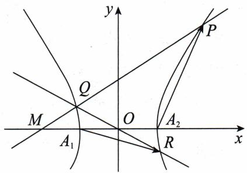

# 高考数学

# 圆锥曲线

3.0 版

# 解题框架构建

\- 答案及详解

text_image

M A T H
E M A
钟浩然 夏方正 / 编著
T I C S

钟浩然 夏方正 / 编著

# 答案及详解

1.【解】(1)由已知得 $\left\{\begin{aligned}|AB|&=\sqrt{a^{2}+b^{2}}=\sqrt{10},\\ e&=\frac{c}{a}=\frac{2\sqrt{2}}{3},\\ a^{2}&=b^{2}+c^{2},\end{aligned}\right.$ 解得 $\left\{\begin{aligned}a&=3,\\ b&=1,\end{aligned}\right.$

所以 C 的标准方程为 $\frac{x^{2}}{9} + y^{2} = 1$ .

(2)(i)由(1)可知 $A(0, - 1)$ ，所以直线 $AP$ 的斜率 $k_{AP} = \frac{n + 1}{m}$ ，直线 $AP$ 的方程为 $y = \frac{n + 1}{m} x - 1$ 因为 $|AP| = \sqrt{1 + k_{AP}^2}\cdot |x_A - x_P| = \sqrt{1 + \frac{(n + 1)^2}{m^2}}\cdot |m|$

$$
\left| A R \right| = \sqrt {1 + k _ {A P} ^ {2}} \cdot \left| x _ {A} - x _ {R} \right| = \sqrt {1 + \frac {(n + 1) ^ {2}}{m ^ {2}}} \cdot \left| x _ {R} \right|,
$$

[12.2 线段长度]

所以 $|AP||AR|=\left[1+\frac{(n+1)^{2}}{m^{2}}\right]|mx_{R}|$ .

因为点 R 在射线 AP 上, 而点 A 在 y 轴上, 所以 $mx_{R} > 0$ .

又因为 $|AP||AR|=3$ ，所以 $x_{R}=\frac{3m}{m^{2}+(n+1)^{2}}$

所以 $y_{R}=\frac{n+1}{m}\cdot\frac{3m}{m^{2}+(n+1)^{2}}-1=\frac{3(n+1)}{m^{2}+(n+1)^{2}}-1.$

因此点 $R$ 的坐标为 $\left(\frac{3m}{m^2 + (n + 1)^2}, \frac{3(n + 1)}{m^2 + (n + 1)^2} - 1\right)$ .

(ii)由(i)得 $\left\{\begin{aligned}&k_{OR}=\frac{\frac{3(n+1)}{m^{2}+(n+1)^{2}}-1}{\frac{3m}{m^{2}+(n+1)^{2}}}=\frac{3(n+1)-m^{2}-(n+1)^{2}}{3m},\\&k_{OP}=\frac{n}{m},\end{aligned}\right.$

因为 $k_{\mathrm{OR}} = 3k_{\mathrm{OP}}$ ，所以 $\frac{3(n + 1) - m^2 - (n + 1)^2}{3m} = \frac{3n}{m}$

整理得 $m^2 + (n + 4)^2 = 18 (m \neq 0)$ ,

即点 P 在以 $T(0,-4)$ 为圆心， $3\sqrt{2}$ 为半径的圆上，

所以 $|PQ|$ 的最大值可转化为点 $Q$ 到点 $T(0, -4)$ 距离的最大值再加上 $3\sqrt{2}$ .

设 $Q(p,q)$ ，由点 $Q$ 在椭圆 $C$ 上有 $\frac{p^2}{9} +q^2 = 1$ ，即 $p^2 = 9 - 9q^2$

所以 $|QT|^{2}=p^{2}+(q+4)^{2}=9-9q^{2}+q^{2}+8q+16=-8q^{2}+8q+25=-8\left(q-\frac{1}{2}\right)^{2}+27\leqslant$ 27，当且仅当 $q=\frac{1}{2}$ 时取等号.

所以 $|PQ|$ 的最大值为 $3\sqrt{3} + 3\sqrt{2}$ .

2.（1）【解】由已知得 $\left\{\begin{aligned}e&=\frac{c}{a}=\frac{\sqrt{5}}{3},\\ b&=2,\\ a^{2}&=b^{2}+c^{2},\end{aligned}\right.$ 解得 $\left\{\begin{aligned}a&=3,\\ b&=2,\\ c&=\sqrt{5},\end{aligned}\right.$ 所以椭圆C的方程为 $\frac{y^{2}}{9}+\frac{x^{2}}{4}=1.$

(2)【证明】方法一：

设 $P(x_{1},y_{1}),Q(x_{2},y_{2})$ ，则 $l_{AP}:y = \frac{y_1}{x_1 + 2} (x + 2)$ ，所以 $M\left(0,\frac{2y_1}{x_1 + 2}\right)$

同理可得 $N\left(0, \frac{2y_2}{x_2 + 2}\right)$ .

[18.3 同理可得]

由条件可知直线 $PQ$ 的斜率存在，设 $l_{PQ}: y - 3 = k(x + 2)$ ，即 $l_{PQ}: y = kx + (2k + 3)$ ，

为便于计算,先令 $m=2k+3$ ,

[19.1 整体计算]

联立直线方程与椭圆方程得 $\left\{ \begin{array}{l} y = kx + m, \\ \frac{y^2}{9} + \frac{x^2}{4} = 1 \end{array} \right. \Rightarrow (4k^2 + 9)x^2 + 8kmx + 4m^2 - 36 = 0,$

由韦达定理得 $\left\{\begin{aligned}x_{1}+x_{2}&=\frac{-8km}{4k^{2}+9},\\ x_{1}x_{2}&=\frac{4m^{2}-36}{4k^{2}+9}.\end{aligned}\right.$

设线段 MN 的中点为 $G(0, y_{G})$ ，则

$$
\begin{array}{l} 2 y _ {G} = \frac {2 y _ {1}}{x _ {1} + 2} + \frac {2 y _ {2}}{x _ {2} + 2} \\ = \frac {2 (k x _ {1} + m)}{x _ {1} + 2} + \frac {2 (k x _ {2} + m)}{x _ {2} + 2} \quad [ \text { 第   一   节 } \quad \text { 整   体   代   换 } ] \\ = 2 \left[ 2 k + (m - 2 k) \left(\frac {1}{x _ {1} + 2} + \frac {1}{x _ {2} + 2}\right) \right], \tag {19.2分式处理} \\ \end{array}
$$

先计算 $\frac{1}{x_1 + 2} +\frac{1}{x_2 + 2}$ 可得

$$
\frac {1}{x _ {1} + 2} + \frac {1}{x _ {2} + 2} = \frac {x _ {1} + x _ {2} + 4}{x _ {1} x _ {2} + 2 (x _ {1} + x _ {2}) + 4} = \frac {- 8 k m + 4 (4 k ^ {2} + 9)}{4 m ^ {2} - 3 6 - 1 6 k m + 4 (4 k ^ {2} + 9)} = \frac {4 k ^ {2} - 2 k m + 9}{(m - 2 k) ^ {2}},
$$

代入上式有 $2y_{G} = \frac{2y_{1}}{x_{1} + 2} +\frac{2y_{2}}{x_{2} + 2} = 2\left(2k + \frac{4k^{2} - 2km + 9}{m - 2k}\right) = \frac{18}{m - 2k}.$

因为 $m = 2k + 3$ ，所以 $2y_{G} = \frac{18}{m - 2k} = 6$ ，即线段 $MN$ 的中点为定点(0,3).

# 方法二：

设 $T(-2,3), M(0,m), N(0,n), m \neq n$ ，则 $k_{AP} = k_{AM} = \frac{m}{2}$ ，所以 $l_{AP}: x = \frac{2}{m} y - 2$

联立直线方程与椭圆方程得 $\left\{\begin{aligned}x&=\frac{2}{m}y-2,\\ \frac{y^{2}}{9}&+\frac{x^{2}}{4}=1\end{aligned}\right.\Rightarrow\left(\frac{36}{m^{2}}+4\right)y^{2}-\frac{72}{m}y=0\Rightarrow y_{P}=\frac{\frac{72}{m}}{\frac{36}{m^{2}}+4}=\frac{18m}{m^{2}+9},$

[第三节 求根(已知点解未知点)]

所以 $x_{P} = \frac{2}{m} y_{P} - 2 = \frac{-2m^{2} + 18}{m^{2} + 9}$ 即 $P\left(\frac{-2m^2 + 18}{m^2 + 9},\frac{18m}{m^2 + 9}\right)$

所以 $k_{PT} = \frac{\frac{18m}{m^2 + 9} - 3}{\frac{-2m^2 + 18}{m^2 + 9} + 2} = \frac{18m - 3m^2 - 27}{-2m^2 + 18 + 2m^2 + 18} = \frac{-3(m^2 - 6m + 9)}{36} = -\frac{(m - 3)^2}{12}$ .

同理可得 $k_{QT} = -\frac{(n - 3)^2}{12}$ .

[18.3 同理可得]

因为 P, Q, T 三点共线，所以 $k_{PT} = k_{QT}$ ，即 $(m - 3)^{2} = (n - 3)^{2}$ ，化简得 $m + n = 6$ ，即线段 MN 的中点为定点 $(0, 3)$ .

3.【解】(1)由题意知 $\left\{\begin{aligned}\frac{0}{a^{2}}+\frac{9}{b^{2}}=1,\\ \frac{9}{a^{2}}+\frac{9}{4b^{2}}=1,\end{aligned}\right.$ 解得 $\left\{\begin{aligned}a^{2}=12,\\ b^{2}=9,\end{aligned}\right.$ 所以 $c^{2}=a^{2}-b^{2}=3$

所以椭圆 C 的离心率 $e=\frac{c}{a}=\frac{1}{2}$ .

(2)由(1)可知椭圆 C 的方程为 $\frac{x^{2}}{12} + \frac{y^{2}}{9} = 1$ .

已知 $A(0,3)$ 和 $P\left(3,\frac{3}{2}\right)$ ，所以直线 $AP: x + 2y - 6 = 0, |AP| = \sqrt{(0 - 3)^2 + \left(3 - \frac{3}{2}\right)^2} = \frac{3\sqrt{5}}{2}$ . 设点 $B$ 到直线 $AP$ 的距离为 $d$ ，

则 $S_{\triangle ABP} = \frac{1}{2} d\cdot |AP| = 9$ ，即 $\frac{1}{2} d\cdot \frac{3\sqrt{5}}{2} = 9$ ，所以 $d = \frac{12}{\sqrt{5}}.$

# 方法一(设线法):

①当直线 PB 的斜率存在时, 设直线 $PB: y - \frac{3}{2} = k(x - 3)$ ,

整理得 $y=kx+m$ ，其中 $m=\frac{3}{2}-3k$ ，

[19.1 整体计算]

联立直线 PB 与椭圆 C 的方程, 则有

$$
\left\{ \begin{array}{l} y = k x + m, \\ \frac {x ^ {2}}{1 2} + \frac {y ^ {2}}{9} = 1 \end{array} \Rightarrow (4 k ^ {2} + 3) x ^ {2} + 8 k m x + 4 (m ^ {2} - 9) = 0, \right.
$$

则 $\Delta > 0$ ，整理得 $k \neq -\frac{3}{2}$ .

由韦达定理得 $x_{P}x_{B}=\frac{4(m^{2}-9)}{4k^{2}+3}$ ，因为 $x_{P}=3$ ，所以 $x_{B}=\frac{4(m^{2}-9)}{3(4k^{2}+3)}$ . [第三节 求根]

将 $m = \frac{3}{2} - 3k$ 代入得 $x_{B} = \frac{4\left[\left(\frac{3}{2} - 3k\right)^{2} - 9\right]}{3(4k^{2} + 3)} = \frac{12k^{2} - 12k - 9}{4k^{2} + 3}$ ,

因为点 B 在直线 PB 上, 所以 $y_{B}=kx_{B}+m$ .

由点到直线的距离公式可知，点 $B$ 到直线 $AP$ 的距离 $d = \frac{|x_B + 2y_B - 6|}{\sqrt{5}}$

因此 $d=\frac{\left|x_{B}+2(kx_{B}+m)-6\right|}{\sqrt{5}}=\frac{\left|(2k+1)x_{B}+2(m-3)\right|}{\sqrt{5}}$

$$
= \frac {\left| (2 k + 1) \frac {1 2 k ^ {2} - 1 2 k - 9}{4 k ^ {2} + 3} + 2 \left(\frac {3}{2} - 3 k - 3\right) \right|}{\sqrt {5}}
$$

$$
= \frac {\left| (2 k + 1) \left(\frac {1 2 k ^ {2} - 1 2 k - 9}{4 k ^ {2} + 3} - 3\right) \right|}{\sqrt {5}} = \frac {\left| (2 k + 1) (- 1 2 k - 1 8) \right|}{\sqrt {5} (4 k ^ {2} + 3)}
$$

$$
= 6 \cdot \frac {\left| (2 k + 1) (2 k + 3) \right|}{\sqrt {5} (4 k ^ {2} + 3)}.
$$

[18.2 “疯狂”地提公因式]

又因为 $d = \frac{12}{\sqrt{5}}$ ，所以 $\frac{12}{\sqrt{5}} = 6\cdot \frac{|(2k + 1)(2k + 3)|}{\sqrt{5}(4k^2 + 3)}$ 即 $|4k^{2} + 8k + 3| = 8k^{2} + 6,$

(i) 当 $4k^{2} + 8k + 3 = 8k^{2} + 6$ 时，即 $4k^{2} - 8k + 3 = 0$ ，解得 $k = \frac{1}{2}$ 或 $\frac{3}{2}$

(ii) 当 $4k^{2} + 8k + 3 = -8k^{2} - 6$ 时，即 $12k^{2} + 8k + 9 = 0, \Delta < 0$ ，方程无解.

所以直线 l 的方程为 $y=\frac{1}{2}x$ 或 $y=\frac{3}{2}x-3$ .

②当直线 $PB$ 的斜率不存在时， $B\left(3, -\frac{3}{2}\right)$ ，此时点 $B$ 到直线 $AP$ 的距离 $d \neq \frac{12}{\sqrt{5}}$ ，不满足题意。

综上, 直线 l 的方程为 $y=\frac{1}{2}x$ 或 $y=\frac{3}{2}x-3$ .

# 方法二(设点法):

设 $B(m,n)$

[第五节 单动点]

则点 B 到直线 AP 的距离 $d=\frac{|m+2n-6|}{\sqrt{5}}$ ，由 $d=\frac{12}{\sqrt{5}}$ 得 $|m+2n-6|=12$ .

(i) 当 $m+2n-6=12$ 时, $m=2(9-n)$ ,

由点 B 在椭圆 C 上得 $\frac{m^{2}}{12} + \frac{n^{2}}{9} = 1$ ，所以有 $\frac{4(9 - n)^{2}}{12} + \frac{n^{2}}{9} = 1$ ，

整理得 $2n^{2} - 27n + 117 = 0$ ，此时 $\Delta < 0$ ，方程无解.

(ii) 当 $m + 2n - 6 = -12$ 时, $m = -2(n + 3)$ ,

由点 B 在椭圆 C 上得 $\frac{m^{2}}{12} + \frac{n^{2}}{9} = 1$ ，所以有 $\frac{4(n+3)^{2}}{12} + \frac{n^{2}}{9} = 1$ ，

整理得 $2n^{2} + 9n + 9 = 0$ ，解得 $n = -\frac{3}{2}$ 或-3，此时 $m = -3$ 或0，

因此直线 l 的方程为 $y=\frac{1}{2}x$ 或 $y=\frac{3}{2}x-3$ .

4.【解】(1)由 $\Gamma: x^{2}-\frac{y^{2}}{b^{2}}=1$ 得 a=1.

因为 e=2，所以 c=2。

又因为在双曲线中 $b^{2}=c^{2}-a^{2}$ ，所以 $b=\sqrt{3}$ .

(2)由题意知 $A_{2}(1,0)$ , 由点 $P$ 在第一象限可知 $\angle MA_{2}P$ 为钝角, 所以等腰三角形 $MA_{2}P$ 的底边为 $MP$ .

由等腰三角形的性质得 $\left|A_{2}P\right|=\left|MA_{2}\right|=3$ ，即 $\sqrt{(x_{P}-1)^{2}+y_{P}^{2}}=3$ .

由点 P 在双曲线上得 $x_{P}^{2}-\frac{3y_{P}^{2}}{8}=1$ ，解得 $x_{P}=2$ 或 $-\frac{16}{11}$ （舍）， $y_{P}=2\sqrt{2}$ .

综上，点 P 的坐标为 $(2,2\sqrt{2})$ .

(3)由题意知 $A_{1}(-1,0)$ , Q 与 R 关于原点对称, 如图所示.

设 $P(x_{1},y_{1}),Q(x_{2},y_{2})$ ，则 $R(-x_2, - y_2)$ ，所以 $\overrightarrow{A_1R}\cdot$

$$
\overrightarrow {A _ {2} P} = (- x _ {2} + 1) (x _ {1} - 1) - y _ {2} y _ {1}.
$$

因为 $\overrightarrow{A_{1}R}\cdot\overrightarrow{A_{2}P}=1$ ，所以 $(x_{1}-1)(x_{2}-1)+y_{1}y_{2}=-1$ 。由题意知直线PQ的斜率不为0，故设直线PQ:x=ty-2(t>0)，则 $x_{1}=ty_{1}-2,x_{2}=ty_{2}-2$ ，

此时 $(x_{1} - 1)(x_{2} - 1) + y_{1}y_{2} = -1$ 即为 $(ty_{1} - 3)$

$$
\left(t y _ {2} - 3\right) + y _ {1} y _ {2} = - 1,
$$

整理得 $(t^2 + 1)y_1y_2 - 3t(y_1 + y_2) + 10 = 0.$ (\*)

联立直线 PQ 与双曲线的方程, 则有 $\left\{\begin{aligned}x &= ty - 2, \\ x^{2} &= \frac{y^{2}}{b^{2}} = 1\end{aligned}\right.$

$$
\left(t ^ {2} - \frac {1}{b ^ {2}}\right) y ^ {2} - 4 t y + 3 = 0.
$$

text_image

y
P
Q
M
O
A₂
x
A₁
R

因为直线 $PQ$ 与双曲线有两个交点，所以 $\left\{ \begin{array}{l} t^2 - \frac{1}{b^2} \neq 0, \\ \Delta > 0, \end{array} \right.$ 即 $\left\{ \begin{array}{l} t^2 \neq \frac{1}{b^2}, \\ t^2 + \frac{3}{b^2} > 0. \end{array} \right.$

由韦达定理可得 $\left\{\begin{aligned}y_{1}+y_{2}&=\frac{4t}{t^{2}-\frac{1}{b^{2}}},\\ y_{1}y_{2}&=\frac{3}{t^{2}-\frac{1}{b^{2}}},\end{aligned}\right.$

代入 $(\ast)$ 式得 $(t^2 + 1) \cdot \frac{3}{t^2 - \frac{1}{b^2}} - 3t \cdot \frac{4t}{t^2 - \frac{1}{b^2}} + 10 = 0$

[第一节 整体代换]

等式两边同乘 $t^2 - \frac{1}{b^2}$ ，得 $3(t^2 + 1) - 12t^2 + 10\left(t^2 - \frac{1}{b^2}\right) = 0$

整理得 $\frac{10}{b^{2}}=t^{2}+3.$

因为点 P 在第一象限, 所以 $k_{PQ} < \frac{b}{a} = b$ , 即 $\frac{1}{t} < b$ , 即 $t > \frac{1}{b}$ .

因为 $t^2 \neq \frac{1}{b^2}$ , 且 $t > \frac{1}{b}$ , 所以 $\frac{10}{b^2} - 3 \neq \frac{1}{b^2}$ , 且 $\frac{10}{b^2} - 3 > \frac{1}{b^2}$ , 解得 $b$ 的取值范围为 $(0, \sqrt{3})$ .

综上，b 的取值范围为 $(0, \sqrt{3})$ .

5.【解】(1)设 $A(x_{A},y_{A}),B(x_{B},y_{B})$

联立直线方程和抛物线方程得 $\left\{ \begin{array}{l} y^2 = 2px, \\ x = 2y - 1 \end{array} \right. \Rightarrow y^2 - 4py + 2p = 0 \Rightarrow \left\{ \begin{array}{l} y_A + y_B = 4p, \\ y_Ay_B = 2p. \end{array} \right.$

因为 $|AB|=4\sqrt{15}$ ，所以 $\sqrt{1+4}|y_{A}-y_{B}|=4\sqrt{15}$ ，

[12.2 线段长度(化斜为直)]

即 $\sqrt{(y_A + y_B)^2 - 4y_Ay_B} = 4\sqrt{3}$

[第一节 整体代换]

代入韦达定理得 $\sqrt{16p^2 - 8p} = 4\sqrt{3}$ ，化简得 $2p^{2} - p - 6 = 0$ ，即 $(2p + 3)(p - 2) = 0$ 又因为 $p > 0$ ，所以 $p = 2$ 。

(2)由(1)得 $y^{2}=4x$ ，且 $F(1,0)$ ，

方法一：

设 $M(4m^2, 4m), N(4n^2, 4n)$ ,

[第七节 抛物线设点]

(i)若直线 $MN$ 的斜率存在，则 $m + n\neq 0$ ，且 $k_{MN} = \frac{4m - 4n}{4m^2 - 4n^2} = \frac{1}{m + n},$

所以 $l_{MN}: y - 4m = \frac{1}{m + n} (x - 4m^2)$ ，化简得 $x - (m + n)y + 4mn = 0$ .

设 $l_{MN}$ 与 x 轴交于点 T，则 $T(-4mn,0)$ .

因为 $\overrightarrow{MF}\cdot\overrightarrow{NF}=0$ ，所以 $(4m^{2}-1)(4n^{2}-1)+16mn=0$ ，

因此有 $16(mn)^2 + 16mn + 1 = 4(m^2 + n^2)$ ，

利用完全平方公式 $m^2 + n^2 = (m \pm n)^2 \mp 2mn$ 代入化简得

$$
1 6 (m n) ^ {2} + 8 m n + 1 = 4 (m - n) ^ {2} \quad ①, 1 6 (m n) ^ {2} + 2 4 m n + 1 = 4 (m + n) ^ {2} \quad ②,
$$

若 M, N 都不与原点重合，则分 M, N 位于 x 轴同侧和 M, N 位于 x 轴异侧两种情况.

当 M, N 位于 x 轴同侧时, mn > 0,

$$
\begin{array}{l} S _ {\triangle M N F} = \left| S _ {\triangle M T F} - S _ {\triangle N T F} \right| = \frac {1}{2} (1 + 4 m n) \cdot | 4 m - 4 n | \\ = 2 (1 + 4 m n) \cdot | m - n |, \\ \end{array}
$$

当 M, N 位于 x 轴异侧时, mn < 0,

$$
\begin{array}{l} S _ {\triangle M N F} = S _ {\triangle M T F} + S _ {\triangle N T F} = \frac {1}{2} | 1 + 4 m n | \cdot (4 | m | + 4 | n |) \\ = 2 \left| 1 + 4 m n \right| \cdot | m - n |. \\ \end{array}
$$

综上， $S_{\triangle MNF}=2|1+4mn|\cdot|m-n|$ .

将①变形为 $(4mn+1)^{2}=4(m-n)^{2}$ ，代入上式得 $S_{\triangle MNF}=(1+4mn)^{2}$ ，

将②变形为 $(4mn+1)^{2}+4(4mn+1)-4=4(m+n)^{2}>0$ ，

解得 $4mn + 1 > -2 + 2\sqrt{2}$ 或 $4mn + 1 < -2 - 2\sqrt{2}$ ，此时 $S_{\triangle MNF}$ 无最值.

若 M, N 中有一点与原点重合, 不妨设 M 与原点重合, 则 $M(0,0)$ , $N(1,\pm2)$ ,

此时 $S_{\triangle MNF}=\frac{1}{2}\times1\times2=1.$

(ii)若直线 MN 的斜率不存在,则直线 MN 的方程可设为 $x=t(t>0$ 且 $t\neq1)$ ,

不妨令 $M(t,2\sqrt{t}),N(t, - 2\sqrt{t})$ ，则 $S_{\triangle MNF} = 2\sqrt{t}\mid t - 1\mid .$

由 $\overrightarrow{MF}\cdot\overrightarrow{NF}=0$ ，得 $t^{2}-6t+1=0$ ，解得 $t=3+2\sqrt{2}$ 或 $t=3-2\sqrt{2}$ .

当 $t = 3 + 2\sqrt{2}$ 时， $S_{\triangle MNF} = 12 + 8\sqrt{2}$ ；当 $t = 3 - 2\sqrt{2}$ 时， $S_{\triangle MNF} = 12 - 8\sqrt{2}$ .

综上， $S_{\triangle MNF}$ 的最小值为 $12-8\sqrt{2}$ .

方法二：

由已知得直线 MN 的斜率不为零, 所以设直线 MN 的方程为 $x = my + n$ , $M(x_{1}, y_{1})$ , $N(x_{2}, y_{2})$ ,

联立直线方程和抛物线方程得 $\left\{ \begin{array}{l} y^{2} = 4x, \\ x = my + n \end{array} \right. \Rightarrow y^{2} - 4my - 4n = 0 \Rightarrow \left\{ \begin{array}{l} y_{1} + y_{2} = 4m, \\ y_{1}y_{2} = -4n. \end{array} \right.$

因为直线 MN 与抛物线交于两点, 所以有 $\Delta=16m^{2}+16n>0$ , 即 $m^{2}+n>0$ .

因为 $\overrightarrow{MF}\cdot\overrightarrow{NF}=0$ ，所以 $(x_{1}-1)(x_{2}-1)+y_{1}y_{2}=0$ ，

即 $(my_{1} + n - 1)(my_{2} + n - 1) + y_{1}y_{2} = 0$ ，即 $(m^2 +1)y_1y_2 + m(n - 1)(y_1 + y_2) + (n - 1)^2 = 0,$

将韦达定理代入得 $4m^{2}=n^{2}-6n+1$ ，

所以有 $4(m^{2}+n)=(n-1)^{2}>0$ ，所以 $n\neq1$ ，且 $n^{2}-6n+1\geqslant0$ ，解得 $n\geqslant3+2\sqrt{2}$ 或 $n\leqslant3-2\sqrt{2}$ .

$$
\left| M N \right| = \sqrt {1 + m ^ {2}} \left| y _ {1} - y _ {2} \right|
$$

[12.2 线段长度(化斜为直)]

$$
= \sqrt {1 + m ^ {2}} \sqrt {(y _ {1} + y _ {2}) ^ {2} - 4 y _ {1} y _ {2}} = \sqrt {1 + m ^ {2}} \sqrt {1 6 m ^ {2} + 1 6 n}
$$

[第一节 整体代换]

$$
= \sqrt {1 + m ^ {2}} \sqrt {4 (n ^ {2} - 6 n + 1) + 1 6 n} = 2 \sqrt {1 + m ^ {2}} | n - 1 |.
$$

设点 F 到直线 MN 的距离为 d，所以 $d=\frac{|n-1|}{\sqrt{1+m^{2}}}$ ，

所以 $\triangle MNF$ 的面积 $S = \frac{1}{2} |MN| \cdot d = \frac{1}{2} \cdot 2\sqrt{1 + m^2} |n - 1| \cdot \frac{|n - 1|}{\sqrt{m^2 + 1}} = (n - 1)^2$

又 $n \geqslant 3 + 2\sqrt{2}$ 或 $n \leqslant 3 - 2\sqrt{2}$ ，所以当 $n = 3 - 2\sqrt{2}$ 时， $S_{\triangle MNF}$ 取最小值，最小值为 $12 - 8\sqrt{2}$ .

6.(1)【解】联立得 $\left\{\begin{aligned}y^{2}&=2px,\\ x^{2}&+y^{2}=5,\end{aligned}\right.$ 解得 $x=-p+\sqrt{p^{2}+5}$ 或 $x=-p-\sqrt{p^{2}+5}$ （舍去）.

因为 $|MN| = |M'N'|$ ，所以 $-p + \sqrt{p^2 + 5} = \frac{p}{2}$ ，解得 $p = 2$ .

所以抛物线 C 的标准方程为 $y^{2}=4x$ .

(2)【证明】设 $A(x_{1},y_{1})$ , $B(x_{2},y_{2})$ ，因为点 G 在抛物线 C 的准线上，所以设 $G(-1,y_{0})$ ,

由题意知直线 AB 的方程为 $y - y_{0} = k_{1}(x + 1)$ ，设 $m = k_{1} + y_{0}$ ，[19.1 整体计算]

联立直线方程与抛物线方程得 $\left\{\begin{aligned}y^{2}&=4x,\\ y&=k_{1}x+m\end{aligned}\right.\Rightarrow k_{1}^{2}x^{2}+(2k_{1}m-4)x+m^{2}=0.$

由韦达定理得 $x_{1} + x_{2} = \frac{-2k_{1}m + 4}{k_{1}^{2}}, x_{1}x_{2} = \frac{m^{2}}{k_{1}^{2}}.$

所以 $|GA| = \sqrt{1 + k_1^2} (x_1 + 1), |GB| = \sqrt{1 + k_1^2} (x_2 + 1)$ ,

[第十二节 线段的翻译（化斜为直）]

所以 $|GA| \cdot |GB| = (1 + k_1^2)[x_1x_2 + (x_1 + x_2) + 1] = \frac{(1 + k_1^2)(m^2 - 2k_1m + 4 + k_1^2)}{k_1^2}$ .

[第一节 整体代换]

将 $m = k_{1} + y_{0}$ 代入上式有 $\left|GA\right|\cdot \left|GB\right| = \frac{(1 + k_1^2)(y_0^2 + 4)}{k_1^2}.$

由题意知直线 $A'B'$ 的方程为 $y = k_{2}(x + 1) + y_{0}$ ，同理可得 $|GA'| \cdot |GB'| = \frac{(1 + k_2^2)(y_0^2 + 4)}{k_2^2}$ ，

[18.3 同理可得]

由 $|GA| \cdot |GB| = 2|GA'| \cdot |GB'|$ ，可得 $\frac{1 + k_1^2}{k_1^2} = 2 \cdot \frac{1 + k_2^2}{k_2^2}$ ，整理得 $\frac{1}{k_1^2} - \frac{2}{k_2^2} = 1$ .

所以 $\frac{1}{k_1^2} -\frac{2}{k_2^2}$ 为定值.

7.(1)【解】由已知得 $\left\{\begin{aligned}e&=\frac{c}{a}=\frac{\sqrt{5}}{3},\\ 2b&=4,\\ a^{2}&=b^{2}+c^{2},\end{aligned}\right.$ 解得 $\left\{\begin{aligned}a&=3,\\ b&=2,\\ c&=\sqrt{5},\end{aligned}\right.$ 所以椭圆E的方程为 $\frac{x^{2}}{9}+\frac{y^{2}}{4}=1.$

(2)【证明】由(1)得 $A(0,2), B(-3,0), C(0,-2), D(3,0)$ ，且 $l_{BC}:\frac{x}{-3}+\frac{y}{-2}=1$ ，设 $l_{AP}:y=kx+2(k<0)$ ，则 $N\left(-\frac{4}{k}, -2\right)$ ，

联立直线方程与椭圆方程得 $\left\{ \begin{array}{l} y = kx + 2, \\ \frac{x^2}{9} + \frac{y^2}{4} = 1 \end{array} \right. \Rightarrow (9k^2 + 4)x^2 + 36kx = 0 \Rightarrow x_P = \frac{-36k}{9k^2 + 4},$

[第三节 求根(已知点解未知点)]

所以 $y_{P} = kx_{P} + 2 = \frac{-18k^{2} + 8}{9k^{2} + 4}$ 即 $P\left(\frac{-36k}{9k^{2} + 4},\frac{-18k^{2} + 8}{9k^{2} + 4}\right),$

因此 $k_{PD} = \frac{\frac{-18k^2 + 8}{9k^2 + 4}}{\frac{-36k}{9k^2 + 4} - 3} = \frac{-18k^2 + 8}{-36k - 3(9k^2 + 4)} = \frac{-2(9k^2 - 4)}{-3(3k + 2)^2} = \frac{2(3k - 2)}{3(3k + 2)}$

[18.2 “疯狂”地提公因式]

所以 $l_{PD}: y = \frac{2(3k - 2)}{3(3k + 2)} (x - 3)$ ，又 $l_{BC}: \frac{x}{-3} + \frac{y}{-2} = 1$ ，

联立得 $\left\{\begin{aligned}y&=\frac{2(3k-2)}{3(3k+2)}(x-3),\\ \frac{x}{-3}+\frac{y}{-2}&=1\end{aligned}\right.\Rightarrow\left\{\begin{aligned}x_{M}&=\frac{-2}{k},\\ y_{M}&=\frac{-2(3k-2)}{3k},\end{aligned}\right.$ 即 $M\left(\frac{-2}{k},\frac{-2(3k-2)}{3k}\right)$ ,

所以 $k_{MN} = \frac{\frac{-2(3k - 2)}{3k} + 2}{\frac{-2}{k} + \frac{4}{k}} = \frac{\frac{4}{3k}}{\frac{2}{k}} = \frac{2}{3}$ , 又因为 $k_{CD} = \frac{2}{3}$ , 所以 $MN // CD$ 得证.

8.【解】(1)因为点 C 在线段 PQ 的垂直平分线上, 所以 $\left|CP\right|=\left|CQ\right|$ .

又因为点 $C$ 在 $QO_{1}$ 上，所以 $\left|O_{1}Q\right| = \left|O_{1}C\right| + \left|CQ\right| = \left|O_{1}C\right| + \left|CP\right| = 4.$

由椭圆的定义可得点 C 的轨迹是以 $O_{1}$ ，P 为焦点的椭圆，

[第十七节 轨迹 & 方程问题(定义法)]

所以 $2a = 4$ ，即 $a = 2$ ，而 $c = 1$ ，所以 $b^{2} = a^{2} - c^{2} = 3$ ，故曲线 $E$ 的方程为 $\frac{x^2}{4} +\frac{y^2}{3} = 1.$

(2)①当直线 AB 的斜率存在时, 设直线 AB 的方程为 $y = kx + m$ , 与 y 轴交于 $D(0, m)$ , 设 $A(x_{1}, y_{1}), B(x_{2}, y_{2})$ ,

联立直线 AB 的方程和曲线 E 的方程得 $\left\{\begin{aligned}y&=kx+m,\\ \frac{x^{2}}{4}&+\frac{y^{2}}{3}=1\end{aligned}\right.\Rightarrow(4k^{2}+3)x^{2}+8kmx+4(m^{2}-3)=0,$

由韦达定理得 $x_{1}+x_{2}=\frac{-8km}{3+4k^{2}}, x_{1}x_{2}=\frac{4m^{2}-12}{3+4k^{2}}$ .

$$
\begin{array}{l} S _ {\triangle A O B} = \frac {1}{2} | m | \cdot | x _ {1} - x _ {2} | = \frac {1}{2} | m | \cdot \sqrt {(x _ {1} + x _ {2}) ^ {2} - 4 x _ {1} x _ {2}} \quad [ 1 3. 4 \text {多边形的面积} ] \\ = \frac {1}{2} | m | \cdot \sqrt {\left(\frac {- 8 k m}{3 + 4 k ^ {2}}\right) ^ {2} - 4 \cdot \frac {4 m ^ {2} - 1 2}{3 + 4 k ^ {2}}} \quad [ \text { 第   一   节   整   体   代   换 } ] \\ = 2 \sqrt {3} \cdot \sqrt {\frac {m ^ {2}}{3 + 4 k ^ {2}} - \frac {m ^ {4}}{(3 + 4 k ^ {2}) ^ {2}}} \text {,} \tag {13.4 多边形的面积(例37)} \\ \end{array}
$$

当 $\frac{m^{2}}{3+4k^{2}}=\frac{1}{2}$ 时， $S_{\triangle AOB}$ 取得最大值 $\sqrt{3}$ ，

此时 $x_{1} + x_{2} = \frac{-4k}{m}, y_{1} + y_{2} = k(x_{1} + x_{2}) + 2m = \frac{3}{m}$ ，则 $M\left(\frac{-2k}{m}, \frac{3}{2m}\right)$ .

由于 $\frac{\left(\frac{-2k}{m}\right)^{2}}{2}+\frac{\left(\frac{3}{2m}\right)^{2}}{\frac{3}{2}}=1,$

[第十七节 轨迹 & 方程问题]

即 $\frac{x_{M}^{2}}{2}+\frac{y_{M}^{2}}{\frac{3}{2}}=1$ ，满足椭圆的标准方程，

所以平面内存在两点 $G\left(\frac{\sqrt{2}}{2},0\right),H\left(-\frac{\sqrt{2}}{2},0\right)$ ，使得 $\vert GM\vert +\vert HM\vert = 2\sqrt{2}.$

②当直线 $AB$ 的斜率不存在时，设 $A(2\cos \theta, \sqrt{3}\sin \theta)$ ，则 $B(2\cos \theta, -\sqrt{3}\sin \theta)$ ，其中 $\theta \in$

$\left(0, \frac{\pi}{2}\right) \cup \left(\frac{\pi}{2}, \pi\right)$ , [13.4 多边形的面积(例 41 三角换元)]

所以 $S_{\triangle AOB} = 2\sqrt{3} |\sin \theta \cos \theta | = \sqrt{3} |\sin 2\theta|$ ，当 $\theta = \frac{\pi}{4}$ 或 $\frac{3\pi}{4}$ 时， $S_{\triangle AOB}$ 取得最大值 $\sqrt{3}$ .

此时线段 $AB$ 的中点 $M$ 的坐标为 $(\sqrt{2},0)$ 或 $(- \sqrt{2},0)$ ，满足方程 $\frac{x^2}{2} + \frac{y^2}{\frac{3}{2}} = 1$ ，且 $|GM| +$

$$
\mid H M \mid = 2 \sqrt {2}.
$$

综上,存在两定点 G,H,使 $\left|GM\right|+\left|HM\right|$ 为定值 $2\sqrt{2}$ .

9.【解】(1)由已知得 $\left\{\begin{aligned}a+c=3,\\ a-c=1,\\ a^{2}&=b^{2}+c^{2},\end{aligned}\right.$ 解得 $\left\{\begin{aligned}a=2,\\ c=1,\\ b=\sqrt{3},\end{aligned}\right.$ 所以椭圆方程为 $\frac{x^{2}}{4}+\frac{y^{2}}{3}=1$ ，离心率 $e=\frac{1}{2}$ .

(2) 方法一:

由已知得直线 $A_{2}P$ 的斜率存在且不为 0，所以设 $l_{A_{2}P}: y = k(x - 2)$ ，则 $y_{Q} = -2k$ .

联立直线方程与椭圆方程得 $\left\{\begin{aligned}x&=\frac{1}{k}y+2,\\ \frac{x^{2}}{4}&+\frac{y^{2}}{3}=1\end{aligned}\right.\Rightarrow\left(\frac{3}{k^{2}}+4\right)y^{2}+\frac{12}{k}y=0\Rightarrow y_{P}=\frac{-\frac{12}{k}}{\frac{3}{k^{2}}+4}=\frac{-12k}{4k^{2}+3}.$

[第三节 求根(已知点解未知点)]

因为 $S_{\triangle A_1PQ} = |S_{\triangle A_1A_2Q} - S_{\triangle A_1A_2P}| = \frac{1}{2}|A_1A_2|\cdot |y_Q - y_P| = 2|y_Q - y_P|$

[13.4 多边形的面积(面积分割)]

$$
S _ {\triangle A _ {2} P F} = \frac {1}{2} | F A _ {2} | \cdot | y _ {P} | = \frac {1}{2} | y _ {P} |,
$$

又由题得 $\triangle A_{1}PQ$ 的面积是 $\triangle A_{2}FP$ 的面积的二倍，所以 $2|y_{Q} - y_{P}| = |y_{P}|$

①当 $2|y_{P}| - 2|y_{Q}| = |y_{P}|$ 时， $|y_{P}| = 2|y_{Q}|$ ，即 $\frac{12|k|}{3 + 4k^2} = 4|k|$ ，解得 $k = 0$ ，不符合题意，舍去.  
②当 $2|y_{Q}| - 2|y_{P}| = |y_{P}|$ 时， $2|y_{Q}| = 3|y_{P}|$ ，即 $4|k| = \frac{36|k|}{3 + 4k^2}$ ，解得 $k = \pm \frac{\sqrt{6}}{2}$ .

综上，直线 $A_{2}P$ 的方程为 $y = \pm \frac{\sqrt{6}}{2} (x - 2)$

方法二：

设 $P(m,n)$ ，其中 $-2 < m < 2$ 且 $m \neq 0$

[第五节 单动点]

则 $k_{A_2P} = \frac{n}{m - 2}$ 即 $l_{A_2P}:y = \frac{n}{m - 2}(x - 2)$ 所以 $y_{Q} = \frac{-2n}{m - 2}$

因为 $S_{\triangle A_1PQ} = |S_{\triangle A_1A_2Q} - S_{\triangle A_1A_2P}| = \frac{1}{2} |A_1A_2|\cdot |y_Q - y_P| = 2|y_Q - y_P|$

[13.4 多边形的面积(面积分割)]

$$
S _ {\triangle A _ {2} P F} = \frac {1}{2} | F A _ {2} | \cdot | y _ {P} | = \frac {1}{2} | y _ {P} |,
$$

又由题得 $\triangle A_{1}PQ$ 的面积是 $\triangle A_{2}FP$ 面积的二倍，所以 $2|y_{Q} - y_{P}| = |y_{P}|$

①当 $2|y_{P}| - 2|y_{Q}| = |y_{P}|$ 时， $|y_{P}| = 2|y_{Q}|$ ，即 $|n| = \frac{4|n|}{|m - 2|}$ ，解得 $n = 0$ ，不符合题意，舍去.  
②当 $2|y_{Q}| - 2|y_{P}| = |y_{P}|$ 时， $2|y_{Q}| = 3|y_{P}|$ ，即 $\frac{4|n|}{|m - 2|} = 3|n|$ ，解得 $m = \frac{2}{3}$ ，所以 $P\left(\frac{2}{3}, \pm \frac{2\sqrt{6}}{3}\right)$ ，所以直线 $A_{2}P$ 的方程为 $y = \pm \frac{\sqrt{6}}{2}(x - 2)$ .

10.【解】(1)由题意知 $2a=2\sqrt{2}$ ，所以 $a=\sqrt{2}$ .

以 $F_{1}F_{2}$ 为直径的圆的方程为 $x^{2}+y^{2}=c^{2}$ .

因为以 $F_{1}F_{2}$ 为直径的圆和椭圆 C 恰好有两个交点, 所以 b=c.

又因为 $b^{2} + c^{2} = a^{2} = 2$ ，所以 $b = c = 1$ ，所以椭圆 $C$ 的方程为 $\frac{x^2}{2} + y^2 = 1.$

(2)由题意可知 $l_{1}, l_{2}$ 的斜率均存在且不为零，分别设为 $k_{1}, k_{2}$ ，

设 $P(x_0, y_0)(x_0 \neq \pm \sqrt{2})$ ，则切线 $l_1$ 的方程为 $y - y_0 = k_1(x - x_0)$ ，

设 $y_0 - k_1x_0 = n$ ，即直线 $l_{1}$ 的方程为 $y = k_{1}x + n$

[19.1 整体计算]

联立直线 $l_{1}$ 的方程与椭圆方程得 $\left\{\begin{aligned}y&=k_{1}x+n,\\ \frac{x^{2}}{2}&+y^{2}=1\end{aligned}\right.\Rightarrow(2k_{1}^{2}+1)x^{2}+4k_{1}nx+2n^{2}-2=0.$

由直线 $l_{1}$ 与椭圆相切得 $\Delta = 16k_1^2 m^2 -8(1 + 2k_1^2)(n^2 -1) = 0$ ，化简得 $n^2 = 2k_1^2 +1$

将 $n = y_0 - k_1x_0$ 代入上式，整理得 $(x_0^2 -2)k_1^2 -2x_0y_0k_1 + y_0^2 -1 = 0,$

同理可得 $(x_0^2 - 2)k_2^2 - 2x_0y_0k_2 + y_0^2 - 1 = 0.$

所以 $k_{1}, k_{2}$ 是以 k 为变量的方程 $(x_{0}^{2}-2)k^{2}-2x_{0}y_{0}k+y_{0}^{2}-1=0$ 的两根，

[第九章 “同构”专题(例 2)]

由韦达定理得 $k_{1}k_{2}=\frac{y_{0}^{2}-1}{x_{0}^{2}-2}$ .

因为 $l_{1}, l_{2}$ 的斜率之积为 $m$ ，所以 $\frac{y_0^2 - 1}{x_0^2 - 2} = m$ ，即 $y_0^2 = mx_0^2 + 1 - 2m$

所以 $|PO| = \sqrt{x_0^2 + y_0^2} = \sqrt{(m + 1)x_0^2 + 1 - 2m}$ ，当 $x_0 = 0$ 时，有 $u = |PO|_{\min} = \sqrt{1 - 2m}$ .

又 $-1 \leqslant m \leqslant -\frac{1}{2}$ , 所以 $\sqrt{2} \leqslant u \leqslant \sqrt{3}$ .

[第十六节 动的问题]

所以 u 的取值范围为 $\left[\sqrt{2},\sqrt{3}\right]$ .

11.【解】(1)因为椭圆 E 经过点 $P\left(1,\frac{2\sqrt{5}}{5}\right)$ ，焦距为 4，

所以 $\left\{\begin{aligned}\frac{1}{a^{2}}+\frac{4}{5b^{2}}=1,\\ a^{2}-b^{2}=4,\end{aligned}\right.$ 得 $5b^{4}+11b^{2}-16=0$ ，解得 $b^{2}=1$ （负值舍去），

所以 $a^{2}=5$ ，所以椭圆 E 的方程为 $\frac{x^{2}}{5}+y^{2}=1$ 。

(2)由(1)知椭圆 E 的上顶点为 $(0,1)$ ，左焦点为 $F(-2,0)$ ，

此时直线 l 的方程为 x=2y-2，

代入椭圆的方程 $x^{2}+5y^{2}=5$ ，得 $9y^{2}-8y-1=0$ ，解得 y=1 或 $y=-\frac{1}{9}$ ，

所以 $\triangle AOB$ 的面积为 $S=\frac{1}{2}\times2\times\left(1+\frac{1}{9}\right)=\frac{10}{9}$ .

(3)由题意可知直线 l 的斜率不为 0，设直线 l 的方程为 $x=my-2, A(x_{1}, y_{1}), B(x_{2}, y_{2})$ .

由 $\left\{ \begin{array}{l} x = my - 2, \\ x^2 + 5y^2 = 5, \end{array} \right.$ 得 $(m^2 + 5)y^2 - 4my - 1 = 0$

所以 $\Delta=20(1+m^{2})>0,y_{1}+y_{2}=\frac{4m}{m^{2}+5},y_{1}y_{2}=\frac{-1}{m^{2}+5}$

所以 $|y_1 - y_2| = \sqrt{(y_1 + y_2)^2 - 4y_1y_2} = \frac{2\sqrt{5}\cdot\sqrt{m^2 + 1}}{m^2 + 5}.$

[第一节 整体代换]

在 Rt△QFA 中， $\tan\angle AQF=\frac{|AF|}{|QF|}=\frac{\sqrt{m^{2}+1}|y_{1}|}{5\sqrt{m^{2}+1}}=\frac{|y_{1}|}{5}.$

[第十一节 角的翻译, 第十二节 线段的翻译]

同理可得 $\tan\angle BQF=\frac{|y_{2}|}{5}$ .

[18.3 同理可得]

所以 $\tan\angle AQB=\tan(\angle AQF+\angle BQF)=\frac{\tan\angle AQF+\tan\angle BQF}{1-\tan\angle AQF\tan\angle BQF}$

$$
= \frac {\frac {| y _ {1} |}{5} + \frac {| y _ {2} |}{5}}{1 - \frac {| y _ {1} |}{5} \cdot \frac {| y _ {2} |}{5}} = 5 \cdot \frac {| y _ {1} - y _ {2} |}{2 5 + y _ {1} y _ {2}} = 1 0 \sqrt {5} \cdot \frac {\sqrt {m ^ {2} + 1}}{2 5 (m ^ {2} + 5) - 1}
$$

$$
= \frac {1 0 \sqrt {5}}{2 5 \sqrt {m ^ {2} + 1} + \frac {9 9}{\sqrt {m ^ {2} + 1}}} \in \left(0, \frac {\sqrt {5}}{3 \sqrt {1 1}} \right],
$$

[第十六节 动的问题]

当且仅当 $m^2 = \frac{74}{25}$ ，即 $m = \pm \frac{\sqrt{74}}{5}$ 时取等号，

此时 $\tan\angle AQB>0$ , 可得 $\angle AQB$ 为锐角.

又因为 $y=\tan x$ 在 $\left(0,\frac{\pi}{2}\right)$ 上单调递增，所以 $\tan\angle AQB$ 最大，即为 $\angle AQB$ 最大，

此时直线 l 的方程为 $x \pm \frac{\sqrt{74}}{5}y + 2 = 0$ .

12.【解】(1)由已知得抛物线的准线方程为 x=-1，且 $A\left(\frac{a^{2}}{4},a\right)(a>0)$ ,

因为 A 到抛物线 $\Gamma$ 准线的距离为 3，所以 $\frac{a^{2}}{4} + 1 = 3$ ，解得 $a = 2\sqrt{2}$ .

(2) 当 $a = 4$ 时 $A(4,4)$ , 设 $B(b,0)$ , 则 $AB$ 的中点为 $G\left(\frac{b + 4}{2}, 2\right)$ .

因为点 $G$ 在抛物线上，所以 $4 = 4 \cdot \frac{b + 4}{2}$ ，解得 $b = -2$ ，所以 $B(-2,0)$ ，

此时 $l_{AB}:2x-3y+4=0$ ，故 O 到直线 AB 的距离 $d=\frac{4}{\sqrt{2^{2}+(-3)^{2}}}=\frac{4\sqrt{13}}{13}$ .

(3)由已知得 $A\left(\frac{a^2}{4}, a\right)$ , 设 $P\left(\frac{p^2}{4}, p\right) (p > 0, p \neq a)$ ,

[第七节 抛物线设点]

则 $H(-3,p)$ ，且 $k_{AP} = \frac{p - a}{\frac{p^2 - a^2}{4}} = \frac{4}{p + a},$

即 $l_{AP}: y - p = \frac{4}{p + a} \left(x - \frac{p^2}{4}\right)$ , 化简得 $4x - (p + a)y + ap = 0$ , 所以 $Q\left(-3, \frac{ap - 12}{p + a}\right)$ .

因为 $|HQ| > 4$ 恒成立，所以 $\left|p - \frac{ap - 12}{p + a}\right| > 4$ 恒成立，即 $\left|\frac{p^2 + 12}{p + a}\right| > 4$ 恒成立，

即 $p^2 - 4p + 12 > 4a$ 恒成立.

又因为 $p^2 - 4p + 12 = (p - 2)^2 + 8 \geqslant 8$ ，当且仅当 $p = 2$ 时取等号，所以 $4a < 8$ ，即 $0 < a < 2$ . 若 $a = 2$ ，则由 $p \neq a$ 可知 $p^2 - 4p + 12 = (p - 2)^2 + 8 > 8$ ，仍满足题意，故 $a$ 的取值范围是 $(0, 2]$ .

13.【解】(1)由已知得 $\left\{\begin{aligned}e&=\frac{c}{a}=\frac{\sqrt{2}}{2},\\ 2a&=4,\end{aligned}\right.$ 解得 $\left\{\begin{aligned}a&=2,\\ c&=\sqrt{2},\end{aligned}\right.$

又因为在椭圆中有 $a^2 = b^2 + c^2$ ，所以 $b^2 = 2$ ，因此椭圆 $C$ 的方程为 $\frac{x^2}{4} + \frac{y^2}{2} = 1$ .

(2)由题意可知直线 $l$ 的斜率存在，故设 $l:y = kx - 2$ ，设 $P(0, - 2)$

所以 $S_{\triangle OAB} = |S_{\triangle OPA} - S_{\triangle OPB}| = \frac{1}{2} |OP| \cdot |x_A - x_B| = |x_A - x_B|$ .

[13.4 多边形的面积(面积分割)]

因为 $S_{\triangle OAB} = \sqrt{2}$ ，所以 $\left|x_A - x_B\right| = \sqrt{2}$

而 $|AB| = \sqrt{1 + k^2} |x_A - x_B|$ ，即 $|AB| = \sqrt{2} \cdot \sqrt{1 + k^2}$ ，要求 $|AB|$ 即求 $k$ .

联立直线 l 与椭圆 C 的方程得 $\left\{\begin{aligned} y &= kx - 2, \\ \frac{x^{2}}{4} + \frac{y^{2}}{2} &= 1, \end{aligned}\right.$ 消去 y，整理得 $(2k^{2} + 1)x^{2} - 8kx + 4 = 0$ .

因为直线 l 与椭圆 C 交于不同的两点，所以 $\Delta=64k^{2}-16(2k^{2}+1)>0$ ，即 $k^{2}>\frac{1}{2}$

由韦达定理得 $\left\{\begin{aligned}x_{A}+x_{B}&=\frac{8k}{2k^{2}+1},\\ x_{A}x_{B}&=\frac{4}{2k^{2}+1},\end{aligned}\right.$

所以 $|x_{A} - x_{B}| = \sqrt{(x_{A} + x_{B})^{2} - 4x_{A}x_{B}} = \sqrt{\left(\frac{8k}{2k^{2} + 1}\right)^{2} - \frac{16}{2k^{2} + 1}} = \sqrt{\frac{16(2k^{2} - 1)}{(2k^{2} + 1)^{2}}},$

又因为 $|x_{A} - x_{B}| = \sqrt{2}$ ，所以 $\sqrt{\frac{16(2k^2 - 1)}{(2k^2 + 1)^2}} = \sqrt{2}$ ，即 $\frac{16(2k^2 - 1)}{(2k^2 + 1)^2} = 2$

所以 $8(2k^2 - 1) = (2k^2 + 1)^2$ ，因此 $16k^2 - 8 = 4k^4 + 4k^2 + 1$

整理得 $4k^{4}-12k^{2}+9=0$ ，即 $(2k^{2}-3)^{2}=0$ ，解得 $k^{2}=\frac{3}{2}>\frac{1}{2}$ ，

所以 $|AB|=\sqrt{2}\cdot\sqrt{1+k^{2}}=\sqrt{2}\times\sqrt{1+\frac{3}{2}}=\sqrt{5}$ .

14.(1)【解】由题意得 $\left\{\begin{aligned}\frac{2}{a^{2}}+\frac{1}{b^{2}}=1,\\ \frac{c}{a}=\frac{\sqrt{2}}{2},\\ b^{2}=a^{2}-c^{2},\end{aligned}\right.$ 解得 $a=2,b=\sqrt{2},c=\sqrt{2}$ ,

故椭圆 C 的标准方程为 $\frac{x^{2}}{4} + \frac{y^{2}}{2} = 1$ .

(2)【证明】设直线 AB 的方程为 $y=kx+m(k\neq0)$ , $A(x_{1},y_{1})$ , $B(x_{2},y_{2})$ ,

联立直线 $AB$ 的方程与椭圆方程得 $\left\{ \begin{array}{l} y = kx + m, \\ \frac{x^2}{4} + \frac{y^2}{2} = 1 \end{array} \right. \Rightarrow (2k^2 + 1)x^2 + 4kmx + 2m^2 - 4 = 0,$

由韦达定理得 $x_{1} + x_{2} = \frac{-4km}{2k^{2} + 1}, x_{1}x_{2} = \frac{2m^{2} - 4}{2k^{2} + 1}$ .

选择条件①: 直线 OA 与直线 OB 的斜率之积 $k_{OA} \cdot k_{OB}$ 为定值 $-\frac{b^{2}}{a^{2}}$ .

因为 $y_{1}y_{2} = (kx_{1} + m)(kx_{2} + m) = k^{2}x_{1}x_{2} + km(x_{1} + x_{2}) + m^{2} = \frac{m^{2} - 4k^{2}}{2k^{2} + 1}$ ，

所以 $k_{OA} \cdot k_{OB} = \frac{y_1}{x_1} \cdot \frac{y_2}{x_2} = \frac{\frac{m^2 - 4k^2}{2k^2 + 1}}{\frac{2m^2 - 4}{2k^2 + 1}} = \frac{m^2 - 4k^2}{2m^2 - 4} = -\frac{b^2}{a^2} = -\frac{1}{2}$ ,

[第一节 整体代换]

整理可得 $2k^{2}+1=m^{2}$ .

若存在常数 $\lambda > 0$ ，使得 $\overrightarrow{OA} + \overrightarrow{OB} = \lambda \overrightarrow{OM}$ ，则 $x_{M} = \frac{1}{\lambda} (x_{1} + x_{2}) = \frac{1}{\lambda} \cdot \frac{-4km}{2k^{2} + 1}$ ，

且 $y_{M}=\frac{1}{\lambda}(y_{1}+y_{2})=\frac{1}{\lambda}\left[k(x_{1}+x_{2})+2m\right]=\frac{1}{\lambda}\cdot\left(\frac{-4k^{2}m}{2k^{2}+1}+2m\right)=\frac{1}{\lambda}\cdot\frac{2m}{2k^{2}+1}.$

因为点 M 在椭圆 C 上, 所以 $\frac{x_{M}^{2}}{4} + \frac{y_{M}^{2}}{2} = 1$ , [第五节 单动点(有点必有等式, 有等式必有代换)]

即 $\frac{1}{\lambda^2}\cdot \frac{4k^2m^2}{(2k^2 + 1)^2} +\frac{1}{\lambda^2}\cdot \frac{2m^2}{(2k^2 + 1)^2} = \frac{1}{\lambda^2}\cdot \frac{2m^2}{2k^2 + 1} = \frac{2}{\lambda^2} = 1,$ 又 $\lambda >0$

解得 $\lambda = \sqrt{2}$

选择条件②: $\triangle OAB$ 的面积为定值 $\frac{1}{2}ab$ .

设直线 AB 与 y 轴交于 $D(0, m)$ ,

则 $S_{\triangle AOB} = \frac{1}{2} |m||x_1 - x_2| = \frac{1}{2} |m|\sqrt{(x_1 + x_2)^2 - 4x_1x_2}$

[13.4 多边形的面积]

$$
= \frac {1}{2} | m | \cdot \frac {2 \sqrt {2} \sqrt {4 k ^ {2} + 2 - m ^ {2}}}{2 k ^ {2} + 1} = \frac {1}{2} a b = \sqrt {2},
$$

[第一节 整体代换]

则 $m^2 (4k^2 + 2 - m^2) = (2k^2 + 1)^2$

整理得 $(2k^{2} + 1)^{2} - 2m^{2}(2k^{2} + 1) + m^{4} = 0$

[18.1 抓主元化简]

即 $2k^{2} + 1 = m^{2}$

若存在常数 $\lambda > 0$ ，使得 $\overrightarrow{OA} + \overrightarrow{OB} = \lambda \overrightarrow{OM}$ ，则 $x_{M} = \frac{1}{\lambda} (x_{1} + x_{2}) = \frac{1}{\lambda} \cdot \frac{-4km}{2k^{2} + 1}$ ，

且 $y_{M}=\frac{1}{\lambda}(y_{1}+y_{2})=\frac{1}{\lambda}\left[k(x_{1}+x_{2})+2m\right]=\frac{1}{\lambda}\cdot\left(\frac{-4k^{2}m}{2k^{2}+1}+2m\right)=\frac{1}{\lambda}\cdot\frac{2m}{2k^{2}+1}.$

因为点 M 在椭圆 C 上, 所以 $\frac{x_{M}^{2}}{4} + \frac{y_{M}^{2}}{2} = 1$ ,

[第五节 单动点(有点必有等式,有等式必有代换)]

即 $\frac{1}{\lambda^2}\cdot \frac{4k^2m^2}{(2k^2 + 1)^2} +\frac{1}{\lambda^2}\cdot \frac{2m^2}{(2k^2 + 1)^2} = \frac{1}{\lambda^2}\cdot \frac{2m^2}{2k^2 + 1} = \frac{2}{\lambda^2} = 1,$

又 $\lambda > 0$ ，解得 $\lambda = \sqrt{2}$ .

15.(1)【解】由已知得 $\left\{\begin{aligned}c=1,\\ \frac{1}{a^{2}}+\frac{9}{4b^{2}}=1,\end{aligned}\right.$ 解得 $\left\{\begin{aligned}a=2,\\ b=\sqrt{3},\end{aligned}\right.$ 所以椭圆C的方程为 $\frac{x^{2}}{4}+\frac{y^{2}}{3}=1.$

(2)【证明】由(1)知 $F(1,0)$ ，又 $P(4,0)$ ，所以线段 FP 的中点 N 的坐标为 $\left(\frac{5}{2},0\right)$ .

设 $A(x_{1},y_{1}),B(x_{2},y_{2}),Q(1,y_{3})$

要证 $AQ \perp y$ 轴，即证 $y_{1} = y_{3}$ .

由题意得直线 AB 的斜率存在.

当直线 $AB$ 的斜率为0时，点 $A$ 与椭圆 $C$ 的长轴端点重合，点 $Q$ 与点 $F$ 重合，此时显然有 $AQ\bot y$ 轴.

当直线 AB 的斜率不为 0 时, 设直线 $AB: x = ty + 4 (t \neq 0)$ ,

联立直线 AB 与椭圆 C 的方程，则有 $\left\{\begin{aligned}x&=ty+4,\\ \frac{x^{2}}{4}+\frac{y^{2}}{3}&=1\end{aligned}\right.\Rightarrow(3t^{2}+4)y^{2}+24ty+36=0,$

则 $\Delta=(24t)^{2}-4(3t^{2}+4)\cdot36=144t^{2}-576>0$ , 即 $|t|>2$

由韦达定理得 $\left\{ \begin{array}{l} y_{1} + y_{2} = \frac{-24t}{3t^{2} + 4}, \\ y_{1}y_{2} = \frac{36}{3t^{2} + 4}, \end{array} \right.$ 所以 $\frac{y_1 + y_2}{y_1y_2} = \frac{-2t}{3}$ ,

[第二节 和积关系]

即 $3y_{1} + 3y_{2} = -2ty_{1}y_{2}$

整理得 $(2ty_{2} + 3)y_{1} = -3y_{2}$ ，即 $y_{1} = \frac{-3y_{2}}{2ty_{2} + 3}$

因为点 $B$ 在直线 $AB$ 上，所以 $x_{2} = ty_{2} + 4$ ，代入上式即有 $y_{1} = \frac{-3y_{2}}{2x_{2} - 5}$

由 $B(x_{2},y_{2}),N\left(\frac{5}{2},0\right)$ 得直线 $BN:y = \frac{y_2}{x_2 - \frac{5}{2}}\left(x - \frac{5}{2}\right)$ ，令 $x = 1$ ，得 $y_{3} = \frac{-3y_{2}}{2x_{2} - 5}$

所以有 $y_{1} = y_{3}$ ，即 $AQ \perp y$ 轴成立.

16.【解】(1)因为长轴长为4，离心率为 $\frac{\sqrt{3}}{2}$ ，所以 $2a = 4$ ，且 $e = \frac{c}{a} = \frac{\sqrt{3}}{2}$ ，

解得 $a = 2, c = \sqrt{3}$ , 所以 $b^{2} = a^{2} - c^{2} = 1$ , 所以椭圆 $C$ 的方程为 $\frac{x^2}{4} + y^2 = 1$ .

(2) 因为 $\overrightarrow{AN}=2\overrightarrow{MA}$ ，所以 $\left\{\begin{aligned}-x_{0}&=2(x_{0}-x_{M}),\\ y_{N}&-y_{0}=2y_{0}\end{aligned}\right.\Rightarrow\left\{\begin{aligned}x_{M}&=\frac{3}{2}x_{0},\\ y_{N}&=3y_{0},\end{aligned}\right.$

[第五节 单动点]

即 $M\left(\frac{3}{2} x_0,0\right),N(0,3y_0)$ ，所以 $k_{MN} = -\frac{2y_0}{x_0}$

因为 $m \parallel l$ ，所以 $k_{DB} = k_{MN} = -\frac{2y_0}{x_0}$ ，所以直线 $m$ 的方程为 $y = -\frac{2y_0}{x_0} x$ .

所以点 $A(x_0, y_0)$ 到直线 $m: y = -\frac{2y_0}{x_0} x$ 的距离 $d = \frac{3|x_0y_0|}{\sqrt{x_0^2 + 4y_0^2}}$ .

因为点 $A(x_0, y_0)$ 在椭圆上，所以有 $\frac{x_0^2}{4} + y_0^2 = 1$

[第五节 单动点(有点必有等式,有等式必有代换)]

代入上式得 $d = \frac{3}{2}|x_0y_0|$

联立直线 $m$ 与椭圆的方程得 $\left\{ \begin{array}{l} y = -\frac{2y_0}{x_0} x, \\ \frac{x^2}{4} + y^2 = 1 \end{array} \right. \Rightarrow \left( \frac{16y_0^2}{x_0^2} + 1 \right) x^2 = 4 \Rightarrow x^2 = \frac{4x_0^2}{x_0^2 + 16y_0^2},$

所以 $|OB|^{2}=x_{B}^{2}+y_{B}^{2}=\frac{16}{x_{0}^{2}+16y_{0}^{2}}.$

所以 $S_{\triangle ABD} = 2S_{\triangle AOB} = 2 \times \frac{1}{2} d \cdot |OB| = 6\sqrt{\frac{x_0^2 y_0^2}{x_0^2 + 16y_0^2}}.$

利用 $\frac{x_0^2}{4} + y_0^2 = 1$ 消去 $x_0^2$ ，得 $S_{\triangle ABD} = 6\sqrt{\frac{y_0^2(1 - y_0^2)}{3y_0^2 + 1}}.$

[第十六节 动的问题]

# 方法一:求导

设 $t = y_0^2$ ，则 $0 < t < 1$ ，即 $S_{\triangle ABD} = 6 \cdot \sqrt{\frac{(1 - t)t}{1 + 3t}}$

设 $g(t) = \frac{t - t^2}{1 + 3t}, 0 < t < 1$ ，则 $g'(t) = \frac{(1 - 2t)(1 + 3t) - 3(t - t^2)}{(1 + 3t)^2} = \frac{-3t^2 - 2t + 1}{(1 + 3t)^2}$ .

当 $0 < t < \frac{1}{3}$ 时， $g'(t) > 0, g(t)$ 单调递增；

当 $\frac{1}{3}<t<1$ 时, $g'(t)<0$ , $g(t)$ 单调递减.

所以 $g(t)_{\max} = g\left(\frac{1}{3}\right) = \frac{1}{9}$ ，所以 $\triangle ABD$ 面积的最大值为2.

# 方法二:基本不等式

设 $t = 3y_0^2 +1,t\in (1,4)$ ，则 $S_{\triangle ABD} = 2\cdot \sqrt{5 - \left(t + \frac{4}{t}\right)}\leqslant 2$ ，当且仅当 $t = 2$ 时等号成立.

所以 $\triangle ABD$ 面积的最大值为2.

17.【解】(1)由题意,抛物线 $C: x^{2} = 2py (p > 0)$ 的焦点 F 到其准线的距离为 2,

所以 $p = 2$

故抛物线 C 的方程为 $x^{2}=4y$ .

# (2) 方法一:

由(1)知焦点 $F(0,1)$ ，设直线 $AB$ 的方程为 $y = kx + 1, A(x_1, y_1), B(x_2, y_2), \triangle MNQ$ 的外接圆圆心为 $E$ ，

联立直线 AB 的方程与抛物线方程得 $\left\{\begin{aligned}y&=kx+1,\\ x^{2}&=4y\end{aligned}\right.\Rightarrow x^{2}-4kx-4=0,$

所以 $x_{1}+x_{2}=4k, x_{1}x_{2}=-4$ ,

所以 $y_{1}y_{2}=\frac{x_{1}^{2}}{4}\cdot\frac{x_{2}^{2}}{4}=1.$

由已知得 A, O, M 三点共线，所以有 $\frac{x_{A}}{x_{M}} = \frac{y_{A}}{y_{M}}$ ，即 $\frac{x_{1}}{x_{M}} = \frac{y_{1}}{-2}$ ，所以 $x_{M} = \frac{-2x_{1}}{y_{1}}$ .

同理可得 $x_{N} = \frac{-2x_{2}}{y_{2}}$

[18.3 同理可得]

所以线段 $MN$ 的中垂线方程为 $x = -\frac{x_1}{y_1} - \frac{x_2}{y_2}$ ①.

由已知得直线 NQ 的方程为 $y = -\frac{3y_{2}}{2x_{2}}x - 5$ ，线段 NQ 的中点坐标为 $\left(-\frac{x_{2}}{y_{2}}, -\frac{7}{2}\right)$ ，

所以线段 NQ 的中垂线方程为 $y + \frac{7}{2} = \frac{2x_{2}}{3y_{2}} \left( x + \frac{x_{2}}{y_{2}} \right)$ ②，

联立①②两式得 $y=-\frac{2x_{1}x_{2}}{3y_{1}y_{2}}-\frac{7}{2}=-\frac{5}{6}$ ,

[第一节 整体代换]

即 $\triangle MNQ$ 的外接圆圆心为 $E\left(-\frac{x_1}{y_1} -\frac{x_2}{y_2}, - \frac{5}{6}\right)$

若 $\triangle MNQ$ 的外接圆恒过y轴上的定点P，

因为点 P, Q 都在圆 E 上, 由垂径定理, 得 $y_{P} + y_{Q} = 2y_{E} = -\frac{5}{3}$ .

[14.2 圆的弦]

又因为 $y_{Q}=-5$ ，所以 $y_{P}=\frac{10}{3}$ .

所以 $\triangle MNQ$ 的外接圆恒过 $y$ 轴上的定点 $P$ (异于点 $Q$ ), 点 $P$ 的坐标为 $\left(0, \frac{10}{3}\right)$ .

# 方法二：

由(1)知焦点 $F(0,1)$ ，设 $A(4a,4a^{2})$ ， $B(4b,4b^{2})$ ，

[第七节 抛物线设点]

所以直线 OA 的方程为 y=ax，

将直线 $OA$ 的方程与 $y = -2$ 联立，得 $M\left(-\frac{2}{a}, - 2\right)$ ，同理可得 $N\left(-\frac{2}{b}, - 2\right)$

[18.3 同理可得]

因为 A, B, F 三点共线，所以 $\frac{4a^{2}-1}{4a}=\frac{4b^{2}-1}{4b}$ ，化简得 4ab=-1.

设 $\triangle MNQ$ 的外接圆方程为 $x^{2} + y^{2} + Dx + Ey + F = 0$ .

因为 $M\left(-\frac{2}{a},-2\right),N\left(-\frac{2}{b},-2\right),Q(0,-5)$ 都在圆上，

所以有 $\left\{\begin{aligned}\frac{4}{a^{2}}+4-\frac{2}{a}D-2E+F=0,\\ \frac{4}{b^{2}}+4-\frac{2}{b}D-2E+F=0,\\ 25-5E+F=0,\end{aligned}\right.$ 解得 $\left\{\begin{aligned}D=\frac{2}{a}-8a,\\ E=\frac{5}{3},\\ F=-\frac{50}{3},\end{aligned}\right.$

所以 $\triangle MNQ$ 的外接圆方程为 $x^{2} + y^{2} + \left(\frac{2}{a} -8a\right)x + \frac{5}{3} y - \frac{50}{3} = 0.$

令 x=0，得 $3y^{2}+5y-50=0$ ，解得 $y=\frac{10}{3}$ 或 y=-5（舍）.

[15.1 定点问题]

所以 $\triangle MNQ$ 的外接圆恒过 $y$ 轴上的定点 $P$ （异于点 $Q$ ），点 $P$ 的坐标为 $\left(0, \frac{10}{3}\right)$ .

18.【解】(1)由已知得 $\left\{\begin{aligned}e&=\frac{1}{2},\\ a^{2}&=b^{2}+c^{2},\\ S_{\triangle ABC}&=\frac{3\sqrt{3}}{2},\end{aligned}\right.$ 即 $\left\{\begin{aligned}\frac{c}{a}&=\frac{1}{2},\\ a^{2}&=b^{2}+c^{2},\\ \frac{1}{2}\cdot\frac{ab}{2}&=\frac{3\sqrt{3}}{2},\end{aligned}\right.$ 解得 $\left\{\begin{aligned}a&=2\sqrt{3},\\ b&=3,\\ c&=\sqrt{3}.\end{aligned}\right.$

所以椭圆方程为 $\frac{x^{2}}{12}+\frac{y^{2}}{9}=1.$

(2) 设 $P(x_{1}, y_{1})$ , $Q(x_{2}, y_{2})$ , $T(0, t)$ ,

则 $\overrightarrow{TP}\cdot\overrightarrow{TQ}=x_{1}x_{2}+(y_{1}-t)(y_{2}-t)$ ,

①当直线 $PQ$ 的斜率存在时，设直线 $PQ: y = kx - \frac{3}{2}$ ，

联立直线 PQ 与椭圆的方程, 可得 $\left\{\begin{aligned} y &= kx - \frac{3}{2}, \\ \frac{x^{2}}{12} + \frac{y^{2}}{9} &= 1 \end{aligned}\right. \Rightarrow (4k^{2} + 3)x^{2} - 12kx - 27 = 0$ ,

则 $\Delta = 144k^2 + 108(4k^2 + 3) = 324 + 576k^2 > 0$

由韦达定理得 $\left\{\begin{aligned}x_{1}+x_{2}&=\frac{12k}{4k^{2}+3},\\ x_{1}x_{2}&=\frac{-27}{4k^{2}+3}\end{aligned}\right.$ 所以 $\left\{\begin{aligned}y_{1}+y_{2}&=k(x_{1}+x_{2})-3=\frac{-9}{4k^{2}+3},\\ y_{1}y_{2}&=k^{2}x_{1}x_{2}-\frac{3}{2}k(x_{1}+x_{2})+\frac{9}{4}=\frac{-36k^{2}+\frac{27}{4}}{4k^{2}+3},\end{aligned}\right.$

所以 $\overrightarrow{TP} \cdot \overrightarrow{TQ} = x_{1}x_{2} + y_{1}y_{2} - t(y_{1} + y_{2}) + t^{2} = \frac{-27 - 36k^{2} + \frac{27}{4} + 9t + 4t^{2}k^{2} + 3t^{2}}{4k^{2} + 3}$

$$
= \frac {(4 t ^ {2} - 3 6) k ^ {2} - \frac {8 1}{4} + 9 t + 3 t ^ {2}}{4 k ^ {2} + 3}.
$$

[第一节 整体代换]

因为 $\overrightarrow{TP}\cdot\overrightarrow{TQ}\leqslant0$ ，所以 $\left\{\begin{aligned}&4t^{2}-36\leqslant0,\\&-\frac{81}{4}+9t+3t^{2}\leqslant0,\end{aligned}\right.$ 解得 $-3\leqslant t\leqslant\frac{3}{2}.$

②当直线 $PQ$ 的斜率不存在时，直线 $PQ: x = 0$ ，直线 $PQ$ 与椭圆交于短轴的两个端点，不妨设 $P(0,3), Q(0,-3)$ ，所以 $\overrightarrow{TP} \cdot \overrightarrow{TQ} = (3-t)(-3-t) \leqslant 0$ ，解得 $-3 \leqslant t \leqslant 3$ .

综上所述， $t$ 的取值范围是 $\left[-3, \frac{3}{2}\right]$ .

19.【解】(1)由已知得 $\left\{\begin{aligned}e&=\frac{c}{a}=\frac{\sqrt{2}}{2},\\ 2a&=4,\end{aligned}\right.$ 解得 $\left\{\begin{aligned}a&=2,\\ c&=\sqrt{2},\end{aligned}\right.$

又因为在椭圆中有 $a^{2}=b^{2}+c^{2}$ ，所以 $b^{2}=2$ ，因此椭圆 E 的方程为 $\frac{x^{2}}{4}+\frac{y^{2}}{2}=1$ .

(2)设点 M 到直线 OA 和直线 OB 的距离分别为 $d_{1}, d_{2}$ ，则 $\frac{S_{1}}{S_{2}} = \frac{\frac{1}{2} \cdot |OA| \cdot d_{1}}{\frac{1}{2} \cdot |OB| \cdot d_{2}} = \frac{|OA|}{|OB|} \cdot \frac{d_{1}}{d_{2}}$ ，因此要比较 $\frac{S_{1}}{S_{2}}$ 与 $\frac{|OA|}{|OB|}$ 的大小，即比较 $\frac{d_{1}}{d_{2}}$ 与 1 的大小.

联立直线 $x_{0}x+2y_{0}y-4=0$ 与直线 y=2 的方程得点 $A\left(\frac{4-4y_{0}}{x_{0}},2\right)$ ,

所以直线 $OA$ 的方程为 $y = \frac{x_0}{2(1 - y_0)} x$ ，即 $x_0x + 2(y_0 - 1)y = 0$

因此 $d_{1} = \frac{|x_{0}^{2} + 2y_{0}(y_{0} - 1)|}{\sqrt{x_{0}^{2} + 4(y_{0} - 1)^{2}}}$

因为点 $M$ 在椭圆上，所以有 $\frac{x_0^2}{4} +\frac{y_0^2}{2} = 1$ ，即 $x_0^2 = 4 - 2y_0^2$

所以 $d_{1} = \frac{|4 - 2y_{0}^{2} + 2y_{0}(y_{0} - 1)|}{\sqrt{4 - 2y_{0}^{2} + 4(y_{0} - 1)^{2}}} = \frac{|4 - 2y_{0}|}{\sqrt{2y_{0}^{2} - 8y_{0} + 8}} = \frac{2|y_{0} - 2|}{\sqrt{2(y_{0} - 2)^{2}}} = \sqrt{2}$ .

同理可得点 $B\left(\frac{4 + 4y_0}{x_0}, -2\right)$

[18.3 同理可得]

所以直线 OB 的方程为 $y=-\frac{x_{0}}{2(1+y_{0})}x$ ，即 $x_{0}x+2(y_{0}+1)y=0$ ，

因此 $d_{2}=\frac{\left|x_{0}^{2}+2y_{0}(y_{0}+1)\right|}{\sqrt{x_{0}^{2}+4(y_{0}+1)^{2}}}$ .

因为点 $M$ 在椭圆上，所以有 $\frac{x_0^2}{4} +\frac{y_0^2}{2} = 1$ ，即 $x_0^2 = 4 - 2y_0^2$

所以 $d_{2} = \frac{|4 - 2y_{0}^{2} + 2y_{0}(y_{0} + 1)|}{\sqrt{4 - 2y_{0}^{2} + 4(y_{0} + 1)^{2}}} = \frac{|4 + 2y_{0}|}{\sqrt{2y_{0}^{2} + 8y_{0} + 8}} = \frac{2|y_{0} + 2|}{\sqrt{2(y_{0} + 2)^{2}}} = \sqrt{2}$ .

所以 $d_{1}=d_{2}$ ，因此 $\frac{S_{1}}{S_{2}}=\frac{|OA|}{|OB|}$ .

20.【解】(1)由离心率 $e=\frac{c}{a}=\frac{\sqrt{a^{2}-b^{2}}}{a}=\frac{\sqrt{3}}{2}$ ，可得 $a^{2}=4b^{2}$ .

由于点 $P(2,-1)$ 在椭圆 C 上，故 $\frac{4}{a^{2}}+\frac{1}{b^{2}}=1$ .

联立解得 $a^{2}=8, b^{2}=2$ ，所以椭圆 C 的方程为 $\frac{x^{2}}{8}+\frac{y^{2}}{2}=1$ .

(2)设 $A(x_{1},y_{1})$ , $B(x_{2},y_{2})$ ，由题意可知，直线 AB 的斜率不为 0，

设直线 AB 的方程为 x = ty - 1，

联立直线 AB 的方程与椭圆方程得 $\left\{\begin{aligned}x&=ty-1,\\ \frac{x^{2}}{8}+\frac{y^{2}}{2}&=1\end{aligned}\right.\Rightarrow(t^{2}+4)y^{2}-2ty-7=0,$

由韦达定理得 $\left\{\begin{aligned}y_{1}+y_{2}&=\frac{2t}{t^{2}+4}\\ y_{1}y_{2}&=\frac{-7}{t^{2}+4}\end{aligned}\right.$ ①,

因为直线 PQ 平分 $\angle APB, PQ \parallel x$ 轴，所以 $k_{AP} + k_{BP} = 0$ ，

[11.2 相等角]

即 $\frac{y_{1}+1}{x_{1}-2}+\frac{y_{2}+1}{x_{2}-2}=0,$

整理得 $2ty_{1}y_{2}+(t-3)(y_{1}+y_{2})-6=0$ ,

[第一节 整体代换]

将①②两式代入上式并求解得 t = -2 或 t = -3.

当 t = -2 时， $\left\{\begin{aligned}y_{1} + y_{2} &= -\frac{1}{2},\\ y_{1}y_{2} &= -\frac{7}{8}.\end{aligned}\right.$

所以四边形 PAQB 的面积 $S = \frac{1}{2} |PQ| \cdot |y_{1} - y_{2}| = 2 \cdot \sqrt{(y_{1} + y_{2})^{2} - 4y_{1}y_{2}} = 2 \times$

$$
\frac {\sqrt {1 5}}{2} = \sqrt {1 5}.
$$

[13.4 多边形的面积]

当 $t = -3$ 时，直线 $AB$ 的方程为 $x + 3y + 1 = 0$ ，则点 $P(2, - 1)$ 在直线 $AB$ 上，不符合题意，故舍去.

综上所述,四边形 PAQB 的面积为 $\sqrt{15}$ .

21.(1)【解】由题意可知 $\left\{\begin{aligned}\frac{c}{a}&=\frac{\sqrt{3}}{3},\\ a+c&=\sqrt{3}+1,\\ a^{2}&=b^{2}+c^{2},\end{aligned}\right.$ 解得 $\left\{\begin{aligned}a&=\sqrt{3},\\ b&=\sqrt{2},\\ c&=1,\end{aligned}\right.$ 所以椭圆C的方程为 $\frac{x^{2}}{3}+\frac{y^{2}}{2}=1.$

(2)(i)【证明】方法一：

设 $P(x_{0},y_{0})$ ，设 $\overrightarrow{OQ}=\lambda\overrightarrow{OP}(\lambda>0)$ ，则 $Q(\lambda x_{0},\lambda y_{0})$ .

因为点 P 在椭圆 C 上，点 Q 在椭圆 E 上，所以有 $\left\{\begin{aligned}\frac{x_{0}^{2}}{3}+\frac{y_{0}^{2}}{2}&=1,\\ \frac{\lambda^{2}x_{0}^{2}}{3}+\frac{\lambda^{2}y_{0}^{2}}{2}&=9,\end{aligned}\right.$

[第五节 单动点（有点必有等式，有等式必有代换）]

解得 $\lambda=3$ .

所以 $\frac{S_{\triangle AQP}}{S_{\triangle AOP}} = \frac{|QP|}{|OP|} = \frac{\lambda x_0 - x_0}{x_0} = \lambda - 1 = 2$ ，即 $\frac{S_{\triangle AQP}}{S_{\triangle AOP}}$ 为定值。[12.2 线段长度（化斜为直）]方法二：

由题意知直线 OP 的斜率存在, 设直线 OP 的方程为 y = kx,

联立直线 OP 与椭圆 C 的方程得 $\left\{\begin{aligned}y=kx,\\ \frac{x^{2}}{3}+\frac{y^{2}}{2}&=1\end{aligned}\right.\Rightarrow(3k^{2}+2)x^{2}=6\Rightarrow x_{P}^{2}=\frac{6}{3k^{2}+2}.$

[第三节 求根]

联立直线 OP 与椭圆 E 的方程得 $\left\{\begin{aligned}y=kx,\\ \frac{x^{2}}{3}+\frac{y^{2}}{2}&=9\end{aligned}\right.\Rightarrow(3k^{2}+2)x^{2}=54\Rightarrow x_{Q}^{2}=\frac{54}{3k^{2}+2}.$

[第三节 求根]

所以 $\frac{S_{\triangle AQP}}{S_{\triangle AOP}}=\frac{|QP|}{|OP|}=\frac{|OQ|-|OP|}{|OP|}=\frac{|x_{Q}|}{|x_{P}|}-1=2.$ [第十二节 线段的翻译(线段割补)] 所以 $\frac{S_{\triangle AQP}}{S_{\triangle AOP}}$ 为定值.

(ii)【解】由(i)知 $S_{\triangle AQP}=2S_{\triangle AOP}$ ，同理 $S_{\triangle BQP}=2S_{\triangle BOP}$ ，即 $S_{\triangle AQB}=2S_{\triangle AOB}$ .

[13.4 多边形的面积]

设 $A(x_{1},y_{1}),B(x_{2},y_{2})$

①当直线 l 的斜率存在时, 设直线 l 的方程为 $y = kx + m$ ,

联立直线 l 与椭圆 E 的方程, 得 $(3k^{2}+2)x^{2}+6kmx+3m^{2}-54=0$ .

由韦达定理得 $x_{1} + x_{2} = -\frac{6km}{2 + 3k^{2}}, x_{1}x_{2} = \frac{3m^{2} - 54}{2 + 3k^{2}}$

所以 $S_{\triangle AOB} = \frac{1}{2}|m|\cdot |x_1 - x_2|$

$$
= \frac {1}{2} | m | \cdot \sqrt {\left(x _ {1} + x _ {2}\right) ^ {2} - 4 x _ {1} x _ {2}}
$$

[13.4 多边形的面积(例 37)]

$$
= \sqrt {6} \cdot \sqrt {\frac {m ^ {2} (- m ^ {2} + 2 7 k ^ {2} + 1 8)}{(3 k ^ {2} + 2) ^ {2}}} = \sqrt {6} \cdot \sqrt {\frac {9 m ^ {2}}{2 + 3 k ^ {2}} - \left(\frac {m ^ {2}}{2 + 3 k ^ {2}}\right) ^ {2}}.
$$

[第一节 整体代换]

联立直线 l 与椭圆 C 的方程, 得 $(3k^{2}+2)x^{2}+6kmx+3m^{2}-6=0$ .

由题意, 直线 l 与椭圆 C 有公共点, 所以 $\Delta \geqslant 0$ , 即 $2 + 3k^{2} \geqslant m^{2}$ .

设 $\frac{m^2}{2 + 3k^2} = t$ ，则 $t\in (0,1]$ ，所以 $S_{\triangle AOB} = \sqrt{6}\cdot \sqrt{9t - t^2}\leqslant 4\sqrt{3}$

[第十六节 动的问题]

当且仅当 t=1 时取等号.

②当直线 l 的斜率不存在时，设直线 l 的方程为 $x=n, n \in [-\sqrt{3}, \sqrt{3}]$ ,

联立直线 l 与椭圆 E 的方程, 得 $y^{2}=18-\frac{2}{3}n^{2}$ ,

所以 $S_{\triangle AOB} = \frac{1}{2}|n|\cdot |y_1 - y_2| = \sqrt{18n^2 - \frac{2}{3}n^4}\leqslant 4\sqrt{3}$ ，当且仅当 $n^2 = 3$ 时取等号.

[第十六节 动的问题]

综上所述， $\triangle ABQ$ 面积的最大值为 $8\sqrt{3}$ .

22.(1)【解】设 $P(x,y)$ ，由题意得 $\left|y\right|=\sqrt{x^{2}+\left(y-\frac{1}{2}\right)^{2}}$ ，化简得 $x^{2}=y-\frac{1}{4}$ ，

所以 $W$ 的方程为 $y = x^{2} + \frac{1}{4}$ .

(2)【证明】不妨设 A, B, C 三点在 W 上，且 $A\left(a, a^{2} + \frac{1}{4}\right)$ , $B\left(b, b^{2} + \frac{1}{4}\right)$ , $C\left(c, c^{2} + \frac{1}{4}\right)$ ,

[第七节 抛物线设点]

则 $k_{AB} = \frac{a^2 + \frac{1}{4} - (b^2 + \frac{1}{4})}{a - b} = a + b$ ，同理 $k_{BC} = c + b$

且 $|AB| = \sqrt{(a - b)^2 + (a^2 - b^2)^2} = |a - b|\sqrt{1 + (a + b)^2}$ ,

同理 $|BC|=|c-b|\cdot\sqrt{1+(c+b)^{2}}$ .

由矩形性质得 $AB \perp BC$ ，由题意知 AB, BC 的斜率一定存在，所以 $k_{AB} \cdot k_{BC} = -1$ ，

[13.3 平行四边形及其特殊情况(矩形)]

即 $(a + b)(c + b) = -1$

为表达起来简洁，设 $a + b = m, c + b = n$ ，即 $mn = -1$

所以矩形 ABCD 的周长 $L = 2(|AB| + |BC|)$

$$
= 2 \left(\left| m - 2 b \right| \sqrt {1 + m ^ {2}} + \left| n - 2 b \right| \sqrt {1 + n ^ {2}}\right),
$$

(此时我们要意识到变量有 m, n, b，而等式只有 mn = -1，因此借助导数中的多变量处理思路：利用 $n = -\frac{1}{m}$ 先消元，将变量减少到两个后再定主元处理)

所以 $L = 2\left(|m - 2b|\sqrt{1 + m^2} +\left| - \frac{1}{m} -2b\right|\sqrt{1 + \frac{1}{m^2}}\right)$

$$
= 2 \sqrt {1 + m ^ {2}} \left(| m - 2 b | + \left| \frac {1}{m ^ {2}} + \frac {2 b}{m} \right|\right).
$$

(此时出现一个双绝对值问题,我们可以使用绝对值不等式,也可以直接以 b 为主元,进行分段脱绝对值,即 $\left|m-2b\right|$ 中要考虑 b 与 $\frac{m}{2}$ 的大小关系, $\left|\frac{1}{m^{2}}+\frac{2b}{m}\right|$ 中要考虑 b 与 $-\frac{1}{2m}$ 的大小关系)

由于 $mn = -1$ ，所以 $\min \{|m|, |n|\} \leqslant 1$

不妨设 $m$ 为正，且 $0 < m \leqslant 1$ ，所以 $\frac{m}{2} > -\frac{1}{2m}$ ，因此可得分段函数

$$
f (b) = | m - 2 b | + \left| \frac {1}{m ^ {2}} + \frac {2 b}{m} \right| = \left\{ \begin{array}{l} - \left(2 + \frac {2}{m}\right) b + m - \frac {1}{m ^ {2}}, b <   - \frac {1}{2 m}, \\ \left(\frac {2}{m} - 2\right) b + m + \frac {1}{m ^ {2}}, - \frac {1}{2 m} \leqslant b \leqslant \frac {m}{2}, \\ \left(2 + \frac {2}{m}\right) b - m + \frac {1}{m ^ {2}}, b > \frac {m}{2}, \end{array} \right.
$$

[18.1 抓主元化简]

显然 $f(b)_{\min} = f\left(-\frac{1}{2m}\right)$

所以 $L = 2\sqrt{1 + m^2}\left(|m - 2b| + \left|\frac{1}{m^2} +\frac{2b}{m}\right|\right)\geqslant 2\sqrt{1 + m^2}\cdot \left(m + \frac{1}{m}\right)$

$$
= \frac {2 (m ^ {2} + 1) ^ {\frac {3}{2}}}{m} = 2 \sqrt {\frac {(m ^ {2} + 1) ^ {3}}{m ^ {2}}}.
$$

设 $g(x) = \frac{(x + 1)^3}{x} (0 < x \leqslant 1)$ , 求导得 $g'(x) = \frac{3x(x + 1)^2 - (x + 1)^3}{x^2} = \frac{(x + 1)^2(2x - 1)}{x^2}$ ,

当 $0 < x < \frac{1}{2}$ 时， $g(x)$ 单调递减，当 $\frac{1}{2} < x \leqslant 1$ 时， $g(x)$ 单调递增，即 $g(x)_{\min} = g\left(\frac{1}{2}\right) = \frac{27}{4}$

所以 $L \geqslant 2\sqrt{\frac{(m^2 + 1)^3}{m^2}} \geqslant 2 \times \sqrt{\frac{27}{4}} = 3\sqrt{3}$ .

因为等号不能同时取到,所以 $L>3\sqrt{3}$ , 得证.

23.【解】(1)设 $M(x,y)$ ，由于 $\left|MA\right|=\sqrt{2}\left|MB\right|$ ，即 $\left|MA\right|^{2}=2\left|MB\right|^{2}$ ，

[第十七节 轨迹 & 方程问题(直译法)]

所以 $(x + 2)^{2} + y^{2} = 2[(x - 2)^{2} + y^{2}]$ ，化简得动点 $M$ 的轨迹的方程为 $x^{2} + y^{2} - 12x + 4 = 0$ ，表示圆心为 $(6,0)$ ，半径为 $4\sqrt{2}$ 的圆.

(2) 设 $M(x, y)$ ，则由(1)得 $x^{2} + y^{2} - 12x + 4 = 0$ .

[第五节 单动点(有点必有等式,有等式必有代换)]

若存在定点,设定点 $Q(t,0)$ , 其中 $t \neq 0$ ,

所以 $\frac{|MQ|^{2}}{|MO|^{2}}=\frac{(x-t)^{2}+y^{2}}{x^{2}+y^{2}}=\frac{x^{2}+y^{2}-2tx+t^{2}}{x^{2}+y^{2}}=\frac{2(6-t)x+(t^{2}-4)}{12x-4}.$

若 $\frac{|MQ|}{|MO|}$ 为定值，则 $\frac{2(6-t)}{12}=\frac{t^{2}-4}{-4}$ ,

[15.3 特殊的定点、定值问题]

解得 t=0(舍去) 或 $t=\frac{2}{3}$ ，此时 $\frac{|MQ|}{|MO|}=\frac{2\sqrt{2}}{3}$ 为定值.

所以在 x 轴上存在一个与 O (O 为坐标原点) 不重合的定点 $Q\left(\frac{2}{3},0\right)$ ，使得 $\frac{|MQ|}{|MO|}$ 为定值 $\frac{2\sqrt{2}}{3}$ .

24.【解】(1)因为双曲线 $E:\frac{x^{2}}{a^{2}}-\frac{y^{2}}{b^{2}}=1(a>0,b>0)$ 为等轴双曲线，所以 a=b.

设双曲线 E 的焦距为 2c, c > 0，则 $c^{2} = a^{2} + b^{2} = 2a^{2}$ ，即 $c = \sqrt{2}a$ .

因为直线 BC 过右焦点 F，且垂直于 x 轴，

所以 $x_{B}=c=\sqrt{2}a$ ，代入双曲线 E 的方程可得 $\left|y_{B}\right|=a$ ，故 $\left|BC\right|=2a$ 。

又由 $\triangle ABC$ 的面积为 $1 + \sqrt{2}$ , 得 $\frac{1}{2} |\dot{B}C| \cdot |AF| = \frac{1}{2} \times 2a \cdot (a + c) = 1 + \sqrt{2}$ , 解得 $a = 1$ .

所以双曲线 E 的方程为 $x^{2}-y^{2}=1$ .

(2) 设 $M(x_{1}, y_{1})$ , $N(x_{2}, y_{2})$ ,

联立直线 l 的方程与双曲线方程得 $\left\{\begin{aligned}x^{2}-y^{2}&=1,\\ y=kx&-1\end{aligned}\right.\Rightarrow(1-k^{2})x^{2}+2kx-2=0,$

由韦达定理得 $x_{1} + x_{2} = -\frac{2k}{1 - k^{2}}, x_{1}x_{2} = \frac{-2}{1 - k^{2}}$

由已知可得 $1 - k^2 \neq 0, \Delta = 4k^2 + 8(1 - k^2) > 0, \frac{-2}{1 - k^2} < 0,$

[第十六节 动的问题(限制性条件)]

解得-1<k<1.

所以 $|MN| = \sqrt{1 + k^2} |x_1 - x_2| = \sqrt{1 + k^2}\cdot \sqrt{(x_1 + x_2)^2 - 4x_1x_2}$

$$
= \sqrt {1 + k ^ {2}} \cdot \sqrt {\left(\frac {- 2 k}{1 - k ^ {2}}\right) ^ {2} - 4 \times \frac {- 2}{1 - k ^ {2}}} = \frac {2 \sqrt {1 + k ^ {2}} \cdot \sqrt {2 - k ^ {2}}}{1 - k ^ {2}}.
$$

[第一节 整体代换]

联立 $\left\{ \begin{array}{l} y = x, \\ y = kx - 1, \end{array} \right.$ 可得 $x_{P} = \frac{1}{k - 1}$ , 同理可得 $x_{Q} = \frac{1}{1 + k}$ .

[18.3 同理可得]

所以 $|PQ| = \sqrt{1 + k^2} |x_P - x_Q| = \sqrt{1 + k^2}\cdot \left|\frac{1}{k - 1} -\frac{1}{k + 1}\right| = \frac{2\sqrt{1 + k^2}}{1 - k^2},$

所以 $\frac{|MN|}{|PQ|} = \frac{2\sqrt{1 + k^2}\cdot\sqrt{2 - k^2}}{2\sqrt{1 + k^2}} = \sqrt{2 - k^2}.$

[第十六节 动的问题]

又因为 k 的取值范围是 $(-1,1)$ ，所以 $\frac{|MN|}{|PQ|}$ 的取值范围是 $(1,\sqrt{2}]$ .

25.【解】(1)由题意知圆 M 的方程为 $x^{2}+(y-1)^{2}=r^{2}(r>0)$ ,

由于圆 M 与抛物线有四个交点, 所以 0 < r < 1.

由对称性设 $A(-x_{1},y_{1}),B(x_{1},y_{1}),C(x_{2},y_{2}),D(-x_{2},y_{2})$ ，其中 $x_{1} > x_{2} > 0,y_{1} > y_{2} > 0.$

联立抛物线与圆 M 的方程得 $\left\{\begin{aligned}y&=x^{2},\\ x^{2}+(y-1)^{2}&=r^{2}\end{aligned}\right.\Rightarrow y^{2}-y-r^{2}+1=0,$

则 $\left\{ \begin{array}{l} \Delta = 1 - 4(-r^2 + 1) > 0, \\ 0 < r < 1, \end{array} \right.$ 解得 $\frac{\sqrt{3}}{2} < r < 1$ . 所以半径 $r$ 的取值范围为 $\left(\frac{\sqrt{3}}{2}, 1\right)$ .

(2)由题意得四边形 ABCD 为等腰梯形, 设其高为 h,

所以 $S_{\text{四边形}ABCD} = \frac{1}{2} h(|AB| + |CD|)$

[13.4 多边形的面积]

$$
= \frac {1}{2} \left| y _ {1} - y _ {2} \right| \cdot 2 \left(\left| x _ {1} \right| + \left| x _ {2} \right|\right) = \left| y _ {1} - y _ {2} \right| \cdot \left(\sqrt {y _ {1}} + \sqrt {y _ {2}}\right).
$$

由(1)得 $y_{1} + y_{2} = 1, y_{1}y_{2} = 1 - r^{2}$ ,

所以 $S_{\text{四边形}ABCD} = \sqrt{(y_1 + y_2)^2 - 4y_1y_2}\cdot \sqrt{y_1 + y_2 + 2\sqrt{y_1y_2}}$

$$
= \sqrt {4 r ^ {2} - 3} \cdot \sqrt {1 + 2 \sqrt {1 - r ^ {2}}},
$$

[第一节 整体代换]

设 $t = \sqrt{1 - r^2}\in \left(0,\frac{1}{2}\right),$

[第十六节 动的问题(换元)]

则 $S_{\text{四边形}ABCD} = \sqrt{1 + 2t} \cdot \sqrt{1 - 4t^2} = \sqrt{(1 - 2t)(1 + 2t)^2}$ .

设 $m = 1 + 2t\in (1,2)$

则 $S_{\text{四边形}ABCD} = \sqrt{m^2(2 - m)} = \sqrt{2m^2 - m^3}$ .

设 $f(m) = 2m^{2} - m^{3}, m \in (1,2)$ ，则 $f'(m) = 4m - 3m^{2} = m(4 - 3m)$ .

当 $1<m<\frac{4}{3}$ 时， $f'(m)>0, f(m)$ 单调递增；

当 $\frac{4}{3}<m<2$ 时， $f'(m)<0,f(m)$ 单调递减.

所以 $f(m)_{\max} = f\left(\frac{4}{3}\right) = \frac{32}{27}$ , 此时 $r = \frac{\sqrt{35}}{6}, S_{\text{四边形}ABCD} = \frac{4\sqrt{6}}{9}$ .

所以当 $r=\frac{\sqrt{35}}{6}$ 时，四边形 ABCD 面积的最大值为 $\frac{4\sqrt{6}}{9}$ .

26.【解】(1)由以椭圆 E 的焦点和短轴端点为顶点的四边形是边长为 2 的正方形, 得 $b = c = \sqrt{2}$ ,

又 $a^{2}=b^{2}+c^{2}$ ，所以 $a^{2}=4$ 。所以椭圆 E 的方程为 $\frac{x^{2}}{4}+\frac{y^{2}}{2}=1$ ，离心率 $e=\frac{c}{a}=\frac{\sqrt{2}}{2}$ 。

(2) 方法一(设线法):

由题意知直线 AD 的斜率存在, 所以设直线 $AD: y = kx + 1 (k \neq 0)$ , $A(x_{1}, y_{1})$ , $D(x_{2}, y_{2})$ ,

由直线 BD 的斜率为 0, 可得 $B(-x_{2}, y_{2})$ .

因为 A, B, $(0, t)$ 三点共线，且直线 AB 的斜率存在，所以 $\frac{y_{1}-t}{x_{1}} = \frac{y_{2}-t}{-x_{2}}$ .

因为点 A, D 在直线 AD: $y = kx + 1$ 上，所以有 $\frac{kx_{1} + 1 - t}{x_{1}} = \frac{kx_{2} + 1 - t}{-x_{2}}$ ,

即 $k + \frac{1 - t}{x_1} = -k + \frac{1 - t}{-x_2}$

[19.2 分式处理]

整理得 $2k + (1 - t)\left(\frac{1}{x_1} +\frac{1}{x_2}\right) = 0.$ (\*)

联立直线 $AD$ 与椭圆的方程，则有 $\left\{ \begin{array}{l} y = kx + 1, \\ \frac{x^2}{4} + \frac{y^2}{2} = 1 \end{array} \right. \Rightarrow (2k^2 + 1)x^2 + 4kx - 2 = 0,$

由韦达定理得 $\left\{\begin{aligned}x_{1}+x_{2}&=\frac{-4k}{2k^{2}+1},\\ x_{1}x_{2}&=\frac{-2}{2k^{2}+1},\end{aligned}\right.$ 所以 $\frac{1}{x_{1}}+\frac{1}{x_{2}}=\frac{x_{1}+x_{2}}{x_{1}x_{2}}=\frac{-4k}{-2}=2k,$

代入 $(\ast)$ 式可得 $2k + (1 - t) \cdot 2k = 0$

[第一节 整体代换]

解得 t=2.

方法二(设点法):

设 $A(x_{1},y_{1}), D(x_{2},y_{2})$ ，由直线 BD 的斜率为 0，得 $B(-x_{2},y_{2})$ .

由 $A, B, (0, t)$ 三点共线，且直线 $AB$ 的斜率存在，得 $\frac{y_1 - t}{x_1} = \frac{y_2 - t}{-x_2}$ ，

平方得 $\frac{(y_1 - t)^2}{x_1^2} = \frac{(y_2 - t)^2}{x_2^2}$ . (\* \*)

因为点 A 在椭圆上, 所以有 $\frac{x_{1}^{2}}{4} + \frac{y_{1}^{2}}{2} = 1$ , 即有 $x_{1}^{2} = 2(2 - y_{1}^{2})$ , ①

同理可得 $x_{2}^{2} = 2(2 - y_{2}^{2})$ ，②

[18.3 同理可得]

将①②代入（ $*$ ）式得 $\frac{(y_1 - t)^2}{2(2 - y_1^2)} = \frac{(y_2 - t)^2}{2(2 - y_2^2)}$

故有 $2[(y_1 - t)^2 - (y_2 - t)^2] - [y_2^2(y_1 - t)^2 - y_1^2(y_2 - t)^2] = 0$

整理得 $2(y_{1} - y_{2})(y_{1} + y_{2} - 2t) - (y_{1} - y_{2})[2ty_{1}y_{2} - t^{2}(y_{1} + y_{2})] = 0.$

[18.2 “疯狂”地提公因式]

因为 $y_{1} \neq y_{2}$ , 所以 $(t^{2} + 2)(y_{1} + y_{2}) - 2ty_{1}y_{2} - 4t = 0$ ,

[第九节 “高级”代数变形]

同理，由 $A, C, D$ 三点共线得 $3(y_{1} + y_{2}) - 2y_{1}y_{2} - 4 = 0$

[18.3 同理可得]

所以 $\frac{t^{2}+2}{3}=t$ ，解得t=2或1(舍).

27.(1)【证明】由已知得直线 $l_{1}$ 的方程为 $y=k(x-1)+1$ ,

令 x=0，得 y=1-k，所以 $S(0,1-k)$ 在直线 $l_{1}$ 上.

$S(0,1-k)$ 关于直线 y=x 的对称点设为 $S'(1-k,0)$ ,

由题意知直线 $l_{2}$ 的方程为 $y=k'(x-1)+1$ .

因为直线 $l_{1}, l_{2}$ 关于直线 y = x 对称，

所以 $S'(1-k,0)$ 在直线 $l_{2}$ 上，所以 $0=k'(1-k-1)+1$ ，

即 $kk' = 1$ .

(2)【解】由题意可知直钱 $l_{1}$ 的方程为 $y=kx+1-k(0<k<1)$ ,

设 $\frac{1}{k}=t$ ，则t>1，则直线 $l_{1}$ 的方程为 $x=ty+1-t$ 。

联立直线 $l_{1}$ 与椭圆 $C$ 的方程得 $\left\{ \begin{array}{l} x = ty + 1 - t, \\ \frac{x^2}{3} + \frac{2y^2}{3} = 1 \end{array} \right. \Rightarrow (t^2 + 2)y^2 + 2t(1 - t)y + t^2 - 2t - 2 = 0,$

由韦达定理得 $y_{P}y_{M} = \frac{t^{2} - 2t - 2}{t^{2} + 2}$ ，而 $y_{P} = 1$ ，所以 $y_{M} = \frac{t^{2} - 2t - 2}{t^{2} + 2}$ ，[第三节 求根]

所以 $|y_M - 1| = \left|\frac{t^2 - 2t - 2}{t^2 + 2} - 1\right| = \frac{2t + 4}{t^2 + 2}$ .

设直线 $l_{1}$ 与 x 轴交于 $D(1-t,0)$ ,

则 $S_{\triangle APM} = \frac{1}{2}\cdot |AD|\cdot |y_M - 1|$

$$
= \frac {(t + 1) (t + 2)}{t ^ {2} + 2} = \frac {t ^ {2} + 3 t + 2}{t ^ {2} + 2} \tag {13.4 多边形的面积}
$$

$$
= 1 + \frac {3}{t + \frac {2}{t}} \leqslant 1 + \frac {3 \sqrt {2}}{4},
$$

当且仅当 $t = \sqrt{2}$ ，即 $k = \frac{\sqrt{2}}{2}$ 时等号成立. [第十六节 动的问题]

所以 $\triangle APM$ 面积的最大值为 $1 + \frac{3\sqrt{2}}{4}$ .

28.【解】(1)因为离心率 $e=\frac{c}{a}=2$ ，所以 c=2a，又 $b^{2}=c^{2}-a^{2}=3a^{2}$ ，

所以双曲线 C 的方程为 $\frac{x^{2}}{a^{2}} - \frac{y^{2}}{3a^{2}} = 1$ .

将点(2,3)的坐标代入双曲线 C 的方程得 $\frac{4}{a^{2}} - \frac{9}{3a^{2}} = 1$ ，解得 $a^{2} = 1$ .

故双曲线 C 的方程为 $x^{2}-\frac{y^{2}}{3}=1$ .

(2)由(1)知 $B(1,0)$ , $F(-2,0)$ .

①当直线 AF 的斜率不存在时， $\angle AFB=90^{\circ}$ ， $|FB|=3$ ， $|AF|=3$ ，即 $\angle ABF=45^{\circ}$ ，所以 $\angle AFB=2\angle ABF$ 。  
②当直线 AF 的斜率存在时，设 $\angle AFB = \alpha, \angle ABF = \beta, A(x_{0}, y_{0})$ ，其中 $x_{0} < -1, y_{0} > 0$ ，

$$
\alpha \in \left(0, \frac {2 \pi}{3}\right), \beta \in \left(0, \frac {\pi}{3}\right),
$$

[第五节 单动点]

所以 $\tan\alpha=k_{AF}=\frac{y_{0}}{x_{0}+2},\tan\beta=-k_{AB}=-\frac{y_{0}}{x_{0}-1},$ [第十一节 角的翻译]

所以 $\tan 2\beta = \frac{\frac{-2y_0}{x_0 - 1}}{1 - \left(\frac{y_0}{x_0 - 1}\right)^2} = \frac{-2y_0(x_0 - 1)}{(x_0 - 1)^2 - y_0^2} = \frac{-2y_0(x_0 - 1)}{(x_0 - 1)^2 - 3(x_0^2 - 1)}$

$$
= \frac {y _ {0}}{x _ {0} + 2} = \tan \alpha ,
$$

即 $\tan \alpha = \tan 2\beta.$

又因为 $\alpha, 2\beta \in \left(0, \frac{2\pi}{3}\right)$ , 所以 $\alpha = 2\beta$ .

综上，存在常数 $\lambda=2$ ，使得 $\angle AFB=2\angle ABF$ 。

29.(1)【解】设 $M(x,y)$ ，由题意得 $\left|y+3\right|-2=\sqrt{x^{2}+(y-1)^{2}}$ .

当 $y \geqslant -3$ 时，化简可得 $x^{2} = 4y$ ；

当 $y < -3$ 时，化简可得 $x^{2} - 12y - 24 = 0$ ，不成立.

故曲线 C 的方程为 $x^{2}=4y$ ，是抛物线.

(2)【证明】因为点 $P(2, y_{0})$ 在曲线 C 上，所以 $4 = 4y_{0}$ ，所以 $y_{0} = 1$ ，故 P 的坐标为 $(2, 1)$ .

由题意可知直线 $l_{1}$ 的斜率存在，设直线 $l_{1}$ 的方程为 $y=kx+m, A(x_{1},y_{1}), B(x_{2},y_{2})$ ,

联立直线 $l_{1}$ 的方程与抛物线方程得 $\left\{\begin{aligned}x^{2}&=4y,\\ y&=kx+m\end{aligned}\right.\Rightarrow x^{2}-4kx-4m=0.$

由韦达定理得 $x_{1}+x_{2}=4k$ ①, $x_{1}x_{2}=-4m$ ②,

所以 $y_{1} + y_{2} = 4k^{2} + 2m$ ③, $y_{1}y_{2} = m^{2}$ ④.

因为 $\angle APB=90^{\circ}$ ,所以 $\overrightarrow{PA}\cdot\overrightarrow{PB}=0$ ,

所以 $(x_{1}-2)(x_{2}-2)+(y_{1}-1)(y_{2}-1)=0.$

将①②③④代入上式，化简得 $m^{2}-6m+5-4k^{2}-8k=0$ ，

[第一节 整体代换]

整理得 $4k^{2} + 8k - (m - 1)(m - 5) = 0$

[18.1 抓主元化简]

即 $(2k + m - 1)(2k - m + 5) = 0$

[19.3 十字相乘]

所以 $m=2k+5$ 或 $m=-2k+1$ .

当 $m = -2k + 1$ 时，直线 $l_{1}$ 的方程为 $y = kx - 2k + 1$ ，直线 $l_{1}$ 恒过点(2,1)，与点 $P$ 重合，故舍去；当 $m = 2k + 5$ 时，直线 $l_{1}$ 的方程为 $y = kx + 2k + 5$ ，直线 $l_{1}$ 恒过点 $(-2,5)$

综上所述，直线 $l_{1}$ 恒过定点 $(-2,5)$ .

30.(1)【解】设双曲线 C 的方程为 $\frac{x^{2}}{a^{2}} - \frac{y^{2}}{b^{2}} = 1 (a > 0, b > 0)$ ，由已知得 $\left\{\begin{aligned} c &= 2\sqrt{5}, \\ e &= \frac{c}{a} = \sqrt{5}, \\ c^{2} &= a^{2} + b^{2}, \end{aligned}\right.$ $\left\{\begin{aligned} a &= 2, \\ b &= 4, \\ c &= 2\sqrt{5}, \end{aligned}\right.$ 所以 C 的方程为 $\frac{x^{2}}{4} - \frac{y^{2}}{16} = 1.$

(2)【证明】由(1)得 $A_{1}(-2,0), A_{2}(2,0)$ ，设 $M(x_{1},y_{1}), N(x_{2},y_{2}), l_{MN}: x = ty - 4$

联立直线方程与双曲线方程得 $\left\{\begin{aligned}x&=ty-4,\\ \frac{x^{2}}{4}-\frac{y^{2}}{16}&=1\end{aligned}\right.\Rightarrow(4t^{2}-1)y^{2}-32ty+48=0$ $\Rightarrow\left\{\begin{aligned}y_{1}+y_{2}&=\frac{32t}{4t^{2}-1},\\ y_{1}y_{2}&=\frac{48}{4t^{2}-1},\end{aligned}\right.$

所以有 $ty_{1}y_{2}=\frac{3}{2}(y_{1}+y_{2})$ ,

[第二节 和积关系]

且 $l_{MA_1}: y = \frac{y_1}{x_1 + 2} (x + 2), l_{A_2N}: y = \frac{y_2}{x_2 - 2} (x - 2)$ ，

（由对称性可知点 $P$ 在斜率不存在的定直线上，即证明 $x_{P}$ 为定值即可，所以联立直线方程消去 $y$ 即可.因为最后是定值，因此不必一开始就表达成 $x_{P}$ 等于某某某，而是 $x_{P}$ 组成的任何式子都可以，以简便计算优先，故直接将两个直线方程相除即可）

所以有 $\frac{x_{P}+2}{x_{P}-2}=\frac{y_{2}(x_{1}+2)}{y_{1}(x_{2}-2)}=\frac{y_{2}(ty_{1}-2)}{y_{1}(ty_{2}-6)}=\frac{ty_{1}y_{2}-2y_{2}}{ty_{1}y_{2}-6y_{1}}$

[第八章 不对称专题]

将 $ty_{1}y_{2} = \frac{3}{2} (y_{1} + y_{2})$ 代入上式有 $\frac{x_P + 2}{x_P - 2} = \frac{\frac{3}{2}(y_1 + y_2) - 2y_2}{\frac{3}{2}(y_1 + y_2) - 6y_1} = \frac{\frac{3}{2}y_1 - \frac{1}{2}y_2}{-\frac{9}{2}y_1 + \frac{3}{2}y_2} = -\frac{1}{3},$

解得 $x_{P} = -1$ ，即点 P 在定直线 x = -1 上运动.

(本题有五六种解法在“不对称专题”中可供选择,这里限制于篇幅,仅选择其一)

31.【解】(1)由题意知 $A(0,b),B(a,0)$ ，则直线 $AB$ 的方程为 $\frac{x}{a} +\frac{y}{b} = 1$ ，即 $bx + ay - ab = 0$ 。

由直线 $AB$ 与圆 $O: x^{2} + y^{2} = \frac{4}{5}$ 相切，得 $\frac{ab}{\sqrt{a^2 + b^2}} = \frac{2\sqrt{5}}{5}$ ，即 $\frac{a^2b^2}{a^2 + b^2} = \frac{4}{5}$ .

因为椭圆 C 的面积是圆 O 面积的 $\frac{5}{2}$ 倍, 所以 $ab\pi = \frac{5}{2}\pi \times \frac{4}{5}$ , 即 ab = 2.

解得 a=2, b=1，所以椭圆 C 的标准方程为 $\frac{x^{2}}{4} + y^{2} = 1$ .

(2)当过点 $P$ 的切线的斜率不存在时，切线方程为 $x = \pm \frac{2\sqrt{5}}{5}, P\left(\pm \frac{2}{\sqrt{5}}, 0\right)$ ，

此时 $|PM|=|PN|=\frac{2\sqrt{5}}{5}$ ，所以 $|PM|\cdot|PN|=\frac{4}{5}$ .

当过点 $P$ 的切线的斜率存在时，设切线方程为 $y = kx + m, M(x_1, y_1), N(x_2, y_2)$ ，

由直线与圆 O 相切得 $\frac{|m|}{\sqrt{1+k^{2}}}=\frac{2\sqrt{5}}{5}$ ，即 $m^{2}=\frac{4}{5}(k^{2}+1)$ .

联立直线方程与椭圆方程得 $\left\{\begin{aligned}y&=kx+m,\\ \frac{x^{2}}{4}&+y^{2}=1\end{aligned}\right.\Rightarrow(1+4k^{2})x^{2}+8kmx+4m^{2}-4=0,$

由韦达定理得 $x_{1} + x_{2} = -\frac{8km}{1 + 4k^{2}}$ ①, $x_{1}x_{2} = \frac{4m^{2} - 4}{1 + 4k^{2}}$ ②.

下面用两种方法求 $|PM|\cdot|PN|$ .

# 方法一：

由相切可得 $|PM|^{2} = |OM|^{2} - |OP|^{2}, |PN|^{2} = |ON|^{2} - |OP|^{2}$ ，[14.4 与圆相切]

所以 $|PM|^{2} \cdot |PN|^{2} = \left(x_{1}^{2} + y_{1}^{2} - \frac{4}{5}\right)\left(x_{2}^{2} + y_{2}^{2} - \frac{4}{5}\right)$ .

又因为点 M, N 在椭圆 C 上, 所以 $y_{1}^{2}=1-\frac{x_{1}^{2}}{4}, y_{2}^{2}=1-\frac{x_{2}^{2}}{4}$ ,

[第五节 单动点(有点必有等式,有等式必有代换)]

从而有 $|PM|^{2} \cdot |PN|^{2} = \left(\frac{3}{4} x_{1}^{2} + \frac{1}{5}\right)\left(\frac{3}{4} x_{2}^{2} + \frac{1}{5}\right) = \frac{9}{16} x_{1}^{2}x_{2}^{2} + \frac{3}{20}\left[(x_{1} + x_{2})^{2} - 2x_{1}x_{2}\right] + \frac{1}{25}$ ,

将①②两式代入得 $|PM|^{2}\cdot|PN|^{2}=\frac{9(m^{2}-1)^{2}}{(1+4k^{2})^{2}}+\frac{3}{20}\cdot\frac{8(m^{2}-1)(4k^{2}-1)+64k^{2}}{(1+4k^{2})^{2}}+\frac{1}{25}.$

[第一节 整体代换]

将 $m^2 = \frac{4}{5} (k^2 + 1)$ 代入上式，化简得 $|PM|^2 \cdot |PN|^2 = \frac{16}{25}$ ，即 $|PM| \cdot |PN| = \frac{4}{5}$ .

综上， $|PM|\cdot|PN|$ 为定值 $\frac{4}{5}$ .

# 方法二：

设点 $P(x_{0}, y_{0})$ ,

联立直线方程与圆的方程得 $\left\{\begin{aligned}y&=kx+m,\\ x^{2}+y^{2}&=\frac{4}{5}\end{aligned}\right.\Rightarrow(k^{2}+1)x^{2}+2kmx+m^{2}-\frac{4}{5}=0,$

由韦达定理得 $\left\{\begin{aligned}x_{0}+x_{0}&=\frac{-2km}{k^{2}+1},\\ x_{0}\cdot x_{0}&=\frac{m^{2}-\frac{4}{5}}{k^{2}+1}\end{aligned}\right.\Rightarrow\left\{\begin{aligned}x_{0}&=\frac{-km}{k^{2}+1},\\ x_{0}^{2}&=\frac{m^{2}-\frac{4}{5}}{k^{2}+1},\end{aligned}\right.$

所以 $|PM| \cdot |PN| = (k^2 + 1) \left| (x_1 - x_0)(x_2 - x_0) \right|$ [12.2 线段长度(化斜为直)]

$$
= (k ^ {2} + 1) \left| x _ {1} x _ {2} - x _ {0} \left(x _ {1} + x _ {2}\right) + x _ {0} ^ {2} \right|
$$

$$
= \left| \frac {4 (k ^ {2} + 1) (m ^ {2} - 1) - 8 k ^ {2} m ^ {2} + m ^ {2} (4 k ^ {2} + 1)}{4 k ^ {2} + 1} - \frac {4}{5} \right|,
$$

[第一节 整体代换]

将 $m^2 = \frac{4}{5} (k^2 + 1)$ 代入上式，化简得 $|PM| \cdot |PN| = \frac{4}{5}$ .

综上， $|PM|\cdot|PN|$ 为定值 $\frac{4}{5}$ .

32.【解】(1)由已知得 c=1, b=1，所以 $a=\sqrt{2}$ .

(2)①当直线 AB 的斜率不存在时, 直线 AB 的方程为 x=0, 此时 $\left|OA\right|=1$ .

若 $\triangle ABC$ 为等边三角形，则点 $C$ 为长轴端点， $|OC| = \frac{\sqrt{3}}{2} |AB|$ ，即 $|OC| = \sqrt{3} |OA| = \sqrt{3}$ ，即 $a = \sqrt{3}$ .

②当直线 AB 的斜率为 0 时, 直线 AB 的方程为 y=0 , 此时 $\left|OA\right|=a>1$ .

若 $\triangle ABC$ 为等边三角形,则点 $C$ 应为短轴端点,此时 $|OC|=1<\sqrt{3}|OA|$ ,与已知矛盾.

③当直线 $AB$ 的斜率存在且不为0时，设直线 $AB$ 的方程为 $y = kx$ ，则直线 $OC$ 的方程为 $y = -\frac{1}{k} x.$

联立直线 AB 的方程与椭圆方程得 $\left\{\begin{aligned}x^{2}+a^{2}y^{2}&=a^{2},\\ y=kx\end{aligned}\right.\Rightarrow x_{A}^{2}=\frac{a^{2}}{1+a^{2}k^{2}},$ [第三节 求根]

即 $|OA|^{2}=x_{A}^{2}+y_{A}^{2}=(k^{2}+1)x_{A}^{2}=\frac{(k^{2}+1)a^{2}}{1+a^{2}k^{2}}$

同理可得 $|OC|^{2}=\frac{(k^{2}+1)a^{2}}{a^{2}+k^{2}}$ .

[18.3 同理可得]

因为 $\triangle ABC$ 为等边三角形，所以 $|OC| = \frac{\sqrt{3}}{2} |AB|$ ，即 $|OC|^2 = 3|OA|^2$ .

[13.1 特殊三角形]

所以 $\frac{(k^2 + 1)a^2}{a^2 + k^2} = \frac{3(k^2 + 1)a^2}{1 + a^2k^2}$

化简得 $k^{2}=\frac{3a^{2}-1}{a^{2}-3}$ .

[第十六节 动的问题]

若 $k^2$ 有解，则 $\frac{3a^2 - 1}{a^2 - 3} > 0$ ，又因为 $a > 1$ ，所以 $a > \sqrt{3}$ .

综上,实数 a 的取值范围是 $\left[\sqrt{3}, +\infty\right)$ .

33.(1)【解】由线段BP的垂直平分线交直线AP于点Q,得 $|BQ|=|PQ|$ ,

所以 $\left|AQ\right|+\left|BQ\right|=\left|AQ\right|+\left|PQ\right|=6>\left|AB\right|=4$

[第十七节 轨迹 & 方程问题(定义法)]

由椭圆的定义得点 $Q$ 的轨迹为椭圆.

所以 a=3, c=2，所以曲线 C 的方程为 $\frac{x^{2}}{9}+\frac{y^{2}}{5}=1$ .

(2)【证明】设 $M(x_{1},y_{1}), N(x_{2},y_{2}), T(x_{0},y_{0})$ ，直线 MN 的方程为 $x=my+n(m\neq0,n\neq0)$ ，

联立直线 MN 的方程与椭圆方程得 $\left\{\begin{aligned}x&=my+n,\\ \frac{x^{2}}{9}&+\frac{y^{2}}{5}=1\end{aligned}\right.\Rightarrow(5m^{2}+9)y^{2}+10mny+5n^{2}-45=0,$

由韦达定理得 $y_{1} + y_{2} = -\frac{10mn}{5m^{2} + 9}$ ①, $y_{1}y_{2} = \frac{5n^{2} - 45}{5m^{2} + 9}$ ②.

由题意知 $A_{1}(-3,0)$ , $A_{2}(3,0)$ , $S(-x_{1},-y_{1})$ ,

由 T, S, $A_{1}$ 三点共线得 $k_{TA_{1}} = k_{SA_{1}}$ ，即 $\frac{y_{0}}{x_{0} + 3} = \frac{y_{1}}{x_{1} - 3}$ ，所以 $\frac{x_{0} + 3}{y_{0}} = \frac{x_{1} - 3}{y_{1}}$ .

由 T, N, $A_{2}$ 三点共线得 $k_{TA_{2}} = k_{NA_{2}}$ ，即 $\frac{y_{0}}{x_{0} - 3} = \frac{y_{2}}{x_{2} - 3}$ ，所以 $\frac{x_{0} - 3}{y_{0}} = \frac{x_{2} - 3}{y_{2}}$ .

两式相加得 $\frac{2x_0}{y_0} = \frac{x_1 - 3}{y_1} +\frac{x_2 - 3}{y_2}$

$$
= \frac {m y _ {1} + n - 3}{y _ {1}} + \frac {m y _ {2} + n - 3}{y _ {2}}
$$

$$
= 2 m + (n - 3) \left(\frac {1}{y _ {1}} + \frac {1}{y _ {2}}\right)
$$

$$
= 2 m + (n - 3) \frac {y _ {1} + y _ {2}}{y _ {1} y _ {2}},
$$

[第一节 整体代换]

[19.2 分式处理]

将①②两式代入上式,化简得 OT 的斜率 $k=\frac{y_{0}}{x_{0}}=\frac{n+3}{3m}$ ,

则直线 $OT$ 的方程为 $y = \frac{n + 3}{3m} x$ .

联立直线 $OT$ 与直线 $MN$ 的方程得 $\left\{ \begin{array}{l} y = \frac{n + 3}{3m} x, \\ x = my + n, \end{array} \right.$ 解得 $x = -3$

所以点 R 在定直线 x = -3 上.

若 $\triangle RBE$ 的面积为定值,则点R到直线BE的距离为定值.

又因为点 R 在定直线 x = -3 上, 所以 $BE \parallel RA_{1}$ ,

即 $x_{E} = x_{B} = 2$ ，此时点 $E$ 的坐标为 $\left(2, \pm \frac{5}{3}\right)$

$$
S _ {\triangle R B E} = \frac {1}{2} \times \frac {5}{3} \times 5 = \frac {2 5}{6}.
$$

所以在曲线 C 上存在定点 $E\left(2, \pm\frac{5}{3}\right)$ ，使得 $\triangle RBE$ 的面积为定值 $\frac{25}{6}$ .

34.【解】(1)由已知得 $a = 2$ .

当 k=1 时，联立直线 l 的方程与椭圆方程得 $\left\{\begin{aligned}\frac{x^{2}}{4}+\frac{y^{2}}{b^{2}}=1,\\ y=x,\end{aligned}\right.$ 解得 $x^{2}=\frac{4b^{2}}{4+b^{2}}$ ,

所以 $x_{A} = \sqrt{\frac{4b^{2}}{4 + b^{2}}}$

[第三节 求根]

由已知得 $x_{A} = -x_{B}$ ，所以 $\vert AB\vert = \sqrt{1 + k^2}\vert x_A - x_B\vert = 2\sqrt{2}\vert x_A\vert$ ， [12.2 线段长度]

即 $|AB|=2\sqrt{2}\cdot\sqrt{\frac{4b^{2}}{4+b^{2}}}=\frac{4\sqrt{42}}{7}$ ，解得 $b^{2}=3$ .

所以椭圆 C 的方程为 $\frac{x^{2}}{4} + \frac{y^{2}}{3} = 1$ .

(2)由(1)可知 $F(1,0)$ ，设 $M(x_{1},y_{1}), N(x_{2},y_{2}), A(x_{0},y_{0})$

则 $B(-x_0, -y_0), k = \frac{y_0}{x_0}$ , 直线 $AT$ 的方程为 $y = \frac{y_0}{x_0 + 2} (x + 2)$ , 直线 $MN$ 的方程为 $y = -\frac{y_0}{x_0} (x - 1)$ ,

联立直线 $AT$ 与直线 $MN$ 的方程得 $\left\{ \begin{array}{l} y = \frac{y_0}{x_0 + 2} (x + 2), \\ y = -\frac{y_0}{x_0} (x - 1) \end{array} \right. \Rightarrow \left\{ \begin{array}{l} \frac{x_0 + 2}{y_0} \cdot y = x + 2 \\ -\frac{x_0}{y_0} y = x - 1 \end{array} \right.$ ①，

①+2×②，得 $\frac{2-x_{0}}{y_{0}}\cdot y=3x$ ，则有 $k_{1}=\frac{y_{1}}{x_{1}}=\frac{3y_{0}}{2-x_{0}}$

同理可得 $k_{2} = -\frac{3y_{0}}{2 + x_{0}}$

[18.3 同理可得]

所以 $k_{1}k_{2}=\frac{9y_{0}^{2}}{x_{0}^{2}-4}$ ③.

因为点 $A(x_{0}, y_{0})$ 在椭圆上，所以有 $\frac{x_{0}^{2}}{4} + \frac{y_{0}^{2}}{3} = 1$ ，

[第五节 单动点(有点必有等式,有等式必有代换)]

代入③式得 $k_{1}k_{2} = -\frac{27}{4}$ ，即 $k_{1}k_{2}$ 为定值.

35.【解】(1)由题意得 $\left\{\begin{aligned}c=2,\\ b=\sqrt{5},\end{aligned}\right.$ 又因为在椭圆中有 $a^{2}=b^{2}+c^{2}$ ，所以 $a^{2}=9$ ，

因此 $\Gamma$ 的离心率 $e=\frac{c}{a}=\frac{2}{3}$ .

(2)由题意知 $\left\{\begin{aligned}a=4,\\b=\sqrt{5},\end{aligned}\right.$ A(4,0)，所以椭圆的方程为 $\frac{x^{2}}{16}+\frac{y^{2}}{5}=1.$

由 $\overrightarrow{PA}=2\overrightarrow{MP}$ 得 $\left\{\begin{aligned}4-x_{P}&=2(x_{P}-0),\\ 0-y_{P}&=2(y_{P}-m)\end{aligned}\right.$ 解得 $\left\{\begin{aligned}x_{P}&=\frac{4}{3},\\ y_{P}&=\frac{2m}{3},\end{aligned}\right.$

又因为点 P 在椭圆上, 所以有 $\frac{\left(\frac{4}{3}\right)^{2}}{16} + \frac{\left(\frac{2m}{3}\right)^{2}}{5} = 1$ , 解得 $m^{2} = 10$ .

因为 m>0，所以 $m=\sqrt{10}$ .

(3)由已知得 $A(a,0)$ , 所以 $k_{MA} = -\frac{m}{a}$ ,

因为 $MA$ 的中垂线 $l$ 的斜率为 2，所以 $k_{MA} = -\frac{1}{2}$ ，因此 $m = \frac{a}{2}$ ，即 $M\left(0, \frac{a}{2}\right)$ .

设 $MA$ 的中点为 $G$ , 则点 $G$ 的坐标为 $\left(\frac{a}{2}, \frac{a}{4}\right)$ ,

因此 l 的方程为 $y - \frac{a}{4} = 2\left(x - \frac{a}{2}\right)$ ，整理得 $x = \frac{1}{2}y + \frac{3a}{8}$ .

联立直线 l 与椭圆 $\Gamma$ 的方程得 $\left\{\begin{aligned}x&=\frac{1}{2}y+\frac{3a}{8},\\ \frac{x^{2}}{a^{2}}+\frac{y^{2}}{5}&=1,\end{aligned}\right.$

消去 x，整理得 $\left(a^{2}+\frac{5}{4}\right)y^{2}+\frac{15a}{8}\cdot y+\frac{45}{64}a^{2}-5a^{2}=0$ ，

此时 $\Delta=\frac{15^{2}}{64}a^{2}-4\left(a^{2}+\frac{5}{4}\right)\left(\frac{45}{64}-5\right)a^{2}=\frac{15^{2}}{64}a^{2}+4\left(a^{2}+\frac{5}{4}\right)\left(5-\frac{45}{64}\right)a^{2}>0$ ，即直线 l 与椭圆 $\Gamma$ 恒有两个交点.

设 $C(x_{1},y_{1}),D(x_{2},y_{2})$

由韦达定理得 $\left\{\begin{aligned}y_{1}+y_{2}&=\frac{-\frac{15}{8}a}{a^{2}+\frac{5}{4}},\\ y_{1}y_{2}&=\frac{\frac{45}{64}a^{2}-5a^{2}}{a^{2}+\frac{5}{4}},\end{aligned}\right.$ 化简得 $\left\{\begin{aligned}y_{1}+y_{2}&=\frac{-\frac{15}{2}a}{4a^{2}+5},①\\ y_{1}y_{2}&=\frac{\frac{45}{16}a^{2}-20a^{2}}{4a^{2}+5},②\end{aligned}\right.$

所以 $x_{1}x_{2} = \left(\frac{1}{2} y_{1} + \frac{3}{8} a\right)\left(\frac{1}{2} y_{2} + \frac{3}{8} a\right) = \frac{1}{4} y_{1}y_{2} + \frac{3}{16} a(y_{1} + y_{2}) + \frac{9}{64} a^{2},$

[第一节 整体代换]

将①②代入得 $x_{1}x_{2} = \frac{\frac{45}{64}a^{2} - 5a^{2}}{4a^{2} + 5} +\frac{3}{16} a\cdot \frac{-\frac{15}{2}a}{4a^{2} + 5} +\frac{9}{64} a^{2} = \frac{\frac{45}{64}a^{2} - 5a^{2} - \frac{45}{32}a^{2} + \frac{9}{16}a^{4} + \frac{45}{64}a^{2}}{4a^{2} + 5}$

$$
= \frac {\frac {9}{1 6} a ^ {4} - 5 a ^ {2}}{4 a ^ {2} + 5}.
$$

[19.2 分式处理]

因为 $\angle CMD$ 为钝角,所以 $\overrightarrow{MC}\cdot\overrightarrow{MD}<0$ ,

所以 $x_{1}x_{2} + \left(y_{1} - \frac{a}{2}\right)\left(y_{2} - \frac{a}{2}\right) = x_{1}x_{2} + y_{1}y_{2} - \frac{a}{2} (y_{1} + y_{2}) + \frac{a^{2}}{4} < 0,$

即 $\frac{\frac{9}{16}a^{4}-5a^{2}}{4a^{2}+5}+\frac{\frac{45}{16}a^{2}-20a^{2}}{4a^{2}+5}-\frac{a}{2}\cdot\frac{-\frac{15}{2}a}{4a^{2}+5}+\frac{a^{2}}{4}<0,$

所以 $\frac{9}{16}a^{4}-5a^{2}+\frac{45}{16}a^{2}-20a^{2}+\frac{15}{4}a^{2}+\frac{a^{2}}{4}(4a^{2}+5)<0,$

因此 $\frac{9}{16} a^2 - 5 + \frac{45}{16} - 20 + \frac{15}{4} + \frac{5}{4} + a^2 < 0$

所以 $25a^{2}<275$ ，即 $a^{2}<11$ ，即 $-\sqrt{11}<a<\sqrt{11}$ ，

又由已知有 $a > \sqrt{5}$ ，因此 a 的取值范围是 $(\sqrt{5}, \sqrt{11})$ .

36.【解】(1)由题意可知抛物线 $C_{2}: y^{2}=2\sqrt{6}x$ 的焦点 F 的坐标为 $\left(\frac{\sqrt{6}}{2},0\right)$ ,

则椭圆 $C_{1}$ 的半焦距 $c=\frac{\sqrt{6}}{2}$ .

因为点 $E(1,1)$ 在椭圆 $C_1: \frac{x^2}{a^2} + \frac{y^2}{b^2} = 1$ 上，且 $a^2 = b^2 + c^2$

所以 $\frac{1}{a^2} +\frac{1}{a^2 - \frac{3}{2}} = 1$ ，解得 $a^2 = 3,b^2 = \frac{3}{2}$

所以椭圆 $C_{1}$ 的方程为 $\frac{x^{2}}{3} + \frac{2y^{2}}{3} = 1$ .

(2)(i)当直线 AB 的斜率存在时, 设其方程为 $y=kx+n$ , $A(x_{1},y_{1})$ , $B(x_{2},y_{2})$ ,

联立直线 $AB$ 的方程与椭圆方程得 $\left\{ \begin{array}{l} y = kx + n, \\ \frac{x^2}{3} + \frac{2y^2}{3} = 1 \end{array} \right. \Rightarrow (2k^2 + 1)x^2 + 4knx + 2n^2 - 3 = 0,$

由韦达定理得 $x_{1} + x_{2} = -\frac{4kn}{2k^{2} + 1}$ ①, $x_{1}x_{2} = \frac{2n^{2} - 3}{2k^{2} + 1}$ ②.

因为以 AB 为直径的圆过原点, 所以 $\overrightarrow{OA} \cdot \overrightarrow{OB} = 0$ ,

[14.3 圆的直径]

即 $x_{1}x_{2} + y_{1}y_{2} = 0$ ，又 $y_{1} = kx_{1} + n,y_{2} = kx_{2} + n,$

所以 $(k^2 + 1)x_1x_2 + kn(x_1 + x_2) + n^2 = 0$

将①②两式代入上式, 得 $(k^{2}+1)(2n^{2}-3)+kn(-4kn)+n^{2}(2k^{2}+1)=0$ , [第一节 整体代换] 化简得 $n^{2}=k^{2}+1$ .

设线段 AB 的中点为 M，则 $\overrightarrow{OC}=t(\overrightarrow{OA}+\overrightarrow{OB})=2t\overrightarrow{OM}$ .

观察可得 $S_{四边形ACBD}=2S_{四边形OACB}=4tS_{\triangle AOB}$

又由 $\overrightarrow{OC} = t(\overrightarrow{OA} +\overrightarrow{OB})$ ，可知点 $C$ 的坐标为 $(t(x_1 + x_2),t(y_1 + y_2))$

[13.2 三角形四心(例 30)]

由韦达定理得 $\left\{\begin{aligned}t(x_{1}+x_{2})&=-\frac{4kn}{2k^{2}+1}t,\\ t(y_{1}+y_{2})&=\frac{2n}{2k^{2}+1}t.\end{aligned}\right.$

因为点 C 在椭圆上, 所以 $\frac{\left(-\frac{4kn}{2k^{2}+1}t\right)^{2}}{3}+\frac{2\left(\frac{2n}{2k^{2}+1}t\right)^{2}}{3}=1$ ,

[第五节 单动点(有点必有等式,有等式必有代换)]

化简得 $\frac{8n^2t^2}{2k^2 + 1} = 3$ ，即 $t = \sqrt{\frac{3(2k^2 + 1)}{8n^2}}$

则 $S_{\text{四边形}ACBD} = 4tS_{\triangle AOB} = 2t \cdot |n| \cdot |x_1 - x_2| = 2t \cdot |n| \cdot \sqrt{(x_1 + x_2)^2 - 4x_1x_2}$

$$
= 4 \sqrt {\frac {3 (2 k ^ {2} + 1)}{8 n ^ {2}}} \cdot | n | \cdot \frac {\sqrt {4 k ^ {2} + 1}}{2 k ^ {2} + 1} = \sqrt {6} \cdot \sqrt {\frac {4 k ^ {2} + 1}{2 k ^ {2} + 1}} \quad [ \text {第一节 整体代换} ]
$$

$$
= \sqrt {6} \cdot \sqrt {2 - \frac {1}{2 k ^ {2} + 1}} <   2 \sqrt {3}. \quad [ \text {第十六节 动的问题} ]
$$

(ii)当直线 $AB$ 的斜率不存在时，直线 $AB$ 的方程为 $x = \pm 1$ ，直线 $CD$ 过 $AB$ 的中点，即直线 $CD$ 为 $x$ 轴，

易得 $|AB|=2,|CD|=2\sqrt{3}$ ，所以 $S_{四边形ACBD}=\frac{1}{2}|AB|\cdot|CD|=2\sqrt{3}$ .

综上,四边形 ACBD 面积的最大值为 $2\sqrt{3}$ .

37.(1)【解】因为 $P_{1}(5,4)$ 在双曲线上，所以 25-16=m，即 m=9，所以双曲线 C 的方程为 $x^{2}-y^{2}=9$ .

由题意知直线 $P_{1}Q_{1}: y=\frac{1}{2}(x-5)+4$ ，即 x=2y-3，

联立直线 $P_{1}Q_{1}$ 与双曲线的方程得 $\left\{\begin{aligned}x=2y-3,\\ x^{2}-y^{2}=9\end{aligned}\right.\Rightarrow3y^{2}-12y=0$ ，解得 y=4 或 0.

因为点 $P_{1}$ 的纵坐标为 4，所以 $Q_{1}$ 的纵坐标为 0，代入直线方程 x=2y-3 得 x=-3，所以 $Q_{1}(-3,0)$ .

因为点 $Q_{1}$ 与点 $P_{2}$ 关于 y 轴对称，所以点 $P_{2}$ 的横、纵坐标分别为 $x_{2}=3, y_{2}=0$ .

(2)【证明】由题意得 $P_{n}(x_{n},y_{n}), P_{n + 1}(x_{n + 1},y_{n + 1}), Q_{n}(-x_{n + 1},y_{n + 1})$ ，且 $k_{P_nQ_n} = k$

要证数列 $\{x_{n} - y_{n}\}$ 是公比为 $\frac{1 + k}{1 - k}$ 的等比数列，即证 $\frac{x_{n + 1} - y_{n + 1}}{x_n - y_n} = \frac{1 + k}{1 - k} (n\in \mathbf{N}^*)$

即证 $(1 - k)(x_{n + 1} - y_{n + 1}) = (1 + k)(x_n - y_n)$

即证 $(x_{n + 1} - x_n) - (y_{n + 1} - y_n) = k(x_{n + 1} + x_n) - k(y_{n + 1} + y_n)$ .

由题意可知 $k_{P_nQ_n} = k$ ，即 $\frac{y_{n + 1} - y_n}{-x_{n + 1} - x_n} = k$ ，所以有一 $(y_{n + 1} - y_n) = k(x_{n + 1} + x_n)$

代入上式可得 $(x_{n + 1} - x_n) + k(x_{n + 1} + x_n) = k(x_{n + 1} + x_n) - k(y_{n + 1} + y_n)$ .

即证 $x_{n + 1} - x_n = -k(y_{n + 1} + y_n)$

由题意得直线 $P_{n}Q_{n}:y = k(x - x_{n}) + y_{n}$ ，整理为 $y = kx + m$

其中 $m=y_{n}-kx_{n}$ ,

[19.1 整体计算]

联立直线 $P_{n}Q_{n}$ 与双曲线的方程，则有

$$
\left\{ \begin{array}{l} y = k x + m, \\ x ^ {2} - y ^ {2} = 9 \end{array} \Rightarrow (- k ^ {2} + 1) x ^ {2} - 2 k m x - m ^ {2} - 9 = 0, \right.
$$

由韦达定理得 $x_{n} + (-x_{n + 1}) = \frac{2km}{-k^{2} + 1}$

所以 $y_{n} + y_{n + 1} = k[x_{n} + (-x_{n + 1})] + 2m = \frac{2m}{-k^{2} + 1},$

所以有 $x_{n+1}-x_{n}=-k(y_{n+1}+y_{n})$ .

所以数列 $\{x_{n} - y_{n}\}$ 是公比为 $\frac{1 + k}{1 - k}$ 的等比数列，得证.

(3)【证明】由(2)知数列 $\{x_{n}-y_{n}\}$ 是公比为 $\frac{1+k}{1-k}$ 的等比数列，而 $x_{1}-y_{1}=1$ ，

所以 $x_{n} - y_{n} = \left(\frac{1 + k}{1 - k}\right)^{n - 1}$

因为点 $P_{n}(x_{n},y_{n})$ 在双曲线上，所以有 $x_{n}^{2} - y_{n}^{2} = 9$ ，即有 $x_{n} + y_{n} = \frac{9}{\left(\frac{1 + k}{1 - k}\right)^{n - 1}}.$

为方便计算，设 $\frac{1 + k}{1 - k} = q > 1$ ，则有 $\left\{ \begin{array}{l}x_{n} - y_{n} = q^{n - 1},\\ x_{n} + y_{n} = \frac{9}{q^{n - 1}}, \end{array} \right.$ 解得 $\left\{ \begin{array}{l}x_{n} = \frac{\frac{9}{q^{n - 1}} + q^{n - 1}}{2},\\ y_{n} = \frac{\frac{9}{q^{n - 1}} - q^{n - 1}}{2}. \end{array} \right.$

[19.1 整体计算]

# 方法一(直接求面积):

由已知得 $P_{n}(x_{n},y_{n}), P_{n + 1}(x_{n + 1},y_{n + 1})$ ，所以 $k_{P_nP_{n + 1}} = \frac{y_{n + 1} - y_n}{x_{n + 1} - x_n}$

由(2)知 $-(y_{n+1} - y_n) = k(x_{n+1} + x_n)$ , 所以 $k_{P_n P_{n+1}} = -k \cdot \frac{x_{n+1} + x_n}{x_{n+1} - x_n}$ .

因为 $x_{n} = \frac{\frac{9}{q^{n - 1}} + q^{n - 1}}{2}$ 所以 $x_{n + 1} = \frac{\frac{9}{q^n} + q^n}{2}$ 又因为 $\frac{1 + k}{1 - k} = q$ ，所以 $k = \frac{q - 1}{q + 1}$

因此 $k_{P_nP_{n + 1}} = -\frac{q - 1}{q + 1}\cdot \frac{\frac{9}{q^n} + q^n + \frac{9}{q^{n - 1}} + q^{n - 1}}{\frac{9}{q^n} + q^n - \frac{9}{q^{n - 1}} + q^{n - 1}} = -\frac{q - 1}{q + 1}\cdot \frac{q^n + q^{n - 1} + 9\left(\frac{1}{q^n} + \frac{1}{q^{n - 1}}\right)}{q^n - q^{n - 1} + 9\left(\frac{1}{q^n} - \frac{1}{q^{n - 1}}\right)}$

$$
= - \frac {q - 1}{q + 1} \cdot \frac {q ^ {n - 1} (q + 1) + \frac {9}{q ^ {n}} (q + 1)}{q ^ {n - 1} (q - 1) - \frac {9}{q ^ {n}} (q - 1)} = - \frac {q ^ {n - 1} + \frac {9}{q ^ {n}}}{q ^ {n - 1} - \frac {9}{q ^ {n}}} = \frac {\frac {9}{q ^ {n}} + q ^ {n - 1}}{\frac {9}{q ^ {n}} - q ^ {n - 1}},
$$

所以 $|P_{n}P_{n + 1}\cdot | = \sqrt{1 + k_{P_{n}P_{n + 1}}^{2}} |x_{n + 1} - x_{n}| = \sqrt{1 + \left(\frac{\frac{9}{q^{n}} + q^{n - 1}}{\frac{9}{q^{n}} - q^{n - 1}}\right)^{2}}\left|\frac{\frac{9}{q^{n}} + q^{n}}{2} -\frac{\frac{9}{q^{n - 1}} + q^{n - 1}}{2}\right|$

$$
\begin{array}{l} = \sqrt {\frac {\left(\frac {9}{q ^ {n}} - q ^ {n - 1}\right) ^ {2} + \left(\frac {9}{q ^ {n}} + q ^ {n - 1}\right) ^ {2}}{\left(\frac {9}{q ^ {n}} - q ^ {n - 1}\right) ^ {2}}} \left| \frac {\frac {9}{q ^ {n}} - \frac {9}{q ^ {n - 1}} + q ^ {n} - q ^ {n - 1}}{2} \right| \\ = \sqrt {\frac {2 \left(\frac {8 1}{q ^ {2 n}} + q ^ {2 n - 2}\right)}{\left(\frac {9}{q ^ {n}} - q ^ {n - 1}\right) ^ {2}}} \left| \frac {- \frac {9}{q ^ {n}} (q - 1) + q ^ {n - 1} (q - 1)}{2} \right| \\ = \frac {\sqrt {2 (8 1 + q ^ {4 n - 2})}}{| 9 - q ^ {2 n - 1} |} (q - 1) \cdot \frac {- 9 + q ^ {2 n - 1}}{2 q ^ {n}} \\ = \frac {\sqrt {8 1 + q ^ {4 n - 2}}}{\sqrt {2}} \cdot \left| \frac {q - 1}{q ^ {n}} \right|. \\ \end{array}
$$

结合斜率 $k_{P_nP_{n + 1}}$ 和点 $P_{n}$ ，有直线 $P_{n}P_{n + 1}:y - y_{n} = k_{P_{n}P_{n + 1}}(x - x_{n})$

即 $y - \frac{\frac{9}{q^{n - 1}} - q^{n - 1}}{2} = \frac{\frac{9}{q^n} + q^{n - 1}}{\frac{9}{q^n} - q^{n - 1}}\cdot \left(x - \frac{\frac{9}{q^{n - 1}} + q^{n - 1}}{2}\right),$

两边同乘2得 $2y - \frac{9}{q^{n - 1}} + q^{n - 1} = \frac{\frac{9}{q^n} + q^{n - 1}}{\frac{9}{q^n} - q^{n - 1}}\cdot \left(2x - \frac{9}{q^{n - 1}} -q^{n - 1}\right),$

两边同乘 $\frac{9}{q^n} - q^{n-1}$ 得

$$
2 \left(\frac {9}{q ^ {n}} - q ^ {n - 1}\right) y - \left(\frac {9}{q ^ {n - 1}} - q ^ {n - 1}\right) \left(\frac {9}{q ^ {n}} - q ^ {n - 1}\right) = \left(\frac {9}{q ^ {n}} + q ^ {n - 1}\right) \cdot \left[ 2 x - \left(\frac {9}{q ^ {n - 1}} + q ^ {n - 1}\right) \right],
$$

$$
2 \left(\frac {9}{q ^ {n}} - q ^ {n - 1}\right) y - \left(\frac {9}{q ^ {n - 1}} - q ^ {n - 1}\right) \left(\frac {9}{q ^ {n}} - q ^ {n - 1}\right) = 2 \left(\frac {9}{q ^ {n}} + q ^ {n - 1}\right) x - \left(\frac {9}{q ^ {n}} + q ^ {n - 1}\right) \left(\frac {9}{q ^ {n - 1}} + q ^ {n - 1}\right),
$$

所以 $2\left(\frac{9}{q^n} - q^{n-1}\right)y = 2\left(\frac{9}{q^n} + q^{n-1}\right)x - 18\left(1 + \frac{1}{q}\right)$ ,

所以 $\left(\frac{9}{q^n} - q^{n-1}\right)y = \left(\frac{9}{q^n} + q^{n-1}\right)x - 9\left(1 + \frac{1}{q}\right)$ ,

即 $\left(\frac{9}{q^n} + q^{n-1}\right)x - \left(\frac{9}{q^n} - q^{n-1}\right)y - 9\left(1 + \frac{1}{q}\right) = 0,$

所以 $(9 + q^{2n - 1})x - (9 - q^{2n - 1})y - 9(q^n +q^{n - 1}) = 0.$

设点 $P_{n + 2}$ 到直线 $P_{n}P_{n + 1}$ 的距离为 $d$

$$
\begin{array}{l} = \frac {\left| (9 + q ^ {2 n - 1}) \left(\frac {9}{q ^ {n + 1}} + q ^ {n + 1}\right) - (9 - q ^ {2 n - 1}) \left(\frac {9}{q ^ {n + 1}} - q ^ {n + 1}\right) - 1 8 \left(q ^ {n} + q ^ {n - 1}\right) \right|}{2 \sqrt {(9 + q ^ {2 n - 1}) ^ {2} + (9 - q ^ {2 n - 1}) ^ {2}}} \\ = \frac {\left| \frac {8 1}{q ^ {n + 1}} + 9 q ^ {n + 1} + 9 q ^ {n - 2} + q ^ {3 n} - \frac {8 1}{q ^ {n + 1}} + 9 q ^ {n + 1} + 9 q ^ {n - 2} - q ^ {3 n} - 1 8 (q ^ {n} + q ^ {n - 1}) \right|}{2 \sqrt {(9 + q ^ {2 n - 1}) ^ {2} + (9 - q ^ {2 n - 1}) ^ {2}}} \\ = 9 \cdot \frac {\left| q ^ {n + 1} + q ^ {n - 2} - q ^ {n} - q ^ {n - 1} \right|}{\sqrt {(9 + q ^ {2 n - 1}) ^ {2} + (9 - q ^ {2 n - 1}) ^ {2}}} = \frac {9 q ^ {n - 2} \left| q ^ {3} - q ^ {2} - q + 1 \right|}{\sqrt {2 (8 1 + q ^ {4 n - 2})}}, \\ \end{array}
$$

则有 $d = \frac{\left[(9 + q^{2n - 1})\frac{\frac{9}{q^{n + 1}} + q^{n + 1}}{2} -(9 - q^{2n - 1})\frac{\frac{9}{q^{n + 1}} - q^{n + 1}}{2} -9(q^n +q^{n - 1})\right]}{\sqrt{(9 + q^{2n - 1})^2 + (9 - q^{2n - 1})^2}}$

所以有

$$
\begin{array}{l} S _ {n} = \frac {1}{2} d \cdot | P _ {n} P _ {n + 1} | = \frac {1}{2} \cdot \frac {9 q ^ {n - 2} | q ^ {3} - q ^ {2} - q + 1 |}{\sqrt {2 (8 1 + q ^ {4 n - 2})}} \cdot \sqrt {2 (8 1 + q ^ {4 n - 2})} \cdot \left| \frac {q - 1}{2 q ^ {n}} \right| \\ = \frac {9 | (q - 1) (q ^ {3} - q ^ {2} - q + 1) |}{4 q ^ {2}}, \\ \end{array}
$$

故 $S_{n}$ 为定值，因此 $S_{n} = S_{n + 1}$ 得证.

# 方法二(线线关系):

因为 $\triangle P_{n}P_{n + 1}P_{n + 2}$ 和 $\triangle P_{n + 1}P_{n + 2}P_{n + 3}$ 这两个三角形具有公共边 $P_{n + 1}P_{n + 2}$

因此要证面积相等，即证点 $P_{n}$ 到直线 $P_{n + 1}P_{n + 2}$ 的距离和点 $P_{n + 3}$ 到直线 $P_{n + 1}P_{n + 2}$ 的距离相等，即证 $P_{n}P_{n + 3}$ 和 $P_{n + 1}P_{n + 2}$ 两直线平行，

即证 $k_{P_nP_{n+3}} = k_{P_{n+1}P_{n+2}}$ ，即证 $\frac{y_{n+3} - y_n}{x_{n+3} - x_n} = \frac{y_{n+2} - y_{n+1}}{x_{n+2} - x_{n+1}}$ .

由 $\left\{\begin{aligned}x_{n}&=\frac{\frac{9}{q^{n-1}}+q^{n-1}}{2},\\ y_{n}&=\frac{\frac{9}{q^{n-1}}-q^{n-1}}{2},\end{aligned}\right.$ 可得 $\left\{\begin{aligned}x_{n+1}&=\frac{\frac{9}{q^{n}}+q^{n}}{2},\\ y_{n+1}&=\frac{\frac{9}{q^{n}}-q^{n}}{2},\end{aligned}\right.\left\{\begin{aligned}x_{n+2}&=\frac{\frac{9}{q^{n+1}}+q^{n+1}}{2},\\ y_{n+2}&=\frac{\frac{9}{q^{n+1}}-q^{n+1}}{2},\end{aligned}\right.\left\{\begin{aligned}x_{n+3}&=\frac{\frac{9}{q^{n+2}}+q^{n+2}}{2},\\ y_{n+3}&=\frac{\frac{9}{q^{n+2}}-q^{n+2}}{2},\end{aligned}\right.$

即证 $\frac{\frac{9}{q^{n + 2}} - q^{n + 2}}{\frac{2}{\frac{9}{q^{n + 2}} + q^{n + 2}} - \frac{\frac{9}{q^{n - 1}} - q^{n - 1}}{\frac{9}{q^{n - 1}} + q^{n - 1}}}{2} = \frac{\frac{9}{q^{n + 1}} - q^{n + 1}}{\frac{9}{q^{n + 1}} + q^{n + 1}} - \frac{\frac{9}{q^n} - q^n}{2},$

即证 $\frac{\frac{9}{q^{n + 2}} - \frac{9}{q^{n - 1}} + q^{n - 1} - q^{n + 2}}{\frac{9}{q^{n + 2}} - \frac{9}{q^{n - 1}} + q^{n + 2} - q^{n - 1}} = \frac{\frac{9}{q^{n + 1}} - \frac{9}{q^n} + q^n - q^{n + 1}}{\frac{9}{q^{n + 1}} - \frac{9}{q^n} + q^{n + 1} - q^n},$

即证 $\frac{\frac{9}{q^{n + 2}}(1 - q^3) + q^{n - 1}(1 - q^3)}{\frac{9}{q^{n + 2}}(1 - q^3) - q^{n - 1}(1 - q^3)} = \frac{\frac{9}{q^{n + 1}}(1 - q) + q^n(1 - q)}{\frac{9}{q^{n + 1}}(1 - q) - q^n(1 - q)}$

[18.2 “疯狂”地提公因式]

即证 $\frac{\frac{9}{q^{n + 2}} + q^{n - 1}}{\frac{9}{q^{n + 2}} - q^{n - 1}} = \frac{\frac{9}{q^{n + 1}} + q^n}{\frac{9}{q^{n + 1}} - q^n}$ 即证 $\frac{9 + q^{2n + 1}}{9 - q^{2n + 1}} = \frac{9 + q^{2n + 1}}{9 - q^{2n + 1}},$

因为上式恒成立,所以原命题得证.

38.【解】(1)设点 $P(x_{0}, y_{0})$ ，由椭圆的对称性可知点 $Q(x_{0}, -y_{0})$ ，不妨设 $y_{0} > 0$ .

由题意可知 $A(-3,0), B(3,0)$ ，所以 $k_{1} = \frac{y_{0}}{x_{0} + 3}, k_{2} = \frac{-y_{0}}{x_{0} - 3}$ .

由题意可知 $-3 < x_0 < 3$ ，所以 $|k_1| + |k_2| = \frac{y_0}{3 + x_0} + \frac{y_0}{3 - x_0} = \frac{6y_0}{9 - x_0^2}$ .

由点 $P$ 在椭圆上有 $\frac{x_0^2}{9} +\frac{y_0^2}{5} = 1$ ，即 $9 - x_0^2 = \frac{9y_0^2}{5}$

[第五节 单动点(有点必有等式,有等式必有代换)]

所以 $|k_{1}|+|k_{2}|=\frac{10}{3y_{0}}.$

又因为 $0 < y_0 \leqslant \sqrt{5}$ ,

所以 $|k_1| + |k_2| = \frac{10}{3y_0} \geqslant \frac{2\sqrt{5}}{3}$ , 当且仅当 $y_0 = \sqrt{5}$ 时等号成立.

所以 $|k_1| + |k_2|$ 的最小值为 $\frac{2\sqrt{5}}{3}$ .

(2)因为直线 l 的倾斜角 $\theta$ 为锐角,所以可设直线 l 的方程为 $y=kx-3(k>0)$ ,

设 $M(x_{1},y_{1}), N(x_{2},y_{2})$ ,

联立直线 l 的方程与椭圆方程得 $\left\{\begin{aligned}y&=kx-3,\\ \frac{x^{2}}{9}&+\frac{y^{2}}{5}=1\end{aligned}\right.\Rightarrow(5+9k^{2})x^{2}-54kx+36=0.$

由题意知 $\Delta=(-54k)^{2}-4\times36\times(5+9k^{2})>0.$

又因为 k>0，所以解得 $k>\frac{2}{3}$ .

[第十六节 动的问题（限制性条件）]

由韦达定理得 $x_{1} + x_{2} = \frac{54k}{9k^{2} + 5}$ ①, $x_{1}x_{2} = \frac{36}{9k^{2} + 5}$ ②.

直线 AM 的方程是 $y=\frac{y_{1}}{x_{1}+3}(x+3)$ ,

令 x=0，解得 $y_{S}=\frac{3y_{1}}{x_{1}+3}$ ，同理可得 $y_{T}=\frac{3y_{2}}{x_{2}+3}$ .

[18.3 同理可得]

所以 $\overrightarrow{DS} = \left(0, \frac{3y_1}{x_1 + 3} + 3\right), \overrightarrow{DT} = \left(0, \frac{3y_2}{x_2 + 3} + 3\right), \overrightarrow{DO} = (0, 3)$ .

因为 $\overrightarrow{DS} = \lambda \overrightarrow{DO},\overrightarrow{DT} = \mu \overrightarrow{DO}$ ，所以 $\frac{3y_1}{x_1 + 3} +3 = 3\lambda ,\frac{3y_2}{x_2 + 3} +3 = 3\mu ,$

所以 $\lambda +\mu = \frac{y_1}{x_1 + 3} +\frac{y_2}{x_2 + 3} +2$

$$
= \frac {k x _ {1} - 3}{x _ {1} + 3} + \frac {k x _ {2} - 3}{x _ {2} + 3} + 2
$$

$$
= 2 (k + 1) - 3 (k + 1) \left(\frac {1}{x _ {1} + 3} + \frac {1}{x _ {2} + 3}\right)
$$

$$
= (k + 1) \left[ 2 - 3 \cdot \frac {x _ {1} + x _ {2} + 6}{x _ {1} x _ {2} + 3 \left(x _ {1} + x _ {2}\right) + 9} \right].
$$

[第一节 整体代换]

[19.2 分式处理]

[18.2 “疯狂”地提公因式]

将①②两式代入上式,化简得 $\lambda + \mu = 2 - \frac{10}{9(k+1)}$ .

因为 $k > \frac{2}{3}$ ，所以 $\lambda + \mu \in \left( \frac{4}{3}, 2 \right)$ .

[第十六节 动的问题]

综上所述, $\lambda+\mu$ 的取值范围是 $\left(\frac{4}{3},2\right)$ .

39.【解】(1)由已知得 $x_{A}=x_{B}=-\frac{p}{2}$ ，代入 $\frac{x^{2}}{4}+y^{2}=1$ ，得 $y^{2}=1-\frac{p^{2}}{16}$ ，

所以 $|y_A| = |y_B| = \frac{\sqrt{16 - p^2}}{4}$ ，即 $|AB| = \frac{\sqrt{16 - p^2}}{2}$ .

又因为 $|AB| = \sqrt{3}$ ，所以 $p = 2$ ，抛物线 $C_1$ 的方程为 $y^2 = 4x$ .

(2) 设 $C(4c^{2}, 4c)$ , $D(4d^{2}, 4d)$ ,

[第七节 抛物线设点]

由题意可知直线 PC 的斜率不为 0，故设直线 PC 的方程为 $x=t(y-4c)+4c^{2}$ ，

联立直线 $PC$ 的方程与抛物线方程得 $\left\{ \begin{array}{l} x = t(y - 4c) + 4c^2, \\ y^2 = 4x \end{array} \right. \Rightarrow y^2 - 4ty - 16c(c - t) = 0,$

由直线 PC 与抛物线相切, 得 $\Delta=16t^{2}+64c(c-t)=0$ , 化简得 t=2c,

所以直线 $PC$ 的方程为 $x = 2cy - 4c^2$

[第八节 切线——设点解线]

同理可得直线 $PD$ 的方程为 $x = 2dy - 4d^2$ .

联立两直线方程得 $\left\{ \begin{array}{l} x = 2cy - 4c^2, \\ x = 2dy - 4d^2 \end{array} \right. \Rightarrow y_P = 2(c + d) \Rightarrow x_P = 4cd$ ，即 $P(4cd, 2c + 2d)$ .

设线段 $CD$ 的中点为 $M$ , 则 $M(2c^2 + 2d^2, 2c + 2d)$ , 因此有 $y_P = y_M$ , 即 $PM \parallel x$ 轴.

因为点 $P$ 在半椭圆 $C_2$ 上，即 $\frac{(4cd)^2}{4} + 4(c + d)^2 = 1$ ，且 $-2 \leqslant 4cd \leqslant 0$

[第五节 单动点(有点必有等式,有等式必有代换)]

所以 $|c - d|^2 = (c + d)^2 - 4cd = -(cd)^2 - 4cd + \frac{1}{4}$ .

因为 $-2 \leqslant 4cd \leqslant 0$ ，所以 $\frac{1}{4} \leqslant |c - d|^2 \leqslant 2$ .

[第十六节 动的问题]

又因为 $|PM| = |x_{P} - x_{M}| = |2c^{2} + 2d^{2} - 4cd|$

所以 $S_{\triangle PCD}=S_{\triangle PCM}+S_{\triangle PDM}=\frac{1}{2}|PM|\cdot|4c-4d|=4|c-d|^{3}$

即 $\triangle PCD$ 面积的取值范围为 $\left[\frac{1}{2},8\sqrt{2}\right]$ .

40.(1)【解】由题意可得 $F\left(0,\frac{p}{2}\right)$ ，准线方程为 $y=-\frac{p}{2}$ .

由 $y = 2x + 1$ 与 $x^{2} = 2py$ 联立，可得 $y^{2} - (2 + 8p)y + 1 = 0.$

设 $A(x_{1},y_{1}),B(x_{2},y_{2})$ ，可得 $y_{1} + y_{2} = 2 + 8p.$

由抛物线的定义得 $|AF| + |BF| = y_{1} + y_{2} + p = 8p + 2 + p = 20$ ，解得 $p = 2$ .

[第一节 整体代换]

所以抛物线 C 的方程为 $x^{2}=4y$ .

(2)【证明】由(1)知抛物线 C 的方程为 $x^{2}=4y$ ，设 $A(4a,4a^{2})$ ， $B(4b,4b^{2})$ ， $M(4m,4m^{2})$ ， $N(4n,4n^{2})$ ，

[第七节 抛物线设点]

所以 $k_{AB}=\frac{4a^{2}-4b^{2}}{4a-4b}=a+b$ ，即直线 AB 的方程为 $y-4a^{2}=(a+b)(x-4a)$ ，化简得直线 AB 的方程为 $y=(a+b)x-4ab$ 。

同理可得 $k_{MN}=m+n$ ，直线 AM 的方程为 $y=(a+m)x-4am$ ，直线 BN 的方程为 $y=(n+b)x-4nb$ 。[18.3 同理可得]

联立直线 AM 和直线 BN 的方程, 得 $x_{T}=\frac{4(am-bn)}{a-b+m-n}$ ①.

由已知, 得 $a + b = m + n = 2$ ②,

将②式代入①式消去 b, n，得 $x_{T}=4 \cdot \frac{2a+2m-4}{2a+2m-4}=4$ .

所以点 T 在定直线 x=4 上.

41.(1)【证明】联立直线与椭圆方程得 $\left\{\begin{aligned}\frac{x_{0}x}{4}+y_{0}y=1,\\ x^{2}+4y^{2}=4\end{aligned}\Rightarrow x^{2}y_{0}^{2}+4\left(1-\frac{xx_{0}}{4}\right)^{2}=4y_{0}^{2}\quad(*).\right.$

因为点 $P(x_0, y_0)$ 在椭圆 $C$ 上，所以 $\frac{x_0^2}{4} + y_0^2 = 1$

[第五节 单动点(有点必有等式,有等式必有代换)]

代入 $(*)$ 式整理得 $x^{2}-2xx_{0}+4-4y_{0}^{2}=0$ ，

此时 $\Delta=4x_{0}^{2}+16y_{0}^{2}-16=0$ ，所以直线 $\frac{x_{0}x}{4}+y_{0}y=1$ 与椭圆 C 相切.

(2)【解】设直线 AB 的方程为 $y=kx+m(m>0)$ , $A(x_{1},y_{1})$ , $B(x_{2},y_{2})$ ,

由(1)可知,直线 DA 的方程为 $\frac{x_{1}x}{4} + y_{1}y = 1$ , 直线 DB 的方程为 $\frac{x_{2}x}{4} + y_{2}y = 1$ ,

所以 $E\left(\frac{4}{x_{2}},0\right),F\left(\frac{4}{x_{1}},0\right).$

联立直线 DA 与直线 DB 的方程得 $\left\{\begin{aligned}\frac{x_{1}x}{4}+y_{1}y=1,\\ \frac{x_{2}x}{4}+y_{2}y=1\end{aligned}\right.\Rightarrow y_{D}=\frac{x_{2}-x_{1}}{x_{2}y_{1}-x_{1}y_{2}},$

所以 $S_{\triangle DEF} = \frac{1}{2}\cdot \frac{x_2 - x_1}{x_2y_1 - x_1y_2}\cdot \left(\frac{4}{x_1} -\frac{4}{x_2}\right) = \frac{2(x_1 - x_2)^2}{x_1x_2(x_2y_1 - x_1y_2)},$

又 $y_{1} = kx_{1} + m, y_{2} = kx_{2} + m$ ，所以 $S_{\triangle DEF} = \left|\frac{2(x_1 - x_2)}{mx_1x_2}\right|$ .

[第一节 整体代换]

联立直线 AB 的方程与椭圆方程得 $\left\{\begin{aligned}y&=kx+m,\\ x^{2}&+4y^{2}=4\end{aligned}\right.\Rightarrow(1+4k^{2})x^{2}+8kmx+4m^{2}-4=0,$

由韦达定理得 $\left\{\begin{aligned}x_{1}+x_{2}&=-\frac{8km}{1+4k^{2}},\\ x_{1}x_{2}&=\frac{4(m^{2}-1)}{1+4k^{2}},\end{aligned}\right.$ 且 $\Delta=16(4k^{2}+1-m^{2})>0$ ，即 $4k^{2}+1>m^{2}$ ，

[第十六节 动的问题(限制性条件)]

所以 $S_{\triangle DEF}^{2} = \frac{4(x_{1} - x_{2})^{2}}{m^{2}(x_{1}x_{2})^{2}} = \frac{4}{m^{2}}\cdot \frac{(x_{1} + x_{2})^{2} - 4x_{1}x_{2}}{(x_{1}x_{2})^{2}}$

$= \frac{4(4k^2 + 1 - m^2)}{m^2(1 - m^2)^2} \geqslant \frac{4(1 - m^2)}{m^2(1 - m^2)^2} = \frac{4}{m^2(1 - m^2)} \geqslant 16,$ [第一节 整体代换]

当 $k = 0, m = \frac{\sqrt{2}}{2}$ 时，等号成立，即 $S_{\triangle DEF}$ 的最小值为4.

42.(1)【解】由题意知 $F(-c,0)$ , $A(a,0)$ ,

设 $P(a,t)(t>0)$ ，所以 $k_{PF}=\frac{t}{a+c}, S_{\triangle PFA}=\frac{1}{2} \cdot |AF| \cdot |PA|=\frac{1}{2} \cdot (a+c) \cdot t,$

结合已知条件有 $\left\{\begin{aligned}e&=\frac{c}{a}=\frac{1}{2},\\ \frac{t}{a+c}&=\frac{1}{3},\\ \frac{1}{2}\cdot(a+c)\cdot t&=\frac{3}{2},\end{aligned}\right.$ 解得 $\left\{\begin{aligned}a&=2,\\ c&=1,\\ t&=1,\end{aligned}\right.$

又因为在椭圆中有 $a^2 = b^2 + c^2$ ，所以 $b^2 = 3$ ，因此椭圆的方程为 $\frac{x^2}{4} + \frac{y^2}{3} = 1$ .

(2)【证明】由(1)得 $P(2,1)$ ， $F(-1,0)$ ， $A(2,0)$ ，

由题意知直线 BP 的斜率存在, 所以设直线 BP 的方程为 $y-1=k(x-2)$ ,

设 $m = 1 - 2k$ ，则直线 $BP$ 的方程可以表示为 $y = kx + m$ [19.1 整体计算]

联立直线 $BP$ 的方程与椭圆的方程得 $\left\{ \begin{array}{l} y = kx + m, \\ \frac{x^2}{4} + \frac{y^2}{3} = 1, \end{array} \right.$

消去 y，整理得 $(4k^{2}+3)x^{2}+8kmx+4m^{2}-12=0.$ (\*)

因为直线 $BP$ 与椭圆有唯一的公共点，所以 $\Delta = 64k^2 m^2 - 4(4k^2 + 3)(4m^2 - 12) = 0$

化简得 $4k^{2} + 3 = m^{2}$ ，所以有 $4k^{2} + 3 = (1 - 2k)^{2}$ ，解得 $k = -\frac{1}{2}$

此时直线 $BP$ 的方程为 $y = -\frac{1}{2} x + 2$

$(*)$ 式为 $4x^{2} - 8x + 4 = 0$ ，解得 $x = 1$ ，即点 $B$ 的横坐标为1.

又因为点 $B$ 在直线 $BP$ 上，所以 $y_{B} = \frac{3}{2}$ ，即 $B\left(1, \frac{3}{2}\right)$ .

下面证明 $PF$ 平分 $\angle AFB$ , 有三种不同角度:

# 方法一(角平分线定理):

要证 PF 平分 $\angle AFB$ ，即证点 P 到直线 BF 和 x 轴的距离相等，

已知 $B\left(1, \frac{3}{2}\right), F(-1,0)$ ，所以直线 $BF$ 的方程为 $\frac{y}{\frac{3}{2}} = \frac{x + 1}{1 + 1}$ ，即 $3x - 4y + 3 = 0$ .

点 $P$ 到直线 $BF$ 的距离 $d = \frac{|6 - 4 + 3|}{5} = 1$ ，且点 $P$ 到 $x$ 轴的距离为 $|y_P| = 1$

所以点 P 到直线 BF 和 x 轴的距离相等, 故 PF 平分 $\angle AFB$ 得证.

# 方法二(向量角度):

由已知得 $\overrightarrow{FB} = \left(2, \frac{3}{2}\right), \overrightarrow{FP} = (3, 1)$ ,

所以 $\cos \angle BFP = \frac{\overrightarrow{FB} \cdot \overrightarrow{FP}}{|\overrightarrow{FB}| \cdot |\overrightarrow{FP}|} = \frac{\frac{15}{2}}{\frac{5}{2} \cdot |\overrightarrow{FP}|} = \frac{3}{|\overrightarrow{FP}|}$ ,

由已知得 $\overrightarrow{FA}=(3,0)$ ,

所以 $\cos\angle AFP=\frac{\overrightarrow{FA}\cdot\overrightarrow{FP}}{|\overrightarrow{FA}|\cdot|\overrightarrow{FP}|}=\frac{9}{3\cdot|\overrightarrow{FP}|}=\frac{3}{|\overrightarrow{FP}|}$

所以 $\cos\angle BFP=\cos\angle AFP$ ，即 $\angle BFP=\angle AFP$ ，因此 PF 平分 $\angle AFB$ 得证.

# 方法三(斜率角度):

由已知可得 $k_{PF} = \tan \angle AFP = \frac{1}{3}, k_{BF} = \tan \angle AFB = \frac{3}{4}$ .

要证 PF 平分 $\angle AFB$ ，即证 $\angle BFP = \angle AFP$ ，

即证 $\angle AFB = 2\angle AFP$ ，即证 $\tan \angle AFB = \tan 2\angle AFP,$

即证 $\tan \angle AFB = \frac{2\tan\angle AFP}{1 - (\tan\angle AFP)^2}.$

因为 $\frac{2\tan\angle AFP}{1-(\tan\angle AFP)^{2}}=\frac{2\times\frac{1}{3}}{1-\frac{1}{9}}=\frac{3}{4}$ ,

所以 $\tan \angle AFB = \frac{2\tan\angle AFP}{1 - (\tan\angle AFP)^2}$ ，因此 $PF$ 平分 $\angle AFB$ 得证.

