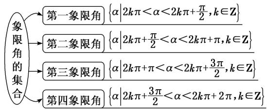
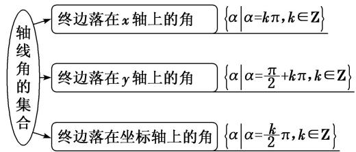
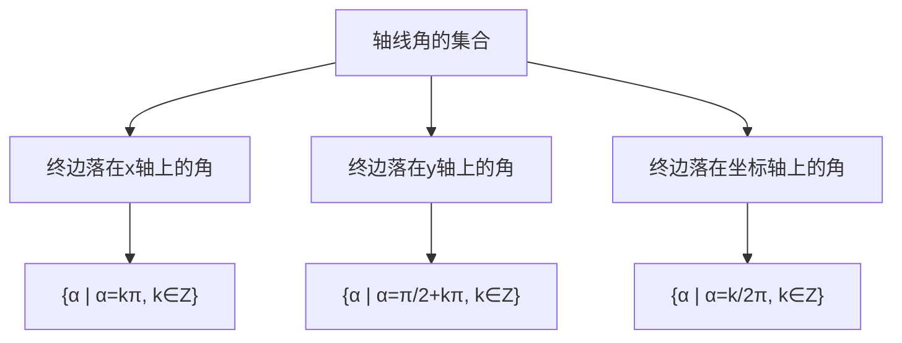
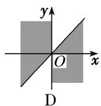
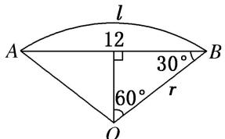

# 专题一 任意角、弧度制及任意角的三角函数

# 考点一 角的概念

# 【基本知识】

(1)定义: 角可以看成平面内一条射线绕着端点从一个位置旋转到另一个位置所成的图形.

(2)角的分类 $\left\{\begin{array}{l}\text {按旋转方向不同分类 }\left\{\begin{array}{l}\text {正角: 按顺时针方向旋转形成的角} \\ \text {负角: 按逆时针方向旋转形成的角} \\ \text {零角: 射线没有旋转}\end{array}\right.\\ \text {按终边位置不同分类 }\left\{\begin{array}{l}\text {象限角: 角的终边在第几象限, 这个角就是第几象限角} \\ \text {轴线角: 角的终边落在坐标轴上}\end{array}\right.\end{array}\right.$



<details>
<summary>flowchart</summary>

```mermaid
graph TD
    A["象限角的集合"] --> B["第一象限角"]
    A --> C["第二象限角"]
    A --> D["第三象限角"]
    A --> E["第四象限角"]
    B --> F{α | 2kπ < α < 2kπ + π/2, k ∈ Z}
    C --> G{α | 2kπ + π/2 < α < 2kπ + π, k ∈ Z}
    D --> H{α | 2kπ + π < α < 2kπ + 3π/2, k ∈ Z}
    E --> I{α | 2kπ + 3π/2 < α < 2kπ + 2π, k ∈ Z}
```
</details>



<details>
<summary>flowchart</summary>


</details>

(3)终边相同的角：所有与角 $\alpha$ 终边相同的角，连同角 $\alpha$ 在内，构成的角的集合是 $S = \{\beta | \beta = k \cdot 360^\circ + \alpha, k \in \mathbf{Z}\}$ .

# 【例题选讲】

[例 1] (1) 集合 $\left\{\alpha\mid k\pi\leq\alpha\leq k\pi+\frac{\pi}{4},\quad k\in Z\right\}$ 中的角所表示的范围(阴影部分)是()




(2) 若角 $\alpha$ 是第二象限角，则 $\frac{\alpha}{2}$ 是（ ）

A. 第一象限角

B. 第二象限角

C. 第一或第三象限角

D. 第二或第四象限角

(3) 给出下列四个命题:

① $-\frac{3\pi}{4}$ 是第二象限角；② $\frac{4\pi}{3}$ 是第三象限角；③ $-400^{\circ}$ 是第四象限角；④ $-315^{\circ}$ 是第一象限角.

其中正确的命题有( )

A. 1 个

B. 2 个

C. 3 个

D. 4 个

(4) 已知点 $P(\cos \alpha, \tan \alpha)$ 在第三象限，则角 $\alpha$ 的终边在（ ）

A. 第一象限

B. 第二象限

C. 第三象限

D. 第四象限

(5) 在 $-720^{\circ} \sim 0^{\circ}$ 范围内所有与 $45^{\circ}$ 终边相同的角为 \_\_\_\_.

(6)终边在直线 $y=\sqrt{3}x$ 上的角的集合为 \_\_\_\_.

# 考点二 扇形的弧长及面积公式的应用

# 【基本知识】

(1)弧度制定义: 把长度等于半径长的弧所对的圆心角叫做 1 弧度的角, 用符号 rad 表示, 读作弧度. 正

角的弧度数是一个正数，负角的弧度数是一个负数，零角的弧度数是 0.

(2)角度制和弧度制的互化： $180^{\circ}=\pi$ rad， $1^{\circ}=\frac{\pi}{180}$ rad， $1\text{ rad}=\left(\frac{180}{\pi}\right)^{\circ}$ .

(3)扇形的弧长公式： $l=|\alpha|\cdot r$ ，扇形的面积公式： $S=\frac{1}{2}lr=\frac{1}{2}|\alpha|\cdot r^{2}$ .

# 【例题选讲】

[例 2] (1) 已知扇形的周长是 6，面积是 2，则扇形的圆心角的弧度数是( )

A. 1

B. 4

C. 1 或 4

D. 2 或 4

(2) 若扇形的圆心角是 $\alpha=120^{\circ}$ ，弦长 AB=12 cm，则弧长 l= \_\_\_\_ cm.



<details>
<summary>text_image</summary>

l
12
A
B
30°
60°
r
O
</details>

(3) 若一扇形的圆心角为 $72^{\circ}$ ，半径为 20 cm，则扇形的面积为()

A. $40 \pi \mathrm{~cm}^{2}$

B. $80\pi \, cm^{2}$

C. $40 \, cm^{2}$

D. $80 \, cm^{2}$

(4) 若一圆弧长等于其所在圆的内接正三角形的边长，则其圆心角 $\alpha (0 < \alpha < \pi)$ 的弧度数为 \_\_\_\_.

(5)若两个圆心角相同的扇形的面积之比为 1:4，则这两个扇形的周长之比为 \_\_\_\_.

(6) 一扇形是从一个圆中剪下的一部分, 半径等于圆半径的 $\frac{2}{3}$ , 面积等于圆面积的 $\frac{5}{27}$ , 则扇形的弧长与圆周长之比为 \_\_\_\_.

# 考点三 三角函数的定义及应用

# 【基本知识】

(1)定义: 设 $\alpha$ 是一个任意角, 它的终边与单位圆交于点 $P(x, y)$ , 那么 $\sin \alpha = \underline{y}$ , $\cos \alpha = \underline{x}$ , $\tan \alpha = \frac{\underline{y}}{x} (x \neq 0)$ .

(2)三个三角函数的初步性质如下表:

<table><tr><td>三角函数</td><td>定义域</td><td>第一象限符号</td><td>第二象限符号</td><td>第三象限符号</td><td>第四象限符号</td></tr><tr><td> $\sin\alpha$ </td><td> $\mathbf{R}$ </td><td>+</td><td>+</td><td>-</td><td>-</td></tr><tr><td> $\cos\alpha$ </td><td> $\mathbf{R}$ </td><td>+</td><td>-</td><td>-</td><td>+</td></tr><tr><td> $\tan\alpha$ </td><td> $\{\alpha|\alpha\neq k\pi+\frac{\pi}{2},\ k\in\mathbf{Z}\}$ </td><td>+</td><td>-</td><td>+</td><td>-</td></tr></table>

(3)三角函数定义的推广：设点 $P(x, y)$ 是角 $\alpha$ 终边上任意一点且不与原点重合， $r = |OP|$ ，则 $\sin \alpha = \frac{y}{r}$ ， $\cos \alpha = \frac{x}{r}$ ， $\tan \alpha = \frac{y}{x} (x \neq 0)$ .

(4)特殊角的弧度数与三角函数值

<table><tr><td>角α</td><td>0°</td><td>30°</td><td>45°</td><td>60°</td><td>90°</td><td>120°</td><td>150°</td><td>180°</td><td>270°</td><td>360°</td></tr><tr><td>角α的弧度数</td><td>0</td><td> $\frac{\pi}{6}$ </td><td> $\frac{\pi}{4}$ </td><td> $\frac{\pi}{3}$ </td><td> $\frac{\pi}{2}$ </td><td> $\frac{2\pi}{3}$ </td><td> $\frac{5\pi}{6}$ </td><td> $\pi$ </td><td> $\frac{3\pi}{2}$ </td><td>2 $\pi$ </td></tr><tr><td>sin α</td><td> $\underline{0}$ </td><td> $\frac{1}{2}$ </td><td> $\frac{\sqrt{2}}{2}$ </td><td> $\frac{\sqrt{3}}{2}$ </td><td>1</td><td> $\frac{\sqrt{3}}{2}$ </td><td> $\frac{1}{2}$ </td><td>0</td><td>-1</td><td>0</td></tr><tr><td>cos α</td><td> $\underline{1}$ </td><td> $\frac{\sqrt{3}}{2}$ </td><td> $\frac{\sqrt{2}}{2}$ </td><td> $\frac{1}{2}$ </td><td>0</td><td> $-\frac{1}{2}$ </td><td> $-\frac{\sqrt{3}}{2}$ </td><td>-1</td><td>0</td><td>1</td></tr><tr><td>tan α</td><td> $\underline{0}$ </td><td> $\frac{\sqrt{3}}{3}$ </td><td>1</td><td> $\sqrt{3}$ </td><td></td><td> $-\sqrt{3}$ </td><td> $-\frac{\sqrt{3}}{3}$ </td><td>0</td><td></td><td>0</td></tr></table>

# 【方法总结】

# 利用三角函数的定义解题的技巧

(1)已知角 $\alpha$ 终边上一点 $P$ 的坐标，可求角 $\alpha$ 的三角函数值．先求点 $P$ 到原点的距离，再用三角函数的定义求解.  
(2)已知角 $\alpha$ 的某三角函数值，可求角 $\alpha$ 终边上一点 $P$ 的坐标中的参数值，根据定义中的两个量列方程求参数值.  
(3)已知角 $\alpha$ 的终边所在的直线方程或角 $\alpha$ 的大小，根据三角函数的定义可求角 $\alpha$ 终边上某特定点的坐标.  
(4)已知一角的三角函数值 $(\sin \alpha, \cos \alpha, \tan \alpha)$ 中任意两个的符号，可分别确定出角终边所在的可能位置，二者的交集即为该角的终边位置。注意终边在坐标轴上的特殊情况。

# 【例题选讲】

[例 3] (1) 如图, 在平面直角坐标系 $xOy$ 中, 角 $\alpha$ 的终边与单位圆交于点 $A$ , 点 $A$ 的纵坐标为 $\frac{4}{5}$ , 则 $\cos \alpha$ 的值为( )


<details>
<summary>text_image</summary>

A
y
α
O
x
</details>

A. $\frac{4}{5}$

B. $-\frac{4}{5}$

C. $\frac{3}{5}$

D. $-\frac{3}{5}$

(2) 设 $\alpha$ 是第二象限角， $P(x, 4)$ 为其终边上的一点，且 $\cos \alpha = \frac{1}{5} x$ ，则 $\tan \alpha = (\quad)$

A. $\frac{4}{3}$

B. $\frac{3}{4}$

C. $-\frac{3}{4}$

D. $-\frac{4}{3}$

(3) 已知角 $\theta$ 的顶点与原点重合, 始边与 $x$ 轴的非负半轴重合, 终边在直线 $y = 2x$ 上, 则 $\cos 2\theta = (\quad)$

A. $-\frac{4}{5}$

B. $-\frac{3}{5}$

C. $\frac{3}{5}$

D. $\frac{4}{5}$

(4) 已知 $A(x_{A}, y_{A})$ 是单位圆(圆心在坐标原点 $O$ )上任意一点，将射线 $OA$ 绕 $O$ 点逆时针旋转 $30^{\circ}$ ，交单位圆于点 $B(x_{B}, y_{B})$ ，则 $x_{A} - y_{B}$ 的取值范围是（）

A. $[-2, 2]$

B. $\left[-\sqrt{2},\sqrt{2}\right]$

C. $[-1, 1]$

D. $\left[-\frac{1}{2},\frac{1}{2}\right]$

(5) 若 $\sin \alpha \tan \alpha < 0$ ，且 $\frac{\cos \alpha}{\tan \alpha} < 0$ ，则角 $\alpha$ 是（）

A. 第一象限角

B. 第二象限角

C. 第三象限角

D. 第四象限角

(6) $\sin 2 \cdot \cos 3 \cdot \tan 4$ 的值()

A. 小于 0

B. 大于 0

C. 等于 0

D. 不确定

# 【对点训练】

1. 已知角 $\alpha$ 的终边经过点(3，-4)，则 $\sin \alpha + \frac{1}{\cos \alpha} = (\quad)$

A. $-\frac{1}{5}$

B. $\frac{37}{15}$

C. $\frac{37}{20}$

D. $\frac{13}{15}$

2. 在平面直角坐标系 $xOy$ 中， $\alpha$ 为第二象限角， $P(-\sqrt{3}, y)$ 为其终边上一点，且 $\sin \alpha = \frac{\sqrt{2}y}{4}$ ，则 $y$ 的值为（）

A. $\sqrt{3}$

B. $-\sqrt{5}$

C. $\sqrt{5}$

D. $\sqrt{3}$ 或 $\sqrt{5}$

3. 已知角 $\alpha$ 的终边经过点 $P(-x, -6)$ , 且 $\cos \alpha = -\frac{5}{13}$ , 则 $\frac{1}{\sin \alpha} + \frac{1}{\tan \alpha} =$ \_\_\_\_.

4. 函数 $y = \log_a (x - 3) + 2 (a > 0 \text{且 } a \neq 1)$ 的图象过定点 $P$ ，且角 $\alpha$ 的顶点在原点，始边与 $x$ 轴非负半轴重合，终边过点 $P$ ，则 $\sin \alpha + \cos \alpha$ 的值为（）

A. $\frac{7}{5}$

B. $\frac{6}{5}$

C. $\frac{\sqrt{5}}{5}$

D. $\frac{3}{5}\sqrt{5}$

5. 已知角 $\alpha$ 的顶点为坐标原点, 始边与 $x$ 轴的非负半轴重合, 终边上一点 $A(2 \sin \alpha, 3) (\sin \alpha \neq 0)$ , 则 $\cos \alpha = (\quad)$

A. $\frac{1}{2}$

B. $-\frac{1}{2}$

C. $\frac{\sqrt{3}}{2}$

D. $-\frac{\sqrt{3}}{2}$

6. 已知角 $\alpha$ 终边上一点 $P$ 的坐标是 $(2\sin 2, -2\cos 2)$ ，则 $\sin \alpha = (\quad)$

A. $\sin 2$

B. $-\sin 2$

C. cos 2

D. $-\cos2$

7. 下列各选项中正确的是()

A. $\sin 300^{\circ}>0$

B. $\cos (-305^{\circ}) < 0$

C. $\tan \left(-\frac{22\pi}{3}\right) > 0$

D. $\sin 10<0$

8. 已知角 $\alpha$ 的终边上一点的坐标为 $\left[\sin \frac{5\pi}{6}, \cos \frac{5\pi}{6}\right]$ ，则角 $\alpha$ 的最小正值为（ ）

A. $\frac{5\pi}{6}$

B. $\frac{5\pi}{3}$

C. $\frac{11\pi}{6}$

D. $\frac{2\pi}{3}$

9. 在直角坐标系 $xOy$ 中, $O$ 为坐标原点, $A(\sqrt{3}, 1)$ , 将点 $A$ 绕 $O$ 逆时针旋转 $90^{\circ}$ 到 $B$ 点, 则 $B$ 点坐标为 \_\_\_\_.

10. 若 $\alpha$ 是第三象限角，则 $y = \frac{\left|\sin\frac{\alpha}{2}\right|}{\sin\frac{\alpha}{2}} + \frac{\left|\cos\frac{\alpha}{2}\right|}{\cos\frac{\alpha}{2}}$ 的值为（ ）

A. 0

B. 2

C.-2

D. 2 或 -2

11. 已知 $\frac{1}{|\sin \alpha|} = -\frac{1}{\sin \alpha}$ ，且 $\lg (\cos \alpha)$ 有意义.

(1)试判断角 $\alpha$ 所在的象限;

(2)若角 $\alpha$ 的终边上一点 $M\left(\frac{3}{5}, m\right)$ ，且 $|OM| = 1$ ( $O$ 为坐标原点)，求 $m$ 的值及 $\sin \alpha$ 的值.

12. 已知角 $\theta$ 的终边过点 $P(-4a, 3a) (a \neq 0)$ .

(1)求 $\sin\theta+\cos\theta$ 的值;  
(2)试判断 $\cos(\sin\theta)\cdot\sin(\cos\theta)$ 的符号.

