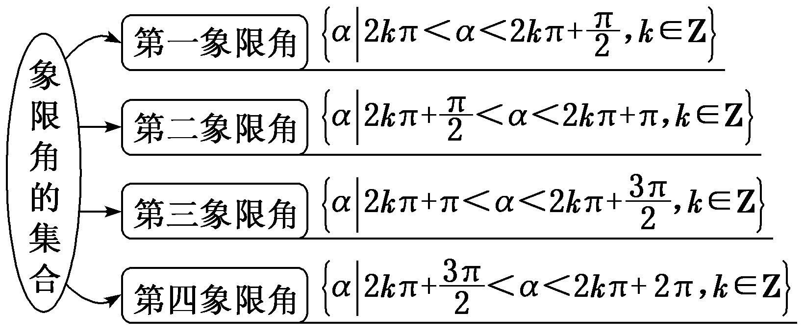
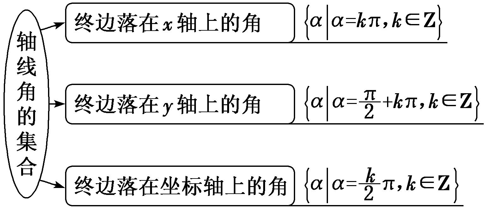
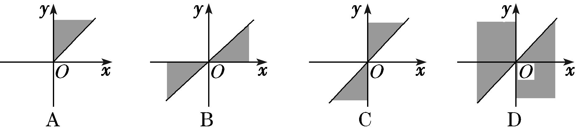
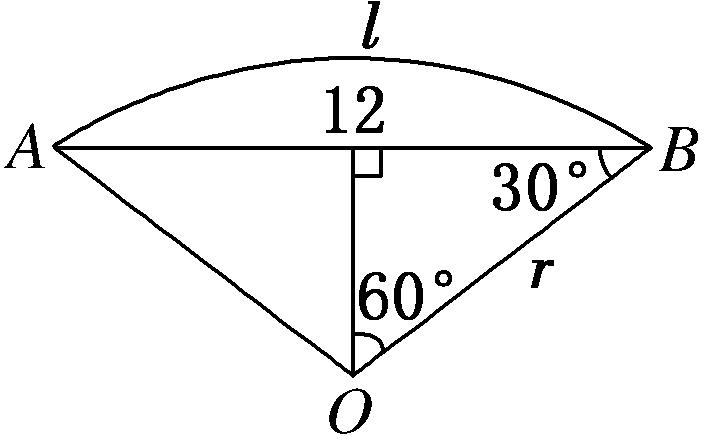
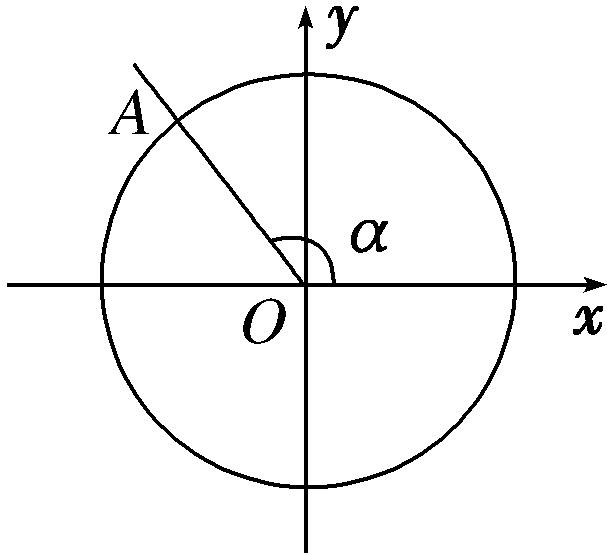

**专题一　任意角、弧度制及任意角的三角函数**

**考点一　角的概念**

【**基本知识**】

(1)定义：角可以看成平面内一条射线绕着端点从一个位置旋转到另一个位置所成的图形．

(2)角的分类

(3)终边相同的角：所有与角<em>α</em>终边相同的角，连同角<em>α</em>在内，构成的角的集合是<em>S</em>＝{<em>β</em>|<em>β</em>＝<em>k</em>·360°＋<em>α</em>，<em>k</em>∈<strong>Z</strong>}．

**【例题选讲】**

**[例1]** (1) 集合中的角所表示的范围(阴影部分)是(　　)

答案　B　解析　当<em>k</em>＝2<em>n</em>(<em>n</em>∈<strong>Z</strong>)时，2<em>n</em>π≤<em>α</em>≤2<em>n</em>π＋(<em>n</em>∈<strong>Z</strong>)，此时<em>α</em>的终边和0≤<em>α</em>≤的终边一样，当<em>k</em>＝2<em>n</em>＋1(<em>n</em>∈<strong>Z</strong>)时，2<em>n</em>π＋π≤<em>α</em>≤2<em>n</em>π＋π＋(<em>n</em>∈<strong>Z</strong>)，此时<em>α</em>的终边和π≤<em>α</em>≤π＋的终边一样．

(2) 若角*α*是第二象限角，则是(　　)

A．第一象限角　　　B．第二象限角　　　　C．第一或第三象限角　　　D．第二或第四象限角

答案　C　解析　∵<em>α</em>是第二象限角，∴＋2<em>k</em>π&lt;<em>α</em>&lt;π＋2<em>k</em>π，<em>k</em>∈<strong>Z</strong>，∴＋<em>k</em>π&lt;&lt;＋<em>k</em>π，<em>k</em>∈<strong>Z</strong>．当<em>k</em>为偶数时，是第一象限角；当<em>k</em>为奇数时，是第三象限角．故选C．

(3) 给出下列四个命题：

①－是第二象限角；②是第三象限角；③－400°是第四象限角；④－315°是第一象限角．

其中正确的命题有(　　)

A．1个　　　　　　　　B．2个　　　　　　　　C．3个　　　　　　　　D．4个

答案　　C解析　－是第三象限角，故①错误．＝π＋，从而是第三象限角，②正确．－400°＝－360°－40°，从而③正确．－315°＝－360°＋45°，从而④正确．

(4) 已知点*P*(cos *α*，tan *α*)在第三象限，则角*α*的终边在(　　)

A．第一象限　　　　　B．第二象限　　　　　C．第三象限　　　　　D．第四象限

答案　B　解析　由题意得⇒所以角*α*的终边在第二象限．

(5) 在－720°～0°范围内所有与45°终边相同的角为\_\_\_\_\_\_\_\_．

答案　－675°或－315°　解析　所有与45°终边相同的角可表示为：<em>β</em>＝45°＋<em>k</em>×360°(<em>k</em>∈<strong>Z</strong>)，则令－720°≤45°＋<em>k</em>×360°&lt;0°(<em>k</em>∈<strong>Z</strong>)，得－765°≤<em>k</em>×360°&lt;－45°(<em>k</em>∈<strong>Z</strong>)，解得－≤<em>k</em>&lt;－(<em>k</em>∈<strong>Z</strong>)，从而<em>k</em>＝－2或<em>k</em>＝－1，代入得<em>β</em>＝－675°或<em>β</em>＝－315°．

(6)终边在直线*y*＝*x*上的角的集合为\_\_\_\_\_\_\_\_\_\_\_\_\_\_\_\_\_\_\_\_\_\_\_\_\_．

答案　　解析　终边在直线*y*＝*x*上的角的集合为．

**考点二　扇形的弧长及面积公式的应用**

【**基本知识**】

(1)弧度制定义：把长度等于半径长的弧所对的圆心角叫做1弧度的角，用符号rad表示，读作弧度．正角的弧度数是一个正数，负角的弧度数是一个负数，零角的弧度数是0．

(2)角度制和弧度制的互化：180°＝π rad，1°＝ rad，1 rad＝°．

(3)扇形的弧长公式：<em>l</em>＝|<em>α</em>|·<em>r</em>，扇形的面积公式：<em>S</em>＝<em>lr</em>＝|<em>α</em>|·<em>r</em>2．

**【例题选讲】**

**[例2]** (1) 已知扇形的周长是6，面积是2，则扇形的圆心角的弧度数是(　　)

A．1　　　　　　　　B．4　　　　　　　　C．1或4　　　　　　　　D．2或4

答案　A　解析　设此扇形的半径为*r*，弧长为*l*，则解得或从而*α*＝＝＝4或*α*＝＝＝1．

(2) 若扇形的圆心角是*α*＝120°，弦长*AB*＝12 cm，则弧长*l*＝\_\_\_\_\_\_\_\_cm．

答案　π　解析　设扇形的半径为*r* cm，如图．由sin 60°＝，得*r*＝4，又*α*＝，所以*l*＝|*α*|·*r*＝×4＝π(cm)．

(3) 若一扇形的圆心角为72°，半径为20 cm，则扇形的面积为(　　)

A．40π cm2　　　　　　B．80π cm2　　　　　　C．40 cm2　　　　　　D．80 cm2

答案　B　解析　∵72°＝，∴<em>S</em>扇形＝<em>αr</em>2＝××202＝80π(cm2)．

(4) 若一圆弧长等于其所在圆的内接正三角形的边长，则其圆心角*α*(0<*α*<π)的弧度数为\_\_\_\_\_\_\_\_．

答案　　解析　设圆半径为*r*，则其内接正三角形的边长为*r*，所以*r*＝*αr*，∴*α*＝．

(5)若两个圆心角相同的扇形的面积之比为1∶4，则这两个扇形的周长之比为\_\_\_\_\_\_\_\_．

答案　1∶2　解析　设两个扇形的圆心角的弧度数为*α*，半径分别为*r*，*R*(其中*r*＜*R*)，则＝，所以*r*∶*R*＝1∶2，两个扇形的周长之比为＝1∶2．

(6) 一扇形是从一个圆中剪下的一部分，半径等于圆半径的，面积等于圆面积的，则扇形的弧长与圆周长之比为\_\_\_\_\_\_\_\_．

答案　　解析　设圆的半径为*r*，则扇形的半径为，记扇形的圆心角为*α*，则＝，∴*α*＝．∴扇形的弧长与圆周长之比为＝＝．

**考点三　三角函数的定义及应用**

【**基本知识**】

(1)定义：设<em>α</em>是一个任意角，它的终边与单位圆交于点<em>P</em>(<em>x</em>，<em>y</em>)，那么sin <em>α</em>＝<em><u>y</u></em>，cos <em>α</em>＝<em><u>x</u></em>，tan <em>α</em>＝(<em>x</em>≠0)．

(2)三个三角函数的初步性质如下表：

<table><tr><td>
三角函数
</td><td>
定义域
</td><td>
第一象限符号
</td><td>
第二象限符号
</td><td>
第三象限符号
</td><td>
第四象限符号
</td></tr><tr><td>
sin<em>α</em>
</td><td>
<strong>R</strong>
</td><td>
＋
</td><td>
＋
</td><td>
－
</td><td>
－
</td></tr><tr><td>
cos<em>α</em>
</td><td>
<strong>R</strong>
</td><td>
＋
</td><td>
－
</td><td>
－
</td><td>
＋
</td></tr><tr><td>
tan<em>α</em>
</td><td>
{<em>α</em>|<em>α</em>≠<em>k</em>π＋，<em>k</em>∈<strong>Z</strong>}
</td><td>
＋
</td><td>
－
</td><td>
＋
</td><td>
－
</td></tr></table>

(3)三角函数定义的推广：设点*P*(*x*，*y*)是角*α*终边上任意一点且不与原点重合，*r*＝|*OP*|，则sin *α*＝，cos *α*＝，tan *α*＝(*x*≠0)．

(4)特殊角的弧度数与三角函数值

<table><tr><td>
角<em>α</em>
</td><td>
0°
</td><td>
30°
</td><td>
45°
</td><td>
60°
</td><td>
90°
</td><td>
120°
</td><td>
150°
</td><td>
180°
</td><td>
270°
</td><td>
360°
</td></tr><tr><td>
角<em>α</em>的弧度数
</td><td>
0
</td><td></td><td></td><td></td><td></td><td></td><td></td><td>
π
</td><td></td><td>
2π
</td></tr><tr><td>
sin <em>α</em>
</td><td>
0
</td><td></td><td></td><td></td><td>
1
</td><td></td><td></td><td>
0
</td><td>
－1
</td><td>
0
</td></tr><tr><td>
cos <em>α</em>
</td><td>
1
</td><td></td><td></td><td></td><td>
0
</td><td>
－
</td><td>
－
</td><td>
－1
</td><td>
0
</td><td>
1
</td></tr><tr><td>
tan <em>α</em>
</td><td>
0
</td><td></td><td>
1
</td><td></td><td></td><td>
－
</td><td>
－
</td><td>
0
</td><td></td><td>
0
</td></tr></table>

【**方法总结**】

利用三角函数的定义解题的技巧

(1)已知角*α*终边上一点*P*的坐标，可求角*α*的三角函数值．先求点*P*到原点的距离，再用三角函数的定义求解．

(2)已知角*α*的某三角函数值，可求角*α*终边上一点*P*的坐标中的参数值，根据定义中的两个量列方程求参数值．

(3)已知角*α*的终边所在的直线方程或角*α*的大小，根据三角函数的定义可求角*α*终边上某特定点的坐标．

(4)已知一角的三角函数值(sin *α*，cos *α*，tan *α*)中任意两个的符号，可分别确定出角终边所在的可能位置，二者的交集即为该角的终边位置．注意终边在坐标轴上的特殊情况．

**【例题选讲】**

<strong>[例3]</strong> (1) 如图，在平面直角坐标系<em>xOy</em>中，角<em>α</em>的终边与单位圆交于点<em>A</em>，点<em>A</em>的纵坐标为，则cos <em>α</em>的值为(　　)

A．　　　　　　　　B．－　　　　　　　　C． 　　　　　　　　D．－

答案　D　解析　因为点<em>A</em>的纵坐标<em>yA</em>＝，且点<em>A</em>在第二象限，又因为圆<em>O</em>为单位圆，所以<em>A</em>点横坐标<em>xA</em>＝－，由三角函数的定义可得cos <em>α</em>＝－．

(2) 设*α*是第二象限角，*P*(*x*，4)为其终边上的一点，且cos*α*＝*x*，则tan *α*＝(　　)

A．　　　　　　　　　B．　　　　　　　　　C．－　　　　　　　　　D．－

答案　D　解析　因为*α*是第二象限角，所以cos *α*＝*x*＜0，即*x*＜0．又cos *α*＝*x*＝．解得*x*＝－3，所以tan *α*＝＝－．

(3) 已知角*θ*的顶点与原点重合，始边与*x*轴的非负半轴重合，终边在直线*y*＝2*x*上，则cos2*θ*＝(　　)

A．－　　　　　　　　　B．－　　　　　　　　　C． 　　　　　　　　　D．

答案　B　解析　设<em>P</em>(<em>t</em>，2<em>t</em>)(<em>t</em>≠0)为角<em>θ</em>终边上任意一点，则cos <em>θ</em>＝．当<em>t</em>&gt;0时，cos <em>θ</em>＝；当<em>t</em>&lt;0时，cos<em>θ</em>＝－．因此cos 2<em>θ</em>＝2cos2<em>θ</em>－1＝－1＝－．

(4) 已知<em>A</em>(<em>xA</em>，<em>yA</em>)是单位圆(圆心在坐标原点<em>O</em>)上任意一点，将射线<em>OA</em>绕<em>O</em>点逆时针旋转30°，交单位圆于点<em>B</em>(<em>xB</em>，<em>yB</em>)，则<em>xA</em>－<em>yB</em>的取值范围是(　　)

A．[－2，2]　　　　　B．[－，]　　　　　C．[－1，1]　　　　　D．

答案　 C　解析　设<em>x</em>轴正方向逆时针到射线<em>OA</em>的角为<em>α</em>，根据三角函数的定义得<em>xA</em>＝cos <em>α</em>，<em>yB</em>＝sin(<em>α</em>＋30°)，所以<em>xA</em>－<em>yB</em>＝cos <em>α</em>－sin(<em>α</em>＋30°)＝－sin <em>α</em>＋cos <em>α</em>＝sin(<em>α</em>＋150°)∈[－1,1]．

(5) 若sin *α*tan *α*<0，且<0，则角*α*是(　　)

A．第一象限角　　　　B．第二象限角　　　　C．第三象限角　　　　D．第四象限角

答案　C　解析　由sin *α*tan *α*＜0可知sin *α*，tan *α*异号，则*α*为第二或第三象限角．由＜0可知cos *α*，tan *α*异号，则*α*为第三或第四象限角．综上可知，*α*为第三象限角．

(6) sin 2·cos 3·tan 4的值(　　)

A．小于0　　　　　　B．大于0　　　　　　C．等于0　　　　　　D．不确定

答案　A　解析　2 rad，3 rad是第二象限角，所以sin 2>0，cos 3<0，4 rad是第三象限角，所以tan 4>0，故sin 2·cos 3·tan 4<0．

【**对点训练**】

1．已知角*α*的终边经过点(3，－4)，则sin *α*＋＝(　　)

A．－　　　　　　　　B．　　　　　　　　C．　　　　　　　　D．

1．答案　D　解析　∵角*α*的终边经过点(3，－4)，∴sin *α*＝－，cos *α*＝，∴sin *α*＋＝－＋＝．

2．在平面直角坐标系*xOy*中，*α*为第二象限角，*P*(－，*y*)为其终边上一点，且sin *α*＝，则*y*的值为

(　　)

A．　　　　　　　　B．－　　　　　　　　C．　　　　　　　　D．或

2．答案　C　解析　由题意知|*OP*|＝，则sin *α*＝＝，解得*y*＝0(舍去)或*y*＝±，因为*α*

为第二象限角，所以*y*>0，则*y*＝．

3．已知角*α*的终边经过点*P*(－*x*，－6)，且cos *α*＝－，则＋＝\_\_\_\_\_\_\_\_．

3．答案　－　解析　因为角*α*的终边经过点*P*(－*x*，－6)，且cos *α*＝－，所以cos *α*＝＝－，

即*x*＝或*x*＝－(舍)．所以*P*，*r*＝，所以 sin *α*＝－．所以tan *α*＝＝，则＋＝－＋＝－．

4．函数<em>y</em>＝log<em>a</em>(<em>x</em>－3)＋2(<em>a</em>&gt;0且<em>a</em>≠1)的图象过定点<em>P</em>，且角<em>α</em>的顶点在原点，始边与<em>x</em>轴非负半轴重合，

终边过点*P*，则sin *α*＋cos *α*的值为(　　)

A．　　　　　　　　B．　　　　　　　　C． 　　　　　　　　D．

4．答案　D　解析　因为函数<em>y</em>＝log<em>a</em>(<em>x</em>－3)＋2的图象过定点<em>P</em>(4,2)，且角<em>α</em>的终边过点<em>P</em>，所以<em>x</em>＝4，<em>y</em>

＝2，*r*＝2，所以sin *α*＝，cos *α*＝，所以sin *α*＋cos *α*＝＋＝．故选D．

5．已知角*α*的顶点为坐标原点，始边与*x*轴的非负半轴重合，终边上一点*A*(2sin *α*，3)(sin *α*≠0)，则cos *α*

＝(　　)

A．　　　　　　　　B．－　　　　　　　　C．　　　　　　　　D．－

5．答案　A　解析　由三角函数定义得tan <em>α</em>＝，即＝，得3cos <em>α</em>＝2sin2<em>α</em>＝2(1－cos2<em>α</em>)&gt;0，

解得cos *α*＝或cos *α*＝－2(舍去)．故选A．

6．已知角*α*终边上一点*P*的坐标是(2sin 2，－2cos 2)，则sin *α*＝(　　)

A．sin 2　　　　　　　B．－sin 2　　　　　　　C．cos 2　　　　　　　D．－cos 2

6．答案　D　解析　因为*r*＝＝2，由任意三角函数的定义，得sin *α*＝＝－cos 2．

7．下列各选项中正确的是(　　)

A．sin 300°>0　　　　B．cos(－305°)<0　　　　C．tan>0　　　　D．sin 10<0

7．答案　D　解析　300°＝360°－60°，则300°是第四象限角，故sin 300°<0；－305°＝－360°＋55°，则

－305°是第一象限角，故cos(－305°)>0；－＝－8π＋，则－是第二象限角，故tan<0；3π<10<，则10是第三象限角，故sin 10<0，故选D．

8．已知角*α*的终边上一点的坐标为，则角*α*的最小正值为(　　)

A．　　　　　　　　B．　　　　　　　　C．　　　　　　　　D．

8．答案　B　解析　因为sin＝sin＝sin＝，cos＝cos＝－cos＝－，所以点

在第四象限．又因为tan <em>α</em>＝＝－，所以<em>α</em>＝2<em>k</em>π－，<em>k</em>∈<strong>Z</strong>，所以角<em>α</em>的最小正值为．故选B．

9．在直角坐标系*xOy*中，*O*为坐标原点，*A*(，1)，将点*A*绕*O*逆时针旋转90°到*B*点，则*B*点坐标为

\_\_\_\_\_\_\_\_\_\_．

9．答案　(－1，)　解析　依题意知*OA*＝*OB*＝2，∠*AOx*＝30°，∠*BOx*＝120°，设点*B*坐标为(*x*，*y*)，

则*x*＝2cos120°＝－1，*y*＝2sin 120°＝，即*B*(－1，)．

10．若*α*是第三象限角，则*y*＝＋的值为(　　)

A．0　　　　　　　　B．2　　　　　　　　C．－2　　　　　　　　D．2或－2

10．答案　　解析　因为<em>α</em>是第三象限角，所以2<em>k</em>π＋π&lt;<em>α</em>&lt;2<em>k</em>π＋(<em>k</em>∈<strong>Z</strong>)，所以<em>k</em>π＋&lt;&lt;<em>k</em>π＋(<em>k</em>∈<strong>Z</strong>)，

所以是第二象限角或第四象限角．当是第二象限角时，*y*＝－＝0，当是第四象限角时，*y*＝－＋＝0，故选A．

11．已知＝－，且lg(cos *α*)有意义．

(1)试判断角*α*所在的象限；

(2)若角*α*的终边上一点*M*，且|*OM*|＝1(*O*为坐标原点)，求*m*的值及sin *α*的值．

11　解：(1)由＝－，得sin *α*<0，由lg(cos *α*)有意义，可知cos *α*>0，所以*α*是第四象限角．

(2)因为|<em>OM</em>|＝1，所以2＋<em>m</em>2＝1，解得<em>m</em>＝±．又因为<em>α</em>是第四象限角，

所以*m*<0，从而*m*＝－，sin *α*＝＝＝＝－．

12．已知角*θ*的终边过点*P*(－4*a*，3*a*)(*a*≠0)．

(1)求sin *θ*＋cos *θ*的值；

(2)试判断cos(sin *θ*)·sin(cos *θ*)的符号．

12．解　(1)因为角*θ*的终边过点*P*(－4*a*，3*a*)(*a*≠0)，所以*x*＝－4*a*，*y*＝3*a*，*r*＝5|*a*|，

当*a*＞0时，*r*＝5*a*，sin *θ*＋cos *θ*＝－＝－；

当*a*＜0时，*r*＝－5*a*，sin *θ*＋cos *θ*＝－＋＝．

(2)当*a*＞0时，sin *θ*＝∈，cos *θ*＝－∈，则cos(sin *θ*)·sin(cos *θ*)＝cos ·sin＜0；

当*a*＜0时，sin *θ*＝－∈，cos *θ*＝∈，则cos(sin *θ*)·sin(cos *θ*)＝cos·sin ＞0．

综上，当*a*＞0时，cos(sin *θ*)·sin(cos *θ*)的符号为负；当*a*＜0时，cos(sin *θ*)·sin(cos *θ*)的符号为正．

