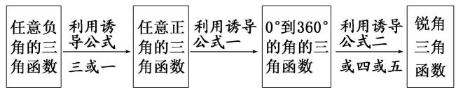

# 专题二 同角三角函数基本关系式及诱导公式

# 考点一 同角三角函数基本关系式的应用

# 【基本知识】  
（1）平方关系： $\sin^2\alpha +\cos^2\alpha = 1$ （2）商数关系： $\frac{\sin\alpha}{\cos\alpha} = \tan \alpha \left[\alpha \neq \frac{\pi}{2} +k\pi ,k\in \mathbf{Z}\right].$

# 【常用结论】  
（1） $\sin^{2}\alpha=1-\cos^{2}\alpha=(1+\cos\alpha)(1-\cos\alpha)$ ; $\cos^{2}\alpha=1-\sin^{2}\alpha=(1+\sin\alpha)(1-\sin\alpha)$ ;
$(\sin \alpha \pm \cos \alpha)^{2} = 1 \pm 2 \sin \alpha \cos \alpha.$  
（2） $\sin\alpha=\tan\alpha\cos\alpha\left(\alpha\neq\frac{\pi}{2}+k\pi,\quad k\in\mathbf{Z}\right).$

# 【方法总结】

# 同角三角函数关系在解题中的应用  
（1）对于 $\sin \alpha, \cos \alpha, \tan \alpha$ ，由公式 $\sin^2\alpha + \cos^2\alpha = 1$ ， $\tan \alpha = \frac{\sin \alpha}{\cos \alpha}$ ，可以“知一求二”.  
（2）对于 $\sin \alpha \pm \cos \alpha, \sin \alpha \cos \alpha$ ，由下面三个关系式 $(\sin \alpha \pm \cos \alpha)^{2} = 1 \pm 2 \sin \alpha \cos \alpha, (\sin \alpha + \cos \alpha)^{2} + (\sin \alpha - \cos \alpha)^{2} = 2$ ，可以“知一求二”.  
（3） $\sin\alpha,\cos\alpha$ 的齐次式的应用：分式中分子与分母是关于 $\sin\alpha,\cos\alpha$ 的齐次式，或含有 $\sin^{2}\alpha,\cos^{2}\alpha$ 及 $\sin\alpha\cos\alpha$ 的式子求值时，可将所求式子的分母看作“1”，利用“ $\sin^{2}\alpha+\cos^{2}\alpha=1$ ”代换后转化为“切”求解.

# 【例题选讲】

[例 1] （1） 已知 $\sin \alpha = \frac{\sqrt{5}}{5}$ ， $\frac{\pi}{2} \leq \alpha \leq \pi$ ，则 $\tan \alpha = (\quad)$

A. -2

B. 2

C. $\frac{1}{2}$

D. $-\frac{1}{2}$  
（2）已知 $\alpha$ 是第四象限角， $\tan \alpha = -\frac{5}{12}$ ，则 $\sin \alpha$ 等于（ ）

A. $\frac{1}{5}$

B. $-\frac{1}{5}$

C. $\frac{5}{13}$

D. $-\frac{5}{13}$  
（3） (2017·全国III)已知 $\sin\alpha-\cos\alpha=\frac{4}{3}$ ，则 $\sin2\alpha=(\quad)$

A. $-\frac{7}{9}$

B. $-\frac{2}{9}$

C. $\frac{2}{9}$

D. $\frac{7}{9}$  
（4） 若 $\theta \in \left[\frac{\pi}{4}, \frac{\pi}{2}\right]$ , $\sin \theta \cdot \cos \theta = \frac{3\sqrt{7}}{16}$ , 则 $\sin \theta = (\quad)$

A. $\frac{3}{5}$

B. $\frac{4}{5}$

C. $\frac{\sqrt{7}}{4}$

D. $\frac{3}{4}$  
（5） 已知 $\sin \alpha + \cos \alpha = \frac{1}{2}, \alpha \in (0, \pi)$ , 则 $\frac{1 - \tan \alpha}{1 + \tan \alpha} = (\quad)$

A. $-\sqrt{7}$

B. $\sqrt{7}$

C. $\sqrt{3}$

D. $-\sqrt{3}$  
（6） 若 $\tan \alpha = 2$ ，则 $\frac{\sin \alpha - \cos \alpha}{\sin \alpha + \cos \alpha}$ 的值为（）

A. $-\frac{1}{3}$

B. $-\frac{5}{3}$

C. $\frac{1}{3}$

D. $\frac{5}{3}$  
（7）已知 $\alpha\in R,\sin^{2}\alpha+4\sin\alpha\cos\alpha+4\cos^{2}\alpha=\frac{5}{2}$ ，则 $\tan\alpha=$ \_\_\_\_.  
（8） (2016·全国III) 若 $\tan\alpha=\frac{3}{4}$ ，则 $\cos^{2}\alpha+2\sin2\alpha=(\quad)$

A. $\frac{64}{25}$

B. $\frac{48}{25}$

C. 1

D. $\frac{16}{25}$

# 【对点训练】

1. 若 $\sin \alpha = -\frac{5}{13}$ ，且 $\alpha$ 为第四象限角，则 $\tan \alpha$ 的值为（）

A. $\frac{12}{5}$

B. $-\frac{12}{5}$

C. $\frac{5}{12}$

D. $-\frac{5}{12}$

2. 已知 $2\sin\alpha=1+\cos\alpha$ ，则 $\tan\alpha$ 的值为()

A. $-\frac{4}{3}$

B. $\frac{4}{3}$

C. $-\frac{4}{3}$ 或0

D. $\frac{4}{3}$ 或 0

3. 若 $\sin \theta + \cos \theta = \frac{2}{3}$ , 则 $\tan \theta + \frac{1}{\tan \theta} = (\quad)$

A. $\frac{5}{18}$

B. $-\frac{5}{18}$

C. $\frac{18}{5}$

D. $-\frac{18}{5}$

4. 已知 $\sin \alpha \cos \alpha = \frac{1}{8}$ , 且 $\frac{5\pi}{4} < \alpha < \frac{3\pi}{2}$ , 则 $\cos \alpha - \sin \alpha$ 的值为( )

A. $-\frac{\sqrt{3}}{2}$

B. $\frac{\sqrt{3}}{2}$

C. $-\frac{3}{4}$

D. $\frac{3}{4}$

5. 已知 $0 < \alpha < \frac{\pi}{2}$ , 若 $\cos \alpha - \sin \alpha = -\frac{\sqrt{5}}{5}$ , 则 $\frac{2 \sin \alpha \cos \alpha - \cos \alpha + 1}{1 - \tan \alpha}$ 的值为 \_\_\_\_.

6. 已知 $\sin \alpha + \cos \alpha = \frac{1}{5}, \alpha \in [0, \pi]$ ，则 $\tan \alpha = (\quad)$

A. $-\frac{4}{3}$

B. $-\frac{3}{4}$

C. $\frac{3}{4}$

D. $\frac{4}{3}$

7. 若 $\sin \theta, \cos \theta$ 是方程 $4x^{2} + 2mx + m = 0$ 的两根，则 $m$ 的值为( )

A. $1 + \sqrt{5}$

B. $1 - \sqrt{5}$

C. $1 \pm \sqrt{5}$

D. $-1-\sqrt{5}$

8. 已知 $\tan \alpha = -\frac{3}{4}$ ，则 $\sin \alpha \cdot (\sin \alpha - \cos \alpha) = (\quad)$

A. $\frac{21}{25}$

B. $\frac{25}{21}$

C. $\frac{4}{5}$

D. $\frac{5}{4}$

9. 已知 $\tan \theta = 2$ ，则 $\sin^2\theta + \sin \theta \cos \theta - 2\cos^2\theta = (\quad)$

A. $-\frac{4}{3}$

B. $\frac{5}{4}$

C. $-\frac{3}{4}$

D. $\frac{4}{5}$

10. 已知 $\tan \theta = 2$ ，则 $\frac{\sin^2\theta - \sin \theta \cos \theta}{2\cos^2\theta}$ 的值为（）

A. $\frac{1}{2}$

B. 1

C. $-\frac{1}{2}$

D. -1

11. 已知 $x \in (-\pi, 0)$ , $\sin x + \cos x = \frac{1}{5}$ .  
（1）求 $\sin x - \cos x$ 的值；  
（2）求 $\frac{\sin 2x+2\sin^{2}x}{1-\tan x}$ 的值.

12. 已知 $\tan \alpha = -\frac{4}{3}$ ，求：（1） $\frac{\sin \alpha - 4\cos \alpha}{5\sin \alpha + 2\cos \alpha}$ 的值；（2） $\frac{1}{\cos^2\alpha - \sin^2\alpha}$ 的值；（3） $\sin^2\alpha + 2\sin \alpha \cos \alpha$ 的值.

# 考点二 诱导公式的应用

【基本知识】

<table><tr><td>公式</td><td>一</td><td>二</td><td>三</td><td>四</td><td>五</td><td>六</td></tr><tr><td>角</td><td> $2k\pi + \alpha (k \in \mathbf{Z})$ </td><td> $\pi + \alpha$ </td><td> $-\alpha$ </td><td> $\pi - \alpha$ </td><td> $\frac{\pi}{2} - \alpha$ </td><td> $\frac{\pi}{2} + \alpha$ </td></tr><tr><td>正弦</td><td> $\sin \alpha$ </td><td> $-\sin \alpha$ </td><td> $-\sin \alpha$ </td><td> $\sin \alpha$ </td><td> $\cos \alpha$ </td><td> $\cos \alpha$ </td></tr><tr><td>余弦</td><td> $\cos \alpha$ </td><td> $-\cos \alpha$ </td><td> $\cos \alpha$ </td><td> $-\cos \alpha$ </td><td> $\sin \alpha$ </td><td> $-\sin \alpha$ </td></tr><tr><td>正切</td><td> $\tan \alpha$ </td><td> $\tan \alpha$ </td><td> $-\tan \alpha$ </td><td> $-\tan \alpha$ </td><td></td><td></td></tr><tr><td>口诀</td><td colspan="4">函数名不变,符号看象限</td><td colspan="2">函数名改变,符号看象限</td></tr></table>

诱导公式可简记为：奇变偶不变，符号看象限．“奇”“偶”指的是“ $k \cdot \frac{\pi}{2} + \alpha (k \in \mathbf{Z})$ ”中的 $k$ 是奇数还是偶数．“变”与“不变”是指函数的名称的变化，若 $k$ 是奇数，则正、余弦互变；若 $k$ 为偶数，则函数名称不变．“符号看象限”指的是在“ $k \cdot \frac{\pi}{2} + \alpha (k \in \mathbf{Z})$ ”中，将 $\alpha$ 看成锐角时，“ $k \cdot \frac{\pi}{2} + \alpha (k \in \mathbf{Z})$ ”的终边所在的象限．

# 【方法总结】

1. 利用诱导公式把任意角的三角函数转化为锐角三角函数的步骤

也就是：“负化正，大化小，化到锐角就好了”.

2. 明确三角函数式化简的原则和方向  
（1）切化弦，统一名.  
（2）用诱导公式，统一角.  
（3）用因式分解将式子变形，化为最简．结果要求项数尽可能少，次数尽可能低，结构尽可能简单，能求值的要求出值.

也就是：“统一名，统一角，同角名少为终了。”

# 【例题选讲】

[例 2] （1） $\frac{\cos 350^{\circ}-2\sin 80^{\circ}}{\sin(-280^{\circ})}=(\quad)$

A. $-\sqrt{3}$

B. -1

C. 1

D. $\sqrt{3}$  
（2） $\sin \frac{4}{3}\pi \cdot \cos \frac{5}{6}\pi \cdot \tan \left(-\frac{4}{3}\pi\right)$ 的值是 \_\_\_\_.  
（3） 计算: $2 \sin \left[ -\frac{31 \pi}{6} \right] + \cos 12 \pi + \tan \frac{7 \pi}{4} =$ \_\_\_\_.   
（4） 若 $\sin \left(\frac{\pi}{6} - \alpha\right) = \frac{1}{3}$ , 则 $\cos \left(\frac{2\pi}{3} + 2\alpha\right) = (\quad)$

A. $-\frac{7}{9}$

B. $-\frac{1}{3}$

C. $\frac{1}{3}$

D. $\frac{7}{9}$  
（5） 化简: $\frac{\tan(\pi + \alpha)\cos(2\pi + \alpha)\sin\left[\alpha - \frac{3\pi}{2}\right]}{\cos(-\alpha - 3\pi)\sin(-3\pi - \alpha)} =$ \_\_\_\_.  
（6）已知 $k \in \mathbf{Z}$ , 化简: $\frac{\sin(k\pi - \alpha)\cos[(k-1)\pi - \alpha]}{\sin[(k+1)\pi + \alpha]\cos(k\pi + \alpha)}$ .

# 【对点训练】

13. $\sin (-600^{\circ})$ 的值为( )

A. $\frac{\sqrt{3}}{2}$

B. $\frac{\sqrt{2}}{2}$

C. 1

D. $\frac{\sqrt{3}}{3}$

14. $\sin 210^{\circ}\cos 120^{\circ}$ 的值为( )

A. $\frac{1}{4}$

B. $-\frac{\sqrt{3}}{4}$

C. $-\frac{3}{2}$

D. $\frac{\sqrt{3}}{4}$

15. 求值: $\sin(-1200^{\circ})\cos 1290^{\circ} + \cos(-1020^{\circ})\cdot \sin(-1050^{\circ}) =$ \_\_\_\_.

16. 已知 $a = \tan \left(-\frac{7\pi}{6}\right)$ , $b = \cos \frac{23\pi}{4}$ , $c = \sin \left(-\frac{33\pi}{4}\right)$ , 则 $a, b, c$ 的大小关系为( )

A. a>b>c

B. b > a > c

C. b>c>a

D. a>c>b

17. 若 $f(\cos x)=\cos 2x$ ，则 $f(\sin 15^{\circ})=$ \_\_\_\_.  
18. 化简： $\frac{\cos(\alpha-\pi)}{\sin(\pi-\alpha)}\cdot\sin\left(\alpha-\frac{\pi}{2}\right)\cdot\cos\left(\frac{3\pi}{2}-\alpha\right)=$ \_\_\_\_.  
19. 已知 $\alpha$ 为锐角，且 $2\tan (\pi - \alpha) - 3\cos \left(\frac{\pi}{2} + \beta\right) + 5 = 0$ ， $\tan (\pi + \alpha) + 6\sin (\pi + \beta) - 1 = 0$ ，则 $\sin \alpha$ 的值是（）

A. $\frac{3\sqrt{5}}{5}$

B. $\frac{3\sqrt{7}}{7}$

C. $\frac{3\sqrt{10}}{10}$

D. $\frac{1}{3}$

20. 已知 $A = \frac{\sin(k\pi + \alpha)}{\sin \alpha} + \frac{\cos(k\pi + \alpha)}{\cos \alpha} (k \in \mathbf{Z})$ ，则 $A$ 的值构成的集合是（ ）

A. $\{1, -1, 2, -2\}$

B. $\{-1, 1\}$

C. $\{2, -2\}$

D. $\{1, -1, 0, 2, -2\}$

21. 已知 $\tan\left(\frac{\pi}{6}-\alpha\right)=\frac{\sqrt{3}}{3}$ ，则 $\tan\left(\frac{5\pi}{6}+\alpha\right)=$ \_\_\_\_.

22. 已知 $\cos\left(\frac{\pi}{6}-\theta\right)=a$ ，则 $\cos\left(\frac{5\pi}{6}+\theta\right)+\sin\left(\frac{2\pi}{3}-\theta\right)$ 的值是 \_\_\_\_.

23. 已知 $\alpha$ 为第三象限角， $f(\alpha) = \frac{\sin\left(\alpha - \frac{\pi}{2}\right) \cdot \cos\left(\frac{3\pi}{2} + \alpha\right) \cdot \tan(\pi - \alpha)}{\tan(-\alpha - \pi) \cdot \sin(-\alpha - \pi)}.$  
（1）化简 $f(\alpha)$ ;  
（2）若 $\cos \left[\alpha -\frac{3\pi}{2}\right] = \frac{1}{5}$ ，求 $f(\alpha)$ 的值.

24. 设 $f(\alpha) = \frac{2\sin(\pi + \alpha)\cos(\pi - \alpha) - \cos(\pi + \alpha)}{1 + \sin^2\alpha + \cos\left(\frac{3\pi}{2} + \alpha\right) - \sin^2\left(\frac{\pi}{2} + \alpha\right)} (1 + 2\sin \alpha \neq 0)$ .  
（1）化简 $f(\alpha)$ ;   
（2）若 $a=-\frac{23\pi}{6}$ ，求 $f(a)$ 的值.

# 考点三 同角三角函数基本关系式和诱导公式的综合应用

# 【方法总结】

# 求解诱导公式与同角关系综合问题的基本思路和化简要求

基本思路：①分析结构特点，选择恰当公式；②利用公式化成单角三角函数；③整理得最简形式.

化简要求: ①化简过程是恒等变换; ②结果要求项数尽可能少, 次数尽可能低, 结构尽可能简单, 能求值的要求出值.

[例 3] （1） 若 $\alpha\in\left(\frac{\pi}{2},\quad\pi\right)$ ， $\sin(\pi-\alpha)=\frac{3}{5}$ ，则 $\tan\alpha=(\quad)$

A. $-\frac{4}{3}$

B. $\frac{4}{3}$

C. $-\frac{3}{4}$

D. $\frac{3}{4}$  
（2） 已知 $x \in \left[\frac{\pi}{2}, \pi\right]$ , $\tan x = -\frac{4}{3}$ , 则 $\cos \left[-x - \frac{\pi}{2}\right]$ 等于 ( )

A. $\frac{3}{5}$

B. $-\frac{3}{5}$

C. $-\frac{4}{5}$

D. $\frac{4}{5}$  
（3） (2016·全国I)已知θ是第四象限角，且 $\sin\left(\theta+\frac{\pi}{4}\right)=\frac{3}{5}$ ，则 $\tan\left(\theta-\frac{\pi}{4}\right)=$ \_\_\_\_.  
（4） 已知 $\sin \alpha + \cos \alpha = -\frac{1}{5}$ , 且 $\frac{\pi}{2} < \alpha < \pi$ , 则 $\frac{1}{\sin (\pi - \alpha)} + \frac{1}{\cos (\pi - \alpha)}$ 的值为 \_\_\_\_.  
（5） 已知 $\tan (\pi - \alpha) = -\frac{2}{3}$ , 且 $\alpha \in \left(-\pi, -\frac{\pi}{2}\right)$ , 则 $\frac{\cos (-\alpha) + 3\sin (\pi + \alpha)}{\cos (\pi - \alpha) + 9\sin \alpha} = (\quad)$

A. $-\frac{1}{5}$

B. $-\frac{3}{7}$

C. $\frac{1}{5}$

D. $\frac{3}{7}$  
（6）已知角 $\theta$ 的终边在第三象限， $\tan 2\theta = -2\sqrt{2}$ ，则 $\sin^2\theta +\sin (3\pi -\theta)\cos (2\pi +\theta) - \sqrt{2}\cos^2\theta$ 等于（

A. $-\frac{\sqrt{2}}{6}$

B. $\frac{\sqrt{2}}{6}$

C. $-\frac{2}{3}$

D. $\frac{2}{3}$

# 【对点训练】

25. 若 $\alpha \in \left(-\frac{\pi}{2}, \frac{\pi}{2}\right)$ , $\sin \alpha = -\frac{3}{5}$ , 则 $\cos (-\alpha) = (\quad)$

A. $-\frac{4}{5}$

B. $\frac{4}{5}$

C. $\frac{3}{5}$

D. $-\frac{3}{5}$

26. 已知 $\sin \left(\frac{5\pi}{2} + \alpha\right) = \frac{3}{5}$ ，那么 $\tan \alpha$ 的值为（ ）

A. $-\frac{4}{3}$

B. $-\frac{3}{4}$

C. $\pm\frac{4}{3}$

D. $\pm\frac{3}{4}$

27. 已知 $\alpha \in \left(\frac{\pi}{2}, \pi\right)$ ，且 $\cos \alpha = -\frac{5}{13}$ ，则 $\frac{\tan\left(\alpha + \frac{\pi}{2}\right)}{\cos(\alpha + \pi)} = (\quad)$

A. $\frac{12}{13}$

B. $-\frac{12}{13}$

C. $\frac{13}{12}$

D. $-\frac{13}{12}$

28. 已知 $\sin \theta = \frac{1}{3}$ , $\theta \in \left(-\frac{\pi}{2}, \frac{\pi}{2}\right)$ , 则 $\sin (\pi - \theta) \sin \left(\frac{3\pi}{2} - \theta\right)$ 的值为( )

A. $\frac{2\sqrt{2}}{9}$

B. $-\frac{2\sqrt{2}}{9}$

C. $\frac{1}{9}$

D. $-\frac{1}{9}$

29. 已知 $\sin \left(-\frac{5\pi}{6} + x\right) = \frac{1}{5}$ ，则 $\cos \left(x - \frac{\pi}{3}\right) = (\quad)$

A. $-\frac{1}{5}$

B. $\frac{1}{5}$

C. $\frac{2}{5}$

D. $-\frac{2}{5}$

30. 若角 $\theta$ 满足 $\frac{2\cos\left(\frac{\pi}{2}-\theta\right)+\cos\theta}{2\sin(\pi+\theta)-3\cos(\pi-\theta)}=3$ ，则 $\tan\theta$ 的值为 \_\_\_\_.

31. 已知 $\cos \left(\frac{5\pi}{12} + \alpha\right) = \frac{1}{3}$ ，且 $-\pi < \alpha < -\frac{\pi}{2}$ ，则 $\cos \left(\frac{\pi}{12} - \alpha\right)$ 等于（）

A. $\frac{2\sqrt{2}}{3}$

B. $\frac{1}{3}$

C. $-\frac{1}{3}$

D. $-\frac{2\sqrt{2}}{3}$

32. 已知 $f(\alpha)=\frac{2\sin(\pi+\alpha)\cos(\pi-\alpha)-\cos(\pi+\alpha)}{1+\sin^{2}\alpha+\cos\left(\frac{3\pi}{2}+\alpha\right)-\sin^{2}\left(\frac{\pi}{2}+\alpha\right)}(\sin\alpha\neq0,\quad1+2\sin\alpha\neq0)$ ，则 $f\left(-\frac{23\pi}{6}\right)=$ \_\_\_\_.

33. 已知角 $\alpha$ 终边上一点 $P(-4, 3)$ ，则 $\frac{\cos\left(\frac{\pi}{2}+\alpha\right)\cdot\sin(-\pi-\alpha)}{\cos\left(\frac{11\pi}{2}-\alpha\right)\cdot\sin\left(\frac{9\pi}{2}+\alpha\right)}$ 的值为 \_\_\_\_.

34. 已知 $\sin \alpha = \frac{2\sqrt{5}}{5}$ ，求 $\tan (\alpha + \pi) + \frac{\sin\left(\frac{5\pi}{2} + \alpha\right)}{\cos\left(\frac{5\pi}{2} - \alpha\right)}$ 的值.

35. 已知 $\alpha$ 为第三象限角， $f(\alpha) = \frac{\sin\left[\alpha - \frac{\pi}{2}\right] \cdot \cos\left(\frac{3\pi}{2} + \alpha\right) \cdot \tan(\pi - \alpha)}{\tan(-\alpha - \pi) \cdot \sin(-\alpha - \pi)}.$  
（1）化简 $f(\alpha)$ ;  
（2）若 $\cos \left[\alpha -\frac{3\pi}{2}\right] = \frac{1}{5}$ ，求 $f(\alpha)$ 的值.

36. 已知 $\sin (3\pi + \alpha) = 2\sin \left(\frac{3\pi}{2} + \alpha\right)$ ，求下列各式的值.  
（1） $\frac{\sin\alpha-4\cos\alpha}{5\sin\alpha+2\cos\alpha}$ ; （2） $\sin^{2}\alpha+\sin2\alpha$ .

