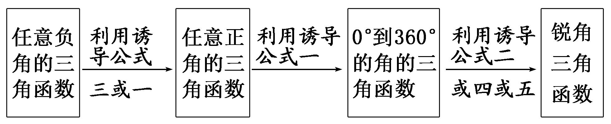

专题二　同角三角函数基本关系式及诱导公式

考点一　同角三角函数基本关系式的应用

【基本知识】  
（1）平方关系：sin2<em>α</em>＋cos2<em>α</em>＝1．（2）商数关系：＝tan <em>α</em>．

【常用结论】  
（1）sin2<em>α</em>＝1－cos2<em>α</em>＝(1＋cos <em>α</em>)(1－cos <em>α</em>)；cos2<em>α</em>＝1－sin2<em>α</em>＝(1＋sin <em>α</em>)(1－sin <em>α</em>)；
(sin <em>α</em>±cos <em>α</em>)2＝1±2sin <em>α</em>cos <em>α</em>．  
（2）sin *α*＝tan *α*cos *α*．

【方法总结】

同角三角函数关系在解题中的应用  
（1）对于sin <em>α</em>，cos <em>α</em>，tan <em>α</em>，由公式sin2<em>α</em>＋cos2<em>α</em>＝1，tan <em>α</em>＝，可以“知一求二”．  
（2）对于sin <em>α</em>±cos <em>α</em>，sin <em>α</em>cos <em>α</em>，由下面三个关系式(sin <em>α</em>±cos <em>α</em>)2＝1±2sin <em>α</em>cos <em>α</em>，(sin <em>α</em>＋cos <em>α</em>)2＋(sin <em>α</em>－cos <em>α</em>)2＝2，可以“知一求二”．  
（3）sin <em>α</em>，cos <em>α</em>的齐次式的应用：分式中分子与分母是关于sin <em>α</em>，cos <em>α</em>的齐次式，或含有sin2<em>α</em>，cos2<em>α</em>及sin <em>α</em>cos <em>α</em>的式子求值时，可将所求式子的分母看作“1”，利用“sin2<em>α</em>＋cos2<em>α</em>＝1”代换后转化为“切”求解．

【例题选讲】

<strong>[例1]</strong> （1） 已知sin <em>α</em>＝，≤<em>α</em>≤π，则tan <em>α</em>＝(　　)

A．－2　　　　　　　　
B．2　　　　　　　　
C．　　　　　　　　
D．－
答案　D　解析　因为≤*α*≤π，所以cos *α*＝－＝－＝－，所以tan *α*＝＝－．  
（2）已知*α*是第四象限角，tan*α*＝－，则sin*α*等于(　　)

A．　　　　　　　　
B．－　　　　　　　　
C．　　　　　　　　
D．－
答案　D　解析　因为tan <em>α</em>＝－，所以＝－，所以cos <em>α</em>＝－sin <em>α</em>，代入sin2<em>α</em>＋cos2<em>α</em>＝1，解得sin <em>α</em>＝±，又<em>α</em>是第四象限角，所以sin <em>α</em>＝－．  
（3） (2017·全国Ⅲ)已知sin *α*－cos *α*＝，则sin 2*α*＝(　　)

A．－　　　　　　　　
B．－　　　　　　　　
C．　　　　　　　　
D．
答案　A　解析　将sin <em>α</em>－cos <em>α</em>＝的两边进行平方，得sin2 <em>α</em>－2sin <em>α</em>cos <em>α</em>＋cos2<em>α</em>＝，即sin 2<em>α</em>＝－  
（4） 若*θ*∈，sin *θ*·cos *θ*＝，则sin *θ*＝(　　)

A．　　　　　　　　
B．　　　　　　　　
C．　　　　　　　　
D．
答案　D　解析　∵sin <em>θ</em>·cos <em>θ</em>＝，∴(sin <em>θ</em>＋cos <em>θ</em>)2＝1＋2sin <em>θ</em>·cos <em>θ</em>＝，(sin <em>θ</em>－cos <em>θ</em>)2＝1－2sin <em>θ</em>cos <em>θ</em>＝，∵<em>θ</em>∈，∴sin <em>θ</em>＋cos <em>θ</em>＝　①，sin <em>θ</em>－cos <em>θ</em>＝　②，联立①②得，sin <em>θ</em>＝．  
（5） 已知sin *α*＋cos *α*＝，*α*∈(0，π)，则＝(　　)

A．－　　　　　　　　
B．　　　　　　　　
C．　　　　　　　　
D．－
答案　A　解析　因为sin <em>α</em>＋cos <em>α</em>＝，所以(sin <em>α</em>＋cos <em>α</em>)2＝1＋2sin <em>α</em>cos <em>α</em>＝，所以sin <em>α</em>cos <em>α</em>＝－，又因为<em>α</em>∈(0，π)，所以sin <em>α</em>&gt;0，cos <em>α</em>&lt;0，所以cos <em>α</em>－sin <em>α</em>&lt;0，因为(cos <em>α</em>－sin <em>α</em>)2＝1－2sin <em>α</em>cos <em>α</em>＝1－2×＝，所以cos <em>α</em>－sin <em>α</em>＝－，所以＝＝＝＝－．  
（6） 若tan *α*＝2，则的值为(　　)

A．－　　　　　　　　
B．－　　　　　　　　
C．　　　　　　　　
D．
答案　C　解析　＝＝＝  
（7）已知<em>α</em>∈<strong>R</strong>，sin2<em>α</em>＋4sin <em>α</em>cos <em>α</em>＋4cos2<em>α</em>＝，则tan <em>α</em>＝\_\_\_\_\_\_\_\_．
答案　3或－　解析　∵sin2<em>α</em>＋4sin <em>α</em>cos <em>α</em>＋4cos2<em>α</em>＝＝＝，∴3tan2<em>α</em>－8tan<em>α</em>－3＝0，解得tan <em>α</em>＝3或－．  
（8） (2016·全国Ⅲ)若tan <em>α</em>＝，则cos2<em>α</em>＋2sin 2<em>α</em>＝(　　)

A．　　　　　　　　
B．　　　　　　　　
C．1　　　　　　　　
D．
答案　A　解析　因为tan <em>α</em>＝，则cos2<em>α</em>＋2sin 2<em>α</em>＝＝＝＝．故选A．

【对点训练】

1．若sin *α*＝－，且*α*为第四象限角，则tan *α*的值为(　　)

A．　　　　　　　　
B．－　　　　　　　　
C．　　　　　　　　
D．－

1．答案　D　解析　因为*α*为第四象限角，故cos *α*＝＝ ＝，所以tan *α*＝

＝＝－．

2．已知2sin *α*＝1＋cos *α*，则tan *α*的值为(　　)

A．－　　　　　　　　
B．　　　　　　　　
C．－或0　　　　　　　　
D．或0

2．答案　D　解析　由2sin <em>α</em>＝1＋cos <em>α</em>得sin <em>α</em>≥0，且4sin2<em>α</em>＝1＋2cos <em>α</em>＋cos2<em>α</em>，因而5cos2<em>α</em>＋2cos <em>α</em>－3

＝0，解得cos *α*＝或cos *α*＝－1，那么tan *α*＝或0，故选D．

3．若sin *θ*＋cos *θ*＝，则tan *θ*＋＝(　　)

A．　　　　　　　　
B．－　　　　　　　　
C．　　　　　　　　
D．－

3．答案　D　解析　由sin *θ*＋cos *θ*＝，得1＋2sin *θ*cos *θ*＝，即sin *θ*cos *θ*＝－，则tan *θ*＋＝

＋＝＝－，故选D．

4．已知sin *α*cos *α*＝，且<*α*<，则cos *α*－sin *α*的值为(　　)

A．－　　　　　　　　
B．　　　　　　　　
C．－　　　　　　　　
D．

4．答案　B　解析　∵&lt;<em>α</em>&lt;，∴cos <em>α</em>&lt;0，sin <em>α</em>&lt;0且|cos <em>α</em>|&lt;|sin <em>α</em>|，∴cos <em>α</em>－sin <em>α</em>&gt;0.又(cos <em>α</em>－sin <em>α</em>)2

＝1－2sin *α*cos *α*＝1－2×＝，∴cos *α*－sin *α*＝．

5．已知0&lt;<em>α</em>&lt;，若cos <em>α</em>－sin <em>α</em>＝－，则的值为________．

5．答案　　解析　因为cos *α*－sin *α*＝－，①，所以1－2sin *α*cos *α*＝，即2sin *α*cos *α*＝．所以

(sin <em>α</em>＋cos <em>α</em>)2＝1＋2sin <em>α</em>cos <em>α</em>＝1＋＝．又0&lt;<em>α</em>&lt;，所以sin <em>α</em>＋cos <em>α</em>&gt;0．所以sin <em>α</em>＋cos <em>α</em>＝．②，由①②得sin <em>α</em>＝，cos <em>α</em>＝，tan <em>α</em>＝2，所以＝．

6．已知sin *α*＋cos *α*＝，*α*∈[0，π]，则tan *α*＝(　　)

A．－　　　　　　　　
B．－　　　　　　　　
C．　　　　　　　　
D．

6．答案　A　解析　将sin *α*＋cos *α*＝，①．左右两边平方，得1＋2sin *α*cos *α*＝，即2sin *α*cos *α*＝－

&lt;0．又<em>α</em>∈[0，π]，∴sin <em>α</em>&gt;0，cos <em>α</em>&lt;0，即sin <em>α</em>－cos <em>α</em>&gt;0，∴(sin <em>α</em>－cos <em>α</em>)2＝1－2sin <em>α</em>cos <em>α</em>＝，∴sin <em>α</em>－cos <em>α</em>＝，②．联立①②解得sin <em>α</em>＝，cos <em>α</em>＝－，则tan <em>α</em>＝＝－．

7．若sin <em>θ</em>，cos <em>θ</em>是方程4<em>x</em>2＋2<em>mx</em>＋<em>m</em>＝0的两根，则<em>m</em>的值为(　　)

A．1＋　　　　　
B．1－　　　　　
C．1±　　　　　　
D．－1－

7．答案　B　解析　由题意知sin <em>θ</em>＋cos <em>θ</em>＝－，sin <em>θ</em>cos <em>θ</em>＝，又(sin <em>θ</em>＋cos <em>θ</em>)2＝1＋2sin <em>θ</em>cos <em>θ</em>，∴

＝1＋，解得<em>m</em>＝1±，又<em>Δ</em>＝4<em>m</em>2－16<em>m</em>≥0，∴<em>m</em>≤0或<em>m</em>≥4，∴<em>m</em>＝1－．

8．已知tan *α*＝－，则sin*α*·(sin *α*－cos *α*)＝(　　)

A．　　　　　　　　
B．　　　　　　　　
C．　　　　　　　　
D．

8．答案　A　解析　sin <em>α</em>·(sin <em>α</em>－cos <em>α</em>)＝sin2<em>α</em>－sin <em>α</em>·cos <em>α</em>＝＝，将tan <em>α</em>＝－
代入，得原式＝＝，故选A．

9．已知tan <em>θ</em>＝2，则sin2<em>θ</em>＋sin <em>θ</em>cos <em>θ</em>－2cos2<em>θ</em>＝(　　)

A．－　　　　　　　　
B．　　　　　　　　
C．－　　　　　　　　
D．

9．答案　D　解析　sin2<em>θ</em>＋sin <em>θ</em>cos <em>θ</em>－2cos2<em>θ</em>＝＝，把tan <em>θ</em>＝2代

入得，原式＝＝．故选D．

10．已知tan *θ*＝2，则的值为(　　)

A．　　　　　　　　
B．1　　　　　　　　
C．－　　　　　　　　
D．－1

10．答案　B　解析　∵tan *θ*＝2，∴＝＝＝1．

11．已知*x*∈(－π，0)，sin *x*＋cos *x*＝．  
（1）求sin *x*－cos *x*的值；  
（2）求的值．

11．解　（1）由sin <em>x</em>＋cos <em>x</em>＝，平方得sin2<em>x</em>＋2sin <em>x</em>cos <em>x</em>＋cos2<em>x</em>＝，整理得2sin <em>x</em>cos <em>x</em>＝－．
∴(sin <em>x</em>－cos <em>x</em>)2＝1－2sin <em>x</em>cos <em>x</em>＝．由<em>x</em>∈(－π，0)，知sin <em>x</em>&lt;0，又sin <em>x</em>＋cos <em>x</em>&gt;0，
∴cos *x*>0，则sin *x*－cos *x*<0，故sin *x*－cos *x*＝－．  
（2）＝＝＝＝－．

12．已知tan <em>α</em>＝－，求：（1）的值；（2）的值；（3）sin2<em>α</em>＋2sin <em>α</em>cos <em>α</em>的值．

12．解　（1）＝＝＝．  
（2）＝＝＝＝＝－．  
（3）sin2<em>α</em>＋2sin <em>α</em>cos <em>α</em>＝＝＝＝－．

考点二　诱导公式的应用

【基本知识】

<table><tr><td>
公式
</td><td>
一
</td><td>
二
</td><td>
三
</td><td>
四
</td><td>
五
</td><td>
六
</td></tr><tr><td>
角
</td><td>
2<em>k</em>π＋<em>α</em>(<em>k</em>∈<strong>Z</strong>)
</td><td>
π＋<em>α</em>
</td><td>
－<em>α</em>
</td><td>
π－<em>α</em>
</td><td>
－<em>α</em>
</td><td>
＋<em>α</em>
</td></tr><tr><td>
正弦
</td><td>
sin <em>α</em>
</td><td>
－sin <em>α</em>
</td><td>
－sin <em>α</em>
</td><td>
sin <em>α</em>
</td><td>
cos <em>α</em>
</td><td>
cos <em>α</em>
</td></tr><tr><td>
余弦
</td><td>
cos <em>α</em>
</td><td>
－cos <em>α</em>
</td><td>
cos <em>α</em>
</td><td>
－cos <em>α</em>
</td><td>
sin <em>α</em>
</td><td>
－sin <em>α</em>
</td></tr><tr><td>
正切
</td><td>
tan <em>α</em>
</td><td>
tan <em>α</em>
</td><td>
－tan <em>α</em>
</td><td>
－tan <em>α</em>
</td><td></td><td></td></tr><tr><td>
口诀
</td><td colspan="4">
函数名不变，符号看象限
</td><td colspan="2">
函数名改变，符号看象限
</td></tr></table>

诱导公式可简记为：奇变偶不变，符号看象限．“奇”“偶”指的是“<em>k</em>·＋<em>α</em>(<em>k</em>∈<strong>Z</strong>)”中的<em>k</em>是奇数还是偶数．“变”与“不变”是指函数的名称的变化，若<em>k</em>是奇数，则正、余弦互变；若<em>k</em>为偶数，则函数名称不变．“符号看象限”指的是在“<em>k</em>·＋<em>α</em>(<em>k</em>∈<strong>Z</strong>)”中，将<em>α</em>看成锐角时，“<em>k</em>·＋<em>α</em>(<em>k</em>∈<strong>Z</strong>)”的终边所在的象限．

【方法总结】

1．利用诱导公式把任意角的三角函数转化为锐角三角函数的步骤

也就是：“负化正，大化小，化到锐角就好了”．

2．明确三角函数式化简的原则和方向  
（1）切化弦，统一名．  
（2）用诱导公式，统一角．  
（3）用因式分解将式子变形，化为最简．结果要求项数尽可能少，次数尽可能低，结构尽可能简单，能求值的要求出值．

也就是：“统一名，统一角，同角名少为终了．”

【例题选讲】

[例2] （1） ＝(　　)

A．－　　　　　　　　
B．－1　　　　　　　　
C．1　　　　　　　　
D．
答案　B　解析　原式＝＝＝＝－1  
（2） sin π·cos π·tan的值是________．
答案　－　解析　原式＝sin·cos·tan＝··＝××(－)＝－．  
（3） 计算：2sin＋cos 12π＋tan＝\_\_\_\_\_\_\_\_\_\_．
答案　1　解析　原式＝2sin＋cos 0＋tan＝2sin＋1－tan＝2sin＋1－1＝2sin＝1．  
（4） 若sin＝，则cos＝(　　)

A．－　　　　　　　　
B．－　　　　　　　　
C．　　　　　　　　
D．
答案　A　解析　cos＝cos＝－cos＝－1＋2sin2＝－．故选A．  
（5） 化简：＝________．
答案　－1　解析　原式＝＝＝＝－＝－·＝－1．  
（6）已知<em>k</em>∈<strong>Z</strong>，化简：．
答案　－1　解析　当<em>k</em>＝2<em>n</em>(<em>n</em>∈<strong>Z</strong>)时，原式＝＝＝＝－1；当<em>k</em>＝2<em>n</em>＋1(<em>n</em>∈<strong>Z</strong>)时，原式＝＝＝＝－1．

【对点训练】

13．sin(－600°)的值为(　　)

A．　　　　　　　　
B．　　　　　　　　
C．1　　　　　　　　
D．

13．答案　A　解析　sin(－600°)＝sin(－720°＋120°)＝sin 120°＝．

14．sin 210°cos 120°的值为(　　)

A．　　　　　　　　
B．－　　　　　　　　
C．－　　　　　　　　
D．

14．答案　A　解析　sin 210°cos 120°＝－sin 30°(－cos 60°)＝－×＝．

15．求值：sin(－1 200°)cos 1 290°＋cos(－1 020°)·sin(－1 050°)＝\_\_\_\_\_\_\_\_．

15．答案　1　解析　原式＝－sin 1 200°cos 1 290°－cos 1 020°sin 1 050°＝－sin(3×360°＋120°)cos(3×360°

＋210°)－cos(2×360°＋300°)sin(2×360°＋330°)＝－sin 120°cos 210°－cos 300°sin 330°＝－sin(180°－60°)cos(180°＋30°)－cos(360°－60°)·sin(360°－30°)＝sin 60°cos 30°＋cos 60°sin 30°＝×＋×＝1．

16．已知*a*＝tan，*b*＝cos ，*c*＝sin，则*a*，*b*，*c*的大小关系为(　　)

A．*a*>*b*>*c*　　　　　　
B．*b*>*a*>*c*　　　　　　
C．*b*>*c*>*a*　　　　　　
D．*a*>*c*>*b*

16．答案　B　解析　由已知，*a*＝tan＝－tan ＝－，*b*＝cos＝cos ＝，*c*＝

sin＝－sin ＝－，因而*b*>*a*>*c*．

17．若*f*(cos *x*)＝cos 2*x*，则*f*(sin 15°)＝\_\_\_\_\_\_\_\_．

17．答案　－　解析　*f*(sin 15°)＝*f*(cos 75°)＝cos 150°＝－cos 30°＝－．

18．化简：·sin·cos＝\_\_\_\_\_\_\_\_．

18．答案　－cos2<em>α</em>　解析　·sin·cos＝·(－cos <em>α</em>)·(－sin <em>α</em>)＝－cos2<em>α</em>．

19．已知*α*为锐角，且2tan(π－*α*)－3cos＋5＝0，tan(π＋*α*)＋6sin(π＋*β*)－1＝0，则sin *α* 的值是(　　)

A．　　　　　　　　
B．　　　　　　　　
C．　　　　　　　　
D．

19．答案　C　解析　由已知可得－2tan *α*＋3sin *β*＋5＝0，tan *α*－6sin *β*－1＝0，可解得tan *α*＝3，又*α*为

锐角，故sin *α*＝．

20．已知<em>A</em>＝＋(<em>k</em>∈<strong>Z</strong>)，则<em>A</em>的值构成的集合是(　　)

A．{1，－1，2，－2}　　
B．{－1，1}　　
C．{2，－2}　　
D．{1，－1，0，2，－2}

20．答案　C　解析　*k*为偶数时，*A*＝＋＝2；*k*为奇数时，*A*＝＋＝－2.则*A*的值

构成的集合为{2，－2}．

21．已知tan＝，则tan＝\_\_\_\_\_\_\_\_．

21．答案　－　解析　tan＝tan＝tan＝－tan＝－．

22．已知cos＝*a*，则cos＋sin的值是\_\_\_\_\_\_\_\_．

22．答案　0　解析　因为cos＝cos＝－cos＝－*a*，sin＝sin＝

cos＝*a*，所以cos＋sin＝0．

23．已知*α*为第三象限角，*f*(*α*)＝.  
（1）化简*f*(*α*)；  
（2）若cos＝，求*f*(*α*)的值．

23．解　（1）根据题意可以得到*f*(*α*)＝＝－cos *α*．  
（2）因为cos＝，所以－sin *α*＝，从而sin *α*＝－．
又*α*为第三象限角，所以cos *α*＝－＝－，所以*f*(*α*)＝－cos *α*＝．

24．设*f*(*α*)＝(1＋2sin *α*≠0)．  
（1）化简*f*(*α*)；  
（2）若*α*＝－，求*f*(*α*)的值．

24．解　（1）*f*(*α*)＝＝＝＝＝．  
（2）当*α*＝－时，*f*(*α*)＝*f*＝＝＝＝＝．

考点三　同角三角函数基本关系式和诱导公式的综合应用

【方法总结】

求解诱导公式与同角关系综合问题的基本思路和化简要求

基本思路：①分析结构特点，选择恰当公式；②利用公式化成单角三角函数；③整理得最简形式．

化简要求：①化简过程是恒等变换；②结果要求项数尽可能少，次数尽可能低，结构尽可能简单，能求值的要求出值．

<strong>[例3]</strong> （1） 若<em>α</em>∈，sin (π－<em>α</em>)＝，则tan <em>α</em>＝(　　)

A．－　　　　　　　　
B．　　　　　　　　
C．－　　　　　　　　
D．
答案　C　解析　∵*α*∈，sin *α*＝，∴cos *α*＝－，∴tan *α*＝－．  
（2） 已知*x*∈，tan*x*＝－，则cos等于(　　)

A．　　　　　　　　
B．－　　　　　　　　
C．－　　　　　　　　
D．
答案　C　解析　∵tan <em>x</em>＝＝－，∴cos <em>x</em>＝－sin <em>x</em>，∴sin2<em>x</em>＋cos2<em>x</em>＝sin2<em>x</em>＋sin2<em>x</em>＝sin2<em>x</em>＝1，∴sin2<em>x</em>＝．又<em>x</em>∈，∴sin <em>x</em>＝，∴cos＝cos＝－sin <em>x</em>＝－．  
（3） (2016·全国Ⅰ)已知*θ*是第四象限角，且sin＝，则tan＝\_\_\_\_\_\_\_\_．
答案　－　解析　由题意知sin＝，*θ*是第四象限角，所以cos＞0，所以cos＝＝．则tan＝tan＝－＝－＝－×＝－．  
（4） 已知sin *α*＋cos *α*＝－，且<*α*<π，则＋的值为\_\_\_\_\_\_\_\_．
答案　　解析　由sin*α*＋cos*α*＝－平方得sin*α*cos*α*＝－，∵<*α*<π，∴sin*α*－cos*α*＝＝，∴＋＝－＝＝＝．  
（5） 已知tan(π－*α*)＝－，且*α*∈，则＝(　　)

A．－　　　　　　　　
B．－　　　　　　　　
C． 　　　　　　　　
D．
答案　　解析　由tan(π－*α*)＝－，得tan*α*＝．＝＝＝＝－．故选A．  
（6）已知角<em>θ</em>的终边在第三象限，tan 2<em>θ</em>＝－2，则sin2<em>θ</em>＋sin(3π－<em>θ</em>)cos(2π＋<em>θ</em>)－cos2<em>θ</em>等于(　　)

A．－　　　　　　　　
B．　　　　　　　　
C．－　　　　　　　　
D．
答案　D　解析　由tan 2<em>θ</em>＝－2可得tan 2<em>θ</em>＝＝－2，即tan2<em>θ</em>－tan <em>θ</em>－＝0，解得tan <em>θ</em>＝或tan <em>θ</em>＝－．又角<em>θ</em>的终边在第三象限，故tan <em>θ</em>＝，故sin2<em>θ</em>＋sin(3π－<em>θ</em>)cos(2π＋<em>θ</em>)－cos2<em>θ</em>＝sin2<em>θ</em>＋sin <em>θ</em>cos <em>θ</em>－cos2<em>θ</em>＝＝＝＝．

【对点训练】

25．若*α*∈，sin *α*＝－，则cos(－*α*)＝(　　)

A．－　　　　　　　　
B．　　　　　　　　
C．　　　　　　　　
D．－

25．答案　B　解析　因为*α*∈，sin *α*＝－，所以*α*∈，cos *α*＝，则cos(－*α*)＝．

26．已知sin＝，那么tan *α*的值为(　　)

A．－　　　　　　　　
B．－　　　　　　　　
C．±　　　　　　　　
D．±

26．答案　C　解析　sin＝化为cos *α*＝，那么sin *α*＝±，tan *α*＝±，故选C．

27．已知*α*∈，且cos *α*＝－，则＝(　　)

A．　　　　　　　　
B．－　　　　　　　　
C．　　　　　　　　
D．－

27．答案　C　解析　∵*α*∈，且cos *α*＝－，∴sin *α*＝，则＝＝＝．

28．已知sin *θ*＝，*θ*∈，则sin(π－*θ*)sin的值为(　　)

A．　　　　　　　　
B．－　　　　　　　　
C．　　　　　　　　
D．－

28．答案　B　解析　∵*θ*∈，∴cos *θ*＝＝＝.∴sin(π－*θ*)sin＝－sin

*θ*cos *θ*＝－×＝－．

29．已知sin＝，则cos＝(　　)

A．－　　　　　　　　
B． 　　　　　　　　
C． 　　　　　　　　
D．－

29．答案　A　解析　 cos＝cos＝sin＝sin＝－sin＝－

sin＝－

30．若角*θ*满足＝3，则tan *θ*的值为\_\_\_\_\_\_\_\_．

30．答案　1　解析　由＝3，得＝3，等式左边分子分母同时除以

cos*θ*，得＝3，解得tan *θ*＝1．

31．已知cos＝，且－π<*α*<－，则cos等于(　　)

A．　　　　　　　　
B．　　　　　　　　
C．－　　　　　　　　
D．－

31．答案　D　解析　因为＋＝，所以cos＝sin＝sin．因为

－π<*α*<－，所以－<*α*＋<－．又cos＝>0，所以－<*α*＋<－，所以sin＝－ ＝－＝－．

32．已知<em>f</em>(<em>α</em>)＝(sin <em>α</em>≠0，1＋2sin <em>α</em>≠0)，则<em>f</em>＝________．

32．答案　　解析　∵*f*(*α*)＝＝＝＝，
∴*f*＝＝＝＝．

33．已知角*α*终边上一点*P*(－4，3)，则的值为\_\_\_\_\_\_\_\_．

33．答案　－　解析　原式＝＝tan *α*，根据三角函数的定义得tan *α*＝－．

34．已知sin *α*＝，求tan(*α*＋π)＋的值．

34．解　tan(*α*＋π)＋＝tan *α*＋＝＋＝．
∵sin *α*＝>0，∴*α*为第一或第二象限角．
当*α*为第一象限角时，cos *α*＝＝，则原式＝＝；
当*α*为第二象限角时，cos *α*＝－＝－，则原式＝＝－．

35．已知*α*为第三象限角，*f*(*α*)＝．  
（1）化简*f*(*α*)；  
（2）若cos＝，求*f*(*α*)的值．

35．解　（1）*f*(*α*)＝＝＝－cos *α*．  
（2）∵cos＝，∴－sin *α*＝，从而sin *α*＝－．又*α*为第三象限角，
∴cos *α*＝－＝－，∴*f*(*α*)＝－cos *α*＝．

36．已知sin(3π＋*α*)＝2sin，求下列各式的值．  
（1）；（2）sin2<em>α</em>＋sin 2<em>α</em>．

36．解　∵sin(3π＋*α*)＝2sin，∴－sin *α*＝－2cos *α*，即sin *α*＝2cos *α*．  
（1）原式＝＝＝－．  
（2）∵sin *α*＝2cos *α*，∴tan *α*＝2，∴原式＝＝＝＝．

