# 专题三 三角函数的图象与性质(1)

# 考点一 三角函数的图象

# 【基本知识】

<table><tr><td>三角函数</td><td>正弦函数 y=sin x</td><td>余弦函数 y=cos x</td><td>正切函数 y=tan x</td></tr><tr><td>图象</td><td>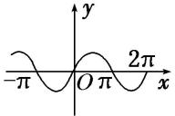</td><td>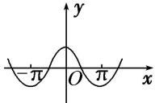</td><td>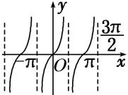</td></tr></table>

# 【例题选讲】

[例 1] (1) 函数 $y=\sin x^{2}$ 的图象是()

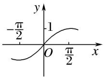  
A

  
B

  
C

  
D

(2)函数 $y = \sin \left(2x - \frac{\pi}{3}\right)$ 在区间 $\left[-\frac{\pi}{2}, \pi\right]$ 上的简图是（）

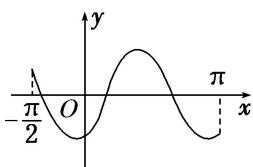

text_image

-π/2
O
y
π
x

A

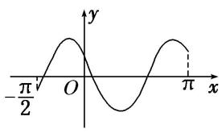

text_image

-π/2
O
y
x

B

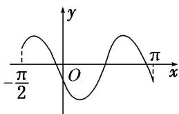

text_image

-π/2
O
π
x
y

C

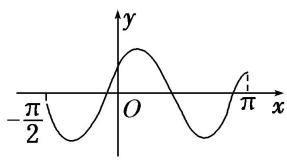

text_image

-π/2
O
x
y
π

D

(3) 函数 $y=2\cos\left(2x+\frac{\pi}{6}\right)$ 的部分图象大致是()

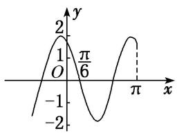

line

| x       | y       |
| ------- | ------- |
| 0       | 0       |
| π/6     | 1       |
| π       | 0       |
| 3       | -1      |

A

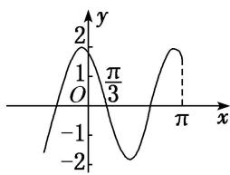

line

| x | y |
|---|---|
| -π/3 | 1 |
| π | 2 |

B

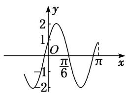

line

| x | y |
|---|---|
| 0 | -1 |
| π/6 | 2 |
| π | 1 |

C

line

| x | y |
|---|---|
| 0 | 1 |
| π/2 | -1 |
| 2π | 0 |

D

(4) 函数 $y = \tan \left( \frac{1}{2} x - \frac{\pi}{3} \right)$ 在一个周期内的图象是()

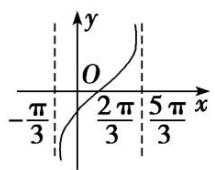  
A

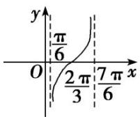  
B

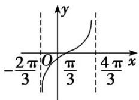

line

| x | y |
|---|---|
| -2π/3 | 0 |
| 0 | π/3 |
| 4π/3 | ∞ (approximate) |

C

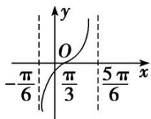  
D

(5) 函数 $y=\frac{\sin2x}{1-\cos x}$ 的部分图象大致为()

  
A

  
B

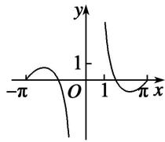  
C

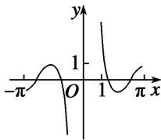  
D

# 考点二 三角函数的定义域

# 【基本知识】

<table><tr><td>三角函数</td><td>正弦函数 $y = \sin x$ </td><td>余弦函数 $y = \cos x$ </td><td>正切函数 $y = \tan x$ </td></tr><tr><td>图象</td><td>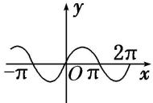</td><td>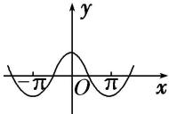</td><td>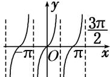</td></tr><tr><td>定义域</td><td>R</td><td>R</td><td> $\left\{ x \mid x \in \mathbf{R}, \text{且 } x \neq k\pi + \frac{\pi}{2}, k \in \mathbf{Z} \right\}$ </td></tr></table>

# 【方法总结】

# 三角函数定义域的求法

(1)以正切函数为例，应用正切函数 $y = \tan x$ 的定义域求函数 $y = A\tan (\omega x + \varphi)$ 的定义域转化为求解简单的三角不等式.

(2)求复杂函数的定义域转化为求解简单的三角不等式. 简单的三角不等式, 利用三角函数的图象求解.

[例 2] (1) 函数 $f(x) = -2 \tan \left(2x + \frac{\pi}{6}\right)$ 的定义域是()

A. $\left\{x\mid x\neq\frac{\pi}{6}\right\}$

B. $\left\{x\mid x\neq -\frac{\pi}{12}\right\}$

C. $\left\{x\mid x\neq k\pi +\frac{\pi}{6} (k\in \mathbf{Z})\right\}$

D. $\left\{x\mid x\neq \frac{k\pi}{2} +\frac{\pi}{6} (k\in \mathbf{Z})\right\}$

(2) 函数 $y=\frac{1}{\tan x-1}$ 的定义域为 \_\_\_\_.

(3)函数 $y = \sqrt{\cos x - \frac{\sqrt{3}}{2}}$ 的定义域为()

A. $\left[-\frac{\pi}{6}, \frac{\pi}{6}\right]$

B. $\left[k\pi -\frac{\pi}{6}, k\pi +\frac{\pi}{6}\right](k\in \mathbf{Z})$

C. $\left[2k\pi - \frac{\pi}{6}, 2k\pi + \frac{\pi}{6}\right](k \in \mathbf{Z})$

D. R

(4) 函数 $y=\sqrt{\sin x-\cos x}$ 的定义域为 \_\_\_\_.  
(5) 函数 $y=\lg(\sin x)+\sqrt{\cos x-\frac{1}{2}}$ 的定义域为 \_\_\_\_.  
(6)函数 $y=\lg(\sin 2x)+\sqrt{9-x^{2}}$ 的定义域为 \_\_\_\_.

# 考点三 三角函数的值域(最值)

# 【基本知识】

<table><tr><td>三角函数</td><td>正弦函数 y=sin x</td><td>余弦函数 y=cos x</td><td>正切函数 y=tan x</td></tr><tr><td>图象</td><td>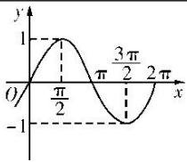</td><td>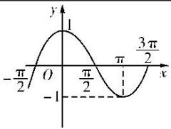</td><td>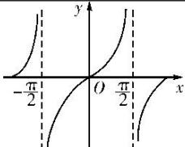</td></tr><tr><td>定义域</td><td>R</td><td>R</td><td> $\left\{ x \mid x \in \mathbf{R}$ ,且  $x \neq k\pi + \frac{\pi}{2}$ , $k \in \mathbf{Z} \right\}$ </td></tr><tr><td>值域</td><td>[-1, 1]</td><td>[-1, 1]</td><td>R</td></tr><tr><td>最值</td><td>当且仅当  $x = \frac{\pi}{2} + 2k\pi (k \in \mathbf{Z})$ 时,取得最大值 1;当且仅当  $x = -\frac{\pi}{2} + 2k\pi (k \in \mathbf{Z})$ 时,取得最小值-1</td><td>当且仅当  $x = 2k\pi (k \in \mathbf{Z})$ 时,取得最大值 1;当且仅当  $x = \pi + 2k\pi (k \in \mathbf{Z})$ 时,取得最小值-1</td><td></td></tr></table>

# 【方法总结】

# 求三角函数的值域(最值)的 3 种类型及解法思路

(1)形如 $y=a\sin x+b\cos x+c$ 的三角函数化为 $y=A\sin(\omega x+\varphi)+k$ 的形式，再求值域(最值);

(2)形如 $y=a\sin^{2}x+b\sin x+c$ 的三角函数，可先设 $\sin x=t$ ，化为关于 t 的二次函数求值域(最值);

(3)形如 $y=a\sin x\cos x+b(\sin x\pm\cos x)+c$ 的三角函数，可先设 $t=\sin x\pm\cos x$ ，化为关于 t 的二次函数求值域(最值);

(4)对分式形式的三角函数表达式也可构造基本不等式求最值.

# 【例题选讲】

[例 3] (1) 函数 $y=2\sin\left(\frac{\pi x}{6}-\frac{\pi}{3}\right)(0 \leq x \leq 9)$ 的最大值与最小值之和为()

A. $2 - \sqrt{3}$

B. 0

C. -1

D. $-1 - \sqrt{3}$

(2) 函数 $y=\cos^{2}x-2\sin x$ 的最大值与最小值分别为()

A. 3, -1

B. 3, -2

C. 2, -1

D. 2, -2

(3) 函数 $y=\sin x-\cos x+\sin x\cos x$ 的值域为 \_\_\_\_.

(4) 已知函数 $f(x) = \sin \left( x + \frac{\pi}{6} \right)$ ，其中 $x \in \left[ -\frac{\pi}{3}, a \right]$ ，若 $f(x)$ 的值域是 $\left[ -\frac{1}{2}, 1 \right]$ ，则实数 $a$ 的取值范围是 \_\_\_\_.

(5) 设函数 $f(x) = 3\sin \left(\frac{\pi}{2} x + \frac{\pi}{4}\right)$ ，若存在这样的实数 $x_1, x_2$ ，对任意的 $x \in \mathbf{R}$ ，都有 $f(x_1) \leq f(x) \leq f(x_2)$ 成立，则 $|x_1 - x_2|$ 的最小值为 \_\_\_\_.

(6)已知函数 $f(x) = 2\sin \left(2x + \frac{\pi}{6}\right)$ ，记函数 $f(x)$ 在区间 $[t, t + \frac{\pi}{4}]$ 上的最大值为 $M$ ，最小值为 $m$ ，设函数 $h(t) = M_t - m_t$ . 若 $t \in [\frac{\pi}{12}, \frac{5\pi}{12}]$ ，则函数 $h(t)$ 的值域为 \_\_\_\_.

# 【对点训练】

1. 函数 $f(x) = \sin \left(2x - \frac{\pi}{4}\right)$ 在区间 $\left[0, \frac{\pi}{2}\right]$ 上的最小值为（）

A.-1

B. $-\frac{\sqrt{2}}{2}$

C. $\frac{\sqrt{2}}{2}$

D. 0

2. 函数 $f(x) = 3\sin \left(2x - \frac{\pi}{6}\right)$ 在区间 $\left[0, \frac{\pi}{2}\right]$ 上的值域为（）

A. $\left[-\frac{3}{2},\frac{3}{2}\right]$

B. $\left[-\frac{3}{2},3\right]$

C. $\left[-\frac{3\sqrt{3}}{2}, \frac{3\sqrt{3}}{2}\right]$

D. $\left[-\frac{3\sqrt{3}}{2},3\right]$

3. 函数 $f(x)=3\cos\left(2x-\frac{\pi}{6}\right)$ ，则 $f(x)$ 在区间 $\left[0,\frac{\pi}{2}\right]$ 上的值域为 \_\_\_\_.

4. 若函数 $f(x) = 2\sin \omega x (0 < \omega < 1)$ 在区间 $\left[0, \frac{\pi}{3}\right]$ 上的最大值为 1，则 $\omega = (\quad)$

A. $\frac{1}{4}$

B. $\frac{1}{3}$

C. $\frac{1}{2}$

D. $\frac{\sqrt{3}}{2}$

5. (2017·全国II)函数 $f(x)=\sin^{2}x+\sqrt{3}\cos x-\frac{3}{4}\left(x\in\left[0,\frac{\pi}{2}\right]\right)$ 的最大值是 \_\_\_\_.

6. 函数 $f(x)=\sin x+\cos x+\sin x\cos x$ ，则 $f(x)$ 的最大值为 \_\_\_\_.

7. 定义运算： $a^{*}b=\begin{cases}a,&a\leq b,\\b,&a>b.\end{cases}$ 例如1\*2，则函数 $f(x)=\sin x*\cos x$ 的值域为()

A. $\left[-\frac{\sqrt{2}}{2},\frac{\sqrt{2}}{2}\right]$

B. $[-1, 1]$

C. $\left[\frac{\sqrt{2}}{2},1\right]$

D. $\left[-1,\frac{\sqrt{2}}{2}\right]$

8. 已知函数 $f(x) = 2\sin \omega x$ 在区间 $\left[-\frac{\pi}{3}, \frac{\pi}{4}\right]$ 上的最小值为 -2，则 $\omega$ 的取值范围是 \_\_\_\_.

9. 已知函数 $f(x) = \cos (2x + \theta)\left(0 \leq \theta \leq \frac{\pi}{2}\right)$ 在 $\left[-\frac{3\pi}{8}, -\frac{\pi}{6}\right]$ 上单调递增，若 $f\left(\frac{\pi}{4}\right) \leq m$ 恒成立，则实数 $m$ 的取值范围为 \_\_\_\_.

10. 已知函数 $f(x) = A \sin (\omega x + \varphi) (A > 0, \omega > 0, 0 < \varphi < \pi)$ 的图象与 $x$ 轴的一个交点 $\left[-\frac{\pi}{12}, 0\right]$ 到其相邻的一条对称轴的距离为 $\frac{\pi}{4}$ ，若 $f\left(\frac{\pi}{12}\right) = \frac{3}{2}$ ，则函数 $f(x)$ 在 $\left[0, \frac{\pi}{2}\right]$ 上的最小值为（）

A. $\frac{1}{2}$

B. $-\sqrt{3}$

C. $-\frac{\sqrt{3}}{2}$

D. $-\frac{1}{2}$

11. 已知函数 $f(x)=\sqrt{2}\sin\left(2x+\frac{\pi}{4}\right)$ .

(1)求函数 $f(x)$ 的单调递增区间;

(2)当 $x\in \left[\frac{\pi}{4},\frac{3\pi}{4}\right]$ 时，求函数 $f(x)$ 的最大值和最小值.

12. 设函数 $f(x) = 2\sin \left(2\omega x - \frac{\pi}{6}\right) + m$ 的图象关于直线 $x = \pi$ 对称，其中 $0 < \omega < \frac{1}{2}$ .

(1)求函数 $f(x)$ 的最小正周期.

(2)若函数 $y = f(x)$ 的图象过点 $(\pi, 0)$ ，求函数 $f(x)$ 在 $\left[0, \frac{3\pi}{2}\right]$ 上的值域.

