# 专题三 三角函数的图象与性质(1)

# 考点一 三角函数的图象

# 【基本知识】

<table><tr><td>三角函数</td><td>正弦函数 y=sin x</td><td>余弦函数 y=cos x</td><td>正切函数 y=tan x</td></tr><tr><td>图象</td><td>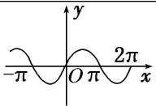</td><td>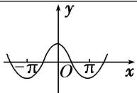</td><td>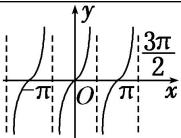</td></tr></table>

# 【例题选讲】

[例 1] (1) 函数 $y=\sin x^{2}$ 的图象是()

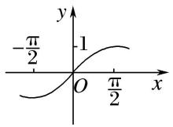  
A

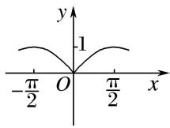  
B

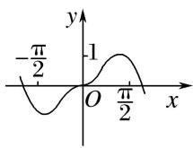  
C

  
D

答案 D 解析 函数 $y = \sin x^2$ 为偶函数，排除 A, C；又当 $x = \sqrt{\frac{\pi}{2}}$ 时函数取得最大值，排除 B，故选 D.

(2)函数 $y = \sin \left(2x - \frac{\pi}{3}\right)$ 在区间 $\left[-\frac{\pi}{2}, \pi\right]$ 上的简图是（）

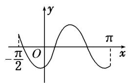

text_image

-π/2
O
y
π
x

A

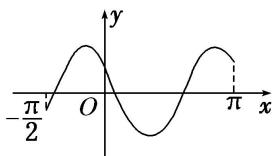

text_image

-\frac{\pi}{2}\nO\ny\nx\n-\pi\n\pi

B

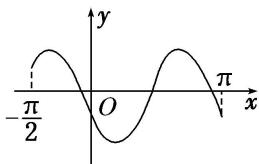

text_image

-π/2
O
π
x
y

C

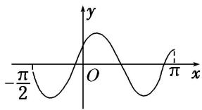

text_image

-π/2
O
x
y
π

D

答案 A 解析 令 $x = 0$ ，得 $y = \sin \left(-\frac{\pi}{3}\right) = -\frac{\sqrt{3}}{2}$ ，排除 B、D。由 $f\left(-\frac{\pi}{3}\right) = 0$ ， $f\left(\frac{\pi}{6}\right) = 0$ ，排除 C，故选 A.

(3) 函数 $y=2\cos\left(2x+\frac{\pi}{6}\right)$ 的部分图象大致是()

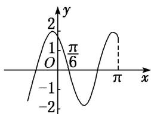

line

| x | y |
|---|---|
| -π/6 | 1 |
| π | 2 |

A

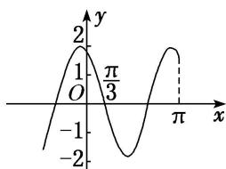

line

| x | y |
|---|---|
| -π/3 | 1 |
| π | 2 |

B

line

| x | y |
|---|---|
| -π/6 | 1 |
| 0 | 2 |
| π/6 | 1 |
| π | -1 |

C

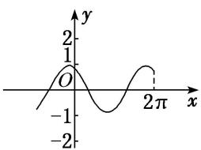

line

| x | y |
|---|---|
| -2π | -1 |
| 0 | 1 |
| 2π | -1 |

D

答案 A 解析 由 $y = 2\cos \left(2x + \frac{\pi}{6}\right)$ 可知，函数的最大值为 2，故排除 D；又因为函数图象过点 $\left(\frac{\pi}{6}, 0\right)$ ，故排除 B；又因为函数图象过点 $\left(-\frac{\pi}{12}, 2\right)$ ，故排除 C.

(4) 函数 $y = \tan \left( \frac{1}{2} x - \frac{\pi}{3} \right)$ 在一个周期内的图象是()

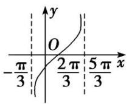  
A

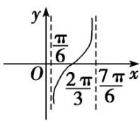  
B

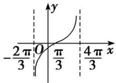

line

| x | y |
|---|---|
| -2π/3 | 0 |
| 0 | π/3 |
| 4π/3 | ∞ (approximate) |

C

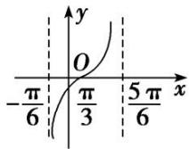  
D

答案 A 解析 由题意得函数的周期为 $T = 2\pi$ ，故可排除 B, D. 对于 C，图象过点 $\left[\frac{\pi}{3}, 0\right]$ ，代入解析式，不成立，故选 A.

(5) 函数 $y=\frac{\sin2x}{1-\cos x}$ 的部分图象大致为()

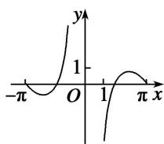  
A

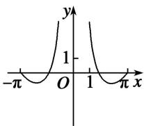  
B

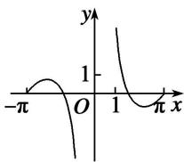  
C

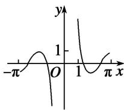  
D

答案 C 解析 令 $f(x) = \frac{\sin 2x}{1 - \cos x}$ ， $\because f(1) = \frac{\sin 2}{1 - \cos 1} > 0, f(\pi) = \frac{\sin 2\pi}{1 - \cos \pi} = 0, \therefore$ 排除选项 A，D．由 1- $\cos x \neq 0$ ，得 $x \neq 2k\pi (k \in \mathbf{Z})$ ，故函数 $f(x)$ 的定义域关于原点对称．又 $\because f(-x) = \frac{\sin(-2x)}{1 - \cos(-x)} = -\frac{\sin 2x}{1 - \cos x} = -f(x), \therefore f(x)$ 为奇函数，其图象关于原点对称，∴排除选项 B．故选 C.

# 考点二 三角函数的定义域

# 【基本知识】

<table><tr><td>三角函数</td><td>正弦函数 y=sinx</td><td>余弦函数 y=cosx</td><td>正切函数 y=tanx</td></tr><tr><td>图象</td><td>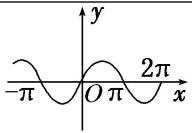</td><td>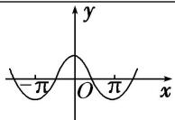</td><td>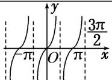</td></tr><tr><td>定义域</td><td>R</td><td>R</td><td>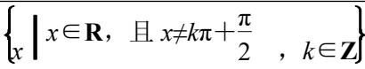</td></tr></table>

# 【方法总结】

# 三角函数定义域的求法

(1)以正切函数为例，应用正切函数 $y=\tan x$ 的定义域求函数 $y=Atan(\omega x+\varphi)$ 的定义域转化为求解简单的三角不等式.  
(2)求复杂函数的定义域转化为求解简单的三角不等式. 简单的三角不等式, 利用三角函数的图象求解.

[例 2] (1) 函数 $f(x) = -2 \tan \left( \frac{2x + \frac{\pi}{6}}{6} \right)$ 的定义域是()

A. $\left\{x\mid x\neq\frac{\pi}{6}\right\}$

B. $\left\{x\mid x\neq -\frac{\pi}{12}\right\}$

C. $\left\{x\mid x\neq k\pi +\frac{\pi}{6} (k\in \mathbf{Z})\right\}$

D. $\left\{x\mid x\neq \frac{k\pi}{2} +\frac{\pi}{6} (k\in \mathbf{Z})\right\}$

答案 D 解析 由正切函数的定义域，得 $2x + \frac{\pi}{6} \neq k\pi + \frac{\pi}{2}$ ， $k \in Z$ ，即 $x \neq \frac{k\pi}{2} + \frac{\pi}{6} (k \in Z)$ ，故选 D.

(2) 函数 $y=\frac{1}{\tan x-1}$ 的定义域为 \_\_\_\_.

答案 $\left\{x\mid x\neq\frac{\pi}{4}\quad+k\pi,\text{且}x\neq\frac{\pi}{2}+k\pi,\quad k\in\mathbf{Z}\right\}$ 解析 要使函数有意义，必须有 $\left\{\begin{aligned}\tan x-1\neq0,\\ x\neq\frac{\pi}{2}+k\pi,\quad k\in\mathbf{Z},\end{aligned}\right.$ 即

$\left\{ \begin{array}{l} x \neq \frac{\pi}{4} + k\pi, \quad k \in \mathbf{Z}, \\ x \neq \frac{\pi}{2} + k\pi, \quad k \in \mathbf{Z}. \end{array} \right.$ 故函数的定义域为 $\left\{ x \mid x \neq \frac{\pi}{4} + k\pi, \text{且 } x \neq \frac{\pi}{2} + k\pi, \quad k \in \mathbf{Z} \right\}$ .

(3)函数 $y = \sqrt{\cos x - \frac{\sqrt{3}}{2}}$ 的定义域为()

A. $\left[-\frac{\pi}{6}, \frac{\pi}{6}\right]$

B. $\left[k\pi -\frac{\pi}{6}, k\pi +\frac{\pi}{6}\right](k\in \mathbf{Z})$

C. $\left[2k\pi -\frac{\pi}{6}, 2k\pi +\frac{\pi}{6}\right](k\in \mathbf{Z})$ D. $\mathbf{R}$

答案 C 解析 因为 $\cos x - \frac{\sqrt{3}}{2} \geq 0$ ，即 $\cos x \geq \frac{\sqrt{3}}{2}$ ，所以 $2k\pi - \frac{\pi}{6} \leq x \leq 2k\pi + \frac{\pi}{6}$ ， $k \in Z$ .

(4) 函数 $y=\sqrt{\sin x-\cos x}$ 的定义域为 \_\_\_\_.

答案 $\left[2k\pi + \frac{\pi}{4}, 2k\pi + \frac{5\pi}{4}\right](k \in \mathbf{Z})$ 解析 方法一 要使函数有意义, 必须使 $\sin x - \cos x \geq 0$ . 利用图象, 在同一坐标系中画出 $[0, 2\pi]$ 上 $y = \sin x$ 和 $y = \cos x$ 的图象, 如图所示.

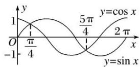

在 $[0, 2\pi]$ 内，满足 $\sin x = \cos x$ 的 $x$ 为 $\frac{\pi}{4}, \frac{5\pi}{4}$ ，再结合正弦、余弦函数的周期是 $2\pi$ ，所以原函数的定义域为 $\left\{x \mid 2k\pi + \frac{\pi}{4} \leq x \leq 2k\pi + \frac{5\pi}{4}, k \in \mathbf{Z} \right\}$ .

(5) 函数 $y=\lg(\sin x)+\sqrt{\cos x-\frac{1}{2}}$ 的定义域为 \_\_\_\_.

答案 $\left\{x\mid2k\pi<x\leq2k\pi+\frac{\pi}{3},\quad k\in\mathbf{Z}\right\}$ 解析 要使函数有意义，则 $\left\{\begin{aligned}\sin x>0,\\ \cos x-\frac{1}{2}\geq0,\end{aligned}\right.$ 即 $\left\{\begin{aligned}\sin x>0,\\ \cos x\geq\frac{1}{2},\end{aligned}\right.$ 解得

$\left\{ \begin{array}{l} 2k\pi < x < \pi + 2k\pi, k \in \mathbf{Z}, \\ -\frac{\pi}{3} + 2k\pi \leq x \leq \frac{\pi}{3} + 2k\pi, k \in \mathbf{Z}, \end{array} \right.$ 所以 $2k\pi < x \leq \frac{\pi}{3} + 2k\pi (k \in \mathbf{Z})$ ，所以函数的定义域为

$$
\left\{x \mid 2 k \pi <   x \leq 2 k \pi + \frac {\pi}{3} \right\} (k \in \mathbf {Z}).
$$

(6)函数 $y=\lg(\sin 2x)+\sqrt{9-x^{2}}$ 的定义域为 \_\_\_\_.

答案 $\left[-3,\quad-\frac{\pi}{2}\right]\cup\left(0,\quad\frac{\pi}{2}\right)$ 解析 由 $\left\{\begin{aligned}\sin 2x>0,\\9-x^{2}\geq0,\end{aligned}\right.$ 得 $\left\{\begin{aligned}k\pi<x<k\pi+\frac{\pi}{2},&k\in\mathbb{Z},\\-3\leq x\leq3.\end{aligned}\right.$ $\therefore-3\leq x<-\frac{\pi}{2}$ 或

$0<x<\frac{\pi}{2}$ .∴函数 $y=\lg(\sin 2x)+\sqrt{9-x^{2}}$ 的定义域为 $\left[-3, -\frac{\pi}{2}\right]\cup\left(0, \frac{\pi}{2}\right)$ .

# 考点三 三角函数的值域(最值)

# 【基本知识】

<table><tr><td>三角函数</td><td>正弦函数 $y=\sin x$ </td><td>余弦函数 $y=\cos x$ </td><td>正切函数 $y=\tan x$ </td></tr><tr><td>图象</td><td>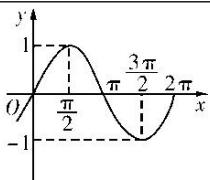</td><td>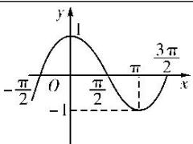</td><td>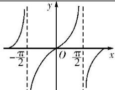</td></tr><tr><td>定义域</td><td>R</td><td>R</td><td> $\left\{ \begin{array}{c} x \mid x \in \mathbf{R}, \text{且 } x \neq k\pi + \frac{\pi}{2}, k \in \mathbf{Z} \end{array} \right\}$ </td></tr><tr><td>值域</td><td>[-1, 1]</td><td>[-1, 1]</td><td>R</td></tr><tr><td>最值</td><td>当且仅当 $x=\frac{\pi}{2}+2k\pi(k \in \mathbf{Z})$ 时,取得最大值1;当且仅当 $x=-\frac{\pi}{2}+2k\pi(k \in \mathbf{Z})$ 时,取得最小值-1</td><td>当且仅当 $x=2k\pi(k \in \mathbf{Z})$ 时,取得最大值1;当且仅当 $x=\pi+2k\pi(k \in \mathbf{Z})$ 时,取得最小值-1</td><td></td></tr></table>

# 【方法总结】

# 求三角函数的值域(最值)的 3 种类型及解法思路

(1)形如 $y=a\sin x+b\cos x+c$ 的三角函数化为 $y=A\sin(\omega x+\varphi)+k$ 的形式，再求值域(最值);

(2)形如 $y=a\sin^{2}x+b\sin x+c$ 的三角函数，可先设 $\sin x=t$ ，化为关于 t 的二次函数求值域(最值);

(3)形如 $y = a \sin x \cos x + b (\sin x \pm \cos x) + c$ 的三角函数，可先设 $t = \sin x \pm \cos x$ ，化为关于 $t$ 的二次函数求值域(最值);

(4)对分式形式的三角函数表达式也可构造基本不等式求最值.

# 【例题选讲】

[例 3] (1) 函数 $y=2\sin\left(\frac{\pi x}{6}-\frac{\pi}{3}\right)(0\leq x\leq9)$ 的最大值与最小值之和为()

A. $2 - \sqrt{3}$

B. 0

C.-1

D. $-1-\sqrt{3}$

答案 A 解析 因为 $0 \leq x \leq 9$ ，所以 $-\frac{\pi}{3} \leq \frac{\pi x}{6} - \frac{\pi}{3} \leq \frac{7\pi}{6}$ ，所以 $-\frac{\sqrt{3}}{2} \leq \sin \left(\frac{\pi x}{6} - \frac{\pi}{3}\right) \leq 1$ ，则 $-\sqrt{3} \leq y \leq 2$ 。所以 $y_{\max} + y_{\min} = 2 - \sqrt{3}$ 。

(2) 函数 $y=\cos^{2}x-2\sin x$ 的最大值与最小值分别为()

A. 3, -1

B. 3, -2

C. 2, -1

D. 2, -2

答案 D 解析 $y=\cos^{2}x-2\sin x=1-\sin^{2}x-2\sin x=-\sin^{2}x-2\sin x+1$ ，令 $t=\sin x$ ，则 $t\in[-1,1]$ ， $y=-t^{2}-2t+1=-(t+1)^{2}+2$ ，所以 $y_{\max}=2,\quad y_{\min}=-2$ .

(3) 函数 $y=\sin x-\cos x+\sin x\cos x$ 的值域为 \_\_\_\_.

答案 $\left[-\frac{1}{2} -\sqrt{2}, 1\right]$ 解析 设 $t = \sin x - \cos x$ ，则 $t^2 = \sin^2 x + \cos^2 x - 2\sin x \cdot \cos x$ ， $\sin x \cos x = \frac{1 - t^2}{2}$ ，且 $-\sqrt{2} \leq t \leq \sqrt{2}$ . $\therefore y = -\frac{t^2}{2} + t + \frac{1}{2} = -\frac{1}{2}(t - 1)^2 + 1, t \in [-\sqrt{2}, \sqrt{2}]$ . 当 $t = 1$ 时， $y_{\max} = 1$ ；当 $t = -\sqrt{2}$ 时， $y_{\min}$

$= -\frac{1}{2} - \sqrt{2}$ . $\therefore$ 函数的值域为 $\left[-\frac{1}{2} - \sqrt{2}, 1\right]$ .

(4) 已知函数 $f(x) = \sin \left( x + \frac{\pi}{6} \right)$ ，其中 $x \in \left[ -\frac{\pi}{3}, a \right]$ ，若 $f(x)$ 的值域是 $\left[ -\frac{1}{2}, 1 \right]$ ，则实数 $a$ 的取值范围是 \_\_\_\_.

答案 $\left[\frac{\pi}{3},\pi\right]$ 解析 $\because x\in \left[-\frac{\pi}{3},a\right],\therefore x + \frac{\pi}{6}\in \left[-\frac{\pi}{6},a + \frac{\pi}{6}\right],\because$ 当 $x + \frac{\pi}{6}\in \left[-\frac{\pi}{6},\frac{\pi}{2}\right]$ 时， $f(x)$ 的值域为 $\left[-\frac{1}{2},1\right],\therefore$ 由函数的图象(图略)知， $\frac{\pi}{2}\leq a + \frac{\pi}{6}\leq \frac{7\pi}{6},\therefore \frac{\pi}{3}\leq a\leq \pi .$

(5) 设函数 $f(x) = 3\sin \left(\frac{\pi}{2} x + \frac{\pi}{4}\right)$ ，若存在这样的实数 $x_1, x_2$ ，对任意的 $x \in \mathbb{R}$ ，都有 $f(x_1) \leq f(x) \leq f(x_2)$ 成立，则 $|x_1 - x_2|$ 的最小值为 \_\_\_\_.

答案 2 解析 $\left|x_{1}-x_{2}\right|$ 的最小值为函数 $f(x)$ 的半个周期，又 T=4，∴ $\left|x_{1}-x_{2}\right|$ 的最小值为 2.

(6)已知函数 $f(x) = 2\sin \left(2x + \frac{\pi}{6}\right)$ ，记函数 $f(x)$ 在区间 $[t, t + \frac{\pi}{4}]$ 上的最大值为 $M$ ，最小值为 $m$ ，设函数 $h(t) = M_t - m_t$ . 若 $t \in [\frac{\pi}{12}, \frac{5\pi}{12}]$ ，则函数 $h(t)$ 的值域为 \_\_\_\_.

答案 [1, $2\sqrt{2}$ ] 解析 由已知函数 $f(x)$ 的周期 $T=\pi$ ，区间 $[t, t+\frac{\pi}{4}]$ 的长度为 $\frac{T}{4}$ 。作出函数 $f(x)$ 在 $[\frac{\pi}{12}, \frac{2\pi}{3}]$ 的图象。

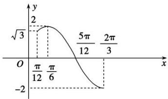

line

| x | y |
|---|---|
| √3 | 2 |
| π/12 | 2 |
| π/6 | 2 |
| 5π/12 | 2 |
| 2π/3 | 2 |
| -2 | -2 |

又 $t \in [\frac{\pi}{12}, \frac{5\pi}{12}]$ ，则由图象可得，当 $x \in [\frac{\pi}{12}, \frac{\pi}{3}]$ 时， $h(t)$ 取最小值为 $f(\frac{\pi}{6}) - f(\frac{\pi}{3}) = 2 - 1 = 1$ ，当 $x \in [\frac{\pi}{6}, \frac{2\pi}{3}]$ 时，函数 $f(x)$ 为减函数，则 $h(t) = f(t) - f(t + \frac{\pi}{4}) = 2\sqrt{2}\sin(2t - \frac{\pi}{12})$ ，所以当 $t = \frac{7\pi}{24}$ 时， $h(t)$ 的最大值为 $2\sqrt{2}$ ，故所求值域为 $[1, 2\sqrt{2}]$ .

# 【对点训练】

1. 函数 $f(x) = \sin \left(2x - \frac{\pi}{4}\right)$ 在区间 $\left[0, \frac{\pi}{2}\right]$ 上的最小值为（）

A. -1

B. $-\frac{\sqrt{2}}{2}$

C. $\frac{\sqrt{2}}{2}$

D. 0

1. 答案 B 解析 由已知 $x \in \left[0, \frac{\pi}{2}\right]$ ，得 $2x - \frac{\pi}{4} \in \left[-\frac{\pi}{4}, \frac{3\pi}{4}\right]$ ，所以 $\sin \left(2x - \frac{\pi}{4}\right) \in \left[-\frac{\sqrt{2}}{2}, 1\right]$ ，故函数 $f(x) = \sin \left(2x - \frac{\pi}{4}\right)$ 在区间 $\left[0, \frac{\pi}{2}\right]$ 上的最小值为 $-\frac{\sqrt{2}}{2}$ . 故选 B.

2. 函数 $f(x) = 3\sin \left(2x - \frac{\pi}{6}\right)$ 在区间 $\left[0, \frac{\pi}{2}\right]$ 上的值域为（）

A. $\left[-\frac{3}{2}, \frac{3}{2}\right]$

B. $\left[-\frac{3}{2},3\right]$

C. $\left[-\frac{3\sqrt{3}}{2},\frac{3\sqrt{3}}{2}\right]$

D. $\left[-\frac{3\sqrt{3}}{2},3\right]$

2. 答案 B 解析 当 $x \in \begin{bmatrix} 0, & \frac{\pi}{2} \end{bmatrix}$ 时， $2x - \frac{\pi}{6} \in \begin{bmatrix} -\frac{\pi}{6}, & \frac{5\pi}{6} \end{bmatrix}, \sin \left(2x - \frac{\pi}{6}\right) \in \begin{bmatrix} -\frac{1}{2}, & 1 \end{bmatrix}$ ，故 $3\sin \left(2x - \frac{\pi}{6}\right) \in \begin{bmatrix} -\frac{3}{2}, & 3 \end{bmatrix}$ ，
所以函数 $f(x)$ 的值域为 $\left[-\frac{3}{2}, 3\right]$ .

3. 函数 $f(x) = 3\cos \left(2x - \frac{\pi}{6}\right)$ ，则 $f(x)$ 在区间 $\left[0, \frac{\pi}{2}\right]$ 上的值域为 \_\_\_\_.

3. 答案 $\left[-\frac{3\sqrt{3}}{2}, 3\right]$ 解析 当 $x \in \left[0, \frac{\pi}{2}\right]$ 时， $2x - \frac{\pi}{6} \in \left[-\frac{\pi}{6}, \frac{5\pi}{6}\right]$ ， $\cos \left(2x - \frac{\pi}{6}\right) \in \left[-\frac{\sqrt{3}}{2}, 1\right]$ ，故 $f(x) = 3\cos \left(2x - \frac{\pi}{6}\right) \in \left[-\frac{3\sqrt{3}}{2}, 3\right]$ .

4. 若函数 $f(x) = 2\sin \omega x (0 < \omega < 1)$ 在区间 $\left[0, \frac{\pi}{3}\right]$ 上的最大值为 1，则 $\omega = (\quad)$

A. $\frac{1}{4}$

B. $\frac{1}{3}$

C. $\frac{1}{2}$

D. $\frac{\sqrt{3}}{2}$

4. 答案 C 解析 因为 $0 < \omega < 1, 0 \leq x \leq \frac{\pi}{3}$ , 所以 $0 \leq \omega x < \frac{\pi}{3}$ , 所以 $f(x)$ 在区间 $\left[0, \frac{\pi}{3}\right]$ 上单调递增, 则 $f(x)_{\max} = f\left[\frac{\pi}{3}\right] = 2\sin \frac{\omega \pi}{3} = 1$ , 即 $\sin \frac{\omega \pi}{3} = \frac{1}{2}$ . 又因为 $0 \leq \omega x < \frac{\pi}{3}$ , 所以 $\frac{\omega \pi}{3} = \frac{\pi}{6}$ , 解得 $\omega = \frac{1}{2}$ .

5. (2017·全国II)函数 $f(x)=\sin^{2}x+\sqrt{3}\cos x-\frac{3}{4}\left(x\in\left[0,\frac{\pi}{2}\right]\right)$ 的最大值是 \_\_\_\_.

5. 答案 1 解析 依题意， $f(x)=\sin^{2}x+\sqrt{3}\cos x-\frac{3}{4}=-\cos^{2}x+\sqrt{3}\cos x+\frac{1}{4}=-\left(\cos x-\frac{\sqrt{3}}{2}\right)^{2}+1$ ，因为 $x\in\left[0,\frac{\pi}{2}\right]$ ，所以 $\cos x\in[0,1]$ ，因此当 $\cos x=\frac{\sqrt{3}}{2}$ 时， $f(x)_{\max}=1$ .

6. 函数 $f(x)=\sin x+\cos x+\sin x\cos x$ ，则 $f(x)$ 的最大值为 \_\_\_\_.

6. 答案 $\frac{2\sqrt{2} + 1}{2}$ 解析 设 $t = \sin x + \cos x (-\sqrt{2} \leq t \leq \sqrt{2})$ ，则 $\sin x \cos x = \frac{t^2 - 1}{2}$ ， $y = t + \frac{1}{2} t^2 - \frac{1}{2} = \frac{1}{2} (t + 1)^2 - 1$ ，当 $t = \sqrt{2}$ 时， $y = t + \frac{1}{2} t^2 - \frac{1}{2}$ 取最大值为 $\sqrt{2} + \frac{1}{2}$ . 故 $f(x)$ 的最大值为 $\frac{2\sqrt{2} + 1}{2}$ .

7. 定义运算： $a^{*}b=\begin{cases}a,&a\leq b,\\b,&a>b.\end{cases}$ 例如1\*2，则函数 $f(x)=\sin x*\cos x$ 的值域为()

A. $\left[-\frac{\sqrt{2}}{2},\frac{\sqrt{2}}{2}\right]$

B. $[-1, 1]$

C. $\left[\frac{\sqrt{2}}{2},1\right]$

D. $\left[-1,\frac{\sqrt{2}}{2}\right]$

7. 答案 D 解析 根据三角函数的周期性, 我们只看两函数在一个最小正周期内的情况即可, 设 $x \in [0$ ,

$2\pi]$ ，当 $\frac{\pi}{4} \leq x \leq \frac{5\pi}{4}$ 时， $\sin x \geq \cos x$ ，此时 $f(x) = \cos x, f(x) \in \left[-1, \frac{\sqrt{2}}{2}\right]$ ，当 $0 \leq x < \frac{\pi}{4}$ 或 $\frac{5\pi}{4} < x \leq 2\pi$ 时， $\cos x > \sin x$ ，此时 $f(x) = \sin x, f(x) \in \left[0, \frac{\sqrt{2}}{2}\right] \cup [-1, 0]$ . 综上知 $f(x)$ 的值域为 $\left[-1, \frac{\sqrt{2}}{2}\right]$ .

8. 已知函数 $f(x) = 2\sin \omega x$ 在区间 $\left[-\frac{\pi}{3}, \frac{\pi}{4}\right]$ 上的最小值为 -2，则 $\omega$ 的取值范围是 \_\_\_\_.

8. 答案 $(- \infty, -2] \cup \left[\frac{3}{2}, +\infty\right]$ 解析 显然 $\omega \neq 0$ 。若 $\omega > 0$ ，当 $x \in \left[-\frac{\pi}{3}, \frac{\pi}{4}\right]$ 时， $-\frac{\pi}{3} \omega \leq \omega x \leq \frac{\pi}{4} \omega$ ，因为函数 $f(x) = 2 \sin \omega x$ 在区间 $\left[-\frac{\pi}{3}, \frac{\pi}{4}\right]$ 上的最小值为 $-2$ ，所以 $-\frac{\pi}{3} \omega \leq -\frac{\pi}{2}$ ，解得 $\omega \geq \frac{3}{2}$ 。若 $\omega < 0$ ，当 $x \in \left[-\frac{\pi}{3}, \frac{\pi}{4}\right]$ 时， $\frac{\pi}{4} \omega \leq \omega x \leq -\frac{\pi}{3} \omega$ ，因为函数 $f(x) = 2 \sin \omega x$ 在区间 $\left[-\frac{\pi}{3}, \frac{\pi}{4}\right]$ 上的最小值为 $-2$ 。所以 $\frac{\pi}{4} \omega \leq -\frac{\pi}{2}$ ，解得 $\omega \leq -2$ 。综上所述，符合条件的实数 $\omega$ 的取值范围是 $(- \infty, -2] \cup \left[\frac{3}{2}, +\infty\right]$ 。

9. 已知函数 $f(x) = \cos (2x + \theta)\left[0 \leq \theta \leq \frac{\pi}{2}\right]$ 在 $\left[-\frac{3\pi}{8}, -\frac{\pi}{6}\right]$ 上单调递增，若 $f\left(\frac{\pi}{4}\right) \leq m$ 恒成立，则实数 $m$ 的取值范围为 \_\_\_\_.

9. 答案 $[0, +\infty)$ 解析 $f(x) = \cos (2x + \theta)\left[0 \leq \theta \leq \frac{\pi}{2}\right]$ ，当 $x \in \left[-\frac{3\pi}{8}, -\frac{\pi}{6}\right]$ 时， $-\frac{3\pi}{4} + \theta \leq 2x + \theta \leq -\frac{\pi}{3} + \theta$ ，由函数 $f(x)$ 在 $\left[-\frac{3\pi}{8}, -\frac{\pi}{6}\right]$ 上是增函数得 $\left\{ \begin{array}{l} -\pi + 2k\pi \leq -\frac{3\pi}{4} + \theta, \\ -\frac{\pi}{3} + \theta \leq 2k\pi, \end{array} \right.$ $k \in \mathbf{Z}$ ，则 $2k\pi - \frac{\pi}{4} \leq \theta \leq 2k\pi + \frac{\pi}{3}(k \in \mathbf{Z})$ 。又 $0 \leq \theta \leq \frac{\pi}{2}, \therefore 0 \leq \theta \leq \frac{\pi}{3}, \because f\left(\frac{\pi}{4}\right) = \cos\left(\frac{\pi}{2} + \theta\right)$ ，又 $\frac{\pi}{2} \leq \theta + \frac{\pi}{2} \leq \frac{5\pi}{6}, \therefore f\left(\frac{\pi}{4}\right)_{\max} = 0, \therefore m \geq 0.$

10. 已知函数 $f(x) = A \sin (\omega x + \varphi) (A > 0, \omega > 0, 0 < \varphi < \pi)$ 的图象与 $x$ 轴的一个交点 $\left[-\frac{\pi}{12}, 0\right]$ 到其相邻的一条对称轴的距离为 $\frac{\pi}{4}$ ，若 $f\left(\frac{\pi}{12}\right) = \frac{3}{2}$ ，则函数 $f(x)$ 在 $\left[0, \frac{\pi}{2}\right]$ 上的最小值为（）

A. $\frac{1}{2}$

B. $-\sqrt{3}$

C. $-\frac{\sqrt{3}}{2}$

D. $-\frac{1}{2}$

10. 答案 C 解析 由题意得，函数 $f(x)$ 的最小正周期 $T = 4 \times \frac{\pi}{4} = \pi = \frac{2\pi}{\omega}$ ，解得 $\omega = 2$ 。因为点 $\left(-\frac{\pi}{12}, 0\right)$ 在函数 $f(x)$ 的图象上，所以 $A \sin \left[2 \times \left(-\frac{\pi}{12}\right) + \varphi\right] = 0$ ，解得 $\varphi = k\pi + \frac{\pi}{6}$ ， $k \in \mathbf{Z}$ ，由 $0 < \varphi < \pi$ ，可得 $\varphi = \frac{\pi}{6}$ 。因为 $f\left(\frac{\pi}{12}\right) = \frac{3}{2}$ ，所以 $A \sin 2 \times \frac{\pi}{12} + \frac{\pi}{6} = \frac{3}{2}$ ，解得 $A = \sqrt{3}$ ，所以 $f(x) = \sqrt{3} \sin 2x + \frac{\pi}{6}$ 。当 $x \in \left[0, \frac{\pi}{2}\right]$ 时， $2x + \frac{\pi}{6} \in \left[\frac{\pi}{6}, \frac{7\pi}{6}\right]$ ，

$\sin 2x + \frac{\pi}{6} \in \left[-\frac{1}{2}, 1\right]$ ，且当 $2x + \frac{\pi}{6} = \frac{7\pi}{6}$ ，即 $x = \frac{\pi}{2}$ 时，函数 $f(x)$ 取得最小值，最小值为 $-\frac{\sqrt{3}}{2}$ ，故选C.

11. 已知函数 $f(x) = \sqrt{2}\sin \left(2x + \frac{\pi}{4}\right)$ .

(1)求函数 $f(x)$ 的单调递增区间;

(2)当 $x\in \left[\frac{\pi}{4},\frac{3\pi}{4}\right]$ 时，求函数 $f(x)$ 的最大值和最小值.

11. 解 (1) 令 $2k\pi - \frac{\pi}{2} \leq 2x + \frac{\pi}{4} \leq 2k\pi + \frac{\pi}{2}, k \in \mathbf{Z}$ , 则 $k\pi - \frac{3\pi}{8} \leq x \leq k\pi + \frac{\pi}{8}, k \in \mathbf{Z}$ .

故函数 $f(x)$ 的单调递增区间为 $\left[k\pi-\frac{3\pi}{8}, k\pi+\frac{\pi}{8}\right]$ ， $k \in Z$ .

(2)因为当 $x \in \left[\frac{\pi}{4}, \frac{3\pi}{4}\right]$ 时， $\frac{3\pi}{4} \leq 2x + \frac{\pi}{4} \leq \frac{7\pi}{4}$ ，所以 $-1 \leq \sin \left[2x + \frac{\pi}{4}\right] \leq \frac{\sqrt{2}}{2}$ ，所以 $-\sqrt{2} \leq f(x) \leq 1$

所以当 $x \in \left[\frac{\pi}{4}, \frac{3\pi}{4}\right]$ 时，函数 $f(x)$ 的最大值为 1，最小值为 $-\sqrt{2}$ .

12. 设函数 $f(x) = 2\sin \left(2\omega x - \frac{\pi}{6}\right) + m$ 的图象关于直线 $x = \pi$ 对称，其中 $0 < \omega < \frac{1}{2}$ .

(1)求函数 $f(x)$ 的最小正周期.

(2)若函数 $y = f(x)$ 的图象过点 $(\pi, 0)$ ，求函数 $f(x)$ 在 $\left[0, \frac{3\pi}{2}\right]$ 上的值域.

12. 解 (1)由直线 $x = \pi$ 是 $y = f(x)$ 图象的一条对称轴，可得 $\sin \left(2\omega \pi - \frac{\pi}{6}\right) = \pm 1$

∴ $2\omega\pi - \frac{\pi}{6} = k\pi + \frac{\pi}{2}(k \in \mathbf{Z})$ ，即 $\omega = \frac{k}{2} + \frac{1}{3}(k \in \mathbf{Z})$ 。又 $0 < \omega < \frac{1}{2}$ ，∴ $\omega = \frac{1}{3}$ ,

∴函数 $f(x)$ 的最小正周期为 $3\pi$ .

(2)由(1)知 $f(x)=2\sin\left(\frac{2}{3}x-\frac{\pi}{6}\right)+m,\quad\because f(\pi)=0,\quad\therefore 2\sin\left(\frac{2\pi}{3}-\frac{\pi}{6}\right)+m=0,\quad\therefore m=-2,$

$\therefore f(x) = 2\sin \left(\frac{2}{3} x - \frac{\pi}{6}\right) - 2$ ，当 $0 \leq x \leq \frac{3\pi}{2}$ 时， $-\frac{\pi}{6} \leq \frac{2}{3} x - \frac{\pi}{6} \leq \frac{5\pi}{6}$ ， $-\frac{1}{2} \leq \sin \left(\frac{2}{3} x - \frac{\pi}{6}\right) \leq 1$ 。 $\therefore -3 \leq f(x) \leq 0$

故函数 $f(x)$ 在 $\left[0, \frac{3\pi}{2}\right]$ 上的值域为 $[-3, 0]$ .

