专题三　三角函数的图象与性质（1）

考点一　三角函数的图象

【基本知识】

<table><tr><td>
三角函数
</td><td>
正弦函数<em>y</em>＝sin <em>x</em>
</td><td>
余弦函数<em>y</em>＝cos <em>x</em>
</td><td>
正切函数<em>y</em>＝tan <em>x</em>
</td></tr><tr><td>
图象
</td><td>
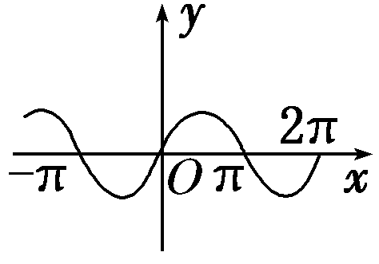
</td><td>
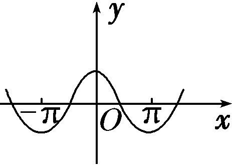
</td><td>
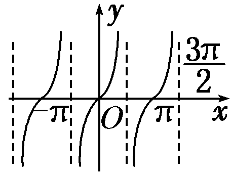
</td></tr></table>

【例题选讲】

<strong>[例1]</strong> （1） 函数<em>y</em>＝sin <em>x</em>2的图象是(　　)

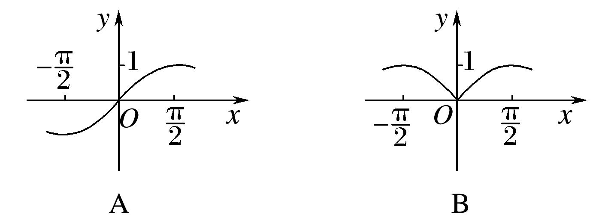

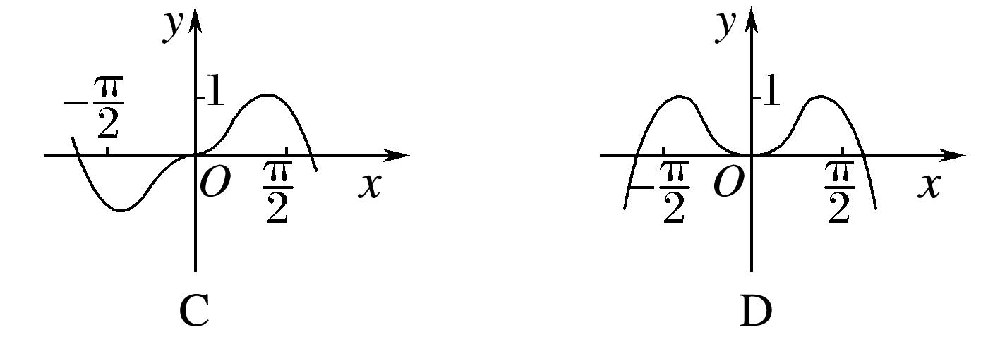
答案　D　解析　函数<em>y</em>＝sin <em>x</em>2为偶函数，排除A，C；又当<em>x</em>＝时函数取得最大值，排除B，故选D．  
（2）函数*y*＝sin在区间上的简图是(　　)

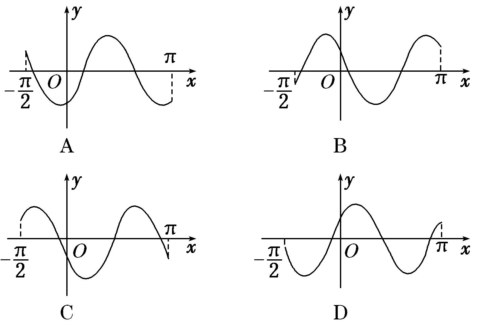
答案　A　解析　令*x*＝0，得*y*＝sin＝－，排除B、D．由*f*＝0，*f*＝0，排除C，故选A．  
（3） 函数*y*＝2cos的部分图象大致是(　　)

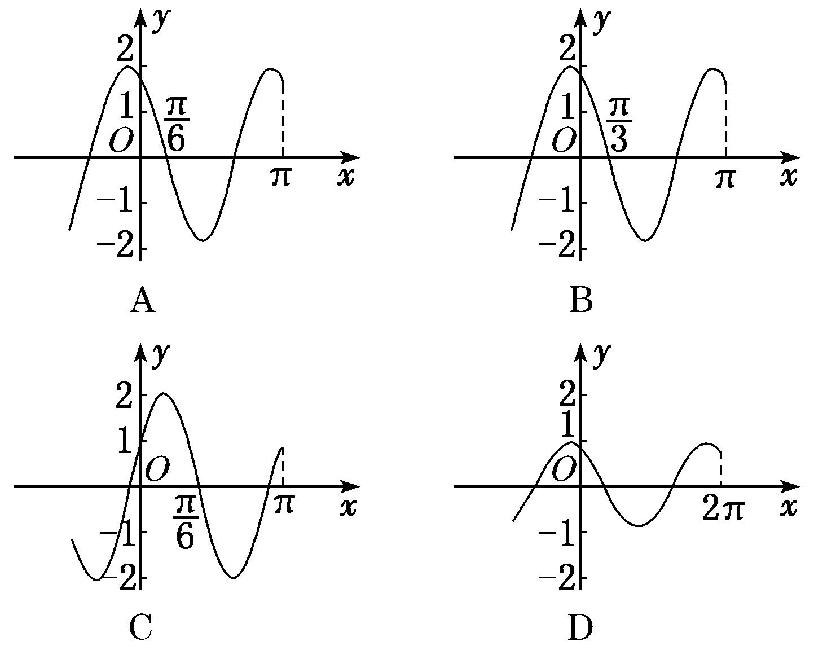
答案　A　解析　由*y*＝2cos可知，函数的最大值为2，故排除D；又因为函数图象过点，故排除B；又因为函数图象过点，故排除C．  
（4） 函数*y*＝tan在一个周期内的图象是(　　)

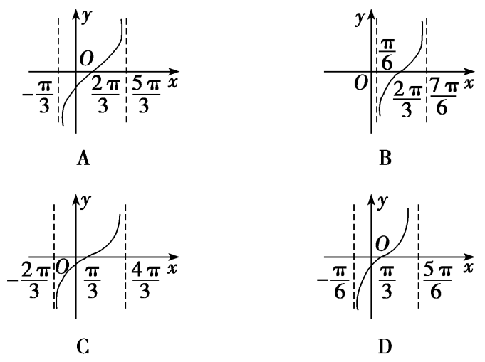
答案　A　解析　由题意得函数的周期为*T*＝2π，故可排除B，D.对于C，图象过点，代入解析式，不成立，故选A．  
（5） 函数*y*＝的部分图象大致为(　　)

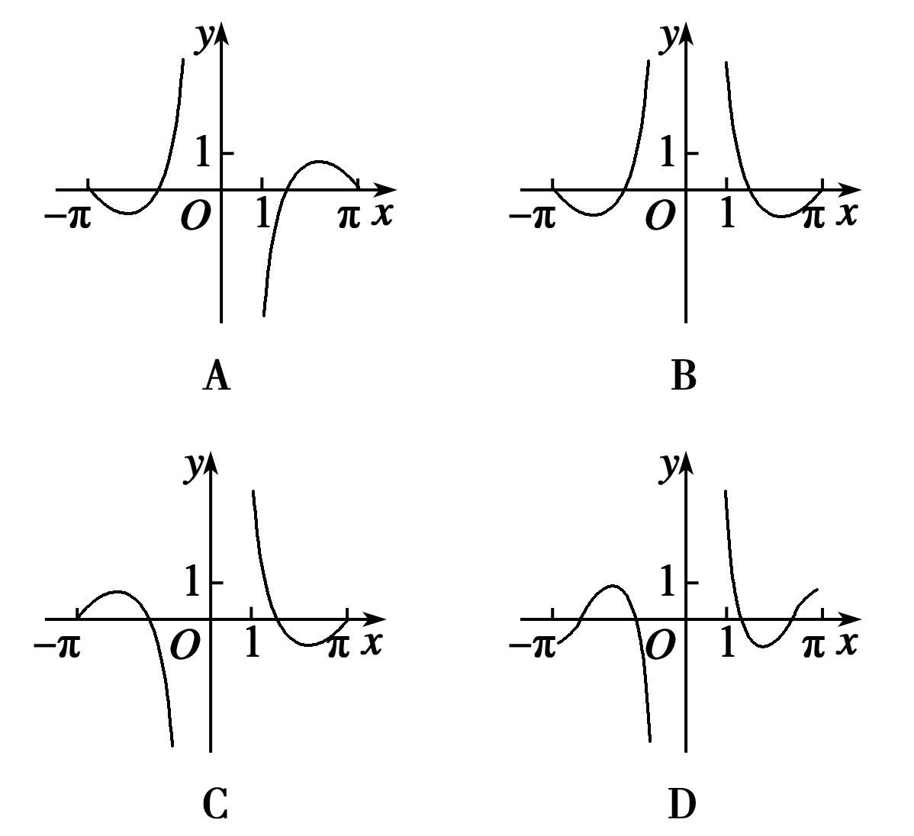
答案　C　解析　令<em>f</em>(<em>x</em>)＝，∵<em>f</em>（1）＝&gt;0，<em>f</em>(π)＝＝0，∴排除选项A，D．由1－cos<em>x</em>≠0，得<em>x</em>≠2<em>k</em>π(<em>k</em>∈<strong>Z</strong>)，故函数<em>f</em>(<em>x</em>)的定义域关于原点对称．又∵<em>f</em>(－<em>x</em>)＝＝－＝－<em>f</em>(<em>x</em>)，∴<em>f</em>(<em>x</em>)为奇函数，其图象关于原点对称，∴排除选项B．故选C．

考点二　三角函数的定义域

【基本知识】

<table><tr><td>
三角函数
</td><td>
正弦函数<em>y</em>＝sin<em>x</em>
</td><td>
余弦函数<em>y</em>＝cos<em>x</em>
</td><td>
正切函数<em>y</em>＝tan<em>x</em>
</td></tr><tr><td>
图象
</td><td>

</td><td>

</td><td>

</td></tr><tr><td>
定义域
</td><td>
<strong>R</strong>
</td><td>
<strong>R</strong>
</td><td></td></tr></table>

【方法总结】

三角函数定义域的求法  
（1）以正切函数为例，应用正切函数*y*＝tan *x*的定义域求函数*y*＝*A*tan(*ωx*＋*φ*)的定义域转化为求解简单的三角不等式．  
（2）求复杂函数的定义域转化为求解简单的三角不等式．简单的三角不等式，利用三角函数的图象求解．

<strong>[例2]</strong> （1） 函数<em>f</em>(<em>x</em>)＝－2tan的定义域是(　　)

A．　　
B．　　
C．　　
D．
答案　D　解析　由正切函数的定义域，得2<em>x</em>＋≠<em>k</em>π＋，<em>k</em>∈<strong>Z</strong>，即<em>x</em>≠＋(<em>k</em>∈<strong>Z</strong>)，故选D．  
（2） 函数*y*＝的定义域为\_\_\_\_\_\_\_\_．
答案　　解析　要使函数有意义，必须有即故函数的定义域为．  
（3）函数*y*＝的定义域为(　　)

A．　　
B．(<em>k</em>∈<strong>Z</strong>)　　
C．(<em>k</em>∈<strong>Z</strong>)　　
D．<strong>R</strong>
答案　C　解析　因为cos <em>x</em>－≥0，即cos <em>x</em>≥，所以2<em>k</em>π－≤<em>x</em>≤2<em>k</em>π＋，<em>k</em>∈<strong>Z</strong>.  
（4） 函数<em>y</em>＝的定义域为________．
答案　(<em>k</em>∈<strong>Z</strong>)　解析　方法一　要使函数有意义，必须使sin <em>x</em>－cos <em>x</em>≥0．利用图象，在同一坐标系中画出[0，2π]上<em>y</em>＝sin <em>x</em>和<em>y</em>＝cos <em>x</em>的图象，如图所示．

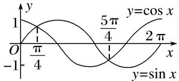
在[0，2π]内，满足sin *x*＝cos *x*的*x*为，，再结合正弦、余弦函数的周期是2π，所以原函数的定义域为．  
（5） 函数<em>y</em>＝lg(sin <em>x</em>)＋的定义域为________．
答案　　解析　要使函数有意义，则即解得
所以2<em>k</em>π&lt;<em>x</em>≤＋2<em>k</em>π(<em>k</em>∈<strong>Z</strong>)，所以函数的定义域为(<em>k</em>∈<strong>Z</strong>)．  
（6）函数*y*＝lg(sin 2*x*)＋的定义域为\_\_\_\_\_\_\_\_\_\_\_\_\_\_．
答案　∪　解析　由得∴－3≤*x*<－或0<*x*<.∴函数*y*＝lg(sin 2*x*)＋的定义域为∪．

考点三　三角函数的值域(最值)

【基本知识】

<table><tr><td>
三角函数
</td><td>
正弦函数<em>y</em>＝sin <em>x</em>
</td><td>
余弦函数<em>y</em>＝cos <em>x</em>
</td><td>
正切函数<em>y</em>＝tan <em>x</em>
</td></tr><tr><td>
图象
</td><td>
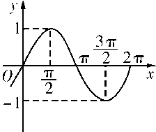
</td><td>
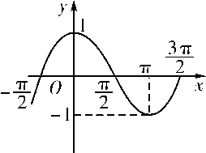
</td><td>
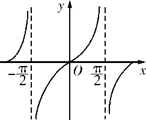
</td></tr><tr><td>
定义域
</td><td>
<strong>R</strong>
</td><td>
<strong>R</strong>
</td><td></td></tr><tr><td>
值域
</td><td>
[－1，1]
</td><td>
[－1，1]
</td><td>
<strong>R</strong>
</td></tr><tr><td>
最值
</td><td>
当且仅当<em>x</em>＝＋2<em>k</em>π(<em>k</em>∈<strong>Z</strong>)时，取得最大值1；当且仅当<em>x</em>＝－＋2<em>k</em>π(<em>k</em>∈<strong>Z</strong>)时，取得最小值－1
</td><td>
当且仅当<em>x</em>＝2<em>k</em>π(<em>k</em>∈<strong>Z</strong>)时，取得最大值1；当且仅当<em>x</em>＝π＋2<em>k</em>π(<em>k</em>∈<strong>Z</strong>)时，取得最小值－1
</td><td></td></tr></table>

【方法总结】

求三角函数的值域(最值)的3种类型及解法思路  
（1）形如*y*＝*a*sin *x*＋*b*cos *x*＋*c*的三角函数化为*y*＝*A*sin(*ωx*＋*φ*)＋*k*的形式，再求值域(最值)；  
（2）形如<em>y</em>＝<em>a</em>sin2<em>x</em>＋<em>b</em>sin <em>x</em>＋<em>c</em>的三角函数，可先设sin <em>x</em>＝<em>t</em>，化为关于<em>t</em>的二次函数求值域(最值)；  
（3）形如*y*＝*a*sin *x*cos *x*＋*b*(sin *x*±cos *x*)＋*c*的三角函数，可先设*t*＝sin *x*±cos *x*，化为关于*t*的二次函数求值域(最值)；  
（4）对分式形式的三角函数表达式也可构造基本不等式求最值．

【例题选讲】

<strong>[例3]</strong> （1） 函数<em>y</em>＝2sin(0≤<em>x</em>≤9)的最大值与最小值之和为(　　)

A．2－　　　　　　　
B．0　　　　　　　
C．－1　　　　　　　
D．－1－
答案　A　解析　因为0≤<em>x</em>≤9，所以－≤－≤，所以－≤sin≤1，则－≤<em>y</em>≤2．所以<em>y</em>max＋<em>y</em>min＝2－．  
（2） 函数<em>y</em>＝cos2<em>x</em>－2sin <em>x</em>的最大值与最小值分别为(　　)

A．3，－1　　　　　　
B．3，－2　　　　　　
C．2，－1　　　　　　
D．2，－2
答案　D　解析　<em>y</em>＝cos2<em>x</em>－2sin <em>x</em>＝1－sin2<em>x</em>－2sin <em>x</em>＝－sin2<em>x</em>－2sin <em>x</em>＋1，令<em>t</em>＝sin <em>x</em>，则<em>t</em>∈[－1，1]，<em>y</em>＝－<em>t</em>2－2<em>t</em>＋1＝－(<em>t</em>＋1)2＋2，所以<em>y</em>max＝2，<em>y</em>min＝－2．  
（3） 函数<em>y</em>＝sin <em>x</em>－cos <em>x</em>＋sin <em>x</em>cos <em>x</em>的值域为__________．
答案　　解析　设<em>t</em>＝sin <em>x</em>－cos <em>x</em>，则<em>t</em>2＝sin2<em>x</em>＋cos2<em>x</em>－2sin <em>x</em>·cos <em>x</em>，sin <em>x</em>cos <em>x</em>＝，且－≤<em>t</em>≤．∴<em>y</em>＝－＋<em>t</em>＋＝－(<em>t</em>－1)2＋1，<em>t</em>∈[－，]．当<em>t</em>＝1时，<em>y</em>max＝1；当<em>t</em>＝－时，<em>y</em>min＝－－．∴函数的值域为．  
（4） 已知函数<em>f</em>(<em>x</em>)＝sin，其中<em>x</em>∈，若<em>f</em>(<em>x</em>)的值域是，则实数<em>a</em>的取值范围是______．
答案　　解析　∵*x*∈，∴*x*＋∈，∵当*x*＋∈时，*f*(*x*)的值域为，∴由函数的图象(图略)知，≤*a*＋≤，∴≤*a*≤π．  
（5） 设函数<em>f</em>(<em>x</em>)＝3sin，若存在这样的实数<em>x</em>1，<em>x</em>2，对任意的<em>x</em>∈<strong>R</strong>，都有<em>f</em>(<em>x</em>1)≤<em>f</em>(<em>x</em>)≤<em>f</em>(<em>x</em>2)成立，则|<em>x</em>1－<em>x</em>2|的最小值为________．
答案　2　解析　|<em>x</em>1－<em>x</em>2|的最小值为函数<em>f</em>(<em>x</em>)的半个周期，又<em>T</em>＝4，∴|<em>x</em>1－<em>x</em>2|的最小值为2．  
（6）已知函数<em>f</em>(<em>x</em>)＝2sin(2<em>x</em>＋)，记函数<em>f</em>(<em>x</em>)在区间[<em>t</em>，<em>t</em>＋]上的最大值为<em>M</em>，最小值为<em>m</em>，设函数<em>h</em>(<em>t</em>)＝<em>Mt</em>－<em>mt</em>．若<em>t</em>∈[，]，则函数<em>h</em>(<em>t</em>)的值域为________．
答案　[1，2]　解析　由已知函数*f*(*x*)的周期*T*＝π，区间[*t*，*t*＋]的长度为．作出函数*f*(*x*)在[，]的图象．

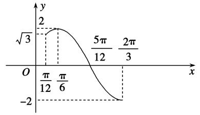
又*t*∈[，]，则由图象可得，当*x*∈[，]时，*h*(*t*)取最小值为*f*()－*f*()＝2－1＝1，当*x*∈[，]时，函数*f*(*x*)为减函数，则*h*(*t*)＝*f*(*t*)－*f*(*t*＋)＝2sin(2*t*－)，所以当*t*＝时，*h*(*t*)的最大值为2，故所求值域为[1，2]．

【对点训练】

1．函数*f*(*x*)＝sin在区间上的最小值为(　　)

A．－1　　　　　　　　
B．－　　　　　　　　
C．　　　　　　　　
D．0

1．答案　B　解析　由已知*x*∈，得2*x*－∈，所以sin∈，故函数*f*(*x*)

＝sin在区间上的最小值为－．故选B．

2．函数*f*(*x*)＝3sin在区间上的值域为(　　)

A．　　　　
B．　　　　
C．　　　　
D．

2．答案　B　解析　当*x*∈时，2*x*－∈，sin∈，故3sin∈，
所以函数*f*(*x*)的值域为．

3．函数*f*(*x*)＝3cos，则*f*(*x*)在区间上的值域为\_\_\_\_\_\_\_\_．

3．答案　　解析　当*x*∈时，2*x*－∈，cos∈，故*f*(*x*)＝

3cos∈．

4．若函数*f*(*x*)＝2sin *ωx*(0<*ω*<1)在区间上的最大值为1，则*ω*＝(　　)

A．　　　　　　　　
B．　　　　　　　　
C．　　　　　　　　
D．

4．答案　C　解析　因为0&lt;<em>ω</em>&lt;1,0≤<em>x</em>≤，所以0≤<em>ωx</em>&lt;，所以<em>f</em>(<em>x</em>)在区间上单调递增，则<em>f</em>(<em>x</em>)max＝<em>f</em>

＝2sin＝1，即sin＝．又因为0≤*ωx*<，所以＝，解得*ω*＝．

5．(2017·全国Ⅱ)函数<em>f</em>(<em>x</em>)＝sin2<em>x</em>＋cos <em>x</em>－的最大值是\_\_\_\_\_\_\_\_．

5．答案　1　解析　依题意，<em>f</em>(<em>x</em>)＝sin2<em>x</em>＋cos <em>x</em>－＝－cos2<em>x</em>＋cos <em>x</em>＋＝－2＋1，因为<em>x</em>

∈，所以cos <em>x</em>∈[0，1]，因此当cos <em>x</em>＝时，<em>f</em>(<em>x</em>)max＝1．

6．函数*f*(*x*)＝sin *x*＋cos *x*＋sin *x*cos *x*，则*f*(*x*)的最大值为\_\_\_\_\_\_\_\_．

6．答案　　解析　设<em>t</em>＝sin <em>x</em>＋cos <em>x</em>(－≤<em>t</em>≤)，则sin <em>x</em>cos <em>x</em>＝，<em>y</em>＝<em>t</em>＋<em>t</em>2－＝(<em>t</em>＋1)2－1，
当<em>t</em>＝时，<em>y</em>＝<em>t</em>＋<em>t</em>2－取最大值为＋．故<em>f</em>(<em>x</em>)的最大值为．

7．定义运算：*a*\b*＝例如1\*2，则函数*f*(*x*)= sin *x*\*cos *x*的值域为(　　)

A．　　　　
B．[－1，1]　　　　
C．　　　　
D．

7．答案　D　解析　根据三角函数的周期性，我们只看两函数在一个最小正周期内的情况即可，设*x*∈[0，

2π]，当≤*x*≤时，sin *x*≥cos *x*，此时*f*(*x*)＝cos *x*，*f*(*x*)∈，当0≤*x*<或<*x*≤2π时，cos *x*>sin *x*，此时*f*(*x*)＝sin *x*，*f*(*x*)∈∪[－1，0]．综上知*f*(*x*)的值域为．

8．已知函数*f*(*x*)＝2sin *ωx*在区间上的最小值为－2，则*ω*的取值范围是\_\_\_\_\_\_\_\_．

8．答案　(－∞，－2]∪　解析　显然*ω*≠0．若*ω*>0，当*x*∈时，－*ω*≤*ωx*≤*ω*，因为函

数*f*(*x*)＝2sin *ωx*在区间上的最小值为－2，所以－*ω*≤－，解得*ω*≥．若*ω*<0，当*x*∈时，*ω*≤*ωx*≤－*ω*，因为函数*f*(*x*)＝2sin *ωx*在区间上的最小值为－2．所以*ω*≤－，解得*ω*≤－2．综上所述，符合条件的实数*ω*的取值范围是(－∞，－2]∪．

9．已知函数*f*(*x*)＝cos(2*x*＋*θ*)在上单调递增，若*f*≤*m*恒成立，则实数*m*的取值范

围为________．

9．答案　[0，＋∞)　解析　*f*(*x*)＝cos(2*x*＋*θ*)，当*x*∈时，－＋*θ*≤2*x*＋*θ*≤－＋*θ*，由

函数<em>f</em>(<em>x</em>)在上是增函数得<em>k</em>∈<strong>Z</strong>，则2<em>k</em>π－≤<em>θ</em>≤2<em>k</em>π＋(<em>k</em>∈<strong>Z</strong>)．又0≤<em>θ</em>≤，∴0≤<em>θ</em>≤，∵<em>f</em>＝cos，又≤<em>θ</em>＋≤，∴<em>f</em>max＝0，∴<em>m</em>≥0．

10．已知函数*f*(*x*)＝*A*sin(*ωx*＋*φ*)(*A*>0，*ω*>0，0<*φ*<π)的图象与*x*轴的一个交点到其相邻的一条对

称轴的距离为，若*f*＝，则函数*f*(*x*)在上的最小值为(　　)

A．　　　　　　　　
B．－　　　　　　　　
C．－　　　　　　　　
D．－

10．答案　C　解析　由题意得，函数*f*(*x*)的最小正周期*T*＝4×＝π＝，解得*ω*＝2．因为点在

函数<em>f</em>(<em>x</em>)的图象上，所以<em>A</em>sin＝0，解得<em>φ</em>＝<em>k</em>π＋，<em>k</em>∈<strong>Z</strong>，由0&lt;<em>φ</em>&lt;π，可得<em>φ</em>＝．因为<em>f</em>＝，所以<em>A</em>sin2×＋＝，解得<em>A</em>＝，所以<em>f</em>(<em>x</em>)＝sin2<em>x</em>＋．当<em>x</em>∈时，2<em>x</em>＋∈，sin2<em>x</em>＋∈，且当2<em>x</em>＋＝，即<em>x</em>＝时，函数<em>f</em>(<em>x</em>)取得最小值，最小值为－，故选C．

11．已知函数*f*(*x*)＝sin．  
（1）求函数*f*(*x*)的单调递增区间；  
（2）当*x*∈时，求函数*f*(*x*)的最大值和最小值．

11．解　（1）令2<em>k</em>π－≤2<em>x</em>＋≤2<em>k</em>π＋，<em>k</em>∈Z，则<em>k</em>π－≤<em>x</em>≤<em>k</em>π＋，<em>k</em>∈<strong>Z</strong>．
故函数<em>f</em>(<em>x</em>)的单调递增区间为，<em>k</em>∈<strong>Z</strong>．  
（2）因为当*x*∈时，≤2*x*＋≤，所以－1≤sin≤，所以－≤*f*(*x*)≤1，
所以当*x*∈时，函数*f*(*x*)的最大值为1，最小值为－．

12．设函数*f*(*x*)＝2sin＋*m*的图象关于直线*x*＝π对称，其中0<*ω*<．  
（1）求函数*f*(*x*)的最小正周期．  
（2）若函数*y*＝*f*(*x*)的图象过点(π，0)，求函数*f*(*x*)在上的值域．

12．解　（1）由直线*x*＝π是*y*＝*f*(*x*)图象的一条对称轴，可得sin＝±1，
∴2<em>ω</em>π－＝<em>k</em>π＋(<em>k</em>∈<strong>Z</strong>)，即<em>ω</em>＝＋(<em>k</em>∈<strong>Z</strong>)．又0&lt;<em>ω</em>&lt;，∴<em>ω</em>＝，
∴函数*f*(*x*)的最小正周期为3π．  
（2）由（1）知*f*(*x*)＝2sin＋*m*，∵*f*(π)＝0，∴2sin＋*m*＝0，∴*m*＝－2，
∴*f*(*x*)＝2sin－2，当0≤*x*≤时，－≤*x*－≤，－≤sin≤1．∴－3≤*f*(*x*)≤0，
故函数*f*(*x*)在上的值域为．

