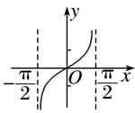
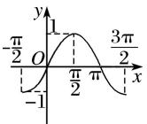
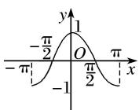
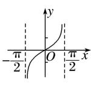
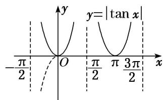
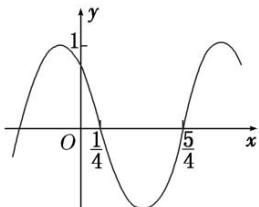
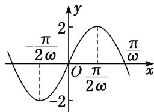

# 专题三 三角函数的图象与性质(2)

# 考点一 三角函数的奇偶性、周期性与对称性

# 【基本知识】

正弦、余弦、正切函数的图象与性质(下表中 $k \in Z$ )

<table><tr><td>函数</td><td> $y=\sin x$ </td><td> $y=\cos x$ </td><td> $y=\tan x$ </td></tr><tr><td>图象</td><td></td><td></td><td></td></tr><tr><td>定义域</td><td>R</td><td>R</td><td> $\{x|x\in R,且 x\neq k\pi+\frac{\pi}{2}\}$ </td></tr><tr><td>值域</td><td>[-1,1]</td><td>[-1,1]</td><td>R</td></tr><tr><td>周期性</td><td> $2\pi$ </td><td> $2\pi$ </td><td> $\pi$ </td></tr><tr><td>奇偶性</td><td>奇函数</td><td>偶函数</td><td>奇函数</td></tr><tr><td>对称中心</td><td> $(k\pi,0)$ </td><td> $\left(k\pi+\frac{\pi}{2},0\right)$ </td><td> $\left(\frac{k\pi}{2},0\right)$ </td></tr><tr><td>对称轴方程</td><td> $x=k\pi+\frac{\pi}{2}$ </td><td> $x=k\pi$ </td><td>无</td></tr></table>

# 【常用结论】

# 1. 三角函数的周期性

(1)函数 $y = A \sin (\omega x + \varphi)$ 的最小正周期 $T = \frac{2\pi}{|\omega|}$ . 应特别注意函数 $y = |A \sin (\omega x + \varphi)|$ 的周期为 $T = \frac{\pi}{|\omega|}$ ，函数 $y = |A \sin (\omega x + \varphi) + b| (b \neq 0)$ 的最小正周期 $T = \frac{2\pi}{|\omega|}$ .  
(2)函数 $y=A\cos(\omega x+\varphi)$ 的最小正周期 $T=\frac{2\pi}{|\omega|}$ . 应特别注意函数 $y=|A\cos(\omega x+\varphi)|$ 的周期为 $T=\frac{\pi}{|\omega|}$ . 函数 $y=|A\cos(\omega x+\varphi)+b|(b\neq0)$ 的最小正周期均为 $T=\frac{2\pi}{|\omega|}$ .  
(3)函数 $y = A \tan (\omega x + \varphi)$ 的最小正周期 $T = \frac{\pi}{|\omega|}$ . 应特别注意函数 $y = |A \tan (\omega x + \varphi)|$ 的周期为 $T = \frac{\pi}{|\omega|}$ , 函数 $y = |A \tan (\omega x + \varphi) + b| (b \neq 0)$ 的最小正周期均为 $T = \frac{\pi}{|\omega|}$ .

# 2. 三角函数的奇偶性

(1)函数 $y = A \sin (\omega x + \varphi)$ 是奇函数 $\Leftrightarrow \varphi = k\pi (k \in \mathbf{Z})$ ，是偶函数 $\Leftrightarrow \varphi = k\pi + \frac{\pi}{2} (k \in \mathbf{Z})$ ；  
(2)函数 $y = A \cos(\omega x + \varphi)$ 是奇函数 $\Leftrightarrow \varphi = k\pi + \frac{\pi}{2} (k \in \mathbf{Z})$ ，是偶函数 $\Leftrightarrow \varphi = k\pi (k \in \mathbf{Z})$ ;  
(3)函数 $y=A\tan(\omega x+\varphi)$ 是奇函数 $\Leftrightarrow\varphi=k\pi(k\in\mathbf{Z})$ .

# 3. 三角函数的对称性

(1)函数 $y=A\sin(\omega x+\varphi)$ 的图象的对称轴由 $\omega x+\varphi=k\pi+\frac{\pi}{2}(k\in\mathbf{Z})$ 解得，对称中心的横坐标由 $\omega x+\varphi=k\pi(k\in\mathbf{Z})$ 解得；

(2)函数 $y = A\cos (\omega x + \varphi)$ 的图象的对称轴由 $\omega x + \varphi = k\pi (k\in \mathbf{Z})$ 解得，对称中心的横坐标由 $\omega x + \varphi = k\pi + \frac{\pi}{2} (k\in \mathbf{Z})$ 解得；

(3)函数 $y=Atan(\omega x+\varphi)$ 的图象的对称中心由 $\omega x+\varphi=\frac{k\pi}{2}(k\in\mathbf{Z})$ 解得.

# 【方法总结】

# 三角函数的奇偶性、周期性、对称性的处理方法

(1)若 $f(x) = A\sin (\omega x + \varphi)$ 为偶函数，则 $\varphi = k\pi +\frac{\pi}{2} (k\in \mathbf{Z})$ ，同时当 $x = 0$ 时， $f(x)$ 取得最大或最小值．若 $f(x) = A\sin (\omega x + \varphi)$ 为奇函数，则 $\varphi = k\pi (k\in \mathbf{Z})$ ，且当 $x = 0$ 时， $f(x) = 0$

(2)求三角函数的最小正周期，一般先通过恒等变形化为 $y=A\sin(\omega x+\varphi)$ ， $y=A\cos(\omega x+\varphi)$ ， $y=A\tan(\omega x+\varphi)$ 的形式，再分别应用公式 $T=\frac{2\pi}{|\omega|}$ ， $T=\frac{2\pi}{|\omega|}$ ， $T=\frac{\pi}{|\omega|}$ 求解.

(3)对于函数 $y = A \sin (\omega x + \varphi)$ ，其对称轴一定经过图象的最高点或最低点，对称中心的横坐标一定是函数的零点，因此在判断直线 $x = x_0$ 或点 $(x_0, 0)$ 是否是函数的对称轴或对称中心时，可通过检验 $f(x_0)$ 的值进行判断.

# 【例题选讲】

[例1] (1) 下列函数中，周期为 $\pi$ ，且在 $\left[\frac{\pi}{4}, \frac{\pi}{2}\right]$ 上单调递增的奇函数是（ ）

A. $y=\sin\left(2x+\frac{3\pi}{2}\right)$

B. $y=\cos\left(2x-\frac{\pi}{2}\right)$

C. $y=\cos\left(2x+\frac{\pi}{2}\right)$

D. $y=\sin\left(\frac{\pi}{2}-x\right)$

(2) 已知函数 $f(x) = 2\sin \left(\omega x + \frac{\pi}{6}\right) (\omega > 0)$ 的最小正周期为 $4\pi$ ，则该函数的图象（）

A. 关于点 $\left(\frac{\pi}{3}, 0\right)$ 对称

B. 关于点 $\left(\frac{5\pi}{3}, 0\right)$ 对称

C. 关于直线 $x=\frac{\pi}{3}$ 对称

D. 关于直线 $x=\frac{5\pi}{3}$ 对称

(3) 已知函数 $f(x) = 2\sin \left(\omega x - \frac{\pi}{6}\right) + 1 (x \in \mathbf{R})$ 的图象的一条对称轴为 $x = \pi$ ，其中 $\omega$ 为常数，且 $\omega \in (1, 2)$ ，则函数 $f(x)$ 的最小正周期为 \_\_\_\_.

(4) 函数 $f(x) = 3\sin \left(2x - \frac{\pi}{3} + \varphi\right)$ ， $\varphi \in (0, \pi)$ 满足 $f(|x|) = f(x)$ ，则 $\varphi$ 的值为（）

A. $\frac{\pi}{6}$

B. $\frac{\pi}{3}$

C. $\frac{5\pi}{6}$

D. $\frac{2\pi}{3}$

(5) 同时具有以下性质：“①最小正周期是 $\pi$ ；②图象关于直线 $x = \frac{\pi}{3}$ 对称；③在 $\left[-\frac{\pi}{6}, \frac{\pi}{3}\right]$ 上是增函数；④图象的一个对称中心为 $\left(\frac{\pi}{12}, 0\right)$ ”的一个函数是（）

A. $y=\sin\left(\frac{x}{2}+\frac{\pi}{6}\right)$

B. $y=\sin\left(2x+\frac{\pi}{3}\right)$

C. $y=\sin\left(2x-\frac{\pi}{6}\right)$

D. $y=\sin\left(2x-\frac{\pi}{3}\right)$

(6) 设函数 $f(x)=A\sin(\omega x+\varphi)(A,\omega,\varphi$ 是常数， $A>0,\omega>0)$ . 若 $f(x)$ 在区间 $\left[\frac{\pi}{6},\frac{\pi}{2}\right]$ 上具有单调性，且 $f\left(\frac{\pi}{2}\right)=f\left(\frac{2\pi}{3}\right)=-f\left(\frac{\pi}{6}\right)$ ，则 $f(x)$ 的最小正周期为 \_\_\_\_.

(7) 已知函数 $f(x) = \left| \tan \left( \frac{1}{2} x - \frac{\pi}{6} \right) \right|$ ，则下列说法正确的是 \_\_\_\_。（填序号）

① $f(x)$ 的周期是 $\frac{\pi}{2}$ ;

② $f(x)$ 的值域是 $\{y|y\in R, 且 y\neq0\}$ ;

③直线 $x=\frac{5\pi}{3}$ 是函数 $f(x)$ 图象的一条对称轴；

④ $f(x)$ 的单调递减区间是 $\left[2k\pi-\frac{2\pi}{3},\quad2k\pi+\frac{\pi}{3}\right],\quad k\in\mathbf{Z}.$

(8) 设定义在 $\mathbf{R}$ 上的函数 $f(x) = \sin (\omega x + \varphi)\left[\omega > 0, -\frac{\pi}{12} < \varphi < \frac{\pi}{2}\right]$ , 给出以下四个论断: ① $f(x)$ 的最小正周期为 $\pi$ ; ② $f(x)$ 在区间 $\left[-\frac{\pi}{6}, 0\right]$ 上是增函数; ③ $f(x)$ 的图象关于点 $\left[\frac{\pi}{3}, 0\right]$ 对称; ④ $f(x)$ 的图象关于直线 $x = \frac{\pi}{12}$ 对称. 以其中两个论断作为条件, 另两个论断作为结论, 写出你认为正确的一个命题 (写成“ $p \Rightarrow q$ ”的形式) \_\_\_\_. (用到的论断都用序号表示)

# 【对点训练】

1. 在函数① $y=\cos|2x|$ ，② $y=|\cos x|$ ，③ $y=\cos\left(2x+\frac{\pi}{6}\right)$ ，④ $y=\tan\left(2x-\frac{\pi}{4}\right)$ 中，最小正周期为 $\pi$ 的所有函数为()

A. ①②③

B. ①③④

C. ②④

D. ①③

2. 函数 $y=|\tan(2x+\varphi)|$ 的最小正周期是()

A. $2\pi$

B. $\pi$

C. $\frac{\pi}{2}$

D. $\frac{\pi}{4}$

3. 若 $x=\frac{\pi}{8}$ 是函数 $f(x)=\sqrt{2}\sin\left(\omega x-\frac{\pi}{4}\right)$ ， $x\in R$ 的一个零点，且 $0<\omega<10$ ，则函数 $f(x)$ 的最小正周期为 \_\_\_\_.

4. 若函数 $f(x) = \sin \frac{x + \varphi}{3} (\varphi \in [0, 2\pi])$ 是偶函数，则 $\varphi = (\quad)$

A. $\frac{\pi}{2}$

B. $\frac{2\pi}{3}$

C. $\frac{3\pi}{2}$

D. $\frac{5\pi}{3}$

5. 函数 $y=2\sin\left(2x+\frac{\pi}{3}\right)$ 的图象()

A. 关于原点对称 B. 关于点 $\left(-\frac{\pi}{6}, 0\right)$ 对称 C. 关于 $y$ 轴对称 D. 关于直线 $x = \frac{\pi}{6}$ 对称

6. 已知函数 $f(x) = 2\sin (2x + \varphi)\left[\frac{|\varphi| < \frac{\pi}{2}}{2}\right]$ 的图象过点 $(0, \sqrt{3})$ ，则 $f(x)$ 图象的一个对称中心是（）

A. $\left(-\frac{\pi}{3},0\right)$

B. $\left(-\frac{\pi}{6},0\right)$

C. $\left(\frac{\pi}{6},0\right)$

D. $\left(\frac{\pi}{12},0\right)$

7. (2018·江苏)已知函数 $y=\sin(2x+\varphi)\left(-\frac{\pi}{2}<\varphi<\frac{\pi}{2}\right)$ 的图象关于直线 $x=\frac{\pi}{3}$ 对称，则 $\varphi$ 的值为 \_\_\_\_.

8. 若函数 $f(x) = 2\sin (\omega x + \varphi)$ 对任意 $x$ 都有 $f\left(\frac{\pi}{3} + x\right) = f(-x)$ ，则 $f\left(\frac{\pi}{6}\right) = (\quad)$

A. 2 或 0

B. 0

C. -2 或 0

D. -2 或 2

9. 已知函数 $f(x) = \cos \left( \omega x + \frac{\pi}{3} \right) (\omega > 0)$ 的一条对称轴 $x = \frac{\pi}{3}$ ，一个对称中心为点 $\left( \frac{\pi}{12}, 0 \right)$ ，则 $\omega$ 有（）

A. 最小值 2

B. 最大值 2

C. 最小值 1

D. 最大值 1

10. (2017·全国III)设函数 $f(x) = \cos \left( x + \frac{\pi}{3} \right)$ ，则下列结论错误的是()

A. $f(x)$ 的一个周期为 $-2\pi$

B. $y=f(x)$ 的图象关于直线 $x=\frac{8\pi}{3}$ 对称

C. $f(x + \pi)$ 的一个零点为 $x = \frac{\pi}{6}$

D. $f(x)$ 在 $\left(\frac{\pi}{2}, \pi\right)$ 单调递减

11. 若函数 $f(x)$ 同时具有以下两个性质：① $f(x)$ 是偶函数；②对任意实数 $x$ ，都有 $f\left(\frac{\pi}{4} + x\right) = f\left(\frac{\pi}{4} - x\right)$ . 则 $f(x)$ 的解析式可以是（）

A. $f(x) = \cos x$

B. $f(x)=\cos\left(2x+\frac{\pi}{2}\right)$

C. $f(x)=\sin\left(4x+\frac{\pi}{2}\right)$

D. $f(x)=\cos6x$

12. 已知函数 $f(x) = \sin (\omega x + \varphi)\omega > 0$ ， $|\varphi| < \frac{\pi}{2}$ 的最小正周期为 $4\pi$ ，且对任意 $x \in \mathbf{R}$ ，都有 $f(x) \leq f\left(\frac{\pi}{3}\right)$ 成立，则 $f(x)$ 图象的一个对称中心的坐标是（）

A. $\left(-\frac{2\pi}{3},0\right)$

B. $\left(-\frac{\pi}{3},0\right)$

C. $\left(\frac{2\pi}{3},0\right)$

D. $\left(\frac{5\pi}{3},0\right)$

# 考点二 三角函数的单调性

# 【基本知识】

正弦、余弦、正切函数的图象与性质(下表中 $k \in \mathbf{Z}$ )

<table><tr><td>函数</td><td> $y=\sin x$ </td><td> $y=\cos x$ </td><td> $y=\tan x$ </td></tr><tr><td>图象</td><td></td><td></td><td></td></tr><tr><td>定义域</td><td>R</td><td>R</td><td> $\{x|x\in R,且 x\neq k\pi+\frac{\pi}{2}\}$ </td></tr><tr><td>值域</td><td>[-1,1]</td><td>[-1,1]</td><td>R</td></tr><tr><td>周期性</td><td> $2\pi$ </td><td> $2\pi$ </td><td> $\pi$ </td></tr><tr><td>奇偶性</td><td>奇函数</td><td>偶函数</td><td>奇函数</td></tr><tr><td>递增区间</td><td> $\left[2k\pi-\frac{\pi}{2}, 2k\pi+\frac{\pi}{2}\right]$ </td><td> $[2k\pi-\pi, 2k\pi]$ </td><td> $\left(k\pi-\frac{\pi}{2}, k\pi+\frac{\pi}{2}\right)$ </td></tr><tr><td>递减区间</td><td> $\left[2k\pi+\frac{\pi}{2}, 2k\pi+\frac{3\pi}{2}\right]$ </td><td> $[2k\pi, 2k\pi+\pi]$ </td><td>无</td></tr><tr><td>对称中心</td><td> $(k\pi, 0)$ </td><td> $\left(k\pi+\frac{\pi}{2}, 0\right)$ </td><td> $\left(\frac{k\pi}{2}, 0\right)$ </td></tr><tr><td>对称轴方程</td><td> $x=k\pi+\frac{\pi}{2}$ </td><td> $x=k\pi$ </td><td>无</td></tr></table>

# 【常用结论】

(1)函数 $y = A \sin (\omega x + \varphi)(\omega > 0)$ 的单调递增区间由 $2k\pi - \frac{\pi}{2} \leq \omega x + \varphi \leq 2k\pi + \frac{\pi}{2} (k \in \mathbf{Z})$ 解得，单调递减区间由 $2k\pi + \frac{\pi}{2} \leq \omega x + \varphi \leq 2k\pi + \frac{3\pi}{2} (k \in \mathbf{Z})$ 解得.

(2)函数 $y = A\cos (\omega x + \varphi) (\omega > 0)$ 的单调递增区间由 $2k\pi - \pi \leq \omega x + \varphi \leq 2k\pi (k \in \mathbf{Z})$ 解得，单调递减区间由 $2k\pi \leq \omega x + \varphi \leq 2k\pi + \pi (k \in \mathbf{Z})$ 解得.

(3)函数 $y=A\tan(\omega x+\varphi)$ ( $\omega>0$ ) 的单调递增区间由 $2k\pi-\frac{\pi}{2}<\omega x+\varphi<2k\pi+\frac{\pi}{2}(k\in\mathbf{Z})$ 解得，

# 【方法总结】

# 三角函数单调性问题的常见类型及解题策略

(1)已知三角函数的解析式求单调区间的两种方法

①代换法：求形如 $y = A \sin(\omega x + \varphi)$ 或 $y = A \cos(\omega x + \varphi)$ (其中 $\omega > 0$ ) 的单调区间时，要视“ $\omega x + \varphi$ ”为一个整体，通过解不等式求解．但如果 $\omega < 0$ ，注意复合函数单调性“同增异减”的规律，防止把单调性弄错．

②图象法：画出三角函数的正、余弦曲线，结合图象求它的单调区间.

(2)已知三角函数的单调区间求参数的三种方法

①子集法：求出原函数的相应单调区间，由已知区间是所求某区间的子集，列不等式(组)求解.

②反子集法：由所给区间求出整体角的范围，由该范围是某相应正、余弦函数的某个单调区间的子集，列不等式(组)求解.

③周期性法: 由所给区间的两个端点到其相应对称中心的距离不超过 $\frac{1}{4}$ 周期列不等式(组)求解.

若是选择题，利用特值验证排除法求解更为简捷.

# 【例题选讲】

[例 2] (1) (2018·天津) 将函数 $y = \sin \left( \frac{2x + \frac{\pi}{5}}{5} \right)$ 的图象向右平移 $\frac{\pi}{10}$ 个单位长度，所得图象对应的函数()

A. 在区间 $\left[-\frac{\pi}{4}, \frac{\pi}{4}\right]$ 上单调递增

B. 在区间 $\left[-\frac{\pi}{4}, 0\right]$ 上单调递减

C. 在区间 $\left[\frac{\pi}{4}, \frac{\pi}{2}\right]$ 上单调递增

D. 在区间 $\left[\frac{\pi}{2}, \pi\right]$ 上单调递减

(2) 函数 $f(x)=\sin\left(-2x+\frac{\pi}{3}\right)$ 的单调递减区间为 \_\_\_\_.

(3) 函数 $y=|\tan x|$ 在 $\left(-\frac{\pi}{2}, \frac{3\pi}{2}\right)$ 上的单调递减区间为 \_\_\_\_.

text_image

y=|tan x|
-π/2 O π/2 π 3π/2 x

(4)已知函数 $f(x) = \cos (x + \theta)(0 < \theta < \pi)$ 在 $x = \frac{\pi}{3}$ 时取得最小值，则 $f(x)$ 在 $[0, \pi]$ 上的单调递增区间是()

A. $\left[\frac{\pi}{3},\pi\right]$

B. $\left[\frac{\pi}{3}, \frac{2\pi}{3}\right]$

C. $\left[0, \frac{2\pi}{3}\right]$

D. $\left[\frac{2\pi}{3},\pi\right]$

(5) (2015·全国I)函数 $f(x)=\cos(\omega x+\varphi)$ 的部分图象如图所示，则 $f(x)$ 的单调递减区间为()

line

| x | y |
|---|---|
| 0 | -1 |
| 1/4 | 1 |
| 5/4 | -1 |

A. $\left(k\pi-\frac{1}{4},\quad k\pi+\frac{3}{4}\right),\quad k\in\mathbf{Z}$

B. $\left(2k\pi-\frac{1}{4},\quad2k\pi+\frac{3}{4}\right),\quad k\in\mathbf{Z}$

C. $\left(k-\frac{1}{4},\quad k+\frac{3}{4}\right),\quad k\in\mathbf{Z}$

D. $\left(2k-\frac{1}{4},\quad2k+\frac{3}{4}\right),\quad k\in\mathbf{Z}$

(6)将函数 $f(x)=\sin(\omega x+\varphi)\omega>0$ ， $-\frac{\pi}{2}\leq\varphi<\frac{\pi}{2}$ 图象上每一点的横坐标伸长为原来的 2 倍(纵坐标不变)，再向左平移 $\frac{\pi}{3}$ 个单位长度得到 $y=\sin x$ 的图象，则函数 $f(x)$ 的单调递增区间为()

A. $\left[2k\pi-\frac{\pi}{12},\quad2k\pi+\frac{5\pi}{12}\right],\quad k\in\mathbf{Z}$

B. $\left[2k\pi-\frac{\pi}{6},\quad2k\pi+\frac{5\pi}{6}\right],\quad k\in\mathbf{Z}$

C. $\left[k\pi-\frac{\pi}{12},\quad k\pi+\frac{5\pi}{12}\right],\quad k\in\mathbf{Z}$

D. $\left[k\pi-\frac{\pi}{6},\quad k\pi+\frac{5\pi}{6}\right],\quad k\in\mathbf{Z}$

(7) 若函数 $g(x)=\sin\left(\frac{2x+\frac{\pi}{6}}{6}\right)$ 在区间 $\left[0,\frac{a}{3}\right]$ 和 $\left[4a,\frac{7\pi}{6}\right]$ 上均单调递增，则实数 a 的取值范围是 \_\_\_\_。

(8) 若函数 $f(x)=\sin(\omega x+\varphi)\left(\omega>0, \text{且}|\varphi|<\frac{\pi}{2}\right)$ 在区间 $\left[\frac{\pi}{6},\frac{2\pi}{3}\right]$ 上是单调递减函数，且函数值从 1 减少到 -1，则 $f\left(\frac{\pi}{4}\right)=$ \_\_\_\_.

(9)若 $f(x)=2\sin\omega x(\omega>0)$ 在区间 $\left[-\frac{\pi}{2},\frac{2\pi}{3}\right]$ 上是增函数，则 $\omega$ 的取值范围是 \_\_\_\_.

line

| x | y |
|---|---|
| -π/2ω | 0 |
| -π/2ω | -2 |
| π/2ω | 0 |
| π/2ω | 2 |

(10) 已知 $\omega > 0$ ，函数 $f(x) = \sin \left(\frac{\omega x + \frac{\pi}{4}}{4}\right)$ 在 $\left(\frac{\pi}{2}, \pi\right)$ 上单调递减，则 $\omega$ 的取值范围是 \_\_\_\_.

【对点训练】

13. 函数 $f(x) = \tan \left(2x - \frac{\pi}{3}\right)$ 的单调递增区间是（）

A. $\left[\frac{k\pi}{2} -\frac{\pi}{12},\frac{k\pi}{2} +\frac{5\pi}{12}\right](k\in \mathbf{Z})$

B. $\left(\frac{k\pi}{2}-\frac{\pi}{12},\frac{k\pi}{2}+\frac{5\pi}{12}\right)(k\in\mathbf{Z})$

C. $\left[k\pi -\frac{\pi}{12},k\pi +\frac{5\pi}{12}\right](k\in \mathbf{Z})$

D. $\left(k\pi +\frac{\pi}{6},k\pi +\frac{2\pi}{3}\right)(k\in \mathbf{Z})$

14. 函数 $f(x) = \cos \left( x + \frac{\pi}{6} \right) (x \in [0, \pi])$ 的单调递增区间为（）

A. $\left[0,\frac{5\pi}{6}\right]$

B. $\left[0,\frac{2\pi}{3}\right]$

C. $\left[\frac{5\pi}{6},\pi\right]$

D. $\left[\frac{2\pi}{3},\pi\right]$

15. 已知函数 $f(x) = 2\sin \left(\frac{\pi}{4} - 2x\right)$ ，则函数 $f(x)$ 的单调递减区间为（）

A. $\left[\frac{3\pi}{8} + 2k\pi, \frac{7\pi}{8} + 2k\pi\right](k \in \mathbf{Z})$

B. $\left[-\frac{\pi}{8} + 2k\pi, \frac{3\pi}{8} + 2k\pi\right](k \in \mathbf{Z})$

C. $\left[\frac{3\pi}{8} + k\pi, \frac{7\pi}{8} + k\pi\right](k \in \mathbf{Z})$

D. $\left[-\frac{\pi}{8} + k\pi, \frac{3\pi}{8} + k\pi\right](k \in \mathbf{Z})$

16. $y = |\cos x|$ 的一个单调递增区间是（ ）

A. $\left[-\frac{\pi}{2},\frac{\pi}{2}\right]$

B. $[0, \pi]$

C. $\left[\pi, \frac{3\pi}{2}\right]$

D. $\left[\frac{3\pi}{2},2\pi\right]$

17. 设函数 $f(x) = \left|\sin \left(\frac{x + \frac{\pi}{3}}{3}\right)\right| (x \in \mathbf{R})$ ，则 $f(x)()$

A. 在区间 $\left[-\pi, -\frac{\pi}{2}\right]$ 上是减函数

B. 在区间 $\left[\frac{2\pi}{3}, \frac{7\pi}{6}\right]$ 上是增函数

C. 在区间 $\left[ \begin{array}{ll} \frac{\pi}{8}, & \frac{\pi}{4} \end{array} \right]$ 上是增函数

D. 在区间 $\left[\frac{\pi}{3}, \frac{5\pi}{6}\right]$ 上是减函数

18. 将函数 $y = 2\sin \left(2x + \frac{\pi}{6}\right)$ 的图象向右平移 $\frac{1}{4}$ 个周期后，所得图象对应的函数为 $f(x)$ ，则函数 $f(x)$ 的单调递增区间为（）

A. $\left[k\pi -\frac{\pi}{12},k\pi +\frac{5\pi}{12}\right](k\in \mathbf{Z})$

B. $\left[k\pi + \frac{5\pi}{12}, k\pi + \frac{11\pi}{12}\right](k \in \mathbf{Z})$

C. $\left[k\pi -\frac{5\pi}{24},k\pi +\frac{7\pi}{24}\right](k\in \mathbf{Z})$

D. $\left[k\pi + \frac{7\pi}{24}, k\pi + \frac{19\pi}{24}\right](k \in \mathbf{Z})$

19. 已知函数 $f(x) = \sin (2x + \varphi)\left(0 < \varphi < \frac{\pi}{2}\right)$ 的图象的一个对称中心为 $\left(\frac{3\pi}{8}, 0\right)$ ，则函数 $f(x)$ 的单调递减区间是（）

A. $\left[2k\pi -\frac{3\pi}{8}, 2k\pi +\frac{\pi}{8}\right](k\in \mathbf{Z})$

B. $\left[2k\pi +\frac{\pi}{8}, 2k\pi +\frac{5\pi}{8}\right](k\in \mathbf{Z})$

C. $\left[k\pi -\frac{3\pi}{8},k\pi +\frac{\pi}{8}\right](k\in \mathbf{Z})$

D. $\left[k\pi +\frac{\pi}{8},k\pi +\frac{5\pi}{8}\right](k\in \mathbf{Z})$

20. 已知函数 $f(x) = \sin (2x + \varphi)$ ，其中 $\varphi$ 为实数，若 $f(x) \leq \left|f\left(\frac{\pi}{4}\right)\right|$ 对任意 $x \in \mathbb{R}$ 恒成立，且 $f\left(\frac{\pi}{6}\right) > 0$ ，则 $f(x)$ 的单调递减区间是（）

A. $\left[k\pi, k\pi + \frac{\pi}{4}\right](k \in \mathbf{Z})$

B. $\left[k\pi -\frac{\pi}{4}, k\pi +\frac{\pi}{4}\right](k\in \mathbf{Z})$

C. $\left[k\pi + \frac{\pi}{4}, k\pi + \frac{3\pi}{4}\right](k \in \mathbf{Z})$

D. $\left[k\pi - \frac{\pi}{2}, k\pi\right](k \in \mathbf{Z})$

21. 已知函数 $f(x) = 2\sin (\omega x + \varphi) + 1 (\omega > 0, |\varphi| < \frac{\pi}{2})$ , $f(\alpha) = -1$ , $f(\beta) = 1$ , 若 $|\alpha - \beta|$ 的最小值为 $\frac{3\pi}{4}$ , 且 $f(x)$ 的图象关于点 $(\frac{\pi}{4}, 1)$ 对称, 则函数 $f(x)$ 的单调递增区间是 ( )

A. $[- \frac{\pi}{2} + 2k\pi, \pi + 2k\pi]$ , $k \in \mathbf{Z}$

B. $[- \frac{\pi}{2} + 3k\pi, \pi + 3k\pi]$ , $k \in \mathbf{Z}$

C. $[\pi + 2k\pi, \frac{5\pi}{2} + 2k\pi]$ , $k \in \mathbf{Z}$

D. $[\pi + 3k\pi, \frac{5\pi}{2} + 3k\pi]$ , $k \in \mathbf{Z}$

22. 若函数 $f(x) = \sin \omega x (\omega > 0)$ 在区间 $\left[0, \frac{\pi}{3}\right]$ 上单调递增，在区间 $\left[\frac{\pi}{3}, \frac{\pi}{2}\right]$ 上单调递减，则 $\omega =$ \_\_\_\_.

23. 若函数 $f(x) = 3\sin \left( x + \frac{\pi}{10} \right) - 2$ 在区间 $\left[ \frac{\pi}{2}, a \right]$ 上单调，则实数 $a$ 的最大值是 \_\_\_\_.

24. 已知函数 $f(x)=\sin\left(\omega x+\frac{\pi}{4}\right)(\omega>0)$ ， $f\left(\frac{\pi}{6}\right)=f\left(\frac{\pi}{3}\right)$ ，且 $f(x)$ 在 $\left(\frac{\pi}{2},\pi\right)$ 上单调递减，则 $\omega=$ \_\_\_\_.

25. 已知函数 $f(x) = \sin \left( \omega x + \frac{\pi}{6} \right) (\omega > 0)$ 在区间 $\left[ -\frac{\pi}{4}, \frac{2\pi}{3} \right]$ 上单调递增，则 $\omega$ 的取值范围为（）

A. $\left[0,\frac{8}{3}\right]$

B. $\left(0,\frac{1}{2}\right]$

C. $\left[\frac{1}{2},\frac{8}{3}\right]$

D. $\left[\frac{3}{8},2\right]$

26. (2016·全国I)已知函数 $f(x) = \sin (\omega x + \varphi)\left(\omega > 0, |\varphi| \leq \frac{\pi}{2}\right)$ ， $x = -\frac{\pi}{4}$ 为 $f(x)$ 的零点， $x = \frac{\pi}{4}$ 为 $y = f(x)$ 图象的对称轴，且 $f(x)$ 在 $\left(\frac{\pi}{18}, \frac{5\pi}{36}\right)$ 上单调，则 $\omega$ 的最大值为（）

A. 11

B. 9

C. 7

D. 5

27. 已知函数 $f(x) = \sqrt{2}\sin \left(2x + \frac{\pi}{4}\right)$ .

(1)求函数 $f(x)$ 的单调递增区间；

(2)当 $x\in \left[\frac{\pi}{4},\frac{3\pi}{4}\right]$ 时，求函数 $f(x)$ 的最大值和最小值.

28. 已知函数 $f(x) = 2\sin \left(\omega x + \frac{\pi}{6}\right) + 1 + a(\omega > 0)$ 图象上最高点的纵坐标为 2，且图象上相邻两个最高点的距离为 $\pi$ .

(1)求 a 和 $\omega$ 的值;

(2)求函数 $f(x)$ 在 $[0, \pi]$ 上的单调递减区间.

29. 已知函数 $f(x) = 2\sin \left(2\omega x + \frac{\pi}{6}\right)$ (其中 $0 < \omega < 1$ ), 若点 $\left(-\frac{\pi}{6}, 0\right)$ 是函数 $f(x)$ 图象的一个对称中心.

(1)求 $\omega$ 的值，并求出函数 $f(x)$ 的单调递增区间；

(2)先列表，再作出函数 $f(x)$ 在区间 $[-\pi, \pi]$ 上的图象.

30. 已知函数 $f(x) = \sin (\omega x + \varphi)\left[\omega > 0, \quad 0 < \varphi < \frac{2\pi}{3}\right]$ 的最小正周期为 $\pi$ .

(1)求当 $f(x)$ 为偶函数时 $\varphi$ 的值；

(2)若 $f(x)$ 的图象过点 $\left(\frac{\pi}{6},\frac{\sqrt{3}}{2}\right)$ ，求 $f(x)$ 的单调递增区间.

