# 专题三 三角函数的图象与性质（2）

# 考点一 三角函数的奇偶性、周期性与对称性

# 【基本知识】

正弦、余弦、正切函数的图象与性质(下表中 $k \in Z$ )

<table><tr><td>函数</td><td> $y=\sin x$ </td><td> $y=\cos x$ </td><td> $y=\tan x$ </td></tr><tr><td>图象</td><td>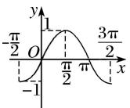</td><td>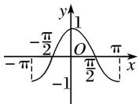</td><td>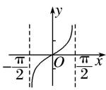</td></tr><tr><td>定义域</td><td>R</td><td>R</td><td> $\{x|x\in R,且 x\neq k\pi+\frac{\pi}{2}\}$ </td></tr><tr><td>值域</td><td>[-1,1]</td><td>[-1,1]</td><td>R</td></tr><tr><td>周期性</td><td> $2\pi$ </td><td> $2\pi$ </td><td> $\pi$ </td></tr><tr><td>奇偶性</td><td>奇函数</td><td>偶函数</td><td>奇函数</td></tr><tr><td>对称中心</td><td> $(k\pi,0)$ </td><td> $\left(k\pi+\frac{\pi}{2},0\right)$ </td><td> $\left(\frac{k\pi}{2},0\right)$ </td></tr><tr><td>对称轴方程</td><td> $x=k\pi+\frac{\pi}{2}$ </td><td> $x=k\pi$ </td><td>无</td></tr></table>

# 【常用结论】

#### 1. 三角函数的周期性  
（1）函数 $y = A \sin (\omega x + \varphi)$ 的最小正周期 $T = \frac{2\pi}{|\omega|}$ . 应特别注意函数 $y = |A \sin (\omega x + \varphi)|$ 的周期为 $T = \frac{\pi}{|\omega|}$ ，函数 $y = |A \sin (\omega x + \varphi) + b| (b \neq 0)$ 的最小正周期 $T = \frac{2\pi}{|\omega|}$ .  
（2）函数 $y=A\cos(\omega x+\varphi)$ 的最小正周期 $T=\frac{2\pi}{|\omega|}$ . 应特别注意函数 $y=|A\cos(\omega x+\varphi)|$ 的周期为 $T=\frac{\pi}{|\omega|}$ . 函数 $y=|A\cos(\omega x+\varphi)+b|(b\neq0)$ 的最小正周期均为 $T=\frac{2\pi}{|\omega|}$ .  
（3）函数 $y = A \tan (\omega x + \varphi)$ 的最小正周期 $T = \frac{\pi}{|\omega|}$ . 应特别注意函数 $y = |A \tan (\omega x + \varphi)|$ 的周期为 $T = \frac{\pi}{|\omega|}$ ，函数 $y = |A \tan (\omega x + \varphi) + b| (b \neq 0)$ 的最小正周期均为 $T = \frac{\pi}{|\omega|}$ .

#### 2. 三角函数的奇偶性  
（1）函数 $y = A \sin (\omega x + \varphi)$ 是奇函数 $\Leftrightarrow \varphi = k\pi (k \in \mathbf{Z})$ ，是偶函数 $\Leftrightarrow \varphi = k\pi + \frac{\pi}{2} (k \in \mathbf{Z})$ ；  
（2）函数 $y = A \cos(\omega x + \varphi)$ 是奇函数 $\Leftrightarrow \varphi = k\pi + \frac{\pi}{2} (k \in \mathbf{Z})$ ，是偶函数 $\Leftrightarrow \varphi = k\pi (k \in \mathbf{Z})$ ;  
（3）函数 $y=A\tan(\omega x+\varphi)$ 是奇函数 $\Leftrightarrow\varphi=k\pi(k\in\mathbf{Z})$ .

#### 3. 三角函数的对称性  
（1）函数 $y=A\sin(\omega x+\varphi)$ 的图象的对称轴由 $\omega x+\varphi=k\pi+\frac{\pi}{2}(k\in\mathbf{Z})$ 解得，对称中心的横坐标由 $\omega x+\varphi=k\pi(k\in\mathbf{Z})$ 解得；  
（2）函数 $y = A\cos (\omega x + \varphi)$ 的图象的对称轴由 $\omega x + \varphi = k\pi (k\in \mathbf{Z})$ 解得，对称中心的横坐标由 $\omega x + \varphi = k\pi + \frac{\pi}{2} (k\in \mathbf{Z})$ 解得；  
（3）函数 $y=Atan(\omega x+\varphi)$ 的图象的对称中心由 $\omega x+\varphi=\frac{k\pi}{2}(k\in\mathbf{Z})$ 解得.

# 【方法总结】

# 三角函数的奇偶性、周期性、对称性的处理方法  
（1）若 $f(x) = A\sin (\omega x + \varphi)$ 为偶函数，则 $\varphi = k\pi +\frac{\pi}{2} (k\in \mathbf{Z})$ ，同时当 $x = 0$ 时， $f(x)$ 取得最大或最小值．若 $f(x) = A\sin (\omega x + \varphi)$ 为奇函数，则 $\varphi = k\pi (k\in \mathbf{Z})$ ，且当 $x = 0$ 时， $f(x) = 0$  
（2）求三角函数的最小正周期，一般先通过恒等变形化为 $y=A\sin(\omega x+\varphi)$ ， $y=A\cos(\omega x+\varphi)$ ， $y=A\tan(\omega x+\varphi)$ 的形式，再分别应用公式 $T=\frac{2\pi}{|\omega|}$ ， $T=\frac{2\pi}{|\omega|}$ ， $T=\frac{\pi}{|\omega|}$ 求解.  
（3）对于函数 $y = A \sin (\omega x + \varphi)$ ，其对称轴一定经过图象的最高点或最低点，对称中心的横坐标一定是函数的零点，因此在判断直线 $x = x_0$ 或点 $(x_0, 0)$ 是否是函数的对称轴或对称中心时，可通过检验 $f(x_0)$ 的值进行判断.

# 【例题选讲】

[例1] （1） 下列函数中，周期为 $\pi$ ，且在 $\left[\frac{\pi}{4}, \frac{\pi}{2}\right]$ 上单调递增的奇函数是( )

A. $y=\sin\left(2x+\frac{3\pi}{2}\right)$

B. $y=\cos\left(2x-\frac{\pi}{2}\right)$

C. $y=\cos\left(2x+\frac{\pi}{2}\right)$

D. $y=\sin\left(\frac{\pi}{2}-x\right)$
答案 C 解析 $y=\sin\left(2x+\frac{3\pi}{2}\right)=-\cos2x$ 为偶函数，排除 A； $y=\cos\left(2x-\frac{\pi}{2}\right)=\sin2x$ 在 $\left[\frac{\pi}{4},\frac{\pi}{2}\right]$ 上为减函数，排除 B； $y=\cos\left(2x+\frac{\pi}{2}\right)=-\sin2x$ 为奇函数，在 $\left[\frac{\pi}{4},\frac{\pi}{2}\right]$ 上单调递增，且周期为 $\pi$ ，符合题意； $y=\sin\left(\frac{\pi}{2}-x\right)=\cos x$ 为偶函数，排除 D．故选 C.  
（2） 已知函数 $f(x)=2\sin\left(\omega x+\frac{\pi}{6}\right)(\omega>0)$ 的最小正周期为 $4\pi$ ，则该函数的图象()

A. 关于点 $\left(\frac{\pi}{3}, 0\right)$ 对称

B. 关于点 $\left(\frac{5\pi}{3}, 0\right)$ 对称

C. 关于直线 $x=\frac{\pi}{3}$ 对称

D. 关于直线 $x=\frac{5\pi}{3}$ 对称
答案 B 解析 因为函数 $f(x) = 2\sin \left(\frac{\omega x + \frac{\pi}{6}}{6}\right) (\omega > 0)$ 的最小正周期是 $4\pi$ ，而 $T = \frac{2\pi}{\omega} = 4\pi$ ，所以 $\omega = \frac{1}{2}$ ，即 $f(x) = 2\sin \left(\frac{x}{2} + \frac{\pi}{6}\right)$ . 令 $\frac{x}{2} + \frac{\pi}{6} = \frac{\pi}{2} + k\pi (k \in \mathbb{Z})$ ，解得 $x = \frac{2\pi}{3} + 2k\pi (k \in \mathbb{Z})$ ，故 $f(x)$ 的对称轴为 $x = \frac{2\pi}{3} + 2k\pi (k \in \mathbb{Z})$ ，
令 $\frac{x}{2}+\frac{\pi}{6}=k\pi(k\in\mathbb{Z})$ ，解得 $x=-\frac{\pi}{3}+2k\pi(k\in\mathbb{Z})$ 。故 $f(x)$ 的对称中心为 $\left(-\frac{\pi}{3}+2k\pi,0\right)(k\in\mathbb{Z})$ ，对比选项可知B正确。  
（3） 已知函数 $f(x) = 2\sin \left(\omega x - \frac{\pi}{6}\right) + 1 (x \in \mathbf{R})$ 的图象的一条对称轴为 $x = \pi$ ，其中 $\omega$ 为常数，且 $\omega \in (1, 2)$ ，则函数 $f(x)$ 的最小正周期为 \_\_\_\_.
答案 $\frac{6\pi}{5}$ 解析 由函数 $f(x) = 2\sin \left(\omega x - \frac{\pi}{6}\right) + 1 (x \in \mathbf{R})$ 的图象的一条对称轴为 $x = \pi$ ，可得 $\omega \pi - \frac{\pi}{6} = k\pi + \frac{\pi}{2}, k \in \mathbf{Z}, \therefore \omega = k + \frac{2}{3}$ ，又 $\omega \in (1, 2), \therefore \omega = \frac{5}{3}, \therefore$ 得函数 $f(x)$ 的最小正周期为 $\frac{2\pi}{\frac{5}{3}} = \frac{6\pi}{5}$ .  
（4） 函数 $f(x) = 3\sin \left(2x - \frac{\pi}{3} + \varphi\right)$ ， $\varphi \in (0, \pi)$ 满足 $f(|x|) = f(x)$ ，则 $\varphi$ 的值为（）

A. $\frac{\pi}{6}$

B. $\frac{\pi}{3}$

C. $\frac{5\pi}{6}$

D. $\frac{2\pi}{3}$
答案 C 解析 因为 $f(|x|)=f(x)$ ，所以函数 $f(x)=3\sin\left(2x-\frac{\pi}{3}+\varphi\right)$ 是偶函数，所以 $-\frac{\pi}{3}+\varphi=k\pi+\frac{\pi}{2}$ ， $k\in Z$ ，所以 $\varphi=k\pi+\frac{5\pi}{6}$ ， $k\in Z$ ，又因为 $\varphi\in(0,\pi)$ ，所以 $\varphi=\frac{5\pi}{6}$ .  
（5） 同时具有以下性质：“①最小正周期是 $\pi$ ；②图象关于直线 $x = \frac{\pi}{3}$ 对称；③在 $\left[-\frac{\pi}{6}, \frac{\pi}{3}\right]$ 上是增函数；④图象的一个对称中心为 $\left(\frac{\pi}{12}, 0\right)$ ”的一个函数是（）

A. $y=\sin\left(\frac{x}{2}+\frac{\pi}{6}\right)$

B. $y=\sin\left(2x+\frac{\pi}{3}\right)$

C. $y=\sin\left(2x-\frac{\pi}{6}\right)$

D. $y = \sin \left(2x - \frac{\pi}{3}\right)$
答案 C 解析 因为最小正周期是 $\pi$ ，所以 $\omega = 2$ ，排除 A 选项；当 $x = \frac{\pi}{3}$ 时，对于 B， $y = \sin\left(2 \times \frac{\pi}{3} + \frac{\pi}{3}\right)$ $= 0$ ，对于 D， $y = \sin\left(2 \times \frac{\pi}{3} - \frac{\pi}{3}\right) = \frac{\sqrt{3}}{2}$ ，因为图象关于直线 $x = \frac{\pi}{3}$ 对称，所以排除 B、D 选项，对于 C， $\sin\left(2 \times \frac{\pi}{3} - \frac{\pi}{6}\right)$ $= 1$ ， $\sin\left(2 \times \frac{\pi}{12} - \frac{\pi}{6}\right) = 0$ ，且在 $\left[-\frac{\pi}{6}, \frac{\pi}{3}\right]$ 上是增函数，故 C 满足条件。  
（6） 设函数 $f(x) = A \sin (\omega x + \varphi)(A, \omega, \varphi$ 是常数， $A > 0, \omega > 0)$ . 若 $f(x)$ 在区间 $\left[\frac{\pi}{6}, \frac{\pi}{2}\right]$ 上具有单调性，且 $f\left[\frac{\pi}{2}\right] = f\left[\frac{2\pi}{3}\right] = -f\left[\frac{\pi}{6}\right)$ ，则 $f(x)$ 的最小正周期为 \_\_\_\_.
答案 $\pi$ 解析 记 $f(x)$ 的最小正周期为 $T$ . 由题意知 $\frac{T}{2} > \frac{\pi}{2} - \frac{\pi}{6} = \frac{\pi}{3}$ , 又 $f\left(\frac{\pi}{2}\right) = f\left(\frac{2\pi}{3}\right) = -f\left(\frac{\pi}{6}\right)$ , 且 $\frac{2\pi}{3} - \frac{\pi}{2} = \frac{\pi}{6}$ , 可作出示意图如图所示(一种情况):

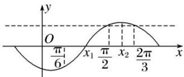
$\therefore x _ {1} = \left(\frac {\pi}{2} + \frac {\pi}{6}\right) \times \frac {1}{2} = \frac {\pi}{3}, x _ {2} = \left(\frac {\pi}{2} + \frac {2 \pi}{3}\right) \times \frac {1}{2} = \frac {7 \pi}{1 2}, \therefore \frac {T}{4} = x _ {2} - x _ {1} = \frac {7 \pi}{1 2} - \frac {\pi}{3} = \frac {\pi}{4}, \therefore T = \pi .$  
（7） 已知函数 $f(x) = \left| \tan \left( \frac{1}{2} x - \frac{\pi}{6} \right) \right|$ ，则下列说法正确的是 \_\_\_\_。（填序号）

① $f(x)$ 的周期是 $\frac{\pi}{2}$ ;

② $f(x)$ 的值域是 $\{y|y\in R, 且 y\neq0\}$ ;

③直线 $x=\frac{5\pi}{3}$ 是函数 $f(x)$ 图象的一条对称轴；
④ $f(x)$ 的单调递减区间是 $\left(2k\pi-\frac{2\pi}{3},\quad2k\pi+\frac{\pi}{3}\right),\quad k\in\mathbf{Z}.$
答案 ④ 解析 函数 $f(x)$ 的周期为 $2\pi$ ，①错； $f(x)$ 的值域为 $[0, +\infty)$ ，②错；当 $x = \frac{5\pi}{3}$ 时， $\frac{1}{2}x - \frac{\pi}{6} = \frac{2\pi}{3} \neq \frac{k\pi}{2}$ ， $k \in \mathbf{Z}$ ， $\therefore x = \frac{5\pi}{3}$ 不是 $f(x)$ 的对称轴，③错；令 $k\pi - \frac{\pi}{2} < \frac{1}{2}x - \frac{\pi}{6} \leq k\pi$ ， $k \in \mathbf{Z}$ ，可得 $2k\pi - \frac{2\pi}{3} < x \leq 2k\pi + \frac{\pi}{3}$ ， $k \in \mathbf{Z}$ ， $\therefore f(x)$ 的单调递减区间是 $\left[2k\pi - \frac{2\pi}{3}, 2k\pi + \frac{\pi}{3}\right]$ ， $k \in \mathbf{Z}$ ，④正确.  
（8） 设定义在 $\mathbf{R}$ 上的函数 $f(x) = \sin (\omega x + \varphi)\left[\omega > 0, -\frac{\pi}{12} < \varphi < \frac{\pi}{2}\right]$ ，给出以下四个论断：① $f(x)$ 的最小正周期为 $\pi$ ；② $f(x)$ 在区间 $\left[-\frac{\pi}{6}, 0\right]$ 上是增函数；③ $f(x)$ 的图象关于点 $\left[\frac{\pi}{3}, 0\right]$ 对称；④ $f(x)$ 的图象关于直线 $x = \frac{\pi}{12}$ 对称。以其中两个论断作为条件，另两个论断作为结论，写出你认为正确的一个命题（写成“ $p \Rightarrow q$ ”的形式）\_\_\_\_。（用到的论断都用序号表示）
答案 ①④⇒②③或①③⇒②④ 解析 若 $f(x)$ 的最小正周期为 $\pi$ ，则 $\omega = 2$ ，函数 $f(x) = \sin (2x + \varphi)$ 。同时若 $f(x)$ 的图象关于直线 $x = \frac{\pi}{12}$ 对称，则 $\sin \left(2 \times \frac{\pi}{12} + \varphi\right) = \pm 1$ ，又 $-\frac{\pi}{12} < \varphi < \frac{\pi}{2}$ ， $\therefore 2 \times \frac{\pi}{12} + \varphi = \frac{\pi}{2}$ ， $\therefore \varphi = \frac{\pi}{3}$ ，此时 $f(x) = \sin \left(2x + \frac{\pi}{3}\right)$ ，②③成立，故①④⇒②③。若 $f(x)$ 的最小正周期为 $\pi$ ，则 $\omega = 2$ ，函数 $f(x) = \sin (2x + \varphi)$ ，同时若 $f(x)$ 的图象关于点 $\left(\frac{\pi}{3}, 0\right)$ 对称，则 $2 \times \frac{\pi}{3} + \varphi = k\pi, k \in \mathbf{Z}$ ，又 $-\frac{\pi}{12} < \varphi < \frac{\pi}{2}$ ， $\therefore \varphi = \frac{\pi}{3}$ ，此时 $f(x) = \sin \left(2x + \frac{\pi}{3}\right)$ ，②④成立，故①③⇒②④。

# 【对点训练】

1. 在函数① $y=\cos|2x|$ ，② $y=|\cos x|$ ，③ $y=\cos\left(2x+\frac{\pi}{6}\right)$ ，④ $y=\tan\left(2x-\frac{\pi}{4}\right)$ 中，最小正周期为 $\pi$ 的所有函数为()

A. ①②③

B. ①③④

C. ②④

D. ①③

1. 答案 A 解析 因为 $y = \cos |2x| = \cos 2x$ ，所以该函数的周期为 $\frac{2\pi}{2} = \pi$ ；由函数 $y = |\cos x|$ 的图象易知其周期为 $\pi$ ；函数 $y = \cos \left(2x + \frac{\pi}{6}\right)$ 的周期为 $\frac{2\pi}{2} = \pi$ ；函数 $y = \tan \left(2x - \frac{\pi}{4}\right)$ 的周期为 $\frac{\pi}{2}$ ，故最小正周期为 $\pi$ 的函数是①②③.

2. 函数 $y = |\tan (2x + \varphi)|$ 的最小正周期是( )

A. $2\pi$

B. $\pi$

C. $\frac{\pi}{2}$

D. $\frac{\pi}{4}$

2. 答案 C 解析 结合图象及周期公式知 $T=\frac{\pi}{2}$

3. 若 $x = \frac{\pi}{8}$ 是函数 $f(x) = \sqrt{2}\sin \left(\omega x - \frac{\pi}{4}\right)$ , $x \in \mathbf{R}$ 的一个零点, 且 $0 < \omega < 10$ , 则函数 $f(x)$ 的最小正周期为 \_\_\_\_.

3. 答案 $\pi$ 解析 依题意知, $f\left(\frac{\pi}{8}\right)=\sqrt{2}\sin\left(\frac{\omega\pi}{8}-\frac{\pi}{4}\right)=0$ , 即 $\frac{\omega\pi}{8}-\frac{\pi}{4}=k\pi$ , $k\in\mathbb{Z}$ , 整理得 $\omega=8k+2$ , $k\in\mathbb{Z}$ . 又因为 $0<\omega<10$ , 所以 $0<8k+2<10$ , 得 $-\frac{1}{4}<k<1$ , 而 $k\in\mathbb{Z}$ , 所以 $k=0$ , $\omega=2$ , 所以 $f(x)=\sqrt{2}\sin\left(2x-\frac{\pi}{4}\right)$ , $f(x)$ 的最小正周期为 $\pi$ .

4. 若函数 $f(x) = \sin \frac{x + \varphi}{3} (\varphi \in [0, 2\pi])$ 是偶函数，则 $\varphi = (\quad)$

A. $\frac{\pi}{2}$

B. $\frac{2\pi}{3}$

C. $\frac{3\pi}{2}$

D. $\frac{5\pi}{3}$

4. 答案 C 解析 由 $f(x) = \sin \frac{x + \varphi}{3}$ 是偶函数，可得 $\frac{\varphi}{3} = k\pi + \frac{\pi}{2}, k \in \mathbb{Z}$ ，即 $\varphi = 3k\pi + \frac{3\pi}{2} (k \in \mathbb{Z})$ ，又 $\varphi \in [0, 2\pi]$ ,
所以 $\varphi=\frac{3\pi}{2}$ .

5. 函数 $y=2\sin\left(2x+\frac{\pi}{3}\right)$ 的图象()

A. 关于原点对称 
B. 关于点 $\left(-\frac{\pi}{6}, 0\right)$ 对称 
C. 关于 $y$ 轴对称 
D. 关于直线 $x = \frac{\pi}{6}$ 对称

5. 答案 B 解析 $\because$ 当 $x = -\frac{\pi}{6}$ 时，函数 $y = 2\sin \left[\frac{-\pi}{6} \times 2 + \frac{\pi}{3}\right] = 0$ ， $\therefore$ 函数图象关于点 $\left[\frac{-\pi}{6}, 0\right]$ 对称.

6. 已知函数 $f(x) = 2\sin (2x + \varphi)\left[\left|\varphi\right| < \frac{\pi}{2}\right]$ 的图象过点 $(0, \sqrt{3})$ ，则 $f(x)$ 图象的一个对称中心是（）

A. $\left(-\frac{\pi}{3},0\right)$

B. $\left(-\frac{\pi}{6},0\right)$

C. $\left(\frac{\pi}{6},0\right)$

D. $\left(\frac{\pi}{12},0\right)$

6. 答案 B 解析 函数 $f(x)=2\sin(2x+\varphi)\left(\left|\varphi\right|<\frac{\pi}{2}\right)$ 的图象过点 $(0,\sqrt{3})$ ，则 $f(0)=2\sin\varphi=\sqrt{3}$ ，∴ $\sin\varphi=\frac{\sqrt{3}}{2}$ ,
又 $|\varphi|<\frac{\pi}{2},\quad\therefore\varphi=\frac{\pi}{3}$ ，则 $f(x)=2\sin\left(2x+\frac{\pi}{3}\right)$ ，令 $2x+\frac{\pi}{3}=k\pi(k\in\mathbf{Z})$ ，则 $x=\frac{k\pi}{2}-\frac{\pi}{6}(k\in\mathbf{Z})$ ，当k=0时， $x=-\frac{\pi}{6}$ $\therefore\left(-\frac{\pi}{6},0\right]$ 是函数 $f(x)$ 的图象的一个对称中心.

7. (2018·江苏)已知函数 $y=\sin(2x+\varphi)\left(-\frac{\pi}{2}<\varphi<\frac{\pi}{2}\right)$ 的图象关于直线 $x=\frac{\pi}{3}$ 对称，则 $\varphi$ 的值为 \_\_\_\_.

7. 答案 $-\frac{\pi}{6}$ 解析 由题意得 $f\left(\frac{\pi}{3}\right)=\sin\left(\frac{2\pi}{3}+\varphi\right)=\pm1,\quad\therefore\frac{2\pi}{3}+\varphi=k\pi+\frac{\pi}{2}(k\in\mathbb{Z}),\quad\therefore\varphi=k\pi-\frac{\pi}{6}(k\in\mathbb{Z}).\quad\because\varphi\in\left(-\frac{\pi}{2},\frac{\pi}{2}\right),\quad\therefore\varphi=-\frac{\pi}{6}.$

8. 若函数 $f(x) = 2\sin (\omega x + \varphi)$ 对任意 $x$ 都有 $f\left(\frac{\pi}{3} + x\right) = f(-x)$ ，则 $f\left(\frac{\pi}{6}\right) = (\quad)$

A. 2 或 0

B. 0

C. -2 或 0

D. -2 或 2

8. 答案 D 解析 由函数 $f(x) = 2\sin (\omega x + \varphi)$ 对任意 $x$ 都有 $f\left(\frac{\pi}{3} + x\right) = f(-x)$ ，可知函数图象的一条对称轴为直线 $x = \frac{1}{2}\times \frac{\pi}{3} = \frac{\pi}{6}$ . 根据三角函数的性质可知，当 $x = \frac{\pi}{6}$ 时，函数取得最大值或者最小值。 $\therefore f\left(\frac{\pi}{6}\right) = 2$ 或 -2。故选 D.

9. 已知函数 $f(x) = \cos \left( \omega x + \frac{\pi}{3} \right) (\omega > 0)$ 的一条对称轴 $x = \frac{\pi}{3}$ ，一个对称中心为点 $\left( \frac{\pi}{12}, 0 \right)$ ，则 $\omega$ 有（）

A. 最小值 2

B. 最大值 2

C. 最小值 1

D. 最大值 1

9. 答案 A 解析 因为函数的中心到对称轴的最短距离是 $\frac{T}{4}$ , 两条对称轴间的最短距离是 $\frac{T}{2}$ , 所以, 中心 $\left[\frac{\pi}{12}, 0\right]$ 到对称轴 $x = \frac{\pi}{3}$ 间的距离用周期可表示为 $\frac{\pi}{3} - \frac{\pi}{12} \geq \frac{T}{4}$ , 又 $\because T = \frac{2\pi}{\omega}, \therefore \frac{2\pi}{4} < \frac{\pi}{4}, \therefore \omega \geq 2, \therefore \omega$ 有最小值 2, 故选 A.

10. (2017·全国III)设函数 $f(x) = \cos \left( x + \frac{\pi}{3} \right)$ ，则下列结论错误的是()

A. $f(x)$ 的一个周期为 $-2\pi$

B. $y = f(x)$ 的图象关于直线 $x = \frac{8\pi}{3}$ 对称

C. $f(x+\pi)$ 的一个零点为 $x=\frac{\pi}{6}$

D. $f(x)$ 在 $\left(\frac{\pi}{2}, \pi\right)$ 单调递减

10. 答案 D 解析 根据函数解析式可知函数 $f(x)$ 的最小正周期为 $2\pi$ ，所以函数的一个周期为 $-2\pi$ ，A 正确；当 $x = \frac{8\pi}{3}$ 时， $x + \frac{\pi}{3} = 3\pi$ ，所以 $\cos \left( x + \frac{\pi}{3} \right) = -1$ ，所以 B 正确； $f(x + \pi) = \cos \left( x + \pi + \frac{\pi}{3} \right) = \cos \left( x + \frac{4\pi}{3} \right)$ ，当 $x = \frac{\pi}{6}$ 时， $x + \frac{4\pi}{3} = \frac{3\pi}{2}$ ，所以 $f(x + \pi) = 0$ ，所以 C 正确；函数 $f(x) = \cos \left( x + \frac{\pi}{3} \right)$ 在 $\left( \frac{\pi}{2}, \frac{2\pi}{3} \right)$ 上单调递减，
在 $\left(\frac{2\pi}{3},\pi\right)$ 上单调递增，故D不正确.

11. 若函数 $f(x)$ 同时具有以下两个性质：① $f(x)$ 是偶函数；②对任意实数 $x$ ，都有 $f\left(\frac{\pi}{4} + x\right) = f\left(\frac{\pi}{4} - x\right)$ . 则 $f(x)$ 的解析式可以是（）

A. $f(x) = \cos x$

B. $f(x)=\cos\left(2x+\frac{\pi}{2}\right)$

C. $f(x)=\sin\left(4x+\frac{\pi}{2}\right)$

D. $f(x)=\cos6x$

11. 答案 C 解析 由题意可得，函数 $f(x)$ 是偶函数，且它的图象关于直线 $x = \frac{\pi}{4}$ 对称， $\because f(x) = \cos x$ 是偶函数， $f\left(\frac{\pi}{4}\right) = \frac{\sqrt{2}}{2}$ ，不是最值，故不满足图象关于直线 $x = \frac{\pi}{4}$ 对称，故排除 A. $\because$ 函数 $f(x) = \cos\left(2x + \frac{\pi}{2}\right) = -\sin 2x$ 是奇函数，不满足条件，故排除 B. $\because$ 函数 $f(x) = \sin\left(4x + \frac{\pi}{2}\right) = \cos 4x$ 是偶函数， $f\left(\frac{\pi}{4}\right) = -1$ ，是最小值，故满足图象关于直线 $x = \frac{\pi}{4}$ 对称，故 C 满足条件. $\because$ 函数 $f(x) = \cos 6x$ 是偶函数. $f\left(\frac{\pi}{4}\right) = 0$ ，不是最值，故不满足图象关于直线 $x = \frac{\pi}{4}$ 对称，故排除 D.

12. 已知函数 $f(x) = \sin (\omega x + \varphi)\omega > 0$ ， $|\varphi| < \frac{\pi}{2}$ 的最小正周期为 $4\pi$ ，且对任意 $x \in \mathbb{R}$ ，都有 $f(x) \leq f\left(\frac{\pi}{3}\right)$ 成立，则 $f(x)$ 图象的一个对称中心的坐标是（）

A. $\left(-\frac{2\pi}{3},0\right)$

B. $\left(-\frac{\pi}{3},0\right)$

C. $\left(\frac{2\pi}{3},0\right)$

D. $\left(\frac{5\pi}{3},0\right)$

12. 答案 A 解析 由 $f(x) = \sin (\omega x + \varphi)$ 的最小正周期为 $4\pi$ ，得 $\omega = \frac{1}{2}$ . 因为 $f(x) \leq f\left(\frac{\pi}{3}\right)$ 恒成立，所以 $f(x)_{\max} = f\left(\frac{\pi}{3}\right)$ ，即 $\frac{1}{2} \times \frac{\pi}{3} + \varphi = \frac{\pi}{2} + 2k\pi (k \in \mathbb{Z})$ ，所以 $\varphi = \frac{\pi}{3} + 2k\pi (k \in \mathbb{Z})$ ，由 $|\varphi| < \frac{\pi}{2}$ ，得 $\varphi = \frac{\pi}{3}$ ，故 $f(x) = \sin \left(\frac{1}{2}x + \frac{\pi}{3}\right)$ . 令 $\frac{1}{2}x + \frac{\pi}{3} = k\pi (k \in \mathbb{Z})$ ，得 $x = 2k\pi - \frac{2\pi}{3}(k \in \mathbb{Z})$ ，故 $f(x)$ 图象的对称中心为 $\left(2k\pi - \frac{2\pi}{3}, 0\right) (k \in \mathbb{Z})$ ，当 $k = 0$ 时， $f(x)$ 图象的一个对称中心的坐标为 $\left(-\frac{2\pi}{3}, 0\right)$ ，故选 A.

# 考点二 三角函数的单调性

# 【基本知识】

正弦、余弦、正切函数的图象与性质(下表中 $k \in Z$ )

<table><tr><td>函数</td><td> $y=\sin x$ </td><td> $y=\cos x$ </td><td> $y=\tan x$ </td></tr><tr><td>图象</td><td>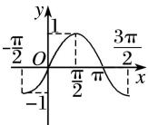</td><td>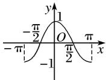</td><td>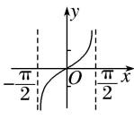</td></tr><tr><td>定义域</td><td>R</td><td>R</td><td> $\{x|x\in R, 且 x\neq k\pi+\frac{\pi}{2}\}$ </td></tr><tr><td>值域</td><td>[-1, 1]</td><td>[-1, 1]</td><td>R</td></tr><tr><td>周期性</td><td>2π</td><td>2π</td><td>π</td></tr><tr><td>奇偶性</td><td>奇函数</td><td>偶函数</td><td>奇函数</td></tr><tr><td>递增区间</td><td>[2kπ-π/2, 2kπ+π/2]</td><td>[2kπ-π, 2kπ]</td><td>(kπ-π/2, kπ+π/2)</td></tr><tr><td>递减区间</td><td>[2kπ+π/2, 2kπ+3π/2]</td><td>[2kπ, 2kπ+π]</td><td>无</td></tr><tr><td>对称中心</td><td>(kπ, 0)</td><td>(kπ+π/2, 0)</td><td>(kπ/2, 0)</td></tr><tr><td>对称轴方程</td><td>x=kπ+π/2</td><td>x=kπ</td><td>无</td></tr></table>

# 【常用结论】  
（1）函数 $y = A \sin (\omega x + \varphi)(\omega > 0)$ 的单调递增区间由 $2k\pi - \frac{\pi}{2} \leq \omega x + \varphi \leq 2k\pi + \frac{\pi}{2} (k \in \mathbf{Z})$ 解得，单调递减区间由 $2k\pi + \frac{\pi}{2} \leq \omega x + \varphi \leq 2k\pi + \frac{3\pi}{2} (k \in \mathbf{Z})$ 解得.  
（2）函数 $y = A\cos (\omega x + \varphi) (\omega > 0)$ 的单调递增区间由 $2k\pi - \pi \leq \omega x + \varphi \leq 2k\pi (k \in \mathbf{Z})$ 解得，单调递减区间由 $2k\pi \leq \omega x + \varphi \leq 2k\pi + \pi (k \in \mathbf{Z})$ 解得.  
（3）函数 $y = A \tan(\omega x + \varphi) (\omega > 0)$ 的单调递增区间由 $2k\pi - \frac{\pi}{2} < \omega x + \varphi < 2k\pi + \frac{\pi}{2} (k \in \mathbf{Z})$ 解得，

# 【方法总结】

# 三角函数单调性问题的常见类型及解题策略  
（1）已知三角函数的解析式求单调区间的两种方法

①代换法：求形如 $y = A \sin(\omega x + \varphi)$ 或 $y = A \cos(\omega x + \varphi)$ (其中 $\omega > 0$ ) 的单调区间时，要视“ $\omega x + \varphi$ ”为一个整体，通过解不等式求解．但如果 $\omega < 0$ ，注意复合函数单调性“同增异减”的规律，防止把单调性弄错．  
②图象法：画出三角函数的正、余弦曲线，结合图象求它的单调区间.  
（2）已知三角函数的单调区间求参数的三种方法

①子集法：求出原函数的相应单调区间，由已知区间是所求某区间的子集，列不等式(组)求解.  
②反子集法：由所给区间求出整体角的范围，由该范围是某相应正、余弦函数的某个单调区间的子集，列不等式(组)求解.   
③周期性法: 由所给区间的两个端点到其相应对称中心的距离不超过 $\frac{1}{4}$ 周期列不等式(组)求解.
若是选择题，利用特值验证排除法求解更为简捷.

# 【例题选讲】

[例 2] （1） (2018·天津) 将函数 $y = \sin \left( \frac{2x + \frac{\pi}{5}}{5} \right)$ 的图象向右平移 $\frac{\pi}{10}$ 个单位长度，所得图象对应的函数()

A. 在区间 $\left[-\frac{\pi}{4}, \frac{\pi}{4}\right]$ 上单调递增

B. 在区间 $\left[-\frac{\pi}{4}, 0\right]$ 上单调递减

C. 在区间 $\left[\frac{\pi}{4}, \frac{\pi}{2}\right]$ 上单调递增

D. 在区间 $\left[\frac{\pi}{2}, \pi\right]$ 上单调递减
答案 A 解析 将函数 $y=f(x)$ 向右平移 $\frac{\pi}{10}$ 个单位长度得到函数 $y=\sin\left[2\left(x-\frac{\pi}{10}\right)+\frac{\pi}{5}\right]=\sin2x$ 的图象，当 $x\in\left[-\frac{\pi}{4},\frac{\pi}{4}\right]$ 时， $y=\sin2x$ 单调递增．故选 A.  
（2） 函数 $f(x)=\sin\left(-2x+\frac{\pi}{3}\right)$ 的单调递减区间为 \_\_\_\_.
答案 $\left[k\pi -\frac{\pi}{12}, k\pi +\frac{5\pi}{12}\right](k\in \mathbf{Z})$ 解析 $f(x) = \sin \left(-2x + \frac{\pi}{3}\right) = \sin \left[-\left(2x - \frac{\pi}{3}\right)\right] = -\sin \left(2x - \frac{\pi}{3}\right)$ ，由 $2k\pi -$ $\frac{\pi}{2}\leq 2x - \frac{\pi}{3}\leq 2k\pi +\frac{\pi}{2}, k\in \mathbf{Z}$ ，得 $k\pi -\frac{\pi}{12}\leq x\leq k\pi +\frac{5\pi}{12}, k\in \mathbf{Z}.$ 故所求函数的单调递减区间为 $\left[k\pi -\frac{\pi}{12}, k\pi +\frac{5\pi}{12}\right](k$ $\in \mathbf{Z}).$  
（3） 函数 $y=|\tan x|$ 在 $\left(-\frac{\pi}{2}, \frac{3\pi}{2}\right)$ 上的单调递减区间为 \_\_\_\_.
答案 $\left[-\frac{\pi}{2}, 0\right], \left[\frac{\pi}{2}, \pi\right]$ 解析 作出 $y = |\tan x|$ 的示意图如图，观察图象可知， $y = |\tan x|$ 在 $\left[-\frac{\pi}{2}, \frac{3\pi}{2}\right]$ 上的单调递减区间为 $\left[-\frac{\pi}{2}, 0\right]$ 和 $\left[\frac{\pi}{2}, \pi\right]$ .

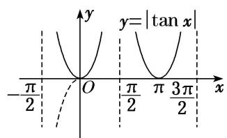  
（4）已知函数 $f(x)=\cos(x+\theta)(0<\theta<\pi)$ 在 $x=\frac{\pi}{3}$ 时取得最小值，则 $f(x)$ 在 $[0,\pi]$ 上的单调递增区间是()

A. $\left[\frac{\pi}{3},\pi\right]$

B. $\left[\frac{\pi}{3},\frac{2\pi}{3}\right]$

C. $\left[0,\frac{2\pi}{3}\right]$

D. $\left[\frac{2\pi}{3},\pi\right]$
答案 A 解析 因为 $0 < \theta < \pi$ ，所以 $\frac{\pi}{3} < \frac{\pi}{3} + \theta < \frac{4\pi}{3}$ ，又因为 $f(x) = \cos (x + \theta)$ 在 $x = \frac{\pi}{3}$ 时取得最小值，所以 $\frac{\pi}{3} + \theta = \pi$ ， $\theta = \frac{2\pi}{3}$ ，所以 $f(x) = \cos \left(x + \frac{2\pi}{3}\right)$ . 由 $0 \leq x \leq \pi$ ，得 $\frac{2\pi}{3} \leq x + \frac{2\pi}{3} \leq \frac{5\pi}{3}$ . 由 $\pi \leq x + \frac{2\pi}{3} \leq \frac{5\pi}{3}$ ，得 $\frac{\pi}{3} \leq x \leq \pi$ ，所以 $f(x)$ 在 $[0, \pi]$ 上的单调递增区间是 $\left[\frac{\pi}{3}, \pi\right]$ .  
（5） (2015·全国I)函数 $f(x)=\cos(\omega x+\varphi)$ 的部分图象如图所示，则 $f(x)$ 的单调递减区间为()

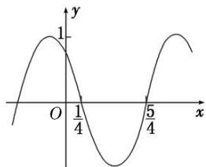

A. $\left(k\pi-\frac{1}{4},\quad k\pi+\frac{3}{4}\right),\quad k\in\mathbf{Z}$

B. $\left(2k\pi-\frac{1}{4},\quad2k\pi+\frac{3}{4}\right),\quad k\in\mathbf{Z}$

C. $\left(k-\frac{1}{4},\quad k+\frac{3}{4}\right),\quad k\in\mathbf{Z}$

D. $\left(2k-\frac{1}{4},\quad2k+\frac{3}{4}\right),\quad k\in\mathbf{Z}$
答案 D 解析 由图象知，周期 $T = 2\left(\frac{5}{4} - \frac{1}{4}\right) = 2$ ， $\therefore \frac{2\pi}{\omega} = 2$ ， $\therefore \omega = \pi.$ 由 $\pi \times \frac{1}{4} + \varphi = \frac{\pi}{2} + 2k\pi$ ，得 $\varphi = \frac{\pi}{4} + 2k\pi, k \in \mathbf{Z}$ ，不妨取 $\varphi = \frac{\pi}{4}, \therefore f(x) = \cos\left(\frac{\pi x + \frac{\pi}{4}}{4}\right)$ . 由 $2k\pi < \pi x + \frac{\pi}{4} < 2k\pi + \pi$ ，得 $2k - \frac{1}{4} < x < 2k + \frac{3}{4}, k \in \mathbf{Z}, \therefore f(x)$ 的单调递减区间为 $\left(2k - \frac{1}{4}, 2k + \frac{3}{4}\right), k \in \mathbf{Z}$ ，故选 D.  
（6）将函数 $f(x)=\sin(\omega x+\varphi)\omega>0$ ， $-\frac{\pi}{2}\leq\varphi<\frac{\pi}{2}$ 图象上每一点的横坐标伸长为原来的 2 倍(纵坐标不变)，再向左平移 $\frac{\pi}{3}$ 个单位长度得到 $y=\sin x$ 的图象，则函数 $f(x)$ 的单调递增区间为()

A. $\left[2k\pi - \frac{\pi}{12}, 2k\pi + \frac{5\pi}{12}\right]$ , $k \in \mathbf{Z}$

B. $\left[2k\pi-\frac{\pi}{6},\quad2k\pi+\frac{5\pi}{6}\right],\quad k\in\mathbf{Z}$

C. $\left[k\pi-\frac{\pi}{12},\quad k\pi+\frac{5\pi}{12}\right],\quad k\in\mathbf{Z}$

D. $\left[k\pi -\frac{\pi}{6}, k\pi +\frac{5\pi}{6}\right], k\in \mathbf{Z}$
答案 C 解析 将 $y=\sin x$ 的图象向右平移 $\frac{\pi}{3}$ 个单位长度得到的函数为 $y=\sin\left(\frac{x-\frac{\pi}{3}}{3}\right)$ ，将函数 $y=\sin\left(\frac{x-\frac{\pi}{3}}{3}\right)$ 的图象上每一点的横坐标缩短为原来的 $\frac{1}{2}$ （纵坐标不变），则函数变为 $y=\sin\left(\frac{2x-\frac{\pi}{3}}{3}\right)=f(x)$ ，由 $2k\pi - \frac{\pi}{2} \leq 2x - \frac{\pi}{3} \leq 2k\pi + \frac{\pi}{2}$ ， $k \in Z$ ，可得 $k\pi - \frac{\pi}{12} \leq x \leq k\pi + \frac{5\pi}{12}$ ， $k \in Z$ ，选 C.  
（7） 若函数 $g(x)=\sin\left(2x+\frac{\pi}{6}\right)$ 在区间 $\left[0,\frac{a}{3}\right]$ 和 $\left[4a,\frac{7\pi}{6}\right]$ 上均单调递增，则实数 a 的取值范围是 \_\_\_\_.
答案 $\left[\frac{\pi}{6}, \frac{7\pi}{24}\right]$ 解析 由 $2k\pi - \frac{\pi}{2} \leq 2x + \frac{\pi}{6} \leq 2k\pi + \frac{\pi}{2}(k \in \mathbf{Z})$ ，可得 $k\pi - \frac{\pi}{3} \leq x \leq k\pi + \frac{\pi}{6}(k \in \mathbf{Z})$ ， $\therefore g(x)$ 的单调递增区间为 $\left[k\pi - \frac{\pi}{3}, k\pi + \frac{\pi}{6}\right](k \in \mathbf{Z})$ 。又 $\because$ 函数 $g(x)$ 在区间 $\left[0, \frac{a}{3}\right]$ 和 $\left[4a, \frac{7\pi}{6}\right]$ 上均单调递增， $\therefore \left\{ \begin{array}{l} \frac{a}{3} \leq \frac{\pi}{6}, \\ 4a \geq \frac{2\pi}{3}, \\ 4a < \frac{7\pi}{6}, \end{array} \right.$ 解得 $\frac{\pi}{6} \leq a < \frac{7\pi}{24}$ 。  
（8）若函数 $f(x) = \sin (\omega x + \varphi)\left\{\omega > 0, \text{且} |\varphi| < \frac{\pi}{2}\right\}$ 在区间 $\left[\frac{\pi}{6}, \frac{2\pi}{3}\right]$ 上是单调递减函数，且函数值从1减少到-1，则 $f\left(\frac{\pi}{4}\right) =$ \_\_\_\_.
答案 $\frac{\sqrt{3}}{2}$ 解析 由题意知 $\frac{T}{2} = \frac{2\pi}{3} - \frac{\pi}{6} = \frac{\pi}{2}$ ，故 $T = \pi$ ，所以 $\omega = \frac{2\pi}{T} = 2$ ，又因为 $f\left(\frac{\pi}{6}\right) = 1$ ，所以 $\sin\left(\frac{\pi}{3} + \varphi\right) =$

1. 因为 $|\varphi|<\frac{\pi}{2}$ ，所以 $\varphi=\frac{\pi}{6}$ ，即 $f(x)=\sin\left(\frac{2x+\frac{\pi}{6}}{6}\right)$ 。故 $f\left(\frac{\pi}{4}\right)=\sin\left(\frac{\pi}{2}+\frac{\pi}{6}\right)=\cos\frac{\pi}{6}=\frac{\sqrt{3}}{2}$ .  
（9）若 $f(x) = 2\sin \omega x (\omega > 0)$ 在区间 $\left[-\frac{\pi}{2}, \frac{2\pi}{3}\right]$ 上是增函数，则 $\omega$ 的取值范围是 \_\_\_\_.
答案 $0 < \omega \leq \frac{3}{4}$ 解析 法一：因为 $x \in \left[-\frac{\pi}{2}, \frac{2\pi}{3}\right] (\omega > 0)$ ，所以 $\omega x \in \left[-\frac{\pi\omega}{2}, \frac{2\pi\omega}{3}\right]$ ，因为 $f(x) = 2\sin \omega x$ 在 $\left[-\frac{\pi}{2}, \frac{2\pi}{3}\right]$ 上是增函数，所以 $\left\{ \begin{array}{l} -\frac{\pi\omega}{2} \geq -\frac{\pi}{2}, \\ 2\pi\omega \leq \frac{\pi}{2}, \\ \omega > 0, \end{array} \right.$ 故 $0 < \omega \leq \frac{3}{4}$ .

法二：画出函数 $f(x) = 2\sin \omega x (\omega > 0)$ 的图象如图所示．要使 $f(x)$ 在 $\left[-\frac{\pi}{2}, \frac{2\pi}{3}\right]$ 上是增函数，需 $\begin{cases} -\frac{\pi}{2\omega} \leq -\frac{\pi}{2}, \\ \frac{2\pi}{3} \leq \frac{\pi}{2\omega}, \\ \omega > 0, \end{cases}$ 即 $0 < \omega \leq \frac{3}{4}$ .

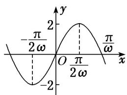  
（10） 已知 $\omega > 0$ ，函数 $f(x) = \sin \left(\frac{\omega x + \frac{\pi}{4}}{4}\right)$ 在 $\left(\frac{\pi}{2}, \pi\right)$ 上单调递减，则 $\omega$ 的取值范围是 \_\_\_\_.
答案 $\left[\frac{1}{2},\frac{5}{4}\right]$ 解析 由 $\frac{\pi}{2} < x < \pi$ ， $\omega >0$ ，得 $\frac{\omega\pi}{2} +\frac{\pi}{4} < \omega x + \frac{\pi}{4} < \omega \pi +\frac{\pi}{4}$ 又 $y = \sin x$ 的单调递减区间为 $\left[2k\pi +\frac{\pi}{2},2k\pi +\frac{3\pi}{2}\right],k\in \mathbf{Z},$ 所以 $\left\{ \begin{array}{ll}\frac{\omega\pi}{2} +\frac{\pi}{4}\geq \frac{\pi}{2} +2k\pi ,\\ \omega \pi +\frac{\pi}{4}\leq \frac{3\pi}{2} +2k\pi , \end{array} \right.$ $k\in \mathbf{Z},$ 解得 $4k + \frac{1}{2}\leq \omega \leq 2k + \frac{5}{4},k\in \mathbf{Z}.$ 又由 $4k + \frac{1}{2}-$ $\left[2k + \frac{5}{4}\right]_{\leq 0},k\in \mathbf{Z}$ 且 $2k + \frac{5}{4} >0,k\in \mathbf{Z},$ 得 $k = 0,$ 所以 $\omega \in \left[\frac{1}{2},\frac{5}{4}\right].$

# 【对点训练】

13. 函数 $f(x) = \tan \left(2x - \frac{\pi}{3}\right)$ 的单调递增区间是()

A. $\left[\frac{k\pi}{2} -\frac{\pi}{12},\frac{k\pi}{2} +\frac{5\pi}{12}\right](k\in \mathbf{Z})$

B. $\left(\frac{k\pi}{2} -\frac{\pi}{12},\frac{k\pi}{2} +\frac{5\pi}{12}\right)(k\in \mathbf{Z})$

C. $\left[k\pi -\frac{\pi}{12}, k\pi +\frac{5\pi}{12}\right](k\in \mathbf{Z})$

D. $\left(k\pi +\frac{\pi}{6},k\pi +\frac{2\pi}{3}\right)(k\in \mathbf{Z})$

13. 答案 B 解析 由 $k\pi - \frac{\pi}{2} < 2x - \frac{\pi}{3} < k\pi + \frac{\pi}{2} (k \in \mathbf{Z})$ ，得 $\frac{k\pi}{2} - \frac{\pi}{12} < x < \frac{k\pi}{2} + \frac{5\pi}{12} (k \in \mathbf{Z})$ ，所以函数 $f(x) =$
$\tan\left(2x-\frac{\pi}{3}\right)$ 的单调递增区间是 $\left(\frac{k\pi}{2}-\frac{\pi}{12},\frac{k\pi}{2}+\frac{5\pi}{12}\right)(k\in\mathbf{Z})$ .

14. 函数 $f(x) = \cos \left( x + \frac{\pi}{6} \right) (x \in [0, \pi])$ 的单调递增区间为（）

A. $\left[0, \frac{5\pi}{6}\right]$

B. $\left[0,\frac{2\pi}{3}\right]$

C. $\left[\frac{5\pi}{6},\pi\right]$

D. $\left[\frac{2\pi}{3},\pi\right]$

14. 答案 C 解析 由 $2k\pi - \pi \leq x + \frac{\pi}{6} \leq 2k\pi (k \in \mathbb{Z})$ ，得 $2k\pi - \frac{7\pi}{6} \leq x \leq 2k\pi - \frac{\pi}{6} (k \in \mathbb{Z})$ ，又 $x \in [0, \pi]$ ，所以令 $k = 1$ ， $f(x)$ 的单调递增区间为 $\left[\frac{5\pi}{6}, \pi\right]$ .

15. 已知函数 $f(x) = 2\sin \left(\frac{\pi}{4} - 2x\right)$ ，则函数 $f(x)$ 的单调递减区间为（）

A. $\left[\frac{3\pi}{8} + 2k\pi, \frac{7\pi}{8} + 2k\pi\right](k \in \mathbf{Z})$

B. $\left[-\frac{\pi}{8} + 2k\pi, \frac{3\pi}{8} + 2k\pi\right](k \in \mathbf{Z})$

C. $\left[\frac{3\pi}{8} + k\pi, \frac{7\pi}{8} + k\pi\right](k \in \mathbf{Z})$

D. $\left[-\frac{\pi}{8} + k\pi, \frac{3\pi}{8} + k\pi\right](k \in \mathbf{Z})$

15. 答案 D 解析 函数的解析式可化为 $f(x) = -2\sin\left(\frac{2x - \frac{\pi}{4}}{4}\right)$ . 由 $2k\pi - \frac{\pi}{2} \leq 2x - \frac{\pi}{4} \leq 2k\pi + \frac{\pi}{2}(k \in \mathbf{Z})$ ，得 $-\frac{\pi}{8} + k\pi \leq x \leq \frac{3\pi}{8} + k\pi (k \in \mathbf{Z})$ ，即函数 $f(x)$ 的单调递减区间为 $\left[-\frac{\pi}{8} + k\pi, \frac{3\pi}{8} + k\pi\right] (k \in \mathbf{Z})$ .

16. $y=|\cos x|$ 的一个单调递增区间是()

A. $\left[-\frac{\pi}{2}, \frac{\pi}{2}\right]$

B. $[0, \pi]$

C. $\left[\pi,\frac{3\pi}{2}\right]$

D. $\left[\frac{3\pi}{2},2\pi\right]$

16. 答案 D 解析 将 $y = \cos x$ 的图象位于 $x$ 轴下方的部分关于 $x$ 轴对称向上翻折， $x$ 轴上方(或 $x$ 轴上)的部分不变，即得 $y = |\cos x|$ 的图象(如图). 故选 D.

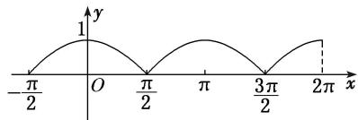

17. 设函数 $f(x) = \left|\sin \left(\frac{x + \pi}{3}\right)\right| (x \in \mathbf{R})$ ，则 $f(x)$ ( )

A. 在区间 $\left[-\pi, -\frac{\pi}{2}\right]$ 上是减函数

B. 在区间 $\left[\frac{2\pi}{3}, \frac{7\pi}{6}\right]$ 上是增函数

C. 在区间 $\left[\frac{\pi}{8}, \frac{\pi}{4}\right]$ 上是增函数

D. 在区间 $\left[\frac{\pi}{3}, \frac{5\pi}{6}\right]$ 上是减函数

17. 答案 B 解析 由 $f(x) = \left|\sin \left(\frac{x + \frac{\pi}{3}}{3}\right)\right|$ 可知， $f(x)$ 的最小正周期为 $\pi$ 。由 $k\pi \leq x + \frac{\pi}{3} \leq \frac{\pi}{2} + k\pi (k \in \mathbf{Z})$ ，得 $-\frac{\pi}{3} + k\pi \leq x \leq \frac{\pi}{6} + k\pi (k \in \mathbf{Z})$ ，即 $f(x)$ 在 $\left[-\frac{\pi}{3} + k\pi, \frac{\pi}{6} + k\pi\right] (k \in \mathbf{Z})$ 上单调递增；由 $\frac{\pi}{2} + k\pi \leq x + \frac{\pi}{3} \leq \pi + k\pi (k \in \mathbf{Z})$ ，得 $\frac{\pi}{6} + k\pi \leq x \leq \frac{2\pi}{3} + k\pi (k \in \mathbf{Z})$ ，即 $f(x)$ 在 $\left[\frac{\pi}{6} + k\pi, \frac{2\pi}{3} + k\pi\right] (k \in \mathbf{Z})$ 上单调递减。将各选项逐项代入验证，可知 B 正

确.

18. 将函数 $y=2\sin\left(2x+\frac{\pi}{6}\right)$ 的图象向右平移 $\frac{1}{4}$ 个周期后，所得图象对应的函数为 $f(x)$ ，则函数 $f(x)$ 的单调递增区间为（）

A. $\left[k\pi -\frac{\pi}{12},k\pi +\frac{5\pi}{12}\right](k\in \mathbf{Z})$

B. $\left[k\pi + \frac{5\pi}{12}, k\pi + \frac{11\pi}{12}\right](k \in \mathbf{Z})$

C. $\left[k\pi -\frac{5\pi}{24}, k\pi +\frac{7\pi}{24}\right](k\in \mathbf{Z})$

D. $\left[k\pi + \frac{7\pi}{24}, k\pi + \frac{19\pi}{24}\right](k \in \mathbf{Z})$

18. 解析：选 A $\because$ 函数 $y=2\sin\left(2x+\frac{\pi}{6}\right)$ 的周期 $T=\frac{2\pi}{2}=\pi, \therefore$ 将函数 $y=2\sin\left(2x+\frac{\pi}{6}\right)$ 的图象向右平移 $\frac{1}{4}$ 个周

期后，所得图象对应的函数为 $f(x) = 2\sin \left[2\left(x - \frac{\pi}{4}\right) + \frac{\pi}{6}\right] = 2\sin \left(2x - \frac{\pi}{3}\right)$ . 令 $2k\pi - \frac{\pi}{2} \leq 2x - \frac{\pi}{3} \leq 2k\pi + \frac{\pi}{2}$ ， $k \in \mathbf{Z}$ ，可得 $k\pi - \frac{\pi}{12} \leq x \leq k\pi + \frac{5\pi}{12}$ ， $k \in \mathbf{Z}$ ，∴ 函数 $f(x)$ 的单调递增区间为 $\left[k\pi - \frac{\pi}{12}, k\pi + \frac{5\pi}{12}\right]$ ， $k \in \mathbf{Z}$ . 故选 A.

19. 已知函数 $f(x) = \sin (2x + \varphi)\left(0 < \varphi < \frac{\pi}{2}\right)$ 的图象的一个对称中心为 $\left(\frac{3\pi}{8}, 0\right)$ ，则函数 $f(x)$ 的单调递减区间是（）

A. $\left[2k\pi - \frac{3\pi}{8}, 2k\pi + \frac{\pi}{8}\right](k \in \mathbf{Z})$

B. $\left[2k\pi + \frac{\pi}{8}, 2k\pi + \frac{5\pi}{8}\right](k \in \mathbf{Z})$

C. $\left[k\pi -\frac{3\pi}{8},k\pi +\frac{\pi}{8}\right](k\in \mathbf{Z})$

D. $\left[k\pi + \frac{\pi}{8}, k\pi + \frac{5\pi}{8}\right](k \in \mathbf{Z})$

19. 答案 D 解析 由题可得 $\sin \left(2 \times \frac{3\pi}{8} + \varphi\right) = 0$ ，又 $0 < \varphi < \frac{\pi}{2}$ ，所以 $\varphi = \frac{\pi}{4}$ ，所以 $f(x) = \sin \left(2x + \frac{\pi}{4}\right)$ ，由 $2k\pi + \frac{\pi}{2} \leq 2x + \frac{\pi}{4} \leq 2k\pi + \frac{3\pi}{2} (k \in \mathbf{Z})$ ，得 $f(x)$ 的单调递减区间是 $\left[k\pi + \frac{\pi}{8}, k\pi + \frac{5\pi}{8}\right] (k \in \mathbf{Z})$ 。

20. 已知函数 $f(x) = \sin (2x + \varphi)$ ，其中 $\varphi$ 为实数，若 $f(x) \leq \left|f\left(\frac{\pi}{4}\right)\right|$ 对任意 $x \in \mathbb{R}$ 恒成立，且 $f\left(\frac{\pi}{6}\right) > 0$ ，则 $f(x)$ 的单调递减区间是（）

A. $\left[k\pi, k\pi + \frac{\pi}{4}\right](k \in \mathbf{Z})$

B. $\left[k\pi -\frac{\pi}{4}, k\pi +\frac{\pi}{4}\right](k\in \mathbf{Z})$

C. $\left[k\pi + \frac{\pi}{4}, k\pi + \frac{3\pi}{4}\right](k \in \mathbf{Z})$

D. $\left[k\pi -\frac{\pi}{2}, k\pi \right](k\in \mathbf{Z})$

20. 答案 C 解析 由题意可得函数 $f(x) = \sin (2x + \varphi)$ 的图象关于直线 $x = \frac{\pi}{4}$ 对称，故有 $2 \times \frac{\pi}{4} + \varphi = k\pi + \frac{\pi}{2}$ ， $k \in \mathbf{Z}$ ，即 $\varphi = k\pi, k \in \mathbf{Z}$ 。又 $f\left(\frac{\pi}{6}\right) = \sin\left(\frac{\pi}{3} + \varphi\right) > 0$ ，所以 $\varphi = 2n\pi, n \in \mathbf{Z}$ ，所以 $f(x) = \sin (2x + 2n\pi) = \sin 2x$ 。令 $2k\pi + \frac{\pi}{2} \leq 2x \leq 2k\pi + \frac{3\pi}{2}, k \in \mathbf{Z}$ ，求得 $k\pi + \frac{\pi}{4} \leq x \leq k\pi + \frac{3\pi}{4}, k \in \mathbf{Z}$ ，故函数 $f(x)$ 的单调递减区间为 $\left[k\pi + \frac{\pi}{4}, k\pi + \frac{3\pi}{4}\right]$ ， $k \in \mathbf{Z}$ 。

21. 已知函数 $f(x) = 2\sin (\omega x + \varphi) + 1 (\omega > 0, |\varphi| < \frac{\pi}{2})$ , $f(\alpha) = -1$ , $f(\beta) = 1$ , 若 $|\alpha - \beta|$ 的最小值为 $\frac{3\pi}{4}$ , 且 $f(x)$ 的图

象关于点 $(\frac{\pi}{4}, 1)$ 对称，则函数 $f(x)$ 的单调递增区间是（）

A. $[- \frac{\pi}{2} + 2k\pi, \pi + 2k\pi]$ , $k \in \mathbf{Z}$

B. $[- \frac{\pi}{2} + 3k\pi, \pi + 3k\pi]$ , $k \in \mathbf{Z}$

C. $[\pi + 2k\pi, \frac{5\pi}{2} + 2k\pi]$ , $k \in \mathbf{Z}$

D. $[\pi + 3k\pi, \frac{5\pi}{2} + 3k\pi]$ , $k \in \mathbf{Z}$

21. 答案 B 解析 由题设条件可知 $f(x)$ 的周期 $T = 4|\alpha - \beta|_{\min} = 3\pi$ ，所以 $\omega = \frac{2\pi}{T} = \frac{2}{3}$ ，又 $f(x)$ 的图象关于点 $(\frac{\pi}{4}, 1)$ 对称，从而 $f(\frac{\pi}{4}) = 1$ ，即 $\sin(\frac{2}{3} \times \frac{\pi}{4} + \varphi) = 0$ 。因为 $|\varphi| < \frac{\pi}{2}$ ，所以 $\varphi = -\frac{\pi}{6}$ ，故 $f(x) = 2\sin(\frac{2}{3}x - \frac{\pi}{6}) + 1$ ，再由 $-\frac{\pi}{2} + 2k\pi \leq \frac{2}{3}x - \frac{\pi}{6} \leq \frac{\pi}{2} + 2k\pi, k \in \mathbf{Z}$ ，得 $-\frac{\pi}{2} + 3k\pi \leq x \leq \pi + 3k\pi, k \in \mathbf{Z}$ 。

22. 若函数 $f(x) = \sin \omega x (\omega > 0)$ 在区间 $\left[0, \frac{\pi}{3}\right]$ 上单调递增，在区间 $\left[\frac{\pi}{3}, \frac{\pi}{2}\right]$ 上单调递减，则 $\omega =$ \_\_\_\_.

22. 答案 $\frac{3}{2}$ 解析 法一：由于函数 $f(x) = \sin \omega x (\omega > 0)$ 的图象经过坐标原点，由已知并结合正弦函数的图象可知， $\frac{\pi}{3}$ 为函数 $f(x)$ 的 $\frac{1}{4}$ 周期，故 $\frac{2\pi}{\omega} = \frac{4\pi}{3}$ ，解得 $\omega = \frac{3}{2}$ .

法二：由题意，得 $f(x)_{\max} = f\left(\frac{\pi}{3}\right) = \sin \frac{\pi}{3}\omega = 1$ 。由已知并结合正弦函数图象可知， $\frac{\pi}{3}\omega = \frac{\pi}{2}$ ，解得 $\omega = \frac{3}{2}$ 。

23. 若函数 $f(x) = 3\sin \left( x + \frac{\pi}{10} \right) - 2$ 在区间 $\left[ \frac{\pi}{2}, a \right]$ 上单调，则实数 $a$ 的最大值是 \_\_\_\_.

23. 答案 $\frac{7\pi}{5}$ 解析 法一：令 $2k\pi + \frac{\pi}{2} \leq x + \frac{\pi}{10} \leq 2k\pi + \frac{3\pi}{2}, k \in \mathbf{Z}$ ，即 $2k\pi + \frac{2\pi}{5} \leq x \leq 2k\pi + \frac{7\pi}{5}, k \in \mathbf{Z}$ ，所以函数 $f(x)$ 在区间 $\left[\frac{2\pi}{5}, \frac{7\pi}{5}\right]$ 上单调递减，所以 $a$ 的最大值为 $\frac{7\pi}{5}$ .

法二：因为 $\frac{\pi}{2} \leq x \leq a$ ，所以 $\frac{\pi}{2} + \frac{\pi}{10} \leq x + \frac{\pi}{10} \leq a + \frac{\pi}{10}$ ，而 $f(x)$ 在 $\left[\frac{\pi}{2}, a\right]$ 上单调，所以 $a + \frac{\pi}{10} \leq \frac{3\pi}{2}$ ，即 $a \leq \frac{7\pi}{5}$ ，所以 $a$ 的最大值为 $\frac{7\pi}{5}$ .

24. 已知函数 $f(x) = \sin \left( \omega x + \frac{\pi}{4} \right) (\omega > 0)$ ， $f\left( \frac{\pi}{6} \right) = f\left( \frac{\pi}{3} \right)$ ，且 $f(x)$ 在 $\left( \frac{\pi}{2}, \pi \right)$ 上单调递减，则 $\omega =$ \_\_\_\_.

24. 答案 1 解析 由 $f\left(\frac{\pi}{6}\right)=f\left(\frac{\pi}{3}\right)$ ，可知函数 $f(x)$ 的图象关于直线 $x=\frac{\pi}{4}$ 对称， $\therefore \frac{\pi}{4}\omega+\frac{\pi}{4}=\frac{\pi}{2}+k\pi, k\in\mathbf{Z},$ $\therefore \omega=1+4k, k\in\mathbf{Z}$ ，又 $\because f(x)$ 在 $\left(\frac{\pi}{2}, \pi\right)$ 上单调递减， $\therefore \frac{T}{2}\geq\pi-\frac{\pi}{2}=\frac{\pi}{2}, T\geq\pi, \therefore \frac{2\pi}{\omega}\geq\pi, \therefore \omega\leq2$ ，又 $\because \omega=1+4k, k\in\mathbf{Z}, \therefore$ 当 $k=0$ 时， $\omega=1$ .

25. 已知函数 $f(x) = \sin \left( \omega x + \frac{\pi}{6} \right) (\omega > 0)$ 在区间 $\left[ -\frac{\pi}{4}, \frac{2\pi}{3} \right]$ 上单调递增，则 $\omega$ 的取值范围为（）

A. $\left[0,\frac{8}{3}\right]$

B. $\left(0,\frac{1}{2}\right]$

C. $\left[\frac{1}{2},\frac{8}{3}\right]$

D. $\left[\frac{3}{8},2\right]$

25. 答案 B 解析 法一：由题意得 $\left\{\begin{aligned}-\frac{\omega\pi}{4}+\frac{\pi}{6}&\geq-\frac{\pi}{2}+2k\pi,\quad k\in\mathbf{Z},\\ \frac{2\omega\pi}{3}+\frac{\pi}{6}&\leq\frac{\pi}{2}+2k\pi,\quad k\in\mathbf{Z},\end{aligned}\right.$ 则 $\left\{\begin{aligned}\omega\leq\frac{8}{3}-8k,\quad k\in\mathbf{Z},\\ \omega\leq\frac{1}{2}+3k,\quad k\in\mathbf{Z},\end{aligned}\right.$ 又 $\omega>0,$
所以 $\left\{\begin{aligned}\frac{8}{3}-8k>0,\\ \frac{1}{2}+3k>0\end{aligned}\right.$ $k\in Z$ ，所以 k=0，则 $0<\omega\leq\frac{1}{2}$ ，故选 B.

法二：取 $\omega = 1$ ，则 $f(x) = \sin \left(x + \frac{\pi}{6}\right)$ ，令 $\frac{\pi}{2} + 2k\pi \leq x + \frac{\pi}{6} \leq \frac{3\pi}{2} + 2k\pi, k \in \mathbf{Z}$ ，得 $\frac{\pi}{3} + 2k\pi \leq x \leq \frac{4\pi}{3} + 2k\pi, k \in \mathbf{Z}$ ，当 $k = 1$ 时，函数 $f(x)$ 在区间 $\left[\frac{\pi}{3}, \frac{4\pi}{3}\right]$ 上单调递减，与函数 $f(x)$ 在区间 $\left[-\frac{\pi}{4}, \frac{2\pi}{3}\right]$ 上单调递增矛盾，故 $\omega \neq 1$ 结合四个选项可知选B.

[点评] 根据正弦函数的单调递减区间, 确定函数 $f(x)$ 的单调递减区间, 根据函数 $f(x)=\sin\left(\frac{\omega x+\frac{\pi}{6}}{6}\right)(\omega>0)$ 在区间 $\left[-\frac{\pi}{4},\frac{2\pi}{3}\right]$ 上单调递增，建立不等式，即可求 $\omega$ 的取值范围.

26. (2016·全国I)已知函数 $f(x) = \sin (\omega x + \varphi)\left(\omega > 0, |\varphi| \leq \frac{\pi}{2}\right)$ ， $x = -\frac{\pi}{4}$ 为 $f(x)$ 的零点， $x = \frac{\pi}{4}$ 为 $y = f(x)$ 图象的对称轴，且 $f(x)$ 在 $\left(\frac{\pi}{18}, \frac{5\pi}{36}\right)$ 上单调，则 $\omega$ 的最大值为（）

A. 11

B. 9

C. 7

D. 5

26. 答案 B 解析 由题意得 $\left\{ \begin{array}{l} -\frac{\pi}{4}\omega + \varphi = k_1\pi, k_1 \in \mathbf{Z}, \\ \frac{\pi}{4}\omega + \varphi = k_2\pi + \frac{\pi}{2}, k_2 \in \mathbf{Z}, \end{array} \right.$ 且 $|\varphi| \leq \frac{\pi}{2}$ ，则 $\omega = 2k + 1, k \in \mathbf{Z}, \varphi = \frac{\pi}{4}$ 或 $\varphi = -\frac{\pi}{4}$ . 对比选项，将选项值分别代入验证：若 $\omega = 11$ ，则 $\varphi = -\frac{\pi}{4}$ ，此时 $f(x) = \sin \left(11x - \frac{\pi}{4}\right), f(x)$ 在区间 $\left(\frac{\pi}{18}, \frac{3\pi}{44}\right)$ 上单调递增，在区间 $\left(\frac{3\pi}{44}, \frac{5\pi}{36}\right)$ 上单调递减，不满足 $f(x)$ 在区间 $\left(\frac{\pi}{18}, \frac{5\pi}{36}\right)$ 上单调；若 $\omega = 9$ ，则 $\varphi = \frac{\pi}{4}$ ，此时 $f(x) = \sin \left(9x + \frac{\pi}{4}\right)$ ，满足 $f(x)$ 在区间 $\left(\frac{\pi}{18}, \frac{5\pi}{36}\right)$ 上单调递减，故选 B.

27. 已知函数 $f(x) = \sqrt{2}\sin \left(2x + \frac{\pi}{4}\right)$ .  
（1）求函数 $f(x)$ 的单调递增区间;  
（2）当 $x\in \left[\frac{\pi}{4},\frac{3\pi}{4}\right]$ 时，求函数 $f(x)$ 的最大值和最小值.

27. 解 （1） 令 $2k\pi - \frac{\pi}{2} \leq 2x + \frac{\pi}{4} \leq 2k\pi + \frac{\pi}{2}, k \in \mathbf{Z}$ , 则 $k\pi - \frac{3\pi}{8} \leq x \leq k\pi + \frac{\pi}{8}, k \in \mathbf{Z}$ .
故函数 $f(x)$ 的单调递增区间为 $\left[k\pi-\frac{3\pi}{8}, k\pi+\frac{\pi}{8}\right]$ ， $k \in Z$ .  
（2）因为当 $x \in \left[\frac{\pi}{4}, \frac{3\pi}{4}\right]$ 时， $\frac{3\pi}{4} \leq 2x + \frac{\pi}{4} \leq \frac{7\pi}{4}$ ，所以 $-1 \leq \sin \left[2x + \frac{\pi}{4}\right] \leq \frac{\sqrt{2}}{2}$ ，所以 $-\sqrt{2} \leq f(x) \leq 1$
所以当 $x \in \left[\frac{\pi}{4}, \frac{3\pi}{4}\right]$ 时，函数 $f(x)$ 的最大值为 1，最小值为 $-\sqrt{2}$ .

28. 已知函数 $f(x) = 2\sin \left(\omega x + \frac{\pi}{6}\right) + 1 + a(\omega > 0)$ 图象上最高点的纵坐标为2，且图象上相邻两个最高点的距离为π.  
（1）求 a 和 $\omega$ 的值;  
（2）求函数 $f(x)$ 在 $[0, \pi]$ 上的单调递减区间.

28. 解 （1） 当 $\sin \left( \omega x + \frac{\pi}{6} \right) = 1$ 时, $f(x)$ 取得最大值 $2 + 1 + a = 3 + a$ .
又 $f(x)$ 最高点的纵坐标为 2，∴ $3 + a = 2$ ，即 a = -1。
又 $f(x)$ 的图象上相邻两个最高点的距离为 $\pi$ ，∴ $f(x)$ 的最小正周期 $T = \pi$ ，∴ $\omega = \frac{2\pi}{T} = 2$ .  
（2）由（1）得 $f(x)=2\sin\left(2x+\frac{\pi}{6}\right)$ ，由 $\frac{\pi}{2}+2k\pi\leq2x+\frac{\pi}{6}\leq\frac{3\pi}{2}+2k\pi,\quad k\in\mathbf{Z}$ ，得 $\frac{\pi}{6}+k\pi\leq x\leq\frac{2\pi}{3}+k\pi,\quad k\in\mathbf{Z}$ .
令 $k = 0$ ，得 $\frac{\pi}{6} \leq x \leq \frac{2\pi}{3}$ 。∴函数 $f(x)$ 在 $[0, \pi]$ 上的单调递减区间为 $\left[\frac{\pi}{6}, \frac{2\pi}{3}\right]$ .

29. 已知函数 $f(x) = 2\sin \left(2\omega x + \frac{\pi}{6}\right)$ (其中 $0 < \omega < 1$ ), 若点 $\left(-\frac{\pi}{6}, 0\right)$ 是函数 $f(x)$ 图象的一个对称中心.  
（1）求 $\omega$ 的值，并求出函数 $f(x)$ 的单调递增区间；  
（2）先列表，再作出函数 $f(x)$ 在区间 $[-\pi, \pi]$ 上的图象.

29. 解 （1） 因为点 $\left(-\frac{\pi}{6}, 0\right)$ 是函数 $f(x)$ 图象的一个对称中心，所以 $-\frac{\omega\pi}{3} + \frac{\pi}{6} = k\pi (k \in \mathbf{Z})$ ， $\omega = -3k + \frac{1}{2} (k \in \mathbf{Z})$ ，因为 $0 < \omega < 1$ ，所以当 k = 0 时，可得 $\omega = \frac{1}{2}$ 。所以 $f(x) = 2\sin\left(\frac{x + \frac{\pi}{6}}{6}\right)$ 。
令 $2k\pi - \frac{\pi}{2} \leq x + \frac{\pi}{6} \leq 2k\pi + \frac{\pi}{2} (k \in \mathbf{Z})$ ，解得 $2k\pi - \frac{2\pi}{3} \leq x \leq 2k\pi + \frac{\pi}{3} (k \in \mathbf{Z})$ ,
所以函数的单调递增区间为 $\left[2k\pi-\frac{2\pi}{3},\quad2k\pi+\frac{\pi}{3}\right](k\in\mathbf{Z})$ .  
（2）由（1）知， $f(x)=2\sin\left(x+\frac{\pi}{6}\right)$ ， $x\in[-\pi,\pi]$

列表如下:

<table><tr><td> $x+\frac{\pi}{6}$ </td><td> $-\frac{5\pi}{6}$ </td><td> $-\frac{\pi}{2}$ </td><td>0</td><td> $\frac{\pi}{2}$ </td><td> $\pi$ </td><td> $\frac{7\pi}{6}$ </td></tr><tr><td>x</td><td> $-\pi$ </td><td> $-\frac{2\pi}{3}$ </td><td> $-\frac{\pi}{6}$ </td><td> $\frac{\pi}{3}$ </td><td> $\frac{5\pi}{6}$ </td><td> $\pi$ </td></tr><tr><td> $f(x)$ </td><td>-1</td><td>-2</td><td>0</td><td>2</td><td>0</td><td>-1</td></tr></table>

作出函数部分图象如图所示:

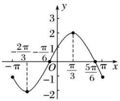

30. 已知函数 $f(x) = \sin (\omega x + \varphi)\left[\omega > 0, \quad 0 < \varphi < \frac{2\pi}{3}\right]$ 的最小正周期为 $\pi$ .  
（1）求当 $f(x)$ 为偶函数时 $\varphi$ 的值；  
（2）若 $f(x)$ 的图象过点 $\left(\frac{\pi}{6},\frac{\sqrt{3}}{2}\right)$ ，求 $f(x)$ 的单调递增区间.

30. 解 由 $f(x)$ 的最小正周期为 $\pi$ ，得 $T=\frac{2\pi}{\omega}=\pi$ ，所以 $\omega=2$ ，所以 $f(x)=\sin(2x+\varphi)$ .  
（1）当 $f(x)$ 为偶函数时，有 $\varphi=\frac{\pi}{2}+k\pi(k\in\mathbf{Z})$ 。因为 $0<\varphi<\frac{2\pi}{3}$ ，所以 $\varphi=\frac{\pi}{2}$  
（2）因为 $f\left(\frac{\pi}{6}\right)=\frac{\sqrt{3}}{2}$ ，所以 $\sin\left(2\times\frac{\pi}{6}+\varphi\right)=\frac{\sqrt{3}}{2}$ ，即 $\frac{\pi}{3}+\varphi=\frac{\pi}{3}+2k\pi$ 或 $\frac{\pi}{3}+\varphi=\frac{2\pi}{3}+2k\pi(k\in\mathbf{Z})$
故 $\varphi=2k\pi$ 或 $\varphi=\frac{\pi}{3}+2k\pi(k\in\mathbf{Z})$ ,
又因为 $0<\varphi<\frac{2\pi}{3}$ ，所以 $\varphi=\frac{\pi}{3}$ ，即 $f(x)=\sin\left(2x+\frac{\pi}{3}\right)$ .
由 $-\frac{\pi}{2} + 2k\pi \leq 2x + \frac{\pi}{3} \leq \frac{\pi}{2} + 2k\pi (k \in \mathbf{Z})$ ，得 $k\pi - \frac{5\pi}{12} \leq x \leq k\pi + \frac{\pi}{12} (k \in \mathbf{Z})$
故 $f(x)$ 的单调递增区间为 $\left[k\pi-\frac{5\pi}{12}, k\pi+\frac{\pi}{12}\right](k\in\mathbf{Z})$ .

