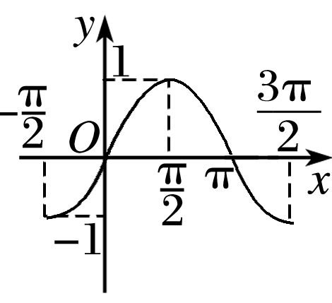
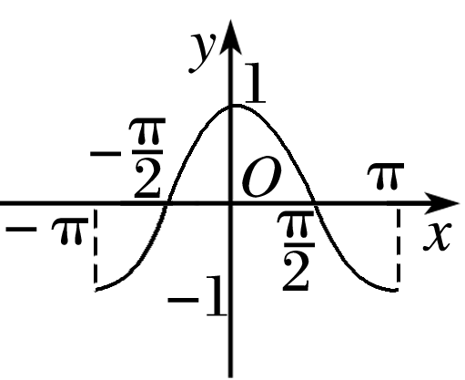
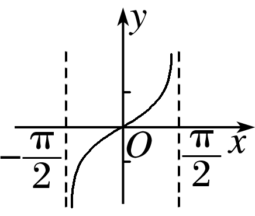
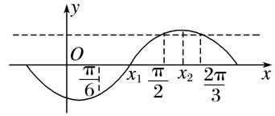
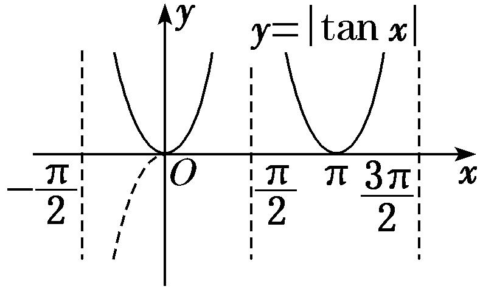
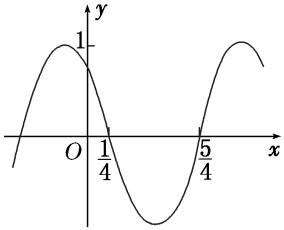
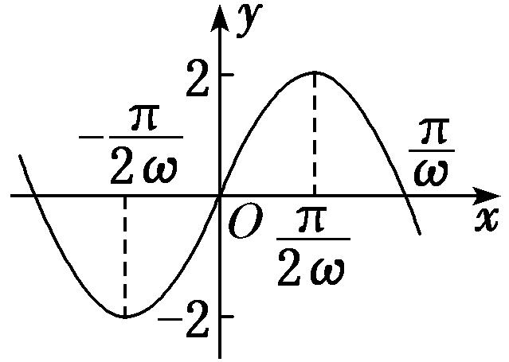
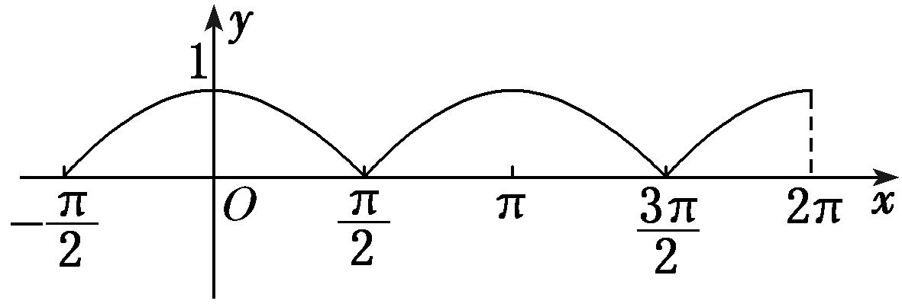
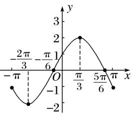

专题三　三角函数的图象与性质（2）

考点一　三角函数的奇偶性、周期性与对称性

【基本知识】

正弦、余弦、正切函数的图象与性质(下表中<em>k</em>∈<strong>Z</strong>)

<table><tr><td>
函数
</td><td>
<em>y</em>＝sin <em>x</em>
</td><td>
<em>y</em>＝cos <em>x</em>
</td><td>
<em>y</em>＝tan <em>x</em>
</td></tr><tr><td>
图象
</td><td>

</td><td>

</td><td>

</td></tr><tr><td>
定义域
</td><td>
<strong>R</strong>
</td><td>
<strong>R</strong>
</td><td>
<em>x</em>≠<em>k</em>π＋}
</td></tr><tr><td>
值域
</td><td>
[－1，1]
</td><td>
[－1，1]
</td><td>
<strong>R</strong>
</td></tr><tr><td>
周期性
</td><td>
2π
</td><td>
2π
</td><td>
π
</td></tr><tr><td>
奇偶性
</td><td>
奇函数
</td><td>
偶函数
</td><td>
奇函数
</td></tr><tr><td>
对称中心
</td><td>
(<em>k</em>π，0)
</td><td></td><td></td></tr><tr><td>
对称轴方程
</td><td>
<em>x</em>＝<em>k</em>π＋
</td><td>
<em>x</em>＝<em>k</em>π
</td><td>
无
</td></tr></table>

【常用结论】

1．三角函数的周期性  
（1）函数*y*＝*A*sin(*ωx*＋*φ*)的最小正周期*T*＝．应特别注意函数*y*＝|*A*sin(*ωx*＋*φ*)|的周期为*T*＝，函数*y*＝|*A*sin(*ωx*＋*φ*)＋*b*|(*b*≠0)的最小正周期*T*＝．  
（2）函数*y*＝*A*cos(*ωx*＋*φ*)的最小正周期*T*＝．应特别注意函数*y*＝|*A*cos(*ωx*＋*φ*)|的周期为*T*＝．函数*y*＝|*A*cos(*ωx*＋*φ*)＋*b*|(*b*≠0)的最小正周期均为*T*＝．  
（3）函数*y*＝*A*tan(*ωx*＋*φ*)的最小正周期*T*＝．应特别注意函数*y*＝|*A*tan(*ωx*＋*φ*)|的周期为*T*＝，函数*y*＝|*A*tan(*ωx*＋*φ*)＋*b*|(*b*≠0) 的最小正周期均为*T*＝．

2．三角函数的奇偶性  
（1）函数<em>y</em>＝<em>A</em>sin(<em>ωx</em>＋<em>φ</em>)是奇函数⇔<em>φ</em>＝<em>k</em>π(<em>k</em>∈<strong>Z</strong>)，是偶函数⇔<em>φ</em>＝<em>k</em>π＋(<em>k</em>∈<strong>Z</strong>)；  
（2）函数<em>y</em>＝<em>A</em>cos(<em>ωx</em>＋<em>φ</em>)是奇函数⇔<em>φ</em>＝<em>k</em>π＋(<em>k</em>∈<strong>Z</strong>)，是偶函数⇔<em>φ</em>＝<em>k</em>π(<em>k</em>∈<strong>Z</strong>)；  
（3）函数<em>y</em>＝<em>A</em>tan(<em>ωx</em>＋<em>φ</em>)是奇函数⇔<em>φ</em>＝<em>k</em>π(<em>k</em>∈<strong>Z</strong>)．

3．三角函数的对称性  
（1）函数<em>y</em>＝<em>A</em>sin(<em>ωx</em>＋<em>φ</em>)的图象的对称轴由<em>ωx</em>＋<em>φ</em>＝<em>k</em>π＋(<em>k</em>∈<strong>Z</strong>)解得，对称中心的横坐标由<em>ωx</em>＋<em>φ</em>＝<em>k</em>π(<em>k</em>∈<strong>Z</strong>)解得；  
（2）函数<em>y</em>＝<em>A</em>cos(<em>ωx</em>＋<em>φ</em>)的图象的对称轴由<em>ωx</em>＋<em>φ</em>＝<em>k</em>π(<em>k</em>∈<strong>Z</strong>)解得，对称中心的横坐标由<em>ωx</em>＋<em>φ</em>＝<em>k</em>π＋(<em>k</em>∈<strong>Z</strong>)解得；  
（3）函数<em>y</em>＝<em>A</em>tan(<em>ωx</em>＋<em>φ</em>)的图象的对称中心由<em>ωx</em>＋<em>φ</em>＝(<em>k</em>∈<strong>Z</strong>)解得．

【方法总结】

三角函数的奇偶性、周期性、对称性的处理方法  
（1）若<em>f</em>(<em>x</em>)＝<em>A</em>sin(<em>ωx</em>＋<em>φ</em>)为偶函数，则<em>φ</em>＝<em>k</em>π＋(<em>k</em>∈<strong>Z</strong>)，同时当<em>x</em>＝0时，<em>f</em>(<em>x</em>)取得最大或最小值．若<em>f</em>(<em>x</em>)＝<em>A</em>sin(<em>ωx</em>＋<em>φ</em>)为奇函数，则<em>φ</em>＝<em>k</em>π(<em>k</em>∈<strong>Z</strong>)，且当<em>x</em>＝0时，<em>f</em>(<em>x</em>)＝0．  
（2）求三角函数的最小正周期，一般先通过恒等变形化为*y*＝*A*sin(*ωx*＋*φ*)，*y*＝*A*cos(*ωx*＋*φ*)，*y*＝*A*tan(*ωx*＋*φ*)的形式，再分别应用公式*T*＝，*T*＝，*T*＝求解．  
（3）对于函数<em>y</em>＝<em>A</em>sin(<em>ωx</em>＋<em>φ</em>)，其对称轴一定经过图象的最高点或最低点，对称中心的横坐标一定是函数的零点，因此在判断直线<em>x</em>＝<em>x</em>0或点(<em>x</em>0，0)是否是函数的对称轴或对称中心时，可通过检验<em>f</em>(<em>x</em>0)的值进行判断．

【例题选讲】

[例1] （1） 下列函数中，周期为π，且在上单调递增的奇函数是(　　)

A．*y*＝sin　　
B．*y*＝cos　　
C．*y*＝cos　　
D．*y*＝sin
答案　C　解析　*y*＝sin＝－cos 2*x*为偶函数，排除A；*y*＝cos＝sin 2*x*在上为减函数，排除B；*y*＝cos＝－sin 2*x*为奇函数，在上单调递增，且周期为π，符合题意；*y*＝sin＝cos *x*为偶函数，排除D．故选C．  
（2） 已知函数*f*(*x*)＝2sin(*ω*>0)的最小正周期为4π，则该函数的图象(　　)

A．关于点对称　　　　　　　　　　
B．关于点对称

C．关于直线*x*＝对称　　　　　　　　　　
D．关于直线*x*＝对称
答案　B　解析　因为函数*f*(*x*)＝2sin(*ω*>0)的最小正周期是4π，而*T*＝＝4π，所以*ω*＝，即*f*(*x*)＝2sin．令＋＝＋*k*π(*k*∈Z)，解得*x*＝＋2*k*π(*k*∈Z)，故*f*(*x*)的对称轴为*x*＝＋2*k*π(*k*∈Z)，令＋＝*k*π(*k*∈Z)，解得*x*＝－＋2*k*π(*k*∈Z)．故*f*(*x*)的对称中心为(*k*∈Z)，对比选项可知B正确．  
（3） 已知函数<em>f</em>(<em>x</em>)＝2sin＋1(<em>x</em>∈<strong>R</strong>)的图象的一条对称轴为<em>x</em>＝π，其中<em>ω</em>为常数，且<em>ω</em>∈(1，2)，则函数<em>f</em>(<em>x</em>)的最小正周期为________．
答案　　解析　由函数<em>f</em>(<em>x</em>)＝2sin＋1(<em>x</em>∈<strong>R</strong>)的图象的一条对称轴为<em>x</em>＝π，可得<em>ω</em>π－＝<em>k</em>π＋，<em>k</em>∈<strong>Z</strong>，∴<em>ω</em>＝<em>k</em>＋，又<em>ω</em>∈(1，2)，∴<em>ω</em>＝，∴得函数<em>f</em>(<em>x</em>)的最小正周期为＝．  
（4） 函数*f*(*x*)＝3sin，*φ*∈(0，π)满足*f*(|*x*|)＝*f*(*x*)，则*φ*的值为(　　)

A．　　　　　　　　
B．　　　　　　　　
C．　　　　　　　　
D．
答案　C　解析　因为*f*(|*x*|)＝*f*(*x*)，所以函数*f*(*x*)＝3sin是偶函数，所以－＋*φ*＝*k*π＋，*k*∈Z，所以*φ*＝*k*π＋，*k*∈Z，又因为*φ*∈(0，π)，所以*φ*＝．  
（5） 同时具有以下性质：“①最小正周期是π；②图象关于直线*x*＝对称；③在上是增函数；④图象的一个对称中心为”的一个函数是(　　)

A．*y*＝sin　　　
B．*y*＝sin　　　
C．*y*＝sin　　　
D．*y*＝sin
答案　C　解析　因为最小正周期是π，所以*ω*＝2，排除A选项；当*x*＝时，对于B，*y*＝sin＝0，对于D，*y*＝sin＝，因为图象关于直线*x*＝对称，所以排除B、D选项，对于C，sin＝1，sin＝0，且在上是增函数，故C满足条件．  
（6） 设函数<em>f</em>(<em>x</em>)＝<em>A</em>sin(<em>ωx</em>＋<em>φ</em>)(<em>A</em>，<em>ω</em>，<em>φ</em>是常数，<em>A</em>&gt;0，<em>ω</em>&gt;0)．若<em>f</em>(<em>x</em>)在区间上具有单调性，且<em>f</em>＝<em>f</em>＝－<em>f</em>，则<em>f</em>(<em>x</em>)的最小正周期为________．
答案　π　解析　记*f*(*x*)的最小正周期为*T*．由题意知≥－＝，又*f*＝*f*＝－*f*，且－＝，

可作出示意图如图所示(一种情况)：

∴<em>x</em>1＝×＝，<em>x</em>2＝×＝，∴＝<em>x</em>2－<em>x</em>1＝－＝，∴<em>T</em>＝π．  
（7） 已知函数<em>f</em>(<em>x</em>)＝，则下列说法正确的是________．(填序号)

①*f*(*x*)的周期是；
②<em>f</em>(<em>x</em>)的值域是{<em>y</em>|<em>y</em>∈<strong>R</strong>，且<em>y</em>≠0}；
③直线*x*＝是函数*f*(*x*)图象的一条对称轴；
④<em>f</em>(<em>x</em>)的单调递减区间是，<em>k</em>∈<strong>Z</strong>．
答案　④　解析　函数<em>f</em>(<em>x</em>)的周期为2π，①错；<em>f</em>(<em>x</em>)的值域为[0，＋∞)，②错；当<em>x</em>＝时，<em>x</em>－＝≠，<em>k</em>∈<strong>Z</strong>，∴<em>x</em>＝不是<em>f</em>(<em>x</em>)的对称轴，③错；令<em>k</em>π－&lt;<em>x</em>－≤<em>k</em>π，<em>k</em>∈<strong>Z</strong>，可得2<em>k</em>π－&lt;<em>x</em>≤2<em>k</em>π＋，<em>k</em>∈<strong>Z</strong>，∴<em>f</em>(<em>x</em>)的单调递减区间是，<em>k</em>∈<strong>Z</strong>，④正确．  
（8） 设定义在<strong>R</strong>上的函数<em>f</em>(<em>x</em>)＝sin(<em>ωx</em>＋<em>φ</em>)，给出以下四个论断：①<em>f</em>(<em>x</em>)的最小正周期为π；②<em>f</em>(<em>x</em>)在区间上是增函数；③<em>f</em>(<em>x</em>)的图象关于点对称；④<em>f</em>(<em>x</em>)的图象关于直线<em>x</em>＝对称．以其中两个论断作为条件，另两个论断作为结论，写出你认为正确的一个命题(写成“<em>p</em>⇒<em>q</em>”的形式)\_\_\_\_\_\_\_\_\_\_．(用到的论断都用序号表示)
答案　①④⇒②③或①③⇒②④　解析　若<em>f</em>(<em>x</em>)的最小正周期为π，则<em>ω</em>＝2，函数<em>f</em>(<em>x</em>)＝sin(2<em>x</em>＋<em>φ</em>)．同时若<em>f</em>(<em>x</em>)的图象关于直线<em>x</em>＝对称，则sin＝±1，又－&lt;<em>φ</em>&lt;，∴2×＋<em>φ</em>＝，∴<em>φ</em>＝，此时<em>f</em>(<em>x</em>)＝sin，②③成立，故①④⇒②③．若<em>f</em>(<em>x</em>)的最小正周期为π，则<em>ω</em>＝2，函数<em>f</em>(<em>x</em>)＝sin(2<em>x</em>＋<em>φ</em>)，同时若<em>f</em>(<em>x</em>)的图象关于点对称，则2×＋<em>φ</em>＝<em>k</em>π，<em>k</em>∈<strong>Z</strong>，又－&lt;<em>φ</em>&lt;，∴<em>φ</em>＝，此时<em>f</em>(<em>x</em>)＝sin，②④成立，故①③⇒②④．

【对点训练】

1．在函数①*y*＝cos|2*x*|，②*y*＝|cos *x*|，③*y*＝cos，④*y*＝tan中，最小正周期为π的所有函数

为(　　)

A．①②③　　　　　　
B．①③④　　　　　　
C．②④　　　　　　
D．①③

1．答案　A　解析　因为*y*＝cos|2*x*|＝cos 2*x*，所以该函数的周期为＝π；由函数*y*＝|cos *x*|的图象易知其

周期为π；函数*y*＝cos的周期为＝π；函数*y*＝tan的周期为，故最小正周期为π的函数是①②③．

2．函数*y*＝|tan(2*x*＋*φ*)|的最小正周期是(　　)

A．2π　　　　　　　　
B．π　　　　　　　　
C． 　　　　　　　　
D．

2．答案　C　解析　结合图象及周期公式知*T*＝

3．若<em>x</em>＝是函数<em>f</em>(<em>x</em>)＝sin，<em>x</em>∈<strong>R</strong>的一个零点，且0&lt;<em>ω</em>&lt;10，则函数<em>f</em>(<em>x</em>)的最小正周期为\_\_\_\_\_\_\_\_．

3．答案　π　解析　依题意知，<em>f</em>＝sin＝0，即－＝<em>k</em>π，<em>k</em>∈Z，整理得<em>ω</em>＝8<em>k</em>＋2，<em>k</em>∈<strong>Z</strong>．又
因为0&lt;<em>ω</em>&lt;10，所以0&lt;8<em>k</em>＋2&lt;10，得－&lt;<em>k</em>&lt;1，而<em>k</em>∈<strong>Z</strong>，所以<em>k</em>＝0，<em>ω</em>＝2，所以<em>f</em>(<em>x</em>)＝sin，<em>f</em>(<em>x</em>)的最小正周期为π．

4．若函数*f*(*x*)＝sin(*φ*∈[0，2π])是偶函数，则*φ*＝(　　)

A．　　　　　　　　
B．　　　　　　　　
C． 　　　　　　　
D．

4．答案　C　解析　由<em>f</em>(<em>x</em>)＝sin是偶函数，可得＝<em>k</em>π＋，<em>k</em>∈Z，即<em>φ</em>＝3<em>k</em>π＋(<em>k</em>∈<strong>Z</strong>)，又<em>φ</em>∈[0，2π]，
所以*φ*＝．

5．函数*y*＝2sin的图象(　　)

A．关于原点对称　
B．关于点对称　
C．关于*y*轴对称　
D．关于直线*x*＝对称

5．答案　B　解析　∵当*x*＝－时，函数*y*＝2sin＝0，∴函数图象关于点对称．

6．已知函数*f*(*x*)＝2sin(2*x*＋*φ*)的图象过点(0，)，则*f*(*x*)图象的一个对称中心是(　　)

A．　　　　　
B．　　　　　
C．　　　　　
D．

6．答案　B　解析　函数*f*(*x*)＝2sin(2*x*＋*φ*)的图象过点(0，)，则*f*（0）＝2sin *φ*＝，∴sin *φ*＝，
又|<em>φ</em>|&lt;，∴<em>φ</em>＝，则<em>f</em>(<em>x</em>)＝2sin，令2<em>x</em>＋＝<em>k</em>π(<em>k</em>∈<strong>Z</strong>)，则<em>x</em>＝－(<em>k</em>∈<strong>Z</strong>)，当<em>k</em>＝0时，<em>x</em>＝－，∴是函数<em>f</em>(<em>x</em>)的图象的一个对称中心．

7．(2018·江苏)已知函数*y*＝sin(2*x*＋*φ*)的图象关于直线*x*＝对称，则*φ*的值为\_\_\_\_\_\_\_\_．

7．答案　－　解析　由题意得*f*＝sin＝±1，∴＋*φ*＝*k*π＋(*k*∈Z)，∴*φ*＝*k*π－(*k*∈Z)．∵*φ*

∈，∴*φ*＝－．

8．若函数*f*(*x*)＝2sin(*ωx*＋*φ*)对任意*x*都有*f*＝*f*(－*x*)，则*f*＝(　　)

A．2或0　　　　　　　　
B．0　　　　　　　　
C．－2或0　　　　　　　　
D．－2或2

8．答案　D　解析　由函数*f*(*x*)＝2sin(*ωx*＋*φ*)对任意*x*都有*f*＝*f*(－*x*)，可知函数图象的一条对称轴

为直线*x*＝×＝．根据三角函数的性质可知，当*x*＝时，函数取得最大值或者最小值．∴*f*＝2或－2．故选D．

9．已知函数*f*(*x*)＝cos(*ω*>0)的一条对称轴*x*＝，一个对称中心为点，则*ω*有(　　)

A．最小值2　　　　　
B．最大值2　　　　　
C．最小值1　　　　　
D．最大值1

9．答案　A　解析　因为函数的中心到对称轴的最短距离是，两条对称轴间的最短距离是，所以，中心

到对称轴*x*＝间的距离用周期可表示为－≥，又∵*T*＝，∴≤，∴*ω*≥2，∴*ω*有最小值2，故选A．

10．(2017·全国Ⅲ)设函数*f*(*x*)＝cos，则下列结论错误的是(　　)

A．*f*(*x*)的一个周期为－2π　　　　　　　　　　　
B．*y*＝*f*(*x*)的图象关于直线*x*＝对称

C．*f*(*x*＋π)的一个零点为*x*＝　　　　　　　　　
D．*f*(*x*)在单调递减

10．答案　D　解析　根据函数解析式可知函数*f*(*x*)的最小正周期为2π，所以函数的一个周期为－2π，A

正确；当*x*＝时，*x*＋＝3π，所以cos＝－1，所以B正确；*f*(*x*＋π)＝cos＝cos，当*x*＝时，*x*＋＝，所以*f*(*x*＋π)＝0，所以C正确；函数*f*(*x*)＝cos在上单调递减，在上单调递增，故D不正确．

11．若函数*f*(*x*)同时具有以下两个性质：①*f*(*x*)是偶函数；②对任意实数*x*，都有*f*＝*f*.则*f*(*x*)的
解析式可以是(　　)

A．*f*(*x*)＝cos *x*　　　　
B．*f*(*x*)＝cos　　　　
C．*f*(*x*)＝sin　　　　
D．*f*(*x*)＝cos 6*x*

11．答案　C　解析　由题意可得，函数*f*(*x*)是偶函数，且它的图象关于直线*x*＝对称，∵*f*(*x*)＝cos *x*是偶

函数，*f*＝，不是最值，故不满足图象关于直线*x*＝对称，故排除A.∵函数*f*(*x*)＝cos＝－sin 2*x*是奇函数，不满足条件，故排除B.∵函数*f*(*x*)＝sin＝cos 4*x*是偶函数，*f*＝－1，是最小值，故满足图象关于直线*x*＝对称，故C满足条件．∵函数*f*(*x*)＝cos 6*x*是偶函数．*f*＝0，不是最值，故不满足图象关于直线*x*＝对称，故排除D．

12．已知函数<em>f</em>(<em>x</em>)＝sin(<em>ωx</em>＋<em>φ</em>)<em>ω</em>&gt;0，|<em>φ</em>|&lt;的最小正周期为4π，且对任意<em>x</em>∈<strong>R</strong>，都有<em>f</em>(<em>x</em>)≤<em>f</em>成立，则<em>f</em>(<em>x</em>)

图象的一个对称中心的坐标是(　　)

A．　　　　　　
B．　　　　　　
C．　　　　　　
D．

12．答案　A　解析　由<em>f</em>(<em>x</em>)＝sin(<em>ωx</em>＋<em>φ</em>)的最小正周期为4π，得<em>ω</em>＝．因为<em>f</em>(<em>x</em>)≤<em>f</em>恒成立，所以<em>f</em>(<em>x</em>)max

＝*f*，即×＋*φ*＝＋2*k*π(*k*∈Z)，所以*φ*＝＋2*k*π(*k*∈Z)，由|*φ*|<，得*φ*＝，故*f*(*x*)＝sin．令*x*＋＝*k*π(*k*∈Z)，得*x*＝2*k*π－(*k*∈Z)，故*f*(*x*)图象的对称中心为(*k*∈Z)，当*k*＝0时，*f*(*x*)图象的一个对称中心的坐标为，故选A．

考点二　三角函数的单调性

【基本知识】

正弦、余弦、正切函数的图象与性质(下表中<em>k</em>∈<strong>Z</strong>)

<table><tr><td>
函数
</td><td>
<em>y</em>＝sin <em>x</em>
</td><td>
<em>y</em>＝cos <em>x</em>
</td><td>
<em>y</em>＝tan <em>x</em>
</td></tr><tr><td>
图象
</td><td>

</td><td>

</td><td>

</td></tr><tr><td>
定义域
</td><td>
<strong>R</strong>
</td><td>
<strong>R</strong>
</td><td>
<em>x</em>≠<em>k</em>π＋}
</td></tr><tr><td>
值域
</td><td>
[－1，1]
</td><td>
[－1，1]
</td><td>
<strong>R</strong>
</td></tr><tr><td>
周期性
</td><td>
2π
</td><td>
2π
</td><td>
π
</td></tr><tr><td>
奇偶性
</td><td>
奇函数
</td><td>
偶函数
</td><td>
奇函数
</td></tr><tr><td>
递增区间
</td><td></td><td>
[2<em>k</em>π－π，2<em>k</em>π]
</td><td></td></tr><tr><td>
递减区间
</td><td></td><td>
[2<em>k</em>π，2<em>k</em>π＋π]
</td><td>
无
</td></tr><tr><td>
对称中心
</td><td>
(<em>k</em>π，0)
</td><td></td><td></td></tr><tr><td>
对称轴方程
</td><td>
<em>x</em>＝<em>k</em>π＋
</td><td>
<em>x</em>＝<em>k</em>π
</td><td>
无
</td></tr></table>

【常用结论】  
（1）函数<em>y</em>＝<em>A</em>sin(<em>ωx</em>＋<em>φ</em>)(<em>ω</em>＞0)的单调递增区间由2<em>k</em>π－≤<em>ωx</em>＋<em>φ</em>≤2<em>k</em>π＋(<em>k</em>∈<strong>Z</strong>)解得，单调递减区间由2<em>k</em>π＋≤<em>ωx</em>＋<em>φ</em>≤2<em>k</em>π＋(<em>k</em>∈<strong>Z</strong>)解得．  
（2）函数<em>y</em>＝<em>A</em>cos(<em>ωx</em>＋<em>φ</em>) (<em>ω</em>＞0)的单调递增区间由2<em>k</em>π－π≤<em>ωx</em>＋<em>φ</em>≤2<em>k</em>π(<em>k</em>∈<strong>Z</strong>)解得，单调递减区间由2<em>k</em>π≤<em>ωx</em>＋<em>φ</em>≤2<em>k</em>π＋π(<em>k</em>∈<strong>Z</strong>)解得．  
（3）函数<em>y</em>＝<em>A</em>tan(<em>ωx</em>＋<em>φ</em>) (<em>ω</em>＞0)的单调递增区间由2<em>k</em>π－＜<em>ωx</em>＋<em>φ</em>＜2<em>k</em>π＋(<em>k</em>∈<strong>Z</strong>)解得，

【方法总结】

三角函数单调性问题的常见类型及解题策略  
（1）已知三角函数的解析式求单调区间的两种方法

①代换法：求形如*y*＝*A*sin(*ωx*＋*φ*)或*y*＝*A*cos(*ωx*＋*φ*)(其中*ω*>0)的单调区间时，要视“*ωx*＋*φ*”为一个整体，通过解不等式求解．但如果*ω*<0，注意复合函数单调性“同增异减”的规律，防止把单调性弄错．

②图象法：画出三角函数的正、余弦曲线，结合图象求它的单调区间．  
（2）已知三角函数的单调区间求参数的三种方法

①子集法：求出原函数的相应单调区间，由已知区间是所求某区间的子集，列不等式(组)求解．

②反子集法：由所给区间求出整体角的范围，由该范围是某相应正、余弦函数的某个单调区间的子集，列不等式(组)求解．

③周期性法：由所给区间的两个端点到其相应对称中心的距离不超过周期列不等式(组)求解．
若是选择题，利用特值验证排除法求解更为简捷．

【例题选讲】

<strong>[例2]</strong> （1） (2018·天津)将函数<em>y</em>＝sin的图象向右平移个单位长度，所得图象对应的函数(　　)

A．在区间上单调递增　　　　　　　　　　
B．在区间上单调递减

C．在区间上单调递增　　　　　　　　　　　
D．在区间上单调递减
答案　A　解析　将函数*y*＝*f*(*x*)向右平移个单位长度得到函数*y*＝sin＝sin 2*x*的图象，当*x*∈时，*y*＝sin 2*x*单调递增．故选A．  
（2） 函数<em>f</em>(<em>x</em>)＝sin的单调递减区间为________．
答案　(<em>k</em>∈<strong>Z</strong>)　解析　<em>f</em>(<em>x</em>)＝sin＝sin＝－sin，由2<em>k</em>π－≤2<em>x</em>－≤2<em>k</em>π＋，<em>k</em>∈<strong>Z</strong>，得<em>k</em>π－≤<em>x</em>≤<em>k</em>π＋，<em>k</em>∈<strong>Z</strong>．故所求函数的单调递减区间为(<em>k</em>∈<strong>Z</strong>)．  
（3） 函数*y*＝|tan *x*|在上的单调递减区间为\_\_\_\_\_\_\_\_．
答案　，　解析　作出*y*＝|tan *x*|的示意图如图，观察图象可知，*y*＝|tan *x*|在上的单调递减区间为和．

  
（4）已知函数*f*(*x*)＝cos(*x*＋*θ*)(0<*θ*<π)在*x*＝时取得最小值，则*f*(*x*)在[0，π]上的单调递增区间是(　　)

A．　　　　　　
B．　　　　　　
C．　　　　　　
D．
答案　A　解析　因为0<*θ*<π，所以<＋*θ*<，又因为*f*(*x*)＝cos(*x*＋*θ*)在*x*＝时取得最小值，所以＋*θ*＝π，*θ*＝，所以*f*(*x*)＝cos．由0≤*x*≤π，得≤*x*＋≤．由π≤*x*＋≤，得≤*x*≤π，所以*f*(*x*)在[0，π]上的单调递增区间是．  
（5） (2015·全国Ⅰ)函数*f*(*x*)＝cos(*ωx*＋*φ*)的部分图象如图所示，则*f*(*x*)的单调递减区间为(　　)

A．，<em>k</em>∈<strong>Z</strong>　　　　　　　　　　
B．，<em>k</em>∈<strong>Z</strong>

C．，<em>k</em>∈<strong>Z</strong>　　　　　　　　　　　
D．，<em>k</em>∈<strong>Z</strong>
答案　D　解析　由图象知，周期<em>T</em>＝2＝2，∴＝2，∴<em>ω</em>＝π.由π×＋<em>φ</em>＝＋2<em>k</em>π，得<em>φ</em>＝＋2<em>k</em>π，<em>k</em>∈<strong>Z</strong>，不妨取<em>φ</em>＝，∴<em>f</em>(<em>x</em>)＝cos．由2<em>k</em>π＜π<em>x</em>＋＜2<em>k</em>π＋π，得2<em>k</em>－＜<em>x</em>＜2<em>k</em>＋，<em>k</em>∈<strong>Z</strong>，∴<em>f</em>(<em>x</em>)的单调递减区间为，<em>k</em>∈<strong>Z</strong>，故选D．  
（6）将函数*f*(*x*)＝sin(*ωx*＋*φ*)*ω*>0，－≤*φ*<图象上每一点的横坐标伸长为原来的2倍(纵坐标不变)，再向左平移个单位长度得到*y*＝sin*x*的图象，则函数*f*(*x*)的单调递增区间为(　　)

A．，<em>k</em>∈<strong>Z</strong>　　　　　　　　
B．，<em>k</em>∈<strong>Z</strong>

C．，<em>k</em>∈<strong>Z</strong>　　　　　　　　　
D．，<em>k</em>∈<strong>Z</strong>
答案　C　解析　将*y*＝sin *x*的图象向右平移个单位长度得到的函数为*y*＝sin，将函数*y*＝sin的图象上每一点的横坐标缩短为原来的(纵坐标不变)，则函数变为*y*＝sin＝*f*(*x*)，由2*k*π－≤2*x*－≤2*k*π＋，*k*∈Z，可得*k*π－≤*x*≤*k*π＋，*k*∈Z，选C．  
（7） 若函数<em>g</em>(<em>x</em>)＝sin在区间和上均单调递增，则实数<em>a</em>的取值范围是________．
答案　　解析　由2<em>k</em>π－≤2<em>x</em>＋≤2<em>k</em>π＋(<em>k</em>∈<strong>Z</strong>)，可得<em>k</em>π－≤<em>x</em>≤<em>k</em>π＋(<em>k</em>∈<strong>Z</strong>)，∴<em>g</em>(<em>x</em>)的单调递增区间为(<em>k</em>∈<strong>Z</strong>)．又∵函数<em>g</em>(<em>x</em>)在区间和上均单调递增，∴解得≤<em>a</em>&lt;．  
（8）若函数*f*(*x*)＝sin(*ωx*＋*φ*)在区间上是单调递减函数，且函数值从1减少到－1，则*f*＝\_\_\_\_\_\_\_\_．
答案　　解析　由题意知＝－＝，故*T*＝π，所以*ω*＝＝2，又因为*f*＝1，所以sin＝1．因为|*φ*|<，所以*φ*＝，即*f*(*x*)＝sin．故*f*＝sin＝cos＝．  
（9）若*f*(*x*)＝2sin *ωx*(*ω*>0)在区间上是增函数，则*ω*的取值范围是\_\_\_\_\_\_\_\_．
答案　0<*ω*≤　解析　法一：因为*x*∈(*ω*>0)，所以*ωx*∈，因为*f*(*x*)＝2sin *ωx*在上是增函数，所以故0<*ω*≤．

法二：画出函数*f*(*x*)＝2sin *ωx*(*ω*>0)的图象如图所示．要使*f*(*x*)在上是增函数，需即0<*ω*≤．

  
（10） 已知<em>ω</em>&gt;0，函数<em>f</em>(<em>x</em>)＝sin在上单调递减，则<em>ω</em>的取值范围是________．
答案　　解析　由&lt;<em>x</em>&lt;π，<em>ω</em>&gt;0，得＋&lt;<em>ωx</em>＋&lt;<em>ω</em>π＋，又<em>y</em>＝sin<em>x</em>的单调递减区间为，<em>k</em>∈<strong>Z</strong>，所以<em>k</em>∈<strong>Z</strong>，解得4<em>k</em>＋≤<em>ω</em>≤2<em>k</em>＋，<em>k</em>∈<strong>Z</strong>．又由4<em>k</em>＋－≤0，<em>k</em>∈<strong>Z</strong>且2<em>k</em>＋&gt;0，<em>k</em>∈<strong>Z</strong>，得<em>k</em>＝0，所以<em>ω</em>∈．

【对点训练】

13．函数*f*(*x*)＝tan的单调递增区间是(　　)

A．(<em>k</em>∈<strong>Z</strong>)　　　　　　　　
B．(<em>k</em>∈<strong>Z</strong>)

C．(<em>k</em>∈<strong>Z</strong>)　　　　　　　　
D．(<em>k</em>∈<strong>Z</strong>)

13．答案　B　解析　由<em>k</em>π－＜2<em>x</em>－＜<em>k</em>π＋(<em>k</em>∈<strong>Z</strong>)，得－＜<em>x</em>＜＋(<em>k</em>∈<strong>Z</strong>)，所以函数<em>f</em>(<em>x</em>)＝

tan的单调递增区间是(<em>k</em>∈<strong>Z</strong>)．

14．函数*f*(*x*)＝cos的单调递增区间为(　　)

A．　　　　　　
B．　　　　　　
C．　　　　　　
D．

14．答案　C　解析　由2*k*π－π≤*x*＋≤2*k*π(*k*∈Z)，得2*k*π－≤*x*≤2*k*π－(*k*∈Z)，又*x*∈[0，π]，所以令*k*＝

1，*f*(*x*)的单调递增区间为．

15．已知函数*f*(*x*)＝2sin，则函数*f*(*x*)的单调递减区间为(　　)

A．(<em>k</em>∈<strong>Z</strong>)　　　　　　　　
B．(<em>k</em>∈<strong>Z</strong>)

C．(<em>k</em>∈<strong>Z</strong>)　　　　　　　　　
D．(<em>k</em>∈<strong>Z</strong>)

15．答案　D　解析　函数的解析式可化为<em>f</em>(<em>x</em>)＝－2sin．由2<em>k</em>π－≤2<em>x</em>－≤2<em>k</em>π＋(<em>k</em>∈<strong>Z</strong>)，得－＋

<em>k</em>π≤<em>x</em>≤＋<em>k</em>π(<em>k</em>∈<strong>Z</strong>)，即函数<em>f</em>(<em>x</em>)的单调递减区间为(<em>k</em>∈<strong>Z</strong>)．

16．*y*＝|cos *x*|的一个单调递增区间是(　　)

A．　　　　　
B．[0，π]　　　　　
C．　　　　　
D．

16．答案　D　解析　将*y*＝cos *x*的图象位于*x*轴下方的部分关于*x*轴对称向上翻折，*x*轴上方(或*x*轴上)

的部分不变，即得*y*＝|cos *x*|的图象(如图)．故选D．

17．设函数<em>f</em>(<em>x</em>)＝(<em>x</em>∈<strong>R</strong>)，则<em>f</em>(<em>x</em>)(　　)

A．在区间上是减函数　　　　　　　　
B．在区间上是增函数

C．在区间上是增函数　　　　　　　　　　
D．在区间上是减函数

17．答案　B　解析　由<em>f</em>(<em>x</em>)＝可知，<em>f</em>(<em>x</em>)的最小正周期为π．由<em>k</em>π≤<em>x</em>＋≤＋<em>k</em>π(<em>k</em>∈<strong>Z</strong>)，得－＋

<em>k</em>π≤<em>x</em>≤＋<em>k</em>π(<em>k</em>∈<strong>Z</strong>)，即<em>f</em>(<em>x</em>)在(<em>k</em>∈<strong>Z</strong>)上单调递增；由＋<em>k</em>π≤<em>x</em>＋≤π＋<em>k</em>π(<em>k</em>∈<strong>Z</strong>)，得＋<em>k</em>π≤<em>x</em>≤＋<em>k</em>π(<em>k</em>∈<strong>Z</strong>)，即<em>f</em>(<em>x</em>)在(<em>k</em>∈<strong>Z</strong>)上单调递减．将各选项逐项代入验证，可知B正确．

18．将函数*y*＝2sin的图象向右平移个周期后，所得图象对应的函数为*f*(*x*)，则函数*f*(*x*)的单调递

增区间为(　　)

A．(<em>k</em>∈<strong>Z</strong>)　　　　　　　　　　
B．(<em>k</em>∈<strong>Z</strong>)

C．(<em>k</em>∈<strong>Z</strong>)　　　　　　　　　　
D．(<em>k</em>∈<strong>Z</strong>)

18．解析：选A　∵函数*y*＝2sin的周期*T*＝＝π，∴将函数*y*＝2sin的图象向右平移个周

期后，所得图象对应的函数为<em>f</em>(<em>x</em>)＝2sin＝2sin.令2<em>k</em>π－≤2<em>x</em>－≤2<em>k</em>π＋，<em>k</em>∈<strong>Z</strong>，可得<em>k</em>π－≤<em>x</em>≤<em>k</em>π＋，<em>k</em>∈<strong>Z</strong>，∴函数<em>f</em>(<em>x</em>)的单调递增区间为，<em>k</em>∈<strong>Z</strong>．故选A．

19．已知函数*f*(*x*)＝sin(2*x*＋*φ*)的图象的一个对称中心为，则函数*f*(*x*)的单调递减区间是

(　　)

A．(<em>k</em>∈<strong>Z</strong>)　　　　　　　　　　
B．(<em>k</em>∈<strong>Z</strong>)

C．(<em>k</em>∈<strong>Z</strong>)　　　　　　　　　　　
D．(<em>k</em>∈<strong>Z</strong>)

19．答案　D　解析　由题可得sin＝0，又0<*φ*<，所以*φ*＝，所以*f*(*x*)＝sin，由2*k*π

＋≤2<em>x</em>＋≤2<em>k</em>π＋(<em>k</em>∈<strong>Z</strong>)，得<em>f</em>(<em>x</em>)的单调递减区间是(<em>k</em>∈<strong>Z</strong>)．

20．已知函数<em>f</em>(<em>x</em>)＝sin(2<em>x</em>＋<em>φ</em>)，其中<em>φ</em>为实数，若<em>f</em>(<em>x</em>)≤对任意<em>x</em>∈<strong>R</strong>恒成立，且<em>f</em>&gt;0，则<em>f</em>(<em>x</em>)的单

调递减区间是(　　)

A．(<em>k</em>∈<strong>Z</strong>)　　　　　　　　　　
B．(<em>k</em>∈<strong>Z</strong>)

C．(<em>k</em>∈<strong>Z</strong>)　　　　　　　　
D．(<em>k</em>∈<strong>Z</strong>)

20．答案　C　解析　由题意可得函数*f*(*x*)＝sin(2*x*＋*φ*)的图象关于直线*x*＝对称，故有2×＋*φ*＝*k*π＋，*k*

∈<strong>Z</strong>，即<em>φ</em>＝<em>k</em>π，<em>k</em>∈<strong>Z</strong>．又<em>f</em>＝sin&gt;0，所以<em>φ</em>＝2<em>n</em>π，<em>n</em>∈<strong>Z</strong>，所以<em>f</em>(<em>x</em>)＝sin(2<em>x</em>＋2<em>n</em>π)＝sin 2<em>x</em>．令2<em>k</em>π＋≤2<em>x</em>≤2<em>k</em>π＋，<em>k</em>∈<strong>Z</strong>，求得<em>k</em>π＋≤<em>x</em>≤<em>k</em>π＋，<em>k</em>∈<strong>Z</strong>，故函数<em>f</em>(<em>x</em>)的单调递减区间为，<em>k</em>∈<strong>Z</strong>．

21．已知函数*f*(*x*)＝2sin(*ωx*＋*φ*)＋1(*ω*>0，|*φ*|<)，*f*(*α*)＝－1，*f*(*β*)＝1，若|*α*－*β*|的最小值为，且*f*(*x*)的图

象关于点(，1)对称，则函数*f*(*x*)的单调递增区间是(　　)

A．[－＋2<em>k</em>π，π＋2<em>k</em>π]，<em>k</em>∈<strong>Z</strong>　　　　　　
B．[－＋3<em>k</em>π，π＋3<em>k</em>π]，<em>k</em>∈<strong>Z</strong>

C．[π＋2<em>k</em>π，＋2<em>k</em>π]，<em>k</em>∈<strong>Z</strong>　　　　　　
D．[π＋3<em>k</em>π，＋3<em>k</em>π]，<em>k</em>∈<strong>Z</strong>

21．答案　B　解析　由题设条件可知<em>f</em>(<em>x</em>)的周期<em>T</em>＝4|<em>α</em>－<em>β</em>|min＝3π，所以<em>ω</em>＝＝，又<em>f</em>(<em>x</em>)的图象关于点

(，1)对称，从而<em>f</em>()＝1，即sin(×＋<em>φ</em>)＝0．因为|<em>φ</em>|&lt;，所以<em>φ</em>＝－，故<em>f</em>(<em>x</em>)＝2sin(<em>x</em>－)＋1，再由－＋2<em>k</em>π≤<em>x</em>－≤＋2<em>k</em>π，<em>k</em>∈<strong>Z</strong>，得－＋3<em>k</em>π≤<em>x</em>≤π＋3<em>k</em>π，<em>k</em>∈<strong>Z．</strong>

22．若函数*f*(*x*)＝sin *ωx*(*ω*>0)在区间上单调递增，在区间上单调递减，则*ω*＝\_\_\_\_\_\_\_\_．

22．答案　　解析　法一：由于函数*f*(*x*)＝sin *ωx*(*ω*>0)的图象经过坐标原点，由已知并结合正弦函数的图

象可知，为函数*f*(*x*)的周期，故＝，解得*ω*＝．

法二：由题意，得<em>f</em>(<em>x</em>)max＝<em>f</em>＝sin<em>ω</em>＝1．由已知并结合正弦函数图象可知，<em>ω</em>＝，解得<em>ω</em>＝．

23．若函数*f*(*x*)＝3sin－2在区间上单调，则实数*a*的最大值是\_\_\_\_\_\_\_\_．

23．答案　　解析　法一：令2<em>k</em>π＋≤<em>x</em>＋≤2<em>k</em>π＋，<em>k</em>∈<strong>Z</strong>，即2<em>k</em>π＋≤<em>x</em>≤2<em>k</em>π＋，<em>k</em>∈<strong>Z</strong>，所以函数

*f*(*x*)在区间上单调递减，所以*a*的最大值为．

法二：因为≤*x*≤*a*，所以＋≤*x*＋≤*a*＋，而*f*(*x*)在上单调，所以*a*＋≤，即 *a*≤，所以*a*的最大值为．

24．已知函数*f*(*x*)＝sin(*ω*>0)，*f*＝*f*，且*f*(*x*)在上单调递减，则*ω*＝\_\_\_\_\_\_\_\_．

24．答案　1　解析　由<em>f</em>＝<em>f</em>，可知函数<em>f</em>(<em>x</em>) 的图象关于直线<em>x</em>＝对称，∴<em>ω</em>＋＝＋<em>k</em>π，<em>k</em>∈<strong>Z</strong>，
∴<em>ω</em>＝1＋4<em>k</em>，<em>k</em>∈<strong>Z</strong>，又∵<em>f</em>(<em>x</em>)在上单调递减，∴≥π－＝，<em>T</em>≥π，∴≥π，∴<em>ω</em>≤2，又∵<em>ω</em>＝1＋4<em>k</em>，<em>k</em>∈<strong>Z</strong>，∴当<em>k</em>＝0时，<em>ω</em>＝1．

25．已知函数 *f*(*x*)＝sin(*ω*>0)在区间上单调递增，则*ω*的取值范围为(　　)

A．　　　　　　
B．　　　　　　
C． 　　　　　　
D．

25．答案　B　解析　法一：由题意得则又*ω*>0，
所以<em>k</em>∈<strong>Z</strong>，所以<em>k</em>＝0，则0&lt;<em>ω</em>≤，故选B．

法二：取<em>ω</em>＝1，则<em>f</em>(<em>x</em>)＝sin，令＋2<em>k</em>π≤<em>x</em>＋≤＋2<em>k</em>π，<em>k</em>∈<strong>Z</strong>，得＋2<em>k</em>π≤<em>x</em>≤＋2<em>k</em>π，<em>k</em>∈<strong>Z</strong>，当<em>k</em>＝1时，函数<em>f</em>(<em>x</em>)在区间上单调递减，与函数<em>f</em>(<em>x</em>)在区间上单调递增矛盾，故<em>ω</em>≠1，结合四个选项可知选B．

<strong>[点评]</strong>　根据正弦函数的单调递减区间，确定函数<em>f</em>(<em>x</em>)的单调递减区间，根据函数<em>f</em>(<em>x</em>)＝sin(<em>ω</em>&gt;0)在区间上单调递增，建立不等式，即可求<em>ω</em>的取值范围．

26．(2016·全国Ⅰ)已知函数*f*(*x*)＝sin(*ωx*＋*φ*)，*x*＝－为*f*(*x*)的零点，*x*＝为*y*＝*f*(*x*)图象的对

称轴，且*f*(*x*)在上单调，则*ω*的最大值为(　　)

A．11　　　　　　　　
B．9　　　　　　　　
C．7　　　　　　　　
D．5

26．答案　B　解析　由题意得且|<em>φ</em>|≤，则<em>ω</em>＝2<em>k</em>＋1，<em>k</em>∈<strong>Z</strong>，<em>φ</em>＝或<em>φ</em>＝－

．对比选项，将选项值分别代入验证：若*ω*＝11，则*φ*＝－，此时*f*(*x*)＝sin，*f*(*x*)在区间上单调递增，在区间上单调递减，不满足*f*(*x*)在区间上单调；若*ω*＝9，则*φ*＝，此时*f*(*x*)＝sin，满足*f*(*x*)在区间上单调递减，故选B．

27．已知函数*f*(*x*)＝sin．  
（1）求函数*f*(*x*)的单调递增区间；  
（2）当*x*∈时，求函数*f*(*x*)的最大值和最小值．

27．解　（1）令2<em>k</em>π－≤2<em>x</em>＋≤2<em>k</em>π＋，<em>k</em>∈<strong>Z</strong>，则<em>k</em>π－≤<em>x</em>≤<em>k</em>π＋，<em>k</em>∈<strong>Z</strong>．
故函数<em>f</em>(<em>x</em>)的单调递增区间为，<em>k</em>∈<strong>Z</strong>．  
（2）因为当*x*∈时，≤2*x*＋≤，所以－1≤sin≤，所以－≤*f*(*x*)≤1，
所以当*x*∈时，函数*f*(*x*)的最大值为1，最小值为－．

28．已知函数*f*(*x*)＝2sin＋1＋*a*(*ω*>0)图象上最高点的纵坐标为2，且图象上相邻两个最高点的距离

为π．  
（1）求*a*和*ω*的值；  
（2）求函数*f*(*x*)在[0，π]上的单调递减区间．

28．解　（1）当sin＝1时，*f*(*x*)取得最大值2＋1＋*a*＝3＋*a*．
又*f*(*x*)最高点的纵坐标为2，∴3＋*a*＝2，即*a*＝－1．
又*f*(*x*)的图象上相邻两个最高点的距离为π，∴*f*(*x*)的最小正周期*T*＝π，∴*ω*＝＝2．  
（2）由（1）得<em>f</em>(<em>x</em>)＝2sin，由＋2<em>k</em>π≤2<em>x</em>＋≤＋2<em>k</em>π，<em>k</em>∈<strong>Z</strong>，得＋<em>k</em>π≤<em>x</em>≤＋<em>k</em>π，<em>k</em>∈<strong>Z</strong>．
令*k*＝0，得≤*x*≤．∴函数*f*(*x*)在[0，π]上的单调递减区间为．

29．已知函数*f*(*x*)＝2sin(其中0<*ω*<1)，若点是函数*f*(*x*)图象的一个对称中心．  
（1）求*ω*的值，并求出函数*f*(*x*)的单调递增区间；  
（2）先列表，再作出函数*f*(*x*)在区间[－π，π]上的图象．

29．解　（1）因为点是函数<em>f</em>(<em>x</em>)图象的一个对称中心，所以－＋＝<em>k</em>π(<em>k</em>∈<strong>Z</strong>)，<em>ω</em>＝－3<em>k</em>＋(<em>k</em>∈<strong>Z</strong>)，
因为0<*ω*<1，所以当*k*＝0时，可得*ω*＝．所以*f*(*x*)＝2sin．
令2<em>k</em>π－≤<em>x</em>＋≤2<em>k</em>π＋(<em>k</em>∈<strong>Z</strong>)，解得2<em>k</em>π－≤<em>x</em>≤2<em>k</em>π＋(<em>k</em>∈<strong>Z</strong>)，
所以函数的单调递增区间为(<em>k</em>∈<strong>Z</strong>)．  
（2）由（1）知，*f*(*x*)＝2sin，*x*∈[－π，π]，

列表如下：

<table><tr><td>
<em>x</em>＋
</td><td>
－
</td><td>
－
</td><td>
0
</td><td></td><td>
π
</td><td></td></tr><tr><td>
<em>x</em>
</td><td>
－π
</td><td>
－
</td><td>
－
</td><td></td><td></td><td>
π
</td></tr><tr><td>
<em>f</em>(<em>x</em>)
</td><td>
－1
</td><td>
－2
</td><td>
0
</td><td>
2
</td><td>
0
</td><td>
－1
</td></tr></table>

作出函数部分图象如图所示：

30．已知函数*f*(*x*)＝sin(*ωx*＋*φ*)的最小正周期为π．  
（1）求当*f*(*x*)为偶函数时*φ*的值；  
（2）若*f*(*x*)的图象过点，求*f*(*x*)的单调递增区间．

30．解　由*f*(*x*)的最小正周期为π，得*T*＝＝π，所以*ω*＝2，所以*f*(*x*)＝sin(2*x*＋*φ*)．  
（1）当<em>f</em>(<em>x</em>)为偶函数时，有<em>φ</em>＝＋<em>k</em>π(<em>k</em>∈<strong>Z</strong>)．因为0&lt;<em>φ</em>&lt;，所以<em>φ</em>＝．  
（2）因为<em>f</em>＝，所以sin＝，即＋<em>φ</em>＝＋2<em>k</em>π或＋<em>φ</em>＝＋2<em>k</em>π(<em>k</em>∈<strong>Z</strong>)，
故<em>φ</em>＝2<em>k</em>π或<em>φ</em>＝＋2<em>k</em>π(<em>k</em>∈<strong>Z</strong>)，
又因为0<*φ*<，所以*φ*＝，即*f*(*x*)＝sin．
由－＋2<em>k</em>π≤2<em>x</em>＋≤＋2<em>k</em>π(<em>k</em>∈<strong>Z</strong>)，得<em>k</em>π－≤<em>x</em>≤<em>k</em>π＋(<em>k</em>∈<strong>Z</strong>)，
故<em>f</em>(<em>x</em>)的单调递增区间为(<em>k</em>∈<strong>Z</strong>)．

