# 专题四 函数 $y=A\sin(\omega x+\varphi)$ 的图象

# 考点一 函数 $y = A\sin (\omega x + \varphi)$ 的图象及变换

# 【基本知识】

(1) $y=A\sin(\omega x+\varphi)$ 的有关概念

<table><tr><td rowspan="2"> $y = A \sin(\omega x + \varphi) (A > 0, \omega > 0), x \in \mathbf{R}$ </td><td>振幅</td><td>周期</td><td>频率</td><td>相位</td><td>初相</td></tr><tr><td> $A$ </td><td> $T = \frac{2\pi}{\omega}$ </td><td> $f = \frac{1}{T} = \frac{\omega}{2\pi}$ </td><td> $\omega x + \varphi$ </td><td> $\varphi$ </td></tr></table>

(2)用五点法画 $y = A\sin (\omega x + \varphi)(A > 0, \omega > 0)$ 一个周期内的简图

用五点法画 $y = A \sin(\omega x + \varphi) (A > 0, \omega > 0, x \in \mathbf{R})$ 一个周期内的简图时，要找五个如下表所示的特征点：

<table><tr><td>x</td><td> $\frac{0-\varphi}{\omega}$ </td><td> $\frac{\pi}{2}-\frac{\varphi}{\omega}$ </td><td> $\frac{\pi-\varphi}{\omega}$ </td><td> $\frac{3\pi}{2}-\frac{\varphi}{\omega}$ </td><td> $\frac{2\pi-\varphi}{\omega}$ </td></tr><tr><td> $\omega x+\varphi$ </td><td> $\underline{0}$ </td><td> $\frac{\pi}{2}$ </td><td> $\pi$ </td><td> $\frac{3\pi}{2}$ </td><td> $2\pi$ </td></tr><tr><td> $y=A\sin(\omega x+\varphi)$ </td><td>0</td><td>A</td><td>0</td><td>-A</td><td>0</td></tr></table>

用“五点法”作函数 $y = A \sin (\omega x + \varphi)$ 的简图，精髓是通过变量代换，设 $z = \omega x + \varphi$ ，由 $z$ 取 $0, \frac{\pi}{2}, \pi, \frac{3\pi}{2}$ ， $2\pi$ 来求出相应的 $x$ ，通过列表，计算得出五点坐标，描点后得出图象，其中相邻两点的横向距离均为 $\frac{T}{4}$ .

# 【例题选讲】

[例 1] 已知函数 $y=2\sin\left(2x+\frac{\pi}{3}\right)$ .

(1)求它的振幅、周期、初相;   
(2)用“五点法”作出它在一个周期内的图象;   
(3)说明 $y = 2\sin \left(2x + \frac{\pi}{3}\right)$ 的图象可由 $y = \sin x$ 的图象经过怎样的变换而得到.

<table><tr><td></td><td></td><td></td><td></td><td></td><td></td></tr><tr><td></td><td></td><td></td><td></td><td></td><td></td></tr><tr><td></td><td></td><td></td><td></td><td></td><td></td></tr><tr><td></td><td></td><td></td><td></td><td></td><td></td></tr></table>

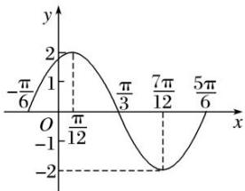

line

| x | y |
|---|---|
| -π/6 | 0 |
| 1 | 2 |
| π/12 | 0 |
| π/3 | -1 |
| 7π/12 | -2 |
| 5π/6 | -1 |

# 【对点训练】

1. 某同学用“五点法”画函数 $f(x) = A\sin (\omega x + \varphi)\left(\omega > 0, |\varphi| < \frac{\pi}{2}\right)$ 在某一个周期内的图象时，列表并填入了部分数据，如下表：

<table><tr><td> $\omega x + \varphi$ </td><td>0</td><td> $\frac{\pi}{2}$ </td><td> $\pi$ </td><td> $\frac{3\pi}{2}$ </td><td> $2\pi$ </td></tr><tr><td>x</td><td></td><td> $\frac{\pi}{3}$ </td><td></td><td> $\frac{5\pi}{6}$ </td><td></td></tr><tr><td> $A\sin(\omega x + \varphi)$ </td><td>0</td><td>5</td><td></td><td>-5</td><td>0</td></tr></table>

(1)请将上表数据补充完整，并直接写出函数 $f(x)$ 的解析式；

(2)将 $y=f(x)$ 图象上所有点向左平移 $\frac{\pi}{6}$ 个单位长度，得到 $y=g(x)$ 的图象，求 $y=g(x)$ 的图象离原点 O 最近的对称中心；

(3)说明函数 $f(x)$ 的图象是由 $y=\sin x$ 的图象经过怎样的变换得到的.

2. 设函数 $f(x) = \cos (\omega x + \varphi)\left[\omega > 0, -\frac{\pi}{2} < \varphi < 0\right]$ 的最小正周期为 $\pi$ ，且 $f\left(\frac{\pi}{4}\right) = \frac{\sqrt{3}}{2}$ .

(1)求 $\omega$ 和 $\varphi$ 的值;

(2)在给定坐标系中作出函数 $f(x)$ 在 $[0, \pi]$ 上的图象.

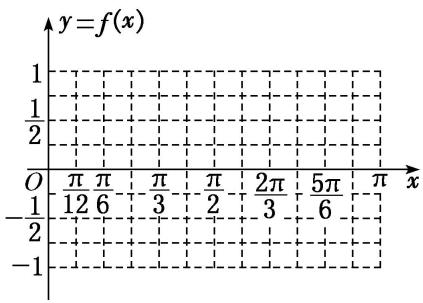

text_image

y=f(x)
1
1/2
O π π π  π π  2π  5π π x
-1/2 12 6 3 2 3 6
-1

# 考点二 函数 $y = A\sin (\omega x + \varphi)$ 的图象的变换

# 【基本知识】

函数 $y=\sin x$ 的图象经变换得到 $y=A\sin(\omega x+\varphi)(A>0,\quad\omega>0)$ 的图象的两种途径

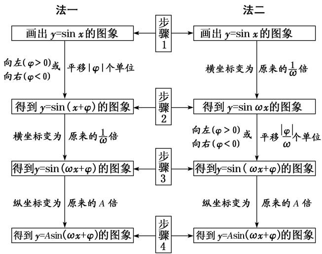

flowchart

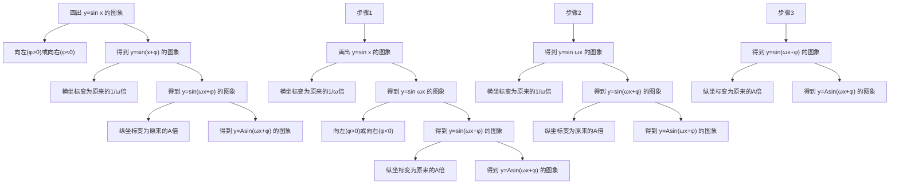

(1)两种变换的区别

①先相位变换(横向平移)再周期变换(伸缩变换)，平移的量是 $|\varphi|$ 个单位长度；②先周期变换(伸缩变换)再相位变换(横向平移)，平移的量是 $\frac{|\varphi|}{\omega}(\omega>0)$ 个单位长度.

(2)变换的注意点

无论哪种横向变换，每一个变换总是针对自变量 $x$ 而言的，即图象变换要看“自变量 $x$ ”发生多大变化，而不是看角“ $\omega x + \varphi$ ”的变化。即函数 $f(x) = \sin (\omega x + \varphi)$ 的图象向左(右)平移 $k$ 个单位长度后，其图象对应的函数解析式为 $g(x) = \sin [\omega (x \pm k) + \varphi]$ ，而不是 $g(x) = \sin (\omega x \pm k + \varphi)$ 。

# 【方法总结】

# 三角函数图象变换中的3个注意点

(1)变换前后，函数的名称要一致，若不一致，应先利用诱导公式转化为同名函数；

(2)要弄清变换的方向，即变换的是哪个函数的图象，得到的是哪个函数的图象，切不可弄错方向；

(3)要弄准变换量的大小，特别是平移变换中，函数 $y = A\sin x$ 到 $y = A\sin (x + \varphi)$ 的变换量是 $|\varphi|$ 个单位，而函数 $y = A\sin \omega x$ 到 $y = A\sin (\omega x + \varphi)$ 时，变换量是 $\left|\frac{\varphi}{\omega}\right|$ 个单位.

# 【例题选讲】

[例 2] (1) (2016·四川)为了得到函数 $y=\sin\left(\frac{2x-\frac{\pi}{3}}{3}\right)$ 的图象，只需把函数 $y=\sin2x$ 的图象上所有的点（）

A. 向左平行移动 $\frac{\pi}{3}$ 个单位长度

B. 向右平行移动 $\frac{\pi}{3}$ 个单位长度

C. 向左平行移动 $\frac{\pi}{6}$ 个单位长度

D. 向右平行移动 $\frac{\pi}{6}$ 个单位长度

(2) (2017·全国I)已知曲线 $C_1: y = \cos x, C_2: y = \sin \left(\frac{2x + \frac{2\pi}{3}}{3}\right)$ ，则下面结论正确的是（ ）

A. 把 $C_{1}$ 上各点的横坐标伸长到原来的 2 倍, 纵坐标不变, 再把得到的曲线向右平移 $\frac{\pi}{6}$ 个单位长度, 得到曲线 $C_{2}$

B. 把 $C_1$ 上各点的横坐标伸长到原来的 2 倍, 纵坐标不变, 再把得到的曲线向左平移 $\frac{\pi}{12}$ 个单位长度, 得到曲线 $C_2$

C. 把 $C_{1}$ 上各点的横坐标缩短到原来的 $\frac{1}{2}$ 倍, 纵坐标不变, 再把得到的曲线向右平移 $\frac{\pi}{6}$ 个单位长度, 得到曲线 $C_{2}$

D. 把 $C_1$ 上各点的横坐标缩短到原来的 $\frac{1}{2}$ 倍，纵坐标不变，再把得到的曲线向左平移 $\frac{\pi}{12}$ 个单位长度，得到曲线 $C_2$

(3) (2018·天津) 将函数 $y = \sin \left( \frac{2x + \frac{\pi}{5} \right)$ 的图象向右平移 $\frac{\pi}{10}$ 个单位长度，所得图象对应的函数()

A. 在区间 $\left[\frac{3\pi}{4}, \frac{5\pi}{4}\right]$ 上单调递增

B. 在区间 $\left[\frac{3\pi}{4}, \pi\right]$ 上单调递减

C. 在区间 $\left[\frac{5\pi}{4}, \frac{3\pi}{2}\right]$ 上单调递增

D. 在区间 $\left[\frac{3\pi}{2}, 2\pi\right]$ 上单调递减

(4)已知函数 $f(x) = \sin \left(\frac{\pi}{3} -\omega x\right)(\omega >0)$ 向左平移半个周期得 $g(x)$ 的图象，若 $g(x)$ 在[0，π]上的值域为

$\left[-\frac{\sqrt{3}}{2}, 1\right]$ ，则 $\omega$ 的取值范围是 \_\_\_\_.

(5) 函数 $y = \sqrt{3} \sin 2x - \cos 2x$ 的图象向右平移 $\varphi \left(0 < \varphi < \frac{\pi}{2}\right)$ 个单位长度后，得到函数 $g(x)$ 的图象，若函数 $g(x)$ 为偶函数，则 $\varphi$ 的值为（）

A. $\frac{\pi}{12}$

B. $\frac{\pi}{6}$

C. $\frac{\pi}{4}$

D. $\frac{\pi}{3}$

(6)将函数 $f(x) = \tan \left(\frac{\omega x + \frac{\pi}{3}}{3}\right) (0 < \omega < 10)$ 的图象向右平移 $\frac{\pi}{6}$ 个单位长度后与函数 $f(x)$ 的图象重合，则 $\omega =$ （）

A. 9

B. 6

C. 4

D. 8

# 【对点训练】

3. 将函数 $y = \sin \left( x + \frac{\pi}{6} \right)$ 的图象上所有的点向左平移 $\frac{\pi}{4}$ 个单位长度，再把图象上各点的横坐标扩大到原来的2倍(纵坐标不变)，则所得图象对应的函数解析式为()

A. $y=\sin\left(2x+\frac{5\pi}{12}\right)$

B. $y=\sin\left(\frac{x}{2}+\frac{5\pi}{12}\right)$

C. $y=\sin\left(\frac{x}{2}-\frac{\pi}{12}\right)$

D. $y=\sin\left(\frac{x}{2}+\frac{5\pi}{24}\right)$

4. 将函数 $f(x)=\sin x+\cos x$ 的图象上各点的纵坐标不变，横坐标缩小为原来的 $\frac{1}{2}$ ，再将函数图象向左平移 $\frac{\pi}{3}$ 个单位后，得到的函数 $g(x)$ 的解析式为（）

A. $g(x)=\sqrt{2}\sin\left(2x+\frac{\pi}{3}\right)$

B. $g(x)=\sqrt{2}\sin\left(2x+\frac{11\pi}{12}\right)$

C. $g(x)=\sqrt{2}\sin\left(\frac{x}{2}+\frac{\pi}{3}\right)$

D. $g(x)=\sqrt{2}\sin\left(2x+\frac{5\pi}{12}\right)$

5. 将函数 $y = f(x)$ 的图象向左平移 $\frac{\pi}{3}$ 个单位长度，再把所得图象上所有点的横坐标伸长到原来的2倍得到 $y = \sin \left(3x - \frac{1}{6}\pi\right)$ 的图象，则 $f(x) = (\quad)$

A. $\sin\left(\frac{3}{2}x+\frac{1}{6}\pi\right)$

B. $\sin\left(6x-\frac{1}{6}\pi\right)$

C. $\sin \left( \frac{3}{2} x + \frac{1}{3} \pi \right)$

D. $\sin\left(6x+\frac{1}{3}\pi\right)$

6. 若函数 $f(x) = \cos \left(2x - \frac{\pi}{6}\right)$ ，为了得到函数 $g(x) = \sin 2x$ 的图象，则只需将 $f(x)$ 的图象（）

A. 向右平移 $\frac{\pi}{6}$ 个单位长度

B. 向右平移 $\frac{\pi}{3}$ 个单位长度

C. 向左平移 $\frac{\pi}{6}$ 个单位长度

D. 向左平移 $\frac{\pi}{3}$ 个单位长度

7. 在平面直角坐标系 $xOy$ 中，将函数 $f(x) = \sin \left(3x + \frac{\pi}{4}\right)$ 的图象向左平移 $\varphi (\varphi >0)$ 个单位后得到的图象经过原点，则 $\varphi$ 的最小值为（）

A. $\frac{\pi}{3}$

B. $\frac{\pi}{4}$

C. $\frac{\pi}{6}$

D. $\frac{\pi}{12}$

8. 将曲线 $y = \sin (2x + \varphi)\left[\frac{|\varphi| < \frac{\pi}{2}}{2}\right]$ 向右平移 $\frac{\pi}{6}$ 个单位长度后得到曲线 $y = f(x)$ ，若函数 $f(x)$ 的图象关于 $y$ 轴对称，则 $\varphi = (\quad)$

A. $\frac{\pi}{3}$

B. $\frac{\pi}{6}$

C. $-\frac{\pi}{3}$

D. $-\frac{\pi}{6}$

9. (2019·天津)已知函数 $f(x) = A\sin (\omega x + \varphi)(A > 0, \omega > 0, |\varphi| < \pi)$ 是奇函数，且 $f(x)$ 的最小正周期为 $\pi$ ，将 $y = f(x)$ 的图象上所有点的横坐标伸长到原来的2倍(纵坐标不变)，所得图象对应的函数为 $g(x)$ . 若 $g\left(\frac{\pi}{4}\right) = \sqrt{2}$ ，则 $f\left(\frac{3\pi}{8}\right) = (\quad)$

A. -2

B. $-\sqrt{2}$

C. $\sqrt{2}$

D. 2

10. (2016·全国)若将函数 $y=2\sin 2x$ 的图象向左平移 $\frac{\pi}{12}$ 个单位长度，则平移后图象的对称轴为()

A. $x=\frac{k\pi}{2}-\frac{\pi}{6}(k\in\mathbf{Z})$

B. $x=\frac{k\pi}{2}+\frac{\pi}{6}(k\in\mathbf{Z})$

C. $x=\frac{k\pi}{2}-\frac{\pi}{12}(k\in\mathbf{Z})$

D. $x=\frac{k\pi}{2}+\frac{\pi}{12}(k\in\mathbf{Z})$

11. 将函数 $f(x)=\sin(\omega x+\varphi)\omega>0$ ， $-\frac{\pi}{2}\leq\varphi<\frac{\pi}{2}$ 图象上每一点的横坐标伸长为原来的 2 倍(纵坐标不变)，再向左平移 $\frac{\pi}{3}$ 个单位长度得到 $y=\sin x$ 的图象，则函数 $f(x)$ 的单调递增区间为()

A. $\left[2k\pi-\frac{\pi}{12},\quad2k\pi+\frac{5\pi}{12}\right],\quad k\in\mathbf{Z}$

B. $\left[2k\pi-\frac{\pi}{6},\quad2k\pi+\frac{5\pi}{6}\right],\quad k\in\mathbf{Z}$

C. $\left[k\pi-\frac{\pi}{12},\quad k\pi+\frac{5\pi}{12}\right],\quad k\in\mathbf{Z}$

D. $\left[k\pi-\frac{\pi}{6},\quad k\pi+\frac{5\pi}{6}\right],\quad k\in\mathbf{Z}$

12. 将函数 $f(x) = -\cos 2x$ 的图象向右平移 $\frac{\pi}{4}$ 个单位后得到函数 $g(x)$ 的图象，则 $g(x)$ 具有性质（）

A. 最大值为 1，图象关于直线 $x = \frac{\pi}{2}$ 对称

B. 在 $\left(0, \frac{\pi}{4}\right)$ 上单调递减，为奇函数

C. 在 $\left(-\frac{3\pi}{8}, \frac{\pi}{8}\right)$ 上单调递增，为偶函数

D. 周期为 $\pi$ ，图象关于点 $\left(\frac{3\pi}{8}, 0\right)$ 对称

13. 将函数 $f(x) = \sin 2x$ 的图象向右平移 $\varphi \left(0 < \varphi < \frac{\pi}{2}\right)$ 个单位后得到函数 $g(x)$ 的图象。若对满足 $|f(x_1) - g(x_2)| = 2$ 的 $x_1, x_2$ ，有 $|x_1 - x_2|_{\min} = \frac{\pi}{3}$ ，则 $\varphi = (\quad)$

A. $\frac{5\pi}{12}$

B. $\frac{\pi}{3}$

C. $\frac{\pi}{4}$

D. $\frac{\pi}{6}$

14. 将函数 $f(x) = 2\cos 2x$ 的图象向右平移 $\frac{\pi}{6}$ 个单位长度后得到函数 $g(x)$ 的图象，若函数 $g(x)$ 在区间 $\left[0, \frac{a}{3}\right]$ 和 $\left[2a, \frac{7\pi}{6}\right]$ 上均单调递增，则实数 $a$ 的取值范围是（）

A. $\left[\frac{\pi}{3},\frac{\pi}{2}\right]$

B. $\begin{bmatrix}\frac{\pi}{6},\frac{\pi}{2}\end{bmatrix}$

C. $\begin{bmatrix} \frac{\pi}{6}, & \frac{\pi}{3} \end{bmatrix}$

D. $\left[\frac{\pi}{4},\frac{3\pi}{8}\right]$

# 考点三 由图象确定 $y = A \sin (\omega x + \varphi)$ 的解析式

# 【方法总结】

确定 $y=A\sin(\omega x+\varphi)+B(A>0,\ \omega>0)$ 的解析式的步骤

由三角函数的图象求解析式 $y = A\sin (\omega x + \varphi) + B (A > 0, \omega > 0)$ 中参数的值，关键是把握函数图象的特征与参数之间的对应关系，其基本依据就是“五点法”作图.

(1)最值定 $A, B$ ：根据给定的函数图象确定最值，设最大值为 $M$ ，最小值为 $m$ ，则 $M = A + B$ ， $m = -A + B$ ，解得 $B = \frac{M + m}{2}$ ， $A = \frac{M - m}{2}$ 。特别地，当 $B = 0$ 时， $A = M = -m$ 。

(2) $T$ 定 $\omega$ ：由周期的求解公式 $T = \frac{2\pi}{\omega}$ ，可得 $\omega = \frac{2\pi}{T}$ 记住三角函数的周期 $T$ 的相关结论：

①两个相邻对称中心之间的距离等于 $\frac{T}{2}$ . ②两条相邻对称轴之间的距离等于 $\frac{T}{2}$ . ③对称中心与相邻对称轴的距离等于 $\frac{T}{4}$ .

(3)点坐标定 $\varphi$ :

①代入法：把图象上的一个已知点代入(此时 $A$ ， $\omega$ ， $B$ 已知)或代入图象与直线 $y = B$ 的交点求解(此时要注意交点是在上升区间还是在下降区间).

②五点法：确定 $\varphi$ 值时，往往以寻找“五点法”中的某一个点为突破口．具体如下：

“第一点”(即图象上升时与 x 轴的交点)为 $\omega x + \varphi = 0$ ; “第二点”(即图象的“峰点”)为 $\omega x + \varphi = \frac{\pi}{2}$ ; “第三点”(即图象下降时与 x 轴的交点)为 $\omega x + \varphi = \pi$ ; “第四点”(即图象的“谷点”)为 $\omega x + \varphi = \frac{3\pi}{2}$ ; “第五点”为 $\omega x + \varphi = 2\pi$ .

③变换法：运用逆向思维，由图象变换来确定．由 $f(x)=A\sin(\omega x+\varphi)=A\sin\omega\left(\frac{x+\varphi}{\omega}\right)$ 知，“五点法”中的第一个点 $\left(-\frac{\varphi}{\omega},0\right)$ 就是由原点平移而来的，可从图中读出此点横坐标，令其等于 $-\frac{\varphi}{\omega}$ ，即可得到 $\varphi$ 值.

# 【例题选讲】

[例 3] (1) 已知函数 $f(x)=A\sin(\omega x+\varphi)(A>0,\quad\omega>0,\quad0<\varphi<\pi)$ ，其部分图象如图所示，则函数 $f(x)$ 的解析式为()

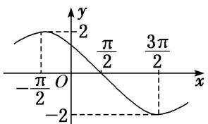

line

| x | y |
|---|---|
| -π/2 | 2 |
| 0 | 2 |
| π/2 | 0 |
| 3π/2 | -2 |

A. $f(x) = 2\sin \left(\frac{1}{2} x + \frac{\pi}{4}\right)$

B. $f(x)=2\sin\left(\frac{1}{2}x+\frac{3\pi}{4}\right)$

C. $f(x) = 2\sin \left(\frac{1}{4} x + \frac{3\pi}{4}\right)$

D. $f(x)=2\sin\left(2x+\frac{\pi}{4}\right)$

(2) 函数 $f(x) = A \sin (\omega x + \varphi) \left[ A > 0, \quad \omega > 0, \quad |\varphi| < \frac{\pi}{2} \right]$ 的部分图象如图所示，则 $f\left(\frac{11\pi}{24}\right)$ 的值为（）

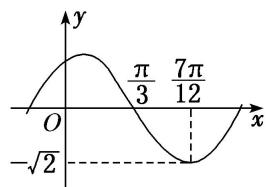

line

| x | y |
|---|---|
| 0 | -√2 |
| π/3 | π/3 |
| 7π/12 | 7π/12 |

A. $-\frac{\sqrt{6}}{2}$

B. $-\frac{\sqrt{3}}{2}$

C. $-\frac{\sqrt{2}}{2}$

D. -1

(3) 已知函数 $f(x) = \sin (\omega x + \varphi)\left[\omega > 0, -\frac{\pi}{2} \leq \varphi \leq \frac{\pi}{2}\right]$ 的图象上的一个最高点和它相邻的一个最低点的距离为 $2\sqrt{2}$ ，且过点 $\left[2, -\frac{1}{2}\right]$ ，则函数 $f(x) =$ \_\_\_\_.

(4) 将函数 $f(x)$ 的图象上所有点向右平移 $\frac{\pi}{4}$ 个单位长度，得到函数 $g(x)$ 的图象．若函数 $g(x) = A\sin (\omega x + \varphi)(A > 0, \omega > 0, |\varphi| < \frac{\pi}{2})$ 的部分图象如图所示，则函数 $f(x)$ 的解析式为（）

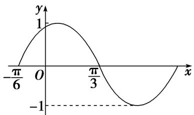

line

| x | y |
|---|---|
| -π/6 | 0 |
| 0 | 1 |
| π/3 | 0 |
| -π/6 | -1 |

A. $f(x) = \sin \left( x + \frac{5\pi}{12} \right)$

B. $f(x)=-\cos\left(2x+\frac{\pi}{3}\right)$

C. $f(x) = \cos \left(2x + \frac{\pi}{3}\right)$

D. $f(x)=\sin\left(2x+\frac{7\pi}{12}\right)$

(5) 函数 $f(x)=A\cos(\omega x+\varphi)(\omega>0)$ 的部分图象如图所示，给出以下结论：

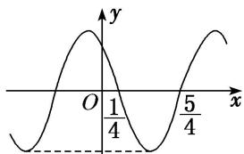

line

| x | y |
|---|---|
| 0 | -∞ |
| 1/4 | 1/4 |
| 5/4 | -∞ |

① $f(x)$ 的最小正周期为2；② $f(x)$ 图象的一条对称轴为直线 $x=-\frac{1}{2}$ ；③ $f(x)$ 在 $\left(2k-\frac{1}{4},2k+\frac{3}{4}\right)$ ， $k\in Z$ 上是减函数；④ $f(x)$ 的最大值为A.

则正确结论的个数为( )

A. 1

B. 2

C. 3

D. 4

(6) 函数 $f(x) = A \sin (\omega x + \varphi) A > 0, \omega > 0, |\varphi| < \frac{\pi}{2}$ 的部分图象如图所示，若 $x_1, x_2 \in \left(-\frac{\pi}{6}, \frac{\pi}{3}\right)$ ，且 $f(x_1) = f(x_2)$ ，则 $f(x_1 + x_2) =$ \_\_\_\_.

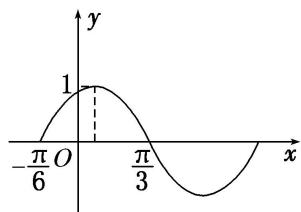

line

| x | y |
|---|---|
| -π/6 | 0 |
| 0 | 1 |
| π/3 | 0 |
| π | -1 |

(7) (2019·天津)已知函数 $f(x)=A\sin(\omega x+\varphi)(A>0,\quad\omega>0,\quad|\varphi|<\pi)$ 是奇函数，且 $f(x)$ 的最小正周期为 $\pi$ ，将 y$= f(x)$ 的图象上所有点的横坐标伸长到原来的2倍(纵坐标不变)，所得图象对应的函数为 $g(x)$ . 若 $g\left(\frac{\pi}{4}\right)=\sqrt{2}$ , 则 $f\left(\frac{3\pi}{8}\right)=(\quad)$

A. -2

B. $-\sqrt{2}$

C. $\sqrt{2}$

D. 2

# 【对点训练】

15. 已知函数 $f(x) = A \sin (\omega x + \varphi) \left( \omega > 0, -\frac{\pi}{2} < \varphi < \frac{\pi}{2} \right)$ 的部分图象如图所示，则 $\varphi$ 的值为（）

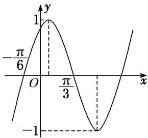

line

| x | y |
|---|---|
| -π/6 | 1 |
| π/3 | -1 |

A. $-\frac{\pi}{3}$

B. $\frac{\pi}{3}$

C. $-\frac{\pi}{6}$

D. $\frac{\pi}{6}$

16. 已知函数 $f(x) = A \sin (\omega x + \varphi) (A > 0, \omega > 0, |\varphi| < \pi)$ 的部分图象如图所示，则 $f(x)$ 的解析式为（）

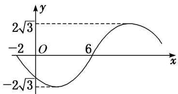

line

| x | y |
|---|---|
| -2 | -2√3 |
| 0 | -2√3 |
| 6 | 2√3 |

A. $f(x) = 2\sqrt{3}\sin \left(\frac{\pi x}{8} +\frac{\pi}{4}\right)$

B. $f(x) = 2\sqrt{3}\sin \left(\frac{\pi x}{8} +\frac{3\pi}{4}\right)$

C. $f(x) = 2\sqrt{3}\sin \left(\frac{\pi x}{8} -\frac{\pi}{4}\right)$

D. $f(x) = 2\sqrt{3}\sin \left(\frac{\pi x}{8} -\frac{3\pi}{4}\right)$

17. 已知 $f(x) = A \sin (\omega x + \varphi) + B \left( A > 0, \omega > 0, |\varphi| < \frac{\pi}{2} \right)$ 的部分图象如图，则 $f(x)$ 图象的一个对称中心是（）

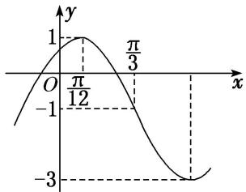

line

| x | y |
|---|---|
| 0 | -1 |
| π/12 | 1 |
| π/3 | -1 |
| -π/3 | -3 |

A. $\left(\frac{5\pi}{6},-1\right)$

B. $\left(\frac{\pi}{12},0\right)$

C. $\left(\frac{\pi}{12},-1\right)$

D. $\left(\frac{5\pi}{6},0\right)$

18. 已知函数 $f(x) = A\cos (\omega x + \varphi)$ 的图象如图所示， $f\left(\frac{\pi}{2}\right) = -\frac{2}{3}$ ，则 $f\left(-\frac{\pi}{6}\right) = (\quad)$

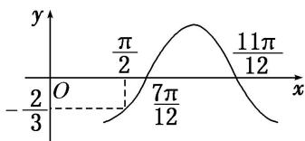

line

| x | y |
|---|---|
| 0 | -2/3 |
| π/2 | π/2 |
| 7π/12 | π/12 |
| 11π/12 | 11π/12 |

A. $-\frac{2}{3}$

B. $-\frac{1}{2}$

C. $\frac{2}{3}$

D. $\frac{1}{2}$

19. 已知函数 $f(x) = A \cos (\omega x + \varphi) (A > 0, \omega > 0, 0 < \varphi < \pi)$ 为奇函数，该函数的部分图象如图所示， $\triangle EFG$ (点 $G$ 是图象的最高点)是边长为 2 的等边三角形，则 $f(1) =$ \_\_\_\_.

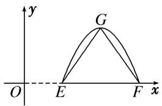

text_image

y
G
O E F x

20. (2015·全国I)函数 $f(x) = \cos (\omega x + \varphi)$ 的部分图象如图所示，则 $f(x)$ 的单调递减区间为()

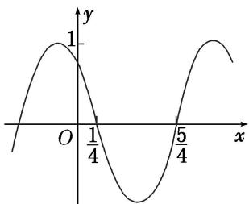

line

| x | y |
|---|---|
| 0 | 1 |
| 1/4 | 1 |
| 5/4 | 1 |

A. $\left(k\pi-\frac{1}{4},\quad k\pi+\frac{3}{4}\right),\quad k\in\mathbf{Z}$

B. $\left(2k\pi-\frac{1}{4},\quad2k\pi+\frac{3}{4}\right),\quad k\in\mathbf{Z}$

C. $\left(k-\frac{1}{4},\quad k+\frac{3}{4}\right),\quad k\in\mathbf{Z}$

D. $\left(2k-\frac{1}{4},\quad2k+\frac{3}{4}\right),\quad k\in\mathbf{Z}$

21. 将函数 $f(x)$ 的图象向右平移 $\frac{\pi}{6}$ 个单位长度，再将所得函数图象上的所有点的横坐标缩短到原来的 $\frac{2}{3}$ ，得到函数 $g(x) = A\sin (\omega x + \varphi)\left[A > 0, \omega > 0, |\varphi| < \frac{\pi}{2}\right]$ 的图象。已知函数 $g(x)$ 的部分图象如图所示，则函数 $f(x)()$

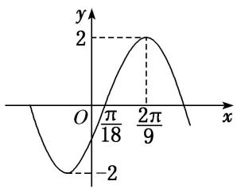

line

| x | y |
|---|---|
| 0 | -2 |
| π/18 | 0 |
| 2π/9 | 2 |

A. 最小正周期为 $\frac{2}{3}\pi$ ，最大值为 2

B. 最小正周期为 $\pi$ ，图象关于点 $\left(\frac{\pi}{6}, 0\right)$ 中心对称

C. 最小正周期为 $\frac{2}{3}\pi$ ，图象关于直线 $x = \frac{\pi}{6}$ 对称

D. 最小正周期为 $\pi$ ，在区间 $\left[\frac{\pi}{6}, \frac{\pi}{3}\right]$ 上单调递减

22. 已知函数 $f(x) = A \sin (\omega x + \varphi) (A > 0, \omega > 0, 0 < \varphi < \pi)$ 的图象与 $x$ 轴的一个交点 $\left[-\frac{\pi}{12}, 0\right]$ 到其相邻的一条对称轴的距离为 $\frac{\pi}{4}$ ，若 $f\left(\frac{\pi}{12}\right) = \frac{3}{2}$ ，则函数 $f(x)$ 在 $\left[0, \frac{\pi}{2}\right]$ 上的最小值为（）

A. $\frac{1}{2}$

B. $-\sqrt{3}$

C. $-\frac{\sqrt{3}}{2}$

D. $-\frac{1}{2}$

23. 函数 $f(x) = A\cos (\omega x + \varphi)(A > 0, \omega > 0, -\pi < \varphi < 0)$ 的部分图象如图所示，为了得到 $g(x) = A\sin \omega x$ 的图象，只需将函数 $y = f(x)$ 的图象（）

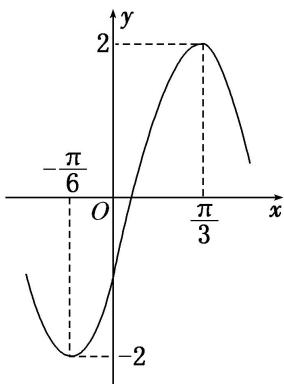

line

| x | y |
|---|---|
| -π/6 | -2 |
| 0 | 0 |
| π/3 | 2 |
| > π/3 | < -2 |

A. 向左平移 $\frac{\pi}{6}$ 个单位长度

B. 向左平移 $\frac{\pi}{12}$ 个单位长度

C. 向右平移 $\frac{\pi}{6}$ 个单位长度

D. 向右平移 $\frac{\pi}{12}$ 个单位长度

24. 函数 $f(x) = A \sin (2x + \theta) \left( A > 0, |\theta| \leq \frac{\pi}{2} \right)$ 的部分图象如图所示，且 $f(a) = f(b) = 0$ ，对不同的 $x_1, x_2 \in [a, b]$ ，若 $f(x_1) = f(x_2)$ ，有 $f(x_1 + x_2) = \sqrt{3}$ ，则（）

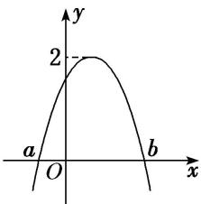

line

| Point | x | y |
|---|---|---|
| 1 | 0 | 2 |
| 2 | 0 | 2 |

A. $f(x)$ 在 $\left(-\frac{5\pi}{12}, \frac{\pi}{12}\right)$ 上是减函数

B. $f(x)$ 在 $\left(-\frac{5\pi}{12}, \frac{\pi}{12}\right)$ 上是增函数

C. $f(x)$ 在 $\left(\frac{\pi}{3}, \frac{5\pi}{6}\right)$ 上是减函数

D. $f(x)$ 在 $\left(\frac{\pi}{3}, \frac{5\pi}{6}\right)$ 上是增函数

25. 函数 $f(x) = \sin (\omega x + \varphi)\left(\omega > 0, |\varphi| < \frac{\pi}{2}\right)$ 在它的某一个周期内的单调递减区间是 $\left[\frac{5\pi}{12}, \frac{11\pi}{12}\right]$ . 将 $y = f(x)$ 的图象先向左平移 $\frac{\pi}{4}$ 个单位长度，再将图象上所有点的横坐标变为原来的 $\frac{1}{2}$ (纵坐标不变)，所得到的图象对应的函数记为 $g(x)$ .

(1)求 $g(x)$ 的解析式;

(2)求 $g(x)$ 在区间 $\left[0, \frac{\pi}{4}\right]$ 上的最大值和最小值.

26. 函数 $f(x) = A \sin (\omega x + \varphi) \left\{ A > 0, \quad \omega > 0, \quad |\varphi| < \frac{\pi}{2} \right\}$ 的部分图象如图所示.

(1)求函数 $f(x)$ 的解析式，并写出其图象的对称中心；

(2)若方程 $f(x) + 2\cos \left(4x + \frac{\pi}{3}\right) = a$ 有实数解，求 $a$ 的取值范围.

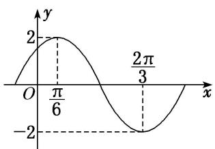

line

| x | y |
|---|---|
| 0 | 0 |
| π/6 | 2 |
| 2π/3 | -2 |

