# 专题四 函数 $y=A\sin(\omega x+\varphi)$ 的图象

# 考点一 函数 $y = A\sin (\omega x + \varphi)$ 的图象及变换

# 【基本知识】

(1) $y=A\sin(\omega x+\varphi)$ 的有关概念

<table><tr><td rowspan="2"> $y = A \sin(\omega x + \varphi) (A > 0, \omega > 0), x \in \mathbf{R}$ </td><td>振幅</td><td>周期</td><td>频率</td><td>相位</td><td>初相</td></tr><tr><td> $A$ </td><td> $T = \frac{2\pi}{\omega}$ </td><td> $f = \frac{1}{T} = \frac{\omega}{2\pi}$ </td><td> $\omega x + \varphi$ </td><td> $\varphi$ </td></tr></table>

(2)用五点法画 $y = A \sin (\omega x + \varphi) (A > 0, \omega > 0)$ 一个周期内的简图

用五点法画 $y=A\sin(\omega x+\varphi)(A>0,\quad\omega>0,\quad x\in\mathbf{R})$ 一个周期内的简图时，要找五个如下表所示的特征点：

<table><tr><td>x</td><td> $\frac{0-\varphi}{\omega}$ </td><td> $\frac{\pi}{2}-\frac{\varphi}{\omega}$ </td><td> $\frac{\pi-\varphi}{\omega}$ </td><td> $\frac{3\pi}{2}-\frac{\varphi}{\omega}$ </td><td> $\frac{2\pi-\varphi}{\omega}$ </td></tr><tr><td> $\omega x+\varphi$ </td><td> $\underline{0}$ </td><td> $\frac{\pi}{2}$ </td><td> $\pi$ </td><td> $\frac{3\pi}{2}$ </td><td> $2\pi$ </td></tr><tr><td> $y=A\sin(\omega x+\varphi)$ </td><td>0</td><td>A</td><td>0</td><td>-A</td><td>0</td></tr></table>

用“五点法”作函数 $y = A \sin (\omega x + \varphi)$ 的简图，精髓是通过变量代换，设 $z = \omega x + \varphi$ ，由 $z$ 取 $0, \frac{\pi}{2}, \pi, \frac{3\pi}{2}$ ， $2\pi$ 来求出相应的 $x$ ，通过列表，计算得出五点坐标，描点后得出图象，其中相邻两点的横向距离均为 $\frac{T}{4}$ .

# 【例题选讲】

[例 1] 已知函数 $y=2\sin\left(2x+\frac{\pi}{3}\right)$ .

(1)求它的振幅、周期、初相;   
(2)用“五点法”作出它在一个周期内的图象;   
(3)说明 $y = 2\sin \left(2x + \frac{\pi}{3}\right)$ 的图象可由 $y = \sin x$ 的图象经过怎样的变换而得到.

解 $(1)y=2\sin\left(2x+\frac{\pi}{3}\right)$ 的振幅 A=2，周期 $T=\frac{2\pi}{2}=\pi$ ，初相 $\varphi=\frac{\pi}{3}$ .

(2)令 $X=2x+\frac{\pi}{3}$ ，则 $y=2\sin\left(2x+\frac{\pi}{3}\right)=2\sin X$ 。列表如下：

<table><tr><td>x</td><td> $-\frac{\pi}{6}$ </td><td> $\frac{\pi}{12}$ </td><td> $\frac{\pi}{3}$ </td><td> $\frac{7\pi}{12}$ </td><td> $\frac{5\pi}{6}$ </td></tr><tr><td>X</td><td>0</td><td> $\frac{\pi}{2}$ </td><td> $\pi$ </td><td> $\frac{3\pi}{2}$ </td><td> $2\pi$ </td></tr><tr><td>y=sin X</td><td>0</td><td>1</td><td>0</td><td>-1</td><td>0</td></tr><tr><td>y=2sin $\left(2x+\frac{\pi}{3}\right)$ </td><td>0</td><td>2</td><td>0</td><td>-2</td><td>0</td></tr></table>

描点画出图象，如图所示：

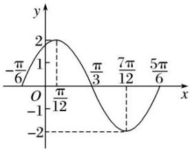

line

| x | y |
|---|---|
| -π/6 | 2 |
| 1 | 2 |
| π/12 | 0 |
| π/3 | -1 |
| 7π/12 | -2 |
| 5π/6 | -1 |

(3)方法一 把 $y = \sin x$ 的图象上所有的点向左平移 $\frac{\pi}{3}$ 个单位长度，得到 $y = \sin \left(\frac{x + \frac{\pi}{3}}{3}\right)$ 的图象；再把 $y = \sin \left(\frac{x + \frac{\pi}{3}}{3}\right)$ 的图象上所有点的横坐标缩短到原来的 $\frac{1}{2}$ 倍(纵坐标不变)，得到 $y = \sin \left(\frac{2x + \frac{\pi}{3}}{3}\right)$ 的图象；最后把 $y = \sin \left(\frac{2x + \frac{\pi}{3}}{3}\right)$ 上所有点的纵坐标伸长到原来的2倍(横坐标不变)，即可得到 $y = 2\sin \left(\frac{2x + \frac{\pi}{3}}{3}\right)$ 的图象.

方法二 将 $y=\sin x$ 的图象上所有点的横坐标缩短为原来的 $\frac{1}{2}$ 倍(纵坐标不变)，得到 $y=\sin 2x$ 的图象；再将 $y=\sin 2x$ 的图象向左平移 $\frac{\pi}{6}$ 个单位长度，得到 $y=\sin\left[2\left(x+\frac{\pi}{6}\right)\right]=\sin\left(2x+\frac{\pi}{3}\right)$ 的图象；再将 $y=\sin\left(2x+\frac{\pi}{3}\right)$ 的图象上所有点的纵坐标伸长为原来的 2 倍(横坐标不变)，即得到 $y=2\sin\left(2x+\frac{\pi}{3}\right)$ 的图象.

# 【对点训练】

1. 某同学用“五点法”画函数 $f(x) = A\sin (\omega x + \varphi)\left[\omega > 0, |\varphi| < \frac{\pi}{2}\right]$ 在某一个周期内的图象时，列表并填入了部分数据，如下表：

<table><tr><td> $\omega x + \varphi$ </td><td>0</td><td> $\frac{\pi}{2}$ </td><td> $\pi$ </td><td> $\frac{3\pi}{2}$ </td><td> $2\pi$ </td></tr><tr><td>x</td><td></td><td> $\frac{\pi}{3}$ </td><td></td><td> $\frac{5\pi}{6}$ </td><td></td></tr><tr><td> $A\sin(\omega x + \varphi)$ </td><td>0</td><td>5</td><td></td><td>-5</td><td>0</td></tr></table>

(1)请将上表数据补充完整，并直接写出函数 $f(x)$ 的解析式；

(2)将 $y=f(x)$ 图象上所有点向左平移 $\frac{\pi}{6}$ 个单位长度，得到 $y=g(x)$ 的图象，求 $y=g(x)$ 的图象离原点 O 最近的对称中心；

(3)说明函数 $f(x)$ 的图象是由 $y=\sin x$ 的图象经过怎样的变换得到的.

1. 解 (1)根据表中已知数据, 解得 $A = 5$ , $\omega = 2$ , $\varphi = -\frac{\pi}{6}$ , 数据补全如下表:

<table><tr><td> $\omega x + \varphi$ </td><td>0</td><td> $\frac{\pi}{2}$ </td><td> $\pi$ </td><td> $\frac{3\pi}{2}$ </td><td> $2\pi$ </td></tr><tr><td>x</td><td> $\frac{\pi}{12}$ </td><td> $\frac{\pi}{3}$ </td><td> $\frac{7\pi}{12}$ </td><td> $\frac{5\pi}{6}$ </td><td> $\frac{13\pi}{12}$ </td></tr><tr><td> $A\sin(\omega x + \varphi)$ </td><td>0</td><td>5</td><td>0</td><td>-5</td><td>0</td></tr></table>

则函数解析式为 $f(x)=5\sin\left(2x-\frac{\pi}{6}\right)$ .

(2)由(1)知 $f(x)=5\sin\left(2x-\frac{\pi}{6}\right)$ ，因此 $g(x)=5\sin\left[2\left(x+\frac{\pi}{6}\right)-\frac{\pi}{6}\right]=5\sin\left(2x+\frac{\pi}{6}\right)$ .

因为 $y=\sin x$ 的对称中心为 $(k\pi,0)$ ， $k\in Z$ ，令 $2x+\frac{\pi}{6}=k\pi$ ， $k\in Z$ ，解得 $x=\frac{k\pi}{2}-\frac{\pi}{12}$ ， $k\in Z$ ，

即 $y=g(x)$ 图象的对称中心为 $\left(\frac{k\pi}{2}-\frac{\pi}{12},0\right)$ ， $k\in Z$ ，其中离原点 O 最近的对称中心为 $\left(-\frac{\pi}{12},0\right)$ .

(3)把 $y=\sin x$ 的图象上所有的点向右平移 $\frac{\pi}{6}$ 个单位长度, 得到 $y=\sin\left(x-\frac{\pi}{6}\right)$ 的图象, 再把 $y=\sin\left(x-\frac{\pi}{6}\right)$ 的图象上的点的横坐标缩短到原来的 $\frac{1}{2}$ 倍 (纵坐标不变), 得到 $y=\sin\left(2x-\frac{\pi}{6}\right)$ 的图象, 最后把 $y=\sin\left(2x-\frac{\pi}{6}\right)$ 上所有点的纵坐标伸长到原来的 5 倍 (横坐标不变), 即可得到 $y=5\sin2x-\frac{\pi}{6}$ 的图象.

2. 设函数 $f(x) = \cos (\omega x + \varphi)\left[\omega > 0, -\frac{\pi}{2} < \varphi < 0\right]$ 的最小正周期为 $\pi$ ，且 $f\left(\frac{\pi}{4}\right) = \frac{\sqrt{3}}{2}$ .

(1)求 $\omega$ 和 $\varphi$ 的值;

(2)在给定坐标系中作出函数 $f(x)$ 在 $[0, \pi]$ 上的图象.

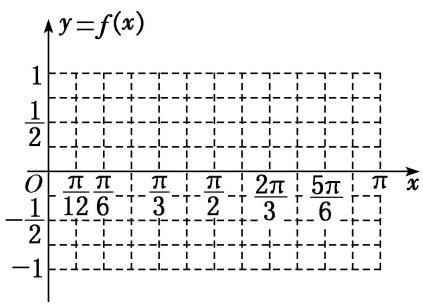

text_image

y=f(x)
1
1/2
O π π π  π π  2π  5π π x
-1/2 12 6 3 2 3 6
-1

2. 解 (1) 因为 $T=\frac{2\pi}{\omega}=\pi$ ，所以 $\omega=2$ ，又因为 $f\left(\frac{\pi}{4}\right)=\cos\left(2\times\frac{\pi}{4}+\varphi\right)=\cos\left(\frac{\pi}{2}+\varphi\right)=-\sin\varphi=\frac{\sqrt{3}}{2}$ 且 $-\frac{\pi}{2}<\varphi<0$ ，所以 $\varphi=-\frac{\pi}{3}$ .

(2)由(1)知 $f(x)=\cos\left(2x-\frac{\pi}{3}\right)$ .

列表：

<table><tr><td> $2x-\frac{\pi}{3}$ </td><td> $-\frac{\pi}{3}$ </td><td>0</td><td> $\frac{\pi}{2}$ </td><td> $\pi$ </td><td> $\frac{3\pi}{2}$ </td><td> $\frac{5\pi}{3}$ </td></tr><tr><td> $x$ </td><td>0</td><td> $\frac{\pi}{6}$ </td><td> $\frac{5\pi}{12}$ </td><td> $\frac{2\pi}{3}$ </td><td> $\frac{11\pi}{12}$ </td><td> $\pi$ </td></tr><tr><td> $f(x)$ </td><td> $\frac{1}{2}$ </td><td>1</td><td>0</td><td>-1</td><td>0</td><td> $\frac{1}{2}$ </td></tr></table>

描点，连线，可得函数 $f(x)$ 在 $[0, \pi]$ 上的图象如图所示.

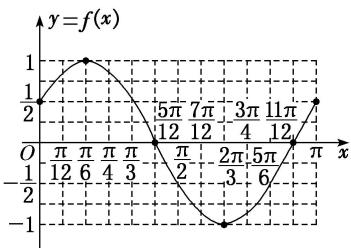

line

| x | y = f(x) |
|---|---|
| 0 | 1/2 |
| π/12 | 1 |
| π/6 | 1 |
| π/4 | 1 |
| π/3 | 0.5 |
| 5π/12 | -0.5 |
| π/2 | -1 |
| 2π/3 | -1.5 |
| 5π/6 | -0.5 |
| 1π/12 | 0.5 |
| π | 1 |

# 考点二 函数 $y = A\sin (\omega x + \varphi)$ 的图象的变换

# 【基本知识】

函数 $y=\sin x$ 的图象经变换得到 $y=A\sin(\omega x+\varphi)(A>0,\quad\omega>0)$ 的图象的两种途径

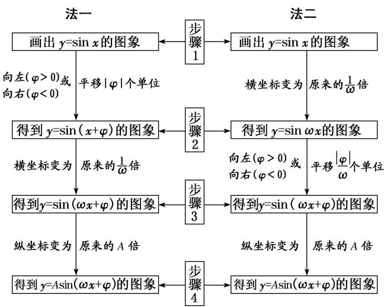

flowchart

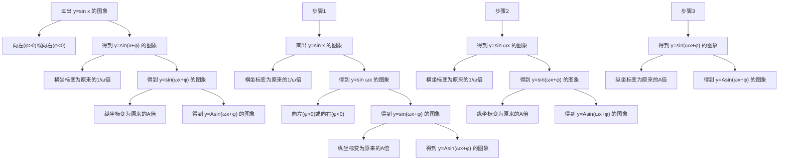

(1)两种变换的区别

①先相位变换(横向平移)再周期变换(伸缩变换)，平移的量是 $|\varphi|$ 个单位长度；②先周期变换(伸缩变换)再相位变换(横向平移)，平移的量是 $\frac{|\varphi|}{\omega}(\omega>0)$ 个单位长度.

(2)变换的注意点

无论哪种横向变换，每一个变换总是针对自变量 $x$ 而言的，即图象变换要看“自变量 $x$ ”发生多大变化，而不是看角“ $\omega x + \varphi$ ”的变化。即函数 $f(x) = \sin (\omega x + \varphi)$ 的图象向左(右)平移 $k$ 个单位长度后，其图象对应的函数解析式为 $g(x) = \sin [\omega (x \pm k) + \varphi]$ ，而不是 $g(x) = \sin (\omega x \pm k + \varphi)$ 。

# 【方法总结】

# 三角函数图象变换中的 3 个注意点

(1)变换前后，函数的名称要一致，若不一致，应先利用诱导公式转化为同名函数；  
(2)要弄清变换的方向，即变换的是哪个函数的图象，得到的是哪个函数的图象，切不可弄错方向；  
(3)要弄准变换量的大小，特别是平移变换中，函数 $y = A \sin x$ 到 $y = A \sin (x + \varphi)$ 的变换量是 $|\varphi|$ 个单位，而函数 $y = A \sin \omega x$ 到 $y = A \sin (\omega x + \varphi)$ 时，变换量是 $\left|\frac{\varphi}{\omega}\right|$ 个单位.

# 【例题选讲】

[例 2] (1) (2016·四川)为了得到函数 $y=\sin\left(\frac{2x-\frac{\pi}{3}}{3}\right)$ 的图象，只需把函数 $y=\sin2x$ 的图象上所有的点（）

A. 向左平行移动 $\frac{\pi}{3}$ 个单位长度

B. 向右平行移动 $\frac{\pi}{3}$ 个单位长度

C. 向左平行移动 $\frac{\pi}{6}$ 个单位长度

D. 向右平行移动 $\frac{\pi}{6}$ 个单位长度

答案 D 解析 $\because y=\sin\left(2x-\frac{\pi}{3}\right)=\sin\left[2\left(x-\frac{\pi}{6}\right)\right]$ ，∴将函数 $y=\sin2x$ 的图象向右平行移动 $\frac{\pi}{6}$ 个单位长度，可得 $y=\sin\left(2x-\frac{\pi}{3}\right)$ 的图象.

(2) (2017·全国I)已知曲线 $C_1: y = \cos x, C_2: y = \sin \left(2x + \frac{2\pi}{3}\right)$ ，则下面结论正确的是（）

A. 把 $C_1$ 上各点的横坐标伸长到原来的 2 倍, 纵坐标不变, 再把得到的曲线向右平移 $\frac{\pi}{6}$ 个单位长度, 得到曲线 $C_2$   
B. 把 $C_1$ 上各点的横坐标伸长到原来的 2 倍, 纵坐标不变, 再把得到的曲线向左平移 $\frac{\pi}{12}$ 个单位长度, 得到曲线 $C_2$   
C. 把 $C_1$ 上各点的横坐标缩短到原来的 $\frac{1}{2}$ 倍, 纵坐标不变, 再把得到的曲线向右平移 $\frac{\pi}{6}$ 个单位长度, 得到曲线 $C_2$   
D. 把 $C_1$ 上各点的横坐标缩短到原来的 $\frac{1}{2}$ 倍，纵坐标不变，再把得到的曲线向左平移 $\frac{\pi}{12}$ 个单位长度，得到曲线 $C_2$

答案 D 解析 易知 $C_{1}$ : $y=\cos x=\sin\left(\frac{x+\pi}{2}\right)$ ，把曲线 $C_{1}$ 上的各点的横坐标缩短到原来的 $\frac{1}{2}$ 倍，纵坐标不变，得到函数 $y=\sin\left(\frac{2x+\frac{\pi}{2}}{2}\right)$ 的图象，再把所得函数的图象向左平移 $\frac{\pi}{12}$ 个单位长度，可得函数 $y=\sin\left[2\left(\frac{x+\frac{\pi}{12}}{2}\right)+\frac{\pi}{2}\right]=\sin\left(2x+\frac{2\pi}{3}\right)$ 的图象，即曲线 $C_{2}$ .

(3) (2018·天津) 将函数 $y = \sin \left( \frac{2x + \frac{\pi}{5}}{5} \right)$ 的图象向右平移 $\frac{\pi}{10}$ 个单位长度，所得图象对应的函数()

A. 在区间 $\left[\frac{3\pi}{4}, \frac{5\pi}{4}\right]$ 上单调递增  
B. 在区间 $\left[\frac{3\pi}{4}, \pi\right]$ 上单调递减  
C. 在区间 $\left[\frac{5\pi}{4}, \frac{3\pi}{2}\right]$ 上单调递增  
D. 在区间 $\left[\frac{3\pi}{2}, 2\pi\right]$ 上单调递减

答案 A 解析 将函数 $y=\sin\left(2x+\frac{\pi}{5}\right)$ 的图象向右平移 $\frac{\pi}{10}$ 个单位长度后的解析式为 y=

$\sin \left[2\left(x - \frac{\pi}{10}\right) + \frac{\pi}{5}\right] = \sin 2x$ ，则函数 $y = \sin 2x$ 的一个单调递增区间为 $\left[\frac{3\pi}{4}, \frac{5\pi}{4}\right]$ ，一个单调递减区间为 $\left[\frac{5\pi}{4}, \frac{7\pi}{4}\right]$ . 由此可判断选项 A 正确.

(4)已知函数 $f(x) = \sin \left(\frac{\pi}{3} -\omega x\right)(\omega >0)$ 向左平移半个周期得 $g(x)$ 的图象，若 $g(x)$ 在 $[0,\pi ]$ 上的值域为 $\left[-\frac{\sqrt{3}}{2},1\right]$ ，则 $\omega$ 的取值范围是

答案 $\left[\frac{5}{6}, \frac{5}{3}\right]$ 解析 由题意，得 $g(x) = \sin \left[\frac{\pi}{3} - \omega \left(x + \frac{\pi}{\omega}\right)\right] = \sin \left[-\pi - \left(\omega x - \frac{\pi}{3}\right)\right] = \sin \left(\omega x - \frac{\pi}{3}\right)$ ，由 $x \in [0, \pi]$ ，得 $\omega x - \frac{\pi}{3} \in \left[-\frac{\pi}{3}, \omega \pi - \frac{\pi}{3}\right]$ . 因为 $g(x)$ 在 $[0, \pi]$ 上的值域为 $\left[-\frac{\sqrt{3}}{2}, 1\right]$ ，所以 $\frac{\pi}{2} \leq \omega \pi - \frac{\pi}{3} \leq \frac{4\pi}{3}$ ，解得 $\frac{5}{6} \leq \omega \leq \frac{5}{3}$ . 故 $\omega$ 的取值范围是 $\left[\frac{5}{6}, \frac{5}{3}\right]$ .

(5) 函数 $y = \sqrt{3} \sin 2x - \cos 2x$ 的图象向右平移 $\varphi \left(0 < \varphi < \frac{\pi}{2}\right)$ 个单位长度后，得到函数 $g(x)$ 的图象，若函数 $g(x)$ 为偶函数，则 $\varphi$ 的值为（）

A. $\frac{\pi}{12}$

B. $\frac{\pi}{6}$

C. $\frac{\pi}{4}$

D. $\frac{\pi}{3}$

答案 B 解析 由题意知 $y = \sqrt{3}\sin 2x - \cos 2x = 2\sin \left(2x - \frac{\pi}{6}\right)$ ，其图象向右平移 $\varphi$ 个单位长度后，得到函数 $g(x) = 2\sin \left(2x - 2\varphi - \frac{\pi}{6}\right)$ 的图象，因为 $g(x)$ 为偶函数，所以 $2\varphi + \frac{\pi}{6} = \frac{\pi}{2} + k\pi, k \in \mathbf{Z}$ ，所以 $\varphi = \frac{\pi}{6} + \frac{k\pi}{2}, k \in \mathbf{Z}$ ，又因为 $\varphi \in \left(0, \frac{\pi}{2}\right)$ ，所以 $\varphi = \frac{\pi}{6}$ .

(6)将函数 $f(x) = \tan \left(\frac{\omega x + \frac{\pi}{3}}{3}\right) (0 < \omega < 10)$ 的图象向右平移 $\frac{\pi}{6}$ 个单位长度后与函数 $f(x)$ 的图象重合，则 $\omega =$ （）

A. 9

B. 6

C. 4

D. 8

答案 B 解析 函数 $f(x) = \tan \left( \frac{\omega x + \frac{\pi}{3}}{3} \right)$ 的图象向右平移 $\frac{\pi}{6}$ 个单位长度后所得图象对应的函数解析式为 $y = \tan \left[ \omega \left( x - \frac{\pi}{6} \right) + \frac{\pi}{3} \right] = \tan \left( \omega x - \frac{\omega \pi}{6} + \frac{\pi}{3} \right)$ , ∵ 平移后的图象与函数 $f(x)$ 的图象重合, ∴ $-\frac{\omega \pi}{6} + \frac{\pi}{3} = \frac{\pi}{3} + k\pi, k \in \mathbf{Z}$ , 解得 $\omega = -6k, k \in \mathbf{Z}$ . 又 ∵ $0 < \omega < 10, \therefore \omega = 6$ .

# 【对点训练】

3. 将函数 $y = \sin \left( x + \frac{\pi}{6} \right)$ 的图象上所有的点向左平移 $\frac{\pi}{4}$ 个单位长度，再把图象上各点的横坐标扩大到原来的2倍(纵坐标不变)，则所得图象对应的函数解析式为()

A. $y=\sin\left(2x+\frac{5\pi}{12}\right)$

B. $y=\sin\left(\frac{x}{2}+\frac{5\pi}{12}\right)$

C. $y=\sin\left(\frac{x}{2}-\frac{\pi}{12}\right)$

D. $y=\sin\left(\frac{x}{2}+\frac{5\pi}{24}\right)$

3. 答案 B 解析 将函数 $y = \sin \left( x + \frac{\pi}{6} \right)$ 的图象上所有的点向左平移 $\frac{\pi}{4}$ 个单位长度，得到函数 $y =$

$\sin \left[ \left( x + \frac{\pi}{4} \right) + \frac{\pi}{6} \right] = \sin \left( x + \frac{5\pi}{12} \right)$ 的图象，再把图象上各点的横坐标扩大到原来的 2 倍(纵坐标不变)，可得函数 $y = \sin \left( \frac{1}{2} x + \frac{5\pi}{12} \right)$ 的图象，因此变换后所得图象对应的函数解析式为 $y = \sin \left( \frac{x}{2} + \frac{5\pi}{12} \right)$ .

4. 将函数 $f(x)=\sin x+\cos x$ 的图象上各点的纵坐标不变，横坐标缩小为原来的 $\frac{1}{2}$ ，再将函数图象向左平移 $\frac{\pi}{3}$ 个单位后，得到的函数 $g(x)$ 的解析式为()

A. $g(x)=\sqrt{2}\sin\left(2x+\frac{\pi}{3}\right)$

B. $g(x)=\sqrt{2}\sin\left(2x+\frac{11\pi}{12}\right)$

C. $g(x)=\sqrt{2}\sin\left(\frac{x}{2}+\frac{\pi}{3}\right)$

D. $g(x) = \sqrt{2}\sin \left(2x + \frac{5\pi}{12}\right)$

4. 答案 B 解析 $f(x)=\sin x+\cos x=\sqrt{2}\sin\left(\frac{x+\frac{\pi}{4}}{4}\right)$ 的图象上各点的纵坐标不变，横坐标缩小为原来的 $\frac{1}{2}$ 得， $y=\sqrt{2}\sin\left(2x+\frac{\pi}{4}\right)$ 的图象向左平移 $\frac{\pi}{3}$ 个单位得， $g(x)=\sqrt{2}\sin\left[2\left(\frac{x+\frac{\pi}{3}}{3}\right)+\frac{\pi}{4}\right]=\sqrt{2}\sin\left(2x+\frac{11}{12}\pi\right)$ . 故选 B.

5. 将函数 $y = f(x)$ 的图象向左平移 $\frac{\pi}{3}$ 个单位长度，再把所得图象上所有点的横坐标伸长到原来的2倍得到 $y = \sin \left(3x - \frac{1}{6}\pi\right)$ 的图象，则 $f(x) = (\quad)$

A. $\sin \left( \frac{3}{2} x + \frac{1}{6} \pi \right)$

B. $\sin \left(6x - \frac{1}{6}\pi\right)$

C. $\sin \left( \frac{3}{2} x + \frac{1}{3} \pi \right)$

D. $\sin \left(6x + \frac{1}{3}\pi\right)$

5. 答案 A 解析 法一：由题设知， $f\left(\frac{1}{2}x+\frac{\pi}{3}\right)=\sin\left(3x-\frac{1}{6}\pi\right)$ . 设 $\frac{1}{2}x+\frac{\pi}{3}=t$ ，则 $x=2t-\frac{2\pi}{3}$ ，所以 $f(t)=\sin\left[3\left(2t-\frac{2\pi}{3}\right)-\frac{1}{6}\pi\right]=\sin\left(6t-\frac{1}{6}\pi\right)$ . 故 $f(x)=\sin\left(6x-\frac{1}{6}\pi\right)$ . 故选 B.

法二：由题设知，先将函数 $y = \sin \left(3x - \frac{1}{6}\pi\right)$ 的图象上所有点的横坐标缩短到原来的 $\frac{1}{2}$ ，再将所得图象向右平移 $\frac{\pi}{3}$ 个单位长度即得函数 $f(x)$ 的图象，故 $f(x) = \sin \left[3\times 2\left(x - \frac{\pi}{3}\right) - \frac{1}{6}\pi\right] = \sin \left(6x - \frac{1}{6}\pi\right)$ . 故选 B.

6. 若函数 $f(x) = \cos \left(2x - \frac{\pi}{6}\right)$ ，为了得到函数 $g(x) = \sin 2x$ 的图象，则只需将 $f(x)$ 的图象（）

A. 向右平移 $\frac{\pi}{6}$ 个单位长度

B. 向右平移 $\frac{\pi}{3}$ 个单位长度

C. 向左平移 $\frac{\pi}{6}$ 个单位长度

D. 向左平移 $\frac{\pi}{3}$ 个单位长度

6. 答案 A 解析 函数 $f(x) = \cos \left(2x - \frac{\pi}{6}\right) = \sin \left[\frac{\pi}{2} + 2x - \frac{\pi}{6}\right] = \sin \left(2x + \frac{\pi}{3}\right)$ ，为了得到函数 $g(x) = \sin 2x$ 的图

象，则只需将 $f(x)$ 的图象向右平移 $\frac{\pi}{6}$ 个单位长度即可．故选A.

7. 在平面直角坐标系 $xOy$ 中，将函数 $f(x) = \sin \left(3x + \frac{\pi}{4}\right)$ 的图象向左平移 $\varphi (\varphi >0)$ 个单位后得到的图象经过原点，则 $\varphi$ 的最小值为（）

A. $\frac{\pi}{3}$

B. $\frac{\pi}{4}$

C. $\frac{\pi}{6}$

D. $\frac{\pi}{12}$

7. 答案 B 解析 将函数 $f(x)=\sin\left(3x+\frac{\pi}{4}\right)$ 的图象向左平移 $\varphi(\varphi>0)$ 个单位后得到的图象对应的解析式为 $y=\sin\left[3(x+\varphi)+\frac{\pi}{4}\right]$ ，因为其图象经过原点，所以 $\sin\left(3\varphi+\frac{\pi}{4}\right)=0$ ，所以 $3\varphi+\frac{\pi}{4}=k\pi, k\in Z$ ，解得 $\varphi=\frac{k\pi}{3}-\frac{\pi}{12}, k\in Z$ ，又 $\varphi>0, \therefore \theta$ 的最小值为 $\frac{\pi}{3}-\frac{\pi}{12}=\frac{\pi}{4}$ .

8. 将曲线 $y=\sin(2x+\varphi)\left(\left|\varphi\right|<\frac{\pi}{2}\right)$ 向右平移 $\frac{\pi}{6}$ 个单位长度后得到曲线 $y=f(x)$ ，若函数 $f(x)$ 的图象关于 y 轴对称，则 $\varphi=(\quad)$

A. $\frac{\pi}{3}$

B. $\frac{\pi}{6}$

C. $-\frac{\pi}{3}$

D. $-\frac{\pi}{6}$

8. 答案 D 解析 曲线 $y=\sin(2x+\varphi)\left(|\varphi|<\frac{\pi}{2}\right)$ 向右平移 $\frac{\pi}{6}$ 个单位长度后得到曲线 $y=f(x)=\sin\left[2\left(\frac{x-\pi}{6}\right)+\varphi\right]$ $=\sin\left(2x-\frac{\pi}{3}+\varphi\right)$ ，若函数 $f(x)$ 的图象关于 y 轴对称，则 $-\frac{\pi}{3}+\varphi=\frac{\pi}{2}+k\pi(k\in\mathbf{Z})$ ，则 $\varphi=\frac{5\pi}{6}+k\pi(k\in\mathbf{Z})$ ，又 $|\varphi|<\frac{\pi}{2}$ ，所以 $\varphi=-\frac{\pi}{6}$ .

9. (2019·天津)已知函数 $f(x) = A\sin (\omega x + \varphi)(A > 0, \omega > 0, |\varphi| < \pi)$ 是奇函数，且 $f(x)$ 的最小正周期为 $\pi$ ，将 $y = f(x)$ 的图象上所有点的横坐标伸长到原来的2倍(纵坐标不变)，所得图象对应的函数为 $g(x)$ . 若 $g\left(\frac{\pi}{4}\right) = \sqrt{2}$ ，则 $f\left(\frac{3\pi}{8}\right) = (\quad)$

A. -2

B. $-\sqrt{2}$

C. $\sqrt{2}$

D. 2

9. 答案 C 解析 由 $f(x)$ 为奇函数可得 $\varphi = k\pi (k \in \mathbf{Z})$ ，又 $|\varphi| < \pi$ ，所以 $\varphi = 0$ ，所以 $g(x) = A\sin \frac{1}{2}\omega x$ 。由 $g(x)$ 的最小正周期为 $2\pi$ ，可得 $\frac{2\pi}{\frac{1}{2}\omega} = 2\pi$ ，故 $\omega = 2$ ， $g(x) = A\sin x$ 。 $\left(g\left(\frac{\pi}{4}\right) = A\sin \frac{\pi}{4} = \sqrt{2}\right)$ ，所以 $A = 2$ ，所以 $f(x) = 2\sin 2x$ ，故 $\left(f\left(\frac{3\pi}{8}\right) = 2\sin \frac{3\pi}{4} = \sqrt{2}\right)$ .

10. (2016·全国)若将函数 $y=2\sin2x$ 的图象向左平移 $\frac{\pi}{12}$ 个单位长度，则平移后图象的对称轴为()

A. $x=\frac{k\pi}{2}-\frac{\pi}{6}(k\in\mathbf{Z})$

B. $x=\frac{k\pi}{2}+\frac{\pi}{6}(k\in\mathbf{Z})$

C. $x = \frac{k\pi}{2} -\frac{\pi}{12} (k\in \mathbf{Z})$

D. $x=\frac{k\pi}{2}+\frac{\pi}{12}(k\in\mathbf{Z})$

10. 答案 B 解析 将函数 $y = 2\sin 2x$ 的图象向左平移 $\frac{\pi}{12}$ 个单位长度，得到函数 $y = 2\sin \left[2\left(x + \frac{\pi}{12}\right)\right] = 2\sin \left(2x + \frac{\pi}{6}\right)$ 的图象。由 $2x + \frac{\pi}{6} = k\pi + \frac{\pi}{2} (k \in \mathbf{Z})$ ，得 $x = \frac{k\pi}{2} + \frac{\pi}{6} (k \in \mathbf{Z})$ ，即平移后图象的对称轴为 $x = \frac{k\pi}{2} + \frac{\pi}{6} (k \in \mathbf{Z})$ 。

11. 将函数 $f(x)=\sin(\omega x+\varphi)\omega>0$ ， $-\frac{\pi}{2}\leq\varphi<\frac{\pi}{2}$ 图象上每一点的横坐标伸长为原来的 2 倍(纵坐标不变)，再向左平移 $\frac{\pi}{3}$ 个单位长度得到 $y=\sin x$ 的图象，则函数 $f(x)$ 的单调递增区间为()

A. $\left[2k\pi - \frac{\pi}{12}, 2k\pi + \frac{5\pi}{12}\right]$ , $k \in \mathbf{Z}$

B. $\left[2k\pi-\frac{\pi}{6},\quad2k\pi+\frac{5\pi}{6}\right],\quad k\in\mathbf{Z}$

C. $\left[k\pi-\frac{\pi}{12},\quad k\pi+\frac{5\pi}{12}\right],\quad k\in\mathbf{Z}$

D. $\left[k\pi-\frac{\pi}{6},\quad k\pi+\frac{5\pi}{6}\right],\quad k\in\mathbf{Z}$

11. 答案 C 解析 将 $y = \sin x$ 的图象向右平移 $\frac{\pi}{3}$ 个单位长度得到的函数为 $y = \sin \left( \frac{x - \frac{\pi}{3}}{3} \right)$ ，将函数 $y = \sin \left( \frac{x - \frac{\pi}{3}}{3} \right)$ 的图象上每一点的横坐标缩短为原来的 $\frac{1}{2}$ (纵坐标不变)，则函数变为 $y = \sin \left( \frac{2x - \frac{\pi}{3}}{3} \right) = f(x)$ ，由 $2k\pi - \frac{\pi}{2} \leq 2x - \frac{\pi}{3} \leq 2k\pi + \frac{\pi}{2}, k \in \mathbf{Z}$ ，可得 $k\pi - \frac{\pi}{12} \leq x \leq k\pi + \frac{5\pi}{12}, k \in \mathbf{Z}$ ，选 C.

12. 将函数 $f(x) = -\cos 2x$ 的图象向右平移 $\frac{\pi}{4}$ 个单位后得到函数 $g(x)$ 的图象，则 $g(x)$ 具有性质（）

A. 最大值为 1，图象关于直线 $x = \frac{\pi}{2}$ 对称

B. 在 $\left(0, \frac{\pi}{4}\right)$ 上单调递减，为奇函数

C. 在 $\left(-\frac{3\pi}{8}, \frac{\pi}{8}\right)$ 上单调递增，为偶函数

D. 周期为 $\pi$ ，图象关于点 $\left(\frac{3\pi}{8}, 0\right)$ 对称

12. 答案 B 解析 由题意得, $g(x) = -\cos 2\left(\frac{x-\frac{\pi}{4}}{4}\right) = -\cos 2x - \frac{\pi}{2} = -\sin 2x$ . A. 最大值为 1 正确, 而 $g\left(\frac{\pi}{2}\right)$ $= 0$ , 图象不关于直线 $x = \frac{\pi}{2}$ 对称, 故 A 错误; B. 当 $x \in \left(0, \frac{\pi}{4}\right)$ 时, $2x \in \left(0, \frac{\pi}{2}\right)$ , $g(x)$ 单调递减, 显然 $g(x)$ 是奇函数, 故 B 正确; C. 当 $x \in \left(-\frac{3\pi}{8}, \frac{\pi}{8}\right)$ 时, $2x \in \left(-\frac{3\pi}{4}, \frac{\pi}{4}\right)$ , 此时不满足 $g(x)$ 单调递增, 也不满足 $g(x)$ 是偶函数, 故 C 错误; D. 周期 $T = \frac{2\pi}{2} = \pi$ , $g\left(\frac{3\pi}{8}\right) = -\frac{\sqrt{2}}{2}$ , 故图象不关于点 $\left(\frac{3\pi}{8}, 0\right)$ 对称. 故选 B.

13. 将函数 $f(x) = \sin 2x$ 的图象向右平移 $\varphi \left(0 < \varphi < \frac{\pi}{2}\right)$ 个单位后得到函数 $g(x)$ 的图象。若对满足 $|f(x_1) - g(x_2)| = 2$

的 $x_{1}$ ， $x_{2}$ ，有 $\vert x_1 - x_2\vert_{\min} = \frac{\pi}{3}$ ，则 $\varphi = (\quad)$

A. $\frac{5\pi}{12}$

B. $\frac{\pi}{3}$

C. $\frac{\pi}{4}$

D. $\frac{\pi}{6}$

13. 答案 D 解析 由已知得 $g(x) = \sin (2x - 2\varphi)$ ，满足 $|f(x_1) - g(x_2)| = 2$ ，不妨设此时 $y = f(x)$ 和 $y = g(x)$ 分别取得最大值与最小值，又 $|x_1 - x_2|_{\min} = \frac{\pi}{3}$ ，令 $2x_1 = \frac{\pi}{2}$ ， $2x_2 - 2\varphi = -\frac{\pi}{2}$ ，此时 $|x_1 - x_2| = \left|\frac{\pi}{2} - \varphi\right| = \frac{\pi}{3}$ ，又 $0 < \varphi < \frac{\pi}{2}$ ，故 $\varphi = \frac{\pi}{6}$ ，选 D.

14. 将函数 $f(x) = 2\cos 2x$ 的图象向右平移 $\frac{\pi}{6}$ 个单位长度后得到函数 $g(x)$ 的图象，若函数 $g(x)$ 在区间 $\left[0, \frac{a}{3}\right]$ 和 $\left[2a, \frac{7\pi}{6}\right]$ 上均单调递增，则实数 $a$ 的取值范围是（）

A. $\begin{bmatrix}\frac{\pi}{3},\frac{\pi}{2}\end{bmatrix}$

B. $\left[\frac{\pi}{6},\frac{\pi}{2}\right]$

C. $\left[\frac{\pi}{6},\frac{\pi}{3}\right]$

D. $\left[\frac{\pi}{4},\frac{3\pi}{8}\right]$

14. 答案 A 解析 由已知得 $g(x) = 2\cos \left[2\left(x - \frac{\pi}{6}\right)\right] = 2\cos \left(2x - \frac{\pi}{3}\right)$ . 由 $-\pi + 2k\pi \leq 2x - \frac{\pi}{3} \leq 2k\pi, k \in \mathbb{Z}$ , 得 $-\frac{\pi}{3} + k\pi \leq x \leq \frac{\pi}{6} + k\pi, k \in \mathbb{Z}$ . 当 $k = 0$ 时, 函数的单调递增区间为 $\left[-\frac{\pi}{3}, \frac{\pi}{6}\right]$ , 当 $k = 1$ 时, 函数的单调递增区间为 $\left[\frac{2\pi}{3}, \frac{7\pi}{6}\right]$ . 要使函数 $g(x)$ 在区间 $\left[0, \frac{a}{3}\right]$ 和 $\left[2a, \frac{7\pi}{6}\right]$ 上均单调递增, 则 $\left\{ \begin{array}{l} 0 < \frac{a}{3} \leq \frac{\pi}{6}, \\ \frac{2\pi}{3} \leq 2a < \frac{7\pi}{6}, \end{array} \right.$ 解得 $a \in [\frac{\pi}{3}, \frac{\pi}{2}]$ . 故选 A.

# 考点三 由图象确定 $y = A\sin (\omega x + \varphi)$ 的解析式

# 【方法总结】

确定 $y=A\sin(\omega x+\varphi)+B(A>0,\ \omega>0)$ 的解析式的步骤

由三角函数的图象求解析式 $y = A\sin (\omega x + \varphi) + B (A > 0, \omega > 0)$ 中参数的值，关键是把握函数图象的特征与参数之间的对应关系，其基本依据就是“五点法”作图.

(1)最值定 $A, B$ ：根据给定的函数图象确定最值，设最大值为 $M$ ，最小值为 $m$ ，则 $M = A + B$ ， $m = -A + B$ ，解得 $B = \frac{M + m}{2}$ ， $A = \frac{M - m}{2}$ 。特别地，当 $B = 0$ 时， $A = M = -m$ 。

(2) $T$ 定 $\omega$ ：由周期的求解公式 $T = \frac{2\pi}{\omega}$ ，可得 $\omega = \frac{2\pi}{T}$ 记住三角函数的周期 $T$ 的相关结论：

①两个相邻对称中心之间的距离等于 $\frac{T}{2}$ . ②两条相邻对称轴之间的距离等于 $\frac{T}{2}$ . ③对称中心与相邻对称轴的距离等于 $\frac{T}{4}$ .

(3)点坐标定 $\varphi$ :

①代入法：把图象上的一个已知点代入(此时 A, $\omega$ , B 已知)或代入图象与直线 y=B 的交点求解(此时

要注意交点是在上升区间还是在下降区间).

②五点法：确定 $\varphi$ 值时，往往以寻找“五点法”中的某一个点为突破口．具体如下：

“第一点”(即图象上升时与 $x$ 轴的交点)为 $\omega x + \varphi = 0$ ；“第二点”(即图象的“峰点”)为 $\omega x + \varphi = \frac{\pi}{2}$ ；“第三点”(即图象下降时与 $x$ 轴的交点)为 $\omega x + \varphi = \pi$ ；“第四点”(即图象的“谷点”)为 $\omega x + \varphi = \frac{3\pi}{2}$ ；“第五点”为 $\omega x + \varphi = 2\pi$ .

③变换法：运用逆向思维，由图象变换来确定．由 $f(x)=A\sin(\omega x+\varphi)=A\sin\omega\left(x+\frac{\varphi}{\omega}\right)$ 知，“五点法”中的第一个点 $\left(-\frac{\varphi}{\omega},0\right)$ 就是由原点平移而来的，可从图中读出此点横坐标，令其等于 $-\frac{\varphi}{\omega}$ ，即可得到 $\varphi$ 值.

# 【例题选讲】

[例 3] (1) 已知函数 $f(x)=A\sin(\omega x+\varphi)(A>0,\ \omega>0,\ 0<\varphi<\pi)$ ，其部分图象如图所示，则函数 $f(x)$ 的解析式为()

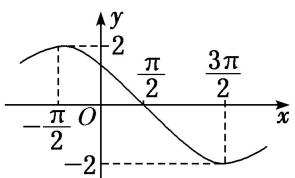

line

| x | y |
|---|---|
| -π/2 | 0 |
| 0 | 2 |
| π/2 | 0 |
| 3π/2 | -2 |

A. $f(x)=2\sin\left(\frac{1}{2}x+\frac{\pi}{4}\right)$

B. $f(x)=2\sin\left(\frac{1}{2}x+\frac{3\pi}{4}\right)$

C. $f(x) = 2\sin \left(\frac{1}{4} x + \frac{3\pi}{4}\right)$

D. $f(x)=2\sin\left(2x+\frac{\pi}{4}\right)$

答案 B 解析 由题图可知 A=2， $T=2\times\left[\frac{3\pi}{2}-\left(-\frac{\pi}{2}\right)\right]=4\pi$ ，故 $\frac{2\pi}{\omega}=4\pi$ ，解得 $\omega=\frac{1}{2}$ 。所以 $f(x)=2\sin\left(\frac{1}{2}x+\varphi\right)$ 。把点 $\left(-\frac{\pi}{2},2\right)$ 代入可得 $2\sin\left[\frac{1}{2}\times\left(-\frac{\pi}{2}\right)+\varphi\right]=2$ ，即 $\sin\left(\varphi-\frac{\pi}{4}\right)=1$ ，所以 $\varphi-\frac{\pi}{4}=2k\pi+\frac{\pi}{2}(k\in\mathbf{Z})$ ，解得 $\varphi=2k\pi+\frac{3\pi}{4}(k\in\mathbf{Z})$ 。又 $0<\varphi<\pi$ ，所以 $\varphi=\frac{3\pi}{4}$ 。所以 $f(x)=2\sin\left(\frac{1}{2}x+\frac{3\pi}{4}\right)$ 。

(2) 函数 $f(x) = A \sin (\omega x + \varphi) \left[ A > 0, \omega > 0, |\varphi| < \frac{\pi}{2} \right]$ 的部分图象如图所示，则 $f\left(\frac{11\pi}{24}\right)$ 的值为（）

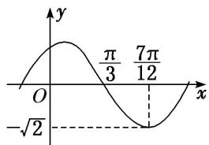

line

| x | y |
|---|---|
| 0 | -√2 |
| π/3 | π/3 |
| 7π/12 | 7π/12 |

A. $-\frac{\sqrt{6}}{2}$

B. $-\frac{\sqrt{3}}{2}$

C. $-\frac{\sqrt{2}}{2}$

D. -1

答案 D 解析 由图象可得 $A = \sqrt{2}$ ，最小正周期 $T = 4 \times \left(\frac{7\pi}{12} - \frac{\pi}{3}\right) = \pi$ ，则 $\omega = \frac{2\pi}{T} = 2$ 。由 $f\left(\frac{7\pi}{12}\right) =$

$\sqrt{2}\sin \left(\frac{7\pi}{6} +\varphi\right) = -\sqrt{2},|\varphi | <   \frac{\pi}{2}$ 得 $\varphi = \frac{\pi}{3}$ ，则 $f(x) = \sqrt{2}\sin \left(2x + \frac{\pi}{3}\right)$ 所以 $f\left(\frac{11\pi}{24}\right) = \sqrt{2}\sin \left(\frac{11\pi}{12} +\frac{\pi}{3}\right) = \sqrt{2}\sin \frac{5\pi}{4} = -1.$

(3) 已知函数 $f(x) = \sin (\omega x + \varphi)\left\{ \begin{array}{l} \omega > 0, -\frac{\pi}{2} \leq \varphi \leq \frac{\pi}{2} \\ 2 \end{array} \right.$ 的图象上的一个最高点和它相邻的一个最低点的距离为 $2\sqrt{2}$ ，且过点 $\left[2, -\frac{1}{2}\right]$ ，则函数 $f(x) =$ \_\_\_\_.

答案 $\sin \left(\frac{\pi}{2} x + \frac{\pi}{6}\right)$ 解析 依题意得 $\sqrt{2^2 + \left(\frac{\pi}{\omega}\right)^2} = 2\sqrt{2}$ ，则 $\frac{\pi}{\omega} = 2$ ，即 $\omega = \frac{\pi}{2}$ ，所以 $f(x) = \sin \left(\frac{\pi}{2} x + \varphi\right)$ ，由于该函数图象过点 $\left(2, -\frac{1}{2}\right)$ ，因此 $\sin (\pi + \varphi) = -\frac{1}{2}$ ，即 $\sin \varphi = \frac{1}{2}$ ，而 $-\frac{\pi}{2} \leq \varphi \leq \frac{\pi}{2}$ ，故 $\varphi = \frac{\pi}{6}$ ，所以 $f(x) = \sin \left(\frac{\pi}{2} x + \frac{\pi}{6}\right)$ .

(4) 将函数 $f(x)$ 的图象上所有点向右平移 $\frac{\pi}{4}$ 个单位长度，得到函数 $g(x)$ 的图象．若函数 $g(x)=A\sin(\omega x+\varphi)(A>0,\ \omega>0,\ |\varphi|<\frac{\pi}{2})$ 的部分图象如图所示，则函数 $f(x)$ 的解析式为（）

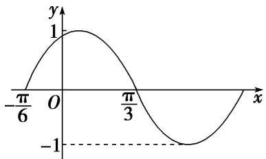

line

| x | y |
|---|---|
| -π/6 | 0 |
| 0 | 1 |
| π/3 | 0 |
| ∞ | -1 |

A. $f(x)=\sin\left(x+\frac{5\pi}{12}\right)$

B. $f(x) = -\cos\left(2x + \frac{\pi}{3}\right)$

C. $f(x) = \cos \left(2x + \frac{\pi}{3}\right)$

D. $f(x) = \sin \left(2x + \frac{7\pi}{12}\right)$

答案 C 解析 法一：根据函数 $g(x)$ 的图象可知 A=1， $\frac{1}{2}T=\frac{\pi}{3}+\frac{\pi}{6}=\frac{\pi}{2}$ ， $T=\pi=\frac{2\pi}{\omega}$ ， $\omega=2$ ，所以 $g(x)=\sin(2x+\varphi)$ ，所以 $g\left(\frac{\pi}{3}\right)=\sin\left(\frac{2\pi}{3}+\varphi\right)=0$ ，所以 $\frac{2\pi}{3}+\varphi=\pi+k\pi$ ， $k\in Z$ ， $\varphi=\frac{\pi}{3}+k\pi$ ， $k\in Z$ ，又因为 $|\varphi|<\frac{\pi}{2}$ ，所以 $\varphi=\frac{\pi}{3}$ ，所以 $g(x)=\sin\left(2x+\frac{\pi}{3}\right)$ ，将 $g(x)=\sin\left(2x+\frac{\pi}{3}\right)$ 的图象向左平移 $\frac{\pi}{4}$ 个单位长度后，即可得到函数 $f(x)$ 的图象，所以函数 $f(x)$ 的解析式为 $f(x)=g\left(x+\frac{\pi}{4}\right)=\sin\left[2\left(x+\frac{\pi}{4}\right)+\frac{\pi}{3}\right]=\sin\left(\frac{\pi}{2}+2x+\frac{\pi}{3}\right)=\cos\left(2x+\frac{\pi}{3}\right)$ .

法二：根据 $g(x)$ 的图象可知 $g\left(\frac{\frac{\pi}{3}-\frac{\pi}{6}}{2}\right)=g\left(\frac{\pi}{12}\right)=1$ ，因为 $f(x)$ 的图象向右平移 $\frac{\pi}{4}$ 个单位长度后，即可得到 $g(x)$ 的图象，所以 $f\left(\frac{\pi}{12}-\frac{\pi}{4}\right)=f\left(-\frac{\pi}{6}\right)=1$ ，对于 A， $f\left(-\frac{\pi}{6}\right)=\sin\frac{\pi}{4}\neq1$ ，不符合题意；对于 B， $f\left(-\frac{\pi}{6}\right)=-\cos0=-1\neq1$ ，不符合题意；对于 C， $f\left(-\frac{\pi}{6}\right)=\cos0=1$ ，符合题意；对于 D， $f\left(-\frac{\pi}{6}\right)=\sin\frac{\pi}{4}\neq1$ ，不符合题意.

(5) 函数 $f(x)=A\cos(\omega x+\varphi)(\omega>0)$ 的部分图象如图所示，给出以下结论：

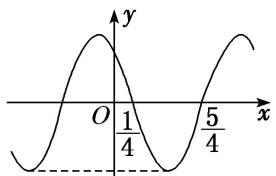

text_image

y
O 1/4 5/4 x
- - -

① $f(x)$ 的最小正周期为2；② $f(x)$ 图象的一条对称轴为直线 $x=-\frac{1}{2}$ ；③ $f(x)$ 在 $\left(2k-\frac{1}{4},2k+\frac{3}{4}\right)$ ， $k\in Z$ 上是减函数；④ $f(x)$ 的最大值为A.

则正确结论的个数为( )

A. 1

B. 2

C. 3

D. 4

答案 B 解析 由题图可知，函数 $f(x)$ 的最小正周期 $T = 2 \times \left( \frac{5}{4} - \frac{1}{4} \right) = 2$ ，故①正确；因为函数 $f(x)$ 的图象过点 $\left( \frac{1}{4}, 0 \right)$ 和 $\left( \frac{5}{4}, 0 \right)$ ，所以函数 $f(x)$ 图象的对称轴为直线 $x = \frac{1}{2} \left( \frac{1}{4} + \frac{5}{4} \right) + \frac{kT}{2} = \frac{3}{4} + k (k \in \mathbf{Z})$ ，故直线 $x = -\frac{1}{2}$ 不是函数 $f(x)$ 图象的对称轴，故②不正确；由图可知，当 $\frac{1}{4} - \frac{T}{4} + kT \leq x \leq \frac{1}{4} + \frac{T}{4} + kT (k \in \mathbf{Z})$ ，即 $2k - \frac{1}{4} \leq x \leq 2k + \frac{3}{4} (k \in \mathbf{Z})$ 时， $f(x)$ 是减函数，故③正确；若 $A > 0$ ，则最大值是 $A$ ，若 $A < 0$ ，则最大值是 $-A$ ，故④不正确。综上知正确结论的个数为 2.

(6) 函数 $f(x) = A \sin (\omega x + \varphi) A > 0, \omega > 0, |\varphi| < \frac{\pi}{2}$ 的部分图象如图所示，若 $x_1, x_2 \in \left(-\frac{\pi}{6}, \frac{\pi}{3}\right)$ ，且 $f(x_1) = f(x_2)$ ，则 $f(x_1 + x_2) =$ \_\_\_\_.

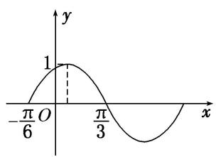

line

| x | y |
|---|---|
| -π/6 | 0 |
| 0 | 1 |
| π/3 | 0 |
| ∞ | -1 |

答案 $\frac{\sqrt{3}}{2}$ 解析 观察图象可知， $A = 1, T = 2\left[\frac{\pi}{3} - \left(-\frac{\pi}{6}\right)\right] = \pi$ ， $\therefore \omega = 2$ ， $\therefore f(x) = \sin(2x + \varphi)$ . 将 $\left[-\frac{\pi}{6}, 0\right]$ 代入上式得 $\sin\left(-\frac{\pi}{3} + \varphi\right) = 0$ ，即 $-\frac{\pi}{3} + \varphi = k\pi$ ， $k \in \mathbb{Z}$ ，由 $|\varphi| < \frac{\pi}{2}$ ，得 $\varphi = \frac{\pi}{3}$ ，则 $f(x) = \sin\left(2x + \frac{\pi}{3}\right)$ . 函数图象的对称轴为 $x = \frac{-\frac{\pi}{6} + \frac{\pi}{3}}{2} = \frac{\pi}{12}$ . 又 $x_1, x_2 \in \left(-\frac{\pi}{6}, \frac{\pi}{3}\right)$ ，且 $f(x_1) = f(x_2)$ ， $\therefore \frac{x_1 + x_2}{2} = \frac{\pi}{12}$ ，即 $x_1 + x_2 = \frac{\pi}{6}$ ， $\therefore f(x_1 + x_2) = \sin\left(2 \times \frac{\pi}{6} + \frac{\pi}{3}\right) = \frac{\sqrt{3}}{2}$ .

(7) (2019·天津) 已知函数 $f(x) = A \sin (\omega x + \varphi) (A > 0, \omega > 0, |\varphi| < \pi)$ 是奇函数，且 $f(x)$ 的最小正周期为 $\pi$ ，将 $y = f(x)$ 的图象上所有点的横坐标伸长到原来的 2 倍 (纵坐标不变)，所得图象对应的函数为 $g(x)$ . 若 $g\left(\frac{\pi}{4}\right) = \sqrt{2}$ ,

则 $f\left(\frac{3\pi}{8}\right)=$ ( )

A. -2

B. $-\sqrt{2}$

C. $\sqrt{2}$

D. 2

答案 C 解析 由 $f(x)$ 为奇函数可得 $\varphi = k\pi (k\in \mathbf{Z})$ ，又 $|\varphi | <   \pi$ ，所以 $\varphi = 0$ ，所以 $g(x) = A\sin \frac{1}{2}\omega x$ 。由 $g(x)$ 的最小正周期为 $2\pi$ ，可得 $\frac{2\pi}{\frac{1}{2}\omega} = 2\pi$ ，故 $\omega = 2$ ， $g(x) = A\sin x$ 。 $g\left(\frac{\pi}{4}\right) = A\sin \frac{\pi}{4} = \sqrt{2}$ ，所以 $A = 2$ ，所以 $f(x) = 2\sin 2x$ 故 $f\left(\frac{3\pi}{8}\right) = 2\sin \frac{3\pi}{4} = \sqrt{2}$

# 【对点训练】

15. 已知函数 $f(x) = A \sin (\omega x + \varphi) \left( \omega > 0, -\frac{\pi}{2} < \varphi < \frac{\pi}{2} \right)$ 的部分图象如图所示，则 $\varphi$ 的值为（）

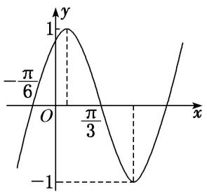

line

| x | y |
|---|---|
| -π/6 | 1 |
| π/3 | -1 |
| ∞ | 0 |

A. $-\frac{\pi}{3}$

B. $\frac{\pi}{3}$

C. $-\frac{\pi}{6}$

D. $\frac{\pi}{6}$

15. 答案 B 解析 由题意，得 $\frac{T}{2} = \frac{\pi}{3} - \left(-\frac{\pi}{6}\right) = \frac{\pi}{2}$ ，所以 $T = \pi$ ，由 $T = \frac{2\pi}{\omega}$ ，得 $\omega = 2$ ，由图可知 $A = 1$ ，所以 $f(x) = \sin (2x + \varphi)$ 。又因为 $f\left(\frac{\pi}{3}\right) = \sin \left(\frac{2\pi}{3} + \varphi\right) = 0$ ， $-\frac{\pi}{2} < \varphi < \frac{\pi}{2}$ ，所以 $\varphi = \frac{\pi}{3}$ 。

16. 已知函数 $f(x) = A \sin (\omega x + \varphi) (A > 0, \omega > 0, |\varphi| < \pi)$ 的部分图象如图所示，则 $f(x)$ 的解析式为( )

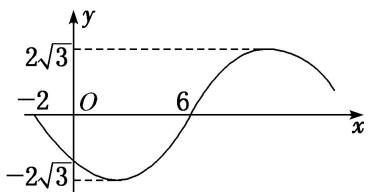

line

| x | y |
|---|---|
| -2 | -2√3 |
| 0 | -2√3 |
| 6 | 2√3 |

A. $f(x) = 2\sqrt{3}\sin \left(\frac{\pi x}{8} +\frac{\pi}{4}\right)$

B. $f(x) = 2\sqrt{3}\sin \left(\frac{\pi x}{8} +\frac{3\pi}{4}\right)$

C. $f(x) = 2\sqrt{3}\sin \left(\frac{\pi x}{8} -\frac{\pi}{4}\right)$

D. $f(x) = 2\sqrt{3}\sin \left(\frac{\pi x}{8} -\frac{3\pi}{4}\right)$

16. 答案 D 解析 由图象可得， $A=2\sqrt{3}$ ， $T=2\times[6-(-2)]=16$ ，所以 $\omega=\frac{2\pi}{T}=\frac{2\pi}{16}=\frac{\pi}{8}$ 。所以 $f(x)=2\sqrt{3}\sin\left(\frac{\pi}{8}x+\varphi\right)$ 。由函数的对称性得 $f(2)=-2\sqrt{3}$ ，即 $f(2)=2\sqrt{3}\sin\left(\frac{\pi}{8}\times2+\varphi\right)=-2\sqrt{3}$ ，即 $\sin\left(\frac{\pi}{4}+\varphi\right)=-1$ ，
所以 $\frac{\pi}{4} + \varphi = 2k\pi - \frac{\pi}{2} (k \in \mathbb{Z})$ ，解得 $\varphi = 2k\pi - \frac{3\pi}{4} (k \in \mathbb{Z})$ 。因为 $|\varphi| < \pi$ ，所以 $k = 0, \varphi = -\frac{3\pi}{4}$ 。故函数的解析式为 $f(x)=2\sqrt{3}\sin\left(\frac{\pi x}{8}-\frac{3\pi}{4}\right)$ 。

17. 已知 $f(x) = A \sin (\omega x + \varphi) + B \left( A > 0, \omega > 0, |\varphi| < \frac{\pi}{2} \right)$ 的部分图象如图，则 $f(x)$ 图象的一个对称中心是（）

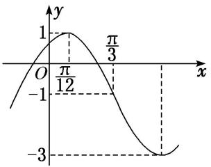

line

| x | y |
|---|---|
| 0 | -1 |
| π/12 | 1 |
| π/3 | -1 |
| -3 | -3 |

A. $\left(\frac{5\pi}{6},-1\right)$

B. $\left(\frac{\pi}{12},0\right)$

C. $\left(\frac{\pi}{12},-1\right)$

D. $\left(\frac{5\pi}{6},0\right)$

17. 答案 A 解析 由题图得 $\left[\frac{\pi}{3}, -1\right]$ 为 $f(x)$ 图象的一个对称中心， $\frac{T}{4} = \frac{\pi}{3} - \frac{\pi}{12}$ ， $\therefore T = \pi$ ，从而 $f(x)$ 图象的对称中心为 $\left[\frac{\pi}{3} + \frac{k\pi}{2}, -1\right] (k \in \mathbf{Z})$ ，当 $k = 1$ 时，为 $\left[\frac{5\pi}{6}, -1\right]$ ，选 A.

18. 已知函数 $f(x) = A\cos (\omega x + \varphi)$ 的图象如图所示， $f\left(\frac{\pi}{2}\right) = -\frac{2}{3}$ ，则 $f\left(-\frac{\pi}{6}\right) = (\quad)$

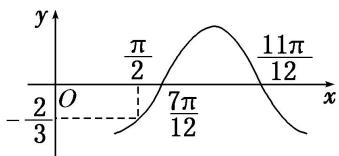

line

| x | y |
|---|---|
| 0 | -2π/3 |
| π/2 | π/2 |
| 7π/12 | 7π/12 |
| 11π/12 | 11π/12 |

A. $-\frac{2}{3}$

B. $-\frac{1}{2}$

C. $\frac{2}{3}$

D. $\frac{1}{2}$

18. 答案 A 解析 由题图知 $\frac{T}{2} = \frac{11\pi}{12} - \frac{7\pi}{12} = \frac{\pi}{3}$ , $\therefore T = \frac{2\pi}{3}$ , 即 $\omega = 3$ , 当 $x = \frac{7\pi}{12}$ 时, $y = 0$ , 即 $3 \times \frac{7\pi}{12} + \varphi = 2k\pi$ $-\frac{\pi}{2}, k \in \mathbf{Z}, \therefore \varphi = 2k\pi - \frac{9\pi}{4}, k \in \mathbf{Z}$ , 取 $k = 1$ , 则 $\varphi = -\frac{\pi}{4}, \therefore f(x) = A\cos\left(3x - \frac{\pi}{4}\right)$ . 则 $A\cos\left(\frac{3\pi}{2} - \frac{\pi}{4}\right) = -\frac{2}{3}$ , 解得 $A = \frac{2\sqrt{2}}{3}, \therefore f(x) = \frac{2\sqrt{2}}{3}\cos\left(3x - \frac{\pi}{4}\right)$ , 故 $f\left(-\frac{\pi}{6}\right) = \frac{2\sqrt{2}}{3}\cos\left(-\frac{\pi}{2} - \frac{\pi}{4}\right) = -\frac{2}{3}$ .

19. 已知函数 $f(x) = A \cos (\omega x + \varphi) (A > 0, \omega > 0, 0 < \varphi < \pi)$ 为奇函数，该函数的部分图象如图所示， $\triangle EFG$ （点 $G$ 是图象的最高点）是边长为 2 的等边三角形，则 $f(1) =$ \_\_\_\_.

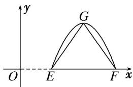

text_image

y
G
O E F x

19. 答案 $-\sqrt{3}$ 解析 由题意得， $A=\sqrt{3}$ ， $T=4=\frac{2\pi}{\omega}$ ， $\omega=\frac{\pi}{2}$ 。又 $\because f(x)=A\cos(\omega x+\varphi)$ 为奇函数， $\therefore\varphi=\frac{\pi}{2}+k\pi$ ， $k\in Z$ ， $\because0<\varphi<\pi$ ，则 $\varphi=\frac{\pi}{2}$ ， $\therefore f(x)=\sqrt{3}\cos\left(\frac{\pi}{2}x+\frac{\pi}{2}\right)$ ， $\therefore f(1)=-\sqrt{3}$ .

20. (2015·全国I)函数 $f(x)=\cos(\omega x+\varphi)$ 的部分图象如图所示，则 $f(x)$ 的单调递减区间为()

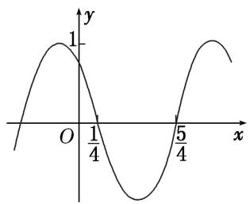

line

| x | y |
|---|---|
| 0 | 1 |
| 1/4 | 1 |
| 5/4 | 1 |

A. $\left(k\pi-\frac{1}{4},\quad k\pi+\frac{3}{4}\right),\quad k\in\mathbf{Z}$

B. $\left(2k\pi-\frac{1}{4},\quad2k\pi+\frac{3}{4}\right),\quad k\in\mathbf{Z}$

C. $\left(k-\frac{1}{4},\quad k+\frac{3}{4}\right),\quad k\in\mathbf{Z}$

D. $\left(2k-\frac{1}{4},\quad2k+\frac{3}{4}\right),\quad k\in\mathbf{Z}$

20. 答案 D 解析 由图象知，周期 $T = 2\left(\frac{5}{4} - \frac{1}{4}\right) = 2$ ， $\therefore \frac{2\pi}{\omega} = 2$ ， $\therefore \omega = \pi$ 。由 $\pi \times \frac{1}{4} + \varphi = \frac{\pi}{2} + 2k\pi$ ，得 $\varphi = \frac{\pi}{4} + 2k\pi$ ， $k \in \mathbf{Z}$ ，不妨取 $\varphi = \frac{\pi}{4}$ ，则 $f(x) = \cos\left(\frac{\pi x + \frac{\pi}{4}}{4}\right)$ 。由 $2k\pi < \pi x + \frac{\pi}{4} < 2k\pi + \pi$ ， $k \in \mathbf{Z}$ ，得 $2k - \frac{1}{4} < x < 2k + \frac{3}{4}$ ， $k \in \mathbf{Z}$ ， $\therefore f(x)$ 的单调递减区间为 $\left(2k - \frac{1}{4}, 2k + \frac{3}{4}\right)$ ， $k \in \mathbf{Z}$ ，故选 D.

21. 将函数 $f(x)$ 的图象向右平移 $\frac{\pi}{6}$ 个单位长度，再将所得函数图象上的所有点的横坐标缩短到原来的 $\frac{2}{3}$ ，得到函数 $g(x) = A\sin (\omega x + \varphi)\left[A > 0, \omega > 0, |\varphi| < \frac{\pi}{2}\right]$ 的图象。已知函数 $g(x)$ 的部分图象如图所示，则函数 $f(x)()$

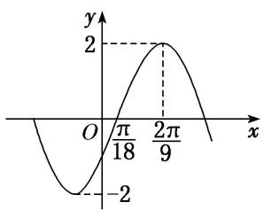

line

| x | y |
|---|---|
| 0 | -2 |
| π/18 | 0 |
| 2π/9 | 2 |

A. 最小正周期为 $\frac{2}{3}\pi$ ，最大值为 2

B. 最小正周期为 $\pi$ ，图象关于点 $\left(\frac{\pi}{6}, 0\right)$ 中心对称

C. 最小正周期为 $\frac{2}{3}\pi$ ，图象关于直线 $x = \frac{\pi}{6}$ 对称

D. 最小正周期为 $\pi$ ，在区间 $\left[\frac{\pi}{6}, \frac{\pi}{3}\right]$ 上单调递减

21. 答案 D 解析 对于 $g(x)$ ，由题图可知，A=2， $T=4\left(\frac{2\pi}{9}-\frac{\pi}{18}\right)=\frac{2\pi}{3}$ ， $\therefore\omega=\frac{2\pi}{T}=3$ 。则 $g(x)=2\sin(3x+\varphi)$ ，又由 $g\left(\frac{2\pi}{9}\right)=2$ 可得 $\varphi=-\frac{\pi}{6}+2k\pi$ ， $k\in Z$ ，而 $|\varphi|<\frac{\pi}{2}$ ， $\therefore\varphi=-\frac{\pi}{6}$ 。 $\therefore g(x)=2\sin\left(3x-\frac{\pi}{6}\right)$ ， $\therefore f(x)=2\sin\left(2x+\frac{\pi}{6}\right)$ 。 $\therefore f(x)$ 的最小正周期为 $\pi$ ，选项 A、C 错误。对于选项 B，令 $2x+\frac{\pi}{6}=k\pi(k\in\mathbf{Z})$ ，所以 $x=\frac{k\pi}{2}-\frac{\pi}{12}$ ， $k\in Z$ ，所以函数 $f(x)$ 图象的对称中心为 $\left(\frac{k\pi}{2}-\frac{\pi}{12},0\right)(k\in\mathbf{Z})$ ，所以选项 B 是错误的；当 $x\in\left[\frac{\pi}{6},\frac{\pi}{3}\right]$

时， $2x+\frac{\pi}{6}\in\left[\frac{\pi}{2},\frac{5\pi}{6}\right]$ ，所以 $f(x)$ 在 $\left[\frac{\pi}{6},\frac{\pi}{3}\right]$ 上是减函数，所以选项D正确．故选D.

22. 已知函数 $f(x) = A \sin (\omega x + \varphi) (A > 0, \omega > 0, 0 < \varphi < \pi)$ 的图象与 $x$ 轴的一个交点 $\left[-\frac{\pi}{12}, 0\right]$ 到其相邻的一条对称轴的距离为 $\frac{\pi}{4}$ ，若 $f\left(\frac{\pi}{12}\right) = \frac{3}{2}$ ，则函数 $f(x)$ 在 $\left[0, \frac{\pi}{2}\right]$ 上的最小值为（）

A. $\frac{1}{2}$

B. $-\sqrt{3}$

C. $-\frac{\sqrt{3}}{2}$

D. $-\frac{1}{2}$

22. 答案 C 解析 由题意得，函数 $f(x)$ 的最小正周期 $T = 4 \times \frac{\pi}{4} = \pi = \frac{2\pi}{\omega}$ ，解得 $\omega = 2$ 。因为点 $\left(-\frac{\pi}{12}, 0\right)$ 在函数 $f(x)$ 的图象上，所以 $A \sin \left[2 \times \left(-\frac{\pi}{12}\right) + \varphi\right] = 0$ ，解得 $\varphi = k\pi + \frac{\pi}{6}$ ， $k \in \mathbf{Z}$ ，由 $0 < \varphi < \pi$ ，可得 $\varphi = \frac{\pi}{6}$ 。因为 $f\left(\frac{\pi}{12}\right) = \frac{3}{2}$ ，所以 $A \sin (2 \times \frac{\pi}{12} + \frac{\pi}{6}) = \frac{3}{2}$ ，解得 $A = \sqrt{3}$ ，所以 $f(x) = \sqrt{3} \sin (2x + \frac{\pi}{6})$ 。当 $x \in \left[0, \frac{\pi}{2}\right]$ 时， $2x + \frac{\pi}{6} \in \left[\frac{\pi}{6}, \frac{7\pi}{6}\right]$ ， $\sin (2x + \frac{\pi}{6}) \in \left[-\frac{1}{2}, 1\right]$ ，且当 $2x + \frac{\pi}{6} = \frac{7\pi}{6}$ ，即 $x = \frac{\pi}{2}$ 时，函数 $f(x)$ 取得最小值，最小值为 $-\frac{\sqrt{3}}{2}$ ，故选 C。

23. 函数 $f(x) = A\cos (\omega x + \varphi)(A > 0, \omega > 0, -\pi < \varphi < 0)$ 的部分图象如图所示，为了得到 $g(x) = A\sin \omega x$ 的图象，只需将函数 $y = f(x)$ 的图象（）

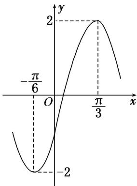

line

| x | y |
|---|---|
| -π/6 | -2 |
| 0 | 0 |
| π/3 | 2 |
| ∞ | -2 |

A. 向左平移 $\frac{\pi}{6}$ 个单位长度

B. 向左平移 $\frac{\pi}{12}$ 个单位长度

C. 向右平移 $\frac{\pi}{6}$ 个单位长度

D. 向右平移 $\frac{\pi}{12}$ 个单位长度

23. 答案 B 解析 由题图知 $A = 2, \frac{T}{2} = \frac{\pi}{3} - \left[\frac{-\pi}{6}\right] = \frac{\pi}{2}, \therefore T = \pi, \therefore \omega = 2, \therefore f(x) = 2\cos(2x + \varphi)$ ，将 $\left[\frac{\pi}{3}, 2\right]$ 代入得 $\cos\left(\frac{2\pi}{3} + \varphi\right) = 1, \because -\pi < \varphi < 0, \therefore -\frac{\pi}{3} < \frac{2\pi}{3} + \varphi < \frac{2\pi}{3}, \therefore \frac{2\pi}{3} + \varphi = 0, \therefore \varphi = -\frac{2\pi}{3}, \therefore f(x) = 2\cos\left(2x - \frac{2\pi}{3}\right)$ $= 2\sin\left[2\left[x - \frac{\pi}{12}\right]\right]$ ，故将函数 $y = f(x)$ 的图象向左平移 $\frac{\pi}{12}$ 个单位长度可得到 $g(x)$ 的图象.

24. 函数 $f(x) = A \sin (2x + \theta) \left( A > 0, |\theta| \leq \frac{\pi}{2} \right)$ 的部分图象如图所示，且 $f(a) = f(b) = 0$ ，对不同的 $x_1, x_2 \in [a, b]$ ，

若 $f(x_{1})=f(x_{2})$ ，有 $f(x_{1}+x_{2})=\sqrt{3}$ ，则()

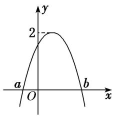

line

| x | y |
|---|---|
| a | 0 |
| b | 2 |
| c | 0 |

A. $f(x)$ 在 $\left(-\frac{5\pi}{12}, \frac{\pi}{12}\right)$ 上是减函数

B. $f(x)$ 在 $\left(-\frac{5\pi}{12}, \frac{\pi}{12}\right)$ 上是增函数

C. $f(x)$ 在 $\left(\frac{\pi}{3}, \frac{5\pi}{6}\right)$ 上是减函数

D. $f(x)$ 在 $\left(\frac{\pi}{3}, \frac{5\pi}{6}\right)$ 上是增函数

24. 答案 B 解析 由题图知 $A = 2$ ，设 $m \in [a, b]$ ，且 $f(0) = f(m)$ ，则 $f(0 + m) = f(m) = f(0) = \sqrt{3}$ ， $\therefore 2\sin \theta = \sqrt{3}$ ， $\sin \theta = \frac{\sqrt{3}}{2}$ ，又 $\because |\theta| \leq \frac{\pi}{2}$ ， $\therefore \theta = \frac{\pi}{3}$ ， $\therefore f(x) = 2\sin \left(2x + \frac{\pi}{3}\right)$ ，令 $-\frac{\pi}{2} + 2k\pi \leq 2x + \frac{\pi}{3} \leq \frac{\pi}{2} + 2k\pi$ ， $k \in \mathbf{Z}$ ，解得 $-\frac{5\pi}{12} + k\pi \leq x \leq \frac{\pi}{12} + k\pi$ ， $k \in \mathbf{Z}$ ，此时 $f(x)$ 单调递增。所以选项 B 正确。

25. 函数 $f(x) = \sin (\omega x + \varphi)\left(\omega > 0, |\varphi| < \frac{\pi}{2}\right)$ 在它的某一个周期内的单调递减区间是 $\left[\frac{5\pi}{12}, \frac{11\pi}{12}\right]$ . 将 $y = f(x)$ 的图象先向左平移 $\frac{\pi}{4}$ 个单位长度，再将图象上所有点的横坐标变为原来的 $\frac{1}{2}$ (纵坐标不变)，所得到的图象对应的函数记为 $g(x)$ .

(1)求 $g(x)$ 的解析式;

(2)求 $g(x)$ 在区间 $\left[0, \frac{\pi}{4}\right]$ 上的最大值和最小值.

25. 解 (1) $\because \frac{T}{2} = \frac{11\pi}{12} - \frac{5\pi}{12} = \frac{\pi}{2}, \therefore T = \pi, \omega = \frac{2\pi}{T} = 2$ ，又 $\because \sin \left(2 \times \frac{5\pi}{12} + \varphi\right) = 1, |\varphi| < \frac{\pi}{2}, \therefore \varphi = -\frac{\pi}{3}, f(x) = \sin \left(2x - \frac{\pi}{3}\right)$ ，将函数 $f(x)$ 的图象向左平移 $\frac{\pi}{4}$ 个单位长度得 $y = \sin \left[2\left(x + \frac{\pi}{4}\right) - \frac{\pi}{3}\right] = \sin \left(2x + \frac{\pi}{6}\right)$ ，

再将 $y=\sin\left(2x+\frac{\pi}{6}\right)$ 的图象上所有点的横坐标变为原来的 $\frac{1}{2}$ (纵坐标不变) 得 $g(x)=\sin\left(4x+\frac{\pi}{6}\right)$ .

$$
\therefore g (x) = \sin \left(4 x + \frac {\pi}{6}\right).
$$

(2) $\because x\in\left[0,\frac{\pi}{4}\right],\quad\therefore4x+\frac{\pi}{6}\in\left[\frac{\pi}{6},\frac{7\pi}{6}\right]$ ，当 $4x+\frac{\pi}{6}=\frac{\pi}{2}$ 时， $x=\frac{\pi}{12}$ ,

∴ $g(x)$ 在 $\left[0, \frac{\pi}{12}\right]$ 上为增函数，在 $\left[\frac{\pi}{12}, \frac{\pi}{4}\right]$ 上为减函数，所以 $g(x)_{\max} = g\left(\frac{\pi}{12}\right) = 1$ ,

又因为 $g(0)=\frac{1}{2}$ ， $g\left(\frac{\pi}{4}\right)=-\frac{1}{2}$ ，所以 $g(x)_{\min}=-\frac{1}{2}$

故函数 $g(x)$ 在区间 $\left[0, \frac{\pi}{4}\right]$ 上的最大值和最小值分别为 1 和 $-\frac{1}{2}$ .

26. 函数 $f(x) = A \sin (\omega x + \varphi) \left( A > 0, \quad \omega > 0, \quad |\varphi| < \frac{\pi}{2} \right)$ 的部分图象如图所示.

(1)求函数 $f(x)$ 的解析式，并写出其图象的对称中心；  
(2)若方程 $f(x) + 2\cos \left(4x + \frac{\pi}{3}\right) = a$ 有实数解，求 $a$ 的取值范围.

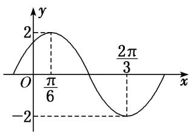

line

| x | y |
|---|---|
| 0 | 0 |
| π/6 | 2 |
| 2π/3 | -2 |

26. 解 (1)由图可得 A=2， $\frac{T}{2}=\frac{2\pi}{3}-\frac{\pi}{6}=\frac{\pi}{2}$ ，所以 $T=\pi$ ，所以 $\omega=2$ .

当 $x=\frac{\pi}{6}$ 时， $f(x)=2$ ，可得 $2\sin\left(2\times\frac{\pi}{6}+\varphi\right)=2$ ，因为 $|\varphi|<\frac{\pi}{2}$ ，所以 $\varphi=\frac{\pi}{6}$ .

所以函数 $f(x)$ 的解析式为 $f(x)=2\sin\left(2x+\frac{\pi}{6}\right)$ . 令 $2x+\frac{\pi}{6}=k\pi(k\in\mathbb{Z})$ ，得 $x=\frac{k\pi}{2}-\frac{\pi}{12}(k\in\mathbb{Z})$ ,

所以函数 $f(x)$ 图象的对称中心为 $\left(\frac{k\pi}{2}-\frac{\pi}{12},0\right)(k\in\mathbf{Z})$ .

(2) 设 $g(x)=f(x)+2\cos\left(4x+\frac{\pi}{3}\right)$ ,

则 $g(x)=2\sin\left(2x+\frac{\pi}{6}\right)+2\cos\left(4x+\frac{\pi}{3}\right)=2\sin\left(2x+\frac{\pi}{6}\right)+2\left[1-2\sin^{2}\left(2x+\frac{\pi}{6}\right)\right]$ ,

令 $t = \sin \left(2x + \frac{\pi}{6}\right)$ ， $t \in [-1, 1]$ ，记 $h(t) = -4t^2 + 2t + 2 = -4\left(t - \frac{1}{4}\right)^2 + \frac{9}{4}$ ，

因为 $t \in [-1, 1]$ ，所以 $h(t) \in \left[-4, \frac{9}{4}\right]$ ，即 $g(x) \in \left[-4, \frac{9}{4}\right]$ ，故 $a \in \left[-4, \frac{9}{4}\right]$ .

故 a 的取值范围为 $\left[-4, \frac{9}{4}\right]$ .

