<strong>专题四 　函数</strong><em><strong>y</strong></em><strong>＝</strong><em><strong>A</strong></em><strong>sin(</strong><em><strong>ωx</strong></em><strong>＋</strong><em><strong>φ</strong></em><strong>)的图象</strong>

<strong>考点一　函数</strong><em><strong>y</strong></em><strong>＝</strong><em><strong>A</strong></em><strong>sin(</strong><em><strong>ωx</strong></em><strong>＋</strong><em><strong>φ</strong></em><strong>)的图象及变换</strong>

【基本知识】  
（1）*y*＝*A*sin(*ωx*＋*φ*)的有关概念

<table><tr><td rowspan="2">
<em>y</em>＝<em>A</em>sin(<em>ωx</em>＋<em>φ</em>)(<em>A</em>&gt;0，<em>ω</em>&gt;0)，<em>x</em>∈<strong>R</strong>
</td><td>
振幅
</td><td>
周期
</td><td>
频率
</td><td>
相位
</td><td>
初相
</td></tr><tr><td>
<em>A</em>
</td><td>
<em>T</em>＝
</td><td>
<em>f</em>＝＝
</td><td>
<em>ωx</em>＋<em>φ</em>
</td><td>
<em>φ</em>
</td></tr></table>  
（2）用五点法画*y*＝*A*sin(*ωx*＋*φ*)(*A*>0，*ω*>0)一个周期内的简图

用五点法画<em>y</em>＝<em>A</em>sin(<em>ωx</em>＋<em>φ</em>)(<em>A</em>&gt;0，<em>ω</em>&gt;0，<em>x</em>∈<strong>R</strong>)一个周期内的简图时，要找五个如下表所示的特征点：

<table><tr><td>
<em>x</em>
</td><td></td><td></td><td></td><td></td><td></td></tr><tr><td>
<em>ωx</em>＋<em>φ</em>
</td><td>
0
</td><td></td><td>
π
</td><td></td><td>
2π
</td></tr><tr><td>
<em>y</em>＝<em>A</em>sin(<em>ωx</em>＋<em>φ</em>)
</td><td>
0
</td><td>
<em>A</em>
</td><td>
0
</td><td>
－<em>A</em>
</td><td>
0
</td></tr></table>

用“五点法”作函数*y*＝*A*sin(*ωx*＋*φ*)的简图，精髄是通过变量代换，设*z*＝*ωx*＋*φ*，由*z*取0，，π，，2π来求出相应的*x*，通过列表，计算得出五点坐标，描点后得出图象，其中相邻两点的横向距离均为．

【例题选讲】

<strong>[例1]</strong> 已知函数<em>y</em>＝2sin．  
（1）求它的振幅、周期、初相；  
（2）用“五点法”作出它在一个周期内的图象；  
（3）说明*y*＝2sin的图象可由*y*＝sin *x*的图象经过怎样的变换而得到．
解　（1）*y*＝2sin的振幅*A*＝2，周期*T*＝＝π，初相*φ*＝．  
（2）令*X*＝2*x*＋，则*y*＝2sin＝2sin *X*．列表如下：

<table><tr><td>
<em>x</em>
</td><td>
－
</td><td></td><td></td><td></td><td></td></tr><tr><td>
<em>X</em>
</td><td>
0
</td><td></td><td>
π
</td><td></td><td>
2π
</td></tr><tr><td>
<em>y</em>＝sin <em>X</em>
</td><td>
0
</td><td>
1
</td><td>
0
</td><td>
－1
</td><td>
0
</td></tr><tr><td>
<em>y</em>＝2sin
</td><td>
0
</td><td>
2
</td><td>
0
</td><td>
－2
</td><td>
0
</td></tr></table>

描点画出图象，如图所示：

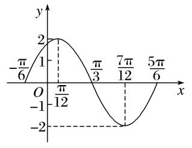  
（3）方法一　把*y*＝sin *x*的图象上所有的点向左平移个单位长度，得到*y*＝sin的图象；再把*y*＝sin的图象上所有点的横坐标缩短到原来的倍(纵坐标不变)，得到*y*＝sin的图象；最后把*y*＝sin上所有点的纵坐标伸长到原来的2倍(横坐标不变)，即可得到*y*＝2sin的图象．
方法二　将*y*＝sin *x*的图象上所有点的横坐标缩短为原来的倍(纵坐标不变)，得到*y*＝sin 2*x*的图象；再将*y*＝sin 2*x*的图象向左平移个单位长度，得到*y*＝sin＝sin的图象；再将*y*＝sin的图象上所有点的纵坐标伸长为原来的2倍(横坐标不变)，即得到*y*＝2sin的图象．

【对点训练】

1．某同学用“五点法”画函数*f*(*x*)＝*A*sin(*ωx*＋*φ*)在某一个周期内的图象时，列表并填入了部分

数据，如下表：

<table><tr><td>
<em>ωx</em>＋<em>φ</em>
</td><td>
0
</td><td></td><td>
π
</td><td></td><td>
2π
</td></tr><tr><td>
<em>x</em>
</td><td></td><td></td><td></td><td></td><td></td></tr><tr><td>
<em>A</em>sin(<em>ωx</em>＋<em>φ</em>)
</td><td>
0
</td><td>
5
</td><td></td><td>
－5
</td><td>
0
</td></tr></table>  
（1）请将上表数据补充完整，并直接写出函数*f*(*x*)的解析式；  
（2）将*y*＝*f*(*x*)图象上所有点向左平移个单位长度，得到*y*＝*g*(*x*)的图象，求*y*＝*g*(*x*)的图象离原点*O*最近的对称中心；  
（3）说明函数*f*(*x*)的图象是由*y*＝sin*x*的图象经过怎样的变换得到的．

1．解　（1）根据表中已知数据，解得*A*＝5，*ω*＝2，*φ*＝－，数据补全如下表：

<table><tr><td>
<em>ωx</em>＋<em>φ</em>
</td><td>
0
</td><td></td><td>
π
</td><td></td><td>
2π
</td></tr><tr><td>
<em>x</em>
</td><td></td><td></td><td></td><td></td><td></td></tr><tr><td>
<em>A</em>sin(<em>ωx</em>＋<em>φ</em>)
</td><td>
0
</td><td>
5
</td><td>
0
</td><td>
－5
</td><td>
0
</td></tr></table>
则函数解析式为*f*(*x*)＝5sin．  
（2）由（1）知*f*(*x*)＝5sin，因此*g*(*x*)＝5sin＝5sin．
因为*y*＝sin *x*的对称中心为(*k*π，0)，*k*∈Z，令2*x*＋＝*k*π，*k*∈Z，解得*x*＝－，*k*∈Z，
即*y*＝*g*(*x*)图象的对称中心为，*k*∈Z，其中离原点*O*最近的对称中心为．  
（3）把*y*＝sin *x*的图象上所有的点向右平移个单位长度，得到*y*＝sin的图象，再把*y*＝sin的图象上的点的横坐标缩短到原来的倍(纵坐标不变)，得到*y*＝sin的图象，最后把*y*＝sin上所有点的纵坐标伸长到原来的5倍(横坐标不变)，即可得到*y*＝5sin2*x*－的图象．

2．设函数*f*(*x*)＝cos(*ωx*＋*φ*)的最小正周期为π，且*f*＝．  
（1）求*ω*和*φ*的值；  
（2）在给定坐标系中作出函数*f*(*x*)在[0，π]上的图象．

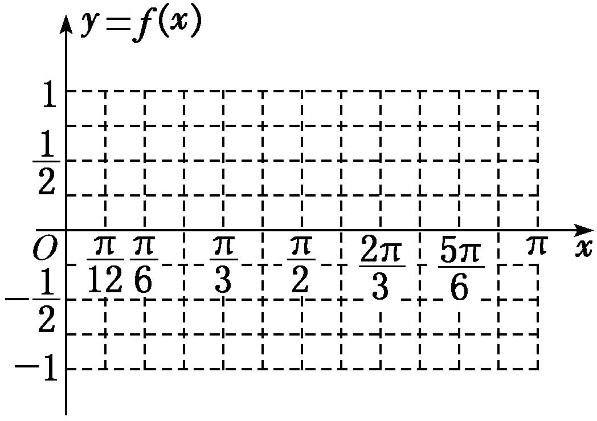

2．解　（1）因为*T*＝＝π，所以*ω*＝2，又因为*f*＝cos＝cos＝－sin *φ*＝且－<*φ*<0，
所以*φ*＝－．  
（2）由（1）知*f*(*x*)＝cos．

列表：

<table><tr><td>
2<em>x</em>－
</td><td>
－
</td><td>
0
</td><td></td><td>
π
</td><td></td><td></td></tr><tr><td>
<em>x</em>
</td><td>
0
</td><td></td><td></td><td></td><td></td><td>
π
</td></tr><tr><td>
<em>f</em>(<em>x</em>)
</td><td></td><td>
1
</td><td>
0
</td><td>
－1
</td><td>
0
</td><td></td></tr></table>

描点，连线，可得函数*f*(*x*)在[0，π]上的图象如图所示．

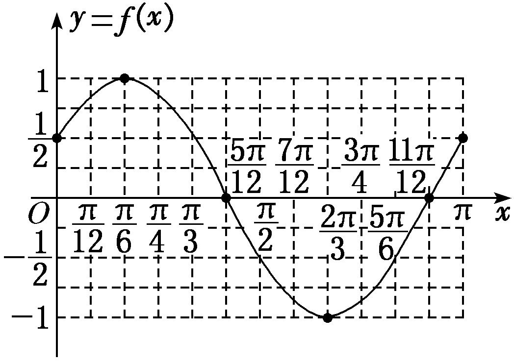

<strong>考点二　函数</strong><em><strong>y</strong></em><strong>＝</strong><em><strong>A</strong></em><strong>sin(</strong><em><strong>ωx</strong></em><strong>＋</strong><em><strong>φ</strong></em><strong>)的图象的变换</strong>

【基本知识】

函数*y*＝sin *x*的图象经变换得到*y*＝*A*sin(*ωx*＋*φ*)(*A*>0，*ω*>0)的图象的两种途径

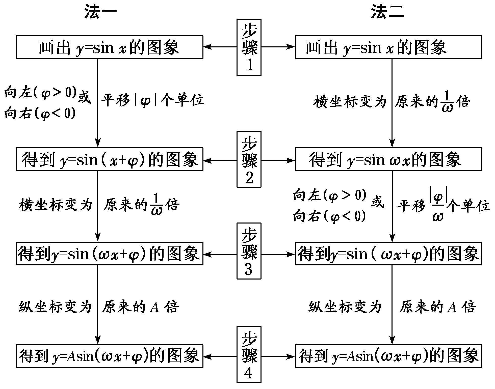  
（1）两种变换的区别

①先相位变换(横向平移)再周期变换(伸缩变换)，平移的量是|*φ*|个单位长度；②先周期变换(伸缩变换)再相位变换(横向平移)，平移的量是(*ω*>0)个单位长度．  
（2）变换的注意点

无论哪种横向变换，每一个变换总是针对自变量*x*而言的，即图象变换要看“自变量*x*”发生多大变化，而不是看角“*ωx*＋*φ*”的变化．即函数*f*(*x*)＝sin(*ωx*＋*φ*)的图象向左(右)平移*k*个单位长度后，其图象对应的函数解析式为*g*(*x*)＝sin[*ω*(*x*±*k*)＋*φ*]，而不是*g*(*x*)＝sin(*ωx*±*k*＋*φ*)．

【方法总结】

三角函数图象变换中的3个注意点  
（1）变换前后，函数的名称要一致，若不一致，应先利用诱导公式转化为同名函数；  
（2）要弄清变换的方向，即变换的是哪个函数的图象，得到的是哪个函数的图象，切不可弄错方向；  
（3）要弄准变换量的大小，特别是平移变换中，函数*y*＝*A*sin *x*到*y*＝*A*sin(*x*＋*φ*)的变换量是|*φ*|个单位，而函数*y*＝*A*sin *ωx*到*y*＝*A*sin(*ωx*＋*φ*)时，变换量是个单位．

【例题选讲】

<strong>[例2]</strong> （1） (2016·四川)为了得到函数<em>y</em>＝sin的图象，只需把函数<em>y</em>＝sin2<em>x</em>的图象上所有的点(　　)

A．向左平行移动个单位长度　　　　　　　　
B．向右平行移动个单位长度

C．向左平行移动个单位长度　　　　　　　　
D．向右平行移动个单位长度
答案　D　解析　∵*y*＝sin＝sin，∴将函数*y*＝sin 2*x*的图象向右平行移动个单位长度，可得*y*＝sin的图象．  
（2） (2017·全国Ⅰ)已知曲线<em>C</em>1：<em>y</em>＝cos <em>x</em>，<em>C</em>2：<em>y</em>＝sin，则下面结论正确的是(　　)

A．把<em>C</em>1上各点的横坐标伸长到原来的2倍，纵坐标不变，再把得到的曲线向右平移个单位长度，得到曲线<em>C</em>2

B．把<em>C</em>1上各点的横坐标伸长到原来的2倍，纵坐标不变，再把得到的曲线向左平移个单位长度，得到曲线<em>C</em>2

C．把<em>C</em>1上各点的横坐标缩短到原来的倍，纵坐标不变，再把得到的曲线向右平移个单位长度，得到曲线<em>C</em>2

D．把<em>C</em>1上各点的横坐标缩短到原来的倍，纵坐标不变，再把得到的曲线向左平移个单位长度，得到曲线<em>C</em>2
答案　D　解析　易知<em>C</em>1：<em>y</em>＝cos <em>x</em>＝sin，把曲线<em>C</em>1上的各点的横坐标缩短到原来的倍，纵坐标不变，得到函数<em>y</em>＝sin的图象，再把所得函数的图象向左平移个单位长度，可得函数<em>y</em>＝sin＝sin的图象，即曲线<em>C</em>2．  
（3） (2018·天津)将函数*y*＝sin的图象向右平移个单位长度，所得图象对应的函数(　　)

A．在区间上单调递增　　　　　　　　
B．在区间上单调递减

C．在区间上单调递增　　　　　　　　
D．在区间上单调递减
答案　A　解析　将函数*y*＝sin的图象向右平移个单位长度后的解析式为*y*＝sin＝sin 2*x*，则函数*y*＝sin 2*x*的一个单调递增区间为，一个单调递减区间为．由此可判断选项A正确．  
（4）已知函数*f*(*x*)＝sin(*ω*>0)向左平移半个周期得*g*(*x*)的图象，若*g*(*x*)在[0，π]上的值域为，则*ω*的取值范围是\_\_\_\_\_\_\_\_．
答案　　解析　由题意，得*g*(*x*)＝sin＝sin＝sin，由*x*∈[0，π]，得*ωx*－∈．因为*g*(*x*)在[0，π]上的值域为，所以≤*ω*π－≤，解得≤*ω*≤．故*ω*的取值范围是．  
（5） 函数*y*＝sin 2*x*－cos 2*x*的图象向右平移*φ*个单位长度后，得到函数*g*(*x*)的图象，若函数*g*(*x*)为偶函数，则*φ*的值为(　　)

A．　　　　　　　　
B．　　　　　　　　
C．　　　　　　　　
D．
答案　B　解析　由题意知<em>y</em>＝sin 2<em>x</em>－cos 2<em>x</em>＝2sin，其图象向右平移<em>φ</em>个单位长度后，得到函数<em>g</em>(<em>x</em>)＝2sin的图象，因为<em>g</em>(<em>x</em>)为偶函数，所以2<em>φ</em>＋＝＋<em>k</em>π，<em>k</em>∈<strong>Z</strong>，所以<em>φ</em>＝＋，<em>k</em>∈<strong>Z</strong>，又因为<em>φ</em>∈，所以<em>φ</em>＝．  
（6）将函数*f*(*x*)＝tan(0<*ω*<10)的图象向右平移个单位长度后与函数*f*(*x*)的图象重合，则*ω*＝(　　)

A．9　　　　　　　　
B．6　　　　　　　　
C．4　　　　　　　　
D．8
答案　B　解析　函数<em>f</em>(<em>x</em>)＝tan的图象向右平移个单位长度后所得图象对应的函数解析式为<em>y</em>＝tan＝tan，∵平移后的图象与函数<em>f</em>(<em>x</em>)的图象重合，∴－＋＝＋<em>k</em>π，<em>k</em>∈<strong>Z</strong>，解得<em>ω</em>＝－6<em>k</em>，<em>k</em>∈<strong>Z</strong>．又∵0&lt;<em>ω</em>&lt;10，∴<em>ω</em>＝6．

【对点训练】

3．将函数*y*＝sin的图象上所有的点向左平移个单位长度，再把图象上各点的横坐标扩大到原来的

2倍(纵坐标不变)，则所得图象对应的函数解析式为(　　)

A．*y*＝sin　　　
B．*y*＝sin　　　
C．*y*＝sin　　　
D．*y*＝sin

3．答案　B　解析　将函数*y*＝sin的图象上所有的点向左平移个单位长度，得到函数*y*＝

sin＝sin的图象，再把图象上各点的横坐标扩大到原来的2倍(纵坐标不变)，可得函数*y*＝sin的图象，因此变换后所得图象对应的函数解析式为*y*＝sin．

4．将函数*f*(*x*)＝sin *x*＋cos *x*的图象上各点的纵坐标不变，横坐标缩小为原来的，再将函数图象向左平移

个单位后，得到的函数*g*(*x*)的解析式为(　　)

A．*g*(*x*)＝sin　　　　　　　　　　
B．*g*(*x*)＝sin

C．*g*(*x*)＝sin　　　　　　　　　　
D．*g*(*x*)＝sin

4．答案　B　解析　*f*(*x*)＝sin*x*＋cos*x*＝sin的图象上各点的纵坐标不变，横坐标缩小为原来的得，

*y*＝sin的图象向左平移个单位得，*g*(*x*)＝sin＝sin．故选B．

5．将函数*y*＝*f*(*x*)的图象向左平移个单位长度，再把所得图象上所有点的横坐标伸长到原来的2倍得到*y*

＝sin的图象，则*f*(*x*)＝(　　)

A．sin　　　
B．sin　　　
C．sin　　　
D．sin

5．答案　A　解析　法一：由题设知，*f*＝sin．设*x*＋＝*t*，则*x*＝2*t*－，所以*f*(*t*)＝

sin＝sin．故*f*(*x*)＝sin．故选B．

法二：由题设知，先将函数*y*＝sin的图象上所有点的横坐标缩短到原来的，再将所得图象向右平移个单位长度即得函数*f*(*x*)的图象，故*f*(*x*)＝sin＝sin．故选B．

6．若函数*f*(*x*)＝cos，为了得到函数*g*(*x*)＝sin2*x*的图象，则只需将*f*(*x*)的图象(　　)

A．向右平移个单位长度　　　　　　　　　　
B．向右平移个单位长度

C．向左平移个单位长度　　　　　　　　　　
D．向左平移个单位长度

6．答案　A　解析　函数*f*(*x*)＝cos＝sin＝sin，为了得到函数*g*(*x*)＝sin 2*x*的图

象，则只需将*f*(*x*)的图象向右平移个单位长度即可．故选A．

7．在平面直角坐标系*xOy*中，将函数*f*(*x*)＝sin的图象向左平移*φ*(*φ*>0)个单位后得到的图象经过原

点，则*φ*的最小值为(　　)

A．　　　　　　　　
B．　　　　　　　　
C．　　　　　　　　
D．

7．答案　B　解析　将函数*f*(*x*)＝sin的图象向左平移*φ*(*φ*>0)个单位后得到的图象对应的解析式为*y*

＝sin，因为其图象经过原点，所以sin＝0，所以3<em>φ</em>＋＝<em>k</em>π，<em>k</em>∈<strong>Z</strong>，解得<em>φ</em>＝－，<em>k</em>∈<strong>Z</strong>，又<em>φ</em>&gt;0，∴<em>θ</em>的最小值为－＝．

8．将曲线*y*＝sin(2*x*＋*φ*)向右平移个单位长度后得到曲线*y*＝*f*(*x*)，若函数*f*(*x*)的图象关于*y*轴对称，
则*φ*＝(　　)

A．　　　　　　　　
B．　　　　　　　　
C．－ 　　　　　　　　
D．－

8．答案　D　解析　曲线*y*＝sin(2*x*＋*φ*)向右平移个单位长度后得到曲线*y*＝*f*(*x*)＝sin

＝sin，若函数<em>f</em>(<em>x</em>)的图象关于<em>y</em>轴对称，则－＋<em>φ</em>＝＋<em>k</em>π(<em>k</em>∈<strong>Z</strong>)，则<em>φ</em>＝＋<em>k</em>π(<em>k</em>∈<strong>Z</strong>)，又|<em>φ</em>|＜，所以<em>φ</em>＝－．

9．(2019·天津)已知函数*f*(*x*)＝*A*sin(*ωx*＋*φ*)(*A*>0，*ω*>0，|*φ*|<π)是奇函数，且*f*(*x*)的最小正周期为π，将*y*＝*f*(*x*)

的图象上所有点的横坐标伸长到原来的2倍(纵坐标不变)，所得图象对应的函数为*g*(*x*)．若*g*＝，则*f*＝(　　)

A．－2　　　　　　　　
B．－　　　　　　　　
C．　　　　　　　　
D．2

9．答案　C　解析　由<em>f</em>(<em>x</em>)为奇函数可得<em>φ</em>＝<em>k</em>π(<em>k</em>∈<strong>Z</strong>)，又|<em>φ</em>|&lt;π，所以<em>φ</em>＝0，所以<em>g</em>(<em>x</em>)＝<em>A</em>sin<em>ωx．</em>由<em>g</em>(<em>x</em>)

的最小正周期为2π，可得＝2π，故*ω*＝2，*g*(*x*)＝*A*sin *x*．*g*＝*A*sin＝，所以*A*＝2，所以*f*(*x*)＝2sin 2*x*，故*f*＝2sin ＝．

10．(2016·全国)若将函数*y*＝2sin 2*x*的图象向左平移个单位长度，则平移后图象的对称轴为(　　)

A．<em>x</em>＝－(<em>k</em>∈<strong>Z</strong>)　　
B．<em>x</em>＝＋(<em>k</em>∈<strong>Z</strong>)　　
C．<em>x</em>＝－(<em>k</em>∈<strong>Z</strong>)　　
D．<em>x</em>＝＋(<em>k</em>∈<strong>Z</strong>)

10．答案　B　解析　将函数*y*＝2sin 2*x*的图象向左平移个单位长度，得到函数*y*＝2sin ＝

2sin的图象．由2<em>x</em>＋＝<em>k</em>π＋(<em>k</em>∈<strong>Z</strong>)，得<em>x</em>＝＋(<em>k</em>∈<strong>Z</strong>)，即平移后图象的对称轴为<em>x</em>＝＋(<em>k</em>∈<strong>Z)</strong>．

11．将函数*f*(*x*)＝sin(*ωx*＋*φ*)*ω*>0，－≤*φ*<图象上每一点的横坐标伸长为原来的2倍(纵坐标不变)，再向左

平移个单位长度得到*y*＝sin*x*的图象，则函数*f*(*x*)的单调递增区间为(　　)

A．，<em>k</em>∈<strong>Z</strong>　　　　　　　　
B．，<em>k</em>∈<strong>Z</strong>

C．，<em>k</em>∈<strong>Z</strong>　　　　　　　　　
D．，<em>k</em>∈<strong>Z</strong>

11．答案　C　解析　将*y*＝sin *x*的图象向右平移个单位长度得到的函数为*y*＝sin，将函数*y*＝

sin的图象上每一点的横坐标缩短为原来的(纵坐标不变)，则函数变为<em>y</em>＝sin＝<em>f</em>(<em>x</em>)，由2<em>k</em>π－≤2<em>x</em>－≤2<em>k</em>π＋，<em>k</em>∈<strong>Z</strong>，可得<em>k</em>π－≤<em>x</em>≤<em>k</em>π＋，<em>k</em>∈<strong>Z</strong>，选C．

12．将函数*f*(*x*)＝－cos2*x*的图象向右平移个单位后得到函数*g*(*x*)的图象，则*g*(*x*)具有性质(　　)

A．最大值为1，图象关于直线*x*＝对称　　　
B．在上单调递减，为奇函数

C．在上单调递增，为偶函数　　　　
D．周期为π，图象关于点对称

12．答案　B　解析　由题意得，*g*(*x*)＝－cos 2＝－cos2*x*－＝－sin 2*x*．A．最大值为1正确，而*g*

＝0，图象不关于直线*x*＝对称，故A错误；B．当*x*∈时，2*x*∈，*g*(*x*)单调递减，显然*g*(*x*)是奇函数，故B正确；C．当*x*∈时，2*x*∈，此时不满足*g*(*x*)单调递增，也不满足*g*(*x*)是偶函数，故C错误；D．周期*T*＝＝π，*g*＝－，故图象不关于点对称．故选B．

13．将函数<em>f</em>(<em>x</em>)＝sin 2<em>x</em>的图象向右平移<em>φ</em>个单位后得到函数<em>g</em>(<em>x</em>)的图象．若对满足|<em>f</em>(<em>x</em>1)－<em>g</em>(<em>x</em>2)|＝2

的<em>x</em>1，<em>x</em>2，有|<em>x</em>1－<em>x</em>2|min＝，则<em>φ</em>＝(　　)

A．　　　　　　　　
B．　　　　　　　　
C．　　　　　　　　
D．

13．答案　D　解析　由已知得<em>g</em>(<em>x</em>)＝sin (2<em>x</em>－2<em>φ</em>)，满足|<em>f</em>(<em>x</em>1)－<em>g</em>(<em>x</em>2)|＝2，不妨设此时<em>y</em>＝<em>f</em>(<em>x</em>)和<em>y</em>＝<em>g</em>(<em>x</em>)分

别取得最大值与最小值，又|<em>x</em>1－<em>x</em>2|min＝，令2<em>x</em>1＝，2<em>x</em>2－2<em>φ</em>＝－，此时|<em>x</em>1－<em>x</em>2|＝＝，又0&lt;<em>φ</em>&lt;，故<em>φ</em>＝，选D．

14．将函数*f*(*x*)＝2cos2*x*的图象向右平移个单位长度后得到函数*g*(*x*)的图象，若函数*g*(*x*)在区间和

上均单调递增，则实数*a*的取值范围是(　　)

A．　　　　　　　
B．　　　　　　　
C．　　　　　　　
D．

14．答案　 A　解析　由已知得*g*(*x*)＝2cos＝2cos．由－π＋2*k*π≤2*x*－≤2*k*π，*k*∈Z，得－

＋<em>k</em>π≤<em>x</em>≤＋<em>k</em>π，<em>k</em>∈<strong>Z．</strong>当<em>k</em>＝0时，函数的单调递增区间为，当<em>k</em>＝1时，函数的单调递增区间为．要使函数<em>g</em>(<em>x</em>)在区间和上均单调递增，则解得<em>a</em>∈．故选A．

<strong>考点三　由图象确定</strong><em><strong>y</strong></em><strong>＝</strong><em><strong>A</strong></em><strong>sin(</strong><em><strong>ωx</strong></em><strong>＋</strong><em><strong>φ</strong></em><strong>)的解析式</strong>

【方法总结】

确定*y*＝*A*sin(*ωx*＋*φ*)＋*B*(*A*>0，*ω*>0)的解析式的步骤
由三角函数的图象求解析式*y*＝*A*sin(*ωx*＋*φ*)＋*B*(*A*>0，*ω*>0)中参数的值，关键是把握函数图象的特征与参数之间的对应关系，其基本依据就是“五点法”作图．  
（1）最值定*A*，*B*：根据给定的函数图象确定最值，设最大值为*M*，最小值为*m*，则*M*＝*A*＋*B*，*m*＝－*A*＋*B*，解得*B*＝，*A*＝．特别地，当*B*＝0时，*A*＝*M*＝－*m*．  
（2）*T*定*ω*：由周期的求解公式*T*＝，可得*ω*＝．记住三角函数的周期*T*的相关结论：

①两个相邻对称中心之间的距离等于．②两条相邻对称轴之间的距离等于．③对称中心与相邻对称轴的距离等于．  
（3）点坐标定*φ*：

①代入法：把图象上的一个已知点代入(此时*A*，*ω*，*B*已知)或代入图象与直线*y*＝*B*的交点求解(此时要注意交点是在上升区间还是在下降区间)．

②五点法：确定*φ*值时，往往以寻找“五点法”中的某一个点为突破口．具体如下：

“第一点”(即图象上升时与*x*轴的交点)为*ωx*＋*φ*＝0；“第二点”(即图象的“峰点”)为*ωx*＋*φ*＝；“第三点”(即图象下降时与*x*轴的交点)为*ωx*＋*φ*＝π；“第四点”(即图象的“谷点”)为*ωx*＋*φ*＝；“第五点”为*ωx*＋*φ*＝2π．

③变换法：运用逆向思维，由图象变换来确定．由*f*(*x*)＝*A*sin(*ωx*＋*φ*)＝*A*sin *ω*知，“五点法”中的第一个点就是由原点平移而来的，可从图中读出此点横坐标，令其等于－，即可得到*φ*值．

【例题选讲】

<strong>[例3]</strong> （1） 已知函数<em>f</em>(<em>x</em>)＝<em>A</em>sin(<em>ωx</em>＋<em>φ</em>)(<em>A</em>&gt;0，<em>ω</em>&gt;0，0&lt;<em>φ</em>&lt;π)，其部分图象如图所示，则函数<em>f</em>(<em>x</em>)的解析式为(　　)

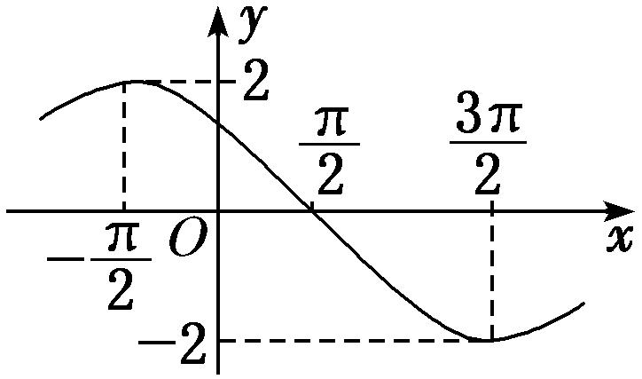

A．*f*(*x*)＝2sin　
B．*f*(*x*)＝2sin　
C．*f*(*x*)＝2sin　
D．*f*(*x*)＝2sin
答案　B　解析　由题图可知<em>A</em>＝2，<em>T</em>＝2×＝4π，故＝4π，解得<em>ω</em>＝．所以<em>f</em>(<em>x</em>)＝2sin．把点代入可得2sin＝2，即sin＝1，所以<em>φ</em>－＝2<em>k</em>π＋(<em>k</em>∈<strong>Z</strong>)，解得<em>φ</em>＝2<em>k</em>π＋(<em>k</em>∈<strong>Z</strong>)．又0&lt;<em>φ</em>&lt;π，所以<em>φ</em>＝．所以<em>f</em>(<em>x</em>)＝2sin．  
（2） 函数*f*(*x*)＝*A*sin(*ωx*＋*φ*)的部分图象如图所示，则*f*的值为(　　)

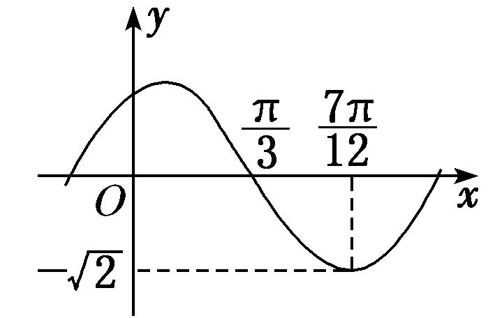

A．－　　　　　　　　
B．－　　　　　　　　
C．－　　　　　　　　
D．－1
答案　D　解析　由图象可得*A*＝，最小正周期*T*＝4×＝π，则*ω*＝＝2．由*f*＝sin＝－，|*φ*|<，得*φ*＝，则*f*(*x*)＝sin，所以*f*＝sin＝sin＝－1．  
（3） 已知函数*f*(*x*)＝sin(*ωx*＋*φ*)的图象上的一个最高点和它相邻的一个最低点的距离为2，且过点，则函数*f*(*x*)＝\_\_\_\_\_\_\_\_\_\_\_\_\_\_\_\_．
答案　sin　解析　依题意得 ＝2，则＝2，即*ω*＝，所以*f*(*x*)＝sin，由于该函数图象过点，因此sin(π＋*φ*)＝－，即sin *φ*＝，而－≤*φ*≤，故*φ*＝，所以*f*(*x*)＝sin．  
（4） 将函数*f*(*x*)的图象上所有点向右平移个单位长度，得到函数*g*(*x*)的图象．若函数*g*(*x*)＝*A*sin(*ωx*＋*φ*)(*A*>0，*ω*>0，|*φ*|<)的部分图象如图所示，则函数*f*(*x*)的解析式为(　　)

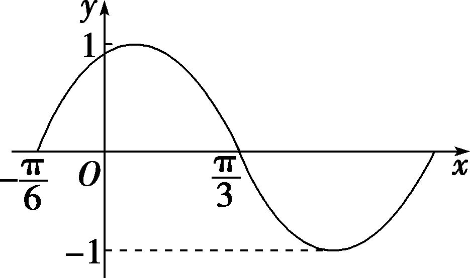

A．*f*(*x*)＝sin　
B．*f*(*x*)＝－cos　
C．*f*(*x*)＝cos　
D．*f*(*x*)＝sin
答案　C　解析　法一：根据函数<em>g</em>(<em>x</em>)的图象可知<em>A</em>＝1，<em>T</em>＝＋＝，<em>T</em>＝π＝，<em>ω</em>＝2，所以<em>g</em>(<em>x</em>)＝sin(2<em>x</em>＋<em>φ</em>)，所以<em>g</em>＝sin＝0，所以＋<em>φ</em>＝π＋<em>k</em>π，<em>k</em>∈<strong>Z</strong>，<em>φ</em>＝＋<em>k</em>π，<em>k</em>∈<strong>Z</strong>，又因为|<em>φ</em>|&lt;，所以<em>φ</em>＝，所以<em>g</em>(<em>x</em>)＝sin，将<em>g</em>(<em>x</em>)＝sin的图象向左平移个单位长度后，即可得到函数<em>f</em>(<em>x</em>)的图象，所以函数<em>f</em>(<em>x</em>)的解析式为<em>f</em>(<em>x</em>)＝<em>g</em>＝sin＝sin＝cos．

法二：根据*g*(*x*)的图象可知*g*＝*g*＝1，因为*f*(*x*)的图象向右平移个单位长度后，即可得到*g*(*x*)的图象，所以*f*＝*f*＝1，对于A，*f*＝sin≠1，不符合题意；对于B，*f*＝－cos 0＝－1≠1，不符合题意；对于C，*f*＝cos 0＝1，符合题意；对于D，*f*＝sin≠1，不符合题意．  
（5） 函数*f*(*x*)＝*A*cos(*ωx*＋*φ*)(*ω*>0)的部分图象如图所示，给出以下结论：

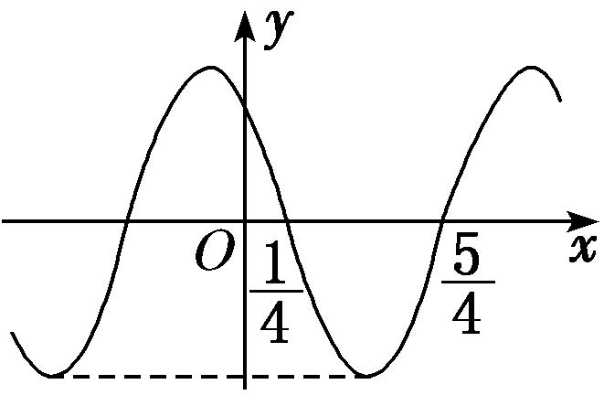

①<em>f</em>(<em>x</em>)的最小正周期为2；②<em>f</em>(<em>x</em>)图象的一条对称轴为直线<em>x</em>＝－；③<em>f</em>(<em>x</em>)在，<em>k</em>∈<strong>Z</strong>上是减函数；④<em>f</em>(<em>x</em>)的最大值为<em>A</em>．
则正确结论的个数为(　　)

A．1　　　　　　　　
B．2　　　　　　　　
C．3　　　　　　　　
D．4
答案　B　解析　由题图可知，函数<em>f</em>(<em>x</em>)的最小正周期<em>T</em>＝2×＝2，故①正确；因为函数<em>f</em>(<em>x</em>)的图象过点和，所以函数<em>f</em>(<em>x</em>)图象的对称轴为直线<em>x</em>＝＋＝＋<em>k</em>(<em>k</em>∈<strong>Z</strong>)，故直线<em>x</em>＝－不是函数<em>f</em>(<em>x</em>)图象的对称轴，故②不正确；由图可知，当－＋<em>kT</em>≤<em>x</em>≤＋＋<em>kT</em>(<em>k</em>∈<strong>Z</strong>)，即2<em>k</em>－≤<em>x</em>≤2<em>k</em>＋(<em>k</em>∈<strong>Z</strong>)时，<em>f</em>(<em>x</em>)是减函数，故③正确；若<em>A</em>&gt;0，则最大值是<em>A</em>，若<em>A</em>&lt;0，则最大值是－<em>A</em>，故④不正确．综上知正确结论的个数为2．  
（6） 函数<em>f</em>(<em>x</em>)＝<em>A</em>sin(<em>ωx</em>＋<em>φ</em>)<em>A</em>＞0，<em>ω</em>＞0，|<em>φ</em>|＜的部分图象如图所示，若<em>x</em>1，<em>x</em>2∈，且<em>f</em>(<em>x</em>1)＝<em>f</em>(<em>x</em>2)，则<em>f</em>(<em>x</em>1＋<em>x</em>2)＝\_\_\_\_\_\_\_\_．

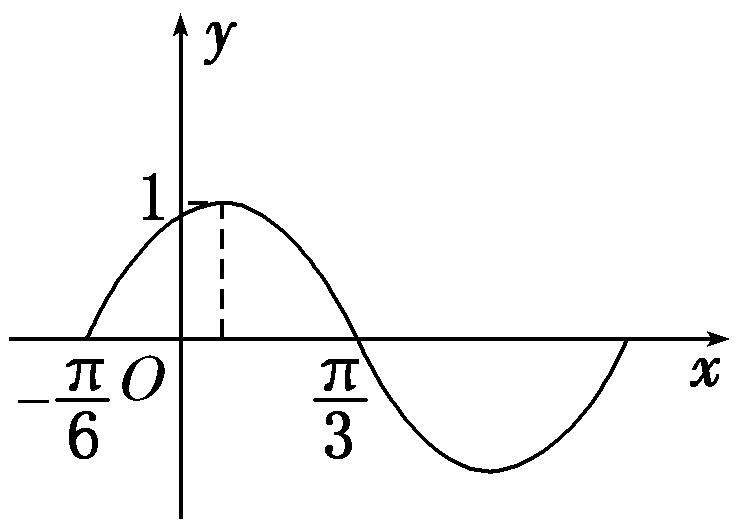
答案　　解析　观察图象可知，<em>A</em>＝1，<em>T</em>＝2＝π，∴<em>ω</em>＝2，∴<em>f</em>(<em>x</em>)＝sin(2<em>x</em>＋<em>φ</em>)．将代入上式得sin＝0，即－＋<em>φ</em>＝<em>k</em>π，<em>k</em>∈Z，由|<em>φ</em>|＜，得<em>φ</em>＝，则<em>f</em>(<em>x</em>)＝sin．函数图象的对称轴为<em>x</em>＝＝．又<em>x</em>1，<em>x</em>2∈，且<em>f</em>(<em>x</em>1)＝<em>f</em>(<em>x</em>2)，∴＝，即<em>x</em>1＋<em>x</em>2＝，∴<em>f</em>(<em>x</em>1＋<em>x</em>2)＝sin＝．  
（7） (2019·天津)已知函数*f*(*x*)＝*A*sin(*ωx*＋*φ*)(*A*>0，*ω*>0，|*φ*|<π)是奇函数，且*f*(*x*)的最小正周期为π，将*y*＝*f*(*x*)的图象上所有点的横坐标伸长到原来的2倍(纵坐标不变)，所得图象对应的函数为*g*(*x*)．若*g*＝，则*f*＝(　　)

A．－2　　　　　　　　
B．－　　　　　　　　
C．　　　　　　　　
D．2
答案　C　解析　由<em>f</em>(<em>x</em>)为奇函数可得<em>φ</em>＝<em>k</em>π(<em>k</em>∈<strong>Z</strong>)，又|<em>φ</em>|&lt;π，所以<em>φ</em>＝0，所以<em>g</em>(<em>x</em>)＝<em>A</em>sin<em>ωx．</em>由<em>g</em>(<em>x</em>)的最小正周期为2π，可得＝2π，故<em>ω</em>＝2，<em>g</em>(<em>x</em>)＝<em>A</em>sin <em>x</em>．<em>g</em>＝<em>A</em>sin＝，所以<em>A</em>＝2，所以<em>f</em>(<em>x</em>)＝2sin 2<em>x</em>，故<em>f</em>＝2sin ＝．

【对点训练】

15．已知函数*f*(*x*)＝*A*sin(*ωx*＋*φ*)的部分图象如图所示，则*φ*的值为(　　)

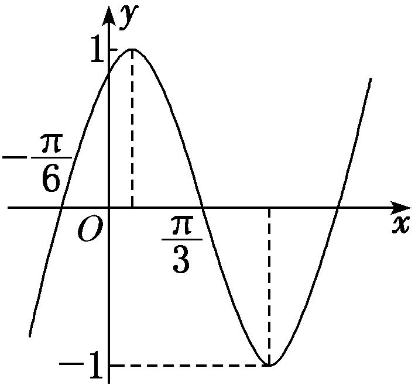

A．－　　　　　　　　
B．　　　　　　　　
C．－　　　　　　　　
D．

15．答案　B　解析　由题意，得＝－＝，所以*T*＝π，由*T*＝，得*ω*＝2，由图可知*A*＝1，所

以*f*(*x*)＝sin(2*x*＋*φ*)．又因为*f*＝sin＝0，－<*φ*<，所以*φ*＝．

16．已知函数*f*(*x*)＝*A*sin(*ωx*＋*φ*)(*A*>0，*ω*>0，|*φ*|<π)的部分图象如图所示，则*f*(*x*)的解析式为(　　)

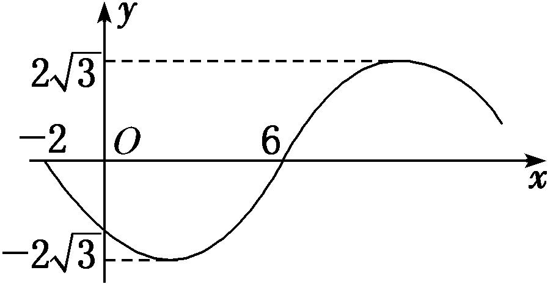

A．*f*(*x*)＝2sin　
B．*f*(*x*)＝2sin　
C．*f*(*x*)＝2sin　
D．*f*(*x*)＝2sin

16．答案　D　解析　由图象可得，*A*＝2，*T*＝2×[6－(－2)]＝16，所以*ω*＝＝＝．所以*f*(*x*)＝2

sin．由函数的对称性得<em>f</em>（2）＝－2，即<em>f</em>（2）＝2sin＝－2，即sin＝－1，所以＋<em>φ</em>＝2<em>k</em>π－(<em>k</em>∈<strong>Z</strong>)，解得<em>φ</em>＝2<em>k</em>π－(<em>k</em>∈<strong>Z</strong>)．因为|<em>φ</em>|&lt;π，所以<em>k</em>＝0，<em>φ</em>＝－．故函数的解析式为<em>f</em>(<em>x</em>)＝2sin．

17．已知*f*(*x*)＝*A*sin(*ωx*＋*φ*)＋*B*的部分图象如图，则*f*(*x*)图象的一个对称中心是(　　)

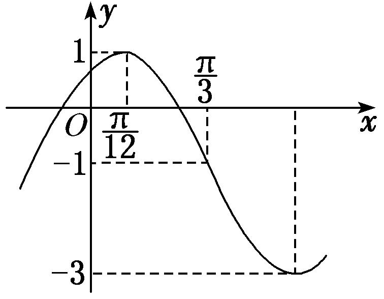

A．　　　　　
B．　　　　　
C．　　　　　
D．

17．答案　A　解析　由题图得为*f*(*x*)图象的一个对称中心，＝－，∴*T*＝π，从而*f*(*x*)图象的

对称中心为(<em>k</em>∈<strong>Z</strong>)，当<em>k</em>＝1时，为，选A．

18．已知函数*f*(*x*)＝*A*cos(*ωx*＋*φ*)的图象如图所示，*f*＝－，则*f*＝(　　)

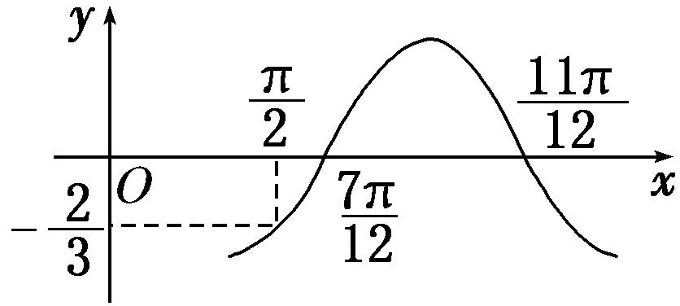

A．－　　　　　　　　
B．－　　　　　　　　
C．　　　　　　　　
D．

18．答案　A　解析　由题图知＝－＝，∴*T*＝，即*ω*＝3，当*x*＝时，*y*＝0，即3×＋*φ*＝2*k*π

－，<em>k</em>∈<strong>Z</strong>，∴<em>φ</em>＝2<em>k</em>π－，<em>k</em>∈<strong>Z</strong>，取<em>k</em>＝1，则<em>φ</em>＝－，∴<em>f</em>(<em>x</em>)＝<em>A</em>cos．则<em>A</em>cos＝－，解得<em>A</em>＝，∴<em>f</em>(<em>x</em>)＝cos，故<em>f</em>＝cos＝－．

19．已知函数*f*(*x*)＝*A*cos(*ωx*＋*φ*)(*A*>0，*ω*>0，0<*φ*<π)为奇函数，该函数的部分图象如图所示，△*EFG*(点*G*

是图象的最高点)是边长为2的等边三角形，则*f*（1）＝\_\_\_\_\_\_\_\_．

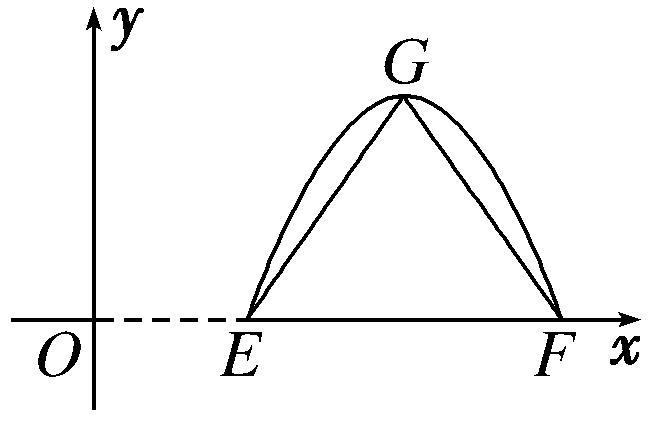

19．答案　－　解析　由题意得，*A*＝，*T*＝4＝，*ω*＝．又∵*f*(*x*)＝*A*cos(*ωx*＋*φ*)为奇函数，∴*φ*＝

＋<em>k</em>π，<em>k</em>∈<strong>Z</strong>，∵0&lt;<em>φ</em>&lt;π，则<em>φ</em>＝，∴<em>f</em>(<em>x</em>)＝cos，∴<em>f</em>（1）＝－．

20．(2015·全国Ⅰ)函数*f*(*x*)＝cos(*ωx*＋*φ*)的部分图象如图所示，则*f*(*x*)的单调递减区间为(　　)

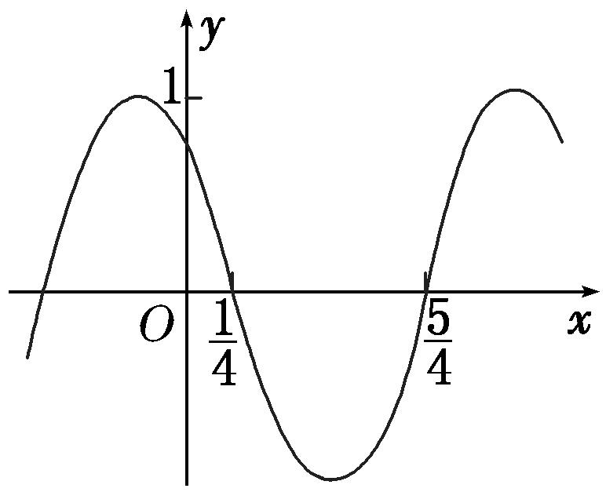

A．，<em>k</em>∈<strong>Z</strong>　　　　　　　　　　
B．，<em>k</em>∈<strong>Z</strong>

C．，<em>k</em>∈<strong>Z</strong>　　　　　　　　　　　
D．，<em>k</em>∈<strong>Z</strong>

20．答案　D　解析　由图象知，周期*T*＝2＝2，∴＝2，∴*ω*＝π．由π×＋*φ*＝＋2*k*π，得*φ*＝＋

2<em>k</em>π，<em>k</em>∈<strong>Z</strong>，不妨取<em>φ</em>＝，则<em>f</em>(<em>x</em>)＝cos．由2<em>k</em>π＜π<em>x</em>＋＜2<em>k</em>π＋π，<em>k</em>∈<strong>Z</strong>，得2<em>k</em>－＜<em>x</em>＜2<em>k</em>＋，<em>k</em>∈<strong>Z</strong>，∴<em>f</em>(<em>x</em>)的单调递减区间为，<em>k</em>∈<strong>Z</strong>，故选D．

21．将函数*f*(*x*)的图象向右平移个单位长度，再将所得函数图象上的所有点的横坐标缩短到原来的，得

到函数*g*(*x*)＝*A*sin(*ωx*＋*φ*)的图象．已知函数*g*(*x*)的部分图象如图所示，则函数*f*(*x*)(　　)

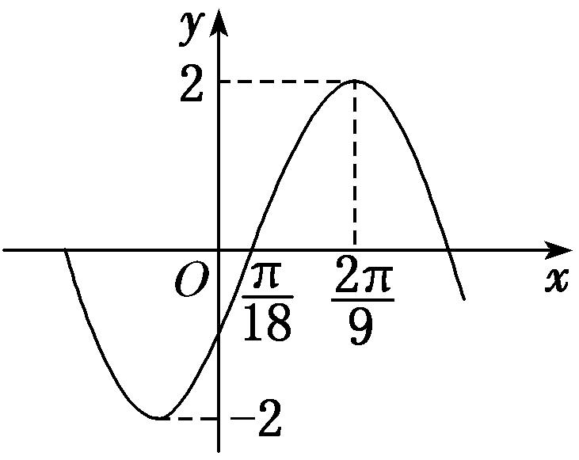

A．最小正周期为π，最大值为2　　　　　　　
B．最小正周期为π，图象关于点中心对称

C．最小正周期为π，图象关于直线*x*＝对称　　
D．最小正周期为π，在区间上单调递减

21．答案　D　解析　对于*g*(*x*)，由题图可知，*A*＝2，*T*＝4＝，∴*ω*＝＝3．则*g*(*x*)＝2sin(3*x*

＋<em>φ</em>)，又由<em>g</em>＝2可得<em>φ</em>＝－＋2<em>k</em>π，<em>k</em>∈<strong>Z</strong>，而|<em>φ</em>|&lt;，∴<em>φ</em>＝－．∴<em>g</em>(<em>x</em>)＝2sin，∴<em>f</em>(<em>x</em>)＝2sin．∴<em>f</em>(<em>x</em>)的最小正周期为π，选项A、C错误．对于选项B，令2<em>x</em>＋＝<em>k</em>π(<em>k</em>∈<strong>Z</strong>)，所以<em>x</em>＝－，<em>k</em>∈<strong>Z</strong>，所以函数<em>f</em>(<em>x</em>)图象的对称中心为(<em>k</em>∈<strong>Z</strong>)，所以选项B是错误的；当<em>x</em>∈时，2<em>x</em>＋∈，所以<em>f</em>(<em>x</em>)在上是减函数，所以选项D正确．故选D．

22．已知函数*f*(*x*)＝*A*sin(*ωx*＋*φ*)(*A*>0，*ω*>0,0<*φ*<π)的图象与*x*轴的一个交点到其相邻的一条对称

轴的距离为，若*f*＝，则函数*f*(*x*)在上的最小值为(　　)

A．　　　　　　　　
B．－　　　　　　　　
C．－　　　　　　　　
D．－

22．答案　C　解析　由题意得，函数*f*(*x*)的最小正周期*T*＝4×＝π＝，解得*ω*＝2．因为点在

函数<em>f</em>(<em>x</em>)的图象上，所以<em>A</em>sin＝0，解得<em>φ</em>＝<em>k</em>π＋，<em>k</em>∈<strong>Z</strong>，由0&lt;<em>φ</em>&lt;π，可得<em>φ</em>＝．因为<em>f</em>＝，所以<em>A</em>sin(2×＋)＝，解得<em>A</em>＝，所以<em>f</em>(<em>x</em>)＝sin(2<em>x</em>＋)．当<em>x</em>∈时，2<em>x</em>＋∈，sin(2<em>x</em>＋)∈，且当2<em>x</em>＋＝，即<em>x</em>＝时，函数<em>f</em>(<em>x</em>)取得最小值，最小值为－，故选C．

23．函数*f*(*x*)＝*A*cos(*ωx*＋*φ*)(*A*>0，*ω*>0，－π<*φ*<0)的部分图象如图所示，为了得到*g*(*x*)＝*A*sin*ωx*的图象，

只需将函数*y*＝*f*(*x*)的图象(　　)

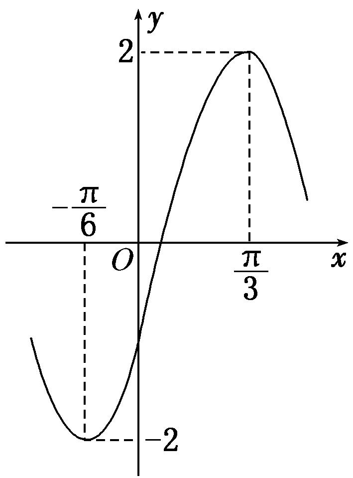

A．向左平移个单位长度　　　　　　　　　　
B．向左平移个单位长度

C．向右平移个单位长度　　　　　　　　　　
D．向右平移个单位长度

23．答案　B　解析　由题图知*A*＝2，＝－＝，∴*T*＝π，∴*ω*＝2，∴*f*(*x*)＝2cos(2*x*＋*φ*)，将
代入得cos＝1，∵－π<*φ*<0，∴－<＋*φ*<，∴＋*φ*＝0，∴*φ*＝－，∴*f*(*x*)＝2cos＝2sin，故将函数*y*＝*f*(*x*)的图象向左平移个单位长度可得到*g*(*x*)的图象．

24．函数<em>f</em>(<em>x</em>)＝<em>A</em>sin(2<em>x</em>＋<em>θ</em>)的部分图象如图所示，且<em>f</em>(<em>a</em>)＝<em>f</em>(<em>b</em>)＝0，对不同的<em>x</em>1，<em>x</em>2∈[<em>a</em>，<em>b</em>]，
若<em>f</em>(<em>x</em>1)＝<em>f</em>(<em>x</em>2)，有<em>f</em>(<em>x</em>1＋<em>x</em>2)＝，则(　　)

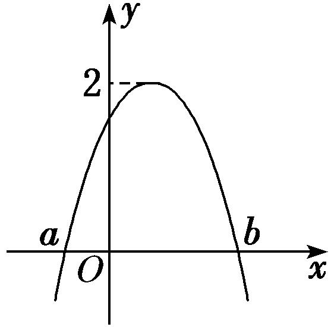

A．*f*(*x*)在上是减函数　　　　　　　　
B．*f*(*x*)在上是增函数

C．*f*(*x*)在上是减函数　　　　　　　　　　
D．*f*(*x*)在上是增函数

24．答案　B　解析　由题图知*A*＝2，设*m*∈[*a*，*b*]，且*f*（0）＝*f*(*m*)，则*f*(0＋*m*)＝*f*(*m*)＝*f*（0）＝，∴2sin *θ*

＝，sin <em>θ</em>＝，又∵|<em>θ</em>|≤，∴<em>θ</em>＝，∴<em>f</em>(<em>x</em>)＝2sin，令－＋2<em>k</em>π≤2<em>x</em>＋≤＋2<em>k</em>π，<em>k</em>∈<strong>Z</strong>，解得－＋<em>k</em>π≤<em>x</em>≤＋<em>k</em>π，<em>k</em>∈<strong>Z</strong>，此时<em>f</em>(<em>x</em>)单调递增．所以选项B正确．

25．函数*f*(*x*)＝sin(*ωx*＋*φ*)在它的某一个周期内的单调递减区间是．将*y*＝*f*(*x*)的图象

先向左平移个单位长度，再将图象上所有点的横坐标变为原来的(纵坐标不变)，所得到的图象对应的函数记为*g*(*x*)．  
（1）求*g*(*x*)的解析式；  
（2）求*g*(*x*)在区间上的最大值和最小值．

25．解　（1）∵＝－＝，∴*T*＝π，*ω*＝＝2，又∵sin＝1，|*φ*|<，∴*φ*＝－，*f*(*x*)＝sin，
将函数*f*(*x*)的图象向左平移个单位长度得*y*＝sin＝sin，
再将*y*＝sin的图象上所有点的横坐标变为原来的(纵坐标不变)得*g*(*x*)＝sin．
∴*g*(*x*)＝sin．  
（2）∵*x*∈，∴4*x*＋∈，当4*x*＋＝时，*x*＝，
∴<em>g</em>(<em>x</em>)在上为增函数，在上为减函数，所以<em>g</em>(<em>x</em>)max＝<em>g</em>＝1，
又因为<em>g</em>（0）＝，<em>g</em>＝－，所以<em>g</em>(<em>x</em>)min＝－，
故函数*g*(*x*)在区间上的最大值和最小值分别为1和－．

26．函数*f*(*x*)＝*A*sin(*ωx*＋*φ*)的部分图象如图所示．  
（1）求函数*f*(*x*)的解析式，并写出其图象的对称中心；  
（2）若方程*f*(*x*)＋2cos＝*a*有实数解，求*a*的取值范围．

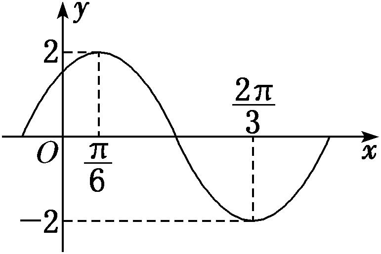

26．解　（1）由图可得*A*＝2，＝－＝，所以*T*＝π，所以*ω*＝2．
当*x*＝时，*f*(*x*)＝2，可得2sin＝2，因为|*φ*|<，所以*φ*＝．
所以函数<em>f</em>(<em>x</em>)的解析式为<em>f</em>(<em>x</em>)＝2sin．令2<em>x</em>＋＝<em>k</em>π(<em>k</em>∈Z)，得<em>x</em>＝－(<em>k</em>∈<strong>Z</strong>)，
所以函数<em>f</em>(<em>x</em>)图象的对称中心为(<em>k</em>∈<strong>Z</strong>)．  
（2）设*g*(*x*)＝*f*(*x*)＋2cos，
则*g*(*x*)＝2sin＋2cos＝2sin＋2，
令<em>t</em>＝sin，<em>t</em>∈[－1，1]，记<em>h</em>(<em>t</em>)＝－4<em>t</em>2＋2<em>t</em>＋2＝－42＋，
因为*t*∈[－1，1]，所以*h*(*t*)∈，即*g*(*x*)∈，故*a*∈．
故*a*的取值范围为．

