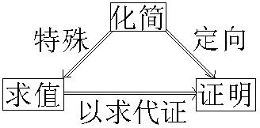

专题六 三角恒等变换题型篇

三角恒等变换的基本题型

1．求值：三角函数的求值有三种类型  
（1）给角求值：一般所给出的角都是非特殊角，要观察所给角与特殊角间的关系，利用三角变换消去非特殊角，转化为求特殊角的三角函数值问题；
  
（2）给值求值：给出某些角的三角函数式的值，求另外一些角的三角函数值，解题的关键在于“变角”，如等，把所求角用含已知角的式子表示，求解时要注意角的范围的讨论；  
（3）给值求角：实质上转化为“给值求值”问题，由所得的所求角的函数值结合所求角的范围及函数的单调性求得角．

2．化简：化简目标：项数尽量少、次数尽量低、尽量不含分母和根号．对能求出具体数值的，要求出值．

3．证明：三角函数的求值有两种类型  
（1）无条件三角恒等式的证明：证明方法有：化繁为简法、左右归一法、变更论题法；  
（2）有条件三角恒等式的证明：

可分为四类：①已知角度关系，证明函数关系；②已知函数关系证明角度关系；③已知函数关系证明函数关系；④三角形内的边角恒等式的证明．
证明方法除了注意到无条件三角恒等式的证明方法外，还用到直推法与代入法两种方法．

4．三种题型的相互关系：

考点一　给角求值

【方法总结】
解给角求值问题的解题策略
解决给角求值问题的关键是两种变换：一是角的变换，注意各角之间是否具有和差关系、互补(余)关系、倍半关系，从而选择相应公式进行转化，把非特殊角的三角函数相约或相消，从而转化为特殊角的三角函数；二是结构变换，在熟悉各种公式的结构特点、符号特征的基础上，结合所求式子的特点合理地进行变形．

【例题选讲】

[例1] （1） (2015·全国Ⅰ)sin 20°cos 10°－cos 160°sin 10°＝(　　)

A．－　　　　　　　　
B．　　　　　　　　
C．－　　　　　　　　
D．
答案　D　解析　sin20°cos10°－cos160°sin10°＝sin20°cos10°＋cos20°sin10°＝sin(20°＋10°)＝sin30°＝，故选D．  
（2） 的值是\_\_\_\_\_\_\_\_．
答案　2　解析　原式＝＝＝＝2．  
（3）计算：＝\_\_\_\_\_\_\_\_．
答案　　解析　＝＝＝＝.  
（4） sin 50°(1＋tan 10°)＝\_\_\_\_\_\_\_\_．
答案　1　解析　sin50°(1＋tan10°)＝sin50°(1＋tan60°·tan10°)＝sin50°·＝sin 50°·＝＝＝＝1．  
（5） 计算：－sin 10°·＝\_\_\_\_\_\_\_\_．
答案　　解析　原式＝－sin10°·＝－＝＝＝＝.

【对点训练】

1．的值等于(　　)

A．　　　　　　　
B．－　　　　　　　
C．　　　　　　　
D．3

1．答案　D　解析　将35°拆成30°＋5°，25°拆成30°－5°展开化简．原式＝＝

＝－＝－．

2．计算的值为(　　)

A．－　　　　　　　　
B．　　　　　　　　
C．　　　　　　　　
D．－

2．答案　B　解析　＝＝＝＝．

3．计算：＝(　　)

A．　　　　　　　　
B．　　　　　　　　
C．　　　　　　　　
D．－

3．答案　A　解析　＝＝＝．

4．求值：＝(　　)

A．1　　　　　　　　
B．2　　　　　　　　
C．　　　　　　　　
D．

4．答案　C 　解析　原式＝＝＝

＝＝＝＝．

5．的值是(　　)

A．　　　　　　　　
B．　　　　　　　　
C．　　　　　　　　
D．

5．答案　C　解析　原式＝＝＝

＝．

6．等于(　　)

A．－　　　　　　　　
B．　　　　　　　　
C．　　　　　　　　
D．1

6．答案　C　解析　原式＝＝＝＝．

7．(1＋tan 18°)·(1＋tan 27°)的值是(　　)

A．　　　　　　
B．1＋　　　　　　
C．2　　　　　　
D．2(tan 18°＋tan 27°)

7．答案　C 　解析　原式＝1＋tan 18°＋tan 27°＋tan 18°tan 27°＝1＋tan 18°tan 27°＋tan 45°(1－tan 18°tan

27°)＝2，故选C．

8．4sin 80°－＝(　　)

A．　　　　　　　　
B．－　　　　　　　　
C． 　　　　　　　　
D．2－3

8．答案　B　解析　4sin80°－＝＝＝

＝－．故选B．

9．4cos 50°－tan 40°等于(　　)

A．　　　　　
B．　　　　　
C．　　　　　
D．2－1

9．答案　C　解析　4sin40°－＝＝＝

＝＝＝．

10．计算：－＝________．

10．答案　－4　解析　原式＝＝＝＝－4．

11．[2sin 50°＋sin 10°(1＋tan 10°)]·＝________．

11．答案　　解析　sin80°＝·

cos 10°＝2[sin 50°·cos 10°＋sin 10°·cos(60°－10°)]＝2sin(50°＋10°)＝2×＝．

12．求值：(3＋tan30°tan40°＋tan40°tan50°＋tan50°tan60°)·tan10°．

12．解：原式＝(1＋tan30°tan40°＋1＋tan40°tan50°＋1＋tan50°tan60°)·tan10°，因为tan10°＝tan(40°－30°)

＝，所以1＋tan40°tan30°＝．同理，1＋tan40°tan50°＝，

1＋tan50°tan60°＝．所以原式＝(＋＋)

·tan10°＝tan40°－tan30°＋tan50°－tan40°＋tan60°－tan50°＝－tan30°＋tan60°＝．

考点二　给值求值

【方法总结】
解给值求值问题的一般步骤  
（1）先化简条件式子或待求式子；  
（2）观察已知条件与所求式子之间的联系(从三角函数的名及角入手)；  
（3）将已知条件代入所求式子，化简求值．

【例题选讲】

<strong>[例2]</strong> （1） 已知<em>α</em>为第二象限角，且sin2<em>α</em>＝－，则cos <em>α</em>－sin <em>α</em>的值为(　　)

A．　　　　　　　　
B．－　　　　　　　　
C．　　　　　　　　
D．－
答案　B　解析　因为sin 2<em>α</em>＝2sin <em>α</em>cos <em>α</em>＝－，即1－2sin <em>α</em>cos <em>α</em>＝，所以(sin <em>α</em>－cos <em>α</em>)2＝，又<em>α</em>为第二象限角，所以cos <em>α</em>&lt;sin <em>α</em>，则cos <em>α</em>－sin <em>α</em>＝－．  
（2）已知sin 2*α*＝，tan(*α*－*β*)＝，则tan(*α*＋*β*)等于(　　)

A．－2　　　　　　　　
B．－1　　　　　　　　
C．－　　　　　　　　
D．
答案　A　解析　由题意，可得cos2*α*＝－，则tan2*α*＝－，tan(*α*＋*β*)＝tan[2*α*－(*α*－*β*)]＝＝－2．  
（3） 已知tan 2*α*＝－2，且＜*α*＜，则的值是(　　)

A．　　　　　　
B．－　　　　　　
C．－3＋2　　　　　　
D．3－2
答案　C　解析　因为<*α*<，所以tan*α*＞0，所以由tan2*α*＝＝－2可得tan*α*＝．原式＝＝＝＝＝－3＋2．故选C．  
（4） 已知<em>α</em>∈，<em>β</em>∈，且cos＝，sin＝－，则cos(<em>α</em>＋<em>β</em>)＝________．
答案　－　解析　∵*α*∈，∴－*α*∈，又cos＝，∴sin＝－，∵sin＝－，∴sin＝，又∵*β*∈，＋*β*∈，∴cos＝，∴cos(*α*＋*β*)＝cos＝coscos＋sinsin＝×－×＝－．  
（5）设<em>α</em>为锐角，若cos＝，则sin的值为________．
答案　　解析　∵*α*为锐角且cos＝>0，∴*α*＋∈，∴sin＝．∴sin＝sin＝sin 2cos －cos 2sin ＝sincos－＝××－＝－＝．  
（6） 已知<em>α</em>∈，且2sin2<em>α</em>－sin <em>α</em>·cos <em>α</em>－3cos2<em>α</em>＝0，则＝________．
答案　　解析　∵<em>α</em>∈，且2sin2<em>α</em>－sin <em>α</em>·cos <em>α</em>－3cos2<em>α</em>＝0，则(2sin <em>α</em>－3cos <em>α</em>)·(sin <em>α</em>＋cos <em>α</em>)＝0，又∵<em>α</em>∈，sin <em>α</em>＋cos <em>α</em>&gt;0，∴2sin <em>α</em>＝3cos <em>α</em>，又sin2<em>α</em>＋cos2<em>α</em>＝1，∴cos <em>α</em>＝，sin <em>α</em>＝，∴＝＝＝．

【对点训练】

13．已知*α*是第三象限的角，且tan *α*＝2，则sin＝(　　)

A．－　　　　　　　　
B．　　　　　　　　
C．－　　　　　　　　
D．

13．答案　C　解析　因为*α*是第三象限的角，tan *α*＝2，所以cos *α*＝－，sin *α*＝－，则sin＝

sin *α*cos＋cos *α*sin＝－×－×＝－．

14．已知*α*是第二象限角，且tan *α*＝－，则sin 2*α*等于(　　)

A．－　　　　　　　　
B．　　　　　　　　
C．－　　　　　　　　
D．

14．答案　C　解析　因为*α*是第二象限角，且tan *α*＝－，所以sin *α*＝，cos *α*＝－，所以sin 2*α*

＝2sin *α*cos *α*＝2××＝－，故选C．

15．已知sin *α*＝且*α*为第二象限角，则tan等于(　　)

A．－　　　　　　　　
B．－　　　　　　　　
C．－　　　　　　　　
D．－

15．答案　D　解析　由题意得cos <em>α</em>＝－，则sin 2<em>α</em>＝－，cos 2<em>α</em>＝2cos2<em>α</em>－1＝．∴tan 2<em>α</em>＝－，
∴tan＝＝＝－．

16．已知tan(*α*＋*β*)＝2，tan *β*＝3，则sin 2*α*＝(　　)

A．　　　　　　　　
B．　　　　　　　　
C．－　　　　　　　　
D．－

16．答案　C　解析　由题意知tan *α*＝tan[(*α*＋*β*)－*β*]＝＝－，所以sin 2*α*＝＝

＝－．

17．已知cos＝－，则sin的值为(　　)

A．　　　　　　　　
B．±　　　　　　　　
C．－　　　　　　　　
D．

17．答案　B　解析　　∵cos＝－，∴cos＝－cos＝－cos＝－

＝－，解得sin2＝，∴sin＝±．

18．已知tan＝，且－＜*α*＜0，则＝(　　)

A．－　　　　　　　　
B．－　　　　　　　　
C．－　　　　　　　　
D．

18．答案　A　解析　∵tan ＝＝，∴tan <em>α</em>＝－，∵tan <em>α</em>＝＝－，sin2<em>α</em>＋cos2<em>α</em>＝1，

*α*∈，∴sin *α*＝－．∴＝＝＝2sin *α*＝2×＝－．故选A．

19．若*α*∈，且3cos 2*α*＝sin，则sin 2*α*的值为(　　)

A．－　　　　　　　　
B．　　　　　　　　
C．－　　　　　　　　
D．

19．答案　C　解析　由3cos 2<em>α</em>＝sin可得3(cos2<em>α</em>－sin2<em>α</em>)＝(cos <em>α</em>－sin <em>α</em>)，又由<em>α</em>∈可知，

cos *α*－sin *α*≠0，于是3(cos *α*＋sin *α*)＝，所以1＋2sin *α*cos *α*＝，故sin 2*α*＝－．故选C．

20．已知sin *α*＝－，*α*∈，若＝2，则tan(*α*＋*β*)＝(　　)

A．　　　　　　　　
B．　　　　　　　　
C．－　　　　　　　　
D．－

20．答案　A　解析　∵sin *α*＝－，*α*∈，∴cos *α*＝．又∵＝2，∴sin(*α*＋*β*)＝2cos[(*α*

＋*β*)－*α*]．展开并整理，得cos(*α*＋*β*)＝sin(*α*＋*β*)，∴tan(*α*＋*β*)＝．

21．设*α*为锐角，若cos＝，则sin的值为(　　)

A．　　　　　　　　
B．　　　　　　　　
C．－　　　　　　　　
D．－

21．答案　B　解析　因为*α*为锐角，且cos＝，所以sin＝＝，所以

sin＝sin 2＝2sincos＝2××＝，故选B．

22．已知coscos＝，则sin4<em>θ</em>＋cos4<em>θ</em>的值为________．

22．答案　　解析　因为coscos＝＝(cos2<em>θ</em>－sin2<em>θ</em>)

＝cos 2<em>θ</em>＝．所以cos 2<em>θ</em>＝．故sin4<em>θ</em>＋cos4<em>θ</em>＝2＋2＝＋＝．

23．已知cos＝，<em>θ</em>∈，则sin＝________．

23．答案　　解析　由题意可得cos2＝＝，cos＝－sin 2<em>θ</em>＝－，即

sin 2*θ*＝．因为cos＝>0，*θ*∈，所以0<*θ*<，2*θ*∈，根据同角三角函数基本关系式，可得cos 2*θ*＝，由两角差的正弦公式，可得sin＝sin 2*θ*cos －cos 2*θ*sin ＝×－×＝．

24．设*α*，*β*∈(0，π)，sin(*α*＋*β*)＝，tan＝，则cos*β*＝\_\_\_\_\_\_\_\_．

24．答案　－　解析　因为tan＝，所以sin<em>α</em>＝2sincos＝＝＝，cos<em>α</em>＝cos2－

sin2＝＝＝∈<em>．</em>又<em>α</em>∈(0，π)，所以<em>a</em>∈，又<em>β</em>∈(0，π)，所以<em>α</em>＋<em>β</em>∈<em>．</em>又sin(<em>α</em>＋<em>β</em>)＝∈，所以<em>α</em>＋<em>β</em>∈，所以cos(<em>α</em>＋<em>β</em>)＝－，所以cos<em>β</em>＝cos[(<em>α</em>＋<em>β</em>)－<em>α</em>]＝cos(<em>α</em>＋<em>β</em>)cos <em>α</em>＋sin(<em>α</em>＋<em>β</em>)sin <em>α</em>＝－．

【评析】　本题缩小角的范围分为两层：（1）由cos*α*＝∈，结合*α*∈(0，π)，缩小角*α*的范围，得到*α*＋*β*的范围；（2）由sin(*α*＋*β*)＝∈，结合*α*＋*β*∈上不单调，解决办法是画图．

考点三　给值求角

【方法总结】
解给值求角问题的一般步骤  
（1）界定角的范围，根据条件确定所求角的范围．  
（2）求角的某一个三角函数值．即根据已知条件，选取合适的三角函数求值．

①已知正切函数值，选正切函数；
②已知正、余弦函数值，选正弦或余弦函数，为防止增解最好选取在范围内单调的三角函数．若角的范围是，选正、余弦函数皆可；若角的范围是(0，π)，选余弦函数较好；若角的范围是，选正弦函数较好．  
（3）结合三角函数值及角的范围写出所求的角．

【例题选讲】

<strong>[例3]</strong> （1） 已知<em>α</em>，<em>β</em>均为锐角，且cos <em>α</em>＝，cos <em>β</em>＝，则<em>α</em>－<em>β</em>＝\_\_\_\_\_\_\_\_．
答案　－　解析　∵*α*，*β*均为锐角，∴sin *α*＝，sin *β*＝．∴cos(*α*－*β*)＝cos *α*cos *β*＋sin *α*sin *β*＝×＋×＝．又sin *α*<sin *β*，∴0<*α*<*β*<，∴－<*α*－*β*<0．故*α*－*β*＝－．  
（2） 已知cos*α*＝，cos(*α*－*β*)＝，且0<*β*<*α*<，则*β*＝\_\_\_\_\_\_\_\_．
答案　　解析　由cos*α*＝，0<*α*<，得sin*α*＝＝＝．由0<*β*<*α*<，得0<*α*－*β*<．又∵cos(*α*－*β*)＝，∴sin(*α*－*β*)＝＝＝．∵*β*＝*α*－(*α*－*β*)，∴cos*β*＝cos[*α*－(*α*－*β*)]＝cos *α*cos(*α*－*β*)＋sin *α*sin(*α*－*β*)＝×＋×＝．∵0<*β*<，∴*β*＝．  
（3） 已知*α*，*β*，*γ*都是锐角，且tan *α*＝，tan *β*＝，tan *γ*＝，则*α*＋*β*＋*γ*＝\_\_\_\_\_\_\_\_．
答案　　解析　∵tan(*α*＋*β*)＝＝＝，tan(*α*＋*β*＋*γ*)＝＝＝1，∵*α*，*β*，*γ*∈，∴*α*＋*β*∈(0，π)，又tan(*α*＋*β*)＝>0，∴*α*＋*β*∈，∴*α*＋*β*＋*γ*∈(0，π)，∴*α*＋*β*＋*γ*＝．  
（4）在斜三角形*ABC*中，sin *A*＝－cos *B*cos *C*，且tan *B*·tan *C*＝1－，则角*A*的值为(　　)

A．　　　　　　　　
B．　　　　　　　　
C．　　　　　　　　
D．
答案　A　解析　由题意知，sin*A*＝sin(*B*＋*C*)＝sin*B*cos*C*＋cos*B*sin*C*＝－cos*B*cos*C*，在等式－cos*B*cos*C*＝sin*B*cos*C*＋cos*B*sin*C*两边同除以cos *B*cos *C*，得tan*B*＋tan*C*＝－，又tan(*B*＋*C*)＝＝－1＝－tan *A*，即tan *A*＝1，因为0<*A*<π，所以*A*＝．  
（5） 已知*α*，*β*∈(0，π)，tan*α*＝2，cos*β*＝－，则2*α*－*β*＝\_\_\_\_\_\_\_\_．
答案　－　解析　法一　因为tan *α*＝2>0，*α*∈(0，π)，所以*α*∈．同理可得*β*∈，且tan *β*＝－．所以*α*－*β*∈(－π，0)，tan(*α*－*β*)＝＝3>0，所以*α*－*β*∈，所以2*α*－*β*∈(－π，0)．又tan(2*α*－*β*)＝tan[*α*＋(*α*－*β*)]＝＝－1，所以2*α*－*β*＝－．

法二　因为tan*α*＝2>1，*α*∈(0，π)，所以*α*∈．因为cos*β*＝－，*β*∈(0，π)，所以*β*∈，
所以2*α*－*β*∈．因为tan(2*α*－*β*)＝tan[*α*＋(*α*－*β*)]＝＝－1，所以2*α*－*β*＝－．

【评析】　三角函数值的符号与角的范围有直接关系，借助三角函数值的符号可有效缩小角的范围．本题缩小角的范围分为两层：先由条件中tan*α*，cos*β*的符号缩小*α*，*β*的范围，得到*α*－*β*的范围，再由*α*－*β*的范围，结合tan(*α*－*β*)的符号进而缩小*α*－*β*的范围，得到2*α*－*β*的范围．难点是想到缩小*α*－*β*的范围．

另外，本题还可以采用缩小三角函数值的范围来缩小角的范围．

法二较法一在求角的范围上运算量小了许多，这也显示出运用三角函数值的范围缩小角的范围的优势．

【对点训练】

25．已知*α*，*β*均为锐角，且sin *α*＝，cos *β*＝，则*α*－*β*＝\_\_\_\_\_\_\_\_．

25．答案　－　解析　解　因为*α*，*β*均为锐角，且sin *α*＝，cos *β*＝，所以cos *α*＝，sin *β*＝．
所以sin(*α*－*β*)＝sin *α*cos *β*－cos *α*sin *β*＝×－×＝－．又因为*α*，*β*均为锐角，所以－<*α*－*β*<．故*α*－*β*＝－．

26．设*α*，*β*为钝角，且sin *α*＝，cos *β*＝－，则*α*＋*β*的值为(　　)

A．　　　　　　　　
B．　　　　　　　　
C．　　　　　　　　
D．或

26．答案　C　解析　∵*α*，*β*为钝角，sin *α*＝，cos *β*＝－，∴cos *α*＝－，sin *β*＝，∴cos(*α*

＋*β*)＝cos *α*cos *β*－sin *α*sin *β*＝>0．又*α*＋*β*∈(π，2π)，∴*α*＋*β*∈，∴*α*＋*β*＝．

27．若锐角*α*，*β*满足tan *α*＋tan *β*＝－tan *α*tan *β*，则*α*＋*β*＝\_\_\_\_\_\_\_\_．

27．答案　　解析　由已知可得＝，即tan(*α*＋*β*)＝．又因为*α*＋*β*∈(0，π)，所以*α*＋*β*

＝．

28．若cos(<em>α</em>－<em>β</em>)＝，cos2<em>α</em>＝，且<em>α</em>，<em>β</em>均为锐角，<em>α</em>&lt;<em>β</em>，则<em>α</em>＋<em>β</em>＝________．

28．答案　　解析　因为0<*α*<，0<*β*<，*α*<*β*．所以－<*α*－*β*<0．又cos(*α*－*β*)＝，所以sin(*α*－*β*)＝

－＝－．又因为0<2*α*<π，cos 2*α*＝，所以sin 2*α*＝＝，所以cos(*α*＋*β*)＝cos[2*α*－(*α*－*β*)]＝cos 2*α*cos(*α*－*β*)＋sin 2*α*sin(*α*－*β*)＝×＋×＝－．又0<*α*＋*β*<π，故*α*＋*β*＝．

29．已知cos *α*＝，sin(*α*＋*β*)＝，0<*α*<，0<*β*<，则*β*＝\_\_\_\_\_\_\_\_．

29．答案　　解析　解　因为0<*α*<，cos *α*＝，所以sin *α*＝．又因为0<*β*<，所以0<*α*＋*β*<π．因为

sin(*α*＋*β*)＝<sin *α*，所以cos(*α*＋*β*)＝－，所以sin *β*＝sin[(*α*＋*β*)－*α*]＝sin(*α*＋*β*)cos *α*－cos(*α*＋*β*)sin *α*＝×－×＝．又因为0<*β*<，所以*β*＝．

30．已知cos(<em>α</em>－<em>β</em>)＝－，cos(<em>α</em>＋<em>β</em>)＝，且<em>α</em>－<em>β</em>∈，<em>α</em>＋<em>β</em>∈，则<em>β</em>＝________．

30．答案　　解析　由*α*－*β*∈，且cos(*α*－*β*)＝－，得sin(*α*－*β*)＝．由*α*＋*β*∈，且

cos(*α*＋*β*)＝，得sin(*α*＋*β*)＝－．∴cos 2*β*＝cos[(*α*＋*β*)－(*α*－*β*)]＝cos(*α*＋*β*)cos(*α*－*β*)＋sin(*α*＋*β*)sin(*α*－*β*)＝×＋×＝－1．又∵*α*＋*β*∈，*α*－*β*∈，∴2*β*∈．∴2*β*＝π，则*β*＝．

31．已知tan <em>α</em>＝4，cos(<em>α</em>＋<em>β</em>)＝－，<em>α</em>，<em>β</em>均为锐角，则<em>β</em>＝________．

31．答案　　解析　因为<em>α</em>∈，tan <em>α</em>＝4，所以sin <em>α</em>＝4cos <em>α</em>，①．sin2<em>α</em>＋cos2<em>α</em>＝1，②．由

①②得sin *α*＝，cos *α*＝．因为*α*＋*β*∈(0，π)，cos(*α*＋*β*)＝－，所以sin(*α*＋*β*)＝，所以cos *β*＝cos[(*α*＋*β*)－*α*]＝cos(*α*＋*β*)cos *α*＋sin(*α*＋*β*)sin *α*＝×＋×＝．所以cos *β*＝．又0<*β*<，所以*β*＝．

32．若sin＝－，sin＝，其中<*α*<，<*β*<，则角*α*＋*β*的值为\_\_\_\_\_\_\_\_．

32．答案　　解析　∵<*α*<，<*β*<，∴－<－*α*<0，<＋*β*<．∴cos＝＝，

cos＝－＝－，∴cos(*α*＋*β*)＝cos＝coscos＋sinsin＝×＋×＝－，又<*α*＋*β*<π，∴*α*＋*β*＝．

33．定义运算＝<em>ad</em>－<em>bc</em>．若cos <em>α</em>＝，＝，0&lt;<em>β</em>&lt;<em>α</em>&lt;，则<em>β</em>＝________．

33．答案　　解析　由题意有sin *α*cos *β*－cos *α*sin *β*＝sin(*α*－*β*)＝，又0<*β*<*α*<，∴0<*α*－*β*<，故cos(*α*

－*β*)＝＝，而cos *α*＝，∴sin *α*＝，于是sin *β*＝sin[*α*－(*α*－*β*)]＝sin *α*cos(*α*－*β*)－cos *α*sin(*α*－*β*)＝×－×＝．又0<*β*<，故*β*＝．

34．在△*ABC*中，3sin *A*＋4cos *B*＝6，3cos *A*＋4sin *B*＝1，则*C*的大小为(　　)

A．　　　　　　　　
B．π　　　　　　　　
C．或π　　　　　　　　
D．或π

34．答案　A　解析　由题意知①2＋②2得9＋16＋24sin(<em>A</em>＋<em>B</em>)＝37．则sin(<em>A</em>

＋*B*)＝．∴在△*ABC*中，sin *C*＝，∴*C*＝或*C*＝．若*C*＝，则*A*＋*B*＝，∴1－3cos *A*＝4sin *B*>0．∴cos *A*<．又<，∴*A*>．此时*A*＋*C*>π，不符合题意，∴*C*≠，∴*C*＝．

35．已知tan *α*＝，tan *β*＝，且*α*，*β*均为锐角，则*α*＋2*β*的值为(　　)

A．　　　　　　　　
B．　　　　　　　　
C．　　　　　　　　
D．

35．答案　C　解析　tan 2*β*＝＝，tan(*α*＋2*β*)＝＝1．因为*α*，*β*均为锐角，且tan *α*

＝<1，tan *β*＝<1，所以*α*，*β*∈，所以*α*＋2*β*∈，所以*α*＋2*β*＝．

36．已知tan(*α*－*β*)＝，tan *β*＝－，*α*，*β*∈(0，π)，则2*α*－*β*＝\_\_\_\_\_\_\_\_．

36．答案　－π　解析　∵tan*β*＝－，tan(*α*－*β*)＝，∴tan*α*＝tan[(*α*－*β*)＋*β*]＝＝

＝，tan(2*α*－*β*)＝tan[(*α*－*β*)＋*α*]＝＝＝1．∵tan *α*＝>0，tan *β*＝－<0，∴*α*∈，*β*∈，∴*α*－*β*∈(－π，0)．又∵tan(*α*－*β*)＝>0，∴*α*－*β*∈，2*α*－*β*＝*α*＋(*α*－*β*)∈(－π，0)．而tan(2*α*－*β*)＝1，∴2*α*－*β*＝－π．

