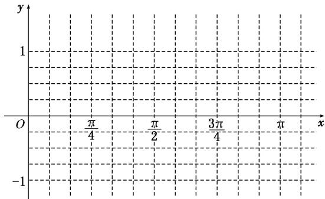

# 专题七 三角恒等变换应用篇(解答题)
答题模板

# 三角函数图象与性质的综合问题

典例 (12 分) 已知函数 $f(x) = 2\sqrt{3}\sin \left(\frac{x}{2} + \frac{\pi}{4}\right) \cdot \cos \left(\frac{x}{2} + \frac{\pi}{4}\right) - \sin (x + \pi)$ .  
（1）求 $f(x)$ 的最小正周期;  
（2）若将 $f(x)$ 的图象向右平移 $\frac{\pi}{6}$ 个单位长度，得到函数 $g(x)$ 的图象，求函数 $g(x)$ 在区间 $[0, \pi]$ 上的最大值和最小值.

# 答题模板
解决三角函数图象与性质的综合问题的一般步骤

第一步：(化简)将 $f(x)$ 化为 $a\sin x + b\cos x$ 的形式；
第二步：(用辅助角公式)构造 $f(x)=\sqrt{a^{2}+b^{2}}\cdot\left(\sin x\cdot\frac{a}{\sqrt{a^{2}+b^{2}}}+\cos x\cdot\frac{b}{\sqrt{a^{2}+b^{2}}}\right)$ ;
第三步：(求性质)利用 $f(x)=\sqrt{a^{2}+b^{2}}\sin(x+\varphi)$ 研究三角函数的性质；
第四步：(反思)反思回顾，查看关键点、易错点和答题规范.

思想方法

# 化归思想和整体代换思想在三角函数中的应用

典例 (12 分)(2016·天津)已知函数 $f(x)=4\tan x\cdot\sin\left(\frac{\pi}{2}-x\right)\cdot\cos\left(x-\frac{\pi}{3}\right)-\sqrt{3}$ .  
（1）求 $f(x)$ 的定义域与最小正周期;  
（2）讨论 $f(x)$ 在区间 $\left[-\frac{\pi}{4},\frac{\pi}{4}\right]$ 上的单调性.

# 【例题选讲】

[例 1] (2018·浙江) 已知角 $\alpha$ 的顶点与原点 O 重合，始边与 x 轴的非负半轴重合，它的终边过点 $P\left(-\frac{3}{5}, -\frac{4}{5}\right)$ .  
（1）求 $\sin (\alpha +\pi)$ 的值；  
（2）若角 $\beta$ 满足 $\sin(\alpha+\beta)=\frac{5}{13}$ ，求 $\cos\beta$ 的值.

[例 2] 已知函数 $f(x)=(2\cos^{2}x-1)\sin 2x+\frac{1}{2}\cos 4x$ .  
（1）求函数 $f(x)$ 的最小正周期及单调递减区间；  
（2）若 $\alpha \in (0, \pi)$ ，且 $f\left(\frac{\alpha}{4} - \frac{\pi}{8}\right) = \frac{\sqrt{2}}{2}$ ，求 $\tan \left(\alpha + \frac{\pi}{3}\right)$ 的值.

[例 3] (2018·山东) 设 $f(x)=2\sqrt{3}\sin(\pi-x)\sin x-(\sin x-\cos x)^{2}$ .  
（1）求 $f(x)$ 的单调递增区间；  
（2）把 $y=f(x)$ 的图象上所有点的横坐标伸长到原来的 2 倍(纵坐标不变)，再把得到的图象向左平移 $\frac{\pi}{3}$ 个单位，得到函数 $y=g(x)$ 的图象，求 $g\left(\frac{\pi}{6}\right)$ 的值.

[例 4] 已知函数 $f(x)=4\sin x\cos\left(x-\frac{\pi}{3}\right)-\sqrt{3}$ .  
（1）求函数 $f(x)$ 的单调区间;  
（2）求函数 $f(x)$ 图象的对称轴和对称中心.

[例 5] 已知函数 $f(x)=2\sin x\sin\left(x+\frac{\pi}{6}\right)$ .  
（1）求函数 $f(x)$ 的最小正周期和单调递增区间;  
（2）当 $x\in \left[0,\frac{\pi}{2}\right]$ 时，求函数 $f(x)$ 的值域.

[例 6] (2019·浙江) 设函数 $f(x)=\sin x,\quad x\in\mathbf{R}$ .  
（1）已知 $\theta\in[0,2\pi)$ ，函数 $f(x+\theta)$ 是偶函数，求 $\theta$ 的值；  
（2）求函数 $y=\left[f\left(x+\frac{\pi}{12}\right)\right]^{2}+\left[f\left(x+\frac{\pi}{4}\right)\right]^{2}$ 的值域.

# 【对点训练】

1. 已知函数 $f(x)=\cos^{2}x+\sin x\cos x,\quad x\in\mathbf{R}.$  
（1）求 $f\left(\frac{\pi}{6}\right)$ 的值；  
（2）若 $\sin\alpha=\frac{3}{5}$ ，且 $\alpha\in\left(\frac{\pi}{2},\quad\pi\right)$ ，求 $f\left(\frac{\alpha}{2}+\frac{\pi}{24}\right)$ .

2. 已知 $\cos\left(\frac{\pi}{6}+\alpha\right)\cdot\cos\left(\frac{\pi}{3}-\alpha\right)=-\frac{1}{4},\quad\alpha\in\left(\frac{\pi}{3},\quad\frac{\pi}{2}\right).$  
（1）求 $\sin 2\alpha$ 的值；  
（2）求 $\tan \alpha - \frac{1}{\tan \alpha}$ 的值.

3. (2017·浙江)已知函数 $f(x) = \sin^2 x - \cos^2 x - 2\sqrt{3}\sin x\cos x (x \in \mathbf{R})$ .  
（1）求 $f\left(\frac{2\pi}{3}\right)$ 的值；  
（2）求 $f(x)$ 的最小正周期及单调递增区间.

4. 已知角 $\alpha$ 的顶点在坐标原点，始边与 $x$ 轴的正半轴重合，终边经过点 $P(-3, \sqrt{3})$ .  
（1）求 $\sin 2\alpha - \tan \alpha$ 的值；  
（2）若函数 $f(x) = \cos (x - a)\cos a - \sin (x - a)\sin a$ ，求函数 $g(x) = \sqrt{3} f\left(\frac{\pi}{2} - 2x\right) - 2f^2 (x)$ 在区间 $\left[0, \frac{2\pi}{3}\right]$ 上的值域.

5. 已知函数 $f(x) = 2\cos^2\omega x - 1 + 2\sqrt{3}\sin \omega x\cos \omega x (0 < \omega < 1)$ ，直线 $x = \frac{\pi}{3}$ 是函数 $f(x)$ 的图象的一条对称轴.  
（1）求函数 $f(x)$ 的单调递增区间;  
（2）已知函数 $y=g(x)$ 的图象是由 $y=f(x)$ 的图象上各点的横坐标伸长到原来的 2 倍，然后再向左平移 $\frac{2\pi}{3}$ 个单位长度得到的，若 $g\left(2\alpha+\frac{\pi}{3}\right)=\frac{6}{5}, \quad \alpha\in\left(0, \frac{\pi}{2}\right)$ ，求 $\sin\alpha$ 的值.

6. 已知函数 $f(x)=\frac{1}{2}\sin\omega x+\frac{\sqrt{3}}{2}\cos\omega x(\omega>0)$ 的最小正周期为 $\pi$ .  
（1）求 $\omega$ 的值，并在下面提供的坐标系中画出函数 $v = f(x)$ 在区间[0，π]上的图象；  
（2）函数 $v = f(x)$ 的图象可由函数 $v = \sin x$ 的图象经过怎样的变换得到？

7. 已知函数 $f(x)=\sqrt{3}\sin(\omega x+\varphi)+2\sin^{2}\frac{\omega x+\varphi}{2}-1(\omega>0,\quad0<\varphi<\pi)$ 为奇函数，且相邻两对称轴间的距离为 $\frac{\pi}{2}$ .  
（1）当 $x \in \left[-\frac{\pi}{2}, \frac{\pi}{4}\right]$ 时，求 $f(x)$ 的单调递减区间；  
（2）将函数 $y=f(x)$ 的图象沿 x 轴方向向右平移 $\frac{\pi}{6}$ 个单位长度，再把横坐标缩短到原来的 $\frac{1}{2}$ (纵坐标不变)，得到函数 $y=g(x)$ 的图象．当 $x\in\left[-\frac{\pi}{12},\frac{\pi}{6}\right]$ 时，求函数 $g(x)$ 的值域.

8. 设函数 $f(x) = \sin \omega x \cdot \cos \omega x - \sqrt{3} \cos^2 \omega x + \frac{\sqrt{3}}{2} (\omega > 0)$ 的图象上相邻最高点与最低点的距离为 $\sqrt{\pi^2 + 4}$ .  
（1）求 $\omega$ 的值;  
（2）若函数 $y = f(x + \varphi)\left(0 < \varphi < \frac{\pi}{2}\right)$ 是奇函数，求函数 $g(x) = \cos (2x - \varphi)$ 在[0, 2π]上的单调递减区间.

9. 已知函数 $f(x) = \sin^2 x - \sin^2\left(x - \frac{\pi}{6}\right)$ , $x \in \mathbf{R}$ .  
（1）求 $f(x)$ 的最小正周期;  
（2）求 $f(x)$ 在区间 $\left[-\frac{\pi}{3}, \frac{\pi}{4}\right]$ 上的最大值和最小值.

10. 已知函数 $f(x) = \sin (2x + \frac{\pi}{3}) + \sin (2x - \frac{\pi}{3}) + 2\cos^2 x, x \in \mathbf{R}$ .  
（1）求函数 $f(x)$ 的最小正周期;  
（2）求函数 $f(x)$ 在区间 $[- \frac{\pi}{4}, \frac{\pi}{4}]$ 上的最大值和最小值.

11. (2018·北京)已知函数 $f(x) = \sin^2 x + \sqrt{3}\sin x\cos x$ .  
（1）求 $f(x)$ 的最小正周期;  
（2）若 $f(x)$ 在区间 $\left[-\frac{\pi}{3}, m\right]$ 上的最大值为 $\frac{3}{2}$ ，求 $m$ 的最小值.

12. (2017·山东) 设函数 $f(x) = \sin \left( \omega x - \frac{\pi}{6} \right) + \sin \left( \omega x - \frac{\pi}{2} \right)$ ，其中 $0 < \omega < 3$ 。已知 $f\left(\frac{\pi}{6}\right) = 0$ .  
（1）求 $\omega$ ;  
（2）将函数 $y=f(x)$ 的图象上各点的横坐标伸长为原来的 2 倍(纵坐标不变)，再将得到的图象向左平移 $\frac{\pi}{4}$ 个单位长度，得到函数 $y=g(x)$ 的图象，求 $g(x)$ 在 $\left[-\frac{\pi}{4},\frac{3\pi}{4}\right]$ 上的最小值.

